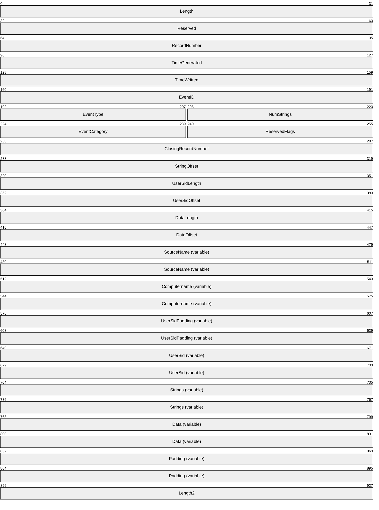

# [MS-EVEN]: EventLog Remoting Protocol

Table of Contents

1 Introduction

- [1 Introduction](#Section_1)
  - [1.1 Glossary](#Section_1.1)
  - [1.2 References](#Section_1.2)
    - [1.2.1 Normative References](#Section_1.2.1)
    - [1.2.2 Informative References](#Section_1.2.2)
  - [1.3 Overview](#Section_1.3)
    - [1.3.1 Background](#Section_1.3.1)
    - [1.3.2 EventLog Remoting Protocol](#Section_1.3.2)
    - [1.3.3 Localizable Human-Readable Event Descriptions and Other Strings](#Section_1.3.3)
  - [1.4 Relationship to Other Protocols](#Section_1.4)
  - [1.5 Prerequisites/Preconditions](#Section_1.5)
    - [1.5.1 Server Requirements to Enable Remote Description String Rendering](#Section_1.5.1)
  - [1.6 Applicability Statement](#Section_1.6)
  - [1.7 Versioning and Capability Negotiation](#Section_1.7)
  - [1.8 Vendor-Extensible Fields](#Section_1.8)
    - [1.8.1 Error Values](#Section_1.8.1)
    - [1.8.2 Event Log Names](#Section_1.8.2)
    - [1.8.3 Event Source Names](#Section_1.8.3)
    - [1.8.4 EventIDs](#Section_1.8.4)
    - [1.8.5 Event Categories](#Section_1.8.5)
  - [1.9 Standards Assignments](#Section_1.9)

2 Messages

- [2 Messages](#Section_2)
  - [2.1 Transport](#Section_2.1)
    - [2.1.1 Server](#Section_2.1.1)
    - [2.1.2 Client](#Section_2.1.2)
  - [2.2 Common Data Types](#Section_2.2)
    - [2.2.1 RULONG](#Section_2.2.1)
    - [2.2.2 EventType](#Section_2.2.2)
    - [2.2.3 EVENTLOGRECORD](#Section_2.2.3)
    - [2.2.4 EVENTLOG_FULL_INFORMATION](#Section_2.2.4)
      - [2.2.4.1 NT Object Path](#Section_2.2.4.1)
    - [2.2.5 RPC_SID](#Section_2.2.5)
    - [2.2.6 IELF_HANDLE](#Section_2.2.6)
    - [2.2.7 EVENTLOG_HANDLE_A and EVENTLOG_HANDLE_W](#Section_2.2.7)
    - [2.2.8 RPC_CLIENT_ID](#Section_2.2.8)
    - [2.2.9 Constants Used in Method Definitions](#Section_2.2.9)
    - [2.2.10 Unicode Versus ANSI String Representations](#Section_2.2.10)
    - [2.2.11 RPC_UNICODE_STRING](#Section_2.2.11)
    - [2.2.12 RPC_STRING](#Section_2.2.12)

3 Protocol Details

- [3 Protocol Details](#Section_3)
  - [3.1 Server Details](#Section_3.1)
    - [3.1.1 Abstract Data Model](#Section_3.1.1)
      - [3.1.1.1 Event Log Records](#Section_3.1.1.1)
      - [3.1.1.2 Event Logs](#Section_3.1.1.2)
      - [3.1.1.3 Event Sources](#Section_3.1.1.3)
      - [3.1.1.4 EventID](#Section_3.1.1.4)
      - [3.1.1.5 Context Handles](#Section_3.1.1.5)
    - [3.1.2 Timers](#Section_3.1.2)
    - [3.1.3 Initialization](#Section_3.1.3)
    - [3.1.4 Message Processing Events and Sequencing Rules](#Section_3.1.4)
      - [3.1.4.1 ElfrOpenBELW (Opnum 9)](#Section_3.1.4.1)
      - [3.1.4.2 ElfrOpenBELA (Opnum 16)](#Section_3.1.4.2)
      - [3.1.4.3 ElfrOpenELW (Opnum 7)](#Section_3.1.4.3)
      - [3.1.4.4 ElfrOpenELA (Opnum 14)](#Section_3.1.4.4)
      - [3.1.4.5 ElfrRegisterEventSourceW (Opnum 8)](#Section_3.1.4.5)
      - [3.1.4.6 ElfrRegisterEventSourceA (Opnum 15)](#Section_3.1.4.6)
      - [3.1.4.7 ElfrReadELW (Opnum 10)](#Section_3.1.4.7)
      - [3.1.4.8 ElfrReadELA (Opnum 17)](#Section_3.1.4.8)
      - [3.1.4.9 ElfrClearELFW (Opnum 0)](#Section_3.1.4.9)
      - [3.1.4.10 ElfrClearELFA (Opnum 12)](#Section_3.1.4.10)
      - [3.1.4.11 ElfrBackupELFW (Opnum 1)](#Section_3.1.4.11)
      - [3.1.4.12 ElfrBackupELFA (Opnum 13)](#Section_3.1.4.12)
      - [3.1.4.13 ElfrReportEventW (Opnum 11)](#Section_3.1.4.13)
      - [3.1.4.14 ElfrReportEventA (Opnum 18)](#Section_3.1.4.14)
      - [3.1.4.15 ElfrReportEventAndSourceW (Opnum 24)](#Section_3.1.4.15)
      - [3.1.4.16 ElfrReportEventExW (Opnum 25)](#Section_3.1.4.16)
      - [3.1.4.17 ElfrReportEventExA (Opnum 26)](#Section_3.1.4.17)
      - [3.1.4.18 ElfrNumberOfRecords (Opnum 4)](#Section_3.1.4.18)
      - [3.1.4.19 ElfrOldestRecord (Opnum 5)](#Section_3.1.4.19)
      - [3.1.4.20 ElfrGetLogInformation (Opnum 22)](#Section_3.1.4.20)
      - [3.1.4.21 ElfrCloseEL (Opnum 2)](#Section_3.1.4.21)
      - [3.1.4.22 ElfrDeregisterEventSource (Opnum 3)](#Section_3.1.4.22)
      - [3.1.4.23 ElfrChangeNotify (Opnum 6)](#Section_3.1.4.23)
    - [3.1.5 Timer Events](#Section_3.1.5)
    - [3.1.6 Other Local Events](#Section_3.1.6)
    - [3.1.7 Server Configurations for Localizable Event Descriptions](#Section_3.1.7)
  - [3.2 Client Details](#Section_3.2)
    - [3.2.1 Abstract Data Model](#Section_3.2.1)
    - [3.2.2 Timers](#Section_3.2.2)
    - [3.2.3 Initialization](#Section_3.2.3)
    - [3.2.4 Message Processing Events and Sequencing Rules](#Section_3.2.4)
      - [3.2.4.1 Client Processing of Event Descriptions and Other Localizable Strings](#Section_3.2.4.1)
        - [3.2.4.1.1 Loading Event Log Description Information](#Section_3.2.4.1.1)
        - [3.2.4.1.2 Retrieving Event Parameter Strings](#Section_3.2.4.1.2)
        - [3.2.4.1.3 Retrieving Event Category Strings](#Section_3.2.4.1.3)
        - [3.2.4.1.4 Retrieving Unexpanded Event Description Strings](#Section_3.2.4.1.4)
        - [3.2.4.1.5 Expanding Unexpanded Event Description Strings](#Section_3.2.4.1.5)
          - [3.2.4.1.5.1 Inserting EVENTLOGRECORD Strings](#Section_3.2.4.1.5.1)
          - [3.2.4.1.5.2 Inserting Parameter Strings](#Section_3.2.4.1.5.2)
          - [3.2.4.1.5.3 Inserting SIDs and GUIDs](#Section_3.2.4.1.5.3)
          - [3.2.4.1.5.4 Expanding Environment Variables](#Section_3.2.4.1.5.4)
    - [3.2.5 Timer Events](#Section_3.2.5)
    - [3.2.6 Other Local Events](#Section_3.2.6)

4 Protocol Examples

- [4 Protocol Examples](#Section_4)
  - [4.1 Obtain Records Stored in an Event Log](#Section_4.1)
  - [4.2 Write Events to an Event Log](#Section_4.2)
  - [4.3 Back Up the Event Log](#Section_4.3)
  - [4.4 Expanding Unexpanded Event Description Strings](#Section_4.4)

5 Security

- [5 Security](#Section_5)
  - [5.1 Security Considerations for Implementers](#Section_5.1)
  - [5.2 Index of Security Parameters](#Section_5.2)

6 Appendix A: Full IDL

- [6 Appendix A: Full IDL](#Section_6)

7 Appendix B: Product Behavior

- [7 Appendix B: Product Behavior](#Section_7)

8 Change Tracking

- [8 Change Tracking](#Section_8)

For the legal notice and IP terms, see [LEGAL.md](../LEGAL.md).
Last updated: 4/23/2024.
See [Revision History](#revision-history) for full version history.

# 1 Introduction

The EventLog Remoting Protocol is an [**RPC**](#gt_remote-procedure-call-rpc)-based protocol that exposes remote procedure call (RPC) methods for reading events in both [**live event logs**](#gt_live-event-log) and [**backup event logs**](#gt_backup-event-log) on remote computers. The protocol also specifies how to get general information on a log, such as the number of records in the log, the oldest records in the log, and if the log is full. The protocol can also be used for clearing and backing up both types of [**event logs**](#gt_event-log).

**Note** Early releases of the EventLog Remoting Protocol have never been assigned a version number. However, newer releases of the EventLog Remoting Protocol have version numbers. For example, the version released with Windows Vista operating system is version 6.0.

Sections 1.5, 1.8, 1.9, 2, and 3 of this specification are normative. All other sections and examples in this specification are informative.

## 1.1 Glossary

This document uses the following terms:

**access control list (ACL)**: A list of access control entries (ACEs) that collectively describe the security rules for authorizing access to some resource; for example, an object or set of objects.

**backup event log**: An [**event log**](#gt_event-log) that cannot be written to, only read from. [**Backup event logs**](#gt_backup-event-log) are typically used for archival purposes, or for copying to another computer for use by support personnel.

**category**: A grouping of rows in a Table object that all have the same value for a specified property.

**category message file**: A binary resource file defining [**category strings**](#gt_category-string) for [**event categories**](#gt_event-category).

**category string**: A [**localizable**](#gt_localizable) human-readable string corresponding to the [**event category**](#gt_event-category) of a [**record**](#gt_record).

**event**: A discrete unit of historical data that an application exposes that may be relevant to other applications. An example of an event would be a particular user logging on to the computer.

**event category**: An application-specific value used for grouping [**events**](#gt_event). For example, an application might use one category for all [**events**](#gt_event) that occur during startup, and use another category for [**events**](#gt_event) that occur during shutdown. Other applications might use categories to identify the part of the application that raised the [**event**](#gt_event).

**event description string**: A [**localizable**](#gt_localizable) human-readable string corresponding to the [**record**](#gt_record).

**event log**: A collection of records, each of which corresponds to an event.

**event message file**: A binary resource file defining [**unexpanded description strings**](#gt_unexpanded-description-string) for an [**event source**](#gt_event-source).

**event source**: An application or component that writes to an [**event log**](#gt_event-log).

**EventID**: An integer indicating the type of [**event**](#gt_event). For example, a user logging on to the computer could be one type of [**event**](#gt_event) while a user logging off would be another type; and these [**events**](#gt_event) could be indicated by using distinct [**EventIDs**](#gt_eventid).

**fully qualified domain name (FQDN)**: An unambiguous domain name that gives an absolute location in the Domain Name System's (DNS) hierarchy tree, as defined in [[RFC1035]](https://go.microsoft.com/fwlink/?LinkId=90264) section 3.1 and [[RFC2181]](https://go.microsoft.com/fwlink/?LinkId=127732) section 11.

**globally unique identifier (GUID)**: A term used interchangeably with [**universally unique identifier (UUID)**](#gt_universally-unique-identifier-uuid) in Microsoft protocol technical documents (TDs). Interchanging the usage of these terms does not imply or require a specific algorithm or mechanism to generate the value. Specifically, the use of this term does not imply or require that the algorithms described in [[RFC4122]](https://go.microsoft.com/fwlink/?LinkId=90460) or [[C706]](https://go.microsoft.com/fwlink/?LinkId=89824) must be used for generating the [**GUID**](#gt_globally-unique-identifier-guid). See also [**universally unique identifier (UUID)**](#gt_universally-unique-identifier-uuid).

**live event log**: An [**event log**](#gt_event-log) that can be written to and read from.

**localizable**: A condition of a data value or element that allows it to be modified, translated, or output for different languages or regional formats.

**named pipe**: A named, one-way, or duplex pipe for communication between a pipe server and one or more pipe clients.

**Network Data Representation (NDR)**: A specification that defines a mapping from Interface Definition Language (IDL) data types onto octet streams. [**NDR**](#gt_network-data-representation-ndr) also refers to the runtime environment that implements the mapping facilities (for example, data provided to [**NDR**](#gt_network-data-representation-ndr)). For more information, see [MS-RPCE](../MS-RPCE/MS-RPCE.md) and [C706] section 14.

**opnum**: An operation number or numeric identifier that is used to identify a specific [**remote procedure call (RPC)**](#gt_remote-procedure-call-rpc) method or a method in an interface. For more information, see [C706] section 12.5.2.12 or [MS-RPCE].

**parameter message file**: A binary resource file that defines [**parameter strings**](#gt_parameter-string) for an [**event source**](#gt_event-source).

**parameter string**: A [**localizable**](#gt_localizable) human-readable string inserted into an [**event description string**](#gt_event-description-string) using the string rendering algorithm defined in section 3.2.4.1.5.2.

**record**: The data structure that contains an [**event**](#gt_event) that is currently represented in an [**event log**](#gt_event-log).

**record ID**: An unsigned int64 numeric value. The record ID is the identifier of the [**records**](#gt_record) in the [**event log**](#gt_event-log) file.

**registry**: A local system-defined database in which applications and system components store and retrieve configuration data. It is a hierarchical data store with lightly typed elements that are logically stored in tree format. Applications use the registry API to retrieve, modify, or delete registry data. The data stored in the registry varies according to the version of the operating system.

**registry key or registry subkey**: A node in the logical tree of the Windows [**registry**](#gt_registry) data store. For more information, see [[MSWINREG]](https://go.microsoft.com/fwlink/?LinkId=90221). The term subkey specifies that a key has a parent in the logical tree; for example, "A is a subkey of B".

**remote procedure call (RPC)**: A communication protocol used primarily between client and server. The term has three definitions that are often used interchangeably: a runtime environment providing for communication facilities between computers (the RPC runtime); a set of request-and-response message exchanges between computers (the RPC exchange); and the single message from an RPC exchange (the RPC message). For more information, see [C706].

**RPC protocol sequence**: A character string that represents a valid combination of a [**remote procedure call (RPC)**](#gt_remote-procedure-call-rpc) protocol, a network layer protocol, and a transport layer protocol, as described in [C706] and [MS-RPCE].

**synchronization object**: A data structure that is used to synchronize client requests to prevent data corruption from the execution of multiple threads. In Windows-based servers, the CRITICAL_SECTION object (as described in [[MSDN-CSO]](https://go.microsoft.com/fwlink/?LinkId=202484)) is used as the synchronization object.

**unexpanded description string**: A [**localizable**](#gt_localizable) string containing replaceable insertion patterns that are expanded by using a string-rendering algorithm, defined in section 3.2.4.1.5, to produce an [**event description string**](#gt_event-description-string).

**Unicode**: A character encoding standard developed by the Unicode Consortium that represents almost all of the written languages of the world. The [**Unicode**](#gt_unicode) standard [[UNICODE5.0.0/2007]](https://go.microsoft.com/fwlink/?LinkId=154659) provides three forms (UTF-8, UTF-16, and UTF-32) and seven schemes (UTF-8, UTF-16, UTF-16 BE, UTF-16 LE, UTF-32, UTF-32 LE, and UTF-32 BE).

**Universal Naming Convention (UNC)**: A string format that specifies the location of a resource. For more information, see [MS-DTYP](../MS-DTYP/MS-DTYP.md) section 2.2.57.

**universally unique identifier (UUID)**: A 128-bit value. UUIDs can be used for multiple purposes, from tagging objects with an extremely short lifetime, to reliably identifying very persistent objects in cross-process communication such as client and server interfaces, manager entry-point vectors, and [**RPC**](#gt_remote-procedure-call-rpc) objects. UUIDs are highly likely to be unique. UUIDs are also known as [**globally unique identifiers (GUIDs)**](#gt_globally-unique-identifier-guid) and these terms are used interchangeably in the Microsoft protocol technical documents (TDs). Interchanging the usage of these terms does not imply or require a specific algorithm or mechanism to generate the UUID. Specifically, the use of this term does not imply or require that the algorithms described in [RFC4122] or [C706] must be used for generating the UUID.

**well-known endpoint**: A preassigned, network-specific, stable address for a particular client/server instance. For more information, see [C706].

**MAY, SHOULD, MUST, SHOULD NOT, MUST NOT:** These terms (in all caps) are used as defined in [[RFC2119]](https://go.microsoft.com/fwlink/?LinkId=90317). All statements of optional behavior use either MAY, SHOULD, or SHOULD NOT.

## 1.2 References

Links to a document in the Microsoft Open Specifications library point to the correct section in the most recently published version of the referenced document. However, because individual documents in the library are not updated at the same time, the section numbers in the documents may not match. You can confirm the correct section numbering by checking the [Errata](https://go.microsoft.com/fwlink/?linkid=850906).

### 1.2.1 Normative References

We conduct frequent surveys of the normative references to assure their continued availability. If you have any issue with finding a normative reference, please contact [dochelp@microsoft.com](mailto:dochelp@microsoft.com). We will assist you in finding the relevant information.

[C706] The Open Group, "DCE 1.1: Remote Procedure Call", C706, August 1997, [https://publications.opengroup.org/c706](https://go.microsoft.com/fwlink/?LinkId=89824)

**Note** Registration is required to download the document.

[ISO/IEC-8859-1] International Organization for Standardization, "Information Technology -- 8-Bit Single-Byte Coded Graphic Character Sets -- Part 1: Latin Alphabet No. 1", ISO/IEC 8859-1, 1998, [http://www.iso.org/iso/home/store/catalogue_tc/catalogue_detail.htm?csnumber=28245](https://go.microsoft.com/fwlink/?LinkId=90689)

**Note** There is a charge to download the specification.

[LDAP] Microsoft Corporation, "About Lightweight Directory Access Protocol", [http://msdn.microsoft.com/en-us/library/aa366075.aspx](https://go.microsoft.com/fwlink/?LinkId=89932)

[MS-ADTS] Microsoft Corporation, "[Active Directory Technical Specification](../MS-ADTS/MS-ADTS.md)".

[MS-DTYP] Microsoft Corporation, "[Windows Data Types](../MS-DTYP/MS-DTYP.md)".

[MS-EERR] Microsoft Corporation, "[ExtendedError Remote Data Structure](../MS-EERR/MS-EERR.md)".

[MS-ERREF] Microsoft Corporation, "[Windows Error Codes](../MS-ERREF/MS-ERREF.md)".

[MS-EVEN6] Microsoft Corporation, "[EventLog Remoting Protocol Version 6.0](#Section_1.3.2)".

[MS-LCID] Microsoft Corporation, "[Windows Language Code Identifier (LCID) Reference](../MS-LCID/MS-LCID.md)".

[MS-LSAD] Microsoft Corporation, "[Local Security Authority (Domain Policy) Remote Protocol](#Section_5)".

[MS-LSAT] Microsoft Corporation, "[Local Security Authority (Translation Methods) Remote Protocol](#Section_5)".

[MS-RPCE] Microsoft Corporation, "[Remote Procedure Call Protocol Extensions](../MS-RPCE/MS-RPCE.md)".

[MS-RRP] Microsoft Corporation, "[Windows Remote Registry Protocol](../MS-RRP/MS-RRP.md)".

[MS-SMB] Microsoft Corporation, "[Server Message Block (SMB) Protocol](../MS-SMB/MS-SMB.md)".

[RFC2119] Bradner, S., "Key words for use in RFCs to Indicate Requirement Levels", BCP 14, RFC 2119, March 1997, [https://www.rfc-editor.org/info/rfc2119](https://go.microsoft.com/fwlink/?LinkId=90317)

[RFC2251] Wahl, M., Howes, T., and Kille, S., "Lightweight Directory Access Protocol (v3)", RFC 2251, December 1997, [https://www.rfc-editor.org/info/rfc2251](https://go.microsoft.com/fwlink/?LinkId=90325)

[UNICODE] The Unicode Consortium, "The Unicode Consortium Home Page", [http://www.unicode.org/](https://go.microsoft.com/fwlink/?LinkId=90550)

[XML] World Wide Web Consortium, "Extensible Markup Language (XML) 1.0 (Fourth Edition)", W3C Recommendation 16 August 2006, edited in place 29 September 2006, [http://www.w3.org/TR/2006/REC-xml-20060816/](https://go.microsoft.com/fwlink/?LinkId=90598)

### 1.2.2 Informative References

[MSDN-ANSI] Microsoft Corporation, "Unicode and Character Sets", [http://msdn.microsoft.com/en-us/library/dd374083.aspx](https://go.microsoft.com/fwlink/?LinkId=89952)

[MSDN-CH] Microsoft Corporation, "Context Handles", [http://msdn.microsoft.com/en-us/library/aa373605(VS.85).aspx](https://go.microsoft.com/fwlink/?LinkId=195280)

[MSDN-CNVTSTRGSDTSD] Microsoft Corporation, "ConvertStringSecurityDescriptorToSecurityDescriptor function", [http://msdn.microsoft.com/en-us/library/aa376401(VS.85).aspx](https://go.microsoft.com/fwlink/?LinkId=202883)

[MSDN-ConvertStringSidToSid] Microsoft Corporation, "ConvertStringSidToSid function", [http://msdn.microsoft.com/en-us/library/aa376402(v=VS.85).aspx](https://go.microsoft.com/fwlink/?LinkId=204164)

[MSDN-EVENTS] Microsoft Corporation, "Event Schema", [http://msdn.microsoft.com/en-us/library/aa385201.aspx](https://go.microsoft.com/fwlink/?LinkId=90000)

[MSDN-IsValidSid] Microsoft Corporation, "IsValidSid function", [http://msdn.microsoft.com/en-us/library/aa379151(VS.85).aspx](https://go.microsoft.com/fwlink/?LinkId=200696)

[MSDN-PreciseSysTme] Microsoft Corporation, "GetSystemTimePreciseAsFileTime function", [https://msdn.microsoft.com/en-us/library/windows/desktop/hh706895(v=vs.85).aspx](https://go.microsoft.com/fwlink/?LinkId=626588)

[MSDN-TRANS] Microsoft Corporation, "Translation Between String Types", [http://msdn.microsoft.com/en-us/library/ms776433.aspx](https://go.microsoft.com/fwlink/?LinkId=90145)

[MSFT-CVE-2021-31958] Microsoft Corporation, "Windows NTLM Elevation of Privilege Vulnerability", CVE-2021-31958, June 8, 2021, [https://msrc.microsoft.com/update-guide/en-US/vulnerability/CVE-2021-31958](https://go.microsoft.com/fwlink/?linkid=2165320)

[PE-COFF] Microsoft Corporation, "Microsoft Portable Executable and Common Object File Format Specification", May2006, [https://github.com/tpn/pdfs/blob/master/Microsoft%20Portable%20Executable%20and%20Common%20Object%20File%20Format%20Specification%20-%201999%20(pecoff).pdf](https://go.microsoft.com/fwlink/?LinkId=93292)

## 1.3 Overview

### 1.3.1 Background

[**Event logs**](#gt_event-log) allow applications or the operating system to store historical information that might be of interest to administrators. The information is organized as a sequential set of [**records**](#gt_record) , which are referred to as [**events**](#gt_event). An example of an event would be a specific user logging on to the computer. Once a record is written, it becomes an event and is treated as a read-only item, and is never updated again.

The events represented in an event log are referred to as records. Records are composed of fields and are numbered uniquely by one of the fields; that is, the first event has its record number set to 1, the second event has its record number set to 2, and so forth. Logs can be configured to be circular. A circular log is one in which the oldest records are overwritten after the log reaches its maximum size.

A computer can have several event logs. One log might be devoted to security events while another might be for general application use.

Applications or components that write to event logs are known as [**event sources**](#gt_event-source). A single event log might contain events from many event sources. However, a particular event source can write to only a single log. That is, a component that writes to multiple event logs is considered for purposes of this specification to be multiple event sources, with one event source per event log.

Event sources write several kinds of events. For example, a user logging on to the computer could be one kind of event, and a user logging off would be another kind of event. When an event source writes an event, it specifies an [**EventID**](#gt_eventid) that indicates what specific kind of event is being written. This EventID is reused whenever another event of this same type is written in the future. An event can optionally contain an [**event category**](#gt_event-category), which commonly expresses an application-specific value that is used for grouping events.

An event log can be either a [**live event log**](#gt_live-event-log) or a [**backup event log**](#gt_backup-event-log). A live event log is one that is currently in use and thus can be used for both reading and writing. It can be used to create a backup event log, which is a read-only snapshot of a live event log. Backup event logs are often used for archival purposes or for copying a backup event log from one computer to another for use by support personnel.

### 1.3.2 EventLog Remoting Protocol

The EventLog Remoting Protocol provides a way to access [**event logs**](#gt_event-log) on remote computers.

For both [**live event logs**](#gt_live-event-log) and [**backup event logs**](#gt_backup-event-log), the protocol exposes [**RPC**](#gt_remote-procedure-call-rpc) (as specified in [MS-RPCE](../MS-RPCE/MS-RPCE.md)) methods for reading [**events**](#gt_event) and for getting general information on the log (such as the number of [**records**](#gt_record) in the log, the oldest records in the log, and whether the log is full), and therefore can no longer accept additional events.

For live logs only, the protocol also exposes RPC methods for writing events, clearing logs, and creating backup logs.

The protocol does not provide any methods for configuring either event logs or [**event sources**](#gt_event-source).

The protocol sequencing model is as follows: The client performs an Open operation, issues other requests, and finally performs a Close operation.

For methods used by this protocol, see section [3.1.4](#Section_2.1.1).

### 1.3.3 Localizable Human-Readable Event Descriptions and Other Strings

Implementations in applicable Windows Server releases are structured in such a way that [**event logs**](#gt_event-log) are language-neutral, and the [**localizable**](#gt_localizable) description strings are built from strings loaded from resource files. In this way, different users can view the same event log in their language of choice. The Windows client implementation (Windows Event Viewer) uses a series of algorithms and heuristics to derive localizable event log names, [**event description strings**](#gt_event-description-string), and [**event category**](#gt_event-category) strings from the event record as expressed by the [EVENTLOGRECORD](#Section_2.2.3) structure.

See section [3.2.4.1](#Section_3.2.4.1).

## 1.4 Relationship to Other Protocols

The EventLog Remoting Protocol depends on [**RPC**](#gt_remote-procedure-call-rpc) (as specified in [MS-RPCE](../MS-RPCE/MS-RPCE.md)) for message transport. When RPC is used by the Eventlog Remoting Protocol, RPC uses [**named pipes**](#gt_named-pipe) as its transport mechanism, which in turn rely on the Server Message Block (SMB) Protocol, as specified in [MS-SMB](../MS-SMB/MS-SMB.md).

The EventLog Remoting Protocol is often used in conjunction with the Windows Remote Registry Protocol, as specified in [MS-RRP](../MS-RRP/MS-RRP.md). This is because several aspects of the [**event log**](#gt_event-log) are not configured through the EventLog Remoting Protocol; rather, they are configured by modifying the [**registry**](#gt_registry).

The EventLog Remoting Protocol Version 6.0, specified in [MS-EVEN6](#Section_1.3.2), is a replacement for this protocol.

## 1.5 Prerequisites/Preconditions

The EventLog Remoting Protocol has the prerequisites, as specified in [MS-RPCE](../MS-RPCE/MS-RPCE.md), as being common to protocols depending on [**RPC**](#gt_remote-procedure-call-rpc).

A prerequisite for the successful use of the methods defined by this protocol is that the caller has appropriate read/write permissions for the resources held on the server, as specified in section [3.1.4](#Section_2.1.1).

### 1.5.1 Server Requirements to Enable Remote Description String Rendering

Requirements for enabling rendering of remote description strings follow:

- The server MUST support the Windows Remote Registry Protocol, as specified in [MS-RRP](../MS-RRP/MS-RRP.md). The remote client MUST have read access to the server's remote [**registry**](#gt_registry).
- The server MUST implement the 'Server' role of the Server Message Block (SMB) Protocol, as specified in [MS-SMB](../MS-SMB/MS-SMB.md), and share the appropriate "$" shares (for example, "\\server\C$") for reading, so that the remote client can access the message files.

## 1.6 Applicability Statement

The EventLog Remoting Protocol<1> is used for accessing [**event logs**](#gt_event-log), which can be used for many different purposes; for example, recording local security events or recording application start/stop events.

## 1.7 Versioning and Capability Negotiation

This specification covers versioning issues in the following area:

- Protocol Version: The [**RPC**](#gt_remote-procedure-call-rpc) interface for this protocol has its own version number. Each specific version of the protocol requires one specific version of the RPC interface (for more information, see section [2.1.1](#Section_2.1.1)). This protocol can be extended by adding RPC messages to the interface with [**opnums**](#gt_opnum) higher than those defined in this specification. An RPC client determines whether such methods are supported by attempting to invoke the method; if the method is not supported, the RPC runtime returns an "opnum out of range" error, as specified in [[C706]](https://go.microsoft.com/fwlink/?LinkId=89824) and [MS-RPCE](../MS-RPCE/MS-RPCE.md). RPC versioning and capacity negotiation in this situation is as specified in [C706] and [MS-RPCE].

## 1.8 Vendor-Extensible Fields

There are five vendor-extensible fields relevant to the EventLog Remoting Protocol.

### 1.8.1 Error Values

Any nonzero return value can represent an error. Vendors SHOULD use the values from the NTSTATUS number space, as specified in [MS-EERR](../MS-EERR/MS-EERR.md).

The EventLog Remoting Protocol uses NTSTATUS values, as specified in [MS-ERREF](../MS-ERREF/MS-ERREF.md) section 2.3.Vendors SHOULD use these values with their indicated meanings.<2>Vendors are free to choose their own values for this field as long as the C bit (0x20000000) is set, indicating that it is a customer code.

### 1.8.2 Event Log Names

Each [**event log**](#gt_event-log) has a name that is a [**Unicode**](#gt_unicode) string. The EventLog Remoting Protocol supports both Unicode, as specified in [MS-DTYP](../MS-DTYP/MS-DTYP.md), and ANSI strings. In this specification, ANSI strings refer to multi-byte strings in which the encoding is controlled by the current system code page. One of the most common code pages is ANSI Latin-1, as specified in [[ISO/IEC-8859-1]](https://go.microsoft.com/fwlink/?LinkId=90689). More information about the use of Unicode and ANSI strings in the EventLog Remoting Protocol is specified in section [2.2.10](../MS-DTYP/MS-DTYP.md). This name MUST be unique across all event logs on the same server. Event log names SHOULD<3> be prefixed with the name of the entity that created the event log to avoid collisions.

### 1.8.3 Event Source Names

Each [**event source**](#gt_event-source) also has a name that is a [**Unicode**](#gt_unicode) string. This name MUST be unique across all event sources on the same server. An event source name typically identifies the software product to which a given event applies. Event source names SHOULD<4> be prefixed with a unique value (such as the name of the entity that created the event source) to avoid collisions.

### 1.8.4 EventIDs

[**EventIDs**](#gt_eventid) are integers that are unique on a per-[**event source**](#gt_event-source) basis. The combination of an event source name and an EventID uniquely identifies a specific kind of event.

### 1.8.5 Event Categories

[**Event categories**](#gt_event-category) are integers that are unique on a per-[**event source**](#gt_event-source) basis. The combination of an event source name and an event category suffices to uniquely identify a class of events. Unlike [**EventIDs**](#gt_eventid), the use of the [**category**](#gt_category) is optional (defaulting to 0). Categories are used to group events into broader classes than can be done with EventIDs. For example, an application might use a category for all events that occur during startup, and use another category for events that occur during shutdown. Management applications might use categories to identify what part of the component raised the event.

## 1.9 Standards Assignments

The EventLog Remoting Protocol has no standards assignments, only private assignments made by Microsoft using allocation procedures specified in other protocols.

Microsoft has allocated to this protocol an [**RPC**](#gt_remote-procedure-call-rpc) interface [**universally unique identifier (UUID)**](#gt_universally-unique-identifier-uuid) (using the procedure specified in [[C706]](https://go.microsoft.com/fwlink/?LinkId=89824)) and a [**named pipe**](#gt_named-pipe) (as specified in [MS-SMB](../MS-SMB/MS-SMB.md)). The assignments are as follows.

| Parameter | Value |
| --- | --- |
| RPC interface UUID | {82273FDC-E32A-18C3-3F78-827929DC23EA} |
| Named pipe | \PIPE\eventlog |

# 2 Messages

## 2.1 Transport

The EventLog Remoting Protocol uses [**RPC**](#gt_remote-procedure-call-rpc) as the primary transport protocol.

Client remote retrieval and expansion of event description, [**event category**](#gt_event-category), and [**parameter strings**](#gt_parameter-string) are done as specified in [MS-RRP](../MS-RRP/MS-RRP.md) and [MS-SMB](../MS-SMB/MS-SMB.md).

### 2.1.1 Server

The server [**RPC**](#gt_remote-procedure-call-rpc) interface is identified by [**UUID**](#gt_universally-unique-identifier-uuid) 82273FDC-E32A-18C3-3F78-827929DC23EA version 0.0, using the RPC [**well-known endpoint**](#gt_well-known-endpoint) \PIPE\eventlog. The server MUST specify RPC over [**named pipes**](#gt_named-pipe) (that is, ncacn_np) as the [**RPC protocol sequence**](#gt_rpc-protocol-sequence) to the RPC implementation, as specified in [MS-RPCE](../MS-RPCE/MS-RPCE.md). The server MUST specify the Simple and Protected GSS-API Negotiation Mechanism (SPNEGO) (0x9) or NT LAN Manager (NTLM) (0xA), or both, as the RPC Authentication Service (AS) (as specified in [MS-RPCE]). See [MS-RPCE] section 3.3.1.5.2.2 and [[C706]](https://go.microsoft.com/fwlink/?LinkId=89824) section 13.

The server MAY require the client connection to specify an authentication level of at least packet-level authentication (0x4), as specified in section 2.2.1.1.8 of [MS-RPCE]. The server SHOULD require the connection to use the packet-privacy authentication level (0x6).<5>

### 2.1.2 Client

The client MUST use [**RPC**](#gt_remote-procedure-call-rpc) over [**named pipes**](#gt_named-pipe) (that is, ncacn_np), as specified in [MS-RPCE](../MS-RPCE/MS-RPCE.md), as the [**RPC protocol sequence**](#gt_rpc-protocol-sequence) to communicate with the server. The client MUST specify either SPNEGO (0x9) or NTLM (0xA) (as specified in [MS-RPCE]) as the Authentication Service (AS).

The client MUST specify packet-level integrity authentication (0x5) or higher, as specified in [MS-RPCE] section 2.2.1.1.8.<6>

## 2.2 Common Data Types

In addition to [**RPC**](#gt_remote-procedure-call-rpc) base types, the sections that follow use the definitions of BOOL, FILETIME, GUID, SID, and ULONG, as specified in [MS-DTYP](../MS-DTYP/MS-DTYP.md).

### 2.2.1 RULONG

The RULONG type is used by the [ElfReadELW](#Section_3.1.4.7) and [ElfReadELA](#Section_3.1.4.8) methods to specify the value for the *NumberOfBytesToRead* parameter.

This type is declared as follows:

typedef [range(0, MAX_BATCH_BUFF)]

unsigned long RULONG;

### 2.2.2 EventType

The EventType <7> is a 16-bit field that MUST be one of the following values.

| Constant/value | Description |
| --- | --- |
| EVENTLOG_SUCCESS 0x0000 | An [**event**](#gt_event) that describes the successful operation of an application, driver, or service. For example, when a network driver loads successfully, it can be appropriate to log an Information event. It is generally inappropriate for a desktop application to log each time it starts. This is the same meaning conveyed by EVENTLOG_INFORMATION_TYPE. |
| EVENTLOG_ERROR_TYPE 0x0001 | An event that indicates a problem such as loss of data or loss of functionality. For example, if a service fails to load during startup, an Error event is logged. |
| EVENTLOG_WARNING_TYPE 0x0002 | An event that is not necessarily significant but could indicate a possible future problem. For example, when disk space is low, a Warning event is logged. If an application can recover from an event without loss of functionality or data, it can generally classify the event as a Warning event. |
| EVENTLOG_INFORMATION_TYPE 0x0004 | An event that describes the successful operation of an application, driver, or service. For example, when a network driver loads successfully, it can be appropriate to log an Information event. It is generally inappropriate for a desktop application to log each time it starts. This is the same meaning conveyed by EVENTLOG_SUCCESS. |
| EVENTLOG_AUDIT_SUCCESS 0x0008 | An event that records an audited security access attempt that is successful. For example, a user's successful attempt to log on to the system is logged as a Success Audit event. |
| EVENTLOG_AUDIT_FAILURE 0x0010 | An event that records an audited security access attempt that fails. For example, if a user tries to access a network drive and is denied access, the attempt is logged as a Failure Audit event. |

### 2.2.3 EVENTLOGRECORD

The EVENTLOGRECORD structure contains information on a single event. This structure is transferred as a set of bytes in the buffer passed in the [ElfrReadELW (section 3.1.4.7)](#Section_3.1.4.7) and [ElfrReadELA (section 3.1.4.8)](#Section_3.1.4.8) methods.

All integer fields in the EVENTLOGRECORD structure MUST be in little-endian byte order (that is, least significant byte first).

The string fields in this structure MUST be ANSI strings when this structure is used with ElfrReadELA (section 3.1.4.8) methods, and [**Unicode**](#gt_unicode) strings when this structure is used with ElfrReadELW (section 3.1.4.7) methods.

**Length (4 bytes):** Size in bytes of the structure. The size varies depending on the variable-length fields at the end of the structure.

**Reserved (4 bytes):** MUST be set to 0x654c664C (which is ASCII for eLfL). This serves as a signature for the structure.

**RecordNumber (4 bytes):** The record number, as defined in section [1.3.1](#Section_1.3.1). The **RecordNumber** is mapped directly from the [**record ID**](#gt_record-id). The record ID is an unsigned int64 (an 8 byte number) that the server reads from the file and converts to an unsigned integer (a 4 byte number) when assigning the value to the **RecordNumber** field in the **EVENTLOGRECORD** structure. The conversion simply discards the higher 32 bits of Record ID and assigns the lower 32 bits of record ID to the **RecordNumber**.

**TimeGenerated (4 bytes):** Time when the event was generated. The time MUST be expressed as the number of seconds since 00:00:00 on January 1, 1970 (UTC). This value is supplied by the [**event source**](#gt_event-source).

**TimeWritten (4 bytes):** Time when the event was written. The time MUST be expressed as the number of seconds since 00:00:00 on January 1, 1970 (UTC). This value is the time the event was written to the [**event log**](#gt_event-log).

**EventID (4 bytes):** [**EventID**](#gt_eventid) generated by the event source, as specified in section [1.8.4](#Section_1.8.4).

**EventType (2 bytes):** Type of the event, as specified in section 1.3.1.

**NumStrings (2 bytes):** Number of strings in the **Strings** field. This MUST be between 0 and 256, inclusive. A value of zero indicates that no strings are present.

**EventCategory (2 bytes):** [**Event category**](#gt_event-category), as specified in section [1.8.5](#Section_1.8.5).

**ReservedFlags (2 bytes):** Specifies whether or not the last string in the **Strings** field contains well-formed XML, as specified in [[XML]](https://go.microsoft.com/fwlink/?LinkId=90598). This MUST be one of the following two values.

| Value | Meaning |
| --- | --- |
| 0x0000 | The event does not contain XML. |
| 0x8000 | The event contains XML. |

**ClosingRecordNumber (4 bytes):** MUST be set to zero when sent and MUST be ignored on receipt.

**StringOffset (4 bytes):** This MUST be the offset in bytes from the beginning of the structure to the **Strings** field. If the **Strings** field is not present (NumStrings is zero), this can be set to any arbitrary value when sent and MUST be ignored on receipt by the client.

**UserSidLength (4 bytes):** Size in bytes of the user's security identifier, which is located within the **UserSid** field. If there is no **UserSid** field for this event, this field MUST be set to zero.

**UserSidOffset (4 bytes):** This MUST be the offset in bytes from the beginning of the structure to the **UserSid** field. If the **UserSid** field is not present (that is, if **UserSidLength** is zero), this can be set to any arbitrary value when sent and MUST be ignored by on receipt the client.

**DataLength (4 bytes):** This MUST be the size in bytes of the **Data** field. If the **Data** field is not used, this field MUST be set to zero.

**DataOffset (4 bytes):** This MUST be the offset in bytes from the beginning of the structure to the **Data** field. If the **Data** field is not present (that is, if **DataLength** is zero), this can be set to any arbitrary value when sent and MUST be ignored on receipt by the client.

**SourceName (variable):** Variable-length null-terminated string that specifies the name of the source that generated the event, as defined in section [1.8.2](#Section_1.8.2). The length of this field is calculated by seeking the NULL that terminates the string.

**Computername (variable):** Variable-length null-terminated string that assists in identifying the machine that generated the event. This string MUST NOT<8> be interpreted by the protocol, and can be in an arbitrary format.

In practice, the name of the computer. There are no character restrictions on this field's content (for example, a [**fully qualified domain name (FQDN)**](#gt_fully-qualified-domain-name-fqdn) can be used).

The length of this field is calculated by seeking the NULL that terminates the string.

**UserSidPadding (variable):** MUST be zero or more bytes of padding, where the choice of length is implementation dependent. The padding can have any value, and MUST be ignored on receipt.<9>

**UserSid (variable):** Current user's security identifier, as defined by the [RPC_SID](#Section_2.2.5) structure. This parameter can be NULL if the security identifier is not required.

**Strings (variable):** Zero or more null-terminated strings containing information on the event. The **NumStrings** field contains the number of items in this field.

**Data (variable):** Event-specific binary data. This is supplied by the event source, and MUST NOT be interpreted by the protocol. This data is not always present. The **DataLength** field contains the length of this field. The **DataOffset** field contains the start of this field.

**Padding (variable):** The **SourceName**, **ComputerName**, **UserSid**, **Strings**, and **Data** fields can all vary in length. The **UserSid**, **Strings**, and **Data** fields MAY be zero bytes in length. The length of the entire structure up to this point, including these fields, MUST be divisible by 4. Therefore, up to 3 bytes of padding MUST be added to bring the length to a multiple of 4. The padding can have any value, and MUST be ignored on receipt.

**Length2 (4 bytes):** Same value as the Length field specified as the first member. By having two copies, a buffer containing many events can easily be navigated in both directions.

### 2.2.4 EVENTLOG_FULL_INFORMATION

The EVENTLOG_FULL_INFORMATION structure is used by the [ElfrGetLogInformation (section 3.1.4.20)](#Section_3.1.4.20) method to indicate whether an [**event log**](#gt_event-log) is full or not.

typedef struct _EVENTLOG_FULL_INFORMATION {

unsigned long dwFull;

} EVENTLOG_FULL_INFORMATION;

**dwFull:** If the event log is not full, dwFull MUST be set to zero. If the event log is full, dwFull MUST be set to 1.

#### 2.2.4.1 NT Object Path

A string referred to as an NT Object Path is used by several methods to allow the specification of either a file path that is local to the server or a remote file path.

An NT Object Path string MUST begin with \??\. If the string begins with \??\UNC\, it MUST be interpreted by the server as a [**Universal Naming Convention (UNC)**](#gt_universal-naming-convention-unc) path after replacing the \??\UNC\ with \\. Otherwise, the remainder of the string MUST be interpreted by the server as a local file path in whichever file naming syntax is used by the server's local file system; all characters MUST be considered legal by the EventLog Remoting Protocol, as the string is simply to be passed to the underlying file system.

For example, if the NT Object Path is \??\UNC\wmiscratch\scratch\x.x, the server interprets it as indicating the UNC path \\wmiscratch\scratch\x.x. If the NT Object Path is instead \??\C:\scratch\x.x, the server interprets it as indicating the local file system path C:\scratch\x.x.

### 2.2.5 RPC_SID

The RPC_SID structure is used by methods that write [**events**](#gt_event).

typedef struct _RPC_SID {

unsigned char Revision;

unsigned char SubAuthorityCount;

RPC_SID_IDENTIFIER_AUTHORITY IdentifierAuthority;

[size_is(SubAuthorityCount)] unsigned long SubAuthority[*];

} RPC_SID,

*PRPC_SID;

**Revision:** This member is specified in [MS-DTYP](../MS-DTYP/MS-DTYP.md) section 2.4.2.

**SubAuthorityCount:** This member is specified in [MS-DTYP] section 2.4.2.

**IdentifierAuthority:** This member is specified in [MS-DTYP] section 2.4.2.

**SubAuthority:** This member is specified in [MS-DTYP] section 2.4.2.

The fields in this structure exactly correspond to the fields in the SID structure, which defines a security identifier (SID)—a variable-length byte array that uniquely identifies a security principal—as specified in [MS-DTYP] section 2.4.2.

### 2.2.6 IELF_HANDLE

The IELF_HANDLE type defines a context handle (as specified in [[C706]](https://go.microsoft.com/fwlink/?LinkId=89824)) to the target server.

typedef [context_handle] void* IELF_HANDLE;

typedef [context_handle] void** PIELF_HANDLE;

The detailed data type definitions are defined in section [3.1.1.5](#Section_3.1.1.5).

### 2.2.7 EVENTLOG_HANDLE_A and EVENTLOG_HANDLE_W

The [**event log**](#gt_event-log) remote interface on a particular server is referred to by a handle, which can be EVENTLOG_HANDLE_A or EVENTLOG_HANDLE_W. In the specific case of the event log remote interface, the handle is nothing more than the name of the server providing the interface. The name can be specified using either [**Unicode**](#gt_unicode) or ANSI, and the formats are:

typedef [handle, unique] wchar_t* EVENTLOG_HANDLE_W;

typedef [handle, unique] char* EVENTLOG_HANDLE_A;

Some of the EventLog Remoting Protocol methods (for more information, see section [3.1.4](#Section_2.1.1)) have an EVENTLOG_HANDLE_W or EVENTLOG_HANDLE_A as their first argument. In these methods, the client maps this string to an [**RPC**](#gt_remote-procedure-call-rpc) binding handle. The server ignores this argument. See [[C706]](https://go.microsoft.com/fwlink/?LinkId=89824) sections 4.3.5 and 5.1.5.2.

### 2.2.8 RPC_CLIENT_ID

The RPC_CLIENT_ID structure is used in the [ElfrChangeNotify (section 3.1.4.23)](#Section_3.1.4.23) method for local method invocations only.

typedef struct _RPC_CLIENT_ID {

unsigned long UniqueProcess;

unsigned long UniqueThread;

} RPC_CLIENT_ID,

*PRPC_CLIENT_ID;

**UniqueProcess:** A 32-bit unsigned integer. Ignored when ElfrChangeNotify (section 3.1.4.23) is invoked remotely.

**UniqueThread:** A 32-bit unsigned integer. Ignored when ElfrChangeNotify (section 3.1.4.23) is invoked remotely.

### 2.2.9 Constants Used in Method Definitions

The following constants are used in various methods.

| Constant/value | Description |
| --- | --- |
| MAX_STRINGS 0x00000100 | The maximum number of strings that a method accepts (typically in a *NumStrings* parameter). |
| MAX_SINGLE_EVENT 0x0003FFFF | The maximum data size that a method accepts for a single event (typically in a *DataSize* parameter). |
| MAX_BATCH_BUFF 0x0007FFFF | The maximum amount of data, in bytes, that can be read by a method (typically in a *NumberOfBytesToRead* parameter). |

### 2.2.10 Unicode Versus ANSI String Representations

The EventLog Remoting Protocol supports both [**Unicode**](#gt_unicode) and ANSI strings. In this specification, ANSI strings refer to multi-byte strings in which the encoding is controlled by the current system code page.

The server MUST support conversions between character sets. For example, one client might write events using ANSI (multi-byte) strings, and another client might read those same [**records**](#gt_record) as Unicode.<10> For how clients choose a character set, see section [3.1.4](#Section_2.1.1). The way in which a Unicode string is converted to or from an ANSI string is implementation specific. In the occasional case in which the server cannot convert from Unicode to ANSI, the operation MUST fail.

### 2.2.11 RPC_UNICODE_STRING

EventLog Remoting Protocol APIs use the RPC_UNICODE_STRING structure to specify a [**Unicode**](#gt_unicode) string parameter.

typedef struct {

unsigned short Length;

unsigned short MaximumLength;

[size_is(MaximumLength/2), length_is(Length / 2)]

WCHAR* Buffer;

} RPC_UNICODE_STRING,

*PRPC_UNICODE_STRING;

**Length:** The length, in bytes, of the string pointed to by the **Buffer** member, not including the terminating null character, if any. The length MUST be a multiple of 2. The length SHOULD equal the entire size of the **Buffer**, in which case there is no terminating null character. Any method that accesses this structure MUST use the **Length** that is specified, instead of relying on the presence or absence of a null character.

**MaximumLength:** The maximum size, in bytes, of the string pointed to by **Buffer**. The size MUST be a multiple of 2. If not, the size MUST be decremented by 1 prior to use. This value MUST not be less than **Length**.

**Buffer:** A pointer to a string buffer. If **MaximumLength** is greater than zero, the buffer MUST contain a non-null value.

### 2.2.12 RPC_STRING

EventLog Remoting Protocol APIs use the RPC_STRING to specify an ANSI string parameter.

typedef struct _RPC_STRING {

unsigned short Length;

unsigned short MaximumLength;

[size_is(MaximumLength)] char* Buffer;

} RPC_STRING,

*PRPC_STRING;

**Length:** The number of bytes (not the number of characters) in the string. This does not include the null terminator.

**MaximumLength:** If the string is the empty string, this MUST be set to zero. Otherwise, it MUST be the number of bytes in the string, including the null terminator (that is, it MUST be equal to the **Length** member plus 1).

**Buffer:** Either a pointer to a buffer containing a null-terminated non-empty ANSI string or NULL to indicate an empty string.

# 3 Protocol Details

The EventLog Remoting Protocol asks the [**RPC**](#gt_remote-procedure-call-rpc) runtimes at both the client and server to perform a strict [**Network Data Representation (NDR)**](#gt_network-data-representation-ndr) consistency check.<11>

## 3.1 Server Details

The [**event log**](#gt_event-log) server handles client requests for any of the methods, as specified in section [3.1.4](#Section_2.1.1), and operates on the logs and the configuration on the server. Any potential conflicts from the client will be handled correctly by the server's [**synchronization object**](#gt_synchronization-object). For example, if the client issues a clear request while the server is handling some backup operation for the same log at the same time, the clear request has to wait on the server's synchronization object before the backup operation finishes. After the backup is done, the synchronization object is released and the clear request is able to pass through it, so that the server will handle the clear operation.

### 3.1.1 Abstract Data Model

This section describes a conceptual model of possible data organization that an implementation maintains to participate in this protocol. The described organization is provided to explain how the protocol behaves. This specification does not mandate that implementations adhere to this model as long as their external behavior is consistent with what is described in this specification.

#### 3.1.1.1 Event Log Records

An [**event log**](#gt_event-log) [**record**](#gt_record) is the structure that represents an occurrence of an [**event**](#gt_event) in the system.

The event log record includes time, type, and [**category**](#gt_category) information, and corresponds to the [EVENTLOGRECORD (section 2.2.3)](#Section_2.2.3) structure.

#### 3.1.1.2 Event Logs

The log is a persistent store of [**event log**](#gt_event-log) [**records**](#gt_record). Event logs are of two types: [**live event logs**](#gt_live-event-log), which can be written to and read from, and [**backup event logs**](#gt_backup-event-log), which can only be read from. The backup logs are created using the methods that back up (or copy) a live log to a backup log.

The logs are registered by creating [**registry**](#gt_registry) entries. For how to create these entries, see [MS-RRP](../MS-RRP/MS-RRP.md). These registry entries will have to be added manually by the server administrator or by running registry scripts. This is because the methods described in section [3.1.4](#Section_2.1.1) never write information to the registry.

The client MUST NOT modify event log registry entries. The server MUST configure those event log registry entries. The server configures the log entries by adding a subkey under HKEY_LOCAL_MACHINE\system\currentcontrolset\services\eventlog that results in an event log. The name of the log is the same as the subkey. The log subkey also specifies log attributes such as its maximum size and its retention settings. The retention settings determine how the server handles [**events**](#gt_event) after the log reaches its maximum size. The retention can be set either to fail all new writes, or to start overwriting the oldest records. In the latter case, the log is treated as a circular log. The Eventlog Remoting Protocol does not support any [**RPC**](#gt_remote-procedure-call-rpc) methods for getting or setting the maximum event log size or its retention policy. For more information, see [[MSDN-EVENTS]](https://go.microsoft.com/fwlink/?LinkId=90000).

Each log can contain the following registry values.

| Registry value | Description |
| --- | --- |
| CustomSD | Restricts access to the event log. This value is of type REG_SZ. The format used is Security Descriptor Definition Language (SDDL) as specified in [MS-DTYP](../MS-DTYP/MS-DTYP.md) section 2.5.1. Construct an [**ACL**](#gt_access-control-list-acl), as specified in [MS-DTYP] section 2.4.5, that grants one or more of the following rights: Clear (0x0004) Read (0x0001) Write (0x0002) If CustomSD is set to a wrong value, an event is fired in the System event log when the event log service starts, and the event log gets a default security descriptor which is identical to the original CustomSD value for the application log.<12> |
| DisplayNameFile | The name of the file that stores the localized name of the event log. If this entry does not appear in the registry for an event log, the name of the [**registry subkey**](#gt_993d6f11-1895-4e26-8fe2-8ceeb669249e) is the log name. This value is of type REG_EXPAND_SZ. |
| DisplayNameID | The message identification number of the log name string. This number indicates the message in which the localized display name appears. The message is stored in the file specified by the DisplayNameFile value. This value is of type REG_DWORD. |
| File | This value defaults to "%SystemRoot%\system32\config\" followed by a file name that is based on the event log registry key name. If the File setting is set to an invalid value, the log will either not be initialized properly, or all requests will silently go to the default application log. |
| MaxSize | The maximum size, in bytes, of the log file. This value is of type REG_DWORD. The value is limited to 0xFFFFFFFF, and the default value is 512K. |
| PrimaryModule | This value is the name of the subkey that contains the default values for the entries in the subkey for the event source. This value is of type REG_SZ. |
| Retention | This value is of type REG_DWORD. This value is the time interval, in seconds, in which records of events are protected from being overwritten. When the age of an event reaches or exceeds this value, it can be overwritten. This value is used to configure the circular log. If the value is a nonzero value, the event log server cannot overwrite any record until the record's age passes that value. By default, this value is 0. |
| Sources | The names of the applications, services, or groups of applications that write events to this log. This value is only read and not altered. The event log service maintains the list based on each program listed in a subkey under the log. This value is of type REG_MULTI_SZ. |
| AutoBackupLogFiles | This value is of type REG_DWORD, Retention needs to be 0xFFFFFFFF for AutoBackupLogFiles to work, and it is ignored otherwise. When set to 0xFFFFFFFF, the event log file is closed as soon as it reaches the maximum size specified by the MaxSize property, and a new file is opened to accept new events. If the new file reaches maximum size, another new file will be generated and the previous new file will be backed up. The events in backup files cannot be queried directly in the server unless the client specifies the backup log file names in a separate query. When not set to 0xFFFFFFFF, there will be no backup. |
| RestrictGuestAccess | This value is of type REG_DWORD, and the default value is 1. When the value is set to 1, it restricts the Guest and Anonymous account access to the event log, and when this value is 0, it allows Guest account access to the event log. |

#### 3.1.1.3 Event Sources

The [**event source**](#gt_event-source) is intended to identify the software that reports the [**event**](#gt_event). It can be interpreted as the event provider. In the EventLog Remoting Protocol, the event source is specified as a string. The server maintains an association between event sources and logs. If a client attempts to register an event source that does not exist in the [**registry**](#gt_registry) under any of the [**event logs**](#gt_event-log), the event log service still allows the client to succeed and writes these events to the application event log, creating this log if it did not already exist.

When a client calls a method such as [ElfrRegisterEventSourceW](#Section_3.1.4.5) to get a handle for writing, the server uses that association to determine what log will receive any events subsequently published using that handle. The server stores the sources as the subkeys of the logs in the registries. The association is described in detail in the following sections.

By definition, an event source is only associated with one log in the system.

The event sources are created by servers before the client starts to use them. Event sources are created by creating subkeys in the registry. These subkeys are located under the keys used to define event logs (see section [3.1.1.2](#Section_3.1.1.2)). The name of the subkey is the name of the event source. For example, a log named Log1 would be defined by this key:

HKEY_LOCAL_MACHINE\

system\currentcontrolset\services\eventlog\Log1

If there were two sources for that log named source1 and source2, there would be the following two keys:

HKEY_LOCAL_MACHINE\

system\currentcontrolset\services\eventlog\Log1\source1

HKEY_LOCAL_MACHINE\

system\currentcontrolset\services\eventlog\Log1\source2

In addition, the name of the event source needs to be added to the REG_MULTI_SZ "Sources" value defined for the event log.

Each event source can contain the following registry values:

| Registry Value | Description |
| --- | --- |
| CategoryCount | Number of event categories supported. This value is of type REG_DWORD. |
| CategoryMessageFile | Path to the category message file. A category message file contains language-dependent strings that describe the categories. This value can be of type REG_SZ or REG_EXPAND_SZ. |
| EventMessageFile | Path to one or more event message files; use a semicolon to delimit multiple files. An event message file contains language-dependent strings that describe the events. This value can be of type REG_SZ or REG_EXPAND_SZ. |
| ParameterMessageFile | Path to the parameter message file. A parameter message file contains language-independent strings that are to be inserted into the event description strings. This value can be of type REG_SZ or REG_EXPAND_SZ. |
| TypesSupported | Bitmask of supported types. This value is of type REG_DWORD. It can be one or more of the following values: EVENTLOG_AUDIT_FAILURE (0x0010) EVENTLOG_AUDIT_SUCCESS (0x0008) EVENTLOG_ERROR_TYPE (0x0001) EVENTLOG_INFORMATION_TYPE (0x0002) EVENTLOG_WARNING_TYPE (0x0004) |

#### 3.1.1.4 EventID

The [**EventID**](#gt_eventid) identifies the specific kind of event; this classification is relative to the [**event source**](#gt_event-source) that logs it.<13>

#### 3.1.1.5 Context Handles

Clients obtain context handles for both reading and writing purposes. The methods for doing so are specified in section [3.1.4](#Section_2.1.1). The server MUST maintain a relationship between each particular handle and a particular log. For handles used for writing, the server MUST also maintain the name of the [**event source**](#gt_event-source) so that it can be injected into any events written using the handle. For handles used for reading, the server MUST maintain the position of the last read so that subsequent sequential mode reads can succeed. Server implementations define the following **context_handle** structure to maintain this information:

typedef [context_handle] struct _ELF_HANDLE {

ULONG Signature;

ULONG Flags;

unsigned __int64 LastRecordRead;

ULONG MajorVersion;

ULONG MinorVersion;

void* LogPublisher;

ULONG NameLength;

[size_is(NameLength)] WCHAR Name[];

} *IELF_HANDLE;

typdef IELF__HANDLE *PIELF_HANDLE;

**Signature:** A ULONG value that is always 0x654c6648 to indicate a valid handle.

**Flags:** This is used to distinguish the log handle type. A backup log handle or a normal log handle. The allowed flag values and their meanings are specified as follows.

- 0x00000001: This flag is used to specify that the handle is out of sync and that the reader needs to sync the latest content because some writing has occurred.
- 0x00000002: This flag is used to specify that the log file is opened for backup.
- 0x00000004: This flag is used to specify that the log handle is a remote handle.
- 0x00000008: The flag is used to specify that the [**event log**](#gt_event-log) read direction is forward.
**LastRecordRead:** The last [**record ID**](#gt_record-id) read by the event log server. The record ID is the identifier of event log [**records**](#gt_record) in the event log file. The server uses this value as the hint to get the next record when fetching the event records to the user.

**MajorVersion:** The major version number of this structure definition.

**MinorVersion:** The minor version number of this structure definition.

**LogPublisher:** The event provider object. This object is the internal representation of the event source.

**NameLength:** The length of the event log file name.

**Name:** The event log file name string.

Unless otherwise specified, all handles in section 3.1.4 and its subsections are context handles.

### 3.1.2 Timers

None.

### 3.1.3 Initialization

At initialization time, the EventLog Remoting Protocol server MUST register the [**RPC**](#gt_remote-procedure-call-rpc) interface and begin listening on the RPC [**well-known endpoint**](#gt_well-known-endpoint) that is specified in section [2.1](#Section_2.1). The server then MUST wait for client requests.

By default, events produced by unregistered event sources are sent to the application [**event log**](#gt_event-log). Therefore, the server creates a [**live event log**](#gt_live-event-log) with the name Application, if one does not already exist. If creation of the event log (with the name Application) fails, the EventLog Remoting Protocol server does not start.

### 3.1.4 Message Processing Events and Sequencing Rules

This section is an overview of the 21 [**RPC**](#gt_remote-procedure-call-rpc) methods used by the EventLog Remoting Protocol. With one exception, there are two versions of each method that have one or more strings in the argument list: One version takes [**Unicode**](#gt_unicode) strings as arguments (such methods are denoted by a 'W' at the end of the method, which is short for Wide), and one version takes ANSI strings as arguments (such methods are denoted by an 'A' at the end of the method, which is short for ANSI). ANSI strings are converted to Unicode strings at the server (as specified in section [2.2.10](#Section_2.2.10)) before being further interpreted at the server.

The names and [**opnums**](#gt_opnum) of each method are given below as well as a simple description of the method.

Methods in RPC Opnum Order

| Method | Description |
| --- | --- |
| [ElfrClearELFW](#Section_3.1.4.9) | Clears [**event logs**](#gt_event-log). Opnum: 0 |
| [ElfrBackupELFW](#Section_3.1.4.11) | Creates a backup of a [**live event log**](#gt_live-event-log). Opnum: 1 |
| [ElfrCloseEL](#Section_3.1.4.21) | Used to close context handles obtained by the [ElfrOpenELW](#Section_3.1.4.3) method, [ElfrOpenELA](#Section_3.1.4.4) method, [ElfrOpenBELW](#Section_3.1.4.1) method, or [ElfrOpenBELA](#Section_3.1.4.2) method. Opnum: 2 |
| [ElfrDeregisterEventSource](#Section_3.1.4.22) | Used to close context handles obtained by the [ElfrRegisterEventSourceW](#Section_3.1.4.5) method or the [ElfrRegisterEventSourceA](#Section_3.1.4.6) method. Opnum: 3 |
| [ElfrNumberOfRecords](#Section_3.1.4.18) | Obtains the number of records in an event log. Opnum: 4 |
| [ElfrOldestRecord](#Section_3.1.4.19) | Obtains the record number of the oldest record in an event log. Opnum: 5 |
| [ElfrChangeNotify](#Section_3.1.4.23) | Reserved for local use. Notifies local processes about changes to the event log. Opnum: 6 |
| ElfrOpenELW | Opens a handle to a live event log that can be used for reading or clearing. Opnum: 7 |
| ElfrRegisterEventSourceW | Opens a handle to a live event log that can be used for writing. Opnum: 8 |
| ElfrOpenBELW | Opens a handle to a previously backed up event log. The handle is used for reading. Opnum: 9 |
| [ElfrReadELW](#Section_3.1.4.7) | Reads one or more events from an event log. Opnum: 10 |
| [ElfrReportEventW](#Section_3.1.4.13) | Writes an event to an event log. Opnum: 11 |
| [ElfrClearELFA](#Section_3.1.4.10) | Clears an event log. Opnum: 12 |
| [ElfrBackupELFA](#Section_3.1.4.12) | Creates a backup of a live event log. Opnum: 13 |
| ElfrOpenELA | Opens a handle to a live event log that can be used for reading or clearing. Opnum: 14 |
| ElfrRegisterEventSourceA | Opens a handle to a live event log that can be used for writing. Opnum: 15 |
| ElfrOpenBELA | Opens a handle to a previously backed up event log that can be used for reading. Opnum: 16 |
| [ElfrReadELA](#Section_3.1.4.8) | Reads one or more events from an event log. Opnum: 17 |
| [ElfrReportEventA](#Section_3.1.4.14) | Writes an event to an event log. Opnum: 18 |
| Opnum19NotUsedOnWire | Reserved for local use. Opnum: 19 |
| Opnum20NotUsedOnWire | Reserved for local use. Opnum: 20 |
| Opnum21NotUsedOnWire | Reserved for local use. Opnum: 21 |
| [ElfrGetLogInformation](#Section_3.1.4.20) | Gets information on an event log. Opnum: 22 |
| Opnum23NotUsedOnWire | Reserved for local use. Opnum: 23 |
| [ElfrReportEventAndSourceW](#Section_3.1.4.15) | Writes a single event to an event log. Opnum: 24 |
| [ElfrReportEventExW](#Section_3.1.4.16) | Writes an event to an event log. Opnum: 25 |
| [ElfrReportEventExA](#Section_3.1.4.17) | Writes an event to an event log. Opnum: 26 |

In the preceding table, the phrase "Reserved for local use" means that the client MUST NOT send the opnum, and the server behavior is undefined because it does not affect interoperability.

The first group of conceptual operations relates to initiating interaction with an event log, which is either a [**backup event log**](#gt_backup-event-log) or a live event log (for the distinction between live and backup, see section [1.3](#Section_1.3)). Interaction can be initiated with a live event log for either writing to the event log or for reading or clearing the event log. Because each of the three conceptual operations can use either Unicode or ANSI strings, this accounts for six of the 20 methods.

The second group of conceptual operations relates to interacting with a log by reading from the log, clearing the log, creating a backup of the log, writing to the log, or writing to the log and specifying the name of the source at the time of the write. Four of these five conceptual operations can use either Unicode or ANSI strings as arguments, accounting for another (2 x 4 + 1) = 9 of the 20 methods.

The third group of conceptual operations relates to getting metadata on the log: the number of the oldest record in the log, the total number of records in the log, or other information on the log. These account for another three of the 20 methods.

The fourth group of conceptual operations relates to freeing resources maintained on the server to support its interaction with this client. These account for the remaining two of the 20 methods.

The methods are presented in the table above in the same order as this conceptual grouping.

All methods MUST NOT throw exceptions. All return values use the NTSTATUS numbering space; and, in particular, a value of 0x00000000 indicates success, and any other return value indicates an error. All possible error values are specified in [MS-ERREF](../MS-ERREF/MS-ERREF.md) section 2.3 and they MUST be treated the same, unless specified otherwise.<14>

Because the server makes access control decisions as part of the response to Eventlog Remoting Protocol requests, the client MUST authenticate to the server, as specified in section [2.1.1](#Section_2.1.1). This is the responsibility of a lower-layer protocol, RPC with [**named pipes**](#gt_named-pipe) (as specified in [[C706]](https://go.microsoft.com/fwlink/?LinkId=89824)); and the access control decisions affecting the Eventlog Remoting Protocol are made based on the identity conveyed by this lower-layer protocol.

The RPC interface for the Eventlog Remoting Protocol only uses handles of type IELF_HANDLE. There are two groups of functions that can be used to obtain one of these handles. This protocol asks the RPC runtime via the strict_context_handle attribute to reject use of context handles created by a method of a RPC interface different from this one, as specified in [MS-RPCE](../MS-RPCE/MS-RPCE.md) section 3.1.1.5.3.2.2.2.

There are specific methods used for opening handles for reading. These methods are log-oriented. The caller specifies the particular log (such as Application) or the name of a previously backed up log. These methods MUST succeed if the caller has read access, independent of if the caller has write or clear access (security permissions that allow the user to write to or clear the event log). The server has an access control list (ACL) that is used to control access to the log. The protocol has no methods for reading or setting that ACL. A caller with read access can read events, get log information (such as the number of records or oldest record), and determine if the log is full. These methods are:

- ElfrOpenELW (section 3.1.4.3)
- ElfrOpenELA (section 3.1.4.4)
- ElfrOpenBELW (section 3.1.4.1)
- ElfrOpenBELA (section 3.1.4.2)
The ElfrOpenELA (section 3.1.4.4) and ElfrOpenELW (section 3.1.4.3) methods are used to obtain handles for backing up and clearing event logs.

For writing purposes, a second group is used. In addition to requiring that the caller have Write permission, the methods use the name of the [**event source**](#gt_event-source) to determine the event log to write to. These methods are:

- ElfrRegisterEventSourceW (section 3.1.4.5)
- ElfrRegisterEventSourceA (section 3.1.4.6)
The 'A' or 'W' suffix in the method name signifies whether the string arguments to the method contain ANSI or Unicode characters. This MUST NOT affect calls to subsequent methods. For example, a handle obtained by using the ElfrOpenELW (section 3.1.4.3) method MUST be usable with either ElfrReadELW (section 3.1.4.7) or ElfrReadELA (section 3.1.4.8).

When opening the handles, the server MUST check for additional rights. For example, the ElfrRegisterEventSourceW (section 3.1.4.5) method MUST succeed if and only if the caller has write access, independent of if the caller has read or clear access. However, the handle returned by the server MUST also be associated with the read and clear accesses if they are possessed by the client. Therefore, a handle returned by the ElfrRegisterEventSourceW (section 3.1.4.5) method MUST be usable for purposes other than writing if the caller has the appropriate permissions. Similarly, a handle returned via ElfrOpenELW (section 3.1.4.3) or ElfrOpenELA (section 3.1.4.4) MUST be usable for writing if the caller has write access.

Later in this section, the requirements on the internal state at the server for these methods to succeed are specified as well as the updates to server state caused by each method if the method succeeds.

The return values of these methods are of the type NTSTATUS. Some of the return values are specified in the server processing rule section for each method. Protocol implementers can choose to return other, implementation-based return values, such as those returned from operating system components that are used to implement the protocol. Protocol implementers SHOULD only use return values listed in [MS-ERREF].

#### 3.1.4.1 ElfrOpenBELW (Opnum 9)

The ElfrOpenBELW (Opnum 9) method instructs the server to return a handle to a [**backup event log**](#gt_backup-event-log). The caller MUST have permission to read the file containing the backup event log for this to succeed.

**Note** The server has an [**Access Control List (ACL)**](#gt_access-control-list-acl) that is used to control access to the log. The protocol has no methods for reading or setting that ACL.

NTSTATUS ElfrOpenBELW(

[in] EVENTLOG_HANDLE_W UNCServerName,

[in] PRPC_UNICODE_STRING BackupFileName,

[in] unsigned long MajorVersion,

[in] unsigned long MinorVersion,

[out] IELF_HANDLE* LogHandle

);

**UNCServerName:** A server interface handle. A pointer to a [**Unicode**](#gt_unicode) string specifying the server, as specified in section [2.2.7](#Section_2.2.7). The client MUST map this string to an [**RPC**](#gt_remote-procedure-call-rpc) binding handle, and the server MUST ignore this argument. See [[C706]](https://go.microsoft.com/fwlink/?LinkId=89824) sections 4.3.5 and 5.1.5.2.

**BackupFileName:** Provides a Unicode string (as specified in section [2.2.11](#Section_2.2.11)) that points to an [NT Object Path](#Section_2.2.4.1) of the file where the backup event log is located, as specified in section 2.2.4.1.

**MajorVersion:** Major version of the client. This value MUST be set to 1.

**MinorVersion:** Minor version of the client. This value MUST be set to 1.

**LogHandle:** Pointer to an [**event log**](#gt_event-log) handle. This parameter is a server context handle, as specified in section [2.2.6](../MS-RPCE/MS-RPCE.md). This handle MUST be closed using the ElfrCloseEL (Opnum 2) (section [3.1.4.21)](#Section_3.1.4.21) method once the handle is no longer needed. In the case when the client cannot call the ElfrCloseEL function, such as the abnormal termination of the client, this context handle will be revoked by the server so that there will not be any resource leaks. The processing rule to revoke a context handle that has been terminated abnormally is defined in [MS-RPCE](../MS-RPCE/MS-RPCE.md) section 3.3.3.2.1.

**Return Values:** The method MUST return STATUS_SUCCESS on success; otherwise, it MUST return an implementation-based, nonzero NTSTATUS value specified in [MS-ERREF](../MS-ERREF/MS-ERREF.md).

**Note** The value of STATUS_SUCCESS is 0x00000000.

In response to this request from the client, the server MUST fail the method if the *BackupFileName* parameter is NULL or empty, or is not a legal NT Object Path. In these cases, the server SHOULD return STATUS_INVALID_PARAMETER (0xC000000D).

The server MUST verify that the caller has read access to the file, and MUST fail the method if the caller does not have read access. The server SHOULD return STATUS_ACCESS_DENIED (0xC0000022) to indicate this failure.

The server MUST attempt to open the file, and MUST fail the method if the open does not succeed.

The server SHOULD return STATUS_OBJECT_PATH_NOT_FOUND (0xC000003A) for this case. The server MUST fail the method if the file exists but does not contain a backed up event log. In this case, the server SHOULD return STATUS_OBJECT_PATH_INVALID (0xC0000039).<15>

If the backup file happens to point to a live event log file, the server will still treat this as valid and will attempt to open it.

If all of the above checks succeed, the server MUST attempt to create a server context handle as specified in section 2.2.6, and if successful, assign it to the *LogHandle* parameter. Creating the handle only fails when there is not enough memory. In such a case, the server SHOULD return STATUS_NO_MEMORY (0xC0000017).

The server MUST return a value indicating success or failure for this operation.<16>

#### 3.1.4.2 ElfrOpenBELA (Opnum 16)

The ElfrOpenBELA (Opnum 16) method instructs the server to return a handle to a [**backup event log**](#gt_backup-event-log). The caller MUST have permission to read the file containing the backup event log for this to succeed.

**Note** The server has an [**Access Control List (ACL)**](#gt_access-control-list-acl) that is used to control access to the log. The protocol has no methods for reading or setting that ACL.

NTSTATUS ElfrOpenBELA(

[in] EVENTLOG_HANDLE_A UNCServerName,

[in] PRPC_STRING BackupFileName,

[in] unsigned long MajorVersion,

[in] unsigned long MinorVersion,

[out] IELF_HANDLE* LogHandle

);

**UNCServerName:** A server interface handle. A pointer to an ANSI string (see [[MSDN-ANSI]](https://go.microsoft.com/fwlink/?LinkId=89952)) specifying the server, as specified in section [2.2.7](#Section_2.2.7). The client MUST map this string to an [**RPC**](#gt_remote-procedure-call-rpc) binding handle, and the server MUST ignore this argument, as specified in [[C706]](https://go.microsoft.com/fwlink/?LinkId=89824) sections 4.3.5 and 5.1.5.2.

**BackupFileName:** Provides an ANSI string (as specified in section [2.2.12](#Section_2.2.12)) that points to an [NT Object Path](#Section_2.2.4.1) of the file where the backup event log is located, as specified in section 2.2.4.1.

**MajorVersion:** Major version of the client. This value MUST be set to 1.

**MinorVersion:** Minor version of the client. This value MUST be set to 1.

**LogHandle:** Pointer to an [**event log**](#gt_event-log) handle. This parameter is a server context handle, as specified in section [2.2.6](#Section_2.2.6). This handle MUST be closed by using the [ElfrCloseEL (section 3.1.4.21](#Section_3.1.4.21)[)](#Section_3.1.4.21) method once the handle is no longer needed. In the case when the client cannot call the ElfrCloseEL function, such as the abnormal termination of the client, this context handle will be revoked by the server so that there will not be any resource leaks.

**Return Values:** The method returns STATUS_SUCCESS (0x00000000) on success; otherwise, it MUST return an implementation-based, nonzero NTSTATUS value specified in [MS-ERREF](../MS-ERREF/MS-ERREF.md).

The server MUST return a value indicating success or failure for this operation<17>.

This is identical to the [ElfrOpenBELW (section 3.1.4.1)](#Section_3.1.4.1) method except that the BackupFileName and UNCServerName are ANSI strings in this case.

#### 3.1.4.3 ElfrOpenELW (Opnum 7)

The ElfrOpenELW method instructs the server to return a server context handle to a [**live event log**](#gt_live-event-log). The caller MUST<18> have permission to read the file that contains the [**event log**](#gt_event-log) for this to succeed.

NTSTATUS ElfrOpenELW(

[in] EVENTLOG_HANDLE_W UNCServerName,

[in] PRPC_UNICODE_STRING ModuleName,

[in] PRPC_UNICODE_STRING RegModuleName,

[in] unsigned long MajorVersion,

[in] unsigned long MinorVersion,

[out] IELF_HANDLE* LogHandle

);

**UNCServerName:** A server interface handle. A pointer to a [**Unicode**](#gt_unicode) string specifying the server, as specified in section [2.2.7](#Section_2.2.7). The client MUST map this string to an [**RPC**](#gt_remote-procedure-call-rpc) binding handle, and the server MUST ignore this argument, as specified in [[C706]](https://go.microsoft.com/fwlink/?LinkId=89824) sections 4.3.5 and 5.1.5.2.

**ModuleName:** Specifies the event log name, as defined in section [1.8.2](#Section_1.8.2) and specified in section [2.2.11](#Section_2.2.11), for which a handle is needed.

**RegModuleName:** This parameter MUST be ignored by the server. Clients MUST specify an empty string.

**MajorVersion:** Major version of the client. This value MUST be set to 1.

**MinorVersion:** Minor version of the client. This value MUST be set to 1.

**LogHandle:** Pointer to an event log handle. This parameter is a server context handle, as specified in section [2.2.6](#Section_2.2.6). This handle MUST be closed by using the [ElfrCloseEL (section 3.1.4.21)](#Section_3.1.4.21) method once the handle is no longer needed. In the case when the client cannot call the ElfrCloseEL function such as the abnormal termination of the client, this context handle will be revoked by the server so that there will not be any resource leaks.

**Return Values:** The method MUST return STATUS_SUCCESS (0x00000000) on success; otherwise, it MUST return an implementation-based, nonzero NTSTATUS value specified in [MS-ERREF](../MS-ERREF/MS-ERREF.md).

In response to this request from the client, the server MUST determine what event log the client is requesting the handle for. The server MUST treat the *ModuleName* parameter as the event log name itself, as specified in section 1.8.2. If the *ModuleName* parameter does not specify a known event log, the server MUST default to requesting access to the application log that MUST always exist. The server checks the known event logs by looking up the [**registry**](#gt_registry) entries as specified in section [3.1.1.2](#Section_3.1.1.2). The application, security, and system are three predefined always existing logs, they are configured by the server once the machine is set up, the server configures them in the registry as follows.

HKEY_LOCAL_MACHINE\

system\currentcontrolset\services\eventlog\Application

HKEY_LOCAL_MACHINE\

system\currentcontrolset\services\eventlog\Security

HKEY_LOCAL_MACHINE\

system\currentcontrolset\services\eventlog\System

The server MUST verify that the caller has read access to the event log, and the server MUST fail the operation if the caller does not have read access to the log. The server SHOULD return STATUS_ACCESS_DENIED (0xC0000022) to indicate this failure.

If the checks above are successful, the server MUST attempt to create a server context handle as specified in section 2.2.6 to the wanted log and if successful, the server MUST return the handle via the *LogHandle* parameter. Creating the handle only fails in the case where the server runs out of memory resources. If that happens, the server MUST return STATUS_NO_MEMORY (0xC0000017).

The server MUST return a value indicating success or failure for this operation.

#### 3.1.4.4 ElfrOpenELA (Opnum 14)

The ElfrOpenELA (Opnum 14) method instructs the server to return a server context handle to a [**live event log**](#gt_live-event-log). For this to succeed, the caller MUST have permission to read the file that contains the [**event log**](#gt_event-log).

NTSTATUS ElfrOpenELA(

[in] EVENTLOG_HANDLE_A UNCServerName,

[in] PRPC_STRING ModuleName,

[in] PRPC_STRING RegModuleName,

[in] unsigned long MajorVersion,

[in] unsigned long MinorVersion,

[out] IELF_HANDLE* LogHandle

);

**UNCServerName:** A server interface handle. A pointer to an ANSI string (see [[MSDN-ANSI]](https://go.microsoft.com/fwlink/?LinkId=89952)) specifying the server, as specified in section [2.2.7](#Section_2.2.7). The client MUST map this string to an [**RPC**](#gt_remote-procedure-call-rpc) binding handle, and the server MUST ignore this argument, as specified in [[C706]](https://go.microsoft.com/fwlink/?LinkId=89824) sections 4.3.5 and 5.1.5.2.

**ModuleName:** Specifies the event log name, as defined in section [1.8.2](#Section_1.8.2) and specified in section [2.2.12](#Section_2.2.12), for which a handle is needed.

**RegModuleName:** This parameter MUST be ignored by the server. Clients MUST specify an empty string.

**MajorVersion:** Major version of the client. This value MUST be set to 1.

**MinorVersion:** Minor version of the client. This value MUST be set to 1.

**LogHandle:** Pointer to an event log handle. This parameter is a server context handle, as specified in section [2.2.6](#Section_2.2.6). This handle MUST be closed by using the [ElfrCloseEL (section 3.1.4.21](#Section_3.1.4.21)[)](#Section_3.1.4.21) method once the handle is no longer needed. In the case when the client cannot call the ElfrCloseEL function, such as the abnormal termination of the client, this context handle will be revoked by the server so that there will not be any resource leaks.

**Return Values:** The method MUST return STATUS_SUCCESS (0x00000000) on success; otherwise, it MUST return an implementation-based, nonzero NTSTATUS value specified in [MS-ERREF](../MS-ERREF/MS-ERREF.md).

This is identical to the [ElfrOpenELW (section 3.1.4.3)](#Section_3.1.4.3) method except that the *ModuleName*, *RegModuleName*, and the UNCServerName are ANSI strings in this case.

#### 3.1.4.5 ElfrRegisterEventSourceW (Opnum 8)

The ElfrRegisterEventSourceW (Opnum 8) method instructs the server to return a server context handle to an [**event log**](#gt_event-log) for writing. The caller MUST have permission to write to the file containing the event log for this to succeed. The module name argument specifies the [**event source**](#gt_event-source) that is used to determine the relevant event log as specified below.

NTSTATUS ElfrRegisterEventSourceW(

[in] EVENTLOG_HANDLE_W UNCServerName,

[in] PRPC_UNICODE_STRING ModuleName,

[in] PRPC_UNICODE_STRING RegModuleName,

[in] unsigned long MajorVersion,

[in] unsigned long MinorVersion,

[out] IELF_HANDLE* LogHandle

);

**UNCServerName:** A server interface handle. A pointer to a [**Unicode**](#gt_unicode) (as specified in [MS-DTYP](../MS-DTYP/MS-DTYP.md)) string specifying the server, as specified in section [2.2.7](../MS-DTYP/MS-DTYP.md). The client MUST map this string to an [**RPC**](#gt_remote-procedure-call-rpc) binding handle, and the server MUST ignore this argument, as specified in [[C706]](https://go.microsoft.com/fwlink/?LinkId=89824) sections 4.3.5 and 5.1.5.2.

**ModuleName:** Specifies the event source, as defined in section [1.8.3](#Section_1.8.3) and specified in section [2.2.11](#Section_2.2.11), for which a handle is needed.

**RegModuleName:** This parameter MUST be ignored by the server. Clients MUST specify an empty string.

**MajorVersion:** Major version of the client. This value MUST be set to 1.

**MinorVersion:** Minor version of the client. This value MUST be set to 1.

**LogHandle:** Pointer to an event log handle. This parameter is a server context handle, as specified in section [2.2.6](#Section_2.2.6).

**Return Values:** The method MUST return STATUS_SUCCESS (0x00000000) on success; otherwise, it MUST return an implementation-based, nonzero NTSTATUS value specified in [MS-ERREF](../MS-ERREF/MS-ERREF.md).

In response to this request from the client, the server MUST determine what event log the client is requesting the handle for. The server MUST treat the *ModuleName* parameter as the event source name, as specified in section 1.8.3. If the *ModuleName* parameter does not specify a known event source, the server MUST default to requesting access to the application log that MUST always exist. As to the known application logs, refer to section [3.1.4.3](#Section_3.1.4.3). Note that the server checks the known event source by going over the registry sub keys under the event log registry key. As to how the event sources are registered under an event log key, refer to section [3.1.1.3](#Section_3.1.1.3).

The client SHOULD know the configured event log source names in the server before issuing this call. The client SHOULD NOT call this function unless the given event source name exists in the server.

Then the server MUST verify that the caller has write access to the event log, and the server MUST fail the operation if the caller does not have write access to the log. The server SHOULD return STATUS_ACCESS_DENIED (0xC0000022) to indicate this failure.

If the checks above are successful, the server MUST attempt to create a handle to the wanted log and if successful, the server MUST return the handle via the *LogHandle* parameter. Creating the handle only fails in the case where the server runs out of memory resources, if that happens, the server returns STATUS_NO_MEMORY (0xC0000017).

The server MUST return a value indicating success or failure for this operation.

#### 3.1.4.6 ElfrRegisterEventSourceA (Opnum 15)

The ElfrRegisterEventSourceA (Opnum 15) method instructs the server to return a server context handle to an [**event log**](#gt_event-log) for writing. The caller MUST have permission to write to the file containing the event log for this to succeed. The module name argument specifies the [**event source**](#gt_event-source), which is used to determine the relevant event log, as specified in the following sections.

NTSTATUS ElfrRegisterEventSourceA(

[in] EVENTLOG_HANDLE_A UNCServerName,

[in] PRPC_STRING ModuleName,

[in] PRPC_STRING RegModuleName,

[in] unsigned long MajorVersion,

[in] unsigned long MinorVersion,

[out] IELF_HANDLE* LogHandle

);

**UNCServerName:** A server interface handle. A pointer to an ANSI string (see [[MSDN-ANSI]](https://go.microsoft.com/fwlink/?LinkId=89952)) specifying the server, as specified in section [2.2.7](#Section_2.2.7). The client MUST map this string to an [**RPC**](#gt_remote-procedure-call-rpc) binding handle, and the server MUST ignore this argument, as specified in [[C706]](https://go.microsoft.com/fwlink/?LinkId=89824) sections 4.3.5 and 5.1.5.2.

**ModuleName:** Specifies the event source, as defined in section [1.8.3](#Section_1.8.3) and specified in section [2.2.12](#Section_2.2.12), for which a handle is needed.

**RegModuleName:** This parameter MUST be ignored by the server. Clients MUST specify an empty string.

**MajorVersion:** Major version of the client. This value MUST be set to 1.

**MinorVersion:** Minor version of the client. This value MUST be set to 1.

**LogHandle:** Pointer to an event log handle. This parameter is a server context handle, as specified in section [2.2.6](#Section_2.2.6).

**Return Values:** The method MUST return STATUS_SUCCESS (0x00000000) on success; otherwise, it MUST return an implementation-based, nonzero NTSTATUS value specified in [MS-ERREF](../MS-ERREF/MS-ERREF.md).

This is identical to the [ElfrRegisterEventSourceW (section 3.1.4.5)](#Section_3.1.4.5) method except that the *ModuleName*, *RegModuleName*, and the *UNCServerName* parameters are ANSI strings in this case.

#### 3.1.4.7 ElfrReadELW (Opnum 10)

The ElfrReadELW (Opnum 10) method reads events from the [**event log**](#gt_event-log); the server transmits these events to the client and advances the reader's position within the event log associated with the server context handle that is passed in the *LogHandle* parameter. The strings in the returned event MUST be in [[UNICODE]](https://go.microsoft.com/fwlink/?LinkId=90550).

NTSTATUS ElfrReadELW(

[in] IELF_HANDLE LogHandle,

[in] unsigned long ReadFlags,

[in] unsigned long RecordOffset,

[in] RULONG NumberOfBytesToRead,

[out, size_is(NumberOfBytesToRead)]

unsigned char* Buffer,

[out] unsigned long* NumberOfBytesRead,

[out] unsigned long* MinNumberOfBytesNeeded

);

**LogHandle:** Handle to an event log to read. This parameter is a server context handle, as specified in section [2.2.6](#Section_2.2.6).

**ReadFlags:** The caller MUST specify whether the read is to start at a specific record or is to proceed from the last record read. The value MUST include one and only one of the following flags.

| Value | Meaning |
| --- | --- |
| EVENTLOG_SEQUENTIAL_READ 0x00000001 | Read operation proceeds sequentially from the last call to the ElfrReadELW (section 3.1.4.7) method or the [ElfrReadELA (section 3.1.4.8)](#Section_3.1.4.8) method, using this handle. This flag MUST NOT be used with EVENTLOG_SEEK_READ. |
| EVENTLOG_SEEK_READ 0x00000002 | Read operation proceeds from the record specified by the *RecordOffset* parameter. This flag MUST NOT be used with EVENTLOG_SEQUENTIAL_READ. |

Because the method reads as many records as can fit in the buffer, the caller MUST also set one and only one of the following flags to indicate the direction for successive read operations.

| Value | Meaning |
| --- | --- |
| EVENTLOG_FORWARDS_READ 0x00000004 | Log is read in chronological order. This flag MUST NOT be used with EVENTLOG_BACKWARDS_READ. |
| EVENTLOG_BACKWARDS_READ 0x00000008 | Log is read in reverse chronological order. This flag MUST NOT be used with EVENTLOG_FORWARDS_READ. |

**RecordOffset:** Log entry record number from which the read operation starts (this is not a byte offset but a number). This parameter MUST be ignored unless the EVENTLOG_SEEK_READ bit is set in the *ReadFlags* parameter.

**NumberOfBytesToRead:** Size of the Buffer in bytes. This is the maximum amount of data that can be read.

**Buffer:** The buffer in which to place data read from the event log.

**NumberOfBytesRead:** Pointer to a variable that receives the number of bytes actually read by the method.

**MinNumberOfBytesNeeded:** If the method fails because the buffer is too small to fit even a single record, this MUST be set to the minimum number of bytes needed to fit the next record. Otherwise, this MUST NOT be set, and MUST be ignored by the caller.

**Return Values:** The method MUST return STATUS_SUCCESS (0x00000000) on success. If the method is successful, the read position MUST be adjusted by NumberOfBytesRead. The method MUST return STATUS_BUFFER_TOO_SMALL (0xC0000023) if the buffer is too small to fit even one record. Otherwise, it MUST return any other implementation-based, nonzero NTSTATUS value specified in [MS-ERREF](../MS-ERREF/MS-ERREF.md).

In response to this request from the client, the server MUST first check that the handle is valid.<19> The server MUST fail the operation with the error STATUS_INVALID_HANDLE (0xC0000008) if the handle is invalid.

Then the server MUST determine what record to read next. The context handle LogHandle maps to a server side object (as specified in section [3.1.1.5](#Section_3.1.1.5)) which contains the last reading record information. This mapping procedure is done through the RPC layer. For detailed information on how to use context handles and how RPC maintains the context handle mapping, refer to [[MSDN-CH]](https://go.microsoft.com/fwlink/?LinkId=195280).

**Note** In the following procedure, "handle" refers to the server object which is mapped by the context handle LogHandle.

There are three cases:

- If the **ReadFlags** field includes the EVENTLOG_SEQUENTIAL_READ flag, and the log has never been read as suggested by the handle, the next record MUST be the oldest record in the file when the EVENTLOG_FORWARDS_READ flag is set; or it MUST be the newest record in the file if EVENTLOG_BACKWARDS_READ is set.
- If the ReadFlags field includes the EVENTLOG_SEQUENTIAL_READ flag, and the handle is indicating the last record which is previously used for reading, the next record MUST be determined by taking the last record read value from the handle state and either adding one to it (EVENTLOG_FORWARDS_READ is set) or subtracting one from it.
- If the ReadFlags field includes the EVENTLOG_SEEK_READ flag, the next record to read MUST be specified by the RecordOffset parameter.
If the next record to be read is out of range, the server MUST fail the operation. Examples include the caller trying to seek to a record that does not exist, or the caller requesting a sequential read when all the records have been read. The server can return STATUS_INVALID_PARAMETER (0xC000000D) for the first case, and STATUS_END_OF_FILE (0xC0000011) for the second one.

Once the next record is determined, the server MUST determine how large that record is. If the next record is too large to fit into the buffer, the server MUST fail the method, set the *MinNumberOfBytesNeeded* parameter to the number of bytes needed, and specifically return STATUS_BUFFER_TOO_SMALL (0xC0000023).

The server SHOULD check if the passing flag is valid or not and it SHOULD fail the method if the flags are in ambiguous or mutually exclusive combinations. For instance, if EVENTLOG_FORWARDS_READ and EVENTLOG_BACKWARDS_READ are both set. In such cases, the server can use the following behavior:

In the case where EVENTLOG_FORWARDS_READ and EVENTLOG_BACKWARDS_READ are both set, the flag EVENTLOG_BACKWARDS_READ is ignored. In other words, the server treats it as if only the EVENTLOG_FORWARDS_READ is set. If neither of the two flags are set, the server will treat it as if the EVENTLOG_BACKWARDS_READ flag is set. In the case where EVENTLOG_SEQUENTIAL_READ and EVENTLOG_SEEK_READ are both set, the flag EVENTLOG_SEEK_READ is ignored, and the server will treat it as if only EVENTLOG_SEQUENTIAL_READ is set. If neither of the two flags are set, the server will treat it as if EVENTLOG_SEQUENTIAL_READ is set. In all of the cases, the server does not return the error code for the wrong flags.

If the above checks all succeed, the server MUST attempt to copy as many records as it can into the buffer. The server MUST only copy full event records, and it MUST stop if there are no more events to be read. The server MUST update the handle state to save the record number of the last event copied into the buffer.

The server MUST return a value indicating success or failure for this operation.

#### 3.1.4.8 ElfrReadELA (Opnum 17)

The ElfrReadELA (Opnum 17) method reads events from the [**event log**](#gt_event-log); the server transmits these events to the client and advances the reader's position within the event log associated with the server context handle that is passed in the *LogHandle* parameter. The strings in the returned events MUST be ANSI.

NTSTATUS ElfrReadELA(

[in] IELF_HANDLE LogHandle,

[in] unsigned long ReadFlags,

[in] unsigned long RecordOffset,

[in] RULONG NumberOfBytesToRead,

[out, size_is(NumberOfBytesToRead)]

unsigned char* Buffer,

[out] unsigned long* NumberOfBytesRead,

[out] unsigned long* MinNumberOfBytesNeeded

);

**LogHandle:** Handle to an event log to read. This parameter is a server context handle, as specified in section [2.2.6](#Section_2.2.6).

**ReadFlags:** The caller MUST specify if the read is to start at a specific record, or is to proceed from the last record read. The value MUST be one and only one of the following flags.

| Value | Meaning |
| --- | --- |
| EVENTLOG_SEQUENTIAL_READ 0x00000001 | Read operation proceeds sequentially from the last call to the ElfrReadELA (section 3.1.4.8) method or the [ElfrReadELW (section 3.1.4.7)](#Section_3.1.4.7) method, using this handle. This flag cannot be used with EVENTLOG_SEEK_READ. |
| EVENTLOG_SEEK_READ 0x00000002 | Read operation proceeds from the record specified by the RecordOffset parameter. This flag cannot be used with EVENTLOG_SEQUENTIAL_READ. |

Because the method reads as many records as can fit in the buffer, the caller MUST also set one and only one of the following flags to indicate the direction for successive read operations.

| Value | Meaning |
| --- | --- |
| EVENTLOG_FORWARDS_READ 0x00000004 | Log is read in chronological order. This flag cannot be used with EVENTLOG_BACKWARDS_READ. |
| EVENTLOG_BACKWARDS_READ 0x00000008 | Log is read in reverse chronological order. This flag cannot be used with EVENTLOG_FORWARDS_READ. |

**RecordOffset:** Log entry record number at which the read operation is to start. Each event in a log has a record number. This parameter MUST be ignored unless the EVENTLOG_SEEK_READ bit is set in the *ReadFlags* parameter.

**NumberOfBytesToRead:** Size of the buffer in bytes. This is the maximum amount of data that can be read.

**Buffer:** Data read from the event log.

**NumberOfBytesRead:** Number of bytes read by the method.

**MinNumberOfBytesNeeded:** If the method fails because the buffer is too small to fit even a single record, this MUST be set to the minimum number of bytes needed to fit the next record. Otherwise, this MUST NOT be set, and MUST be ignored by the caller.

**Return Values:** The method MUST return STATUS_SUCCESS (0x00000000) on success. The method MUST return STATUS_BUFFER_TOO_SMALL (0xC0000023) if the buffer is too small to fit even one record. Otherwise, it MUST return any other implementation-based, nonzero NTSTATUS value specified in [MS-ERREF](../MS-ERREF/MS-ERREF.md).

This is identical to the ElfrReadELW (section 3.1.4.7) method except that the events placed in the buffer MUST be ANSI strings rather than [[UNICODE]](https://go.microsoft.com/fwlink/?LinkId=90550) strings.

#### 3.1.4.9 ElfrClearELFW (Opnum 0)

The ElfrClearELFW (Opnum 0) method instructs the server to clear an [**event log**](#gt_event-log), and, optionally, to back up the event log before the clear operation takes place.

NTSTATUS ElfrClearELFW(

[in] IELF_HANDLE LogHandle,

[in, unique] PRPC_UNICODE_STRING BackupFileName

);

**LogHandle:** Handle to the event log to be cleared. This parameter is a server context handle, as specified in section [2.2.6](#Section_2.2.6). This handle MUST NOT be one obtained via the [ElfrOpenBELA (section 3.1.4.2)](#Section_3.1.4.2) method or the [ElfrOpenBELW (section 3.1.4.1)](#Section_3.1.4.1) method.

**BackupFileName:** Provides a [**Unicode**](#gt_unicode) string (as specified in section [2.2.11](#Section_2.2.11)) that points to an [NT Object Path](#Section_2.2.4.1) of a file in which a current copy of the event log is to be placed. If this is NULL or empty, no backup is to be created. The path is relative to the server rather than the client.

**Return Values:** The method MUST return STATUS_SUCCESS (0x00000000) on success; otherwise, it MUST return an implementation-based, nonzero NTSTATUS value specified in [MS-ERREF](../MS-ERREF/MS-ERREF.md).

In response to this request from the client, the server MUST first check that the handle is valid. The server MUST fail the operation with the error STATUS_INVALID_HANDLE (0xC0000008) if the handle is invalid or if the handle is for a [**backup event log**](#gt_backup-event-log). Handles to backup event logs are obtained via the ElfrOpenBELW (section 3.1.4.1) method or the ElfrOpenBELA (section 3.1.4.2) method and have the backup flag set.<20>

**Note** The server determines if a handle is a backup event log handle by looking at the flag for that handle. The handle that is passed in through the *LogHandle* parameter is a server context handle, which means that the server keeps a data structure for the handle when it is created. If the handle is created for backup purposes, the server puts a backup tag into the data structure. When the handle is passed back to the server, the server locates the handle, and checks the corresponding data structure for that handle to determine if it is a backup handle.<21>

If the *BackupFileName* is non-NULL and non-empty, the server MUST validate the *BackupFileName* and fail the call if it is not a valid name. An invalid name is defined as an illegal NT Object Path or a path that specifies a file that already exists. If the *BackupFileName* is valid, the server MUST attempt to back up the log to the path specified in *BackupFileName* before the log is cleared. The method MUST fail the operation and not clear the log if the user does not have write access to the location specified by the BackupFileName parameter or if the backup does not succeed for any other reason.<22>

If the *BackupFileName* is NULL or empty, meaning if the pointer inside the RPC_UNICODE_STRING structure being checked has a size of zero or the buffer inside of *BackupFileName* is NULL, the method MUST NOT attempt to back up the event log <23> and MUST return a nonzero NTSTATUS value to indicate the failure of the method. The server SHOULD return STATUS_INVALID_PARAMETER (0xC000000D).

If the preceding checks are successful, and if no problems occur during creation of a backup log, the server MUST attempt to clear the associated event log. All events MUST be removed during clearing. Additionally, the state of the log MUST be modified so that the next record written has a record number 1.<24> The server MUST return a value indicating success or failure for this operation. The server MUST return a value indicating success or failure for this operation.

#### 3.1.4.10 ElfrClearELFA (Opnum 12)

The ElfrClearELFA (Opnum 12) method instructs the server to clear an [**event log**](#gt_event-log), and, optionally, to back up the event log before the clear operation takes place.

NTSTATUS ElfrClearELFA(

[in] IELF_HANDLE LogHandle,

[in, unique] PRPC_STRING BackupFileName

);

**LogHandle:** Handle to the event log to be cleared. This parameter is a server context handle, as specified in section [2.2.6](#Section_2.2.6). This handle MUST NOT be one obtained via the [ElfrOpenBELA (section 3.1.4.2)](#Section_3.1.4.2) method or the [ElfrOpenBELW (section 3.1.4.1)](#Section_3.1.4.1) method.

**BackupFileName:** Provides an ANSI string (as specified in section [2.2.12](#Section_2.2.12)) that points to an [NT Object Path](#Section_2.2.4.1) of a file (as specified in section 2.2.4.1), in which a current copy of the event log is to be placed. If this is NULL or empty, the server MUST NOT create a backup as part of this method.

**Return Values:** The method MUST return STATUS_SUCCESS (0x00000000) on success; otherwise, it MUST return an implementation-based, nonzero NTSTATUS value specified in [MS-ERREF](../MS-ERREF/MS-ERREF.md).

The ElfrClearELFA and [ElfrClearELFW (section 3.1.4.9)](#Section_3.1.4.9) methods are identical in functionality. The difference between the two methods is that the ElfrClearELFA method specifies *BackupFileName* as an ANSI string. The ElfrClearELFW method specifies *BackupFileName* as a UNICODE string.

#### 3.1.4.11 ElfrBackupELFW (Opnum 1)

The ElfrBackupELFW (Opnum 1) method instructs the server to back up the [**event log**](#gt_event-log) to a specified file name.

NTSTATUS ElfrBackupELFW(

[in] IELF_HANDLE LogHandle,

[in] PRPC_UNICODE_STRING BackupFileName

);

**LogHandle:** Handle to an event log. This parameter is a server context handle, as specified in section [2.2.6](#Section_2.2.6). This handle MUST NOT be obtained via the [ElfrOpenBELA (section 3.1.4.2)](#Section_3.1.4.2) method or the [ElfrOpenBELW (section 3.1.4.1)](#Section_3.1.4.1) method.

**BackupFileName:** Provides a [**Unicode**](#gt_unicode) string (as specified in section [2.2.11](#Section_2.2.11)) that points to an [NT Object Path](#Section_2.2.4.1) of a file, (as specified in section 2.2.4.1), in which a current copy of the event log is to be placed. This MUST NOT be NULL or empty. The path is evalutated relative to the server.

**Return Values:** The method MUST return STATUS_SUCCESS (0x00000000) on success; otherwise, it MUST return an implementation-based, nonzero NTSTATUS value specified in [MS-ERREF](../MS-ERREF/MS-ERREF.md).<25>

In response to this request from the client, the server MUST first check that the handle is valid. The server MUST fail the operation with the error STATUS_INVALID_HANDLE (0xC0000008) if the handle is invalid or if the handle is for a [**backup event log**](#gt_backup-event-log). Handles to backup event logs are obtained via the ElfrOpenBELW (section 3.1.4.1) method or the ElfrOpenBELA (section 3.1.4.2) method.

For a description of how the server determines if the handle is a backup handle, see section [3.1.4.9](#Section_3.1.4.9).

If the handle is valid, the server MUST validate the *BackupFileName* and fail the call if it is not a legal NT Object Path, or if it specifies a file that already exists, or if the user does not have write access to the specified file path. The server MAY return STATUS_INVALID_PARAMETER (0xC000000D) if the *BackupFileName* is not a legal NT Object Path or the file already exists, and the server MUST return STATUS_ACCESS_DENIED (0xC0000022) if the user does not have write access to the file.

If the checks above are successful, the server MUST attempt to create a backup of the log associated with the *LogHandle* parameter. This operation can fail for implementation errors other than the ones mentioned in the preceding paragraphs. The return value of this method is of the type NTSTATUS. Protocol implementers can choose to return other, implementation-based return values, such as those returned from operating system components that are used to implement the protocol. Protocol implementers SHOULD only use return values listed in [MS-ERREF].

#### 3.1.4.12 ElfrBackupELFA (Opnum 13)

The ElfrBackupELFA (Opnum 13) method instructs the server to back up the [**event log**](#gt_event-log) to a specified file name.<26>

NTSTATUS ElfrBackupELFA(

[in] IELF_HANDLE LogHandle,

[in] PRPC_STRING BackupFileName

);

**LogHandle:** Handle to an event log. This parameter is a server context handle, as specified in section [2.2.6](#Section_2.2.6). This handle MUST NOT be obtained via the [ElfrOpenBELA (section 3.1.4.2)](#Section_3.1.4.2) method or the [ElfrOpenBELW (section 3.1.4.1)](#Section_3.1.4.1) method.

**BackupFileName:** Provides an ANSI string (as specified in section [2.2.12](#Section_2.2.12)) that points to an [NT Object Path](#Section_2.2.4.1) of a file (as specified in section 2.2.4.1), in which a current copy of the event log is to be placed. This MUST NOT be NULL or empty.

**Return Values:** The method MUST return STATUS_SUCCESS (0x00000000) on success; otherwise, it MUST return an implementation-based, nonzero NTSTATUS value specified in [MS-ERREF](../MS-ERREF/MS-ERREF.md).

ElfrBackupELFA is identical to the [ElfrBackupELFW (section 3.1.4.11)](#Section_3.1.4.11) method except in the following case:

- When *BackUpFileName* is an ANSI string.

#### 3.1.4.13 ElfrReportEventW (Opnum 11)

The ElfrReportEventW (Opnum 11) method writes events to the [**event log**](#gt_event-log); the server receives these [**events**](#gt_event) from the client.

NTSTATUS ElfrReportEventW(

[in] IELF_HANDLE LogHandle,

[in] unsigned long Time,

[in] unsigned short EventType,

[in] unsigned short EventCategory,

[in] unsigned long EventID,

[in, range(0, 256)] unsigned short NumStrings,

[in, range(0, 61440)] unsigned long DataSize,

[in] PRPC_UNICODE_STRING ComputerName,

[in, unique] PRPC_SID UserSID,

[in, size_is(NumStrings), unique]

PRPC_UNICODE_STRING Strings[*],

[in, size_is(DataSize), unique]

unsigned char* Data,

[in] unsigned short Flags,

[in, out, unique] unsigned long* RecordNumber,

[in, out, unique] unsigned long* TimeWritten

);

**LogHandle:** Handle to an event log. This parameter is a server context handle, as specified in section [2.2.6](#Section_2.2.6). This handle MUST NOT be obtained via the [ElfrOpenBELA (section 3.1.4.2)](#Section_3.1.4.2) method or the [ElfrOpenBELW (section 3.1.4.1)](#Section_3.1.4.1) method. A handle received from either of those two methods will have the backup flag set, so the server checks this flag before calling this method.

**Time:** Time at which the event was generated by the [**event source**](#gt_event-source) (not the time at which the event was logged). The time MUST be expressed as the number of seconds since 00:00:00 on January 1, 1970 (UTC).

**EventType:** Type of the event, as specified in section [2.2.2](#Section_2.2.2).

**EventCategory:** [**Event category**](#gt_event-category), as specified in section [1.8.5](#Section_1.8.5).

**EventID:** [**EventID**](#gt_eventid), as specified in section [3.1.1.4](#Section_3.1.1.4).

**NumStrings:** Number of strings in the array pointed to by the Strings parameter. A value of zero indicates that no strings are present.

**DataSize:** Number of bytes of event-specific raw binary data to write to the log. This binary data is passed in the *Data* parameter. If the *DataSize* parameter is zero, event-specific data MUST NOT be present.

**ComputerName:** A string to assist in identifying the machine that generated the event. In practice, the name of the computer. There are no character restrictions on this field's content (for example, a [**FQDN**](#gt_fully-qualified-domain-name-fqdn) can be used). The API is not intended to support dynamically changing computer names. The *ComputerName* parameter SHOULD<27> be cached the first time a client calls the API, and SHOULD use that name on subsequent calls until the machine is rebooted.

**UserSID:** Either NULL or a user SID. If this is NULL, the event is to have a zero length **UserSid** field.

**Strings:** Specifies strings containing information specific to the event. This parameter MUST be a valid pointer. If the *NumStrings* parameter is zero, this parameter MUST be NULL. For example, an event relating to file deletion could use a string to specify the path of the file being deleted.

**Data:** Pointer to the buffer that contains the event-specific binary data. This parameter MUST be a valid pointer (or NULL), even if the *DataSize* parameter is zero.

**Flags:** Unused. MUST be set to zero when sent and MUST be ignored on receipt.

**RecordNumber:** Unused. Can be set to any arbitrary value when sent, and any value sent by the client MUST be ignored on receipt by the server.

**TimeWritten:** Unused. Can be set to any arbitrary value when sent, and any value sent by the client MUST be ignored on receipt by the server.

**Return Values:** The method MUST return STATUS_SUCCESS (0x00000000) on success; otherwise, it MUST return an implementation-based, nonzero NTSTATUS value specified in [MS-ERREF](../MS-ERREF/MS-ERREF.md).

In response to this request from the client, the server MUST first check that the handle is valid. The server MUST fail the operation with the error STATUS_INVALID_HANDLE (0xC0000008) if the handle is invalid.

If the handle comes from the ElfrOpenBELA (section 3.1.4.2) method or the ElfrOpenBELW (section 3.1.4.1) method, a backup flag is attached in the handle. The server MUST check that flag, and if the backup flag is set, the server MUST return STATUS_INVALID_HANDLE (0xC0000008).

The server SHOULD check that the *EventType* and the *Time* value are valid as specified.<28>

The server MUST check that the SID is valid if it is not NULL, and MUST fail the method if the *UserSid* is invalid with the error code STATUS_INVALID_PARAMETER (0xC000000D).<29>

If the handle is valid, the method MUST attempt to create an event with the supplied parameters and by setting the **TimeWritten** and the **RecordNumber** fields in the event. The **TimeWritten** MUST be obtained from the system clock. The server MUST get the RecordNumber from the state maintained for the event log. The server can get the last record in the event log file, read the record number from that record, and use that record number plus 1 as the new record number. The new record number SHOULD be set to the value in the event log file header so that the total number of records in the file is stored. The server SHOULD set the **TimeWritten** and **RecordNumber** parameters to the same values written to the event prior to returning from this method.<30>

The server MUST ignore the *TimeWritten* and *RecordNumber* parameters received from the client.

Note that write access to the event log is verified when the [ElfrRegisterEventSourceW (section 3.1.4.5)](#Section_3.1.4.5) method is called, and the event log handle is opened successfully. There is no write access check in the ElfrReportEventW (Opnum 11) method.

Then the server MUST attempt to store the event source name in the event. This event source was originally specified when the ElfrRegisterEventSourceW (section 3.1.4.5) method or the [ElfrRegisterEventSourceA (section 3.1.4.6)](#Section_3.1.4.6) method was called. The event source name is attached to the *LogHandle* when the ElfrRegisterEventSourceW (section 3.1.4.5) method or the ElfrRegisterEventSourceA (section 3.1.4.6) method returns. The server gets the event source name from the **LogPublisher** object (specified in section [3.1.1.5](#Section_3.1.1.5)) that is contained in the *LogHandle* that was passed in, and logs it in the event.

If the above checks all succeed, the server MUST attempt to copy the event into the event log and attempt to update the log state so that the record number is incremented for the next write. The server returns STATUS_LOG_FILE_FULL (0xC0000188) when the live event log file is full (the log reaches its maximum allowed size and can't be overwritten) and returns STATUS_DISK_FULL (0xC000007F) when there is no physical disk space for the new event record.

The server MUST return a value indicating success or failure for this operation.

#### 3.1.4.14 ElfrReportEventA (Opnum 18)

The ElfrReportEventA (Opnum 18) method writes events to the [**event log**](#gt_event-log); the server receives these events from the client.

NTSTATUS ElfrReportEventA(

[in] IELF_HANDLE LogHandle,

[in] unsigned long Time,

[in] unsigned short EventType,

[in] unsigned short EventCategory,

[in] unsigned long EventID,

[in, range(0, 256)] unsigned short NumStrings,

[in, range(0, 61440)] unsigned long DataSize,

[in] PRPC_STRING ComputerName,

[in, unique] PRPC_SID UserSID,

[in, size_is(NumStrings), unique]

PRPC_STRING Strings[*],

[in, size_is(DataSize), unique]

unsigned char* Data,

[in] unsigned short Flags,

[in, out, unique] unsigned long* RecordNumber,

[in, out, unique] unsigned long* TimeWritten

);

**LogHandle:** Handle to an event log. This parameter is a server context handle, as specified in section [2.2.6](#Section_2.2.6). This handle MUST NOT be obtained via the [ElfrOpenBELA (section 3.1.4.2)](#Section_3.1.4.2) method or the [ElfrOpenBELW (section 3.1.4.1)](#Section_3.1.4.1) method.

**Time:** Time at which the event was generated by the [**event source**](#gt_event-source) (not the time at which the event was). The time MUST be expressed as the number of seconds since 00:00:00 on January 1, 1970 (UTC).

**EventType:** Type of the event, as specified in section [2.2.2](#Section_2.2.2).

**EventCategory:** [**Event category**](#gt_event-category), as specified in section [1.8.5](#Section_1.8.5).

**EventID:** [**EventID**](#gt_eventid), as specified in section [3.1.1.4](#Section_3.1.1.4).

**NumStrings:** Number of strings in the array pointed to by the *Strings* parameter. A value of zero indicates that no strings are present.

**DataSize:** Number of bytes of event-specific raw binary data to write to the log. This binary data is passed in the *Data* parameter. If no event-specific data is present, this parameter MUST be set to zero.

**ComputerName:** A string to assist in identifying the machine that generated the event. In practice, the name of the computer. There are no character restrictions on this field's content (for example, a [**FQDN**](#gt_fully-qualified-domain-name-fqdn) can be used).<31>

**UserSID:** Either NULL or a user SID. If this is NULL, the event is to have a zero length **UserSid** field.

**Strings:** Specifies strings containing information specific to the event. This parameter MUST be a valid pointer. If the *NumStrings* parameter is zero, this parameter MUST be NULL. For example, an event relating to file deletion could use a string to specify the path of the file being deleted.

**Data:** Pointer to the buffer that contains the event-specific binary data. This parameter MUST be a valid pointer (or NULL), even if the *DataSize* parameter is 0.

**Flags:** Unused. MUST be set to zero when sent and MUST be ignored on receipt.

**RecordNumber:** Unused. Can be set to any arbitrary value when sent, and any value sent by the client MUST be ignored on receipt by the server.

**TimeWritten:** Unused. Can be set to any arbitrary value when sent, and any value sent by the client MUST be ignored on receipt by the server.

**Return Values:** The method MUST return STATUS_SUCCESS (0x00000000) on success; otherwise, it MUST return an implementation-based, nonzero NTSTATUS value specified in [MS-ERREF](../MS-ERREF/MS-ERREF.md).

This method is identical to the [ElfrReportEventW (section 3.1.4.13)](#Section_3.1.4.13) method except that the string arguments are ANSI strings in this case. Thus, the remarks in ElfrReportEventW (section 3.1.4.13) apply to this method as well.

#### 3.1.4.15 ElfrReportEventAndSourceW (Opnum 24)

This method<32> instructs the server to write an event to an [**event log**](#gt_event-log). It differs from the other methods for writing an event by specifying the [**event source**](#gt_event-source) at the time of the write. The other methods for writing an event required the event source to be specified when the handle was opened for write.

NTSTATUS ElfrReportEventAndSourceW(

[in] IELF_HANDLE LogHandle,

[in] unsigned long Time,

[in] unsigned short EventType,

[in] unsigned short EventCategory,

[in] unsigned long EventID,

[in] PRPC_UNICODE_STRING SourceName,

[in, range(0, 256)] unsigned short NumStrings,

[in, range(0, 61440)] unsigned long DataSize,

[in] PRPC_UNICODE_STRING ComputerName,

[in, unique] PRPC_SID UserSID,

[in, size_is(NumStrings), unique]

PRPC_UNICODE_STRING Strings[*],

[in, size_is(DataSize), unique]

unsigned char* Data,

[in] unsigned short Flags,

[in, out, unique] unsigned long* RecordNumber,

[in, out, unique] unsigned long* TimeWritten

);

**LogHandle:** Handle to an event log. This parameter is a server context handle, as specified in section [2.2.6](#Section_2.2.6). This handle MUST NOT be obtained via the [ElfrOpenBELA (section 3.1.4.2)](#Section_3.1.4.2) method or the [ElfrOpenBELW (section 3.1.4.1)](#Section_3.1.4.1) method.

**Time:** Time at which the event was generated by the event source (not the time at which the event was logged). The time MUST be expressed as the number of seconds since 00:00:00 on January 1, 1970 (UTC).

**EventType:** Type of the event, as specified in section [2.2.2](#Section_2.2.2).

**EventCategory:** [**Event category**](#gt_event-category), as specified in section [1.8.5](#Section_1.8.5).

**EventID:** [**EventID**](#gt_eventid), as specified in section [3.1.1.4](#Section_3.1.1.4).

**SourceName:** Specifies the name of the event source.

**NumStrings:** Number of strings in the array pointed to by the *Strings* parameter. If no strings are present, this value MUST be set to zero.

**DataSize:** Number of bytes of event-specific raw binary data to write to the log. This binary data is passed in the *Data* parameter. If no event-specific data is present, this parameter MUST be set to zero.

**ComputerName:** A string to assist in identifying the machine that generated the event. In practice, the name of the computer. There are no character restrictions on this field's content (for example, a FQDN can be used).

**UserSID:** Either NULL or a user SID. If this is NULL, the event is to have a zero length **UserSid** field.

**Strings:** Strings containing text information specific to the event. This parameter MUST be a valid pointer. If the *NumStrings* parameter is zero, this parameter MUST be NULL. For example, an event relating to file deletion could use a string to specify the path of the file being deleted.

**Data:** Pointer to a buffer that contains binary information specific to the event. This parameter MUST be a valid pointer (or NULL), even if the DataSize parameter is zero.

**Flags:** Unused. MUST be set to zero when sent and MUST be ignored on receipt.

**RecordNumber:** Unused. Can be set to any arbitrary value when sent, and any value sent by the client MUST be ignored on receipt by the server.

**TimeWritten:** Unused. Can be set to any arbitrary value when sent, and any value sent by the client MUST be ignored on receipt by the server.

**Return Values:** The method MUST return STATUS_SUCCESS (0x00000000) on success; otherwise, it MUST return an implementation-based, nonzero NTSTATUS value specified in [MS-ERREF](../MS-ERREF/MS-ERREF.md).

**Note** If the method is not supported, the RPC transport itself (as opposed to this protocol) returns RPC_S_PROCNUM_OUT_OF_RANGE (0x6D1).

This method is almost identical to the [ElfrReportEventW (section 3.1.4.13)](#Section_3.1.4.13) method except that it has a *SourceName* parameter. The server uses this *SourceName* parameter to log the source into the event instead of retrieving the source name from the *LogHandle* parameter.

#### 3.1.4.16 ElfrReportEventExW (Opnum 25)

The ElfrReportEventExW (Opnum 25) method<33> writes events to the [**event log**](#gt_event-log); the server receives these [**events**](#gt_event) from the client.

NTSTATUS ElfrReportEventExW(

[in] IELF_HANDLE LogHandle,

[in] PFILETIME TimeGenerated,

[in] unsigned short EventType,

[in] unsigned short EventCategory,

[in] unsigned long EventID,

[in, range(0, 256)] unsigned short NumStrings,

[in, range(0, 61440)] unsigned long DataSize,

[in] PRPC_UNICODE_STRING ComputerName,

[in, unique] PRPC_SID UserSID,

[in, size_is(NumStrings), unique]

PRPC_UNICODE_STRING Strings[*],

[in, size_is(DataSize), unique]

unsigned char* Data,

[in] unsigned short Flags,

[in, out, unique] unsigned long* RecordNumber

);

**LogHandle:** A handle to an event log. This parameter is a server context handle, as specified in section [2.2.6](#Section_2.2.6). This handle MUST NOT be obtained via the [ElfrOpenBELA (section 3.1.4.2)](#Section_3.1.4.2) method or the [ElfrOpenBELW (section 3.1.4.1)](#Section_3.1.4.1) method. A handle received from either of those two methods will have the backup flag set, so the server checks this flag before calling this method.

**TimeGenerated:** The time at which the event was generated by the [**event source**](#gt_event-source). This time is represented as a pointer to FILETIME as defined in [MS-DTYP](../MS-DTYP/MS-DTYP.md) section 2.3.3.<34>

**EventType:** The type of event, as specified in section [2.2.2](#Section_2.2.2).

**EventCategory:** The event category, as specified in section [1.8.5](#Section_1.8.5).

**EventID:** The EventID, as specified in section [3.1.1.4](#Section_3.1.1.4).

**NumStrings:** The number of strings in the array pointed to by the *Strings* parameter. A value of zero indicates that no strings are present.

**DataSize:** The number of bytes of event-specific raw binary data to write to the log. This binary data is passed in the *Data* parameter. If the *DataSize* parameter is zero, event-specific data MUST NOT be present.

**ComputerName:** A string to assist in identifying the machine that generated the event; for example, the name of the computer. There are no character restrictions on this field's content (for example, a [**FQDN**](#gt_fully-qualified-domain-name-fqdn) can be used). The API is not intended to support dynamically changing computer names. The *ComputerName* parameter is cached the first time a client calls the API, and that name used on subsequent calls until the machine is rebooted.

**UserSID:** Either NULL or a user SID. If this is NULL, the event is to have a zero length **UserSid** field.

**Strings:** Specifies the strings containing information specific to the event. This parameter MUST be a valid pointer. If the *NumStrings* parameter is zero, this parameter MUST be NULL. For example, an event relating to file deletion could use a string to specify the path of the file being deleted.

**Data:** A pointer to the buffer that contains the event-specific binary data. This parameter MUST be a valid pointer (or NULL), even if the *DataSize* parameter is zero.

**Flags:** Unused. MUST be set to zero when sent and MUST be ignored on receipt.

**RecordNumber:** Unused. Can be set to any arbitrary value when sent, and any value sent by the client MUST be ignored on receipt by the server.

**Return Values:** The method returns STATUS_SUCCESS (0x00000000) on success; otherwise, it returns an implementation-based, nonzero NTSTATUS value specified in [MS-ERREF](../MS-ERREF/MS-ERREF.md).

In response to this request from the client, the server first checks that the handle is valid. The server MUST fail the operation with the error STATUS_INVALID_HANDLE (0xC0000008) if the handle is invalid.

If the handle comes from the ElfrOpenBELA (section 3.1.4.2) method or the ElfrOpenBELW (section 3.1.4.1) method, a backup flag is attached in the handle. The server MUST check that flag, and if the backup flag is set, the server MUST return STATUS_INVALID_HANDLE (0xC0000008).

The server SHOULD<35> check that the *EventType* and the *TimeGenerated* value are valid as specified.

The server MUST check that the SID is valid if it is not NULL, and MUST fail the method if the *UserSid* is invalid with the error code STATUS_INVALID_PARAMETER (0xC000000D).

If the handle is valid, the method attempts to create an event with the supplied parameters and by setting the **TimeGenerated** and the **RecordNumber** fields in the event. The **TimeGenerated** is obtained from the system clock. The server MUST get the **RecordNumber** from the state maintained for the event log. The server can get the last record in the event log file, read the record number from that record, and use that record number plus 1 as the new record number. The new record number SHOULD be set to the value in the event log file header so that the total number of records in the file is stored. The server sets the *RecordNumber* parameter to the same value written to the event prior to returning from this method.

The server MUST ignore the *RecordNumber* parameter received from the client.

Note that write access to the event log is verified when the [ElfrRegisterEventSourceW (section 3.1.4.5)](#Section_3.1.4.5) method is called, and the event log handle is opened successfully. There is no write access check in the ElfrReportEventExW (Opnum 25) method.

The server MUST attempt to store the event source name in the event. This event source was originally specified when the ElfrRegisterEventSourceW (section 3.1.4.5) method or the [ElfrRegisterEventSourceA (section 3.1.4.6)](#Section_3.1.4.6) method was called. The event source name is attached to the *LogHandle* when the ElfrRegisterEventSourceW (section 3.1.4.5) method or the ElfrRegisterEventSourceA (section 3.1.4.6) method returns. The server gets the event source name from the **LogPublisher** object (specified in section [3.1.1.5](#Section_3.1.1.5)) that is contained in the *LogHandle* that was passed in, and logs it in the event.

If the above checks all succeed, the server attempts to copy the event into the event log and attempt to update the log state so that the record number is incremented for the next write. The server returns STATUS_LOG_FILE_FULL (0xC0000188) when the live event log file is full (the log reaches its maximum allowed size and can't be overwritten) and returns STATUS_DISK_FULL (0xC000007F) when there is no physical disk space for the new event record.

The server MUST return a value indicating success or failure for this operation.

**Note:** This method is almost identical to the [ElfrReportEventW (section 3.1.4.13)](#Section_3.1.4.13) method except that: the *Time* (second parameter) is replaced by *TimeGenerated*, enabling a more precise time to be logged; and there is no *TimeWritten* parameter.

#### 3.1.4.17 ElfrReportEventExA (Opnum 26)

The ElfrReportEventExA (Opnum 26) method<36> writes events to the [**event log**](#gt_event-log); the server receives these [**events**](#gt_event) from the client.

NTSTATUS ElfrReportEventExA(

[in] IELF_HANDLE LogHandle,

[in] PFILETIME TimeGenerated,

[in] unsigned short EventType,

[in] unsigned short EventCategory,

[in] unsigned long EventID,

[in, range(0, 256)] unsigned short NumStrings,

[in, range(0, 61440)] unsigned long DataSize,

[in] PRPC_STRING ComputerName,

[in, unique] PRPC_SID UserSID,

[in, size_is(NumStrings), unique]

PRPC_STRING Strings[*],

[in, size_is(DataSize), unique]

unsigned char* Data,

[in] unsigned short Flags,

[in, out, unique] unsigned long* RecordNumber

);

**LogHandle:** A handle to an event log. This parameter is a server context handle, as specified in section [2.2.6](#Section_2.2.6). This handle MUST NOT be obtained via the [ElfrOpenBELA (section 3.1.4.2)](#Section_3.1.4.2) method or the [ElfrOpenBELW (section 3.1.4.1)](#Section_3.1.4.1) method. A handle received from either of those two methods will have the backup flag set, so the server checks this flag before calling this method.

**TimeGenerated:** The time at which the event was generated by the [**event source**](#gt_event-source). This time is represented as a pointer to FILETIME as defined in [MS-DTYP](../MS-DTYP/MS-DTYP.md) section 2.3.3.

**EventType:** The type of the event, as specified in section [2.2.2](#Section_2.2.2).

**EventCategory:** The event category, as specified in section [1.8.5](#Section_1.8.5).

**EventID:** The EventID, as specified in section [3.1.1.4](#Section_3.1.1.4).

**NumStrings:** The number of strings in the array pointed to by the *Strings* parameter. A value of zero indicates that no strings are present.

**DataSize:** The number of bytes of event-specific raw binary data to write to the log. This binary data is passed in the *Data* parameter. If the *DataSize* parameter is zero, event-specific data MUST NOT be present.

**ComputerName:** A string to assist in identifying the machine that generated the event. In practice, the name of the computer. There are no character restrictions on this field's content (for example, a [**FQDN**](#gt_fully-qualified-domain-name-fqdn) can be used). The API is not intended to support dynamically changing computer names. The *ComputerName* parameter is cached the first time a client calls the API, and SHOULD use that name on subsequent calls until the machine is rebooted.

**UserSID:** Either NULL or a user SID. If this is NULL, the event is to have a zero length **UserSid** field.

**Strings:** Specifies strings containing information specific to the event. This parameter MUST be a valid pointer. If the *NumStrings* parameter is zero, this parameter MUST be NULL. For example, an event relating to file deletion could use a string to specify the path of the file being deleted.

**Data:** A pointer to the buffer that contains the event-specific binary data. This parameter MUST be a valid pointer (or NULL), even if the *DataSize* parameter is zero.

**Flags:** Unused. MUST be set to zero when sent and MUST be ignored on receipt.

**RecordNumber:** Unused. This can be set to any arbitrary value when sent. Any value sent by the client MUST be ignored on receipt by the server.

**Return Values:** The method MUST return STATUS_SUCCESS (0x00000000) on success; otherwise, it MUST return an implementation-based, nonzero NTSTATUS value specified in [MS-ERREF](../MS-ERREF/MS-ERREF.md).

This method is identical to the [ElfrReportEventExW (section 3.1.4.16)](#Section_3.1.4.16) method except that the string arguments are ANSI strings in this case. Thus, the remarks in ElfrReportEventExW (section 3.1.4.16) apply to this method as well.

#### 3.1.4.18 ElfrNumberOfRecords (Opnum 4)

The ElfrNumberOfRecords (Opnum 4) method instructs the server to report the number of records currently in the [**event log**](#gt_event-log).

NTSTATUS ElfrNumberOfRecords(

[in] IELF_HANDLE LogHandle,

[out] unsigned long* NumberOfRecords

);

**LogHandle:** Handle to an event log. This parameter is a server context handle, as specified in section [2.2.6](#Section_2.2.6).

**NumberOfRecords:** Total number of records in the specified event log.

**Return Values:** The method MUST return STATUS_SUCCESS (0x00000000) on success; otherwise, it MUST return an implementation-based, nonzero NTSTATUS value specified in [MS-ERREF](../MS-ERREF/MS-ERREF.md).

In response to this request from the client, the server MUST first check that the handle is valid. The server MUST fail the operation with the error STATUS_INVALID_HANDLE (0xC0000008) if the handle is invalid.

If the handle is valid, the method MUST retrieve the number of records in the associated log and return the number via the *NumberOfRecords* parameter, and return success.<37> This call MUST NOT update the internal state of the server.

#### 3.1.4.19 ElfrOldestRecord (Opnum 5)

The ElfrOldestRecord (Opnum 5) method instructs the server to report the record number of the oldest record in the [**event log**](#gt_event-log).

NTSTATUS ElfrOldestRecord(

[in] IELF_HANDLE LogHandle,

[out] unsigned long* OldestRecordNumber

);

**LogHandle:** Handle to an event log. This parameter is a server context handle, as specified in section [2.2.6](#Section_2.2.6).

**OldestRecordNumber:** The number of the oldest record in the specified event log. The chronology is based on the time that records are written (not the record generation time specified by the [**event source**](#gt_event-source)).

**Return Values:** The method MUST return STATUS_SUCCESS (0x00000000) on success; otherwise, it MUST return an implementation-based, nonzero NTSTATUS value specified in [MS-ERREF](../MS-ERREF/MS-ERREF.md).

In response to this request from the client, the server MUST first check that the handle is valid. The server MUST fail the operation with the error STATUS_INVALID_HANDLE (0xC0000008) if the handle is invalid.

If the handle is valid, the method MUST retrieve the record number of the oldest record in the associated log and return the number via the *OldestRecordNumber* parameter, and return success. If the log is empty, the server MUST set the *OldestRecordNumber* parameter to 0.<38> This call MUST NOT update the internal state of the server.

#### 3.1.4.20 ElfrGetLogInformation (Opnum 22)

The ElfrGetLogInformation (Opnum 22) method instructs the server to return information on an [**event log**](#gt_event-log).

NTSTATUS ElfrGetLogInformation(

[in] IELF_HANDLE LogHandle,

[in] unsigned long InfoLevel,

[out, size_is(cbBufSize)] unsigned char* lpBuffer,

[in, range(0, 1024)] unsigned long cbBufSize,

[out] unsigned long* pcbBytesNeeded

);

**LogHandle:** Handle to an event log. This parameter is a server context handle, as specified in section [2.2.6](#Section_2.2.6).

**InfoLevel:** The level of event log information to return. This MUST be set to zero.

**lpBuffer:** The event log information. This MUST point to either an [EVENTLOG_FULL_INFORMATION (section 2.2.4)](#Section_2.2.4) structure or be NULL.

**cbBufSize:** The size in bytes of the buffer pointed to by the *lpBuffer* parameter.

**pcbBytesNeeded:** Number of bytes required for the requested information, regardless of if the function succeeds. This parameter MUST NOT be NULL.

**Return Values:** The method MUST return STATUS_SUCCESS (0x00000000) on success. The method MUST return STATUS_BUFFER_TOO_SMALL (0xC0000023) if the buffer is too small to fit even one record. Otherwise, it MUST return an implementation-based, nonzero NTSTATUS value specified in [MS-ERREF](../MS-ERREF/MS-ERREF.md).

In response to this request from the client, the server MUST first check that the handle is valid. The server MUST fail the operation with the error STATUS_INVALID_HANDLE (0xC0000008) if the handle is invalid.

If lpBuffer is not large enough to contain an EVENTLOG_FULL_INFORMATION (section 2.2.4) structure (*cbBufSize* is less than the number of bytes needed for an EVENTLOG_FULL_INFORMATION (section 2.2.4) structure), the server MUST set the *pcbBytesNeeded* parameter to the number of bytes needed to hold an EVENTLOG_FULL_INFORMATION (section 2.2.4) structure, MUST fail the method, and MUST return STATUS_BUFFER_TOO_SMALL (0xC0000023).

If the above checks all succeed, the server MUST fill in an EVENTLOG_FULL_INFORMATION (section 2.2.4) structure into the lpBuffer with the dwFull member of the structure being set to 1 if the event log is full, and set to zero if the event log is not full. In addition, the *pcbBytesNeeded* parameter MUST be set to the size of an EVENTLOG_FULL_INFORMATION (section 2.2.4) structure. The server MUST then return success. Note that the event log is treated as full when a new record cannot be appended to it. A new record cannot be appended when the maximum size limitation of the log has been reached and the existing records of the log cannot be overwritten. When this happens, a flag indicating that the event log is full is set in the log file. This method checks whether that flag is set or not.

#### 3.1.4.21 ElfrCloseEL (Opnum 2)

The ElfrCloseEL (Opnum 2) method instructs the server to close a handle to the [**event log**](#gt_event-log), freeing resources on the server that maintained an association between the handle and the corresponding event log. This handle MUST have been obtained via the [ElfrOpenELW (section 3.1.4.3)](#Section_3.1.4.3) method, the [ElfrOpenELA (section 3.1.4.4)](#Section_3.1.4.4) method, the [ElfrOpenBELW (section 3.1.4.1)](#Section_3.1.4.1) method, or the [ElfrOpenBELA (section 3.1.4.2)](#Section_3.1.4.2) method.

NTSTATUS ElfrCloseEL(

[in, out] IELF_HANDLE* LogHandle

);

**LogHandle:** Handle to an event log. This parameter is a server context handle, as specified in section [2.2.6](#Section_2.2.6).

**Return Values:** The method MUST return STATUS_SUCCESS (0x00000000) on success; otherwise, it MUST return an implementation-based, nonzero NTSTATUS value specified in [MS-ERREF](../MS-ERREF/MS-ERREF.md).

In response to this request from the client, the server MUST first check that the handle is valid. The server MUST fail the operation with the error STATUS_INVALID_HANDLE (0xC0000008) if the handle is invalid. The server SHOULD make sure that the handle has come from the ElfrOpenELW (section 3.1.4.3) method, the ElfrOpenELA (section 3.1.4.4) method, the ElfrOpenBELW (section 3.1.4.1) method, or the ElfrOpenBELA (section 3.1.4.2) method.<39>

If the handle is valid, the server MUST free the resources taken by this handle in the server.<40>

#### 3.1.4.22 ElfrDeregisterEventSource (Opnum 3)

The ElfrDeregisterEventSource (Opnum 3) method instructs the server to close a handle to the [**event log**](#gt_event-log), freeing resources on the server that maintained an association between the handle and the corresponding event log. This handle MUST have been obtained via the [ElfrRegisterEventSourceW (section 3.1.4.5)](#Section_3.1.4.5) method or the [ElfrRegisterEventSourceA (section 3.1.4.6)](#Section_3.1.4.6) method.

NTSTATUS ElfrDeregisterEventSource(

[in, out] IELF_HANDLE* LogHandle

);

**LogHandle:** Handle to an event log. This parameter is a server context handle, as specified in section [2.2.6](#Section_2.2.6).

**Return Values:** The method MUST return STATUS_SUCCESS (0x00000000) on success; otherwise, it MUST return an implementation-based, nonzero NTSTATUS value specified in [MS-ERREF](../MS-ERREF/MS-ERREF.md).

In response to this request from the client, the server MUST first check that the handle is valid. The server MUST fail the operation with the error STATUS_INVALID_HANDLE (0xC0000008) if the handle is invalid. The server MUST treat a handle opened by the ElfrRegisterEventSourceW (section 3.1.4.5) method or the ElfrRegisterEventSourceA (section 3.1.4.6) method as valid. The server MAY add a flag to the handle returned by ElfrRegisterEventSourceW (section 3.1.4.5) or ElfrRegisterEventSourceA (section 3.1.4.6) and then use it to check if the handle that is passed in the ElfrDeregisterEventSource method has come from one of those two methods.<41>

If the handle is valid, the server MUST free the resources taken by this handle in the server.

#### 3.1.4.23 ElfrChangeNotify (Opnum 6)

The ElfrChangeNotify (Opnum 6) method is intended for local use.

NTSTATUS ElfrChangeNotify(

[in] IELF_HANDLE LogHandle,

[in] RPC_CLIENT_ID ClientId,

[in] ULONG Event

);

**LogHandle:** Handle to an [**event log**](#gt_event-log). This parameter is a server context handle, as specified in section [2.2.6](#Section_2.2.6).

**ClientId:** Ignored when the method is called remotely.

**Event:** Ignored when the method is called remotely.

**Return Values:** The method MUST return STATUS_SUCCESS (0x00000000) on success; the method always returns STATUS_INVALID_HANDLE (0xC0000008) when called remotely. For all other errors it MUST return an implementation-based, nonzero NTSTATUS value specified in [MS-ERREF](../MS-ERREF/MS-ERREF.md).

In response to this request from the client, the server MUST first check that the handle is valid. The server MUST fail the operation with the error STATUS_INVALID_HANDLE (0xC0000008) if the handle is invalid.

The server MUST return an error code if the handle is remote.<42>

### 3.1.5 Timer Events

None.

### 3.1.6 Other Local Events

None.

### 3.1.7 Server Configurations for Localizable Event Descriptions

The server MAY store various localizable description strings in resource binary files formatted according to the Microsoft Portable Executable and Common Object File Format Specification, as described in [[PE-COFF]](https://go.microsoft.com/fwlink/?LinkId=93292). These resource files MAY be specified per [**event log**](#gt_event-log) or per [**event source**](#gt_event-source). When the resource files are created for event logs the server MUST add paths to their locations into the [**registry**](#gt_registry) using the Windows Remote Registry Protocol, as specified in [MS-RRP](../MS-RRP/MS-RRP.md), as registry values under each log's registry location described in [3.1.1.2](#Section_3.1.1.2). When the resource files are created for event sources, the server MUST add paths to their locations into the registry using the Windows Remote Registry Protocol, as specified in [MS-RRP], as registry values under each source's registry location described in section [3.1.1.3](#Section_3.1.1.3).

If the log contains a localizable display name, the server MUST specify it via "DisplayNameFile" and "DisplayNameID" registry values under the log registry key described in section 3.1.1.2.

"DisplayNameFile" data MAY contain environment variables enclosed by percent (%).

If the event source contains parameter strings, the server MUST specify a "ParameterMessageFile" registry value under the source registry key that is specified in section 3.1.1.3.

The server MAY specify a [**Category Message File**](#gt_category-message-file) for an event source—a binary resource file defining description strings for event categories, where the resource ID corresponds to the category number. Thus, string 2 is the [**category string**](#gt_category-string) for all [EventID](#Section_3.1.1.4)s for this source of category 2.

If the event source contains localizable event description strings, the server MUST specify an "EventMessageFile" registry value under the source registry key described in 3.1.1.3. The server MAY specify a "PrimaryModule" REG_EXPAND_SZ registry value under the HKEY_LOCAL_MACHINE\SYSTEM\CurrentControlSet\Services\EventLog\<LogName> registry key as described in 3.1.1.2 in case the client cannot find the description string.

## 3.2 Client Details

The client side of this [**RPC**](#gt_remote-procedure-call-rpc) protocol is simply a pass-through.

The client implementation also relies on a combination of the remote [**registry**](#gt_registry) (as specified in [MS-RRP](../MS-RRP/MS-RRP.md)), remote SMB (as specified in [MS-SMB](../MS-SMB/MS-SMB.md)), Local Security Authority (as specified in [MS-LSAT](#Section_5)), and LDAP (as specified in [[LDAP]](https://go.microsoft.com/fwlink/?LinkId=89932)) protocols to retrieve and assemble the [**event description string**](#gt_event-description-string). For these operations, see section [3.2.4.1](#Section_3.2.4.1).

### 3.2.1 Abstract Data Model

The client does not maintain state as part of the EventLog Remoting Protocol.

### 3.2.2 Timers

None.

### 3.2.3 Initialization

None.

### 3.2.4 Message Processing Events and Sequencing Rules

Calls made by the higher-layer protocol or application are passed directly to the transport. All return values from method invocations MUST be returned uninterpreted to the higher-layer protocol or application.

Methods in RPC Opnum Order

| Method | Description |
| --- | --- |
| [ElfrClearELFW](#Section_3.1.4.9) | This method instructs the server to clear an [**event log**](#gt_event-log) and optionally, to back up the event log before the clear takes place. Opnum: 0 |
| [ElfrBackupELFW](#Section_3.1.4.11) | This method instructs the server to back up the event log to a specified file name. Opnum: 1 |
| [ElfrCloseEL](#Section_3.1.4.21) | This method instructs the server to close a handle to the event log, freeing resources on the server that maintained an association between the handle and the corresponding event log. This handle MUST have been obtained via the [ElfrOpenELW (section 3.1.4.3)](#Section_3.1.4.3) method, [ElfrOpenELA (section 3.1.4.4)](#Section_3.1.4.4) method, [ElfrOpenBELW (section 3.1.4.1)](#Section_3.1.4.1) method, or [ElfrOpenBELA (section 3.1.4.2)](#Section_3.1.4.2) method. Opnum: 2 |
| [ElfrDeregisterEventSource](#Section_3.1.4.22) | This method instructs the server to close a handle to the event log, freeing resources on the server that maintained an association between the handle and the corresponding event log. This handle MUST have been obtained via the [ElfrRegisterEventSourceW (section 3.1.4.5)](#Section_3.1.4.5) method or the [ElfrRegisterEventSourceA (section 3.1.4.6)](#Section_3.1.4.6) method. Opnum: 3 |
| [ElfrNumberOfRecords](#Section_3.1.4.18) | This method instructs the server to report the number of records currently in the event log. Opnum:4 |
| [ElfrOldestRecord](#Section_3.1.4.19) | This method instructs the server to report the record number of the oldest record in the event log. Opnum: 5 |
| [ElfrChangeNotify](#Section_3.1.4.23) | Reserved for local use. Notifies local processes about changes to the event log. Opnum: 6 |
| ElfrOpenELW | This method instructs the server to return a handle to a [**live event log**](#gt_live-event-log). For this to succeed, the caller has to have permission to read the file that contains the event log. The server has an access control list (ACL) that is used to control access to the log. The protocol does not have any methods for reading or setting that ACL. Opnum: 7 |
| ElfrRegisterEventSourceW | This method instructs the server to return a handle to an event log for writing. For this to succeed, the caller MUST have permission to write to the file that contains the event log. The module name argument specifies the [**event source**](#gt_event-source), which is used to determine the relevant event log, as specified below. Opnum: 8 |
| ElfrOpenBELW | This method instructs the server to return a handle to a [**backup event log**](#gt_backup-event-log). For this to succeed, the caller MUST have permission to read the file that contains the backup event log. Opnum: 9 |
| [ElfrReadELW](#Section_3.1.4.7) | This method reads events from the event log; the server transmits these events to the client and advances the reader's position in the event log associated with this handle. The strings in the returned event MUST be in [[UNICODE]](https://go.microsoft.com/fwlink/?LinkId=90550). Opnum: 10 |
| [ElfrReportEventW](#Section_3.1.4.13) | This method writes events to the event log; the server receives these events from the client. Opnum: 11 |
| [ElfrClearELFA](#Section_3.1.4.10) | This method instructs the server to clear an event log and optionally, to back up the event log before the clear takes place. Opnum: 12 |
| [ElfrBackupELFA](#Section_3.1.4.12) | This method instructs the server to back up the event log to a specified file name. Opnum: 13 |
| ElfrOpenELA | This method instructs the server to return a handle to a live event log. For this to succeed, the caller has to have permission to read the file that contains the event log. The server has an ACL that is used to control access to the log. The protocol does not have any methods for reading or setting that ACL. Opnum: 14 |
| ElfrRegisterEventSourceA | This method instructs the server to return a handle to an event log for writing. For this to succeed, the caller MUST have permission to write to the file that contains the event log. The module name argument specifies the event source, which is used to determine the relevant event log, as specified in the following sections. Opnum: 15 |
| ElfrOpenBELA | This method instructs the server to return a handle to a backup event log. For this to succeed, the caller MUST have permission to read the file that contains the backup event log. Opnum: 16 |
| [ElfrReadELA](#Section_3.1.4.8) | This method reads events from the event log; the server transmits these events to the client and advances the reader's position in the event log associated with this handle. The strings in the returned events MUST be ANSI. Opnum: 17 |
| [ElfrReportEventA](#Section_3.1.4.14) | This method writes events to the event log; the server receives these events from the client. Opnum: 18 |
| Opnum19NotUsedOnWire | Reserved for local use. Opnum: 19 |
| Opnum20NotUsedOnWire | Reserved for local use. Opnum: 20 |
| Opnum21NotUsedOnWire | Reserved for local use. Opnum: 21 |
| [ElfrGetLogInformation](#Section_3.1.4.20) | This method instructs the server to return information about an event log. Opnum: 22 |
| Opnum23NotUsedOnWire | Reserved for local use. Opnum: 23 |
| [ElfrReportEventAndSourceW](#Section_3.1.4.15) | This method<43> instructs the server to write an event to an event log. It differs from the other methods for writing an event by specifying the event source at the time of the write. The other methods for writing an event required the event source to be specified when the handle was opened for write. This method is intended for client applications that forward events, reading them from one event log and writing them to another. Such applications need to forward the events from multiple original event sources. Opnum: 24 |
| [ElfrReportEventExW](#Section_3.1.4.16) | This method writes events to the event log; the server receives these events from the client. Opnum: 25 |
| [ElfrReportEventExA](#Section_3.1.4.17) | This method writes events to the event log; the server receives these events from the client. Opnum: 26 |

In the preceding table, the phrase "Reserved for local use" means that the client MUST NOT send the opnum, and the server behavior is undefined because it does not affect interoperability.

#### 3.2.4.1 Client Processing of Event Descriptions and Other Localizable Strings

The [**event description**](#gt_event-description-string) and [**localizable**](#gt_localizable) strings are stored in server files as specified in section [3.1.7](#Section_3.1.7). The following subsections specify how the client accesses and displays them.

##### 3.2.4.1.1 Loading Event Log Description Information

The [**localizable**](#gt_localizable) [**event log**](#gt_event-log) description is retrieved from DisplayNameFile and DisplayNameID by a client. The client MUST attempt to expand an environment variable, as described in section [3.2.4.1.5.4](#Section_3.2.4.1.5.4) to retrieve the full path to the resource file if the DisplayNameFile contains the environment variable. If the client is accessing a remote source, it MUST then convert the expanded resource file path to a [**UNC**](#gt_universal-naming-convention-unc) path: When the path begins with an "X:" pattern, where the first character is a drive letter and the second character is ":", the client MUST transform it to \\messageSourceServer\X$\path.

The format of the resource file is specified in [[PE-COFF]](https://go.microsoft.com/fwlink/?LinkId=93292).

If both "DisplayNameFile"and "DisplayNameID" values are present, the client SHOULD attempt to load the resource file<44> by using the SMB Protocol, as specified in [MS-SMB](../MS-SMB/MS-SMB.md), and to retrieve the resource string with the ID number specified by the "DisplayNameID" value data.<45>

If either of these two values is missing, the client will use the event log name directly as the description string.

##### 3.2.4.1.2 Retrieving Event Parameter Strings

"ParameterMessageFile" data MAY contain environment variables enclosed in percent characters (%). The client MUST attempt to expand an environment variable as specified in section [3.2.4.1.5.4](#Section_3.2.4.1.5.4) to retrieve the full path to the resource file. If the client is accessing a remote source, it MUST then convert the expanded resource file path to a [**UNC**](#gt_universal-naming-convention-unc) path: when the path begins with an "X:" pattern, where the first character is a drive letter and the second character is ":", the client MUST transform it to \\messageSourceServer\X$\path.

The format of the resource file is specified in [[PE-COFF]](https://go.microsoft.com/fwlink/?LinkId=93292).

When the "ParameterMessageFile" value is present, the client SHOULD attempt to load the resource file<46> by using the SMB Protocol, as specified in [MS-SMB](../MS-SMB/MS-SMB.md), and retrieve parameter resource strings with ID numbers corresponding to the parameter insertion code encountered during the process of expanding a description string for that source.<47> Parameter insertion rules are further described in [3.2.4.1.5.2](#Section_3.2.4.1.5.2).

##### 3.2.4.1.3 Retrieving Event Category Strings

If an [**event source**](#gt_event-source) contains [**localizable**](#gt_localizable) category names, the server machine MUST configure them via the **CategoryMessageFile** and **CategoryCount** [**registry**](#gt_registry) values under the log [**registry key**](#gt_993d6f11-1895-4e26-8fe2-8ceeb669249e) described in [3.1.1.3](#Section_3.1.1.3).

**CategoryMessageFile** data MUST contain a single path to a [**category message file**](#gt_category-message-file) for this source. The path data MAY contain environment variables that are enclosed by percent signs (%). The client MUST attempt to expand an environment variable as described in [3.2.4.1.5.4](#Section_3.2.4.1.5.4) to retrieve the full path to the resource file. If the client is accessing a remote source, it MUST then convert the expanded resource file path to a [**UNC**](#gt_universal-naming-convention-unc) path; when the path begins with an "X:" pattern, where the first character is a drive letter and the second character is ":", the client MUST transform it to \\messageSourceServer\X$\path.<48>

The format of the resource file is specified in [[PE-COFF]](https://go.microsoft.com/fwlink/?LinkId=93292).

**CategoryCount** is the number of categories for this event source. Unlike Event IDs and parameters, category numbers are required to be sequential starting from 1.

When both the **CategoryMessageFile** and **CategoryCount** values are present, the client SHOULD attempt to load the category resource file<49> by using the SMB Protocol, as specified in [MS-SMB](../MS-SMB/MS-SMB.md), and retrieve the category resource string with the ID number that is specified by the **EventCategory** EVENTLOGRECORD field.<50> The client MAY retrieve all category descriptions at once and cache them for subsequent access.

##### 3.2.4.1.4 Retrieving Unexpanded Event Description Strings

The Event Message File is a binary resource file defining [**unexpanded description strings**](#gt_unexpanded-description-string) for an [**event source**](#gt_event-source), where the resource ID corresponds to the [**EventID**](#gt_eventid). Thus, a string with the resource ID 5 is the unexpanded description string for events with EventID 5, where EventID is a field of EVENTLOGRECORD as specified in [2.2.3](#Section_2.2.3).

"EventMessageFile" value MUST be of type REG_EXPAND_SZ.

"EventMessageFile" data MAY contain environment variables enclosed by % signs. The client MUST attempt to expand an environment variable as specified in [3.2.4.1.5.4](#Section_3.2.4.1.5.4) to retrieve the full path to the resource file. If the client is accessing a remote source, it MUST then convert the expanded resource file path to a [**UNC**](#gt_universal-naming-convention-unc) path: When the path begins with an "X:" pattern, where the first character is a drive letter and the second character is ":", the client MUST transform it to \\messageSourceServer\X$\path.

The format of the resource file is specified in [[PE-COFF]](https://go.microsoft.com/fwlink/?LinkId=93292).

"EventMessageFile" data MAY contain several paths to [**event message files**](#gt_event-message-file) for this source, delimited by comma or semicolon. The client MUST expand any environment variables in each file path as specified above.

When an "EventMessageFile" value is present, the client SHOULD attempt to load the resource file<51> using the SMB Protocol, as specified in [MS-SMB](../MS-SMB/MS-SMB.md), and retrieve the unexpanded description string with a resource ID number corresponding to the EventID for that record.<52>

If several event message files are specified, the client MUST attempt to load the resource string from these files in the order in which the files are specified until the resource string is successfully loaded.

If the client cannot find an [**event description string**](#gt_event-description-string), it SHOULD attempt to load the "PrimaryModule" value for the [**event log**](#gt_event-log). The client SHOULD use the file whose path is found in the "PrimaryModule" value as a fallback message file for loading event description strings and all sources in the log. "PrimaryModule" data MAY contain environment variables enclosed by % signs. The client MUST attempt to expand an environment variable as specified in 3.2.4.1.5.4 to retrieve the full path to the resource file. If the client is accessing a remote source, it MUST then convert the expanded resource file path to a UNC path: When the path begins with an "X:" pattern, where the first character is a drive letter and the second character is ":", the client MUST transform it to \\messageSourceServer\X$\path.

##### 3.2.4.1.5 Expanding Unexpanded Event Description Strings

The following insertion codes MAY appear as part of [**unexpanded description strings**](#gt_unexpanded-description-string) or during the process of expanding a description string.

| Insertion code | Explanation |
| --- | --- |
| %n | EVENTLOGRECORD string: string indexed (n -1) in the EVENTLOGRECORD.Strings array, as specified in section [2.2.3](#Section_2.2.3) |
| %%n | [**Parameter string**](#gt_parameter-string): string with resource ID n in the [**parameter message file**](#gt_parameter-message-file) |
| %{S...} | Security identifier (SID) |
| %{...} | [**Globally unique identifier (GUID)**](#gt_globally-unique-identifier-guid) (as specified in [MS-DTYP](../MS-DTYP/MS-DTYP.md) section 2.3.4) |

The client MUST replace insertion codes recursively <53> so that if the expanded string appears to contain another insertion code, it will also be expanded. The client MUST limit the number of substitutions to ensure that the algorithm will finish.<54>

This protocol does not contain an "escaping" mechanism to allow a literal string to go unexpanded when it contains a substring that looks like an insertion code. For example, suppose the unexpanded description string contains insertion code "%1", and the first EVENTLOGRECORD string (as specified in section 2.2.3) is a file name that in this case happens to contain "%1". The file name will be substituted into the description string, then the "%1" inside the file name will be interpreted as an insertion code and substituted with the whole file name, and so on, until the cap on the number of substitutions is reached (if such a cap is part of the client implementation).

###### 3.2.4.1.5.1 Inserting EVENTLOGRECORD Strings

Individual EVENTLOGRECORD structures, as defined in [2.2.3](#Section_2.2.3), can have zero or more strings attached to them. The first EVENTLOGRECORD string MUST be specified in the [**unexpanded description string**](#gt_unexpanded-description-string) as "%1", not "%0".

For example, when the client encounters insertion code "%1" within an unexpanded description string, it MUST replace it with the first attached string.

If EVENTLOGRECORD string insertion fails for any reason, the client SHOULD quote the insertion code verbatim.

###### 3.2.4.1.5.2 Inserting Parameter Strings

See [3.2.4.1.2](#Section_3.2.4.1.2) for how [**parameter strings**](#gt_parameter-string) are retrieved.

When the client encounters insertion code "%%n", it MUST attempt to replace the insertion code with resource ID number n from the [**parameter message file**](#gt_parameter-message-file).

If parameter replacement fails for any reason, the client SHOULD quote the insertion code verbatim.

###### 3.2.4.1.5.3 Inserting SIDs and GUIDs

Services that write [**Event Log**](#gt_event-log) entries MAY record the identity of Active Directory objects (for example, users) and security principals as insertion strings in (respectively) [**GUID**](#gt_globally-unique-identifier-guid) (as specified in [MS-DTYP](../MS-DTYP/MS-DTYP.md) section 2.3.4) and SID format. The client MAY expand these GUIDs and SIDs into readable names of objects.<55>

If the client does not attempt to resolve SID or GUID insertion codes, or if resolving them fails for any reason, the client SHOULD quote SID and GUID strings verbatim.

###### 3.2.4.1.5.4 Expanding Environment Variables

Whenever the server machine [**registry**](#gt_registry) contains a path to a message file, that (REG_EXPAND_SZ) path MAY contain a reference to an environment variable such as "%systemroot%" or "%systemdrive%".

The client MUST attempt to expand the "%systemroot%" and "%systemdrive%" environment variables. The client MUST attempt to replace "%systemroot%" with the registry value on the server computer that is read in the "SystemRoot" value of the "HKEY_LOCAL_MACHINE\SOFTWARE\Microsoft\Windows NT\CurrentVersion" [**registry key**](#gt_993d6f11-1895-4e26-8fe2-8ceeb669249e), and replace "%systemdrive%" with the first two characters of that value.<56>

Expanding environment variables other than "%systemroot%" and "%systemdrive%" are not part of this protocol. The client MAY employ other heuristics or leave these variables unexpanded.

### 3.2.5 Timer Events

None.

### 3.2.6 Other Local Events

None.

# 4 Protocol Examples

## 4.1 Obtain Records Stored in an Event Log

In this example, a client application wants to obtain records stored in an [**event log**](#gt_event-log). This involves the following steps:

- To establish a connection to the server, the client application calls [ElfrOpenELW](#Section_3.1.4.3) with the following values for the parameters.
NTSTATUS = {to be filled in by server}

ElfrOpenELW(

[in] EVENTLOG_HANDLE_W

UNCServerName = "servername",

[in] PRPC_UNICODE_STRING ModuleName = {"Application"},

[in] PRPC_UNICODE_STRING RegModuleName = {""},

[in] unsigned long MajorVersion = 0x00000001,

[in] unsigned long MinorVersion = 0x00000001,

[out] IELF_HANDLE * LogHandle =

{to be filled in by server}

);

The server verifies that the client application has read access, and, if so, returns a handle (LogHandle) to the client application. The server maintains an association between the handle and a particular event log and keeps track of the position of the last read operation, if any.

In applicable Windows Server releases, the application log is typically configured in the Windows registry as follows:

| Name | Type | Data |
| --- | --- | --- |
| (Default) | REG_SZ | (value not set) |
| AutoBackupLogFiles | REG_DWORD | 0x00000000 (0) |
| DisplayNameFile | REG_EXPAND_SZ | %SystemRoot%\system32\wevtapi.dll |
| DisplayNameID | REG_DWORD | 0x00000100 (256) |
| File | REG_EXPAND_SZ | %SystemRoot%\system32\winevt\Logs\Application.evtx |
| MaxSize | REG_DWORD | 0x00ed0000 (15532032) |
| PrimaryModule | REG_SZ | Application |
| RestrictGuestAccess | REG_DWORD | 0x00000001 (1) |
| Retention | REG_DWORD | 0x00000000 (0) |

If the log is successfully opened, in a Windows-based implementation, an IELF_HANDLE is created in the server side as follows:

struct _ELF_HANDLE {

ULONG Signature; = 0x654c6648

ULONG Flags; = 0

unsigned __int64 LastRecordRead; = -1 (not start reading)

ULONG MajorVersion; = 0x00000001

ULONG MinorVersion; = 0x00000001

void* LogPublisher; = (a memory address pointing to event source.)

ULONG NameLength; = 0x0000000b

[size_is(NameLength)] WCHAR Name[]; = {"Application"}

} *IELF_HANDLE;

The server maintains the content of this data structure and only passes the pointer to the client.

- The client application then reads the records using the [ElfrReadELW (section 3.1.4.7)](#Section_3.1.4.7) method. The client application specifies the context handle (LogHandle) obtained in the previous step. To retrieve records in sequential order, the client application calls ElfrReadELW with the following parameters.
NTSTATUS = {to be filled in by server}

ElfrReadELW(

[in] IELF_HANDLE LogHandle =

{handle obtained by the call to ElfrOpenELW},

[in] unsigned long ReadFlags = 0x00000005,

[in] unsigned long RecordOffset = 0x00000000,

[in, range(0, 0x7FFFF)]

unsigned long NumberOfBytesToRead = 0x3ffff,

[out, size_is(NumberOfBytesToRead)]

unsigned char * Buffer = {to be filled in by server},

[out] unsigned long * NumberOfBytesRead =

{to be filled in by server},

[out] unsigned long * MinNumberOfBytesNeeded =

{to be filled in by server}

);

The server then returns one or more records. The number of records returned is limited by what fits in the buffer and by what is actually available in the log, whatever is less.

If the buffer provided by the client can fit 5 records, and the client starts to read the log from the beginning, the **LastRecordRead** field value in IELF_HANDLE (depicted in step 1) will become 5 after this function returns.

If the *RecordOffset* is a non-zero value, for instance, it is set as 0x00000500 and the sizes of the first three records in the event log file are 0x200, 0x250, and 0x140. The server gets the size value from the **length** field of the event log record that is specified in section [2.2.3](#Section_2.2.3). Since the offset value is larger than the total length of the first two records, but less than the total length of the first three, the server will round the value to the length of the first two records and start to read the third record.

- The client application can continue invoking this method to obtain additional records. When the client application is finished reading records, it releases the log handle by calling [ElfrCloseEL](#Section_3.1.4.21) as follows.
NTSTATUS = {to be filled in by server} ElfrCloseEL(

[in, out] IELF_HANDLE * LogHandle

= {handle obtained from ElfrOpenELW}

);

The server removes its state for the handle and returns success.

## 4.2 Write Events to an Event Log

In this example, the client application wants to write events to an [**event log**](#gt_event-log). This involves the following:

- To establish a connection to the server, the client application calls [ElfrRegisterEventSourceW](#Section_3.1.4.5) with the following values for the parameters.
NTSTATUS = {to be filled in by server}

ElfrRegisterEventSourceW(

[in] EVENTLOG_HANDLE_W

UNCServerName = "servername",

[in] PRPC_UNICODE_STRING ModuleName = {"MySource"},

[in] PRPC_UNICODE_STRING RegModuleName = {""},

[in] unsigned long MajorVersion = 0x00000001,

[in] unsigned long MinorVersion = 0x00000001,

[out] IELF_HANDLE * LogHandle =

{to be filled in by server}

);

The server verifies that the client application has write access to the application log. For example, assume that MySource is registered under the application log. If the server has a CustomSD specified in the registry (as specified in section [3.1.1.2](#Section_3.1.1.2)) like the following security descriptor that was written using the Security Descriptor Definition Language (SDDL) (specified in [MS-DTYP](../MS-DTYP/MS-DTYP.md)): "O:BAG:SYD:(A;;0x7;;;SY)(A;;0x7;;;BA)(A;;0x1;;;S-1-5-32-573)". It means that the local system and administrators have the right to write, read or clear the application log, but event log users are only able to read the application log. Using this security descriptor, the server can check if a client has write access to the application log.

If the check is successful, the server returns a handle to the client application. The server maintains an association between the handle and a particular event log. The handle is returned as IELF_HANDLE, and its value will be:

typedef [context_handle] struct _ELF_HANDLE {

ULONG Signature; = 0x654c6648

ULONG Flags; = 0

unsigned __int64 LastRecordRead; = 0

ULONG MajorVersion; = 1

ULONG MinorVersion; = 0

void* LogPublisher; = {pointer to the MySource}

ULONG NameLength; = 0x0000000b

[size_is(NameLength)] WCHAR Name[] = "Application"

} *IELF_HANDLE;

As shown in the example, the application log is recorded in the **Name** field of the **IELF_HANDLE**, that is how the server maintains the association between the handle and a particular event log.

- The client application writes the events by using the [ElfrReportEventW](#Section_3.1.4.13) method. The client application specifies the context handle (LogHandle) obtained in the preceding step. The parameters to the ElfrReportEventW method are as follows.
NTSTATUS = {to be filled in by server}

ElfrReportEventW(

[in] IELF_HANDLE LogHandle =

{handle obtained from ElfrRegisterEventSourceW},

[in] unsigned long Time =

{number of seconds since Jan 1, 1970},

[in] unsigned short EventType = 0x0004,

[in] unsigned short EventCategory = 0x0001,

[in] unsigned long EventID = 0x00000017,

[in, range(0, 0x100)]

unsigned short NumStrings = 0x0002,

[in, range(0, 0x3FFFF)]

unsigned long DataSize = 0x00000010,

[in] PRPC_UNICODE_STRING

ComputerName = {"Computer"},

[in, unique] PRPC_SID UserSID = NULL,

[in, size_is(NumStrings), unique]

PRPC_UNICODE_STRING Strings[*] = {"First" "Second"},

[in, size_is(DataSize), unique]

unsigned char * Data = {some binary data whose length is 16 bytes},

[in] unsigned short Flags = 0x0000,

[in, out, unique] unsigned long * RecordNumber = NULL,

[in, out, unique] unsigned long * TimeWritten = NULL

);

If the client specifies the *UserSID* parameter, it needs to generate a PSID data type first. The function ConvertStringSidToSid (as described in [[MSDN-ConvertStringSidToSid]](https://go.microsoft.com/fwlink/?LinkId=204164)) can convert the string SID to the PSID. Assume the SID the client wants to pass is: S-X-X-X. The function ConvertStringSidToSid can be used to get the PSID type value and pass it in as the *UserSID* parameter.

The server writes a record to the event log that is associated with the handle and returns success.

The newly written event record looks like the following:

+0x000 Length : 0xa8

+0x004 Reserved : 0x654c664c

+0x008 RecordNumber : 0x00000100

+0x00c TimeGenerated : 0x4cb3bb01

+0x010 TimeWritten : 0x4cb3bb19

+0x014 EventID : 0x00000017

+0x018 EventType : 4

+0x01a NumStrings : 2

+0x01c EventCategory : 1

+0x01e ReservedFlags : 0

+0x020 ClosingRecordNumber : 0

+0x024 StringOffset : 0x76

+0x028 UserSidLength : 0xc

+0x02c UserSidOffset : 0x6a

+0x030 DataLength : 0x10

+0x034 DataOffset : 0x90

The following table shows how the source, computer name, SID, strings and binary data are packed together in the file.

| Data | Description |
| --- | --- |
| G.e.n.e.r.a.t.e.E.v.e.n.t. | Source Name. |
| C.O.M.P.U.T.E.R | Computer Name. |
| (00000100 00460000) | User SID (including 4 bytes of padding). |
| F.i.r.s.t. | The first string. |
| S.e.c.o.n.d | The second string. |
| (760b5486 423ebe9e ff64b096 01532b77) | The binary data. |

The client application can continue invoking this method to write additional events.

- When the client application is finished writing events, it releases the handle by calling [ElfrDeregisterEventSource](#Section_3.1.4.22) with the following parameter.
NTSTATUS = {to be filled in by server}

ElfrDeregisterEventSource(

[in, out] IELF_HANDLE * LogHandle =

{handle obtained from ElfrRegisterEventSourceW}

);

The server removes its state for the handle and returns success.

## 4.3 Back Up the Event Log

In the following example, the client application backs up a live event log file:

- To establish a connection to the server, the client application calls the [ElfrOpenELW](#Section_3.1.4.3) method with the following values for the parameters.
NTSTATUS = {to be filled in by server}

ElfrOpenELW(

[in] EVENTLOG_HANDLE_W

UNCServerName = "servername",

[in] PRPC_UNICODE_STRING ModuleName = {"Application"},

[in] PRPC_UNICODE_STRING RegModuleName = {""},

[in] unsigned long MajorVersion = 0x00000001,

[in] unsigned long MinorVersion = 0x00000001,

[out] IELF_HANDLE * LogHandle =

{to be filled in by server}

);

This step is the same as step 1 in the example in section [4.1](#Section_4.1). Refer to the example in section 4.1 for more detailed information.

- The client application backs up the event log by using the [ElfrBackupELFW](#Section_3.1.4.11) method.
NTSTATUS ElfrBackupELFW(

[in] IELF_HANDLE LogHandle, = {handle obtained from ElfrOpenELW}

[in] PRPC_UNICODE_STRING BackupFileName = "c:\\BackupLog.evt"

);

After the function returns, the file "c:\BackupLog.evt" is the backup log file for the application log.

## 4.4 Expanding Unexpanded Event Description Strings

In this example, assume that the [**unexpanded description string**](#gt_unexpanded-description-string) is "Error %2 occurred while performing operation %1 on file %3" and that the record strings (as specified in section [2.2.3](#Section_2.2.3)) are as follows.

first String: "%%2"

second String: "Access Denied"

third String: "C:\securestuff\noaccess.db"

parameter string 2: "Modify"

The first substitution replaces "%2" with "Access Denied", resulting in the following.

Error Access Denied occurred while performing operation %1 on file %3

The next substitution replaces "%1" with "%%2", resulting in the following.

Error Access Denied occurred while performing operation %%2 on file %3

The next substitution replaces "%%2" with "Modify", resulting in the following.

Error Access Denied occurred while performing operation Modify on file %3

Finally, the last substitution replaces "%3" with "C:\securestuff\noaccess.db", resulting in the following [**event description string**](#gt_event-description-string).

Error Access Denied occurred while performing operation Modify on file C:\securestuff\noaccess.db

# 5 Security

## 5.1 Security Considerations for Implementers

Take care to enforce the read/write permissions specified in section [3.1.4](#Section_2.1.1) to prevent unauthorized access to [**event logs**](#gt_event-log).

**Note** Server prerequisites required for remote event description rendering (as defined in section [1.5.1](#Section_1.5.1)) can make the server more at risk to security attacks. Therefore, apply with caution.

## 5.2 Index of Security Parameters

| Security parameter | Section |
| --- | --- |
| Authentication Service | [2.1](#Section_2.1) |

# 6 Appendix A: Full IDL

For ease of implementation, the full IDL is provided as follows, where "ms-dtyp.idl" is the IDL found in [MS-DTYP](../MS-DTYP/MS-DTYP.md) section 5, Appendix A: Full MS-DTYP IDL.

import "ms-dtyp.idl";

[

uuid(82273FDC-E32A-18C3-3F78-827929DC23EA),

version(0.0),

#ifdef __midl

ms_union,

#endif // __midl

pointer_default(unique)

]

interface eventlog

{

// the following line(s) commented out to avoid redefinition of MS-DTYP types

//typedef long NTSTATUS;

#define MAX_STRINGS 0x00000100

#define MAX_SINGLE_EVENT 0x0003FFFF

#define MAX_BATCH_BUFF 0x0007FFFF

typedef struct _RPC_STRING

{

unsigned short Length;

unsigned short MaximumLength;

[size_is(MaximumLength)] char* Buffer;

} RPC_STRING, *PRPC_STRING;

typedef struct _RPC_CLIENT_ID {

unsigned long UniqueProcess;

unsigned long UniqueThread;

} RPC_CLIENT_ID, *PRPC_CLIENT_ID;

typedef [handle, unique] wchar_t * EVENTLOG_HANDLE_W;

typedef [handle, unique] char * EVENTLOG_HANDLE_A;

typedef [context_handle] void * IELF_HANDLE;

typedef [context_handle] void ** PIELF_HANDLE;

typedef [range(0, MAX_BATCH_BUFF)] unsigned long RULONG;

NTSTATUS

ElfrClearELFW (

[in] IELF_HANDLE LogHandle,

[in,unique] PRPC_UNICODE_STRING BackupFileName

);

NTSTATUS

ElfrBackupELFW (

[in] IELF_HANDLE LogHandle,

[in] PRPC_UNICODE_STRING BackupFileName

);

NTSTATUS

ElfrCloseEL (

[in,out] IELF_HANDLE * LogHandle

);

NTSTATUS

ElfrDeregisterEventSource (

[in,out] IELF_HANDLE * LogHandle

);

NTSTATUS

ElfrNumberOfRecords(

[in] IELF_HANDLE LogHandle,

[out] unsigned long * NumberOfRecords

);

NTSTATUS

ElfrOldestRecord(

[in] IELF_HANDLE LogHandle,

[out] unsigned long * OldestRecordNumber

);

NTSTATUS

ElfrChangeNotify(

[in] IELF_HANDLE LogHandle,

[in] RPC_CLIENT_ID ClientId,

[in] ULONG Event

);

NTSTATUS

ElfrOpenELW (

[in] EVENTLOG_HANDLE_W UNCServerName,

[in] PRPC_UNICODE_STRING ModuleName,

[in] PRPC_UNICODE_STRING RegModuleName,

[in] unsigned long MajorVersion,

[in] unsigned long MinorVersion,

[out] IELF_HANDLE * LogHandle

);

NTSTATUS

ElfrRegisterEventSourceW (

[in] EVENTLOG_HANDLE_W UNCServerName,

[in] PRPC_UNICODE_STRING ModuleName,

[in] PRPC_UNICODE_STRING RegModuleName,

[in] unsigned long MajorVersion,

[in] unsigned long MinorVersion,

[out] IELF_HANDLE * LogHandle

);

NTSTATUS

ElfrOpenBELW (

[in] EVENTLOG_HANDLE_W UNCServerName,

[in] PRPC_UNICODE_STRING BackupFileName,

[in] unsigned long MajorVersion,

[in] unsigned long MinorVersion,

[out] IELF_HANDLE * LogHandle

);

NTSTATUS

ElfrReadELW (

[in] IELF_HANDLE LogHandle,

[in] unsigned long ReadFlags,

[in] unsigned long RecordOffset,

[in] RULONG NumberOfBytesToRead,

[out, size_is(NumberOfBytesToRead)] unsigned char * Buffer,

[out] unsigned long * NumberOfBytesRead,

[out] unsigned long * MinNumberOfBytesNeeded

);

NTSTATUS

ElfrReportEventW (

[in] IELF_HANDLE LogHandle,

[in] unsigned long Time,

[in] unsigned short EventType,

[in] unsigned short EventCategory,

[in] unsigned long EventID,

[in, range(0, 256)] unsigned short NumStrings,

[in, range(0, 61440)] unsigned long DataSize,

[in] PRPC_UNICODE_STRING ComputerName,

[in, unique] PRPC_SID UserSID,

[in, size_is(NumStrings), unique] PRPC_UNICODE_STRING Strings[*],

[in, size_is(DataSize), unique] unsigned char * Data,

[in] unsigned short Flags,

[in,out,unique] unsigned long * RecordNumber,

[in,out,unique] unsigned long * TimeWritten

);

NTSTATUS

ElfrClearELFA (

[in] IELF_HANDLE LogHandle,

[in,unique] PRPC_STRING BackupFileName

);

NTSTATUS

ElfrBackupELFA (

[in] IELF_HANDLE LogHandle,

[in] PRPC_STRING BackupFileName

);

NTSTATUS

ElfrOpenELA (

[in] EVENTLOG_HANDLE_A UNCServerName,

[in] PRPC_STRING ModuleName,

[in] PRPC_STRING RegModuleName,

[in] unsigned long MajorVersion,

[in] unsigned long MinorVersion,

[out] IELF_HANDLE * LogHandle

);

NTSTATUS

ElfrRegisterEventSourceA (

[in] EVENTLOG_HANDLE_A UNCServerName,

[in] PRPC_STRING ModuleName,

[in] PRPC_STRING RegModuleName,

[in] unsigned long MajorVersion,

[in] unsigned long MinorVersion,

[out] IELF_HANDLE * LogHandle

);

NTSTATUS

ElfrOpenBELA (

[in] EVENTLOG_HANDLE_A UNCServerName,

[in] PRPC_STRING BackupFileName,

[in] unsigned long MajorVersion,

[in] unsigned long MinorVersion,

[out] IELF_HANDLE * LogHandle

);

NTSTATUS

ElfrReadELA (

[in] IELF_HANDLE LogHandle,

[in] unsigned long ReadFlags,

[in] unsigned long RecordOffset,

[in] RULONG NumberOfBytesToRead,

[out, size_is(NumberOfBytesToRead)] unsigned char * Buffer,

[out] unsigned long * NumberOfBytesRead,

[out] unsigned long * MinNumberOfBytesNeeded

);

NTSTATUS

ElfrReportEventA (

[in] IELF_HANDLE LogHandle,

[in] unsigned long Time,

[in] unsigned short EventType,

[in] unsigned short EventCategory,

[in] unsigned long EventID,

[in, range(0, 256)] unsigned short NumStrings,

[in, range(0, 61440)] unsigned long DataSize,

[in] PRPC_STRING ComputerName,

[in, unique] PRPC_SID UserSID,

[in, size_is(NumStrings), unique] PRPC_STRING Strings[*],

[in, size_is(DataSize), unique] unsigned char * Data,

[in] unsigned short Flags,

[in,out,unique] unsigned long * RecordNumber,

[in,out,unique] unsigned long * TimeWritten

);

void Opnum19NotUsedOnWire(void);

void Opnum20NotUsedOnWire(void);

void Opnum21NotUsedOnWire(void);

NTSTATUS

ElfrGetLogInformation(

[in] IELF_HANDLE LogHandle,

[in] unsigned long InfoLevel,

[out, size_is(cbBufSize)] unsigned char * lpBuffer,

[in, range(0, 1024)] unsigned long cbBufSize,

[out] unsigned long * pcbBytesNeeded

);

void Opnum23NotUsedOnWire(void);

NTSTATUS

ElfrReportEventAndSourceW (

[in] IELF_HANDLE LogHandle,

[in] unsigned long Time,

[in] unsigned short EventType,

[in] unsigned short EventCategory,

[in] unsigned long EventID,

[in] PRPC_UNICODE_STRING SourceName,

[in, range(0, 256)] unsigned short NumStrings,

[in, range(0, 61440)] unsigned long DataSize,

[in] PRPC_UNICODE_STRING ComputerName,

[in, unique] PRPC_SID UserSID,

[in, size_is(NumStrings), unique] PRPC_UNICODE_STRING Strings[*],

[in, size_is(DataSize), unique] unsigned char * Data,

[in] unsigned short Flags,

[in,out,unique] unsigned long * RecordNumber,

[in,out,unique] unsigned long * TimeWritten

);

NTSTATUS ElfrReportEventExW(

[in] IELF_HANDLE LogHandle,

[in] PFILETIME TimeGenerated,

[in] unsigned short EventType,

[in] unsigned short EventCategory,

[in] unsigned long EventID,

[in, range(0, 256)] unsigned short NumStrings,

[in, range(0, 61440)] unsigned long DataSize,

[in] PRPC_UNICODE_STRING ComputerName,

[in, unique] PRPC_SID UserSID,

[in, size_is(NumStrings), unique] PRPC_UNICODE_STRING Strings[*],

[in, size_is(DataSize), unique] unsigned char* Data,

[in] unsigned short Flags,

[in, out, unique] unsigned long* RecordNumber

);

NTSTATUS ElfrReportEventExA(

[in] IELF_HANDLE LogHandle,

[in] PFILETIME TimeGenerated,

[in] unsigned short EventType,

[in] unsigned short EventCategory,

[in] unsigned long EventID,

[in, range(0, 256)] unsigned short NumStrings,

[in, range(0, 61440)] unsigned long DataSize,

[in] PRPC_STRING ComputerName,

[in, unique] PRPC_SID UserSID,

[in, size_is(NumStrings), unique] PRPC_STRING Strings[*],

[in, size_is(DataSize), unique] unsigned char* Data,

[in] unsigned short Flags,

[in, out, unique] unsigned long* RecordNumber

);

}

# 7 Appendix B: Product Behavior

The information in this specification is applicable to the following Microsoft products or supplemental software. References to product versions include updates to those products.

The terms "earlier" and "later", when used with a product version, refer to either all preceding versions or all subsequent versions, respectively. The term "through" refers to the inclusive range of versions. Applicable Microsoft products are listed chronologically in this section.

**Windows Client**

- Windows NT Workstation 4.0 operating system with Service Pack 2 (SP2)
- Windows 2000 Professional operating system
- Windows XP operating system
- Windows Vista operating system
- Windows 7 operating system
- Windows 8 operating system
- Windows 8.1 operating system
- Windows 10 operating system
- Windows 11 operating system
**Windows Server**

- Windows 2000 Server operating system
- Windows Server 2003 operating system
- Windows Server 2008 operating system
- Windows Server 2008 R2 operating system
- Windows Server 2012 operating system
- Windows Server 2012 R2 operating system
- Windows Server 2016 operating system
- Windows Server operating system
- Windows Server 2019 operating system
- Windows Server 2022 operating system
- Windows Server 2025 operating system
Exceptions, if any, are noted in this section. If an update version, service pack or Knowledge Base (KB) number appears with a product name, the behavior changed in that update. The new behavior also applies to subsequent updates unless otherwise specified. If a product edition appears with the product version, behavior is different in that product edition.

Unless otherwise specified, any statement of optional behavior in this specification that is prescribed using the terms "SHOULD" or "SHOULD NOT" implies product behavior in accordance with the SHOULD or SHOULD NOT prescription. Unless otherwise specified, the term "MAY" implies that the product does not follow the prescription.

<1> Section 1.6: On Windows Vista and later and Windows Server 2008 and later, the EventLog Remoting Protocol Version 6.0 specified in [MS-EVEN6](#Section_1.3.2) is preferred because of its additional functionality.

Note that the Windows client platforms can act as either a client or a server for this protocol. Similarly, applicable Windows Server releases can also act as either a client or a server for this protocol.

<2> Section 1.8.1: Windows only uses the values in [MS-DTYP](../MS-DTYP/MS-DTYP.md).

<3> Section 1.8.2: Windows does not prefix the names of the [**event logs**](#gt_event-log) it creates. In addition, Windows implementations impose the following limitations on event log names: They are treated in a case-insensitive manner, they are limited to 200 characters (400 bytes if [**Unicode**](#gt_unicode) is used), and they do not begin with the character '\'. Windows does not verify the collision of the event log names in the same server. This is prevented by the Windows registry. The Windows registry does not allow duplicate keys.

<4> Section 1.8.3: Windows does not prefix the names of the [**event sources**](#gt_event-source) it creates. In addition, Windows implementations impose the following limitations on event source names: They are treated in a case-insensitive manner, they are limited to 200 characters (400 bytes if Unicode is used), and they do not begin with the character '\'. Windows does not verify the collision of the event log names in the same server. This is prevented by the Windows registry. The Windows registry does not allow duplicate keys.

<5> Section 2.1.1: For more information about the significance of packet-level authentication, see Windows NTLM Elevation of Privilege Vulnerability security update June 2021 [[MSFT-CVE-2021-31958]](https://go.microsoft.com/fwlink/?linkid=2165320). Applies to all versions of client and server, Windows Vista operating system and Windows Server 2008 operating system and later.

<6> Section 2.1.2: For more information about the significance of packet-level authentication, see Windows NTLM Elevation of Privilege Vulnerability security update June 2021 [MSFT-CVE-2021-31958]. Applies to all versions of client and server, Windows Vista and Windows Server 2008 and later.

<7> Section 2.2.2: The event sources that write to the Windows security log use the EVENTLOG_AUDIT_SUCCESS and EVENTLOG_AUDIT_FAILURE types exclusively, whereas event sources that write to other logs use the other four types exclusively.

<8> Section 2.2.3: Windows sends NetBIOS names, as specified in [MS-SMB](../MS-SMB/MS-SMB.md).

<9> Section 2.2.3: The 32-bit Windows machines use zero bytes of padding. The 64-bit Windows machines use a number of bytes of padding needed to make the end of this field be on an 8-byte boundary from the beginning of the structure.

<10> Section 2.2.10: For information on how Windows converts between Unicode and ANSI strings, see [[MSDN-ANSI]](https://go.microsoft.com/fwlink/?LinkId=89952) and [[MSDN-TRANS]](https://go.microsoft.com/fwlink/?LinkId=90145).

<11> Section 3: The [**NDR**](#gt_network-data-representation-ndr) consistency check is at target level 5.0 (Windows versions earlier than Windows Vista) or target level 6.0 (Windows Vista), as specified in [MS-RPCE](../MS-RPCE/MS-RPCE.md) section 3.1.1.5.3.2.2.2.

<12> Section 3.1.1.2: The CustomSD value is not supported in Windows XP, Windows 2000 Professional, and Windows NT Workstation 4.0 SP2. Applicable Windows Server releases can use the **ConvertStringSecurityDescriptorToSecurityDescriptor** function to check if the value is valid; for more information see [[MSDN-CNVTSTRGSDTSD]](https://go.microsoft.com/fwlink/?LinkId=202883).

<13> Section 3.1.1.4: In Windows, the [**EventID**](#gt_eventid) is mapped to a description related to the event by using a separate file, where the file is specific to the event source. As specified in section [3.1.1.3](#Section_3.1.1.3), it is possible to write [**events**](#gt_event) under event sources that do not exist in the [**registry**](#gt_registry). If the EventID is relative to an event source that does not exist in the registry, any clients that are reading events will not be able to find a description for any of the EventIDs.

The EventID layout is used by other operating system components besides the event log. Because of this, the layout used by Windows has some additional structure (for example, a Facility field and a Code field) that is not used by the event log and that can be ignored in this context.

<14> Section 3.1.4: If [ElfrChangeNotify](#Section_3.1.4.23) is called remotely, applicable Windows Server releases typically return STATUS_INVALID_HANDLE, as specified in [MS-ERREF](../MS-ERREF/MS-ERREF.md).

<15> Section 3.1.4.1: Applicable Windows Server releases do not use a specific flag to indicate whether an event log file is a backup file or not. This means that a check for a backup event log file is a check that the file is a correctly formatted event log file.

<16> Section 3.1.4.1: In Windows XP, Windows Server 2003, Windows Vista, and Windows Server 2008, failures other than checks on the *BackupFileName* parameter erroneously return STATUS_SUCCESS (0x00000000) with *LogHandle* set to NULL.

<17> Section 3.1.4.2: In Windows XP, Windows Server 2003, Windows Vista, and Windows Server 2008, failures other than checks on the *BackupFileName* parameter erroneously return STATUS_SUCCESS (0x00000000) with *LogHandle* set to NULL.

<18> Section 3.1.4.3: The server has an access control list (ACL) that is used to control access to the log. The protocol does not have any methods for reading or setting that ACL.

<19> Section 3.1.4.7: In applicable Windows Server releases, the server checks if the signature is the correct value (as specified in section [3.1.1.5](#Section_3.1.1.5)).

<20> Section 3.1.4.9: In Windows Vista and later and Windows Server 2008 and later, the methods do not differentiate between handles for event log files and handles for backup event log files. These methods return STATUS_SUCCESS when called with a handle obtained from [ElfrOpenBELA (section 3.1.4.2)](#Section_3.1.4.2) or [ElfrOpenBELW (section 3.1.4.1)](#Section_3.1.4.1).

<21> Section 3.1.4.9: Applicable Windows Server releases check the flags field of IELF_HANDLE (section 3.1.1.5).

<22> Section 3.1.4.9: UNC paths can only be used as *BackupFileName* for Windows NT Workstation 4.0 SP2 and Windows 2000 operating system.

<23> Section 3.1.4.9: ElfrClearELFW (Opnum 0) will erroneously return STATUS_SUCCESS if the buffer inside *BackupFileName* is NULL in Windows XP and later and Windows Server 2003 and later. The [**ElfrClearELFA**](#Section_3.1.4.10) method returns a nonzero value (0xC000003A STATUS_OBJECT_PATH_NOT_FOUND).

<24> Section 3.1.4.9: In applicable Windows Server releases, the **LastRecordRead** field of the log context handle as defined in section 3.1.1.5 is modified to 0 so that the next [**record ID**](#gt_record-id) starts from 1.

<25> Section 3.1.4.11: Applicable Windows Server releases return ERROR_PRIVILEGE_NOT_HELD (0x00000522) if the user does not have the backup privilege.

<26> Section 3.1.4.12: In Windows Server 2003 and Windows XP a STATUS_ACCESS_DENIED error will be received.

<27> Section 3.1.4.13: Not supported in Windows NT 4.0 operating system Service Pack 2 (SP2), Windows 2000, Windows Server 2003, and Windows XP.

<28> Section 3.1.4.13: Applicable Windows Server releases do not check the *Time* value and the *EventType*.

<29> Section 3.1.4.13: Applicable Windows Server releases use the **IsValidSid** function (described in [[MSDN-IsValidSid]](https://go.microsoft.com/fwlink/?LinkId=200696)) to check the validity of the SID.

<30> Section 3.1.4.13: In Windows Vista and later and Windows Server 2008 and later, the server does not set these values. Thus, they retain the values set by the client.

<31> Section 3.1.4.14: The API is not intended to support dynamically changing computer names. Current implementations of Windows cache the *ComputerName* parameter the first time a client calls the API, and use that name on subsequent calls until the machine is rebooted.

<32> Section 3.1.4.15: This method is supported only on Windows Server 2003 R2 operating system.

<33> Section 3.1.4.16: The ElfrReportEventExW method is not implemented in Windows 2000, Windows XP, Windows Vista, Windows 7, Windows 8, and Windows 8.1.

<34> Section 3.1.4.16: In Windows, the system time at event generation can be obtained using the GetSystemTimePreciseAsFileTime method described in [[MSDN-PreciseSysTme]](https://go.microsoft.com/fwlink/?LinkId=626588).

<35> Section 3.1.4.16: In applicable Windows Server releases, the server does not check the *TimeGenerated* and *EventType* values.

<36> Section 3.1.4.17: The ElfrReportEventExA method is not implemented in Windows 2000, Windows XP, Windows Vista, Windows 7, Windows 8, and Windows 8.1.

<37> Section 3.1.4.18: In applicable Windows Server releases, the number of records is stored in the header of the event log file.

<38> Section 3.1.4.19: In applicable Windows Server releases, the oldest record number is stored in the header of the event log file.

<39> Section 3.1.4.21: Applicable Windows Server releases will always close the handle as long as they can find the handle in their internal table. This occurs even if the handle is not from the [**ElfrOpenELW (section 3.1.4.3)**](#Section_3.1.4.3) method, the [**ElfrOpenELA (section 3.1.4.4)**](#Section_3.1.4.4) method, the **ElfrOpenBELW (section 3.1.4.1)** method, or the **ElfrOpenBELA (section 3.1.4.2)**. If the server closes a handle that is not from one of these methods, it can cause the client application to behave in an unexpected way. It is the caller’s responsibility to make sure they are passing the right handle to this method.

<40> Section 3.1.4.21: Applicable Windows Server releases free the memory of IELF_HANDLE (as specified in section 3.1.1.5) and returns success.

<41> Section 3.1.4.22: Applicable Windows Server releases do not check whether the passing handle comes from the [**ElfrRegisterEventSourceW (section 3.1.4.5)**](#Section_3.1.4.5) method or the [**ElfrRegisterEventSourceA (section 3.1.4.6)**](#Section_3.1.4.6) method.

<42> Section 3.1.4.23: Windows implementations typically return STATUS_INVALID_HANDLE or STATUS_INVALID_PARAMETER, as specified in [MS-ERREF] section 2.3.

<43> Section 3.2.4: This method is not supported on Windows NT operating system, Windows 2000, Windows Server 2003 prior to Windows Server 2003 R2, or Windows XP. If **ElfrChangeNotify** is called remotely, applicable Windows Server releases typically return STATUS_INVALID_HANDLE, as specified in [MS-ERREF].

<44> Section 3.2.4.1.1: In Windows client implementations, these are not read for the Security log due to that subkey's highly restrictive permissions; in this case, the log name is a resource in the Event Viewer application.

<45> Section 3.2.4.1.1: Based on knowledge of client preferred locales, Windows client implementations often try to load a resource string from an alternate resource library location. Windows client implementations for Windows NT 4.0 SP2, Windows 2000, Windows Server 2003, and Windows XP append a numeric locale identifier (LCID) such as "409" to the file path and a ".mui" extension to the file name. Windows Vista and later and Windows Server 2008 and later insert a language name such as "en-us". In either case, Windows falls back to the original file path if the language-specific file is not found. For more information on locale identifiers and language names, see [MS-LCID](../MS-LCID/MS-LCID.md).

<46> Section 3.2.4.1.2: In Windows client implementations, these are not read for the Security log because of the [**subkey's**](#gt_993d6f11-1895-4e26-8fe2-8ceeb669249e) highly restrictive permissions; in this case, the log name is a resource in the Event Viewer application.

<47> Section 3.2.4.1.2: Based on knowledge of client-preferred locales, Windows client implementations can try to load a resource string from an alternate resource library location. Windows client implementations for Windows NT 4.0 SP2, Windows 2000, Windows Server 2003, and Windows XP can append a numeric locale identifier (LCID) such as "409" to the file path and a ".mui" extension to the file name. Windows Vista and later and Windows Server 2008 and later insert a language name such as "en-us". In either case, Windows falls back to the original file path if the language-specific file is not found. For more information about locale identifiers and language names, see [MS-LCID].

<48> Section 3.2.4.1.3: In Windows client implementations, these are not read for the Security log because of the highly restrictive permissions for that subkey; in this case, the log name is a resource in the Event Viewer application.

<49> Section 3.2.4.1.3: In Windows client implementations, these are not read for the Security log because of the highly restrictive permissions for that subkey; in this case, the log name is a resource in the Event Viewer application.

<50> Section 3.2.4.1.3: Based on knowledge of client-preferred locales, Windows client implementations can try to load a resource string from an alternate resource library location. Windows client implementations for Windows NT 4.0 SP2, Windows 2000, Windows Server 2003, and Windows XP can append a numeric locale identifier (LCID) such as "409" to the file path and an ".mui" extension to the file name. Windows Vista and later and Windows Server 2008 and later insert a language name such as "en-us". In either case, Windows falls back to the original file path if the language-specific file is not found. For more information about locale identifiers and language names, see [MS-LCID].

<51> Section 3.2.4.1.4: In Windows client implementations, these are not read for the Security log due to that subkey's highly restrictive permissions; in this case, the log name is a resource in the Event Viewer application.

<52> Section 3.2.4.1.4: Based on knowledge of client-preferred locales, Windows client implementations try to load a resource string from an alternate resource library location. Windows client implementations for Windows NT 4.0 SP2, Windows 2000, Windows Server 2003, and Windows XP append a numeric locale identifier (LCID) such as "409" to the file path and a ".mui" extension to the file name. Windows Vista and later and Windows Server 2008 and later insert a language name such as "en-us". In either case, Windows falls back to the original file path if the language-specific file is not found. For more information on locale identifiers and language names, see [MS-LCID].

<53> Section 3.2.4.1.5: The replacement behavior is not exactly recursive, although it is very similar to recursive behavior. Consider the [**unexpanded description string**](#gt_unexpanded-description-string) "%1%2" where the first EventLogRecord.String is "%". This becomes "%%2", which is a parameter insertion, and the second EventLogRecord.String is never retrieved.

<54> Section 3.2.4.1.5: The number of substitutions in Windows implementations is capped at 100.

<55> Section 3.2.4.1.5.3: Expanding SIDs: Starting with Windows 2000, Windows client implementations attempt to look up the name of the security principal for a properly formatted SID. The lookup is first attempted on the event source server, and, if that fails, it is attempted in the Global Catalog server for the forest to which the event source server belongs. For information on how to implement this lookup, see [MS-LSAD](#Section_5) and [MS-LSAT](#Section_5).

Expanding GUIDs: Starting with Windows 2000, Windows client implementations attempt to find the name of the Active Directory object with this [**GUID**](#gt_globally-unique-identifier-guid). First, the client implementations attempt to look this up as a well-known schema GUID (for example, Administrators). Then, the client implementations look for an object by this name on the domain controller (DC) in the same domain as the target computer. Finally, they look for an object by this name on the Global Catalog for the local domain. If the client implementations still have not succeeded, they leave the GUID string in the output as is. For information on implementing this lookup, see [[RFC2251]](https://go.microsoft.com/fwlink/?LinkId=90325) and [MS-ADTS](../MS-ADTS/MS-ADTS.md).

<56> Section 3.2.4.1.5.4: As a fallback, Windows Event Viewer for SKUs later than Windows XP tries to resolve the "%systemroot%" and "%systemdrive%" environment variables by reading the local registry value "HKEY_LOCAL_MACHINE\SOFTWARE\Microsoft\Windows NT\CurrentVersion" when it fails to read the remote server registry for the same value.

# 8 Change Tracking

This section identifies changes that were made to this document since the last release. Changes are classified as Major, Minor, or None.

The revision class **Major** means that the technical content in the document was significantly revised. Major changes affect protocol interoperability or implementation. Examples of major changes are:

- A document revision that incorporates changes to interoperability requirements.
- A document revision that captures changes to protocol functionality.
The revision class **Minor** means that the meaning of the technical content was clarified. Minor changes do not affect protocol interoperability or implementation. Examples of minor changes are updates to clarify ambiguity at the sentence, paragraph, or table level.

The revision class **None** means that no new technical changes were introduced. Minor editorial and formatting changes may have been made, but the relevant technical content is identical to the last released version.

The changes made to this document are listed in the following table. For more information, please contact [dochelp@microsoft.com](mailto:dochelp@microsoft.com).

| Section | Description | Revision class |
| --- | --- | --- |
| [7](#Section_7) Appendix B: Product Behavior | Added Windows Server 2025 to the list of applicable products. | Major |

## Revision History

| Date | Version | Revision Class | Comments |
| --- | --- | --- | --- |
| 10/22/2006 | 0.01 | New | Version 0.01 release |
| 1/19/2007 | 1.0 | Major | Version 1.0 release |
| 3/2/2007 | 1.1 | Minor | Version 1.1 release |
| 4/3/2007 | 1.2 | Minor | Version 1.2 release |
| 5/11/2007 | 1.3 | Minor | Version 1.3 release |
| 6/1/2007 | 2.0 | Major | Updated and revised the technical content. |
| 7/3/2007 | 3.0 | Major | Updates for missing content. |
| 7/20/2007 | 3.0.1 | Editorial | Changed language and formatting in the technical content. |
| 8/10/2007 | 3.1 | Minor | Clarified the meaning of the technical content. |
| 9/28/2007 | 3.2 | Minor | Clarified the meaning of the technical content. |
| 10/23/2007 | 4.0 | Major | Updated and revised the technical content. |
| 11/30/2007 | 4.1 | Minor | Clarified the meaning of the technical content. |
| 1/25/2008 | 5.0 | Major | Updated and revised the technical content. |
| 3/14/2008 | 6.0 | Major | Updated and revised the technical content. |
| 5/16/2008 | 6.0.1 | Editorial | Changed language and formatting in the technical content. |
| 6/20/2008 | 7.0 | Major | Updated and revised the technical content. |
| 7/25/2008 | 7.1 | Minor | Clarified the meaning of the technical content. |
| 8/29/2008 | 7.1.1 | Editorial | Changed language and formatting in the technical content. |
| 10/24/2008 | 7.1.2 | Editorial | Changed language and formatting in the technical content. |
| 12/5/2008 | 8.0 | Major | Updated and revised the technical content. |
| 1/16/2009 | 8.0.1 | Editorial | Changed language and formatting in the technical content. |
| 2/27/2009 | 8.0.2 | Editorial | Changed language and formatting in the technical content. |
| 4/10/2009 | 9.0 | Major | Updated and revised the technical content. |
| 5/22/2009 | 9.1 | Minor | Clarified the meaning of the technical content. |
| 7/2/2009 | 9.2 | Minor | Clarified the meaning of the technical content. |
| 8/14/2009 | 9.3 | Minor | Clarified the meaning of the technical content. |
| 9/25/2009 | 9.4 | Minor | Clarified the meaning of the technical content. |
| 11/6/2009 | 9.5 | Minor | Clarified the meaning of the technical content. |
| 12/18/2009 | 9.5.1 | Editorial | Changed language and formatting in the technical content. |
| 1/29/2010 | 9.6 | Minor | Clarified the meaning of the technical content. |
| 3/12/2010 | 9.6.1 | Editorial | Changed language and formatting in the technical content. |
| 4/23/2010 | 9.7 | Minor | Clarified the meaning of the technical content. |
| 6/4/2010 | 9.8 | Minor | Clarified the meaning of the technical content. |
| 7/16/2010 | 10.0 | Major | Updated and revised the technical content. |
| 8/27/2010 | 11.0 | Major | Updated and revised the technical content. |
| 10/8/2010 | 12.0 | Major | Updated and revised the technical content. |
| 11/19/2010 | 13.0 | Major | Updated and revised the technical content. |
| 1/7/2011 | 14.0 | Major | Updated and revised the technical content. |
| 2/11/2011 | 14.0 | None | No changes to the meaning, language, or formatting of the technical content. |
| 3/25/2011 | 15.0 | Major | Updated and revised the technical content. |
| 5/6/2011 | 15.0 | None | No changes to the meaning, language, or formatting of the technical content. |
| 6/17/2011 | 15.1 | Minor | Clarified the meaning of the technical content. |
| 9/23/2011 | 15.1 | None | No changes to the meaning, language, or formatting of the technical content. |
| 12/16/2011 | 16.0 | Major | Updated and revised the technical content. |
| 3/30/2012 | 16.0 | None | No changes to the meaning, language, or formatting of the technical content. |
| 7/12/2012 | 16.0 | None | No changes to the meaning, language, or formatting of the technical content. |
| 10/25/2012 | 16.0 | None | No changes to the meaning, language, or formatting of the technical content. |
| 1/31/2013 | 16.0 | None | No changes to the meaning, language, or formatting of the technical content. |
| 8/8/2013 | 17.0 | Major | Updated and revised the technical content. |
| 11/14/2013 | 17.0 | None | No changes to the meaning, language, or formatting of the technical content. |
| 2/13/2014 | 17.0 | None | No changes to the meaning, language, or formatting of the technical content. |
| 5/15/2014 | 17.0 | None | No changes to the meaning, language, or formatting of the technical content. |
| 6/30/2015 | 18.0 | Major | Significantly changed the technical content. |
| 10/16/2015 | 19.0 | Major | Significantly changed the technical content. |
| 7/14/2016 | 20.0 | Major | Significantly changed the technical content. |
| 6/1/2017 | 20.0 | None | No changes to the meaning, language, or formatting of the technical content. |
| 9/15/2017 | 21.0 | Major | Significantly changed the technical content. |
| 12/1/2017 | 21.0 | None | No changes to the meaning, language, or formatting of the technical content. |
| 9/12/2018 | 22.0 | Major | Significantly changed the technical content. |
| 4/7/2021 | 23.0 | Major | Significantly changed the technical content. |
| 6/25/2021 | 24.0 | Major | Significantly changed the technical content. |
| 9/20/2023 | 25.0 | Major | Significantly changed the technical content. |
| 4/23/2024 | 26.0 | Major | Significantly changed the technical content. |
