# [MS-FASOD]: File Access Services Protocols Overview

Table of Contents

1 Introduction

- [1 Introduction](#Section_1)
  - [1.1 Glossary](#Section_1.1)
  - [1.2 References](#Section_1.2)

2 Functional Architecture

- [2 Functional Architecture](#Section_2)
  - [2.1 Overview](#Section_2.1)
    - [2.1.1 System Purpose](#Section_2.1.1)
    - [2.1.2 Applicability](#Section_2.1.2)
    - [2.1.3 System Components](#Section_2.1.3)
    - [2.1.4 Protocol Communications](#Section_2.1.4)
    - [2.1.5 Relevant Standards](#Section_2.1.5)
  - [2.2 Protocol Summary](#Section_2.2)
    - [2.2.1 Member Protocol Roles](#Section_2.2.1)
  - [2.3 Environment](#Section_2.3)
    - [2.3.1 Dependencies on This System](#Section_2.3.1)
    - [2.3.2 Dependencies on Other Systems/Components](#Section_2.3.2)
      - [2.3.2.1 System Influences](#Section_2.3.2.1)
  - [2.4 Assumptions and Preconditions](#Section_2.4)
  - [2.5 Use Cases](#Section_2.5)
    - [2.5.1 Access a File in a Workgroup](#Section_2.5.1)
    - [2.5.2 Access a File in a Domain](#Section_2.5.2)
    - [2.5.3 Two Applications Communicate via a Shared File](#Section_2.5.3)
    - [2.5.4 Access a Remote File Using WebDAV](#Section_2.5.4)
    - [2.5.5 Supporting Use Cases](#Section_2.5.5)
      - [2.5.5.1 List File Servers](#Section_2.5.5.1)
      - [2.5.5.2 List Shares](#Section_2.5.5.2)
      - [2.5.5.3 List Files in a Shared Directory - Application](#Section_2.5.5.3)
      - [2.5.5.4 Open a File in an SMB File Share - Application](#Section_2.5.5.4)
      - [2.5.5.5 Perform a File Operation Using SMB](#Section_2.5.5.5)
      - [2.5.5.6 Open a File in an NFS File Share](#Section_2.5.5.6)
      - [2.5.5.7 Perform File Operation Using NFS](#Section_2.5.5.7)
      - [2.5.5.8 Directory Change Notification Using SMB](#Section_2.5.5.8)
      - [2.5.5.9 List Files in a Web Directory](#Section_2.5.5.9)
      - [2.5.5.10 Perform File Operation Using WebDAV](#Section_2.5.5.10)
  - [2.6 Versioning, Capability Negotiation, and Extensibility](#Section_2.6)
  - [2.7 Error Handling](#Section_2.7)
    - [2.7.1 Connection Disconnected](#Section_2.7.1)
    - [2.7.2 Internal Failures](#Section_2.7.2)
    - [2.7.3 System Configuration Corruption or Unavailability](#Section_2.7.3)
  - [2.8 Coherency Requirements](#Section_2.8)
  - [2.9 Security](#Section_2.9)
  - [2.10 Additional Considerations](#Section_2.10)

3 Examples

- [3 Examples](#Section_3)
  - [3.1 Example 1: Access a File in a Workgroup](#Section_3.1)
  - [3.2 Example 2: Access a File in a Domain](#Section_3.2)
  - [3.3 Example 3: Two Applications Communicate Via a Shared File](#Section_3.3)
  - [3.4 Example 4: Access a Remote File Using WebDAV](#Section_3.4)
  - [3.5 Common Tasks](#Section_3.5)
    - [3.5.1 Common Task 1: Open a File in an SMB File Share](#Section_3.5.1)
    - [3.5.2 Common Task 2: Enumerate a Directory Using the SMB Protocol](#Section_3.5.2)
    - [3.5.3 Common Task 3: Read a File Using the SMB Protocol](#Section_3.5.3)
    - [3.5.4 Common Task 4: Close a File Using the SMB Protocol](#Section_3.5.4)

4 Microsoft Implementations

- [4 Microsoft Implementations](#Section_4)
  - [4.1 Product Behavior](#Section_4.1)

5 Change Tracking

- [5 Change Tracking](#Section_5)

For the legal notice and IP terms, see [LEGAL.md](../LEGAL.md).
Last updated: 10/26/2021.
See [Revision History](#revision-history) for full version history.

# 1 Introduction

The File Access Services (FAS) protocols allow applications to access and share files located on a file server, using a network between them, in a secure and managed environment. File sharing supports the collaborative development of documents, code, or any type of file and their subsequent publication, distribution, and further evolution. Centralizing file storage on file servers offers several benefits, including the following:

- Centralizes data management, including backup.
- Supports organizing data in a taxonomy (a file hierarchy) that is meaningful to a community of users, instead of requiring users to organize their own copies of the same data.
- Supports a pull model for document distribution, allowing users to seek out data when needed, rather than have to organize data that is pushed to them, for example, in email.
- Saves storage and network bandwidth in email systems, by allowing users to refer to files on file servers, using hyperlinks embedded in email messages.
File Access Services can be used for communication between any pair of computers, with one computer acting as client and the other as server. A given computer can act as a file services client, a file server, or both.

File Access Services is composed of the following member protocols:

- Common Internet File System, described in [MS-CIFS](../MS-CIFS/MS-CIFS.md), which supports the sharing of file and print resources between computers.
- Common Internet File System (CIFS) Browser Protocol, described in [MS-BRWS](../MS-BRWS/MS-BRWS.md), which is used to communicate with servers that are acting as clearinghouses for printing and file sharing services available on the network.
- Distributed File System (DFS): Referral Protocol, described in [MS-DFSC](../MS-DFSC/MS-DFSC.md), which is used by SMB file clients to resolve paths in a distributed virtual namespace.
- File System Control Codes, described in [MS-FSCC](../MS-FSCC/MS-FSCC.md), which defines the network format of native Windows structures used within other protocols such as SMB ([MS-SMB](../MS-SMB/MS-SMB.md)).
- NFS: Network File System Protocol, as defined in [[RFC1094]](https://go.microsoft.com/fwlink/?LinkId=90267) version 2, [[RFC1813]](https://go.microsoft.com/fwlink/?LinkId=90294) version 3, and [[RFC5661]](https://go.microsoft.com/fwlink/?LinkId=252163) version 4.1. This protocol supports the sharing of file resources between computers.
- Network Lock Manager (NLM) and Network Status Monitor (NSM) protocols, as defined in [[C702]](https://go.microsoft.com/fwlink/?LinkId=151563). These protocols are used in conjunction with the NFS file access protocols to provide support for file locking and service status monitoring.
- Remote Administration Protocol, as defined in [MS-RAP](../MS-RAP/MS-RAP.md), which is used for server discovery and remote administration. The administrative functions can use the protocol defined in [MS-BRWS] for server discovery as an alternative to that defined in [MS-RAP].
- Server Message Block (SMB) Protocol, as defined in [MS-SMB]. This protocol defines extensions to the [MS-CIFS] protocol.
- Server Message Block (SMB) Version 2 and 3 Protocol, as defined in [MS-SMB2](../MS-SMB2/MS-SMB2.md). This protocol shares and extends concepts from [MS-SMB] and [MS-CIFS], but has a completely new and separate command set.
- SMB2 Remote Direct Memory Access (RDMA) Transport Protocol, as defined in [MS-SMBD](../MS-SMBD/MS-SMBD.md). This protocol (also called SMB Direct) allows SMB2 packets to be delivered over RDMA-capable transports such as iWARP, as defined in [[RFC5040]](https://go.microsoft.com/fwlink/?LinkId=230446) section 2.1, or Infiniband ([[IBARCH]](https://go.microsoft.com/fwlink/?LinkId=230464)) while using the direct data placement (DDP) capabilities, as defined in [RFC5040] section 2.1, of these transports. Benefits include reduced CPU overhead, lower latency and improved throughput.
- File System Algorithms, as defined in [MS-FSA](../MS-FSA/MS-FSA.md). The file system algorithms define an abstract model for how an object store can be implemented to support the Common Internet File System (CIFS) Protocol, the Server Message Block (SMB) Protocol, and the Server Message Block (SMB) Version 2 Protocol (described in [MS-CIFS], [MS-SMB], and [MS-SMB2] respectively).
- Microsoft Web Distributed Authoring and Versioning (WebDAV) protocol extensions, as defined in [MS-WDV](../MS-WDV/MS-WDV.md), [MS-WDVME](../MS-WDVME/MS-WDVME.md), and [MS-WDVSE](../MS-WDVSE/MS-WDVSE.md)). These protocols define a set of extensions for both the WebDAV client and server.

## 1.1 Glossary

This document uses the following terms:

**primary domain controller (PDC)**: A domain controller (DC) designated to track changes made to the accounts of all computers on a domain. It is the only computer to receive these changes directly, and is specialized so as to ensure consistency and to eliminate the potential for conflicting entries in the Active Directory database. A domain has only one [**PDC**](#gt_primary-domain-controller-pdc).

## 1.2 References

Links to a document in the Microsoft Open Specifications library point to the correct section in the most recently published version of the referenced document. However, because individual documents in the library are not updated at the same time, the section numbers in the documents may not match. You can confirm the correct section numbering by checking the [Errata](https://go.microsoft.com/fwlink/?linkid=850906).

[C702] The Open Group, "Protocols for Interworking: XNFS, Version 3W", C702, February 1998, [https://www2.opengroup.org/ogsys/catalog/c702](https://go.microsoft.com/fwlink/?LinkId=151563)

[IBARCH] Infiniband Trade Association, "Infiniband Architecture Specification, Volume 1", Release 1.2.1, January 2008, [https://cw.infinibandta.org/document/dl/7143](https://go.microsoft.com/fwlink/?LinkId=230464)

[MS-ADOD] Microsoft Corporation, "[Active Directory Protocols Overview](../MS-ADOD/MS-ADOD.md)".

[MS-AUTHSOD] Microsoft Corporation, "[Authentication Services Protocols Overview](../MS-AUTHSOD/MS-AUTHSOD.md)".

[MS-BRWSA] Microsoft Corporation, "[Common Internet File System (CIFS) Browser Auxiliary Protocol](../MS-BRWSA/MS-BRWSA.md)".

[MS-BRWS] Microsoft Corporation, "[Common Internet File System (CIFS) Browser Protocol](../MS-BRWS/MS-BRWS.md)".

[MS-CIFS] Microsoft Corporation, "[Common Internet File System (CIFS) Protocol](../MS-CIFS/MS-CIFS.md)".

[MS-DFSC] Microsoft Corporation, "[Distributed File System (DFS): Referral Protocol](../MS-DFSC/MS-DFSC.md)".

[MS-DFSNM] Microsoft Corporation, "[Distributed File System (DFS): Namespace Management Protocol](../MS-DFSNM/MS-DFSNM.md)".

[MS-DTYP] Microsoft Corporation, "[Windows Data Types](../MS-DTYP/MS-DTYP.md)".

[MS-FSA] Microsoft Corporation, "[File System Algorithms](../MS-FSA/MS-FSA.md)".

[MS-FSCC] Microsoft Corporation, "[File System Control Codes](../MS-FSCC/MS-FSCC.md)".

[MS-FSMOD] Microsoft Corporation, "[File Services Management Protocols Overview](../MS-FSMOD/MS-FSMOD.md)".

[MS-GPOD] Microsoft Corporation, "[Group Policy Protocols Overview](../MS-GPOD/MS-GPOD.md)".

[MS-PRSOD] Microsoft Corporation, "[Print Services Protocols Overview](../MS-PRSOD/MS-PRSOD.md)".

[MS-RAP] Microsoft Corporation, "[Remote Administration Protocol](../MS-RAP/MS-RAP.md)".

[MS-RPCE] Microsoft Corporation, "[Remote Procedure Call Protocol Extensions](../MS-RPCE/MS-RPCE.md)".

[MS-SMB2] Microsoft Corporation, "[Server Message Block (SMB) Protocol Versions 2 and 3](../MS-SMB2/MS-SMB2.md)".

[MS-SMBD] Microsoft Corporation, "[SMB2 Remote Direct Memory Access (RDMA) Transport Protocol](../MS-SMBD/MS-SMBD.md)".

[MS-SMB] Microsoft Corporation, "[Server Message Block (SMB) Protocol](../MS-SMB/MS-SMB.md)".

[MS-SRVS] Microsoft Corporation, "[Server Service Remote Protocol](../MS-SRVS/MS-SRVS.md)".

[MS-UNMP] Microsoft Corporation, "[User Name Mapping Protocol](../MS-UNMP/MS-UNMP.md)".

[MS-WDVME] Microsoft Corporation, "[Web Distributed Authoring and Versioning (WebDAV) Protocol: Microsoft Extensions](../MS-WDVME/MS-WDVME.md)".

[MS-WDVSE] Microsoft Corporation, "[Web Distributed Authoring and Versioning (WebDAV) Protocol: Server Extensions](../MS-WDVSE/MS-WDVSE.md)".

[MS-WDV] Microsoft Corporation, "[Web Distributed Authoring and Versioning (WebDAV) Protocol: Client Extensions](../MS-WDV/MS-WDV.md)".

[MS-WKST] Microsoft Corporation, "[Workstation Service Remote Protocol](../MS-WKST/MS-WKST.md)".

[NIS] Sun Microsystems, Inc., "System Administration Guide: Naming and Directory Services (DNS, NIS, and LDAP)", [https://docs.oracle.com/cd/E19253-01/816-4556/](https://go.microsoft.com/fwlink/?LinkId=90234)

[RFC1001] Network Working Group, "Protocol Standard for a NetBIOS Service on a TCP/UDP Transport: Concepts and Methods", RFC 1001, March 1987, [http://www.ietf.org/rfc/rfc1001.txt](https://go.microsoft.com/fwlink/?LinkId=90260)

[RFC1002] Network Working Group, "Protocol Standard for a NetBIOS Service on a TCP/UDP Transport: Detailed Specifications", STD 19, RFC 1002, March 1987, [http://www.rfc-editor.org/rfc/rfc1002.txt](https://go.microsoft.com/fwlink/?LinkId=90261)

[RFC1034] Mockapetris, P., "Domain Names - Concepts and Facilities", STD 13, RFC 1034, November 1987, [http://www.ietf.org/rfc/rfc1034.txt](https://go.microsoft.com/fwlink/?LinkId=90263)

[RFC1035] Mockapetris, P., "Domain Names - Implementation and Specification", STD 13, RFC 1035, November 1987, [http://www.ietf.org/rfc/rfc1035.txt](https://go.microsoft.com/fwlink/?LinkId=90264)

[RFC1094] Sun Microsystems, Inc., "NFS: Network File System Protocol Specification", RFC 1094, March 1989, [http://www.ietf.org/rfc/rfc1094.txt](https://go.microsoft.com/fwlink/?LinkId=90267)

[RFC1813] Callaghan, B., Pawlowski, B., and Staubach, P., "NFS Version 3 Protocol Specification", RFC 1813, June 1995, [http://www.ietf.org/rfc/rfc1813.txt](https://go.microsoft.com/fwlink/?LinkId=90294)

[RFC1833] Srinivasan, R., "Binding Protocols for ONC RPC Version 2", RFC 1833, August 1995, [http://www.ietf.org/rfc/rfc1833.txt](https://go.microsoft.com/fwlink/?LinkId=161319)

[RFC2251] Wahl, M., Howes, T., and Kille, S., "Lightweight Directory Access Protocol (v3)", RFC 2251, December 1997, [http://www.ietf.org/rfc/rfc2251.txt](https://go.microsoft.com/fwlink/?LinkId=90325)

[RFC2307] Howard, L., "An Approach for Using LDAP as a Network Information Service", RFC 2307, March 1998, [http://www.ietf.org/rfc/rfc2307.txt](https://go.microsoft.com/fwlink/?LinkId=90333)

[RFC4506] Network Appliance, Inc., "XDR: External Data Representation Standard", STD 67, RFC 4506, May 2006, [http://www.ietf.org/rfc/rfc4506.txt](https://go.microsoft.com/fwlink/?LinkId=90478)

[RFC4918] Dusseault, L, Ed., "HTTP Extensions for Web Distributed Authoring and Versioning (WebDAV)", RFC 4918, June 2007, [http://www.rfc-editor.org/rfc/rfc4918.txt](https://go.microsoft.com/fwlink/?LinkId=151240)

[RFC5040] Recio. R., Metzler, B., Culley, P., Hilland, J., et. al., "A Remote Direct Memory Access Protocol Specification", RFC 5040, October 2007, [http://www.ietf.org/rfc/rfc5040.txt](https://go.microsoft.com/fwlink/?LinkId=230446)

[RFC5531] Thurlow, R., "RPC: Remote Procedure Call Protocol Specification Version 2", RFC 5531, May 2009, [http://www.rfc-editor.org/rfc/rfc5531.txt](https://go.microsoft.com/fwlink/?LinkId=210822)

[RFC5661] Shepler, S., Eisler, M., and Noveck, D., "Network File System (NFS) Version 4 Minor Version 1 Protocol", RFC 5661, January 2010, [http://www.rfc-editor.org/rfc/rfc5661.txt](https://go.microsoft.com/fwlink/?LinkId=252163)

[RFC768] Postel, J., "User Datagram Protocol", STD 6, RFC 768, August 1980, [http://www.rfc-editor.org/rfc/rfc768.txt](https://go.microsoft.com/fwlink/?LinkId=90490)

[RFC793] Postel, J., Ed., "Transmission Control Protocol: DARPA Internet Program Protocol Specification", RFC 793, September 1981, [http://www.rfc-editor.org/rfc/rfc793.txt](https://go.microsoft.com/fwlink/?LinkId=150872)

# 2 Functional Architecture

This section describes the system components and their interrelationships.

## 2.1 Overview

The primary components of the File Access Services (FAS) are a minimum of two computers, linked by a network. At least one of the computers acts as a server, providing remote access to data that is allowed to be shared. The other computer acts as a client in order to request data from the server machine. Note that there is no reason why any given computer cannot act as both client and server simultaneously. Typical installations consist of many more than two computers.

### 2.1.1 System Purpose

The purpose of the File Access Services (FAS) System is to allow applications to access and share files that are available on other networked computers. Applications generally have access to files on the local storage of the computer on which they are running. The FAS protocols allow applications to have similar access to files that are stored remotely. Administrators can decide which files to share on any given computer (see [MS-FSMOD](../MS-FSMOD/MS-FSMOD.md) for details), and any computer can serve as both a server and a client. Once the files have been made available, FAS protocols are used to create, read, write, update, and delete files remotely.

### 2.1.2 Applicability

The File Access Services Protocols are central to file and printer sharing, and to Group Policy distribution in Windows operating environments. If any of these functions are required, then File Access Services are deployed.

The system is most applicable in local-area networks, where network round-trip delay is small. However, the system can be operated satisfactorily on wide area networks (WAN), with some loss of performance. If the services are used over a WAN, a hosted cache and associated caching can help compensate for message delay in communicating with the SMB file server, which is typically located centrally.

### 2.1.3 System Components

The File Access Services protocols interact with several external components as depicted in the following figure:

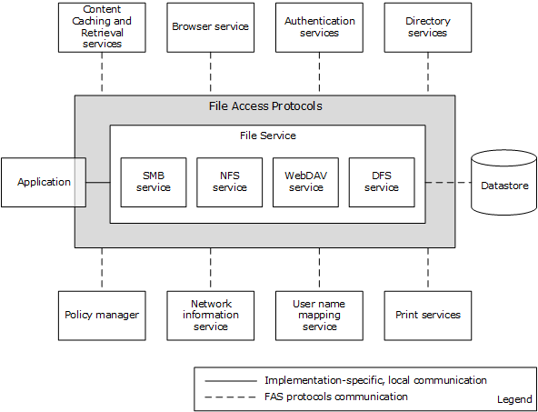

Figure 1: FAS System components and external components

Following are the components that interact with the FAS System.

- Application: Represents a typical program with which a user interacts.
- Content Caching and Retrieval services: Used to implement BranchCache caching of file server content. Branch caching does not function if these services are absent.
- Browser Service: Provides a list of computers in a workgroup or domain environment, and their associated services.
- Authentication Services: Used by file services to authenticate client and server principals.
- Directory Services: Used for storing DFS namespace metadata.
- Policy Manager: Uses the FAS System for downloading group policy information from the SYSVOL share to the group policy client, which behaves for this purpose as a File Access Services Application.
- Network Information service: Used for enumerating sets of NFS client computers, as defined in the Netgroups table.
- User Name Mapping Service: Used for enumerating identity mapping information for user and group accounts, in order to convert between AUTH_SYS style identity and Windows account names.
- Print Services: Depends on the FAS System for transferring a print image file to the print server.
- File Service: An abstraction of the software running on a file server that provides remote file access to one or more users. The service can also be managed by one or more administrators. Internally, it contains a datastore to persist changes made to files through the file access protocols. The datastore is an implementation-dependent local file system. A file service provides an abstraction of SMB Service, NFS Service, WebDAV Service, and DFS Service.
- File Client: The abstractions of low-level protocol state and operating software that run on application and administrative nodes, respectively. The client is used by applications to effect communication with the remote components of the File Access Services.
- Application and Admin Tool: Represent typical programs with which a user and an administrator interact, respectively. This is a somewhat arbitrary distinction, and many programs have both Application and Admin Tool features. For example, a graphical shell is frequently used directly by a user to perform personal file management tasks. This type of program is classified as an application, but it certainly has some aspects of an admin tool. For more details about admin tools, see [MS-FSMOD](../MS-FSMOD/MS-FSMOD.md).

### 2.1.4 Protocol Communications

The following diagram depicts the overall communication among all components that enable file access. The solid lines represent communication between components. Each line is labeled with the protocol used and with the short name of the protocol document that describes the communication. Dotted lines show dependencies on external systems.

Figure 2: File Access Services System internal architecture

The following table provides additional details about the nature of the communication between the components shown in the above diagram.

| Component... | ...uses this protocol... | ...to communicate with this component... | ...in order to accomplish this task |
| --- | --- | --- | --- |
| DFS Service (on file server) | LDAP | Directory Services | Update DFS metadata stored in Active Directory System, for example, add a link; also to pull metadata updates from the [**primary domain controller (PDC)**](#gt_primary-domain-controller-pdc) when prompted through DFSNM |
| DFS Service (on file server) | DFSNM | DFS Service (on file server) | When performing an update to a namespace, the Distributed File System Service notifies peer replicas of the namespace using NetrDfsSetInfo (Level 101) ([MS-DFSNM](../MS-DFSNM/MS-DFSNM.md) section 3.1.4.1.5) that the update has occurred |
| DFS Service (on Domain Controller) | LDAP (local loopback) | Directory Services | Update DFS metadata stored in Active Directory System |
| SMB Service | BRWS | Browser Service | Service advertisement Applicability: Workgroup, domain, all versions of Windows |
| File client | BRWS/BRWSA | Browser Service | Locate backup browsers |
| File client | SRVS | SMB Service | Retrieve server information, enumerate shares on a server, and/or retrieve share information |
| File client | WKST | SMB Service | Discover the OS version of the remote computer, confirm the name of the host, and discover properties of the file client present on the computer |
| File client | DFSC | DFS Service (on domain controller) | Domain Referral Request, DC Referral Request |
| File client | DFSC | DFS Service (on file server) | Root or Link Referral Request |
| File client | CIFS, SMB, SMB2 | SMB Service | Notification of a DFS link via an SMB Access Protocols Create operation failing with STATUS_PATH_NOT_COVERED |
| File client | CIFS, SMB, SMB2, RAP, NFS | SMB Service and NFS Service | Create (Open), Read, Write, Delete, Close, Query/Set attributes, Enumerate Directory, and other SMB and NFS Protocol Family operations |
| DFS Service | UNMP | UNMP Server | Use of the User Name Mapping Protocol for Identity Mapping |
| NFS Service | LDAP [[RFC2307]](https://go.microsoft.com/fwlink/?LinkId=90333) | Directory Services | Use of an LDAP server using the RFC 2307 schema [RFC2307] for Identity Mapping |
| DFS Service | SUNRPC [[RFC5531]](https://go.microsoft.com/fwlink/?LinkId=210822) | NIS | Use of the Network Information Service to discover Netgroups |
| File client | WebDAV ([[RFC4918]](https://go.microsoft.com/fwlink/?LinkId=151240), [MS-WDV](../MS-WDV/MS-WDV.md), [MS-WDVME](../MS-WDVME/MS-WDVME.md), [MS-WDVSE](../MS-WDVSE/MS-WDVSE.md)) | WebDAV Service | Access files via URLs |

### 2.1.5 Relevant Standards

This section provides a brief summary of standards that are relevant to the FAS System. See section [2.2.1](#Section_2.2.1) for a detailed discussion of all protocols used within the File Access Services System.

The following standards are transport protocols directly used by the File Access Services System:

Transmission Control Protocol (TCP), as specified in [[RFC793]](https://go.microsoft.com/fwlink/?LinkId=150872).

User Datagram Protocol (UDP), as specified in [[RFC768]](https://go.microsoft.com/fwlink/?LinkId=90490).

XDR: External Data Representation Standard, as specified in [[RFC4506]](https://go.microsoft.com/fwlink/?LinkId=90478).

The File Access Services System also uses the following standards to define computer names, workgroup names, and domain names:

Protocol Standard for a NetBIOS Service on a TCP/UDP Transport (NetBIOS names), as specified in [[RFC1001]](https://go.microsoft.com/fwlink/?LinkId=90260) and [[RFC1002]](https://go.microsoft.com/fwlink/?LinkId=90261).

Domain Names, as specified in [[RFC1034]](https://go.microsoft.com/fwlink/?LinkId=90263) and [[RFC1035]](https://go.microsoft.com/fwlink/?LinkId=90264).

The Network File System (NFS) implementation within the File Access Services System makes use of:

RPC: Remote Procedure Call Protocol Specification Version 2 and Binding Protocols for ONC RPC Version 2 (Sun RPC Bind and PortMap protocols), as specified in [[RFC5531]](https://go.microsoft.com/fwlink/?LinkId=210822) and [[RFC1833]](https://go.microsoft.com/fwlink/?LinkId=161319).

The following standard is used directly by the File Access Services System, but is external to the system:

Lightweight Directory Access Protocol, as specified in [[RFC2251]](https://go.microsoft.com/fwlink/?LinkId=90325) and [[RFC2307]](https://go.microsoft.com/fwlink/?LinkId=90333).

## 2.2 Protocol Summary

The tables below provide a comprehensive list of the member protocols of the File Access Services System. The member protocols are grouped according to their primary purpose.

Protocols in the following table enable communication between file client and SMB file service.

| Protocol name | Description | Short name |
| --- | --- | --- |
| Common Internet File System (CIFS) Browser Protocol | Used to access the Browser Service in order to discover nearby computers that can host file shares. | [MS-BRWS](../MS-BRWS/MS-BRWS.md) |
| Common Internet File System (CIFS) Browser Auxiliary Protocol | Optionally used by Browser Service to query configuration information for the domains from the domain master browser server. | [MS-BRWSA](../MS-BRWSA/MS-BRWSA.md) |
| Common Internet File System (CIFS) Protocol Specification | Defines the Common Internet File System (CIFS), a cross-platform, transport-independent protocol that provides a mechanism for client systems to use file and print services made available by server systems over a network. | [MS-CIFS](../MS-CIFS/MS-CIFS.md) |
| Distributed File System (DFS): Referral Protocol Specification | Allows file system clients to resolve names from a namespace distributed across many servers and geographies into local names on specific file servers. | [MS-DFSC](../MS-DFSC/MS-DFSC.md) |
| File System Algorithms | Algorithms used by the object stores that back the protocols specified by the documents [MS-SMB], [MS-SMB2], and [MS-CIFS]. These algorithms specify the behavior of operations like CreateFile, ReadFile, Close, and so on. These algorithms specify state, events, parameter validation, and error conditions for object store operations. | [MS-FSA](../MS-FSA/MS-FSA.md) |
| File System Control Codes | Defines the network format of native Windows structures that can be used within other protocols. It also describes the structure of common Windows native file system control codes, file information levels, and file system information levels that are issued in client/server and server/server communications. These structures do not result in a protocol, but their structure is common across multiple protocols. | [MS-FSCC](../MS-FSCC/MS-FSCC.md) |
| Server Message Block (SMB) Protocol Specification | Extensions to the Common Internet File System (CIFS) Protocol, as specified in [MS-CIFS]. | [MS-SMB](../MS-SMB/MS-SMB.md) |
| Server Message Block (SMB) Version 2 Protocol Specification | Describes the Server Message Block (SMB) Version 2 Protocol, which supports the sharing of file and print resources between machines. The protocol borrows and extends concepts from the Server Message Block (SMB) Protocol, as specified in [MS-SMB]. | [MS-SMB2](../MS-SMB2/MS-SMB2.md) |
| SMB2 Remote Direct Memory Access (RDMA) Transport Protocol | Allows upper-layer packets to be delivered over RDMA-capable transports such as iWARP and Infiniband, while utilizing the Direct Data Placement (DDP) capabilities of these transports. | [MS-SMBD](../MS-SMBD/MS-SMBD.md) |

Protocols in the following table enable communication between a file client and NFS file service.

| Protocol name | Description | Short name |
| --- | --- | --- |
| NFS Version 2 Protocol Specification | Provides transparent remote access to shared files across networks. | [[RFC1094]](https://go.microsoft.com/fwlink/?LinkId=90267) |
| NFS Version 3 Protocol Specification | A new protocol that extends the NFS version 2 functionality | [[RFC1813]](https://go.microsoft.com/fwlink/?LinkId=90294) |
| Network File System (NFS) Version 4 Minor Version 1 Protocol | The second minor version of NFS version 4 protocol, providing support for enhanced availability in distributed deployment. | [[RFC5661]](https://go.microsoft.com/fwlink/?LinkId=252163) |

Protocols in the following table are used by a WebDAV client and server to function as a remote file system that accesses objects defined by URLs.

| Protocol name | Description | Short name |
| --- | --- | --- |
| HTTP Extensions for Web Distributed Authoring and Versioning (WebDAV) | Defines HTTP protocol extensions that enable users to collaboratively edit and manage files on remote web servers. | [[RFC4918]](https://go.microsoft.com/fwlink/?LinkId=151240) |
| Web Distributed Authoring and Versioning (WebDAV) Protocol: Client Extensions | Extensions defined in this specification extend the WebDAV Protocol, as specified in [RFC4918]. | [MS-WDV](../MS-WDV/MS-WDV.md) |
| Web Distributed Authoring and Versioning (WebDAV) Protocol: Microsoft Extensions | Documents more extensions to the WebDAV Protocol. | [MS-WDVME](../MS-WDVME/MS-WDVME.md) |
| Web Distributed Authoring and Versioning (WebDAV) Protocol: Server Extensions | Extends WebDAV by introducing new HTTP request and response headers that both enable file types that are not currently manageable and optimize protocol interactions for file system clients. | [MS-WDVSE](../MS-WDVSE/MS-WDVSE.md) |

### 2.2.1 Member Protocol Roles

This section describes all member protocol roles.

The Remote Administration (RAP) Protocol (as described in [MS-RAP](../MS-RAP/MS-RAP.md)) is an administrative protocol whose function has largely been replaced by newer protocols. In the File Access Services System, RAP is used by legacy systems as a discovery protocol. RAP also supports certain client and server administration methods, such as SMB file share enumeration, but this functionality has been superseded by the Workstation Service Remote Protocol (as described in [MS-WKST](../MS-WKST/MS-WKST.md) and Server Service Remote Protocol (as described in [MS-SRVS](../MS-SRVS/MS-SRVS.md)). RAP is not used in IPv6, and can only be used in IPv4 if NetBIOS is enabled.

The Distributed File System (DFS) Namespace Referral Protocol [MS-DFSC](../MS-DFSC/MS-DFSC.md) allows SMB file clients to map paths in a virtual distributed namespace to paths on specific file servers.

The Common Internet File System (CIFS) Protocol [MS-CIFS](../MS-CIFS/MS-CIFS.md), Server Message Block (SMB) Protocol [MS-SMB](../MS-SMB/MS-SMB.md), and Server Message Block (SMB) 2.0 Protocol [MS-SMB2](../MS-SMB2/MS-SMB2.md) are network file access protocols that support file sharing (remote access to an object store) between computers.

Server Message Block (SMB) version 2 Protocol [MS-SMB2] defines a new version of the SMB protocol. First implemented in Windows Server 2008 operating system and Windows Vista operating system, it is the default file sharing protocol used by Windows. It defines features, such as advanced pipelining, symbolic links, a new form of oplocks called leasing, support for hosted caching, durable and resilient handles, and improved scalability of basic structures like numbers of shares, users, and open files.

In Windows Server 2012 operating system, Windows Server 2012 R2 operating system, and Windows Server 2016 operating system, the Server Message Block (SMB) 2 Protocol has additional transport support for Remote Direct Memory Access (RDMA), as defined in [[RFC5040]](https://go.microsoft.com/fwlink/?LinkId=230446) section 2.1. The SMB Remote Direct Memory Access (RDMA) Transport Protocol (SMB Direct) ([MS-SMBD](../MS-SMBD/MS-SMBD.md)) enables direct memory-to-memory data transfers between cooperating SMB3 dialect clients and servers.

Network File System (NFS) version 2 and 3 is a protocol originally developed by Sun Microsystems in 1984, defined in [[RFC1094]](https://go.microsoft.com/fwlink/?LinkId=90267) (version 2) and [[RFC1813]](https://go.microsoft.com/fwlink/?LinkId=90294) (version 3) that allows a computer to access files over a network. A client implementation of the NFS V2 and NFS V3 protocols shipped in Windows Vista and later and Windows Server 2003 operating system and later. The server implementation of NFS V2 and V3 protocol shipped in Windows Server 2003 and later. Windows Server 2012 and later implement the server role of Network File System (NFS) Version 4 Minor Version 1 as specified in [[RFC5661]](https://go.microsoft.com/fwlink/?LinkId=252163).

Network Lock Manager (NLM) and Network Status Monitor (NSM) protocols [C702] are used in conjunction with the NFS version 2 and NFS version 3 protocols to provide support for file locking and service status monitoring.

The File System Control Codes specification [MS-FSCC](../MS-FSCC/MS-FSCC.md) defines the network format of Windows data structures that are embedded in the SMB access protocols.

The Microsoft Web Distributed Authoring and Versioning (WebDAV) protocol extensions ([MS-WDV](../MS-WDV/MS-WDV.md), [MS-WDVME](../MS-WDVME/MS-WDVME.md), and [MS-WDVSE](../MS-WDVSE/MS-WDVSE.md)) define a set of extensions for both the WebDAV client and server. These extensions enhance their ability to function as a remote file system that accesses objects defined by uniform resource locators (URLs).

## 2.3 Environment

The following sections identify the context in which the system exists. This includes the systems that use the interfaces provided by this system of protocols, other systems that depend on this system, and, as appropriate, how components of the system communicate.

The File Access Services protocol components are typically installed in a distributed environment. The diagram that follows depicts a basic deployment of File Access Services protocol components in a distributed environment consisting of two computers.

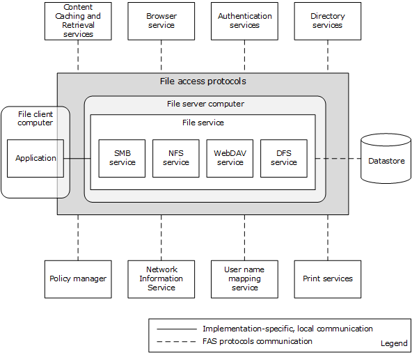

Figure 3: File Access Services System distributed environment with two computers

An application that accesses a file on the file service runs on a file client computer. The file server computer hosts the SMB Service, NFS Service, WebDAV Service, and the DFS Service.

The following diagram depicts a deployment of File Access Services protocol components in a distributed environment consisting of five computers.

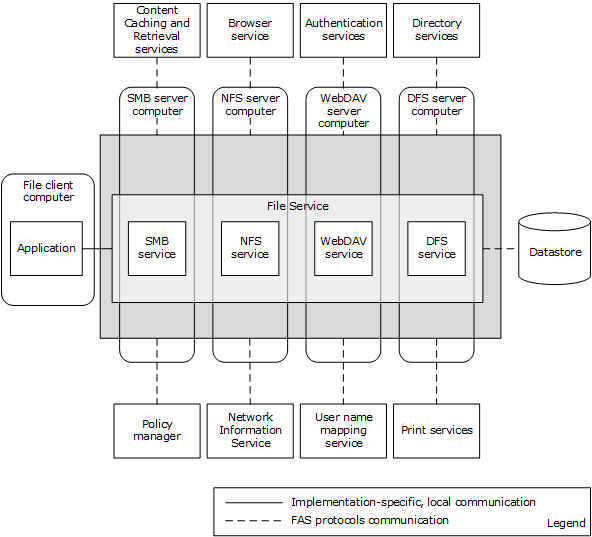

Figure 4: File Access Services System distributed environment with five computers

### 2.3.1 Dependencies on This System

The following external systems depend on the File Access Services System:

- Print Services [MS-PRSOD](../MS-PRSOD/MS-PRSOD.md): For transferring a print image file to the print server.
- Group Policy [MS-GPOD](../MS-GPOD/MS-GPOD.md): For downloading group policy information from the SYSVOL share to group policy client, which behaves for this purpose as a File Access Services Application.

### 2.3.2 Dependencies on Other Systems/Components

The File Access Services (FAS) depend on the following external systems and components:

- Object Store: For storing files and metadata.
- Network protocols: FAS uses standard networking protocols for transport. These are described in greater detail in section [2.1.5](#Section_2.1.5).
- The Remote Administration Protocol (as defined in [MS-RAP](../MS-RAP/MS-RAP.md)) does not operate over SMB 2 [MS-SMB2](../MS-SMB2/MS-SMB2.md); it depends upon either CIFS [MS-CIFS](../MS-CIFS/MS-CIFS.md) or SMB [MS-SMB](../MS-SMB/MS-SMB.md).
- The NFS Access Protocols require Sun RPC [[RFC5531]](https://go.microsoft.com/fwlink/?LinkId=210822).

#### 2.3.2.1 System Influences

The File Access Services System can be influenced by the external systems and components shown in the following table.

| External entity | File Access Services System depends on external entity for... | Consequences if absent |
| --- | --- | --- |
| Browser Service | A list of computers in a workgroup or domain environment and their associated services. | Cannot discover services associated with other computers. |
| Authentication Services System | Authenticating client and server principals. | Centralized identity management does not work if the Domain Interactions System is not available. |
| Directory Service | Storing DFS namespace metadata. | Cannot create domain-controller-based DFS namespace. |
| Content Caching and Retrieval services | Protocols and services used to implement BranchCache caching of file server content. | Branch caching does not function. |
| Policy Manager | Configuration of individual protocol capabilities within the File Access Services System. | Cannot centrally configure some functionality of the system. |
| Network Information Service | Enumerating sets of NFS Client computers as defined in the Netgroups table to be given specific NFS share access. | Cannot centrally configure some functionality of the system. |
| User Name Mapping Service | Enumerating identity mapping information for user and group accounts to convert between AUTH_SYS style identity and Windows account names. | Cannot centrally configure some functionality of the system. |

Specific system influences are as follows:

- Identity conversion from credentials supplied by the NFS file client to credentials acceptable to the local authentication system on the NFS file service (for example, the Authentication Services Protocols defined in [MS-AUTHSOD](../MS-AUTHSOD/MS-AUTHSOD.md)) and to the object store is done through the User Name Mapping Protocol ([MS-UNMP](../MS-UNMP/MS-UNMP.md)) or an [[RFC2307]](https://go.microsoft.com/fwlink/?LinkId=90333)-compliant LDAP store (such as the Active Directory Protocols defined in [MS-ADOD](../MS-ADOD/MS-ADOD.md)).
- nisNetgroup object as defined in an [RFC2307]-compliant LDAP store or netgroups defined in Network Information Service [[NIS]](https://go.microsoft.com/fwlink/?LinkId=90234) are consumed by the NFS file service.
- Group Policy enables the file client to interact with the BranchCache Hosted Cache Service. This enables a client to publish and retrieve content for a file that is located on a share, as defined in [MS-SMB2](../MS-SMB2/MS-SMB2.md).

## 2.4 Assumptions and Preconditions

The following assumptions and preconditions need to be satisfied for the File Access Services System to operate successfully:

System Availability: The File Access Services System is installed on all the computers involved.

Domain Configuration: In a domain configuration, file client and file service have access to directory services provided by the domain.

Authentication Services: Authentication services as described in [MS-AUTHSOD](../MS-AUTHSOD/MS-AUTHSOD.md) are available to all file clients and file services.

RPC: Components of file client and file service that use Remote Procedure Call interfaces have all prerequisites specified in [MS-RPCE](../MS-RPCE/MS-RPCE.md) section 1.5 satisfied.

Network Configuration: In order for system components running on different computers to communicate, the network services and infrastructure are functional and configured such that required protocols, ports, and so on are remotely accessible.

Domain Functionality: For system functionality requiring a domain (as defined in [MS-ADOD](../MS-ADOD/MS-ADOD.md)) and directory services (as defined in [MS-ADOD]), at least one domain controller is configured and accessible. Some functionality, such as domain-based DFS namespaces, can require an Active Directory-style domain as noted in [MS-DFSC](../MS-DFSC/MS-DFSC.md).

Domain Functional Level: In order for an NFS file service to authenticate users represented by AUTH_SYS credentials, this system has a domain available at a functional level that supports S4U extensions.

Directory Schema: In order for an NFS file service to implement user name-to-ID mapping based on [[RFC2307]](https://go.microsoft.com/fwlink/?LinkId=90333), an LDAP store is available, such as described in [MS-ADOD], which is configured to include schema elements <uidNumber> and <gidNumber> from [RFC2307].

## 2.5 Use Cases

This section describes the use cases for the File Access Services protocols. There are two levels of use cases: main use cases and supporting use cases. Relevant protocols are described in the supporting use cases.

### 2.5.1 Access a File in a Workgroup

**Context of Use:** When a user wants to read, create, or modify a file on a remote computer that is part of a workgroup, these file access operations can be implemented through the SMB or NFS protocols.

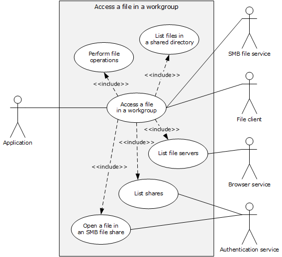

Figure 5: Use case diagram for Access a file in a workgroup

**Goal:** This use case demonstrates a typical User interaction with the File Access Services System, by means of an application, to read, create, delete or modify a file on a file server in a workgroup.

**Actors**

- Application
The Application is the primary actor that triggers this use case. The Application is a program that is used to create, open, read, write, and delete files on the file server. It interacts with the File Access Services System through the file client. The Application is referred to by using the qualifier "SMB" or "NFS" when it is necessary to distinguish the underlying network protocol used by application instances.

- Authentication Services
The Authentication Services is a supporting actor that is used for authentication purposes.

- Browser Service
The Browser Service is a supporting actor that maintains a current list of domains, workgroups, and servers on the network. It can supply that list to clients on request. The Browser Service is encapsulated with the local master browser and backup browser. The File Access Services System uses the protocols described in [MS-BRWS](../MS-BRWS/MS-BRWS.md), [MS-BRWSA](../MS-BRWSA/MS-BRWSA.md), and [MS-RAP](../MS-RAP/MS-RAP.md) to access the Browser Service in order to discover nearby computers that can host file shares.

- File Client
The File Client is a supporting actor that both implements the client role of the FAS protocols and consumes the file services that are offered by the SMB file service.

- SMB File Service
The SMB File Service is a supporting actor that implements the server role of the FAS protocols and the file services that are consumed by the File Client. The SMB file service is commonly known as a file server.

**Stakeholders**

- User
The User is the person who requires remote file access in order to read, create, modify, or delete files on another computer. The User interacts with the File Access Services System through the Application.

**Preconditions**

- The User has the name of a file to be found on the file server. The User wishes to explore the workgroup by means of an application, which can be a command line or graphical user interface.
- The file server supports SMB Access Protocols.
The file server, the computer running the browser service, and the application are part of the same workgroup.

**Main Success Scenario**

**Trigger:** The User opens an Application to access a file on the remote file server.

- The Application displays a list of file servers available in the workgroup, and their properties (the **List File Servers** use case is discussed in section [2.5.5.1](#Section_2.5.5.1)).
- The Application displays a list of file shares on the selected file server (the **List Shares** use case is discussed in section [2.5.5.2](#Section_2.5.5.2)).
- The Application displays a list of files and directories in the user-selected share, which enumerates the files and directories, and their attributes, in the root directory of the share (the **List Files in a Shared Directory** use case is discussed in section [2.5.5.3](#Section_2.5.5.3)).
- The user selects a file to access, and the Application initiates an open action on that file (the **Open File in an SMB File Share** use case is discussed in section [2.5.5.4](#Section_2.5.5.4)).
- The Application uses the file handle obtained from the previous step to read the contents of the file and render the file contents for the User (the **Perform File Operations Using SMB** use case is discussed in section [2.5.5.5](#Section_2.5.5.5)).
**Post Condition**

The User is able to access a file on a file server in a workgroup.

**Extensions**

None.

### 2.5.2 Access a File in a Domain

**Context of Use:** When the User wants to access a particular file within a domain DFS namespace, these access file operations can be implemented.

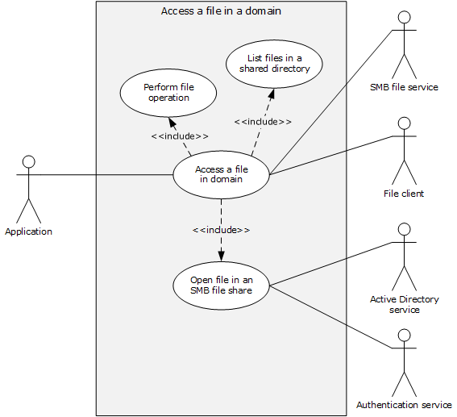

Figure 6: Use case diagram for Access a file in a domain

**Goal:** This use case demonstrates a typical user interaction with the File Access Services System by means of an application, in which the user reads, creates, or modifies a file on a file server, within a domain DFS namespace.

**Actors**

- Application
The Application is the primary actor that triggers this use case. The Application is a program that is used to create, open, read, write and/or delete files on the file server. It interacts with the File Access Services System through the file client.

- Authentication Services
The Authentication Services is a supporting actor, which is used for authentication purposes.

- Active Directory Service
The Active Directory Service is a supporting actor. The File Access Services System stores DFS namespace information in an Active Directory-based system. Additionally, the File Access Services System locates its DFS Service component with Directory Services on the domain controller, and discovers the DFS Service by first locating the domain controller and then attempting to connect with the DFS Service on the same computer.

- File Client
The File Client is a supporting actor that implements client-side protocol components and consumes the file services that are offered by the file server.

- SMB File Service
The SMB File Service is a supporting actor that is internal to the File Access Services System and implements server-side protocol components and the file services that are consumed by the File Client.

**Stakeholders**

- Users
The User is the person who requires remote file access in order to read, create, or modify files on another computer. The User is external to the File Access Services System and interacts with the File Access Services System through the Application.

**Precondition**

- The User has a UNC path ([MS-DTYP](../MS-DTYP/MS-DTYP.md) section 2.2.57) to a domain DFS namespace, of the form \\*domain name*\*share name,* and wishes to explore within that namespace by means of an application, which can be a command line or graphical user interface.
- The DFS namespace contains a DFS link that refers to an SMB file service.
**Main Success Scenario**

**Trigger:** The User opens an Application to access file on the remote file server within a DFS namespace.

- The application uses the supplied UNC path (\\domain name\share name) to call **List Files in a Shared Directory** (section [2.5.5.3](#Section_2.5.5.3)) to enumerate the files, directories, and their attributes in the namespace root directory. The application then displays the enumerated list. In response to the User selecting one of the displayed directories, the application displays a list of files in the selected directory, by repeating the call using the new UNC path \\*domain name*\*share name*\*directory-name*. This time, the application traverses a DFS link during the **Open a File in an SMB File Share** (section [2.5.5.4](#Section_2.5.5.4)) step of **List Files in a Shared Directory**.
- The Application initiates the open action on the user-selected file by using **Open a File in an SMB File Share**.
- The Application uses the file handle to read the contents of the file and renders the file contents for the User, using Perform File Operation (section [2.5.5.5](#Section_2.5.5.5)).
**Post Condition**

The User is able to access a file on a file server, within a domain DFS namespace.

**Extensions**

None.

### 2.5.3 Two Applications Communicate via a Shared File

**Context of Use:** When two Applications, one using NFS Access Protocols and the other using SMB Access Protocols, communicate via a shared file.

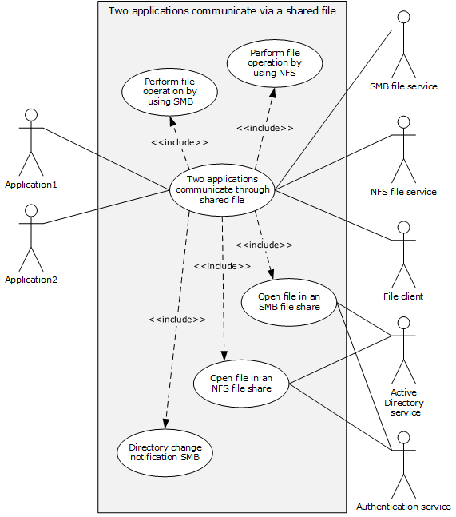

Figure 7: Use case diagram for Two applications communicate via a shared file

**Goal:** This use case demonstrates how two applications can use a shared file to communicate and synchronize workflows in a request/reply fashion, while using different network file access protocols.

**Actors**

- Application1
Application1 is the primary actor that triggers this use case. Application1 is a program that is used to create, open, read, write and/or delete files on the file server. It interacts with the File Access Services System through the File Client, using the SMB network access protocol.

- Application2
Application2 is the primary actor that triggers this use case. Application2 is a program that is used to create, open, read, write and/or delete files on the file server. It interacts with the File Access Services System through the file client, using the NFS network access protocol

- SMB File Service
The SMB File Service is a supporting actor that is internal to the File Access Services System. It implements server-side protocol components and the file services that are consumed by the File Client.

- NFS File Service
The NFS File Service is a supporting actor that provides and maintains a secure and consistent file service.

- File Client
The File Client is a supporting actor that is internal to the File Access Services System and implements client-side protocol components. It consumes the file services that are offered by the file server. The File Client can be an instance of an SMB File Client or an NFS File Client.

- Active Directory Service
The Active Directory Service is a supporting actor. The File Access Services System stores DFS namespace information in an Active Directory-based system. Additionally, the File Access Services System locates its DFS Service component with Directory Services on the domain controller and discovers the DFS Service by first locating the domain controller and then attempting to connect with the DFS Service on the same computer.

- Authentication Services
Authentication Services is a supporting actor that is used for authentication purposes.

**Stakeholders**

- Users
The User is the person who requires remote file access in order to read, create or modify files on another computer. The User is external to the File Access Services System and interacts with the File Access Services System through the Application. There are two Users, one using the SMB access protocol and the other using the NFS access protocol.

**Precondition**

- The client and server computers are configured in a domain.
- Two file shares, one NFS and one SMB, have been created on the file server, both backed by the same directory in the object store.
- Both Users have identities for use with both NFS and SMB shares.
- Both Users have located the desired file shares and have navigated to the desired directory in each share.
- Application2 has data ready to place in a file.
**Main Success Scenario**

**Trigger:** Users open Application1 and Application2 to communicate through the shared file.

- Application1 prepares to receive a request message file by registering for a directory change notification on a specific directory using **Open a File in an SMB File Share** (section [2.5.5.4](#Section_2.5.5.4)) to obtain a file handle to the directory, and then using **Perform a File Operation Using SMB** (section [2.5.5.5](#Section_2.5.5.5)) to request directory change notification and wait on notification.
- Application2 requests that a new file be created in the directory, using **Open a File in an NFS File Share** (section [2.5.5.6](#Section_2.5.5.6)) and obtains a file handle. Application2 then uses **Perform File Operation Using NFS** (section [2.5.5.7](#Section_2.5.5.7)) to write data into the file, and finally uses Perform File Operation using NFS to close the file.
- A directory change notification is triggered to Application1 via the file client using **Directory Change Notification Using SMB** (section [2.5.5.8](#Section_2.5.5.8)).
- Application1 opens the new file and obtains a file handle using **Open a File in an SMB File Share**, reads the contents of file using **Perform a File Operation Using SMB**, processes the message, appends its reply data to the end of the file using **Perform a File Operation Using SMB**, and closes the file using **Perform a File Operation Using SMB**.
- Application2 re-opens the file and obtains a file handle using **Open a File in an NFS File Share**. Application2 reads the contents of the file using **Perform File Operation using NFS**, completes its processing of the reply message, and closes the file using **Perform File Operation using NFS**.
**Post Condition**

The SMB and NFS applications communicate and synchronize workflows, using a shared file.

**Extensions**

None.

### 2.5.4 Access a Remote File Using WebDAV

**Context of Use:** When a User wants to access a particular file within the WebDAV context.

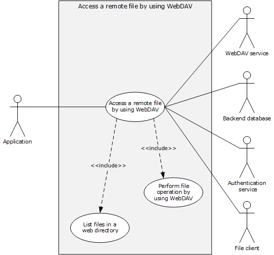

Figure 8: Use case diagram for Access a remote file using WebDAV

**Goal:** This use case demonstrates a typical User interaction with WebDAV to access a file on a file server by means of a command line or graphical Application.

**Actors**

- Application
The Application is the primary actor that triggers this use case. The Application is a program that is used to create, open, read, write, and/or delete files on the WebDAV server. It interacts with the File Access Services System through the File Client.

- WebDAV Service
The WebDAV Service is a supporting actor that is internal to the File Access Services System. It implements protocol components as specified in [[RFC4918]](https://go.microsoft.com/fwlink/?LinkId=151240), [MS-WDV](../MS-WDV/MS-WDV.md), [MS-WDVME](../MS-WDVME/MS-WDVME.md), and [MS-WDVSE](../MS-WDVSE/MS-WDVSE.md) and the file services that are consumed by the File Client.

- Back–end Database
The Back–end Database (BED) is a supporting actor that stores the data which is accessed using WebDAV protocol.

- Authentication Services
The Authentication Services is a supporting actor that is used for authentication.

- File Client
The File Client is a supporting actor that is internal to the File Access Services System. It implements client-side protocol components and consumes the file services that are offered by the WebDAV server.

**Stakeholders**

- User
The User is the person who requires remote file access in order to read, create or modify files on another computer. The User interacts with the File Access Services System through the Application.

**Precondition**

- User has a URL path to a WebDAV file server that supports the SEARCH option.
**Main Success Scenario**

**Trigger:** The User opens an Application to access a file in the web server.

- The Application directs the file client to display a list of files and directories at the URL by using the GET method of a WebDAV http request ([RFC4918] section 8.4) in order to enumerate the files and directories, and their attributes that are known to the web server. In response to User's selecting one of the displayed directories, Application displays a list of files as returned by the WebDAV service by using **List Files in a Web Directory** use case (section [2.5.5.9](#Section_2.5.5.9)).
- In response to the User selecting one of the displayed files, the Application directs the file client to initiate operations on the User-selected file using the **Perform File Operation Using WebDAV** use case (section [2.5.5.10](#Section_2.5.5.10)).
**Post Condition**

The User is able to interact with WebDAV to access a file on a web server.

**Extensions**

None.

### 2.5.5 Supporting Use Cases

#### 2.5.5.1 List File Servers

This use case supports the **Access a File in a Workgroup** use case (section [2.5.1](#Section_2.5.1)).

**Context of Use:** To display a list of file servers available in the workgroup when a User accesses a file via an application.

**Goal:** To list the available file servers in a workgroup and their properties.

**Actors:**

- Application
- Browser Service
- File Client
**Stakeholders**

- User
**Precondition**

None.

**Main Success Scenario**

**Trigger:** The Application receives a request from the User to display a list of file servers in the User's workgroup.

- The Application directs the file client to contact the local master browser, using the GetBackupListRequest frame ([MS-BRWS](../MS-BRWS/MS-BRWS.md) section 3.1.5.1.1) to retrieve the list of backup browsers. The master browser performs the action.
- The Application directs the file client to select and establish a communication channel to a backup browser, as specified in [MS-RAP](../MS-RAP/MS-RAP.md) section 2.1.
- The Application directs the file client to contact the backup browser using the procedure described in [MS-RAP] section 3.1.4.12 NetServerEnum2 or [MS-RAP] section 3.1.4.15 NetServerEnum3 to retrieve the list of available servers.
- The backup browser performs the action and returns the results to the Application (as described in [MS-BRWS] section 3.3.5.6).
**Post Condition**

The computers that provide file services are listed.

**Extensions**

- If no response is received from the master browser, the application can attempt to contact the master browser multiple times. Ultimately, the use case ends with failure.
- If the communication channel for [MS-RAP] cannot be established, or it becomes disconnected, the application can attempt to establish a connection multiple times with this or with an alternate backup browser. Ultimately, the use case ends with failure.

#### 2.5.5.2 List Shares

This use case supports the **Access a File in a Workgroup** use case (section [2.5.1](#Section_2.5.1)).

**Context of Use:** To display a list of file shares when a User has located and selected a file server.

**Goal:** To list shares on the selected file server.

**Actors**

- Application
- SMB File Service
- Authentication Service
- File Client
**Stakeholders**

- User
**Precondition**

- The User has identified a file server.
- An SMB File Service is present on the file server, as defined in [MS-SRVS](../MS-SRVS/MS-SRVS.md) section 3.1.
**Main Success Scenario**

**Trigger:** The Application receives a request from the User to retrieve a list of shares hosted by the file server.

- The application directs a file client to establish a communication channel to the SMB file service, as specified in [MS-SRVS] section 2.1.
- The SMB file service authenticates the User through the mechanisms specified in [MS-AUTHSOD](../MS-AUTHSOD/MS-AUTHSOD.md).
- The application directs the file client to contact the SMB file service using **NetrShareEnum** ([MS-SRVS] section 3.1.4.8) to retrieve the list of shares.
- The SMB file service authorizes the User through the procedure specified in [MS-SRVS] section 3.1.4.8, and then performs the action and returns the results to the Application.
**Post Condition**

Shares on a file server are listed.

**Extensions:**

- If the communication channel cannot be established, or it becomes disconnected, the application can attempt to establish connection multiple times. Ultimately, the use case ends with failure.
- If user authentication fails, the use case ends with failure.
- If user authorization fails, the use case ends with failure.

#### 2.5.5.3 List Files in a Shared Directory - Application

This use case supports the **Access a File in a Workgroup** use case (section [2.5.1](#Section_2.5.1)) and **Access a File in a Domain** use case (section [2.5.2](#Section_2.5.2)).

**Context of Use:** To display a list of files and directories when the User has selected a share to enumerate.

**Goal:** To list files and directories in a shared directory.

**Actors**

- Application
- SMB File Service
- File Client
**Stakeholders**

- User
**Preconditions**

The User knows the path of the directory to enumerate.

**Main Success Scenario**

**Trigger:** The Application receives a request from the User to display a list of files and directories in a given network share directory.

- The Application directs the file client to invoke the procedure defined in the use case **Open a File in an SMB File Share**, on the specified directory path, and receives a handle to the network share directory.
- The Application uses the file client to contact the SMB File Service and uses the mechanisms as defined in [MS-SMB2](../MS-SMB2/MS-SMB2.md) section 3.2.4.17 to enumerate the directory.
- The SMB File Service performs the action and returns the results to the Application in the form corresponding to the mechanism requested by the Application in step 2.
**Post Condition**

The files in a share directory are listed.

**Extensions**

- If the communication channel cannot be established, or it becomes disconnected, the application can attempt to establish connection multiple times. Ultimately, the use case ends with failure.
**Variation (a): Performing the operation using the protocol described in [MS-SMB]:** All details identical to the use case described in this section except that the protocol described in [MS-SMB](../MS-SMB/MS-SMB.md) section 3.2.4.6, is used instead of the protocol described in [MS-SMB2].

**Variation (b): Performing the operation using the protocol described in [MS-CIFS]:** All details identical to the use case described in this section except that the protocol described in [MS-CIFS](../MS-CIFS/MS-CIFS.md) section 2.2.5 is used instead of the protocol described in [MS-SMB2].

#### 2.5.5.4 Open a File in an SMB File Share - Application

This use case supports the **Access a File in a Workgroup** use case (section [2.5.1](#Section_2.5.1)), the **Access a File in a Domain** use case (section [2.5.2](#Section_2.5.2)), and the **Two Applications Communicate via a Shared File** use case ([2.5.3](#Section_2.5.3)).

**Context of Use:** To open or create a file when the User has located a shared directory and wants to open or create a file in that directory using the SMB network access protocol.

**Goal:** To open or create a file in a directory located in an SMB file share.

**Actors**

- Application
- SMB File Service
- Authentication Service
- File Client
**Stakeholders**

- User
**Preconditions**

- A file share has been created on the SMB File Service.
- The User has located the path of the file or shared directory and has determined the desired open type (for example, "create a new file" or "open existing file").
**Main Success Scenario**

**Trigger:** Based on interactions with the User, the Application determines whether to open or create a file in a target directory.

- The Application directs the file client to establish a communication channel to an SMB File Service.
- The SMB File Service authenticates the User through the mechanisms as specified in [MS-AUTHSOD](../MS-AUTHSOD/MS-AUTHSOD.md).
- The Application directs the file client to send a CREATE request to the SMB File Service (as specified in [MS-SMB2](../MS-SMB2/MS-SMB2.md) section 3.2.4.3) to open a file with an appropriate CreateDisposition as specified in the same section.
- The SMB File Service authorizes the User using the mechanisms of [MS-SMB2] section 2.2.13, with an appropriate CreateDisposition as specified in the same section.
- The SMB File Service performs the create operation and returns a file handle to the Application.
**Post Condition**

The User will get the handle for the desired file in a shared directory located in an SMB file share.

**Extensions**

- If the communication channel cannot be established, or it becomes disconnected, the application can attempt to establish connection multiple times. Ultimately, the use case ends with failure.
- If user authentication fails, the use case ends with failure.
- If user authorization fails, the use case ends with failure.
- If the target of the file create resides in a DFS namespace and the File Client has indicated that it includes a mechanism to detect and traverse DFS namespaces, then the SMB File Service and file client perform additional DFS processing (see [MS-DFSC](../MS-DFSC/MS-DFSC.md) section 3.1.4.1). If the file client has not indicated that it includes this mechanism, then the SMB File Service fails the operation. The file client communicates to the DFS service that resides on the Active Directory service to get the root servers.
**Variation (a):** Performing the operation using the protocol described in [MS-SMB]:All details are identical to the use case described in this section, except that the protocol described in [MS-SMB](../MS-SMB/MS-SMB.md) section 2.2.4.9.1 is used instead of the protocol described in [MS-SMB2].

**Variation (b):** Performing the operation using the protocol described in [MS-CIFS]:All details are identical to the use case described in this section, except that the protocol described in [MS-CIFS](../MS-CIFS/MS-CIFS.md) section 2.2.4.64 is used instead of the protocol described in [MS-SMB2].

#### 2.5.5.5 Perform a File Operation Using SMB

This use case supports the **Access a File in a Workgroup** use case (section [2.5.1](#Section_2.5.1)), the **Access a File in a Domain** use case (section [2.5.2](#Section_2.5.2)) and the **Two Applications Communicate via a Shared File** use case ([2.5.3](#Section_2.5.3)).

**Context of Use:** To read or write the contents of the file or close the handle when the User has obtained a handle to a file in an SMB share directory and wants to perform an operation on the file.

**Goal:** To perform a file operation (such as read, write, or close) on a file in an SMB share directory.

**Actors**

- Application
- SMB File Service
- File Client
**Stakeholders**

- User
**Preconditions**

- A file share has been created on the SMB File Service.
- The User has successfully opened and obtained a handle to a file on the file share.
- Data for the operation is supplied by the User if applicable.
**Main Success Scenario**

**Trigger:** The Application receives a request from the User to perform a file operation on a file for which the Application has a file handle.

- The application directs the file client to identify the communication channel to the SMB file service for SMB access protocols from the file handle corresponding to the User's file.
- The application directs the file client to perform the requested operation (read, write, or close) as described in [MS-SMB2](../MS-SMB2/MS-SMB2.md) section 3.2.4.
- The SMB file service performs the requested action and returns the result through the SMB file client to the Application in the format that corresponds to the operation requested in step 2.
**Post Condition**

File operations (such as read, modify, or delete) are performed on a file in an SMB share directory.

**Extensions**

- If the communication channel cannot be established, or it becomes disconnected, the application can attempt to establish connection multiple times. Ultimately, the use case ends with failure. Depending on when the connection failed, the share might or might not have been created.
- If the requested operation is a read, and the SMB share being accessed supports hash generation (see [MS-SMB2] section 2.2.10), the SMB file client can take additional steps to retrieve data from, or publish data to, the Hosted Cache.
- If user authentication or authorization fails, the use case ends with failure.
**Variation (a):** Performing the requested operation (read, write, or delete) using the protocol described in [MS-SMB](../MS-SMB/MS-SMB.md): All details identical to the use case described in this section, except that the protocol described in [MS-SMB] section 3.2.4 is used instead of the protocol described in [MS-SMB2].

**Variation (b):** Performing the requested operation (read, write, or delete) using the protocol described in [MS-CIFS](../MS-CIFS/MS-CIFS.md): All details identical to the use case described in this section, except that the protocol described in [MS-CIFS] section 2.2.4 is used instead of the protocol described in [MS-SMB2].

#### 2.5.5.6 Open a File in an NFS File Share

This use case supports the **Two Applications Communicate via a Shared File** use case (section [2.5.3](#Section_2.5.3)). The application accesses a file using the NFS version 2 protocol [[RFC1094]](https://go.microsoft.com/fwlink/?LinkId=90267), or the NFS version 3 protocol [[RFC1813]](https://go.microsoft.com/fwlink/?LinkId=90294).

**Context of Use:** To open or create a file when the User has located a shared directory and wants to open or create a file in that directory using an NFS network access protocol.

**Goal:** To open or create a file in an NFS network share directory.

**Actors**

- Application
- File Client
- NFS File Service
- Authentication Service
- Active Directory Service
**Stakeholders**

- User
**Preconditions**

- The client and server computers are configured in a domain.
- An NFS file share has been created on the file server.
- The User has located the path to the file on the NFS file share and has determined the desired open type (for example, "create a new file" or "open existing file").
**Main Success Scenario**

**Trigger:** Based on the User interaction, the Application determines whether to open or create a file in a target directory.

- The Application resolves the target directory using a set of LOOKUP requests as described in [RFC1094] section 2.2.5 or [RFC1813] section 2.5.3 to resolve each component of the path.
- The Application directs the file client to send a request to NFS File Service in order to accomplish one of the following options, depending upon the requested operation type. Each operation returns a file handle to the Application.
- (Create) Creation of the new file using the CREATE request as described in [RFC1094] section 2.2.10 or [RFC1813] section 3.3.8.
- (Open) Resolution of the file name (final path component) using the LOOKUP request as described in [RFC1094] section 2.2.5 or [RFC1813] section 3.3.
- The NFS File Service performs the create operation and returns a file handle to the Application.
**Post Condition**

A file is created or opened in an NFS network share directory.

**Extensions**

- If an RPC time-out occurs, the application displays an error message, and the use case ends in failure.
- If an RPC authentication fails, the application displays an error message, and the use case ends in failure.
- If a protocol error code is returned from the NFS File Service, the Application displays an error message corresponding to the RPC error code returned, and the use case aborts.

#### 2.5.5.7 Perform File Operation Using NFS

This use case supports the **Two Applications Communicate via a Shared File** use case ([2.5.3](#Section_2.5.3)). The application accesses an NFS file using the NFS version 2 protocol [[RFC1094]](https://go.microsoft.com/fwlink/?LinkId=90267) or the NFS version 3 [[RFC1813]](https://go.microsoft.com/fwlink/?LinkId=90294) protocol.

**Context of Use:** To read or write a file in an NFS share directory.

**Goal:** To perform a file operation (such as Read or Write) on a file in an NFS network share directory.

**Actors**

- Application
- File Client
- NFS File Service
- Authentication Service
**Stakeholders**

- User
**Preconditions**

- The client and server computers are configured in a domain.
- A file share has been created on the file server.
- The User has successfully opened a file on the file share and obtained a file handle.
**Main Success Scenario**

**Trigger:** The Application receives a request from the User to perform a file operation on a file for which the Application has a file handle.

- The Application directs the file client to send a request to the NFS File Service, in order to use the file handle to perform the requested operation (as described in [RFC1094] section 2.2 or [RFC1813] section 3.3).
- The NFS file service returns the result to the Application as described in [RFC1094] section 2.2 or [RFC1813] section 3.3.
**Post Condition**

None.

**Extensions:**

- If an RPC time-out occurs, the Application displays an error message, and the use case ends in failure.
- If an RPC authentication fails, the Application displays an error message, and the use case ends in failure.
- If a protocol error code is returned from the NFS File Service, the Application displays an error message corresponding to the RPC error code returned, and the use case aborts.

#### 2.5.5.8 Directory Change Notification Using SMB

This use case supports the **Two Applications Communicate via a Shared File** use case (section [2.5.3](#Section_2.5.3)).

**Context of Use:** To monitor changes in a directory in an SMB share.

**Goal:** To send a directory change notification, as requested by the Application.

**Actors**

- Application
- File Client
- SMB File Service
**Stakeholders**

- User
**Preconditions**

- The client and server computers are configured in a domain.
- An SMB file share has been created on the file server.
- The User has successfully opened, and obtained a handle to, a directory on the SMB file share using the procedure described in the **Open a File in an SMB File Share** use case (section [2.5.5.4](#Section_2.5.5.4)). This handle has been used to request a change notification for the directory.
**Main Success Scenario**

**Trigger:** The SMB File Service sends a change notification to the file client for the monitored directory.

- The File Client receives a change notification for the monitored directory, with an indication of the type of change that occurred in the object store as described in [MS-CIFS](../MS-CIFS/MS-CIFS.md) (sections 2.2.7.4 and 3.2.5.40.3), [MS-SMB](../MS-SMB/MS-SMB.md) (section 2.2.4.8), and [MS-SMB2](../MS-SMB2/MS-SMB2.md) (section 2.2.36).
- The File Client supplies the results of the operation to the Application.
**Post Condition**

A directory change notification is sent to the Application.

**Extensions**

- If a protocol error code is returned from the SMB File Service, the Application displays an error message corresponding to the error code returned, and the use case aborts.

#### 2.5.5.9 List Files in a Web Directory

This use case supports the **Access a Remote File Using WebDAV** use case (section [2.5.4](#Section_2.5.4)).

**Context of Use:** To display a list of files and directories when the User has selected a URL to be enumerated.

**Goal:** To list files and directories in a web directory.

**Actors**

- Application
- WebDAV Service
- Back-End Database
- Authentication Service
- File Client
**Stakeholders**

- User
**Preconditions**

- The User knows the URL of the directory to enumerate.
**Main Success Scenario**

**Trigger:** The application receives a request from the User to display a list of files and directories in a web directory.

- The application directs the file client to send the GET method in a WebDAV HTTP request ([[RFC4918]](https://go.microsoft.com/fwlink/?LinkId=151240) section 8.4) to a WebDAV service, in order to display a list of files and directories.
- If the User has not previously authenticated, the WebDAV service authenticates the User ([MS-AUTHSOD](../MS-AUTHSOD/MS-AUTHSOD.md) section 2.1.2.5) and then retrieves the list of files and directories from the back–end database.
**Post Condition**

Files and directories in a web directory are listed.

**Extensions**

- If the authentication fails, the use case ends with failure.

#### 2.5.5.10 Perform File Operation Using WebDAV

This use case supports the **Access a Remote File Using WebDAV** use case (section [2.5.4](#Section_2.5.4)).

**Context of Use:** To read, write, or delete the contents of the file when the User wants to do those operations on a file in a web directory.

**Goal:** To perform a file operation, such as read, write, or delete, on a file in a web directory.

**Actors**

- Application
- WebDAV Service
- Back-End Database
- Authentication Service
- File Client
**Stakeholders**

- User
**Preconditions**

- The User has the URL and a file name.
**Main Success Scenario**

**Trigger:** The Application receives a request from the User to perform a file operation on a file in a web directory.

- The Application directs the File Client to send a GET method of WebDAV HTTP requests ([[RFC4918]](https://go.microsoft.com/fwlink/?LinkId=151240) section 9.4) to WebDAV service to read the content of a file in a web directory.
- If the user has not previously authenticated, WebDAV Service authenticates the User ([MS-AUTHSOD](../MS-AUTHSOD/MS-AUTHSOD.md) section 2.1.2.5) and then it reads the contents of the file located in the back–end database.
**Post Condition**

The file operations are done.

**Extensions**

- If user authentication or authorization fails, the use case ends with failure.
**Variation (a):** If the User wants to write in a file in a web directory, the PUT method of WebDAV http requests ([RFC4918] section 9.7) is used instead of the GET method in step 2.

**Variation (b):** If the User wants to delete a file in a web directory, the DELETE method of WebDAV HTTP requests ([RFC4918] section 9.7) is used instead of the GET method in step 2.

## 2.6 Versioning, Capability Negotiation, and Extensibility

None.

## 2.7 Error Handling

### 2.7.1 Connection Disconnected

A common failure scenario is an unexpected connection breakdown between the system and external entities. A disconnection can be caused by the network not being available, or by one of the communicating participants becoming unavailable. In the case where the network is not available, both participants remain active and expect the other party to continue the communication pattern specified by the protocol being executed at the time of the failure. Similarly, in the case where one of the participants is not available, the active participant expects the communication to proceed as specified by the protocol being executed.

Generally, a protocol detects a connection breakdown failure through either of the following methods:

- By using a timer object that generates an event if the corresponding participant has not responded within a reasonable time span.
- By being notified by the underlying protocol that the connection is disconnected.
When a connection-disconnected event is detected, it causes the protocol to initiate any recovery, which can include teardowns of all related communications and updating any necessary data structures to maintain the system state.

Details about how each protocol detects a connection disconnected event, and how it behaves under this scenario, are provided in the specifications of the member protocols.

### 2.7.2 Internal Failures

The File Access Service System is not protected against internal failures of its state, other than that described in the specifications of the member protocols. The components comprising the system mutually assume that each is authoritative at all times.

### 2.7.3 System Configuration Corruption or Unavailability

The system relies on the availability and consistency of its configuration data. Configuration consists of the data that determines the behavior of the system under specific conditions or for specific functionality. For example, the configuration can be used to enable or disable certain protocols or to determine whether the system can span across a network of computers.

If the configuration data is not available, the protocol that needs the configuration data can assume a default value.

## 2.8 Coherency Requirements

Each file access protocol provides its own coherency mechanisms. There are no coherency mechanisms among dissimilar protocols.

## 2.9 Security

File Access Services System protocols support signing for message integrity, but they do not themselves support message encryption for privacy. Consequently, the system is normally deployed on private networks, where messages are secure from eavesdropping. The use of Virtual Private Network technology is recommended when File Access Services systems are deployed using the public Internet.

## 2.10 Additional Considerations

None.

# 3 Examples

This section contains a set of examples illustrating common uses of the File Access Services. These examples provide more details of the system summary use cases introduced in section [2.5](#Section_2.5). The examples are as follows:

- **Access a File in a Workgroup**
- **Access a File in a Domain**
- **Two Applications Communicate Through a Shared File**
- **Access a Remote File Using WebDAV**
Additionally, the examples include a number of referenced sub-scenarios, which are documented separately, in section [3.5](#Section_3.5). The sequence diagram examples in this section are shown in terms of messages defined in version 2 of SMB file access protocols [MS-SMB2] and version 3 of NFS file access protocols [RFC1813]. The semantics defined for these versions of the protocol can be mapped to other versions of the respective protocols.

## 3.1 Example 1: Access a File in a Workgroup

**Access a File in a Workgroup** is illustrative of typical User interaction with the File Access Services System as a User locates a file server and a share on it, obtains a directory listing, and then reads the file content. This example demonstrates the use case described in section [2.5.1](#Section_2.5.1).

**Prerequisites**

All general requirements as set forth in section 2.4 Assumptions and Preconditions are met.

- A file exists in the shared directory of the file server.
**Initial System State**

- None.
**Final System State**

The user has obtained access to a specific file within their workgroup.

**Sequence of Events**

This example is divided into four tasks:

- Identify the target server.
- Display the list of shares on a file server.
- Enumerate a directory using the SMB protocol.
- Read a file using the SMB protocol.
**Task 1: Identify the target server**

This can be obtained from your storage administrator.

**Task 2: Display the List Of Shares on a File Server**

The file client uses the SRVS protocol to get the list of shares on a file server as described in the following sequence.

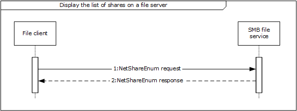

Figure 9: Sequence diagram for Display the list of shares on a file server

- The file client sends a NetrShareEnum request to the SMB file service (as described in [MS-SRVS](../MS-SRVS/MS-SRVS.md) section 3.1.4.8) in order to retrieve the list of shares.
- The SMB file service responds to the file client with a NetrShareEnum response, containing a list of shares, as described in [MS-SRVS] section 3.1.4.8.
**Task 3: Enumerate a Directory Using the SMB Protocol**

- The SMB file client uses the mechanisms described in [MS-DFSC](../MS-DFSC/MS-DFSC.md) section 3.1.4.1 to determine if the path references a DFS namespace. The path in this example does not reference a DFS namespace, the file client performs the Common Task 1 **Open a File in an SMB File Share** sequence to obtain a handle to the directory represented by UncPath.
- The file client performs the Common Task 2 **Enumerate a Directory Using the SMB Protocol** sequence to enumerate the contents of the directory and their attributes.
- The file client performs the Common Task 4 **Close a File Using the SMB Protocol** sequence to close the directory handle previously opened.
**Task 4: Read a File By Using the SMB Protocol**

- The SMB Application performs the Common Task 1 **Open a File in an SMB File Share** sequence in order to obtain a handle to the file represented by UncPath.
- The SMB Application performs the Common Task 3 **Read a file using the SMB protocol** sequence to obtain the contents of the file.
- The SMB Application performs the Common Task 4 **Close a File Using the SMB Protocol** sequence to close the file handle previously opened.

## 3.2 Example 2: Access a File in a Domain

The **Access a File in a Domain** use case illustrates a typical user interaction with the File Access Services System; the user locates a file within a DFS namespace and then reads it. This example demonstrates the use case described in section [2.5.2](#Section_2.5.2).

**Prerequisites**

All general requirements as set forth in section 2.4 Assumptions and Preconditions are met.

- The participating client and server computers are configured to belong to the same Active Directory domain.
- A DFS domain namespace is present in the Active Directory domain. This namespace contains at least one link, whose target contains a file which the User will access.
- A file exists in the shared directory of the File server.
**Initial System State**

- None.
**Final System State**

The user has obtained access to a specific file within a domain to which they have access.

**Sequence of Events**

This example is divided into three tasks:

- Open a file in DFS namespace.
- Enumerate a directory using the SMB protocol.
- Read a file using the SMB protocol.
**Task1: Open a File Within a DFS Namespace**

The sequence described in this example details how an application uses the file client to open a file on the SMB file share, using mechanisms appropriate to paths that encounter DFS namespaces.

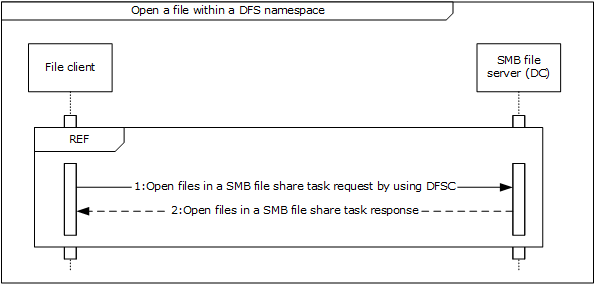

Figure 10: Sequence diagram for Open a file within a DFS namespace

The application invokes the open file operation within the DFS namespace with the specified UncPath, in order to direct the file client to communicate with the SMB File Service. This allows the application to gain access to the file and return a handle that it can use in subsequent operations against the file. The file client performs the mechanisms described in [MS-DFSC](../MS-DFSC/MS-DFSC.md) section 3.1.4.1 to perform the application's request. These mechanisms include sequences equivalent to the **Open a File in an SMB File Share** (section [3.5.1](#Section_3.5.1)) sequence diagram.

- If the operation was successful, the SMB file service generates a handle, which is returned to the file client for use when performing subsequent operations on the file.
**Task 2: Enumerate a Directory Using the SMB Protocol**

- The SMB client performs the Common Task 2 **Enumerate a Directory Using the SMB Protocol** sequence to enumerate the contents of the directory and their attributes.
- The SMB Application performs the Common Task 4 **Close a File Using the SMB Protocol** sequence to close the directory handle previously opened.
**Task 3: Read a File Using the SMB Protocol**

- The SMB-enabled application performs Common Task 1 **Open a File in an SMB File Share** sequence to obtain a handle to the file represented by UncPath.
- The SMB-enabled application performs the Common Task 3 **Read a File Using the SMB Protocol** sequence to obtain the contents of the file.
- The SMB Application performs the Common Task 4 **Close a File Using the SMB Protocol** sequence to close the file handle previously opened.

## 3.3 Example 3: Two Applications Communicate Via a Shared File

This example illustrates the interaction between two applications, one using the NFS File Access Protocol and another using the SMB File Access Protocol, to share a file on a remote file server. This example demonstrates the use case described in section [2.5.3](#Section_2.5.3). The application in this example accesses an NFS file using NFS version 2 (as described in [[RFC1094]](https://go.microsoft.com/fwlink/?LinkId=90267)) or NFS version 3 (as described in [[RFC1813]](https://go.microsoft.com/fwlink/?LinkId=90294)).

**Prerequisites**

All general requirements as set forth in section 2.4 Assumptions and Preconditions are met.

- The participating client and server computers are configured to belong to the same Active Directory domain.
- The NFS and SMB File shares are preconfigured on the file server computer to have access to the same directory in the object store, and are provisioned to allow SMB user and NFS user access to the SMB file share and NFS file share, respectively. Further, the client computer from which the NFS User will access the NFS file share is granted access on the NFS file share.
- A handle already exists for the NFS file share.
- The NFS file service is configured to use Active Directory as the LDAP mapping store for user account mapping, as described in [[RFC2307]](https://go.microsoft.com/fwlink/?LinkId=90333).
- The file server hosting the NFS file share is configured to do LDAP lookups on the Active Directory.
- The user account corresponding to the SMB User in Active Directory has the **uidNumber** attribute set to the value of the user ID field of the AUTH_SYS credentials corresponding to the NFS User.
- A group account corresponding to the group that the SMB User belongs to in Active Directory has the **gidNumber** attribute set to the value of the group ID field of the AUTH_SYS credentials corresponding to the NFS user.
- The directory in the object store on the file server that is being shared by the SMB file share and NFS file share does not already have a file with the same name as the file being shared in this example.
**Initial System State**

None.

**Final System State**

A new file has been created in the directory on the object store that backs the NFS file share and SMB file share. This file contains the data from both the NFS user and SMB user.

**Sequence of Events**

This example is divided into nine tasks:

- Open a file in an SMB file share
- Request a directory change notification using SMB
- Open a file in an NFS file share.
- Write a file using the NFS protocol
- Receive a directory change notification using SMB
- Read a file using the SMB protocol
- Write a file using SMB protocol
- Close a file using the SMB protocol
- Read a file using NFS protocol
**Task 1: Open a File in an SMB File Share (Common Task 1)**

**Task 2: Request Directory Change Notification Using SMB**

The sequence described in this example details how Application 1 uses the file client to request directory change notifications from the SMB file service for a directory on the SMB file share.

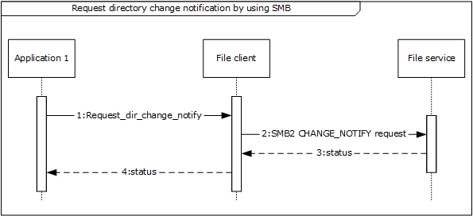

Figure 11: Sequence diagram for Request directory change notification using SMB

- Application 1 registers for a change notification by passing the directory handle and a notification filter that contains the type of notifications it is supposed to receive.
- The file client sends an SMB2 CHANGE NOTIFY request (see [MS-SMB2](../MS-SMB2/MS-SMB2.md) section 2.2.35) to the file service in order to register a change notification on the directory that was successfully opened in the previous step.
- On successful completion of the SMB2 CHANGE NOTIFY request, the SMB file service returns the directory handle back to the file client.
- The file client returns the directory handle to Application 1. This is described further in [MS-SMB2] section 3.3.5.19.
**Task 3: Open a File in an NFS File Share**

The sequence described in this example details how an application uses the file client to open a file on an NFS file share.

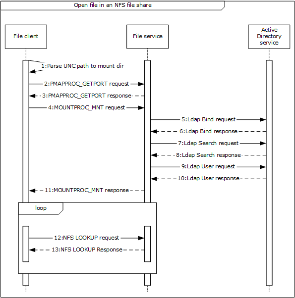

Figure 12: Sequence diagram for Open a file in an NFS file share

- The NFS file client extracts the file server name, NFS file share, and the relative path to the file to be opened from the unc_path as indicated in the message Parse UNC Path To Mount Dir().
- The NFS file client contacts the file service to obtain the port number of the NFS file service by sending a PMAPPROC_GETPORT request, as described in [[RFC1833]](https://go.microsoft.com/fwlink/?LinkId=161319) section 3.2.
- The file service returns the port number of the NFS file service.
- The NFS file client then contacts the mount file service on the file server with the MOUNTPROC3_MNT request (as described in [RFC1833] section 5.2.1), in order to get the NFS file handle corresponding to the NFS share name.
- The file client sends an LDAP Bind_request to the file service in order to configure the Active Directory service, as described in [[RFC2251]](https://go.microsoft.com/fwlink/?LinkId=90325) section 4.2.
- The file service verifies the credentials of the incoming bind request and binds to the configured Active Directory service.
- The file service sends an LDAP Search request message to the Active Directory service in order to translate the supplied NFS identity (UID) to an account name that can be presented to the authentication service.
- The Active Directory service returns a list of zero or more account names, with related records and a count, as described in [RFC2251] section 4.5. Whenever there is no unique translation from the supplied identity, the NFS file service fails the authentication and returns STATUS_NOT_FOUND back to the caller.
- Whenever there is a unique translation from the supplied NFS identity, the NFS file service continues the authentication process. The file service sends a logon user request message to the authentication service in order to authenticate the user identified by the account name obtained as a result of the LDAP search request, as described in section 6 of [MS-AUTHSOD](../MS-AUTHSOD/MS-AUTHSOD.md).
- The authentication service returns a security token, used in subsequent operations to identify the user account.
- On successful completion of authentication, the mount service validates the directory path, by verifying that the path sent by the NFS file client is provisioned for NFS sharing on the file server.
- The file client then traverses the path to the file on the NFS file share, in order to obtain an NFS File Handle corresponding to the file. The file client uses a LOOKUP request as described in [RFC1813] section 3.3.3 to obtain an NFS file handle corresponding to the component path to the target file.
- If the user identity has been authenticated previously, the file service returns a file handle that points to a file on the NFS file share. If there are more files to process, return to step 12.
**Task 4: Write a File Using the NFS Protocol**

The sequence described in this example details how an application uses the file client to update the contents of a file on the NFS file share.

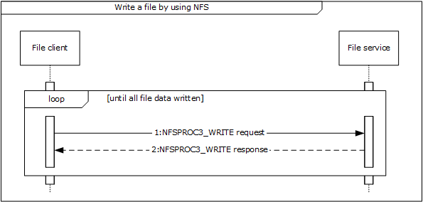

Figure 13: Sequence diagram for Write a file using the NFS protocol

- The file client writes the equested file contents, as represented by file_data, by issuing a series of NFS requests to the file service using the NFSPROC3_WRITE message as described in [RFC1813], section 3.3.7 to write the provided file data.
- If the user identity has been authenticated previously, and if it is still valid for the current message call, then content is successfully written in the file. Otherwise, the file service authenticates the user identity (steps 5 to 10 in Task 3: **Open a File in an NFS File Share**) and then writes the content to the file.
**Task 5: Receive a Directory Change Notification Using SMB**

The sequence described in this example details how the Application receives change notifications in response to a previously registered Request Directory Change Notification using SMB.

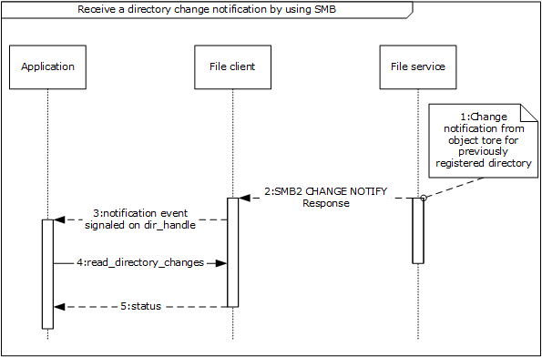

Figure 14: Sequence diagram for Receiving directory change notification using SMB

- The SMB file service receives a notification from the underlying object store in response to changes in the directory that was previously registered for notifications. The mechanism of this notification is specific to the object store implementation and is not covered in this document.
- In response to the change notification from the object store, the SMB file service sends an SMB2 CHANGE NOTIFY response message [MS-SMB2] section 2.2.36 to the SMB file client. As a part of this message the SMB file client receives details of the changes that occurred in the directory namespace as represented by the set of notify_entries. This is described further in [MS-SMB2] section 3.3.5.19.
- The SMB file client indicates the receipt of notification event from the SMB file service by signaling the dir_handle that was returned previously on successful completion of the Perform File Operation SMB Request Directory Change Notification sequence.
- The SMB application next reads the changes that occurred in the directory representing dir_handle by sending the read_directory_changes() message to the SMB file client. read_directory_changes() is an example of an application specific message that the SMB Application uses to read the set of changes in the directory.
- On successful completion of this message, the SMB application receives the updates that happened in the directory as represented by dir_updates.
**Task 6: Read a File Using the SMB Protocol (Common Task 3)**

**Task 7: Write a File Using the SMB Protocol**

The sequence described in this example details how the Application1 uses the file client to update the contents of a file on the SMB file share.

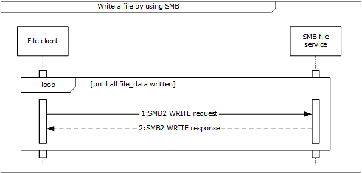

Figure 15: Sequence diagram for Write a file using the SMB protocol

- The file to be written can be larger than can be processed by a single SMB2 WRITE request/SMB2 WRITE response pair. If so, the file client issues a series of SMB2 WRITE requests until the complete file has been written. The file client uses internally held state and the supplied file handle to obtain the file_id used to identify the file to the SMB file service, and sends an SMB2 WRITE Request (see [MS-SMB2] section 2.2.21) to the SMB file service for a piece of the file. A single piece of the file can be defined by the offset of the start of the piece from the beginning of the file and the length of the piece to be written. This is further described in [MS-SMB2] section 3.2.4.7. The size of the piece of the file to be retrieved is limited by the upper limit of a single SMB2 WRITE Request as supplied by the SMB file service to the file client in the SMB2 NEGOTIATE response (see [MS-SMB2] section 2.2.4) during the session establishment negotiation sequence.
- The SMB file service returns the status code in the **Status** field of the SMB2 header of the response to the file client that issued the request to write data to the file. The SMB file service also returns the **Count** value from the SMB2 WRITE response following the SMB2 header, indicating how many bytes were written ([MS-SMB2] section 3.2.5.12).
**Task 8: Close a File Using the SMB Protocol (Common Task 4)**

**Task 9: Read a File Using the NFS Protocol**

The sequence described in this example details how an application uses the file client to read the contents of a file on an NFS file share.

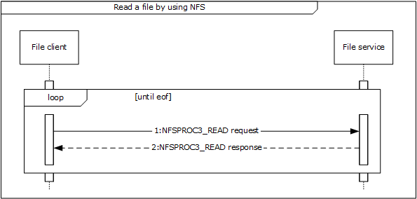

Figure 16: Sequence diagram for Read a file using the NFS protocol

- The Application directs the file client to communicate with the file service on a file server in order to get the complete file contents by issuing a series of NFS requests to the file service. The file client uses the NFSPROC3_READ message as described in [RFC1813], section 3.3.6 to read the file data.
The file service responds to the file client with the contents of the file that the file client requested.

## 3.4 Example 4: Access a Remote File Using WebDAV

**Access a Remote File Using WebDAV** illustrates a typical user interaction with the WebDAV service, as the user locates a file within a web directory, writes into it, and then reads the file. This example demonstrates the use case described in section [2.5.4](#Section_2.5.4).

**Prerequisites**

All general requirements as set forth in section 2.4 Assumptions and Preconditions are met.

- The user has the URL of a web directory.
- A file exists in the web directory and User has write access to the file.
**Initial System State**

None.

**Final System State**

User has updated a specific file in web directory.

**Sequence of events**

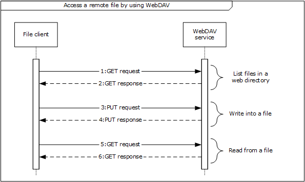

Figure 17: Sequence diagram for Access a remote file using WebDAV

- The application directs the file client to send a GET request via a WebDAV HTTP request ([[RFC4918]](https://go.microsoft.com/fwlink/?LinkId=151240) section 9.4). This is sent to the WebDAV service in order to enumerate a list of files and directories from a known URL.
- The WebDAV service sends a GET response with a list of files and directories to the file client ([RFC4918] section 9.4).
- The application directs the file client to send a PUT request via a WebDAV HTTP request ([RFC4918] section 9.7) in order to write content to the specified file.
- On success, the WebDAV service responds to the file client with a PUT response ([RFC4918] section 9.7).
- The application directs the file client to send a GET request via a WebDAV HTTP request ([RFC4918] section 9.4) to WebDAV service in order to read the contents of specified file.
- The WebDAV service sends a GET response with the content of the specified file to the file client ([RFC4918] section 9.4).

## 3.5 Common Tasks

### 3.5.1 Common Task 1: Open a File in an SMB File Share

The sequence described in this example details how an application opens a file on an SMB file share.

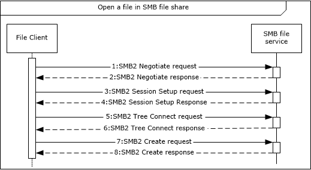

Figure 18: Sequence diagram for Open a file in an SMB file share

- The file client sends an SMB2 Negotiate request to the SMB file services (as described in [MS-SMB2](../MS-SMB2/MS-SMB2.md) section 2.2.3) in order to notify the server about the dialects of the SMB2 protocol that the client understands.
- The SMB file service responds to the file client with an SMB2 Negotiate response (see [MS-SMB2] section 2.2.4), in order to notify the client of the preferred common dialect.
- The file client attempts to establish a session with SMB file service using the SMB2 SESSION_SETUP request, described in [MS-SMB2] section 2.2.5.
- The SMB file service responds with an SMB2 SESSION_SETUP response, as described in [MS-SMB2] section 2.2.6.
- The file client attempts to establish a tree connection between the file client and the SMB file service using an SMB2 TREE_CONNECT request (see [MS-SMB2] section 2.2.9) using the session identifier session_id previously obtained in step 4 and the UNC path to the selected SMB file share provided by the application.
- The SMB file service sends an SMB2 TREE_CONNECT response (see [MS-SMB2] section 2.2.10) with details of the tree connection, including an identifier tree_id that the SMB file client can use to identify subsequent requests that use the tree connection.
- Once the file client has identified a suitable tree connection for the SMB file share specified in step 5, it sends an SMB2 CREATE Request to the SMB file service to request that a file specified by the application be opened.
- Once the SMB file service has processed the SMB2 CREATE Request, it sends an SMB2 CREATE response (see [MS-SMB2] section 2.2.14) that contains the result of the SMB2 CREATE request. (This process is described further in [MS-SMB2] section 3.2.4.3.) If the operation was successful, the SMB File service generates a handle that is returned to the File client for use when performing subsequent operations against the file.

### 3.5.2 Common Task 2: Enumerate a Directory Using the SMB Protocol

The sequence described in this example details how the application uses the SMB file client to query file system attributes and enumerate a directory on the SMB file share using the SMB protocol.

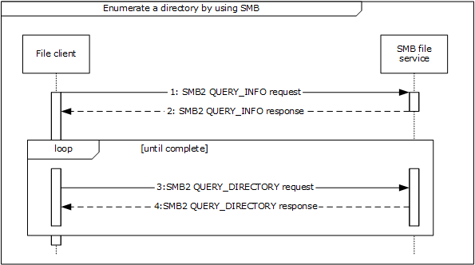

Figure 19: Sequence diagram for Enumerate a directory using SMB

- The file client sends an SMB2 QUERY_INFO request (see [MS-SMB2](../MS-SMB2/MS-SMB2.md) section 2.2.37) to the SMB file service to obtain information such as the label and serial number of the volume hosting the object store backing the SMB file share. This is an optional message, and the file client can send it multiple times for file system information.
- The SMB file service responds to the file client with file system information (SMB2 QUERY_INFO response, as described in [MS-SMB2] section 2.2.38).
- The file client sends an SMB2 QUERY_DIRECTORY request (see [MS-SMB2] section 2.2.33) to the SMB file service describing the requested enumeration. On the initial step of this loop the client specifies the SMB2_REOPEN flag in the request, indicating that the server initiates a new enumeration, discarding any previous enumeration state. This request is repeated until the enumeration is completed.
- The SMB file service sends an SMB2 QUERY_DIRECTORY Response (described in [MS-SMB2] section 2.2.34) message back to the file client containing the requested enumeration results.

### 3.5.3 Common Task 3: Read a File Using the SMB Protocol

This example details how an application uses the file client to read the contents of a file on an SMB file share.

Figure 20: Sequence diagram for Read a file using SMB

- The file client sends an SMB2 READ request (see [MS-SMB2](../MS-SMB2/MS-SMB2.md) section 2.2.19) to the SMB file service for a piece of the file. A single piece of the file can be defined by the offset of the start of the piece from the beginning of the file and the length of the piece to be retrieved. (This is further described in [MS-SMB2] section 3.2.4.5.) The size of the piece of the file to be retrieved is limited by the upper limit of a single SMB2 READ response (see [MS-SMB2] section 2.2.20) as supplied by the SMB file service to the SMB file client in the SMB2 NEGOTIATE response (see [MS-SMB2] section 2.2.4) during the session establishment negotiation sequence. This request is repeated until the response is STATUS_END_OF_FILE.
- The SMB file service responds to the file client with an SMB2 READ response (see [MS-SMB2] section 2.2.20).

### 3.5.4 Common Task 4: Close a File Using the SMB Protocol

The sequence described in this example details how the Application uses the file client to close a previously open file or directory on the SMB file share.

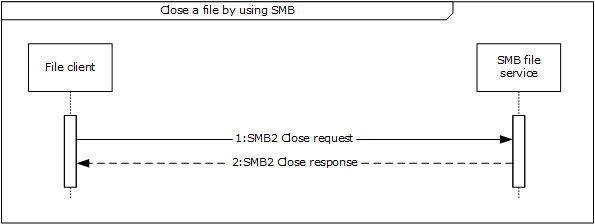

Figure 21: Sequence diagram for Close a file using SMB

- The file client sends an SMB2 CLOSE request (see [MS-SMB2](../MS-SMB2/MS-SMB2.md) section 2.2.15) to the SMB file service to notify the SMB file service that no further access is required to the file and that any resources held by the SMB file service to process requests for the file on behalf of the file client can be released.
- The SMB file service sends an SMB2 CLOSE response (see [MS-SMB2] section 2.2.16) message back to the file client to indicate that the SMB file service has processed the SMB2 CLOSE request. This process is further described in [MS-SMB2] section 3.3.5.10.

# 4 Microsoft Implementations

There are no variations in the behavior of the File Access Services System in different versions of Windows beyond those described in the specifications of the protocols supported by the system, as listed in section [2.2](#Section_2.2).

The information in this specification is applicable to the following Microsoft products:

- Windows 2000 operating system
- Windows 2000 Server operating system
- Windows 2000 Advanced Server operating system
- Windows XP operating system
- Windows Server 2003 operating system
- Windows Server 2003 R2 operating system
- Windows Vista operating system
- Windows Server 2008 operating system
- Windows Server 2008 R2 operating system
- Windows 7 operating system
- Windows 8 operating system
- Windows Server 2012 operating system
- Windows 8.1 operating system
- Windows Server 2012 R2 operating system
- Windows 10 operating system
- Windows Server 2016 operating system
- Windows Server operating system
- Windows Server 2019 operating system
- Windows Server 2022 operating system
- Windows 11 operating system
Exceptions, if any, are noted below. If a service pack number appears with the product version, behavior changed in that service pack. The new behavior also applies to subsequent service packs of the product unless otherwise specified.

## 4.1 Product Behavior

# 5 Change Tracking

This section identifies changes that were made to this document since the last release. Changes are classified as Major, Minor, or None.

The revision class **Major** means that the technical content in the document was significantly revised. Major changes affect protocol interoperability or implementation. Examples of major changes are:

- A document revision that incorporates changes to interoperability requirements.
- A document revision that captures changes to protocol functionality.
The revision class **Minor** means that the meaning of the technical content was clarified. Minor changes do not affect protocol interoperability or implementation. Examples of minor changes are updates to clarify ambiguity at the sentence, paragraph, or table level.

The revision class **None** means that no new technical changes were introduced. Minor editorial and formatting changes may have been made, but the relevant technical content is identical to the last released version.

The changes made to this document are listed in the following table. For more information, please contact [dochelp@microsoft.com](mailto:dochelp@microsoft.com).

| Section | Description | Revision class |
| --- | --- | --- |
| [2.2.1](#Section_2.2.1) Member Protocol Roles | Updated for this version of Windows client. | Major |
| [4](#Section_4) Microsoft Implementations | Updated for this version of Windows client. | Major |

## Revision History

| Date | Version | Revision Class | Comments |
| --- | --- | --- | --- |
| 7/12/2012 | 1.0 | New | Released new document. |
| 10/25/2012 | 1.1 | Minor | Clarified the meaning of the technical content. |
| 1/31/2013 | 1.1 | None | No changes to the meaning, language, or formatting of the technical content. |
| 8/8/2013 | 2.0 | Major | Updated and revised the technical content. |
| 11/14/2013 | 2.1 | Minor | Clarified the meaning of the technical content. |
| 2/13/2014 | 2.1 | None | No changes to the meaning, language, or formatting of the technical content. |
| 5/15/2014 | 2.1 | None | No changes to the meaning, language, or formatting of the technical content. |
| 6/30/2015 | 3.0 | Major | Significantly changed the technical content. |
| 9/24/2015 | 4.0 | Major | Significantly changed the technical content. |
| 10/16/2015 | 4.0 | None | No changes to the meaning, language, or formatting of the technical content. |
| 9/26/2016 | 5.0 | Major | Significantly changed the technical content. |
| 6/1/2017 | 5.0 | None | No changes to the meaning, language, or formatting of the technical content. |
| 12/15/2017 | 6.0 | Major | Significantly changed the technical content. |
| 11/5/2018 | 7.0 | Major | Significantly changed the technical content. |
| 6/3/2021 | 8.0 | Major | Significantly changed the technical content. |
| 10/26/2021 | 9.0 | Major | Significantly changed the technical content. |
