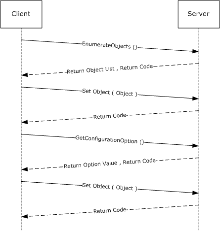
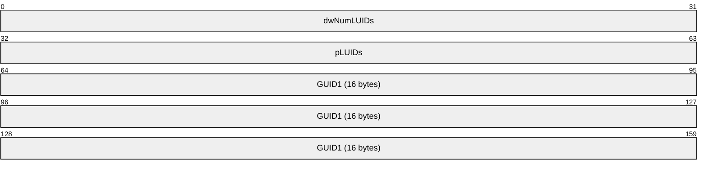
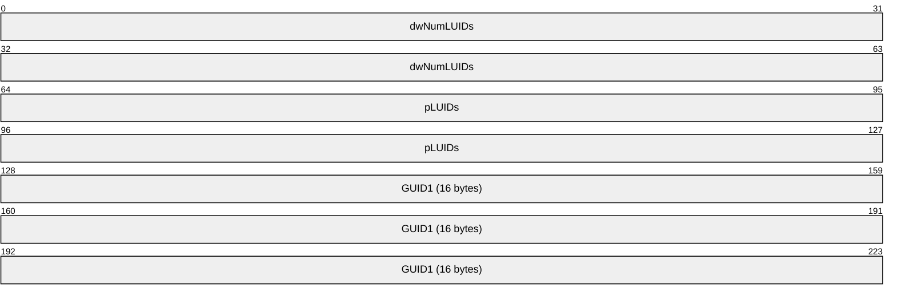
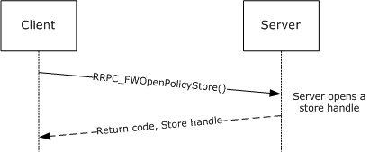
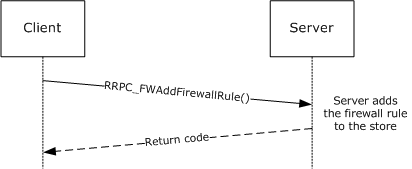
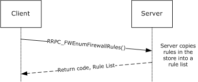
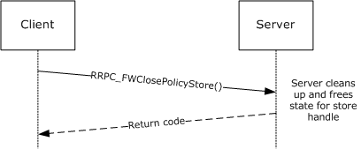
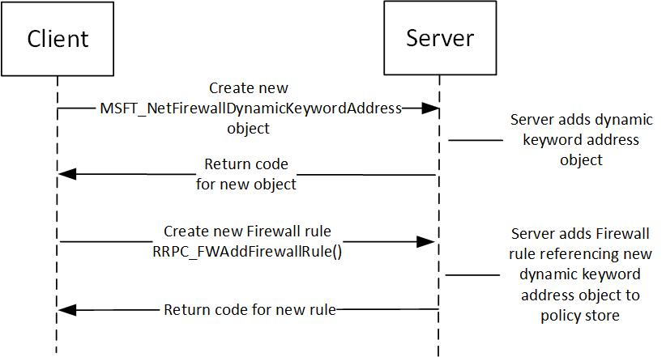

# [MS-FASP]: Firewall and Advanced Security Protocol

Table of Contents

1 Introduction

- [1 Introduction](#Section_1)
  - [1.1 Glossary](#Section_1.1)
  - [1.2 References](#Section_1.2)
    - [1.2.1 Normative References](#Section_1.2.1)
    - [1.2.2 Informative References](#Section_1.2.2)
  - [1.3 Overview](#Section_1.3)
  - [1.4 Relationship to Other Protocols](#Section_1.4)
  - [1.5 Prerequisites/Preconditions](#Section_1.5)
  - [1.6 Applicability Statement](#Section_1.6)
  - [1.7 Versioning and Capability Negotiation](#Section_1.7)
  - [1.8 Vendor-Extensible Fields](#Section_1.8)
  - [1.9 Standards Assignments](#Section_1.9)

2 Messages

- [2 Messages](#Section_2)
  - [2.1 Transport](#Section_2.1)
  - [2.2 Common Data Types](#Section_2.2)
    - [2.2.1 FW_STORE_TYPE](#Section_2.2.1)
    - [2.2.2 FW_PROFILE_TYPE](#Section_2.2.2)
    - [2.2.3 FW_POLICY_ACCESS_RIGHT](#Section_2.2.3)
    - [2.2.4 FW_IPV4_SUBNET](#Section_2.2.4)
    - [2.2.5 FW_IPV4_SUBNET_LIST](#Section_2.2.5)
    - [2.2.6 FW_IPV6_SUBNET](#Section_2.2.6)
    - [2.2.7 FW_IPV6_SUBNET_LIST](#Section_2.2.7)
    - [2.2.8 FW_IPV4_ADDRESS_RANGE](#Section_2.2.8)
    - [2.2.9 FW_IPV4_RANGE_LIST](#Section_2.2.9)
    - [2.2.10 FW_IPV6_ADDRESS_RANGE](#Section_2.2.10)
    - [2.2.11 FW_IPV6_RANGE_LIST](#Section_2.2.11)
    - [2.2.12 FW_PORT_RANGE](#Section_2.2.12)
    - [2.2.13 FW_PORT_RANGE_LIST](#Section_2.2.13)
    - [2.2.14 FW_PORT_KEYWORD](#Section_2.2.14)
    - [2.2.15 FW_PORTS](#Section_2.2.15)
    - [2.2.16 FW_ICMP_TYPE_CODE](#Section_2.2.16)
    - [2.2.17 FW_ICMP_TYPE_CODE_LIST](#Section_2.2.17)
    - [2.2.18 FW_INTERFACE_LUIDS](#Section_2.2.18)
    - [2.2.19 FW_DIRECTION](#Section_2.2.19)
    - [2.2.20 FW_INTERFACE_TYPE](#Section_2.2.20)
    - [2.2.21 FW_ADDRESS_KEYWORD](#Section_2.2.21)
    - [2.2.22 FW_ADDRESSES](#Section_2.2.22)
    - [2.2.23 FW_DYNAMIC_KEYWORD_ADDRESS_ID_LIST](#Section_2.2.23)
    - [2.2.24 FW_RULE_STATUS](#Section_2.2.24)
    - [2.2.25 FW_RULE_STATUS_CLASS](#Section_2.2.25)
    - [2.2.26 FW_OBJECT_CTRL_FLAG](#Section_2.2.26)
    - [2.2.27 FW_ENFORCEMENT_STATE](#Section_2.2.27)
    - [2.2.28 FW_OBJECT_METADATA](#Section_2.2.28)
    - [2.2.29 FW_OS_PLATFORM_OP](#Section_2.2.29)
    - [2.2.30 FW_OS_PLATFORM](#Section_2.2.30)
    - [2.2.31 FW_OS_PLATFORM_LIST](#Section_2.2.31)
    - [2.2.32 FW_RULE_ORIGIN_TYPE](#Section_2.2.32)
    - [2.2.33 FW_ENUM_RULES_FLAGS](#Section_2.2.33)
    - [2.2.34 FW_RULE_ACTION](#Section_2.2.34)
    - [2.2.35 FW_RULE_FLAGS](#Section_2.2.35)
    - [2.2.36 FW_RULE2_0](#Section_2.2.36)
    - [2.2.37 FW_RULE](#Section_2.2.37)
    - [2.2.38 FW_PROFILE_CONFIG](#Section_2.2.38)
    - [2.2.39 FW_GLOBAL_CONFIG_IPSEC_EXEMPT_VALUES](#Section_2.2.39)
    - [2.2.40 FW_GLOBAL_CONFIG_PRESHARED_KEY_ENCODING_VALUES](#Section_2.2.40)
    - [2.2.41 FW_GLOBAL_CONFIG_IPSEC_THROUGH_NAT_VALUES](#Section_2.2.41)
    - [2.2.42 FW_GLOBAL_CONFIG](#Section_2.2.42)
    - [2.2.43 FW_CONFIG_FLAGS](#Section_2.2.43)
    - [2.2.44 FW_NETWORK](#Section_2.2.44)
    - [2.2.45 FW_ADAPTER](#Section_2.2.45)
    - [2.2.46 FW_DIAG_APP](#Section_2.2.46)
    - [2.2.47 FW_RULE_CATEGORY](#Section_2.2.47)
    - [2.2.48 FW_PRODUCT](#Section_2.2.48)
    - [2.2.49 FW_IP_VERSION](#Section_2.2.49)
    - [2.2.50 FW_IPSEC_PHASE](#Section_2.2.50)
    - [2.2.51 FW_CS_RULE_FLAGS](#Section_2.2.51)
    - [2.2.52 FW_CS_RULE_ACTION](#Section_2.2.52)
    - [2.2.53 FW_CS_RULE2_10](#Section_2.2.53)
    - [2.2.54 FW_CS_RULE2_0](#Section_2.2.54)
    - [2.2.55 FW_CS_RULE](#Section_2.2.55)
    - [2.2.56 FW_CERT_CRITERIA_TYPE](#Section_2.2.56)
    - [2.2.57 FW_CERT_CRITERIA_NAME_TYPE](#Section_2.2.57)
    - [2.2.58 FW_CERT_CRITERIA_FLAGS](#Section_2.2.58)
    - [2.2.59 FW_CERT_CRITERIA](#Section_2.2.59)
    - [2.2.60 FW_AUTH_METHOD](#Section_2.2.60)
    - [2.2.61 FW_AUTH_SUITE_FLAGS](#Section_2.2.61)
    - [2.2.62 FW_AUTH_SUITE2_10](#Section_2.2.62)
    - [2.2.63 FW_AUTH_SUITE](#Section_2.2.63)
    - [2.2.64 FW_AUTH_SET2_10](#Section_2.2.64)
    - [2.2.65 FW_AUTH_SET](#Section_2.2.65)
    - [2.2.66 FW_CRYPTO_KEY_EXCHANGE_TYPE](#Section_2.2.66)
    - [2.2.67 FW_CRYPTO_ENCRYPTION_TYPE](#Section_2.2.67)
    - [2.2.68 FW_CRYPTO_HASH_TYPE](#Section_2.2.68)
    - [2.2.69 FW_CRYPTO_PROTOCOL_TYPE](#Section_2.2.69)
    - [2.2.70 FW_PHASE1_CRYPTO_SUITE](#Section_2.2.70)
    - [2.2.71 FW_PHASE2_CRYPTO_SUITE](#Section_2.2.71)
    - [2.2.72 FW_PHASE1_CRYPTO_FLAGS](#Section_2.2.72)
    - [2.2.73 FW_PHASE2_CRYPTO_PFS](#Section_2.2.73)
    - [2.2.74 FW_CRYPTO_SET](#Section_2.2.74)
    - [2.2.75 FW_BYTE_BLOB](#Section_2.2.75)
    - [2.2.76 FW_COOKIE_PAIR](#Section_2.2.76)
    - [2.2.77 FW_PHASE1_KEY_MODULE_TYPE](#Section_2.2.77)
    - [2.2.78 FW_CERT_INFO](#Section_2.2.78)
    - [2.2.79 FW_AUTH_INFO](#Section_2.2.79)
    - [2.2.80 FW_ENDPOINTS](#Section_2.2.80)
    - [2.2.81 FW_PHASE1_SA_DETAILS](#Section_2.2.81)
    - [2.2.82 FW_PHASE2_TRAFFIC_TYPE](#Section_2.2.82)
    - [2.2.83 FW_PHASE2_SA_DETAILS](#Section_2.2.83)
    - [2.2.84 FW_PROFILE_CONFIG_VALUE](#Section_2.2.84)
    - [2.2.85 FW_MM_RULE](#Section_2.2.85)
    - [2.2.86 FW_CONN_HANDLE](#Section_2.2.86)
    - [2.2.87 FW_MATCH_KEY](#Section_2.2.87)
    - [2.2.88 FW_DATA_TYPE](#Section_2.2.88)
    - [2.2.89 FW_MATCH_VALUE](#Section_2.2.89)
    - [2.2.90 FW_MATCH_TYPE](#Section_2.2.90)
    - [2.2.91 FW_QUERY_CONDITION](#Section_2.2.91)
    - [2.2.92 FW_QUERY_CONDITIONS](#Section_2.2.92)
    - [2.2.93 FW_QUERY](#Section_2.2.93)
    - [2.2.94 FW_POLICY_STORE_HANDLE](#Section_2.2.94)
    - [2.2.95 FW_PRODUCT_HANDLE](#Section_2.2.95)
    - [2.2.96 FW_KEY_MODULE](#Section_2.2.96)
    - [2.2.97 FW_TRUST_TUPLE_KEYWORD](#Section_2.2.97)
    - [2.2.98 FW_RULE2_10](#Section_2.2.98)
    - [2.2.99 FW_AUTH_SET_FLAGS](#Section_2.2.99)
    - [2.2.100 FW_CRYPTO_SET_FLAGS](#Section_2.2.100)
    - [2.2.101 FW_NETWORK_NAMES](#Section_2.2.101)
    - [2.2.102 FW_RULE2_20](#Section_2.2.102)
    - [2.2.103 FW_RULE_FLAGS2](#Section_2.2.103)
    - [2.2.104 FW_RULE2_24](#Section_2.2.104)
    - [2.2.105 FW_RULE2_25](#Section_2.2.105)
    - [2.2.106 FW_RULE2_26](#Section_2.2.106)
    - [2.2.107 FW_RULE2_27](#Section_2.2.107)
    - [2.2.108 FW_RULE2_31](#Section_2.2.108)

3 Protocol Details

- [3 Protocol Details](#Section_3)
  - [3.1 Server Details](#Section_3.1)
    - [3.1.1 Abstract Data Model](#Section_3.1.1)
    - [3.1.2 Timers](#Section_3.1.2)
    - [3.1.3 Initialization](#Section_3.1.3)
    - [3.1.4 Message Processing Events and Sequencing Rules](#Section_3.1.4)
      - [3.1.4.1 RRPC_FWOpenPolicyStore (Opnum 0)](#Section_3.1.4.1)
      - [3.1.4.2 RRPC_FWClosePolicyStore (Opnum 1)](#Section_3.1.4.2)
      - [3.1.4.3 RRPC_FWRestoreDefaults (Opnum 2)](#Section_3.1.4.3)
      - [3.1.4.4 RRPC_FWGetGlobalConfig (Opnum 3)](#Section_3.1.4.4)
      - [3.1.4.5 RRPC_FWSetGlobalConfig (Opnum 4)](#Section_3.1.4.5)
      - [3.1.4.6 RRPC_FWAddFirewallRule (Opnum 5)](#Section_3.1.4.6)
      - [3.1.4.7 RRPC_FWSetFirewallRule (Opnum 6)](#Section_3.1.4.7)
      - [3.1.4.8 RRPC_FWDeleteFirewallRule (Opnum 7)](#Section_3.1.4.8)
      - [3.1.4.9 RRPC_FWDeleteAllFirewallRules (Opnum 8)](#Section_3.1.4.9)
      - [3.1.4.10 RRPC_FWEnumFirewallRules (Opnum 9)](#Section_3.1.4.10)
      - [3.1.4.11 RRPC_FWGetConfig (Opnum 10)](#Section_3.1.4.11)
      - [3.1.4.12 RRPC_FWSetConfig (Opnum 11)](#Section_3.1.4.12)
      - [3.1.4.13 RRPC_FWAddConnectionSecurityRule (Opnum 12)](#Section_3.1.4.13)
      - [3.1.4.14 RRPC_FWSetConnectionSecurityRule (Opnum 13)](#Section_3.1.4.14)
      - [3.1.4.15 RRPC_FWDeleteConnectionSecurityRule (Opnum 14)](#Section_3.1.4.15)
      - [3.1.4.16 RRPC_FWDeleteAllConnectionSecurityRules (Opnum 15)](#Section_3.1.4.16)
      - [3.1.4.17 RRPC_FWEnumConnectionSecurityRules (Opnum 16)](#Section_3.1.4.17)
      - [3.1.4.18 RRPC_FWAddAuthenticationSet (Opnum 17)](#Section_3.1.4.18)
      - [3.1.4.19 RRPC_FWSetAuthenticationSet (Opnum 18)](#Section_3.1.4.19)
      - [3.1.4.20 RRPC_FWDeleteAuthenticationSet (Opnum 19)](#Section_3.1.4.20)
      - [3.1.4.21 RRPC_FWDeleteAllAuthenticationSets (Opnum 20)](#Section_3.1.4.21)
      - [3.1.4.22 RRPC_FWEnumAuthenticationSets (Opnum 21)](#Section_3.1.4.22)
      - [3.1.4.23 RRPC_FWAddCryptoSet (Opnum 22)](#Section_3.1.4.23)
      - [3.1.4.24 RRPC_FWSetCryptoSet (Opnum 23)](#Section_3.1.4.24)
      - [3.1.4.25 RRPC_FWDeleteCryptoSet (Opnum 24)](#Section_3.1.4.25)
      - [3.1.4.26 RRPC_FWDeleteAllCryptoSets (Opnum 25)](#Section_3.1.4.26)
      - [3.1.4.27 RRPC_FWEnumCryptoSets (Opnum 26)](#Section_3.1.4.27)
      - [3.1.4.28 RRPC_FWEnumPhase1SAs (Opnum 27)](#Section_3.1.4.28)
      - [3.1.4.29 RRPC_FWEnumPhase2SAs (Opnum 28)](#Section_3.1.4.29)
      - [3.1.4.30 RRPC_FWDeletePhase1SAs (Opnum 29)](#Section_3.1.4.30)
      - [3.1.4.31 RRPC_FWDeletePhase2SAs (Opnum 30)](#Section_3.1.4.31)
      - [3.1.4.32 RRPC_FWEnumProducts (Opnum 31)](#Section_3.1.4.32)
      - [3.1.4.33 RRPC_FWAddMainModeRule (Opnum 32)](#Section_3.1.4.33)
      - [3.1.4.34 RRPC_FWSetMainModeRule (Opnum 33)](#Section_3.1.4.34)
      - [3.1.4.35 RRPC_FWDeleteMainModeRule (Opnum 34)](#Section_3.1.4.35)
      - [3.1.4.36 RRPC_FWDeleteAllMainModeRules (Opnum 35)](#Section_3.1.4.36)
      - [3.1.4.37 RRPC_FWEnumMainModeRules (Opnum 36)](#Section_3.1.4.37)
      - [3.1.4.38 RRPC_FWQueryFirewallRules (Opnum 37)](#Section_3.1.4.38)
      - [3.1.4.39 RRPC_FWQueryMainModeRules (Opnum 39)](#Section_3.1.4.39)
      - [3.1.4.40 RRPC_FWQueryAuthenticationSets (Opnum 40)](#Section_3.1.4.40)
      - [3.1.4.41 RRPC_FWQueryCryptoSets (Opnum 41)](#Section_3.1.4.41)
      - [3.1.4.42 RRPC_FWEnumNetworks (Opnum 42)](#Section_3.1.4.42)
      - [3.1.4.43 RRPC_FWEnumAdapters (Opnum 43)](#Section_3.1.4.43)
      - [3.1.4.44 RRPC_FWGetGlobalConfig2_10 (Opnum 44)](#Section_3.1.4.44)
      - [3.1.4.45 RRPC_FWGetConfig2_10 (Opnum 45)](#Section_3.1.4.45)
      - [3.1.4.46 RRPC_FWAddFirewallRule2_10 (Opnum 46)](#Section_3.1.4.46)
      - [3.1.4.47 RRPC_FWSetFirewallRule2_10 (Opnum 47)](#Section_3.1.4.47)
      - [3.1.4.48 RRPC_FWEnumFirewallRules2_10 (Opnum 48)](#Section_3.1.4.48)
      - [3.1.4.49 RRPC_FWAddConnectionSecurityRule2_10 (Opnum 49)](#Section_3.1.4.49)
      - [3.1.4.50 RRPC_FWSetConnectionSecurityRule2_10 (Opnum 50)](#Section_3.1.4.50)
      - [3.1.4.51 RRPC_FWEnumConnectionSecurityRules2_10 (Opnum 51)](#Section_3.1.4.51)
      - [3.1.4.52 RRPC_FWQueryConnectionSecurityRules2_10 (Opnum 38)](#Section_3.1.4.52)
      - [3.1.4.53 RRPC_FWAddAuthenticationSet2_10 (Opnum 52)](#Section_3.1.4.53)
      - [3.1.4.54 RRPC_FWSetAuthenticationSet2_10 (Opnum 53)](#Section_3.1.4.54)
      - [3.1.4.55 RRPC_FWEnumAuthenticationSets2_10 (Opnum 54)](#Section_3.1.4.55)
      - [3.1.4.56 RRPC_FWAddCryptoSet2_10 (Opnum 55)](#Section_3.1.4.56)
      - [3.1.4.57 RRPC_FWSetCryptoSet2_10 (Opnum 56)](#Section_3.1.4.57)
      - [3.1.4.58 RRPC_FWEnumCryptoSets2_10 (Opnum 57)](#Section_3.1.4.58)
      - [3.1.4.59 RRPC_FWAddConnectionSecurityRule2_20 (Opnum 58)](#Section_3.1.4.59)
      - [3.1.4.60 RRPC_FWSetConnectionSecurityRule2_20 (Opnum 59)](#Section_3.1.4.60)
      - [3.1.4.61 RRPC_FWEnumConnectionSecurityRules2_20 (Opnum 60)](#Section_3.1.4.61)
      - [3.1.4.62 RRPC_FWQueryConnectionSecurityRules2_20 (Opnum 61)](#Section_3.1.4.62)
      - [3.1.4.63 RRPC_FWAddAuthenticationSet2_20 (Opnum 62)](#Section_3.1.4.63)
      - [3.1.4.64 RRPC_FWSetAuthenticationSet2_20 (Opnum 63)](#Section_3.1.4.64)
      - [3.1.4.65 RRPC_FWEnumAuthenticationSets2_20 (Opnum 64)](#Section_3.1.4.65)
      - [3.1.4.66 RRPC_FWQueryAuthenticationSets2_20 (Opnum 65)](#Section_3.1.4.66)
      - [3.1.4.67 RRPC_FWAddFirewallRule2_20 (Opnum 66)](#Section_3.1.4.67)
      - [3.1.4.68 RRPC_FWSetFirewallRule2_20 (Opnum 67)](#Section_3.1.4.68)
      - [3.1.4.69 RRPC_FWEnumFirewallRules2_20 (Opnum 68)](#Section_3.1.4.69)
      - [3.1.4.70 RRPC_FWQueryFirewallRules2_20 (Opnum 69)](#Section_3.1.4.70)
      - [3.1.4.71 RRPC_FWAddFirewallRule2_24 (Opnum 70)](#Section_3.1.4.71)
      - [3.1.4.72 RRPC_FWSetFirewallRule2_24 (Opnum 71)](#Section_3.1.4.72)
      - [3.1.4.73 RRPC_FWEnumFirewallRules2_24 (Opnum 72)](#Section_3.1.4.73)
      - [3.1.4.74 RRPC_FWQueryFirewallRules2_24 (Opnum 73)](#Section_3.1.4.74)
      - [3.1.4.75 RRPC_FWAddFirewallRule2_25 (Opnum 74)](#Section_3.1.4.75)
      - [3.1.4.76 RRPC_FWSetFirewallRule2_25 (Opnum 75)](#Section_3.1.4.76)
      - [3.1.4.77 RRPC_FWEnumFirewallRules2_25 (Opnum 76)](#Section_3.1.4.77)
      - [3.1.4.78 RRPC_FWQueryFirewallRules2_25 (Opnum 77)](#Section_3.1.4.78)
      - [3.1.4.79 RRPC_FWAddFirewallRule2_26 (Opnum 78)](#Section_3.1.4.79)
      - [3.1.4.80 RRPC_FWSetFirewallRule2_26 (Opnum 79)](#Section_3.1.4.80)
      - [3.1.4.81 RRPC_FWEnumFirewallRules2_26 (Opnum 80)](#Section_3.1.4.81)
      - [3.1.4.82 RRPC_FWQueryFirewallRules2_26 (Opnum 81)](#Section_3.1.4.82)
      - [3.1.4.83 RRPC_FWAddFirewallRule2_27 (Opnum 82)](#Section_3.1.4.83)
      - [3.1.4.84 RRPC_FWSetFirewallRule2_27 (Opnum 83)](#Section_3.1.4.84)
      - [3.1.4.85 RRPC_FWEnumFirewallRules2_27 (Opnum 84)](#Section_3.1.4.85)
      - [3.1.4.86 RRPC_FWQueryFirewallRules2_27 (Opnum 85)](#Section_3.1.4.86)
      - [3.1.4.87 RRPC_FWAddFirewallRule2_31 (Opnum 86)](#Section_3.1.4.87)
      - [3.1.4.88 RRPC_FWSetFirewallRule2_31 (Opnum 87)](#Section_3.1.4.88)
      - [3.1.4.89 RRPC_FWEnumFirewallRules2_31 (Opnum 88)](#Section_3.1.4.89)
      - [3.1.4.90 RRPC_FWQueryFirewallRules2_31 (Opnum 89)](#Section_3.1.4.90)
      - [3.1.4.91 RRPC_FWAddFirewallRule2_33 (Opnum 91)](#Section_3.1.4.91)
      - [3.1.4.92 RRPC_FWSetFirewallRule2_33 (Opnum 92)](#Section_3.1.4.92)
      - [3.1.4.93 RRPC_FWEnumFirewallRules2_33 (Opnum 93)](#Section_3.1.4.93)
      - [3.1.4.94 RRPC_FWQueryFirewallRules2_33 (Opnum 94)](#Section_3.1.4.94)
    - [3.1.5 Timer Events](#Section_3.1.5)
    - [3.1.6 Other Local Events](#Section_3.1.6)
      - [3.1.6.1 AddPortInUse](#Section_3.1.6.1)
      - [3.1.6.2 DeletePortInUse](#Section_3.1.6.2)
      - [3.1.6.3 AddDefaultFirewallRule](#Section_3.1.6.3)
      - [3.1.6.4 SetGroupPolicyRSoPStore](#Section_3.1.6.4)
      - [3.1.6.5 IsComputerInCommonCriteriaMode](#Section_3.1.6.5)
      - [3.1.6.6 SetEffectiveFirewallPolicy](#Section_3.1.6.6)
      - [3.1.6.7 AddTrustTuple](#Section_3.1.6.7)
      - [3.1.6.8 DeleteTrustTuple](#Section_3.1.6.8)
  - [3.2 Client Details](#Section_3.2)
    - [3.2.1 Abstract Data Model](#Section_3.2.1)
    - [3.2.2 Timers](#Section_3.2.2)
    - [3.2.3 Initialization](#Section_3.2.3)
    - [3.2.4 Message Processing Events and Sequencing Rules](#Section_3.2.4)
    - [3.2.5 Timer Events](#Section_3.2.5)
    - [3.2.6 Other Local Events](#Section_3.2.6)

4 Protocol Examples

- [4 Protocol Examples](#Section_4)
  - [4.1 Opening a Policy Store](#Section_4.1)
  - [4.2 Adding a Firewall Rule](#Section_4.2)
  - [4.3 Enumerating the Firewall Rules](#Section_4.3)
  - [4.4 Closing a Policy Store Handle](#Section_4.4)
  - [4.5 Creating an MSFT_NetFirewallDynamicKeywordAddress Object](#Section_4.5)

5 Security

- [5 Security](#Section_5)
  - [5.1 Security Considerations for Implementers](#Section_5.1)
  - [5.2 Index of Security Parameters](#Section_5.2)

6 Appendix A: Full IDL

- [6 Appendix A: Full IDL](#Section_6)

7 Appendix B: Product Behavior

- [7 Appendix B: Product Behavior](#Section_7)

8 Change Tracking

- [8 Change Tracking](#Section_8)

For the legal notice and IP terms, see [LEGAL.md](../LEGAL.md).
Last updated: 11/21/2025.
See [Revision History](#revision-history) for full version history.

# 1 Introduction

The Firewall and Advanced Security Protocol describes managing security policies on remote computers. The specific policies that this protocol manages are those of the firewall and advanced security components. The protocol allows the same functionality that is available locally; it can add, modify, delete, and enumerate policies. It can also enumerate [**security associations**](#gt_security-association-sa) that can be generated between hosts after this policy is enforced.

Sections 1.5, 1.8, 1.9, 2, and 3 of this specification are normative. All other sections and examples in this specification are informative.

## 1.1 Glossary

This document uses the following terms:

**access control entry (ACE)**: An entry in an [**access control list (ACL)**](#gt_access-control-list-acl) that contains a set of user rights and a [**security identifier (SID)**](#gt_security-identifier-sid) that identifies a principal for whom the rights are allowed, denied, or audited.

**access control list (ACL)**: A list of [**access control entries (ACEs)**](#gt_b581857f-39aa-4979-876b-daba67a40f15) that collectively describe the security rules for authorizing access to some resource; for example, an object or set of objects.

**Authenticated IP (AuthIP)**: An [**Internet Key Exchange (IKE)**](#gt_internet-key-exchange-ike) protocol extension, as specified in [MS-AIPS](../MS-AIPS/MS-AIPS.md).

**authentication header (AH)**: An [**Internet Protocol Security (IPsec)**](#gt_internet-protocol-security-ipsec) encapsulation mode that provides authentication and message integrity. For more information, see [[RFC4302]](https://go.microsoft.com/fwlink/?LinkId=90466) section 1.

**certificate revocation list (CRL)**: A list of certificates that have been revoked by the [**certification authority (CA)**](#gt_certification-authority-ca) that issued them (that have not yet expired of their own accord). The list has to be cryptographically signed by the CA that issues it. Typically, the certificates are identified by serial number. In addition to the serial number for the revoked certificates, the CRL contains the revocation reason for each certificate and the time the certificate was revoked. As described in [[RFC3280]](https://go.microsoft.com/fwlink/?LinkId=90414), two types of CRLs commonly exist in the industry. Base CRLs keep a complete list of revoked certificates, while delta CRLs maintain only those certificates that have been revoked since the last issuance of a base CRL. For more information, see [[X509]](https://go.microsoft.com/fwlink/?LinkId=90590) section 7.3, [[MSFT-CRL]](https://go.microsoft.com/fwlink/?LinkId=90181), and [RFC3280] section 5.

**certification authority (CA)**: A third party that issues public key certificates. Certificates serve to bind public keys to a user identity. Each user and certification authority (CA) can decide whether to trust another user or CA for a specific purpose, and whether this trust is to be transitive. For more information, see [RFC3280].

**common criteria mode**: A computer system is said to be operating in [**common criteria mode**](#gt_common-criteria-mode) when it conforms to all the security functional requirements specified in [[CCITSE3.1-3]](https://go.microsoft.com/fwlink/?LinkId=211804), Part 2.

**dynamic endpoint**: A network-specific server address that is requested and assigned at run time. For more information, see [[C706]](https://go.microsoft.com/fwlink/?LinkId=89824).

**edge firewall**: A firewall that's connected to two networks: an internal network and an external network, usually the Internet.

**Encapsulating Security Payload (ESP)**: An [**Internet Protocol security (IPsec)**](#gt_internet-protocol-security-ipsec) encapsulation mode that provides authentication, data confidentiality, and message integrity. For more information, see [[RFC4303]](https://go.microsoft.com/fwlink/?LinkId=90467) section 1.

**endpoint**: A network-specific address of a remote procedure call (RPC) server process for remote procedure calls. The actual name and type of the endpoint depends on the [**RPC**](#gt_remote-procedure-call-rpc) protocol sequence that is being used. For example, for RPC over TCP (RPC Protocol Sequence ncacn_ip_tcp), an endpoint might be TCP port 1025. For RPC over Server Message Block (RPC Protocol Sequence ncacn_np), an endpoint might be the name of a named pipe. For more information, see [C706].

**enhanced key usage (EKU)**: An extension that is a collection of object identifiers (OIDs) that indicate the applications that use the key.

**fully qualified binary name (FQBN)**: A string constructed by the operating system that takes the format "Company\Product Suite\Product, Version" for a signed Windows binary file and that can be derived from the publishing information for such a file.

**fully qualified domain name (FQDN)**: An unambiguous domain name that gives an absolute location in the Domain Name System's (DNS) hierarchy tree, as defined in [[RFC1035]](https://go.microsoft.com/fwlink/?LinkId=90264) section 3.1 and [[RFC2181]](https://go.microsoft.com/fwlink/?LinkId=127732) section 11.

**globally unique identifier (GUID)**: A term used interchangeably with [**universally unique identifier (UUID)**](#gt_universally-unique-identifier-uuid) in Microsoft protocol technical documents (TDs). Interchanging the usage of these terms does not imply or require a specific algorithm or mechanism to generate the value. Specifically, the use of this term does not imply or require that the algorithms described in [[RFC4122]](https://go.microsoft.com/fwlink/?LinkId=90460) or [C706] have to be used for generating the GUID. See also universally unique identifier (UUID).

**Group Policy**: A mechanism that allows the implementer to specify managed configurations for users and computers in an Active Directory service environment.

**Group Policy Object (GPO)**: A collection of administrator-defined specifications of the policy settings that can be applied to groups of computers in a domain. Each GPO includes two elements: an object that resides in the Active Directory for the domain, and a corresponding file system subdirectory that resides on the sysvol DFS share of the Group Policy server for the domain.

**Interface Definition Language (IDL)**: The International Standards Organization (ISO) standard language for specifying the interface for remote procedure calls. For more information, see [C706] section 4.

**Internet Key Exchange (IKE)**: The protocol that is used to negotiate and provide authenticated keying material for [**security associations (SAs)**](#gt_security-association-sa) in a protected manner. For more information, see [[RFC2409]](https://go.microsoft.com/fwlink/?LinkId=90349).

**Internet Key Exchange (IKEv2)**: The protocol that is used to negotiate and provide authenticated keying material for security associations (SA) in a protected manner. For more information, see [[RFC4306]](https://go.microsoft.com/fwlink/?LinkId=90469).

**Internet Protocol security (IPsec)**: A framework of open standards for ensuring private, secure communications over Internet Protocol (IP) networks through the use of cryptographic security services. IPsec supports network-level peer authentication, data origin authentication, data integrity, data confidentiality (encryption), and replay protection.

**Kerberos**: An authentication system that enables two parties to exchange private information across an otherwise open network by assigning a unique key (called a ticket) to each user that logs on to the network and then embedding these tickets into messages sent by the users. For more information, see [MS-KILE](../MS-KILE/MS-KILE.md).

**Key Distribution Center (KDC)**: The [**Kerberos**](#gt_kerberos) service that implements the authentication and ticket granting services specified in the Kerberos protocol. The service runs on computers selected by the administrator of the realm or domain; it is not present on every machine on the network. It has to have access to an account database for the realm that it serves. KDCs are integrated into the domain controller role. It is a network service that supplies tickets to clients for use in authenticating to services.

**locally unique identifier (LUID)**: A 64-bit value guaranteed to be unique within the scope of a single machine.

**Network Data Representation (NDR)**: A specification that defines a mapping from [**Interface Definition Language (IDL)**](#gt_interface-definition-language-idl) data types onto octet streams. [**NDR**](#gt_network-data-representation-ndr) also refers to the runtime environment that implements the mapping facilities (for example, data provided to [**NDR**](#gt_network-data-representation-ndr)). For more information, see [MS-RPCE](../MS-RPCE/MS-RPCE.md) and [C706] section 14.

**perfect forward secrecy (PFS)**: A property of key exchange protocols, which holds when session keys from previous communications are not compromised by the disclosure of longer-term keying material. In the context of [**Internet Protocol security (IPsec)**](#gt_internet-protocol-security-ipsec), [**PFS**](#gt_perfect-forward-secrecy-pfs) requires a Diffie-Hellman exchange to generate the keys for each quick mode [**security association (SA)**](#gt_security-association-sa).

**remote procedure call (RPC)**: A communication protocol used primarily between client and server. The term has three definitions that are often used interchangeably: a runtime environment providing for communication facilities between computers (the RPC runtime); a set of request-and-response message exchanges between computers (the RPC exchange); and the single message from an RPC exchange (the RPC message). For more information, see [C706].

**Rivest-Shamir-Adleman (RSA)**: A system for public key cryptography. [**RSA**](#gt_rivest-shamir-adleman-rsa) is specified in [[RFC8017]](https://go.microsoft.com/fwlink/?linkid=2164409).

**RPC protocol sequence**: A character string that represents a valid combination of a [**remote procedure call (RPC)**](#gt_remote-procedure-call-rpc) protocol, a network layer protocol, and a transport layer protocol, as described in [C706] and [MS-RPCE].

**RPC transport**: The underlying network services used by the remote procedure call (RPC) runtime for communications between network nodes. For more information, see [C706] section 2.

**security association (SA)**: A simplex "connection" that provides security services to the traffic carried by it. See [[RFC4301]](https://go.microsoft.com/fwlink/?LinkId=90465) for more information.

**security identifier (SID)**: An identifier for security principals that is used to identify an account or a group. Conceptually, the [**SID**](#gt_security-identifier-sid) is composed of an account authority portion (typically a domain) and a smaller integer representing an identity relative to the account authority, termed the relative identifier (RID). The [**SID**](#gt_security-identifier-sid) format is specified in [MS-DTYP](../MS-DTYP/MS-DTYP.md) section 2.4.2; a string representation of [**SIDs**](#gt_security-identifier-sid) is specified in [MS-DTYP] section 2.4.2 and [MS-AZOD](../MS-AZOD/MS-AZOD.md) section 1.1.1.2.

**Security Support Provider Interface (SSPI)**: An API that allows connected applications to call one of several security providers to establish authenticated connections and to exchange data securely over those connections. It is equivalent to Generic Security Services (GSS)-API, and the two are on-the-wire compatible.

**stealth mode**: A firewall is said to be operating in stealth mode when it prevents the host computer from responding to unsolicited network traffic.

**Transmission Control Protocol (TCP)**: A protocol used with the Internet Protocol (IP) to send data in the form of message units between computers over the Internet. TCP handles keeping track of the individual units of data (called packets) that a message is divided into for efficient routing through the Internet.

**Unicode**: A character encoding standard developed by the Unicode Consortium that represents almost all of the written languages of the world. The [**Unicode**](#gt_unicode) standard [[UNICODE5.0.0/2007]](https://go.microsoft.com/fwlink/?LinkId=154659) provides three forms (UTF-8, UTF-16, and UTF-32) and seven schemes (UTF-8, UTF-16, UTF-16 BE, UTF-16 LE, UTF-32, UTF-32 LE, and UTF-32 BE).

**universally unique identifier (UUID)**: A 128-bit value. UUIDs can be used for multiple purposes, from tagging objects with an extremely short lifetime, to reliably identifying very persistent objects in cross-process communication such as client and server interfaces, manager entry-point vectors, and [**RPC**](#gt_remote-procedure-call-rpc) objects. UUIDs are highly likely to be unique. UUIDs are also known as [**globally unique identifiers (GUIDs)**](#gt_globally-unique-identifier-guid) and these terms are used interchangeably in the Microsoft protocol technical documents (TDs). Interchanging the usage of these terms does not imply or require a specific algorithm or mechanism to generate the UUID. Specifically, the use of this term does not imply or require that the algorithms described in [RFC4122] or [C706] has to be used for generating the UUID.

**MAY, SHOULD, MUST, SHOULD NOT, MUST NOT:** These terms (in all caps) are used as defined in [[RFC2119]](https://go.microsoft.com/fwlink/?LinkId=90317). All statements of optional behavior use either MAY, SHOULD, or SHOULD NOT.

## 1.2 References

Links to a document in the Microsoft Open Specifications library point to the correct section in the most recently published version of the referenced document. However, because individual documents in the library are not updated at the same time, the section numbers in the documents may not match. You can confirm the correct section numbering by checking the [Errata](https://go.microsoft.com/fwlink/?linkid=850906).

### 1.2.1 Normative References

We conduct frequent surveys of the normative references to assure their continued availability. If you have any issue with finding a normative reference, please contact [dochelp@microsoft.com](mailto:dochelp@microsoft.com). We will assist you in finding the relevant information.

[C706] The Open Group, "DCE 1.1: Remote Procedure Call", C706, August 1997, [https://publications.opengroup.org/c706](https://go.microsoft.com/fwlink/?LinkId=89824)

**Note** Registration is required to download the document.

[CC-2] Common Criteria, "Common Criteria for Information Technology Security Evaluation: Part 2 Functional Security Components", Version 3.1, Revision 5, April 2017, [https://www.commoncriteriaportal.org/files/ccfiles/CCPART2V3.1R5.pdf](https://go.microsoft.com/fwlink/?linkid=2009647)

[MS-AIPS] Microsoft Corporation, "[Authenticated Internet Protocol](../MS-AIPS/MS-AIPS.md)".

[MS-DTYP] Microsoft Corporation, "[Windows Data Types](../MS-DTYP/MS-DTYP.md)".

[MS-ERREF] Microsoft Corporation, "[Windows Error Codes](../MS-ERREF/MS-ERREF.md)".

[MS-GPFAS] Microsoft Corporation, "[Group Policy: Firewall and Advanced Security Data Structure](#Section_5)".

[MS-IKEE] Microsoft Corporation, "[Internet Key Exchange Protocol Extensions](../MS-IKEE/MS-IKEE.md)".

[MS-KILE] Microsoft Corporation, "[Kerberos Protocol Extensions](../MS-KILE/MS-KILE.md)".

[MS-NLMP] Microsoft Corporation, "[NT LAN Manager (NTLM) Authentication Protocol](../MS-NLMP/MS-NLMP.md)".

[MS-PSRP] Microsoft Corporation, "[PowerShell Remoting Protocol](../MS-PSRP/MS-PSRP.md)".

[MS-RPCE] Microsoft Corporation, "[Remote Procedure Call Protocol Extensions](../MS-RPCE/MS-RPCE.md)".

[MSFT-FASP-OBJ] Microsoft Corporation, "Firewall and Advanced Security Policy Common Information Module (FaspCim) Provider", [https://www.microsoft.com/en-us/download/details.aspx?id=102906](https://go.microsoft.com/fwlink/?linkid=2158263)

[RFC2119] Bradner, S., "Key words for use in RFCs to Indicate Requirement Levels", BCP 14, RFC 2119, March 1997, [https://www.rfc-editor.org/info/rfc2119](https://go.microsoft.com/fwlink/?LinkId=90317)

[RFC4306] Kaufman, C., "Internet Key Exchange (IKEv2) Protocol", RFC 4306, December 2005, [https://www.rfc-editor.org/info/rfc4306](https://go.microsoft.com/fwlink/?LinkId=90469)

[X501] ITU-T, "Information Technology - Open Systems Interconnection - The Directory: The Models", Recommendation X.501, August 2005, [http://www.itu.int/rec/T-REC-X.501-200508-S/en](https://go.microsoft.com/fwlink/?LinkId=98847)

### 1.2.2 Informative References

[IANA-PROTO-NUM] IANA, "Protocol Numbers", February 2007, [http://www.iana.org/assignments/protocol-numbers](https://go.microsoft.com/fwlink/?LinkId=89889)

[MS-DLNHND] Microsoft Corporation, "[Digital Living Network Alliance (DLNA) Networked Device Interoperability Guidelines: Microsoft Extensions](../MS-DLNHND/MS-DLNHND.md)".

[MS-GPOL] Microsoft Corporation, "[Group Policy: Core Protocol](../MS-GPOL/MS-GPOL.md)".

[MS-GPREG] Microsoft Corporation, "[Group Policy: Registry Extension Encoding](../MS-GPREG/MS-GPREG.md)".

[MSDN-BCryptGetFipsAlgorithmMode] Microsoft Corporation, "BCryptGetFipsAlgorithmMode function", [http://msdn.microsoft.com/en-us/library/aa375460(VS.85).aspx](https://go.microsoft.com/fwlink/?LinkId=211797)

[MSDN-ExpandEnvironmentStrings] Microsoft Corporation, "ExpandEnvironmentStrings function", [http://msdn.microsoft.com/en-us/library/ms724265(VS.85).aspx](https://go.microsoft.com/fwlink/?LinkId=211083)

[MSDN-FQBN] Microsoft Corporation, "CLAIM_SECURITY_ATTRIBUTE_FQBN_VALUE structure", [https://msdn.microsoft.com/en-us/library/system.security.claims.claimvaluetypes.fqbn(v=vs.110).aspx](https://go.microsoft.com/fwlink/?linkid=839018)

[MSDN-OSVERSIONINFOEX] Microsoft Corporation, "OSVERSIONINFOEX structure", Structure, [http://msdn.microsoft.com/en-us/library/ms724833.aspx](https://go.microsoft.com/fwlink/?LinkId=90057)

[MSDN-SHLoadIndirectString] Microsoft Corporation, "SHLoadIndirectString function", [http://msdn.microsoft.com/en-us/library/bb759919(VS.85).aspx](https://go.microsoft.com/fwlink/?LinkId=210820)

[MSKB-935807] Microsoft Corporation, "Microsoft Security Bulletin MS07-038 - Moderate", Windows Vista Security Vulnerability, August 2007, [https://learn.microsoft.com/en-us/security-updates/securitybulletins/2007/ms07-038](https://go.microsoft.com/fwlink/?LinkId=122599)

**Note** See manageengine.com for Security Update for Windows Vista (KB935807), MS07-038

[MSWFPSDK] Microsoft Corporation, "Windows Filtering Platform", [http://msdn.microsoft.com/en-us/library/aa366510.aspx](https://go.microsoft.com/fwlink/?LinkId=90220)

[RFC2409] Harkins, D. and Carrel, D., "The Internet Key Exchange (IKE)", RFC 2409, November 1998, [https://www.rfc-editor.org/info/rfc2409](https://go.microsoft.com/fwlink/?LinkId=90349)

[RFC4301] Kent, S. and Seo, K., "Security Architecture for the Internet Protocol", RFC 4301, December 2005, [https://www.rfc-editor.org/info/rfc4301](https://go.microsoft.com/fwlink/?LinkId=90465)

## 1.3 Overview

A host firewall is a software component that runs on host computers. It provides a layer of defense that can add depth to the collection of security measures when combined with other security measures, such as [**edge firewalls**](#gt_edge-firewall). Any threats that manage to get through the edge firewall, or those that are launched from within a corporate network, can still be defended against when host firewalls are used. Host firewalls are also useful in consumer scenarios in which there is, typically, no edge firewall to protect the home network.

[**Internet Protocol Security (IPsec)**](#gt_internet-protocol-security-ipsec) is a host-based, policy-driven security solution for protecting the host from all network access. IPsec focuses on connection security, which includes authentication, integrity protection, and confidentiality (encryption) of communication.

Because both IPsec and firewalls are host-based policy security technologies that operate in the network stack, they are managed together to avoid conflicts. Furthermore, firewall and connection security (IPsec) can interact, providing deeper and more effective filtering capabilities based on identities that are negotiated by IPsec as well as other IPsec state information. This document refers to this combined security solution as the firewall and advanced security components.

Firewall and advanced security components can be governed by policy that is received from local users or from network-wide policy that is distributed by an administrator, or both. There is a need in managed environments for a network administrator to be able to monitor the policies in effect on hosts, assuming that hosts might have received policies from both sources.

Network-wide policies are usually distributed by using [**Group Policy Objects (GPOs)**](#gt_group-policy-object-gpo) that live on active directories of domains. However, some workgroups or networks might not have a domain infrastructure. Even in non-domain joined environments, the network administrator needs to be able to remotely manage the advanced firewall and IPsec policy of a host.

Lastly, the network administrator might also be required to diagnose problems on the remote hosts. A common technique is to create temporary changes and then see if the changes fix the problem. This is the third scenario that warrants the capability to remotely administer host policies.

The Firewall and Advanced Security Protocol is designed and used to address the three needs previously mentioned. That is, its purpose is to monitor and manage remote host policies. It can manage all the policies that an administrator can manage locally. It can also monitor the specific policies coming from the different sources or monitor them aggregated, that is, all together, to understand and predict expected behavior. Lastly, it can make temporary modifications on the remote host policy to test online fixes and see whether they are effective.

The Firewall and Advanced Security Protocol is a client/server, [**RPC**](#gt_remote-procedure-call-rpc)-based protocol. It consists of data types and methods. The data types are used to represent the different types of policy components that compose policy objects and policy configuration options. The methods are operations that are used to read and manage the different available policies. Therefore, the user can make method calls that pass new policy objects to be added to the policy, delete from the policy, or modify an existing object within the policy. The user can also call methods to retrieve all the policy objects of interest. The following illustration shows read and write operations and their message sequences.

Figure 1: Read and write operations and their message sequences

The server role is represented by the host firewall, which contains the policy and enforces it. The client role is represented by the management console (or other user management tool), which sends, retrieves, and modifies the policies on the remote host firewall.

## 1.4 Relationship to Other Protocols

This protocol is implemented on [**RPC**](#gt_remote-procedure-call-rpc), as specified in [MS-RPCE](../MS-RPCE/MS-RPCE.md), which uses the [**Transmission Control Protocol (TCP)**](#gt_transmission-control-protocol-tcp) as a transport. Aside from managing the policy for the firewall itself, this protocol is used to remotely manage the security policy database of the Security Architecture for the Internet Protocol [[RFC4301]](https://go.microsoft.com/fwlink/?LinkId=90465), which describes how [**Internet Protocol Security (IPsec)**](#gt_internet-protocol-security-ipsec) should be enforced and what options the [**Internet Key Exchange (IKE)**](#gt_internet-key-exchange-ike) [[RFC2409]](https://go.microsoft.com/fwlink/?LinkId=90349), [**Authenticated IP (AuthIP)**](#gt_authenticated-ip-authip) [MS-AIPS](../MS-AIPS/MS-AIPS.md), and [**Internet Key Exchange (IKEv2)**](#gt_internet-key-exchange-ikev2) [[RFC4306]](https://go.microsoft.com/fwlink/?LinkId=90469) have available to negotiate. This protocol also exposes an abstract interface to configure firewall and advanced security policy for use by other mechanisms such as [**Group Policy**](#gt_group-policy) [MS-GPFAS](#Section_5).

## 1.5 Prerequisites/Preconditions

This protocol assumes that the firewall and advanced security components have been initialized, are running, and have registered the corresponding [**RPC**](#gt_remote-procedure-call-rpc) interface that is defined in section [2.1](#Section_2.1). This protocol also assumes that the policy in the host firewall and advanced security components, which resides on the server side, already allows the inbound traffic that the client computer, which is running the management tool, sends to the server during exercise of this protocol.

This protocol requires [**Security Support Provider Interface (SSPI)**](#gt_security-support-provider-interface-sspi) security by using packet privacy protection level (RPC_C_PROTECT_LEVEL_PKT_PRIVACY) and GSS negotiate authentication (RPC_C_AUTHN_GSS_NEGOTIATE), which negotiates between Kerberos Protocol Extensions [MS-KILE](../MS-KILE/MS-KILE.md) and NT LAN Manager (NTLM) Authentication Protocol [MS-NLMP](../MS-NLMP/MS-NLMP.md) authentication.

## 1.6 Applicability Statement

This protocol is used to address the needs defined in section [1.3](#Section_1.3).

## 1.7 Versioning and Capability Negotiation

This document covers versioning and capability negotiation issues in the following areas:

- Supported Transports: This protocol uses a single [**RPC protocol sequence**](#gt_rpc-protocol-sequence), as specified in section [2.1](#Section_2.1).
- Protocol Versions: This protocol has only one interface version. There are also several policy versions, which can be tied to policies and specific policy objects, as defined in section [2.2](#Section_2.2). Protocol versions can also be translated to both binary and schema versions (also called firewall policy versions), as described in section [2.2.42](#Section_2.2.42).
- Security and Authentication Methods: This protocol supports both Kerberos Protocol Extensions [MS-KILE](../MS-KILE/MS-KILE.md) and NT LAN Manager (NTLM) Authentication Protocol [MS-NLMP](../MS-NLMP/MS-NLMP.md) authentication methods, section 2.1.
- Localization: This protocol passes text strings without considering localization. However, some strings can be formatted in such a way that the firewall component knows where to look for localized versions of these strings, as defined in section 2.2. These strings can also be resolved with specific flags and method calls, as defined in section [3.1.4](#Section_3.2.4).
- Capability Negotiation: The FW_GLOBAL_CONFIG_POLICY_VERSION_SUPPORTED option defined in section 2.2.42 contains the maximum policy version supported by the server. By invoking the RRPC_FWGetGlobalConfig method (section [3.1.4.4](#Section_3.1.4.4)) to retrieve this option, a client can understand what can and cannot be expressed in this protocol and the methods that are supported to do so. The data types in section 2.2 and the existence and behavior of methods in section 3.1.4 are defined in terms of these policy versions when appropriate. No other negotiation capabilities, version-specific or otherwise, are present in this protocol.
- Byte order: All values defined in this specification are independent of whether the platform uses big-endian or little-endian byte order. For instance, protocol version 0x0200 = 512 decimal, and will be value 512 (0x0200) on both little-endian and big-endian platforms. Marshaling any values defined within this specification is handled by [**RPC**](#gt_remote-procedure-call-rpc) (see [MS-RPCE](../MS-RPCE/MS-RPCE.md)).

## 1.8 Vendor-Extensible Fields

This protocol uses Win32 error codes. These values are taken from the Windows error number space that is specified in [MS-ERREF](../MS-ERREF/MS-ERREF.md). Vendors SHOULD reuse those values with their indicated meaning. Choosing any other value runs the risk of a collision in the future.

This protocol uses NTSTATUS values, as specified in [MS-ERREF]. Vendors can choose their own values for this field provided that the C bit (0x20000000) is set, indicating that it is a customer code.

Currently, vendors are not expected to extend this protocol. Therefore, the protocol does not consider provisions for extensions by parties other than Microsoft.

## 1.9 Standards Assignments

| Parameter | Value | Reference |
| --- | --- | --- |
| [**RPC**](#gt_remote-procedure-call-rpc) interface [**UUID**](#gt_universally-unique-identifier-uuid) for the Firewall and Advanced Security Protocol | 6b5bdd1e-528c-422c-af8c-a4079be4fe48 | Section [2.1](#Section_2.1) |

No standards assignments have been received for this protocol. All values used in these extensions are in private ranges specified in section 2.1. This protocol uses RPC [**dynamic endpoints**](#gt_dynamic-endpoint), as specified in [[C706]](https://go.microsoft.com/fwlink/?LinkId=89824) chapters 6, 7, 8, 9, 10, 11, 12, 13, and 14.

# 2 Messages

## 2.1 Transport

This protocol uses the [**Remote Procedure Call (RPC)**](#gt_remote-procedure-call-rpc) over [**TCP**](#gt_transmission-control-protocol-tcp). It also uses RPC [**dynamic endpoints**](#gt_dynamic-endpoint), as specified in [[C706]](https://go.microsoft.com/fwlink/?LinkId=89824) chapters 6, 7, 8, 9, 10, 11, 12, 13, and 14.

This RPC protocol MUST use [**Security Support Provider Interface (SSPI)**](#gt_security-support-provider-interface-sspi) security by using packet privacy protection level (RPC_C_PROTECT_LEVEL_PKT_PRIVACY) and GSS negotiate authentication (RPC_C_AUTHN_GSS_NEGOTIATE), which negotiates between Kerberos Protocol Extensions, as specified in [MS-KILE](../MS-KILE/MS-KILE.md), and NT LAN Manager (NTLM) Authentication Protocol, as specified in [MS-NLMP](../MS-NLMP/MS-NLMP.md) authentication.

This protocol MUST use the following interface identifier as specified in [C706] section 3.1.9:

| uuid: | 6b5bdd1e-528c-422c-af8c-a4079be4fe48 |
| --- | --- |
| vers_major: | 1 |
| vers_minor: | 0 |

The server MUST register this interface identifier with the RPC run-time during server initialization as specified in section [3.1.3](#Section_3.2.3). The client MUST use this interface identifier when binding to the RPC server as specified in section [3.2.3](#Section_3.2.3).

## 2.2 Common Data Types

In addition to [**RPC**](#gt_remote-procedure-call-rpc) base types and definitions specified in [[C706]](https://go.microsoft.com/fwlink/?LinkId=89824) and [MS-DTYP](../MS-DTYP/MS-DTYP.md), additional data types are defined in the sections that follow.

### 2.2.1 FW_STORE_TYPE

This data type defines enumerations used to identify store types.

typedef enum _tag_FW_STORE_TYPE

{

FW_STORE_TYPE_INVALID,

FW_STORE_TYPE_GP_RSOP,

FW_STORE_TYPE_LOCAL,

FW_STORE_TYPE_NOT_USED_VALUE_3,

FW_STORE_TYPE_NOT_USED_VALUE_4,

FW_STORE_TYPE_DYNAMIC,

FW_STORE_TYPE_GPO,

FW_STORE_TYPE_DEFAULTS,

FW_STORE_TYPE_NOT_USED_VALUE_8,

FW_STORE_TYPE_NOT_USED_VALUE_9,

FW_STORE_TYPE_NOT_USED_VALUE_10,

FW_STORE_TYPE_NOT_USED_VALUE_11,

FW_STORE_TYPE_MAX

} FW_STORE_TYPE;

**FW_STORE_TYPE_INVALID:** This value is invalid and MUST NOT be used. It is defined for simplicity in writing [**IDL**](#gt_interface-definition-language-idl) definitions and code. This symbolic constant has a value of zero.

**FW_STORE_TYPE_GP_RSOP:** This value identifies the store that contains all the policies from the different [**Group Policy Objects (GPOs)**](#gt_group-policy-object-gpo) that contain the networkwide policy. This store is persisted in the registry. It is downloaded by the [**Group Policy**](#gt_group-policy) component (for more information, see [MS-GPREG](../MS-GPREG/MS-GPREG.md)) and read by the firewall and advanced security components; therefore, it is a read-only store. This symbolic constant has a value of 1.

**FW_STORE_TYPE_LOCAL:** This value identifies the store that contains the local host policy. This store is persisted in the registry by the firewall and advanced security components; therefore, it is a read/write store. This symbolic constant has a value of 2.

**FW_STORE_TYPE_NOT_USED_VALUE_3:** This store is currently not used over the wire. This symbolic constant has a value of 3.

**FW_STORE_TYPE_NOT_USED_VALUE_4:** This store is currently not used over the wire. This symbolic constant has a value of 4.

**FW_STORE_TYPE_DYNAMIC:** This value identifies the store that contains the effective policy, that is, the aggregated and merged policy from all policy sources. Policy objects can be added and modified on this store, but they are not persisted and will be lost the next time the firewall and advanced security components initialize. Policy objects on this store can be modified only if they were originally added to this store. This symbolic constant has a value of 5.

**FW_STORE_TYPE_GPO:** This value is not used on the wire. This symbolic constant has a value of 6.

**FW_STORE_TYPE_DEFAULTS:** This value identifies the store that contains the defaults that the host operating system had out-of-box. This store is persisted in the registry. It is written by the host operating system setup. It is read by the firewall and advanced security components when it is instructed to go back to the default out-of-box configuration; hence it is a read-only store. This symbolic constant has a value of 7.

**FW_STORE_TYPE_NOT_USED_VALUE_8:** This store is currently not used over the wire. This symbolic constant has a value of 8.

**FW_STORE_TYPE_NOT_USED_VALUE_9:** This store is currently not used over the wire. This symbolic constant has a value of 9.

**FW_STORE_TYPE_NOT_USED_VALUE_10:** This store is currently not used over the wire. This symbolic constant has a value of 10.

**FW_STORE_TYPE_NOT_USED_VALUE_11:** This store is currently not used over the wire. This symbolic constant has a value of 11.

**FW_STORE_TYPE_MAX:** This value and values that exceed this value are not valid and MUST NOT be used. This symbolic constant is defined for simplicity in writing IDL definitions and code. It has a value of 8.

### 2.2.2 FW_PROFILE_TYPE

This data type defines the enumerations that are used to identify profile types. The enumeration values are bitmasks. Implementations MUST support using a single bitmask value and MUST support a combination of bitmask values. Valid combinations of bitmask values are all possible combinations using FW_PROFILE_TYPE_DOMAIN, FW_PROFILE_TYPE_PRIVATE, FW_PROFILE_TYPE_PUBLIC, and FW_PROFILE_TYPE_ALL. A profile is a set of networks to which a firewall policy might apply.

typedef [v1_enum] enum _tag_FW_PROFILE_TYPE

{

FW_PROFILE_TYPE_INVALID = 0x000,

FW_PROFILE_TYPE_DOMAIN = 0x001,

FW_PROFILE_TYPE_STANDARD = 0x002,

FW_PROFILE_TYPE_PRIVATE = 0x002,

FW_PROFILE_TYPE_PUBLIC = 0x004,

FW_PROFILE_TYPE_ALL = 0x7FFFFFFF,

FW_PROFILE_TYPE_CURRENT = 0x80000000,

FW_PROFILE_TYPE_NONE = 0x80000001

} FW_PROFILE_TYPE;

**FW_PROFILE_TYPE_INVALID:** This value is invalid and MUST NOT be used. It is defined for simplicity in writing [**IDL**](#gt_interface-definition-language-idl) definitions and code.

**FW_PROFILE_TYPE_DOMAIN:** This value represents the profile for networks that are connected to domains.

**FW_PROFILE_TYPE_STANDARD:** This value represents the standard profile for networks. These networks are classified as private by the administrators in the server host. The classification happens the first time the host connects to the network. Usually these networks are behind Network Address Translation (NAT) devices, routers, and other edge devices, and they are in a private location, such as a home or an office.

**FW_PROFILE_TYPE_PRIVATE:** This value represents the profile for private networks, which is represented by the same value as that used for FW_PROFILE_TYPE_STANDARD.

**FW_PROFILE_TYPE_PUBLIC:** This value represents the profile for public networks. These networks are classified as public by the administrators in the server host. The classification happens the first time the host connects to the network. Usually these networks are those at airports, coffee shops, and other public places where the peers in the network or the network administrator are not trusted.

**FW_PROFILE_TYPE_ALL:** This value represents all these network sets and any future network sets.

**FW_PROFILE_TYPE_CURRENT:** This value represents the current profiles to which the firewall and advanced security components determine the host is connected at the moment of the call. This value can be specified only in method calls, and it cannot be combined with other flags.

**FW_PROFILE_TYPE_NONE:** This value represents no profile and is invalid. It is defined for simplicity in writing IDL definitions and code. This and greater values MUST NOT be used.

### 2.2.3 FW_POLICY_ACCESS_RIGHT

This enumeration defines access rights for the policy elements that can be accessed using the Firewall and Advanced Security Protocol. The values are not bitmasks and SHOULD NOT be used in bitwise OR operations.

typedef enum _tag_FW_POLICY_ACCESS_RIGHT

{

FW_POLICY_ACCESS_RIGHT_INVALID,

FW_POLICY_ACCESS_RIGHT_READ,

FW_POLICY_ACCESS_RIGHT_READ_WRITE,

FW_POLICY_ACCESS_RIGHT_MAX

} FW_POLICY_ACCESS_RIGHT;

**FW_POLICY_ACCESS_RIGHT_INVALID:** This value is invalid and MUST NOT be used. It is defined for simplicity in writing [**IDL**](#gt_interface-definition-language-idl) definitions and code. This symbolic constant has a value of zero.

**FW_POLICY_ACCESS_RIGHT_READ:** This value represents a read-only access right. This symbolic constant has a value of 1.

**FW_POLICY_ACCESS_RIGHT_READ_WRITE:** This value represents a read and write access right. This symbolic constant has a value of 2.

**FW_POLICY_ACCESS_RIGHT_MAX:** This value and values that exceed this value are not valid and MUST NOT be used. This symbolic constant is defined for simplicity in writing IDL definitions and code. It has a value of 3.

### 2.2.4 FW_IPV4_SUBNET

This structure defines IPv4 subnets. It is used in policy rules.

typedef struct _tag_FW_IPV4_SUBNET {

unsigned long dwAddress;

unsigned long dwSubNetMask;

} FW_IPV4_SUBNET,

*PFW_IPV4_SUBNET;

**dwAddress:** This field represents the IPv4 address.

**dwSubNetMask:** This field contains the subnet mask in host network order. If it contains ones, they MUST be contiguous and shifted to the most significant bits.

A **dwSubNetMask** of 0x00000000 is invalid. A subnet mask of 0xFFFFFFFF means that the subnet mask represents a single address.

### 2.2.5 FW_IPV4_SUBNET_LIST

This structure is used to contain a number of [FW_IPV4_SUBNET](#Section_2.2.4) elements.

typedef struct _tag_FW_IPV4_SUBNET_LIST {

[range(0, 1000)] unsigned long dwNumEntries;

[size_is(dwNumEntries)] PFW_IPV4_SUBNET pSubNets;

} FW_IPV4_SUBNET_LIST,

*PFW_IPV4_SUBNET_LIST;

**dwNumEntries:** This field specifies the number of subnets that the structure contains.

**pSubNets:** A pointer to an array of FW_IPV4_SUBNET elements. The number of elements is given by **dwNumEntries**.

### 2.2.6 FW_IPV6_SUBNET

This structure represents an IPv6 subnet.

typedef struct _tag_FW_IPV6_SUBNET {

unsigned char Address[16];

[range(0, 128)] unsigned long dwNumPrefixBits;

} FW_IPV6_SUBNET,

*PFW_IPV6_SUBNET;

**Address:** This field contains a 16-octet IPv6 address.

**dwNumPrefixBits:** This field contains the number of more-significant bits that represent the IPv6 subnet.

The **dwNumPrefixBits** MUST NOT be greater than 128 and not less than 1. The address SHOULD NOT be an unspecified address (an address composed of all zeros),<1> and it MUST not be a loopback address.

### 2.2.7 FW_IPV6_SUBNET_LIST

This structure is used to contain a number of [FW_IPV6_SUBNET](#Section_2.2.6) elements.

typedef struct _tag_FW_IPV6_SUBNET_LIST {

[range(0, 1000)] unsigned long dwNumEntries;

[size_is(dwNumEntries)] PFW_IPV6_SUBNET pSubNets;

} FW_IPV6_SUBNET_LIST,

*PFW_IPV6_SUBNET_LIST;

**dwNumEntries:** This field specifies the number of subnets that the structure contains.

**pSubNets:** A pointer to an array of FW_IPV6_SUBNET elements. The number of elements is given by **dwNumEntries**.

### 2.2.8 FW_IPV4_ADDRESS_RANGE

This structure represents a range of IPv4 addresses within the IPv4 address space.

typedef struct _tag_FW_IPV4_ADDRESS_RANGE {

unsigned long dwBegin;

unsigned long dwEnd;

} FW_IPV4_ADDRESS_RANGE,

*PFW_IPV4_ADDRESS_RANGE;

**dwBegin:** The first IPv4 address of the range in the IPv4 address space defined by this structure. The address is included in the range.

**dwEnd:** The last IPv4 address of the range in the IPv4 address space defined by this structure. The address is included in the range.

Valid FW_IPV4_ADDRESS_RANGE structures MUST have a **dwBegin** value less than or equal to the **dwEnd** value. Structures with **dwBegin** equal to **dwEnd** represent a single IPv4 address.

### 2.2.9 FW_IPV4_RANGE_LIST

This structure is used to contain a number of [FW_IPV4_ADDRESS_RANGE](#Section_2.2.8) elements.

typedef struct _tag_FW_IPV4_RANGE_LIST {

[range(0, 1000)] unsigned long dwNumEntries;

[size_is(dwNumEntries)] PFW_IPV4_ADDRESS_RANGE pRanges;

} FW_IPV4_RANGE_LIST,

*PFW_IPV4_RANGE_LIST;

**dwNumEntries:** This field specifies the number of IPv4 address ranges that the structure contains.

**pRanges:** A pointer to an array of FW_IPV4_ADDRESS_RANGE elements. The number of elements is given by **dwNumEntries**.

### 2.2.10 FW_IPV6_ADDRESS_RANGE

This structure represents a range of IPv6 addresses within the IPv6 address space.

typedef struct _tag_FW_IPV6_ADDRESS_RANGE {

unsigned char Begin[16];

unsigned char End[16];

} FW_IPV6_ADDRESS_RANGE,

*PFW_IPV6_ADDRESS_RANGE;

**Begin:** A 16-octet array containing the first IPv6 address of the range in the IPv6 address range defined by this structure.

**End:** A 16-octet array containing the last IPv6 address of the range in the IPv6 address range defined by this structure.

Valid FW_IPV6_ADDRESS_RANGE structures MUST have a **Begin** value less than or equal to the **End** value. Structures with **Begin** equal to **End** represent a single IPv6 address. **Begin** and **End** MUST NOT contain either an unspecified or a loopback address.

**Begin** and **End** are in network order.

### 2.2.11 FW_IPV6_RANGE_LIST

This structure is used to contain a number of [FW_IPV6_ADDRESS_RANGE](#Section_2.2.10) elements.

typedef struct _tag_FW_IPV6_RANGE_LIST {

[range(0, 1000)] unsigned long dwNumEntries;

[size_is(dwNumEntries)] PFW_IPV6_ADDRESS_RANGE pRanges;

} FW_IPV6_RANGE_LIST,

*PFW_IPV6_RANGE_LIST;

**dwNumEntries:** This field specifies the number of IPv6 address ranges that the structure contains.

**pRanges:** A pointer to an array of FW_IPV6_ADDRESS_RANGE elements. The number of elements is given by **dwNumEntries**.

### 2.2.12 FW_PORT_RANGE

This structure represents a range of ports. Ports are 16-bit unsigned values used in [**TCP**](#gt_transmission-control-protocol-tcp) and UDP protocols.

typedef struct _tag_FW_PORT_RANGE {

unsigned short wBegin;

unsigned short wEnd;

} FW_PORT_RANGE,

*PFW_PORT_RANGE;

**wBegin:** This field specifies the first port included in the range defined.

**wEnd:** This field specifies the last port included in the range defined.

Valid FW_PORT_RANGE structures MUST have a **wBegin** value less than or equal to the **wEnd** value. In this protocol, **wBegin** is equal to **wEnd**.

### 2.2.13 FW_PORT_RANGE_LIST

This structure is used to contain a number of [FW_PORT_RANGE](#Section_2.2.12) elements.

typedef struct _tag_FW_PORT_RANGE_LIST {

[range(0, 1000)] unsigned long dwNumEntries;

[size_is(dwNumEntries)] PFW_PORT_RANGE pPorts;

} FW_PORT_RANGE_LIST,

*PFW_PORT_RANGE_LIST;

**dwNumEntries:** This field specifies the number of port ranges that the structure contains.

**pPorts:** A pointer to an array of FW_PORT_RANGE elements. The number of elements is given as **dwNumEntries**.

### 2.2.14 FW_PORT_KEYWORD

This enumeration identifies (with bitmask flags) the ports used by specific well-known protocols.<2> The ports corresponding to these keywords change dynamically and are tracked by the **PortsInUse** object (see section [3.1.1](#Section_3.1.1)). All the flags supported by a given schema version can be combined, except for the restrictions placed on the **wPortKeywords** field as stated in [FW_RULE (section 2.2.37)](#Section_2.2.37) and [FW_CS_RULE (section 2.2.55)](#Section_2.2.55).

typedef enum _tag_FW_PORT_KEYWORD

{

FW_PORT_KEYWORD_NONE = 0x00,

FW_PORT_KEYWORD_DYNAMIC_RPC_PORTS = 0x01,

FW_PORT_KEYWORD_RPC_EP = 0x02,

FW_PORT_KEYWORD_TEREDO_PORT = 0x04,

FW_PORT_KEYWORD_IP_TLS_IN = 0x08,

FW_PORT_KEYWORD_IP_TLS_OUT = 0x10,

FW_PORT_KEYWORD_DHCP = 0x20,

FW_PORT_KEYWORD_PLAYTO_DISCOVERY = 0x40,

FW_PORT_KEYWORD_MDNS = 0x80,

FW_PORT_KEYWORD_CORTANA_OUT = 0x100,

FW_PORT_KEYWORD_PROXIMAL_TCP_CDP = 0x200,

FW_PORT_KEYWORD_MAX = 0x400,

FW_PORT_KEYWORD_IP_HTTPS_IN = 0x08,

FW-PORT_KEYWORD_IP_HTTPS_OUT = 0x10,

FW_PORT_KEYWORD_MAX_V2_1 = 0x08,

FW_PORT_KEYWORD_MAX_V2_10 = 0x20,

FW_PORT_KEYWORD_MAX_V2_20 = 0x80,

FW_PORT_KEYWORD_MAX_V2_24 = 0x100,

FW_PORT_KEYWORD_MAX_V2_25 = 0x200

} FW_PORT_KEYWORD;

**FW_PORT_KEYWORD_NONE:** Specifies that no port keywords are used.

**FW_PORT_KEYWORD_DYNAMIC_RPC_PORTS:** Represents all ports in the **PortsInUse** collection where **IsDynamicRPC** is true.

**FW_PORT_KEYWORD_RPC_EP:** Represents all ports in the **PortsInUse** collection where **IsRPCEndpointMapper** is true.

**FW_PORT_KEYWORD_TEREDO_PORT:** Represents all ports in the **PortsInUse** collection where **IsTeredo** is true.

**FW_PORT_KEYWORD_IP_TLS_IN:** Represents all ports in the **PortsInUse** collection where **IsIPTLSIn** is true. For schema versions 0x0200 and 0x0201, this value is invalid and MUST NOT be used. This symbolic constant has a value of 0x08.

**FW_PORT_KEYWORD_IP_TLS_OUT:** Represents all ports in the **PortsInUse** collection where **IsIPTLSOut** is true. For schema versions 0x0200 and 0x0201, this value is invalid and MUST NOT be used. This symbolic constant has a value of 0x10.

**FW_PORT_KEYWORD_DHCP:** Represents all ports in the PortsInUse collection where IsDHCPClient is true. For schema versions 0x0200, 0x0201, and 0x020A, this value is invalid and MUST NOT be used. This symbolic constant has a value of 0x20.

**FW_PORT_KEYWORD_PLAYTO_DISCOVERY:** Represents all ports in the PortsInUse collection where IsPlayToDiscovery is true. For schema versions 0x0200, 0x0201, and 0x020A, this value is invalid and MUST NOT be used. This symbolic constant has a value of 0x40.

**FW_PORT_KEYWORD_MDNS:** Represents all ports in the **PortsInUse** collection where **IsMDNS** is true. For schema versions 0x0200, 0x0201, 0x020A, and 0x0214, this value is invalid and MUST NOT be used. This symbolic constant has a value of 0x80.

**FW_PORT_KEYWORD_CORTANA_OUT:** Represents all ports in the **PortsInUse** collection where **IsCortanaOut** is true. For schema versions 0x0200, 0x0201, 0x020A, 0x0214, 0x0216, 0x0218, and 0x0219, this value is invalid and MUST NOT be used. This symbolic constant has a value of 0x100.

**FW_PORT_KEYWORD_PROXIMAL_TCP_CDP:** Represents all ports in the **PortsInUse** collection where **IsProximalTCPCDP** is true. For schema versions 0x0200, 0x0201, 0x020A, 0x0214, 0x0216, 0x0218, 0x0219, 0x021A, 0x021B, and 0x021C, this value is invalid and MUST NOT be used. This symbolic constant has a value of 0x200.

**FW_PORT_KEYWORD_MAX:** This value and values that exceed this value are not valid and MUST NOT be used. It is defined for simplicity in writing [**IDL**](#gt_interface-definition-language-idl) definitions and code. This symbolic constant has a value of 0x400.<3>

**FW_PORT_KEYWORK_IP_HTTPS_IN:** Represents all ports in the PortsInUse collection where IsHTTPSIn is true. This symbolic constant has a value of 0x08.

**FW_PORT_KEYWORK_IP_HTTPS_OUT:** Represents all ports in the PortsInUse collection where IsHTTPSOut is true. This symbolic constant has a value of 0x10.

**FW_PORT_KEYWORD_MAX_V2_1:** This value and values that exceed this value are not valid and MUST NOT be used by servers and clients with schema version 0x0201 and earlier. It is defined for simplicity in writing IDL definitions and code. This symbolic constant has a value of 0x08.

**FW_PORT_KEYWORD_MAX_V2_10:** This value and values that exceed this value are not valid and MUST NOT be used by servers and clients with schema version 0x020A and earlier. It is defined for simplicity in writing IDL definitions and code. This symbolic constant has a value of 0x20.

**FW_PORT_KEYWORD_MAX_V2_20:** This value and values that exceed this value are not valid and MUST NOT be used by servers and clients with schema version 0x0214 and earlier. It is defined for simplicity in writing IDL definitions and code. This symbolic constant has a value of 0x80.

**FW_PORT_KEYWORD_MAX_V2_24:** This value and values that exceed this value are not valid and MUST NOT be used by servers and clients with schema version 0x0219 and earlier. It is defined for simplicity in writing IDL definitions and code. This symbolic constant has a value of 0x100.

**FW_PORT_KEYWORD_MAX_V2_25:** This value and values that exceed this value are not valid and MUST NOT be used by servers and clients with schema version 0x021B and earlier. It is defined for simplicity in writing IDL definitions and code. This symbolic constant has a value of 0x200.

### 2.2.15 FW_PORTS

This structure contains the ports represented statically through [FW_PORT_RANGE](#Section_2.2.12) structures or symbolically through [FW_PORT_KEYWORD](#Section_2.2.14) enumeration values.

typedef struct _tag_FW_PORTS {

unsigned short wPortKeywords;

FW_PORT_RANGE_LIST Ports;

} FW_PORTS,

*PFW_PORTS;

**wPortKeywords:** This field is a combination of FW_PORT_KEYWORD values.

**Ports:** This field is a list of specifically defined ports.

### 2.2.16 FW_ICMP_TYPE_CODE

This data type defines ICMP (internet control message protocol with protocol numbers assigned in [[IANA-PROTO-NUM]](https://go.microsoft.com/fwlink/?LinkId=89889)) message types and codes. It specifies an ICMP type and either its specific code or all codes for that type.

typedef struct _tag_FW_ICMP_TYPE_CODE {

unsigned char bType;

[range(0, 256)] unsigned short wCode;

} FW_ICMP_TYPE_CODE,

*PFW_ICMP_TYPE_CODE;

**bType:** This field specifies the ICMP type.

**wCode:** This field specifies the ICMP code.

The **wCode** field MUST contain values between 0x0000 and 0x0100. When **wCode** contains 0x100, it expresses any ICMP code belonging to the corresponding ICMP type. When **wCode** contains values in the range 0 to 0x00FF, it expresses a specific ICMP code.

All valid ICMP type and code combinations are valid, even those not currently assigned for a specific use.

### 2.2.17 FW_ICMP_TYPE_CODE_LIST

This structure is used to contain a number of [FW_ICMP_TYPE_CODE](#Section_2.2.16) elements.

typedef struct _tag_FW_ICMP_TYPE_CODE_LIST {

[range(0, 1000)] unsigned long dwNumEntries;

[size_is(dwNumEntries)] PFW_ICMP_TYPE_CODE pEntries;

} FW_ICMP_TYPE_CODE_LIST,

*PFW_ICMP_TYPE_CODE_LIST;

**dwNumEntries:** This field specifies the number of FW_ICMP_TYPE_CODE elements that the structure contains.

**pEntries:** A pointer to an array of FW_ICMP_TYPE_CODE elements. The number of elements is given by **dwNumEntries**.

### 2.2.18 FW_INTERFACE_LUIDS

This structure is used to contain [**locally unique identifier (LUID)**](#gt_locally-unique-identifier-luid) values that uniquely represent single network adapters (NICs) within a specific computer.

typedef struct _tag_FW_INTERFACE_LUIDS {

[range(0, 1000)] unsigned long dwNumLUIDs;

[size_is(dwNumLUIDs)] GUID* pLUIDs;

} FW_INTERFACE_LUIDS,

*PFW_INTERFACE_LUIDS;

**dwNumLUIDs:** This field specifies the number of interface LUIDs that the structure contains.

**pLUIDs:** A pointer to an array of [**GUID**](#gt_globally-unique-identifier-guid) elements. The number of elements is given by **dwNumLUIDs**. The GUID data type is specified in [MS-DTYP](../MS-DTYP/MS-DTYP.md).

### 2.2.19 FW_DIRECTION

This enumeration represents the direction of network traffic flow.

typedef enum _tag_FW_DIRECTION

{

FW_DIR_INVALID = 0,

FW_DIR_IN,

FW_DIR_OUT,

FW_DIR_MAX

} FW_DIRECTION;

**FW_DIR_INVALID:** This is an invalid value, and it MUST NOT be used. It is defined for simplicity in writing [**IDL**](#gt_interface-definition-language-idl) definitions and code. This symbolic constant has a value of zero.

**FW_DIR_IN:** Specifies an inbound network traffic flow. These are flows that are initiated by a remote machine toward the local machine. This symbolic constant has a value of 1.

**FW_DIR_OUT:** Specifies an outbound network traffic flow. These are flows that are initiated by the local machine toward a remote machine. This symbolic constant has a value of 2.

**FW_DIR_MAX:** This value and values that exceed this value are not valid and MUST NOT be used. This symbolic constant is defined for simplicity in writing IDL definitions and code. It has a value of 3.

### 2.2.20 FW_INTERFACE_TYPE

This enumeration is used to represent types of network adapters (NICs) in a specific machine. Each type might have one or more network adapters.

typedef enum _tag_FW_INTERFACE_TYPE

{

FW_INTERFACE_TYPE_ALL = 0x0000,

FW_INTERFACE_TYPE_LAN = 0x0001,

FW_INTERFACE_TYPE_WIRELESS = 0x0002,

FW_INTERFACE_TYPE_REMOTE_ACCESS = 0x0004,

FW_INTERFACE_TYPE_MOBILE_BBAND = 0x0008,

FW_INTERFACE_TYPE_MAX = 0x0010,

FW_INTERFACE_TYPE_MAX_V2_23 = 0x0008,

FW_INTERFACE_TYPE_MAX = 0x0008

} FW_INTERFACE_TYPE;

**FW_INTERFACE_TYPE_ALL:** Represents all types of network adapters (NICs). The following types fall into this type.

**FW_INTERFACE_TYPE_LAN:** Represents network adapters (NICs) that use wired network physical layers such as Ethernet.

**FW_INTERFACE_TYPE_WIRELESS:** Represents network adapters that use the wireless 802 network physical layer.

**FW_INTERFACE_TYPE_REMOTE_ACCESS:** Represents network adapters that use VPN connections.

**FW_INTERFACE_TYPE_MOBILE_BBAND:** Represents network adapters that use mobile broadband connections.

**FW_INTERFACE_TYPE_MAX:** This value and values that exceed this value are not valid and MUST NOT be used. It is defined for simplicity in writing [**IDL**](#gt_interface-definition-language-idl) definitions and code. This symbolic constant has a value of 0x0010.

**FW_INTERFACE_TYPE_MAX_V2_23:** This value and values that exceed this value are not valid and MUST NOT be used in client and server schema version newer than 0x217. It is defined for simplicity in writing IDL definitions and code. This symbolic constant has a value of 0x0008.

### 2.2.21 FW_ADDRESS_KEYWORD

This enumeration is used to represent specific address types. As specified in the following descriptions, these address types can change dynamically.

typedef enum _tag_FW_ADDRESS_KEYWORD

{

FW_ADDRESS_KEYWORD_NONE = 0x0000,

FW_ADDRESS_KEYWORD_LOCAL_SUBNET = 0x0001,

FW_ADDRESS_KEYWORD_DNS = 0x0002,

FW_ADDRESS_KEYWORD_DHCP = 0x0004,

FW_ADDRESS_KEYWORD_WINS = 0x0008,

FW_ADDRESS_KEYWORD_DEFAULT_GATEWAY = 0x0010,

FW_ADDRESS_KEYWORD_INTRANET = 0x0020,

FW_ADDRESS_KEYWORD_INTERNET = 0x0040,

FW_ADDRESS_KEYWORD_PLAYTO_RENDERERS = 0x0080,

FW_ADDRESS_KEYWORD_REMOTE_INTRANET = 0x0100,

FW_ADDRESS_KEYWORD_CAPTIVE_PORTAL = 0x0200,

FW_ADDRESS_KEYWORD_MAXINTERNAL_LOCAL_ADDRESS = 0x0400,

FW_ADDRESS_KEYWORD_MAX_V2_10 = 0x0020,

FW_ADDRESS_KEYWORD_MAX_V2_29 = 0x0200,

FW_ADDRESS_KEYWORD_MAX = 0x0800

} FW_ADDRESS_KEYWORD;

**FW_ADDRESS_KEYWORD_NONE**: Specifies that no specific keyword is used.

**FW_ADDRESS_KEYWORD_LOCAL_SUBNET**: Represents the collection of addresses that are currently within the local subnet of the computer.

**FW_ADDRESS_KEYWORD_DNS**: Represents the collection of addresses of the current DNS servers.

**FW_ADDRESS_KEYWORD_DHCP**: Represents the collection of addresses of the current DHCP servers.

**FW_ADDRESS_KEYWORD_WINS**: Represents the collection of addresses of the current WINS servers.

**FW_ADDRESS_KEYWORD_DEFAULT_GATEWAY**: Represents the collection of addresses of the current gateway servers.

**FW_ADDRESS_KEYWORD_INTRANET**: Represents the collection of addresses that are currently within the local intranet of the computer. For schema versions 0x0200, 0x0201, and 0x020A, this value is invalid and MUST NOT be used.

**FW_ADDRESS_KEYWORD_INTERNET**: Represents the collection of addresses that are currently not within the local intranet or remote intranet of the computer. For schema versions 0x0200, 0x0201, and 0x020A, this value is invalid and MUST NOT be used.

**FW_ADDRESS_KEYWORD_PLAYTO_RENDERERS**: Represents the collection of addresses of the current Digital Media Renderer devices as defined in [MS-DLNHND](../MS-DLNHND/MS-DLNHND.md) section 3.3. For schema versions 0x0200, 0x0201, and 0x020A, this value is invalid and MUST NOT be used.

**FW_ADDRESS_KEYWORD_REMOTE_INTRANET**: Represents the collection of addresses that are currently within the remote intranet of the computer. For schema versions 0x0200, 0x0201, and 0x020A, this value is invalid and MUST NOT be used.

**FW_ADDRESS_KEYWORD_CAPTIVE_PORTAL**: Represents the collection of addresses of the current captive portal. For schema versions 0x021D and earlier, this value is invalid and MUST NOT be used.

**FW_ADDRESS_KEYWORD_INTERNAL_LOCAL_ADDRESSES:** Represents the collection of addresses of the host machines and local addresses associated with Hyper-V machines on the system. For schema versions 0x21F and earlier, this value is invalid and MUST NOT be used.

**FW_ADDRESS_KEYWORD_MAX_V2_10**: This value and values that exceed this value are not valid and MUST NOT be used by servers and clients with schema version 0x020A and earlier. It is defined for simplicity in writing [**IDL**](#gt_interface-definition-language-idl) definitions and code. This symbolic constant has a value of 0x0020.

**FW_ADDRESS_KEYWORD_MAX_V2_29**: This value and values that exceed this value are not valid and MUST NOT be used by servers and clients with schema version 0x021D and earlier. It is defined for simplicity in writing IDL definitions and code. This symbolic constant has a value of 0x0200.

**FW_ADDRESS_KEYWORD_MAX**: This value and values that exceed this value are not valid and MUST NOT be used. It is defined for simplicity in writing IDL definitions and code. This symbolic constant has a value of 0x0800.

### 2.2.22 FW_ADDRESSES

This structure contains a list of address structures. Static and symbolic representations are supported, but a structure can contain only one representation type. The address structure representations follow:

Static Representation

- [FW_IPV4_SUBNET_LIST](#Section_2.2.5)
- [FW_IPV4_RANGE_LIST](#Section_2.2.9)
- [FW_IPV6_SUBNET_LIST](#Section_2.2.7)
- [FW_IPV6_RANGE_LIST](#Section_2.2.11)
Symbolic Representation

- [FW_ADDRESS_KEYWORD](#Section_2.2.21) enumeration values
The FW_ADDRESSES definition follows:

typedef struct _tag_FW_ADDRESSES {

unsigned long dwV4AddressKeywords;

unsigned long dwV6AddressKeywords;

FW_IPV4_SUBNET_LIST V4SubNets;

FW_IPV4_RANGE_LIST V4Ranges;

FW_IPV6_SUBNET_LIST V6SubNets;

FW_IPV6_RANGE_LIST V6Ranges;

} FW_ADDRESSES,

*PFW_ADDRESSES;

**dwV4AddressKeywords:** A combination of FW_ADDRESS_KEYWORD flags. Addresses in this field are specified from the IPv4 address space.

**dwV6AddressKeywords:** A combination of FW_ADDRESS_KEYWORD flags. Addresses in this field are specified from the IPv6 address space.

**V4SubNets:** A list of specifically defined IPv4 address subnets.

**V4Ranges:** A list of specifically defined IPv4 address ranges.

**V6SubNets:** A list of specifically defined IPv6 address subnets.

**V6Ranges:** A list of specifically defined IPv6 address ranges.

### 2.2.23 FW_DYNAMIC_KEYWORD_ADDRESS_ID_LIST

This structure represents a list of dynamic keyword address IDs to be used in an FW_RULE struct (section [2.2.37](#Section_2.2.37)).

typedef struct _tag_FW_DYNAMIC_KEYWORD_ADDRESS_ID_LIST

{

DWORD dwNumIds;

[size_is(dwNumIds)] UINT32* ids;

}FW_DYNAMIC_KEYWORD_ADDRESS_ID_LIST,

*PFW_DYNAMIC_KEYWORD_ADDRESS_ID_LIST;

**dwNumIds**: This field specifies the number of dynamic keyword address elements contained in the **ids** field.

**ids**: A pointer to an array of GUID-based dynamic keyword address elements. The number of elements is specified by **dwNumIds**.

**Note**

A list of dynamic keyword addresses can be created for use in a section 2.2.37 struct to supply one or more servers with a set of specified IP addresses. To do this, a [MS-PSRP](../MS-PSRP/MS-PSRP.md) protocol client should be used to successfully create a managed object format (MOF)-based MSFT_NetFirewallDynamicKeywordAddress object<4>, as specified in [[MSFT-FASP-OBJ]](https://go.microsoft.com/fwlink/?linkid=2158263), with use of the New-NetFirewallDynamicKeywordAddress command. Thereafter, the MSFT_NetFirewallDynamicKeywordAddress object is referenced in an FW_RULE struct instance which is invoked with the RRPC_FWAddFirewallRule2_31 method, as described in the example of section [4.5](#Section_4.5).

### 2.2.24 FW_RULE_STATUS

This enumeration represents status codes that identify the error states of a policy object, including successful states. If an object is in an erroneous state, the enumeration value represents a reason for the error.

typedef [v1_enum] enum _tag_FW_RULE_STATUS

{

FW_RULE_STATUS_OK = 0x00010000,

FW_RULE_STATUS_PARTIALLY_IGNORED = 0x00020000,

FW_RULE_STATUS_IGNORED = 0x00040000,

FW_RULE_STATUS_PARSING_ERROR = 0x00080000,

FW_RULE_STATUS_PARSING_ERROR_NAME = 0x00080001,

FW_RULE_STATUS_PARSING_ERROR_DESC = 0x00080002,

FW_RULE_STATUS_PARSING_ERROR_APP = 0x00080003,

FW_RULE_STATUS_PARSING_ERROR_SVC = 0x00080004,

FW_RULE_STATUS_PARSING_ERROR_RMA = 0x00080005,

FW_RULE_STATUS_PARSING_ERROR_RUA = 0x00080006,

FW_RULE_STATUS_PARSING_ERROR_EMBD = 0x00080007,

FW_RULE_STATUS_PARSING_ERROR_RULE_ID = 0x00080008,

FW_RULE_STATUS_PARSING_ERROR_PHASE1_AUTH = 0x00080009,

FW_RULE_STATUS_PARSING_ERROR_PHASE2_CRYPTO = 0x0008000A,

FW_RULE_STATUS_PARSING_ERROR_PHASE2_AUTH = 0x0008000B,

FW_RULE_STATUS_PARSING_ERROR_RESOLVE_APP = 0x0008000C,

FW_RULE_STATUS_PARSING_ERROR_MAINMODE_ID = 0x0008000D,

FW_RULE_STATUS_PARSING_ERROR_PHASE1_CRYPTO = 0x0008000E,

FW_RULE_STATUS_PARSING_ERROR_REMOTE_ENDPOINTS = 0x0008000F,

FW_RULE_STATUS_PARSING_ERROR_REMOTE_ENDPOINT_FQDN = 0x00080010,

FW_RULE_STATUS_PARSING_ERROR_KEY_MODULE = 0x00080011,

FW_RULE_STATUS_PARSING_ERROR_LUA = 0x00080012,

FW_RULE_STATUS_PARSING_ERROR_FWD_LIFETIME = 0x00080013,

FW_RULE_STATUS_PARSING_ERROR_TRANSPORT_MACHINE_AUTHZ_SDDL = 0x00080014,

FW_RULE_STATUS_PARSING_ERROR_TRANSPORT_USER_AUTHZ_SDDL = 0x00080015,

FW_RULE_STATUS_PARSING_ERROR_NETNAMES_STRING = 0x00080016,

FW_RULE_STATUS_PARSING_ERROR_SECURITY_REALM_ID_STRING = 0x00080017,

FW_RULE_STATUS_PARSING_ERROR_FQBN_STRING = 0x00080018,

FW_RULE_STATUS_SEMANTIC_ERROR = 0x00100000,

FW_RULE_STATUS_SEMANTIC_ERROR_RULE_ID = 0x00100010,

FW_RULE_STATUS_SEMANTIC_ERROR_PORTS = 0x00100020,

FW_RULE_STATUS_SEMANTIC_ERROR_PORT_KEYW = 0x00100021,

FW_RULE_STATUS_SEMANTIC_ERROR_PORT_RANGE = 0x00100022,

FW_RULE_STATUS_SEMANTIC_ERROR_PORTRANGE_RESTRICTION = 0x00100023,

FW_RULE_STATUS_SEMANTIC_ERROR_ADDR_V4_SUBNETS = 0x00100040,

FW_RULE_STATUS_SEMANTIC_ERROR_ADDR_V6_SUBNETS = 0x00100041,

FW_RULE_STATUS_SEMANTIC_ERROR_ADDR_V4_RANGES = 0x00100042,

FW_RULE_STATUS_SEMANTIC_ERROR_ADDR_V6_RANGES = 0x00100043,

FW_RULE_STATUS_SEMANTIC_ERROR_ADDR_RANGE = 0x00100044,

FW_RULE_STATUS_SEMANTIC_ERROR_ADDR_MASK = 0x00100045,

FW_RULE_STATUS_SEMANTIC_ERROR_ADDR_PREFIX = 0x00100046,

FW_RULE_STATUS_SEMANTIC_ERROR_ADDR_KEYW = 0x00100047,

FW_RULE_STATUS_SEMANTIC_ERROR_LADDR_PROP = 0x00100048,

FW_RULE_STATUS_SEMANTIC_ERROR_RADDR_PROP = 0x00100049,

FW_RULE_STATUS_SEMANTIC_ERROR_ADDR_V6 = 0x0010004A,

FW_RULE_STATUS_SEMANTIC_ERROR_LADDR_INTF = 0x0010004B,

FW_RULE_STATUS_SEMANTIC_ERROR_ADDR_V4 = 0x0010004C,

FW_RULE_STATUS_SEMANTIC_ERROR_TUNNEL_ENDPOINT_ADDR = 0x0010004D,

FW_RULE_STATUS_SEMANTIC_ERROR_DTE_VER = 0x0010004E,

FW_RULE_STATUS_SEMANTIC_ERROR_DTE_MISMATCH_ADDR = 0x0010004F,

FW_RULE_STATUS_SEMANTIC_ERROR_PROFILE = 0x00100050,

FW_RULE_STATUS_SEMANTIC_ERROR_ICMP = 0x00100060,

FW_RULE_STATUS_SEMANTIC_ERROR_ICMP_CODE = 0x00100061,

FW_RULE_STATUS_SEMANTIC_ERROR_IF_ID = 0x00100070,

FW_RULE_STATUS_SEMANTIC_ERROR_IF_TYPE = 0x00100071,

FW_RULE_STATUS_SEMANTIC_ERROR_ACTION = 0x00100080,

FW_RULE_STATUS_SEMANTIC_ERROR_ALLOW_BYPASS = 0x00100081,

FW_RULE_STATUS_SEMANTIC_ERROR_DO_NOT_SECURE = 0x00100082,

FW_RULE_STATUS_SEMANTIC_ERROR_ACTION_BLOCK_IS_ENCRYPTED_SECURE = 0x00100083,

FW_RULE_STATUS_SEMANTIC_ERROR_INCOMPATIBLE_FLAG_OR_ACTION_WITH_SECURITY_REALM = 0x00100084,

FW_RULE_STATUS_SEMANTIC_ERROR_DIR = 0x00100090,

FW_RULE_STATUS_SEMANTIC_ERROR_PROT = 0x001000A0,

FW_RULE_STATUS_SEMANTIC_ERROR_PROT_PROP = 0x001000A1,

FW_RULE_STATUS_SEMANTIC_ERROR_DEFER_EDGE_PROP = 0x001000A2,

FW_RULE_STATUS_SEMANTIC_ERROR_ALLOW_BYPASS_OUTBOUND = 0x001000A3,

FW_RULE_STATUS_SEMANTIC_ERROR_DEFER_USER_INVALID_RULE = 0x001000A4,

FW_RULE_STATUS_SEMANTIC_ERROR_FLAGS = 0x001000B0,

FW_RULE_STATUS_SEMANTIC_ERROR_FLAGS_AUTO_AUTH = 0x001000B1,

FW_RULE_STATUS_SEMANTIC_ERROR_FLAGS_AUTO_BLOCK = 0x001000B2,

FW_RULE_STATUS_SEMANTIC_ERROR_FLAGS_AUTO_DYN_RPC = 0x001000B3,

FW_RULE_STATUS_SEMANTIC_ERROR_FLAGS_AUTHENTICATE_ENCRYPT = 0x001000B4,

FW_RULE_STATUS_SEMANTIC_ERROR_FLAGS_AUTH_WITH_ENC_NEGOTIATE_VER = 0x001000B5,

FW_RULE_STATUS_SEMANTIC_ERROR_FLAGS_AUTH_WITH_ENC_NEGOTIATE = 0x001000B6,

FW_RULE_STATUS_SEMANTIC_ERROR_FLAGS_ESP_NO_ENCAP_VER = 0x001000B7,

FW_RULE_STATUS_SEMANTIC_ERROR_FLAGS_ESP_NO_ENCAP = 0x001000B8,

FW_RULE_STATUS_SEMANTIC_ERROR_FLAGS_TUNNEL_AUTH_MODES_VER = 0x001000B9,

FW_RULE_STATUS_SEMANTIC_ERROR_FLAGS_TUNNEL_AUTH_MODES = 0x001000BA,

FW_RULE_STATUS_SEMANTIC_ERROR_FLAGS_IP_TLS_VER = 0x001000BB,

FW_RULE_STATUS_SEMANTIC_ERROR_PORTRANGE_VER = 0x001000BC,

FW_RULE_STATUS_SEMANTIC_ERROR_FLAGS_ADDRS_TRAVERSE_DEFER_VER = 0x001000BD,

FW_RULE_STATUS_SEMANTIC_ERROR_FLAGS_AUTH_WITH_ENC_NEGOTIATE_OUTBOUND = 0x001000BE,

FW_RULE_STATUS_SEMANTIC_ERROR_FLAGS_AUTHENTICATE_WITH_OUTBOUND_BYPASS_VER = 0x001000BF,

FW_RULE_STATUS_SEMANTIC_ERROR_REMOTE_AUTH_LIST = 0x001000C0,

FW_RULE_STATUS_SEMANTIC_ERROR_REMOTE_USER_LIST = 0x001000C1,

FW_RULE_STATUS_SEMANTIC_ERROR_LOCAL_USER_LIST = 0x001000C2,

FW_RULE_STATUS_SEMANTIC_ERROR_LUA_VER = 0x001000C3,

FW_RULE_STATUS_SEMANTIC_ERROR_LOCAL_USER_OWNER = 0x001000C4,

FW_RULE_STATUS_SEMANTIC_ERROR_LOCAL_USER_OWNER_VER = 0x001000C5,

FW_RULE_STATUS_SEMANTIC_ERROR_LUA_CONDITIONAL_VER = 0x001000C6,

FW_RULE_STATUS_SEMANTIC_ERROR_FLAGS_SYSTEMOS_GAMEOS = 0x001000C7,

FW_RULE_STATUS_SEMANTIC_ERROR_FLAGS_CORTANA_VER = 0x001000C8,

FW_RULE_STATUS_SEMANTIC_ERROR_FLAGS_REMOTENAME = 0x001000C9

FW_RULE_STATUS_SEMANTIC_ERROR_FLAGS_ALLOW_PROFILE_CROSSING_VER = 0x001000D0,

FW_RULE_STATUS_SEMANTIC_ERROR_FLAGS_LOCAL_ONLY_MAPPED_VER = 0x001000D1,

FW_RULE_STATUS_SEMANTIC_ERROR_PLATFORM = 0x001000E0,

FW_RULE_STATUS_SEMANTIC_ERROR_PLATFORM_OP_VER = 0x001000E1,

FW_RULE_STATUS_SEMANTIC_ERROR_PLATFORM_OP = 0x001000E2,

FW_RULE_STATUS_SEMANTIC_ERROR_DTE_NOANY_ADDR = 0x001000F0,

FW_RULE_STATUS_SEMANTIC_ERROR_TUNNEL_EXEMPT_WITH_GATEWAY = 0x001000F1,

FW_RULE_STATUS_SEMANTIC_ERROR_TUNNEL_EXEMPT_VER = 0x001000F2,

FW_RULE_STATUS_SEMANTIC_ERROR_ADDR_KEYWORD_VER = 0x001000F3,

FW_RULE_STATUS_SEMANTIC_ERROR_KEY_MODULE_VER = 0x001000F4,

FW_RULE_STATUS_SEMANTIC_ERROR_APP_CONTAINER_PACKAGE_ID = 0x00100100,

FW_RULE_STATUS_SEMANTIC_ERROR_APP_CONTAINER_PACKAGE_ID_VER = 0x00100101,

FW_RULE_STATUS_SEMANTIC_ERROR_TRUST_TUPLE_KEYWORD_INCOMPATIBLE = 0x00100200,

FW_RULE_STATUS_SEMANTIC_ERROR_TRUST_TUPLE_KEYWORD_INVALID = 0x00100201,

FW_RULE_STATUS_SEMANTIC_ERROR_TRUST_TUPLE_KEYWORD_VER = 0x00100202,

FW_RULE_STATUS_SEMANTIC_ERROR_INTERFACE_TYPES_VER = 0x00100301,

FW_RULE_STATUS_SEMANTIC_ERROR_NETNAMES_VER = 0x00100401,

FW_RULE_STATUS_SEMANTIC_ERROR_SECURITY_REALM_ID_VER = 0x00100402,

FW_RULE_STATUS_SEMANTIC_ERROR_SYSTEMOS_GAMEOS_VER = 0x00100403,

FW_RULE_STATUS_SEMANTIC_ERROR_DEVMODE_VER = 0x00100404,

FW_RULE_STATUS_SEMANTIC_ERROR_REMOTE_SERVERNAME_VER = 0x00100405,

FW_RULE_STATUS_SEMANTIC_ERROR_FQBN_VER = 0x00100406,

FW_RULE_STATUS_SEMANTIC_ERROR_COMPARTMENT_ID_VER = 0x00100407,

FW_RULE_STATUS_SEMANTIC_ERROR_CALLOUT_AND_AUDIT_VER = 0x00100408,

FW_RULE_STATUS_SEMANTIC_ERROR_APPCONTAINER_LOOPBACK _VER = 0x00100409,

FW_RULE_STATUS_SEMANTIC_ERROR_PHASE1_AUTH_SET_ID = 0x00100500,

FW_RULE_STATUS_SEMANTIC_ERROR_PHASE2_CRYPTO_SET_ID = 0x00100510,

FW_RULE_STATUS_SEMANTIC_ERROR_PHASE1_CRYPTO_SET_ID = 0x00100511,

FW_RULE_STATUS_SEMANTIC_ERROR_FLAGS_KEY_MANAGER_DICTATE_VER = 0x00100512,

FW_RULE_STATUS_SEMANTIC_ERROR_FLAGS_KEY_MANAGER_NOTIFY_VER = 0x00100513,

FW_RULE_STATUS_SEMANTIC_ERROR_TRANSPORT_MACHINE_AUTHZ_VER = 0x00100514,

FW_RULE_STATUS_SEMANTIC_ERROR_TRANSPORT_USER_AUTHZ_VER = 0x00100515,

FW_RULE_STATUS_SEMANTIC_ERROR_TRANSPORT_MACHINE_AUTHZ_ON_TUNNEL = 0x00100516,

FW_RULE_STATUS_SEMANTIC_ERROR_TRANSPORT_USER_AUTHZ_ON_TUNNEL = 0x00100517,

FW_RULE_STATUS_SEMANTIC_ERROR_PER_RULE_AND_GLOBAL_AUTHZ = 0x00100518,

FW_RULE_STATUS_SEMANTIC_ERROR_FLAGS_SECURITY_REALM = 0x00100519,

FW_RULE_STATUS_SEMANTIC_ERROR_SET_ID = 0x00101000,

FW_RULE_STATUS_SEMANTIC_ERROR_IPSEC_PHASE = 0x00101010,

FW_RULE_STATUS_SEMANTIC_ERROR_EMPTY_SUITES = 0x00101020,

FW_RULE_STATUS_SEMANTIC_ERROR_PHASE1_AUTH_METHOD = 0x00101030,

FW_RULE_STATUS_SEMANTIC_ERROR_PHASE2_AUTH_METHOD = 0x00101031,

FW_RULE_STATUS_SEMANTIC_ERROR_AUTH_METHOD_ANONYMOUS = 0x00101032,

FW_RULE_STATUS_SEMANTIC_ERROR_AUTH_METHOD_DUPLICATE = 0x00101033,

FW_RULE_STATUS_SEMANTIC_ERROR_AUTH_METHOD_VER = 0x00101034,

FW_RULE_STATUS_SEMANTIC_ERROR_AUTH_SUITE_FLAGS = 0x00101040,

FW_RULE_STATUS_SEMANTIC_ERROR_HEALTH_CERT = 0x00101041,

FW_RULE_STATUS_SEMANTIC_ERROR_AUTH_SIGNCERT_VER = 0x00101042,

FW_RULE_STATUS_SEMANTIC_ERROR_AUTH_INTERMEDIATE_CA_VER = 0x00101043,

FW_RULE_STATUS_SEMANTIC_ERROR_MACHINE_SHKEY = 0x00101050,

FW_RULE_STATUS_SEMANTIC_ERROR_CA_NAME = 0x00101060,

FW_RULE_STATUS_SEMANTIC_ERROR_MIXED_CERTS = 0x00101061,

FW_RULE_STATUS_SEMANTIC_ERROR_NON_CONTIGUOUS_CERTS = 0x00101062,

FW_RULE_STATUS_SEMANTIC_ERROR_MIXED_CA_TYPE_IN_BLOCK = 0x00101063,

FW_RULE_STATUS_SEMANTIC_ERROR_MACHINE_USER_AUTH = 0x00101070,

FW_RULE_STATUS_SEMANTIC_ERROR_AUTH_CERT_CRITERIA_VER = 0x00101071,

FW_RULE_STATUS_SEMANTIC_ERROR_AUTH_CERT_CRITERIA_VER_MISMATCH = 0x00101072,

FW_RULE_STATUS_SEMANTIC_ERROR_AUTH_CERT_CRITERIA_RENEWAL_HASH = 0x00101073,

FW_RULE_STATUS_SEMANTIC_ERROR_AUTH_CERT_CRITERIA_INVALID_HASH = 0x00101074,

FW_RULE_STATUS_SEMANTIC_ERROR_AUTH_CERT_CRITERIA_INVALID_EKU = 0x00101075,

FW_RULE_STATUS_SEMANTIC_ERROR_AUTH_CERT_CRITERIA_INVALID_NAME_TYPE = 0x00101076,

FW_RULE_STATUS_SEMANTIC_ERROR_AUTH_CERT_CRITERIA_INVALID_NAME = 0x00101077,

FW_RULE_STATUS_SEMANTIC_ERROR_AUTH_CERT_CRITERIA_INVALID_CRITERIA_TYPE = 0x00101078,

FW_RULE_STATUS_SEMANTIC_ERROR_AUTH_CERT_CRITERIA_MISSING_CRITERIA = 0x00101079,

FW_RULE_STATUS_SEMANTIC_ERROR_PROXY_SERVER = 0x00101080,

FW_RULE_STATUS_SEMANTIC_ERROR_AUTH_PROXY_SERVER_VER = 0x00101081,

FW_RULE_STATUS_SEMANTIC_ERROR_PHASE1_CRYPTO_NON_DEFAULT_ID = 0x00105000,

FW_RULE_STATUS_SEMANTIC_ERROR_PHASE1_CRYPTO_FLAGS = 0x00105001,

FW_RULE_STATUS_SEMANTIC_ERROR_PHASE1_CRYPTO_TIMEOUT_MINUTES = 0x00105002,

FW_RULE_STATUS_SEMANTIC_ERROR_PHASE1_CRYPTO_TIMEOUT_SESSIONS = 0x00105003,

FW_RULE_STATUS_SEMANTIC_ERROR_PHASE1_CRYPTO_KEY_EXCHANGE = 0x00105004,

FW_RULE_STATUS_SEMANTIC_ERROR_PHASE1_CRYPTO_ENCRYPTION = 0x00105005,

FW_RULE_STATUS_SEMANTIC_ERROR_PHASE1_CRYPTO_HASH = 0x00105006,

FW_RULE_STATUS_SEMANTIC_ERROR_PHASE1_CRYPTO_ENCRYPTION_VER = 0x00105007,

FW_RULE_STATUS_SEMANTIC_ERROR_PHASE1_CRYPTO_HASH_VER = 0x00105008,

FW_RULE_STATUS_SEMANTIC_ERROR_PHASE1_CRYPTO_KEY_EXCH_VER = 0x00105009,

FW_RULE_STATUS_SEMANTIC_ERROR_PHASE2_CRYPTO_PFS = 0x00105020,

FW_RULE_STATUS_SEMANTIC_ERROR_PHASE2_CRYPTO_PROTOCOL = 0x00105021,

FW_RULE_STATUS_SEMANTIC_ERROR_PHASE2_CRYPTO_ENCRYPTION = 0x00105022,

FW_RULE_STATUS_SEMANTIC_ERROR_PHASE2_CRYPTO_HASH = 0x00105023,

FW_RULE_STATUS_SEMANTIC_ERROR_PHASE2_CRYPTO_TIMEOUT_MINUTES = 0x00105024,

FW_RULE_STATUS_SEMANTIC_ERROR_PHASE2_CRYPTO_TIMEOUT_KBYTES = 0x00105025,

FW_RULE_STATUS_SEMANTIC_ERROR_PHASE2_CRYPTO_ENCRYPTION_VER = 0x00105026,

FW_RULE_STATUS_SEMANTIC_ERROR_PHASE2_CRYPTO_HASH_VER = 0x00105027,

FW_RULE_STATUS_SEMANTIC_ERROR_PHASE2_CRYPTO_PFS_VER = 0x00105028,

FW_RULE_STATUS_SEMANTIC_ERROR_CRYPTO_ENCR_HASH = 0x00105040,

FW_RULE_STATUS_SEMANTIC_ERROR_CRYPTO_ENCR_HASH_COMPAT = 0x00105041,

FW_RULE_STATUS_SEMANTIC_ERROR_SCHEMA_VERSION = 0x00105050,

FW_RULE_STATUS_SEMANTIC_ERROR_QUERY_OR_AND_CONDITIONS = 0x00106000,

FW_RULE_STATUS_SEMANTIC_ERROR_QUERY_AND_CONDITIONS = 0x00106001,

FW_RULE_STATUS_SEMANTIC_ERROR_QUERY_CONDITION_KEY = 0x00106002,

FW_RULE_STATUS_SEMANTIC_ERROR_QUERY_CONDITION_MATCH_TYPE = 0x00106003,

FW_RULE_STATUS_SEMANTIC_ERROR_QUERY_CONDITION_DATA_TYPE = 0x00106004,

FW_RULE_STATUS_SEMANTIC_ERROR_QUERY_CONDITION_KEY_AND_DATA_TYPE = 0x00106005,

FW_RULE_STATUS_SEMANTIC_ERROR_QUERY_KEYS_PROTOCOL_PORT = 0x00106006,

FW_RULE_STATUS_SEMANTIC_ERROR_QUERY_KEY_PROFILE = 0x00106007,

FW_RULE_STATUS_SEMANTIC_ERROR_QUERY_KEY_STATUS = 0x00106008,

FW_RULE_STATUS_SEMANTIC_ERROR_QUERY_KEY_FILTERID = 0x00106009,

FW_RULE_STATUS_SEMANTIC_ERROR_QUERY_KEY_APP_PATH = 0x00106010,

FW_RULE_STATUS_SEMANTIC_ERROR_QUERY_KEY_PROTOCOL = 0x00106011,

FW_RULE_STATUS_SEMANTIC_ERROR_QUERY_KEY_LOCAL_PORT = 0x00106012,

FW_RULE_STATUS_SEMANTIC_ERROR_QUERY_KEY_REMOTE_PORT = 0x00106013,

FW_RULE_STATUS_SEMANTIC_ERROR_QUERY_KEY_SVC_NAME = 0x00106015,

FW_RULE_STATUS_SEMANTIC_ERROR_REQUIRE_IN_CLEAR_OUT_ON_TRANSPORT = 0x00107000,

FW_RULE_STATUS_SEMANTIC_ERROR_BYPASS_TUNNEL_IF_SECURE_ON_TRANSPORT = 0x00107001,

FW_RULE_STATUS_SEMANTIC_ERROR_AUTH_NOENCAP_ON_TUNNEL = 0x00107002,

FW_RULE_STATUS_SEMANTIC_ERROR_AUTH_NOENCAP_ON_PSK = 0x00107003,

FW_RULE_STATUS_SEMANTIC_ERROR_REMOTE_DYNAMIC_KEYWORDS_ADDRESSES = 0x00107004,

FW_RULE_STATUS_SEMANTIC_ERROR_PACKAGE_FAMILY_NAME_FIELD_NOT_FOUND = 0x00107005,

FW_RULE_STATUS_RUNTIME_ERROR = 0x00200000,

FW_RULE_STATUS_RUNTIME_ERROR_PHASE1_AUTH_NOT_FOUND = 0x00200001,

FW_RULE_STATUS_RUNTIME_ERROR_PHASE2_AUTH_NOT_FOUND = 0x00200002,

FW_RULE_STATUS_RUNTIME_ERROR_PHASE2_CRYPTO_NOT_FOUND = 0x00200003,

FW_RULE_STATUS_RUNTIME_ERROR_AUTH_MCHN_SHKEY_MISMATCH = 0x00200004,

FW_RULE_STATUS_RUNTIME_ERROR_PHASE1_CRYPTO_NOT_FOUND = 0x00200005,

FW_RULE_STATUS_RUNTIME_ERROR_AUTH_NOENCAP_ON_TUNNEL = 0x00200006,

FW_RULE_STATUS_RUNTIME_ERROR_AUTH_NOENCAP_ON_PSK = 0x00200007,

FW_RULE_STATUS_RUNTIME_ERROR_KEY_MODULE_AUTH_MISMATCH = 0x00200008,

FW_RULE_STATUS_ERROR = FW_RULE_STATUS_PARSING_ERROR | FW_RULE_STATUS_SEMANTIC_ERROR | FW_RULE_STATUS_RUNTIME_ERROR,

FW_RULE_STATUS_ALL = 0xFFFF0000

} FW_RULE_STATUS;

**FW_RULE_STATUS_OK:** The rule was parsed successfully from the store, is correctly constructed, and has no issue.

**FW_RULE_STATUS_PARTIALLY_IGNORED:** The rule has fields that the service can successfully ignore. The ignored fields can be present only if the policy (such as the [**Group Policy**](#gt_group-policy)) was written by future firewall and advanced security components that support a higher schema version. Therefore, this error occurs only if the version of the rule is higher; specifically, a higher minor version means that part of the rule might not be understandable. Because the host firewall component does not understand these new fields, it cannot meaningfully specify what was ignored in the rule.

**FW_RULE_STATUS_IGNORED:** The rule has a higher major version that the service MUST ignore. Higher major schema versions specify that nothing in the rule is understandable to lower major version components.

**FW_RULE_STATUS_PARSING_ERROR_NAME:** The name contains characters that are not valid or the length is not valid.

**FW_RULE_STATUS_PARSING_ERROR_DESC:** The description contains characters that are not valid or the length is not valid.

**FW_RULE_STATUS_PARSING_ERROR_APP:** The application contains characters that are not valid or the length is not valid.

**FW_RULE_STATUS_PARSING_ERROR_SVC:** The service contains characters that are not valid or the length is not valid.

**FW_RULE_STATUS_PARSING_ERROR_RMA:** The remote machine authentication contains characters that are not valid or the length is not valid.

**FW_RULE_STATUS_PARSING_ERROR_RUA:** The remote user authentication contains characters that are not valid or the length is not valid.

**FW_RULE_STATUS_PARSING_ERROR_EMBD:** The embedded context contains characters that are not valid or the length is not valid.

**FW_RULE_STATUS_PARSING_ERROR_RULE_ID:** The rule ID contains characters that are not valid or the length is not valid.

**FW_RULE_STATUS_PARSING_ERROR_PHASE1_AUTH:** The Phase1 authentication set ID contains characters that are not valid or the length is not valid.

**FW_RULE_STATUS_PARSING_ERROR_PHASE2_CRYPTO:** The Phase2 cryptographic set ID contains characters that are not valid or the length is not valid.

**FW_RULE_STATUS_PARSING_ERROR_PHASE2_AUTH:** The Phase2 authentication set ID contains characters that are not valid or the length is not valid.

**FW_RULE_STATUS_PARSING_ERROR_RESOLVE_APP:** The application name cannot be resolved.

**FW_RULE_STATUS_PARSING_ERROR_MAINMODE_ID:** This error is unused and not returned by the system.

**FW_RULE_STATUS_PARSING_ERROR_PHASE1_CRYPTO:** The Phase1 cryptographic set ID contains characters that are not valid or the length is not valid.

**FW_RULE_STATUS_PARSING_ERROR_REMOTE_ENDPOINTS:** The remote tunnel [**endpoints**](#gt_endpoint) contain characters that are not valid, or the length is not valid.

**FW_RULE_STATUS_PARSING_ERROR_REMOTE_ENDPOINT_FQDN:** The remote tunnel endpoint [**fully qualified domain name (FQDN)**](#gt_fully-qualified-domain-name-fqdn) contains characters that are not valid, or the length is not valid.

**FW_RULE_STATUS_PARSING_ERROR_KEY_MODULE:** The keying modules contain characters that are not valid, or the length is not valid.

**FW_RULE_STATUS_PARSING_ERROR_LUA:** The local user authorization list contains characters that are not valid or the length is not valid.

**FW_RULE_STATUS_PARSING_ERROR_FWD_LIFETIME:** The forward path [**security association (SA)**](#gt_security-association-sa) lifetime contains characters that are not valid or the length is not valid.

**FW_RULE_STATUS_PARSING_ERROR_TRANSPORT_MACHINE_AUTHZ_SDDL:** The [**IPsec**](#gt_internet-protocol-security-ipsec) transport mode machine authorization SDDL string contains characters that are not valid, or the length is not valid.

**FW_RULE_STATUS_PARSING_ERROR_TRANSPORT_USER_AUTHZ_SDDL:** The IPsec transport mode user authorization SDDL string contains characters that are not valid, or the length is not valid.

**FW_RULE_STATUS_PARSING_ERROR_NETNAMES_STRING**: A string for the network name structure is invalid.

**FW_RULE_STATUS_PARSING_ERROR_SECURITY_REALM_ID_STRING**: A string for the security realm ID is invalid.

**FW_RULE_STATUS_PARSING_ERROR_FQBN_STRING**: A string for the [**fully qualified binary name (FQBN)**](#gt_fully-qualified-binary-name-fqbn) is invalid; also see [[MSDN-FQBN]](https://go.microsoft.com/fwlink/?linkid=839018).

**FW_RULE_STATUS_PARSING_ERROR:** The rule did not parse correctly.

**FW_RULE_STATUS_SEMANTIC_ERROR_RULE_ID:** Semantic error: The rule ID is not specified.

**FW_RULE_STATUS_SEMANTIC_ERROR_PORTS:** Semantic error: Mismatch in the number of ports and port buffers.

**FW_RULE_STATUS_SEMANTIC_ERROR_PORT_KEYW:** Semantic error: The port keyword is not valid.

**FW_RULE_STATUS_SEMANTIC_ERROR_PORT_RANGE:** Semantic error: End != Begin or port = 0.

**FW_RULE_STATUS_SEMANTIC_ERROR_PORTRANGE_RESTRICTION:** Semantic error: A port range has been specified for a connection security rule, but the action is not Do Not Secure.

**FW_RULE_STATUS_SEMANTIC_ERROR_ADDR_V4_SUBNETS:** Semantic error: Mismatch in the number of v4 subnets and subnet buffers.

**FW_RULE_STATUS_SEMANTIC_ERROR_ADDR_V6_SUBNETS:** Semantic error: Mismatch in the number of v6 subnets and subnet buffers.

**FW_RULE_STATUS_SEMANTIC_ERROR_ADDR_V4_RANGES:** Semantic error: Mismatch in the number of v4 ranges and range buffers.

**FW_RULE_STATUS_SEMANTIC_ERROR_ADDR_V6_RANGES:** Semantic error: Mismatch in the number of v6 ranges and range buffers.

**FW_RULE_STATUS_SEMANTIC_ERROR_ADDR_RANGE:** Semantic error: End < Begin.

**FW_RULE_STATUS_SEMANTIC_ERROR_ADDR_MASK:** Semantic error: The mask specified on a v4 subnet is not valid.

**FW_RULE_STATUS_SEMANTIC_ERROR_ADDR_PREFIX:** Semantic error: The prefix specified on a v6 subnet is not valid.

**FW_RULE_STATUS_SEMANTIC_ERROR_ADDR_KEYW:** Semantic error: The specified keyword is not valid.

**FW_RULE_STATUS_SEMANTIC_ERROR_LADDR_PROP:** Semantic error: A property on local addresses does not belong to the LocalAddress.

**FW_RULE_STATUS_SEMANTIC_ERROR_RADDR_PROP:** Semantic error: A property on remote addresses does not belong to the RemoteAddress.

**FW_RULE_STATUS_SEMANTIC_ERROR_ADDR_V6:** Semantic error: An unspecified or loopback IPv6 address was specified.

**FW_RULE_STATUS_SEMANTIC_ERROR_LADDR_INTF:** Semantic error: A local address cannot be used together with either an interface or an interface type.

**FW_RULE_STATUS_SEMANTIC_ERROR_ADDR_V4:** Semantic error: An unspecified or loopback IPv4 address was specified.

**FW_RULE_STATUS_SEMANTIC_ERROR_TUNNEL_ENDPOINT_ADDR:** Semantic error: An endpoint "any" cannot be specified for a tunnel mode rule.

**FW_RULE_STATUS_SEMANTIC_ERROR_DTE_VER:** Semantic error: An incorrect schema version was specified for using dynamic tunnel endpoints.

**FW_RULE_STATUS_SEMANTIC_ERROR_DTE_MISMATCH_ADDR:** Semantic error: The v4 and v6 tunnel endpoints are neither local nor remote endpoints.

**FW_RULE_STATUS_SEMANTIC_ERROR_PROFILE:** Semantic error: The profile type is not valid.

**FW_RULE_STATUS_SEMANTIC_ERROR_ICMP:** Semantic error: Mismatch in the number of ICMPs and ICMP buffers.

**FW_RULE_STATUS_SEMANTIC_ERROR_ICMP_CODE:** Semantic error: The specified ICMP code is not valid.

**FW_RULE_STATUS_SEMANTIC_ERROR_IF_ID:** Semantic error: Mismatch in the number of interfaces and interface buffers.

**FW_RULE_STATUS_SEMANTIC_ERROR_IF_TYPE:** Semantic error: The specified interface type is not valid.

**FW_RULE_STATUS_SEMANTIC_ERROR_ACTION:** Semantic error: The specified action is not valid.

**FW_RULE_STATUS_SEMANTIC_ERROR_ALLOW_BYPASS:** Semantic error: An allow-bypass action is specified, but the rule does not meet allow-bypass criteria (such as, the direction is inbound, authenticate/encrypt flags are set, or remote machine authentication is set).

**FW_RULE_STATUS_SEMANTIC_ERROR_DO_NOT_SECURE:** Semantic error: A DO_NOT_SECURE action is specified together with authentication or cryptographic sets.

**FW_RULE_STATUS_SEMANTIC_ERROR_ACTION_BLOCK_IS_ENCRYPTED_SECURE:** Semantic error: A block action was specified together with a require security or a require encryption action.

**FW_RULE_STATUS_SEMANTIC_ERROR_DIR:** Semantic error: The specified direction is not valid.

**FW_RULE_STATUS_SEMANTIC_ERROR_PROT:** Semantic error: The specified protocol is not valid.

**FW_RULE_STATUS_SEMANTIC_ERROR_PROT_PROP:** Semantic error: The protocol and protocol-dependent fields do not match.

**FW_RULE_STATUS_SEMANTIC_ERROR_DEFER_EDGE_PROP:** Semantic error: A Dynamic edge flag (either defer to app or defer to user) is set without having an edge flag set.

**FW_RULE_STATUS_SEMANTIC_ERROR_ALLOW_BYPASS_OUTBOUND:** Semantic error: An outbound allow-bypass action is specified, but the rule does not meet allow-bypass criteria (authenticate/encrypt flags set).

**FW_RULE_STATUS_SEMANTIC_ERROR_DEFER_USER_INVALID_RULE:** The rule does not allow the defer user property to be set.

**FW_RULE_STATUS_SEMANTIC_ERROR_FLAGS:** Semantic error: The specified flags are not valid.

**FW_RULE_STATUS_SEMANTIC_ERROR_FLAGS_AUTO_AUTH:** Semantic error: The autogenerate flag is set, but no authentication flags are set.

**FW_RULE_STATUS_SEMANTIC_ERROR_FLAGS_AUTO_BLOCK:** Semantic error: The autogenerate flag is set, but the action is block.

**FW_RULE_STATUS_SEMANTIC_ERROR_FLAGS_AUTO_DYN_RPC:** Semantic error: The autogenerate flag is set together with the dynamic [**RPC**](#gt_remote-procedure-call-rpc) flag.

**FW_RULE_STATUS_SEMANTIC_ERROR_FLAGS_AUTHENTICATE_ENCRYPT:** Semantic error: The authenticate and authenticate-encrypt flags are both specified.

**FW_RULE_STATUS_SEMANTIC_ERROR_FLAGS_AUTH_WITH_ENC_NEGOTIATE_VER:** Semantic error: The schema version is not compliant with the Authenticate with Encryption flag.

**FW_RULE_STATUS_SEMANTIC_ERROR_FLAGS_AUTH_WITH_ENC_NEGOTIATE:** Semantic error: The Authenticate with Encryption Negotiate flag is specified but the basic Authenticate with Encryption flag is not set.

**FW_RULE_STATUS_SEMANTIC_ERROR_FLAGS_ESP_NO_ENCAP_VER:** Semantic error: The schema version is not compliant with the Authenticate with No Encapsulation flag.

**FW_RULE_STATUS_SEMANTIC_ERROR_FLAGS_ESP_NO_ENCAP:** Semantic error: The Authenticate with No Encapsulation flag is specified but the basic Authenticate flag is not set.

**FW_RULE_STATUS_SEMANTIC_ERROR_FLAGS_TUNNEL_AUTH_MODES_VER:** Semantic error: The schema version is not compliant with the tunnel authentication modes.

**FW_RULE_STATUS_SEMANTIC_ERROR_FLAGS_TUNNEL_AUTH_MODES:** Semantic error: The tunnel authentication modes are specified by a lower-version client.

**FW_RULE_STATUS_SEMANTIC_ERROR_FLAGS_IP_TLS_VER:** Semantic error: The schema version is not compliant with the IP_TLS flag.

**FW_RULE_STATUS_SEMANTIC_ERROR_PORTRANGE_VER:** Semantic error: The schema version is not compliant with port range support.

**FW_RULE_STATUS_SEMANTIC_ERROR_FLAGS_ADDRS_TRAVERSE_DEFER_VER:** Semantic error: The schema version is not compliant with the FW_RULE_FLAGS_ROUTEABLE_ADDRS_TRAVERSE_DEFER_APP flag. For more information, see [2.2.35](#Section_2.2.35).

**FW_RULE_STATUS_SEMANTIC_ERROR_FLAGS_AUTH_WITH_ENC_NEGOTIATE_OUTBOUND:** Semantic error: The Authenticate with Encryption Negotiate flag is set for the outbound rule.

**FW_RULE_STATUS_SEMANTIC_ERROR_FLAGS_AUTHENTICATE_WITH_OUTBOUND_BYPASS_VER:** Semantic error: The Outbound Authenticated bypass is not supported on this version.

**FW_RULE_STATUS_SEMANTIC_ERROR_REMOTE_AUTH_LIST:** Semantic error: An authorized remote machine or user list is specified, but the authenticate/encryption flags were not set.

**FW_RULE_STATUS_SEMANTIC_ERROR_REMOTE_USER_LIST:** Semantic error: An authorized remote user list is specified on an outbound direction.

**FW_RULE_STATUS_SEMANTIC_ERROR_LOCAL_USER_LIST:** Semantic error: The authorized local user list is specified, but a local service has also been specified.

**FW_RULE_STATUS_SEMANTIC_ERROR_LUA_VER:** Semantic error: The schema version is not compliant with the authorized local user list.

**FW_RULE_STATUS_SEMANTIC_ERROR_LOCAL_USER_OWNER:** Semantic error: The local user owner is specified, but a local service has also been specified.

**FW_RULE_STATUS_SEMANTIC_ERROR_LOCAL_USER_OWNER_VER:** Semantic error: The schema version is not compliant with the local user owner.

**FW_RULE_STATUS_SEMANTIC_ERROR_FLAGS_ALLOW_PROFILE_CROSSING_VER:** Semantic error: The schema version is not compliant with profile crossing.

**FW_RULE_STATUS_SEMANTIC_ERROR_FLAGS_LOCAL_ONLY_MAPPED_VER:** Semantic error: The schema version is not compliant with local-only mappings.

**FW_RULE_STATUS_SEMANTIC_ERROR_PLATFORM:** Semantic error: The number of valid operating system platforms and the list of valid operating system platforms do not match.

**FW_RULE_STATUS_SEMANTIC_ERROR_PLATFORM_OP_VER:** Semantic error: Schema version not compliant with the platform operator used.

**FW_RULE_STATUS_SEMANTIC_ERROR_PLATFORM_OP:** Semantic error: Invalid platform operator used.

**FW_RULE_STATUS_SEMANTIC_ERROR_DTE_NOANY_ADDR:** Semantic error: DTE is specified but all tunnel endpoints are specified.

**FW_RULE_STATUS_SEMANTIC_ERROR_TUNNEL_EXEMPT_WITH_GATEWAY:** Semantic error: DTM tunnel exemption specified with tunnel endpoint (gateways) address.

**FW_RULE_STATUS_SEMANTIC_ERROR_TUNNEL_EXEMPT_VER:** Semantic error: Schema version not compliant with tunnel mode exemptions.

**FW_RULE_STATUS_SEMANTIC_ERROR_ADDR_KEYWORD_VER:** Semantic error: The schema version is not compliant with one or more address keywords.

**FW_RULE_STATUS_SEMANTIC_ERROR_KEY_MODULE_VER:** Semantic error: The schema version is not compliant with the keying modules.

**FW_RULE_STATUS_SEMANTIC_ERROR_APP_CONTAINER_PACKAGE_ID:** Semantic error: The application container package ID is not a valid [**security identifier (SID)**](#gt_security-identifier-sid).

**FW_RULE_STATUS_SEMANTIC_ERROR_APP_CONTAINER_PACKAGE_ID_VER:** Semantic error: The schema version is not compliant with application containers.

**FW_RULE_STATUS_SEMANTIC_ERROR_TRUST_TUPLE_KEYWORD_INCOMPATIBLE:** Semantic error: Trust tuple keywords are specified, but specific addresses or ports have also been specified.

**FW_RULE_STATUS_SEMANTIC_ERROR_TRUST_TUPLE_KEYWORD_INVALID:** Semantic error: One or more trust tuple keywords is invalid.

**FW_RULE_STATUS_SEMANTIC_ERROR_TRUST_TUPLE_KEYWORD_VER:** Semantic error: The schema version is not compliant with the trust tuple keywords.

**FW_RULE_STATUS_SEMANTIC_ERROR_REMOTE_DYNAMIC_KEYWORD_ADDRESSES**: The target schema version does not support remote dynamic keyword addresses.

**FW_RULE_STATUS_SEMANTIC_ERROR_PACKAGE_FAMILY_NAME_FIELD_NOT_FOUND**: The target schema version does not support package family names.

**FW_RULE_STATUS_SEMANTIC_ERROR_APPCONTAINER_LOOPBACK_VER:** The target schema version does not support specifying the app container loopback flag.

**FW_RULE_STATUS_SEMANTIC_ERROR_PHASE1_AUTH_SET_ID:** Semantic error: Phase1 authentication set ID is not specified.

**FW_RULE_STATUS_SEMANTIC_ERROR_PHASE2_CRYPTO_SET_ID:** Semantic error: Phase2 cryptographic set ID is not specified.

**FW_RULE_STATUS_SEMANTIC_ERROR_PHASE1_CRYPTO_SET_ID:** Semantic error: Phase1 cryptographic set ID is not specified.

**FW_RULE_STATUS_SEMANTIC_ERROR_FLAGS_KEY_MANAGER_DICTATE_VER:** Semantic error: The schema version is not compliant with the Key Manager Dictation flag.

**FW_RULE_STATUS_SEMANTIC_ERROR_FLAGS_KEY_MANAGER_NOTIFY_VER:** Semantic error: The schema version is not compliant with the Key Manager Notification flag.

**FW_RULE_STATUS_SEMANTIC_ERROR_TRANSPORT_MACHINE_AUTHZ_VER:** Semantic error: The schema version is not compliant with IPsec transport mode machine authorization lists.

**FW_RULE_STATUS_SEMANTIC_ERROR_TRANSPORT_USER_AUTHZ_VER:** Semantic error: The schema version is not compliant with IPsec transport mode user authorization lists.

**FW_RULE_STATUS_SEMANTIC_ERROR_TRANSPORT_MACHINE_AUTHZ_ON_TUNNEL:** Semantic error: An IPsec transport mode machine authorization list is specified on a tunnel mode rule.

**FW_RULE_STATUS_SEMANTIC_ERROR_TRANSPORT_USER_AUTHZ_ON_TUNNEL:** Semantic error: An IPsec transport mode user authorization list is specified on a tunnel mode rule.

**FW_RULE_STATUS_SEMANTIC_ERROR_PER_RULE_AND_GLOBAL_AUTHZ:** Semantic error: The FW_CS_RULE_FLAGS_APPLY_AUTHZ flag is set, but a per-rule authorization list is also specified.

**FW_RULE_STATUS_SEMANTIC_ERROR_SET_ID:** Semantic error: The set ID is not specified.

**FW_RULE_STATUS_SEMANTIC_ERROR_IPSEC_PHASE:** Semantic error: The specified phase is not valid.

**FW_RULE_STATUS_SEMANTIC_ERROR_EMPTY_SUITES:** Semantic error: No suites are specified in the set.

**FW_RULE_STATUS_SEMANTIC_ERROR_PHASE1_AUTH_METHOD:** Semantic error: The Phase1 authentication method is not valid.

**FW_RULE_STATUS_SEMANTIC_ERROR_PHASE2_AUTH_METHOD:** Semantic error: The Phase2 authentication method is not valid.

**FW_RULE_STATUS_SEMANTIC_ERROR_AUTH_METHOD_ANONYMOUS:** Semantic error: Anonymous authentication is specified as the only authentication proposal (or authentication proposal suite).

**FW_RULE_STATUS_SEMANTIC_ERROR_AUTH_METHOD_DUPLICATE:** Semantic error: Duplicate authentication methods are specified but not supported.

**FW_RULE_STATUS_SEMANTIC_ERROR_AUTH_METHOD_VER:** Semantic error: Suite specifies authentication method that is not compliant with its schema version.

**FW_RULE_STATUS_SEMANTIC_ERROR_AUTH_SUITE_FLAGS:** Semantic error: The specified authentication suite flags are not valid.

**FW_RULE_STATUS_SEMANTIC_ERROR_HEALTH_CERT:** Semantic error: The machine certificate MUST be a health certificate for Phase2 authentication.

**FW_RULE_STATUS_SEMANTIC_ERROR_AUTH_SIGNCERT_VER:** Semantic error: The suite specifies signing that is not compliant with its schema version.

**FW_RULE_STATUS_SEMANTIC_ERROR_AUTH_INTERMEDIATE_CA_VER:** Semantic error: Specifies an intermediate [**certificate authority (CA)**](#gt_certification-authority-ca) that is not compliant with its schema version.

**FW_RULE_STATUS_SEMANTIC_ERROR_MACHINE_SHKEY:** Semantic error: The machine shared key is either missing or not valid.

**FW_RULE_STATUS_SEMANTIC_ERROR_CA_NAME:** Semantic error: The CA name is either missing or not valid.

**FW_RULE_STATUS_SEMANTIC_ERROR_MIXED_CERTS:** Semantic error: Health certificates (CERTS) cannot be specified together with regular certificates.

**FW_RULE_STATUS_SEMANTIC_ERROR_NON_CONTIGUOUS_CERTS:** Semantic error: Certificates that have a specific signing algorithm are not contiguous.

**FW_RULE_STATUS_SEMANTIC_ERROR_MIXED_CA_TYPE_IN_BLOCK:** Semantic error: Both root and intermediate CA types cannot be present in the same signing algorithm block.

**FW_RULE_STATUS_SEMANTIC_ERROR_MACHINE_USER_AUTH:** Semantic error: Both machine and user authentications are specified.

**FW_RULE_STATUS_SEMANTIC_ERROR_AUTH_CERT_CRITERIA_VER:** The suite specifies certificate criteria but the schema version does not allow certificate criteria to be present. Certificate criteria are supported only in schemas with version number 2.20 and greater.

**FW_RULE_STATUS_SEMANTIC_ERROR_AUTH_CERT_CRITERIA_VER_MISMATCH:** The version specified for the criteria structure is different from the auth set version.

**FW_RULE_STATUS_SEMANTIC_ERROR_AUTH_CERT_CRITERIA_RENEWAL_HASH:** Cert criteria were specified for a non-cert authentication method.

**FW_RULE_STATUS_SEMANTIC_ERROR_AUTH_CERT_CRITERIA_INVALID_HASH:** An invalid hash was specified in the criteria. A valid hash is a string of hex characters (40 characters in length).

**FW_RULE_STATUS_SEMANTIC_ERROR_AUTH_CERT_CRITERIA_INVALID_EKU:** An invalid [**EKU**](#gt_enhanced-key-usage-eku) was specified. Validity checking of an EKU involves checking that the EKU is composed of characters representing 0 to 9 and ".".

**FW_RULE_STATUS_SEMANTIC_ERROR_AUTH_CERT_CRITERIA_INVALID_NAME_TYPE:** A name type greater than FW_CERT_CRITERIA_NAME_MAX was specified.

**FW_RULE_STATUS_SEMANTIC_ERROR_AUTH_CERT_CRITERIA_INVALID_NAME:** A name type was specified but either a NULL name is also specified, or the number of characters in the name is greater than FW_MAX_RULE_STRING_LEN(10000), or the name string contains the "|" character.

**FW_RULE_STATUS_SEMANTIC_ERROR_AUTH_CERT_CRITERIA_INVALID_CRITERIA_TYPE:** The criteria type specified is greater than FW_CERT_CRITERIA_TYPE_MAX.

**FW_RULE_STATUS_SEMANTIC_ERROR_AUTH_CERT_CRITERIA_MISSING_CRITERIA:** The specified suites are missing either selection or validation criteria.

**FW_RULE_STATUS_SEMANTIC_ERROR_PROXY_SERVER:** Semantic error: The [**Kerberos**](#gt_kerberos) proxy server name is not a valid fully qualified domain name (FQDN).

**FW_RULE_STATUS_SEMANTIC_ERROR_AUTH_PROXY_SERVER_VER:** Semantic error: The schema version is not compliant with Kerberos proxy servers.

**FW_RULE_STATUS_SEMANTIC_ERROR_PHASE1_CRYPTO_NON_DEFAULT_ID:** Semantic error: The ID for the Phase1 cryptographic set is not the default.

**FW_RULE_STATUS_SEMANTIC_ERROR_PHASE1_CRYPTO_FLAGS:** Semantic error: The Phase1 cryptographic set flags are not valid.

**FW_RULE_STATUS_SEMANTIC_ERROR_PHASE1_CRYPTO_TIMEOUT_MINUTES:** Semantic error: The Phase1 cryptographic set time-out minutes are not valid.

**FW_RULE_STATUS_SEMANTIC_ERROR_PHASE1_CRYPTO_TIMEOUT_SESSIONS:** Semantic error: The time-out sessions for the Phase1 cryptographic set are not valid.

**FW_RULE_STATUS_SEMANTIC_ERROR_PHASE1_CRYPTO_KEY_EXCHANGE:** Semantic error: The key exchange for the Phase1 cryptographic set is not valid.

**FW_RULE_STATUS_SEMANTIC_ERROR_PHASE1_CRYPTO_ENCRYPTION:** Semantic error: The Phase1 cryptographic set encryption is not valid.

**FW_RULE_STATUS_SEMANTIC_ERROR_PHASE1_CRYPTO_HASH:** Semantic error: The Phase1 cryptographic set hash is not valid.

**FW_RULE_STATUS_SEMANTIC_ERROR_PHASE1_CRYPTO_ENCRYPTION_VER:** Semantic error: The Phase1 cryptographic set encryption is not schema-version compliant.

**FW_RULE_STATUS_SEMANTIC_ERROR_PHASE1_CRYPTO_HASH_VER:** Semantic error: The Phase1 cryptographic set hash is not schema version compliant.

**FW_RULE_STATUS_SEMANTIC_ERROR_PHASE1_CRYPTO_KEY_EXCH_VER:** Semantic error: The schema version is not compliant with one or more of the specified main mode key exchange algorithms.

**FW_RULE_STATUS_SEMANTIC_ERROR_PHASE2_CRYPTO_PFS:** Semantic error: The Phase2 cryptographic set [**perfect forward secrecy (PFS)**](#gt_perfect-forward-secrecy-pfs) is not valid.

**FW_RULE_STATUS_SEMANTIC_ERROR_PHASE2_CRYPTO_PROTOCOL:** Semantic error: The Phase2 cryptographic set protocol is not valid.

**FW_RULE_STATUS_SEMANTIC_ERROR_PHASE2_CRYPTO_ENCRYPTION:** Semantic error: The Phase2 cryptographic set encryption is not valid.

**FW_RULE_STATUS_SEMANTIC_ERROR_PHASE2_CRYPTO_HASH:** Semantic error: The Phase2 cryptographic set hash is not valid.

**FW_RULE_STATUS_SEMANTIC_ERROR_PHASE2_CRYPTO_TIMEOUT_MINUTES:** Semantic error: The Phase2 cryptographic set time-out minutes are not valid.

**FW_RULE_STATUS_SEMANTIC_ERROR_PHASE2_CRYPTO_TIMEOUT_KBYTES:** Semantic error: The Phase2 cryptographic set time-out kilobytes are not valid.

**FW_RULE_STATUS_SEMANTIC_ERROR_PHASE2_CRYPTO_ENCRYPTION_VER:** Semantic error: The Phase2 cryptographic set encryption is not schema-version compliant.

**FW_RULE_STATUS_SEMANTIC_ERROR_PHASE2_CRYPTO_HASH_VER:** The Phase2 cryptographic set hash is not schema-version compliant.

**FW_RULE_STATUS_SEMANTIC_ERROR_PHASE2_CRYPTO_PFS_VER:** Semantic error: The schema version is not compliant with the specified Phase2 perfect forward secrecy (PFS) option.

**FW_RULE_STATUS_SEMANTIC_ERROR_CRYPTO_ENCR_HASH:** Semantic error: Neither the encryption nor the hash is specified.

**FW_RULE_STATUS_SEMANTIC_ERROR_CRYPTO_ENCR_HASH_COMPAT:** Semantic error: The encryption and hash use incompatible algorithms.

**FW_RULE_STATUS_SEMANTIC_ERROR_SCHEMA_VERSION:** Semantic error: The specified schema version is lower than the lowest supported version.

**FW_RULE_STATUS_SEMANTIC_ERROR_QUERY_OR_AND_CONDITIONS:** Semantic error: A mismatch exists in the number of OR'd terms and term arrays.

**FW_RULE_STATUS_SEMANTIC_ERROR_QUERY_AND_CONDITIONS:** Semantic error: A mismatch exists in the number of AND'd conditions and condition arrays.

**FW_RULE_STATUS_SEMANTIC_ERROR_QUERY_CONDITION_KEY:** Semantic error: The condition match key is not valid.

**FW_RULE_STATUS_SEMANTIC_ERROR_QUERY_CONDITION_MATCH_TYPE:** Semantic error: The condition match type is not valid.

**FW_RULE_STATUS_SEMANTIC_ERROR_QUERY_CONDITION_DATA_TYPE:** Semantic error: The condition data type is not valid.

**FW_RULE_STATUS_SEMANTIC_ERROR_QUERY_CONDITION_KEY_AND_DATA_TYPE:** Semantic error: The key and data type combination is not valid.

**FW_RULE_STATUS_SEMANTIC_ERROR_QUERY_KEYS_PROTOCOL_PORT:** Semantic error: A port condition is present without a protocol condition.

**FW_RULE_STATUS_SEMANTIC_ERROR_QUERY_KEY_PROFILE:** Semantic error: The profile key is unavailable for the queried object type.

**FW_RULE_STATUS_SEMANTIC_ERROR_QUERY_KEY_STATUS:** Semantic error: The status key is unavailable for the queried object type.

**FW_RULE_STATUS_SEMANTIC_ERROR_QUERY_KEY_FILTERID:** Semantic error: The FilterID key is unavailable for the queried object type.

**FW_RULE_STATUS_SEMANTIC_ERROR_QUERY_KEY_APP_PATH:** Semantic error: The application key is unavailable for the queried object type.

**FW_RULE_STATUS_SEMANTIC_ERROR_QUERY_KEY_PROTOCOL:** Semantic error: The protocol key is unavailable for the queried object type.

**FW_RULE_STATUS_SEMANTIC_ERROR_QUERY_KEY_LOCAL_PORT:** Semantic error: The local port key is unavailable for the queried object type.

**FW_RULE_STATUS_SEMANTIC_ERROR_QUERY_KEY_REMOTE_PORT:** Semantic error: The remote port key is unavailable for the queried object type.

**FW_RULE_STATUS_SEMANTIC_ERROR_QUERY_KEY_SVC_NAME:** Semantic error: The service name key is unavailable for the queried object type.

**FW_RULE_STATUS_SEMANTIC_ERROR_REQUIRE_IN_CLEAR_OUT_ON_TRANSPORT:** Semantic error: "Require in clear out" tunnel authentication mode cannot be set on transport mode rules.

**FW_RULE_STATUS_SEMANTIC_ERROR_BYPASS_TUNNEL_IF_SECURE_ON_TRANSPORT:** Semantic error: Cannot set flag to exempt IPsec transport traffic from a tunnel mode, on a transport rule.

**FW_RULE_STATUS_SEMANTIC_ERROR_AUTH_NOENCAP_ON_TUNNEL:** Semantic error: Cannot set FW_CRYPTO_PROTOCOL_AUTH_NO_ENCAP (see section [2.2.69](#Section_2.2.69)) on a tunnel mode rule.

**FW_RULE_STATUS_SEMANTIC_ERROR_AUTH_NOENCAP_ON_PSK:** Semantic error: Cannot mix FW_CRYPTO_PROTOCOL_AUTH_NO_ENCAP (see section 2.2.69) protocol with Preshared key authentication methods.

**FW_RULE_STATUS_SEMANTIC_ERROR_CRYPTO_ENCR_HASH:** Semantic error: Both the encryption and hash are not specified.

**FW_RULE_STATUS_SEMANTIC_ERROR_CRYPTO_ENCR_HASH_COMPAT:** Semantic error: The encryption and hash use incompatible algorithms.

**FW_RULE_STATUS_SEMANTIC_ERROR_SCHEMA_VERSION:** Semantic error: The specified schema version is earlier than the supported versions.

**FW_RULE_STATUS_SEMANTIC_ERROR:** There is a semantic error when considering the fields of the rule in conjunction with other policy objects.

**FW_RULE_STATUS_RUNTIME_ERROR_PHASE1_AUTH_NOT_FOUND:** A Phase1 authentication set is not found.

**FW_RULE_STATUS_RUNTIME_ERROR_PHASE2_AUTH_NOT_FOUND:** A Phase2 authentication set is not found.

**FW_RULE_STATUS_RUNTIME_ERROR_PHASE2_CRYPTO_NOT_FOUND:** A Phase2 cryptographic set is not found.

**FW_RULE_STATUS_RUNTIME_ERROR_AUTH_MCHN_SHKEY_MISMATCH:** A Phase2 authentication set cannot be specified when the Phase1 authentication set contains a pre-shared key as an authentication method.

**FW_RULE_STATUS_RUNTIME_ERROR_PHASE1_CRYPTO_NOT_FOUND:** A Phase1 cryptographic set is not found.

**FW_RULE_STATUS_RUNTIME_ERROR_AUTH_NOENCAP_ON_TUNNEL:** Semantic error: Cannot set FW_CRYPTO_PROTOCOL_AUTH_NO_ENCAP (see section 2.2.69) on a tunnel mode rule.

**FW_RULE_STATUS_RUNTIME_ERROR_AUTH_NOENCAP_ON_PSK:** Semantic error: Cannot mix FW_CRYPTO_PROTOCOL_AUTH_NO_ENCAP (see section 2.2.69) protocol with Preshared key authentication methods.

**FW_RULE_STATUS_RUNTIME_ERROR_KEY_MODULE_AUTH_MISMATCH:** Semantic error: The key module in the rule is incompatible with the authentication methods specified in the associated authentication sets.

**FW_RULE_STATUS_RUNTIME_ERROR:** There is a runtime error when the object is considered with other policy objects.

**FW_RULE_STATUS_ERROR:** An error of any kind occurred. This symbolic constant has a value of 0x00380000.

**FW_RULE_STATUS_ALL:** The status of all (it is used to enumerate all the rules, regardless of the status).

### 2.2.25 FW_RULE_STATUS_CLASS

This enumeration defines classes of status codes.

typedef enum _tag_FW_RULE_STATUS_CLASS

{

FW_RULE_STATUS_CLASS_OK = FW_RULE_STATUS_OK,

FW_RULE_STATUS_CLASS_PARTIALLY_IGNORED = FW_RULE_STATUS_PARTIALLY_IGNORED,

FW_RULE_STATUS_CLASS_IGNORED = FW_RULE_STATUS_IGNORED,

FW_RULE_STATUS_CLASS_PARSING_ERROR = FW_RULE_STATUS_PARSING_ERROR,

FW_RULE_STATUS_CLASS_SEMANTIC_ERROR = FW_RULE_STATUS_SEMANTIC_ERROR,

FW_RULE_STATUS_CLASS_RUNTIME_ERROR = FW_RULE_STATUS_RUNTIME_ERROR,

FW_RULE_STATUS_CLASS_ERROR = FW_RULE_STATUS_ERROR,

FW_RULE_STATUS_CLASS_ALL = FW_RULE_STATUS_ALL

} FW_RULE_STATUS_CLASS;

**FW_RULE_STATUS_CLASS_OK**: The rule is correctly constructed and has no issue. This symbolic constant has a value of 0x00010000.

**FW_RULE_STATUS_CLASS_PARTIALLY_IGNORED**: The rule has fields that the service can successfully ignore. This symbolic constant has a value of 0x00020000.

**FW_RULE_STATUS_CLASS_IGNORED**: The rule has a higher version that the service MUST ignore. This symbolic constant has a value of 0x00040000.

**FW_RULE_STATUS_CLASS_PARSING_ERROR**: The rule failed to be parsed correctly. This symbolic constant has a value of 0x00080000.

**FW_RULE_STATUS_CLASS_SEMANTIC_ERROR**: There is a semantic error when considering the fields of the rule in conjunction. This symbolic constant has a value of 0x00100000.

**FW_RULE_STATUS_CLASS_RUNTIME_ERROR**: There is a runtime error when the object is considered in conjunction with other policy objects. This symbolic constant has a value of 0x00200000.

**FW_RULE_STATUS_CLASS_ERROR**: An error occurred. This symbolic constant has a value of 0x00380000.

**FW_RULE_STATUS_CLASS_ALL**: The status of all (used to enumerate ALL the rules, regardless of the status). This symbolic constant has a value of 0xFFFF0000.

### 2.2.26 FW_OBJECT_CTRL_FLAG

This enumeration is used to indicate the [**RPC**](#gt_remote-procedure-call-rpc) protocol when elements in structures are included.

typedef enum _tag_FW_OBJECT_CTRL_FLAG

{

FW_OBJECT_CTRL_FLAG_INCLUDE_METADATA = 0x0001

} FW_OBJECT_CTRL_FLAG;

**FW_OBJECT_CTRL_FLAG_INCLUDE_METADATA:** This flag indicates that the structure where this flag is specified contains metadata information.

### 2.2.27 FW_ENFORCEMENT_STATE

This enumeration is part of the metadata information. It provides information about whether or not the policy expressed by an object is currently being enforced by the server.

typedef enum _tag_FW_ENFORCEMENT_STA

{

FW_ENFORCEMENT_STATE_INVALID = 0,

FW_ENFORCEMENT_STATE_FULL = 1,

FW_ENFORCEMENT_STATE_WF_OFF_IN_PROFILE = 2,

FW_ENFORCEMENT_STATE_CATEGORY_OFF = 3,

FW_ENFORCEMENT_STATE_DISABLED_OBJECT = 4,

FW_ENFORCEMENT_STATE_INACTIVE_PROFILE = 5,

FW_ENFORCEMENT_STATE_LOCAL_ADDRESS_RESOLUTION_EMPTY = 6,

FW_ENFORCEMENT_STATE_REMOTE_ADDRESS_RESOLUTION_EMPTY = 7,

FW_ENFORCEMENT_STATE_LOCAL_PORT_RESOLUTION_EMPTY = 8,

FW_ENFORCEMENT_STATE_REMOTE_PORT_RESOLUTION_EMPTY = 9,

FW_ENFORCEMENT_STATE_INTERFACE_RESOLUTION_EMPTY = 10,

FW_ENFORCEMENT_STATE_APPLICATION_RESOLUTION_EMPTY = 12,

FW_ENFORCEMENT_STATE_REMOTE_MACHINE_EMPTY = 12,

FW_ENFORCEMENT_STATE_REMOTE_USER_EMPTY = 13,

FW_ENFORCEMENT_STATE_LOCAL_GLOBAL_OPEN_PORTS_DISALLOWED = 14,

FW_ENFORCEMENT_STATE_LOCAL_AUTHORIZED_APPLICATIONS_DISALLOWED = 15,

FW_ENFORCEMENT_STATE_LOCAL_FIREWALL_RULES_DISALLOWED = 16,

FW_ENFORCEMENT_STATE_LOCAL_CONSEC_RULES_DISALLOWED = 17,

FW_ENFORCEMENT_STATE_MISMATCHED_PLATFORM = 18,

FW_ENFORCEMENT_STATE_OPTIMIZED_OUT = 19,

FW_ENFORCEMENT_STATE_LOCAL_USER_EMPTY = 20,

FW_ENFORCEMENT_STATE_TRANSPORT_MACHINE_SD_EMPTY = 21,

FW_ENFORCEMENT_STATE_TRANSPORT_USER_SD_EMPTY = 22,

FW_ENFORCEMENT_STATE_TUPLE_RESOLUTION_EMPTY = 23,

FW_ENFORCEMENT_STATE_DUPLICATE = 24,

FW_ENFORCEMENT_STATE_MAX = 25

} FW_ENFORCEMENT_STATE;

**FW_ENFORCEMENT_STATE_INVALID:** This value is invalid and MUST NOT be used by the server. It is defined for simplicity in writing [**IDL**](#gt_interface-definition-language-idl) definitions and code. This symbolic constant has a value of 0.

**FW_ENFORCEMENT_STATE_FULL:** The object is being enforced. This symbolic constant has a value of 1.

**FW_ENFORCEMENT_STATE_WF_OFF_IN_PROFILE:** The object is not being enforced because the firewall and advanced security component is not active in a profile where the object is meant to be applied. This symbolic constant has a value of 2.

**FW_ENFORCEMENT_STATE_CATEGORY_OFF:** The object is not being enforced because a third-party software component registered with the firewall and advanced security component to own the functionality that the object is meant to perform. This symbolic constant has a value of 3.

**FW_ENFORCEMENT_STATE_DISABLED_OBJECT:** The object is not being enforced because the object is disabled. This symbolic constant has a value of 4.

**FW_ENFORCEMENT_STATE_INACTIVE_PROFILE:** The object is not being enforced because at least one of the profiles that the object is meant to be applied to is not currently active. This symbolic constant has a value of 5.

**FW_ENFORCEMENT_STATE_LOCAL_ADDRESS_RESOLUTION_EMPTY:** The object is not being enforced because the local address condition of the object contains a keyword that resolves to an empty set. This symbolic constant has a value of 6.

**FW_ENFORCEMENT_STATE_REMOTE_ADDRESS_RESOLUTION_EMPTY:** The object is not being enforced because the remote address condition of the object contains a keyword that resolves to an empty set. This symbolic constant has a value of 7.

**FW_ENFORCEMENT_STATE_LOCAL_PORT_RESOLUTION_EMPTY:** The object is not being enforced because the local port condition of the object contains a keyword that resolves to an empty set. This symbolic constant has a value of 8.

**FW_ENFORCEMENT_STATE_REMOTE_PORT_RESOLUTION_EMPTY:** The object is not being enforced because the remote port condition of the object contains a keyword that resolves to an empty set. This symbolic constant has a value of 9.

**FW_ENFORCEMENT_STATE_INTERFACE_RESOLUTION_EMPTY:** The object is not being enforced because the interface condition of the object contains a keyword that resolves to an empty set. This symbolic constant has a value of 10.

**FW_ENFORCEMENT_STATE_APPLICATION_RESOLUTION_EMPTY:** The object is not being enforced because the application condition of the object contains a path that could not resolve to a valid file system path. This symbolic constant has a value of 11.

**FW_ENFORCEMENT_STATE_REMOTE_MACHINE_EMPTY:** The object is not being enforced because the remote machine condition of the object contains an SDDL with a [**security identifier (SID)**](#gt_security-identifier-sid) that is not currently available on the host. This symbolic constant has a value of 12.

**FW_ENFORCEMENT_STATE_REMOTE_USER_EMPTY:** The object is not being enforced because the remote user condition of the object contains an SDDL with a SID that is not currently available on the host. This symbolic constant has a value of 13.

**FW_ENFORCEMENT_STATE_LOCAL_GLOBAL_OPEN_PORTS_DISALLOWED:** The object is not being enforced because the FW_PROFILE_CONFIG_AUTH_APPS_ALLOW_USER_PREF_MERGE configuration option (see section [2.2.38](#Section_2.2.38) for more details) from a profile that the object applied to, disallowed its use. This symbolic constant has a value of 14.

**FW_ENFORCEMENT_STATE_LOCAL_AUTHORIZED_APPLICATIONS_DISALLOWED:** The object is not being enforced because the FW_PROFILE_CONFIG_GLOBAL_PORTS_ALLOW_USER_PREF_MERGE configuration option (see section 2.2.38 for more details) from a profile that the object applied to, disallowed its use. This symbolic constant has a value of 15.

**FW_ENFORCEMENT_STATE_LOCAL_FIREWALL_RULES_DISALLOWED:** The object is not being enforced because the FW_PROFILE_CONFIG_ALLOW_LOCAL_POLICY_MERGE configuration option (see section 2.2.38 for more details) from a profile that the object applied to, disallowed its use. This symbolic constant has a value of 16.

**FW_ENFORCEMENT_STATE_LOCAL_CONSEC_RULES_DISALLOWED:** The object is not being enforced because the FW_PROFILE_CONFIG_ALLOW_LOCAL_IPSEC_POLICY_MERGE configuration option (see section 2.2.38 for more details) from a profile that the object applied to, disallowed its use. This symbolic constant has a value of 17.

**FW_ENFORCEMENT_STATE_MISMATCHED_PLATFORM:** The object is not being enforced because the platform validity condition does not match the current platform of the host. This symbolic constant has a value of 18.

**FW_ENFORCEMENT_STATE_OPTIMIZED_OUT:** The object is not being enforced because the firewall and advanced security component determined that the object-implemented functionality is irrelevant (would not change or affect what traffic is allowed or permitted) at the current time. Therefore, the component optimized out the irrelevant functionality and ignored it. This is a pure optimization. This symbolic constant has a value of 19.

**FW_ENFORCEMENT_STATE_LOCAL_USER_EMPTY:** The object is not being enforced, because the local user condition of the object contains an SDDL with a SID that is not currently available on the host. For schema versions 0x0200, 0x0201, and 0x020A, this value is invalid and MUST NOT be used. This symbolic constant has a value of 20.

**FW_ENFORCEMENT_STATE_TRANSPORT_MACHINE_SD_EMPTY:** The object is not being enforced because the [**IPsec**](#gt_internet-protocol-security-ipsec) transport mode machine authorization list contains an SDDL with a SID that is not currently available on the host. For schema versions 0x0200, 0x0201, and 0x020A, this value is invalid and MUST NOT be used. This symbolic constant has a value of 21.

**FW_ENFORCEMENT_STATE_TRANSPORT_USER_SD_EMPTY:** The object is not being enforced, because the IPsec transport mode user authorization list contains an SDDL with a SID that is not currently available on the host. For schema versions 0x0200, 0x0201, and 0x020A, this value is invalid and MUST NOT be used. This symbolic constant has a value of 22.

**FW_ENFORCEMENT_STATE_TUPLE_RESOLUTION_EMPTY:** The object is not being enforced, because the trust tuple keywords resolve to an empty set. For schema versions 0x0200, 0x0201, and 0x020A, this value is invalid and MUST NOT be used. This symbolic constant has a value of 23.

**FW_ENFORCEMENT_STATE_DUPLICATE**: This object is not enforced because the Firewall and Advanced Security component determined that the object is a duplicate of an already enforced object and is therefore irrelevant, as it would not change or affect traffic that is otherwise allowed or permitted. Therefore, the component essentially optimized-out the irrelevant functionality by ignoring it. This is a pure optimization. This symbolic constant has a value of 24.

**FW_ENFORCEMENT_STATE_MAX:** This value and values that exceed this value are not valid and MUST NOT be used. It is defined for simplicity in writing IDL definitions and code. This symbolic constant has a value of 25.

### 2.2.28 FW_OBJECT_METADATA

This structure contains the metadata that is associated with a specific policy object.

typedef struct _tag_FW_OBJECT_METADATA {

unsigned __int64 qwFilterContextID;

[range(0, 100)] DWORD dwNumEntries;

[size_is(dwNumEntries)] FW_ENFORCEMENT_STATE* pEnforcementStates;

} FW_OBJECT_METADATA,

*PFW_OBJECT_METADATA;

**qwFilterContextID:** This field is not used across the wires.

**dwNumEntries:** A field that specifies the number of metadata hints ([FW_ENFORCEMENT_STATE](#Section_2.2.27)s) that the structure contains.

**pEnforcementStates:** A pointer to an array of FW_ENFORCEMENT_STATE elements. The number of elements is given by **dwNumEntries**.

### 2.2.29 FW_OS_PLATFORM_OP

This enumeration describes the operations used in the [FW_OS_PLATFORM](#Section_2.2.30) structure to determine if an object should be applied to a specified operating system platform.

typedef enum

{

FW_OS_PLATFORM_OP_EQ = 0,

FW_OS_PLATFORM_OP_GTEQ = 1,

FW_OS_PLATFORM_OP_MAX = 2,

FW_OS_PLATFORM_OP_FIELD_SIZE = 5,

FW_OS_PLATOFRM_OP_FIELD_MASK = 0xF8

} FW_OS_PLATFORM_OP;

**FW_OS_PLATFORM_OP_EQ:** The operating system platform MUST be the same as the one specified. This is satisfied when the following occurs:

If ( ((bPlatform & 0x7) == platform type) && (bMajorVersion == major version) && (bMinorVersion == minor version) ).

Otherwise, the operating system is not equal to the one specified. This symbolic constant has a value of 0.

**FW_OS_PLATFORM_OP_GTEQ:** The operating system MUST be greater than or equal to the one specified. This is satisfied when any of the following occur:

If (bPlatform & 0x7) > platform type

If (((bPlatform & 0x7) == platform type) && (bMajorVersion > major version))

If (((bPlatform & 0x7) == platform type) && (bMajorVersion == major version) && (bMinorVersion >= minor version))

Otherwise, the operation system is not greater than or equal to the one specified. This symbolic constant has a value of 1.

**FW_OS_PLATFORM_OP_MAX:** This value and values that exceed this value are not valid and MUST NOT be used. It is defined for simplicity in writing [**IDL**](#gt_interface-definition-language-idl) definitions and code. This symbolic constant has a value of 2.

**FW_OS_PLATFORM_OP_FIELD_SIZE:** A constant value of 5.

**FW_OS_PLATOFRM_OP_FIELD_MASK:** A constant value of 0xF8.

### 2.2.30 FW_OS_PLATFORM

This structure describes a set of operating system platforms. The fields in this data type correspond to the fields of the OSVERSIONINFOEX data type (for more information, see [[MSDN-OSVERSIONINFOEX]](https://go.microsoft.com/fwlink/?LinkId=90057)). There are no constraints on the values allowed for the platform type, major version, or minor version. The set can include values that do not correspond to any existing operating system platform.

typedef struct _tag_FW_OS_PLATFORM {

unsigned char bPlatform;

unsigned char bMajorVersion;

unsigned char bMinorVersion;

unsigned char Reserved;

} FW_OS_PLATFORM,

*PFW_OS_PLATFORM;

**bPlatform:** The three least significant bits identify the platform type. This corresponds to the dwPlatformId field in MSDN. The five most significant bits contain a value from the [FW_OS_PLATFORM_OP](#Section_2.2.29) enumeration.

**bMajorVersion:** Specifies the major version number for the OS. This corresponds to the dwMajorVersion field in MSDN.

**bMinorVersion:** Specifies the minor version number for the OS. This corresponds to the dwMinorVersion field in MSDN.

**Reserved:** Not used. Reserved for future use.

### 2.2.31 FW_OS_PLATFORM_LIST

This structure contains an array of [FW_OS_PLATFORM](#Section_2.2.30) elements. The structure describes a set of operating system platforms. This set is the union of the sets identified by each FW_OS_PLATFORM element.

typedef struct _tag_FW_OS_PLATFORM_LIST {

[range(0, 1000)] unsigned long dwNumEntries;

[size_is(dwNumEntries)] PFW_OS_PLATFORM pPlatforms;

} FW_OS_PLATFORM_LIST,

*PFW_OS_PLATFORM_LIST;

**dwNumEntries:** This field specifies the number of OS platforms that the structure contains.

**pPlatforms:** A pointer to an array of **dwNumEntries** contiguous FW_OS_PLATFORM elements.

### 2.2.32 FW_RULE_ORIGIN_TYPE

This enumeration represents where the policy object is stored and from where it originates.

typedef enum _tag_FW_RULE_ORIGIN_TYPE

{

FW_RULE_ORIGIN_INVALID = 0,

FW_RULE_ORIGIN_LOCAL = 1,

FW_RULE_ORIGIN_GP = 2,

FW_RULE_ORIGIN_DYNAMIC = 3,

FW_RULE_ORIGIN_AUTOGEN = 4,

FW_RULE_ORIGIN_HARDCODED = 5,

FW_RULE_ORIGIN_MDM = 6,

FW_RULE_ORIGIN_MAX = 7,

FW_RULE_ORIGIN_HOST_LOCAL = 8,

FW_RULE_ORIGIN_HOST_GP = 9,

FW_RULE_ORIGIN_HOST_DYNAMIC = 10,

FW_RULE_ORIGIN_HOST_MDM = 11,

FW_RULE_ORIGIN_HOST_MAX = 12

} FW_RULE_ORIGIN_TYPE;

**FW_RULE_ORIGIN_INVALID:** On enumeration, this value is invalid, and MUST NOT be used by the server. It is defined for simplicity in writing [**IDL**](#gt_interface-definition-language-idl) definitions and code. However, the server ignores the fields of this data type on input, and hence it is valid for filling rules. This symbolic constant has a value of 0.

**FW_RULE_ORIGIN_LOCAL:** Specifies that the policy object originates from the local store. This symbolic constant has a value of 1.

**FW_RULE_ORIGIN_GP:** Specifies that the policy object originates from the GP store. This symbolic constant has a value of 2.

**FW_RULE_ORIGIN_DYNAMIC:** Specifies that the policy object originates from the dynamic store. This symbolic constant has a value of 3.

**FW_RULE_ORIGIN_AUTOGEN:** Not used. This symbolic constant has a value of 4.

**FW_RULE_ORIGIN_HARDCODED:** Specifies that the policy object originates from the firewall and advanced security component hard-coded values and is used due to lack of user settings. These values are not configurable and are not addressed in this protocol specification. Specific implementations of firewall and advanced security components can choose what hard-coded values to use when no other user settings are available. The only policy objects in this protocol specification that can have this FW_RULE_ORIGIN_HARDCODED value assigned are authentication sets and cryptographic sets, which are defined in sections [2.2.65](#Section_2.2.65) and [2.2.74](#Section_2.2.74), respectively.<5> This symbolic constant has a value of 5.

**FW_RULE_ORIGIN_MDM:** Specifies that the policy object originates from the MDM store. This symbolic constant has a value of 6.

**FW_RULE_ORIGIN_MAX:** This value and values that exceed this value are not valid and MUST NOT be used. It is defined for simplicity in writing IDL definitions and code. This symbolic constant has a value of 7.

**FW_RULE_ORIGIN_HOST_LOCAL:** Specifies that the policy object originates from the local store and applies to Hyper-V interfaces on the host machine. This symbolic constant has a value of 8.

**FW_RULE_ORIGIN_HOST_GP:** Specifies that the policy object originates from the GP store and applies to Hyper-V interfaces on the host machine. This symbolic constant has a value of 9.

**FW_RULE_ORIGIN_HOST_DYNAMIC:** Specifies that the policy object originates from the dynamic store and applies to Hyper-V interfaces on the host machine. This symbolic constant has a value of 10.

**FW_RULE_ORIGIN_HOST_MDM:** Specifies that the policy object originates from the MDM store and applies to Hyper-V interfaces on the host machine. This symbolic constant has a value of 11.

**FW_RULE_ORIGIN_HOST_MAX:** This value and values that exceed this value are not valid and MUST NOT be used. It is defined for simplicity in writing IDL definitions and code. This symbolic constant has a value of 12.

### 2.2.33 FW_ENUM_RULES_FLAGS

This enumeration defines flag values that can be used in the enumeration methods that are defined in [RRPC_FWEnumFirewallRules](#Section_3.1.4.81), [RRPC_FWEnumConnectionSecurityRules](#Section_3.1.4.17), [RRPC_FWEnumAuthenticationSets](#Section_3.1.4.55), and [RRPC_FWEnumCryptoSets](#Section_3.1.4.27).

typedef enum _tag_FW_ENUM_RULES_FLAGS

{

FW_ENUM_RULES_FLAG_NONE = 0x0000,

FW_ENUM_RULES_FLAG_RESOLVE_NAME = 0x0001,

FW_ENUM_RULES_FLAG_RESOLVE_DESCRIPTION = 0x0002,

FW_ENUM_RULES_FLAG_RESOLVE_APPLICATION = 0x0004,

FW_ENUM_RULES_FLAG_RESOLVE_KEYWORD = 0x0008,

FW_ENUM_RULES_FLAG_RESOLVE_GPO_NAME = 0x0010,

FW_ENUM_RULES_FLAG_EFFECTIVE = 0x0020,

FW_ENUM_RULES_FLAG_INCLUDE_METADATA = 0x0040,

FW_ENUM_RULES_FLAG_MAX = 0x0080

} FW_ENUM_RULES_FLAGS;

**FW_ENUM_RULES_FLAG_NONE:** This value signifies that no specific flag is used. It is defined for [**IDL**](#gt_interface-definition-language-idl) definitions and code to add readability, instead of using the number 0. This symbolic constant has a value 0x0000.

**FW_ENUM_RULES_FLAG_RESOLVE_NAME:** Resolves rule description strings to user-friendly, localizable strings if they are in the following format: @file.dll,-<resID>. resID refers to the resource ID in the indirect string. Please see [[MSDN-SHLoadIndirectString]](https://go.microsoft.com/fwlink/?LinkId=210820) for further documentation on the string format. This symbolic constant has a value 0x0001.

**FW_ENUM_RULES_FLAG_RESOLVE_DESCRIPTION:** Resolves rule description strings to user-friendly, localizable strings if they are in the following format: @file.dll,-<resID>. resID refers to the resource ID in the indirect string. Please see [MSDN-SHLoadIndirectString] for further documentation on the string format. This symbolic constant has a value 0x0002.

**FW_ENUM_RULES_FLAG_RESOLVE_APPLICATION:** If this flag is set, the server MUST inspect the **wszLocalApplication** field of each **FW_RULE** structure and replace all environment variables in the string with their corresponding values. See [[MSDN-ExpandEnvironmentStrings]](https://go.microsoft.com/fwlink/?LinkId=211083) for more details about environment-variable strings. This symbolic constant has a value 0x0004.

**FW_ENUM_RULES_FLAG_RESOLVE_KEYWORD:** Resolves keywords in addresses and ports to the actual addresses and ports (dynamic store only). This symbolic constant has a value 0x0008.

**FW_ENUM_RULES_FLAG_RESOLVE_GPO_NAME:** Resolves the [**GPO**](#gt_group-policy-object-gpo) name for the GP_RSOP rules. This symbolic constant has a value 0x0010.

**FW_ENUM_RULES_FLAG_EFFECTIVE:** If this flag is set, the server MUST only return objects where at least one FW_ENFORCEMENT_STATE entry in the object's metadata is equal to FW_ENFORCEMENT_STATE_FULL. This flag is available for the dynamic store only. This symbolic constant has a value 0x0020.

**FW_ENUM_RULES_FLAG_INCLUDE_METADATA:** Includes the metadata object information, represented by the **FW_OBJECT_METADATA** structure, in the enumerated objects. This symbolic constant has a value 0x0040.

**FW_ENUM_RULES_FLAG_MAX:** This value and values that exceed this value are not valid and MUST NOT be used. It is defined for simplicity in writing IDL definitions and code. This symbolic constant has a value 0x0080.

### 2.2.34 FW_RULE_ACTION

This enumeration describes the possible actions on firewall rules.

typedef enum _tag_FW_RULE_ACTION

{

FW_RULE_ACTION_INVALID = 0,

FW_RULE_ACTION_ALLOW_BYPASS = 1,

FW_RULE_ACTION_BLOCK = 2,

FW_RULE_ACTION_ALLOW = 3,

FW_RULE_ACTION_MAX = 4

} FW_RULE_ACTION;

**FW_RULE_ACTION_INVALID:** This value is invalid and MUST NOT be used. It is defined for simplicity in writing [**IDL**](#gt_interface-definition-language-idl) definitions and code. This symbolic constant has a value of 0.

**FW_RULE_ACTION_ALLOW_BYPASS:** Rules with this action allow traffic but are applicable only to rules that at least specify the **FW_RULE_FLAGS_AUTHENTICATE** flag. This symbolic constant has a value of 1.

**FW_RULE_ACTION_BLOCK:** Rules with this action block traffic. This symbolic constant has a value of 2.

**FW_RULE_ACTION_ALLOW:** Rules with this action allow traffic. This symbolic constant has a value of 3.

**FW_RULE_ACTION_MAX:** This value and values that exceed this value are not valid and MUST NOT be used. It is defined for simplicity in writing IDL definitions and code. This symbolic constant has a value of 4.

If conflicting rules match the same network traffic, the actions determine the order of precedence. Allow-bypass rules take precedence over block rules, and block rules take precedence over allow rules.

### 2.2.35 FW_RULE_FLAGS

This enumeration represents flags that can be specified in firewall rules of section [2.2.37](#Section_2.2.37).

typedef enum _tag_FW_RULE_FLAGS

{

FW_RULE_FLAGS_NONE = 0x0000,

FW_RULE_FLAGS_ACTIVE = 0x0001,

FW_RULE_FLAGS_AUTHENTICATE = 0x0002,

FW_RULE_FLAGS_AUTHENTICATE_WITH_ENCRYPTION = 0x0004,

FW_RULE_FLAGS_ROUTEABLE_ADDRS_TRAVERSE = 0x0008,

FW_RULE_FLAGS_LOOSE_SOURCE_MAPPED = 0x0010,

FW_RULE_FLAGS_MAX_V2_1 = 0x0020,

FW_RULE_FLAGS_AUTH_WITH_NO_ENCAPSULATION = 0x0020,

FW_RULE_FLAGS_MAX_V2_9 = 0x0040,

FW_RULE_FLAGS_AUTH_WITH_ENC_NEGOTIATE = 0x0040,

FW_RULE_FLAGS_ROUTEABLE_ADDRS_TRAVERSE_DEFER_APP = 0x0080,

FW_RULE_FLAGS_ROUTEABLE_ADDRS_TRAVERSE_DEFER_USER = 0x0100,

FW_RULE_FLAGS_AUTHENTICATE_BYPASS_OUTBOUND = 0x0200,

FW_RULE_FLAGS_MAX_V2_10 = 0x0400,

FW_RULE_FLAGS_ALLOW_PROFILE_CROSSING = 0x0400,

FW_RULE_FLAGS_LOCAL_ONLY_MAPPED = 0x0800,

FW_RULE_FLAGS_MAX_V2_20 = 0x1000,

FW_RULE_FLAGS_LUA_CONDITIONAL_ACE = 0x1000,

FW_RULE_FLAGS_BIND_TO_INTERFACE = 0x2000,

FW_RULE_FLAGS_MAX = 0x4000,

} FW_RULE_FLAGS;

**FW_RULE_FLAGS_NONE:** This value means that none of the following flags are set. It is defined for simplicity in writing [**IDL**](#gt_interface-definition-language-idl) definitions and code.

**FW_RULE_FLAGS_ACTIVE:** The rule is enabled if this flag is set; otherwise, it is disabled.

**FW_RULE_FLAGS_AUTHENTICATE:** This flag MUST be set only on rules that have the allow actions. If set, traffic that matches the rule is allowed only if it has been authenticated by [**IPsec**](#gt_internet-protocol-security-ipsec); otherwise, traffic is blocked.

**FW_RULE_FLAGS_AUTHENTICATE_WITH_ENCRYPTION:** This flag is similar to the FW_RULE_FLAGS_AUTHENTICATE flag; however, traffic MUST also be encrypted.

**FW_RULE_FLAGS_ROUTEABLE_ADDRS_TRAVERSE:** This flag MUST be set only on inbound rules. This flag allows the matching traffic to traverse a NAT edge device and be allowed in the host computer.

**FW_RULE_FLAGS_LOOSE_SOURCE_MAPPED:** This flag allows responses from a remote IP address that is different from the one to which the outbound matched traffic originally went.

**FW_RULE_FLAGS_AUTH_WITH_NO_ENCAPSULATION:** This flag MUST be set only on rules that have the FW_RULE_FLAGS_AUTHENTICATE flag set. If set, traffic that matches the rule is allowed if [**IKE**](#gt_internet-key-exchange-ike) or [**AuthIP**](#gt_authenticated-ip-authip) authentication was successful; however, this flag does not necessarily require that traffic be protected by IPsec encapsulations. For schema versions 0x0200 and 0x0201, this value is invalid and MUST NOT be used.

**FW_RULE_FLAGS_AUTH_WITH_ENC_NEGOTIATE:** This flag MUST be set only on inbound rules that have the FW_RULE_FLAGS_AUTHENTICATE_WITH_ENCRYPTION flag set. If set and if the first packet that arrives is unencrypted but authenticated by IPsec, the packet is allowed, and an IKE or AuthIP negotiation is started to negotiate encryption settings and encrypt subsequent packets. [MS-AIPS](../MS-AIPS/MS-AIPS.md) section 3.2.4 specifies negotiation initiation behavior for hosts that support both IKE and AuthIP negotiation. If the negotiation fails, the connection is dropped. For schema versions 0x0200 and 0x0201, this value is invalid and MUST NOT be used.

**FW_RULE_FLAGS_ROUTEABLE_ADDRS_TRAVERSE_DEFER_APP:** This flag MUST be set only on inbound rules. This flag allows the matching traffic to traverse a NAT edge device and be allowed in the host computer, if and only if a matching **PortInUse** object is found in the **PortsInUse** collection with **NATTraversalRequested** set to true (see section [3.1.1](#Section_3.1.1)). For schema versions 0x0200 and 0x0201, this value is invalid and MUST NOT be used.

**FW_RULE_FLAGS_ROUTEABLE_ADDRS_TRAVERSE_DEFER_USER:** This flag MUST be set only on inbound rules. Whenever an application tries to listen for traffic that matches this rule, the operating system asks the administrator of the host whether it should allow this traffic to traverse the NAT. For schema versions 0x0200 and 0x0201, this value is invalid and MUST NOT be used.

**FW_RULE_FLAGS_AUTHENTICATE_BYPASS_OUTBOUND:** This flag MUST be set only on outbound rules that have an allow action with either the FW_RULE_FLAGS_AUTHENTICATE or the FW_RULE_FLAGS_AUTHENTICATE_WITH_ENCRYPTION flag set. If set, this rule is evaluated before block rules, making it equivalent to a rule with an FW_RULE_ACTION_ALLOW_BYPASS, but for outbound. For schema versions 0x0200 and 0x0201, this value is invalid and MUST NOT be used.

**FW_RULE_FLAGS_ALLOW_PROFILE_CROSSING:** This flag allows responses from a network with a different profile type than the network to which the outbound traffic was originally sent. This flag MUST be ignored on rules with an action of FW_RULE_ACTION_BLOCK. For schema versions 0x0200, 0x0201, and 0x020A, this value is invalid and MUST NOT be used.

**FW_RULE_FLAGS_LOCAL_ONLY_MAPPED:** If this flag is set on a rule, the remote address and remote port conditions are ignored when determining whether a network traffic flow matches the rule. This flag MUST be ignored on rules with an action of FW_RULE_ACTION_BLOCK. For schema versions 0x0200, 0x0201, and 0x020A, this value is invalid and MUST NOT be used.

**FW_RULE_FLAGS_MAX:** This value and values that exceed this value are not valid and MUST NOT be used. It is defined for simplicity in writing IDL definitions and code. This symbolic constant has a value of 0x4000.

**FW_RULE_FLAGS_MAX_V2_1:** This value and values that exceed this value are not valid and MUST NOT be used by servers and clients with schema version 0x0201 and earlier. It is defined for simplicity in writing IDL definitions and code. This symbolic constant has a value of 0x0020.

**FW_RULE_FLAGS_MAX_V2_9:** This value and values that exceed this value are not valid and MUST NOT be used by servers and clients with schema version 0x0209 and earlier. It is defined for simplicity in writing IDL definitions and code. This symbolic constant has a value of 0x0040.

**FW_RULE_FLAGS_MAX_V2_10:** This value and values that exceed this value are not valid and MUST NOT be used by servers and clients with schema version 0x020A and earlier. It is defined for simplicity in writing IDL definitions and code. This symbolic constant has a value of 0x0400.

**FW_RULE_FLAGS_MAX_V2_20:** This value and values that exceed this value are not valid and MUST NOT be used by servers and clients with schema version 0x0214 and earlier. It is defined for simplicity in writing IDL definitions and code. This symbolic constant has a value of 0x1000.

**FW_RULE_FLAGS_LUA_CONDITIONAL_ACE:** This flag MUST be set if and only if the **wszLocalUserAuthorizationList** field of the [FW_RULE2_24](#Section_2.2.104) structure (section 2.2.104) is to include conditional [**ACEs**](#gt_access-control-entry-ace). For schema versions 0x0200, 0x0201, 0x020A, 0x0214, and 0x0216, this value is invalid and MUST NOT be used.

**FW_RULE_FLAGS_BIND_TO_INTERFACE**: This flag is not used.

### 2.2.36 FW_RULE2_0

This structure represents a firewall rule that is used by the 2.0 binary version servers and clients (see section [2.2.42](#Section_2.2.42)). The fields of this structure are identical to the [FW_RULE](#Section_2.2.37) structure and its meanings are covered in section 2.2.37.

typedef struct _tag_FW_RULE2_0 {

struct _tag_FW_RULE2_0* pNext;

unsigned short wSchemaVersion;

[string, range(1, 10001), ref] wchar_t* wszRuleId;

[string, range(1, 10001)] wchar_t* wszName;

[string, range(1, 10001)] wchar_t* wszDescription;

unsigned long dwProfiles;

[range(FW_DIR_INVALID, FW_DIR_OUT)]

FW_DIRECTION Direction;

[range(0, 256)] unsigned short wIpProtocol;

[switch_type(unsigned short), switch_is(wIpProtocol)]

union {

[case(6,17)]

struct {

FW_PORTS LocalPorts;

FW_PORTS RemotePorts;

};

[case(1)]

FW_ICMP_TYPE_CODE_LIST V4TypeCodeList;

[case(58)]

FW_ICMP_TYPE_CODE_LIST V6TypeCodeList;

[default] ;

};

FW_ADDRESSES LocalAddresses;

FW_ADDRESSES RemoteAddresses;

FW_INTERFACE_LUIDS LocalInterfaceIds;

unsigned long dwLocalInterfaceTypes;

[string, range(1, 10001)] wchar_t* wszLocalApplication;

[string, range(1, 10001)] wchar_t* wszLocalService;

[range(FW_RULE_ACTION_INVALID, FW_RULE_ACTION_MAX)]

FW_RULE_ACTION Action;

unsigned short wFlags;

[string, range(1, 10001)] wchar_t* wszRemoteMachineAuthorizationList;

[string, range(1, 10001)] wchar_t* wszRemoteUserAuthorizationList;

[string, range(1, 10001)] wchar_t* wszEmbeddedContext;

FW_OS_PLATFORM_LIST PlatformValidityList;

FW_RULE_STATUS Status;

[range(FW_RULE_ORIGIN_INVALID, FW_RULE_ORIGIN_MAX)]

FW_RULE_ORIGIN_TYPE Origin;

[string, range(1, 10001)] wchar_t* wszGPOName;

unsigned long Reserved;

} FW_RULE2_0,

*PFW_RULE2_0;

### 2.2.37 FW_RULE

This structure is used to represent a firewall rule.

typedef struct _tag_FW_RULE {

struct _tag_FW_RULE* pNext;

unsigned short wSchemaVersion;

[string, range(1, 512), ref] wchar_t* wszRuleId;

[string, range(1, 10001)] wchar_t* wszName;

[string, range(1, 10001)] wchar_t* wszDescription;

unsigned long dwProfiles;

[range(FW_DIR_INVALID, FW_DIR_OUT)]

FW_DIRECTION Direction;

[range(0, 256)] unsigned short wIpProtocol;

[switch_type(unsigned short), switch_is(wIpProtocol)]

union {

[case(6,17)]

struct {

FW_PORTS LocalPorts;

FW_PORTS RemotePorts;

};

[case(1)]

FW_ICMP_TYPE_CODE_LIST V4TypeCodeList;

[case(58)]

FW_ICMP_TYPE_CODE_LIST V6TypeCodeList;

[default] ;

};

FW_ADDRESSES LocalAddresses;

FW_ADDRESSES RemoteAddresses;

FW_INTERFACE_LUIDS LocalInterfaceIds;

unsigned long dwLocalInterfaceTypes;

[string, range(1, 10001)] wchar_t* wszLocalApplication;

[string, range(1, 10001)] wchar_t* wszLocalService;

[range(FW_RULE_ACTION_INVALID, FW_RULE_ACTION_MAX)]

FW_RULE_ACTION Action;

unsigned short wFlags;

[string, range(1, 10001)] wchar_t* wszRemoteMachineAuthorizationList;

[string, range(1, 10001)] wchar_t* wszRemoteUserAuthorizationList;

[string, range(1, 10001)] wchar_t* wszEmbeddedContext;

FW_OS_PLATFORM_LIST PlatformValidityList;

FW_RULE_STATUS Status;

[range(FW_RULE_ORIGIN_INVALID, FW_RULE_ORIGIN_MAX)]

FW_RULE_ORIGIN_TYPE Origin;

[string, range(1, 10001)] wchar_t* wszGPOName;

unsigned long Reserved;

[size_is((Reserved & FW_OBJECT_CTRL_FLAG_INCLUDE_METADATA) ? 1 : 0)]

PFW_OBJECT_METADATA pMetaData;

[string, range(1, 10001)] WCHAR* wszLocalUserAuthorizationList;

[string, range(1, 10001)] WCHAR* wszPackageId;

[string, range(1, 10001)] WCHAR* wszLocalUserOwner;

unsigned long dwTrustTupleKeywords;

FW_NETWORK_NAMES OnNetworkNames;

[string, range(1, 10001)] WCHAR* wszSecurityRealmId;

unsigned short wFlags2;

FW_NETWORK_NAMES RemoteOutServerNames;

[string, range(1,10001)] WCHAR* wszFqbn;

unsigned long compartmentId;

GUID providerContextKey;

FW_DYNAMIC_KEYWORD_ADDRESS_ID_LIST RemoteDynamicKeywordAddresses;

WCHAR* wszPackageFamilyName;

} FW_RULE,

*PFW_RULE;

**pNext:** A pointer to the next FW_RULE in the list.

**wSchemaVersion:** Specifies the version of the rule.

**wszRuleId:** A pointer to a [**Unicode**](#gt_unicode) string that uniquely identifies the rule.

**wszName:** A pointer to a Unicode string that provides a friendly name for the rule.

**wszDescription:** A pointer to a Unicode string that provides a friendly description for the rule.

**dwProfiles:** A bitmask of the [FW_PROFILE_TYPE](#Section_2.2.2) flags. It is a condition that matches traffic on the specified profiles.

**Direction:** Specifies the direction of the traffic that the rule matches.

**wIpProtocol:** A condition that specifies the protocol of the traffic that the rule matches. If the value is within the range 0 to 255, the value describes a protocol in IETF IANA numbers (for more information, see [[IANA-PROTO-NUM]](https://go.microsoft.com/fwlink/?LinkId=89889)). If the value is 256, the rule matches any protocol.

**LocalPorts:** A condition that specifies the local host ports of the [**TCP**](#gt_transmission-control-protocol-tcp) or UDP traffic that the rule matches.

**RemotePorts:** A condition that specifies the remote host ports of the TCP or UDP traffic that the rule matches.

**V4TypeCodeList:** A condition that specifies the list of ICMP types of the traffic that the rule matches. This field applies only when **wIpProtocol** specifies ICMP v4.

**V6TypeCodeList:** A condition that specifies the list of ICMP types of the traffic that the rule matches. This field applies only when **wIpProtocol** specifies ICMP v6.

**LocalAddresses:** A condition that specifies the addresses of the local host of the traffic that the rule matches. An empty **LocalAddresses** structure means that this condition is not applied.

**RemoteAddresses:** A condition that specifies the addresses of the remote host of the traffic that the rule matches. An empty **RemoteAddresses** structure means that this condition is not applied.

**LocalInterfaceIds:** A condition that specifies the list of specific network interfaces used by the traffic that the rule matches. A **LocalInterfaceIds** field with no interface [**GUID**](#gt_globally-unique-identifier-guid) specified means that the rule applies to all interfaces; that is, the condition is not applied.

**dwLocalInterfaceTypes:** A bitmask of [FW_INTERFACE_TYPE](#Section_2.2.20). It is a condition that restricts the interface types that are used by the traffic that the rule matches. 0x00000000 means that the condition matches all interface types.

**wszLocalApplication:** A pointer to a Unicode string. It is a condition that specifies a file path name to the executable that uses the traffic that the rule matches. A null in this field means that the rule applies to all processes in the host.

**wszLocalService:** A pointer to a Unicode string. It is a condition that specifies the service name of the service that uses the traffic that the rule matches. An L"*" string in this field means that the rule applies to all services in the system. A null in this field means that the rule applies to all processes.

**Action:** The action that the rule will take for the traffic matches.

**wFlags:** Bit flags from [FW_RULE_FLAGS](#Section_2.2.35).

**wszRemoteMachineAuthorizationList:** A pointer to a Unicode string. A condition that specifies the remote machines sending or receiving the traffic that the rule matches. The string is in SDDL format ([MS-DTYP](../MS-DTYP/MS-DTYP.md) section 2.5.1).

**wszRemoteUserAuthorizationList:** A pointer to a Unicode string. A condition that specifies the remote users accepting or receiving the traffic that the rule matches. The string is in SDDL format ([MS-DTYP] section 2.5.1).

**wszEmbeddedContext:** A pointer to a Unicode string. It specifies a group name for this rule. Other components in the system use this string to enable or disable groups of rules by verifying that they all have the same group name.

**PlatformValidityList:** A condition in a rule that determines whether or not the rule is enforced by the local computer based on the local computer's platform information. The rule is enforced only if the local computer's operating system platform is an element of the set described by **PlatformValidityList**.<6>

**Status:** The status code of the rule, as specified by the [FW_RULE_STATUS](#Section_2.2.24) enumeration. This field is filled out when the structure is returned as output. On input, this field MUST be set to FW_RULE_STATUS_OK.

**Origin:** The rule origin, as specified in the [FW_RULE_ORIGIN_TYPE](#Section_2.2.32) enumeration. It MUST be filled on enumerated rules and ignored on input.

**wszGPOName:** A pointer to a Unicode string containing the displayName of the [**GPO**](#gt_group-policy-object-gpo) containing this object. When adding a new object, this field is not used. The client SHOULD set the value to NULL, and the server MUST ignore the value. When enumerating an existing object, if the client does not set the FW_ENUM_RULES_FLAG_RESOLVE_GPO_NAME flag, the server MUST set the value to NULL. Otherwise, the server MUST set the value to the displayName of the GPO containing the object or NULL if the object is not contained within a GPO. For details about how the server initializes an object from a GPO, see section [3.1.3](#Section_3.2.3). For details about how the displayName of a GPO is stored, see [MS-GPOL](../MS-GPOL/MS-GPOL.md) section 2.3.

**Reserved:** Not used other than to instruct [**RPC**](#gt_remote-procedure-call-rpc), using the FW_OBJECT_CTRL_FLAG_INCLUDE_METADATA flag, that a pointer to an FW_OBJECT_METADATA structure is present. It has no semantic meaning to the object itself.

**pMetaData:** A pointer to an FW_OBJECT_METADATA structure that contains specific metadata about the current state of the firewall rule.

**wszLocalUserAuthorizationList:** A pointer to a Unicode string in SDDL format ([MS-DTYP] section 2.5.1). It is a condition that specifies the local users accepting or receiving the traffic that the rule matches.

**wszPackageId:** A pointer to a Unicode string in [**SID**](#gt_security-identifier-sid) string format ([MS-DTYP] section 2.4.2.1). It is a condition that specifies the application SID of the process that uses the traffic that the rule matches. A null in this field means that the rule applies to all processes in the host.

**wszLocalUserOwner:** A pointer to a Unicode string in SID string format. The SID specifies the security principal that owns the rule.

**dwTrustTupleKeywords:** A bitmask of the FW_TRUST_TUPLE_KEYWORD flags. It is a condition that matches traffic associated with the specified trust tuples.

**OnNetworkNames**: Specifies the networks, identified by name, in which the rule must be enforced.

**wszSecurityRealmId**: A pointer to a Unicode string in SID string format. The SID specifies the Security Realm ID, which identifies a security realm that this firewall rule is associated with. Any application that matches this rule will be subject to the IPsec polices for this security realm.

**wFlags2**: Bit flags from FW_RULE_FLAGS2 (section [2.2.103](#Section_2.2.103)).

**providerContextKey**: This value MUST the all-zeroes GUID.

**RemoteDynamicKeywordAddresses**: A type that specifies the dynamic keyword address Ids to be used for the remote host of the traffic matched by this rule.

**RemoteOutServerNames**: This value is not used over the wire.

**wszFqbn**: A string that is formatted as an [**fully qualified binary name (FQBN)**](#gt_fully-qualified-binary-name-fqbn); also see [[MSDN-FQBN]](https://go.microsoft.com/fwlink/?linkid=839018).

**compartmentId**: The ID of the compartment or Windows Server Container.

The following are semantic checks that firewall rules MUST pass:

- The **wSchemaVersion** field MUST NOT be less than 0x000100.
- The **wSchemaVersion** field SHOULD NOT be less than 0x000200.<7>
- The **wszRuleId** field MUST NOT contain the pipe (|) character, MUST NOT be NULL, MUST be a string of at least 1 character, and MUST NOT be greater or equal to 512 characters.<8>
- The **wszName** field string MUST meet the following criteria:
- MUST contain 1 or more characters.
- MUST contain fewer than 10,000 characters.
- MUST NOT be NULL.
- MUST NOT contain the pipe (|) character.
- MUST NOT equal the case-insensitive string "ALL".
- If the **wszDescription** field string is not NULL, it MUST contain at least 1 character, MUST NOT be greater than or equal to 10,000 characters, and MUST NOT contain the pipe (|) character.
- If the **wszLocalApplication** field string is not NULL, it MUST be at least 1 character, MUST NOT be greater than or equal to 260 characters, and MUST NOT contain the following characters: /,*,?,",<,>,|.
- If the **wszLocalService** field string is not NULL, it MUST contain at least 1 character, MUST NOT be greater than or equal to 260 characters, and MUST NOT contain the following characters: /,\,|.
- If the **wszEmbeddedContext** field string is not NULL, it MUST contain at least 1 character, MUST NOT be greater than or equal to 10,000 characters, and MUST NOT contain the pipe (|) character.
- The **Direction** field MUST NOT contain invalid [FW_DIRECTION](#Section_2.2.19) values.
- The **dwProfiles** field MUST NOT contain invalid values and, if it is not equal to the FW_PROFILE_TYPE_ALL profile type, it MUST NOT contain unknown profiles.
- The **wIpProtocol** field MUST NOT be greater than 256.
- If the **wPortKeywords** field of **LocalPorts** is FW_PORT_KEYWORD_DYNAMIC_RPC_PORTS or FW_PORT_KEYWORD_RPC_EP, the **wIpProtocol** field MUST be 6, and **Direction** MUST be FW_DIR_IN.
- If the **wPortKeywords** field of **LocalPorts** is FW_PORT_KEYWORD_TEREDO_PORT, the **wIpProtocol** field MUST be 17, and **Direction** MUST be FW_DIR_IN.
- The **wPortKeywords** field of **LocalPorts** MUST be 0 if the **Direction** is FW_DIR_OUT.
- If the **wIpProtocol** field is 6 or 17, the **wPortKeywords** field of **RemotePorts** MUST be 0.
- If the **wIpProtocol** field is not 1, 6, 17, or 58, the **LocalPorts**, **RemotePorts**, **V4TypeCodeList**, and **V6TypeCodeList** field MUST be empty.
- The **dwV4AddressKeywords** and **dwV6AddressKeywords** fields of **LocalAddresses** MUST be 0.
- **dwLocalInterfaceTypes** MUST NOT be greater than or equal to FW_INTERFACE_TYPE_MAX.
- **Action** MUST be a valid action from the [FW_RULE_ACTION](#Section_2.2.34) enumeration.
- **wFlags** MUST NOT be greater than FW_RULE_FLAGS_MAX.
- If **Direction** is FW_DIR_OUT, **wFlags** MUST NOT contain a FW_RULE_FLAGS_ROUTEABLE_ADDRS_TRAVERSE.
- If **Direction** is FW_DIR_IN or **wIpProtocol** is 6 or **wFlags** contains FW_RULE_FLAGS_AUTHENTICATE or FW_RULE_FLAGS_AUTHENTICATE_WITH_ENCRYPTION, **wFlags** MUST NOT contain FW_RULE_FLAGS_LOOSE_SOURCE_MAPPED.
- The **wFlags** field MUST NOT contain both FW_RULE_FLAGS_AUTHENTICATE and FW_RULE_FLAGS_AUTHENTICATE_WITH_ENCRYPTION.
- If **wFlags** contains either FW_RULE_FLAGS_AUTHENTICATE or FW_RULE_FLAGS_AUTHENTICATE_WITH_ENCRYPTION, **Action** MUST NOT be FW_RULE_ACTION_BLOCK.
- If **Action** is FW_RULE_ACTION_ALLOW_BYPASS, **Direction** MUST be FW_DIR_IN, **wFlags** MUST contain either FW_RULE_FLAGS_AUTHENTICATE or FW_RULE_FLAGS_AUTHENTICATE_WITH_ENCRYPTION, and **wszRemoteMachineAuthorizationList** MUST NOT be NULL.
- If **wszRemoteMachineAuthorizationList** is not NULL, it MUST be at least 1 character, MUST NOT be greater than or equal to 10,000 characters, MUST NOT contain the pipe (|) character, MUST NOT be an empty string (""), MUST be a valid security descriptor ([MS-DTYP] section 2.4.6), MUST have a non-Null [**ACL**](#gt_access-control-list-acl), MUST have only either Allow or Deny [**ACEs**](#gt_access-control-entry-ace), and each ACE MUST have a Filter match access right.
- If **wszRemoteUserAuthorizationList** is not NULL, it MUST be at least 1 character, MUST NOT be greater than or equal to 10,000 characters, MUST NOT contain the pipe (|) character, MUST NOT be an empty string (""), MUST be a valid security descriptor ([MS-DTYP] section 2.4.6), MUST have a non-NULL ACL, MUST only have either Allow or Deny ACEs, and each ACE MUST have a Filter match access right.
- If **wszRemoteMachineAuthorizationList** is not NULL or **wszRemoteUserAuthorizationList** is not NULL, either the FW_RULE_FLAGS_AUTHENTICATE flag or the FW_RULE_FLAGS_AUTHENTICATE_WITH_ENCRYPTION flag MUST be set on the **wFlags** field.
- If the **Direction** field is FW_DIR_OUT, the **wszRemoteMachineAuthorizationList** field MUST be NULL.
- If **wszLocalUserAuthorizationList** is not NULL, it MUST be at least 1 character, MUST NOT be greater than or equal to 10,000 characters, MUST NOT contain the pipe ("|") character unless it contains a conditional ACE and the **wFlags** field has the FW_RULE_FLAGS_LUA_CONDITIONAL_ACE set (section 2.2.35), MUST NOT be an empty string (""), MUST be a valid security descriptor ([MS-DTYP] section 2.4.6), MUST have a non-NULL ACL, MUST only have either Allow or Deny ACEs if the FW_RULE_FLAGS_LUA_CONDITIONAL_ACE is not set, or can include conditional ACEs if FW_RULE_FLAGS_LUA_CONDITIONAL_ACE is set, and each ACE MUST have a Filter match access right.
**wszPackageFamilyName:** A pointer to a unicode string containing the Package Family Name of a packaged application (UWP).

### 2.2.38 FW_PROFILE_CONFIG

This enumeration identifies each of the per-profile configuration options supported by this protocol. Each configuration option has a merge law that is used to determine how to merge the values of these options across stores.

typedef enum _tag_FW_PROFILE_CONFIG

{

FW_PROFILE_CONFIG_INVALID = 0,

FW_PROFILE_CONFIG_ENABLE_FW = 1,

FW_PROFILE_CONFIG_DISABLE_STEALTH_MODE = 2,

FW_PROFILE_CONFIG_SHIELDED = 3,

FW_PROFILE_CONFIG_DISABLE_UNICAST_RESPONSES_TO_MULTICAST_BROADCAST = 4,

FW_PROFILE_CONFIG_LOG_DROPPED_PACKETS = 5,

FW_PROFILE_CONFIG_LOG_SUCCESS_CONNECTIONS = 6,

FW_PROFILE_CONFIG_LOG_IGNORED_RULES = 7,

FW_PROFILE_CONFIG_LOG_MAX_FILE_SIZE = 8,

FW_PROFILE_CONFIG_LOG_FILE_PATH = 9,

FW_PROFILE_CONFIG_DISABLE_INBOUND_NOTIFICATIONS = 10,

FW_PROFILE_CONFIG_AUTH_APPS_ALLOW_USER_PREF_MERGE = 11,

FW_PROFILE_CONFIG_GLOBAL_PORTS_ALLOW_USER_PREF_MERGE = 12,

FW_PROFILE_CONFIG_ALLOW_LOCAL_POLICY_MERGE = 13,

FW_PROFILE_CONFIG_ALLOW_LOCAL_IPSEC_POLICY_MERGE = 14,

FW_PROFILE_CONFIG_DISABLED_INTERFACES = 15,

FW_PROFILE_CONFIG_DEFAULT_OUTBOUND_ACTION = 16,

FW_PROFILE_CONFIG_DEFAULT_INBOUND_ACTION = 17,

FW_PROFILE_CONFIG_DISABLE_STEALTH_MODE_IPSEC_SECURED_PACKET_EXEMPTION = 18,

FW_PROFILE_CONFIG_MAX = 19

} FW_PROFILE_CONFIG;

**FW_PROFILE_CONFIG_INVALID:** This value is invalid and MUST NOT be used. It is defined for simplicity in writing [**IDL**](#gt_interface-definition-language-idl) definitions and code. This symbolic constant has a value of 0.

**FW_PROFILE_CONFIG_ENABLE_FW:** This value is an on/off switch for the firewall and advanced security enforcement. It is a **DWORD** type value; 0x00000000 is off; 0x00000001 is on. If this value is off, the server MUST NOT block any network traffic, regardless of other policy settings. The merge law for this option is to let the value of the **GroupPolicyRSoPStore** win if it is configured; otherwise, the local store value is used. This symbolic constant has a value of 1.

**FW_PROFILE_CONFIG_DISABLE_STEALTH_MODE:** This value is a **DWORD** used as an on/off switch. When this option is off, the server operates in [**stealth mode**](#gt_stealth-mode). The firewall rules used to enforce stealth mode are implementation-specific.<9> The merge law for this option is to let the value of the **GroupPolicyRSoPStore** win if it is configured; otherwise, the local store value is used. This symbolic constant has a value of 2.

**FW_PROFILE_CONFIG_SHIELDED:** This value is a **DWORD** used as an on/off switch. If this value is on and FW_PROFILE_CONFIG_ENABLE_FW is on, the server MUST block all incoming traffic regardless of other policy settings. The merge law for this option is to let "on" values win. This symbolic constant has a value of 3.

**FW_PROFILE_CONFIG_DISABLE_UNICAST_RESPONSES_TO_MULTICAST_BROADCAST:** This value is a **DWORD** used as an on/off switch. If it is on, unicast responses to multicast broadcast traffic is blocked. The merge law for this option is to let the value of the **GroupPolicyRSoPStore** win if it is configured; otherwise, the local store value is used. This symbolic constant has a value of 4.

**FW_PROFILE_CONFIG_LOG_DROPPED_PACKETS:** This value is a **DWORD** used as an on/off switch. If this value is on, the firewall logs all the dropped packets. The merge law for this option is to let "on" values win. This symbolic constant has a value of 5.

**FW_PROFILE_CONFIG_LOG_SUCCESS_CONNECTIONS:** This value is a **DWORD** used as an on/off switch. If this value is on, the firewall logs all successful inbound connections. The merge law for this option is to let "on" values win. This symbolic constant has a value of 6.

**FW_PROFILE_CONFIG_LOG_IGNORED_RULES:** This value is a **DWORD** used as an on/off switch. The server MAY use this value in an implementation-specific way to control logging of events if a rule is not enforced for any reason. The merge law for this option is to let "on" values win. This symbolic constant has a value of 7.<10>

**FW_PROFILE_CONFIG_LOG_MAX_FILE_SIZE:** This value is a **DWORD** and specifies the size, in kilobytes, of the log where dropped packets and successful connections are logged. The merge law for this option is to let the value of the **GroupPolicyRSoPStore** win if it is configured; otherwise, the local store value is used. This symbolic constant has a value of 8.

**FW_PROFILE_CONFIG_LOG_FILE_PATH:** This configuration value is a string that represents a file path to the log for when the firewall logs dropped packets and successful connections. The merge law for this option is to let the value of the **GroupPolicyRSoPStore** win if it is configured; otherwise, the local store value is used. This symbolic constant has a value of 9.

**FW_PROFILE_CONFIG_DISABLE_INBOUND_NOTIFICATIONS:** This value is a **DWORD** used as an on/off switch. If this value is off, the firewall MAY display a notification to the user when an application is blocked from listening on a port.<11> If this value is on, the firewall MUST NOT display such a notification. The merge law for this option is to let the value of the **GroupPolicyRSoPStore** win if it is configured; otherwise, the local store value is used. This symbolic constant has a value of 10.

**FW_PROFILE_CONFIG_AUTH_APPS_ALLOW_USER_PREF_MERGE:** This value is a **DWORD** used as an on/off switch. If this value is off, authorized application firewall rules in the local store are ignored and not enforced. The merge law for this option is to let the value of the **GroupPolicyRSoPStore** win if it is configured; otherwise, the local store value is used. This symbolic constant has a value of 11.

The authorized application firewall rules consist of the [FW_RULE](#Section_2.2.37) objects where all of the following are true:

**wszLocalApplication** is not NULL

**wszLocalService** == NULL

(**wIpProtocol** == 6) || (**wIpProtocol** == 17)

**LocalPorts.Ports.dwNumEntries** == 0

**LocalPorts.wPortKeywords** == FW_PORT_KEYWORD_NONE

Note that for the **wIpProtocol** condition, the numbers 6 and 17 are the assigned Internet protocol numbers for [**TCP**](#gt_transmission-control-protocol-tcp) and UDP respectively (for more information, see [[IANA-PROTO-NUM]](https://go.microsoft.com/fwlink/?LinkId=89889)).

**FW_PROFILE_CONFIG_GLOBAL_PORTS_ALLOW_USER_PREF_MERGE:** This value is a **DWORD** used as an on/off switch. If this value is off, global port firewall rules in the local store are ignored and not enforced. The setting only has meaning if it is set or enumerated in the [**Group Policy**](#gt_group-policy) store or if it is enumerated from the **GroupPolicyRSoPStore**. The merge law for this option is to let the value **GroupPolicyRSoPStore** win if it is configured; otherwise, the local store value is used. This symbolic constant has a value of 12.

The global port firewall rules consist of the FW_RULE objects where all of the following are true:

**wszLocalApplication** == NULL

**wszLocalService** == NULL

(**wIpProtocol** == 6) || (**wIpProtocol** == 17)

**LocalPorts.Ports.dwNumEntries** == 1

**LocalPorts.wPortKeywords** == FW_PORT_KEYWORD_NONE

Note that for the **wIpProtocol** condition, the numbers 6 and 17 are the assigned Internet protocol numbers for TCP and UDP respectively (for more information, see [IANA-PROTO-NUM]).

**FW_PROFILE_CONFIG_ALLOW_LOCAL_POLICY_MERGE:** This value is a **DWORD** used as an on/off switch. If this value is off, firewall rules from the local store are ignored and not enforced. The merge law for this option is to always use the value of the **GroupPolicyRSoPStore**. This value is valid for all schema versions. This symbolic constant has a value of 13.

**FW_PROFILE_CONFIG_ALLOW_LOCAL_IPSEC_POLICY_MERGE:** This value is a **DWORD**; it is an on/off switch. If this value is off, connection security rules from the local store are ignored and not enforced, regardless of the schema version and connection security rule version. The merge law for this option is to always use the value of the **GroupPolicyRSoPStore**. This symbolic constant has a value of 14.

**FW_PROFILE_CONFIG_DISABLED_INTERFACES:** This value is an [FW_INTERFACE_LUIDS](#Section_2.2.18) structure that represents the network adapters where the firewall (only the firewall rules and actions) is off. The merge law for this option is to let the value of the **GroupPolicyRSoPStore** win if it is configured; otherwise, the local store value is used. This symbolic constant has a value of 15.

**FW_PROFILE_CONFIG_DEFAULT_OUTBOUND_ACTION:** This value is the action that the firewall does by default (and evaluates at the very end) on outbound connections. The allow action is represented by 0x00000000; 0x00000001 represents a block action. The merge law for this option is to let the value of the **GroupPolicyRSoPStore** win if it is configured; otherwise, the local store value is used. This symbolic constant has a value of 16.

**FW_PROFILE_CONFIG_DEFAULT_INBOUND_ACTION:** This value is the action that the firewall does by default (and evaluates at the very end) on inbound connections. The allow action is represented by 0x00000000; 0x00000001 represents a block action. The merge law for this option is to let the value of the **GroupPolicyRSoPStore**.win if it is configured; otherwise, the local store value is used. This symbolic constant has a value of 17.

**FW_PROFILE_CONFIG_DISABLE_STEALTH_MODE_IPSEC_SECURED_PACKET_EXEMPTION:** This value is a **DWORD** used as an on/off switch. This option is ignored if **FW_PROFILE_CONFIG_DISABLE_STEALTH_MODE** is on. Otherwise, when this option is on, the firewall's stealth mode rules MUST NOT prevent the host computer from responding to unsolicited network traffic if that traffic is secured by [**IPsec**](#gt_internet-protocol-security-ipsec). The merge law for this option is to let the value of the **GroupPolicyRSoPStore** win if it is configured; otherwise, the local store value is used. For schema versions 0x0200, 0x0201, and 0x020A, this value is invalid and MUST NOT be used. This symbolic constant has a value of 18.

**FW_PROFILE_CONFIG_MAX:** This value and values that exceed this value are not valid and MUST NOT be used. It is defined for simplicity in writing IDL definitions and code. This symbolic constant has a value of 19.

### 2.2.39 FW_GLOBAL_CONFIG_IPSEC_EXEMPT_VALUES

This enumeration identifies specific traffic to be exempted from performing [**IPsec**](#gt_internet-protocol-security-ipsec).

typedef enum _FW_GLOBAL_CONFIG_IPSEC_EXEMPT_VALUES

{

FW_GLOBAL_CONFIG_IPSEC_EXEMPT_NONE = 0x0000,

FW_GLOBAL_CONFIG_IPSEC_EXEMPT_NEIGHBOR_DISC = 0x0001,

FW_GLOBAL_CONFIG_IPSEC_EXEMPT_ICMP = 0x0002,

FW_GLOBAL_CONFIG_IPSEC_EXEMPT_ROUTER_DISC = 0x0004,

FW_GLOBAL_CONFIG_IPSEC_EXEMPT_DHCP = 0x0008,

FW_GLOBAL_CONFIG_IPSEC_EXEMPT_MAX = 0x0010,

FW_GLOBAL_CONFIG_IPSEC_EXEMPT_MAX_V2_0 = 0x0004

} FW_GLOBAL_CONFIG_IPSEC_EXEMPT_VALUES;

**FW_GLOBAL_CONFIG_IPSEC_EXEMPT_NONE:** No IPsec exemptions.

**FW_GLOBAL_CONFIG_IPSEC_EXEMPT_NEIGHBOR_DISC:** Exempt neighbor discover IPv6 ICMP type-codes from IPsec.

**FW_GLOBAL_CONFIG_IPSEC_EXEMPT_ICMP:** Exempt ICMP from IPsec.

**FW_GLOBAL_CONFIG_IPSEC_EXEMPT_ROUTER_DISC:** Exempt router discover IPv6 ICMP type-codes from IPsec.

**FW_GLOBAL_CONFIG_IPSEC_EXEMPT_DHCP:** Exempt both IPv4 and IPv6 DHCP traffic from IPsec.

**FW_GLOBAL_CONFIG_IPSEC_EXEMPT_MAX:** This value and values that exceed this value are not valid and MUST NOT be used. It is defined for simplicity in writing [**IDL**](#gt_interface-definition-language-idl) definitions and code. This symbolic constant has a value of 0x0010.

**FW_GLOBAL_CONFIG_IPSEC_EXEMPT_MAX_V2_0:** This value and values that exceed this value are not valid and MUST NOT be used by servers and clients with schema version 0x0200 and earlier. It is defined for simplicity in writing IDL definitions and code. This symbolic constant has a value of 0x0004.

### 2.2.40 FW_GLOBAL_CONFIG_PRESHARED_KEY_ENCODING_VALUES

This enumeration is used to describe how preshared keys are encoded before being used.

typedef enum _FW_GLOBAL_CONFIG_PRESHARED_KEY_ENCODING_VALUES

{

FW_GLOBAL_CONFIG_PRESHARED_KEY_ENCODING_NONE = 0,

FW_GLOBAL_CONFIG_PRESHARED_KEY_ENCODING_UTF_8 = 1,

FW_GLOBAL_CONFIG_PRESHARED_KEY_ENCODING_MAX = 2

} FW_GLOBAL_CONFIG_PRESHARED_KEY_ENCODING_VALUES;

**FW_GLOBAL_CONFIG_PRESHARED_KEY_ENCODING_NONE:** Preshared key is not encoded. Instead, it is kept in its wide-character format. This symbolic constant has a value of 0.

**FW_GLOBAL_CONFIG_PRESHARED_KEY_ENCODING_UTF_8:** Encode the preshared key using UTF-8. This symbolic constant has a value of 1.

**FW_GLOBAL_CONFIG_PRESHARED_KEY_ENCODING_MAX:** This value and values that exceed this value are not valid and MUST NOT be used. It is defined for simplicity in writing [**IDL**](#gt_interface-definition-language-idl) definitions and code. This symbolic constant has a value of 2.

### 2.2.41 FW_GLOBAL_CONFIG_IPSEC_THROUGH_NAT_VALUES

This enumeration is used to describe when [**IPsec**](#gt_internet-protocol-security-ipsec) [**security associations**](#gt_security-association-sa) can be established across NAT devices.

typedef enum _FW_GLOBAL_CONFIG_IPSEC_THROUGH_NAT_VALUES

{

FW_GLOBAL_CONFIG_IPSEC_THROUGH_NAT_NEVER = 0,

FW_GLOBAL_CONFIG_IPSEC_THROUGH_NAT_SERVER_BEHIND_NAT = 1,

FW_GLOBAL_CONFIG_IPSEC_THROUGH_NAT_SERVER_AND_CLIENT_BEHIND_NAT = 2,

FW_GLOBAL_CONFIG_IPSEC_THROUGH_NAT_MAX = 3

} FW_GLOBAL_CONFIG_IPSEC_THROUGH_NAT_VALUES;

**FW_GLOBAL_CONFIG_IPSEC_THROUGH_NAT_NEVER:** IPsec does not cross NAT boundaries. This symbolic constant has a value of 0.

**FW_GLOBAL_CONFIG_IPSEC_THROUGH_NAT_SERVER_BEHIND_NAT:** IPsec security associations can be established when the server is across NAT boundaries. This symbolic constant has a value of 1.

**FW_GLOBAL_CONFIG_IPSEC_THROUGH_NAT_SERVER_AND_CLIENT_BEHIND_NAT:** IPsec security associations can be established when the server and client are across NAT boundaries. This symbolic constant has a value of 2.

**FW_GLOBAL_CONFIG_IPSEC_THROUGH_NAT_MAX:** This value and values that exceed this value are not valid and MUST NOT be used. It is defined for simplicity in writing [**IDL**](#gt_interface-definition-language-idl) definitions and code. This symbolic constant has a value of 3.

### 2.2.42 FW_GLOBAL_CONFIG

This enumeration identifies the global policy configuration options. Each configuration option has a merge law that is used to determine how to merge the values of these options across stores.

typedef enum _tag_FW_GLOBAL_CONFIG

{

FW_GLOBAL_CONFIG_INVALID = 0,

FW_GLOBAL_CONFIG_POLICY_VERSION_SUPPORTED = 1,

FW_GLOBAL_CONFIG_CURRENT_PROFILE = 2,

FW_GLOBAL_CONFIG_DISABLE_STATEFUL_FTP = 3,

FW_GLOBAL_CONFIG_DISABLE_STATEFUL_PPTP = 4,

FW_GLOBAL_CONFIG_SA_IDLE_TIME = 5,

FW_GLOBAL_CONFIG_PRESHARED_KEY_ENCODING = 6,

FW_GLOBAL_CONFIG_IPSEC_EXEMPT = 7,

FW_GLOBAL_CONFIG_CRL_CHECK = 8,

FW_GLOBAL_CONFIG_IPSEC_THROUGH_NAT = 9,

FW_GLOBAL_CONFIG_POLICY_VERSION = 10,

FW_GLOBAL_CONFIG_BINARY_VERSION_SUPPORTED = 11,

FW_GLOBAL_CONFIG_IPSEC_TUNNEL_REMOTE_MACHINE_AUTHORIZATION_LIST = 12,

FW_GLOBAL_CONFIG_IPSEC_TUNNEL_REMOTE_USER_AUTHORIZATION_LIST = 13,

FW_GLOBAL_CONFIG_OPPORTUNISTICALLY_MATCH_AUTH_SET_PER_KM = 14,

FW_GLOBAL_CONFIG_IPSEC_TRANSPORT_REMOTE_MACHINE_AUTHORIZATION_LIST = 15,

FW_GLOBAL_CONFIG_IPSEC_TRANSPORT_REMOTE_USER_AUTHORIZATION_LIST = 16,

FW_GLOBAL_CONFIG_ENABLE_PACKET_QUEUE = 17,

FW_GLOBAL_CONFIG_MAX = 18

} FW_GLOBAL_CONFIG;

**FW_GLOBAL_CONFIG_INVALID:** This value MUST NOT be used. It is defined for simplicity in writing [**IDL**](#gt_interface-definition-language-idl) definitions and code. This symbolic constant has a value of 0.

**FW_GLOBAL_CONFIG_POLICY_VERSION_SUPPORTED:** This value is a DWORD containing the maximum policy version that the server host can accept. The version number is two octets in size. The lowest-order octet is the minor version; the second-to-lowest octet is the major version. This value is not merged and is always a fixed value for a particular firewall and advanced security components software build. This symbolic constant has a value of 1.<12>

In section 2 structures and section 3 methods of this document, some section titles are appended with a schema version to which the particular structure or method applies. For example, the appended characters “2_20” in the “FW_RULE2_20” structure section name indicates that this structure applies to and corresponds with policy version 0x0214, as described just ahead.

Policy version numbers vary depending on the version of this protocol to which they apply. They also approximately correspond with regular product updates. Policy versions in this protocol are expressed in hexadecimal notation that presently consist of the following versions: 0x0200, 0x0201, 0x020A, 0x0214, 0x0216, 0x0218, 0x0219, 0x021A, 0x021B, 0x021C, 0x021D, 0x021E, 0x021F, and 0x0220. These policy versions are mapped to specific release versions of this protocol.

The policy versions referenced for the previous behavior note citation can be translated into binary versions by considering the two-byte hex values as organized with a "high byte" and a "low byte". To obtain the binary version, convert each byte to decimal and separate them with a period ("."). For example, hex firewall policy version 0x0214 is mapped to binary version 2.20. Schema versions are similar to binary versions except that they contain an underscore character ("_") instead of a period. The latter is the format that is used when appending a schema version reference to a structure name or a method name, as described earlier in this section.

**FW_GLOBAL_CONFIG_CURRENT_PROFILE:** This value is a DWORD and contains a bitmask of the current enforced profiles that are maintained by the server firewall host. See [FW_PROFILE_TYPE (section 2.2.2)](#Section_2.2.2) for the bitmasks that are used to identify profile types. This value is available only in the dynamic store; therefore, it is not merged and has no merge law. This symbolic constant has a value of 2.

**FW_GLOBAL_CONFIG_DISABLE_STATEFUL_FTP:** This value is an on/off switch. If off, the firewall performs stateful File Transfer Protocol (FTP) filtering to allow secondary connections. The value is a DWORD; 0x00000000 means off; 0x00000001 means on. The merge law for this option is to let "on" values win. This symbolic constant has a value of 3.

**FW_GLOBAL_CONFIG_DISABLE_STATEFUL_PPTP:** This value is an on/off switch. If off, the firewall performs stateful Point-to-Point Tunneling Protocol (PPTP) analysis. The value is a DWORD; 0x00000000 means off; 0x00000001 means on. The merge law for this option is to let "on" values win. This symbolic constant has a value of 4.

**FW_GLOBAL_CONFIG_SA_IDLE_TIME:** This value configures the [**security association**](#gt_security-association-sa) idle time, in seconds. Security associations are deleted after network traffic is not seen for this specified period of time. The value is a DWORD and MUST be a value in the range of 300 to 3,600 inclusive. The merge law for this option is to let the value of the **GroupPolicyRSoPStore** win if it is configured; otherwise, use the local store value. This symbolic constant has a value of 5.

**FW_GLOBAL_CONFIG_PRESHARED_KEY_ENCODING:** This configuration value specifies the preshared key encoding that is used. The value is a DWORD and MUST be a valid value from the [FW_GLOBAL_CONFIG_PRESHARED_KEY_ENCODING_VALUES](#Section_2.2.40) enumeration. The merge law for this option is to let the value of the **GroupPolicyRSoPStore** win if it is configured; otherwise, use the local store value. This symbolic constant has a value of 6.

**FW_GLOBAL_CONFIG_IPSEC_EXEMPT:** This configuration value configures [**IPsec**](#gt_internet-protocol-security-ipsec) exceptions. The value is a DWORD and MUST be a combination of the valid flags that are defined in [FW_GLOBAL_CONFIG_IPSEC_EXEMPT_VALUES](#Section_2.2.39); therefore, the maximum value MUST always be FW_GLOBAL_CONFIG_IPSEC_EXEMPT_MAX-1 for servers supporting a schema version of 0x0201 and FW_GLOBAL_CONFIG_IPSEC_EXEMPT_MAX_V2_0-1 for servers supporting a schema version of 0x0200. If the maximum value is exceeded when the method RRPC_FWSetGlobalConfig (Opnum 4) is called, the method returns ERROR_INVALID_PARAMETER. This error code is returned if no other preceding error is discovered. The merge law for this option is to let the value of the **GroupPolicyRSoPStore** win if it is configured; otherwise, use the local store value. This symbolic constant has a value of 7.

**FW_GLOBAL_CONFIG_CRL_CHECK:** This value specifies how [**certificate revocation list (CRL)**](#gt_certificate-revocation-list-crl) verification is enforced. The value is a DWORD and MUST be 0, 1, or 2. A value of 0 disables CRL checking. A value of 1 specifies that CRL checking is attempted and that certificate validation fails only if the certificate is revoked. Other failures that are encountered during CRL checking (such as the revocation URL being unreachable) do not cause certificate validation to fail. A value of 2 means that checking is required and that certificate validation fails if any error is encountered during CRL processing. The merge law for this option is to let the value of the **GroupPolicyRSoPStore** win if it is configured; otherwise, use the local store value. This symbolic constant has a value of 8.

**FW_GLOBAL_CONFIG_IPSEC_THROUGH_NAT:** This value is configured when an IPsec security association can be established with a computer across NAT devices. The value is of type [FW_GLOBAL_CONFIG_IPSEC_THROUGH_NAT_VALUES](#Section_2.2.41) and MUST contain valid values of the same enumeration type. The merge law for this option is to let the value of the **GroupPolicyRSoPStore** win if it is configured; otherwise, use the local store value. This symbolic constant has a value of 9.

**FW_GLOBAL_CONFIG_POLICY_VERSION:** This value contains the policy version of the policy store being managed. This value is not merged and therefore, has no merge law. This symbolic constant has a value of 10.

**FW_GLOBAL_CONFIG_BINARY_VERSION_SUPPORTED:** This value contains the binary version of the structures and data types that are supported by the server. This value is not merged. In addition, this value is always a fixed value for a specific firewall and advanced security component's software build. This symbolic constant has a value of 11. This value identifies a policy configuration option that is supported only on servers that have a schema version of 0x0201.

**FW_GLOBAL_CONFIG_IPSEC_TUNNEL_REMOTE_MACHINE_AUTHORIZATION_LIST:** This value represents a list of remote machines that are allowed to send and receive traffic through the tunnels which request this access check. Machines in the list are allowed through the tunnels. Machines not in the list are denied through the tunnels. The list is specified as a security descriptor which specifies which [**SIDs**](#gt_security-identifier-sid) ([MS-DTYP](../MS-DTYP/MS-DTYP.md) section 2.4.2.1) of the remote machines. The value is a [**Unicode**](#gt_unicode) string in Security Descriptor Definition Language (SDDL) format ([MS-DTYP] section 2.5.1). This symbolic constant has a value of 12.

**FW_GLOBAL_CONFIG_IPSEC_TUNNEL_REMOTE_USER_AUTHORIZATION_LIST:** This value represents a list of remote users who are allowed to send and receive traffic through the tunnels which request this access check. Users in the list are allowed through the tunnels. Users not in the list are denied through the tunnels. The list is specified as a security descriptor which specifies which SIDs ([MS-DTYP] section 2.4.2.1) of the remote users. The value is a Unicode string in SDDL format ([MS-DTYP] section 2.5.1). This symbolic constant has a value of 13.

**FW_GLOBAL_CONFIG_OPPORTUNISTICALLY_MATCH_AUTH_SET_PER_KM:** This value is a DWORD used as an on/off switch. When this option is off, keying modules MUST ignore the entire authentication set if they do not support all of the authentication suites specified in the set. When this option is on, keying modules MUST ignore only the authentication suites that they don’t support. For schema versions 0x0200, 0x0201, and 0x020A, this value is invalid and MUST NOT be used. This symbolic constant has a value of 14.

**FW_GLOBAL_CONFIG_IPSEC_TRANSPORT_REMOTE_MACHINE_AUTHORIZATION_LIST:** This value is a Unicode string in Security Descriptor Definition Language (SDDL) format ([MS-DTYP] section 2.5.1). The security descriptor describes which remote machines are allowed to send and receive traffic secured by transport mode connection security rules which request this access check. Machines granted access by the security descriptor are allowed to send and receive traffic. Machines denied access by the security descriptor are blocked from sending and receiving traffic. For schema versions 0x0200, 0x0201, and 0x020A, this value is invalid and MUST NOT be used. This symbolic constant has a value of 15.

**FW_GLOBAL_CONFIG_IPSEC_TRANSPORT_REMOTE_USER_AUTHORIZATION_LIST:** This value is a Unicode string in Security Descriptor Definition Language (SDDL) format. The security descriptor describes which remote users are allowed to send and receive traffic secured by transport mode connection security rules which request this access check. Users granted access by the security descriptor are allowed to send and receive traffic. Users denied access by the security descriptor are blocked from sending and receiving traffic. For schema versions 0x0200, 0x0201, and 0x020A, this value is invalid and MUST NOT be used. This symbolic constant has a value of 16.

**FW_GLOBAL_CONFIG_ENABLE_PACKET_QUEUE:** This value specifies how scaling for the software on the receive side is enabled for both the encrypted receive and clear text forward path for the IPsec tunnel gateway scenario (as configured by [FW_CS_RULE (section 2.2.55)](#Section_2.2.55)). Use of this option also ensures that the packet order is preserved. The data type for this option value is a DWORD and is a combination of flags. A value of 0x00 indicates that all queuing is to be disabled. A value of 0x01 specifies that inbound encrypted packets are to be queued. A value of 0x02 specifies that packets are to be queued after decryption is performed for forwarding. This symbolic constant has a value of 17.

**FW_GLOBAL_CONFIG_MAX:** This value and values that exceed this value are not valid and MUST NOT be used. This symbolic constant is defined for simplicity in writing IDL definitions and code. It has a value of 18.

**Note** The value of **FW_GLOBAL_CONFIG_MAX** depends of the number of members in this enumeration, which, in turn, depends on the schema version. See the descriptions of the previous enumeration members to determine what this value is for each schema version.

### 2.2.43 FW_CONFIG_FLAGS

This enumeration identifies flags that can be set on the RRPC_FWGetConfig (Opnum 10) and RRPC_FWGetGlobalConfig (Opnum 3) methods.

typedef enum _FW_CONFIG_FLAGS

{

FW_CONFIG_FLAG_RETURN_DEFAULT_IF_NOT_FOUND = 0x0001

} FW_CONFIG_FLAGS;

**FW_CONFIG_FLAG_RETURN_DEFAULT_IF_NOT_FOUND:** If this flag is specified, and if the RRPC_FWGetConfig (Opnum 10) method or the RRPC_FWGetGlobalConfig (Opnum 3) method fails to find the configuration value in the policy store, then the call will succeed and return the default value used by the firewall service. If this flag is not specified, these methods will fail with ERROR_FILE_NOT_FOUND. The default set of values returned by these two calls is a firewall and advanced security component implementation-specific<13> decision, and is outside the scope of this protocol specification.

### 2.2.44 FW_NETWORK

This structure represents a network that is associated with a firewall profile. It is used for display purposes in user interfaces.

typedef struct _tag_FW_NETWORK {

[string, unique] wchar_t* pszName;

FW_PROFILE_TYPE ProfileType;

} FW_NETWORK,

*PFW_NETWORK;

**pszName:** A pointer to a [**Unicode**](#gt_unicode) string that represents the name of the network.

**ProfileType:** The profile type that is associated with the network. The type MUST be one of the [FW_PROFILE_TYPE](#Section_2.2.2) flags, except FW_PROFILE_TYPE_ALL.

### 2.2.45 FW_ADAPTER

This structure represents a network interface in the host. It is used for display purposes in the user interface when configuring the **FW_PROFILE_CONFIG_DISABLED_INTERFACES** (section [2.2.38](#Section_2.2.38)) configuration option.

typedef struct _tag_FW_ADAPTER {

[string, unique] wchar_t* pszFriendlyName;

GUID Guid;

} FW_ADAPTER,

*PFW_ADAPTER;

**pszFriendlyName:** A pointer to a [**Unicode**](#gt_unicode) string that presents the friendly name that is associated with the network interface.

**Guid:** A [**GUID**](#gt_globally-unique-identifier-guid) that uniquely identifies the interface in the host system.

### 2.2.46 FW_DIAG_APP

This structure is not used on the wire.

### 2.2.47 FW_RULE_CATEGORY

This enumeration represents the classes of functionality that a third-party software component can register for, take ownership of, and commit to implement. The implementation of such functionality by the firewall and advanced security component, or by the third-party software component, are implementation-specific decisions. This enumeration is only used to present the state of the registrations.

typedef [v1_enum] enum _tag_FW_RULE_CATEGORY

{

FW_RULE_CATEGORY_BOOT = 0,

FW_RULE_CATEGORY_STEALTH = 1,

FW_RULE_CATEGORY_FIREWALL = 2,

FW_RULE_CATEGORY_CONSEC = 3,

FW_RULE_CATEGORY_MAX = 4

} FW_RULE_CATEGORY,

*PFW_RULE_CATEGORY;

**FW_RULE_CATEGORY_BOOT:** This category of functionality represents the policy that is used while the system is starting up and the firewall and advance security component is not yet running. This symbolic constant has a value of 0.

**FW_RULE_CATEGORY_STEALTH:** This category of functionality represents the policy that is used to make the system appear invisible when it is connected to a network. For example, this functionality helps prevent attackers from discovering the host and the ports that open to the host. This symbolic constant has a value of 1.

**FW_RULE_CATEGORY_FIREWALL:** This category of functionality represents functions that are performed by firewall objects while they are present on the FW_STORE_TYPE_LOCAL, FW_STORE_TYPE_DYNAMIC, and FW_STORE_TYPE_GP_RSOP policy stores (see section [2.2.1](#Section_2.2.1)). This symbolic constant has a value of 2.

**FW_RULE_CATEGORY_CONSEC:** This category of functionality represents functions that are performed by the connection security objects. This symbolic constant has a value of 3.

**FW_RULE_CATEGORY_MAX:** This value and values that exceed this value are not valid and MUST NOT be used. It is defined for simplicity in writing [**IDL**](#gt_interface-definition-language-idl) definitions and code. This symbolic constant has a value of 4.

### 2.2.48 FW_PRODUCT

This structure represents a third-party software component that registers with the firewall and advanced security component to implement some of the categories.

typedef struct _tag_FW_PRODUCT {

DWORD dwFlags;

DWORD dwNumRuleCategories;

[size_is(dwNumRuleCategories), unique]

FW_RULE_CATEGORY* pRuleCategories;

[string, ref] wchar_t* pszDisplayName;

[string, unique] wchar_t* pszPathToSignedProductExe;

} FW_PRODUCT,

*PFW_PRODUCT;

**dwFlags:** This field is not used.

**dwNumRuleCategories:** The number of rule categories with which the third-party software component registered.

**pRuleCategories:** A pointer to an array of **dwNumRuleCategories** that are contiguous [FW_RULE_CATEGORY](#Section_2.2.47) elements.

**pszDisplayName:** A pointer to a [**Unicode**](#gt_unicode) string. The string represents the name of the third-party software component.

**pszPathToSignedProductExe:** A pointer to a Unicode string. The string represents the file path to the binary executable of the third-party software component.

### 2.2.49 FW_IP_VERSION

This enumeration is used to represent the two current IP protocol versions in use: IP version 4 and IP version 6.

typedef enum _tag_FW_IP_VERSION

{

FW_IP_VERSION_INVALID = 0,

FW_IP_VERSION_V4,

FW_IP_VERSION_V6 = 2,

FW_IP_VERSION_MAX = 3

} FW_IP_VERSION;

**FW_IP_VERSION_INVALID:** This value MUST NOT be used. It is defined for simplicity in writing [**IDL**](#gt_interface-definition-language-idl) definitions and code. This symbolic constant has a value of 0.

**FW_IP_VERSION_V4:** This value represents IPv4. This symbolic constant has a value of 1.

**FW_IP_VERSION_V6:** This value represents the IPv6. This symbolic constant has a value of 2.

**FW_IP_VERSION_MAX:** This value and values that exceed this value are not valid and MUST NOT be used. It is defined for simplicity in writing IDL definitions and code. This symbolic constant has a value of 3.

### 2.2.50 FW_IPSEC_PHASE

This enumeration is used to identify the [**IPsec**](#gt_internet-protocol-security-ipsec) phase of negotiations.

typedef enum _tag_FW_IPSEC_PHASE

{

FW_IPSEC_PHASE_INVALID = 0,

FW_IPSEC_PHASE_1 = 1,

FW_IPSEC_PHASE_2 = 2,

FW_IPSEC_PHASE_MAX = 3

} FW_IPSEC_PHASE;

**FW_IPSEC_PHASE_INVALID:** This value MUST NOT be used. It is defined for simplicity in writing [**IDL**](#gt_interface-definition-language-idl) definitions and code. This symbolic constant has a value of 0.

**FW_IPSEC_PHASE_1:** This value represents the IPsec first phase of negotiations, also called main mode. This symbolic constant has a value of 1.

**FW_IPSEC_PHASE_2:** This value represents the IPsec second phase of negotiations. A phase 2 authentication is the second authentication and can mean extended mode or quick mode. On auth sets, phase 2 authentication refers to extended mode (specified in [MS-AIPS](../MS-AIPS/MS-AIPS.md) sections 3.6 and 3.7); and on crypto sets, phase 2 refers to quick mode (specified in [MS-AIPS] sections 3.4 and 3.5). This symbolic constant has a value of 2.

**FW_IPSEC_PHASE_MAX:** This value and values that exceed this value are not valid and MUST NOT be used. It is defined for simplicity in writing IDL definitions and code. This symbolic constant has a value of 3.

### 2.2.51 FW_CS_RULE_FLAGS

This enumeration describes flag values for connection security rules.

typedef enum _tag_FW_CS_RULE_FLAGS

{

FW_CS_RULE_FLAGS_NONE = 0x00,

FW_CS_RULE_FLAGS_ACTIVE = 0x01,

FW_CS_RULE_FLAGS_DTM = 0x02,

FW_CS_RULE_FLAGS_TUNNEL_BYPASS_IF_ENCRYPTED = 0x08,

FW_CS_RULE_FLAGS_OUTBOUND_CLEAR = 0x10,

FW_CS_RULE_FLAGS_APPLY_AUTHZ = 0x20,

FW_CS_RULE_FLAGS_KEY_MANAGER_ALLOW_DICTATE_KEY = 0x40,

FW_CS_RULE_FLAGS_KEY_MANAGER_ALLOW_NOTIFY_KEY = 0x80,

FW_CS_RULE_FLAGS_SECURITY_REALM = 0x100,

FW_CS_RULE_FLAGS_TUNNEL_TYPE_POINT_TO_SITE = 0x200,

FW_CS_RULE_FLAGS_MAX = 0x400,

FW_CS_RULE_FLAGS_MAX2_1 = 0x02,

FW_CS_RULE_FLAGS_MAX_V2_8 = 0x04,

FW_CS_RULE_FLAGS_MAX_V2_10 = 0x40,

FW_CS_RULE_FLAGS_MAX_V2_20 = 0x100

} FW_CS_RULE_FLAGS;

**FW_CS_RULE_FLAGS_NONE:** This value means that none of the following flags are set. This value is defined for simplicity in writing [**IDL**](#gt_interface-definition-language-idl) definitions and code.

**FW_CS_RULE_FLAGS_ACTIVE:** If this flag is set, the rule is enabled; otherwise, the rule is disabled.

**FW_CS_RULE_FLAGS_DTM:** If this flag is set, the rule is a dynamic tunnel mode rule.

**FW_CS_RULE_FLAGS_TUNNEL_BYPASS_IF_ENCRYPTED:** This flag MUST only be set on tunnel mode rules. If this flag is set and traffic is already arriving encrypted, it is exempted from the tunnel.

**FW_CS_RULE_FLAGS_OUTBOUND_CLEAR:** This flag MUST only be set on tunnel mode rules. If set, when outbound traffic matches the rule, it leaves unprotected, but inbound traffic MUST arrive through the tunnel.

**FW_CS_RULE_FLAGS_APPLY_AUTHZ:** This flag MUST only be set on tunnel mode rules. If this flag is set, the authenticated peers of the traffic MUST match the SDDLs that are specified in FW_GLOBAL_CONFIG_IPSEC_TUNNEL_REMOTE_MACHINE_AUTHORIZATION_LIST and FW_GLOBAL_CONFIG_IPSEC_TUNNEL_REMOTE_USER_AUTHORIZATION_LIST.

**FW_CS_RULE_FLAGS_KEY_MANAGER_ALLOW_DICTATE_KEY:** If this flag is set, external key managers are permitted to dictate the cryptographic keys used. For schema versions 0x0200, 0x0201, and 0x020A, this value is invalid and MUST NOT be used.

**FW_CS_RULE_FLAGS_KEY_MANAGER_ALLOW_NOTIFY_KEY:** If this flag is set, external key managers are notified of the cryptographic keys used. For schema versions 0x0200, 0x0201, and 0x020A, this value is invalid and MUST NOT be used.

**FW_CS_RULE_FLAGS_SECURITY_REALM:** If this flag is set, the connection security rule is associated with a security realm. The **wszRuleId** of the connection security rule is the same as the IPsec Security Realm ID that it is associated with. For schema versions 0x0200, 0x0201, 0x20A, and 0x0214, this value is invalid and MUST NOT be used.

**FW_CS_RULE_FLAGS_TUNNEL_TYPE_POINT_TO_SITE**: This flag MUST only be set on tunnel mode rules. If this flag is set, the connection security rule uses point to site tunnel policies. This symbolic constant has a value of 0x200.<14>

**FW_CS_RULE_FLAGS_MAX:** This value and values that exceed this value are not valid for all schema versions and MUST NOT be used. It is only defined for simplicity in writing IDL definitions and code. This symbolic constant has a value of 0x400.

**FW_CS_RULE_FLAGS_MAX2_1:** This value and values that exceed this value are not valid and MUST NOT be used by servers and clients with schema version 0x0201 and earlier. It is defined for simplicity in writing IDL definitions and code. This symbolic constant has a value of 0x02.

**FW_CS_RULE_FLAGS_MAX_V2_8:** This value and values that exceed this value are not valid and MUST NOT be used by servers and clients with schema version 0x0208 and earlier. It is defined for simplicity in writing IDL definitions and code. This symbolic constant has a value of 0x04.

**FW_CS_RULE_FLAGS_MAX_V2_10:** This value and values that exceed this value are not valid and MUST NOT be used by servers and clients with schema version 0x020A and earlier. It is defined for simplicity in writing IDL definitions and code. This symbolic constant has a value of 0x40.

**FW_CS_RULE_FLAGS_MAX_V2_20:** This value and values that exceed this value are not valid and MUST NOT be used by servers and clients with schema version 0x0214 and earlier. It is defined for simplicity in writing IDL definitions and code. This symbolic constant has a value of 0x100.

### 2.2.52 FW_CS_RULE_ACTION

This enumeration identifies the possible actions a connection security rule (section [2.2.55](#Section_2.2.55)) can have.

typedef enum _tag_FW_CS_RULE_ACTION

{

FW_CS_RULE_ACTION_INVALID = 0,

FW_CS_RULE_ACTION_SECURE_SERVER = 1,

FW_CS_RULE_ACTION_BOUNDARY = 2,

FW_CS_RULE_ACTION_SECURE = 3,

FW_CS_RULE_ACTION_DO_NOT_SECURE = 4,

FW_CS_RULE_ACTION_MAX = 5

} FW_CS_RULE_ACTION;

**FW_CS_RULE_ACTION_INVALID:** This value MUST NOT be used. It is defined for simplicity in writing [**IDL**](#gt_interface-definition-language-idl) definitions and code. This symbolic constant has a value of 0.

**FW_CS_RULE_ACTION_SECURE_SERVER:** This action requires inbound traffic to be [**IPsec**](#gt_internet-protocol-security-ipsec) traffic and attempts to secure outbound traffic with IPsec. This symbolic constant has a value of 1.

**FW_CS_RULE_ACTION_BOUNDARY:** This action attempts to secure inbound and outbound traffic with IPsec. If the action fails to secure the traffic, the traffic still flows on the clear. This symbolic constant has a value of 2.

**FW_CS_RULE_ACTION_SECURE:** This action requires inbound and outbound traffic to be secured by IPsec. This symbolic constant has a value of 3.

**FW_CS_RULE_ACTION_DO_NOT_SECURE:** This action exempts the traffic from being secured by IPsec. This symbolic constant has a value of 4.

**FW_CS_RULE_ACTION_MAX:** This value and values that exceed this value are not valid and MUST NOT be used. It is defined for simplicity in writing IDL definitions and code. This symbolic constant has a value of 5.

### 2.2.53 FW_CS_RULE2_10

This structure describes a connection security rule that is used by the 2.10 binary version for servers and clients (see sections [2.2.42](#Section_2.2.42) and [2.2.38](#Section_2.2.38)). The fields of this structure are identical to the [FW_CS_RULE](#Section_2.2.55) structure, and their meanings are covered in section 2.2.55.

typedef struct _tag_FW_CS_RULE2_10 {

struct _tag_FW_CS_RULE2_10* pNext;

unsigned short wSchemaVersion;

[string, range(1,10001), ref] wchar_t* wszRuleId;

[string, range(1,10001)] wchar_t* wszName;

[string, range(1,10001)] wchar_t* wszDescription;

unsigned long dwProfiles;

FW_ADDRESSES Endpoint1;

FW_ADDRESSES Endpoint2;

FW_INTERFACE_LUIDS LocalInterfaceIds;

unsigned long dwLocalInterfaceTypes;

unsigned long dwLocalTunnelEndpointV4;

unsigned char LocalTunnelEndpointV6[16];

unsigned long dwRemoteTunnelEndpointV4;

unsigned char RemoteTunnelEndpointV6[16];

FW_PORTS Endpoint1Ports;

FW_PORTS Endpoint2Ports;

[range(0,256)] unsigned short wIpProtocol;

[string, range(1,10001)] wchar_t* wszPhase1AuthSet;

[string, range(1,10001)] wchar_t* wszPhase2CryptoSet;

[string, range(1,10001)] wchar_t* wszPhase2AuthSet;

[range(FW_CS_RULE_ACTION_SECURE_SERVER, FW_CS_RULE_ACTION_MAX)]

FW_CS_RULE_ACTION Action;

unsigned short wFlags;

[string, range(1,10001)] wchar_t* wszEmbeddedContext;

FW_OS_PLATFORM_LIST PlatformValidityList;

[range(FW_RULE_ORIGIN_INVALID, FW_RULE_ORIGIN_MAX-1)]

FW_RULE_ORIGIN_TYPE Origin;

[string, range(1,10001)] wchar_t* wszGPOName;

FW_RULE_STATUS Status;

[string, range(1,512)] wchar_t* wszMMParentRuleId;

unsigned long Reserved;

[size_is((Reserved & FW_OBJECT_CTRL_FLAG_INCLUDE_METADATA) ? 1 : 0)]

PFW_OBJECT_METADATA pMetaData;

} FW_CS_RULE2_10,

*PFW_CS_RULE2_10;

### 2.2.54 FW_CS_RULE2_0

This structure describes a connection security rule that is used by the 2.0 binary version for servers and clients (see sections [2.2.42](#Section_2.2.42) and [2.2.38](#Section_2.2.38)). The fields of this structure are identical to the [FW_CS_RULE](#Section_2.2.55) structure and their meanings are covered in section 2.2.55.

typedef struct _tag_FW_CS_RULE2_0 {

struct _tag_FW_CS_RULE2_0* pNext;

unsigned short wSchemaVersion;

[string, range(1,10001), ref] wchar_t* wszRuleId;

[string, range(1,10001)] wchar_t* wszName;

[string, range(1,10001)] wchar_t* wszDescription;

unsigned long dwProfiles;

FW_ADDRESSES Endpoint1;

FW_ADDRESSES Endpoint2;

FW_INTERFACE_LUIDS LocalInterfaceIds;

unsigned long dwLocalInterfaceTypes;

unsigned long dwLocalTunnelEndpointV4;

unsigned char LocalTunnelEndpointV6[16];

unsigned long dwRemoteTunnelEndpointV4;

unsigned char RemoteTunnelEndpointV6[16];

FW_PORTS Endpoint1Ports;

FW_PORTS Endpoint2Ports;

[range(0,256)] unsigned short wIpProtocol;

[string, range(1,10001)] wchar_t* wszPhase1AuthSet;

[string, range(1,10001)] wchar_t* wszPhase2CryptoSet;

[string, range(1,10001)] wchar_t* wszPhase2AuthSet;

[range(FW_CS_RULE_ACTION_SECURE_SERVER, FW_CS_RULE_ACTION_MAX - 1)]

FW_CS_RULE_ACTION Action;

unsigned short wFlags;

[string, range(1,10001)] wchar_t* wszEmbeddedContext;

FW_OS_PLATFORM_LIST PlatformValidityList;

[range(FW_RULE_ORIGIN_INVALID, FW_RULE_ORIGIN_MAX-1)]

FW_RULE_ORIGIN_TYPE Origin;

[string, range(1,10001)] wchar_t* wszGPOName;

FW_RULE_STATUS Status;

} FW_CS_RULE2_0,

*PFW_CS_RULE2_0;

### 2.2.55 FW_CS_RULE

This structure describes a connection security rule.

typedef struct _tag_FW_CS_RULE {

struct _tag_FW_CS_RULE* pNext;

unsigned short wSchemaVersion;

[string, range(1,10001), ref] wchar_t* wszRuleId;

[string, range(1,10001)] wchar_t* wszName;

[string, range(1,10001)] wchar_t* wszDescription;

unsigned long dwProfiles;

FW_ADDRESSES Endpoint1;

FW_ADDRESSES Endpoint2;

FW_INTERFACE_LUIDS LocalInterfaceIds;

unsigned long dwLocalInterfaceTypes;

unsigned long dwLocalTunnelEndpointV4;

unsigned char LocalTunnelEndpointV6[16];

unsigned long dwRemoteTunnelEndpointV4;

unsigned char RemoteTunnelEndpointV6[16];

FW_PORTS Endpoint1Ports;

FW_PORTS Endpoint2Ports;

[range(0,256)] unsigned short wIpProtocol;

[string, range(1,10001)] wchar_t* wszPhase1AuthSet;

[string, range(1,10001)] wchar_t* wszPhase2CryptoSet;

[string, range(1,10001)] wchar_t* wszPhase2AuthSet;

[range(FW_CS_RULE_ACTION_SECURE_SERVER, FW_CS_RULE_ACTION_MAX - 1)]

FW_CS_RULE_ACTION Action;

unsigned short wFlags;

[string, range(1,10001)] wchar_t* wszEmbeddedContext;

FW_OS_PLATFORM_LIST PlatformValidityList;

[range(FW_RULE_ORIGIN_INVALID, FW_RULE_ORIGIN_MAX-1)]

FW_RULE_ORIGIN_TYPE Origin;

[string, range(1,10001)] wchar_t* wszGPOName;

FW_RULE_STATUS Status;

[string, range(1,512)] WCHAR* wszMMParentRuleId;

DWORD Reserved;

[size_is((Reserved & FW_OBJECT_CTRL_FLAG_INCLUDE_METADATA) ? 1 : 0)]

PFW_OBJECT_METADATA pMetaData;

[string, range(1,512)] WCHAR* wszRemoteTunnelEndpointFqdn;

FW_ADDRESSES RemoteTunnelEndpoints;

DWORD dwKeyModules;

DWORD FwdPathSALifetime;

[string, range(1,10001)] LPWSTR* wszTransportMachineAuthzSDDL;

[string, range(1,10001)] LPWSTR* wszTransportUserAuthzSDDL;

} FW_CS_RULE,

*PFW_CS_RULE;

**pNext:** A pointer to the next FW_CS_RULE in the list.

**wSchemaVersion:** Specifies the version of the rule.

**wszRuleId:** A pointer to a [**Unicode**](#gt_unicode) string that uniquely identifies the rule.

**wszName:** A pointer to a Unicode string that provides a friendly name for the rule.

**wszDescription:** A pointer to a Unicode string that provides a friendly description for the rule.

**dwProfiles:** A bitmask of the [FW_PROFILE_TYPE](#Section_2.2.2) flags. It is a condition that matches traffic on the specified profiles.

**Endpoint1:** A condition that specifies the addresses of the first host of the traffic that the rule matches. An empty **EndPoint1** structure means that this condition is not applied (any match).

**Endpoint2:** A condition that specifies the addresses of the second host of the traffic that the rule matches. An empty **EndPoint2** structure means that this condition is not applied (any match).

**LocalInterfaceIds:** A condition that specifies the list of specific network interfaces that are used by the traffic that the rule matches. If the **LocalInterfaceIds** field does not specify an interface [**GUID**](#gt_globally-unique-identifier-guid), the rule applies to all interfaces; that is, the condition is not applied.

**dwLocalInterfaceTypes:** A bitmask of [FW_INTERFACE_TYPE](#Section_2.2.20). It is a condition that restricts the interface types used by the traffic that the rule matches. A value of 0x00000000 means the condition matches all interface types.

**dwLocalTunnelEndpointV4:** This field specifies the IPv4 address of the [**endpoint**](#gt_endpoint) that the host machines use as their local endpoint when [**IPsec**](#gt_internet-protocol-security-ipsec) operates in tunnel mode.

**LocalTunnelEndpointV6:** This field specifies the IPv6 address of the endpoint that the host machines use as their local endpoint when IPsec operates in tunnel mode.

**dwRemoteTunnelEndpointV4:** This field specifies the IPv4 address of the endpoint that the host machines use as their remote endpoint when IPsec operates in tunnel mode.

**RemoteTunnelEndpointV6:** This field specifies the IPv6 address of the endpoint that the host machines use as their remote endpoint when IPsec operates in tunnel mode.

**Endpoint1Ports:** A condition that specifies the first host's ports of the [**TCP**](#gt_transmission-control-protocol-tcp) or UDP traffic that the rule matches.

**Endpoint2Ports:** A condition that specifies the second host's ports of the TCP or UDP traffic that the rule matches.

**wIpProtocol:** A condition that specifies the protocol of the traffic that the rule matches. If the value is in the range of 0 to 255, the value describes a protocol as in IETF IANA numbers (for more information, see [[IANA-PROTO-NUM]](https://go.microsoft.com/fwlink/?LinkId=89889)). If the value is 256, the rule matches any protocol.

**wszPhase1AuthSet:** A Unicode string that represents the set identifier for the Phase1 authentication policy objects.

**wszPhase2CryptoSet:** A Unicode string that represents the set identifier for the Phase2 cryptographic policy objects.

**wszPhase2AuthSet:** A Unicode string that represents the set identifier of the Phase2 authentication policy objects. If this field is NULL, no second authentication is performed.

**Action:** The connection security action that the rule takes for the traffic matches. This field MUST contain a valid value from the [FW_CS_RULE_ACTION](#Section_2.2.52) enumeration.

**wFlags:** A bit flag or flags from [FW_CS_RULE_FLAGS](#Section_2.2.51).

**wszEmbeddedContext:** A pointer to a Unicode string. It specifies a group name for this rule. Other components in the system use this string to enable or disable a group of rules by verifying that all rules have the same group name.

**PlatformValidityList:** A condition in a rule that determines whether or not the rule is enforced by the local computer based on the local computer's platform information. The rule is enforced only if the local computer's operating system platform is an element of the set described by **PlatformValidityList**.<15>

**Origin:** This field is the rule origin, as specified in the [FW_RULE_ORIGIN_TYPE](#Section_2.2.32) enumeration. It MUST be filled on enumerated rules and ignored on input.

**wszGPOName:** A pointer to a Unicode string containing the displayName of the [**GPO**](#gt_group-policy-object-gpo) containing this object. When adding a new object, this field is not used. The client SHOULD set the value to NULL, and the server MUST ignore the value. When enumerating an existing object, if the client does not set the FW_ENUM_RULES_FLAG_RESOLVE_GPO_NAME flag, the server MUST set the value to NULL. Otherwise, the server MUST set the value to the displayName of the GPO containing the object or NULL if the object is not contained within a GPO. For details about how the server initializes an object from a GPO, see section [3.1.3](#Section_3.2.3). For details about how the displayName of a GPO is stored, see [MS-GPOL](../MS-GPOL/MS-GPOL.md) section 2.3.

**Status:** The status code of the rule, as specified by the [FW_RULE_STATUS](#Section_2.2.24) enumeration. This field is filled out when the structure is returned as output. On input, this field MUST be set to *FW_RULE_STATUS_OK*.

**wszMMParentRuleId:** This field is not used.

**Reserved:** Not used other than to instruct [**RPC**](#gt_remote-procedure-call-rpc) by using the FW_OBJECT_CTRL_FLAG_INCLUDE_METADATA flag that a pointer to a FW_OBJECT_METADATA structure is present. It has no semantic meaning to the object itself

**pMetaData:** A pointer to an FW_OBJECT_METADATA structure that contains specific metadata about the current state of the connection security rule.

**wszRemoteTunnelEndpointFqdn:** A pointer to a Unicode string containing the [**fully qualified domain name (FQDN)**](#gt_fully-qualified-domain-name-fqdn) of the endpoints that the host machines use as their remote endpoint when IPsec operates in tunnel mode.

**RemoteTunnelEndpoints:** This field specifies the IPv4 and IPv6 addresses of the endpoints that the host machines use as their remote endpoint when IPsec operates in tunnel mode.

**dwKeyModules:** A bitmask of the FW_KEY_MODULE flags. It specifies the key modules used to establish the cryptographic keys used by IPsec.

**FwdPathSALifetime:** This value is the lifetime in seconds before a Phase2 established key is renegotiated if the key is used to secure traffic forwarded from one interface to another on the same host machine.

**wszTransportMachineAuthzSDDL:** A pointer to a Unicode string in Security Descriptor Definition Language (SDDL) format ([MS-DTYP](../MS-DTYP/MS-DTYP.md) section 2.2.36). The security descriptor describes which remote machines are allowed to send and receive traffic. Machines granted access by the security descriptor are allowed to send and receive traffic. Machines denied access by the security descriptor are blocked from sending and receiving traffic. This field MUST be null for tunnel mode rules.

**wszTransportUserAuthzSDDL:** A pointer to a Unicode string in Security Descriptor Definition Language (SDDL) format ([MS-DTYP] section 2.2.36). The security descriptor describes which remote users are allowed to send and receive traffic. Users granted access by the security descriptor are allowed to send and receive traffic. Users denied access by the security descriptor are blocked from sending and receiving traffic. This field MUST be null for tunnel mode rules.

The following are semantic checks that connection security rules MUST pass:

- The **wSchemaVersion** field MUST NOT be less than 0x000200.
- The **wszRuleId** field MUST NOT contain the pipe '|' character, MUST NOT be NULL, MUST be a string of at least 1 character, and MUST NOT be greater than or equal to 512 characters.<16>
- The **wszName** field string MUST meet the following criteria:
- MUST contain at least one character.
- MUST contain less than 10,000 characters.
- MUST NOT be NULL.
- MUST NOT contain the pipe '|' character.
- MUST NOT equal the string "ALL" (case-insensitive).
- If the **wszDescription** field string is not NULL, it MUST be at least 1 character, MUST NOT be greater than or equal to 10,000 characters, and MUST NOT contain the pipe '|' character.
- If the **wszEmbeddedContext** field string is not NULL, it MUST be at least 1 character, MUST NOT be greater than or equal to 10,000 characters, and MUST NOT contain the pipe '|' character.
- The **dwProfiles** field MUST NOT contain invalid values, and if it is not equal to the ALL profile type, it MUST NOT contain unknown profiles.
- The **wIpProtocol** field MUST NOT be greater than 256.
- If **wIpProtocol** is 6 or 17, the **wPortKeywords** field of **Endpoint1Ports** MUST be 0.
- If **wIpProtocol** is 6 or 17, the **wPortKeywords** field of **Endpoint2Ports** MUST be 0.
- If **wIpProtocol** is neither 6 nor 17, the **Endpoint1Ports** and **Endpoint2Ports** fields MUST be empty.
- If the **Endpoint1** field is not empty, **LocalInterfaceIds** MUST be empty and **dwLocalInterfaceTypes** MUST be 0. If the **Endpoint1** field is empty, **LocalInterfaceIds** MUST NOT be empty and **dwLocalInterfaceTypes** MUST NOT be 0.
- The **Endpoint1** and **Endpoint2** address keywords MUST contain valid address keywords.
- The **Endpoint1** and **Endpoint2** structures MUST NOT contain multicast v4 or v6 addresses.
- The **dwLocalInterfaceTypes** MUST NOT be greater than or equal to FW_INTERFACE_TYPE_MAX.
- The **Action** field MUST be a valid action from the FW_CS_RULE_ACTION enumeration.
- The **wFlags** field MUST NOT be greater than or equal to FW_CS_RULE_FLAGS_MAX.
- If the **Action** field is FW_CS_RULE_ACTION_DO_NOT_SECURE, **wszPhase1AuthSet**, **wszPhase2AuthSet**, and **wszPhase2CryptoSet** MUST all be NULL; otherwise, **wszPhase1AuthSet**, **wszPhase2AuthSet**, and **wszPhase2CryptoSet** MUST all be at least 1 character long, MUST NOT be greater than or equal to 1,000 characters,<17> and MUST NOT contain the pipe '|' character.
However, the **wszPhase2AuthSet** member can always be NULL. When **wszPhase2AuthSet** is not NULL, it SHOULD pass all of the string checks performed by the **wszPhase1AuthSet** member and the **wszPhase2CryptoSet** member.

- A tunnel rule has the **dwRemoteTunnelEndpointV4** (or V6) field as an address or the **dwLocalTunnelEndpointV4** (or V6) as an address. If the rule is a tunnel rule, the **Endpoint1** and **Endpoint2** addresses MUST NOT be empty; the **Action** field MUST be FW_CS_RULE_ACTION_SECURE; **wIpProtocol** MUST be ANY (256); **Endpoint1Ports** and **Endpoint2Ports** MUST be empty; and **dwRemoteTunnelEndpointV4** and **dwLocalTunnelEndpointV4** MUST either both be ANY or both be specified. The same applies to v6 tunnel endpoint fields.
- If the rule's **wFlags** field contains the FW_CS_RULE_FLAGS_DTM flag, then the rule is also a tunnel rule and the following requirements are relaxed: Either **dwRemoteTunnelEndpointV4** or **dwLocalTunnelEndpointV4**, or both, can now be empty. The same applies to the v6 tunnel endpoint fields. **Endpoint1** or **Endpoint2** or both can now be empty. The action can now also be FW_CS_RULE_ACTION_DO_NOT_SECURE.
- Tunnel endpoint addresses MUST NOT be the loopback addresses.
- If the **wFlags** field has the FW_CS_RULE_FLAGS_OUTBOUND_CLEAR flag set or the FW_CS_RULE_FLAGS_TUNNEL_BYPASS_IF_ENCRYPTED flag set, the rule MUST be a tunnel mode rule.

### 2.2.56 FW_CERT_CRITERIA_TYPE

The FW_CERT_CRITERIA_TYPE enumeration defines whether the criteria are to be used for selection, validation, or both.

typedef enum

{

FW_CERT_CRITERIA_TYPE_BOTH,

FW_CERT_CRITERIA_TYPE_SELECTION,

FW_CERT_CRITERIA_TYPE_VALIDATION,

FW_CERT_CRITERIA_TYPE_MAX

} FW_CERT_CRITERIA_TYPE;

**FW_CERT_CRITERIA_TYPE_BOTH:** Indicates that the criteria are to be used for both certificate selection and validation.

**FW_CERT_CRITERIA_TYPE_SELECTION:** Indicates that the criteria are meant for local certificate selection.

**FW_CERT_CRITERIA_TYPE_VALIDATION:** Indicates that the criteria are meant for validation of a peer certificate.

**FW_CERT_CRITERIA_TYPE_MAX:** To be valid, a value of this type MUST be less than this constant.

### 2.2.57 FW_CERT_CRITERIA_NAME_TYPE

This enumeration defines the type of name to match in the certificate for a given criterion.

typedef enum

{

FW_CERT_CRITERIA_NAME_NONE,

FW_CERT_CRITERIA_NAME_DNS,

FW_CERT_CRITERIA_NAME_UPN,

FW_CERT_CRITERIA_NAME_RFC822,

FW_CERT_CRITERIA_NAME_CN,

FW_CERT_CRITERIA_NAME_OU,

FW_CERT_CRITERIA_NAME_O,

FW_CERT_CRITERIA_NAME_DC,

FW_CERT_CRITERIA_NAME_MAX

} FW_CERT_CRITERIA_NAME_TYPE;

**FW_CERT_CRITERIA_NAME_NONE:** Do not perform any name matching.

**FW_CERT_CRITERIA_NAME_DNS:** Match the DNS name in the Subject Alternative Name of the certificate.

**FW_CERT_CRITERIA_NAME_UPN:** Match the UPN name in the Subject Alternative Name of the certificate.

**FW_CERT_CRITERIA_NAME_RFC822:** Match the RFC822 name in the Subject Alternative Name of the certificate.

**FW_CERT_CRITERIA_NAME_CN:** Match the CN relative distinguished names (RDNs) in the Subject DN of the certificate.

**FW_CERT_CRITERIA_NAME_OU:** Match the OU RDNs in the Subject DN of the certificate.

**FW_CERT_CRITERIA_NAME_O:** Match the O RDNs in the Subject DN of the certificate.

**FW_CERT_CRITERIA_NAME_DC:** Match the DC RDNs in the Subject DN of the certificate.

**FW_CERT_CRITERIA_NAME_MAX:** To be valid, a value of this type MUST be less than this constant.

### 2.2.58 FW_CERT_CRITERIA_FLAGS

This enumeration describes bitmask flags that can be set on a criteria structure.

typedef enum

{

FW_AUTH_CERT_CRITERIA_FLAGS_NONE = 0x0000,

FW_AUTH_CERT_CRITERIA_FLAGS_FOLLOW_RENEWAL = 0x0001,

FW_AUTH_CERT_CRITERIA_FLAGS_MAX = 0x0002

} FW_CERT_CRITERIA_FLAGS;

**FW_AUTH_CERT_CRITERIA_FLAGS_NONE:** No flags are set.

**FW_AUTH_CERT_CRITERIA_FLAGS_FOLLOW_RENEWAL:** The renewal links in a certificate are to be followed, if they are found within a certificate.

F**W_AUTH_CERT_CRITERIA_FLAGS_MAX:** To be valid, a flag value of this type MUST be less than this constant.

### 2.2.59 FW_CERT_CRITERIA

This structure contains fields that are used when selecting a local certificate and validating a remote peer's certificate during certificate authentication.

typedef struct FW_CERT_CRITERIA {

WORD wSchemaVersion;

WORD wFlags;

FW_CERT_CRITERIA_TYPE CertCriteriaType;

FW_CERT_CRITERIA_NAME_TYPE NameType;

LPWSTR wszName;

DWORD dwNumEku;

LPSTR ppEku;

LPWSTR wszHash;

} FW_CERT_CRITERIA,

*PFW_CERT_CRITERIA;

**wSchemaVersion:** Specifies the version of the criteria structure.

**wFlags:** A WORD containing bit flags, whose value is defined in [FW_CERT_CRITERIA_FLAGS](#Section_2.2.58). The flag FW_AUTH_CERT_CRITERIA_FLAGS_FOLLOW_RENEWAL MUST NOT be set if the field **wszHash** is null. If specified, the flag FW_AUTH_CERT_CRITERIA_FLAGS_FOLLOW_RENEWAL MUST NOT be used if **CertCriteriaType** is equal to FW_CERT_CRITERIA_TYPE_VALIDATION.

**CertCriteriaType:** Specifies the type of criteria used, as among those specified in the [FW_CERT_CRITERIA_TYPE](#Section_2.2.56) enumeration. This value MUST be less than FW_CERT_CRITERIA_TYPE_MAX.

**NameType:** Specifies the type of name, as among those specified in the [FW_CERT_CRITERIA_NAME_TYPE](#Section_2.2.57) enumeration. This value MUST be less than FW_CERT_CRITERIA_NAME_MAX. If the value is not equal to FW_CERT_CRITERIA_NAME_NONE, then the value for wszName MUST be specified.

**wszName:** A [**Unicode**](#gt_unicode) string that specifies a name corresponding to the **NameType** specified. The length of this Unicode string MUST be less than 10,000 characters. The name MUST not contain the pipe "|" character.

**dwNumEku:** Specifies the number of [**EKU**](#gt_enhanced-key-usage-eku) element entries in the **ppEku** array.

**ppEku:** Pointer to an array of pointers to null-terminated strings. Each string in the array MUST contain only characters in the range "0" to "9" or the "." character. The number of elements in the array MUST be equal to the value of the **dwNumEku** field.

**wszHash:** A Unicode string that specifies the hash of the certificate. The number of characters in the string MUST be equal to 40. Each character in the string MUST be in one of the following ranges: "0" to "9", "a" to "f", or "A" to "F".

### 2.2.60 FW_AUTH_METHOD

This enumeration defines the different authentication methods that are used for authentication. The **IpSecPhase** field of the [FW_AUTH_SET](#Section_2.2.65) containing the [FW_AUTH_SUITE](#Section_2.2.63) determines which authentication methods are valid for a particular authentication suite.

typedef enum _tag_FW_AUTH_METHOD

{

FW_AUTH_METHOD_INVALID = 0,

FW_AUTH_METHOD_ANONYMOUS = 1,

FW_AUTH_METHOD_MACHINE_KERB = 2,

FW_AUTH_METHOD_MACHINE_SHKEY = 3,

FW_AUTH_METHOD_MACHINE_NTLM = 4,

FW_AUTH_METHOD_MACHINE_CERT = 5,

FW_AUTH_METHOD_USER_KERB = 6,

FW_AUTH_METHOD_USER_CERT = 7,

FW_AUTH_METHOD_USER_NTLM = 8,

FW_AUTH_METHOD_MACHINE_RESERVED = 9,

FW_AUTH_METHOD_USER_RESERVED = 10,

FW_AUTH_METHOD_MAX_2_10 = 9,

FW_AUTH_METHOD_MAX = 11

} FW_AUTH_METHOD;

**FW_AUTH_METHOD_INVALID:** This value MUST NOT be used. It is defined for simplicity in writing [**IDL**](#gt_interface-definition-language-idl) definitions and code. This symbolic constant has a value of 0.

**FW_AUTH_METHOD_ANONYMOUS:** This method does not require identity to authenticate. It is equal to no authentication. This method can be used for both FW_IPSEC_PHASE_1 or FW_IPSEC_PHASE_2. This symbolic constant has a value of 1.

**FW_AUTH_METHOD_MACHINE_KERB:** This method authenticates the identity of machines by using Kerberos Protocol Extensions as specified in [MS-KILE](../MS-KILE/MS-KILE.md). This method MUST be used only on FW_IPSEC_PHASE_1. This symbolic constant has a value of 2.

**FW_AUTH_METHOD_MACHINE_SHKEY:** This method uses a previous manually shared key to authenticate machine identities. This method MUST be used only on FW_IPSEC_PHASE_1. This symbolic constant has a value of 3.

**FW_AUTH_METHOD_MACHINE_NTLM:** This method authenticates the identity of machines by using the NTLM Authentication Protocol as specified in [MS-NLMP](../MS-NLMP/MS-NLMP.md). This method MUST be used only on FW_IPSEC_PHASE_1. This symbolic constant has a value of 4.

**FW_AUTH_METHOD_MACHINE_CERT:** This method authenticates the identity of a machine by using machine certificates. This method can be used for both FW_IPSEC_PHASE_1 or FW_IPSEC_PHASE_2. This symbolic constant has a value of 5.

**FW_AUTH_METHOD_USER_KERB:** This method authenticates user identities by using the Kerberos Protocol Extensions. This method MUST be used only on FW_IPSEC_PHASE_2. This symbolic constant has a value of 6.

**FW_AUTH_METHOD_USER_CERT:** This method authenticates user identities by using user certificates. This method MUST be used only on FW_IPSEC_PHASE_2. This symbolic constant has a value of 7.

**FW_AUTH_METHOD_USER_NTLM:** This method authenticates user identities by using the NTLM Authentication Protocol. This method MUST be used only on FW_IPSEC_PHASE_2. This symbolic constant has a value of 8.

**FW_AUTH_METHOD_MACHINE_RESERVED:** This value is invalid and MUST NOT be used. This symbolic constant has a value of 9.

**FW_AUTH_METHOD_USER_RESERVED:** This value is invalid and MUST NOT be used. This symbolic constant has a value of 10.

**FW_AUTH_METHOD_MAX_2_10:** This value and values that exceed this value are not valid and MUST NOT be used by servers and clients with schema version 0x020A and earlier. It is defined for simplicity in writing IDL definitions and code. This symbolic constant has a value of 9.

**FW_AUTH_METHOD_MAX:** This value and values that exceed this value are not valid and MUST NOT be used. It is defined for simplicity in writing IDL definitions and code. This symbolic constant has a value of 11.

### 2.2.61 FW_AUTH_SUITE_FLAGS

This enumeration describes bitmask flags that can be set on authentication proposals.

typedef enum _tag_FW_AUTH_SUITE_FLAGS

{

FW_AUTH_SUITE_FLAGS_NONE = 0x0000,

FW_AUTH_SUITE_FLAGS_CERT_EXCLUDE_CA_NAME = 0x0001,

FW_AUTH_SUITE_FLAGS_HEALTH_CERT = 0x0002,

FW_AUTH_SUITE_FLAGS_PERFORM_CERT_ACCOUNT_MAPPING = 0x0004,

FW_AUTH_SUITE_FLAGS_CERT_SIGNING_ECDSA256 = 0x0008,

FW_AUTH_SUITE_FLAGS_CERT_SIGNING_ECDSA384 = 0x0010,

FW_AUTH_SUITE_FLAGS_INTERMEDIATE_CA = 0x0020,

FW_AUTH_SUITE_FLAGS_ALLOW_PROXY = 0x0040,

FW_AUTH_SUITE_FLAGS_MAX = 0x0080,

FW_AUTH_SUITE_FLAGS_MAX_V2_1 = 0x0020,

FW_AUTH_SUITE_FLAGS_MAX_V2_10 = 0X0040

} FW_AUTH_SUITE_FLAGS;

**FW_AUTH_SUITE_FLAGS_NONE:** This value means that none of the following flags are set. This value is defined for simplicity in writing [**IDL**](#gt_interface-definition-language-idl) definitions and code.

**FW_AUTH_SUITE_FLAGS_CERT_EXCLUDE_CA_NAME:** If this flag is set, [**certificate authority (CA)**](#gt_certification-authority-ca) names are excluded. This flag MUST be set only on first authentications.

**FW_AUTH_SUITE_FLAGS_HEALTH_CERT:** This flag specifies that the certificate in use is a health certificate. On second authentications, if the authentication method is using a machine certificate, this flag MUST be specified. Also on second authentications, if the authentication method is using a user certificate, this flag MUST NOT be specified.

**FW_AUTH_SUITE_FLAGS_PERFORM_CERT_ACCOUNT_MAPPING:** This flag specifies that the certificate that is used maps to an account.

**FW_AUTH_SUITE_FLAGS_CERT_SIGNING_ECDSA256:** This flag specifies that the default certificate signing algorithm of [**RSA**](#gt_rivest-shamir-adleman-rsa) MUST be replaced by the Elliptic Curve Digital Signature Algorithm (ECDSA) using curves with a 256-bit prime moduli.

**FW_AUTH_SUITE_FLAGS_CERT_SIGNING_ECDSA384:** This flag specifies that the default certificate signing algorithm of RSA MUST be replaced by the Elliptic Curve Digital Signature Algorithm using curves with a 384-bit prime moduli.

**FW_AUTH_SUITE_FLAGS_INTERMEDIATE_CA:** This flag specifies that the certificate used is not from a root certificate authority but from an intermediate authority in the chain.

**FW_AUTH_SUITE_FLAGS_ALLOW_PROXY:** This flag specifies that the host machine MUST use a proxy server to communicate with the [**Key Distribution Center (KDC)**](#gt_key-distribution-center-kdc) when performing [**Kerberos**](#gt_kerberos) authentication. For schema versions 0x0200, 0x0201, and 0x020A, this value is invalid and MUST NOT be used.

**FW_AUTH_SUITE_FLAGS_MAX:** This value and values that exceed this value are not valid and MUST NOT be used. It is defined for simplicity in writing IDL definitions and code. This symbolic constant has a value of 0x0080.

**FW_AUTH_SUITE_FLAGS_MAX_V2_1:** This value and values that exceed this value are not valid and MUST NOT be used by servers and clients with schema version 0x0201 and earlier. It is defined for simplicity in writing IDL definitions and code. This symbolic constant has a value of 0x0020.

**FW_AUTH_SUITE_FLAGS_MAX_V2_10:** This value and values that exceed this value are not valid and MUST NOT be used by servers and clients with schema version 0x020A and earlier. It is defined for simplicity in writing IDL definitions and code. This symbolic constant has a value of 0x0040.

### 2.2.62 FW_AUTH_SUITE2_10

This structure describes an [**IPsec**](#gt_internet-protocol-security-ipsec) authentication suite. An authentication suite is a proposal of a set of algorithms and parameters that specify the authentication method to be used. It also includes some modifiers and parameters for the authentication method.

typedef struct _tag_FW_AUTH_SUITE2_10 {

[range(FW_AUTH_METHOD_INVALID+1, FW_AUTH_METHOD_MAX)]

FW_AUTH_METHOD Method;

unsigned short wFlags;

[switch_type(FW_AUTH_METHOD), switch_is(Method)]

union {

[case(FW_AUTH_METHOD_MACHINE_CERT,FW_AUTH_METHOD_USER_CERT)]

struct {

[ref, string] wchar_t* wszCAName;

};

[case(FW_AUTH_METHOD_MACHINE_SHKEY)]

struct {

[ref, string] wchar_t* wszSHKey;

};

[default] ;

};

} FW_AUTH_SUITE2_10,

*PFW_AUTH_SUITE2_10;

**Method:** This field is of type [FW_AUTH_METHOD](#Section_2.2.60). It specifies the authentication method that is suggested by this proposal suite.

**wFlags:** This flag is a combination of flags from [FW_AUTH_SUITE_FLAGS](#Section_2.2.61).

**wszCAName:** A pointer to a [**Unicode**](#gt_unicode) string. This string represents the name of the [**certificate authority**](#gt_certification-authority-ca) to be used to authenticate when using machine or user certificate methods.

**wszSHKey:** A pointer to a Unicode string. This string is the previous, manually shared secret that is used to authenticate when using preshared key methods.

If the method is machine certificate or user certificate, the **wszCAName** string MUST NOT be NULL, MUST be at least 1 character long, MUST NOT be greater than or equal to 10,000 characters, MUST NOT contain the pipe(|) character, and MUST be a CERT_X500_NAME_STR string type name encoded with X509_ASN_ENCODING. If the method is SHKEY, the **wszSHKey** string MUST NOT be NULL, MUST be at least 1 character long, MUST NOT be greater than or equal to 10,000 characters, and MUST NOT contain the pipe (|) character.

### 2.2.63 FW_AUTH_SUITE

This structure specifies an [**IPsec**](#gt_internet-protocol-security-ipsec) authentication suite and includes certification selection criteria. An authentication suite is a proposal of a set of algorithms and parameters that specify the authentication method to be used.

typedef struct _tag_FW_AUTH_SUITE {

[range(FW_AUTH_METHOD_INVALID+1, FW_AUTH_METHOD_MAX)]

FW_AUTH_METHOD Method;

unsigned short wFlags;

[switch_type(FW_AUTH_METHOD), switch_is(Method)]

union {

[case(FW_AUTH_METHOD_MACHINE_CERT,FW_AUTH_METHOD_USER_CERT)]

struct {

[ref, string] wchar_t* wszCAName;

[unique] PFW_CERT_CRITERIA pCertCriteria;

};

[case(FW_AUTH_METHOD_MACHINE_SHKEY)]

struct {

[ref, string] wchar_t* wszSHKey;

} pCertCriteria;

[case(FW_AUTH_METHOD_MACHINE_KERB, FW_AUTH_METHOD_USER_KERB)]

struct {

[unique, string] WCHAR* wszProxyServer;

};

[default] ;

};

} FW_AUTH_SUITE,

*PFW_AUTH_SUITE;

**Method:** This field is of type [FW_AUTH_METHOD](#Section_2.2.60). It specifies the authentication method that is suggested by this proposal suite.

**wFlags:** This flag is a combination of flags from [FW_AUTH_SUITE_FLAGS](#Section_2.2.61).

**wszCAName:** A pointer to a [**Unicode**](#gt_unicode) string. This string represents the name of the [**certificate authority**](#gt_certification-authority-ca) to be used to authenticate when using machine or user certificate methods.

**pCertCriteria:** A pointer to a structure of type [PFW_CERT_CRITERIA](#Section_2.2.59). This field MUST NOT be present unless the **Method** field has the value FW_AUTH_METHOD_MACHINE_CERT or FW_AUTH_METHOD_USER_CERT.

It contains fields which are used when selecting a local certificate and validating a remote peer's certificate during certificate authentication.

**wszSHKey:** A pointer to a Unicode string. This string is the previous, manually shared secret that is used to authenticate when using preshared key methods.

**wszProxyServer:** A pointer to a Unicode string specifying the [**fully qualified domain name (FQDN)**](#gt_fully-qualified-domain-name-fqdn) of the [**Kerberos**](#gt_kerberos) proxy server. This field MUST be set if and only if the FW_AUTH_SUITE_FLAGS_ALLOW_PROXY flag is set.

If the method is machine certificate or user certificate, the **wszCAName** string MUST NOT be NULL, MUST be at least 1 character long, MUST NOT be greater than or equal to 10,000 characters, MUST NOT contain the pipe(|) character, and MUST be a valid Name as defined in [[X501]](https://go.microsoft.com/fwlink/?LinkId=98847) section 9.2. If the method is SHKEY, the **wszSHKey** string MUST NOT be NULL, MUST be at least 1 character long, MUST NOT be greater than or equal to 10,000 characters, and MUST NOT contain the pipe (|) character.

If the **Method** is not FW_AUTH_METHOD_MACHINE_CERT or FW_AUTH_METHOD_USER_CERT then the **pCertCriteria** field MUST be NULL.

### 2.2.64 FW_AUTH_SET2_10

This structure contains a list of [FW_AUTH_SUITE2_10](#Section_2.2.62) elements that are ordered from highest to lowest preference and are negotiated with remote peers to establish authentication algorithms.

typedef struct _tag_FW_AUTH_SET2_10 {

struct _tag_FW_AUTH_SET2_10* pNext;

unsigned short wSchemaVersion;

[range(FW_IPSEC_PHASE_INVALID+1, FW_IPSEC_PHASE_MAX-1)]

FW_IPSEC_PHASE IpSecPhase;

[string, range(1,255), ref] wchar_t* wszSetId;

[string, range(1,10001)] wchar_t* wszName;

[string, range(1,10001)] wchar_t* wszDescription;

[string, range(1,10001)] wchar_t* wszEmbeddedContext;

[range(0,1000)] unsigned long dwNumSuites;

[size_is(dwNumSuites)] PFW_AUTH_SUITE pSuites;

[range(FW_RULE_ORIGIN_INVALID,FW_RULE_ORIGIN_MAX-1)]

FW_RULE_ORIGIN_TYPE Origin;

[string, range(1,10001)] wchar_t* wszGPOName;

FW_RULE_STATUS Status;

unsigned long dwAuthSetFlags;

} FW_AUTH_SET2_10,

*PFW_AUTH_SET2_10;

**pNext:** A pointer to the next FW_AUTH_SET2_10 in the list.

**wSchemaVersion:** Specifies the version of the set.

**IpSecPhase:** This field is of type [FW_IPSEC_PHASE](#Section_2.2.50), and it specifies if this authentication set applies for first or second authentications.

**wszSetId:** A pointer to a [**Unicode**](#gt_unicode) string that uniquely identifies the set. The default set for this policy object is identified with the "{E5A5D32A-4BCE-4e4d-B07F-4AB1BA7E5FE3}" string for Phase1 and the "{E5A5D32A-4BCE-4e4d-B07F-4AB1BA7E5FE4}" string for Phase2. Default sets are merged across policy stores, and only one is enforced according to predefined merge logic rules.

**wszName:** A pointer to a Unicode string that provides a friendly name for the set.

**wszDescription:** A pointer to a Unicode string that provides a friendly description for the set.

**wszEmbeddedContext:** A pointer to a Unicode string that provides a way for applications to store relevant application-specific context that is related to the set.

**dwNumSuites:** Specifies the number of authentication suites that the structure contains.

**pSuites:** A pointer to an array of [FW_AUTH_SUITE](#Section_2.2.63) elements. The number of elements is given by **dwNumSuites**.

**Origin:** This field is the set origin, as specified in the [FW_RULE_ORIGIN_TYPE](#Section_2.2.32) enumeration. It MUST be filled on enumerated rules and ignored on input.

**wszGPOName:** A Unicode string that represents the name of the originating [**GPO**](#gt_group-policy-object-gpo). It MUST be set if the origin is [**Group Policy**](#gt_group-policy); otherwise, it MUST be NULL.

**Status:** A status code of the set, as specified by the [FW_RULE_STATUS](#Section_2.2.24) enumeration. This field is filled out when the structure is returned as output. On input, this field MUST be set to FW_RULE_STATUS_OK.

**dwAuthSetFlags:** A reserved value and not currently used. It MUST be set to 0.

The following are semantic checks that authentication sets MUST pass:

- The **wSchemaVersion** field MUST NOT be less than 0x000200.
- The **wszSetId** field MUST NOT contain the pipe (|) character, MUST NOT be NULL, MUST be a string of at least 1 character long, and MUST NOT be greater than or equal to 255 characters.
- If the **wszName** field string is not NULL, it MUST be at least 1 character long, MUST NOT be greater than or equal to 10,000 characters, and MUST NOT contain the pipe (|) character.
- If the **wszDescription** field string is not NULL, it MUST be at least 1 character long, MUST NOT be greater than or equal to 10,000 characters, and MUST NOT contain the pipe (|) character.
- If the **wszEmbeddedContext** field string is not NULL, it MUST be at least 1 character long, MUST NOT be greater than or equal to 10,000 characters, and MUST NOT contain the pipe (|) character.
- The **IpSecPhase** field MUST have valid FW_IPSEC_PHASE values.
- If **IpSecPhase** is FW_IPSEC_PHASE_1:
- The **wszSetId** field MUST NOT have the default phase 1 authentication set ID as a prefix.
- The authentication set MUST have at least one authentication suite.
- The **dwNumSuites** field MUST agree with the **pSuites** field.
- The authentication suites methods MUST only be FW_AUTH_METHOD_ANONYMOUS, FW_AUTH_METHOD_MACHINE_KERB, FW_AUTH_METHOD_MACHINE_NTLM, FW_AUTH_METHOD_MACHINE_CERT, or FW_AUTH_METHOD_MACHINE_SHKEY.
- Authentication suites that have a method other than machine certificate MUST have the **wFlags** field of the same suite set to 0.
- If the set schema policy version is 0x200, the **wFlags** field MUST NOT contain the FW_AUTH_SUITE_FLAGS_CERT_SIGNING_ECDSA256 or the FW_AUTH_SUITE_FLAGS_CERT_SIGNING_ECDSA384 flags.
- The **wFlags** field MUST NOT contain both the FW_AUTH_SUITE_FLAGS_CERT_SIGNING_ECDSA256 and the FW_AUTH_SUITE_FLAGS_CERT_SIGNING_ECDSA384 flags.
- All suites that have the FW_AUTH_METHOD_MACHINE_CERT method and a **wFlags** field with the FW_AUTH_SUITE_FLAGS_CERT_SIGNING_ECDSA256 flag set, MUST be contiguous. The same applies for those suites that have the FW_AUTH_SUITE_FLAGS_CERT_SIGNING_ECDSA384 flag set, and those suites that have neither flag set (they default to [**RSA**](#gt_rivest-shamir-adleman-rsa) signing).
- All such contiguous suites that have a specific signing flag (either none, ECDSA256, or ECDSA384) MUST have the same value for the FW_AUTH_SUITE_FLAGS_HEALTH_CERT flag. It MUST be set either in all or in none.
- The set MUST NOT have more than one suite that has the anonymous method (FW_AUTH_METHOD_ANONYMOUS), or that has the machine kerb method (FW_AUTH_METHOD_MACHINE_KERB), or that has the machine ntlm method (FW_AUTH_METHOD_MACHINE_NTLM), or that has the machine shkey method (FW_AUTH_METHOD_MACHINE_SHKEY), as defined in section [2.2.60](#Section_2.2.60).<18>
- The set MUST NOT have a suite that has an NTLM Authentication Protocol method (as specified in [MS-NLMP](../MS-NLMP/MS-NLMP.md)) and a suite SHKey method.
- If the set has a machine certificate suite that has a **wFlags** field that contains the flag FW_AUTH_SUITE_FLAGS_HEALTH_CERT, all machine certificate method suites in the set MUST also have this flag.
- If the set schema policy version is less than 0x214, the set MUST NOT have suites that contain the FW_AUTH_METHOD_MACHINE_NEGOEX authentication method.
- If the **IpSecPhase** is FW_IPSEC_PHASE_2:
- The **wszSetId** MUST NOT have the default phase 2 authentication set ID as a prefix.
- The **dwNumSuites** field MUST agree with the **pSuites** field.
- The authentication suites methods MUST only be FW_AUTH_METHOD_ANONYMOUS, FW_AUTH_METHOD_USER_KERB, FW_AUTH_METHOD_USER_NTLM, FW_AUTH_METHOD_USER_CERT, or FW_AUTH_METHOD_MACHINE_CERT.
- The set MUST NOT have a suite that has the anonymous method as the only suite.
- Suites in the set MUST NOT contain FW_AUTH_SUITE_FLAGS_CERT_EXCLUDE_CA_NAME.
- Suites that have user certificate methods MUST NOT contain the FW_AUTH_SUITE_FLAGS_HEALTH_CERT flag; however, suites that have machine certificate methods MUST contain it.
- Authentication suites that have a method other than machine certificate or user certificate MUST have the **wFlags** field of the same suite set to 0.
- If the set schema policy version is 0x200, the **wFlags** field MUST NOT contain the FW_AUTH_SUITE_FLAGS_CERT_SIGNING_ECDSA256 or the FW_AUTH_SUITE_FLAGS_CERT_SIGNING_ECDSA384 flags.
- The **wFlags** field MUST NOT contain both the FW_AUTH_SUITE_FLAGS_CERT_SIGNING_ECDSA256 and the FW_AUTH_SUITE_FLAGS_CERT_SIGNING_ECDSA384 flags.
- All suites that have a FW_AUTH_METHOD_MACHINE_CERT method and a **wFlags** field with the FW_AUTH_SUITE_FLAGS_CERT_SIGNING_ECDSA256 flag set, MUST be contiguous. The same applies to those suites that have the FW_AUTH_SUITE_FLAGS_CERT_SIGNING_ECDSA384 flag set and those suites that have neither flag set (they default to RSA signing).
- The set MUST NOT have more than one suite that has the anonymous method (FW_AUTH_METHOD_ANONYMOUS), or that has the user kerb method (FW_AUTH_METHOD_USER_KERB), or that has the user ntlm method (FW_AUTH_METHOD_USER_NTLM), as defined in section 2.2.60.<19>
- A set that contains a suite that has the machine certificate method MUST NOT contain suites that have the user certificate method.
- A set that contains a suite that has the machine certificate method MUST only contain more suites that have machine certificate or anonymous methods.
- If the set schema policy version is less than 0x214, the set MUST NOT have suites that contain the FW_AUTH_METHOD_USER_NEGOEX authentication method.

### 2.2.65 FW_AUTH_SET

This structure contains a list of [FW_AUTH_SUITE](#Section_2.2.63) elements that are ordered from highest to lowest preference and are negotiated with remote peers to establish authentication algorithms.

typedef struct _tag_FW_AUTH_SET {

struct _tag_FW_AUTH_SET* pNext;

unsigned short wSchemaVersion;

[range(FW_IPSEC_PHASE_INVALID+1, FW_IPSEC_PHASE_MAX-1)]

FW_IPSEC_PHASE IpSecPhase;

[string, range(1,255), ref] wchar_t* wszSetId;

[string, range(1,10001)] wchar_t* wszName;

[string, range(1,10001)] wchar_t* wszDescription;

[string, range(1,10001)] wchar_t* wszEmbeddedContext;

[range(0,1000)] unsigned long dwNumSuites;

[size_is(dwNumSuites)] PFW_AUTH_SUITE pSuites;

[range(FW_RULE_ORIGIN_INVALID,FW_RULE_ORIGIN_MAX-1)]

FW_RULE_ORIGIN_TYPE Origin;

[string, range(1,10001)] wchar_t* wszGPOName;

FW_RULE_STATUS Status;

unsigned long dwAuthSetFlags;

} FW_AUTH_SET,

*PFW_AUTH_SET;

**pNext:** A pointer to the next FW_AUTH_SET in the list.

**wSchemaVersion:** Specifies the version of the set.

**IpSecPhase:** This field is of type [FW_IPSEC_PHASE](#Section_2.2.50), and it specifies if this authentication set applies for first or second authentications.

**wszSetId:** A pointer to a [**Unicode**](#gt_unicode) string that uniquely identifies the set. The primary set for this policy object is identified with the "{E5A5D32A-4BCE-4e4d-B07F-4AB1BA7E5FE3}" string for Phase1 and the "{E5A5D32A-4BCE-4e4d-B07F-4AB1BA7E5FE4}" string for Phase2.

**wszName:** A pointer to a Unicode string that provides a friendly name for the set.

**wszDescription:** A pointer to a Unicode string that provides a friendly description for the set.

**wszEmbeddedContext:** A pointer to a Unicode string that provides a way for applications to store relevant application-specific context that is related to the set.

**dwNumSuites:** Specifies the number of authentication suites that the structure contains.

**pSuites:** A pointer to an array of FW_AUTH_SUITE elements. The number of elements is given by **dwNumSuites**.

**Origin:** This field is the set origin, as specified in the [FW_RULE_ORIGIN_TYPE](#Section_2.2.32) enumeration. It MUST be filled on enumerated rules and ignored on input.

**wszGPOName:** A pointer to a Unicode string containing the displayName of the [**GPO**](#gt_group-policy-object-gpo) containing this object. When adding a new object, this field is not used. The client SHOULD set the value to NULL, and the server MUST ignore the value. When enumerating an existing object, if the client does not set the FW_ENUM_RULES_FLAG_RESOLVE_GPO_NAME flag, the server MUST set the value to NULL. Otherwise, the server MUST set the value to the displayName of the GPO containing the object or NULL if the object is not contained within a GPO. For details about how the server initializes an object from a GPO, see section [3.1.3](#Section_3.2.3). For details about how the displayName of a GPO is stored, see [MS-GPOL](../MS-GPOL/MS-GPOL.md) section 2.3.

**Status:** The status code of the set which MUST be one of the values defined in the [FW_RULE_STATUS](#Section_2.2.24) enumeration. This field's value is assigned when the structure is returned as output. When first sent, this field MUST be set to FW_RULE_STATUS_OK.

**dwAuthSetFlags:** Bit flags from FW_AUTH_SET_FLAGS.

The following are semantic checks that authentication sets MUST pass:

- The **wSchemaVersion** field MUST NOT be less than 0x000200.
- The **wszSetId** field MUST NOT contain the pipe (|) character, MUST NOT be NULL, MUST be a string of at least 1 character long, and MUST NOT be greater than or equal to 255 characters.
- If the **wszName** field string is not NULL, it MUST be at least 1 character long, MUST NOT be greater than or equal to 10,000 characters, and MUST NOT contain the pipe (|) character.
- If the **wszDescription** field string is not NULL, it MUST be at least 1 character long, MUST NOT be greater than or equal to 10,000 characters, and MUST NOT contain the pipe (|) character.
- If the **wszEmbeddedContext** field string is not NULL, it MUST be at least 1 character long, its length MUST NOT be greater than or equal to 10,000 characters, and MUST NOT contain the pipe (|) character.
If the method of a suite is machine certificate or user certificate, and its **pCertCriteria** field is not NULL, then the **wSchemaVersion** of the **pCertCriteria** field MUST be equal to the schema version specified in the **wSchemaVersion** field of the auth set containing the suite.

- The **IpSecPhase** field MUST have valid FW_IPSEC_PHASE values.
- If **IpSecPhase** is FW_IPSEC_PHASE_1:
- The **wszSetId** field MUST NOT have the primary phase 1 authentication set ID as a prefix.
- The authentication set MUST have at least one authentication suite.
- The **dwNumSuites** field MUST agree with the **pSuites** field.
- The authentication suites methods MUST each be either FW_AUTH_METHOD_ANONYMOUS, FW_AUTH_METHOD_MACHINE_KERB, FW_AUTH_METHOD_MACHINE_NTLM, FW_AUTH_METHOD_MACHINE_CERT, or FW_AUTH_METHOD_MACHINE_SHKEY.
- Authentication suites that have a method other than machine certificate MUST have the **wFlags** field of the same suite set to 0.
- If the set schema policy version is 0x200, the **wFlags** field MUST NOT contain the FW_AUTH_SUITE_FLAGS_CERT_SIGNING_ECDSA256 or the FW_AUTH_SUITE_FLAGS_CERT_SIGNING_ECDSA384 flags.
- The **wFlags** field MUST NOT contain both the FW_AUTH_SUITE_FLAGS_CERT_SIGNING_ECDSA256 and the FW_AUTH_SUITE_FLAGS_CERT_SIGNING_ECDSA384 flags.
- All suites that have the FW_AUTH_METHOD_MACHINE_CERT method and a **wFlags** field with the FW_AUTH_SUITE_FLAGS_CERT_SIGNING_ECDSA256 flag set, MUST be contiguous. The same applies for those suites that have the FW_AUTH_SUITE_FLAGS_CERT_SIGNING_ECDSA384 flag set, and those suites that have neither flag set (they default to [**RSA**](#gt_rivest-shamir-adleman-rsa) signing).
- All such contiguous suites that have a specific signing flag (either none, ECDSA256, or ECDSA384) MUST have the same value for the FW_AUTH_SUITE_FLAGS_HEALTH_CERT flag.
- The set MUST NOT have more than one suite that has the anonymous method (FW_AUTH_METHOD_ANONYMOUS), or that has the machine kerb method (FW_AUTH_METHOD_MACHINE_KERB), or that has the machine ntlm method (FW_AUTH_METHOD_MACHINE_NTLM), or that has the machine shkey method (FW_AUTH_METHOD_MACHINE_SHKEY), as defined in section [2.2.60](#Section_2.2.60).<20>
- The set MUST NOT have a suite that has an NTLM Authentication Protocol method (as specified in [MS-NLMP](../MS-NLMP/MS-NLMP.md)) and a suite SHKey method.
- If the set has a machine certificate suite that has a **wFlags** field that contains the flag FW_AUTH_SUITE_FLAGS_HEALTH_CERT, all machine certificate method suites in the set MUST also have this flag.
- If the set schema policy version is less than 0x214, the set MUST NOT have suites that contain the FW_AUTH_METHOD_MACHINE_NEGOEX authentication method.
- If the **IpSecPhase** is FW_IPSEC_PHASE_2:
- The **wszSetId** MUST NOT have the primary phase 2 authentication set ID as a prefix.
- The **dwNumSuites** field MUST agree with the **pSuites** field.
- The authentication suites methods MUST each be one of FW_AUTH_METHOD_ANONYMOUS, FW_AUTH_METHOD_USER_KERB, FW_AUTH_METHOD_USER_NTLM, FW_AUTH_METHOD_USER_CERT, or FW_AUTH_METHOD_MACHINE_CERT.
- The set MUST NOT have a suite that has the anonymous method as the only suite.
- Suites in the set MUST NOT contain FW_AUTH_SUITE_FLAGS_CERT_EXCLUDE_CA_NAME.
- Suites that have user certificate methods MUST NOT contain the FW_AUTH_SUITE_FLAGS_HEALTH_CERT flag; however, suites that have machine certificate methods MUST contain it.
- Authentication suites that have a method other than machine certificate or user certificate MUST have the **wFlags** field of the same suite set to 0.
- If the set schema policy version is 0x200, the **wFlags** field MUST NOT contain the FW_AUTH_SUITE_FLAGS_CERT_SIGNING_ECDSA256 or the FW_AUTH_SUITE_FLAGS_CERT_SIGNING_ECDSA384 flags.
- The **wFlags** field MUST NOT contain both the FW_AUTH_SUITE_FLAGS_CERT_SIGNING_ECDSA256 and the FW_AUTH_SUITE_FLAGS_CERT_SIGNING_ECDSA384 flags.
- All suites that have a FW_AUTH_METHOD_MACHINE_CERT method and a **wFlags** field with the FW_AUTH_SUITE_FLAGS_CERT_SIGNING_ECDSA256 flag set, MUST be contiguous. The same applies to those suites that have the FW_AUTH_SUITE_FLAGS_CERT_SIGNING_ECDSA384 flag set and those suites that have neither flag set (they default to RSA signing).
- The set MUST NOT have more than one suite that has the anonymous method (FW_AUTH_METHOD_ANONYMOUS), or that has the user kerb method (FW_AUTH_METHOD_USER_KERB), or that has the user ntlm method (FW_AUTH_METHOD_USER_NTLM), as defined in section 2.2.60.<21>
- A set that contains a suite that has the machine certificate method MUST NOT contain suites that have the user certificate method.
- A set that contains a suite that has the machine certificate method MUST only contain suites that have machine certificate or anonymous methods.

### 2.2.66 FW_CRYPTO_KEY_EXCHANGE_TYPE

This enumeration is used to identify supported key exchange algorithms.

typedef enum _tag_FW_CRYPTO_KEY_EXCHANGE_TYPE

{

FW_CRYPTO_KEY_EXCHANGE_NONE = 0,

FW_CRYPTO_KEY_EXCHANGE_DH1 = 1,

FW_CRYPTO_KEY_EXCHANGE_DH2 = 2,

FW_CRYPTO_KEY_EXCHANGE_ECDH256 = 3,

FW_CRYPTO_KEY_EXCHANGE_ECDH384 = 4,

FW_CRYPTO_KEY_EXCHANGE_DH14 = 5,

FW_CRYPTO_KEY_EXCHANGE_DH14 = FW_CRYPTO_KEY_EXCHANGE_DH2048 = 5,

FW_CRYPTO_KEY_EXCHANGE_DH24 = 6,

FW_CRYPTO_KEY_EXCHANGE_MAX_V2_10 = FW_CRYPTO_KEY_EXCHANGE_DH24 = 6,

FW_CRYPTO_KEY_EXCHANGE_MAX = 7

} FW_CRYPTO_KEY_EXCHANGE_TYPE;

**FW_CRYPTO_KEY_EXCHANGE_NONE:** This value means that there are no key exchange algorithms defined. When enumerating [**SAs**](#gt_security-association-sa), this value MAY be returned. It MUST NOT be used for other cases. This symbolic constant has a value of 0.

**FW_CRYPTO_KEY_EXCHANGE_DH1:** Do key exchange with Diffie-Hellman group 1. This symbolic constant has a value of 1.

**FW_CRYPTO_KEY_EXCHANGE_DH2:** Do key exchange with Diffie-Hellman group 2. This symbolic constant has a value of 2.

**FW_CRYPTO_KEY_EXCHANGE_ECDH256:** Do key exchange with elliptic curve Diffie-Hellman 256. This symbolic constant has a value of 3.

**FW_CRYPTO_KEY_EXCHANGE_ECDH384:** Do key exchange with elliptic curve Diffie-Hellman 384. This symbolic constant has a value of 4.

**FW_CRYPTO_KEY_EXCHANGE_DH14:** Do key exchange with Diffie-Hellman group 14. This symbolic constant has a value of 5.

**FW_CRYPTO_KEY_EXCHANGE_DH14 = FW_CRYPTO_KEY_EXCHANGE_DH2048:** Do key exchange with Diffie-Hellman group 14. This group was called Diffie-Hellman group 2048 when it was introduced. The name has been changed to match standard terminology. This symbolic constant has a value of 5.

**FW_CRYPTO_KEY_EXCHANGE_DH24:** Do key exchange with Diffie-Hellman group 24. For schema versions 0x0200, 0x0201, and 0x020A, this value is invalid and MUST NOT be used. This symbolic constant has a value of 6.

**FW_CRYPTO_KEY_EXCHANGE_MAX_V2_10 = FW_CRYPTO_KEY_EXCHANGE_DH24:** This value and values that exceed this value are not valid and MUST NOT be used by servers and clients with schema version 0x020A and earlier. It is defined for simplicity in writing [**IDL**](#gt_interface-definition-language-idl) definitions and code. This symbolic constant has a value of 6.

**FW_CRYPTO_KEY_EXCHANGE_MAX:** This value and values that exceed this value are not valid and MUST NOT be used. It is defined for simplicity in writing IDL definitions and code. This symbolic constant has a value of 7.

### 2.2.67 FW_CRYPTO_ENCRYPTION_TYPE

This enumeration is used to identify supported encryption algorithms.

typedef enum _tag_FW_CRYPTO_ENCRYPTION_TYPE

{

FW_CRYPTO_ENCRYPTION_NONE = 0,

FW_CRYPTO_ENCRYPTION_DES = 1,

FW_CRYPTO_ENCRYPTION_3DES = 2,

FW_CRYPTO_ENCRYPTION_AES128 = 3,

FW_CRYPTO_ENCRYPTION_AES192 = 4,

FW_CRYPTO_ENCRYPTION_AES256 = 5,

FW_CRYPTO_ENCRYPTION_AES_GCM128 = 6,

FW_CRYPTO_ENCRYPTION_AES_GCM192 = 7,

FW_CRYPTO_ENCRYPTION_AES_GCM256 = 8,

FW_CRYPTO_ENCRYPTION_MAX = 9,

FW_CRYPTO_ENCRYPTION_MAX_V2_0 = FW_CRYPTO_ENCRYPTION_AES_GCM128

} FW_CRYPTO_ENCRYPTION_TYPE;

**FW_CRYPTO_ENCRYPTION_NONE:** This value MUST be used only when no encryption is to be performed. This is a valid value. This symbolic constant has a value of 0.

**FW_CRYPTO_ENCRYPTION_DES:** Uses the DES algorithm for encryption. This symbolic constant has a value of 1.

**FW_CRYPTO_ENCRYPTION_3DES:** Uses the 3DES algorithm for encryption. This symbolic constant has a value of 2.

**FW_CRYPTO_ENCRYPTION_AES128:** Uses the AES algorithm with a 128-bit key size for encryption. This symbolic constant has a value of 3.

**FW_CRYPTO_ENCRYPTION_AES192:** Uses the AES algorithm with a 192-bit key size for encryption. This symbolic constant has a value of 4.

**FW_CRYPTO_ENCRYPTION_AES256:** Uses the AES algorithm with a 256-bit key size for encryption. This symbolic constant has a value of 5.

**FW_CRYPTO_ENCRYPTION_AES_GCM128:** Uses the AESGCM algorithm with a 128-bit key size for encryption. This symbolic constant has a value of 6.

**FW_CRYPTO_ENCRYPTION_AES_GCM192:** Uses the AESGCM algorithm with a 192-bit key size for encryption. This symbolic constant has a value of 7.

**FW_CRYPTO_ENCRYPTION_AES_GCM256:** Uses the AESGCM algorithm with a 256-bit key size for encryption. This symbolic constant has a value of 8.

**FW_CRYPTO_ENCRYPTION_MAX:** This value and values that exceed this value are not valid and MUST NOT be used. It is defined for simplicity in writing IDL definitions and code. This symbolic constant has a value of 9.

**FW_CRYPTO_ENCRYPTION_MAX_V2_0:** For schema version 0x0200, this value and values that exceed this value are not valid and MUST NOT be used by servers and clients with schema version 0x0200 and earlier. It is defined for simplicity in writing IDL definitions and describing semantic checks against policy schema versions of 0x0200. This symbolic constant has a value of 6.

### 2.2.68 FW_CRYPTO_HASH_TYPE

This enumeration is used to identify the different hashing (integrity protection) algorithms supported.

typedef enum _tag_FW_CRYPTO_HASH_TYPE

{

FW_CRYPTO_HASH_NONE = 0,

FW_CRYPTO_HASH_MD5 = 1,

FW_CRYPTO_HASH_SHA1 = 2,

FW_CRYPTO_HASH_SHA256 = 3,

FW_CRYPTO_HASH_SHA384 = 4,

FW_CRYPTO_HASH_AES_GMAC128 = 5,

FW_CRYPTO_HASH_AES_GMAC192 = 6,

FW_CRYPTO_HASH_AES_GMAC256 = 7,

FW_CRYPTO_HASH_MAX = 8,

FW_CRYPTO_HASH_MAX_V2_0 = FW_CRYPTO_HASH_SHA256

} FW_CRYPTO_HASH_TYPE;

**FW_CRYPTO_HASH_NONE:** This value MUST be used only when no hashing is to be performed. This is a valid value. This symbolic constant has a value of 0.

**FW_CRYPTO_HASH_MD5:** Use the MD5 algorithm for hashing (integrity protection). This symbolic constant has a value of 1.

**FW_CRYPTO_HASH_SHA1:** Use the SHA1 algorithm for hashing (integrity protection). This symbolic constant has a value of 2.

**FW_CRYPTO_HASH_SHA256:** Use the SHA256 algorithm for hashing (integrity protection). This symbolic constant has a value of 3.

**FW_CRYPTO_HASH_SHA384:** Use the SHA384 algorithm for hashing (integrity protection). This symbolic constant has a value of 4.

**FW_CRYPTO_HASH_AES_GMAC128:** Use the AESGMAC128 algorithm for hashing (integrity protection). This symbolic constant has a value of 5.

**FW_CRYPTO_HASH_AES_GMAC192:** Use the AESGMAC192 algorithm for hashing (integrity protection). This symbolic constant has a value of 6.

**FW_CRYPTO_HASH_AES_GMAC256:** Use the AESGMAC256 algorithm for hashing (integrity protection). This symbolic constant has a value of 7.

**FW_CRYPTO_HASH_MAX:** This value and values that exceed this value are not valid and MUST NOT be used. It is defined for simplicity in writing [**IDL**](#gt_interface-definition-language-idl) definitions and code. This symbolic constant has a value of 8.

**FW_CRYPTO_HASH_MAX_V2_0:** This value and values that exceed this value are not valid and MUST NOT be used by servers and clients with schema version 0x0200 and earlier. It is defined for simplicity in writing IDL definitions and describing semantic checks against policy schema versions of 0x0200. This symbolic constant has a value of 3.

### 2.2.69 FW_CRYPTO_PROTOCOL_TYPE

This enumeration is used to identify the different combinations of supported [**IPsec**](#gt_internet-protocol-security-ipsec) enforcement protocols.

typedef enum _tag_FW_CRYPTO_PROTOCOL_TYPE

{

FW_CRYPTO_PROTOCOL_INVALID = 0,

FW_CRYPTO_PROTOCOL_AH = 1,

FW_CRYPTO_PROTOCOL_ESP = 2,

FW_CRYPTO_PROTOCOL_BOTH = 3,

FW_CRYPTO_PROTOCOL_AUTH_NO_ENCAP = 4,

FW_CRYPTO_PROTOCOL_MAX = 5,

FW_CRYPTO_PROTOCOL_MAX_2_1 = (FW_CRYPTO_PROTOCOL_BOTH + 1)

} FW_CRYPTO_PROTOCOL_TYPE;

**FW_CRYPTO_PROTOCOL_INVALID:** This value MUST NOT be used. It is defined for simplicity in writing [**IDL**](#gt_interface-definition-language-idl) definitions and code. This symbolic constant has a value of 0.

**FW_CRYPTO_PROTOCOL_AH:** Uses the [**authentication header (AH)**](#gt_authentication-header-ah) to enforce IPsec. This symbolic constant has a value of 1.

**FW_CRYPTO_PROTOCOL_ESP:** Uses the [**ESP**](#gt_encapsulating-security-payload-esp) protocol header. This symbolic constant has a value of 2.

**FW_CRYPTO_PROTOCOL_BOTH:** Uses both the AH and ESP protocol headers. This symbolic constant has a value of 3.

**FW_CRYPTO_PROTOCOL_AUTH_NO_ENCAP:** Uses no encapsulation. This sends the first packet twice: once by using an ESP header and again without any header; subsequent packets have no additional headers. This symbolic constant has a value of 4.

**FW_CRYPTO_PROTOCOL_MAX:** This value and values that exceed this value are not valid and MUST NOT be used. It is defined for simplicity in writing IDL definitions and code. This symbolic constant has a value of 5.

**FW_CRYPTO_PROTOCOL_MAX_2_1:** This value and values that exceed this value are not valid and MUST NOT be used by servers and clients with schema version 0x0201 and earlier. It is defined for simplicity in writing IDL definitions and code. This symbolic constant has a value of 4.

### 2.2.70 FW_PHASE1_CRYPTO_SUITE

This structure describes an [**IPsec**](#gt_internet-protocol-security-ipsec) Phase 1 (or main mode) cryptographic suite. A cryptographic suite is a proposal of a set of algorithms and parameters that specify how different types of enforcement and protection are suggested to be performed.

typedef struct _tag_FW_PHASE1_CRYPTO_SUITE {

[range(FW_CRYPTO_KEY_EXCHANGE_NONE, FW_CRYPTO_KEY_EXCHANGE_MAX-1)]

FW_CRYPTO_KEY_EXCHANGE_TYPE KeyExchange;

[range(FW_CRYPTO_ENCRYPTION_NONE+1, FW_CRYPTO_ENCRYPTION_MAX-1)]

FW_CRYPTO_ENCRYPTION_TYPE Encryption;

[range(FW_CRYPTO_HASH_NONE+1, FW_CRYPTO_HASH_MAX-1)]

FW_CRYPTO_HASH_TYPE Hash;

unsigned long dwP1CryptoSuiteFlags;

} FW_PHASE1_CRYPTO_SUITE,

*PFW_PHASE1_CRYPTO_SUITE;

**KeyExchange:** This field is of type [FW_CRYPTO_KEY_EXCHANGE_TYPE](#Section_2.2.66). It specifies the key exchange algorithm for this suite proposal.

**Encryption:** This field is of type [FW_CRYPTO_ENCRYPTION_TYPE](#Section_2.2.67). It specifies the encryption algorithm for this suite proposal.

**Hash:** This field is of type [FW_CRYPTO_HASH_TYPE](#Section_2.2.68). It specifies the hash (integrity protection) algorithm for this suite proposal.

**dwP1CryptoSuiteFlags:** This is a reserved value and is not used. It MUST be set to 0x00000000.

### 2.2.71 FW_PHASE2_CRYPTO_SUITE

This structure describes an [**IPsec**](#gt_internet-protocol-security-ipsec) Phase 2 (or quick mode) cryptographic suite. A cryptographic suite is a proposal of a set of algorithms and parameters that specify how different types of enforcement and protection are suggested to be performed. It also suggests timeouts for which a key is valid and at which re-keying operations should be performed.

typedef struct _tag_FW_PHASE2_CRYPTO_SUITE {

[range(FW_CRYPTO_PROTOCOL_INVALID+1,FW_CRYPTO_PROTOCOL_MAX-1)]

FW_CRYPTO_PROTOCOL_TYPE Protocol;

FW_CRYPTO_HASH_TYPE AhHash;

FW_CRYPTO_HASH_TYPE EspHash;

FW_CRYPTO_ENCRYPTION_TYPE Encryption;

unsigned long dwTimeoutMinutes;

unsigned long dwTimeoutKBytes;

unsigned long dwP2CryptoSuiteFlags;

} FW_PHASE2_CRYPTO_SUITE,

*PFW_PHASE2_CRYPTO_SUITE;

**Protocol:** This field is of type [FW_CRYPTO_PROTOCOL_TYPE](#Section_2.2.69), and it specifies the IPsec enforcement protocol combination suggested for this suite.

**AhHash:** This field is of type [FW_CRYPTO_HASH_TYPE](#Section_2.2.68). It specifies the hash (integrity protection) algorithm for this suite proposal when using the [**authentication header**](#gt_authentication-header-ah) protocol.

**EspHash:** This field is of type FW_CRYPTO_HASH_TYPE. It specifies the hash (integrity protection) algorithm for this suite proposal when using the [**ESP**](#gt_encapsulating-security-payload-esp) protocol.

**Encryption:** This field is of type [FW_CRYPTO_ENCRYPTION_TYPE](#Section_2.2.67). It specifies the encryption algorithm for this suite proposal.

**dwTimeoutMinutes:** This is the timeout or lifetime of the key used in this proposal defined in minutes.

**dwTimeoutKBytes:** This is the timeout or lifetime of the key used in this proposal defined in kilobytes processed with this configuration.

**dwP2CryptoSuiteFlags:** This field is reserved and is not used. It MUST be set to 0x00000000.

The following are semantic validation checks that Phase 2 cryptographic suites MUST pass:

- The **dwTimeoutMinutes** field MUST be greater than or equal to 5 and less than or equal to 2,879.
- The **dwTimeoutKBytes** field MUST be greater than or equal to 20,480 and less than or equal to 2,147,483,647.
- If the **Protocol** field is FW_CRYPTO_PROTOCOL_AH or FW_CRYPTO_PROTOCOL_BOTH, the **AhHash** field MUST NOT be equal to FW_CRYPTO_HASH_NONE.
- If the **Protocol** field is FW_CRYPTO_PROTOCOL_BOTH, the **AhHash** field MUST be equal to the **EspHash** field.
- If the **Protocol** field is FW_CRYPTO_PROTOCOL_BOTH or FW_CRYPTO_PROTOCOL_ESP, **EspHash** MUST NOT be set to FW_CRYPTO_HASH_NONE or **Encryption** MUST NOT be set to FW_CRYPTO_ENCRYPTION_NONE, but not both.

### 2.2.72 FW_PHASE1_CRYPTO_FLAGS

This enumeration is used to identify the different cryptographic flags that are supported.

typedef enum _tag_FW_PHASE1_CRYPTO_FLAGS

{

FW_PHASE1_CRYPTO_FLAGS_NONE = 0x00,

FW_PHASE1_CRYPTO_FLAGS_DO_NOT_SKIP_DH = 0x01,

FW_PHASE1_CRYPTO_FLAGS_MAX = 0x02

} FW_PHASE1_CRYPTO_FLAGS;

**FW_PHASE1_CRYPTO_FLAGS_NONE:** This value represents no flag. It is used when none of the behaviors that are represented by the defined flags in the enumeration are intended. This symbolic constant has a value of 0x00.

**FW_PHASE1_CRYPTO_FLAGS_DO_NOT_SKIP_DH:** This flag ensures that [**Authenticated IP (AuthIP)**](#gt_authenticated-ip-authip), as specified in [MS-AIPS](../MS-AIPS/MS-AIPS.md), always performs a DH key exchange. (AuthIP can avoid this exchange because the protocol already contains enough key material information to protect the negotiation. Hence, by skipping DH, round trips and the computational cost of DH are avoided.) This symbolic constant has a value of 0x01.

**FW_PHASE1_CRYPTO_FLAGS_MAX:** This value and values that exceed this value are not valid and MUST NOT be used. It is defined for simplicity in writing [**IDL**](#gt_interface-definition-language-idl) definitions and code. This symbolic constant has a value of 0x02.

### 2.2.73 FW_PHASE2_CRYPTO_PFS

This enumeration is used to identify the different [**perfect forward secrecy (PFS)**](#gt_perfect-forward-secrecy-pfs) options supported.

typedef enum _tag_FW_PHASE2_CRYPTO_PFS

{

FW_PHASE2_CRYPTO_PFS_INVALID = 0,

FW_PHASE2_CRYPTO_PFS_DISABLE = 1,

FW_PHASE2_CRYPTO_PFS_PHASE1 = 2,

FW_PHASE2_CRYPTO_PFS_DH1 = 3,

FW_PHASE2_CRYPTO_PFS_DH2 = 4,

FW_PHASE2_CRYPTO_PFS_DH2048 = 5,

FW_PHASE2_CRYPTO_PFS_ECDH256 = 6,

FW_PHASE2_CRYPTO_PFS_ECDH384 = 7,

FW_PHASE2_CRYPTO_PFS_DH24 = 8,

FW_PHASE2_CRYPTO_PFS_MAX_V2_10 = FW_PHASE2_CRYPTO_PFS_DH24 = FW_PHASE2_CRYPTO_PFS_DH24,

FW_PHASE2_CRYPTO_PFS_MAX = 9

} FW_PHASE2_CRYPTO_PFS;

**FW_PHASE2_CRYPTO_PFS_INVALID:** This value MUST NOT be used. It is defined for simplicity in writing [**IDL**](#gt_interface-definition-language-idl) definitions and code. This symbolic constant has a value of 0.

**FW_PHASE2_CRYPTO_PFS_DISABLE:** Do not renegotiate; instead, reuse the keying material negotiated in Phase 1 (main mode). This symbolic constant has a value of 1.

**FW_PHASE2_CRYPTO_PFS_PHASE1:** Use Phase 1 key exchange to negotiate a Phase 2 (quick mode) key for every Phase 2 negotiation. This symbolic constant has a value of 2.

**FW_PHASE2_CRYPTO_PFS_DH1:** Use DH1 key exchange to negotiate a Phase 2 (quick mode) key for every Phase 2 negotiation. This symbolic constant has a value of 3.

**FW_PHASE2_CRYPTO_PFS_DH2:** Use DH2 key exchange to negotiate a Phase 2 (quick mode) key for every Phase 2 negotiation. This symbolic constant has a value of 4.

**FW_PHASE2_CRYPTO_PFS_DH2048:** Use DH2048 key exchange to negotiate a Phase 2 (quick mode) key for every Phase 2 negotiation. This symbolic constant has a value of 5.

**FW_PHASE2_CRYPTO_PFS_ECDH256:** Use ECDH256 key exchange to negotiate a Phase 2 (quick mode) key for every Phase 2 negotiation. This symbolic constant has a value of 6.

**FW_PHASE2_CRYPTO_PFS_ECDH384:** Use ECDH384 key exchange to negotiate a Phase 2 (quick mode) key for every Phase 2 negotiation. This symbolic constant has a value of 7.

**FW_PHASE2_CRYPTO_PFS_DH24:** Use DH24 key exchange to negotiate a Phase 2 (quick mode) key for every Phase 2 negotiation. For schema versions 0x0200, 0x0201, and 0x020A, this value is invalid and MUST NOT be used. This symbolic constant has a value of 8.

**FW_PHASE2_CRYPTO_PFS_MAX_V2_10 = FW_PHASE2_CRYPTO_PFS_DH24:** This value and values that exceed this value are not valid and MUST NOT be used by servers and clients with schema version 0x020A and earlier. It is defined for simplicity in writing IDL definitions and code. This symbolic constant has a value of 8.

**FW_PHASE2_CRYPTO_PFS_MAX:** This value and values that exceed this value are not valid and MUST NOT be used. It is defined for simplicity in writing IDL definitions and code. This symbolic constant has a value of 9.

### 2.2.74 FW_CRYPTO_SET

This structure contains a list of cryptographic suite elements that are ordered from highest to lowest preference and are negotiated with remote peers to establish cryptographic protection algorithms.

typedef struct _tag_FW_CRYPTO_SET {

struct _tag_FW_CRYPTO_SET* pNext;

unsigned short wSchemaVersion;

[range(FW_IPSEC_PHASE_INVALID+1, FW_IPSEC_PHASE_MAX-1)]

FW_IPSEC_PHASE IpSecPhase;

[string, range(1,255), ref] wchar_t* wszSetId;

[string, range(1,10001)] wchar_t* wszName;

[string, range(1,10001)] wchar_t* wszDescription;

[string, range(1,10001)] wchar_t* wszEmbeddedContext;

[switch_type(FW_IPSEC_PHASE), switch_is(IpSecPhase)]

union {

[case(FW_IPSEC_PHASE_1)]

struct {

unsigned short wFlags;

[range(0,1000)] unsigned long dwNumPhase1Suites;

[size_is(dwNumPhase1Suites)] PFW_PHASE1_CRYPTO_SUITE pPhase1Suites;

unsigned long dwTimeoutMinutes;

unsigned long dwTimeoutSessions;

};

[case(FW_IPSEC_PHASE_2)]

struct {

FW_PHASE2_CRYPTO_PFS Pfs;

[range(0,1000)] unsigned long dwNumPhase2Suites;

[size_is(dwNumPhase2Suites)] PFW_PHASE2_CRYPTO_SUITE pPhase2Suites;

};

};

[range(FW_RULE_ORIGIN_INVALID,FW_RULE_ORIGIN_MAX-1)]

FW_RULE_ORIGIN_TYPE Origin;

[string, range(1,10001)] wchar_t* wszGPOName;

FW_RULE_STATUS Status;

unsigned long dwCryptoSetFlags;

} FW_CRYPTO_SET,

*PFW_CRYPTO_SET;

**pNext:** A pointer to the next FW_CRYPTO_SET in the list.

**wSchemaVersion:** Specifies the version of the set.

**IpSecPhase:** This field is of type [FW_IPSEC_PHASE](#Section_2.2.50), and it specifies if this cryptographic set applies for Phase1 (main mode) or Phase2 (quick mode).

**wszSetId:** A pointer to a [**Unicode**](#gt_unicode) string that uniquely identifies the set. The primary set for this policy object is identified with the "{E5A5D32A-4BCE-4e4d-B07F-4AB1BA7E5FE1}" string for Phase1 and with the "{E5A5D32A-4BCE-4e4d-B07F-4AB1BA7E5FE2}" string for Phase2.

**wszName:** A pointer to a Unicode string that provides a friendly name for the set.

**wszDescription:** A pointer to a Unicode string that provides a friendly description for the set.

**wszEmbeddedContext:** A pointer to a Unicode string. A client implementation MAY use this field to store implementation-specific client context. The server MUST NOT interpret the value of this string. The server MUST preserve the value of this string unmodified.

**wFlags:** This field is a combination of the [FW_PHASE1_CRYPTO_FLAGS](#Section_2.2.72) enumeration bit flags.

**dwNumPhase1Suites:** Specifies the number of Phase1 suites that the structure contains.

**pPhase1Suites:** A pointer to an array of **dwNumPhase1Suites** contiguous [FW_PHASE1_CRYPTO_SUITE](#Section_2.2.70) elements.

**dwTimeoutMinutes:** This value is a lifetime in minutes before a Phase1 established key is renegotiated.

**dwTimeoutSessions:** This value is the number of sessions before a Phase1 established key is renegotiated.

**Pfs:** This field MUST contain a valid value of those in the [FW_PHASE2_CRYPTO_PFS](#Section_2.2.73) enumeration. It describes the [**perfect forward secrecy**](#gt_perfect-forward-secrecy-pfs) used for quick mode cryptographic operations.

**dwNumPhase2Suites:** Specifies the number of Phase2 suites that the structure contains.

**pPhase2Suites:** A pointer to an array of [FW_PHASE2_CRYPTO_SUITE](#Section_2.2.71) elements. The number of elements is given by **dwNumPhase2Suites**.

**Origin:** This field is the set origin, as specified in the [FW_RULE_ORIGIN_TYPE](#Section_2.2.32) enumeration. It MUST be filled on enumerated rules and ignored on input.

**wszGPOName:** A pointer to a Unicode string containing the displayName of the [**GPO**](#gt_group-policy-object-gpo) containing this object. When adding a new object, this field is not used. The client SHOULD set the value to NULL, and the server MUST ignore the value. When enumerating an existing object, if the client does not set the FW_ENUM_RULES_FLAG_RESOLVE_GPO_NAME flag, the server MUST set the value to NULL. Otherwise, the server MUST set the value to the displayName of the GPO containing the object or NULL if the object is not contained within a GPO. For details about how the server initializes an object from a GPO, see section [3.1.3](#Section_3.2.3). For details about how the displayName of a GPO is stored, see [MS-GPOL](../MS-GPOL/MS-GPOL.md) section 2.3.

**Status:** The status code of the set, as specified by the [FW_RULE_STATUS](#Section_2.2.24) enumeration. This field is filled out when the structure is returned as output. On input, this field MUST be set to FW_RULE_STATUS_OK.

**dwCryptoSetFlags:** Bit flags from FW_CRYPTO_SET_FLAGS.

The following are semantic checks that cryptographic sets MUST pass:

- The **wSchemaVersion** field MUST NOT be less than 0x000200.
- The **wszSetId** field MUST NOT contain the pipe (|) character, MUST NOT be NULL, MUST be a string at least 1 character long, and MUST NOT be greater than or equal to 255 characters.
- If the **wszName** field string is not NULL, it MUST be at least 1 character long, MUST NOT be greater than or equal to 10,000 characters, and MUST NOT contain the pipe (|) character.
- If the **wszDescription** field string is not NULL, it MUST be at least 1 character long, MUST NOT be greater than or equal to 10,000 characters, and MUST NOT contain the pipe (|) character.
- If the **wszEmbeddedContext** field string is not NULL, it MUST be at least 1 character long, MUST NOT be greater than or equal to 10,000 characters, and MUST NOT contain the pipe (|) character.
- The **IpSecPhase** field MUST have valid FW_IPSEC_PHASE values.
- If the **IpSecPhase** field is FW_IPSEC_PHASE_1:
- The **wszSetId** field MUST be equal to the primary Phase1 cryptographic set ID. (There is only one Phase1 cryptographic set allowed per store.)
- The **wFlags** field of the set MUST NOT be greater than or equal to FW_PHASE1_CRYPTO_FLAGS_MAX.
- The **dwTimeoutMinutes** field of the set MUST be greater than or equal to 1, and MUST be less than or equal to 2,879.
- The **dwTimeoutSessions** field of the set MUST be less than or equal to 2,147,483,647.
- The cryptographic set MUST have at least one Phase1 cryptographic suite.
- The **pPhase1Suites** array MUST contain exactly **dwNumPhase1Suites** entries.
- All cryptographic suites within the set MUST have the same value in the **KeyExchange** field and MUST have valid values.
- All Phase1 suites MUST NOT have a **KeyExchange** field with the FW_CRYPTO_ENCRYPTION_INVALID value and MUST have valid values.
- If the set has a schema policy version of 0x0200, all Phase1 suites MUST NOT have an **Encryption** field with values greater than or equal to FW_CRYPTO_ENCRYPTION_MAX_V2_0.
- All Phase1 suites MUST NOT have an **Encryption** field with the FW_CRYPTO_ENCRYPTION_NONE value and MUST have valid values less than FW_CRYPTO_ENCRYPTION_MAX_V2_0.
- If the set has a schema policy version of 0x0200, all Phase1 suites MUST NOT have a **Hash** field that has values greater than or equal to FW_CRYPTO_HASH_MAX_V2_0.
- All Phase1 suites MUST NOT have a **Hash** field that has the FW_CRYPTO_HASH_NONE value and MUST have either MD5 (FW_CRYPTO_HASH_MD5) or SHA (FW_CRYPTO_HASH_SHA1, FW_CRYPTO_HASH_SHA256, FW_CRYPTO_HASH_SHA384) valid values.
- If the **IpSecPhase** field is FW_IPSEC_PHASE_2:
- The **wszSetId** field MUST NOT have the primary Phase2 cryptographic set ID as a prefix.
- The cryptographic set MUST have at least one Phase2 cryptographic suite.
- The **pPhase2Suites** array MUST contain exactly **dwNumPhase2Suites** entries.
- The **Pfs** field MUST NOT be FW_PHASE2_CRYPTO_PFS_INVALID and MUST have valid values.
- If the set has a schema policy version of 0x0200, all Phase2 cryptographic suites MUST NOT have an **AhHash** field or **EspHash** field with values greater than or equal to FW_CRYPTO_HASH_MAX_V2_0.
- If the set has a schema policy version of 0x0200, all Phase2 suites MUST NOT have an **Encryption** field with values greater than or equal to FW_CRYPTO_ENCRYPTION_MAX_V2_0.
- All Phase2 suites within the set MUST NOT have a **dwTimeoutMinutes** field less than FW_MIN_CRYPTO_PHASE2_TIMEOUT_MINUTES (5) or greater than FW_MAX_CRYPTO_PHASE2_TIMEOUT_MINUTES (48 * 60 -1).
- All Phase2 suites within the set MUST NOT have a **dwTimeoutKBytes** field of less than FW_MIN_CRYPTO_PHASE2_TIMEOUT_KBYTES (20480) or greater than FW_MAX_CRYPTO_PHASE2_TIMEOUT_KBYTES (2147483647).
- All the Phase2 suites within the set MUST NOT have a **Protocol** field with FW_CRYPTO_PROTOCOL_INVALID and MUST have valid values.
- For all suites that have the **Protocol** field equal to FW_CRYPTO_PROTOCOL_AH or to FW_CRYPTO_PROTOCOL_BOTH:
- All suites MUST NOT have an **AhHash** field with the FW_CRYPTO_HASH_NONE value, and MUST have valid values not equal to FW_CRYPTO_HASH_SHA384.
- For all suites that have the **Protocol** field equal to FW_CRYPTO_PROTOCOL_BOTH:
- All suites MUST have the **AhHash** field equal to the **EspHash** field.
- For all suites that have the **Protocol** field equal to FW_CRYPTO_PROTOCOL_ESP:
- All suites MUST have an **EspHash** field with valid values, including FW_CRYPTO_HASH_NONE. The **EspHash** field MUST NOT equal FW_CRYPTO_HASH_SHA384.
- All suites MUST have an **Encryption** field with valid values, including FW_CRYPTO_ENCRYPTION_NONE.
- All suites MUST not have both the **EspHash** field equal to FW_CRYPTO_HASH_NONE and the **Encryption** field equal to FW_CRYPTO_ENCRYPTION_NONE.
- All suites that have the **Encryption** field equal to FW_CRYPTO_ENCRYPTION_AES_GCM128, 192, or 256 MUST also have a corresponding FW_CRYPTO_HASH_AES_GMAC128, 192, or 256 value on the **EspHash** field. An AES GCM encryption algorithm corresponds to an AES GMAC hash algorithm if both use the same bit size.

### 2.2.75 FW_BYTE_BLOB

This structure contains a memory section. The format of the memory is defined by the context where it is used; for example, see the **SubjectName** field of the [FW_CERT_INFO](#Section_2.2.78) structure.

typedef struct _tag_FW_BYTE_BLOB {

[range(0,10000)] unsigned long dwSize;

[size_is(dwSize)] unsigned char* Blob;

} FW_BYTE_BLOB,

*PFW_BYTE_BLOB;

**dwSize:** This field specifies the size in octets of the **Blob** field.

**Blob:** A pointer to an array of **dwSize** octets.

### 2.2.76 FW_COOKIE_PAIR

This structure holds random numbers generated out of [**IPsec**](#gt_internet-protocol-security-ipsec) negotiations.

typedef struct _tag_FW_COOKIE_PAIR {

unsigned __int64 Initiator;

unsigned __int64 Responder;

} FW_COOKIE_PAIR,

*PFW_COOKIE_PAIR;

**Initiator:** A random number that maps to the negotiated state that is a [**security association**](#gt_security-association-sa) of the machine that initiated communication and, hence, initiated [**IKE**](#gt_internet-key-exchange-ike)/[**AuthIP**](#gt_authenticated-ip-authip) (for more information, see [[RFC2409]](https://go.microsoft.com/fwlink/?LinkId=90349)) as specified in [MS-IKEE](../MS-IKEE/MS-IKEE.md) and [MS-AIPS](../MS-AIPS/MS-AIPS.md) traffic.

**Responder:** A random number that maps to the negotiated state that is a security association of the machine that responded to the communication and, hence, responded to the IKE/AuthIP traffic.

### 2.2.77 FW_PHASE1_KEY_MODULE_TYPE

This enumeration identifies the different [**IPsec**](#gt_internet-protocol-security-ipsec) Key Exchange negotiation protocols that can be used.

typedef enum _tag_FW_PHASE1_KEY_MODULE_TYPE

{

FW_PHASE1_KEY_MODULE_INVALID = 0,

FW_PHASE1_KEY_MODULE_IKE = 1,

FW_PHASE1_KEY_MODULE_AUTH_IP = 2,

FW_PHASE1_KEY_MODULE_MAX = 3

} FW_PHASE1_KEY_MODULE_TYPE;

**FW_PHASE1_KEY_MODULE_INVALID:** The FW_PHASE1_KEY_MODULE_INVALID constant MUST NOT be used. It is defined for simplicity in writing [**IDL**](#gt_interface-definition-language-idl) definitions and code. This symbolic constant has a value of 0.

**FW_PHASE1_KEY_MODULE_IKE:** The keying protocol was [**IKE**](#gt_internet-key-exchange-ike). This symbolic constant has a value of 1.

**FW_PHASE1_KEY_MODULE_AUTH_IP:** The keying protocol was [**AuthIP**](#gt_authenticated-ip-authip). This symbolic constant has a value of 2.

**FW_PHASE1_KEY_MODULE_MAX:** This value and values that exceed this value are not valid and MUST NOT be used. It is defined for simplicity in writing IDL definitions and code. This symbolic constant has a value of 3.

### 2.2.78 FW_CERT_INFO

This structure represents information on the certificate used in the certificate-based authentication mechanisms.

typedef struct _tag_FW_CERT_INFO {

FW_BYTE_BLOB SubjectName;

[range(FW_AUTH_SUITE_FLAGS_NONE, FW_AUTH_SUITE_FLAGS_MAX-1)]

unsigned long dwCertFlags;

} FW_CERT_INFO,

*PFW_CERT_INFO;

**SubjectName:** The subject name of the certificate represented as a [FW_BYTE_BLOB](#Section_2.2.75) type. This BLOB is an ASN.1-encoded sequence of RDN attributes.

**dwCertFlags:** This field can be a combination of bit flags from [FW_AUTH_SUITE_FLAGS](#Section_2.2.61). This field MUST use only health certificate or certificate to account mapping flags, which represent certificate characteristics.

### 2.2.79 FW_AUTH_INFO

This structure contains information on the local and remote hosts that resulted from the authentication methods performed between them.

typedef struct _tag_FW_AUTH_INFO {

[range(FW_AUTH_METHOD_INVALID + 1, FW_AUTH_METHOD_MAX)]

FW_AUTH_METHOD AuthMethod;

[switch_type(FW_AUTH_METHOD), switch_is(AuthMethod)]

union {

[case(FW_AUTH_METHOD_MACHINE_CERT,FW_AUTH_METHOD_USER_CERT)]

struct {

FW_CERT_INFO MyCert;

FW_CERT_INFO PeerCert;

};

[case(FW_AUTH_METHOD_MACHINE_KERB,FW_AUTH_METHOD_USER_KERB, FW_AUTH_METHOD_MACHINE_NEGOEX,FW_AUTH_METHOD_USER_NEGOEX)]

struct {

[string, range(1,10001)] wchar_t* wszMyId;

[string, range(1,10001)] wchar_t* wszPeerId;

};

[default] ;

};

unsigned long dwAuthInfoFlags;

} FW_AUTH_INFO,

*PFW_AUTH_INFO;

**AuthMethod:** This field contains the authentication method used to establish the identities of the [**endpoints**](#gt_endpoint) and is stored in the [**security association**](#gt_security-association-sa). The field can take valid values from the [FW_AUTH_METHOD](#Section_2.2.60) enumeration.

**MyCert:** This field contains the subject name and certification flags (health, account mapping, exclude [**CA**](#gt_certification-authority-ca)) from the certificate of the local host that was used in the authentication process when a certificate-based authentication method is used.

**PeerCert:** This field contains the subject name and certification flags (health, account mapping, exclude CA) from the certificate of the remote host that was used in the authentication process when a certificate-based authentication method is used.

**wszMyId:** A pointer to a [**Unicode**](#gt_unicode) string representing the identity of the local host when a Kerberos-based authentication method, as specified in [MS-KILE](../MS-KILE/MS-KILE.md), is used.

**wszPeerId:** A pointer to a Unicode string representing the identity of the remote host when a Kerberos-based authentication method, as specified in [MS-KILE], is used.

**dwAuthInfoFlags:** Reserved value and not currently used. It MUST be set to 0.

### 2.2.80 FW_ENDPOINTS

This structure represents the two [**endpoints**](#gt_endpoint), source and destination, that participate in IP communication.

typedef struct _tag_FW_ENDPOINTS {

[range(FW_IP_VERSION_INVALID+1,FW_IP_VERSION_MAX-1)]

FW_IP_VERSION IpVersion;

unsigned long dwSourceV4Address;

unsigned long dwDestinationV4Address;

unsigned char SourceV6Address[16];

unsigned char DestinationV6Address[16];

} FW_ENDPOINTS,

*PFW_ENDPOINTS;

**IpVersion:** This field specifies the Internet Protocol version used. This field MUST contain a valid value from the [FW_IP_VERSION](#Section_2.2.49) enumeration.

**dwSourceV4Address:** This field is the IPv4 address of the source endpoint.

**dwDestinationV4Address:** This field is the IPv4 address of the destination endpoint.

**SourceV6Address:** This field is a 16-octet array that represents the IPv6 address of the source endpoint.

**DestinationV6Address:** This field is a 16-octet array that represents the IPv6 address of the destination endpoint.

The v4 versions or the v6 versions of the fields are used depending on the **IpVersion** field value.

### 2.2.81 FW_PHASE1_SA_DETAILS

This structure represents a [**security association**](#gt_security-association-sa) that is established after the main mode negotiations take place; it contains the selected algorithms to enforce [**IPsec**](#gt_internet-protocol-security-ipsec) and the methods and results of the authentication process.

typedef struct _tag_FW_PHASE1_SA_DETAILS {

unsigned __int64 SaId;

[range( FW_PHASE1_KEY_MODULE_INVALID+1,FW_PHASE1_KEY_MODULE_MAX-1)]

FW_PHASE1_KEY_MODULE_TYPE KeyModuleType;

FW_ENDPOINTS Endpoints;

FW_PHASE1_CRYPTO_SUITE SelectedProposal;

unsigned long dwProposalLifetimeKBytes;

unsigned long dwProposalLifetimeMinutes;

unsigned long dwProposalMaxNumPhase2;

FW_COOKIE_PAIR CookiePair;

PFW_AUTH_INFO pFirstAuth;

PFW_AUTH_INFO pSecondAuth;

unsigned long dwP1SaFlags;

} FW_PHASE1_SA_DETAILS,

*PFW_PHASE1_SA_DETAILS;

**SaId:** A 64-bit integer that uniquely identifies the security association.

**KeyModuleType:** The keying protocol used, [**IKE**](#gt_internet-key-exchange-ike) or [**AuthIP**](#gt_authenticated-ip-authip). The field MUST contain only a value from the [FW_PHASE1_KEY_MODULE_TYPE](#Section_2.2.77) enumeration.

**Endpoints:** This field contains IP address information of the two [**endpoints**](#gt_endpoint) that established this security association. An address of zero means the security association applies to any endpoint.

**SelectedProposal:** This is the Phase1 cryptographic suite that was selected by the negotiation of the keying protocol.

**dwProposalLifetimeKBytes:** Currently not supported.

**dwProposalLifetimeMinutes:** This field specifies the lifetime in minutes of this security association before a rekey MUST happen.

**dwProposalMaxNumPhase2:** This field specifies the number of Phase2 (quick mode) negotiations (rekeys) that can happen before this security association MUST be renegotiated.

**CookiePair:** This value is used for diagnostics.

**pFirstAuth:** A pointer to an [FW_AUTH_INFO](#Section_2.2.79) structure that contains the information that resulted from the method negotiated and used for first authentication. This pointer MUST NOT be null.

**pSecondAuth:** A pointer to an FW_AUTH_INFO structure that contains the information that resulted from the method negotiated and used for second authentication. If the field is NULL, the second authentication was not performed.

**dwP1SaFlags:** Reserved value and not currently used. It MUST be set to 0.

### 2.2.82 FW_PHASE2_TRAFFIC_TYPE

This enumeration identifies the two types of traffic enforcement modes that [**IPsec**](#gt_internet-protocol-security-ipsec) supports. It is defined in the [**IDL**](#gt_interface-definition-language-idl) for future use.

typedef enum _tag_FW_PHASE2_TRAFFIC_TYPE

{

FW_PHASE2_TRAFFIC_TYPE_INVALID = 0,

FW_PHASE2_TRAFFIC_TYPE_TRANSPORT = 1,

FW_PHASE2_TRAFFIC_TYPE_TUNNEL = 2,

FW_PHASE2_TRAFFIC_TYPE_MAX = 3

} FW_PHASE2_TRAFFIC_TYPE;

**FW_PHASE2_TRAFFIC_TYPE_INVALID:** This value MUST NOT be used. It is defined for simplicity in writing IDL definitions and code. This symbolic constant has a value of 0.

**FW_PHASE2_TRAFFIC_TYPE_TRANSPORT:** This value represents IPsec transport mode, which happens directly between two [**endpoints**](#gt_endpoint). This symbolic constant has a value of 1.

**FW_PHASE2_TRAFFIC_TYPE_TUNNEL:** This value represents IPsec tunnel mode, which uses two other endpoints to tunnel through them when the original endpoints communicate. This symbolic constant has a value of 2.

**FW_PHASE2_TRAFFIC_TYPE_MAX:** This value and values that exceed this value are not valid and MUST NOT be used. It is defined for simplicity in writing IDL definitions and code. This symbolic constant has a value of 3.

### 2.2.83 FW_PHASE2_SA_DETAILS

This structure represents a [**security association**](#gt_security-association-sa) that is established after the quick mode negotiations take place; it contains the selected algorithms to enforce [**IPsec**](#gt_internet-protocol-security-ipsec).

typedef struct _tag_FW_PHASE2_SA_DETAILS {

unsigned __int64 SaId;

[range(FW_DIR_INVALID+1,FW_DIR_MAX-1)]

FW_DIRECTION Direction;

FW_ENDPOINTS Endpoints;

unsigned short wLocalPort;

unsigned short wRemotePort;

unsigned short wIpProtocol;

FW_PHASE2_CRYPTO_SUITE SelectedProposal;

FW_PHASE2_CRYPTO_PFS Pfs;

GUID TransportFilterId;

unsigned long dwP2SaFlags;

} FW_PHASE2_SA_DETAILS,

*PFW_PHASE2_SA_DETAILS;

**SaId:** A 64-bit integer number that uniquely identifies the security association.

**Direction:** This field specifies the direction of the traffic this security association is securing.

**Endpoints:** This field contains IP address information of the two [**endpoints**](#gt_endpoint) that established this security association. An address of zero means the security association applies to any endpoint.

**wLocalPort:** This field specifies the port of the local endpoint that is used in the traffic secured by this security association. A value of 0 specifies any port.

**wRemotePort:** This field specifies the port of the remote endpoint that is used in the traffic secured by this security association. A value of 0 specifies any port.

**wIpProtocol:** This field specifies the protocol of the traffic secured by this security association. If the value is within the range 0 to 255, the value describes a protocol as in IETF IANA numbers (for more information, see [[IANA-PROTO-NUM]](https://go.microsoft.com/fwlink/?LinkId=89889)). If the value is 256, the rule matches ANY protocol.

**SelectedProposal:** This field contains the Phase2 cryptographic suite selected by the negotiation that is used by this security association to enforce IPsec.

**Pfs:** This field specifies the [**perfect forward secrecy**](#gt_perfect-forward-secrecy-pfs) used by this security association.

**TransportFilterId:** This [**GUID**](#gt_globally-unique-identifier-guid) MAY contain additional implementation-specific<22> information about the security association. The client MUST ignore this value.

**dwP2SaFlags:** Reserved value and not currently used. It MUST be set to 0.

### 2.2.84 FW_PROFILE_CONFIG_VALUE

This union defines the value stored by each of the different policy configuration values identified by the enumeration [FW_PROFILE_CONFIG](#Section_2.2.38). This data type is used to pass different types of values across the same structure on function calls.

typedef

[switch_type(FW_PROFILE_CONFIG)]

union _FW_PROFILE_CONFIG_VALUE {

[case(FW_PROFILE_CONFIG_LOG_FILE_PATH)]

[string, range(1,10001)] wchar_t* wszStr;

[case(FW_PROFILE_CONFIG_DISABLED_INTERFACES)]

PFW_INTERFACE_LUIDS pDisabledInterfaces;

[case(FW_PROFILE_CONFIG_ENABLE_FW, FW_PROFILE_CONFIG_DISABLE_STEALTH_MODE, FW_PROFILE_CONFIG_SHIELDED, FW_PROFILE_CONFIG_DISABLE_UNICAST_RESPONSES_TO_MULTICAST_BROADCAST, FW_PROFILE_CONFIG_LOG_DROPPED_PACKETS, FW_PROFILE_CONFIG_LOG_SUCCESS_CONNECTIONS, FW_PROFILE_CONFIG_LOG_IGNORED_RULES, FW_PROFILE_CONFIG_LOG_MAX_FILE_SIZE, FW_PROFILE_CONFIG_DISABLE_INBOUND_NOTIFICATIONS, FW_PROFILE_CONFIG_AUTH_APPS_ALLOW_USER_PREF_MERGE, FW_PROFILE_CONFIG_GLOBAL_PORTS_ALLOW_USER_PREF_MERGE, FW_PROFILE_CONFIG_ALLOW_LOCAL_POLICY_MERGE, FW_PROFILE_CONFIG_ALLOW_LOCAL_IPSEC_POLICY_MERGE, FW_PROFILE_CONFIG_DEFAULT_OUTBOUND_ACTION, FW_PROFILE_CONFIG_DEFAULT_INBOUND_ACTION, FW_PROFILE_CONFIG_DISABLE_STEALTH_MODE_IPSEC_SECURED_PACKET_EXEMPTION )]

unsigned long* pdwVal;

} FW_PROFILE_CONFIG_VALUE,

*PFW_PROFILE_CONFIG_VALUE;

**wszStr:** This field contains a pointer to a [**Unicode**](#gt_unicode) string. It is used when the data type of the configuration value is a string.

**pDisabledInterfaces:** This field contains a pointer to an [FW_INTERFACE_LUIDS](#Section_2.2.18) data type, which holds a list of [**GUIDs**](#gt_globally-unique-identifier-guid). This field is custom marshaled, so it is passed as a plain buffer. The following diagrams show how the structures are marshaled.

On 32-bit servers:

On 64-bit servers:

**pdwVal:** This field contains a pointer to an **unsigned long**. It is used when the data type of the configuration value is an **unsigned long**.

### 2.2.85 FW_MM_RULE

This structure is used to represent a main mode rule.

typedef struct _tag_FW_MM_RULE {

struct _tag_FW_MM_RULE* pNext;

unsigned SHORT wSchemaVersion;

[string, range(1,512), ref] wchar_t* wszRuleId;

[string, range(1,10001)] wchar_t* wszName;

[string, range(1,10001)] wchar_t* wszDescription;

unsigned LONG dwProfiles;

FW_ADDRESSES Endpoint1;

FW_ADDRESSES Endpoint2;

[string, range(1,255)] wchar_t* wszPhase1AuthSet;

[string, range(1,255)] wchar_t* wszPhase1CryptoSet;

unsigned SHORT wFlags;

[string, range(1,10001)] wchar_t wszEmbeddedContext;

FW_OS_PLATFORM_LIST PlatformValidityList;

[range(FW_RULE_ORIGIN_INVALID, FW_RULE_ORIGIN_MAX-1)]

FW_RULE_ORIGIN_TYPE Origin;

[string, range(1,10001)] wchar_t wszGPOName;

FW_RULE_STATUS Status;

signed LONG Reserved;

[size_is((Reserved & FW_OBJECT_CTRL_FLAG_INCLUDE_METADATA) ? 1 : 0)]

FW_OBJECT_METADATA pMetaData;

} FW_MM_RULE,

*PFW_MM_RULE;

**pNext:** A pointer to the next FW_MM_RULE in the list.

**wSchemaVersion:** Specifies the version of the rule.

**wszRuleId:** A pointer to a [**Unicode**](#gt_unicode) string that uniquely identifies the rule.

**wszName:** A pointer to a Unicode string that provides a friendly name for the rule.

**wszDescription:** A pointer to a Unicode string that provides a friendly description for the rule.

**dwProfiles:** A bitmask of the [FW_PROFILE_TYPE](#Section_2.2.2) flags. It is a condition that matches traffic on the specified profiles.

**Endpoint1:** A condition that specifies the addresses of the first host of the traffic that the rule matches. An empty EndPoint1 structure means this condition is not applied (no match).

**Endpoint2:** A condition that specifies the addresses of the second host of the traffic that the rule matches. An empty EndPoint2 structure means this condition is not applied (no match).

**wszPhase1AuthSet:** A Unicode string that represents the set identifier of a Phase1 authentication sets policy objects.

**wFlags:** Bit flags from [FW_CS_RULE_FLAGS](#Section_2.2.51).

**wszEmbeddedContext:** A pointer to a Unicode string that specifies a group name for this rule. Other components in the system use this string to enable or disable a group of rules by verifying that all rules have the same group name.

**PlatformValidityList:** A condition in a rule that determines whether or not the rule is enforced by the local computer based on the local computer's platform information. The rule is enforced only if the local computer's operating system platform is an element of the set described by **PlatformValidityList**.<23>

**Origin:** This field is the rule origin, as specified in the [FW_RULE_ORIGIN_TYPE](#Section_2.2.32) enumeration. It MUST be filled on enumerated rules and ignored on input.

**wszGPOName:** A pointer to a Unicode string containing the displayName of the [**GPO**](#gt_group-policy-object-gpo) containing this object. When adding a new object, this field is not used. The client SHOULD set the value to NULL, and the server MUST ignore the value. When enumerating an existing object, if the client does not set the FW_ENUM_RULES_FLAG_RESOLVE_GPO_NAME flag, the server MUST set the value to NULL. Otherwise, the server MUST set the value to the displayName of the GPO containing the object or NULL if the object is not contained within a GPO. For details about how the server initializes an object from a GPO, see section [3.1.3](#Section_3.2.3). For details about how the displayName of a GPO is stored, see [MS-GPOL](../MS-GPOL/MS-GPOL.md) section 2.3.

**Status:** The status code of the rule, as specified by the [FW_RULE_STATUS](#Section_2.2.24) enumeration. This field is filled out when the structure is returned as output. On input, this field MUST be set to FW_RULE_STATUS_OK.

**Reserved:** This member is not used, other than to instruct [**RPC**](#gt_remote-procedure-call-rpc), by using the FW_OBJECT_CTRL_FLAG_INCLUDE_METADATA flag, that a pointer to an [FW_OBJECT_METADATA](#Section_2.2.28) structure is present. It has no semantic meaning to the object itself.

**pMetaData:** A pointer to an FW_OBJECT_METADATA structure that contains specific metadata about the current state of the connection security rule.

### 2.2.86 FW_CONN_HANDLE

This type contains an [**RPC**](#gt_remote-procedure-call-rpc) binding handle, as specified in [[C706]](https://go.microsoft.com/fwlink/?LinkId=89824) section 2, to an RPC interface that implements the Firewall and Advanced Security Protocol. For information on handle_t, see [MS-DTYP](../MS-DTYP/MS-DTYP.md) section 2.1.3.

This type is declared as follows:

typedef handle_t FW_CONN_HANDLE;

### 2.2.87 FW_MATCH_KEY

This enumeration describes the keys that a query is allowed to match.

typedef enum _tag_FW_MATCH_KEY

{

FW_MATCH_KEY_PROFILE = 0,

FW_MATCH_KEY_STATUS = 1,

FW_MATCH_KEY_OBJECTID = 2,

FW_MATCH_KEY_FILTERID = 3,

FW_MATCH_KEY_APP_PATH = 4,

FW_MATCH_KEY_PROTOCOL = 5,

FW_MATCH_KEY_LOCAL_PORT = 6,

FW_MATCH_KEY_REMOTE_PORT = 7,

FW_MATCH_KEY_GROUP = 8,

FW_MATCH_KEY_SVC_NAME = 9,

FW_MATCH_KEY_DIRECTION = 10,

FW_MATCH_KEY_LOCAL_USER_OWNER = 11,

FW_MATCH_KEY_PACKAGE_ID = 12,

FW_MATCH_KEY_FQBN = 13,

FW_MATCH_KEY_COMPARTMENT_ID = 14,

FW_MATCH_KEY_PACKAGE_FAMILY_NAME = 15,

FW_MATCH_KEY_MAX = 16

} FW_MATCH_KEY;

**FW_MATCH_KEY_PROFILE:** This key matches the profile conditions of the queried object. This symbolic constant has a value of 0.

**FW_MATCH_KEY_STATUS:** This key matches the status conditions of the queried object. This symbolic constant has a value of 1.

**FW_MATCH_KEY_OBJECTID:** This key matches the object ID (rule ID or set ID) of the queried object. This symbolic constant has a value of 2.

**FW_MATCH_KEY_FILTERID:** This value is not used on the wire. This symbolic constant has a value of 3.

**FW_MATCH_KEY_APP_PATH:** This key matches the application condition of the queried object. This symbolic constant has a value of 4.

**FW_MATCH_KEY_PROTOCOL:** This key matches the protocol condition of the queried object. This symbolic constant has a value of 5.

**FW_MATCH_KEY_LOCAL_PORT:** This key matches the [**TCP**](#gt_transmission-control-protocol-tcp) or UDP local port condition of the queried object. This symbolic constant has a value of 6.

**FW_MATCH_KEY_REMOTE_PORT:** This key matches the TCP or UDP remote port condition of the queried object. This symbolic constant has a value of 7.

**FW_MATCH_KEY_GROUP:** This key matches the group name (the Embedded context field) of the queried object. This symbolic constant has a value of 8.

**FW_MATCH_KEY_SVC_NAME:** This key matches the service name condition of the queried object. This symbolic constant has a value of 9.

**FW_MATCH_KEY_DIRECTION:** This key matches the direction condition of the queried object. This symbolic constant has a value of 10.

**FW_MATCH_KEY_LOCAL_USER_OWNER:** This key matches the local user owner condition of the queried object. For schema versions 0x0200, 0x0201, and 0x020A, this value is invalid and MUST NOT be used. This symbolic constant has a value of 11.

**FW_MATCH_KEY_PACKAGE_ID:** This key matches the package ID condition of the queried object. For schema versions 0x0200, 0x0201, and 0x020A, this value is invalid and MUST NOT be used. This symbolic constant has a value of 12.

**FW_MATCH_KEY_FQBN:** This key matches the [**fully qualified binary name (FQBN)**](#gt_fully-qualified-binary-name-fqbn) condition of the queried object. For schema versions 0x0200 through 0x021A, this value is invalid and MUST NOT be used. This symbolic constant has a value of 13.

**FW_MATCH_KEY_COMPARTMENT_ID:** This key matches the compartment ID condition of the queried object. For schema versions 0x0200 through 0x021A, this value is invalid and MUST NOT be used. This symbolic constant has a value of 14.

**FW_MATCH_KEY_PACKAGE_FAMILY_NAME:** This key matches the package family name (PFN) condition of the queried object. For schema versions 0x0200 through 0x0220, this value is invalid and MUST NOT be used. This symbolic constant has a value of 15.

**FW_MATCH_KEY_MAX:** This value and values that exceed this value are not valid and MUST NOT be used. It is defined for simplicity in writing [**IDL**](#gt_interface-definition-language-idl) definitions and code. This symbolic constant has a value of 16.

### 2.2.88 FW_DATA_TYPE

This enumeration describes the data types that this protocol uses in generic structures. It is currently used only in section [2.2.89](#Section_2.2.89).

typedef enum _tag_FW_DATA_TYPE

{

FW_DATA_TYPE_EMPTY,

FW_DATA_TYPE_UINT8,

FW_DATA_TYPE_UINT16,

FW_DATA_TYPE_UINT32,

FW_DATA_TYPE_UINT64,

FW_DATA_TYPE_UNICODE_STRING

} FW_DATA_TYPE;

**FW_DATA_TYPE_EMPTY:** The value SHOULD be empty and not used. This symbolic constant has a value of zero.

**FW_DATA_TYPE_UINT8:** This data type is a UINT8, which is an 8-bit unsigned integer. This symbolic constant has a value of 1.

**FW_DATA_TYPE_UINT16:** This data type is a UINT16, which is a 16-bit unsigned integer. This symbolic constant has a value of 2.

**FW_DATA_TYPE_UINT32:** This data type is a UINT32, which is a 32-bit unsigned integer. This symbolic constant has a value of 3.

**FW_DATA_TYPE_UINT64:** This data type is a UINT64, which is a 64-bit unsigned integer. This symbolic constant has a value of 4.

**FW_DATA_TYPE_UNICODE_STRING:** This data type is a [**Unicode**](#gt_unicode) string. This symbolic constant has a value of 5.

### 2.2.89 FW_MATCH_VALUE

This structure is used to generically store different data types.

typedef struct _tag_FW_MATCH_VALUE {

FW_DATA_TYPE type;

[switch_type(FW_DATA_TYPE), switch_is(type)]

union {

[case(FW_DATA_TYPE_UINT8)]

unsigned CHAR uInt8;

[case(FW_DATA_TYPE_UINT16)]

unsigned SHORT uInt16;

[case(FW_DATA_TYPE_UINT32)]

unsigned LONG uInt32;

[case(FW_DATA_TYPE_UINT64)]

unsigned __int64 uInt64;

[case(FW_DATA_TYPE_UNICODE_STRING)]

struct {

[string, range(1,10001)] wchar_t* wszString;

};

[case(FW_DATA_TYPE_EMPTY)]

;

};

} FW_MATCH_VALUE;

**type:** This field identifies the data type that is stored in the structure.

**uInt8:** This field contains an 8-bit unsigned integer.

**uInt16:** This field contains a 16-bit unsigned integer.

**uInt32:** This field contains a 32-bit unsigned integer.

**uInt64:** This field contains a 64-bit unsigned integer.

**wszString:** This field contains a pointer to a [**Unicode**](#gt_unicode) string.

### 2.2.90 FW_MATCH_TYPE

This enumeration specifies how a match key is matched against an object.

typedef enum _tag_FW_MATCH_TYPE

{

FW_MATCH_TYPE_TRAFFIC_MATCH = 0,

FW_MATCH_TYPE_EQUAL = 1,

FW_MATCH_TYPE_MAX = 2

} FW_MATCH_TYPE;

**FW_MATCH_TYPE_TRAFFIC_MATCH:** The match operation evaluates to TRUE for all objects that match the network traffic that is represented by the value matched against. This symbolic constant has a value of 0.

**FW_MATCH_TYPE_EQUAL:** The match operation evaluates to TRUE for all objects that have a value equal to the one matched against. This symbolic constant has a value of 1.

**FW_MATCH_TYPE_MAX:** This value and values that exceed this value are not valid and MUST NOT be used. It is defined for simplicity in writing [**IDL**](#gt_interface-definition-language-idl) definitions and code. This symbolic constant has a value of 2.

### 2.2.91 FW_QUERY_CONDITION

This structure specifies a condition of a query. A condition can evaluate to TRUE or FALSE. It contains a match key that identifies what to match, a match value that identifies what to match with, and a match type that identifies how to match.

typedef struct _tag_FW_QUERY_CONDITION {

FW_MATCH_KEY matchKey;

FW_MATCH_TYPE matchType;

FW_MATCH_VALUE matchValue;

} FW_QUERY_CONDITION,

*PFW_QUERY_CONDITION;

**matchKey:** This field identifies what information to match.

**matchType:** This field identifies how to perform the match operation.

**matchValue:** This field identifies what to match with.

A query condition structure MUST pass the following semantics checks:

- The **matchKey** field MUST have a valid **FW_MATCH_KEY** value that is less than FW_MATCH_KEY_MAX, MUST be a string of 1 or more characters, and MUST NOT be greater than or equal to 255 characters.
- The **matchType** field MUST have a valid **FW_MATCH_TYPE** value that is less than FW_MATCH_KEY_MAX.
- If the **matchType** field is equal to FW_MATCH_TYPE_EQUAL, the **matchKey** field MUST be either FW_MATCH_KEY_GROUP or FW_MATCH_KEY_DIRECTION.
- If the **matchKey** field is equal to FW_MATCH_KEY_PROFILE or FW_MATCH_KEY_STATUS, the **matchValue** MUST have its type field equal to FW_DATA_TYPE_UINT32.
- If the **matchKey** field is equal to FW_MATCH_KEY_FILTERID, the **matchValue** MUST have its type field equal to FW_DATA_TYPE_UINT64.
- If the **matchKey** field is equal to FW_MATCH_KEY_PROTOCOL, FW_MATCH_KEY_LOCAL_PORT, or FW_MATCH_KEY_REMOTE_PORT; then the **matchValue** MUST have its type field equal to FW_DATA_TYPE_UINT16.
- If the **matchKey** field is equal to FW_MATCH_KEY_OBJECTID, FW_MATCH_KEY_APP_PATH, FW_MATCH_KEY_GROUP, or FW_MATCH_KEY_SVC_NAME; then the **matchValue** MUST have its type field equal to FW_DATA_TYPE_UNICODE_STRING.

### 2.2.92 FW_QUERY_CONDITIONS

This structure is used to contain a number of [FW_QUERY_CONDITION](#Section_2.2.91) elements. This structure can evaluate to either TRUE or FALSE. It evaluates to TRUE if all query condition elements evaluate to TRUE; otherwise, it evaluates to FALSE.

typedef struct_tag_FW_QUERY_CONDITIONS

{

DWORD dwNumEntries;

[size_is(dwNumEntries)]

FW_QUERY_CONDITION *AndedConditions;

}FW_QUERY_CONDITIONS, *PFW_QUERY_CONDITIONS;

**dwNumEntries:** Specifies the number of query conditions that the structure contains.

**AndedConditions:** A pointer to an array of FW_QUERY_CONDITIONS elements, which are to be logically AND'd together by the server.

A query condition structure MUST pass the following semantic checks:

- If the **dwNumEntries** field is zero, the **AndedConditions** field MUST be NULL; and if the **dwNumEntries** field is not zero, the **AndedConditions** field MUST NOT be NULL.
- If the **AndedConditions** field array has a FW_QUERY_CONDITION element with the **matchKey** field equal to FW_MATCH_KEY_LOCAL_PORT or FW_MATCH_KEY_REMOTE_PORT at position N of the array, the array MUST have another element whose **matchKey** field is equal to FW_MATCH_KEY_PROTOCOL at position M, where M < N.
- All elements of the **AndedConditions** array MUST have valid FW_QUERY_CONDITION structures.

### 2.2.93 FW_QUERY

This structure is used to query objects from the store. The structure contains a number of [FW_QUERY_CONDITIONS](#Section_2.2.92) elements. This structure can evaluate to either TRUE or FALSE. It evaluates to TRUE if at least one of the query conditions containers evaluates to TRUE; otherwise, if all evaluate to FALSE, it evaluates to FALSE.

typedef struct _tag_FW_QUERY {

unsigned SHORT wSchemaVersion;

unsigned LONG dwNumEntries;

[size_is(dwNumEntries)] FW_QUERY_CONDITIONS* ORConditions;

FW_RULE_STATUS Status;

} FW_QUERY,

*PFW_QUERY;

**wSchemaVersion:** The schema version of the query object. The version MUST be at least 0x00020A.

**dwNumEntries:** This field specifies the number of query conditions containers that the structure contains.

**ORConditions:** A pointer to an array of FW_QUERY_CONDITIONS elements, which are all logically OR'd together. The number of elements is given by **dwNumEntries**.

**Status:** The status code of the query, as specified by the [FW_RULE_STATUS](#Section_2.2.24) enumeration. This field is filled out when the structure is returned as output. On input, this field SHOULD be set to FW_RULE_STATUS_OK.

The following are semantic checks that query object MUST pass:

- The **wSchemaVersion** MUST NOT be less than 0x00020A.
- If the **dwNumEntries** field is zero, the **ORConditions** field MUST be NULL, and if the **dwNumEntries** field is not zero, the **ORConditions** field MUST NOT be NULL.
- The **ORConditions** field MUST have valid FW_QUERY_CONDITIONS elements.
- If the query object is used for querying connection security rules, it MUST NOT have any conditions with **matchKey** equal to FW_MATCH_KEY_APP_PATH or FW_MATCH_KEY_SVC_NAME.
- If the query object is being used for querying main mode rules, it MUST NOT have any conditions with **matchKey** equal to FW_MATCH_KEY_PROTOCOL, FW_MATCH_KEY_LOCAL_PORT, FW_MATCH_KEY_REMOTE_PORT, FW_MATCH_KEY_GROUP, or FW_MATCH_KEY_DIRECTION, or any of the match keys disallowed by connection security rules.
- If the query object is being used for querying authentication or cryptographic sets, it MUST NOT have any conditions with **matchKey** equal to FW_MATCH_KEY_PROFILE or FW_MATCH_KEY_FILTERID, or any of the match keys disallowed by main mode rules.

### 2.2.94 FW_POLICY_STORE_HANDLE

typedef [context_handle] void* FW_POLICY_STORE_HANDLE;

typedef [ref] FW_POLICY_STORE_HANDLE* PFW_POLICY_STORE_HANDLE;

This type is an [**RPC**](#gt_remote-procedure-call-rpc) context handle. It is a handle to a policy store exposed by this protocol. This handle is used to manage the policy contained in each store. Policy stores are identified by the [FW_STORE_TYPE](#Section_2.2.1) enumeration.

### 2.2.95 FW_PRODUCT_HANDLE

This type is declared as follows:

typedef [context_handle] void* FW_PRODUCT_HANDLE;

This type is an [**RPC**](#gt_remote-procedure-call-rpc) context handle. It is a handle to the third-party software components that are registered with the firewall and advanced security component which are exposed through this protocol.

### 2.2.96 FW_KEY_MODULE

This enumeration defines the possible keying modules that the policy rule applies to.

typedef enum

{

FW_KEY_MODULE_DEFAULT = 0,

FW_KEY_MODULE_IKEv1 = 1,

FW_KEY_MODULE_AUTHIP = 2,

FW_KEY_MODULE_IKEv2 = 3,

FW_KEY_MODULE_MAX = 4

} FW_KEY_MODULE;

**FW_KEY_MODULE_DEFAULT:** This value represents the default keying modules. The default keying modules are implementation-specific.<24>

**FW_KEY_MODULE_IKEv1:** This value represents a keying module implementing the [**Internet Key Exchange (IKE)**](#gt_internet-key-exchange-ike) protocol as specified in [[RFC2409]](https://go.microsoft.com/fwlink/?LinkId=90349).

**FW_KEY_MODULE_AUTHIP:** This value represents a keying module implementing the Authenticated Internet protocol as specified in [MS-AIPS](../MS-AIPS/MS-AIPS.md).

**FW_KEY_MODULE_IKEv2:** This value represents a keying module implementing the [**Internet Key Exchange (IKEv2)**](#gt_internet-key-exchange-ikev2) protocol as specified in [[RFC4306]](https://go.microsoft.com/fwlink/?LinkId=90469).

**FW_KEY_MODULE_MAX:** This value and values that exceed this value are not valid and MUST NOT be used. It is defined to provide for simplicity when writing [**IDL**](#gt_interface-definition-language-idl) definitions and code. This symbolic constant has a value of 4.

### 2.2.97 FW_TRUST_TUPLE_KEYWORD

This enumeration represents flags that are used to identify trust tuples.<25> The traffic corresponding to these keywords changes dynamically and is tracked by the TrustTuples object (section [3.1.1](#Section_3.1.1)). All the flags supported by a given schema version can be combined.

typedef enum _tag_FW_TRUST_TUPLE_KEYWORD

{

FW_TRUST_TUPLE_KEYWORD_NONE = 0x0000,

FW_TRUST_TUPLE_KEYWORD_PROXIMITY = 0x0001,

FW_TRUST_TUPLE_KEYWORD_PROXIMITY_SHARING = 0x0002,

FW_TRUST_TUPLE_KEYWORD_WFD_PRINT = 0x0004,

FW_TRUST_TUPLE_KEYWORD_WFD_DISPLAY = 0x0008,

FW_TRUST_TUPLE_KEYWORD_WFD_DEVICES = 0x0010,

FW_TRUST_TUPLE_KEYWORD_WFD_KM_DRIVER = 0x0020,

FW_TRUST_TUPLE_KEYWORD_UPNP = 0x0040,

FW_TRUST_TUPLE_KEYWORD_WFD_CDP = 0x0080,

FW_TRUST_TUPLE_KEYWORD_MAX = 0x0100,

FW_TRUST_TUPLE_KEYWORD_MAX_V2_20 = 0x0004,

FW_TRUST_TUPLE_KEYWORD_MAX_V2_26 = 0x0020,

FW_TRUST_TUPLE_KEYWORD_MAX_V2_27 = 0x0080,

} FW_TRUST_TUPLE_KEYWORD;

**FW_TRUST_TUPLE_KEYWORD_NONE:** This value means that none of the following flags are set. It is defined for simplicity in writing [**IDL**](#gt_interface-definition-language-idl) definitions and code.

**FW_TRUST_TUPLE_KEYWORD_PROXIMITY:** Represents all traffic matching a trust tuple in the**TrustTuples** collection where **IsProximity** is true.

**FW_TRUST_TUPLE_KEYWORD_PROXIMITY_SHARING:** Represents all traffic matching a trust tuple in the **TrustTuples** collection where **IsProximitySharing** is true.

**FW_TRUST_TUPLE_KEYWORD_WFD_PRINT:** Represents all traffic matching a trust tuple in the **TrustTuples** collection where **IsWFDPrint** is true.

**FW_TRUST_TUPLE_KEYWORD_WFD_DISPLAY:** Represents all traffic matching a trust tuple in the **TrustTuples** collection where **IsWFDDevices** is true.

**FW_TRUST_TUPLE_KEYWORD_WFD_DEVICES:** Represents all traffic matching a trust tuple in the **TrustTuples** collection where **IsWFDDevices** is true.

**FW_TRUST_TUPLE_KEYWORD_WFD_KM_DRIVER:** Represents all traffic matching a trust tuple in the **TrustTuples** collection, where **IsWFDMaUsbWirelessDocking** is true.

**FW_TRUST_TUPLE_KEYWORD_UPNP**: Represents all traffic that matches a tuple in the **TrustTuples** collection, where **IsUpnP-Secure-Sockets-with-Teredo** is true.

**FW_TRUST_TUPLE_KEYWORD_WFD_CDP**: Represents all traffic that matches a tuple in the **TrustTuples** collection, where **IsWFDCDPSvc** is true.

**FW_TRUST_TUPLE_KEYWORD_MAX:** This value and values that exceed this value are not valid and MUST NOT be used. It is defined for simplicity in writing IDL definitions and code. This symbolic constant has a value of 0x0100.<26> <27>

**FW_TRUST_TUPLE_KEYWORD_MAX_V2_20:** This value and values that exceed this value are not valid and MUST NOT be used by servers and clients with schema version 0x0214 and earlier. It is defined for simplicity in writing IDL definitions and code. This symbolic constant has a value of 0x0004.

**FW_TRUST_TUPLE_KEYWORD_MAX_V2_26:** This value and values that exceed this value are not valid and MUST NOT be used by servers and clients with schema version 0x021A and earlier. It is defined for simplicity in writing IDL definitions and code. This symbolic constant has a value of 0x0020.

**FW_TRUST_TUPLE_KEYWORD_MAX_V2_27**: This value and values that exceed this value are not valid and MUST NOT be used by servers and clients with schema version 0x021B and earlier. It is defined for simplicity in writing IDL definitions and code. This symbolic constant has a value of 0x0080.

### 2.2.98 FW_RULE2_10

This structure represents a firewall rule that is used by the 2.10 binary version servers and clients (see section [2.2.42](#Section_2.2.42)). The fields of this structure are identical to the FW_RULE structure and its meanings are covered in section [2.2.37](#Section_2.2.37).

typedef struct _tag_FW_RULE2_10 {

struct _tag_FW_RULE2_10* pNext;

unsigned short wSchemaVersion;

[string, range(1, 10001), ref] wchar_t* wszRuleId;

[string, range(1, 10001)] wchar_t* wszName;

[string, range(1, 10001)] wchar_t* wszDescription;

unsigned long dwProfiles;

[range(FW_DIR_INVALID, FW_DIR_OUT)]

FW_DIRECTION Direction;

[range(0, 256)] unsigned short wIpProtocol;

[switch_type(unsigned short), switch_is(wIpProtocol)]

union {

[case(6,17)]

struct {

FW_PORTS LocalPorts;

FW_PORTS RemotePorts;

};

[case(1)]

FW_ICMP_TYPE_CODE_LIST V4TypeCodeList;

[case(58)]

FW_ICMP_TYPE_CODE_LIST V6TypeCodeList;

[default] ;

};

FW_ADDRESSES LocalAddresses;

FW_ADDRESSES RemoteAddresses;

FW_INTERFACE_LUIDS LocalInterfaceIds;

unsigned long dwLocalInterfaceTypes;

[string, range(1, 10001)] wchar_t* wszLocalApplication;

[string, range(1, 10001)] wchar_t* wszLocalService;

[range(FW_RULE_ACTION_INVALID, FW_RULE_ACTION_MAX)]

FW_RULE_ACTION Action;

unsigned short wFlags;

[string, range(1, 10001)] wchar_t* wszRemoteMachineAuthorizationList;

[string, range(1, 10001)] wchar_t* wszRemoteUserAuthorizationList;

[string, range(1, 10001)] wchar_t* wszEmbeddedContext;

FW_OS_PLATFORM_LIST PlatformValidityList;

FW_RULE_STATUS Status;

[range(FW_RULE_ORIGIN_INVALID, FW_RULE_ORIGIN_MAX)]

FW_RULE_ORIGIN_TYPE Origin;

[string, range(1, 10001)] wchar_t* wszGPOName;

unsigned long Reserved;

[size_is((Reserved & FW_OBJECT_CTRL_FLAG_INCLUDE_METADATA) ? 1 : 0)]

PFW_OBJECT_METADATA pMetaData;

} FW_RULE2_10,

*PFW_RULE2_10;

### 2.2.99 FW_AUTH_SET_FLAGS

This enumeration represents flags that can be specified in authentication sets of section [2.2.65](#Section_2.2.65).

typedef enum _tag_FW_AUTH_SET_FLAGS

{

FW_AUTH_SET_FLAGS_NONE = 0x00,

FW_AUTH_SET_FLAGS_MAX = 0x01,

} FW_AUTH_SET_FLAGS;

**FW_AUTH_SET_FLAGS_NONE:** This value means that none of the following flags are set. It is defined for simplicity in writing [**IDL**](#gt_interface-definition-language-idl) definitions and code.

**FW_AUTH_SET_FLAGS_MAX:** This value and values that exceed this value are not valid and MUST NOT be used. It is defined for simplicity in writing IDL definitions and code. This symbolic constant has a value of 2.

### 2.2.100 FW_CRYPTO_SET_FLAGS

This enumeration represents flags that can be specified in crypto sets of section [2.2.74](#Section_2.2.74).

typedef enum _tag_FW_CRYPTO_SET_FLAGS

{

FW_CRYPTO_SET_FLAGS_NONE = 0x00,

FW_CRYPTO_SET_FLAGS_MAX = 0x01,

} FW_CRYPTO_SET_FLAGS;

**FW_CRYPTO_SET_FLAGS_NONE:** This value means that none of the following flags are set. It is defined for simplicity in writing [**IDL**](#gt_interface-definition-language-idl) definitions and code.

**FW_CRYPTO_SET_FLAGS_MAX:** This value and values that exceed this value are not valid and MUST NOT be used. It is defined for simplicity in writing IDL definitions and code. This symbolic constant has a value of 1.

### 2.2.101 FW_NETWORK_NAMES

The FW_NETWORK_NAMES structure represents a firewall rule that is used by the 2.24 binary version servers and clients (see sections [2.2.41](#Section_2.2.41) and 2.2.42).

typedef struct _tag_FW_NETWORK_NAMES {

DWORD dwNumEntries;

[string, unique, size_is(dwNumEntries,)]

LPWSTR* wszNames;

} FW_NETWORK_NAMES,

*PFW_NETWORK_NAMES;

**dwNumEntries:** Specifies the number of network names in the *wszNames* array.

**wszNames:** An array of pointers to null-terminated [**Unicode**](#gt_unicode) strings representing the network DNS suffix as specified in the network interface DNS suffix. Each pointer string MUST NOT be NULL , the string MUST NOT contain the pipe (|) character, MUST be a string at least 1 character long, and MUST NOT be greater than or equal to 255 characters.

### 2.2.102 FW_RULE2_20

This structure represents a firewall rule that is used by the 2.20 binary version servers and clients (see section [2.2.42](#Section_2.2.42)). The fields of this structure are identical to the FW_RULE structure and their meanings are covered in section [2.2.37](#Section_2.2.37).

typedef struct _tag_FW_RULE2_20 {

struct _tag_FW_RULE* pNext;

unsigned short wSchemaVersion;

[string, range(1, 512), ref] wchar_t* wszRuleId;

[string, range(1, 10001)] wchar_t* wszName;

[string, range(1, 10001)] wchar_t* wszDescription;

unsigned long dwProfiles;

[range(FW_DIR_INVALID, FW_DIR_OUT)]

FW_DIRECTION Direction;

[range(0, 256)] unsigned short wIpProtocol;

[switch_type(unsigned short), switch_is(wIpProtocol)]

union {

[case(6,17)]

struct {

FW_PORTS LocalPorts;

FW_PORTS RemotePorts;

};

[case(1)]

FW_ICMP_TYPE_CODE_LIST V4TypeCodeList;

[case(58)]

FW_ICMP_TYPE_CODE_LIST V6TypeCodeList;

[default] ;

};

FW_ADDRESSES LocalAddresses;

FW_ADDRESSES RemoteAddresses;

FW_INTERFACE_LUIDS LocalInterfaceIds;

unsigned long dwLocalInterfaceTypes;

[string, range(1, 10001)] wchar_t* wszLocalApplication;

[string, range(1, 10001)] wchar_t* wszLocalService;

[range(FW_RULE_ACTION_INVALID, FW_RULE_ACTION_MAX)]

FW_RULE_ACTION Action;

unsigned short wFlags;

[string, range(1, 10001)] wchar_t* wszRemoteMachineAuthorizationList;

[string, range(1, 10001)] wchar_t* wszRemoteUserAuthorizationList;

[string, range(1, 10001)] wchar_t* wszEmbeddedContext;

FW_OS_PLATFORM_LIST PlatformValidityList;

FW_RULE_STATUS Status;

[range(FW_RULE_ORIGIN_INVALID, FW_RULE_ORIGIN_MAX)]

FW_RULE_ORIGIN_TYPE Origin;

[string, range(1, 10001)] wchar_t* wszGPOName;

unsigned long Reserved;

[size_is((Reserved & FW_OBJECT_CTRL_FLAG_INCLUDE_METADATA) ? 1 : 0)]

PFW_OBJECT_METADATA pMetaData;

[string, range(1, 10001)] WCHAR* wszLocalUserAuthorizationList;

[string, range(1, 10001)] WCHAR* wszPackageId;

[string, range(1, 10001)] WCHAR* wszLocalUserOwner;

unsigned long dwTrustTupleKeywords;

} FW_RULE2_20,

*PFW_RULE2_20;

### 2.2.103 FW_RULE_FLAGS2

This enumeration represents flags that can be specified in firewall rules of section [2.2.37](#Section_2.2.37).

typedef enum _tag_FW_RULE_FLAGS2

{

FW_RULE_FLAGS2_NONE = 0x0000,

FW_RULE_FLAGS2_SYSTEMOS_ONLY = 0x0001,

FW_RULE_FLAGS2_GAMEOS_ONLY = 0x0002,

FW_RULE_FLAGS2_DEVMODE = 0x0004,

FW_RULE_FLAGS_MAX_V2_26 = 0x0008,

FW_RULE_FLAGS2_NOT_USED_VALUE_8 = 0x0008,

FW_RULE_FLAGS2_NOT_USED_VALUE_16 = 0x0010,

FW_RULE_FLAGS2_NOT_USED_VALUE_32 = 0x0020,

FW_RULE_FLAGS2_NOT_USED_VALUE_64 = 0x0040,

FW_RULE_FLAGS2_CALLOUT_AND_AUDIT = 0x0080,

FW_RULE_FLAGS2_NOT_USED_VALUE_256 = 0x0100,

FW_RULE_FLAGS2_NOT_USED_VALUE_512 = 0x0200,

FW_RULE_FLAGS2_NOT_USED_VALUE_1024 = 0x0400,

FW_RULE_FLAGS2_INDIRECT_NAME_RESOLVED = 0x1000,

FW_RULE_FLAGS2_INDIRECT_DESCRIPTION_RESOLVED = 0x2000,

FW_RULE_FLAGS2_DELAY_ENFORCE = FW_RULE_FLAGS2_NOT_USED_VALUE_8,

FW_RULE_FLAGS2_AVOID_NETID = FW_RULE_FLAGS2_NOT_USED_VALUE _64,

FW_RULE_FLAGS2_LOOPBACK = FW_RULE_FLAGS2_NOT_USED_VALUE_512,

FW_RULE_FLAGS2_EDP = FW_RULE_FLAGS2_NOT_USED_VALUE_1024,

FW_RULE_FLAGS2_TENANT_RESTRICTIONS_HIGH_WEIGHT = FW_RULE_FLAGS2_NOT_USED_VALUE_2048,

FW_RULE_FLAGS2_MAX = 0x0800

}FW_RULE_FLAGS2;

**FW_RULE_FLAGS2_NONE**: This value means that none of the following flags are set. It is defined for simplicity in writing IDL definitions and code.

**FW_RULE_FLAGS2_SYSTEMOS_ONLY**: This value is not used over the wire.

**FW_RULE_FLAGS2_GAMEOS_ONLY**: This value is not used over the wire.

**FW_RULE_FLAGS2_DEVMODE**: This value is not used over the wire.

**FW_RULE_FLAGS_MAX_V2_26**: This value and values that exceed this value are not valid and MUST NOT be used by servers and clients with schema version 0x021A and earlier. It is defined for simplicity in writing IDL definitions and code. This symbolic constant has a value of 0x0008.

**FW_RULE_FLAGS2_NOT_USED_VALUE_8**: This value is not used over the wire.

**FW_RULE_FLAGS2_NOT_USED_VALUE_16**: This value is not used.

**FW_RULE_FLAGS2_NOT_USED_VALUE_32**: This value is not used.

**FW_RULE_FLAGS2_NOT_USED_VALUE_64**: This value is not used.

**FW_RULE_FLAGS2_CALLOUT_AND_AUDIT**: Rules that specify this value will perform the indicated action and will then record an audit event to validate that such an action occurred.<28>

**FW_RULE_FLAGS2_NOT_USED_VALUE_256**: This value is not used.

**FW_RULE_FLAGS2_NOT_USED_VALUE_512**: This value is not used.

**FW_RULE_FLAGS2_NOT_USED_VALUE_1024**: This value is not used.

**FW_RULE_FLAGS2_NOT_USED_VALUE_2048:** This value is not used.

**FW_RULE_FLAGS2_INDIRECT_NAME_RESOLVED:** Internal use only. Indicates that the firewall rule name is an indirect string (a resource from a DLL) and that the string has been successfully loaded into memory and is being used for the firewall rule name.

**FW_RULE_FLAGS2_INDIRECT_DESCRIPTION_RESOLVED:** Internal use only. Indicates that the firewall rule description is an indirect string (a resource from a DLL), and that the string has been successfully loaded into memory and is being used for the firewall rule description.

**FW_RULE_FLAGS2_DELAY_ENFORCE:** Internal use only.

**FW_RULE_FLAGS2_AVOID_NETID:** Internal use only.

**FW_RULE_FLAGS2_LOOPBACK:** Internal use only.

**FW_RULE_FLAGS2_EDP:** Internal use only.

**FW_RULE_FLAGS2_TENANT_RESTRICTIONS_HIGH_WEIGHT:** Internal use only.

**FW_RULE_FLAGS2_MAX**: This value and values that exceed this value are not valid and MUST NOT be used. It is defined for simplicity in writing IDL definitions and code. This symbolic constant has a value of 0x2000.

### 2.2.104 FW_RULE2_24

This structure represents a firewall rule that is used by the 2.24 binary version servers and clients (see section [2.2.42](#Section_2.2.42)). Except as noted below, the fields of this structure are identical to the FW_RULE structure and their meanings are covered in section [2.2.37](#Section_2.2.37).

typedef struct _tag_FW_RULE2_24 {

struct _tag_FW_RULE2_24* pNext;

unsigned short wSchemaVersion;

[string, range(1, 512), ref] wchar_t* wszRuleId;

[string, range(1, 10001)] wchar_t* wszName;

[string, range(1, 10001)] wchar_t* wszDescription;

unsigned long dwProfiles;

[range(FW_DIR_INVALID, FW_DIR_OUT)]

FW_DIRECTION Direction;

[range(0, 256)] unsigned short wIpProtocol;

[switch_type(unsigned short), switch_is(wIpProtocol)]

union {

[case(6,17)]

struct {

FW_PORTS LocalPorts;

FW_PORTS RemotePorts;

};

[case(1)]

FW_ICMP_TYPE_CODE_LIST V4TypeCodeList;

[case(58)]

FW_ICMP_TYPE_CODE_LIST V6TypeCodeList;

[default] ;

};

FW_ADDRESSES LocalAddresses;

FW_ADDRESSES RemoteAddresses;

FW_INTERFACE_LUIDS LocalInterfaceIds;

unsigned long dwLocalInterfaceTypes;

[string, range(1, 10001)] wchar_t* wszLocalApplication;

[string, range(1, 10001)] wchar_t* wszLocalService;

[range(FW_RULE_ACTION_INVALID, FW_RULE_ACTION_MAX)]

FW_RULE_ACTION Action;

unsigned short wFlags;

[string, range(1, 10001)] wchar_t* wszRemoteMachineAuthorizationList;

[string, range(1, 10001)] wchar_t* wszRemoteUserAuthorizationList;

[string, range(1, 10001)] wchar_t* wszEmbeddedContext;

FW_OS_PLATFORM_LIST PlatformValidityList;

FW_RULE_STATUS Status;

[range(FW_RULE_ORIGIN_INVALID, FW_RULE_ORIGIN_MAX)]

FW_RULE_ORIGIN_TYPE Origin;

[string, range(1, 10001)] wchar_t* wszGPOName;

unsigned long Reserved;

[size_is((Reserved & FW_OBJECT_CTRL_FLAG_INCLUDE_METADATA) ? 1 : 0)]

PFW_OBJECT_METADATA pMetaData;

[string, range(1, 10001)] WCHAR* wszLocalUserAuthorizationList;

[string, range(1, 10001)] WCHAR* wszPackageId;

[string, range(1, 10001)] WCHAR* wszLocalUserOwner;

unsigned long dwTrustTupleKeywords;

FW_NETWORK_NAMES OnNetworkNames;

[string, range(1, 10001)] WCHAR* wszSecurityRealmId;

} FW_RULE2_24,

*PFW_RULE2_24;

### 2.2.105 FW_RULE2_25

This structure represents a firewall rule that is used by the 2.25 binary version servers and clients (section [2.2.42](#Section_2.2.42)). The fields of this structure are identical to the FW_RULE structure and their meanings are covered in section [2.2.37](#Section_2.2.37).

typedef struct _tag_FW_RULE2_25 {

struct _tag_FW_RULE* pNext;

unsigned short wSchemaVersion;

[string, range(1, 10001), ref] wchar_t* wszRuleId;

[string, range(1, 10001)] wchar_t* wszName;

[string, range(1, 10001)] wchar_t* wszDescription;

unsigned long dwProfiles;

[range(FW_DIR_INVALID, FW_DIR_OUT)]

FW_DIRECTION Direction;

[range(0, 256)] unsigned short wIpProtocol;

[switch_type(unsigned short), switch_is(wIpProtocol)]

union {

[case(6,17)]

struct {

FW_PORTS LocalPorts;

FW_PORTS RemotePorts;

};

[case(1)]

FW_ICMP_TYPE_CODE_LIST V4TypeCodeList;

[case(58)]

FW_ICMP_TYPE_CODE_LIST V6TypeCodeList;

[default] ;

};

FW_ADDRESSES LocalAddresses;

FW_ADDRESSES RemoteAddresses;

FW_INTERFACE_LUIDS LocalInterfaceIds;

unsigned long dwLocalInterfaceTypes;

[string, range(1, 10001)] wchar_t* wszLocalApplication;

[string, range(1, 10001)] wchar_t* wszLocalService;

[range(FW_RULE_ACTION_INVALID, FW_RULE_ACTION_MAX)]

FW_RULE_ACTION Action;

unsigned short wFlags;

[string, range(1, 10001)] wchar_t* wszRemoteMachineAuthorizationList;

[string, range(1, 10001)] wchar_t* wszRemoteUserAuthorizationList;

[string, range(1, 10001)] wchar_t* wszEmbeddedContext;

FW_OS_PLATFORM_LIST PlatformValidityList;

FW_RULE_STATUS Status;

[range(FW_RULE_ORIGIN_INVALID, FW_RULE_ORIGIN_MAX)]

FW_RULE_ORIGIN_TYPE Origin;

[string, range(1, 10001)] wchar_t* wszGPOName;

unsigned long Reserved;

[size_is((Reserved & FW_OBJECT_CTRL_FLAG_INCLUDE_METADATA) ? 1 : 0)]

PFW_OBJECT_METADATA pMetaData;

[string, range(1, 10001)] WCHAR* wszLocalUserAuthorizationList;

[string, range(1, 10001)] WCHAR* wszPackageId;

[string, range(1, 10001)] WCHAR* wszLocalUserOwner;

Unsigned long dwTrustTupleKeywords;

FW_NETWORK_NAMES OnNetworkNames;

[string, range(1, 10001)] WCHAR* wszSecurityRealmId;

unsigned short wFlags2;

} FW_RULE2_25,

*PFW_RULE2_25;

### 2.2.106 FW_RULE2_26

This structure represents a firewall rule that is used by 2.26 binary policy version servers and clients (section [2.2.42](#Section_2.2.42)). Definitions for the FW_RULE2_26 structure fields are described in section [2.2.37](#Section_2.2.37).

typedef struct _tag_FW_RULE2_26 {

struct _tag_FW_RULE* pNext;

unsigned short wSchemaVersion;

[string, range(1, 10001), ref] wchar_t* wszRuleId;

[string, range(1, 10001)] wchar_t* wszName;

[string, range(1, 10001)] wchar_t* wszDescription;

unsigned long dwProfiles;

[range(FW_DIR_INVALID, FW_DIR_OUT)]

FW_DIRECTION Direction;

[range(0, 256)] unsigned short wIpProtocol;

[switch_type(unsigned short), switch_is(wIpProtocol)]

union {

[case(6,17)]

struct {

FW_PORTS LocalPorts;

FW_PORTS RemotePorts;

};

[case(1)]

FW_ICMP_TYPE_CODE_LIST V4TypeCodeList;

[case(58)]

FW_ICMP_TYPE_CODE_LIST V6TypeCodeList;

[default] ;

};

FW_ADDRESSES LocalAddresses;

FW_ADDRESSES RemoteAddresses;

FW_INTERFACE_LUIDS LocalInterfaceIds;

unsigned long dwLocalInterfaceTypes;

[string, range(1, 10001)] wchar_t* wszLocalApplication;

[string, range(1, 10001)] wchar_t* wszLocalService;

[range(FW_RULE_ACTION_INVALID, FW_RULE_ACTION_MAX)]

FW_RULE_ACTION Action;

unsigned short wFlags;

[string, range(1, 10001)] wchar_t* wszRemoteMachineAuthorizationList;

[string, range(1, 10001)] wchar_t* wszRemoteUserAuthorizationList;

[string, range(1, 10001)] wchar_t* wszEmbeddedContext;

FW_OS_PLATFORM_LIST PlatformValidityList;

FW_RULE_STATUS Status;

[range(FW_RULE_ORIGIN_INVALID, FW_RULE_ORIGIN_MAX)]

FW_RULE_ORIGIN_TYPE Origin;

[string, range(1, 10001)] wchar_t* wszGPOName;

unsigned long Reserved;

[size_is((Reserved & FW_OBJECT_CTRL_FLAG_INCLUDE_METADATA) ? 1 : 0)]

PFW_OBJECT_METADATA pMetaData;

[string, range(1, 10001)] WCHAR* wszLocalUserAuthorizationList;

[string, range(1, 10001)] WCHAR* wszPackageId;

[string, range(1, 10001)] WCHAR* wszLocalUserOwner;

Unsigned long dwTrustTupleKeywords;

FW_NETWORK_NAMES OnNetworkNames;

[string, range(1, 10001)] WCHAR* wszSecurityRealmId;

unsigned short wFlags2;

FW_NETWORK_NAMES RemoteOutServerNames;

} FW_RULE2_26,

*PFW_RULE2_26;

### 2.2.107 FW_RULE2_27

This structure represents a firewall rule that is used by binary policy version 2.27 servers and clients (section [2.2.42](#Section_2.2.42)). Definitions for the following FW_RULE2_27 structure fields are specified in section [2.2.37](#Section_2.2.37).

typedef struct _tag_FW_RULE2_27

{

struct _tag_FW_RULE2_27 *pNext; unsigned short wSchemaVersion;

[string, range(1, 512), ref] wchar_t* wszRuleId;

[string, range(1, 10001)] wchar_t* wszName;

[string, range(1, 10001)] wchar_t* wszDescription; unsigned long dwProfiles;

[range(FW_DIR_INVALID, FW_DIR_OUT)]

FW_DIRECTION Direction;

[range(0, 256)] unsigned short wIpProtocol;

[switch_type(unsigned short), switch_is(wIpProtocol)]

union { [case(6,17)] struct {

FW_PORTS LocalPorts;

FW_PORTS RemotePorts;

};

[case(1)]

FW_ICMP_TYPE_CODE_LIST V4TypeCodeList;

[case(58)]

FW_ICMP_TYPE_CODE_LIST V6TypeCodeList;

[default];

};

FW_ADDRESSES LocalAddresses;

FW_ADDRESSES RemoteAddresses;

FW_INTERFACE_LUIDS LocalInterfaceIds;

unsigned long dwLocalInterfaceTypes;

[string, range(1, 10001)] wchar_t* wszLocalApplication;

[string, range(1, 10001)] wchar_t* wszLocalService;

[range(FW_RULE_ACTION_INVALID, FW_RULE_ACTION_MAX)]

FW_RULE_ACTION Action;

unsigned short wFlags;

[string, range(1, 10001)] wchar_t* wszRemoteMachineAuthorizationList;

[string, range(1, 10001)] wchar_t* wszRemoteUserAuthorizationList;

[string, range(1, 10001)] wchar_t* wszEmbeddedContext;

FW_OS_PLATFORM_LIST PlatformValidityList;

FW_RULE_STATUS Status;

[range(FW_RULE_ORIGIN_INVALID, FW_RULE_ORIGIN_MAX)]

FW_RULE_ORIGIN_TYPE Origin;

[string, range(1, 10001)] wchar_t* wszGPOName; unsigned long Reserved;

[size_is((Reserved & FW_OBJECT_CTRL_FLAG_INCLUDE_METADATA) ? 1 : 0)]

PFW_OBJECT_METADATA pMetaData;

[string, range(1, 10001)] WCHAR* wszLocalUserAuthorizationList;

[string, range(1, 10001)] WCHAR* wszPackageId;

[string, range(1, 10001)] WCHAR* wszLocalUserOwner;

unsigned long dwTrustTupleKeywords;

FW_NETWORK_NAMES OnNetworkNames;

[string, range(1, 10001)] WCHAR* wszSecurityRealmId;

unsigned short wFlags2;

FW_NETWORK_NAMES RemoteOutServerNames;

[string, range(1,10001)] WCHAR* wszFqbn;

unsigned long compartmentId;

}FW_RULE2_27,

*PFW_RULE2_27;

### 2.2.108 FW_RULE2_31

This structure represents a firewall rule that is used by binary policy version 2.32 servers and clients (section [2.2.42](#Section_2.2.42)). Definitions for the following FW_RULE2_31 structure fields are specified in section [2.2.37](#Section_2.2.37).

typedef struct _tag_FW_RULE2_31

{

struct _tag_FW_RULE2_31 *pNext; unsigned short wSchemaVersion;

[string, range(1, 512), ref] wchar_t* wszRuleId;

[string, range(1, 10001)] wchar_t* wszName;

[string, range(1, 10001)] wchar_t* wszDescription; unsigned long dwProfiles;

[range(FW_DIR_INVALID, FW_DIR_OUT)]

FW_DIRECTION Direction;

[range(0, 256)] unsigned short wIpProtocol;

[switch_type(unsigned short), switch_is(wIpProtocol)]

union {

[case(6,17)] struct {

FW_PORTS LocalPorts;

FW_PORTS RemotePorts;

};

[case(1)]

FW_ICMP_TYPE_CODE_LIST V4TypeCodeList;

[case(58)]

FW_ICMP_TYPE_CODE_LIST V6TypeCodeList;

[default];

};

FW_ADDRESSES LocalAddresses;

FW_ADDRESSES RemoteAddresses;

FW_INTERFACE_LUIDS LocalInterfaceIds;

unsigned long dwLocalInterfaceTypes;

[string, range(1, 10001)] wchar_t* wszLocalApplication;

[string, range(1, 10001)] wchar_t* wszLocalService;

[range(FW_RULE_ACTION_INVALID, FW_RULE_ACTION_MAX)]

FW_RULE_ACTION Action;

unsigned short wFlags;

[string, range(1, 10001)] wchar_t* wszRemoteMachineAuthorizationList;

[string, range(1, 10001)] wchar_t* wszRemoteUserAuthorizationList;

[string, range(1, 10001)] wchar_t* wszEmbeddedContext;

FW_OS_PLATFORM_LIST PlatformValidityList;

FW_RULE_STATUS Status;

[range(FW_RULE_ORIGIN_INVALID, FW_RULE_ORIGIN_MAX)]

FW_RULE_ORIGIN_TYPE Origin;

[string, range(1, 10001)] wchar_t* wszGPOName; unsigned long Reserved;

[size_is((Reserved & FW_OBJECT_CTRL_FLAG_INCLUDE_METADATA) ? 1 : 0)]

PFW_OBJECT_METADATA pMetaData;

[string, range(1, 10001)] WCHAR* wszLocalUserAuthorizationList;

[string, range(1, 10001)] WCHAR* wszPackageId;

[string, range(1, 10001)] WCHAR* wszLocalUserOwner;

unsigned long dwTrustTupleKeywords;

FW_NETWORK_NAMES OnNetworkNames;

[string, range(1, 10001)] WCHAR* wszSecurityRealmId;

unsigned short wFlags2;

FW_NETWORK_NAMES RemoteOutServerNames;

[string, range(1,10001)] WCHAR* wszFqbn;

unsigned long compartmentId;

GUID providerContextKey;

FW_DYNAMIC_KEYWORD_ADDRESS_ID_LIST RemoteDynamicKeywordAddresses;

}FW_RULE2_31, *PFW_RULE2_31;

# 3 Protocol Details

The client side of this protocol is simply a pass-through. That is, there are no additional timers or other states required on the client side of this protocol. Calls made by the higher-layer protocol or application are passed directly to the transport, and the results returned by the transport are passed directly back to the higher-layer protocol or application.

## 3.1 Server Details

### 3.1.1 Abstract Data Model

This section describes a conceptual model of possible data organization that an implementation maintains to participate in this protocol. The described organization is provided to facilitate the explanation of how the protocol behaves. This document does not mandate that implementations adhere to this model as long as their external behavior is consistent with what is described in this document.

**GlobalConfiguration**: A table of policy configuration options where each entry contains:

- **GlobalOptionType**: This identifies the global option type. The global option types supported by this protocol are defined by the data type [FW_GLOBAL_CONFIG (section 2.2.42)](#Section_2.2.42).
- **GlobalOptionValue**: This contains the current value for this global option type. See FW_GLOBAL_CONFIG (section 2.2.42) for details about the data type used to represent each global option type.
**ProfileConfiguration**: A table of policy configuration options that apply to a single profile where each entry contains:

- **ProfileOptionType**: This identifies the profile option type. The profile option types supported by this protocol are defined by the data type [FW_PROFILE_CONFIG (section 2.2.38)](#Section_2.2.38).
- **ProfileOptionValue**: This contains the current value for this profile option type. See FW_PROFILE_CONFIG (section 2.2.38) for details about the data type used to represent each profile option type.
**ProfileConfigurationTable**: This is a table of the **ProfileConfiguration** objects for each profile type, where each entry contains:

- **ProfileType**: This identifies the profile to which the configuration applies. The profile types supported by this protocol are defined by the data type [FW_PROFILE_TYPE (section 2.2.2)](#Section_2.2.2). This table only contains entries for the domain, private, and public profiles.
- **ProfileConfiguration**: This contains the configuration options for that profile.
**FirewallRule**: This describes a firewall rule, which is defined in this protocol by the data type [FW_RULE (section 2.2.37)](#Section_2.2.37).

**FirewallRules**: A set of **FirewallRule** objects.

**AuthenticationSet**: This describes an authentication set, which is defined in this protocol by the data type [FW_AUTH_SET (section 2.2.65)](#Section_2.2.65). This object contains two additional properties:

- **IsAuthPrimary**: A Boolean value indicating that this is a primary set. The Phase 1 and Phase 2 primary authentication sets are identified by well-known set IDs as specified in section 2.2.65. Note that the value of this property can always be derived from the set ID; it is described separately solely for convenience.
Primary authentication sets differ from other authentication sets in that they are guaranteed to exist in the **GroupPolicyRSoPStore** and the **LocalStore**. If the administrator does not explicitly add the primary sets, the server initializes them to default values. See section [3.1.3](#Section_3.2.3) for details.

Although this protocol imposes no limitations on how administrators use the primary authentication sets, the intent is to decouple management of authentication settings from management of connection security and main mode rules. In this model, most rules do not use unique authentication sets, but instead reference the primary sets.

- **IsAuthConfigured**: A Boolean value indicating that this set was configured by an administrator rather than initialized to hard-coded values. This property MUST be ignored if **IsAuthPrimary** is false.
**AuthenticationSets**: A set of **AuthenticationSet** objects.

**CryptoSet**: This describes a crypto set, which is defined in this protocol by the data type [FW_CRYPTO_SET (section 2.2.74)](#Section_2.2.74). This object contains two additional properties:

- **IsCryptoPrimary**: A Boolean value indicating that this is a primary set. The Phase 1 and Phase 2 primary crypto sets are identified by well-known set IDs as specified in section 2.2.74. Note that the value of this property can always be derived from the set ID; it is described separately solely for convenience.
Primary crypto sets differ from other crypto sets in that they are guaranteed to exist in the **GroupPolicyRSoPStore** and the **LocalStore**. If the administrator does not explicitly add the primary sets, the server initializes them to default values. See section 3.1.3 for details.

Although this protocol imposes no limitations on how administrators use the primary crypto sets, the intent is to decouple management of crypto settings from management of connection security rules. In this model, most rules do not use unique crypto sets, but instead reference the primary sets.

- **IsCryptoConfigured**: A Boolean value indicating this set was configured by an administrator rather than initialized to default values by the server. This property MUST be ignored if **IsCryptoPrimary** is false.
**CryptoSets**: A set of **CryptoSet** objects.

**ConnectionSecurityRule**: This describes a connection security rule, which is defined in this protocol by the data type [FW_CS_RULE (section 2.2.55)](#Section_2.2.55). A **ConnectionSecurityRule** contains references to **AuthenticationSet** and **CryptoSet** objects in the store.

**ConnectionSecurityRules**: A set of **ConnectionSecurityRule** objects.

**MainModeRule**: A main mode rule, which is defined in this protocol by the data type [FW_MM_RULE (section 2.2.85)](#Section_2.2.85). A **MainModeRule** contains a reference to an **AuthenticationSet** in the store.

**MainModeRules**: A set of **MainModeRule** objects.

**PolicyStore**: This represents a collection of policy settings. A **PolicyStore** contains a single instance of each of the following objects:

- **GlobalConfiguration**
- **ProfileConfigurationTable**
- **FirewallRules**
- **AuthenticationSets**
- **CryptoSets**
- **ConnectionSecurityRules**
- **MainModeRules**
**PolicyStoreConnection**: This represents a client connection to a **PolicyStore**. It maintains the association between the [**RPC**](#gt_remote-procedure-call-rpc) connection and the **PolicyStore** being managed. It contains the following fields:

- **StoreType**: The type of store being managed, which is defined in this protocol by the data type [FW_STORE_TYPE (section 2.2.1)](#Section_2.2.1). This value MUST be FW_STORE_TYPE_GP_RSOP, FW_STORE_TYPE_LOCAL, FW_STORE_TYPE_DYNAMIC, or FW_STORE_TYPE_DEFAULTS.
- **BinaryVersion**: An unsigned integer representing the binary version of the RPC interface used by the client. This value MUST be a valid Protocol Version (see section 2.2.42).
**PortInUse**: This represents an Internet Protocol transport layer port that is currently in use by an [**endpoint**](#gt_endpoint) on the local computer. It contains the following fields:<29>

- **AddressFamily**: The address family of the endpoint. This MUST be IPv4 or IPv6.
- **TransportProtocol**: The transport protocol used by the endpoint. This MUST be [**TCP**](#gt_transmission-control-protocol-tcp) or UDP.
- **PortNumber**: The port number used by the transport protocol. This MUST be an integer in the range of 1 to 65535 inclusive.
- **IsDynamicRPC**: A Boolean value indicating that the port is in use by an RPC server, and that the port was randomly selected at runtime.
- **IsRPCEndpointMapper**: A Boolean value indicating that the port is in use by the RPC endpoint mapper.
- **IsTeredo**: A Boolean value indicating that the port is in use by Teredo.
- **IsIPTLSIn**: A Boolean value indicating that the port is in use for inbound IP-TLS connections.
- **IsIPTLSOut**: A Boolean value indicating that the port is in use for outbound IP-TLS connections.
- **IsDHCPClient**: A Boolean value indicating that the port is in use by the DHCP client.
- **IsPlayToDiscovery**: A Boolean value indicating that the port is in use by PlayTo.
- **IsMDNS**: A Boolean value indicating that the port is in use by Multicast DNS.
- **IsCortanaOut**: A Boolean value indicating that the port is in use by Cortana.
- **IsProximalTCPCDP**: A Boolean value indicating that the port is in use for proximal TCP Connected Device Platform Service (CDPSvc).
- **NATTraversalRequested**: A Boolean value indicating that the application that created the endpoint is designed to take advantage of IPv6 NAT traversal capabilities (Teredo, for example).
**PortsInUse**: A set of **PortInUse** objects. The contents of the **PortsInUse** collection are determined solely through the [AddPortInUse (section 3.1.6.1)](#Section_3.1.6.1) and [DeletePortInUse (section 3.1.6.2)](#Section_3.1.6.2) abstract interfaces.

**TrustTuple**: This describes Internet Protocol transport layer traffic that is currently being sent or received by an endpoint on the local computer. It contains the following fields:

- **AddressFamily**: The address family of the traffic. This MUST be IPv4 or IPv6.
- **TransportProtocol**: The transport protocol used by the traffic. This MUST be TCP or UDP.
- **LocalAddress**: The local IPv4 or IPv6 address of the traffic.
- **RemoteAddress**: The remote IPv4 or IPv6 address of the traffic.
- **LocalPortNumber**: The local port number used by the transport protocol. This MUST be an integer in the range of 1 to 65535 inclusive.
- **RemotePortNumber**: The remote port number used by the transport protocol. This MUST be an integer in the range of 1 to 65535 inclusive.
- **IsProximity**: A Boolean value indicating that the remote endpoint is located in close physical proximity to the local computer.
- **IsProximitySharing**: A Boolean value indicating that the traffic is used to share data with a remote endpoint located in close physical proximity to the local computer.
- **IsWFDPrint**: A Boolean value indicating that the traffic is used to send data to a printer over Wi-Fi Direct.
- **IsWFDDisplay**: A Boolean value indicating that the traffic is used to mirror or extend the local computer screen with a display device over Wi-Fi Direct.
- **IsWFDDevices**: A Boolean value indicating that the traffic is used to send data to a device over Wi-Fi Direct.
- **IsWFDMaUsbWirelessDocking**: A Boolean value indicating that the traffic is used to send data in Media Agnostic USB for Wireless Docking scenarios.
- **IsUpnP-Secure-Sockets-with-Teredo**: A Boolean value indicating that the traffic is temporarily used by the device to perform UPnP Port mapping operations with the Internet Gateway Device (IGD), for the purpose of improving Teredo operations.
- **IsWFDCDPSvc**: A Boolean value indicating that the traffic is used to send data by the Wi-Fi Direct in the Connected Devices Platform scenarios.
**TrustTuples**: A set of **TrustTuple** objects. The contents of the **TrustTuples** collection are determined solely through the AddTrustTuple (section [3.1.6.7](#Section_3.1.6.7)) and DeleteTrustTuple (section [3.1.6.8](#Section_3.1.6.8)) abstract interfaces.

**MSFASPServer**: This represents the state maintained by a server that implements this protocol. It contains multiple instances of **PolicyStore**. These instances are identified by the data type FW_STORE_TYPE (section 2.2.1). The server maintains the following objects:

- **GroupPolicyRSoPStore**: An instance of **PolicyStore** corresponding to FW_STORE_TYPE_GP_RSOP. The state of this object MUST be maintained in persistent storage.
- **LocalStore**: An instance of **PolicyStore** corresponding to FW_STORE_TYPE_LOCAL. The state of this object MUST be maintained in persistent storage.
- **DynamicStore**: An instance of **PolicyStore** corresponding to FW_STORE_TYPE_DYNAMIC.
- **DefaultsStore**: An instance of **PolicyStore** corresponding to FW_STORE_TYPE_DEFAULTS. The state of this object MUST be maintained in persistent storage. The name **DefaultsStore** was chosen to maintain consistent naming between the ADM and the data types and operations defined in this protocol. However, this element is not used to store default settings in the traditional sense. Instead, it is used to store a known good configuration for the **LocalStore**. The administrator can explicitly revert the **LocalStore** to these settings by invoking [RRPC_FWRestoreDefaults (section 3.1.4.3)](#Section_3.1.4.3). Otherwise, the contents of this store are ignored.
- **PortsInUse**: This represents the set of all **PortInUse** objects managed by the server. Elements are added and deleted from this set through the abstract interfaces AddPortInUse and DeletePortInUse.
- **TrustTuples**: This represents the set of all **TrustTuple** objects managed by the server. Elements are added and deleted from this set through the abstract interfaces AddTrustTuple and DeleteTrustTuple.

### 3.1.2 Timers

No protocol timer events are required on the server side other than the timers required by the underlying [**RPC transport**](#gt_rpc-transport), as specified in [MS-RPCE](../MS-RPCE/MS-RPCE.md).

### 3.1.3 Initialization

The server initializes when the server host machine starts. The server MUST restore the state of the **GroupPolicyRSoPStore**, the **LocalStore**, and the **DefaultsStore** from persistent storage. The order in which the stores are loaded does not matter. The **PortsInUse** collection and the **TrustTuples** collection MUST be initialized to an empty set.

The server MUST ensure that **LocalStore** and **GroupPolicyRSoPStore** contain the Phase 1 and Phase 2 primary **AuthenticationSet** objects. If either of the primary sets is missing, the server MUST create a new instance and set the corresponding **IsAuthConfigured** property to false. The values used to initialize the new instances are implementation-specific.<30>

The server MUST ensure that **LocalStore** and **GroupPolicyRSoPStore** contain the Phase 1 and Phase 2 primary **CryptoSet** objects. If either of the primary sets is missing, the server MUST create a new instance and set the corresponding **IsCryptoConfigured** property to false. The values used to initialize the new instances are implementation-specific.<31>

The server MUST merge **GroupPolicyRSoPStore** and **LocalStore** and use the result to initialize **DynamicStore**. The merge logic is as follows:

- For the **GlobalConfiguration** and **ProfileConfiguration** options, if an option is configured in only one store, that value MUST be used. If an option is configured in neither store, the option MUST be initialized to an implementation-specific<32> default value. If an option is configured in both stores, the values MUST be merged according to the merge law for that option. The merge laws for **GlobalConfiguration** and **ProfileConfiguration** options are specified in sections [2.2.42](#Section_2.2.42) and [2.2.38](#Section_2.2.38) respectively.
- For **FirewallRules**, **ConnectionSecurityRules**, and **MainModeRules**, all the rules from both stores MUST be combined and added to **DynamicStore**.
- For **AuthenticationSets**, if a primary set in **GroupPolicyRSoPStore** has **IsAuthConfigured** set to true, that set MUST be added to **DynamicStore** and the corresponding set in **LocalStore** MUST be ignored. Otherwise, the primary set from **LocalStore** MUST be used. For all other sets (that is, the sets where **IsAuthPrimary** is false), the sets from both stores MUST be combined and added to **DynamicStore**.
- For **CryptoSets**, if a primary set in **GroupPolicyRSoPStore** has **IsCryptoConfigured** set to true, that set MUST be added to **DynamicStore** and the corresponding set in **LocalStore** MUST be ignored. Otherwise, the primary set from **LocalStore** MUST be used. For all other sets (that is, the sets where **IsCryptoPrimary** is false), the sets from both stores MUST be combined and added to **DynamicStore**.
After the merge is complete, the server MUST invoke the abstract interface [SetEffectiveFirewallPolicy (section 3.1.6.6)](#Section_3.1.6.6) with the contents of **DynamicStore**. It MUST register the [**RPC**](#gt_remote-procedure-call-rpc) interface and begin listening on the RPC [**endpoint**](#gt_endpoint) as specified in section [2.1](#Section_2.1).

### 3.1.4 Message Processing Events and Sequencing Rules

This protocol MUST indicate to the [**RPC**](#gt_remote-procedure-call-rpc) runtime that it is to perform a strict [**Network Data Representation (NDR)**](#gt_network-data-representation-ndr) data consistency check at target level 6.0, as specified in [MS-RPCE](../MS-RPCE/MS-RPCE.md).

This protocol MUST indicate to the RPC runtime, via the strict_context_handle attribute, that it is to reject the use of context handles that are created by using a different method of RPC interface than this one, as specified in [MS-RPCE] section 3.

Because the server makes access control decisions as part of message processing, the client MUST authenticate to the server as specified in section [2.1](#Section_2.1). The server MUST verify that the client is authorized to perform the requested operation. The server MUST retrieve the client's identity token by invoking the abstract interface GetRpcImpersonationAccessToken() as specified in [MS-RPCE] section 3.3.3.4.3.1. The server implementation maintains a list of authorized clients. The protocol has no methods for reading or setting that list. If the client invoking the method is not on the authorized list, the server MUST fail the call and return an error code of ERROR_ACCESS_DENIED (5).<33>

**Methods in RPC Opnum Order**

| Method | Description |
| --- | --- |
| [RRPC_FWOpenPolicyStore](#Section_3.1.4.1) | This method requests the server to open a specified policy store. Opnum: 0 |
| [RRPC_FWClosePolicyStore](#Section_3.1.4.2) | This method receives an opened store handle and closes it, freeing any resources that were allocated by the server-to-server operations on the opened store. Opnum: 1 |
| [RRPC_FWRestoreDefaults](#Section_3.1.4.3) | This method erases the local policy store and replaces it with the default policy that the server host had out of the box after installation. After the method returns, the local store contains exactly the same policy as it did after installation. Opnum: 2 |
| [RRPC_FWGetGlobalConfig](#Section_3.1.4.4) | This method retrieves the value of a global policy configuration option. The client specifies to the server from what store this value MUST be retrieved and in what specific configuration option it is interested. Opnum: 3 |
| [RRPC_FWSetGlobalConfig](#Section_3.1.4.5) | This method modifies the value of a global policy configuration option. The client specifies to the server in what store this value MUST be written and what specific configuration option it is interested in modifying. Opnum: 4 |
| [RRPC_FWAddFirewallRule](#Section_3.1.4.46) | This method requests the server to add the specified firewall rule in the policy contained in the policy store that is referenced by the specified opened policy store handle. Opnum: 5 |
| [RRPC_FWSetFirewallRule](#Section_3.1.4.7) | This method requests the server to modify the specified firewall rule in the policy contained in the policy store that is referenced by the specified opened policy store handle. Opnum: 6 |
| [RRPC_FWDeleteFirewallRule](#Section_3.1.4.8) | This method requests the server to delete the specified firewall rule in the policy contained in the policy store that is referenced by the specified opened policy store handle. Opnum: 7 |
| [RRPC_FWDeleteAllFirewallRules](#Section_3.1.4.9) | This method deletes all firewall rules in the firewall linked list of the memory representation of the store being modified. Opnum: 8 |
| [RRPC_FWEnumFirewallRules](#Section_3.1.4.81) | This method requests the server to return all the firewall rules contained in the store that is referenced by the *hPolicyStore* handle. The method returns a linked list of all the firewall rule objects. Opnum: 9 |
| [RRPC_FWGetConfig](#Section_3.1.4.11) | This method retrieves the value of a profile configuration option. The client specifies to the server from what store and profile this value MUST be retrieved and in what specific configuration option it is interested. Opnum: 10 |
| [RRPC_FWSetConfig](#Section_3.1.4.12) | This method modifies the value of a profile configuration option. The client specifies to the server in what store and profile this value MUST be written and what specific configuration option it is interested in modifying. Opnum: 11 |
| [RRPC_FWAddConnectionSecurityRule](#Section_3.1.4.13) | This method requests the server to add the connection security rule in the policy contained in the policy store that is referenced by the specified opened policy store handle. Opnum: 12 |
| [RRPC_FWSetConnectionSecurityRule](#Section_3.1.4.14) | This method requests the server to modify the specified connection security rule in the policy contained in the policy store that is referenced by the specified opened policy store handle. Opnum: 13 |
| [RRPC_FWDeleteConnectionSecurityRule](#Section_3.1.4.15) | This method requests the server to delete the specified connection security rule in the policy contained in the policy store that is referenced by the specified opened policy store handle. Opnum: 14 |
| [RRPC_FWDeleteAllConnectionSecurityRules](#Section_3.1.4.16) | This method requests the server to delete all the connection security rules in the policy contained in the policy store that is referenced by the specified opened policy store handle. Opnum: 15 |
| [RRPC_FWEnumConnectionSecurityRules](#Section_3.1.4.17) | This method requests the server to return all the connection security rules contained in the store that is referenced by the *hPolicyStore* handle. The method returns a linked list of all the connection security rule objects. Opnum: 16 |
| [RRPC_FWAddAuthenticationSet](#Section_3.1.4.18) | This method requests the server to add the authentication set in the policy contained in the policy store that is referenced by the specified opened policy store handle. Opnum: 17 |
| [RRPC_FWSetAuthenticationSet](#Section_3.1.4.19) | This method requests the server to modify the specified authentication set in the policy contained in the policy store that is referenced by the specified opened policy store handle. Opnum: 18 |
| [RRPC_FWDeleteAuthenticationSet](#Section_3.1.4.20) | This method requests the server to delete the specified authentication set in the policy contained in the policy store that is referenced by the specified opened policy store handle. Opnum: 19 |
| [RRPC_FWDeleteAllAuthenticationSets](#Section_3.1.4.21) | This method requests the server to delete all the authentication sets of a specific [**IPsec**](#gt_internet-protocol-security-ipsec) phase in the policy contained in the policy store that is referenced by the specified opened policy store handle. Opnum: 20 |
| [RRPC_FWEnumAuthenticationSets](#Section_3.1.4.55) | This method requests the server to return all the authentication sets of the specified IPsec phase contained in the store that is referenced by the *hPolicyStore* handle. The method returns a linked list of these objects. Opnum: 21 |
| [RRPC_FWAddCryptoSet](#Section_3.1.4.23) | This method adds a cryptographic set in the cryptographic linked list of the memory representation of the store being modified. Opnum: 22 |
| [RRPC_FWSetCryptoSet](#Section_3.1.4.24) | This method requests the server to modify the specified cryptographic set in the policy contained in the policy store that is referenced by the specified opened policy store handle. Opnum: 23 |
| [RRPC_FWDeleteCryptoSet](#Section_3.1.4.25) | This method requests the server to delete the specified cryptographic set in the policy contained in the policy store that is referenced by the specified opened policy store handle. Opnum: 24 |
| [RRPC_FWDeleteAllCryptoSets](#Section_3.1.4.26) | This method requests the server to delete all the cryptographic sets of a specific IPsec phase in the policy contained in the policy store that is referenced by the specified opened policy store handle. Opnum: 25 |
| [RRPC_FWEnumCryptoSets](#Section_3.1.4.27) | This method requests the server to return all the cryptographic sets of the specified IPsec phase contained in the store that is referenced by the *hPolicyStore* handle. The method returns a linked list of all these cryptographic objects. Opnum: 26 |
| [RRPC_FWEnumPhase1SAs](#Section_3.1.4.28) | This method requests the server to return all the [**security associations**](#gt_security-association-sa) of the IPsec first-negotiation phase contained in the store that is referenced by the *hPolicyStore* handle. The method returns a linked list of all these security associations. Opnum: 27 |
| [RRPC_FWEnumPhase2SAs](#Section_3.1.4.29) | This method requests the server to return all the security associations of the IPsec second-negotiation phase contained in the store that is referenced by the *hPolicyStore* handle. The method returns a linked list of all these security associations. Opnum: 28 |
| [RRPC_FWDeletePhase1SAs](#Section_3.1.4.30) | This method requests the server to delete all the IPsec first negotiation phase security associations that match the specified [**endpoints**](#gt_endpoint). Opnum: 29 |
| [RRPC_FWDeletePhase2SAs](#Section_3.1.4.31) | This method requests the server to delete all the IPsec second negotiation phase security associations that match the specified endpoints. Opnum: 30 |
| [RRPC_FWEnumProducts](#Section_3.1.4.32) | This method requests the server to return all the registered third-party software components registered with the firewall and advanced security component. Opnum: 31 |
| [RRPC_FWAddMainModeRule](#Section_3.1.4.33) | This method requests the server to add the main mode rule in the policy contained in the policy store that is referenced by the specified opened policy store handle. Opnum: 32 |
| [RRPC_FWSetMainModeRule](#Section_3.1.4.34) | This method requests the server to modify the specified main mode rule in the policy contained in the policy store that is referenced by the specified opened policy store handle. Opnum: 33 |
| [RRPC_FWDeleteMainModeRule](#Section_3.1.4.35) | This method requests the server to delete the specified main mode rule in the policy contained in the policy store that is referenced by the specified opened policy store handle. Opnum: 34 |
| [RRPC_FWDeleteAllMainModeRules](#Section_3.1.4.36) | This method requests the server to delete all the main mode rules in the policy contained in the policy store that is referenced by the specified opened policy store handle. Opnum: 35 |
| [RRPC_FWEnumMainModeRules](#Section_3.1.4.37) | This method requests the server to return all the main mode rules contained in the store that is referenced by the hPolicyStore handle. The method returns a linked list of all the main mode rule objects. Opnum: 36 |
| [RRPC_FWQueryFirewallRules](#Section_3.1.4.38) | This method requests the server to return all the firewall rules that match the specified query object contained in the store that is referenced by the *hPolicyStore* handle. The method returns a linked list of all the firewall rule objects. Opnum: 37 |
| [RRPC_FWQueryConnectionSecurityRules](#Section_3.1.4.52) | This method requests the server to return all the connection security rules that match the specified query object contained in the store that is referenced by the *hPolicyStore* handle. The method returns a linked list of all the connection security rule objects. Opnum: 38 |
| [RRPC_FWQueryMainModeRules](#Section_3.1.4.39) | This method requests the server to return all the main mode rules that match the specified query object contained in the store that is referenced by the *hPolicyStore* handle. The method returns a linked list of all the main mode rule objects. Opnum: 39 |
| [RRPC_FWQueryAuthenticationSets](#Section_3.1.4.40) | This method requests the server to return all the authentication sets that match the specified query object contained in the store that is referenced by the *hPolicyStore* handle. The method returns a linked list of all the authentication set objects. Opnum: 40 |
| [RRPC_FWQueryCryptoSets](#Section_3.1.4.41) | This method requests the server to return all the crypto sets that match the specified query object contained in the store that is referenced by the *hPolicyStore* handle. The method returns a linked list of all the crypto set objects. Opnum: 41 |
| [RRPC_FWEnumNetworks](#Section_3.1.4.42) | This method requests the server to return all the networks to which the host that has the firewall and advanced security component is connected. Opnum: 42 |
| [RRPC_FWEnumAdapters](#Section_3.1.4.43) | This method requests the server to return all the network interfaces that are used by the host that has the firewall and advanced security component. Opnum: 43 |
| [RRPC_FWGetGlobalConfig2_10](#Section_3.1.4.44) | This method retrieves the value of a global policy configuration option. The client specifies to the server from what store this value MUST be retrieved and in what specific configuration option it is interested. Opnum: 44 |
| [RRPC_FWGetConfig2_10](#Section_3.1.4.45) | This method retrieves the value of a profile configuration option. The client specifies to the server from what store and profile this value MUST be retrieved and in what specific configuration option it is interested. Opnum: 45 |
| [RRPC_FWAddFirewallRule2_10](#Section_3.1.4.46) | This method requests the server to add the specified firewall rule in the policy contained in the policy store that is referenced by the specified opened policy store handle. Opnum: 46 |
| [RRPC_FWSetFirewallRule2_10](#Section_3.1.4.47) | This method requests the server to modify the specified firewall rule in the policy contained in the policy store that is referenced by the specified opened policy store handle. Opnum: 47 |
| [RRPC_FWEnumFirewallRules2_10](#Section_3.1.4.48) | This method requests the server to return all the firewall rules contained in the store that is referenced by the hPolicyStore handle. The method returns a linked list of all the firewall rule objects. Opnum: 48 |
| [RRPC_FWAddConnectionSecurityRule2_10](#Section_3.1.4.49) | This method requests the server to add the connection security rule in the policy contained in the policy store that is referenced by the specified opened policy store handle. Opnum: 49 |
| [RRPC_FWSetConnectionSecurityRule2_10](#Section_3.1.4.50) | This method requests the server to modify the specified connection security rule in the policy contained in the policy store that is referenced by the specified opened policy store handle. Opnum: 50 |
| [RRPC_FWEnumConnectionSecurityRules2_10](#Section_3.1.4.51) | This method requests the server to return all the connection security rules contained in the store that is referenced by the *hPolicyStore* handle. The method returns a linked list of all the connection security rule objects. Opnum: 51 |
| RRPC_FWQueryConnectionSecurityRules2_10a | This method requests the server to return all the connection security rules that match the specified query object that are contained in the store that is referenced by the *hPolicy* handle. |
| [RRPC_FWAddAuthenticationSet2_10](#Section_3.1.4.53) | This method requests the server to add the authentication set in the policy contained in the policy store that is referenced by the specified opened policy store handle. Opnum: 52 |
| [RRPC_FWSetAuthenticationSet2_10](#Section_3.1.4.54) | This method requests the server to modify the specified authentication set in the policy contained in the policy store that is referenced by the specified opened policy store handle. Opnum: 53 |
| [RRPC_FWEnumAuthenticationSets2_10](#Section_3.1.4.55) | This method requests the server to return all the authentication sets of the specified IPsec phase contained in the store that is referenced by the *hPolicyStore* handle. The method returns a linked list of these objects. Opnum: 54 |
| [RRPC_FWAddCryptoSet2_10](#Section_3.1.4.56) | This method adds a cryptographic set in the cryptographic linked list of the memory representation of the store being modified. Opnum: 55 |
| [RRPC_FWSetCryptoSet2_10](#Section_3.1.4.57) | This method requests the server to modify the specified cryptographic set in the policy contained in the policy store that is referenced by the specified opened policy store handle. Opnum: 56 |
| [RRPC_FWEnumCryptoSets2_10](#Section_3.1.4.58) | This method requests the server to return all the cryptographic sets of the specified IPsec phase that is contained in the store that is referenced by the *hPolicyStore* handle. The method returns a linked list of all these cryptographic objects. Opnum: 57 |
| [RRPC_FWAddConnectionSecurityRule2_20](#Section_3.1.4.59) | This method requests the server to add the specified connection security rule in the policy contained in the policy store that is referenced by the handle specified in the *hPolicyStore* parameter. Opnum: 58 |
| [RRPC_FWSetConnectionSecurityRule2_20](#Section_3.1.4.60) | This method requests the server to modify the specified connection security rule in the policy contained in the policy store that is referenced by the handle specified in the *hPolicyStore* parameter. Opnum: 59 |
| [RRPC_FWEnumConnectionSecurityRules2_20](#Section_3.1.4.61) | This method requests the server to return all the connection security rules contained in the store that is referenced by the *hPolicyStore* handle. Opnum: 60 |
| [RRPC_FWQueryConnectionSecurityRules2_20](#Section_3.1.4.62) | This method requests the server to return all the connection security rules that match the specified query object that are contained in the store that is referenced by the *hPolicy* handle. Opnum: 61 |
| [RRPC_FWAddAuthenticationSet2_20](#Section_3.1.4.63) | This method requests the server to add the authentication set in the policy contained in the policy store that is referenced by the handle specified in the *hPolicy* parameter. Opnum: 62 |
| [RRPC_FWSetAuthenticationSet2_20](#Section_3.1.4.64) | This method requests the server to modify the specified authentication set in the policy contained in the policy store that is referenced by the handle specified in the *hPolicy* parameter. Opnum: 63 |
| [RRPC_FWEnumAuthenticationSets2_20](#Section_3.1.4.65) | This method requests the server to return all the authentication sets of the specified IPsec phase contained in the store that is referenced in the *hPolicy* handle. The method returns a linked list of these objects. Opnum: 64 |
| [RRPC_FWQueryAuthenticationSets2_20](#Section_3.1.4.66) | This method requests the server to return all the authentication sets that match the specified query object that are contained in the store that is referenced in the *hPolicy* handle. Opnum: 65 |
| [RRPC_FWAddFirewallRule2_20](#Section_3.1.4.67) | This method requests the server to add the specified firewall rule in the policy contained in the policy store referenced by the handle that is specified in the *hPolicyStore* parameter. Opnum: 66 |
| [RRPC_FWSetFirewallRule2_20](#Section_3.1.4.68) | This method requests the server to modify the specified firewall rule in the policy contained in the policy store that is referenced by the handle specified in the *hPolicyStore* parameter. Opnum: 67 |
| [RRPC_FWEnumFirewallRules2_20](#Section_3.1.4.69) | This method requests the server to return all the firewall rules contained in the store that is referenced by the *hPolicyStore* handle. The method returns a linked list of all the firewall rule objects. Opnum: 68 |
| [RRPC_FWQueryFirewallRules2_20](#Section_3.1.4.70) | This method requests the server to return all the firewall rules matching the specified query object that are contained in the store referenced by the *hPolicy* handle. Opnum: 69 |
| [RRPC_FWAddFirewallRule2_24](#Section_3.1.4.71) | This method requests the server to add the specified firewall rule in the policy contained in the policy store that is referenced by the handle specified in the *hPolicyStore* parameter. Opnum: 70 |
| [RRPC_FWSetFirewallRule2_24](#Section_3.1.4.72) | This method requests the server to modify the specified firewall rule in the policy contained in the policy store that is referenced by the handle specified in the *hPolicyStore* parameter. Opnum: 71 |
| [RRPC_FWEnumFirewallRules2_24](#Section_3.1.4.73) | This method requests the server to return all the firewall rules contained in the store that is referenced by the *hPolicyStore* handle. The method returns a linked list of all the firewall rule objects. Opnum: 72 |
| [RRPC_FWQueryFirewallRules2_24](#Section_3.1.4.74) | This method requests the server to return all the firewall rules matching the specified query object that are contained in the store that is referenced by the *hPolicyStore* handle. Opnum: 73 |
| [RRPC_FWAddFirewallRule2_25](#Section_3.1.4.75) | This method requests the server to add the specified firewall rule in the policy contained in the policy store that is referenced by the handle specified in the *hPolicyStore* parameter. Opnum: 74 |
| [RRPC_FWSetFirewallRule2_25](#Section_3.1.4.76) | This method requests the server to modify the specified firewall rule in the policy contained in the policy store that is referenced by the handle specified in the *hPolicyStore* parameter. Opnum: 75 |
| [RRPC_FWEnumFirewallRules2_25](#Section_3.1.4.77) | This method requests the server to return all the firewall rules contained in the store that is referenced by the *hPolicyStore* handle. The method returns a linked list of all the firewall rule objects. Opnum: 76 |
| [RRPC_FWQueryFirewallRules2_25](#Section_3.1.4.78) | This method requests the server to return all the firewall rules matching the specified query object that are contained in the store that is referenced by the *hPolicyStore* handle. Opnum: 77 |
| [RRPC_FWAddFirewallRule2_26](#Section_3.1.4.79) | This method requests the server to add the specified firewall rule in the policy contained in the policy store that is referenced by the handle specified in the *hPolicyStore* parameter. Opnum: 78 |
| [RRPC_FWSetFirewallRule2_26](#Section_3.1.4.80) | This method requests the server to modify the specified firewall rule in the policy contained in the policy store that is referenced by the handle specified in the *hPolicyStore* parameter. Opnum: 79 |
| [RRPC_FWEnumFirewallRules2_26](#Section_3.1.4.81) | This method requests the server to return all the firewall rules contained in the store that is referenced by the *hPolicyStore* handle. The method returns a linked list of all the firewall rule objects. Opnum: 80 |
| [RRPC_FWQueryFirewallRules2_26](#Section_3.1.4.82) | This method requests the server to return all the firewall rules matching the specified query object that are contained in the store that is referenced by the *hPolicyStore* handle. Opnum: 81 |
| [RRPC_FWAddFirewallRule2_27](#Section_3.1.4.83) | The RRPC_FWAddFirewallRule2_27 method requests the server to add the specified firewall rule to the policy contained in the policy store that is referenced by the handle specified in the *hPolicyStore* parameter. Opnum: 82 |
| [RRPC_FWSetFirewallRule2_27](#Section_3.1.4.84) | The RRPC_FWSetFirewallRule2_27 method requests the server to modify the specified connection security rule in the policy contained in the policy store that is referenced by the handle specified in the hPolicyStore parameter. Opnum: 83 |
| [RRPC_FWEnumFirewallRules2_27](#Section_3.1.4.85) | The RRPC_FWEnumFirewallRules2_27 method requests the server to return all the firewall rules contained in the store that is referenced by the hPolicyStore handle. The method returns a linked list of all the firewall rule objects. Opnum: 84 |
| [RRPC_FWQueryFirewallRules2_27](#Section_3.1.4.86) | The RRPC_FWQueryFirewallRules2_27 method requests the server to return all the firewall rules that match the specified query object that are contained in the store that is referenced by the hPolicyStore handle. The method returns a linked list of all the connection security rule objects. Opnum: 85 |
| [RRPC_FWAddFirewallRule2_31](#Section_3.1.4.87) | The RRPC_FWAddFirewallRule2_31 method requests the server to add the specified firewall rule to the policy contained in the policy store that is referenced by the handle specified in the hPolicyStore parameter. Opnum: 86 |
| [RRPC_FWSetFirewallRule2_31](#Section_3.1.4.88) | The RRPC_FWSetFirewallRule2_31 method requests the server to modify the specified connection security rule in the policy contained in the policy store that is referenced by the handle specified in the hPolicyStore parameter. Opnum: 87 |
| [RRPC_FWEnumFirewallRules2_31](#Section_3.1.4.89) | The RRPC_FWEnumFirewallRules2_31 method requests the server to return the firewall rules matching the input flags contained in the store that is referenced by the hPolicyStore handle. The method returns a linked list of the corresponding firewall rule objects. Opnum: 88 |
| [RRPC_FWQueryFirewallRules2_31](#Section_3.1.4.90) | The RRPC_FWQueryFirewallRules2_31 method requests the server to return all the firewall rules that match the specified query object, as are contained in the store that is referenced by the hPolicyStore handle. The method returns a linked list of all the firewall rules that match the specified query object. Opnum: 89 |

#### 3.1.4.1 RRPC_FWOpenPolicyStore (Opnum 0)

The RRPC_FWOpenPolicyStore method requests the server to open a specified policy store. The store can be opened for reading or for editing the firewall policy. The method also returns a handle to the opened store with which the client can then perform operations on this policy store. The server allocates a **PolicyStoreConnection** object to track the policy store type and the binary version associated with the handle.

unsigned long RRPC_FWOpenPolicyStore(

[in] FW_CONN_HANDLE rpcConnHandle,

[in] unsigned short BinaryVersion,

[in, range(FW_STORE_TYPE_INVALID+1, FW_STORE_TYPE_MAX-1)]

FW_STORE_TYPE StoreType,

[in, range(FW_POLICY_ACCESS_RIGHT_INVALID+1, FW_POLICY_ACCESS_RIGHT_MAX-1)]

FW_POLICY_ACCESS_RIGHT AccessRight,

[in] unsigned long dwFlags,

[out] PFW_POLICY_STORE_HANDLE phPolicyStore

);

**rpcConnHandle:** This parameter is an [**RPC**](#gt_remote-procedure-call-rpc) binding handle that connects to the RPC interface of the Firewall and Advanced Security Protocol.

**BinaryVersion:** This parameter specifies the RPC interface binary version. This implies versions of the methods and versions of the structures. This value MUST be a valid protocol Version (see section [1.7](#Section_1.7) for capability negotiation details and section [2.2.42](#Section_2.2.42) for translating Protocol versions to binary and schema versions).

**StoreType:** This parameter specifies the policy store type that the client wants to open.

**AccessRight:** This parameter specifies the read or read/write access rights that the client is requesting on the store.

**dwFlags:** This parameter is not used. The server MUST ignore this parameter. The client SHOULD pass a value of zero.

**phPolicyStore:** This is an output parameter that provides a pointer to an [FW_POLICY_STORE_HANDLE](#Section_2.2.94) data type. If successful, this parameter contains a handle to the opened store.

**Return Values:** The method returns 0 if successful; if failed, it returns a nonzero error code. The field can take any specific error code value, as specified in [MS-ERREF](../MS-ERREF/MS-ERREF.md).

**Exceptions Thrown**: No exceptions are thrown beyond those thrown by the underlying RPC protocol, as specified in [MS-RPCE](../MS-RPCE/MS-RPCE.md). If any lower-layer errors are reported by RPC exception, this exception is converted to an error code and reported to higher-layer protocols via the return value.

The server MUST validate that the client is authorized to perform the requested operation (as defined in section [3.1.4](#Section_3.2.4)) before executing this method.

#### 3.1.4.2 RRPC_FWClosePolicyStore (Opnum 1)

The RRPC_FWClosePolicyStore method receives an opened store handle, closes it, and deallocates the corresponding **PolicyStoreConnection** object.

unsigned long RRPC_FWClosePolicyStore(

[in] FW_CONN_HANDLE rpcConnHandle,

[in, out] PFW_POLICY_STORE_HANDLE phPolicyStore

);

**rpcConnHandle:** This parameter is an [**RPC**](#gt_remote-procedure-call-rpc) binding handle that connects to the RPC interface of the Firewall and Advanced Security Protocol.

**phPolicyStore:** This is an input and output parameter that provides a pointer to an [FW_POLICY_STORE_HANDLE](#Section_2.2.94) data type. The data type MUST contain an opened policy store handle, successfully opened with the RRPC_FWOpenPolicyStore (Opnum 0) method, which the client intends to stop using and close.

**Return Values:** The method returns 0 if successful; if failed, it returns a nonzero error code. The field can take any specific error code value, as specified in [MS-ERREF](../MS-ERREF/MS-ERREF.md).

**Exceptions Thrown**: No exceptions are thrown beyond those thrown by the underlying RPC protocol, as specified in [MS-RPCE](../MS-RPCE/MS-RPCE.md). If any lower-layer errors are reported by RPC exception, this exception is converted to an error code and reported to higher-layer protocols via the return value.

The server MUST validate that the client is authorized to perform the requested operation (as defined in section [3.1.4](#Section_3.2.4)) before executing this method.

#### 3.1.4.3 RRPC_FWRestoreDefaults (Opnum 2)

The RRPC_FWRestoreDefaults method replaces the contents of **LocalStore** with the contents of **DefaultsStore**.

unsigned long RRPC_FWRestoreDefaults(

[in] FW_CONN_HANDLE rpcConnHandle

);

**rpcConnHandle:** This parameter is an [**RPC**](#gt_remote-procedure-call-rpc) binding handle that connects to the RPC interface of the Firewall and Advanced Security Protocol.

**Return Values:** The method returns 0 if successful; if failed, it returns a nonzero error code. The field can take any specific error code value, as specified in [MS-ERREF](../MS-ERREF/MS-ERREF.md).

**Exceptions Thrown**: No exceptions are thrown beyond those thrown by the underlying RPC protocol, as specified in [MS-RPCE](../MS-RPCE/MS-RPCE.md). If any lower-layer errors are reported by RPC exception, this exception is converted to an error code and reported to higher-layer protocols via the return value.

The server MUST first validate that the client is authorized to perform the requested operation (as defined in section [3.1.4](#Section_3.2.4)) before executing this method. Next, the server MUST replace the contents of **LocalStore** with the contents of **DefaultsStore**. The server then MUST merge the new contents of **LocalStore** with the existing contents of the **GroupPolicyRSoPStore** (as described in section [3.1.1](#Section_3.1.1)) and store the result in **DynamicStore**. Finally, the server MUST invoke the abstract interface [SetEffectiveFirewallPolicy (section 3.1.6.6)](#Section_3.1.6.6) with the contents of **DynamicStore**.

#### 3.1.4.4 RRPC_FWGetGlobalConfig (Opnum 3)

The RRPC_FWGetGlobalConfig method retrieves the value of a global policy configuration option. The client specifies to the server from what store this value MUST be retrieved and in what specific configuration option it is interested.

unsigned long RRPC_FWGetGlobalConfig(

[in] FW_CONN_HANDLE rpcConnHandle,

[in] unsigned short BinaryVersion,

[in] FW_STORE_TYPE StoreType,

[in, range(FW_GLOBAL_CONFIG_INVALID+1, FW_GLOBAL_CONFIG_MAX-1)]

FW_GLOBAL_CONFIG configID,

[in] unsigned long dwFlags,

[in, out, unique, size_is(cbData), length_is(*pcbTransmittedLen)]

unsigned char* pBuffer,

[in] unsigned long cbData,

[in, out] unsigned long* pcbTransmittedLen,

[out] unsigned long* pcbRequired

);

**rpcConnHandle:** This parameter is an [**RPC**](#gt_remote-procedure-call-rpc) binding handle that connects to the RPC interface of the Firewall and Advanced Security Protocol.

**BinaryVersion:** This parameter specifies the RPC interface binary version. This implies versions of the methods and versions of the structures.

**StoreType:** This parameter specifies the policy store from which the client wants to retrieve the configuration option value.

**configID:** This parameter specifies the specific global policy configuration option the client is interested in retrieving.

**dwFlags:** This parameter is a combination of flags from the [FW_CONFIG_FLAGS](#Section_2.2.43) enumeration, which modifies the behavior of this method, as specified in the definition of the enumeration.

**pBuffer:** This is an input/output parameter. This parameter is a pointer to the buffer that the client provides to contain the value of the profile configuration option being requested.

**cbData:** This parameter is the size of the buffer that the *pBuffer* parameter points to.

**pcbTransmittedLen:** This is a pointer to an input and output parameter that specifies the length of the transmitted data within the buffer.

**pcbRequired:** This is a pointer to an output parameter that specifies the required minimum buffer size in octets in order for the method to be able to return the configuration value. This output parameter is nonzero only if the buffer (pointed to by *pBuffer* and whose size is *cbData*) was not big enough to contain the value.

**Return Values:** The method returns 0 if successful; if failed, it returns a nonzero error code. The field can take any specific error code value, as specified in [MS-ERREF](../MS-ERREF/MS-ERREF.md). The following return values are common.

| Return value/code | Description |
| --- | --- |
| 0x00000005 ERROR_ACCESS_DENIED | The client does not have the required credentials to call the method. |
| 0x00000002 ERROR_FILE_NOT_FOUND | The specific configuration option is not found within the policy. This means that it is not configured. If the option is not configured in any other store, the firewall uses a default value. |
| 0x00000032 ERROR_NOT_SUPPORTED | The store type specified does not support this method. |
| 0x000000EA ERROR_MORE_DATA | The buffer is not big enough to hold the configuration option value. |
| 0x00000057 ERROR_INVALID_PARAMETER | One of the parameters of this method is incorrect, or is required and not specified. This error can be returned because: The specific configuration option is not meant to be available in the specified store. The specified configuration option is not defined. One of the required values is not specified. The buffer size is not enough to hold the specific value. |

**Exceptions Thrown**: No exceptions are thrown beyond those thrown by the underlying RPC protocol, as specified in [MS-RPCE](../MS-RPCE/MS-RPCE.md). If any lower-layer errors are reported by RPC exception, this exception is converted to an error code and reported to higher-layer protocols via the return value.

The server MUST validate that the client is authorized to perform the requested operation (as defined in section [3.1.4](#Section_3.2.4)) before executing this method.

#### 3.1.4.5 RRPC_FWSetGlobalConfig (Opnum 4)

The RRPC_FWSetGlobalConfig method modifies the value of a global policy configuration option. The client specifies to the server in what store this value MUST be written and what specific configuration option it is interested in modifying.

unsigned long RRPC_FWSetGlobalConfig(

[in] FW_CONN_HANDLE rpcConnHandle,

[in] unsigned short BinaryVersion,

[in] FW_STORE_TYPE StoreType,

[in, range(FW_GLOBAL_CONFIG_INVALID+1, FW_GLOBAL_CONFIG_MAX-1)]

FW_GLOBAL_CONFIG configID,

[in, unique, size_is(dwBufSize)]

unsigned char* lpBuffer,

[in, range(0, 10*1024)] unsigned long dwBufSize

);

**rpcConnHandle:** This parameter is an [**RPC**](#gt_remote-procedure-call-rpc) binding handle that connects to the RPC interface of the Firewall and Advanced Security Protocol.

**BinaryVersion:** This parameter specifies the RPC interface binary version. This implies versions of the methods and versions of the structures.

**StoreType:** This parameter specifies the policy store in which the client wants to modify this configuration option.

**configID:** This parameter specifies the specific global policy configuration option the client wants to modify.

**lpBuffer:** This is an input parameter. This parameter is a pointer to the buffer that the client provides containing the value to write on the configuration option specified. If the buffer is NULL, this method deletes the configuration option.

**dwBufSize:** This parameter is the size of the buffer to which the *lpBuffer* parameter points.

**Return Values:** The method returns 0 if successful; if failed, it returns a nonzero error code. The field can take any specific error code value, as specified in [MS-ERREF](../MS-ERREF/MS-ERREF.md). The following return values are common.

| Return value/code | Description |
| --- | --- |
| 0x00000005 ERROR_ACCESS_DENIED | The client does not have the required credentials to call the method. |
| 0x00000032 ERROR_NOT_SUPPORTED | The store type specified does not support this method. |
| 0x00000057 ERROR_INVALID_PARAMETER | One of the parameters of this method is incorrect, or is required and not specified. This error can be returned because: The specific configuration option is not meant to be available in the specified store. The specified configuration option is not defined. One of the required values is not specified. The buffer is null but *dwBufSize* says otherwise. The buffer size is not enough to hold the specific value. |

**Exceptions Thrown**: No exceptions are thrown beyond those thrown by the underlying RPC protocol, as specified in [MS-RPCE](../MS-RPCE/MS-RPCE.md). If any lower-layer errors are reported by RPC exception, this exception is converted to an error code and reported to higher-layer protocols via the return value.

This method performs a merge operation of the resultant configuration values, as defined in section [3.1.3](#Section_3.2.3). It then determines what modifications are necessary on the rule objects to make sure the policy is enforced.

The server MUST validate that the client is authorized to perform the requested operation (as defined in section [3.1.4](#Section_3.2.4)) before executing this method.

#### 3.1.4.6 RRPC_FWAddFirewallRule (Opnum 5)

The RRPC_FWAddFirewallRule method requests the server to add the specified firewall rule in the policy contained in the policy store that is referenced by the handle specified in the *hPolicyStore* parameter.

ULONG RRPC_FWAddFirewallRule(

[in] FW_CONN_HANDLE rpcConnHandle,

[in] FW_POLICY_STORE_HANDLE hPolicyStore,

[in] PFW_RULE2_0 pRule

);

**rpcConnHandle:** This parameter is an [**RPC**](#gt_remote-procedure-call-rpc) binding handle that connects to the RPC interface of the Firewall and Advanced Security Protocol.

**hPolicyStore:** This input parameter is an [FW_POLICY_STORE_HANDLE](#Section_2.2.94) data type. The data type MUST contain an opened policy store handle that is successfully opened by using the RRPC_FWOpenPolicyStore (Opnum 0) method. The handle MUST have read/write access rights.

**pRule:** This parameter represents the firewall rule that the client wants to add to the store. The rule MUST be a valid rule, as specified in the definition of the [FW_RULE2_0](#Section_2.2.36) data type.

**Return Values:** The method returns 0 if successful; if it fails, it returns a nonzero error code. The field can take any specific error code value, as specified in [MS-ERREF](../MS-ERREF/MS-ERREF.md). The following return values are common.

| Return value/code | Description |
| --- | --- |
| 0x000000B7 ERROR_ALREADY_EXISTS | The specified rule has a rule ID that already exists in the specified store. |
| 0x00000032 ERROR_NOT_SUPPORTED | The specified store does not support this method; the store might be read-only. |
| 0x00000005 ERROR_ACCESS_DENIED | The *hPolicyStore* handle was not opened with read/write access rights. The error is also returned if the client does not have the required credentials to call the method. |
| 0x00000057 ERROR_INVALID_PARAMETER | A parameter of this method is incorrect, or is required and not specified. This error can be returned because: The *pRule* object did not pass the firewall rule validations that are specified in the definition of the [FW_RULE](#Section_2.2.37) data type. One of the required values is not specified. A policy store does not support rules with profile conditions other than ALL profiles. The **wszLocalApplication** field of the rule contains a string that was determined to be an invalid path.<34> |

**Exceptions Thrown**: No exceptions are thrown except those that are thrown by the underlying RPC protocol, as specified in [MS-RPCE](../MS-RPCE/MS-RPCE.md). If any lower-layer errors are reported by RPC exception, this exception is converted to an error code and reported to higher-layer protocols via the return value.

This method adds a firewall rule to the firewall linked list of the memory representation of the store being modified. It also writes through and saves the rule in disk. If called on an online store, the firewall rule is also enforced.

The server MUST validate that the client is authorized to perform the requested operation (as defined in section [3.1.4](#Section_3.2.4)) before executing this method.

#### 3.1.4.7 RRPC_FWSetFirewallRule (Opnum 6)

The RRPC_FWSetFirewallRule method requests the server to modify the specified firewall rule in the policy contained in the policy store that is referenced by the handle specified in the *hPolicyStore* parameter.

ULONG RRPC_FWSetFirewallRule(

[in] FW_CONN_HANDLE rpcConnHandle,

[in] FW_POLICY_STORE_HANDLE hPolicyStore,

[in] PFW_RULE2_0 pRule

);

**rpcConnHandle:** This parameter is an [**RPC**](#gt_remote-procedure-call-rpc) binding handle that connects to the RPC interface of the Firewall and Advanced Security Protocol.

**hPolicyStore:** This input parameter is an [FW_POLICY_STORE_HANDLE](#Section_2.2.94) data type. The data type MUST contain an opened policy store handle that is successfully opened by using the RRPC_FWOpenPolicyStore (Opnum 0) method. The handle MUST have read/write access rights.

**pRule:** This parameter represents the firewall rule that the client wants to modify in the store. The rule MUST be a valid rule, as specified in the definition of the [FW_RULE2_0](#Section_2.2.36) data type.

**Return Values:** The method returns 0 if successful; if it fails, it returns a nonzero error code. The field can take any specific error code value, as specified in [MS-ERREF](../MS-ERREF/MS-ERREF.md). The following are common.

| Return value/code | Description |
| --- | --- |
| 0x00000032 ERROR_NOT_SUPPORTED | The specified store does not support this method; the store might be read-only. |
| 0x00000005 ERROR_ACCESS_DENIED | The *hPolicyStore* handle was not opened with read/write access rights. The error is also returned if the client does not have the required credentials to call the method. |
| 0x00000002 ERROR_FILE_NOT_FOUND | The specified rule that is referenced by the **wszRuleID** member string of the [FW_RULE](#Section_2.2.37) data type is not found in the policy store. |
| 0x00000057 ERROR_INVALID_PARAMETER | A parameter of this method is incorrect, or is required and not specified. This error can be returned because: The *pRule* object did not pass the firewall rule validations that are specified in the definition of the FW_RULE data type. One of the required values is not specified. A policy store does not support rules that have profile conditions other than ALL profiles. The **wszLocalApplication** field of the rule contains a string that was determined to be an invalid path. |

**Exceptions Thrown**: No exceptions are thrown except those that are thrown by the underlying RPC protocol, as specified in [MS-RPCE](../MS-RPCE/MS-RPCE.md). If any lower-layer errors are reported by RPC exception, this exception is converted to an error code and reported to higher-layer protocols via the return value.

The server MUST validate that the client is authorized to perform the requested operation (as defined in section [3.1.4](#Section_3.2.4)) before executing this method.

#### 3.1.4.8 RRPC_FWDeleteFirewallRule (Opnum 7)

The RRPC_FWDeleteFirewallRule method requests the server to delete the specified firewall rule in the policy contained in the policy store referenced by the handle specified in the *hPolicyStore* parameter.

unsigned long RRPC_FWDeleteFirewallRule(

[in] FW_CONN_HANDLE rpcConnHandle,

[in] FW_POLICY_STORE_HANDLE hPolicyStore,

[in, string, ref] const wchar_t* wszRuleID

);

**rpcConnHandle:** This parameter is an [**RPC**](#gt_remote-procedure-call-rpc) binding handle that connects to the RPC interface of the Firewall and Advanced Security Protocol.

**hPolicyStore:** This input parameter is an [FW_POLICY_STORE_HANDLE](#Section_2.2.94) data type. The data type MUST contain an opened policy store handle, successfully opened with the RRPC_FWOpenPolicyStore (Opnum 0) method. The handle MUST have read/write access rights.

**wszRuleID:** This parameter is the pointer to a string that is the ID of the firewall rule the client wants to delete from the specified store.

This ID can be obtained by enumerating firewall rules using RRPC_FWEnumFirewallRules (Opnum 9) where the ID is returned in the [FW_RULE2_0](#Section_2.2.36) structure.

**Return Values:** The method returns 0 if successful; if failed, it returns a nonzero error code. The field can take any specific error code value, as specified in [MS-ERREF](../MS-ERREF/MS-ERREF.md). The following are common.

| Return value/code | Description |
| --- | --- |
| 0x00000032 ERROR_NOT_SUPPORTED | The specified store does not support this method; the store might be read-only. |
| 0x00000005 ERROR_ACCESS_DENIED | The *hPolicyStore* handle was not opened with read/write access rights. The error is also returned if the client does not have the required credentials to call the method. |
| 0x00000002 ERROR_FILE_NOT_FOUND | The specified rule referenced by the **wszRuleID** member string of the [FW_RULE](#Section_2.2.37) data type is not found in the policy store. |

**Exceptions Thrown**: No exceptions are thrown beyond those thrown by the underlying RPC protocol, as specified in [MS-RPCE](../MS-RPCE/MS-RPCE.md). If any lower-layer errors are reported by RPC exception, this exception is converted to an error code and reported to higher-layer protocols via the return value.

This method deletes a firewall rule already stored in the firewall linked list of the memory representation of the store being modified. It uses this list to determine if the rule exists or not. It also writes through and deletes the rule from disk. If called on an online store, the removal of the firewall rule is also enforced.

The server MUST validate that the client is authorized to perform the requested operation (as defined in section [3.1.4](#Section_3.2.4)) before executing this method.

#### 3.1.4.9 RRPC_FWDeleteAllFirewallRules (Opnum 8)

The RRPC_FWDeleteAllFirewallRules method deletes all firewall rules in the firewall linked list of the memory representation of the store being modified. It also writes through and deletes all rules from the disk representation. If called on an online store, no firewall rules are enforced after the method returns.

unsigned long RRPC_FWDeleteAllFirewallRules(

[in] FW_CONN_HANDLE rpcConnHandle,

[in] FW_POLICY_STORE_HANDLE hPolicyStore

);

**rpcConnHandle:** This parameter is an [**RPC**](#gt_remote-procedure-call-rpc) binding handle that connects to the RPC interface of the Firewall and Advanced Security Protocol.

**hPolicyStore:** This input parameter is an [FW_POLICY_STORE_HANDLE](#Section_2.2.94) data type. The data type MUST contain an opened policy store handle, successfully opened with the RRPC_FWOpenPolicyStore (Opnum 0) method. The handle MUST have read/write access rights.

**Return Values:** The method returns 0 if successful; if failed, it returns a nonzero error code. The field can take any specific error code value, as specified in [MS-ERREF](../MS-ERREF/MS-ERREF.md). The following are common.

| Return value/code | Description |
| --- | --- |
| 0x00000032 ERROR_NOT_SUPPORTED | The specified store does not support this method; the store might be read-only. |
| 0x00000005 ERROR_ACCESS_DENIED | The *hPolicyStore* handle was not opened with read/write access rights. The error is also returned if the client does not have the required credentials to call the method. |

**Exceptions Thrown**: No exceptions are thrown beyond those thrown by the underlying RPC protocol, as specified in [MS-RPCE](../MS-RPCE/MS-RPCE.md). If any lower-layer errors are reported by RPC exception, this exception is converted to an error code and reported to higher-layer protocols via the return value.

The server MUST validate that the client is authorized to perform the requested operation (as defined in section [3.1.4](#Section_3.2.4)) before executing this method.

#### 3.1.4.10 RRPC_FWEnumFirewallRules (Opnum 9)

The RRPC_FWEnumFirewallRules method requests the server to return all the firewall rules contained in the store that is referenced by the *hPolicyStore* handle. The method returns a linked list of all the firewall rule objects.

ULONG RRPC_FWEnumFirewallRules(

[in] FW_CONN_HANDLE rpcConnHandle,

[in] FW_POLICY_STORE_HANDLE hPolicyStore,

[in] ULONG dwFilteredByStatus,

[in] ULONG dwProfileFilter,

[in] USHORT wFlags,

[out, ref] ULONG* pdwNumRules,

[out] PFW_RULE2_0* ppRules

);

**rpcConnHandle:** This parameter is an [**RPC**](#gt_remote-procedure-call-rpc) binding handle that connects to the RPC interface of the Firewall and Advanced Security Protocol.

**hPolicyStore:** This input parameter is an [FW_POLICY_STORE_HANDLE](#Section_2.2.94) data type. The data type MUST contain an opened policy store handle that is successfully opened by using the RRPC_FWOpenPolicyStore (Opnum 0) method. The handle MUST have read or read/write access rights.

**dwFilteredByStatus:** This parameter is a combination of flags from the [FW_RULE_STATUS_CLASS](#Section_2.2.25) enumeration. This method uses this bitmask to determine which rules will be returned. Rules that contain a status code from the class specified by this parameter will be returned in the linked list.

**dwProfileFilter:** This parameter is a combination of flags from the [FW_PROFILE_TYPE](#Section_2.2.2) enumeration. This method also uses this parameter to determine which rules will be returned. Rules that contain a profile specified by this parameter will be returned in the linked list.

**wFlags:** This parameter is a combination of flags from the [FW_ENUM_RULES_FLAGS](#Section_2.2.33) enumeration, which modifies the behavior of the method and performs operations on the rules before returning them in the linked list.

**pdwNumRules:** This output parameter, if successful, MUST be equal to the number of rules returned.

**ppRules:** This output parameter, if successful, contains a linked list of [FW_RULE2_0](#Section_2.2.36) data types.

**Return Values:** The method returns 0 if successful; if it fails, it returns a nonzero error code. The field can take any specific error code value, as specified in [MS-ERREF](../MS-ERREF/MS-ERREF.md). The following are common.

| Return value/code | Description |
| --- | --- |
| 0x00000005 ERROR_ACCESS_DENIED | The *hPolicyStore* handle was not opened with read/write access rights. The error is also returned if the client does not have the required credentials to call the method. |
| 0x00000057 ERROR_INVALID_PARAMETER | The *dwProfileFilter* parameter contains profiles that are not valid. |

**Exceptions Thrown**: No exceptions are thrown except those that are thrown by the underlying RPC protocol, as specified in [MS-RPCE](../MS-RPCE/MS-RPCE.md). If any lower-layer errors are reported by RPC exception, this exception is converted to an error code and reported to higher-layer protocols via the return value.

The server MUST validate that the client is authorized to perform the requested operation (as defined in section [3.1.4](#Section_3.2.4)) before executing this method.

#### 3.1.4.11 RRPC_FWGetConfig (Opnum 10)

The RRPC_FWGetConfig method retrieves the value of a profile configuration option. The client specifies to the server from what store and profile this value MUST be retrieved and in what specific configuration option it is interested.

unsigned long RRPC_FWGetConfig(

[in] FW_CONN_HANDLE rpcConnHandle,

[in] FW_POLICY_STORE_HANDLE hPolicyStore,

[in, range(FW_PROFILE_CONFIG_ENABLE_FW, FW_PROFILE_CONFIG_MAX-1)]

FW_PROFILE_CONFIG configID,

[in] FW_PROFILE_TYPE Profile,

[in] unsigned long dwFlags,

[in, out, unique, size_is(cbData), length_is(*pcbTransmittedLen)]

unsigned char* pBuffer,

[in] unsigned long cbData,

[in, out] unsigned long* pcbTransmittedLen,

[out] unsigned long* pcbRequired

);

**rpcConnHandle:** This parameter is an [**RPC**](#gt_remote-procedure-call-rpc) binding handle that connects to the RPC interface of the Firewall and Advanced Security Protocol.

**hPolicyStore:** This input parameter is an [FW_POLICY_STORE_HANDLE](#Section_2.2.94) data type. The data type MUST contain an opened policy store handle, successfully opened with the RRPC_FWOpenPolicyStore (Opnum 0) method. The handle MUST have read/write access rights.

**configID:** This parameter specifies the specific profile configuration option the client is interested in retrieving.

**Profile:** This parameter specifies from which specific profile this value MUST be retrieved.

**dwFlags:** This parameter is a combination of flags from the [FW_CONFIG_FLAGS](#Section_2.2.43) enumeration, which modifies the behavior of this method, as specified in the definition of the enumeration.

**pBuffer:** This is an input/output parameter. This parameter is a pointer to the buffer that the client provides to contain the value of the profile configuration option being requested.

**cbData:** This parameter is the size of the buffer that the *pBuffer* parameter points to.

**pcbTransmittedLen:** This is a pointer to an input and output parameter that specifies the length of the transmitted data within the buffer.

**pcbRequired:** This is a pointer to an output parameter that specifies the required minimum buffer size in octets for the method to be able to return the configuration value. This output parameter is nonzero only if the buffer (pointed to by *pBuffer* and whose size is *cbData*) was not big enough to contain the value.

**Return Values:** The method returns 0 if successful; if failed, it returns a nonzero error code. The field can take any specific error code value, as specified in [MS-ERREF](../MS-ERREF/MS-ERREF.md). The following are common.

| Return value/code | Description |
| --- | --- |
| 0x00000005 ERROR_ACCESS_DENIED | The client does not have the required credentials to call the method. |
| 0x00000002 ERROR_FILE_NOT_FOUND | The specific configuration option is not found within the policy. This means that it is not configured. If the option is not configured in any other store, the firewall uses a default value. |
| 0x00000032 ERROR_NOT_SUPPORTED | The method does not support the specified combination of parameters. This can be because: The store type specified does not support this method. The configuration option is not supported in this store. The *Profile* parameter contains a combination of profiles (instead of a single profile) or an unknown profile. |
| 0x000000EA ERROR_MORE_DATA | The buffer is not big enough to hold the configuration option value. |
| 0x00000057 ERROR_INVALID_PARAMETER | One of the parameters of this method is incorrect, or is required and not specified. This error can be returned because: The specified configuration option is not defined. One of the required values is not specified. |

**Exceptions Thrown**: No exceptions are thrown beyond those thrown by the underlying RPC protocol, as specified in [MS-RPCE](../MS-RPCE/MS-RPCE.md). If any lower-layer errors are reported by RPC exception, this exception is converted to an error code and reported to higher-layer protocols via the return value.

The server MUST validate that the client is authorized to perform the requested operation (as defined in section [3.1.4](#Section_3.2.4)) before executing this method.

#### 3.1.4.12 RRPC_FWSetConfig (Opnum 11)

The RRPC_FWSetConfig method modifies the value of a profile configuration option. The client specifies to the server in what store and profile this value MUST be written and what specific configuration option it is interested in modifying.

unsigned long RRPC_FWSetConfig(

[in] FW_CONN_HANDLE rpcConnHandle,

[in] FW_POLICY_STORE_HANDLE hPolicyStore,

[in, range(FW_PROFILE_CONFIG_ENABLE_FW, FW_PROFILE_CONFIG_MAX-1)]

FW_PROFILE_CONFIG configID,

[in] FW_PROFILE_TYPE Profile,

[in, switch_is(configID)] FW_PROFILE_CONFIG_VALUE pConfig,

[in, range(0, 10*1024)] unsigned long dwBufSize

);

**rpcConnHandle:** This parameter is an [**RPC**](#gt_remote-procedure-call-rpc) binding handle that connects to the RPC interface of the Firewall and Advanced Security Protocol.

**hPolicyStore:** This input parameter is an [FW_POLICY_STORE_HANDLE](#Section_2.2.94) data type. The data type MUST contain an opened policy store handle, successfully opened with the RRPC_FWOpenPolicyStore (Opnum 0) method. The handle MUST have read/write access rights.

**configID:** This parameter specifies the specific profile configuration option the client wants to modify.

**Profile:** This parameter specifies in which specific profile this value MUST be written.

**pConfig:** This is an input parameter. This parameter is a pointer to the buffer that the client provides containing the value to write on the configuration option specified. If the buffer is NULL, this method deletes the configuration option. The buffer is of type [FW_PROFILE_CONFIG_VALUE](#Section_2.2.84).

**dwBufSize:** This parameter is the size of the buffer that the *pConfig* parameter points to.

**Return Values:** The method returns 0 if successful; if failed, it returns a nonzero error code. The field can take any specific error code value, as specified in [MS-ERREF](../MS-ERREF/MS-ERREF.md). The following return values are common.

| Return value/code | Description |
| --- | --- |
| 0x00000032 ERROR_NOT_SUPPORTED | The method does not support the specified combination of parameters. This can be because: The store type specified does not support this method. The Profile parameter contains a combination of profiles (instead of a single profile) or an unknown profile. |
| 0x00000005 ERROR_ACCESS_DENIED | The *hPolicyStore* handle was not opened with read/write access rights. The error is also returned if the client does not have the required credentials to call the method. |
| 0x00000057 ERROR_INVALID_PARAMETER | One of the parameters of this method is incorrect, or is required and not specified. This error can be returned because: The specific configuration option is not meant to be available in the specified store. The specified configuration option is not defined. The size of the buffer does not match the size of the type of the configuration value. The buffer is null but *dwBufSize* says otherwise. The caller wants to set a FW_PROFILE_CONFIG_LOG_MAX_FILE_SIZE that is not within the valid values [min, max]. The default action configuration value specifies a value that maps to neither allow nor block. The FW_PROFILE_CONFIG_LOG_FILE_PATH configuration value contains the following invalid characters: /,*,?,",<,>,\|. |

**Exceptions Thrown:** No exceptions are thrown beyond those thrown by the underlying RPC protocol, as specified in [MS-RPCE]. If any lower-layer errors are reported by RPC exception, this exception is converted to an error code and reported to higher-layer protocols via the return value.

This method performs a merge operation of the resultant configuration values, as defined in section [3.1.3](#Section_3.2.3). It then determines what modifications are necessary on the rule objects (for example, remove rule enforcement if firewall is off) to make sure the policy is enforced.

The server MUST validate that the client is authorized to perform the requested operation (as defined in section [3.1.4](#Section_3.2.4)) before executing this method.

#### 3.1.4.13 RRPC_FWAddConnectionSecurityRule (Opnum 12)

The RRPC_FWAddConnectionSecurityRule method requests the server to add the connection security rule in the policy contained in the policy store that is referenced by the specified opened policy store handle.

ULONG RRPC_FWAddConnectionSecurityRule(

[in] FW_CONN_HANDLE rpcConnHandle,

[in] FW_POLICY_STORE_HANDLE hPolicy,

[in] PFW_CS_RULE2_0 pRule

);

**rpcConnHandle:** This parameter is an [**RPC**](#gt_remote-procedure-call-rpc) binding handle that connects to the RPC interface of the Firewall and Advanced Security Protocol.

**hPolicy:** This input parameter is an [FW_POLICY_STORE_HANDLE](#Section_2.2.94) data type. The data type MUST contain an opened policy store handle that is successfully opened by using the RRPC_FWOpenPolicyStore (Opnum 0) method. The handle MUST have read/write access rights.

**pRule:** This parameter represents the connection security rule that the client wants to add to the store. The rule MUST be a valid rule, as specified in the definition of the [FW_CS_RULE2_0](#Section_2.2.54) data type.

**Return Values:** This method returns 0 if successful; if it fails, it returns a nonzero error code. The field can take any specific error code value, as specified in [MS-ERREF](../MS-ERREF/MS-ERREF.md). The following return values are common.

| Return value/code | Description |
| --- | --- |
| 0x000000B7 ERROR_ALREADY_EXISTS | The specified rule has a rule ID that already exists in the specified store. |
| 0x00000032 ERROR_NOT_SUPPORTED | The specified store does not support this method; the store might be read-only. |
| 0x00000005 ERROR_ACCESS_DENIED | The *hPolicy* handle was not opened with read/write access rights. The error is also returned if the client does not have the required credentials to call the method. |
| 0x00000057 ERROR_INVALID_PARAMETER | A parameter of this method is incorrect, or is required and not specified. This error can be returned because: The *pRule* object did not pass the connection security rule validations specified in the definition of the [FW_CS_RULE](#Section_2.2.55) data type. The rule has a phase 2 crypto set that specified FW_CRYPTO_PRPTOCOL_AUTH_NO_ENCAP (see section [2.2.69](#Section_2.2.69)), and it is a tunnel mode rule, or it also has an **AuthSet** structure (section [2.2.65](#Section_2.2.65)) that specifies a preshared key auth method. A required value is not specified. |

**Exceptions Thrown**: No exceptions are thrown except those that are thrown by the underlying RPC protocol, as specified in [MS-RPCE](../MS-RPCE/MS-RPCE.md). If any lower-layer errors are reported by RPC exception, this exception is converted to an error code and reported to higher-layer protocols via the return value.

This method adds a connection security rule in the connection security link list of the memory representation of the store being modified. It also writes through and saves the rule to disk. If called on an online store, the connection security rule is also enforced.

The server MUST validate that the client is authorized to perform the requested operation (as defined in section [3.1.4](#Section_3.2.4)) before executing this method.

#### 3.1.4.14 RRPC_FWSetConnectionSecurityRule (Opnum 13)

The RRPC_FWSetConnectionSecurityRule method requests the server to modify the specified connection security rule in the policy contained in the policy store that is referenced by the handle specified in the *hPolicy* parameter.

ULONG RRPC_FWSetConnectionSecurityRule(

[in] FW_CONN_HANDLE rpcConnHandle,

[in] FW_POLICY_STORE_HANDLE hPolicy,

[in] PFW_CS_RULE2_0 pRule

);

**rpcConnHandle:** This parameter is an [**RPC**](#gt_remote-procedure-call-rpc) binding handle that connects to the RPC interface of the Firewall and Advanced Security Protocol.

**hPolicy:** This input parameter is an [FW_POLICY_STORE_HANDLE](#Section_2.2.94) data type. The data type MUST contain an opened policy store handle that is successfully opened by using the RRPC_FWOpenPolicyStore (Opnum 0) method. The handle MUST have read/write access rights.

**pRule:** This parameter represents the connection security rule that the client wants to modify in the store. The rule MUST be a valid rule, as specified in the definition of the [FW_CS_RULE2_0](#Section_2.2.54) data type.

**Return Values:** The method returns 0 if successful; if it fails, it returns a nonzero error code. The field can take any specific error code value, as specified in [MS-ERREF](../MS-ERREF/MS-ERREF.md). The following return values are common.

| Return value/code | Description |
| --- | --- |
| 0x00000032 ERROR_NOT_SUPPORTED | The specified store does not support this method; the store might be read-only. |
| 0x00000005 ERROR_ACCESS_DENIED | The *hPolicy* handle was not opened with read/write access rights. This error is also returned if the client does not have the required credentials to call the method. |
| 0x00000002 ERROR_FILE_NOT_FOUND | The specified rule that is referenced by the *wszRuleID* member string of the [FW_CS_RULE](#Section_2.2.55) data type is not found in the policy store. |
| 0x00000057 ERROR_INVALID_PARAMETER | A parameter of this method is incorrect, or is required and not specified. This error can be returned because: The *pRule* object did not pass the connection security rule validations that are specified in the definition of the FW_CS_RULE data type. The rule has a phase 2 crypto set that specified FW_CRYPTO_PRPTOCOL_AUTH_NO_ENCAP (see section [2.2.69](#Section_2.2.69)), and either it is a tunnel mode rule or it has an AuthSet that specifies a preshared key auth method. A required value is not specified. |

**Exceptions Thrown**: No exceptions are thrown except those that are thrown by the underlying RPC protocol, as specified in [MS-RPCE](../MS-RPCE/MS-RPCE.md). If any lower-layer errors are reported by RPC exception, this exception is converted to an error code and reported to higher-layer protocols via the return value.

This method modifies a connection security rule already stored in the connection security linked list of the memory representation of the store being modified. It uses this list to determine whether the rule exists. It also writes through and saves the rule in disk. If called on an online store, the connection security rule modifications are also enforced.

The server MUST validate that the client is authorized to perform the requested operation (as defined in section [3.1.4](#Section_3.2.4)) before executing this method.

#### 3.1.4.15 RRPC_FWDeleteConnectionSecurityRule (Opnum 14)

The RRPC_FWDeleteConnectionSecurityRule method requests the server to delete the specified connection security rule in the policy contained in the policy store referenced by the handle specified in the *hPolicy* parameter.

unsigned long RRPC_FWDeleteConnectionSecurityRule(

[in] FW_CONN_HANDLE rpcConnHandle,

[in] FW_POLICY_STORE_HANDLE hPolicy,

[in, string, ref] wchar_t* pRuleId

);

**rpcConnHandle:** This parameter is an [**RPC**](#gt_remote-procedure-call-rpc) binding handle that connects to the RPC interface of the Firewall and Advanced Security Protocol.

**hPolicy:** This input parameter is an [FW_POLICY_STORE_HANDLE](#Section_2.2.94) data type. The data type MUST contain an opened policy store handle, successfully opened with the RRPC_FWOpenPolicyStore (Opnum 0) method. The handle MUST have read/write access rights.

**pRuleId:** This parameter is the pointer to a string that is the ID of the connection security rule the client wants to delete from the specified store.

This ID can be obtained by enumerating connection security rules using RRPC_FWEnumConnectionSecurityRules (Opnum 16) where the ID is returned in the [FW_CS_RULE2_0](#Section_2.2.54) structure.

**Return Values:** The method returns 0 if successful; if failed, it returns a nonzero error code. The field can take any specific error code value, as specified in [MS-ERREF](../MS-ERREF/MS-ERREF.md). The following return values are common.

| Return value/code | Description |
| --- | --- |
| 0x00000032 ERROR_NOT_SUPPORTED | The specified store does not support this method; the store might be read-only. |
| 0x00000005 ERROR_ACCESS_DENIED | The *hPolicy* handle was not opened with read/write access rights. The error is also returned if the client does not have the required credentials to call the method. |
| 0x00000002 ERROR_FILE_NOT_FOUND | The specified rule referenced by the *pRuleId* member string is not found in the policy store. |

**Exceptions Thrown**: No exceptions are thrown beyond those thrown by the underlying RPC protocol, as specified in [MS-RPCE](../MS-RPCE/MS-RPCE.md). If any lower-layer errors are reported by RPC exception, this exception is converted to an error code and reported to higher-layer protocols via the return value.

This method deletes a connection security rule already stored in the connection security linked list of the memory representation of the store being modified. It uses this list to determine if the rule exists or not. It also writes through and deletes the rule from disk. If called on an online store, the removal of the connection security rule is also enforced.

The server MUST validate that the client is authorized to perform the requested operation (as defined in section [3.1.4](#Section_3.2.4)) before executing this method.

#### 3.1.4.16 RRPC_FWDeleteAllConnectionSecurityRules (Opnum 15)

The RRPC_FWDeleteAllConnectionSecurityRules method requests the server to delete all the connection security rules in the policy contained in the policy store referenced by the handle specified in the *hPolicy* parameter.

unsigned long RRPC_FWDeleteAllConnectionSecurityRules(

[in] FW_CONN_HANDLE rpcConnHandle,

[in] FW_POLICY_STORE_HANDLE hPolicy

);

**rpcConnHandle:** This parameter is an [**RPC**](#gt_remote-procedure-call-rpc) binding handle that connects to the RPC interface of the Firewall and Advanced Security Protocol.

**hPolicy:** This input parameter is an [FW_POLICY_STORE_HANDLE](#Section_2.2.94) data type. The data type MUST contain an opened policy store handle, successfully opened with the RRPC_FWOpenPolicyStore (Opnum 0) method. The handle MUST have read/write access rights.

**Return Values:** The method returns 0 if successful; if failed, it returns a nonzero error code. The field can take any specific error code value, as specified in [MS-ERREF](../MS-ERREF/MS-ERREF.md). The following return values are common.

| Return value/code | Description |
| --- | --- |
| 0x00000032 ERROR_NOT_SUPPORTED | The specified store does not support this method; the store might be read-only. |
| 0x00000005 ERROR_ACCESS_DENIED | The *hPolicy* handle was not opened with read/write access rights. The error is also returned if the client does not have the required credentials to call the method. |

**Exceptions Thrown**: No exceptions are thrown beyond those thrown by the underlying RPC protocol, as specified in [MS-RPCE](../MS-RPCE/MS-RPCE.md). If any lower-layer errors are reported by RPC exception, this exception is converted to an error code and reported to higher-layer protocols via the return value.

This method deletes all connection security rules in the connection security linked list of the memory representation of the store being modified. It also writes through and deletes all rules from the disk representation. If called on an online store, no connection security rules are enforced after the method returns.

The server MUST validate that the client is authorized to perform the requested operation (as defined in section [3.1.4](#Section_3.2.4)) before executing this method.

#### 3.1.4.17 RRPC_FWEnumConnectionSecurityRules (Opnum 16)

The RRPC_FWEnumConnectionSecurityRules method requests the server to return all the connection security rules contained in the store that is referenced by the *hPolicy* handle. The method returns a linked list of all the connection security rule objects.

ULONG RRPC_FWEnumConnectionSecurityRules(

[in] FW_CONN_HANDLE rpcConnHandle,

[in] FW_POLICY_STORE_HANDLE hPolicy,

[in] ULONG dwFilteredByStatus,

[in] ULONG dwProfileFilter,

[in] USHORT wFlags,

[out, ref] ULONG* pdwNumRules,

[out] PFW_CS_RULE2_0* ppRules

);

**rpcConnHandle:** This parameter is an [**RPC**](#gt_remote-procedure-call-rpc) binding handle that connects to the RPC interface of the Firewall and Advanced Security Protocol.

**hPolicy:** This input parameter is an [FW_POLICY_STORE_HANDLE](#Section_2.2.94) data type. The data type MUST contain an opened policy store handle that is successfully opened by using the RRPC_FWOpenPolicyStore (Opnum 0) method. The handle MUST have read or read/write access rights.

**dwFilteredByStatus:** This parameter is a combination of flags from the [FW_RULE_STATUS_CLASS](#Section_2.2.25) enumeration. This method uses this bitmask to determine which rules will be returned. Rules that contain a status code from the class that is specified by this parameter will be returned in the linked list.

**dwProfileFilter:** This parameter is a combination of flags from the [FW_PROFILE_TYPE](#Section_2.2.2) enumeration. This method also uses this parameter to determine which rules will be returned. Rules that contain a profile that is specified by this parameter will be returned in the linked list.

**wFlags:** This parameter is a combination of flags from the [FW_ENUM_RULES_FLAGS](#Section_2.2.33) enumeration, which modifies the behavior of the method and performs operations on the rules before returning them in the linked list.

**pdwNumRules:** This output parameter, if successful, MUST be equal to the number of rules returned.

**ppRules:** This output parameter, if successful, contains a linked list of [FW_CS_RULE2_0](#Section_2.2.54) data types.

**Return Values:** The method returns 0 if successful; if it fails, it returns a nonzero error code. The field can take any specific error code value, as specified in [MS-ERREF](../MS-ERREF/MS-ERREF.md). The following return values are common.

| Return value/code | Description |
| --- | --- |
| 0x00000005 ERROR_ACCESS_DENIED | The client does not have the required credentials to call the method. |
| 0x00000057 ERROR_INVALID_PARAMETER | The *dwProfileFilter* parameter contains invalid profiles. |

**Exceptions Thrown**: No exceptions are thrown except those that are thrown by the underlying RPC protocol, as specified in [MS-RPCE](../MS-RPCE/MS-RPCE.md). If any lower-layer errors are reported by RPC exception, this exception is converted to an error code and reported to higher-layer protocols via the return value.

The server MUST validate that the client is authorized to perform the requested operation (as defined in section [3.1.4](#Section_3.2.4)) before executing this method.

#### 3.1.4.18 RRPC_FWAddAuthenticationSet (Opnum 17)

The RRPC_FWAddAuthenticationSet method requests the server to add the authentication set in the policy contained in the policy store referenced by the handle specified in the *hPolicy* parameter.

unsigned long RRPC_FWAddAuthenticationSet(

[in] FW_CONN_HANDLE rpcConnHandle,

[in] FW_POLICY_STORE_HANDLE hPolicy,

[in] PFW_AUTH_SET2_10 pAuth

);

**rpcConnHandle:** This parameter is an [**RPC**](#gt_remote-procedure-call-rpc) binding handle that connects to the RPC interface of the Firewall and Advanced Security Protocol.

**hPolicy:** This input parameter is an [FW_POLICY_STORE_HANDLE](#Section_2.2.94) data type. The data type MUST contain an opened policy store handle, successfully opened with the RRPC_FWOpenPolicyStore (Opnum 0) method. The handle MUST have read/write access rights.

**pAuth:** This parameter represents the authentication set the client wants to add to the store. The set MUST be valid, as specified in the definition of the [FW_AUTH_SET2_10](#Section_2.2.64) data type.

**Return Values:** The method returns 0 if successful; if failed, it returns a nonzero error code. The field can take any specific error code value, as specified in [MS-ERREF](../MS-ERREF/MS-ERREF.md). The following return values are common.

| Return value/code | Description |
| --- | --- |
| 0x000000B7 ERROR_ALREADY_EXISTS | The specified set has a set ID that already exists in the specified store. |
| 0x00000032 ERROR_NOT_SUPPORTED | The specified store does not support this method; the store might be read-only. |
| 0x00000005 ERROR_ACCESS_DENIED | The *hPolicy* handle was not opened with read/write access rights. The error is also returned if the client does not have the required credentials to call the method. |
| 0x00000057 ERROR_INVALID_PARAMETER | One of the parameters of this method is incorrect, or is required and not specified. This error can be returned because: The *pAuth* object did not pass the authentication set validations specified in the definition of the [FW_AUTH_SET](#Section_2.2.65) data type. One of the required values is not specified. |

**Exceptions Thrown**: No exceptions are thrown beyond those thrown by the underlying RPC protocol, as specified in [MS-RPCE](../MS-RPCE/MS-RPCE.md). If any lower-layer errors are reported by RPC exception, this exception is converted to an error code and reported to higher-layer protocols via the return value.

This method adds an authentication set in the authentication linked list of the memory representation of the store being modified. It also writes through and saves the set in disk. If called on an online store and the set is a primary set, the method enumerates the connection security rule list and reapplies each rule referencing this primary set to complete the enforcement of the policy.

The server MUST validate that the client is authorized to perform the requested operation (as defined in section [3.1.4](#Section_3.2.4)) before executing this method.

#### 3.1.4.19 RRPC_FWSetAuthenticationSet (Opnum 18)

The RRPC_FWSetAuthenticationSet method requests the server to modify the specified authentication set in the policy contained in the policy store referenced by the handle specified in the *hPolicy* parameter.

unsigned long RRPC_FWSetAuthenticationSet(

[in] FW_CONN_HANDLE rpcConnHandle,

[in] FW_POLICY_STORE_HANDLE hPolicy,

[in] PFW_AUTH_SET2_10 pAuth

);

**rpcConnHandle:** This parameter is an [**RPC**](#gt_remote-procedure-call-rpc) binding handle that connects to the RPC interface of the Firewall and Advanced Security Protocol.

**hPolicy:** This input parameter is an [FW_POLICY_STORE_HANDLE](#Section_2.2.94) data type. The data type MUST contain an opened policy store handle, successfully opened with the RRPC_FWOpenPolicyStore (Opnum 0) method. The handle MUST have read/write access rights.

**pAuth:** This parameter represents the authentication set the client wants to modify in the store. The set MUST be valid, as specified in the definition of the [FW_AUTH_SET2_10](#Section_2.2.64) data type.

**Return Values:** The method returns 0 if successful; if failed, it returns a nonzero error code. The field can take any specific error code value, as specified in [MS-ERREF](../MS-ERREF/MS-ERREF.md). The following return values are common.

| Return value/code | Description |
| --- | --- |
| 0x00000032 ERROR_NOT_SUPPORTED | The specified store does not support this method; the store might be read-only. |
| 0x00000005 ERROR_ACCESS_DENIED | The *hPolicy* handle was not opened with read/write access rights. The error is also returned if the client does not have the required credentials to call the method. |
| 0x00000002 ERROR_FILE_NOT_FOUND | The specified set referenced by the **wszSetId** member string of the [FW_AUTH_SET](#Section_2.2.65) data type is not found in the policy store. |
| 0x00000057 ERROR_INVALID_PARAMETER | One of the parameters of this method is incorrect, or is required and not specified. This error can be returned because: The *pAuth* object did not pass the authentication set validations specified in the definition of the FW_AUTH_SET data type. One of the required values is not specified. |

**Exceptions Thrown**: No exceptions are thrown beyond those thrown by the underlying RPC protocol, as specified in [MS-RPCE](../MS-RPCE/MS-RPCE.md). If any lower-layer errors are reported by RPC exception, this exception is converted to an error code and reported to higher-layer protocols via the return value.

This method modifies an authentication set in the authentication linked list of the memory representation of the store being modified. It also writes through and saves the set in disk. If called on an online store, the method enumerates the connection security rules list and reapplies each rule referencing this primary set to complete the enforcement of the policy.

The server MUST validate that the client is authorized to perform the requested operation (as defined in section [3.1.4](#Section_3.2.4)) before executing this method.

#### 3.1.4.20 RRPC_FWDeleteAuthenticationSet (Opnum 19)

The RRPC_FWDeleteAuthenticationSet method requests the server to delete the specified authentication set in the policy contained in the policy store referenced by the handle specified in the *hPolicy* parameter.

unsigned long RRPC_FWDeleteAuthenticationSet(

[in] FW_CONN_HANDLE rpcConnHandle,

[in] FW_POLICY_STORE_HANDLE hPolicy,

[in, range(FW_IPSEC_PHASE_INVALID+1, FW_IPSEC_PHASE_MAX-1)]

FW_IPSEC_PHASE IpSecPhase,

[in, string, ref] const wchar_t* wszSetId

);

**rpcConnHandle:** This parameter is an [**RPC**](#gt_remote-procedure-call-rpc) binding handle that connects to the RPC interface of the Firewall and Advanced Security Protocol.

**hPolicy:** This input parameter is an [FW_POLICY_STORE_HANDLE](#Section_2.2.94) data type. The data type MUST contain an opened policy store handle, successfully opened with the RRPC_FWOpenPolicyStore (Opnum 0) method. The handle MUST have read/write access rights.

**IpSecPhase:** This parameter specifies the [**IPsec**](#gt_internet-protocol-security-ipsec) negotiation phase type this set is used in.

**wszSetId:** This parameter is the pointer to a string that is the ID of the authentication set the client wants to delete from the specified store.

**Return Values:** The method returns 0 if successful; if failed, it returns a nonzero error code. The field can take any specific error code value, as specified in [MS-ERREF](../MS-ERREF/MS-ERREF.md). The following return values are common.

| Return value/code | Description |
| --- | --- |
| 0x00000962 ERROR_ACTIVE_CONNECTIONS | The specified set is still referenced by connection security rules. This failure happens only when the set is not a primary set. There is always a primary set to use, either from other stores or a hard-coded one. |
| 0x00000032 ERROR_NOT_SUPPORTED | The specified store does not support this method; the store might be read-only. |
| 0x00000005 ERROR_ACCESS_DENIED | The *hPolicy* handle was not opened with read/write access rights. The error is also returned if the client does not have the required credentials to call the method. |
| 0x00000002 ERROR_FILE_NOT_FOUND | The specified rule referenced by the **wszSetId** string is not found in the policy store. |
| 0x00000057 ERROR_INVALID_PARAMETER | The specified IPsec phase is not a valid one. |

**Exceptions Thrown**: No exceptions are thrown beyond those thrown by the underlying RPC protocol, as specified in [MS-RPCE](../MS-RPCE/MS-RPCE.md). If any lower-layer errors are reported by RPC exception, this exception is converted to an error code and reported to higher-layer protocols via the return value.

This method deletes an authentication set in the authentication linked list of the memory representation of the store being modified. It also writes through and saves the set in disk. If called on an online store, and the set is not a primary set, the method does not delete the specified set if any connection rule references this set.

The server MUST validate that the client is authorized to perform the requested operation (as defined in section [3.1.4](#Section_3.2.4)) before executing this method.

#### 3.1.4.21 RRPC_FWDeleteAllAuthenticationSets (Opnum 20)

The RRPC_FWDeleteAllAuthenticationSets method requests the server to delete all the authentication sets of a specific [**IPsec**](#gt_internet-protocol-security-ipsec) phase in the policy contained in the policy store referenced by the handle specified in the *hPolicy* parameter.

unsigned long RRPC_FWDeleteAllAuthenticationSets(

[in] FW_CONN_HANDLE rpcConnHandle,

[in] FW_POLICY_STORE_HANDLE hPolicy,

[in, range(FW_IPSEC_PHASE_INVALID+1, FW_IPSEC_PHASE_MAX-1)]

FW_IPSEC_PHASE IpSecPhase

);

**rpcConnHandle:** This parameter is an [**RPC**](#gt_remote-procedure-call-rpc) binding handle that connects to the RPC interface of the Firewall and Advanced Security Protocol.

**hPolicy:** This input parameter is an [FW_POLICY_STORE_HANDLE](#Section_2.2.94) data type. The data type MUST contain an opened policy store handle, successfully opened with the RRPC_FWOpenPolicyStore (Opnum 0) method. The handle MUST have read/write access rights.

**IpSecPhase:** This parameter specifies the IPsec negotiation phase type in which this set is used.

**Return Values:** The method returns 0 if successful; if failed, it returns a nonzero error code. The field can take any specific error code value, as specified in [MS-ERREF](../MS-ERREF/MS-ERREF.md). The following return values are common.

| Return value/code | Description |
| --- | --- |
| 0x00000962 ERROR_ACTIVE_CONNECTIONS | The specified set is still referenced by connection security rules. This failure happens only when the set is not a primary set. There is always a primary set to use, either from other stores or a hard-coded one. |
| 0x00000032 ERROR_NOT_SUPPORTED | The specified store does not support this method; the store might be read-only. |
| 0x00000005 ERROR_ACCESS_DENIED | The *hPolicy* handle was not opened with read/write access rights. The error is also returned if the client does not have the required credentials to call the method. |
| 0x00000002 ERROR_FILE_NOT_FOUND | The specified rule referenced by the **wszSetId** string is not found in the policy store. |
| 0x00000057 ERROR_INVALID_PARAMETER | The specified IPsec phase is not a valid one. |

**Exceptions Thrown**: No exceptions are thrown beyond those thrown by the underlying RPC protocol, as specified in [MS-RPCE](../MS-RPCE/MS-RPCE.md). If any lower-layer errors are reported by RPC exception, this exception is converted to an error code and reported to higher-layer protocols via the return value.

This method deletes all the authentication sets in the authentication linked list of the memory representation of the store being modified. It also writes through and deletes the sets from disk. If called on an online store, the method does not delete the sets if any nonprimary set is referenced by a connection security rule.

The server MUST validate that the client is authorized to perform the requested operation (as defined in section [3.1.4](#Section_3.2.4)) before executing this method.

#### 3.1.4.22 RRPC_FWEnumAuthenticationSets (Opnum 21)

The RRPC_FWEnumAuthenticationSets method requests the server to return all the authentication sets of the specified [**IPsec**](#gt_internet-protocol-security-ipsec) phase contained in the store referenced by the *hPolicy* handle. The method returns a linked list of these objects.

unsigned long RRPC_FWEnumAuthenticationSets(

[in] FW_CONN_HANDLE rpcConnHandle,

[in] FW_POLICY_STORE_HANDLE hPolicy,

[in, range(FW_IPSEC_PHASE_INVALID+1, FW_IPSEC_PHASE_MAX-1)]

FW_IPSEC_PHASE IpSecPhase,

[in] unsigned long dwFilteredByStatus,

[in] unsigned short wFlags,

[out] unsigned long* pdwNumAuthSets,

[out] PFW_AUTH_SET2_10* ppAuth

);

**rpcConnHandle:** This parameter is an [**RPC**](#gt_remote-procedure-call-rpc) binding handle that connects to the RPC interface of the Firewall and Advanced Security Protocol.

**hPolicy:** This input parameter is an [FW_POLICY_STORE_HANDLE](#Section_2.2.94) data type. The data type MUST contain an opened policy store handle, successfully opened with the RRPC_FWOpenPolicyStore (Opnum 0) method. The handle MUST have read or read/write access rights.

**IpSecPhase:** This parameter specifies the specific IPsec negotiation phase to which this set applies.

**dwFilteredByStatus:** This parameter is a combination of flags from the [FW_RULE_STATUS_CLASS](#Section_2.2.25) enumeration. This method uses this bitmask to determine which rules will be returned. Sets that contain a status code of the class specified by this parameter will be returned in the linked list.

**wFlags:** This parameter is a combination of flags from the [FW_ENUM_RULES_FLAGS](#Section_2.2.33) that modifies the behavior of the method and performs operations on the sets before returning them in the linked list.

**pdwNumAuthSets:** This is an output parameter that on success MUST be equal to the number of sets returned.

**ppAuth:** This is an output parameter that on success contains a linked list of [FW_AUTH_SET2_10](#Section_2.2.64) data types.

**Return Values:** The method returns 0 if successful; if failed, it returns a nonzero error code. The field can take any specific error code value, as specified in [MS-ERREF](../MS-ERREF/MS-ERREF.md). The following return values are common.

| Return value/code | Description |
| --- | --- |
| 0x00000005 ERROR_ACCESS_DENIED | The client does not have the required credentials to call the method. |
| 0x00000057 ERROR_INVALID_PARAMETER | One of the parameters of this method is incorrect, or is required and not specified. This error can be returned because: The *IpSecPhase* parameter specifies an invalid IPsec negotiation phase. One of the required values is not specified. |

**Exceptions Thrown**: No exceptions are thrown beyond those thrown by the underlying RPC protocol, as specified in [MS-RPCE](../MS-RPCE/MS-RPCE.md). If any lower-layer errors are reported by RPC exception, this exception is converted to an error code and reported to higher-layer protocols via the return value.

The server MUST validate that the client is authorized to perform the requested operation (as defined in section [3.1.4](#Section_3.2.4)) before executing this method.

When this method is called, the server looks for the binary version of the client, which was associated with the *hPolicy* handle when the client sent the [RRPC_FWOpenPolicyStore()](#Section_3.1.4.1) call. The server compares this binary version parameter with the schema version it supports. If the server has a schema version of 0x0201 and the client passed a 0x0200 binary version, then the server removes all values that are not valid for a [FW_AUTH_SET (section 2.2.65)](#Section_2.2.65) structure that has a 0x0200 schema version. If the removed value was present on one or more suites of the set, the server removes those suites as a whole, leaving the remaining suites intact. For each set that had a value removed, the server sets a FW_RULE_STATUS_PARTIALLY_IGNORED value on the **Status** field of the set. Then the client receives authentication sets with values that correspond to the correct schema version, but the client recognizes that the information it has about the sets is potentially incomplete.

#### 3.1.4.23 RRPC_FWAddCryptoSet (Opnum 22)

The RRPC_FWAddCryptoSet method adds a cryptographic set in the cryptographic linked list of the memory representation of the store being modified. It also writes through and saves the set to the disk. If called on an online store, and the set is a primary set, the method enumerates the connection security rule list and reapplies each rule referencing this primary set to complete the enforcement of the policy.

The server MUST determine whether the local computer is operating in [**common criteria mode**](#gt_common-criteria-mode) by invoking the abstract interface [IsComputerInCommonCriteriaMode (section 3.1.6.5)](#Section_3.1.6.5). If the local computer is operating in common criteria mode, the server MUST fail the operation and return an error of ERROR_ACCESS_DENIED (5). Otherwise, the server MUST validate that the client is authorized to perform the requested operation (as defined in section [3.1.4](#Section_3.2.4)) before executing this method.

unsigned long RRPC_FWAddCryptoSet(

[in] FW_CONN_HANDLE rpcConnHandle,

[in] FW_POLICY_STORE_HANDLE hPolicy,

[in] PFW_CRYPTO_SET pCrypto

);

**rpcConnHandle:** This parameter is an [**RPC**](#gt_remote-procedure-call-rpc) binding handle that connects to the RPC interface of the Firewall and Advanced Security Protocol.

**hPolicy:** This input parameter is an [FW_POLICY_STORE_HANDLE](#Section_2.2.94) data type. The data type MUST contain an opened policy store handle, successfully opened with the RRPC_FWOpenPolicyStore (Opnum 0) method. The handle MUST have read/write access rights.

**pCrypto:** This parameter represents the cryptographic set the client wants to add to the store. The set MUST be valid, as specified in the definition of the [FW_CRYPTO_SET](#Section_2.2.74) data type.

**Return Values:** The method returns 0 if successful; if failed, it returns a nonzero error code. The field can take any specific error code value, as specified in [MS-ERREF](../MS-ERREF/MS-ERREF.md). The following return values are common.

| Return value/code | Description |
| --- | --- |
| 0x000000B7 ERROR_ALREADY_EXISTS | The specified rule has a rule ID that already exists in the specified store. |
| 0x00000032 ERROR_NOT_SUPPORTED | The specified store does not support this method; the store might be read-only. |
| 0x00000005 ERROR_ACCESS_DENIED | The *hPolicy* handle was not opened with read/write access rights. The error is also returned if the client does not have the required credentials to call the method. |
| 0x00000057 ERROR_INVALID_PARAMETER | One of the parameters of this method is incorrect, or is required and not specified. This error can be returned because: The *pCrypto* object did not pass the cryptographic set validations specified in the definition of the FW_CRYPTO_SET data type. One of the required values is not specified. |

**Exceptions Thrown**: No exceptions are thrown beyond those thrown by the underlying RPC protocol, as specified in [MS-RPCE](../MS-RPCE/MS-RPCE.md). If any lower-layer errors are reported by RPC exception, this exception is converted to an error code and reported to higher-layer protocols via the return value.

#### 3.1.4.24 RRPC_FWSetCryptoSet (Opnum 23)

The RRPC_FWSetCryptoSet method requests the server to modify the specified cryptographic set in the policy contained in the policy store referenced by the handle specified in the *hPolicy* parameter.

unsigned long RRPC_FWSetCryptoSet(

[in] FW_CONN_HANDLE rpcConnHandle,

[in] FW_POLICY_STORE_HANDLE hPolicy,

[in] PFW_CRYPTO_SET pCrypto

);

**rpcConnHandle:** This parameter is an [**RPC**](#gt_remote-procedure-call-rpc) binding handle that connects to the RPC interface of the Firewall and Advanced Security Protocol.

**hPolicy:** This input parameter is an [FW_POLICY_STORE_HANDLE](#Section_2.2.94) data type. The data type MUST contain an opened policy store handle, successfully opened with the RRPC_FWOpenPolicyStore (Opnum 0) method. The handle MUST have read/write access rights.

**pCrypto:** This parameter represents the cryptographic set the client wants to modify in the store. The set MUST be valid, as specified in the definition of the [FW_CRYPTO_SET](#Section_2.2.74) data type.

**Return Values:** The method returns 0 if successful; if failed, it returns a nonzero error code. The field can take any specific error code value, as specified in [MS-ERREF](../MS-ERREF/MS-ERREF.md). The following return values are common.

| Return value/code | Description |
| --- | --- |
| 0x00000032 ERROR_NOT_SUPPORTED | The specified store does not support this method; the store might be read-only. |
| 0x00000005 ERROR_ACCESS_DENIED | The *hPolicy* handle was not opened with read/write access rights. The error is also returned if the client does not have the required credentials to call the method. |
| 0x00000002 ERROR_FILE_NOT_FOUND | The specified set referenced by the **wszSetId** member string of the FW_CRYPTO_SET data type is not found in the policy store. |
| 0x00000057 ERROR_INVALID_PARAMETER | One of the parameters of this method is incorrect, or is required and not specified. This error can be returned because: The *pCrypto* object did not pass the cryptographic set validations specified in the definition of the FW_CRYPTO_SET data type. One of the required values is not specified. |

**Exceptions Thrown**: No exceptions are thrown beyond those thrown by the underlying RPC protocol, as specified in [MS-RPCE](../MS-RPCE/MS-RPCE.md). If any lower-layer errors are reported by RPC exception, this exception is converted to an error code and reported to higher-layer protocols via the return value.

This method modifies a cryptographic set in the cryptographic linked list of the memory representation of the store being modified. It also writes through and saves the set to the disk. If called on an online store, the method enumerates the connection security rules list and reapplies each rule referencing this primary set to complete the enforcement of the policy.

The server MUST determine whether the local computer is operating in [**common criteria mode**](#gt_common-criteria-mode) by invoking the abstract interface [IsComputerInCommonCriteriaMode (section 3.1.6.5)](#Section_3.1.6.5). If the local computer is operating in common criteria mode, the server MUST fail the operation and return an error of ERROR_ACCESS_DENIED (5). Otherwise, the server MUST validate that the client is authorized to perform the requested operation (as defined in section [3.1.4](#Section_3.2.4)) before executing this method.

#### 3.1.4.25 RRPC_FWDeleteCryptoSet (Opnum 24)

The RRPC_FWDeleteCryptoSet method requests the server to delete the specified cryptographic set in the policy contained in the policy store that is referenced by the handle specified in the *hPolicy* parameter.

ULONG RRPC_FWDeleteCryptoSet(

[in] FW_CONN_HANDLE rpcConnHandle,

[in] FW_POLICY_STORE_HANDLE hPolicy,

[in, range(FW_IPSEC_PHASE_INVALID+1, FW_IPSEC_PHASE_MAX-1)]

FW_IPSEC_PHASE IpSecPhase,

[in, string, ref] const wchar_t* wszSetId

);

**rpcConnHandle:** This parameter is an [**RPC**](#gt_remote-procedure-call-rpc) binding handle that connects to the RPC interface of the Firewall and Advanced Security Protocol.

**hPolicy:** This input parameter is an [FW_POLICY_STORE_HANDLE](#Section_2.2.94) data type. The data type MUST contain an opened policy store handle that is successfully opened by using the RRPC_FWOpenPolicyStore (Opnum 0) method. The handle MUST have read/write access rights.

**IpSecPhase:** This parameter specifies the [**IPsec**](#gt_internet-protocol-security-ipsec) negotiation phase type in which this set is used.

**wszSetId:** This parameter is the pointer to a string that is the ID of the cryptographic set that the client wants to delete from the specified store.

This ID can be obtained by enumerating cryptographic sets using the RRPC_FWEnumCryptoSets (Opnum 26) where the ID is returned in the [FW_CRYPTO_SET](#Section_2.2.74) structure.

**Return Values:** The method returns 0 if successful; if it fails, it returns a nonzero error code. The field can take any specific error code value, as specified in [MS-ERREF](../MS-ERREF/MS-ERREF.md). The following return values are common.

| Return value/code | Description |
| --- | --- |
| 0x00000962 ERROR_ACTIVE_CONNECTIONS | The specified set is still referenced by connection security or main mode rules. This failure happens only when the set is not a primary set. There is always a primary set to use, either from other stores or a hard-coded one. |
| 0x00000032 ERROR_NOT_SUPPORTED | The specified store does not support this method; the store might be read-only. |
| 0x00000005 ERROR_ACCESS_DENIED | The *hPolicy* handle was not opened with read/write access rights. The error is also returned if the client does not have the required credentials to call the method. |
| 0x00000002 ERROR_FILE_NOT_FOUND | The specified rule that is referenced by the **wszSetId** string is not found in the policy store. |
| 0x00000057 ERROR_INVALID_PARAMETER | The specified IPsec phase is not a valid one. |

**Exceptions Thrown**: No exceptions are thrown except those that are thrown by the underlying RPC protocol, as specified in [MS-RPCE](../MS-RPCE/MS-RPCE.md). If any lower-layer errors are reported by RPC exception, this exception is converted to an error code and reported to higher-layer protocols via the return value.

This method deletes a cryptographic set in the cryptographic linked list of the memory representation of the store being modified. It also writes through and saves the set to disk. If called on an online store and the set is not a primary set, the method does not delete the specified set if any connection rule references this set.

The server MUST determine whether the local computer is operating in [**common criteria mode**](#gt_common-criteria-mode) by invoking the abstract interface [IsComputerInCommonCriteriaMode (section 3.1.6.5)](#Section_3.1.6.5). If the local computer is operating in common criteria mode, the server MUST fail the operation and return an error of ERROR_ACCESS_DENIED (5). Otherwise, the server MUST validate that the client is authorized to perform the requested operation (as defined in section [3.1.4](#Section_3.2.4)) before executing this method.

#### 3.1.4.26 RRPC_FWDeleteAllCryptoSets (Opnum 25)

The RRPC_FWDeleteAllCryptoSets method requests the server to delete all the cryptographic sets of a specific [**IPsec**](#gt_internet-protocol-security-ipsec) phase in the policy contained in the policy store that is referenced by the handle specified in the *hPolicy* parameter.

unsigned long RRPC_FWDeleteAllCryptoSets(

[in] FW_CONN_HANDLE rpcConnHandle,

[in] FW_POLICY_STORE_HANDLE hPolicy,

[in, range(FW_IPSEC_PHASE_INVALID+1, FW_IPSEC_PHASE_MAX-1)]

FW_IPSEC_PHASE IpSecPhase

);

**rpcConnHandle:** This parameter is an [**RPC**](#gt_remote-procedure-call-rpc) binding handle that connects to the RPC interface of the Firewall and Advanced Security Protocol.

**hPolicy:** This input parameter is an [FW_POLICY_STORE_HANDLE](#Section_2.2.94) data type. The data type MUST contain an opened policy store handle that is successfully opened by using the RRPC_FWOpenPolicyStore (Opnum 0) method. The handle MUST have read/write access rights.

**IpSecPhase:** This parameter specifies the IPsec negotiation phase type in which this set is used.

**Return Values:** The method returns 0 if successful; if it fails, it returns a nonzero error code. The field can take any specific error code value, as specified in [MS-ERREF](../MS-ERREF/MS-ERREF.md). The following return values are common.

| Return value/code | Description |
| --- | --- |
| 0x00000962 ERROR_ACTIVE_CONNECTIONS | There are nonprimary sets still being referenced by connection security or main mode rules. There is always a primary set to use, either from other stores or a hard-coded one; therefore, this failure never occurs because of primary sets. |
| 0x00000032 ERROR_NOT_SUPPORTED | The specified store does not support this method; the store might be read-only. |
| 0x00000005 ERROR_ACCESS_DENIED | The *hPolicy* handle was not opened with read/write access rights. The error is also returned if the client does not have the required credentials to call the method. |
| 0x00000057 ERROR_INVALID_PARAMETER | The specified IPsec phase is not a valid one. |

**Exceptions Thrown**: No exceptions are thrown except those that are thrown by the underlying RPC protocol, as specified in [MS-RPCE](../MS-RPCE/MS-RPCE.md). If any lower-layer errors are reported by RPC exception, this exception is converted to an error code and reported to higher-layer protocols via the return value.

This method deletes all the cryptographic sets in the cryptographic linked list of the memory representation of the store being modified. It also writes through and deletes the sets from disk. If called on an online store, the method does not delete the sets if any nonprimary set is referenced by a connection security rule.

The server MUST determine whether the local computer is operating in [**common criteria mode**](#gt_common-criteria-mode) by invoking the abstract interface [IsComputerInCommonCriteriaMode (section 3.1.6.5)](#Section_3.1.6.5). If the local computer is operating in common criteria mode, the server MUST fail the operation and return an error of ERROR_ACCESS_DENIED (5). Otherwise, the server MUST validate that the client is authorized to perform the requested operation (as defined in section [3.1.4](#Section_3.2.4)) before executing this method.

#### 3.1.4.27 RRPC_FWEnumCryptoSets (Opnum 26)

The RRPC_FWEnumCryptoSets method requests the server to return all the cryptographic sets of the specified [**IPsec**](#gt_internet-protocol-security-ipsec) phase contained in the store referenced by the *hPolicy* handle. The method returns a linked list of all these cryptographic objects.

unsigned long RRPC_FWEnumCryptoSets(

[in] FW_CONN_HANDLE rpcConnHandle,

[in] FW_POLICY_STORE_HANDLE hPolicy,

[in, range(FW_IPSEC_PHASE_INVALID+1, FW_IPSEC_PHASE_MAX-1)]

FW_IPSEC_PHASE IpSecPhase,

[in] unsigned long dwFilteredByStatus,

[in] unsigned short wFlags,

[out, ref] unsigned long* pdwNumSets,

[out] PFW_CRYPTO_SET* ppCryptoSets

);

**rpcConnHandle:** This parameter is an [**RPC**](#gt_remote-procedure-call-rpc) binding handle that connects to the RPC interface of the Firewall and Advanced Security Protocol.

**hPolicy:** This input parameter is an [FW_POLICY_STORE_HANDLE](#Section_2.2.94) data type. The data type MUST contain an opened policy store handle, successfully opened with the RRPC_FWOpenPolicyStore (Opnum 0) method. The handle MUST have read or read/write access rights.

**IpSecPhase:** This parameter specifies the specific IPsec negotiation phase to which this set applies.

**dwFilteredByStatus:** This parameter is a combination of flags from the [FW_RULE_STATUS_CLASS](#Section_2.2.25) enumeration. This method uses this bitmask to determine which rules will be returned. Sets that contain a status code of the class specified by matches to this parameter will be returned in the linked list.

**wFlags:** This parameter is a combination of flags from the [FW_ENUM_RULES_FLAGS](#Section_2.2.33) that modifies the behavior of the method and performs operations on the sets before returning them in the linked list.

**pdwNumSets:** This is an output parameter that on success MUST be equal to the number of sets returned.

**ppCryptoSets:** This is an output parameter that on success contains a linked list of [FW_CRYPTO_SET](#Section_2.2.74) data types.

**Return Values:** The method returns 0 if successful; if failed, it returns a nonzero error code. The field can take any specific error code value, as specified in [MS-ERREF](../MS-ERREF/MS-ERREF.md). The following return values are common.

| Return value/code | Description |
| --- | --- |
| 0x00000005 ERROR_ACCESS_DENIED | The client does not have the required credentials to call the method. |
| 0x00000057 ERROR_INVALID_PARAMETER | One of the parameters of this method is incorrect, or is required and not specified. This error can be returned because: The *IpSecPhase* parameter specifies an invalid IPsec negotiation phase. One of the required values is not specified. |

**Exceptions Thrown**: No exceptions are thrown beyond those thrown by the underlying RPC protocol, as specified in [MS-RPCE](../MS-RPCE/MS-RPCE.md). If any lower-layer errors are reported by RPC exception, this exception is converted to an error code and reported to higher-layer protocols via the return value.

The server MUST validate that the client is authorized to perform the requested operation (as defined in section [3.1.4](#Section_3.2.4)) before executing this method.

When this method is called, the server looks for the binary version of the client, which was associated with the hPolicy handle when the client sent the [RRPC_FWOpenPolicyStore()](#Section_3.1.4.1) call. The server compares this binary version parameter with the schema version that it supports. If the server has a schema version of 0x0201 and the client passed a 0x0200 binary version, the server removes all values that are not valid for a FW_CRYPTO_SET (section 2.2.74) structure that has a 0x0200 schema version. If the removed value was present on one or more suites of the set, the server removes those suites as a whole, leaving the remaining suites intact. For each set that had a value removed, the server sets a FW_RULE_STATUS_PARTIALLY_IGNORED value on the **Status** field of the set. The client then receives cryptographic sets with values that correspond to the correct schema version, but the client recognizes that the information it has about the sets is potentially incomplete.

#### 3.1.4.28 RRPC_FWEnumPhase1SAs (Opnum 27)

The RRPC_FWEnumPhase1SAs method requests the server to return all the [**security associations**](#gt_security-association-sa) of the [**IPsec**](#gt_internet-protocol-security-ipsec) first negotiation phase contained in the store referenced by the *hPolicy* handle. The method returns a linked list of all these security associations.

unsigned long RRPC_FWEnumPhase1SAs(

[in] FW_CONN_HANDLE rpcConnHandle,

[in] FW_POLICY_STORE_HANDLE hPolicy,

[in, unique] PFW_ENDPOINTS pEndpoints,

[out, ref] unsigned long* pdwNumSAs,

[out, size_is(, *pdwNumSAs)] PFW_PHASE1_SA_DETAILS* ppSAs

);

**rpcConnHandle:** This parameter is an [**RPC**](#gt_remote-procedure-call-rpc) binding handle that connects to the RPC interface of the Firewall and Advanced Security Protocol.

**hPolicy:** This input parameter is an [FW_POLICY_STORE_HANDLE](#Section_2.2.94) data type. The data type MUST contain an opened policy store handle, successfully opened with the RRPC_FWOpenPolicyStore (Opnum 0) method. This handle MUST be of the FW_STORE_TYPE_DYNAMIC store.

**pEndpoints:** This parameter is a pointer to an [FW_ENDPOINTS](#Section_2.2.80) data type that can hold the addresses of the destination and source host. These addresses are used to match the security associations that will be returned. If this parameter is NULL, the method returns all IPsec first-phase security associations.

**pdwNumSAs:** This is an output parameter that on success MUST be equal to the number of security associations returned.

**ppSAs:** This is an output parameter that on success contains a linked list of [FW_PHASE1_SA_DETAILS](#Section_2.2.81) data types, each of which represents the first-phase security association.

**Return Values:** The method returns 0 if successful; if failed, it returns a nonzero error code. The field can take any specific error code value, as specified in [MS-ERREF](../MS-ERREF/MS-ERREF.md). The following return values are common.

| Return value/code | Description |
| --- | --- |
| 0x00000005 ERROR_ACCESS_DENIED | The client does not have the required credentials to call the method. |
| 0x00000032 ERROR_NOT_SUPPORTED | The store handle is not of the dynamic store. |
| 0x00000057 ERROR_INVALID_PARAMETER | One of the parameters of this method is incorrect, or is required and not specified. |

**Exceptions Thrown**: No exceptions are thrown beyond those thrown by the underlying RPC protocol, as specified in [MS-RPCE](../MS-RPCE/MS-RPCE.md). If any lower-layer errors are reported by RPC exception, this exception is converted to an error code and reported to higher-layer protocols via the return value.

The server MUST validate that the client is authorized to perform the requested operation (as defined in section [3.1.4](#Section_3.2.4)) before executing this method.

When this method is called, the server looks for the binary version of the client, which was associated with the *hPolicy* handle when the client sent the [RRPC_FWOpenPolicyStore](#Section_3.1.4.1) call. The server compares this binary version parameter with the schema version that it supports. If the server’s schema version is greater than the binary version passed by the client, the server removes all FW_PHASE1_SA_DETAILS objects that contain values that are not valid for an [FW_AUTH_SET](#Section_2.2.65) (section 2.2.65) structure that has the schema version value passed by the client.

#### 3.1.4.29 RRPC_FWEnumPhase2SAs (Opnum 28)

The RRPC_FWEnumPhase2SAs method requests the server to return all the [**security associations**](#gt_security-association-sa) of the IPsec second negotiation phase contained in the store referenced by the *hPolicy* handle. The method returns a linked list of all these security associations.

unsigned long RRPC_FWEnumPhase2SAs(

[in] FW_CONN_HANDLE rpcConnHandle,

[in] FW_POLICY_STORE_HANDLE hPolicy,

[in, unique] PFW_ENDPOINTS pEndpoints,

[out, ref] unsigned long* pdwNumSAs,

[out, size_is(, *pdwNumSAs)] PFW_PHASE2_SA_DETAILS* ppSAs

);

**rpcConnHandle:** This parameter is an [**RPC**](#gt_remote-procedure-call-rpc) binding handle that connects to the RPC interface of the Firewall and Advanced Security Protocol.

**hPolicy:** This input parameter is an [FW_POLICY_STORE_HANDLE](#Section_2.2.94) data type. The data type MUST contain an opened policy store handle, successfully opened with the RRPC_FWOpenPolicyStore (Opnum 0) method. This handle MUST be of the FW_STORE_TYPE_DYNAMIC store.

**pEndpoints:** This parameter is a pointer to an [FW_ENDPOINTS](#Section_2.2.80) data type that can hold the addresses of the destination and source host. These addresses are used to match the security associations that will be returned. If this parameter is NULL, the method will return all [**IPsec**](#gt_internet-protocol-security-ipsec) second phase security associations. If an [**endpoint**](#gt_endpoint) is empty (that is, equal to 0), the endpoint matches any address.

**pdwNumSAs:** This is an output parameter that on success MUST be equal to the number of security associations returned.

**ppSAs:** This is an output parameter that on success contains a linked list of [FW_PHASE2_SA_DETAILS](#Section_2.2.83) data types, each of which represents a second phase security association.

**Return Values:** The method returns 0 if successful; if failed, it returns a non-zero error code. The field can take any specific error code value, as specified in [MS-ERREF](../MS-ERREF/MS-ERREF.md). The following are common.

| Return value/code | Description |
| --- | --- |
| 0x00000005 ERROR_ACCESS_DENIED | The client does not have the required credentials to call the method. |
| 0x00000032 ERROR_NOT_SUPPORTED | The store handle is not of the dynamic store. |
| 0x00000057 ERROR_INVALID_PARAMETER | One of the parameters of this method is incorrect, or is required and not specified. |

**Exceptions Thrown**: No exceptions are thrown beyond those thrown by the underlying RPC protocol, as specified in [MS-RPCE](../MS-RPCE/MS-RPCE.md). If any lower-layer errors are reported by RPC exception, this exception is converted to an error code and reported to higher-layer protocols via the return value.

The server MUST validate that the client is authorized to perform the requested operation (as defined in section [3.1.4](#Section_3.2.4)) before executing this method.

#### 3.1.4.30 RRPC_FWDeletePhase1SAs (Opnum 29)

The RRPC_FWDeletePhase1SAs method requests the server to delete all the [**IPsec**](#gt_internet-protocol-security-ipsec) first negotiation phase [**security associations**](#gt_security-association-sa) that match the specified [**endpoints**](#gt_endpoint).

unsigned long RRPC_FWDeletePhase1SAs(

[in] FW_CONN_HANDLE rpcConnHandle,

[in] FW_POLICY_STORE_HANDLE hPolicy,

[in, unique] PFW_ENDPOINTS pEndpoints

);

**rpcConnHandle:** This parameter is an [**RPC**](#gt_remote-procedure-call-rpc) binding handle that connects to the RPC interface of the Firewall and Advanced Security Protocol.

**hPolicy:** This input parameter is an [FW_POLICY_STORE_HANDLE](#Section_2.2.94) data type. The data type MUST contain an opened policy store handle, successfully opened with the RRPC_FWOpenPolicyStore (Opnum 0) method. This handle MUST be of the FW_STORE_TYPE_DYNAMIC store.

**pEndpoints:** This parameter is a pointer to an [FW_ENDPOINTS](#Section_2.2.80) data type that can hold the addresses of the destination and source host. These addresses are used to match the security associations that will be deleted. If this parameter is NULL, the method deletes all IPsec first-phase security associations. If an endpoint is empty (that is, equal to 0), the endpoint matches any address.

**Return Values:** The method returns 0 if successful; if failed, it returns a nonzero error code. The field can take any specific error code value, as specified in [MS-ERREF](../MS-ERREF/MS-ERREF.md). The following return values are common.

| Return value/code | Description |
| --- | --- |
| 0x00000005 ERROR_ACCESS_DENIED | The client does not have the required credentials to call the method. |
| 0x00000032 ERROR_NOT_SUPPORTED | The store handle is not of the dynamic store. |
| 0x00000057 ERROR_INVALID_PARAMETER | One of the parameters of this method is incorrect, or is required and not specified. |

**Exceptions Thrown**: No exceptions are thrown beyond those thrown by the underlying RPC protocol, as specified in [MS-RPCE](../MS-RPCE/MS-RPCE.md). If any lower-layer errors are reported by RPC exception, this exception is converted to an error code and reported to higher-layer protocols via the return value.

The server MUST validate that the client is authorized to perform the requested operation (as defined in section [3.1.4](#Section_3.2.4)) before executing this method.

#### 3.1.4.31 RRPC_FWDeletePhase2SAs (Opnum 30)

The RRPC_FWDeletePhase2SAs (Opnum 30) method requests the server to delete all the [**IPsec**](#gt_internet-protocol-security-ipsec) second-negotiation-phase [**security associations**](#gt_security-association-sa) that match the specified [**endpoints**](#gt_endpoint).

unsigned long RRPC_FWDeletePhase2SAs(

[in] FW_CONN_HANDLE rpcConnHandle,

[in] FW_POLICY_STORE_HANDLE hPolicy,

[in, unique] PFW_ENDPOINTS pEndpoints

);

**rpcConnHandle:** This parameter is an [**RPC**](#gt_remote-procedure-call-rpc) binding handle that connects to the RPC interface of the Firewall and Advanced Security Protocol.

**hPolicy:** This input parameter is an [FW_POLICY_STORE_HANDLE](#Section_2.2.94) data type. The data type MUST contain an opened policy store handle, successfully opened with the RRPC_FWOpenPolicyStore (Opnum 0) method. This handle MUST be of the FW_STORE_TYPE_DYNAMIC store.

**pEndpoints:** This parameter is a pointer to an [FW_ENDPOINTS](#Section_2.2.80) data type that can hold the addresses of the destination and source host. These addresses are used to match the security associations that will be deleted. If this parameter is NULL, the method deletes all IPsec second-phase security associations. If an endpoint is empty (that is, equal to 0), the endpoint matches any address.

**Return Values:** The method returns 0 if successful; if failed, it returns a nonzero error code. The field can take any specific error code value, as specified in [MS-ERREF](../MS-ERREF/MS-ERREF.md). The following return values are common.

| Return value/code | Description |
| --- | --- |
| 0x00000005 ERROR_ACCESS_DENIED | The client does not have the required credentials to call the method. |
| 0x00000032 ERROR_NOT_SUPPORTED | The store handle is not of the dynamic store. |
| 0x00000057 ERROR_INVALID_PARAMETER | One of the parameters of this method is incorrect, or is required and not specified. |

**Exceptions Thrown**: No exceptions are thrown beyond those thrown by the underlying RPC protocol, as specified in [MS-RPCE](../MS-RPCE/MS-RPCE.md). If any lower-layer errors are reported by RPC exception, this exception is converted to an error code and reported to higher-layer protocols via the return value.

The server MUST validate that the client is authorized to perform the requested operation (as defined in section [3.1.4](#Section_3.2.4)) before executing this method.

#### 3.1.4.32 RRPC_FWEnumProducts (Opnum 31)

The RRPC_FWEnumProducts (Opnum 31) method requests the server to return all the registered third-party software components registered with the firewall and advanced security component. The only method supported is binary version 0x020A.

unsigned long RRPC_FWEnumProducts(

[in] FW_CONN_HANDLE rpcConnHandle,

[in] FW_POLICY_STORE_HANDLE hPolicy,

[out] unsigned long* pdwNumProducts,

[out, size_is(,*pdwNumProducts)]

PFW_PRODUCT* ppProducts

);

**rpcConnHandle:** This parameter is an [**RPC**](#gt_remote-procedure-call-rpc) binding handle that connects to the RPC interface of the Firewall and Advanced Security Protocol.

**hPolicy:** This input parameter is an [FW_POLICY_STORE_HANDLE](#Section_2.2.94) data type. The data type MUST contain an opened policy store handle, successfully opened with the RRPC_FWOpenPolicyStore (Opnum 0) method. This handle MUST be of the [FW_STORE_TYPE_DYNAMIC](#Section_2.2.1) store.

**pdwNumProducts:** This is an output parameter that on success MUST be equal to the number of products returned.

**ppProducts:** An array of [FW_PRODUCT](#Section_2.2.48) data types, representing the registration of third-party software components.

**Return Values:** The method returns 0 if successful; if it fails, it returns a nonzero error code. The field can take any specific error code value, as specified in [MS-ERREF](../MS-ERREF/MS-ERREF.md). The following return values are common.

| Return value/code | Description |
| --- | --- |
| 0x00000005 ERROR_ACCESS_DENIED | The client does not have the required credentials to call the method. |
| 0x00000032 ERROR_NOT_SUPPORTED | The store handle is not of the dynamic store. |
| 0x00000057 ERROR_INVALID_PARAMETER | One of the parameters of this method either is incorrect, or is required and not specified. |

**Exceptions Thrown**: No exceptions are thrown beyond those thrown by the underlying RPC protocol, as specified in [MS-RPCE](../MS-RPCE/MS-RPCE.md). If any lower-layer errors are reported by RPC exception, this exception is converted to an error code and reported to higher-layer protocols via the return value.

The server MUST validate that the client is authorized to perform the requested operation (as defined in section [3.1.4](#Section_3.2.4)) before executing this method.

#### 3.1.4.33 RRPC_FWAddMainModeRule (Opnum 32)

The RRPC_FWAddMainModeRule (Opnum 32) method requests the server to add the main mode rule in the policy contained in the policy store referenced by the specified opened policy store handle. The only method supported is binary version 0x020A.

unsigned long RRPC_FWAddMainModeRule(

[in] FW_CONN_HANDLE rpcConnHandle,

[in] FW_POLICY_STORE_HANDLE hPolicy,

[in] PFW_MM_RULE pMMRule,

[out] FW_RULE_STATUS* pStatus

);

**rpcConnHandle:** This parameter is an [**RPC**](#gt_remote-procedure-call-rpc) binding handle that connects to the RPC interface of the Firewall and Advanced Security Protocol.

**hPolicy:** This input parameter is an [FW_POLICY_STORE_HANDLE](#Section_2.2.94) data type. The data type MUST contain an opened policy store handle, successfully opened with the RRPC_FWOpenPolicyStore (Opnum 0) method. This handle MUST be of the [FW_STORE_TYPE_DYNAMIC](#Section_2.2.1) store.

**pMMRule:** This parameter represents the main mode rule that the client adds in the store. The rule MUST be valid, as specified in the definition of the [FW_MM_RULE](#Section_2.2.85) data type.

**pStatus:** This is an output parameter that on return will have the status code of the rule.

**Return Values:** The method returns 0 if successful; if failed, it returns a nonzero error code. The field can take any specific error code value, as specified in [MS-ERREF](../MS-ERREF/MS-ERREF.md). The following return values are common.

| Return value/code | Description |
| --- | --- |
| 0x00000005 ERROR_ACCESS_DENIED | The client does not have the required credentials to call the method. |
| 0x000000B7 ERROR_ALREADY_EXISTS | The specified rule has a rule ID that already exists in the specified store. |
| 0x00000057 ERROR_INVALID_PARAMETER | One of the parameters of this method either is incorrect, or is required and not specified. |

**Exceptions Thrown**: No exceptions are thrown beyond those thrown by the underlying RPC protocol, as specified in [MS-RPCE](../MS-RPCE/MS-RPCE.md). If any lower-layer errors are reported by RPC exception, this exception is converted to an error code and reported to higher-layer protocols via the return value.

The server MUST validate that the client is authorized to perform the requested operation (as defined in section [3.1.4](#Section_3.2.4)) before executing this method.

#### 3.1.4.34 RRPC_FWSetMainModeRule (Opnum 33)

The RRPC_FWSetMainModeRule (Opnum 33) method requests the server to modify the specified main mode rule in the policy contained in the policy store referenced by the handle specified in the *hPolicy* parameter. The only method supported is binary version 0x020A.

unsigned long RRPC_FWSetMainModeRule(

[in] FW_CONN_HANDLE rpcConnHandle,

[in] FW_POLICY_STORE_HANDLE hPolicy,

[in] PFW_MM_RULE pMMRule,

[out] FW_RULE_STATUS* pStatus

);

**rpcConnHandle:** This parameter is an [**RPC**](#gt_remote-procedure-call-rpc) binding handle that connects to the RPC interface of the Firewall and Advanced Security Protocol.

**hPolicy:** This input parameter is an [FW_POLICY_STORE_HANDLE](#Section_2.2.94) data type. The data type MUST contain an opened policy store handle, successfully opened with the RRPC_FWOpenPolicyStore (Opnum 0) method. This handle MUST be of the [FW_STORE_TYPE_DYNAMIC](#Section_2.2.1) store.

**pMMRule:** This parameter represents the main mode rule the client modifies in the store. The rule MUST be valid, as specified in the definition of the [FW_MM_RULE](#Section_2.2.85) data type.

**pStatus:** This is an output parameter that on return will have the status code of the rule.

**Return Values:** The method returns 0 if successful; if it fails, it returns a nonzero error code. The field can take any specific error code value, as specified in [MS-ERREF](../MS-ERREF/MS-ERREF.md). The following return values are common.

| Return value/code | Description |
| --- | --- |
| 0x00000005 ERROR_ACCESS_DENIED | The client does not have the required credentials to call the method. |
| 0x00000002 ERROR_FILE_NOT_FOUND | The specified set referenced by the **wszRuleID** member STRING of the FW_MM_RULE data type is not found in the policy store. |
| 0x00000057 ERROR_INVALID_PARAMETER | One of the parameters of this method either is incorrect, or is required and not specified. |

**Exceptions Thrown**: No exceptions are thrown beyond those thrown by the underlying RPC protocol, as specified in [MS-RPCE](../MS-RPCE/MS-RPCE.md). If any lower-layer errors are reported by RPC exception, this exception is converted to an error code and reported to higher-layer protocols via the return value.

The server MUST validate that the client is authorized to perform the requested operation (as defined in section [3.1.4](#Section_3.2.4)) before executing this method.

#### 3.1.4.35 RRPC_FWDeleteMainModeRule (Opnum 34)

The RRPC_FWDeleteMainModeRule (Opnum 34) method requests the server to delete the specified main mode rule in the policy contained in the policy store referenced by the handle specified in the *hPolicy* parameter. The only method supported is binary version 0x020A.

unsigned long RRPC_FWDeleteMainModeRule(

[in] FW_CONN_HANDLE rpcConnHandle,

[in] FW_POLICY_STORE_HANDLE hPolicy,

[in, string, ref] LPCWSTR pRuleId

);

**rpcConnHandle:** This parameter is an [**RPC**](#gt_remote-procedure-call-rpc) binding handle that connects to the RPC interface of the Firewall and Advanced Security Protocol.

**hPolicy:** This input parameter is an [FW_POLICY_STORE_HANDLE](#Section_2.2.94) data type. The data type MUST contain an opened policy store handle, successfully opened with the RRPC_FWOpenPolicyStore (Opnum 0) method. This handle MUST be of the [FW_STORE_TYPE_DYNAMIC](#Section_2.2.1) store.

**pRuleId:** This parameter is the pointer to a STRING that is the ID of the main mode rule the client deletes from the specified store.

This ID can be obtained by enumerating main mode rules using the RRPC_FWEnumMainModeRules(Opnum 36) where the ID is returned in the [FW_MM_RULE](#Section_2.2.85) structure.

**Return Values:** The method returns 0 if successful; if it fails, it returns a nonzero error code. The field can take any specific error code value, as specified in [MS-ERREF](../MS-ERREF/MS-ERREF.md). The following return values are common.

| Return value/code | Description |
| --- | --- |
| 0x00000005 ERROR_ACCESS_DENIED | The client does not have the required credentials to call the method. |
| 0x00000002 ERROR_FILE_NOT_FOUND | The specified set referenced by the **wszRuleID** member string of the FW_MM_RULE data type is not found in the policy store. |
| 0x00000057 ERROR_INVALID_PARAMETER | One of the parameters of this method either is incorrect, or is required and not specified. |

**Exceptions Thrown**: No exceptions are thrown beyond those thrown by the underlying RPC protocol, as specified in [MS-RPCE](../MS-RPCE/MS-RPCE.md). If any lower-layer errors are reported by RPC exception, this exception is converted to an error code and reported to higher-layer protocols via the return value.

The server MUST validate that the client is authorized to perform the requested operation (as defined in section [3.1.4](#Section_3.2.4)) before executing this method.

#### 3.1.4.36 RRPC_FWDeleteAllMainModeRules (Opnum 35)

The RRPC_FWDeleteAllMainModeRules (Opnum 35) method requests the server to delete all the main mode rules in the policy contained in the policy store referenced by the handle specified in the *hPolicy* parameter. The only method supported is binary version 0x020A.

unsigned long RRPC_FWDeleteAllMainModeRules(

[in] FW_CONN_HANDLE rpcConnHandle,

[in] FW_POLICY_STORE_HANDLE hPolicy

);

**rpcConnHandle:** This parameter is an [**RPC**](#gt_remote-procedure-call-rpc) binding handle that connects to the RPC interface of the Firewall and Advanced Security Protocol.

**hPolicy:** This input parameter is an [FW_POLICY_STORE_HANDLE](#Section_2.2.94) data type. The data type MUST contain an opened policy store handle, successfully opened with the RRPC_FWOpenPolicyStore (Opnum 0) method. This handle MUST be of the [FW_STORE_TYPE_DYNAMIC](#Section_2.2.1) store.

**Return Values:** The method returns 0 if successful; if it fails, it returns a nonzero error code. The field can take any specific error code value, as specified in [MS-ERREF](../MS-ERREF/MS-ERREF.md). The following return values are common.

| Return value/code | Description |
| --- | --- |
| 0x00000032 ERROR_NOT_SUPPORTED | The specified store does not support this method; the store might be read-only. |
| 0x00000005 ERROR_ACCESS_DENIED | The *hPolicy* handle was not opened with read/write access rights. The error is also returned if the client does not have the required credentials to call the method. |

**Exceptions Thrown**: No exceptions are thrown beyond those thrown by the underlying RPC protocol, as specified in [MS-RPCE](../MS-RPCE/MS-RPCE.md). If any lower-layer errors are reported by RPC exception, this exception is converted to an error code and reported to higher-layer protocols via the return value.

The server MUST validate that the client is authorized to perform the requested operation (as defined in [3.1.4](#Section_3.2.4)) before executing this method.

#### 3.1.4.37 RRPC_FWEnumMainModeRules (Opnum 36)

The RRPC_FWEnumMainModeRules (Opnum 36) method requests the server to return all the main mode rules contained in the store referenced by the *hPolicy* handle. The method returns a linked list of all the main mode rule objects. The only method supported is binary version 0x020A.

unsigned long RRPC_FWEnumMainModeRules(

[in] FW_CONN_HANDLE rpcConnHandle,

[in] FW_POLICY_STORE_HANDLE hPolicy,

[in] unsigned long dwFilteredByStatus,

[in] unsigned long dwProfileFilter,

[in] unsigned short wFlags,

[out, ref] unsigned long* pdwNumRules,

[out] PFW_MM_RULE* ppMMRules

);

**rpcConnHandle:** This parameter is an [**RPC**](#gt_remote-procedure-call-rpc) binding handle that connects to the RPC interface of the Firewall and Advanced Security Protocol.

**hPolicy:** This input parameter is an [FW_POLICY_STORE_HANDLE](#Section_2.2.94) data type. The data type MUST contain an opened policy store handle, successfully opened with the RRPC_FWOpenPolicyStore (Opnum 0) method. This handle MUST be of the [FW_STORE_TYPE_DYNAMIC](#Section_2.2.1) store.

**dwFilteredByStatus:** This parameter is a combination of flags from the [FW_RULE_STATUS_CLASS](#Section_2.2.25) enumeration. This method uses this bitmask to determine which rules will be returned. Rules that contain a status code of the class specified by this parameter will be returned in the linked list.

**dwProfileFilter:** This parameter is a combination of flags from the [FW_PROFILE_TYPE](#Section_2.2.2) enumeration. This method also uses this parameter to determine which rules will be returned. Rules that contain a profile specified by this parameter will be returned in the linked list.

**wFlags:** This parameter is a combination of flags from the [FW_ENUM_RULES_FLAGS](#Section_2.2.33) enumeration, which modifies the behavior of the method and performs operations on the rules before returning them in the linked list.

**pdwNumRules:** This is an output parameter that on success MUST be equal to the number of rules returned.

**ppMMRules:** This is an output parameter that on success contains a linked list of [FW_MM_RULE](#Section_2.2.85) data types.

**Return Values:** The method returns 0 if successful; if it fails, it returns a nonzero error code. The field can take any specific error code value, as specified in [MS-ERREF](../MS-ERREF/MS-ERREF.md). The following return values are common.

| Return value/code | Description |
| --- | --- |
| 0x00000005 ERROR_ACCESS_DENIED | The client does not have the required credentials to call the method. |
| 0x00000057 ERROR_INVALID_PARAMETER | One of the parameters for this method is incorrect, or is required but not specified. This error can be returned in the following cases: - One of the parameters did not meet the required constraints. - The *dwProfileFilter* parameter contains invalid profiles. |

**Exceptions Thrown**: No exceptions are thrown beyond those thrown by the underlying RPC protocol, as specified in [MS-RPCE](../MS-RPCE/MS-RPCE.md). If any lower-layer errors are reported by RPC exception, this exception is converted to an error code and reported to higher-layer protocols via the return value.

The server MUST validate that the client is authorized to perform the requested operation (as defined in section [3.1.4](#Section_3.2.4)) before executing this method.

#### 3.1.4.38 RRPC_FWQueryFirewallRules (Opnum 37)

The RRPC_FWQueryFirewallRules (Opnum 37) method requests the server to return all the firewall rules that match the specified query object that are contained in the store referenced by the *hPolicy* handle. The method returns a linked list of all the firewall rule objects. The only method supported is binary version 0x020A.

unsigned long RRPC_FWQueryFirewallRules(

[in] FW_CONN_HANDLE rpcConnHandle,

[in] FW_POLICY_STORE_HANDLE hPolicy,

[in] PFW_QUERY pQuery,

[in] unsigned short wFlags,

[out, ref] unsigned long* pdwNumRules,

[out] PFW_RULE2_10* ppRule

);

**rpcConnHandle:** This parameter is an [**RPC**](#gt_remote-procedure-call-rpc) binding handle that connects to the RPC interface of the Firewall and Advanced Security Protocol.

**hPolicy:** This input parameter is an [FW_POLICY_STORE_HANDLE](#Section_2.2.94) data type. The data type MUST contain an opened policy store handle, successfully opened with the RRPC_FWOpenPolicyStore (Opnum 0) method. This handle MUST be of the [FW_STORE_TYPE_DYNAMIC](#Section_2.2.1) store.

**pQuery:** This parameter represents the query object that the client uses to specify which main mode rules MUST be retrieved from the store. The query object MUST be valid, as specified in the definition of the [FW_QUERY](#Section_2.2.93) data type.

**wFlags:** This parameter is a combination of flags from the [FW_ENUM_RULES_FLAGS](#Section_2.2.33) enumeration, which modifies the behavior of the method and performs operations on the rules before returning them in the linked list.

**pdwNumRules:** This is an output parameter that on success MUST be equal to the number of rules returned.

**ppRule:** This is an output parameter that on success contains a linked list of [FW_RULE2_10](#Section_2.2.98) data types.

**Return Values:** The method returns 0 if successful; if it fails, it returns a nonzero error code. The field can take any specific error code value, as specified in [MS-ERREF](../MS-ERREF/MS-ERREF.md). The following return values are common.

| Return value/code | Description |
| --- | --- |
| 0x00000005 ERROR_ACCESS_DENIED | The client does not have the required credentials to call the method. |
| 0x00000057 ERROR_INVALID_PARAMETER | One of the parameters of this method is incorrect, or is required but not specified. This error can be returned in the following cases: - One of the parameters did not meet the required constraints. - The *pQuery* parameter contains invalid profiles. |

**Exceptions Thrown**: No exceptions are thrown beyond those thrown by the underlying RPC protocol, as specified in [MS-RPCE](../MS-RPCE/MS-RPCE.md). If any lower-layer errors are reported by RPC exception, this exception is converted to an error code and reported to higher-layer protocols via the return value.

The server MUST validate that the client is authorized to perform the requested operation (as defined in section [3.1.4](#Section_3.2.4)) before executing this method.

#### 3.1.4.39 RRPC_FWQueryMainModeRules (Opnum 39)

The RRPC_FWQueryMainModeRules (Opnum 39) method requests the server to return all the main mode rules that match the specified query object that are contained in the store referenced by the *hPolicy* handle. The method returns a linked list of all the main mode rule objects. The only method supported is binary version 0x020A.

unsigned long RRPC_FWQueryMainModeRules(

[in] FW_CONN_HANDLE rpcConnHandle,

[in] FW_POLICY_STORE_HANDLE hPolicy,

[in] PFW_QUERY pQuery,

[in] unsigned short wFlags,

[out, ref] unsigned long* pdwNumRules,

[out] PFW_MM_RULE ppMMRules

);

**rpcConnHandle:** This parameter is an [**RPC**](#gt_remote-procedure-call-rpc) binding handle that connects to the RPC interface of the Firewall and Advanced Security Protocol.

**hPolicy:** This input parameter is an [FW_POLICY_STORE_HANDLE](#Section_2.2.94) data type. The data type MUST contain an opened policy store handle, successfully opened with the RRPC_FWOpenPolicyStore (Opnum 0) method. This handle MUST be of the [FW_STORE_TYPE_DYNAMIC](#Section_2.2.1) store.

**pQuery:** This parameter represents the query object that the client uses to specify which main mode rules MUST be retrieved from the store. The query object MUST be valid, as specified in the definition of the [FW_QUERY](#Section_2.2.93) data type.

**wFlags:** This parameter is a combination of flags from the [FW_ENUM_RULES_FLAGS](#Section_2.2.33) enumeration, which modifies the behavior of the method and performs operations on the rules before returning them in the linked list.

**pdwNumRules:** This is an output parameter that on success MUST be equal to the number of rules returned.

**ppMMRules:** This is an output parameter that on success contains a linked list of [FW_MM_RULE](#Section_2.2.85) data types.

**Return Values:** The method returns 0 if successful; if it fails, it returns a nonzero error code. The field can take any specific error code value, as specified in [MS-ERREF](../MS-ERREF/MS-ERREF.md). The following return values are common.

| Return value/code | Description |
| --- | --- |
| 0x00000005 ERROR_ACCESS_DENIED | The client does not have the required credentials to call the method. |
| 0x00000057 ERROR_INVALID_PARAMETER | One of the parameters of this method is incorrect, or is required but not specified. This error can be returned in the following cases: - One of the parameters did not meet the required constraints. - The *pQuery* parameter contains invalid profiles. |

**Exceptions Thrown**: No exceptions are thrown beyond those thrown by the underlying RPC protocol, as specified in [MS-RPCE](../MS-RPCE/MS-RPCE.md). If any lower-layer errors are reported by RPC exception, this exception is converted to an error code and reported to higher-layer protocols via the return value.

The server MUST validate that the client is authorized to perform the requested operation (as defined in section [3.1.4](#Section_3.2.4)) before executing this method.

#### 3.1.4.40 RRPC_FWQueryAuthenticationSets (Opnum 40)

The RRPC_FWQueryAuthenticationSets (Opnum 40) method requests the server to return all the authentication sets that match the specified query object that are contained in the store referenced by the *hPolicy* handle. The method returns a linked list of all the authentication set objects. The only method supported is binary version 0x020A.

unsigned long RRPC_FWQueryAuthenticationSets(

[in] FW_CONN_HANDLE rpcConnHandle,

[in] FW_POLICY_STORE_HANDLE hPolicy,

[in, range(FW_IPSEC_PHASE_INVALID+1, FW_IPSEC_PHASE_MAX-1)]

FW_IPSEC_PHASE IPsecPhase,

[in] PFW_QUERY pQuery,

[in] unsigned short wFlags,

[out, ref] unsigned long* pdwNumSets,

[out] PFW_AUTH_SET2_10* ppAuthSets

);

**rpcConnHandle:** This parameter is an [**RPC**](#gt_remote-procedure-call-rpc) binding handle that connects to the RPC interface of the Firewall and Advanced Security Protocol.

**hPolicy:** This input parameter is an [FW_POLICY_STORE_HANDLE](#Section_2.2.94) data type. The data type MUST contain an opened policy store handle, successfully opened with the RRPC_FWOpenPolicyStore (Opnum 0) method. This handle MUST be of the [FW_STORE_TYPE_DYNAMIC](#Section_2.2.1) store.

**IPsecPhase:** This parameter specifies the specific [**IPsec**](#gt_internet-protocol-security-ipsec) negotiation phase to which this set applies.

**pQuery:** This parameter represents the query object that the client wants to use to specify which main mode rules MUST be retrieved from the store. The query object MUST be valid, as specified in the definition of the [FW_QUERY](#Section_2.2.93) data type.

**wFlags:** This parameter is a combination of flags from the [FW_ENUM_RULES_FLAGS](#Section_2.2.33) enumeration, which modifies the behavior of the method and performs operations on the rules before returning them in the linked list.

**pdwNumSets:** This is an output parameter that, on success, MUST be equal to the number of sets returned.

**ppAuthSets:** This is an output parameter that on success contains a linked list of [FW_AUTH_SET2_10](#Section_2.2.64) data types.

**Return Values:** The method returns 0 if successful; if it fails, it returns a nonzero error code. The field can take any specific error code value, as specified in [MS-ERREF](../MS-ERREF/MS-ERREF.md). The following return values are common.

| Return value/code | Description |
| --- | --- |
| 0x00000005 ERROR_ACCESS_DENIED | The client does not have the required credentials to call the method. |
| 0x00000057 ERROR_INVALID_PARAMETER | One of the parameters of this method is incorrect, or is required but not specified. This error can be returned in the following cases: - One of the required values is not specified. - The *dwProfileFilter* parameter contains invalid profiles. |

**Exceptions Thrown**: No exceptions are thrown beyond those thrown by the underlying RPC protocol, as specified in [MS-RPCE](../MS-RPCE/MS-RPCE.md). If any lower-layer errors are reported by RPC exception, this exception is converted to an error code and reported to higher-layer protocols via the return value.

The server MUST validate that the client is authorized to perform the requested operation (as defined in section [3.1.4](#Section_3.2.4)) before executing this method.

#### 3.1.4.41 RRPC_FWQueryCryptoSets (Opnum 41)

The RRPC_FWQueryCryptoSets (Opnum 41) method requests the server to return all the crypto sets that match the specified query object that are contained in the store referenced by the *hPolicy* handle. The method returns a linked list of all the crypto set objects. The only method supported is binary version 0x020A.

unsigned long RRPC_FWQueryCryptoSets(

[in] FW_CONN_HANDLE rpcConnHandle,

[in] FW_POLICY_STORE_HANDLE hPolicy,

[in, range(FW_IPSEC_PHASE_INVALID+1, FW_IPSEC_PHASE_MAX-1)]

FW_IPSEC_PHASE IPsecPhase,

[in] PFW_QUERY pQuery,

[in] unsigned short wFlags,

[out, ref] unsigned long* pdwNumSets,

[out] PFW_CRYPTO_SET* ppCryptoSets

);

**rpcConnHandle:** This parameter is an [**RPC**](#gt_remote-procedure-call-rpc) binding handle that connects to the RPC interface of the Firewall and Advanced Security Protocol.

**hPolicy:** This input parameter is an [FW_POLICY_STORE_HANDLE](#Section_2.2.94) data type. The data type MUST contain an opened policy store handle, successfully opened with the RRPC_FWOpenPolicyStore (Opnum 0) method. This handle MUST be of the [FW_STORE_TYPE_DYNAMIC](#Section_2.2.1) store.

**IPsecPhase:** This parameter specifies the specific [**IPsec**](#gt_internet-protocol-security-ipsec) negotiation phase to which this set applies.

**pQuery:** This parameter represents the query object that the client wants to use to specify which main mode rules MUST be retrieved from the store. The query object MUST be valid, as specified in the definition of the [FW_QUERY](#Section_2.2.93) data type.

**wFlags:** This parameter is a combination of flags from the [FW_ENUM_RULES_FLAGS](#Section_2.2.33) enumeration, which modifies the behavior of the method and performs operations on the rules before returning them in the linked list.

**pdwNumSets:** This is an output parameter that, on success, MUST be equal to the number of sets returned.

**ppCryptoSets:** This is an output parameter that, on success, contains a linked list of [FW_CRYPTO_SET](#Section_2.2.74) data types.

**Return Values:** The method returns 0 if successful; if it fails, it returns a nonzero error code. The field can take any specific error code value, as specified in [MS-ERREF](../MS-ERREF/MS-ERREF.md). The following return values are common.

| Return value/code | Description |
| --- | --- |
| 0x00000005 ERROR_ACCESS_DENIED | The client does not have the required credentials to call the method. |
| 0x00000057 ERROR_INVALID_PARAMETER | One of the parameters of this method is incorrect, or is required but not specified. This error can be returned in the following cases: - One of the parameters did not meet the required constraints. - The *pQuery* parameter contains invalid profiles. |

**Exceptions Thrown**: No exceptions are thrown beyond those thrown by the underlying RPC protocol, as specified in [MS-RPCE](../MS-RPCE/MS-RPCE.md). If any lower-layer errors are reported by RPC exception, this exception is converted to an error code and reported to higher-layer protocols via the return value.

The server MUST validate that the client is authorized to perform the requested operation (as defined in section [3.1.4](#Section_3.2.4)) before executing this method.

#### 3.1.4.42 RRPC_FWEnumNetworks (Opnum 42)

The RRPC_FWEnumNetworks (Opnum 42) method requests the server to return all the networks to which the host with the firewall and advanced security component is connected. The only method supported is binary version 0x020A.

unsigned long RRPC_FWEnumNetworks(

[in] FW_CONN_HANDLE rpcConnHandle,

[in] FW_POLICY_STORE_HANDLE hPolicy,

[out] unsigned long pdwNumNetworks,

[out, size_is(,*pdwNumNetworks)]

PFW_NETWORK* ppNetworks

);

**rpcConnHandle:** This parameter is an [**RPC**](#gt_remote-procedure-call-rpc) binding handle that connects to the RPC interface of the Firewall and Advanced Security Protocol.

**hPolicy:** This input parameter is an [FW_POLICY_STORE_HANDLE](#Section_2.2.94) data type. The data type MUST contain an opened policy store handle, successfully opened with the RRPC_FWOpenPolicyStore (Opnum 0) method. This handle MUST be of the [FW_STORE_TYPE_DYNAMIC](#Section_2.2.1) store.

**pdwNumNetworks:** This is an output parameter that, on success, MUST be equal to the number of networks returned.

**ppNetworks:** This is an output parameter that, on success, contains an array of [FW_NETWORK](#Section_2.2.44) data types.

**Return Values:** The method returns 0 if successful; if it fails, it returns a nonzero error code. The field can take any specific error code value, as specified in [MS-ERREF](../MS-ERREF/MS-ERREF.md). The following return values are common.

| Return value/code | Description |
| --- | --- |
| 0x00000005 ERROR_ACCESS_DENIED | The client does not have the required credentials to call the method. |
| 0x00000057 ERROR_INVALID_PARAMETER | A parameter contains invalid profiles. |

**Exceptions Thrown**: No exceptions are thrown beyond those thrown by the underlying RPC protocol, as specified in [MS-RPCE](../MS-RPCE/MS-RPCE.md). If any lower-layer errors are reported by RPC exception, this exception is converted to an error code and reported to higher-layer protocols via the return value.

The server MUST validate that the client is authorized to perform the requested operation (as defined in section [3.1.4](#Section_3.2.4)) before executing this method.

#### 3.1.4.43 RRPC_FWEnumAdapters (Opnum 43)

The RRPC_FWEnumAdapters (Opnum 43) method requests the server to return all the networks interfaces that the host with the firewall and advanced security component has. The only method supported is binary version 0x020A.

unsigned long RRPC_FWEnumAdapters(

[in] FW_CONN_HANDLE rpcConnHandle,

[in] FW_POLICY_STORE_HANDLE hPolicy,

[out] unsigned long pdwNumAdapters,

[out, size_is(,*pdwNumAdapters)]

PFW_ADAPTER* ppAdapters

);

**rpcConnHandle:** This parameter is an [**RPC**](#gt_remote-procedure-call-rpc) binding handle that connects to the RPC interface of the Firewall and Advanced Security Protocol.

**hPolicy:** This input parameter is an [FW_POLICY_STORE_HANDLE](#Section_2.2.94) data type. The data type MUST contain an opened policy store handle, successfully opened with the RRPC_FWOpenPolicyStore (Opnum 0) method. This handle MUST be of the [FW_STORE_TYPE_DYNAMIC](#Section_2.2.1) store.

**pdwNumAdapters:** This is an output parameter that, on success, MUST be equal to the number of networks returned.

**ppAdapters:** This is an output parameter that, on success, contains an array of [FW_ADAPTER](#Section_2.2.45) data types.

**Return Values:** The method returns 0 if successful; if it fails, it returns a nonzero error code. The field can take any specific error code value, as specified in [MS-ERREF](../MS-ERREF/MS-ERREF.md). The following return values are common.

| Return value/code | Description |
| --- | --- |
| 0x00000005 ERROR_ACCESS_DENIED | The client does not have the required credentials to call the method. |
| 0x00000057 ERROR_INVALID_PARAMETER | A parameter contains invalid profiles. |

**Exceptions Thrown**: No exceptions are thrown beyond those thrown by the underlying RPC protocol, as specified in [MS-RPCE](../MS-RPCE/MS-RPCE.md). If any lower-layer errors are reported by RPC exception, this exception is converted to an error code and reported to higher-layer protocols via the return value.

The server MUST validate that the client is authorized to perform the requested operation (as defined in section [3.1.4](#Section_3.2.4)) before executing this method.

#### 3.1.4.44 RRPC_FWGetGlobalConfig2_10 (Opnum 44)

The RRPC_FWGetGlobalConfig2_10 (Opnum 44) method retrieves the value of a global policy configuration option. The client specifies to the server from which store this value MUST be retrieved and in which specific configuration option it is interested. The method is only supported for binary versions 0x020A and 0x0214.

unsigned long RRPC_FWGetGlobalConfig2_10(

[in] FW_CONN_HANDLE rpcConnHandle,

[in] unsigned short BinaryVersion,

[in] FW_STORE_TYPE StoreType,

[in, range(FW_GLOBAL_CONFIG_INVALID+1, FW_GLOBAL_CONFIG_MAX-1)]

FW_GLOBAL_CONFIG configID,

[in] unsigned long dwFlags,

[in, out, unique, size_is(cbData), length_is(*pcbTransmittedLen)]

BYTE* pBuffer,

[in] unsigned long cbData,

[in, out] unsigned long* pcbTransmittedLen,

[out] unsigned long* pcbRequired,

[out] FW_RULE_ORIGIN_TYPE* pOrigin

);

**rpcConnHandle:** This parameter is an [**RPC**](#gt_remote-procedure-call-rpc) binding handle that connects to the RPC interface of the Firewall and Advanced Security Protocol.

**BinaryVersion:** This parameter specifies the RPC interface binary version. This implies versions of the methods and versions of the structures.

**StoreType:** This parameter specifies the policy store from which the client retrieves the configuration option value.

**configID:** This parameter specifies the specific global policy configuration option that the client is interested in retrieving.

**dwFlags:** This parameter is a combination of flags from the [FW_CONFIG_FLAGS](#Section_2.2.43) enumeration, which modifies the behavior of this method, as specified in the definition of the enumeration.

**pBuffer:** This is an input/output parameter. This parameter is a pointer to the buffer that the client provides to contain the value of the profile configuration option that is being requested.

**cbData:** This parameter is the size of the buffer to which the *pBuffer* parameter points.

**pcbTransmittedLen:** This is a pointer to an input and output parameter that specifies the length of the transmitted data within the buffer.

**pcbRequired:** This is a pointer to an output parameter that specifies the required minimum buffer size, in octets, for the method to be able to return the configuration value. This output parameter is nonzero only if the buffer (pointed to by *pBuffer* and whose size is *cbData*) was not big enough to contain the value.

**pOrigin:** This field is the origin of the configuration option, as specified in the [FW_RULE_ORIGIN_TYPE](#Section_2.2.32) enumeration. On success, it MUST be filled.

**Return Values:** The method returns 0 if successful; if it fails, it returns a nonzero error code. The field can take any specific error code value, as specified in [MS-ERREF](../MS-ERREF/MS-ERREF.md). The following return values are common.

| Return value/code | Description |
| --- | --- |
| 0x00000005 ERROR_ACCESS_DENIED | The client does not have the required credentials to call the method. |
| 0x00000002 ERROR_FILE_NOT_FOUND | The specific configuration option is not found within the policy. This means that it is not configured. If the option is not configured in any other store, the firewall uses a default value. |
| 0x00000032 ERROR_NOT_SUPPORTED | The specified store type does not support this method. |
| 0x00000057 ERROR_INVALID_PARAMETER | One of the parameters of this method either is incorrect, or is required and not specified. This error can be returned because: The specific configuration option is not meant to be available in the specified store. The specified configuration option is not defined. One of the required values is not specified. The buffer is not big enough to hold the specific value. |

**Exceptions Thrown**: No exceptions are thrown beyond those thrown by the underlying RPC protocol, as specified in [MS-RPCE](../MS-RPCE/MS-RPCE.md). If any lower-layer errors are reported by RPC exception, this exception is converted to an error code and reported to higher-layer protocols via the return value.

The server MUST validate that the client is authorized to perform the requested operation (as defined in section [3.1.4](#Section_3.2.4)) before executing this method.

#### 3.1.4.45 RRPC_FWGetConfig2_10 (Opnum 45)

The RRPC_FWGetConfig2_10 (Opnum 45) method retrieves the value of a profile configuration option. The client specifies to the server from which store and profile this value MUST be retrieved and in which specific configuration option it is interested. The method is only supported for binary versions 0x020A and 0x0214.

unsigned long RRPC_FWGetConfig2_10(

[in] FW_CONN_HANDLE rpcConnHandle,

[in] FW_POLICY_STORE_HANDLE hPolicyStore,

[in, range(FW_GLOBAL_CONFIG_INVALID+1, FW_GLOBAL_CONFIG_MAX-1)]

FW_GLOBAL_CONFIG configID,

[in] FW_PROFILE_TYPE Profile,

[in] unsigned long dwFlags,

[in, out, unique, size_is(cbData), length_is(*pcbTransmittedLen)]

BYTE* pBuffer,

[in] unsigned long cbData,

[in, out] unsigned long* pcbTransmittedLen,

[out] unsigned long* pcbRequired,

[out] FW_RULE_ORIGIN_TYPE* pOrigin

);

**rpcConnHandle:** This parameter is an [**RPC**](#gt_remote-procedure-call-rpc) binding handle that connects to the RPC interface of the Firewall and Advanced Security Protocol.

**hPolicyStore:** This input parameter is an [FW_POLICY_STORE_HANDLE](#Section_2.2.94) data type. The data type MUST contain an opened policy store handle, successfully opened with the RRPC_FWOpenPolicyStore (Opnum 0) method. The handle MUST have read/write access rights.

**configID:** This parameter specifies the specific global policy configuration option that the client is interested in retrieving.

**Profile:** This parameter specifies from which specific profile this value MUST be retrieved.

**dwFlags:** This parameter is a combination of flags from the [FW_CONFIG_FLAGS](#Section_2.2.43) enumeration, which modifies the behavior of this method, as specified in the definition of the enumeration.

**pBuffer:** This is an input/output parameter. This parameter is a pointer to the buffer that the client provides to contain the value of the profile configuration option being requested.

**cbData:** This parameter is the size of the buffer to which the *pBuffer* parameter points.

**pcbTransmittedLen:** This is a pointer to an input and output parameter that specifies the length of the transmitted data within the buffer.

**pcbRequired:** This is a pointer to an output parameter that specifies the required minimum buffer size, in octets, for the method to be able to return the configuration value. This output parameter is nonzero only if the buffer (pointed to by *pBuffer* and whose size is *cbData*) was not big enough to contain the value.

**pOrigin:** This field is the origin of the configuration option, as specified in the [FW_RULE_ORIGIN_TYPE](#Section_2.2.32) enumeration. On success, it MUST be filled.

**Return Values:** The method returns 0 if successful; if it fails, it returns a nonzero error code. The field can take any specific error code value, as specified in [MS-ERREF](../MS-ERREF/MS-ERREF.md). The following return values are common.

| Return value/code | Description |
| --- | --- |
| 0x00000005 ERROR_ACCESS_DENIED | The client does not have the required credentials to call the method. |
| 0x00000002 ERROR_FILE_NOT_FOUND | The specific configuration option is not found within the policy. This means that it is not configured. If the option is not configured in any other store, the firewall uses a default value. |
| 0x00000032 ERROR_NOT_SUPPORTED | The store type specified does not support this method. |
| 0x000000EA ERROR_MORE_DATA | The buffer is not big enough to hold the configuration option value. |
| 0x00000057 ERROR_INVALID_PARAMETER | One of the parameters of this method either is incorrect, or is required and not specified. This error can be returned because: The specific configuration option is not meant to be available in the specified store. The specified configuration option is not defined. One of the required values is not specified. The buffer is not big enough to hold the specific value. |

**Exceptions Thrown**: No exceptions are thrown beyond those thrown by the underlying RPC protocol, as specified in [MS-RPCE](../MS-RPCE/MS-RPCE.md). If any lower-layer errors are reported by RPC exception, this exception is converted to an error code and reported to higher-layer protocols via the return value.

The server MUST validate that the client is authorized to perform the requested operation (as defined in section [3.1.4](#Section_3.2.4)) before executing this method.

#### 3.1.4.46 RRPC_FWAddFirewallRule2_10 (Opnum 46)

The RRPC_FWAddFirewallRule2_10 (Opnum 46) method requests the server to add the specified firewall rule in the policy contained in the policy store referenced by the handle specified in the *hPolicyStore* parameter. The method is only supported for binary versions 0x020A and 0x0214.

unsigned long RRPC_FWAddFirewallRule2_10(

[in] FW_CONN_HANDLE rpcConnHandle,

[in] FW_POLICY_STORE_HANDLE hPolicyStore,

[in] PFW_RULE2_10 pRule,

[out] FW_RULE_STATUS* pStatus

);

**rpcConnHandle:** This parameter is an [**RPC**](#gt_remote-procedure-call-rpc) binding handle that connects to the RPC interface of the Firewall and Advanced Security Protocol.

**hPolicyStore:** This input parameter is an [FW_POLICY_STORE_HANDLE](#Section_2.2.94) data type. The data type MUST contain an opened policy store handle, successfully opened with the RRPC_FWOpenPolicyStore (Opnum 0) method. The handle MUST have read/write access rights.

**pRule:** This parameter represents the firewall rule that the client wants to add to the store. The rule MUST be a valid rule, as specified in the definition of the [FW_RULE2_10](#Section_2.2.36) data type.

**pStatus:** This output parameter is the status code of the rule as specified by the [FW_RULE_STATUS](#Section_2.2.24) enumeration. This field is filled out on return.

**Return Values:** The method returns 0 if successful; if it fails, it returns a nonzero error code. The field can take any specific error code value, as specified in [MS-ERREF](../MS-ERREF/MS-ERREF.md). The following return values are common.

| Return value/code | Description |
| --- | --- |
| 0x000000B7 ERROR_ALREADY_EXISTS | The specified rule has a rule ID that already exists in the specified store. |
| 0x00000032 ERROR_NOT_SUPPORTED | The specified store does not support this method; the store might be read-only. |
| 0x00000005 ERROR_ACCESS_DENIED | The *hPolicyStore* handle was not opened with read/write access rights. The error is also returned if the client does not have the required credentials to call the method. |
| 0x00000057 ERROR_INVALID_PARAMETER | One of the parameters of this method either is incorrect, or is required and not specified. This error can be returned because: The *pRule* object did not pass the firewall rule validations specified in the definition of the [FW_RULE](#Section_2.2.37) data type. One of the required values is not specified. A policy store does not support rules with profile conditions other than ALL profiles. The *wszLocalApplication* parameter contains a string that at enforcement time does not represent a valid file path.<35> |

**Exceptions Thrown:** No exceptions are thrown beyond those thrown by the underlying RPC protocol, as specified in [MS-RPCE](../MS-RPCE/MS-RPCE.md). If any lower-layer errors are reported by RPC exception, this exception is converted to an error code and reported to higher-layer protocols via the return value.

This method adds a firewall rule in the firewall linked list of the memory representation of the store being modified. It also writes through and saves the rule on disk. If called on an online store, the firewall rule is also enforced.

The server MUST validate that the client is authorized to perform the requested operation (as defined in section [3.1.4](#Section_3.2.4)) before executing this method.

#### 3.1.4.47 RRPC_FWSetFirewallRule2_10 (Opnum 47)

The RRPC_FWSetFirewallRule2_10 (Opnum 47) method requests the server to modify the specified firewall rule in the policy contained in the policy store referenced by the handle specified in the *hPolicyStore* parameter. The method is only supported for binary versions 0x020A and 0x0214.

unsigned long RRPC_FWSetFirewallRule2_10(

[in] FW_CONN_HANDLE rpcConnHandle,

[in] FW_POLICY_STORE_HANDLE hPolicyStore,

[in] PFW_RULE2_10 pRule,

[out] FW_RULE_STATUS* pStatus

);

**rpcConnHandle:** This parameter is an [**RPC**](#gt_remote-procedure-call-rpc) binding handle that connects to the RPC interface of the Firewall and Advanced Security Protocol.

**hPolicyStore:** This input parameter is an [FW_POLICY_STORE_HANDLE](#Section_2.2.94) data type. The data type MUST contain an opened policy store handle, successfully opened with the RRPC_FWOpenPolicyStore (Opnum 0) method. The handle MUST have read/write access rights.

**pRule:** This parameter represents the firewall rule that the client wants to add to the store. The rule MUST be a valid rule, as specified in the definition of the [FW_RULE2_10](#Section_2.2.36) data type.

**pStatus:** This output parameter is the status code of the rule as specified by the [FW_RULE_STATUS](#Section_2.2.24) enumeration. This field is filled out on return.

**Return Values:** The method returns 0 if successful; if it fails, it returns a nonzero error code. The field can take any specific error code value, as specified in [MS-ERREF](../MS-ERREF/MS-ERREF.md). The following return values are common.

| Return value/code | Description |
| --- | --- |
| 0x00000032 ERROR_NOT_SUPPORTED | The specified store does not support this method; the store might be read-only. |
| 0x00000005 ERROR_ACCESS_DENIED | The *hPolicyStore* handle was not opened with read/write access rights. The error is also returned if the client does not have the required credentials to call the method. |
| 0x00000002 ERROR_FILE_NOT_FOUND | The specified rule referenced by the *wszRuleID* member string of the [FW_RULE](#Section_2.2.37) data type is not found in the policy store. |
| 0x00000057 ERROR_INVALID_PARAMETER | One of the parameters of this method either is incorrect, or is required and not specified. This error can be returned because: The *pRule* object did not pass the firewall rule validations specified in the definition of the FW_RULE data type. One of the required values is not specified. A policy store does not support rules with profile conditions other than ALL profiles. |

**Exceptions Thrown**: No exceptions are thrown beyond those thrown by the underlying RPC protocol, as specified in [MS-RPCE](../MS-RPCE/MS-RPCE.md). If any lower-layer errors are reported by RPC exception, this exception is converted to an error code and reported to higher-layer protocols via the return value.

The server MUST validate that the client is authorized to perform the requested operation (as defined in section [3.1.4](#Section_3.2.4)) before executing this method.

#### 3.1.4.48 RRPC_FWEnumFirewallRules2_10 (Opnum 48)

The RRPC_FWEnumFirewallRules2_10 (Opnum 48) method requests the server to return all the firewall rules contained in the store referenced by the *hPolicyStore* handle. The method returns a linked list of all the firewall rule objects. The method is only supported for binary versions 0x020A and 0x0214.

unsigned long RRPC_FWEnumFirewallRules2_10(

[in] FW_CONN_HANDLE rpcConnHandle,

[in] FW_POLICY_STORE_HANDLE hPolicyStore,

[in] unsigned long dwFilteredByStatus,

[in] unsigned long dwProfileFilter,

[in] unsigned short wFlags,

[out, ref] unsigned long* pdwNumRules,

[out] PFW_RULE2_10* ppRules

);

**rpcConnHandle:** This parameter is an [**RPC**](#gt_remote-procedure-call-rpc) binding handle that connects to the RPC interface of the Firewall and Advanced Security Protocol.

**hPolicyStore:** This input parameter is an [FW_POLICY_STORE_HANDLE](#Section_2.2.94) data type. The data type MUST contain an opened policy store handle, successfully opened with the RRPC_FWOpenPolicyStore (Opnum 0) method. The handle MUST have read/write access rights.

**dwFilteredByStatus:** This parameter is a combination of flags from the [FW_RULE_STATUS_CLASS](#Section_2.2.25) enumeration. This method uses this bitmask to determine which rules will be returned. Rules that contain a status code of the specified class that match this parameter will be returned in the linked list.

**dwProfileFilter:** This parameter is a combination of flags from the [FW_PROFILE_TYPE](#Section_2.2.2) enumeration. This method also uses this parameter to determine which rules will be returned. Rules that contain a profile specified by this parameter will be returned in the linked list.

**wFlags:** This parameter is a combination of flags from the [FW_ENUM_RULES_FLAGS](#Section_2.2.33) enumeration, which modifies the behavior of the method and performs operations on the rules before returning them in the linked list.

**pdwNumRules:** This is an output parameter that, on success, MUST be equal to the number of rules returned.

**ppRules:** This is an output parameter that, on success, contains a linked list of [FW_RULE2_10](#Section_2.2.36) data types.

**Return Values:** The method returns 0 if successful; if it fails, it returns a nonzero error code. The field can take any specific error code value, as specified in [MS-ERREF](../MS-ERREF/MS-ERREF.md). The following return values are common.

| Return value/code | Description |
| --- | --- |
| 0x00000005 ERROR_ACCESS_DENIED | The *hPolicyStore* handle was not opened with read/write access rights. The error is also returned if the client does not have the required credentials to call the method. |
| 0x00000057 ERROR_INVALID_PARAMETER | One of the parameters of this method is incorrect, or is required but not specified. This error can be returned in the following cases: - One of the required values is not specified. - The *dwProfileFilter* parameter contains invalid profiles. |

**Exceptions Thrown**: No exceptions are thrown beyond those thrown by the underlying RPC protocol, as specified in [MS-RPCE](../MS-RPCE/MS-RPCE.md). If any lower-layer errors are reported by RPC exception, this exception is converted to an error code and reported to higher-layer protocols via the return value.

The server MUST validate that the client is authorized to perform the requested operation (as defined in section [3.1.4](#Section_3.2.4)) before executing this method.

#### 3.1.4.49 RRPC_FWAddConnectionSecurityRule2_10 (Opnum 49)

The RRPC_FWAddConnectionSecurityRule2_10 (Opnum 49) method requests the server to add the specified connection security rule in the policy contained in the policy store referenced by the handle specified in the *hPolicyStore* parameter. The method is only supported for binary versions 0x020A and 0x0214.

unsigned long RRPC_FWAddConnectionSecurityRule2_10(

[in] FW_CONN_HANDLE rpcConnHandle,

[in] FW_POLICY_STORE_HANDLE hPolicyStore,

[in] PFW_CS_RULE2_10 pRule,

[out] FW_RULE_STATUS* pStatus

);

**rpcConnHandle:** This parameter is an [**RPC**](#gt_remote-procedure-call-rpc) binding handle that connects to the RPC interface of the Firewall and Advanced Security Protocol.

**hPolicyStore:** This input parameter is an [FW_POLICY_STORE_HANDLE](#Section_2.2.94) data type. The data type MUST contain an opened policy store handle, successfully opened with the RRPC_FWOpenPolicyStore (Opnum 0) method. The handle MUST have read/write access rights.

**pRule:** This parameter represents the firewall rule that the client adds to the store. The rule MUST be a valid rule, as specified in the definition of the [FW_CS_RULE2_10](#Section_2.2.54) data type.

**pStatus:** This output parameter is the status code of the rule as specified by the [FW_RULE_STATUS](#Section_2.2.24) enumeration. This field is filled out on return.

**Return Values:** The method returns 0 if successful; if it fails, it returns a nonzero error code. The field can take any specific error code value, as specified in [MS-ERREF](../MS-ERREF/MS-ERREF.md). The following return values are common.

| Return value/code | Description |
| --- | --- |
| 0x000000B7 ERROR_ALREADY_EXISTS | The specified rule has a rule ID that already exists in the specified store. |
| 0x00000032 ERROR_NOT_SUPPORTED | The specified store does not support this method; the store might be read-only. |
| 0x00000005 ERROR_ACCESS_DENIED | The *hPolicyStore* handle was not opened with read/write access rights. The error is also returned if the client does not have the required credentials to call the method. |
| 0x00000057 ERROR_INVALID_PARAMETER | One of the parameters of this method either is incorrect, or is required and not specified. This error can be returned because: The *pRule* object did not pass the firewall rule validations specified in the definition of the [FW_CS_RULE](#Section_2.2.55) data type. One of the required values is not specified. A policy store does not support rules with profile conditions other than ALL profiles. |

**Exceptions Thrown:** No exceptions are thrown beyond those thrown by the underlying RPC protocol, as specified in [MS-RPCE](../MS-RPCE/MS-RPCE.md). If any lower-layer errors are reported by RPC exception, this exception is converted to an error code and reported to higher-layer protocols via the return value.

This method adds a firewall rule in the firewall linked list of the memory representation of the store being modified. It also writes through and saves the rule on disk. If called on an online store, the firewall rule is also enforced.

The server MUST validate that the client is authorized to perform the requested operation (as defined in section [3.1.4](#Section_3.2.4)) before executing this method.

#### 3.1.4.50 RRPC_FWSetConnectionSecurityRule2_10 (Opnum 50)

The RRPC_FWSetConnectionSecurityRule2_10 (Opnum 50) method requests the server to modify the specified connection security rule in the policy contained in the policy store referenced by the handle specified in the *hPolicyStore* parameter. The method is only supported for binary versions 0x020A and 0x0214.

unsigned long RRPC_FWSetConnectionSecurityRule2_10(

[in] FW_CONN_HANDLE rpcConnHandle,

[in] FW_POLICY_STORE_HANDLE hPolicyStore,

[in] PFW_CS_RULE2_10 pRule,

[out] FW_RULE_STATUS* pStatus

);

**rpcConnHandle:** This parameter is an [**RPC**](#gt_remote-procedure-call-rpc) binding handle that connects to the RPC interface of the Firewall and Advanced Security Protocol.

**hPolicyStore:** This input parameter is an [FW_POLICY_STORE_HANDLE](#Section_2.2.94) data type. The data type MUST contain an opened policy store handle, successfully opened with the RRPC_FWOpenPolicyStore (Opnum 0) method. The handle MUST have read/write access rights.

**pRule:** This parameter represents the connection security rule that the client wants to add to the store. The rule MUST be a valid rule, as specified in the definition of the [FW_CS_RULE2_10](#Section_2.2.54) data type.

**pStatus:** This output parameter is the status code of the rule as specified by the [FW_RULE_STATUS](#Section_2.2.24) enumeration. This field is filled out on return.

**Return Values:** The method returns 0 if successful; if it fails, it returns a nonzero error code. The field can take any specific error code value, as specified in [MS-ERREF](../MS-ERREF/MS-ERREF.md). The following return values are common.

| Return value/code | Description |
| --- | --- |
| 0x00000032 ERROR_NOT_SUPPORTED | The specified store does not support this method; the store might be read-only. |
| 0x00000005 ERROR_ACCESS_DENIED | The *hPolicyStore* handle was not opened with read/write access rights. The error is also returned if the client does not have the required credentials to call the method. |
| 0x00000002 ERROR_FILE_NOT_FOUND | The specified rule referenced by the **wszRuleID** member string of the [FW_CS_RULE](#Section_2.2.55) data type is not found in the policy store. |
| 0x00000057 ERROR_INVALID_PARAMETER | One of the parameters of this method either is incorrect, or is required and not specified. This error can be returned because: The *pRule* object did not pass the firewall rule validations specified in the definition of the FW_CS_RULE data type. One of the required values is not specified. A policy store does not support rules with profile conditions other than ALL profiles. |

**Exceptions Thrown**: No exceptions are thrown beyond those thrown by the underlying RPC protocol, as specified in [MS-RPCE](../MS-RPCE/MS-RPCE.md). If any lower-layer errors are reported by RPC exception, this exception is converted to an error code and reported to higher-layer protocols via the return value.

The server MUST validate that the client is authorized to perform the requested operation (as defined in section [3.1.4](#Section_3.2.4)) before executing this method.

#### 3.1.4.51 RRPC_FWEnumConnectionSecurityRules2_10 (Opnum 51)

The RRPC_FWEnumConnectionSecurityRules2_10 (Opnum 51) method requests the server to return all the connection security rules contained in the store referenced by the *hPolicyStore* handle. The method returns a linked list of all the connection security rule objects. The method is only supported for binary versions 0x020A and 0x0214.

unsigned long RRPC_FWEnumConnectionSecurityRules2_10(

[in] FW_CONN_HANDLE rpcConnHandle,

[in] FW_POLICY_STORE_HANDLE hPolicyStore,

[in] unsigned long dwFilteredByStatus,

[in] unsigned long dwProfileFilter,

[in] unsigned short wFlags,

[out, ref] unsigned long* pdwNumRules,

[out] PFW_CS_RULE2_10* ppRules

);

**rpcConnHandle:** This parameter is an [**RPC**](#gt_remote-procedure-call-rpc) binding handle that connects to the RPC interface of the Firewall and Advanced Security Protocol.

**hPolicyStore:** This input parameter is an [FW_POLICY_STORE_HANDLE](#Section_2.2.94) data type. The data type MUST contain an opened policy store handle, successfully opened with the RRPC_FWOpenPolicyStore (Opnum 0) method. The handle MUST have read/write access rights.

**dwFilteredByStatus:** This parameter is a combination of flags from the [FW_RULE_STATUS_CLASS](#Section_2.2.25) enumeration. This method uses this bitmask to determine which rules will be returned. Rules that contain a status code of the specified class that match this parameter will be returned in the linked list.

**dwProfileFilter:** This parameter is a combination of flags from the [FW_PROFILE_TYPE](#Section_2.2.2) enumeration. This method also uses this parameter to determine which rules will be returned. Rules that contain a profile specified by this parameter will be returned in the linked list.

**wFlags:** This parameter is a combination of flags from the [FW_ENUM_RULES_FLAGS](#Section_2.2.33) enumeration, which modifies the behavior of the method and performs operations on the rules before returning them in the linked list.

**pdwNumRules:** This is an output parameter that on success MUST be equal to the number of rules returned.

**ppRules:** This is an output parameter that on success contains a linked list of [FW_CS_RULE2_10](#Section_2.2.54) data types.

**Return Values:** The method returns 0 if successful; if it fails, it returns a nonzero error code. The field can take any specific error code value, as specified in [MS-ERREF](../MS-ERREF/MS-ERREF.md). The following return values are common.

| Return value/code | Description |
| --- | --- |
| 0x00000005 ERROR_ACCESS_DENIED | The *hPolicyStore* handle was not opened with read/write access rights. The error is also returned if the client does not have the required credentials to call the method. |
| 0x00000057 ERROR_INVALID_PARAMETER | One of the parameters of this method is incorrect, or is required but not specified. This error can be returned in the following cases: - One of the required values is not specified. - The *dwProfileFilter* parameter contains invalid profiles. |

**Exceptions Thrown**: No exceptions are thrown beyond those thrown by the underlying RPC protocol, as specified in [MS-RPCE](../MS-RPCE/MS-RPCE.md). If any lower-layer errors are reported by RPC exception, this exception is converted to an error code and reported to higher-layer protocols via the return value.

The server MUST validate that the client is authorized to perform the requested operation (as defined in section [3.1.4](#Section_3.2.4)) before executing this method.

#### 3.1.4.52 RRPC_FWQueryConnectionSecurityRules2_10 (Opnum 38)

The RRPC_FWQueryConnectionSecurityRules (Opnum 38) method requests the server to return all the connection security rules that match the specified query object that are contained in the store referenced by the *hPolicy* handle. The method returns a linked list of all the connection security rule objects. The only method supported is binary version 0x020A.

unsigned long RRPC_FWQueryConnectionSecurityRules(

[in] FW_CONN_HANDLE rpcConnHandle,

[in] FW_POLICY_STORE_HANDLE hPolicy,

[in] PFW_QUERY pQuery,

[in] unsigned short wFlags,

[out, ref] unsigned long* pdwNumRules,

[out] PFW_CS_RULE2_10* ppRules

);

**rpcConnHandle:** This parameter is an [**RPC**](#gt_remote-procedure-call-rpc) binding handle that connects to the RPC interface of the Firewall and Advanced Security Protocol.

**hPolicy:** This input parameter is an [FW_POLICY_STORE_HANDLE](#Section_2.2.94) data type. The data type MUST contain an opened policy store handle, successfully opened with the RRPC_FWOpenPolicyStore (Opnum 0) method. This handle MUST be of the [FW_STORE_TYPE_DYNAMIC](#Section_2.2.1) store.

**pQuery:** This parameter represents the query object that the client uses to specify which main mode rules MUST be retrieved from the store. The query object MUST be valid, as specified in the definition of the [FW_QUERY](#Section_2.2.93) data type.

**wFlags:** This parameter is a combination of flags from the [FW_ENUM_RULES_FLAGS](#Section_2.2.33) enumeration, which modifies the behavior of the method and performs operations on the rules before returning them in the linked list.

**pdwNumRules:** This is an output parameter that on success MUST be equal to the number of rules returned.

**ppRules:** This is an output parameter that on success contains a linked list of [FW_CS_RULE2_10](#Section_2.2.53) data types.

**Return Values:** The method returns 0 if successful; if failed, it returns a nonzero error code. The field can take any specific error code value, as specified in [MS-ERREF](../MS-ERREF/MS-ERREF.md). The following return values are common.

| Return value/code | Description |
| --- | --- |
| 0x00000005 ERROR_ACCESS_DENIED | The client does not have the required credentials to call the method. |
| 0x00000057 ERROR_INVALID_PARAMETER | One of the parameters of this method is incorrect, or is required but not specified. This error can be returned in the following cases: One of the parameters did not meet the required constraints. The *pQuery* parameter contains invalid profiles. |

**Exceptions Thrown**: No exceptions are thrown beyond those thrown by the underlying RPC protocol, as specified in [MS-RPCE](../MS-RPCE/MS-RPCE.md). If any lower-layer errors are reported by RPC exception, this exception is converted to an error code and reported to higher-layer protocols via the return value.

The server MUST validate that the client is authorized to perform the requested operation (as defined in section [3.1.4](#Section_3.2.4)) before executing this method.

#### 3.1.4.53 RRPC_FWAddAuthenticationSet2_10 (Opnum 52)

The RRPC_FWAddAuthenticationSet2_10 (Opnum 52) method requests the server to add the authentication set in the policy contained in the policy store referenced by the handle specified in the *hPolicy* parameter. The method is only supported for binary versions 0x020A and 0x0214.

unsigned long RRPC_FWAddAuthenticationSet2_10(

[in] FW_CONN_HANDLE rpcConnHandle,

[in] FW_POLICY_STORE_HANDLE hPolicy,

[in] PFW_AUTH_SET2_10 pAuth,

[out] FW_RULE_STATUS* pStatus

);

**rpcConnHandle:** This parameter is an [**RPC**](#gt_remote-procedure-call-rpc) binding handle that connects to the RPC interface of the Firewall and Advanced Security Protocol.

**hPolicy:** This input parameter is an [FW_POLICY_STORE_HANDLE](#Section_2.2.94) data type. The data type MUST contain an opened policy store handle, successfully opened with the RRPC_FWOpenPolicyStore (Opnum 0) method. The handle MUST have read/write access rights.

**pAuth:** This parameter represents the authentication set that the client wants to add to the store. The set MUST be valid, as specified in the definition of the [FW_AUTH_SET2_10](#Section_2.2.64) data type.

**pStatus:** This output parameter is the status code of the rule as specified by the [FW_RULE_STATUS](#Section_2.2.24) enumeration. This field is filled out on return.

**Return Values:** The method returns 0 if successful; if it fails, it returns a nonzero error code. The field can take any specific error code value, as specified in [MS-ERREF](../MS-ERREF/MS-ERREF.md). The following return values are common.

| Return value/code | Description |
| --- | --- |
| 0x000000B7 ERROR_ALREADY_EXISTS | The specified rule has a rule ID that already exists in the specified store. |
| 0x00000032 ERROR_NOT_SUPPORTED | The specified store does not support this method; the store might be read-only. |
| 0x00000005 ERROR_ACCESS_DENIED | The *hPolicy* handle was not opened with read/write access rights. The error is also returned if the client does not have the required credentials to call the method. |
| 0x00000057 ERROR_INVALID_PARAMETER | One of the parameters of this method either is incorrect, or is required and not specified. This error can be returned because: The *pAuth* object did not pass the firewall rule validations specified in the definition of the [FW_AUTH_SET](#Section_2.2.65) data type. One of the required values is not specified. |

**Exceptions Thrown:** No exceptions are thrown beyond those thrown by the underlying RPC protocol, as specified in [MS-RPCE](../MS-RPCE/MS-RPCE.md). If any lower-layer errors are reported by RPC exception, this exception is converted to an error code and reported to higher-layer protocols via the return value.

This method adds a firewall rule in the firewall linked list of the memory representation of the store being modified. It also writes through and saves the rule on disk. If the method is called on an online store, the firewall rule is also enforced.

The server MUST validate that the client is authorized to perform the requested operation (as defined in section [3.1.4](#Section_3.2.4)) before executing this method.

#### 3.1.4.54 RRPC_FWSetAuthenticationSet2_10 (Opnum 53)

The RRPC_FWSetAuthenticationSet2_10 (Opnum 53) method requests the server to modify the specified authentication set in the policy contained in the policy store referenced by the handle specified in the *hPolicy* parameter. The method is only supported for binary versions 0x020A and 0x0214.

unsigned long RRPC_FWSetAuthenticationSet2_10(

[in] FW_CONN_HANDLE rpcConnHandle,

[in] FW_POLICY_STORE_HANDLE hPolicy,

[in] PFW_AUTH_SET2_10 pAuth,

[out] FW_RULE_STATUS* pStatus

);

**rpcConnHandle:** This parameter is an [**RPC**](#gt_remote-procedure-call-rpc) binding handle that connects to the RPC interface of the Firewall and Advanced Security Protocol.

**hPolicy:** This input parameter is an [FW_POLICY_STORE_HANDLE](#Section_2.2.94) data type. The data type MUST contain an opened policy store handle, successfully opened with the RRPC_FWOpenPolicyStore (Opnum 0) method. The handle MUST have read/write access rights.

**pAuth:** This parameter represents the authentication set that the client wants to add to the store. The set MUST be valid, as specified in the definition of the [FW_AUTH_SET2_10](#Section_2.2.64) data type.

**pStatus:** This output parameter is the status code of the rule as specified by the [FW_RULE_STATUS](#Section_2.2.24) enumeration. This field is filled out on return.

**Return Values:** The method returns 0 if successful; if it fails, it returns a nonzero error code. The field can take any specific error code value, as specified in [MS-ERREF](../MS-ERREF/MS-ERREF.md). The following return values are common.

| Return value/code | Description |
| --- | --- |
| 0x00000032 ERROR_NOT_SUPPORTED | The specified store does not support this method; the store might be read-only. |
| 0x00000005 ERROR_ACCESS_DENIED | The *hPolicy* handle was not opened with read/write access rights. The error is also returned if the client does not have the required credentials to call the method. |
| 0x00000002 ERROR_FILE_NOT_FOUND | The specified rule referenced by the **wszSetId** member string of the [FW_AUTH_SET](#Section_2.2.65) data type is not found in the policy store. |
| 0x00000057 ERROR_INVALID_PARAMETER | One of the parameters of this method either is incorrect, or is required and not specified. This error can be returned because: The *pAuth* object did not pass the firewall rule validations specified in the definition of the FW_AUTH_SET data type. One of the required values is not specified. |

**Exceptions Thrown**: No exceptions are thrown beyond those thrown by the underlying RPC protocol, as specified in [MS-RPCE](../MS-RPCE/MS-RPCE.md). If any lower-layer errors are reported by RPC exception, this exception is converted to an error code and reported to higher-layer protocols via the return value.

The server MUST validate that the client is authorized to perform the requested operation (as defined in section [3.1.4](#Section_3.2.4)) before executing this method.

#### 3.1.4.55 RRPC_FWEnumAuthenticationSets2_10 (Opnum 54)

The RRPC_FWEnumAuthenticationSets2_10 (Opnum 54) method requests the server to return all the authentication sets of the specified [**IPsec**](#gt_internet-protocol-security-ipsec) phase contained in the store referenced by the *hPolicyStore* handle. The method returns a linked list of these objects. The method is only supported for binary versions 0x020A and 0x0214.

unsigned long RRPC_FWEnumAuthenticationSets2_10(

[in] FW_CONN_HANDLE rpcConnHandle,

[in] FW_POLICY_STORE_HANDLE hPolicyStore,

[in, range(FW_IPSEC_PHASE_INVALID+1, FW_IPSEC_PHASE_MAX-1)]

FW_IPSEC_PHASE IpSecPhase,

[in] unsigned long dwFilteredByStatus,

[in] unsigned short wFlags,

[out, ref] unsigned long* pdwNumAuthSets,

[out] PFW_AUTH_SET2_10* ppAuth

);

**rpcConnHandle:** This parameter is an [**RPC**](#gt_remote-procedure-call-rpc) binding handle that connects to the RPC interface of the Firewall and Advanced Security Protocol.

**hPolicyStore:** This input parameter is an [FW_POLICY_STORE_HANDLE](#Section_2.2.94) data type. The data type MUST contain an opened policy store handle, successfully opened with the RRPC_FWOpenPolicyStore (Opnum 0) method. The handle MUST have read/write access rights.

**IpSecPhase:** This parameter specifies the specific IPsec negotiation phase to which this set applies.

**dwFilteredByStatus:** This parameter is a combination of flags from the [FW_RULE_STATUS_CLASS](#Section_2.2.25) enumeration. This method uses this bitmask to determine which rules will be returned. Rules that contain a status code of the specified class that match this parameter will be returned in the linked list.

**wFlags:** This parameter is a combination of flags from the [FW_ENUM_RULES_FLAGS](#Section_2.2.33) enumeration, which modifies the behavior of the method and performs operations on the rules before returning them in the linked list.

**pdwNumAuthSets:** This is an output parameter that on success MUST be equal to the number of sets returned.

**ppAuth:** This is an output parameter that, on success, contains a linked list of [FW_AUTH_SET2_10](#Section_2.2.64) data types.

**Return Values:** The method returns 0 if successful; if it fails, it returns a nonzero error code. The field can take any specific error code value, as specified in [MS-ERREF](../MS-ERREF/MS-ERREF.md). The following return values are common.

| Return value/code | Description |
| --- | --- |
| 0x00000005 ERROR_ACCESS_DENIED | The *hPolicyStore* handle was not opened with read/write access rights. The error is also returned if the client does not have the required credentials to call the method. |
| 0x00000057 ERROR_INVALID_PARAMETER | One of the parameters of this method is incorrect, or is required but not specified. This error can be returned in the following cases: - One of the required values is not specified. - The *dwProfileFilter* parameter contains invalid profiles. |

**Exceptions Thrown**: No exceptions are thrown beyond those thrown by the underlying RPC protocol, as specified in [MS-RPCE](../MS-RPCE/MS-RPCE.md). If any lower-layer errors are reported by RPC exception, this exception is converted to an error code and reported to higher-layer protocols via the return value.

The server MUST validate that the client is authorized to perform the requested operation (as defined in section [3.1.4](#Section_3.2.4)) before executing this method.

#### 3.1.4.56 RRPC_FWAddCryptoSet2_10 (Opnum 55)

The RRPC_FWAddCryptoSet2_10 (Opnum 55) method adds a cryptographic set in the cryptographic linked list of the memory representation of the store being modified. The method is only supported for binary versions 0x020A and 0x0214.

unsigned long RRPC_FWAddCryptoSet2_10(

[in] FW_CONN_HANDLE rpcConnHandle,

[in] FW_POLICY_STORE_HANDLE hPolicy,

[in] PFW_CRYPTO_SET pCrypto,

[out] FW_RULE_STATUS* pStatus

);

**rpcConnHandle:** This parameter is an [**RPC**](#gt_remote-procedure-call-rpc) binding handle that connects to the RPC interface of the Firewall and Advanced Security Protocol.

**hPolicy:** This input parameter is an [FW_POLICY_STORE_HANDLE](#Section_2.2.94) data type. The data type MUST contain an opened policy store handle, successfully opened with the RRPC_FWOpenPolicyStore (Opnum 0) method. The handle MUST have read/write access rights.

**pCrypto:** This parameter represents the cryptographic set that the client adds to the store. The set MUST be valid, as specified in the definition of the [FW_CRYPTO_SET](#Section_2.2.74) data type.

**pStatus:** This output parameter is the status code of the rule as specified by the [FW_RULE_STATUS](#Section_2.2.24) enumeration. This field is filled out on return.

**Return Values:** The method returns 0 if successful; if it fails, it returns a nonzero error code. The field can take any specific error code value, as specified in [MS-ERREF](../MS-ERREF/MS-ERREF.md). The following return values are common.

| Return value/code | Description |
| --- | --- |
| 0x000000B7 ERROR_ALREADY_EXISTS | The specified cryptographic set has a cryptographic set ID that already exists in the specified store. |
| 0x00000032 ERROR_NOT_SUPPORTED | The specified store does not support this method; the store might be read-only. |
| 0x00000005 ERROR_ACCESS_DENIED | The *hPolicy* handle was not opened with read/write access rights. The error is also returned if the client does not have the required credentials to call the method. |
| 0x00000057 ERROR_INVALID_PARAMETER | One of the parameters of this method either is incorrect, or is required and not specified. This error can be returned because: The *pCrypto* object did not pass the crypto set validations specified in the definition of the FW_CRYPTO_SET data type. One of the required values is not specified. |

**Exceptions Thrown:** No exceptions are thrown beyond those thrown by the underlying RPC protocol, as specified in [MS-RPCE](../MS-RPCE/MS-RPCE.md). If any lower-layer errors are reported by RPC exception, this exception is converted to an error code and reported to higher-layer protocols via the return value.

This method adds a firewall rule in the firewall linked list of the memory representation of the store being modified. It also writes through and saves the rule on disk. If called on an online store, the firewall rule is also enforced.

The server MUST validate that the client is authorized to perform the requested operation (as defined in section [3.1.4](#Section_3.2.4)) before executing this method.

#### 3.1.4.57 RRPC_FWSetCryptoSet2_10 (Opnum 56)

The RRPC_FWSetCryptoSet2_10 (Opnum 56) method requests the server to modify the specified cryptographic set in the policy contained in the policy store referenced by the handle specified in the *hPolicy* parameter. The method is only supported for binary versions 0x020A and 0x0214.

unsigned long RRPC_FWSetCryptoSet2_10(

[in] FW_CONN_HANDLE rpcConnHandle,

[in] FW_POLICY_STORE_HANDLE hPolicy,

[in] PFW_CRYPTO_SET pCrypto,

[out] FW_RULE_STATUS* pStatus

);

**rpcConnHandle:** This parameter is an [**RPC**](#gt_remote-procedure-call-rpc) binding handle that connects to the RPC interface of the Firewall and Advanced Security Protocol.

**hPolicy:** This input parameter is an [FW_POLICY_STORE_HANDLE](#Section_2.2.94) data type. The data type MUST contain an opened policy store handle, successfully opened with the RRPC_FWOpenPolicyStore (Opnum 0) method. The handle MUST have read/write access rights.

**pCrypto:** This parameter represents the cryptographic set that the client adds to the store. The set MUST be valid, as specified in the definition of the [FW_CRYPTO_SET](#Section_2.2.74) data type.

**pStatus:** This output parameter is the status code of the rule as specified by the [FW_RULE_STATUS](#Section_2.2.24) enumeration. This field is filled out on return.

**Return Values:** The method returns 0 if successful; if it fails, it returns a nonzero error code. The field can take any specific error code value, as specified in [MS-ERREF](../MS-ERREF/MS-ERREF.md). The following return values are common.

| Return value/code | Description |
| --- | --- |
| 0x00000032 ERROR_NOT_SUPPORTED | The specified store does not support this method; the store might be read-only. |
| 0x00000005 ERROR_ACCESS_DENIED | The *hPolicy* handle was not opened with read/write access rights. The error is also returned if the client does not have the required credentials to call the method. |
| 0x00000002 ERROR_FILE_NOT_FOUND | The specified rule referenced by the **wszSetId** member string of the FW_CRYPTO_SET data type is not found in the policy store. |
| 0x00000057 ERROR_INVALID_PARAMETER | One of the parameters of this method either is incorrect, or is required and not specified. This error can be returned because: The *pCrypto* object did not pass the crypto set validations specified in the definition of the FW_CRYPTO_SET data type. One of the required values is not specified. |

**Exceptions Thrown**: No exceptions are thrown beyond those thrown by the underlying RPC protocol, as specified in [MS-RPCE](../MS-RPCE/MS-RPCE.md). If any lower-layer errors are reported by RPC exception, this exception is converted to an error code and reported to higher-layer protocols via the return value.

The server MUST validate that the client is authorized to perform the requested operation (as defined in section [3.1.4](#Section_3.2.4)) before executing this method.

#### 3.1.4.58 RRPC_FWEnumCryptoSets2_10 (Opnum 57)

The RRPC_FWEnumCryptoSets2_10 (Opnum 57) method requests the server to return all the cryptographic sets of the specified [**IPsec**](#gt_internet-protocol-security-ipsec) phase contained in the store referenced by the *hPolicyStore* handle. The method returns a linked list of these objects. The method is only supported for binary versions 0x020A and 0x0214.

unsigned long RRPC_FWEnumCryptoSets2_10(

[in] FW_CONN_HANDLE rpcConnHandle,

[in] FW_POLICY_STORE_HANDLE hPolicyStore,

[in, range(FW_IPSEC_PHASE_INVALID+1, FW_IPSEC_PHASE_MAX-1)]

FW_IPSEC_PHASE IpSecPhase,

[in] unsigned long dwFilteredByStatus,

[in] unsigned short wFlags,

[out, ref] unsigned long* pdwNumSets,

[out] PFW_CRYPTO_SET* ppCryptoSets

);

**rpcConnHandle:** This parameter is an [**RPC**](#gt_remote-procedure-call-rpc) binding handle that connects to the RPC interface of the Firewall and Advanced Security Protocol.

**hPolicyStore:** This input parameter is an [FW_POLICY_STORE_HANDLE](#Section_2.2.94) data type. The data type MUST contain an opened policy store handle, successfully opened with the RRPC_FWOpenPolicyStore (Opnum 0) method. The handle MUST have read/write access rights.

**IpSecPhase:** This parameter specifies the specific IPsec negotiation phase to which this set applies.

**dwFilteredByStatus:** This parameter is a combination of flags from the [FW_RULE_STATUS_CLASS](#Section_2.2.25) enumeration. This method uses this bitmask to determine which rules will be returned. Rules that contain a status code of the class specified that match this parameter will be returned in the linked list.

**wFlags:** This parameter is a combination of flags from the [FW_ENUM_RULES_FLAGS](#Section_2.2.33) enumeration, which modifies the behavior of the method and performs operations on the rules before returning them in the linked list.

**pdwNumSets:** This is an output parameter that, on success, MUST be equal to the number of sets returned.

**ppCryptoSets:** This is an output parameter that, on success, contains a linked list of [FW_CRYPTO_SET](#Section_2.2.74) data types.

**Return Values:** The method returns 0 if successful; if it fails, it returns a nonzero error code. The field can take any specific error code value, as specified in [MS-ERREF](../MS-ERREF/MS-ERREF.md). The following return values are common.

| Return value/code | Description |
| --- | --- |
| 0x00000005 ERROR_ACCESS_DENIED | The *hPolicyStore* handle was not opened with read/write access rights. The error is also returned if the client does not have the required credentials to call the method. |
| 0x00000057 ERROR_INVALID_PARAMETER | One of the parameters of this method is incorrect, or is required but not specified. This error can be returned in the following cases: - One of the required values is not specified. - The *dwProfileFilter* parameter contains invalid profiles. |

**Exceptions Thrown**: No exceptions are thrown beyond those thrown by the underlying RPC protocol, as specified in [MS-RPCE](../MS-RPCE/MS-RPCE.md). If any lower-layer errors are reported by RPC exception, this exception is converted to an error code and reported to higher-layer protocols via the return value.

The server MUST validate that the client is authorized to perform the requested operation (as defined in section [3.1.4](#Section_3.2.4)) before executing this method.

#### 3.1.4.59 RRPC_FWAddConnectionSecurityRule2_20 (Opnum 58)

The RRPC_FWAddConnectionSecurityRule2_20 method requests the server to add the specified connection security rule in the policy contained in the policy store referenced by the handle specified in the *hPolicyStore* parameter. The method is only supported for binary version 0x0214.

unsigned long RRPC_FWAddConnectionSecurityRule2_20(

[in] FW_CONN_HANDLE rpcConnHandle,

[in] FW_POLICY_STORE_HANDLE hPolicyStore,

[in] PFW_CS_RULE pRule,

[out] FW_RULE_STATUS* pStatus

);

**rpcConnHandle:** This parameter is an [**RPC**](#gt_remote-procedure-call-rpc) binding handle that connects to the RPC interface of the Firewall and Advanced Security Protocol.

**hPolicyStore:** This input parameter is an [FW_POLICY_STORE_HANDLE](#Section_2.2.94) data type. The data type MUST contain an opened policy store handle, successfully opened with the RRPC_FWOpenPolicyStore (Opnum 0) method. The handle MUST have read/write access rights.

**pRule:** This parameter represents the firewall rule that the client adds to the store. The rule MUST be a valid rule, as specified in the definition of the [FW_CS_RULE](#Section_2.2.55) data type.

**pStatus:** This output parameter is the status code of the rule as specified by the [FW_RULE_STATUS](#Section_2.2.24) enumeration. This field is filled out on return.

**Return Values:** The method returns 0 if successful; if it fails, it returns a nonzero error code. The field can take any specific error code value, as specified in [MS-ERREF](../MS-ERREF/MS-ERREF.md). The following return values are common.

| Return value/code | Description |
| --- | --- |
| 0x000000B7 ERROR_ALREADY_EXISTS | The specified rule has a rule ID that already exists in the specified store. |
| 0x00000032 ERROR_NOT_SUPPORTED | The specified store does not support this method; the store might be read-only. |
| 0x00000005 ERROR_ACCESS_DENIED | The *hPolicyStore* handle was not opened with read/write access rights. The error is also returned if the client does not have the required credentials to call the method. |
| 0x00000057 ERROR_INVALID_PARAMETER | One of the parameters of this method either is incorrect, or is required and not specified. This error can be returned because: The *pRule* object did not pass the firewall rule validations specified in the definition of the FW_CS_RULE data type. One of the required values is not specified. A policy store does not support rules with profile conditions other than ALL profiles. |

**Exceptions Thrown**: No exceptions are thrown beyond those thrown by the underlying RPC protocol, as specified in [MS-RPCE](../MS-RPCE/MS-RPCE.md). If any lower-layer errors are reported by RPC exception, this exception is converted to an error code and reported to higher-layer protocols via the return value.

This method adds a firewall rule in the firewall linked list of the memory representation of the store being modified. It also writes through and saves the rule on disk. If called on an online store, the firewall rule is also enforced.

The server MUST validate that the client is authorized to perform the requested operation (as defined in section [3.1.4](#Section_3.2.4)) before executing this method.

#### 3.1.4.60 RRPC_FWSetConnectionSecurityRule2_20 (Opnum 59)

The RRPC_FWSetConnectionSecurityRule2_20 method requests the server to modify the specified connection security rule in the policy contained in the policy store referenced by the handle specified in the hPolicyStore parameter. The method is only supported for binary version 0x0214.

unsigned long RRPC_FWModifyConnectionSecurityRule2_20(

[in] FW_CONN_HANDLE rpcConnHandle,

[in] FW_POLICY_STORE_HANDLE hPolicyStore,

[in] PFW_CS_RULE pRule,

[out] FW_RULE_STATUS* pStatus

);

**rpcConnHandle:** This parameter is an [**RPC**](#gt_remote-procedure-call-rpc) binding handle that connects to the RPC interface of the Firewall and Advanced Security Protocol.

**hPolicyStore:** This input parameter is an [FW_POLICY_STORE_HANDLE](#Section_2.2.94) data type. The data type MUST contain an opened policy store handle, successfully opened with the RRPC_FWOpenPolicyStore (Opnum 0) method. The handle MUST have read/write access rights.

**pRule:** This parameter represents the firewall rule that the client wants to add to the store. The rule MUST be a valid rule, as specified in the definition of the [FW_CS_RULE](#Section_2.2.55) data type.

**pStatus:** This output parameter is the status code of the rule as specified by the [FW_RULE_STATUS](#Section_2.2.24) enumeration. This field is filled out on return.

**Return Values:** The method returns 0 if successful; if it fails, it returns a nonzero error code. The field can take any specific error code value, as specified in [MS-ERREF](../MS-ERREF/MS-ERREF.md). The following return values are common.

| Return value/code | Description |
| --- | --- |
| 0x00000032 ERROR_NOT_SUPPORTED | The specified store does not support this method; the store might be read-only. |
| 0x00000005 ERROR_ACCESS_DENIED | The *hPolicyStore* handle was not opened with read/write access rights. The error is also returned if the client does not have the required credentials to call the method. |
| 0x00000002 ERROR_FILE_NOT_FOUND | The specified rule referenced by the **wszRuleID** member string of the FW_CS_RULE data type is not found in the policy store. |
| 0x00000057 ERROR_INVALID_PARAMETER | One of the parameters of this method either is incorrect, or is required and not specified. This error can be returned because: The *pRule* object did not pass the firewall rule validations specified in the definition of the FW_CS_RULE data type. One of the required values is not specified. A policy store does not support rules with profile conditions other than ALL profiles. |

**Exceptions Thrown**: No exceptions are thrown beyond those thrown by the underlying RPC protocol, as specified in [MS-RPCE](../MS-RPCE/MS-RPCE.md). If any lower-layer errors are reported by RPC exception, this exception is converted to an error code and reported to higher-layer protocols via the return value.

The server MUST validate that the client is authorized to perform the requested operation (as defined in section [3.1.4](#Section_3.2.4)) before executing this method.

#### 3.1.4.61 RRPC_FWEnumConnectionSecurityRules2_20 (Opnum 60)

The RRPC_FWEnumConnectionSecurityRules2_20 (Opnum 60) method requests the server to return all the connection security rules contained in the store referenced by the *hPolicyStore* handle. The method returns a linked list of all the connection security rule objects. The method is only supported for binary version 0x0214.

unsigned long RRPC_FWEnumConnectionSecurityRules2_20(

[in] FW_CONN_HANDLE rpcConnHandle,

[in] FW_POLICY_STORE_HANDLE hPolicyStore,

[in] unsigned long dwFilteredByStatus,

[in] unsigned long dwProfileFilter,

[in] unsigned short wFlags,

[out, ref] unsigned long* pdwNumRules,

[out] PFW_CS_RULE* ppRules

);

**rpcConnHandle:** This parameter is an [**RPC**](#gt_remote-procedure-call-rpc) binding handle that connects to the RPC interface of the Firewall and Advanced Security Protocol.

**hPolicyStore:** This input parameter is an [FW_POLICY_STORE_HANDLE](#Section_2.2.94) data type. The data type MUST contain an opened policy store handle, successfully opened with the RRPC_FWOpenPolicyStore (Opnum 0) method. The handle MUST have read/write access rights.

**dwFilteredByStatus:** This parameter is a combination of flags from the [FW_RULE_STATUS_CLASS](#Section_2.2.25) enumeration. This method uses this bitmask to determine which rules will be returned. Rules that contain a status code of the specified class that match this parameter will be returned in the linked list.

**dwProfileFilter:** This parameter is a combination of flags from the [FW_PROFILE_TYPE](#Section_2.2.2) enumeration. This method also uses this parameter to determine which rules will be returned. Rules that contain a profile specified by this parameter will be returned in the linked list.

**wFlags:** This parameter is a combination of flags from the [FW_ENUM_RULES_FLAGS](#Section_2.2.33) enumeration, which modifies the behavior of the method and performs operations on the rules before returning them in the linked list.

**pdwNumRules:** This is an output parameter that on success MUST be equal to the number of rules returned.

**ppRules:** This is an output parameter that on success contains a linked list of [FW_CS_RULE](#Section_2.2.55) data types.

**Return Values:** The method returns 0 if successful; if it fails, it returns a nonzero error code. The field can take any specific error code value, as specified in [MS-ERREF](../MS-ERREF/MS-ERREF.md). The following return values are common.

| Return value/code | Description |
| --- | --- |
| 0x00000005 ERROR_ACCESS_DENIED | The *hPolicyStore* handle was not opened with read/write access rights. The error is also returned if the client does not have the required credentials to call the method. |
| 0x00000057 ERROR_INVALID_PARAMETER | The *dwProfileFilter* parameter contains invalid profiles. |

**Exceptions Thrown**: No exceptions are thrown beyond those thrown by the underlying RPC protocol, as specified in [MS-RPCE](../MS-RPCE/MS-RPCE.md). If any lower-layer errors are reported by RPC exception, this exception is converted to an error code and reported to higher-layer protocols via the return value.

The server MUST validate that the client is authorized to perform the requested operation (as defined in section [3.1.4](#Section_3.2.4)) before executing this method.

#### 3.1.4.62 RRPC_FWQueryConnectionSecurityRules2_20 (Opnum 61)

The RRPC_FWQueryConnectionSecurityRules2_20 (Opnum 61) method requests the server to return all the connection security rules that match the specified query object that are contained in the store referenced by the *hPolicy* handle. The method returns a linked list of all the connection security rule objects. The method is only supported for binary version 0x0214.

unsigned long RRPC_FWQueryConnectionSecurityRules2_20(

[in] FW_CONN_HANDLE rpcConnHandle,

[in] FW_POLICY_STORE_HANDLE hPolicy,

[in] unsigned PFW_QUERY pQuery,

[in] unsigned short wFlags,

[out, ref] unsigned long* pdwNumRules,

[out] PFW_CS_RULE* ppRules

);

**rpcConnHandle:** This parameter is an [**RPC**](#gt_remote-procedure-call-rpc) binding handle that connects to the RPC interface of the Firewall and Advanced Security Protocol.

**hPolicy:** This input parameter is an [FW_POLICY_STORE_HANDLE](#Section_2.2.94) data type. The data type MUST contain an opened policy store handle, successfully opened with the RRPC_FWOpenPolicyStore (Opnum 0) method. The handle MUST be of the FW_STORE_TYPE_DYNAMIC store.

**pQuery:** This parameter represents the query object that the client uses to specify which main mode rules MUST be retrieved from the store. The query object MUST be valid, as specified in the definition of the [FW_QUERY](#Section_2.2.93) data type.

**wFlags:** This parameter is a combination of flags from the [FW_ENUM_RULES_FLAGS](#Section_2.2.33) enumeration, which modifies the behavior of the method and performs operations on the rules before returning them in the linked list.

**pdwNumRules:** This is an output parameter that on success MUST be equal to the number of rules returned.

**ppRules:** This is an output parameter that on success contains a linked list of [FW_CS_RULE](#Section_2.2.55) data types.

**Return Values:** The method returns 0 if successful; if it fails, it returns a nonzero error code. The field can take any specific error code value, as specified in [MS-ERREF](../MS-ERREF/MS-ERREF.md). The following return values are common.

| Return value/code | Description |
| --- | --- |
| 0x00000005 ERROR_ACCESS_DENIED | The client does not have the required credentials to call the method. |
| 0x00000057 ERROR_INVALID_PARAMETER | One of the parameters of this method is incorrect, or is required but not specified. This error can be returned in the following cases: - One of the required values is not specified. - The *dwProfileFilter* parameter contains invalid profiles. |

**Exceptions Thrown**: No exceptions are thrown beyond those thrown by the underlying RPC protocol, as specified in [MS-RPCE](../MS-RPCE/MS-RPCE.md). If any lower-layer errors are reported by RPC exception, this exception is converted to an error code and reported to higher-layer protocols via the return value.

The server MUST validate that the client is authorized to perform the requested operation (as defined in section [3.1.4](#Section_3.2.4)) before executing this method.

#### 3.1.4.63 RRPC_FWAddAuthenticationSet2_20 (Opnum 62)

The RRPC_FWAddAuthenticationSet2_20 method requests the server to add the authentication set in the policy contained in the policy store referenced by the handle specified in the **hPolicy** parameter. The method is only supported for binary version 0x0214.

unsigned long RRPC_FWAddAuthenticationSet2_20(

[in] FW_CONN_HANDLE rpcConnHandle,

[in] FW_POLICY_STORE_HANDLE hPolicy,

[in] PFW_AUTH_SET pAuth,

[out] FW_RULE_STATUS* pStatus

);

**rpcConnHandle:** This parameter is an [**RPC**](#gt_remote-procedure-call-rpc) binding handle that connects to the RPC interface of the Firewall and Advanced Security Protocol.

**hPolicy:** This input parameter is an [FW_POLICY_STORE_HANDLE](#Section_2.2.94) data type. The data type MUST contain an opened policy store handle, successfully opened with the RRPC_FWOpenPolicyStore (Opnum 0) method. The handle MUST have read/write access rights.

**pAuth:** This parameter represents the authentication set the client wants to add to the store. The set MUST be valid, as specified in the definition of the [FW_AUTH_SET](#Section_2.2.65) data type.

**pStatus:** This output parameter is the status code of the rule as specified by the [FW_RULE_STATUS](#Section_2.2.24) enumeration. This field is filled out on return.

**Return Values:** The method returns 0 if successful; if failed, it returns a nonzero error code. The field can take any specific error code value, as specified in [MS-ERREF](../MS-ERREF/MS-ERREF.md). The following return values are common.

| Return value/code | Description |
| --- | --- |
| 0x000000B7 ERROR_ALREADY_EXISTS | The specified set has a set ID that already exists in the specified store. |
| 0x00000032 ERROR_NOT_SUPPORTED | The specified store does not support this method; the store might be read-only. |
| 0x00000005 ERROR_ACCESS_DENIED | The *hPolicy* handle was not opened with read/write access rights. The error is also returned if the client does not have the required credentials to call the method. |
| 0x00000057 ERROR_INVALID_PARAMETER | One of the parameters of this method is incorrect, or is required and not specified. This error can be returned because: The *pAuth* object did not pass the firewall rule validations specified in the definition of the FW_AUTH_SET data type. One of the required values is not specified. |

**Exceptions Thrown**: No exceptions are thrown beyond those thrown by the underlying RPC protocol, as specified in [MS-RPCE](../MS-RPCE/MS-RPCE.md).

This method adds a firewall rule in the firewall linked list of the memory representation of the store being modified. It also writes through and saves the rule in disk. If the method is called on an online store, the firewall rule is also enforced.

The server MUST validate the client credentials to the administrator or network operator before executing this method.

#### 3.1.4.64 RRPC_FWSetAuthenticationSet2_20 (Opnum 63)

The RRPC_FWSetAuthenticationSet2_20 method requests the server to modify the specified authentication set in the policy contained in the policy store referenced by the handle specified in the **hPolicy** parameter. The method is only supported for binary version 0x0214.

unsigned long RRPC_FWSetAuthenticationSet2_20(

[in] FW_CONN_HANDLE rpcConnHandle,

[in] FW_POLICY_STORE_HANDLE hPolicy,

[in] PFW_AUTH_SET pAuth,

[out] FW_RULE_STATUS* pStatus

);

**rpcConnHandle:** This parameter is an [**RPC**](#gt_remote-procedure-call-rpc) binding handle that connects to the RPC interface of the Firewall and Advanced Security Protocol.

**hPolicy:** This input parameter is an [FW_POLICY_STORE_HANDLE](#Section_2.2.94) data type. The data type MUST contain an opened policy store handle, successfully opened with the RRPC_FWOpenPolicyStore (Opnum 0) method. The handle MUST have read/write access rights.

**pAuth:** This parameter represents the authentication set that the client wants to add to the store. The set MUST be valid, as specified in the definition of the [FW_AUTH_SET](#Section_2.2.65) data type.

**pStatus:** This output parameter is the status code of the rule as specified by the [FW_RULE_STATUS](#Section_2.2.24) enumeration. This field is filled out on return.

**Return Values:** The method returns 0 if successful; if failed, it returns a nonzero error code. The field can take any specific error code value, as specified in [MS-ERREF](../MS-ERREF/MS-ERREF.md). The following return values are common.

| Return value/code | Description |
| --- | --- |
| 0x00000032 ERROR_NOT_SUPPORTED | The specified store does not support this method; the store might be read-only. |
| 0x00000005 ERROR_ACCESS_DENIED | The *hPolicy* handle was not opened with read/write access rights. The error is also returned if the client does not have the required credentials to call the method. |
| 0X00000002 ERROR_FILE_NOT_FOUND | The specified rule referenced by the **wszSetId** member string of the FW_AUTH_SET data type is not found in the policy store. |
| 0x00000057 ERROR_INVALID_PARAMETER | One of the parameters of this method is incorrect, or is required and not specified. This error can be returned because: The *pAuth* object did not pass the firewall rule validations specified in the definition of the FW_AUTH_SET data type. One of the required values is not specified. |

**Exceptions Thrown**: No exceptions are thrown beyond those thrown by the underlying RPC protocol, as specified in [MS-RPCE](../MS-RPCE/MS-RPCE.md).

The server MUST validate the client credentials to the administrator or network operator before executing this method.

#### 3.1.4.65 RRPC_FWEnumAuthenticationSets2_20 (Opnum 64)

The RRPC_FWEnumAuthenticationSets2_20 method requests the server to return all the authentication sets of the specified [**IPsec**](#gt_internet-protocol-security-ipsec) phase contained in the store referenced in the **hPolicy** handle. The method returns a linked list of these objects. The method is only supported for binary version 0x0214.

unsigned long RRPC_FWEnumAuthenticationSets2_20(

[in] FW_CONN_HANDLE rpcConnHandle,

[in] FW_POLICY_STORE_HANDLE hPolicy,

[in, range(FW_IPSEC_PHASE_INVALID+1, FW_IPSEC_PHASE_MAX-1)]

FW_IPSEC_PHASE IpSecPhase,

[in] DWORD dwFilteredByStatus,

[in] WORD wFlags,

[out] DWORD* pdwNumAuthSets,

[out] PFW_AUTH_SET* ppAuth

);

**rpcConnHandle:** This parameter is an [**RPC**](#gt_remote-procedure-call-rpc) binding handle that connects to the RPC interface of the Firewall and Advanced Security Protocol.

**hPolicy:** This input parameter is an [FW_POLICY_STORE_HANDLE](#Section_2.2.94) data type. The data type MUST contain an opened policy store handle, successfully opened with the RRPC_FWOpenPolicyStore (Opnum 0) method. The handle MUST have read/write access rights.

**IpSecPhase:** This parameter specifies the specific IPsec negotiation phase to which this set applies.

**dwFilteredByStatus:** This parameter is a combination of flags from the [FW_RULE_STATUS_CLASS](#Section_2.2.25) enumeration. This method uses this bitmask to determine which rules will be returned. Rules that contain a status code of the specified class that match this parameter will be returned in the linked list.

**wFlags:** This parameter is a combination of flags from the [FW_ENUM_RULES_FLAGS](#Section_2.2.33) enumeration, which modifies the behavior of the method and performs operations on the rules before returning them in the linked list.

**pdwNumAuthSets:** This is an output parameter that, on success, MUST be equal to the number of sets returned.

**ppAuth:** This parameter represents the authentication set the client has added to the store. The set MUST be valid, as specified in the definition of the [FW_AUTH_SET](#Section_2.2.65) data type.

**Return Values:** The method returns 0 if successful; if it fails, it returns a nonzero error code. The field can take any specific error code value, as specified in [MS-ERREF](../MS-ERREF/MS-ERREF.md). The following return values are common.

| Return value/code | Description |
| --- | --- |
| 0x00000005 ERROR_ACCESS_DENIED | The *hPolicy* handle was not opened with read/write access rights. The error is also returned if the client does not have the required credentials to call the method. |
| 0x00000057 ERROR_INVALID_PARAMETER | The dwProfileFilter parameter contains invalid profiles. |

**Exceptions Thrown**: No exceptions are thrown beyond those thrown by the underlying RPC protocol, as specified in [MS-RPCE](../MS-RPCE/MS-RPCE.md).

#### 3.1.4.66 RRPC_FWQueryAuthenticationSets2_20 (Opnum 65)

The RRPC_FWQueryAuthenticationSets2_20 method requests the server to return all the authentication sets that match the specified query object that are contained in the store referenced in the **hPolicy** handle. The method returns a linked list of all the authentication set objects. The method is only supported for binary version 0x0214.

unsigned long RRPC_FWQueryAuthenticationSets2_20(

[in] FW_CONN_HANDLE rpcConnHandle,

[in] FW_POLICY_STORE_HANDLE hPolicy,

[in, range(FW_IPSEC_PHASE_INVALID+1, FW_IPSEC_PHASE_MAX-1)]

FW_IPSEC_PHASE IpSecPhase,

[in] PFW_QUERY pQuery,

[in] WORD wFlags,

[out, ref] DWORD* pdwNumSets,

[out] PFW_AUTH_SET* ppAuthSets

);

**rpcConnHandle:** This parameter is an [**RPC**](#gt_remote-procedure-call-rpc) binding handle that connects to the RPC interface of the Firewall and Advanced Security Protocol.

**hPolicy:** This input parameter is an [FW_POLICY_STORE_HANDLE](#Section_2.2.94) data type. The data type MUST contain an opened policy store handle, successfully opened with the RRPC_FWOpenPolicyStore (Opnum 0) method. The handle MUST be of the FW_STORE_TYPE_DYNAMIC store.

**IpSecPhase:** This parameter specifies the specific [**IPsec**](#gt_internet-protocol-security-ipsec) negotiation phase to which this set applies.

**pQuery:** This parameter represents the query object that the client wants to use to specify which main mode rules MUST be retrieved from the store. The query object MUST be valid, as specified in the definition of the [FW_QUERY](#Section_2.2.93) data type.

**wFlags:** This parameter is a combination of flags from the [FW_ENUM_RULES_FLAGS](#Section_2.2.33) enumeration, which modifies the behavior of the method and performs operations on the rules before returning them in the linked list.

**pdwNumSets:** This is an output parameter that, on success, MUST be equal to the number of sets returned.

**ppAuthSets:** This is an output parameter that, on success, contains a linked list of [FW_AUTH_SET](#Section_2.2.65) data types.

**Return Values:** The method returns 0 if successful; if it fails, it returns a nonzero error code. The field can take any specific error code value, as specified in [MS-ERREF](../MS-ERREF/MS-ERREF.md). The following return values are common.

| Return value/code | Description |
| --- | --- |
| 0x00000005 ERROR_ACCESS_DENIED | The client does not have the required credentials to call the method. |
| 0x00000057 ERROR_INVALID_PARAMETER | One of the parameters of this method is incorrect, or is required but not specified. This error can be returned in the following cases: - One of the required values is not specified. - The *dwProfileFilter* parameter contains invalid profiles. |

**Exceptions Thrown**: No exceptions are thrown beyond those thrown by the underlying RPC protocol, as specified in [MS-RPCE](../MS-RPCE/MS-RPCE.md).

The server MUST validate the client credentials to the administrator or network operator before executing this method.

#### 3.1.4.67 RRPC_FWAddFirewallRule2_20 (Opnum 66)

The RRPC_FWAddFirewallRule2_20 method requests the server to add the specified firewall rule in the policy contained in the policy store referenced by the handle specified in the *hPolicyStore* parameter. The method is only supported for binary version 0x0214.

unsigned long RRPC_FWAddFirewallRule2_20(

[in] FW_CONN_HANDLE rpcConnHandle,

[in] FW_POLICY_STORE_HANDLE hPolicyStore,

[in] FW_RULE2_20 pRule,

[out] FW_RULE_STATUS* pStatus

);

**rpcConnHandle:** This parameter is an [**RPC**](#gt_remote-procedure-call-rpc) binding handle that connects to the RPC interface of the Firewall and Advanced Security Protocol.

**hPolicyStore:** This input parameter is an [FW_POLICY_STORE_HANDLE](#Section_2.2.94) data type. The data type MUST contain an opened policy store handle, successfully opened with the RRPC_FWOpenPolicyStore (Opnum 0) method. The handle MUST have read/write access rights.

**pRule:** This parameter represents the firewall rule that the client adds to the store. The rule MUST be a valid rule, as specified in the definition of the [FW_RULE2_20](#Section_2.2.102) data type.

**pStatus:** This output parameter is the status code of the rule as specified by the [FW_RULE_STATUS](#Section_2.2.24) enumeration. This field is filled out on return.

**Return Values:** The method returns 0 if successful; if it fails, it returns a nonzero error code. The field can take any specific error code value, as specified in [MS-ERREF](../MS-ERREF/MS-ERREF.md). The following return values are common.

| Return value/code | Description |
| --- | --- |
| 0x000000B7 ERROR_ALREADY_EXISTS | The specified rule has a rule ID that already exists in the specified store. |
| 0x00000032 ERROR_NOT_SUPPORTED | The specified store does not support this method; the store might be read-only. |
| 0x00000005 ERROR_ACCESS_DENIED | The *hPolicyStore* handle was not opened with read/write access rights. The error is also returned if the client does not have the required credentials to call the method. |
| 0x00000057 ERROR_INVALID_PARAMETER | One of the parameters of this method either is incorrect, or is required and not specified. This error can be returned because: The *pRule* object did not pass the firewall rule validations specified in the definition of the [FW_RULE](#Section_2.2.37) data type. One of the required values is not specified. A policy store does not support rules with profile conditions other than ALL profiles. The **wszLocalApplication** member contains a string that, at enforcement time, does not represent a valid file path. |

**Exceptions Thrown**: No exceptions are thrown beyond those thrown by the underlying RPC protocol, as specified in [MS-RPCE](../MS-RPCE/MS-RPCE.md). If any lower-layer errors are reported by RPC exception, this exception is converted to an error code and reported to higher-layer protocols via the return value.

This method adds a firewall rule in the firewall linked list of the memory representation of the store being modified. It also writes through and saves the rule on disk. If called on an online store, the firewall rule is also enforced.

The server MUST validate that the client is authorized to perform the requested operation (as defined in section [3.1.4](#Section_3.2.4)) before executing this method.

#### 3.1.4.68 RRPC_FWSetFirewallRule2_20 (Opnum 67)

The RRPC_FWAddConnectionSecurityRule2_20 method requests the server to modify the specified connection security rule in the policy contained in the policy store referenced by the handle specified in the *hPolicyStore* parameter. The method is only supported for binary version 0x0214.

unsigned long RRPC_FWAddConnectionSecurityRule2_20(

[in] FW_CONN_HANDLE rpcConnHandle,

[in] FW_POLICY_STORE_HANDLE hPolicyStore,

[in] PFW_RULE2_20 pRule,

[out] FW_RULE_STATUS* pStatus

);

**rpcConnHandle:** This parameter is an [**RPC**](#gt_remote-procedure-call-rpc) binding handle that connects to the RPC interface of the Firewall and Advanced Security Protocol.

**hPolicyStore:** This input parameter is an [FW_POLICY_STORE_HANDLE](#Section_2.2.94) data type. The data type MUST contain an opened policy store handle, successfully opened with the RRPC_FWOpenPolicyStore (Opnum 0) method. The handle MUST have read/write access rights.

**pRule:** This parameter represents the firewall rule that the client adds to the store. The rule MUST be a valid rule, as specified in the definition of the [FW_RULE2_20](#Section_2.2.102) data type.

**pStatus:** This output parameter is the status code of the rule as specified by the [FW_RULE_STATUS](#Section_2.2.24) enumeration. This field is filled out on return.

**Return Values:** The method returns 0 if successful; if it fails, it returns a nonzero error code. The field can take any specific error code value, as specified in [MS-ERREF](../MS-ERREF/MS-ERREF.md). The following return values are common.

| Return value/code | Description |
| --- | --- |
| 0x00000032 ERROR_NOT_SUPPORTED | The specified store does not support this method; the store might be read-only. |
| 0x00000005 ERROR_ACCESS_DENIED | The *hPolicyStore* handle was not opened with read/write access rights. The error is also returned if the client does not have the required credentials to call the method. |
| 0x00000002 ERROR_FILE_NOT_FOUND | The specified rule referenced by the **wszRuleID** member string of the [FW_RULE](#Section_2.2.37) data type is not found in the policy store. |
| 0x00000057 ERROR_INVALID_PARAMETER | One of the parameters of this method either is incorrect, or is required and not specified. This error can be returned because: The *pRule* object did not pass the firewall rule validations specified in the definition of the FW_RULE data type. One of the required values is not specified. A policy store does not support rules with profile conditions other than ALL profiles. |

**Exceptions Thrown**: No exceptions are thrown beyond those thrown by the underlying RPC protocol, as specified in [MS-RPCE](../MS-RPCE/MS-RPCE.md). If any lower-layer errors are reported by RPC exception, this exception is converted to an error code and reported to higher-layer protocols via the return value.

The server MUST validate that the client is authorized to perform the requested operation (as defined in section [3.1.4](#Section_3.2.4)) before executing this method.

#### 3.1.4.69 RRPC_FWEnumFirewallRules2_20 (Opnum 68)

The RRPC_FWEnumFirewallRules2_20 (Opnum 68) method requests the server to return all the firewall rules contained in the store referenced by the *hPolicyStore* handle. The method returns a linked list of all the firewall rule objects. The method is only supported for binary version 0x0214.

unsigned long RRPC_FWEnumFirewallRules2_20(

[in] FW_CONN_HANDLE rpcConnHandle,

[in] FW_POLICY_STORE_HANDLE hPolicyStore,

[in] unsigned long dwFilteredByStatus,

[in] unsigned long dwProfileFilter,

[in] unsigned short wFlags,

[out, ref] unsigned long* pdwNumRules,

[out] PFW_RULE2_20* ppRules

);

**rpcConnHandle:** This parameter is an [**RPC**](#gt_remote-procedure-call-rpc) binding handle that connects to the RPC interface of the Firewall and Advanced Security Protocol.

**hPolicyStore:** This input parameter is an [FW_POLICY_STORE_HANDLE](#Section_2.2.94) data type. The data type MUST contain an opened policy store handle, successfully opened with the RRPC_FWOpenPolicyStore (Opnum 0) method. The handle MUST have read/write access rights.

**dwFilteredByStatus:** This parameter is a combination of flags from the [FW_RULE_STATUS_CLASS](#Section_2.2.25) enumeration. This method uses this bitmask to determine which rules will be returned. Rules that contain a status code of the specified class that match this parameter will be returned in the linked list.

**dwProfileFilter:** This parameter is a combination of flags from the [FW_PROFILE_TYPE](#Section_2.2.2) enumeration. This method also uses this parameter to determine which rules will be returned. Rules that contain a profile specified by this parameter will be returned in the linked list.

**wFlags:** This parameter is a combination of flags from the [FW_ENUM_RULES_FLAGS](#Section_2.2.33) enumeration, which modifies the behavior of the method and performs operations on the rules before returning them in the linked list.

**pdwNumRules:** This is an output parameter that on success MUST be equal to the number of rules returned.

**ppRules:** This is an output parameter that on success contains a linked list of [FW_RULE2_20](#Section_2.2.102) data types.

**Return Values:** The method returns 0 if successful; if it fails, it returns a nonzero error code. The field can take any specific error code value, as specified in [MS-ERREF](../MS-ERREF/MS-ERREF.md). The following return values are common.

| Return value/code | Description |
| --- | --- |
| 0x00000005 ERROR_ACCESS_DENIED | The *hPolicyStore* handle was not opened with read/write access rights. The error is also returned if the client does not have the required credentials to call the method. |
| 0x00000057 ERROR_INVALID_PARAMETER | One of the parameters of this method is incorrect, or is required but not specified. This error can be returned in the following cases: - One of the required values is not specified. - The *dwProfileFilter* parameter contains invalid profiles. |

**Exceptions Thrown**: No exceptions are thrown beyond those thrown by the underlying RPC protocol, as specified in [MS-RPCE](../MS-RPCE/MS-RPCE.md). If any lower-layer errors are reported by RPC exception, this exception is converted to an error code and reported to higher-layer protocols via the return value.

The server MUST validate that the client is authorized to perform the requested operation (as defined in section [3.1.4](#Section_3.2.4)) before executing this method.

#### 3.1.4.70 RRPC_FWQueryFirewallRules2_20 (Opnum 69)

The RRPC_FWQueryFirewallRules2_20 (Opnum 69) method requests the server to return all the firewall rules that match the specified query object that are contained in the store referenced by the *hPolicy* handle. The method returns a linked list of all the connection security rule objects. The method is only supported for binary version 0x0214.

unsigned long RRPC_FWQueryFirewallRules2_20(

[in] FW_CONN_HANDLE rpcConnHandle,

[in] FW_POLICY_STORE_HANDLE hPolicy,

[in] unsigned PFW_QUERY pQuery,

[in] unsigned short wFlags,

[out, ref] unsigned long* pdwNumRules,

[out] PFW_RULE2_20* ppRules

);

**rpcConnHandle:** This parameter is an [**RPC**](#gt_remote-procedure-call-rpc) binding handle that connects to the RPC interface of the Firewall and Advanced Security Protocol.

**hPolicy:** This input parameter is an [FW_POLICY_STORE_HANDLE](#Section_2.2.94) data type. The data type MUST contain an opened policy store handle, successfully opened with the RRPC_FWOpenPolicyStore (Opnum 0) method. The handle MUST be of the FW_STORE_TYPE_DYNAMIC store.

**pQuery:** This parameter represents the query object that the client uses to specify which main mode rules MUST be retrieved from the store. The query object MUST be valid, as specified in the definition of the [FW_QUERY](#Section_2.2.93) data type.

**wFlags:** This parameter is a combination of flags from the [FW_ENUM_RULES_FLAGS](#Section_2.2.33) enumeration, which modifies the behavior of the method and performs operations on the rules before returning them in the linked list.

**pdwNumRules:** This is an output parameter that on success MUST be equal to the number of rules returned.

**ppRules:** This is an output parameter that on success contains a linked list of [FW_RULE2_20](#Section_2.2.102) data types.

**Return Values:** The method returns 0 if successful; if it fails, it returns a nonzero error code. The field can take any specific error code value, as specified in [MS-ERREF](../MS-ERREF/MS-ERREF.md). The following return values are common.

| Return value/code | Description |
| --- | --- |
| 0x00000005 ERROR_ACCESS_DENIED | The client does not have the required credentials to call the method. |
| 0x00000057 ERROR_INVALID_PARAMETER | One of the parameters of this method is incorrect, or is required but not specified. This error can be returned in the following cases: - One of the required values is not specified. - The *pQuery* parameter contains invalid profiles. |

**Exceptions Thrown**: No exceptions are thrown beyond those thrown by the underlying RPC protocol, as specified in [MS-RPCE](../MS-RPCE/MS-RPCE.md). If any lower-layer errors are reported by RPC exception, this exception is converted to an error code and reported to higher-layer protocols via the return value.

The server MUST validate that the client is authorized to perform the requested operation (as defined in section [3.1.4](#Section_3.2.4)) before executing this method.

#### 3.1.4.71 RRPC_FWAddFirewallRule2_24 (Opnum 70)

The RRPC_FWAddFirewallRule2_24 method requests the server to add the specified firewall rule in the policy contained in the policy store that is referenced by the handle specified in the *hPolicyStore* parameter. The method is only supported for binary version 0x0218.

DWORD RRPC_FWAddFirewallRule2_24(

[in] FW_CONN_HANDLE rpcConnHandle,

[in] FW_POLICY_STORE_HANDLE hPolicyStore,

[in] PFW_RULE2_24 pRule,

[out] FW_RULE_STATUS* pStatus

);

**rpcConnHandle:** An [**RPC**](#gt_remote-procedure-call-rpc) binding handle that connects to the RPC interface of the Firewall and Advanced Security Protocol.

**hPolicyStore:** An input parameter that is an FW_POLICY_STORE_HANDLE data type. This parameter MUST contain an opened policy store handle, successfully opened with the RRPC_FWOpenPolicyStore (Opnum 0) method (section [3.1.4.1](#Section_3.1.4.1)). The handle MUST have read/write access rights.

**pRule:** Represents the firewall rule that the client adds to the store. The rule MUST be a valid rule, as specified in the definition of the [FW_RULE2_24](#Section_2.2.104) data type.

**pStatus:** An output parameter that is the status code of the rule, as specified by the [FW_RULE_STATUS](#Section_2.2.24) enumeration. This field is filled out on return.

**Return Values:** The method returns 0 if successful; if it fails, it returns a nonzero error code. The field can take any specific error code value, as specified in [MS-ERREF](../MS-ERREF/MS-ERREF.md). The following return values are common.

| Return value/code | Description |
| --- | --- |
| 0x000000B7 ERROR_ALREADY_EXISTS | The specified rule has a rule ID that already exists in the specified store. |
| 0x00000032 ERROR_NOT_SUPPORTED | The specified store does not support this method; the store might be read-only. |
| 0x00000005 ERROR_ACCESS_DENIED | The *hPolicyStore* handle was not opened with read/write access rights. This error is also returned if the client does not have the required credentials to call the method. |
| 0x00000057 ERROR_INVALID_PARAMETER | One of the parameters of this method is incorrect, or is required but not specified. This error can be returned in the following cases: - The *pRule* object did not pass the firewall rule validations specified in the definition of the [FW_RULE](#Section_2.2.37) data type. - One of the required values is not specified. - A policy store does not support rules with profile conditions other than ALL profiles. - The **wszLocalApplication** member of the rule contains a string that, at enforcement time, does not represent a valid file path. |

**Exceptions Thrown**: No exceptions are thrown beyond those thrown by the underlying RPC protocol, as specified in [MS-RPCE](../MS-RPCE/MS-RPCE.md). If any lower-layer errors are reported by RPC exception, this exception is converted to an error code and reported to higher-layer protocols via the return value.

This method adds a firewall rule in the firewall linked list of the memory representation of the store being modified. It also writes through and saves the rule on disk. If called on an online store, the firewall rule is also enforced.

The server MUST validate that the client is authorized to perform the requested operation (as defined in section [3.1.4](#Section_3.1.4)) before executing this method.

#### 3.1.4.72 RRPC_FWSetFirewallRule2_24 (Opnum 71)

The RRPC_FWSetFirewallRule2_24 method requests the server to modify the specified connection security rule in the policy contained in the policy store that is referenced by the handle specified in the *hPolicyStore* parameter. The method is only supported for binary version 0x0218.

DWORD RRPC_FWSetFirewallRule2_24(

[in] FW_CONN_HANDLE rpcConnHandle,

[in] FW_POLICY_STORE_HANDLE hPolicyStore,

[in] PFW_RULE2_24 pRule,

[out] FW_RULE_STATUS* pStatus

);

**rpcConnHandle:** An [**RPC**](#gt_remote-procedure-call-rpc) binding handle that connects to the RPC interface of the Firewall and Advanced Security Protocol.

**hPolicyStore:** An input parameter that is an FW_POLICY_STORE_HANDLE data type. This parameter MUST contain an opened policy store handle, successfully opened with the RRPC_FWOpenPolicyStore (Opnum 0) method (section [3.1.4.1](#Section_3.1.4.1)). The handle MUST have read/write access rights.

**pRule:** Represents the firewall rule that the client modifies in the store. The rule MUST be a valid rule, as specified in the definition of the [FW_RULE2_24](#Section_2.2.104) data type.

**pStatus:** An output parameter that is the status code of the rule, as specified by the [FW_RULE_STATUS](#Section_2.2.24) enumeration. This field is filled out on return.

**Return Values:** The method returns 0 if successful; if it fails, it returns a nonzero error code. The field can take any specific error code value, as specified in [MS-ERREF](../MS-ERREF/MS-ERREF.md). The following return values are common.

| Return value/code | Description |
| --- | --- |
| 0x00000032 ERROR_NOT_SUPPORTED | The specified store does not support this method; the store might be read-only. |
| 0x00000005 ERROR_ACCESS_DENIED | The *hPolicyStore* handle was not opened with read/write access rights. This error is also returned if the client does not have the required credentials to call the method. |
| 0x00000002 ERROR_FILE_NOT_FOUND | The specified rule referenced by the **wszRuleID** member string of the [FW_RULE](#Section_2.2.37) data type is not found in the policy store. |
| 0x00000057 ERROR_INVALID_PARAMETER | One of the parameters of this method is incorrect, or is required but not specified. This error can be returned in the following cases: - The *pRule* object did not pass the firewall rule validations specified in the definition of the FW_RULE data type. - One of the required values is not specified. - A policy store does not support rules with profile conditions other than ALL profiles. |

**Exceptions Thrown**: No exceptions are thrown beyond those thrown by the underlying RPC protocol, as specified in [MS-RPCE](../MS-RPCE/MS-RPCE.md). If any lower-layer errors are reported by RPC exception, this exception is converted to an error code and reported to higher-layer protocols via the return value.

The server MUST validate that the client is authorized to perform the requested operation (as defined in section [3.1.4](#Section_3.1.4)) before executing this method.

#### 3.1.4.73 RRPC_FWEnumFirewallRules2_24 (Opnum 72)

The RRPC_FWEnumFirewallRules2_24 method requests the server to return all the firewall rules contained in the store that is referenced by the *hPolicyStore* handle. The method returns a linked list of all the firewall rule objects. The method is only supported for binary version 0x0218.

DWORD RRPC_FWEnumFirewallRules2_24(

[in] FW_CONN_HANDLE rpcConnHandle,

[in] FW_POLICY_STORE_HANDLE hPolicyStore,

[in] DWORD dwFilteredByStatus,

[in] DWORD dwProfileFilter,

[in] WORD wFlags,

[out, ref] DWORD* pdwNumRules,

[out] PFW_RULE2_24* ppRules

);

**rpcConnHandle:** An [**RPC**](#gt_remote-procedure-call-rpc) binding handle that connects to the RPC interface of the Firewall and Advanced Security Protocol.

**hPolicyStore:** An input parameter that is an **FW_POLICY_STORE_HANDLE** data type. This parameter MUST contain an opened policy store handle, successfully opened with the RRPC_FWOpenPolicyStore (Opnum 0) method (section [3.1.4.1](#Section_3.1.4.1)). The handle MUST have read/write access rights.

**dwFilteredByStatus:** A combination of flags from the **FW_RULE_STATUS_CLASS** enumeration. This method uses this bitmask to determine which rules will be returned. Rules that contain a status code of the specified class that match this parameter will be returned in the linked list.

**dwProfileFilter:** A combination of flags from the **FW_PROFILE_TYPE** enumeration. This method also uses this parameter to determine which rules will be returned. Rules that contain a profile specified by this parameter will be returned in the linked list.

**wFlags:** A combination of flags from the **FW_ENUM_RULES_FLAGS** enumeration, which modifies the behavior of the method and performs operations on the rules before returning them in the linked list.

**pdwNumRules:** An output parameter that, on success, MUST be equal to the number of rules returned.

**ppRules:** An output parameter that, on success, contains a linked list of **FW_RULE2_24** data types.

**Return Values:** The method returns 0 if successful; if it fails, it returns a nonzero error code. The field can take any specific error code value, as specified in [MS-ERREF](../MS-ERREF/MS-ERREF.md). The following return values are common.

| Return value/code | Description |
| --- | --- |
| 0x00000005 ERROR_ACCESS_DENIED | The *hPolicyStore* handle was not opened with read/write access rights. This error is also returned if the client does not have the required credentials to call the method. |
| 0x00000057 ERROR_INVALID_PARAMETER | One of the parameters of this method is incorrect, or is required but not specified. This error can be returned in the following cases: - One of the required values is not specified. - The *dwProfileFilter* parameter contains invalid profiles. |

**Exceptions Thrown**: No exceptions are thrown beyond those thrown by the underlying RPC protocol, as specified in [MS-RPCE](../MS-RPCE/MS-RPCE.md). If any lower-layer errors are reported by RPC exception, this exception is converted to an error code and reported to higher-layer protocols via the return value.

The server MUST validate that the client is authorized to perform the requested operation (as defined in section [3.1.4](#Section_3.1.4)) before executing this method.

#### 3.1.4.74 RRPC_FWQueryFirewallRules2_24 (Opnum 73)

The RRPC_FWQueryFirewallRules2_24 method requests the server to return all the firewall rules that match the specified query object that are contained in the store that is referenced by the *hPolicyStore* handle. The method returns a linked list of all the connection security rule objects. The method is only supported for binary version 0x0218.

DWORD RRPC_FWQueryFirewallRules2_24(

[in] FW_CONN_HANDLE rpcConnHandle,

[in] FW_POLICY_STORE_HANDLE hPolicyStore,

[in] PFW_QUERY pQuery,

[in] WORD wFlags,

[out, ref] DWORD* pdwNumRules,

[out] PFW_RULE2_24* ppRules

);

**rpcConnHandle:** An [**RPC**](#gt_remote-procedure-call-rpc) binding handle that connects to the RPC interface of the Firewall and Advanced Security Protocol.

**hPolicyStore:** An input parameter that is an **FW_POLICY_STORE_HANDLE** data type. The data type MUST contain an opened policy store handle, successfully opened with the RRPC_FWOpenPolicyStore (Opnum 0) method (section [3.1.4.1](#Section_3.1.4.1)). The handle MUST be of the **FW_STORE_TYPE_DYNAMIC** store.

**pQuery:** Represents the query object that the client uses to specify which main mode rules MUST be retrieved from the store. The query object MUST be valid, as specified in the definition of the **FW_QUERY** data type.

**wFlags:** A combination of flags from the **FW_ENUM_RULES_FLAGS** enumeration, which modifies the behavior of the method and performs operations on the rules before returning them in the linked list.

**pdwNumRules:** An output parameter that, on success, MUST be equal to the number of rules returned.

**ppRules:** An output parameter that, on success, contains a linked list of **FW_RULE2_24**_data types.

**Return Values:** The method returns 0 if successful; if it fails, it returns a nonzero error code. The field can take any specific error code value, as specified in [MS-ERREF](../MS-ERREF/MS-ERREF.md). The following return values are common.

| Return value/code | Description |
| --- | --- |
| 0x00000005 ERROR_ACCESS_DENIED | The client does not have the required credentials to call the method. |
| 0x00000057 ERROR_INVALID_PARAMETER | One of the parameters of this method is incorrect, or is required but not specified. This error can be returned in the following cases: - One of the required values is not specified. - The *pQuery* parameter contains invalid conditions. |

**Exceptions Thrown**: No exceptions are thrown beyond those thrown by the underlying RPC protocol, as specified in [MS-RPCE](../MS-RPCE/MS-RPCE.md). If any lower-layer errors are reported by RPC exception, this exception is converted to an error code and reported to higher-layer protocols via the return value.

The server MUST validate that the client is authorized to perform the requested operation (as defined in section [3.1.4](#Section_3.1.4)) before executing this method.

#### 3.1.4.75 RRPC_FWAddFirewallRule2_25 (Opnum 74)

The RRPC_FWAddFirewallRule2_25 method requests the server to add the specified firewall rule in the policy contained in the policy store that is referenced by the handle specified in the *hPolicyStore* parameter. The method is only supported for binary version 0x0219.

DWORD RRPC_FWAddFirewallRule2_25(

[in] FW_CONN_HANDLE rpcConnHandle,

[in] FW_POLICY_STORE_HANDLE hPolicyStore,

[in] PFW_RULE2_25 pRule,

[out] FW_RULE_STATUS* pStatus

);

**rpcConnHandle**: An RPC binding handle that connects to the RPC interface of the Firewall and Advanced Security Protocol.

**hPolicyStore**: An input parameter that is an [FW_POLICY_STORE_HANDLE](#Section_2.2.94) data type. This parameter MUST contain an opened policy store handle, successfully opened with the RRPC_FWOpenPolicyStore (Opnum 0) method (section [3.1.4.1](#Section_3.1.4.1)). The handle MUST have read/write access rights.

**pRule**: Represents the firewall rule that the client adds to the store. The rule MUST be a valid rule, as specified in the definition of the **FW_RULE2_25** data type (section [2.2.105](#Section_2.2.105)).

**pStatus**: An output parameter that is the status code of the rule, as specified by the [FW_RULE_STATUS](#Section_2.2.24) enumeration. This field is filled out on return.

**Return Values**: The method returns 0 if successful; if it fails, it returns a nonzero error code. The field can take any specific error code value, as specified in [MS-ERREF](../MS-ERREF/MS-ERREF.md). The following return values are common.

| Return value/code | Description |
| --- | --- |
| 0x000000B7 ERROR_ALREADY_EXISTS | The specified rule has a rule ID that already exists in the specified store. |
| 0x00000032 ERROR_NOT_SUPPORTED | The specified store does not support this method; the store might be read-only. |
| 0x00000005 ERROR_ACCESS_DENIED | The *hPolicyStore* handle was not opened with read/write access rights. This error is also returned if the client does not have the required credentials to call the method. |
| 0x00000057 ERROR_INVALID_PARAMETER | One of the parameters of this method is incorrect, or is required but not specified. This error can be returned in the following cases: - The *pRule* object did not pass the firewall rule validations specified in the definition of the [FW_RULE](#Section_2.2.37) data type. - One of the required values is not specified. - A policy store does not support rules with profile conditions other than ALL profiles. - The **wszLocalApplication** member of the rule contains a string that, at enforcement time, does not represent a valid file path. |

**Exceptions Thrown**: No exceptions are thrown beyond those thrown by the underlying RPC protocol, as specified in [MS-RPCE](../MS-RPCE/MS-RPCE.md). If any lower-layer errors are reported by RPC exception, this exception is converted to an error code and reported to higher-layer protocols via the return value.

This method adds a firewall rule in the firewall linked list of the memory representation of the store being modified. It also writes through and saves the rule on disk. If called on an online store, the firewall rule is also enforced.

The server MUST validate that the client is authorized to perform the requested operation (as defined in section [3.1.4](#Section_3.1.4)) before executing this method.

#### 3.1.4.76 RRPC_FWSetFirewallRule2_25 (Opnum 75)

The RRPC_FWSetFirewallRule2_25 method requests the server to modify the specified connection security rule in the policy contained in the policy store that is referenced by the handle specified in the *hPolicyStore* parameter. The method is only supported for binary version 0x0219.

DWORD RRPC_FWSetFirewallRule2_25(

[in] FW_CONN_HANDLE rpcConnHandle,

[in] FW_POLICY_STORE_HANDLE hPolicyStore,

[in] PFW_RULE2_25 pRule,

[out] FW_RULE_STATUS* pStatus

);

**rpcConnHandle**: An RPC binding handle that connects to the RPC interface of the Firewall and Advanced Security Protocol.

**hPolicyStore**: An input parameter that is an [FW_POLICY_STORE_HANDLE](#Section_2.2.94) data type. This parameter MUST contain an opened policy store handle, successfully opened with the RRPC_FWOpenPolicyStore (Opnum 0) method (section [3.1.4.1](#Section_3.1.4.1)). The handle MUST have read/write access rights.

**pRule**: Represents the firewall rule that the client modifies in the store. The rule MUST be a valid rule, as specified in the definition of the **FW_RULE2_25** data type (section [2.2.105](#Section_2.2.105)).

**pStatus**: An output parameter that is the status code of the rule, as specified by the [FW_RULE_STATUS](#Section_2.2.24) enumeration. This field is filled out on return.

**Return Values**: The method returns 0 if successful; if it fails, it returns a nonzero error code. The field can take any specific error code value, as specified in [MS-ERREF](../MS-ERREF/MS-ERREF.md). The following return values are common.

| Return value/code | Description |
| --- | --- |
| 0x00000032 ERROR_NOT_SUPPORTED | The specified store does not support this method; the store might be read-only. |
| 0x00000005 ERROR_ACCESS_DENIED | The *hPolicyStore* handle was not opened with read/write access rights. This error is also returned if the client does not have the required credentials to call the method. |
| 0x00000002 ERROR_FILE_NOT_FOUND | The specified rule referenced by the **wszRuleID** member string of the [FW_RULE](#Section_2.2.37) data type is not found in the policy store. |
| 0x00000057 ERROR_INVALID_PARAMETER | One of the parameters of this method is incorrect, or is required but not specified. This error can be returned in the following cases: - The *pRule* object did not pass the firewall rule validations specified in the definition of the FW_RULE data type. - One of the required values is not specified. - A policy store does not support rules with profile conditions other than ALL profiles. |

**Exceptions Thrown**: No exceptions are thrown beyond those thrown by the underlying RPC protocol, as specified in [MS-RPCE](../MS-RPCE/MS-RPCE.md). If any lower-layer errors are reported by RPC exception, this exception is converted to an error code and reported to higher-layer protocols via the return value.

The server MUST validate that the client is authorized to perform the requested operation (as defined in section [3.1.4](#Section_3.1.4)) before executing this method.

#### 3.1.4.77 RRPC_FWEnumFirewallRules2_25 (Opnum 76)

The RRPC_FWEnumFirewallRules2_25 method requests the server to return all the firewall rules contained in the store that is referenced by the *hPolicyStore* handle. The method returns a linked list of all the firewall rule objects. The method is only supported for binary version 0x0219.

DWORD RRPC_FWEnumFirewallRules2_25(

[in] FW_CONN_HANDLE rpcConnHandle,

[in] FW_POLICY_STORE_HANDLE hPolicyStore,

[in] DWORD dwFilteredByStatus,

[in] DWORD dwProfileFilter,

[in] WORD wFlags,

[out, ref] DWORD* pdwNumRules,

[out] PFW_RULE2_25* ppRules

);

**rpcConnHandle**: An RPC binding handle that connects to the RPC interface of the Firewall and Advanced Security Protocol.

**hPolicyStore**: An input parameter that is an [FW_POLICY_STORE_HANDLE](#Section_2.2.94) data type. This parameter MUST contain an opened policy store handle, successfully opened with the RRPC_FWOpenPolicyStore (Opnum 0) method (section [3.1.4.1](#Section_3.1.4.1)). The handle MUST have read/write access rights.

**dwFilteredByStatus**: A combination of flags from the [FW_RULE_STATUS_CLASS](#Section_2.2.25) enumeration. This method uses this bitmask to determine whether rules should be returned. Rules that contain a status code of the specified class that match this parameter will be returned in the linked list.

**dwProfileFilter**: A combination of flags from the [FW_PROFILE_TYPE](#Section_2.2.2) enumeration. This method also uses this parameter to determine whether rules should be returned. Rules that contain a profile specified by this parameter will be returned in the linked list.

**wFlags**: A combination of flags from the [FW_ENUM_RULES_FLAGS](#Section_2.2.33) enumeration, which modifies the behavior of the method and performs operations on the rules before returning them in the linked list.

**pdwNumRules**: An output parameter that, on success, MUST be equal to the number of rules returned.

**ppRules**: An output parameter that, on success, contains a linked list of **FW_RULE2_25** data types (section [2.2.105](#Section_2.2.105)).

**Return Values**: The method returns 0 if successful; if it fails, it returns a nonzero error code. The field can take any specific error code value, as specified in [MS-ERREF](../MS-ERREF/MS-ERREF.md). The following return values are common.

| Return value/code | Description |
| --- | --- |
| 0x00000005 ERROR_ACCESS_DENIED | The *hPolicyStore* handle was not opened with read/write access rights. This error is also returned if the client does not have the required credentials to call the method. |
| 0x00000057 ERROR_INVALID_PARAMETER | One of the parameters of this method is incorrect, or is required but not specified. This error can be returned in the following cases: - One of the required values is not specified. - The *dwProfileFilter* parameter contains invalid profiles. |

**Exceptions Thrown**: No exceptions are thrown beyond those thrown by the underlying RPC protocol, as specified in [MS-RPCE](../MS-RPCE/MS-RPCE.md). If any lower-layer errors are reported by RPC exception, this exception is converted to an error code and reported to higher-layer protocols via the return value.

The server MUST validate that the client is authorized to perform the requested operation (as defined in section [3.1.4](#Section_3.1.4)) before executing this method.

#### 3.1.4.78 RRPC_FWQueryFirewallRules2_25 (Opnum 77)

The RRPC_FWQueryFirewallRules2_25 method requests the server to return all the firewall rules that match the specified query object that are contained in the store that is referenced by the *hPolicyStore* handle. The method returns a linked list of all the connection security rule objects. The method is only supported for binary version 0x0219.

DWORD RRPC_FWQueryFirewallRules2_25(

[in] FW_CONN_HANDLE rpcConnHandle,

[in] FW_POLICY_STORE_HANDLE hPolicyStore,

[in] PFW_QUERY pQuery,

[in] WORD wFlags,

[out, ref] DWORD* pdwNumRules,

[out] PFW_RULE2_25* ppRules

);

**rpcConnHandle**: An RPC binding handle that connects to the RPC interface of the Firewall and Advanced Security Protocol.

**hPolicyStore**: An input parameter that is an [FW_POLICY_STORE_HANDLE](#Section_2.2.94) data type. This parameter MUST contain an opened policy store handle, successfully opened with the RRPC_FWOpenPolicyStore (Opnum 0) method (section [3.1.4.1](#Section_3.1.4.1)). The handle MUST be of the FW_STORE_TYPE_DYNAMIC store (section [2.2.1](#Section_2.2.1)).

**pQuery**: Represents the query object that the client uses to specify which main mode rules MUST be retrieved from the store. The query object MUST be valid, as specified in the definition of the [FW_QUERY](#Section_2.2.93) data type.

**wFlags**: A combination of flags from the [FW_ENUM_RULES_FLAGS](#Section_2.2.33) enumeration, which modifies the behavior of the method and performs operations on the rules before returning them in the linked list.

**pdwNumRules**: An output parameter that, on success, MUST be equal to the number of rules returned.

**ppRules**: An output parameter that, on success, contains a linked list of **FW_RULE2_25** data types (section [2.2.105](#Section_2.2.105)).

**Return Values**: The method returns 0 if successful; if it fails, it returns a nonzero error code. The field can take any specific error code value, as specified in [MS-ERREF](../MS-ERREF/MS-ERREF.md). The following return values are common.

| Return value/code | Description |
| --- | --- |
| 0x00000005 ERROR_ACCESS_DENIED | The client does not have the required credentials to call the method. |
| 0x00000057 ERROR_INVALID_PARAMETER | One of the parameters of this method is incorrect, or is required but not specified. This error can be returned in the following cases: - One of the required values is not specified. - The *pQuery* parameter contains invalid conditions. |

**Exceptions Thrown**: No exceptions are thrown beyond those thrown by the underlying RPC protocol, as specified in [MS-RPCE](../MS-RPCE/MS-RPCE.md). If any lower-layer errors are reported by RPC exception, this exception is converted to an error code and reported to higher-layer protocols via the return value.

The server MUST validate that the client is authorized to perform the requested operation (as defined in section [3.1.4](#Section_3.1.4)) before executing this method.

#### 3.1.4.79 RRPC_FWAddFirewallRule2_26 (Opnum 78)

The RRPC_FWAddFirewallRule2_26 method requests the server to add the specified firewall rule in the policy contained in the policy store that is referenced by the handle specified in the *hPolicyStore* parameter. The method is only supported for binary version 0x021A.

DWORD RRPC_FWAddFirewallRule2_26(

[in] FW_CONN_HANDLE rpcConnHandle,

[in] FW_POLICY_STORE_HANDLE hPolicyStore,

[in] PFW_RULE2_26 pRule,

[out] FW_RULE_STATUS* pStatus

);

**rpcConnHandle**: An RPC binding handle that connects to the RPC interface of the Firewall and Advanced Security Protocol.

**hPolicyStore**: An input parameter that is an [FW_POLICY_STORE_HANDLE](#Section_2.2.94) data type. This parameter MUST contain an opened policy store handle, successfully opened with the RRPC_FWOpenPolicyStore (Opnum 0) method (section [3.1.4.1](#Section_3.1.4.1)). The handle MUST have read/write access rights.

**pRule**: Represents the firewall rule that the client adds to the store. The rule MUST be a valid rule, as specified in the definition of the [FW_RULE](#Section_2.2.37)2_26 data type.

**pStatus**: An output parameter that is the status code of the rule, as specified by the [FW_RULE_STATUS](#Section_2.2.24) enumeration. This field is filled out on return.

**Return Values**: The method returns 0 if successful; if it fails, it returns a nonzero error code. The field can take any specific error code value, as specified in [MS-ERREF](../MS-ERREF/MS-ERREF.md). The following return values are common.

| Return value/code | Description |
| --- | --- |
| 0x000000B7 ERROR_ALREADY_EXISTS | The specified rule has a rule ID that already exists in the specified store. |
| 0x00000032 ERROR_NOT_SUPPORTED | The specified store does not support this method; the store might be read-only. |
| 0x00000005 ERROR_ACCESS_DENIED | The *hPolicyStore* handle was not opened with read/write access rights. This error is also returned if the client does not have the required credentials to call the method. |
| 0x00000057 ERROR_INVALID_PARAMETER | One of the parameters of this method is incorrect, or is required but not specified. This error can be returned in the following cases: - The *pRule* object did not pass the firewall rule validations specified in the definition of the FW_RULE data type. - One of the required values is not specified. - A policy store does not support rules with profile conditions other than ALL profiles. - The **wszLocalApplication** member of the rule contains a string that, at enforcement time, does not represent a valid file path. |

**Exceptions Thrown**: No exceptions are thrown beyond those thrown by the underlying RPC protocol, as specified in [MS-RPCE](../MS-RPCE/MS-RPCE.md). If any lower-layer errors are reported by RPC exception, this exception is converted to an error code and reported to higher-layer protocols via the return value.

This method adds a firewall rule in the firewall linked list of the memory representation of the store being modified. It also writes through and saves the rule on disk. If called on an online store, the firewall rule is also enforced.

The server MUST validate that the client is authorized to perform the requested operation (as defined in section [3.1.4](#Section_3.1.4)) before executing this method.

#### 3.1.4.80 RRPC_FWSetFirewallRule2_26 (Opnum 79)

The RRPC_FWSetFirewallRule2_26 method requests the server to modify the specified connection security rule in the policy contained in the policy store that is referenced by the handle specified in the *hPolicyStore* parameter. The method is only supported for binary version 0x021A.

DWORD RRPC_FWSetFirewallRule2_26(

[in] FW_CONN_HANDLE rpcConnHandle,

[in] FW_POLICY_STORE_HANDLE hPolicyStore,

[in] PFW_RULE2_26 pRule,

[out] FW_RULE_STATUS* pStatus

);

**rpcConnHandle**: An RPC binding handle that connects to the RPC interface of the Firewall and Advanced Security Protocol.

**hPolicyStore**: An input parameter that is an [FW_POLICY_STORE_HANDLE](#Section_2.2.94) data type. This parameter MUST contain an opened policy store handle, successfully opened with the RRPC_FWOpenPolicyStore (Opnum 0) method (section [3.1.4.1](#Section_3.1.4.1)). The handle MUST have read/write access rights.

**pRule**: Represents the firewall rule that the client modifies in the store. The rule MUST be a valid rule, as specified in the definition of the [FW_RULE](#Section_2.2.37)2_26 data type.

**pStatus**: An output parameter that is the status code of the rule, as specified by the [FW_RULE_STATUS](#Section_2.2.24) enumeration. This field is filled out on return.

**Return Values**: The method returns 0 if successful; if it fails, it returns a nonzero error code. The field can take any specific error code value, as specified in [MS-ERREF](../MS-ERREF/MS-ERREF.md). The following return values are common.

| Return value/code | Description |
| --- | --- |
| 0x00000032 ERROR_NOT_SUPPORTED | The specified store does not support this method; the store might be read-only. |
| 0x00000005 ERROR_ACCESS_DENIED | The *hPolicyStore* handle was not opened with read/write access rights. This error is also returned if the client does not have the required credentials to call the method. |
| 0x00000002 ERROR_FILE_NOT_FOUND | The specified rule referenced by the **wszRuleID** member string of the FW_RULE data type is not found in the policy store. |
| 0x00000057 ERROR_INVALID_PARAMETER | One of the parameters of this method is incorrect, or is required but not specified. This error can be returned in the following cases: - The *pRule* object did not pass the firewall rule validations specified in the definition of the FW_RULE data type. - One of the required values is not specified. - A policy store does not support rules with profile conditions other than ALL profiles. |

**Exceptions Thrown**: No exceptions are thrown beyond those thrown by the underlying RPC protocol, as specified in [MS-RPCE](../MS-RPCE/MS-RPCE.md). If any lower-layer errors are reported by RPC exception, this exception is converted to an error code and reported to higher-layer protocols via the return value.

The server MUST validate that the client is authorized to perform the requested operation (as defined in section [3.1.4](#Section_3.1.4)) before executing this method.

#### 3.1.4.81 RRPC_FWEnumFirewallRules2_26 (Opnum 80)

The RRPC_FWEnumFirewallRules2_26 method requests the server to return all the firewall rules contained in the store that is referenced by the *hPolicyStore* handle. The method returns a linked list of all the firewall rule objects. The method is only supported for binary version 0x021A.

DWORD RRPC_FWEnumFirewallRules2_26(

[in] FW_CONN_HANDLE rpcConnHandle,

[in] FW_POLICY_STORE_HANDLE hPolicyStore,

[in] DWORD dwFilteredByStatus,

[in] DWORD dwProfileFilter,

[in] WORD wFlags,

[out, ref] DWORD* pdwNumRules,

[out] PFW_RULE2_26* ppRules

);

**rpcConnHandle**: An RPC binding handle that connects to the RPC interface of the Firewall and Advanced Security Protocol.

**hPolicyStore**: An input parameter that is an [FW_POLICY_STORE_HANDLE](#Section_2.2.94) data type. This parameter MUST contain an opened policy store handle, successfully opened with the RRPC_FWOpenPolicyStore (Opnum 0) method (section [3.1.4.1](#Section_3.1.4.1)). The handle MUST have read/write access rights.

**dwFilteredByStatus**: A combination of flags from the [FW_RULE_STATUS_CLASS](#Section_2.2.25) enumeration. This method uses this bitmask to determine whether rules should be returned. Rules that contain a status code of the specified class that match this parameter will be returned in the linked list.

**dwProfileFilter**: A combination of flags from the [FW_PROFILE_TYPE](#Section_2.2.2) enumeration. This method also uses this parameter to determine whether rules should be returned. Rules that contain a profile specified by this parameter will be returned in the linked list.

**wFlags**: A combination of flags from the [FW_ENUM_RULES_FLAGS](#Section_2.2.33) enumeration, which modifies the behavior of the method and performs operations on the rules before returning them in the linked list.

**pdwNumRules**: An output parameter that, on success, MUST be equal to the number of rules returned.

**ppRules**: An output parameter that, on success, contains a linked list of [FW_RULE](#Section_2.2.37)2_26 data types.

**Return Values**: The method returns 0 if successful; if it fails, it returns a nonzero error code. The field can take any specific error code value, as specified in [MS-ERREF](../MS-ERREF/MS-ERREF.md). The following return values are common.

| Return value/code | Description |
| --- | --- |
| 0x00000005 ERROR_ACCESS_DENIED | The *hPolicyStore* handle was not opened with read/write access rights. This error is also returned if the client does not have the required credentials to call the method. |
| 0x00000057 ERROR_INVALID_PARAMETER | One of the parameters of this method is incorrect, or is required but not specified. This error can be returned in the following cases: - One of the required values is not specified. - The *dwProfileFilter* parameter contains invalid profiles. |

**Exceptions Thrown**: No exceptions are thrown beyond those thrown by the underlying RPC protocol, as specified in [MS-RPCE](../MS-RPCE/MS-RPCE.md). If any lower-layer errors are reported by RPC exception, this exception is converted to an error code and reported to higher-layer protocols via the return value.

The server MUST validate that the client is authorized to perform the requested operation (as defined in section [3.1.4](#Section_3.1.4)) before executing this method.

#### 3.1.4.82 RRPC_FWQueryFirewallRules2_26 (Opnum 81)

The RRPC_FWQueryFirewallRules2_26 method requests the server to return all the firewall rules that match the specified query object that are contained in the store that is referenced by the *hPolicyStore* handle. The method returns a linked list of all the connection security rule objects. The method is only supported for binary version 0x021A.

DWORD RRPC_FWQueryFirewallRules2_26(

[in] FW_CONN_HANDLE rpcConnHandle,

[in] FW_POLICY_STORE_HANDLE hPolicyStore,

[in] PFW_QUERY pQuery,

[in] WORD wFlags,

[out, ref] DWORD* pdwNumRules,

[out] PFW_RULE2_26* ppRules

);

**rpcConnHandle**: An RPC binding handle that connects to the RPC interface of the Firewall and Advanced Security Protocol.

**hPolicyStore**: An input parameter that is an [FW_POLICY_STORE_HANDLE](#Section_2.2.94) data type. This parameter MUST contain an opened policy store handle, successfully opened with the RRPC_FWOpenPolicyStore (Opnum 0) method (section [3.1.4.1](#Section_3.1.4.1)). The handle MUST be of the FW_STORE_TYPE_DYNAMIC store (section [2.2.1](#Section_2.2.1)).

**pQuery**: Represents the query object that the client uses to specify which main mode rules MUST be retrieved from the store. The query object MUST be valid, as specified in the definition of the [FW_QUERY](#Section_2.2.93) data type.

**wFlags**: A combination of flags from the [FW_ENUM_RULES_FLAGS](#Section_2.2.33) enumeration, which modifies the behavior of the method and performs operations on the rules before returning them in the linked list.

**pdwNumRules**: An output parameter that, on success, MUST be equal to the number of rules returned.

**ppRules**: An output parameter that, on success, contains a linked list of [FW_RULE](#Section_2.2.37)2_26 data types.

**Return Values**: The method returns 0 if successful; if it fails, it returns a nonzero error code. The field can take any specific error code value, as specified in [MS-ERREF](../MS-ERREF/MS-ERREF.md). The following return values are common.

| Return value/code | Description |
| --- | --- |
| 0x00000005 ERROR_ACCESS_DENIED | The client does not have the required credentials to call the method. |
| 0x00000057 ERROR_INVALID_PARAMETER | One of the parameters of this method is incorrect, or is required but not specified. This error can be returned in the following cases: - One of the required values is not specified. - The *pQuery* parameter contains invalid conditions. |

**Exceptions Thrown**: No exceptions are thrown beyond those thrown by the underlying RPC protocol, as specified in [MS-RPCE](../MS-RPCE/MS-RPCE.md). If any lower-layer errors are reported by RPC exception, this exception is converted to an error code and reported to higher-layer protocols via the return value.

The server MUST validate that the client is authorized to perform the requested operation (as defined in section [3.1.4](#Section_3.1.4)) before executing this method.

#### 3.1.4.83 RRPC_FWAddFirewallRule2_27 (Opnum 82)

The RRPC_FWAddFirewallRule2_27 method requests the server to add the specified firewall rule to the policy contained in the policy store that is referenced by the handle specified in the *hPolicyStore* parameter. The method is only supported for binary version 0x021B.

DWORD RRPC_FWAddFirewallRule2_27(

[in] FW_CONN_HANDLE rpcConnHandle,

[in] FW_POLICY_STORE_HANDLE hPolicyStore,

[in] PFW_RULE2_27 pRule,

[out] FW_RULE_STATUS* pStatus

);

**rpcConnHandle**: An RPC binding handle that connects to the RPC interface of the Firewall and Advanced Security Protocol.

**hPolicyStore**: An input parameter that is an [FW_POLICY_STORE_HANDLE](#Section_2.2.94) data type (section 2.2.94). This parameter MUST contain an opened policy store handle, successfully opened with the RRPC_FWOpenPolicyStore (Opnum 0) method (section [3.1.4.1](#Section_3.1.4.1)). The handle MUST have read/write access rights.

**pRule**: Represents the firewall rule that the client adds to the store. The rule MUST be a valid rule, as specified in the definition of the FW_RULE2_27 data type (section [2.2.107](#Section_2.2.107)).

**pStatus**: An output parameter that is the status code of the rule, as specified by the [FW_RULE_STATUS](#Section_2.2.24) enumeration (section 2.2.24). This field is filled out on return.

**Return Values**: The method returns 0 if successful; if it fails, it returns a nonzero error code. The field can take any specific error code value, as specified in [MS-ERREF](../MS-ERREF/MS-ERREF.md). The following return values are common.

| Return value/code | Description |
| --- | --- |
| 0x000000B7 ERROR_ALREADY_EXISTS | The specified rule has a rule ID that already exists in the specified store. |
| 0x00000032 ERROR_NOT_SUPPORTED | The specified store does not support this method; the store might be read-only. |
| 0x00000005 ERROR_ACCESS_DENIED | The *hPolicyStore* handle was not opened with read/write access rights. This error is also returned if the client does not have the required credentials to call the method. |
| 0x00000057 ERROR_INVALID_PARAMETER | One of the parameters of this method is incorrect, or is required but not specified. This error can be returned in the following cases: - The *pRule* object did not pass the firewall rule validations specified in the definition of the FW_RULE data type (section [2.2.37](#Section_2.2.37)). - One of the required values is not specified. - A policy store does not support rules with profile conditions other than ALL profiles. - The **wszLocalApplication** member of the rule contains a string that, at enforcement time, does not represent a valid file path. |

**Exceptions Thrown**: No exceptions are thrown beyond those thrown by the underlying RPC protocol, as specified in [MS-RPCE](../MS-RPCE/MS-RPCE.md). If any lower-layer errors are reported by RPC exception, this exception is converted to an error code and reported to higher-layer protocols via the return value.

This method adds a firewall rule in the firewall linked list of the memory representation of the store being modified. It also writes through and saves the rule on disk. If called on an online store, the firewall rule is also enforced.

The server MUST validate that the client is authorized to perform the requested operation (as defined in section [3.1.4](#Section_3.2.4)) before executing this method.

#### 3.1.4.84 RRPC_FWSetFirewallRule2_27 (Opnum 83)

The RRPC_FWSetFirewallRule2_27 method requests the server to modify the specified connection security rule in the policy contained in the policy store that is referenced by the handle specified in the *hPolicyStore* parameter. The method is only supported for binary version 0x021B.

DWORD RRPC_FWSetFirewallRule2_27(

[in] FW_CONN_HANDLE rpcConnHandle,

[in] FW_POLICY_STORE_HANDLE hPolicyStore,

[in] PFW_RULE2_27 pRule,

[out] FW_RULE_STATUS* pStatus

);

**rpcConnHandle**: An RPC binding handle that connects to the RPC interface of the Firewall and Advanced Security Protocol.

**hPolicyStore**: An input parameter that is an [FW_POLICY_STORE_HANDLE](#Section_2.2.94) data type (section 2.2.94). This parameter MUST contain an opened policy store handle, successfully opened with the RRPC_FWOpenPolicyStore (Opnum 0) method (section [3.1.4.1](#Section_3.1.4.1)). The handle MUST have read/write access rights.

**pRule**: Represents the firewall rule that the client modifies in the store. The rule MUST be a valid rule, as specified in the definition of the FW_RULE2_27 data type (section [2.2.107](#Section_2.2.107)).

**pStatus**: An output parameter that is the status code of the rule, as specified by the [FW_RULE_STATUS](#Section_2.2.24) enumeration (section 2.2.24). This field is filled out on return.

**Return Values**: The method returns 0 if successful; if it fails, it returns a nonzero error code. The field can take any specific error code value, as specified in [MS-ERREF](../MS-ERREF/MS-ERREF.md). The following return values are common.

| Return value/code | Description |
| --- | --- |
| 0x00000032 ERROR_NOT_SUPPORTED | The specified store does not support this method; the store might be read-only. |
| 0x00000005 ERROR_ACCESS_DENIED | The *hPolicyStore* handle was not opened with read/write access rights. This error is also returned if the client does not have the required credentials to call the method. |
| 0x00000002 ERROR_FILE_NOT_FOUND | The specified rule referenced by the **wszRuleID** member string of the FW_RULE data type (section [2.2.37](#Section_2.2.37)) is not found in the policy store. |
| 0x00000057 ERROR_INVALID_PARAMETER | One of the parameters of this method is incorrect, or is required but not specified. This error can be returned in the following cases: - The **pRule** object did not pass the firewall rule validations specified in the definition of the FW_RULE data type (section 2.2.37). - One of the required values is not specified. - A policy store does not support rules with profile conditions other than ALL profiles. |

**Exceptions Thrown**: No exceptions are thrown beyond those thrown by the underlying RPC protocol, as specified in [MS-RPCE](../MS-RPCE/MS-RPCE.md). If any lower-layer errors are reported by RPC exception, this exception is converted to an error code and reported to higher-layer protocols via the return value.

The server MUST validate that the client is authorized to perform the requested operation (as defined in section [3.1.4](#Section_3.2.4)) before executing this method.

#### 3.1.4.85 RRPC_FWEnumFirewallRules2_27 (Opnum 84)

The **RRPC_FWEnumFirewallRules2_27** method requests the server to return all the firewall rules contained in the store that is referenced by the *hPolicyStore* handle. The method returns a linked list of all the firewall rule objects. The method is only supported for binary version 0x021B.

DWORD RRPC_FWEnumFirewallRules2_27(

[in] FW_CONN_HANDLE rpcConnHandle,

[in] FW_POLICY_STORE_HANDLE hPolicyStore,

[in] DWORD dwFilteredByStatus,

[in] DWORD dwProfileFilter,

[in] WORD wFlags,

[out, ref] DWORD* pdwNumRules,

[out] PFW_RULE2_27* ppRules

);

**rpcConnHandle**: An RPC binding handle that connects to the RPC interface of the Firewall and Advanced Security Protocol.

**hPolicyStore**: An input parameter that is an [FW_POLICY_STORE_HANDLE](#Section_2.2.94) data type (section 2.2.94). This parameter MUST contain an opened policy store handle, successfully opened with the **RRPC_FWOpenPolicyStore (Opnum 0)** method (section [3.1.4.1](#Section_3.1.4.1)). The handle MUST have read/write access rights.

**dwFilteredByStatus**: A combination of flags from the [FW_RULE_STATUS_CLASS](#Section_2.2.25) enumeration (section 2.2.25). This method uses this bitmask to determine whether rules should be returned. Rules that contain a status code of the specified class that match this parameter will be returned in the linked list.

**dwProfileFilter**: A combination of flags from the [FW_PROFILE_TYPE](#Section_2.2.2) enumeration (section 2.2.2). This method also uses this parameter to determine whether rules should be returned. Rules that contain a profile specified by this parameter will be returned in the linked list.

**wFlags**: A combination of flags from the [FW_ENUM_RULES_FLAGS](#Section_2.2.33) enumeration (section 2.2.33), which modifies the behavior of the method and performs operations on the rules before returning them in the linked list.

**pdwNumRules**: An output parameter that, on success, MUST be equal to the number of rules returned.

**ppRules**: An output parameter that, on success, contains a linked list of FW_RULE2_27 data types (section [2.2.107](#Section_2.2.107)).

**Return Values**: The method returns 0 if successful; if it fails, it returns a nonzero error code. The field can take any specific error code value, as specified in [MS-ERREF](../MS-ERREF/MS-ERREF.md). The following return values are common.

| Return value/code | Description |
| --- | --- |
| 0x00000005 ERROR_ACCESS_DENIED | The *hPolicyStore* handle was not opened with read/write access rights. This error is also returned if the client does not have the required credentials to call the method. |
| 0x00000057 ERROR_INVALID_PARAMETER | One of the parameters of this method is incorrect, or is required but not specified. This error can be returned in the following cases: - One of the required values is not specified. - The *dwProfileFilter* parameter contains invalid profiles. |

**Exceptions Thrown**: No exceptions are thrown beyond those thrown by the underlying RPC protocol, as specified in [MS-RPCE](../MS-RPCE/MS-RPCE.md). If any lower-layer errors are reported by RPC exception, this exception is converted to an error code and reported to higher-layer protocols via the return value.

The server MUST validate that the client is authorized to perform the requested operation (as defined in section [3.1.4](#Section_3.2.4)) before executing this method.

#### 3.1.4.86 RRPC_FWQueryFirewallRules2_27 (Opnum 85)

The **RRPC_FWQueryFirewallRules2_27** method requests the server to return all the firewall rules that match the specified query object that are contained in the store that is referenced by the *hPolicyStore* handle. The method returns a linked list of all the connection security rule objects. The method is only supported for binary version 0x021B.

DWORD RRPC_FWQueryFirewallRules2_27(

[in] FW_CONN_HANDLE rpcConnHandle,

[in] FW_POLICY_STORE_HANDLE hPolicyStore,

[in] PFW_QUERY pQuery,

[in] WORD wFlags,

[out, ref] DWORD* pdwNumRules,

[out] PFW_RULE2_27 ppRules

);

**rpcConnHandle**: An RPC binding handle that connects to the RPC interface of the Firewall and Advanced Security Protocol.

**hPolicyStore**: An input parameter that is an [FW_POLICY_STORE_HANDLE](#Section_2.2.94) data type (section 2.2.94). This parameter MUST contain an opened policy store handle, successfully opened with the **RRPC_FWOpenPolicyStore (Opnum 0)** method (section [3.1.4.1](#Section_3.1.4.1)). The handle MUST be the FW_STORE_TYPE_DYNAMIC policy store type (section [2.2.1](#Section_2.2.1)).

**pQuery**: Represents the query object that the client uses to specify which main mode rules MUST be retrieved from the store. The query object MUST be valid, as specified in the definition of the [FW_QUERY](#Section_2.2.93) data type (section 2.2.93).

**wFlags**: A combination of flags from the [FW_ENUM_RULES_FLAGS](#Section_2.2.33) enumeration (section 2.2.33), which modifies the behavior of the method and performs operations on the rules before returning them in the linked list.

**pdwNumRules**: An output parameter that, on success, MUST be equal to the number of rules returned.

**ppRules**: An output parameter that, on success, contains a linked list of FW_RULE2_27 data types (section [2.2.107](#Section_2.2.107)).

**Return Values**: The method returns 0 if successful; if it fails, it returns a nonzero error code. The field can take any specific error code value, as specified in [MS-ERREF](../MS-ERREF/MS-ERREF.md). The following return values are common.

| Return value/code | Description |
| --- | --- |
| 0x00000005 ERROR_ACCESS_DENIED | The client does not have the required credentials to call the method. |
| 0x00000057 ERROR_INVALID_PARAMETER | One of the parameters of this method is incorrect, or is required but not specified. This error can be returned in the following cases: - One of the required values is not specified. - The *pQuery* parameter contains invalid conditions. |

**Exceptions Thrown**: No exceptions are thrown beyond those thrown by the underlying RPC protocol, as specified in [MS-RPCE](../MS-RPCE/MS-RPCE.md). If any lower-layer errors are reported by RPC exception, this exception is converted to an error code and reported to higher-layer protocols via the return value.

The server MUST validate that the client is authorized to perform the requested operation (as defined in section [3.1.4](#Section_3.2.4)) before executing this method.

#### 3.1.4.87 RRPC_FWAddFirewallRule2_31 (Opnum 86)

The **RRPC_FWAddFirewallRule2_31** method requests the server to add the specified firewall rule to the policy contained in the policy store that is referenced by the handle specified in the *hPolicyStore* parameter. The method is only supported for policy version 0x021F (section [2.2.42](#Section_2.2.42)).

DWORD RRPC_FWAddFirewallRule2_31(

[in] FW_CONN_HANDLE rpcConnHandle,

[in] FW_POLICY_STORE_HANDLE hPolicyStore,

[in] PFW_RULE pRule,

[out] FW_RULE_STATUS* pStatus

);

**rpcConnHandle**: An RPC binding handle that connects to the RPC interface of the Firewall and Advanced Security Protocol.

**hPolicyStore**: An input parameter that is an [FW_POLICY_STORE_HANDLE](#Section_2.2.94) data type (section 2.2.94). This parameter MUST contain an opened policy store handle, successfully opened with the RRPC_FWOpenPolicyStore (Opnum 0) method (section [3.1.4.1](#Section_3.1.4.1)). The handle MUST have read/write access rights.

**pRule**: Represents the firewall rule that the client requests to add to the store. The rule MUST be a valid rule, as specified in the definition of the [FW_RULE](#Section_2.2.37) data type (section 2.2.37).

**pStatus**: An output parameter that is the status code of the rule, as specified by the [FW_RULE_STATUS](#Section_2.2.24) enumeration (section 2.2.24)..

**Return Values**: The method returns 0 if successful; if it fails, it returns a nonzero error code. The field can take any specific error code value, as specified in [MS-ERREF](../MS-ERREF/MS-ERREF.md). The following return values are common.

| Return value/code | Description |
| --- | --- |
| 0x000000B7 ERROR_ALREADY_EXISTS | The specified rule has a rule ID that already exists in the specified store. |
| 0x00000032 ERROR_NOT_SUPPORTED | The specified store does not support this method; the store might be read-only. |
| 0x00000005 ERROR_ACCESS_DENIED | The *hPolicyStore* handle was not opened with read/write access rights. This error is also returned if the client does not have the required credentials to call the method. |
| 0x00000057 ERROR_INVALID_PARAMETER | One of the parameters of this method is incorrect, or is required but not specified. This error can be returned in the following cases: - The *pRule* object did not pass the firewall rule validations specified in the definition of the FW_RULE data type (section 2.2.37). - One of the required values is not specified. - A policy store does not support rules with profile conditions other than ALL profiles. - The **wszLocalApplication** member of the rule contains a string that, at enforcement time, does not represent a valid file path. |

**Exceptions Thrown**: No exceptions are thrown beyond those thrown by the underlying RPC protocol, as specified in [MS-RPCE](../MS-RPCE/MS-RPCE.md). If any lower-layer errors are reported by RPC exception, this exception is converted to an error code and reported to higher-layer protocols via the return value.

This method adds a firewall rule in the firewall linked list of the memory representation of the store being modified. It also writes through and saves the rule on disk. If called on an online store, the firewall rule is also enforced.

The server MUST validate that the client is authorized to perform the requested operation (as defined in section [3.1.4](#Section_3.2.4)) before executing this method.

#### 3.1.4.88 RRPC_FWSetFirewallRule2_31 (Opnum 87)

The **RRPC_FWSetFirewallRule2_31** method requests the server to modify the specified connection security rule in the policy contained in the policy store that is referenced by the handle specified in the *hPolicyStore* parameter. The method is only supported for policy version 0x021F (section [2.2.42](#Section_2.2.42)).

DWORD RRPC_FWSetFirewallRule2_31(

[in] FW_CONN_HANDLE rpcConnHandle,

[in] FW_POLICY_STORE_HANDLE hPolicyStore,

[in] PFW_RULE pRule,

[out] FW_RULE_STATUS* pStatus

);

**rpcConnHandle**: An RPC binding handle that connects to the RPC interface of the Firewall and Advanced Security Protocol.

**hPolicyStore**: An input parameter that is an [FW_POLICY_STORE_HANDLE](#Section_2.2.94) data type (section 2.2.94). This parameter MUST contain an opened policy store handle, successfully opened with the RRPC_FWOpenPolicyStore (Opnum 0) method (section [3.1.4.1](#Section_3.1.4.1)). The handle MUST have read/write access rights.

**pRule**: Represents the firewall rule that the client requests to have modified in the store. The rule MUST be a valid rule, as specified in the definition of the [FW_RULE](#Section_2.2.37) data type (section 2.2.37).

**pStatus**: An output parameter that is the status code of the rule, as specified by the [FW_RULE_STATUS](#Section_2.2.24) enumeration (section 2.2.24).

**Return Values**: The method returns 0 if successful; if it fails, it returns a nonzero error code. The field can take any specific error code value, as specified in [MS-ERREF](../MS-ERREF/MS-ERREF.md). The following return values are common.

| Return value/code | Description |
| --- | --- |
| 0x00000032 ERROR_NOT_SUPPORTED | The specified store does not support this method; the store might be read-only. |
| 0x00000005 ERROR_ACCESS_DENIED | The *hPolicyStore* handle was not opened with read/write access rights. This error is also returned if the client does not have the required credentials to call the method. |
| 0x00000002 ERROR_FILE_NOT_FOUND | The specified rule referenced by the **wszRuleID** member string of the FW_RULE data type (section 2.2.37) is not found in the policy store. |
| 0x00000057 ERROR_INVALID_PARAMETER | One of the parameters of this method is incorrect, or is required but not specified. This error can be returned in the following cases: - The **pRule** object did not pass the firewall rule validations specified in the definition of the FW_RULE data type (section 2.2.37). - One of the required values is not specified. - A policy store does not support rules with profile conditions other than ALL profiles. |

**Exceptions Thrown**: No exceptions are thrown beyond those thrown by the underlying RPC protocol, as specified in [MS-RPCE](../MS-RPCE/MS-RPCE.md). If any lower-layer errors are reported by RPC exception, this exception is converted to an error code and reported to higher-layer protocols via the return value.

The server MUST validate that the client is authorized to perform the requested operation (as defined in section [3.1.4](#Section_3.2.4)) before executing this method.

#### 3.1.4.89 RRPC_FWEnumFirewallRules2_31 (Opnum 88)

The **RRPC_FWEnumFirewallRules2_31** method requests the server to return the firewall rules matching the input flags contained in the store that is referenced by the *hPolicyStore* handle. The method returns a linked list of the corresponding firewall rule objects. The method is only supported for policy version 0x021F (section [2.2.42](#Section_2.2.42)).

DWORD RRPC_FWEnumFirewallRules2_31(

[in] FW_CONN_HANDLE rpcConnHandle,

[in] FW_POLICY_STORE_HANDLE hPolicyStore,

[in] DWORD dwFilteredByStatus,

[in] DWORD dwProfileFilter,

[in] WORD wFlags,

[out, ref] DWORD* pdwNumRules,

[out] PFW_RULE* ppRules

);

**rpcConnHandle**: An RPC binding handle that connects to the RPC interface of the Firewall and Advanced Security Protocol.

**hPolicyStore**: An input parameter that is an [FW_POLICY_STORE_HANDLE](#Section_2.2.94) data type (section 2.2.94). This parameter MUST contain an opened policy store handle, successfully opened with the **RRPC_FWOpenPolicyStore (Opnum 0)** method (section [3.1.4.1](#Section_3.1.4.1)). The handle MUST have read/write access rights.

**dwFilteredByStatus**: A combination of flags from the [FW_RULE_STATUS_CLASS](#Section_2.2.25) enumeration (section 2.2.25). This method uses this bitmask to determine whether rules should be returned. Rules that contain a status code of the specified class that match this parameter will be returned in the linked list.

**dwProfileFilter**: A combination of flags from the [FW_PROFILE_TYPE](#Section_2.2.2) enumeration (section 2.2.2). This method also uses this parameter to determine whether rules should be returned. Rules that contain a profile specified by this parameter will be returned in the linked list.

**wFlags**: A combination of flags from the [FW_ENUM_RULES_FLAGS](#Section_2.2.33) enumeration (section 2.2.33), which modifies the behavior of the method and performs operations on the rules before returning them in the linked list.

**pdwNumRules**: An output parameter that on success MUST be equal to the number of rules returned.

**ppRules**: An output parameter that on success contains a linked list of [FW_RULE](#Section_2.2.37) data types (section 2.2.37).

**Return Values**: The method returns 0 if successful; if it fails, it returns a nonzero error code. The field can take any specific error code value, as specified in [MS-ERREF](../MS-ERREF/MS-ERREF.md). The following return values are common.

| Return value/code | Description |
| --- | --- |
| 0x00000005 ERROR_ACCESS_DENIED | The *hPolicyStore* handle was not opened with read/write access rights. This error is also returned if the client does not have the required credentials to call the method. |
| 0x00000057 ERROR_INVALID_PARAMETER | One of the parameters of this method is incorrect, or is required but not specified. This error can be returned in the following cases: - One of the required values is not specified. - The *dwProfileFilter* parameter contains invalid profiles. |

**Exceptions Thrown**: No exceptions are thrown beyond those thrown by the underlying RPC protocol, as specified in [MS-RPCE](../MS-RPCE/MS-RPCE.md). If any lower-layer errors are reported by RPC exception, this exception is converted to an error code and reported to higher-layer protocols via the return value.

The server MUST validate that the client is authorized to perform the requested operation (as defined in section [3.1.4](#Section_3.2.4)) before executing this method.

#### 3.1.4.90 RRPC_FWQueryFirewallRules2_31 (Opnum 89)

The **RRPC_FWQueryFirewallRules2_31** method requests the server to return all the firewall rules that match the specified query object, as are contained in the store that is referenced by the *hPolicyStore* handle. The method returns a linked list of all the firewall rules that match the specified query object. The method is only supported for policy version 0x021F (section [2.2.42](#Section_2.2.42)).

DWORD RRPC_FWQueryFirewallRules2_31(

[in] FW_CONN_HANDLE rpcConnHandle,

[in] FW_POLICY_STORE_HANDLE hPolicyStore,

[in] PFW_QUERY pQuery,

[in] WORD wFlags,

[out, ref] DWORD* pdwNumRules,

[out] PFW_RULE ppRules

);

**rpcConnHandle**: An RPC binding handle that connects to the RPC interface of the Firewall and Advanced Security Protocol.

**hPolicyStore**: An input parameter that is an [FW_POLICY_STORE_HANDLE](#Section_2.2.94) data type (section 2.2.94). This parameter MUST contain an opened policy store handle, successfully opened with the **RRPC_FWOpenPolicyStore (Opnum 0)** method (section [3.1.4.1](#Section_3.1.4.1)). The handle MUST be the FW_STORE_TYPE_DYNAMIC policy store type (section [2.2.1](#Section_2.2.1)).

**pQuery**: Represents the query object that the client uses to specify which main mode rules MUST be retrieved from the store. The query object MUST be valid, as specified in the definition of the [FW_QUERY](#Section_2.2.93) data type (section 2.2.93).

**wFlags**: A combination of flags from the [FW_ENUM_RULES_FLAGS](#Section_2.2.33) enumeration (section 2.2.33), which modifies the behavior of the method and performs operations on the rules before returning them in the linked list.

**pdwNumRules**: An output parameter that, on success, MUST be equal to the number of rules returned.

**ppRules**: An output parameter that, on success, contains a linked list of FW_RULE data types (section [2.2.37](#Section_2.2.37)).

**Return Values**: The method returns 0 if successful; if it fails, it returns a nonzero error code. The field can take any specific error code value, as specified in [MS-ERREF](../MS-ERREF/MS-ERREF.md). The following return values are common.

| Return value/code | Description |
| --- | --- |
| 0x00000005 ERROR_ACCESS_DENIED | The client does not have the required credentials to call the method. |
| 0x00000057 ERROR_INVALID_PARAMETER | One of the parameters of this method is incorrect, or is required but not specified. This error can be returned in the following cases: - One of the required values is not specified. - The *pQuery* parameter contains invalid conditions. |

**Exceptions Thrown**: No exceptions are thrown beyond those thrown by the underlying RPC protocol, as specified in [MS-RPCE](../MS-RPCE/MS-RPCE.md). If any lower-layer errors are reported by RPC exception, this exception is converted to an error code and reported to higher-layer protocols via the return value.

The server MUST validate that the client is authorized to perform the requested operation (as defined in section [3.1.4](#Section_3.2.4)) before executing this method.

#### 3.1.4.91 RRPC_FWAddFirewallRule2_33 (Opnum 91)

The **RRPC_FWAddFirewallRule2_33** method requests the server to add the specified firewall rule to the policy contained in the policy store that is referenced by the handle specified in the *hPolicyStore* parameter. The method is only supported for policy version 0x0221 (section [2.2.42](#Section_2.2.42)).

DWORD RRPC_FWAddFirewallRule2_31(

[in] FW_CONN_HANDLE rpcConnHandle,

[in] FW_POLICY_STORE_HANDLE hPolicyStore,

[in] PFW_RULE pRule,

[out] FW_RULE_STATUS* pStatus

);

**rpcConnHandle**: An RPC binding handle that connects to the RPC interface of the Firewall and Advanced Security Protocol.

**hPolicyStore**: An input parameter that is an [FW_POLICY_STORE_HANDLE](#Section_2.2.94) data type (section 2.2.94). This parameter MUST contain an opened policy store handle, successfully opened with the RRPC_FWOpenPolicyStore (Opnum 0) method (section [3.1.4.1](#Section_3.1.4.1)). The handle MUST have read/write access rights.

**pRule**: Represents the firewall rule that the client requests to add to the store. The rule MUST be a valid rule, as specified in the definition of the [FW_RULE](#Section_2.2.37) data type (section 2.2.37).

**pStatus**: An output parameter that is the status code of the rule, as specified by the [FW_RULE_STATUS](#Section_2.2.24) enumeration (section 2.2.24)..

**Return Values**: The method returns 0 if successful; if it fails, it returns a nonzero error code. The field can take any specific error code value, as specified in [MS-ERREF](../MS-ERREF/MS-ERREF.md). The following return values are common.

| Return value/code | Description |
| --- | --- |
| 0x000000B7 ERROR_ALREADY_EXISTS | The specified rule has a rule ID that already exists in the specified store. |
| 0x00000032 ERROR_NOT_SUPPORTED | The specified store does not support this method; the store might be read-only. |
| 0x00000005 ERROR_ACCESS_DENIED | The *hPolicyStore* handle was not opened with read/write access rights. This error is also returned if the client does not have the required credentials to call the method. |
| 0x00000057 ERROR_INVALID_PARAMETER | One of the parameters of this method is incorrect, or is required but not specified. This error can be returned in the following cases: - The *pRule* object did not pass the firewall rule validations specified in the definition of the FW_RULE data type (section 2.2.37). - One of the required values is not specified. - A policy store does not support rules with profile conditions other than ALL profiles. - The **wszLocalApplication** member of the rule contains a string that, at enforcement time, does not represent a valid file path. |

**Exceptions Thrown**: No exceptions are thrown beyond those thrown by the underlying RPC protocol, as specified in [MS-RPCE](../MS-RPCE/MS-RPCE.md). If any lower-layer errors are reported by RPC exception, this exception is converted to an error code and reported to higher-layer protocols via the return value.

This method adds a firewall rule in the firewall linked list of the memory representation of the store being modified. It also writes through and saves the rule on disk. If called on an online store, the firewall rule is also enforced.

The server MUST validate that the client is authorized to perform the requested operation (as defined in section [3.1.4](#Section_3.2.4)) before executing this method.

#### 3.1.4.92 RRPC_FWSetFirewallRule2_33 (Opnum 92)

The **RRPC_FWSetFirewallRule2_33** method requests the server to modify the specified connection security rule in the policy contained in the policy store that is referenced by the handle specified in the *hPolicyStore* parameter. The method is only supported for policy version 0x0221 (section [2.2.42](#Section_2.2.42)).

DWORD RRPC_FWSetFirewallRule2_31(

[in] FW_CONN_HANDLE rpcConnHandle,

[in] FW_POLICY_STORE_HANDLE hPolicyStore,

[in] PFW_RULE pRule,

[out] FW_RULE_STATUS* pStatus

);

**rpcConnHandle**: An RPC binding handle that connects to the RPC interface of the Firewall and Advanced Security Protocol.

**hPolicyStore**: An input parameter that is an [FW_POLICY_STORE_HANDLE](#Section_2.2.94) data type (section 2.2.94). This parameter MUST contain an opened policy store handle, successfully opened with the RRPC_FWOpenPolicyStore (Opnum 0) method (section [3.1.4.1](#Section_3.1.4.1)). The handle MUST have read/write access rights.

**pRule**: Represents the firewall rule that the client requests to have modified in the store. The rule MUST be a valid rule, as specified in the definition of the [FW_RULE](#Section_2.2.37) data type (section 2.2.37).

**pStatus**: An output parameter that is the status code of the rule, as specified by the [FW_RULE_STATUS](#Section_2.2.24) enumeration (section 2.2.24).

**Return Values**: The method returns 0 if successful; if it fails, it returns a nonzero error code. The field can take any specific error code value, as specified in [MS-ERREF](../MS-ERREF/MS-ERREF.md). The following return values are common.

| Return value/code | Description |
| --- | --- |
| 0x00000032 ERROR_NOT_SUPPORTED | The specified store does not support this method; the store might be read-only. |
| 0x00000005 ERROR_ACCESS_DENIED | The *hPolicyStore* handle was not opened with read/write access rights. This error is also returned if the client does not have the required credentials to call the method. |
| 0x00000002 ERROR_FILE_NOT_FOUND | The specified rule referenced by the **wszRuleID** member string of the FW_RULE data type (section 2.2.37) is not found in the policy store. |
| 0x00000057 ERROR_INVALID_PARAMETER | One of the parameters of this method is incorrect, or is required but not specified. This error can be returned in the following cases: - The **pRule** object did not pass the firewall rule validations specified in the definition of the FW_RULE data type (section 2.2.37). - One of the required values is not specified. - A policy store does not support rules with profile conditions other than ALL profiles. |

**Exceptions Thrown**: No exceptions are thrown beyond those thrown by the underlying RPC protocol, as specified in [MS-RPCE](../MS-RPCE/MS-RPCE.md). If any lower-layer errors are reported by RPC exception, this exception is converted to an error code and reported to higher-layer protocols via the return value.

The server MUST validate that the client is authorized to perform the requested operation (as defined in section [3.1.4](#Section_3.2.4)) before executing this method.

#### 3.1.4.93 RRPC_FWEnumFirewallRules2_33 (Opnum 93)

The **RRPC_FWEnumFirewallRules2_31** method requests the server to return the firewall rules matching the input flags contained in the store that is referenced by the *hPolicyStore* handle. The method returns a linked list of the corresponding firewall rule objects. The method is only supported for policy version 0x0221 (section [2.2.42](#Section_2.2.42)).

DWORD RRPC_FWEnumFirewallRules2_31(

[in] FW_CONN_HANDLE rpcConnHandle,

[in] FW_POLICY_STORE_HANDLE hPolicyStore,

[in] DWORD dwFilteredByStatus,

[in] DWORD dwProfileFilter,

[in] WORD wFlags,

[out, ref] DWORD* pdwNumRules,

[out] PFW_RULE* ppRules

);

**rpcConnHandle**: An RPC binding handle that connects to the RPC interface of the Firewall and Advanced Security Protocol.

**hPolicyStore**: An input parameter that is an [FW_POLICY_STORE_HANDLE](#Section_2.2.94) data type (section 2.2.94). This parameter MUST contain an opened policy store handle, successfully opened with the **RRPC_FWOpenPolicyStore (Opnum 0)** method (section [3.1.4.1](#Section_3.1.4.1)). The handle MUST have read/write access rights.

**dwFilteredByStatus**: A combination of flags from the [FW_RULE_STATUS_CLASS](#Section_2.2.25) enumeration (section 2.2.25). This method uses this bitmask to determine whether rules should be returned. Rules that contain a status code of the specified class that match this parameter will be returned in the linked list.

**dwProfileFilter**: A combination of flags from the [FW_PROFILE_TYPE](#Section_2.2.2) enumeration (section 2.2.2). This method also uses this parameter to determine whether rules should be returned. Rules that contain a profile specified by this parameter will be returned in the linked list.

**wFlags**: A combination of flags from the [FW_ENUM_RULES_FLAGS](#Section_2.2.33) enumeration (section 2.2.33), which modifies the behavior of the method and performs operations on the rules before returning them in the linked list.

**pdwNumRules**: An output parameter that on success MUST be equal to the number of rules returned.

**ppRules**: An output parameter that on success contains a linked list of [FW_RULE](#Section_2.2.37) data types (section 2.2.37).

**Return Values**: The method returns 0 if successful; if it fails, it returns a nonzero error code. The field can take any specific error code value, as specified in [MS-ERREF](../MS-ERREF/MS-ERREF.md). The following return values are common.

| Return value/code | Description |
| --- | --- |
| 0x00000005 ERROR_ACCESS_DENIED | The *hPolicyStore* handle was not opened with read/write access rights. This error is also returned if the client does not have the required credentials to call the method. |
| 0x00000057 ERROR_INVALID_PARAMETER | One of the parameters of this method is incorrect, or is required but not specified. This error can be returned in the following cases: - One of the required values is not specified. - The *dwProfileFilter* parameter contains invalid profiles. |

**Exceptions Thrown**: No exceptions are thrown beyond those thrown by the underlying RPC protocol, as specified in [MS-RPCE](../MS-RPCE/MS-RPCE.md). If any lower-layer errors are reported by RPC exception, this exception is converted to an error code and reported to higher-layer protocols via the return value.

The server MUST validate that the client is authorized to perform the requested operation (as defined in section [3.1.4](#Section_3.2.4)) before executing this method.

#### 3.1.4.94 RRPC_FWQueryFirewallRules2_33 (Opnum 94)

The **RRPC_FWQueryFirewallRules2_33** method requests the server to return all the firewall rules that match the specified query object, as are contained in the store that is referenced by the *hPolicyStore* handle. The method returns a linked list of all the firewall rules that match the specified query object. The method is only supported for policy version 0x0221 (section [2.2.42](#Section_2.2.42)).

DWORD RRPC_FWQueryFirewallRules2_31(

[in] FW_CONN_HANDLE rpcConnHandle,

[in] FW_POLICY_STORE_HANDLE hPolicyStore,

[in] PFW_QUERY pQuery,

[in] WORD wFlags,

[out, ref] DWORD* pdwNumRules,

[out] PFW_RULE ppRules

);

**rpcConnHandle**: An RPC binding handle that connects to the RPC interface of the Firewall and Advanced Security Protocol.

**hPolicyStore**: An input parameter that is an [FW_POLICY_STORE_HANDLE](#Section_2.2.94) data type (section 2.2.94). This parameter MUST contain an opened policy store handle, successfully opened with the **RRPC_FWOpenPolicyStore (Opnum 0)** method (section [3.1.4.1](#Section_3.1.4.1)). The handle MUST be the FW_STORE_TYPE_DYNAMIC policy store type (section [2.2.1](#Section_2.2.1)).

**pQuery**: Represents the query object that the client uses to specify which main mode rules MUST be retrieved from the store. The query object MUST be valid, as specified in the definition of the [FW_QUERY](#Section_2.2.93) data type (section 2.2.93).

**wFlags**: A combination of flags from the [FW_ENUM_RULES_FLAGS](#Section_2.2.33) enumeration (section 2.2.33), which modifies the behavior of the method and performs operations on the rules before returning them in the linked list.

**pdwNumRules**: An output parameter that, on success, MUST be equal to the number of rules returned.

**ppRules**: An output parameter that, on success, contains a linked list of FW_RULE data types (section [2.2.37](#Section_2.2.37)).

**Return Values**: The method returns 0 if successful; if it fails, it returns a nonzero error code. The field can take any specific error code value, as specified in [MS-ERREF](../MS-ERREF/MS-ERREF.md). The following return values are common.

| Return value/code | Description |
| --- | --- |
| 0x00000005 ERROR_ACCESS_DENIED | The client does not have the required credentials to call the method. |
| 0x00000057 ERROR_INVALID_PARAMETER | One of the parameters of this method is incorrect, or is required but not specified. This error can be returned in the following cases: - One of the required values is not specified. - The *pQuery* parameter contains invalid conditions. |

**Exceptions Thrown**: No exceptions are thrown beyond those thrown by the underlying RPC protocol, as specified in [MS-RPCE](../MS-RPCE/MS-RPCE.md). If any lower-layer errors are reported by RPC exception, this exception is converted to an error code and reported to higher-layer protocols via the return value.

The server MUST validate that the client is authorized to perform the requested operation (as defined in section [3.1.4](#Section_3.2.4)) before executing this method.

### 3.1.5 Timer Events

No timer events are required on the server other than the events maintained in the underlying [**RPC transport**](#gt_rpc-transport).

### 3.1.6 Other Local Events

The following sections describe the abstract interfaces available.

#### 3.1.6.1 AddPortInUse

AddPortInUse is an abstract interface called by applications and services on the local computer to add a **PortInUse** object to the server's **PortsInUse** collection. The interface is defined as follows:

void AddPortInUse([in] PortInUse portToAdd);

**Input Parameter**: portToAdd: The **PortInUse** object to be added.

**Output Parameter**: None.

#### 3.1.6.2 DeletePortInUse

DeletePortInUse is an abstract interface called by applications and services on the local computer to delete a **PortInUse** object from the server's **PortsInUse** collection. The interface is defined as follows:

void DeletePortInUse([in] PortInUse portToDelete);

**Input Parameter**: portToDelete: The **PortInUse** object to be deleted. If the port is not found in the server's **PortsInUse** collection, the method has no effect.

**Output Parameter**: None.

#### 3.1.6.3 AddDefaultFirewallRule

AddDefaultFirewallRule is an abstract interface called by applications and services on the local computer to add a new **FirewallRule** object to the **FirewallRules** collection in the server's **DefaultsStore**. The interface is defined as follows:

void AddDefaultFirewallRule([in] FirewallRule ruleToAdd);

**Input Parameter**: ruleToAdd: The **FirewallRule** object to be added.

**Output Parameter**: None.

#### 3.1.6.4 SetGroupPolicyRSoPStore

SetGroupPolicyRSoPStore is an abstract interface used to set the state of the **GroupPolicyRSoPStore** object. This interface is typically invoked by an implementation of [MS-GPFAS](#Section_5) in order to notify the server of a policy change. See [MS-GPFAS] section 3.2.5 for details.

The server MUST replace the contents of **GroupPolicyRSoPStore** with the contents of the newSettings object. The server then MUST merge the existing contents of **LocalStore** with the new contents of **GroupPolicyRSoPStore** (as described in section [3.1.1](#Section_3.1.1)) and store the result in **DynamicStore**. The server MUST invoke the abstract interface [SetEffectiveFirewallPolicy (section 3.1.6.6)](#Section_3.1.6.6) with the contents of **DynamicStore**. The interface is defined as follows:

void SetGroupPolicyRSoPStore(

[in] PolicyStore newSettings

);

**Input Parameter**: newSettings: A **PolicyStore** object containing the new settings for the **GroupPolicyRSoPStore**.

**Output Parameter**: None.

#### 3.1.6.5 IsComputerInCommonCriteriaMode

IsComputerInCommonCriteriaMode is an abstract interface exposed by the host operating system and invoked by the MS-FASP server to determine whether the local computer is conforming to all the security functional requirements specified in [[CC-2]](https://go.microsoft.com/fwlink/?linkid=2009647). The algorithm for computing the return value is implementation-specific.<36> The interface is defined as follows:

bool IsComputerInCommonCriteriaMode();

**Input Parameter**: None.

**Output Parameter**: None.

#### 3.1.6.6 SetEffectiveFirewallPolicy

SetEffectiveFirewallPolicy is an abstract interface exposed by the host operating system and invoked by the MS-FASP server whenever the effective firewall policy changes. The algorithm for processing the new policy settings is implementation-specific.<37> The interface is defined as follows:

void SetEffectiveFirewallPolicy(

[in] PolicyStore newEffectivePolicy

);

**Input Parameter**: newEffectivePolicy: A **PolicyStore** object containing the new effective firewall policy for the local computer.

**Output Parameter**: None.

#### 3.1.6.7 AddTrustTuple

AddTrustTuple is an abstract interface called by applications and services on the local computer to add a **TrustTuple** object to the server's **TrustTuples** collection. The interface is defined as follows:

void AddTrustTuple([in] TrustTuple tupleToAdd);

**Input Parameter**: tupleToAdd: The **TrustTuple** object to be added.

**Output Parameter**: None.

#### 3.1.6.8 DeleteTrustTuple

DeleteTrustTuple is an abstract interface called by applications and services on the local computer to delete a **TrustTuple** object from the server's **TrustTuples** collection. The interface is defined as follows:

void DeleteTrustTuple([in] TrustTuple tupleToDelete);

**Input Parameter**: tupleToDelete: The **TrustTuple** object to be deleted. If the trust tuple is not found in the server's **TrustTuples** collection, the method has no effect.

**Output Parameter**: None.

## 3.2 Client Details

### 3.2.1 Abstract Data Model

None.

### 3.2.2 Timers

No protocol timers are required other than those internal ones used in the [**RPC**](#gt_remote-procedure-call-rpc) to implement resiliency to network outages, as specified in [MS-RPCE](../MS-RPCE/MS-RPCE.md).

### 3.2.3 Initialization

The client creates an [**RPC**](#gt_remote-procedure-call-rpc) association (or binding) to the server RPC before an RPC method is called. The client can create a separate association for each method invocation, or it can reuse an association for multiple invocations.

### 3.2.4 Message Processing Events and Sequencing Rules

This protocol MUST indicate to the [**RPC**](#gt_remote-procedure-call-rpc) runtime that it is to perform a strict [**NDR**](#gt_network-data-representation-ndr) data consistency check at target level 6.0, as specified in [MS-RPCE](../MS-RPCE/MS-RPCE.md) section 3.

The client SHOULD ignore errors returned from the RPC server and notify the application invoker of the error received. Otherwise, no special message processing is required on the client beyond the processing required in the underlying RPC protocol.

### 3.2.5 Timer Events

No protocol timer events are required on the client other than those internal ones maintained in the underlying [**RPC**](#gt_remote-procedure-call-rpc), as specified in [MS-RPCE](../MS-RPCE/MS-RPCE.md).

### 3.2.6 Other Local Events

No local events are required on the client other than those internal ones maintained in the underlying [**RPC**](#gt_remote-procedure-call-rpc), as specified in [MS-RPCE](../MS-RPCE/MS-RPCE.md).

# 4 Protocol Examples

## 4.1 Opening a Policy Store

Before a client application can perform most of the operations, it opens a policy store handle. The protocol sequence that opens a policy store is as follows.

Figure 2: Opening a policy store

To open a policy store, the client first gets an rpcBinding to this interface in the server. Then the client simply calls the [**RPC**](#gt_remote-procedure-call-rpc) method to open the required store. In this case, the client chooses the local store.

FW_POLICY_STORE_HANDLE hStore = NULL;

DWORD

RRPC_FWOpenPolicyStore(

[in] FW_CONN_HANDLE rpcConnHandle = rpcBinding,

[in] WORD BinaryVersion = 0x0200,

[in] FW_STORE_TYPE StoreType = FW_STORE_TYPE_LOCAL,

[in] FW_POLICY_ACCESS_RIGHT AccessRight = FW_POLICY_ACCESS_RIGHT_READ_WRITE,

[in] DWORD dwFlags = 0,

[out] PFW_POLICY_STORE_HANDLE phPolicyStore = &hStore

);

## 4.2 Adding a Firewall Rule

Once the client has a handle to an open policy store, the client can perform operations on the policy store. The protocol sequence that adds a firewall rule to the policy store is as follows.

Figure 3: Adding a firewall rule

To add a firewall rule, the client application first fills an [FW_RULE](#Section_2.2.37) structure. The following examples fill this structure to represent a rule to allow inbound traffic to port 80 for the "c:\servers\MyWebServer.exe" application, which is also a service with the WebServerSVC name. The example also places this rule in the "HTTPWebServer" rule group.

FW_PORT_RANGE Port = {80,80};

FW_RULE HTTPRule =

{

struct _tag_FW_RULE *pNext = NULL;

WORD wSchemaVersion = 0x0200;

WCHAR* wszRuleId = L"{d439709f-d8ec-4d2e-b615-4cfcd9bacc05}";

WCHAR* wszName = L"Web server requests";

WCHAR* wszDescription = L"This rule allows incoming HTTP server requests";

DWORD dwProfiles = FW_PROFILE_TYPE_ALL;

FW_DIRECTION Direction = FW_DIR_IN;

WORD wIpProtocol = 0x0006;

FW_PORTS LocalPorts = {0x0000, {1, &Port}};

FW_PORTS RemotePorts = {0};

FW_ADDRESSES LocalAddresses = {0};

FW_ADDRESSES RemoteAddresses = {0};

FW_INTERFACE_LUIDS LocalInterfaceIds = {0};

DWORD dwLocalInterfaceTypes = 0;

WCHAR* wszLocalApplication = L"c:\servers\MyWebServer.exe";

WCHAR* wszLocalService = L"WebServerSVC";

FW_RULE_ACTION Action = FW_RULE_ACTION_ALLOW;

WORD wFlags = FW_RULE_FLAGS_ACTIVE;

WCHAR* wszRemoteMachineAuthorizationList = NULL;

WCHAR* wszRemoteUserAuthorizationList = NULL;

WCHAR* wszEmbeddedContext = L"HTTP WebServer";

FW_OS_PLATFORM_LIST PlatformValidityList = {0};

FW_RULE_STATUS Status = FW_RULE_STATUS_OK;

FW_RULE_ORIGIN_TYPE Origin = 0;

WCHAR* wszGPOName =NULL;

DWORD Reserved = 0;

PFW_OBJECT_METADATA pMetaData = NULL;

};

Once the FW_RULE structure is filled out, the client can simply invoke the [**RPC**](#gt_remote-procedure-call-rpc) [RRPC_FWAddFirewallRule](#Section_3.1.4.46) method, passing the required parameters as follows.

DWORD

RRPC_FWAddFirewallRule(

[in] FW_CONN_HANDLE rpcConnHandle = rpcBinding,

[in] FW_POLICY_STORE_HANDLE hPolicyStore = hStore,

[in] PFW_RULE pRule = &HTTPRule

);

If the return code is FW_ERROR_ALREADY_EXISTS, the rule exists in the store. The client can try using a different Rule ID or bubble up the error.

## 4.3 Enumerating the Firewall Rules

To enumerate the firewall rules that the server is enforcing in the store, the client calls the RRPC_FWEnumFirewallRules (Opnum 9) method. The protocol sequence that enumerates firewall rules from the policy store is as follows:

Figure 4: Enumerating firewall rules

In this case example, the client enumerates rules in the current profile and filters by FW_RULE_STATUS_CLASS_OK and FW_RULE_STATUS_CLASS_PARTIALLY_IGNORED.

PFW_RULE pRules = NULL;

DWORD dwNumRules = 0;

DWORD

RRPC_FWEnumFirewallRules(

[in] FW_CONN_HANDLE rpcConnHandle = rpcBinding ,

[in] FW_POLICY_STORE_HANDLE hPolicyStore = hStore,

[in] DWORD dwFilteredByStatus =

FW_RULE_STATUS_CLASS_OK | FW_RULE_STATUS_CLASS_PARTIALLY_IGNORED,

[in] DWORD dwProfileFilter = FW_PROFILE_TYPE_CURRENT,

[in] WORD wFlags = 0

[out, ref] DWORD *pdwNumRules = &dwNumRules,

[out] PFW_RULE *ppRules = &pRules

);

## 4.4 Closing a Policy Store Handle

Once a client application has finished managing the policy, it closes the policy store handle. The protocol sequence that closes a policy store follows.

Figure 5: Closing a policy store

To close the handle, the client simply passes the handle to the close method.

DWORD

RRPC_FWClosePolicyStore(

[in] FW_CONN_HANDLE rpcConnHandle = rpcBinding,

[in, out] PFW_POLICY_STORE_HANDLE phPolicyStore = &hStore

);

## 4.5 Creating an MSFT_NetFirewallDynamicKeywordAddress Object

This section describes how to create a MSFT_NetFirewallDynamicKeywordAddress object, with the use of a Power Shell Remote Protocol [MS-PSRP](../MS-PSRP/MS-PSRP.md) client. The class that is required to create this object is derived from a managed object format (MOF) file, as specified in [[MSFT-FASP-OBJ]](https://go.microsoft.com/fwlink/?linkid=2158263), with the use of the New-NetFirewallDynamicKeywordAddress command.

To utilize the MSFT_NetFirewallDynamicKeywordAddress object, an implementer uses a firewall rule from the policy store that references this object by a GUID identifier. This object represents one or more IP addresses such as 10.0.0.5, a subnet, or an IP range; and is created with the aforementioned command in step 2 of this section. The firewall rule uses the MSFT_NetFirewallDynamicKeywordAddress object for the comma-separated IP addresses or range it contains.

The procedure that follows enables the MSFT_NetFirewallDynamicKeywordAddress object to be generated and then referenced in an FW_RULE struct (section [2.2.37](#Section_2.2.37)). The figure that follows summarizes the process.

Figure 6: Process to create a MSFT_NetFirewallDynamicKeywordAddress object and firewall rule

To create a new MSFT_NetFirewallDynamicKeywordAddress object and firewall rule, the steps that follow are performed:

- Start a Power Shell Remote Protocol client ([MS-PSRP]) by specifying the following command:
`Enter-PSSession`

- The following command configuration is executed to create a new MSFT_NetFirewallDynamicKeywordAddress object):
`New-NetFirewallDynamicKeywordAddress -Id '{ebc1dbba-7b08-4f91-9e4e-c661a1b6cfff}' -Keyword 'MyServerIPSubnet' -Addresses '10.0.0.5'`

`To generate a new GUID for the -Id parameter in the previous command, use the following format:`

`$id = '{' + (new-guid).ToString() + '}'`

`New-NetFirewallDynamicKeywordAddress -id $id -Keyword 'MyServerIPSubnet' -Addresses '10.0.0.5'`

- The **RemoteDynamicKeywordAddresses** field of type FW_DYNAMIC_KEYWORD_ADDRESS_ID_LIST in the FW_RULE struct shown below (section 2.2.37) is set with the matching GUID ID that was used when creating the MSFT_NetFirewallDynamicKeywordAddress object in the last step. Additional settings are also configured, as follows:
FW_PORT_RANGE Port = {80,80};

FW_RULE DynamicKeywordAddressRule = {

struct _tag_FW_RULE *pNext = NULL;

WORD wSchemaVersion = 0x021F;

WCHAR* wszRuleId = L"{d439709f-d8ec-4d2e-b615-4cfcd9bacc05}";

WCHAR* wszName = L"Web server requests";

WCHAR* wszDescription = L"This rule allows incoming traffic to my web

server from select IP addresses";

DWORD dwProfiles = FW_PROFILE_TYPE_ALL;

FW_DIRECTION Direction = FW_DIR_IN;

WORD wIpProtocol = 0x0006;

FW_PORTS LocalPorts = {0x0000, {1, &Port}};

FW_PORTS RemotePorts = {0};

FW_ADDRESSES LocalAddresses = {0};

FW_ADDRESSES RemoteAddresses = {0};

FW_INTERFACE_LUIDS LocalInterfaceIds = {0};

DWORD dwLocalInterfaceTypes = 0;

WCHAR* wszLocalApplication = L"c:\servers\MyWebServer.exe";

WCHAR* wszLocalService = L"WebServerSVC";FW_RULE_ACTION Action = FW_RULE_ACTION_ALLOW;

WORD wFlags = FW_RULE_FLAGS_ACTIVE;

WCHAR* wszRemoteMachineAuthorizationList = NULL;

WCHAR* wszRemoteUserAuthorizationList = NULL;

WCHAR* wszEmbeddedContext = L"HTTP WebServer";

FW_OS_PLATFORM_LIST PlatformValidityList = {0};

FW_RULE_STATUS Status = FW_RULE_STATUS_OK;

FW_RULE_ORIGIN_TYPE Origin = 0;

WCHAR* wszGPOName =NULL;

DWORD Reserved = 0;

PFW_OBJECT_METADATA pMetaData = NULL;

WCHAR* wszLocalUserAuthorizationList = NULL;

WCHAR* wszPackageId = NULL;

WCHAR* wszLocalUserOwner = NULL;

unsigned long dwTrustTupleKeywords = 0;

FW_NETWORK_NAMES OnNetworkNames = {0};

WCHAR* wszSecurityRealmId = NULL;

unsigned short wFlags2 = 0;

FW_NETWORK_NAMES RemoteOutServerNames = {0};

WCHAR* wszFqbn = NULL;

unsigned long compartmentId = 0;

GUID providerContextKey = {0};

FW_DYNAMIC_KEYWORD_ADDRESS_ID_LIST RemoteDynamicKeywordAddresses =

{

1,

{

0xebc1dbba,

0x7b08,

0x4f91,

{0x9e,0x4e,0xc6,0x61,0xa1,0xb6,0xcf,0xff}

};

};

- After the configuration settings for the FW_RULE structure are complete, the RRPC_FWAddFirewallRule2_31 method is invoked while passing the following required parameters:
DWORD

RRPC_FWAddFirewallRule2_31(

[in] FW_CONN_HANDLE rpcConnHandle = rpcBinding,

[in] FW_POLICY_STORE_HANDLE hPolicyStore = hStore,

[in] PFW_RULE pRule = &DynamicKeywordAddressRule

);

**Note**: If you reversed the order of the processes stated in this section by creating the FW_RULE object before the MSFT_NetFirewallDynamicKeywordAddress object, the rule is not enforced until after the latter object is created.

# 5 Security

## 5.1 Security Considerations for Implementers

The enumeration methods require the server to return the correct number of objects linked in the returned linked list. For example, the **DWORD** variable passed in the *pdwNumRules* parameter of RRPC_FWEnumFirewallRules (Opnum 9) must be equal to the actual number of rules returned in *ppRules*.

However, the client cannot assume that the server is accurate in the actual object count. The client can allocate a buffer based on the rule count; however, while filling the buffer, the client has to actively validate that the number of objects in the buffer does not exceed the object count. Failure to do this validation could result in buffer overruns on the client.

## 5.2 Index of Security Parameters

| Security Parameter | Section |
| --- | --- |
| [**Remote procedure call (RPC)**](#gt_remote-procedure-call-rpc) authentication | [2.1](#Section_2.1) |
| The required permissions to call each of the methods of the protocol interface | [3.1.4](#Section_3.2.4) |

# 6 Appendix A: Full IDL

For ease of implementation, the full [**IDL**](#gt_interface-definition-language-idl) is provided below.

import "wtypes.h";

// define PWSTR

typedef LPWSTR PWSTR;

typedef LPCWSTR PCWSTR;

cpp_quote("#ifndef __FIREWALL_H_")

cpp_quote("#define FW_CURRENT_BINARY_VERSION (FW_VERSION(2,33))")

cpp_quote("#define FW_CURRENT_SCHEMA_VERSION (FW_VERSION(2,33))")

/***********************************************************************

* *

* Firewall Policy Stores structures *

* *

***********************************************************************/

typedef enum _tag_FW_STORE_TYPE

{

FW_STORE_TYPE_INVALID,

FW_STORE_TYPE_GP_RSOP, //read-only

FW_STORE_TYPE_LOCAL,

FW_STORE_TYPE_NOT_USED_VALUE_3, //read-only

FW_STORE_TYPE_NOT_USED_VALUE_4,

FW_STORE_TYPE_DYNAMIC,

FW_STORE_TYPE_GPO,

FW_STORE_TYPE_DEFAULTS,

FW_STORE_TYPE_NOT_USED_VALUE_8,

FW_STORE_TYPE_NOT_USED_VALUE_9,

FW_STORE_TYPE_NOT_USED_VALUE_10,

FW_STORE_TYPE_NOT_USED_VALUE_11,

FW_STORE_TYPE_NOT_USED_VALUE_12,

FW_STORE_TYPE_MAX,

} FW_STORE_TYPE;

typedef enum _tag_FW_TRANSACTIONAL_STATE

{

FW_TRANSACTIONAL_STATE_NONE = 0,

FW_TRANSACTIONAL_STATE_NO_FLUSH,

FW_TRANSACTIONAL_STATE_MAX

} FW_TRANSACTIONAL_STATE;

typedef

[v1_enum]

enum _tag_FW_PROFILE_TYPE

{

FW_PROFILE_TYPE_INVALID = 0,

FW_PROFILE_TYPE_DOMAIN = 0x001,

FW_PROFILE_TYPE_STANDARD = 0x002,

FW_PROFILE_TYPE_PRIVATE = FW_PROFILE_TYPE_STANDARD,

FW_PROFILE_TYPE_PUBLIC = 0x004,

FW_PROFILE_TYPE_ALL = 0x7FFFFFFF,

FW_PROFILE_TYPE_CURRENT = 0x80000000,

FW_PROFILE_TYPE_NONE = FW_PROFILE_TYPE_CURRENT + 1

} FW_PROFILE_TYPE;

cpp_quote("DEFINE_ENUM_FLAG_OPERATORS(FW_PROFILE_TYPE);")

typedef enum _tag_FW_POLICY_ACCESS_RIGHT

{

FW_POLICY_ACCESS_RIGHT_INVALID,

FW_POLICY_ACCESS_RIGHT_READ,

FW_POLICY_ACCESS_RIGHT_READ_WRITE,

FW_POLICY_ACCESS_RIGHT_MAX

}FW_POLICY_ACCESS_RIGHT;

typedef enum _tag_FW_POLICY_STORE_FLAGS

{

FW_POLICY_STORE_FLAGS_NONE = 0x0000,

FW_POLICY_STORE_FLAGS_DELETE_DYNAMIC_RULES_AFTER_CLOSE = 0x0001,

FW_POLICY_STORE_FLAGS_OPEN_GP_CACHE = 0x0002,

FW_POLICY_STORE_FLAGS_USE_GP_CACHE = 0x0004,

FW_POLICY_STORE_FLAGS_SAVE_GP_CACHE = 0x0008,

FW_POLICY_STORE_FLAGS_NOT_USED_VALUE_16 = 0x0010,

FW_POLICY_STORE_FLAGS_MAX = 0x0020

}FW_POLICY_STORE_FLAGS;

cpp_quote("DEFINE_ENUM_FLAG_OPERATORS(FW_POLICY_STORE_FLAGS);")

/********************************************************************

* FW_RULE_DUPLICATE_STATUS_FLAGS: Order of this enum matters *

* If a new state needs to be added follow the below convention: *

* *

* Invalid/Transitional states < states that do not get plumbed *

* < States that are plumbed *

**********************************************************************/

typedef enum _FW_RULE_DUPLICATE_STATUS_FLAGS

{

FW_DUPLICATE_STATUS_FLAGS_EVALUATING = 0x0001, // Rule's duplicate status is being evaluated, transitional state, a rule should not stay in this state

FW_DUPLICATE_STATUS_FLAGS_HAS_DUPLICATE = 0x0002, // Rule is or has an existing duplicate rule

FW_DUPLICATE_STATUS_FLAGS_IS_ENFORCED = 0x0004 // Rule is enforced by getting plumbed

}FW_RULE_DUPLICATE_STATUS_FLAGS;

cpp_quote("DEFINE_ENUM_FLAG_OPERATORS(FW_RULE_DUPLICATE_STATUS_FLAGS);")

/********************************************************

* *

* Firewall Rules structures *

* *

********************************************************/

typedef struct _tag_FW_IPV4_SUBNET

{

DWORD dwAddress;

DWORD dwSubNetMask;

} FW_IPV4_SUBNET, *PFW_IPV4_SUBNET;

typedef struct _tag_FW_IPV4_SUBNET_LIST

{

[range(0, 10000)]

DWORD dwNumEntries;

[size_is(dwNumEntries)]

PFW_IPV4_SUBNET pSubNets;

} FW_IPV4_SUBNET_LIST, *PFW_IPV4_SUBNET_LIST;

typedef struct _tag_FW_IPV6_SUBNET

{

BYTE Address[16];

[range(0, 128)]

DWORD dwNumPrefixBits;

} FW_IPV6_SUBNET, *PFW_IPV6_SUBNET;

typedef struct _tag_FW_IPV6_SUBNET_LIST

{

[range(0, 10000)]

DWORD dwNumEntries;

[size_is(dwNumEntries)]

PFW_IPV6_SUBNET pSubNets;

} FW_IPV6_SUBNET_LIST, *PFW_IPV6_SUBNET_LIST;

typedef struct _tag_FW_IPV4_ADDRESS_RANGE

{

DWORD dwBegin;

DWORD dwEnd;

} FW_IPV4_ADDRESS_RANGE, *PFW_IPV4_ADDRESS_RANGE;

typedef struct _tag_FW_IPV6_ADDRESS_RANGE

{

BYTE Begin[16];

BYTE End[16];

} FW_IPV6_ADDRESS_RANGE, *PFW_IPV6_ADDRESS_RANGE;

typedef struct _tag_FW_IPV4_RANGE_LIST

{

[range(0, 10000)]

DWORD dwNumEntries;

[size_is(dwNumEntries)]

PFW_IPV4_ADDRESS_RANGE pRanges;

} FW_IPV4_RANGE_LIST, *PFW_IPV4_RANGE_LIST;

typedef struct _tag_FW_IPV6_RANGE_LIST

{

[range(0, 10000)]

DWORD dwNumEntries;

[size_is(dwNumEntries)]

PFW_IPV6_ADDRESS_RANGE pRanges;

} FW_IPV6_RANGE_LIST, *PFW_IPV6_RANGE_LIST;

typedef struct _tag_FW_PORT_RANGE

{

WORD wBegin;

WORD wEnd;

} FW_PORT_RANGE, *PFW_PORT_RANGE;

typedef struct _tag_FW_PORT_RANGE_LIST

{

[range(0, 10000)]

DWORD dwNumEntries;

[size_is(dwNumEntries)]

PFW_PORT_RANGE pPorts;

} FW_PORT_RANGE_LIST, *PFW_PORT_RANGE_LIST;

typedef enum _tag_FW_PORT_KEYWORD

{

FW_PORT_KEYWORD_NONE = 0x00,

FW_PORT_KEYWORD_DYNAMIC_RPC_PORTS = 0x01,

FW_PORT_KEYWORD_RPC_EP = 0x02,

FW_PORT_KEYWORD_TEREDO_PORT = 0x04,

FW_PORT_KEYWORD_IP_TLS_IN = 0x08,

FW_PORT_KEYWORD_IP_TLS_OUT = 0x10,

FW_PORT_KEYWORD_DHCP = 0x20,

FW_PORT_KEYWORD_PLAYTO_DISCOVERY = 0x40,

FW_PORT_KEYWORD_MDNS = 0x80,

FW_PORT_KEYWORD_CORTANA_OUT = 0x100,

FW_PORT_KEYWORD_PROXIMAL_TCP_CDP = 0x200,

FW_PORT_KEYWORD_MAX = 0x400,

FW_PORT_KEYWORD_MAX_V2_1 = 0x08,

FW_PORT_KEYWORD_MAX_V2_10 = 0x20,

FW_PORT_KEYWORD_MAX_V2_20 = 0x80,

FW_PORT_KEYWORD_MAX_V2_24 = 0x100,

FW_PORT_KEYWORD_MAX_V2_25 = 0x200,

}FW_PORT_KEYWORD;

cpp_quote("DEFINE_ENUM_FLAG_OPERATORS(FW_PORT_KEYWORD);")

typedef struct _tag_FW_PORTS

{

WORD wPortKeywords; // Bit-flags from FW_PORT_KEYWORD

FW_PORT_RANGE_LIST Ports;

}FW_PORTS,*PFW_PORTS;

cpp_quote("#define FW_ICMP_CODE_ANY (256)")

cpp_quote("#define FW_IP_PROTOCOL_ANY (256)")

typedef struct _tag_FW_ICMP_TYPE_CODE

{

BYTE bType;

[range(0, 256)]

WORD wCode;

} FW_ICMP_TYPE_CODE, *PFW_ICMP_TYPE_CODE;

typedef struct _tag_FW_ICMP_TYPE_CODE_LIST

{

[range(0, 10000)]

DWORD dwNumEntries;

[size_is(dwNumEntries)]

PFW_ICMP_TYPE_CODE pEntries;

} FW_ICMP_TYPE_CODE_LIST, *PFW_ICMP_TYPE_CODE_LIST;

typedef struct _tag_FW_INTERFACE_LUIDS

{

[range(0, 10000)]

DWORD dwNumLUIDs;

[size_is(dwNumLUIDs)]

GUID* pLUIDs;

} FW_INTERFACE_LUIDS, *PFW_INTERFACE_LUIDS;

typedef enum _tag_FW_DIRECTION

{

FW_DIR_INVALID = 0,

FW_DIR_IN,

FW_DIR_OUT,

FW_DIR_MAX

} FW_DIRECTION;

// Interface Types bitmap.

typedef enum _tag_FW_INTERFACE_TYPE

{

FW_INTERFACE_TYPE_ALL = 0x0000,

FW_INTERFACE_TYPE_LAN = 0x0001,

FW_INTERFACE_TYPE_WIRELESS = 0x0002,

FW_INTERFACE_TYPE_REMOTE_ACCESS = 0x0004,

FW_INTERFACE_TYPE_MOBILE_BBAND = 0x0008,

FW_INTERFACE_TYPE_MAX = 0x0010,

FW_INTERFACE_TYPE_MAX_V2_23 = 0x0008,

} FW_INTERFACE_TYPE;

cpp_quote("DEFINE_ENUM_FLAG_OPERATORS(FW_INTERFACE_TYPE);")

typedef enum _tag_FW_ADDRESS_KEYWORD

{

FW_ADDRESS_KEYWORD_NONE = 0x0000,

FW_ADDRESS_KEYWORD_LOCAL_SUBNET = 0x0001,

FW_ADDRESS_KEYWORD_DNS = 0x0002,

FW_ADDRESS_KEYWORD_DHCP = 0x0004,

FW_ADDRESS_KEYWORD_WINS = 0x0008,

FW_ADDRESS_KEYWORD_DEFAULT_GATEWAY = 0x0010,

FW_ADDRESS_KEYWORD_INTRANET = 0x0020,

FW_ADDRESS_KEYWORD_INTERNET = 0x0040,

FW_ADDRESS_KEYWORD_PLAYTO_RENDERERS= 0x0080,

FW_ADDRESS_KEYWORD_REMOTE_INTRANET = 0x0100,

FW_ADDRESS_KEYWORD_CAPTIVE_PORTAL = 0x0200,

// This flag is internal use only. It is currently only used in Hyper-V firewall (and therefore not intended to work in other scenarios).

FW_ADDRESS_KEYWORD_INTERNAL_LOCAL_ADDRESSES = 0x0400,

FW_ADDRESS_KEYWORD_MAX_V2_10 = 0x0020,

FW_ADDRESS_KEYWORD_MAX_V2_29 = 0x0200, //Same as Captive Portal

FW_ADDRESS_KEYWORD_MAX_V2_33 = 0x0400, //Same as local addresses

FW_ADDRESS_KEYWORD_MAX = 0x0800,

}FW_ADDRESS_KEYWORD;

cpp_quote("DEFINE_ENUM_FLAG_OPERATORS(FW_ADDRESS_KEYWORD);")

typedef struct _tag_FW_ADDRESSES

{

DWORD dwV4AddressKeywords; // Bit flags from FW_ADDRESS_KEYWORD

DWORD dwV6AddressKeywords; // Bit flags from FW_ADDRESS_KEYWORD

FW_IPV4_SUBNET_LIST V4SubNets;

FW_IPV4_RANGE_LIST V4Ranges;

FW_IPV6_SUBNET_LIST V6SubNets;

FW_IPV6_RANGE_LIST V6Ranges;

} FW_ADDRESSES, *PFW_ADDRESSES;

typedef struct _tag_FW_DYNAMIC_KEYWORD_ADDRESS_ID_LIST

{

DWORD dwNumIds;

[size_is(dwNumIds)]

GUID* ids;

} FW_DYNAMIC_KEYWORD_ADDRESS_ID_LIST, *PFW_DYNAMIC_KEYWORD_ADDRESS_ID_LIST;

cpp_quote("#ifndef __FW_DYNAMIC_KEYWORDS_TYPES__")

cpp_quote("#define __FW_DYNAMIC_KEYWORDS_TYPES__")

typedef enum _tag_FW_DYNAMIC_KEYWORD_ADDRESS_FLAGS

{

FW_DYNAMIC_KEYWORD_ADDRESS_FLAGS_NONE = 0x0000,

FW_DYNAMIC_KEYWORD_ADDRESS_FLAGS_AUTO_RESOLVE = 0x0001,

FW_DYNAMIC_KEYWORD_ADDRESS_FLAGS_MAX = 0x0002

} FW_DYNAMIC_KEYWORD_ADDRESS_FLAGS;

cpp_quote("DEFINE_ENUM_FLAG_OPERATORS(FW_DYNAMIC_KEYWORD_ADDRESS_FLAGS);")

typedef enum _tag_FW_DYNAMIC_KEYWORD_ORIGIN_TYPE

{

FW_DYNAMIC_KEYWORD_ORIGIN_INVALID,

FW_DYNAMIC_KEYWORD_ORIGIN_LOCAL,

FW_DYNAMIC_KEYWORD_ORIGIN_MDM,

FW_DYNAMIC_KEYWORD_ORIGIN_MAX,

} FW_DYNAMIC_KEYWORD_ORIGIN_TYPE;

typedef struct _tag_FW_DYNAMIC_KEYWORD_ADDRESS0

{

GUID id;

[string, range(1,10001)]

PCWSTR keyword;

DWORD flags;

[string]

PCWSTR addresses;

} FW_DYNAMIC_KEYWORD_ADDRESS0, *PFW_DYNAMIC_KEYWORD_ADDRESS0;

// Object wrapper used in the result of enumeration

typedef struct _tag_FW_DYNAMIC_KEYWORD_ADDRESS_DATA0

{

struct _tag_FW_DYNAMIC_KEYWORD_ADDRESS0 dynamicKeywordAddress;

struct _tag_FW_DYNAMIC_KEYWORD_ADDRESS_DATA0 *next;

WORD schemaVersion;

FW_DYNAMIC_KEYWORD_ORIGIN_TYPE originType;

} FW_DYNAMIC_KEYWORD_ADDRESS_DATA0, *PFW_DYNAMIC_KEYWORD_ADDRESS_DATA0;

typedef enum _tag_FW_DYNAMIC_KEYWORD_ADDRESS_ENUM_FLAGS

{

FW_DYNAMIC_KEYWORD_ADDRESS_ENUM_FLAGS_NONE = 0x0000,

FW_DYNAMIC_KEYWORD_ADDRESS_ENUM_FLAGS_AUTO_RESOLVE = 0x0001,

FW_DYNAMIC_KEYWORD_ADDRESS_ENUM_FLAGS_NON_AUTO_RESOLVE = 0x0002,

FW_DYNAMIC_KEYWORD_ADDRESS_ENUM_FLAGS_ALL = (FW_DYNAMIC_KEYWORD_ADDRESS_ENUM_FLAGS_AUTO_RESOLVE | FW_DYNAMIC_KEYWORD_ADDRESS_ENUM_FLAGS_NON_AUTO_RESOLVE),

FW_DYNAMIC_KEYWORD_ADDRESS_ENUM_FLAGS_MAX = 0x0004

} FW_DYNAMIC_KEYWORD_ADDRESS_ENUM_FLAGS;

cpp_quote("DEFINE_ENUM_FLAG_OPERATORS(FW_DYNAMIC_KEYWORD_ADDRESS_ENUM_FLAGS);")

cpp_quote("#endif //__FW_DYNAMIC_KEYWORDS_TYPES__")

// Internal version of the dynamic keyword address struct.

// Notably, it uses the FW_ADDRESSES struct for the

// addresses rather than a string

typedef struct _tag_FW_DYNAMIC_KEYWORD_ADDRESS_INTERNAL

{

struct _tag_FW_DYNAMIC_KEYWORD_ADDRESS_INTERNAL *next;

WORD schemaVersion;

GUID id;

[string, range(1,10001)]

PCWSTR keyword;

DWORD flags;

FW_ADDRESSES addresses;

FW_DYNAMIC_KEYWORD_ORIGIN_TYPE originType;

} FW_DYNAMIC_KEYWORD_ADDRESS_INTERNAL, *PFW_DYNAMIC_KEYWORD_ADDRESS_INTERNAL;

typedef enum _tag_FW_TRUST_TUPLE_KEYWORD

{

FW_TRUST_TUPLE_KEYWORD_NONE = 0x0000,

FW_TRUST_TUPLE_KEYWORD_PROXIMITY = 0x0001,

FW_TRUST_TUPLE_KEYWORD_PROXIMITY_SHARING = 0x0002,

FW_TRUST_TUPLE_KEYWORD_WFD_PRINT = 0x0004,

FW_TRUST_TUPLE_KEYWORD_WFD_DISPLAY = 0x0008,

FW_TRUST_TUPLE_KEYWORD_WFD_DEVICES = 0x0010,

FW_TRUST_TUPLE_KEYWORD_WFD_KM_DRIVER = 0x0020,

FW_TRUST_TUPLE_KEYWORD_UPNP = 0x0040,

FW_TRUST_TUPLE_KEYWORD_WFD_CDP = 0x0080,

FW_TRUST_TUPLE_KEYWORD_MAX = 0x0100,

FW_TRUST_TUPLE_KEYWORD_MAX_V2_20 = 0x0004,

FW_TRUST_TUPLE_KEYWORD_MAX_V2_26 = 0x0020,

FW_TRUST_TUPLE_KEYWORD_MAX_V2_27 = 0x0080,

}FW_TRUST_TUPLE_KEYWORD;

cpp_quote("DEFINE_ENUM_FLAG_OPERATORS(FW_TRUST_TUPLE_KEYWORD);")

typedef

[v1_enum]

enum _tag_FW_RULE_STATUS

{

FW_RULE_STATUS_OK = 0x00010000,

// The rule was parsed successfully from the store.

FW_RULE_STATUS_PARTIALLY_IGNORED = 0x00020000,

// The rule is from a later version of the service. Some fields

// were not understood and have been ignored. This may cause the

// rule to be less restrictive than on the version where it was

// created. To mitigate any risk from this fallback behavior,

// ensure that the original rule is as specific as possible. To

// avoid this fallback behavior, create version-specific GPO's, or

// apply a Platform condition to the rule.

FW_RULE_STATUS_IGNORED = 0x00040000,

// The rule is from a newer schema version than the service, and

// the unknown fields could not be ignored. The whole rule was

// ignored.

FW_RULE_STATUS_PARSING_ERROR = 0x00080000,

// The service was unable to parse the rule.

FW_RULE_STATUS_PARSING_ERROR_NAME = 0x00080001,

// The name contains invalid characters, or is an invalid length.

FW_RULE_STATUS_PARSING_ERROR_DESC = 0x00080002,

// The description contains invalid characters, or is an invalid

// length.

FW_RULE_STATUS_PARSING_ERROR_APP = 0x00080003,

// The application contains invalid characters, or is an invalid

// length.

FW_RULE_STATUS_PARSING_ERROR_SVC = 0x00080004,

// The service contains invalid characters, or is an invalid length.

FW_RULE_STATUS_PARSING_ERROR_RMA = 0x00080005,

// The authorized remote machines list contains invalid characters,

// or is an invalid length.

FW_RULE_STATUS_PARSING_ERROR_RUA = 0x00080006,

// The authorized remote users list contains invalid characters, or

// is an invalid length.

FW_RULE_STATUS_PARSING_ERROR_EMBD = 0x00080007,

// The group (sometimes called the embedded context) contains

// invalid characters, or is an invalid length.

FW_RULE_STATUS_PARSING_ERROR_RULE_ID = 0x00080008,

// The rule ID contains invalid characters, or is an invalid length.

FW_RULE_STATUS_PARSING_ERROR_PHASE1_AUTH = 0x00080009,

// The phase 1 auth set ID contains invalid characters, or is an

// invalid length.

FW_RULE_STATUS_PARSING_ERROR_PHASE2_CRYPTO = 0x0008000A,

// The quick mode crypto set ID contains invalid characters, or is

// an invalid length.

FW_RULE_STATUS_PARSING_ERROR_PHASE2_AUTH = 0x0008000B,

// The main mode crypto set ID contains invalid characters, or is

// an invalid length.

FW_RULE_STATUS_PARSING_ERROR_RESOLVE_APP = 0x0008000C,

// The application name could not be resolved.

FW_RULE_STATUS_PARSING_ERROR_MAINMODE_ID = 0x0008000D,

// This error value is not used.

FW_RULE_STATUS_PARSING_ERROR_PHASE1_CRYPTO = 0x0008000E,

// The phase 2 auth set ID contains invalid characters, or is an

// invalid length.

FW_RULE_STATUS_PARSING_ERROR_REMOTE_ENDPOINTS = 0x0008000F,

// The remote endpoints are invalid.

FW_RULE_STATUS_PARSING_ERROR_REMOTE_ENDPOINT_FQDN = 0x00080010,

// The remote endpoint FQDN is invalid.

FW_RULE_STATUS_PARSING_ERROR_KEY_MODULE = 0x00080011,

// The choice of key modules is invalid.

FW_RULE_STATUS_PARSING_ERROR_LUA = 0x00080012,

// The local user authorization list contains invalid characters,

// or is an invalid length.

FW_RULE_STATUS_PARSING_ERROR_FWD_LIFETIME = 0x00080013,

// The forward path SA lifetime is invalid.

FW_RULE_STATUS_PARSING_ERROR_TRANSPORT_MACHINE_AUTHZ_SDDL = 0x00080014,

// The transport rule machine SDDL is not valid.

FW_RULE_STATUS_PARSING_ERROR_TRANSPORT_USER_AUTHZ_SDDL = 0x00080015,

// The transport rule user SDDL is not valid.

FW_RULE_STATUS_PARSING_ERROR_NETNAMES_STRING = 0x00080016,

// A string of the network name structure is invalid.

FW_RULE_STATUS_PARSING_ERROR_SECURITY_REALM_ID_STRING = 0x00080017,

// A string for the security realm Id is invalid.

FW_RULE_STATUS_PARSING_ERROR_FQBN_STRING = 0x00080018,

// A string for the FQBN is invalid.

FW_RULE_STATUS_SEMANTIC_ERROR = 0x00100000,

// The rule was parsed successfully, but there was an unknown

// semantic error when processing the rule.

FW_RULE_STATUS_SEMANTIC_ERROR_RULE_ID = 0x00100010,

// The Rule ID was not specified.

FW_RULE_STATUS_SEMANTIC_ERROR_PORTS = 0x00100020,

// Mismatch in number of ports and ports buffer.

FW_RULE_STATUS_SEMANTIC_ERROR_PORT_KEYW = 0x00100021,

// One of the port keywords is invalid.

FW_RULE_STATUS_SEMANTIC_ERROR_PORT_RANGE = 0x00100022,

// An invalid port range was specified, or 0 was used as a port

// number.

FW_RULE_STATUS_SEMANTIC_ERROR_PORTRANGE_RESTRICTION = 0x00100023,

// Port ranges are only allowed in connection security rules when

// the action is Do Not Secure.

FW_RULE_STATUS_SEMANTIC_ERROR_ADDR_V4_SUBNETS = 0x00100040,

// Mismatch in number of V4 address subnets and subnets buffer.

FW_RULE_STATUS_SEMANTIC_ERROR_ADDR_V6_SUBNETS = 0x00100041,

// Mismatch in number of V6 address subnets and subnets buffer.

FW_RULE_STATUS_SEMANTIC_ERROR_ADDR_V4_RANGES = 0x00100042,

// Mismatch in number of V4 address ranges and ranges buffer.

FW_RULE_STATUS_SEMANTIC_ERROR_ADDR_V6_RANGES = 0x00100043,

// Mismatch in number of V6 address ranges and ranges buffer.

FW_RULE_STATUS_SEMANTIC_ERROR_ADDR_RANGE = 0x00100044,

// The address range is invalid. The end address is less than the

// beginning address.

FW_RULE_STATUS_SEMANTIC_ERROR_ADDR_MASK = 0x00100045,

// One or more of the subnet masks is invalid.

FW_RULE_STATUS_SEMANTIC_ERROR_ADDR_PREFIX = 0x00100046,

// One or more of the address prefixes is invalid.

FW_RULE_STATUS_SEMANTIC_ERROR_ADDR_KEYW = 0x00100047,

// One or more of the address keywords are invalid.

FW_RULE_STATUS_SEMANTIC_ERROR_LADDR_PROP = 0x00100048,

// Some of the keywords specified on the local address are only

// valid on the remote address.

FW_RULE_STATUS_SEMANTIC_ERROR_RADDR_PROP = 0x00100049,

// Some of the keywords specified on the remote address are only

// valid on the local address.

FW_RULE_STATUS_SEMANTIC_ERROR_ADDR_V6 = 0x0010004A,

// An unspecified, multicast, broadcast, or loopback IPv6 address

// was specified.

FW_RULE_STATUS_SEMANTIC_ERROR_LADDR_INTF = 0x0010004B,

// A local address cannot be used in conjunction with an interface

// or interface type condition.

FW_RULE_STATUS_SEMANTIC_ERROR_ADDR_V4 = 0x0010004C,

// An unspecified, multicast, broadcast, or loopback IPv4 address

// was specified.

FW_RULE_STATUS_SEMANTIC_ERROR_TUNNEL_ENDPOINT_ADDR = 0x0010004D,

// Endpoint 'any' cannot be specified for a tunnel-mode rule.

FW_RULE_STATUS_SEMANTIC_ERROR_DTE_VER = 0x0010004E,

// The target schema version does not support dynamic endpoints.

FW_RULE_STATUS_SEMANTIC_ERROR_DTE_MISMATCH_ADDR = 0x0010004F,

// When specifying tunnel endpoints in both IPv4 and IPv6, a tunnel

// endpoint may not be dynamic for one address family and explicit

// for the other. (A dynamic tunnel endpoint is one set to "Any".)

FW_RULE_STATUS_SEMANTIC_ERROR_PROFILE = 0x00100050,

// The profile type is invalid.

FW_RULE_STATUS_SEMANTIC_ERROR_ICMP = 0x00100060,

// Mismatch in number of ICMP and ICMP buffer.

FW_RULE_STATUS_SEMANTIC_ERROR_ICMP_CODE = 0x00100061,

// Invalid ICMP code specified.

FW_RULE_STATUS_SEMANTIC_ERROR_IF_ID = 0x00100070,

// Number of interfaces and interface buffer don't match.

FW_RULE_STATUS_SEMANTIC_ERROR_IF_TYPE = 0x00100071,

// The interface type is invalid.

FW_RULE_STATUS_SEMANTIC_ERROR_ACTION = 0x00100080,

// The action is invalid.

FW_RULE_STATUS_SEMANTIC_ERROR_ALLOW_BYPASS = 0x00100081,

// Allow-Bypass action specified, but the rule does not meet

// allow-bypass criteria (inbound, authenticate/encrypt flags set,

// remote machine auth list specified)

FW_RULE_STATUS_SEMANTIC_ERROR_DO_NOT_SECURE = 0x00100082,

// If the action is Do Not Secure, the auth and crypto sets must be

// null.

FW_RULE_STATUS_SEMANTIC_ERROR_ACTION_BLOCK_IS_ENCRYPTED_SECURE = 0x00100083,

// Block action was specified in conjunction with require security

// or require encryption.

FW_RULE_STATUS_SEMANTIC_ERROR_INCOMPATIBLE_FLAG_OR_ACTION_WITH_SECURITY_REALM = 0x00100084,

// Firewall Rules with security realm Id field would require authentication

// and encryption, and action should be Allow.

FW_RULE_STATUS_SEMANTIC_ERROR_DIR = 0x00100090,

// The direction is invalid.

FW_RULE_STATUS_SEMANTIC_ERROR_PROT = 0x001000A0,

// The protocol number is invalid.

FW_RULE_STATUS_SEMANTIC_ERROR_PROT_PROP = 0x001000A1,

// The protocol-specific options do not match the protocol that was

// chosen.

FW_RULE_STATUS_SEMANTIC_ERROR_DEFER_EDGE_PROP = 0x001000A2,

// The edge traversal flags are inconsistent. Defer To App must be

// set without Edge Traversal, but Defer To User must be set with

// Edge Traversal.

FW_RULE_STATUS_SEMANTIC_ERROR_ALLOW_BYPASS_OUTBOUND = 0x001000A3,

// Allow-Bypass action specified, but the rule does not meet

// allow-bypass criteria (authenticate/encrypt flags set)

FW_RULE_STATUS_SEMANTIC_ERROR_DEFER_USER_INVALID_RULE = 0x001000A4,

// Defer to user' setting can only be used in a firewall rule where

// program path and TCP/UDP protocol are specified with no

// additional conditions.

FW_RULE_STATUS_SEMANTIC_ERROR_FLAGS = 0x001000B0,

// Invalid flags specified.

FW_RULE_STATUS_SEMANTIC_ERROR_FLAGS_AUTO_AUTH = 0x001000B1,

// Autogenerate flag is set but Authenticate / Authenticate-encrypt

// flags are not set.

FW_RULE_STATUS_SEMANTIC_ERROR_FLAGS_AUTO_BLOCK = 0x001000B2,

// Autogenerate flag is set but the action is block.

FW_RULE_STATUS_SEMANTIC_ERROR_FLAGS_AUTO_DYN_RPC = 0x001000B3,

// Autogenerate flag is set along with Dynamic RPC flag.

FW_RULE_STATUS_SEMANTIC_ERROR_FLAGS_AUTHENTICATE_ENCRYPT = 0x001000B4,

// The Authentication and Authentication & Encryption flags cannot

// be used together.

FW_RULE_STATUS_SEMANTIC_ERROR_FLAGS_AUTH_WITH_ENC_NEGOTIATE_VER = 0x001000B5,

// The target schema version does not support Authentication

// (Dynamic Encryption).

FW_RULE_STATUS_SEMANTIC_ERROR_FLAGS_AUTH_WITH_ENC_NEGOTIATE = 0x001000B6,

// When the Authentication (Dynamic Encryption) flag is set, the

// Authentication & Encryption flag must be set as well.

FW_RULE_STATUS_SEMANTIC_ERROR_FLAGS_ESP_NO_ENCAP_VER = 0x001000B7,

// The target schema version does not support Authentication (No

// Encapsulation).

FW_RULE_STATUS_SEMANTIC_ERROR_FLAGS_ESP_NO_ENCAP = 0x001000B8,

// When the Authentication (No Encapsulation) flag is set, the

// Authentication flag must be set as well.

FW_RULE_STATUS_SEMANTIC_ERROR_FLAGS_TUNNEL_AUTH_MODES_VER = 0x001000B9,

// The target schema version does not support tunnel authentication

// modes.

FW_RULE_STATUS_SEMANTIC_ERROR_FLAGS_TUNNEL_AUTH_MODES = 0x001000BA,

// The target schema version does not support tunnel authentication

// modes.

FW_RULE_STATUS_SEMANTIC_ERROR_FLAGS_IP_HTTPS_VER = 0x001000BB,

// The target schema version does not support the IP_HTTPS keyword.

FW_RULE_STATUS_SEMANTIC_ERROR_FLAGS_IP_TLS_VER = 0x001000BB,

// The target schema version does not support the IP_TLS keyword.

FW_RULE_STATUS_SEMANTIC_ERROR_PORTRANGE_VER = 0x001000BC,

// The target schema version does not support port ranges.

FW_RULE_STATUS_SEMANTIC_ERROR_FLAGS_ADDRS_TRAVERSE_DEFER_VER = 0x001000BD,

// The target schema version does not support dynamic edge

// traversal.

FW_RULE_STATUS_SEMANTIC_ERROR_FLAGS_AUTH_WITH_ENC_NEGOTIATE_OUTBOUND = 0x001000BE,

// The Authentication (Dynamic Encryption) flag cannot be used when

// direction is Outbound.

FW_RULE_STATUS_SEMANTIC_ERROR_FLAGS_AUTHENTICATE_WITH_OUTBOUND_BYPASS_VER = 0x001000BF,

// The target schema version does not support outbound Allow-Bypass

// rules.

FW_RULE_STATUS_SEMANTIC_ERROR_REMOTE_AUTH_LIST = 0x001000C0,

// Authorization lists can only be used if authentication is

// required on the rule.

FW_RULE_STATUS_SEMANTIC_ERROR_REMOTE_USER_LIST = 0x001000C1,

// Remote user authorization can only be applied to inbound rules.

FW_RULE_STATUS_SEMANTIC_ERROR_LOCAL_USER_LIST = 0x001000C2,

// The authorized local user list may not be used in conjunction

// with a service SID.

FW_RULE_STATUS_SEMANTIC_ERROR_LUA_VER = 0x001000C3,

// The target schema version does not support the authorized local

// user list.

FW_RULE_STATUS_SEMANTIC_ERROR_LOCAL_USER_OWNER = 0x001000C4,

// The local user owner field may not be used in conjunction with a

// service SID.

FW_RULE_STATUS_SEMANTIC_ERROR_LOCAL_USER_OWNER_VER = 0x001000C5,

// The target schema version does not support the local user owner

// field.

FW_RULE_STATUS_SEMANTIC_ERROR_LUA_CONDITIONAL_VER = 0x001000C6,

// The target schema version does not support the authorized local

// user list containing conditional aces (e.g. aces with claims).

FW_RULE_STATUS_SEMANTIC_ERROR_FLAGS_SYSTEMOS_GAMEOS = 0x001000C7,

// The Sytem OS Only and Game OS Only flags cannot

// be used together.

FW_RULE_STATUS_SEMANTIC_ERROR_FLAGS_CORTANA_VER = 0x001000C8,

// The Sytem OS Only and Game OS Only flags cannot

// be used together.

FW_RULE_STATUS_SEMANTIC_ERROR_FLAGS_REMOTENAME = 0x001000C9,

// The Sytem OS Only and Game OS Only flags cannot

// be used together.

FW_RULE_STATUS_SEMANTIC_ERROR_FLAGS_ALLOW_PROFILE_CROSSING_VER = 0x001000D0,

// The target schema version does not support profile crossing.

FW_RULE_STATUS_SEMANTIC_ERROR_FLAGS_LOCAL_ONLY_MAPPED_VER = 0x001000D1,

// The target schema version does not support local only mapping.

FW_RULE_STATUS_SEMANTIC_ERROR_PLATFORM = 0x001000E0,

// Number of valid OS Platforms and the list of valid OS Platforms

// don't match

FW_RULE_STATUS_SEMANTIC_ERROR_PLATFORM_OP_VER = 0x001000E1,

// The target schema version does not support the platform operator

// specified.

FW_RULE_STATUS_SEMANTIC_ERROR_PLATFORM_OP = 0x001000E2,

// One of the platform operators is invalid.

FW_RULE_STATUS_SEMANTIC_ERROR_DTE_NOANY_ADDR = 0x001000F0,

// The DTM flag requires at least one dynamic endpoint.

FW_RULE_STATUS_SEMANTIC_ERROR_TUNNEL_EXEMPT_WITH_GATEWAY = 0x001000F1,

// A dynamic tunnel-mode exemption rule cannot have tunnel

// endpoints.

FW_RULE_STATUS_SEMANTIC_ERROR_TUNNEL_EXEMPT_VER = 0x001000F2,

// The target schema version does not support tunnel-mode

// exemptions.

FW_RULE_STATUS_SEMANTIC_ERROR_ADDR_KEYWORD_VER = 0x001000F3,

// The target schema version does not support one or more of the

// address keywords given.

FW_RULE_STATUS_SEMANTIC_ERROR_KEY_MODULE_VER = 0x001000F4,

// The target schema version does not support custom key module

// preferences.

FW_RULE_STATUS_SEMANTIC_ERROR_APP_CONTAINER_PACKAGE_ID = 0x00100100,

// The application package SID is invalid.

FW_RULE_STATUS_SEMANTIC_ERROR_APP_CONTAINER_PACKAGE_ID_VER = 0x00100101,

// The target schema version does not support application package

// SIDs.

FW_RULE_STATUS_SEMANTIC_ERROR_TRUST_TUPLE_KEYWORD_INCOMPATIBLE = 0x00100200,

// Logical endpoints (trust tuples) cannot be combined with

// specific addresses or ports.

FW_RULE_STATUS_SEMANTIC_ERROR_TRUST_TUPLE_KEYWORD_INVALID = 0x00100201,

// One or more of the logical endpoints (trust tuples) are invalid.

FW_RULE_STATUS_SEMANTIC_ERROR_TRUST_TUPLE_KEYWORD_VER = 0x00100202,

// The target schema version does not support logical endpoints

// (trust tuples).

FW_RULE_STATUS_SEMANTIC_ERROR_INTERFACE_TYPES_VER = 0x00100301,

// The target schema version does not support the specified

// local interface type

FW_RULE_STATUS_SEMANTIC_ERROR_NETNAMES_VER = 0x00100401,

// The target schema version does not support the specified

// local interface type

FW_RULE_STATUS_SEMANTIC_ERROR_SECURITY_REALM_ID_VER = 0x00100402,

// The target schema version does not support security realm Id

FW_RULE_STATUS_SEMANTIC_ERROR_SYSTEMOS_GAMEOS_VER = 0x00100403,

// The target schema version does not support specifying System OS or Game OS flag

FW_RULE_STATUS_SEMANTIC_ERROR_DEVMODE_VER = 0x00100404,

// The target schema version does not support specifying Development mode flag

FW_RULE_STATUS_SEMANTIC_ERROR_REMOTE_SERVERNAME_VER = 0x00100405,

// The target schema version does not support specifying Remote Server Name attributes

FW_RULE_STATUS_SEMANTIC_ERROR_FQBN_VER = 0x00100406,

// The target schema version does not support specifying fqbn

FW_RULE_STATUS_SEMANTIC_ERROR_COMPARTMENT_ID_VER = 0x00100407,

// The target schema version does not support specifying compartment Id

FW_RULE_STATUS_SEMANTIC_ERROR_CALLOUT_AND_AUDIT_VER = 0x00100408,

// The target schema version does not support specifying callout and audit flag

FW_RULE_STATUS_SEMANTIC_ERROR_APPCONTAINER_LOOPBACK_VER = 0x00100409,

// The target schema version does not support specifying app container loopback flag

FW_RULE_STATUS_SEMANTIC_ERROR_PHASE1_AUTH_SET_ID = 0x00100500,

// The phase 1 auth set ID must be specified.

FW_RULE_STATUS_SEMANTIC_ERROR_PHASE2_CRYPTO_SET_ID = 0x00100510,

// The quick mode crypto set ID must be specified.

FW_RULE_STATUS_SEMANTIC_ERROR_PHASE1_CRYPTO_SET_ID = 0x00100511,

// The main mode crypto set ID must be specified.

FW_RULE_STATUS_SEMANTIC_ERROR_FLAGS_KEY_MANAGER_DICTATE_VER = 0x00100512,

// The target schema version does not support the Key Manager

// Dictation flag.

FW_RULE_STATUS_SEMANTIC_ERROR_FLAGS_KEY_MANAGER_NOTIFY_VER = 0x00100513,

// The target schema version does not support the Key Manager

// Notification flag.

FW_RULE_STATUS_SEMANTIC_ERROR_TRANSPORT_MACHINE_AUTHZ_VER = 0x00100514,

// The target schema version does not support transport rule

// machine authorization lists.

FW_RULE_STATUS_SEMANTIC_ERROR_TRANSPORT_USER_AUTHZ_VER = 0x00100515,

// The target schema version does not support transport rule user

// authorization lists.

FW_RULE_STATUS_SEMANTIC_ERROR_TRANSPORT_MACHINE_AUTHZ_ON_TUNNEL = 0x00100516,

// Transport machine authorization SDDL specified on tunnel-mode

// rule.

FW_RULE_STATUS_SEMANTIC_ERROR_TRANSPORT_USER_AUTHZ_ON_TUNNEL = 0x00100517,

// Transport user authorization SDDL specified on tunnel-mode rule.

FW_RULE_STATUS_SEMANTIC_ERROR_PER_RULE_AND_GLOBAL_AUTHZ = 0x00100518,

// The Apply Global Authorization flag cannot be used when a

// per-rule authorization list is also specified.

FW_RULE_STATUS_SEMANTIC_ERROR_FLAGS_SECURITY_REALM = 0x00100519,

// The target schema version does not support security realm flag.

FW_RULE_STATUS_SEMANTIC_ERROR_SET_ID = 0x00101000,

// The Set ID was not specified.

FW_RULE_STATUS_SEMANTIC_ERROR_IPSEC_PHASE = 0x00101010,

// The IPsec phase is invalid.

FW_RULE_STATUS_SEMANTIC_ERROR_EMPTY_SUITES = 0x00101020,

// No suites specified in the set.

FW_RULE_STATUS_SEMANTIC_ERROR_PHASE1_AUTH_METHOD = 0x00101030,

// One of the phase 1 auth methods is invalid.

FW_RULE_STATUS_SEMANTIC_ERROR_PHASE2_AUTH_METHOD = 0x00101031,

// One of the phase 2 auth methods is invalid.

FW_RULE_STATUS_SEMANTIC_ERROR_AUTH_METHOD_ANONYMOUS = 0x00101032,

// Anonymous cannot be the only authentication method.

FW_RULE_STATUS_SEMANTIC_ERROR_AUTH_METHOD_DUPLICATE = 0x00101033,

// The same authentication method cannot be used more than once

// within a set.

FW_RULE_STATUS_SEMANTIC_ERROR_AUTH_METHOD_VER = 0x00101034,

// The target schema version does not support one or more of the

// authentication methods given.

FW_RULE_STATUS_SEMANTIC_ERROR_AUTH_SUITE_FLAGS = 0x00101040,

// Invalid auth suite flags specified.

FW_RULE_STATUS_SEMANTIC_ERROR_HEALTH_CERT = 0x00101041,

// Machine certificates can only be used in phase 2 auth if they

// are machine health certificates.

FW_RULE_STATUS_SEMANTIC_ERROR_AUTH_SIGNCERT_VER = 0x00101042,

// The target schema version does not support the requested

// certificate signing algorithm.

FW_RULE_STATUS_SEMANTIC_ERROR_AUTH_INTERMEDIATE_CA_VER = 0x00101043,

// The target schema version does not support targeting

// Intermediate CA's.

FW_RULE_STATUS_SEMANTIC_ERROR_MACHINE_SHKEY = 0x00101050,

// Machine Preshared Key was selected as an authentication type,

// but no key string was specified.

FW_RULE_STATUS_SEMANTIC_ERROR_CA_NAME = 0x00101060,

// The certificate authority name is required, and must be

// formatted as an X.509 distinguished name.

FW_RULE_STATUS_SEMANTIC_ERROR_MIXED_CERTS = 0x00101061,

// Machine health certificates and regular certificates cannot both

// be proposed within the same authentication set.

FW_RULE_STATUS_SEMANTIC_ERROR_NON_CONTIGUOUS_CERTS = 0x00101062,

// When specifying multiple certificate authentication proposals,

// all the certificate proposals with the same signing method must

// must be grouped together within the set.

FW_RULE_STATUS_SEMANTIC_ERROR_MIXED_CA_TYPE_IN_BLOCK = 0x00101063,

// This error value is not used.

FW_RULE_STATUS_SEMANTIC_ERROR_MACHINE_USER_AUTH = 0x00101070,

// Both machine and user auth cannot be proposed within the same

// authentication set.

FW_RULE_STATUS_SEMANTIC_ERROR_AUTH_CERT_CRITERIA_VER = 0x00101071,

// The target schema version does not support certificate criteria.

FW_RULE_STATUS_SEMANTIC_ERROR_AUTH_CERT_CRITERIA_VER_MISMATCH = 0x00101072,

// Certificate criteria version does not match schema version.

FW_RULE_STATUS_SEMANTIC_ERROR_AUTH_CERT_CRITERIA_RENEWAL_HASH = 0x00101073,

// The certificate criteria are invalid. A thumbprint hash must be

// specified when FollowRenewal is used.

FW_RULE_STATUS_SEMANTIC_ERROR_AUTH_CERT_CRITERIA_INVALID_HASH = 0x00101074,

// The certificate criteria are invalid. The thumbprint hash is

// invalid.

FW_RULE_STATUS_SEMANTIC_ERROR_AUTH_CERT_CRITERIA_INVALID_EKU = 0x00101075,

// The certificate criteria are invalid. One or more of the EKU's

// are invalid.

FW_RULE_STATUS_SEMANTIC_ERROR_AUTH_CERT_CRITERIA_INVALID_NAME_TYPE = 0x00101076,

// The certificate criteria are invalid. The name type is invalid.

FW_RULE_STATUS_SEMANTIC_ERROR_AUTH_CERT_CRITERIA_INVALID_NAME = 0x00101077,

// The certificate criteria are invalid. The subject name is not

// valid.

FW_RULE_STATUS_SEMANTIC_ERROR_AUTH_CERT_CRITERIA_INVALID_CRITERIA_TYPE = 0x00101078,

// The certificate criteria are invalid. The criteria type flags

// are invalid.

FW_RULE_STATUS_SEMANTIC_ERROR_AUTH_CERT_CRITERIA_MISSING_CRITERIA = 0x00101079,

// The certificate criteria are invalid. You need to specify at

// least one set of validation criteria and one set of selection

// criteria.

FW_RULE_STATUS_SEMANTIC_ERROR_PROXY_SERVER = 0x00101080,

// The Kerberos proxy name must be a fully qualified domain name

// (FQDN). For example: kerbproxy.contoso.com

FW_RULE_STATUS_SEMANTIC_ERROR_AUTH_PROXY_SERVER_VER = 0x00101081,

// The target schema version does not support kerberos proxy

// servers.

FW_RULE_STATUS_SEMANTIC_ERROR_PHASE1_CRYPTO_NON_DEFAULT_ID = 0x00105000,

// The main mode crypto set ID should be the global main mode

// crypto set ID.

FW_RULE_STATUS_SEMANTIC_ERROR_PHASE1_CRYPTO_FLAGS = 0x00105001,

// The phase 1 crypto set flags are invalid.

FW_RULE_STATUS_SEMANTIC_ERROR_PHASE1_CRYPTO_TIMEOUT_MINUTES = 0x00105002,

// The main mode lifetime, in minutes, is invalid.

FW_RULE_STATUS_SEMANTIC_ERROR_PHASE1_CRYPTO_TIMEOUT_SESSIONS = 0x00105003,

// The main mode lifetime, in sessions, is invalid.

FW_RULE_STATUS_SEMANTIC_ERROR_PHASE1_CRYPTO_KEY_EXCHANGE = 0x00105004,

// One of the main mode key exchange algorithms is invalid.

FW_RULE_STATUS_SEMANTIC_ERROR_PHASE1_CRYPTO_ENCRYPTION = 0x00105005,

// One of the main mode encryption algorithms is invalid.

FW_RULE_STATUS_SEMANTIC_ERROR_PHASE1_CRYPTO_HASH = 0x00105006,

// One of the main mode hash algorithms is invalid.

FW_RULE_STATUS_SEMANTIC_ERROR_PHASE1_CRYPTO_ENCRYPTION_VER = 0x00105007,

// The target schema version does not support one of the main mode

// encryption algorithms chosen.

FW_RULE_STATUS_SEMANTIC_ERROR_PHASE1_CRYPTO_HASH_VER = 0x00105008,

// The target schema version does not support one of the main mode

// hash algorithms chosen.

FW_RULE_STATUS_SEMANTIC_ERROR_PHASE1_CRYPTO_KEY_EXCH_VER = 0x00105009,

// The target schema version does not support one of the main mode

// key exchange algorithms chosen.

FW_RULE_STATUS_SEMANTIC_ERROR_PHASE2_CRYPTO_PFS = 0x00105020,

// One of the quick mode key exchange algorithms is invalid.

FW_RULE_STATUS_SEMANTIC_ERROR_PHASE2_CRYPTO_PROTOCOL = 0x00105021,

// One of the quick mode encapsulation types is invalid.

FW_RULE_STATUS_SEMANTIC_ERROR_PHASE2_CRYPTO_ENCRYPTION = 0x00105022,

// One of the quick mode encryption algorithms is invalid.

FW_RULE_STATUS_SEMANTIC_ERROR_PHASE2_CRYPTO_HASH = 0x00105023,

// One of the quick mode hash algorithms is invalid.

FW_RULE_STATUS_SEMANTIC_ERROR_PHASE2_CRYPTO_TIMEOUT_MINUTES = 0x00105024,

// The quick mode lifetime, in minutes, is invalid.

FW_RULE_STATUS_SEMANTIC_ERROR_PHASE2_CRYPTO_TIMEOUT_KBYTES = 0x00105025,

// The quick mode lifetime, in kilobytes, is invalid.

FW_RULE_STATUS_SEMANTIC_ERROR_PHASE2_CRYPTO_ENCRYPTION_VER = 0x00105026,

// The target schema version does not support one of the quick mode

// encryption algorithms chosen.

FW_RULE_STATUS_SEMANTIC_ERROR_PHASE2_CRYPTO_HASH_VER = 0x00105027,

// The target schema version does not support one of the quick mode

// hash algorithms chosen.

FW_RULE_STATUS_SEMANTIC_ERROR_PHASE2_CRYPTO_PFS_VER = 0x00105028,

// The target schema version does not support one of the quick mode

// key exchange algorithms chosen.

FW_RULE_STATUS_SEMANTIC_ERROR_CRYPTO_ENCR_HASH = 0x00105040,

// Either Encryption or Hash must be specified.

FW_RULE_STATUS_SEMANTIC_ERROR_CRYPTO_ENCR_HASH_COMPAT = 0x00105041,

// The encryption and hash algorithms specified are incompatible.

FW_RULE_STATUS_SEMANTIC_ERROR_SCHEMA_VERSION = 0x00105050,

// The target schema version specified is not supported.

FW_RULE_STATUS_SEMANTIC_ERROR_QUERY_OR_AND_CONDITIONS = 0x00106000,

// Malformed query: Mismatch in the number of ORed terms and the

// terms array

FW_RULE_STATUS_SEMANTIC_ERROR_QUERY_AND_CONDITIONS = 0x00106001,

// Malformed query: Mismatch in the number of ANDed conditions and

// conditions array

FW_RULE_STATUS_SEMANTIC_ERROR_QUERY_CONDITION_KEY = 0x00106002,

// Malformed query: Invalid confition match key

FW_RULE_STATUS_SEMANTIC_ERROR_QUERY_CONDITION_MATCH_TYPE = 0x00106003,

// Malformed query: Invalid condition match type

FW_RULE_STATUS_SEMANTIC_ERROR_QUERY_CONDITION_DATA_TYPE = 0x00106004,

// Malformed query: Invalid condition data type

FW_RULE_STATUS_SEMANTIC_ERROR_QUERY_CONDITION_KEY_AND_DATA_TYPE = 0x00106005,

// Malformed query: Invalid key and data type combination

FW_RULE_STATUS_SEMANTIC_ERROR_QUERY_KEYS_PROTOCOL_PORT = 0x00106006,

// Malformed query: Protocol condition present without a protocol

// condition

FW_RULE_STATUS_SEMANTIC_ERROR_QUERY_KEY_PROFILE = 0x00106007,

// Malformed query: Profile Key unavailable for this object type

// queried

FW_RULE_STATUS_SEMANTIC_ERROR_QUERY_KEY_STATUS = 0x00106008,

// Malformed query: Status Key unavailable for this object type

// queried

FW_RULE_STATUS_SEMANTIC_ERROR_QUERY_KEY_FILTERID = 0x00106009,

// Malformed query: FilterID Key unavailable for this object type

// queried

FW_RULE_STATUS_SEMANTIC_ERROR_QUERY_KEY_APP_PATH = 0x00106010,

// Malformed query: Application Key unavailable for this object

// type queried

FW_RULE_STATUS_SEMANTIC_ERROR_QUERY_KEY_PROTOCOL = 0x00106011,

// Malformed query: Protocol Key unavailable for this object type

// queried

FW_RULE_STATUS_SEMANTIC_ERROR_QUERY_KEY_LOCAL_PORT = 0x00106012,

// Malformed query: Local Port Key unavailable for this object type

// queried

FW_RULE_STATUS_SEMANTIC_ERROR_QUERY_KEY_REMOTE_PORT = 0x00106013,

// Malformed query: Remote Port Key unavailable for this object

// type queried

FW_RULE_STATUS_SEMANTIC_ERROR_QUERY_KEY_SVC_NAME = 0x00106015,

// Malformed query: Service Name Key unavailable for this object

// type queried

FW_RULE_STATUS_SEMANTIC_ERROR_REQUIRE_IN_CLEAR_OUT_ON_TRANSPORT = 0x00107000,

// Authentication mode,"Require inbound and clear outbound" can

// only be set when using IPsec tunneling.

FW_RULE_STATUS_SEMANTIC_ERROR_BYPASS_TUNNEL_IF_SECURE_ON_TRANSPORT = 0x00107001,

// Bypass Tunnel If Secure may not be set on Transport-Mode rules.

FW_RULE_STATUS_SEMANTIC_ERROR_AUTH_NOENCAP_ON_TUNNEL = 0x00107002,

// Authentication (No Encapsulation) may not be used on tunnel-mode

// rules.

FW_RULE_STATUS_SEMANTIC_ERROR_AUTH_NOENCAP_ON_PSK = 0x00107003,

// Authentication (No Encapsulation) may not be used on rules that

// contain preshared keys.

FW_RULE_STATUS_SEMANTIC_ERROR_REMOTE_DYNAMIC_KEYWORD_ADDRESSES = 0x00107004,

// The target schema version does not support remote dynamic keyword addresses.

FW_RULE_STATUS_SEMANTIC_ERROR_PACKAGE_FAMILY_NAME_FIELD_NOT_FOUND = 0x00107005,

// The target schema version does not support package family names.

FW_RULE_STATUS_RUNTIME_ERROR = 0x00200000,

// A runtime error occurred while trying to enforce the rule.

FW_RULE_STATUS_RUNTIME_ERROR_PHASE1_AUTH_NOT_FOUND = 0x00200001,

// The phase 1 authentication set was not found.

FW_RULE_STATUS_RUNTIME_ERROR_PHASE2_AUTH_NOT_FOUND = 0x00200002,

// The phase 2 authentication set was not found.

FW_RULE_STATUS_RUNTIME_ERROR_PHASE2_CRYPTO_NOT_FOUND = 0x00200003,

// The quick mode cryptographic set was not found.

FW_RULE_STATUS_RUNTIME_ERROR_AUTH_MCHN_SHKEY_MISMATCH = 0x00200004,

// A conflict was detected between the phase 1 and phase 2

// authentication sets. When preshared keys are used in phase 1,

// there cannot be a phase 2 authentication set.

FW_RULE_STATUS_RUNTIME_ERROR_PHASE1_CRYPTO_NOT_FOUND = 0x00200005,

// The main mode cryptographic set was not found.

FW_RULE_STATUS_RUNTIME_ERROR_AUTH_NOENCAP_ON_TUNNEL = 0x00200006,

// Authentication (No Encapsulation) cannot be specified on a

// tunnel-mode rule.

FW_RULE_STATUS_RUNTIME_ERROR_AUTH_NOENCAP_ON_PSK = 0x00200007,

// Authentication (No Encapsulation) cannot be specified on a rule

// that uses a preshared key.

FW_RULE_STATUS_RUNTIME_ERROR_KEY_MODULE_AUTH_MISMATCH = 0x00200008,

// The key module in the rule is incompatible with the

// authentication methods specified in the associated

// authentication sets.

FW_RULE_STATUS_ERROR = FW_RULE_STATUS_PARSING_ERROR |FW_RULE_STATUS_SEMANTIC_ERROR |FW_RULE_STATUS_RUNTIME_ERROR,

// An error occurred.

FW_RULE_STATUS_ALL = 0xFFFF0000

// Enumerate all rules, regardless of status.

} FW_RULE_STATUS;

//rule status bitflags

typedef enum _tag_FW_RULE_STATUS_CLASS

{

FW_RULE_STATUS_CLASS_OK = FW_RULE_STATUS_OK, // The rule was parsed successfully from the store

FW_RULE_STATUS_CLASS_PARTIALLY_IGNORED = FW_RULE_STATUS_PARTIALLY_IGNORED, // The rule has fields that the service can successfully ignore

FW_RULE_STATUS_CLASS_IGNORED = FW_RULE_STATUS_IGNORED, // The rule has a higher version that the service must ignore

FW_RULE_STATUS_CLASS_PARSING_ERROR = FW_RULE_STATUS_PARSING_ERROR, // The rule failed to be parsed correctly

FW_RULE_STATUS_CLASS_SEMANTIC_ERROR = FW_RULE_STATUS_SEMANTIC_ERROR, //There is a semantic error when considering the fields of the rule in conjunction

FW_RULE_STATUS_CLASS_RUNTIME_ERROR = FW_RULE_STATUS_RUNTIME_ERROR, // There is a runtime error when the object is considered in conjuntion with other Policy Objects.

FW_RULE_STATUS_CLASS_ERROR = FW_RULE_STATUS_ERROR, // An Error occurred

FW_RULE_STATUS_CLASS_ALL = FW_RULE_STATUS_ALL // All the status. (Used to enum ALL the rules, regardless the status.)

} FW_RULE_STATUS_CLASS;

typedef enum _tag_FW_OBJECT_CTRL_FLAG

{

FW_OBJECT_CTRL_FLAG_INCLUDE_METADATA = 0x0001, // Allow RPC to marshall the metadata pointer in the objects

} FW_OBJECT_CTRL_FLAG;

typedef enum _tag_FW_ENFORCEMENT_STATE

{

FW_ENFORCEMENT_STATE_INVALID,

FW_ENFORCEMENT_STATE_FULL,

FW_ENFORCEMENT_STATE_WF_OFF_IN_PROFILE,

FW_ENFORCEMENT_STATE_CATEGORY_OFF,

FW_ENFORCEMENT_STATE_DISABLED_OBJECT,

FW_ENFORCEMENT_STATE_INACTIVE_PROFILE,

FW_ENFORCEMENT_STATE_LOCAL_ADDRESS_RESOLUTION_EMPTY,

FW_ENFORCEMENT_STATE_REMOTE_ADDRESS_RESOLUTION_EMPTY,

FW_ENFORCEMENT_STATE_LOCAL_PORT_RESOLUTION_EMPTY,

FW_ENFORCEMENT_STATE_REMOTE_PORT_RESOLUTION_EMPTY,

FW_ENFORCEMENT_STATE_INTERFACE_RESOLUTION_EMPTY,

FW_ENFORCEMENT_STATE_APPLICATION_RESOLUTION_EMPTY,

FW_ENFORCEMENT_STATE_REMOTE_MACHINE_EMPTY,

FW_ENFORCEMENT_STATE_REMOTE_USER_EMPTY,

FW_ENFORCEMENT_STATE_LOCAL_GLOBAL_OPEN_PORTS_DISALLOWED,

FW_ENFORCEMENT_STATE_LOCAL_AUTHORIZED_APPLICATIONS_DISALLOWED,

FW_ENFORCEMENT_STATE_LOCAL_FIREWALL_RULES_DISALLOWED,

FW_ENFORCEMENT_STATE_LOCAL_CONSEC_RULES_DISALLOWED,

FW_ENFORCEMENT_STATE_MISMATCHED_PLATFORM,

FW_ENFORCEMENT_STATE_OPTIMIZED_OUT,

FW_ENFORCEMENT_STATE_LOCAL_USER_EMPTY,

FW_ENFORCEMENT_STATE_TRANSPORT_MACHINE_SD_EMPTY,

FW_ENFORCEMENT_STATE_TRANSPORT_USER_SD_EMPTY,

FW_ENFORCEMENT_STATE_TUPLE_RESOLUTION_EMPTY,

FW_ENFORCEMENT_STATE_NETNAME_RESOLUTION_EMPTY,

FW_ENFORCEMENT_STATE_DUPLICATE,

FW_ENFORCEMENT_STATE_MAX

} FW_ENFORCEMENT_STATE;

typedef struct _tag_FW_OBJECT_METADATA

{

UINT64 qwFilterContextID;

[range(0, 100)]

DWORD dwNumEntries;

[size_is(dwNumEntries)]

FW_ENFORCEMENT_STATE *pEnforcementStates;

} FW_OBJECT_METADATA, *PFW_OBJECT_METADATA;

typedef enum _tag_FW_OS_PLATFORM_OP

{

FW_OS_PLATFORM_OP_EQ,

FW_OS_PLATFORM_OP_GTEQ,

FW_OS_PLATFORM_OP_MAX,

FW_OS_PLATFORM_OP_FIELD_SIZE = 5,

FW_OS_PLATFORM_OP_FIELD_MASK = 0xF8

} FW_OS_PLATFORM_OP;

// Values for platform, major and minor versions correspond to values in the OSVERSIONINFOEX structure

typedef struct _tag_FW_OS_PLATFORM

{

BYTE bPlatform;

BYTE bMajorVersion;

BYTE bMinorVersion;

BYTE Reserved;

}FW_OS_PLATFORM, *PFW_OS_PLATFORM;

typedef struct _tag_FW_OS_PLATFORM_LIST

{

[range(0, 10000)]

DWORD dwNumEntries;

[size_is(dwNumEntries)]

PFW_OS_PLATFORM pPlatforms;

}FW_OS_PLATFORM_LIST, *PFW_OS_PLATFORM_LIST;

typedef struct _tag_FW_NETWORK_NAMES

{

DWORD dwNumEntries;

[string, unique, size_is(dwNumEntries,)]

LPWSTR *wszNames;

} FW_NETWORK_NAMES, *PFW_NETWORK_NAMES;

typedef enum _tag_FW_RULE_ORIGIN_TYPE

{

FW_RULE_ORIGIN_INVALID,

FW_RULE_ORIGIN_LOCAL,

FW_RULE_ORIGIN_GP,

FW_RULE_ORIGIN_DYNAMIC,

FW_RULE_ORIGIN_AUTOGEN,

FW_RULE_ORIGIN_HARDCODED,

FW_RULE_ORIGIN_MDM,

FW_RULE_ORIGIN_MAX,

// Hyper-V rule origins for host translated rules

FW_RULE_ORIGIN_HOST_LOCAL,

FW_RULE_ORIGIN_HOST_GP,

FW_RULE_ORIGIN_HOST_DYNAMIC,

FW_RULE_ORIGIN_HOST_MDM,

FW_RULE_ORIGIN_HOST_MAX,

}FW_RULE_ORIGIN_TYPE;

typedef enum _tag_FW_ENUM_RULES_FLAGS

{

FW_ENUM_RULES_FLAG_NONE = 0x0000,

FW_ENUM_RULES_FLAG_RESOLVE_NAME = 0x0001, // Resolves rule name if in the format of '@file.dll,-<resID>'

FW_ENUM_RULES_FLAG_RESOLVE_DESCRIPTION = 0x0002, // Resolves rule descriptions if in the format of '@file.dll,-<resID>'

FW_ENUM_RULES_FLAG_RESOLVE_APPLICATION = 0x0004, // Resolves environment variables in the application string

FW_ENUM_RULES_FLAG_RESOLVE_KEYWORD = 0x0008, // Resolves Keywords in addresses and ports to the actual addresses and ports (dynamic store only)

FW_ENUM_RULES_FLAG_RESOLVE_GPO_NAME = 0x0010, // Resolves GPO name for the GP_RSOP rules

FW_ENUM_RULES_FLAG_EFFECTIVE = 0x0020, // Enum Rules only if we attempted to push them to BFE (dynamic store only)

FW_ENUM_RULES_FLAG_INCLUDE_METADATA = 0x0040, // Inlude Object MetaData in the Enumerated Object.

FW_ENUM_RULES_FLAG_MAX = 0x0080

}FW_ENUM_RULES_FLAGS;

cpp_quote("DEFINE_ENUM_FLAG_OPERATORS(FW_ENUM_RULES_FLAGS);")

//ordered by priority - highest on top

typedef enum _tag_FW_RULE_ACTION

{

FW_RULE_ACTION_INVALID = 0,

FW_RULE_ACTION_ALLOW_BYPASS,

FW_RULE_ACTION_BLOCK,

FW_RULE_ACTION_ALLOW,

FW_RULE_ACTION_MAX

} FW_RULE_ACTION;

typedef enum _tag_FW_RULE_FLAGS

{

FW_RULE_FLAGS_NONE = 0x0000,

FW_RULE_FLAGS_ACTIVE = 0x0001,

FW_RULE_FLAGS_AUTHENTICATE = 0x0002,

FW_RULE_FLAGS_AUTHENTICATE_WITH_ENCRYPTION = 0x0004,

FW_RULE_FLAGS_ROUTEABLE_ADDRS_TRAVERSE = 0x0008,

FW_RULE_FLAGS_LOOSE_SOURCE_MAPPED = 0x00010,

FW_RULE_FLAGS_MAX_V2_1 = 0x0020,

// This is the new "NoEncapsulation" flag in Win7

FW_RULE_FLAGS_AUTH_WITH_NO_ENCAPSULATION = 0x0020,

FW_RULE_FLAGS_MAX_V2_9 = 0x0040,

// these are the new flags added for SSP in Win 7.

FW_RULE_FLAGS_AUTH_WITH_ENC_NEGOTIATE = 0x0040,

FW_RULE_FLAGS_ROUTEABLE_ADDRS_TRAVERSE_DEFER_APP = 0x0080,

FW_RULE_FLAGS_ROUTEABLE_ADDRS_TRAVERSE_DEFER_USER = 0x0100,

FW_RULE_FLAGS_AUTHENTICATE_BYPASS_OUTBOUND = 0x0200,

FW_RULE_FLAGS_MAX_V2_10 = 0x0400,

// This is the new flag in Windws 8 to allow profile crossings for clusters

FW_RULE_FLAGS_ALLOW_PROFILE_CROSSING = 0x0400,

// This is the new flag in Windws 8 to allow LOM on flows.

FW_RULE_FLAGS_LOCAL_ONLY_MAPPED = 0x0800,

FW_RULE_FLAGS_MAX_V2_20 = 0x1000,

FW_RULE_FLAGS_LUA_CONDITIONAL_ACE = 0x1000,

FW_RULE_FLAGS_BIND_TO_INTERFACE = 0x2000,

FW_RULE_FLAGS_MAX = 0x4000,

}FW_RULE_FLAGS;

cpp_quote("DEFINE_ENUM_FLAG_OPERATORS(FW_RULE_FLAGS);")

typedef enum _tag_FW_RULE_FLAGS2

{

FW_RULE_FLAGS2_NONE = 0x0000,

FW_RULE_FLAGS2_SYSTEMOS_ONLY = 0x0001,

FW_RULE_FLAGS2_GAMEOS_ONLY = 0x0002,

FW_RULE_FLAGS2_DEVMODE = 0x0004,

FW_RULE_FLAGS_MAX_V2_26 = 0x0008,

FW_RULE_FLAGS2_NOT_USED_VALUE_8 = 0x0008,

FW_RULE_FLAGS2_EMPTY_REMOTENAME = 0x0010,

FW_RULE_FLAGS2_NOT_REMOTENAME = 0x0020,

FW_RULE_FLAGS2_NOT_USED_VALUE_64 = 0x0040,

FW_RULE_FLAGS2_CALLOUT_AND_AUDIT = 0x0080,

FW_RULE_FLAGS2_APP_LOOPBACK = 0x0100,

FW_RULE_FLAGS2_NOT_USED_VALUE_512 = 0x0200,

FW_RULE_FLAGS2_NOT_USED_VALUE_1024 = 0x0400,

FW_RULE_FLAGS2_NOT_USED_VALUE_2048 = 0x0800,

FW_RULE_FLAGS2_INDIRECT_NAME_RESOLVED = 0x1000,

FW_RULE_FLAGS2_INDIRECT_DESCRIPTION_RESOLVED = 0x2000,

FW_RULE_FLAGS2_MAX = 0x2000

}FW_RULE_FLAGS2;

cpp_quote("DEFINE_ENUM_FLAG_OPERATORS(FW_RULE_FLAGS2);")

typedef struct _tag_FW_RULE2_0

{

struct _tag_FW_RULE2_0 *pNext;

WORD wSchemaVersion;

[string, range(1,10001), ref]

WCHAR* wszRuleId;

[string, range(1,10001)]

WCHAR* wszName;

[string, range(1,10001)]

WCHAR* wszDescription;

DWORD dwProfiles;

[range(FW_DIR_INVALID, FW_DIR_OUT)]

FW_DIRECTION Direction;

[range(0,256)]

WORD wIpProtocol; //0-255 or FW_IP_PROTOCOL_ANY

[switch_type(WORD), switch_is(wIpProtocol)]

union

{

// Ports specified if wIpProtocol = 6(TCP) or 17(UDP)

[case(6,17)]

struct

{

FW_PORTS LocalPorts;

FW_PORTS RemotePorts;

};

// ICMP types/codes specified if wIpProtocol = 1(ICMPv4) or 58(ICMPv6)

[case(1)]

FW_ICMP_TYPE_CODE_LIST V4TypeCodeList;

[case(58)]

FW_ICMP_TYPE_CODE_LIST V6TypeCodeList;

[default]

;

};

FW_ADDRESSES LocalAddresses;

FW_ADDRESSES RemoteAddresses;

FW_INTERFACE_LUIDS LocalInterfaceIds;

DWORD dwLocalInterfaceTypes; // Bit flags from FW_INTERFACE_TYPE

[string, range(1,10001)]

WCHAR* wszLocalApplication;

[string, range(1,10001)]

WCHAR* wszLocalService;

[range(FW_RULE_ACTION_INVALID, FW_RULE_ACTION_MAX)]

FW_RULE_ACTION Action;

WORD wFlags; // Bit flags from FW_RULE_FLAGS

[string, range(1,10001)]

WCHAR* wszRemoteMachineAuthorizationList; //Authorized remote machines SDDL

[string, range(1,10001)]

WCHAR* wszRemoteUserAuthorizationList; //Authorized remote users SDDL

[string, range(1,10001)]

WCHAR* wszEmbeddedContext;

FW_OS_PLATFORM_LIST PlatformValidityList;

FW_RULE_STATUS Status; //Parsing error if any, filled on return. On input, set this to FW_RULE_STATUS_OK

[range(FW_RULE_ORIGIN_INVALID, FW_RULE_ORIGIN_MAX)]

FW_RULE_ORIGIN_TYPE Origin; //Rule origin, filled on enumerated rules. Ignored on input

[string, range(1,10001)]

WCHAR* wszGPOName; //Name of originating GPO, if rule origin is GP.

DWORD Reserved;

} FW_RULE2_0, *PFW_RULE2_0;

typedef struct _tag_FW_RULE2_10

{

struct _tag_FW_RULE2_10 *pNext;

WORD wSchemaVersion;

[string, range(1,512), ref]

LPWSTR wszRuleId;

[string, range(1,10001)]

LPWSTR wszName;

[string, range(1,10001)]

LPWSTR wszDescription;

DWORD dwProfiles;

[range(FW_DIR_INVALID, FW_DIR_OUT)]

FW_DIRECTION Direction;

[range(0,256)]

WORD wIpProtocol; //0-255 or FW_IP_PROTOCOL_ANY

[switch_type(WORD), switch_is(wIpProtocol)]

union

{

// Ports specified if wIpProtocol = 6(TCP) or 17(UDP)

[case(6,17)]

struct

{

FW_PORTS LocalPorts;

FW_PORTS RemotePorts;

};

// ICMP types/codes specified if wIpProtocol = 1(ICMPv4) or 58(ICMPv6)

[case(1)]

FW_ICMP_TYPE_CODE_LIST V4TypeCodeList;

[case(58)]

FW_ICMP_TYPE_CODE_LIST V6TypeCodeList;

[default]

;

};

FW_ADDRESSES LocalAddresses;

FW_ADDRESSES RemoteAddresses;

FW_INTERFACE_LUIDS LocalInterfaceIds;

DWORD dwLocalInterfaceTypes; // Bit flags from FW_INTERFACE_TYPE

[string, range(1,10001)]

LPWSTR wszLocalApplication;

[string, range(1,10001)]

LPWSTR wszLocalService;

[range(FW_RULE_ACTION_INVALID, FW_RULE_ACTION_MAX)]

FW_RULE_ACTION Action;

WORD wFlags; // Bit flags from FW_RULE_FLAGS

[string, range(1,10001)]

LPWSTR wszRemoteMachineAuthorizationList; //Authorized remote machines SDDL

[string, range(1,10001)]

LPWSTR wszRemoteUserAuthorizationList; //Authorized remote users SDDL

[string, range(1,10001)]

LPWSTR wszEmbeddedContext;

FW_OS_PLATFORM_LIST PlatformValidityList;

FW_RULE_STATUS Status; //Parsing error if any, filled on return. On input, set this to FW_RULE_STATUS_OK

[range(FW_RULE_ORIGIN_INVALID, FW_RULE_ORIGIN_MAX)]

FW_RULE_ORIGIN_TYPE Origin; //Rule origin, filled on enumerated rules. Ignored on input

[string, range(1,10001)]

LPWSTR wszGPOName; //Name of originating GPO, if rule origin is GP.

DWORD Reserved;

// [switch_type(WORD), switch_is(wBinaryVersion)]

// union

// {

// [case(wBinaryVersion >= 0x0210)]

// struct

// {

[size_is((Reserved & FW_OBJECT_CTRL_FLAG_INCLUDE_METADATA) ? 1 : 0)]

PFW_OBJECT_METADATA pMetaData;

// };

// }; // End union wBinaryVersion

} FW_RULE2_10, *PFW_RULE2_10;

typedef struct _tag_FW_RULE2_20

{

struct _tag_FW_RULE2_20 *pNext;

WORD wSchemaVersion;

[string, range(1,512), ref]

LPWSTR wszRuleId;

[string, range(1,10001)]

LPWSTR wszName;

[string, range(1,10001)]

LPWSTR wszDescription;

DWORD dwProfiles;

[range(FW_DIR_INVALID, FW_DIR_OUT)]

FW_DIRECTION Direction;

[range(0,256)]

WORD wIpProtocol; //0-255 or FW_IP_PROTOCOL_ANY

[switch_type(WORD), switch_is(wIpProtocol)]

union

{

// Ports specified if wIpProtocol = 6(TCP) or 17(UDP)

[case(6,17)]

struct

{

FW_PORTS LocalPorts;

FW_PORTS RemotePorts;

};

// ICMP types/codes specified if wIpProtocol = 1(ICMPv4) or 58(ICMPv6)

[case(1)]

FW_ICMP_TYPE_CODE_LIST V4TypeCodeList;

[case(58)]

FW_ICMP_TYPE_CODE_LIST V6TypeCodeList;

[default]

;

};

FW_ADDRESSES LocalAddresses;

FW_ADDRESSES RemoteAddresses;

FW_INTERFACE_LUIDS LocalInterfaceIds;

DWORD dwLocalInterfaceTypes; // Bit flags from FW_INTERFACE_TYPE

[string, range(1,10001)]

LPWSTR wszLocalApplication;

[string, range(1,10001)]

LPWSTR wszLocalService;

[range(FW_RULE_ACTION_INVALID, FW_RULE_ACTION_MAX)]

FW_RULE_ACTION Action;

WORD wFlags; // Bit flags from FW_RULE_FLAGS

[string, range(1,10001)]

LPWSTR wszRemoteMachineAuthorizationList; //Authorized remote machines SDDL

[string, range(1,10001)]

LPWSTR wszRemoteUserAuthorizationList; //Authorized remote users SDDL

[string, range(1,10001)]

LPWSTR wszEmbeddedContext;

FW_OS_PLATFORM_LIST PlatformValidityList;

FW_RULE_STATUS Status; //Parsing error if any, filled on return. On input, set this to FW_RULE_STATUS_OK

[range(FW_RULE_ORIGIN_INVALID, FW_RULE_ORIGIN_MAX)]

FW_RULE_ORIGIN_TYPE Origin; //Rule origin, filled on enumerated rules. Ignored on input

[string, range(1,10001)]

LPWSTR wszGPOName; //Name of originating GPO, if rule origin is GP.

DWORD Reserved;

// [switch_type(WORD), switch_is(wBinaryVersion)]

// union

// {

// [case(wBinaryVersion >= 0x0210)]

// struct

// {

[size_is((Reserved & FW_OBJECT_CTRL_FLAG_INCLUDE_METADATA) ? 1 : 0)]

PFW_OBJECT_METADATA pMetaData;

// };

// }; // End union wBinaryVersion

[string, range(1,10001)]

WCHAR* wszLocalUserAuthorizationList; //Authorized local users SDDL

[string, range(1,10001)]

WCHAR * wszPackageId; // Application Container Package Id Sid

[string, range(1,10001)]

WCHAR * wszLocalUserOwner; // User Owner of the Rule

// Trust Tuple Keywords

DWORD dwTrustTupleKeywords;

} FW_RULE2_20, *PFW_RULE2_20;

typedef struct _tag_FW_RULE2_24

{

struct _tag_FW_RULE2_24 *pNext;

WORD wSchemaVersion;

[string, range(1,512), ref]

LPWSTR wszRuleId;

[string, range(1,10001)]

LPWSTR wszName;

[string, range(1,10001)]

LPWSTR wszDescription;

DWORD dwProfiles;

[range(FW_DIR_INVALID, FW_DIR_OUT)]

FW_DIRECTION Direction;

[range(0,256)]

WORD wIpProtocol; //0-255 or FW_IP_PROTOCOL_ANY

[switch_type(WORD), switch_is(wIpProtocol)]

union

{

// Ports specified if wIpProtocol = 6(TCP) or 17(UDP)

[case(6,17)]

struct

{

FW_PORTS LocalPorts;

FW_PORTS RemotePorts;

};

// ICMP types/codes specified if wIpProtocol = 1(ICMPv4) or 58(ICMPv6)

[case(1)]

FW_ICMP_TYPE_CODE_LIST V4TypeCodeList;

[case(58)]

FW_ICMP_TYPE_CODE_LIST V6TypeCodeList;

[default]

;

};

FW_ADDRESSES LocalAddresses;

FW_ADDRESSES RemoteAddresses;

FW_INTERFACE_LUIDS LocalInterfaceIds;

DWORD dwLocalInterfaceTypes; // Bit flags from FW_INTERFACE_TYPE

[string, range(1,10001)]

LPWSTR wszLocalApplication;

[string, range(1,10001)]

LPWSTR wszLocalService;

[range(FW_RULE_ACTION_INVALID, FW_RULE_ACTION_MAX)]

FW_RULE_ACTION Action;

WORD wFlags; // Bit flags from FW_RULE_FLAGS

[string, range(1,10001)]

LPWSTR wszRemoteMachineAuthorizationList; //Authorized remote machines SDDL

[string, range(1,10001)]

LPWSTR wszRemoteUserAuthorizationList; //Authorized remote users SDDL

[string, range(1,10001)]

LPWSTR wszEmbeddedContext;

FW_OS_PLATFORM_LIST PlatformValidityList;

FW_RULE_STATUS Status; //Parsing error if any, filled on return. On input, set this to FW_RULE_STATUS_OK

[range(FW_RULE_ORIGIN_INVALID, FW_RULE_ORIGIN_MAX)]

FW_RULE_ORIGIN_TYPE Origin; //Rule origin, filled on enumerated rules. Ignored on input

[string, range(1,10001)]

LPWSTR wszGPOName; //Name of originating GPO, if rule origin is GP.

DWORD Reserved;

// [switch_type(WORD), switch_is(wBinaryVersion)]

// union

// {

// [case(wBinaryVersion >= 0x0210)]

// struct

// {

[size_is((Reserved & FW_OBJECT_CTRL_FLAG_INCLUDE_METADATA) ? 1 : 0)]

PFW_OBJECT_METADATA pMetaData;

// };

// }; // End union wBinaryVersion

[string, range(1,10001)]

WCHAR* wszLocalUserAuthorizationList; //Authorized local users SDDL

[string, range(1,10001)]

WCHAR * wszPackageId; // Application Container Package Id Sid

[string, range(1,10001)]

WCHAR * wszLocalUserOwner; // User Owner of the Rule

// Trust Tuple Keywords

DWORD dwTrustTupleKeywords;

FW_NETWORK_NAMES OnNetworkNames;

[string, range(1,10001)]

// security realm Id

WCHAR* wszSecurityRealmId; // Security Realm Id

} FW_RULE2_24, *PFW_RULE2_24;

typedef struct _tag_FW_RULE2_25

{

struct _tag_FW_RULE2_25 *pNext;

WORD wSchemaVersion;

[string, range(1,512), ref]

LPWSTR wszRuleId;

[string, range(1,10001)]

LPWSTR wszName;

[string, range(1,10001)]

LPWSTR wszDescription;

DWORD dwProfiles;

[range(FW_DIR_INVALID, FW_DIR_OUT)]

FW_DIRECTION Direction;

[range(0,256)]

WORD wIpProtocol; //0-255 or FW_IP_PROTOCOL_ANY

[switch_type(WORD), switch_is(wIpProtocol)]

union

{

// Ports specified if wIpProtocol = 6(TCP) or 17(UDP)

[case(6,17)]

struct

{

FW_PORTS LocalPorts;

FW_PORTS RemotePorts;

};

// ICMP types/codes specified if wIpProtocol = 1(ICMPv4) or 58(ICMPv6)

[case(1)]

FW_ICMP_TYPE_CODE_LIST V4TypeCodeList;

[case(58)]

FW_ICMP_TYPE_CODE_LIST V6TypeCodeList;

[default]

;

};

FW_ADDRESSES LocalAddresses;

FW_ADDRESSES RemoteAddresses;

FW_INTERFACE_LUIDS LocalInterfaceIds;

DWORD dwLocalInterfaceTypes; // Bit flags from FW_INTERFACE_TYPE

[string, range(1,10001)]

LPWSTR wszLocalApplication;

[string, range(1,10001)]

LPWSTR wszLocalService;

[range(FW_RULE_ACTION_INVALID, FW_RULE_ACTION_MAX)]

FW_RULE_ACTION Action;

WORD wFlags; // Bit flags from FW_RULE_FLAGS

[string, range(1,10001)]

LPWSTR wszRemoteMachineAuthorizationList; //Authorized remote machines SDDL

[string, range(1,10001)]

LPWSTR wszRemoteUserAuthorizationList; //Authorized remote users SDDL

[string, range(1,10001)]

LPWSTR wszEmbeddedContext;

FW_OS_PLATFORM_LIST PlatformValidityList;

FW_RULE_STATUS Status; //Parsing error if any, filled on return. On input, set this to FW_RULE_STATUS_OK

[range(FW_RULE_ORIGIN_INVALID, FW_RULE_ORIGIN_MAX)]

FW_RULE_ORIGIN_TYPE Origin; //Rule origin, filled on enumerated rules. Ignored on input

[string, range(1,10001)]

LPWSTR wszGPOName; //Name of originating GPO, if rule origin is GP.

DWORD Reserved;

// [switch_type(WORD), switch_is(wBinaryVersion)]

// union

// {

// [case(wBinaryVersion >= 0x0210)]

// struct

// {

[size_is((Reserved & FW_OBJECT_CTRL_FLAG_INCLUDE_METADATA) ? 1 : 0)]

PFW_OBJECT_METADATA pMetaData;

// };

// }; // End union wBinaryVersion

[string, range(1,10001)]

WCHAR* wszLocalUserAuthorizationList; //Authorized local users SDDL

[string, range(1,10001)]

WCHAR * wszPackageId; // Application Container Package Id Sid

[string, range(1,10001)]

WCHAR * wszLocalUserOwner; // User Owner of the Rule

// Trust Tuple Keywords

DWORD dwTrustTupleKeywords;

FW_NETWORK_NAMES OnNetworkNames;

[string, range(1,10001)]

// security realm Id

WCHAR* wszSecurityRealmId; // Security Realm Id

WORD wFlags2; // Bit flags from FW_RULE_FLAGS2

} FW_RULE2_25, *PFW_RULE2_25;

typedef struct _tag_FW_RULE2_26

{

struct _tag_FW_RULE2_26 *pNext;

WORD wSchemaVersion;

[string, range(1,512), ref]

LPWSTR wszRuleId;

[string, range(1,10001)]

LPWSTR wszName;

[string, range(1,10001)]

LPWSTR wszDescription;

DWORD dwProfiles;

[range(FW_DIR_INVALID, FW_DIR_OUT)]

FW_DIRECTION Direction;

[range(0,256)]

WORD wIpProtocol; //0-255 or FW_IP_PROTOCOL_ANY

[switch_type(WORD), switch_is(wIpProtocol)]

union

{

// Ports specified if wIpProtocol = 6(TCP) or 17(UDP)

[case(6,17)]

struct

{

FW_PORTS LocalPorts;

FW_PORTS RemotePorts;

};

// ICMP types/codes specified if wIpProtocol = 1(ICMPv4) or 58(ICMPv6)

[case(1)]

FW_ICMP_TYPE_CODE_LIST V4TypeCodeList;

[case(58)]

FW_ICMP_TYPE_CODE_LIST V6TypeCodeList;

[default]

;

};

FW_ADDRESSES LocalAddresses;

FW_ADDRESSES RemoteAddresses;

FW_INTERFACE_LUIDS LocalInterfaceIds;

DWORD dwLocalInterfaceTypes; // Bit flags from FW_INTERFACE_TYPE

[string, range(1,10001)]

LPWSTR wszLocalApplication;

[string, range(1,10001)]

LPWSTR wszLocalService;

[range(FW_RULE_ACTION_INVALID, FW_RULE_ACTION_MAX)]

FW_RULE_ACTION Action;

WORD wFlags; // Bit flags from FW_RULE_FLAGS

[string, range(1,10001)]

LPWSTR wszRemoteMachineAuthorizationList; //Authorized remote machines SDDL

[string, range(1,10001)]

LPWSTR wszRemoteUserAuthorizationList; //Authorized remote users SDDL

[string, range(1,10001)]

LPWSTR wszEmbeddedContext;

FW_OS_PLATFORM_LIST PlatformValidityList;

FW_RULE_STATUS Status; //Parsing error if any, filled on return. On input, set this to FW_RULE_STATUS_OK

[range(FW_RULE_ORIGIN_INVALID, FW_RULE_ORIGIN_MAX)]

FW_RULE_ORIGIN_TYPE Origin; //Rule origin, filled on enumerated rules. Ignored on input

[string, range(1,10001)]

LPWSTR wszGPOName; //Name of originating GPO, if rule origin is GP.

DWORD Reserved;

// [switch_type(WORD), switch_is(wBinaryVersion)]

// union

// {

// [case(wBinaryVersion >= 0x0210)]

// struct

// {

[size_is((Reserved & FW_OBJECT_CTRL_FLAG_INCLUDE_METADATA) ? 1 : 0)]

PFW_OBJECT_METADATA pMetaData;

// };

// }; // End union wBinaryVersion

[string, range(1,10001)]

WCHAR* wszLocalUserAuthorizationList; //Authorized local users SDDL

[string, range(1,10001)]

WCHAR * wszPackageId; // Application Container Package Id Sid

[string, range(1,10001)]

WCHAR * wszLocalUserOwner; // User Owner of the Rule

// Trust Tuple Keywords

DWORD dwTrustTupleKeywords;

FW_NETWORK_NAMES OnNetworkNames;

[string, range(1,10001)]

// security realm Id

WCHAR* wszSecurityRealmId; // Security Realm Id

WORD wFlags2; // Bit flags from FW_RULE_FLAGS2

FW_NETWORK_NAMES RemoteOutServerNames;

} FW_RULE2_26, *PFW_RULE2_26;

typedef struct _tag_FW_RULE2_27

{

struct _tag_FW_RULE2_27 *pNext;

WORD wSchemaVersion;

[string, range(1,512), ref]

LPWSTR wszRuleId;

[string, range(1,10001)]

LPWSTR wszName;

[string, range(1,10001)]

LPWSTR wszDescription;

DWORD dwProfiles;

[range(FW_DIR_INVALID, FW_DIR_OUT)]

FW_DIRECTION Direction;

[range(0,256)]

WORD wIpProtocol; //0-255 or FW_IP_PROTOCOL_ANY

[switch_type(WORD), switch_is(wIpProtocol)]

union

{

// Ports specified if wIpProtocol = 6(TCP) or 17(UDP)

[case(6,17)]

struct

{

FW_PORTS LocalPorts;

FW_PORTS RemotePorts;

};

// ICMP types/codes specified if wIpProtocol = 1(ICMPv4) or 58(ICMPv6)

[case(1)]

FW_ICMP_TYPE_CODE_LIST V4TypeCodeList;

[case(58)]

FW_ICMP_TYPE_CODE_LIST V6TypeCodeList;

[default]

;

};

FW_ADDRESSES LocalAddresses;

FW_ADDRESSES RemoteAddresses;

FW_INTERFACE_LUIDS LocalInterfaceIds;

DWORD dwLocalInterfaceTypes; // Bit flags from FW_INTERFACE_TYPE

[string, range(1,10001)]

LPWSTR wszLocalApplication;

[string, range(1,10001)]

LPWSTR wszLocalService;

[range(FW_RULE_ACTION_INVALID, FW_RULE_ACTION_MAX)]

FW_RULE_ACTION Action;

WORD wFlags; // Bit flags from FW_RULE_FLAGS

[string, range(1,10001)]

LPWSTR wszRemoteMachineAuthorizationList; //Authorized remote machines SDDL

[string, range(1,10001)]

LPWSTR wszRemoteUserAuthorizationList; //Authorized remote users SDDL

[string, range(1,10001)]

LPWSTR wszEmbeddedContext;

FW_OS_PLATFORM_LIST PlatformValidityList;

FW_RULE_STATUS Status; //Parsing error if any, filled on return. On input, set this to FW_RULE_STATUS_OK

[range(FW_RULE_ORIGIN_INVALID, FW_RULE_ORIGIN_MAX)]

FW_RULE_ORIGIN_TYPE Origin; //Rule origin, filled on enumerated rules. Ignored on input

[string, range(1,10001)]

LPWSTR wszGPOName; //Name of originating GPO, if rule origin is GP.

DWORD Reserved;

// [switch_type(WORD), switch_is(wBinaryVersion)]

// union

// {

// [case(wBinaryVersion >= 0x0210)]

// struct

// {

[size_is((Reserved & FW_OBJECT_CTRL_FLAG_INCLUDE_METADATA) ? 1 : 0)]

PFW_OBJECT_METADATA pMetaData;

// };

// }; // End union wBinaryVersion

[string, range(1,10001)]

WCHAR* wszLocalUserAuthorizationList; //Authorized local users SDDL

[string, range(1,10001)]

WCHAR * wszPackageId; // Application Container Package Id Sid

[string, range(1,10001)]

WCHAR * wszLocalUserOwner; // User Owner of the Rule

// Trust Tuple Keywords

DWORD dwTrustTupleKeywords;

FW_NETWORK_NAMES OnNetworkNames;

[string, range(1,10001)]

// security realm Id

WCHAR* wszSecurityRealmId; // Security Realm Id

WORD wFlags2; // Bit flags from FW_RULE_FLAGS2

FW_NETWORK_NAMES RemoteOutServerNames;

[string, range(1,10001)]

WCHAR* wszFqbn;

DWORD compartmentId;

} FW_RULE2_27, *PFW_RULE2_27;

typedef struct _tag_FW_RULE2_31

{

struct _tag_FW_RULE2_31 *pNext;

WORD wSchemaVersion;

[string, range(1,512), ref]

LPWSTR wszRuleId;

[string, range(1,10001)]

LPWSTR wszName;

[string, range(1,10001)]

LPWSTR wszDescription;

DWORD dwProfiles;

[range(FW_DIR_INVALID, FW_DIR_OUT)]

FW_DIRECTION Direction;

[range(0,256)]

WORD wIpProtocol; //0-255 or FW_IP_PROTOCOL_ANY

[switch_type(WORD), switch_is(wIpProtocol)]

union

{

// Ports specified if wIpProtocol = 6(TCP) or 17(UDP)

[case(6,17)]

struct

{

FW_PORTS LocalPorts;

FW_PORTS RemotePorts;

};

// ICMP types/codes specified if wIpProtocol = 1(ICMPv4) or 58(ICMPv6)

[case(1)]

FW_ICMP_TYPE_CODE_LIST V4TypeCodeList;

[case(58)]

FW_ICMP_TYPE_CODE_LIST V6TypeCodeList;

[default]

;

};

FW_ADDRESSES LocalAddresses;

FW_ADDRESSES RemoteAddresses;

FW_INTERFACE_LUIDS LocalInterfaceIds;

DWORD dwLocalInterfaceTypes; // Bit flags from FW_INTERFACE_TYPE

[string, range(1,10001)]

LPWSTR wszLocalApplication;

[string, range(1,10001)]

LPWSTR wszLocalService;

[range(FW_RULE_ACTION_INVALID, FW_RULE_ACTION_MAX)]

FW_RULE_ACTION Action;

WORD wFlags; // Bit flags from FW_RULE_FLAGS

[string, range(1,10001)]

LPWSTR wszRemoteMachineAuthorizationList; //Authorized remote machines SDDL

[string, range(1,10001)]

LPWSTR wszRemoteUserAuthorizationList; //Authorized remote users SDDL

[string, range(1,10001)]

LPWSTR wszEmbeddedContext;

FW_OS_PLATFORM_LIST PlatformValidityList;

FW_RULE_STATUS Status; //Parsing error if any, filled on return. On input, set this to FW_RULE_STATUS_OK

[range(FW_RULE_ORIGIN_INVALID, FW_RULE_ORIGIN_MAX)]

FW_RULE_ORIGIN_TYPE Origin; //Rule origin, filled on enumerated rules. Ignored on input

[string, range(1,10001)]

LPWSTR wszGPOName; //Name of originating GPO, if rule origin is GP.

DWORD Reserved;

// [switch_type(WORD), switch_is(wBinaryVersion)]

// union

// {

// [case(wBinaryVersion >= 0x0210)]

// struct

// {

[size_is((Reserved & FW_OBJECT_CTRL_FLAG_INCLUDE_METADATA) ? 1 : 0)]

PFW_OBJECT_METADATA pMetaData;

// };

// }; // End union wBinaryVersion

[string, range(1,10001)]

WCHAR* wszLocalUserAuthorizationList; //Authorized local users SDDL

[string, range(1,10001)]

WCHAR * wszPackageId; // Application Container Package Id Sid

[string, range(1,10001)]

WCHAR * wszLocalUserOwner; // User Owner of the Rule

// Trust Tuple Keywords

DWORD dwTrustTupleKeywords;

FW_NETWORK_NAMES OnNetworkNames;

[string, range(1,10001)]

// security realm Id

WCHAR* wszSecurityRealmId; // Security Realm Id

WORD wFlags2; // Bit flags from FW_RULE_FLAGS2

FW_NETWORK_NAMES RemoteOutServerNames;

[string, range(1,10001)]

WCHAR* wszFqbn;

DWORD compartmentId;

GUID providerContextKey;

FW_DYNAMIC_KEYWORD_ADDRESS_ID_LIST RemoteDynamicKeywordAddresses;

} FW_RULE2_31, *PFW_RULE2_31;

typedef struct _tag_FW_RULE

{

struct _tag_FW_RULE *pNext;

WORD wSchemaVersion;

[string, range(1,512), ref]

LPWSTR wszRuleId;

[string, range(1,10001)]

LPWSTR wszName;

[string, range(1,10001)]

LPWSTR wszDescription;

DWORD dwProfiles;

[range(FW_DIR_INVALID, FW_DIR_OUT)]

FW_DIRECTION Direction;

[range(0,256)]

WORD wIpProtocol; //0-255 or FW_IP_PROTOCOL_ANY

[switch_type(WORD), switch_is(wIpProtocol)]

union

{

// Ports specified if wIpProtocol = 6(TCP) or 17(UDP)

[case(6,17)]

struct

{

FW_PORTS LocalPorts;

FW_PORTS RemotePorts;

};

// ICMP types/codes specified if wIpProtocol = 1(ICMPv4) or 58(ICMPv6)

[case(1)]

FW_ICMP_TYPE_CODE_LIST V4TypeCodeList;

[case(58)]

FW_ICMP_TYPE_CODE_LIST V6TypeCodeList;

[default]

;

};

FW_ADDRESSES LocalAddresses;

FW_ADDRESSES RemoteAddresses;

FW_INTERFACE_LUIDS LocalInterfaceIds;

DWORD dwLocalInterfaceTypes; // Bit flags from FW_INTERFACE_TYPE

[string, range(1,10001)]

LPWSTR wszLocalApplication;

[string, range(1,10001)]

LPWSTR wszLocalService;

[range(FW_RULE_ACTION_INVALID, FW_RULE_ACTION_MAX)]

FW_RULE_ACTION Action;

WORD wFlags; // Bit flags from FW_RULE_FLAGS

[string, range(1,10001)]

LPWSTR wszRemoteMachineAuthorizationList; //Authorized remote machines SDDL

[string, range(1,10001)]

LPWSTR wszRemoteUserAuthorizationList; //Authorized remote users SDDL

[string, range(1,10001)]

LPWSTR wszEmbeddedContext;

FW_OS_PLATFORM_LIST PlatformValidityList;

FW_RULE_STATUS Status; //Parsing error if any, filled on return. On input, set this to FW_RULE_STATUS_OK

[range(FW_RULE_ORIGIN_INVALID, FW_RULE_ORIGIN_MAX)]

FW_RULE_ORIGIN_TYPE Origin; //Rule origin, filled on enumerated rules. Ignored on input

[string, range(1,10001)]

LPWSTR wszGPOName; //Name of originating GPO, if rule origin is GP.

DWORD Reserved;

// [switch_type(WORD), switch_is(wBinaryVersion)]

// union

// {

// [case(wBinaryVersion >= 0x0210)]

// struct

// {

[size_is((Reserved & FW_OBJECT_CTRL_FLAG_INCLUDE_METADATA) ? 1 : 0)]

PFW_OBJECT_METADATA pMetaData;

// };

// }; // End union wBinaryVersion

[string, range(1,10001)]

WCHAR* wszLocalUserAuthorizationList; //Authorized local users SDDL

[string, range(1,10001)]

WCHAR * wszPackageId; // Application Container Package Id Sid

[string, range(1,10001)]

WCHAR * wszLocalUserOwner; // User Owner of the Rule

// Trust Tuple Keywords

DWORD dwTrustTupleKeywords;

FW_NETWORK_NAMES OnNetworkNames;

[string, range(1,10001)]

// security realm Id

WCHAR* wszSecurityRealmId; // Security Realm Id

WORD wFlags2; // Bit flags from FW_RULE_FLAGS2

FW_NETWORK_NAMES RemoteOutServerNames;

[string, range(1,10001)]

WCHAR* wszFqbn;

DWORD compartmentId;

GUID providerContextKey;

FW_DYNAMIC_KEYWORD_ADDRESS_ID_LIST RemoteDynamicKeywordAddresses;

[string, range(1,10001)]

WCHAR* wszPackageFamilyName; // Package name to be able to filter background tasks on behalf of containers

// NOTE: You MUST make additional changes if you are updating this structure.

// Please review %SDXROOT%\onecore\net\mpssvc\lics\fwapis\intfdefs\README.md

// NOTE: If this structure is updated, you MUST verify that the corresponding struct

// in wf.msc is updated (%SDXROOT%\net\mpssvc\AuthFW\mmc\Wrappers\FirewallRules.cs)

} FW_RULE, *PFW_RULE;

/********************************************************

* *

* Configuration settings structures *

* *

********************************************************/

#define FW_PROFILE_CONFIG_LOG_FILE_SIZE_MIN 1

#define FW_PROFILE_CONFIG_LOG_FILE_SIZE_MAX 32767

//All config settings are read-only for dynamic store

typedef enum _tag_FW_PROFILE_CONFIG

{ // Type

FW_PROFILE_CONFIG_INVALID,

FW_PROFILE_CONFIG_ENABLE_FW, // Boolean (as DWORD)

FW_PROFILE_CONFIG_DISABLE_STEALTH_MODE, // Boolean (as DWORD)

FW_PROFILE_CONFIG_SHIELDED, // Boolean (as DWORD)

FW_PROFILE_CONFIG_DISABLE_UNICAST_RESPONSES_TO_MULTICAST_BROADCAST,

// Boolean (as DWORD)

FW_PROFILE_CONFIG_LOG_DROPPED_PACKETS, // Boolean (as DWORD)

FW_PROFILE_CONFIG_LOG_SUCCESS_CONNECTIONS, // Boolean (as DWORD)

FW_PROFILE_CONFIG_LOG_IGNORED_RULES, // Boolean (as DWORD)

FW_PROFILE_CONFIG_LOG_MAX_FILE_SIZE, // DWORD (in KBytes)

FW_PROFILE_CONFIG_LOG_FILE_PATH, // String

FW_PROFILE_CONFIG_DISABLE_INBOUND_NOTIFICATIONS, // Boolean (as DWORD)

FW_PROFILE_CONFIG_AUTH_APPS_ALLOW_USER_PREF_MERGE, // Boolean (as DWORD) - GP_RSOP/GPO store only

FW_PROFILE_CONFIG_GLOBAL_PORTS_ALLOW_USER_PREF_MERGE, // Boolean (as DWORD) - GP_RSOP/GPO store only

FW_PROFILE_CONFIG_ALLOW_LOCAL_POLICY_MERGE, // Boolean (as DWORD) - GP_RSOP/GPO store only

FW_PROFILE_CONFIG_ALLOW_LOCAL_IPSEC_POLICY_MERGE, // Boolean (as DWORD) - GP_RSOP/GPO store only

FW_PROFILE_CONFIG_DISABLED_INTERFACES, // PFW_INTERFACE_LUIDS - Local store only

FW_PROFILE_CONFIG_DEFAULT_OUTBOUND_ACTION, // DWORD(0 = Allow, 1 = block)

FW_PROFILE_CONFIG_DEFAULT_INBOUND_ACTION, // DWORD(0 = Allow, 1 = block)

FW_PROFILE_CONFIG_DISABLE_STEALTH_MODE_IPSEC_SECURED_PACKET_EXEMPTION,

// Boolean (as DWORD)

FW_PROFILE_CONFIG_MAX

} FW_PROFILE_CONFIG;

cpp_quote("DEFINE_ENUM_FLAG_OPERATORS(FW_PROFILE_CONFIG);")

typedef enum _FW_GLOBAL_CONFIG_IPSEC_EXEMPT_VALUES

{

FW_GLOBAL_CONFIG_IPSEC_EXEMPT_NONE = 0x0000,

FW_GLOBAL_CONFIG_IPSEC_EXEMPT_NEIGHBOR_DISC = 0x0001,

FW_GLOBAL_CONFIG_IPSEC_EXEMPT_ICMP = 0x0002,

FW_GLOBAL_CONFIG_IPSEC_EXEMPT_ROUTER_DISC = 0x0004,

FW_GLOBAL_CONFIG_IPSEC_EXEMPT_NEIGHBOR_DISC_RFC =

FW_GLOBAL_CONFIG_IPSEC_EXEMPT_NEIGHBOR_DISC | FW_GLOBAL_CONFIG_IPSEC_EXEMPT_ROUTER_DISC,

FW_GLOBAL_CONFIG_IPSEC_EXEMPT_DHCP = 0x0008,

FW_GLOBAL_CONFIG_IPSEC_EXEMPT_MAX = 0x0010

}FW_GLOBAL_CONFIG_IPSEC_EXEMPT_VALUES;

cpp_quote("DEFINE_ENUM_FLAG_OPERATORS(FW_GLOBAL_CONFIG_IPSEC_EXEMPT_VALUES);")

typedef enum _FW_GLOBAL_CONFIG_PRESHARED_KEY_ENCODING_VALUES

{

FW_GLOBAL_CONFIG_PRESHARED_KEY_ENCODING_NONE = 0, // Preshared key is not encoded. Kept in its wide-char format.

FW_GLOBAL_CONFIG_PRESHARED_KEY_ENCODING_UTF_8,

FW_GLOBAL_CONFIG_PRESHARED_KEY_ENCODING_MAX

} FW_GLOBAL_CONFIG_PRESHARED_KEY_ENCODING_VALUES;

typedef enum _FW_GLOBAL_CONFIG_IPSEC_THROUGH_NAT_VALUES

{

FW_GLOBAL_CONFIG_IPSEC_THROUGH_NAT_NEVER = 0, // IPsec does not cross NAT boundaries

FW_GLOBAL_CONFIG_IPSEC_THROUGH_NAT_SERVER_BEHIND_NAT,

FW_GLOBAL_CONFIG_IPSEC_THROUGH_NAT_SERVER_AND_CLIENT_BEHIND_NAT,

FW_GLOBAL_CONFIG_IPSEC_THROUGH_NAT_MAX

} FW_GLOBAL_CONFIG_IPSEC_THROUGH_NAT_VALUES;

#define FW_GLOBAL_CONFIG_CRL_CHECK_MAX 2

#define FW_GLOBAL_CONFIG_SA_IDLE_TIME_MAX 3600

#define FW_GLOBAL_CONFIG_SA_IDLE_TIME_MIN 300

typedef enum _FW_GLOBAL_CONFIG_ENABLE_PACKET_QUEUE_FLAGS

{

FW_GLOBAL_CONFIG_PACKET_QUEUE_NONE,

FW_GLOBAL_CONFIG_PACKET_QUEUE_INBOUND,

FW_GLOBAL_CONFIG_PACKET_QUEUE_FORWARD,

FW_GLOBAL_CONFIG_PACKET_QUEUE_MAX

} FW_GLOBAL_CONFIG_ENABLE_PACKET_QUEUE_FLAGS;

#define FW_GLOBAL_CONFIG_PACKET_QUEUE_VALIDATION_MASK 0x00000003

//All config settings are read-only for dynamic store

typedef enum _tag_FW_GLOBAL_CONFIG

{ // Type

FW_GLOBAL_CONFIG_INVALID,

FW_GLOBAL_CONFIG_POLICY_VERSION_SUPPORTED, // Policy version supported by the Firewall service

FW_GLOBAL_CONFIG_CURRENT_PROFILE, // FW_PROFILE_TYPE (dynamic store only)

FW_GLOBAL_CONFIG_DISABLE_STATEFUL_FTP, // Boolean (as DWORD)

FW_GLOBAL_CONFIG_DISABLE_STATEFUL_PPTP, // Deprecated, Boolean as (DWORD)

FW_GLOBAL_CONFIG_SA_IDLE_TIME, // DWORD (300-3600 seconds)

FW_GLOBAL_CONFIG_PRESHARED_KEY_ENCODING, // DWORD (a value from FW_GLOBAL_CONFIG_PRESHARED_KEY_ENCODING_VALUES)

FW_GLOBAL_CONFIG_IPSEC_EXEMPT, // DWORD (bit-flags from FW_GLOBAL_CONFIG_IPSEC_EXEMPT_VALUES)

// Max value: FW_GLOBAL_CONFIG_IPSEC_EXEMPT_MAX-1

FW_GLOBAL_CONFIG_CRL_CHECK, // DWORD 0 - disables CRL checking

// 1 - CRL checking is attempted and certificate validation fails only if the

// certificate is revoked. Other failures that are encountered during CRL checking

// (such as the revocation URL being unreachable) do not cause certificate validation to fail.

// 2 - checking is required and that certificate validation fails if any error is encountered

// during CRL processing.

FW_GLOBAL_CONFIG_IPSEC_THROUGH_NAT, // FW_GLOBAL_CONFIG_IPSEC_THROUGH_NAT_VALUES

FW_GLOBAL_CONFIG_POLICY_VERSION, // Policy version

FW_GLOBAL_CONFIG_BINARY_VERSION_SUPPORTED, // Binary version supported by the Firewall Service (structures)

FW_GLOBAL_CONFIG_IPSEC_TUNNEL_REMOTE_MACHINE_AUTHORIZATION_LIST, // May be zero-length to indicate that all machines or users are authorized or may contain

FW_GLOBAL_CONFIG_IPSEC_TUNNEL_REMOTE_USER_AUTHORIZATION_LIST, // a null-terminated, Unicode string describing a security descriptor in SDDL.

FW_GLOBAL_CONFIG_OPPORTUNISTICALLY_MATCH_AUTH_SET_PER_KM, // Boolean (as DWORD)

FW_GLOBAL_CONFIG_IPSEC_TRANSPORT_REMOTE_MACHINE_AUTHORIZATION_LIST,

FW_GLOBAL_CONFIG_IPSEC_TRANSPORT_REMOTE_USER_AUTHORIZATION_LIST,

FW_GLOBAL_CONFIG_ENABLE_PACKET_QUEUE,

FW_GLOBAL_CONFIG_MAX

} FW_GLOBAL_CONFIG;

typedef enum _FW_CONFIG_FLAGS

{

FW_CONFIG_FLAG_RETURN_DEFAULT_IF_NOT_FOUND = 0x0001 // If specified, if FWGetConfig or FWGetGlobalConfig fail to

// find the configuration value in the store, the call will succeed and

// return the default value used by the firewall service.

// If not specified, if FWGetConfig or FWGetGlobalConfig fail to

// find the configuration value in the store, the call will fail

// with ERROR_FILE_NOT_FOUND.

} FW_CONFIG_FLAGS;

/********************************************************

* *

* Network state structures.

* *

********************************************************/

// Based on INetwork (q.v.)

typedef struct tag_FW_NETWORK

{

[string, unique]

wchar_t* pszName;

FW_PROFILE_TYPE ProfileType;

} FW_NETWORK, *PFW_NETWORK;

// Adapter that can have the firewall enabled/disabled.

typedef struct tag_FW_ADAPTER

{

[string, unique]

wchar_t* pszFriendlyName;

GUID Guid;

} FW_ADAPTER, *PFW_ADAPTER;

typedef struct tag_FW_DIAG_APP

{

[string, unique]

wchar_t* pszAppPath;

} FW_DIAG_APP, *PFW_DIAG_APP;

/********************************************************

* *

* Third-party firewall products structures.

* *

********************************************************/

// Different types of rules that the firewall supports.

typedef

[v1_enum]

enum tag_FW_RULE_CATEGORY

{

FW_RULE_CATEGORY_BOOT,

FW_RULE_CATEGORY_STEALTH,

FW_RULE_CATEGORY_FIREWALL,

FW_RULE_CATEGORY_CONSEC,

// Not a valid rule category -- only used for bounds checking.

FW_RULE_CATEGORY_MAX

} FW_RULE_CATEGORY, *PFW_RULE_CATEGORY;

// Struct representing a third-party firewall product.

typedef struct tag_FW_PRODUCT

{

// Currently, no flags are defined, so this is just a placeholder.

DWORD dwFlags;

// Array of rule types implemented by the firewall. May be zero length in

// which case branding is confirmed but Windows Firewall functionality is

// not replaced.

DWORD dwNumRuleCategories;

[size_is(dwNumRuleCategories), unique]

FW_RULE_CATEGORY* pRuleCategories;

[string, ref]

wchar_t* pszDisplayName;

// The following field is only used when enumerating the registered

// products. It must be null when calling FWRegisterProduct.

[string, unique]

wchar_t* pszPathToSignedProductExe;

} FW_PRODUCT, *PFW_PRODUCT;

/********************************************************

* *

* Connection Security Rule structures *

* *

********************************************************/

typedef enum _tag_FW_IP_VERSION

{

FW_IP_VERSION_INVALID,

FW_IP_VERSION_V4,

FW_IP_VERSION_V6,

FW_IP_VERSION_MAX

}FW_IP_VERSION;

typedef enum _tag_FW_IPSEC_PHASE

{

FW_IPSEC_PHASE_INVALID,

FW_IPSEC_PHASE_1,

FW_IPSEC_PHASE_2,

FW_IPSEC_PHASE_MAX

}FW_IPSEC_PHASE;

typedef enum _tag_FW_CS_RULE_FLAGS

{

FW_CS_RULE_FLAGS_NONE = 0x00,

FW_CS_RULE_FLAGS_ACTIVE = 0x01,

FW_CS_RULE_FLAGS_DTM = 0x02,

FW_CS_RULE_FLAGS_TUNNEL_BYPASS_IF_ENCRYPTED = 0x08,

FW_CS_RULE_FLAGS_OUTBOUND_CLEAR = 0x10,

FW_CS_RULE_FLAGS_APPLY_AUTHZ = 0x20,

FW_CS_RULE_FLAGS_KEY_MANAGER_ALLOW_DICTATE_KEY = 0x40,

FW_CS_RULE_FLAGS_KEY_MANAGER_ALLOW_NOTIFY_KEY = 0x80,

FW_CS_RULE_FLAGS_SECURITY_REALM = 0x100,

FW_CS_RULE_FLAGS_TUNNEL_TYPE_POINT_TO_SITE = 0x200,

FW_CS_RULE_FLAGS_MAX = 0x400,

FW_CS_RULE_FLAGS_MAX_V2_1 = 0x02,

FW_CS_RULE_FLAGS_MAX_V2_8 = 0x04,

FW_CS_RULE_FLAGS_MAX_V2_10 = 0x40,

FW_CS_RULE_FLAGS_MAX_V2_20 = 0x100

}FW_CS_RULE_FLAGS;

cpp_quote("DEFINE_ENUM_FLAG_OPERATORS(FW_CS_RULE_FLAGS);")

typedef enum _tag_FW_CS_RULE_ACTION

{

FW_CS_RULE_ACTION_INVALID,

FW_CS_RULE_ACTION_SECURE_SERVER,

FW_CS_RULE_ACTION_BOUNDARY,

FW_CS_RULE_ACTION_SECURE,

FW_CS_RULE_ACTION_DO_NOT_SECURE,

FW_CS_RULE_ACTION_MAX

}FW_CS_RULE_ACTION;

typedef struct _tag_FW_CS_RULE2_0

{

struct _tag_FW_CS_RULE2_0 *pNext;

WORD wSchemaVersion;

[string, range(1,512), ref]

WCHAR* wszRuleId;

[string, range(1,10001)]

WCHAR* wszName;

[string, range(1,10001)]

WCHAR* wszDescription;

DWORD dwProfiles;

FW_ADDRESSES Endpoint1;

FW_ADDRESSES Endpoint2;

FW_INTERFACE_LUIDS LocalInterfaceIds;

DWORD dwLocalInterfaceTypes; // Bit flags from FW_INTERFACE_TYPE

DWORD dwLocalTunnelEndpointV4;

BYTE LocalTunnelEndpointV6[16];

DWORD dwRemoteTunnelEndpointV4;

BYTE RemoteTunnelEndpointV6[16];

FW_PORTS Endpoint1Ports;

FW_PORTS Endpoint2Ports;

[range(0,256)]

WORD wIpProtocol;

[string, range(1,255)]

WCHAR* wszPhase1AuthSet; // Set this to FW_DEFAULT_PHASE1_AUTH_SET to use the default

[string, range(1,255)]

WCHAR* wszPhase2CryptoSet; // Set this to FW_DEFAULT_PHASE2_CRYPTO_SET to use the default

[string, range(1,255)]

WCHAR* wszPhase2AuthSet; // If NULL, no phase 2 authentication is performed

// Set this to FW_DEFAULT_PHASE2_AUTH_SET to use the default

// Phase 1 crypto is global; Set Id unnecessary

[range(FW_CS_RULE_ACTION_SECURE_SERVER, FW_CS_RULE_ACTION_MAX)]

FW_CS_RULE_ACTION Action;

WORD wFlags; // Bit flags from FW_CS_RULE_FLAGS

[string, range(1,10001)]

WCHAR* wszEmbeddedContext;

FW_OS_PLATFORM_LIST PlatformValidityList;

[range(FW_RULE_ORIGIN_INVALID, FW_RULE_ORIGIN_MAX-1)]

FW_RULE_ORIGIN_TYPE Origin; //Rule origin, filled on enumerated rules. Ignored on input

[string, range(1,10001)]

WCHAR* wszGPOName; //Name of originating GPO, if rule origin is GP.

FW_RULE_STATUS Status; //Parsing error if any, filled on return. On input, set this to FW_RULE_STATUS_OK

}FW_CS_RULE2_0, *PFW_CS_RULE2_0;

typedef enum _tag_FW_KEY_MODULE_

{

FW_KEY_MODULE_DEFAULT = 0x0,

FW_KEY_MODULE_IKEv1 = 0x1,

FW_KEY_MODULE_AUTHIP = 0x2,

FW_KEY_MODULE_IKEv2 = 0x4,

FW_KEY_MODULE_MAX = 0x8

} FW_KEY_MODULE;

typedef struct _tag_FW_CS_RULE2_10

{

struct _tag_FW_CS_RULE2_10 *pNext;

WORD wSchemaVersion;

[string, range(1,512), ref]

WCHAR* wszRuleId;

[string, range(1,10001)]

WCHAR* wszName;

[string, range(1,10001)]

WCHAR* wszDescription;

DWORD dwProfiles;

FW_ADDRESSES Endpoint1;

FW_ADDRESSES Endpoint2;

FW_INTERFACE_LUIDS LocalInterfaceIds;

DWORD dwLocalInterfaceTypes; // Bit flags from FW_INTERFACE_TYPE

DWORD dwLocalTunnelEndpointV4;

BYTE LocalTunnelEndpointV6[16];

DWORD dwRemoteTunnelEndpointV4;

BYTE RemoteTunnelEndpointV6[16];

FW_PORTS Endpoint1Ports;

FW_PORTS Endpoint2Ports;

[range(0,256)]

WORD wIpProtocol;

[string, range(1,255)]

WCHAR* wszPhase1AuthSet; // Set this to FW_DEFAULT_PHASE1_AUTH_SET to use the default

[string, range(1,255)]

WCHAR* wszPhase2CryptoSet; // Set this to FW_DEFAULT_PHASE2_CRYPTO_SET to use the default

[string, range(1,255)]

WCHAR* wszPhase2AuthSet; // If NULL, no phase 2 authentication is performed

// Set this to FW_DEFAULT_PHASE2_AUTH_SET to use the default

// Phase 1 crypto is global; Set Id unnecessary

[range(FW_CS_RULE_ACTION_SECURE_SERVER, FW_CS_RULE_ACTION_MAX)]

FW_CS_RULE_ACTION Action;

WORD wFlags; // Bit flags from FW_CS_RULE_FLAGS

[string, range(1,10001)]

WCHAR* wszEmbeddedContext;

FW_OS_PLATFORM_LIST PlatformValidityList;

[range(FW_RULE_ORIGIN_INVALID, FW_RULE_ORIGIN_MAX-1)]

FW_RULE_ORIGIN_TYPE Origin; //Rule origin, filled on enumerated rules. Ignored on input

[string, range(1,10001)]

WCHAR* wszGPOName; //Name of originating GPO, if rule origin is GP.

FW_RULE_STATUS Status; //Parsing error if any, filled on return. On input, set this to FW_RULE_STATUS_OK

[string, range(1,512)]

WCHAR* wszMMParentRuleId;

DWORD Reserved;

[size_is((Reserved & FW_OBJECT_CTRL_FLAG_INCLUDE_METADATA) ? 1 : 0)]

PFW_OBJECT_METADATA pMetaData;

}FW_CS_RULE2_10, *PFW_CS_RULE2_10;

typedef struct _tag_FW_CS_RULE

{

struct _tag_FW_CS_RULE *pNext;

WORD wSchemaVersion;

[string, range(1,512), ref]

WCHAR* wszRuleId;

[string, range(1,10001)]

WCHAR* wszName;

[string, range(1,10001)]

WCHAR* wszDescription;

DWORD dwProfiles;

FW_ADDRESSES Endpoint1;

FW_ADDRESSES Endpoint2;

FW_INTERFACE_LUIDS LocalInterfaceIds;

DWORD dwLocalInterfaceTypes; // Bit flags from FW_INTERFACE_TYPE

DWORD dwLocalTunnelEndpointV4;

BYTE LocalTunnelEndpointV6[16];

DWORD dwRemoteTunnelEndpointV4;

BYTE RemoteTunnelEndpointV6[16];

FW_PORTS Endpoint1Ports;

FW_PORTS Endpoint2Ports;

[range(0,256)]

WORD wIpProtocol;

[string, range(1,255)]

WCHAR* wszPhase1AuthSet; // Set this to FW_DEFAULT_PHASE1_AUTH_SET to use the default

[string, range(1,255)]

WCHAR* wszPhase2CryptoSet; // Set this to FW_DEFAULT_PHASE2_CRYPTO_SET to use the default

[string, range(1,255)]

WCHAR* wszPhase2AuthSet; // If NULL, no phase 2 authentication is performed

// Set this to FW_DEFAULT_PHASE2_AUTH_SET to use the default

// Phase 1 crypto is global; Set Id unnecessary

[range(FW_CS_RULE_ACTION_SECURE_SERVER, FW_CS_RULE_ACTION_MAX)]

FW_CS_RULE_ACTION Action;

WORD wFlags; // Bit flags from FW_CS_RULE_FLAGS

[string, range(1,10001)]

WCHAR* wszEmbeddedContext;

FW_OS_PLATFORM_LIST PlatformValidityList;

[range(FW_RULE_ORIGIN_INVALID, FW_RULE_ORIGIN_MAX-1)]

FW_RULE_ORIGIN_TYPE Origin; //Rule origin, filled on enumerated rules. Ignored on input

[string, range(1,10001)]

WCHAR* wszGPOName; //Name of originating GPO, if rule origin is GP.

FW_RULE_STATUS Status; //Parsing error if any, filled on return. On input, set this to FW_RULE_STATUS_OK

[string, range(1,512)]

WCHAR* wszMMParentRuleId;

DWORD Reserved;

[size_is((Reserved & FW_OBJECT_CTRL_FLAG_INCLUDE_METADATA) ? 1 : 0)]

PFW_OBJECT_METADATA pMetaData;

[string, range(1,512)]

WCHAR* wszRemoteTunnelEndpointFqdn;

FW_ADDRESSES RemoteTunnelEndpoints;

DWORD dwKeyModules;

DWORD FwdPathSALifetime; //in seconds. Lifetime of SAs initiated by FWD path traffic

[string, range(1,10001)]

LPWSTR wszTransportMachineAuthzSDDL; // SDDL describing machine authorization

[string, range(1,10001)]

LPWSTR wszTransportUserAuthzSDDL; // SDDL describing user authorization

}FW_CS_RULE, *PFW_CS_RULE;

/*****************************************************************

* *

* Ipsec Authentication Sets (Phase 1 and 2) structures *

* *

*****************************************************************/

typedef enum _tag_FW_AUTH_METHOD

{

FW_AUTH_METHOD_INVALID,

FW_AUTH_METHOD_ANONYMOUS, // Phase 1 and 2

FW_AUTH_METHOD_MACHINE_KERB, // Phase 1 only

FW_AUTH_METHOD_MACHINE_SHKEY, // Phase 1 (IKE) only

FW_AUTH_METHOD_MACHINE_NTLM, // Phase 1 (AuthIp) only

// If machine cert is specified for Phase2, it MUST be a health cert,

// and no other authentication suites may be defined other than possibly anonymous.

FW_AUTH_METHOD_MACHINE_CERT, // Phase 1 and 2

FW_AUTH_METHOD_USER_KERB, // Phase 2 only

FW_AUTH_METHOD_USER_CERT, // Phase 2 only

FW_AUTH_METHOD_USER_NTLM, // Phase 2 only

FW_AUTH_METHOD_MACHINE_RESERVED, // Phase 1 and 2

FW_AUTH_METHOD_USER_RESERVED, // Phase 2

FW_AUTH_METHOD_MAX,

FW_AUTH_METHOD_MAX_2_10 = (FW_AUTH_METHOD_USER_NTLM + 1)

}FW_AUTH_METHOD;

typedef enum _tag_FW_AUTH_SUITE_FLAGS

{

FW_AUTH_SUITE_FLAGS_NONE = 0x0000,

// For Method = FW_AUTH_METHOD_MACHINE_CERT, Phase 1 only

FW_AUTH_SUITE_FLAGS_CERT_EXCLUDE_CA_NAME = 0x0001,

// For Method = FW_AUTH_METHOD_MACHINE_CERT, Phase 1 and 2

// For phase2, if Method = FW_AUTH_METHOD_MACHINE_CERT, this flag MUST be specified

FW_AUTH_SUITE_FLAGS_HEALTH_CERT = 0x0002,

// For Method = FW_AUTH_METHOD_MACHINE_CERT (Phase 1 and 2),FW_AUTH_METHOD_USER_CERT

FW_AUTH_SUITE_FLAGS_PERFORM_CERT_ACCOUNT_MAPPING = 0x0004,

FW_AUTH_SUITE_FLAGS_CERT_SIGNING_ECDSA256 = 0x0008,

FW_AUTH_SUITE_FLAGS_CERT_SIGNING_ECDSA384 = 0x0010,

FW_AUTH_SUITE_FLAGS_MAX_V2_1 = 0x0020,

FW_AUTH_SUITE_FLAGS_INTERMEDIATE_CA = 0x0020,

FW_AUTH_SUITE_FLAGS_MAX_V2_10 = 0x0040,

FW_AUTH_SUITE_FLAGS_ALLOW_PROXY = 0x0040,

FW_AUTH_SUITE_FLAGS_MAX = 0x0080

}FW_AUTH_SUITE_FLAGS;

cpp_quote("DEFINE_ENUM_FLAG_OPERATORS(FW_AUTH_SUITE_FLAGS);")

typedef struct _tag_FW_AUTH_SUITE2_10

{

[range(FW_AUTH_METHOD_INVALID+1, FW_AUTH_METHOD_MAX)]

FW_AUTH_METHOD Method;

WORD wFlags; // Bit-flags from FW_AUTH_SUITE_FLAGS

[switch_type(FW_AUTH_METHOD), switch_is(Method)]

union

{

// For Method = FW_AUTH_METHOD_MACHINE_CERT

// For Method = FW_AUTH_METHOD_USER_CERT

[case(FW_AUTH_METHOD_MACHINE_CERT,FW_AUTH_METHOD_USER_CERT)]

struct

{

[ref, string]

WCHAR* wszCAName;

};

// For Method = FW_AUTH_METHOD_MACHINE_SHKEY

[case(FW_AUTH_METHOD_MACHINE_SHKEY)]

struct

{

[ref, string]

WCHAR* wszSHKey;

};

[default]

;

};

}FW_AUTH_SUITE2_10, *PFW_AUTH_SUITE2_10;

typedef enum _tag_FW_CERT_CRITERIA_NAME_TYPE

{

FW_CERT_CRITERIA_NAME_NONE,

FW_CERT_CRITERIA_NAME_DNS,

FW_CERT_CRITERIA_NAME_UPN,

FW_CERT_CRITERIA_NAME_RFC822,

FW_CERT_CRITERIA_NAME_CN,

FW_CERT_CRITERIA_NAME_OU,

FW_CERT_CRITERIA_NAME_O,

FW_CERT_CRITERIA_NAME_DC,

FW_CERT_CRITERIA_NAME_MAX

}FW_CERT_CRITERIA_NAME_TYPE;

typedef enum _tag_FW_CERT_CRITERIA_TYPE

{

FW_CERT_CRITERIA_TYPE_BOTH,

FW_CERT_CRITERIA_TYPE_SELECTION,

FW_CERT_CRITERIA_TYPE_VALIDATION,

FW_CERT_CRITERIA_TYPE_MAX

}FW_CERT_CRITERIA_TYPE;

typedef enum _tag_FW_CERT_CRITERIA_FLAGS

{

FW_AUTH_CERT_CRITERIA_FLAGS_NONE = 0x0000,

FW_AUTH_CERT_CRITERIA_FLAGS_FOLLOW_RENEWAL = 0x0001,

FW_AUTH_CERT_CRITERIA_FLAGS_MAX = 0x0002

}FW_AUTH_CERT_CRITERIA_FLAGS;

cpp_quote("DEFINE_ENUM_FLAG_OPERATORS(FW_AUTH_CERT_CRITERIA_FLAGS);")

typedef struct _tag_FW_CERT_CRITERIA

{

WORD wSchemaVersion;

WORD wFlags;

FW_CERT_CRITERIA_TYPE CertCriteriaType;

FW_CERT_CRITERIA_NAME_TYPE NameType;

[string, unique]

LPWSTR wszName;

DWORD dwNumEku;

[size_is(dwNumEku), unique]

LPSTR* ppEku;

[string, unique]

LPWSTR wszHash;

}FW_CERT_CRITERIA, *PFW_CERT_CRITERIA;

typedef struct _tag_FW_AUTH_SUITE

{

[range(FW_AUTH_METHOD_INVALID+1, FW_AUTH_METHOD_MAX)]

FW_AUTH_METHOD Method;

WORD wFlags; // Bit-flags from FW_AUTH_SUITE_FLAGS

[switch_type(FW_AUTH_METHOD), switch_is(Method)]

union

{

// For Method = FW_AUTH_METHOD_MACHINE_CERT

// For Method = FW_AUTH_METHOD_USER_CERT

[case(FW_AUTH_METHOD_MACHINE_CERT,FW_AUTH_METHOD_USER_CERT)]

struct

{

[ref, string]

WCHAR* wszCAName;

[unique]

PFW_CERT_CRITERIA pCertCriteria;

};

// For Method = FW_AUTH_METHOD_MACHINE_SHKEY

[case(FW_AUTH_METHOD_MACHINE_SHKEY)]

struct

{

[ref, string]

WCHAR* wszSHKey;

};

// For Method = FW_AUTH_METHOD_MACHINE_KERB

// For Method = FW_AUTH_METHOD_USER_KERB

[case(FW_AUTH_METHOD_MACHINE_KERB, FW_AUTH_METHOD_USER_KERB)]

struct

{

[unique, string]

WCHAR* wszProxyServer;

};

[default]

;

};

}FW_AUTH_SUITE, *PFW_AUTH_SUITE;

typedef enum _tag_FW_AUTH_SET_FLAGS

{

FW_AUTH_SET_FLAGS_NONE = 0x00,

FW_AUTH_SET_FLAGS_MAX = 0x01,

} FW_AUTH_SET_FLAGS;

cpp_quote("DEFINE_ENUM_FLAG_OPERATORS(FW_AUTH_SET_FLAGS);")

typedef struct _tag_FW_AUTH_SET2_10

{

struct _tag_FW_AUTH_SET2_10* pNext;

WORD wSchemaVersion;

[range(FW_IPSEC_PHASE_INVALID+1, FW_IPSEC_PHASE_MAX-1)]

FW_IPSEC_PHASE IpSecPhase;

[string, range(1,255), ref]

WCHAR* wszSetId; // To make this the default auth set, set the Id to FW_DEFAULT_PHASE1_AUTH_SET

// or FW_DEFAULT_PHASE2_AUTH_SET as appropriate.

[string, range(1,10001)]

WCHAR* wszName;

[string, range(1,10001)]

WCHAR* wszDescription;

[string, range(1,10001)]

WCHAR* wszEmbeddedContext;

[range(0, 10000)]

DWORD dwNumSuites;

[size_is(dwNumSuites)]

PFW_AUTH_SUITE2_10 pSuites;

[range(FW_RULE_ORIGIN_INVALID, FW_RULE_ORIGIN_MAX-1)]

FW_RULE_ORIGIN_TYPE Origin; //Rule origin, filled on enumerated rules. Ignored on input

[string, range(1,10001)]

WCHAR* wszGPOName; //Name of originating GPO, if rule origin is GP.

FW_RULE_STATUS Status; //Parsing error if any, filled on return. On input, set this to FW_RULE_STATUS_OK

DWORD dwAuthSetFlags;

}FW_AUTH_SET2_10, *PFW_AUTH_SET2_10;

typedef struct _tag_FW_AUTH_SET

{

struct _tag_FW_AUTH_SET* pNext;

WORD wSchemaVersion;

[range(FW_IPSEC_PHASE_INVALID+1, FW_IPSEC_PHASE_MAX-1)]

FW_IPSEC_PHASE IpSecPhase;

[string, range(1,255), ref]

WCHAR* wszSetId; // To make this the default auth set, set the Id to FW_DEFAULT_PHASE1_AUTH_SET

// or FW_DEFAULT_PHASE2_AUTH_SET as appropriate.

[string, range(1,10001)]

WCHAR* wszName;

[string, range(1,10001)]

WCHAR* wszDescription;

[string, range(1,10001)]

WCHAR* wszEmbeddedContext;

[range(0, 10000)]

DWORD dwNumSuites;

[size_is(dwNumSuites)]

PFW_AUTH_SUITE pSuites;

[range(FW_RULE_ORIGIN_INVALID, FW_RULE_ORIGIN_MAX-1)]

FW_RULE_ORIGIN_TYPE Origin; //Rule origin, filled on enumerated rules. Ignored on input

[string, range(1,10001)]

WCHAR* wszGPOName; //Name of originating GPO, if rule origin is GP.

FW_RULE_STATUS Status; //Parsing error if any, filled on return. On input, set this to FW_RULE_STATUS_OK

DWORD dwAuthSetFlags; //Flags from FW_AUTH_SET_FLAGS

}FW_AUTH_SET, *PFW_AUTH_SET;

/********************************************************

* *

* Ipsec Crypto Set structures *

* *

********************************************************/

typedef enum _tag_FW_CRYPTO_KEY_EXCHANGE_TYPE

{

FW_CRYPTO_KEY_EXCHANGE_NONE = 0, //When enumerating SAs, this value may be returned. Invalid for all other cases

FW_CRYPTO_KEY_EXCHANGE_DH1,

FW_CRYPTO_KEY_EXCHANGE_DH2,

FW_CRYPTO_KEY_EXCHANGE_ECDH256,

FW_CRYPTO_KEY_EXCHANGE_ECDH384,

FW_CRYPTO_KEY_EXCHANGE_DH2048,

FW_CRYPTO_KEY_EXCHANGE_DH24,

FW_CRYPTO_KEY_EXCHANGE_MAX,

FW_CRYPTO_KEY_EXCHANGE_DH14 = FW_CRYPTO_KEY_EXCHANGE_DH2048,

FW_CRYPTO_KEY_EXCHANGE_MAX_V2_10 = FW_CRYPTO_KEY_EXCHANGE_DH24

}FW_CRYPTO_KEY_EXCHANGE_TYPE;

typedef enum _tag_FW_CRYPTO_ENCRYPTION_TYPE

{

FW_CRYPTO_ENCRYPTION_NONE,

FW_CRYPTO_ENCRYPTION_DES,

FW_CRYPTO_ENCRYPTION_3DES,

FW_CRYPTO_ENCRYPTION_AES128,

FW_CRYPTO_ENCRYPTION_AES192,

FW_CRYPTO_ENCRYPTION_AES256,

FW_CRYPTO_ENCRYPTION_AES_GCM128,

FW_CRYPTO_ENCRYPTION_AES_GCM192,

FW_CRYPTO_ENCRYPTION_AES_GCM256,

FW_CRYPTO_ENCRYPTION_MAX,

FW_CRYPTO_ENCRYPTION_MAX_V2_0 = FW_CRYPTO_ENCRYPTION_AES_GCM128

}FW_CRYPTO_ENCRYPTION_TYPE;

typedef enum _tag_FW_CRYPTO_HASH_TYPE

{

FW_CRYPTO_HASH_NONE,

FW_CRYPTO_HASH_MD5,

FW_CRYPTO_HASH_SHA1,

FW_CRYPTO_HASH_SHA256,

FW_CRYPTO_HASH_SHA384,

FW_CRYPTO_HASH_AES_GMAC128,

FW_CRYPTO_HASH_AES_GMAC192,

FW_CRYPTO_HASH_AES_GMAC256,

FW_CRYPTO_HASH_MAX,

FW_CRYPTO_HASH_MAX_V2_0 = FW_CRYPTO_HASH_SHA256

}FW_CRYPTO_HASH_TYPE;

typedef enum _tag_FW_CRYPTO_PROTOCOL_TYPE

{

FW_CRYPTO_PROTOCOL_INVALID,

FW_CRYPTO_PROTOCOL_AH,

FW_CRYPTO_PROTOCOL_ESP,

FW_CRYPTO_PROTOCOL_BOTH,

FW_CRYPTO_PROTOCOL_AUTH_NO_ENCAP,

FW_CRYPTO_PROTOCOL_MAX,

FW_CRYPTO_PROTOCOL_MAX_2_1 = (FW_CRYPTO_PROTOCOL_BOTH + 1)

}FW_CRYPTO_PROTOCOL_TYPE;

typedef enum _tag_FW_CRYPTO_SET_FLAGS

{

FW_CRYPTO_SET_FLAGS_NONE = 0x00,

FW_CRYPTO_SET_FLAGS_MAX = 0x01,

} FW_CRYPTO_SET_FLAGS;

cpp_quote("DEFINE_ENUM_FLAG_OPERATORS(FW_CRYPTO_SET_FLAGS);")

typedef struct _tag_FW_PHASE1_CRYPTO_SUITE

{

[range(FW_CRYPTO_KEY_EXCHANGE_NONE, FW_CRYPTO_KEY_EXCHANGE_MAX-1)]

FW_CRYPTO_KEY_EXCHANGE_TYPE KeyExchange;

[range(FW_CRYPTO_ENCRYPTION_NONE+1, FW_CRYPTO_ENCRYPTION_MAX-1)]

FW_CRYPTO_ENCRYPTION_TYPE Encryption;

[range(FW_CRYPTO_HASH_NONE+1, FW_CRYPTO_HASH_MAX-1)]

FW_CRYPTO_HASH_TYPE Hash;

DWORD dwP1CryptoSuiteFlags;

}FW_PHASE1_CRYPTO_SUITE, *PFW_PHASE1_CRYPTO_SUITE;

typedef struct _tag_FW_PHASE2_CRYPTO_SUITE

{

[range(FW_CRYPTO_PROTOCOL_INVALID+1, FW_CRYPTO_PROTOCOL_MAX-1)]

FW_CRYPTO_PROTOCOL_TYPE Protocol;

FW_CRYPTO_HASH_TYPE AhHash;

FW_CRYPTO_HASH_TYPE EspHash;

FW_CRYPTO_ENCRYPTION_TYPE Encryption;

DWORD dwTimeoutMinutes;

DWORD dwTimeoutKBytes;

DWORD dwP2CryptoSuiteFlags;

}FW_PHASE2_CRYPTO_SUITE, *PFW_PHASE2_CRYPTO_SUITE;

typedef enum _tag_FW_PHASE1_CRYPTO_FLAGS

{

FW_PHASE1_CRYPTO_FLAGS_NONE = 0x00,

FW_PHASE1_CRYPTO_FLAGS_DO_NOT_SKIP_DH = 0x01,

FW_PHASE1_CRYPTO_FLAGS_MAX = 0x02

}FW_PHASE1_CRYPTO_FLAGS;

cpp_quote("DEFINE_ENUM_FLAG_OPERATORS(FW_PHASE1_CRYPTO_FLAGS);")

typedef enum _tag_FW_PHASE2_CRYPTO_PFS

{

FW_PHASE2_CRYPTO_PFS_INVALID,

FW_PHASE2_CRYPTO_PFS_DISABLE,

FW_PHASE2_CRYPTO_PFS_PHASE1,

FW_PHASE2_CRYPTO_PFS_DH1,

FW_PHASE2_CRYPTO_PFS_DH2,

FW_PHASE2_CRYPTO_PFS_DH2048,

FW_PHASE2_CRYPTO_PFS_ECDH256,

FW_PHASE2_CRYPTO_PFS_ECDH384,

FW_PHASE2_CRYPTO_PFS_DH24,

FW_PHASE2_CRYPTO_PFS_MAX,

FW_PHASE2_CRYPTO_PFS_MAX_V2_10 = FW_PHASE2_CRYPTO_PFS_DH24

}FW_PHASE2_CRYPTO_PFS;

typedef struct _tag_FW_CRYPTO_SET

{

struct _tag_FW_CRYPTO_SET* pNext;

WORD wSchemaVersion;

[range(FW_IPSEC_PHASE_INVALID+1, FW_IPSEC_PHASE_MAX-1)]

FW_IPSEC_PHASE IpSecPhase;

[string, range(1,255), ref]

WCHAR* wszSetId; // For phase 1 crypto, this MUST be set to FW_PHASE1_CRYPTO_SET (there can only be one phase 1 crypto set)

// For phase 2 crypto, set this to FW_DEFAULT_PHASE2_CRYPTO_SET to make it the default.

[string, range(1,10001)]

WCHAR* wszName;

[string, range(1,10001)]

WCHAR* wszDescription;

[string, range(1,10001)]

WCHAR* wszEmbeddedContext;

[switch_type(FW_IPSEC_PHASE), switch_is(IpSecPhase)]

union

{

[case(FW_IPSEC_PHASE_1)]

struct

{

WORD wFlags; // Bit-flags from FW_PHASE1_CRYPTO_FLAGS

[range(0, 10000)]

DWORD dwNumPhase1Suites;

[size_is(dwNumPhase1Suites)]

PFW_PHASE1_CRYPTO_SUITE pPhase1Suites;

DWORD dwTimeOutMinutes;

DWORD dwTimeOutSessions;

};

[case(FW_IPSEC_PHASE_2)]

struct

{

FW_PHASE2_CRYPTO_PFS Pfs;

[range(0, 10000)]

DWORD dwNumPhase2Suites;

[size_is(dwNumPhase2Suites)]

PFW_PHASE2_CRYPTO_SUITE pPhase2Suites;

};

};

[range(FW_RULE_ORIGIN_INVALID, FW_RULE_ORIGIN_MAX-1)]

FW_RULE_ORIGIN_TYPE Origin; //Rule origin, filled on enumerated rules. Ignored on input

[string, range(1,10001)]

WCHAR* wszGPOName; //Name of originating GPO, if rule origin is GP.

FW_RULE_STATUS Status; //Parsing error if any, filled on return. On input, set this to FW_RULE_STATUS_OK

DWORD dwCryptoSetFlags; //flags from FW_CRYPTO_SET_FLAGS

}FW_CRYPTO_SET, *PFW_CRYPTO_SET;

/********************************************************

* *

* SA structures (dynamic store only) *

* *

********************************************************/

typedef struct _tag_FW_BYTE_BLOB

{

[range(0, 10000)]

DWORD dwSize;

[size_is(dwSize)]

BYTE* Blob;

}FW_BYTE_BLOB, *PFW_BYTE_BLOB;

typedef struct _tag_FW_COOKIE_PAIR

{

UINT64 Initiator;

UINT64 Responder;

}FW_COOKIE_PAIR, *PFW_COOKIE_PAIR;

typedef enum _tag_FW_PHASE1_KEY_MODULE_TYPE

{

FW_PHASE1_KEY_MODULE_INVALID,

FW_PHASE1_KEY_MODULE_IKE,

FW_PHASE1_KEY_MODULE_AUTH_IP,

FW_PHASE1_KEY_MODULE_MAX

}FW_PHASE1_KEY_MODULE_TYPE;

typedef struct _tag_FW_CERT_INFO

{

FW_BYTE_BLOB SubjectName;

[range(FW_AUTH_SUITE_FLAGS_NONE, FW_AUTH_SUITE_FLAGS_MAX-1)]

//only FW_AUTH_SUITE_FLAGS_HEALTH_CERT and/or FW_AUTH_SUITE_FLAGS_PERFORM_CERT_ACCOUNT_MAPPING will be set

DWORD dwCertFlags; //bit-flags from FW_AUTH_SUITE_FLAGS

}FW_CERT_INFO, *PFW_CERT_INFO;

typedef struct _tag_FW_AUTH_INFO

{

[range(FW_AUTH_METHOD_INVALID + 1, FW_AUTH_METHOD_MAX)]

FW_AUTH_METHOD AuthMethod;

[switch_type(FW_AUTH_METHOD), switch_is(AuthMethod)]

union

{

[case(FW_AUTH_METHOD_MACHINE_CERT,FW_AUTH_METHOD_USER_CERT)]

//for auth method = cert

struct

{

FW_CERT_INFO MyCert;

FW_CERT_INFO PeerCert;

};

[case(FW_AUTH_METHOD_MACHINE_KERB,FW_AUTH_METHOD_USER_KERB,

FW_AUTH_METHOD_MACHINE_RESERVED,FW_AUTH_METHOD_USER_RESERVED)]

//for auth_method = kerb

struct

{

[string, range(1,10001)]

WCHAR* wszMyId;

[string, range(1,10001)]

WCHAR* wszPeerId;

};

[default]

;

};

DWORD dwAuthInfoFlags;

}FW_AUTH_INFO, *PFW_AUTH_INFO;

typedef struct _tag_FW_ENDPOINTS

{

[range(FW_IP_VERSION_INVALID+1, FW_IP_VERSION_MAX-1)]

FW_IP_VERSION IpVersion;

DWORD dwSourceV4Address;

DWORD dwDestinationV4Address;

BYTE SourceV6Address[16];

BYTE DestinationV6Address[16];

}FW_ENDPOINTS, *PFW_ENDPOINTS;

typedef struct _tag_FW_PHASE1_SA_DETAILS

{

UINT64 SaId;

[range(FW_PHASE1_KEY_MODULE_INVALID+1, FW_PHASE1_KEY_MODULE_MAX-1)]

FW_PHASE1_KEY_MODULE_TYPE KeyModuleType;

FW_ENDPOINTS Endpoints; //0 = Any

FW_PHASE1_CRYPTO_SUITE SelectedProposal;

DWORD dwProposalLifetimeKBytes; //currently not supported

DWORD dwProposalLifetimeMinutes;

DWORD dwProposalMaxNumPhase2;

FW_COOKIE_PAIR CookiePair;

PFW_AUTH_INFO pFirstAuth; //First authentication - always present

PFW_AUTH_INFO pSecondAuth; //First authentication - may be NULL

DWORD dwP1SaFlags; // currently set to 0

}FW_PHASE1_SA_DETAILS, *PFW_PHASE1_SA_DETAILS;

typedef enum _tag_FW_PHASE2_TRAFFIC_TYPE

{

FW_PHASE2_TRAFFIC_TYPE_INVALID,

FW_PHASE2_TRAFFIC_TYPE_TRANSPORT,

FW_PHASE2_TRAFFIC_TYPE_TUNNEL,

FW_PHASE2_TRAFFIC_TYPE_MAX

}FW_PHASE2_TRAFFIC_TYPE;

typedef struct _tag_FW_PHASE2_SA_DETAILS

{

UINT64 SaId;

[range(FW_DIR_INVALID+1, FW_DIR_MAX-1)]

FW_DIRECTION Direction;

FW_ENDPOINTS Endpoints; //0 = Any

WORD wLocalPort; //0 = Any

WORD wRemotePort; //0 = Any

WORD wIpProtocol; //0-255 or FW_IP_PROTOCOL_ANY

FW_PHASE2_CRYPTO_SUITE SelectedProposal;

FW_PHASE2_CRYPTO_PFS Pfs;

GUID TransportFilterId;

DWORD dwP2SaFlags; // currently set to 0

}FW_PHASE2_SA_DETAILS, *PFW_PHASE2_SA_DETAILS;

typedef

[switch_type(FW_PROFILE_CONFIG)]

union _FW_PROFILE_CONFIG_VALUE

{

[case(FW_PROFILE_CONFIG_LOG_FILE_PATH)]

[string, range(1,10001)]

WCHAR* wszStr;

[case(FW_PROFILE_CONFIG_DISABLED_INTERFACES)]

PFW_INTERFACE_LUIDS pDisabledInterfaces;

[case(FW_PROFILE_CONFIG_ENABLE_FW,

FW_PROFILE_CONFIG_DISABLE_STEALTH_MODE,

FW_PROFILE_CONFIG_SHIELDED,

FW_PROFILE_CONFIG_DISABLE_UNICAST_RESPONSES_TO_MULTICAST_BROADCAST,

FW_PROFILE_CONFIG_LOG_DROPPED_PACKETS,

FW_PROFILE_CONFIG_LOG_SUCCESS_CONNECTIONS,

FW_PROFILE_CONFIG_LOG_IGNORED_RULES,

FW_PROFILE_CONFIG_LOG_MAX_FILE_SIZE,

FW_PROFILE_CONFIG_DISABLE_INBOUND_NOTIFICATIONS,

FW_PROFILE_CONFIG_AUTH_APPS_ALLOW_USER_PREF_MERGE,

FW_PROFILE_CONFIG_GLOBAL_PORTS_ALLOW_USER_PREF_MERGE,

FW_PROFILE_CONFIG_ALLOW_LOCAL_POLICY_MERGE,

FW_PROFILE_CONFIG_ALLOW_LOCAL_IPSEC_POLICY_MERGE,

FW_PROFILE_CONFIG_DEFAULT_OUTBOUND_ACTION,

FW_PROFILE_CONFIG_DEFAULT_INBOUND_ACTION,

FW_PROFILE_CONFIG_DISABLE_STEALTH_MODE_IPSEC_SECURED_PACKET_EXEMPTION)]

DWORD* pdwVal;

}FW_PROFILE_CONFIG_VALUE, *PFW_PROFILE_CONFIG_VALUE;

/***********************************************************************

* *

* Main Mode Rule Structures *

* *

***********************************************************************/

typedef struct _tag_FW_MM_RULE

{

struct _tag_FW_MM_RULE *pNext;

WORD wSchemaVersion;

[string, range(1,512), ref]

WCHAR* wszRuleId;

[string, range(1,10001)]

WCHAR* wszName;

[string, range(1,10001)]

WCHAR* wszDescription;

DWORD dwProfiles;

FW_ADDRESSES Endpoint1;

FW_ADDRESSES Endpoint2;

[string, range(1,255)]

WCHAR* wszPhase1AuthSet; // Set this to FW_DEFAULT_PHASE1_AUTH_SET to use the default

[string, range(1,255)]

WCHAR* wszPhase1CryptoSet; // Set this to FW_DEFAULT_PHASE1_CRYPTO_SET to use the default

WORD wFlags; // Bit flags from FW_CS_RULE_FLAGS

[string, range(1,10001)]

WCHAR* wszEmbeddedContext;

FW_OS_PLATFORM_LIST PlatformValidityList;

[range(FW_RULE_ORIGIN_INVALID, FW_RULE_ORIGIN_MAX-1)]

FW_RULE_ORIGIN_TYPE Origin; //Rule origin, filled on enumerated rules. Ignored on input

[string, range(1,10001)]

WCHAR* wszGPOName; //Name of originating GPO, if rule origin is GP.

FW_RULE_STATUS Status; //Parsing error if any, filled on return. On input, set this to FW_RULE_STATUS_OK

DWORD Reserved;

[size_is((Reserved & FW_OBJECT_CTRL_FLAG_INCLUDE_METADATA) ? 1 : 0)]

PFW_OBJECT_METADATA pMetaData;

}FW_MM_RULE, *PFW_MM_RULE;

/***********************************************************************

* *

* Query Structures *

* *

***********************************************************************/

typedef enum _tag_FW_MATCH_KEY

{

FW_MATCH_KEY_PROFILE,

FW_MATCH_KEY_STATUS,

FW_MATCH_KEY_OBJECTID,

FW_MATCH_KEY_FILTERID,

FW_MATCH_KEY_APP_PATH, //The APP Path

FW_MATCH_KEY_PROTOCOL,

FW_MATCH_KEY_LOCAL_PORT,

FW_MATCH_KEY_REMOTE_PORT,

FW_MATCH_KEY_GROUP,

FW_MATCH_KEY_SVC_NAME,

FW_MATCH_KEY_DIRECTION,

FW_MATCH_KEY_LOCAL_USER_OWNER,

FW_MATCH_KEY_PACKAGE_ID,

FW_MATCH_KEY_FQBN,

FW_MATCH_KEY_COMPARTMENT_ID,

FW_MATCH_KEY_REMOTE_USER_AUTH_LIST,

FW_MATCH_KEY_PACKAGE_FAMILY_NAME,

FW_MATCH_KEY_MAX

}FW_MATCH_KEY;

typedef enum _tag_FW_DATA_TYPE

{

FW_DATA_TYPE_EMPTY,

FW_DATA_TYPE_UINT8,

FW_DATA_TYPE_UINT16,

FW_DATA_TYPE_UINT32,

FW_DATA_TYPE_UINT64,

FW_DATA_TYPE_UNICODE_STRING

}FW_DATA_TYPE;

typedef struct _tag_FW_MATCH_VALUE

{

FW_DATA_TYPE type;

[switch_type(FW_DATA_TYPE), switch_is(type)]

union

{

[case(FW_DATA_TYPE_UINT8)]

UINT8 uInt8;

[case(FW_DATA_TYPE_UINT16)]

UINT16 uInt16;

[case(FW_DATA_TYPE_UINT32)]

UINT32 uInt32;

[case(FW_DATA_TYPE_UINT64)]

UINT64 uInt64;

[case(FW_DATA_TYPE_UNICODE_STRING)]

struct

{

[string, range(1,10001)]

LPWSTR wszString;

};

[case(FW_DATA_TYPE_EMPTY)]

;

};

}FW_MATCH_VALUE;

typedef enum _tag_FW_MATCH_TYPE

{

FW_MATCH_TYPE_TRAFFIC_MATCH,

FW_MATCH_TYPE_EQUAL,

FW_MATCH_TYPE_MAX

}FW_MATCH_TYPE;

typedef struct _tag_FW_QUERY_CONDITION

{

FW_MATCH_KEY matchKey;

FW_MATCH_TYPE matchType;

FW_MATCH_VALUE matchValue;

}FW_QUERY_CONDITION, *PFW_QUERY_CONDITION;

typedef struct _tag_FW_QUERY_CONDITIONS

{

DWORD dwNumEntries;

[size_is(dwNumEntries)]

FW_QUERY_CONDITION *AndedConditions;

}FW_QUERY_CONDITIONS, *PFW_QUERY_CONDITIONS;

typedef struct _tag_FW_QUERY

{

WORD wSchemaVersion;

UINT32 dwNumEntries;

[size_is(dwNumEntries)]

FW_QUERY_CONDITIONS *ORConditions;

FW_RULE_STATUS Status;

}FW_QUERY, *PFW_QUERY;

/***********************************************************************

* *

* Hyper-V Firewall structs *

* *

***********************************************************************/

///// Hyper-V version independent struct declarations /////

#define FW_HYPERV_VM_CREATOR0_SCHEMA_VERSION FW_VERSION(2,32)

#define FW_HYPERV_VM_CREATOR FW_HYPERV_VM_CREATOR0

#define PFW_HYPERV_VM_CREATOR PFW_HYPERV_VM_CREATOR0

#define FW_HYPERV_PORT0_SCHEMA_VERSION FW_VERSION(2,32)

#define FW_HYPERV_PORT1_SCHEMA_VERSION FW_VERSION(2,33)

#define FW_HYPERV_PORT_CURRENT_SCHEMA_VERSION FW_HYPERV_PORT1_SCHEMA_VERSION

#define FW_HYPERV_PORT FW_HYPERV_PORT1

#define PFW_HYPERV_PORT PFW_HYPERV_PORT1

#define FW_HYPERV_VM_CONFIG_VALUE FW_HYPERV_VM_CONFIG_VALUE0

#define FW_HYPERV_RULE0_SCHEMA_VERSION FW_VERSION(2,32)

#define FW_HYPERV_RULE1_SCHEMA_VERSION FW_VERSION(2,33)

#define FW_HYPERV_RULE_CURRENT_SCHEMA_VERSION FW_HYPERV_RULE1_SCHEMA_VERSION

#define FW_HYPERV_RULE FW_HYPERV_RULE1

#define PFW_HYPERV_RULE PFW_HYPERV_RULE1

///// Hyper-V VM Creator structs /////

typedef struct _tag_FW_HYPERV_VM_CREATOR0

{

struct _tag_FW_HYPERV_VM_CREATOR0* next; // Read-only. Used for enumeration

WORD schemaVersion;

GUID id;

[string, range(1,10001), unique]

PWSTR friendlyName;

} FW_HYPERV_VM_CREATOR0, *PFW_HYPERV_VM_CREATOR0;

///// Hyper-V port structs /////

typedef enum _tag_FW_HYPERV_PORT_FLAGS

{

FW_HYPERV_PORT_FLAGS_NONE = 0x0,

FW_HYPERV_PORT_FLAGS_CONSTRAINED_INTERFACE = 0x1,

FW_HYPERV_PORT_FLAGS_MAX = 0x2

} FW_HYPERV_PORT_FLAGS;

cpp_quote("DEFINE_ENUM_FLAG_OPERATORS(FW_HYPERV_PORT_FLAGS);")

typedef enum _tag_FW_HYPERV_NETWORK_TYPE

{

FW_HYPERV_NETWORK_TYPE_INVALID = 0x0,

FW_HYPERV_NETWORK_TYPE_FSE = 0x1,

FW_HYPERV_NETWORK_TYPE_NAT = 0x2,

FW_HYPERV_NETWORK_TYPE_MAX = 0x4,

} FW_HYPERV_NETWORK_TYPE;

typedef struct _tag_FW_HYPERV_PORT0

{

struct _tag_FW_HYPERV_PORT0* next; // Read-only. Used for enumeration

[string, range(1,10001), ref]

PWSTR switchName;

[string, range(1,10001), ref]

PWSTR portName;

GUID vmCreatorId;

GUID interfaceGuid;

GUID partitionGuid;

DWORD flags; // Bitwise flags of type FW_HYPERV_PORT_FLAGS

} FW_HYPERV_PORT0, *PFW_HYPERV_PORT0;

typedef struct _tag_FW_HYPERV_PORT1

{

struct _tag_FW_HYPERV_PORT1* next; // Read-only. Used for enumeration

[string, range(1,10001), ref]

PWSTR switchName;

[string, range(1,10001), ref]

PWSTR portName;

GUID vmCreatorId;

GUID interfaceGuid;

GUID partitionGuid;

DWORD flags; // Bitwise flags of type FW_HYPERV_PORT_FLAGS

FW_PROFILE_TYPE profileType;

FW_HYPERV_NETWORK_TYPE networkType;

[string, range(1,10001)]

PWSTR constrainedInterfaceAlias;

} FW_HYPERV_PORT1, *PFW_HYPERV_PORT1;

///// Hyper-V settings structs /////

// Policies that apply based on VM CreatorID (not per-profile)

typedef enum _tag_FW_HYPERV_VM_CONFIG

{

// Setting // Type

FW_HYPERV_VM_CONFIG_INVALID,

FW_HYPERV_VM_CONFIG_LOOPBACK_ENABLED, // Boolean (as DWORD)

FW_HYPERV_VM_CONFIG_ALLOW_HOST_POLICY_MERGE, // Boolean (as DWORD)

FW_HYPERV_VM_CONFIG_MAX

} FW_HYPERV_VM_CONFIG;

// Policies that apply based on VM CreatorID and per profile

typedef enum _tag_FW_HYPERV_PROFILE_CONFIG

{

// Setting // Type

FW_HYPERV_PROFILE_CONFIG_INVALID,

FW_HYPERV_PROFILE_CONFIG_ENABLED, // Boolean (as DWORD)

FW_HYPERV_PROFILE_CONFIG_ALLOW_LOCAL_POLICY_MERGE, // Boolean (as DWORD)

FW_HYPERV_PROFILE_CONFIG_MAX

} FW_HYPERV_PROFILE_CONFIG;

// This struct is used for bother FW_HYPERV_VM_CONFIG and FW_HYPERV_PROFILE_CONFIG

typedef struct _tag_FW_HYPERV_VM_CONFIG_VALUE0

{

DWORD* pdwVal;

// NOTE: for future revisions, see FW_PROFILE_CONFIG_VALUE for union type example

} FW_HYPERV_VM_CONFIG_VALUE0, *PFW_HYPERV_VM_CONFIG_VALUE0;

///// Hyper-V rule structs /////

// Rule enforcement state on a per-port basis

typedef enum _tag_FW_HYPERV_RULE_PORT_ENFORCEMENT_STATE

{

FW_HYPERV_RULE_PORT_ENFORCEMENT_STATE_INVALID,

// This status indicates the rule is successfully applied on this port

FW_HYPERV_RULE_PORT_ENFORCEMENT_STATE_ENFORCED,

// This status indicates the rule failed to be applied on this port

FW_HYPERV_RULE_PORT_ENFORCEMENT_STATE_ERROR,

// This status indicates that the rule is enforced properly, but did not result in plumbing on this port

FW_HYPERV_RULE_PORT_ENFORCEMENT_STATE_ENFORCED_EMPTY_RESOLUTION,

// This status indicates that the rule is not enforced on this port because it was not found

FW_HYPERV_RULE_PORT_ENFORCEMENT_STATE_PORT_NOT_FOUND,

// This status indicates that the rule is not enforced on a port because it is not active

FW_HYPERV_RULE_PORT_ENFORCEMENT_STATE_RULE_INACTIVE,

// This status indicates that the rule is not enforced on a port because it applies to a different VM creator

FW_HYPERV_RULE_PORT_ENFORCEMENT_STATE_VM_CREATOR_NOT_APPLICABLE,

// This status indicates that the rule is not enforced on a port because it applies to a different profile

FW_HYPERV_RULE_PORT_ENFORCEMENT_STATE_PROFILE_NOT_APPLICABLE,

// This status indicates that the rule is not enforced on a port because the profile is disabled

FW_HYPERV_RULE_PORT_ENFORCEMENT_STATE_PROFILE_DISABLED,

// This status indicates that the rule is not enforced on a port because local rules are disallowed

FW_HYPERV_RULE_PORT_ENFORCEMENT_STATE_PROFILE_LOCAL_RULES_DISALLOWED,

// This status indicates that the rule is not enforced on a port because of the constrained interface

FW_HYPERV_RULE_PORT_ENFORCEMENT_STATE_CONSTRAINED_INTERFACE_NOT_APPLICABLE,

// This status indicates that the rule is not enforced on NAT port because it is an inbound rule

FW_HYPERV_RULE_PORT_ENFORCEMENT_STATE_NAT_INBOUND_NOT_APPLICABLE,

// This status indicates that the rule is not enforced on a NAT port because it has a local address

FW_HYPERV_RULE_PORT_ENFORCEMENT_STATE_NAT_LOCAL_ADDRESS_NOT_SUPPORTED,

// This status indicates that the rule is not enforced on a port because it came from host firewall and host policy merge is disabled

FW_HYPERV_RULE_PORT_ENFORCEMENT_STATE_HOST_POLICY_MERGE_DISABLED,

// This status indicates that the rule is not enforced on a port because it came from host firewall and host firewall is disabled on this profile

FW_HYPERV_RULE_PORT_ENFORCEMENT_STATE_HOST_FIREWALL_PROFILE_DISABLED,

// This status indicates that the rule is not enforced on a port because it came from host firewall and host firewall has a different default action

FW_HYPERV_RULE_PORT_ENFORCEMENT_STATE_HOST_FIREWALL_DEFAULT_ACTION_CONFLICT,

// This status indicates that the rule is not enforced on a port because it came form host firewall and host local policy merge is disabled

FW_HYPERV_RULE_PORT_ENFORCEMENT_STATE_HOST_FIREWALL_PROFILE_LOCAL_POLICY_MERGE_DISABLED,

// This status indicates that the rule is not enforced on a port because it came from host firewall and host firewall rule category is disabled

FW_HYPERV_RULE_PORT_ENFORCEMENT_STATE_HOST_FIREWALL_RULE_CATEGORY_DISABLED,

FW_HYPERV_RULE_PORT_ENFORCEMENT_STATE_MAX

} FW_HYPERV_RULE_PORT_ENFORCEMENT_STATE;

typedef enum _tag_FW_HYPERV_RULE_STATUS

{

FW_HYPERV_RULE_STATUS_INVALID,

// This status indicates that the rule is valid

FW_HYPERV_RULE_STATUS_OK,

// This indicates that the rule has failed to be enforced on at least one applicable port

FW_HYPERV_RULE_STATUS_PARTIALLY_ENFORCED,

// This indicates that there are currently no ports on the system which matches the rule

FW_HYPERV_RULE_STATUS_NO_APPLICABLE_PORTS,

// This status indicates that the rule was not parsed correctly and is in an error state

FW_HYPERV_RULE_STATUS_PARSING_ERROR,

// This status indicates that the rule is in an unknown error state

FW_HYPERV_RULE_STATUS_ERROR,

FW_HYPERV_RULE_STATUS_MAX

} FW_HYPERV_RULE_STATUS;

typedef enum _tag_FW_HYPERV_RULE_FLAGS

{

FW_HYPERV_RULE_FLAGS_NONE = 0x0000,

// This flag indicates that the rule should be enforced.

// This value MUST match the same numerical value as FW_RULE_FLAGS_ACTIVE

// as some portions of shared code sets the active flag using this value

FW_HYPERV_RULE_FLAGS_ACTIVE = FW_RULE_FLAGS_ACTIVE, // 0x001

// This flag indicates that the rule only applies to constrained interface ports (FW_HYPERV_PORT_FLAGS_CONSTRAINED_INTERFACE)

FW_HYPERV_RULE_FLAGS_CONSTRAINED_INTERFACE = 0x0002,

FW_HYPERV_RULE_FLAGS_MAX_V2_32 = 0x0004,

// This internal flag indicates that this rule must have lowest priority (evaluated first)

FW_HYPERV_RULE_FLAGS_INTERNAL_MIN_PRIORITY = 0x0004,

FW_HYPERV_RULE_FLAGS_MAX_V2_33 = 0x0008,

FW_HYPERV_RULE_FLAGS_MAX = 0x0008

} FW_HYPERV_RULE_FLAGS;

cpp_quote("DEFINE_ENUM_FLAG_OPERATORS(FW_HYPERV_RULE_FLAGS);")

typedef struct _tag_FW_HYPERV_RULE_METADATA

{

[string, range(1,10001), ref]

PWSTR switchName;

[string, range(1,10001), ref]

PWSTR portName;

FW_HYPERV_RULE_PORT_ENFORCEMENT_STATE enforcementState;

} FW_HYPERV_RULE_METADATA, *PFW_HYPERV_RULE_METADATA;

typedef struct _tag_FW_HYPERV_RULE_METADATA_LIST

{

DWORD numEntries;

[size_is(numEntries)]

PFW_HYPERV_RULE_METADATA list;

} FW_HYPERV_RULE_METADATA_LIST, *PFW_HYPERV_RULE_METADATA_LIST;

typedef struct _tag_FW_HYPERV_RULE0

{

struct _tag_FW_HYPERV_RULE0* next; // used for enumeration

WORD schemaVersion;

[string, range(1,10001), ref]

PWSTR ruleId;

[string, range(1,10001), ref]

PWSTR ruleName;

UINT16 priority; // if weight is 0, will be a known default based on action. Lower priority takes precendence over higher priority

[range(FW_DIR_INVALID, FW_DIR_OUT)]

FW_DIRECTION direction;

GUID vmCreatorId;

WORD protocol;

FW_ADDRESSES localAddresses;

FW_PORTS localPorts;

FW_ADDRESSES remoteAddresses;

FW_PORTS remotePorts;

[range(FW_RULE_ACTION_INVALID, FW_RULE_ACTION_MAX)]

FW_RULE_ACTION action;

WORD flags; // bitwise flags of type FW_HYPERV_RULE_FLAGS

// The following are set when a client enumerates rules to get status information

FW_HYPERV_RULE_STATUS status;

FW_RULE_ORIGIN_TYPE origin;

FW_HYPERV_RULE_METADATA_LIST metadataList;

} FW_HYPERV_RULE0, *PFW_HYPERV_RULE0;

typedef struct _tag_FW_HYPERV_RULE1

{

struct _tag_FW_HYPERV_RULE1* next; // used for enumeration

WORD schemaVersion;

[string, range(1,10001), ref]

PWSTR ruleId;

[string, range(1,10001), ref]

PWSTR ruleName;

UINT16 priority; // if weight is 0, will be a known default based on action. Lower priority takes precendence over higher priority

[range(FW_DIR_INVALID, FW_DIR_OUT)]

FW_DIRECTION direction;

GUID vmCreatorId;

WORD protocol;

FW_ADDRESSES localAddresses;

FW_PORTS localPorts;

FW_ADDRESSES remoteAddresses;

FW_PORTS remotePorts;

[range(FW_RULE_ACTION_INVALID, FW_RULE_ACTION_MAX)]

FW_RULE_ACTION action;

WORD flags; // bitwise flags of type FW_HYPERV_RULE_FLAGS

// The following are set when a client enumerates rules to get status information

FW_HYPERV_RULE_STATUS status;

FW_RULE_ORIGIN_TYPE origin;

FW_HYPERV_RULE_METADATA_LIST metadataList;

DWORD profileTypes; // Bitmask of FW_PROFILE_TYPE

} FW_HYPERV_RULE1, *PFW_HYPERV_RULE1;

cpp_quote("#endif //__FIREWALL_H_")

cpp_quote("#define MIDL_user_allocate MIDL_fw_allocate")

cpp_quote("#define MIDL_user_free MIDL_fw_free")

cpp_quote("void * __RPC_USER MIDL_fw_allocate(size_t numBytes);")

cpp_quote("void __RPC_USER MIDL_fw_free(void * p);")

[

uuid(6b5bdd1e-528c-422c-af8c-a4079be4fe48),

version(1.0),

pointer_default(unique)

]

interface RemoteFW

{

typedef

handle_t FW_CONN_HANDLE;

typedef

[context_handle]

HANDLE FW_POLICY_STORE_HANDLE;

typedef

[ref]

FW_POLICY_STORE_HANDLE *PFW_POLICY_STORE_HANDLE;

typedef

[context_handle]

void* FW_PRODUCT_HANDLE;

DWORD

RRPC_FWOpenPolicyStore(

[in] FW_CONN_HANDLE rpcConnHandle,

[in] WORD BinaryVersion,

[in, range(FW_STORE_TYPE_INVALID+1, FW_STORE_TYPE_MAX-1)] FW_STORE_TYPE StoreType,

[in, range(FW_POLICY_ACCESS_RIGHT_INVALID+1, FW_POLICY_ACCESS_RIGHT_MAX-1)] FW_POLICY_ACCESS_RIGHT AccessRight,

[in] DWORD dwFlags,

[out] PFW_POLICY_STORE_HANDLE phPolicyStore

);

DWORD

RRPC_FWClosePolicyStore(

[in] FW_CONN_HANDLE rpcConnHandle,

[in, out] PFW_POLICY_STORE_HANDLE phPolicyStore

);

DWORD

RRPC_FWRestoreDefaults([in] FW_CONN_HANDLE rpcConnHandle);

DWORD

RRPC_FWGetGlobalConfig(

[in] FW_CONN_HANDLE rpcConnHandle,

[in] WORD BinaryVersion,

[in] FW_STORE_TYPE StoreType,

[in, range(FW_GLOBAL_CONFIG_INVALID+1, FW_GLOBAL_CONFIG_MAX-1)]

FW_GLOBAL_CONFIG configID,

[in] DWORD dwFlags, // Bit-wise combination of flags from FW_CONFIG_FLAGS

[in, out, unique, size_is(cbData), length_is(*pcbTransmittedLen)]

BYTE* pBuffer,

[in] DWORD cbData,

[in,out] LPDWORD pcbTransmittedLen,

[out] LPDWORD pcbRequired

);

DWORD

RRPC_FWSetGlobalConfig(

[in] FW_CONN_HANDLE rpcConnHandle,

[in] WORD BinaryVersion,

[in] FW_STORE_TYPE StoreType,

[in, range(FW_GLOBAL_CONFIG_INVALID+1, FW_GLOBAL_CONFIG_MAX-1)] FW_GLOBAL_CONFIG configID,

[in, unique, size_is(dwBufSize)]

BYTE * lpBuffer,

[in, range(0, 10*1024)] DWORD dwBufSize

);

DWORD

RRPC_FWAddFirewallRule(

[in] FW_CONN_HANDLE rpcConnHandle,

[in] FW_POLICY_STORE_HANDLE hPolicyStore,

[in] PFW_RULE2_0 pRule

);

DWORD

RRPC_FWSetFirewallRule(

[in] FW_CONN_HANDLE rpcConnHandle,

[in] FW_POLICY_STORE_HANDLE hPolicyStore,

[in] PFW_RULE2_0 pRule

);

DWORD

RRPC_FWDeleteFirewallRule(

[in] FW_CONN_HANDLE rpcConnHandle,

[in] FW_POLICY_STORE_HANDLE hPolicyStore,

[in, string, ref] LPCWSTR wszRuleID

);

DWORD

RRPC_FWDeleteAllFirewallRules(

[in] FW_CONN_HANDLE rpcConnHandle,

[in] FW_POLICY_STORE_HANDLE hPolicyStore

);

DWORD

RRPC_FWEnumFirewallRules(

[in] FW_CONN_HANDLE rpcConnHandle,

[in] FW_POLICY_STORE_HANDLE hPolicyStore,

[in] DWORD dwFilteredByStatus,

[in] DWORD dwProfileFilter, // Bit-flags from FW_PROFILE_TYPE

[in] WORD wFlags, // Bit-flags from ENUM_RULES_FLAGS

[out, ref] DWORD *pdwNumRules,

[out] PFW_RULE2_0 *ppRules

);

DWORD

RRPC_FWGetConfig(

[in] FW_CONN_HANDLE rpcConnHandle,

[in] FW_POLICY_STORE_HANDLE hPolicyStore,

[in, range(FW_PROFILE_CONFIG_ENABLE_FW, FW_PROFILE_CONFIG_MAX-1)] FW_PROFILE_CONFIG configID,

[in] FW_PROFILE_TYPE Profile,

[in] DWORD dwFlags, // Bit-wise combination of flags from FW_CONFIG_FLAGS

[in, out, unique, size_is(cbData), length_is(*pcbTransmittedLen)]

BYTE* pBuffer,

[in] DWORD cbData,

[in,out] LPDWORD pcbTransmittedLen,

[out] LPDWORD pcbRequired

);

DWORD

RRPC_FWSetConfig(

[in] FW_CONN_HANDLE rpcConnHandle,

[in] FW_POLICY_STORE_HANDLE hPolicyStore,

[in, range(FW_PROFILE_CONFIG_ENABLE_FW, FW_PROFILE_CONFIG_MAX-1)] FW_PROFILE_CONFIG configID,

[in] FW_PROFILE_TYPE Profile,

[in, switch_is(configID)] FW_PROFILE_CONFIG_VALUE pConfig,

[in, range(0, 10*1024)] DWORD dwBufSize

);

DWORD

RRPC_FWAddConnectionSecurityRule(

[in] FW_CONN_HANDLE rpcConnHandle,

[in] FW_POLICY_STORE_HANDLE hPolicyStore,

[in] PFW_CS_RULE2_0 pRule

);

DWORD

RRPC_FWSetConnectionSecurityRule(

[in] FW_CONN_HANDLE rpcConnHandle,

[in] FW_POLICY_STORE_HANDLE hPolicyStore,

[in] PFW_CS_RULE2_0 pRule

);

DWORD

RRPC_FWDeleteConnectionSecurityRule(

[in] FW_CONN_HANDLE rpcConnHandle,

[in] FW_POLICY_STORE_HANDLE hPolicyStore,

[in, string, ref] LPWSTR pRuleId

);

DWORD

RRPC_FWDeleteAllConnectionSecurityRules(

[in] FW_CONN_HANDLE rpcConnHandle,

[in] FW_POLICY_STORE_HANDLE hPolicyStore

);

DWORD

RRPC_FWEnumConnectionSecurityRules(

[in] FW_CONN_HANDLE rpcConnHandle,

[in] FW_POLICY_STORE_HANDLE hPolicyStore,

[in] DWORD dwFilteredByStatus,// Bit-flags from FW_RULE_STATUS_CLASS

[in] DWORD dwProfileFilter, // Bit-flags from FW_PROFILE_TYPE

[in] WORD wFlags, // Bit-flags from FW_ENUM_RULES_FLAGS

[out, ref] DWORD * pdwNumRules,

[out] PFW_CS_RULE2_0* ppRules

);

DWORD

RRPC_FWAddAuthenticationSet(

[in] FW_CONN_HANDLE rpcConnHandle,

[in] FW_POLICY_STORE_HANDLE hPolicyStore,

[in] PFW_AUTH_SET2_10 pAuth

);

DWORD

RRPC_FWSetAuthenticationSet(

[in] FW_CONN_HANDLE rpcConnHandle,

[in] FW_POLICY_STORE_HANDLE hPolicyStore,

[in] PFW_AUTH_SET2_10 pAuth

);

DWORD

RRPC_FWDeleteAuthenticationSet(

[in] FW_CONN_HANDLE rpcConnHandle,

[in] FW_POLICY_STORE_HANDLE hPolicyStore,

[in, range(FW_IPSEC_PHASE_INVALID+1, FW_IPSEC_PHASE_MAX-1)] FW_IPSEC_PHASE IpSecPhase,

[in, string, ref] LPCWSTR wszSetId

);

DWORD

RRPC_FWDeleteAllAuthenticationSets(

[in] FW_CONN_HANDLE rpcConnHandle,

[in] FW_POLICY_STORE_HANDLE hPolicyStore,

[in, range(FW_IPSEC_PHASE_INVALID+1, FW_IPSEC_PHASE_MAX-1)] FW_IPSEC_PHASE IpSecPhase

);

DWORD

RRPC_FWEnumAuthenticationSets(

[in] FW_CONN_HANDLE rpcConnHandle,

[in] FW_POLICY_STORE_HANDLE hPolicyStore,

[in, range(FW_IPSEC_PHASE_INVALID+1, FW_IPSEC_PHASE_MAX-1)] FW_IPSEC_PHASE IpSecPhase,

[in] DWORD dwFilteredByStatus,// Bit-flags from FW_RULE_STATUS_CLASS

[in] WORD wFlags, // Bit-flags from FW_ENUM_RULES_FLAGS

[out] DWORD* pdwNumAuthSets,

[out] PFW_AUTH_SET2_10* ppAuth

);

DWORD

RRPC_FWAddCryptoSet(

[in] FW_CONN_HANDLE rpcConnHandle,

[in] FW_POLICY_STORE_HANDLE hPolicyStore,

[in] PFW_CRYPTO_SET pCrypto

);

DWORD

RRPC_FWSetCryptoSet(

[in] FW_CONN_HANDLE rpcConnHandle,

[in] FW_POLICY_STORE_HANDLE hPolicyStore,

[in] PFW_CRYPTO_SET pCrypto

);

DWORD

RRPC_FWDeleteCryptoSet(

[in] FW_CONN_HANDLE rpcConnHandle,

[in] FW_POLICY_STORE_HANDLE hPolicyStore,

[in, range(FW_IPSEC_PHASE_INVALID+1, FW_IPSEC_PHASE_MAX-1)] FW_IPSEC_PHASE IpSecPhase,

[in, string, ref] LPCWSTR wszSetId

);

DWORD

RRPC_FWDeleteAllCryptoSets(

[in] FW_CONN_HANDLE rpcConnHandle,

[in] FW_POLICY_STORE_HANDLE hPolicyStore,

[in, range(FW_IPSEC_PHASE_INVALID+1, FW_IPSEC_PHASE_MAX-1)] FW_IPSEC_PHASE IpSecPhase

);

DWORD

RRPC_FWEnumCryptoSets(

[in] FW_CONN_HANDLE rpcConnHandle,

[in] FW_POLICY_STORE_HANDLE hPolicyStore,

[in, range(FW_IPSEC_PHASE_INVALID+1, FW_IPSEC_PHASE_MAX-1)] FW_IPSEC_PHASE IpSecPhase,

[in] DWORD dwFilteredByStatus,// Bit-flags from FW_RULE_STATUS_CLASS

[in] WORD wFlags, // Bit-flags from FW_ENUM_RULES_FLAGS

[out, ref] DWORD* pdwNumSets,

[out] PFW_CRYPTO_SET* ppCryptoSets

);

DWORD

RRPC_FWEnumPhase1SAs(

[in] FW_CONN_HANDLE rpcConnHandle,

[in] FW_POLICY_STORE_HANDLE hPolicyStore,

[in,unique] PFW_ENDPOINTS pEndpoints, //NULL or empty implies all endpoints

[out,ref] DWORD* pdwNumSAs,

[out,size_is( , *pdwNumSAs)] PFW_PHASE1_SA_DETAILS* ppSAs

);

DWORD

RRPC_FWEnumPhase2SAs(

[in] FW_CONN_HANDLE rpcConnHandle,

[in] FW_POLICY_STORE_HANDLE hPolicyStore,

[in, unique] PFW_ENDPOINTS pEndpoints, //NULL or empty implies all endpoints

[out,ref] DWORD* pdwNumSAs,

[out,size_is( , *pdwNumSAs)] PFW_PHASE2_SA_DETAILS* ppSAs

);

DWORD

RRPC_FWDeletePhase1SAs(

[in] FW_CONN_HANDLE rpcConnHandle,

[in] FW_POLICY_STORE_HANDLE hPolicyStore,

[in, unique]PFW_ENDPOINTS pEndpoints //NULL or empty implies all endpoints

);

DWORD

RRPC_FWDeletePhase2SAs(

[in] FW_CONN_HANDLE rpcConnHandle,

[in] FW_POLICY_STORE_HANDLE hPolicyStore,

[in, unique]PFW_ENDPOINTS pEndpoints //NULL or empty implies all endpoints

);

DWORD

RRPC_FWEnumProducts(

[in] FW_CONN_HANDLE rpcConnHandle,

[in] FW_POLICY_STORE_HANDLE hPolicyStore,

[out] DWORD* pdwNumProducts,

[out, size_is(,*pdwNumProducts)] PFW_PRODUCT* ppProducts

);

DWORD

RRPC_FWAddMainModeRule(

[in] FW_CONN_HANDLE rpcConnHandle,

[in] FW_POLICY_STORE_HANDLE hPolicyStore,

[in] PFW_MM_RULE pMMRule,

[out] FW_RULE_STATUS * pStatus

);

DWORD

RRPC_FWSetMainModeRule(

[in] FW_CONN_HANDLE rpcConnHandle,

[in] FW_POLICY_STORE_HANDLE hPolicyStore,

[in] PFW_MM_RULE pMMRule,

[out] FW_RULE_STATUS * pStatus

);

DWORD

RRPC_FWDeleteMainModeRule(

[in] FW_CONN_HANDLE rpcConnHandle,

[in] FW_POLICY_STORE_HANDLE hPolicyStore,

[in, string, ref] LPWSTR pRuleId

);

DWORD

RRPC_FWDeleteAllMainModeRules(

[in] FW_CONN_HANDLE rpcConnHandle,

[in] FW_POLICY_STORE_HANDLE hPolicyStore

);

DWORD

RRPC_FWEnumMainModeRules(

[in] FW_CONN_HANDLE rpcConnHandle,

[in] FW_POLICY_STORE_HANDLE hPolicyStore,

[in] DWORD dwFilteredByStatus,// Bit-flags from FW_RULE_STATUS_CLASS

[in] DWORD dwProfileFilter, // Bit-flags from FW_PROFILE_TYPE

[in] WORD wFlags, // Bit-flags from FW_ENUM_RULES_FLAGS

[out, ref] DWORD* pdwNumRules,

[out] PFW_MM_RULE * ppMMRules

);

DWORD

RRPC_FWQueryFirewallRules(

[in] FW_CONN_HANDLE rpcConnHandle,

[in] FW_POLICY_STORE_HANDLE hPolicyStore,

[in] PFW_QUERY pQuery, // Query selecting the rules to return

[in] WORD wFlags, // Bit-flags from FW_ENUM_RULES_FLAGS

[out, ref] DWORD* pdwNumRules,

[out] PFW_RULE2_10 * ppRules

);

DWORD

RRPC_FWQueryConnectionSecurityRules2_10(

[in] FW_CONN_HANDLE rpcConnHandle,

[in] FW_POLICY_STORE_HANDLE hPolicyStore,

[in] PFW_QUERY pQuery, // Query selecting the rules to return

[in] WORD wFlags, // Bit-flags from FW_ENUM_RULES_FLAGS

[out, ref] DWORD* pdwNumRules,

[out] PFW_CS_RULE2_10 * ppRules

);

DWORD

RRPC_FWQueryMainModeRules(

[in] FW_CONN_HANDLE rpcConnHandle,

[in] FW_POLICY_STORE_HANDLE hPolicyStore,

[in] PFW_QUERY pQuery, // Query selecting the rules to return

[in] WORD wFlags, // Bit-flags from FW_ENUM_RULES_FLAGS

[out, ref] DWORD* pdwNumRules,

[out] PFW_MM_RULE * ppMMRules

);

DWORD

RRPC_FWQueryAuthenticationSets(

[in] FW_CONN_HANDLE rpcConnHandle,

[in] FW_POLICY_STORE_HANDLE hPolicyStore,

[in, range(FW_IPSEC_PHASE_INVALID+1, FW_IPSEC_PHASE_MAX-1)] FW_IPSEC_PHASE IPsecPhase,

[in] PFW_QUERY pQuery, // Query selecting the rules to return

[in] WORD wFlags, // Bit-flags from FW_ENUM_RULES_FLAGS

[out, ref] DWORD* pdwNumSets,

[out] PFW_AUTH_SET2_10 * ppAuthSets

);

DWORD

RRPC_FWQueryCryptoSets(

[in] FW_CONN_HANDLE rpcConnHandle,

[in] FW_POLICY_STORE_HANDLE hPolicyStore,

[in, range(FW_IPSEC_PHASE_INVALID+1, FW_IPSEC_PHASE_MAX-1)] FW_IPSEC_PHASE IPsecPhase,

[in] PFW_QUERY pQuery, // Query selecting the rules to return

[in] WORD wFlags, // Bit-flags from FW_ENUM_RULES_FLAGS

[out, ref] DWORD* pdwNumSets,

[out] PFW_CRYPTO_SET * ppCryptoSets

);

DWORD

RRPC_FWEnumNetworks(

[in] FW_CONN_HANDLE rpcConnHandle,

[in] FW_POLICY_STORE_HANDLE hPolicyStore,

[out] DWORD* pdwNumNetworks,

[out, size_is(,*pdwNumNetworks)] PFW_NETWORK* ppNetworks

);

DWORD

RRPC_FWEnumAdapters(

[in] FW_CONN_HANDLE rpcConnHandle,

[in] FW_POLICY_STORE_HANDLE hPolicyStore,

[out] DWORD* pdwNumAdapters,

[out, size_is(,*pdwNumAdapters)] PFW_ADAPTER* ppAdapters

);

DWORD

RRPC_FWGetGlobalConfig2_10(

[in] FW_CONN_HANDLE rpcConnHandle,

[in] WORD BinaryVersion,

[in] FW_STORE_TYPE StoreType,

[in, range(FW_GLOBAL_CONFIG_INVALID+1, FW_GLOBAL_CONFIG_MAX-1)]

FW_GLOBAL_CONFIG configID,

[in] DWORD dwFlags, // Bit-wise combination of flags from FW_CONFIG_FLAGS

[in, out, unique, size_is(cbData), length_is(*pcbTransmittedLen)]

BYTE* pBuffer,

[in] DWORD cbData,

[in,out] LPDWORD pcbTransmittedLen,

[out] LPDWORD pcbRequired,

[out] FW_RULE_ORIGIN_TYPE * pOrigin

);

DWORD

RRPC_FWGetConfig2_10(

[in] FW_CONN_HANDLE rpcConnHandle,

[in] FW_POLICY_STORE_HANDLE hPolicyStore,

[in, range(FW_PROFILE_CONFIG_ENABLE_FW, FW_PROFILE_CONFIG_MAX-1)] FW_PROFILE_CONFIG configID,

[in] FW_PROFILE_TYPE Profile,

[in] DWORD dwFlags, // Bit-wise combination of flags from FW_CONFIG_FLAGS

[in, out, unique, size_is(cbData), length_is(*pcbTransmittedLen)]

BYTE* pBuffer,

[in] DWORD cbData,

[in,out] LPDWORD pcbTransmittedLen,

[out] LPDWORD pcbRequired,

[out] FW_RULE_ORIGIN_TYPE * pOrigin

);

DWORD

RRPC_FWAddFirewallRule2_10(

[in] FW_CONN_HANDLE rpcConnHandle,

[in] FW_POLICY_STORE_HANDLE hPolicyStore,

[in] PFW_RULE2_10 pRule,

[out] FW_RULE_STATUS * pStatus

);

DWORD

RRPC_FWSetFirewallRule2_10(

[in] FW_CONN_HANDLE rpcConnHandle,

[in] FW_POLICY_STORE_HANDLE hPolicyStore,

[in] PFW_RULE2_10 pRule,

[out] FW_RULE_STATUS * pStatus

);

DWORD

RRPC_FWEnumFirewallRules2_10(

[in] FW_CONN_HANDLE rpcConnHandle,

[in] FW_POLICY_STORE_HANDLE hPolicyStore,

[in] DWORD dwFilteredByStatus,

[in] DWORD dwProfileFilter, // Bit-flags from FW_PROFILE_TYPE

[in] WORD wFlags, // Bit-flags from ENUM_RULES_FLAGS

[out, ref] DWORD *pdwNumRules,

[out] PFW_RULE2_10 *ppRules

);

DWORD

RRPC_FWAddConnectionSecurityRule2_10(

[in] FW_CONN_HANDLE rpcConnHandle,

[in] FW_POLICY_STORE_HANDLE hPolicyStore,

[in] PFW_CS_RULE2_10 pRule,

[out] FW_RULE_STATUS * pStatus

);

DWORD

RRPC_FWSetConnectionSecurityRule2_10(

[in] FW_CONN_HANDLE rpcConnHandle,

[in] FW_POLICY_STORE_HANDLE hPolicyStore,

[in] PFW_CS_RULE2_10 pRule,

[out] FW_RULE_STATUS * pStatus

);

DWORD

RRPC_FWEnumConnectionSecurityRules2_10(

[in] FW_CONN_HANDLE rpcConnHandle,

[in] FW_POLICY_STORE_HANDLE hPolicyStore,

[in] DWORD dwFilteredByStatus,// Bit-flags from FW_RULE_STATUS_CLASS

[in] DWORD dwProfileFilter, // Bit-flags from FW_PROFILE_TYPE

[in] WORD wFlags, // Bit-flags from FW_ENUM_RULES_FLAGS

[out, ref] DWORD * pdwNumRules,

[out] PFW_CS_RULE2_10* ppRules

);

DWORD

RRPC_FWAddAuthenticationSet2_10(

[in] FW_CONN_HANDLE rpcConnHandle,

[in] FW_POLICY_STORE_HANDLE hPolicyStore,

[in] PFW_AUTH_SET2_10 pAuth,

[out] FW_RULE_STATUS * pStatus

);

DWORD

RRPC_FWSetAuthenticationSet2_10(

[in] FW_CONN_HANDLE rpcConnHandle,

[in] FW_POLICY_STORE_HANDLE hPolicyStore,

[in] PFW_AUTH_SET2_10 pAuth,

[out] FW_RULE_STATUS * pStatus

);

DWORD

RRPC_FWEnumAuthenticationSets2_10(

[in] FW_CONN_HANDLE rpcConnHandle,

[in] FW_POLICY_STORE_HANDLE hPolicyStore,

[in, range(FW_IPSEC_PHASE_INVALID+1, FW_IPSEC_PHASE_MAX-1)] FW_IPSEC_PHASE IpSecPhase,

[in] DWORD dwFilteredByStatus,// Bit-flags from FW_RULE_STATUS_CLASS

[in] WORD wFlags, // Bit-flags from FW_ENUM_RULES_FLAGS

[out] DWORD* pdwNumAuthSets,

[out] PFW_AUTH_SET2_10* ppAuth

);

DWORD

RRPC_FWAddCryptoSet2_10(

[in] FW_CONN_HANDLE rpcConnHandle,

[in] FW_POLICY_STORE_HANDLE hPolicyStore,

[in] PFW_CRYPTO_SET pCrypto,

[out] FW_RULE_STATUS * pStatus

);

DWORD

RRPC_FWSetCryptoSet2_10(

[in] FW_CONN_HANDLE rpcConnHandle,

[in] FW_POLICY_STORE_HANDLE hPolicyStore,

[in] PFW_CRYPTO_SET pCrypto,

[out] FW_RULE_STATUS * pStatus

);

DWORD

RRPC_FWEnumCryptoSets2_10(

[in] FW_CONN_HANDLE rpcConnHandle,

[in] FW_POLICY_STORE_HANDLE hPolicyStore,

[in, range(FW_IPSEC_PHASE_INVALID+1, FW_IPSEC_PHASE_MAX-1)] FW_IPSEC_PHASE IpSecPhase,

[in] DWORD dwFilteredByStatus,// Bit-flags from FW_RULE_STATUS_CLASS

[in] WORD wFlags, // Bit-flags from FW_ENUM_RULES_FLAGS

[out, ref] DWORD* pdwNumSets,

[out] PFW_CRYPTO_SET* ppCryptoSets

);

DWORD

RRPC_FWAddConnectionSecurityRule2_20(

[in] FW_CONN_HANDLE rpcConnHandle,

[in] FW_POLICY_STORE_HANDLE hPolicyStore,

[in] PFW_CS_RULE pRule,

[out] FW_RULE_STATUS * pStatus

);

DWORD

RRPC_FWSetConnectionSecurityRule2_20(

[in] FW_CONN_HANDLE rpcConnHandle,

[in] FW_POLICY_STORE_HANDLE hPolicyStore,

[in] PFW_CS_RULE pRule,

[out] FW_RULE_STATUS * pStatus

);

DWORD

RRPC_FWEnumConnectionSecurityRules2_20(

[in] FW_CONN_HANDLE rpcConnHandle,

[in] FW_POLICY_STORE_HANDLE hPolicyStore,

[in] DWORD dwFilteredByStatus,// Bit-flags from FW_RULE_STATUS_CLASS

[in] DWORD dwProfileFilter, // Bit-flags from FW_PROFILE_TYPE

[in] WORD wFlags, // Bit-flags from FW_ENUM_RULES_FLAGS

[out, ref] DWORD * pdwNumRules,

[out] PFW_CS_RULE* ppRules

);

DWORD

RRPC_FWQueryConnectionSecurityRules2_20(

[in] FW_CONN_HANDLE rpcConnHandle,

[in] FW_POLICY_STORE_HANDLE hPolicyStore,

[in] PFW_QUERY pQuery, // Query selecting the rules to return

[in] WORD wFlags, // Bit-flags from FW_ENUM_RULES_FLAGS

[out, ref] DWORD* pdwNumRules,

[out] PFW_CS_RULE * ppRules

);

DWORD

RRPC_FWAddAuthenticationSet2_20(

[in] FW_CONN_HANDLE rpcConnHandle,

[in] FW_POLICY_STORE_HANDLE hPolicyStore,

[in] PFW_AUTH_SET pAuth,

[out] FW_RULE_STATUS * pStatus

);

DWORD

RRPC_FWSetAuthenticationSet2_20(

[in] FW_CONN_HANDLE rpcConnHandle,

[in] FW_POLICY_STORE_HANDLE hPolicyStore,

[in] PFW_AUTH_SET pAuth,

[out] FW_RULE_STATUS * pStatus

);

DWORD

RRPC_FWEnumAuthenticationSets2_20(

[in] FW_CONN_HANDLE rpcConnHandle,

[in] FW_POLICY_STORE_HANDLE hPolicyStore,

[in, range(FW_IPSEC_PHASE_INVALID+1, FW_IPSEC_PHASE_MAX-1)] FW_IPSEC_PHASE IpSecPhase,

[in] DWORD dwFilteredByStatus,// Bit-flags from FW_RULE_STATUS_CLASS

[in] WORD wFlags, // Bit-flags from FW_ENUM_RULES_FLAGS

[out] DWORD* pdwNumAuthSets,

[out] PFW_AUTH_SET* ppAuth

);

DWORD

RRPC_FWQueryAuthenticationSets2_20(

[in] FW_CONN_HANDLE rpcConnHandle,

[in] FW_POLICY_STORE_HANDLE hPolicyStore,

[in, range(FW_IPSEC_PHASE_INVALID+1, FW_IPSEC_PHASE_MAX-1)] FW_IPSEC_PHASE IPsecPhase,

[in] PFW_QUERY pQuery, // Query selecting the rules to return

[in] WORD wFlags, // Bit-flags from FW_ENUM_RULES_FLAGS

[out, ref] DWORD* pdwNumSets,

[out] PFW_AUTH_SET* ppAuthSets

);

DWORD

RRPC_FWAddFirewallRule2_20(

[in] FW_CONN_HANDLE rpcConnHandle,

[in] FW_POLICY_STORE_HANDLE hPolicyStore,

[in] PFW_RULE2_20 pRule,

[out] FW_RULE_STATUS * pStatus

);

DWORD

RRPC_FWSetFirewallRule2_20(

[in] FW_CONN_HANDLE rpcConnHandle,

[in] FW_POLICY_STORE_HANDLE hPolicyStore,

[in] PFW_RULE2_20 pRule,

[out] FW_RULE_STATUS * pStatus

);

DWORD

RRPC_FWEnumFirewallRules2_20(

[in] FW_CONN_HANDLE rpcConnHandle,

[in] FW_POLICY_STORE_HANDLE hPolicyStore,

[in] DWORD dwFilteredByStatus,

[in] DWORD dwProfileFilter, // Bit-flags from FW_PROFILE_TYPE

[in] WORD wFlags, // Bit-flags from ENUM_RULES_FLAGS

[out, ref] DWORD *pdwNumRules,

[out] PFW_RULE2_20 *ppRules

);

DWORD

RRPC_FWQueryFirewallRules2_20(

[in] FW_CONN_HANDLE rpcConnHandle,

[in] FW_POLICY_STORE_HANDLE hPolicyStore,

[in] PFW_QUERY pQuery, // Query selecting the rules to return

[in] WORD wFlags, // Bit-flags from FW_ENUM_RULES_FLAGS

[out, ref] DWORD* pdwNumRules,

[out] PFW_RULE2_20 * ppRules

);

DWORD

RRPC_FWAddFirewallRule2_24(

[in] FW_CONN_HANDLE rpcConnHandle,

[in] FW_POLICY_STORE_HANDLE hPolicyStore,

[in] PFW_RULE2_24 pRule,

[out] FW_RULE_STATUS * pStatus

);

DWORD

RRPC_FWSetFirewallRule2_24(

[in] FW_CONN_HANDLE rpcConnHandle,

[in] FW_POLICY_STORE_HANDLE hPolicyStore,

[in] PFW_RULE2_24 pRule,

[out] FW_RULE_STATUS * pStatus

);

DWORD

RRPC_FWEnumFirewallRules2_24(

[in] FW_CONN_HANDLE rpcConnHandle,

[in] FW_POLICY_STORE_HANDLE hPolicyStore,

[in] DWORD dwFilteredByStatus,

[in] DWORD dwProfileFilter, // Bit-flags from FW_PROFILE_TYPE

[in] WORD wFlags, // Bit-flags from ENUM_RULES_FLAGS

[out, ref] DWORD *pdwNumRules,

[out] PFW_RULE2_24 *ppRules

);

DWORD

RRPC_FWQueryFirewallRules2_24(

[in] FW_CONN_HANDLE rpcConnHandle,

[in] FW_POLICY_STORE_HANDLE hPolicyStore,

[in] PFW_QUERY pQuery, // Query selecting the rules to return

[in] WORD wFlags, // Bit-flags from FW_ENUM_RULES_FLAGS

[out, ref] DWORD* pdwNumRules,

[out] PFW_RULE2_24 *ppRules

);

DWORD

RRPC_FWAddFirewallRule2_25(

[in] FW_CONN_HANDLE rpcConnHandle,

[in] FW_POLICY_STORE_HANDLE hPolicyStore,

[in] PFW_RULE2_25 pRule,

[out] FW_RULE_STATUS * pStatus

);

DWORD

RRPC_FWSetFirewallRule2_25(

[in] FW_CONN_HANDLE rpcConnHandle,

[in] FW_POLICY_STORE_HANDLE hPolicyStore,

[in] PFW_RULE2_25 pRule,

[out] FW_RULE_STATUS * pStatus

);

DWORD

RRPC_FWEnumFirewallRules2_25(

[in] FW_CONN_HANDLE rpcConnHandle,

[in] FW_POLICY_STORE_HANDLE hPolicyStore,

[in] DWORD dwFilteredByStatus,

[in] DWORD dwProfileFilter, // Bit-flags from FW_PROFILE_TYPE

[in] WORD wFlags, // Bit-flags from ENUM_RULES_FLAGS

[out, ref] DWORD *pdwNumRules,

[out] PFW_RULE2_25 *ppRules

);

DWORD

RRPC_FWQueryFirewallRules2_25(

[in] FW_CONN_HANDLE rpcConnHandle,

[in] FW_POLICY_STORE_HANDLE hPolicyStore,

[in] PFW_QUERY pQuery, // Query selecting the rules to return

[in] WORD wFlags, // Bit-flags from FW_ENUM_RULES_FLAGS

[out, ref] DWORD* pdwNumRules,

[out] PFW_RULE2_25 * ppRules

);

DWORD

RRPC_FWAddFirewallRule2_26(

[in] FW_CONN_HANDLE rpcConnHandle,

[in] FW_POLICY_STORE_HANDLE hPolicyStore,

[in] PFW_RULE2_26 pRule,

[out] FW_RULE_STATUS * pStatus

);

DWORD

RRPC_FWSetFirewallRule2_26(

[in] FW_CONN_HANDLE rpcConnHandle,

[in] FW_POLICY_STORE_HANDLE hPolicyStore,

[in] PFW_RULE2_26 pRule,

[out] FW_RULE_STATUS * pStatus

);

DWORD

RRPC_FWEnumFirewallRules2_26(

[in] FW_CONN_HANDLE rpcConnHandle,

[in] FW_POLICY_STORE_HANDLE hPolicyStore,

[in] DWORD dwFilteredByStatus,

[in] DWORD dwProfileFilter, // Bit-flags from FW_PROFILE_TYPE

[in] WORD wFlags, // Bit-flags from ENUM_RULES_FLAGS

[out, ref] DWORD *pdwNumRules,

[out] PFW_RULE2_26 *ppRules

);

DWORD

RRPC_FWQueryFirewallRules2_26(

[in] FW_CONN_HANDLE rpcConnHandle,

[in] FW_POLICY_STORE_HANDLE hPolicyStore,

[in] PFW_QUERY pQuery, // Query selecting the rules to return

[in] WORD wFlags, // Bit-flags from FW_ENUM_RULES_FLAGS

[out, ref] DWORD* pdwNumRules,

[out] PFW_RULE2_26 * ppRules

);

DWORD

RRPC_FWAddFirewallRule2_27(

[in] FW_CONN_HANDLE rpcConnHandle,

[in] FW_POLICY_STORE_HANDLE hPolicyStore,

[in] PFW_RULE2_27 pRule,

[out] FW_RULE_STATUS * pStatus

);

DWORD

RRPC_FWSetFirewallRule2_27(

[in] FW_CONN_HANDLE rpcConnHandle,

[in] FW_POLICY_STORE_HANDLE hPolicyStore,

[in] PFW_RULE2_27 pRule,

[out] FW_RULE_STATUS * pStatus

);

DWORD

RRPC_FWEnumFirewallRules2_27(

[in] FW_CONN_HANDLE rpcConnHandle,

[in] FW_POLICY_STORE_HANDLE hPolicyStore,

[in] DWORD dwFilteredByStatus,

[in] DWORD dwProfileFilter, // Bit-flags from FW_PROFILE_TYPE

[in] WORD wFlags, // Bit-flags from ENUM_RULES_FLAGS

[out, ref] DWORD *pdwNumRules,

[out] PFW_RULE2_27 *ppRules

);

DWORD

RRPC_FWQueryFirewallRules2_27(

[in] FW_CONN_HANDLE rpcConnHandle,

[in] FW_POLICY_STORE_HANDLE hPolicyStore,

[in] PFW_QUERY pQuery, // Query selecting the rules to return

[in] WORD wFlags, // Bit-flags from FW_ENUM_RULES_FLAGS

[out, ref] DWORD* pdwNumRules,

[out] PFW_RULE2_27* ppRules

);

DWORD

RRPC_FWAddFirewallRule2_31(

[in] FW_CONN_HANDLE rpcConnHandle,

[in] FW_POLICY_STORE_HANDLE hPolicyStore,

[in] PFW_RULE2_31 pRule,

[out] FW_RULE_STATUS * pStatus

);

DWORD

RRPC_FWSetFirewallRule2_31(

[in] FW_CONN_HANDLE rpcConnHandle,

[in] FW_POLICY_STORE_HANDLE hPolicyStore,

[in] PFW_RULE2_31 pRule,

[out] FW_RULE_STATUS * pStatus

);

DWORD

RRPC_FWEnumFirewallRules2_31(

[in] FW_CONN_HANDLE rpcConnHandle,

[in] FW_POLICY_STORE_HANDLE hPolicyStore,

[in] DWORD dwFilteredByStatus,

[in] DWORD dwProfileFilter, // Bit-flags from FW_PROFILE_TYPE

[in] WORD wFlags, // Bit-flags from ENUM_RULES_FLAGS

[out, ref] DWORD *pdwNumRules,

[out] PFW_RULE2_31 *ppRules

);

DWORD

RRPC_FWQueryFirewallRules2_31(

[in] FW_CONN_HANDLE rpcConnHandle,

[in] FW_POLICY_STORE_HANDLE hPolicyStore,

[in] PFW_QUERY pQuery, // Query selecting the rules to return

[in] WORD wFlags, // Bit-flags from FW_ENUM_RULES_FLAGS

[out, ref] DWORD* pdwNumRules,

[out] PFW_RULE2_31 * ppRules

);

DWORD

RRPC_FWAddFirewallRule2_33(

[in] FW_CONN_HANDLE rpcConnHandle,

[in] FW_POLICY_STORE_HANDLE hPolicyStore,

[in] PFW_RULE pRule,

[out] FW_RULE_STATUS * pStatus

);

DWORD

RRPC_FWSetFirewallRule2_33(

[in] FW_CONN_HANDLE rpcConnHandle,

[in] FW_POLICY_STORE_HANDLE hPolicyStore,

[in] PFW_RULE pRule,

[out] FW_RULE_STATUS * pStatus

);

DWORD

RRPC_FWEnumFirewallRules2_33(

[in] FW_CONN_HANDLE rpcConnHandle,

[in] FW_POLICY_STORE_HANDLE hPolicyStore,

[in] DWORD dwFilteredByStatus,

[in] DWORD dwProfileFilter, // Bit-flags from FW_PROFILE_TYPE

[in] WORD wFlags, // Bit-flags from ENUM_RULES_FLAGS

[out, ref] DWORD *pdwNumRules,

[out] PFW_RULE *ppRules

);

DWORD

RRPC_FWQueryFirewallRules2_33(

[in] FW_CONN_HANDLE rpcConnHandle,

[in] FW_POLICY_STORE_HANDLE hPolicyStore,

[in] PFW_QUERY pQuery, // Query selecting the rules to return

[in] WORD wFlags, // Bit-flags from FW_ENUM_RULES_FLAGS

[out, ref] DWORD* pdwNumRules,

[out] PFW_RULE * ppRules

);

}

# 7 Appendix B: Product Behavior

The information in this specification is applicable to the following Microsoft products or supplemental software. References to product versions include updates to those products.

The terms "earlier" and "later", when used with a product version, refer to either all preceding versions or all subsequent versions, respectively. The term "through" refers to the inclusive range of versions. Applicable Microsoft products are listed chronologically in this section.

The following tables show the relationships between Microsoft product versions or supplemental software and the roles they perform.

| Windows Client Releases | Server Role | Client Role |
| --- | --- | --- |
| Windows Vista operating system | Yes | Yes |
| Windows 7 operating system | Yes | Yes |
| Windows 8 operating system | Yes | Yes |
| Windows 8.1 operating system | Yes | Yes |
| Windows 10 operating system | Yes | Yes |
| Windows 11 operating system | Yes | Yes |

| Windows Server Releases | Server Role | Client Role |
| --- | --- | --- |
| Windows Server 2008 operating system | Yes | Yes |
| Windows Server 2008 R2 operating system | Yes | Yes |
| Windows Server 2012 operating system | Yes | Yes |
| Windows Server 2012 R2 operating system | Yes | Yes |
| Windows Server 2016 operating system | Yes | Yes |
| Windows Server operating system | Yes | Yes |
| Windows Server 2019 operating system | Yes | Yes |
| Windows Server 2022 operating system | Yes | Yes |
| Windows Server 2025 operating system | Yes | Yes |

Exceptions, if any, are noted in this section. If an update version, service pack or Knowledge Base (KB) number appears with a product name, the behavior changed in that update. The new behavior also applies to subsequent updates unless otherwise specified. If a product edition appears with the product version, behavior is different in that product edition.

Unless otherwise specified, any statement of optional behavior in this specification that is prescribed using the terms "SHOULD" or "SHOULD NOT" implies product behavior in accordance with the SHOULD or SHOULD NOT prescription. Unless otherwise specified, the term "MAY" implies that the product does not follow the prescription.

<1> Section 2.2.6: For Windows Vista operating system with Service Pack 1 (SP1), Windows Server 2008, Windows 7, and Windows Server 2008 R2 operating system, unspecified addresses are allowed. Unspecified addresses are also allowed on Windows Vista if the Security Update for Windows Vista specified in [[MSKB-935807]](https://go.microsoft.com/fwlink/?LinkId=122599) is applied.

<2> Section 2.2.14: The following port keywords are supported in Windows 10 v1809 operating system and Windows Server v1809 operating system and later, in Windows Server 2019 and later, and in Windows 10 v1903 operating system and Windows Server v1903 operating system and later.

| **Enum Flag Name** | **Enum Value** |
| --- | --- |
| FW_PORT_KEYWORD_MDNS | 0x80 |
| FW_PORT_KEYWORD_CORTANA_OUT | 0x100 |
| FW_PORT_KEYWORD_PROXIMAL_TCP_CDP | 0x200 |
| FW_PORT_KEYWORD_MAX_V2_20 | 0x80 |
| FW_PORT_KEYWORD_MAX_V2_24 | 0x100 |
| FW_PORT_KEYWORD_MAX_V2_25 | 0x200 |

<3> Section 2.2.14: The enum value 0x400 for enum flag **FW_PORT_KEYWORD_MAX** is supported in Windows 10 v1809 and Windows Server v1809 and later, and in Windows Server 2019 and later.

<4> Section 2.2.23: The Dynamic Keyword Addresses feature is supported in Windows 11, version 22H2 operating system and later and in Windows Server 2022 and later.

<5> Section 2.2.32: During server initialization, Windows uses default values to initialize the Phase 1 and Phase 2 primary **AuthenticationSet** objects if these objects are not already present in **LocalStore** and **GroupPolicyRSoPStore**. The same defaults are used for both **LocalStore** and **GroupPolicyRSoPStore**. These defaults are as follows:

#define FW_DEFAULT_P1_PRIMARY_AUTH_SET_NAME_STR

L"Default Phase1 Primary AuthSet"

#define FW_DEFAULT_P2_PRIMARY_AUTH_SET_NAME_STR

L"Default Phase2 Primary AuthSet"

#define RTL_NUMBER_OF(A) (sizeof(A)/sizeof((A)[0]))

FW_AUTH_SUITE g_DefaultPrimaryAuthSuitePhase1[] =

{

{ FW_AUTH_METHOD_MACHINE_KERB, {0} }

};

FW_AUTH_SET g_DefaultPrimaryAuthSetPhase1 =

{

NULL,

0x0200,

FW_IPSEC_PHASE_1,

L"{E5A5D32A-4BCE-4e4d-B07F-4AB1BA7E5FE3}",

FW_DEFAULT_P1_PRIMARY_AUTH_SET_NAME_STR,

FW_DEFAULT_P1_PRIMARY_AUTH_SET_NAME_STR,

NULL,

RTL_NUMBER_OF(g_DefaultPrimaryAuthSuitePhase1),

g_DefaultPrimaryAuthSuitePhase1,

FW_RULE_ORIGIN_HARDCODED,

NULL,

FW_RULE_STATUS_OK,

0

};

FW_AUTH_SET g_DefaultPrimaryAuthSetPhase2 =

{

NULL,

0x0200,

FW_IPSEC_PHASE_2,

L"{E5A5D32A-4BCE-4e4d-B07F-4AB1BA7E5FE4}",

FW_DEFAULT_P2_PRIMARY_AUTH_SET_NAME_STR,

FW_DEFAULT_P2_PRIMARY_AUTH_SET_NAME_STR,

NULL,

0,

NULL,

FW_RULE_ORIGIN_HARDCODED,

NULL,

FW_RULE_STATUS_OK,

0

};

During server initialization, Windows uses default values to initialize the Phase 1 and Phase 2 primary **CryptoSet** objects if these objects are not already present in **LocalStore** or **GroupPolicyRSoPStore**. The same defaults are used for both **LocalStore** and **GroupPolicyRSoPStore**. These defaults are as follows:

#define FW_DEFAULT_P1_PRIMARY_CRYPTO_SET_NAME_STR

L"Default Phase1 Primary CryptoSet"

#define FW_DEFAULT_P2_PRIMARY_CRYPTO_SET_NAME_STR

L"Default Phase2 Primary CryptoSet"

FW_PHASE1_CRYPTO_SUITE g_DefaultPrimaryCryptoSuitesPhase1[] =

{

{FW_CRYPTO_KEY_EXCHANGE_DH2,

FW_CRYPTO_ENCRYPTION_AES128,

FW_CRYPTO_HASH_SHA1},

{FW_CRYPTO_KEY_EXCHANGE_DH2,

FW_CRYPTO_ENCRYPTION_3DES,

FW_CRYPTO_HASH_SHA1}

};

FW_CRYPTO_SET g_DefaultPrimaryCryptoSetPhase1 =

{

NULL,

0x0200,

FW_IPSEC_PHASE_1,

L"{E5A5D32A-4BCE-4e4d-B07F-4AB1BA7E5FE1}",

FW_DEFAULT_P1_PRIMARY_CRYPTO_SET_NAME_STR,

FW_DEFAULT_P1_PRIMARY_CRYPTO_SET_NAME_STR,

NULL,

{

0, // flags

0, // RTL_NUMBER_OF(g_DefaultPrimaryCryptoSuitesPhase1),

0, // g_DefaultPrimaryCryptoSuitesPhase1,

0, //480,

0

},

FW_RULE_ORIGIN_HARDCODED,

NULL,

FW_RULE_STATUS_OK,

0

};

FW_PHASE2_CRYPTO_SUITE g_DefaultPrimaryCryptoSuitesPhase2[] =

{

{FW_CRYPTO_PROTOCOL_ESP,

FW_CRYPTO_HASH_NONE,

FW_CRYPTO_HASH_SHA1,

FW_CRYPTO_ENCRYPTION_NONE,

FW_DEFAULT_CRYPTO_PHASE2_TIMEOUT_MINUTES,

FW_DEFAULT_CRYPTO_PHASE2_TIMEOUT_KBYTES},

{FW_CRYPTO_PROTOCOL_ESP,

FW_CRYPTO_HASH_NONE,

FW_CRYPTO_HASH_SHA1,

FW_CRYPTO_ENCRYPTION_AES128,

FW_DEFAULT_CRYPTO_PHASE2_TIMEOUT_MINUTES,

FW_DEFAULT_CRYPTO_PHASE2_TIMEOUT_KBYTES},

{FW_CRYPTO_PROTOCOL_ESP,

FW_CRYPTO_HASH_NONE,

FW_CRYPTO_HASH_SHA1,

FW_CRYPTO_ENCRYPTION_3DES,

FW_DEFAULT_CRYPTO_PHASE2_TIMEOUT_MINUTES,

FW_DEFAULT_CRYPTO_PHASE2_TIMEOUT_KBYTES},

{FW_CRYPTO_PROTOCOL_AH,

FW_CRYPTO_HASH_SHA1,

FW_CRYPTO_HASH_NONE,

FW_CRYPTO_ENCRYPTION_NONE,

FW_DEFAULT_CRYPTO_PHASE2_TIMEOUT_MINUTES,

FW_DEFAULT_CRYPTO_PHASE2_TIMEOUT_KBYTES}

};

FW_CRYPTO_SET g_DefaultPrimaryCryptoSetPhase2 =

{

NULL,

0x0200,

FW_IPSEC_PHASE_2,

L"{E5A5D32A-4BCE-4e4d-B07F-4AB1BA7E5FE2}",

FW_DEFAULT_P2_PRIMARY_CRYPTO_SET_NAME_STR,

FW_DEFAULT_P2_PRIMARY_CRYPTO_SET_NAME_STR,

NULL,

{

{

0, // FW_PHASE2_CRYPTO_PFS_DISABLE,

0, // RTL_NUMBER_OF(g_DefaultPrimaryCryptoSuitesPhase2),

0, // g_DefaultPrimaryCryptoSuitesPhase2

}

},

FW_RULE_ORIGIN_HARDCODED,

NULL,

FW_RULE_STATUS_OK,

0

};

void FwDefaultPrimaryCryptoSetsInit()

{

// Init Phase 1 Crypto.

g_DefaultPrimaryCryptoSetPhase1.dwNumPhase1Suites =

RTL_NUMBER_OF(g_DefaultPrimaryCryptoSuitesPhase1);

g_DefaultPrimaryCryptoSetPhase1.pPhase1Suites =

g_DefaultPrimaryCryptoSuitesPhase1;

g_DefaultPrimaryCryptoSetPhase1.dwTimeOutMinutes = 480;

//Init Phase 2 Crypto

g_DefaultPrimaryCryptoSetPhase2.Pfs =

FW_PHASE2_CRYPTO_PFS_DISABLE;

g_DefaultPrimaryCryptoSetPhase2.dwNumPhase2Suites =

RTL_NUMBER_OF(g_DefaultPrimaryCryptoSuitesPhase2);

g_DefaultPrimaryCryptoSetPhase2.pPhase2Suites =

g_DefaultPrimaryCryptoSuitesPhase2;

}

<6> Section 2.2.37: Windows uses the three fields of the [FW_OS_PLATFORM](#Section_2.2.30) data type to identify Windows platform types. The fields in this data type correspond to the fields of the Windows OSVERSIONINFOEX data type (for more information, see [[MSDN-OSVERSIONINFOEX]](https://go.microsoft.com/fwlink/?LinkId=90057)). The **bPlatform** field in this specification corresponds to the **dwPlatformId** field in MSDN. The **bMajorVersion** field in this specification corresponds to the **dwMajorVersion** field in MSDN. The **bMinorVersion** field in this specification corresponds to the **dwMinorVersion** field in MSDN. The Windows firewall and advanced security components extract the OSVERSIONINFOEX values and use them to enforce PlatformValidityList conditions in [FW_RULE (section 2.2.37)](#Section_2.2.37) and [FW_CS_RULE (section 2.2.55)](#Section_2.2.55) rules.

<7> Section 2.2.37: Rules with **wSchemaVersion** less than 0x000200 but greater than or equal to 0x000100 are not allowed to be written to the local store.

<8> Section 2.2.37: On Windows 7 and Windows Server 2008 R2 the **wszRuleId** size cannot be greater than or equal to 512 characters. On Windows Vista and Windows Server 2008 it cannot be greater than or equal to 1000 characters.

<9> Section 2.2.38: When Windows is operating in [**stealth mode**](#gt_stealth-mode), it blocks the following outbound packets:

- ICMP Destination Unreachable
- ICMP Parameter Problem for IPv6 only
- TCP Reset (RST) packets sent because no application is listening on the destination port
<10> Section 2.2.38: In Windows Vista, Windows Server 2008, Windows 7, and Windows Server 2008 R2, the FW_PROFILE_CONFIG_LOG_IGNORED_RULES option is ignored.

<11> Section 2.2.38: When an application is blocked from listening on a port and inbound notifications are not disabled, Windows displays a notification to the user only when there is not an FW_RULE object in the [**Group Policy**](#gt_group-policy) RSoP, local, or dynamic policy stores with a **wszLocalApplication** field that matches the application.

<12> Section 2.2.42: Supported policy versions are mapped to Windows product releases in the table that follows:

Table 1. Windows product releases vs Firewall policy versions

| Windows Client Release | Windows Server Release | Policy Version |
| --- | --- | --- |
| Windows Vista | - | 0x0200 |
| Windows Vista SP1 | Windows Server 2008 | 0x0201 |
| Windows 7 | Windows Server 2008 R2 | 0x020A |
| Windows 8 | Windows Server 2012 | 0x0214 |
| Windows 8.1 | Windows Server 2012 R2 | 0x0216 |
| Windows 10 | - | 0x0218, 0x0219 |
| Windows 10 v1607 operating system | Windows Server 2016 | 0x021A |
| Windows 10 v1703 operating system | - | 0x021B |
| Windows 10 v1709 operating system | Windows Server operating system | Ox021B |
| Windows 10 v1803 operating system | Windows Server v1803 operating system | 0x021C |
| Windows 10 v1809 | Windows Server v1809 Windows Server 2019 | 0x021D |
| Windows 10 v1903 | Windows Server v1903 | 0x021E |
| - | Windows Server 2022 | 0x021F |
| Windows 11 v22H2 | - | 0x0220 |
| - | Windows Server 2025 | 0x0221 |

<13> Section 2.2.43: Windows selects a default value for the profile configuration options and the global configurations options. These configurations default values are secure, and it is recommended to use these values as default values. Profile configuration options default values:

FW_PROFILE_CONFIG_ENABLE_FW .- TRUE.

FW_PROFILE_CONFIG_DISABLE_STEALTH_MODE .- FALSE.

FW_PROFILE_CONFIG_SHIELDED .- FALSE.

FW_PROFILE_CONFIG_DISABLE_UNICAST_RESPONSES_TO_MULTICAST_BROADCAST

.- FALSE.

FW_PROFILE_CONFIG_LOG_DROPPED_PACKETS .- FALSE.

FW_PROFILE_CONFIG_LOG_SUCCESS_CONNECTIONS .- FALSE.

FW_PROFILE_CONFIG_LOG_IGNORED_RULES .- TRUE.

FW_PROFILE_CONFIG_LOG_MAX_FILE_SIZE .- 1024.

FW_PROFILE_CONFIG_LOG_FILE_PATH .- L"".

FW_PROFILE_CONFIG_DISABLE_INBOUND_NOTIFICATIONS .- FALSE.

FW_PROFILE_CONFIG_AUTH_APPS_ALLOW_USER_PREF_MERGE .- TRUE.

FW_PROFILE_CONFIG_GLOBAL_PORTS_ALLOW_USER_PREF_MERGE .- TRUE.

FW_PROFILE_CONFIG_ALLOW_LOCAL_POLICY_MERGE .- TRUE.

FW_PROFILE_CONFIG_ALLOW_LOCAL_IPSEC_POLICY_MERGE .- TRUE.

FW_PROFILE_CONFIG_DISABLED_INTERFACES .- {0}.

FW_PROFILE_CONFIG_DEFAULT_OUTBOUND_ACTION .- 0 (0 is allow).

FW_PROFILE_CONFIG_DEFAULT_INBOUND_ACTION.- 1 (1 is block).

Global configuration options default values:

FW_GLOBAL_CONFIG_POLICY_VERSION_SUPPORTED .- 0x0200

on Windows Vista.

FW_GLOBAL_CONFIG_POLICY_VERSION_SUPPORTED .- 0x0201

on Windows Vista SP1 and Windows Server 2008.

FW_GLOBAL_CONFIG_CURRENT_PROFILE .- FW_PROFILE_TYPE_PUBLIC.

FW_GLOBAL_CONFIG_DISABLE_STATEFUL_FTP .- FALSE.

FW_GLOBAL_CONFIG_DISABLE_STATEFUL_PPTP .- FALSE.

FW_GLOBAL_CONFIG_SA_IDLE_TIME .- 300.

FW_GLOBAL_CONFIG_PRESHARED_KEY_ENCODING

.- FW_GLOBAL_CONFIG_PRESHARED_KEY_ENCODING_UTF_8.

FW_GLOBAL_CONFIG_IPSEC_EXEMPT

.- FW_GLOBAL_CONFIG_IPSEC_EXEMPT_NEIGHBOR_DISC.

FW_GLOBAL_CONFIG_CRL_CHECK .- 0.

FW_GLOBAL_CONFIG_IPSEC_THROUGH_NAT

.- FW_GLOBAL_CONFIG_IPSEC_THROUGH_NAT_SERVER_BEHIND_NAT.

FW_GLOBAL_CONFIG_POLICY_VERSION .- 0x0200.

FW_GLOBAL_CONFIG_BINARY_VERSION_SUPPORTED .- 0x201. This value is

present only in Windows Vista SP1 and Windows Server 2008.

<14> Section 2.2.51: Only available in Windows 11, version 24H2 operating system and later, and Windows Server 2025 and later.

<15> Section 2.2.55: Windows uses the three fields of the FW_OS_PLATFORM data type to identify Windows platform types. The fields in this data type correspond to the fields of the Windows OSVERSIONINFOEX data type (for more information, see [MSDN-OSVERSIONINFOEX]). The **bPlatform** field in this specification corresponds to the **dwPlatformId** field in MSDN. The **bMajorVersion** field in this specification corresponds to the **dwMajorVersion** field in MSDN. The **bMinorVersion** field in this specification corresponds to the **dwMinorVersion** field in MSDN. The Windows firewall and advanced security components extract the OSVERSIONINFOEX values and use them to enforce PlatformValidityList conditions in FW_RULE (section 2.2.37) and FW_CS_RULE (section 2.2.55) rules.

<16> Section 2.2.55: On Windows 7 and Windows Server 2008 R2 the **wszRuleId** size is less than 512 characters. On Windows Vista and Windows Server 2008 it is less than 1000 characters.

<17> Section 2.2.55: On Windows 7 and Windows Server 2008 R2 the **wszPhase1AuthSet**, **wszPhase2AuthSet**, and **wszPhase2CryptoSet** sizes are less than 255 characters. On Windows Vista and Windows Server 2008 they are less than 1000 characters.

<18> Section 2.2.64: On Windows Vista and Windows Server 2008, the only duplicate check performed is for the anonymous method.

<19> Section 2.2.64: On Windows Vista and Windows Server 2008, the only duplicate check performed is for the anonymous method.

<20> Section 2.2.65: On Windows Vista and Windows Server 2008, the only duplicate check performed is for the anonymous method.

<21> Section 2.2.65: On Windows Vista and Windows Server 2008, the only duplicate check performed is for the anonymous method.

<22> Section 2.2.83: Windows Vista, Windows Server 2008, Windows 7, and Windows Server 2008 R2 set **TransportFilterId** to the filter key of the Windows Filtering Platform filter used to enforce the [**security association**](#gt_security-association-sa) (for more information, see [[MSWFPSDK]](https://go.microsoft.com/fwlink/?LinkId=90220)).

<23> Section 2.2.85: Windows uses the three fields of the FW_OS_PLATFORM data type to identify Windows platform types. The fields in this data type correspond to the fields of the Windows OSVERSIONINFOEX data type (for more information, see [MSDN-OSVERSIONINFOEX]). The **bPlatform** field in this specification corresponds to the **dwPlatformId** field in MSDN. The **bMajorVersion** field in this specification corresponds to the **dwMajorVersion** field in MSDN. The **bMinorVersion** field in this specification corresponds to the **dwMinorVersion** field in MSDN. The Windows firewall and advanced security components extract the OSVERSIONINFOEX values and use them to enforce PlatformValidityList conditions in FW_RULE (section 2.2.37) and FW_CS_RULE (section 2.2.55) rules.

<24> Section 2.2.96: By default, Windows uses the IKEv1 and [**AuthIP**](#gt_authenticated-ip-authip) keying modules.

<25> Section 2.2.97: The following table shows the tuple keyword flags added to the enum _tag_FW_TRUST_TUPLE_KEYWORD_NONE type definition in Windows 10 v1803 and Windows Server v1803 and later.

| **Enum Tuple Keyword Flag Name** | **Enum Value** |
| --- | --- |
| FW_TRUST_TUPLE_KEYWORD_WFD_CDP | 0x0080 |
| FW_TRUST_TUPLE_KEYWORD_MAX_V2_27 | 0x0080 |

<26> Section 2.2.97: In schema version 0x0214, the value for the FW_TRUST_TUPLE_KEYWORD_MAX flag is 0x0004.

<27> Section 2.2.97: In Windows 10 v1803 and Windows Server v1803 and later, the enum value for the FW_TRUST_TUPLE_KEYWORD_MAX tuple keyword flag is updated from '0x0080' to '0x0100'.

<28> Section 2.2.103: In Windows, audit events that are generated by rules that specify the FW_RULE_FLAGS2_CALLOUT_AND_AUDIT flag are sent to the audit event log.

<29> Section 3.1.1: The new boolean fields 'IsMDNS', 'IsCortanaOut', and 'IsProximalTCPCDP' are added to the **PortInUse** ADM element in Windows 10 v1809 and Windows Server v1809 and later, and in Windows Server 2019 and later.

<30> Section 3.1.3: During server initialization, Windows uses default values to initialize the Phase 1 and Phase 2 primary **AuthenticationSet** objects if these objects are not already present in **LocalStore** or **GroupPolicyRSoPStore**. The same defaults are used for both **LocalStore** and **GroupPolicyRSoPStore**. These defaults are as follows:

#define FW_DEFAULT_P1_PRIMARY_AUTH_SET_NAME_STR

L"Default Phase1 Primary AuthSet"

#define FW_DEFAULT_P2_PRIMARY_AUTH_SET_NAME_STR

L"Default Phase2 Primary AuthSet"

#define RTL_NUMBER_OF(A) (sizeof(A)/sizeof((A)[0]))

FW_AUTH_SUITE g_DefaultPrimaryAuthSuitePhase1[] =

{

{ FW_AUTH_METHOD_MACHINE_KERB, {0} }

};

FW_AUTH_SET g_DefaultPrimaryAuthSetPhase1 =

{

NULL,

0x0200,

FW_IPSEC_PHASE_1,

L"{E5A5D32A-4BCE-4e4d-B07F-4AB1BA7E5FE3}",

FW_DEFAULT_P1_PRIMARY_AUTH_SET_NAME_STR,

FW_DEFAULT_P1_PRIMARY_AUTH_SET_NAME_STR,

NULL,

RTL_NUMBER_OF(g_DefaultPrimaryAuthSuitePhase1),

g_DefaultPrimaryAuthSuitePhase1,

FW_RULE_ORIGIN_HARDCODED,

NULL,

FW_RULE_STATUS_OK,

0

};

FW_AUTH_SET g_DefaultPrimaryAuthSetPhase2 =

{

NULL,

0x0200,

FW_IPSEC_PHASE_2,

L"{E5A5D32A-4BCE-4e4d-B07F-4AB1BA7E5FE4}",

FW_DEFAULT_P2_PRIMARY_AUTH_SET_NAME_STR,

FW_DEFAULT_P2_PRIMARY_AUTH_SET_NAME_STR,

NULL,

0,

NULL,

FW_RULE_ORIGIN_HARDCODED,

NULL,

FW_RULE_STATUS_OK,

0

};

<31> Section 3.1.3: During server initialization, Windows uses default values to initialize the Phase 1 and Phase 2 primary **CryptoSet** objects if these objects are not already present in **LocalStore** or **GroupPolicyRSoPStore**. The same defaults are used for both **LocalStore** and **GroupPolicyRSoPStore**. These defaults are as follows:

#define FW_DEFAULT_P1_PRIMARY_CRYPTO_SET_NAME_STR

L"Default Phase1 Primary CryptoSet"

#define FW_DEFAULT_P2_PRIMARY_CRYPTO_SET_NAME_STR

L"Default Phase2 Primary CryptoSet"

FW_PHASE1_CRYPTO_SUITE g_DefaultPrimaryCryptoSuitesPhase1[] =

{

{FW_CRYPTO_KEY_EXCHANGE_DH2,

FW_CRYPTO_ENCRYPTION_AES128,

FW_CRYPTO_HASH_SHA1},

{FW_CRYPTO_KEY_EXCHANGE_DH2,

FW_CRYPTO_ENCRYPTION_3DES,

FW_CRYPTO_HASH_SHA1}

};

FW_CRYPTO_SET g_DefaultPrimaryCryptoSetPhase1 =

{

NULL,

0x0200,

FW_IPSEC_PHASE_1,

L"{E5A5D32A-4BCE-4e4d-B07F-4AB1BA7E5FE1}",

FW_DEFAULT_P1_PRIMARY_CRYPTO_SET_NAME_STR,

FW_DEFAULT_P1_PRIMARY_CRYPTO_SET_NAME_STR,

NULL,

{

0, //flags

0, //RTL_NUMBER_OF(g_DefaultPrimaryCryptoSuitesPhase1),

0, //g_DefaultPrimaryCryptoSuitesPhase1,

0, // 480,

0

},

FW_RULE_ORIGIN_HARDCODED,

NULL,

FW_RULE_STATUS_OK,

0

};

FW_PHASE2_CRYPTO_SUITE g_DefaultPrimaryCryptoSuitesPhase2[] =

{

{FW_CRYPTO_PROTOCOL_ESP,

FW_CRYPTO_HASH_NONE,

FW_CRYPTO_HASH_SHA1,

FW_CRYPTO_ENCRYPTION_NONE,

FW_DEFAULT_CRYPTO_PHASE2_TIMEOUT_MINUTES,

FW_DEFAULT_CRYPTO_PHASE2_TIMEOUT_KBYTES},

{FW_CRYPTO_PROTOCOL_ESP,

FW_CRYPTO_HASH_NONE,

FW_CRYPTO_HASH_SHA1,

FW_CRYPTO_ENCRYPTION_AES128,

FW_DEFAULT_CRYPTO_PHASE2_TIMEOUT_MINUTES,

FW_DEFAULT_CRYPTO_PHASE2_TIMEOUT_KBYTES},

{FW_CRYPTO_PROTOCOL_ESP,

FW_CRYPTO_HASH_NONE,

FW_CRYPTO_HASH_SHA1,

FW_CRYPTO_ENCRYPTION_3DES,

FW_DEFAULT_CRYPTO_PHASE2_TIMEOUT_MINUTES,

FW_DEFAULT_CRYPTO_PHASE2_TIMEOUT_KBYTES},

{FW_CRYPTO_PROTOCOL_AH,

FW_CRYPTO_HASH_SHA1,

FW_CRYPTO_HASH_NONE,

FW_CRYPTO_ENCRYPTION_NONE,

FW_DEFAULT_CRYPTO_PHASE2_TIMEOUT_MINUTES,

FW_DEFAULT_CRYPTO_PHASE2_TIMEOUT_KBYTES}

};

FW_CRYPTO_SET g_DefaultPrimaryCryptoSetPhase2 =

{

NULL,

0x0200,

FW_IPSEC_PHASE_2,

L"{E5A5D32A-4BCE-4e4d-B07F-4AB1BA7E5FE2}",

FW_DEFAULT_P2_PRIMARY_CRYPTO_SET_NAME_STR,

FW_DEFAULT_P2_PRIMARY_CRYPTO_SET_NAME_STR,

NULL,

{

{

0, // FW_PHASE2_CRYPTO_PFS_DISABLE,

0, // RTL_NUMBER_OF(g_DefaultPrimaryCryptoSuitesPhase2),

0, // g_DefaultPrimaryCryptoSuitesPhase2

}

},

FW_RULE_ORIGIN_HARDCODED,

NULL,

FW_RULE_STATUS_OK,

0

};

void FwDefaultPrimaryCryptoSetsInit()

{

// Init Phase 1 Crypto.

g_DefaultPrimaryCryptoSetPhase1.dwNumPhase1Suites =

RTL_NUMBER_OF(g_DefaultPrimaryCryptoSuitesPhase1);

g_DefaultPrimaryCryptoSetPhase1.pPhase1Suites =

g_DefaultPrimaryCryptoSuitesPhase1;

g_DefaultPrimaryCryptoSetPhase1.dwTimeOutMinutes = 480;

//Init Phase 2 Crypto

g_DefaultPrimaryCryptoSetPhase2.Pfs =

FW_PHASE2_CRYPTO_PFS_DISABLE;

g_DefaultPrimaryCryptoSetPhase2.dwNumPhase2Suites =

RTL_NUMBER_OF(g_DefaultPrimaryCryptoSuitesPhase2);

g_DefaultPrimaryCryptoSetPhase2.pPhase2Suites =

g_DefaultPrimaryCryptoSuitesPhase2;

}

<32> Section 3.1.3: Windows selects a default value for the **ProfileConfiguration** option and the **GlobalConfiguration** option. These configuration default values are secure, and it is recommended to use these values as default values. **ProfileConfiguration** option default values:

FW_PROFILE_CONFIG_ENABLE_FW .- TRUE.

FW_PROFILE_CONFIG_DISABLE_STEALTH_MODE .- FALSE.

FW_PROFILE_CONFIG_SHIELDED .- FALSE.

FW_PROFILE_CONFIG_DISABLE_UNICAST_RESPONSES_TO_MULTICAST_BROADCAST

.- FALSE.

FW_PROFILE_CONFIG_LOG_DROPPED_PACKETS .- FALSE.

FW_PROFILE_CONFIG_LOG_SUCCESS_CONNECTIONS .- FALSE.

FW_PROFILE_CONFIG_LOG_IGNORED_RULES .- TRUE.

FW_PROFILE_CONFIG_LOG_MAX_FILE_SIZE .- 1024.

FW_PROFILE_CONFIG_LOG_FILE_PATH .- L"".

FW_PROFILE_CONFIG_DISABLE_INBOUND_NOTIFICATIONS .- FALSE.

FW_PROFILE_CONFIG_AUTH_APPS_ALLOW_USER_PREF_MERGE .- TRUE.

FW_PROFILE_CONFIG_GLOBAL_PORTS_ALLOW_USER_PREF_MERGE .- TRUE.

FW_PROFILE_CONFIG_ALLOW_LOCAL_POLICY_MERGE .- TRUE.

FW_PROFILE_CONFIG_ALLOW_LOCAL_IPSEC_POLICY_MERGE .- TRUE.

FW_PROFILE_CONFIG_DISABLED_INTERFACES .- {0}.

FW_PROFILE_CONFIG_DEFAULT_OUTBOUND_ACTION .- 0 (0 is allow).

FW_PROFILE_CONFIG_DEFAULT_INBOUND_ACTION.- 1 (1 is block).

**GlobalConfiguration** options default values:

FW_GLOBAL_CONFIG_POLICY_VERSION_SUPPORTED .- 0x0200

on Windows Vista.

FW_GLOBAL_CONFIG_POLICY_VERSION_SUPPORTED .- 0x0201

on Windows Vista SP1 and Windows Server 2008.

FW_GLOBAL_CONFIG_CURRENT_PROFILE .- FW_PROFILE_TYPE_PUBLIC.

FW_GLOBAL_CONFIG_DISABLE_STATEFUL_FTP .- FALSE.

FW_GLOBAL_CONFIG_DISABLE_STATEFUL_PPTP .- FALSE.

FW_GLOBAL_CONFIG_SA_IDLE_TIME .- 300.

FW_GLOBAL_CONFIG_PRESHARED_KEY_ENCODING

.- FW_GLOBAL_CONFIG_PRESHARED_KEY_ENCODING_UTF_8.

FW_GLOBAL_CONFIG_IPSEC_EXEMPT

.- FW_GLOBAL_CONFIG_IPSEC_EXEMPT_NEIGHBOR_DISC.

FW_GLOBAL_CONFIG_CRL_CHECK .- 0.

FW_GLOBAL_CONFIG_IPSEC_THROUGH_NAT

.- FW_GLOBAL_CONFIG_IPSEC_THROUGH_NAT_SERVER_BEHIND_NAT.

FW_GLOBAL_CONFIG_POLICY_VERSION .- 0x0200.

FW_GLOBAL_CONFIG_BINARY_VERSION_SUPPORTED .- 0x201. This value is

present only in Windows Vista SP1 and Windows Server 2008.

<33> Section 3.1.4: In Windows Vista, Windows Server 2008, Windows 7, and Windows Server 2008 R2, security principals are identified by [**SIDs**](#gt_security-identifier-sid) (see [MS-DTYP](../MS-DTYP/MS-DTYP.md) section 2.4.2). The authorized clients are represented by the S-1-5-32-544 and the S-1-5-32-556 SIDs. If the client's identity token (see [MS-DTYP] section 2.5.2) does not contain at least one of these SIDs, the server fails the call.

<34> Section 3.1.4.6: Path validations were not performed in Windows Vista and Windows Server 2008 at edit time.

<35> Section 3.1.4.46: Path validations were not performed in Windows Vista and Windows Server 2008 at edit time.

<36> Section 3.1.6.5: Windows determines whether it is operating in [**common criteria mode**](#gt_common-criteria-mode) by calling the BCryptGetFipsAlgorithmMode API. For more information, see [[MSDN-BCryptGetFipsAlgorithmMode]](https://go.microsoft.com/fwlink/?LinkId=211797).

<37> Section 3.1.6.6: Windows enforces the effective firewall policy by converting the settings to Windows Filtering Platform filters. For more information, see [MSWFPSDK].

# 8 Change Tracking

This section identifies changes that were made to this document since the last release. Changes are classified as Major, Minor, or None.

The revision class **Major** means that the technical content in the document was significantly revised. Major changes affect protocol interoperability or implementation. Examples of major changes are:

- A document revision that incorporates changes to interoperability requirements.
- A document revision that captures changes to protocol functionality.
The revision class **Minor** means that the meaning of the technical content was clarified. Minor changes do not affect protocol interoperability or implementation. Examples of minor changes are updates to clarify ambiguity at the sentence, paragraph, or table level.

The revision class **None** means that no new technical changes were introduced. Minor editorial and formatting changes may have been made, but the relevant technical content is identical to the last released version.

The changes made to this document are listed in the following table. For more information, please contact [dochelp@microsoft.com](mailto:dochelp@microsoft.com).

| Section | Description | Revision class |
| --- | --- | --- |
| [2.2.51](#Section_2.2.51) FW_CS_RULE_FLAGS | 30986 : Added FW_CS_RULE_FLAGS_TUNNEL_TYPE_POINT_TO_SITE as an enum value and changed the value of FW_CS_RULE_FLAGS_MAX to the new maximum. | Major |

## Revision History

| Date | Version | Revision Class | Comments |
| --- | --- | --- | --- |
| 4/3/2007 | 0.01 | New | Version 0.01 release |
| 7/3/2007 | 1.0 | Major | MLonghorn+90 |
| 7/20/2007 | 1.0.1 | Editorial | Changed language and formatting in the technical content. |
| 8/10/2007 | 1.0.2 | Editorial | Changed language and formatting in the technical content. |
| 9/28/2007 | 1.0.3 | Editorial | Changed language and formatting in the technical content. |
| 10/23/2007 | 1.0.4 | Editorial | Changed language and formatting in the technical content. |
| 11/30/2007 | 1.1 | Minor | Clarified the meaning of the technical content. |
| 1/25/2008 | 1.1.1 | Editorial | Changed language and formatting in the technical content. |
| 3/14/2008 | 1.2 | Minor | Clarified the meaning of the technical content. |
| 5/16/2008 | 2.0 | Major | Updated and revised the technical content. |
| 6/20/2008 | 2.1 | Minor | Clarified the meaning of the technical content. |
| 7/25/2008 | 3.0 | Major | Updated and revised the technical content. |
| 8/29/2008 | 4.0 | Major | Updated and revised the technical content. |
| 10/24/2008 | 4.0.1 | Editorial | Changed language and formatting in the technical content. |
| 12/5/2008 | 5.0 | Major | Updated and revised the technical content. |
| 1/16/2009 | 6.0 | Major | Updated and revised the technical content. |
| 2/27/2009 | 7.0 | Major | Updated and revised the technical content. |
| 4/10/2009 | 7.0.1 | Editorial | Changed language and formatting in the technical content. |
| 5/22/2009 | 8.0 | Major | Updated and revised the technical content. |
| 7/2/2009 | 8.0.1 | Editorial | Changed language and formatting in the technical content. |
| 8/14/2009 | 8.1 | Minor | Clarified the meaning of the technical content. |
| 9/25/2009 | 8.2 | Minor | Clarified the meaning of the technical content. |
| 11/6/2009 | 9.0 | Major | Updated and revised the technical content. |
| 12/18/2009 | 9.0.1 | Editorial | Changed language and formatting in the technical content. |
| 1/29/2010 | 9.1 | Minor | Clarified the meaning of the technical content. |
| 3/12/2010 | 9.2 | Minor | Clarified the meaning of the technical content. |
| 4/23/2010 | 10.0 | Major | Updated and revised the technical content. |
| 6/4/2010 | 11.0 | Major | Updated and revised the technical content. |
| 7/16/2010 | 11.0 | None | No changes to the meaning, language, or formatting of the technical content. |
| 8/27/2010 | 11.0 | None | No changes to the meaning, language, or formatting of the technical content. |
| 10/8/2010 | 11.1 | Minor | Clarified the meaning of the technical content. |
| 11/19/2010 | 11.2 | Minor | Clarified the meaning of the technical content. |
| 1/7/2011 | 11.3 | Minor | Clarified the meaning of the technical content. |
| 2/11/2011 | 12.0 | Major | Updated and revised the technical content. |
| 3/25/2011 | 13.0 | Major | Updated and revised the technical content. |
| 5/6/2011 | 14.0 | Major | Updated and revised the technical content. |
| 6/17/2011 | 14.1 | Minor | Clarified the meaning of the technical content. |
| 9/23/2011 | 15.0 | Major | Updated and revised the technical content. |
| 12/16/2011 | 16.0 | Major | Updated and revised the technical content. |
| 3/30/2012 | 17.0 | Major | Updated and revised the technical content. |
| 7/12/2012 | 18.0 | Major | Updated and revised the technical content. |
| 10/25/2012 | 18.0 | None | No changes to the meaning, language, or formatting of the technical content. |
| 1/31/2013 | 18.0 | None | No changes to the meaning, language, or formatting of the technical content. |
| 8/8/2013 | 19.0 | Major | Updated and revised the technical content. |
| 11/14/2013 | 19.0 | None | No changes to the meaning, language, or formatting of the technical content. |
| 2/13/2014 | 20.0 | Major | Updated and revised the technical content. |
| 5/15/2014 | 21.0 | Major | Updated and revised the technical content. |
| 6/30/2015 | 22.0 | Major | Significantly changed the technical content. |
| 10/16/2015 | 22.1 | Minor | Clarified the meaning of the technical content. |
| 7/14/2016 | 23.0 | Major | Significantly changed the technical content. |
| 6/1/2017 | 24.0 | Major | Significantly changed the technical content. |
| 9/15/2017 | 25.0 | Major | Significantly changed the technical content. |
| 12/1/2017 | 25.0 | None | No changes to the meaning, language, or formatting of the technical content. |
| 3/16/2018 | 26.0 | Major | Significantly changed the technical content. |
| 9/12/2018 | 27.0 | Major | Significantly changed the technical content. |
| 3/13/2019 | 28.0 | Major | Significantly changed the technical content. |
| 4/7/2021 | 29.0 | Major | Significantly changed the technical content. |
| 6/25/2021 | 30.0 | Major | Significantly changed the technical content. |
| 4/29/2022 | 31.0 | Major | Significantly changed the technical content. |
| 9/20/2023 | 32.0 | Major | Significantly changed the technical content. |
| 4/23/2024 | 33.0 | Major | Significantly changed the technical content. |
| 9/16/2024 | 33.0 | None | No changes to the meaning, language, or formatting of the technical content. |
| 11/19/2024 | 34.0 | Major | Significantly changed the technical content. |
| 11/21/2025 | 35.0 | Major | Significantly changed the technical content. |
