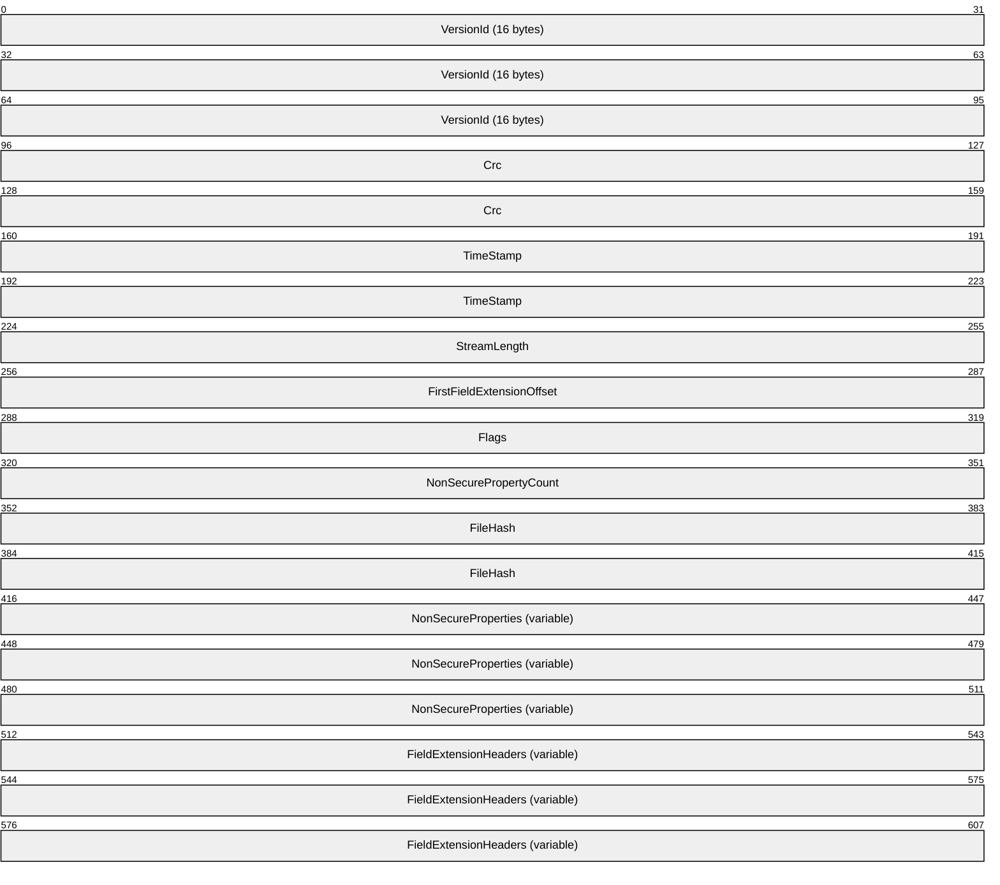
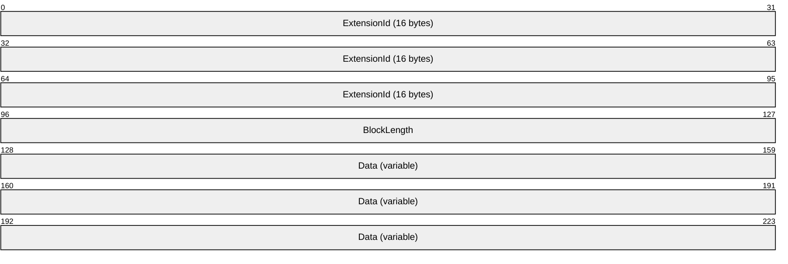
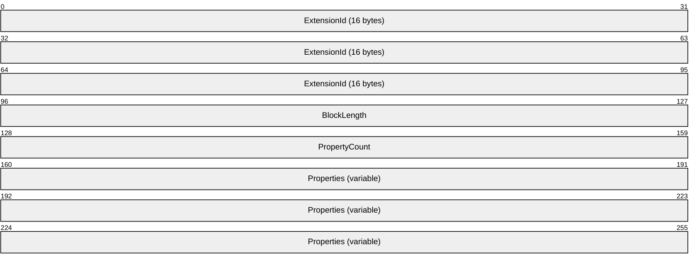
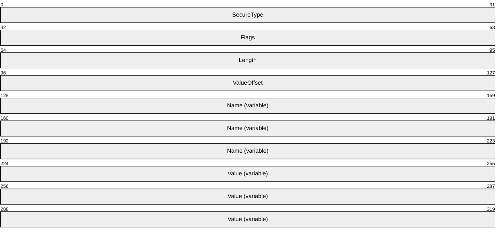
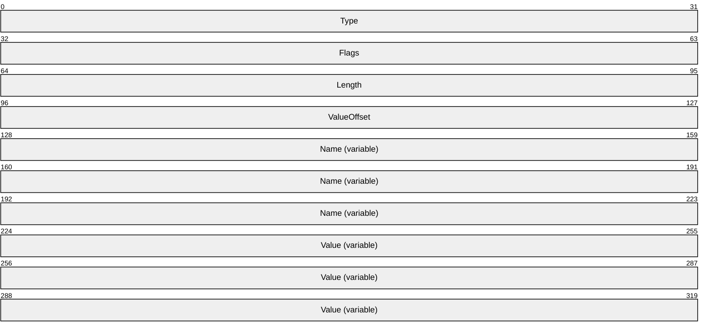
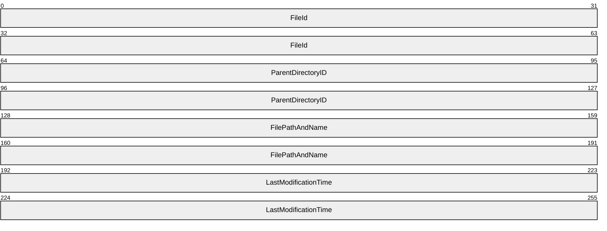

# [MS-FCIADS]: File Classification Infrastructure Alternate Data Stream (ADS) File Format

Table of Contents

1 Introduction

- [1 Introduction](#Section_1)
  - [1.1 Glossary](#Section_1.1)
  - [1.2 References](#Section_1.2)
    - [1.2.1 Normative References](#Section_1.2.1)
    - [1.2.2 Informative References](#Section_1.2.2)
  - [1.3 Overview](#Section_1.3)
  - [1.4 Relationship to Protocols and Other Structures](#Section_1.4)
  - [1.5 Applicability Statement](#Section_1.5)
  - [1.6 Versioning and Localization](#Section_1.6)
  - [1.7 Vendor-Extensible Fields](#Section_1.7)

2 Structures

- [2 Structures](#Section_2)
  - [2.1 ADSStreamHeader](#Section_2.1)
  - [2.2 ADSFieldExtensionHeader](#Section_2.2)
  - [2.3 ADSSecurePropertiesExtensionHeader](#Section_2.3)
  - [2.4 ADSSecurePropertyHeader](#Section_2.4)
  - [2.5 ADSNonSecurePropertyHeader](#Section_2.5)
  - [2.6 FileHash](#Section_2.6)
  - [2.7 CRC Algorithm](#Section_2.7)

3 Structure Examples

- [3 Structure Examples](#Section_3)

4 Security

- [4 Security](#Section_4)
  - [4.1 Security Considerations for Implementers](#Section_4.1)
  - [4.2 Index of Security Fields](#Section_4.2)

5 Appendix A: Product Behavior

- [5 Appendix A: Product Behavior](#Section_5)

6 Change Tracking

- [6 Change Tracking](#Section_6)

For the legal notice and IP terms, see [LEGAL.md](../LEGAL.md).
Last updated: 4/23/2024.
See [Revision History](#revision-history) for full version history.

# 1 Introduction

The File Classification Infrastructure Alternate Data Stream (ADS) File Format is a subset of the functionality specified in the File Server Resource Manager Protocol [MS-FSRM](../MS-FSRM/MS-FSRM.md) that persists metadata information for files into NTFS alternate data streams that follow the formats defined in this document.

Sections 1.7 and 2 of this specification are normative. All other sections and examples in this specification are informative.

## 1.1 Glossary

This document uses the following terms:

**big-endian**: Multiple-byte values that are byte-ordered with the most significant byte stored in the memory location with the lowest address.

**Coordinated Universal Time (UTC)**: A high-precision atomic time standard that approximately tracks Universal Time (UT). It is the basis for legal, civil time all over the Earth. Time zones around the world are expressed as positive and negative offsets from UTC. In this role, it is also referred to as Zulu time (Z) and Greenwich Mean Time (GMT). In these specifications, all references to UTC refer to the time at UTC-0 (or GMT).

**FCIADS stream**: The NTFS alternate data stream ([MSFT-NTFSWorks]) named FSRM{ef88c031-5950-4164-ab92-eec5f16005a5} that stores Property Definition Instance ([MS-FSRM] section 3.2.1.6.5) abstract data model (ADM) element instances for files.

**little-endian**: Multiple-byte values that are byte-ordered with the least significant byte stored in the memory location with the lowest address.

**Normal Property**: A property assigned to a file or folder that cannot affect security.

**Secure Property**: A property assigned to a file or folder that can affect security.

**UTC (Coordinated Universal Time)**: A high-precision atomic time standard that approximately tracks Universal Time (UT). It is the basis for legal, civil time all over the Earth. Time zones around the world are expressed as positive and negative offsets from UTC. In this role, it is also referred to as Zulu time (Z) and Greenwich Mean Time (GMT). In these specifications, all references to UTC refer to the time at UTC–0 (or GMT).

**UTF-16LE**: The Unicode Transformation Format - 16-bit, Little Endian encoding scheme. It is used to encode Unicode characters as a sequence of 16-bit codes, each encoded as two 8-bit bytes with the least-significant byte first.

**UTF-16LE (Unicode Transformation Format, 16-bits, little-endian)**: The encoding scheme specified in [[UNICODE5.0.0/2007]](https://go.microsoft.com/fwlink/?LinkId=154659) section 2.6 for encoding Unicode characters as a sequence of 16-bit codes, each encoded as two 8-bit bytes with the least-significant byte first.

**MAY, SHOULD, MUST, SHOULD NOT, MUST NOT:** These terms (in all caps) are used as defined in [[RFC2119]](https://go.microsoft.com/fwlink/?LinkId=90317). All statements of optional behavior use either MAY, SHOULD, or SHOULD NOT.

## 1.2 References

Links to a document in the Microsoft Open Specifications library point to the correct section in the most recently published version of the referenced document. However, because individual documents in the library are not updated at the same time, the section numbers in the documents may not match. You can confirm the correct section numbering by checking the [Errata](https://go.microsoft.com/fwlink/?linkid=850906).

### 1.2.1 Normative References

We conduct frequent surveys of the normative references to assure their continued availability. If you have any issue with finding a normative reference, please contact [dochelp@microsoft.com](mailto:dochelp@microsoft.com). We will assist you in finding the relevant information.

[MS-DTYP] Microsoft Corporation, "[Windows Data Types](../MS-DTYP/MS-DTYP.md)".

[MS-FSRM] Microsoft Corporation, "[File Server Resource Manager Protocol](../MS-FSRM/MS-FSRM.md)".

[RFC2119] Bradner, S., "Key words for use in RFCs to Indicate Requirement Levels", BCP 14, RFC 2119, March 1997, [https://www.rfc-editor.org/info/rfc2119](https://go.microsoft.com/fwlink/?LinkId=90317)

### 1.2.2 Informative References

[MS-FSA] Microsoft Corporation, "[File System Algorithms](../MS-FSA/MS-FSA.md)".

[MS-FSCC] Microsoft Corporation, "[File System Control Codes](../MS-FSCC/MS-FSCC.md)".

[MSFT-NTFSWorks] Microsoft Corporation, "How NTFS Works", March 2003, [http://technet.microsoft.com/en-us/library/cc781134(WS.10).aspx](https://go.microsoft.com/fwlink/?LinkId=168880)

## 1.3 Overview

The structures defined in this document are used to store metadata for files. The metadata information is derived from the **Property Definition Instance** ([MS-FSRM](../MS-FSRM/MS-FSRM.md) section 3.2.1.6.5) ADM element instances that the File Server Resource Manager [MS-FSRM] protocol creates. Using these structures, the File Server Resource Manager persists metadata for each file into an NTFS alternate data stream ([MS-FSCC](../MS-FSCC/MS-FSCC.md) section 5 ) with the name FSRM{ef88c031-5950-4164-ab92-eec5f16005a5}. This type of NTFS alternate data stream ([[MSFT-NTFSWorks]](https://go.microsoft.com/fwlink/?LinkId=168880)) is referred to as an [**FCIADS stream**](#gt_fciads-stream).

## 1.4 Relationship to Protocols and Other Structures

The File Server Resource Manager protocol creates the [**FCIADS stream**](#gt_fciads-stream) and stores **Property Definition Instance** ([MS-FSRM](../MS-FSRM/MS-FSRM.md) section 3.2.1.6.5) ADM element instances into it using the structures defined in this document. The File Server Resource Manager protocol can also read the information in an FCIADS stream to recreate a **Property Definition Instance** ADM element instance for the file.

The File System Algorithms specified in [MS-FSA](../MS-FSA/MS-FSA.md), define the properties of a **DataStream** ADM element. An **Alternate Data Stream** is an NTFS **DataStream** ADM element instance with a nonempty **Name** ADM attribute.

## 1.5 Applicability Statement

The FCIADS is applicable when the File Server Resource Manager Protocol [MS-FSRM](../MS-FSRM/MS-FSRM.md) persists a **Property Definition Instance** ([MS-FSRM] section 3.2.1.6.5) ADM element instance for a file.

## 1.6 Versioning and Localization

To provide compatibility, the FCIADS uses the same structure versions for Windows Server 2008 R2 operating system, Windows 8 operating system, and Windows Server 2012 operating system.

## 1.7 Vendor-Extensible Fields

The FCIADS has no vendor-extensible fields.

# 2 Structures

The following structures specify the formats of the [**FCIADS stream**](#gt_fciads-stream) when written. Unless otherwise specified, all noncharacter fields are stored as unsigned integers in [**little-endian**](#gt_little-endian) format, and all strings are null-terminated and are stored as [**UTF-16LE (Unicode Transformation Format, 16-bits, little-endian)**](#gt_utf-16le-unicode-transformation-format-16-bits-little-endian). **GUID** ([MS-DTYP](../MS-DTYP/MS-DTYP.md) section 2.3.4.2) fields are stored with the **Data1** (the first 4 bytes), **Data2** (the next 2 bytes), and **Data3** (the next 2 bytes) fields in little-endian format; the **Data4** field (the last 8 bytes) is stored in [**big-endian**](#gt_big-endian) format.

## 2.1 ADSStreamHeader

The **ADSStreamHeader** structure specifies fields that are used to provide status and basic information about an [**FCIADS stream**](#gt_fciads-stream).

**VersionId (16 bytes):** A **GUID** ([MS-DTYP](../MS-DTYP/MS-DTYP.md) section 2.3.4.2) that identifies the FCIADS stream. MUST be set to 43ee0c5f-e038-421c-8a3e-ab4eb1166124.

**Crc (8 bytes):** A CRC-64 hash of the FCIADS stream from the **TimeStamp** field of **ADSStreamHeader** to the end of the stream that can be used to validate the integrity of the FCIADS stream. The algorithm used to calculate the bit-reversed CRC-64 hash is specified in section [2.7](#Section_2.7).

**TimeStamp (8 bytes):** A **FILETIME** ([MS-DTYP] section 2.3.3) structure containing the time in [**UTC (Coordinated Universal Time)**](#gt_utc-coordinated-universal-time) at which the cache was last written.

**StreamLength (4 bytes):** A 32-bit unsigned integer set to the length of the FCIADS stream, in bytes, from the start of the structure.<1>

**FirstFieldExtensionOffset (4 bytes):** A 32-bit unsigned integer set to the offset, in bytes, from the start of the FCIADS stream of the first, if any, ADSFieldExtensionHeader (section [2.2](#Section_2.2)) structure stored in the FCIADS stream. Subsequent **ADSFieldExtensionHeader** structures can follow this first structure. If no field extension header structures are present in the FCIADS stream, this field has the value zero (0x00000000).

**Flags (4 bytes):** The state of an FCIADS stream represented as a bitwise OR of **ADSCacheFlags** ([MS-FSRM](../MS-FSRM/MS-FSRM.md) section 2.2.1.2.18) enumeration values.<2>

**NonSecurePropertyCount (4 bytes):** A 32-bit unsigned integer that specifies the number of **Property Definition Instance** ([MS-FSRM] section 3.2.1.6.5) ADM element instances stored in the FCIADS stream.

**FileHash (8 bytes):** A CRC-64 hash of a **FileHash** data structure for the file. If a newly computed **FileHash** field value does not match an existing **FileHash** field value, the cache could be out of date. The algorithm used to calculate the bit-reversed CRC-64 hash is specified in section 2.7.

**NonSecureProperties (variable):** Contains zero or more **Property Definition Instance** ADM element instances of a file stored in ADSNonSecurePropertyHeader (section [2.5](#Section_2.5)) structures.

**FieldExtensionHeaders (variable):** Contains zero or more field extension header structures of a file stored in **ADSFieldExtensionHeader** structures. Some of these structures can be of type ADSSecurePropertiesExtensionHeader (section [2.3](#Section_2.3)). The offset to the first structure (if any) is stored in the **FirstFieldExtensionOffset** field.

## 2.2 ADSFieldExtensionHeader

The **ADSFieldExtensionHeader** structure extends the ADSStreamHeader (section [2.1](#Section_2.1)) structure to store information that cannot be determined for this version of the structure format.

**ExtensionId (16 bytes):** Contains the **GUID** ([MS-DTYP](../MS-DTYP/MS-DTYP.md) section 2.3.4.2) that identifies the field extension.

**BlockLength (4 bytes):** A 32-bit unsigned integer set to the size, in bytes, of the **ADSFieldExtensionHeader** structure, including the length of the **Data** field.

**Data (variable):** Contains unformatted data.

## 2.3 ADSSecurePropertiesExtensionHeader

The **ADSSecurePropertiesExtensionHeader** structure extends the [**FCIADS stream**](#gt_fciads-stream) format to store [**Secure Properties**](#gt_secure-property).<3>

**ExtensionId (16 bytes):** A **GUID** ([MS-DTYP](../MS-DTYP/MS-DTYP.md) section 2.3.4.2) that identifies the field extension as a secure property field extension. MUST be set to 35c8acd4-a0db-426d-85fc-7911cb780e4e.

**BlockLength (4 bytes):** A 32-bit unsigned integer set to the length, in bytes, of the **ADSSecurePropertiesExtensionHeader** structure, including the length of the **Data** field.

**PropertyCount (4 bytes):** A 32-bit unsigned integer set to the number of ADSSecurePropertyHeader (section [2.4](#Section_2.4)) structures that are stored in the **Properties** field.

**Properties (variable):** Contains zero or more **ADSSecurePropertyHeader** structure instances.

## 2.4 ADSSecurePropertyHeader

The **ADSSecurePropertyHeader** structure specifies fields that correspond to the ADM attributes of a **Property Definition Instance** ([MS-FSRM](../MS-FSRM/MS-FSRM.md) section 3.2.1.6.5) ADM element instance with a **Property Definition Instance**.**Secure** ADM attribute set to TRUE and that are written to an [**FCIADS stream**](#gt_fciads-stream). Each such **Property Definition Instance** ADM element instance is referred to as a [**Secure Property**](#gt_secure-property).

**SecureType (4 bytes):** A 32-bit unsigned integer that specifies whether the type of the Secure Property is an integer or a string value. MUST be set to only one value of the **FCI_ADS_SECURE_PROPERTY_TYPE** ([MS-FSRM] section 2.2.1.2.20) enumeration. If the Secure Property has a **Property Definition Instance.Type** ADM attribute **FsrmPropertyDefinitionType** ([MS-FSRM] section 2.2.2.3.1.1) enumeration value of **FsrmPropertyDefinitionType_MultiChoiceList**, **FsrmPropertyDefinitionType_String**, or **FsrmPropertyDefinitionType_MultiString**, this field SHOULD be set to **FCI_ADS_SECURE_PROPERTY_TYPE_STRING**. If the Secure Property has a **Property Definition Instance.Type** ADM attribute **FsrmPropertyDefinitionType** enumeration value of **FsrmPropertyDefinitionType_OrderedList**, **FsrmPropertyDefinitionType_Int**, or **FsrmPropertyDefinitionType_Bool**, this field SHOULD be set to **FCI_ADS_SECURE_PROPERTY_TYPE_INT64**. All other **Property Definition Instance.Type** ADM attribute values MUST NOT be stored in this field.

**Flags (4 bytes):** A 32-bit unsigned integer that indicates the state of the Secure Property as a bitwise OR of values of the **ADSCachePropertyFlags** ([MS-FSRM] section 2.2.1.2.19) enumeration.

**Length (4 bytes):** A 32-bit unsigned integer set to the length, in bytes, of the **ADSSecurePropertyHeader** structure.

**ValueOffset (4 bytes):** A 32-bit unsigned integer set to the offset, in bytes, of the **Value** field from the beginning of the **ADSSecurePropertyHeader** structure.

**Name (variable):** A null-terminated string encoded in [**UTF-16LE**](#gt_utf-16le) format that specifies the **Property Definition Instance.Name** ADM attribute of the Secure Property in the FCIADS stream.

**Value (variable):** A null-terminated string encoded in UTF-16LE format that specifies the **Property Definition Instance.Value** ADM attribute of the Secure Property in the FCIADS stream.

## 2.5 ADSNonSecurePropertyHeader

The **ADSNonSecurePropertyHeader** structure specifies fields that correspond to the ADM attributes of a **Property Definition Instance** ([MS-FSRM](../MS-FSRM/MS-FSRM.md) section 3.2.1.6.5) ADM element instance with a **Property Definition Instance**.**Secure** ADM attribute set to FALSE and that are written to an [**FCIADS stream**](#gt_fciads-stream). Each such **Property Definition Instance** ADM element instance is referred to as a [**Normal Property**](#gt_normal-property).

**Type (4 bytes):** A 32-bit unsigned integer that specifies whether the type of the Normal Property is an integer or a string value. MUST be set to only one value of the **FsrmPropertyDefinitionType** ([MS-FSRM] section 2.2.2.3.1.1) enumeration. If the Normal Property has a **Property Definition Instance.Type** ADM attribute set to an **FsrmPropertyDefinitionType** enumeration value of **FsrmPropertyDefinitionType_MultiChoiceList**, **FsrmPropertyDefinitionType_String**, **FsrmPropertyDefinitionType_OrderedList**, or **FsrmPropertyDefinitionType_MultiString**, this field SHOULD be set to **FCI_ADS_SECURE_PROPERTY_TYPE_STRING**. If the Normal Property has a **Property Definition Instance.Type** ADM attribute set to an **FsrmPropertyDefinitionType** enumeration value of **FsrmPropertyDefinitionType_Date**, **FsrmPropertyDefinitionType_Int**, or **FsrmPropertyDefinitionType_Bool**, this field SHOULD be set to **FCI_ADS_SECURE_PROPERTY_TYPE_INT64**. All other **Property Definition Instance.Type** ADM attribute values MUST NOT be stored in this field.

**Flags (4 bytes):** A 32-bit unsigned integer that indicates the state of the Normal Property as a bitwise OR of values of the **FsrmPropertyFlags** ([MS-FSRM] section 2.2.2.6.1.1) enumeration.

**Length (4 bytes):** A 32-bit unsigned integer set to the length, in bytes, of the **ADSNonSecurePropertyHeader** structure.

**ValueOffset (4 bytes):** A 32-bit unsigned integer set to the offset, in bytes, of the Value field from the beginning of the ADSNonSecurePropertyHeader structure.

**Name (variable):** A null-terminated string encoded in [**UTF-16LE**](#gt_utf-16le) format that specifies the Property Definition Instance.Name ADM attribute of the Normal Property in the FCIADS stream.

**Value (variable):** A null-terminated string encoded in UTF-16LE format that specifies the Property Definition Instance.Value ADM attribute of the Normal Property in the FCIADS stream.

## 2.6 FileHash

The **FileHash** structure specifies fields that are used to calculate the CRC checksum for a file.

**FileId(8 bytes):** A 64-bit unsigned integer field containing a 32-bit fileID representing the file.

**ParentDirectoryID(8 bytes):** A 64-bit unsigned integer field containing a 32-bit fileID representing the parent directory which contains the file.

**FilePathAndName(Variable):** A null-terminated string encoded in UTF-16LE format that specifies the path and name of the file. The minimum size for this field is 256 chars. If a path and name is less than 256 chars, the rest of the memory is set to zero.

**LastModificationTime (8 bytes):** A FILETIME ([MS-DTYP](../MS-DTYP/MS-DTYP.md) section 2.3.3) structure containing the time in [**UTC**](#gt_coordinated-universal-time-utc) at which the file was last written.

## 2.7 CRC Algorithm

The following algorithm is used to generate the 64-bit CRC. Modulo 2 polynomial arithmetic is used in this algorithm.

- The CRC generator polynomial is G(x) = x64 + x61 + x58+ x56 + x55 + x52 + x51 + x50 + x47 + x42 + x39 + x38 + x35 + x33 + x32 + x31 + x29 + x26 + x25 + x22 + x17 + x14 + x13 + x9 + x8 + x6 + x3 + x0. The normal representation is 0x259c84cba6426349, with the leading 1 implied.
- The string of bits of the input message is interpreted as the coefficients of a message polynomial (**M(x)**). Bit order in the message polynomial is taken to be from **least significant bit** to **most significant bit** for each byte, starting from the first byte of the input string.
- A polynomial **P(x)** is generated such that

where m is the length of the input message in bits.

- The Remainder polynomial **R(x)** is calculated as the remainder of division of **P(x)** by **G(x)**, therefore the degree of **R(x)** is always less than 64.
- The CRC value is formed by the coefficients of polynomial **R(x)** where the most significant bit is the coefficient of x0.

# 3 Structure Examples

The following example depicts an [**FCIADS stream**](#gt_fciads-stream) as an ADSStreamHeader (section 2.1) structure followed by two Normal Properties encoded as two ADSNonSecurePropertyHeader (section [2.5](#Section_2.5)) structures.

00000000 5F 0C EE 43 38 E0 1C 42-8A 3E AB 4E B1 16 61 24 *_..C8..B.>.N..a$*

00000010 53 65 C6 80 73 17 DA CE-EB DB F4 99 B2 34 C9 01 *Se..s........4..*

00000020 8A 00 00 00 00 00 00 00-00 00 00 00 02 00 00 00 *................*

00000030 D8 AE 24 AF CF 9C 94 1F-01 00 00 00 08 00 00 00 *..$.............*

00000040 36 00 00 00 2E 00 00 00-42 00 75 00 73 00 69 00 *6.......B.u.s.i.*

00000050 6E 00 65 00 73 00 73 00-49 00 6D 00 70 00 61 00 *n.e.s.s.I.m.p.a.*

00000060 63 00 74 00 00 00 48 00-42 00 49 00 00 00 07 00 *c.t...H.B.I.....*

00000070 00 00 08 00 00 00 1C 00-00 00 18 00 00 00 50 00 *..............P.*

00000080 49 00 49 00 00 00 31 00-00 00 *I.I...1...*

| Bit Range | Field | Description |
| --- | --- | --- |
| {43ee0c5f-e038-421c-8a3e-ab4eb1166124} | VersionId | 0x00 |
| Variable | Crc | 0x10 0xceda1773`80c66553 |
| 0x01c934b2`99f4dbeb (2008-10-23 01:56:44) | TimeStamp | 0x18 |
| Variable | StreamLength | 0x20 0x0000008a (138 bytes) |
| Variable | FirstFieldExtensionOffset | 0x24 0x00000000 |
| Variable | Flags | 0x28 0x00000000 |
| Variable | NonSecurePropertyCount | 0x2C 0x00000002 (2) |
| Variable | FileHash | 0x30 0x1f949ccf`af24aed8 |
| Variable | ------------------------- | ------ ------------------------------------- |
| Variable | Property 1 Type | 0x38 0x00000001 (FsrmPropertyDefinitionType_OrderedList) |
| Variable | Property 1 Flags | 0x3C 0x00000008 (FsrmPropertyFlags_SetByClassifier) |
| Variable | Property 1 Length | 0x40 0x00000036 (54 bytes) |
| Variable | Property 1 ValueOffset | 0x44 0x0000002e |
| Variable | Property 1 Name | 0x48 "BusinessImpact" |
| Variable | - | - - |
| Variable | Property 1 Value | 0x38 + 0x2E = 0x66 "HBI" |
| Variable | ------------------------- | ------ ------------------------------------- |
| Variable | Property 2 Type | 0x38 + 0x36 = 0x6E 0x00000007 (FsrmPropertyDefinitionType_Bool) |
| Variable | Property 2 Flags | 0x72 0x00000008 (FsrmPropertyFlags_SetByClassifier) |
| Variable | Property 2 Length | 0x76 0x0000001c (28 bytes) |
| Variable | Property 2 ValueOffset | 0x7A 0x00000018 |
| Variable | Property 2 Name | 0x7E "PII" |
| Variable | Property 2 Value | 0x6E + 0x18 = 0x86 "1" |

# 4 Security

## 4.1 Security Considerations for Implementers

None.

## 4.2 Index of Security Fields

None.

# 5 Appendix A: Product Behavior

The information in this specification is applicable to the following Microsoft products or supplemental software. References to product versions include updates to those products.

- Windows Server 2008 R2 operating system
- Windows 8 operating system
- Windows Server 2012 operating system
- Windows 8.1 operating system
- Windows Server 2012 R2 operating system
- Windows 10 operating system
- Windows Server 2016 operating system
- Windows Server operating system
- Windows Server 2019 operating system
- Windows Server 2022 operating system
- Windows 11 operating system
- Windows Server 2025 operating system
Exceptions, if any, are noted in this section. If an update version, service pack or Knowledge Base (KB) number appears with a product name, the behavior changed in that update. The new behavior also applies to subsequent updates unless otherwise specified. If a product edition appears with the product version, behavior is different in that product edition.

Unless otherwise specified, any statement of optional behavior in this specification that is prescribed using the terms "SHOULD" or "SHOULD NOT" implies product behavior in accordance with the SHOULD or SHOULD NOT prescription. Unless otherwise specified, the term "MAY" implies that the product does not follow the prescription.

<1> Section 2.1: An [**FCIADS stream**](#gt_fciads-stream) is limited to 4 KB in length.

<2> Section 2.1: An ADS stream containing these structures always sets the **ADSCache_PropertyFlagsValid** flag if it is generated on Windows 8 operating system and later, Windows Server 2012 operating system and later. An ADS stream generated on Windows Server 2008 R2 never sets this flag.

<3> Section 2.3: Only Windows 8 operating system and later, Windows Server 2012 operating system and later process **Property Definition Instance** ([MS-FSRM](../MS-FSRM/MS-FSRM.md) section 3.2.1.6.5) ADM element instances with **Property Definition Instance**.**Secure** ADM attributes set to TRUE. Because these **Property Definition Instance** ADM element instances are stored in an ADSSecurePropertiesExtensionHeader (section [2.3](#Section_2.3)) structure, which conforms to the layout of the ADSFieldExtensionHeader (section 2.2) structure, Windows Server 2008 R2 retains but does not act on them when manipulating an FCIADS stream.

# 6 Change Tracking

This section identifies changes that were made to this document since the last release. Changes are classified as Major, Minor, or None.

The revision class **Major** means that the technical content in the document was significantly revised. Major changes affect protocol interoperability or implementation. Examples of major changes are:

- A document revision that incorporates changes to interoperability requirements.
- A document revision that captures changes to protocol functionality.
The revision class **Minor** means that the meaning of the technical content was clarified. Minor changes do not affect protocol interoperability or implementation. Examples of minor changes are updates to clarify ambiguity at the sentence, paragraph, or table level.

The revision class **None** means that no new technical changes were introduced. Minor editorial and formatting changes may have been made, but the relevant technical content is identical to the last released version.

The changes made to this document are listed in the following table. For more information, please contact [dochelp@microsoft.com](mailto:dochelp@microsoft.com).

| Section | Description | Revision class |
| --- | --- | --- |
| [5](#Section_5) Appendix A: Product Behavior | Added Windows Server 2025 to the list of applicable products. | Major |

## Revision History

| Date | Version | Revision Class | Comments |
| --- | --- | --- | --- |
| 12/16/2011 | 1.0 | New | Released new document. |
| 3/30/2012 | 1.0 | None | No changes to the meaning, language, or formatting of the technical content. |
| 7/12/2012 | 1.0 | None | No changes to the meaning, language, or formatting of the technical content. |
| 10/25/2012 | 1.1 | Minor | Clarified the meaning of the technical content. |
| 1/31/2013 | 1.1 | None | No changes to the meaning, language, or formatting of the technical content. |
| 8/8/2013 | 2.0 | Major | Significantly changed the technical content. |
| 11/14/2013 | 2.0 | None | No changes to the meaning, language, or formatting of the technical content. |
| 2/13/2014 | 2.0 | None | No changes to the meaning, language, or formatting of the technical content. |
| 5/15/2014 | 2.0 | None | No changes to the meaning, language, or formatting of the technical content. |
| 6/30/2015 | 3.0 | Major | Significantly changed the technical content. |
| 10/16/2015 | 3.0 | None | No changes to the meaning, language, or formatting of the technical content. |
| 7/14/2016 | 3.0 | None | No changes to the meaning, language, or formatting of the technical content. |
| 6/1/2017 | 3.0 | None | No changes to the meaning, language, or formatting of the technical content. |
| 9/15/2017 | 4.0 | Major | Significantly changed the technical content. |
| 9/12/2018 | 5.0 | Major | Significantly changed the technical content. |
| 4/7/2021 | 6.0 | Major | Significantly changed the technical content. |
| 6/25/2021 | 7.0 | Major | Significantly changed the technical content. |
| 4/23/2024 | 8.0 | Major | Significantly changed the technical content. |
