# [MS-FSCC]: File System Control Codes

Table of Contents

<details>
<summary>1 Introduction</summary>

- [1 Introduction](#Section_1)
  - [1.1 Glossary](#Section_1.1)
  - [1.2 References](#Section_1.2)
    - [1.2.1 Normative References](#Section_1.2.1)
    - [1.2.2 Informative References](#Section_1.2.2)
  - [1.3 Overview](#Section_1.3)
  - [1.4 Relationship to Protocols and Other Structures](#Section_1.4)
  - [1.5 Applicability Statement](#Section_1.5)
  - [1.6 Versioning and Localization](#Section_1.6)
  - [1.7 Vendor-Extensible Fields](#Section_1.7)
</details>

<details>
<summary>2 Structures</summary>

- [2 Structures](#Section_2)
  - [2.1 Common Data Types](#Section_2.1)
    - [2.1.1 Time](#Section_2.1.1)
    - [2.1.2 Reparse Point Data Structures](#Section_2.1.2)
      - [2.1.2.1 Reparse Tags](#Section_2.1.2.1)
      - [2.1.2.2 REPARSE_DATA_BUFFER](#Section_2.1.2.2)
      - [2.1.2.3 REPARSE_GUID_DATA_BUFFER](#Section_2.1.2.3)
      - [2.1.2.4 Symbolic Link Reparse Data Buffer](#Section_2.1.2.4)
      - [2.1.2.5 Mount Point Reparse Data Buffer](#Section_2.1.2.5)
      - [2.1.2.6 Network File System (NFS) Reparse Data Buffer](#Section_2.1.2.6)
      - [2.1.2.7 LX SYMLINK REPARSE_DATA_BUFFER](#Section_2.1.2.7)
    - [2.1.3 FILE_OBJECTID_BUFFER Structure](#Section_2.1.3)
      - [2.1.3.1 FILE_OBJECTID_BUFFER Type 1](#Section_2.1.3.1)
      - [2.1.3.2 FILE_OBJECTID_BUFFER Type 2](#Section_2.1.3.2)
    - [2.1.4 Alternate Data Streams](#Section_2.1.4)
    - [2.1.5 Pathname](#Section_2.1.5)
      - [2.1.5.1 Dot Directory Names](#Section_2.1.5.1)
      - [2.1.5.2 Filename](#Section_2.1.5.2)
        - [2.1.5.2.1 8.3 Filename](#Section_2.1.5.2.1)
      - [2.1.5.3 Streamname](#Section_2.1.5.3)
      - [2.1.5.4 Streamtype](#Section_2.1.5.4)
    - [2.1.6 Share name](#Section_2.1.6)
    - [2.1.7 FILE_NAME_INFORMATION](#Section_2.1.7)
    - [2.1.8 Boolean](#Section_2.1.8)
    - [2.1.9 64-bit file ID](#Section_2.1.9)
    - [2.1.10 128-bit file ID](#Section_2.1.10)
    - [2.1.11 STORAGE_OFFLOAD_TOKEN](#Section_2.1.11)
  - [2.2 Status Codes](#Section_2.2)
  - [2.3 FSCTL Structures](#Section_2.3)
    - [2.3.1 FSCTL_CREATE_OR_GET_OBJECT_ID Request](#Section_2.3.1)
    - [2.3.2 FSCTL_CREATE_OR_GET_OBJECT_ID Reply](#Section_2.3.2)
    - [2.3.3 FSCTL_DELETE_OBJECT_ID Request](#Section_2.3.3)
    - [2.3.4 FSCTL_DELETE_OBJECT_ID Reply](#Section_2.3.4)
    - [2.3.5 FSCTL_DELETE_REPARSE_POINT Request](#Section_2.3.5)
    - [2.3.6 FSCTL_DELETE_REPARSE_POINT Reply](#Section_2.3.6)
    - [2.3.7 FSCTL_DUPLICATE_EXTENTS_TO_FILE Request](#Section_2.3.7)
      - [2.3.7.1 DUPLICATE_EXTENTS_DATA](#Section_2.3.7.1)
      - [2.3.7.2 SMB2_DUPLICATE_EXTENTS_DATA](#Section_2.3.7.2)
    - [2.3.8 FSCTL_DUPLICATE_EXTENTS_TO_FILE Reply](#Section_2.3.8)
    - [2.3.9 FSCTL_DUPLICATE_EXTENTS_TO_FILE_EX Request](#Section_2.3.9)
      - [2.3.9.1 DUPLICATE_EXTENTS_DATA_EX](#Section_2.3.9.1)
      - [2.3.9.2 SMB2_DUPLICATE_EXTENTS_DATA_EX](#Section_2.3.9.2)
    - [2.3.10 FSCTL_DUPLICATE_EXTENTS_TO_FILE_EX Reply](#Section_2.3.10)
    - [2.3.11 FSCTL_FILESYSTEM_GET_STATISTICS Request](#Section_2.3.11)
    - [2.3.12 FSCTL_FILESYSTEM_GET_STATISTICS Reply](#Section_2.3.12)
      - [2.3.12.1 FILESYSTEM_STATISTICS](#Section_2.3.12.1)
      - [2.3.12.2 NTFS_STATISTICS](#Section_2.3.12.2)
        - [2.3.12.2.1 MftWritesUserLevel](#Section_2.3.12.2.1)
        - [2.3.12.2.2 Mft2WritesUserLevel](#Section_2.3.12.2.2)
        - [2.3.12.2.3 BitmapWritesUserLevel](#Section_2.3.12.2.3)
        - [2.3.12.2.4 MftBitmapWritesUserLevel](#Section_2.3.12.2.4)
        - [2.3.12.2.5 Allocate](#Section_2.3.12.2.5)
      - [2.3.12.3 FAT_STATISTICS](#Section_2.3.12.3)
      - [2.3.12.4 EXFAT_STATISTICS](#Section_2.3.12.4)
    - [2.3.13 FSCTL_FILE_LEVEL_TRIM Request](#Section_2.3.13)
      - [2.3.13.1 FILE_LEVEL_TRIM_RANGE](#Section_2.3.13.1)
    - [2.3.14 FSCTL_FILE_LEVEL_TRIM Reply](#Section_2.3.14)
    - [2.3.15 FSCTL_FIND_FILES_BY_SID Request](#Section_2.3.15)
    - [2.3.16 FSCTL_FIND_FILES_BY_SID Reply](#Section_2.3.16)
    - [2.3.17 FSCTL_GET_COMPRESSION Request](#Section_2.3.17)
    - [2.3.18 FSCTL_GET_COMPRESSION Reply](#Section_2.3.18)
    - [2.3.19 FSCTL_GET_INTEGRITY_INFORMATION Request](#Section_2.3.19)
    - [2.3.20 FSCTL_GET_INTEGRITY_INFORMATION Reply](#Section_2.3.20)
    - [2.3.21 FSCTL_GET_NTFS_VOLUME_DATA Request](#Section_2.3.21)
    - [2.3.22 FSCTL_GET_NTFS_VOLUME_DATA Reply](#Section_2.3.22)
    - [2.3.23 FSCTL_GET_REFS_VOLUME_DATA Request](#Section_2.3.23)
    - [2.3.24 FSCTL_GET_REFS_VOLUME_DATA Reply](#Section_2.3.24)
    - [2.3.25 FSCTL_GET_OBJECT_ID Request](#Section_2.3.25)
    - [2.3.26 FSCTL_GET_OBJECT_ID Reply](#Section_2.3.26)
    - [2.3.27 FSCTL_GET_REPARSE_POINT Request](#Section_2.3.27)
    - [2.3.28 FSCTL_GET_REPARSE_POINT Reply](#Section_2.3.28)
    - [2.3.29 FSCTL_GET_RETRIEVAL_POINTER_COUNT Request](#Section_2.3.29)
    - [2.3.30 FSCTL_GET_RETRIEVAL_POINTER_COUNT Reply](#Section_2.3.30)
    - [2.3.31 FSCTL_GET_RETRIEVAL_POINTERS Request](#Section_2.3.31)
    - [2.3.32 FSCTL_GET_RETRIEVAL_POINTERS Reply](#Section_2.3.32)
      - [2.3.32.1 EXTENTS](#Section_2.3.32.1)
    - [2.3.33 FSCTL_GET_RETRIEVAL_POINTERS_AND_REFCOUNT Request](#Section_2.3.33)
    - [2.3.34 FSCTL_GET_RETRIEVAL_POINTERS_AND_REFCOUNT Reply](#Section_2.3.34)
      - [2.3.34.1 EXTENT_AND_REFCOUNTS](#Section_2.3.34.1)
    - [2.3.35 FSCTL_IS_PATHNAME_VALID Request](#Section_2.3.35)
    - [2.3.36 FSCTL_IS_PATHNAME_VALID Reply](#Section_2.3.36)
    - [2.3.37 FSCTL_LMR_SET_LINK_TRACKING_INFORMATION Request](#Section_2.3.37)
      - [2.3.37.1 FSCTL_LMR_SET_LINK_TRACKING_INFORMATION Request for SMB](#Section_2.3.37.1)
      - [2.3.37.2 FSCTL_LMR_SET_LINK_TRACKING_INFORMATION Request for SMB2](#Section_2.3.37.2)
      - [2.3.37.3 TARGET_LINK_TRACKING_INFORMATION_Buffer](#Section_2.3.37.3)
        - [2.3.37.3.1 TARGET_LINK_TRACKING_INFORMATION_Buffer_1](#Section_2.3.37.3.1)
        - [2.3.37.3.2 TARGET_LINK_TRACKING_INFORMATION_Buffer_2](#Section_2.3.37.3.2)
    - [2.3.38 FSCTL_LMR_SET_LINK_TRACKING_INFORMATION Reply](#Section_2.3.38)
    - [2.3.39 FSCTL_MARK_HANDLE Request](#Section_2.3.39)
    - [2.3.40 FSCTL_MARK_HANDLE Reply](#Section_2.3.40)
    - [2.3.41 FSCTL_OFFLOAD_READ Request](#Section_2.3.41)
    - [2.3.42 FSCTL_OFFLOAD_READ Reply](#Section_2.3.42)
    - [2.3.43 FSCTL_OFFLOAD_WRITE Request](#Section_2.3.43)
    - [2.3.44 FSCTL_OFFLOAD_WRITE Reply](#Section_2.3.44)
    - [2.3.45 FSCTL_PIPE_PEEK Request](#Section_2.3.45)
    - [2.3.46 FSCTL_PIPE_PEEK Reply](#Section_2.3.46)
    - [2.3.47 FSCTL_PIPE_TRANSCEIVE Request](#Section_2.3.47)
    - [2.3.48 FSCTL_PIPE_TRANSCEIVE Reply](#Section_2.3.48)
    - [2.3.49 FSCTL_PIPE_WAIT Request](#Section_2.3.49)
    - [2.3.50 FSCTL_PIPE_WAIT Reply](#Section_2.3.50)
    - [2.3.51 FSCTL_QUERY_ALLOCATED_RANGES Request](#Section_2.3.51)
    - [2.3.52 FSCTL_QUERY_ALLOCATED_RANGES Reply](#Section_2.3.52)
    - [2.3.53 FSCTL_QUERY_FAT_BPB Request](#Section_2.3.53)
    - [2.3.54 FSCTL_QUERY_FAT_BPB Reply](#Section_2.3.54)
    - [2.3.55 FSCTL_QUERY_FILE_REGIONS Request](#Section_2.3.55)
    - [2.3.56 FSCTL_QUERY_FILE_REGIONS Reply](#Section_2.3.56)
      - [2.3.56.1 FILE_REGION_INFO](#Section_2.3.56.1)
    - [2.3.57 FSCTL_QUERY_ON_DISK_VOLUME_INFO Request](#Section_2.3.57)
    - [2.3.58 FSCTL_QUERY_ON_DISK_VOLUME_INFO Reply](#Section_2.3.58)
    - [2.3.59 FSCTL_QUERY_SPARING_INFO Request](#Section_2.3.59)
    - [2.3.60 FSCTL_QUERY_SPARING_INFO Reply](#Section_2.3.60)
    - [2.3.61 FSCTL_READ_FILE_USN_DATA Request](#Section_2.3.61)
    - [2.3.62 FSCTL_READ_FILE_USN_DATA Reply](#Section_2.3.62)
      - [2.3.62.1 USN_RECORD_COMMON_HEADER](#Section_2.3.62.1)
      - [2.3.62.2 USN_RECORD_V2](#Section_2.3.62.2)
      - [2.3.62.3 USN_RECORD_V3](#Section_2.3.62.3)
    - [2.3.63 FSCTL_RECALL_FILE Request](#Section_2.3.63)
    - [2.3.64 FSCTL_RECALL_FILE Reply](#Section_2.3.64)
    - [2.3.65 FSCTL_REFS_STREAM_SNAPSHOT_MANAGEMENT Request](#Section_2.3.65)
      - [2.3.65.1 REFS_STREAM_SNAPSHOT_QUERY_DELTAS_INPUT_BUFFER](#Section_2.3.65.1)
    - [2.3.66 FSCTL_REFS_STREAM_SNAPSHOT_MANAGEMENT Reply](#Section_2.3.66)
      - [2.3.66.1 REFS_STREAM_SNAPSHOT_LIST_OUTPUT_BUFFER](#Section_2.3.66.1)
        - [2.3.66.1.1 REFS_STREAM_SNAPSHOT_LIST_OUTPUT_BUFFER_ENTRY](#Section_2.3.66.1.1)
      - [2.3.66.2 REFS_STREAM_SNAPSHOT_QUERY_DELTAS_OUTPUT_BUFFER](#Section_2.3.66.2)
        - [2.3.66.2.1 REFS_STREAM_EXTENT](#Section_2.3.66.2.1)
    - [2.3.67 FSCTL_SET_COMPRESSION Request](#Section_2.3.67)
    - [2.3.68 FSCTL_SET_COMPRESSION Reply](#Section_2.3.68)
    - [2.3.69 FSCTL_SET_DEFECT_MANAGEMENT Request](#Section_2.3.69)
    - [2.3.70 FSCTL_SET_DEFECT_MANAGEMENT Reply](#Section_2.3.70)
    - [2.3.71 FSCTL_SET_ENCRYPTION Request](#Section_2.3.71)
    - [2.3.72 FSCTL_SET_ENCRYPTION Reply](#Section_2.3.72)
      - [2.3.72.1 DECRYPTION_STATUS_BUFFER](#Section_2.3.72.1)
    - [2.3.73 FSCTL_SET_INTEGRITY_INFORMATION Request](#Section_2.3.73)
    - [2.3.74 FSCTL_SET_INTEGRITY_INFORMATION Reply](#Section_2.3.74)
    - [2.3.75 FSCTL_SET_INTEGRITY_INFORMATION_EX Request](#Section_2.3.75)
    - [2.3.76 FSCTL_SET_INTEGRITY_INFORMATION_EX Reply](#Section_2.3.76)
    - [2.3.77 FSCTL_SET_OBJECT_ID Request](#Section_2.3.77)
    - [2.3.78 FSCTL_SET_OBJECT_ID Reply](#Section_2.3.78)
    - [2.3.79 FSCTL_SET_OBJECT_ID_EXTENDED Request](#Section_2.3.79)
    - [2.3.80 FSCTL_SET_OBJECT_ID_EXTENDED Reply](#Section_2.3.80)
    - [2.3.81 FSCTL_SET_REPARSE_POINT Request](#Section_2.3.81)
    - [2.3.82 FSCTL_SET_REPARSE_POINT Reply](#Section_2.3.82)
    - [2.3.83 FSCTL_SET_SPARSE Request](#Section_2.3.83)
    - [2.3.84 FSCTL_SET_SPARSE Reply](#Section_2.3.84)
    - [2.3.85 FSCTL_SET_ZERO_DATA Request](#Section_2.3.85)
    - [2.3.86 FSCTL_SET_ZERO_DATA Reply](#Section_2.3.86)
    - [2.3.87 FSCTL_SET_ZERO_ON_DEALLOCATION Request](#Section_2.3.87)
    - [2.3.88 FSCTL_SET_ZERO_ON_DEALLOCATION Reply](#Section_2.3.88)
    - [2.3.89 FSCTL_SIS_COPYFILE Request](#Section_2.3.89)
    - [2.3.90 FSCTL_SIS_COPYFILE Reply](#Section_2.3.90)
    - [2.3.91 FSCTL_VIRTUAL_STORAGE_QUERY_PROPERTY Request](#Section_2.3.91)
    - [2.3.92 FSCTL_WRITE_USN_CLOSE_RECORD Request](#Section_2.3.92)
    - [2.3.93 FSCTL_WRITE_USN_CLOSE_RECORD Reply](#Section_2.3.93)
  - [2.4 File Information Classes](#Section_2.4)
    - [2.4.1 FileAccessInformation](#Section_2.4.1)
    - [2.4.2 FileAllInformation](#Section_2.4.2)
    - [2.4.3 FileAlignmentInformation](#Section_2.4.3)
    - [2.4.4 FileAllocationInformation](#Section_2.4.4)
    - [2.4.5 FileAlternateNameInformation](#Section_2.4.5)
    - [2.4.6 FileAttributeTagInformation](#Section_2.4.6)
    - [2.4.7 FileBasicInformation](#Section_2.4.7)
    - [2.4.8 FileBothDirectoryInformation](#Section_2.4.8)
    - [2.4.9 FileCompressionInformation](#Section_2.4.9)
    - [2.4.10 FileDirectoryInformation](#Section_2.4.10)
    - [2.4.11 FileDispositionInformation](#Section_2.4.11)
    - [2.4.12 FileDispositionInformationEx](#Section_2.4.12)
    - [2.4.13 FileEaInformation](#Section_2.4.13)
    - [2.4.14 FileEndOfFileInformation](#Section_2.4.14)
    - [2.4.15 FileFullDirectoryInformation](#Section_2.4.15)
    - [2.4.16 FileFullEaInformation](#Section_2.4.16)
      - [2.4.16.1 FILE_GET_EA_INFORMATION](#Section_2.4.16.1)
    - [2.4.17 FileHardLinkInformation](#Section_2.4.17)
      - [2.4.17.1 FILE_LINK_ENTRY_INFORMATION](#Section_2.4.17.1)
    - [2.4.18 FileId64ExtdBothDirectoryInformation](#Section_2.4.18)
    - [2.4.19 FileId64ExtdDirectoryInformation](#Section_2.4.19)
    - [2.4.20 FileIdAllExtdBothDirectoryInformation](#Section_2.4.20)
    - [2.4.21 FileIdAllExtdDirectoryInformation](#Section_2.4.21)
    - [2.4.22 FileIdBothDirectoryInformation](#Section_2.4.22)
    - [2.4.23 FileIdExtdDirectoryInformation](#Section_2.4.23)
    - [2.4.24 FileIdFullDirectoryInformation](#Section_2.4.24)
    - [2.4.25 FileIdGlobalTxDirectoryInformation](#Section_2.4.25)
    - [2.4.26 FileIdInformation](#Section_2.4.26)
    - [2.4.27 FileInternalInformation](#Section_2.4.27)
    - [2.4.28 FileLinkInformation](#Section_2.4.28)
      - [2.4.28.1 FileLinkInformation for the SMB Protocol](#Section_2.4.28.1)
      - [2.4.28.2 FileLinkInformation for the SMB2 Protocol](#Section_2.4.28.2)
    - [2.4.29 FileMailslotQueryInformation](#Section_2.4.29)
    - [2.4.30 FileMailslotSetInformation](#Section_2.4.30)
    - [2.4.31 FileModeInformation](#Section_2.4.31)
    - [2.4.32 FileNameInformation](#Section_2.4.32)
    - [2.4.33 FileNamesInformation](#Section_2.4.33)
    - [2.4.34 FileNetworkOpenInformation](#Section_2.4.34)
    - [2.4.35 FileNormalizedNameInformation](#Section_2.4.35)
    - [2.4.36 FileObjectIdInformation](#Section_2.4.36)
      - [2.4.36.1 FILE_OBJECTID_INFORMATION_TYPE_1](#Section_2.4.36.1)
      - [2.4.36.2 FILE_OBJECTID_INFORMATION_TYPE_2](#Section_2.4.36.2)
    - [2.4.37 FilePipeInformation](#Section_2.4.37)
    - [2.4.38 FilePipeLocalInformation](#Section_2.4.38)
    - [2.4.39 FilePipeRemoteInformation](#Section_2.4.39)
    - [2.4.40 FilePositionInformation](#Section_2.4.40)
    - [2.4.41 FileQuotaInformation](#Section_2.4.41)
      - [2.4.41.1 FILE_GET_QUOTA_INFORMATION](#Section_2.4.41.1)
    - [2.4.42 FileRenameInformation](#Section_2.4.42)
      - [2.4.42.1 FileRenameInformation for SMB](#Section_2.4.42.1)
      - [2.4.42.2 FileRenameInformation for SMB2](#Section_2.4.42.2)
    - [2.4.43 FileRenameInformationEx](#Section_2.4.43)
    - [2.4.44 FileReparsePointInformation](#Section_2.4.44)
    - [2.4.45 FileSfioReserveInformation](#Section_2.4.45)
    - [2.4.46 FileShortNameInformation](#Section_2.4.46)
    - [2.4.47 FileStandardInformation](#Section_2.4.47)
    - [2.4.48 FileStandardLinkInformation](#Section_2.4.48)
    - [2.4.49 FileStreamInformation](#Section_2.4.49)
    - [2.4.50 FileValidDataLengthInformation](#Section_2.4.50)
  - [2.5 File System Information Classes](#Section_2.5)
    - [2.5.1 FileFsAttributeInformation](#Section_2.5.1)
    - [2.5.2 FileFsControlInformation](#Section_2.5.2)
    - [2.5.3 FileFsDriverPathInformation](#Section_2.5.3)
    - [2.5.4 FileFsFullSizeInformation](#Section_2.5.4)
    - [2.5.5 FileFsLabelInformation](#Section_2.5.5)
    - [2.5.6 FileFsObjectIdInformation](#Section_2.5.6)
    - [2.5.7 FileFsSectorSizeInformation](#Section_2.5.7)
    - [2.5.8 FileFsSizeInformation](#Section_2.5.8)
    - [2.5.9 FileFsVolumeInformation](#Section_2.5.9)
    - [2.5.10 FileFsDeviceInformation](#Section_2.5.10)
  - [2.6 File Attributes](#Section_2.6)
  - [2.7 Directory Change Notifications](#Section_2.7)
    - [2.7.1 FILE_NOTIFY_INFORMATION](#Section_2.7.1)
  - [2.8 Cluster Shared Volume File System IOCTLs](#Section_2.8)
    - [2.8.1 IOCTL_STORAGE_QUERY_PROPERTY Request](#Section_2.8.1)
    - [2.8.2 IOCTL_STORAGE_QUERY_PROPERTY Reply](#Section_2.8.2)
    - [2.8.3 IOCTL_VOLUME_GET_GPT_ATTRIBUTES Request](#Section_2.8.3)
    - [2.8.4 IOCTL_VOLUME_GET_GPT_ATTRIBUTES Reply](#Section_2.8.4)
</details>

<details>
<summary>3 Structure Examples</summary>

- [3 Structure Examples](#Section_3)
</details>

<details>
<summary>4 Security</summary>

- [4 Security](#Section_4)
  - [4.1 Security Considerations for Implementers](#Section_4.1)
  - [4.2 Index of Security Parameters](#Section_4.2)
</details>

<details>
<summary>5 Appendix A: NTFS Alternate Streams</summary>

- [5 Appendix A: NTFS Alternate Streams](#Section_5)
  - [5.1 NTFS Streams](#Section_5.1)
  - [5.2 NTFS Attribute Types](#Section_5.2)
  - [5.3 NTFS Reserved File Names](#Section_5.3)
  - [5.4 NTFS Stream Names](#Section_5.4)
  - [5.5 NTFS Stream Types](#Section_5.5)
  - [5.6 Known Alternate Stream Names](#Section_5.6)
    - [5.6.1 Zone.Identifier Stream Name](#Section_5.6.1)
    - [5.6.2 Outlook Express Properties Stream Name](#Section_5.6.2)
    - [5.6.3 Document Properties Stream Name](#Section_5.6.3)
    - [5.6.4 Encryptable Thumbnails Stream Name](#Section_5.6.4)
    - [5.6.5 Internet Explorer Favicon Stream Name](#Section_5.6.5)
    - [5.6.6 Macintosh Supported Stream Names](#Section_5.6.6)
    - [5.6.7 XPRESS Stream Name](#Section_5.6.7)
</details>

<details>
<summary>6 Appendix B: Product Behavior</summary>

- [6 Appendix B: Product Behavior](#Section_6)
</details>

<details>
<summary>7 Change Tracking</summary>

- [7 Change Tracking](#Section_7)
</details>

For the legal notice and IP terms, see [LEGAL.md](../LEGAL.md).
Last updated: 11/21/2025.
See [Revision History](#revision-history) for full version history.

<a id="Section_1"></a>
# 1 Introduction

This specification defines the network format of native Windows structures that can be used within other protocols. It also describes the structure of common Windows native file system control codes, file information levels, and file system information levels that are issued in client/server and server/server communications. These structures do not result in a protocol, but their structure is common across multiple protocols. As such, they are placed in this document as a reference that can be used by other protocols to ensure consistency and accuracy.

Sections 1.7 and 2 of this specification are normative. All other sections and examples in this specification are informative.

<a id="Section_1.1"></a>
## 1.1 Glossary

This document uses the following terms:

<a id="gt_83-name"></a>
**8.3 name**: A file name string restricted in length to 12 characters that includes a base name of up to eight characters, one character for a period, and up to three characters for a file name extension. For more information on 8.3 file names, see [MS-CIFS](../MS-CIFS/MS-CIFS.md) section 2.2.1.1.1.

<a id="gt_access-control-list-acl"></a>
**access control list (ACL)**: A list of access control entries (ACEs) that collectively describe the security rules for authorizing access to some resource; for example, an object or set of objects.

<a id="gt_alternate-name"></a>
**alternate name**: An [**8.3 name**](#gt_83-name) that can optionally be generated when a file is created. A file will not have an [**alternate name**](#gt_alternate-name) if the user wants to optimize performance, or if the name of the file already uses the 8.3 format.

<a id="gt_binary-large-object-blob"></a>
**binary large object (BLOB)**: A collection of binary data stored as a single entity in a database.

<a id="gt_chunk"></a>
**chunk**: The amount of data that the operating system's implementation of the Lempel-Ziv compression algorithm tries to compress at one time. The [**compression unit**](#gt_compression-unit) size used by the file system is always a multiple of the underlying compression algorithm's chunk size. For more information on the Lempel-Ziv compression algorithm, see [UASDC].

<a id="gt_cluster"></a>
**cluster**: The smallest allocation unit on a [**volume**](#gt_volume).

<a id="gt_compression-unit"></a>
**compression unit**: The amount of data that [**NTFS**](#gt_nt-file-system-ntfs) tries to compress at one time. Compression of large files is accomplished as a series of compressions of data blocks, each at the most compression unit bytes in size.

<a id="gt_compression-unit-shift"></a>
**compression unit shift**: The number of bits by which to left-shift a 1 bit to arrive at the [**compression unit**](#gt_compression-unit) size.

<a id="gt_content-indexing-service"></a>
**content indexing service**: A service that extracts content from files and constructs an indexed catalog to facilitate efficient and rapid searching.

<a id="gt_disk-quota"></a>
**disk quota**: Maximum amount of data a user can store on a disk [**volume**](#gt_volume).

<a id="gt_distributed-link-tracking-dlt"></a>
**Distributed Link Tracking (DLT)**: A protocol that enables client applications to track sources that have been sent to remote locations using remote procedure call (RPC) interfaces, and to maintain links to files. It exposes methods that belong to two interfaces, one of which exists on the server (trksvr) and the other on a workstation (trkwks).

<a id="gt_dot-directory-name"></a>
**dot directory name**: In a pathname, a directory name component of "." (single period) or ".." (two periods). For more details, see [MS-FSCC](#Section_efbfe12773ad41409967ec6500e66d5e) section 2.1.5.1.

<a id="gt_fat-file-system"></a>
**FAT file system**: A file system used to organize and manage files. The [**file allocation table (FAT)**](#gt_file-allocation-table-fat) is a data structure that the operating system creates when a [**volume**](#gt_volume) is formatted by using [**FAT**](#gt_file-allocation-table-fat) or FAT32 file systems. The operating system stores information about each file in the [**FAT**](#gt_file-allocation-table-fat) so that it can retrieve the file later.

<a id="gt_fid"></a>
**Fid**: A 16-bit value that the Server Message Block (SMB) server uses to represent an opened file, named pipe, printer, or device. A [**Fid**](#gt_fid) is returned by an SMB server in response to a client request to open or create a file, named pipe, printer, or device. The SMB server guarantees that the [**Fid**](#gt_fid) value returned is unique for a given SMB connection until the SMB connection is closed, at which time the [**Fid**](#gt_fid) value can be reused. The [**Fid**](#gt_fid) is used by the SMB client in subsequent SMB commands to identify the opened file, named pipe, printer, or device.

<a id="gt_file-allocation-table-fat"></a>
**file allocation table (FAT)**: A data structure that the operating system creates when a volume is formatted by using [**FAT**](#gt_file-allocation-table-fat) or FAT32 file systems. The operating system stores information about each file in the [**FAT**](#gt_file-allocation-table-fat) so that it can retrieve the file later.

<a id="gt_file-name-component"></a>
**file name component**: The portion of a file name between path separator characters (or backslashes).

<a id="gt_file-record-segment"></a>
**file record segment**: A record in the [**master file table**](#gt_master-file-table-mft) that contains attributes for a specific file on an [**NTFS**](#gt_nt-file-system-ntfs) [**volume**](#gt_volume). The file record segment is always 1,024 bytes (1 kilobyte) in size.

<a id="gt_file-stream"></a>
**file stream**: See main stream and [**named stream**](#gt_named-stream).

<a id="gt_file-system-control-fsctl"></a>
**file system control (FSCTL)**: A command issued to a file system to alter or query the behavior of the file system and/or set or query metadata that is associated with a particular file or with the file system itself.

<a id="gt_filter"></a>
**filter**: Type of driver that is layered between the kernel and a base file system (such as [**FAT**](#gt_file-allocation-table-fat) or [**NTFS**](#gt_nt-file-system-ntfs)) that receives I/O request packets on their way to and from the base file system. The term [**filter**](#gt_filter) can refer to legacy filters or minifilters.

<a id="gt_filter-manager"></a>
**filter manager**: A file system [**filter**](#gt_filter) driver that simplifies the development of other file system [**filter**](#gt_filter) drivers. Although it is possible to write a filter driver that manages other [**filters**](#gt_filter), for the purposes of this document, the phrase [**filter manager**](#gt_filter-manager) refers only to the file system [**filter manager**](#gt_filter-manager), which is an operating system component. A [**filter**](#gt_filter) driver developed to the [**filter manager**](#gt_filter-manager) model is called a minifilter.

<a id="gt_globally-unique-identifier-guid"></a>
**globally unique identifier (GUID)**: A term used interchangeably with universally unique identifier (UUID) in Microsoft protocol technical documents (TDs). Interchanging the usage of these terms does not imply or require a specific algorithm or mechanism to generate the value. Specifically, the use of this term does not imply or require that the algorithms described in [[RFC4122]](https://go.microsoft.com/fwlink/?LinkId=90460) or [[C706]](https://go.microsoft.com/fwlink/?LinkId=89824) have to be used for generating the GUID. See also universally unique identifier (UUID).

<a id="gt_guidstring"></a>
**GUIDString**: A [**GUID**](#gt_globally-unique-identifier-guid) in the form of an ASCII or Unicode string, consisting of one group of 8 hexadecimal digits, followed by three groups of 4 hexadecimal digits each, followed by one group of 12 hexadecimal digits. It is the standard representation of a GUID, as described in [RFC4122] section 3. For example, "6B29FC40-CA47-1067-B31D-00DD010662DA". Unlike a curly braced GUID string, a GUIDString is not enclosed in braces.

<a id="gt_io-control-ioctl"></a>
**I/O control (IOCTL)**: A command that is issued to a target file system or target device in order to query or alter the behavior of the target; or to query or alter the data and attributes that are associated with the target or the objects that are exposed by the target.

<a id="gt_independent-software-vendor-isv"></a>
**independent software vendor (ISV)**: A company or organization that develops software solutions that can utilize this specification.

<a id="gt_logical-cluster-number-lcn"></a>
**logical cluster number (LCN)**: The cluster number relative to the beginning of the volume. The first cluster on a volume is zero (0).

<a id="gt_mailslot"></a>
**mailslot**: A mechanism for one-way interprocess communications (IPC). For more information, see [[MSLOT]](https://go.microsoft.com/fwlink/?LinkId=90218) and [MS-MAIL](../MS-MAIL/MS-MAIL.md).

<a id="gt_master-file-table-mft"></a>
**master file table (MFT)**: On an [**NTFS**](#gt_nt-file-system-ntfs) [**volume**](#gt_volume), the MFT is a relational database that consists of rows of file records and columns of file attributes. It contains at least one entry for every file on an [**NTFS**](#gt_nt-file-system-ntfs) [**volume**](#gt_volume), including the MFT itself. The MFT stores the information required to retrieve files from the [**NTFS**](#gt_nt-file-system-ntfs) partition.

<a id="gt_master-file-table-mirror-mft2mftmirr"></a>
**master file table mirror (MFT2/MFTMirr)**: On an [**NTFS**](#gt_nt-file-system-ntfs) [**volume**](#gt_volume), the MFT2 is a redundant copy of the first four (4) records of the [**MFT**](#gt_master-file-table-mft).

<a id="gt_named-stream"></a>
**named stream**: A place within a file in addition to the main stream where data is stored, or the data stored therein. File systems support a mode in which it is possible to open either the main stream of a file and/or to open a named stream. Named streams and the main stream each have different data than each other and can be read and written independently. Not all file systems support named streams. See also [**stream**](#gt_stream).

<a id="gt_netbios-name"></a>
**NetBIOS name**: A 16-byte address that is used to identify a NetBIOS resource on the network. For more information, see [[RFC1001]](https://go.microsoft.com/fwlink/?LinkId=90260) and [[RFC1002]](https://go.microsoft.com/fwlink/?LinkId=90261).

<a id="gt_nt-file-system-ntfs"></a>
**NT file system (NTFS)**: A proprietary Microsoft file system. For more information, see [[MSFT-NTFS]](https://go.microsoft.com/fwlink/?LinkId=90200).

<a id="gt_object-id"></a>
**Object ID**: See ObjectID.

<a id="gt_object-identifier-oid"></a>
**object identifier (OID)**: In the context of an object server, a 64-bit number that uniquely identifies an object.

<a id="gt_object-oriented-file-system"></a>
**object-oriented file system**: In the context of file system control codes, a file system that allows the assignment of object IDs to files.

<a id="gt_offload-read"></a>
**Offload Read**: A variant to a normal read operation where a target device generates and returns a [**Token**](#gt_token) instead of a buffer containing the data to be read. The [**Token**](#gt_token) is maintained by the target device until it invalidates the [**Token**](#gt_token) for any vendor-specific reason. The data logically represented by the [**Token**](#gt_token) cannot change, and the target device is required to maintain this representation. An example of a target device is a SAN Storage Array with support for the associated low-level storage commands. For more information on [**Offload Read**](#gt_offload-read), see [[INCITS-T10/11-059]](https://go.microsoft.com/fwlink/?LinkId=239442).

<a id="gt_offload-write"></a>
**Offload Write**: A variant to a normal write operation where the host provides a [**Token**](#gt_token) instead of a buffer containing the data to be written. Upon receipt of the [**Offload Write**](#gt_offload-write), the target device parses the [**Token**](#gt_token) and determines whether the data movement (the Write) can be completed to the requested location. An example of a target device is a SAN Storage Array with support for the associated low-level storage commands. For more information on [**Offload Write**](#gt_offload-write), see [INCITS-T10/11-059].

<a id="gt_reparse-point"></a>
**reparse point**: An attribute that can be added to a file to store a collection of user-defined data that is opaque to [**NTFS**](#gt_nt-file-system-ntfs) or ReFS. If a file that has a reparse point is opened, the open will normally fail with STATUS_REPARSE, so that the relevant file system [**filter**](#gt_filter) driver can detect the open of a file associated with (owned by) this reparse point. At that point, each installed [**filter**](#gt_filter) driver can check to see if it is the owner of the reparse point, and, if so, perform any special processing required for a file with that reparse point. The format of this data is understood by the application that stores the data and the file system [**filter**](#gt_filter) that interprets the data and processes the file. For example, an encryption [**filter**](#gt_filter) that is marked as the owner of a file's reparse point could look up the encryption key for that file. A file can have (at most) 1 reparse point associated with it. For more information, see [MS-FSCC].

<a id="gt_reparse-point-tag"></a>
**reparse point tag**: A unique identifier for a file system [**filter**](#gt_filter) driver stored within a file's optional [**reparse point**](#gt_reparse-point) data that indicates the file system [**filter**](#gt_filter) driver that performs additional filter-defined processing on a file during I/O operations. An implementer can request more than one [**reparse point**](#gt_reparse-point) for use with a file system, a file system [**filter**](#gt_filter) driver, or a minifilter driver. To request a reparse point tag, use the reparse point tag request form. For more information, see [[WHDC-RPTR]](https://go.microsoft.com/fwlink/?LinkId=90564).

<a id="gt_replica-set"></a>
**replica set**: In File Replication Service (FRS), the replication of files and directories according to a predefined topology and schedule on a specific folder. The topology and schedule are collectively called a replica set. A replica set contains a set of replicas, one for each machine that participates in replication.

<a id="gt_sector"></a>
**sector**: The smallest addressable unit of a disk.

<a id="gt_security-identifier-sid"></a>
**security identifier (SID)**: An identifier for security principals that is used to identify an account or a group. Conceptually, the [**SID**](#gt_security-identifier-sid) is composed of an account authority portion (typically a domain) and a smaller integer representing an identity relative to the account authority, termed the relative identifier (RID). The [**SID**](#gt_security-identifier-sid) format is specified in [MS-DTYP](../MS-DTYP/MS-DTYP.md) section 2.4.2; a string representation of [**SIDs**](#gt_security-identifier-sid) is specified in [MS-DTYP] section 2.4.2 and [MS-AZOD](../MS-AZOD/MS-AZOD.md) section 1.1.1.2.

<a id="gt_short-name"></a>
**short name**: This has the same definition as [**alternate name**](#gt_alternate-name).

<a id="gt_single-instance-storage-sis"></a>
**single-instance storage (SIS)**: An [**NTFS**](#gt_nt-file-system-ntfs) feature that implements links with the semantics of copies for files stored on an [**NTFS**](#gt_nt-file-system-ntfs) [**volume**](#gt_volume). [**SIS**](#gt_single-instance-storage-sis) uses copy-on-close to implement the copy semantics of its links.

<a id="gt_sparse-file"></a>
**sparse file**: A file containing large sections of data composed only of zeros. This file is marked as a sparse file in the file system, which saves disk space by only allocating as many ranges on disk as are required to completely reconstruct the non-zero data. When an attempt is made to read in the nonallocated portions of the file (also known as holes), the file system automatically returns zeros to the caller.

<a id="gt_stream"></a>
**stream**: A sequence of bytes written to a file on the target file system. Every file stored on a [**volume**](#gt_volume) that uses the file system contains at least one stream, which is normally used to store the primary contents of the file. Additional streams within the file can be used to store file attributes, application parameters, or other information specific to that file. Every file has a default data stream, which is unnamed by default. That data stream, and any other data stream associated with a file, can optionally be named.

<a id="gt_sub-read-and-sub-write"></a>
**sub-read and sub-write**: An I/O operation sent by the file system to the storage stack that is part of a larger file I/O operation. Sometimes large file reads and writes are broken down by the file system into smaller reads and writes, which are then sent to the storage stack.

<a id="gt_symbolic-link"></a>
**symbolic link**: A [**symbolic link**](#gt_symbolic-link) is a [**reparse point**](#gt_reparse-point) that points to another file system object. The object being pointed to is called the target. [**Symbolic links**](#gt_symbolic-link) are transparent to users; the links appear as normal files or directories, and can be acted upon by the user or application in exactly the same manner. [**Symbolic links**](#gt_symbolic-link) can be created using the FSCTL_SET_REPARSE_POINT request as specified in [MS-FSCC] section 2.3.81. They can be deleted using the FSCTL_DELETE_REPARSE_POINT request as specified in [MS-FSCC] section 2.3.5. Implementing [**symbolic links**](#gt_symbolic-link) is optional for a file system.

<a id="gt_tag"></a>
**tag**: Another name for a [**reparse point**](#gt_reparse-point). For instance, the file system [**filter manager**](#gt_filter-manager) FltTagFile routine sets a [**reparse point**](#gt_reparse-point) on a file. Tag is also used to refer to the field in a [**reparse point**](#gt_reparse-point) that identifies what software component put the [**reparse point**](#gt_reparse-point) there.

<a id="gt_token"></a>
**token**: A 512-byte length opaque string that is generated and maintained by a supported target device. A [**Token**](#gt_token) functions logically as an immutable point-in-time representation for a set of data specified by a host and can be conceptualized as a compressed representation of the data that only a certain class of storage subsystems can interpret. A [**Token**](#gt_token) can also be constructed from a set of well-known [**Tokens**](#gt_token) to enable the client to describe a homogeneous attribute for a set of data (for example, all zeros) or to enable a server to apply a homogeneous attribute to a set of data (for example, a set of all zeros). For more information on [**Tokens**](#gt_token), see [INCITS-T10/11-059].

<a id="gt_unicode-character"></a>
**Unicode character**: Unless otherwise specified, a 16-bit UTF-16 code unit.

<a id="gt_uniform-resource-locator-url"></a>
**Uniform Resource Locator (URL)**: A string of characters in a standardized format that identifies a document or resource on the World Wide Web. The format is as specified in [[RFC1738]](https://go.microsoft.com/fwlink/?LinkId=90287).

<a id="gt_universal-disk-format-udf"></a>
**Universal Disk Format (UDF)**: A type of file system for storing files on optical media.

<a id="gt_update-sequence-number-usn"></a>
**update sequence number (USN)**: The offset from the beginning of the change journal stream that uniquely identifies a change journal record.

<a id="gt_virtual-cluster-number-vcn"></a>
**virtual cluster number (VCN)**: The cluster number relative to the beginning of the file, directory, or [**stream**](#gt_stream) within a file. The [**cluster**](#gt_cluster) describing byte 0 in a file is VCN 0.

<a id="gt_volume"></a>
**volume**: A group of one or more partitions that forms a logical region of storage and the basis for a file system. A [**volume**](#gt_volume) is an area on a storage device that is managed by the file system as a discrete logical storage unit. A partition contains at least one [**volume**](#gt_volume), and a volume can exist on one or more partitions.

**MAY, SHOULD, MUST, SHOULD NOT, MUST NOT:** These terms (in all caps) are used as defined in [[RFC2119]](https://go.microsoft.com/fwlink/?LinkId=90317). All statements of optional behavior use either MAY, SHOULD, or SHOULD NOT.

<a id="Section_1.2"></a>
## 1.2 References

Links to a document in the Microsoft Open Specifications library point to the correct section in the most recently published version of the referenced document. However, because individual documents in the library are not updated at the same time, the section numbers in the documents may not match. You can confirm the correct section numbering by checking the [Errata](https://go.microsoft.com/fwlink/?linkid=850906).

<a id="Section_1.2.1"></a>
### 1.2.1 Normative References

We conduct frequent surveys of the normative references to assure their continued availability. If you have any issue with finding a normative reference, please contact [dochelp@microsoft.com](mailto:dochelp@microsoft.com). We will assist you in finding the relevant information.

[MS-DTYP] Microsoft Corporation, "[Windows Data Types](../MS-DTYP/MS-DTYP.md)".

[MS-ERREF] Microsoft Corporation, "[Windows Error Codes](../MS-ERREF/MS-ERREF.md)".

[MS-FSA] Microsoft Corporation, "[File System Algorithms](../MS-FSA/MS-FSA.md)".

[MS-LSAD] Microsoft Corporation, "[Local Security Authority (Domain Policy) Remote Protocol](../MS-LSAD/MS-LSAD.md)".

[MS-RDPBCGR] Microsoft Corporation, "[Remote Desktop Protocol: Basic Connectivity and Graphics Remoting](../MS-RDPBCGR/MS-RDPBCGR.md)".

[MS-SMB2] Microsoft Corporation, "[Server Message Block (SMB) Protocol Versions 2 and 3](../MS-SMB2/MS-SMB2.md)".

[MS-SMB] Microsoft Corporation, "[Server Message Block (SMB) Protocol](../MS-SMB/MS-SMB.md)".

[MS-SQLRS] Microsoft Corporation, "[SQL Server Remote Storage Profile](../MS-SQLRS/MS-SQLRS.md)".

[RFC1094] Sun Microsystems, Inc., "NFS: Network File System Protocol Specification", RFC 1094, March 1989, [https://www.rfc-editor.org/info/rfc1094](https://go.microsoft.com/fwlink/?LinkId=90267)

[RFC1813] Callaghan, B., Pawlowski, B., and Staubach, P., "NFS Version 3 Protocol Specification", RFC 1813, June 1995, [https://www.rfc-editor.org/info/rfc1813](https://go.microsoft.com/fwlink/?LinkId=90294)

[RFC2119] Bradner, S., "Key words for use in RFCs to Indicate Requirement Levels", BCP 14, RFC 2119, March 1997, [https://www.rfc-editor.org/info/rfc2119](https://go.microsoft.com/fwlink/?LinkId=90317)

<a id="Section_1.2.2"></a>
### 1.2.2 Informative References

[FSBO] Microsoft Corporation, "File System Behavior in the Microsoft Windows Environment", June 2008, [http://download.microsoft.com/download/4/3/8/43889780-8d45-4b2e-9d3a-c696a890309f/File%20System%20Behavior%20Overview.pdf](https://go.microsoft.com/fwlink/?LinkId=140636)

[INCITS-T10/11-059] INCITS, "T10 specification 11-059", [http://www.t10.org/cgi-bin/ac.pl?t=d&f=11-059r9.pdf](https://go.microsoft.com/fwlink/?LinkId=239442)

[MS-CIFS] Microsoft Corporation, "[Common Internet File System (CIFS) Protocol](../MS-CIFS/MS-CIFS.md)".

[MS-DFSC] Microsoft Corporation, "[Distributed File System (DFS): Referral Protocol](../MS-DFSC/MS-DFSC.md)".

[MS-DLTW] Microsoft Corporation, "[Distributed Link Tracking: Workstation Protocol](../MS-DLTW/MS-DLTW.md)".

[MS-EFSR] Microsoft Corporation, "[Encrypting File System Remote (EFSRPC) Protocol](../MS-EFSR/MS-EFSR.md)".

[MS-WDVME] Microsoft Corporation, "[Web Distributed Authoring and Versioning (WebDAV) Protocol: Microsoft Extensions](../MS-WDVME/MS-WDVME.md)".

[MSDFS] Microsoft Corporation, "How DFS Works", March 2003, [http://technet.microsoft.com/en-us/library/cc782417%28WS.10%29.aspx](https://go.microsoft.com/fwlink/?LinkId=89945)

[MSDN-CJ] Microsoft Corporation, "Change Journals", [http://msdn.microsoft.com/en-us/library/aa363798.aspx](https://go.microsoft.com/fwlink/?LinkId=89970)

[MSDN-SECZONES] Microsoft Corporation, "About URL Security Zones", [http://msdn.microsoft.com/en-us/library/ms537183.aspx](https://go.microsoft.com/fwlink/?LinkId=90660)

[MSFT-NTFSWorks] Microsoft Corporation, "How NTFS Works", March 2003, [http://technet.microsoft.com/en-us/library/cc781134(WS.10).aspx](https://go.microsoft.com/fwlink/?LinkId=168880)

[MSFT-NTFS] Microsoft Corporation, "NTFS Technical Reference", March 2003, [http://technet2.microsoft.com/WindowsServer/en/Library/81cc8a8a-bd32-4786-a849-03245d68d8e41033.mspx](https://go.microsoft.com/fwlink/?LinkId=90200)

[MSKB-5014019] Microsoft Corporation, "KB5014019 May 2022", KB5014019 May 2022, [https://support.microsoft.com/en-us/topic/may-24-2022-kb5014019-os-build-22000-708-preview-442dbde4-ce28-4345-aecf-2d4744376418](https://go.microsoft.com/fwlink/?linkid=2194206)

[MSKB-5014021] Microsoft Corporation, "KB5014021 May 2022", KB5014021 May 2022, [https://support.microsoft.com/en-us/topic/may-24-2022-kb5014021-os-build-20348-740-preview-2b180bd4-dceb-4c49-b8cf-402b342ebc84](https://go.microsoft.com/fwlink/?linkid=2193970)

[MSKB-5014022] Microsoft Corporation, "KB5014022 May 2022", KB5014022 May 2022, [https://support.microsoft.com/en-us/topic/may-24-2022-kb5014022-os-build-17763-2989-preview-08f88943-2fc8-4fdb-a13b-ba89af313d06](https://go.microsoft.com/fwlink/?linkid=2194302)

[MSKB-5014023] Microsoft Corporation, "KB5014023 June 2022", [https://support.microsoft.com/en-us/topic/june-2-2022-kb5014023-os-builds-19042-1741-19043-1741-and-19044-1741-preview-65ac6a5d-439a-4e88-b431-a5e2d4e2516a](https://go.microsoft.com/fwlink/?linkid=2194303)

[MSKB-5014702] Microsoft Corporation, "KB5014702 June 2022", KB5014702, June 14, 2022, [https://support.microsoft.com/en-us/topic/june-14-2022-kb5014702-os-build-14393-5192-e60ac0e1-44a4-49f9-871f-7c25eb0e5bb1](https://go.microsoft.com/fwlink/?linkid=2195314)

[PIPE] Microsoft Corporation, "Named Pipes", [http://msdn.microsoft.com/en-us/library/aa365590.aspx](https://go.microsoft.com/fwlink/?LinkId=90247)

[REPARSE] Microsoft Corporation, "Reparse Points", [http://msdn.microsoft.com/en-us/library/aa365503.aspx](https://go.microsoft.com/fwlink/?LinkId=90259)

[SPARSE] Microsoft Corporation, "Sparse Files", [http://msdn.microsoft.com/en-us/library/aa365564.aspx](https://go.microsoft.com/fwlink/?LinkId=90527)

[UASDC] Ziv, J. and Lempel, A., "A Universal Algorithm for Sequential Data Compression", May 1977, [http://www.cs.duke.edu/courses/spring03/cps296.5/papers/ziv_lempel_1977_universal_algorithm.pdf](https://go.microsoft.com/fwlink/?LinkId=90549)

[UDF] Optical Storage Technology Association, "UDF Specification, Revision 2.60", March 2005, [http://www.osta.org/specs/pdf/udf260.pdf](https://go.microsoft.com/fwlink/?LinkId=184845)

[WHDC-RPTR] Microsoft Corporation, "Reparse Point Tag Request", [https://learn.microsoft.com/en-us/windows-hardware/drivers/ifs/reparse-point-tag-request](https://go.microsoft.com/fwlink/?LinkId=90564)

[WININTERNALS] Russinovich, M., and Solomon, D., "Microsoft Windows Internals, Fourth Edition", Microsoft Press, 2005, ISBN: 0735619174.

<a id="Section_1.3"></a>
## 1.3 Overview

This document describes the structure of common file system control ([**FSCTL**](#gt_file-system-control-fsctl)) codes, file information levels, and file system information levels that are issued in client/server and server/server communications. These structures do not result in a protocol, but their structure is common across multiple protocols. As such, they are placed in this document as a reference that can be used by other protocols to ensure consistency and accuracy.

File system control codes are parameters to the device I/O control interface between applications and the operating system. These device I/O control functions, like other I/O functions, accept a file handle as a parameter, indicating the resource on which the requested operation is performed. When the operating system detects that a handle corresponds to a file on a remote file server, the request can be redirected over the network to the server where the file is stored.

The following topics are addressed in this specification:

- Common file system control operations, including the control code itself and the input/output parameters.
- File information classes and their corresponding structures.
- File system information classes and their corresponding structures.
- File attribute definitions and NTSTATUS code definitions referenced by the file system control code, file information level, and file system information-level documentation.
<a id="Section_1.4"></a>
## 1.4 Relationship to Protocols and Other Structures

Versions 1 and 2 of the Server Message Block (SMB) Protocol, as specified in [MS-SMB](../MS-SMB/MS-SMB.md) and [MS-SMB2](../MS-SMB2/MS-SMB2.md), rely on the structures and definitions in this document to interpret certain fields that can be sent or received as part of its processing.

<a id="Section_1.5"></a>
## 1.5 Applicability Statement

The structures and classes defined in this document are useful for any lower-level protocol that serializes and exchanges file information levels, file system information levels, and file system control operations without needing to remap this information into a protocol-specific representation.

<a id="Section_1.6"></a>
## 1.6 Versioning and Localization

None.

<a id="Section_1.7"></a>
## 1.7 Vendor-Extensible Fields

File system control codes that are used to set [**reparse point**](#gt_reparse-point) data specify a **ReparseTag** field value that identifies the file system [**filter**](#gt_filter) that understands the application-specific reparse point data format. A vendor developing an application protocol that sets reparse point data MUST request a unique reparse [**tag**](#gt_tag) for that application from Microsoft by following the instructions described in [[WHDC-RPTR]](https://go.microsoft.com/fwlink/?LinkId=90564). For more information about reparse points, see [[REPARSE]](https://go.microsoft.com/fwlink/?LinkId=90259).

This protocol uses NTSTATUS values, as specified in [MS-ERREF](../MS-ERREF/MS-ERREF.md). Vendors are free to choose their own values for this field as long as the C bit (0x20000000) is set, indicating it is a customer code.

<a id="Section_2"></a>
# 2 Structures

The structures specified in this document have no transport requirements of their own. Instead, they are packaged and transported in accordance with the protocol that makes use of them, such as the Server Message Block (SMB) Protocol, as specified in [MS-SMB](../MS-SMB/MS-SMB.md). A server receiving one of these structures passes the structure to an implementation-defined function that performs the indicated operation on a file, a file system, or a [**volume**](#gt_volume).

The following sections specify how File System Control Codes messages are encapsulated on the wire and common File System Control Codes data types.

This document references commonly used data types as defined in [MS-DTYP](../MS-DTYP/MS-DTYP.md).

Unless otherwise qualified, instances of **GUID** in this section refer to [MS-DTYP] section 2.3.4.

<a id="Section_2.1"></a>
## 2.1 Common Data Types

<a id="Section_2.1.1"></a>
### 2.1.1 Time

Unless otherwise noted, **Time** fields are 64-bit signed integers representing the number of 100-nanosecond intervals that have elapsed since January 1, 1601, Coordinated Universal Time (UTC).

See FILETIME ([MS-DTYP](../MS-DTYP/MS-DTYP.md) section 2.3.3) for related information.

For information regarding the semantics of the file timestamps of the **CreationTime**, **LastAccessTime**, **LastWriteTime**, and **ChangeTime** fields, see [[FSBO]](https://go.microsoft.com/fwlink/?LinkId=140636) section 6.

<a id="Section_2.1.2"></a>
### 2.1.2 Reparse Point Data Structures

For conceptual information about reparse points, see [[REPARSE]](https://go.microsoft.com/fwlink/?LinkId=90259).

<a id="Section_2.1.2.1"></a>
#### 2.1.2.1 Reparse Tags

Each [**reparse point**](#gt_reparse-point) has a [**reparse tag**](#gt_reparse-point-tag). The reparse tag uniquely identifies the owner of that reparse point. The owner is the implementer of the file system [**filter**](#gt_filter) driver associated with a reparse tag.

Reparse tags are stored as 32-bit unsigned integer values, as shown in the following diagram.


**M (1 bit):** Microsoft bit. If this bit is set to 1, the tag is owned by Microsoft. All other tags MUST use zero for this bit.

**R (1 bit):** Reserved bit. This bit MUST be set to zero for non-Microsoft tags. It was formerly known as High-latency bit.

**N (1 bit):** Name Surrogate bit. If this bit is set to 1, the file or directory represents another named entity in the system.

**D (1 bit):** Directory bit. Indicates that any directory with this reparse tag can have children. This bit does not have special meaning when used on a non-directory file. This bit MUST NOT be set when N (Name Surrogate) bit is set.

**Reserved (12 bits):** This field is reserved. This field SHOULD be set to 0 and MUST be ignored on receipt.

**Value (2 bytes):** A 16-bit unsigned integer containing the reparse point tag that uniquely identifies the owner of the reparse point.

Reparse tags are exposed to clients for third-party applications. Those applications can set, get, and process reparse tags as needed. Third parties MUST request a reserved reparse tag value to ensure that conflicting tag values do not occur. [[WHDC-RPTR]](https://go.microsoft.com/fwlink/?LinkId=90564) <1>

The following reparse tags, with the exception of IO_REPARSE_TAG_SYMLINK, are processed on the server and are not processed by a client after transmission over the wire. Clients SHOULD treat associated reparse data as opaque data.<2>

| Value | Meaning |
| --- | --- |
| IO_REPARSE_TAG_RESERVED_ZERO 0x00000000 | Reserved reparse tag value. |
| IO_REPARSE_TAG_RESERVED_ONE 0x00000001 | Reserved reparse tag value. |
| IO_REPARSE_TAG_RESERVED_TWO 0x00000002 | Reserved reparse tag value. |
| IO_REPARSE_TAG_MOUNT_POINT 0xA0000003 | Used for mount point support, specified in section [2.1.2.5](#Section_2.1.2.5). |
| IO_REPARSE_TAG_HSM 0xC0000004 | Obsolete. Used by legacy Hierarchical Storage Management Product. |
| IO_REPARSE_TAG_DRIVE_EXTENDER 0x80000005 | Home server drive extender.<3> |
| IO_REPARSE_TAG_HSM2 0x80000006 | Obsolete. Used by legacy Hierarchical Storage Management Product. |
| IO_REPARSE_TAG_SIS 0x80000007 | Used by [**single-instance storage (SIS)**](#gt_single-instance-storage-sis) filter driver. Server-side interpretation only, not meaningful over the wire. |
| IO_REPARSE_TAG_WIM 0x80000008 | Used by the WIM Mount filter. Server-side interpretation only, not meaningful over the wire. |
| IO_REPARSE_TAG_CSV 0x80000009 | Obsolete. Used by Clustered Shared Volumes (CSV) version 1 in Windows Server 2008 R2 operating system. Server-side interpretation only, not meaningful over the wire. |
| IO_REPARSE_TAG_DFS 0x8000000A | Used by the DFS filter. The DFS is described in the Distributed File System (DFS): Referral Protocol Specification [MS-DFSC](../MS-DFSC/MS-DFSC.md). Server-side interpretation only, not meaningful over the wire. |
| IO_REPARSE_TAG_FILTER_MANAGER 0x8000000B | Used by [**filter manager**](#gt_filter-manager) test harness.<4> |
| IO_REPARSE_TAG_SYMLINK 0xA000000C | Used for [**symbolic link**](#gt_symbolic-link) support. See section [2.1.2.4](#Section_2.1.2.4). |
| IO_REPARSE_TAG_IIS_CACHE 0xA0000010 | Used by Microsoft Internet Information Services (IIS) caching. Server-side interpretation only, not meaningful over the wire. |
| IO_REPARSE_TAG_DFSR 0x80000012 | Used by the DFS filter. The DFS is described in [MS-DFSC]. Server-side interpretation only, not meaningful over the wire. |
| IO_REPARSE_TAG_DEDUP 0x80000013 | Used by the Data Deduplication (Dedup) filter. Server-side interpretation only, not meaningful over the wire. |
| IO_REPARSE_TAG_APPXSTRM 0xC0000014 | Not used. |
| IO_REPARSE_TAG_NFS 0x80000014 | Used by the Network File System (NFS) component. Server-side interpretation only, not meaningful over the wire. |
| IO_REPARSE_TAG_FILE_PLACEHOLDER 0x80000015 | Obsolete. Used by Windows Shell for legacy placeholder files in Windows 8.1. Server-side interpretation only, not meaningful over the wire. |
| IO_REPARSE_TAG_DFM 0x80000016 | Used by the Dynamic File filter. Server-side interpretation only, not meaningful over the wire. |
| IO_REPARSE_TAG_WOF 0x80000017 | Used by the Windows Overlay filter, for either WIMBoot or single-file compression. Server-side interpretation only, not meaningful over the wire. |
| IO_REPARSE_TAG_WCI 0x80000018 | Used by the Windows Container Isolation filter. Server-side interpretation only, not meaningful over the wire. |
| IO_REPARSE_TAG_WCI_1 0x90001018 | Used by the Windows Container Isolation filter. Server-side interpretation only, not meaningful over the wire. |
| IO_REPARSE_TAG_GLOBAL_REPARSE 0xA0000019 | Used by NPFS to indicate a named pipe symbolic link from a server silo into the host silo. Server-side interpretation only, not meaningful over the wire. |
| IO_REPARSE_TAG_CLOUD 0x9000001A | Used by the Cloud Files filter, for files managed by a sync engine such as Microsoft OneDrive. Server-side interpretation only, not meaningful over the wire. |
| IO_REPARSE_TAG_CLOUD_1 0x9000101A | Used by the Cloud Files filter, for files managed by a sync engine such as OneDrive. Server-side interpretation only, not meaningful over the wire. |
| IO_REPARSE_TAG_CLOUD_2 0x9000201A | Used by the Cloud Files filter, for files managed by a sync engine such as OneDrive. Server-side interpretation only, not meaningful over the wire. |
| IO_REPARSE_TAG_CLOUD_3 0x9000301A | Used by the Cloud Files filter, for files managed by a sync engine such as OneDrive. Server-side interpretation only, not meaningful over the wire. |
| IO_REPARSE_TAG_CLOUD_4 0x9000401A | Used by the Cloud Files filter, for files managed by a sync engine such as OneDrive. Server-side interpretation only, not meaningful over the wire. |
| IO_REPARSE_TAG_CLOUD_5 0x9000501A | Used by the Cloud Files filter, for files managed by a sync engine such as OneDrive. Server-side interpretation only, not meaningful over the wire. |
| IO_REPARSE_TAG_CLOUD_6 0x9000601A | Used by the Cloud Files filter, for files managed by a sync engine such as OneDrive. Server-side interpretation only, not meaningful over the wire. |
| IO_REPARSE_TAG_CLOUD_7 0x9000701A | Used by the Cloud Files filter, for files managed by a sync engine such as OneDrive. Server-side interpretation only, not meaningful over the wire. |
| IO_REPARSE_TAG_CLOUD_8 0x9000801A | Used by the Cloud Files filter, for files managed by a sync engine such as OneDrive. Server-side interpretation only, not meaningful over the wire. |
| IO_REPARSE_TAG_CLOUD_9 0x9000901A | Used by the Cloud Files filter, for files managed by a sync engine such as OneDrive. Server-side interpretation only, not meaningful over the wire. |
| IO_REPARSE_TAG_CLOUD_A 0x9000A01A | Used by the Cloud Files filter, for files managed by a sync engine such as OneDrive. Server-side interpretation only, not meaningful over the wire. |
| IO_REPARSE_TAG_CLOUD_B 0x9000B01A | Used by the Cloud Files filter, for files managed by a sync engine such as OneDrive. Server-side interpretation only, not meaningful over the wire. |
| IO_REPARSE_TAG_CLOUD_C 0x9000C01A | Used by the Cloud Files filter, for files managed by a sync engine such as OneDrive. Server-side interpretation only, not meaningful over the wire. |
| IO_REPARSE_TAG_CLOUD_D 0x9000D01A | Used by the Cloud Files filter, for files managed by a sync engine such as OneDrive. Server-side interpretation only, not meaningful over the wire. |
| IO_REPARSE_TAG_CLOUD_E 0x9000E01A | Used by the Cloud Files filter, for files managed by a sync engine such as OneDrive. Server-side interpretation only, not meaningful over the wire. |
| IO_REPARSE_TAG_CLOUD_F 0x9000F01A | Used by the Cloud Files filter, for files managed by a sync engine such as OneDrive. Server-side interpretation only, not meaningful over the wire. |
| IO_REPARSE_TAG_APPEXECLINK 0x8000001B | Used by Universal Windows Platform (UWP) packages to encode information that allows the application to be launched by CreateProcess. Server-side interpretation only, not meaningful over the wire. |
| IO_REPARSE_TAG_PROJFS 0x9000001C | Used by the Windows Projected File System filter, for files managed by a user mode provider such as VFS for Git. Server-side interpretation only, not meaningful over the wire. |
| IO_REPARSE_TAG_LX_SYMLINK 0xA000001D | Used by the Windows Subsystem for Linux (WSL) to represent a UNIX symbolic link. See section [2.1.2.7](#Section_2.1.2.7). |
| IO_REPARSE_TAG_STORAGE_SYNC 0x8000001E | Used by the Azure File Sync (AFS) filter. Server-side interpretation only, not meaningful over the wire. |
| IO_REPARSE_TAG_STORAGE_SYNC_FOLDER 0x90000027 | Used by the Azure File Sync (AFS) filter for folder. Server-side interpretation only, not meaningful over the wire. |
| IO_REPARSE_TAG_WCI_TOMBSTONE 0xA000001F | Used by the Windows Container Isolation filter. Server-side interpretation only, not meaningful over the wire. |
| IO_REPARSE_TAG_UNHANDLED 0x80000020 | Used by the Windows Container Isolation filter. Server-side interpretation only, not meaningful over the wire. |
| IO_REPARSE_TAG_ONEDRIVE 0x80000021 | Not used. |
| IO_REPARSE_TAG_PROJFS_TOMBSTONE 0xA0000022 | Used by the Windows Projected File System filter, for files managed by a user mode provider such as VFS for Git. Server-side interpretation only, not meaningful over the wire. |
| IO_REPARSE_TAG_AF_UNIX 0x80000023 | Used to represent a UNIX domain socket. Server-side interpretation only, not meaningful over the wire. No defined structure. |
| IO_REPARSE_TAG_LX_FIFO 0x80000024 | Used by the Windows Subsystem for Linux (WSL) to represent a UNIX FIFO (named pipe). Server-side interpretation only, not meaningful over the wire. No defined structure. |
| IO_REPARSE_TAG_LX_CHR 0x80000025 | Used by the Windows Subsystem for Linux (WSL) to represent a UNIX character special file. Server-side interpretation only, not meaningful over the wire. No defined structure. |
| IO_REPARSE_TAG_LX_BLK 0x80000026 | Used by the Windows Subsystem for Linux (WSL) to represent a UNIX block special file. Server-side interpretation only, not meaningful over the wire. No defined structure. |
| IO_REPARSE_TAG_WCI_LINK 0xA0000027 | Used by the Windows Container Isolation filter. Server-side interpretation only, not meaningful over the wire. |
| IO_REPARSE_TAG_WCI_LINK_1 0xA0001027 | Used by the Windows Container Isolation filter. Server-side interpretation only, not meaningful over the wire. |

<a id="Section_2.1.2.2"></a>
#### 2.1.2.2 REPARSE_DATA_BUFFER

The **REPARSE_DATA_BUFFER** data element stores data for a reparse point. This reparse data buffer MUST be used only with [reparse tag values](#Section_8.3) whose high bit is set to 1.

This data element has the following subtypes:

- [Symbolic Link Reparse Data Buffer](#Section_8.3)
- [Mount Point Reparse Data Buffer](#Section_8.3)
- [Network File System (NFS) Reparse Data Buffer](#Section_8.3)
- [LX SYMLINK REPARSE_DATA_BUFFER](#Section_8.3)
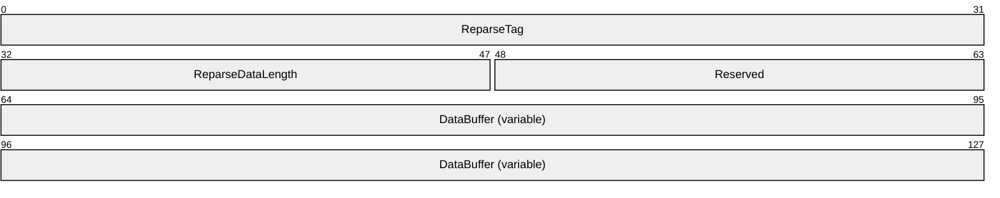

**ReparseTag (4 bytes):** A 32-bit unsigned integer value containing the reparse point tag that uniquely identifies the owner of the [**reparse point**](#gt_reparse-point).

**ReparseDataLength (2 bytes):** A 16-bit unsigned integer value containing the size, in bytes, of the reparse data in the **DataBuffer** member.

**Reserved (2 bytes):** A 16-bit field. This field is reserved. This field SHOULD be set to 0, and MUST be ignored.

**DataBuffer (variable):** A variable-length array of 8-bit unsigned integer values containing reparse-specific data for the reparse point. The format of this data is defined by the owner (that is, the implementer of the [**filter**](#gt_filter) driver associated with the specified ReparseTag) of the reparse point.

<a id="Section_2.1.2.3"></a>
#### 2.1.2.3 REPARSE_GUID_DATA_BUFFER

The **REPARSE_GUID_DATA_BUFFER** data element stores data for a reparse point and associates a GUID with the [**reparse tag**](#gt_reparse-point-tag). This reparse data buffer MUST be used only with [reparse tag values](#Section_8.3) whose high bit is set to 0.

[**Reparse point**](#gt_reparse-point) [**GUIDs**](#gt_globally-unique-identifier-guid) are assigned by the [**independent software vendor (ISV)**](#gt_independent-software-vendor-isv). An ISV MUST link one GUID to each assigned reparse point tag and MUST always use that GUID with that [**tag**](#gt_tag).

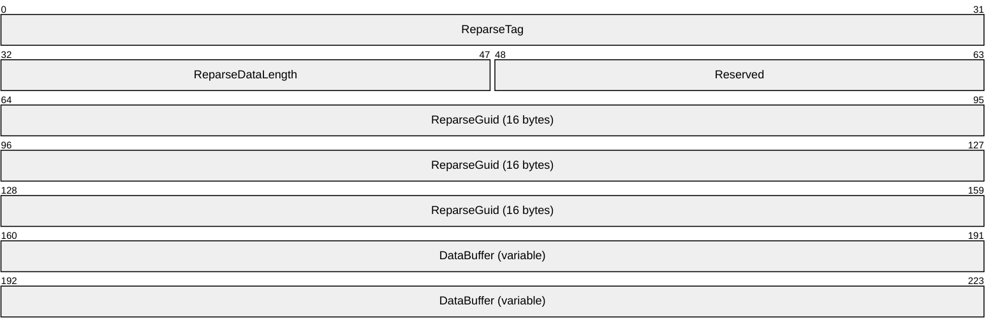

**ReparseTag (4 bytes):** A 32-bit unsigned integer value containing the reparse point tag that uniquely identifies the owner of the reparse point.

**ReparseDataLength (2 bytes):** A 16-bit unsigned integer value containing the size, in bytes, of the reparse data in the **DataBuffer** member.

**Reserved (2 bytes):** A 16-bit field. This field SHOULD be set to 0 by the client, and MUST be ignored by the server.

**ReparseGuid (16 bytes):** A 16-byte GUID that uniquely identifies the owner of the reparse point. Reparse point GUIDs are not assigned by Microsoft. A reparse point implementer MUST select one GUID to be used with their assigned reparse point tag to uniquely identify that reparse point. For more information, see [[REPARSE]](https://go.microsoft.com/fwlink/?LinkId=90259).

**DataBuffer (variable):** The content of this buffer is opaque to the file system. On receipt, its content MUST be preserved and properly returned to the caller.

<a id="Section_2.1.2.4"></a>
#### 2.1.2.4 Symbolic Link Reparse Data Buffer

The **Symbolic Link Reparse Data Buffer** data element is a subtype of [REPARSE_DATA_BUFFER](#Section_8.3), which contains information on [**symbolic link**](#gt_symbolic-link) [**reparse points**](#gt_reparse-point). This reparse data buffer MUST be used only with [reparse tag values](#Section_8.3) whose high bit is set to 1.

A symbolic link has a substitute name and a print name associated with it. The substitute name is a [pathname (section 2.1.5)](#Section_2.1.5) identifying the target of the symbolic link. The print name SHOULD be an informative pathname, suitable for display to a user, that also identifies the target of the symbolic link. Either pathname can contain dot directory names as specified in section [2.1.5.1](#Section_2.1.5.1).

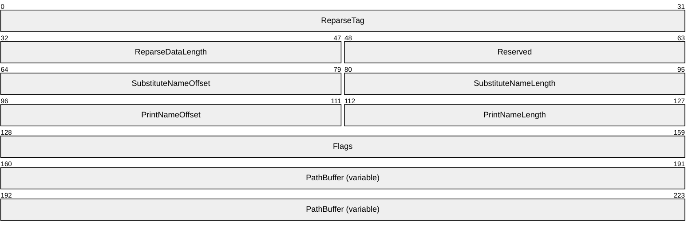

**ReparseTag (4 bytes):** A 32-bit unsigned integer value containing the [**reparse point tag**](#gt_reparse-point-tag) that uniquely identifies the owner (that is, the implementer of the [**filter**](#gt_filter) driver associated with this ReparseTag) of the reparse point. This value MUST be 0xA000000C.

**ReparseDataLength (2 bytes):** A 16-bit unsigned integer value containing the size, in bytes, of the reparse data that follows the common portion of the REPARSE_DATA_BUFFER element. This value is the length of the data starting at the **SubstituteNameOffset** field (or the size of the **PathBuffer** field, in bytes, plus 12).

**Reserved (2 bytes):** A 16-bit field. This field is not used. It SHOULD be set to 0 and MUST be ignored.

**SubstituteNameOffset (2 bytes):** A 16-bit unsigned integer that contains the offset, in bytes, of the substitute name string in the **PathBuffer** array, computed as an offset from byte 0 of **PathBuffer**. Note that this offset is divided by 2 to get the array index.

**SubstituteNameLength (2 bytes):** A 16-bit unsigned integer that contains the length, in bytes, of the substitute name string. If this string is null-terminated, **SubstituteNameLength** does not include the Unicode null character.

**PrintNameOffset (2 bytes):** A 16-bit unsigned integer that contains the offset, in bytes, of the print name string in the **PathBuffer** array, computed as an offset from byte 0 of **PathBuffer**. Note that this offset is divided by 2 to get the array index.

**PrintNameLength (2 bytes):** A 16-bit unsigned integer that contains the length, in bytes, of the print name string. If this string is null-terminated, **PrintNameLength** does not include the Unicode null character.

**Flags (4 bytes):** A 32-bit field that specifies whether the substitute name is a full path name or a path name relative to the directory containing the symbolic link.

This field contains one of the values in the following table.

| Value | Meaning |
| --- | --- |
| 0x00000000 | The substitute name is a full path name. |
| SYMLINK_FLAG_RELATIVE 0x00000001 | The substitute name is a path name relative to the directory containing the symbolic link. |

**PathBuffer (variable):** [**Unicode character**](#gt_unicode-character) array that contains the substitute name string and print name string. The substitute name and print name strings can appear in any order in the **PathBuffer**. To locate the substitute name and print name strings in the **PathBuffer**, use the **SubstituteNameOffset**, **SubstituteNameLength**, **PrintNameOffset**, and **PrintNameLength** members.

<a id="Section_2.1.2.5"></a>
#### 2.1.2.5 Mount Point Reparse Data Buffer

The **Mount Point Reparse Data Buffer** data element is a subtype of [REPARSE_DATA_BUFFER](#Section_8.3), which contains information about mount point [**reparse points**](#gt_reparse-point). This reparse data buffer MUST be used only with [reparse tag values](#Section_8.3) whose high bit is set to 1.

A mount point has a substitute name and a print name associated with it. The substitute name is a [pathname (section 2.1.5)](#Section_2.1.5) identifying the target of the mount point. The print name SHOULD be an informative pathname, suitable for display to a user, that also identifies the target of the mount point. Neither of these pathnames can contain dot directory names.

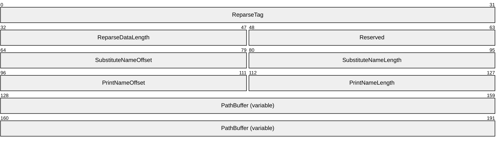

**ReparseTag (4 bytes):** A 32-bit unsigned integer value containing the [**reparse point tag**](#gt_reparse-point-tag) that uniquely identifies the owner (that is, the implementer of the [**filter**](#gt_filter) driver associated with this ReparseTag) of the reparse point. This value MUST be 0xA0000003.

**ReparseDataLength (2 bytes):** A 16-bit unsigned integer value containing the size, in bytes, of the reparse data that follows the common portion of the REPARSE_DATA_BUFFER element. This value is the length of the data starting at the **SubstituteNameOffset** field (or the size of the **PathBuffer** field, in bytes, plus 8).

**Reserved (2 bytes):** A 16-bit field. This field is not used. It SHOULD be set to 0 and MUST be ignored.

**SubstituteNameOffset (2 bytes):** A 16-bit unsigned integer that contains the offset, in bytes, of the substitute name string in the **PathBuffer** array, computed as an offset from byte 0 of **PathBuffer**. Note that this offset is divided by 2 to get the array index.

**SubstituteNameLength (2 bytes):** A 16-bit unsigned integer that contains the length, in bytes, of the substitute name string. If this string is null-terminated, **SubstituteNameLength** does not include the Unicode null character.

**PrintNameOffset (2 bytes):** A 16-bit unsigned integer that contains the offset, in bytes, of the print name string in the **PathBuffer** array, computed as an offset from byte 0 of **PathBuffer**. Note that this offset is divided by 2 to get the array index.

**PrintNameLength (2 bytes):** A 16-bit unsigned integer that contains the length, in bytes, of the print name string. If this string is null-terminated, **PrintNameLength** does not include the Unicode null character.

**PathBuffer (variable):** Unicode character array that contains the substitute name string and print name string. The substitute name and print name strings can appear in any order in **PathBuffer**. To locate the substitute name and print name strings in the **PathBuffer** field, use the **SubstituteNameOffset**, **SubstituteNameLength**, **PrintNameOffset**, and **PrintNameLength** members.

<a id="Section_2.1.2.6"></a>
#### 2.1.2.6 Network File System (NFS) Reparse Data Buffer

The **Network File System Reparse Data Buffer** data element is a subtype of [REPARSE_DATA_BUFFER](#Section_8.3), which contains information about symbolic files and devices created by the Network File System client.

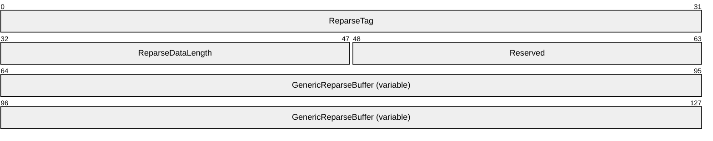

**ReparseTag (4 bytes):** A 32-bit unsigned integer value containing the reparse point tag that uniquely identifies the owner (that is, the implementer of the filter driver associated with this ReparseTag) of the reparse point. This value MUST be 0x80000014.

**ReparseDataLength (2 bytes):** A 16-bit unsigned integer value containing the size, in bytes, of the reparse data that follows the common portion of the REPARSE_DATA_BUFFER element. This value is the length of the data starting at the **GenericReparseBuffer** field.

**Reserved (2 bytes):** A 16-bit field. This field is not used. It SHOULD be set to 0 and MUST be ignored.

**GenericReparseBuffer (variable):** The data in this variable buffer takes the following format.

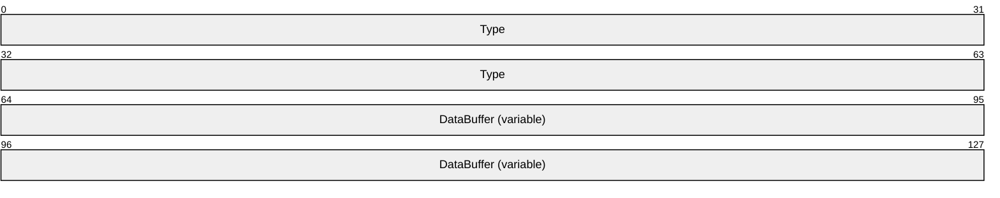

**Type (8 bytes):** A 64-bit unsigned integer value describing the type and format of the data stored in the **DataBuffer** field. The valid values for this field are:

| Value | Meaning |
| --- | --- |
| NFS_SPECFILE_LNK 0x00000000014B4E4C | Indicates that the **DataBuffer** field has a Unicode string containing the symbolic link data. |
| NFS_SPECFILE_CHR 0x0000000000524843 | Indicates that the **DataBuffer** field has two 32–bit integers that contain the major and minor device numbers for the character special device created by the Network File System client. |
| NFS_SPECFILE_BLK 0x00000000004B4C42 | Indicates that the **DataBuffer** field has two 32–bit integers that contain the major and minor device numbers for the block special device created by the Network File System client. |
| NFS_SPECFILE_FIFO 0x000000004F464946 | Indicates that the file containing the NFS reparse point is a named pipe device created by the Network File System client. The **DataBuffer** field is empty. |
| NFS_SPECFILE_SOCK 0x000000004B434F53 | Indicates that the file containing the NFS reparse point is a socket device created by the Network File System client. The **DataBuffer** field is empty. |

**DataBuffer (variable):** A variable buffer that has the following formats depending upon the **Type** field defined earlier.

- **NFS_SPECFILE_CHR** and **NFS_SPECFILE_BLK**: The **DataBuffer** field contains two 32-bit integers that represent major and minor device numbers.
- **NFS_SPECFILE_LNK**: The **DataBuffer** field contains the symbolic link target path specified by the Network File System client in its NFSPROC_SYMLINK request, [[RFC1813]](https://go.microsoft.com/fwlink/?LinkId=90294) section 3.3.10 and [[RFC1094]](https://go.microsoft.com/fwlink/?LinkId=90267) section 2.2.14, represented in Unicode format and not NULL-terminated. The upper limit on the size of the symbolic link data is 2050 bytes.
- **NFS_SPECFILE_FIFO** and **NFS_SPECFILE_SOCK**: The **DataBuffer** field is empty.
<a id="Section_2.1.2.7"></a>
#### 2.1.2.7 LX SYMLINK REPARSE_DATA_BUFFER

The **LX SYMLINK Reparse Data Buffer** data element is a subtype of section [REPARSE_DATA_BUFFER](#Section_8.3), which contains information about symbolic files generated by WSL (Windows Subsystem for Linux).

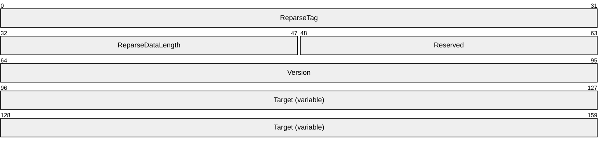

**ReparseTag (4 bytes):** A 32-bit unsigned integer value containing the reparse point tag that uniquely identifies the owner of the [**reparse point**](#gt_reparse-point).

**ReparseDataLength (2 bytes):** A 16-bit unsigned integer value containing the size, in bytes, of the reparse data that follows the common portion of the REPARSE_DATA_BUFFER element. This value is the length of the data starting at the **Version** field.

**Reserved (2 bytes):** A 16-bit field. This field is reserved. This field SHOULD be set to 0, and MUST be ignored.

**Version (4 bytes):** A 32-bit field. This field defines the layout of the **Target** field. This field MUST be set to 2.

**Target (variable):** An array of 8-byte characters that contains the target path of the symlink.

<a id="Section_2.1.3"></a>
### 2.1.3 FILE_OBJECTID_BUFFER Structure

The **FILE_OBJECTID_BUFFER** structure contains extended metadata for a file system object, including its object ID. This data element MUST be in one of the following two formats:

- FILE_OBJECTID_BUFFER Type 1
- FILE_OBJECTID_BUFFER Type 2
<a id="Section_2.1.3.1"></a>
#### 2.1.3.1 FILE_OBJECTID_BUFFER Type 1

The first possible structure for the [FILE_OBJECTID_BUFFER](#Section_8.3) data element is as follows.

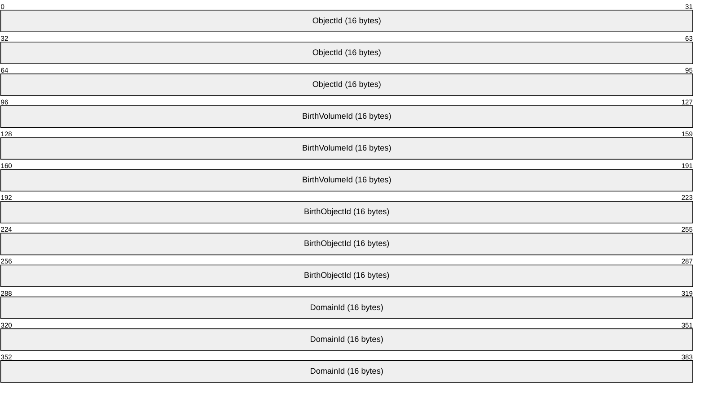

**ObjectId (16 bytes):** A 16-byte [**GUID**](#gt_globally-unique-identifier-guid) that uniquely identifies the file or directory within the [**volume**](#gt_volume) on which it resides. Specifically, the same object ID can be assigned to another file or directory on a different volume, but it MUST NOT be assigned to another file or directory on the same volume.

**BirthVolumeId (16 bytes):** A 16-byte GUID that uniquely identifies the volume on which the object resided when the [**object identifier**](#gt_object-identifier-oid) was created, or zero if the volume had no object identifier at that time. After copy operations, move operations, or other file operations, this value is potentially different from the object identifier of the volume on which the object presently resides.

**BirthObjectId (16 bytes):** A 16-byte GUID value containing the object identifier of the object at the time it was created. Copy operations, move operations, or other file operations MAY change the value of the **ObjectId** member. Therefore, the **BirthObjectId** is potentially different from the **ObjectId** member at present. Specifically, the same object ID MAY be assigned to another file or directory on a different volume, but it MUST NOT be assigned to another file or directory on the same volume. The object ID is assigned at file creation time.<5>

**DomainId (16 bytes):** A 16-byte GUID value containing the domain identifier. This value is unused; it SHOULD be zero, and MUST be ignored.<6>

<a id="Section_2.1.3.2"></a>
#### 2.1.3.2 FILE_OBJECTID_BUFFER Type 2

The second possible structure for the [FILE_OBJECTID_BUFFER](#Section_8.3) data element is as follows.


**ObjectId (16 bytes):** A 16-byte [**GUID**](#gt_globally-unique-identifier-guid) that uniquely identifies the file or directory within the [**volume**](#gt_volume) on which it resides. Specifically, the same object ID can be assigned to another file or directory on a different volume, but it MUST NOT be assigned to another file or directory on the same volume.

**ExtendedInfo (48 bytes):** A 48-byte value containing extended data that was set with the [FSCTL_SET_OBJECT_ID_EXTENDED request](#Section_2.3.79). This field contains application-specific data.<7>

<a id="Section_2.1.4"></a>
### 2.1.4 Alternate Data Streams

A file system MAY<8> support alternate data streams within a file or a directory. For a general description of [**file streams**](#gt_file-stream), section [1.1](#Section_1.1).

Every file has a default stream, which is the stream that is referenced when no stream name component is specified as part of the pathname. A directory does not have a default data stream; however, it can have named alternate data streams.

For more information on stream naming, see section [2.1.5](#Section_2.1.5); for more information on streams in general, see section [5](#Section_5).

<a id="Section_2.1.5"></a>
### 2.1.5 Pathname

A pathname has the following characteristics:

- A pathname MUST be no more than 32,760 characters in length.
- A pathname is composed of one or more pathname components separated by the "\" backslash character. All pathname components other than the last pathname component denote directories or [**reparse points**](#gt_reparse-point). The last pathname component denotes a directory, a file, a stream, or a reparse point.
- A leading "\" backslash character is optional, and determines whether a pathname is absolute or relative:
- A pathname that begins with a leading "\" backslash character, for example, "\a\b\c", is an absolute pathname. An absolute pathname SHOULD be evaluated relative to the root directory.
- A pathname that omits a leading "\" backslash character, for example, "a\b\c", is a relative pathname. A relative pathname MAY be evaluated relative to any directory, such as an application's current working directory.
- Each pathname component has one of the following forms:
- A [**dot directory name**](#gt_dot-directory-name) as specified in section [2.1.5.1](#Section_2.1.5.1).
- A filename as specified in section [2.1.5.2](#Section_2.1.5.2), optionally followed by a ":" colon character and a streamname as specified in section [2.1.5.3](#Section_2.1.5.3), optionally followed by a ":" colon character and a streamtype as specified in section [2.1.5.4](#Section_2.1.5.4). The streamname, if specified, MAY be zero-length only if streamtype is also specified; otherwise, it MUST be at least one character. The streamtype, if specified, MUST be at least one character.
<a id="Section_2.1.5.1"></a>
#### 2.1.5.1 Dot Directory Names

The pathname components of "." (single period) and ".." (two periods) are reserved as dot directory names.

Except where explicitly permitted, a pathname component that is a dot directory name MUST NOT be sent over the wire.

When parsing pathname components, a dot directory name of "." refers to the current directory name component and a dot directory name of ".." refers to the parent directory name of the current directory name component.

Some examples to illustrate:

- In the pathname "dirA\.\dirB", the "." refers to dirA, so this expression is equivalent to "dirA\dirB".
- In the pathname "dirA\dirB\..\dirC", the ".." refers to dirA, so this expression is equivalent to "dirA\dirC".
A dot directory name of ".." at the root of a share MUST be treated as equivalent to ".". For example: \\ServerX\ShareY\..\dirA is equivalent to \\ServerX\ShareY\.\dirA (which is equivalent to \\ServerX\ShareY\dirA).

<a id="Section_2.1.5.2"></a>
#### 2.1.5.2 Filename

- All [**Unicode characters**](#gt_unicode-character) are legal in a filename except the following:
- The characters
" \ / : | < > * ?

- Control characters, ranging from 0x00 through 0x1F.
- A filename MUST be at least one character but no more than 255 characters in length.
<a id="Section_8.3"></a>
<a id="Section_2.1.5.2.1"></a>
##### 8.3 Filename

An 8.3 filename (also referred to as a DOS name, a [**short name**](#gt_short-name), or an 8.3-compliant filename) is a filename that conforms to the following restrictions:

- An 8.3 filename MUST only contain characters that can be represented in ASCII, in the range below 0x80.
- An 8.3 filename MUST NOT contain the " " space character.
- An 8.3 filename MUST NOT contain more than one "." period character.
- The general form of a valid 8.3 filename is a base filename, optionally followed by the "." period character and a filename extension.
- The base filename MUST be 1-8 characters in length and MUST NOT contain a "." period character.
- The filename extension, if present, MUST be 1-3 characters in length and MUST NOT contain a "." period character.
<a id="Section_2.1.5.3"></a>
#### 2.1.5.3 Streamname

- All [**Unicode characters**](#gt_unicode-character) are legal in a streamname component except the following:
- The characters \ / :
- Control character 0x00.
- A streamname MUST be no more than 255 characters in length.
- A zero-length streamname denotes the default [**stream**](#gt_stream).
See section [5](#Section_5) for additional information on alternate streams in the [**NTFS**](#gt_nt-file-system-ntfs) file system.

<a id="Section_2.1.5.4"></a>
#### 2.1.5.4 Streamtype

- All [**Unicode characters**](#gt_unicode-character) are legal in a streamtype component except the following:
- The characters \ / :
- Control character 0x00.
<a id="Section_2.1.6"></a>
### 2.1.6 Share name

A share name has the following characteristics:

- A share name MUST be no more than 80 characters in length.
- The following characters are illegal in a share name:
" \ / [ ] : | < > + = ; , * ?

- Control characters in range 0x00 through 0x1F, inclusive, are illegal in a share name.
- All other Unicode characters are legal.
<a id="Section_2.1.7"></a>
### 2.1.7 FILE_NAME_INFORMATION

The **FILE_NAME_INFORMATION** data element is as follows.


**FileNameLength (4 bytes):** A 32-bit unsigned integer that specifies the length, in bytes, of the file name contained within the **FileName** field.

**FileName (variable):** A sequence of Unicode characters containing a pathname (section [2.1.5](#Section_2.1.5)). The meaning of the pathname depends on the operation. The name string is not null-terminated. There are scenarios where one or more padding characters can be at the end of the string due to buffer alignment requirements, but their presence and their values MUST NOT be relied upon. When working with this field, use **FileNameLength** to determine the length of the file name rather than assuming the presence of a trailing null delimiter.

<a id="Section_2.1.8"></a>
### 2.1.8 Boolean

A **Boolean** data type is a primitive that has one of two possible values: TRUE and FALSE, which are defined as follows:

**TRUE:** A sender MUST use any nonzero value to denote a TRUE. A receiver MUST interpret any nonzero value as TRUE.<9>

**FALSE:** A sender MUST use a zero value to denote a FALSE. A receiver MUST interpret a zero value as FALSE.

<a id="Section_2.1.9"></a>
### 2.1.9 64-bit file ID

A **64-bit file ID** value uniquely identifies a file within a given volume. This identifier is generated and stored by the file system. The identifier SHOULD<10> be unique to the volume and stable until the file is deleted.

For file systems that do not support a 64-bit file ID, this field MUST be set to 0, and MUST be ignored.

For files for which a unique 64-bit file ID cannot be established, this field MUST be set to 0xFFFFFFFFFFFFFFFF, and MUST be ignored.

<a id="Section_2.1.10"></a>
### 2.1.10 128-bit file ID

A **128-bit file ID** value uniquely identifies a file within a given volume. This identifier is generated and stored by the file system. The identifier SHOULD<11> be unique to the volume and stable until the file is deleted.

For file systems that do not support a **128-bit file ID**, this field MUST be set to 0, and MUST be ignored.

For files for which a unique **128-bit file ID** cannot be established, this field MUST be set to 0xFFFFFFFFFFFFFFFFFFFFFFFFFFFFFFFF, and MUST be ignored.

<a id="Section_2.1.11"></a>
### 2.1.11 STORAGE_OFFLOAD_TOKEN

The **STORAGE_OFFLOAD_TOKEN** structure contains the [**Token**](#gt_token) to be used as a representation of the data contained within the portion of the file specified in the FSCTL_OFFLOAD_READ_INPUT data element at the time of the FSCTL_OFFLOAD_READ operation. This Token is used in FSCTL_OFFLOAD_READ and FSCTL_OFFLOAD_WRITE operations. The format of the data within this field is either vendor-specific or of a well-known type. The contents of this field MUST NOT be modified during subsequent operations.<12>

The **TokenType** and **TokenIdLength** fields of **STORAGE_OFFLOAD_TOKEN** structure MUST be sent in big-endian format. The **TokenId** field is a stream of bytes and has no endian property.

The **STORAGE_OFFLOAD_TOKEN** structure is as follows.

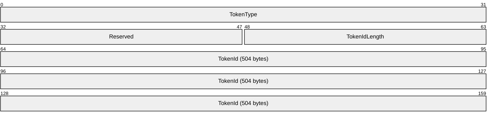

**TokenType (4 bytes):** A 32-bit unsigned integer that defines the type of Token that is contained within the **STORAGE_OFFLOAD_TOKEN** structure. This field MUST contain one of the following values.

| Value | Meaning |
| --- | --- |
| STORAGE_OFFLOAD_TOKEN_TYPE_ZERO_DATA 0xFFFF0001 | A well-known Token that indicates that the data logically represented by the Token is logically equivalent to zero.<13> |
| Reserved 0xFFFF0002 – 0xFFFFFFFF | Reserved for other well-known Tokens currently undefined. |
| Any other value. | A vendor-specific Token format is contained within the **Token** field. |

**Reserved (2 bytes):** A 16-bit unsigned integer that is reserved. This field SHOULD be set to 0x0000 and MUST be ignored.

**TokenIdLength (2 bytes):** A 16-bit unsigned integer that defines the length of the **TokenId** field in bytes.

**TokenId (504 bytes):** A 504-byte unsigned integer that contains opaque vendor-specific data.

<a id="Section_2.2"></a>
## 2.2 Status Codes

This specification uses NTSTATUS status codes, as specified in [MS-ERREF](../MS-ERREF/MS-ERREF.md) section 2.3. The format of a status code MUST be as specified in [MS-ERREF].

The reply message lists the common error codes that are directly generated by the function. Error codes can also be generated by code below the file system (such as RAID drivers or disk drivers) or above the file system (such as virus scanners).

A server SHOULD return a status of STATUS_INVALID_DEVICE_REQUEST when a message is not supported remotely or is not supported on the file system on which the file or directory handle specified exists.<14><15>

STATUS_BUFFER_OVERFLOW is a warning code and not an error code. This warning means that the given output buffer is not large enough to contain all of the requested information. Unless otherwise noted, a given operation SHOULD attempt to return as much data as it reasonably can.

<a id="Section_2.3"></a>
## 2.3 FSCTL Structures

A process invokes an [**FSCTL**](#gt_file-system-control-fsctl) on a handle to perform an action against the file or directory associated with the handle. When a server receives an FSCTL request, it SHOULD use the information in the request, which includes a handle and, optionally, an input data buffer, to perform the requested action. How a server performs the action requested by an FSCTL is implementation-dependent.<16>

The following table specifies the system defined generic FSCTLs that are permitted to be invoked across the network. Generic FSCTLs are used by the local file systems or by multiple components within the system. Any application, service, or driver can define private FSCTLs. Most private FSCTLs are used locally in the internal driver stacks and do not flow over the wire. However, if a component allows its private FSCTLs to flow over the wire, that component is responsible for ensuring the FSCTLs and associated data structures are documented. Examples of such private FSCTLs can be found in [MS-SMB2](../MS-SMB2/MS-SMB2.md) and [MS-DFSC](../MS-DFSC/MS-DFSC.md).

| FSCTL name | FSCTL function number |
| --- | --- |
| FSCTL_CREATE_OR_GET_OBJECT_ID | 0X900C0 |
| FSCTL_DELETE_OBJECT_ID | 0X900A0 |
| FSCTL_DELETE_REPARSE_POINT | 0X900AC |
| FSCTL_DUPLICATE_EXTENTS_TO_FILE | 0X98344 |
| FSCTL_DUPLICATE_EXTENTS_TO_FILE_EX | 0x983E8 |
| FSCTL_FILESYSTEM_GET_STATISTICS | 0X90060 |
| FSCTL_FILE_LEVEL_TRIM | 0X98208 |
| FSCTL_FIND_FILES_BY_SID | 0X9008F |
| FSCTL_GET_COMPRESSION | 0X9003C |
| FSCTL_GET_INTEGRITY_INFORMATION | 0X9027C |
| FSCTL_GET_NTFS_VOLUME_DATA | 0X90064 |
| FSCTL_GET_REFS_VOLUME_DATA | 0X902D8 |
| FSCTL_GET_OBJECT_ID | 0X9009C |
| FSCTL_GET_REPARSE_POINT | 0X900A8 |
| FSCTL_GET_RETRIEVAL_POINTER_COUNT | 0x9042B |
| FSCTL_GET_RETRIEVAL_POINTERS | 0X90073 |
| FSCTL_GET_RETRIEVAL_POINTERS_AND_REFCOUNT | 0x903D3 |
| FSCTL_IS_PATHNAME_VALID | 0X9002C |
| FSCTL_LMR_SET_LINK_TRACKING_INFORMATION | 0X1400EC |
| FSCTL_MARK_HANDLE | 0x900FC |
| FSCTL_OFFLOAD_READ | 0X94264 |
| FSCTL_OFFLOAD_WRITE | 0X98268 |
| FSCTL_PIPE_PEEK | 0X11400C |
| FSCTL_PIPE_TRANSCEIVE | 0X11C017 |
| FSCTL_PIPE_WAIT | 0X110018 |
| FSCTL_QUERY_ALLOCATED_RANGES | 0X940CF |
| FSCTL_QUERY_FAT_BPB | 0X90058 |
| FSCTL_QUERY_FILE_REGIONS | 0X90284 |
| FSCTL_QUERY_ON_DISK_VOLUME_INFO | 0X9013C |
| FSCTL_QUERY_SPARING_INFO | 0X90138 |
| FSCTL_READ_FILE_USN_DATA | 0X900EB |
| FSCTL_RECALL_FILE | 0X90117 |
| FSCTL_REFS_STREAM_SNAPSHOT_MANAGEMENT | 0x90440 |
| FSCTL_SET_COMPRESSION | 0X9C040 |
| FSCTL_SET_DEFECT_MANAGEMENT | 0X98134 |
| FSCTL_SET_ENCRYPTION | 0X900D7 |
| FSCTL_SET_INTEGRITY_INFORMATION | 0X9C280 |
| FSCTL_SET_INTEGRITY_INFORMATION_EX | 0x90380 |
| FSCTL_SET_OBJECT_ID | 0X90098 |
| FSCTL_SET_OBJECT_ID_EXTENDED | 0X900BC |
| FSCTL_SET_REPARSE_POINT | 0X900A4 |
| FSCTL_SET_SPARSE | 0X900C4 |
| FSCTL_SET_ZERO_DATA | 0X980C8 |
| FSCTL_SET_ZERO_ON_DEALLOCATION | 0X90194 |
| FSCTL_SIS_COPYFILE | 0X90100 |
| FSCTL_WRITE_USN_CLOSE_RECORD | 0X900EF |

<a id="Section_2.3.1"></a>
### 2.3.1 FSCTL_CREATE_OR_GET_OBJECT_ID Request

This message requests that the server return the object identifier for the file or directory associated with the handle on which this [**FSCTL**](#gt_file-system-control-fsctl) was invoked. If no object identifier exists, the server MUST create one.

This message does not contain any additional data elements.

<a id="Section_2.3.2"></a>
### 2.3.2 FSCTL_CREATE_OR_GET_OBJECT_ID Reply

This message returns the results of the [FSCTL_CREATE_OR_GET_OBJECT_ID request](#Section_2.3.1) in a [FILE_OBJECTID_BUFFER (section 2.1.3)](#Section_2.1.3).

The buffer can be either Type 1 or Type 2 as follows:

- If neither FSCTL_SET_OBJECT_ID_EXTENDED nor FSCTL_SET_OBJECT_ID has been previously issued on the file, then the buffer is of Type 1 and contains implementation-generated values as specified in section [2.1.3.1](#Section_2.1.3.1).
- If FSCTL_SET_OBJECT_ID was used to set the [**object ID**](#gt_object-id), then the buffer is of the type that was used during that FSCTL_SET_OBJECT_ID call.
- If FSCTL_SET_OBJECT_ID_EXTENDED was issued to change the object ID's extended information, then the buffer is of Type 2.
There is no way for the issuer of this [**FSCTL**](#gt_file-system-control-fsctl) to determine the returned buffer type without knowing whether the object ID was previously set or modified and by what means (FSCTL_SET_OBJECT_ID_EXTENDED or FSCTL_SET_OBJECT_ID).

This message also returns a status code as specified in section [2.2](#Section_2.2). Upon success, the status code returned by the function that processes this FSCTL is STATUS_SUCCESS. The most common error codes are listed in the following table.

| Error code | Meaning |
| --- | --- |
| STATUS_DUPLICATE_NAME 0xC00000BD | The file has no object ID yet, and the file system is unable to generate a unique ID (to this volume).<17> |
| STATUS_INVALID_PARAMETER 0xC000000D | The handle is not to a file or directory, or the output buffer is not large enough to contain a FILE_OBJECTID_BUFFER structure. |
| STATUS_MEDIA_WRITE_PROTECTED 0xC00000A2 | The volume is write-protected and changes to it cannot be made. This error code is returned even if the file already has an object ID assigned to it. |
| STATUS_INVALID_DEVICE_REQUEST 0xC0000010 | The file system does not support the use of object IDs. |

<a id="Section_2.3.3"></a>
### 2.3.3 FSCTL_DELETE_OBJECT_ID Request

This message requests that the server remove the object identifier from the file or directory associated with the handle on which this [**FSCTL**](#gt_file-system-control-fsctl) was invoked. The underlying object MUST NOT be deleted. If the file or directory has no object identifier, the request MUST be considered successful.

This message does not contain any additional data elements.

<a id="Section_2.3.4"></a>
### 2.3.4 FSCTL_DELETE_OBJECT_ID Reply

This message returns the results of the [FSCTL_DELETE_OBJECT_ID request](#Section_2.3.3).

The only data item this message returns is a status code, as specified in section [2.2](#Section_2.2). Upon success, the status code returned by the function that processes this [**FSCTL**](#gt_file-system-control-fsctl) is STATUS_SUCCESS. The most common error codes are listed in the following table.

| Error code | Meaning |
| --- | --- |
| STATUS_ACCESS_DENIED 0xC0000022 | The handle was not opened with write access or write attributes access. |
| STATUS_OBJECT_NAME_NOT_FOUND 0xC0000034 | The file or directory has no object ID. This status is not returned on a healthy volume but can be returned if the volume is corrupt. |
| STATUS_MEDIA_WRITE_PROTECTED 0xC00000A2 | The volume is write-protected and changes to it cannot be made. |
| STATUS_INVALID_DEVICE_REQUEST 0xC0000010 | The file system does not support the use of object IDs. |

<a id="Section_2.3.5"></a>
### 2.3.5 FSCTL_DELETE_REPARSE_POINT Request

This message requests that the server delete the [**reparse point**](#gt_reparse-point) from the file or directory associated with the handle on which this [**FSCTL**](#gt_file-system-control-fsctl) was invoked. The underlying file or directory MUST NOT be deleted.

The message MUST contain a [REPARSE_GUID_DATA_BUFFER](#Section_8.3) or a [REPARSE_DATA_BUFFER](#Section_8.3) data element (including subtypes). Both the REPARSE_GUID_DATA_BUFFER and the REPARSE_DATA_BUFFER structures begin with a **ReparseTag** field. The **ReparseTag** value uniquely identifies the [**filter**](#gt_filter) driver that creates/uses the reparse point, and the application's filter driver processes the reparse point data as either a REPARSE_GUID_DATA_BUFFER or a REPARSE_DATA_BUFFER, depending on the structure implemented by the filter driver for that type of reparse point.

This message MUST only be sent for a file or directory handle.

<a id="Section_2.3.6"></a>
### 2.3.6 FSCTL_DELETE_REPARSE_POINT Reply

This message returns the result of the [FSCTL_DELETE_REPARSE_POINT request](#Section_2.3.5).

The only data item this message returns is a status code, as specified in section [2.2](#Section_2.2). Upon success, the status code returned by the function that processes this [**FSCTL**](#gt_file-system-control-fsctl) is STATUS_SUCCESS. The most common error codes are listed in the following table.

| Error code | Meaning |
| --- | --- |
| STATUS_INVALID_PARAMETER 0xC000000D | A nonzero value was passed for the output buffer's length, or the handle is not to a file or directory. |
| STATUS_ACCESS_DENIED 0xC0000022 | The handle was not opened to write file data or file attributes. |
| STATUS_IO_REPARSE_DATA_INVALID 0xC0000278 | The input buffer's length is neither the size of a [REPARSE_DATA_BUFFER](#Section_8.3) nor a [REPARSE_GUID_DATA_BUFFER](#Section_8.3); or the reparse data length is nonzero; or the reparse tag is a third party reparse tag, and the length is other than the size of REPARSE_GUID_DATA_BUFFER. |
| STATUS_IO_REPARSE_TAG_INVALID 0xC0000276 | The specified reparse tag with a value of 0 or 1 is reserved for use by the system and cannot be deleted. |
| STATUS_NOT_A_REPARSE_POINT 0xC0000275 | The file or directory does not have a [**reparse point**](#gt_reparse-point). |
| STATUS_IO_REPARSE_TAG_MISMATCH 0xC0000277 | The file or directory has a reparse point but not one with the reparse tag that was specified in this call. |
| STATUS_REPARSE_ATTRIBUTE_CONFLICT 0xC00002B2 | The file or directory has a third party tag, and the Reparse GUID provided does not match the one in the reparse point for this file or directory. |

<a id="Section_2.3.7"></a>
### 2.3.7 FSCTL_DUPLICATE_EXTENTS_TO_FILE Request

The FSCTL_DUPLICATE_EXTENTS_TO_FILE<18> request message requests that the server copy the specified portion of one file (that is the source file) into a specified portion of another file (target file) on the same volume. The logical sizes of the portions have to be the same. The two files involved in this operation can refer to the same file, but in that case, the logical portions have to refer to disjoint regions on the file. The FSCTL is sent on a handle opened to the target file.

When used locally, the request message takes the form of DUPLICATE_EXTENTS_DATA as specified in section [2.3.7.1](#Section_2.3.7.1). When used remotely with [MS-SMB2](../MS-SMB2/MS-SMB2.md), the request message takes the form of SMB2_DUPLICATE_EXTENTS_DATA as specified in section [2.3.7.2](#Section_2.3.7.2).

<a id="Section_2.3.7.1"></a>
#### 2.3.7.1 DUPLICATE_EXTENTS_DATA

A **DUPLICATE_EXTENTS_DATA** data element is defined as follows:


**FileHandle (8 bytes):** A HANDLE ([MS-DTYP](../MS-DTYP/MS-DTYP.md) section 2.2.16) data type that is an identifier of the open to the source file.

**SourceFileOffset (8 bytes)**: A 64-bit signed integer that contains the file offset, in bytes, of the start of a range of bytes in a source file from which the data is to be copied. The value of this field MUST be greater than or equal to 0x0000000000000000 and MUST be aligned to a logical cluster boundary.

**TargetFileOffset (8 bytes)**: A 64-bit signed integer that contains the file offset, in bytes, of the start of a range of bytes in a target file to which the data is to be copied. The value of this field MUST be greater than or equal to 0x0000000000000000 and MUST be aligned to a logical cluster boundary.

**ByteCount (8 bytes)**: A 64-bit signed integer that contains the number of bytes to copy from source to target. The value of this field MUST be greater than or equal to 0x0000000000000000 and MUST be aligned to a logical cluster boundary.

<a id="Section_2.3.7.2"></a>
#### 2.3.7.2 SMB2_DUPLICATE_EXTENTS_DATA

A **SMB2_DUPLICATE_EXTENTS_DATA** data element is defined as follows:

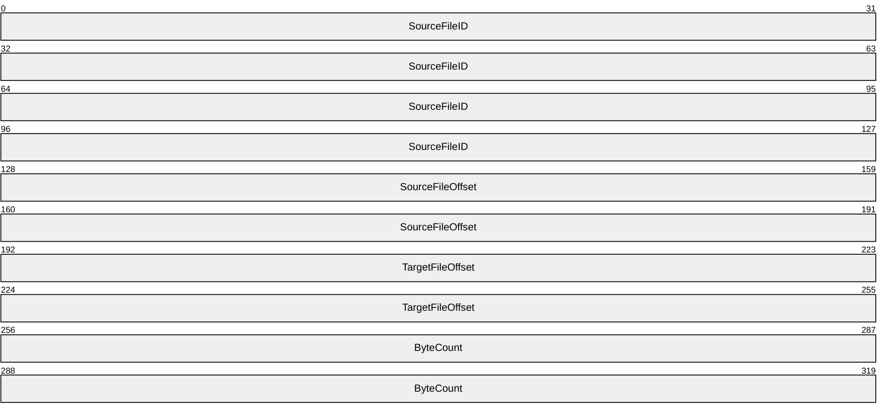

**SourceFileID (16 bytes):** An SMB2_FILEID structure, as specified in [MS-SMB2](../MS-SMB2/MS-SMB2.md) section 2.2.14.1, that is an identifier of the open to the source file.

**SourceFileOffset (8 bytes):** A 64-bit signed integer that contains the file offset, in bytes, of the start of a range of bytes in a source file from which the data is to be copied. The value of this field MUST be greater than or equal to 0x0000000000000000 and MUST be aligned to a logical cluster boundary.

**TargetFileOffset (8 bytes):** A 64-bit signed integer that contains the file offset, in bytes, of the start of a range of bytes in a target file to which the data is to be copied. The value of this field MUST be greater than or equal to 0x0000000000000000 and MUST be aligned to a logical cluster boundary.

**ByteCount (8 bytes):** A 64-bit signed integer that contains the number of bytes to copy from source to target. The value of this field MUST be greater than or equal to 0x0000000000000000 and MUST be aligned to a logical cluster boundary.

<a id="Section_2.3.8"></a>
### 2.3.8 FSCTL_DUPLICATE_EXTENTS_TO_FILE Reply

This message returns the result of the FSCTL_DUPLICATE_EXTENTS_TO_FILE<19> request.

The only data item this message returns is a status code, as specified in section [2.2](#Section_2.2). Upon success, the status code returned by the function that processes this FSCTL SHOULD<20> be STATUS_SUCCESS. The most common error codes are listed in the following table.

| Error Code | Meaning |
| --- | --- |
| STATUS_NOT_SUPPORTED 0xC00000BB | The source and target destination ranges overlap on the same file. Source file is sparse, while target is a non-sparse file. The source range is beyond the source file's allocation size. |
| STATUS_INVALID_PARAMETER 0xC000000D | The FileHandle parameter is either invalid or does not represent a handle to an opened file on the same volume. |
| STATUS_INSUFFICIENT_RESOURCES 0xC000009A | There were insufficient resources to complete the operation. |
| STATUS_DISK_FULL 0xC000007F | The disk is full. |
| STATUS_MEDIA_WRITE_PROTECTED 0xC00000A2 | The volume is read-only. |
| STATUS_INVALID_DEVICE_REQUEST 0xC0000010 | The file system does not support duplicating extents. |

<a id="Section_2.3.9"></a>
### 2.3.9 FSCTL_DUPLICATE_EXTENTS_TO_FILE_EX Request

The FSCTL_DUPLICATE_EXTENTS_TO_FILE_EX<21> request message requests that the server copy the specified portion of the source file into a specified portion of the target file on the same volume. The logical sizes of the portions MUST be the same. The two files involved in this operation can refer to the same file but the logical portions have to refer to disjoint regions on the file. The FSCTL is sent on a handle opened to the target file. When the DUPLICATE_EXTENTS_DATA_EX_SOURCE_ATOMIC flag isn’t set, the behavior is identical to FSCTL_DUPLICATE_EXTENTS_TO_FILE. When the flag is set, duplication is atomic from the source's point of view. It means duplication fully succeeds or fails without side effect (when only part of source file region is duplicated).

When used locally, the request message takes the form of DUPLICATE_EXTENTS_DATA_EX as specified in section [2.3.9.1](#Section_2.3.9.1). When used remotely with [MS-SMB2](../MS-SMB2/MS-SMB2.md), the request message takes the form of SMB2_DUPLICATE_EXTENTS_DATA_EX as specified in section [2.3.9.2](#Section_2.3.9.2).

<a id="Section_2.3.9.1"></a>
#### 2.3.9.1 DUPLICATE_EXTENTS_DATA_EX

A **DUPLICATE_EXTENTS_DATA_EX** data element is defined as follows:

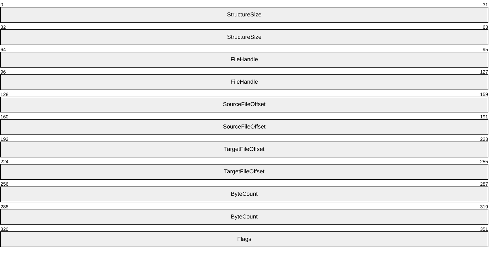

**StructureSize (8 bytes):** A SIZE_T [MS-DTYP](../MS-DTYP/MS-DTYP.md) section 2.2.43) data type that specifies the size of the structure, in bytes.

**FileHandle (8 bytes):** A HANDLE ([MS-DTYP] section 2.2.16) data type that is an identifier of the open to the source file.

**SourceFileOffset (8 bytes):** A 64-bit signed integer that contains the file offset, in bytes, of the start of a range of bytes in a source file from which the data is to be copied. The value of this field MUST be greater than or equal to 0x0000000000000000 and MUST be aligned to a logical cluster boundary.

**TargetFileOffset (8 bytes):** A 64-bit signed integer that contains the file offset, in bytes, of the start of a range of bytes in a target file to which the data is to be copied. The value of this field MUST be greater than or equal to 0x0000000000000000 and MUST be aligned to a logical cluster boundary.

**ByteCount (8 bytes):** A 64-bit signed integer that contains the number of bytes to copy from source to target. The value of this field MUST be greater than or equal to 0x0000000000000000 and MUST be aligned to a logical cluster boundary.

**Flags (4 bytes):** A 32-bit unsigned integer that contains zero or more of the following flag values. Flag values not specified in the following table SHOULD be set to 0 and MUST be ignored.

| Value | Meaning |
| --- | --- |
| DUPLICATE_EXTENTS_DATA_EX_SOURCE_ATOMIC 0x00000001 | Indicates that duplication is atomic from source point of view. |

<a id="Section_2.3.9.2"></a>
#### 2.3.9.2 SMB2_DUPLICATE_EXTENTS_DATA_EX

A **SMB2_DUPLICATE_EXTENTS_DATA_EX** data element is defined as follows:

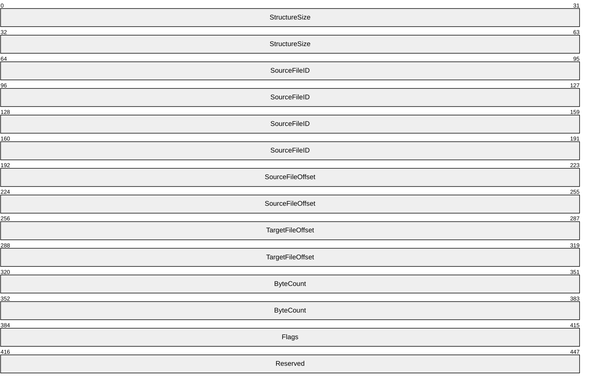

**StructureSize (8 bytes):** A 64-bit unsigned integer value that specifies the size of the structure, in bytes. This field MUST be set to 0x30.

**SourceFileID (16 bytes):** An SMB2_FILEID structure, as specified in [MS-SMB2](../MS-SMB2/MS-SMB2.md) section 2.2.14.1, that is an identifier of the open to the source file.

**SourceFileOffset (8 bytes):** A 64-bit signed integer that contains the file offset, in bytes, of the start of a range of bytes in a source file from which the data is to be copied. The value of this field MUST be greater than or equal to 0x0000000000000000 and MUST be aligned to a logical cluster boundary.

**TargetFileOffset (8 bytes):** A 64-bit signed integer that contains the file offset, in bytes, of the start of a range of bytes in a target file to which the data is to be copied. The value of this field MUST be greater than or equal to 0x0000000000000000 and MUST be aligned to a logical cluster boundary.

**ByteCount (8 bytes):** A 64-bit signed integer that contains the number of bytes to copy from source to target. The value of this field MUST be greater than or equal to 0x0000000000000000 and MUST be aligned to a logical cluster boundary.

**Flags (4 bytes):** A 32-bit unsigned integer that contains zero or more of the following flag values. Flag values not specified in the following table SHOULD be set to 0 and MUST be ignored.

| Value | Meaning |
| --- | --- |
| DUPLICATE_EXTENTS_DATA_EX_SOURCE_ATOMIC 0x00000001 | Indicates that duplication is atomic from source point of view. |

**Reserved (4 bytes):** This field SHOULD be set to zero and MUST be ignored.

<a id="Section_2.3.10"></a>
### 2.3.10 FSCTL_DUPLICATE_EXTENTS_TO_FILE_EX Reply

This message returns the result of the FSCTL_DUPLICATE_EXTENTS_TO_FILE_EX request<22>.

The only data item this message returns is a status code, as specified in section [2.2](#Section_2.2). Upon success, the status code returned by the function that processes this FSCTL SHOULD be STATUS_SUCCESS. The most common error codes are listed in the following table.

| Error Code | Meaning |
| --- | --- |
| STATUS_NOT_SUPPORTED 0xC00000BB | The source and target destination ranges overlap on the same file. Source file is sparse, while target is a non-sparse file. The source range is beyond the source file's allocation size. |
| STATUS_INVALID_PARAMETER 0xC000000D | The FileHandle parameter is either invalid or does not represent a handle to an opened file on the same volume. |
| STATUS_INSUFFICIENT_RESOURCES 0xC000009A | There were insufficient resources to complete the operation. |
| STATUS_DISK_FULL 0xC000007F | The disk is full. |
| STATUS_MEDIA_WRITE_PROTECTED 0xC00000A2 | The volume is read-only. |
| STATUS_INVALID_DEVICE_REQUEST 0xC0000010 | The file system does not support duplicating extents. |

<a id="Section_2.3.11"></a>
### 2.3.11 FSCTL_FILESYSTEM_GET_STATISTICS Request

This message requests that the server return the statistical information of the file system such as Type, Version, and so on, as specified in [FSCTL_FILESYSTEM_GET_STATISTICS reply](#Section_2.3.12), for the file or directory associated with the handle on which this [**FSCTL**](#gt_file-system-control-fsctl) was invoked.<23>

This message does not contain any additional data elements.

<a id="Section_2.3.12"></a>
### 2.3.12 FSCTL_FILESYSTEM_GET_STATISTICS Reply

This message returns the result of the [FSCTL_FILESYSTEM_GET_STATISTICS request](#Section_2.3.11) message as a pair of structures: a generic structure, [FILESYSTEM_STATISTICS](#Section_2.3.12.1), optionally followed by a file system type specific structure that can be either [NTFS_STATISTICS](#Section_2.3.12.2), [FAT_STATISTICS](#Section_2.3.12.3), or [EXFAT_STATISTICS](#Section_2.3.12.4), depending on the underlying file system type. There is one pair of these structures for each processor.<24>

These statistics contain information about both user and metadata files. User files are available for the user. Metadata files are system files that contain information that the file system uses for its internal organization.

The statistics structures contain fields that can overflow during the server's lifetime. This is by design. When an overflow occurs, the value just wraps. For example, 0XFFFFF000 + 0x2000 will result in 0x1000.

The structures within the output buffer MUST all start on 64-byte boundaries. The final output MUST be padded to a 64-byte boundary. Any padding bytes MUST be filled with zeros.

This message also returns a status code as specified in section [2.2](#Section_2.2). Upon success, the status code returned by the function that processes this [**FSCTL**](#gt_file-system-control-fsctl) is STATUS_SUCCESS. The most common error codes are listed in the following table.

| Error code | Meaning |
| --- | --- |
| STATUS_BUFFER_TOO_SMALL 0xC0000023 | The output buffer is too small to contain a FILESYSTEM_STATISTICS structure. |
| STATUS_BUFFER_OVERFLOW 0x80000005 | The output buffer was filled before all the statistics data could be returned. |

<a id="Section_2.3.12.1"></a>
#### 2.3.12.1 FILESYSTEM_STATISTICS

The **FILESYSTEM_STATISTICS** data element is returned with a [FSCTL_FILESYSTEM_GET_STATISTICS reply](#Section_2.3.12) message. It contains the generic information for the message.

The **FILESYSTEM_STATISTICS** data element is as follows:

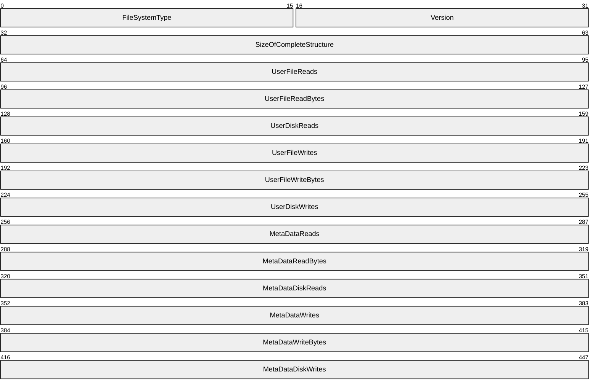

**FileSystemType (2 bytes):** A 16-bit unsigned integer value containing the type of file system. This field MUST contain one of the following values.

| Value | Meaning |
| --- | --- |
| FILESYSTEM_STATISTICS_TYPE_NTFS 0x0001 | The file system is an [**NTFS**](#gt_nt-file-system-ntfs) file system. If this value is set, this structure is followed by an [NTFS_STATISTICS](#Section_2.3.12.2) structure. |
| FILESYSTEM_STATISTICS_TYPE_FAT 0x0002 | The file system is a [**FAT file system**](#gt_fat-file-system). If this value is set, this structure is followed by a [FAT_STATISTICS](#Section_2.3.12.3) structure. |
| FILESYSTEM_STATISTICS_TYPE_EXFAT 0x0003 | The file system is an exFAT file system. If this value is set, this structure is followed by an [EXFAT_STATISTICS](#Section_2.3.12.4) structure. |
| FILESYSTEM_STATISTICS_TYPE_REFS 0x0004 | The file system is an ReFS file system. If this value is set, this structure is not followed by a structure specific to file system type. |

**Version (2 bytes):** A 16-bit unsigned integer value containing the version. This field MUST be set to the value 0x0001.

**SizeOfCompleteStructure (4 bytes):** A 32-bit unsigned integer value that indicates the size, in bytes, of this structure plus the size of the file system-specific structure that follows this structure, each rounded up to a multiple of 64, then the sum is multiplied by the number of processors. For example, if the size of **FILESYSTEM_STATISTICS** is 0x38, the size of **NTFS_STATISTICS** is 0XD4, and there are two processors, the size of the buffer allocated is 0x280. This is the sum of the sizes of the **NTFS_STATISTICS** structure and the **FILESYSTEM_STATISTICS** structure, both rounded up to a multiple of 64 (0x40 + 0x100 = 0x140) and multiplied by the number of processors.

**UserFileReads (4 bytes):** A 32-bit unsigned integer value containing the number of read operations on user files.

**UserFileReadBytes (4 bytes):** A 32-bit unsigned integer value containing the number of bytes read from user files.

**UserDiskReads (4 bytes):** A 32-bit unsigned integer value containing the number of read operations on user files that went to the disk rather than the cache. This value includes [**sub-read**](#gt_ec3f0097-f724-412e-baa2-d2341dbd6bce) operations.

**UserFileWrites (4 bytes):** A 32-bit unsigned integer value containing the number of write operations on user files.

**UserFileWriteBytes (4 bytes):** A 32-bit unsigned integer value containing the number of bytes written to user files.

**UserDiskWrites (4 bytes):** A 32-bit unsigned integer value containing the number of write operations on user files that went to disk rather than the cache. This value includes sub-write operations.

**MetaDataReads (4 bytes):** A 32-bit unsigned integer value containing the number of read operations on metadata files.

**MetaDataReadBytes (4 bytes):** A 32-bit unsigned integer value containing the number of bytes read from metadata files.

**MetaDataDiskReads (4 bytes):** A 32-bit unsigned integer value containing the number of read operations on metadata files. This value includes sub-read operations.

**MetaDataWrites (4 bytes):** A 32-bit unsigned integer value containing the number of write operations on metadata files.

**MetaDataWriteBytes (4 bytes):** A 32-bit unsigned integer value containing the number of bytes written to metadata files.

**MetaDataDiskWrites (4 bytes):** A 32-bit unsigned integer value containing the number of write operations on metadata files. This value includes sub-write operations.

<a id="Section_2.3.12.2"></a>
#### 2.3.12.2 NTFS_STATISTICS

The **NTFS_STATISTICS** data element is returned with a [FSCTL_FILESYSTEM_GET_STATISTICS reply](#Section_2.3.12) message when NTFS file system statistics are requested.

The **NTFS_STATISTICS** data element is as follows:

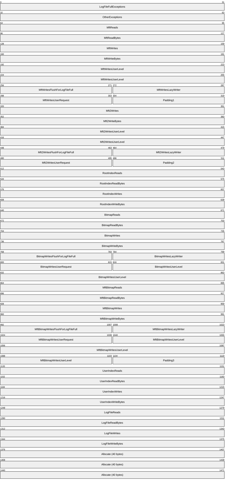

**LogFileFullExceptions (4 bytes):** A 32-bit unsigned integer value containing the number of exceptions generated due to the log file being full.

**OtherExceptions (4 bytes):** A 32-bit unsigned integer value containing the number of other exceptions generated.

**MftReads (4 bytes):** A 32-bit unsigned integer value containing the number of read operations on the [**Master File Table (MFT)**](#gt_master-file-table-mft).

**MftReadBytes (4 bytes):** A 32-bit unsigned integer value containing the number of bytes read from the MFT.

**MftWrites (4 bytes):** A 32-bit unsigned integer value containing the number of write operations on the MFT.

**MftWriteBytes (4 bytes):** A 32-bit unsigned integer value containing the number of bytes written to the MFT.

**MftWritesUserLevel (8 bytes):** An [MftWritesUserLevel](#Section_2.3.12.2.1) structure containing statistics about writes resulting from certain user-level operations.

**MftWritesFlushForLogFileFull (2 bytes):** A 16-bit unsigned integer containing the number of flushes of the MFT performed because the log file was full.

**MftWritesLazyWriter (2 bytes):** A 16-bit unsigned integer containing the number of **MFT** write operations performed by the lazy writer thread.

**MftWritesUserRequest (2 bytes):** A 16-bit unsigned integer that is the sum of the four fields in the MftWritesUserLevel structure.

**Padding1 (2 bytes):** Unused. This field SHOULD be set to 0 and MUST be ignored.

**Mft2Writes (4 bytes):** A 32-bit unsigned integer value containing the number of write operations on the [**master file table mirror (MFT2)**](#gt_1e8c5c1d-10a9-452c-ad88-16ae095461f1).

**Mft2WriteBytes (4 bytes):** A 32-bit unsigned integer value containing the number of bytes written to the MFT2.

**Mft2WritesUserLevel (8 bytes):** An MftWritesUserLevel structure containing statistics about writes resulting from certain user-level operations.

**Mft2WritesFlushForLogFileFull (2 bytes):** A 16-bit unsigned integer containing the number of flushes of the MFT2 performed because the log file was full.

**Mft2WritesLazyWriter (2 bytes):** A 16-bit unsigned integer containing the number of **MFT2** write operations performed by the lazy writer thread.

**Mft2WritesUserRequest (2 bytes):** A 16-bit unsigned integer that contains the sum of the four fields in the [Mft2WritesUserLevel](#Section_2.3.12.2.2) structure.

**Padding2 (2 bytes):** Unused. This field SHOULD be set to 0 and MUST be ignored.

**RootIndexReads (4 bytes):** A 32-bit unsigned integer value containing the number of read operations on the root index.

**RootIndexReadBytes (4 bytes):** A 32-bit unsigned integer value containing the number of bytes read from the root index.

**RootIndexWrites (4 bytes):** A 32-bit unsigned integer value containing the number of write operations on the root index.

**RootIndexWriteBytes (4 bytes):** A 32-bit unsigned integer value containing the number of bytes written to the root index.

**BitmapReads (4 bytes):** A 32-bit unsigned integer value containing the number of read operations on the cluster allocation bitmap.

**BitmapReadBytes (4 bytes):** A 32-bit unsigned integer value containing the number of bytes read from the cluster allocation bitmap.

**BitmapWrites (4 bytes):** A 32-bit unsigned integer value containing the number of write operations on the cluster allocation bitmap. This is the sum of the **BitmapWritesFlushForLogFileFull**, **BitmapWritesLazyWriter** and **BitmapWritesUserRequest** fields.

**BitmapWriteBytes (4 bytes):** A 32-bit unsigned integer value containing the number of bytes written to the cluster allocation bitmap.

**BitmapWritesFlushForLogFileFull (2 bytes):** A 16-bit unsigned integer containing the number of flushes of the bitmap performed because the log file was full.

**BitmapWritesLazyWriter (2 bytes):** A 16-bit unsigned integer containing the number of bitmap write operations performed by the lazy writer thread.

**BitmapWritesUserRequest (2 bytes):** A 16-bit unsigned integer that is the sum of the fields in the [BitmapWritesUserLevel](#Section_2.3.12.2.3) structure.

**BitmapWritesUserLevel (6 bytes):** A BitmapWritesUserLevel structure containing statistics about bitmap writes resulting from certain user-level operations.

**MftBitmapReads (4 bytes):** A 32-bit unsigned integer value containing the number of read operations on the MFT bitmap.

**MftBitmapReadBytes (4 bytes):** A 32-bit unsigned integer value containing the number of bytes read from the MFT bitmap.

**MftBitmapWrites (4 bytes):** A 32-bit unsigned integer value containing the number of write operations on the MFT bitmap. This value is the sum of the **MftBitmapWritesFlushForLogFileFull**, **MftBitmapWritesLazyWriter** and **MftBitmapWritesUserRequest** fields.

**MftBitmapWriteBytes (4 bytes):** A 32-bit unsigned integer value containing the number of bytes written to the MFT bitmap.

**MftBitmapWritesFlushForLogFileFull (2 bytes):** A 16-bit unsigned integer containing the number of flushes of the MFT bitmap performed because the log file was full.

**MftBitmapWritesLazyWriter (2 bytes):** A 16-bit unsigned integer value containing the number of MFT bitmap write operations performed by the lazy writer thread.

**MftBitmapWritesUserRequest (2 bytes):** A 16-bit unsigned integer that is the sum of all the fields in the [MftBitmapWritesUserLevel](#Section_2.3.12.2.4) structure.

**MftBitmapWritesUserLevel (8 bytes):** An MftBitmapWritesUserLevel structure containing statistics about MFT bitmap writes resulting from certain user-level operations.

**Padding3 (2 bytes):** Unused. This field SHOULD be set to 0 and MUST be ignored.

**UserIndexReads (4 bytes):** A 32-bit unsigned integer value containing the number of read operations on the user index.

**UserIndexReadBytes (4 bytes):** A 32-bit unsigned integer value containing the number of bytes read from user indices.

**UserIndexWrites (4 bytes):** A 32-bit unsigned integer value containing the number of write operations on user indices.

**UserIndexWriteBytes (4 bytes):** A 32-bit unsigned integer value containing the number of bytes written to user indices.

**LogFileReads (4 bytes):** A 32-bit unsigned integer value containing the number of read operations on the log file.

**LogFileReadBytes (4 bytes):** A 32-bit unsigned integer value containing the number of bytes read from the log file.

**LogFileWrites (4 bytes):** A 32-bit unsigned integer value containing the number of write operations on the log file.

**LogFileWriteBytes (4 bytes):** A 32-bit unsigned integer value containing the number of bytes written to the log file.

**Allocate (40 bytes):** An [Allocate](#Section_2.3.12.2.5) structure describes cluster allocation patterns in NTFS.

<a id="Section_2.3.12.2.1"></a>
##### 2.3.12.2.1 MftWritesUserLevel

The **MftWritesUserLevel** structure contains statistics about writes resulting from certain user-level operations.

The **MftWritesUserLevel** structure is as follows.

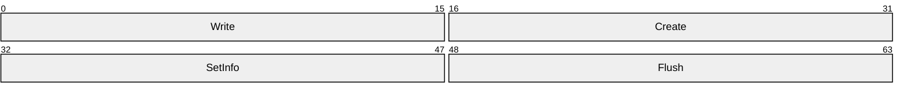

**Write (2 bytes):** A 16-bit unsigned integer containing the number of [**MFT**](#gt_master-file-table-mft) writes due to a write operation.

**Create (2 bytes):** A 16-bit unsigned integer containing the number of **MFT** writes due to a create operation.

**SetInfo (2 bytes):** A 16-bit unsigned integer containing the number of **MFT** writes due to a set file information operation.

**Flush (2 bytes):** A 16-bit unsigned integer containing the number of **MFT** writes due to a flush operation.

<a id="Section_2.3.12.2.2"></a>
##### 2.3.12.2.2 Mft2WritesUserLevel

The **Mft2WritesUserLevel** structure contains statistics about writes resulting from certain user-level operations.

The **Mft2WritesUserLevel** structure is as follows.


**Write (2 bytes):** A 16-bit unsigned integer containing the number of [**MFT2**](#gt_1e8c5c1d-10a9-452c-ad88-16ae095461f1) writes due to a write operation.

**Create (2 bytes):** A 16-bit unsigned integer containing the number of **MFT2** writes due to a create operation.

**SetInfo (2 bytes):** A16-bit unsigned integer containing the number of **MFT2** writes due to a set file information operation.

**Flush (2 bytes):** A 16-bit unsigned integer containing the number of **MFT2** writes due to a flush operation.

<a id="Section_2.3.12.2.3"></a>
##### 2.3.12.2.3 BitmapWritesUserLevel

The **BitmapWritesUserLevel** structure contains statistics about bitmap writes resulting from certain user-level operations.

The **BitmapWritesUserLevel** structure is as follows.

```mermaid
packet-beta
  0-15: "Write"
  16-31: "Create"
  32-47: "SetInfo"
```

**Write (2 bytes):** A 16-bit unsigned integer containing the number of bitmap writes due to a write operation.

**Create (2 bytes):** A 16-bit unsigned integer containing the number of bitmap writes due to a create operation.

**SetInfo (2 bytes):** A 16-bit unsigned integer containing the number of bitmap writes due to a set file information operation.

<a id="Section_2.3.12.2.4"></a>
##### 2.3.12.2.4 MftBitmapWritesUserLevel

The **MftBitmapWritesUserLevel** structure contains statistics about [**MFT**](#gt_master-file-table-mft) bitmap write operations resulting from certain user-level operations.

The **MftBitmapWritesUserLevel** structure is as follows.

```mermaid
packet-beta
  0-15: "Write"
  16-31: "Create"
  32-47: "SetInfo"
  48-63: "Flush"
```

**Write (2 bytes):** A 16-bit unsigned integer containing the number of **MFT** bitmap write operations due to a write operation.

**Create (2 bytes):** A 16-bit unsigned integer containing the number of **MFT** bitmap write operations due to a create operation.

**SetInfo (2 bytes):** A 16-bit unsigned integer containing the number of **MFT** bitmap write operations due to a set file information operation.

**Flush (2 bytes):** A 16-bit unsigned integer containing the number of **MFT** bitmap write operations due to a flush operation.

<a id="Section_2.3.12.2.5"></a>
##### 2.3.12.2.5 Allocate

The **Allocate** structure describes cluster allocation patterns in NTFS. The cache refers to in-memory structures that allow quick lookups of free cluster runs either by [**logical cluster number (LCN)**](#gt_logical-cluster-number-lcn) or by run length.

The **Allocate** structure is as follows.

```mermaid
packet-beta
  0-31: "Calls"
  32-63: "Clusters"
  64-95: "Hints"
  96-127: "RunsReturned"
  128-159: "HintsHonored"
  160-191: "HintsClusters"
  192-223: "Cache"
  224-255: "CacheClusters"
  256-287: "CacheMiss"
  288-319: "CacheMissClusters"
```

**Calls (4 bytes):** A 32-bit unsigned integer value containing the number of individual calls to allocate clusters.

**Clusters (4 bytes):** A 32-bit unsigned integer value containing the number of clusters allocated.

**Hints (4 bytes):** A 32-bit unsigned integer value containing the number of times a hint was specified when trying to determine which clusters to allocate.

**RunsReturned (4 bytes):** A 32-bit unsigned integer value containing the number of runs used to satisfy all the requests.

**HintsHonored (4 bytes):** A 32-bit unsigned integer value containing the number of times the starting LCN hint was used to determine which clusters to allocate.

**HintsClusters (4 bytes):** A 32-bit unsigned integer value containing the number of clusters allocated via the starting LCN hint.

**Cache (4 bytes):** A 32-bit unsigned integer value containing the number of times the run length cache was useful.

**CacheClusters (4 bytes):** A 32-bit unsigned integer value containing the number of clusters allocated via the run length cache.

**CacheMiss (4 bytes):** A 32-bit unsigned integer value containing the number of times the cache was not useful and the bitmapped had to be scanned for free clusters.

**CacheMissClusters (4 bytes):** A 32-bit unsigned integer value containing the number of clusters allocated by scanning the bitmap.

<a id="Section_2.3.12.3"></a>
#### 2.3.12.3 FAT_STATISTICS

The **FAT_STATISTICS** data element is returned with a [FSCTL_FILESYSTEM_GET_STATISTICS reply](#Section_2.3.12) message when FAT file system statistics are requested.

The **FAT_STATISTICS** data element is as follows:

```mermaid
packet-beta
  0-31: "CreateHits"
  32-63: "SuccessfulCreates"
  64-95: "FailedCreates"
  96-127: "NonCachedReads"
  128-159: "NonCachedReadBytes"
  160-191: "NonCachedWrites"
  192-223: "NonCachedWriteBytes"
  224-255: "NonCachedDiskReads"
  256-287: "NonCachedDiskWrites"
```

**CreateHits (4 bytes):** A 32-bit unsigned integer value containing the number of create operations.

**SuccessfulCreates (4 bytes):** A 32-bit unsigned integer value containing the number of successful create operations.

**FailedCreates (4 bytes):** A 32-bit unsigned integer value containing the number of failed create operations.

**NonCachedReads (4 bytes):** A 32-bit unsigned integer value containing the number of read operations that were not cached.

**NonCachedReadBytes (4 bytes):** A 32-bit unsigned integer value containing the number of bytes read from a file that were not cached.

**NonCachedWrites (4 bytes):** A 32-bit unsigned integer value containing the number of write operations that were not cached.

**NonCachedWriteBytes (4 bytes):** A 32-bit unsigned integer value containing the number of bytes written to a file that were not cached.

**NonCachedDiskReads (4 bytes):** A 32-bit unsigned integer value containing the number of read operations that were not cached. This value includes [**sub-read**](#gt_ec3f0097-f724-412e-baa2-d2341dbd6bce) operations.

**NonCachedDiskWrites (4 bytes):** A 32-bit unsigned integer value containing the number of write operations that were not cached. This value includes sub-write operations.

<a id="Section_2.3.12.4"></a>
#### 2.3.12.4 EXFAT_STATISTICS

The **EXFAT_STATISTICS** data element is returned with a [FSCTL_FILESYSTEM_GET_STATISTICS reply](#Section_2.3.12) message when exFAT file system statistics are requested.

The **EXFAT_STATISTICS** data element is as follows:

```mermaid
packet-beta
  0-31: "CreateHits"
  32-63: "SuccessfulCreates"
  64-95: "FailedCreates"
  96-127: "NonCachedReads"
  128-159: "NonCachedReadBytes"
  160-191: "NonCachedWrites"
  192-223: "NonCachedWriteBytes"
  224-255: "NonCachedDiskReads"
  256-287: "NonCachedDiskWrites"
```

**CreateHits (4 bytes):** A 32-bit unsigned integer value containing the number of create operations.

**SuccessfulCreates (4 bytes):** A 32-bit unsigned integer value containing the number of successful create operations.

**FailedCreates (4 bytes):** A 32-bit unsigned integer value containing the number of failed create operations.

**NonCachedReads (4 bytes):** A 32-bit unsigned integer value containing the number of read operations that were not cached.

**NonCachedReadBytes (4 bytes):** A 32-bit unsigned integer value containing the number of bytes read from a file that were not cached.

**NonCachedWrites (4 bytes):** A 32-bit unsigned integer value containing the number of write operations that were not cached.

**NonCachedWriteBytes (4 bytes):** A 32-bit unsigned integer value containing the number of bytes written to a file that were not cached.

**NonCachedDiskReads (4 bytes):** A 32-bit unsigned integer value containing the number of read operations that were not cached. This value includes [**sub-read**](#gt_ec3f0097-f724-412e-baa2-d2341dbd6bce) operations.

**NonCachedDiskWrites (4 bytes):** A 32-bit unsigned integer value containing the number of write operations that were not cached. This value includes sub-write operations.

<a id="Section_2.3.13"></a>
### 2.3.13 FSCTL_FILE_LEVEL_TRIM Request

The FSCTL_FILE_LEVEL_TRIM operation informs the underlying storage medium that the contents of the given range of the file no longer needs to be maintained. This message allows the storage medium to manage its space more efficiently. This operation is required most commonly for Solid State Devices (SSD), as well as for thinly provisioned storage environments.

The **FILE_LEVEL_TRIM** data element follows.

```mermaid
packet-beta
  0-31: "Key"
  32-63: "NumRanges"
  64-127: "Ranges (variable)"
```

**Key (4 bytes):** This field is used for byte range locks to uniquely identify different consumers of byte range locks on the same thread. Typically, this field is used only by remote protocols such as SMB or SMB2.

**NumRanges (4 bytes):** A count of how many **Offset**, **Length** pairs follow in the data item.

**Ranges (variable):** An array of zero or more [FILE_LEVEL_TRIM_RANGE (section 2.3.13.1)](#Section_2.3.13.1) data elements. The **NumRanges** field contains the number of **FILE_LEVEL_TRIM_RANGE** data elements in the array.

<a id="Section_2.3.13.1"></a>
#### 2.3.13.1 FILE_LEVEL_TRIM_RANGE

The **FILE_LEVEL_TRIM_RANGE** data element follows.

```mermaid
packet-beta
  0-63: "Offset"
  64-127: "Length"
```

**Offset (8 bytes):** A 64-bit unsigned integer that contains a byte offset into the given file at which to start the trim request.

**Length (8 bytes):** A 64-bit unsigned integer that contains the length, in bytes, of how much of the file to trim, starting at **Offset**.

<a id="Section_2.3.14"></a>
### 2.3.14 FSCTL_FILE_LEVEL_TRIM Reply

This message returns the results of the [FSCTL_FILE_LEVEL_TRIM Request (section 2.3.13)](#Section_2.3.13).

The **FILE_LEVEL_TRIM_OUTPUT** data element follows.

```mermaid
packet-beta
  0-31: "NumRangesProcessed"
```

**NumRangesProcessed (4 bytes):** A 32-bit unsigned integer identifying the number of input ranges that were processed.

This message returns a status code as specified in section [2.2](#Section_2.2). Upon success, the status code returned by the function that processes this FSCTL is STATUS_SUCCESS. The most common error codes are listed in the following table.

| Error code | Meaning |
| --- | --- |
| STATUS_INVALID_PARAMETER 0xC000000D | The given file is compressed or encrypted, or the size of the input buffer is smaller than the size of the **FILE_LEVEL_TRIM** data element, or no [FILE_LEVEL_TRIM_RANGE (section 2.3.13.1)](#Section_2.3.13.1) structures were given, or the output buffer is smaller than the size of **FILE_LEVEL_TRIM_OUTPUT**. |
| STATUS_INVALID_DEVICE_REQUEST 0xC0000010 | The file system does not support this operation. |
| STATUS_INTEGER_OVERFLOW 0xC0000095 | An operation on a parameter in the FSCTL_FILE_LEVEL_TRIM input structure overflowed 64 bits. |
| STATUS_NO_RANGES_PROCESSED 0xC0000460 | The operation was successful, but no range was processed. |

<a id="Section_2.3.15"></a>
### 2.3.15 FSCTL_FIND_FILES_BY_SID Request

The FSCTL_FIND_FILES_BY_SID Request message requests that the server return a list of the files and directories whose owner matches the specified [**security identifier (SID)**](#gt_security-identifier-sid), in no necessary order. The search spans the file system subtree descending from the directory associated with the handle on which this FSCTL was invoked. This message contains a FIND_BY_SID_DATA data element.

The FIND_BY_SID_DATA data element is as follows.

```mermaid
packet-beta
  0-31: "Restart"
  32-95: "SID (variable)"
```

**Restart (4 bytes):** A 32-bit unsigned integer value that indicates to restart the search. This value MUST be 0x00000001 on the first call so that the search starts from the beginning of the directory on which the operation is requested. For subsequent calls, this member SHOULD be zero so that the search resumes at the point where it stopped.

**SID (variable):** A SID ([MS-DTYP](../MS-DTYP/MS-DTYP.md) section 2.4.2.2) data element that specifies the owner.

<a id="Section_2.3.16"></a>
### 2.3.16 FSCTL_FIND_FILES_BY_SID Reply

The FSCTL_FIND_FILES_BY_SID Reply message returns the results of the [FSCTL_FIND_FILES_BY_SID Request (section 2.3.15)](#Section_2.3.15) as an array of [FILE_NAME_INFORMATION (section 2.1.7)](#Section_2.1.7) data elements containing relative pathnames (section [2.1.5](#Section_2.1.5)), one for each matching file or directory that is found, in no necessary order. All returned file names MUST be relative to the directory on which the FSCTL_FIND_FILES_BY_SID Request was issued. This returns as many **FILE_NAME_INFORMATION** data elements as will fit in the provided output buffer. The beginning of each **FILE_NAME_INFORMATION** data element MUST be aligned to an 8-byte boundary, as measured from the beginning of the buffer. The last **FILE_NAME_INFORMATION** structure returned MAY<25> contain trailing padding.

This message also returns a status code as specified in section [2.2](#Section_2.2). Upon success, the status code returned by the function that processes this [**FSCTL**](#gt_file-system-control-fsctl) is STATUS_SUCCESS. The most common error codes are listed in the following table.

| Status code | Meaning |
| --- | --- |
| STATUS_NO_QUOTAS_FOR_ACCOUNT 0x0000010D | Quota tracking is not enabled; therefore, the file system does not keep a record of file owners. This is considered a success code. The reply MUST NOT contain any data elements. |
| STATUS_INVALID_PARAMETER 0xC000000D | The handle specified is not the handle to a directory. |
| STATUS_ACCESS_DENIED 0xC0000022 | Neither the SeManageVolumePrivilege nor the SeBackupPrivilege, as specified in [MS-LSAD](../MS-LSAD/MS-LSAD.md) section 3.1.1.2.1, privilege is held. |
| STATUS_BUFFER_TOO_SMALL 0xC0000023 | The output buffer is not large enough to contain the **FILE_NAME_INFORMATION** structure (including any trailing padding) for the first matching file or directory. |
| STATUS_INVALID_USER_BUFFER 0xC00000E8 | The input buffer is less than the size of a long integer (4 bytes) plus the length of the SID provided, or the input or output buffer is not aligned to the native word size of the platform, or the size of the output buffer is less than the minimum size of a **FILE_NAME_INFORMATION** structure (8 bytes), or the restart value is greater than 1. |

When the status code is STATUS_SUCCESS, the responder MUST retain an implementation-dependent indication of where the directory processing ended, which is required to support a subsequent FSCTL_FIND_FILES_BY_SID Request with the **Restart** field set to 0x00000000. For an example of FSCTL_FIND_FILES_BY_SID restart handling, see [MS-FSA](../MS-FSA/MS-FSA.md) section 2.1.5.10.8.

<a id="Section_2.3.17"></a>
### 2.3.17 FSCTL_GET_COMPRESSION Request

This message requests that the server return the current compression state of the file or directory associated with the handle on which this [**FSCTL**](#gt_file-system-control-fsctl) was invoked.

This message does not contain any additional data elements.

<a id="Section_2.3.18"></a>
### 2.3.18 FSCTL_GET_COMPRESSION Reply

The FSCTL_GET_COMPRESSION reply message returns the results of the [FSCTL_GET_COMPRESSION request](#Section_2.3.17) as a 16-bit unsigned integer value that indicates the current compression state of the file or directory.

The **CompressionState** element is as follows.

```mermaid
packet-beta
  0-15: "CompressionState"
```

**CompressionState (2 bytes):** One of the following standard values MUST be returned.

| Value | Meaning |
| --- | --- |
| COMPRESSION_FORMAT_NONE 0x0000 | The file or directory is not compressed. |
| COMPRESSION_FORMAT_LZNT1 0x0002 | The file or directory is compressed by using the LZNT1 compression algorithm. For more information, see [[UASDC]](https://go.microsoft.com/fwlink/?LinkId=90549). |
| All other values | Reserved for future use and MUST NOT be used. |

The actual file or directory compression format is implementation-dependent.<26>

If the file system of the [**volume**](#gt_volume) that contains the specified file or directory does not support per-file or per-directory compression, the request MUST NOT succeed. The error code that is returned in this situation MUST be as specified in section [2.2](#Section_2.2).

This message also returns a status code as specified in section 2.2. Upon success, the status code returned by the function that processes this [**FSCTL**](#gt_file-system-control-fsctl) is STATUS_SUCCESS. The most common error codes are listed in the following table.

| Error code | Meaning |
| --- | --- |
| STATUS_INVALID_PARAMETER 0xC000000D | The output buffer length is less than 2, or the handle is not to a file or directory. |
| STATUS_INVALID_DEVICE_REQUEST 0xC0000010 | The volume does not support compression.<27> |

<a id="Section_2.3.19"></a>
### 2.3.19 FSCTL_GET_INTEGRITY_INFORMATION Request

The FSCTL_GET_INTEGRITY_INFORMATION Request message requests that the server return the current integrity state of the file or directory associated with the handle on which this [**FSCTL**](#gt_file-system-control-fsctl) is invoked.<28>

If the file system of the [**volume**](#gt_volume) containing the specified file or directory does not support the use of integrity, the request will not succeed. The error code returned in this situation varies, depending on the file system.

This message does not contain additional data elements.

<a id="Section_2.3.20"></a>
### 2.3.20 FSCTL_GET_INTEGRITY_INFORMATION Reply

The FSCTL_GET_INTEGRITY_INFORMATION Reply message returns the results of the [FSCTL_GET_INTEGRITY_INFORMATION Request (section 2.3.19)](#Section_2.3.19) and indicates the current integrity state of the file or directory.

The **FSCTL_GET_INTEGRITY_INFORMATION_BUFFER** data element is as follows.

```mermaid
packet-beta
  0-15: "ChecksumAlgorithm"
  16-31: "Reserved"
  32-63: "Flags"
  64-95: "ChecksumChunkSizeInBytes"
  96-127: "ClusterSizeInBytes"
```

**ChecksumAlgorithm (2 bytes):** For **ReFS v1**, the field MUST be set to one of the following standard values.

| Value | Meaning |
| --- | --- |
| CHECKSUM_TYPE_NONE 0x0000 | The file or directory is not configured to use integrity. |
| CHECKSUM_TYPE_CRC64 0x0002 | The file or directory is configured to use a CRC64 checksum to provide integrity. |
| All other values | Reserved for future use and MUST NOT be used. |

For **ReFS v2**, the field MUST be set to one of the following standard values.

| Value | Meaning |
| --- | --- |
| CHECKSUM_TYPE_NONE 0x0000 | The file or directory is not configured to use integrity. |
| CHECKSUM_TYPE_CRC32 0x0001 | The file or directory is configured to use a CRC32 checksum to provide integrity. |
| CHECKSUM_TYPE_CRC64 0x0002 | The file or directory is configured to use a CRC64 checksum to provide integrity. |
| All other values | Reserved for future use and MUST NOT be used. |

**Reserved (2 bytes):** A 16-bit reserved value. This field MUST be set to 0x0000 and MUST be ignored.

**Flags (4 bytes):** A 32-bit unsigned integer that contains zero or more of the following flag values. Flag values not specified in the following table SHOULD be set to 0 and MUST be ignored.

| Value | Meaning |
| --- | --- |
| FSCTL_INTEGRITY_FLAG_CHECKSUM_ENFORCEMENT_OFF 0x00000001 | Indicates that checksum enforcement is not currently enabled on the target file. |
| All other values | Reserved for future use and MUST NOT be used. |

**ChecksumChunkSizeInBytes (4 bytes):** A 32-bit unsigned integer specifying the size in bytes of each chunk in a [**stream**](#gt_stream) that is configured with integrity.

**ClusterSizeInBytes (4 bytes):** A 32-bit unsigned integer specifying the size of a [**cluster**](#gt_cluster) for this volume in bytes.

This message also returns a status code, as specified in section [2.2](#Section_2.2). Upon success, the status code returned by the function that processes this [**FSCTL**](#gt_file-system-control-fsctl) MUST be STATUS_SUCCESS or one of the following.

| Error code | Meaning |
| --- | --- |
| STATUS_INVALID_PARAMETER 0xC000000D | The output buffer length is less than the size of the FSCTL_GET_INTEGRITY_INFORMATION_BUFFER data element, or the handle is not to a file or directory. |
| STATUS_INVALID_DEVICE_REQUEST 0xC0000010 | The volume does not support integrity. |

<a id="Section_2.3.21"></a>
### 2.3.21 FSCTL_GET_NTFS_VOLUME_DATA Request

This message requests that the server return information about the [**NTFS**](#gt_nt-file-system-ntfs) file system [**volume**](#gt_volume) that contains the file or directory that is associated with the handle on which this [**FSCTL**](#gt_file-system-control-fsctl) was invoked.

This message does not contain any parameters.

<a id="Section_2.3.22"></a>
### 2.3.22 FSCTL_GET_NTFS_VOLUME_DATA Reply

The FSCTL_GET_NTFS_VOLUME_DATA reply message returns the results of the [FSCTL_GET_NTFS_VOLUME_DATA request](#Section_2.3.21) as an NTFS_VOLUME_DATA_BUFFER element.

The NTFS_VOLUME_DATA_BUFFER contains information on a [**volume**](#gt_volume). For more information about the [**NTFS**](#gt_nt-file-system-ntfs) file system, see [[MSFT-NTFS]](https://go.microsoft.com/fwlink/?LinkId=90200).

```mermaid
packet-beta
  0-63: "VolumeSerialNumber"
  64-127: "NumberSectors"
  128-191: "TotalClusters"
  192-255: "FreeClusters"
  256-319: "TotalReserved"
  320-351: "BytesPerSector"
  352-383: "BytesPerCluster"
  384-415: "BytesPerFileRecordSegment"
  416-447: "ClustersPerFileRecordSegment"
  448-511: "MftValidDataLength"
  512-575: "MftStartLcn"
  576-639: "Mft2StartLcn"
  640-703: "MftZoneStart"
  704-767: "MftZoneEnd"
```

**VolumeSerialNumber (8 bytes):** A 64-bit signed integer that contains the serial number of the volume. This is a unique number assigned to the volume media by the operating system when the volume is formatted.

**NumberSectors (8 bytes):** A 64-bit signed integer that contains the number of [**sectors**](#gt_sector) in the specified volume.

**TotalClusters (8 bytes):** A 64-bit signed integer that contains the total number of [**clusters**](#gt_cluster) in the specified volume.

**FreeClusters (8 bytes):** A 64-bit signed integer that contains the number of free clusters in the specified volume.

**TotalReserved (8 bytes):** A 64-bit signed integer that contains the number of reserved clusters in the specified volume. Reserved clusters are free clusters reserved for when the volume becomes full. Reserved clusters used to guarantee clusters are available at points when the file system can't properly report allocation failures.

**BytesPerSector (4 bytes):** A 32-bit unsigned integer that contains the number of bytes in a sector on the specified volume.

**BytesPerCluster (4 bytes):** A 32-bit unsigned integer that contains the number of bytes in a cluster on the specified volume. This value is also known as the cluster factor.

**BytesPerFileRecordSegment (4 bytes):** A 32-bit unsigned integer that contains the number of bytes in a [**file record segment**](#gt_file-record-segment).

**ClustersPerFileRecordSegment (4 bytes):** A 32-bit unsigned integer that contains the number of clusters in a file record segment.

**MftValidDataLength (8 bytes):** A 64-bit signed integer that contains the size of the [**master file table**](#gt_master-file-table-mft) in bytes.

**MftStartLcn (8 bytes):** A 64-bit signed integer that contains the starting [**logical cluster number (LCN)**](#gt_logical-cluster-number-lcn) of the master file table.

**Mft2StartLcn (8 bytes):** A 64-bit signed integer that contains the starting logical cluster number of the master file table mirror.

**MftZoneStart (8 bytes):** A 64-bit signed integer that contains the starting logical cluster number of the master file table zone.

**MftZoneEnd (8 bytes):** A 64-bit signed integer that contains the ending logical cluster number of the master file table zone. The size of the master file table zone is (**MftZoneEnd** - **MftZoneStart**) clusters.

This message also returns a status code as specified in section [2.2](#Section_2.2). Upon success, the status code returned directly by the function that processes this [**FSCTL**](#gt_file-system-control-fsctl) is STATUS_SUCCESS. The most common error codes are listed in the following table.

| Error code | Meaning |
| --- | --- |
| STATUS_INVALID_PARAMETER 0xC000000D | The handle specified is not open. |
| STATUS_VOLUME_DISMOUNTED 0xC000026E | The specified volume is no longer mounted. |
| STATUS_BUFFER_TOO_SMALL 0xC0000023 | The output buffer is too small to contain an **NTFS_VOLUME_DATA_BUFFER** structure. |

<a id="Section_2.3.23"></a>
### 2.3.23 FSCTL_GET_REFS_VOLUME_DATA Request

This message requests that the server return information about the ReFS file system volume that contains the file or directory that is associated with the handle on which this FSCTL was invoked.

This message does not contain any parameters.

<a id="Section_2.3.24"></a>
### 2.3.24 FSCTL_GET_REFS_VOLUME_DATA Reply

The FSCTL_GET_REFS_VOLUME_DATA reply message returns the results of the FSCTL_GET_REFS_VOLUME_DATA request as an REFS_VOLUME_DATA_BUFFER element.

The REFS_VOLUME_DATA_BUFFER contains information on a volume.

```mermaid
packet-beta
  0-31: "ByteCount"
  32-63: "MajorVersion"
  64-95: "MinorVersion"
  96-127: "BytesPerPhysicalSector"
  128-191: "VolumeSerialNumber"
  192-255: "NumberSectors"
  256-319: "TotalClusters"
  320-383: "FreeClusters"
  384-447: "TotalReserved"
  448-479: "BytesPerSector"
  480-511: "BytesPerCluster"
  512-575: "MaximumSizeOfResidentFile"
  576-671: "Reserved (80 bytes)"
```

**ByteCount (4 bytes):** A 32-bit unsigned integer that contains the valid data length for this structure. **ByteCount** can be less than the size of this structure. Only the fields that entirely fit within the valid data length for this structure, as defined by **ByteCount**, are valid.

**MajorVersion (4 bytes):** A 32-bit unsigned integer that contains the major version of the ReFS volume.

**MinorVersion (4 bytes):** A 32-bit unsigned integer that contains the minor version of the ReFS volume.

**BytesPerPhysicalSector (4 bytes):** A 32-bit unsigned integer that defines the number of bytes in a physical sector on the specified volume.

**VolumeSerialNumber (8 bytes):** A 64-bit signed integer that contains the serial number of the volume. This is a unique number assigned to the volume media by the operating system when the volume is formatted.

**NumberSectors (8 bytes):** A 64-bit signed integer that contains the number of [**sectors**](#gt_sector) in the specified volume.

**TotalClusters (8 bytes):** A 64-bit signed integer that contains the total number of [**clusters**](#gt_cluster) in the specified volume.

**FreeClusters (8 bytes):** A 64-bit signed integer that contains the number of free clusters in the specified [**volume**](#gt_volume).

**TotalReserved (8 bytes):** A 64-bit signed integer that contains the number of reserved clusters in the specified volume. Reserved clusters are used to guarantee clusters are available at points when the file system can't properly report allocation failures.

**BytesPerSector (4 bytes):** A 32-bit unsigned integer that contains the number of bytes in a sector on the specified volume.

**BytesPerCluster (4 bytes):** A 32-bit unsigned integer that contains the number of bytes in a cluster on the specified volume. This value is also known as the cluster factor.

**MaximumSizeOfResidentFile (8 bytes):** A 64-bit unsigned integer that defines the maximum number of bytes a file can contain and be co-located with the file system metadata that describes the file (commonly known as resident files).

**Reserved (80 bytes):** 80 bytes which, if included, as per the **ByteCount** field, are reserved, have an undefined value, and are not interpreted.

This message also returns a status code as specified in section [2.2](#Section_2.2). Upon success, the status code returned directly by the function that processes this [**FSCTL**](#gt_file-system-control-fsctl) is STATUS_SUCCESS. The most common error codes are listed in the following table.

| Error code | Meaning |
| --- | --- |
| STATUS_INVALID_PARAMETER 0xC000000D | The handle specified is not open. |
| STATUS_VOLUME_DISMOUNTED 0xC000026E | The specified volume is no longer mounted. |
| STATUS_BUFFER_TOO_SMALL 0xC0000023 | The output buffer is too small to contain a REFS_VOLUME_DATA_BUFFER structure. |

<a id="Section_2.3.25"></a>
### 2.3.25 FSCTL_GET_OBJECT_ID Request

This message requests that the server return the object identifier for the file or directory associated with the handle on which this [**FSCTL**](#gt_file-system-control-fsctl) was invoked.

Object identifiers are 16-byte opaque values that are used to track files and directories, and they are generated by the server. File and directory object identifiers are invisible to most applications and SHOULD never be modified by applications.

This message does not contain any additional data elements.

<a id="Section_2.3.26"></a>
### 2.3.26 FSCTL_GET_OBJECT_ID Reply

This message returns the results of an [FSCTL_GET_OBJECT_ID request](#Section_2.3.25) in a [FILE_OBJECTID_BUFFER (section 2.1.3)](#Section_2.1.3).

If the file system of the [**volume**](#gt_volume) containing the specified file or directory does not support the use of object IDs, the request will not succeed. The error code returned in this situation is specified in section [2.2](#Section_2.2).

This message also returns a status code as specified in section 2.2. Upon success, the status code returned by the function that processes this [**FSCTL**](#gt_file-system-control-fsctl) is STATUS_SUCCESS. The most common error codes are listed in the following table.

| Error code | Meaning |
| --- | --- |
| STATUS_INVALID_PARAMETER 0xC000000D | The output buffer length is less than the size of a FILE_OBJECTID_BUFFER or the handle is not to a file or directory. |
| STATUS_OBJECTID_NOT_FOUND 0xC00002F0 | The file or directory has no object ID. |
| STATUS_INVALID_DEVICE_REQUEST 0xC0000010 | The file system does not support the use of object IDs. |

<a id="Section_2.3.27"></a>
### 2.3.27 FSCTL_GET_REPARSE_POINT Request

This message requests that the server return the [**reparse point**](#gt_reparse-point) data for the file or directory associated with the handle on which this [**FSCTL**](#gt_file-system-control-fsctl) was invoked.

This message MUST only be sent for a file or directory handle.

This message does not contain any additional data elements.

<a id="Section_2.3.28"></a>
### 2.3.28 FSCTL_GET_REPARSE_POINT Reply

This message returns the results of the [FSCTL_GET_REPARSE_POINT request](#Section_2.3.27). The message contains a [REPARSE_GUID_DATA_BUFFER](#Section_8.3) (including subtypes) or a [REPARSE_DATA_BUFFER](#Section_8.3) data element.

Both the REPARSE_GUID_DATA_BUFFER and the REPARSE_DATA_BUFFER structures begin with a **ReparseTag** field. The ReparseTag value uniquely identifies the [**filter**](#gt_filter) driver that creates/uses the [**reparse point**](#gt_reparse-point), and the application's filter driver processes the reparse point data as either a REPARSE_GUID_DATA_BUFFER or a REPARSE_DATA_BUFFER, depending on the structure implemented by the filter driver for that type of reparse point. A particular filter driver is implemented with specific support for the type of reparse point data structure it accepts.

If the file system of the [**volume**](#gt_volume) containing the specified file or directory does not support the use of reparse points, the request will not succeed. The error code returned in this situation MAY vary, depending on the file system.<29>

This message also returns a status code as specified in section [2.2](#Section_2.2). Upon success, the status code returned by the function that processes this [**FSCTL**](#gt_file-system-control-fsctl) is STATUS_SUCCESS. The most common error codes are listed in the following table.

| Error code | Meaning |
| --- | --- |
| STATUS_BUFFER_TOO_SMALL 0xC0000023 | The output buffer is too small to contain a REPARSE_GUID_DATA_BUFFER. |
| STATUS_INVALID_PARAMETER 0xC000000D | The handle is not to a file or directory. |
| STATUS_BUFFER_OVERFLOW 0x80000005 | The output buffer filled before all the reparse point data was returned. |
| STATUS_NOT_A_REPARSE_POINT 0xC0000275 | The file or directory is not a reparse point. |
| STATUS_INVALID_DEVICE_REQUEST 0xC0000010 | The file system does not support the use of reparse points. |

<a id="Section_2.3.29"></a>
### 2.3.29 FSCTL_GET_RETRIEVAL_POINTER_COUNT Request

The FSCTL_GET_RETRIEVAL_POINTER_COUNT request message requests that the server return a count of extents for the file or directory associated with the handle on which this **FSCTL** was invoked. The extents describe the mapping between **virtual cluster numbers (VCNs)** and **logical cluster numbers (LCNs)**. This request is most commonly used by defragmentation utilities. This message contains a STARTING_VCN_INPUT_BUFFER data element.

The STARTING_VCN_INPUT_BUFFER data element is as follows.

```mermaid
packet-beta
  0-63: "StartingVcn"
```

**StartingVcn (8 bytes)**: A 64-bit signed integer that contains the virtual cluster number (VCN) at which to begin retrieving extents in the file. This value MUST be greater than or equal to 0.

<a id="Section_2.3.30"></a>
### 2.3.30 FSCTL_GET_RETRIEVAL_POINTER_COUNT Reply

The FSCTL_GET_RETRIEVAL_POINTER_COUNT reply message returns the results of the FSCTL_GET_RETRIEVAL_POINTER_COUNT request as a fixed size data element, RETRIEVAL_POINTER_COUNT, that specifies the number of extents on disk of a specific file.

The FSCTL_GET_RETRIEVAL_POINTER_COUNT reply returns the number of extents of nonresident data. A file system MAY allow resident data, which is data that can be written to disk within the file's directory record. Because resident data requires no additional disk space allocation, no extent locations are associated with resident data.<30>

The RETRIEVAL_POINTER_COUNT data element is as follows.

```mermaid
packet-beta
  0-31: "ExtentCount"
```

**ExtentCount (4 bytes)**: A 32-bit unsigned integer that contains the number of extents. This number can be zero if there are no clusters allocated at (or beyond) the specified StartingVcn.

This message also returns a status code as specified in section [2.2](#Section_2.2). Upon success, the status code returned by the function that processes this FSCTL is STATUS_SUCCESS. The most common error codes are listed in the following table.

| Error code | Meaning |
| --- | --- |
| STATUS_BUFFER_TOO_SMALL 0xC0000023 | The output buffer is too small to contain a RETRIEVAL_POINTER_COUNT structure. |
| STATUS_INVALID_PARAMETER 0xC000000D | The input buffer is too small to contain a STARTING_VCN_INPUT_BUFFER, or the **StartingVcn** given is negative, or the handle is not to a file or directory. |
| STATUS_END_OF_FILE 0xC0000011 | The stream is resident in the MFT and has no clusters allocated, or the starting VCN is beyond the end of the file. |

<a id="Section_2.3.31"></a>
### 2.3.31 FSCTL_GET_RETRIEVAL_POINTERS Request

The FSCTL_GET_RETRIEVAL_POINTERS request message requests that the server return a list of extents for the file or directory associated with the handle on which this [**FSCTL**](#gt_file-system-control-fsctl) was invoked. The extents describe the mapping between [**virtual cluster numbers (VCNs)**](#gt_virtual-cluster-number-vcn) and [**logical cluster numbers (LCNs)**](#gt_logical-cluster-number-lcn). This request is most commonly used by defragmentation utilities. This message contains a STARTING_VCN_INPUT_BUFFER data element.

The STARTING_VCN_INPUT_BUFFER data element is as follows.

```mermaid
packet-beta
  0-63: "StartingVcn"
```

**StartingVcn (8 bytes):** A 64-bit signed integer that contains the virtual cluster number (VCN) at which to begin retrieving extents in the file. This value MUST be greater than or equal to 0.

<a id="Section_2.3.32"></a>
### 2.3.32 FSCTL_GET_RETRIEVAL_POINTERS Reply

The FSCTL_GET_RETRIEVAL_POINTERS reply message returns the results of the [FSCTL_GET_RETRIEVAL_POINTERS request](#Section_2.3.31) as a variably sized data element, RETRIEVAL_POINTERS_BUFFER, that specifies the allocation and location on disk of a specific file.

The FSCTL_GET_RETRIEVAL_POINTERS reply returns the extent locations (that is, locations of allocated regions of disk space) of nonresident data. A file system MAY allow resident data, which is data that can be written to disk within the file's directory record. Because resident data requires no additional disk space allocation, no extent locations are associated with resident data.<31>

The RETRIEVAL_POINTERS_BUFFER data element is as follows.

```mermaid
packet-beta
  0-31: "ExtentCount"
  32-63: "Unused"
  64-127: "StartingVcn"
  128-191: "Extents (variable)"
```

**ExtentCount (4 bytes):** A 32-bit unsigned integer that contains the number of [EXTENTS](#Section_2.3.32.1) data elements in the **Extents** array. This number can be zero if there are no [**clusters**](#gt_cluster) allocated at (or beyond) the specified **StartingVcn**.

**Unused (4 bytes):** Reserved for alignment. This field can contain any value and MUST be ignored.

**StartingVcn (8 bytes):** A 64-bit signed integer that contains the starting [**virtual cluster number (VCN)**](#gt_virtual-cluster-number-vcn) returned by the FSCTL_GET_RETRIEVAL_POINTERS reply. This is not necessarily the VCN requested by the FSCTL_GET_RETRIEVAL_POINTERS request, as the file system driver might return the starting VCN of the extent containing the requested starting VCN. This value MUST be greater than or equal to 0.

**Extents (variable):** An array of zero or more EXTENTS data elements. For the number of EXTENTS data elements in the array, see **ExtentCount**.

<a id="Section_2.3.32.1"></a>
#### 2.3.32.1 EXTENTS

The **EXTENTS** data element is as follows.

```mermaid
packet-beta
  0-63: "NextVcn"
  64-127: "Lcn"
```

**NextVcn (8 bytes):** A 64-bit signed integer that contains the [**VCN**](#gt_virtual-cluster-number-vcn) at which the next extent begins. This value minus either **StartingVcn** (for the first **Extents** array element) or the **NextVcn** of the previous element of the array (for all other **Extents** array elements) is the length in [**clusters**](#gt_cluster) of the current extent.

**Lcn (8 bytes):** A 64-bit signed integer that contains the [**logical cluster number (LCN)**](#gt_logical-cluster-number-lcn) at which the current extent begins on the [**volume**](#gt_volume). A 64-bit value of -1 indicates either a [**compression unit**](#gt_compression-unit) that is partially allocated or an unallocated region of a [**sparse file**](#gt_sparse-file). For more information about sparse files, see [[SPARSE]](https://go.microsoft.com/fwlink/?LinkId=90527). Compression is performed in 16-cluster units. If a given 16-cluster unit compresses to fit in, for example, 9 clusters, there will be a 7-cluster extent of the file with an LCN of -1.

This message also returns a status code as specified in section [2.2](#Section_2.2). Upon success, the status code returned by the function that processes this [**FSCTL**](#gt_file-system-control-fsctl) is STATUS_SUCCESS. The most common error codes are listed in the following table.

| Error code | Meaning |
| --- | --- |
| STATUS_BUFFER_TOO_SMALL 0xC0000023 | The output buffer is too small to contain a RETRIEVAL_POINTERS_BUFFER structure. |
| STATUS_INVALID_PARAMETER 0xC000000D | The input buffer is too small to contain a STARTING_VCN_INPUT_BUFFER, or the **StartingVcn** given is negative, or the handle is not to a file or directory. |
| STATUS_END_OF_FILE 0xC0000011 | The stream is resident in the [**MFT**](#gt_master-file-table-mft) and has no clusters allocated, or the starting VCN is beyond the end of the file. |
| STATUS_BUFFER_OVERFLOW 0x80000005 | The output buffer filled before all the extents for this file were returned. |

<a id="Section_2.3.33"></a>
### 2.3.33 FSCTL_GET_RETRIEVAL_POINTERS_AND_REFCOUNT Request

The FSCTL_GET_RETRIEVAL_POINTERS_AND_REFCOUNT request message requests that the server return a list of extents and their reference counts for the file or directory associated with the handle on which this **FSCTL** was invoked. The extents describe the mapping between **virtual cluster numbers (VCNs)** and **logical cluster numbers (LCNs)**. The reference count describes how many times these **logical cluster numbers (LCNs)** are being used within the **volume**. This request is most commonly used by deduplication utilities. This message contains a STARTING_VCN_INPUT_BUFFER data element.<32>

The **STARTING_VCN_INPUT_BUFFER** data element is as follows.

```mermaid
packet-beta
  0-63: "StartingVcn"
```

**StartingVcn (8 bytes):** A 64-bit signed integer that contains the virtual cluster number (VCN) at which to begin retrieving extents in the file. This value MUST be greater than or equal to 0.

<a id="Section_2.3.34"></a>
### 2.3.34 FSCTL_GET_RETRIEVAL_POINTERS_AND_REFCOUNT Reply

The FSCTL_GET_RETRIEVAL_POINTERS_AND_REFCOUNT reply message returns the results of the FSCTL_GET_RETRIEVAL_POINTERS AND_REFCOUNT request as a variably-sized data element, RETRIEVAL_POINTERS_AND_REFCOUNT_BUFFER, that specifies the allocation and location on disk of a specific file.

The FSCTL_GET_RETRIEVAL_POINTERS_AND_REFCOUNT reply returns the extent locations (that is, locations of allocated regions of disk space) and their reference counts of nonresident data. A file system MAY allow resident data, which is data that can be written to disk within the file's directory record. Because resident data requires no additional disk space allocation, no extent locations or reference counts are associated with resident data.<33>

The RETRIEVAL_POINTERS_AND_REFCOUNT_BUFFER data element is as follows.

```mermaid
packet-beta
  0-31: "ExtentCount"
  32-63: "Unused"
  64-127: "StartingVcn"
  128-191: "Extents (variable)"
```

**ExtentCount (4 bytes)**: A 32-bit unsigned integer that contains the number of EXTENT_AND_REFCOUNTS data elements in the Extents array. This number can be zero if there are no clusters allocated at (or beyond) the specified **StartingVcn**.

**Unused (4 bytes):** Reserved for alignment. This field can contain any value and MUST be ignored.

**StartingVcn (8 bytes):** A 64-bit signed integer that contains the starting **virtual cluster number (VCN)** returned by the FSCTL_GET_RETRIEVAL_POINTER_AND_REFCOUNT reply. This is not necessarily the VCN requested by the FSCTL_GET_RETRIEVAL_POINTERS request, as the file system driver might return the starting VCN of the extent containing the requested starting VCN. This value MUST be greater than or equal to 0.

**Extents (variable):** An array of zero or more EXTENT_AND_REFCOUNTS data elements. For the number of EXTENT_AND_REFCOUNTS data elements in the array, see **ExtentCount**.

<a id="Section_2.3.34.1"></a>
#### 2.3.34.1 EXTENT_AND_REFCOUNTS

The EXTENT_AND_REFCOUNTS data element is as follows.

```mermaid
packet-beta
  0-63: "NextVcn"
  64-127: "Lcn"
  128-159: "ReferenceCount"
```

**NextVcn (8 bytes):** A 64-bit signed integer that contains the **VCN** at which the next extent begins. This value minus either **StartingVcn** (for the first **Extents** array element) or the **NextVcn** of the previous element of the array (for all other Extents array elements) is the length in **clusters** of the current extent.

**Lcn (8 bytes):** A 64-bit signed integer that contains the **logical cluster number (LCN)** at which the current extent begins on the **volume**. A 64-bit value of -1 indicates either a **compression unit** that is partially allocated or an unallocated region of a **sparse file**. For more information about sparse files, see [[SPARSE]](https://go.microsoft.com/fwlink/?LinkId=90527). Compression is performed in 16-cluster units. If a given 16-cluster unit compresses to fit in, for example, 9 clusters, there will be a 7-cluster extent of the file with an LCN of -1.

**ReferenceCount (4 bytes):** A 32-bit unsigned integer that contains the reference count on the **logical cluster number (LCN)** at which the current extent begins on the **volume**. If no one else is using the corresponding LCN, the reference count will be 1.

This message also returns a status code as specified in section 2.2. Upon success, the status code returned by the function that processes this **FSCTL** is STATUS_SUCCESS. The most common error codes are listed in the following table.

| Error code | Meaning |
| --- | --- |
| STATUS_BUFFER_TOO_SMALL 0xC0000023 | The output buffer is too small to contain a RETRIEVAL_POINTERS_BUFFER structure. |
| STATUS_INVALID_PARAMETER 0xC000000D | The input buffer is too small to contain a STARTING_VCN_INPUT_BUFFER, or the **StartingVcn** given is negative, or the handle is not to a file or directory. |
| STATUS_END_OF_FILE 0xC0000011 | The stream is resident in the MFT and has no clusters allocated, or the starting VCN is beyond the end of the file. |
| STATUS_BUFFER_OVERFLOW 0x80000005 | The output buffer filled before all the extents for this file were returned. |

<a id="Section_2.3.35"></a>
### 2.3.35 FSCTL_IS_PATHNAME_VALID Request

The FSCTL_IS_PATHNAME_VALID request message requests that the server indicate whether the specified pathname is well-formed (of acceptable length, with no invalid characters, and so on - see section [2.1.5](#Section_2.1.5)) with respect to the [**volume**](#gt_volume) that contains the file or directory associated with the handle on which this [**FSCTL**](#gt_file-system-control-fsctl) was invoked.

The data element is as follows.

```mermaid
packet-beta
  0-31: "PathNameLength"
  32-95: "PathName (variable)"
```

**PathNameLength (4 bytes):** An unsigned 32-bit integer that specifies the length, in bytes, of the **PathName** data element.

**PathName (variable):** A variable-length Unicode string that specifies the path name.

<a id="Section_2.3.36"></a>
### 2.3.36 FSCTL_IS_PATHNAME_VALID Reply

This message returns the results of the [FSCTL_IS_PATHNAME_VALID Request (section 2.3.35)](#Section_2.3.35).

A STATUS_SUCCESS from this call means that the pathname is valid. An error means that the pathname is not valid.<34>

<a id="Section_2.3.37"></a>
### 2.3.37 FSCTL_LMR_SET_LINK_TRACKING_INFORMATION Request

The FSCTL_LMR_SET_LINK_TRACKING_INFORMATION request message sets [**Distributed Link Tracking (DLT)**](#gt_distributed-link-tracking-dlt) information such as file system type, [**volume**](#gt_volume) ID, object ID, and destination computer's [**NetBIOS name**](#gt_netbios-name) for the file or directory associated with the handle on which this [**FSCTL**](#gt_file-system-control-fsctl) was invoked. For more information about Distributed Link Tracking (DLT), see [MS-DLTW](../MS-DLTW/MS-DLTW.md) section 3.1.6.

There are two variations of this request, depending on whether it is embedded within [MS-SMB](../MS-SMB/MS-SMB.md) or [MS-SMB2](../MS-SMB2/MS-SMB2.md). The request definitions are as follows.

- [FSCTL_LMR_SET_LINK_TRACKING_INFORMATION Request for SMB](#Section_2.3.37.1)
- [FSCTL_LMR_SET_LINK_TRACKING_INFORMATION Request for SMB2](#Section_2.3.37.2)
<a id="Section_2.3.37.1"></a>
#### 2.3.37.1 FSCTL_LMR_SET_LINK_TRACKING_INFORMATION Request for SMB

The message contains a REMOTE_LINK_TRACKING_INFORMATION32 data element. The SMB REMOTE_LINK_TRACKING_INFORMATION32 data element is as follows.

```mermaid
packet-beta
  0-31: "TargetFileObject"
  32-63: "TargetLinkTrackingInformationLength"
  64-127: "TargetLinkTrackingInformationBuffer (variable)"
```

**TargetFileObject (4 bytes):** The [**Fid**](#gt_fid) of the file from which to obtain link tracking information. For Fid type, see [MS-SMB](../MS-SMB/MS-SMB.md) section 2.2.7.2.1.

**TargetLinkTrackingInformationLength (4 bytes):** The length of the **TargetLinkTrackingInformationBuffer**.

**TargetLinkTrackingInformationBuffer (variable):** This field is as specified in [TARGET_LINK_TRACKING_INFORMATION_Buffer](#Section_2.3.37.3).

<a id="Section_2.3.37.2"></a>
#### 2.3.37.2 FSCTL_LMR_SET_LINK_TRACKING_INFORMATION Request for SMB2

The message contains an SMB2_REMOTE_LINK_TRACKING_INFORMATION data element. The SMB2_REMOTE_LINK_TRACKING_INFORMATION data element is as follows.

```mermaid
packet-beta
  0-63: "TargetFileObject"
  64-95: "TargetLinkTrackingInformationLength"
  96-159: "TargetLinkTrackingInformationBuffer (variable)"
```

**TargetFileObject (8 bytes):** Nonzero values of **TargetFileObject** are never used in the Server Message Block (SMB) Version 2 Protocol variant of the request. This field MUST be set to zero.

**TargetLinkTrackingInformationLength (4 bytes):** The length of the **TargetLinkTrackingInformationBuffer** field.

**TargetLinkTrackingInformationBuffer (variable):** This field is as specified in [TARGET_LINK_TRACKING_INFORMATION_BUFFER](#Section_2.3.37.3).

<a id="Section_2.3.37.3"></a>
#### 2.3.37.3 TARGET_LINK_TRACKING_INFORMATION_Buffer

The TARGET_LINK_TRACKING_INFORMATION_Buffer data element MUST take one of the following forms:

- [TARGET_LINK_TRACKING_INFORMATION_Buffer_1](#Section_2.3.37.3.1) if the **TargetLinkTrackingInformationLength** value is less than 36.
- [TARGET_LINK_TRACKING_INFORMATION_Buffer_2](#Section_2.3.37.3.2) if the **TargetLinkTrackingInformationLength** value is greater than or equal to 36.
<a id="Section_2.3.37.3.1"></a>
##### 2.3.37.3.1 TARGET_LINK_TRACKING_INFORMATION_Buffer_1

If the **TargetLinkTrackingInformationLength** value is less than 36, the [TARGET_LINK_TRACKING_INFORMATION_Buffer](#Section_2.3.37.3) data element MUST be as follows.

```mermaid
packet-beta
  0-63: "NetBIOSName (variable)"
```

**NetBIOSName (variable):** A null-terminated ASCII string containing the [**NetBIOS name**](#gt_netbios-name) of the destination computer, if known. For more information, see [MS-DLTW](../MS-DLTW/MS-DLTW.md) section 3.1.6. If not known, this field is zero length and contains nothing.

<a id="Section_2.3.37.3.2"></a>
##### 2.3.37.3.2 TARGET_LINK_TRACKING_INFORMATION_Buffer_2

If the **TargetLinkTrackingInformationLength** value is greater than or equal to 36, the [TARGET_LINK_TRACKING_INFORMATION_Buffer](#Section_2.3.37.3) data element MUST be as follows.

```mermaid
packet-beta
  0-31: "Type"
  32-127: "VolumeId (16 bytes)"
  128-223: "ObjectId (16 bytes)"
  224-287: "NetBIOSName (variable)"
```

**Type (4 bytes):** An unsigned 32-bit integer that indicates the type of file system on which the file is hosted on the destination computer. MUST be one of the following.

| Value | Meaning |
| --- | --- |
| 0x00000000 | The destination file system is NTFS. |
| 0x00000001 | The destination file system is DFS. For more information, see [[MSDFS]](https://go.microsoft.com/fwlink/?LinkId=89945). |

**VolumeId (16 bytes):** A 16-byte [**GUID**](#gt_globally-unique-identifier-guid) that uniquely identifies the [**volume**](#gt_volume) for the object, as obtained from the **ObjectId** field of [FileFsObjectIdInformation](#Section_2.5.6).

**ObjectId (16 bytes):** A 16-byte GUID that uniquely identifies the destination file or directory within the volume on which it resides, as indicated by **VolumeId**.

**NetBIOSName (variable):** A null-terminated ASCII string containing the [**NetBIOS name**](#gt_netbios-name) of the destination computer, if known. For more information, see [MS-DLTW](../MS-DLTW/MS-DLTW.md) section 3.1.6. If not known, this field is zero length and contains nothing.

<a id="Section_2.3.38"></a>
### 2.3.38 FSCTL_LMR_SET_LINK_TRACKING_INFORMATION Reply

This message returns the results of the [FSCTL_LMR_SET_LINK_TRACKING_INFORMATION request](#Section_2.3.37).

The only data item this message returns is a status code, as specified in section [2.2](#Section_2.2). Upon success, the status code returned by the function that processes this [**FSCTL**](#gt_file-system-control-fsctl) is STATUS_SUCCESS. The most common error codes are listed in the following table.

| Error code | Meaning |
| --- | --- |
| STATUS_INVALID_PARAMETER 0xC000000D | The input buffer length is smaller than the length of the required input data element. |

<a id="Section_2.3.39"></a>
### 2.3.39 FSCTL_MARK_HANDLE Request

The FSCTL_MARK_HANDLE request is used to set specific operational state on the given file handle. This state is lost once the handle is closed.<35>

The **MARK_HANDLE_INFO** element is as follows:

```mermaid
packet-beta
  0-31: "CopyNumber"
  32-63: "Unused"
  64-127: "VolumeHandle"
  128-159: "HandleInfo"
  160-191: "Reserved"
```

**CopyNumber (4 bytes)**: A 32-bit unsigned integer that identifies, when reading from a file which resides on redundant media, which copy to read.

**Unused (4 bytes):** Reserved for alignment. This field can contain any value and MUST be ignored.

**VolumeHandle (8 bytes):** A 64-bit HANDLE that is not used and MUST be set to zero.

**HandleInfo (4 bytes):** A 32-bit unsigned integer containing flags to identify the request. Only one of the following values can be set:

| Value | Meaning |
| --- | --- |
| MARK_HANDLE_READ_COPY 0x00000080 | When a file resides on redundant media (ex: mirrored or RAID) this tells the file system that read operations on this handle should only come from the specified copy of data. When this state is not set a file system will return data from any copy available as it sees fit. This operation is typically used by scrubber applications that want to validate the contents of all copies of data for a given file. |
| MARK_HANDLE_NOT_READ_COPY 0x00000100 | When a file resides on redundant media (ex: mirrored or RAID) this tells the file system that read operations on this handle may come from any copy of the data as the file system sees fit. This turns off reading from a specific copy. |

**Reserved (4 Bytes):** A 32-bit field. This field is reserved. This field SHOULD be set to 0, and MUST be ignored.

<a id="Section_2.3.40"></a>
### 2.3.40 FSCTL_MARK_HANDLE Reply

This message returns the results of the FSCTL_MARK_HANDLE request.

The only data item this message returns is a status code, as specified in section [2.2](#Section_2.2). Upon success, the status code returned by the function that processes this FSCTL is STATUS_SUCCESS. The most common error codes are listed in the following table.

| Error code | Meaning |
| --- | --- |
| STATUS_INVALID_PARAMETER 0xC000000D | This status is returned if: HandleInfo contains any flag other than one and only one of either MARK_HANDLE_READ_COPY or MARK_HANDLE_NOT_READ_COPY The file was opened for cached IO The specified copy number is greater than the number of available redundant copies |
| STATUS_DIRECTORY_NOT_SUPPORTED 0xC000047C | This operation is not supported on directory files. |
| STATUS_NOT_REDUNDANT_STORAGE 0xC0000479 | This operation is only supported on redundant media. |
| STATUS_COMPRESSED_FILE_NOT_SUPPORTED 0xC000047B | This operation is not supported on compressed files. |

<a id="Section_2.3.41"></a>
### 2.3.41 FSCTL_OFFLOAD_READ Request

The FSCTL_OFFLOAD_READ Request message requests that the server perform an [**Offload Read**](#gt_offload-read) operation to a specified portion of a file on a target volume. On the client side, this request is received, processed, and sent down to an intelligent storage subsystem that generates and returns a [**Token**](#gt_token) in an [FSCTL_OFFLOAD_READ Reply (section 2.3.42)](#Section_2.3.42) message. This Token logically represents the data to be read and can be used with an [FSCTL_OFFLOAD_WRITE Request (section 2.3.43)](#Section_2.3.43) and an [FSCTL_OFFLOAD_WRITE Reply (section 2.3.44)](#Section_2.3.44) pair to complete the data movement.<36>

The request message contains an **FSCTL_OFFLOAD_READ_INPUT** data element, as follows.

```mermaid
packet-beta
  0-31: "Size"
  32-63: "Flags"
  64-95: "TokenTimeToLive"
  96-127: "Reserved"
  128-191: "FileOffset"
  192-255: "CopyLength"
```

**Size (4 bytes):** A 32-bit unsigned integer that indicates the size, in bytes, of this data element.

**Flags (4 bytes):** A 32-bit unsigned integer that indicates the flags to be set for this operation. Currently, no flags are defined. This field SHOULD be set to 0x00000000 and MUST be ignored.

**TokenTimeToLive (4 bytes):** A 32-bit unsigned integer that contains the requested Time to Live (TTL) value in milliseconds for the generated Token. This value MUST be greater than or equal to 0x00000000. A value of 0x00000000 represents a default TTL interval.<37>

**Reserved (4 bytes):** A 32-bit unsigned integer field that is reserved. This field SHOULD be set to 0x00000000 and MUST be ignored.

**FileOffset (8 bytes):** A 64-bit unsigned integer that contains the file offset, in bytes, of the start of a range of bytes in a file from which to generate the Token. The value of this field MUST be greater than or equal to 0x0000000000000000 and MUST be aligned to a logical sector boundary on the volume.

**CopyLength (8 bytes):** A 64-bit unsigned integer that contains the size, in bytes, of the requested range of the file from which to generate the Token. The value of this field MUST be greater than or equal to 0x0000000000000000 and MUST be aligned to a logical sector boundary on the volume.<38>

<a id="Section_2.3.42"></a>
### 2.3.42 FSCTL_OFFLOAD_READ Reply

The FSCTL_OFFLOAD_READ Reply message returns the results of the [FSCTL_OFFLOAD_READ Request (section 2.3.41)](#Section_2.3.41).

The **FSCTL_OFFLOAD_READ_OUTPUT** data element is as follows.

```mermaid
packet-beta
  0-31: "Size"
  32-63: "Flags"
  64-127: "TransferLength"
  128-223: "Token (512 bytes)"
```

**Size (4 bytes):** A 32-bit unsigned integer that indicates the size, in bytes, of the returned data element.

**Flags (4 bytes):** A 32-bit unsigned integer that indicates which flags were returned for this operation. Possible values for the flags follow. All unused bits are reserved for future use, SHOULD be set to 0, and MUST be ignored.

| Value | Meaning |
| --- | --- |
| OFFLOAD_READ_FLAG_ALL_ZERO_BEYOND_CURRENT_RANGE 0x00000001 | The data beyond the current range is logically equivalent to zero. |

**TransferLength (8 bytes):** A 64-bit unsigned integer that contains the amount, in bytes, of data that the [**Token**](#gt_token) logically represents. This value indicates a contiguous region of the file from the beginning of the requested offset in the **FileOffset** field in the FSCTL_OFFLOAD_READ_INPUT data element (section 2.3.41). This value can be smaller than the **CopyLength** field specified in the FSCTL_OFFLOAD_READ_INPUT data element, which indicates that less data was logically represented (logically read) with the Token than was requested. The value of this field MUST be greater than 0x0000000000000000 and MUST be aligned to a logical sector boundary on the [**volume**](#gt_volume).

**Token (512 bytes):** A [STORAGE_OFFLOAD_TOKEN (section 2.1.11)](#Section_2.1.11) structure that contains the generated Token to be used as a representation of the data contained within the portion of the file specified in the FSCTL_OFFLOAD_READ_INPUT data element at the time of the FSCTL_OFFLOAD_READ operation. The contents of this field MUST NOT be modified during subsequent operations.<39>

This message returns a status code as specified in section [2.2](#Section_2.2). Upon success, the status code returned by the function that processes this [**FSCTL**](#gt_file-system-control-fsctl) is STATUS_SUCCESS. The most common error codes are listed in the following table.

| Error code | Meaning |
| --- | --- |
| STATUS_INVALID_DEVICE_REQUEST 0xC0000010 | The file system does not support offload operations. |
| STATUS_INVALID_PARAMETER 0xC000000D | At least one of the following assertions is true: The target file is smaller than the logical sector size. The **FileOffset** field is not a multiple of the logical sector size of the volume. The **CopyLength** field is not a multiple of the logical sector size of the volume. The **Size** field is not equivalent to the size of an FSCTL_OFFLOAD_READ_INPUT data element. Adding the **FileOffset** and **CopyLength** fields results in the overflow of a 64-bit value. |
| STATUS_OFFLOAD_READ_FILE_NOT_SUPPORTED 0xC000A2A3 | Offload operations cannot be performed on: Compressed Files Sparse Files Encrypted Files File System Metadata Files |
| STATUS_NOT_SUPPORTED 0xC00000BB | The file system indicates that the volume does not support the [**Offload Read**](#gt_offload-read) operation. |
| STATUS_OFFLOAD_READ_FLT_NOT_SUPPORTED 0xC000A2A1 | A file system filter on the server has not opted in for Offload Read support. |
| STATUS_FILE_DELETED 0xC0000123 | The specified data [**stream**](#gt_stream) is not valid. |
| STATUS_FILE_CLOSED 0xC0000128 | The specified file handle is closed. |
| STATUS_END_OF_FILE 0xC0000011 | The file read starts beyond the End Of the File (EOF).<40> |
| STATUS_INSUFFICIENT_RESOURCES 0xC000009A | There were insufficient resources to complete the operation. |
| STATUS_BUFFER_TOO_SMALL 0xC0000023 | The input buffer is too small to contain an FSCTL_OFFLOAD_READ_INPUT data element. or The output buffer is too small to contain an FSCTL_OFFLOAD_READ_OUTPUT data element. |
| STATUS_DEVICE_FEATURE_NOT_SUPPORTED 0xC0000463 | The storage device does not support offload read. |

<a id="Section_2.3.43"></a>
### 2.3.43 FSCTL_OFFLOAD_WRITE Request

The FSCTL_OFFLOAD_WRITE Request message requests that the server perform an [**Offload Write**](#gt_offload-write) operation to a specified portion of a file on a target [**volume**](#gt_volume), providing a [**Token**](#gt_token) to the server that indicates what data is to be logically written. On the server side, this request is received, processed, and sent to an intelligent storage subsystem that processes the Token and determines whether it can perform the data movement to the requested portion of the file. The Token is generated by an intelligent storage subsystem through an [FSCTL_OFFLOAD_READ Request (section 2.3.41)](#Section_2.3.41) or is constructed as a well-known Token type such as STORAGE_OFFLOAD_TOKEN in section [2.1.11](#Section_2.1.11).<41><42>

The request message contains an **FSCTL_OFFLOAD_WRITE_INPUT** data element, as follows:

```mermaid
packet-beta
  0-31: "Size"
  32-63: "Flags"
  64-127: "FileOffset"
  128-191: "CopyLength"
  192-255: "TransferOffset"
  256-351: "Token (512 bytes)"
```

**Size (4 bytes):** A 32-bit unsigned integer that indicates the size, in bytes, of this data element.

**Flags (4 bytes):** A 32-bit unsigned integer that indicates the flags to be set for this operation. Currently, no flags are defined. This field SHOULD be set to 0x00000000 and MUST be ignored.

**FileOffset (8 bytes):** A 64-bit unsigned integer that contains the file offset, in bytes, of the start of a range of bytes in a file at which to begin writing the data logically represented by the Token. The value of this field MUST be greater than or equal to 0x0000000000000000 and MUST be aligned to a logical sector boundary on the volume.

**CopyLength (8 bytes):** A 64-bit unsigned integer that contains the size, in bytes, of the requested range of the file to write the data logically represented by the Token. The value of this field MUST be greater than or equal to 0x0000000000000000 and MUST be aligned to a logical sector boundary on the volume. This value can be smaller than the size of the data logically represented by the Token.

**TransferOffset (8 bytes):** A 64-bit unsigned integer that contains the file offset, in bytes, relative to the front of a region of data logically represented by the Token at which to start writing. The value of this field MUST be greater than or equal to 0x0000000000000000 and MUST be aligned to a logical sector boundary on the volume.

**Token (512 bytes):** A STORAGE_OFFLOAD_TOKEN (section 2.1.11) structure that contains the generated (or constructed) Token to be used as a representation of the data to be logically written. The contents of this field MUST NOT be modified during subsequent operations.

<a id="Section_2.3.44"></a>
### 2.3.44 FSCTL_OFFLOAD_WRITE Reply

The FSCTL_OFFLOAD_WRITE Reply message returns the results of the [FSCTL_OFFLOAD_WRITE Request (section 2.3.43)](#Section_2.3.43).

The **FSCTL_OFFLOAD_WRITE_OUTPUT** data element is as follows.

```mermaid
packet-beta
  0-31: "Size"
  32-63: "Flags"
  64-127: "LengthWritten"
```

**Size (4 bytes):** A 32-bit unsigned integer that indicates the size, in bytes, of the returned data element.

**Flags (4 bytes):** A 32-bit unsigned integer that indicates which flags were returned for this operation. Currently, no flags are defined. This field SHOULD be set to 0x00000000 and MUST be ignored.

**LengthWritten (8 bytes):** A 64-bit unsigned integer that contains the amount, in bytes, of data that was written. The value of this field MUST be greater than or equal to zero and MUST be aligned to a logical sector boundary on the volume. This value can be smaller than the **CopyLength** field specified in the FSCTL_OFFLOAD_WRITE_INPUT data element. A smaller value indicates that less data was logically written with the specified Token than was requested. This field MUST NOT be greater than the **CopyLength** field specified in the FSCTL_OFFLOAD_WRITE_INPUT data element, meaning it is incorrect to copy more than what was requested<43>.

This message returns a status code as specified in section [2.2](#Section_2.2). Upon success, the status code returned by the function that processes this [**FSCTL**](#gt_file-system-control-fsctl) is STATUS_SUCCESS. The most common error codes are listed in the following table.

| Error code | Meaning |
| --- | --- |
| STATUS_INVALID_DEVICE_REQUEST 0xC0000010 | The file system does not support offload operations. |
| STATUS_INVALID_PARAMETER 0xC000000D | At least one of the following assertions is true: The target file is smaller than the logical sector size. The **FileOffset** field is not a multiple of the logical sector size of the [**volume**](#gt_volume). The **CopyLength** field is not a multiple of the logical sector size of the volume. The **TransferOffset** field is not a multiple of the logical sector size of the volume. The **FileOffset** field is greater than the Valid Data Length (VDL) for the file. The **Size** field is not equivalent to the size of an FSCTL_OFFLOAD_WRITE_INPUT data element. Adding the **FileOffset** and **CopyLength** fields results in the overflow of a 64-bit value. |
| STATUS_OFFLOAD_WRITE_FILE_NOT_SUPPORTED 0xC000A2A4 | Offload operations cannot be performed on: Compressed Files Sparse Files Encrypted Files File System Metadata Files |
| STATUS_NOT_SUPPORTED 0xC00000BB | The file system indicates that the volume does not support the [**Offload Write**](#gt_offload-write) operation. |
| STATUS_OFFLOAD_WRITE_FLT_NOT_SUPPORTED 0xC000A2A2 | A file system filter on the server has not opted in for Offload Write support. |
| STATUS_FILE_DELETED 0xC0000123 | The specified data [**stream**](#gt_stream) was not valid. |
| STATUS_FILE_CLOSED 0xC0000128 | The specified file handle is closed. |
| STATUS_END_OF_FILE 0xC0000011 | The file offset for the write is beyond the End Of the File (EOF). |
| STATUS_MEDIA_WRITE_PROTECTED 0xC00000A2 | The volume is read only. |
| STATUS_INSUFFICIENT_RESOURCES 0xC000009A | There were insufficient resources to complete the operation. |
| STATUS_BUFFER_TOO_SMALL 0xC0000023 | The input buffer is too small to contain an FSCTL_OFFLOAD_WRITE_INPUT data element. or The output buffer is too small to contain an FSCTL_OFFLOAD_WRITE_OUTPUT data element. |
| STATUS_DEVICE_FEATURE_NOT_SUPPORTED 0xC0000463 | The storage device does not support Offload Write. |
| STATUS_DEVICE_UNREACHABLE 0xC0000464 | Data cannot be moved by Offload Write because the source device cannot communicate with the destination device. |
| STATUS_INVALID_TOKEN 0xC0000465L | The token representing the data is invalid or expired. |

<a id="Section_2.3.45"></a>
### 2.3.45 FSCTL_PIPE_PEEK Request

The FSCTL_PIPE_PEEK request requests that the server copy a named pipe's data into a buffer for preview without removing it. The FSCTL_PIPE_PEEK request message is issued to invoke a reply, and does not have an associated data structure.

<a id="Section_2.3.46"></a>
### 2.3.46 FSCTL_PIPE_PEEK Reply

The **FSCTL_PIPE_PEEK** response returns data from the pipe server's output buffer in the FSCTL output buffer. The structure of that data is as follows.

```mermaid
packet-beta
  0-31: "NamedPipeState"
  32-63: "ReadDataAvailable"
  64-95: "NumberOfMessages"
  96-127: "MessageLength"
  128-191: "Data (variable)"
```

**NamedPipeState (4 bytes):** A 32-bit unsigned integer referring to the current state of the pipe. The allowed values are shown in the following table.

| Pipe State | Meaning |
| --- | --- |
| FILE_PIPE_CONNECTED_STATE 0x00000003 | The specified named pipe is in the connected state. |
| FILE_PIPE_CLOSING_STATE 0x00000004 | The server end of the specified named pipe has been closed, but data is still available for the client to read. |

**ReadDataAvailable (4 bytes):** A 32-bit unsigned integer that specifies the size, in bytes, of the data available to read from the pipe.

**NumberOfMessages (4 bytes):** A 32-bit unsigned integer that specifies the number of messages available in the pipe if the pipe has been created as a message-type pipe. Otherwise, this field is 0.

**MessageLength (4 bytes):** A 32-bit unsigned integer that specifies the length of the first message available in the pipe if the pipe has been created as a message-type pipe. Otherwise, this field is 0.

**Data (variable):** A byte buffer of data from the pipe.

This message returns a status code as specified in section [2.2](#Section_2.2). Upon success, the status code returned by the function that processes this [**FSCTL**](#gt_file-system-control-fsctl) is STATUS_SUCCESS. The most common error codes are listed in the following table.

| Error code | Meaning |
| --- | --- |
| STATUS_PIPE_DISCONNECTED 0xC00000B0 | The specified named pipe is in the disconnected state. |
| STATUS_INVALID_PIPE_STATE 0xC00000AD | The data cannot be read in the current state of the specified pipe. |
| STATUS_PIPE_BROKEN 0xC000014B | The pipe operation has failed because the other end of the pipe has been closed. |
| STATUS_INVALID_USER_BUFFER 0xC00000E8 | An exception was raised while accessing a user buffer. |
| STATUS_INSUFFICIENT_RESOURCES 0xC000009A | There were insufficient resources to complete the operation. |
| STATUS_INVALID_DEVICE_REQUEST 0xC0000010 | The type of the handle is not a pipe. |
| STATUS_BUFFER_OVERFLOW 0x80000005 | The data was too large for the specified buffer. This is a warning, not an error. Response contains information including available data length and data that fits into the buffer. |

For more information on named pipes, see [[PIPE]](https://go.microsoft.com/fwlink/?LinkId=90247).

<a id="Section_2.3.47"></a>
### 2.3.47 FSCTL_PIPE_TRANSCEIVE Request

The FSCTL_PIPE_TRANSCEIVE request is used to send and receive data from an open pipe. Any bytes in the FSCTL input buffer are written as a [**binary large object (BLOB)**](#gt_binary-large-object-blob) to the input buffer of the pipe server.

The FSCTL input buffer does not have an associated structure. The buffer is a BLOB of bytes that are written into the associated pipe.

<a id="Section_2.3.48"></a>
### 2.3.48 FSCTL_PIPE_TRANSCEIVE Reply

The FSCTL_PIPE_TRANSCEIVE response returns data from the pipe server's output buffer in the FSCTL output buffer.

This message returns a status code as specified in section [2.2](#Section_2.2). Upon success, the status code returned by the function that processes this [**FSCTL**](#gt_file-system-control-fsctl) is STATUS_SUCCESS. The most common error codes are listed in the following table.

| Error code | Meaning |
| --- | --- |
| STATUS_PIPE_DISCONNECTED 0xC00000B0 | The specified named pipe is in the disconnected state. |
| STATUS_INVALID_PIPE_STATE 0xC00000AD | The named pipe is not in the connected state or not in the full-duplex message mode. |
| STATUS_PIPE_BUSY 0xC00000AE | The named pipe contains unread data. |
| STATUS_INVALID_USER_BUFFER 0xC00000E8 | An exception was raised while accessing a user buffer. |
| STATUS_INSUFFICIENT_RESOURCES 0xC000009A | There were insufficient resources to complete the operation. |
| STATUS_INVALID_DEVICE_REQUEST 0xC0000010 | The type of the handle is not a pipe. |
| STATUS_BUFFER_OVERFLOW 0x80000005 | The data was too large to fit into the specified buffer. |

For more information on named pipes, see [[PIPE]](https://go.microsoft.com/fwlink/?LinkId=90247).

<a id="Section_2.3.49"></a>
### 2.3.49 FSCTL_PIPE_WAIT Request

The FSCTL_PIPE_WAIT Request requests that the server wait until either a time-out interval elapses, or an instance of the specified named pipe is available for connection.

```mermaid
packet-beta
  0-63: "Timeout"
  64-95: "NameLength"
  96-103: "TimeoutSpecified"
  104-111: "Padding"
  112-159: "Name (variable)"
```

**Timeout (8 bytes):** A 64-bit signed integer that specifies the maximum amount of time, in units of 100 milliseconds, that the function can wait for an instance of the named pipe to be available.

**NameLength (4 bytes):** A 32-bit unsigned integer that specifies the size, in bytes, of the named pipe **Name** field.

**TimeoutSpecified (1 byte):** A [Boolean (section 2.1.8)](#Section_2.1.8) value that specifies whether or not the **Timeout** parameter will be ignored.

| Value | Meaning |
| --- | --- |
| FALSE | Indicates that the server MUST wait forever (no timeout) for the named pipe. Any value in **Timeout** MUST be ignored. |
| TRUE | Indicates that the server MUST use the value in the **Timeout** parameter. |

**Padding (1 byte):** The client SHOULD set this field to 0x00, and the server MUST ignore it.

**Name (variable):** A Unicode string that contains the name of the named pipe. **Name** MUST not include the "\pipe\", so if the operation was on \\server\pipe\pipename, the name would be "pipename".

For more information on named pipes, see [[PIPE]](https://go.microsoft.com/fwlink/?LinkId=90247).

<a id="Section_2.3.50"></a>
### 2.3.50 FSCTL_PIPE_WAIT Reply

This message returns the results of the [FSCTL_PIPE_WAIT request](#Section_2.3.49).

The only data item this message returns is a status code, as specified in section [2.2](#Section_2.2). Upon success, the status code returned by the function that processes this [**FSCTL**](#gt_file-system-control-fsctl) is STATUS_SUCCESS. The most common error codes are listed in the following table.

| Error code | Meaning |
| --- | --- |
| STATUS_SUCCESS 0x00000000 | The specified named pipe is available for connection. |
| STATUS_OBJECT_NAME_NOT_FOUND 0xC0000034 | The specified named pipe does not exist. This error code is also returned when the pipe is closed during wait. |
| STATUS_IO_TIMEOUT 0xC00000B5 | Timeout specified in the FSCTL_PIPE_WAIT request expired. |
| STATUS_INSUFFICIENT_RESOURCES 0xC000009A | There were insufficient resources to complete the operation. |
| STATUS_INVALID_DEVICE_REQUEST 0xC0000010 | The type of the handle is not a pipe. |

<a id="Section_2.3.51"></a>
### 2.3.51 FSCTL_QUERY_ALLOCATED_RANGES Request

The FSCTL_QUERY_ALLOCATED_RANGES request message requests that the server scan a file or alternate [**stream**](#gt_stream) looking for byte ranges that can contain nonzero data, and then return information on those ranges. Only [**sparse files**](#gt_sparse-file) can have zeroed ranges known to the operating system. For other files, the server will return only a single range that contains the starting point and the length requested. The request message contains a FILE_ALLOCATED_RANGE_BUFFER data element.

The FILE_ALLOCATED_RANGE_BUFFER data element is as follows.

```mermaid
packet-beta
  0-63: "FileOffset"
  64-127: "Length"
```

**FileOffset (8 bytes):** A 64-bit signed integer that contains the file offset, in bytes, of the start of a range of bytes in a file. The value of this field MUST be greater than or equal to 0.

**Length (8 bytes):** A 64-bit signed integer that contains the size, in bytes, of the range. In a request message, the value of this field MUST be greater than or equal to 0. In a reply message, it MUST be greater than 0.

<a id="Section_2.3.52"></a>
### 2.3.52 FSCTL_QUERY_ALLOCATED_RANGES Reply

The FSCTL_QUERY_ALLOCATED_RANGES Reply message returns the results of the [FSCTL_QUERY_ALLOCATED_RANGES Request (section 2.3.51)](#Section_2.3.51).

This message MUST return an array of zero or more FILE_ALLOCATED_RANGE_BUFFER data elements. The number of FILE_ALLOCATED_RANGE_BUFFER elements returned is computed by dividing the size of the returned output buffer (from either SMB or SMB2, the lower-layer protocol that carries the [**FSCTL**](#gt_file-system-control-fsctl)) by the size of the FILE_ALLOCATED_RANGE_BUFFER element. Ranges returned MUST intersect the range specified in the FSCTL_QUERY_ALLOCATED_RANGES Request. Zero FILE_ALLOCATED_RANGE_BUFFER data elements MUST be returned when the file has no allocated ranges.<44>

The FILE_ALLOCATED_RANGE_BUFFER data element is as follows.

```mermaid
packet-beta
  0-63: "FileOffset"
  64-127: "Length"
```

**FileOffset (8 bytes):** A 64-bit signed integer that contains the file offset in bytes from the start of the file; the start of a range of bytes to which storage is allocated. If the file is a [**sparse file**](#gt_sparse-file), it can contain ranges of bytes for which storage is not allocated; these ranges will be excluded from the list of allocated ranges returned by this FSCTL.<45> Because an application using a sparse file can choose whether or not to allocate disk space for each sequence of 0x00-valued bytes, the allocated ranges can contain 0x00-valued bytes. This value MUST be greater than or equal to 0.<46>

**Length (8 bytes):** A 64-bit signed integer that contains the size, in bytes, of the range. In a request message, the value of this field MUST be greater than or equal to 0. In a reply message, it MUST be greater than 0.

This message returns a status code as specified in section [2.2](#Section_2.2). Upon success, the status code returned by the function that processes this FSCTL is STATUS_SUCCESS. The most common error codes are listed in the following table.

| Error code | Meaning |
| --- | --- |
| STATUS_INVALID_PARAMETER 0xC000000D | The handle is not to a file, or the size of the input buffer is less than the size of a FILE_ALLOCATED_RANGE_BUFFER structure, or the given **FileOffset** field value is less than zero, or the given **Length** field value is less than zero, or the given **FileOffset** field value plus the given **Length** field value is larger than 0x7FFFFFFFFFFFFFFF. |
| STATUS_INVALID_USER_BUFFER 0xC00000E8 | The input buffer or output buffer is not aligned to a 4-byte boundary. |
| STATUS_BUFFER_TOO_SMALL 0xC0000023 | The output buffer is too small to contain a FILE_ALLOCATED_RANGE_BUFFER structure. |
| STATUS_BUFFER_OVERFLOW 0x80000005 | The output buffer is too small to contain the required number of FILE_ALLOCATED_RANGE_BUFFER structures. |

<a id="Section_2.3.53"></a>
### 2.3.53 FSCTL_QUERY_FAT_BPB Request

This message requests that the server return the first 0x24 bytes of sector 0 for the [**volume**](#gt_volume) that contains the file or directory associated with the handle on which this [**FSCTL**](#gt_file-system-control-fsctl) was invoked. The first 0x24 bytes of sector 0 are known as the FAT BIOS Parameter Block (BPB), which contains hardware-specific bootstrap information.

This message does not contain any additional data elements.

This FSCTL is valid only for a [**FAT file system**](#gt_fat-file-system). All other file systems treat this as an invalid FSCTL.

<a id="Section_2.3.54"></a>
### 2.3.54 FSCTL_QUERY_FAT_BPB Reply

The reply buffer contains the first 0x24 bytes of sector 0 for the [**volume**](#gt_volume) associated with the handle on which this FSCTL was invoked.

This message also returns a status code as specified in section [2.2](#Section_2.2). Upon success, the status code returned by the function that processes this [**FSCTL**](#gt_file-system-control-fsctl) is STATUS_SUCCESS. The most common error codes are listed in the following table.

| Error Code | Meaning |
| --- | --- |
| STATUS_INVALID_DEVICE_REQUEST 0xC0000010 | The specified request is not a valid operation for the target device. |
| STATUS_BUFFER_TOO_SMALL 0xC0000023 | The buffer is too small to contain the entry. No information has been written to the buffer. |

<a id="Section_2.3.55"></a>
### 2.3.55 FSCTL_QUERY_FILE_REGIONS Request

The FSCTL_QUERY_FILE_REGIONS request message requests that the server return a list of file regions, based on a specified usage parameter, for the file associated with the handle on which this FSCTL was invoked. This message contains an optional FILE_REGION_INPUT data element. If no FILE_REGION_INPUT parameter is specified, information for the entire size of the file is returned.

A FILE_REGION_INPUT data element is as follows.

```mermaid
packet-beta
  0-63: "FileOffset"
  64-127: "Length"
  128-159: "DesiredUsage"
  160-191: "Reserved"
```

**FileOffset (8 bytes):** A 64-bit signed integer that contains the file offset, in bytes, of the start of a range of bytes in a file.

**Length (8 bytes):** A 64-bit signed integer that contains the size, in bytes, of the range.

**DesiredUsage (4 bytes):** A 32-bit unsigned integer that indicates usage parameters for this operation. The following table provides the currently defined usage parameters.

| Value | Meaning |
| --- | --- |
| FILE_REGION_USAGE_VALID_CACHED_DATA 0x00000001 | Information about the valid data length for the specified file and file range in the cache will be returned.<47> |
| FILE_REGION_USAGE_VALID_NONCACHED_DATA 0x00000002 | Information about the valid data length for the specified file and file range on disk will be returned.<48> |
| All other values | If a FILE_REGION_INPUT object is specified in FSCTL_QUERY_FILE_REGION, then any other value will return STATUS_INVALID_PARAMETER. |

**Reserved (4 bytes):** A 32-bit unsigned integer that is reserved. This field SHOULD be 0x00000000 and MUST be ignored.

<a id="Section_2.3.56"></a>
### 2.3.56 FSCTL_QUERY_FILE_REGIONS Reply

The FSCTL_QUERY_FILE_REGIONS reply message returns the results of the [FSCTL_QUERY_FILE_REGIONS Request](#Section_2.3.55) as a variably sized data element, FILE_REGION_OUTPUT, which contains one or more [FILE_REGION_INFO](#Section_2.3.56.1) elements that contain the ranges computed as a result of the desired usage.

A FILE_REGION_OUTPUT data element is as follows.

```mermaid
packet-beta
  0-31: "Flags"
  32-63: "TotalRegionEntryCount"
  64-95: "RegionEntryCount"
  96-127: "Reserved"
  128-223: "Region (variable)"
```

**Flags (4 bytes):** A 32-bit unsigned integer that indicates the flags for this operation. No flags are currently defined, thus this field SHOULD be set to 0x00000000 and MUST be ignored.

**TotalRegionEntryCount (4 bytes):** A 32-bit unsigned integer that indicates the total number of regions that could be returned.

**RegionEntryCount (4 bytes):** A 32-bit unsigned integer that indicates the number of regions that were actually returned and which are contained in this structure.

**Reserved (4 bytes):** A 32-bit unsigned integer that is reserved. This field SHOULD be set to 0x00000000 and MUST be ignored.

**Region (variable):** One or more FILE_REGION_INFO structures, as specified in section 2.3.56.1, that contain information on the desired ranges based on the desired usage indicated by the **DesiredUsage** field.

This message returns a status code as specified in section [2.2](#Section_2.2). Upon success, the status code returned by the function that processes this [**FSCTL**](#gt_file-system-control-fsctl) is STATUS_SUCCESS. The most common error codes are listed in the following table.

| Error code | Meaning |
| --- | --- |
| STATUS_BUFFER_TOO_SMALL 0xC0000023 | The input buffer is too small to contain a FILE_REGION_INPUT structure, or the output buffer is too small to contain a FILE_REGION_OUTPUT structure. |
| STATUS_BUFFER_OVERFLOW 0x80000005 | The output buffer was filled before all the desired regions for this file were returned. |
| STATUS_INVALID_PARAMETER 0xC000000D | A specified file region is invalid, or the specified desired usage flag is invalid, or the given handle is not for a file (but for a directory or volume instead). |

<a id="Section_2.3.56.1"></a>
#### 2.3.56.1 FILE_REGION_INFO

The **FILE_REGION_INFO** structure contains a computed region of a file based on a desired usage. This structure is used to store region information for the [FSCTL_QUERY_FILE_REGIONS](#Section_2.3.56) reply message, with the FILE_REGION_OUTPUT structure containing one or more FILE_REGION_INFO structures.

A FILE_REGION_INFO data element is as follows.

```mermaid
packet-beta
  0-63: "FileOffset"
  64-127: "Length"
  128-159: "DesiredUsage"
  160-191: "Reserved"
```

**FileOffset (8 bytes):** A 64-bit signed integer that contains the file offset, in bytes, of the region.

**Length (8 bytes):** A 64-bit signed integer that contains the size, in bytes, of the region.

**DesiredUsage (4 bytes):** A 32-bit unsigned integer that indicates the usage for the given region of the file.

| Value | Meaning |
| --- | --- |
| 0x00000000 | The given range is invalid. It does not match the criteria of the requested **DesiredUsage** as specified in section [2.3.55](#Section_2.3.55). |
| FILE _USAGE_VALID_CACHED_DATA 0x00000001 | Defines those regions of the file that exists before VDL as it exists in the cache manager.<49> |
| FILE _USAGE_VALID_NONCACHED_DATA 0x00000002 | Defines those regions of the files that exist before VDL on the storage device.<50> |

**Reserved (4 bytes):** A 32-bit unsigned integer field that is reserved. This field SHOULD be set to 0x00000000 and MUST be ignored.

<a id="Section_2.3.57"></a>
### 2.3.57 FSCTL_QUERY_ON_DISK_VOLUME_INFO Request

This message requests UDF-specific [**volume**](#gt_volume) information for the volume that contains the file or directory associated with the handle on which this [**FSCTL**](#gt_file-system-control-fsctl) was invoked.

This message does not contain any additional data elements.

This FSCTL is only valid on UDF file systems. All other File Systems will treat this as an invalid FSCTL. For information regarding UDF, see [[UDF]](https://go.microsoft.com/fwlink/?LinkId=184845).

<a id="Section_2.3.58"></a>
### 2.3.58 FSCTL_QUERY_ON_DISK_VOLUME_INFO Reply

This message returns the results of the FSCTL_QUERY_ON_DISK_VOLUME_INFO request (section [2.3.57](#Section_2.3.57)) as a FSCTL_QUERY_ON_DISK_VOLUME_INFO_BUFFER structure.

```mermaid
packet-beta
  0-63: "DirectoryCount"
  64-127: "FileCount"
  128-143: "FsFormatMajVersion"
  144-159: "FsFormatMinVersion"
  160-255: "FsFormatName (24 bytes)"
  256-319: "FormatTime"
  320-383: "LastUpdateTime"
  384-479: "CopyrightInfo (68 bytes)"
  480-575: "AbstractInfo (68 bytes)"
  576-671: "FormattingImplementationInfo (68 bytes)"
  672-767: "LastModifyingImplementationInfo (68 bytes)"
```

**DirectoryCount (8 bytes):** A 64-bit signed integer. The number of directories on the specified [**volume**](#gt_volume). This member is -1 if the number is unknown.

For UDF file systems with a virtual allocation table, this information is available only if the UDF revision of the volume is greater than 1.50.<51>

**FileCount (8 bytes):** A 64-bit signed integer. The number of files on the specified volume. Returns -1 if the number is unknown.

For UDF file systems with a virtual allocation table, this information is available only if the UDF revision of the volume is greater than 1.50.

**FsFormatMajVersion (2 bytes):** A 16-bit signed integer. The major version number of the file system. Returns -1 if the number is unknown or not applicable. For example on UDF 1.02 file systems, 1 is returned.

**FsFormatMinVersion (2 bytes):** A 16-bit signed integer. The minor version number of the file system. Returns -1 if the number is unknown or not applicable. For example: on UDF 1.02 file systems, 2 is returned.

**FsFormatName (24 bytes):** Always returns "UDF" in Unicode characters followed by nine Unicode NULL characters.

**FormatTime (8 bytes):** The time the volume was formatted; see section [2.1.1](#Section_2.1.1).

**LastUpdateTime (8 bytes):** The time the volume was last updated; see section 2.1.1.

**CopyrightInfo (68 bytes):** A Unicode string containing any copyright notifications associated with the volume. This information is implementation-specific and will be padded with NULLs.<52>

**AbstractInfo (68 bytes):** A Unicode string containing any abstract information written on the volume. This information is implementation-specific and will be padded with NULLs.<53>

**FormattingImplementationInfo (68 bytes):** A Unicode string containing the operating system version that the volume was formatted by. This information is implementation-specific and will be padded with NULLs.<54>

**LastModifyingImplementationInfo (68 bytes):** A Unicode string containing the operating system version that the volume was last modified by. This information is implementation-specific and will be padded with NULLs.<55>

This message returns a status code as specified in section [2.2](#Section_2.2). Upon success, the status code returned by the function that processes this [**FSCTL**](#gt_file-system-control-fsctl) is STATUS_SUCCESS. The most common error codes are listed in the following table.

| Error Code | Meaning |
| --- | --- |
| STATUS_INVALID_USER_BUFFER 0xC00000E8 | An access to a user buffer failed. |
| STATUS_BUFFER_TOO_SMALL 0xC0000023 | The buffer is too small to contain the entry. No information has been written to the buffer. |
| STATUS_INVALID_PARAMETER 0xC000000D | An invalid parameter was passed to a service or function. |

<a id="Section_2.3.59"></a>
### 2.3.59 FSCTL_QUERY_SPARING_INFO Request

Retrieves the defect management properties of the [**volume**](#gt_volume) that contains the file or directory associated with the handle on which this [**FSCTL**](#gt_file-system-control-fsctl) was invoked.

This message does not contain any additional data elements.

This FSCTL is only valid on UDF file systems. All other file systems will treat this as an invalid FSCTL. For information regarding UDF, see [[UDF]](https://go.microsoft.com/fwlink/?LinkId=184845).

<a id="Section_2.3.60"></a>
### 2.3.60 FSCTL_QUERY_SPARING_INFO Reply

This message returns the results of the FSCTL_QUERY_SPARING_INFO request (section [2.3.59](#Section_2.3.59)) as a FSCTL_QUERY_SPARING_BUFFER structure.

```mermaid
packet-beta
  0-31: "SparingUnitBytes"
  32-39: "SoftwareSparing"
  40-63: "Reserved"
  64-95: "TotalSpareBlocks"
  96-127: "FreeSpareBlocks"
```

**SparingUnitBytes (4 bytes):** A 32-bit unsigned integer that contains the size, in bytes, of a sparing packet, which is the same as the underlying error check and correction (ECC) block size of the media. For more information, see [[UDF]](https://go.microsoft.com/fwlink/?LinkId=184845).

**SoftwareSparing (1 byte):** A [Boolean (section 2.1.8)](#Section_2.1.8) value. If TRUE, indicates that sparing behavior is software-based; if FALSE, it is hardware-based.

**Reserved (3 bytes):** A 24-bit reserved value. This field SHOULD be set to zero and MUST be ignored.

**TotalSpareBlocks (4 bytes):** A 32-bit unsigned integer that contains the total number of blocks allocated for sparing.

**FreeSpareBlocks (4 bytes):** A 32-bit unsigned integer that contains the number of blocks available for sparing.

This message returns a status code as specified in section [2.2](#Section_2.2). Upon success, the status code returned by the function that processes this [**FSCTL**](#gt_file-system-control-fsctl) is STATUS_SUCCESS. The most common error codes are listed in the following table.

| Error code | Meaning |
| --- | --- |
| STATUS_INVALID_PARAMETER 0xC000000D | An invalid parameter was passed to a service or function, or the buffer is too small to contain the entry. |

<a id="Section_2.3.61"></a>
### 2.3.61 FSCTL_READ_FILE_USN_DATA Request

This message requests that the server return the most recent change journal [**USN**](#gt_update-sequence-number-usn) for the file or directory associated with the handle on which this [**FSCTL**](#gt_file-system-control-fsctl) was invoked. This message contains an optional READ_FILE_USN_DATA data element.<56>

The READ_FILE_USN_DATA data element is as follows.

```mermaid
packet-beta
  0-15: "MinMajorVersion"
  16-31: "MaxMajorVersion"
```

**MinMajorVersion (2 bytes):** A 16-bit unsigned integer that contains the minimum major version of records returned in the results of this request.<57>

**MaxMajorVersion (2 bytes):** A 16-bit unsigned integer that contains the maximum major version of records returned in the results of this request.<58>

<a id="Section_2.3.62"></a>
### 2.3.62 FSCTL_READ_FILE_USN_DATA Reply

The FSCTL_READ_FILE_USN_DATA reply message returns the results of the [FSCTL_READ_FILE_USN_DATA request](#Section_2.3.61) as a USN_RECORD_V2 or a USN_RECORD_V3. Both forms of reply message begin with a USN_RECORD_COMMON_HEADER, which can be used to determine the form of the full reply message.

This message returns a status code as specified in section [2.2](#Section_2.2). Upon success, the status code returned by the function that processes this [**FSCTL**](#gt_file-system-control-fsctl) is STATUS_SUCCESS. The most common error codes are listed in the following table.

| Error code | Meaning |
| --- | --- |
| STATUS_INVALID_PARAMETER 0xC000000D | The handle is not to a file, directory or if invalid **MinMajorVersion** and **MaxMajorVersion** values are specified. . |
| STATUS_INVALID_USER_BUFFER 0xC00000E8 | The output buffer is not aligned to a 4-byte boundary. |
| STATUS_BUFFER_TOO_SMALL 0xC0000023 | The output buffer is too small to contain a USN_RECORD structure. |
| STATUS_INVALID_DEVICE_REQUEST 0xC0000010 | The file system does not support the use of a USN change journal. |

<a id="Section_2.3.62.1"></a>
#### 2.3.62.1 USN_RECORD_COMMON_HEADER

The USN_RECORD_COMMON_HEADER element is as follows.

```mermaid
packet-beta
  0-31: "RecordLength"
  32-47: "MajorVersion"
  48-63: "MinorVersion"
```

**RecordLength (4 bytes):** A 32-bit unsigned integer that contains the total length of the [**update sequence number (USN)**](#gt_update-sequence-number-usn) record, in bytes.

**MajorVersion (2 bytes):** A 16-bit unsigned integer that contains the major version of the change journal software for this record. For example, if the change journal software is version 2.0, the major version number is 2.<59>

**MinorVersion (2 bytes):** A 16-bit unsigned integer that contains the minor version of the change journal software for this record. For example, if the change journal software is version 2.0, the minor version number is 0 (zero).<60>

<a id="Section_2.3.62.2"></a>
#### 2.3.62.2 USN_RECORD_V2

The **USN_RECORD_V2** element is as follows.

```mermaid
packet-beta
  0-31: "RecordLength"
  32-47: "MajorVersion"
  48-63: "MinorVersion"
  64-127: "FileReferenceNumber"
  128-191: "ParentFileReferenceNumber"
  192-255: "Usn"
  256-319: "TimeStamp"
  320-351: "Reason"
  352-383: "SourceInfo"
  384-415: "SecurityId"
  416-447: "FileAttributes"
  448-463: "FileNameLength"
  464-479: "FileNameOffset"
  480-543: "FileName (variable)"
```

**RecordLength (4 bytes):** A 32-bit unsigned integer that contains the total length of the [**update sequence number (USN)**](#gt_update-sequence-number-usn) record, in bytes.

**MajorVersion (2 bytes):** A 16-bit unsigned integer that contains the major version of the change journal software for this record. For a USN_RECORD_V2, the major version number is 2.

**MinorVersion (2 bytes):** A 16-bit unsigned integer that contains the minor version of the change journal software for this record. For a USN_RECORD_V2, the minor version number is 0 (zero).

**FileReferenceNumber (8 bytes):** The 64-bit file ID, as specified in section [2.1.9](#Section_2.1.9), of the file or directory for which this record notes changes.

**ParentFileReferenceNumber (8 bytes):** The 64-bit file ID, as specified in section 2.1.9, of the directory on which the file or directory that is associated with this record is located.

**Usn (8 bytes):** A 64-bit signed integer, opaque to the client, containing the USN of the record. This value is unique within the [**volume**](#gt_volume) on which the file is stored. This value MUST be greater than or equal to 0. This value MUST be 0 if no USN change journal records have been logged for the file or directory associated with this record. For more information, see [[MSDN-CJ]](https://go.microsoft.com/fwlink/?LinkId=89970).

**TimeStamp (8 bytes):** The absolute system time that this change journal event was logged; see section [2.1.1](#Section_2.1.1).

**Reason (4 bytes):** A 32-bit unsigned integer that contains flags that indicate reasons for changes that have accumulated in this file or directory journal record since the file or directory was opened. When a file or directory is closed, a final USN record is generated with the USN_REASON_CLOSE flag set in this field. The next change, occurring after the next open operation or deletion, starts a new record with a new set of reason flags. A rename or move operation generates two USN records: one that records the old parent directory for the item and one that records the new parent in the **ParentFileReferenceNumber** member. Possible values for the reason code are as follows (all unused bits are reserved for future use and MUST NOT be used).

| Value | Meaning |
| --- | --- |
| USN_REASON_BASIC_INFO_CHANGE 0x00008000 | A user has either changed one or more files or directory attributes (such as read-only, hidden, archive, or sparse) or one or more time stamps. |
| USN_REASON_CLOSE 0x80000000 | The file or directory is closed. |
| USN_REASON_COMPRESSION_CHANGE 0x00020000 | The compression state of the file or directory is changed from (or to) compressed. |
| USN_REASON_DATA_EXTEND 0x00000002 | The file or directory is extended (added to). |
| USN_REASON_DATA_OVERWRITE 0x00000001 | The data in the file or directory is overwritten. |
| USN_REASON_DATA_TRUNCATION 0x00000004 | The file or directory is truncated. |
| USN_REASON_EA_CHANGE 0x00000400 | The user made a change to the extended attributes of a file or directory. These NTFS file system attributes are not accessible to nonnative applications. This USN reason does not appear under normal system usage but can appear if an application or utility bypasses the Win32 API and uses the native API to create or modify extended attributes of a file or directory. |
| USN_REASON_ENCRYPTION_CHANGE 0x00040000 | The file or directory is encrypted or decrypted. |
| USN_REASON_FILE_CREATE 0x00000100 | The file or directory is created for the first time. |
| USN_REASON_FILE_DELETE 0x00000200 | The file or directory is deleted. |
| USN_REASON_HARD_LINK_CHANGE 0x00010000 | A hard link is added to (or removed from) the file or directory. |
| USN_REASON_INDEXABLE_CHANGE 0x00004000 | A user changes the FILE_ATTRIBUTE_NOT_CONTEXT_INDEXED attribute. That is, the user changes the file or directory from one in which content can be indexed to one in which content cannot be indexed, or vice versa. |
| USN_REASON_NAMED_DATA_EXTEND 0x00000020 | The one (or more) named data stream for a file is extended (added to). |
| USN_REASON_NAMED_DATA_OVERWRITE 0x00000010 | The data in one (or more) named data stream for a file is overwritten. |
| USN_REASON_NAMED_DATA_TRUNCATION 0x00000040 | One (or more) named data stream for a file is truncated. |
| USN_REASON_OBJECT_ID_CHANGE 0x00080000 | The object identifier of a file or directory is changed. |
| USN_REASON_RENAME_NEW_NAME 0x00002000 | A file or directory is renamed, and the file name in the USN_RECORD structure is the new name. |
| USN_REASON_RENAME_OLD_NAME 0x00001000 | The file or directory is renamed, and the file name in the USN_RECORD structure is the previous name. |
| USN_REASON_REPARSE_POINT_CHANGE 0x00100000 | The [**reparse point**](#gt_reparse-point) that is contained in a file or directory is changed, or a reparse point is added to (or deleted from) a file or directory. |
| USN_REASON_SECURITY_CHANGE 0x00000800 | A change is made in the access rights to a file or directory. |
| USN_REASON_STREAM_CHANGE 0x00200000 | A [**named stream**](#gt_named-stream) is added to (or removed from) a file, or a named stream is renamed. |
| USN_REASON_INTEGRITY_CHANGE 0x00800000 | A change is made in the integrity status of a file or directory. |

**SourceInfo (4 bytes):** A 32-bit unsigned integer that provides additional information about the source of the change. When a thread writes a new USN record, the source information flags in the prior record continue to be present only if the thread also sets those flags. Therefore, the source information structure allows applications to [**filter**](#gt_filter) out USN records that are set only by a known source, for example, an antivirus filter. This flag MUST contain one of the following values.

| Value | Meaning |
| --- | --- |
| USN_SOURCE_DATA_MANAGEMENT 0x00000001 | The operation provides information about a change to the file or directory that was made by the operating system. For example, a change journal record with this SourceInfo value is generated when the Remote Storage system moves data from external to local storage. This SourceInfo value indicates that the modifications did not change the application data in the file. |
| USN_SOURCE_AUXILIARY_DATA 0x00000002 | The operation adds a private data stream to a file or directory. For example, a virus detector might add checksum information. As the virus detector modifies the item, the system generates USN records. This SourceInfo value indicates that the modifications did not change the application data in the file. |
| USN_SOURCE_REPLICATION_MANAGEMENT 0x00000004 | The operation modified the file to match the content of the same file that exists in another member of the [**replica set**](#gt_replica-set) for the File Replication Service (FRS). |

**SecurityId (4 bytes):** A 32-bit unsigned integer that contains an index of a unique security identifier assigned to the file or directory associated with this record. This index is internal to the underlying object store and MUST be ignored.

**FileAttributes (4 bytes):** A 32-bit unsigned integer that contains attributes for the file or directory associated with this record. Attributes of [**streams**](#gt_stream) associated with the file or directory are excluded. Valid file attributes are specified in section [2.6](#Section_2.6).

**FileNameLength (2 bytes):** A 16-bit unsigned integer that contains the length of the file or directory name associated with this record, in bytes. The **FileName** member contains this name. Use this member to determine file name length rather than depending on a trailing null to delimit the file name in **FileName**.

**FileNameOffset (2 bytes):** A 16-bit unsigned integer that contains the offset, in bytes, of the **FileName** member from the beginning of the structure.

**FileName (variable):** A variable-length field of [**Unicode characters**](#gt_unicode-character) containing the name of the file or directory associated with this record in Unicode format. When working with this field, do not assume that the file name will contain a trailing Unicode null character.

The fields **Reason**, **TimeStamp**, **SourceInfo**, and **SecurityId** for a USN RECORD element returned by this [**FSCTL**](#gt_file-system-control-fsctl) MUST all be set to 0.<61>

<a id="Section_2.3.62.3"></a>
#### 2.3.62.3 USN_RECORD_V3

The **USN_RECORD_V3** element is as follows.

```mermaid
packet-beta
  0-31: "RecordLength"
  32-47: "MajorVersion"
  48-63: "MinorVersion"
  64-159: "FileReferenceNumber (16 bytes)"
  160-255: "ParentFileReferenceNumber (16 bytes)"
  256-319: "Usn"
  320-383: "TimeStamp"
  384-415: "Reason"
  416-447: "SourceInfo"
  448-479: "SecurityId"
  480-511: "FileAttributes"
  512-527: "FileNameLength"
  528-543: "FileNameOffset"
  544-607: "FileName (variable)"
```

**RecordLength (4 bytes):** A 32-bit unsigned integer that contains the total length of the [**update sequence number (USN)**](#gt_update-sequence-number-usn) record, in bytes.

**MajorVersion (2 bytes):** A 16-bit unsigned integer that contains the major version of the change journal software for this record. For a USN_RECORD_V3, the major version number is 3.

**MinorVersion (2 bytes):** A 16-bit unsigned integer that contains the minor version of the change journal software for this record. For a USN_RECORD_V3, the minor version number is 0 (zero).

**FileReferenceNumber (16 bytes):** The 128-bit file ID, as specified in section [2.1.10](#Section_2.1.10), of the file or directory for which this record notes changes.

**ParentFileReferenceNumber (16 bytes):** The 128-bit file ID, as specified in section 2.1.10, of the directory on which the file or directory that is associated with this record is located.

The fields **Usn**, **TimeStamp**, **Reason**, **SourceInfo**, **SecurityId**, **FileAttributes**, **FileNameLength**, **FileNameOffset**, and **FileName** for a USN RECORD_V3 element are as described for a USN_RECORD_V2 element; see section [2.3.62.2](#Section_2.3.62.2).

<a id="Section_2.3.63"></a>
### 2.3.63 FSCTL_RECALL_FILE Request

This message requests that the server recall the file (associated with the handle on which this [**FSCTL**](#gt_file-system-control-fsctl) was invoked) from storage media that Remote Storage manages. This FSCTL is not valid for directories.

Typically, files stored on media that is managed by Remote Storage are recalled when an application attempts to make the first access to data. An application that opens a file without immediately accessing the data can speed up the first access by using FSCTL_RECALL_FILE immediately after opening the file. For performance reasons, it is recommended that an application not recall a file unnecessarily.

This message does not contain any additional data elements.

<a id="Section_2.3.64"></a>
### 2.3.64 FSCTL_RECALL_FILE Reply

This message returns the results of the [FSCTL_RECALL_FILE request](#Section_2.3.63).

The only data item this message returns is a status code, as specified in section [2.2](#Section_2.2). Upon success, the status code returned by the function that processes this [**FSCTL**](#gt_file-system-control-fsctl) is STATUS_SUCCESS. The most common error codes are listed in the following table.

| Error code | Meaning |
| --- | --- |
| STATUS_ACCESS_DENIED 0xC0000022 | The file is set to not allow recall. |
| ERROR_INVALID_FUNCTION 0x00000001 | The Remote Storage option is not installed. |
| STATUS_NOT_SUPPORTED 0xC00000BB | The request is not supported. |
| STATUS_INVALID_DEVICE_REQUEST 0xC0000010 | The supplied handle is not that of a file. |

<a id="Section_2.3.65"></a>
### 2.3.65 FSCTL_REFS_STREAM_SNAPSHOT_MANAGEMENT Request

The FSCTL_REFS_STREAM_SNAPSHOT_MANAGEMENT request message requests that the server perform a specific stream snapshot operation on a given data stream contained in a file. The operation performed is dependent on the value defined in REFS_STREAM_SNAPSHOT_OPERATION. The request message takes the form of a REFS_STREAM_SNAPSHOT_MANAGEMENT_INPUT_BUFFER structure.

The REFS_STREAM_SNAPSHOT_MANAGEMENT_INPUT_BUFFER is as follows.

```mermaid
packet-beta
  0-31: "Operation"
  32-47: "SnapshotNameLength"
  48-63: "OperationInputBufferLength"
  64-191: "Reserved"
  192-255: "NameAndInputBuffer (variable)"
```

**Operation (4 bytes):** This field specifies the operation and MUST contain one of the following values:

| Value | Meaning |
| --- | --- |
| REFS_STREAM_SNAPSHOT_OPERATION_INVALID 0x00000000 | All requests with this operational code MUST be failed by the server. |
| REFS_STREAM_SNAPSHOT_OPERATION_CREATE 0x00000001 | This request message requests the server create a new snapshot of the UNICODE name contained within **NameAndInputBuffer**, saving a point-in-time view of the data stream represented by the handle the request is being sent on. |
| REFS_STREAM_SNAPSHOT_OPERATION_LIST 0x00000002 | This request message requests the server return a list of all snapshots of the set containing the data stream represented by the handle the request is being sent on, and matching a given regular expression query string contained in NameAndInputBuffer. |
| REFS_STREAM_SNAPSHOT_OPERATION_QUERY_DELTAS 0x00000003 | This request message requests the server return a list of all metadata extents that have incurred modifying operations between the data stream represented by the handle the request is being sent on, and the data stream represented by the UNICODE name contained in NameAndInputBuffer. The data stream represented by the handle must be of a newer creation time than the data stream represented by the UNICODE name. |
| REFS_STREAM_SNAPSHOT_OPERATION_REVERT 0x00000004 | This request message requests the server revert the data stream represented by the handle the request is being sent on to a point-in-time snapshot view represented by the UNICODE name contained within NameAndInputBuffer. |
| REFS_STREAM_SNAPSHOT_OPERATION_SET_SHADOW_BTREE 0x00000005 | This request message requests the server create a shadow data stream on the data stream represented by the handle the request is being sent on. |
| REFS_STREAM_SNAPSHOT_OPERATION_CLEAR_SHADOW_BTREE 0x00000006 | This request message requests the server remove a shadow data stream on the data stream represented by the handle the request is being sent on. |
| REFS_STREAM_SNAPSHOT_OPERATION_MAX 0x00000006 | The maximum operational code supported by the server. All operational codes larger than this numerical value will be failed. |

**SnapshotNameLength (2 bytes):** An unsigned integer representing the length in bytes of the unicode name contained within NameAndInputBuffer field. If no such name is present in the message, then this value is set to zero.

**OperationInputBufferLength (2 bytes):** An unsigned integer representing the length in bytes of the operational control structure present in the message and contained within **NameAndInputBuffer** field. If no such control structure is present in the message, then this value is set to zero.

**Reserved (16 bytes):** This field MUST be set to zero and MUST be ignored.

**NameAndInputBuffer (variable):** An array of bytes optionally containing a unicode name as well as an operational control buffer. When a unicode name is present, it is located immediately within the first byte of **NameAndInputBuffer**. When an operational control buffer is present, it is located at the next quad aligned boundary past the end of the unicode name. If no such unicode name is present, then the operational control buffer is located at the first byte of **NameAndInputBuffer**.

The following **Operation** codes require a unicode name to be present:

- REFS_STREAM_SNAPSHOT_OPERATION_CREATE
- REFS_STREAM_SNAPSHOT_OPERATION_LIST
- REFS_STREAM_SNAPSHOT_OPERATION_QUERY_DELTAS
- REFS_STREAM_SNAPSHOT_OPERATION_REVERT
The following **Operation** code requires a control structure of the following type:

- REFS_STREAM_SNAPSHOT_OPERATION_QUERY_DELTAS requires a REFS_STREAM_SNAPSHOT_QUERY_DELTAS_INPUT_BUFFER to be present.
<a id="Section_2.3.65.1"></a>
#### 2.3.65.1 REFS_STREAM_SNAPSHOT_QUERY_DELTAS_INPUT_BUFFER

The REFS_STREAM_SNAPSHOT_QUERY_DELTAS_INPUT_BUFFER is as follows:

```mermaid
packet-beta
  0-63: "StartingVcn"
  64-95: "Flags"
  96-127: "Reserved"
```

**StartingVcn (8 bytes):** A signed integer representing the starting VCN for which to perform the request on.

**Flags (4 bytes):** An unsigned integer representing flags to modify the behavior of the request. This field must be set to zero.

**Reserved (4 bytes):** This field MUST be set to zero and MUST be ignored.

<a id="Section_2.3.66"></a>
### 2.3.66 FSCTL_REFS_STREAM_SNAPSHOT_MANAGEMENT Reply

This message returns the result of the FSCTL_REFS_STREAM_SNAPSHOT_MANAGEMENT request.

The message returns either a status code, as specified in section [2.2](#Section_2.2), or depending on the operation, an output data payload.

The most common error codes are listed in the following table.

| Value | Meaning |
| --- | --- |
| STATUS_NOT_SUPPORTED 0xC00000BB | The operation as requested is not supported, or the file system does not support snapshot operations. |
| STATUS_INVALID_PARAMETER 0xC000000D | One of the parameters to the request is incorrect. |
| STATUS_INSUFFICIENT_RESOURCES 0xC000009A | There were insufficient resources to complete the operation. |
| STATUS_DISK_FULL 0xC000007F | The disk is full. |
| STATUS_MEDIA_WRITE_PROTECTED 0xC00000A2 | The volume is read-only. |
| STATUS_SUCCESS 0x00000000 | The operation was successful. |

<a id="Section_2.3.66.1"></a>
#### 2.3.66.1 REFS_STREAM_SNAPSHOT_LIST_OUTPUT_BUFFER

The **REFS_STREAM_SNAPSHOT_LIST_OUTPUT_BUFFER** is as follows:

```mermaid
packet-beta
  0-31: "EntryCount"
  32-63: "BufferSizeRequiredForQuery"
  64-127: "Reserved"
  128-191: "Entries (variable)"
```

**EntryCount (4 bytes):** An unsigned integer representing the number of entries contained within the Entries field.

**BufferSizeRequiredForQuery (4 bytes):** An unsigned integer representing the total number of bytes to fully satisfy the request. This value is accurate upon returning STATUS_SUCCESS as well as STATUS_BUFFER_OVERFLOW.

**Reserved (8 bytes):** This field MUST be set to zero and MUST be ignored.

**Entries (variable):** An array of **REFS_STREAM_SNAPSHOT_LIST_OUTPUT_BUFFER_ENTRY** structs.

<a id="Section_2.3.66.1.1"></a>
##### 2.3.66.1.1 REFS_STREAM_SNAPSHOT_LIST_OUTPUT_BUFFER_ENTRY

The **REFS_STREAM_SNAPSHOT_LIST_OUTPUT_BUFFER_ENTRY** is as follows:

```mermaid
packet-beta
  0-31: "NextEntryOffset"
  32-47: "SnapshotNameLength"
  48-111: "SnapshotCreationTime"
  112-175: "StreamSize"
  176-239: "StreamAllocationSize"
  240-367: "Reserved"
  368-415: "SnapshotName (variable)"
```

**NextEntryOffset (4 bytes):** An unsigned integer representing the offset in bytes to the next REFS_STREAM_SNAPSHOT_LIST_OUTPUT_BUFFER_ENTRY structure. When this value is zero there are no more entries in the array.

**SnapshotNameLength (2 bytes):** A unsigned integer representing the length of the UNICODE name contained in **SnapshotName** in bytes.

**SnapshotCreationTime (8 bytes):** An unsigned integer representing a FILETIME structure containing the creation time of the snapshot.

**StreamSize (8 bytes):** An unsigned integer representing the End-Of-File marker of the data stream represented by this entry.

**StreamAllocationSize (8 bytes):** An unsigned integer representing the size in bytes used by the data owned by the data stream represented by this entry.

**Reserved (16 bytes):** This field MUST be set to zero and MUST be ignored.

**SnapshotName (variable):** An array of WCHARs, as specified in [MS-DTYP](../MS-DTYP/MS-DTYP.md) section 2.2.60, representing the UNICODE name for the snapshot representing this entry. The size of the array is defined in the **SnapshotNameLength** field.

<a id="Section_2.3.66.2"></a>
#### 2.3.66.2 REFS_STREAM_SNAPSHOT_QUERY_DELTAS_OUTPUT_BUFFER

The REFS_STREAM_SNAPSHOT_QUERY_DELTAS_OUTPUT_BUFFER is as follows:

```mermaid
packet-beta
  0-31: "ExtentCount"
  32-95: "Reserved"
  96-159: "Extents (variable)"
```

**ExtentCount (4 bytes):** An unsigned integer representing the number of REFS_STREAM_EXTENT structs contained in the Extents field.

**Reserved (8 bytes):** This field MUST be set to zero and MUST be ignored.

**Extents (variable):** An array of REFS_STREAM_EXTENT structs.

<a id="Section_2.3.66.2.1"></a>
##### 2.3.66.2.1 REFS_STREAM_EXTENT

The **REFS_STREAM_EXTENT** is as follows:

```mermaid
packet-beta
  0-63: "Vcn"
  64-127: "Lcn"
  128-191: "Length"
  192-223: "Properties"
```

**Vcn (8 bytes):** A signed integer representing a VCN within a data stream. This value will always be greater than zero.

**Lcn (8 bytes):** A signed integer representing the LCN mapping to Vcn in a data stream. This value will always be greater than zero.

**Length (8 bytes):** A signed integer representing the contiguous length in clusters for which the VCN to LCN mapping holds. This value will always be greater than zero.

**Properties (4 bytes):** A value representing the properties for this VCN to LCN mapping. The value MUST be one of the following:

| Value | Meaning |
| --- | --- |
| REFS_STREAM_EXTENT_PROPERTY_VALID 0x0010 | The metadata extent is considered valid, where the VCN to LCN mapping represents a written or zeroed extent. |
| REFS_STREAM_EXTENT_PROPERTY_STREAM_RESERVED 0x0020 | The metadata extent does not map to an LCN, but instead contains a token representation an allocation reservation. |
| REFS_STREAM_EXTENT_PROPERTY_CRC32 0x0080 | The metadata extent references data that is checksumed with the CRC32 algorithm. |
| REFS_STREAM_EXTENT_PROPERTY_CRC64 0x0100 | The metadata extent references data that is checksumed with the CRC64 algorithm. |
| REFS_STREAM_EXTENT_PROPERTY_GHOSTED 0x0200 | The metadata extent contains a ghosted recall buffer. |
| REFS_STREAM_EXTENT_PROPERTY_READONLY 0x0400 | The metadata extent is a cached copy of a different metadata extent. This extent is immutable, and the LCN it references is not writable via this extent. |
| REFS_STREAM_EXTENT_PROPERTY_SPARSE 0x0008 | The metadata extent represents a sparse range within the stream. The range represented by this extent is analogous to a sparse hole in the stream table. |

<a id="Section_2.3.67"></a>
### 2.3.67 FSCTL_SET_COMPRESSION Request

The FSCTL_SET_COMPRESSION request message requests that the server set the compression state of the file or directory associated with the handle on which this [**FSCTL**](#gt_file-system-control-fsctl) was invoked. The message contains a 16-bit unsigned integer.

The CompressionState element is as follows.

```mermaid
packet-beta
  0-15: "CompressionState"
```

**CompressionState (2 bytes):** MUST be one of the following standard values.

| Value | Meaning |
| --- | --- |
| COMPRESSION_FORMAT_NONE 0x0000 | The file or directory is not compressed. |
| COMPRESSION_FORMAT_DEFAULT 0x0001 | The file or directory is compressed by using the default compression algorithm.<62> |
| COMPRESSION_FORMAT_LZNT1 0x0002 | The file or directory is compressed by using the LZNT1 compression algorithm. For more information, see [[UASDC]](https://go.microsoft.com/fwlink/?LinkId=90549). |
| All other values | Reserved for future use and MUST NOT be used. |

The actual file or directory compression performed when a server receives a request for COMPRESSION_FORMAT_DEFAULT and COMPRESSION_FORMAT_LZNT1 is implementation-dependent.<63>

If the file system of the [**volume**](#gt_volume) containing the specified file or directory does not support per-file or per-directory compression, the request MUST NOT succeed. The error code returned in this situation is specified in section [2.2](#Section_2.2).

<a id="Section_2.3.68"></a>
### 2.3.68 FSCTL_SET_COMPRESSION Reply

This message returns the results of the [FSCTL_SET_COMPRESSION request](#Section_2.3.67).

The only data item this message returns is a status code, as specified in section [2.2](#Section_2.2). Upon success, the status code returned by the function that processes this [**FSCTL**](#gt_file-system-control-fsctl) is STATUS_SUCCESS. The most common error codes are listed in the following table.

| Error code | Meaning |
| --- | --- |
| STATUS_INVALID_PARAMETER 0xC000000D | The input buffer length is less than 2, or the handle is not to a file or directory, or the requested CompressionState is not one of the values listed in the table for **CompressionState** in FSCTL_SET_COMPRESSION Request (section 2.3.67). |
| STATUS_INVALID_DEVICE_REQUEST 0xC0000010 | The [**volume**](#gt_volume) does not allow compression. |
| STATUS_DISK_FULL 0xC00007F | The disk is full. |

<a id="Section_2.3.69"></a>
### 2.3.69 FSCTL_SET_DEFECT_MANAGEMENT Request

Sets the software defect management state for the specified file associated with the handle on which this FSCTL was invoked. Used for UDF file systems.

This message contains a **FILE_SET_DEFECT_MGMT_BUFFER** structure.

**FILE_SET_DEFECT_MGMT_BUFFER** is defined as follows.

```mermaid
packet-beta
  0-7: "Disable"
```

**Disable (1 byte):** A [Boolean (section 2.1.8)](#Section_2.1.8) value. If TRUE, indicates that defect management will be disabled. If FALSE, indicates that defect management will be enabled.

This FSCTL is valid only on UDF file systems. All other file systems will treat this as an invalid FSCTL. For information regarding UDF, see [[UDF]](https://go.microsoft.com/fwlink/?LinkId=184845).

<a id="Section_2.3.70"></a>
### 2.3.70 FSCTL_SET_DEFECT_MANAGEMENT Reply

The only data item this message returns is a status code, as specified in section [2.2](#Section_2.2). Upon success, the status code returned directly by the function that processes this [**FSCTL**](#gt_file-system-control-fsctl) is STATUS_SUCCESS. The most common error codes are listed in the following table.

| Error code | Meaning |
| --- | --- |
| STATUS_INVALID_PARAMETER 0xC000000D | An invalid parameter was passed to a service or function or the handle on which this FSCTL was invoked is that of a directory. |
| STATUS_INVALID_DEVICE_REQUEST 0xC0000010 | The specified request is not a valid operation for the target device. |
| STATUS_SHARING_VIOLATION 0xC0000043 | A file cannot be opened because the share access flags are incompatible. |
| STATUS_VOLUME_DISMOUNTED 0xC000026E | An operation was attempted to a [**volume**](#gt_volume) after it was dismounted. |
| STATUS_FILE_INVALID 0xC0000098 | The volume for a file has been externally altered such that the opened file is no longer valid. |
| STATUS_WRONG_VOLUME 0xC0000012 | The wrong volume is in the drive. |
| STATUS_VERIFY_REQUIRED 0x80000016 | The media has changed and a verify operation is in progress so no reads or writes can be performed to the device, except those used in the verify operation. |

There are no additional data elements in this reply.

<a id="Section_2.3.71"></a>
### 2.3.71 FSCTL_SET_ENCRYPTION Request

The FSCTL_SET_ENCRYPTION request sets the encryption for the file or directory associated with the given handle.<64><65>

The message contains an ENCRYPTION_BUFFER structure that indicates whether to encrypt/decrypt a file or an individual stream.

**ENCRYPTION_BUFFER** is defined as follows.

```mermaid
packet-beta
  0-31: "EncryptionOperation"
  32-39: "Private"
  40-63: "Padding"
```

**EncryptionOperation (4 bytes):** A 32-bit unsigned integer value that indicates the operation to be performed. The valid values are as follows.

| Value | Meaning |
| --- | --- |
| FILE_SET_ENCRYPTION 0x00000001 | This operation requests encryption of the specified file or directory.<66> |
| FILE_CLEAR_ENCRYPTION 0x00000002 | This operation requests removal of encryption from the specified file or directory. It MUST fail if any streams for the file are marked encrypted.<67> |
| STREAM_SET_ENCRYPTION 0x00000003 | This operation requests encryption of the specified stream.<68> |
| STREAM_CLEAR_ENCRYPTION 0x00000004 | This operation requests the removal of encryption from the specified stream.<69> |

**Private (1 byte):** An 8-bit unsigned char value.<70>

**Padding (3 bytes):** These bytes MUST be ignored.

<a id="Section_2.3.72"></a>
### 2.3.72 FSCTL_SET_ENCRYPTION Reply

This message returns the results of the FSCTL_SET_ENCRYPTION request. If the file system of the [**volume**](#gt_volume) containing the specified file or directory does not support encryption, the request MUST NOT succeed. The error code returned in this situation varies, depending on the file system.

This message returns a status code, as specified in section [2.2](#Section_2.2), as well as a [DECRYPTION_STATUS_BUFFER (section 2.3.72.1)](#Section_2.3.72.1) if an output buffer is passed in.

Upon success, the status code returned by the function that processes this [**FSCTL**](#gt_file-system-control-fsctl) is STATUS_SUCCESS<71>. The most common error codes are listed in the following table.

| Error code | Meaning |
| --- | --- |
| STATUS_MEDIA_WRITE_PROTECTED 0xC00000A2 | The disk cannot be written to because it is write-protected. |
| STATUS_INVALID_PARAMETER 0xC000000D | The **EncryptionOperation** field value is invalid, the open request is not for a file or directory or stream encryption has been requested on a stream that is compressed. |
| STATUS_BUFFER_TOO_SMALL 0xC0000023 | The size of the input buffer is less than the size of the encryption buffer structure defined in section [2.3.71](#Section_2.3.71), or an output buffer is present and is smaller than a DECRYPTION_STATUS_BUFFER structure. |
| STATUS_VOLUME_NOT_UPGRADED 0xC000029C | The version of the file system on the volume does not support encryption.<72> |
| STATUS_INVALID_DEVICE_REQUEST 0xC0000010 | The request was invalid for a system-specific reason.<73> |
| STATUS_FILE_CORRUPT_ERROR 0xC0000102 | A required attribute is missing from a directory for which encryption was requested.<74> |
| STATUS_VOLUME_DISMOUNTED 0xC000026E | The volume is not mounted. |
| STATUS_INVALID_USER_BUFFER 0xC00000E8 | An exception was raised while accessing a user buffer. |

<a id="Section_2.3.72.1"></a>
#### 2.3.72.1 DECRYPTION_STATUS_BUFFER

The **DECRYPTION_STATUS_BUFFER** is defined as follows.

```mermaid
packet-beta
  0-7: "NoEncryptedStreams"
```

**NoEncryptedStreams (1 byte):** A [Boolean (section 2.1.8)](#Section_2.1.8) value. A TRUE value means that the last encrypted stream of the specified file was just decrypted by an FSCTL_SET_ENCRYPTION operation; otherwise, a FALSE value is returned.

<a id="Section_2.3.73"></a>
### 2.3.73 FSCTL_SET_INTEGRITY_INFORMATION Request

The FSCTL_SET_INTEGRITY_INFORMATION Request message requests that the server set the integrity state of the file or directory associated with the handle on which this FSCTL was invoked.<75>

If the file system of the volume containing the specified file or directory does not support integrity, the request MUST NOT succeed. The error code returned in this situation is specified in section [2.2](#Section_2.2).

The FSCTL_SET_INTEGRITY_INFORMATION_BUFFER element is as follows.

```mermaid
packet-beta
  0-15: "ChecksumAlgorithm"
  16-31: "Reserved"
  32-63: "Flags"
```

**ChecksumAlgorithm (2 bytes):** For **ReFS v1**, the field MUST be set to one of the following standard values.

| Value | Meaning |
| --- | --- |
| CHECKSUM_TYPE_NONE 0x0000 | The file or directory is set to not use integrity. |
| CHECKSUM_TYPE_CRC64 0x0002 | The file or directory is set to provide integrity using a CRC64 checksum. |
| CHECKSUM_TYPE_UNCHANGED 0xFFFF | The integrity status of the file or directory is unchanged. |
| All other values 0x0003 — 0xFFFE | Reserved for future use and MUST NOT be used. |

For **ReFS v2**, the field MUST be set to one of the following standard values.

| Value | Meaning |
| --- | --- |
| CHECKSUM_TYPE_NONE 0x0000 | The file or directory is set to not use integrity. |
| CHECKSUM_TYPE_CRC32 0x0001 | The file or directory is set to provide integrity using a CRC32 or CRC64 checksum. If the ReFS cluster size is 4KB, the checksum used is CRC32; otherwise, if the cluster size is 64K, the CRC64 checksum is used. |
| CHECKSUM_TYPE_CRC64 0x0002 | The file or directory is set to provide integrity using a CRC32 or CRC64 checksum. If the ReFS cluster size is 4KB, the checksum used is CRC32; otherwise, if the cluster size is 64K, the CRC64 checksum is used. |
| CHECKSUM_TYPE_UNCHANGED 0xFFFF | The integrity status of the file or directory is unchanged. |
| All other values 0x0003 — 0xFFFE | Reserved for future use and MUST NOT be used. |

Note that for **ReFS v2** any value except CHECKSUM_TYPE_NONE or CHECKSUM_TYPE_UNCHANGED will set the integrity value to a file-system-selected integrity mechanism and is not guaranteed to use the user specified checksum value.

**Reserved (2 bytes):** A 16-bit reserved value. This field MUST be set to zero and MUST be ignored.

**Flags (4 bytes):** A 32-bit unsigned integer that contains zero or more of the following flag values. Flag values that are unspecified in the following table SHOULD be set to 0 and MUST be ignored.

| Value | Meaning |
| --- | --- |
| FSCTL_INTEGRITY_FLAG_CHECKSUM_ENFORCEMENT_OFF 0x00000001 | When set, if a checksum does not match, the associated I/O operation will not be failed. |

<a id="Section_2.3.74"></a>
### 2.3.74 FSCTL_SET_INTEGRITY_INFORMATION Reply

This message returns the results of the [FSCTL_SET_INTEGRITY_INFORMATION Request (section 2.3.73)](#Section_2.3.73).

The only data item this message returns is a status code, as specified in section [2.2](#Section_2.2). Upon success, the status code returned by the function that processes this [**FSCTL**](#gt_file-system-control-fsctl) is STATUS_SUCCESS. The most common error codes are listed in the following table.

| Error code | Meaning |
| --- | --- |
| STATUS_INVALID_PARAMETER 0xC000000D | The input buffer length is less than the size, in bytes, of the FSCTL_SET_INTEGRITY_INFORMATION_BUFFER element; the handle is not to a file or directory; or the requested **ChecksumAlgorithm** field is not one of the values listed in the table for the **ChecksumAlgorithm** field in the FSCTL_SET_INTEGRITY_INFORMATION Request. |
| STATUS_INVALID_DEVICE_REQUEST 0xC0000010 | The volume does not support integrity. |
| STATUS_DISK_FULL 0xC000007F | The disk is full. |
| STATUS_NOT_SUPPORTED 0xC00000BB | The file has been ghosted (allocation blocks are being shared). |

<a id="Section_2.3.75"></a>
### 2.3.75 FSCTL_SET_INTEGRITY_INFORMATION_EX Request

The FSCTL_SET_INTEGRITY_INFORMATION_EX Request message requests that the server set the integrity state of the file or directory associated with the handle on which this FSCTL was invoked.<76>

If the file system of the volume containing the specified file or directory does not support integrity, the request MUST NOT succeed. The error code returned in this situation is specified in section [2.2](#Section_2.2).

The **FSCTL_SET_INTEGRITY_INFORMATION_BUFFER_EX** element is as follows.

```mermaid
packet-beta
  0-7: "EnableIntegrity"
  8-15: "A"
  16-31: "Reserved1"
  32-63: "Flags"
  64-71: "Version"
  72-127: "Reserved2"
```

**EnableIntegrity (1 byte):** This field MUST be one of the following values:

| Value | Meaning |
| --- | --- |
| 0x00 | The file or directory is set to not use integrity. |
| 0x01 | The file or directory is set to provide integrity using CRC32 or CRC64 checksum. |

**A - KeepIntegrityStateUnchanged (1 byte):** This field MUST be one of the following values:

| Value | Meaning |
| --- | --- |
| 0x00 | The file or directory integrity state should change based on the EnableIntegrity parameter. |
| 0x01 | The file or directory integrity state must not change. |

**Reserved1 (2 bytes):** A 16-bit reserved value. This field MUST be set to zero and MUST be ignored.

**Flags (4 bytes):** A 32-bit unsigned integer that contains zero or more of the following flag values. Flag values that are unspecified in the following table SHOULD be set to 0 and MUST be ignored.

| Value | Meaning |
| --- | --- |
| FSCTL_INTEGRITY_FLAG_CHECKSUM_ENFORCEMENT_OFF 0x00000001 | When set, if a checksum does not match, the associated I/O operation will not be failed. |

**Version (1 byte):** An 8-bit value. This field MUST be set to 1.

**Reserved2 (7 bytes):** A 56-bit reserved value. This field MUST be set to zero and MUST be ignored.

<a id="Section_2.3.76"></a>
### 2.3.76 FSCTL_SET_INTEGRITY_INFORMATION_EX Reply

This message returns the results of the FSCTL_SET_INTEGRITY_INFORMATION_EX Request (section [2.3.75](#Section_2.3.75)).

The only data item this message returns is a status code, as specified in section [2.2](#Section_2.2). Upon success, the status code returned by the function that processes this **FSCTL** is STATUS_SUCCESS. The most common error codes are listed in the following table.

| Error code | Meaning |
| --- | --- |
| STATUS_INVALID_PARAMETER 0xC000000D | The input buffer length is less than the size, in bytes, of the FSCTL_SET_INTEGRITY_INFORMATION_BUFFER_EX element; the handle is not to a file or directory; or Version is not equal to 1. |
| STATUS_INVALID_DEVICE_REQUEST 0xC0000010 | The volume does not support integrity. |
| STATUS_DISK_FULL 0xC000007F | The disk is full. |
| STATUS_NOT_SUPPORTED 0xC00000BB | The file has been ghosted (allocation blocks are being shared). |

<a id="Section_2.3.77"></a>
### 2.3.77 FSCTL_SET_OBJECT_ID Request

This message sets the [**object identifier**](#gt_object-identifier-oid) for the file or directory associated with the handle on which this [**FSCTL**](#gt_file-system-control-fsctl) was invoked. The message contains a [FILE_OBJECTID_BUFFER (section 2.1.3)](#Section_2.1.3) data element. Either a Type 1 or a Type 2 buffer is valid.<77><78>

<a id="Section_2.3.78"></a>
### 2.3.78 FSCTL_SET_OBJECT_ID Reply

This message returns the results of the [FSCTL_SET_OBJECT_ID request](#Section_2.3.77).

If the file system of the [**volume**](#gt_volume) containing the specified file or directory does not support the use of object IDs, the request will not succeed. The error code returned in this situation varies, depending on the file system.

The only data item this message returns is a status code, as specified in section [2.2](#Section_2.2). Upon success, the status code returned by the function that processes this [**FSCTL**](#gt_file-system-control-fsctl) is STATUS_SUCCESS. The most common error codes are listed in the following table.

| Error code | Meaning |
| --- | --- |
| STATUS_INVALID_PARAMETER 0xC000000D | The handle is not to a file or directory, or the input buffer's length is not equal to the size of a [FILE_OBJECTID_BUFFER](#Section_8.3) structure. |
| STATUS_ACCESS_DENIED 0xC0000022 | The handle was not opened with write data or write attribute access as well as restore access. |
| STATUS_OBJECT_NAME_COLLISION 0xC0000035 | The file or directory already has an object ID. |
| STATUS_INVALID_DEVICE_REQUEST 0xC0000010 | The file system does not support the use of object IDs. |
| STATUS_MEDIA_WRITE_PROTECTED 0xC00000A2 | The volume is write-protected and changes to it cannot be made. |

<a id="Section_2.3.79"></a>
### 2.3.79 FSCTL_SET_OBJECT_ID_EXTENDED Request

The FSCTL_SET_OBJECT_ID_EXTENDED request message requests that the server set the extended information for the file or directory associated with the handle on which this [**FSCTL**](#gt_file-system-control-fsctl) was invoked. The message contains an EXTENDED_INFO data element.

The EXTENDED_INFO data element is defined as follows.

```mermaid
packet-beta
  0-95: "ExtendedInfo (48 bytes)"
```

**ExtendedInfo (48 bytes):** A 48-byte binary large object(BLOB) containing user-defined extended data that was passed to this FSCTL by an application. In this situation, the user refers to the implementer who is calling this FSCTL, meaning the extended info is opaque to [**NTFS**](#gt_nt-file-system-ntfs); there are no rules enforced by NTFS as to what these last 48 bytes contain. Contrast this with the first 16 bytes of an object ID, which can be used to open the file, so NTFS requires that they be unique within a [**volume**](#gt_volume).<79>

<a id="Section_2.3.80"></a>
### 2.3.80 FSCTL_SET_OBJECT_ID_EXTENDED Reply

This message returns the results of the [FSCTL_SET_OBJECT_ID_EXTENDED request](#Section_2.3.79).

If the file system of the [**volume**](#gt_volume) containing the specified file or directory does not support the use of ObjectIds, the request will not succeed. The error code returned in this situation varies, depending on the file system.

The only data item this message returns is a status code, as specified in section [2.2](#Section_2.2). Upon success, the status code returned by the function that processes this [**FSCTL**](#gt_file-system-control-fsctl) is STATUS_SUCCESS. The most common error codes are listed in the following table.

| Error code | Meaning |
| --- | --- |
| STATUS_INVALID_PARAMETER 0xC000000D | The handle is not to a file or directory, or the input buffer's length is not equal to the size of an EXTENDED_INFO structure. |
| STATUS_ACCESS_DENIED 0xC0000022 | The handle was not opened with write data or write attribute access. |
| STATUS_OBJECT_NAME_NOT_FOUND 0xC0000034 | The file or directory has no object ID. |
| STATUS_INVALID_DEVICE_REQUEST 0xC0000010 | The file system does not support the use of object IDs. |

<a id="Section_2.3.81"></a>
### 2.3.81 FSCTL_SET_REPARSE_POINT Request

This message requests that the server set a [**reparse point**](#gt_reparse-point) on the file or directory associated with the handle on which this [**FSCTL**](#gt_file-system-control-fsctl) was invoked.

The message contains a [REPARSE_GUID_DATA_BUFFER](#Section_8.3) or a [REPARSE_DATA_BUFFER](#Section_8.3) (including subtypes) data element. Both the REPARSE_GUID_DATA_BUFFER and REPARSE_DATA_BUFFER structures begin with a **ReparseTag** field. The ReparseTag value uniquely identifies the [**filter**](#gt_filter) driver that creates/uses the reparse point, and the filter driver processes the reparse point data as either a REPARSE_GUID_DATA_BUFFER or a REPARSE_DATA_BUFFER, depending on the structure implemented by the filter driver for that type of reparse point.

This message is applicable only to a file or directory handle, not to a [**volume**](#gt_volume) handle.

<a id="Section_2.3.82"></a>
### 2.3.82 FSCTL_SET_REPARSE_POINT Reply

This message returns the results of the [FSCTL_SET_REPARSE_POINT request](#Section_2.3.81).

If the file system of the [**volume**](#gt_volume) containing the specified file or directory does not support [**reparse points**](#gt_reparse-point), the request will not succeed. The error code returned in this situation varies, depending on the file system.

The only data item this message returns is a status code, as specified in section [2.2](#Section_2.2). Upon success, the status code returned by the function that processes this [**FSCTL**](#gt_file-system-control-fsctl) is STATUS_SUCCESS. The most common error codes are listed in the following table.

| Error code | Meaning |
| --- | --- |
| STATUS_INVALID_PARAMETER 0xC000000D | The handle is not to a file or directory, or the output buffer's length is greater than 0. |
| STATUS_IO_REPARSE_DATA_INVALID 0xC0000278 | The input buffer length is less than the size of a [REPARSE_DATA_BUFFER](#Section_8.3) structure, or the input buffer length is greater than 16,384, or a REPARSE_DATA_BUFFER structure has been specified for a third party reparse tag, or the GUID specified for a third party reparse tag does not match the GUID known by the operating system for this reparse point, or the reparse tag is 0 or 1. |
| STATUS_INVALID_DEVICE_REQUEST 0xC0000010 | The file system does not support reparse points. |

<a id="Section_2.3.83"></a>
### 2.3.83 FSCTL_SET_SPARSE Request

This message requests that the server mark the file that is associated with the handle on which this [**FSCTL**](#gt_file-system-control-fsctl) was invoked as sparse. In a [**sparse file**](#gt_sparse-file), large ranges of zeros (0) might not require disk allocation. Space for nonzero data is allocated as the file is written. The message either has no data elements at all or it contains a FILE_SET_SPARSE_BUFFER element. If there is no data element, the sparse flag for the file is set, exactly as if the FILE_SET_SPARSE_BUFFER element was supplied and had a **SetSparse** value of TRUE.<80>

The **FILE_SET_SPARSE_BUFFER** element is as follows:

```mermaid
packet-beta
  0-7: "SetSparse"
```

**SetSparse (1 byte):** A [Boolean (section 2.1.8)](#Section_2.1.8) value.

A FALSE value will cause the file system to attempt to "unsparse" the file by allocating clusters for any regions of the file that are currently sparsed. If the entire file is successfully unsparsed, the sparse flag is cleared for the file. If an error is encountered during unsparsing, any regions of the file that were unsparsed MAY<81> remain unsparsed.

A TRUE value will cause the sparse flag for the file to set. Currently allocated clusters SHOULD NOT<82> be deallocated.

<a id="Section_2.3.84"></a>
### 2.3.84 FSCTL_SET_SPARSE Reply

This message returns the results of the [FSCTL_SET_SPARSE request](#Section_2.3.83).

The only data item this message returns is a status code, as specified in section [2.2](#Section_2.2). Upon success, the status code returned by the function that processes this [**FSCTL**](#gt_file-system-control-fsctl) is STATUS_SUCCESS. The most common error codes are listed in the following table.

| Error code | Meaning |
| --- | --- |
| STATUS_INVALID_PARAMETER 0xC000000D | The handle is not to a file, or the input buffer length is nonzero and is less than the size of a FILE_SET_SPARSE_BUFFER structure. |
| STATUS_ACCESS_DENIED 0xC0000022 | The handle is not open with write data or write attribute access. |

<a id="Section_2.3.85"></a>
### 2.3.85 FSCTL_SET_ZERO_DATA Request

The FSCTL_SET_ZERO_DATA request message requests that the server fill the specified range of the file (associated with the handle on which this [**FSCTL**](#gt_file-system-control-fsctl) was invoked) with zeros. The message contains a FILE_ZERO_DATA_INFORMATION element.

The FILE_ZERO_DATA_INFORMATION element is as follows.

```mermaid
packet-beta
  0-63: "FileOffset"
  64-127: "BeyondFinalZero"
```

**FileOffset (8 bytes):** A 64-bit signed integer that contains the file offset of the start of the range to set to zeros, in bytes. The value of this field MUST be greater than or equal to 0.

**BeyondFinalZero (8 bytes):** A 64-bit signed integer that contains the byte offset of the first byte beyond the last zeroed byte. The value of this field MUST be greater than or equal to 0.

How an implementation zeros data within a file is implementation-dependent. A file system MAY choose to deallocate regions of disk space that have been zeroed.<83>

<a id="Section_2.3.86"></a>
### 2.3.86 FSCTL_SET_ZERO_DATA Reply

This message returns the results of the [FSCTL_SET_ZERO_DATA request](#Section_2.3.85).

The only data item this message returns is a status code, as specified in section [2.2](#Section_2.2). Upon success, the status code returned by the function that processes this [**FSCTL**](#gt_file-system-control-fsctl) is STATUS_SUCCESS. The most common error codes are listed in the following table.

| Error code | Meaning |
| --- | --- |
| STATUS_INVALID_PARAMETER 0xC000000D | The handle is not to a file, or input buffer length is not equal to the size of a FILE_ZERO_DATA_INFORMATION structure, or the given **FileOffset** is less than zero, or the given **BeyondFinalZero** is less than zero, or the given **FileOffset** is greater than the given BeyondFinalZero. |
| STATUS_ACCESS_DENIED 0xC0000022 | The handle is not open with write data or write attribute access. |

<a id="Section_2.3.87"></a>
### 2.3.87 FSCTL_SET_ZERO_ON_DEALLOCATION Request

This message requests that the server fill the clusters of the target file with zeros when they are deallocated.<84> This is used to set a file to secure delete mode, which ensures that data will be zeroed upon file truncation or deletion.

There are several side effects associated with this operation.

- If the file is resident, it is converted to non-resident and the resident portion is zeroed.
- When reallocating ranges of a compressed file, the clusters are both zeroed and then replaced with a cluster representing compressed zeros before being reallocated.
This message does not contain any additional data elements.

<a id="Section_2.3.88"></a>
### 2.3.88 FSCTL_SET_ZERO_ON_DEALLOCATION Reply

This message returns the results of the [FSCTL_SET_ZERO_ON_DEALLOCATION request](#Section_2.3.87). The only data item this message returns is a status code, as specified in section [2.2](#Section_2.2). Upon success, the status code returned by the function that processes this [**FSCTL**](#gt_file-system-control-fsctl) is STATUS_SUCCESS. The most common error codes are listed in the following table.

| Error code | Meaning |
| --- | --- |
| STATUS_ACCESS_DENIED 0xC0000022 | Zero on deallocation can only be set on a user file opened for write access and cannot be set on a directory. |

<a id="Section_2.3.89"></a>
### 2.3.89 FSCTL_SIS_COPYFILE Request

The FSCTL_SIS_COPYFILE request message requests that the server use the [**single-instance storage (SIS)**](#gt_single-instance-storage-sis) [**filter**](#gt_filter) to copy a file. The message contains an SI_COPYFILE data element.

If the SIS filter is installed on the server, it will attempt to copy the specified source file to the specified destination file by creating an SIS link instead of actually copying the file data. If necessary and allowed, the source file is placed under SIS control before the destination file is created.

This [**FSCTL**](#gt_file-system-control-fsctl) can be issued against either a file or directory handle. The source and destination files MUST reside on the [**volume**](#gt_volume) associated with the given handle.

The SI_COPYFILE data element is as follows.

```mermaid
packet-beta
  0-31: "SourceFileNameLength"
  32-63: "DestinationFileNameLength"
  64-95: "Flags"
  96-159: "SourceFileName (variable)"
  160-223: "DestinationFileName (variable)"
```

**SourceFileNameLength (4 bytes):** A 32-bit unsigned integer that contains the size, in bytes, of the **SourceFileName** element, including a terminating-Unicode null character.

**DestinationFileNameLength (4 bytes):** A 32-bit unsigned integer that contains the size, in bytes, of the **DestinationFileName** element, including a terminating-Unicode null character.

**Flags (4 bytes):** A 32-bit unsigned integer that contains zero or more of the following flag values. Flag values not specified in the following table SHOULD be set to 0 and MUST be ignored.

| Value | Meaning |
| --- | --- |
| COPYFILE_SIS_LINK 0x00000001 | If this flag is set, only create the destination file if the source file is already under SIS control. If the source file is not under SIS control, the FSCTL returns STATUS_OBJECT_TYPE_MISMATCH. If this flag is not specified, place the source file under SIS control (if it is not already under SIS control), and create the destination file. |
| COPYFILE_SIS_REPLACE 0x00000002 | If this flag is set, create the destination file if it does not exist; if it does exist, overwrite it. If this flag is not specified, create the destination file if it does not exist; if it does exist, the FSCTL returns STATUS_OBJECT_NAME_COLLISION. |

**SourceFileName (variable):** A null-terminated Unicode string containing the source file name.

**DestinationFileName (variable):** A null-terminated Unicode string containing the destination file name.<85>

<a id="Section_2.3.90"></a>
### 2.3.90 FSCTL_SIS_COPYFILE Reply

This message returns the results of the [FSCTL_SIS_COPYFILE request](#Section_2.3.89).

The only data item this message returns is a status code, as specified in section [2.2](#Section_2.2). Upon success, the status code returned by the function that processes this [**FSCTL**](#gt_file-system-control-fsctl) is STATUS_SUCCESS. The most common error codes are listed in the following table.

| Error code | Meaning |
| --- | --- |
| STATUS_INVALID_PARAMETER 0xC000000D | The input buffer is NULL, or the input buffer length is less than the size of the SI_COPYFILE structure, or the given **SourceFileNameLength** or **DestinationFileNameLength** is less than 2 or greater than the buffer length, or the given **SourceFileNameLength** plus **DestinationFileNameLength** is greater than the length of the given **SourceFileName** plus **DestinationFileName** in the input buffer, or the given **SourceFileName** or **DestinationFileName** is NULL, or the given **SourceFileName** or **DestinationFileName** is not null-terminated. |
| STATUS_OBJECT_NAME_NOT_FOUND 0xC0000034 | The source file does not exist. |
| STATUS_OBJECT_NAME_COLLISION 0xC0000035 | The COPYFILE_SIS_REPLACE flag was not specified, and the destination file exists, or the source and destination file are the same. |
| STATUS_OBJECT_TYPE_MISMATCH 0xC0000024 | The COPYFILE_SIS_LINK flag was specified, and the source file is not under SIS control. |
| STATUS_NOT_SAME_DEVICE 0xC00000D4 | The source and destination file names are not located on the same [**volume**](#gt_volume), or the source and destination file names are located on the same volume, but it is not the volume associated with the handle on which the FSCTL was performed. |
| STATUS_INVALID_DEVICE_REQUEST 0xC0000010 | The [**single-instance storage (SIS)**](#gt_single-instance-storage-sis) [**filter**](#gt_filter) is not installed on the server. |
| STATUS_FILE_IS_A_DIRECTORY 0xC00000BA | The source or destination file is a directory. |
| STATUS_ACCESS_DENIED 0xC0000022 | The caller is not an administrator. |

<a id="Section_2.3.91"></a>
### 2.3.91 FSCTL_VIRTUAL_STORAGE_QUERY_PROPERTY Request

This request contains a message with the same structure as the IOCTL_STORAGE_QUERY_PROPERTY request (section [2.8.1](#Section_2.8.1)) with the following values:

**PropertyId (4 bytes)**: 0x00000004

**QueryType (4 bytes)**: 0x00000000

Remote servers SHOULD ignore this request.<86>

<a id="Section_2.3.92"></a>
### 2.3.92 FSCTL_WRITE_USN_CLOSE_RECORD Request

This message requests that the server generate a record in the server's file system change journal [**stream**](#gt_stream) for the file or directory associated with the handle on which this [**FSCTL**](#gt_file-system-control-fsctl) was invoked, indicating that the file or directory was closed. This FSCTL can be called independently of the actual file close operation to write a [**USN**](#gt_update-sequence-number-usn) record and cause a post of any pending USN updates for the indicated file.

No data structure is associated with this request.

<a id="Section_2.3.93"></a>
### 2.3.93 FSCTL_WRITE_USN_CLOSE_RECORD Reply

This message returns the results of the [FSCTL_WRITE_USN_CLOSE_RECORD request](#Section_2.3.92) as a single field, **Usn**, which is a 64-bit signed integer that contains the server file system's [**USN**](#gt_update-sequence-number-usn) for the file or directory. This value MUST be greater than or equal to 0.

This message returns a status code as specified in section [2.2](#Section_2.2). Upon success, the status code returned by the function that processes this [**FSCTL**](#gt_file-system-control-fsctl) is STATUS_SUCCESS. The most common error codes are listed in the following table.

| Error code | Meaning |
| --- | --- |
| STATUS_INVALID_PARAMETER 0xC000000D | The handle is not to a file or directory, or the length of the output buffer is less than the size of a 64-bit integer, or the output buffer does not begin on a 4-byte boundary. |
| STATUS_INVALID_DEVICE_REQUEST 0xC0000010 | The file system does not support the use of a USN change journal. |

<a id="Section_2.4"></a>
## 2.4 File Information Classes

File information classes are numerical values (specified by the Level column in the following table) that specify what information for a file is to be queried or set or for local use<87>. File information classes can require additional information to be included in the query or the response. When appropriate, the additional information is detailed in the file information class description. The table indicates which file information classes are supported for query and set operations.<88>

| File information class | Level | Uses |
| --- | --- | --- |
| [FileAccessInformation](#Section_2.4.1) | 8 | Query |
| [FileAlignmentInformation](#Section_2.4.3) | 17 | Query |
| [FileAllInformation](#Section_2.4.2) | 18 | Query |
| [FileAllocationInformation](#Section_2.4.4) | 19 | Set |
| [FileAlternateNameInformation](#Section_2.4.5) | 21 | Query |
| [FileAttributeTagInformation](#Section_2.4.6) | 35 | Query |
| [FileBasicInformation](#Section_2.4.7) | 4 | Query, Set |
| [FileBothDirectoryInformation](#Section_2.4.8) | 3 | Query |
| [FileCompressionInformation](#Section_2.4.9) | 28 | Query |
| [FileDirectoryInformation](#Section_2.4.10) | 1 | Query |
| [FileDispositionInformation](#Section_2.4.11) | 13 | Set |
| [FileDispositionInformationEx](#Section_2.4.12) | 64 | Set<89> |
| [FileEaInformation](#Section_2.4.13) | 7 | Query |
| [FileEndOfFileInformation](#Section_2.4.14) | 20 | Set |
| [FileFullDirectoryInformation](#Section_2.4.15) | 2 | Query |
| [FileFullEaInformation](#Section_2.4.16) | 15 | Query, Set |
| [FileHardLinkInformation](#Section_2.4.17) | 46 | LOCAL |
| [FileId64ExtdBothDirectoryInformation](#Section_2.4.18) | 79 | Query<90> |
| [FileId64ExtdDirectoryInformation](#Section_2.4.19) | 78 | Query<91> |
| [FileIdAllExtdBothDirectoryInformation](#Section_2.4.20) | 81 | Query<92> |
| [FileIdAllExtdDirectoryInformation](#Section_2.4.21) | 80 | Query<93> |
| [FileIdBothDirectoryInformation](#Section_2.4.22) | 37 | Query |
| [FileIdExtdDirectoryInformation](#Section_2.4.23) | 60 | Query |
| [FileIdFullDirectoryInformation](#Section_2.4.24) | 38 | Query |
| [FileIdGlobalTxDirectoryInformation](#Section_2.4.25) | 50 | LOCAL |
| FileIdInformation | 59 | Query<94> |
| [FileInternalInformation](#Section_2.4.27) | 6 | Query |
| [FileLinkInformation](#Section_2.4.28) | 11 | Set |
| [FileMailslotQueryInformation](#Section_2.4.29) | 26 | LOCAL |
| [FileMailslotSetInformation](#Section_2.4.30) | 27 | LOCAL |
| [FileModeInformation](#Section_2.4.31) | 16 | Query, Set<95> |
| FileMoveClusterInformation | 31 | <96> |
| [FileNameInformation](#Section_2.4.32) | 9 | LOCAL |
| [FileNamesInformation](#Section_2.4.33) | 12 | Query |
| [FileNetworkOpenInformation](#Section_2.4.34) | 34 | Query |
| [FileNormalizedNameInformation](#Section_2.4.35) | 48 | Query<97> |
| [FileObjectIdInformation](#Section_2.4.36) | 29 | LOCAL |
| [FilePipeInformation](#Section_2.4.37) | 23 | Query, Set |
| [FilePipeLocalInformation](#Section_2.4.38) | 24 | Query |
| [FilePipeRemoteInformation](#Section_2.4.39) | 25 | Query |
| [FilePositionInformation](#Section_2.4.40) | 14 | Query, Set |
| [FileQuotaInformation](#Section_2.4.41) | 32 | Query, Set<98> |
| [FileRenameInformation](#Section_2.4.42) | 10 | Set |
| [FileRenameInformationEx](#Section_2.4.43) | 65 | Set<99> |
| [FileReparsePointInformation](#Section_2.4.44) | 33 | LOCAL |
| [FileSfioReserveInformation](#Section_2.4.45) | 44 | LOCAL |
| FileSfioVolumeInformation | 45 | <100> |
| [FileShortNameInformation](#Section_2.4.46) | 40 | Set |
| [FileStandardInformation](#Section_2.4.47) | 5 | Query |
| [FileStandardLinkInformation](#Section_2.4.48) | 54 | LOCAL |
| [FileStreamInformation](#Section_2.4.49) | 22 | Query |
| FileTrackingInformation | 36 | LOCAL |
| [FileValidDataLengthInformation](#Section_2.4.50) | 39 | Set |

If an information class is specified that does not match the usage in the above table, STATUS_INVALID_INFO_CLASS MUST be returned. If a file system does not support a specific file information class, STATUS_INVALID_PARAMETER MUST be returned.

<a id="Section_2.4.1"></a>
### 2.4.1 FileAccessInformation

This information class is used to query the access rights of a file that were granted when the file was opened.

A **FILE_ACCESS_INFORMATION** data element, defined as follows, is returned by the server.

```mermaid
packet-beta
  0-31: "AccessFlags"
```

**AccessFlags (4 bytes):** A 32-bit unsigned integer that MUST contain values specified in [MS-SMB2](../MS-SMB2/MS-SMB2.md) section 2.2.13.1.

This operation returns a status code as specified in section [2.2](#Section_2.2). Upon success, the status code returned by the function that processes this file information class is STATUS_SUCCESS. The most common error codes are listed in the following table.

| Error code | Meaning |
| --- | --- |
| STATUS_INFO_LENGTH_MISMATCH 0xC0000004 | The specified information record length does not match the length that is required for the specified information class. |

<a id="Section_2.4.2"></a>
### 2.4.2 FileAllInformation

This information class is used to query a collection of file information structures.

A **FILE_ALL_INFORMATION** data element, defined as follows, is returned by the server.

```mermaid
packet-beta
  0-95: "BasicInformation (40 bytes)"
  96-191: "StandardInformation (24 bytes)"
  192-255: "InternalInformation"
  256-287: "EaInformation"
  288-319: "AccessInformation"
  320-383: "PositionInformation"
  384-415: "ModeInformation"
  416-447: "AlignmentInformation"
  448-511: "NameInformation (variable)"
```

**BasicInformation (40 bytes):** A [FILE_BASIC_INFORMATION](#Section_160230258a78492f8b96c873b042ac50) structure specified in section 2.4.7.

**StandardInformation (24 bytes):** A [FILE_STANDARD_INFORMATION](#Section_5afa7f66619c48f3955f68c4ece704ae) structure specified in section 2.4.47.

**InternalInformation (8 bytes):** A [FILE_INTERNAL_INFORMATION](#Section_7d7966112fa541ac8178b6fea3a017b3) structure specified in section 2.4.27.

**EaInformation (4 bytes):** A [FILE_EA_INFORMATION](#Section_db6cf109ead8441ab29ecb2032778b0f) structure specified in section 2.4.13.

**AccessInformation (4 bytes):** A [FILE_ACCESS_INFORMATION](#Section_01cf43d2deb340d3a39b9e68693d7c90) structure specified in section 2.4.1.

**PositionInformation (8 bytes):** A [FILE_POSITION_INFORMATION](#Section_e3ce4a39327e495c99b66b61606b6f16) structure specified in section 2.4.40.

**ModeInformation (4 bytes):** A [FILE_MODE_INFORMATION](#Section_52df77988330474bac319afe8075640c) structure specified in section 2.4.31.

**AlignmentInformation (4 bytes):** A [FILE_ALIGNMENT_INFORMATION](#Section_9b0b997185aa46518438f1c4298bcb0d) structure specified in section 2.4.3.

**NameInformation (variable):** A [FILE_NAME_INFORMATION](#Section_2.1.7) structure specified in section [2.4.32](#Section_2.4.32).

This operation returns a status code as specified in section [2.2](#Section_2.2). Upon success, the status code returned by the function that processes this file information class is STATUS_SUCCESS. The most common error codes are listed in the following table.

| Error code | Meaning |
| --- | --- |
| STATUS_INFO_LENGTH_MISMATCH 0xC0000004 | The specified information record length does not match the length that is required for the specified information class. |

<a id="Section_2.4.3"></a>
### 2.4.3 FileAlignmentInformation

This information class is used to query the buffer alignment required by the underlying device.

A **FILE_ALIGNMENT_INFORMATION** data element, defined as follows, is returned by the server.

```mermaid
packet-beta
  0-31: "AlignmentRequirement"
```

**AlignmentRequirement (4 bytes):** A 32-bit unsigned integer that MUST contain one of the following values.

| Value | Meaning |
| --- | --- |
| FILE_BYTE_ALIGNMENT 0x00000000 | Specifies that there are no alignment requirements for the device. |
| FILE_WORD_ALIGNMENT 0x00000001 | Specifies that data MUST be aligned on a 2-byte boundary. |
| FILE_LONG_ALIGNMENT 0x00000003 | Specifies that data MUST be aligned on a 4-byte boundary. |
| FILE_QUAD_ALIGNMENT 0x00000007 | Specifies that data MUST be aligned on an 8-byte boundary. |
| FILE_OCTA_ALIGNMENT 0X0000000F | Specifies that data MUST be aligned on a 16-byte boundary. |
| FILE_32_BYTE_ALIGNMENT 0X0000001F | Specifies that data MUST be aligned on a 32-byte boundary. |
| FILE_64_BYTE_ALIGNMENT 0X0000003F | Specifies that data MUST be aligned on a 64-byte boundary. |
| FILE_128_BYTE_ALIGNMENT 0X0000007F | Specifies that data MUST be aligned on a 128-byte boundary. |
| FILE_256_BYTE_ALIGNMENT 0X000000FF | Specifies that data MUST be aligned on a 256-byte boundary. |
| FILE_512_BYTE_ALIGNMENT 0X000001FF | Specifies that data MUST be aligned on a 512-byte boundary. |

This operation returns a status code as specified in section [2.2](#Section_2.2). Upon success, the status code returned by the function that processes this file information class is STATUS_SUCCESS. The most common error codes are listed in the following table.

| Error code | Meaning |
| --- | --- |
| STATUS_INFO_LENGTH_MISMATCH 0xC0000004 | The specified information record length does not match the length that is required for the specified information class. |

<a id="Section_2.4.4"></a>
### 2.4.4 FileAllocationInformation

This information class is used to set but not to query the allocation size for a file. The file system is passed a 64-bit signed integer containing the file allocation size, in bytes. The file system rounds the requested allocation size up to an integer multiple of the cluster size for nonresident files, or an implementation-defined multiple for resident files.<101><102> All unused allocation (beyond EOF) is freed on the last handle close.

A FILE_ALLOCATION_INFORMATION data element, defined as follows, is provided by the client.

```mermaid
packet-beta
  0-63: "AllocationSize"
```

**AllocationSize (8 bytes):** A 64-bit signed integer that contains the desired allocation to be used by the given file.

This operation returns a status code as specified in section [2.2](#Section_2.2). Upon success, the status code returned by the function that processes this file information class is STATUS_SUCCESS. The most common error codes are listed in the following table.

| Error code | Meaning |
| --- | --- |
| STATUS_INVALID_PARAMETER 0xC000000D | The handle is for a directory and not a file, or the allocation is greater than the maximum file size allowed. |
| STATUS_ACCESS_DENIED 0xC0000022 | The handle was not opened to write file data or file attributes. |
| STATUS_DISK_FULL 0xC000007F | The disk is full. |
| STATUS_INFO_LENGTH_MISMATCH 0xC0000004 | The specified information record length does not match the length that is required for the specified information class. |

<a id="Section_2.4.5"></a>
### 2.4.5 FileAlternateNameInformation

This information class is used to query [**alternate name**](#gt_alternate-name) information for a file. The alternate name for a file is its [**8.3**](#gt_83-name) format name (eight characters that appear before the "." and three characters that appear after). A file MAY have an alternate name to achieve compatibility with the 8.3 naming requirements of legacy applications.<103>

A [FILE_NAME_INFORMATION (section 2.1.7)](#Section_2.1.7) data element containing an 8.3 file name (section [2.1.5.2.1](#Section_8.3)) is returned by the server.

This operation returns a status code as specified in section [2.2](#Section_2.2). Upon success, the status code returned by the function that processes this file information class is STATUS_SUCCESS. The most common error codes are listed in the following table.

| Error code | Meaning |
| --- | --- |
| STATUS_INFO_LENGTH_MISMATCH 0xC0000004 | The specified information record length does not match the length that is required for the specified information class. |
| STATUS_OBJECT_NAME_NOT_FOUND 0xC0000034 | The object name is not found or is empty. |
| STATUS_BUFFER_OVERFLOW 0x80000005 | The output buffer was filled before the complete name could be returned. |

<a id="Section_2.4.6"></a>
### 2.4.6 FileAttributeTagInformation

This information class is used to query for attribute and reparse [**tag**](#gt_tag) information for a file.

A **FILE_ATTRIBUTE_TAG_INFORMATION** data element, defined as follows, is returned by the server.

```mermaid
packet-beta
  0-31: "FileAttributes"
  32-63: "ReparseTag"
```

**FileAttributes (4 bytes):** A 32-bit unsigned integer that contains the file attributes. Valid file attributes are as specified in section [2.6](#Section_2.6).

**ReparseTag (4 bytes):** A 32-bit unsigned integer that specifies the [**reparse point tag**](#gt_reparse-point-tag). If the **FileAttributes** member includes the FILE_ATTRIBUTE_REPARSE_POINT attribute flag, this member specifies the reparse tag. Otherwise, this member SHOULD be set to 0, and MUST be ignored. Section [2.1.2.1](#Section_2.1.2.1) contains more details on reparse tags.

This operation returns a status code as specified in section [2.2](#Section_2.2). Upon success, the status code returned by the function that processes this file information class is STATUS_SUCCESS. The most common error codes are listed in the following table.

| Error code | Meaning |
| --- | --- |
| STATUS_INFO_LENGTH_MISMATCH 0xC0000004 | The specified information record length does not match the length that is required for the specified information class. |
| STATUS_ACCESS_DENIED 0xC0000022 | The handle was not opened to read file data or file attributes. |

<a id="Section_2.4.7"></a>
### 2.4.7 FileBasicInformation

This information class is used to query or set file information.

A **FILE_BASIC_INFORMATION** data element, defined as follows, is returned by the server or provided by the client.

```mermaid
packet-beta
  0-63: "CreationTime"
  64-127: "LastAccessTime"
  128-191: "LastWriteTime"
  192-255: "ChangeTime"
  256-287: "FileAttributes"
  288-319: "Reserved"
```

**CreationTime (8 bytes):** The time when the file was created; see section [2.1.1](#Section_2.1.1). A valid time for this field is an integer greater than or equal to 0. When setting file attributes, a value of 0 indicates to the server that it MUST NOT change this attribute. When setting file attributes, a value of -1 indicates to the server that it MUST NOT change this attribute for all subsequent operations on the same file handle. When setting file attributes, a value of -2 indicates to the server that it MUST change this attribute for all subsequent operations on the same file handle. This field MUST NOT be set to a value less than -2.<104>

**LastAccessTime (8 bytes):** The last time the file was accessed; see section 2.1.1. A valid time for this field is an integer greater than or equal to 0. When setting file attributes, a value of 0 indicates to the server that it MUST NOT change this attribute. When setting file attributes, a value of -1 indicates to the server that it MUST NOT change this attribute for all subsequent operations on the same file handle. When setting file attributes, a value of -2 indicates to the server that it MUST change this attribute for all subsequent operations on the same file handle. This field MUST NOT be set to a value less than -2.<105>

**LastWriteTime (8 bytes):** The last time information was written to the file; see section 2.1.1. A valid time for this field is an integer greater than or equal to 0. When setting file attributes, a value of 0 indicates to the server that it MUST NOT change this attribute. When setting file attributes, a value of -1 indicates to the server that it MUST NOT change this attribute for all subsequent operations on the same file handle. When setting file attributes, a value of -2 indicates to the server that it MUST change this attribute for all subsequent operations on the same file handle. This field MUST NOT be set to a value less than -2.<106>

**ChangeTime (8 bytes):** The last time the file was changed; see section 2.1.1. A valid time for this field is an integer greater than or equal to 0. When setting file attributes, a value of 0 indicates to the server that it MUST NOT change this attribute. When setting file attributes, a value of -1 indicates to the server that it MUST NOT change this attribute for all subsequent operations on the same file handle. When setting file attributes, a value of -2 indicates to the server that it MUST change this attribute for all subsequent operations on the same file handle. This field MUST NOT be set to a value less than -2.<107>

**FileAttributes (4 bytes):** A 32-bit unsigned integer that contains the file attributes. Valid file attributes are specified in section [2.6](#Section_2.6).

**Reserved (4 bytes):** A 32-bit field. This field is reserved. This field can be set to any value, and MUST be ignored.

This operation returns a status code as specified in section [2.2](#Section_2.2). Upon success, the status code returned by the function that processes this file information class is STATUS_SUCCESS. The most common error codes are listed in the following table.

| Error code | Meaning |
| --- | --- |
| STATUS_INFO_LENGTH_MISMATCH 0xC0000004 | The specified information record length does not match the length that is required for the specified information class. |
| STATUS_ACCESS_DENIED 0xC0000022 | The handle was not opened to read file data or file attributes. |

<a id="Section_2.4.8"></a>
### 2.4.8 FileBothDirectoryInformation

This information class is used in directory enumeration to return detailed information about the contents of a directory.

This information class returns a list that contains a **FILE_BOTH_DIR_INFORMATION** data element for each file or directory within the target directory.

This information class differs from [FileDirectoryInformation (section 2.4.10)](#Section_2.4.10) in that it includes short names in the returns list.

When multiple **FILE_BOTH_DIR_INFORMATION** data elements are present in the buffer, each MUST be aligned on an 8-byte boundary. Any bytes inserted for alignment SHOULD be set to zero, and the receiver MUST ignore them. No padding is required following the last data element.

A **FILE_BOTH_DIR_INFORMATION** data element is as follows.

```mermaid
packet-beta
  0-31: "NextEntryOffset"
  32-63: "FileIndex"
  64-127: "CreationTime"
  128-191: "LastAccessTime"
  192-255: "LastWriteTime"
  256-319: "ChangeTime"
  320-383: "EndOfFile"
  384-447: "AllocationSize"
  448-479: "FileAttributes"
  480-511: "FileNameLength"
  512-543: "EaSize"
  544-551: "ShortNameLength"
  552-559: "Reserved"
  560-655: "ShortName (24 bytes)"
  656-703: "FileName (variable)"
```

**NextEntryOffset (4 bytes):** A 32-bit unsigned integer that contains the byte offset from the beginning of this entry, at which the next FILE_BOTH_DIR_INFORMATION entry is located, if multiple entries are present in a buffer. This member is zero if no other entries follow this one. An implementation MUST use this value to determine the location of the next entry (if multiple entries are present in a buffer).

**FileIndex (4 bytes):** A 32-bit unsigned integer that contains the byte offset of the file within the parent directory. For file systems in which the position of a file within the parent directory is not fixed and can be changed at any time to maintain sort order, this field SHOULD be set to 0 and MUST be ignored.<108>

**CreationTime (8 bytes):** The time when the file was created; see section [2.1.1](#Section_2.1.1). This value MUST be greater than or equal to 0.

**LastAccessTime (8 bytes):** The last time the file was accessed; see section 2.1.1. This value MUST be greater than or equal to 0.

**LastWriteTime (8 bytes):** The last time information was written to the file; see section 2.1.1. This value MUST be greater than or equal to 0.

**ChangeTime (8 bytes):** The last time the file was changed; see section 2.1.1. This value MUST be greater than or equal to 0.

**EndOfFile (8 bytes):** A 64-bit signed integer that contains the absolute new end-of-file position as a byte offset from the start of the file. EndOfFile specifies the offset to the byte immediately following the last valid byte in the file. Because this value is zero-based, it actually refers to the first free byte in the file. That is, it is the offset from the beginning of the file at which new bytes appended to the file will be written. The value of this field MUST be greater than or equal to 0.

**AllocationSize (8 bytes):** A 64-bit signed integer that contains the file allocation size, in bytes. The value of this field MUST be an integer multiple of the [**cluster**](#gt_cluster) size.

**FileAttributes (4 bytes):** A 32-bit unsigned integer that contains the file attributes. Valid file attributes are specified in section [2.6](#Section_2.6).

**FileNameLength (4 bytes):** A 32-bit unsigned integer that specifies the length, in bytes, of the file name contained within the **FileName** member.

**EaSize (4 bytes):** If **FILE_ATTRIBUTE_REPARSE_POINT** is set in the **FileAttributes** field, this field MUST contain a reparse tag as specified in section [2.1.2.1](#Section_2.1.2.1). Otherwise, this field is a 32-bit unsigned integer that contains the combined length, in bytes, of the extended attributes (EA) for the file.

**ShortNameLength (1 byte):** An 8-bit signed integer that specifies the length, in bytes, of the file name contained in the **ShortName** member. This value MUST be greater than or equal to 0.

**Reserved (1 byte):** Reserved for alignment. This field can contain any value and MUST be ignored.

**ShortName (24 bytes):** A sequence of Unicode characters containing the short (8.3) file name. When working with this field, use **ShortNameLength** to determine the length of the file name rather than assuming the presence of a trailing null delimiter.

**FileName (variable):** A sequence of Unicode characters containing the file name. When working with this field, use **FileNameLength** to determine the length of the file name rather than assuming the presence of a trailing null delimiter. [**Dot directory names**](#gt_dot-directory-name) are valid for this field. For more details, see section [2.1.5.1](#Section_2.1.5.1).

This operation returns a status code as specified in section [2.2](#Section_2.2). Upon success, the status code returned by the function that processes this file information class is STATUS_SUCCESS. The most common error codes are listed in the following table.

| Error code | Meaning |
| --- | --- |
| STATUS_INFO_LENGTH_MISMATCH 0xC0000004 | The specified information record length does not match the length that is required for the specified information class. |

<a id="Section_2.4.9"></a>
### 2.4.9 FileCompressionInformation

This information class is used to query compression information for a file.

A FILE_COMPRESSION_INFORMATION data element, defined as follows, is returned by the server.

```mermaid
packet-beta
  0-63: "CompressedFileSize"
  64-79: "CompressionFormat"
  80-87: "CompressionUnitShift"
  88-95: "ChunkShift"
  96-103: "ClusterShift"
  104-127: "Reserved"
```

**CompressedFileSize (8 bytes):** A 64-bit signed integer that contains the size, in bytes, of the compressed file. This value MUST be greater than or equal to 0.

**CompressionFormat (2 bytes):** A 16-bit unsigned integer that contains the compression format. The actual compression operation associated with each of these compression format values is implementation-dependent. An implementation can link any local compression algorithm with the values described in the following table because the compressed data does not travel across the wire in the context of [**FSCTL**](#gt_file-system-control-fsctl), FileInformation class, or FileSystemInformation class requests or replies.<109>

| Value | Meaning |
| --- | --- |
| COMPRESSION_FORMAT_NONE 0x0000 | The file or directory is not compressed. |
| COMPRESSION_FORMAT_LZNT1 0x0002 | The file or directory is compressed by using the LZNT1 compression algorithm. |
| All other values | Reserved for future use. |

**CompressionUnitShift (1 byte):** An 8-bit unsigned integer that contains the [**compression unit shift**](#gt_compression-unit-shift), which is the number of bits by which to left-shift a 1 bit to arrive at the [**compression unit**](#gt_compression-unit) size. The compression unit size is the number of bytes in a compression unit, that is, the number of bytes to be compressed. This value is implementation-defined.<110>

**ChunkShift (1 byte):** An 8-bit unsigned integer that contains the compression [**chunk**](#gt_chunk) size shift, which is the number of bits by which to left-shift a 1 bit to arrive at the compression chunk size. The chunk size is the number of bytes that the operating system's implementation of the Lempel-Ziv compression algorithm tries to compress at one time. This value is implementation-defined.<111>

**ClusterShift (1 byte):** An 8-bit unsigned integer that contains the [**cluster**](#gt_cluster) size shift, which is the number of bits by which to left-shift a 1 bit to arrive at the cluster size. The cluster size specifies the amount of space that is saved by compression to successfully compress a compression unit. If a cluster size amount of space is not saved by compression, the data in that compression unit is stored uncompressed. Each successfully compressed compression unit MUST occupy at least one cluster less than the uncompressed compression unit. This value is implementation-defined.<112>

**Reserved (3 bytes):** A 24-bit reserved value. This field SHOULD be set to 0, and MUST be ignored.

This operation returns a status code as specified in section [2.2](#Section_2.2). Upon success, the status code returned by the function that processes this file information class is STATUS_SUCCESS. The most common error codes are listed in the following table.

| Error code | Meaning |
| --- | --- |
| STATUS_INFO_LENGTH_MISMATCH 0xC0000004 | The specified information record length does not match the length that is required for the specified information class. |
| STATUS_BUFFER_OVERFLOW 0x80000005 | The data was too large to fit into the specified buffer. No data is returned. |

<a id="Section_2.4.10"></a>
### 2.4.10 FileDirectoryInformation

This information class is used in directory enumeration to return detailed information about the contents of a directory.

This information class returns a list that contains a **FILE_DIRECTORY_INFORMATION** data element for each file or directory within the target directory.

When multiple **FILE_DIRECTORY_INFORMATION** data elements are present in the buffer, each MUST be aligned on an 8-byte boundary. Any bytes inserted for alignment SHOULD be set to zero, and the receiver MUST ignore them. No padding is required following the last data element.

A **FILE_DIRECTORY_INFORMATION** data element is as follows.

```mermaid
packet-beta
  0-31: "NextEntryOffset"
  32-63: "FileIndex"
  64-127: "CreationTime"
  128-191: "LastAccessTime"
  192-255: "LastWriteTime"
  256-319: "ChangeTime"
  320-383: "EndOfFile"
  384-447: "AllocationSize"
  448-479: "FileAttributes"
  480-511: "FileNameLength"
  512-575: "FileName (variable)"
```

**NextEntryOffset (4 bytes):** A 32-bit unsigned integer that contains the byte offset from the beginning of this entry, at which the next FILE_DIRECTORY_INFORMATION entry is located, if multiple entries are present in a buffer. This member MUST be zero if no other entries follow this one. An implementation MUST use this value to determine the location of the next entry (if multiple entries are present in a buffer).

**FileIndex (4 bytes):** A 32-bit unsigned integer that contains the byte offset of the file within the parent directory. For file systems in which the position of a file within the parent directory is not fixed and can be changed at any time to maintain sort order, this field SHOULD be set to 0 and MUST be ignored.<113>

**CreationTime (8 bytes):** The time when the file was created; see section [2.1.1](#Section_2.1.1). This value MUST be greater than or equal to 0.

**LastAccessTime (8 bytes):** The last time the file was accessed; see section 2.1.1. This value MUST be greater than or equal to 0.

**LastWriteTime (8 bytes):** The last time information was written to the file; see section 2.1.1. This value MUST be greater than or equal to 0.

**ChangeTime (8 bytes):** The last time the file was changed; see section 2.1.1. This value MUST be greater than or equal to 0.

**EndOfFile (8 bytes):** A 64-bit signed integer that contains the absolute new end-of-file position as a byte offset from the start of the file. EndOfFile specifies the offset to the byte immediately following the last valid byte in the file. Because this value is zero-based, it actually refers to the first free byte in the file. That is, it is the offset from the beginning of the file at which new bytes appended to the file will be written. The value of this field MUST be greater than or equal to 0.

**AllocationSize (8 bytes):** A 64-bit signed integer that contains the file allocation size, in bytes. The value of this field MUST be an integer multiple of the [**cluster**](#gt_cluster) size.

**FileAttributes (4 bytes):** A 32-bit unsigned integer that contains the file attributes. Valid attributes are as specified in section [2.6](#Section_2.6).

**FileNameLength (4 bytes):** A 32-bit unsigned integer that specifies the length, in bytes, of the file name contained within the **FileName** member.

**FileName (variable):** A sequence of Unicode characters containing the file name. When working with this field, use **FileNameLength** to determine the length of the file name rather than assuming the presence of a trailing null delimiter. [**Dot directory names**](#gt_dot-directory-name) are valid for this field. For more details, see section [2.1.5.1](#Section_2.1.5.1).

This operation returns a status code as specified in section [2.2](#Section_2.2). Upon success, the status code returned by the function that processes this file information class is STATUS_SUCCESS. The most common error codes are listed in the following table.

| Error code | Meaning |
| --- | --- |
| STATUS_INFO_LENGTH_MISMATCH 0xC0000004 | The specified information record length does not match the length that is required for the specified information class. |

<a id="Section_2.4.11"></a>
### 2.4.11 FileDispositionInformation

This information class is used to mark a file for deletion.

A **FILE_DISPOSITION_INFORMATION** data element, defined as follows, is provided by the client.

```mermaid
packet-beta
  0-7: "DeletePending"
```

**DeletePending (1 byte):** An 8-bit field that is set to 1 to indicate that a file SHOULD be deleted when it is closed; otherwise, 0 which means the file SHOULD NOT be deleted.<114>

For a discussion of file deletion semantics, see [[FSBO]](https://go.microsoft.com/fwlink/?LinkId=140636).

This operation returns a status code as specified in section [2.2](#Section_2.2). Upon success, the status code returned by the function that processes this file information class is STATUS_SUCCESS. The most common error codes are listed in the following table.

| Error code | Meaning |
| --- | --- |
| STATUS_ACCESS_DENIED 0xC0000022 | The handle was not opened with delete access. |
| STATUS_INFO_LENGTH_MISMATCH 0xC0000004 | The specified information record length does not match the length that is required for the specified information class. |
| STATUS_DIRECTORY_NOT_EMPTY 0xC0000101 | Indicates that the directory trying to be deleted is not empty. |

<a id="Section_2.4.12"></a>
### 2.4.12 FileDispositionInformationEx

This information class is used to mark a file for deletion.

A **FILE_DISPOSITION_INFORMATION_EX** data element, defined as follows, is provided by the client.

```mermaid
packet-beta
  0-31: "Flags"
```

**Flags (4 bytes):** A 32-bit field that specifies options on how the file is deleted.

This field contains one or more of the values in the following table.

| Value | Meaning |
| --- | --- |
| FILE_DISPOSITION_DO_NOT_DELETE_FILE 0x00000000 | If no flag is set, the file MUST NOT be deleted. |
| FILE_DISPOSITION_DELETE 0x00000001 | If set, indicates the file SHOULD be deleted. |
| FILE_DISPOSITION_POSIX_SEMANTICS 0x00000002 | If set and FILE_DISPOSITION_DELETE is set, indicates the file SHOULD be deleted using POSIX-style semantics. This means the link is removed from the visible namespace as soon as the POSIX delete handle is closed, but the file's data streams remain accessible by other existing handles. |
| FILE_DISPOSITION_FORCE_IMAGE_SECTION_CHECK 0x00000004 | If set, indicates the system SHOULD fail deleting the file if an image section exists. If not set and the FILE_DISPOSITION_POSIX_SEMANTICS flag is set; indicates the file can be deleted even if it has an image section. This flag was added to support backward compatibility with the existing behavior of the FileDispositionInformation (see section [2.4.11](#Section_2.4.11)) operation. |
| FILE_DISPOSITION_ON_CLOSE 0x00000008 | If set and the FILE_DISPOSITION_POSIX_SEMANTICS flag is set; the file FILE_DELETE_ON_CLOSE state is updated to specify POSIX-style delete semantics. If set and the FILE_DISPOSITION_POSIX_SEMANTICS flag is **not** set; the file FILE_DELETE_ON_CLOSE state is updated to **not** specify POSIX-style delete semantics. If set and the file is not opened with FILE_DELETE_ON_CLOSE, STATUS_NOT_SUPPORTED MUST be returned. |
| FILE_DISPOSITION_IGNORE_READONLY_ATTRIBUTE 0x00000010 | If set, allows files with the READ_ONLY attribute to be deleted anyway. Without this flag, deleting a read-only file MUST return STATUS_CANNOT_DELETE. |

This operation returns a status code as specified in section [2.2](#Section_2.2). Upon success, the status code returned by the function that processes this file information class is STATUS_SUCCESS. The most common error codes are listed in the following table.

| Error code | Meaning |
| --- | --- |
| STATUS_ACCESS_DENIED 0xC0000022 | The handle was not opened with delete access. |
| STATUS_INFO_LENGTH_MISMATCH 0xC0000004 | The specified information record length does not match the length that is required for the specified information class. |
| STATUS_DIRECTORY_NOT_EMPTY 0xC0000101 | Indicates that the directory trying to be deleted is not empty. |
| STATUS_CANNOT_DELETE 0xC0000121 | An attempt has been made to remove a file or directory that cannot be deleted. |

<a id="Section_2.4.13"></a>
### 2.4.13 FileEaInformation

This information class is used to query for the size of the extended attributes (EA) for a file. An extended attribute is a piece of application-specific metadata that an application can link with a file that is not part of the file's data. For more information about extended attributes, see [MS-CIFS](../MS-CIFS/MS-CIFS.md) section 2.2.1.2.

A **FILE_EA_INFORMATION** data element, defined as follows, is returned by the server.

```mermaid
packet-beta
  0-31: "EaSize"
```

**EaSize (4 bytes):** A 32-bit unsigned integer that contains the combined length, in bytes, of the extended attributes (EA) for the file.

This operation returns a status code as specified in section [2.2](#Section_2.2). Upon success, the status code returned by the function that processes this file information class is STATUS_SUCCESS. The most common error codes are listed in the following table.

| Error code | Meaning |
| --- | --- |
| STATUS_INFO_LENGTH_MISMATCH 0xC0000004 | The specified information record length does not match the length that is required for the specified information class. |

<a id="Section_2.4.14"></a>
### 2.4.14 FileEndOfFileInformation

This information class is used to set end-of-file information for a file.

A **FILE_END_OF_FILE_INFORMATION** data element, defined as follows, is provided by the client.

```mermaid
packet-beta
  0-63: "EndOfFile"
```

**EndOfFile (8 bytes):** A 64-bit signed integer that contains the absolute new end of file position as a byte offset from the start of the file. EndOfFile specifies the offset from the beginning of the file of the byte following the last byte in the file. That is, it is the offset from the beginning of the file at which new bytes appended to the file will be written. The value of this field MUST be greater than or equal to 0.

This operation returns a status code as specified in section [2.2](#Section_2.2). Upon success, the status code returned by the function that processes this file information class is STATUS_SUCCESS. The most common error codes are listed in the following table.

| Error code | Meaning |
| --- | --- |
| STATUS_INVALID_PARAMETER 0xC000000D | The handle was for a directory and not a file, or the allocation is greater than the maximum file size allowed. |
| STATUS_ACCESS_DENIED 0xC0000022 | The handle was not opened to read file data or file attributes. |
| STATUS_DISK_FULL 0xC000007F | The disk is full. |
| STATUS_INFO_LENGTH_MISMATCH 0xC0000004 | The specified information record length does not match the length that is required for the specified information class. |

<a id="Section_2.4.15"></a>
### 2.4.15 FileFullDirectoryInformation

This information class is used in directory enumeration to return detailed information about the contents of a directory.

This information class returns a list that contains a **FILE_FULL_DIR_INFORMATION** data element for each file or directory within the target directory.

When multiple **FILE_FULL_DIR_INFORMATION** data elements are present in the buffer, each MUST be aligned on an 8-byte boundary; any bytes inserted for alignment SHOULD be set to zero, and the receiver MUST ignore them. No padding is required following the last data element.

A **FILE_FULL_DIR_INFORMATION** data element is as follows.

```mermaid
packet-beta
  0-31: "NextEntryOffset"
  32-63: "FileIndex"
  64-127: "CreationTime"
  128-191: "LastAccessTime"
  192-255: "LastWriteTime"
  256-319: "ChangeTime"
  320-383: "EndOfFile"
  384-447: "AllocationSize"
  448-479: "FileAttributes"
  480-511: "FileNameLength"
  512-543: "EaSize"
  544-607: "FileName (variable)"
```

**NextEntryOffset (4 bytes):** A 32-bit unsigned integer that contains the byte offset from the beginning of this entry, at which the next FILE_FULL_DIR_INFORMATION entry is located, if multiple entries are present in a buffer. This member is zero if no other entries follow this one. An implementation MUST use this value to determine the location of the next entry (if multiple entries are present in a buffer).

**FileIndex (4 bytes):** A 32-bit unsigned integer that contains the byte offset of the file within the parent directory. For file systems in which the position of a file within the parent directory is not fixed and can be changed at any time to maintain sort order, this field SHOULD be set to 0 and MUST be ignored.<115>

**CreationTime (8 bytes):** The time when the file was created; see section [2.1.1](#Section_2.1.1). This value MUST be greater than or equal to 0.

**LastAccessTime (8 bytes):** The last time the file was accessed; see section 2.1.1. This value MUST be greater than or equal to 0.

**LastWriteTime (8 bytes):** The last time information was written to the file; see section 2.1.1. This value MUST be greater than or equal to 0.

**ChangeTime (8 bytes):** The last time the file was changed; see section 2.1.1. This value MUST be greater than or equal to 0.

**EndOfFile (8 bytes):** A 64-bit signed integer that contains the absolute new end-of-file position as a byte offset from the start of the file. EndOfFile specifies the offset to the byte immediately following the last valid byte in the file. Because this value is zero-based, it actually refers to the first free byte in the file. That is, it is the offset from the beginning of the file at which new bytes appended to the file will be written. The value of this field MUST be greater than or equal to 0.

**AllocationSize (8 bytes):** A 64-bit signed integer that contains the file allocation size, in bytes. The value of this field MUST be an integer multiple of the [**cluster**](#gt_cluster) size.

**FileAttributes (4 bytes):** A 32-bit unsigned integer that contains the file attributes. For a list of valid file attributes, see section [2.6](#Section_2.6).

**FileNameLength (4 bytes):** A 32-bit unsigned integer that specifies the length, in bytes, of the file name contained within the **FileName** member.

**EaSize (4 bytes):** If **FILE_ATTRIBUTE_REPARSE_POINT** is set in the **FileAttributes** field, this field MUST contain a reparse tag as specified in section [2.1.2.1](#Section_2.1.2.1). Otherwise, this field is a 32-bit unsigned integer that contains the combined length, in bytes, of the extended attributes (EA) for the file.

**FileName (variable):** A sequence of Unicode characters containing the file name. When working with this field, use **FileNameLength** to determine the length of the file name rather than assuming the presence of a trailing null delimiter. [**Dot directory names**](#gt_dot-directory-name) are valid for this field. For more details, see section [2.1.5.1](#Section_2.1.5.1).

This operation returns a status code as specified in section [2.2](#Section_2.2). Upon success, the status code returned by the function that processes this file information class is STATUS_SUCCESS. The most common error codes are listed in the following table.

| Error code | Meaning |
| --- | --- |
| STATUS_INFO_LENGTH_MISMATCH 0xC0000004 | The specified information record length does not match the length that is required for the specified information class. |

<a id="Section_2.4.16"></a>
### 2.4.16 FileFullEaInformation

This information class is used to query or set extended attribute (EA) information for a file. For queries, the client provides a list of [FILE_GET_EA_INFORMATION (section 2.4.16.1)](#Section_2.4.16.1) structures, and a list of **FILE_FULL_EA_INFORMATION** structures is returned by the server. For setting EA information, the client provides a list of **FILE_FULL_EA_INFORMATION** structures, and a status code is returned by the server, as specified in section [2.2](#Section_2.2).

When multiple **FILE_FULL_EA_INFORMATION** data elements are present in the buffer, each MUST be aligned on a 4-byte boundary. Any bytes inserted for alignment SHOULD be set to zero, and the receiver MUST ignore them. No padding is required following the last data element.

A **FILE_FULL_EA_INFORMATION** data element is as follows.

```mermaid
packet-beta
  0-31: "NextEntryOffset"
  32-39: "Flags"
  40-47: "EaNameLength"
  48-63: "EaValueLength"
  64-127: "EaName (variable)"
  128-191: "EaValue (variable)"
```

**NextEntryOffset (4 bytes):** A 32-bit unsigned integer that contains the byte offset from the beginning of this entry, at which the next FILE_FULL_EA_INFORMATION entry is located, if multiple entries are present in the buffer. This member MUST be zero if no other entries follow this one. An implementation MUST use this value to determine the location of the next entry (if multiple entries are present in a buffer).

**Flags (1 byte):** An 8-bit unsigned integer that MUST contain one of the following flag values.

| Value | Meaning |
| --- | --- |
| 0x00000000 | If no flags are set, this EA does not prevent the file to which the EA belongs from being interpreted by applications that do not understand EAs. |
| FILE_NEED_EA 0x00000080 | If this flag is set, the file to which the EA belongs cannot be interpreted by applications that do not understand EAs. |

**EaNameLength (1 byte):** An 8-bit unsigned integer that contains the length, in bytes, of the extended attribute name in the **EaName** field. This value MUST NOT include the terminating null character to **EaName**.

**EaValueLength (2 bytes):** A 16-bit unsigned integer that contains the length, in bytes, of the extended attribute value in the **EaValue** field. When setting EA information, if this field is zero, then the given EaName and its current value are deleted from the given file.

**EaName (variable):** An array of 8-bit ASCII characters that contains the extended attribute name followed by a single terminating null character byte. The **EaName** MUST be less than 255 characters and MUST NOT contain any of the following characters:

ASCII values 0x00 - 0x1F, \ / : * ? " < > | , + = [ ] ;

**EaValue (variable):** An array of bytes that contains the extended attribute value. The length of this array is specified by the **EaValueLength** field.

This operation returns a status code as specified in section 2.2. Upon success, the status code returned by the function that processes this file information class is STATUS_SUCCESS. The most common error codes are listed in the following table.

| Error code | Meaning |
| --- | --- |
| STATUS_INVALID_DEVICE_REQUEST 0xC0000010 | The target file system does not implement this functionality. |
| STATUS_ACCESS_DENIED 0xC0000022 | The handle was not opened to read file data or file attributes. |
| STATUS_BUFFER_TOO_SMALL 0xC0000023 | The buffer is too small to contain the entry. No information has been written to the buffer. |
| STATUS_NO_EAS_ON_FILE 0xC0000052 | The file for which EAs were requested has no EAs. |
| STATUS_BUFFER_OVERFLOW 0x80000005 | The output buffer was filled before all of the EA data could be returned. Only complete FILE_FULL_EA_INFORMATION structures are returned. |
| STATUS_INVALID_EA_NAME 0x80000013 | The **Flags** field contains a value other than zero or FILE_NEED_EA, or the **EaName** field is longer than 255 characters, or it contains any of the following characters: ASCII values 0x00 - 0x1F, \ / : * ? " < > \| , + = [ ] ; |

<a id="Section_2.4.16.1"></a>
#### 2.4.16.1 FILE_GET_EA_INFORMATION

This data structure can be used to specify an explicit list of attributes to query via the [FileFullEaInformation (section 2.4.16)](#Section_2.4.16) information class. If no FILE_GET_EA_INFORMATION elements are specified, all extended attributes for the given file are returned.

When multiple FILE_GET_EA_INFORMATION data elements are present in the buffer, each MUST be aligned on a 4-byte boundary. Any bytes inserted for alignment SHOULD be set to zero, and the receiver MUST ignore them. No padding is required following the last data element.

```mermaid
packet-beta
  0-31: "NextEntryOffset"
  32-39: "EaNameLength"
  40-95: "EaName (variable)"
```

**NextEntryOffset (4 bytes):** A 32-bit unsigned integer that contains the byte offset from the beginning of this entry, at which the next **FILE_GET_EA_INFORMATION** entry is located, if multiple entries are present in a buffer. This member MUST be zero if no other entries follow this one. An implementation MUST use this value to determine the location of the next entry (if multiple entries are present in a buffer).

**EaNameLength (1 byte):** An 8-bit unsigned integer that contains the length, in bytes, of the **EaName** field. This value MUST NOT include the terminating null character to **EaName**.

**EaName (variable):** An array of 8-bit ASCII characters that contains the extended attribute name followed by a single terminating null character byte.

<a id="Section_2.4.17"></a>
### 2.4.17 FileHardLinkInformation

This information class is used locally to query hard links to an existing file.<116> At least one name MUST be returned.

A **FILE_LINKS_INFORMATION** data element, defined as follows, is returned to the caller.

```mermaid
packet-beta
  0-31: "BytesNeeded"
  32-63: "EntriesReturned"
  64-127: "Entries (variable)"
```

**BytesNeeded (4 bytes):** A 32-bit unsigned integer that MUST contain the number of bytes needed to hold all available names. This field MUST NOT be 0.

**EntriesReturned (4 bytes):** A 32-bit unsigned integer that MUST contain the number of [FILE_LINK_ENTRY_INFORMATION](#Section_2.4.17.1) structures that have been returned in the **Entries** field.

The query MUST return as many entries as will fit in the supplied output buffer. A value of 0x00000000 for this field indicates that there is insufficient room to return any entry. The error STATUS_BUFFER_OVERFLOW (0x80000005) indicates that not all available entries were returned.

**Entries (variable):** A buffer that MUST contain the returned FILE_LINK_ENTRY_INFORMATION structures. It MUST be **BytesNeeded** bytes in size to return all of the available entries.

This operation returns a status code as specified in section [2.2](#Section_2.2). Upon success, the status code returned by the function that processes this file information class is STATUS_SUCCESS. The most common error codes are listed in the following table.

| Error code | Meaning |
| --- | --- |
| STATUS_NOT_SUPPORTED 0xC00000BB | The request is not supported. |
| STATUS_BUFFER_OVERFLOW 0x80000005 | The output buffer was filled before all of the link information could be returned. Only complete FILE_LINK_ENTRY_INFORMATION structures are returned. |
| STATUS_INFO_LENGTH_MISMATCH 0xC0000004 | The specified information record length does not match the length that is required for the specified information class. |

<a id="Section_2.4.17.1"></a>
#### 2.4.17.1 FILE_LINK_ENTRY_INFORMATION

The **FILE_LINK_ENTRY_INFORMATION** packet is used to describe a single hard link to an existing file.

When multiple **FILE_LINK_ENTRY_INFORMATION** data elements are present in the buffer, each MUST be aligned on an 8-byte boundary. Any bytes inserted for alignment SHOULD be set to zero, and the receiver MUST ignore them. No padding is required following the last data element.

```mermaid
packet-beta
  0-31: "NextEntryOffset"
  32-95: "ParentFileId"
  96-127: "FileNameLength"
  128-191: "FileName (variable)"
```

**NextEntryOffset (4 bytes):** A 32-bit unsigned integer that MUST specify the offset, in bytes, from the current **FILE_LINK_ENTRY_INFORMATION** structure to the next **FILE_LINK_ENTRY_INFORMATION** structure. A value of 0 indicates this is the last entry structure.

**ParentFileId (8 bytes):** The 64-bit file ID, as specified in section [2.1.9](#Section_2.1.9), of the parent directory of the given link. For file systems which do not support a 64-bit file ID, this field MUST be set to 0, and MUST be ignored.

**FileNameLength (4 bytes):** A 32-bit unsigned integer that MUST specify the length, in characters, of the **FileName** for the given link.

**FileName (variable):** A sequence of **FileNameLength** [**Unicode characters**](#gt_unicode-character) that MUST contain the Unicode string name of the given link.

<a id="Section_2.4.18"></a>
### 2.4.18 FileId64ExtdBothDirectoryInformation

This information class is used in directory enumeration to return extended information about the contents of a directory.

This information class returns a list that contains a **FILE_ID_64_EXTD_BOTH_DIR_INFORMATION** data element for each file or directory within the target directory.

When multiple **FILE_ID_64_EXTD_BOTH_DIR_INFORMATION** data elements are present in the buffer, each MUST be aligned on an 8-byte boundary. Any bytes inserted for alignment SHOULD be set to zero, and the receiver MUST ignore them. No padding is required following the last data element.

A **FILE_ID_64_EXTD_BOTH_DIR_INFORMATION** data element is as follows.

```mermaid
packet-beta
  0-31: "NextEntryOffset"
  32-63: "FileIndex"
  64-127: "CreationTime"
  128-191: "LastAccessTime"
  192-255: "LastWriteTime"
  256-319: "ChangeTime"
  320-383: "EndOfFile"
  384-447: "AllocationSize"
  448-479: "FileAttributes"
  480-511: "FileNameLength"
  512-543: "EaSize"
  544-575: "ReparsePointTag"
  576-639: "FileId"
  640-647: "ShortNameLength"
  648-655: "Reserved1"
  656-735: "ShortName (24 bytes)"
  736-799: "FileName (variable)"
```

**NextEntryOffset (4 bytes):** A 32-bit unsigned integer that contains the byte offset from the beginning of this entry, at which the next FILE_ID_64_EXTD_BOTH_DIR_INFORMATION entry is located, if multiple entries are present in the buffer. This member MUST be zero if no other entries follow this one. An implementation MUST use this value to determine the location of the next entry (if multiple entries are present in a buffer).

**FileIndex (4 bytes):** A 32-bit unsigned integer that contains the byte offset of the file within the parent directory. For file systems in which the position of a file within the parent directory is not fixed and can be changed at any time to maintain sort order, this field SHOULD be set to 0 and MUST be ignored.<117>

**CreationTime (8 bytes):** The time when the file was created; see section [2.1.1](#Section_2.1.1). The value of this field MUST be greater than or equal to 0.

**LastAccessTime (8 bytes):** The last time the file was accessed; see section 2.1.1. The value of this field MUST be greater than or equal to 0.

**LastWriteTime (8 bytes):** The last time information was written; see section 2.1.1. The value of this field MUST be greater than or equal to 0.

**ChangeTime (8 bytes):** The last time the file was changed; see section 2.1.1. The value of this field MUST be greater than or equal to 0.

**EndOfFile (8 bytes):** A 64-bit signed integer that contains the absolute new end-of-file position as a byte offset from the start of the file. **EndOfFile** specifies the offset to the byte immediately following the last valid byte in the file. Because this value is zero-based, it actually refers to the first free byte in the file. That is, it is the offset from the beginning of the file at which new bytes appended to the file will be written. The value of this field MUST be greater than or equal to 0.

**AllocationSize (8 bytes):** A 64-bit signed integer that contains the file allocation size, in bytes. The value of this field MUST be an integer multiple of the cluster size.

**FileAttributes (4 bytes):** A 32-bit unsigned integer that contains the file attributes. Valid attributes are as specified in section [2.6](#Section_2.6).

**FileNameLength (4 bytes):** A 32-bit unsigned integer that specifies the length, in bytes, of the file name contained within the **FileName** member.

**EaSize (4 bytes):** A 32-bit unsigned integer that contains the combined length, in bytes, of the extended attributes (EA) for the file.

**ReparsePointTag (4 bytes):** If **FILE_ATTRIBUTE_REPARSE_POINT** is set in the **FileAttributes** field, this field MUST contain a 32-bit unsigned integer value containing the reparse point tag that uniquely identifies the owner of the reparse point. Section [2.1.2.1](#Section_2.1.2.1) contains more details on reparse tags.

**FileId (8 bytes):** The 64-bit file ID, as specified in section [2.1.9](#Section_2.1.9), for the file. For file systems that do not support a 64-bit file ID, this field MUST be set to 0, and MUST be ignored. For file systems which do not explicitly store directory entries named ".." (synonymous with the parent directory), an implementation MAY set this field to 0 for the entry named "..", and this value MUST be ignored.<118>

**ShortNameLength (1 byte):** An 8-bit signed integer that specifies the length, in bytes, of the file name contained within the **ShortName** member.

**Reserved1 (1 byte):** An 8-bit field. This field is reserved. This field MUST be set to zero, and MUST be ignored.

**ShortName (24 bytes):** A sequence of Unicode characters containing the short (8.3) file name. When working with this field, use **ShortNameLength** to determine the length of the file name rather than assuming the presence of a trailing null delimiter.

**FileName (variable):** A sequence of Unicode characters containing the file name. When working with this field, use **FileNameLength** to determine the length of the file name rather than assuming the presence of a trailing null delimiter. Dot directory names are valid for this field. For more details, see section [2.1.5.1](#Section_2.1.5.1).

This operation returns a status code as specified in section [2.2](#Section_2.2). Upon success, the status code returned by the function that processes this file information class is STATUS_SUCCESS. The most common error codes are listed in the following table.

| Error code | Meaning |
| --- | --- |
| STATUS_INFO_LENGTH_MISMATCH 0xC0000004 | The specified information record length does not match the length that is required for the specified information class. |

<a id="Section_2.4.19"></a>
### 2.4.19 FileId64ExtdDirectoryInformation

This information class is used in directory enumeration to return extended information about the contents of a directory.

This information class returns a list that contains a **FILE_ID_64_EXTD_DIR_INFORMATION** data element for each file or directory within the target directory.

When multiple **FILE_ID_64_EXTD_DIR_INFORMATION** data elements are present in the buffer, each MUST be aligned on an 8-byte boundary. Any bytes inserted for alignment SHOULD be set to zero, and the receiver MUST ignore them. No padding is required following the last data element.

A **FILE_ID_64_EXTD_DIR_INFORMATION** data element is as follows.

```mermaid
packet-beta
  0-31: "NextEntryOffset"
  32-63: "FileIndex"
  64-127: "CreationTime"
  128-191: "LastAccessTime"
  192-255: "LastWriteTime"
  256-319: "ChangeTime"
  320-383: "EndOfFile"
  384-447: "AllocationSize"
  448-479: "FileAttributes"
  480-511: "FileNameLength"
  512-543: "EaSize"
  544-575: "ReparsePointTag"
  576-639: "FileId"
  640-703: "FileName (variable)"
```

**NextEntryOffset (4 bytes):** A 32-bit unsigned integer that contains the byte offset from the beginning of this entry, at which the next FILE_ID_64_EXTD_DIR_INFORMATION entry is located, if multiple entries are present in the buffer. This member MUST be zero if no other entries follow this one. An implementation MUST use this value to determine the location of the next entry (if multiple entries are present in a buffer).

**FileIndex (4 bytes):** A 32-bit unsigned integer that contains the byte offset of the file within the parent directory. For file systems in which the position of a file within the parent directory is not fixed and can be changed at any time to maintain sort order, this field SHOULD be set to 0 and MUST be ignored.<119>

**CreationTime (8 bytes):** The time when the file was created; see section [2.1.1](#Section_2.1.1). The value of this field MUST be greater than or equal to 0.

**LastAccessTime (8 bytes):** The last time the file was accessed; see section 2.1.1. The value of this field MUST be greater than or equal to 0.

**LastWriteTime (8 bytes):** The last time information was written; see section 2.1.1. The value of this field MUST be greater than or equal to 0.

**ChangeTime (8 bytes):** The last time the file was changed; see section 2.1.1. The value of this field MUST be greater than or equal to 0.

**EndOfFile (8 bytes):** A 64-bit signed integer that contains the absolute new end-of-file position as a byte offset from the start of the file. **EndOfFile** specifies the offset to the byte immediately following the last valid byte in the file. Because this value is zero-based, it actually refers to the first free byte in the file. That is, it is the offset from the beginning of the file at which new bytes appended to the file will be written. The value of this field MUST be greater than or equal to 0.

**AllocationSize (8 bytes):** A 64-bit signed integer that contains the file allocation size, in bytes. The value of this field MUST be an integer multiple of the cluster size.

**FileAttributes (4 bytes):** A 32-bit unsigned integer that contains the file attributes. Valid attributes are as specified in section [2.6](#Section_2.6).

**FileNameLength (4 bytes):** A 32-bit unsigned integer that specifies the length, in bytes, of the file name contained within the **FileName** member.

**EaSize (4 bytes):** A 32-bit unsigned integer that contains the combined length, in bytes, of the extended attributes (EA) for the file.

**ReparsePointTag (4 bytes):** If **FILE_ATTRIBUTE_REPARSE_POINT** is set in the **FileAttributes** field, this field MUST contain a 32-bit unsigned integer value containing the reparse point tag that uniquely identifies the owner of the reparse point. section [2.1.2.1](#Section_2.1.2.1) contains more details on reparse tags.

**FileId (8 bytes):** The 64-bit file ID, as specified in section [2.1.9](#Section_2.1.9), for the file. For file systems that do not support a 64-bit file ID, this field MUST be set to 0, and MUST be ignored. For file systems which do not explicitly store directory entries named ".." (synonymous with the parent directory), an implementation MAY set this field to 0 for the entry named "..", and this value MUST be ignored.<120>

**FileName (variable):** A sequence of Unicode characters containing the file name. When working with this field, use **FileNameLength** to determine the length of the file name rather than assuming the presence of a trailing null delimiter. Dot directory names are valid for this field. For more details, see section [2.1.5.1](#Section_2.1.5.1).

This operation returns a status code as specified in section [2.2](#Section_2.2). Upon success, the status code returned by the function that processes this file information class is STATUS_SUCCESS. The most common error codes are listed in the following table.

| Error code | Meaning |
| --- | --- |
| STATUS_INFO_LENGTH_MISMATCH 0xC0000004 | The specified information record length does not match the length that is required for the specified information class. |

<a id="Section_2.4.20"></a>
### 2.4.20 FileIdAllExtdBothDirectoryInformation

This information class is used in directory enumeration to return extended information about the contents of a directory.

This information class returns a list that contains a **FILE_ID_ALL_EXTD_BOTH_DIR_INFORMATION** data element for each file or directory within the target directory.

When multiple **FILE_ID_ALL_EXTD_BOTH_DIR_INFORMATION** data elements are present in the buffer, each MUST be aligned on an 8-byte boundary. Any bytes inserted for alignment SHOULD be set to zero, and the receiver MUST ignore them. No padding is required following the last data element.

A **FILE_ID_ALL_EXTD_BOTH_DIR_INFORMATION** data element is as follows.

```mermaid
packet-beta
  0-31: "NextEntryOffset"
  32-63: "FileIndex"
  64-127: "CreationTime"
  128-191: "LastAccessTime"
  192-255: "LastWriteTime"
  256-319: "ChangeTime"
  320-383: "EndOfFile"
  384-447: "AllocationSize"
  448-479: "FileAttributes"
  480-511: "FileNameLength"
  512-543: "EaSize"
  544-575: "ReparsePointTag"
  576-639: "FileId"
  640-767: "FileId128"
  768-775: "ShortNameLength"
  776-783: "Reserved1"
  784-863: "ShortName (24 bytes)"
  864-927: "FileName (variable)"
```

**NextEntryOffset (4 bytes):** A 32-bit unsigned integer that contains the byte offset from the beginning of this entry, at which the next **FILE_ID_ALL_EXTD_BOTH_DIR_INFORMATION** entry is located, if multiple entries are present in the buffer. This member MUST be zero if no other entries follow this one. An implementation MUST use this value to determine the location of the next entry (if multiple entries are present in a buffer).

**FileIndex (4 bytes):** A 32-bit unsigned integer that contains the byte offset of the file within the parent directory. For file systems in which the position of a file within the parent directory is not fixed and can be changed at any time to maintain sort order, this field SHOULD be set to 0 and MUST be ignored.<121>

**CreationTime (8 bytes):** The time when the file was created; see section [2.1.1](#Section_2.1.1). The value of this field MUST be greater than or equal to 0.

**LastAccessTime (8 bytes):** The last time the file was accessed; see section 2.1.1. The value of this field MUST be greater than or equal to 0.

**LastWriteTime (8 bytes):** The last time information was written; see section 2.1.1. The value of this field MUST be greater than or equal to 0.

**ChangeTime (8 bytes):** The last time the file was changed; see section 2.1.1. The value of this field MUST be greater than or equal to 0.

**EndOfFile (8 bytes):** A 64-bit signed integer that contains the absolute new end-of-file position as a byte offset from the start of the file. **EndOfFile** specifies the offset to the byte immediately following the last valid byte in the file. Because this value is zero-based, it actually refers to the first free byte in the file. That is, it is the offset from the beginning of the file at which new bytes appended to the file will be written. The value of this field MUST be greater than or equal to 0.

**AllocationSize (8 bytes):** A 64-bit signed integer that contains the file allocation size, in bytes. The value of this field MUST be an integer multiple of the cluster size.

**FileAttributes (4 bytes):** A 32-bit unsigned integer that contains the file attributes. Valid attributes are as specified in section [2.6](#Section_2.6).

**FileNameLength (4 bytes):** A 32-bit unsigned integer that specifies the length, in bytes, of the file name contained within the **FileName** member.

**EaSize (4 bytes):** A 32-bit unsigned integer that contains the combined length, in bytes, of the extended attributes (EA) for the file.

**ReparsePointTag (4 bytes):** If **FILE_ATTRIBUTE_REPARSE_POINT** is set in the **FileAttributes** field, this field MUST contain a 32-bit unsigned integer value containing the reparse point tag that uniquely identifies the owner of the reparse point. section [2.1.2.1](#Section_2.1.2.1) contains more details on reparse tags.

**FileId (8 bytes):** The 64-bit file ID, as specified in section [2.1.9](#Section_2.1.9), for the file. For file systems that do not support a 64-bit file ID, this field MUST be set to 0, and MUST be ignored. For file systems which do not explicitly store directory entries named ".." (synonymous with the parent directory), an implementation MAY set this field to 0 for the entry named "..", and this value MUST be ignored.<122>

**FileId128 (16 bytes):** The 128-bit file ID, as specified in section [2.1.10](#Section_2.1.10), of the file. For file systems that do not support a 128-bit file ID, this field MUST be set to 0, and MUST be ignored.

**ShortNameLength (1 byte):** An 8-bit signed integer that specifies the length, in bytes, of the file name contained within the **ShortName** member.

**Reserved1 (1 byte):** An 8-bit field. This field is reserved. This field MUST be set to zero, and MUST be ignored.

**ShortName (24 bytes):** A sequence of Unicode characters containing the short (8.3) file name. When working with this field, use **ShortNameLength** to determine the length of the file name rather than assuming the presence of a trailing null delimiter.

**FileName (variable):** A sequence of Unicode characters containing the file name. When working with this field, use **FileNameLength** to determine the length of the file name rather than assuming the presence of a trailing null delimiter. Dot directory names are valid for this field. For more details, see section [2.1.5.1](#Section_2.1.5.1).

This operation returns a status code as specified in section [2.2](#Section_2.2). Upon success, the status code returned by the function that processes this file information class is STATUS_SUCCESS. The most common error codes are listed in the following table.

| Error code | Meaning |
| --- | --- |
| STATUS_INFO_LENGTH_MISMATCH 0xC0000004 | The specified information record length does not match the length that is required for the specified information class. |

<a id="Section_2.4.21"></a>
### 2.4.21 FileIdAllExtdDirectoryInformation

This information class is used in directory enumeration to return extended information about the contents of a directory.

This information class returns a list that contains a **FILE_ID_ALL_EXTD_DIR_INFORMATION** data element for each file or directory within the target directory.

When multiple **FILE_ID_ALL_EXTD_DIR_INFORMATION** data elements are present in the buffer, each MUST be aligned on an 8-byte boundary. Any bytes inserted for alignment SHOULD be set to zero, and the receiver MUST ignore them. No padding is required following the last data element.

A **FILE_ID_ALL_EXTD_DIR_INFORMATION** data element is as follows.

```mermaid
packet-beta
  0-32: "NextEntryOffset"
  33-65: "FileIndex"
  66-131: "CreationTime"
  132-197: "LastAccessTime"
  198-263: "LastWriteTime"
  264-329: "ChangeTime"
  330-395: "EndOfFile"
  396-461: "AllocationSize"
  462-494: "FileAttributes"
  495-527: "FileNameLength"
  528-560: "EaSize"
  561-593: "ReparsePointTag"
  594-659: "FileId"
  660-791: "FileId128"
  792-857: "FileName (variable)"
```

**NextEntryOffset (4 bytes):** A 32-bit unsigned integer that contains the byte offset from the beginning of this entry, at which the next **FILE_ID_ALL_EXTD_DIR_INFORMATION** entry is located, if multiple entries are present in the buffer. This member MUST be zero if no other entries follow this one. An implementation MUST use this value to determine the location of the next entry (if multiple entries are present in a buffer).

**FileIndex (4 bytes):** A 32-bit unsigned integer that contains the byte offset of the file within the parent directory. For file systems in which the position of a file within the parent directory is not fixed and can be changed at any time to maintain sort order, this field SHOULD be set to 0 and MUST be ignored.<123>

**CreationTime (8 bytes):** The time when the file was created; see section [2.1.1](#Section_2.1.1). The value of this field MUST be greater than or equal to 0.

**LastAccessTime (8 bytes):** The last time the file was accessed; see section 2.1.1. The value of this field MUST be greater than or equal to 0.

**LastWriteTime (8 bytes):** The last time information was written; see section 2.1.1. The value of this field MUST be greater than or equal to 0.

**ChangeTime (8 bytes):** The last time the file was changed; see section 2.1.1. The value of this field MUST be greater than or equal to 0.

**EndOfFile (8 bytes):** A 64-bit signed integer that contains the absolute new end-of-file position as a byte offset from the start of the file. **EndOfFile** specifies the offset to the byte immediately following the last valid byte in the file. Because this value is zero-based, it actually refers to the first free byte in the file. That is, it is the offset from the beginning of the file at which new bytes appended to the file will be written. The value of this field MUST be greater than or equal to 0.

**AllocationSize (8 bytes):** A 64-bit signed integer that contains the file allocation size, in bytes. The value of this field MUST be an integer multiple of the cluster size.

**FileAttributes (4 bytes):** A 32-bit unsigned integer that contains the file attributes. Valid attributes are as specified in section [2.6](#Section_2.6).

**FileNameLength (4 bytes):** A 32-bit unsigned integer that specifies the length, in bytes, of the file name contained within the **FileName** member.

**EaSize (4 bytes):** A 32-bit unsigned integer that contains the combined length, in bytes, of the extended attributes (EA) for the file.

**ReparsePointTag (4 bytes):** If **FILE_ATTRIBUTE_REPARSE_POINT** is set in the **FileAttributes** field, this field MUST contain a 32-bit unsigned integer value containing the reparse point tag that uniquely identifies the owner of the reparse point. section [2.1.2.1](#Section_2.1.2.1) contains more details on reparse tags.

**FileId (8 bytes):** The 64-bit file ID, as specified in section [2.1.9](#Section_2.1.9), for the file. For file systems that do not support a 64-bit file ID, this field MUST be set to 0, and MUST be ignored. For file systems which do not explicitly store directory entries named ".." (synonymous with the parent directory), an implementation MAY set this field to 0 for the entry named "..", and this value MUST be ignored.<124>

**FileId128 (16 bytes):** The 128-bit file ID, as specified in section [2.1.10](#Section_2.1.10), of the file. For file systems that do not support a 128-bit file ID, this field MUST be set to 0, and MUST be ignored.

**FileName (variable):** A sequence of Unicode characters containing the file name. When working with this field, use **FileNameLength** to determine the length of the file name rather than assuming the presence of a trailing null delimiter. Dot directory names are valid for this field. For more details, see section [2.1.5.1](#Section_2.1.5.1).

This operation returns a status code as specified in section [2.2](#Section_2.2). Upon success, the status code returned by the function that processes this file information class is STATUS_SUCCESS. The most common error codes are listed in the following table.

| Error code | Meaning |
| --- | --- |
| STATUS_INFO_LENGTH_MISMATCH 0xC0000004 | The specified information record length does not match the length that is required for the specified information class. |

<a id="Section_2.4.22"></a>
### 2.4.22 FileIdBothDirectoryInformation

This information class is used in directory enumeration to return detailed information about the contents of a directory.

This information class returns a list that contains a **FILE_ID_BOTH_DIR_INFORMATION** data element for each file or directory within the target directory.

When multiple **FILE_ID_BOTH_DIR_INFORMATION** data elements are present in the buffer, each MUST be aligned on an 8-byte boundary. Any bytes inserted for alignment SHOULD be set to zero, and the receiver MUST ignore them. No padding is required following the last data element.

A **FILE_ID_BOTH_DIR_INFORMATION** data element is as follows.

```mermaid
packet-beta
  0-31: "NextEntryOffset"
  32-63: "FileIndex"
  64-127: "CreationTime"
  128-191: "LastAccessTime"
  192-255: "LastWriteTime"
  256-319: "ChangeTime"
  320-383: "EndOfFile"
  384-447: "AllocationSize"
  448-479: "FileAttributes"
  480-511: "FileNameLength"
  512-543: "EaSize"
  544-551: "ShortNameLength"
  552-559: "Reserved1"
  560-655: "ShortName (24 bytes)"
  656-671: "Reserved2"
  672-735: "FileId"
  736-799: "FileName (variable)"
```

**NextEntryOffset (4 bytes):** A 32-bit unsigned integer that contains the byte offset from the beginning of this entry, at which the next FILE_ID_BOTH_DIR_INFORMATION entry is located, if multiple entries are present in the buffer. This member MUST be zero if no other entries follow this one. An implementation MUST use this value to determine the location of the next entry (if multiple entries are present in a buffer).

**FileIndex (4 bytes):** A 32-bit unsigned integer that contains the byte offset of the file within the parent directory. For file systems in which the position of a file within the parent directory is not fixed and can be changed at any time to maintain sort order, this field SHOULD be set to 0 and MUST be ignored.<125>

**CreationTime (8 bytes):** The time when the file was created; see section [2.1.1](#Section_2.1.1). The value of this field MUST be greater than or equal to 0.

**LastAccessTime (8 bytes):** The last time the file was accessed; see section 2.1.1. The value of this field MUST be greater than or equal to 0.

**LastWriteTime (8 bytes):** The last time information was written; see section 2.1.1. The value of this field MUST be greater than or equal to 0.

**ChangeTime (8 bytes):** The last time the file was changed; see section 2.1.1. The value of this field MUST be greater than or equal to 0.

**EndOfFile (8 bytes):** A 64-bit signed integer that contains the absolute new end-of-file position as a byte offset from the start of the file. EndOfFile specifies the offset to the byte immediately following the last valid byte in the file. Because this value is zero-based, it actually refers to the first free byte in the file. That is, it is the offset from the beginning of the file at which new bytes appended to the file will be written. The value of this field MUST be greater than or equal to 0.

**AllocationSize (8 bytes):** A 64-bit signed integer that contains the file allocation size, in bytes. The value of this field MUST be an integer multiple of the [**cluster**](#gt_cluster) size.

**FileAttributes (4 bytes):** A 32-bit unsigned integer that contains the file attributes. Valid attributes are as specified in section [2.6](#Section_2.6).

**FileNameLength (4 bytes):** A 32-bit unsigned integer that specifies the length, in bytes, of the file name contained within the **FileName** member.

**EaSize (4 bytes):** If **FILE_ATTRIBUTE_REPARSE_POINT** is set in the **FileAttributes** field, this field MUST contain a reparse tag as specified in section [2.1.2.1](#Section_2.1.2.1). Otherwise, this field is a 32-bit unsigned integer that contains the combined length, in bytes, of the extended attributes (EA) for the file.

**ShortNameLength (1 byte):** An 8-bit signed integer that specifies the length, in bytes, of the file name contained within the **ShortName** member.

**Reserved1 (1 byte):** An 8-bit field. This field is reserved. This field MUST be set to zero, and MUST be ignored.

**ShortName (24 bytes):** A sequence of Unicode characters containing the short (8.3) file name. When working with this field, use **ShortNameLength** to determine the length of the file name rather than assuming the presence of a trailing null delimiter.

**Reserved2 (2 bytes):** A 16-bit field. This field is reserved. This field MUST be set to zero, and MUST be ignored.

**FileId (8 bytes):** The 64-bit file ID, as specified in section [2.1.9](#Section_2.1.9), for the file. For file systems that do not support a 64-bit file ID, this field MUST be set to 0, and MUST be ignored. For file systems which do not explicitly store directory entries named ".." (synonymous with the parent directory), an implementation MAY set this field to 0 for the entry named "..", and this value MUST be ignored.<126>

**FileName (variable):** A sequence of Unicode characters containing the file name. When working with this field, use **FileNameLength** to determine the length of the file name rather than assuming the presence of a trailing null delimiter. [**Dot directory names**](#gt_dot-directory-name) are valid for this field. For more details, see section [2.1.5.1](#Section_2.1.5.1).

This operation returns a status code as specified in section [2.2](#Section_2.2). Upon success, the status code returned by the function that processes this file information class is STATUS_SUCCESS. The most common error codes are listed in the following table.

| Error code | Meaning |
| --- | --- |
| STATUS_INFO_LENGTH_MISMATCH 0xC0000004 | The specified information record length does not match the length that is required for the specified information class. |

<a id="Section_2.4.23"></a>
### 2.4.23 FileIdExtdDirectoryInformation

This information class is used in directory enumeration to return extended information about the contents of a directory.

This information class returns a list that contains a **FILE_ID_EXTD_DIR_INFORMATION** data element for each file or directory within the target directory.

When multiple **FILE_ID_EXTD_DIR_INFORMATION** data elements are present in the buffer, each MUST be aligned on an 8-byte boundary. Any bytes inserted for alignment SHOULD be set to zero, and the receiver MUST ignore them. No padding is required following the last data element.

A **FILE_ID_EXTD_DIR_INFORMATION** data element is as follows.

```mermaid
packet-beta
  0-31: "NextEntryOffset"
  32-63: "FileIndex"
  64-127: "CreationTime"
  128-191: "LastAccessTime"
  192-255: "LastWriteTime"
  256-319: "ChangeTime"
  320-383: "EndOfFile"
  384-447: "AllocationSize"
  448-479: "FileAttributes"
  480-511: "FileNameLength"
  512-543: "EaSize"
  544-575: "ReparsePointTag"
  576-703: "FileId"
  704-767: "FileName (variable)"
```

**NextEntryOffset (4 bytes):** A 32-bit unsigned integer that contains the byte offset from the beginning of this entry, at which the next FILE_ID_EXTD_DIR_INFORMATION entry is located, if multiple entries are present in the buffer. This member MUST be zero if no other entries follow this one. An implementation MUST use this value to determine the location of the next entry (if multiple entries are present in a buffer).

**FileIndex (4 bytes):** A 32-bit unsigned integer that contains the byte offset of the file within the parent directory. For file systems in which the position of a file within the parent directory is not fixed and can be changed at any time to maintain sort order, this field SHOULD be set to 0 and MUST be ignored.<127>

**CreationTime (8 bytes):** The time when the file was created; see section [2.1.1](#Section_2.1.1). The value of this field MUST be greater than or equal to 0.

**LastAccessTime (8 bytes):** The last time the file was accessed; see section 2.1.1. The value of this field MUST be greater than or equal to 0.

**LastWriteTime (8 bytes):** The last time information was written; see section 2.1.1. The value of this field MUST be greater than or equal to 0.

**ChangeTime (8 bytes):** The last time the file was changed; see section 2.1.1. The value of this field MUST be greater than or equal to 0.

**EndOfFile (8 bytes):** A 64-bit signed integer that contains the absolute new end-of-file position as a byte offset from the start of the file. **EndOfFile** specifies the offset to the byte immediately following the last valid byte in the file. Because this value is zero-based, it actually refers to the first free byte in the file. That is, it is the offset from the beginning of the file at which new bytes appended to the file will be written. The value of this field MUST be greater than or equal to 0.

**AllocationSize (8 bytes):** A 64-bit signed integer that contains the file allocation size, in bytes. The value of this field MUST be an integer multiple of the [**cluster**](#gt_cluster) size.

**FileAttributes (4 bytes):** A 32-bit unsigned integer that contains the file attributes. Valid attributes are as specified in section [2.6](#Section_2.6).

**FileNameLength (4 bytes):** A 32-bit unsigned integer that specifies the length, in bytes, of the file name contained within the **FileName** member.

**EaSize (4 bytes):** A 32-bit unsigned integer that contains the combined length, in bytes, of the extended attributes (EA) for the file.

**ReparsePointTag (4 bytes):** If **FILE_ATTRIBUTE_REPARSE_POINT** is set in the **FileAttributes** field, this field MUST contain a 32-bit unsigned integer value containing the reparse point tag that uniquely identifies the owner of the reparse point. section [2.1.2.1](#Section_2.1.2.1) contains more details on reparse tags.

**FileId (16 bytes):** The 128-bit file ID, as specified in section [2.1.10](#Section_2.1.10), of the file. For file systems that do not support a 128-bit file ID, this field MUST be set to 0, and MUST be ignored.

**FileName (variable):** A sequence of Unicode characters containing the file name. When working with this field, use **FileNameLength** to determine the length of the file name rather than assuming the presence of a trailing null delimiter. [**Dot directory name**](#gt_dot-directory-name) are valid for this field. For more details, see section [2.1.5.1](#Section_2.1.5.1).

This operation returns a status code as specified in section [2.2](#Section_2.2). Upon success, the status code returned by the function that processes this file information class is STATUS_SUCCESS. The most common error codes are listed in the following table.

| Error code | Meaning |
| --- | --- |
| STATUS_INFO_LENGTH_MISMATCH 0xC0000004 | The specified information record length does not match the length that is required for the specified information class. |

<a id="Section_2.4.24"></a>
### 2.4.24 FileIdFullDirectoryInformation

This information class is used in directory enumeration to return detailed information about the contents of a directory.

This information class returns a list that contains a **FILE_ID_FULL_DIR_INFORMATION** data element for each file or directory within the target directory.

When multiple **FILE_ID_FULL_DIR_INFORMATION** data elements are present in the buffer, each MUST be aligned on an 8-byte boundary. Any bytes inserted for alignment SHOULD be set to zero, and the receiver MUST ignore them. No padding is required following the last data element.

A **FILE_ID_FULL_DIR_INFORMATION** data element is as follows.

```mermaid
packet-beta
  0-31: "NextEntryOffset"
  32-63: "FileIndex"
  64-127: "CreationTime"
  128-191: "LastAccessTime"
  192-255: "LastWriteTime"
  256-319: "ChangeTime"
  320-383: "EndOfFile"
  384-447: "AllocationSize"
  448-479: "FileAttributes"
  480-511: "FileNameLength"
  512-543: "EaSize"
  544-575: "Reserved"
  576-639: "FileId"
  640-703: "FileName (variable)"
```

**NextEntryOffset (4 bytes):** A 32-bit unsigned integer that contains the byte offset from the beginning of this entry, at which the next FILE_ID_FULL_DIR_INFORMATION entry is located, if multiple entries are present in a buffer. This field SHOULD<128> be zero if no other entries follow this one. An implementation MUST use this value to determine the location of the next entry (if multiple entries are present in a buffer).

**FileIndex (4 bytes):** A 32-bit unsigned integer that contains the byte offset of the file within the parent directory. For file systems in which the position of a file within the parent directory is not fixed and can be changed at any time to maintain sort order, this field SHOULD be set to 0 and MUST be ignored.<129>

**CreationTime (8 bytes):** The time when the file was created; see section [2.1.1](#Section_2.1.1). The value of this field MUST be greater than or equal to 0.

**LastAccessTime (8 bytes):** The last time the file was accessed; see section 2.1.1. The value of this field MUST be greater than or equal to 0.

**LastWriteTime (8 bytes):** The last time information was written; see section 2.1.1. The value of this field MUST be greater than or equal to 0.

**ChangeTime (8 bytes):** The last time the file was changed; see section 2.1.1. The value of this field MUST be greater than or equal to 0.

**EndOfFile (8 bytes):** A 64-bit signed integer that contains the absolute new end-of-file position as a byte offset from the start of the file. EndOfFile specifies the offset to the byte immediately following the last valid byte in the file. Because this value is zero-based, it actually refers to the first free byte in the file. That is, it is the offset from the beginning of the file at which new bytes appended to the file will be written. The value of this field MUST be greater than or equal to 0.

**AllocationSize (8 bytes):** A 64-bit signed integer that contains the file allocation size, in bytes. The value of this field MUST be an integer multiple of the [**cluster**](#gt_cluster) size.

**FileAttributes (4 bytes):** A 32-bit unsigned integer that contains the file attributes. Valid attributes are as specified in section [2.6](#Section_2.6).

**FileNameLength (4 bytes):** A 32-bit unsigned integer that specifies the length, in bytes, of the file name contained within the **FileName** member.

**EaSize (4 bytes):** If **FILE_ATTRIBUTE_REPARSE_POINT** is set in the **FileAttributes** field, this field MUST contain a reparse tag as specified in section [2.1.2.1](#Section_2.1.2.1). Otherwise, this field is a 32-bit unsigned integer that contains the combined length, in bytes, of the extended attributes (EA) for the file.

**Reserved (4 bytes):** Reserved for alignment. This field can contain any value and MUST be ignored.

**FileId (8 bytes):** The 64-bit file ID, as specified in section [2.1.9](#Section_2.1.9), for the file. For file systems that do not support a 64-bit file ID, this field MUST be set to 0, and MUST be ignored. For file systems which do not explicitly store directory entries named ".." (synonymous with the parent directory), an implementation MAY set this field to 0 for the entry named "..", and this value MUST be ignored.<130>

**FileName (variable):** A sequence of Unicode characters containing the file name. When working with this field, use **FileNameLength** to determine the length of the file name rather than assuming the presence of a trailing null delimiter. [**Dot directory names**](#gt_dot-directory-name) are valid for this field. For more details, see section [2.1.5.1](#Section_2.1.5.1).

This operation returns a status code as specified in section [2.2](#Section_2.2). Upon success, the status code returned by the function that processes this file information class is STATUS_SUCCESS. The most common error codes are listed in the following table.

| Error code | Meaning |
| --- | --- |
| STATUS_INFO_LENGTH_MISMATCH 0xC0000004 | The specified information record length does not match the length that is required for the specified information class. |

<a id="Section_2.4.25"></a>
### 2.4.25 FileIdGlobalTxDirectoryInformation

This information class is used locally to query transactional visibility information for the files in a directory. This information class MAY be implemented for file systems that return the FILE_SUPPORTS_TRANSACTIONS flag in response to **FileFsAttributeInformation** specified in section [2.5.1](#Section_2.5.1). This information class MUST NOT be implemented for file systems that do not return that flag.

This information class returns a list that contains a **FILE_ID_GLOBAL_TX_DIR_INFORMATION** data element for each file or directory within the target directory. This list MUST reflect the presence of a subdirectory named "." (synonymous with the target directory itself) within the target directory and one named ".." (synonymous with the parent directory of the target directory), unless the target directory is the root of the volume. For more details, see section [2.1.5.1](#Section_2.1.5.1).

When multiple **FILE_ID_GLOBAL_TX_DIR_INFORMATION** data elements are present in the buffer, each MUST be aligned on an 8-byte boundary. Any bytes inserted for alignment SHOULD be set to zero, and the receiver MUST ignore them. No padding is required following the last data element.

A **FILE_ID_GLOBAL_TX_DIR_INFORMATION** data element is as follows.

```mermaid
packet-beta
  0-31: "NextEntryOffset"
  32-63: "FileIndex"
  64-127: "CreationTime"
  128-191: "LastAccessTime"
  192-255: "LastWriteTime"
  256-319: "ChangeTime"
  320-383: "EndOfFile"
  384-447: "AllocationSize"
  448-479: "FileAttributes"
  480-511: "FileNameLength"
  512-575: "FileId"
  576-671: "LockingTransactionId (16 bytes)"
  672-703: "TxInfoFlags"
  704-767: "FileName (variable)"
```

**NextEntryOffset (4 bytes):** A 32-bit unsigned integer that contains the byte offset from the beginning of this entry, at which the next FILE_ID_GLOBAL_TX_DIR_INFORMATION entry is located, if multiple entries are present in a buffer. This member MUST be zero if no other entries follow this one. An implementation MUST use this value to determine the location of the next entry (if multiple entries are present in a buffer).

**FileIndex (4 bytes):** A 32-bit unsigned integer that contains the byte offset of the file within the parent directory. For file systems in which the position of a file within the parent directory is not fixed and can be changed at any time to maintain sort order, this field SHOULD be set to 0 and MUST be ignored.<131>

**CreationTime (8 bytes):** The time when the file was created; see section [2.1.1](#Section_2.1.1). The value of this field MUST be greater than or equal to 0.

**LastAccessTime (8 bytes):** The last time the file was accessed; see section 2.1.1. The value of this field MUST be greater than or equal to 0.

**LastWriteTime (8 bytes):** The last time information was written to the file; see section 2.1.1. The value of this field MUST be greater than or equal to 0.

**ChangeTime (8 bytes):** The last time the file was changed; see section 2.1.1. The value of this field MUST be greater than or equal to 0.

**EndOfFile (8 bytes):** A 64-bit signed integer that contains the absolute new end-of-file position as a byte offset from the start of the file. **EndOfFile** specifies the offset to the byte immediately following the last valid byte in the file. Because this value is zero-based, it actually refers to the first free byte in the file. That is, it is the offset from the beginning of the file at which new bytes appended to the file will be written. The value of this field MUST be greater than or equal to 0.

**AllocationSize (8 bytes):** A 64-bit signed integer that contains the file allocation size, in bytes. The value of this field MUST be an integer multiple of the [**cluster**](#gt_cluster) size.

**FileAttributes (4 bytes):** A 32-bit unsigned integer that contains the file attributes. Valid attributes are as specified in section [2.6](#Section_2.6).

**FileNameLength (4 bytes):** A 32-bit unsigned integer that specifies the length, in bytes, of the file name contained within the **FileName** member.

**FileId (8 bytes):** The 64-bit file ID, as specified in section [2.1.9](#Section_2.1.9), for the file. For file systems that do not support a 64-bit file ID, this field MUST be set to 0, and MUST be ignored. For file systems which do not explicitly store directory entries named ".." (synonymous with the parent directory), an implementation MAY set this field to 0 for the entry named "..", and this value MUST be ignored.<132>

**LockingTransactionId (16 bytes):** A **GUID** value that is the ID of the transaction that has this file locked for modification. This number is generated and assigned by the file system. If the FILE_ID_GLOBAL_TX_DIR_INFO_FLAG_WRITELOCKED flag is not set in the **TxInfoFlags** field, this field MUST be ignored.

**TxInfoFlags (4 bytes):** A 32-bit unsigned integer that contains a bitmask of flags that indicate the transactional visibility of the file. The value of this field MUST be a bitwise OR of zero or more of the following values. Any flag values not explicitly mentioned here can be set to any value and MUST be ignored. If the FILE_ID_GLOBAL_TX_DIR_INFO_FLAG_WRITELOCKED flag is not set, the other flags MUST NOT be set. If flags other than FILE_ID_GLOBAL_TX_DIR_INFO_FLAG_WRITELOCKED are set, FILE_ID_GLOBAL_TX_DIR_INFO_FLAG_WRITELOCKED MUST be set.

| Value | Meaning |
| --- | --- |
| FILE_ID_GLOBAL_TX_DIR_INFO_FLAG_WRITELOCKED 0x00000001 | The file is locked for modification by a transaction. The transaction's ID MUST be contained in the **LockingTransactionId** field if this flag is set. |
| FILE_ID_GLOBAL_TX_DIR_INFO_FLAG_VISIBLE_TO_TX 0x00000002 | The file is visible to transacted enumerators of the directory whose transaction ID is in the **LockingTransactionId** field. |
| FILE_ID_GLOBAL_TX_DIR_INFO_FLAG_VISIBLE_OUTSIDE_TX 0x00000004 | The file is visible to transacted enumerators of the directory other than the one whose transaction ID is in the **LockingTransactionId** field, and it is visible to non-transacted enumerators of the directory. |

**FileName (variable):** A sequence of Unicode characters containing the file name. When working with this field, use **FileNameLength** to determine the length of the file name rather than assuming the presence of a trailing null delimiter. Dot directory names are valid for this field. For more details, see section 2.1.5.1.

This operation returns a status code as specified in section [2.2](#Section_2.2). Upon success, the status code returned by the function that processes this file information class is STATUS_SUCCESS. The most common error codes are listed in the following table.

| Error code | Meaning |
| --- | --- |
| STATUS_NOT_SUPPORTED 0xC00000BB | The request is not supported. |

<a id="Section_2.4.26"></a>
### 2.4.26 FileIdInformation

This information class is used to query the volume serial number and fileid information for a file.

A **FILE_ID_INFORMATION** data element, defined as follows, is provided by the server.

```mermaid
packet-beta
  0-63: "VolumeSerialNumber"
  64-191: "FileId"
```

**VolumeSerialNumber (8 bytes):** A 64-bit unsigned integer that contains the serial number of the volume where the file is located.

**FileId (16 bytes):** The 128-bit file ID, as specified in section [2.1.10](#Section_2.1.10), of the file. For file systems that do not support a 128-bit file ID, this field MUST be set to 0, and MUST be ignored.

This operation returns a status code as specified in section [2.2](#Section_2.2). Upon success, the status code returned by the function that processes this file information class is STATUS_SUCCESS. The most common error codes are listed in the following table.

| Error Code | Meaning |
| --- | --- |
| STATUS_INFO_LENGTH_MISMATCH 0xC0000004 | The specified information record length does not match the length that is required for the specified information class. |

<a id="Section_2.4.27"></a>
### 2.4.27 FileInternalInformation

This information class is used to query for the file system's 64-bit file ID, as specified in section [2.1.9](#Section_2.1.9).

A **FILE_INTERNAL_INFORMATION** data element, defined as follows, is returned by the server.

```mermaid
packet-beta
  0-63: "IndexNumber"
```

**IndexNumber (8 bytes):** The 64-bit file ID for the file. For file systems that do not support a 64-bit file ID, this field MUST be set to 0, and MUST be ignored. <133>

This operation returns a status code as specified in section [2.2](#Section_2.2). Upon success, the status code returned by the function that processes this file information class is STATUS_SUCCESS. The most common error codes are listed in the following table.

| Error code | Meaning |
| --- | --- |
| STATUS_INFO_LENGTH_MISMATCH 0xC0000004 | The specified information record length does not match the length that is required for the specified information class. |

<a id="Section_2.4.28"></a>
### 2.4.28 FileLinkInformation

This information class is used to create a hard link to an existing file.<134> The Server Message Block (SMB) Protocol [MS-SMB](../MS-SMB/MS-SMB.md) and the Server Message Block (SMB) Version 2 Protocol [MS-SMB2](../MS-SMB2/MS-SMB2.md) implement unique structure variants:

- **FILE_LINK_INFORMATION_TYPE_1**, as specified in section [2.4.28.1](#Section_2.4.28.1).
- **FILE_LINK_INFORMATION_TYPE_2**, as specified in section [2.4.28.2](#Section_2.4.28.2).
This operation returns a status code as specified in section [2.2](#Section_2.2). Upon success, the status code returned by the function that processes this file information class is STATUS_SUCCESS. The most common error codes are listed in the following table.

| Error code | Meaning |
| --- | --- |
| STATUS_INVALID_PARAMETER 0xC000000D | An invalid parameter was specified for the **RootDirectory** field. |
| STATUS_FILE_IS_A_DIRECTORY 0xC00000BA | The file that was specified is a directory. |
| STATUS_ACCESS_DENIED 0xC0000022 | The object has been deleted. |
| STATUS_OBJECT_NAME_INVALID 0xC0000033 | The object name is invalid for the target file system. |
| STATUS_TOO_MANY_LINKS 0xC0000265 | An attempt was made to create more links on a file than the file system supports. |
| STATUS_OBJECT_NAME_COLLISION 0xC0000035 | The specified name already exists and **ReplaceIfExists** is zero. |
| STATUS_INFO_LENGTH_MISMATCH 0xC0000004 | The specified information record length does not match the length that is required for the specified information class. |
| STATUS_NOT_SUPPORTED 0xC00000BB | The request is not supported. |

<a id="Section_2.4.28.1"></a>
#### 2.4.28.1 FileLinkInformation for the SMB Protocol

This information class is used to create a hard link to an existing file via the SMB Protocol as specified in [MS-SMB](../MS-SMB/MS-SMB.md).

A **FILE_LINK_INFORMATION_TYPE_1** data element, defined as follows, is provided by the client.

```mermaid
packet-beta
  0-7: "ReplaceIfExists"
  8-31: "Reserved"
  32-63: "RootDirectory"
  64-95: "FileNameLength"
  96-159: "FileName (variable)"
```

**ReplaceIfExists (1 byte):** A [Boolean (section 2.1.8)](#Section_2.1.8) value. Set to TRUE to indicate that if the link already exists, it SHOULD be replaced with the new link. Set to FALSE to indicate that the link creation operation MUST fail if the link already exists.

**Reserved (3 bytes):** This field SHOULD be set to zero by the client and MUST be ignored by the server.

**RootDirectory (4 bytes):** A 32-bit unsigned integer that contains the file handle for the directory where the link is to be created. For network operations, this value MUST always be zero.

**FileNameLength (4 bytes):** A 32-bit unsigned integer that contains the length in bytes of the **FileName** field.

**FileName (variable):** A sequence of [**Unicode characters**](#gt_unicode-character) that contains the name to be assigned to the newly created link. When working with the **FileName** field, the **FileNameLength** field is used to determine the length of the file name rather than assuming the presence of a trailing null delimiter. If the **RootDirectory** field is zero, this field MUST specify a full pathname to the link to be created. For network operations, this pathname is relative to the root of the share. If the **RootDirectory** field is not zero, this field MUST specify a pathname, relative to **RootDirectory**, for the link name.

<a id="Section_2.4.28.2"></a>
#### 2.4.28.2 FileLinkInformation for the SMB2 Protocol

This information class is used to create a hard link to an existing file via the SMB Version 2 Protocol, as specified in [MS-SMB2](../MS-SMB2/MS-SMB2.md).

A **FILE_LINK_INFORMATION_TYPE_2** data element, defined as follows, is provided by the client.

```mermaid
packet-beta
  0-7: "ReplaceIfExists"
  8-63: "Reserved"
  64-127: "RootDirectory"
  128-159: "FileNameLength"
  160-223: "FileName (variable)"
```

**ReplaceIfExists (1 byte):** A [Boolean (section 2.1.8)](#Section_2.1.8) value. Set to TRUE to indicate that if the link already exists, it SHOULD be replaced with the new link. Set to FALSE to indicate that the link creation operation MUST fail if the link already exists.

**Reserved (7 bytes):** Reserved for alignment. This field can contain any value and MUST be ignored.

**RootDirectory (8 bytes):** A 64-bit unsigned integer that contains the file handle for the directory where the link is to be created. For network operations, this value MUST be zero.

**FileNameLength (4 bytes):** A 32-bit unsigned integer that specifies the length in bytes of the file name contained within the **FileName** field.

**FileName (variable):** A sequence of [**Unicode characters**](#gt_unicode-character) containing the name to be assigned to the newly created link. When working with this field, the **FileNameLength** field is used to determine the length of the file name rather than assuming the presence of a trailing null delimiter. If the **RootDirectory** field is zero, this field MUST specify a full pathname to the link to be created. For network operations, this pathname is relative to the root of the share. If the **RootDirectory** field is not zero, this field MUST specify a pathname, relative to **RootDirectory**, for the link name.

<a id="Section_2.4.29"></a>
### 2.4.29 FileMailslotQueryInformation

This information class is used locally to query information on a [**mailslot**](#gt_mailslot).

A **FILE_MAILSLOT_QUERY_INFORMATION** data element, defined as follows, is returned to the caller.

```mermaid
packet-beta
  0-31: "MaximumMessageSize"
  32-63: "MailslotQuota"
  64-95: "NextMessageSize"
  96-127: "MessagesAvailable"
  128-191: "ReadTimeout"
```

**MaximumMessageSize (4 bytes):** A 32-bit unsigned integer that contains the maximum size of a single message that can be written to the mailslot, in bytes. To specify that the message can be of any size, set this value to zero.

**MailslotQuota (4 bytes):** A 32-bit unsigned integer that contains the quota, in bytes, for the mailslot. The mailslot quota specifies the in-memory pool quota that is reserved for writes to this mailslot.

**NextMessageSize (4 bytes):** A 32-bit unsigned integer that contains the next message size, in bytes.

**MessagesAvailable (4 bytes):** A 32-bit unsigned integer that contains the total number of messages waiting to be read from the mailslot.

**ReadTimeout (8 bytes):** A 64-bit signed integer that contains the time a read operation can wait for a message to be written to the mailslot before a time-out occurs in milliseconds. The value of this field MUST be (-1) or greater than or equal to 0. A value of (-1) requests that the read wait forever for a message, without timing out. A value of 0 requests that the read not wait and return immediately whether a pending message is available to be read or not.

This operation returns a status code as specified in section [2.2](#Section_2.2). Upon success, the status code returned by the function that processes this file information class is STATUS_SUCCESS. The most common error codes are listed in the following table.

| Error code | Meaning |
| --- | --- |
| STATUS_INFO_LENGTH_MISMATCH 0xC0000004 | The specified information record length does not match the length that is required for the specified information class. |

<a id="Section_2.4.30"></a>
### 2.4.30 FileMailslotSetInformation

This information class is used locally to set information on a [**mailslot**](#gt_mailslot).

A **FILE_MAILSLOT_SET_INFORMATION** data element, defined as follows, is provided by the caller.

```mermaid
packet-beta
  0-63: "ReadTimeout"
```

**ReadTimeout (8 bytes):** A 64-bit signed integer that contains the time that a read operation can wait for a message to be written to the mailslot before a time-out occurs as follows:

- A positive value specifies the operation time-out as an absolute system time on the server, represented as a count of 100-nanosecond intervals since January 1, 1601.
- A negative value specifies the number of 100-nanosecond intervals for the operation to time out relative to the current server time.
- A value of -1 (0xFFFFFFFFFFFFFFFF) requests that the read wait forever for a message without timing out.
- A value of zero sends a request that the read not wait and return immediately, whether a pending message is available to be read or not.
This operation returns a status code as specified in section [2.2](#Section_2.2). Upon success, the status code returned by the function that processes this file information class is STATUS_SUCCESS. The most common error codes are listed in the following table.

| Error code | Meaning |
| --- | --- |
| STATUS_INFO_LENGTH_MISMATCH 0xC0000004 | The specified information record length does not match the length that is required for the specified information class. |

<a id="Section_2.4.31"></a>
### 2.4.31 FileModeInformation

The **FileModeInformation** information class is used to query or set the mode of the file. The mode returned by a query corresponds to the **CreateOptions** used in the initial create operation, modified by any set FileModeInformation operations performed since the create operation.<135>

A **FILE_MODE_INFORMATION** data element, defined as follows, is returned by the server or provided by the client.

```mermaid
packet-beta
  0-31: "Mode"
```

**Mode (4 bytes):** A 32-bit unsigned integer that specifies how the file will subsequently be accessed.

| Value | Meaning |
| --- | --- |
| FILE_WRITE_THROUGH 0x00000002 | When set, any system services, file system drivers (FSDs), and drivers that write data to the file are required to actually transfer the data into the file before any requested write operation is considered complete. |
| FILE_SEQUENTIAL_ONLY 0x00000004 | This is a hint that informs the cache that it SHOULD<136> optimize for sequential access. Non-sequential access of the file can result in performance degradation. |
| FILE_NO_INTERMEDIATE_BUFFERING 0x00000008 | When set, the file cannot be cached or buffered in a driver's internal buffers. |
| FILE_SYNCHRONOUS_IO_ALERT 0x00000010 | When set, all operations on the file are performed synchronously. Any wait on behalf of the caller is subject to premature termination from alerts. This flag also causes the I/O system to maintain the file position context. |
| FILE_SYNCHRONOUS_IO_NONALERT 0x00000020 | When set, all operations on the file are performed synchronously. Wait requests in the system to synchronize I/O queuing and completion are not subject to alerts. This flag also causes the I/O system to maintain the file position context. |
| FILE_DELETE_ON_CLOSE 0x00001000 | This flag is not implemented and is always returned as not set. |

This operation returns a status code as specified in section [2.2](#Section_2.2). Upon success, the status code returned by the function that processes this file information class is STATUS_SUCCESS. The most common error codes are listed in the following table.

| Error code | Meaning |
| --- | --- |
| STATUS_INFO_LENGTH_MISMATCH 0xC0000004 | The specified information record length does not match the length that is required for the specified information class. |
| STATUS_INVALID_PARAMETER | An attempt to set the file mode returns STATUS_INVALID_PARAMETER in any of the following cases: The **Mode** field contains any flag other than FILE_WRITE_THROUGH, FILE_SEQUENTIAL_ONLY, FILE_SYNCHRONOUS_IO_ALERT, or FILE_SYNCHRONOUS_IO_NONALERT. FILE_SYNCHRONOUS_IO_ALERT or FILE_SYNCHRONOUS_IO_NONALERT is set and the file was not opened for synchronous I/O. Neither FILE_SYNCHRONOUS_IO_ALERT nor FILE_SYNCHRONOUS_IO_NONALERT are set and the file was opened for synchronous I/O. FILE_SYNCHRONOUS_IO_ALERT and FILE_SYNCHRONOUS_IO_NONALERT are both set. |

<a id="Section_2.4.32"></a>
### 2.4.32 FileNameInformation

This information class is used locally to query the name of a file. This information class returns a **FILE_NAME_INFORMATION** data element containing an absolute pathname (section [2.1.5](#Section_2.1.5)).

This operation returns a status code as specified in section [2.2](#Section_2.2). Upon success, the status code returned by the function that processes this file information class is STATUS_SUCCESS. The most common error codes are listed in the following table.

| Error code | Meaning |
| --- | --- |
| STATUS_NOT_SUPPORTED 0xC00000BB | The resource is not supported. |
| STATUS_BUFFER_OVERFLOW 0x80000005 | The output buffer was filled before the complete name could be returned. |

<a id="Section_2.4.33"></a>
### 2.4.33 FileNamesInformation

This information class is used in directory enumeration to return detailed information about the contents of a directory.

This information class returns a list that contains a **FILE_NAMES_INFORMATION** data element for each file or directory within the target directory.

When multiple **FILE_NAMES_INFORMATION** data elements are present in the buffer, each MUST be aligned on an 8-byte boundary. Any bytes inserted for alignment SHOULD be set to zero, and the receiver MUST ignore them. No padding is required following the last data element.

A **FILE_NAMES_INFORMATION** data element is as follows.

```mermaid
packet-beta
  0-31: "NextEntryOffset"
  32-63: "FileIndex"
  64-95: "FileNameLength"
  96-159: "FileName (variable)"
```

**NextEntryOffset (4 bytes):** A 32-bit unsigned integer that contains the byte offset from the beginning of this entry, at which the next FILE_NAMES_INFORMATION entry is located, if multiple entries are present in a buffer. This member MUST be zero if no other entries follow this one. An implementation MUST use this value to determine the location of the next entry (if multiple entries are present in a buffer).

**FileIndex (4 bytes):** A 32-bit unsigned integer that contains the byte offset of the file within the parent directory. For file systems in which the position of a file within the parent directory is not fixed and can be changed at any time to maintain sort order, this field SHOULD be set to 0 and MUST be ignored.<137>

**FileNameLength (4 bytes):** A 32-bit unsigned integer that specifies the length, in bytes, of the file name contained within the **FileName** member.

**FileName (variable):** A sequence of Unicode characters containing the file name. When working with this field, use **FileNameLength** to determine the length of the file name rather than assuming the presence of a trailing null delimiter. Dot directory names are valid for this field. For more details, see section [2.1.5.1](#Section_2.1.5.1).

This operation returns a status code as specified in section [2.2](#Section_2.2). Upon success, the status code returned by the function that processes this file information class is STATUS_SUCCESS. The most common error codes are listed in the following table.

| Error code | Meaning |
| --- | --- |
| STATUS_INFO_LENGTH_MISMATCH 0xC0000004 | The specified information record length does not match the length that is required for the specified information class. |

<a id="Section_2.4.34"></a>
### 2.4.34 FileNetworkOpenInformation

This information class is used to query for information that is commonly needed when a file is opened across a network.<138>

A **FILE_NETWORK_OPEN_INFORMATION** data element, defined as follows, is returned by the server.

```mermaid
packet-beta
  0-63: "CreationTime"
  64-127: "LastAccessTime"
  128-191: "LastWriteTime"
  192-255: "ChangeTime"
  256-319: "AllocationSize"
  320-383: "EndOfFile"
  384-415: "FileAttributes"
  416-447: "Reserved"
```

**CreationTime (8 bytes):** The time when the file was created; see section [2.1.1](#Section_2.1.1). The value of this field MUST be greater than or equal to 0.

**LastAccessTime (8 bytes):** The last time the file was accessed; see section 2.1.1. The value of this field MUST be greater than or equal to 0.

**LastWriteTime (8 bytes):** The last time information was written to the file; see section 2.1.1. The value of this field MUST be greater than or equal to 0.

**ChangeTime (8 bytes):** The last time the file was changed; see section 2.1.1. The value of this field MUST be greater than or equal to 0.

**AllocationSize (8 bytes):** A 64-bit signed integer that contains the file allocation size, in bytes. The value of this field MUST be an integer multiple of the [**cluster**](#gt_cluster) size.

**EndOfFile (8 bytes):** A 64-bit signed integer that contains the absolute new end-of-file position as a byte offset from the start of the file. EndOfFile specifies the offset to the byte immediately following the last valid byte in the file. Because this value is zero-based, it actually refers to the first free byte in the file. That is, it is the offset from the beginning of the file at which new bytes appended to the file will be written. The value of this field MUST be greater than or equal to 0.

**FileAttributes (4 bytes):** A 32-bit unsigned integer that contains the file attributes. Valid attributes are as specified in section [2.6](#Section_2.6).

**Reserved (4 bytes):** A 32-bit field. This field is reserved. This field can be set to any value and MUST be ignored.

This operation returns a status code as specified in section [2.2](#Section_2.2). Upon success, the status code returned by the function that processes this file information class is STATUS_SUCCESS. The most common error codes are listed in the following table.

| Error code | Meaning |
| --- | --- |
| STATUS_INFO_LENGTH_MISMATCH 0xC0000004 | The specified information record length does not match the length that is required for the specified information class. |
| STATUS_ACCESS_DENIED 0xC0000022 | The handle was not opened to read file data or file attributes. |

<a id="Section_2.4.35"></a>
### 2.4.35 FileNormalizedNameInformation

This information class is used to query the normalized name of a file. A normalized name is an absolute pathname where each short name component has been replaced with the corresponding long name component, and each name component uses the exact letter casing stored on disk. This information class returns a FILE_NAME_INFORMATION data element containing an absolute pathname, as specified in section [2.1.7](#Section_2.1.7). <139>

This operation returns a status code as specified in section [2.2](#Section_2.2). Upon success, the status code returned by the function that processes this file information class is STATUS_SUCCESS. The most common error codes are listed in the following table.

| Error Code | Meaning |
| --- | --- |
| STATUS_NOT_SUPPORTED 0xC00000BB | The resource is not supported. |
| STATUS_BUFFER_OVERFLOW 0x80000005 | The output buffer was filled before the complete name could be returned. |

<a id="Section_2.4.36"></a>
### 2.4.36 FileObjectIdInformation

This information class is used locally to query object ID information for the files in a directory on a [**volume**](#gt_volume). The query MUST fail if the file system does not support object IDs.<140>

The data returned to the caller will take one of two forms. The choice of which data structure to use, and the interpretation of the data within it, is application-specific. An application implementer chooses one of the following two data elements as the structure for its object ID information data.<141>

- [FILE_OBJECTID_INFORMATION_TYPE_1 (section 2.4.36.1)](#Section_2.4.36.1).
- [FILE_OBJECTID_INFORMATION_TYPE_2 (section 2.4.36.2)](#Section_2.4.36.2).
This operation returns a status code as specified in section [2.2](#Section_2.2). Upon success, the status code returned by the function that processes this file information class is STATUS_SUCCESS. The most common error codes are listed in the following table.

| Error code | Meaning |
| --- | --- |
| STATUS_INVALID_DEVICE_REQUEST 0xC0000010 | The target file system does not implement this functionality. |
| STATUS_INVALID_INFO_CLASS 0xC0000003 | The specified information class is not a valid information class for the specified object. |
| STATUS_INFO_LENGTH_MISMATCH 0xC0000004 | The specified information record length does not match the length that is required for the specified information class. |
| STATUS_INVALID_PARAMETER 0xC000000D | The file specified is not a valid parameter. |
| STATUS_NO_SUCH_FILE 0xC000000F | The file does not exist. |
| STATUS_NO_MORE_FILES 0x80000006 | No more files were found which match the file specification. |
| STATUS_BUFFER_OVERFLOW 0x80000005 | The output buffer was filled before all of the **ObjectID** information could be returned. Only complete **FILE_OBJECTID_INFORMATION** structures are returned. |

<a id="Section_2.4.36.1"></a>
#### 2.4.36.1 FILE_OBJECTID_INFORMATION_TYPE_1

A **FILE_OBJECTID_INFORMATION_TYPE_1** data element is as follows.

```mermaid
packet-beta
  0-63: "FileReferenceNumber"
  64-159: "ObjectId (16 bytes)"
  160-255: "BirthVolumeId (16 bytes)"
  256-351: "BirthObjectId (16 bytes)"
  352-447: "DomainId (16 bytes)"
```

**FileReferenceNumber (8 bytes):** The 64-bit file ID, as specified in section [2.1.9](#Section_2.1.9), for the file. For file systems that do not support a 64-bit file ID, this field MUST be set to 0, and MUST be ignored.

**ObjectId (16 bytes):** A 16-byte [**GUID**](#gt_globally-unique-identifier-guid) that uniquely identifies the file or directory within the [**volume**](#gt_volume) on which it resides. Specifically, the same object ID can be assigned to another file or directory on a different volume, but it MUST NOT be assigned to another file or directory on the same volume.

**BirthVolumeId (16 bytes):** A 16-byte GUID that uniquely identifies the volume on which the object resided when the object identifier was created, or zero if the volume had no object identifier at that time. After copy operations, move operations, or other file operations, this might not be the same as the object identifier of the volume on which the object presently resides.

**BirthObjectId (16 bytes):** A 16-byte GUID value containing the object identifier of the object at the time it was created. After copy operations, move operations, or other file operations, this value might not be the same as the **ObjectId** member at present.<142>

**DomainId (16 bytes):** A 16-byte GUID value containing the domain identifier. This value is unused; it SHOULD be zero and MUST be ignored.

<a id="Section_2.4.36.2"></a>
#### 2.4.36.2 FILE_OBJECTID_INFORMATION_TYPE_2

A **FILE_OBJECTID_INFORMATION_TYPE_2** data element is as follows.

```mermaid
packet-beta
  0-63: "FileReferenceNumber"
  64-159: "ObjectId (16 bytes)"
  160-255: "ExtendedInfo (48 bytes)"
```

**FileReferenceNumber (8 bytes):** The 64-bit file ID, as specified in section 2.1.9, for the file. For file systems that do not support a 64-bit file ID, this field MUST be set to 0, and MUST be ignored.

**ObjectId (16 bytes):** A 16-byte [**GUID**](#gt_globally-unique-identifier-guid) that uniquely identifies the file or directory within the [**volume**](#gt_volume) on which it resides. Specifically, the same object ID can be assigned to another file or directory on a different volume, but it MUST NOT be assigned to another file or directory on the same volume.

**ExtendedInfo (48 bytes):** A 48-byte BLOB that contains application-specific extended information on the file object. If no extended information has been written for this file, the server MUST return 48 bytes of 0x00 in this field.

<a id="Section_2.4.37"></a>
### 2.4.37 FilePipeInformation

This information class is used to query or set information on a named pipe that is not specific to one end of the pipe or another.

A **FILE_PIPE_INFORMATION** data element, defined as follows, is returned by the server or provided by the client.

```mermaid
packet-beta
  0-31: "ReadMode"
  32-63: "CompletionMode"
```

**ReadMode (4 bytes):** A 32-bit unsigned integer that MUST contain one of the following values.

| Value | Meaning |
| --- | --- |
| FILE_PIPE_BYTE_STREAM_MODE 0x00000000 | If this value is specified, data MUST be read from the pipe as a stream of bytes. |
| FILE_PIPE_MESSAGE_MODE 0x00000001 | If this value is specified, data MUST be read from the pipe as a stream of messages. |

If this field is set to FILE_PIPE_BYTE_STREAM_MODE, any attempt to subsequently change it MUST fail with a STATUS_INVALID_PARAMETER error code.

**CompletionMode (4 bytes):** A 32-bit unsigned integer that MUST contain one of the following values.

| Value | Meaning |
| --- | --- |
| FILE_PIPE_QUEUE_OPERATION 0x00000000 | If this value is specified, blocking mode MUST be enabled. When the pipe is being connected, read to, or written from, the operation is not completed until there is data to read, all data is written, or a client is connected. Use of this mode can result in the server waiting indefinitely for a client process to perform an action. |
| FILE_PIPE_COMPLETE_OPERATION 0x00000001 | If this value is specified, non-blocking mode MUST be enabled. When the pipe is being connected, read to, or written from, the operation completes immediately. |

This operation returns a status code as specified in section [2.2](#Section_2.2). Upon success, the status code returned by the function that processes this file information class is STATUS_SUCCESS. The most common error codes are listed in the following table.

| Error code | Meaning |
| --- | --- |
| STATUS_INFO_LENGTH_MISMATCH 0xC0000004 | The specified information record length does not match the length that is required for the specified information class. |
| STATUS_INVALID_PARAMETER 0xC000000D | An invalid parameter was passed to a service or function. When setting the FilePipeInformation information level, STATUS_INVALID_PARAMETER will be returned: If the **ReadMode** field is set to FILE_PIPE_BYTE_STREAM_MODE and a subsequent set operation attempts to set the **ReadMode** field to any value other than FILE_PIPE_BYTE_STREAM_MODE. If the value of the **ReadMode** field is not equal to FILE_PIPE_MESSAGE_MODE or FILE_PIPE_BYTE_STREAM_MODE. If the value of the **CompletionMode** field is not equal to FILE_PIPE_QUEUE_OPERATION or FILE_PIPE_COMPLETE_OPERATION. |

For more information on named pipes, please see [[PIPE]](https://go.microsoft.com/fwlink/?LinkId=90247).

<a id="Section_2.4.38"></a>
### 2.4.38 FilePipeLocalInformation

This information class is used to query information on a named pipe that is associated with the end of the pipe that is being queried.

A **FILE_PIPE_LOCAL_INFORMATION** data element, defined as follows, is returned by the server.

```mermaid
packet-beta
  0-31: "NamedPipeType"
  32-63: "NamedPipeConfiguration"
  64-95: "MaximumInstances"
  96-127: "CurrentInstances"
  128-159: "InboundQuota"
  160-191: "ReadDataAvailable"
  192-223: "OutboundQuota"
  224-255: "WriteQuotaAvailable"
  256-287: "NamedPipeState"
  288-319: "NamedPipeEnd"
```

**NamedPipeType (4 bytes):** A 32-bit unsigned integer that contains the named pipe type. MUST be one of the following.

| Value | Meaning |
| --- | --- |
| FILE_PIPE_BYTE_STREAM_TYPE 0x00000000 | If this value is specified, data MUST be read from the pipe as a [**stream**](#gt_stream) of bytes. |
| FILE_PIPE_MESSAGE_TYPE 0x00000001 | If this flag is specified, data MUST be read from the pipe as a stream of messages. |

**NamedPipeConfiguration (4 bytes):** A 32-bit unsigned integer that contains the named pipe configuration. MUST be one of the following.

| Value | Meaning |
| --- | --- |
| FILE_PIPE_INBOUND 0x00000000 | If this value is specified, the flow of data in the pipe goes from client to server only. |
| FILE_PIPE_OUTBOUND 0x00000001 | If this value is specified, the flow of data in the pipe goes from server to client only. |
| FILE_PIPE_FULL_DUPLEX 0x00000002 | If this value is specified, the pipe is bi-directional; both server and client processes can read from and write to the pipe. |

**MaximumInstances (4 bytes):** A 32-bit unsigned integer that contains the maximum number of instances that can be created for this pipe.

**CurrentInstances (4 bytes):** A 32-bit unsigned integer that contains the number of current named pipe instances.

**InboundQuota (4 bytes):** A 32-bit unsigned integer that contains the inbound quota, in bytes, for the named pipe. The inbound quota is the size of the buffer reserved for inbound transfer of data on the pipe.

**ReadDataAvailable (4 bytes):** A 32-bit unsigned integer that contains the bytes of data available to be read from the named pipe.

**OutboundQuota (4 bytes):** A 32-bit unsigned integer that contains the outbound quota, in bytes, for the named pipe. The outbound quota is the size of the buffer reserved for outbound transfer of data on the pipe.

**WriteQuotaAvailable (4 bytes):** A 32-bit unsigned integer that contains the write quota, in bytes, for the named pipe. If the **NamedPipeEnd** field is set to FILE_PIPE_CLIENT_END, the **WriteQuotaAvailable** field is the remaining **InboundQuota** field available. If the **NamedPipeEnd** field is set to FILE_PIPE_SERVER_END, the **WriteQuotaAvailable** field is the remaining **OutboundQuota** field available.

**NamedPipeState (4 bytes):** A 32-bit unsigned integer that contains the named pipe state that specifies the connection status for the named pipe. MUST be one of the following.

| Value | Meaning |
| --- | --- |
| FILE_PIPE_DISCONNECTED_STATE 0x00000001 | Named pipe is disconnected. |
| FILE_PIPE_LISTENING_STATE 0x00000002 | Named pipe is waiting to establish a connection. |
| FILE_PIPE_CONNECTED_STATE 0x00000003 | Named pipe is connected. |
| FILE_PIPE_CLOSING_STATE 0x00000004 | Named pipe is in the process of being closed. |

**NamedPipeEnd (4 bytes):** A 32-bit unsigned integer that contains the type of the named pipe end, which specifies whether this is the client or the server side of a named pipe. MUST be one of the following.

| Value | Meaning |
| --- | --- |
| FILE_PIPE_CLIENT_END 0x00000000 | This is the client end of a named pipe. |
| FILE_PIPE_SERVER_END 0x00000001 | This is the server end of a named pipe. |

This operation returns a status code as specified in section [2.2](#Section_2.2). Upon success, the status code returned by the function that processes this file information class is STATUS_SUCCESS. The most common error codes are listed in the following table.

| Error code | Meaning |
| --- | --- |
| STATUS_INFO_LENGTH_MISMATCH 0xC0000004 | The specified information record length does not match the length that is required for the specified information class. |

For more information on named pipes, please see [[PIPE]](https://go.microsoft.com/fwlink/?LinkId=90247).

<a id="Section_2.4.39"></a>
### 2.4.39 FilePipeRemoteInformation

This information class is used to query information on a named pipe that is associated with the client end of the pipe that is being queried. Remote information is not available for local pipes or for the server end of a remote pipe. Therefore, this information class is usable only by the client to retrieve information associated with its end of the pipe.

A **FILE_PIPE_REMOTE_INFORMATION** data element, defined as follows, is returned by the server.

```mermaid
packet-beta
  0-63: "CollectDataTime"
  64-95: "MaximumCollectionCount"
```

**CollectDataTime (8 bytes):** A 64-bit signed integer that MUST contain the maximum amount of time counted in 100-nanosecond intervals that will elapse before transmission of data from the client machine to the server.

**MaximumCollectionCount (4 bytes):** A 32-bit unsigned integer that MUST contain the maximum size, in bytes, of data that will be collected on the client machine before transmission to the server.

This operation returns a status code as specified in section [2.2](#Section_2.2). Upon success, the status code returned by the function that processes this file information class is STATUS_SUCCESS. The most common error codes are listed in the following table.

| Error code | Meaning |
| --- | --- |
| STATUS_INFO_LENGTH_MISMATCH 0xC0000004 | The specified information record length does not match the length that is required for the specified information class. |

For more information on named pipes, please see [[PIPE]](https://go.microsoft.com/fwlink/?LinkId=90247).

<a id="Section_2.4.40"></a>
### 2.4.40 FilePositionInformation

This information class is used to query or set the position of the file pointer within a file.<143>

A **FILE_POSITION_INFORMATION** data element, defined as follows, is returned by the server or provided by the client.

```mermaid
packet-beta
  0-63: "CurrentByteOffset"
```

**CurrentByteOffset (8 bytes):** A 64-bit signed integer that MUST contain the offset, in bytes, of the file pointer from the beginning of the file. A unique offset value is maintained for each open of a file. When setting the position, only values greater than or equal to zero are valid. If the given file was opened using the FILE_NO_INTERMEDIATE_BUFFERING flag, the offset that is being set SHOULD be aligned to a sector boundary. This value SHOULD<144> be updated by read and write operations if the given file was opened using the FILE_SYNCHRONOUS_IO_ALERT or FILE_SYNCHRONOUS_IO_NONALERT flags.

This operation returns a status code as specified in section [2.2](#Section_2.2). Upon success, the status code returned by the function that processes this file information class is STATUS_SUCCESS. The most common error codes are listed in the following table.

| Error code | Meaning |
| --- | --- |
| STATUS_INFO_LENGTH_MISMATCH 0xC0000004 | The specified information record length does not match the length that is required for the specified information class. |
| STATUS_INVALID_PARAMETER 0xC000000D | Returned when setting the offset if the **CurrentByteOffset** is negative or the file was opened using the FILE_NO_INTERMEDIATE_BUFFERING flag and **CurrentByteOffset** is not aligned to a sector boundary. |

<a id="Section_2.4.41"></a>
### 2.4.41 FileQuotaInformation

This information class is used to query or to set file quota information for a [**volume**](#gt_volume). For queries, an optional buffer of [FILE_GET_QUOTA_INFORMATION (section 2.4.41.1)](#Section_2.4.41.1) data elements is provided by the client to specify the [**SID**](#gt_security-identifier-sid)s for which quota information is requested. If the **FILE_GET_QUOTA_INFORMATION** buffer is not specified, information for all quotas is returned. A buffer of **FILE_QUOTA_INFORMATION** data elements is returned by the server. For sets, **FILE_QUOTA_INFORMATION** data elements are populated and sent by the client, as specified in [MS-SMB](../MS-SMB/MS-SMB.md) section 2.2.7.6.1 and [MS-SMB2](../MS-SMB2/MS-SMB2.md) section 3.2.4.15.<145>

When multiple **FILE_QUOTA_INFORMATION** data elements are present in the buffer, each MUST be aligned on an 8-byte boundary. Any bytes inserted for alignment SHOULD be set to zero, and the receiver MUST ignore them. No padding is required following the last data element.

A **FILE_QUOTA_INFORMATION** data element is as follows.

```mermaid
packet-beta
  0-31: "NextEntryOffset"
  32-63: "SidLength"
  64-127: "ChangeTime"
  128-191: "QuotaUsed"
  192-255: "QuotaThreshold"
  256-319: "QuotaLimit"
  320-383: "Sid (variable)"
```

**NextEntryOffset (4 bytes):** A 32-bit unsigned integer that contains the byte offset from the beginning of this entry, at which the next FILE_QUOTA_INFORMATION entry is located, if multiple entries are present in a buffer. This member MUST be zero if no other entries follow this one. An implementation MUST use this value to determine the location of the next entry (if multiple entries are present in a buffer).

**SidLength (4 bytes):** A 32-bit unsigned integer that contains the length, in bytes, of the **Sid** data element.

**ChangeTime (8 bytes):** The last time that the quota was changed; see section [2.1.1](#Section_2.1.1). This value MUST be greater than or equal to 0x0000000000000000. When setting quota information, the server MUST ignore the value of this field.

**QuotaUsed (8 bytes):** A 64-bit signed integer that contains the amount of quota used by this user, in bytes. This value MUST be greater than or equal to 0x0000000000000000. When setting quota information, the server MUST ignore the value of this field.

**QuotaThreshold (8 bytes):** A 64-bit signed integer that contains the [**disk quota**](#gt_disk-quota) warning threshold, in bytes, on this volume for this user. This field MUST be set to a 64-bit integer value greater than or equal to 0 to set a quota warning threshold for this user on this volume. If this field is set to -1 there is no quota warning threshold for this user.

**QuotaLimit (8 bytes):** A 64-bit signed integer that contains the disk quota limit, in bytes, on this volume for this user. This field MUST be set to a 64-bit integer value greater than or equal to zero to set a disk quota limit for this user on this volume, to -1 to specify that no quota limit is set for this user, or to -2 to delete the quota entry for the user.

**Sid (variable):** Security identifier (SID) for this user.

This operation returns a status code as specified in section [2.2](#Section_2.2). Upon success, the status code returned by the function that processes this file information class is STATUS_SUCCESS. The most common error codes are listed in the following table.

| Error code | Meaning |
| --- | --- |
| STATUS_INVALID_DEVICE_REQUEST 0xC0000010 | The target file system does not implement this functionality. |
| STATUS_INVALID_INFO_CLASS 0xC0000003 | The specified information class is not a valid information class for the specified object. |
| STATUS_INFO_LENGTH_MISMATCH 0xC0000004 | The specified information record length does not match the length that is required for the specified information class. |
| STATUS_INVALID_PARAMETER 0xC000000D | The SID or SID Length specified is not a valid parameter. |
| STATUS_NO_SUCH_FILE 0xC000000F | For query operations, indicates that no **FILE_QUOTA_INFORMATION** data elements were returned that matched the input criteria. |
| STATUS_BUFFER_TOO_SMALL 0xC0000023 | The buffer is too small to contain the entry. No information has been written to the buffer. |

<a id="Section_2.4.41.1"></a>
#### 2.4.41.1 FILE_GET_QUOTA_INFORMATION

This structure is used to provide the list of [**SIDs**](#gt_security-identifier-sid) for which quota query information is requested.

When multiple **FILE_GET_QUOTA_INFORMATION** data elements are present in the buffer, each MUST be aligned on a 4-byte boundary. Any bytes inserted for alignment SHOULD be set to zero, and the receiver MUST ignore them. No padding is required following the last data element.

A **FILE_GET_QUOTA_INFORMATION** data element is as follows.

```mermaid
packet-beta
  0-31: "NextEntryOffset"
  32-63: "SidLength"
  64-127: "Sid (variable)"
```

**NextEntryOffset (4 bytes):** A 32-bit unsigned integer that contains the byte offset from the beginning of this entry, at which the next FILE_GET_QUOTA_INFORMATION entry is located, if multiple entries are present in a buffer. This member MUST be zero if no other entries follow this one. An implementation MUST use this value to determine the location of the next entry (if multiple entries are present in a buffer).

**SidLength (4 bytes):** A 32-bit unsigned integer that contains the length, in bytes, of the **Sid** data element.

**Sid (variable):** SID for this user. SIDs are sent in little-endian format and require no padding. The format of a SID is as specified in [MS-DTYP](../MS-DTYP/MS-DTYP.md) section 2.4.2.2.

<a id="Section_2.4.42"></a>
### 2.4.42 FileRenameInformation

This information class is used to rename a file. The data element provided by the client takes one of two forms, depending on whether it is embedded within SMB or SMB2. The structure definitions are as follows:

- FILE_RENAME_INFORMATION_TYPE_1 for the SMB protocol (section [2.4.42.1](#Section_2.4.42.1)).
- FILE_RENAME_INFORMATION_TYPE_2 for the SMB2 protocol (section [2.4.42.2](#Section_2.4.42.2)).
This operation returns a status code as specified in section [2.2](#Section_2.2). Upon success, the status code returned by the function that processes this file information class is STATUS_SUCCESS. The most common error codes are listed in the following table.

| Error code | Meaning |
| --- | --- |
| STATUS_INVALID_PARAMETER 0xC000000D | An invalid parameter was passed for **FileName** or **FileNameLength**, or the **RootDirectory** field value was nonzero for a network operation. |
| STATUS_ACCESS_DENIED 0xC0000022 | The handle was not opened with delete access, or the target file was open and **ReplaceIfExists** is nonzero. |
| STATUS_NOT_SAME_DEVICE 0xC00000D4 | The destination file of a rename request is located on a different device than the source of the rename request. |
| STATUS_OBJECT_NAME_INVALID 0xC0000033 | The object name is invalid for the target file system. |
| STATUS_OBJECT_NAME_COLLISION 0xC0000035 | The specified name already exists and **ReplaceIfExists** is zero. |
| STATUS_INFO_LENGTH_MISMATCH 0xC0000004 | The specified information record length does not match the length that is required for the specified information class. |

<a id="Section_2.4.42.1"></a>
#### 2.4.42.1 FileRenameInformation for SMB

This information class is used to rename a file from within the SMB Protocol, as specified in [MS-SMB](../MS-SMB/MS-SMB.md).

A **FILE_RENAME_INFORMATION_TYPE_1** data element, defined as follows, is provided by the client.

```mermaid
packet-beta
  0-7: "ReplaceIfExists"
  8-31: "Reserved"
  32-63: "RootDirectory"
  64-95: "FileNameLength"
  96-159: "FileName (variable)"
```

**ReplaceIfExists (1 byte):** A [Boolean (section 2.1.8)](#Section_2.1.8) value. Set to TRUE to indicate that if a file with the given name already exists, it SHOULD be replaced with the given file. Set to FALSE to indicate that the rename operation MUST fail if a file with the given name already exists.

**Reserved (3 bytes):** Reserved area for alignment. This field can contain any value and MUST be ignored.

**RootDirectory (4 bytes):** A 32-bit unsigned integer that contains the file handle for the directory to which the new name of the file is relative. For network operations, this value MUST be zero.

**FileNameLength (4 bytes):** A 32-bit unsigned integer that specifies the length, in bytes, of the file name contained within the **FileName** field.

**FileName (variable):** A sequence of [**Unicode characters**](#gt_unicode-character) containing the new file name of type **Filename** (section [2.1.5.2](#Section_2.1.5.2)). When working with this field, use **FileNameLength** to determine the length of the file name rather than assuming the presence of a trailing null delimiter.

<a id="Section_2.4.42.2"></a>
#### 2.4.42.2 FileRenameInformation for SMB2

This information class is used to rename a file from within the SMB2 Protocol [MS-SMB2](../MS-SMB2/MS-SMB2.md).

A **FILE_RENAME_INFORMATION_TYPE_2** data element, defined as follows, is provided by the client.

```mermaid
packet-beta
  0-7: "ReplaceIfExists"
  8-63: "Reserved"
  64-127: "RootDirectory"
  128-159: "FileNameLength"
  160-223: "FileName (variable)"
  224-255: "Padding (variable)"
```

**ReplaceIfExists (1 byte):** A [Boolean (section 2.1.8)](#Section_2.1.8) value. Set to TRUE to indicate that if a file with the given name already exists, it SHOULD be replaced with the given file. Set to FALSE to indicate that the rename operation MUST fail if a file with the given name already exists.

**Reserved (7 bytes):** Reserved area for alignment. This field can contain any value and MUST be ignored.

**RootDirectory (8 bytes):** A 64-bit unsigned integer that contains the file handle for the directory to which the new name of the file is relative. For network operations, this value MUST always be zero.

**FileNameLength (4 bytes):** A 32-bit unsigned integer that specifies the length, in bytes, of the file name contained within the **FileName** field.

**FileName (variable):** A sequence of [**Unicode characters**](#gt_unicode-character) containing the new name of the file. When working with this field, use **FileNameLength** to determine the length of the file name rather than assuming the presence of a trailing null delimiter.

**Padding (variable):** Length of this field MUST be the number of bytes required to make the size of this structure at least 24. This field MAY be set to 0 and MUST be ignored on receipt.

<a id="Section_2.4.43"></a>
### 2.4.43 FileRenameInformationEx

This information class is used to rename a file.

A **FILE_RENAME_INFORMATION_EX** data element, defined as follows, is provided by the client.

```mermaid
packet-beta
  0-31: "Flags"
  32-63: "Reserved"
  64-127: "RootDirectory"
  128-159: "FileNameLength"
  160-223: "FileName (variable)"
  224-287: "Padding (variable)"
```

**Flags (4 bytes):** A 32-bit field that specifies options on how the file is renamed.

This field contains one or more of the values in the following table.

| Value | Meaning |
| --- | --- |
| FILE_RENAME_REPLACE_IF_EXISTS 0x00000001 | If set, indicates that if a file with the given name already exists, it SHOULD be replaced with the given file. If not set, indicates that the rename operation MUST fail if a file with the given name already exists. |
| FILE_RENAME_POSIX_SEMANTICS 0x00000002 | If set and FILE_RENAME_REPLACE_IF_EXISTS is set, indicates that if a file with the given name already exists the file SHOULD be deleted using POSIX-style semantics. Existing handles to the replaced file continue to be valid. Any subsequent opens of the target name will open the renamed file, not the replaced file. |
| FILE_RENAME_SUPPRESS_PIN_STATE_INHERITANCE 0x00000004 | If set, when renaming a file to a new directory, suppress any inheritance rules related to the FILE_ATTRIBUTE_PINNED and FILE_ATTRIBUTE_UNPINNED attributes.<146> |
| FILE_RENAME_SUPPRESS_STORAGE_RESERVE_INHERITANCE 0x00000008 | If set, when renaming a file to a new directory, it suppresses any inheritance rules related to the storage reserve ID property of the file.<147> |
| FILE_RENAME_NO_INCREASE_AVAILABLE_SPACE 0x00000010 | If set and FILE_RENAME_SUPPRESS_STORAGE_RESERVE_INHERITANCE is not set; when renaming a file to a new directory, automatically resize affected storage reserve areas as needed to prevent the user visible free space on the volume from increasing. Requires manage volume access.<148> |
| FILE_RENAME_NO_DECREASE_AVAILABLE_SPACE 0x00000020 | if set and FILE_RENAME_SUPPRESS_STORAGE_RESERVE_INHERITANCE is not set; when renaming a file to a new directory, automatically resize affected storage reserve areas as needed to prevent the user visible free space on the volume from decreasing. Requires manage volume access.<149> |
| FILE_RENAME_PRESERVE_AVAILABLE_SPACE 0x00000030 | Equivalent to specifying both FILE_RENAME_NO_INCREASE_AVAILABLE_SPACE and FILE_RENAME_NO_DECREASE_AVAILABLE_SPACE.<150> |
| FILE_RENAME_IGNORE_READONLY_ATTRIBUTE 0x00000040 | If set and FILE_RENAME_REPLACE_IF_EXISTS is set; allow replacing a file even if the read-only attribute is set on the file.<151> |
| FILE_RENAME_FORCE_RESIZE_TARGET_SR 0x00000080 | If set and FILE_RENAME_SUPPRESS_STORAGE_RESERVE_INHERITANCE is not set; when renaming a file to a new directory that is part of a different storage reserve area, always grow the target directory's storage reserve area by the full size of the file being renamed. Requires manage volume access.<152> |
| FILE_RENAME_FORCE_RESIZE_SOURCE_SR 0x00000100 | If set and FILE_RENAME_SUPPRESS_STORAGE_RESERVE_INHERITANCE is not set; when renaming a file to a new directory that is part of a different storage reserve area, always shrink the source directory's storage reserve area by the full size of the file being renamed. Requires manage volume access.<153> |
| FILE_RENAME_FORCE_RESIZE_SR 0x00000180 | Equivalent to specifying both FILE_RENAME_FORCE_RESIZE_TARGET_SR and FILE_RENAME_FORCE_RESIZE_SOURCE_SR.<154> |

**Reserved (4 bytes):** Reserved area for alignment. This field can contain any value and MUST be ignored.

**RootDirectory (8 bytes):** A 64-bit unsigned integer that contains the file handle for the directory to which the new name of the file is relative. For network operations, this value MUST always be zero.

**FileNameLength (4 bytes):** A 32-bit unsigned integer that specifies the length, in bytes, of the file name contained within the **FileName** field.

**FileName (variable):** A sequence of [**Unicode characters**](#gt_unicode-character) containing the new name of the file. When working with this field, use **FileNameLength** to determine the length of the file name rather than assuming the presence of a trailing null delimiter.

**Padding (variable):** Length of this field MUST be the number of bytes required to make the size of this structure at least 24. This field MAY be set to 0 and MUST be ignored on receipt.

<a id="Section_2.4.44"></a>
### 2.4.44 FileReparsePointInformation

This information class is used locally to query for information on a [**reparse point**](#gt_reparse-point).

A **FILE_REPARSE_POINT_INFORMATION** data element, defined as follows, is returned to the caller.

```mermaid
packet-beta
  0-63: "FileReferenceNumber"
  64-95: "Tag"
```

**FileReferenceNumber (8 bytes):** The 64-bit file ID, as specified in section 2.1.9, for the file.

**Tag (4 bytes):** A 32-bit unsigned integer value containing the [**reparse point tag**](#gt_reparse-point-tag) that uniquely identifies the owner of the reparse point. Section [2.1.2.1](#Section_2.1.2.1) contains more details on reparse tags.

This operation returns a status code as specified in section [2.2](#Section_2.2). Upon success, the status code returned by the function that processes this file information class is STATUS_SUCCESS. The most common error codes are listed in the following table.

| Error code | Meaning |
| --- | --- |
| STATUS_INFO_LENGTH_MISMATCH 0xC0000004 | The specified information record length does not match the length that is required for the specified information class. |
| STATUS_INVALID_DEVICE_REQUEST 0xC0000010 | The target file system does not implement this functionality. |
| STATUS_INVALID_INFO_CLASS 0xC0000003 | The specified information class is not a valid information class for the specified object. |
| STATUS_NO_SUCH_FILE 0xC000000F | No reparse points exist for the given file. |
| STATUS_BUFFER_OVERFLOW 0x80000005 | The output buffer was filled before all of the FILE_REPARSE_POINT_INFORMATION structures could be returned; a partial structure might be returned. |

<a id="Section_2.4.45"></a>
### 2.4.45 FileSfioReserveInformation

This information class is used locally to query or set reserved bandwidth for a file handle. Conceptually reserving bandwidth is effectively specifying the bytes per second to allocate to file IO.

A **FILE_SFIO_RESERVE_INFORMATION** data element, defined as follows, is returned to the caller.

```mermaid
packet-beta
  0-31: "RequestsPerPeriod"
  32-63: "Period"
  64-71: "RetryFailures"
  72-79: "Discardable"
  80-95: "Reserved"
  96-127: "RequestSize"
  128-159: "NumOutstandingRequests"
```

**RequestsPerPeriod (4 bytes):** A 32-bit unsigned integer indicating the number of I/O requests that complete per period of time, as specified in the **Period** field. When setting bandwidth reservation, a value of 0 indicates to the file system that it MUST free any existing reserved bandwidth.

**Period (4 bytes):** A 32-bit unsigned integer that contains the period for reservation, which is the time from which I/O is issued to the kernel until the time the I/O is completed, specified in milliseconds.

**RetryFailures (1 byte):** A [Boolean (section 2.1.8)](#Section_2.1.8) value.

**Discardable (1 byte):** A Boolean (section 2.1.8) value.

**Reserved (2 bytes):** Reserved for alignment. This field can contain any value and MUST be ignored.

**RequestSize (4 bytes):** A 32-bit unsigned integer that indicates the minimum size of any individual I/O request that can be issued by an application using bandwidth reservation. When setting reservations, this field MUST be ignored by servers and SHOULD be set to 0 by clients.

**NumOutstandingRequests (4 bytes):** A 32-bit unsigned integer that indicates the number of RequestSize I/O requests allowed to be outstanding at any time. When setting reservations, this field MUST be ignored by servers and SHOULD be set to 0 by clients.

This operation returns a status code as specified in section [2.2](#Section_2.2). Upon success, the status code returned by the function that processes this file information class is STATUS_SUCCESS. The most common error codes are listed in the following table.

| Error code | Meaning |
| --- | --- |
| STATUS_NOT_SUPPORTED 0xC00000BB | The request is not supported. |
| STATUS_INFO_LENGTH_MISMATCH 0xC0000004 | The specified information record length does not match the length that is required for the specified information class. |

<a id="Section_2.4.46"></a>
### 2.4.46 FileShortNameInformation

This information class is used to change a file's [**short name**](#gt_short-name). If the supplied name is of zero length, the file's existing short name, if any, SHOULD<155> be deleted. Otherwise, the supplied name MUST be a valid short name as specified in section [2.1.5.2.1](#Section_8.3) and be unique among all file names and short names in the same directory as the file being operated on. A caller changing the file's short name MUST have SeRestorePrivilege, as specified in [MS-LSAD](../MS-LSAD/MS-LSAD.md) section 3.1.1.2.1.

A [FILE_NAME_INFORMATION (section 2.1.7)](#Section_2.1.7) data element containing an 8.3 file name (section 2.1.5.2.1) is provided by the client.

This operation returns a status code as specified in section [2.2](#Section_2.2). Upon success, the status code returned by the function that processes this file information class is STATUS_SUCCESS. The most common error codes are listed in the following table.

| Error code | Meaning |
| --- | --- |
| STATUS_MEDIA_WRITE_PROTECTED 0xC00000A2 | The target cannot be written to because it is write-protected. |
| STATUS_INVALID_PARAMETER 0xC000000D | The file name is not a valid parameter. |
| STATUS_ACCESS_DENIED 0xC0000022 | The handle was not opened to write file data or file attributes, or the file has been deleted. |
| STATUS_PRIVILEGE_NOT_HELD 0xC0000061 | The SeRestorePrivilege privilege is not held. |
| STATUS_SHORT_NAMES_NOT_ENABLED_ON_VOLUME 0xC000019F | Short names are not enabled on this volume. |
| STATUS_OBJECT_NAME_COLLISION 0xC0000035 | The specified name already exists. |
| STATUS_INFO_LENGTH_MISMATCH 0xC0000004 | The specified information record length does not match the length that is required for the specified information class. |

<a id="Section_2.4.47"></a>
### 2.4.47 FileStandardInformation

This information class is used to query file information.

A **FILE_STANDARD_INFORMATION** data element, defined as follows, is returned by the server.

```mermaid
packet-beta
  0-63: "AllocationSize"
  64-127: "EndOfFile"
  128-159: "NumberOfLinks"
  160-167: "DeletePending"
  168-175: "Directory"
  176-191: "Reserved"
```

**AllocationSize (8 bytes):** A 64-bit signed integer that contains the file allocation size, in bytes. The value of this field MUST be an integer multiple of the [**cluster**](#gt_cluster) size.

**EndOfFile (8 bytes):** A 64-bit signed integer that contains the absolute end-of-file position as a byte offset from the start of the file. **EndOfFile** specifies the offset to the byte immediately following the last valid byte in the file. Because this value is zero-based, it actually refers to the first free byte in the file. That is, it is the offset from the beginning of the file at which new bytes appended to the file will be written. The value of this field MUST be greater than or equal to 0.

**NumberOfLinks (4 bytes):** A 32-bit unsigned integer that contains the number of non-deleted links to this file.

**DeletePending (1 byte):** A [Boolean (section 2.1.8)](#Section_2.1.8) value. Set to TRUE to indicate that a file deletion has been requested; set to FALSE otherwise.

**Directory (1 byte):** A Boolean (section 2.1.8) value. Set to TRUE to indicate that the file is a directory; set to FALSE otherwise.

**Reserved (2 bytes):** A 16-bit field. This field is reserved. This field can be set to any value, and MUST be ignored.

This operation returns a status code as specified in section [2.2](#Section_2.2). Upon success, the status code returned by the function that processes this file information class is STATUS_SUCCESS. The most common error codes are listed in the following table.

| Error code | Meaning |
| --- | --- |
| STATUS_INFO_LENGTH_MISMATCH 0xC0000004 | The specified information record length does not match the length that is required for the specified information class. |

<a id="Section_2.4.48"></a>
### 2.4.48 FileStandardLinkInformation

This information class is used locally to query file link information.<156>

A **FILE_STANDARD_LINK_INFORMATION** data element, defined as follows, is returned to the caller.

```mermaid
packet-beta
  0-31: "NumberOfAccessibleLinks"
  32-63: "TotalNumberOfLinks"
  64-71: "DeletePending"
  72-79: "Directory"
  80-95: "Reserved"
```

**NumberOfAccessibleLinks (4 bytes):** A 32-bit unsigned integer that contains the number of non-deleted links to this file.

**TotalNumberOfLinks (4 bytes):** A 32-bit unsigned integer that contains the total number of links to this file, including links marked for delete.

**DeletePending (1 byte):** A [Boolean (section 2.1.8)](#Section_2.1.8) value that MUST be set to TRUE to indicate that a file deletion has been requested; otherwise, FALSE.

**Directory (1 byte):** An 8-bit field that MUST be set to 1 to indicate that the file is a directory; otherwise, 0.

**Reserved (2 bytes):** A 16-bit field. This field is reserved. This field can be set to any value and MUST be ignored.

This operation returns a status code as specified in section [2.2](#Section_2.2). Upon success, the status code returned by the function that processes this file information class is STATUS_SUCCESS. The most common error codes are listed in the following table.

| Error code | Meaning |
| --- | --- |
| STATUS_STATUS_NOT_SUPPORTED 0xC00000BB | The request is not supported. |
| STATUS_INFO_LENGTH_MISMATCH 0xC0000004 | The specified information record length does not match the length that is required for the specified information class. |

<a id="Section_2.4.49"></a>
### 2.4.49 FileStreamInformation

This information class is used to enumerate the data [**streams**](#gt_stream) of a file or a directory. A buffer of **FILE_STREAM_INFORMATION** data elements is returned by the server.

When multiple **FILE_STREAM_INFORMATION** data elements are present in the buffer, each MUST be aligned on an 8-byte boundary; any bytes inserted for alignment SHOULD be set to zero and the receiver MUST ignore them. No padding is required following the last data element.

A **FILE_STREAM_INFORMATION** data element is as follows.

```mermaid
packet-beta
  0-31: "NextEntryOffset"
  32-63: "StreamNameLength"
  64-127: "StreamSize"
  128-191: "StreamAllocationSize"
  192-255: "StreamName (variable)"
```

**NextEntryOffset (4 bytes):** A 32-bit unsigned integer that contains the byte offset from the beginning of this entry, at which the next **FILE_STREAM_INFORMATION** entry is located, if multiple entries are present in a buffer. This member is zero if no other entries follow this one. An implementation MUST use this value to determine the location of the next entry (if multiple entries are present in a buffer).

**StreamNameLength (4 bytes):** A 32-bit unsigned integer that contains the length, in bytes, of the stream name string.

**StreamSize (8 bytes):** A 64-bit signed integer that contains the size, in bytes, of the stream. The value of this field MUST be greater than or equal to 0x0000000000000000.

**StreamAllocationSize (8 bytes):** A 64-bit signed integer that contains the file stream allocation size, in bytes. The value of this field MUST be an integer multiple of the [**cluster**](#gt_cluster) size.

**StreamName (variable):** A sequence of Unicode characters containing the name of the stream using the form ":streamname:$DATA", or "::$DATA" for the default data stream, as specified in section [2.1.4](#Section_2.1.4). This field is not null-terminated and MUST be handled as a sequence of **StreamNameLength** bytes.

This operation returns a status code as specified in section [2.2](#Section_2.2). Upon success, the status code returned by the function that processes this file information class is STATUS_SUCCESS. The most common error codes are listed in the following table.

| Error code | Meaning |
| --- | --- |
| STATUS_BUFFER_OVERFLOW 0x80000005 | The output buffer was filled before all of the stream information could be returned. Only complete FILE_STREAM_INFORMATION structures are returned. |
| STATUS_INFO_LENGTH_MISMATCH 0xC0000004 | The specified information record length does not match the length that is required for the specified information class. |

<a id="Section_2.4.50"></a>
### 2.4.50 FileValidDataLengthInformation

This information class is used to set the valid data length information for a file. A file's valid data length is the length, in bytes, of the data that has been written to the file. This valid data extends from the beginning of the file to the last byte in the file that has not been zeroed or left uninitialized.<157>

A **FILE_VALID_DATA_LENGTH_INFORMATION** data element, defined as follows, is provided by the client.

```mermaid
packet-beta
  0-63: "ValidDataLength"
```

**ValidDataLength (8 bytes):** A 64-bit signed integer that contains the new valid data length for the file. This parameter MUST be a positive value that is greater than the current valid data length, but less than or equal to the current file size.

This operation returns a status code as specified in section [2.2](#Section_2.2). Upon success, the status code returned by the function that processes this file information class is STATUS_SUCCESS. The most common error codes are listed in the following table.

| Error code | Meaning |
| --- | --- |
| STATUS_MEDIA_WRITE_PROTECTED 0xC00000A2 | The target cannot be written to because it is write-protected. |
| STATUS_INVALID_PARAMETER 0xC000000D | The *ValidDataLength* specified is not a valid parameter or the given handle is to a sparse or compressed file. |
| STATUS_PRIVILEGE_NOT_HELD 0xC0000061 | The manage volume privilege is not held. |
| STATUS_INFO_LENGTH_MISMATCH 0xC0000004 | The specified information record length does not match the length that is required for the specified information class. |

<a id="Section_2.5"></a>
## 2.5 File System Information Classes

File system information classes are numerical values (specified by the Level column in the following table) that specify what information on a particular instance of a file system on a [**volume**](#gt_volume) is to be queried. File system information classes can retrieve information such as the file system type, volume label, size of the file system, and name of the driver used to access the file system. The table indicates which file system information classes are supported for query and set operations.<158>

| File system information class | Level | Uses |
| --- | --- | --- |
| [FileFsVolumeInformation](#Section_2.5.9) | 1 | Query |
| [FileFsLabelInformation](#Section_2.5.5) | 2 | LOCAL<159> |
| [FileFsSizeInformation](#Section_2.5.8) | 3 | Query |
| [FileFsDeviceInformation](#Section_2.5.10) | 4 | Query |
| [FileFsAttributeInformation](#Section_2.5.1) | 5 | Query |
| [FileFsControlInformation](#Section_2.5.2) | 6 | Query, Set |
| [FileFsFullSizeInformation](#Section_2.5.4) | 7 | Query |
| [FileFsObjectIdInformation](#Section_2.5.6) | 8 | Query, Set |
| [FileFsDriverPathInformation](#Section_2.5.3) | 9 | LOCAL<160> |
| FileFsVolumeFlagsInformation | 10 | LOCAL<161> |
| [FileFsSectorSizeInformation](#Section_2.5.7) | 11 | Query |

If an Information Class is specified that does not match the usage in the above table, STATUS_INVALID_INFO_CLASS MUST be returned. If a file system does not implement one of the above defined uses of an Information Class, STATUS_INVALID_PARAMETER MUST be returned.

<a id="Section_2.5.1"></a>
### 2.5.1 FileFsAttributeInformation

This information class is used to query attribute information for a file system.

A **FILE_FS_ATTRIBUTE_INFORMATION** data element, defined as follows, is returned by the server.

```mermaid
packet-beta
  0-31: "FileSystemAttributes"
  32-63: "MaximumComponentNameLength"
  64-95: "FileSystemNameLength"
  96-159: "FileSystemName (variable)"
```

**FileSystemAttributes (4 bytes):** A 32-bit unsigned integer that contains a bitmask of flags that specify attributes of the specified file system as a combination of the following flags. The value of this field MUST be a bitwise OR of zero or more of the following with the exception that FILE_FILE_COMPRESSION and FILE_VOLUME_IS_COMPRESSED cannot both be set. Any flag values not explicitly mentioned here can be set to any value, and MUST be ignored.<162>

| Value | Meaning |
| --- | --- |
| FILE_SUPPORTS_USN_JOURNAL 0x02000000 | The file system implements a [**USN**](#gt_update-sequence-number-usn) change journal. |
| FILE_SUPPORTS_OPEN_BY_FILE_ID 0x01000000 | The file system supports opening a file by FileID or ObjectID. |
| FILE_SUPPORTS_EXTENDED_ATTRIBUTES 0x00800000 | The file system persistently stores Extended Attribute information per file. |
| FILE_SUPPORTS_HARD_LINKS 0x00400000 | The file system supports hard linking files. |
| FILE_SUPPORTS_TRANSACTIONS 0x00200000 | The [**volume**](#gt_volume) supports transactions.<163> |
| FILE_SEQUENTIAL_WRITE_ONCE 0x00100000 | The underlying volume is write once. |
| FILE_READ_ONLY_VOLUME 0x00080000 | If set, the volume has been mounted in read-only mode. |
| FILE_NAMED_STREAMS 0x00040000 | The file system supports [**named streams**](#gt_named-stream). |
| FILE_SUPPORTS_ENCRYPTION 0x00020000 | The file system supports the Encrypted File System (EFS).<164> |
| FILE_SUPPORTS_OBJECT_IDS 0x00010000 | The file system supports [**object identifiers**](#gt_aaaf2f1a-0b0a-487e-a0f0-c3510a6091b2). |
| FILE_VOLUME_IS_COMPRESSED 0x00008000 | The specified volume is a compressed volume. This flag is incompatible with the FILE_FILE_COMPRESSION flag. |
| FILE_SUPPORTS_POSIX_UNLINK_RENAME 0x00000400 | The file system supports POSIX-style delete and rename operations.<165> |
| FILE_RETURNS_CLEANUP_RESULT_INFO 0x00000200 | On a successful cleanup operation, the file system returns information that describes additional actions taken during cleanup, such as deleting the file. File system filters can examine this information in their post-cleanup callback.<166> |
| FILE_SUPPORTS_REMOTE_STORAGE 0x00000100 | The file system supports remote storage.<167> |
| FILE_SUPPORTS_REPARSE_POINTS 0x00000080 | The file system supports [**reparse points**](#gt_reparse-point). |
| FILE_SUPPORTS_SPARSE_FILES 0x00000040 | The file system supports [**sparse files**](#gt_sparse-file). |
| FILE_VOLUME_QUOTAS 0x00000020 | The file system supports per-user quotas. |
| FILE_FILE_COMPRESSION 0x00000010 | The file volume supports file-based compression. This flag is incompatible with the FILE_VOLUME_IS_COMPRESSED flag. |
| FILE_PERSISTENT_ACLS 0x00000008 | The file system preserves and enforces access control lists (ACLs). |
| FILE_UNICODE_ON_DISK 0x00000004 | The file system supports Unicode in file and directory names. This flag applies only to file and directory names; the file system neither restricts nor interprets the bytes of data within a file. |
| FILE_CASE_PRESERVED_NAMES 0x00000002 | The file system preserves the case of file names when it places a name on disk. |
| FILE_CASE_SENSITIVE_SEARCH 0x00000001 | The file system supports case-sensitive file names when looking up (searching for) file names in a directory. |
| FILE_SUPPORT_INTEGRITY_STREAMS 0x04000000 | The file system supports integrity streams. |
| FILE_SUPPORTS_BLOCK_REFCOUNTING 0x08000000 | The file system supports sharing logical clusters between files on the same volume. The file system reallocates on writes to shared clusters. Indicates that FSCTL_DUPLICATE_EXTENTS_TO_FILE is a supported operation. |
| FILE_SUPPORTS_SPARSE_VDL 0x10000000 | The file system tracks whether each cluster of a file contains valid data (either from explicit file writes or automatic zeros) or invalid data (has not yet been written to or zeroed). File systems that use Sparse VDL do not store a valid data length (section [2.4.50](#Section_2.4.50)) and do not require that valid data be contiguous within a file. |

**MaximumComponentNameLength (4 bytes):** A 32-bit signed integer that contains the maximum [**file name component**](#gt_file-name-component) length, in characters, supported by the specified file system. The value of this field MUST be greater than zero and MUST be no more than 255.<168>

**FileSystemNameLength (4 bytes):** A 32-bit unsigned integer that contains the length, in bytes, of the file system name in the **FileSystemName** field. The value of this field MUST be greater than 0.

**FileSystemName (variable):** A variable-length Unicode field containing the name of the file system. This field is not null-terminated and MUST be handled as a sequence of **FileSystemNameLength** bytes. This field is intended to be informative only. A client SHOULD NOT infer file system type specific behavior from this field.<169>

This operation returns a status code as specified in section [2.2](#Section_2.2). Upon success, the status code returned by the function that processes this file system information class is STATUS_SUCCESS. The most common error codes are listed in the following table.

| Error code | Meaning |
| --- | --- |
| STATUS_INFO_LENGTH_MISMATCH 0xC0000004 | The specified information record length does not match the length that is required for the specified information class. |
| STATUS_BUFFER_OVERFLOW 0x80000005 | The output buffer was filled before all of the file system information could be returned; only a portion of the FileSystemName field is returned. |

<a id="Section_2.5.2"></a>
### 2.5.2 FileFsControlInformation

This information class is used to query or set quota and content indexing control information for a file system [**volume**](#gt_volume).

Setting quota information requires the caller to have permission to open a volume handle or a handle to the quota index file<170> for write access.

A **FILE_FS_CONTROL_INFORMATION** data element, defined as follows, is returned by the server or provided by the client.

```mermaid
packet-beta
  0-63: "FreeSpaceStartFiltering"
  64-127: "FreeSpaceThreshold"
  128-191: "FreeSpaceStopFiltering"
  192-255: "DefaultQuotaThreshold"
  256-319: "DefaultQuotaLimit"
  320-351: "FileSystemControlFlags"
  352-383: "Padding"
```

**FreeSpaceStartFiltering (8 bytes):** A 64-bit signed integer that contains the minimum amount of free disk space, in bytes, that is required for the operating system's [**content indexing service**](#gt_content-indexing-service) to begin document filtering. This value SHOULD be set to 0 and MUST be ignored.

**FreeSpaceThreshold (8 bytes):** A 64-bit signed integer that contains the minimum amount of free disk space, in bytes, that is required for the indexing service to continue to filter documents and merge word lists. This value SHOULD be set to 0 and MUST be ignored.

**FreeSpaceStopFiltering (8 bytes):** A 64-bit signed integer that contains the minimum amount of free disk space, in bytes, that is required for the content indexing service to continue filtering. This value SHOULD be set to 0, and MUST be ignored.

**DefaultQuotaThreshold (8 bytes):** A 64-bit unsigned integer that contains the default per-user [**disk quota**](#gt_disk-quota) warning threshold, in bytes, for the volume. A value of 0xFFFFFFFFFFFFFFFF specifies that no default quota warning threshold per user is set.

**DefaultQuotaLimit (8 bytes):** A 64-bit unsigned integer that contains the default per-user disk quota limit, in bytes, for the volume. A value of 0xFFFFFFFFFFFFFFFF specifies that no default quota limit per user is set.

**FileSystemControlFlags (4 bytes):** A 32-bit unsigned integer that contains a bitmask of flags that control quota enforcement and logging of user-related quota events on the volume. The following bit flags are valid in any combination. Bits not defined in the following table SHOULD be set to 0, and MUST be ignored.<171>

| Value | Meaning |
| --- | --- |
| FILE_VC_CONTENT_INDEX_DISABLED 0x00000008 | Content indexing is disabled. |
| FILE_VC_LOG_QUOTA_LIMIT 0x00000020 | An event log entry will be created when the user exceeds the assigned disk quota limit. |
| FILE_VC_LOG_QUOTA_THRESHOLD 0x00000010 | An event log entry will be created when the user exceeds his or her assigned quota warning threshold. |
| FILE_VC_LOG_VOLUME_LIMIT 0x00000080 | An event log entry will be created when the volume's free space limit is exceeded. |
| FILE_VC_LOG_VOLUME_THRESHOLD 0x00000040 | An event log entry will be created when the volume's free space threshold is exceeded. |
| FILE_VC_QUOTA_ENFORCE 0x00000002 | Quotas are tracked and enforced on the volume. Note: FILE_VC_QUOTA_TRACK takes precedence over this flag. In other words, if both FILE_VC_QUOTA_TRACK and FILE_VC_QUOTA_ENFORCE are set, the FILE_VC_QUOTA_ENFORCE flag is ignored. This flag will be ignored if a client attempts to set it. |
| FILE_VC_QUOTA_TRACK 0x00000001 | Quotas are tracked on the volume, but they are not enforced. Tracked quotas enable reporting on the file system space used by system users. If both this flag and FILE_VC_QUOTA_ENFORCE are specified, FILE_VC_QUOTA_ENFORCE is ignored. Note: This flag takes precedence over FILE_VC_QUOTA_ENFORCE. In other words, if both FILE_VC_QUOTA_TRACK and FILE_VC_QUOTA_ENFORCE are set, the FILE_VC_QUOTA_ENFORCE flag is ignored. This flag will be ignored if a client attempts to set it. |
| FILE_VC_QUOTAS_INCOMPLETE 0x00000100 | The quota information for the volume is incomplete because it is corrupt, or the system is in the process of rebuilding the quota information. Note: This does not necessarily imply that FILE_VC_QUOTAS_REBUILDING is set. This flag will be ignored if a client attempts to set it. |
| FILE_VC_QUOTAS_REBUILDING 0x00000200 | The file system is rebuilding the quota information for the volume. Note: This does not necessarily imply that FILE_VC_QUOTAS_INCOMPLETE is set. This flag will be ignored if a client attempts to set it. |

**Padding (4 bytes):** This field SHOULD be set to 0x00000000 and MUST be ignored.

This operation returns a status code as specified in section [2.2](#Section_2.2). Upon success, the status code returned by the function that processes this file system information class is STATUS_SUCCESS. The most common error codes are listed in the following table.

| Error code | Meaning |
| --- | --- |
| STATUS_INFO_LENGTH_MISMATCH 0xC0000004 | The specified information record length does not match the length that is required for the specified information class. |
| STATUS_VOLUME_NOT_UPGRADED 0xC000029C | The file system on the volume does not support quotas. |

<a id="Section_2.5.3"></a>
### 2.5.3 FileFsDriverPathInformation

This information class is used locally to query if a given driver is in the I/O path for a file system [**volume**](#gt_volume).

A **FILE_FS_DRIVER_PATH_INFORMATION** data element, defined as follows, is returned to the caller.

```mermaid
packet-beta
  0-7: "DriverInPath"
  8-31: "Reserved"
  32-63: "DriverNameLength"
  64-127: "DriverName (variable)"
```

**DriverInPath (1 byte):** A [Boolean (section 2.1.8)](#Section_2.1.8) value. Set to TRUE if the driver is in the I/O path for the file system volume; set to FALSE otherwise.

**Reserved (3 bytes):** Reserved for alignment. This field can contain any value and MUST be ignored.

**DriverNameLength (4 bytes):** A 32-bit unsigned integer that contains the length of the **DriverName** string.

**DriverName (variable):** A variable-length Unicode field containing the name of the driver for which to query. This sequence of Unicode characters MUST NOT be null-terminated.

This operation returns a status code as specified in section [2.2](#Section_2.2). Upon success, the status code returned by the function that processes this file system information class is STATUS_SUCCESS. The most common error codes are listed in the following table.

| Error code | Meaning |
| --- | --- |
| STATUS_INFO_LENGTH_MISMATCH 0xC0000004 | The specified information record length does not match the length that is required for the specified information class. |

<a id="Section_2.5.4"></a>
### 2.5.4 FileFsFullSizeInformation

This information class is used to query [**sector**](#gt_sector) size information for a file system [**volume**](#gt_volume).

A **FILE_FS_FULL_SIZE_INFORMATION** data element, defined as follows, is returned by the server.

```mermaid
packet-beta
  0-63: "TotalAllocationUnits"
  64-127: "CallerAvailableAllocationUnits"
  128-191: "ActualAvailableAllocationUnits"
  192-223: "SectorsPerAllocationUnit"
  224-255: "BytesPerSector"
```

**TotalAllocationUnits (8 bytes):** A 64-bit signed integer that contains the total number of allocation units on the volume that are available to the user associated with the calling thread. The value of this field MUST be greater than or equal to 0.<172>

**CallerAvailableAllocationUnits (8 bytes):** A 64-bit signed integer that contains the total number of free allocation units on the volume that are available to the user associated with the calling thread. The value of this field MUST be greater than or equal to 0.<173>

**ActualAvailableAllocationUnits (8 bytes):** A 64-bit signed integer that contains the total number of free allocation units on the volume. The value of this field MUST be greater than or equal to 0.

**SectorsPerAllocationUnit (4 bytes):** A 32-bit unsigned integer that contains the number of sectors in each allocation unit.

**BytesPerSector (4 bytes):** A 32-bit unsigned integer that contains the number of bytes in each sector.

This operation returns a status code as specified in section [2.2](#Section_2.2). Upon success, the status code returned by the function that processes this file system information class is STATUS_SUCCESS. The most common error codes are listed in the following table.

| Error code | Meaning |
| --- | --- |
| STATUS_INFO_LENGTH_MISMATCH 0xC0000004 | The specified information record length does not match the length that is required for the specified information class. |

<a id="Section_2.5.5"></a>
### 2.5.5 FileFsLabelInformation

This information class is used locally to set the label for a file system [**volume**](#gt_volume).

A **FILE_FS_LABEL_INFORMATION** data element, defined as follows, is provided by the caller.

```mermaid
packet-beta
  0-31: "VolumeLabelLength"
  32-95: "VolumeLabel (variable)"
```

**VolumeLabelLength (4 bytes):** A 32-bit unsigned integer that contains the length, in bytes, including the trailing null, if present, of the name for the volume.<174>

**VolumeLabel (variable):** A variable-length Unicode field containing the name of the volume. The content of this field can be a null-terminated string, or it can be a string padded with the space character to be **VolumeLabelLength** bytes long.

This operation returns a status code as specified in section [2.2](#Section_2.2). Upon success, the status code returned by the function that processes this file system information class is STATUS_SUCCESS. The most common error codes are listed in the following table.

| Error code | Meaning |
| --- | --- |
| STATUS_INFO_LENGTH_MISMATCH 0xC0000004 | The specified information record length does not match the length that is required for the specified information class. |

<a id="Section_2.5.6"></a>
### 2.5.6 FileFsObjectIdInformation

This information class is used to query or set the object ID for a file system data element. The operation MUST fail if the file system does not support object IDs.<175>

A **FILE_FS_OBJECTID_INFORMATION** data element, defined as follows, is returned by the server or provided by the client.

```mermaid
packet-beta
  0-95: "ObjectId (16 bytes)"
  96-191: "ExtendedInfo (48 bytes)"
```

**ObjectId (16 bytes):** A 16-byte [**GUID**](#gt_globally-unique-identifier-guid) that identifies the file system [**volume**](#gt_volume) on the disk. This value is not required to be unique on the system.

**ExtendedInfo (48 bytes):** A 48-byte value containing extended information on the file system volume. If no extended information has been written for this file system volume, the server MUST return 48 bytes of 0x00 in this field.<176>

This operation returns a status code as specified in section [2.2](#Section_2.2). Upon success, the status code returned by the function that processes this file system information class is STATUS_SUCCESS. The most common error codes are listed in the following table.

| Error code | Meaning |
| --- | --- |
| STATUS_INFO_LENGTH_MISMATCH 0xC0000004 | The specified information record length does not match the length that is required for the specified information class. |
| STATUS_VOLUME_NOT_UPGRADED 0xC000029C | The file system on the volume does not support object IDs. |
| STATUS_INVALID_PARAMETER 0xC000000D | The file system does not implement object IDs. |

<a id="Section_2.5.7"></a>
### 2.5.7 FileFsSectorSizeInformation

This information class is used to query for the extended sector size and alignment information for a volume. The message contains a **FILE_FS_SECTOR_SIZE_INFORMATION** data element.<177>

A **FILE_FS_SECTOR_SIZE_INFORMATION** data element, defined as follows, is returned to the caller.

```mermaid
packet-beta
  0-31: "LogicalBytesPerSector"
  32-63: "PhysicalBytesPerSectorForAtomicity"
  64-95: "PhysicalBytesPerSectorForPerformance"
  96-127: "FileSystemEffectivePhysicalBytesPerSectorForAtomicity"
  128-159: "Flags"
  160-191: "ByteOffsetForSectorAlignment"
  192-223: "ByteOffsetForPartitionAlignment"
```

**LogicalBytesPerSector (4 bytes):** A 32-bit unsigned integer that contains the number of bytes in a logical sector for the device backing the volume. This field is the unit of logical addressing for the device and is not the unit of atomic write. Applications SHOULD NOT utilize this value for operations requiring physical sector alignment.

**PhysicalBytesPerSectorForAtomicity (4 bytes):** A 32-bit unsigned integer that contains the number of bytes in a physical sector for the device backing the volume. Note that this is the reported physical sector size of the device and is the unit of atomic write. Applications SHOULD<178> utilize this value for operations requiring sector alignment.

**PhysicalBytesPerSectorForPerformance (4 bytes):** A 32-bit unsigned integer that contains the number of bytes in a physical sector for the device backing the volume. This is the reported physical sector size of the device and is the unit of performance. Applications SHOULD<179> utilize this value for operations requiring sector alignment.

**FileSystemEffectivePhysicalBytesPerSectorForAtomicity (4 bytes):** A 32-bit unsigned integer containing the unit, in bytes, that the file system on the volume will use for internal operations that require alignment and atomicity.<180>

**Flags (4 bytes):** A 32-bit unsigned integer that indicates the flags for this operation. Currently defined flags are:

| Value | Meaning |
| --- | --- |
| SSINFO_FLAGS_ALIGNED_DEVICE 0x00000001 | When set, this flag indicates that the first physical sector of the device is aligned with the first logical sector. When not set, the first physical sector of the device is misaligned with the first logical sector. |
| SSINFO_FLAGS_PARTITION_ALIGNED_ON_DEVICE 0x00000002 | When set, this flag indicates that the partition is aligned to physical sector boundaries on the storage device. |
| SSINFO_FLAGS_NO_SEEK_PENALTY 0x00000004 | When set, the device reports that it does not incur a seek penalty (this typically indicates that the device does not have rotating media, such as flash-based disks). |
| SSINFO_FLAGS_TRIM_ENABLED 0x00000008 | When set, the device supports TRIM operations, either T13 (ATA) TRIM or T10 (SCSI/SAS) UNMAP. |

**ByteOffsetForSectorAlignment (4 bytes):** A 32-bit unsigned integer that contains the logical sector offset within the first physical sector where the first logical sector is placed, in bytes. If this value is set to SSINFO_OFFSET_UNKNOWN (0XFFFFFFFF), there was insufficient information to compute this field.<181>

**ByteOffsetForPartitionAlignment (4 bytes):** A 32-bit unsigned integer that contains the byte offset from the first physical sector where the first partition is placed. If this value is set to SSINFO_OFFSET_UNKNOWN (0XFFFFFFFF), there was either insufficient information or an error was encountered in computing this field.

This operation returns a status code as specified in section [2.2](#Section_2.2). Upon success, the status code returned by the function that processes this file system information class is STATUS_SUCCESS. The most common error codes are listed in the following table.

| Error Code | Meaning |
| --- | --- |
| STATUS_INFO_LENGTH_MISMATCH 0xC0000004 | The specified information record length does not match the length that is required for the specified information class. |

<a id="Section_2.5.8"></a>
### 2.5.8 FileFsSizeInformation

This information class is used to query [**sector**](#gt_sector) size information for a file system [**volume**](#gt_volume).

A **FILE_FS_SIZE_INFORMATION** data element, defined as follows, is returned by the server.

```mermaid
packet-beta
  0-63: "TotalAllocationUnits"
  64-127: "AvailableAllocationUnits"
  128-159: "SectorsPerAllocationUnit"
  160-191: "BytesPerSector"
```

**TotalAllocationUnits (8 bytes):** A 64-bit signed integer that contains the total number of allocation units on the volume that are available to the user associated with the calling thread. This value MUST be greater than or equal to 0.<182>

**AvailableAllocationUnits (8 bytes):** A 64-bit signed integer that contains the total number of free allocation units on the volume that are available to the user associated with the calling thread. This value MUST be greater than or equal to 0.<183>

**SectorsPerAllocationUnit (4 bytes):** A 32-bit unsigned integer that contains the number of sectors in each allocation unit.

**BytesPerSector (4 bytes):** A 32-bit unsigned integer that contains the number of bytes in each sector.

This operation returns a status code as specified in section [2.2](#Section_2.2). Upon success, the status code returned by the function that processes this file system information class is STATUS_SUCCESS. The most common error codes are listed in the following table.

| Error code | Meaning |
| --- | --- |
| STATUS_INFO_LENGTH_MISMATCH 0xC0000004 | The specified information record length does not match the length that is required for the specified information class. |

<a id="Section_2.5.9"></a>
### 2.5.9 FileFsVolumeInformation

This information class is used to query information on a [**volume**](#gt_volume) on which a file system is mounted.

A **FILE_FS_VOLUME_INFORMATION** data element, defined as follows, is returned by the server.

```mermaid
packet-beta
  0-63: "VolumeCreationTime"
  64-95: "VolumeSerialNumber"
  96-127: "VolumeLabelLength"
  128-135: "SupportsObjects"
  136-143: "Reserved"
  144-191: "VolumeLabel (variable)"
```

**VolumeCreationTime (8 bytes):** The time when the volume was created; see section [2.1.1](#Section_2.1.1). The value of this field MUST be greater than or equal to 0.

**VolumeSerialNumber (4 bytes):** A 32-bit unsigned integer that contains the serial number of the volume. The serial number is an opaque value generated by the file system at format time, and is not necessarily related to any hardware serial number for the device on which the file system is located. No specific format or content of this field is required for protocol interoperation. This value is not required to be unique.

**VolumeLabelLength (4 bytes):** A 32-bit unsigned integer that contains the length, in bytes, including the trailing null, if present, of the name of the volume.<184>

**SupportsObjects (1 byte):** A [Boolean (section 2.1.8)](#Section_2.1.8) value. Set to TRUE if the file system supports [**object-oriented file system**](#gt_object-oriented-file-system) objects; set to FALSE otherwise.<185>

**Reserved (1 byte):** An 8-bit field. This field is reserved. This field MUST be set to zero and MUST be ignored.

**VolumeLabel (variable):** A variable-length Unicode field containing the name of the volume. The content of this field can be a null-terminated string or can be a string padded with the space character to be **VolumeLabelLength** bytes long.

This operation returns a status code as specified in section [2.2](#Section_2.2). Upon success, the status code returned by the function that processes this file system information class is STATUS_SUCCESS. The most common error codes are listed in the following table.

If the volume label is greater than 32 characters, return the first 32 characters of the label and STATUS_SUCCESS.

| Error code | Meaning |
| --- | --- |
| STATUS_INFO_LENGTH_MISMATCH 0xC0000004 | The specified information record length does not match the length that is required for the specified information class. |
| STATUS_BUFFER_OVERFLOW 0x80000005 | The output buffer was filled before all of the volume information could be returned; only a portion of the **VolumeLabel** field is returned. |

<a id="Section_2.5.10"></a>
### 2.5.10 FileFsDeviceInformation

This information class is used to query device information associated with a file system [**volume**](#gt_volume).

A **FILE_FS_DEVICE_INFORMATION** data element, defined as follows, is returned by the server.

```mermaid
packet-beta
  0-31: "DeviceType"
  32-63: "Characteristics"
```

**DeviceType (4 bytes):** This identifies the type of given volume. It MUST be one of the following.

| Value | Meaning |
| --- | --- |
| FILE_DEVICE_CD_ROM 0x00000002 | Volume resides on a CD ROM. |
| FILE_DEVICE_DISK 0x00000007 | Volume resides on a disk. |

**Characteristics (4 bytes):** A bit field which identifies various characteristics about a given volume. The following are valid bit values.

| Value | Meaning |
| --- | --- |
| FILE_REMOVABLE_MEDIA 0x00000001 | Indicates that the storage device supports removable media. Notice that this characteristic indicates removable media, not a removable device. For example, drivers for JAZ drive devices specify this characteristic, but drivers for PCMCIA flash disks do not. |
| FILE_READ_ONLY_DEVICE 0x00000002 | Indicates that the device cannot be written to. |
| FILE_FLOPPY_DISKETTE 0x00000004 | Indicates that the device is a floppy disk device. |
| FILE_WRITE_ONCE_MEDIA 0x00000008 | Indicates that the device supports write-once media. |
| FILE_REMOTE_DEVICE 0x00000010 | Indicates that the volume is for a remote file system like SMB or CIFS. |
| FILE_DEVICE_IS_MOUNTED 0x00000020 | Indicates that a file system is mounted on the device. |
| FILE_VIRTUAL_VOLUME 0x00000040 | Indicates that the volume does not directly reside on storage media but resides on some other type of media (memory for example). |
| FILE_DEVICE_SECURE_OPEN 0x00000100 | By default, volumes do not check the ACL associated with the volume, but instead use the ACLs associated with individual files on the volume. When this flag is set the volume ACL is also checked. |
| FILE_CHARACTERISTIC_TS_DEVICE 0x00001000 | Indicates that the device object is part of a Terminal Services device stack. See [MS-RDPBCGR](../MS-RDPBCGR/MS-RDPBCGR.md) for more information. |
| FILE_CHARACTERISTIC_WEBDAV_DEVICE 0x00002000 | Indicates that a web-based Distributed Authoring and Versioning (WebDAV) file system is mounted on the device. See [MS-WDVME](../MS-WDVME/MS-WDVME.md) for more information. |
| FILE_DEVICE_ALLOW_APPCONTAINER_TRAVERSAL 0x00020000 | The IO Manager normally performs a full security check for traverse access on every file open when the client is an appcontainer. Setting of this flag bypasses this enforced traverse access check if the client token already has traverse privileges.<186> |
| FILE_PORTABLE_DEVICE 0x0004000 | Indicates that the given device resides on a portable bus like USB or Firewire and that the entire device (not just the media) can be removed from the system. |

This operation returns a status code as specified in section [2.2](#Section_2.2). Upon success, the status code returned by the function that processes this file system information class is STATUS_SUCCESS. The most common error codes are listed in the following table.

| Error code | Meaning |
| --- | --- |
| STATUS_INFO_LENGTH_MISMATCH 0xC0000004 | The specified information record length does not match the length that is required for the specified information class. |

<a id="Section_2.6"></a>
## 2.6 File Attributes

The following attributes are defined for files and directories. They can be used in any combination unless noted in the description of the attribute's meaning. There is no file attribute with the value 0x00000000 because a value of 0x00000000 in the **FileAttributes** field means that the file attributes for this file MUST NOT be changed when setting basic information for the file.

**Note**: File systems silently ignore any attribute that is not supported by that file system. Unsupported attributes MUST NOT be persisted on the media. It is recommended that unsupported attributes be masked off when encountered.

| Value | Meaning |
| --- | --- |
| FILE_ATTRIBUTE_READONLY 0x00000001 | A file or directory that is read-only. For a file, applications can read the file but cannot write to it or delete it. For a directory, applications cannot delete it, but applications can create and delete files from that directory. |
| FILE_ATTRIBUTE_HIDDEN 0x00000002 | A file or directory that is hidden. Files and directories marked with this attribute do not appear in an ordinary directory listing. |
| FILE_ATTRIBUTE_SYSTEM 0x00000004 | A file or directory that the operating system uses a part of or uses exclusively. |
| FILE_ATTRIBUTE_DIRECTORY 0x00000010 | This item is a directory. |
| FILE_ATTRIBUTE_ARCHIVE 0x00000020 | A file or directory that requires to be archived. Applications use this attribute to mark files for backup or removal. |
| FILE_ATTRIBUTE_NORMAL 0x00000080 | A file that does not have other attributes set. This flag is used to clear all other flags by specifying it with no other flags set. This flag MUST be ignored if other flags are set.<187> |
| FILE_ATTRIBUTE_TEMPORARY 0x00000100 | A file that is being used for temporary storage. The operating system can choose to store this file's data in memory rather than on mass storage, writing the data to mass storage only if data remains in the file when the file is closed. |
| FILE_ATTRIBUTE_SPARSE_FILE 0x00000200 | A file that is a [**sparse file**](#gt_sparse-file). |
| FILE_ATTRIBUTE_REPARSE_POINT 0x00000400 | A file or directory that has an associated [**reparse point**](#gt_reparse-point). |
| FILE_ATTRIBUTE_COMPRESSED 0x00000800 | A file or directory that is compressed. For a file, all of the data in the file is compressed. For a directory, compression is the default for newly created files and subdirectories. |
| FILE_ATTRIBUTE_OFFLINE 0x00001000 | The data in this file is not available immediately. This attribute indicates that the file data is physically moved to offline storage. This attribute is used by Remote Storage, which is hierarchical storage management software. |
| FILE_ATTRIBUTE_NOT_CONTENT_INDEXED 0x00002000 | A file or directory that is not indexed by the [**content indexing service**](#gt_content-indexing-service). |
| FILE_ATTRIBUTE_ENCRYPTED 0x00004000 | A file or directory that is encrypted. For a file, all data streams in the file are encrypted. For a directory, encryption is the default for newly created files and subdirectories. |
| FILE_ATTRIBUTE_INTEGRITY_STREAM 0x00008000 | A file or directory that is configured with integrity support. For a file, all data streams in the file have integrity support. For a directory, integrity support is the default for newly created files and subdirectories, unless the caller specifies otherwise.<188> |
| FILE_ATTRIBUTE_NO_SCRUB_DATA 0x00020000 | A file or directory that is configured to be excluded from the data integrity scan. For a directory configured with FILE_ATTRIBUTE_NO_SCRUB_DATA, the default for newly created files and subdirectories is to inherit the **FILE_ATTRIBUTE_NO_SCRUB_DATA** attribute.<189> |
| FILE_ATTRIBUTE_RECALL_ON_OPEN 0x00040000 | This attribute appears only in directory enumeration classes (FILE_DIRECTORY_INFORMATION, FILE_BOTH_DIR_INFORMATION, etc.). When this attribute is set, it means that the file or directory has no physical representation on the local system; the item is virtual. Opening the item will be more expensive than usual because it will cause at least some of the file or directory content to be fetched from a remote store. This attribute can only be set by kernel-mode components. This attribute is for use with hierarchical storage management software.<190> |
| FILE_ATTRIBUTE_PINNED 0x00080000 | This attribute indicates user intent that the file or directory should be kept fully present locally even when not being actively accessed. This attribute is for use with hierarchical storage management software.<191> |
| FILE_ATTRIBUTE_UNPINNED 0x00100000 | This attribute indicates that the file or directory should not be kept fully present locally except when being actively accessed. This attribute is for use with hierarchical storage management software.<192> |
| FILE_ATTRIBUTE_RECALL_ON_DATA_ACCESS 0x00400000 | When this attribute is set, it means that the file or directory is not fully present locally. For a file this means that not all of its data is on local storage (for example, it may be sparse with some data still in remote storage). For a directory it means that some of the directory contents are being virtualized from another location. Reading the file or enumerating the directory will be more expensive than usual because it will cause at least some of the file or directory content to be fetched from a remote store. Only kernel-mode callers can set this attribute. This attribute is for use with hierarchical storage management software.<193> |

<a id="Section_2.7"></a>
## 2.7 Directory Change Notifications

The following definitions are part of the Directory Change Notification algorithm defined in [MS-FSA](../MS-FSA/MS-FSA.md) section 2.1.5.11.

<a id="Section_2.7.1"></a>
### 2.7.1 FILE_NOTIFY_INFORMATION

The **FILE_NOTIFY_INFORMATION** structure contains the changes for which the client is being notified. The structure consists of the following.

```mermaid
packet-beta
  0-31: "NextEntryOffset"
  32-63: "Action"
  64-95: "FileNameLength"
  96-127: "FileName (variable)"
```

**NextEntryOffset (4 bytes):** The offset, in bytes, from the beginning of this structure to the subsequent **FILE_NOTIFY_INFORMATION** structure. If there are no subsequent structures, the **NextEntryOffset** field MUST be 0. **NextEntryOffset** MUST always be an integral multiple of 4. The **FileName** array MUST be padded to the next 4-byte boundary counted from the beginning of the structure.

**Action (4 bytes):** The changes that occurred on the file. This field MUST contain one of the following values.<194>

| Value | Meaning |
| --- | --- |
| FILE_ACTION_ADDED 0x00000001 | The file was renamed, and **FileName** contains the new name. This notification is only sent when the rename operation changes the directory the file resides in. The client will also receive a FILE_ACTION_REMOVED notification. This notification will not be received if the file is renamed within a directory. |
| FILE_ACTION_REMOVED 0x00000002 | The file was renamed, and **FileName** contains the old name. This notification is only sent when the rename operation changes the directory the file resides in. The client will also receive a FILE_ACTION_ADDED notification. This notification will not be received if the file is renamed within a directory. |
| FILE_ACTION_MODIFIED 0x00000003 | The file was modified. This can be a change to the data or attributes of the file. |
| FILE_ACTION_RENAMED_OLD_NAME 0x00000004 | The file was renamed, and **FileName** contains the old name. This notification is only sent when the rename operation does not change the directory the file resides in. The client will also receive a FILE_ACTION_RENAMED_NEW_NAME notification. This notification will not be received if the file is renamed to a different directory. |
| FILE_ACTION_RENAMED_NEW_NAME 0x00000005 | The file was renamed, and **FileName** contains the new name. This notification is only sent when the rename operation does not change the directory the file resides in. The client will also receive a FILE_ACTION_RENAMED_OLD_NAME notification. This notification will not be received if the file is renamed to a different directory. |
| FILE_ACTION_ADDED_STREAM 0x00000006 | The file was added to a named stream. |
| FILE_ACTION_REMOVED_STREAM 0x00000007 | The file was removed from the named stream. |
| FILE_ACTION_MODIFIED_STREAM 0x00000008 | The file was modified. This can be a change to the data or attributes of the file. |
| FILE_ACTION_REMOVED_BY_DELETE 0x00000009 | An object ID was removed because the file the object ID referred to was deleted. This notification is only sent when the directory being monitored is the special directory "\$Extend\$ObjId:$O:$INDEX_ALLOCATION". |
| FILE_ACTION_ID_NOT_TUNNELLED 0x0000000A | An attempt to tunnel object ID information to a file being created or renamed failed because the object ID is in use by another file on the same volume. This notification is only sent when the directory being monitored is the special directory "\$Extend\$ObjId:$O:$INDEX_ALLOCATION". |
| FILE_ACTION_TUNNELLED_ID_COLLISION 0x0000000B | An attempt to tunnel object ID information to a file being renamed failed because the file already has an object ID. This notification is only sent when the directory being monitored is the special directory "\$Extend\$ObjId:$O:$INDEX_ALLOCATION". |

If two or more files have been renamed, the corresponding **FILE_NOTIFY_INFORMATION** entries for each file rename MUST be consecutive in this response for the client to make the correct correspondence between old and new names.

**FileNameLength (4 bytes):** The length, in bytes, of the file name in the **FileName** field.

**FileName (variable):** A Unicode string with the name of the file that changed.

<a id="Section_2.8"></a>
## 2.8 Cluster Shared Volume File System IOCTLs

SQL Server Remote Storage Profile [MS-SQLRS](../MS-SQLRS/MS-SQLRS.md) relies on the [**I/O control (IOCTL)**](#gt_io-control-ioctl) code structures, and definitions in this section, to interpret certain fields that can be sent or received as part of its processing. See section [2.3](#Section_2.3) for more information about processing.

<a id="Section_2.8.1"></a>
### 2.8.1 IOCTL_STORAGE_QUERY_PROPERTY Request

The IOCTL_STORAGE_QUERY_PROPERTY Request message requests that the server return the properties of a storage device or verify that the request is supported.

```mermaid
packet-beta
  0-31: "PropertyId"
  32-63: "QueryType"
```

**PropertyId (4 bytes):** This field MUST be set to 0x00000006.

**QueryType (4 bytes):** Contains flags indicating the type of query to be performed.

| **Value** | **Meaning** |
| --- | --- |
| 0x00000000 PropertyStandardQuery | Query to return the IOCTL_STORAGE_QUERY_PROPERTY Reply message. |
| 0x00000001 PropertyExistsQuery | Query to see whether **PropertyId** is supported. |

<a id="Section_2.8.2"></a>
### 2.8.2 IOCTL_STORAGE_QUERY_PROPERTY Reply

The IOCTL_STORAGE_QUERY_PROPERTY Reply message contains the storage alignment information.

```mermaid
packet-beta
  0-31: "Version"
  32-63: "Size"
  64-95: "BytesPerCacheLine"
  96-127: "BytesOffsetForCacheAlignment"
  128-159: "BytesPerLogicalSector"
  160-191: "BytesPerPhysicalSector"
  192-223: "BytesOffsetForSectorAlignment"
```

**Version (4 bytes):** Contains the size of this structure, in bytes.

**Size (4 bytes):** Specifies the total size of the data returned, in bytes.

**BytesPerCacheLine (4 bytes):** The number of bytes in a cache line of the device.

**BytesOffsetForCacheAlignment (4 bytes):** The address offset necessary for proper cache access alignment, in bytes.

**BytesPerLogicalSector (4 bytes):** The number of bytes in a logical sector of the device.

**BytesPerPhysicalSector (4 bytes):** The number of bytes in a physical sector of the device.

**BytesOffsetForSectorAlignment (4 bytes):** The logical sector offset within the first physical sector where the first logical sector is placed, in bytes.

<a id="Section_2.8.3"></a>
### 2.8.3 IOCTL_VOLUME_GET_GPT_ATTRIBUTES Request

The IOCTL_VOLUME_GET_GPT_ATTRIBUTES Request message retrieves the attributes for a volume.

This message does not contain any additional data elements.

<a id="Section_2.8.4"></a>
### 2.8.4 IOCTL_VOLUME_GET_GPT_ATTRIBUTES Reply

The IOCTL_VOLUME_GET_GPT_ATTRIBUTES Reply message returns the attributes of the volume.

```mermaid
packet-beta
  0-63: "GptAttributes"
```

**GptAttributes (4 bytes):** Specifies all of the attributes associated with a volume.

| **Value** | **Meaning** |
| --- | --- |
| GPT_BASIC_DATA_ATTRIBUTE_READ_ONLY 0x1000000000000000 | The volume is read-only. |
| GPT_BASIC_DATA_ATTRIBUTE_SHADOW_COPY 0x2000000000000000 | The volume is a shadow copy of another volume. |
| GPT_BASIC_DATA_ATTRIBUTE_HIDDEN 0x4000000000000000 | The volume is hidden. |
| GPT_BASIC_DATA_ATTRIBUTE_NO_DRIVE_LETTER 0x8000000000000000 | The volume is not assigned a default drive letter. |

<a id="Section_3"></a>
# 3 Structure Examples

For structure examples, see the individual protocols (such as the Distributed Link Tracking: Workstation Protocol; for more information, see [MS-DLTW](../MS-DLTW/MS-DLTW.md) section 3.1.6) that use the structures and constants defined in this document.

<a id="Section_4"></a>
# 4 Security

<a id="Section_4.1"></a>
## 4.1 Security Considerations for Implementers

Allowing the use of native information levels and file system controls by a protocol could unintentionally grant access to a wider range of functionality than the protocol author intended. Developers who choose to take advantage of these common structures in a generic format can protect their applications appropriately by blocking both the levels that they do not want to support and the levels that they do not expect.

For example, the protocol could verify that the provided level is within the range of levels that existed at the time of protocol design and development before the protocol performs any further processing. The latter is significant if the underlying file system might be upgraded to support new functionality that was not there when the protocol was initially implemented.

<a id="Section_4.2"></a>
## 4.2 Index of Security Parameters

None.

<a id="Section_5"></a>
# 5 Appendix A: NTFS Alternate Streams

<a id="Section_5.1"></a>
## 5.1 NTFS Streams

All files on an NTFS volume consist of at least one stream - the main stream – this is the normal, viewable file in which data is stored. The full name of a stream is of the form below.

<filename>:<stream name>:<stream type>

The default data stream has no name. That is, the fully qualified name for the default stream for a file called "sample.txt" is "sample.txt::$DATA" since "sample.txt" is the name of the file and "$DATA" is the stream type.

A user can create a named stream in a file and "$DATA" as a legal name. That means that for this stream, the full name is sample.txt:$DATA:$DATA. If the user had created a named stream of name "bar", its full name would be sample.txt:bar:$DATA. Any legal characters for a file name are legal for the stream name (including spaces). For more information about the naming format for streams, see [MS-FSCC]. For more information about the attributes of a stream, see [MS-FSA](../MS-FSA/MS-FSA.md).

In the case of directories, there is no default data stream, but there is a default directory stream. Directories are the stream type $INDEX_ALLOCATION. The default stream name for the type $INDEX_ALLOCATION (a directory stream) is $I30. (This contrasts with the default stream name for a $DATA stream, which has an empty stream name.) The following are equivalent:

Dir C:\Users

Dir C:\Users:$I30:$INDEX_ALLOCATION

Dir C:\Users::$INDEX_ALLOCATION

Although directories do not have a default data stream, they can have named data streams. These alternate data streams are not normally visible, but can be observed from a command line using the /R option of the DIR command.

<a id="Section_5.2"></a>
## 5.2 NTFS Attribute Types

On a NTFS volume, each unit of information associated with a file including its name, its owner, its timestamp, its contents, and so on, is implemented as a file attribute. A file's data is an attribute; the "Data Attribute" known as $DATA. A number of attributes exist on a NTFS volume. The attribute names used by NTFS are listed in the table below.

| Attribute Name | Description |
| --- | --- |
| $ATTRIBUTE_LIST | Lists the location of all attribute records that do not fit in the MFT record |
| $BITMAP | Attribute for Bitmaps |
| $DATA | Contains the default file data |
| $EA | Extended the attribute index |
| $EA_INFORMATION | Extended attribute information |
| $FILE_NAME | File name |
| $INDEX_ALLOCATION | The type name for a Directory Stream. A string for the attribute code for index allocation |
| $INDEX_ROOT | Used to support folders and other indexes |
| $LOGGED_UTILITY_STREAM | Use by the encrypting file system |
| $OBJECT_ID | Unique [**GUID**](#gt_globally-unique-identifier-guid) for every MFT record |
| $PROPERTY_SET | Obsolete |
| $REPARSE_POINT | Used for volume mount points |
| $SECURITY_DESCRIPTOR | Security descriptor stores [**ACL**](#gt_access-control-list-acl) and [**SIDs**](#gt_security-identifier-sid) |
| $STANDARD_INFORMATION | Standard information, such as file times and quota data |
| $SYMBOLIC_LINK | Obsolete |
| $TXF_DATA | Transactional NTFS data |
| $VOLUME_INFORMATION | Version and state of the volume |
| $VOLUME_NAME | Name of the volume |
| $VOLUME_VERSION | Obsolete. Volume version |

A comprehensive discussion and explanation about attributes is available in [WININTERNALS] Chapter 12 and [[MSFT-NTFSWorks]](https://go.microsoft.com/fwlink/?LinkId=168880).

<a id="Section_5.3"></a>
## 5.3 NTFS Reserved File Names

NTFS uses a number of names as part of the file system internals. The names used by NTFS within the root directory are listed in the following table:

| Filename | Description |
| --- | --- |
| \$Mft | Master File Table (MFT) - an index of every file |
| \$MftMirr | A backup copy of the first 4 records of the MFT |
| \$LogFile | Transactional logging file |
| \$Volume | Serial number, creation time, dirty flag |
| \$AttrDef | Attribute definitions |
| \$Bitmap | Contains the volume's cluster map (in-use vs. free) |
| \$Boot | Boot record of the volume |
| \$BadClus | Lists bad clusters on the volume |
| \$Secure | Security descriptors used by the volume |
| \$UpCase | Table of uppercase characters used for collating |
| \$Extend | A directory |

An additional set of names are found in the system directory as follows:

| Filename | Description |
| --- | --- |
| \$Extend\$Config | Use for NTFS repair activity |
| \$Extend\$Delete | Delete file name |
| \$Extend\$ObjId | Unique Ids given to every file |
| \$Extend\$Quota | Quota information |
| \$Extend\$Repair | Repair name |
| \$Extend\$Repair.log | Repair log name |
| \$Extend\$Reparse | Reparse point information |
| \$Extend\$RmMetadata | Transactional NTFS resource manager metadata name |
| \$Extend\$Tops | Transactional NTFS Old Page Stream, used to store data that has been overwritten inside a currently active transaction |
| \$Extend\$Txf | Transactional NTFS |
| \$Extend\$TxfLog | Transactional NTFS log |

<a id="Section_5.4"></a>
## 5.4 NTFS Stream Names

NTFS by convention uses names starting with '$' for internal metadata files and streams on those internal metadata files. There is no mechanism to stop applications from using names of this form; therefore, it is recommended that names of this form not be used internally by an object store for a server environment except when emulating NTFS metadata streams such as "\$Extend\$Quota:$Q:$INDEX_ALLOCATION" or "\$Extend\$Reparse:$R:$INDEX_ALLOCATION".

Stream Names currently used by NTFS are as follows:

| NTFS Internal Stream Names | Example |
| --- | --- |
| $I30 | Default name for directory streams C:\Users:$I30:$INDEX_ALLOCATION |
| $O | \$Extend\$ObjId:$O:$INDEX_ALLOCATION |
| $Q | \$Extend\$Quota:$Q:$INDEX_ALLOCATION |
| $R | \$Extend\$Reparse:$R:$INDEX_ALLOCATION |
| $J | \$Extend\$UsnJrnl:$J:$DATA |
| $MAX | \$Extend\$UsnJrnl:$MAX:$DATA |
| $SDH | \$Secure:$SDH:$INDEX_ALLOCATION |
| $SII | \$Secure:$SII:$INDEX_ALLOCATION |

<a id="Section_5.5"></a>
## 5.5 NTFS Stream Types

Names currently used are as follows:

| NTFS Stream Types |
| --- |
| $DATA |
| $INDEX_ALLOCATION |
| $BITMAP |

<a id="Section_5.6"></a>
## 5.6 Known Alternate Stream Names

Selection of an alternate stream name, is in principle, identical to selection of a filename. An application might need to check whether a name is in use prior to attempting to use a name. When an application has successfully avoided a file name conflict, it has complete control over any stream names that it might wish to use. It is advisable to use textual [**GUID**](#gt_globally-unique-identifier-guid) ([**GUIDString**](#gt_guidstring)) as stream names in order to avoid conflicts. Injection of streams into files that an application does not completely own has the potential to cause unpredictable behavior and can be flagged by virus scanning software.

<a id="Section_5.6.1"></a>
### 5.6.1 Zone.Identifier Stream Name

Windows Internet Explorer uses the stream name Zone.Identifier for storage of [**URL**](#gt_uniform-resource-locator-url) security zones.

The fully qualified form is sample.txt: Zone.Identifier:$DATA

The stream is a simple text stream of the form:

[ZoneTransfer]

ZoneId=3

[[MSDN-SECZONES]](https://go.microsoft.com/fwlink/?LinkId=90660) gives an explanation of security zones.

<a id="Section_5.6.2"></a>
### 5.6.2 Outlook Express Properties Stream Name

Outlook Express uses the stream name OECustomProperty for storage of custom properties related to email files.

The fully qualified form is sample.eml:OECustomProperty:$DATA

<a id="Section_5.6.3"></a>
### 5.6.3 Document Properties Stream Name

Property sets, when applied to files, use a number of different stream names. The initial character is Unicode U+2663, known as (BLACK CLUB).

The names "♣BnhqlkugBim0elg1M1pt2tjdZe", "♣SummaryInformation" and the [**GUID**](#gt_globally-unique-identifier-guid) {4c8cc155-6c1e-11d1-8e41-00c04fb9386d} are used.

The fully qualified names would be as follows:

sample.doc:♣BnhqlkugBim0elg1M1pt2tjdZe:$DATA

sample.doc:♣SummaryInformation:$DATA

sample.gif:{4c8cc155-6c1e-11d1-8e41-00c04fb9386d}:$DATA

<a id="Section_5.6.4"></a>
### 5.6.4 Encryptable Thumbnails Stream Name

Windows Shell uses the stream name "encryptable" to store attributes relating to thumbnails in the thumbnails database.

The fully qualified name would be as follows:

Thumbs.db:encryptable:$DATA

<a id="Section_5.6.5"></a>
### 5.6.5 Internet Explorer Favicon Stream Name

Internet Explorer uses the stream name "favicon" for storing favorite ICONs for web pages.

The fully qualified name would be as follows:

Pages.url:favicon:$DATA

<a id="Section_5.6.6"></a>
### 5.6.6 Macintosh Supported Stream Names

Two stream names exist for compatibility with Macintosh operating system property lists. These names are "AFP_AfpInfo" and "AFP_Resource".

The fully qualified name would be as follows:

Sample.txt:AFP_AfpInfo:$DATA

Sample.txt:AFP_Resource:$DATA

<a id="Section_5.6.7"></a>
### 5.6.7 XPRESS Stream Name

The stream name "{59828bbb-3f72-4c1b-a420-b51ad66eb5d3}.XPRESS" is used during remote differential compression.

The fully qualified name would be as follows:

Sample.bin: {59828bbb-3f72-4c1b-a420-b51ad66eb5d3}.XPRESS:$DATA

<a id="Section_6"></a>
# 6 Appendix B: Product Behavior

The information in this specification is applicable to the following Microsoft products or supplemental software. References to product versions include updates to those products.

The terms "earlier" and "later", when used with a product version, refer to either all preceding versions or all subsequent versions, respectively. The term "through" refers to the inclusive range of versions. Applicable Microsoft products are listed chronologically in this section.

- Windows NT 4.0 operating system
- Windows 98 operating system
- Windows 98 operating system Second Edition
- Windows 2000 operating system
- Windows XP operating system
- Windows Server 2003 operating system
- Windows Vista operating system
- Windows Server 2008 operating system
- Windows 7 operating system
- Windows Server 2008 R2 operating system
- Windows 8 operating system
- Windows Server 2012 operating system
- Windows 8.1 operating system
- Windows Server 2012 R2 operating system
- Windows 10 operating system
- Windows Server 2016 operating system
- Windows Server 2019 operating system
- Windows Server 2022 operating system
- Windows 11 operating system
- Windows Server 2025 operating system
Exceptions, if any, are noted in this section. If an update version, service pack or Knowledge Base (KB) number appears with a product name, the behavior changed in that update. The new behavior also applies to subsequent updates unless otherwise specified. If a product edition appears with the product version, behavior is different in that product edition.

Unless otherwise specified, any statement of optional behavior in this specification that is prescribed using the terms "SHOULD" or "SHOULD NOT" implies product behavior in accordance with the SHOULD or SHOULD NOT prescription. Unless otherwise specified, the term "MAY" implies that the product does not follow the prescription.

<1> Section 2.1.2.1: All reparse tags defined by Microsoft components MUST have the high bit set to 1. Non-Microsoft reparse tags MUST have the high bit set to 0.

<2> Section 2.1.2.1: These are Microsoft [**reparse tags**](#gt_reparse-point-tag). Except where explicitly allowed, clients MUST NOT process the Microsoft reparse tag data buffers.

<3> Section 2.1.2.1: The Windows Home Server Drive Extender is part of the Windows Home Server product.

<4> Section 2.1.2.1: The [**filter manager**](#gt_filter-manager) test harness is not shipped with Windows.

<5> Section 2.1.3.1: When a file is moved or copied from one [**volume**](#gt_volume) to another, the **ObjectId** member value changes to a random unique value to avoid the potential for **ObjectId** collisions because the object ID is not guaranteed to be unique across volumes.

<6> Section 2.1.3.1: The [**NTFS**](#gt_nt-file-system-ntfs) file system places no constraints on the format of the 48 bytes of information following the ObjectId in this structure. This format of the [FILE_OBJECTID_BUFFER](#Section_8.3) is used on Windows by the Microsoft [**Distributed Link Tracking**](#gt_distributed-link-tracking-dlt) Service (see [MS-DLTW](../MS-DLTW/MS-DLTW.md) section 3.1.6).

<7> Section 2.1.3.2: Windows places Distributed Link Tracking (DLT) information into the ExtendedInfo field for use by the Distributed Link Tracking (DLT) protocols (see [MS-DLTW] section 3.1.6).

<8> Section 2.1.4: The following Windows file systems provide alternate data stream functionality: NTFS, ReFS and [**Universal Disk Format (UDF)**](#gt_universal-disk-format-udf). ReFS supports alternate data streams of up to 128 KB in length in Windows 8.1 and later. ReFS does not support renaming of alternate data streams.

<9> Section 2.1.8: Windows defines a TRUE as "1"; however, it will interpret any nonzero value as TRUE.

<10> Section 2.1.9: The following table lists the file systems that support the **64-bit file ID**:

| Bit Range | Field | Description |
| --- | --- | --- |
| Variable | FAT | Yes No No |
| Variable | EXFAT | Yes No No |
| Variable | FAT32 | Yes No No |
| Variable | Cdfs | No n/a n/a |
| Variable | UDFS | Yes Yes Yes |
| Variable | NTFS | Yes Yes Yes |
| Variable | ReFS | Yes Yes Yes |

NTFS computes the **64-bit file ID** as follows: the low 48 bits are the index of the file's primary record in the master file table (MFT); the remaining 16 bits are a sequence number. Therefore, it is possible, though rare, that a different file can have the same 64-bit file ID as a file on that volume had in the past.

ReFS maps a subset of the possible **128-bit file ID** values to a 64-bit value using a reversible algorithm; for values outside of this subset, ReFS sets the **64-bit file ID** to -1.

<11> Section 2.1.10: The following table lists the file systems that support the 128-bit file ID:

| Bit Range | Field | Description |
| --- | --- | --- |
| Variable | FAT | No n/a n/a |
| Variable | EXFAT | No n/a n/a |
| Variable | FAT32 | No n/a n/a |
| Variable | Cdfs | No n/a n/a |
| Variable | UDFS | No n/a n/a |
| Variable | NTFS | Yes Yes Yes |
| Variable | ReFS | Yes Yes Yes |

NTFS computes the **128-bit file ID** as follows: the low 48 bits are the index of the file's primary record in the master file table (MFT), the next 16 bits are a sequence number, and the high 64 bits MUST be zero. Therefore, it is possible, though rare, that a different file can have the same **128-bit file ID** as a file on that volume had in the past.

ReFS computes the **128-bit file ID** as follows: the low 64 bits consists of an index uniquely identifying the file's parent directory on the volume. The high 64-bits consists of an index uniquely identifying the file within that directory.

<12> Section 2.1.11: The [**Token**](#gt_token) is defined in [[INCITS-T10/11-059]](https://go.microsoft.com/fwlink/?LinkId=239442).

<13> Section 2.1.11: When provided by a client to a server for an FSCTL_OFFLOAD_WRITE operation, this Token value requests that the server logically write zeros.

<14> Section 2.2: NTFS supports [**reparse points**](#gt_reparse-point), object IDs, and the [**update sequence number (USN)**](#gt_update-sequence-number-usn) change journal; ReFS supports reparse points and the USN change journal. The Microsoft [**FAT**](#gt_file-allocation-table-fat), EXFAT, CDFS, and UDFS file systems do not support these attributes. Therefore, [**FSCTLs**](#gt_file-system-control-fsctl) involving these technologies will return STATUS_INVALID_DEVICE_REQUEST when the specified file or directory is located on a volume formatted with the [**FAT file system**](#gt_fat-file-system). Windows also returns STATUS_INVALID_DEVICE_REQUEST when a required file system [**filter**](#gt_filter) is supported by the file system but is not installed (see section [2.3.90](#Section_2.3.90)).

<15> Section 2.2: The following table lists FSCTLs that are not supported remotely and that, if received by the object store, will respond with a status code other than STATUS_INVALID_DEVICE_REQUEST, as specified in section [2.2](#Section_2.2).

| FSCTL name | FSCTL function number | Status Code |
| --- | --- | --- |
| FSCTL_GET_BOOT_AREA_INFO | 0x90230 | STATUS_INVALID_PARAMETER |
| FSCTL_GET_RETRIEVAL_POINTER_BASE | 0x90234 | STATUS_INVALID_PARAMETER |
| FSCTL_IS_VOLUME_DIRTY | 0x90078 | STATUS_INVALID_PARAMETER |
| FSCTL_ALLOW_EXTENDED_DASD_IO | 0x90083 | STATUS_ACCESS_DENIED |
| FSCTL_LOOKUP_STREAM_FROM_CLUSTER | 0x901FC | STATUS_INVALID_PARAMETER |
| FSCTL_EXTEND_VOLUME | 0x900F0 | STATUS_INVALID_PARAMETER |
| FSCTL_SHRINK_VOLUME | 0x901B0 | STATUS_INVALID_PARAMETER |
| FSCTL_FILE_PREFETCH | 0x90120 | STATUS_INVALID_PARAMETER |
| FSCTL_SET_PERSISTENT_VOLUME_STATE | 0x90238 | STATUS_INVALID_PARAMETER |
| FSCTL_QUERY_PERSISTENT_VOLUME_STATE | 0x9023C | STATUS_INVALID_PARAMETER |
| FSCTL_SD_GLOBAL_CHANGE | 0x901F4 | STATUS_INVALID_PARAMETER |

<16> Section 2.3: The NtFsControlFile function is used to invoke an FSCTL on a file handle. The definition of this function, including its content and the function signature, is implementation-dependent, and is not part of the protocol specification.

<17> Section 2.3.2: Windows will try 16 times to generate a unique ID, and will fail with this status if 16 attempts have been unsuccessful.

<18> Section 2.3.7: FSCTL_DUPLICATE_EXTENTS_TO_FILE is only supported by the ReFS file system in Windows Server 2016 and later.

<19> Section 2.3.8: FSCTL_DUPLICATE_EXTENTS_TO_FILE is only supported by the ReFS file system in Windows Server 2016 and later.

<20> Section 2.3.8: Applicable Windows Server releases return STATUS_INVALID_HANDLE if the source file handle is closed, and STATUS_FILE_CLOSED if the target file handle is closed.

<21> Section 2.3.9: FSCTL_DUPLICATE_EXTENTS_TO_FILE_EX request is only supported by the ReFS file system in Windows 10 v1803 operating system and Windows Server v1803 operating system.

<22> Section 2.3.10: FSCTL_DUPLICATE_EXTENTS_TO_FILE_EX reply is only supported by the ReFS file system in Windows 10 v1803 and Windows Server v1803.

<23> Section 2.3.11: This FSCTL is implemented on ReFS, NTFS, FAT, and exFAT file systems. Other file systems return STATUS_INVALID_DEVICE_REQUEST.

<24> Section 2.3.12: This FSCTL is implemented on ReFS, NTFS, FAT, and exFAT file systems. Other file systems return STATUS_INVALID_DEVICE_REQUEST.

<25> Section 2.3.16: NTFS always returns at least 2 bytes and up to 8 bytes of trailing padding after each entry in the reply, including the last entry.

<26> Section 2.3.18: The LZNT1 is the only compression algorithm implemented on Windows 2000, Windows XP, Windows Server 2003, Windows Vista, Windows Server 2008, Windows 7, and Windows Server 2008 R2.

<27> Section 2.3.18: Windows 2000, Windows XP, Windows Server 2003, Windows Vista, Windows Server 2008, Windows 7, and Windows Server 2008 R2 support file compression on volumes that are formatted with the NTFS file system and have a [**cluster**](#gt_cluster) size less than or equal to 4 kilobytes.

<28> Section 2.3.19: The [FSCTL_GET_INTEGRITY_INFORMATION_Request (section 2.3.19)](#Section_2.3.19) message is supported only by the ReFS file system.

<29> Section 2.3.28:

- Windows NT 4.0 returns STATUS_INVALID_DEVICE_REQUEST for a file on an NTFS, FAT, or CDFS file system.
- Windows 2000 returns STATUS_INVALID_DEVICE_REQUEST for a file on a FAT or CDFS file system.
- Windows XP returns STATUS_INVALID_DEVICE_REQUEST for a file on a FAT or CDFS file system.
- Windows Server 2003 returns STATUS_INVALID_DEVICE_REQUEST for a file on a FAT or CDFS file system.
- Windows Vista returns STATUS_INVALID_DEVICE_REQUEST for a file on a FAT or CDFS file system.
- Windows Server 2008 returns STATUS_INVALID_DEVICE_REQUEST for a file on a FAT or CDFS file system.
- Windows 7 returns STATUS_INVALID_DEVICE_REQUEST for a file on a FAT or CDFS file system.
- Windows Server 2008 R2 returns STATUS_INVALID_DEVICE_REQUEST for a file on a FAT or CDFS file system.
<30> Section 2.3.30: On an NTFS volume, very short data streams (typically several hundred bytes) can be written to disk without having any clusters allocated. These short streams are sometimes called resident because the data resides in the file's master file table (MFT) record. A resident data stream has no retrieval pointers to return.

<31> Section 2.3.32: On an NTFS volume, very short data [**streams**](#gt_stream) (typically several hundred bytes) can be written to disk without having any clusters allocated. These short streams are sometimes called resident because the data resides in the file's [**master file table (MFT)**](#gt_master-file-table-mft) record. A resident data stream has no retrieval pointers to return.

<32> Section 2.3.33: The FSCTL_GET_RETRIEVAL_POINTERS_AND_REFCOUNT request is supported only on ReFS and Windows 10 v1703 operating system and later and Windows Server 2019 and later.

<33> Section 2.3.34: On an ReFS volume, all alternate data streams are resident and all default data streams are non-resident. A resident data stream has no retrieval pointers to return.

<34> Section 2.3.36: Windows NT operating system, Windows 2000, Windows XP, Windows Server 2003, Windows Vista, Windows Server 2008, Windows 7, and Windows Server 2008 R2 operating system support the [FSCTL_IS_PATHNAME_VALID Request (section 2.3.35)](#Section_2.3.35) and return STATUS_SUCCESS whenever this request is invoked.

<35> Section 2.3.39: This operation is supported only by the NTFS and ReFS file systems.

<36> Section 2.3.41: **Offload Read** operations are supported only by the NTFS file system running on Windows 8 and later.

<37> Section 2.3.41: Clients and servers cannot depend on the **TokenTimeToLive** field as a true timer, because vendors can choose to ignore the requested TTL value or can implement the TTL counter in a vendor-specific manner. The **TokenTimeToLive** field can be interpreted as a hint.

<38> Section 2.3.41: The generated Token can represent less data than the requested amount; this information is contained in the **TransferLength** field in the FSCTL_OFFLOAD_READ_OUTPUT data element; for more information, see section [2.3.42](#Section_2.3.42).

<39> Section 2.3.42: In the following two cases, a well-known token, STORAGE_OFFLOAD_TOKEN_TYPE_ZERO_DATA, is returned, even if the target volume does not support Offload Read:

- If FSCTL_OFFLOAD_READ_INPUT.FileOffset is greater than or equal to the Valid Data Length (VDL) of the file.
- Or, if FSCTL_OFFLOAD_READ_INPUT.CopyLength is 0.
<40> Section 2.3.42: File reads can start beyond the Valid Data Length (VDL), but not beyond EOF.

<41> Section 2.3.43: **Offload Write** operations are supported only by the NTFS file system running on Windows 8 and later.

<42> Section 2.3.43: The FSCTL_OFFLOAD_READ and FSCTL_OFFLOAD_WRITE is used by Windows to copy large files.

When copying files, Windows avoids using offload operations on volumes that do not support offload. However, it is possible that the source volume and the destination volume both support offload, yet offload cannot occur from the source volume to the destination volume because of SAN topology or storage array compatibility issues. When this happens, Windows avoids repeated offload attempts between these two volumes.

There is currently no reliable way to detect unreachable volume pairs because there is no unique status code for this scenario. STATUS_INVALID_TOKEN can be returned for a variety of reasons including unreachable volume pairs or a token expiration due to time-out.

In a best effort to detect unreachable volume pairs, Windows assumes a pair of volumes is not reachable if all the following are true:

- This is the first token write on the file stream.
- The FSCTL_OFFLOAD_WRITE request returns with a status code of STATUS_INVALID_TOKEN.
- The Offload Write operation is made at offset 0 in the destination file.
Windows chunks data for Offload Write operations into segments of 256 MB, a size that is subject to change.

<43> Section 2.3.44: While it is valid to issue a single Offload Write operation for the full contents of a file, the Win32 CopyFileEx API does not perform this. Instead, CopyFileEx issues Offload Write operations in 256-MB chunks so that components like Explorer can show proper progress of file copy operations.

<44> Section 2.3.52: Each entry in the output array contains an offset and a length that indicates a range in the file that can contain nonzero data. The actual nonzero data, if any, is somewhere within this range, and the calling application scans further within the range to locate it and determines if it really is valid data. Multiple instances of valid data can exist within the range.

<45> Section 2.3.52: **Sparse files** are supported by Windows 2000, Windows XP, Windows Server 2003, Windows Vista, Windows Server 2008, Windows 7, and Windows Server 2008 R2. The NTFS file system rounds down the input file offset to a 65,536-byte (64-kilobyte) boundary, rounds up the length to a convenient boundary, and then begins to walk through the file.

<46> Section 2.3.52: Windows does not track every piece of zero (0) or nonzero data. Because zero (0) is often perfectly legal data, it would be misleading. Instead, the system tracks ranges in which disk space is allocated. Where no disk space is allocated, all data bytes within that range for **Length** bytes from **FileOffset** are assumed to be zero (0) (when data is read, NTFS returns a zero for every byte in a sparse region). Allocated storage can contain zero (0) or nonzero data. So all that this operation does is return information on parts of the file where nonzero data might be located. It is up to the application to scan these parts of the file in accordance with the application's data conventions.

<47> Section 2.3.55: This region usage flag can only be specified for volumes using the NTFS file system.

<48> Section 2.3.55: This region usage flag can only be specified for volumes using the ReFS file system.

<49> Section 2.3.56.1: The NTFS file system is the only file system that returns this region usage value.

<50> Section 2.3.56.1: The ReFS file system is the only file system that returns this region usage value.

<51> Section 2.3.58: The following is the Windows UDF File System Support table. It lists the UDF revisions and "builds" (VAT/Spared/Write) that are supported by each covered version of Windows.

| Windows | UDF V1.02 | UDF V1.5 | UDF V2.01 | UDF V2.5 | UDF 2.6 |
| --- | --- | --- | --- | --- | --- |
| 95 / 95OSR2 | - | - | - | - | - |
| Windows 98 | Read | - | - | - | - |
| Windows NT | - | - | - | - | - |
| Windows 2000 | Read | Read | - | - | - |
| Windows XP | Read | Read | Read | - | - |
| Windows Server 2003 | Read | Read | Read | - | - |
| Windows Vista | Read/Write | Read/Write | Read/Write | Read/Write | - |
| Windows 7 and later and Windows Server 2008 and later | Read/Write | Read/Write | Read/Write | Read/Write | Read/Write |

**Note** If Read of a given UDF version is supported, then reading of all UDF variants of that version are supported (VAT, Sparing and Simple). If Read/Write of a given UDF version is supported, then reading/writing of all UDF variants of that version are supported (VAT, Sparing and Simple).

<52> Section 2.3.58: The Windows UDF implementation pads the entire **CopyrightInfo** field with NULLs.

<53> Section 2.3.58: The Windows UDF implementation pads the entire **AbstractInfo** field with NULLs.

<54> Section 2.3.58: When the volume is formatted on Windows, this value is set to "*Microsoft Windows" followed by Unicode NULLs.

<55> Section 2.3.58: When the volume is written to on a Windows system, this value is set to "*Microsoft Windows" followed by Unicode NULLs.

<56> Section 2.3.61: This operation is supported by both the NTFS and ReFS file systems.

<57> Section 2.3.61: Currently supported values are 2 or 3. The **MinMajorVersion** is <= **MaxMajorVersion**.

<58> Section 2.3.61: Currently supported values are 2 or 3. The **MinMajorVersion** is <= **MaxMajorVersion**.

<59> Section 2.3.62.1: The major version number is 2 for file systems created on Windows 2000, Windows XP, Windows Server 2003, Windows Vista, Windows Server 2008, Windows 7, and Windows Server 2008 R2.

<60> Section 2.3.62.1: The minor version number is 0 for file systems created on Windows 2000, Windows XP, Windows Server 2003, Windows Vista, Windows Server 2008, Windows 7, and Windows Server 2008 R2.

<61> Section 2.3.62.2: The contents of a USN_RECORD_V2 or USN_RECORD_V3 element returned by this FSCTL is a partially populated record compared to the fully populated records returned by a local-only FSCTL FSCTL_READ_USN_JOURNAL.

<62> Section 2.3.67: Equivalent to COMPRESSION_FORMAT_LZNT1.

<63> Section 2.3.67: The LZNT1 is the only compression algorithm implemented on Windows 2000, Windows XP, Windows Server 2003, Windows Vista, Windows Server 2008, Windows 7, and Windows Server 2008 R2. Therefore, requests for COMPRESSION_FORMAT_DEFAULT and COMPRESSION_FORMAT_LZNT1 are equivalent from the server's perspective.

<64> Section 2.3.71: This message is implemented only on NTFS, and it is only for private use by the Encrypted File System (EFS). EFS issues this message locally on the machine that physically contains the file, notifying NTFS of a change in the file/stream attributes and causing NTFS to invoke the EFS callback that does the actual work of encrypting/decrypting streams.

This message is not used by any other component other than local EFS on Windows. It is not sent by the SMB1 and SMB2 client redirectors, nor is it accepted by an SMB2 server. In order to manipulate the encryption state of files and streams, clients use EFS and the EFSRPC protocol specified in [MS-EFSR](../MS-EFSR/MS-EFSR.md).

<65> Section 2.3.71: The SMB1 server does not currently fail the [FSCTL_SET_ENCRYPTION Request (section 2.3.71)](#Section_2.3.71) if received. A QFE is planned to address this issue for the SMB1 server.

<66> Section 2.3.71: Windows sets the FILE_ATTRIBUTE_ENCRYPTED flag in the duplicate information file attributes field, and invokes the EFS callback which then creates the $EFS attribute.

<67> Section 2.3.71: Windows takes the following actions to clear encryption:

- Clears the FILE_ATTRIBUTE_ENCRYPTED flag in the duplicate information file attributes field.
- Invokes the EFS callback, which removes the $EFS attribute.
<68> Section 2.3.71: Windows takes the following actions to set encryption on a stream:

- If the stream is a resident user data stream, converts it to non-resident.
- Sets ATTRIBUTE_FLAG_ENCRYPTED in the attribute header.
- Invokes the EFS callback to generate an encryption context for this stream.
Note that if this is called during the creation of a named data attribute on a file with an empty unnamed data attribute, then the unnamed data attribute will be converted to non-resident and its attribute header flag will be set to encrypted.

Also note that this will set the FILE_ATTRIBUTE_ENCRYPTED flag if it is the first stream on the file that is encrypted.

<69> Section 2.3.71: Windows clears the ATTRIBUTE_FLAG_ENCRYPTED flag from the attribute header and invokes the EFS callback to free the encryption context for the stream.

<70> Section 2.3.71: The **Private** field is a placeholder marking the beginning of the private portion of the encryption buffer structure. This portion of the structure is meaningful only to EFS, because all the information necessary to fill (making a well-formed request) is private to EFS. Windows uses the EFSRPC protocol as specified in [MS-EFSR] to manipulate file encryption state.

<71> Section 2.3.72: An FSCTL_SET_ENCRYPTION operation never succeeds unless it is requested by the Encrypted File System (EFS), because the information necessary to make a well-formed request is visible only to EFS, as FSCTL_SET_ENCRYPTION is only for private use by EFS. Windows uses the EFSRPC protocol as specified in [MS-EFSR] to manipulate file encryption state.

<72> Section 2.3.72: On Windows, encryption requires NTFS major version 2 or greater.

<73> Section 2.3.72: Windows returns this error code if the NTFS encryption driver is not loaded or the FILE_CLEAR_ENCRYPTION operation was requested on a file containing a stream that is still marked as encrypted.

<74> Section 2.3.72: Windows returns this error code if the $INDEX_ROOT attribute of the directory that was trying to be encrypted, could not be found.

<75> Section 2.3.73: The [FSCTL_SET_INTEGRITY_INFORMATION Request (section 2.3.73)](#Section_2.3.73) message is supported only by the ReFS file system.

<76> Section 2.3.75: The FSCTL_SET_INTEGRITY_INFORMATION_EX Request message is supported only by Windows Server 2022 and later, and Windows 11, version 22H2 operating system and later. FSCTL_SET_INTEGRITY_INFORMATION_EX is processed as described on systems updated with [[MSKB-5014019]](https://go.microsoft.com/fwlink/?linkid=2194206), [[MSKB-5014021]](https://go.microsoft.com/fwlink/?linkid=2193970), [[MSKB-5014022]](https://go.microsoft.com/fwlink/?linkid=2194302), [[MSKB-5014023]](https://go.microsoft.com/fwlink/?linkid=2194303), or [[MSKB-5014702]](https://go.microsoft.com/fwlink/?linkid=2195314).

<77> Section 2.3.77: Windows expects that the file whose [**object identifier**](#gt_object-identifier-oid) is set with this FSCTL has been opened for write and that backup/restore operations were specified at file open. In Windows, this is accomplished by specifying the flag, FILE_FLAG_BACKUP_SEMANTICS (whose value is 0x02000000), along with other attributes such as FILE_ATTRIBUTE_NORMAL when opening the file.

<78> Section 2.3.77: All Windows versions: This request is never sent to a remote server.

<79> Section 2.3.79: The Microsoft Distributed Link Tracking Service uses the last 48 bytes of the ExtendedInfo BLOB to store information that helps it locate files that are moved to different volumes or computers within a domain. For more information, see [MS-DLTW] section 3.1.6.

<80> Section 2.3.83: This operation is supported by both the NTFS and ReFS file systems. ReFS supports this operation for conventional streams, but not for integrity streams, in Windows 8 and Windows Server 2012. ReFS supports this operation for both conventional and integrity streams in Windows 8.1 and later.

<81> Section 2.3.83: NTFS does not attempt to recover a failed unsparse operation by "resparsing".

<82> Section 2.3.83: Neither NFTS or ReFS deallocate existing clusters.

<83> Section 2.3.85: This operation is supported by both the NTFS and ReFS file systems.

Upon receipt of this message, NTFS might deallocate disk space in the file if the file is stored on an NTFS volume and the file is sparse or compressed. It will free any allocated space in chunks of 64 kilobytes that begin at an offset that is a multiple of 64 kilobytes. Other bytes in the file (prior to the first freed 64-kilobyte chunk and after the last freed 64-kilobyte chunk) will be zeroed but not deallocated. This FSCTL sets the range of bytes to zero (0) without extending the file size.

ReFS supports FSCTL_SET_ ZERO_DATA for conventional file streams, but not for integrity file streams, in Windows 8 and Windows Server 2012. ReFS supports FSCTL_SET_ ZERO_DATA for both conventional and integrity file streams in Windows 8.1 and later and Windows Server 2012 R2 operating system and later.

Upon receipt of this message, ReFS might deallocate disk space in the file if the file is stored on a ReFS volume and the file is sparse. It will free any allocated space in chunks of 64 kilobytes that begin at an offset that is a multiple of 64 kilobytes. Other bytes in the file (prior to the first freed 64-kilobyte chunk and after the last freed 64-kilobyte chunk) will be zeroed but not deallocated. This FSCTL sets the range of bytes to zero (0) without extending the file size.

<84> Section 2.3.87: This message is implemented only by NTFS, which is supported on Windows NT, Windows XP, Windows 2000, Windows Server 2003, Windows Vista, Windows Server 2008, Windows 7, and Windows Server 2008 R2.

<85> Section 2.3.89: Both the source and destination file names represent paths on the same volume, and the file names are the full paths to the files, including the share or drive letter at which each file is located.

<86> Section 2.3.91: All Windows Server versions return STATUS_NOT_IMPLEMENTED.

<87> Section 2.4: The FileHardLinkInformation, FileIdGlobalTxDirectoryInformation, FileMailslotQueryInformation, FileMailslotSetInformation, FileNameInformation, FileObjectIdInformation, FileReparsePointInformation, FileSfioReserveInformation, FileStandardLinkInformation, and FileTrackingInformation file information classes are intended for local use only; the server will fail them with STATUS_NOT_SUPPORTED.

<88> Section 2.4: Windows uses the NtQueryInformationFile function to process the specified query for file information and NtSetInformationFile to process the specified request to set file information. The definition of the function used to process any file information request, including its content and the function signature, is implementation-dependent and is not part of the protocol specification.

<89> Section 2.4: FileDispositionInformationEx information class is supported in Windows 10 v1607 operating system and later and Windows Server 2016 and later.

<90> Section 2.4: FileId64ExtdBothDirectoryInformation information class is supported in the NTFS and ReFS file systems in Windows 11, version 23H2 operating system and later and Windows Server 2022, 23H2 operating system and later.

<91> Section 2.4: FileId64ExtdDirectoryInformation information class is supported in the NTFS and ReFS file systems in Windows 11, version 23H2 and later and Windows Server 2022, 23H2 and later.

<92> Section 2.4: FileIdAllExtdBothDirectoryInformation information class is supported in the NTFS and ReFS file systems in Windows 11, version 23H2 and later and Windows Server 2022, 23H2 and later.

<93> Section 2.4: FileIdAllExtdDirectoryInformation information class is supported in the NTFS and ReFS file systems in Windows 11, version 23H2 and later and Windows Server 2022, 23H2 and later.

<94> Section 2.4: The FileIdInformation information class is supported in the NTFS and ReFS file systems in Windows 8 and later and Windows Server 2012 and later.

<95> Section 2.4: This information class is not sent across the wire. In Windows, it is handled by the **IOManager** on the client. If this operation is sent to an SMB server, both SMB and SMB2 send the request to the **IOManager** on the server and perform normal processing of the operation.

<96> Section 2.4: Windows file systems do not implement this file information class; the server will fail it with STATUS_NOT_SUPPORTED.

<97> Section 2.4: Windows 10 v1803 and later and Windows Server v1803 and later allow remote FileNormalizedNameInformation query; other servers return STATUS_NOT_SUPPORTED.

<98> Section 2.4: The CIFS, SMB, and SMB2 protocols do not directly call this information class but use the structures associated with it.

<99> Section 2.4: FileRenameInformationEx information class is supported in Windows 10 v1607 and later and Windows Server 2016 and later.

<100> Section 2.4: Windows file systems do not implement this file information class; the server will fail it with STATUS_NOT_SUPPORTED.

<101> Section 2.4.4: A file's allocation size and end-of-file position are independent of each other with the following exception: The end-of-file position is always less than or equal to the allocation size. If the allocation size is set to a value that is less than the end-of-file position, the end-of-file position is automatically adjusted to match the allocation size. Because the end-of-file position can be less than the file's allocation size, the last [**sector**](#gt_sector) (or cluster) of a file can have unused bytes between the last byte of the file and the last byte of the sector (or cluster).

<102> Section 2.4.4: NTFS rounds allocation size for resident files to a multiple of 8 bytes. When shrinking a resident file's allocation size using the FileAllocationInformation info class, the file remains resident with an allocation size rounded up to a multiple of 8 bytes. When extending a resident file's allocation size using the FileAllocationInformation info class, the file is converted to nonresident with an allocation size rounded up to a multiple of the cluster size.

<103> Section 2.4.5: NTFS assigns an [**alternate name**](#gt_alternate-name) to a file whose full name is not compliant with restrictions for file names under MS-DOS and 16-bit Windows unless the system has been configured through a registry entry to not generate these names to improve performance.

<104> Section 2.4.7: The file system updates the values of the **LastAccessTime**, **LastWriteTime**, and **ChangeTime** members as appropriate after an I/O operation is performed on a file. However, a driver or application can request that the file system not update one or more of these members for I/O operations that are performed on the caller's file handle by setting the appropriate members to -1. A driver or application can subsequently request that the file system resume updating one or more of these members for I/O operations that are performed on the caller's file handle by setting the appropriate members to -2. The caller can set one, all, or any other combination of these three members to -1 and/or -2. Only the members that are set to -1 will be unaffected by I/O operations on the file handle; the other members will be updated as appropriate. This behavior is consistent across all file system types. Note that even though -1 and -2 can be used with the **CreationTime** field, they have no effect because file creation time is never updated in response to file system calls such as read and write.

| File system | Support value of -2 |
| --- | --- |
| FAT | No |
| EXFAT | No |
| FAT32 | No |
| Cdfs | No |
| UDFS | No |
| NTFS | Windows 8.1 and later, and Windows Server 2012 R2 and later |
| ReFS | Windows 10 v1507 operating system and later, and Windows Server 2016 and later |

<105> Section 2.4.7: The file system updates the value of the **LastAccessTime** member as appropriate after an I/O operation is performed on a file. However, a driver or application can request that the file system not update one or more of these members for I/O operations that are performed on the caller's file handle by setting the appropriate members to -1. A driver or application can subsequently request that the file system resume updating one or more of these members for I/O operations that are performed on the caller's file handle by setting the appropriate members to -2. The caller can set one, all, or any other combination of these three members to -1 and/or -2. Only the members that are set to -1 will be unaffected by I/O operations on the file handle; the other members will be updated as appropriate. This behavior is consistent across all file system types. Note that even though -1 and -2 can be used with the **CreationTime** field, they have no effect because file creation time is never updated in response to file system calls such as read and write.

| File system | Support value of -2 |
| --- | --- |
| FAT | No |
| EXFAT | No |
| FAT32 | No |
| Cdfs | No |
| UDFS | No |
| NTFS | Windows 8.1 and later, and Windows Server 2012 R2 and later |
| ReFS | Windows 10 v1507 and later, and Windows Server 2016 and later |

<106> Section 2.4.7: The file system updates the value of the **LastWriteTime** member as appropriate after an I/O operation is performed on a file. However, a driver or application can request that the file system not update one or more of these members for I/O operations that are performed on the caller's file handle by setting the appropriate members to -1. A driver or application can subsequently request that the file system resume updating one or more of these members for I/O operations that are performed on the caller's file handle by setting the appropriate members to -2. The caller can set one, all, or any other combination of these three members to -1 and/or -2. Only the members that are set to -1 will be unaffected by I/O operations on the file handle; the other members will be updated as appropriate. This behavior is consistent across all file system types. Note that even though -1 and -2 can be used with the **CreationTime** field, they have no effect because file creation time is never updated in response to file system calls such as read and write.

| File system | Support value of -2 |
| --- | --- |
| FAT | No |
| EXFAT | No |
| FAT32 | No |
| Cdfs | No |
| UDFS | No |
| NTFS | Windows 8.1 and later, and Windows Server 2012 R2 and later |
| ReFS | Windows 10 v1507 and later, and Windows Server 2016 and later |

<107> Section 2.4.7: The file system updates the value of the **ChangeTime** member as appropriate after an I/O operation is performed on a file. However, a driver or application can request that the file system not update one or more of these members for I/O operations that are performed on the caller's file handle by setting the appropriate members to -1. A driver or application can subsequently request that the file system resume updating one or more of these members for I/O operations that are performed on the caller's file handle by setting the appropriate members to -2. The caller can set one, all, or any other combination of these three members to -1 and/or -2. Only the members that are set to -1 will be unaffected by I/O operations on the file handle; the other members will be updated as appropriate. This behavior is consistent across all file system types. Note that even though -1 and -2 can be used with the **CreationTime** field, they have no effect because file creation time is never updated in response to file system calls such as read and write.

| File system | Support value of -2 |
| --- | --- |
| FAT | No |
| EXFAT | No |
| FAT32 | No |
| Cdfs | No |
| UDFS | No |
| NTFS | Windows 8.1 and later, and Windows Server 2012 R2 and later |
| ReFS | Windows 10 v1507 and later, and Windows Server 2016 and later |

<108> Section 2.4.8: When using ReFS or NTFS, the position of a file within the parent directory is not fixed and can be changed at any time. Windows sets this value to zero for files on ReFS and NTFS file systems.

<109> Section 2.4.9: Windows 2000, Windows XP, Windows Server 2003, Windows Vista, Windows Server 2008, Windows 7, and Windows Server 2008 R2 implement only one compression algorithm, LZNT1. For more information, see [[UASDC]](https://go.microsoft.com/fwlink/?LinkId=90549).

<110> Section 2.4.9: NTFS uses a value of 16 calculated as (4 + **ClusterShift**) for the CompressionUnitShift by default. The ultimate size of data to be compressed depends on the cluster size set for the file system at initialization. NTFS defaults to a 4-kilobyte cluster size, resulting in a **ClusterShift** value of 12, but NTFS file systems can be initialized with a different cluster size, so the value can vary. The default [**compression unit**](#gt_compression-unit) size based on this calculation is 64 kilobytes.

<111> Section 2.4.9: NTFS uses a value of 12 for the ChunkShift so that compression chunks are 4 kilobytes in size.

<112> Section 2.4.9: The value of this field depends on the cluster size set for the file system at initialization. NTFS uses a value of 12 by default because the default NTFS cluster size is 4 kilobytes. If an NTFS file system is initialized with a different cluster size, the value of **ClusterShift** would be log 2 of the cluster size for that file system.

<113> Section 2.4.10: When using ReFS or NTFS, the position of a file within the parent directory is not fixed and can be changed at any time. Windows sets this value to zero for files on ReFS and NTFS file systems.

<114> Section 2.4.11: A file marked for deletion is not actually deleted until all open handles for the file object have been closed, and the link count for the file is zero.

<115> Section 2.4.15: When using ReFS or NTFS, the position of a file within the parent directory is not fixed and can be changed at any time. Windows sets this value to zero for files on ReFS and NTFS file systems.

<116> Section 2.4.17: In Windows, both the NTFS and UDFS file systems support hard links. UDFS support of hard links was added in Windows Vista and Windows Server 2008.

<117> Section 2.4.18: When using ReFS or NTFS, the position of a file within the parent directory is not fixed and can be changed at any time. Windows sets this value to zero for files on ReFS and NTFS file systems.

<118> Section 2.4.18: The NTFS, ReFS, FAT, and exFAT file systems return a **FileId** value of 0 for the entry named ".." in directory query operations.

<119> Section 2.4.19: When using ReFS or NTFS, the position of a file within the parent directory is not fixed and can be changed at any time. Windows sets this value to zero for files on ReFS and NTFS file systems.

<120> Section 2.4.19: The NTFS, ReFS, FAT, and exFAT file systems return a **FileId** value of 0 for the entry named ".." in directory query operations.

<121> Section 2.4.20: When using ReFS or NTFS, the position of a file within the parent directory is not fixed and can be changed at any time. Windows sets this value to zero for files on ReFS and NTFS file systems.

<122> Section 2.4.20: The NTFS, ReFS, FAT, and exFAT file systems return a **FileId** value of 0 for the entry named ".." in directory query operations.

<123> Section 2.4.21: When using ReFS or NTFS, the position of a file within the parent directory is not fixed and can be changed at any time. Windows sets this value to zero for files on ReFS and NTFS file systems.

<124> Section 2.4.21: The NTFS, ReFS, FAT, and exFAT file systems return a **FileId** value of 0 for the entry named ".." in directory query operations.

<125> Section 2.4.22: When using ReFS or NTFS, the position of a file within the parent directory is not fixed and can be changed at any time. Windows sets this value to zero for files on ReFS and NTFS file systems.

<126> Section 2.4.22: The NTFS, ReFS, FAT, and exFAT file systems return a **FileId** value of 0 for the entry named ".." in directory query operations.

<127> Section 2.4.23: When using ReFS or NTFS, the position of a file within the parent directory is not fixed and can be changed at any time. Windows sets this value to zero for files on ReFS and NTFS file systems.

<128> Section 2.4.24: Windows-based SMB Version 1 servers set the **NextEntryOffset** field to the size of the current **FileIdFullDirectoryInformation** entry in bytes, if no other entries follow this one.

<129> Section 2.4.24: When using ReFS or NTFS, the position of a file within the parent directory is not fixed and can be changed at any time. Windows sets this value to zero for files on ReFS and NTFS file systems.

<130> Section 2.4.24: The NTFS, ReFS, FAT, and exFAT file systems return a **FileId** value of 0 for the entry named ".." in directory query operations.

<131> Section 2.4.25: When using ReFS or NTFS, the position of a file within the parent directory is not fixed and can be changed at any time. Windows sets this value to zero for files on ReFS and NTFS file systems.

<132> Section 2.4.25: The NTFS, ReFS, FAT, and exFAT file systems return a **FileId** value of 0 for the entry named ".." in directory query operations.

<133> Section 2.4.27: The NTFS, ReFS, FAT, and exFAT file systems return a **FileId** value of 0 for the entry named ".." in directory query operations.

<134> Section 2.4.28: In Windows, both the NTFS and UDFS file systems support hard links. UDFS support of hard links was added in Windows Vista and Windows Server 2008.

<135> Section 2.4.31: The **FileModeInformation** information class is not sent across the wire. In Windows, it is handled by the **IOManager** on the client. If this operation is sent to an SMB server, both SMB and SMB2 send the request to the **IOManager** on the server and perform normal processing of the operation.

<136> Section 2.4.31: This flag is cleared by the respective server application while processing the set operation in the following situations:

- SMB server on all supported versions of Windows if the file is not opened with a **DesiredAccess** field value that has the FILE_WRITE_DATA or FILE_APPEND_DATA bit set (see [MS-CIFS](../MS-CIFS/MS-CIFS.md) section 2.2.4.64.1).
- SMB2 server on Windows Vista and Windows Server 2008 always.
- SMB2 server on Windows 7 and Windows Server 2008 R2 if the file is opened with a **CreateOptions** field value that has the FILE_NO_INTERMEDIATE_BUFFERING bit set (see [MS-SMB2](../MS-SMB2/MS-SMB2.md) section 2.2.13).
<137> Section 2.4.33: When using ReFS or NTFS, the position of a file within the parent directory is not fixed and can be changed at any time. Windows sets this value to zero for files on ReFS and NTFS file systems.

<138> Section 2.4.34: This operation works on both remote and local handles.

<139> Section 2.4.35: This information class is implemented on ReFS and NTFS file systems. Other file systems return STATUS_INVALID_DEVICE_REQUEST.

<140> Section 2.4.36: The Microsoft ReFS, FAT, EXFAT, UDFS, and CDFS file systems do not support the use of **ObjectId**s and return a status code of STATUS_INVALID_DEVICE_REQUEST.

<141> Section 2.4.36: The Microsoft Distributed Link Tracking protocols (see [MS-DLTW] section 3.1.6) use the first type of object ID structure for link tracking.

<142> Section 2.4.36.1: When a file is moved or copied from one volume to another, the **ObjectId** member's value changes to a random unique value to avoid the potential for **ObjectId** collisions because the object ID is not guaranteed to be unique across volumes.

<143> Section 2.4.40: Both the query and set [FilePositionInformation](#Section_2.4.40) operations are processed on the local client; therefore, these operations are not transmitted across the wire. The fact that these operations are processed on the client instead of the server is intended to be transparent to the client's usage of these operations.

If a server receives a request to set FilePositionInformation, the specified file position will be set on the remote handle, but its value will be ignored by future read/write operations. If a server receives a request to query FilePositionInformation, an undetermined value will be returned. For more information on how the **CurrentByteOffset** field is updated, see the [MS-FSA](../MS-FSA/MS-FSA.md) sections for read and write operations.

<144> Section 2.4.40: Each read and write operation via the Server Message Block (SMB) Protocol [MS-SMB](../MS-SMB/MS-SMB.md) and Server Message Block (SMB) Version 2 [MS-SMB2] protocols always provides an explicit starting offset, and thus is unaffected by the file position. Windows does not update the file position when read and write operations are performed via these protocols.

<145> Section 2.4.41: Query and set operations are supported only by the NTFS file system and are valid only on handles opened to the NTFS metadata file "\$Extend\$Quota:$Q:$INDEX_ALLOCATION".

<146> Section 2.4.43: FILE_RENAME_SUPPRESS_PIN_STATE_INHERITANCE is supported in Windows 10 v1709 operating system and later and Windows Server 2019 and later.

<147> Section 2.4.43: FILE_RENAME_SUPPRESS_STORAGE_RESERVE_INHERITANCE is supported in Windows 10 v1809 operating system and later and Windows Server 2019 and later.

<148> Section 2.4.43: FILE_RENAME_NO_INCREASE_AVAILABLE_SPACE is supported in Windows 10 v1809 and later and Windows Server 2019 and later.

<149> Section 2.4.43: FILE_RENAME_NO_DECREASE_AVAILABLE_SPACE is supported in Windows 10 v1809 and later and Windows Server 2019 and later.

<150> Section 2.4.43: FILE_RENAME_PRESERVE_AVAILABLE_SPACE is supported in Windows 10 v1809 and later and Windows Server 2019 and later.

<151> Section 2.4.43: FILE_RENAME_IGNORE_READONLY_ATTRIBUTE is supported in Windows 10 v1809 and later and Windows Server 2019 and later.

<152> Section 2.4.43: FILE_RENAME_FORCE_RESIZE_TARGET_SR is supported in Windows 10 v1903 operating system and later and Windows Server v1909 operating system and later.

<153> Section 2.4.43: FILE_RENAME_FORCE_RESIZE_SOURCE_SR is supported in Windows 10 v1903 and later and Windows Server v1909 and later.

<154> Section 2.4.43: FILE_RENAME_FORCE_RESIZE_SR is supported in Windows 10 v1903 and later and Windows Server v1909 and later.

<155> Section 2.4.46: In Windows 7 and Windows Server 2008 R2, the existing [**short name**](#gt_short-name) is deleted if the **FileNameLength** field in **FILE_NAME_INFORMATION** is zero. Previous Windows implementations return STATUS_INVALID_PARAMETER when the **FileNameLength** field is zero.

<156> Section 2.4.48: This information class is supported on Windows 7 and later and Windows Server 2008 R2 and later.

<157> Section 2.4.50: Windows supports the [FileValidDataLengthInformation (section 2.4.50)](#Section_2.4.50) information class in the ReFS, NTFS, FAT, FAT32, and EXFAT file systems.

<158> Section 2.5: Windows uses the NtQueryVolumeInformationFile function to process the specified query for file system information and the NtSetVolumeInformationFile function to set the specified file system information. The definition of the function used to process any file system information request, including its content and the function signature, is implementation-dependent and is not part of the protocol specification.

<159> Section 2.5: This file system information class is intended for local use only; the server will fail it with status STATUS_NOT_SUPPORTED.

<160> Section 2.5: This file system information class is intended for local use only; the server will fail it with status STATUS_NOT_SUPPORTED. Furthermore, this file information class is not implemented by any Windows file systems.

<161> Section 2.5: This file system information class is intended for local use only; the server will fail a "query" with STATUS_ACCESS_NOT_SUPPORTED, and the server will fail a "set" with STATUS_ACCESS_DENIED. Furthermore, this file information class is not implemented by any Windows file systems.

<162> Section 2.5.1: The FILE_SUPPORTS_USN_JOURNAL, FILE_SUPPORTS_OPEN_BY_FILE_ID, FILE_SUPPORTS_EXTENDED_ATTRIBUTES, and FILE_SUPPORTS_HARD_LINKS attributes are only available on Windows 7 and Windows Server 2008 R2.

The FILE_READ_ONLY_VOLUME attribute is only available on Windows XP, Windows Server 2003, Windows Vista, Windows Server 2008, Windows 7, and Windows Server 2008 R2.

The FILE_SUPPORT_INTEGRITY_STREAMS attribute is available only on ReFS/Windows 8.

<163> Section 2.5.1: Windows Vista, Windows Server 2008, Windows 7, and Windows Server 2008 R2 set this flag if the volume is formatted for NTFS 3.0 or higher.

<164> Section 2.5.1: Windows support for a volume formatted to NTFS version 3.0 or 3.1 is required for EFS use. NTFS versions 3.0 and 3.1 are supported on Windows 2000 and later. Support for FAT and EXFAT was added in Windows 10 v1607 and Windows Server 2016 and later.

<165> Section 2.5.1: NTFS file systems in Windows 10 v1607 and later and Windows Server 2016 and later support this flag.

<166> Section 2.5.1: NTFS file systems in Windows 10 v1607 and later and Windows Server 2016 and later support this flag.

<167> Section 2.5.1: Remote storage is provided by the Remote Storage service to create virtual disk storage from a tape or other storage media.

<168> Section 2.5.1: For the Microsoft ReFS, NTFS, FAT, and EXFAT file systems, this value is 255. For the Microsoft UDFS file system, this value is 254. For the Microsoft CDFS file system, this value is 110 for Joliet format and 221 otherwise.

<169> Section 2.5.1: Valid values for this field depend on the version of Windows that the server is running.

| Windows version | FAT | FAT16 | FAT32 | exFAT | NTFS | CDFS | UDF | CSVFS |
| --- | --- | --- | --- | --- | --- | --- | --- | --- |
| Windows 8 and later and Windows Server 2012 operating system and later | X | X | X | X | X | X | X | X |
| Windows 7, Windows Server 2008 R2 | X | X | X | X | X | X | X | - |
| Windows Vista operating system with Service Pack 1 (SP1), Windows Server 2008, Windows Server 2008 R2 | X | X | X | X | X | X | X | - |
| Windows Vista RTM | X | X | X | - | X | X | X | - |
| Windows XP | X | X | X | - | X | X | - | - |

<170> Section 2.5.2: Query and set operations are supported only by the NTFS file system, and the quota index information is saved in the NTFS metadata file "\$Extend\$Quota:$Q:$INDEX_ALLOCATION".

<171> Section 2.5.2: Logging makes an entry in the Windows application event log.

<172> Section 2.5.4: In Windows 2000, Windows XP, Windows Server 2003, Windows Vista, Windows Server 2008, Windows 7, and Windows Server 2008 R2, if per-user quotas are in use, this value can be less than the total number of allocation units on the disk. Non-Microsoft quota management software might display the same behavior as these versions of Windows if that software was implemented as a file system filter driver, and the driver implementer opted to set the [FileFsFullSizeInformation](#Section_2.5.4) in the same manner as Windows 2000.

<173> Section 2.5.4: In Windows 2000, Windows XP, Windows Server 2003, Windows Vista, Windows Server 2008, Windows 7, and Windows Server 2008 R2, if per-user quotas are in use, this value can be less than the total number of free allocation units on the disk.

<174> Section 2.5.5: A maximum length of 32 characters is imposed for any Windows file system, though some file systems can impose a stricter limit. The Microsoft FAT file system supports volume labels that are 0 to 11 characters in length. ReFS and NTFS support volume labels that are 0 to 32 characters in length. All [**Unicode characters**](#gt_unicode-character) are permitted in a volume label with the exception of the NULL character, which is reserved for use as a string terminator.

<175> Section 2.5.6: The Microsoft ReFS, FAT, EXFAT, UDFS, and CDFS file systems do not support the use of object IDs and return a status code of STATUS_INVALID_PARAMETER.

<176> Section 2.5.6: Windows does not write information into the **ExtendedInfo** field for file systems.

<177> Section 2.5.7: This information class is only available in the following:

- Windows 8 and later
- Microsoft-implemented file systems including NTFS, ReFS, FAT, ExFAT, UDFS, and CDFS
<178> Section 2.5.7: This is also the reported physical sector size of the device for atomicity. Note that NTFS does basic sanitation to ensure this value does not cause unexpected application behavior. NTFS performs the following basic sanitization:

- Ensures that the reported physical sector size is greater than or equal to the logical sector size. If it is not, the value of this field is set to the logical sector size.
- Ensures that the reported physical sector size is a power of two. If it is not, the value of this field is set to the logical sector size.
<179> Section 2.5.7: This is the reported physical sector size of the device for performance. Note that NTFS does basic sanitation to ensure that this value does not cause unexpected application behavior. NTFS performs the following basic sanitization:

- Ensures that the reported physical sector size is greater than or equal to the logical sector size. If it is not, the value of this field is set to the logical sector size.
- Ensures that the reported physical sector size is a power of two. If it is not, the value of this field is set to the logical sector size.
<180> Section 2.5.7: A client can interpret this field as the unit for which NTFS guarantees an atomic operation. NTFS calculates the value of this field as follows:

- Retrieve the physical sector size the device reports for atomicity, and store in *x*.
- Validate that the value *x* is greater than or equal to the logical sector size. If it is not, set *x* to the logical sector size.
- Validate that the value *x* is a power of two. If it is not, set *x* to the logical sector size.
- Validate that the value *x* is less than or equal to the system page size defined in [MS-FSA] section 2.1.1.1. If it is not, set *x* to the system page size defined in [MS-FSA] section 2.1.1.1.
<181> Section 2.5.7: In this example, a storage device has a logical sector of 512 bytes, a physical sector of 4 KB (with eight logical sectors in a physical sector), and an offset of three logical sectors. The **ByteOffsetForSectorAlignment** field is therefore calculated as 3 * LogicalBytesPerSector = 1536 bytes.

| LBA | # | # | # | 0 | 1 | 2 | 3 | 4 | 5 | 6 | 7 | 8 | 9 | 10 | 1 | 2 | 3 | 4 | 5 | 6 | 7 | 8 | 9 | 20 |
| --- | --- | --- | --- | --- | --- | --- | --- | --- | --- | --- | --- | --- | --- | --- | --- | --- | --- | --- | --- | --- | --- | --- | --- | --- |
| Physical Sector | 0 | 1 | 2 | - | - | - | - | - | - | - | - | - | - | - | - | - | - | - | - | - | - | - | - | - |

<182> Section 2.5.8: In Windows 2000, Windows XP, Windows Server 2003, Windows Vista, Windows Server 2008, Windows 7, and Windows Server 2008 R2, if per-user quotas are in use, this value can be less than the total number of allocation units on the disk. Non-Microsoft quota management software might display the same behavior as Windows 2000 if that software was implemented as a file system filter driver, and the driver implementer opted to set the [FileFsSizeInformation](#Section_2.5.8) in the same manner as Windows 2000.

<183> Section 2.5.8: In Windows 2000, Windows XP, Windows Server 2003, Windows Vista, Windows Server 2008, Windows 7, and Windows Server 2008 R2, if per-user quotas are in use, this value can be less than the total number of free allocation units on the disk.

<184> Section 2.5.9: A maximum length of 32 characters is imposed for any Windows file system, though some file systems can impose a stricter limit. The Microsoft FAT file system supports volume labels that are 0 to 11 characters in length. NTFS supports volume labels that are 0 to 32 characters in length. All Unicode characters are permitted in a volume label with the exception of the NULL character, which is reserved for use as a string terminator.

<185> Section 2.5.9: This value is TRUE for NTFS and FALSE for other file systems implemented by Windows.

<186> Section 2.5.10: A driver can skip the full check for appcontainers by setting this characteristic on its device object.

<187> Section 2.6: The Windows file system does not persist the FILE_ATTRIBUTE_NORMAL flag. When getting attributes via the [FileAttributeTagInformation (section 2.4.6)](#Section_2.4.6) information class, a client will receive the FILE_ATTRIBUTE_NORMAL flag only if no other attributes were set. Some examples: If a client sets the attributes as [FILE_ATTRIBUTE_HIDDEN | FILE_ATTRIBUTE_NORMAL], the client will see just [FILE_ATTRIBUTE_HIDDEN] when it gets the attributes. If the client sets the attributes as [FILE_ATTRIBUTE_NORMAL], the client will see [FILE_ATTRIBUTE_NORMAL] when it gets the attributes.

<188> Section 2.6: Only ReFS supports this attribute.

<189> Section 2.6: Only NTFS and ReFS support this attribute.

<190> Section 2.6: Only NTFS and ReFS support this attribute.

<191> Section 2.6: Only NTFS and ReFS support this attribute.

<192> Section 2.6: Only NTFS and ReFS support this attribute.

<193> Section 2.6: Only NTFS and ReFS support this attribute.

<194> Section 2.7.1: For FILE_ACTION_REMOVED_BY_DELETE, FILE_ACTION_ID_NOT_TUNNELLED, and FILE_ACTION_TUNNELLED_ID_COLLISION only NTFS supports the special directory "\$Extend\$ObjId:$O:$INDEX_ALLOCATION".

<a id="Section_7"></a>
# 7 Change Tracking

This section identifies changes that were made to this document since the last release. Changes are classified as Major, Minor, or None.

The revision class **Major** means that the technical content in the document was significantly revised. Major changes affect protocol interoperability or implementation. Examples of major changes are:

- A document revision that incorporates changes to interoperability requirements.
- A document revision that captures changes to protocol functionality.
The revision class **Minor** means that the meaning of the technical content was clarified. Minor changes do not affect protocol interoperability or implementation. Examples of minor changes are updates to clarify ambiguity at the sentence, paragraph, or table level.

The revision class **None** means that no new technical changes were introduced. Minor editorial and formatting changes may have been made, but the relevant technical content is identical to the last released version.

The changes made to this document are listed in the following table. For more information, please contact [dochelp@microsoft.com](mailto:dochelp@microsoft.com).

| Section | Description | Revision class |
| --- | --- | --- |
| [2.4](#Section_2.4) File Information Classes | 30546 : Updated the file information class "FileDispositionInformationEx" from Local to Remote. | Major |
| 2.4 File Information Classes | 30547 : Updated the file information class "FileRenameInformationEx" from Local to Remote. | Major |
| [2.4.11](#Section_2.4.11) FileDispositionInformation | 30420 : Updated information for FileDispositionInformation. | Major |
| [2.4.12](#Section_2.4.12) FileDispositionInformationEx | 30420 : Updated information for FileDispositionInformationEx. | Major |

<a id="revision-history"></a>

## Revision History

| Date | Version | Revision Class | Comments |
| --- | --- | --- | --- |
| 4/3/2007 | 0.01 | New | Version 0.01 release |
| 7/3/2007 | 1.0 | Major | MLonghorn+90 |
| 7/20/2007 | 2.0 | Major | Updated and revised the technical content. |
| 8/10/2007 | 3.0 | Major | Updated and revised the technical content. |
| 9/28/2007 | 4.0 | Major | Updated and revised the technical content. |
| 10/23/2007 | 5.0 | Major | Updated and revised the technical content. |
| 11/30/2007 | 5.0.1 | Editorial | Changed language and formatting in the technical content. |
| 1/25/2008 | 5.0.2 | Editorial | Changed language and formatting in the technical content. |
| 3/14/2008 | 5.0.3 | Editorial | Changed language and formatting in the technical content. |
| 5/16/2008 | 6.0 | Major | Updated and revised the technical content. |
| 6/20/2008 | 7.0 | Major | Updated and revised the technical content. |
| 7/25/2008 | 8.0 | Major | Updated and revised the technical content. |
| 8/29/2008 | 9.0 | Major | Updated and revised the technical content. |
| 10/24/2008 | 10.0 | Major | Updated and revised the technical content. |
| 12/5/2008 | 11.0 | Major | Updated and revised the technical content. |
| 1/16/2009 | 12.0 | Major | Updated and revised the technical content. |
| 2/27/2009 | 13.0 | Major | Updated and revised the technical content. |
| 4/10/2009 | 14.0 | Major | Updated and revised the technical content. |
| 5/22/2009 | 15.0 | Major | Updated and revised the technical content. |
| 7/2/2009 | 16.0 | Major | Updated and revised the technical content. |
| 8/14/2009 | 17.0 | Major | Updated and revised the technical content. |
| 9/25/2009 | 18.0 | Major | Updated and revised the technical content. |
| 11/6/2009 | 19.0 | Major | Updated and revised the technical content. |
| 12/18/2009 | 20.0 | Major | Updated and revised the technical content. |
| 1/29/2010 | 21.0 | Major | Updated and revised the technical content. |
| 3/12/2010 | 22.0 | Major | Updated and revised the technical content. |
| 4/23/2010 | 23.0 | Major | Updated and revised the technical content. |
| 6/4/2010 | 24.0 | Major | Updated and revised the technical content. |
| 7/16/2010 | 25.0 | Major | Updated and revised the technical content. |
| 8/27/2010 | 26.0 | Major | Updated and revised the technical content. |
| 10/8/2010 | 27.0 | Major | Updated and revised the technical content. |
| 11/19/2010 | 27.1 | Minor | Clarified the meaning of the technical content. |
| 1/7/2011 | 27.1 | None | No changes to the meaning, language, or formatting of the technical content. |
| 2/11/2011 | 28.0 | Major | Updated and revised the technical content. |
| 3/25/2011 | 29.0 | Major | Updated and revised the technical content. |
| 5/6/2011 | 30.0 | Major | Updated and revised the technical content. |
| 6/17/2011 | 30.1 | Minor | Clarified the meaning of the technical content. |
| 9/23/2011 | 30.2 | Minor | Clarified the meaning of the technical content. |
| 12/16/2011 | 31.0 | Major | Updated and revised the technical content. |
| 3/30/2012 | 32.0 | Major | Updated and revised the technical content. |
| 7/12/2012 | 33.0 | Major | Updated and revised the technical content. |
| 10/25/2012 | 34.0 | Major | Updated and revised the technical content. |
| 1/31/2013 | 35.0 | Major | Updated and revised the technical content. |
| 8/8/2013 | 36.0 | Major | Updated and revised the technical content. |
| 11/14/2013 | 36.0 | None | No changes to the meaning, language, or formatting of the technical content. |
| 2/13/2014 | 37.0 | Major | Updated and revised the technical content. |
| 5/15/2014 | 37.0 | None | No changes to the meaning, language, or formatting of the technical content. |
| 6/30/2015 | 38.0 | Major | Significantly changed the technical content. |
| 10/16/2015 | 39.0 | Major | Significantly changed the technical content. |
| 7/14/2016 | 40.0 | Major | Significantly changed the technical content. |
| 6/1/2017 | 41.0 | Major | Significantly changed the technical content. |
| 9/15/2017 | 42.0 | Major | Significantly changed the technical content. |
| 12/1/2017 | 43.0 | Major | Significantly changed the technical content. |
| 3/16/2018 | 44.0 | Major | Significantly changed the technical content. |
| 9/12/2018 | 45.0 | Major | Significantly changed the technical content. |
| 9/23/2019 | 46.0 | Major | Significantly changed the technical content. |
| 3/4/2020 | 47.0 | Major | Significantly changed the technical content. |
| 8/26/2020 | 48.0 | Major | Significantly changed the technical content. |
| 4/7/2021 | 49.0 | Major | Significantly changed the technical content. |
| 6/2/2021 | 50.0 | Major | Significantly changed the technical content. |
| 6/25/2021 | 51.0 | Major | Significantly changed the technical content. |
| 4/29/2022 | 52.0 | Major | Significantly changed the technical content. |
| 9/20/2023 | 53.0 | Major | Significantly changed the technical content. |
| 4/23/2024 | 54.0 | Major | Significantly changed the technical content. |
| 7/8/2024 | 55.0 | Major | Significantly changed the technical content. |
| 9/16/2024 | 55.0 | None | No changes to the meaning, language, or formatting of the technical content. |
| 10/7/2024 | 56.0 | Major | Significantly changed the technical content. |
| 2/10/2025 | 57.0 | Major | Significantly changed the technical content. |
| 4/7/2025 | 58.0 | Major | Significantly changed the technical content. |
| 6/10/2025 | 59.0 | Major | Significantly changed the technical content. |
| 11/21/2025 | 60.0 | Major | Significantly changed the technical content. |
