# [MS-FSMOD]: File Services Management Protocols Overview

Table of Contents

1 Introduction

- [1 Introduction](#Section_1)
  - [1.1 Glossary](#Section_1.1)
  - [1.2 References](#Section_1.2)

2 Functional Architecture

- [2 Functional Architecture](#Section_2)
  - [2.1 Overview](#Section_2.1)
    - [2.1.1 System Purposes](#Section_2.1.1)
    - [2.1.2 Relationship with External Components](#Section_2.1.2)
    - [2.1.3 System Capabilities](#Section_2.1.3)
    - [2.1.4 Abstract Components of the File Services Management System](#Section_2.1.4)
    - [2.1.5 Protocol Relationship](#Section_2.1.5)
  - [2.2 Protocol Summary](#Section_2.2)
  - [2.3 Environment](#Section_2.3)
    - [2.3.1 Dependencies on This System](#Section_2.3.1)
    - [2.3.2 Dependencies on Other Systems/Components](#Section_2.3.2)
  - [2.4 Assumptions and Preconditions](#Section_2.4)
  - [2.5 Use Cases](#Section_2.5)
    - [2.5.1 Share Management Use Cases](#Section_2.5.1)
      - [2.5.1.1 Create Share SMB](#Section_2.5.1.1)
      - [2.5.1.2 List SMB Shares](#Section_2.5.1.2)
      - [2.5.1.3 Getting and Setting the Properties for an Existing SMB Share](#Section_2.5.1.3)
      - [2.5.1.4 Delete an SMB Share](#Section_2.5.1.4)
    - [2.5.2 DFS Use Cases](#Section_2.5.2)
      - [2.5.2.1 Create DFS Standalone Namespace](#Section_2.5.2.1)
      - [2.5.2.2 Create DFS Domain Namespace](#Section_2.5.2.2)
      - [2.5.2.3 Create DFS Link](#Section_2.5.2.3)
      - [2.5.2.4 Add a Root Target to a Domain-Based Namespace](#Section_2.5.2.4)
    - [2.5.3 DFS-R Configuration and Monitoring Use Cases](#Section_2.5.3)
      - [2.5.3.1 Get Health Information for a DFS Replication](#Section_2.5.3.1)
      - [2.5.3.2 Create a Directory Object for a DFS Replication Group Using Server Credentials](#Section_2.5.3.2)
    - [2.5.4 Resource Management Use Cases](#Section_2.5.4)
      - [2.5.4.1 Create and Configure a File Management Job](#Section_2.5.4.1)
      - [2.5.4.2 Create a Report Job](#Section_2.5.4.2)
      - [2.5.4.3 Configure File Screens and Directory Quotas](#Section_2.5.4.3)
    - [2.5.5 Server Management Use Cases](#Section_2.5.5)
      - [2.5.5.1 Attach an Alias Name to an Existing Server](#Section_2.5.5.1)
      - [2.5.5.2 Detach an Alias Name from a Server](#Section_2.5.5.2)
      - [2.5.5.3 Retrieve Alias Names](#Section_2.5.5.3)
      - [2.5.5.4 Binding or Unbinding an SMB Server Transport Protocol](#Section_2.5.5.4)
      - [2.5.5.5 Getting or Setting the Configuration Information for a Server](#Section_2.5.5.5)
    - [2.5.6 SMB Redirector Use Cases](#Section_2.5.6)
      - [2.5.6.1 Enable a Transport Protocol on an SMB Network Redirector](#Section_2.5.6.1)
      - [2.5.6.2 Disable a Transport Protocol on an SMB Network Redirector](#Section_2.5.6.2)
      - [2.5.6.3 Get Statistics about an SMB Network Redirector](#Section_2.5.6.3)
      - [2.5.6.4 Get Transport Protocols Enabled on an SMB Network Redirector](#Section_2.5.6.4)
  - [2.6 Versioning, Capability Negotiation, and Extensibility](#Section_2.6)
    - [2.6.1 Remote Administration Protocol](#Section_2.6.1)
    - [2.6.2 File Replication Service](#Section_2.6.2)
  - [2.7 Error Handling](#Section_2.7)
    - [2.7.1 Connection Disconnected](#Section_2.7.1)
    - [2.7.2 Internal Failures](#Section_2.7.2)
  - [2.8 Coherency Requirements](#Section_2.8)
  - [2.9 Security](#Section_2.9)
  - [2.10 Additional Considerations](#Section_2.10)

3 Examples

- [3 Examples](#Section_3)
  - [3.1 Example 1: Creating an SMB Share](#Section_3.1)
  - [3.2 Example 2: Deleting an SMB Share](#Section_3.2)
  - [3.3 Example 3: Creating and Managing a DFS Domain Namespace](#Section_3.3)
  - [3.4 Example 4: Creating an FSRM File Screen](#Section_3.4)
  - [3.5 Example 5: Creating an FSRM Quota](#Section_3.5)
  - [3.6 Example 6: Creating and Configuring a File Management Job](#Section_3.6)
  - [3.7 Example 7: Creating a Scheduled Report Job](#Section_3.7)
  - [3.8 Example 8: Client Cannot Connect to a DFS Service](#Section_3.8)

4 Microsoft Implementations

- [4 Microsoft Implementations](#Section_4)
  - [4.1 Product Behavior](#Section_4.1)

5 Change Tracking

- [5 Change Tracking](#Section_5)

For the legal notice and IP terms, see [LEGAL.md](../LEGAL.md).
Last updated: 10/26/2021.
See [Revision History](#revision-history) for full version history.

# 1 Introduction

This File System Management Overview describes the purpose and use of the protocols that are required for remote administration and management of file servers in an organization.

The system administrator uses an administrative client to configure and query the state of file services, such as Distributed File System (DFS) and File Replication Service (FRS). The administrator can also use the administrative client to configure various policies that apply to the object store on a file server, such as disk quotas to set limits on user disk space use, screening and filtering to restrict the type of content that can be stored, and other policies. Users and applications access these services through file clients. File client and file access protocols are described in the File Access Services Protocol Overview ([MS-FASOD](../MS-FASOD/MS-FASOD.md)).

## 1.1 Glossary

This document uses the following terms:

**Active Directory**: The Windows implementation of a general-purpose [**directory service**](#gt_directory-service-ds), which uses [**LDAP**](#gt_lightweight-directory-access-protocol-ldap) as its primary access protocol. [**Active Directory**](#gt_active-directory) stores information about a variety of objects in the network such as user accounts, computer accounts, groups, and all related credential information used by Kerberos [MS-KILE](../MS-KILE/MS-KILE.md). [**Active Directory**](#gt_active-directory) is either deployed as Active Directory Domain Services (AD DS) or Active Directory Lightweight Directory Services (AD LDS), which are both described in [MS-ADOD](../MS-ADOD/MS-ADOD.md): Active Directory Protocols Overview.

**admin client**: An instance of a client of the File Service administration protocols, as described in [MS-DFSNM](../MS-DFSNM/MS-DFSNM.md), [MS-DFSRH](../MS-DFSRH/MS-DFSRH.md), [MS-FSRM](../MS-FSRM/MS-FSRM.md), [MS-SRVS](../MS-SRVS/MS-SRVS.md), and [MS-WKST](../MS-WKST/MS-WKST.md).

**classification rule**: A FSRM object that defines a rule, which invokes a classification module on the files in a set of directories to apply property definition instances to each of those files.

**computer name**: The DNS or NetBIOS name.

**DFS service**: A service on the file server that implements the server functionality of the Namespace Referral protocol defined in [MS-DFSC](../MS-DFSC/MS-DFSC.md) and Namespace Management protocol defined in [MS-DFSNM].

**DFS-R**: A service that keeps [**DFS**](#gt_distributed-file-system-dfs) and SYSVOL folders in sync automatically. DFS-R is a state-based, multimaster replication system that supports replication scheduling and bandwidth throttling. This is a rewrite and new version of [**FRS**](#gt_file-replication-service-frs). For more information, see [MS-FRS2](../MS-FRS2/MS-FRS2.md).

**directory quota**: An FSRM object that is associated with a [**file system**](#gt_file-system) directory that limits the amount of data, which the system or any user can store in a directory.

**directory service (DS)**: A service that stores and organizes information about a computer network's users and network shares, and that allows network administrators to manage users' access to the shares. See also [**Active Directory**](#gt_active-directory).

**Distributed Component Object Model (DCOM)**: The Microsoft Component Object Model (COM) specification that defines how components communicate over networks, as specified in [MS-DCOM](../MS-DCOM/MS-DCOM.md).

**Distributed File System (DFS)**: A file system that logically groups physical shared folders located on different servers by transparently connecting them to one or more hierarchical namespaces. [**DFS**](#gt_distributed-file-system-dfs) also provides fault-tolerance and load-sharing capabilities.

**Distributed File System (DFS) link**: A component in a DFS path that lies below the DFS root and maps to one or more DFS link targets. Also interchangeably used to refer to a DFS path that contains the [**DFS link**](#gt_0611e93d-f0e7-42ee-a591-d77ebcbb6619).

**Distributed File System (DFS) namespace**: A virtual view of shares on different servers as provided by [**DFS**](#gt_distributed-file-system-dfs). Each file in the namespace has a logical name and a corresponding address (path). A [**DFS namespace**](#gt_6a3f0be9-b9b4-49df-9d1c-a3b89e4e9890) consists of a root and many links and targets. The namespace starts with a root that maps to one or more root targets. Below the root are links that map to their own targets.

**Distributed File System (DFS) namespace, standalone**: A [**DFS namespace**](#gt_6a3f0be9-b9b4-49df-9d1c-a3b89e4e9890) that has metadata stored locally on the host server. The path to access the root or a link starts with the host server name. A stand-alone DFS root has only one root target. Stand-alone roots are not fault-tolerant; when the root target is unavailable, the entire [**DFS namespace**](#gt_6a3f0be9-b9b4-49df-9d1c-a3b89e4e9890) is inaccessible. Stand-alone DFS roots can be made fault tolerant by creating them on clustered file servers.

**domain**: A set of users and computers sharing a common namespace and management infrastructure. At least one computer member of the set must act as a [**domain controller (DC)**](#gt_domain-controller-dc) and host a member list that identifies all members of the domain, as well as optionally hosting the [**Active Directory**](#gt_active-directory) service. The domain controller provides authentication of members, creating a unit of trust for its members. Each domain has an identifier that is shared among its members. For more information, see [MS-AUTHSOD](../MS-AUTHSOD/MS-AUTHSOD.md) section 1.1.1.5 and [MS-ADTS](../MS-ADTS/MS-ADTS.md).

**domain controller (DC)**: The service, running on a server, that implements [**Active Directory**](#gt_active-directory), or the server hosting this service. The service hosts the data store for objects and interoperates with other [**DCs**](#gt_domain-controller-dc) to ensure that a local change to an object replicates correctly across all [**DCs**](#gt_domain-controller-dc). When [**Active Directory**](#gt_active-directory) is operating as Active Directory Domain Services (AD DS), the [**DC**](#gt_domain-controller-dc) contains full NC replicas of the configuration naming context (config NC), schema naming context (schema NC), and one of the domain NCs in its forest. If the AD DS [**DC**](#gt_domain-controller-dc) is a global catalog server (GC server), it contains partial NC replicas of the remaining domain NCs in its forest. For more information, see [MS-AUTHSOD] section 1.1.1.5.2 and [MS-ADTS]. When [**Active Directory**](#gt_active-directory) is operating as Active Directory Lightweight Directory Services (AD LDS), several AD LDS [**DCs**](#gt_domain-controller-dc) can run on one server. When [**Active Directory**](#gt_active-directory) is operating as AD DS, only one AD DS [**DC**](#gt_domain-controller-dc) can run on one server. However, several AD LDS [**DCs**](#gt_domain-controller-dc) can coexist with one AD DS [**DC**](#gt_domain-controller-dc) on one server. The AD LDS [**DC**](#gt_domain-controller-dc) contains full NC replicas of the config NC and the schema NC in its forest. The domain controller is the server side of Authentication Protocol Domain Support [MS-APDS](../MS-APDS/MS-APDS.md).

**file**: An entity of data in the [**file system**](#gt_file-system) that a user can access and manage. A [**file**](#gt_file) must have a unique name in its directory. It consists of one or more streams of bytes that hold a set of related data, plus a set of attributes (also called properties) that describe the [**file**](#gt_file) or the data within the [**file**](#gt_file). The creation time of a [**file**](#gt_file) is an example of a file attribute.

**file group**: An FSRM object that contains a logical collection of file name patterns, which are identified by name that is used to define [**file screens**](#gt_file-screen) and file screen exceptions. [**File group**](#gt_file-group) definitions can also be used for generating report jobs that are based on the file type.

**file management job**: A scheduled task that applies a command to a set of files as determined by a list of conditions and a list of namespaces.

**File Replication Service (FRS)**: One of the services offered by a [**domain controller (DC)**](#gt_domain-controller-dc), which is advertised through the Domain Controller Location protocol. The service being offered to clients is a replicated data storage volume that is associated with the default naming context (NC). The running or paused state of the [**FRS**](#gt_file-replication-service-frs) on a [**DC**](#gt_domain-controller-dc) is available through protocols documented in [MS-ADTS] section 6.3.

**file screen**: An FSRM object that is associated with a [**file system**](#gt_file-system) directory that limits the types of files that the system or any user can store in a directory. When a restricted file is detected, the FSRM server can raise one or more FSRM notifications.

**file server**: The service or process on a server computer that implements the server-side file access protocol components to enable remote file sharing for the file clients.

**file system**: A system that enables applications to store and retrieve [**files**](#gt_file) on storage devices. Files are placed in a hierarchical structure. The file system specifies naming conventions for files and the format for specifying the path to a file in the tree structure. Each file system consists of one or more drivers and DLLs that define the data formats and features of the file system. File systems can exist on the following storage devices: diskettes, hard disks, jukeboxes, removable optical disks, and tape backup units.

**Lightweight Directory Access Protocol (LDAP)**: The primary access protocol for [**Active Directory**](#gt_active-directory). Lightweight Directory Access Protocol (LDAP) is an industry-standard protocol, established by the Internet Engineering Task Force (IETF), which allows users to query and update information in a [**directory service (DS)**](#gt_directory-service-ds), as described in [MS-ADTS]. The Lightweight Directory Access Protocol can be either version 2 [[RFC1777]](https://go.microsoft.com/fwlink/?LinkId=90290) or version 3 [[RFC3377]](https://go.microsoft.com/fwlink/?LinkID=91337).

**named pipe**: A named, one-way, or duplex pipe for communication between a pipe server and one or more pipe clients.

**server**: A computer on which the remote procedure call (RPC) server is executing.

**service**: A process or agent that is available on the network, offering resources or services for clients. Examples of services include file servers, web servers, and so on.

**session**: In Server Message Block (SMB), a persistent-state association between an SMB client and SMB server. A [**session**](#gt_session) is tied to the lifetime of the underlying NetBIOS or TCP connection.

**share**: A resource offered by a Common Internet File System (CIFS) server for access by CIFS clients over the network. A [**share**](#gt_share) typically represents a directory tree and its included files (referred to commonly as a "disk share" or "file share") or a printer (a "print share"). If the information about the [**share**](#gt_share) is saved in persistent store (for example, Windows registry) and reloaded when a file server is restarted, then the [**share**](#gt_share) is referred to as a "sticky share". Some [**share**](#gt_share) names are reserved for specific functions and are referred to as special [**shares**](#gt_share): IPC$, reserved for interprocess communication, ADMIN$, reserved for remote administration, and A$, B$, C$ (and other local disk names followed by a dollar sign), assigned to local disk devices.

**SMB access protocols**: Refers collectively to protocols defined in [MS-CIFS](../MS-CIFS/MS-CIFS.md), [MS-SMB](../MS-SMB/MS-SMB.md), [MS-SMB2](../MS-SMB2/MS-SMB2.md), and [MS-FSCC](../MS-FSCC/MS-FSCC.md).

**SMB file service**: A service on the file server that provides access to files using the SMB access protocols and related protocols.

**SMB Network Redirector**: A service that handles requests for remote files and printer operations by using SMB access protocols.

**SMB share**: A share that is accessed via the SMB access protocols.

**Universal Naming Convention (UNC)**: A string format that specifies the location of a resource. For more information, see [MS-DTYP](../MS-DTYP/MS-DTYP.md) section 2.2.57.

## 1.2 References

Links to a document in the Microsoft Open Specifications library point to the correct section in the most recently published version of the referenced document. However, because individual documents in the library are not updated at the same time, the section numbers in the documents may not match. You can confirm the correct section numbering by checking the [Errata](https://go.microsoft.com/fwlink/?linkid=850906).

[MS-ADOD] Microsoft Corporation, "[Active Directory Protocols Overview](../MS-ADOD/MS-ADOD.md)".

[MS-AUTHSOD] Microsoft Corporation, "[Authentication Services Protocols Overview](../MS-AUTHSOD/MS-AUTHSOD.md)".

[MS-BRWS] Microsoft Corporation, "[Common Internet File System (CIFS) Browser Protocol](../MS-BRWS/MS-BRWS.md)".

[MS-DFSC] Microsoft Corporation, "[Distributed File System (DFS): Referral Protocol](../MS-DFSC/MS-DFSC.md)".

[MS-DFSNM] Microsoft Corporation, "[Distributed File System (DFS): Namespace Management Protocol](../MS-DFSNM/MS-DFSNM.md)".

[MS-DFSRH] Microsoft Corporation, "[DFS Replication Helper Protocol](../MS-DFSRH/MS-DFSRH.md)".

[MS-FASOD] Microsoft Corporation, "[File Access Services Protocols Overview](../MS-FASOD/MS-FASOD.md)".

[MS-FRS1] Microsoft Corporation, "[File Replication Service Protocol](../MS-FRS1/MS-FRS1.md)".

[MS-FRS2] Microsoft Corporation, "[Distributed File System Replication Protocol](../MS-FRS2/MS-FRS2.md)".

[MS-FSRM] Microsoft Corporation, "[File Server Resource Manager Protocol](../MS-FSRM/MS-FSRM.md)".

[MS-PRSOD] Microsoft Corporation, "[Print Services Protocols Overview](../MS-PRSOD/MS-PRSOD.md)".

[MS-RAP] Microsoft Corporation, "[Remote Administration Protocol](#Section_2.6.1)".

[MS-RDC] Microsoft Corporation, "[Remote Differential Compression Algorithm](../MS-RDC/MS-RDC.md)".

[MS-RPCE] Microsoft Corporation, "[Remote Procedure Call Protocol Extensions](../MS-RPCE/MS-RPCE.md)".

[MS-SMB] Microsoft Corporation, "[Server Message Block (SMB) Protocol](../MS-SMB/MS-SMB.md)".

[MS-SRVS] Microsoft Corporation, "[Server Service Remote Protocol](../MS-SRVS/MS-SRVS.md)".

[MS-WKST] Microsoft Corporation, "[Workstation Service Remote Protocol](../MS-WKST/MS-WKST.md)".

# 2 Functional Architecture

This section describes the basic structure of the system and the interrelationships among its parts, consumers, and dependencies.

## 2.1 Overview

A goal of information technology (IT) groups is to manage [**file server**](#gt_file-server) resources efficiently while keeping them available and secure for users. As networks expand to include more users and [**servers**](#gt_server)—whether they are located in one site or in geographically distributed sites—administrators find it increasingly difficult to keep users connected to the [**files**](#gt_file) that they require. On one hand, distributing resources across a network makes them more available and promotes cross-organizational efforts. On the other hand, storing files on different file servers that are located throughout an organization makes it difficult for users to know where to look for information. Administrators also find it difficult to keep track of all the servers and users who use those servers. The task of replacing an old server with a new server becomes a major communication chore when users across an organization have to be notified to update links and file paths.

Within the File Services Management system, the [**UNC**](#gt_universal-naming-convention-unc) path is usually rendered as "\\<Server>\<Share>\<Remaining path>", where a share is a specific instance of a file service that is present on the target server. While a UNC path name can be used to indicate the path to a specific physical share, it can also be used to virtualize access to [**shares**](#gt_share), through the use of the Distributed File System (DFS): Referral and the Distributed File System (DFS): Namespace Management Protocols.

[**DFS**](#gt_distributed-file-system-dfs) allows administrators to group shared folders that are located on different servers by transparently connecting them to one or more [**DFS namespaces**](#gt_6a3f0be9-b9b4-49df-9d1c-a3b89e4e9890). By using the DFS tools, an administrator selects which shared folders to present in the namespace, designs the hierarchy in which those folders appear, and determines the names that the shared folders show. When a user views the namespace, the folders appear to reside on a single, high-capacity hard disk. Users can navigate the namespace without having to know the server names or shared folders that host the data.

An [**admin client**](#gt_admin-client) uses management protocols to configure and query the state of [**services**](#gt_service), such as the [**DFS Service**](#gt_dfs-service) and the File Services. The admin client is also used to configure various policies that apply to the object store on a file server, such as quotas to limit user disk space use, screening to restrict the type of content that is allowed to be stored), and other policies.

### 2.1.1 System Purposes

The purpose of the File Services Management system is to allow an administrator to configure and monitor file services remotely.

### 2.1.2 Relationship with External Components

The File Services Management system interacts with several other Windows components. The following diagram shows the key interactions.

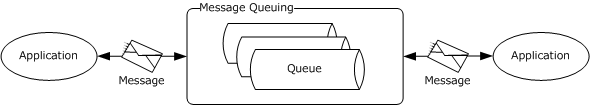

Figure 1: Components interacting with the File Services Management system

File server, file system, domain controller, and printer services are used by the File Services Management system (FSM system).

**File server:** A computer hosting one or more instances of a file service, for example, an instance of an [**SMB file service**](#gt_smb-file-service). A File Services Management system is used to configure the file servers. File servers use [**file systems**](#gt_file-system) to store information in the form of files.

**File system:** A hierarchical store for persistence of user and application data. The File Services Management system uses a file system to store configuration data and to retrieve the properties of the file system objects. The File Services Management system depends on an external object store for storing files and directories, and for changing the configuration of the file system objects. In Windows, the object store is provided by a local file system, usually the NTFS file system.

**Domain controller:** Used to store Distributed File System (DFS) namespace metadata if a domain-based namespace is created. The [**domain controller**](#gt_domain-controller-dc) is also used to store [**File Replication Service (FRS)**](#gt_file-replication-service-frs) objects, which store the configuration that is related to all replication members.

**Printer services:** Printers can be shared by using the File Services Management system. The system uses printer services to provide printer sharing, where printers can be accessed as described in [MS-PRSOD](../MS-PRSOD/MS-PRSOD.md). FSMOD protocols are used to configure the printers and present them to users.

**Admin tool:** A tool that provides management functionality to the administrator. The admin tool uses the File Services Management system to configure and retrieve configuration information for the file servers. It is also used to configure and query the state of the file services.

### 2.1.3 System Capabilities

The following are the administrative operations that can be performed by using the File Services Management Protocols:

**DFS namespace management:** The Distributed File System (DFS) namespace is a virtual view of resources that reside on one or more file servers. When a user views the namespace, the directories and files in it appear to reside on a single share. Users can navigate the namespace without previous knowledge of the server names or the shares hosting the data. By using the admin tools, an administrator selects which shared folders to present in the namespace, designs the hierarchy in which those folders appear, and determines the names that the shared folders show in the namespace, as described in Distributed File System (DFS): Namespace Management Protocol [MS-DFSNM](../MS-DFSNM/MS-DFSNM.md).

**Configuring Distributed File System Replication (DFS-R):** The administrator can use the admin tools to create, modify, and delete configuration objects in [**Active Directory**](#gt_active-directory). For this purpose, the administrator uses the Distributed File System (DFS) Replication Helper Protocol, as described in [MS-DFSRH](../MS-DFSRH/MS-DFSRH.md).

**Monitoring Distributed File System Replication (DFS-R):** The administrator can monitor [**DFS-R**](#gt_dfs-r) on the server and collect statistics about the DFS-R operation. Information that can be collected includes:

- Number and size of replicated files on the server.
- Disk use on the server.
- Information about replicated folders on the server.
- Replication backlog—the number of files that are not yet fully replicated.
The interfaces that are used to collect these statistics are described in [MS-DFSRH].

**Directory quota management:** [**Directory quotas**](#gt_directory-quota) track and control directory space usage for NTFS file system volumes. Directory quotas allow administrators to control the amount of data that each user can store on a specific NTFS file system directory. A directory quota can be configured with one or more directory quota thresholds that define a set of highly customizable notifications that are sent when the quota usage reaches the threshold value. For more information on how to configure the directory quota, see the File Server Resource Manager Protocol [MS-FSRM](../MS-FSRM/MS-FSRM.md).

**File screen management:** Administrators can create and modify [**file screens**](#gt_file-screen) that restrict the types of files that can be stored in a specific directory and its subdirectories. For each file screen, there is a configurable list of blocked [**file groups**](#gt_file-group) that define a set of patterns, based on the file name, which is to be restricted. When a file is created or renamed, the server evaluates whether the file name matches a pattern in any file group that is configured on a parent portion of the path. If a match is found, the file is blocked, and a set of highly customizable File Server Resource Management (FSRM) notifications that are configured for the file screen are raised. For more information on how to configure a file screen, see [MS-FSRM].

**Analyze storage use:** An administrator can generate reports to better understand how storage is used in specific directories. A storage report job specifies a set of directories to be analyzed to generate one or more reports. Report jobs can be run on a schedule or on demand. An administrator can also query and set properties on the report job to manipulate report generation parameters, format options, email delivery information, and other options. For more information on how to configure report jobs, see [MS-FSRM].

**File classification:** An administrator can classify files and apply policies that are based on that classification. An administrator can retrieve and modify the values that are assigned to classification properties for files that are stored on the server. An administrator can create, enumerate, modify, and delete [**classification rules**](#gt_classification-rule) and classification modules on the server. For more information on how to configure the file classification, see [MS-FSRM].

**Creating and modifying a file management job:** A [**file management job**](#gt_file-management-job) is a scheduled task that applies a command to a set of files, as determined by lists of conditions and namespaces. File management jobs can also produce FSRM notifications at configurable intervals before a file is affected by the configured task.

**Modifying the file properties:** An administrator can set, enumerate, modify, and delete values of properties for specific files on the file server by interacting with the FSRM server component.

**Configuring the SMB Network Redirector:** An administrator can query and configure the [**SMB Network Redirector**](#gt_smb-network-redirector) by using the File Services Management system. For example, the administrator can query the [**computer name**](#gt_computer-name) or major and minor version numbers of the operating system from a remote computer. An administrator can set the following configuration options:

- The number of seconds that the SMB Network Redirector maintains an inactive SMB connection to a remote computer's resource before closing it.
- The number of simultaneous network commands that can be processed by the SMB Network Redirector.
- The number of seconds that the SMB Network Redirector waits before the redirector disconnects an inactive SMB session.
Configuration operations and the protocol that is used to carry out these tasks are described in [MS-WKST](../MS-WKST/MS-WKST.md).

**Managing information on the SMB server:** The administrator can query and configure information on the server, such as active connections, [**sessions**](#gt_session), [**shares**](#gt_share), files, and transport protocols. A server can be configured to present different resources based on the name the client connects with, allowing it to appear as multiple, distinct servers. This task is achieved by scoping a share to a specific name and by hosting all of the names on the same server. The Server Service Remote Protocol [MS-SRVS](../MS-SRVS/MS-SRVS.md) provides a list of configuration operations.

**Managing the SMB server:** The administrator can query and configure the SMB server. For example, the administrator can identify the type of service that the SMB server is running, such as a server running the Workstation service, change the services that are running, and get a list of all servers of a specific type in a [**domain**](#gt_domain). The administrator can also configure aliases for a server by identifying multiple distinct names that present the same resources. The protocol that is used to manage an SMB server is described in [MS-SRVS].

### 2.1.4 Abstract Components of the File Services Management System

The following diagram shows the abstract components of the File Services Management system.

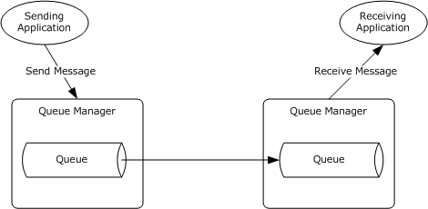

Figure 2: Abstract components of the File Services Management system

**Admin tool:** The admin tool is a program that offers management functionality to the administrator by means of the admin client. Typical admin tools are command-line tools and graphical shells, management utilities, and graphical management programs. The admin tool is external to the File Services Management system and uses the admin client to accomplish its work.

**Admin client:** The admin client is code running on the administrator's computer. The admin client implements client-side protocol components and consumes the file server administration services that are offered by the file server. The admin client is internal to the File Services Management system.

**FSRM Service:** This service implements the server component of the File Server Resource Manager Protocol [MS-FSRM](../MS-FSRM/MS-FSRM.md), and provides interfaces for managing the configuration of directory quotas, file screens, classification properties, classification rules, file management jobs, report jobs, classifier modules, and storage modules on a computer. The FSRM Service provides the following features:

- Controls for the quantity of data
- Mechanisms to manage the type of data
- Classification of data
- Application of policy that is based on metadata
- Generation of reports about the data
**FRS Service:** The File Replication Service (FRS) replicates files and folders that are stored on domain controllers and Distributed File System (DFS) shared folders. It implements the File Replication Service Protocol [MS-FRS1](../MS-FRS1/MS-FRS1.md) or the Distributed File System Replication Protocol [MS-FRS2](../MS-FRS2/MS-FRS2.md). Both of these protocols provide similar functionality; however, [MS-FRS1] is deprecated. The File Replication Service (FRS) also implements the server side of the DFS Replication Helper Protocol [MS-DFSRH](../MS-DFSRH/MS-DFSRH.md), which is used to configure and monitor Distributed File System Replication (DFS-R) on a server.

**SMB File Service:** The SMB File Service implements server-side protocol components that are consumed by the admin client. It also implements the server-side of the Server Service Remote Protocol (SRVSVC) [MS-SRVS](../MS-SRVS/MS-SRVS.md), which is an administrative protocol that is used to query and configure certain properties of the SMB File Service on a server, such as active connections, sessions, shares, open files, and transport protocols. It implements the server side of the Workstation Service Remote Protocol [MS-WKST](../MS-WKST/MS-WKST.md), which is used to configure the behavior of an SMB Network Redirector.

**DFS Service:** The DFS Service groups shared folders, which are located on different servers, and presents them to users as a virtual tree of folders, known as a Distributed File System (DFS) namespace. The DFS Service implements the server-side protocol components of the Distributed File System (DFS): Referral (DFSC) Protocol [MS-DFSC](../MS-DFSC/MS-DFSC.md) and the Distributed File System (DFS): Namespace Management Protocol [MS-DFSNM](../MS-DFSNM/MS-DFSNM.md).

**Legacy printer service:** This service implements the server side of the Remote Administration Protocol [MS-RAP](#Section_2.6.1), which supports certain server administration methods, such as SMB file share enumeration. This functionality has been superseded by the Workstation Service Remote Protocol [MS-WKST] and the Server Service Remote Protocol [MS-SRVS].

**SMB Network Redirector:** A software component on a connected computer that handles requests for remote files and printer operations. An administrator can configure some aspects of SMB Network Redirector by using the Workstation Service Remote Protocol [MS-WKST].

**Administrator:** The administrator is the person who administers the file server. The administrator organizes the file namespace, sets access rights, and enforces limits through quotas on users’ file storage. The administrator interacts with the File Services Management system through the admin tool.

### 2.1.5 Protocol Relationship

The following diagram shows the protocol layering relationships for the File Services Management system member protocols that use remote procedure call (RPC) as a transport.

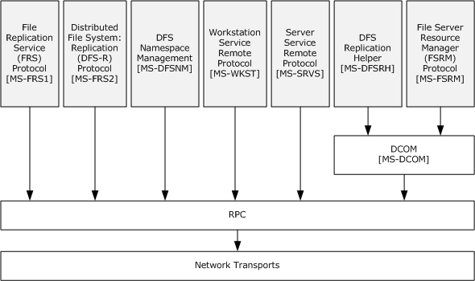

Figure 3: Protocol relationship of RPC-related protocols

The protocols [MS-DFSNM](../MS-DFSNM/MS-DFSNM.md), [MS-SRVS](../MS-SRVS/MS-SRVS.md), and [MS-WKST](../MS-WKST/MS-WKST.md) use [MS-RPCE](../MS-RPCE/MS-RPCE.md) over [**named pipes**](#gt_named-pipe). Thus, the protocols can be transported over [**SMB access protocols**](#gt_smb-access-protocols) and cannot use any of the other RPC transports. The File Server Resource Manager Protocol, as described in [MS-FSRM](../MS-FSRM/MS-FSRM.md), [MS-DFSRH](../MS-DFSRH/MS-DFSRH.md), [MS-FRS1](../MS-FRS1/MS-FRS1.md), and [MS-FRS2](../MS-FRS2/MS-FRS2.md), uses the Remote Procedure Call Protocol Extensions over TCP only. For more information on the type of RPC transport, see section [2.10](#Section_2.10).

The following diagram shows the protocol layering relationships of the Remote Administration Protocol [MS-RAP](#Section_2.6.1).

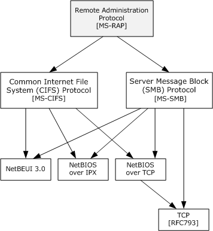

Figure 4: Protocol relationship of the Remote Administration Protocol

The Remote Administration Protocol [MS-RAP] is an administrative protocol that is transported by the Common Internet File System (CIFS) and the Server Message Block (SMB) Protocol, but not by the Server Message Block (SMB) Protocol Versions 2 and 3 [MS-SMB2]. The function of the Remote Administration Protocol, as described in [MS-RAP], has largely been replaced by newer protocols. In the File Services Management system, the Remote Administration Protocol is used as a discovery protocol. File Services clients can discover servers by using the Remote Administration Protocol to retrieve a list of servers from the Browser Service, as described in the Common Internet File System (CIFS) Browser Protocol [MS-BRWS](../MS-BRWS/MS-BRWS.md). The Remote Administration Protocol also supports certain client and server administration methods, such as SMB file share enumeration, but this functionality has been superseded by the Workstation Service Remote Protocol [MS-WKST] and the Server Service Remote Protocol [MS-SRVS].

## 2.2 Protocol Summary

The following table provides a comprehensive list of the member protocols of the File Services Management system.

| Protocol name | Description | Short name |
| --- | --- | --- |
| File Server Resource Manager Protocol | This protocol describes operating system, file system, and storage concepts. The protocol exposes a set of interfaces that enable tools in a client role to manage the following: Directory quotas to limit the amount of storage capacity in a directory. File screens to limit the type of files in a directory. Setup of the file classification that defines the classification property schema and rules to automatically classify files. File management tasks that apply simple commands to filtered groups of files. Storage reports that cover storage usage and trend analysis. Query and modification of file classification values by retrieving and setting classification properties for files, as provided by the FSRM component server role. | [MS-FSRM](../MS-FSRM/MS-FSRM.md) |
| Workstation Service Remote Protocol | This protocol is used to configure the properties and behavior of a Server Message Block (SMB) Network Redirector (SMB Network Redirector) on a computer. It is also used to configure domain membership. For example, this protocol can be used to query the platform identifier, computer name, or major and minor version numbers of the operating system that runs on a remote computer. The File Services Management system uses this protocol to configure an SMB Network Redirector. Other capabilities of this protocol are not used by the File Services Management system. | [MS-WKST](../MS-WKST/MS-WKST.md) |
| Server Service Remote Protocol | This protocol is used to enable file and printer sharing and named pipe access to the server through the Server Message Block (SMB) Protocol [MS-SMB](../MS-SMB/MS-SMB.md). The protocol is also used for remote administration of servers that are running Windows operating systems. | [MS-SRVS](../MS-SRVS/MS-SRVS.md) |
| Remote Administration Protocol | This protocol is used for legacy administrative functions which include tasks, such as share maintenance and printer maintenance on LAN Manager servers. In addition, the Common Internet File System (CIFS) Browser Protocol uses the Remote Administration Protocol to enumerate the servers on the network. Most of this protocol's functionality has been superseded by the Workstation Service Remote Protocol [MS-WKST], and the Server Service Remote Protocol [MS-SRVS]. | [MS-RAP](#Section_2.6.1) |
| Distributed File System (DFS): Namespace Management Protocol | This protocol is used to create and administer Distributed File System (DFS) namespaces. DFS namespaces enable the creation of a virtual, contiguous file system namespace to unify multiple namespaces. | [MS-DFSNM](../MS-DFSNM/MS-DFSNM.md) |
| DFS Replication Helper Protocol | This protocol is a [**DCOM**](#gt_distributed-component-object-model-dcom) protocol that can be divided into two parts. One part consists of interfaces to change, modify, and delete configuration objects in Active Directory. The second part is an interface to monitor Distributed File System-Replication (DFS-R) on a server [MS-FRS2](../MS-FRS2/MS-FRS2.md) and to collect various statistics about the DFS Replication operation. | [MS-DFSRH](../MS-DFSRH/MS-DFSRH.md) |
| Distributed File System Replication Protocol | This protocol is used to replicate files between file servers. It is a multimaster replication, which enables files to be changed by any member that participates in replicating shared files. Because it uses an optimistic replication strategy, files can be updated without any prior consensus or serialization. DFS-R uses the Remote Differential Compression (RDC) algorithm. DFS-R supersedes the older FRS replication protocol. | [MS-FRS2] |
| File Replication Service Protocol | This protocol is an RPC protocol that is used on file servers to replicate files and folders among file servers on the network. This protocol enables multimaster file and folder replicas to be synchronized on multiple file servers. FRS is used to maintain duplicate copies of data files in system volume (SYSVOL) system folders on domain controllers in a domain. FRS can also be used to replicate data files among DFS shares. | [MS-FRS1](../MS-FRS1/MS-FRS1.md) |
| Remote Differential Compression (RDC) Algorithm | This algorithm enables efficient synchronization of files with a remote source by using compression techniques to minimize the amount of data that is sent between a source location and a target location. This algorithm is used by the Distributed File System: Replication (DFS-R) Protocol. | [MS-RDC](../MS-RDC/MS-RDC.md) |

## 2.3 Environment

The following sections identify the context in which the system exists. This includes the systems that use the interfaces that are provided by this system of protocols, other systems that depend on this system, and, as appropriate, the communication between components of the systems.

### 2.3.1 Dependencies on This System

File Access Services depends on the File Services Management system for share and namespace management.

### 2.3.2 Dependencies on Other Systems/Components

The File Management Services system depends on the following external systems and components:

- Object store: Used to store files and metadata.
- Active Directory system: Used to store Distributed File System (DFS) namespace metadata. If an Active Directory system is unavailable, an administrator cannot create a domain-based Distributed File System (DFS) namespace and cannot use the Distributed File System Replication (DFS-R) Services.
- Authentication Services system: Used to authenticate admin clients and the admin server. The Authentication services are described in the Authentication Services Protocols Overview [MS-AUTHSOD](../MS-AUTHSOD/MS-AUTHSOD.md).

## 2.4 Assumptions and Preconditions

The following assumptions and preconditions for the File Services Management system to operate successfully:

**System availability:** The File Services Management system must be installed on all computers involved.

**Domain configuration:** In a domain configuration, file clients and file services have access to [**directory services**](#gt_directory-service-ds) that are provided by the domain.

**Authentication services:** Authentication services, as described in [MS-AUTHSOD](../MS-AUTHSOD/MS-AUTHSOD.md), are available to all file clients and file services.

**RPC:** Components of the file client and file services that use remote procedure call (RPC) interfaces have all prerequisites satisfied, as described in [MS-RPCE](../MS-RPCE/MS-RPCE.md) section 1.5.

**Network configuration:** For system components that are running on different computers to communicate, the network services and infrastructure are functional and configured in such a way that required protocols, ports, and so on are remotely accessible.

**Domain functionality:** For system functionality that requires a domain and directory services, as described in [MS-ADOD](../MS-ADOD/MS-ADOD.md), at least one domain controller is configured and accessible. Some functionality could require an Active Directory domain as noted in individual technical documents.

## 2.5 Use Cases

### 2.5.1 Share Management Use Cases

Share Management use cases describe the management activities that the administrator performs to control a shared resource by using the admin tool. The share management activity includes the following share tasks:

- Creation
- Enumeration
- Getting and setting information
- Deletion
The following diagram shows the Share Management use cases that are described in detail in the following sections.

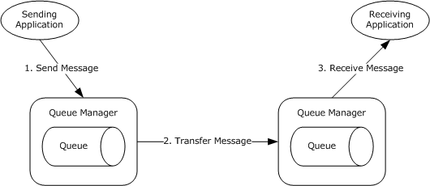

Figure 5: Share Management use cases

#### 2.5.1.1 Create Share SMB

**Goal**

To create a share for access by using SMB access protocols.

**Context of Use**

The administrator is setting up a file server or is adding a share to an existing file server.

**Actors**

- Admin tool
The admin tool is the primary actor that triggers this use case. The admin tool is a program that offers management functionality to the administrator through the admin client. Typical admin tools are command-line tools and graphical shells, management utilities, and graphical management programs. The purpose of the admin tool is to correctly interpret, execute, and display the results of the commands that are issued by the administrator.

- Admin client
The admin client is a supporting actor that implements client-side protocol components and consumes the file server administration services that are offered by the file server. The admin client is internal to the File Services Management system.

- SMB File Service
The SMB File Service is a supporting actor that implements server-side protocol components and the file services that are consumed by the admin client.

- Authentication Services
The Authentication Services is the supporting actor that is used for authentication.

**Stakeholders**

- Administrator
The administrator is the person who administers the file server. The administrator has administrative rights and uses the File Services Management system to provide the SMB File Service.

**Preconditions**

The administrator has identified a file server, an available share name on a file server, and a location on the file server's object store to host the share. An SMB File Service is present on the file server that implements the Server Service Remote Protocol [MS-SRVS](../MS-SRVS/MS-SRVS.md).

**Main Success Scenario**

- Trigger: The admin tool receives a request from the administrator to create a share on the file server. The admin tool establishes a communication channel to the SMB File Service, as described in [MS-SRVS] section 2.1.
- The admin tool establishes a communication channel to the SMB File Service, as described in [MS-SRVS] section 2.1.
- The SMB File Service authenticates the administrator through the mechanisms as described in [MS-AUTHSOD](../MS-AUTHSOD/MS-AUTHSOD.md) section 2.1.2.3.1.
- The admin tool contacts the SMB File Service by using the **NetrShareAdd** method, as described in [MS-SRVS] section 3.1.4.7, to create the share on the file server.
- The SMB File Service authorizes the administrator through the mechanisms, as described in [MS-SRVS] section 3.1.4.7.
- The SMB File Service creates the requested share that stores configuration information in an implementation-specific manner.
**Postcondition**

The named share is created on the file server.

**Extensions**

If the communication channel for the Server Service Remote Protocol [MS-SRVS] cannot be established, or it becomes disconnected:

- The admin tool can attempt to establish connection multiple times; ultimately, the use case ends with failure. Depending on when the connection failed, the share could or could not have been created.
If user authorization or user authentication fails:

- The use case ends with failure.
If share creation fails:

- The use case ends with failure.

#### 2.5.1.2 List SMB Shares

**Goal**

To list shares on a file server that can be accessed through SMB access protocols.

**Context of Use**

The administrator has located and selected a file server and is required to discover any file shares on it.

**Actors**

- Admin tool
The admin tool is the primary actor. It triggers this use case. The admin tool is a program that offers management functionality to the administrator through the admin client. Typical admin tools are command-line tools and graphical shells, management utilities, and graphical management programs. The purpose of the admin tool is to correctly interpret, execute, and display the results of the commands that are issued by the administrator.

- Admin client
The admin client is a supporting actor that implements client-side protocol components and consumes the file server administration services that are offered by the file server. The admin client is internal to the File Services Management system.

- SMB File Service
The SMB File Service is a supporting actor. It implements server-side protocol components and the file services that are consumed by the admin client.

- Authentication Services
The Authentication Services is the supporting actor that is used for authentication.

**Stakeholders**

- Administrator
The administrator is the person who administers the file server. The administrator has administrative rights and uses the File Services Management system to provide the SMB File Service.

**Preconditions**

The user has identified a file server. An SMB File Service is present on the file server, as described in the Server Service Remote Protocol [MS-SRVS](../MS-SRVS/MS-SRVS.md) section 3.1.

**Main Success Scenario**

- Trigger: The admin tool receives a request from the user to retrieve a list of shares that are hosted by the file server.
- The admin tool establishes a communication channel to the SMB File Service, as described in [MS-SRVS] section 2.1.
- The SMB File Service authenticates the user through the mechanisms, as described in [MS-AUTHSOD](../MS-AUTHSOD/MS-AUTHSOD.md) section 2.1.2.3.1.
- The admin tool contacts the SMB File Service by using the **NetrShareEnum** method ([MS-SRVS] section 3.1.4.8) to retrieve the list of shares.
- The SMB File Service authorizes the user through the procedure, as described in [MS-SRVS] section 3.1.4.8.
- The SMB File Service performs the action and returns the results to the application.
- The admin tool displays a list of file shares.
**Postcondition**

The list of shares that are hosted by the file server is returned to the user.

**Extensions**

If the communication channel for the Server Service Remote Protocol, as described in [MS-SRVS], cannot be established, or it becomes disconnected:

- The admin tool can attempt to establish connection multiple times; ultimately, the use case ends with failure.
If user authorization or authentication fails:

- The use case ends with failure.

#### 2.5.1.3 Getting and Setting the Properties for an Existing SMB Share

**Goal**

To get or set the properties of an particular shared resource on the server in a **ShareList**, such as name, type, and permissions of the resource, comments that are associated with the resource, the maximum number of concurrent connections, the number of current connections, the local path for the resource, or a password for the current connection.

**Context of Use**

The administrator is setting up a file server or is changing the parameters of a shared resource.

**Actors**

- Admin tool
The admin tool is the primary actor that triggers this use case. The admin tool is a program that offers management functionality to the administrator through the admin client. Typical admin tools are command-line tools and graphical shells, management utilities, and graphical management programs. The purpose of the admin tool is to correctly interpret, execute, and display the results of the commands that are issued by the administrator.

- Admin client
The admin client is a supporting actor that implements client-side protocol components and consumes the file server administration services that are offered by the file server. The admin client is internal to the File Services Management system.

- SMB File Service
SMB File Service is a supporting actor that implements server-side protocol components and the File Services that are consumed by the admin client.

- Authentication Services
The Authentication Services is the supporting actor that is used for authentication.

**Stakeholders**

- Administrator
The administrator is the person who administers the file server. The administrator has administrative rights and uses the File Services Management system to provide SMB File Services.

**Preconditions**

The administrator has identified a file server and an existing share name on a file server. An SMB File Service is present on the file server, as described in [MS-SRVS](../MS-SRVS/MS-SRVS.md).

**Postcondition**

The properties of the shared resource are retrieved and set by the administrator.

**Main Success Scenario**

Trigger: The admin tool receives a request from the administrator to get and set the information of an [**SMB share**](#gt_smb-share).

- The admin tool establishes a communication channel to the SMB File Service, as described in [MS-SRVS] section 2.1.
- The SMB File Service authenticates the administrator through the mechanisms, as described in [MS-AUTHSOD](../MS-AUTHSOD/MS-AUTHSOD.md) section 2.1.2.3.1.
- The admin tool contacts SMB File Service by using the **NetrShareGetInfo** method ([MS-SRVS] section 3.1.4.11) to retrieve the information of a shared resource.
- The SMB File Service authorizes the administrator through the mechanisms, as described in [MS-SRVS] section 3.1.4.10.
- The SMB File Service returns the requested information of the shared resource.
- The admin tool contacts the SMB File Service by using the **NetrShareSetInfo** method ([MS-SRVS] section 3.1.4.11) to create the share on the file server.
- The SMB File Service authorizes the administrator through the mechanisms, as described in [MS-SRVS] section 3.1.4.11.
- The SMB File Service updates the share.
**Postcondition**

The properties of the shared resource are retrieved and set by the administrator.

**Extensions**

If the communication channel for the Server Service Remote Protocol [MS-SRVS] cannot be established, or it becomes disconnected:

- The admin tool can attempt to establish connection multiple times; ultimately, the use case ends with failure. Depending on when the connection failed, the share could or could not have been created.
If user authorization or authentication fails:

- The use case ends with failure.

#### 2.5.1.4 Delete an SMB Share

**Goal**

To delete a share from an SMB server.

**Context of Use**

The administrator is deleting a share from an existing file server.

**Actors**

- Admin tool
The admin tool is the primary actor that triggers this use case. The admin tool is a program that offers management functionality to the administrator through the admin client. Typical admin tools are command-line tools and graphical shells, management utilities, and graphical management programs. The purpose of the admin tool is to correctly interpret, execute, and display the results of the commands that are issued by an administrator.

- Admin client
The admin client is a supporting actor that implements client-side protocol components and consumes the file server administration services that are offered by the file server. The admin client is internal to the File Services Management system.

- SMB File Service
The SMB File Service is a supporting actor that implements server-side protocol components and the File Services that are consumed by the admin client.

- Authentication Services
The Authentication Services is the supporting actor that is used for authentication purposes.

**Stakeholders**

- Administrator
The administrator is the person who administers the file server. The administrator has administrative rights and uses the File Services Management system to provide SMB File Services.

**Preconditions**

The administrator has identified a file server and a share to be deleted on that server. An SMB File Service is present on the file server, as described in [MS-SRVS](../MS-SRVS/MS-SRVS.md).

**Main Success Scenario**

- Trigger: The admin tool receives a request from the administrator to delete a share on the file server.
- The admin tool establishes a communication channel to the SMB File Service, as described in [MS-SRVS] section 2.1.
- The SMB File Service authenticates the administrator through the mechanisms, as described in [MS-AUTHSOD](../MS-AUTHSOD/MS-AUTHSOD.md) section 2.1.2.3.1.
- The admin tool contacts the SMB File Service by using the **NetrShareDel** method ([MS-SRVS] section 3.1.4.12) to delete the share from the file server.
- The SMB File Service authorizes the administrator through the mechanisms, as described in [MS-SRVS] section 3.1.4.12.
- The SMB File Service deleted the requested share.
**Postcondition**

The named share is deleted from the **ShareList** on the file server.

**Extensions**

If the communication channel for [MS-SRVS] cannot be established, or it becomes disconnected:

- The admin tool can attempt to establish connection multiple times; ultimately, the use case ends with failure. Depending on when the connection failed, the share could or could not have been created.
If user authorization or authentication fails:

- The use case ends with failure.

### 2.5.2 DFS Use Cases

The Distributed File System (DFS) functions provide the ability to logically group shares on multiple servers and to transparently link shares into a single, hierarchical namespace. DFS organizes shared resources on a network in a treelike structure. This section provides a series of use cases for namespace configuration and management.

The following diagram shows the DFS use cases that are described in detail in the following sections.

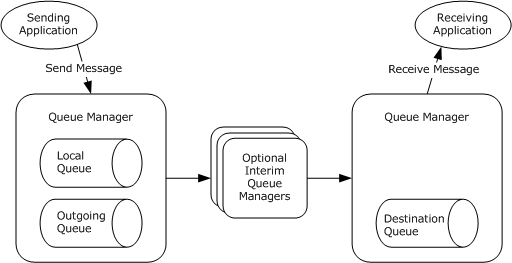

Figure 6: DFS use cases

#### 2.5.2.1 Create DFS Standalone Namespace

**Goal**

To create a [**standalone DFS namespace**](#gt_ce6af522-ba70-4ba1-a684-b98b809c72ad) for access by using SMB access protocols with extensions, as described in the Distributed File System (DFS): Namespace Referral Protocol [MS-DFSC](../MS-DFSC/MS-DFSC.md).

**Context of Use**

The administrator is setting up a file server or is adding a namespace to an existing file server.

**Actors**

- Admin tool
The admin tool is the primary actor that triggers this use case. The admin tool is a program that offers management functionality to the administrator through the admin client. Typical admin tools are command-line tools and graphical shells, management utilities, and graphical management programs. The purpose of the admin tool is to correctly interpret, execute, and display the results of the commands that are issued by the administrator.

- DFS Service
The DFS Service is a supporting actor that provides the technology that helps administrators group shared folders that are located on different servers and present them to users as a virtual tree of folders that is known as a namespace.

- Admin client
The admin client is a supporting actor that implements client-side protocol components and consumes the file server administration services that are offered by the file server. The admin client is internal to the File Services Management system.

- Authentication Services
The Authentication Services is the supporting actor that is used for authentication purposes.

**Stakeholders**

- Administrator
The administrator is the person who administers the file server. The administrator has administrative rights and uses the File Services Management system to provide SMB File Services.

**Preconditions**

The administrator has identified a Distributed File System (DFS) Service and an existing SMB file share on the File Service that is to be promoted to a DFS namespace. A DFS Service is present, as described in the Distributed File System (DFS): Namespace Management Protocol [MS-DFSNM](../MS-DFSNM/MS-DFSNM.md).

**Trigger:** The admin tool receives a request from the administrator to create a standalone DFS namespace on an SMB File Service.

**Main Success Scenario**

- The admin tool establishes a communication channel to the DFS Service, as described in [MS-DFSNM] section 2.1.
- The DFS Service authenticates the administrator through the mechanisms as described in the Authentication Services Protocols Overview [MS-AUTHSOD](../MS-AUTHSOD/MS-AUTHSOD.md).
- The admin tool contacts DFS Service by using the **NetrDfsAddRootTarget** method ([MS-DFSNM] section 3.1.4.1.9) or the **NetrDfsAddStdRoot** method ([MS-DFSNM] section 3.1.4.4.1) to promote the share to a namespace on the file server.
- The DFS Service authorizes the administrator through the mechanisms of the **NetrDfsAddRootTarget** method ([MS-DFSNM] section 3.1.4.1.9) or the **NetrDfsAddStdRoot** method ([MS-DFSNM] section 3.1.4.4.1), as appropriate to the call.
- The DFS Service performs the action.
**Postcondition**

The named share is promoted to a DFS namespace on the SMB File Service.

**Extensions**

if the communication channel for the Distributed File System (DFS): Namespace Management Protocol [MS-DFSNM], cannot be established, or it becomes disconnected:

- The admin tool might attempt to establish connection multiple times; ultimately, the use case ends with failure. Depending on when the connection failed, the DFS standalone namespace might or might not have been created.
If user authorization or authentication fails:

- The use case ends with failure.

#### 2.5.2.2 Create DFS Domain Namespace

**Goal**

To create a domain Distributed File System (DFS) namespace for access by using SMB access protocols with [MS-DFSC](../MS-DFSC/MS-DFSC.md) extensions.

**Context of Use**

The administrator is setting up a file server or is adding a namespace to an existing file server.

**Actors**

- Admin tool
The admin tool is the primary actor that triggers this use case. The admin tool is a program that offers management functionality to the administrator through the admin client. Typical admin tools are command-line tools and graphical shells, management utilities, and graphical management programs. The purpose of the admin tool is to correctly interpret, execute, and display the results of the commands that are issued by the administrator.

- DFS Service
The DFS Service is a supporting actor that provides the technology that helps administrators group shared folders that are located on different servers and present them to users as a virtual tree of folders that is known as a namespace.

- Admin client
The admin client is a supporting actor that implements client-side protocol components and consumes the file server administration services that are offered by the file server. The admin client is internal to the File Services Management system.

- Authentication Services
The Authentication Services is the supporting actor that is used for authentication.

- Active Directory system
The Active Directory system is a supporting actor. The File Services Management system stores metadata that is related to the domain DFS namespace in Active Directory.

**Stakeholders**

- Administrator
The administrator is the person who administers the file server. The administrator has administrative rights and uses the File Services Management system to provide SMB File Services.

**Preconditions**

The administrator has identified an SMB File Service and an existing SMB file share on the File Service to be promoted to a DFS domain namespace. A DFS Service is present on the SMB File Service, as described in [MS-DFSNM](../MS-DFSNM/MS-DFSNM.md).

**Main Success Scenario**

- Trigger: The admin tool receives a request from the administrator to create a DFS namespace on the SMB File Service.
- The admin tool establishes a communication channel to the DFS Service, as described in [MS-DFSNM] section 2.1.
- DFS Service authenticates the administrator through the mechanisms, as described in [MS-AUTHSOD](../MS-AUTHSOD/MS-AUTHSOD.md) section 2.1.2.3.1.
- The admin tool contacts DFS Service by using the **NetrDfsAddRootTarget** method ([MS-DFSNM] section 3.1.4.1.9) or the **NetrDfsAddFtRoot** method ([MS-DFSNM] section 3.1.4.3.1) to promote the share to a namespace on the SMB File Service.
- The DFS Service authorizes the administrator through the mechanisms of the **NetrDfsAddRootTarget** method ([MS-DFSNM] section 3.1.4.1.9) or the **NetrDfsAddFtRoot** method ([MS-DFSNM] section 3.1.4.3.1), as appropriate to the call.
- The DFS Service performs the action and interacts with the Active Directory directory service [MS-ADOD](../MS-ADOD/MS-ADOD.md) to store metadata changes that are related to the DFS namespace, as described in [MS-DFSNM].
**Postcondition**

The named share is promoted to a DFS namespace on the SMB File Service with corresponding metadata that is written to the Active Directory system.

**Extensions**

If the communication channel for [MS-DFSNM] cannot be established, or it becomes disconnected:

- The admin tool can attempt to establish connection multiple times; ultimately, the use case ends with failure. Depending on when the connection failed, the namespace could or could not have been created.
If user authorization or authentication fails:

- The use case ends with failure.

#### 2.5.2.3 Create DFS Link

**Goal**

To create a [**DFS link**](#gt_0611e93d-f0e7-42ee-a591-d77ebcbb6619) for access by using SMB access protocols with extensions, as described in [MS-DFSC](../MS-DFSC/MS-DFSC.md).

**Context of Use**

The administrator is setting up a file server or is maintaining a namespace on an existing file server.

**Actors**

- Admin tool
The admin tool is the primary actor that triggers this use case. The admin tool is a program that offers management functionality to the administrator through the admin client. Typical admin tools are command-line tools and graphical shells, management utilities, and graphical management programs. The purpose of the admin tool is to correctly interpret, execute, and display the results of the commands that are issued by the administrator.

- DFS Service
The DFS Service is a supporting actor that provides the technology that helps administrators group shared folders that are located on different servers and present them to users as a virtual tree of folders that is known as a namespace.

- Admin client
The admin client is a supporting actor that implements client-side protocol components and consumes the file server administration services that are offered by the file server. The admin client is internal to the File Services Management system.

- Authentication Services
The Authentication Services is the supporting actor that is used for authentication purposes.

- Active Directory system
The Active Directory system is a supporting actor. The File Services Management system stores metadata that is related to the domain DFS namespace in Active Directory.

**Stakeholders**

- Administrator
The administrator is the person who administers the file server. The administrator has administrative rights and uses the File Services Management system to provide the SMB File Service.

**Preconditions**

The administrator has identified an SMB File Service that hosts an instance of the given namespace, the SMB share on the SMB File Service that hosts the given namespace, the path in the share at which the link is created, and the target that the link refers to. A DFS Service is present on the SMB File Service, as described in [MS-DFSNM](../MS-DFSNM/MS-DFSNM.md).

**Main Success Scenario**

- Trigger: The admin tool receives a request from the administrator to create a DFS link on the SMB File Service.
- The admin tool establishes a communication channel to DFS Service, as described in [MS-DFSNM] section 2.1.
- The DFS Service authenticates the administrator through the mechanisms, as described in [MS-AUTHSOD](../MS-AUTHSOD/MS-AUTHSOD.md).
- The admin tool contacts the DFS Service by using the **NetrDfsAdd** method ([MS-DFSNM] section 3.1.4.1.3) to create the link within the namespace, which also creates the DFS link object in the local object store.
- The DFS Service authorizes the administrator through the mechanisms of the **NetrDfsAdd** method, as described in [MS-DFSNM] section 3.1.4.1.3.
- The DFS Service performs the action.
**Postcondition**

The specified DFS link is created within the given DFS namespace on the SMB File Service along with corresponding metadata that is written to the Active Directory system in the case of a domain DFS namespace.

**Extensions**

If the communication channel for the DFS namespace, as described in [MS-DFSNM], cannot be established, or it becomes disconnected:

- The admin tool can attempt to establish connection multiple times; ultimately, the use case ends with failure. Depending on when the connection failed, the link could or could not have been created.
If user authorization or authentication fails:

- The use case ends with failure.
In the case of a domain DFS namespace:

- The DFS Service additionally interacts with the Active Directory system, as described in [MS-ADOD](../MS-ADOD/MS-ADOD.md) to store metadata changes that are related to the DFS link, as described in [MS-DFSNM].

#### 2.5.2.4 Add a Root Target to a Domain-Based Namespace

**Goal**

To add a DFS root target to an existing namespace that will host the DFS namespace.

**Context of Use**

The administrator has existing file servers in a domain and is required to set up a domain-based namespace.

**Actors**

- Admin tool
The admin tool is the primary actor that triggers this use case. The admin tool is a program that offers management functionality to the administrator through the admin client. Typical admin tools are command-line tools and graphical shells, management utilities, and graphical management programs. The purpose of the admin tool is to correctly interpret, execute, and display the results of the commands that are issued by the administrator.

- DFS Service
The DFS Service is a supporting actor that provides the technology that helps administrators group shared folders on different servers and present them to users as a virtual tree of folders known as a namespace.

- Admin client
The admin client is a supporting actor that implements client-side protocol components and consumes the file server administration services that are offered by the file server. The admin client is internal to the File Services Management system.

- Authentication Services
The Authentication Services is the supporting actor that is used for authentication purposes.

- Active Directory system
The Active Directory system is a supporting actor. The File Services Management system stores metadata that is related to the domain DFS namespace in Active Directory.

**Stakeholders**

- Administrator
The administrator is the person who sets up and manages the DFS root target servers and the DFS namespaces.

**Preconditions**

The administrator has identified an SMB File Service to act as a root server for an already created DFS namespace. A DFS Service is present on the SMB File Service, as described in [MS-DFSNM](../MS-DFSNM/MS-DFSNM.md).

**Main Success Scenario**

- Trigger: The admin tool receives a request from the administrator to add a DFS root target to an existing namespace.
- The admin tool establishes a communication channel to the DFS Service, as described in [MS-DFSNM] section 2.1.
- The DFS Service authenticates the administrator through the mechanisms, as described in [MS-AUTHSOD](../MS-AUTHSOD/MS-AUTHSOD.md).
- The admin tool contacts DFS Service by using the **NetrDfsAddFtRoot** method ([MS-DFSNM] section 3.1.4.3.1) to add the file server as a root target server to the existing namespace.
- The DFS Service uses the **NetrDfsAddFtRoot** method to authorize the administrator through the mechanisms of [MS-DFSNM] section 3.1.4.3.1, as appropriate to the call.
- The DFS Service performs the action, and interacts with the Active Directory directory service, as described in [MS-ADOD](../MS-ADOD/MS-ADOD.md), to store metadata changes that are related to the DFS namespace, as described in [MS-DFSNM].
**Postcondition**

The named share is promoted to a DFS namespace on the SMB File Service with corresponding metadata that is written to the Active Directory system.

**Extensions**

If the communication channel for the DFS namespace [MS-DFSNM] cannot be established, or it becomes disconnected:

- The admin tool can attempt to establish connection multiple times; ultimately, the use case ends with failure. Depending on when the connection failed, the namespace could or could not have been created.
If user authorization or authentication fails:

- The use case ends with failure.

### 2.5.3 DFS-R Configuration and Monitoring Use Cases

This section describes the configuration and monitoring activity of Distributed File System-Replication (DFS-R) on a server that includes the configuration of the DFS-R objects for the high availability of data that the server contains.

The following diagram shows the DSF-R configuration and monitoring use cases that are described in detail in the following sections.

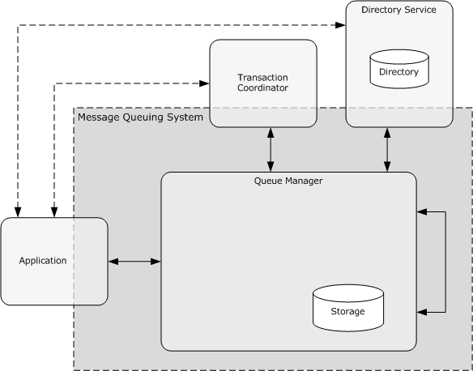

Figure 7: DFS-R configuration and monitoring use cases

Goal

To get the health information for a Distributed File System Replication (DFS-R) Service.

**Context of Use**

The administrator wants collect various statistics about the DFS-R operation on the DFS-R Service.

**Actors**

- Admin tool
The admin tool is the primary actor that triggers this use case. The admin tool is a program that offers management functionality to the administrator through the admin client. Typical admin tools are command-line tools and graphical shells, management utilities, and graphical management programs. The purpose of the admin tool is to correctly interpret, execute, and display the results of the commands that are issued by the administrator.

- DFS-R Service
The DFS-R Service is a supporting actor that provides the interfaces to create, modify, and delete configuration objects in Active Directory by using the server's machine account. It also provides the interface to monitor DFS-R on the computer and to collect various statistics about the DFS-R operation.

- Admin client
The admin client is a supporting actor that implements client-side protocol components and consumes the file server administration services that are offered by the file server. The admin client is internal to the File Services Management system.

**Stakeholders**

- Administrator
The administrator is the person who administers the file server. The administrator has administrative rights and uses the File Services Management system to provide SMB File Services.

**Main Success Scenario**

- Trigger: The admin tool receives a request from the administrator to get the health report for DFS-R Service.
- The admin tool establishes a communication channel to the DFS-R Service, as described in [MS-DFSRH](../MS-DFSRH/MS-DFSRH.md) section 2.1.
- The DFS Service authenticates the administrator through the mechanisms of the Authentication Services Protocol Overview, as described in [MS-AUTHSOD](../MS-AUTHSOD/MS-AUTHSOD.md).
- The admin tool contacts the DFS-R Service to get the health report by using either the **IServerHealthReport** interface or the **IServerHealthReport2** interface, as described in [MS-DFSRH] sections 3.1.5.4 and 3.1.5.5.
- The DFS-R Service generates the report and returns it to the admin client.
**Postcondition**

The health report is generated and is returned to the administrator.

**Extensions**

If the communication channel for the DFS Replication Helper Protocol, as described in [MS-DFSRH], cannot be established, or it becomes disconnected:

- The admin tool can attempt to establish connection multiple times; ultimately, the use case ends with failure. Depending on when the connection failed, the namespace could or could not have been created.

#### 2.5.3.1 Get Health Information for a DFS Replication

**Goal**

To get the health information for a Distributed File System Replication (DFS-R) Service.

**Context of Use**

The administrator has to collect statistics about the DFS-R operation that runs on the DFS-R Service.

**Actors**

- Admin tool
The admin tool is the primary actor that triggers this use case. The admin tool is a program that offers management functionality to the administrator through the admin client. Typical admin tools are command-line tools and graphical shells, management utilities, and graphical management programs. The purpose of the admin tool is to correctly interpret, execute, and display the results of the commands that are issued by the administrator.

- DFS-R Service
The DFS-R Service is a supporting actor that provides the interfaces to create, modify, and delete configuration objects in Active Directory by using the server's machine account. It also provides the interface to monitor DFS-R on the computer and to collect statistics about the DFS-R operation.

- Admin client
The admin client is a supporting actor that implements client-side protocol components and consumes the file server administration services that are offered by the file server. The admin client is internal to the File Services Management system.

**Stakeholders**

- Administrator
The administrator is the person who administers the file server. The administrator's has administrative rights and uses the File Services Management system to provide SMB File Services.

**Main Success Scenario**

- Trigger: The admin tool receives a request from the administrator to get the health report for the DFS-R Service.
- The admin tool establishes a communication channel to the DFS-R Service, as described in [MS-DFSRH](../MS-DFSRH/MS-DFSRH.md) section 2.1.
- The DFS Service authenticates the administrator through the mechanisms of the Authentication Services Protocols Overview, as described in [MS-AUTHSOD](../MS-AUTHSOD/MS-AUTHSOD.md).
- The admin tool contacts the DFS-R Service to get the health report by using either the **IServerHealthReport** or the **IServerHealthReport2** interface, as described in [MS-DFSRH] sections 3.1.5.4 and 3.1.5.5.
- The DFS-R Service generates the report and returns it to the admin client.
**Post-Condition**

The health report is generated and returned to the administrator.

**Extensions**

- If the communication channel for the DFS Replication Helper Protocol, as described in [MS-DFSRH], cannot be established, or it becomes disconnected:
The admin tool can attempt to establish connection multiple times; ultimately, the use case ends with failure. Depending on when the connection failed, the namespace could or could not have been created.

#### 2.5.3.2 Create a Directory Object for a DFS Replication Group Using Server Credentials

**Goal**

To create an Active Directory object that is used by the DFS-R Service.

**Context of Use**

The administrator creates Active Directory objects that have configuration information for DFS replication.

**Actors**

- Admin tool
The admin tool is the primary actor that triggers this use case. The admin tool is a program that offers management functionality to the administrator through the admin client. Typical admin tools are command-line tools and graphical shells, management utilities, and graphical management programs. The purpose of the admin tool is to correctly interpret, execute, and display the results of the commands that are issued by the administrator.

- DFS-R Service
The DFS-R Service is a supporting actor that provides the interfaces to create, modify, and delete configuration objects in Active Directory by using the server's machine account. It also provides the interface to monitor DFS-R on the computer and to collect statistics about the DFS-R operation.

- Admin client
The admin client is a supporting actor that implements client-side protocol components and consumes the file server administration services that are offered by the file server. The admin client is internal to the File Services Management system.

- Active Directory system
The Active Directory system is a supporting actor. The File Services Management system stores all configuration data that is related to the replication members in Active Directory.

**Stakeholders**

- Administrator
The administrator is the person who administers the file server. The administrator has administrative rights and uses the File Services Management system to provide the SMB File Service.

**Preconditions**

The administrator has identified an SMB File Service. A DFS-R Service is present on the SMB File Service, as described in [MS-FRS2](../MS-FRS2/MS-FRS2.md).

**Main Success Scenario**

- Trigger: The admin tool receives a request from the administrator to create an Active Directory object.
- The admin tool establishes a communication channel to the DFS-R Service, as described in [MS-DFSRH](../MS-DFSRH/MS-DFSRH.md) section 2.1.
- The DFS Service authenticates the administrator through the mechanisms as described in [MS-AUTHSOD](../MS-AUTHSOD/MS-AUTHSOD.md).
- The admin tool contacts DFS-R Service to create an Active Directory object with a specified distinguished name and attributes.
- The DFS-R Service authorizes the administrator through the mechanisms described in [MS-DFSRH] section 3.1.5.2.1 **IADProxy::CreateObject** or section 3.1.5.3.1 **IADProxy2::CreateObject**).
- The DFS-R Service executes a Lightweight Directory Access Protocol ([**LDAP**](#gt_lightweight-directory-access-protocol-ldap)) command under machine security credentials to create an Active Directory object.
**Postcondition**

The requested Active Directory object is created.

**Extensions**

The following results occur if the communication channel for the DFS Replication Helper Protocol, as described in [MS-DFSRH], cannot be established, or it becomes disconnected:

- The admin tool can attempt to establish connection multiple times; ultimately, the use case ends with failure. Depending on when the connection failed, the namespace could or could not have been created.

### 2.5.4 Resource Management Use Cases

The File Server Resource Manager (FSRM) enables system administrators to understand how storage is used and to manage the use of their storage by generating storage reports, by applying quotas to volumes and folders, and by screening files on the server.

The following diagram shows the Resource Management use cases that are described in detail in the following sections.

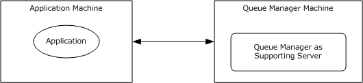

Figure 8: Resource Management use cases

#### 2.5.4.1 Create and Configure a File Management Job

**Goal**

To create and configure a file management job.

**Context of Use**

The administrator is setting up a file server and is required to schedule a task that applies a command to a set of files as determined by a list of conditions and a list of namespaces.

**Actors**

- Admin tool
The admin tool is the primary actor that triggers this use case. The admin tool is a program that offers management functionality to the administrator through the admin client. Typical admin tools are command-line tools and graphical shells, management utilities, and graphical management programs. The purpose of the admin tool is to correctly interpret, execute, and display the results of the commands that are issued by the administrator.

- FSRM Service
The FSRM Service is a supporting actor. It provides functionality for setting up and managing storage on folders and shares on a file server.

- Admin client
The admin client is a supporting actor that implements client-side protocol components and consumes the file server administration services that are offered by the file server. The admin client is internal to the File Services Management system.

**Stakeholders**

- Administrator
The administrator is the person who administers the file server. The administrator has administrative rights and uses the File Services Management system to provide SMB File Services.

**Preconditions**

The administrator has identified a file server and a set of files on the server to schedule the job.

**Main Success Scenario**

- Trigger: The admin tool receives a request from the Create and Configure a File management task. The admin tool establishes a communication channel to the File Server Resource Manager, which is a component of the File Service, as described in [MS-FSRM](../MS-FSRM/MS-FSRM.md) section 3.1.3.
- The admin tool creates a file management job on the file server by using the **CreateFileManagementJob** method, as described in [MS-FSRM] section 3.2.4.2.50.2. It sets the **Name**, **NamespaceRoot**, and **Format** task by using the **IFsrmReportScheduler::CreateScheduleTask** method and **ExpirationDirectory** for the new namespace, as described in [MS-FSRM] sections 3.2.4.2.48.3, 3.2.4.2.48.5, 3.2.4.2.48.19, 3.2.4.2.37.2, and 3.2.4.2.48.11.
- The admin tool modifies properties of the newly created file management job, such as the **ReportEnabled** property and the **Logging** property, and associates a different task.
**Postcondition**

The requested file management task is created and configured.

**Extensions**

If the communication channel for the File Server Resource Manager Protocol [MS-FSRM] cannot be established, or it becomes disconnected:

- The admin tool can attempt to establish connection multiple times; ultimately, the use case ends with failure. Depending on when the connection failed, the namespace could or could not have been created.

#### 2.5.4.2 Create a Report Job

**Goal**

To create a report job.

**Context of Use**

The administrator is setting up a file server and is required to analyze a set of directories and generate a report.

**Actors**

- Admin tool
The admin tool is the primary actor that triggers this use case. The admin tool is a program that offers management functionality to the administrator through the admin client. Typical admin tools are command-line tools and graphical shells, management utilities, and graphical management programs. The purpose of the admin tool is to correctly interpret, execute, and display the results of the commands that are issued by the administrator.

- FSRM Service
The File Server Resource Manager (FSRM) Service is a supporting actor. It provides functionality for classifying data by applying policy that is based on file server metadata and by generating data reports on the file server.

- Admin client
The admin client is a supporting actor that implements client-side protocol components and consumes the file server administration services that are offered by the file server. The admin client is internal to the File Services Management system.

**Stakeholders**

- Administrator
The administrator is the person who administers the file server. The administrator has administrative rights and uses the File Services Management system to provide the SMB File Service.

**Preconditions**

The administrator has identified a file server and a set of directories on the server to generate the utilization report.

**Main Success Scenario**

- Trigger: The admin tool receives a request to create a report job.
- The admin tool establishes a communication channel to the File Server Resource Manager, a component of the File Service, as described in [MS-FSRM](../MS-FSRM/MS-FSRM.md) section 3.1.3.
- The admin tool creates a report job by using the **IFsrmReportManager::CreateReportJob** method ([MS-FSRM] section 3.2.4.2.33.2). The client calls the **IFsrmReportJob::NamespaceRoots(put)** ([MS-FSRM] section 3.2.4.2.34.5), **IFsrmReportJob::Task(put)** ([MS-FSRM] section 3.2.4.2.34.3), and **IFsrmReportJob::CreateReport** ([MS-FSRM] section 3.2.4.2.34.15) methods of the File Server Resource Manager Protocol [MS-FSRM] with valid values for each method.
**Postcondition**

The requested file management task is created and configured.

**Extensions**

If the communication channel for File Server Resource Manager Protocol [MS-FSRM] cannot be established, or it becomes disconnected:

The admin tool can attempt to establish connection multiple times; ultimately, the use case ends with failure. Depending on when the connection failed, the report job could or could not have been created.

#### 2.5.4.3 Configure File Screens and Directory Quotas

**Goal**

To configure a file screen and share directory quota on the file server.

**Context of Use**

The administrator is setting up a file server and has to configure a file screen and share directory quota.

**Actors**

- Admin tool
The admin tool is the primary actor that triggers this use case. The admin tool is a program that offers management functionality to the administrator through the admin client. Typical admin tools are command-line tools and graphical shells, management utilities, and graphical management programs. The purpose of the admin tool is to correctly interpret, execute, and display the results of the commands that are issued by the administrator.

- FSRM Service
The FSRM Service is a supporting actor. It provides the ability to control the amount and type of data that is stored on a file server.

- Admin client
The admin client is a supporting actor that implements client-side protocol components and consumes the file server administration services that are offered by the file server. The admin client is internal to the File Services Management system.

**Stakeholders**

- Administrator
The administrator is the person who administers the file server. The administrator has administrative rights and uses the File Services Management system to provide SMB File Services.

**Main Success Scenario**

- Trigger: The admin tool receives a request from the administrator to configure quota and screening.
- The admin tool establishes a communication channel to the File Server Resource Manager, a component of the File Service, as described in [MS-FSRM](../MS-FSRM/MS-FSRM.md) section 3.1.3.
- The admin tool creates a quota on the file server by using the **IFsrmQuotaManager::CreateQuota** method, as described in [MS-FSRM] section 3.2.4.2.18.3, and provides the folder path on which the quota has to be applied. The admin tool calls the **IFsrmQuotaBase::QuotaLimit(put)** method ([MS-FSRM] section 3.2.4.2.14.3) with a valid quota limit.
- Alternatively, the admin tool creates a file screen on the file server by using the **CreateFileScreen** method, as described in [MS-FSRM] sections 3.2.4.2.29.3 and 3.2.4.2.27.1. The admin tool then calls the **IFsrmFileScreenBase::BlockedFileGroups(put)** method ([MS-FSRM] section 3.2.4.2.26.2) with a valid collection of file groups.
**Postcondition**

The requested quota limits and file screens are instantiated on the file server.

**Extensions**

If the communication channel for File Server Resource Manager Protocol [MS-FSRM] cannot be established, or it becomes disconnected:

- The admin tool might attempt to establish connection multiple times; ultimately, the use case ends with failure. Depending on when the connection failed, the file quota and file screen might or might not have been created.

### 2.5.5 Server Management Use Cases

This section describes the operations that are performed by administrator to manage an SMB share which includes the following operations: attaching and detaching the alias names, getting or setting the configuration information of a server, and binding and unbinding a server to a transport protocol.

The following diagram shows the Server Management use cases that are described in detail in the following sections.

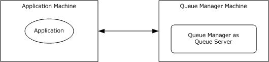

Figure 9: Server Management use cases

#### 2.5.5.1 Attach an Alias Name to an Existing Server

**Goal**

To attach an alias name to an existing SMB server.

**Context of Use**

The administrator is setting up a file server and has to add an alias to an existing file server.

**Actors**

- Admin tool
The admin tool is the primary actor that triggers this use case. The admin tool is a program that offers management functionality to the administrator through the admin client. Typical admin tools are command-line tools and graphical shells, management utilities, and graphical management programs. The purpose of the admin tool is to correctly interpret, execute, and display the results of the commands that are issued by the administrator.

- Admin client
The admin client is a supporting actor that implements client-side protocol components and consumes the file server administration services that are offered by the file server. The admin client is internal to the File Services Management system.

- SMB File Service
The SMB File Service is a supporting actor that implements server-side protocol components and the file services that are consumed by the admin client.

- Authentication Services
Authentication Services is the supporting actor that is used for authentication.

**Stakeholders**

- Administrator
The administrator is the person who administers the file server. The administrator has administrative rights and uses the File Services Management system to provide the SMB File Service.

**Preconditions**

The administrator has identified a file server to which he has to create an alias name. The administrator has also determined an alias name to add to the server name. An SMB File Service is present on the file server, as described in [MS-SRVS](../MS-SRVS/MS-SRVS.md).

**Main Success Scenario**

- Trigger: The admin tool receives a request from the administrator to add an alias to the file server.
- The admin tool establishes a communication channel to SMB File Service, as described in [MS-SRVS] section 2.1.
- The SMB File Service authenticates the administrator through the mechanisms as described in [MS-AUTHSOD](../MS-AUTHSOD/MS-AUTHSOD.md).
- The admin tool contacts the SMB File Service by using the **NetrServerAliasAdd** method ([MS-SRVS] section 3.1.4.44), to add an alias to the file server.
- The SMB File Service authorizes the administrator through the mechanisms as described in [MS-SRVS] section 3.1.4.44.
- The SMB File Service adds an alias to attach the existing server name.
**Postcondition**

The server is accessible with the existing name and with the added alias.

**Extensions**

If the communication channel for [MS-SRVS] cannot be established, or it becomes disconnected:

- The admin tool can attempt to establish connection multiple times; ultimately, the use case ends with failure. Depending on when the connection failed, the alias could or could not have been created.
If user authentication or authorization fails:

- The use case ends with failure.

#### 2.5.5.2 Detach an Alias Name from a Server

**Goal**

To detach an alias name from an existing SMB server.

**Context of Use**

The administrator is setting up a file server and has to remove an alias that is associated with the file server.

**Actors**

- Admin tool
The admin tool is the primary actor that triggers this use case. The admin tool is a program that offers management functionality to the administrator through the admin client. Typical admin tools are command-line tools and graphical shells, management utilities, and graphical management programs. The purpose of the admin tool is to correctly interpret, execute, and display the results of the commands that are issued by the administrator.

- Admin client
The admin client is a supporting actor that implements client-side protocol components and consumes the file server administration services that are offered by the file server. The admin client is internal to the File Services Management system.

- SMB File Service
The SMB File Service is a supporting actor that implements server-side protocol components and the file services that are consumed by the admin client.

- Authentication Services
Authentication Services is the supporting actor that is used for authentication.

**Stakeholders**

- Administrator
The administrator is the person who administers the file server. The administrator has administrative rights and uses the File Services Management system to provide the SMB File Service.

**Preconditions**

The administrator has identified a file server from which an alias name is to be detached. The administrator also has an alias name to detach from the server name. An SMB File Service is present on the file server, as described in [MS-SRVS](../MS-SRVS/MS-SRVS.md).

**Main Success Scenario**

- Trigger: The admin tool receives a request from the administrator to delete an alias from the file server.
- The admin tool establishes a communication channel to the SMB File Service, as described in [MS-SRVS] section 2.1.
- The SMB File Service authenticates the administrator through the mechanisms as described in [MS-AUTHSOD](../MS-AUTHSOD/MS-AUTHSOD.md).
- The admin tool contacts the SMB File Service by using the **NetrServerAliasDel** method, as described in the Server Service Remote Protocol [MS-SRVS] section 3.1.4.46, to delete an alias from the file server.
- The SMB File Service authorizes the administrator through the mechanisms as described in [MS-SRVS] section 3.1.4.46.
- The SMB File Service deletes the alias that is attached to the file server.
**Postcondition**

The server is not accessible by attempting to access it with the deleted alias.

**Extensions**

If the communication channel for the Server Service Remote Protocol [MS-SRVS] cannot be established, or it becomes disconnected:

- The admin tool can attempt to establish connection multiple times; ultimately, the use case ends with failure. Depending on when the connection failed, the alias name could or could not have been created.
If user authentication or authorization fails:

- The use case ends with failure.

#### 2.5.5.3 Retrieve Alias Names

**Goal**

To retrieve all aliases that are attached to an existing SMB server.

**Context of Use**

The administrator is setting up a file server and has to enumerate all aliases that are attached to a file server.

**Actors**

- Admin tool
The admin tool is the primary actor that triggers this use case. The admin tool is a program that offers management functionality to the administrator through the admin client. Typical admin tools are command-line tools and graphical shells, management utilities, and graphical management programs. The purpose of the admin tool is to correctly interpret, execute, and display the results of the commands that are issued by the administrator.

- Admin client
The admin client is a supporting actor that implements client-side protocol components and consumes the file server administration services that are offered by the file server. The admin client is internal to the File Services Management system.

- SMB File Service
The SMB File Service is a supporting actor that implements server-side protocol components and the file services that are consumed by the admin client.

- Authentication Services
Authentication Services is the supporting actor that is used for authentication purposes.

**Stakeholders**

- Administrator
The administrator is the person who administers the file server. The administrator has administrative rights and uses the File Services Management system to provide the SMB File Service.

**Preconditions**

The administrator has identified a file server for which aliases are to be enumerated. An SMB File Service is present on the file server, as described in [MS-SRVS](../MS-SRVS/MS-SRVS.md).

**Main Success Scenario**

- Trigger: The admin tool receives a request from the administrator to enumerate the aliases that are associated with a file server. The admin tool establishes a communication channel to the SMB File Service, as described in [MS-SRVS] section 2.1.
- The SMB File Service authenticates the administrator through the mechanisms as described in [MS-AUTHSOD](../MS-AUTHSOD/MS-AUTHSOD.md).
- The admin tool contacts the SMB File Service by using the **NetrServerAliasEnum** method ([MS-SRVS] section 3.1.4.45) to enumerate the alias that is attached to the file server.
- The SMB File Service authorizes the administrator through the mechanisms as described in [MS-SRVS] section 3.1.4.45.
- The SMB File Service enumerates all the aliases that are attached to the existing server name and returns the list of aliases to the admin tool.
**Postcondition**

The admin tool displays all the aliases that are associated with the SMB server.

**Extensions**

If the communication channel for the Server Service Remote Protocol, as described in [MS-SRVS], cannot be established, or it becomes disconnected:

- The admin tool can attempt to establish the connection multiple times; ultimately, the use case ends with failure. Depending on when the connection failed, the aliases could or could not have been displayed.
If user authentication or authorization fails:

- The use case ends with failure.

#### 2.5.5.4 Binding or Unbinding an SMB Server Transport Protocol

**Goal**

To bind a transport protocol to an SMB server or to unbind a transport protocol from an SMB server.

**Context of Use**

The administrator is setting up an SMB server and has to bind or unbind the server to or from a transport protocol.

**Actors**

- Admin tool
The admin tool is the primary actor that triggers this use case. The admin tool is a program that offers management functionality to the administrator through the admin client. Typical admin tools are command-line tools and graphical shells, management utilities, and graphical management programs. The purpose of the admin tool is to correctly interpret, execute, and display the results of the commands that are issued by the administrator.

- Admin client
The admin client is a supporting actor that implements client-side protocol components and consumes the file server administration services that are offered by the file server. The admin client is internal to the File Services Management system.

- SMB File Service
The SMB File Service is a supporting actor that implements server-side protocol components and the file services that are consumed by the admin client.

- Authentication Services
The Authentication Services is the supporting actor that is used for authentication purposes.

**Stakeholders**

- Administrator
The administrator is the person who administers the file server. The administrator has administrative rights and uses the File Services Management system to provide the SMB File Service.

**Preconditions**

The administrator has identified a file server to which he wants to bind and unbind the transport. The administrator has also determined a transport to bind and a transport to unbind. An SMB File Service is present on the file server, as described in [MS-SRVS](../MS-SRVS/MS-SRVS.md).

**Main Success Scenario**

- Trigger: The admin tool receives a request from the administrator to bind or unbind an SMB server to a transport protocol.
- The admin tool establishes a communication channel to an SMB File Service, as described in [MS-SRVS] section 2.1.
- The SMB File Service authenticates the administrator through the mechanisms as described in [MS-AUTHSOD](../MS-AUTHSOD/MS-AUTHSOD.md).
- The admin tool contacts the SMB File Service by using the **NetrServerTransportAdd** method ([MS-SRVS] section 3.1.4.22) to bind a transport with the file server or by using the **NetrServerTransportDel** method ([MS-SRVS] section 3.1.4.25) to unbind a transport with the file server.
- The SMB File Service authorizes the administrator through the mechanisms as described in [MS-SRVS] sections 3.1.4.22 and 3.1.4.25.
- The SMB File Service binds and unbinds the provided transports.
**Postcondition**

The server is accessible with bound transport, but is not accessible with unbound transport.

**Extensions**

The following results occur if the communication channel for the Server Service Remote Protocol [MS-SRVS] cannot be established, or it becomes disconnected:

- The admin tool can attempt to establish connection multiple times; ultimately, the use case ends with failure. Depending on when the connection failed, the server could or could not have been bound to or unbound from the transport protocol.
If user authentication or authorization fails:

- The use case ends with failure.

#### 2.5.5.5 Getting or Setting the Configuration Information for a Server

**Goal**

To get and set the operating parameters for a file server.

**Context of Use**

The administrator is setting up and has to configure a file server.

**Actors**

- Admin tool
The admin tool is the primary actor that triggers this use case. The admin tool is a program that offers management functionality to the administrator through the admin client. Typical admin tools are command-line tools and graphical shells, management utilities, and graphical management programs. The purpose of the admin tool is to correctly interpret, execute, and display the results of the commands that are issued by the administrator.

- Admin client
The admin client is a supporting actor that implements client-side protocol components and consumes the file server administration services that are offered by the file server. The admin client is internal to the File Services Management system.

- SMB File Service
The SMB File Service is a supporting actor that implements server-side protocol components and the file services that are consumed by the admin client.

- Authentication Services
Authentication Services is the supporting actor that is used for authentication.

**Stakeholders**

- Administrator
The administrator is the person who administers the file server. The administrator has administrative rights and uses the File Services Management system to provide the SMB File Service.

**Preconditions**

The administrator has identified a file server on which to get or set the configuration information. An SMB File Service is present on the file server, as described in [MS-SRVS](../MS-SRVS/MS-SRVS.md).

**Main Success Scenario**

- Trigger: The admin tool receives a request from the administrator to get or set the operating parameters of a file server.
- The admin tool establishes a communication channel to the SMB File Service, as described in [MS-SRVS] section 2.1.
- The SMB File Service authenticates the administrator through the mechanisms as described in [MS-AUTHSOD](../MS-AUTHSOD/MS-AUTHSOD.md).
- The admin tool contacts the SMB File Service by using the **NetrServerGetInfo** method ([MS-SRVS] section 3.1.4.17) to get the operating parameters of the file server.
- The SMB File Service authorizes the administrator through the mechanisms as described in [MS-SRVS] section 3.1.4.17.
- The SMB File Service returns the requested configured information.
- The admin tool contacts the SMB File Service by using the **NetrServerSetInfo** method ([MS-SRVS] section 3.1.4.18) to set the required operating parameters of the file server.
- The SMB File Service authorizes the administrator through the mechanisms, as described in [MS-SRVS] section 3.1.4.18.
- The SMB File Service updates the server configuration object.
**Postcondition**

None.

**Extensions**

If the communication channel for the Server Service Remote Protocol, as described in [MS-SRVS], cannot be established, or it becomes disconnected:

- The admin tool can attempt to establish connection multiple times; ultimately, the use case ends with failure. Depending on when the connection failed, the operating parameters of the server could or could not have been set.
If the user authentication fails:

- The use case ends with failure.

### 2.5.6 SMB Redirector Use Cases

This section describes the operations performed by administrator to manage an SMB Network Redirector.

The following diagram shows the SMB Redirector use cases that are described in detail in the following sections.

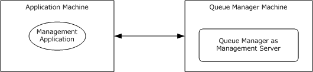

Figure 10: Configure SMB Network Redirector use cases

#### 2.5.6.1 Enable a Transport Protocol on an SMB Network Redirector

**Goal**

To enable a transport protocol on an SMB Network Redirector.

**Context of Use**

The administrator is configuring the SMB Network Redirector and is required to enable a transport protocol.

**Actors**

- Admin tool
The admin tool is the primary actor that triggers this use case. The admin tool is a program that offers management functionality to the administrator through the admin client. Typical admin tools are command-line tools and graphical shells, management utilities, and graphical management programs. The purpose of the admin tool is to correctly interpret, execute, and display the results of the commands that are issued by the administrator.

- Admin client
The admin client is a supporting actor that implements client-side protocol components and consumes the file server administration services that are offered by the file server. The admin client is internal to the File Services Management system.

- SMB Network Redirector
The SMB Network Redirector is a supporting actor that handles requests for remote files and printer operations and uses the Server Message Block (SMB) protocol as access protocol. The SMB Network Redirector also implements server-side protocol components that are used to configure it and that are consumed by the admin client.

- Authentication Services
Authentication Services is the supporting actor that is used for authentication.

**Stakeholders**

- Administrator
The administrator is the person who administers the SMB Network Redirector. The administrator has administrative rights and uses the File Services Management system to provide the SMB File Service.

**Preconditions**

The administrator has identified a remote computer to which a transport protocol is to be enabled. An SMB Network Redirector and the implementation of the Workstation Service Remote Protocol, as described in [MS-WKST](../MS-WKST/MS-WKST.md), is present on the remote computer.

**Main Success Scenario**

- Trigger: The admin tool receives a request from the administrator to enable a transport protocol on an SMB Network Redirector.
- The admin tool establishes a communication channel to the Workstation Service, as described in [MS-WKST] section 2.1.
- The admin tool contacts the Workstation Service by using the **NetrWkstaTransportAdd** method ([MS-WKST] section 3.2.4.5) to enable the SMB Network Redirector to use a transport protocol on a remote computer.
- The Workstation Service enables the provided transport protocol to be used by the SMB Network Redirector.
**Postcondition**

The SMB Network Redirector can use the provided transport protocol.

#### 2.5.6.2 Disable a Transport Protocol on an SMB Network Redirector

**Goal**

To disable a transport protocol on an SMB Network Redirector.

**Context of Use**

The administrator is configuring the SMB Network Redirector and is required to disable a transport protocol.

**Actors**

- Admin tool
The admin tool is the primary actor that triggers this use case. The admin tool is a program that offers management functionality to the administrator through the admin client. Typical admin tools are command-line tools and graphical shells, management utilities, and graphical management programs. The purpose of the admin tool is to correctly interpret, execute, and display the results of the commands that are issued by the administrator.

- Admin client
The admin client is a supporting actor that implements client-side protocol components and consumes the file server administration services that are offered by the file server. The admin client is internal to the File Services Management system.

- SMB Network Redirector
The SMB Network Redirector is a supporting actor that handles requests for remote files and printer operations that use the Server Message Block (SMB) protocol as access protocol. The SMB Network Redirector also implements server-side protocol components that are used to configure it and that are consumed by the admin client.

- Authentication Services
Authentication Services is the supporting actor that is used for authentication purposes.

**Stakeholders**

- Administrator
The administrator is the person who administers the SMB Network Redirector. The administrator has administrative rights and uses the File Services Management system to provide the SMB File Service.

**Preconditions**

The administrator has identified a remote computer to which the administrator can disable a transport protocol. An SMB Network Redirector and the implementation of the Workstation Service Remote Protocol, as described in [MS-WKST](../MS-WKST/MS-WKST.md), are present on the remote computer.

**Main Success Scenario**

- Trigger: The admin tool receives a request from the administrator to disable a transport protocol on an SMB Network Redirector.
- The admin tool establishes a communication channel to the Workstation Service, as described in [MS-WKST] section 2.1.
- The admin tool contacts the Workstation Service by using the **NetrWkstaTransportDel** method, as described in [MS-WKST] section 3.2.4.6, to disable the SMB Network Redirector to use as transport protocol on a remote computer.
- If any open file or printer handles are using the transport protocol that this call tries to disable, the server behavior depends on the value of the *ForceLevel* parameter that is provided by the admin tool. If the admin tool requested a forced deletion, the server forces all open handles to close, and then disables the transport protocol.
**Postcondition**

The SMB Network Redirector can use the provided transport protocol.

**Extensions**

- If any open file or printer handles are using the transport protocol that this call tries to disable, and the admin tool has not requested a forceful deletion:
The call fails, and the transport protocol is not deleted.

#### 2.5.6.3 Get Statistics about an SMB Network Redirector

**Goal**

To get various statistics about the SMB Network Redirector on a remote computer.

**Context of Use**

The administrator is configuring the SMB Network Redirector and is required to get various statistics.

**Actors**

- Admin tool
The admin tool is the primary actor that triggers this use case. The admin tool is a program that offers management functionality to the administrator through the admin client. Typical admin tools are command-line tools and graphical shells, management utilities, and graphical management programs. The purpose of the admin tool is to correctly interpret, execute, and display the results of the commands that are issued by the administrator.

- Admin client
The admin client is a supporting actor that implements client-side protocol components and consumes the file server administration services that are offered by the file server. The admin client is internal to the File Services Management system.

- SMB Network Redirector
The SMB Network Redirector is a supporting actor that handles requests for remote files and printer operations that use SMB as access protocol. The SMB Network Redirector also implements server-side protocol components that are used to configure it and that are consumed by the admin client.

- Authentication Services
Authentication Services is the supporting actor that is used for authentication.

**Stakeholders**

- Administrator
The administrator is the person who administers the SMB Network Redirector. The administrator has administrative rights and uses the File Services Management system to provide the SMB File Service.

**Preconditions**

The administrator has identified an SMB Network Redirector, and the implementation of the Workstation Service Remote Protocol, as described in [MS-WKST](../MS-WKST/MS-WKST.md), is present on the remote computer.

**Main Success Scenario**

- Trigger: The admin tool receives a request from the administrator to get various statistics about the SMB Network Redirector on a remote computer.
- The admin tool establishes a communication channel to the Workstation Service, as described in [MS-WKST] section 2.1.
- The admin tool contacts the Workstation Service by using the **NetrWorkstationStatisticsGet** method ([MS-WKST] section 3.2.4.11) to get various statistics about the SMB Network Redirector on a remote computer.
- The Workstation Service returns the corresponding statistics about the SMB Network Redirector.
**Postcondition**

None.

#### 2.5.6.4 Get Transport Protocols Enabled on an SMB Network Redirector

**Goal**

To enumerate enabled transport protocols on an SMB Network Redirector.

**Context of Use**

The administrator is configuring the SMB Network Redirector and requires information about the transport protocols that are currently enabled for use by the Server Message Block (SMB) network.

**Actors**

- Admin tool
The admin tool is the primary actor that triggers this use case. The admin tool is a program that offers management functionality to the administrator through the admin client. Typical admin tools are command-line tools and graphical shells, management utilities, and graphical management programs. The purpose of the admin tool is to correctly interpret, execute, and display the results of the commands that are issued by the administrator.

- Admin client
The admin client is a supporting actor that implements client-side protocol components and consumes the file server administration services that are offered by the file server. The admin client is internal to the File Services Management system.

- SMB Network Redirector
The SMB Network Redirector is a supporting actor that handles requests for remote files and printer operations that use SMB as access protocol. The SMB Network Redirector also implements server-side protocol components that are used to configure it and that are consumed by the admin client.

- Authentication Services
Authentication Services is the supporting actor that is used for authentication.

**Stakeholders**

- Administrator
The administrator is the person who administers the SMB Network Redirector. The administrator has administrative rights and uses the File Services Management system to provide the SMB File Service.

**Preconditions**

The administrator has identified an SMB Network Redirector, and the implementation of the Workstation Service Remote Protocol, as described in [MS-WKST](../MS-WKST/MS-WKST.md), is present on the remote computer.

**Main Success Scenario**

- Trigger: The admin tool receives a request from the administrator to enumerate the enabled transport protocols on an SMB Network Redirector.
- The admin tool establishes a communication channel to the Workstation Service, as described in [MS-WKST] section 2.1.
- The admin tool contacts Workstation Service by using the **NetrWkstaTransportEnum** method ([MS-WKST] section 3.2.4.4) to enumerate the transport protocol that is enabled on the SMB Network Redirector.
- The Workstation Service provides the transport protocols that are enabled on the SMB Network Redirector.
**Postcondition**

None.

## 2.6 Versioning, Capability Negotiation, and Extensibility

### 2.6.1 Remote Administration Protocol

The current File Services Management system evolved from earlier systems for remote file access, including the Microsoft LAN Manager. These early systems did not have a general RPC transport available to them, and instead defined protocol-specific methods for encoding what would later be understood to be remote function calls. The Remote Administration Protocol, as described in [MS-RAP](#Section_2.6.1), is such a protocol.

With the introduction of the Microsoft Windows NT 3.1 operating system, an RPC transport, as described in [MS-RPCE](../MS-RPCE/MS-RPCE.md), became available to implementers of the File Services Management system. Rather than continuing to extend the Remote Administration Protocol, the new Server Service Remote Protocol [MS-SRVS](../MS-SRVS/MS-SRVS.md) was defined. It replaces the use of the Remote Administration Protocol within the File Services Management system between clients and servers, which is based on the new platforms. Support for the Remote Administration Protocol was maintained however, for interoperability with pre-RPC platforms that include the Microsoft Windows 95 operating system.

In the Windows 7 operating system, the Remote Administration Protocol is deprecated. It can only be used to enumerate file shares.

### 2.6.2 File Replication Service

The File Replication Service (FRS), as described in [MS-FRS1](../MS-FRS1/MS-FRS1.md), is a technology that was originally introduced in the Microsoft Windows 2000 Server operating system to replicate Distributed File System (DFS) folders and the SYSVOL folder on domain controllers. Starting with the Windows Server 2003 R2 operating system, Microsoft began to phase out the use of FRS. In the Windows Server 2003 R2 operating system, the DFS Replication (DFS-R) Service replaced FRS for replication of DFS folders, although FRS was still used to replicate the SYSVOL folder on domain controllers and could be configured to run on other custom folders.

In the Windows Server 2008 operating system, DFS Replication replaced FRS for replicating the SYSVOL folder in domains that use the Windows Server 2008 domain functional level. In Windows Server 2008 R2 operating system, FRS can be used only to replicate the SYSVOL folder on domain controllers in domains that use the Windows Server 2003 operating system or the Windows 2000 Server domain functional levels.

## 2.7 Error Handling

### 2.7.1 Connection Disconnected

A common failure scenario is an unexpected breakdown of the connection between the system and external entities. A disconnection can be caused when the network is not available or when one of the communicating participants has become unavailable. In the case where the network is not available, both participants remain active and expect the other party to continue the communication pattern of the protocol in use at the time of the failure. Similarly, in the case where one of the participants is not available, the active participant expects the communication to proceed as specified by the protocol in use.

Generally, a protocol detects a breakdown connection through one of the following methods:

- Use of a timer object that generates an event if the corresponding participant has not responded within a reasonable time span.
- Notification by the underlying protocol that the connection is disconnected.
When a connection disconnected event is detected, it causes the protocol to initiate a recovery that can include a breakdown of all related communications and update any necessary data structures to maintain the system state.

Details about how each protocol detects a connection disconnected event and how it behaves under this scenario are provided in the specifications of the member protocols.

### 2.7.2 Internal Failures

The File Service Management system does not defend against internal failures of its state, other than those that are described in the specifications of the member protocols. The components that comprise the system mutually determine that each is authoritative at all times.

## 2.8 Coherency Requirements

Each File Services Management protocol provides its own coherency mechanisms. There are no coherence mechanisms among dissimilar protocols. Because coherency mechanisms among similar protocols are specified in the individual protocol documents, there are no system-level coherency requirements.

## 2.9 Security

Versioning of security is handled by the underlying RPC transport. For more information, see Remote Procedure Call Protocol Extensions ([MS-RPCE](../MS-RPCE/MS-RPCE.md) section 3.3.3).

## 2.10 Additional Considerations

The following table specifies the RPC transport that is used by each member protocol.

| Protocol name | RPC binding |
| --- | --- |
| File Replication Service Protocol [MS-FRS1](../MS-FRS1/MS-FRS1.md) | ncacn_ip_tcp |
| Distributed File System Replication Protocol [MS-FRS2](../MS-FRS2/MS-FRS2.md) | ncacn_ip_tcp |
| Distributed File System (DFS): Namespace Management Protocol [MS-DFSNM](../MS-DFSNM/MS-DFSNM.md) | ncacn_np |
| Workstation Service Remote Protocol [MS-WKST](../MS-WKST/MS-WKST.md) | ncacn_np |
| Server Service Remote Protocol [MS-SRVS](../MS-SRVS/MS-SRVS.md) | ncacn_np |
| DFS Replication Helper Protocol [MS-DFSRH](../MS-DFSRH/MS-DFSRH.md) | ncacn_ip_tcp |
| File Server Resource Manager Protocol [MS-FSRM](../MS-FSRM/MS-FSRM.md) | ncacn_ip_tcp |

For more details on RPC binding, see [MS-RPCE](../MS-RPCE/MS-RPCE.md) section 2.1.

# 3 Examples

## 3.1 Example 1: Creating an SMB Share

This example demonstrates the use cases that are described in section [2.5.1.1](#Section_2.5.1.1).

The sequence in this example describes how the application creates an SMB share at a given path in the object store of a given server.

**Prerequisites**

- The participating client and server computers are configured to belong to the same Active Directory domain.
- The admin tool has acquired an RPC calling context by using the procedure, as described in [MS-SRVS](../MS-SRVS/MS-SRVS.md) section 2.1.
- The specific path that is to be provisioned for remote access must exist in the local object store of the file server.
**Initial System State**

A share with the specified share name does not exist on the server computer.

**Final System State**

A share with the specified share name is created on the server computer.

The following sequence diagram shows the creation of a share on the SMB server by the admin tool.

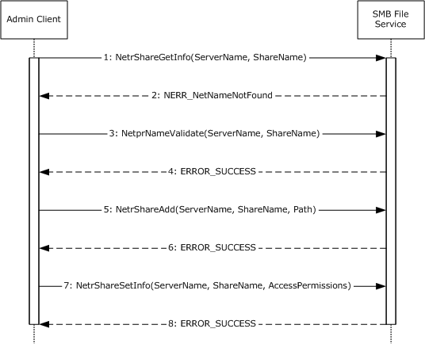

Figure 11: Sequence diagram for creating an SMB share

Sequence of Events

- The admin client calls the **NetrShareGetInfo** method ([MS-SRVS] section 3.1.4.10). It specifies the share name and server name to check if a share with the given name exists.
- The SMB File Service returns the **NERR_NetNameNotFound** error code to indicate that the share with the given name does not exist.
- The admin client invokes the **NetprNameValidate** method ([MS-SRVS] section 3.1.4.32) to check the share name.
- The SMB File Service returns a success code.
- The admin client calls the **NetrShareAdd** method ([MS-SRVS] section 3.1.4.7). It specifies the share name, local object store path, and various options that are provided by the caller.
- The SMB File Service returns a success code.
- The admin client calls the **NetrShareSetInfo** method ([MS-SRVS] section 3.1.4.11). It specifies the share name and the access permissions.
- The SMB File Service returns a success code.

## 3.2 Example 2: Deleting an SMB Share

This example demonstrates the use cases described in section [2.5.1.4](#Section_2.5.1.4).

The sequence in this example describes how the application deletes an SMB share from a given server.

**Prerequisites**

- The admin tool has acquired an RPC calling context.
**Initial System State**

None.

**Final System State**

The specified share is removed from the list of shares that are available from that server.

The following sequence diagram shows the steps to delete an SMB share.

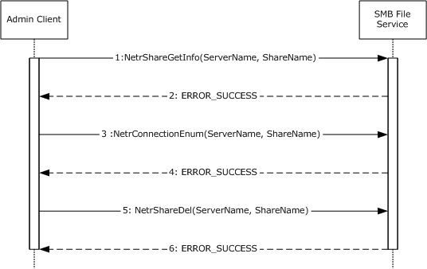

Figure 12: Sequence diagram for deleting an SMB share

**Sequence of Events**

- The admin client calls the **NetrShareGetInfo** method ([MS-SRVS](../MS-SRVS/MS-SRVS.md) section 3.1.4.10). It specifies the share name and server name to check if the share exists.
- The SMB File Service returns ERROR_SUCCESS to confirm that the share exists.
- The admin client calls the **NetrConnectionEnum** method ([MS-SRVS] section 3.1.4.1) to check if the share is currently accessed.
- The SMB File Service returns a success code with **TotalEntries** as 0 to indicate that the share is not currently accessed.
- The admin client calls the **NetrShareDel** method ([MS-SRVS] section 3.1.4.12) after checking that the share is not in use.
- The SMB File Service removes the share name from the share list and returns a success code to the admin client.
In Windows-based implementations, the Shared Folders snap-in is used as the admin tool to centrally manage file shares on a computer. The Shared Folders snap-in calls the **NetrShareEnum** method ([MS-SRVS] section 3.1.4.8) to enumerate the share entries in the **ShareList**.

## 3.3 Example 3: Creating and Managing a DFS Domain Namespace

This example demonstrates the use cases described in section [2.5.2.2](#Section_2.5.2.2), section [2.5.2.3](#Section_2.5.2.3), and section [2.5.2.4](#Section_2.5.2.4).

**Prerequisites**

- The participating client and server computers are configured to belong to the same Active Directory domain.
- A share is created on the file server.
- Clients and Distributed File System (DFS) servers have access to the Active Directory system that is provided by the domain.
- The application has acquired a remote procedure call (RPC) calling context for DFS Service by using the procedure as described in [MS-DFSNM](../MS-DFSNM/MS-DFSNM.md) section 2.1.
- The application has acquired an RPC calling context for File Replication Service (FRS) Service by using the procedure as described in [MS-DFSRH](../MS-DFSRH/MS-DFSRH.md) section 2.1.
**Initial System State**

None.

**Final System State**

The specified local path on the file server functions as a DFS namespace with a single link.

This example is divided into three tasks:

- Creating a DFS domain namespace
- Creating a DFS link
- Creating a replication group
The following sequence diagram shows the steps to create and manage a DFS domain namespace.

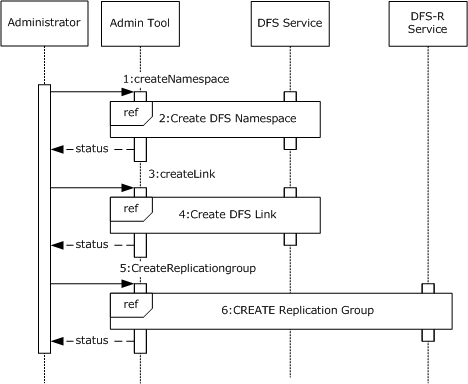

Figure 13: Sequence diagram for creating and managing a namespace

- **CreateNamespace:** The administrator requests that the admin tool creates a DFS namespace on the previously configured SMB share. The admin tool specifies the server, the share name, and various other options that are specific to the creation of the namespace.
- **Create DFS Namespace:** The admin tool makes use of the admin client to create a DFS namespace. The sequence of steps is described in Task 1: Creating a DFS domain namespace.
- **CreateLink:** The administrator requests that the admin tool create a DFS link in the DFS namespace. The admin tool specifies the server and share name of the namespace, the path at which the link is created, the target of the link, and various other options that are specific to creating the link.
- **Create DFS Link:** The admin tool makes use of the admin client to create a DFS link. The sequence of steps is described in Task 2: Creating a DFS Link.
- **CreateReplicationGroup (Optional):** The administrator requests that the admin tool creates an FRS replica group. It specifies the domain controller and the group members.
- **Create DFS-R Replication group (Optional):** The admin tool makes use of the admin client to create a replication group. The sequence of steps is described in Task 3: Creating a Replication Group (Optional).
Note: The admin tool uses the **NetrDfsEnum** method ([MS-DFSNM] section 3.1.4.1.7), or the **NetrDfsEnumEx** method ([MS-DFSNM] section 3.1.4.2.3) to enumerate the DFS root that is hosted on a server or the DFS links of the namespace that are hosted by a server. The admin tool calls the **NetrDfsManagerGetVersion** method ([MS-DFSNM] section 3.1.4.1.2) to determine the enumeration method to use. The admin tool calls these enumeration methods multiple times to refresh its list.

**Task 1: Creating a DFS Domain Namespace**

The following example describes the steps that are used to create a DFS domain namespace. The DFS service that is used in this example resides on the root target server.

The following sequence diagram shows the steps to create a DFS domain namespace.

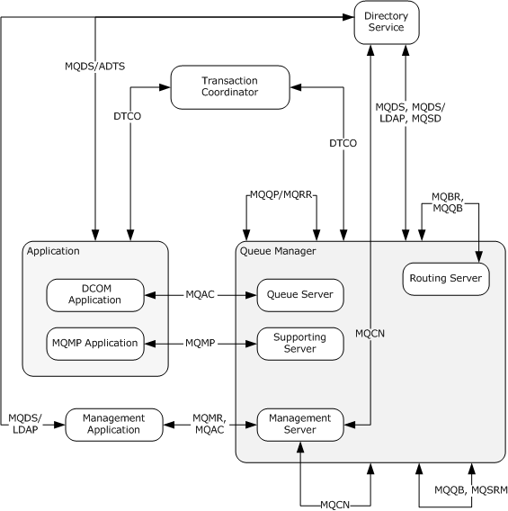

Figure 14: Sequence diagram for creating a DFS domain namespace

- The admin client calls the **NetrDfsAddRootTarget** method ([MS-DFSNM] section 3.1.4.1.9). The admin client specifies the server, the share to host the namespace, and various options that are provided by the administrator.<1>
- The DFS Service creates a new DFS namespace Lightweight Directory Access Protocol (LDAP) entry with the DFS namespace anchor LDAP entry as its parent. The server also creates the DFS metadata that is required for the new DFS namespace and updates the DFS metadata in the object that corresponds to the DFS namespace. This update appears as an LDAP Add operation to the domain controller.
- The DFS metadata write operation is successful, and the domain controller returns LDAP_SUCCESS to indicate success.
- The DFS Service completes the **NetrDfsAddRootTarget** method and returns a success code to the admin client.
**Task 2: Creating a DFS Link**

The following example describes the steps that are used to add a new DFS link to an existing domainv2-based DFS namespace with one root target. The DFS service that is used in this example resides on the root target server.

The following sequence diagram shows the steps to add a DFS link.

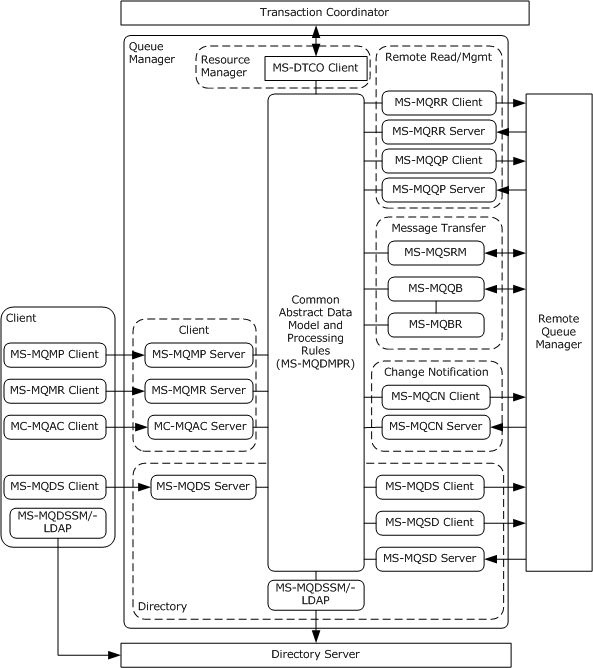

Figure 15: Sequence diagram for adding a DFS link

- The admin tool requests the admin client to create the given DFS link in the DFS namespace, which is hosted by the server that is identified in the RPC calling context. The admin client calls the **NetrDfsAdd** method ([MS-DFSNM] section 3.1.4.1.3) that specifies the link path, target, and other options.
- The DFS service verifies the existence of the namespace name and the link ([MS-DFSNM] section 3.1.4.1.3).
- The DFS service issues an LDAP Add request to the domain controller with the updated DFS metadata that contains the new DFS link information for a domainv2-based DFS namespace ([MS-DFSNM] section 3.1.4.1.3).
- The LDAP Add operation is successful and the LDAP server returns an LDAP_SUCCESS message to the DFS service.
- The **NetrDfsAdd** method that is invoked by the admin client finishes successfully. The DFS service returns a success code to the admin client.
**Task 3: Creating a Replication Group (Optional)**

The following example describes the steps to create a replication group on a domain controller.

The following sequence diagram shows the steps to create a replication group.

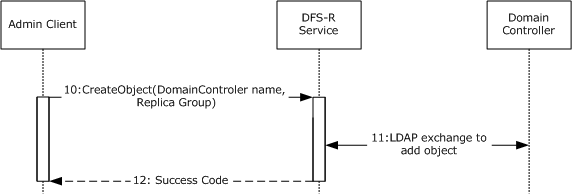

Figure 16: Sequence diagram for creating a replication group

- The admin client calls the **CreateObject** method of the DFS-R Service that passes the domain controller name and the replica members by using the **IADProxy::CreateObject** method<2>, as described in [MS-DFSRH] section 3.1.5.2.1, or by using the **IADProxy2::CreateObject** method ([MS-DFSRH] section 3.1.5.3.1).
- The DFS-R Service uses LDAP messages to create the replication object on the domain controller ([MS-DFSRH] section 3.1.5.2.1).
- After getting the success response from the domain controller, the DFS-R Service sends a success code to the admin client.

## 3.4 Example 4: Creating an FSRM File Screen

This example demonstrates the use cases described in section [2.5.4.3](#Section_2.5.4.3).

This example describes the creation of a File Server Resource Manager (FSRM) file screen at a given path in the object store of a given server by the admin tool.

**Prerequisites**

- The admin tool has acquired an RPC calling context that provides the FSRM server ([MS-FSRM](../MS-FSRM/MS-FSRM.md) section 2.1).
**Initial System State**

The participating client and server computers are configured to belong to the same Active Directory domain.

The following sequence diagram shows the steps to create an FSRM file screen.

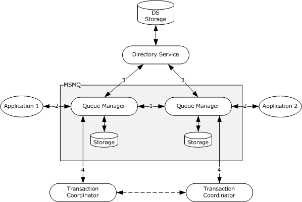

Figure 17: Sequence diagram for creating an FSRM file screen

**Sequence of Events**

- The admin tool requests that the admin client creates the given file screen by specifying the RPC calling context, the server, the local object store path, and the file group. The admin client queries the server to determine if there is an existing file screen that is specified on the object store path. To do this, it calls the **IFsrmFileScreenManager::GetFileScreen** method ([MS-FSRM] section 3.2.4.2.29.4). The server does not return any **IFsrmFileScreen** object ([MS-FSRM] section 3.2.4.2.27).
- The admin client creates an empty **IFsrmFileScreen** object by using the **IFsrmFileScreenManager::CreateFileScreen** method ([MS-FSRM] section 3.2.4.2.29.3). The FSRM Service returns the reference to a newly created **IFsrmFileScreen** object.
- The admin client acquires an **IFsrmCommittableCollection** object, which contains a pointer to every file group on the server, by using the **IFsrmFileGroupManager::EnumFileGroups** method ([MS-FSRM], section 3.2.4.2.25.3). The FSRM Service returns the **IFsrmCommittableCollection** object and a status code.
- The admin client enumerates the names of each of the file groups that are returned in the step 3, by using the **IFsrmFileGroup::Name(get)** method ([MS-FSRM], section 3.2.4.2.23.2). The server returns the name of the file group.
- The admin client acquires the **IFsrmMutableCollection** object from the file screen, to which it adds the caller-specified file group, by using the **IFsrmFileScreenBase::BlockedFileGroups(get)** method ([MS-FSRM] section 3.2.4.2.26.1). The FSRM Service returns the **IFsrmMutableCollection** object and a status code.
- The admin client, by using the acquired collection object, adds the requested file group to the collection by using the **IFsrmMutableCollection::Add** method ([MS-FSRM] section 3.2.4.2.2.1). The FSRM Service returns a success code.
- The admin client places the modified collection object in the file screen, by using the **IFsrmFileScreenBase::BlockedFileGroups(put)** method ([MS-FSRM] section 3.2.4.2.26.2). The FSRM Service returns a success code.
- To complete the operation, the admin client instructs the server to commit the modifications to the file screen by using the **IFsrmFileScreen::Commit** method ([MS-FSRM] section 3.2.4.2.27.1). The FSRM Service returns a success code.
**Final System State**

The FSRM Service successfully executes the requested operations, and the specified file screen policy is created on the server.

## 3.5 Example 5: Creating an FSRM Quota

This example demonstrates the use cases described in section [2.5.4.3](#Section_2.5.4.3).

This example describes the creation of a File Server Resource Manager (FSRM) quota at a given path in the object store of a given server by the admin tool.

**Initial System State**

None.

**Prerequisites**

- The participating client and server computers are configured to belong to the same Active Directory domain.
- The admin tool has acquired an RPC calling context that provides the FSRM server ([MS-FSRM](../MS-FSRM/MS-FSRM.md) section 2.1).
**Final System State**

The FSRM Service successfully executes the requested operations, and the specified file quota policy is created on the server.

The following sequence diagram shows the steps to create an FSRM quota.

Figure 18: Sequence diagram for creating an FSRM quota

Sequence of Events

- The admin client queries the server to determine if there is an existing quota that is specified on the object store path. To do this, it calls the **IFsrmQuotaManager::GetQuota** method ([MS-FSRM] section 3.2.4.2.18.5) by retrieving a potentially non-empty existing **IFsrmQuota** object. If an **IFsrmQuota** object is returned, the admin tool determines that no quota is currently configured on the server at the specified path.
- The admin client creates an empty **IFsrmQuota** object by using the **IFsrmQuotaManager::CreateQuota** method ([MS-FSRM] section 3.2.4.2.18.3). The FSRM Service returns the reference to the newly created quota object and a success code.
- The admin client modifies the returned **IFsrmQuota** object to reflect the specified quota limit by using the **IFsrmQuotaBase::QuotaLimit(put)** method ([MS-FSRM] section 3.2.4.2.14.3). The FSRM Service returns a success code.
- To complete the operation, the admin client instructs the server to commit the modifications to the quota by using the **IFsrmQuotaObject::Commit** method ([MS-FSRM] section 3.2.4.2.15.1). The FSRM Service returns a success code.

## 3.6 Example 6: Creating and Configuring a File Management Job

This example demonstrates the use cases described in section [2.5.4.1](#Section_2.5.4.1).

The admin client creates a file management job and configures it.

**Prerequisites**

- The participating client and server computers are configured to belong to the same Active Directory domain.
- The admin tool has acquired an RPC calling context that provides the FSRM server name ([MS-FSRM](../MS-FSRM/MS-FSRM.md) section 1.3).
**Initial System State**

None.

**Final System State**

A file management job is created and configured on the FSRM server.

The following sequence diagram shows the steps to create and configure a file management job.

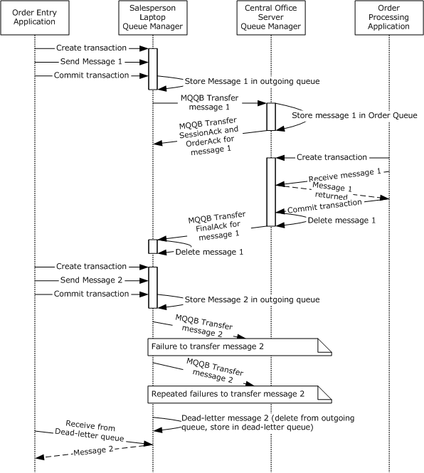

Figure 19: Sequence diagram for creating and configuring a file management job

**Sequence of Events**

- The admin client creates a file management job by calling the **IFsrmFileManagementJobManager::CreateFileManagementJob** method, ([MS-FSRM] section 3.2.4.2.50.2). The FSRM Service returns a pointer to the file management job and returns a success code.
- The admin client sets the **Name** property of the file management job by calling the **IFsrmFileManagementJob::Name(put)** method ([MS-FSRM] section 3.2.4.2.48.3), and the server returns ERROR_SUCCESS.
- The admin client sets the **NamespaceRoot** property of the newly created file management job by calling the **IFsrmFileManagementJob::NamespaceRoot(put)** method ([MS-FSRM] section 3.2.4.2.48.5). The FSRM Service returns a success code.
- The admin client sets the **Enable** property of the newly created file management job by calling the **IFsrmFileManagementJob::Enable(put)** method ([MS-FSRM] section 3.2.4.2.48.7). The FSRM Service returns a success code.
- The admin client sets the **ExpirationDirectory** property for a new namespace by calling the **IFsrmFileManagementJob::ExpirationDirectory(put)** method ([MS-FSRM] section 3.2.4.2.48.110. The FSRM Service returns a success code.
- The admin client sets the Operation type for new namespace by calling the **IFsrmFileManagementJob::OperationType(put)** method ([MS-FSRM] section 3.2.4.2.48.9). The FSRM Service returns a success code.
- The admin client sets the list of report formats that the report job will create when the report job is generated by calling the **IFsrmFileManagementJob::Formats(put)** method ([MS-FSRM] section 3.2.4.2.48.19). The FSRM Service returns a success code.
- The admin client adds a notification period to the file management job's list of notification periods by calling the **IFsrmFileManagementJob::AddNotification** method ([MS-FSRM] section 3.2.4.2.48.44). The FSRM Service returns a success code.
- The admin client calls the **IFsrmFileManagementJob::Task(put)** method ([MS-FSRM] section 3.2.4.2.48.32), with the name of the scheduled task to be used in step 11. The FSRM Service returns a success code.
- The admin client calls the **IFsrmFileManagementJob::Commit** method ([MS-FSRM] section 3.2.4.2.48.1) to commit the modifications to the file management job.
- The admin client creates a scheduled task by calling the **IFsrmReportScheduler::CreateScheduleTask** method ([MS-FSRM] section 3.2.4.2.36.2) to pass in the name as it was used in step 9, namespaces, and serialized text of the task. The FSRM Service returns a success code.

## 3.7 Example 7: Creating a Scheduled Report Job

This example demonstrates the use cases described in section [2.5.4.2](#Section_2.5.4.2).

The admin client creates a report job and configures it.

**Prerequisites**

- The participating client and server computers are configured to belong to the same Active Directory domain.
- The admin tool has acquired an RPC calling context that provides the FSRM server ([MS-FSRM](../MS-FSRM/MS-FSRM.md) section 2.1).
**Initial System State**

None.

**Final System State**

The report job is created and configured.

The following sequence diagram shows the steps to create and configure a scheduled report job.

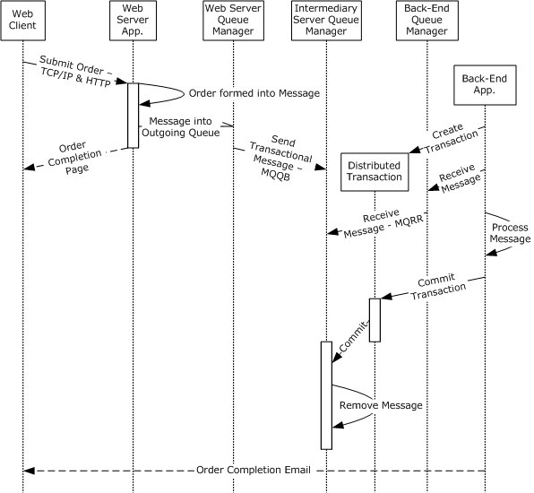

Figure 20: Sequence diagram for creating and configuring a scheduled report job

Sequence of Events

- The admin client creates a report job instance by using the **IFsrmReportManager::CreateReportJob** method ([MS-FSRM] section 3.2.4.2.33.2). The FSRM Service returns a pointer to the created report job and a success code.
- The admin client calls the **IFsrmReportJob::EnumReports** method to enumerate all the reports that are configured for the newly created job. The server returns S_OK upon successful completion ([MS-FSRM] section 3.2.4.2.34.14).
- The admin client creates a report by calling the **IFsrmReportJob::CreateReport** method for each of the report types to add the report to the report job ([MS-FSRM] section 3.2.4.2.34.15). The FSRM Service returns a pointer to the created reports and a success code.
- The admin client sets the filter of the created report objects by calling the **IFsrmReport::SetFilter** method for each report object to set the filter ([MS-FSRM] section 3.2.4.2.35.8). The FSRM Service returns a success code.
- The admin client sets the NamespaceRoots of the newly created Report Job by calling the **IFsrmReportJob::NamespaceRoots(put)** method ([MS-FSRM] section 3.2.4.2.34.5). The FSRM Service returns a success code.
- The admin client sets the list of report formats that the report job creates when the report job is generated by calling the **IFsrmReportJob::Formats(put)** method ([MS-FSRM] section 3.2.4.2.34.7). The FSRM Service returns a success code.
- The admin client sets the email address recipient list to which the reports are emailed when the report job is successfully finished by calling the **IFsrmReportJob::MailTo(put)** method ([MS-FSRM] section 3.2.4.2.34.9). The FSRM Service returns a success code.
- The Admin client calls the **IFsrmReportJob::Task(put)** method ([MS-FSRM] section 3.2.4.2.34.3), with the name of the scheduled task to be used in step 11. The FSRM Service returns a success code.
- The admin client persists the report by calling the **IFsrmReportJob::Commit** method ([MS-FSRM] section 3.2.4.2.34.1). The FSRM Service returns a success code.
- The admin client calls the **IFsrmReportJob::WaitForCompletion** method to wait until report task is finished ([MS-FSRM] section 3.2.4.2.34.17). The FSRM Service returns a success code.
- The admin client calls the **IFsrmReportScheduler::CreateScheduleTask** method ([MS-FSRM] section 3.2.4.2.36.2) that passes in the name, namespaces as used in step 8, and serialized text for the task. The FSRM Service returns a success code.

## 3.8 Example 8: Client Cannot Connect to a DFS Service

This example demonstrates extension 1 of the use case described in section [2.5.2.1](#Section_2.5.2.1).

The admin client tries to establish a connection to the Distributed File System (DFS) Service to create a namespace and does not get a response from the DFS Service.

**Prerequisites**

The prerequisites are described in [MS-DFSNM](../MS-DFSNM/MS-DFSNM.md) section 1.5.

**Initial System State**

None.

**Final System State**

None.

The following sequence diagram shows the steps for the RPC bind calling context of the DFS Service.

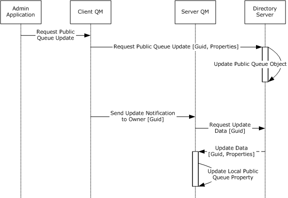

Figure 21: Sequence diagram for showing an RPC bind operation with a No Response error message

**Sequence of Events**

- The admin tool uses the identified server to request that the admin client binds the RPC calling context.
- The admin client initiates the bind operation by using the procedure ([MS-DFSNM] section 2.1).
- The admin client does not get a response from the server. After the admin client waits for a time-out period, it sends the error message to the admin tool.

# 4 Microsoft Implementations

There are no variations in the behavior of the File Access Services System in different versions of Windows beyond those described in the specifications of the protocols supported by the system, as listed in section [2.2](#Section_2.2).

The information in this specification is applicable to the following Microsoft products:

- Windows 95 operating system
- Windows NT operating system
- Windows NT 3.1 operating system
- Windows NT 4.0 operating system
- Windows NT Server 4.0 operating system
- Windows 2000 operating system
- Windows 2000 Server operating system
- Windows 2000 Advanced Server operating system
- Windows XP operating system
- Windows Server 2003 operating system
- Windows Server 2003 R2 operating system
- Windows Vista operating system
- Windows Server 2008 operating system
- Windows 7 operating system
- Windows Server 2008 R2 operating system
- Windows 8 operating system
- Windows Server 2012 operating system
- Windows 8.1 operating system
- Windows Server 2012 R2 operating system
- Windows 10 operating system
- Windows Server 2016 operating system
- Windows Server operating system
- Windows Server 2019 operating system
- Windows Server 2022 operating system
- Windows 11 operating system
Exceptions, if any, are noted below. If a service pack number appears with the product version, behavior changed in that service pack. The new behavior also applies to subsequent service packs of the product unless otherwise specified.

## 4.1 Product Behavior

<1> Section 3.3: The **NetrDfsAddRootTarget** method is not supported on the following: Windows NT, Windows NT Server 4.0, Windows 2000 Server, Windows Server 2003, and Windows Server 2003 R2. The Windows client uses the **NetrDfsAddRootTarget** method to create the domain-based namespace if a user has enabled Windows 2008 mode. Otherwise, it uses the **NetrDfsAddFtRoot** method.

<2> Section 3.3: In Windows, the DFS Management snap-in is used as the admin tool. When a domain administrator uses the DFS Management snap-in to create a replication group object, the **IADProxy::CreateObject** method is not used; instead, a direct LDAP call is used to create the replication group object.

# 5 Change Tracking

This section identifies changes that were made to this document since the last release. Changes are classified as Major, Minor, or None.

The revision class **Major** means that the technical content in the document was significantly revised. Major changes affect protocol interoperability or implementation. Examples of major changes are:

- A document revision that incorporates changes to interoperability requirements.
- A document revision that captures changes to protocol functionality.
The revision class **Minor** means that the meaning of the technical content was clarified. Minor changes do not affect protocol interoperability or implementation. Examples of minor changes are updates to clarify ambiguity at the sentence, paragraph, or table level.

The revision class **None** means that no new technical changes were introduced. Minor editorial and formatting changes may have been made, but the relevant technical content is identical to the last released version.

The changes made to this document are listed in the following table. For more information, please contact [dochelp@microsoft.com](mailto:dochelp@microsoft.com).

| Section | Description | Revision class |
| --- | --- | --- |
| [4](#Section_4) Microsoft Implementations | Updated for this version of Windows client. | Major |

## Revision History

| Date | Version | Revision Class | Comments |
| --- | --- | --- | --- |
| 12/16/2011 | 1.0 | New | Released new document. |
| 3/30/2012 | 2.0 | Major | Updated and revised the technical content. |
| 7/12/2012 | 2.0 | None | No changes to the meaning, language, or formatting of the technical content. |
| 10/25/2012 | 2.0 | None | No changes to the meaning, language, or formatting of the technical content. |
| 1/31/2013 | 2.0 | None | No changes to the meaning, language, or formatting of the technical content. |
| 8/8/2013 | 3.0 | Major | Updated and revised the technical content. |
| 11/14/2013 | 4.0 | Major | Updated and revised the technical content. |
| 2/13/2014 | 4.0 | None | No changes to the meaning, language, or formatting of the technical content. |
| 5/15/2014 | 4.0 | None | No changes to the meaning, language, or formatting of the technical content. |
| 6/30/2015 | 5.0 | Major | Significantly changed the technical content. |
| 10/16/2015 | 5.0 | None | No changes to the meaning, language, or formatting of the technical content. |
| 9/26/2016 | 5.0 | None | No changes to the meaning, language, or formatting of the technical content. |
| 6/1/2017 | 5.0 | None | No changes to the meaning, language, or formatting of the technical content. |
| 12/15/2017 | 6.0 | Major | Significantly changed the technical content. |
| 11/5/2018 | 7.0 | Major | Significantly changed the technical content. |
| 6/3/2021 | 8.0 | Major | Significantly changed the technical content. |
| 10/26/2021 | 9.0 | Major | Significantly changed the technical content. |
