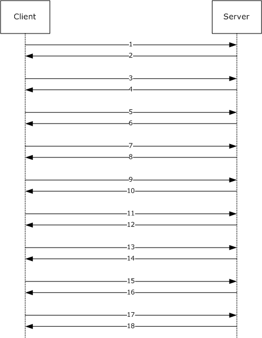
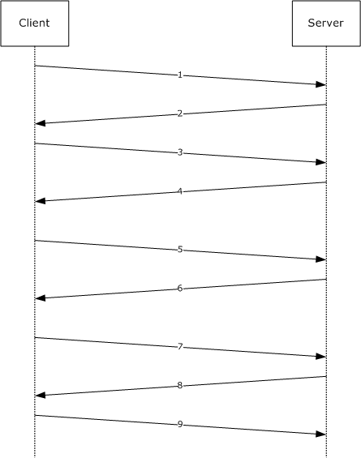
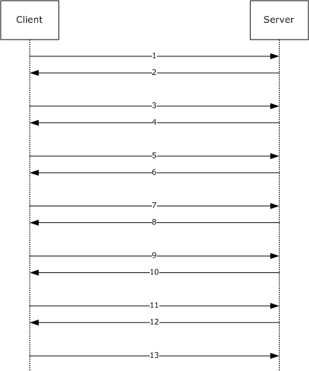
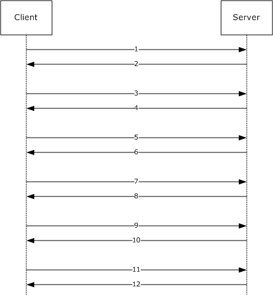
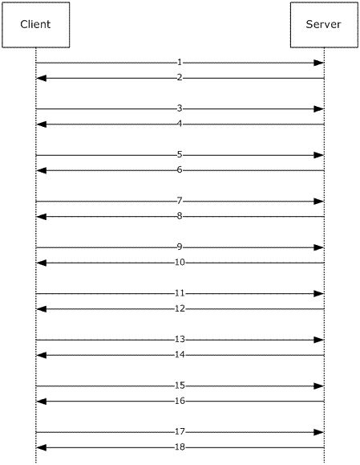
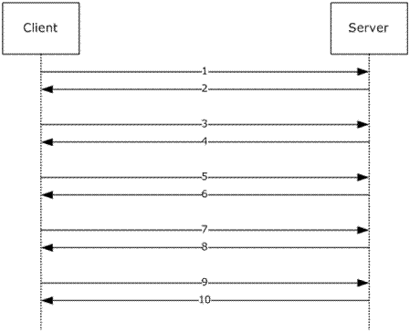
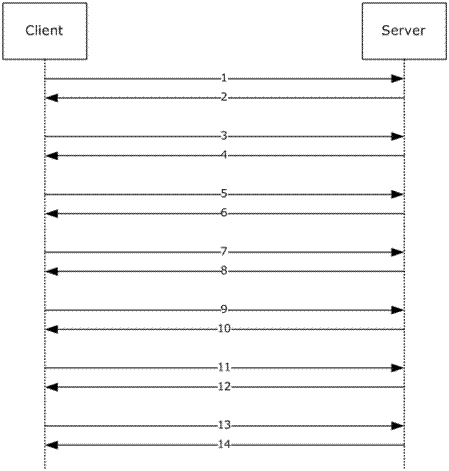
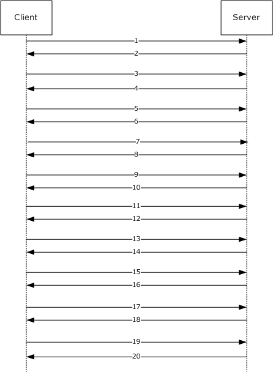

# [MS-FSRM]: File Server Resource Manager Protocol

Table of Contents

1 Introduction

- [1 Introduction](#Section_1)
  - [1.1 Glossary](#Section_1.1)
  - [1.2 References](#Section_1.2)
    - [1.2.1 Normative References](#Section_1.2.1)
    - [1.2.2 Informative References](#Section_1.2.2)
  - [1.3 Overview](#Section_1.3)
  - [1.4 Relationship to Other Protocols](#Section_1.4)
  - [1.5 Prerequisites/Preconditions](#Section_1.5)
  - [1.6 Applicability Statement](#Section_1.6)
  - [1.7 Versioning and Capability Negotiation](#Section_1.7)
  - [1.8 Vendor-Extensible Fields](#Section_1.8)
  - [1.9 Standards Assignments](#Section_1.9)

2 Messages

- [2 Messages](#Section_2)
  - [2.1 Transport](#Section_2.1)
  - [2.2 Message Syntax](#Section_2.2)
    - [2.2.1 Common Data Types](#Section_2.2.1)
      - [2.2.1.1 Data Types](#Section_2.2.1.1)
        - [2.2.1.1.1 FSRM_OBJECT_ID](#Section_2.2.1.1.1)
        - [2.2.1.1.2 FSRM_QUOTA_THRESHOLD](#Section_2.2.1.1.2)
      - [2.2.1.2 Enumerations](#Section_2.2.1.2)
        - [2.2.1.2.1 FsrmQuotaFlags](#Section_2.2.1.2.1)
        - [2.2.1.2.2 FsrmFileScreenFlags](#Section_2.2.1.2.2)
        - [2.2.1.2.3 FsrmRuleFlags](#Section_2.2.1.2.3)
        - [2.2.1.2.4 FsrmCollectionState](#Section_2.2.1.2.4)
        - [2.2.1.2.5 FsrmEnumOptions](#Section_2.2.1.2.5)
        - [2.2.1.2.6 FsrmCommitOptions](#Section_2.2.1.2.6)
        - [2.2.1.2.7 FsrmTemplateApplyOptions](#Section_2.2.1.2.7)
        - [2.2.1.2.8 FsrmAccountType](#Section_2.2.1.2.8)
        - [2.2.1.2.9 FsrmActionType](#Section_2.2.1.2.9)
        - [2.2.1.2.10 FsrmReportType](#Section_2.2.1.2.10)
        - [2.2.1.2.11 FsrmRuleType](#Section_2.2.1.2.11)
        - [2.2.1.2.12 FsrmPipelineModuleType](#Section_2.2.1.2.12)
        - [2.2.1.2.13 FsrmReportRunningStatus](#Section_2.2.1.2.13)
        - [2.2.1.2.14 FsrmReportFormat](#Section_2.2.1.2.14)
        - [2.2.1.2.15 FsrmReportGenerationContext](#Section_2.2.1.2.15)
        - [2.2.1.2.16 FsrmReportFilter](#Section_2.2.1.2.16)
        - [2.2.1.2.17 FsrmReportLimit](#Section_2.2.1.2.17)
        - [2.2.1.2.18 AdsCacheFlags](#Section_2.2.1.2.18)
        - [2.2.1.2.19 AdsCachePropertyFlags](#Section_2.2.1.2.19)
        - [2.2.1.2.20 FCI_ADS_SECURE_PROPERTY_TYPE](#Section_2.2.1.2.20)
      - [2.2.1.3 Structures](#Section_2.2.1.3)
    - [2.2.2 Interface-Specific Data Types](#Section_2.2.2)
      - [2.2.2.1 IFsrmActionEventLog Data Types](#Section_2.2.2.1)
        - [2.2.2.1.1 Enumerations](#Section_2.2.2.1.1)
          - [2.2.2.1.1.1 FsrmEventType](#Section_2.2.2.1.1.1)
      - [2.2.2.2 IFsrmAutoApplyQuota Data Types](#Section_2.2.2.2)
        - [2.2.2.2.1 Data Types](#Section_2.2.2.2.1)
          - [2.2.2.2.1.1 FsrmMaxExcludeFolders](#Section_2.2.2.2.1.1)
      - [2.2.2.3 IFsrmPropertyDefinition Data Types](#Section_2.2.2.3)
        - [2.2.2.3.1 Enumerations](#Section_2.2.2.3.1)
          - [2.2.2.3.1.1 FsrmPropertyDefinitionType](#Section_2.2.2.3.1.1)
      - [2.2.2.4 IFsrmPropertyDefinition2 Data Types](#Section_2.2.2.4)
        - [2.2.2.4.1 Enumerations](#Section_2.2.2.4.1)
          - [2.2.2.4.1.1 FsrmPropertyDefinitionFlags](#Section_2.2.2.4.1.1)
          - [2.2.2.4.1.2 FsrmPropertyDefinitionAppliesTo](#Section_2.2.2.4.1.2)
      - [2.2.2.5 IFsrmClassificationRule Data Types](#Section_2.2.2.5)
        - [2.2.2.5.1 Enumerations](#Section_2.2.2.5.1)
          - [2.2.2.5.1.1 FsrmExecutionOption](#Section_2.2.2.5.1.1)
          - [2.2.2.5.1.2 FsrmGetFilePropertyOptions](#Section_2.2.2.5.1.2)
      - [2.2.2.6 IFsrmProperty Data Types](#Section_2.2.2.6)
        - [2.2.2.6.1 Enumerations](#Section_2.2.2.6.1)
          - [2.2.2.6.1.1 FsrmPropertyFlags](#Section_2.2.2.6.1.1)
      - [2.2.2.7 IFsrmClassificationManager Data Types](#Section_2.2.2.7)
        - [2.2.2.7.1 Enumerations](#Section_2.2.2.7.1)
          - [2.2.2.7.1.1 FsrmClassificationLoggingFlags](#Section_2.2.2.7.1.1)
      - [2.2.2.8 IFsrmStorageModuleDefinition Data Types](#Section_2.2.2.8)
        - [2.2.2.8.1 Enumerations](#Section_2.2.2.8.1)
          - [2.2.2.8.1.1 FsrmStorageModuleCaps](#Section_2.2.2.8.1.1)
          - [2.2.2.8.1.2 FsrmStorageModuleType](#Section_2.2.2.8.1.2)
      - [2.2.2.9 IFsrmFileManagementJob Data Types](#Section_2.2.2.9)
        - [2.2.2.9.1 Enumerations](#Section_2.2.2.9.1)
          - [2.2.2.9.1.1 FsrmFileManagementType](#Section_2.2.2.9.1.1)
          - [2.2.2.9.1.2 FsrmFileManagementLoggingFlags](#Section_2.2.2.9.1.2)
      - [2.2.2.10 IFsrmPropertyCondition Data Types](#Section_2.2.2.10)
        - [2.2.2.10.1 Enumerations](#Section_2.2.2.10.1)
          - [2.2.2.10.1.1 FsrmPropertyConditionType](#Section_2.2.2.10.1.1)
    - [2.2.3 XML Import and Export Formats](#Section_2.2.3)
      - [2.2.3.1 XML Data Types](#Section_2.2.3.1)
        - [2.2.3.1.1 Standard Data Types](#Section_2.2.3.1.1)
        - [2.2.3.1.2 guidType Simple Type](#Section_2.2.3.1.2)
      - [2.2.3.2 XML Schema](#Section_2.2.3.2)
        - [2.2.3.2.1 Action Element](#Section_2.2.3.2.1)
        - [2.2.3.2.2 DatascreenTemplate Element](#Section_2.2.3.2.2)
        - [2.2.3.2.3 FileGroup Element](#Section_2.2.3.2.3)
        - [2.2.3.2.4 QuotaTemplate Element](#Section_2.2.3.2.4)
    - [2.2.4 Error Codes](#Section_2.2.4)
  - [2.3 Directory Service Schema Elements](#Section_2.3)
    - [2.3.1 Interaction Summary](#Section_2.3.1)
    - [2.3.2 Resource Property Lists](#Section_2.3.2)
    - [2.3.3 Resource Properties](#Section_2.3.3)
    - [2.3.4 ValueType References of msDS-ValueTypeReference](#Section_2.3.4)
    - [2.3.5 XML Schema of msDS-ClaimPossibleValues](#Section_2.3.5)

3 Protocol Details

- [3 Protocol Details](#Section_3)
  - [3.1 Client Role Details](#Section_3.1)
    - [3.1.1 Abstract Data Model](#Section_3.1.1)
    - [3.1.2 Timers](#Section_3.1.2)
    - [3.1.3 Initialization](#Section_3.1.3)
    - [3.1.4 Message Processing Events and Sequencing Rules](#Section_3.1.4)
      - [3.1.4.1 Processing Server Replies to Method Calls](#Section_3.1.4.1)
        - [3.1.4.1.1 File Server Resource Manager Protocol Object Relationships](#Section_3.1.4.1.1)
        - [3.1.4.1.2 Quota Objects](#Section_3.1.4.1.2)
        - [3.1.4.1.3 File Screen Objects](#Section_3.1.4.1.3)
        - [3.1.4.1.4 Storage Report Objects](#Section_3.1.4.1.4)
        - [3.1.4.1.5 Classification Objects](#Section_3.1.4.1.5)
        - [3.1.4.1.6 File Management Job Objects](#Section_3.1.4.1.6)
      - [3.1.4.2 Processing Notifications Sent from the Server to the Client](#Section_3.1.4.2)
    - [3.1.5 Timer Events](#Section_3.1.5)
    - [3.1.6 Other Local Events](#Section_3.1.6)
  - [3.2 Server Role Details](#Section_3.2)
    - [3.2.1 Abstract Data Model](#Section_3.2.1)
      - [3.2.1.1 FSRM Base Object](#Section_3.2.1.1)
      - [3.2.1.2 Quota Model](#Section_3.2.1.2)
        - [3.2.1.2.1 Directory Quotas](#Section_3.2.1.2.1)
          - [3.2.1.2.1.1 Persisted Directory Quota](#Section_3.2.1.2.1.1)
          - [3.2.1.2.1.2 Non-Persisted Directory Quota Instance](#Section_3.2.1.2.1.2)
        - [3.2.1.2.2 Auto Apply Quotas](#Section_3.2.1.2.2)
          - [3.2.1.2.2.1 Persisted Auto Apply Quota](#Section_3.2.1.2.2.1)
          - [3.2.1.2.2.2 Non-Persisted Auto Apply Quota Instance](#Section_3.2.1.2.2.2)
        - [3.2.1.2.3 Directory Quota Templates](#Section_3.2.1.2.3)
          - [3.2.1.2.3.1 Persisted Directory Quota Template](#Section_3.2.1.2.3.1)
          - [3.2.1.2.3.2 Non-Persisted Directory Quota Template Instance](#Section_3.2.1.2.3.2)
      - [3.2.1.3 File Screen Model](#Section_3.2.1.3)
        - [3.2.1.3.1 File Screens](#Section_3.2.1.3.1)
          - [3.2.1.3.1.1 Persisted File Screen](#Section_3.2.1.3.1.1)
          - [3.2.1.3.1.2 Non-Persisted File Screen Instance](#Section_3.2.1.3.1.2)
        - [3.2.1.3.2 File Screen Exceptions](#Section_3.2.1.3.2)
          - [3.2.1.3.2.1 Persisted File Screen Exception](#Section_3.2.1.3.2.1)
          - [3.2.1.3.2.2 Non-Persisted File Screen Exception Instance](#Section_3.2.1.3.2.2)
        - [3.2.1.3.3 File Screen Templates](#Section_3.2.1.3.3)
          - [3.2.1.3.3.1 Persisted File Screen Template](#Section_3.2.1.3.3.1)
          - [3.2.1.3.3.2 Non-Persisted File Screen Template Instance](#Section_3.2.1.3.3.2)
        - [3.2.1.3.4 File Groups](#Section_3.2.1.3.4)
          - [3.2.1.3.4.1 Persisted File Group](#Section_3.2.1.3.4.1)
          - [3.2.1.3.4.2 Non-Persisted File Group Instance](#Section_3.2.1.3.4.2)
      - [3.2.1.4 Notification Model](#Section_3.2.1.4)
      - [3.2.1.5 Storage Reports Model](#Section_3.2.1.5)
        - [3.2.1.5.1 Report Jobs](#Section_3.2.1.5.1)
          - [3.2.1.5.1.1 Persisted Report Job](#Section_3.2.1.5.1.1)
          - [3.2.1.5.1.2 Non-Persisted Report Job Instance](#Section_3.2.1.5.1.2)
          - [3.2.1.5.1.3 Running Job](#Section_3.2.1.5.1.3)
        - [3.2.1.5.2 Reports](#Section_3.2.1.5.2)
        - [3.2.1.5.3 Report Settings](#Section_3.2.1.5.3)
      - [3.2.1.6 Classification Model](#Section_3.2.1.6)
        - [3.2.1.6.1 Property Definitions](#Section_3.2.1.6.1)
          - [3.2.1.6.1.1 Persisted Property Definition](#Section_3.2.1.6.1.1)
          - [3.2.1.6.1.2 Non-Persisted Property Definition Instance](#Section_3.2.1.6.1.2)
          - [3.2.1.6.1.3 Property Value Definition](#Section_3.2.1.6.1.3)
        - [3.2.1.6.2 Module Definitions](#Section_3.2.1.6.2)
          - [3.2.1.6.2.1 Persisted Module Definition](#Section_3.2.1.6.2.1)
          - [3.2.1.6.2.2 Non-Persisted Module Definition Instance](#Section_3.2.1.6.2.2)
        - [3.2.1.6.3 Rules](#Section_3.2.1.6.3)
          - [3.2.1.6.3.1 Persisted Rule](#Section_3.2.1.6.3.1)
          - [3.2.1.6.3.2 Non-Persisted Rule Instance](#Section_3.2.1.6.3.2)
        - [3.2.1.6.4 Classification Job](#Section_3.2.1.6.4)
        - [3.2.1.6.5 Property Definition Instance](#Section_3.2.1.6.5)
      - [3.2.1.7 File Management Model](#Section_3.2.1.7)
        - [3.2.1.7.1 File Management Job](#Section_3.2.1.7.1)
          - [3.2.1.7.1.1 Persisted File Management Job](#Section_3.2.1.7.1.1)
          - [3.2.1.7.1.2 Non-Persisted File Management Job Instance](#Section_3.2.1.7.1.2)
        - [3.2.1.7.2 Property Condition](#Section_3.2.1.7.2)
        - [3.2.1.7.3 Notification period](#Section_3.2.1.7.3)
      - [3.2.1.8 FolderUsage Model](#Section_3.2.1.8)
        - [3.2.1.8.1 FolderUsage Instance](#Section_3.2.1.8.1)
      - [3.2.1.9 General Settings Model](#Section_3.2.1.9)
      - [3.2.1.10 Management of FSRM Objects](#Section_3.2.1.10)
      - [3.2.1.11 Enumeration of FSRM Objects](#Section_3.2.1.11)
      - [3.2.1.12 Asynchronous Tasks](#Section_3.2.1.12)
        - [3.2.1.12.1 Running Report Task](#Section_3.2.1.12.1)
        - [3.2.1.12.2 Running Classification Task](#Section_3.2.1.12.2)
        - [3.2.1.12.3 Running File Management Task](#Section_3.2.1.12.3)
        - [3.2.1.12.4 Quota Scanning](#Section_3.2.1.12.4)
        - [3.2.1.12.5 Active Directory Synchronization](#Section_3.2.1.12.5)
    - [3.2.2 Timers](#Section_3.2.2)
    - [3.2.3 Initialization](#Section_3.2.3)
    - [3.2.4 Message Processing Events and Sequencing Rules](#Section_3.2.4)
      - [3.2.4.1 Sequencing Rules](#Section_3.2.4.1)
      - [3.2.4.2 Message Processing Details](#Section_3.2.4.2)
        - [3.2.4.2.1 IFsrmCollection Methods](#Section_3.2.4.2.1)
          - [3.2.4.2.1.1 _NewEnum (Opnum 7)](#Section_3.2.4.2.1.1)
          - [3.2.4.2.1.2 Item (get) (Opnum 8)](#Section_3.2.4.2.1.2)
          - [3.2.4.2.1.3 Count (get) (Opnum 9)](#Section_3.2.4.2.1.3)
          - [3.2.4.2.1.4 State (get) (Opnum 10)](#Section_3.2.4.2.1.4)
          - [3.2.4.2.1.5 Cancel (Opnum 11)](#Section_3.2.4.2.1.5)
          - [3.2.4.2.1.6 WaitForCompletion (Opnum 12)](#Section_3.2.4.2.1.6)
          - [3.2.4.2.1.7 GetById (Opnum 13)](#Section_3.2.4.2.1.7)
        - [3.2.4.2.2 IFsrmMutableCollection Methods](#Section_3.2.4.2.2)
          - [3.2.4.2.2.1 Add (Opnum 14)](#Section_3.2.4.2.2.1)
          - [3.2.4.2.2.2 Remove (Opnum 15)](#Section_3.2.4.2.2.2)
          - [3.2.4.2.2.3 RemoveById (Opnum 16)](#Section_3.2.4.2.2.3)
          - [3.2.4.2.2.4 Clone (Opnum 17)](#Section_3.2.4.2.2.4)
        - [3.2.4.2.3 IFsrmCommittableCollection Methods](#Section_3.2.4.2.3)
          - [3.2.4.2.3.1 Commit (Opnum 18)](#Section_3.2.4.2.3.1)
        - [3.2.4.2.4 IFsrmAction Methods](#Section_3.2.4.2.4)
          - [3.2.4.2.4.1 Id (get) (Opnum 7)](#Section_3.2.4.2.4.1)
          - [3.2.4.2.4.2 ActionType (get) (Opnum 8)](#Section_3.2.4.2.4.2)
          - [3.2.4.2.4.3 RunLimitInterval (get) (Opnum 9)](#Section_3.2.4.2.4.3)
          - [3.2.4.2.4.4 RunLimitInterval (put) (Opnum 10)](#Section_3.2.4.2.4.4)
          - [3.2.4.2.4.5 Delete (Opnum 11)](#Section_3.2.4.2.4.5)
        - [3.2.4.2.5 IFsrmActionEmail Methods](#Section_3.2.4.2.5)
          - [3.2.4.2.5.1 MailFrom (get) (Opnum 12)](#Section_3.2.4.2.5.1)
          - [3.2.4.2.5.2 MailFrom (put) (Opnum 13)](#Section_3.2.4.2.5.2)
          - [3.2.4.2.5.3 MailReplyTo (get) (Opnum 14)](#Section_3.2.4.2.5.3)
          - [3.2.4.2.5.4 MailReplyTo (put) (Opnum 15)](#Section_3.2.4.2.5.4)
          - [3.2.4.2.5.5 MailTo (get) (Opnum 16)](#Section_3.2.4.2.5.5)
          - [3.2.4.2.5.6 MailTo (put) (Opnum 17)](#Section_3.2.4.2.5.6)
          - [3.2.4.2.5.7 MailCc (get) (Opnum 18)](#Section_3.2.4.2.5.7)
          - [3.2.4.2.5.8 MailCc (put) (Opnum 19)](#Section_3.2.4.2.5.8)
          - [3.2.4.2.5.9 MailBcc (get) (Opnum 20)](#Section_3.2.4.2.5.9)
          - [3.2.4.2.5.10 MailBcc (put) (Opnum 21)](#Section_3.2.4.2.5.10)
          - [3.2.4.2.5.11 MailSubject (get) (Opnum 22)](#Section_3.2.4.2.5.11)
          - [3.2.4.2.5.12 MailSubject (put) (Opnum 23)](#Section_3.2.4.2.5.12)
          - [3.2.4.2.5.13 MessageText (get) (Opnum 24)](#Section_3.2.4.2.5.13)
          - [3.2.4.2.5.14 MessageText (put) (Opnum 25)](#Section_3.2.4.2.5.14)
        - [3.2.4.2.6 IFsrmActionEmail2 Methods](#Section_3.2.4.2.6)
          - [3.2.4.2.6.1 AttachmentFileListSize (get) (Opnum 26)](#Section_3.2.4.2.6.1)
          - [3.2.4.2.6.2 AttachmentFileListSize (put) (Opnum 27)](#Section_3.2.4.2.6.2)
        - [3.2.4.2.7 IFsrmActionReport Methods](#Section_3.2.4.2.7)
          - [3.2.4.2.7.1 ReportTypes (get) (Opnum 12)](#Section_3.2.4.2.7.1)
          - [3.2.4.2.7.2 ReportTypes (put) (Opnum 13)](#Section_3.2.4.2.7.2)
          - [3.2.4.2.7.3 MailTo (get) (Opnum 14)](#Section_3.2.4.2.7.3)
          - [3.2.4.2.7.4 MailTo (put) (Opnum 15)](#Section_3.2.4.2.7.4)
        - [3.2.4.2.8 IFsrmActionEventLog Methods](#Section_3.2.4.2.8)
          - [3.2.4.2.8.1 EventType (get) (Opnum 12)](#Section_3.2.4.2.8.1)
          - [3.2.4.2.8.2 EventType (put) (Opnum 13)](#Section_3.2.4.2.8.2)
          - [3.2.4.2.8.3 MessageText (get) (Opnum 14)](#Section_3.2.4.2.8.3)
          - [3.2.4.2.8.4 MessageText (put) (Opnum 15)](#Section_3.2.4.2.8.4)
        - [3.2.4.2.9 IFsrmActionCommand Methods](#Section_3.2.4.2.9)
          - [3.2.4.2.9.1 ExecutablePath (get) (Opnum 12)](#Section_3.2.4.2.9.1)
          - [3.2.4.2.9.2 ExecutablePath (put) (Opnum 13)](#Section_3.2.4.2.9.2)
          - [3.2.4.2.9.3 Arguments (get) (Opnum 14)](#Section_3.2.4.2.9.3)
          - [3.2.4.2.9.4 Arguments (put) (Opnum 15)](#Section_3.2.4.2.9.4)
          - [3.2.4.2.9.5 Account (get) (Opnum 16)](#Section_3.2.4.2.9.5)
          - [3.2.4.2.9.6 Account (put) (Opnum 17)](#Section_3.2.4.2.9.6)
          - [3.2.4.2.9.7 WorkingDirectory (get) (Opnum 18)](#Section_3.2.4.2.9.7)
          - [3.2.4.2.9.8 WorkingDirectory (put) (Opnum 19)](#Section_3.2.4.2.9.8)
          - [3.2.4.2.9.9 MonitorCommand (get) (Opnum 20)](#Section_3.2.4.2.9.9)
          - [3.2.4.2.9.10 MonitorCommand (put) (Opnum 21)](#Section_3.2.4.2.9.10)
          - [3.2.4.2.9.11 KillTimeout (get) (Opnum 22)](#Section_3.2.4.2.9.11)
          - [3.2.4.2.9.12 KillTimeout (put) (Opnum 23)](#Section_3.2.4.2.9.12)
          - [3.2.4.2.9.13 LogResult (get) (Opnum 24)](#Section_3.2.4.2.9.13)
          - [3.2.4.2.9.14 LogResult (put) (Opnum 25)](#Section_3.2.4.2.9.14)
        - [3.2.4.2.10 IFsrmObject Methods](#Section_3.2.4.2.10)
          - [3.2.4.2.10.1 Id (get) (Opnum 7)](#Section_3.2.4.2.10.1)
          - [3.2.4.2.10.2 Description (get) (Opnum 8)](#Section_3.2.4.2.10.2)
          - [3.2.4.2.10.3 Description (put) (Opnum 9)](#Section_3.2.4.2.10.3)
          - [3.2.4.2.10.4 Delete (Opnum 10)](#Section_3.2.4.2.10.4)
          - [3.2.4.2.10.5 Commit (Opnum 11)](#Section_3.2.4.2.10.5)
        - [3.2.4.2.11 IFsrmSetting Methods](#Section_3.2.4.2.11)
          - [3.2.4.2.11.1 SmtpServer (get) (Opnum 7)](#Section_3.2.4.2.11.1)
          - [3.2.4.2.11.2 SmtpServer (put) (Opnum 8)](#Section_3.2.4.2.11.2)
          - [3.2.4.2.11.3 MailFrom (get) (Opnum 9)](#Section_3.2.4.2.11.3)
          - [3.2.4.2.11.4 MailFrom (put) (Opnum 10)](#Section_3.2.4.2.11.4)
          - [3.2.4.2.11.5 AdminEmail (get) (Opnum 11)](#Section_3.2.4.2.11.5)
          - [3.2.4.2.11.6 AdminEmail (put) (Opnum 12)](#Section_3.2.4.2.11.6)
          - [3.2.4.2.11.7 DisableCommandLine (get) (Opnum 13)](#Section_3.2.4.2.11.7)
          - [3.2.4.2.11.8 DisableCommandLine (put) (Opnum 14)](#Section_3.2.4.2.11.8)
          - [3.2.4.2.11.9 EnableScreeningAudit (get) (Opnum 15)](#Section_3.2.4.2.11.9)
          - [3.2.4.2.11.10 EnableScreeningAudit (put) (Opnum 16)](#Section_3.2.4.2.11.10)
          - [3.2.4.2.11.11 EmailTest (Opnum 17)](#Section_3.2.4.2.11.11)
          - [3.2.4.2.11.12 SetActionRunLimitInterval (Opnum 18)](#Section_3.2.4.2.11.12)
          - [3.2.4.2.11.13 GetActionRunLimitInterval (Opnum 19)](#Section_3.2.4.2.11.13)
        - [3.2.4.2.12 IFsrmPathMapper Methods](#Section_3.2.4.2.12)
          - [3.2.4.2.12.1 GetSharePathsForLocalPath (Opnum 7)](#Section_3.2.4.2.12.1)
        - [3.2.4.2.13 IFsrmDerivedObjectsResult Methods](#Section_3.2.4.2.13)
          - [3.2.4.2.13.1 DerivedObjects (get) (Opnum 7)](#Section_3.2.4.2.13.1)
          - [3.2.4.2.13.2 Results (get) (Opnum 8)](#Section_3.2.4.2.13.2)
        - [3.2.4.2.14 IFsrmQuotaBase Methods](#Section_3.2.4.2.14)
          - [3.2.4.2.14.1 Commit (Opnum 11)](#Section_3.2.4.2.14.1)
          - [3.2.4.2.14.2 QuotaLimit (get) (Opnum 12)](#Section_3.2.4.2.14.2)
          - [3.2.4.2.14.3 QuotaLimit (put) (Opnum 13)](#Section_3.2.4.2.14.3)
          - [3.2.4.2.14.4 QuotaFlags (get) (Opnum 14)](#Section_3.2.4.2.14.4)
          - [3.2.4.2.14.5 QuotaFlags (put) (Opnum 15)](#Section_3.2.4.2.14.5)
          - [3.2.4.2.14.6 Thresholds (get) (Opnum 16)](#Section_3.2.4.2.14.6)
          - [3.2.4.2.14.7 AddThreshold (Opnum 17)](#Section_3.2.4.2.14.7)
          - [3.2.4.2.14.8 DeleteThreshold (Opnum 18)](#Section_3.2.4.2.14.8)
          - [3.2.4.2.14.9 ModifyThreshold (Opnum 19)](#Section_3.2.4.2.14.9)
          - [3.2.4.2.14.10 CreateThresholdAction (Opnum 20)](#Section_3.2.4.2.14.10)
          - [3.2.4.2.14.11 EnumThresholdActions (Opnum 21)](#Section_3.2.4.2.14.11)
        - [3.2.4.2.15 IFsrmQuotaObject Methods](#Section_3.2.4.2.15)
          - [3.2.4.2.15.1 Commit (Opnum 11)](#Section_3.2.4.2.15.1)
          - [3.2.4.2.15.2 Path (get) (Opnum 22)](#Section_3.2.4.2.15.2)
          - [3.2.4.2.15.3 UserSid (get) (Opnum 23)](#Section_3.2.4.2.15.3)
          - [3.2.4.2.15.4 UserAccount (get) (Opnum 24)](#Section_3.2.4.2.15.4)
          - [3.2.4.2.15.5 SourceTemplateName (get) (Opnum 25)](#Section_3.2.4.2.15.5)
          - [3.2.4.2.15.6 MatchesSourceTemplate (get) (Opnum 26)](#Section_3.2.4.2.15.6)
          - [3.2.4.2.15.7 ApplyTemplate (Opnum 27)](#Section_3.2.4.2.15.7)
        - [3.2.4.2.16 IFsrmQuota Methods](#Section_3.2.4.2.16)
          - [3.2.4.2.16.1 Commit (Opnum 11)](#Section_3.2.4.2.16.1)
          - [3.2.4.2.16.2 QuotaUsed (get) (Opnum 28)](#Section_3.2.4.2.16.2)
          - [3.2.4.2.16.3 QuotaPeakUsage (get) (Opnum 29)](#Section_3.2.4.2.16.3)
          - [3.2.4.2.16.4 QuotaPeakUsageTime (get) (Opnum 30)](#Section_3.2.4.2.16.4)
          - [3.2.4.2.16.5 ResetPeakUsage (Opnum 31)](#Section_3.2.4.2.16.5)
          - [3.2.4.2.16.6 RefreshUsageProperties (Opnum 32)](#Section_3.2.4.2.16.6)
        - [3.2.4.2.17 IFsrmAutoApplyQuota Methods](#Section_3.2.4.2.17)
          - [3.2.4.2.17.1 Commit (Opnum 11)](#Section_3.2.4.2.17.1)
          - [3.2.4.2.17.2 ExcludeFolders (get) (Opnum 28)](#Section_3.2.4.2.17.2)
          - [3.2.4.2.17.3 ExcludeFolders (put) (Opnum 29)](#Section_3.2.4.2.17.3)
          - [3.2.4.2.17.4 CommitAndUpdateDerived (Opnum 30)](#Section_3.2.4.2.17.4)
        - [3.2.4.2.18 IFsrmQuotaManager Methods](#Section_3.2.4.2.18)
          - [3.2.4.2.18.1 ActionVariables (get) (Opnum 7)](#Section_3.2.4.2.18.1)
          - [3.2.4.2.18.2 ActionVariableDescriptions (get) (Opnum 8)](#Section_3.2.4.2.18.2)
          - [3.2.4.2.18.3 CreateQuota (Opnum 9)](#Section_3.2.4.2.18.3)
          - [3.2.4.2.18.4 CreateAutoApplyQuota (Opnum 10)](#Section_3.2.4.2.18.4)
          - [3.2.4.2.18.5 GetQuota (Opnum 11)](#Section_3.2.4.2.18.5)
          - [3.2.4.2.18.6 GetAutoApplyQuota (Opnum 12)](#Section_3.2.4.2.18.6)
          - [3.2.4.2.18.7 GetRestrictiveQuota (Opnum 13)](#Section_3.2.4.2.18.7)
          - [3.2.4.2.18.8 EnumQuotas (Opnum 14)](#Section_3.2.4.2.18.8)
          - [3.2.4.2.18.9 EnumAutoApplyQuotas (Opnum 15)](#Section_3.2.4.2.18.9)
          - [3.2.4.2.18.10 EnumEffectiveQuotas (Opnum 16)](#Section_3.2.4.2.18.10)
          - [3.2.4.2.18.11 Scan (Opnum 17)](#Section_3.2.4.2.18.11)
          - [3.2.4.2.18.12 CreateQuotaCollection (Opnum 18)](#Section_3.2.4.2.18.12)
        - [3.2.4.2.19 IFsrmQuotaManagerEx Methods](#Section_3.2.4.2.19)
          - [3.2.4.2.19.1 IsAffectedByQuota (Opnum 19)](#Section_3.2.4.2.19.1)
        - [3.2.4.2.20 IFsrmQuotaTemplate Methods](#Section_3.2.4.2.20)
          - [3.2.4.2.20.1 Commit (Opnum 11)](#Section_3.2.4.2.20.1)
          - [3.2.4.2.20.2 QuotaFlags (put) (Opnum 15)](#Section_3.2.4.2.20.2)
          - [3.2.4.2.20.3 Name (get) (Opnum 22)](#Section_3.2.4.2.20.3)
          - [3.2.4.2.20.4 Name (put) (Opnum 23)](#Section_3.2.4.2.20.4)
          - [3.2.4.2.20.5 CopyTemplate (Opnum 24)](#Section_3.2.4.2.20.5)
          - [3.2.4.2.20.6 CommitAndUpdateDerived (Opnum 25)](#Section_3.2.4.2.20.6)
        - [3.2.4.2.21 IFsrmQuotaTemplateImported Methods](#Section_3.2.4.2.21)
          - [3.2.4.2.21.1 OverwriteOnCommit (get) (Opnum 16)](#Section_3.2.4.2.21.1)
          - [3.2.4.2.21.2 OverwriteOnCommit (put) (Opnum 17)](#Section_3.2.4.2.21.2)
        - [3.2.4.2.22 IFsrmQuotaTemplateManager Methods](#Section_3.2.4.2.22)
          - [3.2.4.2.22.1 CreateTemplate (Opnum 7)](#Section_3.2.4.2.22.1)
          - [3.2.4.2.22.2 GetTemplate (Opnum 8)](#Section_3.2.4.2.22.2)
          - [3.2.4.2.22.3 EnumTemplates (Opnum 9)](#Section_3.2.4.2.22.3)
          - [3.2.4.2.22.4 ExportTemplates (Opnum 10)](#Section_3.2.4.2.22.4)
          - [3.2.4.2.22.5 ImportTemplates (Opnum 11)](#Section_3.2.4.2.22.5)
        - [3.2.4.2.23 IFsrmFileGroup Methods](#Section_3.2.4.2.23)
          - [3.2.4.2.23.1 Commit (Opnum 11)](#Section_3.2.4.2.23.1)
          - [3.2.4.2.23.2 Name (get) (Opnum 12)](#Section_3.2.4.2.23.2)
          - [3.2.4.2.23.3 Name (put) (Opnum 13)](#Section_3.2.4.2.23.3)
          - [3.2.4.2.23.4 Members (get) (Opnum 14)](#Section_3.2.4.2.23.4)
          - [3.2.4.2.23.5 Members (put) (Opnum 15)](#Section_3.2.4.2.23.5)
          - [3.2.4.2.23.6 NonMembers (get) (Opnum 16)](#Section_3.2.4.2.23.6)
          - [3.2.4.2.23.7 NonMembers (put) (Opnum 17)](#Section_3.2.4.2.23.7)
        - [3.2.4.2.24 IFsrmFileGroupImported Methods](#Section_3.2.4.2.24)
          - [3.2.4.2.24.1 OverwriteOnCommit (get) (Opnum 18)](#Section_3.2.4.2.24.1)
          - [3.2.4.2.24.2 OverwriteOnCommit (put) (Opnum 19)](#Section_3.2.4.2.24.2)
        - [3.2.4.2.25 IFsrmFileGroupManager Methods](#Section_3.2.4.2.25)
          - [3.2.4.2.25.1 CreateFileGroup (Opnum 7)](#Section_3.2.4.2.25.1)
          - [3.2.4.2.25.2 GetFileGroup (Opnum 8)](#Section_3.2.4.2.25.2)
          - [3.2.4.2.25.3 EnumFileGroups (Opnum 9)](#Section_3.2.4.2.25.3)
          - [3.2.4.2.25.4 ExportFileGroups (Opnum 10)](#Section_3.2.4.2.25.4)
          - [3.2.4.2.25.5 ImportFileGroups (Opnum 11)](#Section_3.2.4.2.25.5)
        - [3.2.4.2.26 IFsrmFileScreenBase Methods](#Section_3.2.4.2.26)
          - [3.2.4.2.26.1 BlockedFileGroups (get) (Opnum 12)](#Section_3.2.4.2.26.1)
          - [3.2.4.2.26.2 BlockedFileGroups (put) (Opnum 13)](#Section_3.2.4.2.26.2)
          - [3.2.4.2.26.3 FileScreenFlags (get) (Opnum 14)](#Section_3.2.4.2.26.3)
          - [3.2.4.2.26.4 FileScreenFlags (put) (Opnum 15)](#Section_3.2.4.2.26.4)
          - [3.2.4.2.26.5 CreateAction (Opnum 16)](#Section_3.2.4.2.26.5)
          - [3.2.4.2.26.6 EnumActions (Opnum 17)](#Section_3.2.4.2.26.6)
        - [3.2.4.2.27 IFsrmFileScreen Methods](#Section_3.2.4.2.27)
          - [3.2.4.2.27.1 Commit (Opnum 11)](#Section_3.2.4.2.27.1)
          - [3.2.4.2.27.2 Path (get) (Opnum 18)](#Section_3.2.4.2.27.2)
          - [3.2.4.2.27.3 SourceTemplateName (get) (Opnum 19)](#Section_3.2.4.2.27.3)
          - [3.2.4.2.27.4 MatchesSourceTemplate (get) (Opnum 20)](#Section_3.2.4.2.27.4)
          - [3.2.4.2.27.5 UserSid (get) (Opnum 21)](#Section_3.2.4.2.27.5)
          - [3.2.4.2.27.6 UserAccount (get) (Opnum 22)](#Section_3.2.4.2.27.6)
          - [3.2.4.2.27.7 ApplyTemplate (Opnum 23)](#Section_3.2.4.2.27.7)
        - [3.2.4.2.28 IFsrmFileScreenException Methods](#Section_3.2.4.2.28)
          - [3.2.4.2.28.1 Commit (Opnum 11)](#Section_3.2.4.2.28.1)
          - [3.2.4.2.28.2 Path (get) (Opnum 12)](#Section_3.2.4.2.28.2)
          - [3.2.4.2.28.3 AllowedFileGroups (get) (Opnum 13)](#Section_3.2.4.2.28.3)
          - [3.2.4.2.28.4 AllowedFileGroups (put) (Opnum 14)](#Section_3.2.4.2.28.4)
        - [3.2.4.2.29 IFsrmFileScreenManager Methods](#Section_3.2.4.2.29)
          - [3.2.4.2.29.1 ActionVariables (Opnum 7)](#Section_3.2.4.2.29.1)
          - [3.2.4.2.29.2 ActionVariableDescriptions (Opnum 8)](#Section_3.2.4.2.29.2)
          - [3.2.4.2.29.3 CreateFileScreen (Opnum 9)](#Section_3.2.4.2.29.3)
          - [3.2.4.2.29.4 GetFileScreen (Opnum 10)](#Section_3.2.4.2.29.4)
          - [3.2.4.2.29.5 EnumFileScreens (Opnum 11)](#Section_3.2.4.2.29.5)
          - [3.2.4.2.29.6 CreateFileScreenException (Opnum 12)](#Section_3.2.4.2.29.6)
          - [3.2.4.2.29.7 GetFileScreenException (Opnum 13)](#Section_3.2.4.2.29.7)
          - [3.2.4.2.29.8 EnumFileScreenExceptions (Opnum 14)](#Section_3.2.4.2.29.8)
          - [3.2.4.2.29.9 CreateFileScreenCollection (Opnum 15)](#Section_3.2.4.2.29.9)
        - [3.2.4.2.30 IFsrmFileScreenTemplate Methods](#Section_3.2.4.2.30)
          - [3.2.4.2.30.1 Commit (Opnum 11)](#Section_3.2.4.2.30.1)
          - [3.2.4.2.30.2 Name (get) (Opnum 18)](#Section_3.2.4.2.30.2)
          - [3.2.4.2.30.3 Name (put) (Opnum 19)](#Section_3.2.4.2.30.3)
          - [3.2.4.2.30.4 CopyTemplate (Opnum 20)](#Section_3.2.4.2.30.4)
          - [3.2.4.2.30.5 CommitAndUpdateDerived (Opnum 21)](#Section_3.2.4.2.30.5)
        - [3.2.4.2.31 IFsrmFileScreenTemplateImported Methods](#Section_3.2.4.2.31)
          - [3.2.4.2.31.1 OverwriteOnCommit (get) (Opnum 22)](#Section_3.2.4.2.31.1)
          - [3.2.4.2.31.2 OverwriteOnCommit (put) (Opnum 23)](#Section_3.2.4.2.31.2)
        - [3.2.4.2.32 IFsrmFileScreenTemplateManager Methods](#Section_3.2.4.2.32)
          - [3.2.4.2.32.1 CreateTemplate (Opnum 7)](#Section_3.2.4.2.32.1)
          - [3.2.4.2.32.2 GetTemplate (Opnum 8)](#Section_3.2.4.2.32.2)
          - [3.2.4.2.32.3 EnumTemplates (Opnum 9)](#Section_3.2.4.2.32.3)
          - [3.2.4.2.32.4 ExportTemplates (Opnum 10)](#Section_3.2.4.2.32.4)
          - [3.2.4.2.32.5 ImportTemplates (Opnum 11)](#Section_3.2.4.2.32.5)
        - [3.2.4.2.33 IFsrmReportManager Methods](#Section_3.2.4.2.33)
          - [3.2.4.2.33.1 EnumReportJobs (Opnum 7)](#Section_3.2.4.2.33.1)
          - [3.2.4.2.33.2 CreateReportJob (Opnum 8)](#Section_3.2.4.2.33.2)
          - [3.2.4.2.33.3 GetReportJob (Opnum 9)](#Section_3.2.4.2.33.3)
          - [3.2.4.2.33.4 GetOutputDirectory (Opnum 10)](#Section_3.2.4.2.33.4)
          - [3.2.4.2.33.5 SetOutputDirectory (Opnum 11)](#Section_3.2.4.2.33.5)
          - [3.2.4.2.33.6 IsFilterValidForReportType (Opnum 12)](#Section_3.2.4.2.33.6)
          - [3.2.4.2.33.7 GetDefaultFilter (Opnum 13)](#Section_3.2.4.2.33.7)
          - [3.2.4.2.33.8 SetDefaultFilter (Opnum 14)](#Section_3.2.4.2.33.8)
          - [3.2.4.2.33.9 GetReportSizeLimit (Opnum 15)](#Section_3.2.4.2.33.9)
          - [3.2.4.2.33.10 SetReportSizeLimit (Opnum 16)](#Section_3.2.4.2.33.10)
        - [3.2.4.2.34 IFsrmReportJob Methods](#Section_3.2.4.2.34)
          - [3.2.4.2.34.1 Commit (Opnum 11)](#Section_3.2.4.2.34.1)
          - [3.2.4.2.34.2 Task (get) (Opnum 12)](#Section_3.2.4.2.34.2)
          - [3.2.4.2.34.3 Task (put) (Opnum 13)](#Section_3.2.4.2.34.3)
          - [3.2.4.2.34.4 NamespaceRoots (get) (Opnum 14)](#Section_3.2.4.2.34.4)
          - [3.2.4.2.34.5 NamespaceRoots (put) (Opnum 15)](#Section_3.2.4.2.34.5)
          - [3.2.4.2.34.6 Formats (get) (Opnum 16)](#Section_3.2.4.2.34.6)
          - [3.2.4.2.34.7 Formats (put) (Opnum 17)](#Section_3.2.4.2.34.7)
          - [3.2.4.2.34.8 MailTo (get) (Opnum 18)](#Section_3.2.4.2.34.8)
          - [3.2.4.2.34.9 MailTo (put) (Opnum 19)](#Section_3.2.4.2.34.9)
          - [3.2.4.2.34.10 RunningStatus (get) (Opnum 20)](#Section_3.2.4.2.34.10)
          - [3.2.4.2.34.11 LastRun (get) (Opnum 21)](#Section_3.2.4.2.34.11)
          - [3.2.4.2.34.12 LastError (get) (Opnum 22)](#Section_3.2.4.2.34.12)
          - [3.2.4.2.34.13 LastGeneratedInDirectory (get) (Opnum 23)](#Section_3.2.4.2.34.13)
          - [3.2.4.2.34.14 EnumReports (Opnum 24)](#Section_3.2.4.2.34.14)
          - [3.2.4.2.34.15 CreateReport (Opnum 25)](#Section_3.2.4.2.34.15)
          - [3.2.4.2.34.16 Run (Opnum 26)](#Section_3.2.4.2.34.16)
          - [3.2.4.2.34.17 WaitForCompletion (Opnum 27)](#Section_3.2.4.2.34.17)
          - [3.2.4.2.34.18 Cancel (Opnum 28)](#Section_3.2.4.2.34.18)
        - [3.2.4.2.35 IFsrmReport Methods](#Section_3.2.4.2.35)
          - [3.2.4.2.35.1 Type (get) (Opnum 7)](#Section_3.2.4.2.35.1)
          - [3.2.4.2.35.2 Name (get) (Opnum 8)](#Section_3.2.4.2.35.2)
          - [3.2.4.2.35.3 Name (put) (Opnum 9)](#Section_3.2.4.2.35.3)
          - [3.2.4.2.35.4 Description (get) (Opnum 10)](#Section_3.2.4.2.35.4)
          - [3.2.4.2.35.5 Description (put) (Opnum 11)](#Section_3.2.4.2.35.5)
          - [3.2.4.2.35.6 LastGeneratedFileNamePrefix (get) (Opnum 12)](#Section_3.2.4.2.35.6)
          - [3.2.4.2.35.7 GetFilter (Opnum 13)](#Section_3.2.4.2.35.7)
          - [3.2.4.2.35.8 SetFilter (Opnum 14)](#Section_3.2.4.2.35.8)
          - [3.2.4.2.35.9 Delete (Opnum 15)](#Section_3.2.4.2.35.9)
        - [3.2.4.2.36 IFsrmReportScheduler Methods](#Section_3.2.4.2.36)
          - [3.2.4.2.36.1 VerifyNamespaces (Opnum 7)](#Section_3.2.4.2.36.1)
          - [3.2.4.2.36.2 CreateScheduleTask (Opnum 8)](#Section_3.2.4.2.36.2)
          - [3.2.4.2.36.3 ModifyScheduleTask (Opnum 9)](#Section_3.2.4.2.36.3)
          - [3.2.4.2.36.4 DeleteScheduleTask (Opnum 10)](#Section_3.2.4.2.36.4)
        - [3.2.4.2.37 IFsrmPropertyDefinition](#Section_3.2.4.2.37)
          - [3.2.4.2.37.1 Commit (Opnum 11)](#Section_3.2.4.2.37.1)
          - [3.2.4.2.37.2 Name (get) (Opnum 12)](#Section_3.2.4.2.37.2)
          - [3.2.4.2.37.3 Name (put) (Opnum 13)](#Section_3.2.4.2.37.3)
          - [3.2.4.2.37.4 Type (get) (Opnum 14)](#Section_3.2.4.2.37.4)
          - [3.2.4.2.37.5 Type (put) (Opnum 15)](#Section_3.2.4.2.37.5)
          - [3.2.4.2.37.6 PossibleValues (get) (Opnum 16)](#Section_3.2.4.2.37.6)
          - [3.2.4.2.37.7 PossibleValues (put) (Opnum 17)](#Section_3.2.4.2.37.7)
          - [3.2.4.2.37.8 ValueDescriptions (get) (Opnum 18)](#Section_3.2.4.2.37.8)
          - [3.2.4.2.37.9 ValueDescriptions (put) (Opnum 19)](#Section_3.2.4.2.37.9)
          - [3.2.4.2.37.10 Parameters (get) (Opnum 20)](#Section_3.2.4.2.37.10)
          - [3.2.4.2.37.11 Parameters (put) (Opnum 21)](#Section_3.2.4.2.37.11)
        - [3.2.4.2.38 IFsrmPropertyDefinition2](#Section_3.2.4.2.38)
          - [3.2.4.2.38.1 PropertyDefinitionFlags (get) (Opnum 22)](#Section_3.2.4.2.38.1)
          - [3.2.4.2.38.2 DisplayName (get) (Opnum 23)](#Section_3.2.4.2.38.2)
          - [3.2.4.2.38.3 DisplayName (put) (Opnum 24)](#Section_3.2.4.2.38.3)
          - [3.2.4.2.38.4 AppliesTo (get) (Opnum 25)](#Section_3.2.4.2.38.4)
          - [3.2.4.2.38.5 AppliesTo (put) (Opnum 26)](#Section_3.2.4.2.38.5)
          - [3.2.4.2.38.6 ValueDefinitions (get) (Opnum 27)](#Section_3.2.4.2.38.6)
        - [3.2.4.2.39 IFsrmPropertyDefinitionValue](#Section_3.2.4.2.39)
          - [3.2.4.2.39.1 Name (get) (Opnum 12)](#Section_3.2.4.2.39.1)
          - [3.2.4.2.39.2 DisplayName (get) (Opnum 13)](#Section_3.2.4.2.39.2)
          - [3.2.4.2.39.3 Description (get) (Opnum 14)](#Section_3.2.4.2.39.3)
          - [3.2.4.2.39.4 UniqueID (get) (Opnum 15)](#Section_3.2.4.2.39.4)
        - [3.2.4.2.40 IFsrmProperty](#Section_3.2.4.2.40)
          - [3.2.4.2.40.1 Name (get) (Opnum 12)](#Section_3.2.4.2.40.1)
          - [3.2.4.2.40.2 Value (get) (Opnum 13)](#Section_3.2.4.2.40.2)
          - [3.2.4.2.40.3 Sources (get) (Opnum 14)](#Section_3.2.4.2.40.3)
          - [3.2.4.2.40.4 PropertyFlags (get) (Opnum 15)](#Section_3.2.4.2.40.4)
        - [3.2.4.2.41 IFsrmRule](#Section_3.2.4.2.41)
          - [3.2.4.2.41.1 Name (get) (Opnum 12)](#Section_3.2.4.2.41.1)
          - [3.2.4.2.41.2 Name (put) (Opnum 13)](#Section_3.2.4.2.41.2)
          - [3.2.4.2.41.3 RuleType (get) (Opnum 14)](#Section_3.2.4.2.41.3)
          - [3.2.4.2.41.4 ModuleDefinitionName (get) (Opnum 15)](#Section_3.2.4.2.41.4)
          - [3.2.4.2.41.5 ModuleDefinitionName (put) (Opnum 16)](#Section_3.2.4.2.41.5)
          - [3.2.4.2.41.6 NamespaceRoots (get) (Opnum 17)](#Section_3.2.4.2.41.6)
          - [3.2.4.2.41.7 NamespaceRoots (put) (Opnum 18)](#Section_3.2.4.2.41.7)
          - [3.2.4.2.41.8 RuleFlags (get) (Opnum 19)](#Section_3.2.4.2.41.8)
          - [3.2.4.2.41.9 RuleFlags (put) (Opnum 20)](#Section_3.2.4.2.41.9)
          - [3.2.4.2.41.10 Parameters (get) (Opnum 21)](#Section_3.2.4.2.41.10)
          - [3.2.4.2.41.11 Parameters (put) (Opnum 22)](#Section_3.2.4.2.41.11)
          - [3.2.4.2.41.12 LastModified (get) (Opnum 23)](#Section_3.2.4.2.41.12)
        - [3.2.4.2.42 IFsrmClassificationRule](#Section_3.2.4.2.42)
          - [3.2.4.2.42.1 Commit (Opnum 11)](#Section_3.2.4.2.42.1)
          - [3.2.4.2.42.2 ExecutionOption (get) (Opnum 24)](#Section_3.2.4.2.42.2)
          - [3.2.4.2.42.3 ExecutionOption (put) (Opnum 25)](#Section_3.2.4.2.42.3)
          - [3.2.4.2.42.4 PropertyAffected (get) (Opnum 26)](#Section_3.2.4.2.42.4)
          - [3.2.4.2.42.5 PropertyAffected (put) (Opnum 27)](#Section_3.2.4.2.42.5)
          - [3.2.4.2.42.6 Value (get) (Opnum 28)](#Section_3.2.4.2.42.6)
          - [3.2.4.2.42.7 Value (put) (Opnum 29)](#Section_3.2.4.2.42.7)
        - [3.2.4.2.43 IFsrmPipelineModuleDefinition](#Section_3.2.4.2.43)
          - [3.2.4.2.43.1 ModuleClsid (get) (Opnum 12)](#Section_3.2.4.2.43.1)
          - [3.2.4.2.43.2 ModuleClsid (put) (Opnum 13)](#Section_3.2.4.2.43.2)
          - [3.2.4.2.43.3 Name (get) (Opnum 14)](#Section_3.2.4.2.43.3)
          - [3.2.4.2.43.4 Name (put) (Opnum 15)](#Section_3.2.4.2.43.4)
          - [3.2.4.2.43.5 Company (get) (Opnum 16)](#Section_3.2.4.2.43.5)
          - [3.2.4.2.43.6 Company (put) (Opnum 17)](#Section_3.2.4.2.43.6)
          - [3.2.4.2.43.7 Version (get) (Opnum 18)](#Section_3.2.4.2.43.7)
          - [3.2.4.2.43.8 Version (put) (Opnum 19)](#Section_3.2.4.2.43.8)
          - [3.2.4.2.43.9 ModuleType (get) (Opnum 20)](#Section_3.2.4.2.43.9)
          - [3.2.4.2.43.10 Enabled (get) (Opnum 21)](#Section_3.2.4.2.43.10)
          - [3.2.4.2.43.11 Enabled (put) (Opnum 22)](#Section_3.2.4.2.43.11)
          - [3.2.4.2.43.12 NeedsFileContent (get) (Opnum 23)](#Section_3.2.4.2.43.12)
          - [3.2.4.2.43.13 NeedsFileContent (put) (Opnum 24)](#Section_3.2.4.2.43.13)
          - [3.2.4.2.43.14 Account (get) (Opnum 25)](#Section_3.2.4.2.43.14)
          - [3.2.4.2.43.15 Account (put) (Opnum 26)](#Section_3.2.4.2.43.15)
          - [3.2.4.2.43.16 SupportedExtensions (get) (Opnum 27)](#Section_3.2.4.2.43.16)
          - [3.2.4.2.43.17 SupportedExtensions (put) (Opnum 28)](#Section_3.2.4.2.43.17)
          - [3.2.4.2.43.18 Parameters (get) (Opnum 29)](#Section_3.2.4.2.43.18)
          - [3.2.4.2.43.19 Parameters (put) (Opnum 30)](#Section_3.2.4.2.43.19)
        - [3.2.4.2.44 IFsrmClassifierModuleDefinition](#Section_3.2.4.2.44)
          - [3.2.4.2.44.1 Commit (Opnum 11)](#Section_3.2.4.2.44.1)
          - [3.2.4.2.44.2 PropertiesAffected (get) (Opnum 31)](#Section_3.2.4.2.44.2)
          - [3.2.4.2.44.3 PropertiesAffected (put) (Opnum 32)](#Section_3.2.4.2.44.3)
          - [3.2.4.2.44.4 PropertiesUsed (get) (Opnum 33)](#Section_3.2.4.2.44.4)
          - [3.2.4.2.44.5 PropertiesUsed (put) (Opnum 34)](#Section_3.2.4.2.44.5)
          - [3.2.4.2.44.6 NeedsExplicitValue (get) (Opnum 35)](#Section_3.2.4.2.44.6)
          - [3.2.4.2.44.7 NeedsExplicitValue (put) (Opnum 36)](#Section_3.2.4.2.44.7)
        - [3.2.4.2.45 IFsrmClassificationManager](#Section_3.2.4.2.45)
          - [3.2.4.2.45.1 ClassificationReportFormats (get) (Opnum 7)](#Section_3.2.4.2.45.1)
          - [3.2.4.2.45.2 ClassificationReportFormats (put) (Opnum 8)](#Section_3.2.4.2.45.2)
          - [3.2.4.2.45.3 Logging (get) (Opnum 9)](#Section_3.2.4.2.45.3)
          - [3.2.4.2.45.4 Logging (put) (Opnum 10)](#Section_3.2.4.2.45.4)
          - [3.2.4.2.45.5 ClassificationReportMailTo (get) (Opnum 11)](#Section_3.2.4.2.45.5)
          - [3.2.4.2.45.6 ClassificationReportMailTo (put) (Opnum 12)](#Section_3.2.4.2.45.6)
          - [3.2.4.2.45.7 ClassificationReportEnabled (get) (Opnum 13)](#Section_3.2.4.2.45.7)
          - [3.2.4.2.45.8 ClassificationReportEnabled (put) (Opnum 14)](#Section_3.2.4.2.45.8)
          - [3.2.4.2.45.9 ClassificationLastReportPathWithoutExtension (get) (Opnum 15)](#Section_3.2.4.2.45.9)
          - [3.2.4.2.45.10 ClassificationLastError (get) (Opnum 16)](#Section_3.2.4.2.45.10)
          - [3.2.4.2.45.11 ClassificationRunningStatus (get) (Opnum 17)](#Section_3.2.4.2.45.11)
          - [3.2.4.2.45.12 EnumPropertyDefinitions (Opnum 18)](#Section_3.2.4.2.45.12)
          - [3.2.4.2.45.13 CreatePropertyDefinition (Opnum 19)](#Section_3.2.4.2.45.13)
          - [3.2.4.2.45.14 GetPropertyDefinition (Opnum 20)](#Section_3.2.4.2.45.14)
          - [3.2.4.2.45.15 EnumRules (Opnum 21)](#Section_3.2.4.2.45.15)
          - [3.2.4.2.45.16 CreateRule (Opnum 22)](#Section_3.2.4.2.45.16)
          - [3.2.4.2.45.17 GetRule (Opnum 23)](#Section_3.2.4.2.45.17)
          - [3.2.4.2.45.18 EnumModuleDefinitions (Opnum 24)](#Section_3.2.4.2.45.18)
          - [3.2.4.2.45.19 CreateModuleDefinition (Opnum 25)](#Section_3.2.4.2.45.19)
          - [3.2.4.2.45.20 GetModuleDefinition (Opnum 26)](#Section_3.2.4.2.45.20)
          - [3.2.4.2.45.21 RunClassification (Opnum 27)](#Section_3.2.4.2.45.21)
          - [3.2.4.2.45.22 WaitForClassificationCompletion (Opnum 28)](#Section_3.2.4.2.45.22)
          - [3.2.4.2.45.23 CancelClassification (Opnum 29)](#Section_3.2.4.2.45.23)
          - [3.2.4.2.45.24 EnumFileProperties (Opnum 30)](#Section_3.2.4.2.45.24)
          - [3.2.4.2.45.25 GetFileProperty (Opnum 31)](#Section_3.2.4.2.45.25)
          - [3.2.4.2.45.26 SetFileProperty (Opnum 32)](#Section_3.2.4.2.45.26)
          - [3.2.4.2.45.27 ClearFileProperty (Opnum 33)](#Section_3.2.4.2.45.27)
        - [3.2.4.2.46 IFsrmClassificationManager2](#Section_3.2.4.2.46)
          - [3.2.4.2.46.1 ClassifyFiles (Opnum 34)](#Section_3.2.4.2.46.1)
        - [3.2.4.2.47 IFsrmStorageModuleDefinition](#Section_3.2.4.2.47)
          - [3.2.4.2.47.1 Commit (Opnum 11)](#Section_3.2.4.2.47.1)
          - [3.2.4.2.47.2 Capabilities (get) (Opnum 31)](#Section_3.2.4.2.47.2)
          - [3.2.4.2.47.3 Capabilities (put) (Opnum 32)](#Section_3.2.4.2.47.3)
          - [3.2.4.2.47.4 StorageType (get) (Opnum 33)](#Section_3.2.4.2.47.4)
          - [3.2.4.2.47.5 StorageType (put) (Opnum 34)](#Section_3.2.4.2.47.5)
          - [3.2.4.2.47.6 UpdatesFileContent (get) (Opnum 35)](#Section_3.2.4.2.47.6)
          - [3.2.4.2.47.7 UpdatesFileContent (put) (Opnum 36)](#Section_3.2.4.2.47.7)
        - [3.2.4.2.48 IFsrmFileManagementJob](#Section_3.2.4.2.48)
          - [3.2.4.2.48.1 Commit (Opnum 11)](#Section_3.2.4.2.48.1)
          - [3.2.4.2.48.2 Name (get) (Opnum 12)](#Section_3.2.4.2.48.2)
          - [3.2.4.2.48.3 Name (put) (Opnum 13)](#Section_3.2.4.2.48.3)
          - [3.2.4.2.48.4 NamespaceRoots (get) (Opnum 14)](#Section_3.2.4.2.48.4)
          - [3.2.4.2.48.5 NamespaceRoots (put) (Opnum 15)](#Section_3.2.4.2.48.5)
          - [3.2.4.2.48.6 Enabled (get) (Opnum 16)](#Section_3.2.4.2.48.6)
          - [3.2.4.2.48.7 Enabled (put) (Opnum 17)](#Section_3.2.4.2.48.7)
          - [3.2.4.2.48.8 OperationType (get) (Opnum 18)](#Section_3.2.4.2.48.8)
          - [3.2.4.2.48.9 OperationType (put) (Opnum 19)](#Section_3.2.4.2.48.9)
          - [3.2.4.2.48.10 ExpirationDirectory (get) (Opnum 20)](#Section_3.2.4.2.48.10)
          - [3.2.4.2.48.11 ExpirationDirectory (put) (Opnum 21)](#Section_3.2.4.2.48.11)
          - [3.2.4.2.48.12 CustomAction (get) (Opnum 22)](#Section_3.2.4.2.48.12)
          - [3.2.4.2.48.13 Notifications (get) (Opnum 23)](#Section_3.2.4.2.48.13)
          - [3.2.4.2.48.14 Logging (get) (Opnum 24)](#Section_3.2.4.2.48.14)
          - [3.2.4.2.48.15 Logging (put) (Opnum 25)](#Section_3.2.4.2.48.15)
          - [3.2.4.2.48.16 ReportEnabled (get) (Opnum 26)](#Section_3.2.4.2.48.16)
          - [3.2.4.2.48.17 ReportEnabled (put) (Opnum 27)](#Section_3.2.4.2.48.17)
          - [3.2.4.2.48.18 Formats (get) (Opnum 28)](#Section_3.2.4.2.48.18)
          - [3.2.4.2.48.19 Formats (put) (Opnum 29)](#Section_3.2.4.2.48.19)
          - [3.2.4.2.48.20 MailTo (get) (Opnum 30)](#Section_3.2.4.2.48.20)
          - [3.2.4.2.48.21 MailTo (put) (Opnum 31)](#Section_3.2.4.2.48.21)
          - [3.2.4.2.48.22 DaysSinceFileCreated (get) (Opnum 32)](#Section_3.2.4.2.48.22)
          - [3.2.4.2.48.23 DaysSinceFileCreated (put) (Opnum 33)](#Section_3.2.4.2.48.23)
          - [3.2.4.2.48.24 DaysSinceFileLastAccessed (get) (Opnum 34)](#Section_3.2.4.2.48.24)
          - [3.2.4.2.48.25 DaysSinceFileLastAccessed (put) (Opnum 35)](#Section_3.2.4.2.48.25)
          - [3.2.4.2.48.26 DaysSinceFileLastModified (get) (Opnum 36)](#Section_3.2.4.2.48.26)
          - [3.2.4.2.48.27 DaysSinceFileLastModified (put) (Opnum 37)](#Section_3.2.4.2.48.27)
          - [3.2.4.2.48.28 PropertyConditions (get) (Opnum 38)](#Section_3.2.4.2.48.28)
          - [3.2.4.2.48.29 FromDate (get) (Opnum 39)](#Section_3.2.4.2.48.29)
          - [3.2.4.2.48.30 FromDate (put) (Opnum 40)](#Section_3.2.4.2.48.30)
          - [3.2.4.2.48.31 Task (get) (Opnum 41)](#Section_3.2.4.2.48.31)
          - [3.2.4.2.48.32 Task (put) (Opnum 42)](#Section_3.2.4.2.48.32)
          - [3.2.4.2.48.33 Parameters (get) (Opnum 43)](#Section_3.2.4.2.48.33)
          - [3.2.4.2.48.34 Parameters (put) (Opnum 44)](#Section_3.2.4.2.48.34)
          - [3.2.4.2.48.35 RunningStatus (get) (Opnum 45)](#Section_3.2.4.2.48.35)
          - [3.2.4.2.48.36 LastError (get) (Opnum 46)](#Section_3.2.4.2.48.36)
          - [3.2.4.2.48.37 LastReportPathWithoutExtension (get) (Opnum 47)](#Section_3.2.4.2.48.37)
          - [3.2.4.2.48.38 LastRun (get) (Opnum 48)](#Section_3.2.4.2.48.38)
          - [3.2.4.2.48.39 FileNamePattern (get) (Opnum 49)](#Section_3.2.4.2.48.39)
          - [3.2.4.2.48.40 FileNamePattern (put) (Opnum 50)](#Section_3.2.4.2.48.40)
          - [3.2.4.2.48.41 Run (Opnum 51)](#Section_3.2.4.2.48.41)
          - [3.2.4.2.48.42 WaitForCompletion (Opnum 52)](#Section_3.2.4.2.48.42)
          - [3.2.4.2.48.43 Cancel (Opnum 53)](#Section_3.2.4.2.48.43)
          - [3.2.4.2.48.44 AddNotification (Opnum 54)](#Section_3.2.4.2.48.44)
          - [3.2.4.2.48.45 DeleteNotification (Opnum 55)](#Section_3.2.4.2.48.45)
          - [3.2.4.2.48.46 ModifyNotification (Opnum 56)](#Section_3.2.4.2.48.46)
          - [3.2.4.2.48.47 CreateNotificationAction (Opnum 57)](#Section_3.2.4.2.48.47)
          - [3.2.4.2.48.48 EnumNotificationActions (Opnum 58)](#Section_3.2.4.2.48.48)
          - [3.2.4.2.48.49 CreatePropertyCondition (Opnum 59)](#Section_3.2.4.2.48.49)
          - [3.2.4.2.48.50 CreateCustomAction (Opnum 60)](#Section_3.2.4.2.48.50)
        - [3.2.4.2.49 IFsrmPropertyCondition](#Section_3.2.4.2.49)
          - [3.2.4.2.49.1 Name (get) (Opnum 7)](#Section_3.2.4.2.49.1)
          - [3.2.4.2.49.2 Name (put) (Opnum 8)](#Section_3.2.4.2.49.2)
          - [3.2.4.2.49.3 Type (get) (Opnum 9)](#Section_3.2.4.2.49.3)
          - [3.2.4.2.49.4 Type (put) (Opnum 10)](#Section_3.2.4.2.49.4)
          - [3.2.4.2.49.5 Value (get) (Opnum 11)](#Section_3.2.4.2.49.5)
          - [3.2.4.2.49.6 Value (put) (Opnum 12)](#Section_3.2.4.2.49.6)
          - [3.2.4.2.49.7 Delete (Opnum 13)](#Section_3.2.4.2.49.7)
        - [3.2.4.2.50 IFsrmFileManagementJobManager](#Section_3.2.4.2.50)
          - [3.2.4.2.50.1 EnumFileManagementJobs (Opnum 7)](#Section_3.2.4.2.50.1)
          - [3.2.4.2.50.2 CreateFileManagementJob (Opnum 8)](#Section_3.2.4.2.50.2)
          - [3.2.4.2.50.3 GetFileManagementJob (Opnum 9)](#Section_3.2.4.2.50.3)
      - [3.2.4.3 Macro Usage](#Section_3.2.4.3)
        - [3.2.4.3.1 Quota Macros](#Section_3.2.4.3.1)
        - [3.2.4.3.2 File Screen Macros](#Section_3.2.4.3.2)
        - [3.2.4.3.3 File Management Job Macros](#Section_3.2.4.3.3)
        - [3.2.4.3.4 General Macros](#Section_3.2.4.3.4)
      - [3.2.4.4 Running Notifications](#Section_3.2.4.4)
        - [3.2.4.4.1 Command Line Action Type](#Section_3.2.4.4.1)
        - [3.2.4.4.2 Email Action Type](#Section_3.2.4.4.2)
        - [3.2.4.4.3 Event Log Action Type](#Section_3.2.4.4.3)
        - [3.2.4.4.4 Report Action Type](#Section_3.2.4.4.4)
      - [3.2.4.5 Aggregating Property Definition Instance Values](#Section_3.2.4.5)
      - [3.2.4.6 Validating Property Values](#Section_3.2.4.6)
    - [3.2.5 General Classification Actions](#Section_3.2.5)
      - [3.2.5.1 Retrieve stored classification properties](#Section_3.2.5.1)
      - [3.2.5.2 Generate New Classification Properties](#Section_3.2.5.2)
      - [3.2.5.3 Store classification properties](#Section_3.2.5.3)
    - [3.2.6 Timer Events](#Section_3.2.6)
    - [3.2.7 Other Local Events](#Section_3.2.7)
      - [3.2.7.1 Quota Events](#Section_3.2.7.1)
      - [3.2.7.2 Quota Usage Update Events](#Section_3.2.7.2)
      - [3.2.7.3 Peak Quota Usage Events](#Section_3.2.7.3)
      - [3.2.7.4 File Screen Events](#Section_3.2.7.4)
      - [3.2.7.5 Directory Creation Events](#Section_3.2.7.5)
      - [3.2.7.6 Directory Deletion Events](#Section_3.2.7.6)
      - [3.2.7.7 Directory Rename Events](#Section_3.2.7.7)
      - [3.2.7.8 Volume Discovery Events](#Section_3.2.7.8)
      - [3.2.7.9 Volume Removal Events](#Section_3.2.7.9)
      - [3.2.7.10 File Classification Security Propagation](#Section_3.2.7.10)
      - [3.2.7.11 File Classification Event](#Section_3.2.7.11)

4 Protocol Examples

- [4 Protocol Examples](#Section_4)
  - [4.1 Query Enumeration of File Server Resource Manager Protocol Directory Quotas](#Section_4.1)
  - [4.2 Retrieving Properties of File Server Resource Manager Protocol File Screens](#Section_4.2)
  - [4.3 Modifying File Server Resource Manager Protocol Directory Quota Properties Derived from Templates](#Section_4.3)
  - [4.4 Scheduling File Server Resource Manager Protocol Storage Reports](#Section_4.4)
  - [4.5 Modifying File Server Resource Manager Protocol Global Settings](#Section_4.5)
  - [4.6 Enumerating Classification Properties](#Section_4.6)
  - [4.7 Adding Classification Rules](#Section_4.7)
  - [4.8 Modifying File Management Jobs](#Section_4.8)
  - [4.9 Updating Property Values for a File](#Section_4.9)

5 Security

- [5 Security](#Section_5)

6 Appendix A: Full IDL

- [6 Appendix A: Full IDL](#Section_6)

7 Appendix B: Product Behavior

- [7 Appendix B: Product Behavior](#Section_7)

8 Change Tracking

- [8 Change Tracking](#Section_8)

For the legal notice and IP terms, see [LEGAL.md](../LEGAL.md).
Last updated: 4/23/2024.
See [Revision History](#revision-history) for full version history.

# 1 Introduction

The File Server Resource Manager (FSRM) Protocol is a set of [**DCOM**](#gt_distributed-component-object-model-dcom) [**interfaces**](#gt_interface) for managing the configuration of [**directory quotas**](#gt_directory-quotas), [**file screens**](#gt_file-screens), classification properties, [**classification rules**](#gt_classification-rules), file management jobs, [**report jobs**](#gt_report-jobs), classifier modules, and storage modules on a machine. The File Server Resource Manager Protocol deals with operating system, file system, and storage concepts. Although the basic concepts are outlined in this specification, the specification assumes that the reader has familiarity with these technologies. For background information about storage, disk, and [**volume**](#gt_volume) concepts, see [[MSDN-STC]](https://go.microsoft.com/fwlink/?LinkId=90139), [[MSDN-DISKMAN]](https://go.microsoft.com/fwlink/?LinkId=89992), and [[MSDN-PARTITIONINFO]](https://go.microsoft.com/fwlink/?LinkId=90059).

This protocol is used to programmatically enumerate and configure directory quotas, file screens, report jobs, classifier modules, and storage modules on local and remote machines.<1>

Sections 1.5, 1.8, 1.9, 2, and 3 of this specification are normative. All other sections and examples in this specification are informative.

## 1.1 Glossary

This document uses the following terms:

**Active Directory**: The Windows implementation of a general-purpose directory service, which uses LDAP as its primary access protocol. [**Active Directory**](#gt_active-directory) stores information about a variety of objects in the network such as user accounts, computer accounts, groups, and all related credential information used by Kerberos [MS-KILE](../MS-KILE/MS-KILE.md). [**Active Directory**](#gt_active-directory) is either deployed as [**Active Directory Domain Services (AD DS)**](#gt_active-directory-domain-services-ad-ds) or [**Active Directory Lightweight Directory Services (AD LDS)**](#gt_active-directory-lightweight-directory-services-ad-lds), which are both described in [MS-ADOD](../MS-ADOD/MS-ADOD.md): Active Directory Protocols Overview.

**Active Directory Domain Services (AD DS)**: A directory service (DS) implemented by a domain controller (DC). The DS provides a data store for objects that is distributed across multiple DCs. The DCs interoperate as peers to ensure that a local change to an object replicates correctly across DCs. AD DS is a deployment of [**Active Directory**](#gt_active-directory) [MS-ADTS](../MS-ADTS/MS-ADTS.md).

**Active Directory Lightweight Directory Services (AD LDS)**: A directory service (DS) implemented by a domain controller (DC). AD LDS is a deployment of [**Active Directory**](#gt_active-directory) [MS-ADTS]. The most significant difference between [**AD LDS**](#gt_active-directory-lightweight-directory-services-ad-lds) and [**Active Directory Domain Services (AD DS)**](#gt_active-directory-domain-services-ad-ds) is that [**AD LDS**](#gt_active-directory-lightweight-directory-services-ad-lds) does not host [**domain naming contexts (domain NCs)**](#gt_domain-naming-context-domain-nc). A server can host multiple [**AD LDS**](#gt_active-directory-lightweight-directory-services-ad-lds) DCs. Each DC is an independent [**AD LDS**](#gt_active-directory-lightweight-directory-services-ad-lds) instance, with its own independent state. [**AD LDS**](#gt_active-directory-lightweight-directory-services-ad-lds) can be run as an operating system DS or as a directory service provided by a standalone application (Active Directory Application Mode (ADAM)).

**Active Directory possible value**: A collection consisting of name, display name, and description.

**Active Directory property definition**: Global Property Definitions stored in Active Directory. See Directory Service Schema Elements for details.

**application programming interface (API)**: A set of routines used by an application program to direct the performance of procedures used by the computer's operating system. Also called application program interface.

**auto apply quota**: An [**FSRM object**](#gt_fsrm-object) associated with a [**file system**](#gt_file-system) directory that causes [**directory quotas**](#gt_directory-quotas) to be automatically created on all subdirectories that currently exist or are created in the future. See section 3.2.1.2.2 for details.

**classification module**: A [**module definition**](#gt_module-definition) that encapsulates a mechanism to classify files. It contains logic to determine what value a specific classification property on a file might be set to, based on information about the file and the contents of the file. See section 3.2.1.6.2 for details.

**classification rule**: A [**FSRM object**](#gt_fsrm-object) that defines a rule, which invokes a [**classification module**](#gt_classification-module) on the files in a set of directories to apply property definition instances to each of those files.

**cluster**: A group of computers that are able to dynamically assign resource tasks among nodes in a group.

**collection object**: A collection that contains zero or more objects all of the same type. [**Collection objects**](#gt_collection-object) are generally returned from enumeration methods, but are also returned for some object elements that have zero or more entries. For more information, see section 3.2.1.11.

**common name (CN)**: A string attribute of a certificate that is one component of a [**distinguished name (DN)**](#gt_distinguished-name-dn). In Microsoft Enterprise uses, a CN has to be unique within the forest where it is defined and any forests that share trust with the defining forest. The website or email address of the certificate owner is often used as a common name. Client applications often refer to a certification authority (CA) by the CN of its signing certificate.

**Component Object Model (COM)**: An object-oriented programming model that defines how objects interact within a single process or between processes. In [**COM**](#gt_component-object-model-com), clients have access to an object through interfaces implemented on the object. For more information, see [MS-DCOM](../MS-DCOM/MS-DCOM.md).

**directory quota**: An [**FSRM object**](#gt_fsrm-object) that is associated with a [**file system**](#gt_file-system) directory that limits the amount of data, which the system or any user can store in a directory.

**directory quota template**: An [**FSRM object**](#gt_fsrm-object) that captures all the properties of a [**directory quota**](#gt_directory-quotas) but is not associated with a specific [**file system**](#gt_file-system) directory. Templates are identified by a name and are used to simplify configuration of [**directory quotas**](#gt_directory-quotas). See section 3.2.1.2.3 for details.

**directory quota threshold**: A target directory size value that is represented as a percentage of the [**directory quota**](#gt_directory-quotas) limit. When the size of all data in the directory reaches the target, the FSRM server can raise one or more [**FSRM notifications**](#gt_fsrm-object).

**distinguished name (DN)**: A name that uniquely identifies an object by using the [**relative distinguished name (RDN)**](#gt_relative-distinguished-name-rdn) for the object, and the names of container objects and domains that contain the object. The distinguished name (DN) identifies the object and its location in a tree.

**Distributed Component Object Model (DCOM)**: The Microsoft Component Object Model (COM) specification that defines how components communicate over networks, as specified in [MS-DCOM].

**domain naming context (domain NC)**: A partition of the directory that contains information about the domain and is replicated with other domain controllers (DCs) in the same domain.

**drive path**: See mounted folder.

**endpoint**: A network-specific address of a remote procedure call (RPC) server process for remote procedure calls. The actual name and type of the endpoint depends on the [**RPC**](#gt_remote-procedure-call-rpc) protocol sequence that is being used. For example, for RPC over TCP (RPC Protocol Sequence ncacn_ip_tcp), an endpoint might be TCP port 1025. For RPC over Server Message Block (RPC Protocol Sequence ncacn_np), an endpoint might be the name of a named pipe. For more information, see [[C706]](https://go.microsoft.com/fwlink/?LinkId=89824).

**event log**: A collection of records, each of which corresponds to an event.

**FCI Alternate Data Stream**: An alternate data stream in [**NTFS**](#gt_nt-file-system-ntfs) used by FSRM to store property definition instances for a file. See [MS-FCIADS](../MS-FCIADS/MS-FCIADS.md) section 2, for details on storing classification properties.

**file extension**: The sequence of characters in a file's name between the end of the file's name and the last "." character. Vendors of applications choose such sequences for the applications to uniquely identify files that were created by those applications. This allows file management software to determine which application are to be used to open a file.

**file group**: An [**FSRM object**](#gt_fsrm-object) that contains a logical collection of file name patterns, which are identified by name that is used to define [**file screens**](#gt_file-screens) and [**file screen exceptions**](#gt_file-screen-exception). [**File group**](#gt_file-group) definitions can also be used for generating [**report jobs**](#gt_report-jobs) that are based on the file type.

**file management job**: A scheduled task that applies a command to a set of files as determined by a list of conditions and a list of namespaces.

**file name pattern**: A string expression that defines a set of file names. The expression can contain the wild card characters "*" and "?", which are evaluated as follows: a "*" matches 0 or more characters and a "?" matches exactly 1 character. For example, the file name "example.cpp" matches the pattern "e*.cpp", but not "e?.cpp". The file name "ex.cpp" would match both patterns. Note that when the file name pattern is compared to a specific file name, the pattern match is case-insensitive, as specified in section 3.2.7.4.

**file screen**: An [**FSRM object**](#gt_fsrm-object) that is associated with a [**file system**](#gt_file-system) directory that limits the types of files that the system or any user can store in a directory. When a restricted file is detected, the FSRM server can raise one or more [**FSRM notifications**](#gt_fsrm-object).

**file screen exception**: An [**FSRM object**](#gt_fsrm-object) associated with a [**file system**](#gt_file-system) directory that specifically excludes types of files from [**file screen**](#gt_file-screens) processing. See section 3.2.1.3.2 for details.

**file screen template**: An [**FSRM object**](#gt_fsrm-object) that captures all the properties of a [**file screen**](#gt_file-screens) but is not associated with a specific [**file system**](#gt_file-system) directory. Templates are identified by a name and are used to simplify configuration of [**file screens**](#gt_file-screens). See section 3.2.1.3.3 for details.

**file security descriptor**: A data structure containing the security information associated with a securable object. See [MS-AZOD](../MS-AZOD/MS-AZOD.md) section 1.1.1.3 for more information. Identifies an object's owner by its [**security identifier (SID)**](#gt_security-identifier-sid). The format of the structure is as specified in [MS-DTYP](#Section_2.2.2.2.1) section 2.4.6.

**file system**: A set of data structures for naming, organizing, and storing files in a [**volume**](#gt_volume). [**NTFS**](#gt_nt-file-system-ntfs), FAT, and FAT32 are examples of file system types.

**FSRM object**: A general term referring to an object that can be manipulated by FSRM, where the object can be any kind specified in section 3.2.1. Examples of FSRM objects include [**directory quotas**](#gt_directory-quotas), [**file screens**](#gt_file-screens), and [**report jobs**](#gt_report-jobs).

**globally unique identifier (GUID)**: A term used interchangeably with [**universally unique identifier (UUID)**](#gt_universally-unique-identifier-uuid) in Microsoft protocol technical documents (TDs). Interchanging the usage of these terms does not imply or require a specific algorithm or mechanism to generate the value. Specifically, the use of this term does not imply or require that the algorithms described in [[RFC4122]](https://go.microsoft.com/fwlink/?LinkId=90460) or [C706] must be used for generating the [**GUID**](#gt_globally-unique-identifier-guid). See also [**universally unique identifier (UUID)**](#gt_universally-unique-identifier-uuid).

**interface**: A group of related function prototypes in a specific order, analogous to a C++ virtual interface. Multiple objects, of different object classes, can implement the same interface. A derived interface can be created by adding methods after the end of an existing interface. In the Distributed Component Object Model (DCOM), all interfaces initially derive from IUnknown.

**module definition**: An [**FSRM object**](#gt_fsrm-object) that implements a locally called API to participate in determining how files are classified or how the property definition instances are stored for each file. See section 3.2.1.6.2 for details.

**NT file system (NTFS)**: A proprietary Microsoft file system. For more information, see [[MSFT-NTFS]](https://go.microsoft.com/fwlink/?LinkId=90200).

**path**: When referring to a file path on a file system, a hierarchical sequence of folders. When referring to a connection to a storage device, a connection through which a machine can communicate with the storage device.

**process identifier (PID)**: A nonzero integer used by some operating systems (for example, Windows and UNIX) to uniquely identify a process. For more information, see [[PROCESS]](https://go.microsoft.com/fwlink/?LinkId=90251).

**property condition**: An [**FSRM object**](#gt_fsrm-object) that defines a constraint for a [**file management job**](#gt_file-management-job) which encapsulates a reference to a [**property definition**](#gt_property-definition), a comparison operator, and a value to compare property definition instances against. See section 3.2.1.7.2 for details.

**property definition**: An [**FSRM object**](#gt_fsrm-object) that encapsulates a metadata definition that indicates the name of the metadata object and the type of values associated with it. See section 3.2.1.6.1 for details.

**property schema**: A collection of [**FSRM objects**](#gt_fsrm-object) that define the metadata parameters that can be assigned to files.

**property value**: The value assigned to the property definition instance associated with a file.

**quota template**: A group of default quotas that can be applied to a site collection. It is stored in the configuration database.

**relative distinguished name (RDN)**: The name of an object relative to its parent. This is the leftmost attribute-value pair in the [**distinguished name (DN)**](#gt_distinguished-name-dn) of an object. For example, in the [**DN**](#gt_distinguished-name-dn) "cn=Peter Houston, ou=NTDEV, dc=microsoft, dc=com", the [**RDN**](#gt_relative-distinguished-name-rdn) is "cn=Peter Houston". For more information, see [[RFC2251]](https://go.microsoft.com/fwlink/?LinkId=90325).

**remote procedure call (RPC)**: A communication protocol used primarily between client and server. The term has three definitions that are often used interchangeably: a runtime environment providing for communication facilities between computers (the RPC runtime); a set of request-and-response message exchanges between computers (the RPC exchange); and the single message from an RPC exchange (the RPC message). For more information, see [C706].

**report job**: An [**FSRM object**](#gt_fsrm-object) that specifies a set of directories to be scanned to generate one or more different report types that allow an administrator to analyze how the storage in the directories in question is used. The job can also be associated with a scheduled task that will trigger report generation. See section 3.2.1.5.1 for details.

**RPC protocol sequence**: A character string that represents a valid combination of a [**remote procedure call (RPC)**](#gt_remote-procedure-call-rpc) protocol, a network layer protocol, and a transport layer protocol, as described in [C706] and [MS-RPCE](../MS-RPCE/MS-RPCE.md).

**security audit log**: An [**event log**](#gt_event-log) that records audited security events on the server.

**security identifier (SID)**: An identifier for security principals that is used to identify an account or a group. Conceptually, the [**SID**](#gt_security-identifier-sid) is composed of an account authority portion (typically a domain) and a smaller integer representing an identity relative to the account authority, termed the relative identifier (RID). The [**SID**](#gt_security-identifier-sid) format is specified in [MS-DTYP] section 2.4.2; a string representation of [**SIDs**](#gt_security-identifier-sid) is specified in [MS-DTYP] section 2.4.2 and [MS-AZOD] section 1.1.1.2.

**storage module**: A [**module definition**](#gt_module-definition) that encapsulates a mechanism to persist and/or provide property definition instances for individual files on a file server.

**Transmission Control Protocol (TCP)**: A protocol used with the Internet Protocol (IP) to send data in the form of message units between computers over the Internet. TCP handles keeping track of the individual units of data (called packets) that a message is divided into for efficient routing through the Internet.

**Unicode**: A character encoding standard developed by the Unicode Consortium that represents almost all of the written languages of the world. The [**Unicode**](#gt_unicode) standard [[UNICODE5.0.0/2007]](https://go.microsoft.com/fwlink/?LinkId=154659) provides three forms (UTF-8, UTF-16, and UTF-32) and seven schemes (UTF-8, UTF-16, UTF-16 BE, UTF-16 LE, UTF-32, UTF-32 LE, and UTF-32 BE).

**unique identifier (UID)**: A pair consisting of a [**GUID**](#gt_globally-unique-identifier-guid) and a version sequence number to identify each resource uniquely. The UID is used to track the object for its entire lifetime through any number of times that the object is modified or renamed.

**Universal Naming Convention (UNC)**: A string format that specifies the location of a resource. For more information, see [MS-DTYP] section 2.2.57.

**universally unique identifier (UUID)**: A 128-bit value. UUIDs can be used for multiple purposes, from tagging objects with an extremely short lifetime, to reliably identifying very persistent objects in cross-process communication such as client and server interfaces, manager entry-point vectors, and [**RPC**](#gt_remote-procedure-call-rpc) objects. UUIDs are highly likely to be unique. UUIDs are also known as [**globally unique identifiers (GUIDs)**](#gt_globally-unique-identifier-guid) and these terms are used interchangeably in the Microsoft protocol technical documents (TDs). Interchanging the usage of these terms does not imply or require a specific algorithm or mechanism to generate the UUID. Specifically, the use of this term does not imply or require that the algorithms described in [RFC4122] or [C706] must be used for generating the UUID.

**user principal name (UPN)**: A user account name (sometimes referred to as the user logon name) and a domain name that identifies the domain in which the user account is located. This is the standard usage for logging on to a Windows domain. The format is: someone@example.com (in the form of an email address). In [**Active Directory**](#gt_active-directory), the userPrincipalName attribute of the account object, as described in [MS-ADTS].

**volume**: A group of one or more partitions that forms a logical region of storage and the basis for a file system. A [**volume**](#gt_volume) is an area on a storage device that is managed by the file system as a discrete logical storage unit. A partition contains at least one [**volume**](#gt_volume), and a volume can exist on one or more partitions.

**volume identifier (VolumeId)**: A 128-bit value used to represent a [**volume**](#gt_volume). The value of a [**VolumeId**](#gt_volume-identifier-volumeid) is unique on a single computer (the local file system or a remote file server).

**XML**: The Extensible Markup Language, as described in [[XML1.0]](https://go.microsoft.com/fwlink/?LinkId=90599).

**XML schema**: A description of a type of XML document that is typically expressed in terms of constraints on the structure and content of documents of that type, in addition to the basic syntax constraints that are imposed by [**XML**](#gt_xml) itself. An XML schema provides a view of a document type at a relatively high level of abstraction.

**XML Schema (XSD)**: A language that defines the elements, attributes, namespaces, and data types for [**XML**](#gt_xml) documents as defined by [[XMLSCHEMA1/2]](https://go.microsoft.com/fwlink/?LinkId=90607) and [[XMLSCHEMA2/2]](https://go.microsoft.com/fwlink/?LinkId=90609) standards. An XML schema uses [**XML**](#gt_xml) syntax for its language.

**MAY, SHOULD, MUST, SHOULD NOT, MUST NOT:** These terms (in all caps) are used as defined in [[RFC2119]](https://go.microsoft.com/fwlink/?LinkId=90317). All statements of optional behavior use either MAY, SHOULD, or SHOULD NOT.

## 1.2 References

Links to a document in the Microsoft Open Specifications library point to the correct section in the most recently published version of the referenced document. However, because individual documents in the library are not updated at the same time, the section numbers in the documents may not match. You can confirm the correct section numbering by checking the [Errata](https://go.microsoft.com/fwlink/?linkid=850906).

### 1.2.1 Normative References

We conduct frequent surveys of the normative references to assure their continued availability. If you have any issue with finding a normative reference, please contact [dochelp@microsoft.com](mailto:dochelp@microsoft.com). We will assist you in finding the relevant information.

[C706] The Open Group, "DCE 1.1: Remote Procedure Call", C706, August 1997, [https://publications.opengroup.org/c706](https://go.microsoft.com/fwlink/?LinkId=89824)

**Note** Registration is required to download the document.

[MS-ADA1] Microsoft Corporation, "[Active Directory Schema Attributes A-L](../MS-ADA1/MS-ADA1.md)".

[MS-ADA2] Microsoft Corporation, "[Active Directory Schema Attributes M](../MS-ADA2/MS-ADA2.md)".

[MS-ADA3] Microsoft Corporation, "[Active Directory Schema Attributes N-Z](../MS-ADA3/MS-ADA3.md)".

[MS-ADLS] Microsoft Corporation, "[Active Directory Lightweight Directory Services Schema](../MS-ADLS/MS-ADLS.md)".

[MS-ADSC] Microsoft Corporation, "[Active Directory Schema Classes](../MS-ADSC/MS-ADSC.md)".

[MS-DCOM] Microsoft Corporation, "[Distributed Component Object Model (DCOM) Remote Protocol](../MS-DCOM/MS-DCOM.md)".

[MS-DTYP] Microsoft Corporation, "[Windows Data Types](#Section_2.2.2.2.1)".

[MS-ERREF] Microsoft Corporation, "[Windows Error Codes](#Section_2.2.4)".

[MS-FCIADS] Microsoft Corporation, "[File Classification Infrastructure Alternate Data Stream (ADS) File Format](../MS-FCIADS/MS-FCIADS.md)".

[MS-OAUT] Microsoft Corporation, "[OLE Automation Protocol](../MS-OAUT/MS-OAUT.md)".

[MS-RPCE] Microsoft Corporation, "[Remote Procedure Call Protocol Extensions](../MS-RPCE/MS-RPCE.md)".

[RFC2119] Bradner, S., "Key words for use in RFCs to Indicate Requirement Levels", BCP 14, RFC 2119, March 1997, [https://www.rfc-editor.org/info/rfc2119](https://go.microsoft.com/fwlink/?LinkId=90317)

[RFC5322] Resnick, P., Ed., "Internet Message Format", RFC 5322, October 2008, [https://www.rfc-editor.org/info/rfc5322](https://go.microsoft.com/fwlink/?LinkId=183003)

[RFC821] Postel, J., "SIMPLE MAIL TRANSFER PROTOCOL", STD 10, RFC 821, August 1982, [https://www.rfc-editor.org/info/rfc821](https://go.microsoft.com/fwlink/?LinkId=90496)

[W3C-XSD] World Wide Web Consortium, "XML Schema Part 2: Datatypes Second Edition", 28 October 2004, [http://www.w3.org/TR/2004/REC-xmlschema-2-20041028](https://go.microsoft.com/fwlink/?LinkId=90563)

### 1.2.2 Informative References

[MS-TSCH] Microsoft Corporation, "[Task Scheduler Service Remoting Protocol](../MS-TSCH/MS-TSCH.md)".

[MSDN-COMCLTSERVS] Microsoft Corporation, "COM Clients and Servers", [http://msdn.microsoft.com/en-us/library/ms683835(VS.85).aspx](https://go.microsoft.com/fwlink/?LinkId=150262)

[MSDN-DISKMAN] Microsoft Corporation, "Disk Management", [http://msdn.microsoft.com/en-us/library/aa363978.aspx](https://go.microsoft.com/fwlink/?LinkId=89992)

[MSDN-LocSvcAcct] Microsoft Corporation, "LocalService Account", [http://msdn.microsoft.com/en-us/library/ms684188(VS.85).aspx](https://go.microsoft.com/fwlink/?LinkId=150263)

[MSDN-LocSysAcct] Microsoft Corporation, "LocalSystem Account", [http://msdn.microsoft.com/en-us/library/ms684190(VS.85).aspx](https://go.microsoft.com/fwlink/?LinkId=150267)

[MSDN-NetworkSvcAcct] Microsoft Corporation, "NetworkService Account", [http://msdn.microsoft.com/en-us/library/ms684272(VS.85).aspx](https://go.microsoft.com/fwlink/?LinkID=150266)

[MSDN-NV] Microsoft Corporation, "Naming a Volume", [http://msdn.microsoft.com/en-us/library/aa365248(VS.85).aspx](https://go.microsoft.com/fwlink/?LinkId=180414)

[MSDN-ONO] Microsoft Corporation, "Owner of a New Object", [http://msdn.microsoft.com/en-us/library/aa379299(VS.85).aspx](https://go.microsoft.com/fwlink/?LinkId=180415)

[MSDN-PARTITIONINFO] Microsoft Corporation, "PARTITION_INFORMATION_EX structure", [http://msdn.microsoft.com/en-us/library/aa365448.aspx](https://go.microsoft.com/fwlink/?LinkId=90059)

[MSDN-RegEx] Microsoft Corporation, "Regular Expression Language Elements", [http://msdn.microsoft.com/en-us/library/az24scfc(VS.80).aspx](https://go.microsoft.com/fwlink/?LinkId=158228)

[MSDN-STC] Microsoft Corporation, "Storage Technologies Collection", March 2003, [http://technet2.microsoft.com/WindowsServer/en/Library/616e5e77-958b-42f0-a87f-ba229ccd81721033.mspx](https://go.microsoft.com/fwlink/?LinkId=90139)

[MSDN-WLD] Microsoft Corporation, "MS-DOS and Windows Wildcard Characters", [http://msdn.microsoft.com/en-us/library/ms690414(v=vs.85).aspx](https://go.microsoft.com/fwlink/?LinkId=210151)

[MSFT-WINCMD] Microsoft Corporation, "Windows Server Commands, References, and Tools", June 2009, [http://technet.microsoft.com/en-us/library/dd560674(WS.10).aspx](https://go.microsoft.com/fwlink/?LinkId=180497)

## 1.3 Overview

Using the File Server Resource Manager (FSRM) Protocol, a client can perform the following operations:

- Limit the size of a given directory through [**directory quotas**](#gt_directory-quotas).
- Restrict the type of data that can be stored under a given directory through [**file screens**](#gt_file-screens).
- Define a [**property schema**](#gt_property-schema) that can be used to label files stored on the server.
- Retrieve and modify the values assigned to classification properties for files stored on the server.
- Configure automatic mechanisms to assign values to classification properties.
- Register [**classification modules**](#gt_classification-module) to alter the behavior of how files are classified and properties stored.
- Register [**storage modules**](#gt_storage-module) to alter the behavior of how the properties of a file are stored.
- Apply policy to subsets of files.
- Analyze storage utilization through [**report jobs**](#gt_report-jobs).
The FSRM protocol is expressed as a set of [**DCOM**](#gt_distributed-component-object-model-dcom) interfaces. The FSRM server implements support for the DCOM interface to manage [**FSRM objects**](#gt_fsrm-object). An FSRM client invokes method calls on the interface to perform various FSRM object configuration tasks on the server. More specifically, this protocol can be used for the following purposes:

- Creating, enumerating, modifying, and deleting directory quotas and related objects ([**auto apply quotas**](#gt_auto-apply-quota) and [**quota templates**](#gt_quota-template)) on the FSRM server.
- Creating, enumerating, modifying, and deleting file screens and related objects ([**file screen exceptions**](#gt_file-screen-exception) and [**file groups**](#gt_file-group)) on the FSRM server.
- Creating, enumerating, modifying, and deleting classification properties on the FSRM server.
- Setting, enumerating, modifying, and deleting [**properties values**](#gt_property-value) for specific files on the FSRM server.
- Creating, enumerating, modifying, and deleting [**classification rules**](#gt_classification-rules) on the FSRM server.
- Creating, enumerating, modifying, and deleting classification modules on the FSRM server.
- Creating, enumerating, modifying, and deleting storage modules on the FSRM server.
- Creating, enumerating, modifying, and deleting [**file management jobs**](#gt_file-management-job) on the FSRM server.
- Creating, enumerating, modifying, and deleting report jobs on the FSRM server.
- Querying and setting FSRM server general settings; for example, the Simple Mail Transfer Protocol [[RFC821]](https://go.microsoft.com/fwlink/?LinkId=90496) server name and report default parameters.
A typical FSRM session involves a client connecting to the server and requesting an interface that allows performing high-level operations, such as enumeration and creation for a class of FSRM objects. If the server accepts the request, it responds with the requested interface. The client can then use the interface to request that the server enumerate the objects of the desired class. If the server accepts the request, it responds with a collection of interfaces that allow access to the requested type of FSRM object. The client uses the interfaces returned by the server to send additional requests to the server specifying the type of operation to perform and any operation-specific parameters. If the server accepts the operation request, it attempts to query or change the state of the corresponding FSRM object based on the request parameters and returns to the client the result of the operation. To persist changes to the manipulated FSRM objects, the client can explicitly request that the server commit any outstanding changes.

The following are FSRM objects:

**Directory Quotas**:

A directory quota restricts the size of a specific directory to a configurable quota limit. In addition to the limit, a directory quota can be configured with one or more [**directory quota thresholds**](#gt_directory-quota-threshold) that define a set of highly customizable FSRM notifications that will be raised when the quota usage reaches the threshold value.

Directory quotas can be created and configured in several different ways. A client can manipulate directory quotas by directly querying and setting quota properties or by modifying properties in bulk by applying a quota template. Alternatively, a client can configure an auto apply quota, which will automatically create directory quotas on existing and newly created subfolders.

**File Screens**:

A file screen restricts the types of files that can be stored in a specific directory and its subdirectories. For each file screen, there is a configurable list of blocked file groups that define a set of patterns, based on the file name, that will be restricted. When a file is created or renamed, the server evaluates whether the file name matches a pattern in any file group configured on a parent portion of the path. If a match is found, the file is blocked, and a set of highly customizable FSRM notifications configured for the file screen will be raised.

In addition to configuring file screens, a client can request that the server create a file screen exception that defines a list of file groups that are specifically allowed in a specific directory and its subdirectories. A file screen exception will typically be configured on a directory that is in the subtree of a directory with a file screen. In this case, the file screen exception list takes precedence when evaluating screening rules and files with names that match the name patterns in the allowed file groups that will not be blocked.

File screens can be created and configured in several different ways. A client can manipulate file screens by directly querying and setting file screen properties or by modifying properties in bulk by applying a [**file screen template**](#gt_file-screen-template).

**Classification Properties**:

A classification property defines one piece of metadata to be associated with files on the file server. It specifies the type of property (boolean, string, date, number, ordered list, multi-choice, multi-string). For certain types (ordered list, multi-choice) possible values are specified. Some properties (boolean, ordered list, multi-choice) can have descriptions assigned to each possible value.

**Classification Rules**:

Classification values are applied automatically to files on the file server on a global schedule based on a set of rules. Each of these rules will determine which portion of the volumes connected to the server that classification rules are applied to. They use one of the registered classification modules to determine what the property values might be. When the scheduled classification is run, it scans the files on the system and determines which rules, if any, apply to each file. It will then invoke all rules on the file and aggregate the property values to determine the property values for the file.

**File Management Jobs**:

File Management Jobs are scheduled tasks that process a subset of files on the file server. For each file in this subset, a command is executed. By default this command moves the file to a configured directory (known as an "expiration" operation). Custom commands can be configured to be performed instead. The subset of files that the command will be applied to is determined by the scope of the file management job (a list of directories) and a set of condition checks against certain file properties and any property values associated with the file. File management jobs can also produce FSRM notifications at configurable intervals before a file is affected by the configured task.

**Report Jobs**:

A report job specifies a set of directories that will be analyzed to generate one or more different report types that will allow administrators to better understand how storage is utilized in the directories in question. The client can configure report jobs that execute according to a schedule or can configure report jobs that execute on-demand. In addition, the client can also query and set properties on the report job to manipulate report generation parameters, format options, email delivery information, and others.<2>

**Classification Module**:

A classification module is an internal software component that can be used to discover new property values to be associated with files, according to the current set of classification rules.

**Storage Module**:

A storage module is an internal software component that can be used to store or retrieve existing property values associated with files.

## 1.4 Relationship to Other Protocols

The File Server Resource Manager Protocol relies on the Distributed Component Object Model (DCOM) Remote Protocol, which uses [**remote procedure call (RPC)**](#gt_remote-procedure-call-rpc) as its transport.

The File Server Resource Manager Protocol uses [**Active Directory**](#gt_active-directory) to retrieve property definitions stored at the global level and synchronize them locally. See section [2.3](#Section_2.3) for details.<3>

## 1.5 Prerequisites/Preconditions

The File Server Resource Manager (FSRM) Protocol is implemented over [**DCOM**](#gt_distributed-component-object-model-dcom) and [**RPC**](#gt_remote-procedure-call-rpc) and has the prerequisites specified in [MS-DCOM](../MS-DCOM/MS-DCOM.md), [MS-OAUT](../MS-OAUT/MS-OAUT.md), and [MS-RPCE](../MS-RPCE/MS-RPCE.md) that are common to DCOM, DCOM "automation", and RPC interfaces.

The FSRM protocol assumes that a client has obtained the name of a server that supports this protocol suite before the protocol is invoked. This name can be obtained using any implementation-specific method. This protocol also assumes that the client has sufficient security privileges to configure [**FSRM objects**](#gt_fsrm-object) on the server.

An operating system on which an implementation of this protocol runs is required to support the dynamic enumeration of [**directory quotas**](#gt_directory-quotas), [**file screens**](#gt_file-screens), and [**report jobs**](#gt_report-jobs) that are configured on the server at run time. See sections [3.2.1.2](#Section_3.2.1.2), [3.2.1.3](#Section_3.2.1.3.1), [3.2.1.5](#Section_3.2.1.5), and [3.2.1.4](#Section_3.2.4.2.48.13), for more information about these requirements.

The FSRM protocol classification functionality relies on [**COM**](#gt_component-object-model-com) servers that implement the functionality for [**classification modules**](#gt_classification-module) (section [3.2.4.2.44](#Section_3.2.4.2.44.4)) and [**storage modules**](#gt_storage-module) (section [3.2.4.2.47](#Section_3.2.4.2.47.1)). As a prerequisite for using these modules within FSRM, the necessary COM servers are required to be deployed and registered with the COM infrastructure.<4> See section [3.2.1.6.2](#Section_3.2.1.6.2.2) for more information about this requirement.

## 1.6 Applicability Statement

The File Server Resource Manager Protocol is applicable when an application is required to remotely configure [**directory quotas**](#gt_directory-quotas), [**file screens**](#gt_file-screens), and [**report jobs**](#gt_report-jobs) on the server.<5>

## 1.7 Versioning and Capability Negotiation

**Supported Transports**: The FSRM protocol uses the Distributed Component Object Model (DCOM) Remote Protocol [MS-DCOM](../MS-DCOM/MS-DCOM.md), which in turn uses [**RPC**](#gt_remote-procedure-call-rpc) over [**TCP**](#gt_transmission-control-protocol-tcp), as its only transport. See section [2.1](#Section_2.1) for details.

**Protocol Version**: This protocol consists of 46 [**DCOM**](#gt_distributed-component-object-model-dcom) interfaces, all of which are version 1.0.<6>

**Functionality Negotiation**: The client negotiates for a given set of server functionalities by specifying the [**UUID**](#gt_universally-unique-identifier-uuid) corresponding to the requested RPC interface via [**COM**](#gt_component-object-model-com) IUnknown::**QueryInterface** when binding to the server. Certain interfaces are implemented by only particular objects on the server. See section 2.1 for details.

**Security and Authentication Methods**: This protocol relies on the security and authentication provided by DCOM and by Remote Procedure Call Protocol Extensions [MS-RPCE](../MS-RPCE/MS-RPCE.md) and configures it as specified in section 2.1.

## 1.8 Vendor-Extensible Fields

This protocol does not define any vendor-extensible fields.

## 1.9 Standards Assignments

| Parameter | Value | Reference |
| --- | --- | --- |
| RPC Interface UUID for [IFsrmCollection](#Section_3.2.4.2.1) | F76FBF3B-8DDD-4B42-B05A-CB1C3FF1FEE8 | None |
| RPC Interface UUID for [IFsrmMutableCollection](#Section_3.2.4.2.2.1) | 1BB617B8-3886-49DC-AF82-A6C90FA35DDA | None |
| RPC Interface UUID for [IFsrmCommittableCollection](#Section_3.2.4.2.3) | 96DEB3B5-8B91-4A2A-9D93-80A35D8AA847 | None |
| RPC Interface UUID for [IFsrmAction](#Section_3.2.4.2.48.13) | 6CD6408A-AE60-463B-9EF1-E117534D69DC | None |
| RPC Interface UUID for [IFsrmActionEmail](#Section_3.2.4.2.5.14) | D646567D-26AE-4CAA-9F84-4E0AAD207FCA | None |
| RPC Interface UUID for [IFsrmActionEmail2](#Section_3.2.4.2.6) | 8276702F-2532-4839-89BF-4872609A2EA4 | None |
| RPC Interface UUID for [IFsrmActionReport](#Section_3.2.4.2.7.3) | 2DBE63C4-B340-48A0-A5B0-158E07FC567E | None |
| RPC Interface UUID for [IFsrmActionEventLog](#Section_3.2.4.2.8.1) | 4C8F96C3-5D94-4F37-A4F4-F56AB463546F | None |
| RPC Interface UUID for [IFsrmActionCommand](#Section_3.2.4.2.9.7) | 12937789-E247-4917-9C20-F3EE9C7EE783 | None |
| RPC Interface UUID for [IFsrmObject](#Section_3.2.4.2.10.2) | 22BCEF93-4A3F-4183-89F9-2F8B8A628AEE | None |
| RPC Interface UUID for [IFsrmSetting](#Section_3.2.4.2.11) | F411D4FD-14BE-4260-8C40-03B7C95E608A | None |
| Class ID for IFsrmSetting | F556D708-6D4D-4594-9C61-7DBB0DAE2A46 | None |
| RPC Interface UUID for [IFsrmPathMapper](#Section_3.2.4.2.12) | 6F4DBFFF-6920-4821-A6C3-B7E94C1FD60C | None |
| Class ID for IFsrmPathMapper | F3BE42BD-8AC2-409E-BBD8-FAF9B6B41FEB | None |
| RPC Interface UUID for [IFsrmDerivedObjectsResult](#Section_3.2.4.2.13.2) | 39322A2D-38EE-4D0D-8095-421A80849A82 | None |
| RPC Interface UUID for [IFsrmQuotaBase](#Section_3.2.4.2.14.2) | 1568A795-3924-4118-B74B-68D8F0FA5DAF | None |
| RPC Interface UUID for [IFsrmQuotaObject](#Section_3.2.4.2.15.5) | 42DC3511-61D5-48AE-B6DC-59FC00C0A8D6 | None |
| RPC Interface UUID for [IFsrmQuota](#Section_3.2.4.2.14) | 377F739D-9647-4B8E-97D2-5FFCE6D759CD | None |
| RPC Interface UUID for [IFsrmAutoApplyQuota](#Section_3.2.4.2.17.3) | F82E5729-6ABA-4740-BFC7-C7F58F75FB7B | None |
| RPC Interface UUID for [IFsrmQuotaManager](#Section_3.2.4.2.19) | 8BB68C7D-19D8-4FFB-809E-BE4FC1734014 | None |
| Class ID for IFsrmQuotaManager | 90DCAB7F-347C-4BFC-B543-540326305FBE | None |
| RPC Interface UUID for [IFsrmQuotaManagerEx](#Section_3.2.4.2.19) | 4846CB01-D430-494F-ABB4-B1054999FB09 | None |
| RPC Interface UUID for [IFsrmQuotaTemplate](#Section_3.2.4.2.22) | A2EFAB31-295E-46BB-B976-E86D58B52E8B | None |
| RPC Interface UUID for [IFsrmQuotaTemplateImported](#Section_3.2.4.2.21) | 9A2BF113-A329-44CC-809A-5C00FCE8DA40 | None |
| RPC Interface UUID for [IFsrmQuotaTemplateManager](#Section_3.2.4.2.22) | 4173AC41-172D-4D52-963C-FDC7E415F717 | None |
| Class ID for IFsrmQuotaTemplateManager | 97D3D443-251C-4337-81E7-B32E8F4EE65E | None |
| RPC Interface UUID for [IFsrmFileGroup](#Section_3.2.4.2.24) | 8DD04909-0E34-4D55-AFAA-89E1F1A1BBB9 | None |
| RPC Interface UUID for [IFsrmFileGroupImported](#Section_3.2.4.2.24) | AD55F10B-5F11-4BE7-94EF-D9EE2E470DED | None |
| RPC Interface UUID for [IFsrmFileGroupManager](#Section_3.2.4.2.25) | 426677D5-018C-485C-8A51-20B86D00BDC4 | None |
| Class ID for IFsrmFileGroupManager | 8F1363F6-656F-4496-9226-13AECBD7718F | None |
| RPC Interface UUID for [IFsrmFileScreenBase](#Section_3.2.4.2.26) | F3637E80-5B22-4A2B-A637-BBB642B41CFC | None |
| RPC Interface UUID for [IFsrmFileScreen](#Section_3.2.4.2.28) | 5F6325D3-CE88-4733-84C1-2D6AEFC5EA07 | None |
| RPC Interface UUID for [IFsrmFileScreenException](#Section_3.2.4.2.28) | BEE7CE02-DF77-4515-9389-78F01C5AFC1A | None |
| RPC Interface UUID for [IFsrmFileScreenManager](#Section_3.2.4.2.29) | FF4FA04E-5A94-4BDA-A3A0-D5B4D3C52EBA | None |
| Class ID for IFsrmFileScreenManager | 95941183-DB53-4C5F-B37B-7D0921CF9DC7 | None |
| RPC Interface UUID for [IFsrmFileScreenTemplate](#Section_3.2.4.2.32) | 205BEBF8-DD93-452A-95A6-32B566B35828 | None |
| RPC Interface UUID for [IFsrmFileScreenTemplateImported](#Section_3.2.4.2.31) | E1010359-3E5D-4ECD-9FE4-EF48622FDF30 | None |
| RPC Interface UUID for [IFsrmFileScreenTemplateManager](#Section_3.2.4.2.32) | CFE36CBA-1949-4E74-A14F-F1D580CEAF13 | None |
| Class ID for IFsrmFileScreenTemplateManager | 243111DF-E474-46AA-A054-EAA33EDC292A | None |
| RPC Interface UUID for [IFsrmReportManager](#Section_3.2.4.2.33) | 27B899FE-6FFA-4481-A184-D3DAADE8A02B | None |
| Class ID for IFsrmReportManager | 0058EF37-AA66-4C48-BD5B-2FCE432AB0C8 | None |
| RPC Interface UUID for [IFsrmReportJob](#Section_3.2.4.2.34) | 38E87280-715C-4C7D-A280-EA1651A19FEF | None |
| RPC Interface UUID for [IFsrmReport](#Section_3.2.4.2.35) | D8CC81D9-46B8-4FA4-BFA5-4AA9DEC9B638 | None |
| RPC Interface UUID for [IFsrmReportScheduler](#Section_3.2.4.2.36) | 6879CAF9-6617-4484-8719-71C3D8645F94 | None |
| Class ID for IFsrmReportScheduler | EA25F1B8-1B8D-4290-8EE8-E17C12C2FE20 | None |
| RPC Interface UUID for [IFsrmFileManagementJobManager](#Section_3.2.4.2.50) | EE321ECB-D95E-48E9-907C-C7685A013235 | None |
| Class ID for IFsrmFileManagementJobManager | EB18F9B2-4C3A-4321-B203-205120CFF614 | None |
| RPC Interface UUID for [IFsrmFileManagementJob](#Section_3.2.4.2.48.13) | 0770687E-9F36-4D6F-8778-599D188461C9 | None |
| RPC Interface UUID for [IFsrmPropertyCondition](#Section_3.2.4.2.49) | 326AF66F-2AC0-4F68-BF8C-4759F054FA29 | None |
| RPC Interface UUID for [IFsrmPropertyDefinition](#Section_3.2.4.2.37.7) | EDE0150F-E9A3-419C-877C-01FE5D24C5D3 | None |
| RPC Interface UUID for [IFsrmProperty](#Section_3.2.4.2.40.1) | 4A73FEE4-4102-4FCC-9FFB-38614F9EE768 | None |
| RPC Interface UUID for [IFsrmRule](#Section_3.2.4.2.41) | CB0DF960-16F5-4495-9079-3F9360D831DF | None |
| RPC Interface UUID for [IFsrmClassificationRule](#Section_3.2.4.2.42.6) | AFC052C2-5315-45AB-841B-C6DB0E120148 | None |
| RPC Interface UUID for [IFsrmPipelineModuleDefinition](#Section_3.2.4.2.43) | 515C1277-2C81-440E-8FCF-367921ED4F59 | None |
| RPC Interface UUID for [IFsrmClassifierModuleDefinition](#Section_3.2.4.2.44.4) | BB36EA26-6318-4B8C-8592-F72DD602E7A5 | None |
| RPC Interface UUID for [IFsrmStorageModuleDefinition](#Section_3.2.4.2.47) | 15A81350-497D-4ABA-80E9-D4DBCC5521FE | None |
| Class ID for [IFsrmClassificationManager](#Section_3.2.4.2.45.20) | B15C0E47-C391-45B9-95C8-EB596C853F3A | None |
| RPC Interface UUID for IFsrmClassificationManager | D2DC89DA-EE91-48A0-85D8-CC72A56F7D04 | None |

# 2 Messages

## 2.1 Transport

The File Server Resource Manager (FSRM) Protocol uses the Distributed Component Object Model (DCOM) Remote Protocol [MS-DCOM](../MS-DCOM/MS-DCOM.md) as its transport. The DCOM Remote Protocol uses the following [**RPC protocol sequence**](#gt_rpc-protocol-sequence): [**RPC**](#gt_remote-procedure-call-rpc) over [**TCP**](#gt_transmission-control-protocol-tcp) [MS-RPCE](../MS-RPCE/MS-RPCE.md).

The FSRM interfaces use the underlying DCOM security framework [MS-DCOM] and rely upon it for access control. DCOM differentiates between launch and access. An FSRM implementation can differentiate between launch and access permission and impose different authorization requirements on each interface.<7> To access an interface, an FSRM client requests a DCOM connection to its object [**UUID**](#gt_universally-unique-identifier-uuid) [**endpoint**](#gt_endpoint) on the server, as described in section [1.9](#Section_1.9).

An FSRM implementation MAY configure its DCOM implementation or underlying RPC transport with authentication parameters to restrict client connections. The details of this behavior are implementation-specific.<8>

The RPC version number for all interfaces is 5.0.

## 2.2 Message Syntax

The FSRM protocol references commonly used data types as defined in [MS-DTYP](#Section_2.2.2.2.1), in addition to [**RPC**](#gt_remote-procedure-call-rpc) base types and definitions specified in [[C706]](https://go.microsoft.com/fwlink/?LinkId=89824) and [MS-RPCE](../MS-RPCE/MS-RPCE.md). Protocol-specific data types are defined in this section.

The following table summarizes the types that are defined in this specification.<9>

| Data type | Section | Description |
| --- | --- | --- |
| Common data types | [2.2.1](#Section_2.2.1) | The data types, enumerations, and structures that are used in this protocol. |
| Interface-specific data types | [2.2.2](#Section_2.2.2) | The data types and enumerations that are used only in specific FSRM interfaces. |
| XML import and export formats | [2.2.3](#Section_2.2.3) | The [**XML**](#gt_xml) data types and schema that define the format for import and export objects. |
| Error codes | [2.2.4](#Section_2.2.4) | Error return values that are specific to the FSRM protocol. |

### 2.2.1 Common Data Types

This section describes the data types, enumerations, and structures used in this protocol.

#### 2.2.1.1 Data Types

The following data types are specified in [MS-DTYP](#Section_2.2.2.2.1):

- BSTR
- DWORD
The following data types are specified in [MS-OAUT](../MS-OAUT/MS-OAUT.md):

- DATE
- DECIMAL
- SAFEARRAY
- VARIANT
- VARIANT_BOOL
The following data types are specified in this document:

- [FSRM_OBJECT_ID](#Section_2.2.1.1.1)
- [FSRM_QUOTA_THRESHOLD](#Section_2.2.1.1.2)

##### 2.2.1.1.1 FSRM_OBJECT_ID

The FSRM_OBJECT_ID data type defines the [**FSRM object**](#gt_fsrm-object) identifier (ID) as a [**globally unique identifier (GUID)**](#gt_globally-unique-identifier-guid), as defined in [MS-DTYP](#Section_2.2.2.2.1) sections 2.3.4, 2.3.4.2, and 2.3.4.3, for FSRM storage objects.

This type is declared as follows:

typedef GUID FSRM_OBJECT_ID;

##### 2.2.1.1.2 FSRM_QUOTA_THRESHOLD

The FSRM_QUOTA_THRESHOLD data type defines the percentage of disk space used as an integer. Once the percentage of disk space used is matching or exceeding this integer value, the server triggers actions associated with the threshold. The value MUST be greater than 0 and less than 251.

This type is declared as follows:

typedef long FSRM_QUOTA_THRESHOLD;

#### 2.2.1.2 Enumerations

##### 2.2.1.2.1 FsrmQuotaFlags

The FsrmQuotaFlags enumeration defines bitmasks for the possible states of the quota objects in the File Server Resource Manager Protocol.

typedef enum _FsrmQuotaFlags

{

FsrmQuotaFlags_Enforce = 0x00000100,

FsrmQuotaFlags_Disable = 0x00000200,

FsrmQuotaFlags_StatusIncomplete = 0x00010000,

FsrmQuotaFlags_StatusRebuilding = 0x00020000

} FsrmQuotaFlags;

**FsrmQuotaFlags_Enforce:** If the FsrmQuotaFlags_Enforce bitmask is set as part of the *QuotaFlags* property of an **IFsrmQuotaBase** object, the server fails an I/O operation that causes the disk space usage to exceed the quota limit. If not set, the server does not fail operations that violate the I/O limit, but still run actions associated with the quota limit.

**FsrmQuotaFlags_Disable:** If the FsrmQuotaFlags_Disable bitmask is set as part of the *QuotaFlags* property of an **IFsrmQuotaBase** object, the server does not track quota data for the quota and does not run any actions associated with quota thresholds.

**FsrmQuotaFlags_StatusIncomplete:** If the FsrmQuotaFlags_StatusIncomplete bitmask is set as part of the *QuotaFlags* property of an **IFsrmQuotaBase** object, a quota is defined on the server but the rebuilding procedure has not yet started.

**FsrmQuotaFlags_StatusRebuilding:** If the FsrmQuotaFlags_StatusRebuilding bitmask is set as part of the *QuotaFlags* property of an **IFsrmQuotaBase** object, a quota is rebuilding its data from the disk.

##### 2.2.1.2.2 FsrmFileScreenFlags

The FsrmFileScreenFlags enumeration defines bitmasks for possible states of the file screen objects in the File Server Resource Manager Protocol.

typedef enum _FsrmFileScreenFlags

{

FsrmFileScreenFlags_Enforce = 0x00000001

} FsrmFileScreenFlags;

**FsrmFileScreenFlags_Enforce:** If this bitmask is set as part of the **fileScreenFlags** member of a **IFsrmFileScreenBase** object, the server fails any I/O operation that violates the file screen. If not set, the server does not fail operations that violate the file screen but still run actions associated with the file screen.

##### 2.2.1.2.3 FsrmRuleFlags

The FsrmRuleFlags enumeration defines the possible states of the rule objects in the File Server Resource Manager Protocol.

typedef enum _FsrmRuleFlags

{

FsrmRuleFlags_Disabled = 0x00000100,

FsrmRuleFlags_Invalid = 0x00001000

} FsrmRuleFlags;

**FsrmRuleFlags_Disabled:** If set, the server does not run the rule when classifying a file.

**FsrmRuleFlags_Invalid:** If the FsrmRuleFlags_Invalid flag is set, the rule defines an invalid set of parameters and will not be run when classifying a file.

##### 2.2.1.2.4 FsrmCollectionState

The FsrmCollectionState enumeration defines the possible states of [**collection objects**](#gt_collection-object) in the File Server Resource Manager Protocol.

typedef enum _FsrmCollectionState

{

FsrmCollectionState_Fetching = 1,

FsrmCollectionState_Committing = 2,

FsrmCollectionState_Complete = 3,

FsrmCollectionState_Cancelled = 4

} FsrmCollectionState;

**FsrmCollectionState_Fetching:** The collection object is currently fetching data.

**FsrmCollectionState_Committing:** The collection object is currently committing its data.

**FsrmCollectionState_Complete:** The collection object is complete and has stopped fetching or committing data.

**FsrmCollectionState_Canceled:** The collection's fetching or committing action was canceled.

##### 2.2.1.2.5 FsrmEnumOptions

The FsrmEnumOptions enumeration defines the different options that can be used when enumerating collections of File Server Resource Manager Protocol objects.

typedef enum _FsrmEnumOptions

{

FsrmEnumOptions_None = 0x00000000,

FsrmEnumOptions_Asynchronous = 0x00000001,

FsrmEnumOptions_CheckRecycleBin = 0x00000002,

FsrmEnumOptions_IncludeClusterNodes = 0x00000004,

FsrmEnumOptions_IncludeDeprecatedObjects = 0x00000008

} FsrmEnumOptions;

**FsrmEnumOptions_None:** Use no options and enumerate objects synchronously.

**FsrmEnumOptions_Asynchronous:** Enumerate the objects asynchronously.

**FsrmEnumOptions_CheckRecycleBin:** Include items that are in the Recycle Bin when enumerating. This will include files that are located in a folder that has "$RECYCLE.BIN" in its [**path**](#gt_path) regardless of capitalization. Without this option, those files will be excluded.

**FsrmEnumOptions_IncludeClusterNodes:** If the system is configured to be part of a [**cluster**](#gt_cluster), include all objects even if they are not currently available on the system (identified by the machine name). Without this option, only objects available on the current system will be included.

**FsrmEnumOptions_IncludeDeprecatedObjects:** If any objects were marked Deprecated, they will appear only when enumerated with this option.

##### 2.2.1.2.6 FsrmCommitOptions

The FsrmCommitOptions enumeration defines the different options that can be used when committing a collection of File Server Resource Manager Protocol objects.

typedef enum _FsrmCommitOptions

{

FsrmCommitOptions_None = 0x00000000,

FsrmCommitOptions_Asynchronous = 0x00000001

} FsrmCommitOptions;

**FsrmCommitOptions_None:** Use no options and commit the collection of objects synchronously.

**FsrmCommitOptions_Asynchronous:** Commit the collection of objects asynchronously.

##### 2.2.1.2.7 FsrmTemplateApplyOptions

The FsrmTemplateApplyOptions enumeration defines the different options that are available when applying changes that have been made to a template to the objects derived from that template.

typedef enum _FsrmTemplateApplyOptions

{

FsrmTemplateApplyOptions_ApplyToDerivedMatching = 1,

FsrmTemplateApplyOptions_ApplyToDerivedAll = 2

} FsrmTemplateApplyOptions;

**FsrmTemplateApplyOptions_ApplyToDerivedMatching:** Apply template changes only to derived objects whose properties match the template.

**FsrmTemplateApplyOptions_ApplyToDerivedAll:** Apply template changes to all derived objects, whether their properties match the template's or not.

##### 2.2.1.2.8 FsrmAccountType

The FsrmAccountType enumeration defines the set of machine account types under which an FsrmActionType_Command action or a [**module definition**](#gt_module-definition) can be run.

typedef enum _FsrmAccountType

{

FsrmAccountType_Unknown = 0,

FsrmAccountType_NetworkService = 1,

FsrmAccountType_LocalService = 2,

FsrmAccountType_LocalSystem = 3,

FsrmAccountType_InProc = 4,

FsrmAccountType_External = 5,

FsrmAccountType_Automatic = 500

} FsrmAccountType;

**FsrmAccountType_Unknown:** This enumeration value is not used by FSRM and MUST NOT be referenced. If the server receives this enumeration value, it MUST consider the value invalid and not apply any changes.

**FsrmAccountType_NetworkService:** Run the command or module definition under a restricted account with network access (see [[MSDN-NetworkSvcAcct]](https://go.microsoft.com/fwlink/?LinkID=150266) for more information).<10>

**FsrmAccountType_LocalService:** Run the command or module definition under a restricted account without network access (see [[MSDN-LocSvcAcct]](https://go.microsoft.com/fwlink/?LinkId=150263) for more information).<11>

**FsrmAccountType_LocalSystem:** Run the command or module definition under an administrative account with network access. See [[MSDN-LocSysAcct]](https://go.microsoft.com/fwlink/?LinkId=150267) for more information.<12>

**FsrmAccountType_InProc:** Run the module definition in an administrative account in the same process used for pipeline processing.<13>

**FsrmAccountType_External:** Run the module definition in its own process.<14>

**FsrmAccountType_Automatic:** Run the module definition in a process determined by the server.<15>

##### 2.2.1.2.9 FsrmActionType

The FsrmActionType enumeration defines the set of the action types that can be triggered in response to a quota or file screen event.

typedef enum _FsrmActionType

{

FsrmActionType_Unknown = 0,

FsrmActionType_EventLog = 1,

FsrmActionType_Email = 2,

FsrmActionType_Command = 3,

FsrmActionType_Report = 4

} FsrmActionType;

**FsrmActionType_Unknown:** This enumeration value is not used by FSRM and MUST NOT be referenced. If the server receives this enumeration value, it MUST consider the value invalid and not apply any changes.

**FsrmActionType_EventLog:** The action will log an event to the application event log.

**FsrmActionType_Email:** The action will send an email.

**FsrmActionType_Command:** The action will execute a command or script.

**FsrmActionType_Report:** The action will generate a report.

##### 2.2.1.2.10 FsrmReportType

The FsrmReportType enumeration defines the set of report types that can be generated by the File Server Resource Manager Protocol.

typedef enum _FsrmReportType

{

FsrmReportType_Unknown = 0,

FsrmReportType_LargeFiles = 1,

FsrmReportType_FilesByType = 2,

FsrmReportType_LeastRecentlyAccessed = 3,

FsrmReportType_MostRecentlyAccessed = 4,

FsrmReportType_QuotaUsage = 5,

FsrmReportType_FilesByOwner = 6,

FsrmReportType_ExportReport = 7,

FsrmReportType_DuplicateFiles = 8,

FsrmReportType_FileScreenAudit = 9,

FsrmReportType_FilesByProperty = 10,

FsrmReportType_AutomaticClassification = 11,

FsrmReportType_Expiration = 12,

FsrmReportType_FoldersByProperty = 13

} FsrmReportType;

**FsrmReportType_Unknown:** This enumeration value is not used by FSRM and MUST NOT be referenced. If the server receives this enumeration value, it MUST consider the value invalid and not apply any changes.

**FsrmReportType_LargeFiles:** This report type lists files over a given size.

**FsrmReportType_FilesByType:** This report type lists files grouped by type.

**FsrmReportType_LeastRecentlyAccessed:** This report type lists files that have not been accessed recently.

**FsrmReportType_MostRecentlyAccessed:** This report type lists files that have been accessed most recently.

**FsrmReportType_QuotaUsage:** This report type lists quotas that exceed a certain threshold.

**FsrmReportType_FilesByOwner:** This report lists files grouped by their owner.

**FsrmReportType_ExportReport:** This report lists files without any grouping or limiting.

**FsrmReportType_DuplicateFiles:** This report lists duplicate files.<16>

**FsrmReportType_FileScreenAudit:** This report lists file screening events that have occurred.

**FsrmReportType_FilesByProperty:** This report lists files grouped by classification property.

**FsrmReportType_AutomaticClassification:** This report lists files that have been classified during an automatic classification run.

**FsrmReportType_Expiration:** This report lists files that have been expired during a file management operation.

**FsrmReportType_FoldersByProperty:** This report lists folders grouped by classification property.

##### 2.2.1.2.11 FsrmRuleType

The FsrmRuleType enumeration defines the set of rule types that can be defined for automatic file classification.

typedef enum _FsrmRuleType

{

FsrmRuleType_Unknown = 0,

FsrmRuleType_Classification = 1,

FsrmRuleType_Generic = 2

} FsrmRuleType;

**FsrmRuleType_Unknown:** The rule is of an unknown type.

**FsrmRuleType_Classification:** The rule defines parameters for how a [**classification module**](#gt_classification-module) will operate on a file.

**FsrmRuleType_Generic:** The rule defines parameters for how modules that are not classification modules will operate on a file.

##### 2.2.1.2.12 FsrmPipelineModuleType

The FsrmPipelineModuleType enumeration defines the set of types of modules used in the File Server Resource Manager classification pipeline.

typedef enum _FsrmPipelineModuleType

{

FsrmPipelineModuleType_Unknown = 0,

FsrmPipelineModuleType_Storage = 1,

FsrmPipelineModuleType_Classifier = 2,

} FsrmPipelineModuleType;

**FsrmPipelineModuleType_Unknown:** This enumeration value is not used by FSRM and MUST NOT be referenced. If the server receives this enumeration value, it MUST consider the value invalid and not apply any changes.

**FsrmPipelineModuleType_Storage:** The module is a **storage module**, which can persist or retrieve property values for files that it processes.

**FsrmPipelineModuleType_Classifier:** The module is a classifier, which can assign property values to files that it processes based on [**classification rules**](#gt_classification-rules).

##### 2.2.1.2.13 FsrmReportRunningStatus

The FsrmReportRunningStatus enumeration defines the set of running states for a report, classification, or file management job.

typedef enum _FsrmReportRunningStatus

{

FsrmReportRunningStatus_Unknown = 0,

FsrmReportRunningStatus_NotRunning = 1,

FsrmReportRunningStatus_Queued = 2,

FsrmReportRunningStatus_Running = 3

} FsrmReportRunningStatus;

**FsrmReportRunningStatus_Unknown:** This enumeration value is not used by FSRM and MUST NOT be referenced. If the server receives this enumeration value, it MUST consider the value invalid and not apply any changes.

**FsrmReportRunningStatus_NotRunning:** The report, classification, or file management job is not running.

**FsrmReportRunningStatus_Queued:** The request to run the **Report job**, **Classification job**, or **File Management Job** has been made and an associated Running Job (section [3.2.1.5.1.3](#Section_3.2.1.5.1.3)), Running Classification job has been added to the **Running Report Job Queue**, **Running Classification Job Queue**, or **Running File Management Job Queue** respectively, but the task is not running at the moment.

**FsrmReportRunningStatus_Running:** The **Report job**, **Classification job**, or **File Management Job** is running.

##### 2.2.1.2.14 FsrmReportFormat

The FsrmReportFormat enumeration defines the set of formats that the File Server Resource Manager Protocol can use when generating reports.

typedef enum _FsrmReportFormat

{

FsrmReportFormat_Unknown = 0,

FsrmReportFormat_DHtml = 1,

FsrmReportFormat_Html = 2,

FsrmReportFormat_Txt = 3,

FsrmReportFormat_Csv = 4,

FsrmReportFormat_Xml = 5

} FsrmReportFormat;

**FsrmReportFormat_Unknown:** This enumeration value is not used by FSRM and MUST NOT be referenced. If the server receives this enumeration value, it MUST consider the value invalid and not apply any changes.

**FsrmReportFormat_DHtml:** The report is rendered in Dynamic Hypertext Markup Language (DHTML).

**FsrmReportFormat_Html:** The report is rendered in HTML.

**FsrmReportFormat_Txt:** The report is rendered as a text file.

**FsrmReportFormat_Csv:** The report is rendered as a comma-separated value file.

**FsrmReportFormat_Xml:** The report is rendered in XML.

##### 2.2.1.2.15 FsrmReportGenerationContext

The FsrmReportGenerationContext enumeration defines the set of contexts under which a report is run.

typedef enum _FsrmReportGenerationContext

{

FsrmReportGenerationContext_Undefined = 1,

FsrmReportGenerationContext_ScheduledReport = 2,

FsrmReportGenerationContext_InteractiveReport = 3,

FsrmReportGenerationContext_IncidentReport = 4

} FsrmReportGenerationContext;

**FsrmReportGenerationContext_Undefined:** This enumeration value is not used by FSRM and MUST NOT be referenced. If the server receives this enumeration value, it MUST consider the value invalid and not apply any changes.

**FsrmReportGenerationContext_ScheduledReport:** The report will run as a scheduled report.

**FsrmReportGenerationContext_InteractiveReport:** The report will run on demand.

**FsrmReportGenerationContext_IncidentReport:** The report will run in response to a quota or file screen event.

##### 2.2.1.2.16 FsrmReportFilter

The FsrmReportFilter enumeration defines the set of filters that can be used to limit the files listed in a report.

typedef enum _FsrmReportFilter

{

FsrmReportFilter_MinSize = 1,

FsrmReportFilter_MinAgeDays = 2,

FsrmReportFilter_MaxAgeDays = 3,

FsrmReportFilter_MinQuotaUsage = 4,

FsrmReportFilter_FileGroups = 5,

FsrmReportFilter_Owners = 6,

FsrmReportFilter_NamePattern = 7,

FsrmReportFilter_Property = 8

} FsrmReportFilter;

**FsrmReportFilter_MinSize:** The report will only show files that meet a minimum size.

**FsrmReportFilter_MinAgeDays:** The report will only show files that were accessed more than a minimum number of days ago.

**FsrmReportFilter_MaxAgeDays:** The report will only show files that were accessed prior to a maximum number of days ago.

**FsrmReportFilter_MinQuotaUsage:** The report will only show quotas that meet a certain disk space usage level.

**FsrmReportFilter_FileGroups:** The report will only show files from a given set of groups.

**FsrmReportFilter_Owners:** The report will only show files that belong to a certain set of owners.

**FsrmReportFilter_NamePattern:** The report will only show files whose name matches the given pattern.

**FsrmReportFilter_Property:** The report will show only files whose property matches the given property name.

##### 2.2.1.2.17 FsrmReportLimit

The FsrmReportLimit enumeration defines the set of maxima that can be used to limit the files listed in a report.

typedef enum _FsrmReportLimit

{

FsrmReportLimit_MaxFiles = 1,

FsrmReportLimit_MaxFileGroups = 2,

FsrmReportLimit_MaxOwners = 3,

FsrmReportLimit_MaxFilesPerFileGroup = 4,

FsrmReportLimit_MaxFilesPerOwner = 5,

FsrmReportLimit_MaxFilesPerDuplGroup = 6,

FsrmReportLimit_MaxDuplicateGroups = 7,

FsrmReportLimit_MaxQuotas = 8,

FsrmReportLimit_MaxFileScreenEvents = 9,

FsrmReportLimit_MaxPropertyValues = 10,

FsrmReportLimit_MaxFilesPerPropertyValue = 11,

FsrmReportLimit_MaxFolders = 12

} FsrmReportLimit;

**FsrmReportLimit_MaxFiles:** The report will list a maximum number of files.

**FsrmReportLimit_MaxFileGroups:** The report will list a maximum number of file groups.

**FsrmReportLimit_MaxOwners:** The report will list a maximum number of owners.

**FsrmReportLimit_MaxFilesPerFileGroup:** The report will list a maximum number of files per file group.

**FsrmReportLimit_MaxFilesPerOwner:** The report will be limited to a maximum number of files per owner.

**FsrmReportLimit_MaxFilesPerDuplGroup:** The report will list a maximum number of file entries per duplicated file.

**FsrmReportLimit_MaxDuplicateGroups:** The report will list a maximum number of groups for duplicated files (each set of duplicate files is one group).

**FsrmReportLimit_MaxQuotas:** The report will list a maximum number of quotas.

**FsrmReportLimit_MaxFileScreenEvents:** The report will list a maximum number of file screen events.

**FsrmReportLimit_MaxPropertyValues:** The report will list a maximum number of property values per property.

**FsrmReportLimit_MaxFilesPerPropertyValue:** The report will list a maximum number of files per [**property value**](#gt_property-value).

**FsrmReportLimit_MaxFolders:** The report will list a maximum number of folders.

##### 2.2.1.2.18 AdsCacheFlags

The AdsCacheFlags enumeration defines bitmasks for the possible states of the **FCIADS stream** in the File Server Resource Manager protocol.

typedef enum AdsCacheFlags

{

AdsCacheFlags_None = 0x00000000,

AdsCacheFlags_Dirty = 0x00000001,

AdsCacheFlags_PropertyFlagsValid = 0x00000002

} AdsCacheFlags;

**AdsCacheFlags_None:** Indicates that no flags are set.

**AdsCacheFlags_Dirty:** If this flag is set, the cache might be out-of-date.

**AdsCacheFlags_PropertyFlagsValid:** If this flag is set, property flags of the **ADSSecurePropertyHeader** (see [MS-FCIADS](../MS-FCIADS/MS-FCIADS.md) section 2.4) and **ADSNonSecurePropertyHeader** (see [MS-FCIADS] section 2.5) will correspond to flags in the **FCIADS streamPropertyFlags** instead of [FsrmPropertyFlags](#Section_2.2.2.6.1.1).<17>

##### 2.2.1.2.19 AdsCachePropertyFlags

The AdsCachePropertyFlags enumeration defines bitmasks for the possible states of the secure and nonsecure properties of the **FCIADS stream** in the File Server Resource Manager protocol.

typedef enum AdsCachePropertyFlags

{

AdsCachePropertyFlags_None = 0x00000000,

AdsCachePropertyFlags_Manual = 0x00000001,

AdsCachePropertyFlags_Deleted = 0x00000002,

AdsCachePropertyFlags_PolicyDerived = 0x00000004,

AdsCachePropertyFlags_Inherited = 0x00000008

} AdsCachePropertyFlags;

**AdsCachePropertyFlags_None:** Indicates that no flags are set.

**AdsCachePropertyFlags_Manual:** The AdsCachePropertyFlags_Manual flag is set to indicate that a property has been manually classified.

**AdsCachePropertyFlags_Deleted:** The AdsCachePropertyFlags_Deleted flag is set to indicate that a property has been manually deleted.

**AdsCachePropertyFlags_PolicyDerived:** The AdsCachePropertyFlags_PolicyDerived flag is set to indicate whether the value in the cache was derived from classification properties.

**AdsCachePropertyFlags_Inherited:** The AdsCachePropertyFlags_Inherited flag is set to indicate whether a property name value was inherited from a container.

##### 2.2.1.2.20 FCI_ADS_SECURE_PROPERTY_TYPE

The FCI_ADS_SECURE_PROPERTY_TYPE enumeration defines bitmasks for the possible types of the secure property of the FCIADS.

typedef enum FCI_ADS_SECURE_PROPERTY_TYPE

{

FCI_ADS_SECURE_PROPERTY_TYPE_INT64 = 1,

FCI_ADS_SECURE_PROPERTY_TYPE_STRING = 2

} FCI_ADS_SECURE_PROPERTY_TYPE;

**FCI_ADS_SECURE_PROPERTY_TYPE_INT64:** If this flag is set, the property definition is of integer type.

**FCI_ADS_SECURE_PROPERTY_TYPE_STRING:** If this flag is set, the property definition is of string type.

#### 2.2.1.3 Structures

The File Server Resource Manager Protocol uses the VARIANT structure as specified in [MS-OAUT](../MS-OAUT/MS-OAUT.md).

### 2.2.2 Interface-Specific Data Types

#### 2.2.2.1 IFsrmActionEventLog Data Types

This section lists data types that are used exclusively by methods in the **IFsrmActionEventLog** interface (section [3.2.4.2.8](#Section_3.2.4.2.8.1)).

##### 2.2.2.1.1 Enumerations

###### 2.2.2.1.1.1 FsrmEventType

The FsrmEventType enumeration defines the set of event types that can be logged as part of an FsrmActionType_EventLog action.

typedef enum _FsrmEventType

{

FsrmEventType_Unknown = 0,

FsrmEventType_Information = 1,

FsrmEventType_Warning = 2,

FsrmEventType_Error = 3

} FsrmEventType;

**FsrmEventType_Unknown:** This enumeration value is not used by FSRM and MUST NOT be referenced. If the server receives this enumeration value, it MUST consider the value invalid and not apply any changes.

**FsrmEventType_Information:** The event is an information event.

**FsrmEventType_Warning:** The event is a warning event.

**FsrmEventType_Error:** The event is an error event.

#### 2.2.2.2 IFsrmAutoApplyQuota Data Types

This section lists data types that are used exclusively by methods in the **IFsrmAutoApplyQuota** interface (section [3.2.4.2.17](#Section_3.2.4.2.17.3)).

##### 2.2.2.2.1 Data Types

###### 2.2.2.2.1.1 FsrmMaxExcludeFolders

The FsrmMaxExcludeFolders data type defines the maximum number of subdirectories that can be in the *ExcludedFolders* property of an auto apply quota. MUST be set to 32.

This type is declared as follows:

typedef ULONG FsrmMaxExcludeFolders;

#### 2.2.2.3 IFsrmPropertyDefinition Data Types

This section lists data types that are used exclusively by methods in the **IFsrmPropertyDefinition** interface (section [3.2.4.2.37](#Section_3.2.4.2.37.7)).

##### 2.2.2.3.1 Enumerations

###### 2.2.2.3.1.1 FsrmPropertyDefinitionType

The FsrmPropertyDefinitionType enumeration defines the set of [**property definition**](#gt_property-definition) types that can be used to define file classification properties.

typedef enum _FsrmPropertyDefinitionType

{

FsrmPropertyDefinitionType_Unknown = 0,

FsrmPropertyDefinitionType_OrderedList = 1,

FsrmPropertyDefinitionType_MultiChoiceList = 2,

FsrmPropertyDefinitionType_SingleChoiceList = 3,

FsrmPropertyDefinitionType_String = 4,

FsrmPropertyDefinitionType_MultiString = 5,

FsrmPropertyDefinitionType_Int = 6,

FsrmPropertyDefinitionType_Bool = 7,

FsrmPropertyDefinitionType_Date = 8

} FsrmPropertyDefinitionType;

**FsrmPropertyDefinitionType_Unknown:** The property definition type is unknown.

**FsrmPropertyDefinitionType_OrderedList:** The property definition defines a list of possible values, one of which can be assigned to the property.

**FsrmPropertyDefinitionType_MultiChoiceList:** The property definition defines a list of possible values, one or more of which can be assigned to the property. When a [**property value**](#gt_property-value) of this type is set for a file, the individual choices are separated with the "|" character.

**FsrmPropertyDefinitionType_SingleChoiceList:** The property definition defines a list of possible values, one of which can be assigned to the property.<18>

**FsrmPropertyDefinitionType_String:** The property definition type indicates that an arbitrary string value can be assigned to the property.

**FsrmPropertyDefinitionType_MultiString:** The property definition indicates that one or more arbitrary string values can be assigned to the property. When a property value of this type is set for a file, the individual strings are separated with the "|" character.

**FsrmPropertyDefinitionType_Int:** The property definition indicates that an integer value can be assigned to the property.

**FsrmPropertyDefinitionType_Bool:** The property definition indicates that a Boolean value can be assigned to the property.

**FsrmPropertyDefinitionType_Date:** The property definition indicates that a date value can be assigned to the property.

#### 2.2.2.4 IFsrmPropertyDefinition2 Data Types

This section lists data types that are used exclusively by methods in the interface IFsrmPropertyDefinition2 (section [3.2.4.2.38](#Section_3.2.4.2.38)).<19>

##### 2.2.2.4.1 Enumerations

###### 2.2.2.4.1.1 FsrmPropertyDefinitionFlags

The FsrmPropertyDefinitionFlags enumeration defines bitmasks for the possible states of the property definition objects in the File Server Resource Manager protocol.

typedef enum FsrmPropertyDefinitionFlags

{

FsrmPropertyDefinitionFlags Global = 0x00000001,

FsrmPropertyDefinitionFlags_Deprecated = 0x00000002,

FsrmPropertyDefinitionFlags_Secure = 0x00000004

} FsrmPropertyDefinitionFlags;

**FsrmPropertyDefinitionFlags Global:** If the **FsrmPropertyDefinitionFlags_Global** bitmask is set as part of the **PropertyDefinitionFlags** property of an [IFsrmPropertyDefinition2](#Section_3.2.4.2.38) object, the server will not allow an [**API**](#gt_application-programming-interface-api) to modify the object.

**FsrmPropertyDefinitionFlags_Deprecated:** If the **FsrmPropertyDefinitionFlags_Deprecated** bitmask is set as part of the **PropertyDefinitionFlags** property of an **IFsrmPropertyDefinition2** object, the server will not allow an API to modify the object but will allow the removal of the object from the server. Any other objects that reference this **IFsrmPropertyDefinition2** object need to consider their configuration invalid.

**FsrmPropertyDefinitionFlags_Secure:** If the **FsrmPropertyDefinitionFlags_Secure** bitmask is set as part of the **PropertyDefinitionFlags** property of a **PropertyDefinitionFlags** object, the server will use instances of the [**property definition**](#gt_property-definition) for security purposes. This flag is stored within the [**file security descriptor**](#gt_file-security-descriptor) of the file.

###### 2.2.2.4.1.2 FsrmPropertyDefinitionAppliesTo

The [FsrmPropertyDefinitionAppliesTo](#Section_3.2.4.2.38) enumeration defines bitmasks for the possible states of the property definition objects in the File Server Resource Manager Protocol.

typedef enum FsrmPropertyDefinitionAppliesTo

{

FsrmPropertyDefinitionAppliesTo_Files = 0x00000001,

FsrmPropertyDefinitionAppliesTo_Folders = 0x00000002

} FsrmPropertyDefinitionAppliesTo;

**FsrmPropertyDefinitionAppliesTo_Files:** If the **FsrmPropertyDefinitionAppliesTo_Files** bitmask is set as part of the **AppliesTo** property of an IFsrmPropertyDefinition2 object, the server will allow instances of the property definition to be created for individual files.

**FsrmPropertyDefinitionAppliesTo_Folders:** If the **FsrmPropertyDefinitionAppliesTo_Folders** bitmask is set as part of the **AppliesTo** property of an **IFsrmPropertyDefinition2** object, the server will allow instances of the property definition to be created for individual folders.

#### 2.2.2.5 IFsrmClassificationRule Data Types

This section lists data types that are used exclusively by methods in the **IFsrmClassificationRule** interface (section [3.2.4.2.42](#Section_3.2.4.2.42.6)).

##### 2.2.2.5.1 Enumerations

###### 2.2.2.5.1.1 FsrmExecutionOption

The FsrmExecutionOption enumeration defines the set of execution options that can be used to specify when a [**classification rule**](#gt_classification-rules) will be evaluated.

typedef enum _FsrmExecutionOption

{

FsrmExecutionOption_Unknown = 0,

FsrmExecutionOption_EvaluateUnset = 1,

FsrmExecutionOption_ReEvaluate_ConsiderExistingValue = 2,

FsrmExecutionOption_ReEvaluate_IgnoreExistingValue = 3

} FsrmExecutionOption;

**FsrmExecutionOption_Unknown:** The execution option is unknown.

**FsrmExecutionOption_EvaluateUnset:** The classification rule will be evaluated only if the property it sets is not already set on the file.

**FsrmExecutionOption_ReEvaluate_ConsiderExistingValue:** The classification rule will always be evaluated and the property value it tries to set will be aggregated with the current value of the property in the file, if any.

**FsrmExecutionOption_ReEvaluate_IgnoreExistingValue:** The classification rule will always be evaluated and the property value it tries to set will not be aggregated with the current value of the property in the file, if any.

###### 2.2.2.5.1.2 FsrmGetFilePropertyOptions

The FsrmGetFilePropertyOptions enumeration defines how classification properties associated with a file are retrieved.

typedef enum _FsrmGetFilePropertyOptions

{

FsrmGetFilePropertyOptions_None = 0x00000000,

FsrmGetFilePropertyOptions_NoRuleEvaluation = 0x00000001,

FsrmGetFilePropertyOptions_Persistent = 0x00000002,

FsrmGetFilePropertyOptions_FailOnPersistErrors = 0x00000004,

FsrmGetFilePropertyOptions_SkipOrphaned = 0x00000008

} FsrmGetFilePropertyOptions;

**FsrmGetFilePropertyOptions_None:** If the FsrmGetFilePropertyOptions_None flag is set, File Server Resource Manager retrieves classification properties for the given file.

**FsrmGetFilePropertyOptions_NoRuleEvaluation:** If the FsrmGetFilePropertyOptions_NoRuleEvaluation flag is set, File Server Resource Manager retrieves only classification properties that are not assigned by evaluating the current set of classification rules.

**FsrmGetFilePropertyOptions_Persistent:** If the **FsrmGetFilePropertyOptions_Persistent** flag is set, File Server Resource Manager retrieves classification properties and saves them.

**FsrmGetFilePropertyOptions_FailOnPersistErrors:** If the **FsrmGetFilePropertyOptions_FailOnPersistErrors** flag is set, **File Server Resource Manager** retrieves classification properties and fails the call if there are any errors while saving them.

**FsrmGetFilePropertyOptions_SkipOrphaned:** If the **FsrmGetFilePropertyOptions_SkipOrphaned** flag is set, **File Server Resource Manager** only retrieves classification properties for which a [Persisted Property Definition](#Section_3.2.1.6.1.1) exists.

#### 2.2.2.6 IFsrmProperty Data Types

This section lists data types that are used exclusively by methods in the **IFsrmProperty** interface (section [3.2.4.2.40](#Section_3.2.4.2.40.1)).

##### 2.2.2.6.1 Enumerations

###### 2.2.2.6.1.1 FsrmPropertyFlags

The FsrmPropertyFlags enumeration defines the set of possible states of classification properties.

typedef enum _FsrmPropertyFlags{

FsrmPropertyFlags_Orphaned = 0x00000001,

FsrmPropertyFlags_RetrievedFromCache = 0x00000002,

FsrmPropertyFlags_RetrievedFromStorage = 0x00000004,

FsrmPropertyFlags_SetByClassifier = 0x00000008,

FsrmPropertyFlags_Deleted = 0x00000010,

FsrmPropertyFlags_Reclassified = 0x00000020,

FsrmPropertyFlags_AggregationFailed = 0x00000040,

FsrmPropertyFlags_Existing = 0x00000080,

FsrmPropertyFlags_FailedLoadingProperties = 0x00000100,

FsrmPropertyFlags_FailedClassifyingProperties = 0x00000200,

FsrmPropertyFlags_FailedSavingProperties = 0x00000400,

FsrmPropertyFlags_Secure = 0x00000800,

FsrmPropertyFlags_PolicyDerived = 0x00001000,

FsrmPropertyFlags_Inherited = 0x00002000,

FsrmPropertyFlags_Manual = 0x00004000,

FsrmPropertyFlags_PropertySourceMask = 0x0000000E

} FsrmPropertyFlags;

**FsrmPropertyFlags_Orphaned:** If set, the classification property does not have a corresponding property definition defined in the File Server Resource Manager.

**FsrmPropertyFlags_RetrievedFromCache:** If set, the value of the classification property was retrieved from a cache storage module.

**FsrmPropertyFlags_RetrievedFromStorage:** If set, the value of the classification property was retrieved from the file content.

**FsrmPropertyFlags_SetByClassifier:** If set, the value of the classification property was set by a [**classification rule**](#gt_classification-rules).

**FsrmPropertyFlags_Deleted:** If set, indicates that the classification property has been deleted.

**FsrmPropertyFlags_Reclassified:** If set, the value was loaded by a storage module but changed by a classification module.

**FsrmPropertyFlags_AggregationFailed:** If set, the server could not properly aggregate different values of the property supplied by different pipeline modules.

**FsrmPropertyFlags_Existing:** If set, the property was initially retrieved from a storage module.

**FsrmPropertyFlags_FailedLoadingProperties:** If set, the classification property might only be partially classified because a failure occurred while loading properties from storage.

**FsrmPropertyFlags_FailedClassifyingProperties:** If set, the classification property might only be partially classified because a failure occurred while classifying properties.

**FsrmPropertyFlags_FailedSavingProperties:** If set, the classification property failed to be saved by a storage module.

**FsrmPropertyFlags_Secure:** If set, the classification property is defined to be a secure property.

**FsrmPropertyFlags_PolicyDerived:** If set, the classification property was applied as a result of a classification rule.

**FsrmPropertyFlags_Inherited:** If set, the classification property value was inherited from the property value of the file's parent folder.

**FsrmPropertyFlags_Manual:** If set, the classification property value was set manually.

**FsrmPropertyFlags_PropertySourceMask:** This is the bitwise-OR'd combination of **FsrmPropertyFlags_RetrievedFromCache**, **FsrmPropertyFlags_RetrievedFromStorage**, and **FsrmPropertyFlags_SetByClassifier**, which reference to the source of the property.

#### 2.2.2.7 IFsrmClassificationManager Data Types

This section lists data types that are used exclusively by methods in the **IFsrmClassificationManager** interface (section [3.2.4.2.45](#Section_3.2.4.2.45.20)).

##### 2.2.2.7.1 Enumerations

###### 2.2.2.7.1.1 FsrmClassificationLoggingFlags

The FsrmClassificationLoggingFlags enumeration defines the different options for logging during automatic classification.

typedef enum _FsrmClassificationLoggingFlags

{

FsrmClassificationLoggingFlags_None = 0x00000000,

FsrmClassificationLoggingFlags_ClassificationsInLogFile = 0x00000001,

FsrmClassificationLoggingFlags_ErrorsInLogFile = 0x00000002,

FsrmClassificationLoggingFlags_ClassificationsInSystemLog = 0x00000004,

FsrmClassificationLoggingFlags_ErrorsInSystemLog = 0x00000008

} FsrmClassificationLoggingFlags;

**FsrmClassificationLoggingFlags_None:** Indicates that no flags are set.

**FsrmClassificationLoggingFlags_ClassificationsInLogFile:** If the FsrmClassificationLoggingFlags_ClassificationsInLogFile flag is set, File Server Resource Manager will log how files are classified during automatic classification in a log file.

**FsrmClassificationLoggingFlags_ErrorsInLogFile:** If the FsrmClassificationLoggingFlags_ErrorsInLogFile flag is set, File Server Resource Manager will log errors that occur during automatic classification in a log file.

**FsrmClassificationLoggingFlags_ClassificationsInSystemLog:** If the FsrmClassificationLoggingFlags_ClassificationsInSystemLog flag is set, File Server Resource Manager will log how files are classified during automatic classification in the System event log.

**FsrmClassificationLoggingFlags_ErrorsInSystemLog:** If the FsrmClassificationLoggingFlags_ErrorsInSystemLog flag is set, File Server Resource Manager will log errors that occur during automatic classification in the System event log.

#### 2.2.2.8 IFsrmStorageModuleDefinition Data Types

This section lists data types that are used exclusively by methods in the **IFsrmStorageModuleDefinition** interface (section [3.2.4.2.47](#Section_3.2.4.2.47.1)).

##### 2.2.2.8.1 Enumerations

###### 2.2.2.8.1.1 FsrmStorageModuleCaps

The FsrmStorageModuleCaps enumeration defines the capabilities of the storage module.

typedef enum _FsrmStorageModuleCaps

{

FsrmStorageModuleCaps_Unknown = 0x00000000,

FsrmStorageModuleCaps_CanGet = 0x00000001,

FsrmStorageModuleCaps_CanSet = 0x00000002,

FsrmStorageModuleCaps_CanHandleDirectories = 0x00000004,

FsrmStorageModuleCaps_CanHandleFiles = 0x00000008

} FsrmStorageModuleCaps;

**FsrmStorageModuleCaps_Unknown:** This enumeration value is not used by FSRM and MUST NOT be referenced. If the server receives this enumeration value, it MUST consider the value invalid and not apply any changes.

**FsrmStorageModuleCaps_CanGet:** If the **FsrmStorageModuleCaps_CanGet** flag is set, the storage module is allowed to retrieve classification properties.

**FsrmStorageModuleCaps_CanSet:** If the **FsrmStorageModuleCaps_CanSet** flag is set, the storage module is allowed to store classification properties.

**FsrmStorageModuleCaps_CanHandleDirectories:** If the **FsrmStorageModuleCaps_CanHandleDirectories** flag is set, the storage module can process folders.

**FsrmStorageModuleCaps_CanHandleFiles:** If the **FsrmStorageModuleCaps_CanHandleFiles** flag is set, the storage module can process files.

###### 2.2.2.8.1.2 FsrmStorageModuleType

The FsrmStorageModuleType enumeration defines the possible storage module types.

typedef enum _FsrmStorageModuleType

{

FsrmStorageModuleType_Unknown = 0x00000000,

FsrmStorageModuleType_Cache = 0x00000001,

FsrmStorageModuleType_InFile = 0x00000002,

FsrmStorageModuleType_Database = 0x00000003,

FsrmStorageModuleType_System = 0x00000064

} FsrmStorageModuleType;

**FsrmStorageModuleType_Unknown:** The module type is unknown. Do not use this value.

**FsrmStorageModuleType_Cache:** If the **FsrmStorageModuleType_Cache** flag is set, the classification properties are cached for quick access by storage module.

**FsrmStorageModuleType_InFile:** If the **FsrmStorageModuleType_InFile** flag is set, the classification properties are cached within the file itself by storage.

**FsrmStorageModuleType_Database:** If the **FsrmStorageModuleType_Database** flag is set, the classification properties are cached outside the file (such as using a local database) by storage module.

**FsrmStorageModuleType_System:** If the **FsrmStorageModuleType_ System** flag is set, the classification properties are cached in a system-specific storage.

#### 2.2.2.9 IFsrmFileManagementJob Data Types

This section lists data types that are used exclusively by methods in the **IFsrmFileManagementJob** interface (section [3.2.4.2.48](#Section_3.2.4.2.48.13)).

##### 2.2.2.9.1 Enumerations

###### 2.2.2.9.1.1 FsrmFileManagementType

The FsrmFileManagementType enumeration defines the set of file management job types that are available in the File Server Resource Manager.

typedef enum _FsrmFileManagementType

{

FsrmFileManagementType_Unknown = 0,

FsrmFileManagementType_Expiration = 1,

FsrmFileManagementType_Custom = 2,

FsrmFileManagementType_Rms = 3

} FsrmFileManagementType;

**FsrmFileManagementType_Unknown:** The file management job type is unknown.

**FsrmFileManagementType_Expiration:** This file management job performs an expiration policy on files meeting a certain criteria.

**FsrmFileManagementType_Custom:** This file management job performs a custom policy on files meeting a certain criteria.

**FsrmFileManagementType_Rms:** This file management job performs an [**Active Directory**](#gt_active-directory) Rights Management Services policy on files meeting certain criteria.

###### 2.2.2.9.1.2 FsrmFileManagementLoggingFlags

The FsrmFileManagementLoggingFlags enumeration defines the different options for logging when running a file management job.

typedef enum _FsrmFileManagementLoggingFlags

{

FsrmFileManagementLoggingFlags_None = 0x00000000,

FsrmFileManagementLoggingFlags_Error = 0x00000001,

FsrmFileManagementLoggingFlags_Information = 0x00000002,

FsrmFileManagementLoggingFlags_Audit = 0x00000004

} FsrmFileManagementLoggingFlags;

**FsrmFileManagementLoggingFlags_None:** Indicates that no flags are set.

**FsrmFileManagementLoggingFlags_Error:** If the FsrmFileManagementLoggingFlags_Error flag is set, File Server Resource Manager logs errors that occur when running the file management job to the error log.

**FsrmFileManagementLoggingFlags_Information:** If the FsrmFileManagementLoggingFlags_Information flag is set, File Server Resource Manager logs information status messages that occur when running the file management job to the information log.

**FsrmFileManagementLoggingFlags_Audit:** If the FsrmFileManagementLoggingFlags_Audit flag is set, File Server Resource Manager logs information about files that are processed when the server is running the file management job to the server's [**security audit log**](#gt_security-audit-log).

#### 2.2.2.10 IFsrmPropertyCondition Data Types

This section lists data types that are used exclusively by methods in the **IFsrmPropertyCondition** interface (section [3.2.4.2.49](#Section_3.2.4.2.49)).

##### 2.2.2.10.1 Enumerations

###### 2.2.2.10.1.1 FsrmPropertyConditionType

The FsrmPropertyConditionType enumeration defines the set of comparison operations that can be used to determine whether a property value of a file meets a particular condition.

typedef enum _FsrmPropertyConditionType

{

FsrmPropertyConditionType_Unknown = 0,

FsrmPropertyConditionType_Equal = 1,

FsrmPropertyConditionType_NotEqual = 2,

FsrmPropertyConditionType_GreaterThan = 3,

FsrmPropertyConditionType_LessThan = 4,

FsrmPropertyConditionType_Contain = 5,

FsrmPropertyConditionType_Exist = 6,

FsrmPropertyConditionType_NotExist = 7,

FsrmPropertyConditionType_StartWith = 8,

FsrmPropertyConditionType_EndWith = 9,

FsrmPropertyConditionType_ContainedIn = 10,

FsrmPropertyConditionType_PrefixOf = 11,

FsrmPropertyConditionType_SuffixOf = 12

} FsrmPropertyConditionType;

**FsrmPropertyConditionType_Unknown:** The [**property condition**](#gt_property-condition) type is unknown.

**FsrmPropertyConditionType_Equal:** This property condition is met if the property value is equal to a specified value.

**FsrmPropertyConditionType_NotEqual:** This property condition is met if the property value is not equal to a specified value.

**FsrmPropertyConditionType_GreaterThan:** This property condition is met if the property value is greater than a specified value.

**FsrmPropertyConditionType_LessThan:** This property condition is met if the property value is less than a specified value.

**FsrmPropertyConditionType_Contain:** This property condition is met if the property value is contains a specified value.

**FsrmPropertyConditionType_Exist:** This property condition is met if the property value exists.

**FsrmPropertyConditionType_NotExist:** This property condition is met if the property value does not exist.

**FsrmPropertyConditionType_StartWith:** This property condition is met if the property value starts with a specified value.

**FsrmPropertyConditionType_EndWith:** This property condition is met if the property value ends with a specified value.

**FsrmPropertyConditionType_ContainedIn:** This property condition is met if the property value is one of a specified value.

**FsrmPropertyConditionType_PrefixOf:** This property condition is met if the property value is the prefix of a specified value.

**FsrmPropertyConditionType_SuffixOf:** This property condition is met if the property value is the suffix of a specified value.

### 2.2.3 XML Import and Export Formats

The FSRM protocol uses [**XML**](#gt_xml) to define all objects that can be imported or exported. The following methods can be used for import:

- IFsrmFileGroupManager::ImportFileGroups (section [3.2.4.2.25.5](#Section_3.2.4.2.25.5))
- IFsrmFileScreenTemplateManager::ImportTemplates (section [3.2.4.2.32.5](#Section_3.2.4.2.32.5))
- IFsrmQuotaTemplateManager::ImportTemplates (section [3.2.4.2.22.5](#Section_3.2.4.2.22.5))
The following methods can be used for export:

- IFsrmFileGroupManager::ExportFileGroups (section [3.2.4.2.25.4](#Section_3.2.4.2.25.4))
- IFsrmFileScreenTemplateManager::ExportTemplates (section [3.2.4.2.32.4](#Section_3.2.4.2.32.4))
- IFsrmQuotaTemplateManager::ExportTemplates (section [3.2.4.2.22.4](#Section_3.2.4.2.22.4))
Export and import XML documents MUST adhere to the [**XML schema (XSD)**](#gt_xml-schema-xsd) specified in this section. The server validates an export or import XML document's conformance to this schema and return an error if invalid, as specified for each of the preceding methods.

#### 2.2.3.1 XML Data Types

This section specifies the following common data types used in the FSRM [**XML schema**](#gt_xml-schema):

- Standard Data Types (section [2.2.3.1.1](#Section_2.2.2.3.1.1))
- guidType Simple Type (section [2.2.3.1.2](#Section_2.2.3.1.2))

##### 2.2.3.1.1 Standard Data Types

The FSRM [**XML schema**](#gt_xml-schema) (section [2.2.3.2](#Section_2.2.3.2)) uses the following standard [**XML**](#gt_xml) data types:

- **xs:decimal**: A decimal value ([[W3C-XSD]](https://go.microsoft.com/fwlink/?LinkId=90563) section 3.2.3).
- **xs:integer**: An integer value ([W3C-XSD] section 3.2.13).
- **xs:string**: A string ([W3C-XSD] section 3.2.1).

##### 2.2.3.1.2 guidType Simple Type

The guidType simple type specifies a string that contains the representation of a GUID. The GUID SHOULD be in the form `{xxxxxxxx-xxxx-xxxx-xxxx-xxxxxxxxxxxx}`, where `x` is a hexadecimal digit.

<xs:simpleType name="guidType">

<xs:restriction base="xs:string">

<xs:pattern value=

"\{([0-9a-fA-F]){8}(\-[0-9a-fA-F]{4}){3}\-[0-9a-fA-F]{12}\}"/>

</xs:restriction>

</xs:simpleType>

#### 2.2.3.2 XML Schema

This section specifies the overall [**XML schema**](#gt_xml-schema) for exporting and importing FSRM [**directory quota templates**](#gt_directory-quota-template), file screen templates, and [**file groups**](#gt_file-group). The following referenced elements are specified in sections that follow:

- <Action> element (section [2.2.3.2.1](#Section_2.2.3.2.1))
- <DatascreenTemplate> element (section [2.2.3.2.2](#Section_2.2.3.2.2))
- <FileGroup> element (section [2.2.3.2.3](#Section_2.2.3.2.3))
- <QuotaTemplate> element (section [2.2.3.2.4](#Section_2.2.3.2.4))
<?xml version="1.0" encoding="utf-8"?>

<xs:schema id="Root" xmlns=""

xmlns:xs="http://www.w3.org/2001/XMLSchema"

xmlns:msdata="urn:schemas-microsoft-com:xml-msdata">

<!-guidType Definition-->

<!—Action Definition-->

<!—QuotaTemplate Definition-->

<!—FileGroup Definition-->

<!—FileScreenTemplate Definition-->

<xs:element name="Root" msdata:IsDataSet="true"

msdata:UseCurrentLocale="true">

<xs:complexType>

<xs:sequence>

<xs:element name="Header">

<xs:complexType>

<xs:attribute name="DatabaseVersion" type="xs:decimal"

use="required"/>

</xs:complexType>

</xs:element>

<xs:element name="QuotaTemplates">

<xs:complexType>

<xs:sequence>

<xs:element ref="QuotaTemplate" minOccurs="0"

maxOccurs="unbounded"/>

</xs:sequence>

</xs:complexType>

</xs:element>

<xs:element name="DatascreenTemplates">

<xs:complexType>

<xs:sequence>

<xs:element ref="DatascreenTemplate" minOccurs="0"

maxOccurs="unbounded"/>

</xs:sequence>

</xs:complexType>

</xs:element>

<xs:element name="FileGroups">

<xs:complexType>

<xs:sequence>

<xs:element ref="FileGroup" minOccurs="0"

maxOccurs="unbounded"/>

</xs:sequence>

</xs:complexType>

</xs:element>

</xs:sequence>

</xs:complexType>

</xs:element>

</xs:schema>

**Header**: This attribute MUST be present. It contains the header information for the [**XML**](#gt_xml) file.

**DatabaseVersion**: This attribute MUST be present. It contains the version of the database information in the XML file. For FSRM version 1.0, the version of the database information MUST be 2.0.

**QuotaTemplates**: This element MUST be present and MUST occur only once in the XML file. It is the container for the individual directory quota templates.

**QuotaTemplate**: If present, this element MUST contain all the information listed under the <QuotaTemplate> element (section 2.2.3.2.4).

**DatascreenTemplates**: This element MUST be present and MUST occur only once in the XML file. It is the container for the individual file screen templates.

**DatascreenTemplate**: If present, this element MUST contain all of the information listed under the <DatascreenTemplate> element (section 2.2.3.2.2).

**FileGroups**: This element MUST be present and MUST occur only once in the XML file. It is the container for the individual file groups.

**FileGroup**: If present, this element MUST contain all of the information listed under the <FileGroup> element (section 2.2.3.2.3).

##### 2.2.3.2.1 Action Element

The <Action> element defines the properties of an action object, as specified in the following schema. An <Action> element MUST NOT be present in [**XML**](#gt_xml) outside of the references specified in the <QuotaTemplate> (section [2.2.3.2.4](#Section_2.2.3.2.4)) and <DatascreenTemplate> (section [2.2.3.2.2](#Section_2.2.3.2.2)) elements.

<xs:element name="Action">

<xs:complexType>

<xs:attribute name="Type" use="required">

<xs:simpleType>

<xs:restriction base="xs:integer">

<xs:minInclusive value="1"/>

<xs:maxInclusive value="4"/>

</xs:restriction>

</xs:simpleType>

</xs:attribute>

<xs:attribute name="Id" type="guidType" use="required"/>

<xs:attribute name="RunLimitInterval">

<xs:simpleType>

<xs:restriction base="xs:integer">

<xs:minInclusive value="-1"/>

</xs:restriction>

</xs:simpleType>

</xs:attribute>

<xs:attribute name="EventType" use="required">

<xs:simpleType>

<xs:restriction base="xs:integer">

<xs:minInclusive value="1"/>

<xs:maxInclusive value="3"/>

</xs:restriction>

</xs:simpleType>

</xs:attribute>

<xs:attribute name="MessageText" type="xs:string"

use="required"/>

<xs:attribute name="MailTo" type="xs:string" use="required"/>

<xs:attribute name="MailFrom" type="xs:string"/>

<xs:attribute name="MailReplyTo" type="xs:string"/>

<xs:attribute name="MailCc" type="xs:string"/>

<xs:attribute name="MailBcc" type="xs:string"/>

<xs:attribute name="MailSubject" type="xs:string"/>

<xs:attribute name="ExecutablePath" type="xs:string"

use="required"/>

<xs:attribute name="Account" use="required"/>

<xs:simpleType>

<xs:restriction base="xs:integer">

<xs:minInclusive value="1"/>

<xs:maxInclusive value="3"/>

</xs:restriction>

</xs:simpleType>

<xs:attribute name="Arguments" type="xs:string"/>

<xs:attribute name="WorkingDirectory" type="xs:string"/>

<xs:attribute name="MonitorCommand">

<xs:simpleType>

<xs:restriction base="xs:integer">

<xs:minInclusive value="0"/>

<xs:maxInclusive value="1"/>

</xs:restriction>

</xs:simpleType>

</xs:attribute>

<xs:attribute name="KillTimeOut">

<xs:simpleType>

<xs:restriction base="xs:integer">

<xs:minInclusive value="0"/>

</xs:restriction>

</xs:simpleType>

</xs:attribute>

<xs:attribute name="LogResult"/>

<xs:simpleType>

<xs:restriction base="xs:integer">

<xs:minInclusive value="0"/>

<xs:maxInclusive value="1"/>

</xs:restriction>

</xs:simpleType>

<xs:attribute name="CurrentSid" type="xs:string"/>

<xs:attribute name="ReportTypes" type="xs:string"

use="required"/>

<xs:attribute name="Mailto" type="xs:string"/>

</xs:complexType>

</xs:element>

**Type**: This attribute MUST be present. It contains the FsrmActionType (section [2.2.1.2.9](#Section_2.2.1.2.9)) enumeration of the action, which is the same value as returned by the IFsrmAction::ActionType (get) (section [3.2.4.2.4.2](#Section_3.2.4.2.4.2)) method.

**Id**: This attribute MUST be present. It contains the ID of the action, which is the same value as returned by the IFsrmAction::Id (get) (section [3.2.4.2.4.1](#Section_3.2.4.2.4.1)) method.

**MailFrom**: If **Type** equals 2, FsrmActionType_Email, this attribute MAY be present. It contains the **MailFrom** value of the action, which is the same value as returned by the IFsrmActionEmail::MailFrom (get) (section [3.2.4.2.5.1](#Section_3.2.4.2.5.14)) method.

**MailReplyTo**: If **Type** equals 2, FsrmActionType_Email, this attribute MAY be present. It contains the **MailReplyTo** value of the action, which is the same value as returned by the IFsrmActionEmail::MailReplyTo (get) (section [3.2.4.2.5.3](#Section_3.2.4.2.5.3)) method.

**MailTo**: If **Type** equals 2, FsrmActionType_Email, this attribute MUST be present. It contains the **MailTo** value of the action, which is the same value as returned by the IFsrmActionEmail::MailTo (get) (section [3.2.4.2.5.5](#Section_3.2.4.2.5.5)) method. If **Type** equals 4, FsrmActionType_Report, this attribute MAY be present. It contains the **MailTo** value of the action, which is the same value as returned by the IFsrmActionReport::MailTo (get) (section [3.2.4.2.7.3](#Section_3.2.4.2.7.3)) method.

**MailCc**: If **Type** equals 2, FsrmActionType_Email, this attribute MAY be present. It contains the **MailCc** value of the action, which is the same value returned by the IFsrmActionEmail::MailCc (get) (section [3.2.4.2.5.7](#Section_3.2.4.2.5.7)) method.

**MailBcc**: If **Type** equals 2, FsrmActionType_Email, this attribute MAY be present. It contains the **MailBcc** value of the action, which is the same value as returned by the IFsrmActionEmail::MailBcc (get) (section [3.2.4.2.5.9](#Section_3.2.4.2.5.9)) method.

**MailSubject**: If **Type** equals 2, FsrmActionType_Email, this attribute MAY be present. It contains the **MailSubject** value of the action, which is the same value as returned by the IFsrmActionEmail::MailSubject (get) (section [3.2.4.2.5.11](#Section_3.2.4.2.5.11)) method.

**MessageText**: If **Type** equals 1 or 2, FsrmActionType_EventLog or FsrmActionType_Email, this attribute MAY be present. It contains the **MessageText** value of the action, which is the same value as returned by the IFsrmActionEventLog::MessageText (get) (section [3.2.4.2.8.3](#Section_3.2.4.2.8.3)) or IFsrmActionEmail::MessageText (get) (section [3.2.4.2.5.13](#Section_3.2.4.2.5.13)) methods.

**EventType**: If **Type** equals 1, FsrmActionType_EventLog, this attribute MUST be present. It contains the FsrmEventType (section [2.2.2.1.1.1](#Section_2.2.2.1.1.1)) of the event, which is the same value as returned by the IFsrmActionEventLog::EventType (get) (section [3.2.4.2.8.1](#Section_3.2.4.2.8.1)) method.

**ReportTypes**: If **Type** equals 4, FsrmActionType_Report, this attribute MUST be present. It contains the list of report types for the action, which is the same list as returned by the IFsrmActionReport::ReportTypes (get) (section [3.2.4.2.7.1](#Section_3.2.4.2.7.1)) method. The format of the string is the value of the FsrmReportTypes (section [2.2.1.2.10](#Section_2.2.1.2.10)) used, separated by a "|" character.

**ExecutablePath**: If **Type** equals 3, FsrmActionType_Command, this attribute MUST be present. It contains the **ExecutablePath** of the command, which is the same value returned by the IFsrmActionCommand::ExecutablePath (get) (section [3.2.4.2.9.1](#Section_3.2.4.2.9.11)) method.

**Arguments**: If **Type** equals 3, FsrmActionType_Command, this attribute MAY be present. It contains the **Arguments** of the command, which is the same value as returned by the IFsrmActionCommand::Arguments (get) (section [3.2.4.2.9.3](#Section_3.2.4.2.9.3)) method.

**WorkingDirectory**: If **Type** equals 3, FsrmActionType_Command, this attribute MAY be present. It contains the **WorkingDirectory** of the command, which is the same value as returned by the IFsrmActionCommand::WorkingDirectory (get) (section [3.2.4.2.9.7](#Section_3.2.4.2.9.7)) method.

**Account**: If **Type** equals 3, FsrmActionType_Command, this attribute MUST be present. It contains the [FsrmAccountType](#Section_2.2.1.2.8) value of the command, which is the same value as returned by the IFsrmActionCommand::Account (get) (section [3.2.4.2.9.5](#Section_3.2.4.2.9.5)) method.

**MonitorCommand**: If **Type** equals 3, FsrmActionType_Command, this attribute MAY be present. It contains the **MonitorCommand** value of the command, which is the same value as returned by the IFsrmActionCommand::MonitorCommand (get) (section [3.2.4.2.9.9](#Section_3.2.4.2.9.9)) method. A value of zero means **MonitorCommand** is false and a value of one means **MonitorCommand** is true.

**KillTimeOut**: If **Type** equals 3, FsrmActionType_Command, this attribute MAY be present. It contains the **KillTimeOut** value of the command, which is the same value as returned by the IFsrmActionCommand::KillTimeout (get) (section [3.2.4.2.9.11](#Section_3.2.4.2.9.11)) method.

**LogResult**: If Type equals 3, FsrmActionType_Command, this attribute MAY be present. It contains the **LogResult** value of the command, which is the same value as returned by the IFsrmActionCommand::LogResult (get) (section [3.2.4.2.9.13](#Section_3.2.4.2.9.13)) method. A value of zero means **LogResult** is false and a value of one means **LogResult** is true.

**CurrentSid**: If **Type** equals 3 (FsrmActionType_Command) this attribute MUST be present. It contains the *CurrentSid* of the command. This is the security descriptor of the user that created the action. When the action is executed, the account of the current [**security identifier (SID)**](#gt_security-identifier-sid) is checked to make sure the account is still an administrator on the machine. If the account is no longer an administrator account, the File Server Resource Manager Protocol does not run the command.

##### 2.2.3.2.2 DatascreenTemplate Element

The <DatascreenTemplate> element defines the properties of a [**file screen template**](#gt_file-screen-template) object, as specified in the following schema.

<xs:element name="DatascreenTemplate" minOccurs="0"

maxOccurs="unbounded">

<xs:complexType>

<xs:sequence>

<xs:element name="AllowedGroups">

<xs:complexType>

<xs:sequence>

<xs:element name="FileGroup" minOccurs="0"

maxOccurs="unbounded">

<xs:complexType>

<xs:attribute name="FileGroupId" type="guidType"

use="required"/>

</xs:complexType>

</xs:element>

</xs:sequence>

</xs:complexType>

</xs:element>

<xs:element name="BlockedGroups">

<xs:complexType>

<xs:sequence>

<xs:element name="FileGroup" minOccurs="0"

maxOccurs="unbounded">

<xs:complexType>

<xs:attribute name="FileGroupId" type="guidType"

use="required"/>

</xs:complexType>

</xs:element>

</xs:sequence>

</xs:complexType>

</xs:element>

<xs:element name="FileGroupActions">

<xs:complexType>

<xs:sequence>

<xs:element ref="Action" minOccurs="0" maxOccurs="4"/>

</xs:sequence>

</xs:complexType>

</xs:element>

</xs:sequence>

<xs:attribute name="Name" type="xs:string" use="required"/>

<xs:attribute name="Id" type="guidType" use="required"/>

<xs:attribute name="Flags" type="xs:integer" use="required"/>

<xs:attribute name="Description" type="xs:string"

use="required"/>

</xs:complexType>

</xs:element>

**AllowedGroups**: This element MUST be present, it MUST occur only once in the file screen template, it MUST be empty, and it MUST NOT contain child elements.

**BlockedGroups**: This element MUST be present and MUST occur only once in the file screen template. It is the containing element for individual [**file groups**](#gt_file-group) that are blocked.

**FileGroup**: If present, this element MUST contain the attribute **FileGroupId**.

**FileGroupId**: This attribute MUST be present. It contains the ID of the file group that is allowed, which is one of the values returned by the IFsrmFileScreenBase::BlockedFileGroups (get) (section [3.2.4.2.26.1](#Section_3.2.4.2.26.1)) method.

**FileGroupActions**: This element MUST be present and MUST occur only once in the file screen template. It is the containing element for the individual actions of the file screen template.

**Action**: If present, this element MUST contain all of the information listed under the <Action> element (section [2.2.3.2.1](#Section_2.2.3.2.1)). There MUST be no more than one action for each FsrmActionType (section [2.2.1.2.9](#Section_2.2.1.2.9)) enumeration value.

**Name**: This attribute MUST be present. It contains the name of the template, which is the same value as returned by the IFsrmFileScreenTemplate::Name (get) (section [3.2.4.2.30.2](#Section_3.2.4.2.30.2)) method.

**Id**: This attribute MUST be present. It contains the ID of the template, which is the same value returned by the IFsrmObject::Id (get) (section [3.2.4.2.10.1](#Section_3.2.4.2.10.1)) method.

**Flags**: This attribute MUST be present. It contains the file screen flags of the template, which is the same value returned by the IFsrmFileScreenBase::FileScreenFlags (get) (section [3.2.4.2.26.3](#Section_3.2.4.2.26.3)) method.

**Description**: This attribute MUST be present. It contains the description of the file group, which is one of the values returned by the IFsrmObject::Description (get) (section [3.2.4.2.10.2](#Section_3.2.4.2.10.2)) method.

##### 2.2.3.2.3 FileGroup Element

The <FileGroup> element defines the properties of a [**file group**](#gt_file-group) object, as specified in the following schema.

<xs:element name="FileGroup" minOccurs="0"

maxOccurs="unbounded">

<xs:complexType>

<xs:sequence>

<xs:element name="Members">

<xs:complexType>

<xs:sequence>

<xs:element name="Pattern" minOccurs="0"

maxOccurs="unbounded">

<xs:complexType>

<xs:attribute name="PatternValue" type="xs:string"

use="required"/>

</xs:complexType>

</xs:element>

</xs:sequence>

</xs:complexType>

</xs:element>

<xs:element name="NonMembers">

<xs:complexType>

<xs:sequence>

<xs:element name="Pattern" minOccurs="0"

maxOccurs="unbounded">

<xs:complexType>

<xs:attribute name="PatternValue" type="xs:string"

use="required"/>

</xs:complexType>

</xs:element>

</xs:sequence>

</xs:complexType>

</xs:element>

</xs:sequence>

<xs:attribute name="Name" type="xs:string" use="required"/>

<xs:attribute name="Id" type="guidType" use="required"/>

<xs:attribute name="Description" type="xs:string" use="required"/>

</xs:complexType>

</xs:element>

**Members**: This element MUST be present and MUST occur only once in the file group. It is the containing element for the individual member patterns.

**Pattern**: If present, this element MUST contain the attribute **PatternValue**.

**PatternValue**: This attribute MUST be present. It contains a pattern value for the members of the file group, which is one of the values returned by the IFsrmFileGroup::Members (get) (section [3.2.4.2.23.4](#Section_3.2.4.2.23.4)) method.

**NonMembers**: This element MUST be present and MUST occur only once in the file group. It is the containing element for the individual non-member patterns.

**Pattern**: If present, this element MUST contain the attribute **PatternValue**.

**PatternValue**: This attribute MUST be present. It contains a pattern value for the non-members of the file group, which is one of the values returned by the IFsrmFileGroup::NonMembers (get) (section [3.2.4.2.23.6](#Section_3.2.4.2.23.6)) method.

**Name**: This attribute MUST be present. It contains the name of the template, which is the same value returned by the IFsrmFileGroup::Name (get) (section [3.2.4.2.23.2](#Section_3.2.4.2.23.2)) method.

**Id**: This attribute MUST be present. It contains the ID of the template, which is the same value returned by the IFsrmObject::Id (get) (section [3.2.4.2.10.1](#Section_3.2.4.2.10.1)) method.

**Description**: This attribute MUST be present. It contains the description of the file group, which is one of the values returned by the IFsrmObject::Description (get) (section [3.2.4.2.10.2](#Section_3.2.4.2.10.2)) method.

##### 2.2.3.2.4 QuotaTemplate Element

The <QuotaTemplate> element defines the properties of a [**directory quota template**](#gt_directory-quota-template) object, as specified in the following schema.

<xs:element name="QuotaTemplate" minOccurs="0"

maxOccurs="unbounded">

<xs:complexType>

<xs:sequence>

<xs:element name="Thresholds">

<xs:complexType>

<xs:sequence>

<xs:element name="Threshold" minOccurs="0" maxOccurs="16">

<xs:complexType>

<xs:sequence>

<xs:element name="ThresholdActions" minOccurs="0">

<xs:complexType>

<xs:sequence>

<xs:element ref="Action" minOccurs="0"

maxOccurs="4"/>

</xs:sequence>

</xs:complexType>

</xs:element>

</xs:sequence>

<xs:attribute name="ThresholdValue" use="required">

<xs:simpleType>

<xs:restriction base="xs:integer">

<xs:minInclusive value="1"/>

<xs:maxInclusive value="250"/>

</xs:restriction>

</xs:simpleType>

</xs:attribute>

</xs:complexType>

</xs:element>

</xs:sequence>

</xs:complexType>

</xs:element>

</xs:sequence>

<xs:attribute name="Name" type="xs:string" use="required"/>

<xs:attribute name="Id" type="guidType" use="required"/>

<xs:attribute name="Limit" type="xs:integer" use="required"/>

<xs:attribute name="Flags" type="xs:integer" use="required"/>

<xs:attribute name="Description" type="xs:string"

use="required"/>

</xs:complexType>

</xs:element>

**Thresholds**: This element MUST be present and MUST only occur once in the quota template. It is the containing element for the individual thresholds of the quota template.

**Threshold**: If present, this element MUST specify the properties of a [**directory quota threshold**](#gt_directory-quota-threshold). There MUST NOT be more than 16 <Threshold> elements per quota template.

**ThresholdActions**: If present, this element MUST contain between one and four actions.

**Action**: If present, this element MUST contain all of the information listed under the <Action> element (section [2.2.3.2.1](#Section_2.2.3.2.1)). There MUST be no more than one action for each FsrmActionType (section [2.2.1.2.9](#Section_2.2.1.2.9)) enumeration value.

**ThresholdValue**: This attribute MUST be present. It contains the value of the threshold, which is one of the values returned by the IFsrmQuotaBase::Thresholds (get) (section [3.2.4.2.14.6](#Section_3.2.4.2.14.6)) method.

**Name**: This attribute MUST be present. It contains the name of the template, which is the same value returned by the IFsrmQuotaTemplate::Name (get) (section [3.2.4.2.20.3](#Section_3.2.4.2.20.3)) method.

**Id**: This attribute MUST be present. It contains the ID of the template, which is the same value returned by the IFsrmObject::Id (get) (section [3.2.4.2.10.1](#Section_3.2.4.2.10.1)) method.

**Limit**: This attribute MUST be present. It contains the quota limit of the template, which is the same value returned by the IFsrmQuotaBase::QuotaLimit (get) (section [3.2.4.2.14.2](#Section_3.2.4.2.14.2)) method.

**Flags**: This attribute MUST be present. It contains the quota flags of the template, which is the same value returned by the IFsrmQuotaBase::QuotaFlags (get) (section [3.2.4.2.14.4](#Section_3.2.4.2.14.4)) method.

**Description**: This attribute MUST be present. It contains the description of the template, which is one of the values returned by the IFsrmObject::Description (get) (section [3.2.4.2.10.2](#Section_3.2.4.2.10.2)) method.

### 2.2.4 Error Codes

This section lists the error codes specific to the FSRM protocol. Common error codes are specified in [MS-ERREF](#Section_2.2.4).

| Return value/code | Description |
| --- | --- |
| 0x80045301 FSRM_E_NOT_FOUND | The requested object was not found. |
| 0x80045303 FSRM_E_ALREADY_EXISTS | The specified object already exists. |
| 0x80045311 FSRM_E_NOT_SUPPORTED | The operation is not supported by the object. |
| 0x80045332 FSRM_E_REPORT_TYPE_ALREADY_EXISTS | The report job already contains a report of the specified type. |
| 0x8004530E FSRM_E_REQD_PARAM_MISSING | The specified required property is missing. |
| 0x80045324 FSRM_E_INVALID_DATASCREEN_DEFINITION | The specified file screen is not valid. |
| 0x80045321 FSRM_E_INVALID_FILEGROUP_DEFINITION | The specified file group definition is not valid. |
| 0x80045308 FSRM_E_INVALID_NAME | The specified name is not valid. |
| 0x8004533E FSRM_E_CLASSIFICATION_NOT_RUNNING | The classification is not currently running. |

## 2.3 Directory Service Schema Elements

The protocol accesses directory service schema classes and attributes listed in the following table.<20>

For syntactic specifications of the classes and attributes in the following table, refer to either of the following:

- [**Active Directory Domain Services (AD DS)**](#gt_active-directory-domain-services-ad-ds) ([MS-ADA1](../MS-ADA1/MS-ADA1.md), [MS-ADA2](../MS-ADA2/MS-ADA2.md), [MS-ADA3](../MS-ADA3/MS-ADA3.md), and [MS-ADSC](../MS-ADSC/MS-ADSC.md))
- [**Active Directory Lightweight Directory Services (AD LDS)**](#gt_active-directory-lightweight-directory-services-ad-lds) ([MS-ADLS](../MS-ADLS/MS-ADLS.md))
The directory service schema elements for ADM elements published in the directory are defined in **[MS-ADSC]**.

| Class | Attribute |
| --- | --- |
| Resource Property Lists | msDS-MembersOfResourcePropertyList |
| Resource Properties | Enabled objectClass objectGUID cn displayName description msDS-IsUsedAsResourceSecurityAttribute msDS-ValueTypeReference msDS-AppliesToResourceTypes msDS-ClaimPossibleValues msDS-ClaimSharesPossibleValuesWith whenChanged |

### 2.3.1 Interaction Summary

File Server Resource Manager interacts with [**Active Directory**](#gt_active-directory) at specified intervals to reference the **Resource Properties** and synchronize them locally. The property definitions contained in [Resource Property Lists](#Section_2.3.2) are synchronized. The property definitions in **Active Directory** are referred to as [**AD Property Definitions**](#gt_active-directory-property-definition). Each AD Property Definition in the [Resource Properties](#Section_2.3.3) is searched using the [**Relative Distinguished Name**](#gt_relative-distinguished-name-rdn). If the AD Property Definition found has the **Enabled** attribute set to TRUE, it is synchronized locally.

The following is the Distinguished Name (DN) of the container where the members of resource property are stored:

- CN=Resource Property Lists,CN=Claims Configuration,CN=Services,CN=Configuration

### 2.3.2 Resource Property Lists

The object encapsulates the Resource Properties (section [2.3.3](#Section_2.3.3)) that are to be synchronized with the local server.

The top-level **Resource Property Lists** object MUST be stored in the [**domain naming context**](#gt_domain-naming-context-domain-nc) at the following [**Relative Distinguished Name (RDN)**](#gt_relative-distinguished-name-rdn), within each domain's [**Active Directory**](#gt_active-directory) domain DNS object.

- CN=Resource Property Lists,CN=Claims Configuration,CN=Services,CN=Configuration
The attribute of this object that File Server Resource Manager uses is:

**msDS-MembersOfResourcePropertyList:** It contains the list of all Resource Properties specified by their [**Distinguished Names (DNs)**](#gt_distinguished-name-dn), which are to be synced locally. [**AD Property Definitions**](#gt_active-directory-property-definition) are contained in the Resource Properties.

### 2.3.3 Resource Properties

Each [Resource Property List](#Section_2.3.2) object represents a set of Resource Properties. Each of the **Resource Properties** objects has a number of [**AD Property Definitions**](#gt_active-directory-property-definition). **Resource Properties** objects are stored in the [**domain naming context**](#gt_domain-naming-context-domain-nc) at the following [**Relative Distinguished Name**](#gt_relative-distinguished-name-rdn):

- "CN= Resource Properties,CN=Claims Configuration,CN=Services,CN=Configuration "
The attributes of an **AD Property Definition** object that File Server Resource Manager uses are as follows:

**Enabled:** A Boolean value that specifies the state of the **AD Property Definitions**. If it is set to TRUE, the **AD Property Definition** is available for synchronization.

**objectClass:** Specifies the class name to which the **AD Property Definition** belongs.

**objectGUID:** The [**unique identifier (UID)**](#gt_unique-identifier-uid) for the object. This value is a 16-byte GUID that is set when the **AD Property Definition** is created in [**Active Directory**](#gt_active-directory). This field is used to find the matching **AD Property Definition** in **Active Directory**.

**Cn:** A Unicode string that specifies the name of the **AD Property Definition**.

**displayName:** A Unicode string that uniquely identifies the **AD Property Definition** and specifies the **AD Property Definition** name.

**Description:** A Unicode string that specifies a brief description of the **AD Property Definition**.

**msDS-IsUsedAsResourceSecurityAttribute:** A Boolean value that specifies whether the **AD Property Definition** can be used for security-related purposes. If the value of the attribute is TRUE, the **AD Property Definition** is suitable for security purposes.

**msDS-ValueTypeReference:** Specifies the value type of the **AD Property Definition**. See section [2.3.4](#Section_1.2) for details.

**msDS-AppliesToResourceTypes:** Indicates whether the **AD Property Definition** applies to one or more files or folders.

**msDS-ClaimPossibleValues:** This attribute is set when there are any possible values for the **AD Property Definition**. See section [2.3.5](#Section_2.3.5) for details.

**msDS-ClaimSharesPossibleValuesWith:** The [**Distinguished Name**](#gt_distinguished-name-dn) of another **AD Property Definition** or Claim type with which the **AD Property Definition** shares its possible values.

**whenChanged:** This field contains a time and date value specifying the creation or modification date of the **AD Property Definition.**

### 2.3.4 ValueType References of msDS-ValueTypeReference

**MS-DS-OrderedList:** Specifies the list of integer type possible values of the [**AD Property Definition**](#gt_active-directory-property-definition).

**MS-DS-MultivaluedChoice:** Specifies the list of string type possible values of the AD Property Definition.

**MS-DS-Text:** Specifies an arbitrary string value provided for an AD Property Definition.

**MS-DS-MultivaluedText:** Specifies one or more arbitrary string values provided for an AD Property Definition.

**MS-DS-Number:** Specifies the integer value of the AD Property Definition.

**MS-DS-YesNo:** Indicates the Boolean value mentioned for the AD Property Definition.

**MS-DS-DateTime:** Specifies the date and time of the AD Property Definition.

### 2.3.5 XML Schema of msDS-ClaimPossibleValues

[**AD Property Definitions**](#gt_active-directory-property-definition) with [msDs-ValueTypeReferences](#Section_1.2) set to **MS-DS-OrderedList** or **MS-DS-MultivaluedChoice** can have the **msDS-ClaimPossibleValues** attribute set. This attribute specifies a list of values, names, display names, and descriptions that can be used for the associated AD Property Definition. A collection consisting of name, display name, and description is referred to as an [**AD Possible Value**](#gt_a7246584-8785-461a-9cfc-9a3a95f077a6).

Following is the XML schema for representing the **AD Possible Values** of an AD Property Definition.

<?xml version="1.0" encoding="utf-8"?>

<xs:schema targetNamespace="http://schemas.microsoft.com/2010/08/ActiveDirectory/PossibleValues"

elementFormDefault="qualified"

xmlns="http://schemas.microsoft.com/2010/08/ActiveDirectory/PossibleValues"

xmlns:mstns="http://schemas.microsoft.com/2010/08/ActiveDirectory/PossibleValues"

xmlns:xs="http://www.w3.org/2001/XMLSchema"

>

<xs:complexType name="ClaimValueItemBaseType" abstract="true">

<xs:sequence minOccurs ="1" maxOccurs="1">

<xs:element name="ValueDisplayName" type="xs:string" minOccurs="0" maxOccurs="unbounded" />

<xs:element name="ValueDescription" type="xs:string" minOccurs="0" maxOccurs="unbounded" />

<xs:element name="ValueGUID" type="xs:string" minOccurs="0" maxOccurs="unbounded" />

</xs:sequence>

</xs:complexType>

<xs:complexType name="IntegerItemType">

<xs:complexContent>

<xs:extension base="ClaimValueItemBaseType">

<xs:sequence>

<xs:element name="Value" type="xs:int" />

</xs:sequence>

</xs:extension>

</xs:complexContent>

</xs:complexType>

<xs:complexType name="IntegerListType">

<xs:sequence minOccurs ="1" maxOccurs="1">

<xs:element name="Item" type="IntegerItemType" minOccurs="1" maxOccurs="unbounded"/>

</xs:sequence>

</xs:complexType>

<xs:complexType name="StringItemType">

<xs:complexContent>

<xs:extension base="ClaimValueItemBaseType">

<xs:sequence>

<xs:element name="Value" type="xs:string" />

</xs:sequence>

</xs:extension>

</xs:complexContent>

</xs:complexType>

<xs:complexType name="StringListType">

<xs:sequence minOccurs ="1" maxOccurs="1">

<xs:element name="Item" type="StringItemType" minOccurs="1" maxOccurs="unbounded"/>

</xs:sequence>

</xs:complexType>

<xs:complexType name="PossibleClaimValuesType">

<xs:choice minOccurs="1" maxOccurs="1">

<xs:element name="StringList" type="StringListType" />

<xs:element name="IntegerList" type="IntegerListType" />

</xs:choice>

</xs:complexType>

<xs:element name="PossibleClaimValues" type="mstns:PossibleClaimValuesType" />

</xs:schema>

A single **AD Possible Value** consists of three elements:

**ValueDisplayName:** Specifies the possible display name value for the AD Property Definition.

**ValueDescription:** Specifies the possible value description for the AD Property Definition.

**Value:** If the **msDs-ValueTypeReferences** attribute of the AD Property Definition is **MS-DS-OrderedList**, this holds an integer value. If the **msDs-ValueTypeReferences** attribute of the AD Property Definition is set to **MS-DS-MultivaluedChoice**, this holds a string specifying the possible name of the AD Property Definition.

# 3 Protocol Details

## 3.1 Client Role Details

### 3.1.1 Abstract Data Model

This section describes a conceptual model of possible data organization that an implementation maintains to participate in this protocol. The described organization is provided to facilitate the explanation of how the protocol behaves. This document does not mandate that implementations adhere to this model as long as their external behavior is consistent with that described in this document.

**ADSyncListName:** Maintains the name of the list containing property definitions in [**Active Directory**](#gt_active-directory) that are to be synchronized.<21>

### 3.1.2 Timers

No timers are required.

### 3.1.3 Initialization

A client initializes by creating an [**RPC**](#gt_remote-procedure-call-rpc) binding handle to the interface(s) relating to the set of features it works with. The following list shows the interfaces to initialize. These interfaces are the primary FSRM protocol interfaces. All other FSRM interfaces can be discovered through the use of the interfaces in the following list. The following list also includes a description of how to get a client-side RPC binding handle for each interface.

- [IFsrmSetting](#Section_3.2.4.2.11): Create an RPC binding handle to IFsrmSetting to manage service settings, such as email settings and run limit intervals for actions.
- [IFsrmPathMapper](#Section_3.2.4.2.12): Create an RPC binding handle to IFsrmPathMapper to get network shares for local paths.
- [IFsrmQuotaManager](#Section_3.2.4.2.19): Create an RPC binding handle to IFsrmQuotaManager to manage quota objects.
- [IFsrmQuotaTemplateManager](#Section_3.2.4.2.22): Create an RPC binding handle to IFsrmQuotaTemplateManager to manage quota templates.
- [IFsrmFileGroupManager](#Section_3.2.4.2.25): Create an RPC binding handle to IFsrmFileGroupManager to manage file groups.
- [IFsrmFileScreenManager](#Section_3.2.4.2.29): Create an RPC binding handle to IFsrmFileScreenManager to manage file screens and file screen exceptions.
- [IFsrmFileScreenTemplateManager](#Section_3.2.4.2.32): Create an RPC binding handle to IFsrmFileScreenTemplateManager to manage file screen templates.
- [IFsrmReportManager](#Section_3.2.4.2.33): Create an RPC binding handle to IFsrmReportManager to manage reports and report jobs.
- [IFsrmReportScheduler](#Section_3.2.4.2.36): Create an RPC binding handle to IFsrmReportScheduler to manage scheduled tasks for report jobs.
- [IFsrmClassificationManager](#Section_3.2.4.2.45.20): Create an RPC binding handle to IFsrmClassificationManager to manage property definitions, module definitions, and rules and also to get and set properties on an individual file.
- [IFsrmFileManagementJobManager](#Section_3.2.4.2.50): Create an RPC binding handle to IFsrmFileManagementJobManager to manage file management jobs.

### 3.1.4 Message Processing Events and Sequencing Rules

#### 3.1.4.1 Processing Server Replies to Method Calls

Upon receiving a reply from the server in response to a method call, the client MUST validate the return code. Return codes from all method calls are HRESULTs. If the HRESULT indicates success, the client can assume that any output parameters are present and valid.

The client MUST release any [**DCOM**](#gt_distributed-component-object-model-dcom) interfaces returned by the server when the client no longer has any use for them.

Some FSRM method calls require no prerequisite calls against the server and simply query for information or pass in parameters constructed by the client. The calls listed in the following subsections, however, are made in sequence. In general, the prerequisite call is to an object enumeration method which retrieves information about a specific set of FSRM objects such as [**directory quotas**](#gt_directory-quotas), [**file screens**](#gt_file-screens), [**report jobs**](#gt_report-jobs), [**property definitions**](#gt_property-definition), [**module definitions**](#gt_module-definition), [**classification rules**](#gt_classification-rules), or [**file management jobs**](#gt_file-management-job). Information returned by the object enumeration method is then used to supply input parameters for subsequent calls. Calls with such prerequisites are grouped by FSRM object type in sections [3.1.4.1.1](#Section_3.1.4.1.1), [3.1.4.1.2](#Section_3.1.4.1.2), [3.1.4.1.3](#Section_3.1.4.1.3), [3.1.4.1.4](#Section_3.1.4.1.4), [3.1.4.1.5](#Section_3.1.4.1.5), and [3.1.4.1.6](#Section_3.1.4.1.6).

##### 3.1.4.1.1 File Server Resource Manager Protocol Object Relationships

The following describes the hierarchy of interfaces and objects used by the File Server Resource Manager Protocol and the relationships between those objects.

**Service and Quotas:** The first interface obtained by the client is the [IFsrmQuotaManager](#Section_3.2.4.2.19) interface (section 3.2.4.2.18). The client invokes the [IFsrmQuotaManager::CreateQuota](#Section_f8d6798fa4e447c695f164032c569536) method (section 3.2.4.2.18.3) to create a quota on a directory on a volume. The server MUST respond with an [IFsrmQuota](#Section_3.2.4.2.14) interface (section 3.2.4.2.16) on which the client can call methods to configure the quota. The client invokes the [IFsrmQuotaManager::GetQuota](#Section_062f4e34857344e2b1ff464b4cc7fb6b) method (section 3.2.4.2.18.5) to get a quota for a directory on a volume. The server MUST respond with an IFsrmQuota interface (section 3.2.4.2.16) on which the client can call methods to configure the quota. The client invokes the IFsrmQuotaManager::EnumQuotas (section [3.2.4.2.18.8](#Section_3.2.4.2.18.8)) or **IFsrmQuotaManager::EnumXXXQuotas** method, where *XXX* is a placeholder for "Effective" or "AutoApply", to get an enumeration of quotas. The server MUST respond with an [IFsrmCommittableCollection](#Section_3.2.4.2.3) interface (section 3.2.4.2.3) that enumerates a list of IFsrmQuota interfaces, one for each quota that matches the parameters of the **IFsrmQuotaManager::EnumXXXQuotas** call.

**Service and Quota Templates:** The first interface obtained by the client is the [IFsrmQuotaTemplateManager](#Section_3.2.4.2.22) interface (section 3.2.4.2.22). The client invokes the [IFsrmQuotaTemplateManager::CreateTemplate](#Section_fa6c15b6233b48829086ba1aae78ca62) method (section 3.2.4.2.22.1) to create a quota template. The server MUST respond with an [IFsrmQuotaTemplate](#Section_3.2.4.2.22) interface (section 3.2.4.2.20) on which the client can call methods to configure the quota template. The client invokes the [IFsrmQuotaTemplateManager::GetTemplate](#Section_a65d5b44112e4baba91692ae37fb63bf) method (section 3.2.4.2.22.2) to get a quota template with a specific name. The server MUST respond with an IFsrmQuotaTemplate interface on which the client can call methods to configure the quota template. The client invokes the [IFsrmQuotaTemplateManager::EnumTemplates](#Section_a8977a161bdb4af29f02d3474950cf9f) method (section 3.2.4.2.22.3) to get an enumeration of quota templates. The server MUST respond with an IFsrmCommittableCollection interface that enumerates a list of IFsrmQuotaTemplate interfaces, one for each quota template on the server.

**Service and File Groups:** The first interface obtained by the client is the [IFsrmFileGroupManager](#Section_3.2.4.2.25) interface (section 3.2.4.2.25). The client invokes the [IFsrmFileGroupManager::CreateFileGroup](#Section_5389a349e2284c08947489f90fb4d98a) method (section 3.2.4.2.25.1) to create a file group. The server MUST respond with an [IFsrmFileGroup](#Section_3.2.4.2.24) interface (section 3.2.4.2.23) on which the client can call methods to configure the file group. The client invokes the [IFsrmFileGroupManager::GetFileGroup](#Section_680eb944ffd84ea3b92a4b3419ba638d) method (section 3.2.4.2.25.2) to get a file group with a specific name. The server MUST respond with an IFsrmFileGroup interface on which the client can call methods to configure the file group. The client invokes the [IFsrmFileGroupManager::EnumFileGroups](#Section_84dd5f166417490c85bd7cf462f9f704) method (section 3.2.4.2.25.3) to get an enumeration of file groups. The server MUST respond with an IFsrmCommittableCollection interface that enumerates a list of IFsrmFileGroup interfaces, one for each file group on the server.

**Service and File Screens:** The first interface obtained by the client is the [IFsrmFileScreenManager](#Section_3.2.4.2.29) interface (section 3.2.4.2.29). The client invokes the [IFsrmFileScreenManager::CreateFileScreen](#Section_c30e460d04a040bd9fd703eca10e0cd2) method (section 3.2.4.2.29.3) to create a file screen. The server MUST respond with an [IFsrmFileScreen](#Section_3.2.4.2.28) interface (section 3.2.4.2.27) on which the client can call methods to configure the file screen. The client invokes the [IFsrmFileScreenManager::GetFileScreen](#Section_bc92d68761a343c0a95e22e683dc137b) method (section 3.2.4.2.11.1) to get a file screen with a specific name. The server MUST respond with an IFsrmFileScreen interface on which the client can call methods to configure the file screen. The client invokes the [IFsrmFileScreenManager::EnumFileScreens](#Section_fd9e9214125146a8b439c57487dfe266) method (section 3.2.4.2.29.5) to get an enumeration of file screens. The server MUST respond with an IFsrmCommittableCollection interface that enumerates a list of IFsrmFileScreen interfaces, one for each file screen that matches the parameters of the EnumFileScreens call.

**Service and File Screen Exceptions:** The first interface obtained by the client is the IFsrmFileScreenManager interface. The client invokes the [IFsrmFileScreenManager::CreateFileScreenException](#Section_77d7a3fa88b549eaa88671411e5b0ab2) method (section 3.2.4.2.29.6) to create a file screen exception. The server MUST respond with an [IFsrmFileScreenException](#Section_3.2.4.2.28) interface (section 3.2.4.2.28) on which the client can call methods to configure the file screen exception. The client invokes the [IFsrmFileScreenManager::GetFileScreenException](#Section_c594e9fa2f4b4e3b98a7b68442ba019d) method (section 3.2.4.2.29.7) to get a file screen exception with a specific name. The server MUST respond with an IFsrmFileScreenException interface on which the client can call methods to configure the file screen exception. The client invokes the [IFsrmFileScreenManager::EnumFileScreenExceptions](#Section_69f69afec00f4f6da9211e5d671e465f) method (section 3.2.4.2.29.8) to get an enumeration of file screen exceptions. The server MUST respond with an IFsrmCommittableCollection interface that enumerates a list of IFsrmFileScreenException interfaces, one for each file screen exception that matches the parameters of the EnumFileScreenExceptions call.

**Service and File Screen Templates:** The first interface obtained by the client is the [IFsrmFileScreenTemplateManager](#Section_3.2.4.2.32) interface (section 3.2.4.2.32). The client invokes the [IFsrmFileScreenTemplateManager::CreateTemplate](#Section_3.2.4.2.32.1) method (section 3.2.4.2.32.1) to create a file screen template. The server MUST respond with an [IFsrmFileScreenTemplate](#Section_3.2.4.2.32) interface (section 3.2.4.2.30) on which the client can call methods to configure the file screen template. The client invokes the [IFsrmFileScreenTemplateManager::GetTemplate](#Section_3.2.4.2.32.2) method (section 3.2.4.2.32.2) to get a file screen template with a specific name. The server MUST respond with an IFsrmFileScreenTemplate interface on which the client can call methods to configure the file screen template. The client invokes the [IFsrmFileScreenTemplateManager::EnumTemplates](#Section_3.2.4.2.32.3) method (section 3.2.4.2.32.3) to get an enumeration of file screen templates. The server MUST respond with an IFsrmCommittableCollection interface that enumerates a list of IFsrmFileScreenTemplate interfaces, one for each file screen template on the server.

**Service and Report Jobs:** The first interface obtained by the client is the [IFsrmReportManager](#Section_3.2.4.2.33) interface (section 3.2.4.2.33). The client invokes the [IFsrmReportManager::CreateReportJob](#Section_c16d5b167d9340a7b7f3222fad915695) method (section 3.2.4.2.33.2) to create a report job. The server MUST respond with an [IFsrmReportJob](#Section_3.2.4.2.34) interface (section 3.2.4.2.34) on which the client can call methods to configure the report job. The client invokes the [IFsrmReportManager::GetReportJob](#Section_c9bcd39987c546779a825cac9da967e8) method (section 3.2.4.2.33.3) to get a report job with a specific name. The server MUST respond with an IFsrmReportJob interface on which the client can call methods to configure the report job. The client invokes the [IFsrmReportManager::EnumReportJobs](#Section_d907cfd6b796484f9ca215be8b4a0385) method (section 3.2.4.2.33.1) to get an enumeration of report jobs. The server MUST respond with an IFsrmCommittableCollection interface that enumerates a list of IFsrmReportJob interfaces, one for each report job on the server.

**Service and Property Definitions:** The first interface obtained by the client is the [IFsrmClassificationManager](#Section_3.2.4.2.45.20) interface (section 3.2.4.2.45). The client invokes the [IFsrmClassificationManager::CreatePropertyDefinition](#Section_3.2.4.2.45) method (section 3.2.4.2.45.13) to create a property definition. The server MUST respond with an IFsrmPropertyDefinition (section [3.2.4.2.37](#Section_3.2.4.2.37.7)) interface (section 3.2.4.2.37) on which the client can call methods to configure the property definition. The client invokes the [IFsrmClassificationManager::GetPropertyDefinition](#Section_3.2.4.2.45) method (section 3.2.4.2.45.14) to get a property definition with a specific name. The server MUST respond with an IFsrmPropertyDefinition interface on which the client can call methods to configure the property definition. The client invokes the [IFsrmClassificationManager:: EnumPropertyDefinitions](#Section_3.2.4.2.45) method (section 3.2.4.2.45.12) to get an enumeration of property definitions. The server MUST respond with an [IFsrmCollection](#Section_3.2.4.2.1) interface (section 3.2.4.2.1) that enumerates a list of IFsrmPropertyDefinition interfaces, one for each property definition on the server.

**Service and Module Definitions:** The first interface obtained by the client is the IFsrmClassificationManager interface. The client invokes the [IFsrmClassificationManager::CreateModuleDefinition](#Section_3.2.4.2.45) method (section 3.2.4.2.45.19) to create a module definition. The server MUST respond with an [IFsrmPipelineModuleDefinition](#Section_3.2.4.2.43) interface (section 3.2.4.2.43) on which the client can call methods to configure the module definition. The client invokes the [IFsrmClassificationManager::GetModuleDefinition](#Section_3.2.4.2.45) method (section 3.2.4.2.45.20) to get a module definition with a specific name. The server MUST respond with an **IFsrmPipelineModuleDefinition** interface on which the client can call methods to configure the module definition. The client invokes the [IFsrmClassificationManager::EnumModuleDefinitions](#Section_3.2.4.2.45) method (section 3.2.4.2.45.18) to get an enumeration of module definitions. The server MUST respond with an IFsrmCollection interface that enumerates a list of **IFsrmPipelineModuleDefinition** interfaces, one for each module definition on the server.

**Service and Rules:** The first interface obtained by the client is the IFsrmClassificationManager interface. The client invokes the [IFsrmClassificationManager::CreateRule](#Section_3.2.4.2.45) method (section 3.2.4.2.45.16) to create a rule. The server MUST respond with an [IFsrmRule](#Section_3.2.4.2.41) interface (section 3.2.4.2.41) on which the client can call methods to configure the rule. The client invokes the [IFsrmClassificationManager::GetRule](#Section_3.2.4.2.45) method (section 3.2.4.2.45.17) to get a rule with a specific name. The server MUST respond with an IFsrmRule interface on which the client can call methods to configure the rule. The client invokes the [IFsrmClassificationManager::EnumRules](#Section_3.2.4.2.45) method (section 3.2.4.2.45.15) to get an enumeration of rules. The server MUST respond with an IFsrmCollection interface that enumerates a list of IFsrmRule interfaces, one for each rule on the server.

**Service and File Management Jobs:** The first interface obtained by the client is the IFsrmFileManagementJobManager (section [3.2.4.2.50](#Section_3.2.4.2.50)) interface (section 3.2.4.2.50). The client invokes the [IFsrmFileManagementJobManager::CreateFileManagementJob](#Section_3.2.4.2.48) method (section 3.2.4.2.50.2) to create a file management job. The server MUST respond with an [IFsrmFileManagementJob](#Section_3.2.4.2.48.13) interface (section 3.2.4.2.48) on which the client can call methods to configure the file management job. The client invokes the [IFsrmFileManagementJobManager::GetFileManagementJob](#Section_3.2.4.2.48) method (section 3.2.4.2.50.3) to get a file management job with a specific name. The server MUST respond with an IFsrmFileManagementJob interface (section 3.2.4.2.48) on which the client can call methods to configure the file management job. The client invokes the [IFsrmFileManagementJobManager::EnumFileManagementJobs](#Section_3.2.4.2.48) method (section 3.2.4.2.50.1) to get an enumeration of file management jobs. The server MUST respond with an IFsrmCollection interface (section 3.2.4.2.1) that enumerates a list of IFsrmFileManagementJob interfaces (section 3.2.4.2.48), one for each file management job on the server.

##### 3.1.4.1.2 Quota Objects

[IFsrmQuotaBase::DeleteThreshold](#Section_c2ee1bbc8e704fcdb62b020c072d4482)**:** Prior to invoking the DeleteThreshold method (section 3.2.4.2.14.8), the client calls the [IFsrmQuotaBase::Thresholds (get)](#Section_3.2.4.2.14.6) method (section 3.2.4.2.14.6) or [IFsrmQuotaBase::AddThreshold](#Section_1de1dd141fc1467db1d55142b8fe74cb) method (section 3.2.4.2.14.7). If the client called Thresholds (get), the server MUST respond with a SAFEARRAY of threshold values for the object. If the client called AddThreshold, the server MUST add the specified threshold to the object's list of thresholds. The client MUST pass one of the returned threshold values returned from Thresholds (get) or the threshold value sent to AddThreshold as the threshold input parameter to DeleteThreshold.

[IFsrmQuotaBase::ModifyThreshold](#Section_3.2.4.2.14.9)**:** The ModifyThreshold (section 3.2.4.2.14.9) method has the same call sequence description as IFsrmQuotaBase::DeleteThreshold.

[IFsrmQuotaBase::CreateThresholdAction](#Section_3.2.4.2.14.10)**:** The CreateThresholdAction (section 3.2.4.2.14.10) method has the same call sequence description as IFsrmQuotaBase::DeleteThreshold.

[IFsrmQuotaBase::EnumThresholdActions](#Section_3.2.4.2.14.11)**:** The EnumThresholdActions (section 3.2.4.2.14.11) method has the same call sequence description as IFsrmQuotaBase::DeleteThreshold.

[IFsrmQuotaObject::ApplyTemplate](#Section_b45d561734b0407191e822536d30eeb3)**:** Prior to invoking the ApplyTemplate (section 3.2.4.2.15.7) method, the client calls the [IFsrmQuotaTemplateManager::EnumTemplates](#Section_a8977a161bdb4af29f02d3474950cf9f) method (section 3.2.4.2.22.3). The server MUST respond with a collection of quota templates. The client calls the IFsrmQuotaTemplate::Name (get) (section [3.2.4.2.20.3](#Section_3.2.4.2.20.3)) method. The server MUST return the name of the quota template. The client MUST pass the name of the template returned from Name (get) as the *quotaTemplateName* input parameter to ApplyTemplate.

[IFsrmQuota::Commit](#Section_3.2.4.2.10.2)**:** The Commit (section 3.2.4.2.10) method is inherited from [IFsrmObject::Commit (section 3.2.4.2.10.5)](#Section_3.2.4.2.10.5). Before calling this method on an [IFsrmQuota (section 3.2.4.2.16)](#Section_3.2.4.2.14) interface returned from the [IFsrmQuotaManager::CreateQuota](#Section_f8d6798fa4e447c695f164032c569536) method (section 3.2.4.2.18.3), the client MUST call the [IFsrmQuota::QuotaLimit (put) (section 3.2.4.2.14.3)](#Section_3.2.4.2.14.3) method (section 3.2.4.2.14.3) with a valid quota limit.

[IFsrmQuotaTemplate::CopyTemplate](#Section_cd22c1154f804d6289ba33c6a54cd334)**:** The CopyTemplate (section 3.2.4.2.20.5) method has the same call sequence description as IFsrmQuotaObject::ApplyTemplate.

[IFsrmQuotaTemplate::Commit](#Section_80c6675ef3fa479b844223c546064bbb)**:** The Commit (section 3.2.4.2.20.1) method is inherited from IFsrmObject::Commit. Before calling this method on an [IFsrmQuotaTemplate](#Section_3.2.4.2.22) interface (section 3.2.4.2.20) returned from the [IFsrmQuotaTemplateManager::CreateTemplate](#Section_fa6c15b6233b48829086ba1aae78ca62) method (section 3.2.4.2.22.1), the client MUST call IFsrmQuotaTemplate::QuotaLimit (put) (section 3.2.4.2.14.3) with a valid quota limit.

##### 3.1.4.1.3 File Screen Objects

[IFsrmFileGroup::Commit](#Section_db47481008b9419682ed04d379a3654f)**:** The Commit method (section 3.2.4.2.23.1) is inherited from the [IFsrmObject::Commit](#Section_3.2.4.2.10.5) method (section 3.2.4.2.10.5). Before calling this method on an [IFsrmFileGroup](#Section_3.2.4.2.24) interface (section 3.2.4.2.23) returned from the [IFsrmFileGroupManager::CreateFileGroup](#Section_5389a349e2284c08947489f90fb4d98a) method (section 3.2.4.2.25.1), the client MUST call the [IFsrmFileGroup::Name (put) (section 3.2.4.2.23.3)](#Section_3.2.4.2.23.3) and [IFsrmFileGroup::Members (put) (section 3.2.4.2.23.5)](#Section_3.2.4.2.23.5) methods with valid values for each call.

[IFsrmFileScreenBase::BlockedFileGroups (put)](#Section_3.2.4.2.26.2)**:** Prior to invoking the BlockedFileGroups (put) method (section 3.2.4.2.26.2), the client calls the [IFsrmFileGroupManager::EnumFileGroups](#Section_84dd5f166417490c85bd7cf462f9f704) method (section 3.2.4.2.25.3). The server MUST respond with a collection of file groups. The client calls the [IFsrmFileGroup::Name (get)](#Section_3.2.4.2.23.2) method (server 3.2.4.2.23.2). The server MUST return the name of the file group. The client builds a SAFEARRAY by using the names of the file groups returned from Name (get) as the *blockedFileGroups* input parameter to BlockedFileGroups (put) (section 3.2.4.2.26.2).

[IFsrmFileScreen::ApplyTemplate](#Section_3.2.4.2.27.7)**:** Prior to invoking the ApplyTemplate method (section 3.2.4.2.27.7), the client calls the [IFsrmFileScreenTemplateManager::EnumTemplates](#Section_3.2.4.2.32.3) method (section 3.2.4.2.32.3). The server MUST respond with a collection of file screen templates. The client calls the [IFsrmFileScreenTemplate::Name (get)](#Section_3.2.4.2.30.2) method (section 3.2.4.2.30.2). The server MUST return the name of the file screen template. The client passes the name of the template returned from Name (get) as the *fileScreenTemplateName* input parameter to ApplyTemplate.

[IFsrmFileScreenException::AllowedFileGroups (put)](#Section_3.2.4.2.28.4)**:** The AllowedFileGroups (put) (section 3.2.4.2.28.4) method has the same call sequence description as IFsrmFileScreenBase::BlockedFileGroups (put).

[IFsrmFileScreen::Commit](#Section_4c8f4ba6bc5743f5ac0bddfda0b36982)**:** The Commit method (section 3.2.4.2.27.1) is inherited from the IFsrmObject::Commit method. Before calling this method on an [IFsrmFileScreen](#Section_3.2.4.2.28) interface (section 3.2.4.2.27) returned from the [IFsrmFileScreenManager::CreateFileScreen](#Section_c30e460d04a040bd9fd703eca10e0cd2) method (section 3.2.4.2.29.3), the client MUST call the IFsrmFileScreenBase::BlockedFileGroups (put) method (section 3.2.4.2.26.2) with a valid collection of file groups.

[IFsrmFileScreenException::Commit](#Section_9565283135284d318bdcd0745ec94007)**:** The Commit method (section 3.2.4.2.28.1) is inherited from IFsrmObject::Commit. Before calling this method on an [IFsrmFileScreenException](#Section_3.2.4.2.28) interface (section 3.2.4.2.28) returned from the [IFsrmFileScreenManager::CreateFileScreenException](#Section_77d7a3fa88b549eaa88671411e5b0ab2) method (section 3.2.4.2.29.6), the client MUST call the IFsrmFileScreenException::AllowedFileGroups (put) (section 3.2.4.2.28.4) method with a valid collection of file groups.

[IFsrmFileScreenTemplate::CopyTemplate](#Section_b436eb25b8984b9ca798899711ecb65c)**:** The CopyTemplate method (section 3.2.4.2.30.4) has the same call sequence description as IFsrmFileScreen::ApplyTemplate.

[IFsrmFileScreenTemplate::Commit](#Section_f875bddc137e444bb1bfc6bc14528836)**:** The Commit method (section 3.2.4.2.30.1) is inherited from IFsrmObject::Commit. Before calling this method on an [IFsrmFileScreenTemplate](#Section_3.2.4.2.32) interface (section 3.2.4.2.30) returned from [IFsrmFileScreenTemplateManager::CreateTemplate (section 3.2.4.2.32.1)](#Section_3.2.4.2.32.1) the client MUST call IFsrmFileScreenBase::BlockedFileGroups (put) with a valid collection of file groups.

##### 3.1.4.1.4 Storage Report Objects

**Report Jobs and Reports:** The client MUST first get an [IFsrmReportJob](#Section_3.2.4.2.34) interface (section 3.2.4.2.34) by using the relationship specified in section [3.1.4.1.1](#Section_3.1.4.1.1) under *"Service and Report Jobs".* The client invokes the [IFsrmReportJob::CreateReport](#Section_3.2.4.2.34.15) method (section 3.2.4.2.34.15) to create a report. The server MUST respond with an [IFsrmReport](#Section_3.2.4.2.35) interface (section 3.2.4.2.35) on which the client can call methods to configure the report. The client invokes the [IFsrmReportJob::EnumReports](#Section_3.2.4.2.34.14) method (section 3.2.4.2.34.14) to get an enumeration of reports. The server MUST respond with an [IFsrmCollection](#Section_3.2.4.2.1) interface (section 3.2.4.2.1) that enumerates a list of IFsrmReport interfaces, one for each report configured for the report job.

[IFsrmReportJob::Commit](#Section_2d4215d667074240ad793d41029d711a)**:** The Commit method (section 3.2.4.2.34.1) is inherited from the [IFsrmObject::Commit](#Section_3.2.4.2.10.5) method (section 3.2.4.2.10.5). Before calling this method on an IFsrmReportJob interface returned from [IFsrmReportManager::CreateReportJob (section 3.2.4.2.33.2)](#Section_3.2.4.2.33.2), the client MUST call the [IFsrmReportJob::NamespaceRoots (put) (section 3.2.4.2.34.5)](#Section_3.2.4.2.34.5), [IFsrmReportJob::Task (put) (section 3.2.4.2.34.3)](#Section_3.2.4.2.34.3), and IFsrmReportJob::CreateReport methods with valid values for each method.

##### 3.1.4.1.5 Classification Objects

[IFsrmPropertyDefinition::Commit](#Section_3.2.4.2.40)**:** The Commit method (section 3.2.4.2.37.1) is inherited from the [IFsrmObject::Commit](#Section_3.2.4.2.10.5) method (section 3.2.4.2.10.5). Before calling this method on an [IFsrmPropertyDefinition](#Section_3.2.4.2.37.7) interface (section 3.2.4.2.37) returned from the [IFsrmClassificationManager::CreatePropertyDefinition](#Section_3.2.4.2.45) method (section 3.2.4.2.45.13), the client MUST call the [IFsrmPropertyDefinition::Name (put) (section 3.2.4.2.37.3)](#Section_3.2.4.2.40) and [IFsrmPropertyDefinition::Type (put) (section 3.2.4.2.37.5)](#Section_3.2.4.2.40) methods, and MAY call the [IFsrmPropertyDefinition::PossibleValues (put)](#Section_3.2.4.2.40) method (section 3.2.4.2.37.7), with valid values for each method.

[IFsrmClassificationRule::Commit](#Section_3.2.4.2.42)**:** The Commit (section 3.2.4.2.42.1) method is inherited from IFsrmObject::Commit. Before calling this method on an [IFsrmClassificationRule](#Section_3.2.4.2.42.6) interface (section 3.2.4.2.42) returned from the [IFsrmClassificationManager::CreateRule](#Section_3.2.4.2.45) method (section 3.2.4.2.45.16), the client MUST call the [IFsrmRule::NamespaceRoots (put) (section 3.2.4.2.41.7)](#Section_3.2.4.2.41), [IFsrmRule::Name (put) (section 3.2.4.2.41.2)](#Section_3.2.4.2.41), [IFsrmRule::ModuleDefinitionName (put) (section 3.2.4.2.41.5)](#Section_3.2.4.2.41), and [IFsrmClassificationRule::PropertyAffected (put) (section 3.2.4.2.42.5)](#Section_3.2.4.2.42) methods. The client MAY call the [IFsrmClassificationRule::Value (put)](#Section_3.2.4.2.42) method (section 3.2.4.2.42.7) with valid values for each method.

[IFsrmClassifierModuleDefinition::Commit](#Section_3.2.4.2.44)**:** The Commit method (section 3.2.4.2.44.1) is inherited from IFsrmObject::Commit. Before calling this method on an [IFsrmClassifierModuleDefinition](#Section_3.2.4.2.44.4) interface 3.2.4.2.44 returned from the [IFsrmClassificationManager::CreateModuleDefinition](#Section_3.2.4.2.45) method, the client MUST call the [IFsrmPipelineModuleDefinition::Name (put) (section 3.2.4.2.43.4)](#Section_3.2.4.2.43), and [IFsrmPipelineModuleDefinition::ModuleClsid (put) (section 3.2.4.2.43.2)](#Section_3.2.4.2.43) methods with valid values for each method.

[IFsrmStorageModuleDefinition::Commit](#Section_3.2.4.2.47)**:** The Commit method (section 3.2.4.2.47.1) is inherited from IFsrmObject::Commit.<22> Before calling this method on an [IFsrmStorageModuleDefinition](#Section_3.2.4.2.47.1) interface (section 3.2.4.2.47) returned from the IFsrmClassificationManager::CreateModuleDefinition method, the client MUST call the IFsrmPipelineModuleDefinition::Name (put), IFsrmPipelineModuleDefinition::ModuleClsid (put), [IFsrmStorageModuleDefinition::Capabilities (put) (section 3.2.4.2.47.3)](#Section_3.2.4.2.47), and [IFsrmStorageModuleDefinition::StorageType (put) (section 3.2.4.2.47.5)](#Section_3.2.4.2.47) methods with valid values for each method.

##### 3.1.4.1.6 File Management Job Objects

[IFsrmFileManagementJob::DeleteNotification](#Section_3.2.4.2.48)**:** Prior to invoking the DeleteNotification method (section 3.2.4.2.48.45), the client MUST call the [IFsrmFileManagementJob::Notifications (get) (section 3.2.4.2.48.13)](#Section_3.2.4.2.48) or [IFsrmFileManagementJob::AddNotification (section 3.2.4.2.48.44)](#Section_3.2.4.2.48) method. If the client called Notifications (get), the server MUST respond with a SAFEARRAY of *days* values for the object. If the client called AddNotification, the server MUST add the specified *days* value to the object's list of notifications. The client MUST pass one of the returned *days* values returned from Notifications (get) or the *days* value sent to AddNotification as the *days* input parameter to DeleteNotification.

[IFsrmFileManagementJob::ModifyNotification](#Section_3.2.4.2.48)**:** The ModifyNotification (section 3.2.4.2.48.46) method has the same call sequence description as IFsrmFileManagementJob::DeleteNotification.

[IFsrmFileManagementJob::CreateNotificationAction](#Section_3.2.4.2.48)**:** The CreateNotificationAction method (section 3.2.4.2.48.47) has the same call sequence description as IFsrmFileManagementJob::DeleteNotification.

[IFsrmFileManagementJob::EnumNotificationActions](#Section_3.2.4.2.48)**:** The EnumNotificationActions method (section 3.2.4.2.48.48) has the same call sequence description as IFsrmFileManagementJob::DeleteNotification.

[IFsrmFileManagementJob::Commit](#Section_3.2.4.2.48)**:** The Commit method (section 3.2.4.2.48.1) is inherited from [IFsrmObject::Commit (section 3.2.4.2.10)](#Section_3.2.4.2.10.2). Before calling this method on an [IFsrmFileManagementJob](#Section_3.2.4.2.48.13) interface returned from the [IFsrmFileManagementJobManager::CreateFileManagementJob](#Section_3.2.4.2.48) method (section 3.2.4.2.50.2), the client MUST call the [IFsrmFileManagementJob::Name (put) (section 3.2.4.2.48.3)](#Section_3.2.4.2.48), [IFsrmFileManagementJob::NamespaceRoots (put) (section 3.2.4.2.48.5)](#Section_3.2.4.2.48) and [IFsrmFileManagementJob::Formats (put) (section 3.2.4.2.48.19)](#Section_3.2.4.2.48) methods, and MAY call the [IFsrmFileManagementJob::ExpirationDirectory (put) (section 3.2.4.2.48.11)](#Section_3.2.4.2.48) or [IFsrmFileManagementJob::CreateCustomAction (section 3.2.4.2.48.50)](#Section_3.2.4.2.48) methods, with valid values for each method.

#### 3.1.4.2 Processing Notifications Sent from the Server to the Client

No notifications are sent from the server to the client.

### 3.1.5 Timer Events

No timer events are used by the File Server Resource Manager Protocol.

### 3.1.6 Other Local Events

No other local events require special processing on the client.

## 3.2 Server Role Details

### 3.2.1 Abstract Data Model

This section describes a conceptual model of possible data organization that a server implementation maintains in order to participate in the FSRM protocol. The described organization is provided to facilitate the explanation of how the protocol behaves. This document does not mandate that implementations adhere to this model as long as their external behavior is consistent with that described in this document.

A server implementing the FSRM protocol maintains the persistent configuration of the following objects:

- [Directory quotas (section 3.2.1.2.1)](#Section_3.2.1.2.1)
- [Auto apply quotas (section 3.2.1.2.2)](#Section_3.2.1.2.2)
- [File screens (section 3.2.1.3.1)](#Section_3.2.1.3.1)
- [File screen exceptions (section 3.2.1.3.2)](#Section_3.2.1.3.2)
- [Directory quota templates (section 3.2.1.2.3)](#Section_3.2.1.2.3)
- [File screen templates (section 3.2.1.3.3)](#Section_3.2.1.3.3)
- [File groups (section 3.2.1.3.4)](#Section_3.2.1.3.4)
- [Report jobs (section 3.2.1.5.1)](#Section_3.2.1.5.1)
- [Reports (section 3.2.1.5.2)](#Section_3.2.1.5.2)
- [Property definitions (section 3.2.1.6.1)](#Section_3.2.1.6.1)
- [Module definitions (section 3.2.1.6.2)](#Section_3.2.1.6.2.2)
- [Rules (section 3.2.1.6.3)](#Section_3.2.1.6.3)
- [File management jobs (section 3.2.1.7.1)](#Section_3.2.1.7.1)
A server implementation also maintains some volatile status data and tracks all relevant file system I/O necessary to maintain accurate quota accounting and file screen prohibitions. In addition to maintaining configuration and state for the objects mentioned earlier, a server implementation also provides a set of interfaces for enumerating collections of objects and an abstraction for manipulating action objects, which are used in quotas, file screens, and file management jobs.

With four exceptions, the abstract data model can be manipulated only through the protocol. These exceptions are:

- Folder deletion, where the folder has a quota, file screen, or [**file screen exception**](#gt_file-screen-exception) configured;
- Folder creation, where the folder's parent folder has auto apply quota configured;
- Folder rename, where the folder has a quota, file screen, or file screen exception configured;
- Volume discovery, where the volume contains folders that have quotas, file screens, or file screen exceptions configured.
These exceptions are discussed in more detail in section [3.2.7](#Section_3.1.6).

The abstract model that the server maintains is not made available directly through the protocol. The protocol is an OLE Automation style [**DCOM**](#gt_distributed-component-object-model-dcom) protocol, as specified in [MS-OAUT](../MS-OAUT/MS-OAUT.md). With this type of protocol, the server maintains an implementation of the abstract data model and provides access to the model strictly through GET and SET operations on standard Automation data types (BSTR, **long**, SAFEARRAY, IDispatch, and so on) and [**RPC**](#gt_remote-procedure-call-rpc) methods where the method parameter types are restricted to the same set of standard Automation data types. The result of the OLE Automation style interface is that the wire protocol is restricted to standard RPC method calls using only standard data types; no custom-marshaled data structures are possible on the wire with OLE Automation DCOM protocols. See [MS-OAUT] for details on OLE Automation and the standard OLE data types used by the FSRM protocol.

This section lists objects used by multiple functional areas of the FSRM protocol feature set. Following subsections are organized by the specific functional areas of the feature set:

- [Quotas (section 3.2.1.2)](#Section_3.2.1.2)
- [File screens (section 3.2.1.3)](#Section_3.2.1.3.1)
- [Storage reports (section 3.2.1.5)](#Section_3.2.1.5)
- [Classification (section 3.2.1.6)](#Section_3.2.1.6.1.1)
- [File management jobs (section 3.2.1.7)](#Section_3.2.1.7.1)
Supporting abstractions such as file groups, templates, actions, rules, properties, modules, and notifications are discussed as part of the functional areas that make use of them. Finally, abstractions to support a set of common global settings are described.

The server maintains the following object used by multiple models:

**Volume List:** A volatile list of all the volumes on the server.

#### 3.2.1.1 FSRM Base Object

The FRSM Base Object is an ADM element used for all objects used by the functional areas of the FSRM protocol feature set defined in the [Abstract Data Model (section 3.2.1)](#Section_3.2.1). Objects used by each functional area of the FSRM protocol derive from this ADM element.

The following configuration data is maintained by the server for each FSRM Base Object on the system.

**FSRM Base Object.Id:** This property is a [**GUID**](#gt_globally-unique-identifier-guid) associated with the object.

**FSRM Base Object.Description:** This property is a Unicode text description of the object.

**FSRM Base Object.Deleted:** This Boolean property controls whether the FSRM object MUST be deleted when it is committed. It is used only in non-persisted instances of objects derived from the FSRM Base Object. Persisted objects derived from the FSRM Base Object do not have this property.

The following is the list of objects used by the functional areas which derive from the FSRM Base Object:

- [Directory Quota (section 3.2.1.2.1)](#Section_3.2.1.2.1)
- [File Screen (section 3.2.1.3.1)](#Section_3.2.1.3.1)
- [File Screen Exception (section 3.2.1.3.2)](#Section_3.2.1.3.2)
- [File Group (section 3.2.1.3.4)](#Section_3.2.1.3.4)
- [Report Job (section 3.2.1.5.1)](#Section_3.2.1.5.1)
- [Property Definition (section 3.2.1.6.1)](#Section_3.2.1.6.1)
- [Module Definition (section 3.2.1.6.2)](#Section_3.2.1.6.2.2)
- [Rule (section 3.2.1.6.3)](#Section_3.2.1.6.3)
- [File Management Job (section 3.2.1.7.1)](#Section_3.2.1.7.1)

#### 3.2.1.2 Quota Model

The server maintains the following lists of persisted objects for the quota model. Each list contains objects of a specific type that are currently present and configured on the server.

**List of Persisted Directory Quotas:** This is a volatile list of all the [Persisted Directory Quotas (section 3.2.1.2.1.1)](#Section_3.2.1.2.1.1) configured on the server. The server maintains only one **List of Persisted Directory Quotas**.

**List of Persisted Auto Apply Quotas:** This is a volatile list of all the [Persisted Auto Apply Quotas (section 3.2.1.2.2.1)](#Section_3.2.1.2.2.1) configured on the server. The server maintains only one **List of Persisted Auto Apply Quotas**.

**List of Persisted Directory Quota Templates:** This is a volatile list of all the [Persisted Directory Quota Templates (section 3.2.1.2.3.1)](#Section_3.2.1.2.3.1) configured on the server. The server maintains only one **List of Persisted Directory Quota Templates**.

The server maintains the following lists of non-persisted objects for the quota model. Lists of non-persisted objects contain copies of the objects from the lists of persisted objects. The non-persisted objects are used by clients to make changes that are propagated to the lists of persisted objects when the client commits the non-persisted objects.

**List of Non-Persisted Directory Quota Instances:** This is a volatile list of [Non-Persisted Directory Quota Instances (section 3.2.1.2.1.2)](#Section_3.2.1.2.1.2) configured on the server. The server maintains zero or more **List of Non-Persisted Directory Quota Instances**.

**List of Non-Persisted Auto Apply Quota Instances:** This is a volatile list of [Non-Persisted Auto Apply Quota Instances (section 3.2.1.2.2.2)](#Section_3.2.1.2.2.2) configured on the server. The server maintains zero or more **List of Non-Persisted Auto Apply Quota Instances**.

**List of Non-Persisted Directory Quota Template Instances:** This is a volatile list of [Non-Persisted Directory Quota Template Instances (section 3.2.1.2.3.2)](#Section_3.2.1.2.3.1) configured on the server. The server maintains zero or more **List of Non-Persisted Directory Quota Template Instances**.

##### 3.2.1.2.1 Directory Quotas

For each [**directory quota**](#gt_directory-quotas), a minimal set of configuration and state properties is maintained by the server. The configuration of a directory quota consists of all of the information required to define the quota, and the state consists of the properties that are tracked in real time to maintain, enforce, and report on quota usage. A directory quota configuration is maintained only for objects with a path on a [**volume**](#gt_volume) in the **Volume List** (section [3.2.1](#Section_3.2.1)).

A Directory Quota is a type of [FSRM Base Object (section 3.2.1.1)](#Section_3.2.1.1) that has all the properties and state of a FSRM Base Object. The following configuration data is maintained for each directory quota on the system.

**Directory Quota.Folder path:** The quota configuration is associated with a particular folder on the server. If the folder is renamed, the quota configuration continues to be associated with the renamed folder with the same configuration and state as before the rename.

**Quota limit:** This property is the disk space usage limit, in number of bytes, above which the server will consider the quota exceeded or spent.

**Quota limit mode:** This property controls the behavior of the quota when the **quota limit** is reached. There are two modes available:

**Hard quota:** A hard quota will block file IO that exceeds the quota's limit from occurring and run any existing actions that are associated with a threshold for the quota's limit.

**Soft quota:** A soft quota will not block file IO that exceeds the quota's limit, but will run any existing actions that are associated with a threshold for the quota's limit.

**Quota enable/disable:** This property controls whether the **quota usage** is actively tracked and whether the **quota limit** is enforced.

**Thresholds:** A set consisting of between zero and sixteen (16) values, expressed as a percentage of the **quota limit**. A protocol client can initiate a change to a threshold value and can delete a threshold.

**Notifications (Actions):** Each **threshold** defined for a quota can have associated with it between zero and four actions that apply if the **quota usage** rises above the **threshold** value. A **threshold** can be associated with at most one notification of each of the four distinct FSRM notification types. See section [3.2.1.4](#Section_3.2.4.2.48.13) for more information. A protocol client can perform the following management operations involving quota notifications:

- Create a notification for a specific **threshold**. See section [3.2.4.2.14.10](#Section_3.2.4.2.14.10) for more details.
- Enumerate a list of all the notifications for a specific **threshold**. See section [3.2.4.2.14.11](#Section_3.2.4.2.14.11) for more details.
- Change the configuration data of a notification for a specific threshold. For details, see sections [3.2.4.2.5](#Section_3.2.4.2.5.14), [3.2.4.2.6](#Section_3.2.4.2.6), [3.2.4.2.7](#Section_3.2.4.2.7.3), [3.2.4.2.8](#Section_3.2.4.2.8.1), and [3.2.4.2.9](#Section_3.2.4.2.9.7).
- Delete a notification for a specific **threshold**. See section [3.2.4.2.4.5](#Section_3.2.4.2.4.5) for more details.
- Change the **Notification status** for a **notification** for a specific **threshold** whenever required. See section [3.2.4.2.14.9](#Section_3.2.4.2.14.9) for more details.
**Template id:** If the quota configuration was copied from a quota template, this property is the ID of the **directory quota template** that the quota configuration was copied from.

**Auto apply quota id:** If the quota configuration was created by an [**auto apply quota**](#gt_auto-apply-quota), this property is the ID of the auto apply quota the quota configuration was created from.

The following state data is maintained for each directory quota on the system:

**Notification status:** This property tracks each **notification** for a specific **threshold**, if an event occurred when the **Quota usage** exceeded the specific **threshold**. This property is reset to denote that no event occurred for this notification whenever the **Quota usage** again falls below the specific **threshold**. This property is used to prevent repeated **events** for the same **threshold** violation. This property is tracked and saved internally by the server for each threshold in a notification.

**Quota state:** This property defines the states in which a quota can be found. There are three possible quota states:

**Incomplete:** A quota in this state is configured in a persistent manner to the system, but the procedure to calculate the current **quota usage** (the quota scan) has not yet started.

**Rebuilding:** A quota in this state is configured in a persistent manner to the system, but the procedure to calculate the current **quota usage**, though started, has not yet completed.

**Complete:** A quota in this state is configured in a persistent manner to the system, and the procedure to calculate the current **quota usage** has completed.

**Quota usage:** This property tracks the total disk space usage in the file system tree below the **folder path** including files, directories, streams, metadata, and other means of persistently storing data specific to file systems using implementation-specific mechanisms.

**Peak quota usage:** This property tracks the highest value that the **quota usage** property has ever reached. A client can request, through this protocol, that this value be reset to the current value of the **quota usage**.

**Peak quota usage time stamp:** This property maintains a time stamp that corresponds to the chronological date/time that the **Peak quota usage** was assigned a new value. The time stamp can reflect a change in value due to the **quota usage** reaching a new, higher peak level or due to a protocol client-initiated reset operation.

###### 3.2.1.2.1.1 Persisted Directory Quota

A Persisted Directory Quota is a type of [Directory Quota (section 3.2.1.2.1)](#Section_3.2.1.2.1) that has all the properties and state of a [**directory quota**](#gt_directory-quotas), represents the persisted configuration of a directory quota on the server and is stored in nonvolatile storage. There can be only one Persisted Directory Quota for a specific folder path on the server.

A protocol client can perform the following management operations involving Persisted Directory Quotas:

- Enumerate the **List of Persisted Directory Quotas** abstract data object (section [3.2.1.2](#Section_3.2.1.2)) or a subset of the **List of Persisted Directory Quotas** on the server. See EnumQuotas (Opnum 14) (section [3.2.4.2.18.8)](#Section_3.2.4.2.18.8) for details.
- Get the configuration and state of a particular Persisted Directory Quota. See GetQuota (Opnum 11) (section [3.2.4.2.18.5)](#Section_062f4e34857344e2b1ff464b4cc7fb6b) for details.

###### 3.2.1.2.1.2 Non-Persisted Directory Quota Instance

A **Non-Persisted Directory Quota Instance** is a type of [Directory Quota (section 3.2.1.2.1)](#Section_3.2.1.2.1), which has all the properties and state of a [**directory quota**](#gt_directory-quotas). A Non-Persisted Directory Quota Instance is a copy, in memory, of an instance of a [Persisted Directory Quota (section 3.2.1.2.1.1)](#Section_3.2.1.2.1.1), and it is used by a client to make changes to that Persisted Directory Quota. Changes, including deletion, that are made to a Non-Persisted Directory Quota Instance are either discarded after use or applied to the associated Persisted Directory Quota. There can be zero or more Non-Persisted Directory Quota Instances for each Persisted Directory Quota.

A protocol client can perform the following management operations involving Non-Persisted Directory Quota Instances:

- Create or change the configuration data for a Non-Persisted Directory Quota Instance. See CreateQuota (Opnum 9) (section [3.2.4.2.18.3)](#Section_f8d6798fa4e447c695f164032c569536) and Commit (Opnum 11) (section [3.2.4.2.10.5)](#Section_3.2.4.2.10.5) for details.
- Commit changes, including deletion, from a Non-Persisted Directory Quota Instance into the associated Persisted Directory Quota. See Delete (Opnum 10) (section [3.2.4.2.10.4)](#Section_3.2.4.2.10.4) and Commit (Opnum 11) (section 3.2.4.2.10.5) for details.

##### 3.2.1.2.2 Auto Apply Quotas

For each [**auto apply quota**](#gt_auto-apply-quota), a minimal set of configuration properties is maintained by the server. An auto apply quota is similar to a [**directory quota**](#gt_directory-quotas) in terms of the abstract data model maintained by the server implementation; however, the behavior is fundamentally different. A directory quota configuration is applied to a particular folder; an auto apply quota configuration results in the application of directory quota configurations to the subfolders of the folder on which the auto apply quota is configured. An auto apply quota configuration is maintained only for objects with paths on a [**volume**](#gt_volume) in the **Volume List** (section [3.2.1](#Section_3.2.1)).

There is no state data for an auto apply quota. With the exception of the **Auto apply quota id**, the configuration data of an auto apply quota is the same as that is specified for a directory quota (section [3.2.1.2.1](#Section_3.2.1.2.1)), with the following addition:

**Exclude folders:** This property is a list of subfolders that are excluded from tracking and limiting of disk space usage if they exist or are created immediately underneath the auto apply quota **folder path**.

###### 3.2.1.2.2.1 Persisted Auto Apply Quota

A Persisted Auto Apply Quota is a type of [Auto Apply Quota (section 3.2.1.2.2)](#Section_3.2.1.2.2) that has all the properties of an [**auto apply quota**](#gt_auto-apply-quota), represents the persisted configuration of an auto apply quota on the server and is stored in nonvolatile storage. There can be only one Persisted Auto Apply Quota for a specific **Folder path** on the server.

A protocol client can perform the following management operations involving Persisted Auto Apply Quota:

- Enumerate the **List of Persisted Auto Apply Quotas** abstract data object (section [3.2.1.2](#Section_3.2.1.2)) or a subset of the **List of Persisted Auto Apply Quotas** on the server. See EnumAutoApplyQuotas (Opnum 15) (section [3.2.4.2.18.9)](#Section_49e06ad748cf45ca902a1f47182e103a) for details.
- Get the configuration of a particular Persisted Auto Apply Quota. See GetAutoApplyQuota (Opnum 12) (section [3.2.4.2.18.6)](#Section_0c322ec5c5d9420595345ceb1944ff28) for details.

###### 3.2.1.2.2.2 Non-Persisted Auto Apply Quota Instance

A **Non-Persisted Auto Apply Quota Instance** is a type of [Auto Apply Quota (section 3.2.1.2.2)](#Section_3.2.1.2.2), which has all the properties of an [**auto apply quota**](#gt_auto-apply-quota). A Non-Persisted Auto Apply Quota Instance is a copy, in memory, of an instance of a [Persisted Auto Apply Quota (section 3.2.1.2.2.1)](#Section_3.2.1.2.2.1), and it is used by a client to make changes to that Persisted Auto Apply Quota. Changes, including deletion, that are made to a Non-Persisted Auto Apply Quota Instance are either discarded after use or applied to the associated Persisted Auto Apply Quota. There can be zero or more Non-Persisted Auto Apply Quota Instances for each Persisted Auto Apply Quota.

A protocol client can perform the following management operations involving Non-Persisted Auto Apply Quota Instances:

- Create or change the configuration data for a Non-Persisted Auto Apply Quota Instance. See CreateAutoApplyQuota (Opnum 10) (section [3.2.4.2.18.4)](#Section_841e3c44ad114d428e98ff97ca9273f6) and Commit (Opnum 11) (section [3.2.4.2.10.5)](#Section_3.2.4.2.10.5) for details.
- Commit changes, including deletion, from a Non-Persisted Auto Apply Quota Instance into the associated Persisted Auto Apply Quota. See Delete (Opnum 10) (section [3.2.4.2.10.4)](#Section_3.2.4.2.10.4) and Commit (Opnum 11) (section 3.2.4.2.10.5) for details.
The following configuration data is maintained for each **Non-Persisted Auto Apply Quota Template** on the system:

**DerivedQuotaObjects:** A collection of derived objects that were updated as a result of the [**directory quota template's**](#gt_directory-quota-template) call to [CommitAndUpdateDerived](#Section_3.2.4.2.17.4).

**DerivedQuotaResults:** A collection of HRESULTs for the committing of derived objects that were updated as a result of the directory quota template's call to CommitAndUpdateDerived.

##### 3.2.1.2.3 Directory Quota Templates

For each [**directory quota template**](#gt_directory-quota-template), a minimal set of configuration properties is maintained by the server. A directory quota template is similar to a [**directory quota**](#gt_directory-quotas) in terms of the abstract data model maintained by a server implementation. A directory quota template does not have the state information. A directory quota template has the same set of configuration properties as a directory quota, but the configuration is not applied to a particular [**file system**](#gt_file-system) folder; it is used to create directory quotas and auto apply quotas on one or more file system folder paths. A directory quota template can also be used to create another directory quota template.

With the exception of the **Auto apply quota id**, **Template id**, and **Directory Quota.Folder path** properties, the configuration data of a directory quota template is the same as that specified for a directory quota (section [3.2.1.2.1](#Section_3.2.1.2.1)), with the following additions:

**Directory Quota Template.Name:** This property is a unique, user-assigned, case-insensitive [**Unicode**](#gt_unicode) string for the directory quota template.

**Directory Quota Template.Overwrite on commit:** This setting is a Boolean value that specifies whether the existing **Directory Quota Template** is overwritten with the imported **Directory Quota Template**.

###### 3.2.1.2.3.1 Persisted Directory Quota Template

A Persisted Directory Quota Template is a type of [Directory Quota Template (section 3.2.1.2.1)](#Section_3.2.1.2.1) that has all the properties of a [**directory quota template**](#gt_directory-quota-template), represents the persisted configuration of a directory quota template on the server and is stored in nonvolatile storage.

A protocol client can perform the following management operations involving Persisted Directory Quota Templates:

- Enumerate the **List of Persisted Directory Quota Templates** abstract data object (section [3.2.1.2](#Section_3.2.1.2)) or a subset of the **List of Persisted Directory Quota Templates** on the server. See EnumTemplates (Opnum 9) (section [3.2.4.2.22.3)](#Section_a8977a161bdb4af29f02d3474950cf9f) for details.
- Get the configuration and state of a particular directory quota template. See GetTemplate (Opnum 8) (section [3.2.4.2.22.2)](#Section_a65d5b44112e4baba91692ae37fb63bf) for details.
- Apply a directory quota template to a [**directory quota**](#gt_directory-quotas) object. See ApplyTemplate (Opnum 27) (section [3.2.4.2.15.7)](#Section_b45d561734b0407191e822536d30eeb3) for details.

###### 3.2.1.2.3.2 Non-Persisted Directory Quota Template Instance

A **Non-Persisted Directory Quota Template Instance** is a type of [Directory Quota Template (section 3.2.1.2.3)](#Section_3.2.1.2.3), which has all the properties and state of a [**directory quota template**](#gt_directory-quota-template). A Non-Persisted Directory Quota Template Instance is a copy, in memory, of an instance of a [Persisted Directory Quota Template (section 3.2.1.2.3.1)](#Section_3.2.1.2.3.1), and it is used by a client to make changes to that Persisted Directory Quota Template. Changes, including deletion, that are made to a Non-Persisted Directory Quota Template Instance are either discarded after use or applied to the associated Persisted Directory Quota Template. There can be zero or more Non-Persisted Directory Quota Template Instances for each Persisted Directory Quota Template.

A protocol client can perform the following management operations involving Non-Persisted Directory Quota Template Instances:

- Create or change the configuration data for a Non-Persisted Directory Quota Template Instance. See CreateTemplate (Opnum 7) (section [3.2.4.2.22.1)](#Section_fa6c15b6233b48829086ba1aae78ca62) and Commit (Opnum 11) (section [3.2.4.2.10.5)](#Section_3.2.4.2.10.5) for details.
- Commit changes, including deletion, from a Non-Persisted Directory Quota Template Instance into the associated Persisted Directory Quota Template. See Delete (Opnum 10) (section [3.2.4.2.10.4)](#Section_3.2.4.2.10.4) and Commit (Opnum 11) (section 3.2.4.2.10.5) for details.
The following configuration data is maintained for each **non-persisted directory quota template** on the system:

**DerivedQuotaObjects:** A collection of derived objects that were updated as a result of the directory quota template's call to [CommitAndUpdateDerived](#Section_3.2.4.2.17.4).

**DerivedQuotaResults:** A collection of HRESULTs for committing derived objects that were updated due to the directory quota template's call to CommitAndUpdateDerived.

#### 3.2.1.3 File Screen Model

The server maintains the following lists of persisted objects for the [**file screen**](#gt_file-screens) model. Each list contains objects of a specific type that are currently present and configured on the server.

**List of Persisted File Screens:** This is a volatile list of all the [Persisted File Screens (section 3.2.1.3.1.1)](#Section_3.2.1.3.1.1) configured on the server. The server maintains only one **List of Persisted File Screens**.

**List of Persisted File Screen Exceptions:** This is a volatile list of all the [Persisted File Screen Exceptions (section 3.2.1.3.2.1)](#Section_3.2.1.3.2) configured on the server. The server maintains only one **List of Persisted File Screen Exceptions**.

**List of Persisted File Screen Templates:** This is a volatile list of all the [Persisted File Screen Templates (section 3.2.1.3.3.1)](#Section_3.2.1.3.1.1) configured on the server. The server maintains only one **List of Persisted File Screen Templates**.

**List of Persisted File Groups:** This is a volatile list of all the [Persisted File Groups (section 3.2.1.3.4.1)](#Section_3.2.1.3.4) configured on the server. The server maintains only one **List of Persisted File Groups**.

The server maintains the following lists of non-persisted objects for the file screen model. Lists of non-persisted objects contain copies of the objects from the lists of persisted objects. The non-persisted objects are used by clients to make changes that are propagated to the lists of persisted objects when the client commits the non-persisted objects.

**List of Non-persisted File Screen Instances:** This is a volatile list of all the [Non-Persisted File Screen Instances (section 3.2.1.3.1.2)](#Section_3.2.1.3.1.1) configured on the server. The server maintains zero or more **List of Non-Persisted File Screen Instances**.

**List of Non-persisted File Screen Exception Instances:** This is a volatile list of all the [Non-Persisted File Screen Exception Instances (section 3.2.1.3.2.2)](#Section_3.2.1.3.2.1) configured on the server. The server maintains zero or more **List of Non-Persisted File Screen Exception Instances**.

**List of Non-persisted File Screen Template Instance:** This is a volatile list of all the [Non-Persisted File Screen Template Instances (section 3.2.1.3.3.2)](#Section_3.2.1.3.1.1) configured on the server. The server maintains zero or more **List of Non-Persisted File Screen Template Instances**.

**List of Non-Persisted File Group Instance:** This is a volatile list of all the [Non-Persisted File Group Instances (section 3.2.1.3.4.2)](#Section_3.2.1.3.4.2) configured on the server. The server maintains zero or more **List of Non-Persisted File Group Instances**.

##### 3.2.1.3.1 File Screens

For each [**file screen**](#gt_file-screens), a minimal set of configuration properties is maintained by the server. The configuration of a file screen consists of all of the information required to define the file screen. A file screen configuration is maintained only for objects with a path on a [**volume**](#gt_volume) in the **Volume List** (section [3.2.1](#Section_3.2.1)).

A File Screen is a type of [FSRM Base Object (section 3.2.1.1)](#Section_3.2.1.1) that has all the properties and state of a FSRM Base Object. The following configuration data is maintained for each file screen on the system.

**File Screen.Folder path:** The file screen configuration is associated with a particular folder on the server. If the folder is renamed, the file screen configuration continues to be associated with the renamed folder with the same configuration and state as before the rename.

**Blocked file groups:** The file screen configuration contains at least one file group that represents the files that the server will prevent from being saved under the **folder path**. See section [3.2.1.3.4](#Section_3.2.1.3.4) for details. A protocol client can perform the following management operations involving blocked file groups:

- Get a list of all the blocked file groups. See section [3.2.4.2.26.1](#Section_3.2.4.2.26.1) for details.
- Add a reference to a file group to the list of blocked file groups. See section [3.2.4.2.2.1](#Section_3.2.4.2.2.1) for details.
- Remove a reference to a file group from the list of blocked file groups. See section [3.2.4.2.2.2](#Section_3.2.4.2.2.2) for details.
- Set the list of blocked file groups. See section [3.2.4.2.26.2](#Section_3.2.4.2.26.2) for details.
**Notifications (Actions):** The file screen can be associated with between zero and four actions that apply if the file screen is violated. A file screen can be associated with at most one notification of each of the four distinct FSRM notification types. See section [3.2.1.4](#Section_3.2.4.2.48.13) for more information. A protocol client can perform the following management operations involving file screen notifications:

- Create a notification. See section [3.2.4.2.26.5](#Section_3.2.4.2.26.5) for details.
- Change the configuration data of notification for a file screen. See sections [3.2.4.2.5](#Section_3.2.4.2.5.14), [3.2.4.2.6](#Section_3.2.4.2.6), [3.2.4.2.7](#Section_3.2.4.2.7.3), [3.2.4.2.8](#Section_3.2.4.2.8.1), and [3.2.4.2.9](#Section_3.2.4.2.9.7) for details.
- Enumerate a list of all the notifications. See section [3.2.4.2.26.6](#Section_3.2.4.2.26.6) for details.
- Delete a notification. See section [3.2.4.2.4.5](#Section_3.2.4.2.4.5) for details.
**File screen mode:** This property controls the behavior of the file screen when a prohibited file is detected. There are two modes available:

**Hard screen:** A hard screen will block file IO that violates the file screen, and cause the server to run any existing actions that are associated with the file screen.

**Soft screen:** A soft quota will not block file IO that violates the file screen, but it will cause the server to run any existing actions that are associated with the file screen.

**Template id:** If the file screen configuration was copied from a file screen template, this property is the ID of the **file screen template** the file screen configuration was copied from.

**File Screen.Overwrite on commit:** A Boolean value that specifies whether the existing **file screen** is overwritten with the imported **file screen**.

The FSRM protocol reports feature includes a report that enumerates a file screening audit history. This feature is available to protocol clients by configuring a report job appropriately to generate this File Screen Audit report. The presence of this feature adds an additional requirement to the protocol server. To generate this report, the file screen auditing feature MUST be enabled using the FSRM General Settings model. Each file screen violation, including soft file screen violations that did not prevent the prohibited file from being created, contains the following data:

- Folder path
- ID
- Blocked file group name
- File screen mode
- Time stamp when the prohibited file violation occurred
- The name of the process image that generated the prohibited I/O, if available
- The [**SID**](#gt_security-identifier-sid) of the user principal that issued the prohibited I/O, if available
- The full path name of the prohibited file
- The server name

###### 3.2.1.3.1.1 Persisted File Screen

A Persisted File Screen is a type of [File Screen (section 3.2.1.3.1)](#Section_3.2.1.3.1) that has all the properties of a [**file screen**](#gt_file-screens), represents the persisted configuration of a file screen on the server and is stored in nonvolatile storage. There can be only one Persisted File Screen for a specific folder path on the server.

A protocol client can perform the following management operations involving Persisted File Screens:

- Enumerate the **List of Persisted File Screens** abstract data object (section [3.2.1.3](#Section_3.2.1.3.1)) or a subset of the **List of Persisted File Screens** on the server. See EnumFileScreens (Opnum 11) (section [3.2.4.2.29.5)](#Section_fd9e9214125146a8b439c57487dfe266) for details.
- Get the configuration and state of a particular file screen. See GetFileScreen (Opnum 10) (section [3.2.4.2.29.4)](#Section_2400a147df544fe0b1c56dee7ba36d83) for details.

###### 3.2.1.3.1.2 Non-Persisted File Screen Instance

A **Non-Persisted File Screen Instance** is a type of [File Screen (section 3.2.1.3.1)](#Section_3.2.1.3.1), which has all the properties of a [**file screen**](#gt_file-screens). A Non-Persisted File Screen Instance is a copy, in memory, of an instance of a [Persisted File Screen (section 3.2.1.3.1.1)](#Section_3.2.1.3.1.1), and it is used by a client to make changes to that Persisted File Screen. Changes, including deletion, that are made to a Non-Persisted File Screen Instance are either discarded after use or applied to the associated Persisted File Screen. There can be zero or more Non-Persisted File Screen Instances for each Persisted File Screen.

A protocol client can perform the following management operations involving Non-Persisted File Screen Instances:

- Create or change the configuration data for a Non-Persisted File Screen Instance. See CreateFileScreen (Opnum 9) (section [3.2.4.2.29.3)](#Section_c30e460d04a040bd9fd703eca10e0cd2) and Commit (Opnum 11) (section [3.2.4.2.10.5)](#Section_3.2.4.2.10.5) for details.
- Commit changes, including deletion, from a Non-Persisted File Screen Instance into the associated Persisted File Screen. See Delete (Opnum 10) (section [3.2.4.2.10.4)](#Section_3.2.4.2.10.4) and Commit (Opnum 11) (section 3.2.4.2.10.5) for details.

##### 3.2.1.3.2 File Screen Exceptions

For each [**file screen exception**](#gt_file-screen-exception), a minimal set of configuration properties is maintained by the server. The configuration of a file screen exception consists of all the information required to define the file screen exception.

A File Screen Exception is a type of [FSRM Base Object (section 3.2.1.1)](#Section_3.2.1.1) that has all the properties and state of a FSRM Base Object. The following configuration data is maintained for each file screen exception on the system.

**File Screen Exception.Folder path:** The file screen exception configuration is associated with a particular folder on the server. If the folder is renamed, the file screen exception configuration continues to be associated with the renamed folder with the same configuration and state as before the rename.

**Allowed file groups:** The file screen exception configuration contains at least one [**file group**](#gt_file-group) that represents the files that are allowed to be saved under the **folder path**, thereby overriding any file screen configuration defined at a higher level in the [**file system**](#gt_file-system) directory tree. See section [3.2.1.3.4](#Section_3.2.1.3.4) for details. A protocol client can perform the following management operations involving allowed file group:

- Get a list of all the allowed file groups. See section [3.2.4.2.28.3](#Section_3.2.4.2.28.3) for details.
- Add a reference to a file group to the list of allowed file groups. See section [3.2.4.2.2.1](#Section_3.2.4.2.2.1) for details.
- Remove a reference to a file group from the list of allowed file groups. See section [3.2.4.2.2.2](#Section_3.2.4.2.2.2) for details.
- Set the list of allowed file groups. See section [3.2.4.2.28.4](#Section_3.2.4.2.28.4) for details.

###### 3.2.1.3.2.1 Persisted File Screen Exception

A Persisted File Screen Exception is a type of [File Screen Exception (section 3.2.1.3.2)](#Section_3.2.1.3.2) that has all the properties of a [**file screen exception**](#gt_file-screen-exception), represents the persisted configuration of a file screen exception on the server and is stored in nonvolatile storage. There can be only one Persisted File Screen Exception for a specific folder path on the server.

A protocol client can perform the following management operations involving Persisted File Screen Exceptions:

- Enumerate the **List of Persisted File Screen Exceptions** abstract data object (section [3.2.1.3](#Section_3.2.1.3.1)) or a subset of the **List of Persisted File Screen Exceptions** on the server. See EnumFileScreenExceptions (Opnum 14) (section [3.2.4.2.29.8)](#Section_69f69afec00f4f6da9211e5d671e465f) for details.
- Get the configuration and state of a particular file screen exception. See GetFileScreenException (Opnum 13) (section [3.2.4.2.29.7)](#Section_c594e9fa2f4b4e3b98a7b68442ba019d) for details.

###### 3.2.1.3.2.2 Non-Persisted File Screen Exception Instance

A **Non-Persisted File Screen Exception Instance** is a type of [File Screen Exception (section 3.2.1.3.2)](#Section_3.2.1.3.2), which has all the properties of a [**file screen exception**](#gt_file-screen-exception). A Non-Persisted File Screen Exception Instance is a copy, in memory, of an instance of a [Persisted File Screen Exception (section 3.2.1.3.2.1)](#Section_3.2.1.3.2), and it is used by a client to make changes to that Persisted File Screen Exception. Changes, including deletion, that are made to a Non-Persisted File Screen Exception Instance are either discarded after use or applied to the associated persisted file screen. There can be zero or more Non-Persisted File Screen Exception Instances for each Persisted File Screen Exception.

A protocol client can perform the following management operations involving Non-Persisted File Screen Exception Instances:

- Create or change the configuration data for a Non-Persisted File Screen Exception Instance. See CreateFileScreenException (Opnum 12) (section [3.2.4.2.29.6)](#Section_77d7a3fa88b549eaa88671411e5b0ab2) and Commit (Opnum 11) (section [3.2.4.2.10.5)](#Section_3.2.4.2.10.5) for details.
- Commit changes, including deletion, from a Non-Persisted File Screen Exception Instance into the associated Persisted File Screen Exception. See Delete (Opnum 10) (section [3.2.4.2.10.4)](#Section_3.2.4.2.10.4) and Commit (Opnum 11) (section 3.2.4.2.10.5) for details.

##### 3.2.1.3.3 File Screen Templates

For each File Screen Template, a minimal set of configuration properties is maintained by the server. A File Screen Template is similar to a file screen in terms of the abstract data model maintained by a server implementation. A File Screen Template has almost the same set of configuration properties as a [**file screen**](#gt_file-screens), but the configuration is not applied to a particular [**file system**](#gt_file-system) folder. A File Screen Template is a subset of file screen settings used to easily create active file screen configurations on one or more file system **Folder paths**.

A protocol client can perform the following management operations involving File Screen Templates:

- Create or change the configuration data for a File Screen Template. See sections [3.2.4.2.32.1](#Section_3.2.4.2.32.1) and [3.2.4.2.10.5](#Section_3.2.4.2.10.5) for details.
- Enumerate the **List of File Screen Templates** on the server. See section [3.2.4.2.32.3](#Section_3.2.4.2.32.3) for details.
- Get the configuration and state of a particular File Screen Template. See section [3.2.4.2.32.2](#Section_3.2.4.2.32.2) for details.
- Delete a File Screen Template. See sections [3.2.4.2.10.4](#Section_3.2.4.2.10.4) and 3.2.4.2.10.5 for details.
- Apply a File Screen Template to a file screen object. See section [3.2.4.2.27.7](#Section_3.2.4.2.27.7) for more details.
With the exception of the **File Screen.Folder path** and **Template id** properties, the configuration data of a File Screen Template is the same as that specified for a file screen (section [3.2.1.3.1](#Section_3.2.1.3.1)), with the following addition:

**File Screen Template.Name:** This property is a unique, user-assigned, case-insensitive [**Unicode**](#gt_unicode) string for the File Screen Template.

###### 3.2.1.3.3.1 Persisted File Screen Template

A Persisted File Screen Template is a type of [File Screen Template (section 3.2.1.3.3)](#Section_3.2.1.3.3) that has all the properties of a [**file screen template**](#gt_file-screen-template), represents the persisted configuration of a file screen template on the server and is stored in nonvolatile storage. There can be only one Persisted File Screen Template for a specific folder path on the server.

A protocol client can perform the following management operations involving Persisted File Screen Templates:

- Enumerate the **List of Persisted File Screen Templates** abstract data object (section [3.2.1.3](#Section_3.2.1.3.1)) on the server. See EnumTemplates (Opnum 9) (section [3.2.4.2.32.3)](#Section_3.2.4.2.32.3) for details.
- Get the configuration and state of a particular Persisted File Screen Template. See GetTemplate (Opnum 8) (section [3.2.4.2.32.2)](#Section_3.2.4.2.32.2) for details.
- Apply a Persisted File Screen Template to a [**file screen**](#gt_file-screens) object. See ApplyTemplate (Opnum 23) (section [3.2.4.2.27.7)](#Section_3.2.4.2.27.7) for details.

###### 3.2.1.3.3.2 Non-Persisted File Screen Template Instance

A **Non-Persisted File Screen Template Instance** is a type of [File Screen Template (section 3.2.1.3.3)](#Section_3.2.1.3.3), which has all the properties of a [**file screen template**](#gt_file-screen-template). A Non-Persisted File Screen Template Instance is a copy, in memory, of an instance of a [Persisted File Screen Template (section 3.2.1.3.3.1)](#Section_3.2.1.3.1.1), and it is used by a client to make changes to that Persisted File Screen Template. Changes, including deletion, that are made to a Non-Persisted File Screen Template Instance are either discarded after use or applied to the associated persisted file screen. There can be zero or more Non-Persisted File Screen Template Instances for each Persisted File Screen Template.

A protocol client can perform the following management operations involving Non-Persisted File Screen Template Instances:

- Create or change the configuration data for a Non-Persisted File Screen Template Instance. See CreateTemplate (Opnum 7) (section [3.2.4.2.32.1)](#Section_3.2.4.2.32.1) and Commit (Opnum 11) (section [3.2.4.2.10.5)](#Section_3.2.4.2.10.5) for details.
- Commit changes, including deletion, from a Non-Persisted File Screen Template Instance into the associated Persisted File Screen Template. See Delete (Opnum 10) (section [3.2.4.2.10.4)](#Section_3.2.4.2.10.4) and Commit (Opnum 11) (section 3.2.4.2.10.5) for details.
The following configuration data is maintained for each **Non-Persisted File Screen Template** on the system:

**DerivedFileScreenObjects:** A collection of derived objects that were updated as a result of the File Screen Template's call to [CommitAndUpdateDerived](#Section_3.2.4.2.17.4).

**DerivedFileScreenResults:** A collection of HRESULTs for committing derived objects that were updated as a result of the File Screen Template's call to CommitAndUpdateDerived.

##### 3.2.1.3.4 File Groups

For each [**file group**](#gt_file-group) a minimal set of configuration properties is maintained by the server. The configuration of a file group consists of all the information required to define the file group. There is no state information to track for a file group.

A File Group is a type of [FSRM Base Object (section 3.2.1.1)](#Section_3.2.1.1) that has all the properties and state of a FSRM Base Object. The following configuration data is maintained for each file group on the system:

**File Group.Name:** This property is a unique, user-assigned, case-insensitive Unicode string for the file group.

**Members:** This property is a file name pattern that is used to compare file names to determine membership in the file group. If a file name matches the pattern, it is considered to be a member of the file group, unless it also matches the non-members pattern.

**Non-members:** This property is a file name pattern that is used to compare file names to determine non-membership in the file group. If a file name matches the pattern, it is considered to be a non-member of the file group.

**File Group.Overwrite on commit:** This setting is a Boolean value that specifies whether the existing File Group is overwritten with the imported **File Group**.

###### 3.2.1.3.4.1 Persisted File Group

A Persisted File Group is a type of [File Group (section 3.2.1.3.4)](#Section_3.2.1.3.4) that has all the properties of a [**file group**](#gt_file-group), represents the persisted configuration of a file group on the server and is stored in nonvolatile storage. There can be only one Persisted File Group for a specific folder path on the server.

A protocol client can perform the following management operations involving Persisted File Groups:

- Enumerate the **List of Persisted File Groups** abstract data object (section [3.2.1.3](#Section_3.2.1.3.1)) on the server. See EnumFileGroups (Opnum 9) (section [3.2.4.2.25.3)](#Section_84dd5f166417490c85bd7cf462f9f704) for details.
- Get the configuration of a particular Persisted File Group. See GetFileGroup (Opnum 8) (section [3.2.4.2.25.2)](#Section_680eb944ffd84ea3b92a4b3419ba638d) for details.
- Add or remove a Persisted File Group to or from a file screen's **blocked file groups** list. See [File Screens (section 3.2.1.3.1)](#Section_3.2.1.3.1) for details.
- Add or remove a Persisted File Group to or from a file screen exception's **allowed file groups** list. See [File Screen Exceptions (section 3.2.1.3.2)](#Section_3.2.1.3.2) for details.
- Add or remove a Persisted File Group to or from a files-by-group storage report. See SetFilter (Opnum 14) (section [3.2.4.2.35.8)](#Section_910ab3ab0d504f9d88453b0d4e04f878) for details.

###### 3.2.1.3.4.2 Non-Persisted File Group Instance

A **Non-Persisted File Group Instance** is a type of [File Group (section 3.2.1.3.4)](#Section_3.2.1.3.4), which has all the properties of a [**file group**](#gt_file-group). A Non-Persisted File Group Instance is a copy, in memory, of an instance of a [Persisted File Group (section 3.2.1.3.4.1)](#Section_3.2.1.3.4), and it is used by a client to make changes to that Persisted File Group. Changes, including deletion, that are made to a Non-Persisted File Group Instance are either discarded after use or applied to the associated persisted file screen. There can be zero or more Non-Persisted File Group Instances for each Persisted File Group.

A protocol client can perform the following management operations involving Non-Persisted File Group Instances:

- Create or change the configuration data for a Non-Persisted File Group Instance. See CreateFileGroup (Opnum 7) (section [3.2.4.2.25.1)](#Section_5389a349e2284c08947489f90fb4d98a) and Commit (Opnum 11) (section [3.2.4.2.10.5)](#Section_3.2.4.2.10.5) for details.
- Commit changes, including deletion, from a Non-Persisted File Group Instance into the associated Persisted File Group. See Delete (Opnum 10) (section [3.2.4.2.10.4)](#Section_3.2.4.2.10.4) and Commit (Opnum 11) (section 3.2.4.2.10.5) for details.

#### 3.2.1.4 Notification Model

File Server Resource Manager Protocol notifications are a common set of abstractions used in [**directory quotas**](#gt_directory-quotas), [**file screens**](#gt_file-screens), and [**file management jobs**](#gt_file-management-job). The actual data backing these abstractions is owned and encapsulated by the respective quota, file screen, or file management job abstraction model. The configuration and state of a notification are saved concurrent with the configuration data of the quota, file screen, or file management job that encapsulates the notification. The notification abstraction model is presented here.

The management operations that a protocol client can perform involving notifications are specified in sections [3.2.1.2.1](#Section_3.2.1.2.1), [3.2.1.3.1](#Section_3.2.1.3.1), and [3.2.1.7.1](#Section_3.2.1.7.1).

The following configuration data is maintained for each notification on the system:

**Notification.Id:** This property is a [**GUID**](#gt_globally-unique-identifier-guid) associated with the notification.

**Run limit interval:** This property is a positive integer value of minutes that restricts how soon the server can rerun the same notification for multiple occurrences of the same event.

**Action type:** This property identifies the notification as one of four action types: Event Log, Email, Command Line, and Report. The configuration data is different depending on which action type the notification belongs to:

**Event log action type:** This action logs an event in the server's [**event log**](#gt_event-log).

**Event type:** This property indicates the type of the event log that will result when the action is eventually triggered. There are three legal event log types: Information, Warning, or Error.

**Message text:** This property is a [**Unicode**](#gt_unicode) string that contains the event log message text inside the event log that will result when the action is eventually triggered.

**Email action type:** This action sends an email. In addition to the following properties, the server uses the **SMTP server name** and **Mail-from email address** from the [General Settings Model (section 3.2.1.9)](#Section_3.2.1.9).

**Mail from:** This property is a Unicode string that will be used for the email *FROM* address when the action is eventually triggered.

**Mail to:** This property is a Unicode string that will be used for the list of email *TO* addresses when the action is eventually triggered.

**Mail subject:** This property is a Unicode string that will be used for the email *SUBJECT* line when the action is eventually triggered.

**Mail reply to:** This property is a Unicode string that will be used for the email *REPLY TO* address when the action is eventually triggered.

**Mail cc:** This property is a Unicode string that will be used for the list of email *CC* addresses when the action is eventually triggered.

**Mail bcc:** This property is a Unicode string that will be used for the list of email *BCC* addresses when the action is eventually triggered.

**Message text:** This property is a Unicode string that will be used for the email message *BODY* when the action is eventually triggered.

**Attachment file list size:** This property indicates the number of lines to include in the attachment for email actions associated with file management jobs.

**Command line action type:** This action runs a program on the server.

**Executable path:** This property is a Unicode string that specifies the program that will be started when the action is eventually triggered.

**Notification.Model.Arguments:** This property is a Unicode string that specifies the command line arguments to the program that will be started when the action is eventually triggered.

**Notification.Model.Account:** This property specifies which account the program will run when the action is eventually triggered. There are three built-in accounts: LocalService, NetworkService, and LocalSystem.

**Working directory:** This property is a Unicode string that specifies the directory in which the program will be started when the action is eventually triggered.

**Monitor command:** This property is a Boolean flag that indicates whether the server monitors the program while it runs.

**Kill time-out:** This property is a numeric integer value that specifies the number of minutes that the program will be allowed to run before the server forcefully terminates the program execution.

**Log result:** This property is a Boolean value that specifies whether the server logs an event containing the return code result from the program after it terminates.

**Report action type:** This action generates a report and emails it to each email address specified in the **Mail To** property. In addition to the **Mail To** property listed later in this section, the server uses the **SMTP server name** and **Mail-from email address** from the General Settings Model (section 3.2.1.9). Other fields required to send the email, for example **Subject**, can be any appropriate value.

**Report types:** This property is an array of storage report types ([FsrmReportType (section 2.2.1.2.10)](#Section_2.2.1.2.10)) that are executed when the action is eventually triggered.

**Mail to:** This property is a Unicode string that will be used for the list of email TO addresses to which the storage reports of the specified types will be emailed when the action is eventually triggered.

The following state data is maintained for each notification on the system:

**Last Run Time:** This property maintains a time stamp that corresponds to the chronological date/time the notification was last run.

#### 3.2.1.5 Storage Reports Model

The server maintains the following list of persisted objects for the storage reports model. Each list contains objects of a specific type that are currently present and configured on the server.

**List of Persisted Report Jobs:** This is a volatile list of all the [Persisted Report Jobs (section 3.2.1.5.1.1)](#Section_3.2.1.5.1) configured on the server. The server maintains only one **List of Persisted Report Jobs**.

The server maintains the following list of non-persisted objects for the storage report model. Lists of non-persisted objects contain copies of the objects from the lists of persisted objects. The non-persisted objects are used by clients to make changes that are propagated to the lists of persisted objects when the client commits the non-persisted objects.

**List of Non-Persisted Report Job Instances:** This is a volatile list of all the [Non-Persisted Report Job Instances (section 3.2.1.5.1.2)](#Section_3.2.1.5.1.2) configured on the server. The server maintains zero or more **List of Non-Persisted Report Job Instances**.

The server also maintains the following queue of running report jobs for the storage reports model.

**Running Report Job Queue:** This is a volatile queue of [Running Report Job (section 3.2.1.5.1.3)](#Section_3.2.1.5.1.3), each of which corresponds to a [Report Job (section 3.2.1.5.1)](#Section_3.2.1.5.1) that has been requested to run. The order in which Running Report Jobs execute is non-deterministic. The times the job runs - immediately or at a later time - is managed by the server. The server maintains only one **Running Report Job Queue** and MUST NOT allow two or more Running Report Jobs in the **Running Report Job Queue** whose parent Non-persisted Report Job Instance's **Task name** has the same value.

##### 3.2.1.5.1 Report Jobs

For each [**report job**](#gt_report-jobs), a minimal set of configuration properties and state data is maintained by the server. The configuration of a report job consists of all of the information required to define the report job, and the state consists of the properties that are tracked while the report job is running and the results of the successful or failed report job completion.

A Report Job is a type of [FSRM Base Object (section 3.2.1.1)](#Section_3.2.1.1) that has all the properties and state of a FSRM Base Object. The following configuration data is maintained for each report job on the system:

**Namespace roots:** This property is a list of either full directory paths (referred to as **static path** in this definition) or values from the [FolderUsage list](#Section_8993fa0ce1d3421680be9a585bc0c97d) (referred to as **dynamic path** in this definition). The set of file system namespaces (file system directory trees) that is scanned as part of the report job data gathering phase consists of either the full directory path (for a **static path**) or the **FolderUsage Instance.Path** values of each [FolderUsage Instance](#Section_3.2.1.8.1) in the **FolderUsage Mapping** whose FolderUsage Instance.Value list contains the **<value>** portion of a **dynamic path**.<23>

**Report Job.Formats:** This property describes the set of output formats to which the reports will be transformed as a result of a successful execution of the report job. Supported formats are DHTML, HTML, TXT, CSV, and [**XML**](#gt_xml).

**Report Job.Mail to:** This property is a [**Unicode**](#gt_unicode) string that will be used for the email TO addresses to which the storage reports will be sent as a result of a successful execution of the report job. In addition to the **Report Job.Mail to** property, the server uses the **SMTP server name** and **Mail-from email address** from the [General Settings Model (section 3.2.1.9)](#Section_3.2.1.9). Other fields required to send the email, for example Subject, can be any appropriate value.

**Task name:** This property is a Unicode string containing the name of an associated scheduled task. Among all the [Persisted Report Jobs (section 3.2.1.5.1.1)](#Section_3.2.1.5.1) in the **List of Persisted Report Jobs**, the **Task name** is unique, in a case-insensitive way.

**Report Job.Reports:** The report job configuration is associated with zero or more reports. See section [3.2.1.5.2](#Section_3.2.1.5.2) for details. A protocol client can perform the following management operations involving reports:

- Create a report to be generated with the report job. See section [3.2.4.2.34.15](#Section_3.2.4.2.34.15) for details.
- Enumerate a list of all the reports configured to be generated with the report job. See section [3.2.4.2.34.14](#Section_3.2.4.2.34.14) for details.
- Delete a report from the report job. See section [3.2.4.2.35.9](#Section_3.2.4.2.35.9) for details.
The following state data is maintained for each report job on the system:

**Running status:** This property is a numeric value indicating the current running status of the report job. Possible status values are defined in the [FsrmReportRunningStatus (section 2.2.1.2.13)](#Section_2.2.1.2.13) enumeration.

**Last run time:** This property maintains a time stamp that corresponds to the chronological date/time that the report job was last run.

**Last error:** This property maintains a Unicode string that corresponds to an error message generated when the report job was last run. If the last run of the report job was successful, the last error Unicode string is an empty string.

**Last generated in directory:** This property maintains the location where the individual reports were stored when the report job was last run.

###### 3.2.1.5.1.1 Persisted Report Job

A Persisted Report Job is a type of [Report Job (section 3.2.1.5.1)](#Section_3.2.1.5.1) that has all the properties and state of a [**report job**](#gt_report-jobs), represents the persisted configuration of a report job on the server and is stored in nonvolatile storage.

A protocol client can perform the following management operations involving Persisted Report Jobs:

- Enumerate the **List of Persisted Report Jobs** abstract data object (section [3.2.1.5](#Section_3.2.1.5)) on the server. See EnumReportJobs (Opnum 7) (section [3.2.4.2.33.1)](#Section_d907cfd6b796484f9ca215be8b4a0385) for details.
- Get the configuration and state of a particular Persisted Report Job. See GetReportJob (Opnum 9) (section [3.2.4.2.33.3)](#Section_c9bcd39987c546779a825cac9da967e8) for details.

###### 3.2.1.5.1.2 Non-Persisted Report Job Instance

A **Non-Persisted Report Job Instance** is a type of [Report Job (section 3.2.1.5.1)](#Section_3.2.1.5.1), which has all the properties and state of a [**report job**](#gt_report-jobs). A Non-Persisted Report Job Instance is a copy, in memory, of an instance of a [Persisted Report Job (section 3.2.1.5.1.1)](#Section_3.2.1.5.1), and it is used by a client to make changes to that Persisted Report Job. Changes, including deletion, that are made to a Non-Persisted Report Job Instance are either discarded after use or applied to the associated Persisted Report Job. There can be zero or more Non-Persisted Report Job Instances for each Persisted Report Job.

A protocol client can perform the following management operations involving Non-Persisted Report Job Instances:

- Create or change the configuration data for a Non-Persisted Report Job Instance. See CreateReportJob (Opnum 8) (section [3.2.4.2.33.2)](#Section_c16d5b167d9340a7b7f3222fad915695) and Commit (Opnum 11) (section [3.2.4.2.10.5)](#Section_3.2.4.2.10.5) for details.
- Commit changes, including deletion, from a Non-Persisted Report Job Instance into the associated Persisted Report Job. See Delete (Opnum 10) (section [3.2.4.2.10.4)](#Section_3.2.4.2.10.4) and Commit (Opnum 11) (section 3.2.4.2.10.5) for details.

###### 3.2.1.5.1.3 Running Job

A **Running Job** is a volatile object that represents a **Report Job**, a **File Management Job**, or a **Classification Job** that has been requested to run by a call to [IFsrmReportJob::Run (section 3.2.4.2.34.16)](#Section_3.2.4.2.34.16), [IFsrmFileManagementJob::Run (section 3.2.4.2.48.41)](#Section_3.2.4.2.48), or [IFsrmClassificationManager::RunClassification (section 3.2.4.2.45.21)](#Section_3.2.4.2.45). See also [Running Report Task (section 3.2.1.12.1)](#Section_3.2.1.12.1), [Running File Management Job Task (section 3.2.1.12.3)](#Section_3.2.1.7.1), and [Running Classification Task (section 3.2.1.12.2)](#Section_3.2.1.12.2). The following configuration data is maintained for each object:

**Running Job.Parent:** This property is a reference to the [Non-persisted Report Job Instance](#Section_3.2.1.5.1.2), [Non-persisted File Management Job Instance](#Section_3.2.1.7.1.2), or **Classification Job** that created this object. The **Running Job** accesses and modifies some of the properties of the referenced object.

**Reports directory:** This property is a Unicode string that specifies where generated reports are to be stored.

**Running Job.Cancel:** This property is a Boolean value indicating whether the job needs to be canceled.

See IFsrmReportJob::Run (section 3.2.4.2.34.16) for more information.

##### 3.2.1.5.2 Reports

The server maintains reports (section [3.2.1.5.1](#Section_3.2.1.5.1)) associated with each [**report job**](#gt_report-jobs) and for each report maintains a minimal set of configuration properties. The configuration of a report consists of all the information to define the report. There is no state to track for a report. The actual data backing these abstractions is owned and encapsulated by the report job abstraction model. The configuration of a report is saved concurrent with the configuration data of the report job that encapsulates the report.

The management operations that a protocol client can perform involving reports are specified in section 3.2.1.5.1.

The following configuration data is maintained for each report on the system:

**Report.Type:** This property is a numeric value that identifies the report. The File Server Resource Manager Protocol defines a set of available report types. See section [2.2.1.2.10](#Section_2.2.1.2.10) for details.

**Report.Name:** This property is a unique, case-insensitive, Unicode string for the report.

**Report.Description:** This property is a Unicode text description of the report.

**Last generated file name prefix:** This property maintains a Unicode string that corresponds to the file name prefix used for naming the files which constitute the generated report instance when the report job was last run. The client can use this prefix as a means to identify the collection of files that make up the generated report instance by examining the names of the files found in the report job **last generated in directory property**. The prefix string uniquely identifies a particular set of files that constitute a single instance of the generated report. The exact format of the string is implementation-specific but could embed information such as the report Name, Type, and a time stamp corresponding to when the report was generated.

**Filters:** A filter is a mechanism by which entries, files, or groups of files are included or excluded from the generated report. The File Server Resource Manager Protocol defines a set of available filters, and each report type supports a specific set of filters. A filter is identified by the numeric ID defined in section [2.2.1.2.16](#Section_2.2.1.2.16) and the value of the filter is defined by a value or an array of values.

The following state data is maintained for each report on the system:

**Report.Deprecated:** This Boolean property indicates whether the report job is valid.<24>

The filters a report configuration supports depend on the report type as follows:

**Minimum size:** This filter is defined by a single 64-bit integer value that specifies the minimum file size for a file to be included in the report. This filter applies only to the Large Files report type. When a report that supports this filter is generated, all files that are smaller than the value specified in the filter are excluded from the report.

**Minimum age:** This filter is defined by a single 32-bit integer value that specifies the minimum file age, in days, for a file to be included in the report. This filter applies to the Least Recently Accessed and File Screen Audit report types. When a report that supports this filter is generated, all files that are younger than the value specified in the filter are excluded from the report.

**Maximum age:** This filter is defined by a single 32-bit integer value that specifies the maximum file age, in days, for a file to be included in the report. This filter applies only to the Most Recently Accessed report type. When a report that supports this filter is generated, all files that are older than the value specified in the filter are excluded from the report.

**Minimum quota usage:** This filter is defined by a single 32-bit integer value that specifies the minimum **quota usage**, expressed as a percentage of the **quota limit**, for a quota record to be included in the report. This filter applies only to the Quota Usage report type. When a report that supports this filter is generated, all quotas whose percentage quota used is smaller than the value specified in the filter are excluded from the report.

**File groups:** This filter is defined by an array of Unicode strings. These strings specify the set of file groups to be included in the report. This filter applies only to the Files By Type report type. When a report that supports this filter is generated, all files that are not **members** of any of the file groups specified in the filter are excluded from the report.

**Owners:** This filter is defined by an array of Unicode strings that specifies the set of owners whose files are to be included in the report. The format of the Unicode string can be either the [**user principal name (UPN)**](#gt_user-principal-name-upn) or a [**SID**](#gt_security-identifier-sid) in string format. This filter applies only to the Files By Owner report type. When a report that supports this filter is generated, all files that are not owned by any of the user principals specified in the filter are excluded from the report.

**Name pattern:** This filter is defined by a Unicode string value that specifies the pattern for files to be included in the report. This filter applies to all report types except for Quota Usage and Export types. When a report that supports this filter is generated, all files that do not match the pattern specified in the filter are excluded from the report.

**Property:** This filter is defined by a Unicode string value that specifies the **name** of the [**property definition**](#gt_property-definition) (section [3.2.1.6.1](#Section_3.2.1.6.1)) that will be inspected for each file in the report. This filter applies only to File by Property and Folder by Property report types. This filter does not cause files to be excluded from the report but limits what [**property value**](#gt_property-value) is displayed in the report for each file.

##### 3.2.1.5.3 Report Settings

The server maintains a minimal set of general report settings properties. The report settings define global default values that apply generally to all report jobs and reports unless they are overridden by configuration that is local to a specific report job or report.

The following general configuration settings data is maintained:

**Scheduled output directory:** This setting maintains the full file system path location where generated reports will be stored on the system for the report-generation context of FsrmReportGenerationContext_ScheduledReport enumeration. See [2.2.1.2.15](#Section_2.2.1.2.15) for more details about report-generation contexts.<25>

**Interactive output directory:** This setting maintains the full file system path location where generated reports will be stored on the system for report-generation context of FsrmReportGenerationContext_InteractiveReport enumeration. See 2.2.1.2.15 for more details about report-generation contexts.<26>

**Incident output directory:** This setting maintains the full file system path location where generated reports will be stored on the system for report-generation context of FsrmReportGenerationContext_IncidentReport enumeration. See 2.2.1.2.15 for more details about report-generation contexts.<27>

**Default filters:** These settings maintain the default filters to be applied to all reports when a report does not include local filter overrides. The model for the default filters is identical to the report specific filters. See section [3.2.1.5.2](#Section_3.2.1.5.2) for more details.

**Report size limits:** These settings maintain limits to the number of entries and groups that will be included in each individual report. The FSRM protocol defines a set of report size limits and each limit applies to a specific set of report types.

The report size limits limit the size of generated reports as follows:

- Maximum files - This setting limits the number of files that will be included in any generated report.
- Maximum file groups - This setting limits the number of file groups that will be included in a Files By Type report.
- Maximum owners - This setting limits the number of owners that will be included in a Files By Owner report.
- Maximum files per file group - This setting limits the number of files that will be included for each file group in a Files By Type report.
- Maximum files per owner - This setting limits the number of files for each owner that will be included in a Files By Owner report.
- Maximum files per duplicate group - This setting limits the number of files for each duplicate group in a Duplicate Files report.
- Maximum duplicate groups - This setting limits the number of duplicate groups that will be included in a Duplicate Files report.
- Maximum quotas - This setting limits the number of quota records that will be included in a Quota Usage report.
- Maximum file screen audits - This setting limits the number of file screen audit records that will be included in a File Screen Audit report.
- Maximum property values - This setting limits the number of property values that will be included in a report.
- Maximum files per property value - This setting limits the number of files for each property value that will be included in a report.

#### 3.2.1.6 Classification Model

The server maintains the following lists of persisted objects for the classification model. Each list contains objects of a specific type that are currently present and configured on the server.

**List of Persisted Property Definitions:** This is a volatile list of all the [Persisted Property Definitions (section 3.2.1.6.1.1)](#Section_3.2.1.6.1.1) configured on the server. The server maintains only one **List of Persisted Property Definitions**.

**List of Persisted Module Definitions:** This is a volatile list of all the [Persisted Module Definitions (section 3.2.1.6.2.1)](#Section_3.2.1.6.2) configured on the server. The server maintains only one **List of Persisted Module Definitions**.

**List of Persisted Rules:** This is a volatile list of all the [Persisted Rules (section 3.2.1.6.3.1)](#Section_3.2.1.6.3.1) configured on the server. The server maintains only one **List of Persisted Rules**.

The server maintains the following lists of non-persisted objects for the classification model. Lists of non-persisted objects contain copies of the objects from the lists of persisted objects. The non-persisted objects are used by clients to make changes that are propagated to the lists of persisted objects when the client commits the non-persisted objects.

**List of Non-Persisted Property Definition Instances:** This is a volatile list of all the [Non-Persisted Property Definition Instances (section 3.2.1.6.1.2)](#Section_3.2.1.6.1.2) configured on the server. The server maintains zero or more **List of Non-Persisted Property Definition Instances**.

**List of Non-Persisted Module Definition Instances:** This is a volatile list of all the [Non-Persisted Module Definition Instances (section 3.2.1.6.2.2)](#Section_3.2.1.6.2.1) configured on the server. The server maintains zero or more **List of Non-Persisted Module Definition Instances**.

**List of Non-Persisted Rule Instances:** This is a volatile list of all the [Non-Persisted Rule Instances (section 3.2.1.6.3.2)](#Section_3.2.1.6.3.1) configured on the server. The server maintains zero or more **List of Non-Persisted Rule Instances**.

The server also maintains the following list of property definition instances.

**List of Property Definition Instances:** This is a volatile list of [Property Definition Instances (section 3.2.1.6.5)](#Section_3.2.1.6.5) created from name/value pairs for an individual file returned from [**storage modules**](#gt_storage-module) and [**classification modules**](#gt_classification-module). The server maintains zero or more **List of Property Definition Instances**.

The server also maintains the following queue of Running Jobs for the classification model.

**Classification Job Queue:** This is a volatile queue containing zero or one Running Jobs (section [3.2.1.5.1.3](#Section_3.2.1.5.1.3)) that correspond to the Classification Job (section [3.2.1.5.1](#Section_3.2.1.5.1)) that has been requested to run. The times the job runs - immediately or at a later time - are managed by the server. The server maintains only one **Classification Job Queue** and MUST NOT allow more than one Running Job in the **Classification Job Queue**.

##### 3.2.1.6.1 Property Definitions

For each [**property definition**](#gt_property-definition), a minimal set of configuration properties is maintained by the server. The configuration of a property definition consists of all the information to define the property definition.

A Property Definition is a type of [FSRM Base Object (section 3.2.1.1)](#Section_3.2.1.1) that has all the properties and state of an FSRM Base Object. The following configuration data is maintained for each property definition on the system:

**Property Definition.Type:** This property is a numeric value that identifies the type of the property definition. The File Server Resource Manager Protocol defines a set of available property definition types in the [FsrmPropertyDefinitionType](#Section_2.2.2.3.1.1) enumeration. See section 2.2.2.3.1.1 for details.

**Property Definition.Name:** This property is a unique, case-insensitive Unicode string for the property definition.

**Property Definition.Display Name:** This property is a unique, case-insensitive Unicode string for the property definition.<28>

**Possible values:** This property is an ordered list of [Property Value Definitions](#Section_3.2.1.6.1.3) that can be used when setting this property on a file. Possible values are valid only for property definitions of type FsrmPropertyDefinitionType_OrderedList, FsrmPropertyDefinitionType_SingleChoiceList, and FsrmPropertyDefinitionType_MultiChoiceList.

**Property Definition.Parameters:** This property is a list of Unicode text strings that are descriptive metadata for the property definition that can be used by consumers of the protocol and that are not covered by the classification property definition. Clients can use these strings to store additional descriptive information about the property definition. Examples of information that a client can store here include "Author=jdoe" and "Created=12-5-10". See the definition for **parameter strings** in section [3.2.4.2](#Section_3.2.4.2) for details regarding the individual text strings.

**AppliesTo:** This property identifies whether an instance of the property definition can be associated with the file or a folder.<29>

**Property Definition.Secure:** This Boolean property indicates whether a property definition can be used to make any security decisions.<30>

**Property Definition.Global:** This Boolean property indicates that the property definition cannot be modified on the server via APIs.<31>

**Property Definition.Deprecated:** This Boolean property indicates whether the property definition is valid.<32>

**Property Definition.WhenChanged:** This property indicates when the property was last updated if it was defined by an AD Property Definition.<33>

###### 3.2.1.6.1.1 Persisted Property Definition

A Persisted Property Definition is a type of [Property Definition (section 3.2.1.6.1)](#Section_3.2.1.6.1) that has all the properties of a [**property definition**](#gt_property-definition), represents the persisted configuration of a property definition on the server, and is stored in nonvolatile storage.

A protocol client can perform the following management operations involving Persisted Property Definition:

- Enumerate the **List of Persisted Property Definitions** abstract data object (section [3.2.1.6](#Section_3.2.1.6.1.1)) on the server. See EnumPropertyDefinitions (Opnum 18) (section [3.2.4.2.45.12)](#Section_3.2.4.2.45) for details.
- Get the configuration of a particular Persisted Property Definition. See GetPropertyDefinition (Opnum 20) (section [3.2.4.2.45.14)](#Section_3.2.4.2.45) for details.

###### 3.2.1.6.1.2 Non-Persisted Property Definition Instance

A **Non-Persisted Property Definition Instance** is a type of [Property Definition (section 3.2.1.6.1)](#Section_3.2.1.6.1), which has all the properties of a [**property definition**](#gt_property-definition). A Non-Persisted Property Definition Instance is a copy, in memory, of an instance of a [Persisted Property Definition (section 3.2.1.6.1.1)](#Section_3.2.1.6.1.1), and it is used by a client to make changes to that Persisted Property Definition. Changes, including deletion, that are made to a Non-Persisted Property Definition Instance are either discarded after use or applied to the associated Persisted Property Definition. There can be zero or more Non-Persisted Property Definition Instances for each Persisted Property Definition.

A protocol client can perform the following management operations involving Non-Persisted Property Definition Instances:

- Create or change the configuration data for a Non-Persisted Property Definition Instance. See CreatePropertyDefinition (Opnum 19) (section [3.2.4.2.45.13)](#Section_3.2.4.2.45) and Commit (Opnum 11) (section [3.2.4.2.10.5)](#Section_3.2.4.2.10.5) for details.
- Commit changes, including deletion, from a Non-Persisted Property Definition Instance into the associated Persisted Property Definition. See Delete (Opnum 10) (section [3.2.4.2.10.4)](#Section_3.2.4.2.10.4) and Commit (Opnum 11) (section 3.2.4.2.10.5) for details.

###### 3.2.1.6.1.3 Property Value Definition

For each Property Value Definition, a minimal set of configuration properties is maintained by the server. The configuration of a Property Value Definition consists of all the information to define the Property Value Definition.

A Property Value Definition is a type of [FSRM Base Object (section 3.2.1.1)](#Section_3.2.1.1) that has all the properties and state of an FSRM Base Object. The following configuration data is maintained for each property definition on the system<34>:

**Property Value Definition.Name:** This property is a unique, case-insensitive Unicode string that is the name of the Property Value Definition.

**Property Value Definition.Display Name:** This property is a unique, case-insensitive Unicode string that is a name for the Property Value Definition that is suitable to be displayed to users.

**Property Value Definition.Description:** This property is a Unicode text string that is the description of the Property Value Definition.

**Property Value Definition.UniqueId:** This property is a unique, case-insensitive Unicode string that is a unique identifier for the Property Value Definition.

##### 3.2.1.6.2 Module Definitions

For each [**module definition**](#gt_module-definition), a minimal set of configuration properties is maintained by the server. The configuration of a module definition consists of all the information required to define the module definition.

A Module Definition is a type of [FSRM Base Object (section 3.2.1.1)](#Section_3.2.1.1) that has all the properties and state of a FSRM Base Object. The following configuration data is maintained for each module definition on the system:

**ModuleClsid:** This property is the class identifier for a locally registered COM class on the server that implements the COM object for the associated module implementation.<35>

**Module Definition.Name:** This property is a unique, case-insensitive, Unicode string for the module definition.

**Company:** This property is a Unicode text string for the name of the company that implemented the module.

**Version:** This property is a Unicode string for the version of the module.

**Enabled/disabled:** This property controls whether the module definition can be called during classification.

**Needs file content:** This property controls whether the module requires the content of the file to perform classification.

**Module Definition.Account:** This property identifies the built-in account in which the module is executed during classification or property storage. This property can be any value of [FsrmAccountType (section 2.2.1.2.8)](#Section_2.2.1.2.8).

**Supported extensions:** This property is a list of Unicode text strings that are the file extensions supported by this module.

**Module Definition.Parameters:** This property is a list of Unicode text strings that are additional parameters or descriptive metadata for the module definition that can be used by consumers of the protocol. Clients can use these strings to store additional descriptive information about the module definition. Examples of information that a client can store here include "Author=jdoe" and "Created=12-5-10". See sections [3.2.1.12.1](#Section_3.2.1.12.1), [3.2.1.12.2](#Section_3.2.1.12.2), [3.2.1.12.3](#Section_3.2.1.7.1), [3.2.4.2.45.24](#Section_3.2.4.2.45.24), and [3.2.4.2.45.25](#Section_3.2.4.2.45.25) for details of how these strings affect server behavior. See the definition for **parameter strings** in section [3.2.4.2](#Section_3.2.4.2) for details regarding the individual text strings.

**Module type:** This property identifies the type of the module as one of two module types: **Classifier** and **Storage**.

**Classifier module type:** The following configuration data is maintained for a classifier module type:

**Properties affected:** This property is descriptive metadata for the module definition.

**Properties used:** This property is descriptive metadata for the module definition.

**Needs explicit value:** This property controls whether the module needs an explicit value provided by a rule that uses this module definition for classification.

**Storage module type:** The following configuration data is maintained for a storage module type:

**Capabilities:** This property defines the capabilities of the storage module definition. Possible values are defined in [FsrmStorageModuleCaps (section 2.2.2.8.1.1)](#Section_2.2.2.8.1.1).

**Storage type:** This property defines how the module definition stores the properties for a file. Possible values are defined in [FsrmStorageModuleType (section 2.2.2.8.1.2)](#Section_2.2.2.8.1.2).

**Updates file content:** This property is a Boolean value indicating whether the module changes the contents of the file.

###### 3.2.1.6.2.1 Persisted Module Definition

A Persisted Module Definition is a type of [Module Definition (section 3.2.1.6.2)](#Section_3.2.1.6.2.2) that has all the properties of a [**module definition**](#gt_module-definition), represents the persisted configuration of a module definition on the server and is stored in nonvolatile storage.

A protocol client can perform the following management operations involving Persisted Module Definitions:

- Enumerate the **List of Persisted Module Definitions** abstract data object (section [3.2.1.6](#Section_3.2.1.6.1.1)) on the server. See EnumModuleDefinitions (Opnum 24) (section [3.2.4.2.45.18)](#Section_3.2.4.2.45) for details.

###### 3.2.1.6.2.2 Non-Persisted Module Definition Instance

A **Non-Persisted Module Definition Instance** is a type of [Module Definition (section 3.2.1.6.2)](#Section_3.2.1.6.2.2), which has all the properties of a [**module definition**](#gt_module-definition). A Non-Persisted Module Definition Instance is a copy, in memory, of an instance of a [Persisted Module Definition (section 3.2.1.6.2.1)](#Section_3.2.1.6.2), and it is used by a client to make changes to that Persisted Module Definition. Changes, including deletion, that are made to a Non-Persisted Module Definition Instance are either discarded after use or applied to the associated Persisted Module Definition. There can be zero or more Non-Persisted Module Definition Instances for each Persisted Module Definition.

A protocol client can perform the following management operations involving Non-Persisted Module Definition Instances:

- Create or change the configuration data for a Non-Persisted Module Definition Instance. See Commit (Opnum 11) (section [3.2.4.2.10.5)](#Section_3.2.4.2.10.5) for details.
- Commit changes, including deletion, from a Non-Persisted Module Definition Instance into the associated Persisted Module Definition. See Delete (Opnum 10) (section [3.2.4.2.10.4)](#Section_3.2.4.2.10.4) and Commit (Opnum 11) (section 3.2.4.2.10.5) for details.

##### 3.2.1.6.3 Rules

For each [**classification rule**](#gt_classification-rules), a minimal set of configuration properties is maintained by the server. The configuration of a rule consists of all the information required to define the rule.

A Rule is a type of [FSRM Base Object (section 3.2.1.1)](#Section_3.2.1.1) that has all the properties and state of a FSRM Base Object. The following configuration data is maintained for each rule on the system:

**Rule.Name:** This property is a unique, case-insensitive, Unicode string for the rule.

**Module definition name:** This property is a Unicode text string that is the name of the module definition for the rule to use during classification.

**Namespace roots:** This property is a list of either full directory paths (referred to as **static path** in this definition) or values from the [FolderUsage list](#Section_8993fa0ce1d3421680be9a585bc0c97d) (referred to as **dynamic path** in this definition). The set of file system namespaces (file system directory trees) that are scanned as part of the [classification job](#Section_3.2.1.6.4) consists of either the full directory path (for a **static path**) or the **FolderUsage Instance.Path** values of each [FolderUsage Instance](#Section_3.2.1.8.1) in the FolderUsage Mapping whose FolderUsage Instance.Value list contains the **<value>** portion of a **dynamic path**.<36>

**Enabled/disabled:** This property controls whether the rule will be used during classification.

**Valid/invalid:** This property reflects whether the module definition used by this rule is enabled and registered on the server. If the module definition used by the rule is either disabled or not registered, this property is set to invalid.

**Rule.Parameters:** This property is a list of Unicode text strings that are additional parameters or descriptive metadata regarding the classification rule that can be used by consumers of the protocol. Clients can use these strings to store additional descriptive information about the classification rule. Examples of information that a client can store here include "Author=jdoe" and "Created=12-5-10". See sections [3.2.1.12.1](#Section_3.2.1.12.1), [3.2.1.12.2](#Section_3.2.1.12.2), [3.2.1.12.3](#Section_3.2.1.7.1), [3.2.4.2.45.24](#Section_3.2.4.2.45.24), and [3.2.4.2.45.25](#Section_3.2.4.2.45.25) for details of how these strings affect server behavior. See the definition for **parameter strings** in section [3.2.4.2](#Section_3.2.4.2) for details regarding the individual text strings.

**Last modified time:** This property maintains a time stamp that corresponds to the chronological date/time that the rule was last modified.

**Rule type:** This property identifies the rule as one of two rule types: Classification and Generic. The set of properties for the rule is different depending on which rule type the rule belongs to:

**Classification:**

**Execution option:** This property identifies how the rule might be applied when executing classification. The value can be one of three options:

**Evaluate unset:** This value indicates that the rule is applied only to files where a [**property values**](#gt_property-value) is not already set for the file for the property affected.

**Reevaluate and consider existing:** This value indicates that the rule is applied and any existing property values for the property affected is immediately compared with the value supplied by the rule.

**Reevaluate and ignore existing:** This value indicates that the rule is always applied and any existing property values for the property affected are ignored.

**Property Affected:** This property is a Unicode text string that contains the name of the [**property definition**](#gt_property-definition) the rule affects.

**Rule.Value:** This property is a Unicode text string that contains the value to be used when applying the rule to a file.

**ClearProperty:** This flag, when set, indicates that the property is recommended to be cleared.<37>

**Generic:** There are no properties specific to rules of this type.

The following state data is maintained for each rule in the system:

**Rule.Deprecated:** This Boolean property indicates whether the rule is valid.<38>

**Rule.ClearAutoProperty:** This Boolean flag, when set, indicates that a property specified on this rule by an automatic classification can be cleared.<39>

**Rule.ClearManualProperty:** This Boolean flag, when set, indicates that a property specified on this rule by a manual classification can be cleared.<40>

###### 3.2.1.6.3.1 Persisted Rule

A Persisted Rule is a type of [Rule (section 3.2.1.6.3)](#Section_3.2.1.6.3) that has all the properties of a [**classification rule**](#gt_classification-rules), represents the persisted configuration of a rule on the server and is stored in nonvolatile storage.

A protocol client can perform the following management operations involving Persisted Rules:

- Enumerate the **List of Persisted Rules** abstract data object (section [3.2.1.6](#Section_3.2.1.6.1.1)) on the server. See EnumRules (Opnum 21) (section [3.2.4.2.45.15)](#Section_3.2.4.2.45) for details.
- Get the configuration of a particular Persisted Rule. See GetRule (Opnum 23) (section [3.2.4.2.45.17)](#Section_3.2.4.2.45) for details.

###### 3.2.1.6.3.2 Non-Persisted Rule Instance

A **Non-Persisted Rule Instance** is a type of [Rule (section 3.2.1.6.3)](#Section_3.2.1.6.3), which has all the properties of a [**classification rule**](#gt_classification-rules). A Non-Persisted Rule Instance is a copy, in memory, of an instance of a [Persisted Rule (section 3.2.1.6.3.1)](#Section_3.2.1.6.3.1), and it is used by a client to make changes to that Persisted Rule. Changes, including deletion, that are made to a Non-Persisted Rule Instance are either discarded after use or applied to the associated Persisted Rule. There can be zero or more Non-Persisted Rule Instances for each Persisted Rule.

A protocol client can perform the following management operations involving Non-Persisted Rule Instances:

- Create or change the configuration data for a Non-Persisted Rule Instance. See CreateRule (Opnum 22) (section [3.2.4.2.45.16)](#Section_3.2.4.2.45) and Commit (Opnum 11) (section [3.2.4.2.10.5)](#Section_3.2.4.2.10.5) for details.
- Commit changes, including deletion, from a Non-Persisted Rule Instance into the associated Persisted Rule. See Delete (Opnum 10) (section [3.2.4.2.10.4)](#Section_3.2.4.2.10.4) and Commit (Opnum 11) (section 3.2.4.2.10.5) for details.

##### 3.2.1.6.4 Classification Job

The server maintains a minimal set of configuration properties and state data for a set of classification jobs. The configuration of a classification job consists of all of the information required to define a classification job, and the state consists of the properties that are tracked while the classification job is running and the results of the successful or failed classification job completion.<41>

The following configuration data is maintained for the classification job:

**Classification Job.Formats:** This property describes the set of output formats to which the classification report will be transformed as a result of a successful execution of the classification job. Supported formats are DHTML, HTML, TXT, CSV, and XML.

**Generate classification report:** This Boolean property determines whether a report will be generated as a result of a successful execution of the classification job.

**Classification Job.Mail to:** This property is a Unicode string that will be used for the email TO addresses to which the classification report will be sent as a result of a successful execution of the classification job. In addition to the **Mail To** property, the server uses the **SMTP server name** and **Mail-from email address** from the General Settings Model (section [3.2.1.9](#Section_3.2.1.9)). Other fields required to send the email, for example, Subject, can be any appropriate value.

**Classification Job.Logging:** This property determines how logging will be handled for the classification job. It is a bitwise combination (using the OR operator) of values of the **FsrmClassificationLoggingFlags** (section [2.2.2.5.1.1](#Section_2.2.2.5.1.1)) enumeration.

A protocol client can perform the following management operations involving the classification job:

- Query the state data for the classification job. See section [3.2.4.2.45.11](#Section_3.2.4.2.45.11) for details.
The following state data is maintained for the classification job:

**Running status:** This property is a numeric value indicating the current running status of the classification job. Possible status values are defined in the [FsrmReportRunningStatus (section 2.2.1.2.13)](#Section_2.2.1.2.13) enumeration.

**Classification Job.Last error:** This property maintains a Unicode string that corresponds to an error message generated when the classification job was last run. If the last run of the classification job was successful, the last error Unicode string is an empty string.

**Last generated path:** This property maintains the location and file name where the classification report was stored when the classification job was last run.

**Classification Job.Namespace roots:** This property is a list of the full directory paths defining the set of file system namespaces (file system directory trees) that will be scanned as a part of the report job data gathering phase.<42>

##### 3.2.1.6.5 Property Definition Instance

The server maintains a single property definition instance for each name/value pair with a unique name retrieved from [**storage modules**](#gt_storage-module) and [**classification modules**](#gt_classification-module) for a file. A property definition instance has no configuration data persisted by the server and has only state data.

The following state data is maintained for the property definition instance:

**Property definition instance.Name:** This property is a unique Unicode string for the name of the property definition instance.

**Property definition instance.Value:** This property is a Unicode string indicating the value of the property definition instance.

**Sources:** This property is an array of case-insensitive Unicode strings that are **module definition.Names** of the [module definitions](#Section_3.2.1.6.2.2) that provided the **property definition instance.Value**.

**Property definition instance.Flags:** This property is a numeric value indicating the flags of the property definition instance. It is a bitwise combination (using the bitwise-OR operator) of values of the [FsrmPropertyFlags](#Section_2.2.2.6.1.1) enumeration (see section 2.2.2.6.1.1).

#### 3.2.1.7 File Management Model

The server maintains the following list of persisted objects for the file management model. Each list contains objects of a specific type that are currently present and configured on the server.

**List of Persisted File Management Jobs:** This is a volatile list of all the [Persisted File Management Jobs (section 3.2.1.7.1.1)](#Section_3.2.1.7.1.1) configured on the server. The server maintains only one **List of Persisted File Management Jobs**.

The server maintains the following lists of non-persisted objects for the file management model. Lists of non-persisted objects contain copies of the objects from the lists of persisted objects. The non-persisted objects are used by clients to make changes that are propagated to the lists of persisted objects when the client commits the non-persisted objects.

**List of Non-Persisted File Management Job Instances:** This is a volatile list of all the [Non-Persisted File Management Job Instances (section 3.2.1.7.1.2)](#Section_3.2.1.7.1.2) configured on the server. The server maintains zero or more **List of Non-Persisted File Management Job Instances**.

##### 3.2.1.7.1 File Management Job

For each [**file management job**](#gt_file-management-job), a minimal set of configuration properties and state data is maintained by the server. The configuration of a file management job consists of all the information required to define the file management job. The state consists of the properties that are tracked while the file management job is running and the results of both successfully completed and failed file management jobs.

A File Management Job is a type of [FSRM Base Object (section 3.2.1.1)](#Section_3.2.1.1) that has all the properties and state of a FSRM Base Object. The following configuration data is maintained for each file management job on the system:

**File Management Job.Name:** This property is a unique, case-insensitive, user-assigned Unicode string for the file management job.<43>

**Namespace roots:** This property is a list of either full directory paths (referred to as **static path** in this definition) or values from the FolderUsage list (referred to as **dynamic path** in this definition). The set of file system namespaces (file system directory trees) that will be scanned as a part of the file management job consists of either the full directory path (for a **static path**) or the **FolderUsage Instance.Path** values of each [FolderUsage Instance](#Section_3.2.1.8.1) in the [FolderUsage Mapping](#Section_8993fa0ce1d3421680be9a585bc0c97d) whose FolderUsage Instance.Value list contains the **<value>** portion of a **dynamic path**.<44>

**Enabled/disabled:** This property controls whether the file management job will be run.

**Operation type:** This property identifies the file management job as one of two file management types: expiration and custom, as defined in the [FsrmFileManagementType (section 2.2.2.9.1.1)](#Section_2.2.2.9.1.1) enumeration. The set of properties for the file management job is different depending on which file management type the file management job belongs to:

**Expiration:**

**Expiration directory:** This property is the folder on the server that files matching the file management job's **conditions** will be moved to.

**Custom:**

**Custom action:** This property is a handle to an [IFsrmActionCommand](#Section_3.2.4.2.9.7) interface pointer (section 3.2.4.2.9) that points to a **command line action type notification** object that is called when all the file management job **conditions** are met by a file. A protocol client can initiate a change to a custom action and can delete the custom action. See section [3.2.1.4](#Section_3.2.4.2.48.13) for more information about data required for the action.

**Notification periods:** This property is a list of zero or more **notification period** objects. A protocol client can initiate a change to a **notification period** value and can delete the **notification period**.

**Logging:** This property determines how logging will be handled for the file management job. It is a bitwise combination (using the OR operator) of values of the [FsrmFileManagementLoggingFlags (section 2.2.2.9.1.2)](#Section_2.2.2.9.1.2) enumeration.

**Report enabled:** This property determines if the file management job will output a report of the files that matched the file management job's **conditions**.

**File Management Job.Formats:** This property describes the set of output formats to which the file management job's report will be transformed as a result of a successful execution of the file management job. Supported formats are DHTML, HTML, TXT, CSV, and XML.

**File Management Job.Mail to:** This property is a Unicode string that will be used for the email TO addresses to which the file management job's report will be sent as a result of a successful execution of the file management job.

**Conditions:** The following properties are used when a file management job is run to determine if a file is to be acted on by the file management job. The first three items describe specific attributes of the file that will be compared when determining if a file is to be acted on. The condition is met if the file's attribute is greater than the file management job's value for the specific attribute. The fourth item is a list of [**property conditions**](#gt_property-condition) specified by the client that are used to determine if a file is to be acted on by the file management job. All the **conditions** need to be met if the file is to be acted on.

**Days since file created:** This property is the number of days since the file was created.

**Days since file last accessed:** This property is the number of days since the file was last accessed.

**Days since file last modified:** This property is the number of days since the file was last modified.

**Property conditions:** The file management job configuration can be associated with zero or more property conditions. See section [3.2.1.7.2](#Section_3.2.1.7.2) for details. A protocol client can perform the following management operations involving property conditions:

- Create a property condition to be used when determining what files might be affected by the file management job. See section [3.2.4.2.45.13](#Section_3.2.4.2.45) for details.
- Enumerate a list of all the property conditions configured to be used when determining what files might be affected by the file management job. See section [3.2.4.2.45.12](#Section_3.2.4.2.45) for details.
- Delete a property condition from the file management job. See sections [3.2.4.2.10.4](#Section_3.2.4.2.10.4) and [3.2.4.2.10.5](#Section_3.2.4.2.10.5) for details.
**From date:** This property controls the date on which the file management job can be applied to files.

**Task name:** This property is a [**Unicode**](#gt_unicode) string containing the name of an associated scheduled task.

**File Management Job.Parameters:** This property is a list of Unicode text strings that are additional parameters or descriptive metadata regarding the file management job that can be used by consumers of the protocol. Clients can use these strings to store additional descriptive information about the file management job. Examples of information that a client can store here include "Author=jdoe" and "Created=12-5-10". See section [3.2.1.12.3](#Section_3.2.1.7.1) for details of how these strings affect server behavior. See the definition for **parameter strings** in section [3.2.4.2](#Section_3.2.4.2) for details regarding the individual text strings.

**File name pattern:** This property is a Unicode file name pattern that is used to compare file names to be scanned as a part of the file management job. If no pattern is specified, all files that are scanned will be included. If a pattern is specified, a file that is scanned will only be included if it matches the pattern.

The following state data is maintained for each file management job in the system:

**Running status:** This property is a numeric value indicating the current running status of the file management job. Possible status values are defined in the [FsrmReportRunningStatus (section 2.2.1.2.13)](#Section_2.2.1.2.13) enumeration.

**Last run time:** This property maintains a time stamp that corresponds to the chronological date/time that the file management job was last run.

**Last error:** This property maintains a Unicode string that corresponds to an error message generated when the file management job was last run. If the last run of the file management job was successful, the Last error Unicode string is an empty string.

**Last report path without extension:** This property maintains a Unicode string that corresponds to the file path of the report last generated by the file management job. This property does not include the file extension of the last report.<45>

**Error log:** This property is a list of all files where the file management job encountered an error either when determining if the file met the conditions of the file management job or when the file management job tried to act on the file. This list is maintained while the file management job has a running status of Running and is persisted when the running status changes from Running to Not Running.

**Information log:** This property is a list of all files that met the conditions of the file management job and were acted on by the file management job. This list is maintained while the file management job has a running status of Running. This list is persisted when the running status changes from Running to Not Running.

**File Management Job.Deprecated:** This Boolean property indicates whether the file management job is valid.<46>

###### 3.2.1.7.1.1 Persisted File Management Job

A Persisted File Management Job is a type of [File Management Job (section 3.2.1.7.1)](#Section_3.2.1.7.1) that has all the properties and state of a [**file management job**](#gt_file-management-job), represents the persisted configuration of a file management job on the server and is stored in nonvolatile storage.

A protocol client can perform the following management operations involving Persisted File Management Jobs:

- Enumerate the **List of Persisted File Management Jobs** abstract data object (section [3.2.1.7](#Section_3.2.1.7.1)) on the server. See EnumFileManagementJobs (Opnum 7) (section [3.2.4.2.50.1](#Section_3.2.4.2.48)[)](#Section_3.2.4.2.48) for details.
- Get the configuration of a particular Persisted File Management Job. See GetFileManagementJob (Opnum 9) (section [3.2.4.2.50.3)](#Section_3.2.4.2.48) for details.

###### 3.2.1.7.1.2 Non-Persisted File Management Job Instance

A **Non-Persisted File Management Job Instance** is a type of [File Management Job (section 3.2.1.7.1)](#Section_3.2.1.7.1), which has all the properties and state of a [**file management job**](#gt_file-management-job). A Non-Persisted File Management Job Instance is a copy, in memory, of an instance of a [Persisted File Management Job (section 3.2.1.7.1.1)](#Section_3.2.1.7.1.1), and it is used by a client to make changes to that Persisted File Management Job. Changes, including deletion, that are made to a Non-Persisted File Management Job Instance are either discarded after use or applied to the associated Persisted File Management Job. There can be zero or more Non-Persisted File Management Job Instances for each Persisted File Management Job.

A protocol client can perform the following management operations involving Non-Persisted File Management Job Instances:

- Create or change the configuration data for a Non-Persisted File Management Job Instance. See CreateFileManagementJob (Opnum 8) (section [3.2.4.2.50.2)](#Section_3.2.4.2.48) and Commit (Opnum 11) (section [3.2.4.2.10.5)](#Section_3.2.4.2.10.5) for details.
- Commit changes, including deletion, from a Non-Persisted File Management Job Instance into the associated Persisted File Management Job. See Delete (Opnum 10) (section [3.2.4.2.10.4)](#Section_3.2.4.2.10.4) and Commit (Opnum 11) (section 3.2.4.2.10.5) for details.

##### 3.2.1.7.2 Property Condition

The server maintains a list of **property conditions** (section [3.2.1.7.1](#Section_3.2.1.7.1)) associated with each file management job, and for each [**property condition**](#gt_property-condition) maintains a minimal set of configuration properties. The actual data backing these abstractions is owned and encapsulated by the file management job abstraction model. The configuration of a property condition is saved concurrent with the configuration data of the file management job that encapsulates the property condition. A property condition references a [property definition (section 3.2.1.6.1)](#Section_3.2.1.6.1) and is used to compare a file's [**property value**](#gt_property-value) with a specific value using the specific type of comparison stored in the property condition.

The management operations that a protocol client can perform involving property conditions are specified in section 3.2.1.7.1. The following configuration data is maintained for each property condition on the system:

**Property Condition.Name:** This property is a Unicode string that is the name of the [**property definition**](#gt_property-definition) the property condition uses for comparison.

**Property Condition.Type:** This property identifies the property condition as one of 12 types of property condition, as defined in the [FsrmPropertyConditionType](#Section_2.2.2.10.1.1) enumeration:

- **Equal**
- **Not equal**
- **Greater than**
- **Less than**
- **Contains**
- **Exists**
- **Not exists**
- **Start with**
- **End with**
- **Contained in**
- **Prefix of**
- **Suffix of**
**Property Condition.Value:** This property is a Unicode string that identifies the value to use when comparing the property condition to a property on a file.

**Property Condition.Parent:** This property is a reference to the Non-persisted File Management Job Instance that created this object. The Property condition maintains the reference to allow removal of the object from the parent object.

##### 3.2.1.7.3 Notification period

A **Notification period** is a volatile object that represents a set of **Notifications** that need to be run by a [File Management Job](#Section_3.2.1.7.1) at a set interval before it processes a file. See also section [3.2.1.12.3](#Section_3.2.1.7.1), Running File Management Task. The following configuration data is maintained for each object:

**Notification interval:** An integer value representing the number of days before a file will meet the conditions of a file management job for which a set of Notifications need to be run. For example, if a file management job has the **operation type** of **expiration**, a **days since file created** value of 365, and a **notification period** whose **Notification interval** is 10 days with one or more **Notification period.Notifications**, then files that were created 355 days ago will have the associated **Notification period.Notifications** run.

**Notification period.Notifications:** Each **notification period** can have associated with it between zero and four notifications that apply if any files in the file management job's **namespace roots** meet all the file management job's **conditions**. See section [3.2.1.4](#Section_3.2.4.2.48.13) for more details.

A protocol client can perform the following management operations involving a **Notification period**:

- Create a notification for a specific **notification period**. See section [3.2.4.2.48.47](#Section_3.2.4.2.48) for more details.
- Change the configuration data of a notification for a specific **notification period**. For details, see sections [3.2.4.2.5](#Section_3.2.4.2.5.14), [3.2.4.2.6](#Section_3.2.4.2.6), [3.2.4.2.7](#Section_3.2.4.2.7.3), [3.2.4.2.8](#Section_3.2.4.2.8.1), and [3.2.4.2.9](#Section_3.2.4.2.9.7).
- Enumerate a list of all the notifications for a specific **notification period**. See section [3.2.4.2.48.48](#Section_3.2.4.2.48) for more details.
- Delete a notification for a specific **notification period**. See section 3.2.4.2.5 for details.
A **notification period** can be referenced with at most one notification of each of the four distinct File Server Resource Manager Protocol notification action types.

#### 3.2.1.8 FolderUsage Model

The server maintains the following lists of persisted objects for the **FolderUsage model**:

**FolderUsage List:** This property is an ordered list of Unicode text strings that can be used to describe folders. The format needs to be of the form `[Folderusage_MS=<value>]`.<47>

**FolderUsage mapping:** A list of **FolderUsage Instances** that describes the mapping of a file system folder path to an array of strings.<48>

##### 3.2.1.8.1 FolderUsage Instance

For each **FolderUsage instance**, a minimal set of configuration properties is maintained by the server. The configuration of a **FolderUsage instance** consists of all the information required to define the **FolderUsage instance**. The following configuration data is maintained for each **FolderUsage instance** on the system:

**FolderUsage Instance.Folder Path:** The **FolderUsage instance** configuration is associated with a particular folder on the server. If the folder is renamed, the **FolderUsage instance** configuration continues to be associated with the original folder path with the same configuration and state as before the rename.

**FolderUsage Instance.Value:** This property is a list of Unicode text strings that indicate values from [FolderUsage List](#Section_8993fa0ce1d3421680be9a585bc0c97d) that were associated with the FolderUsage Instance.Folder Path.

#### 3.2.1.9 General Settings Model

The server maintains a minimal set of general settings properties. The general settings define global settings and default values that apply generally across the File Server Resource Manager Protocol server implementation.

The following general configuration settings data is maintained:

**SMTP server name:** This setting is a Unicode string that maintains the network identity or IP address of the SMTP server to use when sending email.

**Mail from email address:** This setting is a Unicode string that maintains the default value for the email FROM address when the FSRM **email action notifications** and **storage reports** are sent via email. This value is used when sending email if the **notification** or **report Mail from** property is not set.

**Administrator email address:** This setting is a Unicode string that maintains the value to use when expanding the [ADMIN EMAIL] variable when FSRM **email action notifications** and **report jobs** are sent via email.

**Disable command line applications:** This setting is a Boolean value that determines whether or not **notifications** with an **action type** of **command line action** are run. This allows clients to prevent **command line actions** from running without having to delete the actions.

**Enable file screen audit:** This setting is a Boolean value that maintains control over whether an audit record will be persisted for each prohibited file violation that occurs for each configured file screen on the system. When this setting is set to TRUE, audit records are stored for each file screen prohibited file that is detected in such a way that the records can be scanned later and presented in a File Screen Audit report. See section [3.2.1.3.1](#Section_3.2.1.3.1) for details on the audit log record requirements.

**Run limit intervals:** These settings maintain the default values for the **notification run limit intervals** as specified in section [3.2.1.4](#Section_3.2.4.2.48.13). There is one setting for each FSRM notification type.

#### 3.2.1.10 Management of FSRM Objects

All objects listed in section [3.2.1](#Section_3.2.1) are created and returned through manager interfaces. Manager interfaces have methods that can create or return individual objects or return a collection of objects, which can be enumerated (see section [3.2.1.11](#Section_3.2.1.11) for details on enumerations of FSRM objects). The following interfaces allow management of FSRM objects:

- [IFsrmQuotaManager](#Section_3.2.4.2.19)—Manages quota and auto apply quota objects.
- [IFsrmQuotaTemplateManager](#Section_3.2.4.2.22)—Manages quota template objects.
- [IFsrmFileGroupManager](#Section_3.2.4.2.25)—Manages file group objects.
- [IFsrmFileScreenManager](#Section_3.2.4.2.29)—Manages file screen and file screen exception objects.
- [IFsrmFileScreenTemplateManager](#Section_3.2.4.2.32)—Manages file screen template objects.
- [IFsrmReportManager](#Section_3.2.4.2.33)—Manages report job objects.
- [IFsrmClassificationManager](#Section_3.2.4.2.45.20)—Manages property definition, module definition, and rule objects.
- [IFsrmFileManagementJobManager](#Section_3.2.4.2.50)—Manages file management job objects.
- [IFsrmSetting](#Section_3.2.4.2.11)—Manages general FSRM settings.

#### 3.2.1.11 Enumeration of FSRM Objects

All FSRM objects listed in section [3.2.1](#Section_3.2.1) can be returned via [**collection objects**](#gt_collection-object). Section [4.1](#Section_3.1.4.1.2) also contains an example of how a collection object is created and used. When the client calls a method to request a collection, the server creates a collection object implementing the **IFsrmCollection** interface (section [3.2.4.2.1](#Section_3.2.4.2.1)) and returns the interface pointer to the client to allow it to enumerate through the requested objects. The collection remains valid until the client releases all of its references to the interface. For each collection object, the server maintains the following information:

**Objects Being Enumerated:** A list of pointers to the FSRM objects being enumerated with the following requirements:

- At the creation of the collection object, the list is populated with the objects to return, dictated by the particular specification of the method that the client calls.
- The same object is not listed more than once.
- After the list has been populated, the order of entries in the list is static.
- New FSRM objects added to the server after initial populating are not added to the list of objects being enumerated.
- If an FSRM object in the list is removed from the server it is not removed from the list of objects being enumerated. If the removed object is later accessed by the client, the server will use the client's copy of the object whenever the client attempts to access the object's interface methods.
**state:** The state of the collection of **Objects Being Enumerated**, which contains [FsrmCollectionState (section 2.2.1.2.4)](#Section_2.2.1.2.4) values.

#### 3.2.1.12 Asynchronous Tasks

The following are the asynchronous tasks in the File Server Resource Manager Protocol.

##### 3.2.1.12.1 Running Report Task

The **Running Report Task** is a task that runs continuously, in a loop, and monitors the **Running Report Job Queue**. As the server maintains only one **Running Report Job Queue**, there is only one Running Report Task in the server.

Whenever the **Running Report Job Queue** is not empty, the task searches for one or more [Running Jobs](#Section_3.2.1.5.1.3) in the queue for which the parent [Non-persisted Report Job Instance](#Section_3.2.1.5.1.2) – identified by the Running Job.Parent reference – has a Running status of [FsrmReportRunningStatus_Queued](#Section_2.2.1.2.13). The task processes each such object by performing the following actions in sequence:

- Set the parent instance's Running status to FsrmReportRunningStatus_Running.
- Set the parent instance's **Last run time** to the current time.
- For each [Report](#Section_3.2.1.5.2) in the parent instance's **Report Job.Reports**, do the following in sequence:
- If the **Running Job's Running Job.Cancel** property is true, skip the remaining report formats.
- If the Running Job's **Running Job.Deprecated** property is true, the server SHOULD skip the remaining report formats.<49>
- Generate a unique file name prefix string, and store it in **Report.Last generated file name prefix**. See Reports (section 3.2.1.5.2) for information about how to generate this prefix.
- If **Report.Type** is FsrmReportType_Unknown, FsrmReportType_AutomaticClassification, or FsrmReportType_Expiration, the server MUST skip this Report.
- Create an empty volatile list of file references that will be referred to as **Report item list** for the remaining steps.
- If **Report.Type** is FsrmReportType_LargeFiles, for each file whose path resides in at least one of the parent instance's **Namespace Roots**, include the file in the **Report item list**:
- If the **Minimum size** filter in the report's **Filters** has its value set to less than or equal to 0 or the size of the file is equal to or larger than the value of the **Minimum size** filter in the report's **Filters**, in bytes.
- If the **Name pattern** filter in the report's **Filters** has its value set to Null or the file name matches the wildcard pattern (for more information about matching wildcard characters, see [[MSDN-WLD]](https://go.microsoft.com/fwlink/?LinkId=210151)) in the value of the **Name pattern** filter.
- If **Report.Type** is FsrmReportType_FilesByType, for each file whose path resides in at least one of the parent instance's **Namespace Roots**:
- If the **File group** filter in the report's **Filters** has its value set to Null, include the file in the **Report item list**.
- For each value in the **File group** filter, find the file group in the **List of Persisted File groups** with the same **File Group.Name**. If the file name matches at least one of the file-name patterns in the **Members** of the file group but does not match any of the file-name patterns in the **Non-members** of the file group, include the file in the **Report item list**.
- If the **Report.Type** is FsrmReportType_LeastRecentlyAccessed, for each file whose path resides in at least one of the parent instance's **Namespace Roots**:
- If the **Minimum age** filter in the report's **Filters** has its value set to less than or equal to 0 or the last accessed time of the file plus the value of the **Minimum age** filter in the report's **Filters** is larger than the server's current date, include the file in the **Report item list**.
- If the **Name pattern** filter in the report's **Filters** has its value set to Null or the file name matches the wildcard pattern (for more information about matching wildcard characters, see [MSDN-WLD]) in the value of the **Name pattern** filter, include the file in the **Report item list**.
- If **Report.Type** is FsrmReportType_MostRecentlyAccessed, for each file whose path resides in at least one of the parent instance's **Namespace Roots**, include the file in the **Report item list**:
- If the **Maximum age** filter in the report's **Filters** has its value set to less than or equal to 0 or the last accessed time of the file plus the value of the **Maximum age** filter in the report's **Filters** is smaller than or equal to the server's current date.
- If the **Name pattern** filter in the report's **Filters** has its value set to Null or the file name matches the wildcard pattern (for more information about matching wildcard characters, see [MSDN-WLD]) in the value of the **Name pattern** filter.
- If **Report.Type** is FsrmReportType_QuotaUsage, for each directory quota in the **List of Persisted Directory** whose **Directory Quota.Folder path** resides within at least one of the parent instance's **Namespace Roots**, include the directory quota and its **Quota usage** in the **Report item list**.
- If **Report.Type** is FsrmReportType_FilesByOwner, for each file whose path resides in at least one of the parent instance's **Namespace Roots**, include the file in the **Report item list**:
- If the **Owners** filter in the report's **Filters** has its value set to NULL or the file owner is one of the values of the **Owners** filter in the report's **Filters**.
- If the **Name pattern** filter in the report's **Filters** has its value set to Null or the file name matches the wildcard pattern (for more information about matching wildcard characters, see [MSDN-WLD]) in the value of the **Name pattern** filter.
- If **Report.Type** is FsrmReportType_ExportReport, for each file whose path resides in at least one of the parent instance's **Namespace Roots**, include the file in the **Report item list**.
- If **Report.Type** is FsrmReportType_DuplicateFiles, for each file whose path resides in at least one of the parent instance's **Namespace Roots** and for which a duplicate file is present<50> within the same **Namespace Roots**, include the file in the **Report item list**.
- If **Report.Type** is FsrmReportType_FileScreenAudit, for each file for which a file screen event was recorded (see section [3.2.7.4](#Section_3.2.7.4)) whose path resides in at least one of the parent instance's **Namespace Roots**, include the file in the **Report item list** if the **Owners** filter in the report's **Filters** has its value set to NULL or the file owner is one of the values of the **Owners** filter in the report's **Filters**.
- If **Report.Type** is FsrmReportType_FilesByProperty, the server performs the following steps in sequence for each file whose path resides in at least one of the parent instance's **Namespace Roots**:
- If the **Name pattern** filter in the report's **Filters** has its value set to Null or the file name matches the wildcard pattern (for more information about matching wildcard characters, see [MSDN-WLD]) in the value of the **Name pattern** filter, include the file in the **Report item list**.
- Perform the [Retrieve Stored Classification Properties](#Section_3.2.5.1) for the file.
- Perform the [Generate New Classification Properties](#Section_3.2.5.2) action for the file given the list of [Property Definition Instances](#Section_3.2.1.6.5) from the previous action.
- Perform the [Store classification properties](#Section_3.2.5.3) action for the file given the list of Property Definition Instances from the previous action.
- If the list of Property Definition Instances for the file includes a Property Definition Instances whose Property definition instance.name is equal to the value of the **Property** filter in the report's **Filters**, include the file in the **Report item list**.
- If **Report.Type** is [FsrmReportType_FoldersByProperty](#Section_2.2.1.2.10), the server performs the following steps in sequence for each folder whose path resides in at least one of the parent instance's **Namespace Roots**:
- If the **Name pattern** filter in the report's **Filters** has its value set to Null or the file name matches the wildcard pattern (for more information about matching wildcard characters, see [MSDN-WLD]) in the value of the **Name pattern** filter.
- Perform the Retrieve Stored Classification Properties for the folder.
- Perform the Generate New Classification Properties action for the folder given the list of Property Definition Instances from the previous action.
- If the list of Property Definition Instances for the folder includes a Property Definition Instances whose Property definition instance.name is equal to the value of the **Property** filter in the report's **Filters**, Property definition instance.Global and Property definition instance.Secure are set, and **Property definition instance.AppliesTo** is set to Folders, include the file in the **Report item list**.
- For each report format in the parent instance's **Report Job.Formats**, generate a storage report of that format and of the type specified by **Report.Type** for the items in the **Report item list**. If **Report.Type** is FsrmReportType_ExportReport (0x00000007), **Report Job.Formats** MUST include FsrmReportFormat_Csv (0x0000004) or FsrmReportFormat_Xml (0x00000005); otherwise, the reports will not be generated and the server will not return an error code.
- Store all generated reports as files in **Reports directory**. All file names MUST begin with **Report.Last generated file name prefix**.
- When all reports have been generated:
- Set the parent instance's **Last error** to an empty string – if no errors occurred – or to a string describing the error encountered.
- Set the parent instance's **Last generated in directory** to **Reports directory**. If there is an associated **Persisted report job**, also set that object's **Last generated in directory** to the same value.
- Send emails with the generated reports to the email address recipient list in the parent instance's **Non-Persisted Report Job's Mail to**, as follows:
- If the parent instance's **Non-Persisted Report job's Report Job.Mail to** is an empty string, the server MUST NOT email the report when the action is run.
- If the parent instance's **Non-Persisted Report job's Report Job.Mail to** contains the string "[ADMIN EMAIL]", the server MUST send the report to the Administrator email address (section [3.2.1.9](#Section_3.2.1.9)) returned from [IFsrmSetting::AdminEmail (get) (section 3.2.4.2.11.5)](#Section_3.2.4.2.11.5), in addition to other email addresses in **Report Job.Mail to**, when emailing the report.
- Remove the Running Job from the **Running Report Job Queue**.
The order in which the task processes Running Job objects as described above is not deterministic. Also, the task can choose to process multiple Running Jobs in parallel or just one at a time.

##### 3.2.1.12.2 Running Classification Task

The **Running Classification Task** is a task that runs continuously, in a loop, and monitors the **Running Classification Job Queue**. Because the server maintains only one **Running Classification Job Queue**, there is only one **Running Classification Task** in the server.

Whenever the **Running Classification Job Queue** is not empty, the task searches for one Running Job in the queue for which the parent Classification Job – identified by the **Running Job.Parent** reference – has a Running status of [FsrmReportRunningStatus_Queued](#Section_2.2.1.2.13). The task processes such an object by performing the following actions in sequence:

- Set the parent instance's Running status to FsrmReportRunningStatus_Running.
- Create an empty volatile list of file references that will be referred to as **Report item list** for the remaining steps.
- The server performs the following steps listed here, in sequence, for each file whose path resides in at least one of the parent instance's [Classification Job.Namespace Roots](#Section_3.2.1.6.4).
- If the [Running Job's](#Section_3.2.1.5.1.3) **Running Job.Cancel** property is true, skip to the **Report** step below.
- Perform the [Retrieve stored classification properties](#Section_3.2.5.1) for the file.
- Perform the [Generate new classification properties](#Section_3.2.5.2) action for the file given the list of [Property Definition Instances](#Section_3.2.1.6.5) from the preceding action. If the **property definition instance.flags** of any of the resulting Property Definition Instances contains FsrmPropertyFlags_SetByClassifier, add the file to the **Report item list**.
- Perform the [Store classification properties](#Section_3.2.5.3) action for the file given the list of Property Definition Instances from the preceding action.
- Report Step (in sequence):
- If the parent instance's **Generate classification report** is false, skip the **Report** step.
- For each report format in the parent instance's **Classification Job.Formats**, generate a classification report of that format for the items in the **Report item list**.
- Store all generated reports as files in **Reports directory**. All file names MUST begin with **Report.Last generated file name prefix**.
- After the Report Step (in sequence):
- Set the parent instance's **Classification Job.Last error** to an empty string – if no errors occurred – or to a string describing the error encountered.
- Set the parent instance's **Last generated path** to **Reports directory**.
- If reports were generated, send emails with the generated reports to the email address recipient list in the parent instance's **Classification Job.Mail to**, as follows:
- If the parent instance's **Classification Job.Mail to** is an empty string, the server MUST NOT email the report when the action is run.
- If the parent instance's **Classification Job.Mail to** contains the string "[ADMIN EMAIL]", the server MUST send the report to the [Administrator email address](#Section_3.2.1.9) returned from [IFsrmSetting::AdminEmail (get)](#Section_9ad98f868b5b4e39b082650f6a58b060), in addition to other email addresses in **Mail to**, when emailing the report.
- Set the parent instance's Running status to FsrmReportRunningStatus_NotRunning.
- Remove the Running Report Job from the **Running Classification Job Queue**.

##### 3.2.1.12.3 Running File Management Task

A Running File Management Task is a task performed by the server during the execution of the associated **file management job**. For a given **file management job**, the execution of a running file management task can be triggered in response to a client [IFsrmFileManagementJob::Run (section 3.2.4.2.48.41)](#Section_3.2.4.2.48) request. At any given moment in time, there can be at most one running file management task for every **file management job** configured on the server.

The Running File Management Task is a task that runs continuously, in a loop, and monitors the **Running File Management Job Queue**. Because the server maintains only one **Running File Management Job Queue**, there is only one Running File Management Task on the server.

Whenever the **Running File Management Job Queue** is not empty, the task searches for one or more Running Jobs in the queue for which the parent Non-persisted File Management Job Instance – identified by the **Running Job.Parent** reference – has a Running status of FsrmReportRunningStatus_Queued.

The task processes each such object by performing the following actions in sequence:

- For the parent instance (as identified by the **Running Job.Parent** reference)
- Set the **Running status** to **FsrmReportRunningStatus_Running**.
- Set the **Last run time** to the current time.
- Generate a unique file name prefix string, and store it in **File Management Job.Last report path without extension**. See Reports (section [3.2.1.5.2](#Section_3.2.1.5.2)) for information about how to generate this prefix.
- Scan the namespaces specified in the parent instance's Namespace Roots to obtain the list of files within these namespaces. On each of these files, perform the File Condition, Property Condition, Future Notification, Date Condition, Action, and Action Notification steps listed below in sequence for each file:
- File Condition step:
- If the **Running Job's Running Job.Cancel** property is true, skip the File Condition, Property Condition, Future Notification, Date Condition, Action, and Action Notification steps for all remaining files.
- If the parent instance has **File name pattern** set to something other than Null and the file name does not match the wildcard pattern (for more information about matching wildcard characters, see [[MSDN-WLD]](https://go.microsoft.com/fwlink/?LinkId=210151)) in **File name pattern**, the server MUST skip the rest of the File Condition, Property Condition, Future Notification, Date Condition, Action, and Action Notification steps for this file.
- Property Condition step (in sequence):
- If the parent instance has one or more **Property conditions** as part of its **Conditions**, the following steps will be performed in sequence.
- Perform the Retrieve stored classification properties for the file.
- Perform the [Generate new classification properties](#Section_3.2.5.2) action for the file given the list of Property Definition Instances from the previous action. If the property definition instance.flags of any of the resulting Property Definition Instances contains FsrmPropertyFlags_SetByClassifier, add the file to the Report item list.
- Perform the [Store classification properties](#Section_3.2.5.3) action for the file given the list of Property Definition Instances from the previous action.
- For each **Property condition** in the parent instance's **Conditions**, the server MUST perform the following steps in sequence:
- For the rest of this sequence, **associated property definition instance** will refer to the [Property Definition Instance](#Section_3.2.1.6.5) in property definition instances where **Property condition.Name** is equal to **property definition instance.Name**.
- For the rest of this sequence, **associated property definition** will refer to the property definition in the server's property definitions with the same **Property Definition.Name** as the associated **property definition.Name**.
- If **Property condition.Type** is **FsrmPropertyConditionType_Unknown**, an error SHOULD be generated and the Future Notification, Date Condition, Action, and Action Notification steps are skipped for this file.
- If **Property condition.Type** is **FsrmPropertyConditionType_Exist** and there is an **associated property definition instance**, the Future Notification, Date Condition, Action, and Action Notification steps are skipped for this file.
- If **Property condition.Type** is **FsrmPropertyConditionType_Not exist** and there is an **associated property definition instance**, the Future Notification, Date Condition, Action, and Action Notification steps are skipped for this file.
- If **Property condition.Type** is **FsrmPropertyConditionType_Equal**, there is an **associated property definition instance**, and the **Property condition.Value** is equal to the **associated property definition instance.Value**, the Future Notification, Date Condition, Action, and Action Notification steps are skipped for this file.
- If **Property condition.Type** is **FsrmPropertyConditionType_NotEqual**, there is an **associated property definition instance**, and the **Property condition.Value** is not equal to the **associated property definition instance.Value**, the Future Notification, Date Condition, Action, and Action Notification steps are skipped for this file.
- If **Property condition.Type** is **FsrmPropertyConditionType_LessThan** and one or more of the following are true, the Future Notification, Date Condition, Action, and Action Notification steps are skipped for this file.
- The **associated property definition.Type** is **FsrmPropertyDefinitionType_String**, **FsrmPropertyDefinitionType_Int**, **FsrmPropertyDefinitionType_Bool**, or **FsrmPropertyDefinitionType_Date** and **associated property definition instance.Value** is not less than **Property condition.Value**.
- The **associated property definition.Type** is **FsrmPropertyDefinitionType_OrderedList** and **associated property definition instance.Value** does not appear as a **Property Value Definition.Name** before **Property condition.Value** in the **associated property definition.Possible** values list.
- The **associated property definition.Type** is **FsrmPropertyDefinitionType_Unknown**, [FsrmPropertyDefinitionType_SingleChoiceList](#Section_2.2.2.3.1.1), or **FsrmPropertyDefinitionType_MultiChoiceList**.
- If **Property condition.Type** is **FsrmPropertyConditionType_GreaterThan** and one or more of the following are true, the Future Notification, Date Condition, Action, and Action Notification steps are skipped for this file.
- The **associated property definition.Type** is **FsrmPropertyDefinitionType_String**, **FsrmPropertyDefinitionType_Int**, **FsrmPropertyDefinitionType_Bool**, or **FsrmPropertyDefinitionType_Date** and **associated property definition instance.Value** is not greater than **Property condition.Value**.
- The **associated property definition.Type** is **FsrmPropertyDefinitionType_OrderedList** and **associated property definition instance.Value** does not appear as a **Property Value Definition.Name** after **Property condition.Value** in the **associated property definition.Possible** values list.
- The **associated property definition.Type** is **FsrmPropertyDefinitionType_Unknown**, FsrmPropertyDefinitionType_SingleChoiceList, or **FsrmPropertyDefinitionType_MultiChoiceList**.
- If **Property condition.Type** is **FsrmPropertyConditionType_Contain** and one or more of the following are true, the Future Notification, Date Condition, Action, and Action Notification steps are skipped for this file.
- The **associated property definition.Type** is not **FsrmPropertyDefinitionType_MultiChoiceList**.
- The **associated property definition.Type** is not **FsrmPropertyDefinitionType_MultiString**.
- The **associated property definition.Type** is not **FsrmPropertyDefinitionType_MultiChoiceList** or **FsrmPropertyDefinitionType_MultiString** and **associated property definition instance.Value** does not contain **Property condition.Value**.
- If **Property condition.Type** is **FsrmPropertyConditionType_ContainedIn** and one or more of the following are true, the Future Notification, Date Condition, Action, and Action Notification steps are skipped for this file.
- The **associated property definition.Type** is not **FsrmPropertyDefinitionType_MultiChoiceList**.
- The **associated property definition.Type** is not **FsrmPropertyDefinitionType_MultiString**.
- The **associated property definition.Type** is not **FsrmPropertyDefinitionType_MultiChoiceList** or **FsrmPropertyDefinitionType_MultiString** and **associated property definition instance.Value** is not contained in **Property condition.Value**.
- If **Property condition.Type** is **FsrmPropertyConditionType_StartWith** and the following is true, the Future Notification, Date Condition, Action, and Action Notification steps are skipped for this file.
- The **associated property definition.Type** is not **FsrmPropertyDefinitionType_String** or **associated property definition instance.Value** does not begin with **Property condition.Value**.
- If **Property condition.Type** is **FsrmPropertyConditionType_EndWith** and the following is true, the Future Notification, Date Condition, Action, and Action Notification steps are skipped for this file.
- The **associated property definition.Type** is not **FsrmPropertyDefinitionType_String** or **associated property definition instance.Value** does not end with **Property condition.Value**.
- If **Property condition.Type** is **FsrmPropertyConditionType_PrefixOf** and the following is true, the Future Notification, Date Condition, Action, and Action Notification steps are skipped for this file.
- The **associated property definition.Type** is not **FsrmPropertyDefinitionType_String** or **associated property definition instance.Value** is not the prefix of **Property condition.Value**.
- If **Property condition.Type** is **FsrmPropertyConditionType_SuffixOf** and the following is true, the Future Notification, Date Condition, Action, and Action Notification steps are skipped for this file.
- The **associated property definition.Type** is not **FsrmPropertyDefinitionType_String** or **associated property definition instance.Value** is not the suffix of **Property condition.Value**.
- Future Notification step:
- For each of the parent instance's **Notification periods**, the server performs the following steps in sequence:
- If the notification period's **Notification interval** is 0, skip to the next Notification period.
- If the parent instance has **Days since file created** set to greater than FsrmDateNotSpecified in its **Conditions**, and the sum of the file's creation date plus the value of **Days since file created** minus the notification period's **Notification interval** is greater than the server's current date or less than the parent instance's **File Management Job.Last Run Time**, skip to the next Notification period.
- If the parent instance has **Days since file last modified** set to greater than FsrmDateNotSpecified in its **Conditions**, and the sum of the file's modification date plus the value of **Days since file last modified** minus the notification period's **Notification interval** is greater than the server's current date or less than the parent instance's **File Management Job.Last Run Time**, skip to the next Notification period.
- If the parent instance has **Days since file last accessed** set to greater than FsrmDateNotSpecified in its **Conditions**, and the sum of the file's last accessed date plus the value of **Days since file last accessed** minus the notification period's **Notification interval** is greater than the server's current date or less than the parent instance's **File Management Job.Last Run Time**, skip to the next Notification period.
- Run the notifications in the notification period's **Notification period.Notifications** of the parent instance.
- Date Condition step:
- If the parent instance has **Days since file created** set to greater than FsrmDateNotSpecified in its **Conditions**, and the sum of the file's creation date plus the value of **Days since file created** is greater than or equal to the server's current date, skip the Action and Action Notification steps.
- If the parent instance has **Days since file last modified** set to greater than FsrmDateNotSpecified in its **Conditions**, and the sum of the file's modification date plus the value of **Days since file last modified** is greater than or equal to the server's current date, skip the Action and Action Notification steps.
- If the parent instance has **Days since file last accessed** set to greater than FsrmDateNotSpecified in its **Conditions**, and the sum of the file's last accessed date plus the value of **Days since file last accessed** is greater than or equal to the server's current date, skip the Action and Action Notification steps.
- If the parent instance has **From date** set to greater than FsrmDateNotSpecified in its **Conditions**, and **From date** is less than or equal to the current date/time, skip the Action and Action Notification steps.
- Action step:
- If there were any errors in processing the file and the **File Management Job.Parameters** of the parent instance do not include a value that starts with "ActOnPartialClassification", the **Action** and **Action Notification** steps MUST be skipped for this file.
- If the **Operation type** of the parent instance is set to **FsrmFileManagementType_Expiration**, the server will move the file to the location indicated by the **Expiration directory** of the parent instance.
- If the **Operation type** of the parent instance is set to **FsrmFileManagementType_Custom**, the server will run the **Custom Action** of the parent instance (see section [3.2.4.4](#Section_3.2.4.4), Running Notifications).
- If **File Management Job.Logging** contains **FsrmFileManagementLoggingFlags_Error**, the server logs any error that have occurred during the processing of the file in the file management job error log file.
- If **File Management Job.Logging** contains **FsrmFileManagementLoggingFlags_Information**, the server logs the file to the file management job information log file.
- If **File Management Job.Logging** contains **FsrmFileManagementLoggingFlags_Audit**, the server logs the file to the server's event log.
- Action Notification step:
- If the parent instance has a notification period whose **Notification interval** is 0 as part of its **Notification periods**, the server runs the notifications in the **Notification period.Notifications** (see section 3.2.4.4) of that notification period.
- If **report enabled** is true, generate the file management report in each format specified in **File Management Job.Formats**, and store it in **Reports directory**.
- Store all generated reports as files in **Reports directory**. All file names MUST begin with the parent instance's **File Management Job.Last** report path without extension.
- Send emails with the generated reports to the email address recipient list in the parent instance's [Non-Persisted File Management Job Instance's](#Section_3.2.1.7.1.2) **File Management Job.Mail to**, as follows:
- If the parent instance's Non-Persisted File Management Job Instance's **File Management Job.Mail to** is an empty string, the server MUST NOT email the report when the action is run.
- If the parent instance's Non-Persisted File Management Job Instance's **File Management Job.Mail to** contains the string "[ADMIN EMAIL]", the server MUST send the report to the Administrator email address (section [3.2.1.9](#Section_3.2.1.9)) returned from [IFsrmSetting::AdminEmail (get) (section 3.2.4.2.11.5)](#Section_3.2.4.2.11.5), in addition to other email addresses in **Mail to**, when emailing the report.
- Set the parent instance's **Last error** to an empty string if no errors occurred or to a string describing the error encountered.
- Set the parent instance's **Last generated in directory** to **Reports directory**. If there is an associated [Persisted File Management job](#Section_3.2.1.7.1.1), also set that object's **Last generated in directory** to the same value.
- Set the parent instance's **Running status** to **FsrmReportRunningStatus_NotRunning**.
- If **File Management Job.Logging** contains **FsrmFileManagementLoggingFlags_Information**, the server persists the file management job log file.
- If **File Management Job.Logging** contains **FsrmFileManagementLoggingFlags_Error**, the server persists the file management job error log file.
- Remove the [Running Job](#Section_3.2.1.5.1.3) from the **Running File Management Job Queue**.
The order in which the task processes Running Job objects as previously described is not deterministic. Also, the task can choose to process multiple Running Jobs in parallel or just one at a time.

If the task is interrupted (for example, by [IFsrmFileManagementJob::Cancel](#Section_3.2.4.2.48)) while processing a Running Job, the following steps will be performed in sequence:

- Complete the processing of the current file.
- Set the parent instance's **Running status** to **FsrmReportRunningStatus_NotRunning**.
- If **File Management Job.Logging** contains **FsrmFileManagementLoggingFlags_Information**, the server persists the file management job log file.
- If **File Management Job.Logging** contains **FsrmFileManagementLoggingFlags_Error**, the server persists the file management job error log file.
- Remove the Running Job from the **Running File Management Job Queue**.

##### 3.2.1.12.4 Quota Scanning

When the server performs a quota scan on a [Persisted Directory Quota](#Section_3.2.1.2.1.1) (section 3.2.1.2.1.1), it updates the **Quota Usage** of the [**directory quota**](#gt_directory-quotas) by calculating the total amount of storage used by all files and subfolders under the **Folder Path** of the directory quota. When running a quota scan, the server MUST perform the following steps:

- Set the **State** of the directory quota to **Rebuilding**.
- Calculate, recursively, the total disk space used by all files under the **Folder Path** of the directory quota and in all subfolders of the **Folder Path**.
- Set the **Quota Usage** of the directory quota to the total from step 2.
- Set the **State** of the directory quota to **Complete**.

##### 3.2.1.12.5 Active Directory Synchronization

Synchronization of the property definition from [**Active Directory**](#gt_active-directory) to the local machine happens at implementation-defined intervals.<51>

The following sequence of actions occurs during synchronization.

The [Resource Property List](#Section_2.3.3) name contained in [ADSyncListName](#Section_3.2.1) is used to synchronize the property definitions from Active Directory.

- The server MUST iterate through each of the [**Active Directory property definitions**](#gt_active-directory-property-definition) in the retrieved resource property list. For each Active Directory property definition found in the resource properties object whose **Enabled** attribute is set to true, the server MUST perform the following steps in sequence:
- If there is a [persisted property definition](#Section_3.2.1.6.1.1) with the same **property definition.GlobalGUID** as the objectGUID of the Active Directory property definition, refer to this as the **Relevant Property Definition**. Otherwise, the server MUST create a new persisted property definition and add it to the [List of Persisted Property Definitions](#Section_3.2.1.6.1.1). The new persisted property definition needs to be referred to as the **Relevant Property Definition** and be initialized as follows:
- Set FSRM **Base Object.Id** to the objectGUID of the Active Directory property definition.
- Set **Property Definition.Type** to [FsrmPropertyDefinitionType_Unknown](#Section_2.2.2.3.1.1).
- Set [Property Definition.Name](#Section_3.2.1.6.1) to an empty string.
- Set Property Definition.Deprecated to false.
- Set Property Definition.Global to true.
- Set Property Definition.AppliesTo to **Files**.
- Set Property Definition.Secure to false.
- Set Possible values to an empty list.
- Set Property Definition.WhenChanged to never.
- If whenChanged on the Active Directory property definition is newer than Property Definition.WhenChanged, perform the following steps:
- The Property Definition.Type of the **Relevant Property Definition** is updated with the msDS-ValueTypeReference of the Active Directory property definition:
- If msDS-ValueTypeReference is [MS-DS-OrderedList](#Section_1.2), set Property Definition.Type to FsrmPropertyDefinitionType_OrderedList.
- If msDS-ValueTypeReference is MS-DS-MultivaluedChoice, set Property Definition.Type to FsrmPropertyDefinitionType_MultiChoiceList.
- If msDS-ValueTypeReference is MS-DS-Text, set Property Definition.Type to FsrmPropertyDefinitionType_String.
- If msDS-ValueTypeReference is MS-DS-MultivaluedText, set Property Definition.Type to FsrmPropertyDefinitionType_MultiString.
- If msDS-ValueTypeReference is MS-DS-Number, set Property Definition.Type to FsrmPropertyDefinitionType_Int.
- If msDS-ValueTypeReference is MS-DS-YesNo, set Property Definition.Type to FsrmPropertyDefinitionType_Bool.
- If msDS-ValueTypeReference is MS-DS-DateTime, set Property Definition.Type to FsrmPropertyDefinitionType_Date.
- If another persisted property definition exists on the server with a Property Definition.Name matching the [**CN**](#gt_common-name-cn) of the Active Directory property definition, the server MUST perform the following steps:
- Append the string "(deprecated)" to the name of that persisted property definition.
- Set the Property Definition.Deprecated to true for that persisted property definition.
- For any [Report Jobs](#Section_3.2.1.5.1) part of a [Persisted Report Job](#Section_3.2.1.5.1) that includes a filter of type [FsrmReportFilter_Property](#Section_2.2.1.2.16) in its **Filters** whose value is the same as the Property Definition.Name of that persisted property definition, set **Report Job.Deprecated** to true.
- For any [Persisted Rule](#Section_3.2.1.6.3.1) that has a [Property Affected](#Section_e096822f67f44a429fe65ee194ad8581) whose value is the same as the Property Definition.Name of that persisted property definition, set Rule.Deprecated to true.
- For any [Persisted File Management Jobs](#Section_3.2.1.7.1.1) that has a [**Property Condition**](#gt_property-condition) as part of its **Conditions** whose [Property Condition.Name](#Section_3.2.1.7.2) is the same as the Property Definition.Name of that persisted property definition, set Rule.Deprecated to true.
- The Property Definition.Name of the **Relevant Property Definition** is updated with the CN of the Active Directory property definition.
- The Property Definition.Display Name of the **Relevant Property Definition** is updated with the displayName of the Active Directory property definition.
- The [FSRM Base Object.Description](#Section_3.2.1.1) of the **Relevant Property Definition** is updated with the description of the Active Directory property definition.
- If the CN for the matching Property Definition.Name is **FolderUsage_MS**, [FolderUsage list](#Section_8993fa0ce1d3421680be9a585bc0c97d) is also updated so that each value in the msDS-ClaimPossibleValues of the matching Active Directory Property Definition appears as part of a `[FolderUsage_MS=<value>]` string in the FolderUsage List. Every item in the FolderUsage List whose `<value>` does not appear in the msDS-ClaimPossibleValues of the matching Active Directory Property Definition is removed from the FolderUsage List.
- If the msDS-ValueTypeReferences of the Active Directory property definition is MS-DS-OrderedList or MS-DS-MultivaluedChoice, the server MUST perform the following steps:
- If the msDS-ClaimSharesPossibleValuesWith of the persisted property definition has a value, refer to the [msDS-ClaimPossibleValues](#Section_2.3.5) of the Active Directory property definition whose CN matches the value in msDS-ClaimSharesPossibleValuesWith as the [**Active Directory possible values**](#gt_active-directory-possible-value) for the following steps. Otherwise, msDS-ClaimPossibleValues of the original Active Directory property definition will be referred to as the Active Directory possible values for the following steps.
- The persisted property definition is updated with the Active Directory possible values by performing the following steps for each of its Active Directory possible value items as follows (see section 2.3.5 for details on the format of Active Directory possible values):
- Create a new Property Value Definition object and set its properties as follows:
- **Property Value Definition.Name** = **Value** from the Active Directory possible value.
- **Property Value Definition.DisplayName** = **ValueDisplayName** from the Active Directory possible value.
- **Property Value Definition.Description** = **ValueDescription** from the Active Directory possible value.
- **Property Value Definition.UniqueId** = **ValueGUID** from the Active Directory possible value.
- Extend the Possible values array by one entry, and set it to the newly created Property Value Definition object.
- The AppliesTo of the **Relevant Property Definition** is updated with the msDS-AppliesToResourceTypes of the Active Directory property definition.
- If the msDS-AppliesToResourceTypes of the Active Directory property definition contains "Files", the Property Definition.AppliesTo of the **Relevant Property Definition** MUST be set to **Files**; if it contains "Folders", the Property Definition.AppliesTo of the **Relevant Property Definition** MUST be set to **Folders**. If it contains both, the Property Definition.AppliesTo of the **Relevant Property Definition** MUST be set to **Files and Folders**.
- The Property Definition.Secure of the **Relevant Property Definition** is updated with the msDS-IsUsedAsResourceSecurityAttribute of the Active Directory property definition.
- If there is no objectGUID of the Active Directory property definition matching the **GlobalGUID** of any persisted property definition in the local machine, the server MUST remove that persisted property definition from the List of Persisted Property Definitions and perform the following steps:
- For any Report Jobs part of a Persisted Report Job that includes a filter of type FsrmReportFilter_Property in its **Filters** whose value is the same as the Property Definition.Name of that persisted property definition, set **Report Job.Deprecated** to true.
- For any Persisted Rule that has a Property Affected whose value is the same as the Property Definition.Name of that persisted property definition, set Rule.Deprecated to true.
- For any Persisted File Management Jobs that has a Property Condition as part of its **Conditions** whose Property Condition.Name is the same as the Property Definition.Name of that persisted property definition, set Rule.Deprecated to true.
- If the **property definition.GlobalGUID** of a persisted property definition is the same as the objectGUID of the Active Directory property definition in Active Directory whose **Enabled** attribute is set to false, the server MUST remove that persisted property definition from the List of Persisted Property Definitions and perform the following steps:
- For any Report Jobs part of a Persisted Report Job that includes a filter of type FsrmReportFilter_Property in its **Filters** whose value is the same as the Property Definition.Name of that persisted property definition, set **Report Job.Deprecated** to true.
- For any Persisted Rule that has a Property Affected whose value is the same as the Property Definition.Name of that persisted property definition, set Rule.Deprecated to true.
- For any Persisted File Management Jobs that has a Property Condition as part of its **Conditions** whose Property Condition.Name is the same as the Property Definition.Name of that persisted property definition, set Rule.Deprecated to true.

### 3.2.2 Timers

No timers are required.

### 3.2.3 Initialization

The server MUST register all FSRM protocol interfaces, as specified in [MS-RPCE](../MS-RPCE/MS-RPCE.md) section 3.2.2.

For objects that are stored on volumes (see [Message Processing Details (section 3.2.4.2)](#Section_3.2.4.2)), the server MUST create the following lists of persisted FSRM abstract data model objects, if the lists do not already exist. When a new list is created, it is initialized to an empty list with no objects.

[Quota Model (section 3.2.1.2)](#Section_3.2.1.2):

- **List of Persisted Directory Quotas**
- **List of Persisted Auto Apply Quotas**
[File Screen Model (section 3.2.1.3)](#Section_3.2.1.3.1):

- **List of Persisted File Screens**
- **List of Persisted File Screen Exceptions**
The server MUST create a [Volume List (section 3.2.1)](#Section_3.2.1) that contains all [**volumes**](#gt_volume) on the server. For each volume that contains persisted FSRM information for objects stored on volumes, see Message Processing Details (section 3.2.4.2), the server MUST concatenate the following persisted object lists with the corresponding persisted objects on the volume.

Quota Model (section 3.2.1.2):

- **List of Persisted Directory Quotas**
- **List of Persisted Auto Apply Quotas**
File Screen Model (section 3.2.1.3):

- **List of Persisted File Screens**
- **List of Persisted File Screen Exceptions**
Any persisted objects in the lists with the same folder path as a persisted object on the volume are overwritten by the persisted objects on the volume. For any persisted object in the lists of persisted objects with a folder path that is not associated with a volume in the volume list, the server MUST remove the persisted object from the persisted object list.

For objects that are not stored on volumes (Message Processing Details (section 3.2.4.2)), the server MUST create the following lists of persisted FSRM abstract data model objects, if the lists do not already exist. When a new list is created, it is initialized to an empty list with no objects.

Quota Model (section 3.2.1.2):

- **List of Persisted Directory Quota Templates**
File Screen Model (section 3.2.1.3):

- **List of Persisted File Screen Templates**
- **List of Persisted File Groups**
[Storage Reports Model (section 3.2.1.5)](#Section_3.2.1.5):

- **List of Persisted Report Jobs**
For any [**Report Job**](#gt_report-jobs) in the List of Persisted Report Jobs that has a **Report** as part of its [Report Job.Reports](#Section_3.2.1.5.1) where the **Filters** contain the [FsrmReportFilter_Property](#Section_2.2.1.2.16) filter and the filter value does not have the same value as the **Name** of a [**Property Definition**](#gt_property-definition) in [List of Persisted Property Definitions](#Section_3.2.1.6.1.1) or where the matching Property Definition has its [Property Definition.Deprecated](#Section_3.2.1.6.1) set to true, the server MUST set the corresponding [Report.Deprecated](#Section_3.2.1.5.2) to true.

Classification Model (section 3.2.1.6):

- **List of Persisted Property Definitions**
- **List of Persisted Module Definitions**
- **List of Persisted Rules**
For any **Rule** in the List of Persisted Rules where the **Property** affected does not have the same value as the **Name** of a Property Definition in List of Persisted Property Definitions or where the matching Property Definition has its Property Definition.Deprecated property set to true, the server MUST set the [Rule.Deprecated](#Section_e096822f67f44a429fe65ee194ad8581) parameter to true.

For each rule in the List of Persisted Rules, the server SHOULD<52> do the following:

- If Rule Type is Classification, ClearProperty is set to false.
- Rule.ClearAutoProperty is set based on local configuration policy.
- Rule.ClearManualProperty is set based on local configuration policy.
[File Management Model (section 3.2.1.7)](#Section_3.2.1.7.1):

- **List of Persisted File Management Jobs**
For any [File Management Job](#Section_3.2.1.7.1) in the **List of Persisted File Management Jobs** where [Property Conditions](#Section_3.2.1.7.2) has a **Property** condition whose **Name** does not have the same value as the **Name** of a Property Definition in List of Persisted Property Definitions or where the matching Property Definition has its Property Definition.Deprecated set to true, the server MUST set the File Management Job.Deprecated parameter to true.

The server MUST create the following singular FSRM abstract data model objects if the objects do not already exist. When a new object is created, it is initialized with the specified data.

Classification Model (section 3.2.1.6):

- A Classification Job, referred to as the **Default Classification Job**
- **Classification Job.Formats** is set to an empty array.
- **Generate classification report** is set to false.
- **Classification Job.Mail to** is set to an empty string.
- **Classification Job.Logging** is set to 0.
- **Classification Job.Last error** is set to an empty string.
- **Last generated path** is set to an empty string.

### 3.2.4 Message Processing Events and Sequencing Rules

#### 3.2.4.1 Sequencing Rules

**Responding to Quota Events**: If a [Quota Event (section 3.2.7.1)](#Section_3.2.7.1) occurs, the server MUST run (section [3.2.4.4](#Section_3.2.4.4)) each **Notifications (Actions)** (section [3.2.1.2.1](#Section_3.2.1.2.1)) associated with the threshold of the quota that caused the Quota Event. The server MUST NOT run any actions that cannot be associated with the threshold of the quota that caused the event. If the quota's ratio of **Quota usage** to **Quota limit** is greater than or equal to one, and if the quota's **Quota limit mode** is set to **Hard quota**, the server MUST fail the I/O operation.

**Responding to Quota Usage Update Events**: If a [Quota Usage Update Event (section 3.2.7.2)](#Section_3.2.7.2) occurs, the server MUST update the **Quota usage** of the quota with the size of the I/O operation. The server MUST process Quota Usage Update Events before processing [Peak Quota Usage Events](#Section_3.2.7.3).

**Responding to Peak Quota Usage Events**: If a Peak Quota Usage Event (section 3.2.7.3) occurs, the server MUST set the **Peak quota usage** of the [Persisted Directory Quota (section 3.2.1.2.1.1)](#Section_3.2.1.2.1.1) representing the quota that caused the Peak Quota Usage Event to the current **Quota usage** of the quota. The server MUST also set the **Peak quota usage time stamp** of the Persisted Directory Quota to the current time.

**Responding to File Screen Events**: If a [File Screen Event (section 3.2.7.4)](#Section_3.2.7.4) occurs, the server MUST run (section 3.2.4.4) each **Notification (Actions)** (section [3.2.1.3.1](#Section_3.2.1.3.1)) associated with the File Screen (section 3.2.1.3.1) that caused the File Screen Event. If the **File screen mode** is set to **Hard screen**, then the File Screen will block file I/O that violates the File Screen. If the **File screen mode** is set to **Soft screen**, then the File Screen will not block file I/O that violates the File Screen. If **Enable file screen audit** (section [3.2.1.9](#Section_3.2.1.9)) is set to true, the server MUST store an audit record for each File Screen prohibited file so that the record can be scanned later and presented in a File Screen Audit report. For details about the audit log record requirements, see section 3.2.1.3.1.

**Responding to Directory Creation Events**: If a [Directory Creation Event (section 3.2.7.5)](#Section_3.2.7.5) occurs, the server MUST create a Persisted Directory Quota for the new subdirectory and add it to the **List of Persisted Directory Quotas** (section [3.2.1.2](#Section_3.2.1.2)). The new Persisted Directory Quota MUST have the same properties as the [Auto Apply Quota (section 3.2.1.2.2)](#Section_3.2.1.2.2) that caused the Directory Creation Event, with the following exceptions:

- The server MUST set the **Folder path** to the directory that caused the Directory Creation Event.
- The server MUST set the **Auto apply quota id** to the ID of the Auto Apply Quota (section 3.2.1.2.2) that caused the Directory Creation Event.
- **Peak quota usage** is set to zero.
- **Peak quota usage time stamp** is set to the current time.
- **Quota usage** is set to zero.
- **Quota state** is set to incomplete.
After creating the new Persisted Directory Quota, the server MUST start a quota scan (section [3.2.1.12.4](#Section_3.2.1.12.4)) for the new Persisted Directory Quota and add it to the **List of Persisted Directory Quotas**.

**Responding to Directory Deletion Events**: If a [Directory Deletion Event (section 3.2.7.6)](#Section_3.2.7.6) occurs, the server MUST remove from the associated list any of the following objects configured with the deleted directory as their **Folder path**:

- Any Persisted Directory Quota for the deleted directory MUST be removed from the **List of Persisted Directory Quotas**.
- Any [Persisted Auto Apply Quota (section 3.2.1.2.2.1)](#Section_3.2.1.2.2.1) for the deleted directory MUST be removed from the **List of Persisted Auto Apply Quota** (section 3.2.1.2.2).
- Any [Persisted File Screen (section 3.2.1.3.1.1)](#Section_3.2.1.3.1.1) for the deleted directory MUST be removed from the **List of Persisted File Screen** (section 3.2.1.3.1).
- Any [Persisted File Screen Exception (section 3.2.1.3.2.1)](#Section_3.2.1.3.2) for the deleted directory MUST be removed from the **List of Persisted File Screen Exceptions** (section [3.2.1.3.2](#Section_3.2.1.3.2)).
Any non-persisted objects with the deleted directory configured as their **Folder path** MUST NOT be changed. Any persisted or non-persisted object where the deleted directory is a value in the namespace roots of the object MUST NOT be changed. Any Persisted Auto Apply Quota where the deleted directory is a value of the **Exclude folders** MUST NOT be changed.

**Responding to Directory Rename Events**: If a [Directory Rename Event (section 3.2.7.7)](#Section_3.2.7.7) occurs, the server MUST update the **Folder path** of any Persisted Directory Quotas, Persisted Auto Apply Quota, Persisted File Screens, or Persisted File Screen Exceptions where the **Folder path** equals the old directory path, to the new directory path, without any manual configuration changes from the client. Any non-persisted objects with the renamed directory configured as their **Folder path** MUST NOT be changed. Any persisted or non-persisted object where the renamed directory is a value in the namespace roots of the object MUST NOT be changed. Any Persisted Auto Apply Quota where the renamed directory is a value of the **Exclude folders** MUST NOT be changed.

**Responding to Volume Discovery Events**: If a [Volume Discovery Event (section 3.2.7.8)](#Section_3.2.7.8) occurs, the server MUST add the [**volume**](#gt_volume) to the **Volume List** (section [3.2.1](#Section_3.2.1)). If the server has previously stored Persisted Directory Quotas on that volume, the server MUST concatenate the **List of Persisted Directory Quotas** with the Persisted Directory Quotas on the volume. If the server has previously stored Persisted Auto Apply Quota on that volume, the server MUST concatenate the **List of Persisted Auto Apply Quotas** with the Persisted Auto Apply Quota on the volume. If the server has previously stored Persisted File Screens on that volume, the server MUST concatenate the **List of Persisted File Screens** with the Persisted File Screens on the volume. If the server has previously stored Persisted File Screen Exceptions on that volume, the server MUST concatenate the **List of Persisted File Screen Exceptions** with the Persisted File Screen Exceptions on the volume.

**Responding to Volume Removal Events**: If a [Volume Removal Event (section 3.2.7.9)](#Section_3.2.7.9) occurs, the server MUST remove the volume from the **Volume List**. If there are any Persisted Directory Quotas with a **Folder path** on the volume, the server MUST remove the Persisted Directory Quota from the **List of Persisted Directory Quotas**. If there are any Persisted Auto Apply Quotas with a path on the volume, the server MUST remove the Persisted Auto Apply Quota from the **List of Persisted Auto Apply Quotas**. If there are any Persisted File Screens with a path on the volume, the server MUST remove the Persisted File Screen from the **List of Persisted File Screens**. If there are any Persisted File Screen Exceptions with a path on the volume, the server MUST remove the Persisted File Screen Exceptions from **List of Persisted File Screen Exceptions**. Any **Non-Persisted Directory Quotas**, **Non-Persisted Auto Apply Quotas**, **Non-Persisted File Screens**, or **Non-Persisted File Screen Exceptions** that have a **Folder path** on the removed volume MUST NOT be removed from any lists of non-persisted objects they are a member of.

#### 3.2.4.2 Message Processing Details

Before processing any of the following methods, the server SHOULD obtain identity and authorization information for the client from the underlying [**DCOM**](#gt_distributed-component-object-model-dcom) or [**RPC**](#gt_remote-procedure-call-rpc) runtime to verify that the client has sufficient permissions to create, modify, or delete the object as appropriate. These methods SHOULD impose an authorization policy decision before performing the function. The suggested minimum requirement is that the caller has permission to create, modify, or delete the object as appropriate.

All FSRM protocol interfaces inherit the IDispatch interface. Method opnum field values for all FSRM protocol interfaces start with 7; opnum values 0 through 6 represent the following methods:

- IUnknown::**QueryInterface** (Opnum 0)
- IUnknown::**AddRef** (Opnum 1)
- IUnknown::**Release** (Opnum 2)
- IDispatch::GetTypeInfoCount (Opnum 3)
- IDispatch::GetTypeInfo (Opnum 4)
- IDispatch::GetIDsOfNames (Opnum 5)
- IDispatch::Invoke (Opnum 6)
To retrieve an interface of a particular object, call the **QueryInterface** method on the object's DCOM **IUnknown** interface. Details are specified in [MS-DCOM](../MS-DCOM/MS-DCOM.md) and [MS-OAUT](../MS-OAUT/MS-OAUT.md).

Unless otherwise specified, all methods MUST return zero on success, or a nonzero error code on failure. Unless otherwise specified as follows, client implementations of the protocol MUST NOT take any action on an error code but rather simply return the error to the invoking application.

All methods of all interfaces MUST be implemented, except the following list, which SHOULD be implemented:

- [IFsrmCollection::GetById (section 3.2.4.2.1.7)](#Section_3.2.4.2.1.7)
- [IFsrmMutableCollection::RemoveById (section 3.2.4.2.2.3)](#Section_3.2.4.2.2.3)
And the following list, which MAY be implemented:

- [IFsrmCollection::WaitForCompletion (section 3.2.4.2.1.6)](#Section_3.2.4.2.1.6)
- [IFsrmCollection::Cancel (section 3.2.4.2.1.5)](#Section_3.2.4.2.1.5)
- [IFsrmMutableCollection::Clone (section 3.2.4.2.2.4)](#Section_3.2.4.2.2.4)
- [IFsrmQuotaObject::UserSid (get) (section 3.2.4.2.15.3)](#Section_3.2.4.2.15.3)
- [IFsrmQuotaObject::UserAccount (get) (section 3.2.4.2.15.4)](#Section_3.2.4.2.15.4)
- [IFsrmFileScreen:: UserSid (get) (section 3.2.4.2.27.5)](#Section_3.2.4.2.27.5)
- [IFsrmFileScreen:: UserAccount (get) (section 3.2.4.2.27.6)](#Section_3.2.4.2.27.6)
**parameter strings**: The format of the client-supplied parameter strings is driven by the purpose of the parameter strings in providing additional descriptions or parameters specific to the object to which the parameter strings apply. Each string is of the format "name=value", where "name" and "value" are placeholders for text supplied by the client but each string is not further broken down into individual "name" and "value" pieces.

**mailTo string**: The form of the mailTo string (sections [3.2.4.2.5.5](#Section_3.2.4.2.5.5) to [3.2.4.2.5.10](#Section_3.2.4.2.5.10), [3.2.4.2.7.3](#Section_3.2.4.2.7.3), [3.2.4.2.7.4](#Section_3.2.4.2.7.4), [3.2.4.2.34.8](#Section_3.2.4.2.34.8), [3.2.4.2.34.9](#Section_3.2.4.2.34.9), [3.2.4.2.45.5](#Section_3.2.4.2.45.5), [3.2.4.2.45.6](#Section_3.2.4.2.45.6), [3.2.4.2.48.20](#Section_3.2.4.2.48.20), and [3.2.4.2.48.21](#Section_3.2.4.2.48.21)) is "email_address1;email_address2", where two or more email addresses are separated by semicolons. If only one email address is specified, no semicolon is needed.

**illegal name characters**: The set of illegal name characters includes the following: comma ",", single quotation mark "'", double quotation mark """, and the vertical bar "|". Method parameters will state if illegal name characters are not allowed.

**illegal pattern characters**: The set of illegal pattern characters includes the following: double quotation mark """, backward slash "\", forward slash "/", colon ":", less than "<", greater than ">", and the vertical bar "|". Method parameters will state if illegal pattern characters are not allowed.

**objects stored on volumes**: The only FSRM objects that are stored on [**volumes**](#gt_volume) include the following:

- [Directory Quotas (section 3.2.1.2.1)](#Section_3.2.1.2.1)
- [Auto Apply Quotas (section 3.2.1.2.2)](#Section_3.2.1.2.2)
- [File Screens (section 3.2.1.3.1)](#Section_3.2.1.3.1)
- [File Screen Exceptions (section 3.2.1.3.2)](#Section_3.2.1.3.2)
The storage location is not dictated for all other FSRM objects, which include the following:

- [Directory Quota Templates (section 3.2.1.2.3)](#Section_3.2.1.2.3)
- [File Screen Templates (section 3.2.1.3.3)](#Section_3.2.1.3.3)
- [File Groups (section 3.2.1.3.4)](#Section_3.2.1.3.4)
- [Report Jobs (section 3.2.1.5.1)](#Section_3.2.1.5.1)
- [Report Settings (section 3.2.1.5.3)](#Section_3.2.1.5.3)
- [Property Definitions (section 3.2.1.6.1)](#Section_3.2.1.6.1)
- [Module Definitions (section 3.2.1.6.2)](#Section_3.2.1.6.2.2)
- [Rules (section 3.2.1.6.3)](#Section_3.2.1.6.3)
- [Classification Job (section 3.2.1.6.4)](#Section_3.2.1.6.4)
- [File Management Job (section 3.2.1.7.1)](#Section_3.2.1.7.1)
- [General Settings (section 3.2.1.9)](#Section_3.2.1.9)

##### 3.2.4.2.1 IFsrmCollection Methods

The **IFsrmCollection** interface inherits the IDispatch interface. Method opnum field values start with 7. Opnum values 0 through 2 represent the IUnknown::**QueryInterface**, IUnknown::**AddRef**, and IUnknown::**Release** methods as specified in [MS-DCOM](../MS-DCOM/MS-DCOM.md), while opnum values 3 through 6 represent the IDispatch::GetTypeInfoCount, IDispatch::GetTypeInfo, IDispatch::GetIDsOfNames, and IDispatch::Invoke methods as specified in [MS-OAUT](../MS-OAUT/MS-OAUT.md).

To receive incoming remote calls for this interface, the server MUST implement a DCOM object using the UUID {f76fbf3b-8ddd-4b42-b05a-cb1c3ff1fee8}.

Methods in RPC Opnum Order

| Method | Description |
| --- | --- |
| [_NewEnum](#Section_3.2.4.2.1.1) | Opnum: 7 |
| [Item](#Section_3.2.4.2.1.2) | Opnum: 8 |
| [Count](#Section_3.2.4.2.1.3) | Opnum: 9 |
| [State](#Section_3.2.4.2.1.4) | Opnum: 10 |
| [Cancel](#Section_3.2.4.2.1.5) | Opnum: 11 |
| [WaitForCompletion](#Section_3.2.4.2.1.6) | Opnum: 12 |
| [GetById](#Section_3.2.4.2.1.7) | Opnum: 13 |

###### 3.2.4.2.1.1 _NewEnum (Opnum 7)

The _NewEnum method creates a new collection of **Objects Being Enumerated**.

[propget, id(DISPID_NEWENUM), restricted] HRESULT _NewEnum(

[out, retval] IUnknown** unknown

);

**unknown:** Pointer to an IUnknown interface pointer. Upon successful completion, receives the IUnknown pointer of a new **IEnumVARIANT** enumeration for the items in the collection of **Objects Being Enumerated**. The returned object MUST implement the **IEnumVARIANT** interface and support enumeration methods on the same data as the **IFsrmCollection** object. See [MS-OAUT](../MS-OAUT/MS-OAUT.md) for **IEnumVARIANT** protocol documentation.

**Return Values:** The method MUST return zero on success, or a nonzero error code on failure.

| Return value/code | Description |
| --- | --- |
| 0x80004003 E_POINTER | The *unknown* parameter is NULL. |

Upon receiving this message, the server MUST validate parameters:

- Verify that IUnknown is not NULL.
If any validation fails, the server MUST terminate processing and return a nonzero error code.

The server MUST set IUnknown to the IUnknown interface of a new **IEnumVARIANT** enumeration that contains pointers to all the **Objects Being Enumerated** in the collection.

###### 3.2.4.2.1.2 Item (get) (Opnum 8)

The Item method returns a pointer to the object at the requested position in the collection of **Objects Being Enumerated**.

[propget, id(DISPID_VALUE)] HRESULT Item(

[in] long index,

[out, retval] VARIANT* item

);

**index:** The position of the item in the collection of **Objects Being Enumerated** to return.

**item:** Pointer to a VARIANT structure. Upon successful completion, receives the pointer to the IDispatch interface for the object.

**Return Values:** The method MUST return zero on success, or a nonzero error code on failure.

| Return value/code | Description |
| --- | --- |
| 0x80004003 E_POINTER | The *item* parameter is NULL. |
| 0x80131502 COR_E_ARGUMENTOUTOFRANGE | The value of the *index* parameter is greater than the number of **Objects Being Enumerated** in the collection. |

Upon receiving this message, the server MUST validate parameters:

- Verify that *index* is not greater than the number of **Objects Being Enumerated** in the collection.
- Verify that *item* is not NULL.
If any validation fails, the server MUST terminate processing and return a nonzero error code.

The server MUST set *item* to the IDispatch interface of the corresponding object at the index location in the collection of **Objects Being Enumerated**.

###### 3.2.4.2.1.3 Count (get) (Opnum 9)

The Count method returns the number of objects in the collection of **Objects Being Enumerated**.

[propget, id(FSRM_PROPERTY(FSRM_DISPID_COLLECTION | 0x01))] HRESULT Count(

[out, retval] long* count

);

**count:** Pointer to a variable that upon successful completion receives the number of objects in the collection of **Objects Being Enumerated**.

**Return Values:** The method MUST return zero on success, or a nonzero error code on failure.

| Return value/code | Description |
| --- | --- |
| 0x80004003 E_POINTER | The *count* parameter is NULL. |

Upon receiving this message, the server MUST validate parameters:

- Verify that *count* is not NULL.
If any validation fails, the server MUST terminate processing and return a nonzero error code.

The server MUST set *count* to the number of objects in the collection of **Objects Being Enumerated**.

###### 3.2.4.2.1.4 State (get) (Opnum 10)

The State method returns the state FsrmCollectionState_Complete.

[propget, id(FSRM_PROPERTY(FSRM_DISPID_COLLECTION | 0x02))] HRESULT State(

[out, retval] FsrmCollectionState* state

);

**state:** Pointer to a variable that upon completion contains the state FsrmCollectionState_Complete.

**Return Values:** The method MUST return zero on success, or a nonzero error code on failure.

| Return value/code | Description |
| --- | --- |
| 0x80004003 E_POINTER | The *state* parameter is NULL. |

Upon receiving this message, the server MUST validate parameters:

- Verify that *state* is not NULL.
If any validation fails, the server MUST terminate processing and return a nonzero error code.

The server MUST set *state* to FsrmCollectionState_Complete.

###### 3.2.4.2.1.5 Cancel (Opnum 11)

The Cancel method returns S_OK.

[id(FSRM_DISPID_COLLECTION | 0x01)] HRESULT Cancel();

This method has no parameters.

**Return Values:** The method MUST return S_OK.<53>

###### 3.2.4.2.1.6 WaitForCompletion (Opnum 12)

The WaitForCompletion method limits the time that an asynchronous collection can take to collect the objects. <54>

[id(FSRM_DISPID_COLLECTION | 0x02)] HRESULT WaitForCompletion(

[in] long waitSeconds,

[out, retval] VARIANT_BOOL* completed

);

**waitSeconds:** This parameter is ignored.

**completed:** Pointer to VARIANT_BOOL that upon successful completion contains VARIANT_TRUE.

**Return Values:** The method MUST return zero on success, or a nonzero error code on failure.

| Return value/code | Description |
| --- | --- |
| 0x80004003 E_POINTER | The *completed* parameter is NULL |

Upon receiving this message, the server MUST validate parameters:

- Verify that *completed* is not NULL.
If any validation fails, the server MUST terminate processing and return a nonzero error code.

The server MUST set *completed* to VARIANT_TRUE.

###### 3.2.4.2.1.7 GetById (Opnum 13)

The GetById method returns the object from the collection of **Objects Being Enumerated** (section [3.2.1.11](#Section_3.2.1.11)) whose ID matches the specified *id*.

[id(FSRM_DISPID_COLLECTION | 0x03)] HRESULT GetById(

[in] FSRM_OBJECT_ID id,

[out, retval] VARIANT* entry

);

**id:** The ID to use for identifying the object to be returned.

**entry:** Pointer to a **VARIANT** structure. Upon successful completion, it SHOULD contain the IDispatch interface of the object from the collection of **Objects Being Enumerated** whose ID matches the specified *id*.

**Return Values:** The method MUST return zero on success, or a nonzero error code on failure.

| Return value/code | Description |
| --- | --- |
| 0x80045301 FSRM_E_NOT_FOUND | An object with the specified ID was not found in the collection. |
| 0x80070057 E_INVALIDARG | This code is returned for the following reasons: The *entry* parameter is NULL. The objects in the collection of **Objects Being Enumerated** are not one of the following interfaces: **IFsrmFileScreen**, **IFsrmFileScreenException**, **IFsrmFileScreenTemplate**, **IFsrmFileGroup**, **IFsrmQuota**, **IFsrmQuotaTemplate**, **IFsrmAction**, **IFsrmReportJob**, **IFsrmReport**, **IFsrmClassifcationRule**, **IFsrmPropertyDefinition**, **IFsrmPipelineModuleDefinition** or **IFsrmFileManagementJob**. |

Upon receiving this message, the server MUST validate parameters:

- Verify that *entry* is not NULL.
If any validation fails, the server MUST terminate processing and return a nonzero error code.

The server MUST do one of the following:

- Set *entry* to the IDispatch interface of the object whose ID matches the value of the *id* parameter.
- If no object in the collection of **Objects Being Enumerated** has an ID that matches the specified *id*, the server SHOULD return FSRM_E_NOT_FOUND.
- The server SHOULD return E_INVALIDARG if the objects in the collection of **Objects Being Enumerated** are not one of the following interface types: **IFsrmFileScreen**, **IFsrmFileScreenException**, **IFsrmFileScreenTemplate**, **IFsrmFileGroup**, **IFsrmQuota**, **IFsrmQuotaTemplate**, **IFsrmAction**, **IFsrmReportJob**, **IFsrmReport**, **IFsrmClassifcationRule**, **IFsrmPropertyDefinition**, **IFsrmPipelineModuleDefinition** or **IFsrmFileManagementJob**.

##### 3.2.4.2.2 IFsrmMutableCollection Methods

The **IFsrmMutableCollection** interface inherits the **IFsrmCollection** interface (section [3.2.4.2.1](#Section_3.2.4.2.1)). Method opnum field values start with 14.

To receive incoming remote calls for this interface, the server MUST implement a DCOM object using the UUID {1bb617b8-3886-49dc-af82-a6c90fa35dda}.

Methods in RPC Opnum Order

| Method | Description |
| --- | --- |
| [Add](#Section_3.2.4.2.2.1) | Opnum: 14 |
| [Remove](#Section_3.2.4.2.2.2) | Opnum: 15 |
| [RemoveById](#Section_3.2.4.2.2.3) | Opnum: 16 |
| [Clone](#Section_3.2.4.2.2.4) | Opnum: 17 |

###### 3.2.4.2.2.1 Add (Opnum 14)

The Add method adds the specified object to the collection of **Objects Being Enumerated**.

[id(FSRM_DISPID_COLLECTION_MUTABLE | 0x01)] HRESULT Add(

[in] VARIANT item

);

**item:** A VARIANT structure that contains the IDispatch interface of the object to add to the collection of **Objects Being Enumerated**.

**Return Values:** The method MUST return zero on success, or a nonzero error code on failure.

| Return value/code | Description |
| --- | --- |
| 0x80045303 FSRM_E_ALREADY_EXISTS | The object pointed to by the IDispatch pointer that is contained in the VARIANT structure already exists in the collection of **Objects Being Enumerated**. |
| 0x80070057 E_INVALIDARG | The *item* parameter is not a value type. |

Upon receiving this message, the server SHOULD validate parameters:

- Verify that the object pointed to by the IDispatch pointer contained in the VARIANT structure is the same type of object as other **Objects Being Enumerated** in the collection.
If any validation fails, the server MUST terminate processing and return a nonzero error code.

The server MUST add *item* to the collection of **Objects Being Enumerated**.

###### 3.2.4.2.2.2 Remove (Opnum 15)

The Remove method removes an object from the collection of **Objects Being Enumerated**.

[id(FSRM_DISPID_COLLECTION_MUTABLE | 0x02)] HRESULT Remove(

[in] long index

);

**index:** Contains the position of the object to remove from the collection of **Objects Being Enumerated**.

**Return Values:** The method MUST return zero on success, or a nonzero error code on failure.

| Return value/code | Description |
| --- | --- |
| 0x80070057 E_INVALIDARG | The index is out of range; the index is less than one or greater than the size of the collection. |

Upon receiving this message, the server MUST validate parameters:

- Verify that *index* is between one and the number of **Objects Being Enumerated** in the collection, inclusively.
If any validation fails, the server MUST terminate processing and return a nonzero error code.

The server MUST remove the object at position *index*.

###### 3.2.4.2.2.3 RemoveById (Opnum 16)

The RemoveById method removes from the collection of **Objects Being Enumerated** the object whose ID matches the specified *id*.

[id(FSRM_DISPID_COLLECTION_MUTABLE | 0x03)] HRESULT RemoveById(

[in] FSRM_OBJECT_ID id

);

**id:** The ID to match for identifying the object to be removed.

**Return Values:** The method MUST return zero on success, or a nonzero error code on failure.

| Return value/code | Description |
| --- | --- |
| 0x80045301 FSRM_E_NOT_FOUND | An object with the specified ID was not found in the collection. |

The server MUST remove the matching item from the collection of **Objects Being Enumerated** or return a nonzero error code.

If no object in the collection of **Objects Being Enumerated** has an ID that matches the specified *id*, return FSRM_E_NOT_FOUND.

If the **Objects Being Enumerated** contained in the collection of **Objects Being Enumerated** are not VT_UNKNOWN or VT_DISPATCH types, return E_INVALIDARG.

###### 3.2.4.2.2.4 Clone (Opnum 17)

The Clone method returns a copy of the collection of **Objects Being Enumerated**.

[id(FSRM_DISPID_COLLECTION_MUTABLE | 0x04)] HRESULT Clone(

[out, retval] IFsrmMutableCollection** collection

);

**collection:** Pointer to an **IFsrmMutableCollection** interface pointer (section [3.2.4.2.2](#Section_3.2.4.2.2.1)) that upon successful completion contains the **IFsrmMutableCollection** pointer of a copy of this collection of **Objects Being Enumerated**.

**Return Values:** The method MUST return a nonzero error code. Upon receiving this message, the server MUST return E_NOTIMPL.

##### 3.2.4.2.3 IFsrmCommittableCollection Methods

The **IFsrmCommittableCollection** interface inherits the **IFsrmMutableCollection** interface (section [3.2.4.2.2](#Section_3.2.4.2.2.1)). Method opnum field values start with 18.

To receive incoming remote calls for this interface, the server MUST implement a DCOM object using the UUID {96deb3b5-8b91-4a2a-9d93-80a35d8aa847}.

Methods in RPC Opnum Order

| Method | Description |
| --- | --- |
| [Commit](#Section_3.2.4.2.3.1) | Opnum: 18 |

###### 3.2.4.2.3.1 Commit (Opnum 18)

The Commit method commits all the **Objects Being Enumerated** of the collection and returns an array of HRESULTs corresponding to the result returned when committing each individual object.

[id(FSRM_DISPID_COLLECTION_COMMITTABLE | 0x01)] HRESULT Commit(

[in] FsrmCommitOptions options,

[out, retval] IFsrmCollection** results

);

**options:** A combination of [FsrmCommitOptions (section 2.2.1.2.6)](#Section_2.2.1.2.6) to use when committing the collection of **Objects Being Enumerated**.

**results:** Pointer to an **IFsrmCollection** interface pointer (section [3.2.4.2.1](#Section_3.2.4.2.1)) that upon successful completion contains the array of HRESULTs that correspond to the HRESULT received when committing each individual object in the collection of **Objects Being Enumerated**.

**Return Values:** The method MUST return zero on success, or a nonzero error code on failure.

| Return value/code | Description |
| --- | --- |
| 0x80045304 FSRM_S_PARTIAL_BATCH | Not all objects in the collection could be committed. |
| 0x80045311 FSRM_E_NOT_SUPPORTED | *Options* can only be FsrmCommitOptions_None. |
| 0x80070057 E_INVALIDARG | The *results* parameter is NULL. |

Upon receiving this message, the server MUST validate parameters:

- Verify that *options* contains a valid set of FsrmCommitOptions (section 2.2.1.2.6) values. If *options* is not **FsrmCommitOptions_None**, the parameter MUST be considered an invalid value.
- Verify that *results* is not NULL.
If any validation fails, the server MUST terminate processing and return a nonzero error code.

The server MUST commit each of the objects in the collection, saving the HRESULTs for each object in the *results* collection.

##### 3.2.4.2.4 IFsrmAction Methods

The **IFsrmAction** interface provides methods that are the base interface for all action objects.

To receive incoming remote calls for this interface, the server MUST implement a DCOM object using the UUID {6cd6408a-ae60-463b-9ef1-e117534d69dc}.

This **DCOM** interface inherits the **IDispatch** interface. Method opnum field values start with 7. Opnum values 0 through 2 represent the IUnknown::**QueryInterface**, IUnknown::**AddRef**, and IUnknown::**Release** methods as specified in [MS-DCOM](../MS-DCOM/MS-DCOM.md), while opnum values 3 through 6 represent the IDispatch::GetTypeInfoCount, IDispatch::GetTypeInfo, IDispatch::GetIDsOfNames, and IDispatch::Invoke methods as specified in [MS-OAUT](../MS-OAUT/MS-OAUT.md).

Methods in RPC Opnum Order

| Method | Description |
| --- | --- |
| [Id (get)](#Section_3.2.4.2.4.1) | Opnum: 7 |
| [ActionType (get)](#Section_3.2.4.2.4.2) | Opnum: 8 |
| [RunLimitInterval (get)](#Section_3.2.4.2.4.3) | Opnum: 9 |
| [RunLimitInterval (get)](#Section_3.2.4.2.4.3) | Opnum: 10 |
| [Delete](#Section_3.2.4.2.4.5) | Opnum: 11 |

###### 3.2.4.2.4.1 Id (get) (Opnum 7)

The Id (get) method returns the read-only ID of the action.

[propget, id(FSRM_PROPERTY(FSRM_DISPID_ACTION | 0x01))] HRESULT Id(

[out, retval] FSRM_OBJECT_ID* id

);

**id:** Pointer to a variable that upon completion contains the ID of the action.

**Return Values:** The method MUST return zero on success, or a nonzero error code on failure.

| Return value/code | Description |
| --- | --- |
| 0x80070057 E_INVALIDARG | The *id* parameter is NULL. |

Upon receiving this message, the server MUST validate parameters:

- Verify that *id* is not NULL.
If any validation fails, the server MUST terminate processing and return a nonzero error code.

The server MUST set *id* to the Notification.Id of the action.

###### 3.2.4.2.4.2 ActionType (get) (Opnum 8)

The ActionType (get) method returns the read-only **action type** property of the action.

[propget, id(FSRM_PROPERTY(FSRM_DISPID_ACTION | 0x02))] HRESULT ActionType(

[out, retval] FsrmActionType* actionType

);

**actionType:** Pointer to a variable that upon completion contains the **action type** of the action.

**Return Values:** The method MUST return zero on success, or a nonzero error code on failure.

| Return value/code | Description |
| --- | --- |
| 0x80070057 E_INVALIDARG | The *actionType* parameter is NULL. |

Upon receiving this message, the server MUST validate parameters:

- Verify that *actionType* is not NULL.
If any validation fails, the server MUST terminate processing and return a nonzero error code.

The server MUST set *actionType* to the **action type** of the action.

###### 3.2.4.2.4.3 RunLimitInterval (get) (Opnum 9)

The RunLimitInterval (get) method returns the **run limit interval** property of the action.

[propget, id(FSRM_PROPERTY(FSRM_DISPID_ACTION | 0x03))] HRESULT RunLimitInterval(

[out, retval] long* minutes

);

**minutes:** Pointer to a variable that upon completion contains the **run limit interval** of the action.

**Return Values:** The method MUST return zero on success, or a nonzero error code on failure.

| Return value/code | Description |
| --- | --- |
| 0x80070057 E_INVALIDARG | The *minutes* parameter is NULL. |

Upon receiving this message, the server MUST validate parameters:

- Verify that *minutes* is not NULL.
If any validation fails, the server MUST terminate processing and return a nonzero error code.

The server MUST do one of the following:

- If the **run limit interval** is set to -1, set *minutes* to the **general setting's run limit interval** for this type of action ([SetActionRunLimitInterval (section 3.2.4.2.11.12)](#Section_3.2.4.2.11.12)).
- If the **run limit interval** is greater than -1, set *minutes* to the **run limit interval**.

###### 3.2.4.2.4.4 RunLimitInterval (put) (Opnum 10)

The RunLimitInterval (put) method sets the **run limit interval** for the object.

[propput, id(FSRM_PROPERTY(FSRM_DISPID_ACTION | 0x03))] HRESULT RunLimitInterval(

[in] long minutes

);

**minutes:** Contains the **run limit interval** to use for this action.

**Return Values:** The method MUST return zero on success, or a nonzero error code on failure.

| Return value/code | Description |
| --- | --- |
| 0x80070057 E_INVALIDARG | The *minutes* parameter is not a valid value; it must be greater than -2. |

Upon receiving this message, the server MUST validate parameters:

- Verify that *minutes* is greater than -2.
If any validation fails, the server MUST terminate processing and return a nonzero error code.

The server MUST use *minutes* as the **run limit interval** for this action.

When determining if an action MUST be run, the server MUST do the following:

- If *minutes* is -1, the server MUST use the **general setting's run limit interval** for this type of action ([SetActionRunLimitInterval (section 3.2.4.2.11.12)](#Section_3.2.4.2.11.12)).
- If *minutes* is 0, the server MUST run the action for each quota or file screen event.
- If *minutes* is greater than 0, the server MUST wait for the specified number of minutes before running the same action for a quota or file screen event on the same disk directory path.

###### 3.2.4.2.4.5 Delete (Opnum 11)

The Delete method removes the action object from the parent object's list of actions and returns S_OK upon successful completion.

[id(FSRM_DISPID_ACTION | 0x01)] HRESULT Delete();

This method has no parameters.

**Return Values:** The method MUST return zero on success, or a nonzero error code on failure.

The server MUST remove the action from the parent object's list of actions or return a nonzero error code.

##### 3.2.4.2.5 IFsrmActionEmail Methods

The **IFsrmActionEmail** interface implements all the methods of the **IFsrmAction** interface (section [3.2.4.2.4](#Section_3.2.4.2.48.13)), as well as those listed in the following table.

Methods in RPC Opnum Order

| Method | Description |
| --- | --- |
| [MailFrom (get)](#Section_3.2.4.2.5.14) | Opnum: 12 |
| [MailFrom (put)](#Section_3.2.4.2.5.2) | Opnum: 13 |
| [MailReplyTo (get)](#Section_3.2.4.2.5.3) | Opnum: 14 |
| [MailReplyTo (put)](#Section_3.2.4.2.5.4) | Opnum: 15 |
| [MailTo (get)](#Section_3.2.4.2.5.5) | Opnum: 16 |
| [MailTo (put)](#Section_3.2.4.2.5.6) | Opnum: 17 |
| [MailCc (get)](#Section_3.2.4.2.5.7) | Opnum: 18 |
| [MailCc (put)](#Section_3.2.4.2.5.8) | Opnum: 19 |
| [MailBcc (get)](#Section_3.2.4.2.5.9) | Opnum: 20 |
| [MailBcc (put)](#Section_3.2.4.2.5.10) | Opnum: 21 |
| [MailSubject (get)](#Section_3.2.4.2.5.11) | Opnum: 22 |
| [MailSubject (put)](#Section_3.2.4.2.5.12) | Opnum: 23 |
| [MessageText (get)](#Section_3.2.4.2.5.13) | Opnum: 24 |
| [MessageText (put)](#Section_3.2.4.2.5.14) | Opnum: 25 |

###### 3.2.4.2.5.1 MailFrom (get) (Opnum 12)

The MailFrom (get) method returns the **mail from** property of the action. The *MailFrom* string parameter contains the address used as the sender of email generated by this action. The format of the email address has to be as specified in [[RFC5322]](https://go.microsoft.com/fwlink/?LinkId=183003).

[propget, id(FSRM_PROPERTY(FSRM_DISPID_ACTION_EMAIL | 0x01))] HRESULT MailFrom(

[out, retval] BSTR* mailFrom

);

**mailFrom:** Pointer to a variable that upon completion contains the **mail from** value of the object. The maximum length of this string MUST be 4,000 characters.

**Return Values:** The method MUST return zero on success, or a nonzero error code on failure.

| Return value/code | Description |
| --- | --- |
| 0x80070057 E_INVALIDARG | The *mailFrom* parameter is NULL. |

Upon receiving this message, the server MUST validate parameters:

- Verify that *mailFrom* is not NULL.
If any validation fails, the server MUST terminate processing and return a nonzero error code.

The server MUST set *mailFrom* to the **mail from** email address of the action.

If the email address contains the special string "[ADMIN_EMAIL]", the server MUST return the email address without resolving the "[ADMIN EMAIL]" macro.

###### 3.2.4.2.5.2 MailFrom (put) (Opnum 13)

The MailFrom (put) method sets the **mail from** property of the action. The *mailFrom* string parameter value will be used as the sender of email generated by this action. The format of the email address has to be as specified in [[RFC5322]](https://go.microsoft.com/fwlink/?LinkId=183003).

[propput, id(FSRM_PROPERTY (FSRM_DISPID_ACTION_EMAIL | 0x01))] HRESULT MailFrom(

[in] BSTR mailFrom

);

**mailFrom:** Contains the **mail from** email address to use for this action.

**Return Values:** The method MUST return zero on success, or a nonzero error code on failure.

| Return value/code | Description |
| --- | --- |
| 0x8004530D FSRM_E_OUT_OF_RANGE | The content of the *mailfFrom* parameter exceeds the maximum length of 4,000 characters. |
| 0x80070057 E_INVALIDARG | The *mailFrom* parameter is NULL. |

The server MUST use *mailFrom* as the **mail from** address for email generated by this action or return a nonzero error code.

If *mailFrom* contains the string "[ADMIN EMAIL]", the server MUST store that string instead of replacing it with the **Administrator email address** setting (section [3.2.1.9](#Section_3.2.1.9)).

###### 3.2.4.2.5.3 MailReplyTo (get) (Opnum 14)

The MailReplyTo (get) method returns the **mail reply to** property of the action. The *MailReplyTo* string parameter value will show up as the reply to address of email generated by this action. The format of the email address has to be as specified in [[RFC5322]](https://go.microsoft.com/fwlink/?LinkId=183003).

[propget, id(FSRM_PROPERTY(FSRM_DISPID_ACTION_EMAIL | 0x02))] HRESULT MailReplyTo(

[out, retval] BSTR* mailReplyTo

);

**mailReplyTo:** A pointer to a variable that, upon completion, contains the **mail reply to** email address of the action.

**Return Values:** The method MUST return zero on success, or a nonzero error code on failure.

| Return value/code | Description |
| --- | --- |
| 0x80070057 E_INVALIDARG | The *mailReplyTo* parameter is NULL. |

Upon receiving this message, the server MUST validate parameters:

- Verify that *mailReplyTo* is not NULL.
If any validation fails, the server MUST terminate processing and return a nonzero error code.

The server MUST set *mailReplyTo* to the **mail reply to** email address of the object.

If the list of email recipients contains the special string "[ADMIN_EMAIL]", the server MUST return the list of email recipients without resolving the "[ADMIN EMAIL]" macro.

###### 3.2.4.2.5.4 MailReplyTo (put) (Opnum 15)

The MailReplyTo (put) method sets the **mail reply to** property of the action. The *mailReplyTo* string parameter value will show up as the address to use when replying to the email generated by this action. The format of the email address has to be as specified in [[RFC5322]](https://go.microsoft.com/fwlink/?LinkId=183003).

[propput, id(FSRM_PROPERTY (FSRM_DISPID_ACTION_EMAIL | 0x02))] HRESULT MailReplyTo(

[in] BSTR mailReplyTo

);

**mailReplyTo:** Contains the **mail reply to** email address to use for this action.

**Return Values:** The method MUST return zero on success, or a nonzero error code on failure.

| Return value/code | Description |
| --- | --- |
| 0x8004530D FSRM_E_OUT_OF_RANGE | The content of the *mailRelyTo* parameter exceeds the maximum length of 4,000 characters. |
| 0x80070057 E_INVALIDARG | The *mailReplyTo* parameter is NULL. |

The server MUST use *mailReplyTo* as the **mail reply to** address for email generated by this action or return a nonzero error code.

If *mailReplyTo* contains the string "[ADMIN EMAIL]", the server MUST store that string instead of replacing it with the **Administrator email address** setting (section [3.2.1.9](#Section_3.2.1.9)).

###### 3.2.4.2.5.5 MailTo (get) (Opnum 16)

The MailTo (get) method returns the **mail to** property of the action. The *mailTo* parameter value is the list of email addresses to which the email generated by this action will be sent. The format of the email address has to be as specified in [[RFC5322]](https://go.microsoft.com/fwlink/?LinkId=183003).

[propget, id(FSRM_PROPERTY(FSRM_DISPID_ACTION_EMAIL | 0x03))] HRESULT MailTo(

[out, retval] BSTR* mailTo

);

**mailTo:** Pointer to a variable that upon completion contains the email recipient list to which the email generated by this action will be sent. The string returned in *mailTo* MUST be in the form of a **mailTo string** (section [3.2.4.2](#Section_3.2.4.2)).

**Return Values:** The method MUST return zero on success, or a nonzero error code on failure.

| Return value/code | Description |
| --- | --- |
| 0x80070057 E_INVALIDARG | The *mailTo* parameter is NULL. |

Upon receiving this message, the server MUST validate parameters:

- Verify that *mailTo* is not NULL.
If any validation fails, the server MUST terminate processing and return a nonzero error code.

The server MUST set *mailTo* to the **mail to** list of email addresses of the action.

If the list of email recipients contains the special string "[ADMIN_EMAIL]", the server MUST return the list of email recipients without resolving the "[ADMIN _EMAIL]" macro.

###### 3.2.4.2.5.6 MailTo (put) (Opnum 17)

The MailTo (put) method sets the **mail to** property of the action. The *mailTo* string parameter value will be used as the list of addresses to send the email generated by this action. The format of the email address has to be as specified in [[RFC5322]](https://go.microsoft.com/fwlink/?LinkId=183003).

[propput, id(FSRM_PROPERTY(FSRM_DISPID_ACTION_EMAIL | 0x03))] HRESULT MailTo(

[in] BSTR mailTo

);

**mailTo:** Contains the list of email addresses to use for this action. The string in *mailTo* MUST be in the form of a **mailTo string** (section [3.2.4.2](#Section_3.2.4.2)).

**Return Values:** The method MUST return zero on success, or a nonzero error code on failure.

| Return value/code | Description |
| --- | --- |
| 0x8004530D FSRM_E_OUT_OF_RANGE | The content of the *mailTo* parameter exceeds the maximum length of 4,000 characters. |
| 0x80070057 E_INVALIDARG | The *mailTo* parameter is NULL. |

The server MUST use *mailTo* as the **mail to** addresses of email generated by this action or return a nonzero error code.

If *mailTo* contains the string "[ADMIN EMAIL]", the server MUST store that string instead of replacing it with the **Administrator email address** setting (section [3.2.1.9](#Section_3.2.1.9)).

###### 3.2.4.2.5.7 MailCc (get) (Opnum 18)

The MailCc (get) method returns the list of carbon copy (CC) email addresses property of the action. The *mailCc* parameter value is the list of CC email addresses to which the email generated by this action will be sent. The format of the email address has to be as specified in [[RFC5322]](https://go.microsoft.com/fwlink/?LinkId=183003).

[propget, id(FSRM_PROPERTY (FSRM_DISPID_ACTION_EMAIL | 0x04))] HRESULT MailCc(

[out, retval] BSTR* mailCc

);

**mailCc:** A pointer to a variable that, upon completion, contains the **mail cc** list of email addresses of the action. The string returned in *mailCc* MUST be in the form of a **mailTo string** (section [3.2.4.2](#Section_3.2.4.2)).

**Return Values:** The method MUST return zero on success, or a nonzero error code on failure.

| Return value/code | Description |
| --- | --- |
| 0x80070057 E_INVALIDARG | The *mailCc* parameter is NULL. |

Upon receiving this message, the server MUST validate parameters:

- Verify that *mailCc* is not NULL.
If any validation fails, the server MUST terminate processing and return a nonzero error code.

The server MUST set *mailCc* to the **mail cc** list of email addresses of the action.

If the list of email recipients contains the special string "[ADMIN_EMAIL]", the server MUST return the list of email recipients without resolving the "[ADMIN EMAIL]" macro.

###### 3.2.4.2.5.8 MailCc (put) (Opnum 19)

The MailCc (put) method sets the **mail cc** property of the action. The *mailCc* string parameter value is used as the list of CC addresses to send the email generated by this action. The format of the email address has to be as specified in [[RFC5322]](https://go.microsoft.com/fwlink/?LinkId=183003).

[propput, id(FSRM_PROPERTY(FSRM_DISPID_ACTION_EMAIL | 0x04))] HRESULT MailCc(

[in] BSTR mailCc

);

**mailCc:** Contains the **mail cc** list of email addresses to use for this action. The string in *mailCc* MUST be in the form of a **mailTo string** (section [3.2.4.2](#Section_3.2.4.2)).

**Return Values:** The method MUST return zero on success, or a nonzero error code on failure.

| Return value/code | Description |
| --- | --- |
| 0x8004530D FSRM_E_OUT_OF_RANGE | The content of the *MailCc* parameter exceeds the maximum length of 4,000 characters. |
| 0x80070057 E_INVALIDARG | The *mailCc* parameter is NULL. |

The server MUST use *mailCc* as the **mail cc** addresses of email generated by this action or return a nonzero error code.

If *mailCc* contains the string "[ADMIN EMAIL]", the server MUST send the email to the **Administrator email address** setting (section [3.2.1.9](#Section_3.2.1.9)).

###### 3.2.4.2.5.9 MailBcc (get) (Opnum 20)

The MailBcc (get) method returns the list of blind carbon copy (BCC) email addresses property of the action. The *mailBcc* parameter value is the list of BCC email addresses to which the email generated by this action will be sent. The format of the email address has to be as specified in [[RFC5322]](https://go.microsoft.com/fwlink/?LinkId=183003).

[propget, id(FSRM_PROPERTY(FSRM_DISPID_ACTION_EMAIL | 0x05))] HRESULT MailBcc(

[out, retval] BSTR* mailBcc

);

**mailBcc:** Pointer to a variable that upon completion contains the **mail bcc** list of email addresses of the action. The string returned in *mailBcc* MUST be in the form of a **mailTo string** (section [3.2.4.2](#Section_3.2.4.2)).

**Return Values:** The method MUST return zero on success, or a nonzero error code on failure.

| Return value/code | Description |
| --- | --- |
| 0x80070057 E_INVALIDARG | The *mailBcc* parameter is NULL. |

Upon receiving this message, the server MUST validate parameters:

- Verify that *mailBcc* is not NULL.
If any validation fails, the server MUST terminate processing and return a nonzero error code.

The server MUST set *mailBcc* to the **mail bcc** list of email addresses of the action.

If the list of email recipients contains the special string "[ADMIN_EMAIL]", the server MUST return the list of email recipients without resolving the "[ADMIN EMAIL]" macro.

###### 3.2.4.2.5.10 MailBcc (put) (Opnum 21)

The MailBcc (put) method sets the **mail bcc** property of the action. The *mailBcc* string parameter value will be used as the list of BCC addresses to send the email generated by this action. The format of the email address has to be as specified in [[RFC5322]](https://go.microsoft.com/fwlink/?LinkId=183003).

[propput, id(FSRM_PROPERTY(FSRM_DISPID_ACTION_EMAIL | 0x05))] HRESULT MailBcc(

[in] BSTR mailBcc

);

**mailBcc:** Contains the list of BCC email addresses to use for this action. The string in *mailBcc* MUST be in the form of a **mailTo string** (section [3.2.4.2](#Section_3.2.4.2)).

**Return Values:** The method MUST return zero on success, or a nonzero error code on failure.

| Return value/code | Description |
| --- | --- |
| 0x8004530D FSRM_E_OUT_OF_RANGE | The content of the *MailBcc* parameter exceeds the maximum length of 4,000 characters. |
| 0x80070057 E_INVALIDARG | The *mailBcc* parameter is NULL. |

The server MUST use *mailBcc* as the list of BCC addresses of email generated by this action or return a nonzero error code.

If *mailBcc* contains the string "[ADMIN EMAIL]", the server MUST send the email to the **Administrator email address** setting (section [3.2.1.9](#Section_3.2.1.9)).

###### 3.2.4.2.5.11 MailSubject (get) (Opnum 22)

The MailSubject (get) method returns the **mail subject** property of the action. The *mailSubject* parameter contains a string value that is the subject line of the email generated by this action.

[propget, id(FSRM_PROPERTY(FSRM_DISPID_ACTION_EMAIL | 0x06))] HRESULT MailSubject(

[out, retval] BSTR* mailSubject

);

**mailSubject:** A pointer to a variable that, upon completion, contains the string value of the subject of the action.

**Return Values:** The method MUST return zero on success, or a nonzero error code on failure.

| Return value/code | Description |
| --- | --- |
| 0x80070057 E_INVALIDARG | The *mailSubject* parameter is NULL. |

Upon receiving this message, the server MUST validate parameters:

- Verify that *mailSubject* is not NULL.
If any validation fails, the server MUST terminate processing and return a nonzero error code.

The server MUST set *mailSubject* to the string value of the subject of the action.

The **mail subject** property of the action that is returned can contain macros, as specified in section [3.2.4.3](#Section_3.2.4.3). If this is the case, the server MUST return the subject of the action without having resolved any of the macros.

###### 3.2.4.2.5.12 MailSubject (put) (Opnum 23)

The MailSubject (put) method sets the **mail subject** property of the action. The *mailSubject* string parameter value will be used as the subject line of email generated by this action.

[propput, id(FSRM_PROPERTY (FSRM_DISPID_ACTION_EMAIL | 0x06))] HRESULT MailSubject(

[in] BSTR mailSubject

);

**mailSubject:** Contains the subject to use for this action.

**Return Values:** The method MUST return zero on success, or a nonzero error code on failure.

| Return value/code | Description |
| --- | --- |
| 0x8004530D FSRM_E_OUT_OF_RANGE | The content of the *mailSubject* parameter exceeds the maximum length of 4,000 characters. |
| 0x80070057 E_INVALIDARG | The *mailSubject* parameter is NULL. |

The server MUST use *mailSubject* as the subject of email generated by this action or return a nonzero error code.

The *mailSubject* can contain macros (section [3.2.4.3](#Section_3.2.4.3)). If the *mailSubject* contains macros (section 3.2.4.3), the server MUST store *mailSubject* as provided, keeping the macros instead of resolving the macros with the values they resolve to. The server MUST allow all macros from section 3.2.4.3. The macros are resolved when the email for this notification is generated.

The server MUST NOT alter the stored **mail subject** of the action when the macros are resolved. The **mail subject** with the resolved macro values is only used for the subject of the email being generated.

###### 3.2.4.2.5.13 MessageText (get) (Opnum 24)

The MessageText (get) method returns the **message text** property of the action. The *messageText* parameter contains a string value that is the message body of the email generated by this action.

[propget, id(FSRM_PROPERTY (FSRM_DISPID_ACTION_EMAIL | 0x07))] HRESULT MessageText(

[out, retval] BSTR* messageText

);

**messageText:** A pointer to a variable that, upon completion, contains the string value of the message text of the action.

**Return Values:** The method MUST return zero on success, or a nonzero error code on failure.

| Return value/code | Description |
| --- | --- |
| 0x80070057 E_INVALIDARG | The *messageText* parameter is NULL. |

Upon receiving this message, the server MUST validate parameters:

- Verify that *messageText* is not NULL.
If any validation fails, the server MUST terminate processing and return a nonzero error code.

The server MUST set *messageText* to the string value of the message text of the action.

The **message text** property of the action that is returned can contain macros, as specified in section [3.2.4.3](#Section_3.2.4.3). If this is the case, the server MUST return the message text of the action without having resolved any of the macros.

###### 3.2.4.2.5.14 MessageText (put) (Opnum 25)

The MessageText (put) method sets the **message text** property of the action. The *messageText* string parameter value will be used as the message body of email generated by this action.

[propput, id(FSRM_PROPERTY (FSRM_DISPID_ACTION_EMAIL | 0x07))] HRESULT MessageText(

[in] BSTR messageText

);

**messageText:** Contains the **message text** to use for this action. The maximum length of this string MUST be 4,000 characters.

**Return Values:** The method MUST return zero on success, or a nonzero error code on failure.

| Return value/code | Description |
| --- | --- |
| 0x8004530D FSRM_E_OUT_OF_RANGE | The content of the *messageText* parameter exceeds the maximum length of 4,000 characters. |
| 0x80070057 E_INVALIDARG | The *messageText* parameter is NULL. |

The server MUST use *messageText* as the **message text** of email generated by this action or return a nonzero error code.

The *messageText* can contain macros (section [3.2.4.3](#Section_3.2.4.3)). If the *messageText* contains macros (section 3.2.4.3), the server MUST store *messageText* as provided, keeping the macros instead of resolving the macros with the values they resolve to. The server MUST allow all macros from section 3.2.4.3. The macros are resolved when the email for this notification is generated.

The server MUST NOT alter the stored **message text** of the action when the macros are resolved. The **message text** with the resolved macro values is only used for the message body of the email being generated.

##### 3.2.4.2.6 IFsrmActionEmail2 Methods

The **IFsrmActionEmail2** interface implements all the methods of the **IFsrmActionEmail** interface (section [3.2.4.2.5](#Section_3.2.4.2.5.14)), as well as those listed in the following table.

Methods in RPC Opnum Order

| Method | Description |
| --- | --- |
| [AttachmentFileListSize (get)](#Section_3.2.4.2.6.1) | Opnum: 26 |
| [AttachmentFileListSize (put)](#Section_3.2.4.2.6.2) | Opnum: 27 |

###### 3.2.4.2.6.1 AttachmentFileListSize (get) (Opnum 26)

The AttachmentFileListSize (get) method returns the **attachment file list size** property of the action.

[propget, id(FSRM_PROPERTY(FSRM_DISPID_ACTION_EMAIL2 | 0x01))] HRESULT AttachmentFileListSize(

[out, retval] long* attachmentFileListSize

);

**attachmentFileListSize:** Pointer to a variable that upon completion contains the **attachment file list size** property of the action.

**Return Values:** The method MUST return zero on success, or a nonzero error code on failure.

| Return value/code | Description |
| --- | --- |
| 0x80070057 E_INVALIDARG | The *attachmentFileListSize* parameter is NULL. |

Upon receiving this message, the server MUST validate parameters:

- Verify that *attachmentFileListSize* is not NULL.
If any validation fails, the server MUST terminate processing and return a nonzero error code.

The server MUST set *attachmentFileListSize* to the attachment file size property of the action.

###### 3.2.4.2.6.2 AttachmentFileListSize (put) (Opnum 27)

The AttachmentFileListSize (put) method sets the **attachment file list size** property of the action.

[propput, id(FSRM_PROPERTY(FSRM_DISPID_ACTION_EMAIL2 | 0x01))] HRESULT AttachmentFileListSize(

[in] long attachmentFileListSize

);

**attachmentFileListSize:** Contains the number of lines of the attachment for the action.

**Return Values:** The method MUST return zero on success, or a nonzero error code on failure.

| Return value/code | Description |
| --- | --- |
| 0x80070057 E_INVALIDARG | The *attachmentFileListSize* parameter is not a valid value. The number of lines must be in the range of 0 through 1000; the default is 100. |

The server MUST use *attachmentFileListSize* as the **attachment file list size** property of the action. The server MUST use the **attachment file list size** property as the maximum number of lines to include in the attachment sent by this action.

##### 3.2.4.2.7 IFsrmActionReport Methods

The **IFsrmActionReport** interface implements all the methods of the **IFsrmAction** interface (section [3.2.4.2.4](#Section_3.2.4.2.48.13)), as well as those listed in the following table.

Methods in RPC Opnum Order

| Method | Description |
| --- | --- |
| [ReportTypes (get)](#Section_3.2.4.2.7.1) | Opnum: 12 |
| [ReportTypes (put)](#Section_3.2.4.2.7.2) | Opnum: 13 |
| [MailTo (get)](#Section_3.2.4.2.7.3) | Opnum: 14 |
| [MailTo (put)](#Section_3.2.4.2.7.4) | Opnum: 15 |

###### 3.2.4.2.7.1 ReportTypes (get) (Opnum 12)

The ReportTypes (get) method returns the **report types** property of the action. The *reportTypes* property is an array of [FsrmReportType (section 2.2.1.2.10)](#Section_2.2.1.2.10) values that determine which **reports** the action will generate if it is run.

[propget, id(FSRM_PROPERTY(FSRM_DISPID_ACTION_REPORT | 0x01))] HRESULT ReportTypes(

[out, retval] SAFEARRAY (VARIANT)* reportTypes

);

**reportTypes:** Pointer to a SAFEARRAY variable that upon completion contains the **report types** for the action.

**Return Values:** The method MUST return zero on success, or a nonzero error code on failure.

| Return value/code | Description |
| --- | --- |
| 0x80070057 E_INVALIDARG | The *reportTypes* parameter is NULL. |

Upon receiving this message, the server MUST validate parameters:

- Verify that *reportTypes* is not NULL.
If any validation fails, the server MUST terminate processing and return a nonzero error code.

The server MUST populate *reportTypes* with its list of **report types** for the action.

###### 3.2.4.2.7.2 ReportTypes (put) (Opnum 13)

The ReportTypes (put) method sets the **report types** property of the action. The *reportTypes* property is an array of [FsrmReportType (section 2.2.1.2.10)](#Section_2.2.1.2.10) values that determine which **report** types the action will generate if it is run.

[propput, id(FSRM_PROPERTY(FSRM_DISPID_ACTION_REPORT | 0x01))] HRESULT ReportTypes(

[in] SAFEARRAY (VARIANT) reportTypes

);

**reportTypes:** Pointer to a SAFEARRAY that contains a list of **FsrmReportType** values.

**Return Values:** The method MUST return zero on success, or a nonzero error code on failure.

| Return value/code | Description |
| --- | --- |
| 0x80070057 E_INVALIDARG | The *reportTypes* parameter is not a valid value. If any one of the *reportTypes* is **FsrmReportType_Unknown**, the parameter MUST be considered an invalid value. |

Upon receiving this message, the server MUST validate parameters:

- Verify that *reportTypes* contains valid FsrmReportType values. If any one of the *reportTypes* are **FsrmReportType_Unknown**, the parameter MUST be considered an invalid value.
If any validation fails, the server MUST terminate processing and return a nonzero error code.

The server MUST use *reportTypes* as the set of **reports** to generate for the action if it is run.

###### 3.2.4.2.7.3 MailTo (get) (Opnum 14)

The MailTo (get) method returns the **mail to** list of email addresses property of the action. The value of the *mailTo* parameter is the list of email addresses that the **reports** generated by this action will be sent to. The format of the email address has to be as specified in [[RFC5322]](https://go.microsoft.com/fwlink/?LinkId=183003).

[propget, id(FSRM_PROPERTY(FSRM_DISPID_ACTION_REPORT | 0x02))] HRESULT MailTo(

[out, retval] BSTR* mailTo

);

**mailTo:** A pointer to a variable that upon completion contains the **mail to** list of email addresses of the action. The string returned in *mailto* MUST be in the form of a **mailTo string** (section [3.2.4.2](#Section_3.2.4.2)).

**Return Values:** The method MUST return zero on success, or a nonzero error code on failure.

| Return value/code | Description |
| --- | --- |
| 0x80070057 E_INVALIDARG | The *mailTo* parameter is NULL. |

Upon receiving this message, the server MUST validate parameters:

- Verify that *mailTo* is not NULL.
If any validation fails, the server MUST terminate processing and return a nonzero error code.

The server MUST set *mailTo* to the **mail to** list of email addresses for the **reports** generated by this action.

If the list of email recipients contains the special string "[ADMIN_EMAIL]", the server MUST return the list of email recipients without resolving the "[ADMIN EMAIL]" macro.

###### 3.2.4.2.7.4 MailTo (put) (Opnum 15)

The MailTo (put) method sets the *mailTo* property of the action. The *mailTo* string will be used as the list of email addresses to send the **reports** generated by this action. The format of the email address has to be as specified in [[RFC5322]](https://go.microsoft.com/fwlink/?LinkId=183003).

[propput, id(FSRM_PROPERTY(FSRM_DISPID_ACTION_REPORT | 0x02))] HRESULT MailTo(

[in] BSTR mailTo

);

**mailTo:** Contains the **mail to** list of email addresses to use for this action. The maximum length of this string MUST be 4,000 characters. The string in *mailTo* MUST be in the form of a **mailTo string** (section [3.2.4.2](#Section_3.2.4.2)).

**Return Values:** The method MUST return zero on success, or a nonzero error code on failure.

| Return value/code | Description |
| --- | --- |
| 0x80070057 E_INVALIDARG | This code is returned for the following reasons: The *mailTo* parameter is not a valid value. The content of the *mailTo* parameter exceeds the maximum length of 4,000 characters. |

The server MUST use the *mailTo* parameter as the list of email addresses to send the **reports** generated by this action or return a nonzero error code. If *mailTo* is an empty string, the server MUST NOT email the report when the action is run.

If *mailTo* contains the string "[ADMIN EMAIL]", the server MUST send the email to the **Administrator email address** setting (section [3.2.1.9](#Section_3.2.1.9)).

##### 3.2.4.2.8 IFsrmActionEventLog Methods

The **IFsrmActionEventLog** interface implements all the methods of the **IFsrmAction** interface (section [3.2.4.2.4](#Section_3.2.4.2.48.13)), as well as those listed in the following table.

Methods in RPC Opnum Order

| Method | Description |
| --- | --- |
| [EventType (get)](#Section_3.2.4.2.8.1) | Opnum: 12 |
| [EventType (put)](#Section_3.2.4.2.8.2) | Opnum: 13 |
| [MessageText (get)](#Section_3.2.4.2.8.3) | Opnum: 14 |
| [MessageText (put)](#Section_3.2.4.2.8.4) | Opnum: 15 |

###### 3.2.4.2.8.1 EventType (get) (Opnum 12)

The EventType (get) method returns the **event type** property of the action. The **event type** determines what type of event the action will generate if it is run.

[propget, id(FSRM_PROPERTY(FSRM_DISPID_ACTION_EVENTLOG | 0x01))] HRESULT EventType(

[out, retval] FsrmEventType* eventType

);

**eventType:** Pointer to a variable that upon completion contains the **event type** for the action.

**Return Values:** The method MUST return zero on success, or a nonzero error code on failure.

| Return value/code | Description |
| --- | --- |
| 0x80070057 E_INVALIDARG | The *eventType* parameter is NULL. |

Upon receiving this message, the server MUST validate parameters:

- Verify that *eventType* is not NULL.
If any validation fails, the server MUST terminate processing and return a nonzero error code.

The server MUST set *eventType* to the **event type** of the action.

###### 3.2.4.2.8.2 EventType (put) (Opnum 13)

The EventType (put) method sets the **event type** property of the object. The **event type** property determines what type of event the action will generate if it is run.

[propput, id(FSRM_PROPERTY(FSRM_DISPID_ACTION_EVENTLOG | 0x01))] HRESULT EventType(

[in] FsrmEventType eventType

);

**eventType:** Pointer to a variable that contains an [FsrmEventType (section 2.2.2.1.1.1)](#Section_2.2.2.1.1.1) value.

**Return Values:** The method MUST return zero on success, or a nonzero error code on failure.

| Return value/code | Description |
| --- | --- |
| 0x80070057 E_INVALIDARG | The *eventType* parameter is not a valid value. If *eventType* is FsrmEventType_Unknown, the parameter MUST be considered an invalid value. |

Upon receiving this message, the server MUST validate parameters:

- Verify that **eventType** contains a valid FsrmEventType value. If **eventType** is **FsrmEventType_Unknown**, the parameter MUST be considered an invalid value.
If any validation fails, the server MUST terminate processing and return a nonzero error code.

The server MUST use **eventType** as the type of event to log if the action is run.

###### 3.2.4.2.8.3 MessageText (get) (Opnum 14)

The MessageText (get) method returns the **message text** property of the action. The *messageText* parameter contains a string value that will be used for the message of the event log generated by this action.

[propget, id(FSRM_PROPERTY(FSRM_DISPID_ACTION_EVENTLOG | 0x02))] HRESULT MessageText(

[out, retval] BSTR* messageText

);

**messageText:** A pointer to a variable that, upon completion, contains the string value of the message text of the action.

**Return Values:** The method MUST return zero on success, or a nonzero error code on failure.

| Return value/code | Description |
| --- | --- |
| 0x80070057 E_INVALIDARG | The *messageText* parameter is NULL. |

Upon receiving this message, the server MUST validate parameters:

- Verify that *messageText* is not NULL.
If any validation fails, the server MUST terminate processing and return a nonzero error code.

The server MUST set *messageText* to the string value of the message text of the action.

The **message text** property of the action that is returned can contain macros, as specified in section [3.2.4.3](#Section_3.2.4.3). If this is the case, the server MUST return the message text of the action without having resolved any of the macros.

###### 3.2.4.2.8.4 MessageText (put) (Opnum 15)

The MessageText (put) method sets the **message text** property of the action. The *messageText* string will be used for the message of the event log generated by this action.

[propput, id(FSRM_PROPERTY(FSRM_DISPID_ACTION_EVENTLOG | 0x02))] HRESULT MessageText(

[in] BSTR messageText

);

**messageText:** Contains the **message text** to use for this action.

**Return Values:** The method MUST return zero on success, or a nonzero error code on failure.

| Return value/code | Description |
| --- | --- |
| 0x8004530D FSRM_E_OUT_OF_RANGE | The content of the *messageText* parameter exceeds the maximum length of 4,000 characters. |
| 0x80070057 E_INVALIDARG | The *messageText* parameter is NULL or empty. |

The server MUST use *messageText* as the message text for the event log generated by this action if it is run or return a nonzero error code.

The *messageText* can contain macros (section [3.2.4.3](#Section_3.2.4.3)). If the *messageText* contains macros (section 3.2.4.3), the server MUST store *messageText* as provided, keeping the macros instead of resolving the macros with the values they resolve to. The server MUST allow all macros from section 3.2.4.3. The macros are resolved when the event log for this notification is generated.

The server MUST NOT alter the stored **message text** of the action when the macros are resolved. The **message text** with the resolved macro values is only used for the message of the event log being generated.

##### 3.2.4.2.9 IFsrmActionCommand Methods

The **IFsrmActionCommand** interface implements all the methods of the **IFsrmAction** interface (section [3.2.4.2.4](#Section_3.2.4.2.48.13)), as well as those listed in the following table.

Methods in RPC Opnum Order

| Method | Description |
| --- | --- |
| [ExecutablePath (get)](#Section_3.2.4.2.9.11) | Opnum: 12 |
| [ExecutablePath (put)](#Section_3.2.4.2.9.2) | Opnum: 13 |
| [Arguments (get)](#Section_3.2.4.2.9.3) | Opnum: 14 |
| [Arguments (put)](#Section_3.2.4.2.9.4) | Opnum: 15 |
| [Account (get)](#Section_3.2.4.2.9.5) | Opnum: 16 |
| [Account (put)](#Section_3.2.4.2.9.6) | Opnum: 17 |
| [WorkingDirectory (get)](#Section_3.2.4.2.9.7) | Opnum: 18 |
| [WorkingDirectory (put)](#Section_3.2.4.2.9.8) | Opnum: 19 |
| [MonitorCommand (get)](#Section_3.2.4.2.9.9) | Opnum: 20 |
| [MonitorCommand (put)](#Section_3.2.4.2.9.10) | Opnum: 21 |
| [KillTimeout (get)](#Section_3.2.4.2.9.11) | Opnum: 22 |
| [KillTimeout (put)](#Section_3.2.4.2.9.12) | Opnum: 23 |
| [LogResult (get)](#Section_3.2.4.2.9.13) | Opnum: 24 |
| [LogResult (put)](#Section_3.2.4.2.9.14) | Opnum: 25 |

###### 3.2.4.2.9.1 ExecutablePath (get) (Opnum 12)

The ExecutablePath (get) method returns the **executable path** property of the action. The **executable path** is the directory path and file name of the application or script to run if this action is run.

[propget, id(FSRM_PROPERTY(FSRM_DISPID_ACTION_COMMAND | 0x01))] HRESULT ExecutablePath(

[out, retval] BSTR* executablePath

);

**executablePath:** Pointer to a variable that upon completion contains the path of the executable of the action.

**Return Values:** The method MUST return zero on success, or a nonzero error code on failure.

| Return value/code | Description |
| --- | --- |
| 0x80070057 E_INVALIDARG | The *executablePath* parameter is NULL. |

Upon receiving this message, the server MUST validate parameters:

- Verify that *executablePath* is not NULL.
If any validation fails, the server MUST terminate processing and return a nonzero error code.

The server MUST set *executablePath* to the **executable path** of the action.

###### 3.2.4.2.9.2 ExecutablePath (put) (Opnum 13)

The ExecutablePath (put) method sets the **Executable path** property (section [3.2.1.4](#Section_3.2.4.2.48.13)) of the action. The **Executable path** is the directory path and file name of the executable to run if this action is performed.

[propput, id(FSRM_PROPERTY(FSRM_DISPID_ACTION_COMMAND | 0x01))] HRESULT ExecutablePath(

[in] BSTR executablePath

);

**executablePath:** Contains the **Executable path** to use for this action.

**Return Values:** The method MUST return zero on success, or a nonzero error code on failure.

| Return value/code | Description |
| --- | --- |
| 0x80045306 FSRM_E_INVALID_PATH | The supplied path of the executable for the action is not valid. The supplied path MUST be a full path to the executable program or script to be used, and can contain environment variables. The supplied path is not valid if the path is relative or if the path does not point to a file. |
| 0x8004530D FSRM_E_OUT_OF_RANGE | The content of the *executablePath* parameter exceeds the maximum length of 4,000 characters. |
| 0x80045317 FSRM_E_INSECURE_PATH | This error code MUST be returned if the service determines that the supplied executable path is not limited only to administrative access; that is, is accessible for write access to users other than local administrators. |
| 0x80045320 FSRM_E_LONG_CMDLINE | After expanding the environment variables in the executable path of the action, the command exceeds the maximum length of 260 characters. |
| 0x80070057 E_INVALIDARG | The *executablePath* parameter is NULL. |

Upon receiving this message, the server MUST validate parameters:

- Verify that *executablePath* is not NULL.
- Verify that *executablePath* is an absolute path. If *executablePath* is not an absolute path, the server MUST return FSRM_E_INVALID_PATH.
- Verify that *executablePath* is the path of a valid executable.
- Verify that *executablePath* is only writable by administrators, local system, backup operators, or server operators.
If any validation fails, the server MUST terminate processing and return a nonzero error code.

The server MUST use *executablePath* as the **Executable path** for this action.

###### 3.2.4.2.9.3 Arguments (get) (Opnum 14)

The Arguments (get) method returns the **arguments** property of the action. The *arguments* parameter contains a string value that will be used by the executable pointed to by the **executable path** property if this action is run.

[propget, id(FSRM_PROPERTY(FSRM_DISPID_ACTION_COMMAND | 0x02))] HRESULT Arguments(

[out, retval] BSTR* arguments

);

**arguments:** Pointer to a variable that upon completion contains the string value of the arguments of the action.

**Return Values:** The method MUST return zero on success, or a nonzero error code on failure.

| Return value/code | Description |
| --- | --- |
| 0x80070057 E_INVALIDARG | The *arguments* parameter is NULL. |

Upon receiving this message, the server MUST validate parameters:

- Verify that *arguments* is not NULL.
If any validation fails, the server MUST terminate processing and return a nonzero error code.

The server MUST set *arguments* to the string value of the arguments of the action.

The **Notification.Model.Arguments** property of the action that is returned can contain macros, as specified in section [3.2.4.3](#Section_3.2.4.3). If this is the case, the server MUST return the arguments of the action without having resolved any of the macros.

###### 3.2.4.2.9.4 Arguments (put) (Opnum 15)

The Arguments (put) method sets the **arguments** property of the action. The **arguments** will be used by the executable pointed to by the **executable path** property if this action is run.

[propput, id(FSRM_PROPERTY(FSRM_DISPID_ACTION_COMMAND | 0x02))] HRESULT Arguments(

[in] BSTR arguments

);

**arguments:** Contains the **arguments** to use for this action.

**Return Values:** The method MUST return zero on success, or a nonzero error code on failure.

| Return value/code | Description |
| --- | --- |
| 0x8004530D FSRM_E_OUT_OF_RANGE | The content of the *arguments* parameter exceeds the maximum length of 4,000 characters. |
| 0x80070057 E_INVALIDARG | The *arguments* parameter is NULL. |

The server MUST use arguments as the **arguments** for the executable pointed to by the **executable path** for this action or return a nonzero error code.

The arguments can contain macros (section [3.2.4.3](#Section_3.2.4.3)). If the arguments contains macros (section 3.2.4.3), the server MUST store arguments as provided, keeping the macros instead of resolving the macros with the values they resolve to. The server MUST allow all macros from section 3.2.4.3. The macros are resolved when the action is run.

The server MUST NOT alter the stored **Notification.Model.Arguments** of the action when the macros are resolved. The **arguments** with the resolved macro values is only used to execute the executable specified in action when it is run.

###### 3.2.4.2.9.5 Account (get) (Opnum 16)

The Account (get) method returns the **Nofitication.Account** property of the action. The executable for this action command will be run under this account type if the action runs.

[propget, id(FSRM_PROPERTY(FSRM_DISPID_ACTION_COMMAND | 0x03))] HRESULT Account(

[out, retval] FsrmAccountType* account

);

**account:** Pointer to a variable that upon completion contains the **Notification.Account** property of the action.

**Return Values:** The method MUST return zero on success, or a nonzero error code on failure.

| Return value/code | Description |
| --- | --- |
| 0x80070057 E_INVALIDARG | The *account* parameter is NULL. |

Upon receiving this message, the server MUST validate parameters:

- Verify that *account* is not NULL.
If any validation fails, the server MUST terminate processing and return a nonzero error code.

The server MUST set *account* to the **Notification.Account** property of the action.

###### 3.2.4.2.9.6 Account (put) (Opnum 17)

The Account (put) method sets the **Notification.Account** property of the action. The executable for this action will be run under this account type (if the action runs).

[propput, id(FSRM_PROPERTY(FSRM_DISPID_ACTION_COMMAND | 0x03))] HRESULT Account(

[in] FsrmAccountType account

);

**account:** Contains the account type to use for this action.

**Return Values:** The method MUST return zero on success, or a nonzero error code on failure.

| Return value/code | Description |
| --- | --- |
| 0x80070057 E_INVALIDARG | The *account* parameter is not a valid value. If *account* is **FsrmAccountType_Unknown**, **FsrmAccountType_Inproc** or **FsrmAccountType_External**, the parameter MUST be considered an invalid value. |

Upon receiving this message, the server MUST validate parameters:

- Verify that *account* is a valid [FsrmAccountType (section 2.2.1.2.8)](#Section_2.2.1.2.8) value. If *account* is **FsrmAccountType_Unknown**, **FsrmAccountType_InProc** or **FsrmAccountType_External**, the parameter MUST be considered an invalid value.
If any validation fails, the server MUST terminate processing and return a nonzero error code.

The server MUST do the following:

- set *account* to the **Notification.Account** property of the action.
- run the executable pointed to by the **executable path** property under this account, if it is run.

###### 3.2.4.2.9.7 WorkingDirectory (get) (Opnum 18)

The WorkingDirectory (get) method returns the **working directory** property of the action. The executable for this action will be run with this working directory if the action runs.

[propget, id(FSRM_PROPERTY(FSRM_DISPID_ACTION_COMMAND | 0x04))] HRESULT WorkingDirectory(

[out, retval] BSTR* workingDirectory

);

**workingDirectory:** Pointer to a variable that upon completion contains the **working directory** of the action.

**Return Values:** The method MUST return zero on success, or a nonzero error code on failure.

| Return value/code | Description |
| --- | --- |
| 0x80070057 E_INVALIDARG | The *workingDirectory* parameter is NULL. |

Upon receiving this message, the server MUST validate parameters:

- Verify that *workingDirectory* is not NULL.
If any validation fails, the server MUST terminate processing and return a nonzero error code.

The server MUST set *workingDirectory* to the **working directory** property of the action.

###### 3.2.4.2.9.8 WorkingDirectory (put) (Opnum 19)

The WorkingDirectory (put) method sets the **working directory** property of the action. The executable for this action will be run with this working directory if the action runs.

[propput, id(FSRM_PROPERTY(FSRM_DISPID_ACTION_COMMAND | 0x04))] HRESULT WorkingDirectory(

[in] BSTR workingDirectory

);

**workingDirectory:** Contains the **working directory** to use for this action.

**Return Values:** The method MUST return zero on success, or a nonzero error code on failure.

| Return value/code | Description |
| --- | --- |
| 0x8004530D FSRM_E_OUT_OF_RANGE | The content of the *workingDirectory* parameter exceeds the maximum length of 4,000 characters. |
| 0x80070057 E_INVALIDARG | The *workingDirectory* parameter is NULL. |

The server MUST use *workingDirectory* as the **working directory** for this action's executable or return a nonzero error code.

###### 3.2.4.2.9.9 MonitorCommand (get) (Opnum 20)

The MonitorCommand (get) method returns the **monitor command** property of the action. The **monitor command** property determines if the File Server Resource Manager Protocol will monitor the executable it starts if the action runs.

[propget, id(FSRM_PROPERTY(FSRM_DISPID_ACTION_COMMAND | 0x05))] HRESULT MonitorCommand(

[out, retval] VARIANT_BOOL* monitorCommand

);

**monitorCommand:** Pointer to a variable that upon completion contains the **monitor command** value of the action.

**Return Values:** The method MUST return zero on success, or a nonzero error code on failure.

| Return value/code | Description |
| --- | --- |
| 0x80070057 E_INVALIDARG | The *monitorCommand* parameter is NULL. |

Upon receiving this message, the server MUST validate parameters:

- Verify that *monitorCommand* is not NULL.
If any validation fails, the server MUST terminate processing and return a nonzero error code.

The server MUST set *monitorCommand* to the **monitor command** property of the action.

###### 3.2.4.2.9.10 MonitorCommand (put) (Opnum 21)

The MonitorCommand (put) method sets the **monitor command** property of the action. The **monitor command** property determines if the File Server Resource Manager Protocol will monitor the executable it starts if the action runs.

[propput, id(FSRM_PROPERTY(FSRM_DISPID_ACTION_COMMAND | 0x05))] HRESULT MonitorCommand(

[in] VARIANT_BOOL monitorCommand

);

**monitorCommand:** Contains a Boolean value for the **monitor command** property for this action.

**Return Values:** The method MUST return zero on success, or a nonzero error code on failure.

| Return value/code | Description |
| --- | --- |
| 0x80070057 E_INVALIDARG | The *monitorCommand* parameter is not a valid variant type. If *monitorCommand* is not VT_BOOL, the parameter is an invalid type. |

The server MUST use *monitorCommand* to determine if it will monitor the action's executable if it is run or return a nonzero error code.

If *monitorCommand* equals VARIANT_TRUE, the server MUST wait for the number of minutes specified in the **KillTimeout** property. If the command is still running after that time, the server will terminate the process that is running the executable.

If *monitorCommand* equals VARIANT_FALSE, the server MUST NOT monitor the process running the executable.

###### 3.2.4.2.9.11 KillTimeout (get) (Opnum 22)

The KillTimeout (get) method returns the **kill time-out** property of the action. The **kill time-out** is the number of minutes the server waits before terminating the process that is running the executable.

[propget, id(FSRM_PROPERTY(FSRM_DISPID_ACTION_COMMAND | 0x06))] HRESULT KillTimeOut(

[out, retval] long* minutes

);

**minutes:** Pointer to a variable that upon completion contains the **kill time-out** of the action.

**Return Values:** The method MUST return zero on success, or a nonzero error code on failure.

| Return value/code | Description |
| --- | --- |
| 0x80070057 E_INVALIDARG | The *minutes* parameter is NULL. |

Upon receiving this message, the server MUST validate parameters:

- Verify that *minutes* is not NULL.
If any validation fails, the server MUST terminate processing and return a nonzero error code.

The server MUST set a number of minutes to the **kill time-out** property of the action.

###### 3.2.4.2.9.12 KillTimeout (put) (Opnum 23)

The KillTimeout (put) method sets the **kill time-out** property of the action. The **kill time-out** is the number of minutes the server waits before terminating the process running the executable it started.

[propput, id(FSRM_PROPERTY(FSRM_DISPID_ACTION_COMMAND | 0x06))] HRESULT KillTimeOut(

[in] long minutes

);

**minutes:** Contains the **kill time-out** to use for this action.

**Return Values:** The method MUST return zero on success, or a nonzero error code on failure.

| Return value/code | Description |
| --- | --- |
| 0x8004530D FSRM_E_OUT_OF_RANGE | The content of the *minutes* parameter is less than zero. |
| 0x80070057 E_INVALIDARG | The *minutes* parameter is NULL. |

The server MUST use *minutes* as the **kill time-out** for this action's executable or return a nonzero error code.

The server MUST terminate the process after waiting the specified time if the **MonitorCommand** property is set to true.

###### 3.2.4.2.9.13 LogResult (get) (Opnum 24)

The LogResult (get) method returns the **log result** property of the action. The **log result** property determines if the server will log an application event when the executable started for this action terminates.

[propget, id(FSRM_PROPERTY(FSRM_DISPID_ACTION_COMMAND | 0x07))] HRESULT LogResult(

[out, retval] VARIANT_BOOL* logResults

);

**logResults:** Pointer to a variable that upon completion contains the **log result** property of the action.

**Return Values:** The method MUST return zero on success, or a nonzero error code on failure.

| Return value/code | Description |
| --- | --- |
| 0x80070057 E_INVALIDARG | The *logResults* parameter is NULL. |

Upon receiving this message, the server MUST validate parameters:

- Verify that *logResults* is not NULL.
If any validation fails, the server MUST terminate processing and return a nonzero error code.

The server MUST set *logResults* to the **log result** property of the action.

###### 3.2.4.2.9.14 LogResult (put) (Opnum 25)

The LogResult (put) method sets the **log result** property of the action. The log **result** property determines if the server will log an application event when the executable started for this action terminates.

[propput, id(FSRM_PROPERTY(FSRM_DISPID_ACTION_COMMAND | 0x07))] HRESULT LogResult(

[in] VARIANT_BOOL logResults

);

**logResults:** Contains the **log result** value to use for this action.

**Return Values:** The method MUST return zero on success, or a nonzero error code on failure.

| Return value/code | Description |
| --- | --- |
| 0x80070057 E_INVALIDARG | The *logResults* parameter is not a valid variant type. If *logResults* is not VT_BOOL, the parameter is an invalid type. |

The server MUST use *logResults* as the **log result** value for this action's executable or return a nonzero error code.

The server MUST log an event when this action's executable terminates if *logResults* is true and the **MonitorCommand** property is set to true.

The server MUST NOT log an event when this action's executable terminates if *logResults* is true and the **MonitorCommand** property is set to false.

##### 3.2.4.2.10 IFsrmObject Methods

The **IFsrmObject** interface is the base interface for all File Server Resource Manager Protocol objects, with the exception of Action and Report. This is the interface that implements the FSRM Base Object (section [3.2.1.1](#Section_3.2.1.1)).

Methods in RPC Opnum Order

| Method | Description |
| --- | --- |
| [Id (get)](#Section_3.2.4.2.10.1) | Opnum: 7 |
| [Description (get)](#Section_3.2.4.2.10.2) | Opnum: 8 |
| [Description (put)](#Section_3.2.4.2.10.3) | Opnum: 9 |
| [Delete](#Section_3.2.4.2.10.4) | Opnum: 10 |
| [Commit](#Section_3.2.4.2.10.5) | Opnum: 11 |

###### 3.2.4.2.10.1 Id (get) (Opnum 7)

The Id (get) method returns the read-only **FSRM Base Object.Id** of the object.

[propget, id(FSRM_PROPERTY(FSRM_DISPID_OBJECT | 0x01))] HRESULT Id(

[out, retval] FSRM_OBJECT_ID* id

);

**id:** Pointer to a variable that upon completion contains the **FSRM Base Object.Id** of the object.

**Return Values:** The method MUST return zero on success, or a nonzero error code on failure.

| Return value/code | Description |
| --- | --- |
| 0x80070057 E_INVALIDARG | The *id* parameter is NULL. |

Upon receiving this message, the server MUST validate parameters:

- Verify that *id* is not NULL.
If any validation fails, the server MUST terminate processing and return a nonzero error code.

The server MUST set *id* to the **FSRM Base Object.Id** of the object.

###### 3.2.4.2.10.2 Description (get) (Opnum 8)

The Description (get) method returns the **FSRM Base Object.Description** of the object.

[propget, id(FSRM_PROPERTY(FSRM_DISPID_OBJECT | 0x02))] HRESULT Description(

[out, retval] BSTR* description

);

**description:** Pointer to a variable that upon completion contains the **FSRM Base Object.Description** of the object.

**Return Values:** The method MUST return zero on success, or a nonzero error code on failure.

| Return value/code | Description |
| --- | --- |
| 0x80070057 E_INVALIDARG | The *description* parameter is NULL. |

Upon receiving this message, the server MUST validate parameters:

- Verify that *description* is not NULL.
If any validation fails, the server MUST terminate processing and return a nonzero error code.

The server MUST set *description* to the **FSRM Base Object.Description** of the object.

###### 3.2.4.2.10.3 Description (put) (Opnum 9)

The Description (put) method sets the **FSRM Base Object.Description** of the object.

[propput, id(FSRM_PROPERTY(FSRM_DISPID_OBJECT | 0x02))] HRESULT Description(

[in] BSTR description

);

**description:** Contains the **FSRM Base Object.Description** to use for this object. This string MUST NOT contain illegal name characters (section [3.2.4.2](#Section_3.2.4.2)). The maximum length of this string MUST be 4,000 characters.

**Return Values:** The method MUST return zero on success, or a nonzero error code on failure.

| Return value/code | Description |
| --- | --- |
| 0x8004530D FSRM_E_OUT_OF_RANGE | The content of the *description* parameter exceeds the maximum length of 4,000 characters. |
| 0x80070057 E_INVALIDARG | The *description* parameter contains non-valid characters or is NULL. The following are considered invalid characters: comma (,), single quote ('), double quote ("), vertical bar (\|). |

The server MUST use *description* as the **FSRM Base Object.Description** for this object or return a nonzero error code.

###### 3.2.4.2.10.4 Delete (Opnum 10)

The Delete method removes the object from the server's object list.

[id(FSRM_DISPID_OBJECT | 0x01)] HRESULT Delete();

This method has no parameters.

**Return Values:** The method MUST return zero on success, or a nonzero error code on failure.

There are no parameters for this method.

The server MUST set the object's **FSRM Base Object.Deleted** property to true, so that the server removes the object from the server's list of objects when Commit (Opnum 11) (section [3.2.4.2.10.5)](#Section_3.2.4.2.10.5) is called or returns a nonzero error code.

###### 3.2.4.2.10.5 Commit (Opnum 11)

The Commit method commits the non-persisted version of the object's current state to the server's list of objects.

[id(FSRM_DISPID_OBJECT | 0x02)] HRESULT Commit();

This method has no parameters.

**Return Values:** The method MUST return zero on success, or a nonzero error code on failure.

| Return value/code | Description |
| --- | --- |
| 0x80045310 FSRM_E_ALREADY_EXISTS | The object being created already exists. |
| 0x80045310 FSRM_E_DUPLICATE_NAME | An object with the same name already exists. |
| 0x8004530E FSRM_E_REQD_PARAM_MISSING | A required parameter for the object was not set before calling commit. |

There are no parameters for this method.

The server MUST do one of the following or return a nonzero error code:

- If the **FSRM Base Object.Deleted** property is set to true, the server MUST delete the persisted version of the object associated with this non-persisted version.
- If the **FSRM Base Object.Deleted** property is set to false, the server MUST apply the state of the non-persisted version of the object to the persisted version of the object.
The specifics for deleting the persisted object or applying the non-persisted state vary according to the type of object being committed:

- Directory Quota: [IFsrmQuota::Commit (section 3.2.4.2.16.1)](#Section_3.2.4.2.16.1)
- Auto Apply Quota: [IFsrmAutoApplyQuota::Commit (section 3.2.4.2.17.1)](#Section_3.2.4.2.17.1)
- Directory Quota Template: [IFsrmQuotaTemplate::Commit (section 3.2.4.2.20.1)](#Section_3.2.4.2.20.1)
- File Group: [IFsrmFileGroup::Commit (section 3.2.4.2.23.1)](#Section_3.2.4.2.23.1)
- File Screen: [IFsrmFileScreen::Commit (section 3.2.4.2.27.1)](#Section_3.2.4.2.27.1)
- File Screen Exception: [IFsrmFileScreenException::Commit (section 3.2.4.2.28.1)](#Section_3.2.4.2.28.1)
- File Screen Template: [IFsrmFileScreenTemplate::Commit (section 3.2.4.2.30.1)](#Section_3.2.4.2.30.1)
- Report Job: [IFsrmReportJob::Commit (section 3.2.4.2.34.1)](#Section_3.2.4.2.34.1)
- Property Definition: [IFsrmPropertyDefinition::Commit (section 3.2.4.2.37.1)](#Section_3.2.4.2.40)
- Classification Type Rule: [IFsrmClassificationRule::Commit (section 3.2.4.2.42.1)](#Section_3.2.4.2.42)
- Classifier Type Module Definition: [IFsrmClassifierModuleDefinition::Commit (section 3.2.4.2.44.1)](#Section_3.2.4.2.44)
- Storage Type Module Definition: [IFsrmStorageModuleDefinition::Commit (section 3.2.4.2.47.1)](#Section_3.2.4.2.47)
- File Management Job: [IFsrmFileManagementJob::Commit (section 3.2.4.2.48.1)](#Section_3.2.4.2.48)

##### 3.2.4.2.11 IFsrmSetting Methods

The **IFsrmSetting** interface exposes methods that allow the caller to configure the File Server Resource Manager Protocol.

Methods in RPC Opnum Order

| Method | Description |
| --- | --- |
| [SmtpServer (get)](#Section_3.2.4.2.11.1) | Opnum: 7 |
| [SmtpServer (put)](#Section_3.2.4.2.11.2) | Opnum: 8 |
| [MailFrom (get)](#Section_3.2.4.2.5.1) | Opnum: 9 |
| [MailFrom (put)](#Section_3.2.4.2.11.4) | Opnum: 10 |
| [AdminEmail (get)](#Section_3.2.4.2.11.5) | Opnum: 11 |
| [AdminEmail (put)](#Section_3.2.4.2.11.6) | Opnum: 12 |
| [DisableCommandLine (get)](#Section_3.2.4.2.11.7) | Opnum: 13 |
| [DisableCommandLine (put)](#Section_3.2.4.2.11.8) | Opnum: 14 |
| [EnableScreeningAudit (get)](#Section_3.2.4.2.11.9) | Opnum: 15 |
| [EnableScreeningAudit (put)](#Section_3.2.4.2.11.10) | Opnum: 16 |
| [EmailTest](#Section_3.2.4.2.11.11) | Opnum: 17 |
| [SetActionRunLimitInterval](#Section_3.2.4.2.11.12) | Opnum: 18 |
| [GetActionRunLimitInterval](#Section_3.2.4.2.11.13) | Opnum: 19 |

###### 3.2.4.2.11.1 SmtpServer (get) (Opnum 7)

The SmtpServer (get) method retrieves the [SMTP server name](#Section_3.2.1.9) that the File Server Resource Manager Protocol is configured to use when sending email messages and returns S_OK upon successful completion.

[propget, id(FSRM_PROPERTY(FSRM_DISPID_SETTING | 0x01))] HRESULT SmtpServer(

[out, retval] BSTR* smtpServer

);

**smtpServer:** A pointer to a variable that upon completion contains the SMTP server name that the File Server Resource Manager Protocol is configured to use.

**Return Values:** The method MUST return zero on success, or a nonzero error code on failure.

| Return value/code | Description |
| --- | --- |
| 0x80070057 E_INVALIDARG | The *smtpServer* parameter is NULL. |

Upon receiving this message, the server MUST validate parameters:

- Verify that *smtpServer* is not NULL.
If any validation fails, the server MUST terminate processing and return a nonzero error code.

The server MUST set *smtpServer* to the SMTP server name that the File Server Resource Manager Protocol is configured to use.

###### 3.2.4.2.11.2 SmtpServer (put) (Opnum 8)

The SmtpServer (put) method sets the [SMTP server name](#Section_3.2.1.9) for the File Server Resource Manager Protocol to use when sending email messages and returns S_OK upon successful completion.

[propput, id(FSRM_PROPERTY(FSRM_DISPID_SETTING | 0x01))] HRESULT SmtpServer(

[in] BSTR smtpServer

);

**smtpServer:** Contains the SMTP server name for the File Server Resource Manager Protocol to use. The maximum length of this string MUST be 4,000 characters.

**Return Values:** The method MUST return zero on success, or a nonzero error code on failure.

The server MUST use *smtpServer* as the SMTP server name for sending email messages or return a nonzero error code.

###### 3.2.4.2.11.3 MailFrom (get) (Opnum 9)

The MailFrom (get) method retrieves the default **mail from email address** that the File Server Resource Manager Protocol is configured to use, and returns S_OK upon successful completion. The format of the email address has to be as specified in [[RFC5322]](https://go.microsoft.com/fwlink/?LinkId=183003).

[propget, id(FSRM_PROPERTY(FSRM_DISPID_SETTING | 0x02))] HRESULT MailFrom(

[out, retval] BSTR* mailFrom

);

**mailFrom:** Pointer to a variable that upon completion contains the default **mail from email address** that the File Server Resource Manager Protocol is configured to use.

**Return Values:** The method MUST return zero on success, or a nonzero error code on failure.

| Return value/code | Description |
| --- | --- |
| 0x80070057 E_INVALIDARG | The *mailFrom* parameter is NULL. |

Upon receiving this message, the server MUST validate parameters:

- Verify that *mailFrom* is not NULL.
If any validation fails, the server MUST terminate processing and return a nonzero error code.

The server MUST set *mailFrom* to the default **mail from email address** that the File Server Resource Manager Protocol is configured to use.

###### 3.2.4.2.11.4 MailFrom (put) (Opnum 10)

The MailFrom (put) method sets the default **mail from email address** that the File Server Resource Manager Protocol will use and returns S_OK upon successful completion. The *MailFrom* string is the default sender of emails generated by the File Server Resource Manager Protocol. The format of the email address has to be as specified in [[RFC5322]](https://go.microsoft.com/fwlink/?LinkId=183003).

[propput, id(FSRM_PROPERTY(FSRM_DISPID_SETTING | 0x02))] HRESULT MailFrom(

[in] BSTR mailFrom

);

**mailFrom:** Contains the default **mail from email address** for the File Server Resource Manager Protocol to use. The maximum length of this string MUST be 4,000 characters.

**Return Values:** The method MUST return zero on success, or a nonzero error code on failure.

The server MUST use *mailFrom* as the **mail from email address** on email messages generated by the File Server Resource Manager Protocol or return a nonzero error code.

###### 3.2.4.2.11.5 AdminEmail (get) (Opnum 11)

The AdminEmail (get) retrieves the **administrator email address**, which is used for the Admin Email macro that the File Server Resource Manager Protocol is configured to use, and returns S_OK upon successful completion. The format of the email address has to be as specified in [[RFC5322]](https://go.microsoft.com/fwlink/?LinkId=183003).

[propget, id(FSRM_PROPERTY(FSRM_DISPID_SETTING | 0x03))] HRESULT AdminEmail(

[out, retval] BSTR* adminEmail

);

**adminEmail:** Pointer to a variable that upon completion contains the **administrator email address** that the File Server Resource Manager Protocol is configured to use.

**Return Values:** The method MUST return zero on success, or a nonzero error code on failure.

| Return value/code | Description |
| --- | --- |
| 0x80070057 E_INVALIDARG | The *adminEmail* parameter is NULL. |

Upon receiving this message, the server MUST validate parameters:

- Verify that *adminEmail* is not NULL.
If any validation fails, the server MUST terminate processing and return a nonzero error code.

The server MUST set *adminEmail* to the **administrator email address** that the File Server Resource Manager Protocol is configured to use.

###### 3.2.4.2.11.6 AdminEmail (put) (Opnum 12)

The AdminEmail (put) method sets the **administrator email address** that the File Server Resource Manager Protocol will use and returns S_OK upon successful completion. The **administrator email address** will be used if a configured email address contains the string "[ADMIN EMAIL]". The format of the email address has to be as specified in [[RFC5322]](https://go.microsoft.com/fwlink/?LinkId=183003).

[propput, id(FSRM_PROPERTY(FSRM_DISPID_SETTING | 0x03))] HRESULT AdminEmail(

[in] BSTR adminEmail

);

**adminEmail:** Contains the **administrator email address** for the File Server Resource Manager Protocol to use. The maximum length of this string MUST be 4,000 characters.

**Return Values:** The method MUST return zero on success, or a nonzero error code on failure.

The server MUST use *adminEmai*l as the replacement text for email addresses that contain the string "[ADMIN EMAIL]" or return a nonzero error code.

###### 3.2.4.2.11.7 DisableCommandLine (get) (Opnum 13)

The DisableCommandLine (get) method retrieves the [Disable command line applications](#Section_3.2.1.9) value that the File Server Resource Manager Protocol is configured to use and returns S_OK upon successful completion.

[propget, id(FSRM_PROPERTY(FSRM_DISPID_SETTING | 0x04))] HRESULT DisableCommandLine(

[out, retval] VARIANT_BOOL* disableCommandLine

);

**disableCommandLine:** Pointer to a variable that upon completion contains the Disable command line applications value that the File Server Resource Manager Protocol is configured to use.

**Return Values:** The method MUST return zero on success, or a nonzero error code on failure.

| Return value/code | Description |
| --- | --- |
| 0x80070057 E_INVALIDARG | The *disableCommandLine* parameter is NULL. |

Upon receiving this message, the server MUST validate parameters:

- Verify that *disableCommandLine* is not NULL.
If any validation fails, the server MUST terminate processing and return a nonzero error code.

The server MUST set *disableCommandLine* to the Disable command line applications value that the File Server Resource Manager Protocol is configured to use.

###### 3.2.4.2.11.8 DisableCommandLine (put) (Opnum 14)

The DisableCommandLine (put) method sets the [Disable command line applications](#Section_3.2.1.9) value for the File Server Resource Manager Protocol to use and returns S_OK upon successful completion.

[propput, id(FSRM_PROPERTY(FSRM_DISPID_SETTING | 0x04))] HRESULT DisableCommandLine(

[in] VARIANT_BOOL disableCommandLine

);

**disableCommandLine:** Contains the Disable command line applications value for the File Server Resource Manager Protocol to use.

**Return Values:** The method MUST return zero on success, or a nonzero error code on failure.

The server MUST set the Disable command line applications value to the value of the *disableCommandLine* parameter or return a nonzero error code.

###### 3.2.4.2.11.9 EnableScreeningAudit (get) (Opnum 15)

The EnableScreeningAudit (get) method retrieves the **Enable file screen audit** value that the File Server Resource Manager Protocol is configured to use and returns S_OK upon successful completion.

[propget, id(FSRM_PROPERTY(FSRM_DISPID_SETTING | 0x05))] HRESULT EnableScreeningAudit(

[out, retval] VARIANT_BOOL* enableScreeningAudit

);

**enableScreeningAudit:** Pointer to a variable that upon completion contains the **Enable file screen audit** value that the File Server Resource Manager Protocol is configured to use.

**Return Values:** The method MUST return zero on success, or a nonzero error code on failure.

| Return value/code | Description |
| --- | --- |
| 0x80070057 E_INVALIDARG | The *enableScreeningAudit* parameter is NULL. |

Upon receiving this message, the server MUST validate parameters:

- Verify that the *enableScreeningAudit* parameter is not NULL.
If any validation fails, the server MUST terminate processing and return a nonzero error code.

The server MUST set the *enableScreeningAudit* parameter to the **Enable file screen audit** value that the File Server Resource Manager Protocol is configured to use.

###### 3.2.4.2.11.10 EnableScreeningAudit (put) (Opnum 16)

The EnableScreeningAudit (put) method sets the **Enable file screen audit** value for the File Server Resource Manager Protocol to use, and returns S_OK upon successful completion.

[propput, id(FSRM_PROPERTY(FSRM_DISPID_SETTING | 0x05))] HRESULT EnableScreeningAudit(

[in] VARIANT_BOOL enableScreeningAudit

);

**enableScreeningAudit:** Contains the **Enable file screen audit** value for the File Server Resource Manager Protocol to use.

**Return Values:** The method MUST return zero on success, or a nonzero error code on failure.

The server MUST set the **Enable file screen audit** value to the *enableScreeningAudit* parameter or return a nonzero error code.

###### 3.2.4.2.11.11 EmailTest (Opnum 17)

The EmailTest method sends an email message to the specified email address using the settings that the File Server Resource Manager Protocol is configured to use. The settings include [SMTP server name](#Section_3.2.1.9) and Mail from email address. The format of the email address has to be as specified in [[RFC5322]](https://go.microsoft.com/fwlink/?LinkId=183003).

[id(FSRM_DISPID_SETTING | 0x01)] HRESULT EmailTest(

[in] BSTR mailTo

);

**mailTo:** Contains the email address for the File Server Resource Manager Protocol to send the test email message to.

**Return Values:** The method MUST return zero on success, or a nonzero error code on failure.

| Return value/code | Description |
| --- | --- |
| 0x8004530D FSRM_E_OUT_OF_RANGE | The content of the *mailTo* parameter exceeds the maximum length of 4,000 characters. |
| 0x80045318 FSRM_E_INVALID_SMTP_SERVER | The **SmtpServer** property is not set. |
| 0x8004531C FSRM_E_EMAIL_NOT_SENT | An email message could not be sent. |

Upon receiving this message, the server MUST perform the following operations:

- If the email address mentioned in **mailTo** exceeds the maximum length of 4,000 characters, the server MUST return FSRM_E_OUT_OF_RANGE.
- If **Mail from email address** set by MailFrom (put) (section [3.2.4.2.11.4](#Section_3.2.4.2.11.4)) contains an invalid email address, the server MUST return FSRM_E_INVALID_SMTP_SERVER.
The server MUST send an email message to the email address specified by using the settings that the File Server Resource Manager Protocol is configured to use or return FSRM_E_EMAIL_NOT_SENT.

###### 3.2.4.2.11.12 SetActionRunLimitInterval (Opnum 18)

The SetActionRunLimitInterval method sets **run limit intervals** for actions that are configured to use the **general setting's run limit interval**.

[id(FSRM_DISPID_SETTING | 0x02)] HRESULT SetActionRunLimitInterval(

[in] FsrmActionType actionType,

[in] long delayTimeMinutes

);

**actionType:** Contains the action type that this run limit interval applies to.

**delayTimeMinutes:** Contains the run limit interval for this action type.

**Return Values:** The method MUST return zero on success, or a nonzero error code on failure.

| Return value/code | Description |
| --- | --- |
| 0x80070057 E_INVALIDARG | The *actionType* parameter is not a valid type. If *actionType* is FsrmActionType_Unknown, the parameter MUST be considered an invalid value. |

Upon receiving this message, the server MUST validate parameters:

- Verify that *actionType* is a valid [FsrmActionType (section 2.2.1.2.9)](#Section_2.2.1.2.9) value. If *actionType* is **FsrmActionType_Unknown**, the parameter MUST be considered an invalid value. If *actionType* contains FsrmActionType_Email or FsrmActionType_Report, the server will return [FSRM_E_NOT_SUPPORTED](#Section_2.2.4).
- Verify that *delayTimeMinutes* is greater than -1.
If any validation fails, the server MUST terminate processing and return a nonzero error code.

The server MUST use *delayTimeMinutes* as the [Run limit intervals](#Section_3.2.1.9).

###### 3.2.4.2.11.13 GetActionRunLimitInterval (Opnum 19)

The GetActionRunLimitInterval method returns the [Run limit interval](#Section_3.2.4.2.48.13) for actions that are configured to use the **general setting's** Run limit interval.

[id(FSRM_DISPID_SETTING | 0x03)] HRESULT GetActionRunLimitInterval(

[in] FsrmActionType actionType,

[out, retval] long* delayTimeMinutes

);

**actionType:** Contains the **action type** to return the Run limit interval for.

**delayTimeMinutes:** Pointer to a variable that upon completion contains the Run limit interval for the specified **action type**.

**Return Values:** The method MUST return zero on success, or a nonzero error code on failure.

| Return value/code | Description |
| --- | --- |
| 0x80070057 E_INVALIDARG | This code is returned for the following reasons: The *actionType* parameter is not a valid type. If *actionType* is FsrmActionType_Unknown, the parameter MUST be considered an invalid value. The *delayTimeMinutes* parameter is NULL. |

Upon receiving this message, the server MUST validate parameters:

- Verify that *actionType* is a valid [FsrmActionType (section 2.2.1.2.9)](#Section_2.2.1.2.9) value. If the *actionType* is **FsrmActionType_Unknown**, the parameter MUST be considered an invalid value.
- Verify that *delayTimeMinutes* is not NULL.
If any validation fails, the server MUST terminate processing and return a nonzero error code.

Upon successful validation of parameters, the server MUST perform the following actions or return a nonzero error code.

- Verify that Run limit interval is present for *actionType*.<55>
The server MUST set *delayTimeMinutes* to the **general setting's** Run limit interval for the specified **action type** or return a nonzero error code.

##### 3.2.4.2.12 IFsrmPathMapper Methods

The **IFsrmPathMapper** interface exposes methods for mapping local directories to network shares.

Methods in RPC Opnum Order

| Method | Description |
| --- | --- |
| [GetSharePathsForLocalPath](#Section_3.2.4.2.12.1) | Opnum: 7 |

###### 3.2.4.2.12.1 GetSharePathsForLocalPath (Opnum 7)

The GetSharePathsForLocalPath method returns all the network share paths that point to the specified local path.

[id(FSRM_DISPID_PATHMAPPER | 0x01)] HRESULT GetSharePathsForLocalPath(

[in] BSTR localPath,

[out, retval] SAFEARRAY (VARIANT)* sharePaths

);

**localPath:** Contains the local path for which to return network shares for.

**sharePaths:** Pointer to a SAFEARRAY that upon completion contains all the network share paths that point to the specified path.

**Return Values:** The method MUST return zero on success, or a nonzero error code on failure.

| Return value/code | Description |
| --- | --- |
| 0x80045306 FSRM_E_INVALID_PATH | The local path to return network shares does not exist or exceeds the maximum length of 260 characters. |
| 0x80070057 E_INVALIDARG | This code is returned for the following reasons: The *localPath* parameter is empty or NULL. The *sharePaths* parameter is NULL. |

Upon receiving this message, the server MUST validate parameters:

- Verify that *localPath* directory is not NULL or empty.
- Verify that *sharePaths* is not NULL.
If any validation fails, the server MUST terminate processing and return a nonzero error code.

The server MUST populate *sharePaths* with all the network share paths that have the *localPath* as a parent directory.

##### 3.2.4.2.13 IFsrmDerivedObjectsResult Methods

The **IFsrmDerivedObjectsResult** interface is returned from the **CommitAndUpdateDerived** methods of the **IFsrmAutoApplyQuota** (section [3.2.4.2.17](#Section_3.2.4.2.17.3)), **IFsrmQuotaTemplate** (section [3.2.4.2.20](#Section_3.2.4.2.22)), and **IFsrmFileScreenTemplate** (section [3.2.4.2.30](#Section_3.2.4.2.32)) interfaces.

Methods in RPC Opnum Order

| Method | Description |
| --- | --- |
| [DerivedObjects (get)](#Section_3.2.4.2.13.1) | Opnum: 7 |
| [Results (get)](#Section_3.2.4.2.13.2) | Opnum: 8 |

###### 3.2.4.2.13.1 DerivedObjects (get) (Opnum 7)

The DerivedObjects (get) method returns the collection of derived objects for the calling template.

[propget, id(FSRM_PROPERTY(FSRM_DISPID_DERIVEDOBJECTSRESULT | 0x01))] HRESULT DerivedObjects(

[out, retval] IFsrmCollection** derivedObjects

);

**derivedObjects:** Pointer to an **IFsrmCollection** interface pointer (section [3.2.4.2.1](#Section_3.2.4.2.1)) that upon completion contains interface pointers for the derived objects that were updated as a result of the source template's call to **CommitAndUpdateDerived**. A caller MUST release the collection interface received when it is done with it.

**Return Values:** The method MUST return zero on success, or a nonzero error code on failure.

| Return value/code | Description |
| --- | --- |
| 0x80070057 E_INVALIDARG | The *derivedObjects* parameter is NULL. |

Upon receiving this message, the server MUST validate parameters:

- Verify that derivedObjects is not NULL.
If any validation fails, the server MUST terminate processing and return a nonzero error code.

The server MUST do one of the following:

- Set *derivedObjects* to [DerivedAutoApplyQuotaObjects](#Section_3.2.1.2.2.2) if the calling template is an [auto apply quota](#Section_3.2.1.2.2).
- Set *derivedObjects* to [DerivedQuotaObjects](#Section_3.2.1) if the calling template is a [**directory quota template**](#gt_directory-quota-template).
- Set *derivedObjects* to [DerivedFileScreenObjects](#Section_3.2.1.3.1.1) if the calling template is a [**file screen template**](#gt_file-screen-template).

###### 3.2.4.2.13.2 Results (get) (Opnum 8)

The Results (get) method returns the collection HRESULTS received when committing derived objects that were updated as a result of the source template's call to **CommitAndUpdateDerived**.

[propget, id(FSRM_PROPERTY(FSRM_DISPID_DERIVEDOBJECTSRESULT | 0x02))] HRESULT Results(

[out, retval] IFsrmCollection** results

);

**results:** Pointer to an **IFsrmCollection** interface pointer (section [3.2.4.2.1](#Section_3.2.4.2.1)) that upon completion contains HRESULTS for the committing of derived objects that were updated as a result of the source template's call to **CommitAndUpdateDerived**. A caller MUST release the collection interface received when it is done with it.

**Return Values:** The method MUST return zero on success, or a nonzero error code on failure.

| Return value/code | Description |
| --- | --- |
| 0x80070057 E_INVALIDARG | The *results* parameter is NULL. |

Upon receiving this message, the server MUST validate parameters:

- Verify that *results* is not NULL.
If any validation fails, the server MUST terminate processing and return a nonzero error code.

The server MUST set *results* to [DerivedQuotaResults](#Section_3.2.1).

The server MUST do one of the following or return a nonzero error code:

- Set *results* to [DerivedAutoApplyQuotaResults](#Section_3.2.1.2.2.2) if the calling template is [**auto apply quota**](#gt_auto-apply-quota).
- Set *results* to [DerivedQuotaResults](#Section_3.2.1.2.3.1) if the calling template is a [**directory quota template**](#gt_directory-quota-template).
- Set *results* to [DerivedFileScreenResults](#Section_3.2.1.3.1.1) if the calling template is a [**file screen template**](#gt_file-screen-template).

##### 3.2.4.2.14 IFsrmQuotaBase Methods

**IFsrmQuotaBase** is the base interface for all the File Server Resource Manager Protocol quota objects. **IFsrmQuotaBase** implements the methods of the **IFsrmObject** interface (section [3.2.4.2.10](#Section_3.2.4.2.10.2)), as well as those listed in the following table.

Methods in RPC Opnum Order

| Method | Description |
| --- | --- |
| [Commit](#Section_3.2.4.2.14.10) | Opnum: 11 |
| [QuotaLimit (get)](#Section_3.2.4.2.14.2) | Opnum: 12 |
| [QuotaLimit (put)](#Section_3.2.4.2.14.3) | Opnum: 13 |
| [QuotaFlags (get)](#Section_3.2.4.2.14.4) | Opnum: 14 |
| [QuotaFlags (put)](#Section_3.2.4.2.14.5) | Opnum: 15 |
| [Thresholds (get)](#Section_3.2.4.2.14.6) | Opnum: 16 |
| [AddThreshold](#Section_3.2.4.2.14.7) | Opnum: 17 |
| [DeleteThreshold](#Section_3.2.4.2.14.8) | Opnum: 18 |
| [ModifyThreshold](#Section_3.2.4.2.14.9) | Opnum: 19 |
| [CreateThresholdAction](#Section_3.2.4.2.14.10) | Opnum: 20 |
| [EnumThresholdActions](#Section_3.2.4.2.14.11) | Opnum: 21 |

###### 3.2.4.2.14.1 Commit (Opnum 11)

The Commit method is implemented as one of the methods for the **IFsrmObject** interface (section [3.2.4.2.10](#Section_3.2.4.2.10.2)). This method has the same behavior as described in section [3.2.4.2.10.5](#Section_3.2.4.2.10.5) with the following additional behavior:

- If **quota limit** is zero, the server MUST return E_INVALIDARG.

###### 3.2.4.2.14.2 QuotaLimit (get) (Opnum 12)

The QuotaLimit (get) method returns the **quota limit** for the object.

[propget, id(FSRM_PROPERTY(FSRM_DISPID_QUOTA_BASE | 0x01))] HRESULT QuotaLimit(

[out, retval] VARIANT* quotaLimit

);

**quotaLimit:** A pointer to a variable that, upon completion, contains the **quota limit** of the object.

**Return Values:** The method MUST return zero on success, or a nonzero error code on failure.

| Return value/code | Description |
| --- | --- |
| 0x80070057 E_INVALIDARG | The *quotaLimit* parameter is NULL. |

Upon receiving this message, the server MUST validate parameters:

- Verify that *quotaLimit* is not NULL.
If any validation fails, the server MUST terminate processing and return a nonzero error code.

The server MUST set *quotaLimit* to the **quota limit** of the object.

###### 3.2.4.2.14.3 QuotaLimit (put) (Opnum 13)

The QuotaLimit (put) method sets the **quota limit** for the object.

[propput, id(FSRM_PROPERTY(FSRM_DISPID_QUOTA_BASE | 0x01))] HRESULT QuotaLimit(

[in] VARIANT quotaLimit

);

**quotaLimit:** Contains the **quota limit** for the object to use.

**Return Values:** The method MUST return zero on success, or a nonzero error code on failure.

| Return value/code | Description |
| --- | --- |
| 0x8004530D FSRM_E_OUT_OF_RANGE | The content of the *quotaLimit* parameter is less than 1,500 bytes. |
| 0x80070057 E_INVALIDARG | The *quotaLimit* parameter is not a valid value; it must be greater than 1,500 bytes. |

Upon receiving this message, the server MUST validate parameters:

- Verify that *quotaLimit* is greater than 1,500 bytes.
If any validation fails, the server MUST terminate processing and return a nonzero error code.

The server MUST use *quotaLimit* as the **quota limit** for this object.

###### 3.2.4.2.14.4 QuotaFlags (get) (Opnum 14)

The QuotaFlags (get) returns the **quota state**, **quota limit mode**, and **quota enable/disable** values for the object.

[propget, id(FSRM_PROPERTY(FSRM_DISPID_QUOTA_BASE | 0x02))] HRESULT QuotaFlags(

[out, retval] long* quotaFlags

);

**quotaFlags:** Pointer to a variable that upon completion contains the **quota state**, **quota limit mode**, and **quota enable/disable** values of the object.

**Return Values:** The method MUST return zero on success, or a nonzero error code on failure.

| Return value/code | Description |
| --- | --- |
| 0x80070057 E_INVALIDARG | The *quotaFlags* parameter is NULL. |

Upon receiving this message, the server MUST validate parameters:

- Verify that *quotaFlags* is not NULL.
If any validation fails, the server MUST terminate processing and return a nonzero error code.

The server MUST set *quotaFlags* to the **quota state**, **quota limit mode**, and **quota enable/disable** values of the object.

###### 3.2.4.2.14.5 QuotaFlags (put) (Opnum 15)

The QuotaFlags (put) method sets the **quota limit mode** and **quota enable/disable** values of the object. **Quota state**, which is returned by QuotaFlags (get) (section [3.2.4.2.14.4](#Section_3.2.4.2.14.4)), is not affected by QuotaFlags (put).

[propput, id(FSRM_PROPERTY(FSRM_DISPID_QUOTA_BASE | 0x02))] HRESULT QuotaFlags(

[in] long quotaFlags

);

**quotaFlags:** Contains the **quota limit mode** and **quota enable/disable** values for the object to use.

**Return Values:** The method MUST return zero on success, or a nonzero error code on failure.

| Return value/code | Description |
| --- | --- |
| 0x80070057 E_INVALIDARG | The *quotaFlags* parameter is NULL or not a valid type. If *quotaFlags* is not a [FsrmQuotaFlags (section 2.2.1.2.1)](#Section_2.2.1.2.1), the parameter is considered an invalid value. |

Upon receiving this message, the server MUST validate parameters:

- Verify that *quotaFlags* contains valid FsrmQuotaFlags (section 2.2.1.2.1) values.
If any validation fails, the server MUST terminate processing and return a nonzero error code.

The server MUST do one of the following.

- If *quotaFlags* contains FsrmQuotaFlags_Enforce, the server MUST set the **quota limit mode** to **hard quota** and fail any I/O operation that causes the path's disk space usage to exceed the **quota limit** of the quota.
- If *quotaFlags* does not contain FsrmQuotaFlags_Enforce, the server MUST set the **quota limit mode** to **soft quota** and allow any I/O operation that causes the path's disk space usage to exceed the **quota limit** of the quota.
- If *quotaFlags* contains FsrmQuotaFlags_Disable, the server MUST set the **quota limit mode** to **soft quota** and not track the disk space usage of the quota's path and not run actions associated with **thresholds** of the quota.
- If *quotaFlags* does not contain FsrmQuotaFlags_Disable, the server MUST set the **quota enable/disable** to enabled and track the disk space usage of the quota's path and run actions associated with **thresholds** of the quota.

###### 3.2.4.2.14.6 Thresholds (get) (Opnum 16)

The Thresholds (get) method returns the **thresholds** for the quota object.

[propget, id(FSRM_PROPERTY(FSRM_DISPID_QUOTA_BASE | 0x03))] HRESULT Thresholds(

[out, retval] SAFEARRAY (VARIANT)* thresholds

);

**thresholds:** Pointer to a SAFEARRAY that upon completion contains all the **threshold** values for the quota object. The caller MUST release the SAFEARRAY when it is done with it.

**Return Values:** The method MUST return zero on success, or a nonzero error code on failure.

| Return value/code | Description |
| --- | --- |
| 0x80070057 E_INVALIDARG | The *thresholds* parameter is NULL. |

Upon receiving this message, the server MUST validate parameters:

- Verify that *thresholds* is not NULL.
If any validation fails, the server MUST terminate processing and return a nonzero error code.

The server MUST create a SAFEARRAY object and populate it with all the **thresholds** for the quota object.

###### 3.2.4.2.14.7 AddThreshold (Opnum 17)

The AddThreshold method adds a **threshold** to the quota objects list of **thresholds**.

[id(FSRM_DISPID_QUOTA_BASE | 0x01)] HRESULT AddThreshold(

[in] FSRM_QUOTA_THRESHOLD threshold

);

**threshold:** Contains the value of the **threshold** to add to the quota object.

**Return Values:** The method MUST return zero on success, or a nonzero error code on failure.

| Return value/code | Description |
| --- | --- |
| 0x80045303 FSRM_E_ALREADY_EXISTS | The object being created already exists. |
| 0x8004530D FSRM_E_OUT_OF_RANGE | The content of the *threshold* parameter is less than 1 or greater than 250. |

Upon receiving this message, the server MUST validate parameters:

- Verify that *threshold* is greater than 0 and less than 251.
If any validation fails, the server MUST terminate processing and return a nonzero error code.

The server MUST add the *threshold* to the quota object's list of **thresholds**.

###### 3.2.4.2.14.8 DeleteThreshold (Opnum 18)

The DeleteThreshold method deletes a **threshold** from the quota objects list of **thresholds**.

[id(FSRM_DISPID_QUOTA_BASE | 0x02)] HRESULT DeleteThreshold(

[in] FSRM_QUOTA_THRESHOLD threshold

);

**threshold:** Contains the value of the **threshold** to delete from the quota object.

**Return Values:** The method MUST return zero on success, or a nonzero error code on failure.

| Return value/code | Description |
| --- | --- |
| 0x80045301 FSRM_E_NOT_FOUND | No threshold was found on the quota object equal to the value specified in the *threshold* parameter. |
| 0x8004530D FSRM_E_OUT_OF_RANGE | The content of the *threshold* parameter is less than 1 or greater than 250. |

Upon receiving this message, the server MUST validate parameters:

- Verify that *threshold* is greater than 0 and less than 251.
If any validation fails, the server MUST terminate processing and return a nonzero error code.

The server MUST delete the **threshold** from the quota object's list of **thresholds** or return a nonzero error code. If the **threshold** does not exist for the quota object, the server MUST return FSRM_E_NOT_FOUND.

###### 3.2.4.2.14.9 ModifyThreshold (Opnum 19)

The ModifyThreshold method modifies the disk usage percentage of an existing **threshold** in the quota object's list of **thresholds**.

[id(FSRM_DISPID_QUOTA_BASE | 0x03)] HRESULT ModifyThreshold(

[in] FSRM_QUOTA_THRESHOLD threshold,

[in] FSRM_QUOTA_THRESHOLD newThreshold

);

**threshold:** Contains the value of the **threshold** to modify.

**newThreshold:** Contains the new value of the **threshold**.

**Return Values:** The method MUST return zero on success, or a nonzero error code on failure.

| Return value/code | Description |
| --- | --- |
| 0x80045301 FSRM_E_NOT_FOUND | No threshold was found on the quota object equal to the value specified in the *threshold* parameter. |
| 0x80045303 FSRM_E_ALREADY_EXISTS | A threshold equal to the *newThreshold* parameter already exists for the quota object. |
| 0x8004530D FSRM_E_OUT_OF_RANGE | The content of the *threshold* parameter is less than 1 or greater than 250. |

Upon receiving this message, the server MUST validate parameters:

- Verify that *threshold* is greater than 0 and less than 251.
- Verify that *newThreshold* is greater than 0 and less than 251.
If any validation fails, the server MUST terminate processing and return a nonzero error code.

The server MUST modify the quota object's entry for *threshold* to use *newThreshold* or return a nonzero error code. If the **threshold** does not exist for the quota object, the server MUST return FSRM_E_NOT_FOUND.

###### 3.2.4.2.14.10 CreateThresholdAction (Opnum 20)

The CreateThresholdAction method creates an action and associates it with the specified **threshold**.

[id(FSRM_DISPID_QUOTA_BASE | 0x04)] HRESULT CreateThresholdAction(

[in] FSRM_QUOTA_THRESHOLD threshold,

[in] FsrmActionType actionType,

[out, retval] IFsrmAction** action

);

**threshold:** Contains the **threshold** to create the action for.

**actionType:** Contains the type of action to be created.

**action:** Pointer to an **IFsrmAction** interface pointer (section [3.2.4.2.4](#Section_3.2.4.2.48.13)) that upon completion points to the newly created action. The caller MUST release the object when it is done with it.

**Return Values:** The method MUST return zero on success, or a nonzero error code on failure.

| Return value/code | Description |
| --- | --- |
| 0x80045301 FSRM_E_NOT_FOUND | An object with the specified threshold could not be found. |
| 0x80045303 FSRM_E_ALREADY_EXISTS | An action of the same type as the *actionType* parameter already exists for the threshold. |
| 0x8004530D FSRM_E_OUT_OF_RANGE | The content of the *threshold* parameter is less than 1 or greater than 250. |
| 0x80070057 E_INVALIDARG | This code is returned for the following reasons: The *action* parameter is NULL. The *actionsType* parameter is not a valid type. |

Upon receiving this message, the server MUST validate parameters:

- Verify that *threshold* is greater than 0 and less than 251.
- Verify that *actionType* is a valid [FsrmActionType (section 2.2.1.2.9)](#Section_2.2.1.2.9) value. If *actionType* is **FsrmActionType_Unknown**, the parameter MUST be considered an invalid value.
- Verify that *action* is not NULL.
If any validation fails, the server MUST terminate processing and return a nonzero error code.

The server MUST create a new action object of the specified type and associate it with the specified **threshold** or return a nonzero error code. If the **threshold** does not exist for the quota object, the server MUST return FSRM_E_NOT_FOUND.

###### 3.2.4.2.14.11 EnumThresholdActions (Opnum 21)

The EnumThresholdActions method enumerates all the actions for the specified **threshold**.

[id(FSRM_DISPID_QUOTA_BASE | 0x05)] HRESULT EnumThresholdActions(

[in] FSRM_QUOTA_THRESHOLD threshold,

[out, retval] IFsrmCollection** actions

);

**threshold:** The **threshold** for which the associated actions will be enumerated.

**actions:** Pointer to an **IFsrmCollection** interface pointer (section [3.2.4.2.1](#Section_3.2.4.2.1)) that upon completion contains **IFsrmAction** interface pointers (section [3.2.4.2.4](#Section_3.2.4.2.48.13)) of all the actions for the specified action. The caller MUST release the collection when it is done with it.

To get the specific action interface for the action, the caller MUST call **QueryInterface** for the interface corresponding to the **action type** of the actions.

**Return Values:** The method MUST return zero on success, or a nonzero error code on failure.

| Return value/code | Description |
| --- | --- |
| 0x80045301 FSRM_E_NOT_FOUND | An object with the specified threshold could not be found. |
| 0x8004530D FSRM_E_OUT_OF_RANGE | The content of the *threshold* parameter is less than 1 or greater than 250. |
| 0x80070057 E_INVALIDARG | The *actions* parameter is NULL. |

Upon receiving this message, the server MUST validate parameters:

- Verify that *threshold* is greater than 0 and less than 251.
- Verify that *actions* is not NULL.
If any validation fails, the server MUST terminate processing and return a nonzero error code.

The server MUST create a new **IFsrmCollection** object and populate it with the actions of the specified **threshold** or return a nonzero error code. If the **threshold** does not exist for the quota object, the server MUST return FSRM_E_NOT_FOUND.

##### 3.2.4.2.15 IFsrmQuotaObject Methods

The **IFsrmQuotaObject** interface exposes methods for quota objects associated with a specific directory path. **IFsrmQuotaObject** implements methods for the **IFsrmObject** (section [3.2.4.2.10](#Section_3.2.4.2.10.2)) and **IFsrmQuotaBase** (section [3.2.4.2.14](#Section_3.2.4.2.14.2)) interfaces, as well as those listed in the following table.

Methods in RPC Opnum Order

| Method | Description |
| --- | --- |
| [Commit](#Section_3.2.4.2.15.1) | Opnum: 11 |
| [Path (get)](#Section_3.2.4.2.15.2) | Opnum: 22 |
| [UserSid (get)](#Section_3.2.4.2.15.3) | Opnum: 23 |
| [UserAccount (get)](#Section_3.2.4.2.15.4) | Opnum: 24 |
| [SourceTemplateName (get)](#Section_3.2.4.2.15.5) | Opnum: 25 |
| [MatchesSourceTemplate (get)](#Section_3.2.4.2.15.6) | Opnum: 26 |
| [ApplyTemplate](#Section_3.2.4.2.15.7) | Opnum: 27 |

###### 3.2.4.2.15.1 Commit (Opnum 11)

The Commit method is implemented as one of the methods for the **IFsrmObject** interface (section [3.2.4.2.10](#Section_3.2.4.2.10.2)). This method has the same behavior as described in [3.2.4.2.10.5](#Section_3.2.4.2.10.5) and [3.2.4.2.14.1](#Section_3.2.4.2.14.10) with the following additional behavior:

- If a quota already exists for the path specified, the server MUST return E_FSRM_ALREADY_EXISTS.

###### 3.2.4.2.15.2 Path (get) (Opnum 22)

The Path (get) method returns the read-only path of the quota object.

[propget, id(FSRM_PROPERTY(FSRM_DISPID_QUOTA_OBJECT | 0x01))] HRESULT Path(

[out, retval] BSTR* path

);

**path:** Pointer to a variable that upon completion contains the path of the quota object.

**Return Values:** The method MUST return zero on success, or a nonzero error code on failure.

| Return value/code | Description |
| --- | --- |
| 0x80070057 E_INVALIDARG | The *path* parameter is NULL. |

Upon receiving this message, the server MUST validate parameters:

- Verify that *path* is not NULL.
If any validation fails, the server MUST terminate processing and return a nonzero error code.

The server MUST set *path* to the [Directory Quota.Folder path](#Section_3.2.1.2.1) of the quota object.

###### 3.2.4.2.15.3 UserSid (get) (Opnum 23)

The UserSid (get) method returns a string representation of the read-only user [**SID**](#gt_security-identifier-sid) of NULL ([MS-DTYP](#Section_2.2.2.2.1) section 2.4.2.4).

[propget, id(FSRM_PROPERTY(FSRM_DISPID_QUOTA_OBJECT | 0x02))] HRESULT UserSid(

[out, retval] BSTR* userSid

);

**userSid:** Pointer to a variable that upon completion contains the string representation of the user SID of NULL.

**Return Values:** The method MUST return zero on success, or a nonzero error code on failure.<56>

| Return value/code | Description |
| --- | --- |
| 0x80070057 E_INVALIDARG | The *userSid* parameter is NULL. |

Upon receiving this message, the server MUST validate parameters:

- Verify that *userSid* is not NULL.
If any validation fails, the server MUST terminate processing and return a nonzero error code.

The server MUST set *userSid* to the string representation of the user SID of NULL.

###### 3.2.4.2.15.4 UserAccount (get) (Opnum 24)

The UserAccount (get) method returns a string representation of the user account corresponding to the well-known [**SID**](#gt_security-identifier-sid) of NULL ([MS-DTYP](#Section_2.2.2.2.1) section 2.4.2.4).

[propget, id(FSRM_PROPERTY(FSRM_DISPID_QUOTA_OBJECT | 0x03))] HRESULT UserAccount(

[out, retval] BSTR* userAccount

);

**userAccount:** Pointer to a variable that upon completion contains the string representation of the user account corresponding to the well-known SID of NULL.

**Return Values:** The method MUST return zero on success, or a nonzero error code on failure.<57>

| Return value/code | Description |
| --- | --- |
| 0x80070057 E_INVALIDARG | The *userAccount* parameter is NULL. |

Upon receiving this message, the server MUST validate parameters:

- Verify that *userAccount* is not NULL.
If any validation fails, the server MUST terminate processing and return a nonzero error code.

The server MUST set *userAccount* to the string representation of the user account corresponding to the well-known SID of NULL.

###### 3.2.4.2.15.5 SourceTemplateName (get) (Opnum 25)

The SourceTemplateName (get) method returns the **name** of the template this quota object was derived from.

[propget, id(FSRM_PROPERTY(FSRM_DISPID_QUOTA_OBJECT | 0x04))] HRESULT SourceTemplateName(

[out, retval] BSTR* quotaTemplateName

);

**quotaTemplateName:** Pointer to a variable that upon completion contains the **name** of the template that this quota object was derived from.

**Return Values:** The method MUST return zero on success, or a nonzero error code on failure.

| Return value/code | Description |
| --- | --- |
| 0x80070057 E_INVALIDARG | The *quotaTemplateName* parameter is NULL. |

Upon receiving this message, the server MUST validate parameters:

- Verify that *quotaTemplateName* is not NULL.
- Verify whether this [quota object](#Section_3.1.4.1.2) is derived from a template by searching the [List of Persisted Directory Quota Templates](#Section_3.2.1.2) for a matching [Template id](#Section_3.2.1.2.1).
If any validation fails, the server MUST terminate processing and return a nonzero error code.

The server MUST set *quotaTemplateName* to the **name** of the template that this quota object was derived from or return a nonzero error code.

If the quota object was not derived from a template, the server MUST return S_FALSE.

###### 3.2.4.2.15.6 MatchesSourceTemplate (get) (Opnum 26)

The MatchesSourceTemplate (get) method returns whether this quota object's properties match the template it was derived from or not.

[propget, id(FSRM_PROPERTY(FSRM_DISPID_QUOTA_OBJECT | 0x05))] HRESULT MatchesSourceTemplate(

[out, retval] VARIANT_BOOL* matches

);

**matches:** Pointer to a variable that upon completion contains information regarding whether or not this quota object's properties match the template it was derived from.

**Return Values:** The method MUST return zero on success, or a nonzero error code on failure.

| Return value/code | Description |
| --- | --- |
| 0x80070057 E_INVALIDARG | The *matches* parameter is NULL. |

Upon receiving this message, the server MUST validate parameters:

- Verify that *matches* is not NULL.
- Verify whether this [quota object](#Section_3.1.4.1.2) is derived from a template by searching the [List of Persisted Directory Quota Templates](#Section_3.2.1.2) for a matching [Template id](#Section_3.2.1.2.1).
If any validation fails, the server MUST terminate processing and return a nonzero error code.

The server MUST do one of the following or return a nonzero error code.

- If the quota object was not derived from a template, the server MUST return S_FALSE.
- If all the quota object's properties match those of the quota template it was derived from, the server MUST set *matches* to VARIANT_TRUE.
- If all the quota object's properties do not match those of the quota template it was derived from, the server MUST set *matches* to VARIANT_FALSE.

###### 3.2.4.2.15.7 ApplyTemplate (Opnum 27)

The ApplyTemplate method applies the properties of the specified quota template to this quota object.

[id(FSRM_DISPID_QUOTA_OBJECT | 0x01)] HRESULT ApplyTemplate(

[in] BSTR quotaTemplateName

);

**quotaTemplateName:** Contains the **name** of the quota template with properties to apply to this quota object. The maximum length of this string MUST be 4,000 characters.

**Return Values:** The method MUST return zero on success, or a nonzero error code on failure.

| Return value/code | Description |
| --- | --- |
| 0x80045301 FSRM_E_NOT_FOUND | The specified quota template could not be found. |
| 0x80045308 FSRM_E_INVALID_NAME | The *quotaTemplateName* parameter is NULL. |
| 0x8004530D FSRM_E_OUT_OF_RANGE | The content of the *quotaTemplateName* parameter exceeds the maximum length of 4,000 characters. |

The server MUST do one of the following or return a nonzero error code.

- If no **directory quota template** with the specified **name** exists, the server MUST return FSRM_E_NOT_FOUND.
- If the quota template does exist, the server MUST apply all settings from the specified template to this quota object.

##### 3.2.4.2.16 IFsrmQuota Methods

The **IFsrmQuota** interface exposes methods for quotas associated with a specific directory path. **IFsrmQuota** implements methods for the **IFsrmObject** (section [3.2.4.2.10](#Section_3.2.4.2.10.2)), **IFsrmQuotaBase** (section [3.2.4.2.14](#Section_3.2.4.2.14.2)), and **IFsrmQuotaObject** (section [3.2.4.2.15](#Section_3.2.4.2.15.5)) interfaces, as well as those listed in the following table.

Each instance of **IFsrmQuota** is associated with one [Non-Persisted Directory Quota Instance (section 3.2.1.2.1.2)](#Section_3.2.1.2.1.2).

Methods in RPC Opnum Order

| Method | Description |
| --- | --- |
| [Commit](#Section_3.2.4.2.16.1) | Opnum: 11 |
| [QuotaUsed (get)](#Section_3.2.4.2.16.2) | Opnum: 28 |
| [QuotaPeakUsage (get)](#Section_3.2.4.2.16.3) | Opnum: 29 |
| [QuotaPeakUsageTime (get)](#Section_3.2.4.2.16.4) | Opnum: 30 |
| [ResetPeakUsage](#Section_3.2.4.2.16.5) | Opnum: 31 |
| [RefreshUsageProperties](#Section_3.2.4.2.16.6) | Opnum: 32 |

###### 3.2.4.2.16.1 Commit (Opnum 11)

The Commit method is implemented as one of the methods for the **IFsrmObject** interface (section [3.2.4.2.10](#Section_3.2.4.2.10.2)). This method has the behavior specified in sections [3.2.4.2.10.5](#Section_3.2.4.2.10.5), [3.2.4.2.14.1](#Section_3.2.4.2.14.10), and [3.2.4.2.15.1](#Section_3.2.4.2.15.1), with the following additional behavior:

- If the **FSRM Base Object.Deleted** property is set to true for this [Non-Persisted Directory Quota Instance (section 3.2.1.2.1.2)](#Section_3.2.1.2.1.2), the server MUST remove the [Persisted Directory Quota (section 3.2.1.2.1.1)](#Section_3.2.1.2.1.1) from the **List of Persisted Directory Quotas** (section [3.2.1.2](#Section_3.2.1.2)) that has the same **Directory Quota.Folder path** property as this Non-Persisted Directory Quota Instance, if one exists. This removal MUST occur even if other changes were made to the configuration of the Non-Persisted Directory Quota Instance. If there is no Persisted Directory Quota (section 3.2.1.2.1.1) in the **List of Persisted Directory Quotas** (section 3.2.1.2) that has the same **Directory Quota.Folder path** property as this Non-Persisted Directory Quota Instance (section 3.2.1.2.1.2) being deleted, the server does not perform any action and MUST return zero. The server MUST return a nonzero error code if removal fails.
- If the **FSRM Base Object.Deleted** property is set to false for this Non-Persisted Directory Quota Instance, the server MUST update the configuration data of the Persisted Directory Quota in the **List of Persisted Directory Quotas** that has the same **Directory Quota.Folder path** property as this Non-Persisted Directory Quota Instance, if one exists, with the configuration data from this instance, or return a nonzero error code.
- If a Persisted Directory Quota does not exist with the same **Directory Quota.Folder path** property, and the **FSRM Base Object.Deleted** property is set to false, the server MUST perform the following steps:
- Create a new Persisted Directory Quota.
- Populate the new quota's configuration with the configuration from this Non-Persisted Directory Quota Instance.
- Add the new Persisted Directory Quota to the **List of Persisted Directory Quotas**.
- Start a quota scan (section [3.2.1.12.4](#Section_3.2.1.12.4)) for the new persisted directory quota.
To update or populate the configuration data from a Non-Persisted Directory Quota Instance to a Persisted Directory Quota, the server MUST assign the values of all the properties listed below, of the Non-Persisted Directory Quota Instance to the corresponding properties of the Persisted Directory Quota.

- **FSRM Base Object.Description**
- **Quota limit**
- **Quota limit mode**
- **Quota enable/disable**
- **Thresholds**
- **Notifications (Actions)**. For each notification in the list, the server MUST assign the values of all properties that apply to the notification, depending on the type of action. See section [3.2.1.4](#Section_3.2.4.2.48.13) for details on the possible action types and the set of notification properties maintained for each type of action.
- **Template id**
- **Auto apply quota id**

###### 3.2.4.2.16.2 QuotaUsed (get) (Opnum 28)

The QuotaUsed (get) method returns the current, read-only **quota usage** for this quota.

[propget, id(FSRM_PROPERTY(FSRM_DISPID_QUOTA | 0x01))] HRESULT QuotaUsed(

[out, retval] VARIANT* used

);

**used:** Pointer to a variable, which upon completion, contains the **quota usage** for this quota.

**Return Values:** The method MUST return zero on success, or a nonzero error code on failure.

| Return value/code | Description |
| --- | --- |
| 0x80070057 E_INVALIDARG | The *used* parameter is NULL. |

Upon receiving this message, the server MUST validate parameters:

- Verify that *used* is not NULL.
If any validation fails, the server MUST terminate processing and return a nonzero error code.

The server MUST set *used* to **quota usage** for this quota.

###### 3.2.4.2.16.3 QuotaPeakUsage (get) (Opnum 29)

The QuotaPeakUsage (get) method returns the **peak quota usage** of this quota.

[propget, id(FSRM_PROPERTY(FSRM_DISPID_QUOTA | 0x02))] HRESULT QuotaPeakUsage(

[out, retval] VARIANT* peakUsage

);

**peakUsage:** Pointer to a variable that upon completion contains the **peak quota usage** of this quota.

**Return Values:** The method MUST return zero on success, or a nonzero error code on failure.

| Return value/code | Description |
| --- | --- |
| 0x80070057 E_INVALIDARG | The *peakUsage* parameter is NULL. |

Upon receiving this message, the server MUST validate parameters:

- Verify that *peakUsage* is not NULL.
If any validation fails, the server MUST terminate processing and return a nonzero error code.

The server MUST set *peakUsage* to the **peak quota usage** of this quota.

###### 3.2.4.2.16.4 QuotaPeakUsageTime (get) (Opnum 30)

The QuotaPeakUsageTime (get) method returns the **peak quota usage time stamp** of this quota.

[propget, id(FSRM_PROPERTY(FSRM_DISPID_QUOTA | 0x03))] HRESULT QuotaPeakUsageTime(

[out, retval] DATE* peakUsageDateTime

);

**peakUsageDateTime:** Pointer to a variable that upon completion contains **peak quota usage time stamp** of this quota.

**Return Values:** The method MUST return zero on success, or a nonzero error code on failure.

| Return value/code | Description |
| --- | --- |
| 0x80070057 E_INVALIDARG | The *peakUsageDateTime* parameter is NULL. |

Upon receiving this message, the server MUST validate parameters:

- Verify that *peakUsageDateTime* is not NULL.
If any validation fails, the server MUST terminate processing and return a nonzero error code.

The server MUST set *peakUsageDateTime* to the **peak quota usage time stamp** of this quota.

###### 3.2.4.2.16.5 ResetPeakUsage (Opnum 31)

The ResetPeakUsage method resets the **peak quota usage** of this quota to zero and returns S_OK upon successful completion.

[id(FSRM_DISPID_QUOTA | 0x01)] HRESULT ResetPeakUsage();

This method has no parameters.

**Return Values:** The method MUST return zero on success, or a nonzero error code on failure.

There are no parameters for this method.

The server MUST set **peak quota usage** of this quota to zero or return a nonzero error code.

###### 3.2.4.2.16.6 RefreshUsageProperties (Opnum 32)

The RefreshUsageProperties method refreshes the **quota usage** information for the caller's copy of the object.

[id(FSRM_DISPID_QUOTA | 0x02)] HRESULT RefreshUsageProperties();

This method has no parameters.

**Return Values:** The method MUST return zero on success, or a nonzero error code on failure.

| Return value/code | Description |
| --- | --- |
| 0x80045301 FSRM_E_NOT_FOUND | The specified quota could not be found. |

There are no parameters for this method.

If no [Persisted Directory Quota](#Section_3.2.1.2.1.1) exists that has the same [Directory Quota.Folder path](#Section_3.2.1.2.1) property as [Non-Persisted Directory Quota Instance](#Section_3.2.1.2.1.2), the server MUST return FSRM_E_NOT_FOUND.

Otherwise, the server MUST reset the **quota usage**, **quota peak usage**, and **quota peak usage time** of the Non-Persisted Directory Quota Instance to the current values stored in the corresponding properties of the Persisted Directory Quota that has the same Directory Quota.Folder path property as this Non-Persisted Directory Quota Instance.

##### 3.2.4.2.17 IFsrmAutoApplyQuota Methods

The **IFsrmAutoApplyQuota** interface exposes methods for quotas to be automatically applied to subdirectories of a specific directory path. **IFsrmAutoApplyQuota** implements methods for the **IFsrmObject** (section [3.2.4.2.10](#Section_3.2.4.2.10.2)), **IFsrmQuotaBase** (section [3.2.4.2.14](#Section_3.2.4.2.14.2)), and **IFsrmQuotaObject** (section [3.2.4.2.15](#Section_3.2.4.2.15.5)) interfaces, as well as those listed in the following table.

Each instance of **IFsrmAutoApplyQuota** is associated with one [Non-Persisted Auto Apply Quota Instance (section 3.2.1.2.2.2)](#Section_3.2.1.2.2.2).

Methods in RPC Opnum Order

| Method | Description |
| --- | --- |
| [Commit](#Section_3.2.4.2.3.1) | Opnum: 11 |
| [ExcludeFolders (get)](#Section_3.2.4.2.17.2) | Opnum: 28 |
| [ExcludeFolders (put)](#Section_3.2.4.2.17.3) | Opnum: 29 |
| [CommitAndUpdateDerived](#Section_3.2.4.2.17.4) | Opnum: 30 |

###### 3.2.4.2.17.1 Commit (Opnum 11)

The Commit method is implemented as one of the methods for the **IFsrmObject** interface (section [3.2.4.2.10](#Section_3.2.4.2.10.2)). This method has the behavior specified in sections [3.2.4.2.10.5](#Section_3.2.4.2.10.5), [3.2.4.2.14.1](#Section_3.2.4.2.14.10), and [3.2.4.2.15.1](#Section_3.2.4.2.15.1), with the following additional behavior:

- If the **FSRM Base Object.Deleted** property is set to true for this [Non-Persisted Auto Apply Quota Instance (section 3.2.1.2.2.2)](#Section_3.2.1.2.2.2), the server MUST remove the [Persisted Auto Apply Quota (section 3.2.1.2.2.1)](#Section_3.2.1.2.2.1) from the **List of Persisted Auto Apply Quotas** (section [3.2.1.2](#Section_3.2.1.2)) that has the same **Directory Quota.Folder path** property as this Non-Persisted Auto Apply Quota Instance, if one exists. This removal MUST occur even if other changes were made to the configuration of the Non-Persisted Auto Apply Quota Instance If there is no Persisted Auto Apply Quota (section 3.2.1.2.2.1) in the **List of Persisted Auto Apply Quotas** (section 3.2.1.2) that has the same **Directory Quota.Folder path** property as this Non-Persisted Auto Apply Quota Instance (section 3.2.1.2.2.2) being deleted, the server does not perform any action and MUST return zero. The server MUST return a nonzero error code if removal fails.
- If the **FSRM Base Object.Deleted** property is set to false for this Non-Persisted Auto Apply Quota Instance, the server MUST update the configuration data of the Persisted Auto Apply Quota in the **List of Persisted Auto Apply Quotas** that has the same **Directory Quota.Folder path** property as this Non-Persisted Auto Apply Quota Instance, if one exists, with the configuration data from this instance, or return a nonzero error code.
- If a Persisted Auto Apply Quota does not exist with the same **Directory Quota.Folder path** property, and the **FSRM Base Object.Deleted** property is set to false, the server MUST create a new Persisted Auto Apply Quota, populate its configuration with the configuration from this Non-Persisted Auto Apply Quota Instance, and add the new Persisted Auto Apply Quota to the **List of Persisted Auto Apply Quotas**.
To update or populate the configuration data from a Non-Persisted Auto Apply Quota Instance to a Persisted Auto Apply Quota, the server MUST assign the values of all the properties in the list that follows, of the Non-Persisted Auto Apply Quota Instance to the corresponding properties of the Persisted Auto Apply Quota.

- **FSRM Base Object.Description**
- **Quota limit**
- **Quota limit mode**
- **Quota enable/disable**
- **Thresholds**
- **Notifications (Actions)**. For each notification in the list, the server MUST assign the values of all properties that apply to the notification, depending on the type of action. See section [3.2.1.4](#Section_3.2.4.2.48.13) for details on the possible action types and the set of notification properties maintained for each type of action.
- **Template id**
- **Auto apply quota id**
- **Exclude folders**

###### 3.2.4.2.17.2 ExcludeFolders (get) (Opnum 28)

The ExcludeFolders (get) method returns the array of **exclude folders** for this auto apply quota.

[propget, id(FSRM_PROPERTY(FSRM_DISPID_AUTOAPPLYQUOTA | 0x01))] HRESULT ExcludeFolders(

[out, retval] SAFEARRAY (VARIANT)* folders

);

**folders:** Pointer to a SAFEARRAY that upon completion contains the list of **exclude folders** for this auto apply quota.

**Return Values:** The method MUST return zero on success, or a nonzero error code on failure.

| Return value/code | Description |
| --- | --- |
| 0x80070057 E_INVALIDARG | The *folders* parameter is NULL. |

Upon receiving this message, the server MUST validate parameters:

- Verify that *folders* is not NULL.
The server MUST populate *folders* with the list of folders that are excluded from this auto apply quota or return a nonzero error code.

###### 3.2.4.2.17.3 ExcludeFolders (put) (Opnum 29)

The ExcludeFolders (put) method sets the array of **exclude folders** for this auto apply quota.

[propput, id(FSRM_PROPERTY(FSRM_DISPID_AUTOAPPLYQUOTA | 0x01))] HRESULT ExcludeFolders(

[in] SAFEARRAY (VARIANT) folders

);

**folders:** Contains an array of folders that will be excluded from this auto apply quota.

**Return Values:** The method MUST return zero on success, or a nonzero error code on failure.

| Return value/code | Description |
| --- | --- |
| 0x80070057 E_INVALIDARG | The *folders* parameter is empty. |

The server MUST exclude the subdirectories in folders from the restrictions of this auto apply quota or return a nonzero error code.<58>

The client MUST provide only the names of the subdirectories that are to be excluded. The client MUST NOT give the full path to the subdirectories.

###### 3.2.4.2.17.4 CommitAndUpdateDerived (Opnum 30)

The CommitAndUpdateDerived method commits the quota template and applies the template's changes to the quota objects derived from [**auto apply quota**](#gt_auto-apply-quota).

[id (FSRM_DISPID_AUTOAPPLYQUOTA | 0x01)] HRESULT CommitAndUpdateDerived(

[in] FsrmCommitOptions commitOptions,

[in] FsrmTemplateApplyOptions applyOptions,

[out, retval] IFsrmDerivedObjectsResult** derivedObjectsResult

);

**commitOptions:** Contains the commit options to use when committing the collection of derived objects.

**applyOptions:** Contains the apply options to use when building the collection of derived objects.

**derivedObjectsResult:** Pointer to an **IFsrmDerivedObjectsResult** interface pointer (section [3.2.4.2.13](#Section_3.2.4.2.13.2)) that upon completion points to derived objects result interface for the derived objects updated with this method. A caller MUST release the collection received when it is done with it.

**Return Values:** The method MUST return zero on success, or a nonzero error code on failure.

| Return value/code | Description |
| --- | --- |
| 0x80045311 FSRM_E_NOT_SUPPORTED | The *commitOptions* parameter contains invalid [FsrmCommitOptions (section 2.2.1.2.6)](#Section_2.2.1.2.6) values. |
| 0x80070057 E_INVALIDARG | The *derivedObjectsResult* parameter is NULL. |

Upon receiving this message, the server MUST validate parameters:

- If *commitOptions* contains **FsrmCommitOptions_Asynchronous** or any value other than what is specified in section 2.2.1.2.6, the server MUST return FSRM_E_NOT_SUPPORTED.
- If *derivedObjectsResult* is NULL, the server MUST return E_INVALIDARG.
The server MUST commit the quota template<59> and apply the template's new properties to the collection of derived objects based on *applyOptions* or return a nonzero error code.

If *applyOptions* equals FsrmTemplateApplyOptions_ApplyToDerivedAll, the server MUST update derivedObjectsResult with all quota objects that were derived from this auto apply quota.

If *applyOptions* equals FsrmTemplateApplyOptions_ApplyToDerivedMatching, the server MUST update derivedObjectsResult with only those quota objects that were derived from this auto apply quota and whose properties still match this auto apply quota.

##### 3.2.4.2.18 IFsrmQuotaManager Methods

The **IFsrmQuotaManager** interface exposes methods for managing quota objects.

Methods in RPC Opnum Order

| Method | Description |
| --- | --- |
| [ActionVariables (get)](#Section_3.2.4.2.18.1) | Opnum: 7 |
| [ActionVariableDescriptions (get)](#Section_3.2.4.2.18.2) | Opnum: 8 |
| [CreateQuota](#Section_3.2.4.2.18.3) | Opnum: 9 |
| [CreateAutoApplyQuota](#Section_3.2.4.2.18.4) | Opnum: 10 |
| [GetQuota](#Section_3.2.4.2.18.5) | Opnum: 11 |
| [GetAutoApplyQuota](#Section_3.2.4.2.18.6) | Opnum: 12 |
| [GetRestrictiveQuota](#Section_3.2.4.2.18.7) | Opnum: 13 |
| [EnumQuotas](#Section_3.2.4.2.18.8) | Opnum: 14 |
| [EnumAutoApplyQuotas](#Section_3.2.4.2.18.9) | Opnum: 15 |
| [EnumEffectiveQuotas](#Section_3.2.4.2.18.10) | Opnum: 16 |
| [Scan](#Section_3.2.4.2.18.11) | Opnum: 17 |
| [CreateQuotaCollection](#Section_3.2.4.2.18.12) | Opnum: 18 |
| [IsAffectedByQuota](#Section_3.2.4.2.19.1) | Opnum: 19 |

###### 3.2.4.2.18.1 ActionVariables (get) (Opnum 7)

The ActionVariables (get) method returns the list of macro names ([Quota Macros (section 3.2.4.3.1)](#Section_3.2.4.3.1) and [General Macros (section 3.2.4.3.4)](#Section_3.2.4.3.4)) that the FSRM protocol looks for when parsing action properties.

[propget, id(FSRM_PROPERTY (FSRM_DISPID_QUOTA_MANAGER | 0x01))] HRESULT ActionVariables(

[out, retval] SAFEARRAY (VARIANT)* variables

);

**variables:** Pointer to a SAFEARRAY. Upon completion, *variables* contains a list of macros for action settings that FSRM will replace with values specific to the event and the machine on which the event occurred.

**Return Values:** The method MUST return zero on success, or a nonzero error code on failure.

| Return value/code | Description |
| --- | --- |
| 0x80070057 E_INVALIDARG | The *variables* parameter is NULL. |

Upon receiving this message, the server MUST validate parameters:

- Verify that *variables* is not NULL.
If any validation fails, the server MUST terminate processing and return a nonzero error code.

The server MUST populate *variables* with the list of macros (see Quota Macros (section 3.2.4.3.1) and General Macros (section 3.2.4.3.1)).

###### 3.2.4.2.18.2 ActionVariableDescriptions (get) (Opnum 8)

The ActionVariableDescriptions (get) method returns descriptions for the macros ([Quota Macros (section 3.2.4.3.1)](#Section_3.2.4.3.1) and [General Macros (section 3.2.4.3.4)](#Section_3.2.4.3.4)) that are returned by the [ActionVariables (section 3.2.4.2.18.1)](#Section_3.2.4.2.18.1) method.

[propget, id(FSRM_PROPERTY(FSRM_DISPID_QUOTA_MANAGER | 0x02))] HRESULT ActionVariableDescriptions(

[out, retval] SAFEARRAY (VARIANT)* descriptions

);

**descriptions:** A pointer to a SAFEARRAY that upon completion contains the descriptions for the macros returned by ActionVariables.

**Return Values:** The method MUST return zero on success, or a nonzero error code on failure.

| Return value/code | Description |
| --- | --- |
| 0x80070057 E_INVALIDARG | The *descriptions* parameter is NULL. |

Upon receiving this message, the server MUST validate parameters:

- Verify that *descriptions* is not NULL.
If any validation fails, the server MUST terminate processing and return a nonzero error code.

The server MUST populate *descriptions* with the descriptions for the macros (see Quota Macros (section 3.2.4.3.1) and General Macros (section 3.2.4.3.1)) returned by ActionVariables.

###### 3.2.4.2.18.3 CreateQuota (Opnum 9)

The CreateQuota method creates a blank [Non-Persisted Directory Quota Instance (section 3.2.1.2.1.2)](#Section_3.2.1.2.1.2) for the specified path.

[id(FSRM_DISPID_QUOTA_MANAGER | 0x01)] HRESULT CreateQuota(

[in] BSTR path,

[out, retval] IFsrmQuota** quota

);

**path:** Contains the path of the local directory for the [**directory quota**](#gt_directory-quotas). The maximum length of this string MUST be 260 characters.

**quota:** Pointer to an **IFsrmQuota** interface pointer (section [3.2.4.2.16](#Section_3.2.4.2.14)) that upon completion points to the newly created Non-Persisted Directory Quota Instance. To have the Non-Persisted Directory Quota Instance added to the server's **List of Persisted Directory Quota Instances** (section [3.2.4.2.16.1](#Section_3.2.4.2.16.1)), the caller MUST call [Commit (section 3.2.4.2.10.5)](#Section_3.2.4.2.10.5).

The caller MUST release the Non-Persisted Directory Quota Instance when the caller is done with it.

**Return Values:** The method MUST return zero on success, or a nonzero error code on failure.

| Return value/code | Description |
| --- | --- |
| 0x80045303 FSRM_E_ALREADY_EXISTS | The *quota* for the specified path already exists. |
| 0x80070057 E_INVALIDARG | One of the *quota* parameters is NULL. |

Upon receiving this message, the server MUST validate parameters:

- Verify that *quota* is not NULL.
If any validation fails, the server MUST terminate processing and return a nonzero error code.

Upon successful validation of parameters, the server MUST perform the following actions.

- Create a new Non-Persisted Directory Quota Instance with the **Folder path** set to *path*.
- Set **FSRM Base Object.Id** to a [**GUID**](#gt_globally-unique-identifier-guid).
- Set **Directory Quota.Folder path** to an empty string.
- Set **Quota limit** to zero.
- Set **Quota limit mode** to Hard quota.
- Set **Quota enable/disable** to enable.
- Set **Thresholds** to empty set.
- Set **Notifications** to Hard quota.
- Set **Template id** to a GUID.
- Set **Auto apply quota id** to a GUID.
- Set **Notification status** to reset.
- Set **Quota state** to complete.
- Set **Quota usage** to zero.
- Set **Peak quota usage** to zero.
- Set **Peak quota usage time stamp** to date in the distant past.
- Set *quota* to the **IFsrmQuota** interface of the new Non-Persisted Directory Quota Instance.
The new Non-Persisted Directory Quota Instance MUST NOT be associated with an existing [Persisted Directory Quota (section 3.2.1.2.1.1)](#Section_3.2.1.2.1.1).

###### 3.2.4.2.18.4 CreateAutoApplyQuota (Opnum 10)

The CreateAutoApplyQuota method creates a [Non-Persisted Auto Apply Quota Instance (section 3.2.1.2.2.2)](#Section_3.2.1.2.2.2) for the specified path.

[id(FSRM_DISPID_QUOTA_MANAGER | 0x02)] HRESULT CreateAutoApplyQuota(

[in] BSTR quotaTemplateName,

[in] BSTR path,

[out, retval] IFsrmAutoApplyQuota** quota

);

**quotaTemplateName:** Contains the **Name** property of the [**directory quota template**](#gt_directory-quota-template) from which to derive the [**auto apply quota**](#gt_auto-apply-quota). The maximum length of this string MUST be 4,000 characters.

**path:** Contains the path of the local directory for the auto apply quota. The maximum length of this string MUST be 260 characters.

**quota:** Pointer to an **IFsrmAutoApplyQuota** interface pointer (section [3.2.4.2.17](#Section_3.2.4.2.17.3)) that upon completion points to the newly created Non-Persisted Auto Apply Quota Instance. To have the Non-Persisted Auto Apply Quota Instance added to the server's **List of Persisted Auto Apply Quota Instances** (section [3.2.1.2](#Section_3.2.1.2)), the caller MUST call [Commit (section 3.2.4.2.17.1)](#Section_3.2.4.2.17.1).

The caller MUST release the Non-Persisted Auto Apply Quota Instance when the caller is done with it.

**Return Values:** The method MUST return zero on success, or a nonzero error code on failure.

| Return value/code | Description |
| --- | --- |
| 0x80045301 FSRM_E_NOT_FOUND | The specified auto apply quota could not be found. |
| 0x80045303 FSRM_E_ALREADY_EXISTS | The auto apply quota for the specified path already exists. |
| 0x80070057 E_INVALIDARG | One of the *quota* parameters is NULL. |

Upon receiving this message, the server MUST validate parameters:

- Verify that *quota* is not NULL.
If any validation fails, the server MUST terminate processing and return a nonzero error code.

Upon successful validation of parameters, the server MUST perform the following actions or return a nonzero error code.

- Create a new Non-Persisted Auto Apply Quota Instance with the properties of the named directory quota template and the **Folder path** set to *path*.
- Set *quota* to the **IFsrmAutoApplyQuota** interface of the new Non-Persisted Auto Apply Quota Instance.
The new Non-Persisted Auto Apply Quota Instance MUST NOT be associated with an existing [Persisted Auto Apply Quota (section 3.2.1.2.2.1)](#Section_3.2.1.2.2.1).

If a directory quota template with the specified name does not exist, the server MUST return FSRM_E_NOT_FOUND.

###### 3.2.4.2.18.5 GetQuota (Opnum 11)

The GetQuota method returns the [**directory quota**](#gt_directory-quotas) from the **List of Persisted Directory Quotas** (section [3.2.1.2](#Section_3.2.1.2)) for the specified path.

[id(FSRM_DISPID_QUOTA_MANAGER | 0x03)] HRESULT GetQuota(

[in] BSTR path,

[out, retval] IFsrmQuota** quota

);

**path:** Contains the path to the requested directory quota.

**quota:** Pointer to an **IFsrmQuota** interface pointer (section [3.2.4.2.16](#Section_3.2.4.2.14)) that upon completion points to the directory quota for the specified path. The caller MUST release the quota when it is done with it.

**Return Values:** The method MUST return zero on success, or a nonzero error code on failure.

| Return value/code | Description |
| --- | --- |
| 0x80045301 FSRM_E_NOT_FOUND | The specified quota could not be found. |
| 0x80045304 FSRM_E_PATH_NOT_FOUND | The quota for the specified path could not be found. |
| 0x80045306 FSRM_E_INVALID_PATH | The content of the *path* parameter exceeds the maximum length of 4,000 characters. |
| 0x80070057 E_INVALIDARG | This code is returned for the following reasons: The *path* parameter is NULL. The *quota* parameter is NULL. |

Upon receiving this message, the server MUST validate parameters:

- Verify that *quota* is not NULL.
If any validation fails, the server MUST terminate processing and return a nonzero error code.

Upon successful validation of parameters, the server MUST perform the following actions or return a nonzero error code.

- Create a new [Non-Persisted Directory Quota Instance](#Section_3.2.1.2.1.2) and populate its configuration and state data from the [Persisted Directory Quota (section 3.2.1.2.1.1)](#Section_3.2.1.2.1.1) in the **List of Persisted Directory Quotas** with the specified path.
- Set *quota* to the **IFsrmQuota** interface of the new Non-Persisted Directory Quota Instance.
If a directory quota does not exist for the specified path, the server MUST return FSRM_E_NOT_FOUND.

###### 3.2.4.2.18.6 GetAutoApplyQuota (Opnum 12)

The GetAutoApplyQuota method returns the [**auto apply quota**](#gt_auto-apply-quota) from the **List of Persisted Auto Apply Quotas** (section [3.2.1.2](#Section_3.2.1.2)) for the specified path.

[id(FSRM_DISPID_QUOTA_MANAGER | 0x04)] HRESULT GetAutoApplyQuota(

[in] BSTR path,

[out, retval] IFsrmAutoApplyQuota** quota

);

**path:** Contains the path to the requested auto apply quota.

**quota:** Pointer to an **IFsrmAutoApplyQuota** interface pointer (section [3.2.4.2.17](#Section_3.2.4.2.17.3)) that upon completion points to the auto apply quota for the specified path. The caller MUST release the quota when it is done with it.

**Return Values:** The method MUST return zero on success, or a nonzero error code on failure.

| Return value/code | Description |
| --- | --- |
| 0x80045301 FSRM_E_NOT_FOUND | The specified auto apply quota could not be found. |
| 0x80045304 FSRM_E_PATH_NOT_FOUND | The auto apply quota for the specified path could not be found. |
| 0x80045306 FSRM_E_INVALID_PATH | The content of the *path* parameter exceeds the maximum length of 260 characters. |
| 0x80070057 E_INVALIDARG | This code is returned for the following reasons: The *path* parameter is NULL. The *quota* parameter is NULL. |

Upon receiving this message, the server MUST validate parameters:

- Verify that *quota* is not NULL.
If any validation fails, the server MUST terminate processing and return a nonzero error code.

Upon successful validation of parameters, the server MUST perform the following actions or return a nonzero error code.

- Create a new [Non-Persisted Auto Apply Quota Instance](#Section_3.2.1.2.2.2) and populate its configuration and state data from the [Persisted Auto Apply Quota (section 3.2.1.2.2.1)](#Section_3.2.1.2.2.1) in the **List of Persisted Auto Apply Quotas** with the specified path.
- Set *quota* to the **IFsrmAutoApplyQuota** interface of the new Non-Persisted Auto Apply Quota Instance.
If an auto apply quota does not exist for the specified path, the server MUST return FSRM_E_NOTFOUND.

###### 3.2.4.2.18.7 GetRestrictiveQuota (Opnum 13)

The GetRestrictiveQuota method returns the [**directory quota**](#gt_directory-quotas) from the **List of Persisted Directory Quotas** (section [3.2.1.2](#Section_3.2.1.2)) with the lowest **quota limit** for the specified path.

[id(FSRM_DISPID_QUOTA_MANAGER | 0x05)] HRESULT GetRestrictiveQuota(

[in] BSTR path,

[out, retval] IFsrmQuota** quota

);

**path:** Contains the path to return for the restrictive quota. The maximum length of this string MUST be 260 characters.

**quota:** Pointer to an **IFsrmQuota** interface pointer (section [3.2.4.2.16](#Section_3.2.4.2.14)) that upon completion points to the most restrictive quota for the specified path. The caller MUST release the quota when it is done with it.

**Return Values:** The method MUST return zero on success, or a nonzero error code on failure.

| Return value/code | Description |
| --- | --- |
| 0x80045301 FSRM_E_NOT_FOUND | The specified quota could not be found. |
| 0x80045304 FSRM_E_PATH_NOT_FOUND | The restrictive quota for the specified path could not be found. |
| 0x80045306 FSRM_E_INVALID_PATH | The content of the *path* parameter exceeds the maximum length of 260 characters. |
| 0x80070057 E_INVALIDARG | This code is returned for the following reasons: The *path* parameter is NULL. The *quota* parameter is NULL. |

Upon receiving this message, the server MUST validate parameters:

- Verify that *path* is not NULL.
- Verify that *quota* is not NULL.
If any validation fails, the server MUST terminate processing and return a nonzero error code.

Upon successful validation of parameters, the server MUST perform the following actions or return a nonzero error code.

- Create a new [Non-Persisted Directory Quota Instance](#Section_3.2.1.2.1.2) and populate its configuration and state data from the [Persisted Directory Quota (section 3.2.1.2.1.1)](#Section_3.2.1.2.1.1) that has the most restrictive quota limit, in the **List of Persisted Directory Quotas** with the specified path.
- Set *quota* to the **IFsrmQuota** interface of the new Non-Persisted Directory Quota Instance.
If a directory quota does not exist for the specified path, the server MUST return FSRM_E_NOTFOUND.

###### 3.2.4.2.18.8 EnumQuotas (Opnum 14)

The EnumQuotas method returns all the [**directory quotas**](#gt_directory-quotas) from the **List of Persisted Directory Quotas** (section [3.2.1.2](#Section_3.2.1.2)) that fall under the specified path.

[id(FSRM_DISPID_QUOTA_MANAGER | 0x06)] HRESULT EnumQuotas(

[in, defaultvalue(L"")] BSTR path,

[in, defaultvalue(FsrmEnumOptions_None)]

FsrmEnumOptions options,

[out, retval] IFsrmCommittableCollection** quotas

);

**path:** Contains the path indicating the search location for quota numeration.

**options:** Contains the [FsrmEnumOptions (section 2.2.1.2.5)](#Section_2.2.1.2.5) to use when enumerating the quotas.

**quotas:** Pointer to an **IFsrmCommittableCollection** interface pointer (section [3.2.4.2.3](#Section_3.2.4.2.3)) that upon completion contains pointers to directory quotas belonging to the path specified based on the wildcard characters specified in the path. The caller MUST release the collection when it is done with it.

**Return Values:** The method MUST return zero on success, or a nonzero error code on failure.

| Return value/code | Description |
| --- | --- |
| 0x80070057 E_INVALIDARG | The *quotas* parameter is NULL. |
| 0x80045311 FSRM_E_NOT_SUPPORTED | The *options* parameter contains invalid **FsrmEnumOptions** (section 2.2.1.2.5) values. |

Upon receiving this message, the server MUST validate parameters:

- If *quotas* is NULL, the server MUST return E_INVALIDARG.
- If *options* contains **FsrmEnumOptions_Asynchronous** or any value other than specified in section 2.2.1.2.5, the server MUST return FSRM_E_NOT_SUPPORTED.
Upon successful validation of parameters, the server MUST perform all of the following actions or return a nonzero error code:

- Create a **List of Non-Persisted Directory Quota Instances** (section 3.2.1.2) and populate it with [Non-Persisted Directory Quota Instances (section 3.2.1.2.1.2)](#Section_3.2.1.2.1.2) copied from the [Persisted Directory Quotas (section 3.2.1.2.1.1)](#Section_3.2.1.2.1.1) in the **List of Persisted Directory Quotas**, according to the following rules:
- If *path* ends with "\*", the server MUST populate the **List of Non-Persisted Directory Quota Instances** with a copy of every Persisted Directory Quota from the **List of Persisted Directory Quotas** that belongs to a subdirectory of *path*.
- If *path* ends with "\...", the server MUST populate the **List of Non-Persisted Directory Quota Instances** with a copy of every Persisted Directory Quota from the **List of Persisted Directory Quotas** that recursively belongs to a subdirectory of path.
- If *path* does not end with "\*" or "\...", the server MUST populate the **List of Non-Persisted Directory Quota Instances** with a copy of only the Persisted Directory Quota from the **List of Persisted Directory Quotas** for *path*.
- If a Persisted Directory Quota does not exist for *path*, the server MUST return S_OK and set *quotas* to an empty **IFsrmCommittableCollection**.
- After populating the **List of Non-Persisted Directory Quota Instances**, the server MUST populate *quotas* with the **IFsrmQuota** interface pointer (section [3.2.4.2.16](#Section_3.2.4.2.14)) of every Non-Persisted Directory Quota Instance in the **List of Non-Persisted Directory Quota Instances**.

###### 3.2.4.2.18.9 EnumAutoApplyQuotas (Opnum 15)

The EnumAutoApplyQuotas method returns all the [**auto apply quotas**](#gt_auto-apply-quota) from the **List of Persisted Auto Apply Quotas** (section [3.2.1.2](#Section_3.2.1.2)) that fall under the specified path.

[id(FSRM_DISPID_QUOTA_MANAGER | 0x07)] HRESULT EnumAutoApplyQuotas(

[in, defaultvalue(L"")] BSTR path,

[in, defaultvalue(FsrmEnumOptions_None)]

FsrmEnumOptions options,

[out, retval] IFsrmCommittableCollection** quotas

);

**path:** Contains the path indicating the search location for quota enumeration.

**options:** Contains the [FsrmEnumOptions (section 2.2.1.2.5)](#Section_2.2.1.2.5) to use when enumerating the quotas.

**quotas:** Pointer to an **IFsrmCommittableCollection** interface pointer (section [3.2.4.2.3](#Section_3.2.4.2.3)) that upon completion contains pointers to auto apply quotas belonging to the specified path based on the wildcard specified in *path*. The caller MUST release the collection when it is done with it.

**Return Values:** The method MUST return zero on success, or a nonzero error code on failure.

| Return value/code | Description |
| --- | --- |
| 0x80070057 E_INVALIDARG | The *quotas* parameter is NULL. |
| 0x80045311 FSRM_E_NOT_SUPPORTED | The *options* parameter contains invalid **FsrmEnumOptions** (section 2.2.1.2.5) values. |

Upon receiving this message, the server MUST validate parameters:

- If *quotas* is NULL, the server MUST return E_INVALIDARG.
- If *options* contains **FsrmEnumOptions_Asynchronous** or any value other than what is specified in section 2.2.1.2.5, the server MUST return FSRM_E_NOT_SUPPORTED.
Upon successful validation of parameters, the server MUST perform all of the following actions:

- Create a **List of Non-Persisted Auto Apply Quota Instances** (section 3.2.1.2) and populate it with [Non-Persisted Auto Apply Quota Instances (section 3.2.1.2.2.2)](#Section_3.2.1.2.2.2) copied from the [Persisted Auto Apply Quotas (section 3.2.1.2.2.1)](#Section_3.2.1.2.2.1) in the **List of Persisted Auto Apply Quotas**, according to the following rules:
- If *path* ends with "\*", the server MUST populate the **List of Non-Persisted Auto Apply Quota Instances** with a copy of every Persisted Auto Apply Quota from the **List of Persisted Auto Apply Quotas** that belongs to a subdirectory of *path*.
- If *path* ends with "\...", the server MUST populate the **List of Non-Persisted Auto Apply Quota Instances** with a copy of every Persisted Auto Apply Quota from the **List of Persisted Auto Apply Quotas** that recursively belongs to a subdirectory of *path*.
- If *path* does not end with "\*" or "\...", the server MUST populate the **List of Non-Persisted Auto Apply Quota Instances** with a copy of only the Persisted Auto Apply Quota from the **List of Persisted Auto Apply Quotas** for *path*.
- If a Persisted Auto Apply Quota does not exist for *path*, the server MUST return S_OK and set *quotas* to an empty **IFsrmCommittableCollection**.
- After populating the **List of Non-Persisted Auto Apply Quota Instances**, the server MUST populate *quotas* with the **IFsrmAutoApplyQuota** interface pointer (section [3.2.4.2.17](#Section_3.2.4.2.17.3)) of every Non-Persisted Auto Apply Quota Instance in this **List of Non-Persisted Auto Apply Quota Instances**.

###### 3.2.4.2.18.10 EnumEffectiveQuotas (Opnum 16)

The EnumEffectiveQuotas method returns all the [**directory quotas**](#gt_directory-quotas) from the **List of Persisted Directory Quotas** (section [3.2.1.2](#Section_3.2.1.2)) that affect the specified path.

[id(FSRM_DISPID_QUOTA_MANAGER | 0x08)] HRESULT EnumEffectiveQuotas(

[in] BSTR path,

[in, defaultvalue(FsrmEnumOptions_None)]

FsrmEnumOptions options,

[out, retval] IFsrmCommittableCollection** quotas

);

**path:** Contains the path to return for the quotas. The maximum length of this string MUST be 260 characters.

**options:** Contains the [FsrmEnumOptions (section 2.2.1.2.5)](#Section_2.2.1.2.5) to use when enumerating the quotas.

**quotas:** Pointer to an **IFsrmCommittableCollection** interface pointer (section [3.2.4.2.3](#Section_3.2.4.2.3)) that upon completion contains pointers to every directory quota that affects the specified path. The caller MUST release the collection when it is done with it.

**Return Values:** The method MUST return zero on success, or a nonzero error code on failure.

| Return value/code | Description |
| --- | --- |
| 0x80070057 E_INVALIDARG | The *quotas* parameter is NULL. |
| 0x80045311 FSRM_E_NOT_SUPPORTED | The *options* parameter contains invalid **FsrmEnumOptions** (section 2.2.1.2.5) values. |

Upon receiving this message, the server MUST validate parameters:

- If *quotas* is NULL, the server MUST return E_INVALIDARG.
- If *options* contains **FsrmEnumOptions_Asynchronous** or any value other than what is specified in section 2.2.1.2.5, the server MUST return FSRM_E_NOT_SUPPORTED.
Upon successful validation of parameters, the server MUST perform all of the following actions.

- Create a **List of Non-Persisted Directory Quota Instances** (section 3.2.1.2) and populate it with [Non-Persisted Directory Quota Instances (section 3.2.1.2.1.2)](#Section_3.2.1.2.1.2) copied from the particular [Persisted Directory Quotas (section 3.2.1.2.1.1)](#Section_3.2.1.2.1.1) in the **List of Persisted Directory Quotas** whose [Directory Quota.Folder path](#Section_3.2.1.2.1) matches the specified path.
- If no Persisted Directory Quota affects the specified path, the server MUST return S_OK and set *quotas* to an empty **IFsrmCommittableCollection**.
- After populating the **List of Non-Persisted Directory Quota Instances**, the server MUST populate *quotas* with the **IFsrmQuota** interface pointer (section [3.2.4.2.16](#Section_3.2.4.2.14)) of every Non-Persisted Directory Quota Instance in the **List of Non-Persisted Directory Quota Instances**.

###### 3.2.4.2.18.11 Scan (Opnum 17)

The Scan method starts a quota scan on the specified path.

[id(FSRM_DISPID_QUOTA_MANAGER | 0x09)] HRESULT Scan(

[in] BSTR strPath

);

**strPath:** Contains the path at which to start the quota scan. The maximum length of this string MUST be 260 characters.

**Return Values:** The method MUST return zero on success, or a nonzero error code on failure.

| Return value/code | Description |
| --- | --- |
| 0x80045301 FSRM_E_NOT_FOUND | A quota for the specified path could not be found. |
| 0x80045306 FSRM_E_INVALID_PATH | The content of the *strPath* parameter exceeds the maximum length of 260 characters. |
| 0x80070057 E_INVALIDARG | The *strPath* parameter is NULL or empty. |

The server MUST search the **List of Persisted Directory Quotas** (section [3.2.1.2](#Section_3.2.1.2)) for a [Persisted Directory Quota](#Section_3.2.1.2.1.1) (section 3.2.1.2.1.1) with a [Directory Quota.Folder path](#Section_3.2.1.2.1) equal to *strPath*. If a persisted directory quota is found, the server MUST start a quota scan (section [3.2.1.12.4](#Section_3.2.1.12.4)) on the persisted directory quota, or return a nonzero error code.

If a persisted directory quota does not exist for the path specified, the server MUST return FSRM_E_NOT_FOUND. If a Persisted Directory Quota (section 3.2.1.2.1.1) exists for *strPath* and the quota scan completes successfully, the server MUST return zero.

###### 3.2.4.2.18.12 CreateQuotaCollection (Opnum 18)

The CreateQuotaCollection method creates an empty collection for callers to add quotas to.

[id(FSRM_DISPID_QUOTA_MANAGER | 0x0A)] HRESULT CreateQuotaCollection(

[out, retval] IFsrmCommittableCollection** collection

);

**collection:** Pointer to an **IFsrmCommittableCollection** interface pointer (section [3.2.4.2.3](#Section_3.2.4.2.3)) that upon completion points to an empty **IFsrmCommittableCollection** specific to quota objects. A caller MUST release the collection received when it is done with it.

**Return Values:** The method MUST return zero on success, or a nonzero error code on failure.

| Return value/code | Description |
| --- | --- |
| 0x80070057 E_INVALIDARG | The *collection* parameter is NULL. |

Upon receiving this message, the server MUST validate parameters:

- Verify that *collection* is not NULL.
If any validation fails, the server MUST terminate processing and return a nonzero error code.

The server MUST create a new [**collection object**](#gt_collection-object) and set *collection* to the new collection's **IFsrmCommittableCollection** interface.

##### 3.2.4.2.19 IFsrmQuotaManagerEx Methods

The **IFsrmQuotaManagerEx** interface exposes additional methods for managing quota objects. **IFsrmQuotaManagerEx** implements methods for the **IFsrmQuotaManager** interface (section [3.2.4.2.18](#Section_3.2.4.2.19)).

Methods in RPC Opnum Order

| Method | Description |
| --- | --- |
| [IsAffectedByQuota](#Section_3.2.4.2.19.1) | Opnum: 19 |

###### 3.2.4.2.19.1 IsAffectedByQuota (Opnum 19)

The IsAffectedByQuota method retrieves a value that determines whether a specified path is subject to a [Persisted Directory Quota (section 3.2.1.2.1.1)](#Section_3.2.1.2.1.1).

[id(FSRM_DISPID_QUOTA_MANAGER_EX | 0x01), helpstring("This method is used to check whether a given path is subject to quota")] HRESULT IsAffectedByQuota(

[in] BSTR path,

[in, defaultvalue(FsrmEnumOptions_None)]

FsrmEnumOptions options,

[out, retval] VARIANT_BOOL* affected

);

**path:** The local directory path to determine whether a Persisted Directory Quota applies. The maximum length of this string MUST be 260 characters.

**options:** The options to use when checking for a Persisted Directory Quota. For possible values, see the [FsrmEnumOptions (section 2.2.1.2.5)](#Section_2.2.1.2.5) enumeration. It is ignored on receipt.

**affected:** Pointer to a Boolean variable that returns whether a specified path is subject to a Persisted Directory Quota.

**Return Values:** The method MUST return zero on success, or a nonzero error code on failure.

| Return value/code | Description |
| --- | --- |
| 0x80070057 E_INVALIDARG | This code is returned for the following reasons: The *affected* parameter is NULL. The *options* parameter is not a valid FsrmEnumOptions (section 2.2.1.2.5) value. |
| 0x80004003 E_POINTER | The *path* parameter is NULL. |

Upon receiving this message, the server MUST validate parameters:

- Verify that *path* is not NULL.
If any validation fails, the server MUST terminate processing and return a nonzero error code.

The server MUST set *affected* to VARIANT_TRUE if the [Directory Quota.Folder path](#Section_3.2.1.2.1) referred to by the *path* parameter has quota enable/disable set to enabled; otherwise, *affected* is set to VARIANT_FALSE.

##### 3.2.4.2.20 IFsrmQuotaTemplate Methods

The **IFsrmQuotaTemplate** interface exposes methods for configuring templates that describe quota objects. **IFsrmQuotaTemplate** implements methods for the **IFsrmObject** (section [3.2.4.2.10](#Section_3.2.4.2.10.2)) and **IFsrmQuotaBase** (section [3.2.4.2.14](#Section_3.2.4.2.14.2)) interfaces, as well as those listed in the following table.

Each instance of **IFsrmQuotaTemplate** is associated with one [Non-Persisted Directory Quota Template Instance (section 3.2.1.2.3.2)](#Section_3.2.1.2.3.1).

Methods in RPC Opnum Order

| Method | Description |
| --- | --- |
| [Commit](#Section_3.2.4.2.3.1) | Opnum: 11 |
| [QuotaFlags (put)](#Section_3.2.4.2.14.5) | Opnum: 15 |
| [Name (get)](#Section_3.2.4.2.20.3) | Opnum: 22 |
| [Name (put)](#Section_3.2.4.2.20.4) | Opnum: 23 |
| [CopyTemplate](#Section_3.2.4.2.20.5) | Opnum: 24 |
| [CommitAndUpdateDerived](#Section_3.2.4.2.17.4) | Opnum: 25 |

###### 3.2.4.2.20.1 Commit (Opnum 11)

The Commit method is implemented as one of the methods for the **IFsrmObject** interface (section [3.2.4.2.10](#Section_3.2.4.2.10.2)). This method has the behavior specified in sections [3.2.4.2.10.5](#Section_3.2.4.2.10.5) and [3.2.4.2.14.1](#Section_3.2.4.2.14.10) with the following additions:

- If **quota limit** is zero, the server MUST return E_INVALIDARG.
- If the **FSRM Base Object.Deleted** property is set to true for this [Non-Persisted Directory Quota Template Instance (section 3.2.1.2.3.2)](#Section_3.2.1.2.3.1), the server MUST remove the [Persisted Directory Quota Template (section 3.2.1.2.3.1)](#Section_3.2.1.2.3.1) from the **List of Persisted Directory Quota Templates** (section [3.2.1.2](#Section_3.2.1.2)), which has the same **Directory Quota.Folder path** property as this Non-Persisted Directory Quota Template Instance, if one exists. This removal MUST occur even if other changes are made to the configuration of the Non-Persisted Directory Quota Template Instance. If there is no Persisted Directory Quota Template (section 3.2.1.2.3.1) from the **List of Persisted Directory Quota Templates** (section 3.2.1.2), which has the same **Directory Quota.Folder path** property as this Non-Persisted Directory Quota Template Instance (section 3.2.1.2.3.2) being deleted, the server does not perform any action and MUST return zero. The server MUST return a nonzero error code if removal fails.
- If the **FSRM Base Object.Deleted** property is set to false for this Non-Persisted Directory Quota Template Instance, the server MUST update the configuration data of the Persisted Directory Quota Template in the **List of Persisted Directory Quota Templates** that has the same **Directory Quota.Folder path** property as this Non-Persisted Directory Quota Template Instance, if one exists, with the configuration data from this instance, or return a nonzero error code.
- If a Persisted Directory Quota Template does not exist with the same **Directory Quota.Folder path**, and **FSRM Base Object.Deleted** is set to false, the server MUST create a new Persisted Directory Quota Template, populate its configuration from this Non-Persisted Directory Quota Template Instance, and add the new Persisted Directory Quota Template to the **List of Persisted Directory Quota Templates**.
To update or populate the configuration data from a Non-Persisted Directory Quota Template Instance to a Persisted Directory Quota Template, the server MUST assign the values of all the properties listed below, of the Non-Persisted Directory Quota Template Instance to the corresponding properties of the Persisted Directory Quota Template.

- **FSRM Base Object.Description**
- **Directory Quota Template.Name**
- **Quota limit**
- **Quota limit mode**
- **Quota enable/disable**
- **Thresholds**
- **Notifications (Actions)**. For each notification in the list, the server MUST assign the values of all properties that apply to the notification, depending on the type of action. See section [3.2.1.4](#Section_3.2.4.2.48.13) for details on the possible action types and the set of notification properties maintained for each type of action.

###### 3.2.4.2.20.2 QuotaFlags (put) (Opnum 15)

The QuotaFlags (put) method is implemented as one of the methods derived from the **IFsrmQuotaObject** interface (section [3.2.4.2.15](#Section_3.2.4.2.15.5)). This method is implemented with the same behavior as described in IFsrmQuotaBase::QuotaFlags (put) (section [3.2.4.2.14.5](#Section_3.2.4.2.14.5)), and with the following additional behavior:

- If *quotaFlags* contains FsrmQuotaFlags_Disable, the server MUST return E_INVALIDARG.

###### 3.2.4.2.20.3 Name (get) (Opnum 22)

The Name (get) method returns the **name** of the quota template.

[propget, id(FSRM_PROPERTY(FSRM_DISPID_QUOTA_TEMPLATE | 0x01))] HRESULT Name(

[out, retval] BSTR* name

);

**name:** A pointer to a variable that upon completion contains the **name** of the quota template.

**Return Values:** The method MUST return zero on success, or a nonzero error code on failure.

| Return value/code | Description |
| --- | --- |
| 0x80070057 E_INVALIDARG | This code is returned for the following reasons: The *name* parameter is NULL. The *name* parameter contains non-valid characters or is NULL. The following are considered invalid characters: comma (,), single quote ('), double quote ("), vertical bar (\|). |

Upon receiving this message, the server MUST validate parameters:

- Verify that *name* is not NULL.
If any validation fails, the server MUST terminate processing and return a nonzero error code.

The server MUST set *name* to the **Directory Quota Template.Name** of the quota template.

###### 3.2.4.2.20.4 Name (put) (Opnum 23)

The Name (put) method sets the **name** of the quota template.

[propput, id(FSRM_PROPERTY(FSRM_DISPID_QUOTA_TEMPLATE | 0x01))] HRESULT Name(

[in] BSTR name

);

**name:** Contains the **name** for the quota template to use. This string MUST NOT contain illegal name characters (section [3.2.4.2](#Section_3.2.4.2)).

**Return Values:** The method MUST return zero on success, or a nonzero error code on failure.

| Return value/code | Description |
| --- | --- |
| 0x8004530D FSRM_E_OUT_OF_RANGE | The content of the *name* parameter exceeds the maximum length of 4,000 characters. |
| 0x80070057 E_INVALIDARG | This code is returned for the following reasons: The *name* parameter is not a valid value. The *name* parameter contains non-valid characters or is NULL. The following are considered invalid characters: comma (,), single quote ('), double quote ("), vertical bar (\|). |

The server MUST validate *name* to be a unique case-insensitive [**Unicode**](#gt_unicode) string; otherwise, return E_INVALIDARG.

The server MUST use *name* as the **Directory Quota Template.Name** for the quota template or return a nonzero error code.

###### 3.2.4.2.20.5 CopyTemplate (Opnum 24)

The CopyTemplate method copies the properties of the specified template to this template.

[id(FSRM_DISPID_QUOTA_TEMPLATE | 0x01)] HRESULT CopyTemplate(

[in] BSTR quotaTemplateName

);

**quotaTemplateName:** Contains the **name** of the quota template from which to copy property values.

**Return Values:** The method MUST return zero on success, or a nonzero error code on failure.

| Return value/code | Description |
| --- | --- |
| 0x80045301 FSRM_E_NOT_FOUND | The specified template could not be found. |
| 0x80045308 FSRM_E_INVALID_NAME | The specified name is not valid. |
| 0x8004530D FSRM_E_OUT_OF_RANGE | The content of the *quotaTemplateName* parameter exceeds the maximum length of 4,000 characters. |

The server MUST copy the properties of *quotaTemplateName* to this quota template or return a nonzero error code.

If no quota template exists with the specified **name**, the server MUST return FSRM_E_NOT_FOUND.

###### 3.2.4.2.20.6 CommitAndUpdateDerived (Opnum 25)

The CommitAndUpdateDerived method commits the quota template and applies the template's changes to the quota objects derived from this template.

[id(FSRM_DISPID_QUOTA_TEMPLATE | 0x02)] HRESULT CommitAndUpdateDerived(

[in] FsrmCommitOptions commitOptions,

[in] FsrmTemplateApplyOptions applyOptions,

[out, retval] IFsrmDerivedObjectsResult** derivedObjectsResult

);

**commitOptions:** Contains the commit options to use when committing the collection of derived objects.

**applyOptions:** Contains the apply options to use when building the collection of derived objects.

**derivedObjectsResult:** Pointer to an **IFsrmDerivedObjectsResult** interface pointer (section [3.2.4.2.13](#Section_3.2.4.2.13.2)) that upon completion, points to a derived objects result interface for the derived objects that have been updated by this method. A caller MUST release the collection received when the caller is done with the collection.

**Return Values:** The method MUST return zero on success, or a nonzero error code on failure.

| Return value/code | Description |
| --- | --- |
| 0x80045311 E_FSRM_E_NOT_SUPPORTED | The *commitOptions* parameter contains invalid [FsrmCommitOptions (section 2.2.1.2.6)](#Section_2.2.1.2.6) values. |
| 0x80070057 E_INVALIDARG | The *derivedObjectsResult* parameter is NULL. |

Upon receiving this message, the server MUST validate parameters:

- If CommitOptions contains **FsrmCommitOptions_Asynchronous** or any value other than what is specified in section 2.2.1.2.6, the server MUST return FSRM_E_NOT_SUPPORTED.
- If *derivedObjectsResult* is NULL, the server MUST return E_INVALIDARG.
The server MUST commit the quota template and apply the template's new properties to the collection of derived objects based on *applyOptions* or return a nonzero error code.

If *applyOptions* equals **FsrmTemplateApplyOptions_ApplyToDerivedAll**, the server MUST update *derivedObjectsResult* with all quota objects that were derived from this template.

If *applyOptions* equals **FsrmTemplateApplyOptions_ApplyToDerivedMatching**, the server MUST update **derivedObjectsResult** with only those quota objects that were derived from this template and whose properties still match this template.

##### 3.2.4.2.21 IFsrmQuotaTemplateImported Methods

The **IFsrmQuotaTemplateImported** interface exposes methods for configuring imported quota template objects. **IFsrmQuotaTemplateImported** implements methods for the **IFsrmObject** (section [3.2.4.2.10](#Section_3.2.4.2.10.2)), **IFsrmQuotaBase** (section [3.2.4.2.14](#Section_3.2.4.2.14.2)), and **IFsrmQuotaTemplate** (section [3.2.4.2.20](#Section_3.2.4.2.22)) interfaces, as well as those listed in the following table.

Each instance of **IFsrmQuotaTemplateImported** is associated with one [Non-Persisted Directory Quota Template Instance (section 3.2.1.2.3.2)](#Section_3.2.1.2.3.1).

Methods in RPC Opnum Order

| Method | Description |
| --- | --- |
| [OverwriteOnCommit (get)](#Section_3.2.4.2.21.1) | Opnum: 16 |
| [OverwriteOnCommit (put)](#Section_3.2.4.2.21.2) | Opnum: 17 |

###### 3.2.4.2.21.1 OverwriteOnCommit (get) (Opnum 16)

The OverwriteOnCommit (get) method returns the overwrite on commit property of the imported quota template.

[propget, id(FSRM_PROPERTY(FSRM_DISPID_QUOTA_TEMPLATE_IMPORTED | 0x01))] HRESULT OverwriteOnCommit(

[out, retval] VARIANT_BOOL* overwrite

);

**overwrite:** Pointer to a variable that upon completion contains the overwrite on commit property of the imported quota template.

**Return Values:** The method MUST return zero on success, or a nonzero error code on failure.

| Return value/code | Description |
| --- | --- |
| 0x80070057 E_INVALIDARG | The *overwrite* parameter is NULL. |

Upon receiving this message, the server MUST validate parameters:

- Verify that *overwrite* is not NULL.
If any validation fails, the server MUST terminate processing and return a nonzero error code.

The server MUST set *overwrite* to the [Directory Quota Template.Overwrite on commit](#Section_3.2.1.2.3) property of the imported quota template.

###### 3.2.4.2.21.2 OverwriteOnCommit (put) (Opnum 17)

The OverwriteOnCommit (put) method sets the overwrite on commit property of the imported quota template.

[propput, id(FSRM_PROPERTY(FSRM_DISPID_QUOTA_TEMPLATE_IMPORTED | 0x01))] HRESULT OverwriteOnCommit(

[in] VARIANT_BOOL overwrite

);

**overwrite:** Contains the overwrite on commit property of the imported quota template.

**Return Values:** The method MUST return zero on success, or a nonzero error code on failure.

| Return value/code | Description |
| --- | --- |
| 0x80070057 E_INVALIDARG | The *overwrite* parameter is NULL. |

The server MUST use *overwrite* as the [Directory Quota Template.Overwrite on commit](#Section_3.2.1.2.3) property of the imported quota template or return a nonzero error code.

If a quota template exists on the server with the same name as this quota template, then to overwrite its existing quota template with this imported template, the server MUST set *overwrite* to VARIANT_TRUE; otherwise, *overwrite* is set to VARIANT_FALSE.

##### 3.2.4.2.22 IFsrmQuotaTemplateManager Methods

The **IFsrmQuotaTemplateManager** interface exposes methods for managing quota template objects.

Methods in RPC Opnum Order

| Method | Description |
| --- | --- |
| [CreateTemplate](#Section_3.2.4.2.22.1) | Opnum: 7 |
| [GetTemplate](#Section_3.2.4.2.22.2) | Opnum: 8 |
| [EnumTemplates](#Section_3.2.4.2.22.3) | Opnum: 9 |
| [ExportTemplates](#Section_3.2.4.2.22.4) | Opnum: 10 |
| [ImportTemplates](#Section_3.2.4.2.22.5) | Opnum: 11 |

###### 3.2.4.2.22.1 CreateTemplate (Opnum 7)

The CreateTemplate method creates a blank [Non-Persisted Directory Quota Template Instance (section 3.2.1.2.3.2)](#Section_3.2.1.2.3.1).

[id(FSRM_DISPID_QUOTA_TEMPLATE_MANAGER | 0x01)] HRESULT CreateTemplate(

[out, retval] IFsrmQuotaTemplate** quotaTemplate

);

**quotaTemplate:** Pointer to an **IFsrmQuotaTemplate** interface pointer (section [3.2.4.2.20](#Section_3.2.4.2.22)) that upon completion points to a blank [**directory quota template**](#gt_directory-quota-template). The caller MUST release the template when it is done with it.

**Return Values:** The method MUST return zero on success, or a nonzero error code on failure.

| Return value/code | Description |
| --- | --- |
| 0x80070057 E_INVALIDARG | The *quotaTemplate* parameter is NULL. |

Upon receiving this message, the server MUST validate parameters:

- Verify that *quotaTemplate* is not NULL.
If any validation fails, the server MUST terminate processing and return a nonzero error code.

Upon successful validation of parameters, the server MUST perform the following actions.

- Create a new Non-Persisted Directory Quota Template Instance.
- Set **FSRM Base Object.Id** to a [**GUID**](#gt_globally-unique-identifier-guid).
- Set **Directory Quota Template.Name** to an empty string.
- Set **Directory Quota.Folder path** to an empty string.
- Set **Quota limit** to zero.
- Set **Quota limit mode** to Hard quota.
- Set **Quota enable/disable** to enable.
- Set **Thresholds** to empty set.
- Set **Notifications** to Hard quota.
- Set **Template id** to a GUID.
- Set **Auto apply quota id** to a GUID.
- Set **Notification status** to reset.
- Set **Quota state** to complete.
- Set **Quota usage** to zero.
- Set **Peak quota usage** to zero.
- Set **Peak quota usage time stamp** to a date in the distant past.
- Set *quotaTemplate* to the **IFsrmQuotaTemplate** interface pointer (section 3.2.4.2.20) for the new Non-Persisted Directory Quota Template Instance.
The new Non-Persisted Directory Quota Template Instance MUST NOT be associated with an existing [Persisted Directory Quota Template (section 3.2.1.2.3.1)](#Section_3.2.1.2.3.1).

###### 3.2.4.2.22.2 GetTemplate (Opnum 8)

The GetTemplate method returns a pointer to the [**directory quota template**](#gt_directory-quota-template) from the **List of Persisted Directory Quota Templates** (section [3.2.1.2](#Section_3.2.1.2)) with the specified **Name** property value.

[id(FSRM_DISPID_QUOTA_TEMPLATE_MANAGER | 0x02)] HRESULT GetTemplate(

[in, defaultvalue(L"")] BSTR name,

[out, retval] IFsrmQuotaTemplate** quotaTemplate

);

**name:** Contains the **Name** property of the directory quota template to return.

**quotaTemplate:** Pointer to an **IFsrmQuotaTemplate** interface pointer (section [3.2.4.2.20](#Section_3.2.4.2.22)) that upon completion points to the directory quota template with the specified **Name**. The caller MUST release the quota template when it is done with it.

**Return Values:** The method MUST return zero on success, or a nonzero error code on failure.

| Return value/code | Description |
| --- | --- |
| 0x80045301 FSRM_E_NOT_FOUND | The specified quota template could not be found. |
| 0x80045308 FSRM_E_INVALID_NAME | The specified name is not valid. |
| 0x8004530D FSRM_E_OUT_OF_RANGE | The content of the *name* parameter exceeds the maximum length of 4,000 characters. |
| 0x80070057 E_INVALIDARG | The *quotaTemplate* parameter is NULL. |

Upon receiving this message, the server MUST validate parameters:

- Verify that *quotaTemplate* is not NULL.
If any validation fails, the server MUST terminate processing and return a nonzero error code.

Upon successful validation of parameters, the server MUST perform the following actions or return a nonzero error code.

- Create a new [Non-Persisted Directory Quota Template Instance (section 3.2.1.2.3.2)](#Section_3.2.1.2.3.1).
- Populate the configuration data of the newly created instance from the [Persisted Directory Quota Template (section 3.2.1.2.3.1)](#Section_3.2.1.2.3.1) in the **List of Persisted Directory Quota Templates** with the specified **Name**.
- Set *quotaTemplate* to the **IFsrmQuotaTemplate** interface pointer of the newly created Non-Persisted Directory Quota Template Instance.
If a Persisted Directory Quota Template with the specified **Name** does not exist, the server MUST return **FSRM_E_NOT_FOUND**.

###### 3.2.4.2.22.3 EnumTemplates (Opnum 9)

The EnumTemplates method returns all the [**directory quota templates**](#gt_directory-quota-template) from the **List of Persisted Directory Quota Templates** (section [3.2.1.2](#Section_3.2.1.2)) of the server.

[id(FSRM_DISPID_QUOTA_TEMPLATE_MANAGER | 0x03)] HRESULT EnumTemplates(

[in, defaultvalue(FsrmEnumOptions_None)]

FsrmEnumOptions options,

[out, retval] IFsrmCommittableCollection** quotaTemplates

);

**options:** Contains the [FsrmEnumOptions (section 2.2.1.2.5)](#Section_2.2.1.2.5) to use when enumerating the directory quota templates.

**quotaTemplates:** Pointer to an **IFsrmCommittableCollection** interface pointer (section [3.2.4.2.3](#Section_3.2.4.2.3)) that upon completion contains pointers to every directory quota template on the server. The caller MUST release the collection when it is done with it.

**Return Values:** The method MUST return zero on success, or a nonzero error code on failure.

| Return value/code | Description |
| --- | --- |
| 0x80045311 FSRM_E_NOT_SUPPORTED | The *options* parameter contains invalid FsrmEnumOptions (section 2.2.1.2.5) values. |
| 0x80070057 E_INVALIDARG | The *quotaTemplate* parameter is NULL. |

Upon receiving this message, the server MUST validate parameters:

- If *quotaTemplates* is NULL, the server MUST return E_INVALIDARG.
- If *options* contains **FsrmEnumOptions_Asynchronous** or any value other than what is specified in section 2.2.1.2.5, the server MUST return FSRM_E_NOT_SUPPORTED.
Upon successful validation of parameters, the server MUST perform the following actions:

- Create a **List of Non-Persisted Directory Quota Template Instances** (section 3.2.1.2.
- Populate the newly created instances list with [Non-Persisted Directory Quota Template Instances (section 3.2.1.2.3.2)](#Section_3.2.1.2.3.1) copied from every [Persisted Directory Quota Templates (section 3.2.1.2.3.1)](#Section_3.2.1.2.3.1) in the **List of Persisted Directory Quota Templates**.
- Populate *quotaTemplate* with the **IFsrmQuotaTemplate** interface pointer (section [3.2.4.2.20](#Section_3.2.4.2.22)) of every Non-Persisted Directory Quota Template Instance in this **List of Non-Persisted Directory Quota Template Instances**.

###### 3.2.4.2.22.4 ExportTemplates (Opnum 10)

The ExportTemplates method exports an [**XML**](#gt_xml) string representation of FSRM [**directory quota templates**](#gt_directory-quota-template) from the **List of Persisted Directory Quota Templates** (section [3.2.1.2](#Section_3.2.1.2)).

[id(FSRM_DISPID_QUOTA_TEMPLATE_MANAGER | 0x04)] HRESULT ExportTemplates(

[in, defaultvalue(NULL)] VARIANT* quotaTemplateNamesArray,

[out, retval] BSTR* serializedQuotaTemplates

);

**quotaTemplateNamesArray:** Pointer to a SAFEARRAY that contains the names of quota templates to export.

**serializedQuotaTemplates:** Pointer to a variable that upon completion contains the XML string representation of all the specified quotas.

**Return Values:** The method MUST return zero on success, or a nonzero error code on failure.

| Return value/code | Description |
| --- | --- |
| 0x80045301 FSRM_E_NOT_FOUND | The specified template could not be found. |
| 0x80070057 E_INVALIDARG | This code is returned for the following reasons: The *serializedQuotaTemplates* parameter is NULL. The *quotaTemplateNamesArray* does not contain strings. |

Upon receiving this message, the server MUST validate parameters:

- Verify that *serializedQuotaTemplates* is not NULL.
If any validation fails, the server MUST terminate processing and return a nonzero error code.

Upon successful validation of parameters, the server MUST perform one of the following actions.

- If *quotaTemplateNamesArray* is NULL, the server MUST return the XML string representation of all [Persisted Directory Quota Templates (section 3.2.1.2.3.1)](#Section_3.2.1.2.3.1).
- If *quotaTemplateNamesArray* is not NULL, the server MUST return the XML string representation of only those Persisted Directory Quota Templates that are specified in *quotaTemplateNamesArray*.

###### 3.2.4.2.22.5 ImportTemplates (Opnum 11)

The ImportTemplates method imports [**directory quota templates**](#gt_directory-quota-template) from the [**XML**](#gt_xml) string of directory quota templates.

[id(FSRM_DISPID_QUOTA_TEMPLATE_MANAGER | 0x05)] HRESULT ImportTemplates(

[in] BSTR serializedQuotaTemplates,

[in, defaultvalue(NULL)] VARIANT* quotaTemplateNamesArray,

[out, retval] IFsrmCommittableCollection** quotaTemplates

);

**serializedQuotaTemplates:** Contains the XML string representation of a list of *quotaTemplates*. There is no maximum length for this string.

**quotaTemplateNamesArray:** Pointer to a SAFEARRAY that contains the names of *quotaTemplates* to import.

**quotaTemplates:** Pointer to an **IFsrmCommittableCollection** interface pointer (section [3.2.4.2.3](#Section_3.2.4.2.3)) that upon completion contains **IFsrmQuotaTemplate** interface pointers (section [3.2.4.2.20](#Section_3.2.4.2.22)) for each of the imported *quotaTemplates*. The caller MUST release the collection when it is done with it.

**Return Values:** The method MUST return zero on success, or a nonzero error code on failure.

| Return value/code | Description |
| --- | --- |
| 0x80045301 FSRM_E_NOT_FOUND | The specified template could not be found. |
| 0x8004530B FSRM_E_INVALID_IMPORT_VERSION | The version of the XML string representation used is not consistent with the schema defined for templates. |
| 0x80070057 E_INVALIDARG | This code is returned for the following reasons: The *quotaTemplates* parameter is NULL. The *serializedQuotaTemplates* parameter is NULL. The *quotaTemplateNamesArray* parameter does not contain strings. |

Upon receiving this message, the server MUST validate parameters:

- Verify that *quotaTemplates* is not NULL or empty.
If any validation fails, the server MUST terminate processing and return a nonzero error code.

Upon successful validation of parameters, the server MUST perform one of the following actions.

- If *quotaTemplateNamesArray* is NULL, the server MUST create new [Non-Persisted Directory Quota Template Instances (section 3.2.1.2.3.2)](#Section_3.2.1.2.3.1) for each template in the XML string, and populate *quotaTemplates* with the **IFsrmQuotaTemplate** interface pointers for those templates.
- If *quotaTemplateNamesArray* is not NULL, the server MUST create new Non-Persisted Directory Quota Template Instances for each template in the XML string whose **Name** properties are included in the *quotaTemplateNamesArray*, and populate *quotaTemplates* with the **IFsrmQuotaTemplate** interface pointers for those templates.

##### 3.2.4.2.23 IFsrmFileGroup Methods

The **IFsrmFileGroup** interface exposes methods for configuring file group objects. **IFsrmFileGroup** implements methods for the **IFsrmObject** interface (section [3.2.4.2.10](#Section_3.2.4.2.10.2)), as well as those listed in the following table.

Each instance of **a IFsrmFileGroup** is associated with one [Non-Persisted File Group Instance (section 3.2.1.3.4.2)](#Section_3.2.1.3.4.2).

Methods in RPC Opnum Order

| Method | Description |
| --- | --- |
| [Commit](#Section_3.2.4.2.3.1) | Opnum: 11 |
| [Name (get)](#Section_3.2.4.2.23.2) | Opnum: 12 |
| [Name (put)](#Section_3.2.4.2.20.4) | Opnum: 13 |
| [Members (get)](#Section_3.2.4.2.23.4) | Opnum: 14 |
| [Members (put)](#Section_3.2.4.2.23.5) | Opnum: 15 |
| [NonMembers (get)](#Section_3.2.4.2.23.6) | Opnum: 16 |
| [NonMembers (put)](#Section_3.2.4.2.23.7) | Opnum: 17 |

###### 3.2.4.2.23.1 Commit (Opnum 11)

The Commit method is implemented as one of the methods for the **IFsrmObject** interface (section [3.2.4.2.10](#Section_3.2.4.2.10.2)). This method has the behavior specified in section [3.2.4.2.10.5](#Section_3.2.4.2.10.5), with the following additions:

- If **FileGroup.Name** is an empty string, the server MUST return FSRM_E_INVALID_NAME.
- If **Members** is an empty list, the server MUST return FSRM_E_INVALID_FILEGROUP_DEFINITION.
- If **FSRM Base Object.Deleted** is set to true for this [Non-Persisted File Group Instance (section 3.2.1.3.4.2)](#Section_3.2.1.3.4.2), the server MUST remove the [Persisted File Group (section 3.2.1.3.4.1)](#Section_3.2.1.3.4) from the **List of Persisted File Groups** that has the same **File Group.Name** as this Non-Persisted File Group Instance, if one exists. This removal MUST occur even if other changes were made to the configuration of the Non-Persisted File Group Instance. If there is no Persisted File Group in the **List of Persisted File Groups** that has the same **File Group.Name** as this Non-Persisted File Group Instance being deleted, the server does not perform any action and MUST return zero. The server MUST return a nonzero error code if removal fails.
- If **FSRM Base Object.Deleted** is set to false for this Non-Persisted File Group Instance, the server MUST update the configuration data of the Persisted File Group in the **List of Persisted File Groups** that has the same **File Group.Name** as this Non-Persisted File Group Instance, if one exists, with the configuration data from this instance, or return a nonzero error code.
- If a Persisted File Group (section 3.2.1.3.4.1) exists on the server with the same name as the imported [file group](#Section_3.2.1.3.4) and its File Group.Overwrite on commit property is set to true, the existing Persisted File Group is overwritten with the imported file group.
- If a Persisted File Group does not exist with the same **File Group.Name** and **FSRM Base Object.Deleted** is set to false, the server MUST perform the following actions:
- Create a new Persisted File Group.
- Populate its configuration with the configuration from this Non-Persisted File Group Instance.
- Add the new Persisted File Group to the **List of Persisted File Groups**.
To update or populate the configuration data from a Non-Persisted File Group Instance to a Persisted File Group, the server MUST assign the values of all the properties of the Non-Persisted File Group Instance to the corresponding properties of the Persisted File Group. See section 3.2.1.3.4 for the list of File Group properties.

###### 3.2.4.2.23.2 Name (get) (Opnum 12)

The Name (get) method returns the **name** of the file group.

[propget, id(FSRM_PROPERTY(FSRM_DISPID_FILEGROUP | 0x01))] HRESULT Name(

[out, retval] BSTR* name

);

**name:** A pointer to a variable that upon completion contains the **name** of the file group.

**Return Values:** The method MUST return zero on success, or a nonzero error code on failure.

| Return value/code | Description |
| --- | --- |
| 0x80004003 E_POINTER | The *name* parameter is NULL. |
| 0x80070057 E_INVALIDARG | The *name* parameter contains non-valid characters or is NULL. The following are considered invalid characters: comma (,), single quote ('), double quote ("), vertical bar (\|). |

Upon receiving this message, the server MUST validate parameters:

- Verify that *name* is not NULL.
If any validation fails, the server MUST terminate processing and return a nonzero error code.

The server MUST set *name* to the **File Group.Name** of the file group.

###### 3.2.4.2.23.3 Name (put) (Opnum 13)

The Name (put) method sets the **name** of the file group.

[propput, id(FSRM_PROPERTY(FSRM_DISPID_FILEGROUP | 0x01))] HRESULT Name(

[in] BSTR name

);

**name:** Contains the **name** for the file group to use. This string MUST NOT contain illegal name characters (section [3.2.4.2](#Section_3.2.4.2)). The maximum length of this string MUST be 4,000 characters.

**Return Values:** The method MUST return zero on success, or a nonzero error code on failure.

| Return value/code | Description |
| --- | --- |
| 0x8004530D FSRM_E_OUT_OF_RANGE | The content of the *name* parameter exceeds the maximum length of 4,000 characters. |
| 0x80004003 E_POINTER | The *name* parameter is NULL. |
| 0x80070057 E_INVALIDARG | The *name* parameter contains non-valid characters or is NULL. The following are considered invalid characters: comma (,), single quote ('), double quote ("), vertical bar (\|). |

The server MUST use name as the **File Group.Name** for the file group or return a nonzero error code.

###### 3.2.4.2.23.4 Members (get) (Opnum 14)

The Members (get) method returns **members** of the file group.

[propget, id(FSRM_PROPERTY(FSRM_DISPID_FILEGROUP | 0x02))] HRESULT Members(

[out, retval] IFsrmMutableCollection** members

);

**members:** Pointer to an **IFsrmMutableCollection** interface pointer (section [3.2.4.2.2](#Section_3.2.4.2.2.1)) that upon completion contains a list of all the file groups that are **members** of the file group. A caller MUST release the collection received when it is done with it.

**Return Values:** The method MUST return zero on success, or a nonzero error code on failure.

| Return value/code | Description |
| --- | --- |
| 0x80070057 E_INVALIDARG | This code is returned for the following reasons: The *members* parameter is NULL. The *members* parameter contains non-valid characters or is NULL. The following are considered invalid characters: comma (,), single quote ('), double quote ("), vertical bar (\|). |

Upon receiving this message, the server MUST validate parameters:

- Verify that *members* is not NULL.
If any validation fails, the server MUST terminate processing and return a nonzero error code.

The server MUST populate members with the list of [**file name patterns**](#gt_file-name-pattern) that are **members** of the file group.

###### 3.2.4.2.23.5 Members (put) (Opnum 15)

The Members (put) method sets the **members** of the **file group**. **Members** are file name patterns that need to be considered part of the group.

[propput, id(FSRM_PROPERTY(FSRM_DISPID_FILEGROUP | 0x02))] HRESULT Members(

[in] IFsrmMutableCollection* members

);

**members:** Contains an **IFsrmMutableCollection** populated with file name patterns to use as **file group members**. Each pattern MUST NOT contain illegal pattern characters (section [3.2.4.2](#Section_3.2.4.2)). The maximum length for each pattern is 260 characters.

**Return Values:** The method MUST return zero on success, or a nonzero error code on failure.

| Return value/code | Description |
| --- | --- |
| 0x8004530A FSRM_E_INVALID_TEXT | One of the specified members contains an empty string. |
| 0x80070057 E_INVALIDARG | This code is returned for the following reasons: The *members* parameter is NULL. The *members* parameter contains non-valid characters or is NULL. The following are considered invalid characters: comma (,), single quote ('), double quote ("), vertical bar (\|). The variant is not a valid variant type. If the variant type is not VT_BSTR, the variant is an invalid type. |

The server MUST use the file name patterns in *members* as **members** of the **file group** or return a nonzero error code.

###### 3.2.4.2.23.6 NonMembers (get) (Opnum 16)

The NonMembers (get) method returns the **non-members** of the file group.

[propget, id(FSRM_PROPERTY(FSRM_DISPID_FILEGROUP | 0x03))] HRESULT NonMembers(

[out, retval] IFsrmMutableCollection** nonMembers

);

**nonMembers:** Pointer to an **IFsrmMutableCollection** interface pointer (section [3.2.4.2.2](#Section_3.2.4.2.2.1)) that upon completion contains a list of all the [**file name patterns**](#gt_file-name-pattern) that are **non-members** of the file group. A caller MUST release the collection received when it is done with it.

**Return Values:** The method MUST return zero on success, or a nonzero error code on failure.

| Return value/code | Description |
| --- | --- |
| 0x80070057 E_INVALIDARG | This code is returned for the following reasons: The *nonMembers* parameter is NULL. The *nonMembers* parameter contains non-valid characters or is NULL. The following are considered invalid characters: comma (,), single quote ('), double quote ("), vertical bar (\|). |

Upon receiving this message, the server MUST validate parameters:

- Verify that *nonMembers* is not NULL.
If any validation fails, the server MUST terminate processing and return a nonzero error code.

The server MUST populate *nonMembers* with the list of file name patterns that are **non-members** of the file group.

###### 3.2.4.2.23.7 NonMembers (put) (Opnum 17)

The NonMembers (put) method sets the **non-members** of the file group. **Non-members** are [**file name patterns**](#gt_file-name-pattern) that MUST NOT be considered part of the group.

[propput, id(FSRM_PROPERTY(FSRM_DISPID_FILEGROUP | 0x03))] HRESULT NonMembers(

[in] IFsrmMutableCollection* nonMembers

);

**nonMembers:** Contains an **IFsrmMutableCollection** populated with file name patterns to use as file group **non-members**. Each pattern MUST NOT contain illegal pattern characters (section [3.2.4.2](#Section_3.2.4.2)). The maximum length for each pattern is 260 characters.

**Return Values:** The method MUST return zero on success, or a nonzero error code on failure.

| Return value/code | Description |
| --- | --- |
| 0x8004530A FSRM_E_INVALID_TEXT | One of the specified non-members contains an empty string. |
| 0x80070057 E_INVALIDARG | This code is returned for the following reasons: The *nonMembers* parameter is NULL. The *nonMembers* parameter contains non-valid characters or is NULL. The following are considered invalid characters: comma (,), single quote ('), double quote ("), vertical bar (\|). |

The server MUST use the file name patterns in nonmembers as **non-members** for the file group or return a nonzero error code.

##### 3.2.4.2.24 IFsrmFileGroupImported Methods

The **IFsrmFileGroupImported** interface exposes methods for configuring imported file group objects. **IFsrmFileGroupImported** implements methods for the **IFsrmObject** (section [3.2.4.2.10](#Section_3.2.4.2.10.2)) and **IFsrmFileGroup** (section [3.2.4.2.23](#Section_3.2.4.2.24)) interfaces, as well as those listed in the following table.

Methods in RPC Opnum Order

| Method | Description |
| --- | --- |
| [OverwriteOnCommit (get)](#Section_3.2.4.2.21.1) | Opnum: 18 |
| [OverwriteOnCommit (put)](#Section_3.2.4.2.21.2) | Opnum: 19 |

###### 3.2.4.2.24.1 OverwriteOnCommit (get) (Opnum 18)

The OverwriteOnCommit (get) method returns the overwrite on commit property of the imported file group.

[propget, id(FSRM_PROPERTY(FSRM_DISPID_FILEGROUP_IMPORTED | 0x01))] HRESULT OverwriteOnCommit(

[out, retval] VARIANT_BOOL* overwrite

);

**overwrite:** Pointer to a variable that upon completion contains the overwrite on commit property of the imported file group.

**Return Values:** The method MUST return zero on success, or a nonzero error code on failure.

| Return value/code | Description |
| --- | --- |
| 0x80070057 E_INVALIDARG | The *overwrite* parameter is NULL. |

Upon receiving this message, the server MUST validate parameters:

- Verify that *overwrite* is not NULL.
If any validation fails, the server MUST terminate processing and return a nonzero error code.

The server MUST set *overwrite* to the [File Group.Overwrite on commit](#Section_3.2.1.3.4) property of the imported file group.

###### 3.2.4.2.24.2 OverwriteOnCommit (put) (Opnum 19)

The OverwriteOnCommit (put) method sets the overwrite-on-commit property of the imported file group.

[propput, id(FSRM_PROPERTY(FSRM_DISPID_FILEGROUP_IMPORTED | 0x01))] HRESULT OverwriteOnCommit(

[in] VARIANT_BOOL overwrite

);

**overwrite:** Contains the overwrite-on-commit property of the imported file group.

**Return Values:** The method MUST return zero on success, or a nonzero error code on failure.

| Return value/code | Description |
| --- | --- |
| 0x80070057 E_INVALIDARG | The *overwrite* parameter is NULL. |

The server MUST use *overwrite* as the [File Group.Overwrite on commit](#Section_3.2.1.3.4) property of the imported file group or return a nonzero error code.

The server MUST set *overwrite* to the value VARIANT_TRUE if the File Group.Overwrite on commit property of the imported file group is true; otherwise, *overwrite* is set to VARIANT_FALSE.

##### 3.2.4.2.25 IFsrmFileGroupManager Methods

The **IFsrmFileGroupManager** interface exposes methods for managing file group objects.

Methods in RPC Opnum Order

| Method | Description |
| --- | --- |
| [CreateFileGroup](#Section_3.2.4.2.25.1) | Opnum: 7 |
| [GetFileGroup](#Section_3.2.4.2.25.2) | Opnum: 8 |
| [EnumFileGroups](#Section_3.2.4.2.25.3) | Opnum: 9 |
| [ExportFileGroups](#Section_3.2.4.2.25.4) | Opnum: 10 |
| [ImportFileGroups](#Section_3.2.4.2.25.5) | Opnum: 11 |

###### 3.2.4.2.25.1 CreateFileGroup (Opnum 7)

The CreateFileGroup method creates a blank [Non-Persisted File Group Instance (section 3.2.1.3.4.2)](#Section_3.2.1.3.4.2).

[id(FSRM_DISPID_FILEGROUP_MANAGER | 0x01)] HRESULT CreateFileGroup(

[out, retval] IFsrmFileGroup** fileGroup

);

**fileGroup:** Pointer to an **IFsrmFileGroup** interface pointer (section [3.2.4.2.23](#Section_3.2.4.2.24)) that upon completion points to a blank [**file group**](#gt_file-group). To have the server add the file group to its **List of Persisted File Groups** (section [3.2.1.3](#Section_3.2.1.3.1)), the caller MUST call [Commit (section 3.2.4.2.23.1)](#Section_3.2.4.2.23.1) on the file group. The caller MUST release the file group received when it is done with it.

**Return Values:** The method MUST return zero on success, or a nonzero error code on failure.

| Return value/code | Description |
| --- | --- |
| 0x80070057 E_INVALIDARG | The *fileGroup* parameter is NULL. |

Upon receiving this message, the server MUST validate parameters:

- Verify that *fileGroup* is not NULL.
If any validation fails, the server MUST terminate processing and return a nonzero error code.

Upon successful validation of parameters, the server MUST perform the following actions.

- Create a new Non-Persisted File Group Instance.
- Set **FSRM Base Object.Id** to a globally unique identifier.
- Set **File Group.Name** to an empty string.
- Set **Members** to an empty list.
- Set **Non-members** to an empty list.
- Set *fileGroup* to the **IFsrmFileGroup** interface pointer for the newly created instance.
The new Non-Persisted File Group Instance MUST NOT be associated with an existing [Persisted File Group (section 3.2.1.3.4.1)](#Section_3.2.1.3.4).

###### 3.2.4.2.25.2 GetFileGroup (Opnum 8)

The GetFileGroup method returns a pointer to the [**file group**](#gt_file-group) with the specified **Name** property from the **List of Persisted File Groups** (section [3.2.1.3](#Section_3.2.1.3.1)).

[id(FSRM_DISPID_FILEGROUP_MANAGER | 0x02)] HRESULT GetFileGroup(

[in] BSTR name,

[out, retval] IFsrmFileGroup** fileGroup

);

**name:** Contains the **Name** of the file group to return. The maximum length of this string MUST be 4,000 characters.

**fileGroup:** Pointer to an **IFsrmFileGroup** interface pointer (section [3.2.4.2.23](#Section_3.2.4.2.24)) that upon completion points to the file group with the specified **Name** property. The caller MUST release the file group when it is done with it.

**Return Values:** The method MUST return zero on success, or a nonzero error code on failure.

| Return value/code | Description |
| --- | --- |
| 0x80045301 FSRM_E_NOT_FOUND | The specified file group could not be found. |
| 0x80045308 FSRM_E_INVALID_NAME | The specified name is not valid. |
| 0x8004530D FSRM_E_OUT_OF_RANGE | The content of the *name* parameter exceeds the maximum length of 4,000 characters. |
| 0x80070057 E_INVALIDARG | The *fileGroup* parameter is NULL. |

Upon receiving this message, the server MUST validate parameters:

- Verify that *fileGroup* is not NULL.
If any validation fails, the server MUST terminate processing and return a nonzero error code.

Upon successful validation of parameters, the server MUST perform the following actions or return a nonzero error code.

- Create a new [Non-Persisted File Group Instance (section 3.2.1.3.4.2)](#Section_3.2.1.3.4.2)
- Populate its configuration data from the [Persisted File Group (section 3.2.1.3.4.1)](#Section_3.2.1.3.4) in the **List of Persisted File Groups** with the specified **Name**.
- Set *fileGroup* to the **IFsrmFileGroup** interface pointer of the newly created instance.
If a Persisted File Group with the specified **Name** property does not exist, the server MUST return FSRM_E_NOT_FOUND.

###### 3.2.4.2.25.3 EnumFileGroups (Opnum 9)

The EnumFileGroups method returns all the [**file groups**](#gt_file-group) from the **List of Persisted File Groups** (section [3.2.1.3](#Section_3.2.1.3.1)) of the server.

[id(FSRM_DISPID_FILEGROUP_MANAGER | 0x03)] HRESULT EnumFileGroups(

[in, defaultvalue(FsrmEnumOptions_None)]

FsrmEnumOptions options,

[out, retval] IFsrmCommittableCollection** fileGroups

);

**options:** Contains the [FsrmEnumOptions (section 2.2.1.2.5)](#Section_2.2.1.2.5) to use when enumerating the *filegroups*.

**fileGroups:** Pointer to an **IFsrmCommittableCollection** interface pointer (section [3.2.4.2.3](#Section_3.2.4.2.3)) that upon completion SHOULD contain a pointer to every file group on the server. The caller MUST release the collection when it is done with it.

**Return Values:** The method MUST return zero on success, or a nonzero error code on failure.

| Return value/code | Description |
| --- | --- |
| 0x80045311 FSRM_E_NOT_SUPPORTED | This *options* parameter contains invalid **FsrmEnumOptions** values. |
| 0x80070057 E_INVALIDARG | The *fileGroups* parameter is NULL. |

Upon receiving this message, the server MUST validate parameters:

- If *fileGroups* is NULL, the server MUST return E_INVALIDARG.
- If *options* contains **FsrmEnumOptions_Asynchronous** or any value other than what is specified in section 2.2.1.2.5, the server MUST return FSRM_E_NOT_SUPPORTED.
Upon successful validation of parameters, the server MUST perform the following actions:

- Create a **List of Non-Persisted File Group Instance** (section 3.2.1.3).
- Populate the newly created instance list with [Non-Persisted File Group Instances (section 3.2.1.3.4.2)](#Section_3.2.1.3.4.2) copied from the [Persisted File Groups (section 3.2.1.3.4.1)](#Section_3.2.1.3.4) in the **List of Persisted File Groups** (section 3.2.1.3).
- Populate *fileGroups* with the **IFsrmFileGroup** interface pointer (section [3.2.4.2.23](#Section_3.2.4.2.24)) of every Non-Persisted File Group Instance in this **List of Non-Persisted File Group Instance**.

###### 3.2.4.2.25.4 ExportFileGroups (Opnum 10)

The ExportFileGroups method exports an XML string representation of the File Server Resource Manager Protocol file groups from the **List of Persisted File Groups** (section [3.2.1.3](#Section_3.2.1.3.1)).

[id(FSRM_DISPID_FILEGROUP_MANAGER | 0x04)] HRESULT ExportFileGroups(

[in, defaultvalue(NULL)] VARIANT* fileGroupNamesArray,

[out, retval] BSTR* serializedFileGroups

);

**fileGroupNamesArray:** Pointer to a SAFEARRAY that contains the names of file groups to export.

**serializedFileGroups:** Pointer to a variable that upon completion contains the XML string representation of all the specified file groups.

**Return Values:** The method MUST return zero on success, or a nonzero error code on failure.

| Return value/code | Description |
| --- | --- |
| 0x80045301 FSRM_E_NOT_FOUND | The specified file group could not be found. |
| 0x80070057 E_INVALIDARG | This code is returned for the following reasons: The *serializedFileGroups* parameter is NULL. The *fileGroupNamesArray* parameter is not a variant array of **BSTRs**. |

Upon receiving this message, the server MUST validate parameters:

- Verify that *serializedFileGroups* is not NULL.
If any validation fails, the server MUST terminate processing and return a nonzero error code.

Upon successful validation of parameters, the server MUST perform one of the following actions.

- If *fileGroupNamesArray* is NULL, the server MUST return the XML string representation of all [Persisted File Groups (section 3.2.1.3.4.1)](#Section_3.2.1.3.4) on the server.
- If *fileGroupNamesArray* is not NULL, the server MUST return the XML string representation of only those Persisted File Groups specified in *fileGroupNamesArray*.

###### 3.2.4.2.25.5 ImportFileGroups (Opnum 11)

The ImportFileGroups method imports [**file groups**](#gt_file-group) from the [**XML**](#gt_xml) string of file groups.

[id(FSRM_DISPID_FILEGROUP_MANAGER | 0x05)] HRESULT ImportFileGroups(

[in] BSTR serializedFileGroups,

[in, defaultvalue(NULL)] VARIANT* fileGroupNamesArray,

[out, retval] IFsrmCommittableCollection** fileGroups

);

**serializedFileGroups:** Contains the XML string representation of a list of file groups. There is no maximum length for this string.

**fileGroupNamesArray:** Pointer to a SAFEARRAY that contains the names of file groups to import.

**fileGroups:** Pointer to an **IFsrmCommittableCollection** interface pointer (section [3.2.4.2.3](#Section_3.2.4.2.3)) that upon completion contains an **IFsrmFileGroup** interface pointer (section [3.2.4.2.23](#Section_3.2.4.2.24)) for each of the imported file groups. The caller MUST release the collection when it is done with it.

**Return Values:** The method MUST return zero on success, or a nonzero error code on failure.

| Return value/code | Description |
| --- | --- |
| 0x80045301 FSRM_E_NOT_FOUND | This specified file group could not be found. |
| 0x8004530B FSRM_E_INVALID_IMPORT_VERSION | The version of the imported objects is not valid. |
| 0x80070057 E_INVALIDARG | This code is returned for the following reasons: The *serializedFileGroups* parameter is NULL. The *fileGroups* parameter is NULL. The *fileGroupNamesArray* parameter is not a variant array of **BSTRs**. |

Upon receiving this message, the server MUST validate parameters:

- Verify that *serializedFileGroups* is not NULL or empty.
- Verify that *fileGroups* is not NULL.
If any validation fails, the server MUST terminate processing and return a nonzero error code.

Upon successful validation of parameters, the server MUST perform one of the following actions.

- If *fileGroupNamesArray* is NULL, the server MUST create new [Non-Persisted File Group Instances (section 3.2.1.3.4.2)](#Section_3.2.1.3.4.2) for each file group in the XML string, and populate *fileGroups* with the **IFsrmFileGroup** interface pointers for those Non-Persisted File Group Instances.
- If *fileGroupNamesArray* is not NULL, the server MUST create new Non-Persisted File Group Instances for file groups in the XML string, whose names are included in *fileGroupNamesArray*, and populate *fileGroups* with the **IFsrmFileGroup** interface pointers for those Non-Persisted File Group Instances.

##### 3.2.4.2.26 IFsrmFileScreenBase Methods

The **IFsrmFileScreenBase** interface is the base interface for file screen objects. **IFsrmFileScreenBase** implements methods for the **IFsrmObject** interface (section [3.2.4.2.10](#Section_3.2.4.2.10.2)), as well as those listed in the following table.

Methods in RPC Opnum Order

| Method | Description |
| --- | --- |
| [BlockedFileGroups (get)](#Section_3.2.4.2.26.1) | Opnum: 12 |
| [BlockedFileGroups (put)](#Section_3.2.4.2.26.2) | Opnum: 13 |
| [FileScreenFlags (get)](#Section_3.2.4.2.26.3) | Opnum: 14 |
| [FileScreenFlags (put)](#Section_3.2.4.2.26.4) | Opnum: 15 |
| [CreateAction](#Section_3.2.4.2.26.5) | Opnum: 16 |
| [EnumActions](#Section_3.2.4.2.26.6) | Opnum: 17 |

###### 3.2.4.2.26.1 BlockedFileGroups (get) (Opnum 12)

The BlockedFileGroups (get) method returns the list of names of file groups blocked by this object.

[propget, id(FSRM_PROPERTY(FSRM_DISPID_FILESCREEN_BASE | 0x01))] HRESULT BlockedFileGroups(

[out, retval] IFsrmMutableCollection** blockList

);

**blockList:** Pointer to an **IFsrmMutableCollection** interface pointer (section [3.2.4.2.2](#Section_3.2.4.2.2.1)) that upon completion contains the names of all the [**file groups**](#gt_file-group) blocked by this object. A caller MUST release the collection received when it is done with it.

**Return Values:** The method MUST return zero on success, or a nonzero error code on failure.

| Return value/code | Description |
| --- | --- |
| 0x80070057 E_INVALIDARG | The *blockList* parameter is NULL. |

Upon receiving this message, the server MUST validate parameters:

- Verify that *blockList* is not NULL.
If any validation fails, the server MUST terminate processing and return a nonzero error code.

The server MUST populate *blockList* with the names of all the file groups blocked by this object.

###### 3.2.4.2.26.2 BlockedFileGroups (put) (Opnum 13)

The BlockedFileGroups (put) method sets the [**file groups**](#gt_file-group) that this object blocks.

[propput, id(FSRM_PROPERTY(FSRM_DISPID_FILESCREEN_BASE | 0x01))] HRESULT BlockedFileGroups(

[in] IFsrmMutableCollection* blockList

);

**blockList:** Contains a collection of file group names for this object to block.

**Return Values:** The method MUST return zero on success, or a nonzero error code on failure.

| Return value/code | Description |
| --- | --- |
| 0x80070057 E_INVALIDARG | This code is returned for the following reasons: The *blockList* parameter is NULL. The variants in the array are not a valid variant type. If the variant type is not VT_BSTR, the variant is an invalid type. |

Upon receiving this message, the server MUST validate parameters:

- Verify that *blockList* contains the names of valid file groups.
If any validation fails, the server MUST terminate processing and return a nonzero error code.

The server MUST block the file groups in *blockList*.

###### 3.2.4.2.26.3 FileScreenFlags (get) (Opnum 14)

The FileScreenFlags (get) returns the file screen flags for the object.

[propget, id(FSRM_PROPERTY(FSRM_DISPID_FILESCREEN_BASE | 0x02))] HRESULT FileScreenFlags(

[out, retval] long* fileScreenFlags

);

**fileScreenFlags:** A pointer to a variable that upon completion contains the file screen flags of the object.

**Return Values:** The method MUST return zero on success, or a nonzero error code on failure.

| Return value/code | Description |
| --- | --- |
| 0x80070057 E_INVALIDARG | The *fileScreenFlags* parameter is NULL. |

Upon receiving this message, the server MUST validate parameters:

- Verify that *fileScreenFlags* is not NULL.
If any validation fails, the server MUST terminate processing and return a nonzero error code.

The server MUST set *fileScreenFlags* to the file screen flags of this object.

###### 3.2.4.2.26.4 FileScreenFlags (put) (Opnum 15)

The FileScreenFlags (put) sets the file screen flags of the object.

[propput, id(FSRM_PROPERTY(FSRM_DISPID_FILESCREEN_BASE | 0x02))] HRESULT FileScreenFlags(

[in] long fileScreenFlags

);

**fileScreenFlags:** Contains the file screen flags for the object to use.

**Return Values:** The method MUST return zero on success, or a nonzero error code on failure.

| Return value/code | Description |
| --- | --- |
| 0x80070057 E_INVALIDARG | This code is returned for the following reasons: The *fileScreenFlags* parameter is NULL. The *fileScreenFlags* parameter contains invalid [FsrmFileScreenFlags (section 2.2.1.2.2)](#Section_2.2.1.2.2) bitmask values. |

Upon receiving this message, the server MUST validate parameters:

- Verify that *fileScreenFlags* contains valid FsrmFileScreenFlags bitmask values, or that the value is 0.
If any validation fails, the server MUST terminate processing and return a nonzero error code.

The server MUST do one of the following or return a nonzero error code.

- If *fileScreenFlags* contains the FsrmFileScreenFlags_Enforce bitmask, the server MUST fail any I/O that triggers a file screen event on this file screen's path.
- If *fileScreenFlags* does not contain the *FsrmFileScreenFlags_Enforce* bitmask, the server MUST NOT fail an I/O that triggers a file screen event on this file screen's path.

###### 3.2.4.2.26.5 CreateAction (Opnum 16)

The CreateAction method creates an action for this file screen object.

[id(FSRM_DISPID_FILESCREEN_BASE | 0x01)] HRESULT CreateAction(

[in] FsrmActionType actionType,

[out, retval] IFsrmAction** action

);

**actionType:** Contains the type of action to be created.

**action:** Pointer to an **IFsrmAction** interface pointer (section [3.2.4.2.4](#Section_3.2.4.2.48.13)) that upon completion points to the newly created action. A caller MUST release the object received when the caller is done with it.

**Return Values:** The method MUST return zero on success, or a nonzero error code on failure.

| Return value/code | Description |
| --- | --- |
| 0x80045303 FSRM_E_ALREADY_EXISTS | The object already exists. |
| 0x80070057 E_INVALIDARG | This code is returned for the following reasons: The *action* parameter is NULL. The *actionType* parameter is not a valid type. If *actionType* is FsrmActionType_Unknown, the parameter MUST be considered an invalid value. |

Upon receiving this message, the server MUST validate parameters:

- Verify that *actionType* is a valid [FsrmActionType (section 2.2.1.2.9)](#Section_2.2.1.2.9). If the *actionType* is **FsrmActionType_Unknown**, the parameter MUST be considered an invalid value.
- Verify that *action* is not NULL.
If any validation fails, the server MUST terminate processing and return a nonzero error code.

The server MUST create a new *action* object of the specified type and set action to the **IFsrmAction** interface of the newly created *action*.

###### 3.2.4.2.26.6 EnumActions (Opnum 17)

The EnumActions method enumerates all the actions for the file screen object.

[id(FSRM_DISPID_FILESCREEN_BASE | 0x02)] HRESULT EnumActions(

[out, retval] IFsrmCollection** actions

);

**actions:** Pointer to an **IFsrmCollection** interface pointer (section [3.2.4.2.1](#Section_3.2.4.2.1)) that, upon completion, contains **IFsrmAction** pointers of all the actions for the specified action. A caller MUST release the collection received when the caller is done with it. To get the specific action interface for the action, the caller MUST call **QueryInterface** for the interface corresponding to the **action type** of the actions.

**Return Values:** The method MUST return zero on success, or a nonzero error code on failure.

| Return value/code | Description |
| --- | --- |
| 0x80070057 E_INVALIDARG | The *actions* parameter is NULL. |

Upon receiving this message, the server MUST validate parameters:

- Verify that *actions* is not NULL.
If any validation fails, the server MUST terminate processing and return a nonzero error code.

The server MUST create a new **IFsrmCollection** object and populate it with the *actions* of this file screen object.

##### 3.2.4.2.27 IFsrmFileScreen Methods

The **IFsrmFileScreen** interface exposes methods for configuring file screen objects. **IFsrmFileScreen** implements methods for the **IFsrmObject** (section [3.2.4.2.10](#Section_3.2.4.2.10.2)) and **IFsrmFileScreenBase** (section [3.2.4.2.26](#Section_3.2.4.2.26)) interfaces, as well as those listed in the following table.

Each **IFsrmFileScreen** instance is associated with one [Non-Persisted File Screen Instance (section 3.2.1.3.1.2)](#Section_3.2.1.3.1.1).

Methods in RPC Opnum Order

| Method | Description |
| --- | --- |
| [Commit](#Section_3.2.4.2.3.1) | Opnum: 11 |
| [Path (get)](#Section_3.2.4.2.15.2) | Opnum: 18 |
| [SourceTemplateName (get)](#Section_3.2.4.2.15.5) | Opnum: 19 |
| [MatchesSourceTemplate (get)](#Section_3.2.4.2.15.6) | Opnum: 20 |
| [UserSid (get)](#Section_3.2.4.2.15.3) | Opnum: 21 |
| [UserAccount (get)](#Section_3.2.4.2.15.4) | Opnum: 22 |
| [ApplyTemplate](#Section_3.2.4.2.27.7) | Opnum: 23 |

###### 3.2.4.2.27.1 Commit (Opnum 11)

The Commit method is implemented as one of the methods for the **IFsrmObject** interface (section [3.2.4.2.10](#Section_3.2.4.2.10.2)). This method has the same behavior as described in section [3.2.4.2.10.5](#Section_3.2.4.2.10.5) with the following additional behavior:

- If **blocked file groups** is an empty list, the server MUST return FSRM_E_INVALID_DATASCREEN_DEFINITION.
- If **FSRM Base Object.Deleted** is set to true for this [Non-Persisted File Screen Instance (section 3.2.1.3.1.2)](#Section_3.2.1.3.1.1), the server MUST remove the [Persisted File Screen (section 3.2.1.3.1.1)](#Section_3.2.1.3.1.1) from the **List of Persisted File Screens** (section [3.2.1.3](#Section_3.2.1.3.1)) that has the same **File Screen.Folder path** as this Non-Persisted File Screen Instance, if one exists. This removal MUST occur even if other changes were made to the configuration of the Non-Persisted File Screen Instance. If there is no Persisted File Screen in the **List of Persisted File Screens** that has the same **File Screen.Folder path** as this Persisted File Screen being deleted, the server does not perform any action and MUST return zero. The server MUST return a nonzero error code if removal fails.
- If **FSRM Base Object.Deleted** is set to false for this Non-Persisted File Screen Instance, the server MUST update the configuration data of the Persisted File Screen in the **List of Persisted File Screens** that has the same **File Screen.Folder path** as this Non-Persisted File Screen Instance, if one exists, with the configuration data from this instance, or return a nonzero error code.
- If a Persisted File Screen does not exist with the same **File Screen.Folder path** and with **FSRM Base Object.Deleted** is set to false, the server MUST create a new Persisted File Screen, populate its configuration with the configuration from this Non-Persisted File Screen Instance, and add the new Persisted File Screen to the **List of Persisted File Screens**.
To update or populate the configuration data from a Non-Persisted File Screen Instance to a Persisted File Screen, the server MUST assign the values of all the properties listed below, of the Non-Persisted File Screen Instance to the corresponding properties of the Persisted File Screen.

- **FSRM Base Object.Description**
- **Blocked file groups**
- **Notifications (Actions)** for each notification in the list, the server MUST assign the values of all properties that apply to the notification, depending on the type of action. See section [3.2.1.4](#Section_3.2.4.2.48.13) for details on the possible action types and the set of notification properties maintained for each type of action.
- **File screen mode**
- **Template id**

###### 3.2.4.2.27.2 Path (get) (Opnum 18)

The Path (get) method returns the read-only path of the file screen object.

[propget, id(FSRM_PROPERTY(FSRM_DISPID_FILESCREEN | 0x01))] HRESULT Path(

[out, retval] BSTR* path

);

**path:** Pointer to a variable that upon completion contains the path of the file screen object.

**Return Values:** The method MUST return zero on success, or a nonzero error code on failure.

| Return value/code | Description |
| --- | --- |
| 0x80070057 E_INVALIDARG | The *path* parameter is NULL. |

Upon receiving this message, the server MUST validate parameters:

- Verify that *path* is not NULL.
If any validation fails, the server MUST terminate processing and return a nonzero error code.

The server MUST set *path* to the path of the file screen object.

###### 3.2.4.2.27.3 SourceTemplateName (get) (Opnum 19)

The SourceTemplateName (get) method returns the **name** of the template this file screen object was derived from.

[propget, id(FSRM_PROPERTY(FSRM_DISPID_FILESCREEN | 0x02))] HRESULT SourceTemplateName(

[out, retval] BSTR* fileScreenTemplateName

);

**fileScreenTemplateName:** Pointer to a variable that upon completion contains the **name** of the template this file screen object was derived from.

**Return Values:** The method MUST return zero on success, or a nonzero error code on failure.

| Return value/code | Description |
| --- | --- |
| 0x80070057 E_INVALIDARG | The *fileScreenTemplateName* parameter is NULL. |

Upon receiving this message, the server MUST validate parameters:

- Verify that *fileScreenTemplateName* is not NULL.
If any validation fails, the server MUST terminate processing and return a nonzero error code.

The server MUST set *fileScreenTemplateName* to the **name** of the template this file screen object was derived from or return a nonzero error code.

If the file screen object was not derived from a template, the server MUST return S_FALSE.

###### 3.2.4.2.27.4 MatchesSourceTemplate (get) (Opnum 20)

The MatchesSourceTemplate (get) method returns whether this file screen object's properties match those of the template it was derived from or not.

[propget, id(FSRM_PROPERTY(FSRM_DISPID_FILESCREEN | 0x03))] HRESULT MatchesSourceTemplate(

[out, retval] VARIANT_BOOL* matches

);

**matches:** Pointer to a variable that upon completion contains whether this file screen object's properties match the template it was derived from or not.

**Return Values:** The method MUST return zero on success, or a nonzero error code on failure.

| Return value/code | Description |
| --- | --- |
| 0x80070057 E_INVALIDARG | The *matches* parameter is NULL. |

Upon receiving this message, the server MUST validate parameters:

- Verify that *matches* is not NULL.
If any validation fails, the server MUST terminate processing and return a nonzero error code.

The server MUST do one of the following or return a nonzero error code.

- If the file screen object was not derived from a template, the server MUST return S_FALSE.
- If all the file screen object's properties match those of the file screen template that it was derived from, the server MUST set matches to VARIANT_TRUE.
- If any of the file screen object's properties do not match those of the file screen template that it was derived from, the server MUST set matches to VARIANT_FALSE.

###### 3.2.4.2.27.5 UserSid (get) (Opnum 21)

The UserSid (get) method returns a string representation of the read-only user [**SID**](#gt_security-identifier-sid) of NULL ([MS-DTYP](#Section_2.2.2.2.1) section 2.4.2.4).

[propget, id(FSRM_PROPERTY(FSRM_DISPID_FILESCREEN | 0x04))] HRESULT UserSid(

[out, retval] BSTR* userSid

);

**userSid:** Pointer to a variable that upon completion contains the string representation of the user SID of NULL.

**Return Values:** The method MUST return zero on success, or a nonzero error code on failure.

| Return value/code | Description |
| --- | --- |
| 0x80070057 E_INVALIDARG | The *userSid* parameter is NULL. |

Upon receiving this message, the server MUST validate parameters:

- Verify that *userSid* is not NULL.
The server MUST set *userSid* to the string representation of the user SID of NULL or return a nonzero error code.

###### 3.2.4.2.27.6 UserAccount (get) (Opnum 22)

The UserAccount (get) method returns a string representation of the user account corresponding to the well-known [**SID**](#gt_security-identifier-sid) of NULL ([MS-DTYP](#Section_2.2.2.2.1) section 2.4.2.4).

[propget, id(FSRM_PROPERTY(FSRM_DISPID_FILESCREEN | 0x05))] HRESULT UserAccount(

[out, retval] BSTR* userAccount

);

**userAccount:** Pointer to a variable that upon completion contains the string representation of the user account corresponding to the well-known SID of NULL.

**Return Values:** The method MUST return zero on success, or a nonzero error code on failure.

| Return value/code | Description |
| --- | --- |
| 0x80070057 E_INVALIDARG | The *userAccount* parameter is NULL. |

Upon receiving this message, the server MUST validate parameters:

- Verify that *userAccount* is not NULL.
If any validation fails, the server MUST terminate processing and return a nonzero error code.

The server MUST set *userAccount* to the string representation of the user account corresponding to the well-known SID of NULL.

###### 3.2.4.2.27.7 ApplyTemplate (Opnum 23)

The ApplyTemplate method applies the properties of the specified file screen template to this file screen object.

[id(FSRM_DISPID_FILESCREEN | 0x01)] HRESULT ApplyTemplate(

[in] BSTR fileScreenTemplateName

);

**fileScreenTemplateName:** Contains the **name** of the file screen template whose properties are to be applied to this file screen object. The maximum length of this string MUST be 4,000.

**Return Values:** The method MUST return zero on success, or a nonzero error code on failure.

| Return value/code | Description |
| --- | --- |
| 0x80045304 FSRM_E_NOT_FOUND | The specified template could not be found. |
| 0x80045308 FSRM_E_INVALID_NAME | The specified name in the *fileScreenTemplateName* parameter is empty. |
| 0x8004530D FSRM_E_OUT_OF_RANGE | The content of the *fileScreenTemplateName* parameter exceeds the maximum length of 4,000 characters. |
| 0x80070057 E_INVALIDARG | The *fileScreenTemplateName* parameter is NULL. |

The server MUST do one of the following or return a nonzero error code.

- If no file screen template with the specified **name** exists, the server MUST return FSRM_E_NOT_FOUND.
- If the file screen template does exist, the server MUST apply all settings from the specified template to this file screen object.

##### 3.2.4.2.28 IFsrmFileScreenException Methods

The **IFsrmFileScreenException** interface exposes methods for configuring [**file screen exception**](#gt_file-screen-exception) objects. **IFsrmFileScreenException** implements methods for the **IFsrmObject** interface (section [3.2.4.2.10](#Section_3.2.4.2.10.2)), as well as those listed in the following table.

Each **IFsrmFileScreenException** instance is associated with one [Non-Persisted File Screen Exception Instance (section 3.2.1.3.1.2)](#Section_3.2.1.3.1.1).

Methods in RPC Opnum Order

| Method | Description |
| --- | --- |
| [Commit](#Section_3.2.4.2.3.1) | Opnum: 11 |
| [Path (get)](#Section_3.2.4.2.15.2) | Opnum: 12 |
| [AllowedFileGroups (get)](#Section_3.2.4.2.28.3) | Opnum: 13 |
| [AllowedFileGroups (put)](#Section_3.2.4.2.28.4) | Opnum: 14 |

###### 3.2.4.2.28.1 Commit (Opnum 11)

The Commit method is implemented as one of the methods for the **IFsrmObject** interface (section [3.2.4.2.10](#Section_3.2.4.2.10.2)). This method has the behavior specified in section [3.2.4.2.10.5](#Section_3.2.4.2.10.5) with the following additions:

- If **Allowed File groups** is an empty list, the server MUST return FSRM_E_ALREADY_EXISTS.
- If **FSRM Base Object.Deleted** is set to true for this [Non-Persisted File Screen Exception Instance (section 3.2.1.3.2.2)](#Section_3.2.1.3.2.1), the server MUST remove the [Persisted File Screen Exception (section 3.2.1.3.2.1)](#Section_3.2.1.3.2) from the **List of Persisted File Screen Exceptions** ([3.2.1.3](#Section_3.2.1.3.1)) that has the same **File Screen Exception.Folder path** as this Non-Persisted File Screen Exception Instance, if one exists. This removal MUST occur even if other changes were made to the configuration of the Non-Persisted File Screen Exception Instance. If there is no Persisted File Screen Exception in the **List of Persisted File Screen Exceptions** that has the same **File Screen Exception.Folder path** as this Persisted File Screen Exception being deleted, the server does not perform any action and MUST return zero. The server MUST return a nonzero error code if removal fails.
- If **FSRM Base Object.Deleted** is set to false for this Non-Persisted File Screen Exception Instance, the server MUST update the configuration data of the Persisted File Screen Exception in the **List of Persisted File Screen Exceptions** that has the same **File Screen Exception.Folder path** as this Non-Persisted File Screen Exception Instance, if one exists, with the configuration data from this instance, or return a nonzero error code.
- If a Persisted File Screen Exception does not exist with the same **File Screen Exception.Folder path** and with **FSRM Base Object.Deleted** is set to false, the server MUST create a new Persisted File Screen Exception, populate its configuration with the configuration from this Non-Persisted File Screen Exception Instance, and add the new Persisted File Screen Exception to the **List of Persisted File Screen Exceptions**.
To update or populate the configuration data from a Non-Persisted File Screen Exception Instance to a Persisted File Screen Exception, the server MUST assign the values of all the properties shown in the list that follows, of the Non-Persisted File Screen Exception Instance to the corresponding properties of the Persisted File Screen Exception.

- **FSRM Base Object.Description**
- **Allowed file groups**

###### 3.2.4.2.28.2 Path (get) (Opnum 12)

The Path (get) method returns the read-only path of the file screen exception object.

[propget, id(FSRM_PROPERTY(FSRM_DISPID_FILESCREEN_EXCEPTION | 0x01))] HRESULT Path(

[out, retval] BSTR* path

);

**path:** Pointer to a variable that upon completion contains the path of the file screen exception object.

**Return Values:** The method MUST return zero on success, or a nonzero error code on failure.

| Return value/code | Description |
| --- | --- |
| 0x80070057 E_INVALIDARG | The *path* parameter is NULL. |

Upon receiving this message, the server MUST validate parameters:

- Verify that *path* is not NULL.
If any validation fails, the server MUST terminate processing and return a nonzero error code.

The server MUST set path to the path of the file screen exception object.

###### 3.2.4.2.28.3 AllowedFileGroups (get) (Opnum 13)

The AllowedFileGroups (get) method returns the list of names of file groups allowed by this file screen exception.

[propget, id(FSRM_PROPERTY(FSRM_DISPID_FILESCREEN_EXCEPTION | 0x02))] HRESULT AllowedFileGroups(

[out, retval] IFsrmMutableCollection** allowList

);

**allowList:** Pointer to an **IFsrmMutableCollection** interface pointer (section [3.2.4.2.2](#Section_3.2.4.2.2.1)) that upon completion contains the names of all the file groups allowed by this object. A caller MUST release the collection received when it is done with it.

**Return Values:** The method MUST return zero on success, or a nonzero error code on failure.

| Return value/code | Description |
| --- | --- |
| 0x80070057 E_INVALIDARG | The *path* parameter is NULL. |

Upon receiving this message, the server MUST validate parameters:

- Verify that *allowList* is not NULL.
If any validation fails, the server MUST terminate processing and return a nonzero error code.

The server MUST populate *allowList* with the names of all the file groups allowed by this file screen exception.

###### 3.2.4.2.28.4 AllowedFileGroups (put) (Opnum 14)

The AllowedFileGroups (put) method sets the file groups that this object allows.

[propput, id(FSRM_PROPERTY(FSRM_DISPID_FILESCREEN_EXCEPTION | 0x02))] HRESULT AllowedFileGroups(

[in] IFsrmMutableCollection* allowList

);

**allowList:** Contains a collection of file group names for this object to allow.

**Return Values:** The method MUST return zero on success, or a nonzero error code on failure.

| Return value/code | Description |
| --- | --- |
| 0x80070057 E_INVALIDARG | The *path* parameter is NULL. |

The server MUST allow writing files to the file screen exception's **File Screen Exception.Folder path** if they belong to any file group in *allowList* or return a nonzero error code.

##### 3.2.4.2.29 IFsrmFileScreenManager Methods

The **IFsrmFileScreenManager** interface exposes methods for managing file screen and file screen exception objects.

Methods in RPC Opnum Order

| Method | Description |
| --- | --- |
| [ActionVariables](#Section_3.2.4.2.29.1) | Opnum: 7 |
| [ActionVariableDescriptions](#Section_3.2.4.2.29.2) | Opnum: 8 |
| [CreateFileScreen](#Section_3.2.4.2.29.3) | Opnum: 9 |
| [GetFileScreen](#Section_3.2.4.2.29.4) | Opnum: 10 |
| [EnumFileScreens](#Section_3.2.4.2.29.5) | Opnum: 11 |
| [CreateFileScreenException](#Section_3.2.4.2.29.6) | Opnum: 12 |
| [GetFileScreenException](#Section_3.2.4.2.29.7) | Opnum: 13 |
| [EnumFileScreenExceptions](#Section_3.2.4.2.29.8) | Opnum: 14 |
| [CreateFileScreenCollection](#Section_3.2.4.2.29.9) | Opnum: 15 |

###### 3.2.4.2.29.1 ActionVariables (Opnum 7)

The ActionVariables method returns the list of macro names ([File Screen Macros (section 3.2.4.3.2)](#Section_3.2.4.3.2) and [General Macros (section 3.2.4.3.4)](#Section_3.2.4.3.4)) that the FSRM protocol looks for when parsing action properties.

[propget, id(FSRM_PROPERTY(FSRM_DISPID_FILESCREEN_MANAGER | 0x01))] HRESULT ActionVariables(

[out, retval] SAFEARRAY (VARIANT)* variables

);

**variables:** Pointer to a SAFEARRAY. Upon completion, *variables* contains a list of macros for action settings that FSRM will replace with values specific to the event and the machine on which the event occurred.

**Return Values:** The method MUST return zero on success, or a nonzero error code on failure.

| Return value/code | Description |
| --- | --- |
| 0x80070057 E_INVALIDARG | The *variables* parameter is NULL. |

Upon receiving this message, the server MUST validate parameters:

- Verify that *variables* is not NULL.
If any validation fails, the server MUST terminate processing and return a nonzero error code.

The server MUST populate *variables* with the list of FSRM macros.

###### 3.2.4.2.29.2 ActionVariableDescriptions (Opnum 8)

The ActionVariableDescriptions method returns descriptions for the macros ([File Screen Macros (section 3.2.4.3.2)](#Section_3.2.4.3.2) and [General Macros (section 3.2.4.3.4)](#Section_3.2.4.3.4)) that are returned by the [ActionVariables (section 3.2.4.2.29.1)](#Section_3.2.4.2.29.1) method.

[propget, id(FSRM_PROPERTY(FSRM_DISPID_FILESCREEN_MANAGER | 0x02))] HRESULT ActionVariableDescriptions(

[out, retval] SAFEARRAY (VARIANT)* descriptions

);

**descriptions:** A pointer to a SAFEARRAY that upon completion contains the descriptions for the macros returned by ActionVariables.

**Return Values:** The method MUST return zero on success, or a nonzero error code on failure.

| Return value/code | Description |
| --- | --- |
| 0x80070057 E_INVALIDARG | The *descriptions* parameter is NULL. |

Upon receiving this message, the server MUST validate parameters:

- Verify that *descriptions* is not NULL.
If any validation fails, the server MUST terminate processing and return a nonzero error code.

The server MUST populate *descriptions* with the descriptions for the macros returned by ActionVariables.

###### 3.2.4.2.29.3 CreateFileScreen (Opnum 9)

The CreateFileScreen method creates a [Non-Persisted File Screen Instance (section 3.2.1.3.1.2)](#Section_3.2.1.3.1.1) on the specified path.

[id(FSRM_DISPID_FILESCREEN_MANAGER | 0x01)] HRESULT CreateFileScreen(

[in] BSTR path,

[out, retval] IFsrmFileScreen** fileScreen

);

**path:** Contains the path of the local directory to put the [**file screen**](#gt_file-screens) on.

**fileScreen:** Pointer to an **IFsrmFileScreen** interface pointer (section [3.2.4.2.27](#Section_3.2.4.2.28)) that upon completion contains a pointer to the newly created file screen. To have the file screen added to the server's **List of Persisted File Screens** (section [3.2.1.3](#Section_3.2.1.3.1)), the caller MUST call [Commit (section 3.2.4.2.27.1)](#Section_3.2.4.2.27.1). The caller MUST release the file screen when it is done with it.

**Return Values:** The method MUST return zero on success, or a nonzero error code on failure.

| Return value/code | Description |
| --- | --- |
| 0x80045304 FSRM_E_PATH_NOT_FOUND | The specified path could not be found. |
| 0x80045306 FSRM_E_INVALID_PATH | The content of the *path* parameter exceeds the maximum length of 260 characters. |
| 0x80070057 E_INVALIDARG | The *fileScreen* parameter is NULL. |

Upon receiving this message, the server MUST validate parameters:

- Verify that *fileScreen* is not NULL.
If any validation fails, the server MUST terminate processing and return a nonzero error code.

Upon successful validation of parameters, the server MUST perform the following actions.

- Create a Non-Persisted File Screen Instance with the **File Screen.Folder path** property set to the specified path.
- Set **FSRM Base Object.Id** to a [**GUID**](#gt_globally-unique-identifier-guid).
- Set **Blocked file groups** to an empty list.
- Set **Notifications** to an empty list.
- Set **File screen mode** to *Hard screen*.
- Set **Template id** to an empty string.
- Set *fileScreen* to the **IFsrmFileScreen** interface pointer of the newly created Non-Persisted File Screen Instance.
The new Non-Persisted File Screen Instance MUST NOT be associated with an existing [Persisted File Screen (section 3.2.1.3.1.1)](#Section_3.2.1.3.1.1).

###### 3.2.4.2.29.4 GetFileScreen (Opnum 10)

The GetFileScreen method returns the [**file screen**](#gt_file-screens) from the **List of Persisted File Screens** (section [3.2.1.3](#Section_3.2.1.3.1)) for the specified path.

[id(FSRM_DISPID_FILESCREEN_MANAGER | 0x02)] HRESULT GetFileScreen(

[in] BSTR path,

[out, retval] IFsrmFileScreen** fileScreen

);

**path:** Contains the path of the file screen to return.

**fileScreen:** Pointer to an **IFsrmFileScreen** interface pointer (section [3.2.4.2.27](#Section_3.2.4.2.28)) that upon completion contains a pointer to the file screen for the specified path. The caller MUST release the file screen when it is done with it.

**Return Values:** The method MUST return zero on success, or a nonzero error code on failure.

| Return value/code | Description |
| --- | --- |
| 0x80045304 FSRM_E_PATH_NOT_FOUND | The file screen for the specified path could not be found. |
| 0x80045306 FSRM_E_INVALID_PATH | The content of the *path* parameter exceeds the maximum length of 260 characters. |
| 0x80070057 E_INVALIDARG | This code is returned for the following reasons: The *path* parameter is NULL. The *fileScreen* parameter is NULL. |

Upon receiving this message, the server MUST validate parameters:

- Verify that *path* is not NULL.
- Verify that *fileScreen* is not NULL.
If any validation fails, the server MUST terminate processing and return a nonzero error code.

Upon successful validation of parameters, the server MUST perform the following actions.

- Create a new [Non-Persisted File Screen Instance (section 3.2.1.3.1.2)](#Section_3.2.1.3.1.1).
- Populate the configuration data of the Non-Persisted File Screen Instance from the [Persisted File Screen (section 3.2.1.3.1.1)](#Section_3.2.1.3.1.1) in the **List of Persisted File Screens** with the specified path.
- Set *fileScreen* to the **IFsrmFileScreen** interface pointer of the newly created Non-Persisted File Screen Instance.
If a file screen does not exist for the specified path, the server MUST return FSRM_E_NOT_FOUND.

###### 3.2.4.2.29.5 EnumFileScreens (Opnum 11)

The EnumFileScreens method returns all the [**file screens**](#gt_file-screens) from the **List of Persisted File Screens** (section [3.2.1.3](#Section_3.2.1.3.1)) that fall under the specified path.

[id(FSRM_DISPID_FILESCREEN_MANAGER | 0x03)] HRESULT EnumFileScreens(

[in, defaultvalue(L"")] BSTR path,

[in, defaultvalue(FsrmEnumOptions_None)]

FsrmEnumOptions options,

[out, retval] IFsrmCommittableCollection** fileScreens

);

**path:** Contains the path for which to limit the return of file screens.

**options:** Contains the [FsrmEnumOptions (section 2.2.1.2.5)](#Section_2.2.1.2.5) to use when enumerating the file screens.

**fileScreens:** Pointer to an **IFsrmCommittableCollection** interface pointer (section [3.2.4.2.3](#Section_3.2.4.2.3)) that upon completion contains pointers to every file screen belonging to a path related to the path specified by the wildcards entered in *path*. The caller MUST release the collection when the caller is done with it.

**Return Values:** The method MUST return zero on success, or a nonzero error code on failure.

| Return value/code | Description |
| --- | --- |
| 0x80045301 FSRM_E_NOT_FOUND | A file screen has not been applied to the specified directories. |
| 0x80070057 E_INVALIDARG | The *fileScreens* parameter is NULL. |
| 0x80045311 FSRM_E_NOT_SUPPORTED | This options parameter contains invalid **FsrmEnumOptions** (section 2.2.1.2.5) values. |

Upon receiving this message, the server MUST validate parameters:

- If *fileScreens* is NULL, the server MUST return E_INVALIDARG.
- If *options* contains **FsrmEnumOptions_Asynchronous** or any value other than what is specified in section 2.2.1.2.5, the server MUST return FSRM_E_NOT_SUPPORTED.
Upon successful validation of parameters, the server MUST perform the following actions:

- Create a new **List of Non-Persisted File Screen Instances** (section 3.2.1.3).
- Populate the **List of Non-Persisted File Screen Instances** with [Non-Persisted File Screen Instances (section 3.2.1.3.1.2)](#Section_3.2.1.3.1.1) copied from the [Persisted File Screens (section 3.2.1.3.1.1)](#Section_3.2.1.3.1.1) in the **List of Persisted File Screens** according to the following rules:
- If *path* ends with "\*", the server MUST populate this **List of Non-Persisted File Screen Instances** with a copy of every Persisted File Screen from the **List of Persisted File Screens** that belongs to an immediate subdirectory of *path*.
- If *path* ends with "\...", the server MUST populate this **List of Non-Persisted File Screen Instances** with a copy of every Persisted File Screen from the **List of Persisted File Screens** that recursively belongs to a subdirectory of *path*.
- If *path* does not end with "\*" or "\...", the server MUST populate this **List of Non-Persisted File Screen Instances** with a copy of only the file screen for *path*.
- If a file screen does not exist for *path*, the server MUST return S_OK and MUST set *fileScreenExceptions* to an empty **IFsrmCommittableCollection**.
- Populate *fileScreens* with the **IFsrmFileScreen** interface pointer (section [3.2.4.2.27](#Section_3.2.4.2.28)) of every Non-Persisted File Screen Instance in this **List of Non-Persisted File Screen Instances**.

###### 3.2.4.2.29.6 CreateFileScreenException (Opnum 12)

The CreateFileScreenException method creates a [Non-Persisted File Screen Exception Instance (section 3.2.1.3.2.2)](#Section_3.2.1.3.2.1) on the specified path.

[id(FSRM_DISPID_FILESCREEN_MANAGER | 0x04)] HRESULT CreateFileScreenException(

[in] BSTR path,

[out, retval] IFsrmFileScreenException** fileScreenException

);

**path:** Contains the path of the directory to put the [**file screen exception**](#gt_file-screen-exception) on.

**fileScreenException:** Pointer to an **IFsrmFileScreenException** interface pointer (section [3.2.4.2.28](#Section_3.2.4.2.28)) that upon completion contains a pointer to the newly created file screen exception. To have the file screen exception added to the server's **List of Persisted File Screen Exceptions** (section [3.2.1.3](#Section_3.2.1.3.1)), the caller MUST call [Commit (section 3.2.4.2.28.1)](#Section_3.2.4.2.28.1). The caller MUST release the file screen exception when it is done with it.

**Return Values:** The method MUST return zero on success, or a nonzero error code on failure.

| Return value/code | Description |
| --- | --- |
| 0x80045306 FSRM_E_INVALID_PATH | The content of the *path* parameter exceeds the maximum length of 260 characters. |
| 0x80070057 E_INVALIDARG | The *fileScreenException* parameter is NULL. |

Upon receiving this message, the server MUST validate parameters:

- Verify that *fileScreenException* is not NULL.
If any validation fails, the server MUST terminate processing and return a nonzero error code.

Upon successful validation of parameters, the server MUST perform the following actions.

- Create a new Non-Persisted File Screen Exception Instance (section 3.2.1.3.2.2) with the **File Screen Exception.Folder path** set to the specified path.
- Set **FSRM Base Object.Id** to a [**GUID**](#gt_globally-unique-identifier-guid).
- Set **Allowed file groups** to an empty list.
- Set *fileScreenException* to the **IFsrmFileScreenException** interface pointer of the newly created Non-Persisted File Screen Exception Instance.
The new Non-Persisted File Screen Exception Instance MUST NOT be associated with an existing [Persisted File Screen Exception (section 3.2.1.3.2.1)](#Section_3.2.1.3.2).

###### 3.2.4.2.29.7 GetFileScreenException (Opnum 13)

The GetFileScreenException method returns the [**file screen exception**](#gt_file-screen-exception) from the **List of Persisted File Screen Exceptions** (section [3.2.1.3](#Section_3.2.1.3.1)) for the specified path.

[id(FSRM_DISPID_FILESCREEN_MANAGER | 0x05)] HRESULT GetFileScreenException(

[in] BSTR path,

[out, retval] IFsrmFileScreenException** fileScreenException

);

**path:** Contains the path of the file screen exception to return.

**fileScreenException:** Pointer to an **IFsrmFileScreenException** interface pointer (section [3.2.4.2.28](#Section_3.2.4.2.28)) that upon completion contains a pointer to the file screen exception for the specified path. The caller MUST release the file screen exception when it is done with it.

**Return Values:** The method MUST return zero on success, or a nonzero error code on failure.

| Return value/code | Description |
| --- | --- |
| 0x80045301 FSRM_E_NOT_FOUND | A file screen exception has not been applied to the specified directory. |
| 0x80045304 FSRM_E_PATH_NOT_FOUND | The file screen exception for the specified path could not be found. |
| 0x80045306 FSRM_E_INVALID_PATH | The content of the *path* parameter exceeds the maximum length of 260 characters. |
| 0x80070057 E_INVALIDARG | This code is returned for the following reasons: The *path* parameter is NULL. The *fileScreenException* parameter is NULL. |

Upon receiving this message, the server MUST validate parameters:

- Verify that *path* is not NULL.
- Verify that *fileScreenException* is not NULL.
If any validation fails, the server MUST terminate processing and return a nonzero error code.

Upon successful validation of parameters, the server MUST perform the following actions or return a nonzero error code.

- Create a new [Non-Persisted File Screen Exception Instance (section 3.2.1.3.2.2)](#Section_3.2.1.3.2.1).
- Populate its configuration data from the [Persisted File Screen Exception (section 3.2.1.3.2.1)](#Section_3.2.1.3.2) in the **List of Persisted File Screen Exceptions** with the specified path.
- Set *fileScreenException* to the **IFsrmFileScreenException** interface pointer of the newly created Non-Persisted File Screen Exception Instance.
If a file screen exception does not exist for the specified path, the server MUST return FSRM_E_NOT_FOUND.

###### 3.2.4.2.29.8 EnumFileScreenExceptions (Opnum 14)

The EnumFileScreenExceptions method returns all the [**file screen exceptions**](#gt_file-screen-exception) from the **List of Persisted File Screen Exceptions** (section [3.2.1.3](#Section_3.2.1.3.1)) that fall under the specified *path*.

[id(FSRM_DISPID_FILESCREEN_MANAGER | 0x06)] HRESULT EnumFileScreenExceptions(

[in, defaultvalue(L"")] BSTR path,

[in, defaultvalue(FsrmEnumOptions_None)]

FsrmEnumOptions options,

[out, retval] IFsrmCommittableCollection** fileScreenExceptions

);

**path:** Contains the path for which to limit the return of file screen exceptions. Supports wildcards.

**options:** Contains the [FsrmEnumOptions (section 2.2.1.2.5)](#Section_2.2.1.2.5) to use when enumerating the file screen exception.

**fileScreenExceptions:** Pointer to an **IFsrmCommittableCollection** interface pointer (section [3.2.4.2.3](#Section_3.2.4.2.3)) that upon completion contains pointers to every file screen exception belonging to a path that is part of the specified path. The caller MUST release the collection when the caller is done with it.

**Return Values:** The method MUST return zero on success, or a nonzero error code on failure.

| Return value/code | Description |
| --- | --- |
| 0x80045301 FSRM_E_NOT_FOUND | A file screen exception has not been applied to the specified directory. |
| 0x80070057 E_INVALIDARG | The *fileScreenExceptions* parameter is NULL. |
| 0x80045311 FSRM_E_NOT_SUPPORTED | This *options* parameter contains invalid **FsrmEnumOptions** (section 2.2.1.2.5) values. |

Upon receiving this message, the server MUST validate parameters:

- If *fileScreenExceptions* is NULL, the server MUST return E_INVALIDARG.
- If *options* contains **FsrmEnumOptions_Asynchronous** or any value other than what is specified in section 2.2.1.2.5, the server MUST return FSRM_E_NOT_SUPPORTED.
Upon successful validation of parameters, the server MUST perform the following actions:

- Create a new **List of Non-Persisted File Screen Exception Instances** (section 3.2.1.3).
- Populate it with [Non-Persisted File Screen Exception Instances (section 3.2.1.3.2.2)](#Section_3.2.1.3.2.1) copied from the [Persisted File Screen Exceptions (section 3.2.1.3.2.1)](#Section_3.2.1.3.2) in the **List of Persisted File Screen Exceptions** according to the following rules:
- If *path* ends with "\*", the server MUST populate this new **List of Non-Persisted File Screen Exception Instances** with a copy of every Persisted File Screen Exception from the **List of Persisted File Screen Exceptions** that belongs to an immediate subdirectory of *path*.
- If *path* ends with "\...", the server MUST populate this new **List of Non-Persisted File Screen Exception Instances** with a copy of every Persisted File Screen Exception from the **List of Persisted File Screen Exceptions** that recursively belongs to a subdirectory of *path*.
- If *path* does not end with "\*" or "\...", the server MUST populate this new **List of Non-Persisted File Screen Exception Instances** with a copy of the only Persisted File Screen Exception for *path*.
- If a file screen exception does not exist for *path*, the server MUST return S_OK and MUST set *fileScreenExceptions* to an empty **IFsrmCommittableCollection**.
- Populate *fileScreenExceptions* with the **IFsrmFileScreenException** interface pointer (section [3.2.4.2.28](#Section_3.2.4.2.28)) of every Non-Persisted File Screen Exception Instance in this **List of Non-Persisted File Screen Exception Instances**.

###### 3.2.4.2.29.9 CreateFileScreenCollection (Opnum 15)

The CreateFileScreenCollection method creates an empty collection. This creates a location where callers can add file screens.

[id(FSRM_DISPID_FILESCREEN_MANAGER | 0x07)] HRESULT CreateFileScreenCollection(

[out, retval] IFsrmCommittableCollection** collection

);

**collection:** Pointer to an **IFsrmCommittableCollection** interface pointer (section [3.2.4.2.3](#Section_3.2.4.2.3)) that, upon completion, points to an empty **IFsrmCommittableCollection** specific to file screen objects. A caller MUST release the collection received when the caller is done with it.

**Return Values:** The method MUST return zero on success, or a nonzero error code on failure.

| Return value/code | Description |
| --- | --- |
| 0x80070057 E_INVALIDARG | The *collection* parameter is NULL. |

Upon receiving this message, the server MUST validate parameters:

- Verify that *collection* is not NULL.
If any validation fails, the server MUST terminate processing and return a nonzero error code.

The server MUST create a new [**collection object**](#gt_collection-object) and set the *collection* parameter to the new collection's **IFsrmCommittableCollection** interface object.

##### 3.2.4.2.30 IFsrmFileScreenTemplate Methods

The **IFsrmFileScreenTemplate** interface exposes methods for configuring templates that describe file screen objects. **IFsrmFileScreenTemplate** implements methods for the **IFsrmObject** (section [3.2.4.2.10](#Section_3.2.4.2.10.2)) and **IFsrmFileScreenBase** (section [3.2.4.2.26](#Section_3.2.4.2.26)) interfaces, as well as those listed in the following table.

Each **IFsrmFileScreenTemplate** instance is associated with one [Non-Persisted File Screen Template Instance (section 3.2.1.3.3.2)](#Section_3.2.1.3.1.1).

Methods in RPC Opnum Order

| Method | Description |
| --- | --- |
| [Commit](#Section_3.2.4.2.3.1) | Opnum: 11 |
| [Name (get)](#Section_3.2.4.2.30.2) | Opnum: 18 |
| [Name (put)](#Section_3.2.4.2.20.4) | Opnum: 19 |
| [CopyTemplate](#Section_3.2.4.2.20.5) | Opnum: 20 |
| [CommitAndUpdateDerived](#Section_3.2.4.2.17.4) | Opnum: 21 |

###### 3.2.4.2.30.1 Commit (Opnum 11)

The Commit method is implemented as one of the methods for the **IFsrmObject** interface (section [3.2.4.2.10](#Section_3.2.4.2.10.2)). This method has the same behavior as described in section [3.2.4.2.10.5](#Section_3.2.4.2.10.5) with the following additional behavior:

- If **Blocked file groups** is an empty list, the server MUST return FSRM_E_INVALID_DATASCREEN_DEFINITION.
- If **FSRM Base Object.Deleted** is set to true for this [Non-Persisted File Screen Template Instance (section 3.2.1.3.3.2)](#Section_3.2.1.3.1.1), the server MUST remove the [Persisted File Screen Template (section 3.2.1.3.3.1)](#Section_3.2.1.3.1.1) from the **List of Persisted File Screen Templates** (section [3.2.1.3](#Section_3.2.1.3.1)) that has the same **File Screen Template.Name** as this Non-Persisted File Screen Template Instance, if one exists. This removal MUST occur even if other changes were made to the configuration of the Non-Persisted File Screen Template Instance. If there is no Persisted File Screen Template in the **List of Persisted File Screen Templates** that has the same **File Screen Template.Name** as this Non-Persisted File Screen Template Instance being deleted, the server does not perform any action and MUST return zero. The server MUST return a nonzero error code if removal fails.
- If **FSRM Base Object.Deleted** is set to false for this Non-Persisted File Screen Template Instance, the server MUST update the configuration data of the Persisted File Screen Template in the **List of Persisted File Screen Templates** that has the same **File Screen Template.Name** as this Non-Persisted File Screen Template Instance, if one exists, with the configuration data from this instance.
- If a Persisted File Screen Template does not exist with the same **File Screen Template.Name** and **FSRM Base Object.Deleted** is set to false, the server MUST perform the following actions:
- Create a new Persisted File Screen Template.
- Populate its configuration with the configuration from this Non-Persisted File Screen Template Instance.
- Add the new Persisted File Screen Template to the **List of Persisted File Screen Templates**.
- If a Persisted File Screen Template exists on the server with the same name as the imported [**file screen template**](#gt_file-screen-template) and its [File Screen.Overwrite on commit](#Section_3.2.1.3.1) property set to true, the existing Persisted File Screen Template is overwritten with the imported file screen template.
To update or populate the configuration data from a Non-Persisted File Screen Template Instance to a Persisted File Screen Template, the server MUST assign the values of all the properties shown in the list that follows of the Non-Persisted File Screen Template Instance to the corresponding properties of the Persisted File Screen Template.

- **FSRM Base Object.Description**
- **File Screen Template.Name**
- **Blocked file groups**
- **Notifications (Actions)** for each notification in the list, the server MUST assign the values of all properties that apply to the notification, depending on the type of action. See section [3.2.1.4](#Section_3.2.4.2.48.13) for details on the possible action types and the set of notification properties maintained for each type of action.
- **File screen mode**

###### 3.2.4.2.30.2 Name (get) (Opnum 18)

The Name (get) method returns the **name** of the file screen template.

[propget, id(FSRM_PROPERTY(FSRM_DISPID_FILESCREEN_TEMPLATE | 0x01))] HRESULT Name(

[out, retval] BSTR* name

);

**name:** Pointer to a variable that upon completion contains the **name** of the file screen template.

**Return Values:** The method MUST return zero on success, or a nonzero error code on failure.

| Return value/code | Description |
| --- | --- |
| 0x80004003 E_POINTER | The *name* parameter is NULL. |
| 0x80070057 E_INVALIDARG | The *name* parameter contains non-valid characters or is NULL. The following are considered invalid characters: comma (,), single quote ('), double quote ("), vertical bar (\|). |

Upon receiving this message, the server MUST validate parameters:

- Verify that *name* is not NULL.
If any validation fails, the server MUST terminate processing and return a nonzero error code.

The server MUST set *name* to the **File Screen Template.Name** of the file screen template.

###### 3.2.4.2.30.3 Name (put) (Opnum 19)

The Name (put) method sets the **name** of the file screen template.

[propput, id(FSRM_PROPERTY(FSRM_DISPID_FILESCREEN_TEMPLATE | 0x01))] HRESULT Name(

[in] BSTR name

);

**name:** Contains the **name** for the file screen template to use.

**Return Values:** The method MUST return zero on success, or a nonzero error code on failure.

| Return value/code | Description |
| --- | --- |
| 0x8004530D FSRM_E_OUT_OF_RANGE | The content of the *name* parameter exceeds the maximum length of 4,000 characters. |
| 0x80004003 E_POINTER | The *name* parameter is NULL. |
| 0x80070057 E_INVALIDARG | The *name* parameter contains non-valid characters or is NULL. The following are considered invalid characters: comma (,), single quote ('), double quote ("), vertical bar (\|). |

The server MUST use *name* as the **File Screen Template.Name** for the file screen template or return a nonzero error code.

###### 3.2.4.2.30.4 CopyTemplate (Opnum 20)

The CopyTemplate method copies the properties of the specified template to this template.

[id(FSRM_DISPID_FILESCREEN_TEMPLATE | 0x01)] HRESULT CopyTemplate(

[in] BSTR fileScreenTemplateName

);

**fileScreenTemplateName:** Contains the **name** of the file screen template to copy from.

**Return Values:** The method MUST return zero on success, or a nonzero error code on failure.

| Return value/code | Description |
| --- | --- |
| 0x80045301 FSRM_E_NOT_FOUND | The specified template could not be found. |
| 0x80045308 FSRM_E_INVALID_NAME | The name supplied is not valid. |
| 0x8004530D FSRM_E_OUT_OF_RANGE | The content of the *name* parameter exceeds the maximum length of 4,000 characters. |

The server MUST copy the properties of *fileScreenTemplateName* to this file screen template or return a nonzero error code.

If no file screen template exists with the specified **name**, the server MUST return FSRM_E_NOT_FOUND.

###### 3.2.4.2.30.5 CommitAndUpdateDerived (Opnum 21)

The CommitAndUpdateDerived method commits the file screen template and applies the template's changes to the file screen objects derived from this template.

[id(FSRM_DISPID_FILESCREEN_TEMPLATE | 0x02)] HRESULT CommitAndUpdateDerived(

[in] FsrmCommitOptions commitOptions,

[in] FsrmTemplateApplyOptions applyOptions,

[out, retval] IFsrmDerivedObjectsResult** derivedObjectsResult

);

**commitOptions:** Contains the commit options to use when committing the collection of derived objects.

**applyOptions:** Contains the apply options to use when building the collection of derived objects.

**derivedObjectsResult:** Pointer to an **IFsrmDerivedObjectsResult** interface pointer (section [3.2.4.2.13](#Section_3.2.4.2.13.2)) that upon completion points to derived objects result interface for the derived objects updated with this method. A caller MUST release the collection received when it is done with it.

**Return Values:** The method MUST return zero on success, or a nonzero error code on failure.

| Return value/code | Description |
| --- | --- |
| 0x80045311 FSRM_E_NOT_SUPPORTED | The *commitOptions* parameter contains invalid [FsrmCommitOptions (section 2.2.1.2.6)](#Section_2.2.1.2.6) values. |
| 0x80070057 E_INVALIDARG | The *derivedObjectsResult* parameter is NULL. The *applyOptions* parameter is not a valid **FsrmTemplateApplyOption** (section [2.2.1.2.7](#Section_2.2.1.2.7)) value. |

Upon receiving this message, the server MUST validate parameters:

- If commitOptions contains **FsrmEnumOptions_Asynchronous** or any value other than what is specified in section 2.2.1.2.6, the server MUST return FSRM_E_NOT_SUPPORTED.
- If *applyOptions* contains any value other than what is specified in section 2.2.1.2.7, the server MUST return E_INVALIDARG.
- If *derivedObjectsResult* is NULL, the server MUST return E_INVALIDARG.
The server MUST commit the file screen template and apply the template's new properties to the collection of derived objects based on *applyOptions*.

If *applyOptions* equals FsrmTemplateApplyOptions_ApplyToDerivedAll, the server MUST update *derivedObjectsResult* with all file screen objects that were derived from this template.

If *applyOptions* equals FsrmTemplateApplyOptions_ApplyToDerivedMatching, the server MUST update *derivedObjectsResult* with only those file screen objects that were derived from this template and whose properties still match this template.

##### 3.2.4.2.31 IFsrmFileScreenTemplateImported Methods

The **IFsrmFileScreenTemplateImported** interface exposes methods for configuring imported file screen templates. **IFsrmFileScreenTemplateImported** implements methods for the **IFsrmObject** (section [3.2.4.2.10](#Section_3.2.4.2.10.2)), **IFsrmFileScreenBase** (section [3.2.4.2.26](#Section_3.2.4.2.26)), and **IFsrmFileScreenTemplate** (section [3.2.4.2.30](#Section_3.2.4.2.32)) interfaces, as well as those listed in the following table.

Each **IFsrmFileScreenTemplateImported** instance is associated with one [Non-Persisted File Screen Template Instance (section 3.2.1.3.3.2)](#Section_3.2.1.3.1.1).

Methods in RPC Opnum Order

| Method | Description |
| --- | --- |
| [OverwriteOnCommit (get)](#Section_3.2.4.2.21.1) | Opnum: 22 |
| [OverwriteOnCommit (put)](#Section_3.2.4.2.21.2) | Opnum: 23 |

###### 3.2.4.2.31.1 OverwriteOnCommit (get) (Opnum 22)

The OverwriteOnCommit (get) method returns the overwrite-on-commit property of the imported file screen template.

[propget, id(FSRM_PROPERTY(FSRM_DISPID_FILESCREEN_TEMPLATE_IMPORTED | 0x01))] HRESULT OverwriteOnCommit(

[out, retval] VARIANT_BOOL* overwrite

);

**overwrite:** Pointer to a variable that upon completion contains the overwrite-on-commit property of the imported file screen template.

**Return Values:** The method MUST return zero on success, or a nonzero error code on failure.

| Return value/code | Description |
| --- | --- |
| 0x80070057 E_INVALIDARG | The *overwrite* parameter is NULL. |

Upon receiving this message, the server MUST validate parameters:

- Verify that *overwrite* is not NULL.
If any validation fails, the server MUST terminate processing and return a nonzero error code.

The server MUST set *overwrite* to the [File Screen.Overwrite on commit](#Section_3.2.1.3.1) property of the imported file screen template.

###### 3.2.4.2.31.2 OverwriteOnCommit (put) (Opnum 23)

The OverwriteOnCommit (put) method sets the overwrite-on-commit property of the imported file screen template.

[propput, id(FSRM_PROPERTY(FSRM_DISPID_FILESCREEN_TEMPLATE_IMPORTED | 0x01))] HRESULT OverwriteOnCommit(

[in] VARIANT_BOOL overwrite

);

**overwrite:** Contains the overwrite-on-commit property of the imported file screen template.

**Return Values:** The method MUST return zero on success, or a nonzero error code on failure.

| Return value/code | Description |
| --- | --- |
| 0x80070057 E_INVALIDARG | The *overwrite* parameter is NULL. |

The server MUST use *overwrite* as the [File Screen.Overwrite on commit](#Section_3.2.1.3.1) property of the imported [**file screen template**](#gt_file-screen-template) or return a nonzero error code.

The server MUST set *overwrite* to the value VARIANT_TRUE if the File Screen.Overwrite on commit property of the imported file screen template is true; otherwise, *overwrite* is set to VARIANT_FALSE.

##### 3.2.4.2.32 IFsrmFileScreenTemplateManager Methods

The **IFsrmFileScreenTemplateManager** interface exposes methods for managing file screen template objects.

Methods in RPC Opnum Order

| Method | Description |
| --- | --- |
| [CreateTemplate](#Section_3.2.4.2.32.1) | Opnum: 7 |
| [GetTemplate](#Section_3.2.4.2.32.2) | Opnum: 8 |
| [EnumTemplates](#Section_3.2.4.2.32.3) | Opnum: 9 |
| [ExportTemplates](#Section_3.2.4.2.32.4) | Opnum: 10 |
| [ImportTemplates](#Section_3.2.4.2.32.5) | Opnum: 11 |

###### 3.2.4.2.32.1 CreateTemplate (Opnum 7)

The CreateTemplate method creates a blank [Non-Persisted File Screen Template Instance (section 3.2.1.3.3.2)](#Section_3.2.1.3.1.1).

[id(FSRM_DISPID_FILESCREEN_TEMPLATE_MANAGER | 0x01)] HRESULT CreateTemplate(

[out, retval] IFsrmFileScreenTemplate** fileScreenTemplate

);

**fileScreenTemplate:** Pointer to an **IFsrmFileScreenTemplate** interface pointer (section [3.2.4.2.30](#Section_3.2.4.2.32)) that upon completion points to a blank [**file screen template**](#gt_file-screen-template). The caller MUST release the template when the caller is done with it.

**Return Values:** The method MUST return zero on success, or a nonzero error code on failure.

| Return value/code | Description |
| --- | --- |
| 0x80070057 E_INVALIDARG | The *fileScreenTemplate* parameter is NULL. |

Upon receiving this message, the server MUST validate parameters:

- Verify that *fileScreenTemplate* is not NULL.
If any validation fails, the server MUST terminate processing and return a nonzero error code.

Upon successful validation of parameters, the server MUST perform the following actions.

- Create a new Non-Persisted File Screen Template Instance.
- Set **FSRM Base Object.Id** to a [**GUID**](#gt_globally-unique-identifier-guid).
- Set **File Screen Template.Name** to an empty string.
- Set **Blocked file groups** to an empty list.
- Set **Notifications** to an empty list.
- Set **File screen mode** to *Hard screen*.
- Set *fileScreenTemplate* to the **IFsrmFileScreenTemplate** inteface pointer for the newly created Non-Persisted File Screen Template Instance.
The new Non-Persisted File Screen Template Instance MUST NOT be associated with an existing [Persisted File Screen Template (section 3.2.1.3.3.1)](#Section_3.2.1.3.1.1).

###### 3.2.4.2.32.2 GetTemplate (Opnum 8)

The GetTemplate method returns a pointer to the [**file screen template**](#gt_file-screen-template) with the specified **Name** from the **List of Persisted File Screen Templates** (section [3.2.1.3](#Section_3.2.1.3.1)).

[id(FSRM_DISPID_FILESCREEN_TEMPLATE_MANAGER | 0x02)] HRESULT GetTemplate(

[in] BSTR name,

[out, retval] IFsrmFileScreenTemplate** fileScreenTemplate

);

**name:** Contains the **Name** of the file screen template to return.

**fileScreenTemplate:** Pointer to an **IFsrmFileScreenTemplate** interface pointer (section [3.2.4.2.30](#Section_3.2.4.2.32)) that upon completion points to the file screen template with the specified **Name**. The caller MUST release the file screen template when the caller is done with it.

**Return Values:** The method MUST return zero on success, or a nonzero error code on failure.

| Return value/code | Description |
| --- | --- |
| 0x80045301 FSRM_E_NOT_FOUND | The specified template could not be found. |
| 0x80045308 FSRM_E_INVALID_NAME | The specified name is not valid. |
| 0x8004530D FSRM_E_OUT_OF_RANGE | The content of the *fileScreenTemplateName* parameter exceeds the maximum length of 4,000 characters. |
| 0x80070057 E_INVALIDARG | The *fileScreenTemplate* parameter is NULL. |

Upon receiving this message, the server MUST validate parameters:

- Verify that *fileScreenTemplate* is not NULL.
If any validation fails, the server MUST terminate processing and return a nonzero error code.

Upon successful validation of parameters, the server MUST perform the following actions or return a nonzero error code.

- Create a new [Non-Persisted File Screen Template Instance (section 3.2.1.3.3.2)](#Section_3.2.1.3.1.1).
- Populate its configuration from the [Persisted File Screen Template (section 3.2.1.3.3.1)](#Section_3.2.1.3.1.1) in the **List of Persisted File Screen Templates** with the specified name.
- Set *fileScreenTemplate* to the **IFsrmFileScreenTemplate** interface pointer of the Non-Persisted File Screen Template Instance.
If a file screen template with *name* does not exist, the server MUST return FSRM_E_NOT_FOUND.

###### 3.2.4.2.32.3 EnumTemplates (Opnum 9)

The EnumTemplates method returns all the [**file screen templates**](#gt_file-screen-template) from the **List of Persisted File Screen Templates** (section [3.2.1.3](#Section_3.2.1.3.1)) of the server.

[id(FSRM_DISPID_FILESCREEN_TEMPLATE_MANAGER | 0x03)] HRESULT EnumTemplates(

[in, defaultvalue(FsrmEnumOptions_None)]

FsrmEnumOptions options,

[out, retval] IFsrmCommittableCollection** fileScreenTemplates

);

**options:** Contains the [FsrmEnumOptions (section 2.2.1.2.5)](#Section_2.2.1.2.5) to use when enumerating the file screen templates.

**fileScreenTemplates:** Pointer to an **IFsrmCommittableCollection** interface pointer (section [3.2.4.2.3](#Section_3.2.4.2.3)) that upon completion contains pointers to every file screen template on the server. The caller MUST release the collection when the caller is done with it.

**Return Values:** The method MUST return zero on success, or a nonzero error code on failure.

| Return value/code | Description |
| --- | --- |
| 0x80045311 FSRM_E_NOT_SUPPORTED | The *options* parameter contains FsrmEnumOptions (section 2.2.1.2.5 ) values that are not valid. |
| 0x80070057 E_INVALIDARG | The *fileScreenTemplate* parameter is NULL. |

Upon receiving this message, the server MUST validate parameters:

- If *fileScreenTemplates* is NULL, the server MUST return E_INVALIDARG.
- If *options* contains **FsrmEnumOptions_Asynchronous** or any value other than what is specified in section 2.2.1.2.5, the server MUST return FSRM_E_NOT_SUPPORTED.
Upon successful validation of parameters, the server MUST perform the following actions:

- Create a **List of Non-Persisted File Screen Template Instances** (section 3.2.1.3).
- Populate it with [Non-Persisted File Screen Template Instances (section 3.2.1.3.3.2)](#Section_3.2.1.3.1.1) copied from the [Persisted File Screen Templates (section 3.2.1.3.3.1)](#Section_3.2.1.3.1.1) in the **List of Persisted File Screen Templates**.
- Populate *fileScreenTemplates* with the **IFsrmFileScreenTemplate** interface pointer (section [3.2.4.2.30](#Section_3.2.4.2.32)) of every Non-Persisted File Screen Template Instance in this **List of Non-Persisted File Screen Template Instance**.

###### 3.2.4.2.32.4 ExportTemplates (Opnum 10)

The ExportTemplates method exports an [**XML**](#gt_xml) string representation of FSRM [**file screen templates**](#gt_file-screen-template) from the **List of Persisted File Screen Templates** (section [3.2.1.3](#Section_3.2.1.3.1)).

[id(FSRM_DISPID_FILESCREEN_TEMPLATE_MANAGER | 0x04)] HRESULT ExportTemplates(

[in, defaultvalue(NULL)] VARIANT* fileScreenTemplateNamesArray,

[out, retval] BSTR* serializedFileScreenTemplates

);

**fileScreenTemplateNamesArray:** Pointer to a SAFEARRAY that contains the names of file screen templates to export.

**serializedFileScreenTemplates:** Pointer to a variable that upon completion contains the XML string representation of all the specified *fileScreens*.

**Return Values:** The method MUST return zero on success, or a nonzero error code on failure.

| Return value/code | Description |
| --- | --- |
| 0x80045301 FSRM_E_NOT_FOUND | The specified template could not be found. |
| 0x80070057 E_INVALIDARG | This code is returned for the following reasons: The *fileScreenTemplateNamesArray* parameter is NULL. The *fileScreenTemplateNamesArray* parameter does not contain a variant array of **BSTR**s. |

Upon receiving this message, the server MUST validate parameters:

- Verify that *serializedFileScreenTemplates* is not NULL.
If any validation fails, the server MUST terminate processing and return a nonzero error code.

Upon successful validation of parameters, the server MUST perform one of the following actions.

- If *fileScreenTemplateNamesArray* is NULL, the server MUST return the XML string representation of all [Persisted File Screen Templates (section 3.2.1.3.3.1)](#Section_3.2.1.3.1.1).
- If *fileScreenTemplateNamesArray* is not NULL, the server MUST return the XML string representation of only those Persisted File Screen Templates specified in *fileScreenTemplateNamesArray*.

###### 3.2.4.2.32.5 ImportTemplates (Opnum 11)

The ImportTemplates method imports [**file screen templates**](#gt_file-screen-template) from an [**XML**](#gt_xml) string of file screen templates.

[id(FSRM_DISPID_FILESCREEN_TEMPLATE_MANAGER | 0x05)] HRESULT ImportTemplates(

[in] BSTR serializedFileScreenTemplates,

[in, defaultvalue(NULL)] VARIANT* fileScreenTemplateNamesArray,

[out, retval] IFsrmCommittableCollection** fileScreenTemplates

);

**serializedFileScreenTemplates:** Contains the XML string representation of a list of file screen templates. There is no maximum character length for this string.

**fileScreenTemplateNamesArray:** Pointer to a SAFEARRAY that contains the names of the file screen templates to import.

**fileScreenTemplates:** Pointer to an **IFsrmCommittableCollection** interface pointer (section [3.2.4.2.3](#Section_3.2.4.2.3)) that upon completion contains **IFsrmFileScreenTemplate** interface pointers (section [3.2.4.2.30](#Section_3.2.4.2.32)) for each of the imported file screen templates. The caller MUST release the collection when the caller is done with it.

**Return Values:** The method MUST return zero on success, or a nonzero error code on failure.

| Return value/code | Description |
| --- | --- |
| 0x80045301 FSRM_E_NOT_FOUND | The specified template could not be found. |
| 0x8004530B FSRM_E_INVALID_IMPORT_VERSION | The version of the imported objects is not valid. |
| 0x80070057 E_INVALIDARG | This code is returned for the following reasons: The *fileScreenTemplates* parameter is NULL. The *fileScreenTemplateNamesArray* parameter does not contain a variant array of **BSTR**s |

Upon receiving this message, the server MUST validate parameters:

- Verify that *serializedFileScreenTemplates* is not NULL or empty.
- Verify that *fileScreenTemplates* is not NULL.
If any validation fails, the server MUST terminate processing and return a nonzero error code.

Upon successful validation of parameters, the server MUST perform one of the following actions.

- If *fileScreenTemplateNamesArray* is NULL, the server MUST create new [Non-Persisted File Screen Template Instances (section 3.2.1.3.3.2)](#Section_3.2.1.3.1.1) for each template in the XML string, and populate *fileScreenTemplates* with the **IFsrmFileScreenTemplate** interface pointers for those Non-Persisted File Screen Template Instances.
- If *fileScreenTemplateNamesArray* is not NULL, the server MUST create new Non-Persisted File Screen Template Instances for file screen templates in the XML string whose **Names** properties are included in *fileScreenTemplateNamesArray*, and populate *fileScreenTemplates* with the **IFsrmFileScreenTemplate** interface pointers for those Non-Persisted File Screen Template Instances.

##### 3.2.4.2.33 IFsrmReportManager Methods

The **IFsrmReportManager** interface exposes methods for managing report jobs.

Methods in RPC Opnum Order

| Method | Description |
| --- | --- |
| [EnumReportJobs](#Section_3.2.4.2.33.1) | Opnum: 7 |
| [CreateReportJob](#Section_3.2.4.2.33.2) | Opnum: 8 |
| [GetReportJob](#Section_3.2.4.2.33.3) | Opnum: 9 |
| [GetOutputDirectory](#Section_3.2.4.2.33.4) | Opnum: 10 |
| [SetOutputDirectory](#Section_3.2.4.2.33.5) | Opnum: 11 |
| [IsFilterValidForReportType](#Section_3.2.4.2.33.6) | Opnum: 12 |
| [GetDefaultFilter](#Section_3.2.4.2.33.7) | Opnum: 13 |
| [SetDefaultFilter](#Section_3.2.4.2.33.8) | Opnum: 14 |
| [GetReportSizeLimit](#Section_3.2.4.2.33.9) | Opnum: 15 |
| [SetReportSizeLimit](#Section_3.2.4.2.33.10) | Opnum: 16 |

###### 3.2.4.2.33.1 EnumReportJobs (Opnum 7)

The EnumReportJobs method returns a collection of all the [**report jobs**](#gt_report-jobs) from the **List of Persisted Report Jobs** (section [3.2.1.5](#Section_3.2.1.5)) and those from the **List of Non-Persisted Report Jobs** (section 3.2.1.5) on the server.

[id(FSRM_DISPID_REPORT_MANAGER | 0x01)] HRESULT EnumReportJobs(

[in, defaultvalue(FsrmEnumOptions_None)]

FsrmEnumOptions options,

[out, retval] IFsrmCollection** reportJobs

);

**options:** Contains the [FsrmEnumOptions (section 2.2.1.2.5)](#Section_2.2.1.2.5) to use when enumerating the report jobs.

**reportJobs:** Pointer to an **IFsrmCollection** interface pointer (section [3.2.4.2.1](#Section_3.2.4.2.1)) that upon completion contains a pointer to every report job on the server. The caller MUST release the collection when the caller is done with it.

**Return Values:** The method MUST return zero on success, or a nonzero error code on failure.

| Return value/code | Description |
| --- | --- |
| 0x80070057 E_INVALIDARG | This return code is returned for the following reasons: The *reportJobs* parameter is NULL. |
| 0x80045311 FSRM_E_NOT_SUPPORTED | The *options* parameter contains **FsrmEnumOptions** (section 2.2.1.2.5) values that are not valid. |

Upon receiving this message, the server MUST validate parameters:

- If *reportJobs* is NULL, the server MUST return E_INVALIDARG.
- If *options* contains **FsrmEnumOptions_Asynchronous** or any value other than what is specified in section 2.2.1.2.5, the server MUST return FSRM_E_NOT_SUPPORTED.
Upon successful validation of parameters, the server MUST perform the following actions:

- Create a new **List of Non-Persisted Reports Job Instances** (section 3.2.1.5).
- Populate it with [Non-Persisted Report Job Instances (section 3.2.1.5.1.2)](#Section_3.2.1.5.1.2) copied from the [Persisted Report Jobs (section 3.2.1.5.1.1)](#Section_3.2.1.5.1) in the **List of Persisted Report Jobs**.
- Populate it with Non-Persisted Report Job Instances in the **List of Non-Persisted Report Jobs** that have a running status of Running.
- If *options* did not include **FsrmEnumOptions_IncludeDeprecatedObjects**, remove all Non-Persisted Report Job Instances that have one or more report objects as part of their **Report Job.Reports** that have **Report.Deprecated** set to true.
- Populate *reportJobs* with the **IFsrmReportJob** interface pointer (section [3.2.4.2.34](#Section_3.2.4.2.34)) of every Non-Persisted Report Job Instance in this **List of Non-Persisted Reports Job Instance**.
If there are no report jobs configured on the server, the method MUST return an **IFsrmCollection** object that contains zero objects.

###### 3.2.4.2.33.2 CreateReportJob (Opnum 8)

The CreateReportJob method creates a [Non-Persisted Report Job Instance (section 3.2.1.5.1.2)](#Section_3.2.1.5.1.2) and returns S_OK upon successful completion.

[id(FSRM_DISPID_REPORT_MANAGER | 0x02)] HRESULT CreateReportJob(

[out, retval] IFsrmReportJob** reportJob

);

**reportJob:** Pointer to an **IFsrmReportJob** interface pointer (section [3.2.4.2.33](#Section_3.2.4.2.33)) that upon completion contains a pointer to the newly created [**report job**](#gt_report-jobs). To have the report job added to the server's **List of Persisted Report Jobs** (section [3.2.1.5](#Section_3.2.1.5)), the caller MUST call [Commit (section 3.2.4.2.34.1)](#Section_3.2.4.2.34.1). The caller MUST release the report job when the caller is done with it.

**Return Values:** The method MUST return zero on success, or a nonzero error code on failure.

| Return value/code | Description |
| --- | --- |
| 0x80070057 E_INVALIDARG | The *reportJob* parameter is NULL. |

Upon receiving this message, the server MUST validate parameters:

- Verify that *reportJob* is not NULL.
If any validation fails, the server MUST terminate processing and return a nonzero error code.

Upon successful validation of parameters, the server MUST perform the following actions.

- Create a new Non-Persisted Report Job Instance.
- Set **FSRM Base Object.Id** to a [**GUID**](#gt_globally-unique-identifier-guid).
- Set **Report Job.Formats** to DHTML and XML.
- Set **FSRM Base Object.Description** to an empty string.
- Set **Namespace roots** to an empty list.
- Set **Task name** to an empty string.
- Set **Report Job.Mail to** to an empty string.
- Set **Report Job.Reports** to an empty list.
- Set **Running Status** to **FsrmReportRunningStatus_NotRunning**.
- Set **Last run time** to a specific value in the past<60>. This value MUST be the same for all new Non-Persisted Report Job Instances. Any value subsequently assigned to the property that is on or before this specific value MUST be interpreted by the server as "never".
- Set **Last error** to an empty string.
- Set **Last generated in directory** to an empty string.
- Set *reportJob* to the **IFsrmReportJob** interface of the new Non-Persisted Report Job Instance.
The new Non-Persisted Report Job Instance MUST NOT be associated with an existing [Persisted Report Job (section 3.2.1.5.1.1)](#Section_3.2.1.5.1).

###### 3.2.4.2.33.3 GetReportJob (Opnum 9)

The GetReportJob method returns the [**report job**](#gt_report-jobs) associated with the specified task name from the **List of Persisted Report Jobs** (section [3.2.1.5](#Section_3.2.1.5)).

[id(FSRM_DISPID_REPORT_MANAGER | 0x03)] HRESULT GetReportJob(

[in] BSTR taskName,

[out, retval] IFsrmReportJob** reportJob

);

**taskName:** Contains the task name for which the server will return the associated report job object. The maximum length of this string MUST be 230 characters.

**reportJob:** Pointer to an **IFsrmReportJob** interface pointer (section [3.2.4.2.34](#Section_3.2.4.2.34)) that upon completion contains a pointer to the report job object for the task name specified. The caller MUST release the report job when the caller is done with it.

**Return Values:** The method MUST return zero on success, or a nonzero error code on failure.

| Return value/code | Description |
| --- | --- |
| 0x80045301 FSRM_E_NOT_FOUND | The specified report job could not be found. |
| 0x80070057 E_INVALIDARG | This code is returned for the following reasons: The *taskName* parameter is NULL. The *reportJob* parameter is NULL. |

Upon receiving this message, the server MUST validate parameters:

- Verify that *taskName* is not NULL.
- Verify that *reportJob* is not NULL.
If any validation fails, the server MUST terminate processing and return a nonzero error code.

Upon successful validation of parameters, the server MUST perform the following actions or return a nonzero error code.

- Create a new [Non-Persisted Report Job Instance (section 3.2.1.5.1.2)](#Section_3.2.1.5.1.2).
- Populate the configuration and state data of the Non-Persisted Report Job Instance from the [Persisted Report Job (section 3.2.1.5.1.1)](#Section_3.2.1.5.1) in the **List of Persisted Report Jobs** with the specified task name.
- Set *reportJob* to the **IFsrmReportJob** interface pointer of the newly created Non-Persisted Report Job Instance.
If a report job does not exist that is associated with the specified task name, the server MUST return FSRM_E_NOT_FOUND.

###### 3.2.4.2.33.4 GetOutputDirectory (Opnum 10)

The GetOutputDirectory method returns the output directory where storage reports generated with the specified context will be stored.

[id(FSRM_DISPID_REPORT_MANAGER | 0x04)] HRESULT GetOutputDirectory(

[in] FsrmReportGenerationContext context,

[out, retval] BSTR* path

);

**context:** Contains the value from the [FsrmReportGenerationContext (section 2.2.1.2.15)](#Section_2.2.1.2.15) enumeration of the context to get.

**path:** Pointer to a variable that upon completion contains the output directory where storage **reports** generated with the specified context will be stored.

**Return Values:** The method MUST return zero on success, or a nonzero error code on failure.

| Return value/code | Description |
| --- | --- |
| 0x80070057 E_INVALIDARG | This code is returned for the following reasons: The *context* parameter is not a valid FsrmReportGenerationContext (section 2.2.1.2.15) value. The *path* parameter is NULL. |

Upon receiving this message, the server MUST validate parameters:

- Verify that *context* is a valid FsrmReportGenerationContext (section 2.2.1.2.15) value. If the context is **FsrmReportGenerationContext_Undefined**, the parameter MUST be considered an invalid value.
- Verify that *path* is not NULL.
If any validation fails, the server MUST terminate processing and return a nonzero error code.

Upon successful validation of parameters, the server MUST perform one of the following actions:

- If the *context* parameter is equal to FsrmReportGenerationContext_ScheduledReport then the server MUST set *path* to the **scheduled output directory**.
- If the *context* parameter is equal to FsrmReportGenerationContext_InteractiveReport then the server MUST set *path* to the **interactive output directory**.
- If the *context* parameter is equal to FsrmReportGenerationContext_IncidentReport then the server MUST set *path* to the **incident output directory**.

###### 3.2.4.2.33.5 SetOutputDirectory (Opnum 11)

The SetOutputDirectory method sets the output directory where storage **reports** generated with the specified context will be stored.

[id(FSRM_DISPID_REPORT_MANAGER | 0x05)] HRESULT SetOutputDirectory(

[in] FsrmReportGenerationContext context,

[in] BSTR path

);

**context:** Contains the value from the [FsrmReportGenerationContext (section 2.2.1.2.15)](#Section_2.2.1.2.15) enumeration of the context to set.

**path:** Contains the output directory where storage **reports** generated with the specified context will be stored. The maximum length of this string MUST be 150 characters.

**Return Values:** The method MUST return zero on success, or a nonzero error code on failure.

| Return value/code | Description |
| --- | --- |
| 0x80070057 E_INVALIDARG | This code is returned for the following reasons: The *path* parameter is NULL. The content of the *path* parameter exceeds the maximum length of 150 characters. The *context* parameter is not a valid FsrmReportGenerationContext (section 2.2.1.2.15) value. |

Upon receiving this message, the server MUST validate parameters:

- Verify that *path* is not NULL.
- Verify that context contains a valid FsrmReportGenerationContext value.
If any validation fails, the server MUST terminate processing and return a nonzero error code.

Upon successful validation of parameters, the server MUST perform one of the following actions:

- If *context* is equal to FsrmReportGenerationContext_ScheduledReport then the server MUST use *path* as the **Scheduled output directory** for **reports**.
- If *context* is equal to FsrmReportGenerationContext_InteractiveReport then the server MUST use *path* as the **Interactive output directory** for **reports**.
- If *context* is equal to FsrmReportGenerationContext_IncidentReport then the server MUST use *path* as the **Incident output directory** for **reports**.

###### 3.2.4.2.33.6 IsFilterValidForReportType (Opnum 12)

The IsFilterValidForReportType method returns an indication of whether a specified report **filter** is configurable for the specified report type.

[id(FSRM_DISPID_REPORT_MANAGER | 0x06)] HRESULT IsFilterValidForReportType(

[in] FsrmReportType reportType,

[in] FsrmReportFilter filter,

[out, retval] VARIANT_BOOL* valid

);

**reportType:** Contains the value from the [FsrmReportType (section 2.2.1.2.10)](#Section_2.2.1.2.10) enumeration.

**filter:** Contains the value from the [FsrmReportFilter (section 2.2.1.2.16)](#Section_2.2.1.2.16) enumeration.

**valid:** Pointer to a variable that upon completion contains the Boolean indication of whether the specified **filter** is configurable for the specified report type.

**Return Values:** The method MUST return zero on success, or a nonzero error code on failure.

| Return value/code | Description |
| --- | --- |
| 0x80070057 E_INVALIDARG | This code is returned for the following reasons: The *reportType* parameter is not a valid **FsrmReportType** 2.2.1.2.10 value. The *filter* parameter is not a valid **FsrmReportFilter** (section 2.2.1.2.16) value. The *valid* parameter is NULL. |

Upon receiving this message, the server MUST validate parameters:

- Verify that *valid* is not NULL.
- Verify that *reportType* contains a valid FsrmReportType value. If the *reportType* is **FsrmReportType_Unknown**, the parameter MUST be considered an invalid value.
- Verify that filter contains a valid FsrmReportFilter value.
If any validation fails, the server MUST terminate processing and return a nonzero error code.

The server MUST set *valid* to the value VARIANT_TRUE or VARIANT_FALSE.

###### 3.2.4.2.33.7 GetDefaultFilter (Opnum 13)

The GetDefaultFilter method returns the current value of the specified report filter for the specified report type.

[id(FSRM_DISPID_REPORT_MANAGER | 0x07)] HRESULT GetDefaultFilter(

[in] FsrmReportType reportType,

[in] FsrmReportFilter filter,

[out, retval] VARIANT* filterValue

);

**reportType:** Contains the value from the [FsrmReportType (section 2.2.1.2.10)](#Section_2.2.1.2.10) enumeration.

**filter:** Contains the value from the [FsrmReportFilter (section 2.2.1.2.16)](#Section_2.2.1.2.16) enumeration.

**filterValue:** Pointer to a variable that upon completion contains the value of the specified filter for the specified report type.

**Return Values:** The method MUST return zero on success, or a nonzero error code on failure.

| Return value/code | Description |
| --- | --- |
| 0x80070057 E_INVALIDARG | This code is returned for the following reasons: The *reportType* parameter is not a valid **FsrmReportType** (section 2.2.1.2.10) value. The *filter* parameter is not a valid FsrmReportFilter (section 2.2.1.2.16) value. The *filterValue* parameter is NULL. |

Upon receiving this message, the server MUST validate parameters:

- Verify that *filterValue* is not NULL.
- Verify that *reportType* contains a valid FsrmReportType value. If *reportType* is **FsrmReportType_Unknown**, the parameter MUST be considered an invalid value.
- Verify that *filter* contains a valid FsrmReportFilter value.
If any validation fails, the server MUST terminate processing and return a nonzero error code.

The server MUST set *filterValue* to the current filter value for the specified report filter and report type.

###### 3.2.4.2.33.8 SetDefaultFilter (Opnum 14)

The SetDefaultFilter method sets the value of the specified report filter for the specified report type.

[id(FSRM_DISPID_REPORT_MANAGER | 0x08)] HRESULT SetDefaultFilter(

[in] FsrmReportType reportType,

[in] FsrmReportFilter filter,

[in] VARIANT filterValue

);

**reportType:** Contains the value from the [FsrmReportType (section 2.2.1.2.10)](#Section_2.2.1.2.10) enumeration.

**filter:** Contains the value from the [FsrmReportFilter (section 2.2.1.2.16)](#Section_2.2.1.2.16) enumeration.

**filterValue:** Contains the value of the specified filter for the specified report type.

**Return Values:** The method MUST return zero on success, or a nonzero error code on failure.

| Return value/code | Description |
| --- | --- |
| 0x80070057 E_INVALIDARG | This code is returned for the following reasons: The *reportType* parameter is not a valid **FsrmReportType** (section 2.2.1.2.10) value. The *filter* parameter is not a valid FsrmReportFilter (section 2.2.1.2.16) value. The *filterValue* parameter is not a valid value for the specified report filter. |

Upon receiving this message, the server MUST validate parameters:

- Verify that *reportType* contains a valid FsrmReportType value. If *reportType* is **FsrmReportType_Unknown**, the parameter MUST be considered an invalid value.
- Verify that filter contains a valid FsrmReportFilter value.
- Verify that *filterValue* contains a valid value as follows:
- If *filter* is **FsrmReportFilter_MinSize**, the variant contains a non-negative value of type **short**, **int**, or **long**.
- If *filter* is **FsrmReportFilter_MinAgeDays** or **FsrmReportFilter_MaxAgeDays**, the variant contains a non-negative integer smaller than or equal to (2^31-1) and also the number of days is smaller than the number of days from the current time until December 31, 9999 A.D.
- If *filter* is **FsrmReportFilter_MinQuotaUsage**, the variant contains a non-negative integer less than or equal to (2^31-1).
- If *filter* is **FsrmReportFilter_FileGroups**, the variant contains an array of valid file group names, specified in section [3.2.1.5.2](#Section_3.2.1.5.2).
- If *filter* is **FsrmReportFilter_Owners**, the variant contains an array of valid user names, specified in section 3.2.1.5.2.
- If *filter* is **FsrmReportFilter_NamePattern**, the variant contains a valid pattern, specified in section 3.2.1.5.2.
- If *filter* is FsrmReportFilter_Property, the variant contains a string representing a valid property name, specified in section 3.2.1.5.2.
If any validation fails, the server MUST terminate processing and return a nonzero error code.

###### 3.2.4.2.33.9 GetReportSizeLimit (Opnum 15)

The GetReportSizeLimit method returns the **report size limit** value of the specified report limit.

[id(FSRM_DISPID_REPORT_MANAGER | 0x09)] HRESULT GetReportSizeLimit(

[in] FsrmReportLimit limit,

[out, retval] VARIANT* limitValue

);

**limit:** Contains the value from the [FsrmReportLimit (section 2.2.1.2.17)](#Section_2.2.1.2.17) enumeration indicating the **report size limit** for which the value is returned.

**limitValue:** Pointer to a variable that upon completion contains the **report size limit** of the specified report limit.

**Return Values:** The method MUST return zero on success, or a nonzero error code on failure.

| Return value/code | Description |
| --- | --- |
| 0x80070057 E_INVALIDARG | This code is returned for the following reasons: The *limit* parameter is not a valid FsrmReportLimit (section 2.2.1.2.17) value. The *limitValue* parameter is NULL. |

Upon receiving this message, the server MUST validate parameters:

- Verify that *limitValue* is not NULL.
- Verify that limit contains a valid FsrmReportLimit value.
If any validation fails, the server MUST terminate processing and return a nonzero error code.

The server MUST set *limitValue* to the **report size limit** for the specified report limit.

###### 3.2.4.2.33.10 SetReportSizeLimit (Opnum 16)

The SetReportSizeLimit method sets the **report size limit** of the specified report limit.

[id(FSRM_DISPID_REPORT_MANAGER | 0x0A)] HRESULT SetReportSizeLimit(

[in] FsrmReportLimit limit,

[in] VARIANT limitValue

);

**limit:** Contains the value from the [FsrmReportLimit (section 2.2.1.2.17)](#Section_2.2.1.2.17) enumeration indicating the **report size limit** that is set.

**limitValue:** Contains the value of the specified **report size limit**.

**Return Values:** The method MUST return zero on success, or a nonzero error code on failure.

| Return value/code | Description |
| --- | --- |
| 0x80070057 E_INVALIDARG | This code is returned for the following reasons: The *limit* parameter is not a valid FsrmReportLimit (section 2.2.1.2.17) value. The *limitValue* parameter is not a valid value; it could not be converted to a positive, long number. |

Upon receiving this message, the server MUST validate parameters:

- Verify that *limit* contains a valid FsrmReportLimit value.
- Verify that *limitValue* contains a positive long number.
If any validation fails, the server MUST terminate processing and return a nonzero error code.

The server MUST use *limitValue* as the **report size limit** for the specified report limit.

##### 3.2.4.2.34 IFsrmReportJob Methods

The **IFsrmReportJob** interface exposes methods for configuring report jobs. **IFsrmReportJob** implements methods for the **IFsrmObject** interface (section [3.2.4.2.10](#Section_3.2.4.2.10.2)), as well as those listed in the following table.

Each **IFsrmReportJob** instance is associated with one [Non-Persisted Report Job Instance (section 3.2.1.5.1.2)](#Section_3.2.1.5.1.2).

Methods in RPC Opnum Order

| Method | Description |
| --- | --- |
| [Commit](#Section_3.2.4.2.3.1) | Opnum: 11 |
| [Task (get)](#Section_3.2.4.2.34.2) | Opnum: 12 |
| [Task (put)](#Section_3.2.4.2.34.3) | Opnum: 13 |
| [NamespaceRoots (get)](#Section_3.2.4.2.34.4) | Opnum: 14 |
| [NamespaceRoots (put)](#Section_3.2.4.2.34.5) | Opnum: 15 |
| [Formats (get)](#Section_3.2.4.2.34.6) | Opnum: 16 |
| [Formats (put)](#Section_3.2.4.2.34.7) | Opnum: 17 |
| [MailTo (get)](#Section_3.2.4.2.34.8) | Opnum: 18 |
| [MailTo (put)](#Section_3.2.4.2.34.9) | Opnum: 19 |
| [RunningStatus (get)](#Section_3.2.4.2.34.10) | Opnum: 20 |
| [LastRun (get)](#Section_3.2.4.2.34.11) | Opnum: 21 |
| [LastError (get)](#Section_3.2.4.2.34.12) | Opnum: 22 |
| [LastGeneratedInDirectory (get)](#Section_3.2.4.2.34.13) | Opnum: 23 |
| [EnumReports](#Section_3.2.4.2.34.14) | Opnum: 24 |
| [CreateReport](#Section_3.2.4.2.34.15) | Opnum: 25 |
| [Run](#Section_3.2.4.2.34.16) | Opnum: 26 |
| [WaitForCompletion](#Section_3.2.4.2.1.6) | Opnum: 27 |
| [Cancel](#Section_3.2.4.2.1.5) | Opnum: 28 |

###### 3.2.4.2.34.1 Commit (Opnum 11)

The Commit method is implemented as one of the methods for the **IFsrmObject** interface (section [3.2.4.2.10](#Section_3.2.4.2.10.2)). This method has the behavior specified in section [3.2.4.2.10.5](#Section_3.2.4.2.10.5) with the following additions:

- If **FSRM Base Object.Deleted** is set to true for this [Non-Persisted Report Job Instance (section 3.2.1.5.1.2)](#Section_3.2.1.5.1.2), the server MUST remove the [Persisted Report Job (section 3.2.1.5.1.1)](#Section_3.2.1.5.1) from the **List of Persisted Report Jobs** (section [3.2.1.5](#Section_3.2.1.5)) that has the same **Task name** as this Non-Persisted Report Job Instance, if one exists. This removal MUST occur even if other changes were made to the configuration of the Non-Persisted Report Job Instance. If a Persisted Report Job does not exist, removal is not performed and the server MUST return 0. The server MUST return a nonzero error code if removal fails.
- If **FSRM Base Object.Deleted** is set to false for this Non-Persisted Report Job Instance, the server MUST perform the following actions:
- If any [Report Job.Reports](#Section_3.2.1.5.1) in this report job have their [Report.Deprecated](#Section_3.2.1.5.2) set to true, the server MUST return FSRM_E_REQD_PARAM_MISSING.
- If the **Namespace roots** is empty, the server MUST return FSRM_E_REQD_PARAM_MISSING.
- If the **Task name** is NULL, the server MUST return FSRM_E_REQD_PARAM_MISSING.
- If the **Report Job.Reports** list is empty, the server MUST return FSRM_E_REQD_PARAM_MISSING.
- If there is a report object in **Report Job.Reports** that has the same **Report.Name** as any other report object in the **List Of Persisted Report Jobs**, the server must return FSRM_E_DUPLICATE_NAME.
- If a Persisted Report Job in the **List of Persisted Report Jobs** exists with the same Report Jobs (section 3.2.1.5.1) **Task name** as the Non-Persisted Report Job Instance but a different **FSRM Base Object.Id**, the server MUST return FSRM_E_ALREADY_EXISTS.
- If a Persisted Report Job in the **List of Persisted Report Jobs** exists that has the same **Task name** as this Non-Persisted Report Job Instance, the server MUST update the configuration data of that Persisted Report Job with the configuration data from this instance. The server MUST return a nonzero error code if the update fails. Details on how configuration data for Persisted Report Jobs are updated is given below in this section.
- If a Persisted Report Job does not exist with the same **Task name** and with **FSRM Base Object.Deleted** set to false, the server MUST create a new Persisted Report Job, populate its configuration with the configuration from this Non-Persisted Report Job Instance, and add the new Persisted Report Job to the **List of Persisted Report Jobs**. The server MUST return a nonzero error code if creation fails. Details on how configuration data for Persisted Report Jobs are updated is given below in this section.
Comparison of the Report Job **Task name** MUST be case-insensitive.

To update or populate the configuration data from a Non-Persisted Report Job Instance to a Persisted Report Job, the server MUST assign the values of all the properties of the Non-Persisted Report Job Instance to the corresponding properties of the Persisted Report Job. See section 3.2.1.5.1 for the list of Report Job properties.

In addition, the server MUST:

- Remove each **Report** in the **Report Job.Reports** list of the Persisted Report Job.
- For each **Report** (the source **Report**) in the **Report Job.Reports** list of the Non-Persisted Report Job Instance:
- Create a new **Report** (the destination **Report**).
- Populate the configuration data from the source **Report** to the destination **Report** as explained below.
- Add the destination **Report** to the **Report Job.Reports** list of the Persisted Report Job.
To populate the configuration data from a **Report** in the Non-Persisted Report Job Instance (the source **Report**) to the corresponding **Report** in the Persisted Report Job (the destination **Report**), the server MUST assign the values of all properties of the source **Report** to the corresponding properties of the destination **Report**. See section 3.2.1.5.2 for the list of Report properties.

###### 3.2.4.2.34.2 Task (get) (Opnum 12)

The Task (get) method returns the **task name** that is associated with the report job object.

[propget, id(FSRM_PROPERTY(FSRM_DISPID_REPORT_JOB | 0x01))] HRESULT Task(

[out, retval] BSTR* taskName

);

**taskName:** Pointer to a variable that upon completion contains the **task name** that is associated with the report job object.

**Return Values:** The method MUST return zero on success, or a nonzero error code on failure.

| Return value/code | Description |
| --- | --- |
| 0x80070057 E_INVALIDARG | The *taskName* parameter is NULL. |

Upon receiving this message, the server MUST validate parameters:

- Verify that *taskName* is not NULL.
If any validation fails, the server MUST terminate processing and return a nonzero error code.

The server MUST set *taskName* to the **task name** associated with the report job object.

###### 3.2.4.2.34.3 Task (put) (Opnum 13)

The Task (put) method sets the **task name** that is associated with the report job object.

[propput, id(FSRM_PROPERTY( FSRM_DISPID_REPORT_JOB | 0x01))] HRESULT Task(

[in] BSTR taskName

);

**taskName:** Contains the **task name** to associate with the report job object. The maximum length of this string MUST be 230 characters.

**Return Values:** The method MUST return zero on success, or a nonzero error code on failure.

| Return value/code | Description |
| --- | --- |
| 0x80070057 E_INVALIDARG | The *taskName* is not a valid value; it cannot contain the following characters: [^,\'/"\|]+. |

The server MUST set the **task name** property on the report job object or return a nonzero error code.

###### 3.2.4.2.34.4 NamespaceRoots (get) (Opnum 14)

The NamespaceRoots (get) method returns the **namespace roots** that will be scanned when the report job is generated.

[propget, id(FSRM_PROPERTY(FSRM_DISPID_REPORT_JOB | 0x02))] HRESULT NamespaceRoots(

[out, retval] SAFEARRAY (VARIANT)* namespaceRoots

);

**namespaceRoots:** Pointer to a variable that upon completion contains the **namespace roots** that will be scanned when the report job is generated.

**Return Values:** The method MUST return zero on success, or a nonzero error code on failure.

| Return value/code | Description |
| --- | --- |
| 0x80070057 E_INVALIDARG | The *namespaceRoots* parameter is NULL. |

Upon receiving this message, the server MUST validate parameters:

- Verify that *namespaceRoots* is not NULL.
If any validation fails, the server MUST terminate processing and return a nonzero error code.

The server MUST set the *namespaceRoots* array to the **namespace roots** that the report job will scan when it is generated.

###### 3.2.4.2.34.5 NamespaceRoots (put) (Opnum 15)

The NamespaceRoots (put) method sets the **namespace roots** that the report job will scan when the report job is generated.

[propput, id(FSRM_PROPERTY (FSRM_DISPID_REPORT_JOB | 0x02))] HRESULT NamespaceRoots(

[in] SAFEARRAY (VARIANT) namespaceRoots

);

**namespaceRoots:** Contains the array of **namespace roots** that will be scanned when the report job is generated.

**Return Values:** The method MUST return zero on success, or a nonzero error code on failure.

| Return value/code | Description |
| --- | --- |
| 0x80070057 E_INVALIDARG | This code is returned for the following reasons: The *namespaceRoots* parameter is empty. One or more of the variants is not a string. |

Upon receiving this message, the server MUST validate parameters:

- Verify that *namespaceRoots* contains valid local directories.
If any validation fails, the server MUST terminate processing and return a nonzero error code.

The server MUST set *namespaceRoots* to the **namespace roots** of the report job object.

###### 3.2.4.2.34.6 Formats (get) (Opnum 16)

The Formats (get) method returns an array of report **formats** that will be created when the report job is generated.

[propget, id(FSRM_PROPERTY(FSRM_DISPID_REPORT_JOB | 0x03))] HRESULT Formats(

[out, retval] SAFEARRAY (VARIANT)* formats

);

**formats:** Pointer to a variable that upon completion contains the array of report **formats** that will be created when the report job is generated.

**Return Values:** The method MUST return zero on success, or a nonzero error code on failure.

| Return value/code | Description |
| --- | --- |
| 0x80070057 E_INVALIDARG | The *formats* parameter is NULL. |

Upon receiving this message, the server MUST validate parameters:

- Verify that *formats* is not NULL.
If any validation fails, the server MUST terminate processing and return a nonzero error code.

The server MUST set the *formats* array to the **Report Job.Formats** list that the report job will create when it is generated.

###### 3.2.4.2.34.7 Formats (put) (Opnum 17)

The Formats (put) method sets the list of report **formats** that the report job will create when the report job is generated.

[propput, id(FSRM_PROPERTY (FSRM_DISPID_REPORT_JOB | 0x03))] HRESULT Formats(

[in] SAFEARRAY (VARIANT) formats

);

**formats:** Contains the array of report **formats** that will be created when the report job is generated.

**Return Values:** The method MUST return zero on success, or a nonzero error code on failure.

| Return value/code | Description |
| --- | --- |
| 0x80070057 E_INVALIDARG | The *formats* parameter is not a valid value. If one of the *formats* is **FsrmReportFormat_Unknown**, the parameter MUST be considered invalid. |

Upon receiving this message, the server MUST validate parameters:

- Verify that *formats* contains valid [FsrmReportFormat (section 2.2.1.2.14)](#Section_2.2.1.2.14) values. If any one of the *formats* is **FsrmReportFormat_Unknown**, the parameter MUST be considered an invalid value.
If any validation fails, the server MUST terminate processing and return a nonzero error code.

The server MUST set the **Report Job.Formats** list on the report job object.

###### 3.2.4.2.34.8 MailTo (get) (Opnum 18)

The MailTo (get) method returns the email address recipient list to which the **reports** will be emailed when the report job is successfully completed. The format of the email address needs to be as specified in [[RFC5322]](https://go.microsoft.com/fwlink/?LinkId=183003).

[propget, id(FSRM_PROPERTY (FSRM_DISPID_REPORT_JOB | 0x04))] HRESULT MailTo(

[out, retval] BSTR* mailTo

);

**mailTo:** Pointer to a variable that upon completion contains the email recipient list to which the **reports** will be sent when the report job is generated. The string returned in *mailTo* MUST be in the form of mailTo string (section [3.2.4.2](#Section_3.2.4.2)).

**Return Values:** The method MUST return zero on success, or a nonzero error code on failure.

| Return value/code | Description |
| --- | --- |
| 0x80070057 E_INVALIDARG | The *mailTo* parameter is NULL. |

Upon receiving this message, the server MUST validate parameters:

- Verify that *mailTo* is not NULL.
If any validation fails, the server MUST terminate processing and return a nonzero error code.

The server MUST set the *mailTo* parameter to **Report Job.Mail to** to which the **reports** will be sent when the report job is generated.

If the list of email recipients contains the special string "[ADMIN_EMAIL]", the server MUST return the list of email recipients without resolving the "[ADMIN EMAIL]" macro.

###### 3.2.4.2.34.9 MailTo (put) (Opnum 19)

The MailTo (put) method sets the email address recipient list to which the **reports** will be emailed when the report job is successfully completed. The format of the email address needs to be as specified in [[RFC5322]](https://go.microsoft.com/fwlink/?LinkId=183003).

[propput, id(FSRM_PROPERTY(FSRM_DISPID_REPORT_JOB | 0x04))] HRESULT MailTo(

[in] BSTR mailTo

);

**mailTo:** Contains the email address recipient list to which the **reports** will be emailed when the report job is generated. The string in *mailTo* MUST be in the form of a **mailTo** string (section [3.2.4.2](#Section_3.2.4.2)). The maximum length of this string MUST be 255 characters.

**Return Values:** The method MUST return zero on success, or a nonzero error code on failure.

| Return value/code | Description |
| --- | --- |
| 0x80070057 E_INVALIDARG | This code is returned for the following reasons: The list of addresses in the *mailTo* parameter is too long. The maxiumum length of each address is 255 characters. The *mailTo* parameter is not a valid value; one or more of the addresses are not formatted correctly. The format of the email address needs to be as specified in [RFC5322]. |

Upon receiving this message, the server MUST validate parameters:

- Verify that each email address in *mailTo* is less than 256 characters.
- Verify that all email addresses in *mailTo* are formatted correctly.
If any validation fails, the server MUST terminate processing and return a nonzero error code.

The server MUST set the **Report Job.Mail to** on the report job object.

If *mailTo* contains the string "[ADMIN EMAIL]" the server MUST store that string instead of replacing it with the **Administrator email address** setting (section [3.2.1.9](#Section_3.2.1.9)).

###### 3.2.4.2.34.10 RunningStatus (get) (Opnum 20)

The RunningStatus (get) method retrieves the current running status of the [Non-Persisted Report Job Instance (section 3.2.1.5.1.2)](#Section_3.2.1.5.1.2) as defined in the [FsrmReportRunningStatus (section 2.2.1.2.13)](#Section_2.2.1.2.13) enumeration and returns S_OK upon successful completion.

[propget, id(FSRM_PROPERTY(FSRM_DISPID_REPORT_JOB | 0x05))] HRESULT RunningStatus(

[out, retval] FsrmReportRunningStatus* runningStatus

);

**runningStatus:** Pointer to a variable that upon completion contains the current **Running status** of the Non-Persisted Report Job Instance.

**Return Values:** The method MUST return zero on success, or a nonzero error code on failure.

| Return value/code | Description |
| --- | --- |
| 0x80070057 E_INVALIDARG | The *runningStatus* parameter is NULL. |

Upon receiving this message, the server MUST validate parameters:

- Verify that *runningStatus* is not NULL.
If any validation fails, the server MUST terminate processing and return a nonzero error code.

The server MUST set *runningStatus* to the **Running Status** of the Non-Persisted Report Job Instance.

###### 3.2.4.2.34.11 LastRun (get) (Opnum 21)

The LastRun (get) method retrieves the **last run time** value corresponding to the time the report job was previously generated and returns S_OK upon successful completion.

[propget, id(FSRM_PROPERTY(FSRM_DISPID_REPORT_JOB | 0x06))] HRESULT LastRun(

[out, retval] DATE* lastRun

);

**lastRun:** Pointer to a variable that upon completion contains the **last run time** when the report job was previously generated.

**Return Values:** The method MUST return zero on success, or a nonzero error code on failure.

| Return value/code | Description |
| --- | --- |
| 0x80070057 E_INVALIDARG | The *lastRun* parameter is NULL. |

Upon receiving this message, the server MUST validate parameters:

- Verify that *lastRun* is not NULL.
If any validation fails, the server MUST terminate processing and return a nonzero error code.

The server MUST set *lastRun* to the **last run time** of the report job's previous generation.

###### 3.2.4.2.34.12 LastError (get) (Opnum 22)

The LastError (get) method retrieves the **last error**, if any, from when the report job was previously generated and returns S_OK upon successful completion. If no error occurred on the previous report job generation, the returned string will be empty.

[propget, id(FSRM_PROPERTY (FSRM_DISPID_REPORT_JOB | 0x07))] HRESULT LastError(

[out, retval] BSTR* lastError

);

**lastError:** Pointer to a variable that upon completion contains the **last error**, if any, from when the report job was previously generated.

**Return Values:** The method MUST return zero on success, or a nonzero error code on failure.

| Return value/code | Description |
| --- | --- |
| 0x80070057 E_INVALIDARG | The *lastError* parameter is NULL. |

Upon receiving this message, the server MUST validate parameters:

- Verify that *lastError* is not NULL.
If any validation fails, the server MUST terminate processing and return a nonzero error code.

The server MUST set *lastError* to the **last error** of the previous report job generation or an empty string if no error occurred on the previous report job generation.

###### 3.2.4.2.34.13 LastGeneratedInDirectory (get) (Opnum 23)

The LastGeneratedInDirectory (get) retrieves the **last generated in directory** for the report job and returns S_OK upon successful completion.

[propget, id(FSRM_PROPERTY(FSRM_DISPID_REPORT_JOB | 0x08))] HRESULT LastGeneratedInDirectory(

[out, retval] BSTR* path

);

**path:** Pointer to a variable that upon completion contains the **last generated in directory**.

**Return Values:** The method MUST return zero on success, or a nonzero error code on failure.

| Return value/code | Description |
| --- | --- |
| 0x80070057 E_INVALIDARG | The *path* parameter is NULL. |

Upon receiving this message, the server MUST validate parameters:

- Verify that *path* is not NULL.
If any validation fails, the server MUST terminate processing and return a nonzero error code.

The server MUST set *path* to the **last generated in directory**.

###### 3.2.4.2.34.14 EnumReports (Opnum 24)

The EnumReports method enumerates all the reports configured for the report job and returns S_OK upon successful completion.

[id(FSRM_DISPID_REPORT_JOB | 0x01)] HRESULT EnumReports(

[out, retval] IFsrmCollection** reports

);

**reports:** Pointer to an **IFsrmCollection** interface pointer (section [3.2.4.2.1](#Section_3.2.4.2.1)) that upon completion contains pointers to the report objects configured for the report job. A caller MUST release the collection received when the caller is done with it.

**Return Values:** The method MUST return zero on success, or a nonzero error code on failure.

| Return value/code | Description |
| --- | --- |
| 0x80070057 E_INVALIDARG | The *reports* parameter is NULL. |

Upon receiving this message, the server MUST validate parameters:

- Verify that *reports* is not NULL.
If any validation fails, the server MUST terminate processing and return a nonzero error code.

The server MUST populate *reports* with the **IFsrmReport** interface pointer (section [3.2.4.2.35](#Section_3.2.4.2.35)) of each report configured for the report job object.

If there are no reports configured for the report job (that is, the **Report Job.Reports** list is empty), the server MUST return an **IFsrmCollection** object that contains zero objects.

###### 3.2.4.2.34.15 CreateReport (Opnum 25)

The CreateReport method adds a report of the specified type to a [**report job**](#gt_report-jobs) object.

[id(FSRM_DISPID_REPORT_JOB | 0x02)] HRESULT CreateReport(

[in] FsrmReportType reportType,

[out, retval] IFsrmReport** report

);

**reportType:** An [FsrmReportType (section 2.2.1.2.10)](#Section_2.2.1.2.10) enumeration value that identifies the type of report contained in the *report* parameter.

**report:** A pointer to an **IFsrmReport** interface pointer (section [3.2.4.2.35](#Section_3.2.4.2.35)) that upon completion contains a pointer to the newly created report of the specified type. The caller MUST release the report job when it is done with it.

**Return Values:** The method MUST return zero on success, or a nonzero error code on failure.

| Return value/code | Description |
| --- | --- |
| 0x80045332 FSRM_E_REPORT_TYPE_ALREADY_EXISTS | A report of the specified type already exists for the report job. |
| 0x80070057 E_INVALIDARG | The *reportType* parameter is not a valid value. If *reportType* is FsrmReportType_AutomaticClassification or FsrmReportType_Expiration, the parameter MUST be considered invalid. <61> |

Upon receiving this message, the server MUST validate parameters:

- Verify that *report* is not NULL.
- Verify that *reportType* contains a valid FsrmReportType value. If the *reportType* is **FsrmReportType_Unknown**, **FsrmReportType_AutomaticClassification** or **FsrmReportType_Expiration**, the parameter MUST be considered an invalid value. Otherwise, all other FsrmReportType values SHOULD be considered valid.<62>
If any validation fails, the server MUST terminate processing and return a nonzero error code.

The server MUST set the *report* parameter to the **IFsrmReport** interface of the newly created report based on the *reportType* specified and add it to the **Report Job.Reports** element of the [Non-Persisted Report Job Instance (section 3.2.1.5.1.2)](#Section_3.2.1.5.1.2) or return a nonzero error code.

In the *report* parameter, the server MUST set:

- The **Report.Type** to the *reportType* parameter specified.
- The report **Name** to a unique value auto-generated by the server to identify the report.
- The report **Report.Description** to an empty value.
- The report [Report.Deprecated](#Section_3.2.1.5.2) to false.
- The report **Last generated file name prefix** to an empty value.
- The report **Filters** to a value returned by [IFsrmReportManager::GetDefaultFilter (section 3.2.4.2.33.7)](#Section_3.2.4.2.33.7).
If a report of the specified type already exists for the report job, the server MUST return FSRM_E_REPORT_TYPE_ALREADY_EXISTS.

###### 3.2.4.2.34.16 Run (Opnum 26)

The Run method queues a [Running Job](#Section_3.2.1.5.1.3) to the **Running Report Job Queue**.

[id(FSRM_DISPID_REPORT_JOB | 0x03)] HRESULT Run(

[in] FsrmReportGenerationContext context

);

**context:** Contains the value of the report generation context in which the associated **running report task** will run.

**Return Values:** The method MUST return zero on success, or a nonzero error code on failure.

| Return value/code | Description |
| --- | --- |
| 0x8004530E FSRM_E_REQD_PARAM_MISSING | The report job does not contain reports to run. |
| 0x80045333 FSRM_E_REPORT_JOB_ALREADY_RUNNING | The report job is already running. (A Running Job (section 3.2.1.5.1.3) has already been created for this report job.) |
| 0x80070057 E_INVALIDARG | The *context* parameter is not a valid [FsrmReprotGenerationContext (section 2.2.1.2.15)](#Section_2.2.1.2.15) value. |

The server MUST perform the following actions or return a non-zero error code:

- If any [Report Job.Reports](#Section_3.2.1.5.1) in this report job has its [Report.Deprecated](#Section_3.2.1.5.2) property set to true, the server MUST return [FSRM_E_NOT_FOUND](#Section_2.2.4).
- If there is already a Running Job in the **Running Report Job Queue** with the same **Task name** as this instance's **Task name**, the server MUST return FSRM_E_REPORT_JOB_ALREADY_RUNNING.
- Create a Running Job and set its properties as follows:
- **Running Job.Parent**: reference to this instance
- **Reports directory**: file system path to the output directory associated with **context**. See section [3.2.1.5.3](#Section_3.2.1.5.3) for details on selecting the output directory for different generation contexts.
- **Running Job.Cancel**: false.
- Queue the Running Job to **Running Report Job Queue**.
See section [3.2.1.12.1](#Section_3.2.1.12.1) for more information about how the server monitors running report tasks.

###### 3.2.4.2.34.17 WaitForCompletion (Opnum 27)

The WaitForCompletion method blocks the caller for the specified time period or until the associated [running report task (section 3.2.1.12.1)](#Section_3.2.1.12.1) if any, completes, whichever occurs first.

[id(FSRM_DISPID_REPORT_JOB | 0x04)] HRESULT WaitForCompletion(

[in] long waitSeconds,

[out, retval] VARIANT_BOOL* completed

);

**waitSeconds:** Contains the maximum number of seconds the call will block before returning.

**completed:** Pointer to a VARIANT_BOOL variable that upon completion contains an indication of whether the report job has completed.

**Return Values:** The method MUST return zero on success, or a nonzero error code on failure.

| Return value/code | Description |
| --- | --- |
| 0x80070057 E_INVALIDARG | The *waitSeconds* parameter is not a valid value; the number of seconds to wait must be in the range of -1 through 2,147,483. |

Upon receiving this message, the server MUST validate parameters:

- Verify that *waitSeconds* is greater than "-2".
- If there is no associated [Running Report Job (section 3.2.1.5.1.3)](#Section_3.2.1.5.1.3) in the **Running Report Jobs Queue**, the server SHOULD set *completed* to VARIANT_TRUE and return zero.
If any validation fails, the server MUST terminate processing and return a nonzero error code.

If there is an associated Running Report Job in the **Running Report Jobs Queue**, the server MUST monitor the instance's **Running status** element for a maximum of *waitSeconds* if *waitSeconds* is greater than -1, forever if *waitSeconds* equals -1, or until **Running status** is **FsrmReportRunningStatus_NotRunning**, whichever is sooner, or return a nonzero error code.

- If this instance's **Running status** changes to **FsrmReportRunningStatus_NotRunning** before *waitSeconds*, the server MUST set *completed* to VARIANT_TRUE.
- If this instance's **Running status** does not change to **FsrmReportRunningStatus_NotRunning** before *waitSeconds*, the server MUST set *completed* to VARIANT_FALSE.
To implement the timeout behaviour driven by the *waitSeconds* parameter, a compliant implementation of this routine can simply poll for the task completion for a maximum period of time, or use an internal timer, or mix polling with a timer driven architecture.

###### 3.2.4.2.34.18 Cancel (Opnum 28)

The Cancel method stops the associated [Running Job (section 3.2.1.5.1.3)](#Section_3.2.1.5.1.3), if any, from continuing and returns S_OK upon successful completion.

[id(FSRM_DISPID_REPORT_JOB | 0x05)] HRESULT Cancel();

This method has no parameters.

**Return Values:** The method MUST return zero on success, or a nonzero error code on failure.

The Running Job whose **Running Job.Parent** in the **Running Report Job Queue** whose **Task** name is equivalent to the Task name of this instance will be referred to as the **associated running job**.

The server MUST stop the associated Running Job as follows, or return a nonzero error code:

- If there is no associated Running Job in the **Running Report Job Queue**, the server MUST return zero.
- If an associated Running Job exists, set the **Running Job.Cancel** property of the associated Running Job to true.
See section [3.2.1.12.1](#Section_3.2.1.12.1) for details on how to associate a Running Report Task with a **Report job**.

##### 3.2.4.2.35 IFsrmReport Methods

The **IFsrmReport** interface exposes methods for configuring a report.

Methods in RPC Opnum Order

| Method | Description |
| --- | --- |
| [Type (get)](#Section_3.2.4.2.35.1) | Opnum: 7 |
| [Name (get)](#Section_3.2.4.2.20.3) | Opnum: 8 |
| [Name (put)](#Section_3.2.4.2.20.4) | Opnum: 9 |
| [Description (get)](#Section_3.2.4.2.10.2) | Opnum: 10 |
| [Description (put)](#Section_3.2.4.2.10.3) | Opnum: 11 |
| [LastGeneratedFileNamePrefix (get)](#Section_3.2.4.2.35.6) | Opnum: 12 |
| [GetFilter](#Section_3.2.4.2.35.7) | Opnum: 13 |
| [SetFilter](#Section_3.2.4.2.35.8) | Opnum: 14 |
| [Delete](#Section_3.2.4.2.35.9) | Opnum: 15 |

###### 3.2.4.2.35.1 Type (get) (Opnum 7)

The Type (get) method retrieves the type of the report as defined in the [FsrmReportType (section 2.2.1.2.10)](#Section_2.2.1.2.10) enumeration and returns S_OK upon successful completion.

[propget, id(FSRM_PROPERTY (FSRM_DISPID_REPORT | 0x01))] HRESULT Type(

[out, retval] FsrmReportType* reportType

);

**reportType:** Pointer to a variable that upon completion contains the type of the report.

**Return Values:** The method MUST return zero on success, or a nonzero error code on failure.

| Return value/code | Description |
| --- | --- |
| 0x80070057 E_INVALIDARG | The *reportType* parameter is NULL. |

Upon receiving this message, the server MUST validate parameters:

- Verify that *reportType* is not NULL.
If any validation fails, the server MUST terminate processing and return a nonzero error code.

The server MUST set *reportType* to the **Report.Type**.

###### 3.2.4.2.35.2 Name (get) (Opnum 8)

The Name (get) method returns the **name** of the report.

[propget, id(FSRM_PROPERTY (FSRM_DISPID_REPORT | 0x02))] HRESULT Name(

[out, retval] BSTR* name

);

**name:** Pointer to a variable that upon completion contains the **name** of the report.

**Return Values:** The method MUST return zero on success, or a nonzero error code on failure.

| Return value/code | Description |
| --- | --- |
| 0x80070057 E_INVALIDARG | This code is returned for the following reasons: The *name* parameter is NULL. The *name* parameter is not a valid value; it cannot contain the following characters: [^,\'/"\|]+. |

Upon receiving this message, the server MUST validate parameters:

- Verify that *name* is not NULL.
If any validation fails, the server MUST terminate processing and return a nonzero error code.

The server MUST set *name* to the report **Report.Name**.

###### 3.2.4.2.35.3 Name (put) (Opnum 9)

The **Name (put)** method sets the **name** of the report.

[propput, id(FSRM_PROPERTY(FSRM_DISPID_REPORT | 0x02))] HRESULT Name(

[in] BSTR name

);

**name:** Contains the **name** of the report. The maximum length of this string MUST be 50 characters.

**Return Values:** The method MUST return zero on success, or a nonzero error code on failure.

The server MUST set the **Report.Name** of the report object to the specified name or return a nonzero error code.

###### 3.2.4.2.35.4 Description (get) (Opnum 10)

The Description (get) method returns the **description** of the report.

[propget, id(FSRM_PROPERTY (FSRM_DISPID_REPORT | 0x03))] HRESULT Description(

[out, retval] BSTR* description

);

**description:** Pointer to a variable that upon completion contains the **description** of the report.

**Return Values:** The method MUST return zero on success, or a nonzero error code on failure.

| Return value/code | Description |
| --- | --- |
| 0x80070057 E_INVALIDARG | The *description* parameter is NULL. |

Upon receiving this message, the server MUST validate parameters:

- Verify that *description* is not NULL.
If any validation fails, the server MUST terminate processing and return a nonzero error code.

The server MUST set *description* to the report's **Report.Description**.

###### 3.2.4.2.35.5 Description (put) (Opnum 11)

The Description (put) method sets the **description** of the report.

[propput, id(FSRM_PROPERTY (FSRM_DISPID_REPORT | 0x03))] HRESULT Description(

[in] BSTR description

);

**description:** Contains the **description** of the report. There is no maximum length for this string.

**Return Values:** The method MUST return zero on success, or a nonzero error code on failure.

The server MUST set the *description* of the report object to the specified **Report.Description** or return a nonzero error code.

###### 3.2.4.2.35.6 LastGeneratedFileNamePrefix (get) (Opnum 12)

The LastGeneratedFileNamePrefix (get) method retrieves the **last generated file name prefix** of the report for the most recently generated report and returns S_OK upon successful completion.

[propget, id(FSRM_PROPERTY(FSRM_DISPID_REPORT | 0x04))] HRESULT LastGeneratedFileNamePrefix(

[out, retval] BSTR* prefix

);

**prefix:** Pointer to a variable that upon completion contains the **last generated file name prefix** of the report.

**Return Values:** The method MUST return zero on success, or a nonzero error code on failure.

| Return value/code | Description |
| --- | --- |
| 0x80070057 E_INVALIDARG | The *prefix* parameter is NULL. |

Upon receiving this message, the server MUST validate parameters:

- Verify that *prefix* is not NULL.
If any validation fails, the server MUST terminate processing and return a nonzero error code.

The server MUST set *prefix* to the **last generated file name prefix**.

###### 3.2.4.2.35.7 GetFilter (Opnum 13)

The GetFilter method returns the current value of the specified report **filter** for the report object.

[id(FSRM_DISPID_REPORT | 0x01)] HRESULT GetFilter(

[in] FsrmReportFilter filter,

[out, retval] VARIANT* filterValue

);

**filter:** Contains the value from the [FsrmReportFilter (section 2.2.1.2.16)](#Section_2.2.1.2.16) enumeration of the **filter** to get.

**filterValue:** Pointer to a variable that upon completion contains the value of the specified **filter** for the specified report type.

**Return Values:** The method MUST return zero on success, or a nonzero error code on failure.

| Return value/code | Description |
| --- | --- |
| 0x80070057 E_INVALIDARG | This code is returned for the following reasons: The *filter* parameter is not a valid FsrmReportFilter (section 2.2.1.2.16) value. The *filterValue* parameter is NULL. |

Upon receiving this message, the server MUST validate parameters:

- Verify that *filterValue* is not NULL.
- Verify that *filter* contains a valid FsrmReportFilter value.
If any validation fails, the server MUST terminate processing and return a nonzero error code.

The server MUST set *filterValue* to the current value for the specified report **filter**.

###### 3.2.4.2.35.8 SetFilter (Opnum 14)

The SetFilter method sets the value of the specified report **filter** for the report object. The **filter** value will override the default value set by using the [IFsrmReportManager::SetDefaultFilter (section 3.2.4.2.33.8)](#Section_3.2.4.2.33.8) method.

[id(FSRM_DISPID_REPORT | 0x02)] HRESULT SetFilter(

[in] FsrmReportFilter filter,

[in] VARIANT filterValue

);

**filter:** Contains the value from the [FsrmReportFilter (section 2.2.1.2.16)](#Section_2.2.1.2.16) enumeration of the **filter** to set.

**filterValue:** Contains the value of the specified **filter** for the specified report type.

**Return Values:** The method MUST return zero on success, or a nonzero error code on failure.

| Return value/code | Description |
| --- | --- |
| 0x80070057 E_INVALIDARG | This code is returned for the following reasons: The *filter* parameter is not a valid FsrmReportFilter (section 2.2.1.2.16) value. An attempt was made to set the **FsrmReportFilter_Property** filter value with a supplied value that is not in a valid property name format, or the property does not exist. The variant does not have the correct member set for the filter. The string filter values are not valid characters. |

Upon receiving this message, the server MUST validate parameters:

- Verify that *filter* contains a valid FsrmReportFilter value.
If any validation fails, the server MUST terminate processing and return a nonzero error code.

If **filter** is **FsrmReportFilter_Property**, the server MUST perform the following actions:

- If **filterValue** contains a valid **Name** of a [Persisted Property Definition](#Section_3.2.1.6.1.1) on the server whose [Property Definition.Deprecated](#Section_3.2.1.6.1) is set to false, the server MUST set [Report.Deprecated](#Section_3.2.1.5.2) to false. Otherwise, set Report.Deprecated to true.
The server MUST set the value of the specified **filter** for the report object to filterValue or return a nonzero error code.

###### 3.2.4.2.35.9 Delete (Opnum 15)

The Delete method removes the report object from the list of report objects associated with the containing report job object and returns S_OK upon successful completion.

[id(FSRM_DISPID_REPORT | 0x03)] HRESULT Delete();

This method has no parameters.

**Return Values:** The method MUST return zero on success, or a nonzero error code on failure.

The server MUST remove the report object from **Report Job.Reports**, which is the list of report objects maintained by the report job object, or return a nonzero error code.

##### 3.2.4.2.36 IFsrmReportScheduler Methods

The **IFsrmReportScheduler** interface inherits the IDispatch interface as specified in [MS-OAUT](../MS-OAUT/MS-OAUT.md). Method opnum field values start with 7. Opnum values 0 through 2 represent the IUnknown::**QueryInterface**, IUnknown::**AddRef**, and IUnknown::**Release** methods as specified in [MS-DCOM](../MS-DCOM/MS-DCOM.md), while opnum values 3 through 6 represent the IDispatch::GetTypeInfoCount, IDispatch::GetTypeInfo, IDispatch::GetIDsOfNames, and IDispatch::Invoke methods as specified in [MS-OAUT]. The version for this interface is 1.0.

To receive incoming remote calls for this interface, the server MUST implement a DCOM object using the UUID {6879caf9-6617-4484-8719-71c3d8645f94}.

Methods in RPC Opnum Order

| Method | Description |
| --- | --- |
| [VerifyNamespaces](#Section_3.2.4.2.36.1) | Opnum: 7 |
| [CreateScheduleTask](#Section_3.2.4.2.36.2) | Opnum: 8 |
| [ModifyScheduleTask](#Section_3.2.4.2.36.3) | Opnum: 9 |
| [DeleteScheduleTask](#Section_3.2.4.2.36.4) | Opnum: 10 |

###### 3.2.4.2.36.1 VerifyNamespaces (Opnum 7)

The VerifyNamespaces method checks that all namespaces passed in exist and are valid [**paths**](#gt_path).

[id(FSRM_DISPID_REPORT_SCHEDULER | 0x01)] HRESULT VerifyNamespaces(

[in] VARIANT* namespacesSafeArray

);

**namespacesSafeArray:** Pointer to a variable that contains a VARIANT structure, which contains a SAFEARRAY of VARIANT structures. The VARIANT structures contained in the SAFEARRAY MUST be BSTR string values, each representing a local directory path that needs to be verified as supported by the File Server Resource Manager Protocol storage reports.

**Return Values:** The method MUST return zero on success, or a nonzero error code on failure.

| Return value/code | Description |
| --- | --- |
| 0x80045304 FSRM_E_PATH_NOT_FOUND | The specified path could not be found. |
| 0x80045306 FSRM_E_INVALID_PATH | The supplied path is not valid. |
| 0x80045315 FSRM_E_VOLUME_UNSUPPORTED | The volume is not an NTFS volume. |
| 0x8004531F FSRM_E_FILE_SYSTEM_CORRUPT | The file system is corrupt. |
| 0x80070057 E_INVALIDARG | This code is returned for the following reasons: The *namespacesSafeArray* parameter is NULL. The *namespacesSafeArray* parameter does not contain a variant array of **BSTR**s. |

Upon receiving this message, the server MUST validate parameters:

- Verify that *namespacesSafeArray* is not NULL.
If any validation fails, the server MUST terminate processing and return a nonzero error code.

The server MUST verify that each local directory path contained in *namespacesSafeArray* is valid and supported for the File Server Resource Manager Protocol storage reports and return zero or return a nonzero error code on failure.

###### 3.2.4.2.36.2 CreateScheduleTask (Opnum 8)

The CreateScheduleTask method creates a task that is capable of triggering the generation of a File Server Resource Manager Protocol [**report job**](#gt_report-jobs).

[id(FSRM_DISPID_REPORT_SCHEDULER | 0x02)] HRESULT CreateScheduleTask(

[in] BSTR taskName,

[in] VARIANT* namespacesSafeArray,

[in] BSTR serializedTask

);

**taskName:** Contains the name of the Task Scheduler task to create.

**namespacesSafeArray:** Pointer to a variable that contains a VARIANT structure, which contains a SAFEARRAY of VARIANT structures. The VARIANT structures contained in the SAFEARRAY MUST be BSTR string values, each representing a local directory path that needs to be verified as supported by the File Server Resource Manager Protocol storage.

**serializedTask:** Contains the XML representation of the task to be created.<63>

**Return Values:** The method MUST return zero on success, or a nonzero error code on failure.

| Return value/code | Description |
| --- | --- |
| 0x80045303 FSRM_E_ALREADY_EXISTS | The object already exists. |
| 0x80045311 FSRM_E_NOT_SUPPORTED | This function is not supported for this object. |
| 0x80045316 FSRM_E_UNEXPECTED | An unexpected error occurred; check the application event log. You might get this error if the XML is malformed. |
| 0x80070057 E_INVALIDARG | This code is returned for the following reasons: The *taskName* parameter is NULL. The *namespacesSafeArray* parameter is NULL. The *serializedTask* parameter is NULL. |

Upon receiving this message, the server MUST validate parameters:

- Verify that *taskName* is not NULL.
- Verify that *namespacesSafeArray* is not NULL.
- Verify that *serializedTask* is not NULL.
If any validation fails, the server MUST terminate processing and return a nonzero error code.

The server MUST create the specified task in such a way that it is capable of triggering the File Server Resource Manager Protocol report jobs.

###### 3.2.4.2.36.3 ModifyScheduleTask (Opnum 9)

The ModifyScheduleTask method modifies the specified task that is capable of triggering the generation of a File Server Resource Manager Protocol [**report job**](#gt_report-jobs).

[id(FSRM_DISPID_REPORT_SCHEDULER | 0x03)] HRESULT ModifyScheduleTask(

[in] BSTR taskName,

[in] VARIANT* namespacesSafeArray,

[in] BSTR serializedTask

);

**taskName:** Contains the name of the Task Scheduler task to modify.

**namespacesSafeArray:** Pointer to a variable that contains a VARIANT structure, which contains a SAFEARRAY of VARIANT structures. The VARIANT structures contained in the SAFEARRAY MUST be BSTR string values, each representing a local directory path that needs to be verified as supported by the File Server Resource Manager Protocol storage.

**serializedTask:** Contains the XML representation of the task to be modified.<64>

**Return Values:** The method MUST return zero on success, or a nonzero error code on failure.

| Return value/code | Description |
| --- | --- |
| 0x80045301 FSRM_E_NOT_FOUND | The specified task could not be found. |
| 0x80070057 E_INVALIDARG | This code is returned for the following reasons: The *taskName* parameter is NULL. The *serializedTask* parameter is NULL. The *taskName* parameter is not a valid value. |

Upon receiving this message, the server MUST validate parameters:

- Verify that *taskName* is not NULL.
- Verify that *namespacesSafeArray* is not NULL.
- Verify that *serializedTask* is not NULL.
If any validation fails, the server MUST terminate processing and return a nonzero error code.

The server MUST modify the specified task in such a way that it is capable of triggering File Server Resource Manager Protocol report jobs.

###### 3.2.4.2.36.4 DeleteScheduleTask (Opnum 10)

The DeleteScheduleTask method deletes the specified task so that it no longer triggers the generation of a File Server Resource Manager Protocol [**report job**](#gt_report-jobs).

[id(FSRM_DISPID_REPORT_SCHEDULER | 0x04)] HRESULT DeleteScheduleTask(

[in] BSTR taskName

);

**taskName:** Contains the name of the task to delete.

**Return Values:** The method MUST return zero on success, or a nonzero error code on failure.

| Return value/code | Description |
| --- | --- |
| 0x80045301 FSRM_E_NOT_FOUND | The specified task could not be found. |
| 0x80070057 E_INVALIDARG | The *taskName* parameter is NULL. |

Upon receiving this message, the server MUST validate parameters:

- Verify that *taskName* is not NULL.
If any validation fails, the server MUST terminate processing and return a nonzero error code.

The server MUST delete the specified task.

##### 3.2.4.2.37 IFsrmPropertyDefinition

The **IFsrmPropertyDefinition** interface exposes methods for configuring property definitions. **IFsrmPropertyDefinition** implements the methods of the **IFsrmObject** interface (section [3.2.4.2.10](#Section_3.2.4.2.10.2)), as well as those listed in the following table.

Each **IFsrmPropertyDefinition** instance is associated with one [Non-Persisted Property Definition Instance (section 3.2.1.6.1.2)](#Section_3.2.1.6.1.2).

Methods in RPC Opnum Order

| Method | Description |
| --- | --- |
| [Commit](#Section_3.2.4.2.40) | Opnum: 11 |
| [Name (get)](#Section_3.2.4.2.20.3) | Opnum: 12 |
| [Name (put)](#Section_3.2.4.2.40) | Opnum: 13 |
| [Type (get)](#Section_3.2.4.2.35.1) | Opnum: 14 |
| [Type (put)](#Section_3.2.4.2.40) | Opnum: 15 |
| [PossibleValues (get)](#Section_3.2.4.2.37.6) | Opnum: 16 |
| [PossibleValues (put)](#Section_3.2.4.2.40) | Opnum: 17 |
| [ValueDescriptions (get)](#Section_3.2.4.2.37.8) | Opnum: 18 |
| [ValueDescriptions (put)](#Section_3.2.4.2.37.9) | Opnum: 19 |
| [Parameters (get)](#Section_3.2.4.2.37.10) | Opnum: 20 |
| [Parameters (put)](#Section_3.2.4.2.37.11) | Opnum: 21 |

###### 3.2.4.2.37.1 Commit (Opnum 11)

The Commit method is implemented as one of the methods for the **IFsrmObject** interface (section [3.2.4.2.10](#Section_3.2.4.2.10.2)). This method has the behavior specified in section [3.2.4.2.10.5](#Section_3.2.4.2.10.5) with the following additions:

- If the **Property Definition.Name** is an empty string, the server MUST return FSRM_E_REQD_PARAM_MISSING.
- If the **Property Definition.Type** is not a valid [FsrmPropertyDefinitionType (section 2.2.2.3.1.1)](#Section_2.2.2.3.1.1) value or is FsrmPropertyDefinitionType_Unknown, the server MUST return FSRM_E_REQD_PARAM_MISSING.
- If Property **Definition.Possible values** is an empty list and **Property Definition.Type** is FsrmPropertyDefinitionType_OrderedList or FsrmPropertyDefinitionType_MultiChoiceList (FsrmPropertyDefinitionType (section 2.2.2.3.1.1)), the server MUST return E_INVALIDARG.
Additionally, if Property **Definition.Possible values** is an empty list and [Property Definition.Type](#Section_3.2.1.6.1) is FsrmPropertyDefinitionType_SingleChoiceList, the server SHOULD return E_INVALIDARG. <65>

- If **FSRM Base Object.Deleted** is set to true for this [Non-Persisted Property Definition Instance (section 3.2.1.6.1.2)](#Section_3.2.1.6.1.2), the server MUST remove the [Persisted Property Definition (section 3.2.1.6.1.1)](#Section_3.2.1.6.1.1) from the **List of Persisted Property Definitions** (section [3.2.1.6](#Section_3.2.1.6.1.1)) that has the same **Property Definiton.Name** as this Non-Persisted Property Definition Instance, if one exists. This removal MUST occur even if other changes were made to the configuration of the Non-Persisted Property Definition Instance. If there is no Persisted Property Definition (section 3.2.1.6.1.1) in the List of Persisted Property Definitions (section 3.2.1.6) that has the same **Property Definition.Name** as this Non-Persisted Property Definition Instance being deleted, the server doesn't perform any action and MUST return zero. The server MUST return a nonzero error code if removal fails.
- If **FSRM Base Object.Deleted** is set to false for this Non-Persisted Property Definition Instance, the server MUST update the configuration data of the Persisted Property Definition in the **List of Persisted Property Definitions** that has the same **Property Definition.Name** as this Non-Persisted Property Definition Instance, if one exists, with the configuration data from this instance, or return a nonzero error code.
- If there is a Persisted Property Definition in the List of Persisted Property Definitions that has the same **Property Definition.Name** as the one being committed but with a different **FSRM Base Object.Id**, the server MUST return FSRM_E_ALREADY_EXISTS.
- If a Persisted Property Definition does not exist with the same **Property Definition.Name** and with **FSRM Base Object.Deleted** is set to false, the server MUST create a new Persisted Property Definition, populate its configuration with the configuration from this Non-Persisted Property Definition Instance, and add the new Persisted Property Definition to the **List of Persisted Property Definitions**.
To update or populate the configuration data from a Non-Persisted Property Definition Instance to a Persisted Property Definition, the server MUST assign the values of all the properties of the Non-Persisted Property Definition Instance to the corresponding properties of the Persisted Property Definition. See Property Definition properties (section 3.2.1.6.1) for more information.

###### 3.2.4.2.37.2 Name (get) (Opnum 12)

The Name (get) method returns the **name** of the property definition.

[propget, id(FSRM_PROPERTY(FSRM_DISPID_PROPERTY_DEFINITION | 0x01))] HRESULT Name(

[out, retval] BSTR* name

);

**name:** Pointer to a variable that upon completion contains the **name** of the property definition.

**Return Values:** The method MUST return zero on success, or a nonzero error code on failure.

| Return value/code | Description |
| --- | --- |
| 0x80070057 E_INVALIDARG | The *name* parameter is NULL. |

Upon receiving this message, the server MUST validate parameters:

- Verify that *name* is not NULL.
If any validation fails, the server MUST terminate processing and return a nonzero error code.

The server MUST set *name* to the **Property Definition.Name** of the property definition.

###### 3.2.4.2.37.3 Name (put) (Opnum 13)

The Name (put) method sets the **name** of the property definition.

[propput, id(FSRM_PROPERTY(FSRM_DISPID_PROPERTY_DEFINITION | 0x01))] HRESULT Name(

[in] BSTR name

);

**name:** Contains the **name** for the property definition to use. The maximum length of this string MUST be 100 characters.

**Return Values:** The method MUST return zero on success, or a nonzero error code on failure.

| Return value/code | Description |
| --- | --- |
| 0x80070057 E_INVALIDARG | The *name* parameter is not a valid value. |

The server MUST use *name* as the **Property Definition.Name** for the property definition or return a nonzero error code.

###### 3.2.4.2.37.4 Type (get) (Opnum 14)

The Type (get) method returns the type of the property definition as defined in the [FsrmPropertyDefinitionType (section 2.2.2.3.1.1)](#Section_2.2.2.3.1.1) enumeration.

[propget, id(FSRM_PROPERTY(FSRM_DISPID_PROPERTY_DEFINITION | 0x02))] HRESULT Type(

[out, retval] FsrmPropertyDefinitionType* type

);

**type:** Pointer to a variable that upon completion contains the type of the property definition.

**Return Values:** The method MUST return zero on success, or a nonzero error code on failure.

| Return value/code | Description |
| --- | --- |
| 0x80070057 E_INVALIDARG | The *type* parameter is NULL. |

Upon receiving this message, the server MUST validate parameters:

- Verify that *type* is not NULL.
If any validation fails, the server MUST terminate processing and return a nonzero error code.

The server MUST set *type* to the **Property Definition.Type** of the property definition.

###### 3.2.4.2.37.5 Type (put) (Opnum 15)

The Type (put) method sets the type of the property definition.

[propput, id(FSRM_PROPERTY(FSRM_DISPID_PROPERTY_DEFINITION | 0x02))] HRESULT Type(

[in] FsrmPropertyDefinitionType type

);

**type:** Contains the type of the property definition.

**Return Values:** The method MUST return zero on success, or a nonzero error code on failure.

| Return value/code | Description |
| --- | --- |
| 0x80070057 E_INVALIDARG | The *type* parameter is not a valid [FsrmPropertyDefinitionType (section 2.2.2.3.1.1)](#Section_2.2.2.3.1.1) value. |

Upon receiving this message, the server MUST validate parameters:

- Verify that *type* contains a valid FsrmPropertyDefinitionType (section 2.2.2.3.1.1) value.
If the FsrmPropertyDefinitionType value is invalid, the server SHOULD return E_INVALIDARG. <66>

If any validation fails, the server MUST terminate processing and return a nonzero error code.

The server MUST set the **Property Definition.Type** to *type*.

###### 3.2.4.2.37.6 PossibleValues (get) (Opnum 16)

The PossibleValues (get) method returns the **Possible Value Definition.Names** for the **Possible Values** of the property definition.

[propget, id(FSRM_PROPERTY(FSRM_DISPID_PROPERTY_DEFINITION | 0x03))] HRESULT PossibleValues(

[out, retval] SAFEARRAY(VARIANT)* possibleValues

);

**possibleValues:** Pointer to a variable that upon completion contains the array of **Possible Value Definition.Names** for the property definition.

**Return Values:** The method MUST return zero on success, or a nonzero error code on failure.

| Return value/code | Description |
| --- | --- |
| 0x80070057 E_INVALIDARG | The *possibleValues* parameter is NULL. |

Upon receiving this message, the server MUST validate parameters:

- Verify that *possibleValues* is not NULL.
If any validation fails, the server MUST terminate processing and return a nonzero error code.

The server MUST set the elements of the *possibleValues* array to the **Possible Value Definition.Name** property of the list of **possible values** of the property definition.

###### 3.2.4.2.37.7 PossibleValues (put) (Opnum 17)

The PossibleValues (put) method sets the list of **Possible Value Definition.Names** for the **Possible Values** of the property definition and returns S_OK upon successful completion.

[propput, id(FSRM_PROPERTY(FSRM_DISPID_PROPERTY_DEFINITION | 0x03))] HRESULT PossibleValues(

[in] SAFEARRAY(VARIANT) possibleValues

);

**possibleValues:** Contains the array of **Possible Value Definition.Names** for the property definition.

**Return Values:** The method MUST return zero on success, or a nonzero error code on failure.

| Return value/code | Description |
| --- | --- |
| 0x80045339 FSRM_E_OBJECT_IN_USE | A value that was removed from the list is in use. |
| 0x80070057 E_INVALIDARG | This code is returned for the following reasons: The *possibleValues* parameter is not of type VT_BSTR. The content of the *possibleValues* parameter exceeds the maximum length of 100 characters. |

The server MUST iterate over the *possibleValues* list and for each entry (referred to as CurrentName), if CurrentName is not the **Possible Value Definition.Name** of a member of **Possible Values**, create a new **Possible Value Definition**, set its **Possible Value Definition.Name** and **Possible Value Definition.DisplayName** to CurrentName, and add it to the **Possible Values** list, or return a nonzero error code.

The server MUST iterate over the **Possible Values** list and for each entry (referred to as CurrentValue), if the **Possible Value Definition.Name** of CurrentValue is not in *possibleValues* and not in use by at least one **Rule**, **Report**, or **File Management Job** when the call is made, remove CurrentValue from to the **Possible Values** list, or return a nonzero error code.

###### 3.2.4.2.37.8 ValueDescriptions (get) (Opnum 18)

The ValueDescriptions (get) method returns an array of **Possible Value Definition.Descriptions** of the **Possible Values** for the property definition.

[propget, id(FSRM_PROPERTY(FSRM_DISPID_PROPERTY_DEFINITION | 0x04))] HRESULT ValueDescriptions(

[out, retval] SAFEARRAY(VARIANT)* valueDescriptions

);

**valueDescriptions:** Pointer to a variable that upon completion contains the array of **Possible Value Definition.Descriptions** for the property definition.

**Return Values:** The method MUST return zero on success, or a nonzero error code on failure.

| Return value/code | Description |
| --- | --- |
| 0x80070057 E_INVALIDARG | The *valueDescriptions* parameter is NULL. |

Upon receiving this message, the server MUST validate parameters:

- Verify that *valueDescriptions* is not NULL.
If any validation fails, the server MUST terminate processing and return a nonzero error code.

The server MUST set the members of the *valueDescriptions* array to the **Possible Value Definition.Description** property values of the list of **Possible Values** of the property definition, in the same order.

###### 3.2.4.2.37.9 ValueDescriptions (put) (Opnum 19)

The ValueDescriptions (put) method sets the **Possible Value Definition.Description** for the **Possible Values** of the property definition and returns S_OK upon successful completion.

[propput, id(FSRM_PROPERTY(FSRM_DISPID_PROPERTY_DEFINITION | 0x04))] HRESULT ValueDescriptions(

[in] SAFEARRAY(VARIANT) valueDescriptions

);

**valueDescriptions:** Contains the array of Property Value Definition.Descriptions for the property definition.

**Return Values:** The method MUST return zero on success, or a nonzero error code on failure.

| Return value/code | Description |
| --- | --- |
| 0x80070057 E_INVALIDARG | This code is returned for the following reasons: The *valueDescriptions* parameter is not of type VT_BSTR. The content of *valueDescriptions* exceeds the maximum length of 100 characters. |

The server MUST iterate over the *valueDescriptions* list and the **Possible Values** list. For each entry (referred to as CurrentDescription and CurrentValue, respectively), set the **Possible Value Definition.Description** of CurrentValue to CurrentDescription, and advance to the next item in each list. Otherwise, the server MUST return a nonzero error code.

###### 3.2.4.2.37.10 Parameters (get) (Opnum 20)

The Parameters (get) method returns an array of **parameters** for the property definition.

[propget, id(FSRM_PROPERTY(FSRM_DISPID_PROPERTY_DEFINITION | 0x05))] HRESULT Parameters(

[out, retval] SAFEARRAY(VARIANT)* parameters

);

**parameters:** Pointer to a variable that upon completion contains the array of **parameters** for the property definition.

**Return Values:** The method MUST return zero on success, or a nonzero error code on failure.

| Return value/code | Description |
| --- | --- |
| 0x80070057 E_INVALIDARG | The *parameters* value is NULL. |

Upon receiving this message, the server MUST validate *parameters*:

- Verify that *parameters* is not NULL.
If any validation fails, the server MUST terminate processing and return a nonzero error code.

The server MUST set the *parameters* array to the list of **Property Definition.Parameters** for the property definition. See **parameter strings** in section [3.2.4.2](#Section_3.2.4.2) for more details on the format of the elements of the array retrieved.

###### 3.2.4.2.37.11 Parameters (put) (Opnum 21)

The Parameters (put) method sets the list of **parameters** for the property definition.

[propput, id(FSRM_PROPERTY(FSRM_DISPID_PROPERTY_DEFINITION | 0x05))] HRESULT Parameters(

[in] SAFEARRAY(VARIANT) parameters

);

**parameters:** Contains the array of **parameters** for the property definition.

**Return Values:** The method MUST return zero on success, or a nonzero error code on failure.

| Return value/code | Description |
| --- | --- |
| 0x80070057 E_INVALIDARG | The *parameters* value has an incorrect format or type. |

Upon receiving this message, the server MUST perform the following operations or return a nonzero error code:

- Verify that the elements of *parameters* have the correct format. (See **parameter strings** in section [3.2.4.2](#Section_3.2.4.2) for more details on the format of the elements of the *parameters* array.) If they do not, return E_INVALIDARG.
The server MUST set the list of **Property Definition.Parameters** for the property definition to *parameters* or return a nonzero error code.

##### 3.2.4.2.38 IFsrmPropertyDefinition2

The IFsrmPropertyDefinition2 interface exposes methods for configuring property definitions. **IFsrmPropertyDefinition2** implements the methods of the **IFsrmPropertyDefinition** interface as well as those listed in the following table.

Each **IFsrmPropertyDefinition2** instance is associated with one [Non-Persisted Property Definition Instance (section 3.2.1.6.1.2)](#Section_3.2.1.6.1.2).

Methods in RPC Opnum Order

| Method | Description |
| --- | --- |
| [PropertyDefinitionFlags (get)](#Section_3.2.4.2.38.1) | Opnum: 22 |
| [DisplayName (get)](#Section_3.2.4.2.38.2) | Opnum: 23 |
| [DisplayName (put)](#Section_3.2.4.2.38.3) | Opnum: 24 |
| [AppliesTo (get)](#Section_3.2.4.2.38.4) | Opnum: 25 |
| [AppliesTo (put)](#Section_3.2.4.2.38.5) | Opnum: 26 |
| [ValueDefinitions (get)](#Section_3.2.4.2.38.6) | Opnum: 27 |

###### 3.2.4.2.38.1 PropertyDefinitionFlags (get) (Opnum 22)

The PropertyDefinitionFlags (get) method returns the *Property Definition.Global*, *Property Definition.Secure*, and *Property Definition.Deprecated* values for the object.

[propget, id(FSRM_PROPERTY(FSRM_DISPID_PROPERTY_DEFINITION2 | 0x01)), helpstring("This property contains the flags for the property definition")] HRESULT PropertyDefinitionFlags(

[out, retval] long* propertyDefinitionFlags

);

**propertyDefinitionFlags:** Pointer to a variable that upon completion contains *Property Definition.Global*, *Property Definition.Secure*, and *Property Definition.Deprecated* values for the object.

**Return Values:** The method MUST return zero on success, or a nonzero error code on failure.

| Return value/code | Description |
| --- | --- |
| 0x80070057 E_INVALIDARG | The *propertyDefinitionFlags* parameter is NULL. |

Upon receiving this message, the server MUST validate parameters:

- Verify that **propertyDefinitionFlags** is not NULL.
If any validation fails, the server MUST terminate processing and return a nonzero error code.

If the object's *Property Definition.Global* value is set to true, the server MUST set **FsrmPropertyDefinitionFlags_Global** on *propertyDefinitionFlags*.

If the object's *Property Definition.Secure* value is set to true, the server MUST set **FsrmPropertyDefinitionFlags.Secure** on *propertyDefinitionFlags*.

If the object's *Property Definition.Deprecated* value is set to true, the server MUST set **FsrmPropertyDefinitionFlags.Deprecated** on *propertyDefinitionFlags*.

###### 3.2.4.2.38.2 DisplayName (get) (Opnum 23)

The DisplayName (get) method returns the *Property Definition.DisplayName* of the property definition.

[propget, id(FSRM_PROPERTY(FSRM_DISPID_PROPERTY_DEFINITION2 | 0x02)), helpstring("This property is the display name of the property definition")] HRESULT DisplayName(

[out, retval] BSTR* name

);

**name:** Pointer to a variable that upon completion contains the *Property Definition.Display* of the property definition.

**Return Values:** The method MUST return zero on success, or a nonzero error code on failure.

| Return value/code | Description |
| --- | --- |
| 0x80070057 E_INVALIDARG | The *name* parameter is NULL. |

Upon receiving this message, the server MUST validate parameters:

- Verify that *name* is not NULL.
The server MUST set *name* to the *Property Definition.Name* of the property definition or return a nonzero error code.

###### 3.2.4.2.38.3 DisplayName (put) (Opnum 24)

The DisplayName (put) method sets the *Property Definition.Display Name* of the property definition.

[propput, id(FSRM_PROPERTY(FSRM_DISPID_PROPERTY_DEFINITION2 | 0x02)), helpstring("This property is the display name of the property definition")] HRESULT DisplayName(

[in] BSTR name

);

**name:** Contains the *Property Definition.Display Name* for the property definition to use. The maximum length of this string MUST be 100 characters.

**Return Values:** The method MUST return zero on success or a nonzero error code on failure.

| Return value/code | Description |
| --- | --- |
| 0x80070057 E_INVALIDARG | The *name* parameter is not a valid value. |

The server MUST use *name* as the *Property Definition.Display Name* for the property definition or return a nonzero error code.

###### 3.2.4.2.38.4 AppliesTo (get) (Opnum 25)

The AppliesTo (get) method returns what the property definition applies to as defined in the [FsrmPropertyDefinitionType (section 2.2.2.3.1.1)](#Section_2.2.2.3.1.1) enumeration.

[propget, id(FSRM_PROPERTY(FSRM_DISPID_PROPERTY_DEFINITION2 | 0x03)), helpstring("This property contains the object types the property definition can apply to")] HRESULT AppliesTo(

[out, retval] long* appliesTo

);

**appliesTo:** Pointer to a variable that upon completion contains what the property definition applies to.

**Return Values:** The method MUST return zero on success or a nonzero error code on failure.

| Return value/code | Description |
| --- | --- |
| 0x80070057 E_INVALIDARG | The *appliesTo* parameter is NULL. |

Upon receiving this message, the server MUST validate parameters:

- Verify that *appliesTo* is not NULL.
If any validation fails, the server MUST terminate processing and return a nonzero error code.

The server MUST set *appliesTo* to the *Property Definition.AppliesTo* of the property definition.

###### 3.2.4.2.38.5 AppliesTo (put) (Opnum 26)

The AppliesTo (put) method sets the type of the property definition.

[propput, id(FSRM_PROPERTY(FSRM_DISPID_PROPERTY_DEFINITION2 | 0x03)), helpstring("This property contains the object types the property definition can apply to")] HRESULT AppliesTo(

[in] long appliesTo

);

**appliesTo:** Contains the type of the property definition.

**Return Values:** The method MUST return zero on success, or a nonzero error code on failure.

| Return value/code | Description |
| --- | --- |
| 0x80070057 E_INVALIDARG | The *appliesTo* parameter is not a valid [FsrmPropertyDefinitionAppliesTo (section 2.2.2.3.1.1)](#Section_2.2.2.3.1.1) value. |

Upon receiving this message, the server MUST validate parameters:

- Verify that *appliesTo* contains a valid FsrmPropertyDefinitionAppliesTo (section 2.2.2.3.1.1) value.
If any validation fails, the server MUST terminate processing and return a nonzero error code.

The server MUST set the *Property Definition.AppliesTo* to *appliesTo*.

###### 3.2.4.2.38.6 ValueDefinitions (get) (Opnum 27)

The ValueDefinitions (get) method returns the property definitions **Possible Values**.

[propget, id(FSRM_PROPERTY(FSRM_DISPID_PROPERTY_DEFINITION2 | 0x04)), helpstring("This property contains the possible value definitions of the property definition")] HRESULT ValueDefinitions(

[out, retval] IFsrmCollection** valueDefinitions

);

**valueDefinitions:** Pointer to a variable that, upon completion, contains the array of IFsrmPropertyDefinitionValue elements as defined in the property definition.

**Return Values:** The method MUST return zero on success, or a nonzero error code on failure.

| Return value/code | Description |
| --- | --- |
| 0x80070057 E_INVALIDARG | The *valueDefinitions* parameter is NULL. |

Upon receiving this message, the server MUST validate parameters:

- Verify that *valueDefinitions* is not NULL.
If any validation fails, the server MUST terminate processing and return a nonzero error code.

The server MUST set *valueDefinitions* to the **Property Values** of the property definition.

##### 3.2.4.2.39 IFsrmPropertyDefinitionValue

The IFsrmPropertyDefinitionValue interface exposes methods for configuring property definition values. IFsrmPropertyDefinitionValue implements the methods listed in the following table.

Methods in RPC Opnum Order

| Method | Description |
| --- | --- |
| [Name (get)](#Section_3.2.4.2.20.3) | Opnum: 12 |
| [DisplayName (get)](#Section_3.2.4.2.38.2) | Opnum: 13 |
| [Description (get)](#Section_3.2.4.2.10.2) | Opnum: 14 |
| [UniqueID (get)](#Section_3.2.4.2.39.4) | Opnum: 15 |

###### 3.2.4.2.39.1 Name (get) (Opnum 12)

The **Name (get)** method returns the **name** of the property definition value.

[propget, id(FSRM_PROPERTY(FSRM_DISPID_PROPERTY_DEFINITION_VALUE | 0x01)),

helpstring("This property contains the name of the property definition value")] HRESULT Name(

[out, retval] BSTR* name

);

**name:** Pointer to a variable that, upon completion, contains the **name** of the property definition value.

**Return Values:** The method MUST return zero on success, or a nonzero error code on failure.

| Return value/code | Description |
| --- | --- |
| 0x80070057 E_INVALIDARG | The *name* parameter is NULL. |

Upon receiving this message, the server MUST validate parameters:

- Verify that *name* is not NULL.
If any validation fails, the server MUST terminate processing and return a nonzero error code.

The server MUST set *name* to the **Property Definition Value.Name** of the property definition.

###### 3.2.4.2.39.2 DisplayName (get) (Opnum 13)

The **DisplayName (get)** method returns the **Property Definition Value.DisplayName** of the property definition value.

[propget, id(FSRM_PROPERTY(FSRM_DISPID_PROPERTY_DEFINITION_VALUE | 0x02)) ,

helpstring("This property contains the display name of the property definition value")] HRESULT DisplayName(

[out, retval] BSTR* displayName

);

**displayName:** Pointer to a variable that, upon completion, contains the **Property Definition Value.DisplayName** of the property definition value.

**Return Values:** The method MUST return zero on success, or a nonzero error code on failure.

| Return value/code | Description |
| --- | --- |
| 0x80070057 E_INVALIDARG | The *displayName* parameter is NULL. |

Upon receiving this message, the server MUST validate parameters:

- Verify that *displayName* is not NULL.
If any validation fails, the server MUST terminate processing and return a nonzero error code.

The server MUST set *displayName* to the **Property Definition Value.DisplayName** of the property definition.

###### 3.2.4.2.39.3 Description (get) (Opnum 14)

The **Description (get)** method returns the **Property Definition Value.Description** of the property definition value.

[propget, id(FSRM_PROPERTY(FSRM_DISPID_PROPERTY_DEFINITION_VALUE | 0x03)),

helpstring("This property contains the description of the property definition value")] HRESULT Description(

[out, retval] BSTR* description

);

**description:** Pointer to a variable that, upon completion, contains the **Property Definition Value.Description** of the property definition value.

**Return Values:** The method MUST return zero on success, or a nonzero error code on failure.

| Return value/code | Description |
| --- | --- |
| 0x80070057 E_INVALIDARG | The *description* parameter is NULL. |

Upon receiving this message, the server MUST validate parameters:

- Verify that *description* is not NULL.
If any validation fails, the server MUST terminate processing and return a nonzero error code.

The server MUST set *description* to the **Property Definition Value.Description** of the property definition.

###### 3.2.4.2.39.4 UniqueID (get) (Opnum 15)

The **UniqueID (get)** method returns the **Property Value Definition.UniqueId** of the property definition value.

[propget, id(FSRM_PROPERTY(FSRM_DISPID_PROPERTY_DEFINITION_VALUE | 0x04)) ,

helpstring("This property contains the unique ID of the property definition value")] HRESULT UniqueID(

[out, retval] BSTR* uniqueID

);

**uniqueID:** Pointer to a variable that, upon completion, contains the **Property Value Definition.UniqueId** of the property definition value.

**Return Values:** The method MUST return zero on success, or a nonzero error code on failure.

| Return value/code | Description |
| --- | --- |
| 0x80070057 E_INVALIDARG | The *uniqueID* parameter is NULL. |

Upon receiving this message, the server MUST validate parameters:

- Verify that *uniqueID* is not NULL.
If any validation fails, the server MUST terminate processing and return a nonzero error code.

The server MUST set *uniqueID* to the **Property Definition Value.UniqueId** of the property definition.

##### 3.2.4.2.40 IFsrmProperty

The **IFsrmProperty** interface represents a [property definition instance](#Section_3.2.1.6.5). **IFsrmProperty** implements the methods of the **IDispatch** interface as specified in [MS-OAUT](../MS-OAUT/MS-OAUT.md), as well as those listed in the following table.

Methods in RPC Opnum Order

| Method | Description |
| --- | --- |
| [Name (get)](#Section_3.2.4.2.20.3) | Opnum: 12 |
| [Value (get)](#Section_3.2.4.2.40.2) | Opnum: 13 |
| [Sources (get)](#Section_3.2.4.2.40.3) | Opnum: 14 |
| [PropertyFlags (get)](#Section_3.2.4.2.40.4) | Opnum: 15 |

###### 3.2.4.2.40.1 Name (get) (Opnum 12)

The Name (get) method retrieves the **property definition instance.name** of the [property definition instance](#Section_3.2.1.6.5) and returns S_OK upon successful completion.

[propget, id(FSRM_PROPERTY(FSRM_DISPID_PROPERTY | 0x01))] HRESULT Name(

[out, retval] BSTR* name

);

**name:** Pointer to a variable that upon completion contains the **property definition instance.name** of the property definition instance.

**Return Values:** The method MUST return zero on success, or a nonzero error code on failure.

| Return value/code | Description |
| --- | --- |
| 0x80070057 E_INVALIDARG | The *name* parameter is NULL. |

Upon receiving this message, the server MUST validate parameters:

- Verify that *name* is not NULL.
If any validation fails, the server MUST terminate processing and return a nonzero error code.

The server MUST set *name* to the **property definition instance.name** of the property definition instance.

###### 3.2.4.2.40.2 Value (get) (Opnum 13)

The Value (get) method retrieves the **property definition instance.value** of this [property definition instance](#Section_3.2.1.6.5) and returns S_OK upon successful completion.

[propget, id(FSRM_PROPERTY(FSRM_DISPID_PROPERTY | 0x02))] HRESULT Value(

[out, retval] BSTR* value

);

**value:** Pointer to a variable that upon completion contains the **property definition instance.value** of this property definition instance.

**Return Values:** The method MUST return zero on success, or a nonzero error code on failure.

| Return value/code | Description |
| --- | --- |
| 0x80070057 E_INVALIDARG | The *value* parameter is NULL. |

Upon receiving this message, the server MUST validate parameters:

- Verify that *value* is not NULL.
If any validation fails, the server MUST terminate processing and return a nonzero error code.

The server MUST set *value* to the **property definition instance.value** of this property definition instance.

###### 3.2.4.2.40.3 Sources (get) (Opnum 14)

The Sources (get) method retrieves the *sources* for this [Property Definition Instance](#Section_3.2.1.6.5) and returns S_OK upon successful completion.

[propget, id(FSRM_PROPERTY(FSRM_DISPID_PROPERTY | 0x03))] HRESULT Sources(

[out, retval] SAFEARRAY(VARIANT)* sources

);

**sources:** Contains the array of sources for the Property Definition Instance.

**Return Values:** The method MUST return zero on success, or a nonzero error code on failure.

The server MUST set the *sources* to the list of sources for this Property Definition Instance or return a nonzero error code.

###### 3.2.4.2.40.4 PropertyFlags (get) (Opnum 15)

The PropertyFlags (get) retrieves the **property definition instance.flags** for the [Property Definition Instance](#Section_3.2.1.6.5) in an [FsrmPropertyFlags (section 2.2.2.6.1.1)](#Section_2.2.2.6.1.1) enumeration and returns S_OK upon successful completion.

[propget,id(FSRM_PROPERTY(FSRM_DISPID_PROPERTY|0x04))] HRESULT PropertyFlags(

[out, retval] long* flags

);

**flags:** Pointer to a variable that upon completion contains the **property definition instance.flags** of the Property Definition Instance.

**Return Values:** The method MUST return zero on success, or a nonzero error code on failure.

| Return value/code | Description |
| --- | --- |
| 0x80070057 E_INVALIDARG | The *flags* parameter is NULL. |

Upon receiving this message, the server MUST validate parameters:

- Verify that *flags* is not NULL.
If any validation fails, the server MUST terminate processing and return a nonzero error code.

The server MUST set *flags* to the **property definition instance.flags** of the Property Definition Instance as per FsrmPropertyFlags.

##### 3.2.4.2.41 IFsrmRule

The **IFsrmRule** interface is the base interface for all the File Server Resource Manager Protocol rule objects. **IFsrmRule** implements the methods of the **IFsrmObject** interface (section [3.2.4.2.10](#Section_3.2.4.2.10.2)), as well as those listed in the following table.

Methods in RPC Opnum Order

| Method | Description |
| --- | --- |
| [Name (get)](#Section_3.2.4.2.20.3) | Opnum: 12 |
| [Name (put)](#Section_3.2.4.2.41) | Opnum: 13 |
| [RuleType (get)](#Section_3.2.4.2.41.3) | Opnum: 14 |
| [ModuleDefinitionName (get)](#Section_3.2.4.2.41.4) | Opnum: 15 |
| [ModuleDefinitionName (put)](#Section_3.2.4.2.41) | Opnum: 16 |
| [NamespaceRoots (get)](#Section_3.2.4.2.34.4) | Opnum: 17 |
| [NamespaceRoots (put)](#Section_3.2.4.2.41) | Opnum: 18 |
| [RuleFlags (get)](#Section_3.2.4.2.41.8) | Opnum: 19 |
| [RuleFlags (put)](#Section_3.2.4.2.41.9) | Opnum: 20 |
| [Parameters (get)](#Section_3.2.4.2.37.10) | Opnum: 21 |
| [Parameters (put)](#Section_3.2.4.2.37.11) | Opnum: 22 |
| [LastModified (get)](#Section_3.2.4.2.41.12) | Opnum: 23 |

###### 3.2.4.2.41.1 Name (get) (Opnum 12)

The Name (get) method retrieves the **name** of the rule and returns S_OK upon successful completion.

[propget, id(FSRM_PROPERTY(FSRM_DISPID_RULE | 0x01))] HRESULT Name(

[out, retval] BSTR* name

);

**name:** Pointer to a variable that upon completion contains the **name** of the rule.

**Return Values:** The method MUST return zero on success, or a nonzero error code on failure.

| Return value/code | Description |
| --- | --- |
| 0x80070057 E_INVALIDARG | The *name* parameter is NULL. |

Upon receiving this message, the server MUST validate parameters:

- Verify that *name* is not NULL.
If any validation fails, the server MUST terminate processing and return a nonzero error code.

The server MUST set *name* to the **Rule.Name** of the rule.

###### 3.2.4.2.41.2 Name (put) (Opnum 13)

The Name (put) method sets the **name** of the rule and returns S_OK upon successful completion.

[propput, id(FSRM_PROPERTY(FSRM_DISPID_RULE | 0x01))] HRESULT Name(

[in] BSTR name

);

**name:** Contains the **name** for the rule to use. The maximum length of this string MUST be 100 characters.

**Return Values:** The method MUST return zero on success, or a nonzero error code on failure.

The server MUST use *name* as the **Rule.Name** for the rule or return a nonzero error code.

###### 3.2.4.2.41.3 RuleType (get) (Opnum 14)

The **RuleType (get)** method retrieves the **rule type** of the rule as defined in the [**FsrmRuleType (section 2.2.1.2.11)**](#Section_2.2.1.2.11) enumeration and returns S_OK upon successful completion.

[propget, id(FSRM_PROPERTY(FSRM_DISPID_RULE | 0x02))] HRESULT RuleType(

[out, retval] FsrmRuleType* ruleType

);

**ruleType:** Pointer to a variable that upon completion contains the **rule type** of the rule.

**Return Values:** The method MUST return zero on success, or a nonzero error code on failure.

| Return value/code | Description |
| --- | --- |
| 0x80070057 E_INVALIDARG | The *type* parameter is NULL. |

Upon receiving this message, the server MUST validate parameters:

- Verify that *type* is not NULL.
If any validation fails, the server MUST terminate processing and return a nonzero error code.

The server MUST set *type* to the **rule type** of the rule.

###### 3.2.4.2.41.4 ModuleDefinitionName (get) (Opnum 15)

The **ModuleDefinitionName (get)** method retrieves the **name** of the **module definition** the rule uses during classification and returns S_OK upon successful completion.

[propget, id(FSRM_PROPERTY(FSRM_DISPID_RULE | 0x03))] HRESULT ModuleDefinitionName(

[out, retval] BSTR* moduleDefinitionName

);

**moduleDefinitionName:** Pointer to a variable that upon completion contains the **name** of the **module definition** the rule uses during classification.

**Return Values:** The method MUST return zero on success, or a nonzero error code on failure.

| Return value/code | Description |
| --- | --- |
| 0x80070057 E_INVALIDARG | The *moduleDefinitionName* parameter is NULL. |

Upon receiving this message, the server MUST validate parameters:

- Verify that *moduleDefinitionName* is not NULL.
If any validation fails, the server MUST terminate processing and return a nonzero error code.

The server MUST set *moduleDefinitionName* to the **Module Definition.Name** of the module definition the rule uses during classification.

###### 3.2.4.2.41.5 ModuleDefinitionName (put) (Opnum 16)

The ModuleDefinitionName (put) method sets the **name** of the **module definition** the rule uses during classification and returns S_OK upon successful completion.

[propput, id(FSRM_PROPERTY(FSRM_DISPID_RULE | 0x03))] HRESULT ModuleDefinitionName(

[in] BSTR moduleDefinitionName

);

**moduleDefinitionName:** Contains the **name** of the **module definition** the rule uses during classification.

**Return Values:** The method MUST return zero on success, or a nonzero error code on failure.

The server MUST use the **Module Definition.Name** specified by *moduleDefinitionName* as the module for the rule to use during classification or return a nonzero error code.

###### 3.2.4.2.41.6 NamespaceRoots (get) (Opnum 17)

The NamespaceRoots (get) method returns the **namespace roots** that the rule will apply to when classification is run.

[propget, id(FSRM_PROPERTY(FSRM_DISPID_RULE | 0x04))] HRESULT NamespaceRoots(

[out, retval] SAFEARRAY(VARIANT)* namespaceRoots

);

**namespaceRoots:** Pointer to a variable that upon completion contains the **namespace roots** that the rule will apply to when classification is run.

**Return Values:** The method MUST return zero on success, or a nonzero error code on failure.

| Return value/code | Description |
| --- | --- |
| 0x80070057 E_INVALIDARG | This code is returned for the following reasons: The *namespaceRoots* parameter is NULL. One or more of the variants are not a string. |

Upon receiving this message, the server MUST validate parameters:

- Verify that *namespaceRoots* is not NULL.
If any validation fails, the server MUST terminate processing and return a nonzero error code.

The server MUST set the *namespaceRoots* array to the **namespace roots** that the rule will apply to when classification is run.

###### 3.2.4.2.41.7 NamespaceRoots (put) (Opnum 18)

The NamespaceRoots (put) method sets the **namespace roots** that the rule will apply to when classification is run.

[propput, id(FSRM_PROPERTY(FSRM_DISPID_RULE | 0x04))] HRESULT NamespaceRoots(

[in] SAFEARRAY(VARIANT) namespaceRoots

);

**namespaceRoots:** Contains the **namespace roots** that the rule will apply to when classification is run.

**Return Values:** The method MUST return zero on success, or a nonzero error code on failure.

| Return value/code | Description |
| --- | --- |
| 0x80070057 E_INVALIDARG | This code is returned for the following reasons: The namespaceRoots parameter is empty. One of the variant types in the array is not a string. |

Upon receiving this message, the server MUST validate parameters:

- Verify that namespaceRoots contains valid local directories.
If any validation fails, the server MUST terminate processing and return a nonzero error code.

The server MUST set the **namespace roots** of the rule to namespaceRoots.

###### 3.2.4.2.41.8 RuleFlags (get) (Opnum 19)

The RuleFlags (get) method returns the **enabled/disabled** and **valid/invalid** properties of the rule as defined in the [FsrmRuleFlags (section 2.2.1.2.3)](#Section_2.2.1.2.3) enumeration.

[propget, id(FSRM_PROPERTY(FSRM_DISPID_RULE | 0x05))] HRESULT RuleFlags(

[out, retval] long* ruleFlags

);

**ruleFlags:** Pointer to a variable that upon completion contains the rule flags of the rule.

**Return Values:** The method MUST return zero on success, or a nonzero error code on failure.

| Return value/code | Description |
| --- | --- |
| 0x80070057 E_INVALIDARG | The ruleFlags parameter is NULL. |

Upon receiving this message, the server MUST validate parameters:

- Verify that *ruleFlags* is not NULL.
If any validation fails, the server MUST terminate processing and return a nonzero error code.

The server MUST set *ruleFlags* to the rule flags of the rule.

If the rule is not enabled the server MUST set the FsrmRuleFlags_Disabled flag as specified in section 2.2.1.2.3.

If the **FSRM rule definition** the rule uses during classification is **disabled** or no longer registered on the server, the server MUST set the FsrmRuleFlags_Invalid flag as specified in section 2.2.1.2.3.

###### 3.2.4.2.41.9 RuleFlags (put) (Opnum 20)

The RuleFlags (put) method sets the **enabled/disabled** and **valid/invalid** properties of the rule.

[propput, id(FSRM_PROPERTY(FSRM_DISPID_RULE | 0x05))] HRESULT RuleFlags(

[in] long ruleFlags

);

**ruleFlags:** Contains the rule flags for this rule.

**Return Values:** The method MUST return zero on success, or a nonzero error code on failure.

| Return value/code | Description |
| --- | --- |
| 0x80070057 E_INVALIDARG | This code is returned for the following reasons: The *ruleFlags* parameter is not one of those listed in [FsrmRuleFlags (section 2.2.1.2.3)](#Section_2.2.1.2.3). The *ruleFlags* parameter contains FsrmRuleFlags_Invalid. |

Upon receiving this message, the server MUST validate parameters:

- Verify that *ruleFlags* contains only FsrmRuleFlags (section 2.2.1.2.3) values.
- Verify that *ruleFlags* doesn’t contain FsrmRuleFlags_Invalid.
If any validation fails, the server MUST terminate processing and return a nonzero error code.

The server MUST do one of the following:

- If *ruleFlags* contains FsrmRuleFlags_Disabled, the server MUST disable the rule and not apply the rule when running classification.

###### 3.2.4.2.41.10 Parameters (get) (Opnum 21)

The Parameters (get) method retrieves an array of additional **parameters** for the rule and returns S_OK upon successful completion.

[propget, id(FSRM_PROPERTY(FSRM_DISPID_RULE | 0x06))] HRESULT Parameters(

[out, retval] SAFEARRAY(VARIANT)* parameters

);

**parameters:** Pointer to a variable that upon completion contains the array of additional **parameters** for the rule.

**Return Values:** The method MUST return zero on success, or a nonzero error code on failure.

| Return value/code | Description |
| --- | --- |
| 0x80070057 E_INVALIDARG | The *parameters* parameter is NULL. |

Upon receiving this message, the server MUST validate parameters:

- Verify that *parameters* is not NULL.
The server MUST set the *parameters* array to the list of **Rule.Parameters** for the property definition or return a nonzero error code. See **parameter strings** in section [3.2.4.2](#Section_3.2.4.2) for more details on the format of the elements of the array retrieved.

###### 3.2.4.2.41.11 Parameters (put) (Opnum 22)

The Parameters (put) method sets the list of additional **parameters** for the rule and returns S_OK upon successful completion.

[propput, id(FSRM_PROPERTY(FSRM_DISPID_RULE | 0x06))] HRESULT Parameters(

[in] SAFEARRAY(VARIANT) parameters

);

**parameters:** Contains the array of additional **parameters** for the rule.

**Return Values:** The method MUST return zero on success, or a nonzero error code on failure.

| Return value/code | Description |
| --- | --- |
| 0x80070057 E_INVALIDARG | One or more of the *parameters* parameter is not of the form "parameter=value", where "parameter" and "value" are placeholders for text supplied by the client. |

Upon receiving this message, the server MUST validate parameters:

- Verify that the elements of *parameters* have the correct format. (See **parameter strings** in section [3.2.4.2](#Section_3.2.4.2) for more details on the format of the elements of the *parameters* array.) If they do not, return E_INVALIDARG.
If any validation fails, the server MUST terminate processing and return a nonzero error code.

The server MUST set the list of **Rule.Parameters** for the rule to *parameters*.

###### 3.2.4.2.41.12 LastModified (get) (Opnum 23)

The LastModified (get) method retrieves the **last modified time** corresponding to the time the rule was last modified and returns S_OK upon successful completion.

[propget, id(FSRM_PROPERTY(FSRM_DISPID_RULE | 0x07))] HRESULT LastModified(

[out, retval] DATE* lastModified

);

**lastModified:** Pointer to a variable that upon completion contains the **last modified time** when the rule was last modified.

**Return Values:** The method MUST return zero on success, or a nonzero error code on failure.

| Return value/code | Description |
| --- | --- |
| 0x80070057 E_INVALIDARG | The *lastModified* parameter is NULL. |

Upon receiving this message, the server MUST validate parameters:

- Verify that *lastModified* is not NULL.
If any validation fails, the server MUST terminate processing and return a nonzero error code.

The server MUST set *lastModified* to the **last modified time** when the rule was last modified.

##### 3.2.4.2.42 IFsrmClassificationRule

The **IFsrmClassificationRule** interface exposes methods for configuring a [**classification rule**](#gt_classification-rules). **IFsrmClassificationRule** implements the methods of the **IFsrmRule** interface (section [3.2.4.2.41](#Section_3.2.4.2.41)), as well as those listed in the following table.

Each **IFsrmClassificationRule** instance is associated with one [Non-Persisted Rule Instance (section 3.2.1.6.3.2)](#Section_3.2.1.6.3.1).

Methods in RPC Opnum Order

| Method | Description |
| --- | --- |
| [Commit](#Section_3.2.4.2.42) | Opnum: 11 |
| [ExecutionOption (get)](#Section_3.2.4.2.42.2) | Opnum: 24 |
| [ExecutionOption (put)](#Section_3.2.4.2.42.3) | Opnum: 25 |
| [PropertyAffected (get)](#Section_3.2.4.2.42.4) | Opnum: 26 |
| [PropertyAffected (put)](#Section_3.2.4.2.42) | Opnum: 27 |
| [Value (get)](#Section_3.2.4.2.40.2) | Opnum: 28 |
| [Value (put)](#Section_3.2.4.2.42) | Opnum: 29 |

###### 3.2.4.2.42.1 Commit (Opnum 11)

The Commit method is implemented as one of the methods for the **IFsrmObject** interface (section [3.2.4.2.10](#Section_3.2.4.2.10.2)). This method has the behavior specified in section [3.2.4.2.10.5](#Section_3.2.4.2.10.5) with the following additions:

- If **Rule.Deprecated** is true, the server MUST return FSRM_E_REQD_PARAM_MISSING.
- If **Namespace roots** is an empty list, the server MUST return FSRM_E_REQD_PARAM_MISSING.
- If **Rule.Name** is an empty string, the server MUST return FSRM_E_REQD_PARAM_MISSING.
- If **Module Definition.Name** is an empty string, the server MUST return FSRM_E_REQD_PARAM_MISSING.
- If the module definition specified by **Module Definition.Name** does not have the *Module type* **FsrmPipelineModuleType_Classifier**, the server MUST return E_INVALIDARG.
- If the module definition that the rule will use during classification has **Needs explicit value** (section [3.2.1.6.2](#Section_3.2.1.6.2.2)) set to true, and if **Rule.Value** is an empty string, the server MUST return FSRM_E_REQD_PARAM_MISSING.
- If **Rule.Value** is not a valid value for the [Persisted Property Definition](#Section_3.2.1.6.1.1) identified by **Rule.Property Affected** , the server MUST return E_INVALIDARG.
- If **property affected** is an empty string, the server MUST return FSRM_E_REQD_PARAM_MISSING.
- If **property affected** is not contained in the **properties affected** of the classifier module specified by **Module Definition.Name**, the server MUST return FSRM_E_NOT_FOUND.
- If **FSRM Base Object.Deleted** is set to true for this [Non-Persisted Rule Instance (section 3.2.1.6.3.2)](#Section_3.2.1.6.3.1), the server MUST remove the [Persisted Rule (section 3.2.1.6.3.1)](#Section_3.2.1.6.3.1) from the **List of Persisted Rules** (section [3.2.1.6](#Section_3.2.1.6.1.1)) that has the same **Rule.Name** as this Non-Persisted Rule Instance, if one exists. This removal MUST occur even if other changes were made to the configuration of the Non-Persisted Rule Instance. If there is no Persisted Rule in the **List of Persisted Rules** that has the same **Rule.Name** as this Non-Persisted Rule Instance being deleted, the server doesn't perform any action and MUST return zero. The server MUST return a nonzero error code if removal fails.
- If **FSRM Base Object.Deleted** is set to false for this Non-Persisted Rule Instance, the server MUST update the configuration data of the Persisted Rule in the **List of Persisted Rules** that has the same **Rule.Name** as this Non-Persisted Rule Instance, if one exists, with the configuration data from this instance, or return a nonzero error code.
- If a Persisted Rule does not exist with the same **Rule.Name** and with **FSRM Base Object.Deleted** is set to false, the server MUST create a new Persisted Rule, populate its configuration with the configuration from this Non-Persisted Rule Instance, and add the new Persisted Rule to the **List of Persisted Rules**.
- If the [Property Definition](#Section_3.2.1.6.1) identified by **Rule.Property Affected** has **Property Definition.Type** as **FsrmPropertyDefinitionType_OrderedList**, [FsrmPropertyDefinitionType_SingleChoiceList](#Section_2.2.2.3.1.1), or **FsrmPropertyDefinitionType_MultiChoiceList**, then the **Rule.Value** applied by the rule MUST be one of the Property Definition's possible values.
To update or populate the configuration data from a Non-Persisted Rule Instance to a Persisted Rule, the server MUST assign the values of all the properties in the list that follows, of the Non-Persisted Rule Instance to the corresponding properties of the Persisted Rule.

- **FSRM Base Object.Description**
- **Rule.Name**
- **Module definition name**
- **Namespace roots**
- **Enabled/disabled**
- **Valid/invalid**
- **Rule.Parameters**
- **Execution option**
- **Property Affected**
- **Rule.Value**

###### 3.2.4.2.42.2 ExecutionOption (get) (Opnum 24)

The ExecutionOption (get) method returns the **execution option** of the [**classification rule**](#gt_classification-rules) as defined in the [FsrmExecutionOption (section 2.2.2.5.1.1)](#Section_2.2.2.5.1.1) enumeration.

[propget, id(FSRM_PROPERTY(FSRM_DISPID_CLASSIFICATION_RULE | 0x01))] HRESULT ExecutionOption(

[out, retval] FsrmExecutionOption* executionOption

);

**executionOption:** Pointer to a variable that upon completion contains the **execution option** of the classification rule.

**Return Values:** The method MUST return zero on success, or a nonzero error code on failure.

| Return value/code | Description |
| --- | --- |
| 0x80070057 E_INVALIDARG | The *executionOption* parameter is NULL. |

Upon receiving this message, the server MUST validate parameters:

- Verify that *executionOption* is not NULL.
The server MUST set *executionOption* to the **execution option** of the classification rule or return a nonzero error code.

###### 3.2.4.2.42.3 ExecutionOption (put) (Opnum 25)

The ExecutionOption (put) method sets the **execution option** of the [**classification rule**](#gt_classification-rules).

[propput, id(FSRM_PROPERTY(FSRM_DISPID_CLASSIFICATION_RULE | 0x01))] HRESULT ExecutionOption(

[in] FsrmExecutionOption executionOption

);

**executionOption:** Contains the execution option for this classification rule.

**Return Values:** The method MUST return zero on success, or a nonzero error code on failure.

| Return value/code | Description |
| --- | --- |
| 0x80070057 E_INVALIDARG | The *executionOption* parameter is not a valid [FsrmExecutionOption (section 2.2.2.5.1.1)](#Section_2.2.2.5.1.1) value. |

Upon receiving this message, the server MUST validate parameters:

- Verify that *executionOption* contains valid FsrmExecutionOption (section 2.2.2.5.1.1) values.
If any validation fails, the server MUST terminate processing and return a nonzero error code.

The server MUST do one of the following:

- If *executionOption* contains FsrmExecutionOption_EvaluateUnset, the server MUST apply the rule only to files that do not currently have the property set.
- If *executionOption* contains FsrmExecutionOption_ReEvaluate_ConsiderExistingValue, the server MUST compare the rule's value to the file's existing value before adding the resulting value to the file's list of values to be aggregated for this property.
- If *executionOption* contains FsrmExecutionOption_ReEvaluate_IgnoreExistingValue, the server MUST ignore the file's existing values of this property and add the rule's value to the file's list of values to be aggregated for this property.

###### 3.2.4.2.42.4 PropertyAffected (get) (Opnum 26)

The PropertyAffected (get) method retrieves the **property affected** property of by the rule and returns S_OK upon successful completion.

[propget, id(FSRM_PROPERTY(FSRM_DISPID_CLASSIFICATION_RULE | 0x02))] HRESULT PropertyAffected(

[out, retval] BSTR* property

);

**property:** Pointer to a variable that upon completion contains the **property affected** property of the rule.

**Return Values:** The method MUST return zero on success, or a nonzero error code on failure.

| Return value/code | Description |
| --- | --- |
| 0x80070057 E_INVALIDARG | The *property* parameter is NULL. |

Upon receiving this message, the server MUST validate parameters:

- Verify that *property* is not NULL.
If any validation fails, the server MUST terminate processing and return a nonzero error code.

The server MUST set *property* to the **property affected** property of the rule.

###### 3.2.4.2.42.5 PropertyAffected (put) (Opnum 27)

The PropertyAffected (put) method sets the **property affected** property of the rule and returns S_OK upon successful completion.

[propput, id(FSRM_PROPERTY(FSRM_DISPID_CLASSIFICATION_RULE | 0x02))] HRESULT PropertyAffected(

[in] BSTR property

);

**property:** Contains the **property affected** property of the rule.

**Return Values:** The method MUST return zero on success, or a nonzero error code on failure.

| Return value/code | Description |
| --- | --- |
| 0x80070057 E_INVALIDARG | The specified *property* is not the name of a property definition that is currently configured on the server, or is NULL. |

Upon receiving this message, the server MUST validate parameters:

- Verify that *property* contains the **name** of a **property definition** currently configured on the server.
If any validation fails, the server MUST terminate processing and return a nonzero error code.

The server MUST perform the following:

- If the **property definition** with the same **Name** as *property* has its **Property definition.Deprecated** set to true, the server MUST set **Rule.Deprecated** to true. Otherwise, it MUST set **Rule.Deprecated** to false.
Set **property affected** to *property*.

###### 3.2.4.2.42.6 Value (get) (Opnum 28)

The Value (get) method returns the **value** applied by the rule.

[propget, id(FSRM_PROPERTY(FSRM_DISPID_CLASSIFICATION_RULE | 0x03))] HRESULT Value(

[out, retval] BSTR* value

);

**value:** Pointer to a variable that upon completion contains the **value** applied by the rule.

**Return Values:** The method MUST return zero on success, or a nonzero error code on failure.

| Return value/code | Description |
| --- | --- |
| 0x80070057 E_INVALIDARG | The *value* parameter is NULL. |

Upon receiving this message, the server MUST validate parameters:

- Verify that *value* is not NULL.
If any validation fails, the server MUST terminate processing and return a nonzero error code.

The server MUST set *value* to the **Rule.value** applied by the rule or return a nonzero error code. For rules using a module that does not require an explicit value, the server MUST set the value parameter to an empty string.

###### 3.2.4.2.42.7 Value (put) (Opnum 29)

The Value (put) method sets the **value** applied by the rule.

[propput, id(FSRM_PROPERTY(FSRM_DISPID_CLASSIFICATION_RULE | 0x03))] HRESULT Value(

[in] BSTR value

);

**value:** Contains the **value** applied by the rule.

**Return Values:** The method MUST return zero on success, or a nonzero error code on failure.

| Return value/code | Description |
| --- | --- |
| 0x80070057 E_INVALIDARG | The content of the *value* parameter exceeds the maximum length of 1,000 characters. |

Upon receiving this message, the server MUST validate parameters:

- If the **module definition** used by the rule has **needs explicit value** set to true, verify that *value* contains valid data for the **Property Definition.Type** specified by PropertyAffected (put) (section [3.2.4.2.42.5](#Section_3.2.4.2.42)).
If any validation fails, the server MUST terminate processing and return a nonzero error code.

The server MUST use *value* as the **Rule.Value** applied by the rule. The server MUST NOT allow the client to persist the [**classification rule**](#gt_classification-rules) if *value* is set and the **module definition** used by the rule has **needs explicit value** set to false.

##### 3.2.4.2.43 IFsrmPipelineModuleDefinition

The **IFsrmPipelineModuleDefinition** interface provides methods for configuring [**module definitions**](#gt_module-definition). **IFsrmPipelineModuleDefinition** implements the methods for the **IFsrmObject** interface (section [3.2.4.2.10](#Section_3.2.4.2.10.2)), as well as those listed in the following table.

Methods in RPC Opnum Order

| Method | Description |
| --- | --- |
| [ModuleClsid (get)](#Section_3.2.4.2.43.1) | Opnum: 12 |
| [ModuleClsid (put)](#Section_3.2.4.2.43) | Opnum: 13 |
| [Name (get)](#Section_3.2.4.2.20.3) | Opnum: 14 |
| [Name (put)](#Section_3.2.4.2.43) | Opnum: 15 |
| [Company (get)](#Section_3.2.4.2.43.5) | Opnum: 16 |
| [Company (put)](#Section_3.2.4.2.43.6) | Opnum: 17 |
| [Version (get)](#Section_3.2.4.2.43.7) | Opnum: 18 |
| [Version (put)](#Section_3.2.4.2.43.8) | Opnum: 19 |
| [ModuleType (get)](#Section_3.2.4.2.43.9) | Opnum: 20 |
| [Enabled (get)](#Section_3.2.4.2.43.10) | Opnum: 21 |
| [Enabled (put)](#Section_3.2.4.2.43.11) | Opnum: 22 |
| [NeedsFileContent (get)](#Section_3.2.4.2.43.12) | Opnum: 23 |
| [NeedsFileContent (put)](#Section_3.2.4.2.43.13) | Opnum: 24 |
| [Account (get)](#Section_3.2.4.2.9.5) | Opnum: 25 |
| [Account (put)](#Section_3.2.4.2.9.6) | Opnum: 26 |
| [SupportedExtensions (get)](#Section_3.2.4.2.43.16) | Opnum: 27 |
| [SupportedExtensions (put)](#Section_3.2.4.2.43.17) | Opnum: 28 |
| [Parameters (get)](#Section_3.2.4.2.37.10) | Opnum: 29 |
| [Parameters (put)](#Section_3.2.4.2.37.11) | Opnum: 30 |

###### 3.2.4.2.43.1 ModuleClsid (get) (Opnum 12)

The ModuleClsid (get) method retrieves the string version of the COM class ID of the module that is being defined and returns S_OK upon successful completion.

[propget, id(FSRM_PROPERTY(FSRM_DISPID_PIPELINE_MODULE_DEFINITION | 0x01))] HRESULT ModuleClsid(

[out, retval] BSTR* moduleClsid

);

**moduleClsid:** Pointer to a variable that upon completion contains the string version of the COM class ID of the module that is being defined.

**Return Values:** The method MUST return zero on success, or a nonzero error code on failure.

| Return value/code | Description |
| --- | --- |
| 0x80070057 E_INVALIDARG | The *moduleClsid* parameter is NULL. |

Upon receiving this message, the server MUST validate parameters:

- Verify that *moduleClsid* is not NULL.
If any validation fails, the server MUST terminate processing and return a nonzero error code.

The server MUST set *moduleClsid* to the **ModuleClsid** of the module definition.

###### 3.2.4.2.43.2 ModuleClsid (put) (Opnum 13)

The ModuleClsid (put) method sets the **ModuleClsid** of the pipeline module definition and returns S_OK upon successful completion.

[propput, id(FSRM_PROPERTY(FSRM_DISPID_PIPELINE_MODULE_DEFINITION | 0x01))] HRESULT ModuleClsid(

[in] BSTR moduleClsid

);

**moduleClsid:** Contains the **ModuleClsid** of the pipeline module definition.

**Return Values:** The method MUST return zero on success, or a nonzero error code on failure.

The server MUST set **ModuleClsid** of the module definition to *moduleClsid* or return a nonzero error code.

###### 3.2.4.2.43.3 Name (get) (Opnum 14)

The Name (get) method retrieves the **Name** of the [**module definition**](#gt_module-definition) and returns S_OK upon successful completion.

[propget, id(FSRM_PROPERTY(FSRM_DISPID_PIPELINE_MODULE_DEFINITION | 0x02))] HRESULT Name(

[out, retval] BSTR* name

);

**name:** Pointer to a variable that upon completion contains the **Name** of the

module definition. The name MUST be limited to 100 Unicode characters or less.

**Return Values:** The method MUST return zero on success, or a nonzero error code on failure.

| Return value/code | Description |
| --- | --- |
| 0x80070057 E_INVALIDARG | The *name* parameter is NULL. |

Upon receiving this message, the server MUST validate parameters:

- Verify that *name* is not NULL.
If any validation fails, the server MUST terminate processing and return a nonzero error code.

The server MUST set *name* to the **Module Definition.Name** of the module definition.

###### 3.2.4.2.43.4 Name (put) (Opnum 15)

The Name (put) method sets the **Name** of the pipeline module definition and returns S_OK upon successful completion.

[propput, id(FSRM_PROPERTY(FSRM_DISPID_PIPELINE_MODULE_DEFINITION | 0x02))] HRESULT Name(

[in] BSTR name

);

**name:** Contains the **Name** of the pipeline module definition.

**Return Values:** The method MUST return zero on success, or a nonzero error code on failure.

| Return value/code | Description |
| --- | --- |
| 0x80070057 E_INVALIDARG | The *name* parameter is NULL. |

The server MUST set the **Module Definition.Name** of the pipeline module definition to *name* or return a nonzero error code.

###### 3.2.4.2.43.5 Company (get) (Opnum 16)

The Company (get) method retrieves the **Company** of the pipeline module definition and returns S_OK upon successful completion.

[propget, id(FSRM_PROPERTY(FSRM_DISPID_PIPELINE_MODULE_DEFINITION | 0x03))] HRESULT Company(

[out, retval] BSTR* company

);

**company:** Pointer to a variable that upon completion contains the **Company** of the pipeline module definition. The name MUST be limited to 100 Unicode characters or less.

**Return Values:** The method MUST return zero on success, or a nonzero error code on failure.

| Return value/code | Description |
| --- | --- |
| 0x80070057 E_INVALIDARG | The *company* parameter is NULL. |

Upon receiving this message, the server MUST validate parameters:

- Verify that *company* is not NULL.
If any validation fails, the server MUST terminate processing and return a nonzero error code.

The server MUST set *company* to the **Company** of the pipeline module definition.

###### 3.2.4.2.43.6 Company (put) (Opnum 17)

The Company (put) method sets the **Company** of the pipeline module definition and returns S_OK upon successful completion.

[propput, id(FSRM_PROPERTY(FSRM_DISPID_PIPELINE_MODULE_DEFINITION | 0x03))] HRESULT Company(

[in] BSTR company

);

**company:** Contains the **Company** of the pipeline module definition.

**Return Values:** The method MUST return zero on success, or a nonzero error code on failure.

The server MUST set the **Company** of the pipeline module definition to *company* or return a nonzero error code.

###### 3.2.4.2.43.7 Version (get) (Opnum 18)

The Version (get) method retrieves the **Version** of the pipeline module definition and returns S_OK upon successful completion.

[propget, id(FSRM_PROPERTY(FSRM_DISPID_PIPELINE_MODULE_DEFINITION | 0x04))] HRESULT Version(

[out, retval] BSTR* version

);

**version:** Pointer to a variable that upon completion contains the **Version** of the pipeline module definition. The name MUST be limited to 10 Unicode characters or less.

**Return Values:** The method MUST return zero on success, or a nonzero error code on failure.

| Return value/code | Description |
| --- | --- |
| 0x80070057 E_INVALIDARG | The *version* parameter is NULL. |

Upon receiving this message, the server MUST validate parameters:

- Verify that *version* is not NULL.
If any validation fails, the server MUST terminate processing and return a nonzero error code.

The server MUST set *version* to the **Version** of the pipeline module definition.

###### 3.2.4.2.43.8 Version (put) (Opnum 19)

The Version (put) method sets the **Version** of the pipeline module definition and returns S_OK upon successful completion.

[propput, id(FSRM_PROPERTY(FSRM_DISPID_PIPELINE_MODULE_DEFINITION | 0x04))] HRESULT Version(

[in] BSTR version

);

**version:** Contains the **Version** of the pipeline module definition.

**Return Values:** The method MUST return zero on success, or a nonzero error code on failure.

The server MUST set the **Version** of the pipeline module definition to *version* or return a nonzero error code.

###### 3.2.4.2.43.9 ModuleType (get) (Opnum 20)

The ModuleType (get) method retrieves the **Module type** of the [**module definition**](#gt_module-definition) as defined in the [FsrmPipelineModuleType (section](#Section_2.2.1.2.12)[2.2.1.2.12](#Section_2.2.1.2.12)[)](#Section_2.2.1.2.12) enumeration and returns S_OK upon successful completion.

[propget, id(FSRM_PROPERTY(FSRM_DISPID_PIPELINE_MODULE_DEFINITION | 0x05))] HRESULT ModuleType(

[out, retval] FsrmPipelineModuleType* moduleType

);

**moduleType:** Pointer to a variable that upon completion contains the **Module type** of the module definition.

**Return Values:** The method MUST return zero on success, or a nonzero error code on failure.

| Return value/code | Description |
| --- | --- |
| 0x80070057 E_INVALIDARG | The *moduleType* parameter is NULL. |

Upon receiving this message, the server MUST validate parameters:

- Verify that *moduleType* is not NULL.
If any validation fails, the server MUST terminate processing and return a nonzero error code.

The server MUST set *moduleType* to the **Module type** of the module definitions as specified in section 2.2.1.2.12.

###### 3.2.4.2.43.10 Enabled (get) (Opnum 21)

The Enabled (get) method retrieves a value which indicates whether the [**module definition**](#gt_module-definition) is **enabled/disabled** and returns S_OK upon successful completion.

[propget, id(FSRM_PROPERTY(FSRM_DISPID_PIPELINE_MODULE_DEFINITION | 0x06))] HRESULT Enabled(

[out, retval] VARIANT_BOOL* enabled

);

**enabled:** Pointer to a variable that upon completion contains the Boolean indication of whether the module definition is **enabled/disabled**.

**Return Values:** The method MUST return zero on success, or a nonzero error code on failure.

| Return value/code | Description |
| --- | --- |
| 0x80070057 E_INVALIDARG | The *enabled* parameter is NULL. |

Upon receiving this message, the server MUST validate parameters:

- Verify that enabled is not NULL.
If any validation fails, the server MUST terminate processing and return a nonzero error code.

The server MUST set *enabled* to the value VARIANT_TRUE if the module definition's **enabled/disabled** property is set to enabled or VARIANT_FALSE if the module definition's **enabled/disabled** property is set to disabled.

###### 3.2.4.2.43.11 Enabled (put) (Opnum 22)

The Enabled (put) method sets the **enabled** property of the pipeline module definition and returns S_OK upon successful completion.

[propput, id(FSRM_PROPERTY(FSRM_DISPID_PIPELINE_MODULE_DEFINITION | 0x06))] HRESULT Enabled(

[in] VARIANT_BOOL enabled

);

**enabled:** Contains a Boolean value for the **enabled/disabled** property of the pipeline module definition.

**Return Values:** The method MUST return zero on success, or a nonzero error code on failure.

The server MUST use the *enabled* parameter to determine if the module is enabled or disabled or return a nonzero error code.

###### 3.2.4.2.43.12 NeedsFileContent (get) (Opnum 23)

The NeedsFileContent (get) method retrieves the **Needs file content** property of the pipeline module definition and returns S_OK upon successful completion.

[propget, id(FSRM_PROPERTY(FSRM_DISPID_PIPELINE_MODULE_DEFINITION | 0x07))] HRESULT NeedsFileContent(

[out, retval] VARIANT_BOOL* needsFileContent

);

**needsFileContent:** Pointer to a variable that upon completion contains the Boolean indication for the **Needs file content** property of the pipeline module definition.

**Return Values:** The method MUST return zero on success, or a nonzero error code on failure.

The server MUST set *needsFileContent* to the value VARIANT_TRUE if the pipeline module definition's **Needs file content** property is true or to the value VARIANT_FALSE if the pipeline module definition's **Needs file content** property is false, or return a nonzero error code.

###### 3.2.4.2.43.13 NeedsFileContent (put) (Opnum 24)

The NeedsFileContent (put) method sets the **Needs file content** property of the pipeline module definition and returns S_OK upon successful completion. The **Needs file content** property determines whether the module needs to read the contents of the files it performs classification on.

[propput, id(FSRM_PROPERTY(FSRM_DISPID_PIPELINE_MODULE_DEFINITION | 0x07))] HRESULT NeedsFileContent(

[in] VARIANT_BOOL needsFileContent

);

**needsFileContent:** Contains a Boolean value for the **Needs file content** property of the pipeline module definition.

**Return Values:** The method MUST return zero on success, or a nonzero error code on failure.

The server MUST use *needsFileContent* to determine whether the module will need to read the contents of the files it performs classification on or return a nonzero error code.

- If *needsFileContent* equals VARIANT_TRUE, the server MUST provide access to the content of the file.
- If *needsFileContent* equals VARIANT_FALSE, the server MUST NOT provide access to the content of the file.

###### 3.2.4.2.43.14 Account (get) (Opnum 25)

The Account (get) method retrieves the **Account** of the pipeline module definition to be used when running the classification module and returns S_OK upon successful completion.

[propget, id(FSRM_PROPERTY(FSRM_DISPID_PIPELINE_MODULE_DEFINITION | 0x08))] HRESULT Account(

[out, retval] FsrmAccountType* retrievalAccount

);

**retrievalAccount:** Pointer to a variable that upon completion contains the **Account** of the pipeline module definition.

**Return Values:** The method MUST return zero on success, or a nonzero error code on failure.

| Return value/code | Description |
| --- | --- |
| 0x80070057 E_INVALIDARG | The *retrievalAccount* parameter is NULL. |

Upon receiving this message, the server MUST validate parameters:

- Verify that *retrievalAccount* is not NULL.
If any validation fails, the server MUST terminate processing and return a nonzero error code.

The server MUST set *retrievalAccount* to the **Module Definition.Account** of the pipeline module definition.

###### 3.2.4.2.43.15 Account (put) (Opnum 26)

The Account (put) method sets the **Account** of the pipeline module definition and returns S_OK upon successful completion.

[propput, id(FSRM_PROPERTY(FSRM_DISPID_PIPELINE_MODULE_DEFINITION | 0x08))] HRESULT Account(

[in] FsrmAccountType retrievalAccount

);

**retrievalAccount:** Contains the **Account** of the pipeline module definition to be used when running the classification module.

**Return Values:** The method MUST return zero on success, or a nonzero error code on failure.

| Return value/code | Description |
| --- | --- |
| 0x80070057 E_INVALIDARG | The *retrievalAccount* parameter is not a valid [FsrmAccountType (section 2.2.1.2.8)](#Section_2.2.1.2.8) value. |

Upon receiving this message, the server MUST validate parameters:

- Verify that *retrievalAccount* is a valid FsrmAccountType (section 2.2.1.2.8) value. If *retrievalAccount* is **FsrmAccountType_Unknown**, the parameter MUST be considered an invalid value.
If any validation fails, the server MUST terminate processing and return a nonzero error code.

The server MUST set the **Module Definition.Account** of the pipeline module definition to *retrievalAccount*.

###### 3.2.4.2.43.16 SupportedExtensions (get) (Opnum 27)

The SupportedExtensions (get) method retrieves the **Supported extensions** of the pipeline module definition and returns S_OK upon successful completion.

[propget, id(FSRM_PROPERTY(FSRM_DISPID_PIPELINE_MODULE_DEFINITION | 0x09))] HRESULT SupportedExtensions(

[out, retval] SAFEARRAY(VARIANT)* supportedExtensions

);

**supportedExtensions:** Pointer to a variable that upon completion contains the **Supported extensions** of the pipeline module definition.

**Return Values:** The method MUST return zero on success, or a nonzero error code on failure.

| Return value/code | Description |
| --- | --- |
| 0x80070057 E_INVALIDARG | The *supportedExtensions* parameter is NULL. |

Upon receiving this message, the server MUST validate parameters:

- Verify that *supportedExtensions* is not NULL.
If any validation fails, the server MUST terminate processing and return a nonzero error code.

The server MUST set *supportedExtensions* to the **Supported extensions** of the pipeline module definition.

###### 3.2.4.2.43.17 SupportedExtensions (put) (Opnum 28)

The SupportedExtensions (put) method sets the **Supported extensions** of the pipeline module definition and returns S_OK upon successful completion.

[propput, id(FSRM_PROPERTY(FSRM_DISPID_PIPELINE_MODULE_DEFINITION | 0x09))] HRESULT SupportedExtensions(

[in] SAFEARRAY(VARIANT) supportedExtensions

);

**supportedExtensions:** Contains the **Supported extensions** of the pipeline module definition.

**Return Values:** The method MUST return zero on success, or a nonzero error code on failure.

The server MUST set the **Supported extensions** of the pipeline module definition to *supportedExtensions* or return a nonzero error code.

###### 3.2.4.2.43.18 Parameters (get) (Opnum 29)

The Parameters (get) method retrieves the **Parameters** of the pipeline module definition and returns S_OK upon successful completion.

[propget, id(FSRM_PROPERTY(FSRM_DISPID_PIPELINE_MODULE_DEFINITION | 0xA))] HRESULT Parameters(

[out, retval] SAFEARRAY(VARIANT)* parameters

);

**parameters:** Pointer to a variable that upon completion contains the **Parameters** of the pipeline module definition.

**Return Values:** The method MUST return zero on success, or a nonzero error code on failure.

| Return value/code | Description |
| --- | --- |
| 0x80070057 E_INVALIDARG | The *parameters* parameter is NULL. |

Upon receiving this message, the server MUST validate parameters:

- Verify that *parameters* is not NULL.
If any validation fails, the server MUST terminate processing and return a nonzero error code.

The server MUST set the *parameters* array to the list of **Module Definition.Parameters** for the module definition. See **parameter strings** in section [3.2.4.2](#Section_3.2.4.2) for more details on the format of the elements of the array retrieved.

###### 3.2.4.2.43.19 Parameters (put) (Opnum 30)

The Parameters (put) method sets the **Parameters** of the pipeline module definition and returns S_OK upon successful completion.

[propput, id(FSRM_PROPERTY(FSRM_DISPID_PIPELINE_MODULE_DEFINITION | 0xA))] HRESULT Parameters(

[in] SAFEARRAY(VARIANT) parameters

);

**parameters:** Contains the **Parameters** of the pipeline module definition.

**Return Values:** The method MUST return zero on success, or a nonzero error code on failure.

| Return value/code | Description |
| --- | --- |
| 0x80070057 E_INVALIDARG | One or more of the *parameters* parameter is not of the form "parameter=value", where "parameter" and "value" are placeholders for text supplied by the client. |

Upon receiving this message, the server MUST validate parameters:

- Verify that the elements of *parameters* have the correct format. (See **parameter strings** in section [3.2.4.2](#Section_3.2.4.2) for more details on the format of the elements of the *parameters* array.) If they do not, return E_INVALIDARG.
If any validation fails, the server MUST terminate processing and return a nonzero error code.

The server MUST set the list of **Module Definition.Parameters** for the pipeline module definition to *parameters*.

##### 3.2.4.2.44 IFsrmClassifierModuleDefinition

The **IFsrmClassifierModuleDefinition** interface exposes methods for configuring a classifier module definition. **IFsrmClassifierModuleDefinition** implements the methods of the **IFsrmPipelineModuleDefinition** interface (section [3.2.4.2.43](#Section_3.2.4.2.43)), as well as those listed in the following table.

Each **IFsrmClassifierModuleDefinition** instance is associated with one [Non-Persisted Module Definition Instance (section 3.2.1.6.2.2)](#Section_3.2.1.6.2.1).

Methods in RPC Opnum Order

| Method | Description |
| --- | --- |
| [Commit](#Section_3.2.4.2.44) | Opnum: 11 |
| [PropertiesAffected (get)](#Section_3.2.4.2.44.2) | Opnum: 31 |
| [PropertiesAffected (put)](#Section_3.2.4.2.44.3) | Opnum: 32 |
| [PropertiesUsed (get)](#Section_3.2.4.2.44.4) | Opnum: 33 |
| [PropertiesUsed (put)](#Section_3.2.4.2.44.5) | Opnum: 34 |
| [NeedsExplicitValue (get)](#Section_3.2.4.2.44.6) | Opnum: 35 |
| [NeedsExplicitValue (put)](#Section_3.2.4.2.44.7) | Opnum: 36 |

###### 3.2.4.2.44.1 Commit (Opnum 11)

The Commit method is implemented as one of the methods for the **IFsrmObject** interface (section [3.2.4.2.10](#Section_3.2.4.2.10.2)). This method has the behavior specified in section [3.2.4.2.10.5](#Section_3.2.4.2.10.5) with the following additions:

- If the **Module Definition.Name** is an empty string, the server MUST return FSRM_E_REQD_PARAM_MISSING.
- If **ModuleClsid** is an empty string, the server MUST return FSRM_E_REQD_PARAM_MISSING.
- If **FSRM Base Object.Deleted** is set to true for this [Non-Persisted Module Definition Instance (section 3.2.1.6.2.2)](#Section_3.2.1.6.2.1), the server MUST remove the [Persisted Module Definition (section 3.2.1.6.2.1)](#Section_3.2.1.6.2) from the **List of Persisted Module Definitions** (section [3.2.1.6](#Section_3.2.1.6.1.1)) that has the same **Module Definition.Name** as this Non-Persisted Module Definition Instance, if one exists. This removal MUST occur even if other changes were made to the configuration of the Non-Persisted Module Definition Instance. If there is no Persisted Module Definition in **List of Persisted Module Definitions** that has the same **Module Definition.Name** as this Non-Persisted Module Definition Instance being deleted, the server doesn’t perform any action and MUST return zero. The server MUST return a nonzero error code if removal fails.
- If **FSRM Base Object.Deleted** is set to false for this Non-Persisted Module Definition Instance, the server MUST update the configuration data of the Persisted Module Definition in the **List of Persisted Module Definitions** that has the same **Module Definition.Name** as this Non-Persisted Module Definition Instance, if one exists, with the configuration data from this instance, or return a nonzero error code.
- If a Persisted Module Definition does not exist with the same **Module Definition.Name** and with **FSRM Base Object.Deleted** is set to false, the server MUST create a new Persisted Module Definition, populate its configuration with the configuration from this Non-Persisted Module Definition Instance, and add the new Persisted Module Definition to the **List of Persisted Module Definitions**.
To update or populate the configuration data from Non-Persisted Module Definition Instance to a Persisted Module Definition, the server MUST assign the values of all the properties in the list that follows, of the Non-Persisted Module Definition Instance to the corresponding properties of the Persisted Module Definition.

- **FSRM Base Object.Description**
- **ModuleClsid**
- **Module Definition.Name**
- **Company**
- **Version**
- **Enabled/disabled**
- **Needs file content**
- **Module Definition.Account**
- **Supported extensions**
- **Module Definition.Parameters**
- **Properties affected**
- **Properties used**
- **Needs explicit value**

###### 3.2.4.2.44.2 PropertiesAffected (get) (Opnum 31)

The PropertiesAffected (get) method returns **Properties affected** by the classifier module definition.

[propget, id(FSRM_PROPERTY(FSRM_DISPID_CLASSIFIER_MODULE_DEFINITION | 0x01))] HRESULT PropertiesAffected(

[out, retval] SAFEARRAY(VARIANT)* propertiesAffected

);

**propertiesAffected:** Pointer to a variable that upon completion contains the **Properties affected** by the classifier module definition.

**Return Values:** The method MUST return zero on success, or a nonzero error code on failure.

| Return value/code | Description |
| --- | --- |
| 0x80070057 E_INVALIDARG | The *propertiesAffected* parameter is NULL. |

Upon receiving this message, the server MUST validate parameters:

- Verify that *propertiesAffected* is not NULL.
If any validation fails, the server MUST terminate processing and return a nonzero error code.

The server MUST set the *propertiesAffected* array to the **Properties affected** by the classifier module definition.

###### 3.2.4.2.44.3 PropertiesAffected (put) (Opnum 32)

The PropertiesAffected (put) method sets the **properties affected** of the classifier module definition.

[propput, id(FSRM_PROPERTY(FSRM_DISPID_CLASSIFIER_MODULE_DEFINITION | 0x01))] HRESULT PropertiesAffected(

[in] SAFEARRAY(VARIANT) propertiesAffected

);

**propertiesAffected:** Contains the names of the properties potentially affected by this classifier.

**Return Values:** The method MUST return zero on success, or a nonzero error code on failure.

| Return value/code | Description |
| --- | --- |
| 0x80070057 E_INVALIDARG | The *propertiesAffected* parameter is not of type VT_BSTR. |

The server MUST set the **properties affected** of the classifier module definition to *propertiesAffected* or return a nonzero error code.

###### 3.2.4.2.44.4 PropertiesUsed (get) (Opnum 33)

The PropertiesUsed (get) method returns **Properties** used by the classifier module definition.

[propget, id(FSRM_PROPERTY(FSRM_DISPID_CLASSIFIER_MODULE_DEFINITION | 0x02))] HRESULT PropertiesUsed(

[out, retval] SAFEARRAY(VARIANT)* propertiesUsed

);

**propertiesUsed:** Pointer to a variable that upon completion contains the **Properties used** by the classifier module definition.

**Return Values:** The method MUST return zero on success, or a nonzero error code on failure.

| Return value/code | Description |
| --- | --- |
| 0x80070057 E_INVALIDARG | The *propertiesUsed* parameter is NULL. |

Upon receiving this message, the server MUST validate parameters:

- Verify that *propertiesUsed* is not NULL.
If any validation fails, the server MUST terminate processing and return a nonzero error code.

The server MUST set the *propertiesUsed* array to the **Properties used** by the classifier module definition.

###### 3.2.4.2.44.5 PropertiesUsed (put) (Opnum 34)

The PropertiesUsed (put) method sets the **propertiesUsed** of the classifier module definition.

[propput, id(FSRM_PROPERTY(FSRM_DISPID_CLASSIFIER_MODULE_DEFINITION | 0x02))] HRESULT PropertiesUsed(

[in] SAFEARRAY(VARIANT) propertiesUsed

);

**propertiesUsed:** Contains the names of the properties potentially used by this classifier.

**Return Values:** The method MUST return zero on success, or a nonzero error code on failure.

| Return value/code | Description |
| --- | --- |
| 0x80070057 E_INVALIDARG | The *propertiesUsed* parameter is not of type VT_BSTR. |

The server MUST set the **propertiesUsed** of the classifier module definition to **propertiesUsed** or return a nonzero error code. **propertiesUsed** is not used by the server during any processing. It is kept for informational purposes about the classifier module definition.

###### 3.2.4.2.44.6 NeedsExplicitValue (get) (Opnum 35)

The NeedsExplicitValue (get) method retrieves the **Needs explicit value** property of the classifier module definition and returns S_OK upon successful completion.

[propget, id(FSRM_PROPERTY(FSRM_DISPID_CLASSIFIER_MODULE_DEFINITION | 0x03))] HRESULT NeedsExplicitValue(

[out, retval] VARIANT_BOOL* needsExplicitValue

);

**needsExplicitValue:** Pointer to a variable that upon completion contains the Boolean indication for the **Needs explicit value** property of the classifier module definition.

**Return Values:** The method MUST return zero on success, or a nonzero error code on failure.

| Return value/code | Description |
| --- | --- |
| 0x80070057 E_INVALIDARG | The *needsExplicitValue* parameter is NULL. |

Upon receiving this message, the server MUST validate parameters:

- Verify that *needsExplicitValue* is not NULL.
If any validation fails, the server MUST terminate processing and return a nonzero error code.

The server MUST set *needsExplicitValue* to the value VARIANT_TRUE if the classifier module definition's **Needs explicit value** property is true or set *needsExplicitValue* to the value VARIANT_FALSE if the classifier module definition's **Needs explicit value** property is false or the server MUST return a nonzero error code.

###### 3.2.4.2.44.7 NeedsExplicitValue (put) (Opnum 36)

The NeedsExplicitValue (put) method sets the **needs explicit value** of the classifier module definition and returns S_OK upon successful completion.

[propput, id(FSRM_PROPERTY(FSRM_DISPID_CLASSIFIER_MODULE_DEFINITION | 0x03))] HRESULT NeedsExplicitValue(

[in] VARIANT_BOOL needsExplicitValue

);

**needsExplicitValue:** Determines if a rule using this classifier needs to provide an explicit value for the property being modified.

**Return Values:** The method MUST return zero on success, or a nonzero error code on failure.

The server MUST set the **needs explicit value** of the classifier module definition to *needsExplicitValue* or return a nonzero error code.

##### 3.2.4.2.45 IFsrmClassificationManager

The **IFsrmClassificationManager** interface exposes methods for managing [**property definitions**](#gt_property-definition), [**module definitions**](#gt_module-definition), and rules, and for running classification.

Methods in RPC Opnum Order

| Method | Description |
| --- | --- |
| [ClassificationReportFormats (get)](#Section_3.2.4.2.45.1) | Opnum: 7 |
| [ClassificationReportFormats (put)](#Section_3.2.4.2.45.2) | Opnum: 8 |
| [Logging (get)](#Section_3.2.4.2.45.3) | Opnum: 9 |
| [Logging (put)](#Section_3.2.4.2.45.4) | Opnum: 10 |
| [ClassificationReportMailTo (get)](#Section_3.2.4.2.45.5) | Opnum: 11 |
| [ClassificationReportMailTo (put)](#Section_3.2.4.2.45.6) | Opnum: 12 |
| [ClassificationReportEnabled (get)](#Section_3.2.4.2.45.7) | Opnum: 13 |
| [ClassificationReportEnabled (put)](#Section_3.2.4.2.45.8) | Opnum: 14 |
| [ClassificationLastReportPathWithoutExtension (get)](#Section_3.2.4.2.45.9) | Opnum: 15 |
| [ClassificationLastError (get)](#Section_3.2.4.2.45.10) | Opnum: 16 |
| [ClassificationRunningStatus (get)](#Section_3.2.4.2.45.11) | Opnum: 17 |
| [EnumPropertyDefinitions](#Section_3.2.4.2.45) | Opnum: 18 |
| [CreatePropertyDefinition](#Section_3.2.4.2.45) | Opnum: 19 |
| [GetPropertyDefinition](#Section_3.2.4.2.45) | Opnum: 20 |
| [EnumRules](#Section_3.2.4.2.45) | Opnum: 21 |
| [CreateRule](#Section_3.2.4.2.45) | Opnum: 22 |
| [GetRule](#Section_3.2.4.2.45) | Opnum: 23 |
| [EnumModuleDefinitions](#Section_3.2.4.2.45) | Opnum: 24 |
| [CreateModuleDefinition](#Section_3.2.4.2.45) | Opnum: 25 |
| [GetModuleDefinition](#Section_3.2.4.2.45) | Opnum: 26 |
| [RunClassification](#Section_3.2.4.2.45) | Opnum: 27 |
| [WaitForClassificationCompletion](#Section_3.2.4.2.45.22) | Opnum: 28 |
| [CancelClassification](#Section_3.2.4.2.45.23) | Opnum: 29 |
| [EnumFileProperties](#Section_3.2.4.2.45.24) | Opnum: 30 |
| [GetFileProperty](#Section_3.2.4.2.45.25) | Opnum: 31 |
| [SetFileProperty](#Section_3.2.4.2.45) | Opnum: 32 |
| [ClearFileProperty](#Section_3.2.4.2.45.27) | Opnum: 33 |

###### 3.2.4.2.45.1 ClassificationReportFormats (get) (Opnum 7)

The ClassificationReportFormats (get) method retrieves an array of report **formats** that will be created when classification is run and returns S_OK upon successful completion.

[propget, id(FSRM_PROPERTY(FSRM_DISPID_CLASSIFICATION_MANAGER | 0x01))] HRESULT ClassificationReportFormats(

[out, retval] SAFEARRAY(VARIANT) *formats

);

**formats:** Pointer to a variable that upon completion contains the array of report **formats** that will be created when classification is run.

**Return Values:** The method MUST return zero on success, or a nonzero error code on failure.

| Return value/code | Description |
| --- | --- |
| 0x80070057 E_INVALIDARG | The *formats* parameter is NULL. |

Upon receiving this message, the server MUST validate parameters:

- Verify that *formats* is not NULL.
If any validation fails, the server MUST terminate processing and return a nonzero error code.

The server MUST set the *formats* array to the [Default Classification Job's](#Section_3.2.1.6.4) **Classification Job.Formats** list that will be created when classification is run.

###### 3.2.4.2.45.2 ClassificationReportFormats (put) (Opnum 8)

The ClassificationReportFormats (put) method sets the list of report **formats** that will be created when classification is run and returns S_OK upon successful completion.

[propput, id(FSRM_PROPERTY(FSRM_DISPID_CLASSIFICATION_MANAGER | 0x01))] HRESULT ClassificationReportFormats(

[in] SAFEARRAY(VARIANT) formats

);

**formats:** Contains the array of report formats that will be created when classification is run.

**Return Values:** The method MUST return zero on success, or a nonzero error code on failure.

| Return value/code | Description |
| --- | --- |
| 0x80070057 E_INVALIDARG | One or more values specified in the *formats* parameter is not a valid [FsrmReportFormat (section 2.2.1.2.14)](#Section_2.2.1.2.14) value. |

Upon receiving this message, the server MUST validate parameters:

- Verify that *formats* contains valid FsrmReportFormat (section 2.2.1.2.14) values. If any one of the *formats* are **FsrmReportFormat_Unknown**, the parameter MUST be considered an invalid value.
If any validation fails, the server MUST terminate processing and return a nonzero error code.

The server MUST set the [Default Classification Job's](#Section_3.2.1.6.4) **Classification Job.Formats** list used for classification to *formats*.

###### 3.2.4.2.45.3 Logging (get) (Opnum 9)

The Logging (get) method retrieves the logging flags used for classification as defined in the [FsrmClassificationLoggingFlags (section 2.2.2.7.1.1)](#Section_2.2.2.7.1.1) enumeration and returns S_OK upon successful completion.

[propget, id(FSRM_PROPERTY(FSRM_DISPID_CLASSIFICATION_MANAGER | 0x02))] HRESULT Logging(

[out, retval] long* logging

);

**logging:** Pointer to a variable that upon completion contains the logging flags used for classification.

**Return Values:** The method MUST return zero on success, or a nonzero error code on failure.

| Return value/code | Description |
| --- | --- |
| 0x80070057 E_INVALIDARG | The *logging* parameter is NULL. |

Upon receiving this message, the server MUST validate parameters:

- Verify that *logging* is not NULL.
If any validation fails, the server MUST terminate processing and return a nonzero error code.

The server MUST set *logging* to [Default Classification Job's](#Section_3.2.1.6.4) **Classification Job.Logging**.

###### 3.2.4.2.45.4 Logging (put) (Opnum 10)

The Logging (put) method sets the logging flags used for classification and returns S_OK upon successful completion.

[propput, id(FSRM_PROPERTY(FSRM_DISPID_CLASSIFICATION_MANAGER | 0x02))] HRESULT Logging(

[in] long logging

);

**logging:** Contains the logging flags to use for classification.

**Return Values:** The method MUST return zero on success, or a nonzero error code on failure.

| Return value/code | Description |
| --- | --- |
| 0x80070057 E_INVALIDARG | The *logging* parameter is not a valid [FsrmClassificationLoggingFlags (section 2.2.2.7.1.1)](#Section_2.2.2.7.1.1) value. |

Upon receiving this message, the server MUST validate parameters:

- Verify that *logging* contains valid FsrmClassificationLoggingFlags (section 2.2.2.7.1.1) values.
If any validation fails, the server MUST terminate processing and return a nonzero error code.

The server MUST set the [Default Classification Job's](#Section_3.2.1.6.4) **Classification Job.Logging** to *logging*.

###### 3.2.4.2.45.5 ClassificationReportMailTo (get) (Opnum 11)

The ClassificationReportMailTo (get) method retrieves the email address recipient list to which reports will be emailed when the classification is run and returns S_OK upon successful completion. The format of the email address needs to be as specified in [[RFC5322]](https://go.microsoft.com/fwlink/?LinkId=183003).

[propget, id(FSRM_PROPERTY(FSRM_DISPID_CLASSIFICATION_MANAGER | 0x03))] HRESULT ClassificationReportMailTo(

[out, retval] BSTR* mailTo

);

**mailTo:** Pointer to a variable that upon completion contains the email recipient list to which reports will be sent when the classification is run.

**Return Values:** The method MUST return zero on success, or a nonzero error code on failure.

| Return value/code | Description |
| --- | --- |
| 0x80070057 E_INVALIDARG | The *mailtTo* parameter is NULL. |

Upon receiving this message, the server MUST validate parameters:

- Verify that *mailTo* is not NULL.
If any validation fails, the server MUST terminate processing and return a nonzero error code.

The server MUST set *mailTo* to the [Default Classification Job's](#Section_3.2.1.6.4) **Classification Job.Mail to**.

If the email address contains the special string "[ADMIN_EMAIL]", the server MUST return the email address without resolving the "[ADMIN EMAIL]" macro.

###### 3.2.4.2.45.6 ClassificationReportMailTo (put) (Opnum 12)

The ClassificationReportMailTo (put) method sets the email address recipient list to which reports will be emailed when the classification is run and returns S_OK upon successful completion. The format of the email address needs to be as specified in [[RFC5322]](https://go.microsoft.com/fwlink/?LinkId=183003).

[propput, id(FSRM_PROPERTY(FSRM_DISPID_CLASSIFICATION_MANAGER | 0x03))] HRESULT ClassificationReportMailTo(

[in] BSTR mailTo

);

**mailTo:** Contains the email address recipient list to which reports will be emailed when the classification is run. The maximum length of this string MUST be 255 characters.

**Return Values:** The method MUST return zero on success, or a nonzero error code on failure.

The server MUST set the [Default Classification Job's](#Section_3.2.1.6.4) **Classification Job.Mail to** to *mailTo* or return a nonzero error code.

If *mailTo* contains the string "[ADMIN EMAIL]", the server MUST send the email to the **Administrator email address** setting (section [3.2.1.9](#Section_3.2.1.9)).

###### 3.2.4.2.45.7 ClassificationReportEnabled (get) (Opnum 13)

The ClassificationReportEnabled (get) method retrieves an indication of whether classification will generate a report when it is run and returns S_OK upon successful completion.

[propget, id(FSRM_PROPERTY(FSRM_DISPID_CLASSIFICATION_MANAGER | 0x04))] HRESULT ClassificationReportEnabled(

[out, retval] VARIANT_BOOL* reportEnabled

);

**reportEnabled:** Pointer to a variable that upon completion contains the Boolean indication of whether classification will generate a report when it is run.

**Return Values:** The method MUST return zero on success, or a nonzero error code on failure.

| Return value/code | Description |
| --- | --- |
| 0x80070057 E_INVALIDARG | The *reportEnabled* parameter is NULL. |

Upon receiving this message, the server MUST validate parameters:

- Verify that *reportEnabled* is not NULL.
The server MUST set *reportEnabled* to **Generate classification report** or return a nonzero error code.

###### 3.2.4.2.45.8 ClassificationReportEnabled (put) (Opnum 14)

The ClassificationReportEnabled (put) method sets the report enabled property for classification and returns S_OK upon successful completion. The report enabled property determines if classification will generate a report when run.

[propput, id(FSRM_PROPERTY(FSRM_DISPID_CLASSIFICATION_MANAGER|0x04))] HRESULT ClassificationReportEnabled(

[in] VARIANT_BOOL reportEnabled

);

**reportEnabled:** Contains a Boolean value for the report enabled property for classification.

**Return Values:** The method MUST return zero on success, or a nonzero error code on failure.

The server MUST set Generate classification report to *reportEnabled* or return a nonzero error code.

###### 3.2.4.2.45.9 ClassificationLastReportPathWithoutExtension (get) (Opnum 15)

The ClassificationLastReportPathWithoutExtension (get) method retrieves the local directory path and file name where the generated report(s) was (were) stored when classification was previously run and returns S_OK upon successful completion.

[propget, id(FSRM_PROPERTY(FSRM_DISPID_CLASSIFICATION_MANAGER | 0x05))] HRESULT ClassificationLastReportPathWithoutExtension(

[out, retval] BSTR* lastReportPath

);

**lastReportPath:** Pointer to a variable that upon completion contains the path and file name where the generated report(s) was (were) stored when classification was previously run.

**Return Values:** The method MUST return zero on success, or a nonzero error code on failure.

| Return value/code | Description |
| --- | --- |
| 0x80070057 E_INVALIDARG | The *lastReportPath* parameter is NULL. |

Upon receiving this message, the server MUST validate parameters:

- Verify that *lastReportPath* is not NULL.
If any validation fails, the server MUST terminate processing and return a nonzero error code.

The server MUST set *lastReportPath* to **Last generated path**.

###### 3.2.4.2.45.10 ClassificationLastError (get) (Opnum 16)

The ClassificationLastError (get) method retrieves the **last error**, if any, from when classification was previously run and returns S_OK upon successful completion. If no error occurred on the previous classification run, the returned string will be empty and ClassificationLastError (get) MUST return S_FALSE.

[propget, id(FSRM_PROPERTY(FSRM_DISPID_CLASSIFICATION_MANAGER | 0x06))] HRESULT ClassificationLastError(

[out, retval] BSTR* lastError

);

**lastError:** Pointer to a variable that upon completion contains the **last error**, if any, from when classification was previously run.

**Return Values:** The method MUST return zero on success, or a nonzero error code on failure.

| Return value/code | Description |
| --- | --- |
| 0x80070057 E_INVALIDARG | The *lastError* parameter is NULL. |

Upon receiving this message, the server MUST validate parameters:

- Verify that *lastError* is not NULL.
If any validation fails, the server MUST terminate processing and return a nonzero error code.

The server MUST set *lastError* to [Default Classification Job's](#Section_3.2.1.6.4) **Classification Job.Last error**.

###### 3.2.4.2.45.11 ClassificationRunningStatus (get) (Opnum 17)

The ClassificationRunningStatus (get) method retrieves the current **running status** of the **running classification task**, if present, as defined in the [FsrmReportRunningStatus (section 2.2.1.2.13)](#Section_2.2.1.2.13) enumeration and returns S_OK upon successful completion.

[propget, id(FSRM_PROPERTY(FSRM_DISPID_CLASSIFICATION_MANAGER|0x07))] HRESULT ClassificationRunningStatus(

[out, retval] FsrmReportRunningStatus* runningStatus

);

**runningStatus:** A pointer to a variable that upon completion contains the current **running status** of the **running classification task**.

**Return Values:** The method MUST return zero on success, or a nonzero error code on failure.

| Return value/code | Description |
| --- | --- |
| 0x80070057 E_INVALIDARG | The *runningStatus* parameter is NULL. |

Upon receiving this message, the server MUST validate this parameter:

- Verify that *runningStatus* is not NULL.
If any validation fails, the server MUST terminate processing and return a nonzero error code.

The server MUST set *runningStatus* to the [Default Classification Job's](#Section_3.2.1.6.4) current **running status**.

###### 3.2.4.2.45.12 EnumPropertyDefinitions (Opnum 18)

The EnumPropertyDefinitions method returns all the [**property definitions**](#gt_property-definition) from the **List of Persisted Property Definitions** (section [3.2.1.6](#Section_3.2.1.6.1.1)) on the server.

[id(FSRM_DISPID_CLASSIFICATION_MANAGER | 0x01)] HRESULT EnumPropertyDefinitions(

[in, defaultvalue(FsrmEnumOptions_None)]

FsrmEnumOptions options,

[out, retval] IFsrmCollection** propertyDefinitions

);

**options:** Contains the [FsrmEnumOptions (section 2.2.1.2.5)](#Section_2.2.1.2.5) to use when enumerating the property definitions.

**propertyDefinitions:** Pointer to an **IFsrmCollection** interface pointer (section [3.2.4.2.1](#Section_3.2.4.2.1)) that upon completion contains a pointer to every property definition on the server. The caller MUST release the collection when the caller is done with it.

**Return Values:** The method MUST return zero on success, or a nonzero error code on failure.

| Return value/code | Description |
| --- | --- |
| 0x80045311 FSRM_E_NOT_SUPPORTED | The *options* parameter is not a valid FsrmEnumOptions (section 2.2.1.2.5) value. |
| 0x80070057 E_INVALIDARG | The propertyDefinitions parameter is NULL. |

Upon receiving this message, the server MUST validate parameters:

- If *propertyDefinitions* is NULL, the server MUST return E_INVALIDARG.
- If *options* contains **FsrmEnumOptions_Asynchronous** or any value other than what is specified in section 2.2.1.2.5, the server MUST return FSRM_E_NOT_SUPPORTED.
Upon successful validation of parameters, the server MUST perform the following actions:

- Create a new **List of Non-Persisted Property Definition Instances** (section 3.2.1.6).
- Populate it with [Non-Persisted Property Definition Instances (section 3.2.1.6.1.2)](#Section_3.2.1.6.1.2) copied from the [Persisted Property Definitions (section 3.2.1.6.1.1)](#Section_3.2.1.6.1.1) in the **List of Persisted Property Definitions**.
- If *options* did not include FsrmEnumOptions_IncludeDeprecatedObjects, remove all Non-Persisted Property Definition Instances that have [Property Definition.Deprecated](#Section_3.2.1.6.1) set to true.
- Populate *propertyDefinitions* with objects that MUST implement the **IFsrmPropertyDefiniton** interface pointer (section [3.2.4.2.37](#Section_3.2.4.2.37.7)) and SHOULD<67> implement the [IFsrmPropertyDefinition2 (section 3.2.4.2.38)](#Section_3.2.4.2.38) interface of every Non-Persisted Property Definition Instance in this **List of Non-Persisted Property Definition Instances**.

###### 3.2.4.2.45.13 CreatePropertyDefinition (Opnum 19)

The CreatePropertyDefinition method creates a blank [Non-Persisted Property Definition Instance (section 3.2.1.6.1.2)](#Section_3.2.1.6.1.2) and returns S_OK upon successful completion.

[id(FSRM_DISPID_CLASSIFICATION_MANAGER | 0x02)] HRESULT CreatePropertyDefinition(

[out, retval] IFsrmPropertyDefinition **propertyDefinition

);

**propertyDefinition:** Pointer to an **IFsrmPropertyDefinition** interface pointer (section [3.2.4.2.37](#Section_3.2.4.2.37.7)) that upon completion points to a blank [**property definition**](#gt_property-definition). To have the property definition added to the server's **List of Persisted Property Definitions** (section [3.2.1.6](#Section_3.2.1.6.1.1)), the client MUST call [Commit (section 3.2.4.2.37.1)](#Section_3.2.4.2.40). The caller MUST release the property definition when the caller is done with it.

**Return Values:** The method MUST return zero on success, or a nonzero error code on failure.

| Return value/code | Description |
| --- | --- |
| 0x80070057 E_INVALIDARG | The *propertyDefinition* parameter is NULL. |

Upon receiving this message, the server MUST validate parameters:

- Verify that *PropertyDefinition* is not NULL.
If any validation fails, the server MUST terminate processing and return a nonzero error code.

Upon successful validation of parameters, the server MUST perform the following actions.

- Create a new Non-Persisted Property Definition Instance.
- Set **FSRM Base Object.Id** to a [**GUID**](#gt_globally-unique-identifier-guid).
- Set **Property Definition.Type** to FsrmPropertyDefinitionType_Unknown.
- Set **Property Definition.Name** to an empty string.
- Set [Property Definition.Deprecated](#Section_3.2.1.6.1) to false.
- Set Property Definition.Global to false.
- Set Property Definition.AppliesTo to Files.
- Set Property Definition.Secure to false.
- Set **Possible values** to an empty list.
- Set **Value descriptions** to an empty list.
- Set *propertyDefinition* to the **IFsrmPropertyDefinition** interface pointer for the newly created Non-Persisted Property Definition Instance.

###### 3.2.4.2.45.14 GetPropertyDefinition (Opnum 20)

The GetPropertyDefinition method returns a pointer to the [**property definition**](#gt_property-definition) from the **List of Persisted Property Definitions** (section [3.2.1.6](#Section_3.2.1.6.1.1)) with the specified name.

[id(FSRM_DISPID_CLASSIFICATION_MANAGER | 0x03)] HRESULT GetPropertyDefinition(

[in] BSTR propertyName,

[out, retval] IFsrmPropertyDefinition** propertyDefinition

);

**propertyName:** Contains the name of the property definition to return.

**propertyDefinition:** Pointer to an **IFsrmPropertyDefinition** interface pointer (section [3.2.4.2.37](#Section_3.2.4.2.37.7)) that upon completion points to the **IFsrmPropertyDefinition** with the specified name. Additionally, the server SHOULD implement [IFsrmPropertyDefinition2](#Section_3.2.4.2.38) for the same interface pointer.<68> The caller MUST release the property definition when the caller is done with it.

**Return Values:** The method MUST return zero on success, or a nonzero error code on failure.

| Return value/code | Description |
| --- | --- |
| 0x80045301 FSRM_E_NOT_FOUND | The specified property definition could not be found. |
| 0x80045308 FSRM_E_INVALID_NAME | The *propertyName* parameter is empty or NULL. |
| 0x80070057 E_INVALIDARG | The *propertyDefinition* parameter is NULL. |

Upon receiving this message, the server MUST validate parameters:

- Verify that *propertyName* is not empty or NULL.
- Verify that *propertyDefinition* is not NULL.
If any validation fails, the server MUST terminate processing and return a nonzero error code.

Upon successful validation of parameters, the server MUST perform the following actions.

- Create a new [Non-Persisted Property Definition Instance (section 3.2.1.6.1.2)](#Section_3.2.1.6.1.2).
- Populate its configuration data from the [Persisted Property Definition (section 3.2.1.6.1.1)](#Section_3.2.1.6.1.1) in the **List of Persisted Property Definitions** whose **Property Definition.Name** is equivalent to *propertyName*.
- Set *propertyDefinition* to the **IFsrmPropertyDefinition** interface pointer of the newly created Non-Persisted Property Definition Instance.
If a property definition with the specified name does not exist, the server MUST return **FSRM_E_NOT_FOUND**.

###### 3.2.4.2.45.15 EnumRules (Opnum 21)

The EnumRules method returns all the *Rules* from the **List of Persisted Rules** (section [3.2.1.6](#Section_3.2.1.6.1.1)) on the server that have the specified *ruleType*.

[id(FSRM_DISPID_CLASSIFICATION_MANAGER | 0x04)] HRESULT EnumRules(

[in] FsrmRuleType ruleType,

[in, defaultvalue(FsrmEnumOptions_None)]

FsrmEnumOptions options,

[out, retval] IFsrmCollection** Rules

);

**ruleType:** Contains the [FsrmRuleType (section 2.2.1.2.11)](#Section_2.2.1.2.11) to which to limit the returned collection of *Rules*.

**options:** Contains the [FsrmEnumOptions (section 2.2.1.2.5)](#Section_2.2.1.2.5) to use when enumerating the *Rules*.

**Rules:** Pointer to an **IFsrmCollection** interface pointer (section [3.2.4.2.1](#Section_3.2.4.2.1)) that upon completion contains pointers to every rule on the server that has the rule type specified by *ruleType*. A caller MUST release the collection received when the caller is done with it.

**Return Values:** The method MUST return zero on success, or a nonzero error code on failure.

| Return value/code | Description |
| --- | --- |
| 0x80045311 FSRM_E_NOT_SUPPORTED | The *options* parameter is not a valid **FsrmEnumOptions** (section 2.2.1.2.5) value. |
| 0x80070057 E_INVALIDARG | This code is returned for the following reasons: The *ruleType* parameter is not a valid **FsrmRuleType** (section 2.2.1.2.11) value. The *Rules* parameter is NULL. |

Upon receiving this message, the server MUST validate parameters:

- If *Rules* is NULL, server MUST return E_INVALIDARG.
- If *ruleType* contains any value other than specified in section 2.2.1.2.11, server MUST return E_INVALIDARG.
- If *options* contains **FsrmEnumOptions_Asynchronous** or any value other than what is specified in section 2.2.1.2.5, the server MUST return FSRM_E_NOT_SUPPORTED.
Upon successful validation of parameters, the server MUST perform the following actions:

- Create a new **List of Non-Persisted Rule Instances** (section 3.2.1.6).
- Populate the newly created list with [Non-Persisted Rule Instances (section 3.2.1.6.3.2)](#Section_3.2.1.6.3.1) copied from the [Persisted Rules (section 3.2.1.6.3.1)](#Section_3.2.1.6.3.1) in the **List of Persisted Rules** where each copied instance's **Rule Type** is equivalent to *ruleType*.
- If **options** did not include FsrmEnumOptions_IncludeDeprecatedObjects, remove all Non-Persisted Rule Instances that have [Rule.Deprecated](#Section_e096822f67f44a429fe65ee194ad8581) set to true.
- Populate *Rules* with the **IFsrmRule** interface pointer (section [3.2.4.2.41](#Section_3.2.4.2.41)) of every Non-Persisted Rule Instance in this **List of Non-Persisted Rule Instances**.

###### 3.2.4.2.45.16 CreateRule (Opnum 22)

The CreateRule method creates a blank [Non-Persisted Rule Instance (section 3.2.1.6.3.2)](#Section_3.2.1.6.3.1) with the specified [**classification rule**](#gt_classification-rules) type and returns S_OK upon successful completion.

[id(FSRM_DISPID_CLASSIFICATION_MANAGER | 0x05)] HRESULT CreateRule(

[in] FsrmRuleType ruleType,

[out, retval] IFsrmRule** Rule

);

**ruleType:** Contains the [FsrmRuleType (section 2.2.1.2.11)](#Section_2.2.1.2.11) of the classification rule to create.

**Rule:** Pointer to an **IFsrmRule** interface pointer (section [3.2.4.2.41](#Section_3.2.4.2.41)) that upon completion points to a blank classification rule. To have the rule added to the server's **List of Persisted Rules** (section [3.2.1.6](#Section_3.2.1.6.1.1)) the client MUST call [Commit (section 3.2.4.2.10.5)](#Section_3.2.4.2.10.5) on the rule. The caller MUST release the rule when the caller is done with it.

**Return Values:** The method MUST return zero on success, or a nonzero error code on failure.

| Return value/code | Description |
| --- | --- |
| 0x80070057 E_INVALIDARG | This code is returned for the following reasons: The *ruleType* parameter is not **FsrmRuleType_Classification**. The *rule* parameter is NULL. |

Upon receiving this message, the server MUST validate parameters:

- Verify that *Rule* is not NULL.
- Verify that *ruleType* equals **FsrmRuleType_Classification**.
If any validation fails, the server MUST terminate processing and return a nonzero error code.

Upon successful validation of parameters, the server MUST perform the following actions.

- Create a new Non-Persisted Rule Instance of the specified type.
- Set **FSRM Base Object.Id** to a [**GUID**](#gt_globally-unique-identifier-guid).
- Set **FSRM Base Object.Description** to an empty string.
- Set **FSRM Base Object.Deleted** to false.
- Set **Rule.Name** to an empty string.
- Set **Rule type** to *ruleType*.
- Set **Module definition name** to an empty string.
- Set **Namespace roots** to an empty list.
- Set **Enabled/disabled** to enabled.
- Set **Valid/invalid** to valid.
- Set **Rule.Parameters** to an empty list.
- **Last modified time** is unspecified until the rule is committed by calling **Commit** (section [3.2.4.2.44.1](#Section_3.2.4.2.44)).
- Set **Execution option** to **Evaluate unset**.
- Set **Rule.Value** to an empty list.
- Set **Rule.Deprecated** to false.
- Set **Rule.ClearAutoProperty** to false.<69>
- Set **Rule.ClearManualProperty** to false.<70>
- Set **Property Affected** to an empty string.
- Set *Rule* to the **IFsrmRule** interface pointer for the newly created Non-Persisted Rule Instance.

###### 3.2.4.2.45.17 GetRule (Opnum 23)

The GetRule method returns a pointer to the [**classification rule**](#gt_classification-rules) with the specified **Name** and **Rule type** from the **List of Persisted Rules** (section [3.2.1.6](#Section_3.2.1.6.1.1)).

[id(FSRM_DISPID_CLASSIFICATION_MANAGER | 0x06)] HRESULT GetRule(

[in] BSTR ruleName,

[in] FsrmRuleType ruleType,

[out, retval] IFsrmRule** Rule

);

**ruleName:** Contains the Name of the classification rule to return.

**ruleType:** Contains the [FsrmRuleType (section 2.2.1.2.11)](#Section_2.2.1.2.11) of the classification rule to return.

**Rule:** Pointer to an IFsrmRule interface pointer (section [3.2.4.2.41](#Section_3.2.4.2.41)) that upon completion points to the classification rule with the specified Name and Rule type. The caller MUST release the rule when the caller is done with it.

**Return Values:** The method MUST return zero on success, or a nonzero error code on failure.

| Return value/code | Description |
| --- | --- |
| 0x80045301 FSRM_E_NOT_FOUND | The specified rule could not be found. |
| 0x80045308 FSRM_E_INVALID_NAME | The *ruleName* parameter is empty or NULL. |
| 0x80070057 E_INVALIDARG | This code is returned for the following reasons: The *ruleType* parameter is a not a valid value. If *ruleType* is **FsrmRuleType_Generic**, the parameter MUST be considered an valid value. The specified name exceeds the maximum length of 1000 characters. |

Upon receiving this message, the server MUST validate parameters:

- Verify that *Rule* is not NULL.
- Verify that *ruleType* contains a valid FsrmRuleType value.
If any validation fails, the server MUST terminate processing and return a nonzero error code.

Upon successful validation of parameters, the server MUST perform the following actions or return a nonzero error code.

- Create a new [Non-Persisted Rule Instance (section 3.2.1.6.3.2)](#Section_3.2.1.6.3.1).
- Populate the configuration data of the Non-Persisted Rule Instance from the [Persisted Rule (section 3.2.1.6.3.1)](#Section_3.2.1.6.3.1) in the **List of Persisted Rules** whose **Rule.Name** is equivalent to *ruleName* and whose **Rule.Type** is equivalent to *ruleType*.
- Set *Rule* to the **IFsrmRule** interface pointer of the newly created Non-Persisted Rule Instance.
If a classification rule with the specified **Name** and **Rule type** does not exist, the server MUST return **FSRM_E_NOT_FOUND**.

###### 3.2.4.2.45.18 EnumModuleDefinitions (Opnum 24)

The EnumModuleDefinitions method returns all the *moduleDefinitions* from the **List of Persisted Module Definitions** (section [3.2.1.6](#Section_3.2.1.6.1.1)) on the server that have the specified *moduleType*.

[id(FSRM_DISPID_CLASSIFICATION_MANAGER | 0x07)] HRESULT EnumModuleDefinitions(

[in] FsrmPipelineModuleType moduleType,

[in, defaultvalue(FsrmEnumOptions_None)]

FsrmEnumOptions options,

[out, retval] IFsrmCollection** moduleDefinitions

);

**moduleType:** Contains the [FsrmPipelineModuleType (section 2.2.1.2.12)](#Section_2.2.1.2.12) of the modules to get.

**options:** Contains the [FsrmEnumOptions (section 2.2.1.2.5)](#Section_2.2.1.2.5) to use when enumerating the *moduleDefinitions*.

**moduleDefinitions:** Pointer to an **IFsrmCollection** interface pointer (section [3.2.4.2.1](#Section_3.2.4.2.1)) that upon completion contains pointers to every module definition on the server that has the specified *moduleType*. A caller MUST release the collection received when the caller is done with it.

**Return Values:** The method MUST return zero on success, or a nonzero error code on failure.

| Return value/code | Description |
| --- | --- |
| 0x80045311 FSRM_E_NOT_SUPPORTED | The *options* parameter does not contain a valid FsrmEnumOptions (section 2.2.1.2.5) value. |
| 0x80070057 E_INVALIDARG | This code is returned for the following reasons: The *moduleType* parameter is not a valid value. If the *moduleType* is **FsrmPipelineModuleType_Unknown**, the parameter MUST be considered an invalid value. The *moduleDefinitions* parameter is NULL. |

Upon receiving this message, the server MUST validate parameters:

- If *moduleDefinitions* is NULL, server MUST return E_INVALIDARG.
- If *moduleType* is **FsrmPipelineModuleType_Unknown** or any value other than what is specified in section 2.2.1.2.12, the server MUST return E_INVALIDARG.
- If *options* contains **FsrmEnumOptions_Asynchronous** or any value other than what is specified in section 2.2.1.2.5, the server MUST return FSRM_E_NOT_SUPPORTED.
Upon successful validation of parameters, the server MUST perform the following actions:

- Create a **List of Non-Persisted Module Definition Instances** (section 3.2.1.6).
- Populate it with [Non-Persisted Module Definition Instances (section 3.2.1.6.2.2)](#Section_3.2.1.6.2.1) copied from the [Persisted Module Definitions (section 3.2.1.6.2.1)](#Section_3.2.1.6.2) in the **List of Persisted Module Definitions** where each copied instance's **Module Type** is equivalent to *moduleType*.
- Populate *moduleDefinitions* with the **IFsrmPipelineModuleDefinition** interface pointer (section [3.2.4.2.43](#Section_3.2.4.2.43)) of every Non-Persisted Module Definition Instance in this newly created **List of Non-Persisted Module Definition Instances**.

###### 3.2.4.2.45.19 CreateModuleDefinition (Opnum 25)

The CreateModuleDefinition method is used to create a new [Non-Persisted Module Definition Instance (section 3.2.1.6.2.2)](#Section_3.2.1.6.2.1) of a specified module type and returns S_OK upon successful completion.

[id(FSRM_DISPID_CLASSIFICATION_MANAGER | 0x08)] HRESULT CreateModuleDefinition(

[in] FsrmPipelineModuleType moduleType,

[out, retval] IFsrmPipelineModuleDefinition** moduleDefinition

);

**moduleType:** Contains the type of module to create (for example, a classifier or storage module). For possible types, see the [FsrmPipelineModuleType (section 2.2.1.2.12)](#Section_2.2.1.2.12) enumeration.

**moduleDefinition:** An **IFsrmPipelineModuleDefinition** interface pointer (section [3.2.4.2.43](#Section_3.2.4.2.43)) to the new [**module definition**](#gt_module-definition). Query the **IFsrmPipelineModuleDefinition** interface to get the interface for the specified module. To add the module definition to the server's **List of Persisted Module Definitions** (section [3.2.1.6](#Section_3.2.1.6.1.1)), the client MUST call [Commit (section 3.2.4.2.10.5)](#Section_3.2.4.2.10.5).

**Return Values:** The method MUST return zero on success, or an error code on failure.

| Return value/code | Description |
| --- | --- |
| 0x80070057 E_INVALIDARG | The *moduleType* parameter is not a valid FsrmPipelineModuleType (section 2.2.1.2.12) value. |

Upon receiving this message, the server MUST validate parameters:

- Verify that *moduleType* contains a valid FsrmPipelineModuleType value. If *moduleType* is **FsrmPipelineModuleType_Unknown**, the parameter MUST be considered an invalid value.
If any validation fails, the server MUST terminate processing and return a nonzero error code.

Upon successful validation of parameters, the server MUST perform the following actions.

- Create a new Non-Persisted Module Definition Instance (section 3.2.1.6.2.2) of the specified module type.
- Set **FSRM Base Object.Id** to a [**GUID**](#gt_globally-unique-identifier-guid).
- Set **FSRM Base Object.Description** to an empty string.
- Set **FSRM Base Object.Deleted** to false.
- Set **ModuleClsid** to an empty string.
- Set **Module Definition.Name** to an empty string.
- Set **Company** to an empty string.
- Set **Version** to an empty string.
- Set **Enabled/disabled** to *enabled*.
- Set **Needs file content** to false.
- Set **Module Definition.Account** to FsrmAccountType_LocalService.
- Set **Supported extensions** to an empty list.
- Set **Module Definition.Parameters** to an empty list.
- Set **Module type** to *moduleType*.
- If **Module type** is **FsrmPipelineModuleType_Classifier**, the following elements MUST be set:
- Set **Properties affected** to an empty list.
- Set **Properties used** to an empty list.
- Set **Needs explicit value** to true.
- If **Module type** is **FsrmPipelineModuleType_Storage**, the following elements MUST be set:
- Set **Capabilities** to FsrmStorageModuleCaps_Unknown.
- Set **Storage type** to FsrmStorageModuleType_Unknown.
- Set **Updates file contents** to false.
- Set *moduleDefinition* to the **IFsrmPipelineModuleDefinition** interface pointer for the newly created Non-Persisted Module Definition Instance.

###### 3.2.4.2.45.20 GetModuleDefinition (Opnum 26)

The GetModuleDefinition method returns a pointer to the [**module definition**](#gt_module-definition) with the specified **Name** and **Module type** from the **List of Persisted Module Definitions** (section [3.2.1.6](#Section_3.2.1.6.1.1)).

[id(FSRM_DISPID_CLASSIFICATION_MANAGER | 0x09)] HRESULT GetModuleDefinition(

[in] BSTR moduleName,

[in] FsrmPipelineModuleType moduleType,

[out, retval] IFsrmPipelineModuleDefinition** moduleDefinition

);

**moduleName:** Contains the name of the module definition to retrieve.

**moduleType:** Contains the type of the module definition to retrieve. For possible types, see the [FsrmPipelineModuleType (section 2.2.1.2.12)](#Section_2.2.1.2.12) enumeration.

**moduleDefinition:** An **IFsrmPipelineModuleDefinition** interface pointer (section [3.2.4.2.43](#Section_3.2.4.2.43)) to the module definition. Query the **IFsrmPipelineModuleDefinition** interface to get the interface pointer for the specified module.

**Return Values:** The method MUST return zero on success, or a nonzero error code on failure.

| Return value/code | Description |
| --- | --- |
| 0x80045301 FSRM_E_NOT_FOUND | The specified module definition could not be found. |
| 0x80045308 FSRM_E_INVALID_NAME | The specified name is empty or NULL. |
| 0x80070057 E_INVALIDARG | This code is returned for the following reasons: The *moduleType* parameter is not a valid FsrmPipelineModuleType (section 2.2.1.2.12) value. The specified name exceeds the maximum length of 100 characters. The *moduleDefinitions* parameter is NULL. |

Upon receiving this message, the server MUST validate parameters:

- Verify that *moduleName* is not empty or NULL and does not exceed the maximum length of 100 characters.
- Verify that *moduleDefinition* is not NULL.
- Verify that *moduleType* contains a valid FsrmPipelineModuleType value. If *moduleType* is **FsrmPipelineModuleType_Unknown**, the parameter MUST be considered an invalid value.
If any validation fails, the server MUST terminate processing and return a nonzero error code.

Upon successful validation of parameters, the server MUST perform the following actions.

- Create a new [Non-Persisted Module Definition Instance (section 3.2.1.6.2.2)](#Section_3.2.1.6.2.1).
- Populate the configuration data of the Non-Persisted Module Definition Instance from the [Persisted Module Definition (section 3.2.1.6.2.1)](#Section_3.2.1.6.2) in the **List of Persisted Module Definitions** with the specified module name.
- Set *moduleDefinition* to the **IFsrmPipelineModuleDefinition** interface pointer of the newly created Non-Persisted Module Definition Instance.

###### 3.2.4.2.45.21 RunClassification (Opnum 27)

The RunClassification method queues a [Running Job](#Section_3.2.1.5.1.3) to the **Classification Job Queue**.

[id(FSRM_DISPID_CLASSIFICATION_MANAGER | 0x0A)] HRESULT RunClassification(

[in] FsrmReportGenerationContext context,

[in] BSTR reserved

);

**context:** Contains the value of the report generation context in which the **running classification task** will run.

**reserved:** This parameter is reserved for future use.

**Return Values:** The method MUST return zero on success, or a nonzero error code on failure.

| Return value/code | Description |
| --- | --- |
| 0x8004533D FSRM_E_CLASSIFICATION_ALREADY_RUNNING | Classification is already running. |
| 0x80070057 E_INVALIDARG | The *context* parameter is not a valid [FsrmReportGenerationContext (section 2.2.1.2.15)](#Section_2.2.1.2.15) value. |

The server MUST do one of the following or return a nonzero error code:

- If there is already a Running Job in the **Classification Job Queue**, the server MUST return FSRM_E_CLASSIFICATION_ALREADY_RUNNING.
- If the Classification Job Queue does not contain a Running Job, the server MUST:
- Create a Running Job, and set its properties as follows:
- **Running Job.Parent:** Reference to the [Default Classification Job](#Section_3.2.1.6.4) object.
- **Reports directory:** File system path to the output directory associated with **context**. See section [3.2.1.5.3](#Section_3.2.1.5.3) for details on selecting the output directory for different generation contexts.
- **Running Job.Cancel**: false
- [Classification Job.Namespace Roots](#Section_3.2.1.6.4): Copy all paths in the **Namespace Roots** of all classification rules that have **Enabled/Disabled** set to enabled.
- Queue the Running Job to the **Classification Job Queue**.
- Set the Running status of the Default Classification Job object to **FsrmReportRunningStatus_Queued**.
See section [3.2.1.12.2](#Section_3.2.1.12.2) for more information about how the server monitors the running classification job.

###### 3.2.4.2.45.22 WaitForClassificationCompletion (Opnum 28)

The WaitForClassificationCompletion method blocks the caller for the specified time period or until the running job associated with the single class (section [3.2.1.12.2](#Section_3.2.1.12.2)), if present, completes, whichever occurs first.

[id(FSRM_DISPID_CLASSIFICATION_MANAGER | 0x0B)] HRESULT WaitForClassificationCompletion(

[in] long waitSeconds,

[out, retval] VARIANT_BOOL* completed

);

**waitSeconds:** Contains the maximum number of seconds the call will block before returning.

**completed:** Pointer to a VARIANT_BOOL variable that upon completion contains an indication of whether the **running classification task** has completed.

**Return Values:** The method MUST return zero on success, or a nonzero error code on failure.

| Return value/code | Description |
| --- | --- |
| 0x80070057 E_INVALIDARG | The *waitSeconds* parameter is not a valid value; the number of seconds to wait must be in the range of -1 through 2,147,483. |

Upon receiving this message, the server MUST validate parameters:

- Verify that *waitSeconds* is greater than "-2".
If any validation fails, the server MUST terminate processing and return a nonzero error code.

The server MUST monitor the [Default Classification Job's](#Section_3.2.1.6.4) **Running status** for a maximum of *waitSeconds* if *waitSeconds* is greater than -1, forever if *waitSeconds* equals -1, or until the **Running status** is **FsrmReportRunningStatus_NotRunning**, whichever is sooner, or return a nonzero error code.

- If there is no Running Job in the **Classification Job Queue**, the server MUST return FSRM_E_CLASSIFICATION_NOT_RUNNING.
- If the Default Classification Job's **Running status** changes to **FsrmReportRunningStatus_NotRunning** before *waitSeconds*, the server MUST set *completed* to VARIANT_TRUE.
- If the Default Classification Job's **Running status** does not change to **FsrmReportRunningStatus_NotRunning** before *waitSeconds*, the server MUST set *completed* to VARIANT_FALSE.
To implement the time-out behavior driven by the *waitSeconds* parameter, a compliant implementation of this routine can simply poll for the Default Classification Job's **Running status** value for a maximum period of time, or use an internal timer, or mix polling with a timer-driven architecture.

###### 3.2.4.2.45.23 CancelClassification (Opnum 29)

The CancelClassification method stops the running job associated with the [Default Classification job](#Section_3.2.1.6.4) object, if present, from continuing and returns S_OK upon successful completion.

[id(FSRM_DISPID_CLASSIFICATION_MANAGER | 0x0C)] HRESULT CancelClassification();

This method has no parameters.

**Return Values:** The method MUST return zero on success, or a nonzero error code on failure.

| Return value/code | Description |
| --- | --- |
| 0x8004533E FSRM_E_CLASSIFICATION_NOT_RUNNING | The classification is not currently running. |

The server MUST stop the associated Running Job or return a nonzero error code as follows:

- If there is no Running Job in the **Classification Job Queue**, the server MUST return FSRM_E_CLASSIFICATION_NOT_RUNNING.
- If there is a Running Job in the **Classification Job Queue**, the server MUST set the **Running Job.Cancel** property of the Running job to true.

###### 3.2.4.2.45.24 EnumFileProperties (Opnum 30)

The EnumFileProperties method enumerates the [Property Definition Instances](#Section_3.2.1.6.5) of the specified file or folder.

[id(FSRM_DISPID_CLASSIFICATION_MANAGER | 0x0D)] HRESULT EnumFileProperties(

[in] BSTR filePath,

[in, defaultvalue(FsrmGetFilePropertyOptions_None)]

FsrmGetFilePropertyOptions options,

[out, retval] IFsrmCollection** fileProperties

);

**filePath:** The file or folder that contains the Property Definition Instances that you want to enumerate. You can specify an absolute or relative path to the file or folder. You cannot specify a file share.

**options:** Contains the options to use for enumerating the file's Property Definition Instances. For possible values, see the [FsrmGetFilePropertyOptions (section 2.2.2.5.1.2)](#Section_2.2.2.5.1.2) enumeration.

**fileProperties:** Pointer to **IFsrmCollection** interface pointer (section [3.2.4.2.1](#Section_3.2.4.2.1)) that contains a collection of file Property Definition Instances. Each item in the collection is a VARIANT of type VT_DISPATCH. Query the **pdispVal** member of the variant for the **IFsrmProperty** interface (section [3.2.4.2.40](#Section_3.2.4.2.40.1)).

**Return Values:** The method MUST return zero on success or a nonzero error code on failure.

| Return value/code | Description |
| --- | --- |
| 0x80045305 FSRM_S_PARTIAL_CLASSIFICATION | The enumerated properties could not be completely classified because a failure occurred while loading or classifying the file properties. |
| 0x80045353 FSRM_E_ENUM_PROPERTIES_FAILED | The properties could not be enumerated because a failure occurred while loading or classifying the file properties. |
| 0x80070057 E_INVALIDARG | This code is returned for the following reasons: The *options* parameter is not a valid **FsrmGetFilePropertyOptions** (section 2.2.2.5.1.2) value. The *fileProperties* parameter is NULL. The *filePath* parameter is NULL. |

Upon receiving this message, the server MUST validate parameters:

- Verify that **filePath** is not NULL.
- Verify that **fileProperties** is not NULL.
- Verify that **options** contains valid [FsrmGetFilePropertyOptions](#Section_2.2.1.2.12) values. If **options** contains **FsrmGetFilePropertyOptions_None**, FSRM reruns classification on the file to ensure the correct value is returned.
If any validation fails, the server MUST terminate processing and return a nonzero error code.

The server MUST perform the following steps in sequence or return a nonzero error code:

- Perform [retrieve stored classification properties](#Section_3.2.5.1) for the file.
- If **options** does not contain FsrmGetFilePropertyOptions_NoRuleEvaluation, perform the [Generate new classification properties](#Section_3.2.5.2) action for the file given the list of **Property Definition Instances** from the previous action. If the property definition instance.flags of any of the resulting **Property Definition Instances** contains [FsrmPropertyFlags_SetByClassifier](#Section_2.2.2.6.1.1), add the file to the [Report item list](#Section_3.2.1.12.1).
- If **options** contains FsrmGetFilePropertyOptions_Persistent, perform the [Store classification properties](#Section_3.2.5.3) action for the file given the [List of Property Definition Instances](#Section_3.2.1.6.1.1) from the previous actions.
- If **options** contains FsrmGetFilePropertyOptions_SkipOrphaned, any of the **Property Definition Instance** objects in the List of Property Definition Instances for which there is not a **Property Definition.Name** in the List of Persisted Property Definitions that matches the **Property Definition.Name** of the **Property Definition Instance** SHOULD be removed from the List of Property Definition Instances.<71>
- The server MUST populate **fileProperties** with the IFsrmProperty interface pointer of every **Property Definition Instance** in the List of Property Definition Instances.
- If **options** contains FsrmGetFilePropertyOptions_FailOnPersistErrors and any of the property definition instance.flags of the **Property Definition Instances** in the list of **Property Definition Instances** contains the flag FsrmPropertyFlags_FailedSavingProperties, the server MUST return FSRM_S_PARTIAL_CLASSIFICATION.

###### 3.2.4.2.45.25 GetFileProperty (Opnum 31)

The **GetFileProperty** method is used to get a specific [Property Definition Instance](#Section_3.2.1.6.5) from a file or folder.

[id(FSRM_DISPID_CLASSIFICATION_MANAGER | 0x0E)] HRESULT GetFileProperty(

[in] BSTR filePath,

[in] BSTR propertyName,

[in, defaultvalue(FsrmGetFilePropertyOptions_None)]

FsrmGetFilePropertyOptions options,

[out, retval] IFsrmProperty** property

);

**filePath:** The file or folder that contains the Property Definition Instance that you want to retrieve. You can specify an absolute or relative path to the file or folder. You cannot specify a file share.

**propertyName:** Contains the name of the Property Definition Instance to retrieve.

**options:** Contains the option to use for retrieving the file's Property Definition Instance. For possible values, see the [FsrmGetFilePropertyOptions (section 2.2.2.5.1.2)](#Section_2.2.2.5.1.2) enumeration.

**property:** Pointer to an **IFsrmProperty** interface pointer (section [3.2.4.2.40](#Section_3.2.4.2.40.1)) that contains the retrieved Property Definition Instance.

**Return Values:** The method MUST return zero on success, or a nonzero error code on failure.

| Return value/code | Description |
| --- | --- |
| 0x80045301 FSRM_E_NOT_FOUND | An object with the specified property name was not found. |
| 0x80070057 E_INVALIDARG | The *property* parameter is NULL. |

Upon receiving this message, the server MUST validate parameters:

- Verify that **property** is not NULL.
If any validation fails, the server MUST terminate processing and return a nonzero error code.

The server MUST perform the following steps or return a nonzero error code:

- Perform the [Retrieve stored classification properties](#Section_3.2.5.1) for the file.
- If **options** does not contain FsrmGetFilePropertyOptions_NoRuleEvaluation, perform the [Generate new classification properties](#Section_3.2.5.2) action for the file given the list of **Property Definition Instances** from the previous action. If the property definition instance.flags of any of the resulting **Property Definition Instances** contains [FsrmPropertyFlags_SetByClassifier](#Section_2.2.2.6.1.1), add the file to the [Report item list](#Section_3.2.1.12.1).
- If **options** contains FsrmGetFilePropertyOptions_Persistent, perform the [Store classification properties](#Section_3.2.5.3) action for the file given the [List of Property Definition Instances](#Section_3.2.1.6.1.1) from the previous actions.
- If a **Property Definition Instance** with the **Property Definition Instance** specified by **propertyName** does not exist, the server MUST return FSRM_E_NOT_FOUND.
- The server MUST set **property** to the IFsrmProperty interface pointer of the **Property Definition Instance** in the List of Property Definition Instances with the [Property Definition.Name](#Section_3.2.1.6.1) specified by **propertyName**.
- If **options** contains FsrmGetFilePropertyOptions_FailOnPersistErrors and any of the property definition instance.flags of the **property definition instances** in the List of Property Definition Instances contains the flag FsrmPropertyFlags_FailedSavingProperties, the server MUST return FSRM_S_PARTIAL_CLASSIFICATION.

###### 3.2.4.2.45.26 SetFileProperty (Opnum 32)

The **SetFileProperty** method is used to set a [Property Definition Instance](#Section_3.2.1.6.5) on a file or folder.

[id(FSRM_DISPID_CLASSIFICATION_MANAGER | 0x0F)] HRESULT SetFileProperty(

[in] BSTR filePath,

[in] BSTR propertyName,

[in] BSTR propertyValue

);

**filePath:** The file or folder that contains the Property Definition Instance that you want to set. You can specify an absolute or relative path to the file or folder. You cannot specify a file share.

**propertyName:** Contains the name of the Property Definition Instance whose value you want to set.

**propertyValue:** Contains the value to set the Property Definition Instance to.

**Return Values:** The method MUST return zero on success, or a nonzero error code on failure.

| Return value/code | Description |
| --- | --- |
| 0x80045304 FSRM_E_PATH_NOT_FOUND | The specified file pointed to by the *filePath* parameter is not found. |
| 0x80045306 FSRM_E_INVALID_PATH | The specified path is not valid. A path cannot be a relative path; it must be a full, absolute path to a file. A file share path cannot be specified. |
| 0x80045354 FSRM_E_SET_PROPERTY_FAILED | The property could not be set. |
| 0x80070057 E_INVALIDARG | The *propertyValue* parameter is not a valid for the type of property definition specified. |

Upon receiving this message, the server MUST validate parameters:

- Verify that *propertyName* is the **Property Definition.Name** of a [Persisted Property Definition](#Section_3.2.1.6.1.1).
- Verify that **propertyValue** is valid for the Persisted Property Definition specified by *propertyName* (section [3.2.4.6](#Section_3.2.4.6)).
If any validation fails, the server MUST terminate processing and return a nonzero error code.

The server MUST perform the following steps in sequence or return a nonzero error code.

- If a Property Definition Instance with the Property Definition Instance specified by *propertyName* does not exist, the server MUST return FSRM_E_NOT_FOUND.
- Perform [Retrieve Stored Classification Properties](#Section_3.2.5.1) for the file.
- If the [List of Property Definition Instances](#Section_3.2.1.6.1.1) contains a Property Definition Instance with the [Property Definition.Name](#Section_3.2.1.6.1) specified by *propertyName*, that instance's property definition instance.value MUST be set to *propertyValue*.
- If the List of Property Definition Instances does not contain a Property Definition Instance with the Property Definition.Name specified by *propertyName*, the server MUST create a new Property Definition Instance whose Property Definition.Name is set to *propertyName* and whose property definition instance.value is set to *propertyValue*. The server MUST then add that new instance to the List of Property Definition Instances for the file.
- If *filePath* is the path of a file and the List of Property Definition Instances contains a Property Definition Instance with Property Definition.AppliesTo set to Folders, the server MUST return E_INVALIDARG.
- If *filePath* is the path of a folder and the List of Property Definition Instances contains a Property Definition Instance with Property Definition.AppliesTo set to Files, the server MUST return E_INVALIDARG.
- Perform the *Store Classification Properties* action for the file given the List of Property Definition Instances from the previous actions.
- If any of the Property Definition instance.Flags of the Property Definition Instances in the List of Property Definition Instances contains the flag [FsrmPropertyFlags_FailedSavingProperties](#Section_2.2.2.5.1.1), the server MUST return FSRM_E_SET_PROPERTY_FAILED.

###### 3.2.4.2.45.27 ClearFileProperty (Opnum 33)

The **ClearFileProperty** method is used to clear the specified [Property Definition Instance](#Section_3.2.1.6.5) from a file or folder.

[id(FSRM_DISPID_CLASSIFICATION_MANAGER | 0x10)] HRESULT ClearFileProperty(

[in] BSTR filePath,

[in] BSTR property

);

**filePath:** The file or folder that contains the Property Definition Instance that you want to remove. You can specify an absolute or relative path to the file or folder. You cannot specify a file share.

**property:** Contains the name of the Property Definition Instance to remove from the file.

**Return Values:** The method MUST return zero on success, or a nonzero error code on failure.

| Return value/code | Description |
| --- | --- |
| 0x80045301 FSRM_E_NOT_FOUND | The specified property could not be found. |
| 0x80045354 FSRM_E_SET_PROPERTY_FAILED | The property could not be set. |
| 0x80045357 FSRM_E_PARTIAL_CLASSIFICATION_PROPERTY_NOT_FOUND | The requested property was not found, but the file might only have partial classification because a failure occurred while loading or classifying the file properties. |

The server MUST perform the following steps or return a nonzero error code.

- If a Property Definition Instance with the Property Definition Instance specified by *propertyName* does not exist, the server MUST return FSRM_E_PARTIAL_CLASSIFICATION_PROPERTY_NOT_FOUND.
- Perform the [Retrieve Stored Classification Properties](#Section_3.2.5.1) for the file.
- If the [List of Property Definition Instances](#Section_3.2.1.6.1.1) contains a Property Definition Instance with the [Property Definition.Name](#Section_3.2.1.6.1) specified by *propertyName*, the server MUST remove that instance from the List of Property Definition Instances.
- Perform the *Store Classification Properties* action for the file given the List of Property Definition Instances from the previous actions.
- If any of the property definition instance.flags of the Property Definition Instances in the List of Property Definition Instances contains the flag [FsrmPropertyFlags_FailedSavingProperties](#Section_2.2.2.5.1.1), the server MUST return FSRM_E_SET_PROPERTY_FAILED.

##### 3.2.4.2.46 IFsrmClassificationManager2

The IFsrmClassificationManager2 interface exposes additional methods for managing classification property instances.

Methods in RPC Opnum Order

| Method | Description |
| --- | --- |
| [ClassifyFiles](#Section_3.2.4.2.46.1) | Opnum: 34 |

###### 3.2.4.2.46.1 ClassifyFiles (Opnum 34)

The ClassifyFiles method is used to get or set a specific [Property Definition Instance](#Section_3.2.1.6.5) from/on one or more files/folders.

[id(FSRM_DISPID_CLASSIFICATION_MANAGER2 | 0x01), helpstring("This method is used to perform bulk enumeration, setting, and clearing of file properties")] HRESULT ClassifyFiles(

[in] SAFEARRAY(VARIANT) filePaths,

[in, unique] SAFEARRAY(VARIANT) propertyNames,

[in, unique] SAFEARRAY(VARIANT) propertyValues,

[in, defaultvalue(FsrmGetFilePropertyOptions_None)]

FsrmGetFilePropertyOptions options

);

**filePaths:** The files or folders that contain the Property Definition Instances that you want to retrieve or that you want to modify. You can specify an absolute or relative path to the files or folders. You cannot specify a file share.

**propertyNames:** Contains the names of the Property Definition Instance to retrieve or set.

**propertyValues:** Contains the value to set the Property Definition Instances to.

**options:** Contains the option to use for retrieving the Property Definition Instances. For possible values, see the [FsrmGetFilePropertyOptions (section 2.2.2.4.1.2)](#Section_2.2.2.5.1.2) enumeration.

**Return Values:** The method MUST return zero on success, or a nonzero error code on failure.

| Return value/code | Description |
| --- | --- |
| 0x80045301 FSRM_E_NOT_FOUND | An object with the specified property name was not found. |
| 0x80070057 E_INVALIDARG | The *filePaths* parameter is NULL. The *propertyNames* parameter has a different length than *propertyValues*. |

Upon receiving this message, the server MUST validate parameters:

- Verify that *filePaths* is not NULL.
- If *PropertyNames* is not NULL, verify that *propertyValues* is not NULL and that the length of the *propertyNames* array is the same as the length of the *propertyValues* array.
If any validation fails, the server MUST terminate processing and return a nonzero error code.

The server MUST perform the following steps or return a nonzero error code for all files within the *filePaths* array:

- If a Property Definition Instance with the Property Definition Instance specified by **propertyName** does not exist, the server MUST return FSRM_E_NOT_FOUND.
- For each file or folder listed in *filePaths*, the server MUST perform the following steps in sequence:
- Perform the [Retrieve Stored Classification Properties](#Section_3.2.5.1) for the file.
- Iterate over the *propertyNames* and *propertyValues* arrays in identical manner, selecting a pair of values located at the same index from each array (referred to as **propertyName** and *propertyValue*), and perform the following steps in sequence:
- If **propertyName** is not NULL and the [List of Property Definition Instances](#Section_3.2.1.6.1.1) contains a Property Definition Instance with the [Property Definition.Name](#Section_3.2.1.6.1) specified by propertyName, that instance's **property definition instance.value** MUST be set to *PropertyValue*.
- If *propertyName* is NULL and the List of Property Definition Instances contains a Property Definition Instance with the Property Definition.Name specified by **propertyName**, the server MUST remove that instance from the List of Property Definition Instances.
- If the List of Property Definition Instances does not contain a Property Definition Instance with the Property Definition.Name specified by **propertyName** and *propertyValue* is not NULL, the server MUST create a new Property Definition Instance whose Property Definition.Name is set to **propertyName** and whose **property definition instance.value** is set to **PropertyValue**. The server MUST then add that new instance to the List of Property Definition Instances for the file.
- Perform the [Store classification properties action](#Section_3.2.5.3) for the file given the List of Property Definition Instances from the previous actions.

##### 3.2.4.2.47 IFsrmStorageModuleDefinition

The **IFsrmStorageModuleDefinition** interface exposes methods for configuring a storage module definition. **IFsrmStorageModuleDefinition** implements the methods of the **IFsrmPipelineModuleDefinition** interface (section [3.2.4.2.43](#Section_3.2.4.2.43)), as well as those listed in the following table.

Each **IFsrmStorageModuleDefinition** instance is associated with one [Non-Persisted Module Definition Instance (section 3.2.1.6.2.2)](#Section_3.2.1.6.2.1).

Methods in RPC Opnum Order

| Method | Description |
| --- | --- |
| [Commit](#Section_3.2.4.2.47) | Opnum: 11 |
| [Capabilities (get)](#Section_3.2.4.2.47.2) | Opnum: 31 |
| [Capabilities (put)](#Section_3.2.4.2.47) | Opnum: 32 |
| [StorageType (get)](#Section_3.2.4.2.47.4) | Opnum: 33 |
| [StorageType (put)](#Section_3.2.4.2.47) | Opnum: 34 |
| [UpdatesFileContent (get)](#Section_3.2.4.2.47.6) | Opnum: 35 |
| [UpdatesFileContent (put)](#Section_3.2.4.2.47.7) | Opnum: 36 |

###### 3.2.4.2.47.1 Commit (Opnum 11)

The Commit method is implemented as one of the methods for the **IFsrmObject** interface (section [3.2.4.2.10](#Section_3.2.4.2.10.2)).<72> This method has the same behavior as described in [IFsrmObject::Commit (section 3.2.4.2.10.5)](#Section_3.2.4.2.10.5) with the following additional behavior:

- If **FSRM Base Object.Deleted** is set to true for this [Non-Persisted Module Definition Instance (section 3.2.1.6.2.2)](#Section_3.2.1.6.2.1), the server MUST remove the [Persisted Module Definition (section 3.2.1.6.2.1)](#Section_3.2.1.6.2) from the **List of Persisted Module Definitions** (section [3.2.1.6](#Section_3.2.1.6.1.1)) that has the same **Module Definition.Name** as this Non-Persisted Module Definition Instance, if one exists. This removal MUST occur even if other changes were made to the configuration of the Non-Persisted Module Definition Instance (section 3.2.1.6.2.2). If there is no Persisted Module Definition (section 3.2.1.6.2.1) in the List of Persisted Module Definitions (section 3.2.1.6) that has the same **Module Definition.Name** as the Non-Persisted Module Definition Instance (section 3.2.1.6.2.2) being deleted, the server does not perform any action and MUST return zero. The server MUST return a nonzero error code if removal fails.
- If **FSRM Base Object.Deleted** is set to false for this Non-Persisted Module Definition Instance, the server MUST update the configuration data of the Persisted Module Definition in the **List of Persisted Module Definitions** that has the same **Module Definition.Name** as this Non-Persisted Module Definition Instance, if one exists, with the configuration data from this instance, or return a nonzero error code.
- If a Persisted Module Definition does not exist with the same **Module Definition.Name** and **FSRM Base Object.Deleted** is set to false, the server MUST perform the following actions:
- Create a new Persisted Module Definition.
- Populate its configuration with the configuration from this Non-Persisted Module Definition Instance.
- Add the newly created Persisted Module Definition to the **List of Persisted Module Definitions**.
To update or populate the configuration data from Non-Persisted Module Definition Instance to a Persisted Module Definition, the server MUST assign the values of all the properties listed below, of the Non-Persisted Module Definition Instance to the corresponding properties of the Persisted Module Definition.

- **FSRM Base Object.Description**
- **ModuleClsid**
- **Module Definition.Name**
- **Company**
- **Version**
- **Enabled/disabled**
- **Needs file content**
- **Module Definition.Account**
- **Supported extensions**
- **Module Definition.Parameters**
- **Capabilities**
- **Storage Type**

###### 3.2.4.2.47.2 Capabilities (get) (Opnum 31)

The Capabilities (get) method retrieves the **Capabilities** of the storage module and returns S_OK upon successful completion.<73>

[propget, id(FSRM_PROPERTY(FSRM_DISPID_STORAGE_MODULE_DEFINITION | 0x01))] HRESULT Capabilities(

[out, retval] FsrmStorageModuleCaps* capabilities

);

**capabilities:** Pointer to a variable that upon completion contains the **Capabilities** of the storage module. For possible capabilities, see the [FsrmStorageModuleCaps (section 2.2.2.8.1.1)](#Section_2.2.2.8.1.1) enumeration.

**Return Values:** The method MUST return zero on success or a nonzero error code on failure.

| Return value/code | Description |
| --- | --- |
| 0x80070057 E_INVALIDARG | This code is returned for the following reasons: The *capabilities* parameter is NULL. One or more of the values specified in the *capabilities* parameter is not a valid FsrmStorageModuleCaps (section 2.2.2.8.1.1) value. |

Upon receiving this message, the server MUST validate parameters:

- Verify that *capabilities* is not NULL.
- Verify that *capabilities* contains valid FsrmStorageModuleCaps values.
If any validation fails, the server MUST terminate processing and return a nonzero error code.

The server MUST set *capabilities* to the **Capabilities** of the storage module.

###### 3.2.4.2.47.3 Capabilities (put) (Opnum 32)

The Capabilities (put) method sets the **Capabilities** of the storage module and returns S_OK upon successful completion.<74>

[propput, id(FSRM_PROPERTY(FSRM_DISPID_STORAGE_MODULE_DEFINITION | 0x01))] HRESULT Capabilities(

[in] FsrmStorageModuleCaps capabilities

);

**capabilities:** Contains the **capabilities** of the storage module. For possible capabilities, see the [FsrmStorageModuleCaps (section 2.2.2.8.1.1)](#Section_2.2.2.8.1.1) enumeration.

**Return Values:** The method MUST return zero on success, or a nonzero error code on failure.

Upon receiving this message, the server MUST validate parameters:

- Verify that *capabilities* contains valid FsrmStorageModuleCaps (section 2.2.2.8.1.1) values. If any *capabilities* is **FsrmStorageModuleCaps_Unknown**, the parameter MUST be considered an invalid value.
If any validation fails, the server MUST terminate processing and return a nonzero error code.

The server MUST set the **Capabilities** of the storage module to *capabilities*.

###### 3.2.4.2.47.4 StorageType (get) (Opnum 33)

The StorageType (get) method retrieves the **Storage type** property of the storage module and returns S_OK upon successful completion.<75>

[propget, id(FSRM_PROPERTY(FSRM_DISPID_STORAGE_MODULE_DEFINITION | 0x02))] HRESULT StorageType(

[out, retval] FsrmStorageModuleType* storageType

);

**storageType:** A pointer to a variable that, upon completion, contains the type of storage that the storage module uses. For possible storage types, see the [FsrmStorageModuleType (section 2.2.2.8.1.2)](#Section_2.2.2.8.1.2) enumeration.

**Return Values:** The method MUST return zero on success, or a nonzero error code on failure.

| Return value/code | Description |
| --- | --- |
| 0x80070057 E_INVALIDARG | This code is returned for the following reasons: The *storageType* parameter is NULL. The *storageType* parameter is not a valid FsrmStorageModuleType (section 2.2.2.8.1.2) value. |

Upon receiving this message, the server MUST validate the following parameters by verifying that:

- The *storageType* is not NULL.
- The *storageType* contains valid FsrmStorageModuleType values.
If any validation fails, the server MUST terminate processing and return a nonzero error code.

The server MUST set *storageType* to the **Storage type** of the storage module.

###### 3.2.4.2.47.5 StorageType (put) (Opnum 34)

The StorageType (put) method sets the **Storage type** property of the storage module and returns S_OK upon successful completion.<76>

[propput, id(FSRM_PROPERTY(FSRM_DISPID_STORAGE_MODULE_DEFINITION | 0x02))] HRESULT StorageType(

[in] FsrmStorageModuleType storageType

);

**storageType:** Contains the type of storage that the storage module uses. For possible storage types, see the [FsrmStorageModuleType (section 2.2.2.8.1.2)](#Section_2.2.2.8.1.2) enumeration.

**Return Values:** The method MUST return zero on success, or a nonzero error code on failure.

The server MUST set the **Storage type** of the storage module to *storageType* or return a nonzero error code.

###### 3.2.4.2.47.6 UpdatesFileContent (get) (Opnum 35)

The UpdatesFileContent (get) method retrieves the **Updates file content** property of the storage module and returns S_OK upon successful completion.<77>

[propget, id(FSRM_PROPERTY(FSRM_DISPID_STORAGE_MODULE_DEFINITION | 0x03))] HRESULT UpdatesFileContent(

[out, retval] VARIANT_BOOL* updatesFileContent

);

**updatesFileContent:** Pointer to a variable that upon completion contains the Boolean indication for the **Updates file content** property of the storage module.

**Return Values:** The method MUST return zero on success, or a nonzero error code on failure.

The server MUST set *updatesFileContent* to VARIANT_TRUE if **Updates file** content is set to true; otherwise *updatesFileContent* is set to VARIANT_FALSE.

###### 3.2.4.2.47.7 UpdatesFileContent (put) (Opnum 36)

The UpdatesFileContent (put) method sets the **Updates file content** of the storage module and returns S_OK upon successful completion.<78>

[propput, id(FSRM_PROPERTY(FSRM_DISPID_STORAGE_MODULE_DEFINITION | 0x03))] HRESULT UpdatesFileContent(

[in] VARIANT_BOOL updatesFileContent

);

**updatesFileContent:** Determines whether the module updates the contents of the file.

**Return Values:** The method MUST return zero on success, or a nonzero error code on failure.

The server MUST perform the following actions or return a nonzero error code:

- If *updatesFileContent* is VARIANT_TRUE, set **Updates file content** to true; otherwise, set it to false.

##### 3.2.4.2.48 IFsrmFileManagementJob

The **IFsrmFileManagementJob** interface exposes methods for configuring file management jobs. **IFsrmFileManagementJob** implements methods for the **IFsrmObject** interface (section [3.2.4.2.10](#Section_3.2.4.2.10.2)), as well as those listed in the following table.

Each **IFsrmFileManagementJob** instance is associated with one [Non-Persisted File Management Job Instance (section 3.2.1.7.1.2)](#Section_3.2.1.7.1.2).

Methods in RPC Opnum Order

| Method | Description |
| --- | --- |
| [Commit](#Section_3.2.4.2.48) | Opnum: 11 |
| [Name (get)](#Section_3.2.4.2.20.3) | Opnum: 12 |
| [Name (put)](#Section_3.2.4.2.48) | Opnum: 13 |
| [NamespaceRoots (get)](#Section_3.2.4.2.34.4) | Opnum: 14 |
| [NamespaceRoots (put)](#Section_3.2.4.2.48) | Opnum: 15 |
| [Enabled (get)](#Section_3.2.4.2.43.10) | Opnum: 16 |
| [Enabled (put)](#Section_3.2.4.2.43.11) | Opnum: 17 |
| [OperationType (get)](#Section_3.2.4.2.48.8) | Opnum: 18 |
| [OperationType (put)](#Section_3.2.4.2.48.9) | Opnum: 19 |
| [ExpirationDirectory (get)](#Section_3.2.4.2.48.10) | Opnum: 20 |
| [ExpirationDirectory (put)](#Section_3.2.4.2.48) | Opnum: 21 |
| [CustomAction (get)](#Section_3.2.4.2.48.12) | Opnum: 22 |
| [Notifications (get)](#Section_3.2.4.2.48) | Opnum: 23 |
| [Logging (get)](#Section_3.2.4.2.45.3) | Opnum: 24 |
| [Logging (put)](#Section_3.2.4.2.45.4) | Opnum: 25 |
| [ReportEnabled (get)](#Section_3.2.4.2.48.16) | Opnum: 26 |
| [ReportEnabled (put)](#Section_3.2.4.2.48.17) | Opnum: 27 |
| [Formats (get)](#Section_3.2.4.2.34.6) | Opnum: 28 |
| [Formats (put)](#Section_3.2.4.2.48) | Opnum: 29 |
| [MailTo (get)](#Section_3.2.4.2.48.20) | Opnum: 30 |
| [MailTo (put)](#Section_3.2.4.2.48.21) | Opnum: 31 |
| [DaysSinceFileCreated (get)](#Section_3.2.4.2.48.22) | Opnum: 32 |
| [DaysSinceFileCreated (put)](#Section_3.2.4.2.48.23) | Opnum: 33 |
| [DaysSinceFileLastAccessed (get)](#Section_3.2.4.2.48.24) | Opnum: 34 |
| [DaysSinceFileLastAccessed (put)](#Section_3.2.4.2.48.25) | Opnum: 35 |
| [DaysSinceFileLastModified (get)](#Section_3.2.4.2.48.26) | Opnum: 36 |
| [DaysSinceFileLastModified (put)](#Section_3.2.4.2.48.27) | Opnum: 37 |
| [PropertyConditions (get)](#Section_3.2.4.2.48.28) | Opnum: 38 |
| [FromDate (get)](#Section_3.2.4.2.48.29) | Opnum: 39 |
| [FromDate (put)](#Section_3.2.4.2.48.30) | Opnum: 40 |
| [Task (get)](#Section_3.2.4.2.34.2) | Opnum: 41 |
| [Task (put)](#Section_3.2.4.2.34.3) | Opnum: 42 |
| [Parameters (get)](#Section_3.2.4.2.37.10) | Opnum: 43 |
| [Parameters (put)](#Section_3.2.4.2.37.11) | Opnum: 44 |
| [RunningStatus (get)](#Section_3.2.4.2.34.10) | Opnum: 45 |
| [LastError (get)](#Section_3.2.4.2.34.12) | Opnum: 46 |
| [LastReportPathWithoutExtension (get)](#Section_3.2.4.2.48.37) | Opnum: 47 |
| [LastRun (get)](#Section_3.2.4.2.34.11) | Opnum: 48 |
| [FileNamePattern (get)](#Section_3.2.4.2.48.39) | Opnum: 49 |
| [FileNamePattern (put)](#Section_3.2.4.2.48.40) | Opnum: 50 |
| [Run](#Section_3.2.4.2.48) | Opnum: 51 |
| [WaitForCompletion](#Section_3.2.4.2.1.6) | Opnum: 52 |
| [Cancel](#Section_3.2.4.2.48) | Opnum: 53 |
| [AddNotification](#Section_3.2.4.2.48) | Opnum: 54 |
| [DeleteNotification](#Section_3.2.4.2.48) | Opnum: 55 |
| [ModifyNotification](#Section_3.2.4.2.48) | Opnum: 56 |
| [CreateNotificationAction](#Section_3.2.4.2.48) | Opnum: 57 |
| [EnumNotificationActions](#Section_3.2.4.2.48) | Opnum: 58 |
| [CreatePropertyCondition](#Section_3.2.4.2.48) | Opnum: 59 |
| [CreateCustomAction](#Section_3.2.4.2.48) | Opnum: 60 |

###### 3.2.4.2.48.1 Commit (Opnum 11)

The Commit method is implemented as one of the methods of the **IFsrmObject** interface (section [3.2.4.2.10](#Section_3.2.4.2.10.2)). This method has the same behavior as described in section [3.2.4.2.10.5](#Section_3.2.4.2.10.5), with the following additional behavior:

- For the following, the [Property definition](#Section_3.2.1.6.1) that has a **Name** with the same value as the **Name** on a given [**Property Condition**](#gt_property-condition) will be referred to as the **Relevant Property Definition** for that Property Condition.
- If any Property Condition in [Property conditions](#Section_3.2.1.7.1) does not have a **Relevant Property Definition**, the server MUST return E_INVALIDARG.
- If the **Relevant Property Definition** for any Property Condition in Property conditions has its Property Definition.Deprecated member set to true, the server MUST set the [File Management Job.Deprecated](#Section_3.2.1.7.1) to true and return E_INVALIDARG. Otherwise, it MUST set File Management Job.Deprecated to false.
- If **File Management Job.Name** is NULL, the server MUST return E_INVALIDARG.
- If **namespace roots** is NULL, the server MUST return FSRM_E_REQD_PARAM_MISSING.
- If the expiration directory is NULL, and if the *Operation type* of the job is FsrmFileManagementType_Expiration, the server MUST return FSRM_E_REQD_PARAM_MISSING.
- If **custom action** or **Executable path** returned by the IFsrmActionCommand::ExecutablePath (get) (section [3.2.4.2.9.1](#Section_3.2.4.2.9.11)) is NULL, and if the *Operation type* of the job is FsrmFileManagementType_Custom, the server MUST return FSRM_E_REQD_PARAM_MISSING.
- If the *Operation type* of the job is not FsrmFileManagementType_Custom, and if the **custom action** of the file management job is not NULL, the server MUST ignore the custom action and not persist it with the file management job.
- If **FSRM Base Object.Deleted** is set to true for this Non-Persisted File Management Job Instance (section [3.2.1.7.1.2](#Section_3.2.1.7.1.2)), the server MUST remove the Persisted File Management Job (section [3.2.1.7.1.1](#Section_3.2.1.7.1.1)) from the **List of Persisted File Management Jobs** (section 3.2.1.7) that has the same **File Management Job.Name** as this Non-Persisted File Management Job Instance, if one exists. This removal MUST occur even if other changes were made to the configuration of the Non-Persisted File Management Job Instance. If there is no Persisted File Management Job (section 3.2.1.7.1.1) in the **List of Persisted File Management Jobs** 3.2.1.7 that has the same **File Management Job.Name** as this Non-Persisted File Management Job Instance (section 3.2.1.7.1.2) being deleted, the server does not perform any action and MUST return zero. The server MUST return a nonzero error code if removal fails.
- If **FSRM Base Object.Deleted** is set to false for this Non-Persisted File Management Job Instance, the server MUST update the configuration data of the Persisted File Management Job in the **List of Persisted File Management Jobs** that has the same **File Management Job.Name** as this Non-Persisted File Management Job Instance, if one exists, with the configuration data from this instance, or return a nonzero error code.
- If a Persisted File Management Job does not exist with the same **File Management Job.Name** and **FSRM Base Object.Deleted** is set to false, the server MUST perform the following actions:
- Create a new Persisted File Management Job.
- Populate its configuration with the configuration from this Non-Persisted File Management Job Instance.
- Add the newly created Persisted File Management Job to the **List of Persisted File Management Jobs**.
To update or populate the configuration data from a Non-Persisted File Management Job Instance to a Persisted File Management Job, the server MUST assign the values of all properties listed below, of the Non-Persisted File Management Job Instance to the corresponding properties of the Persisted File Management Job.

- **FSRM Base Object.Description**
- **File Management Job.Name**
- **Namespace roots**
- **Enabled/disabled**
- **Operation type**
- **Notification periods**
- **Notifications (Actions)**. For each notification in the list, the server MUST assign the values of all properties that apply to the notification, depending on the type of action. See section [3.2.1.4](#Section_3.2.4.2.48.13) for details on the possible action types and the set of notification properties maintained for each type of action.
- **Logging**
- **Report enabled**
- **File Management Job.Formats**
- **File Management Job.Mail to**
- **Conditions**. For details of how to make changes to this property, see property definition in 3.2.1.7.1.
- **Days since file created**
- **Days since file last accessed**
- **Days since file last modified**
- **Days since file last modified**
- **Property conditions**
- **From date**
- **Task name**
- **File Management Job.Parameters**
- **File name pattern**
- **Error log**
- **Information log**
If the **Operation type** is **Expiration**, the following property MUST also be assigned.

- **Expiration directory**
If the **Operation type** is **Custom**, the following properties of the **Command line action type notification** object referenced by **Custom action** MUST also be assigned:

- **Executable path**
- **Notification.Model.Arguments**
- **Notification.Model.Account**
- **Working directory**

###### 3.2.4.2.48.2 Name (get) (Opnum 12)

The Name (get) gets the **name** property of the file management job.

[propget, id(FSRM_PROPERTY(FSRM_DISPID_FILE_MANAGEMENT_JOB | 0x01))] HRESULT Name(

[out, retval] BSTR* name

);

**name:** Pointer to a variable that upon completion contains the **name** of the file management job.

**Return Values:** The method MUST return zero on success, or a nonzero error code on failure.

| Return value/code | Description |
| --- | --- |
| 0x80070057 E_INVALIDARG | This code is returned for the following reasons: The *name* parameter is NULL. The name of the file management job is too long. |

Upon receiving this message, the server MUST validate parameters:

- Verify that *name* is not NULL.
If any validation fails, the server MUST terminate processing and return a nonzero error code.

The server MUST set *name* to the **File Management Job.Name** of the file management job.

###### 3.2.4.2.48.3 Name (put) (Opnum 13)

The Name (put) method sets the **name** property of the file management job.

[propput, id(FSRM_PROPERTY(FSRM_DISPID_FILE_MANAGEMENT_JOB | 0x01))] HRESULT Name(

[in] BSTR name

);

**name:** Contains the **name** for the file management job to use. The maximum length of this string MUST be 100 characters.

**Return Values:** The method MUST return zero on success, or a nonzero error code on failure.

| Return value/code | Description |
| --- | --- |
| 0x80070057 E_INVALIDARG | This code is returned for the following reasons: The *name* parameter is empty. The name of the file management job exceeds the maximum length of 1000 characters. |

The server MUST use *name* as the **File Management Job.Name** for the file management job or return a nonzero error code.

###### 3.2.4.2.48.4 NamespaceRoots (get) (Opnum 14)

The NamespaceRoots (get) method returns the **namespace roots** that will be scanned when the file management job is run.

[propget, id(FSRM_PROPERTY(FSRM_DISPID_FILE_MANAGEMENT_JOB | 0x02))] HRESULT NamespaceRoots(

[out, retval] SAFEARRAY(VARIANT)* namespaceRoots

);

**namespaceRoots:** Pointer to a variable that upon completion contains the **namespace roots** that will be scanned when file management job is run.

**Return Values:** The method MUST return zero on success, or a nonzero error code on failure.

| Return value/code | Description |
| --- | --- |
| 0x80070057 E_INVALIDARG | This code is returned for the following reasons: The *namespaceRoots* parameter is NULL. One or more of the variants are not a string. |

Upon receiving this message, the server MUST validate parameters:

- Verify that *namespaceRoots* is not NULL.
If any validation fails, the server MUST terminate processing and return a nonzero error code.

The server MUST set the *namespaceRoots* array to the **namespace roots** that the file management job will scan when it is run.

###### 3.2.4.2.48.5 NamespaceRoots (put) (Opnum 15)

The NamespaceRoots (put) method sets the **namespace roots** that the file management job will scan when the file management job is run.

[propput, id(FSRM_PROPERTY(FSRM_DISPID_FILE_MANAGEMENT_JOB | 0x02))] HRESULT NamespaceRoots(

[in] SAFEARRAY(VARIANT) namespaceRoots

);

**namespaceRoots:** Contains the **namespace roots** that will be scanned when the file management job is run.

**Return Values:** The method MUST return zero on success, or a nonzero error code on failure.

| Return value/code | Description |
| --- | --- |
| 0x80045306 FSRM_E_INVALID_PATH | One of the *namespaceRoots* parameter paths violates the specification for a valid path. A valid path cannot contain wildcards and must be local. |
| 0x80070057 E_INVALIDARG | This code is returned for the following reasons: The *namespaceRoots* is empty. One or more of the variants in the *namespaceRoots* parameter is not a string. |

Upon receiving this message, the server MUST validate parameters:

- Verify that *namespaceRoots* contains valid local directories.
If any validation fails, the server MUST terminate processing and return a nonzero error code.

The server MUST set the **namespace roots** of the file management job object.

###### 3.2.4.2.48.6 Enabled (get) (Opnum 16)

The Enabled (get) method retrieves a value that indicates whether the file management job is **enabled** and returns S_OK upon successful completion.

[propget, id(FSRM_PROPERTY(FSRM_DISPID_FILE_MANAGEMENT_JOB | 0x03))] HRESULT Enabled(

[out, retval] VARIANT_BOOL* enabled

);

**enabled:** Pointer to a variable that upon completion contains the Boolean indication of whether the file management job is **enabled**.

**Return Values:** The method MUST return zero on success, or a nonzero error code on failure.

| Return value/code | Description |
| --- | --- |
| 0x80070057 E_INVALIDARG | The *enabled* parameter is NULL |

Upon receiving this message, the server MUST validate parameters:

- Verify that *enabled* is not NULL.
If any validation fails, the server MUST terminate processing and return a nonzero error code.

The server MUST return a nonzero error code or do one of the following:

- Set *enabled* to the value VARIANT_TRUE if **Enabled/disabled** is set to **enabled** for the file management job.
- Set *enabled* to the value VARIANT_FALSE if **Enabled/disabled** is set to **disabled** for the file management job.

###### 3.2.4.2.48.7 Enabled (put) (Opnum 17)

The Enabled (put) method sets the **enabled** property of the file management job and returns S_OK upon successful completion. The **enabled** property determines if the File Server Resource Manager Protocol will allow the file management job to run.

[propput, id(FSRM_PROPERTY(FSRM_DISPID_FILE_MANAGEMENT_JOB | 0x03))] HRESULT Enabled(

[in] VARIANT_BOOL enabled

);

**enabled:** Contains a Boolean value for the **enabled** property for this file management job.

**Return Values:** The method MUST return zero on success, or a nonzero error code on failure.

The server MUST use *enabled* to determine if it will allow the file management job to run or return a nonzero error code.

- If *enabled* is VARIANT_TRUE, set **Enabled/disabled** for the file management job to enabled.
- If *enabled* is VARIANT_FALSE, set **Enabled/disabled** for the file management job to disabled.

###### 3.2.4.2.48.8 OperationType (get) (Opnum 18)

The [OperationType (get)](#Section_3.2.4.2.48.8) method retrieves the **operation type** of the file management job as defined in the [FsrmFileManagementType (section 2.2.2.9.1.1)](#Section_2.2.2.9.1.1) enumeration and returns S_OK upon successful completion.

[propget, id(FSRM_PROPERTY(FSRM_DISPID_FILE_MANAGEMENT_JOB | 0x04))] HRESULT OperationType(

[out, retval] FsrmFileManagementType* operationType

);

**operationType:** Pointer to a variable that upon completion contains the **operation type** of the file management job.

**Return Values:** The method MUST return zero on success, or a nonzero error code on failure.

| Return value/code | Description |
| --- | --- |
| 0x80070057 E_INVALIDARG | The *operationType* parameter is NULL. |

Upon receiving this message, the server MUST validate parameters:

- Verify that *operationType* is not NULL.
If any validation fails, the server MUST terminate processing and return a nonzero error code.

The server MUST set *operationType* to the **operation type** of the file management job.

###### 3.2.4.2.48.9 OperationType (put) (Opnum 19)

The OperationType (put) method sets the **operation type** property of the file management job and returns S_OK upon successful completion.

[propput, id(FSRM_PROPERTY(FSRM_DISPID_FILE_MANAGEMENT_JOB | 0x04))] HRESULT OperationType(

[in] FsrmFileManagementType operationType

);

**operationType:** Contains the **operation type** for this file management job.

**Return Values:** The method MUST return zero on success, or a nonzero error code on failure.

| Return value/code | Description |
| --- | --- |
| 0x80070057 E_INVALIDARG | The *operationType* parameter is not a valid [FsrmFileManagementType (section 2.2.2.9.1.1)](#Section_2.2.2.9.1.1) value. |

Upon receiving this message, the server MUST validate parameters:

- Verify that *operationType* contains a valid FsrmFileManagementType (section 2.2.2.9.1.1) value.
If any validation fails, the server MUST terminate processing and return a nonzero error code.

The server MUST set the **operation type** property of the file management job to the *operationType*.

###### 3.2.4.2.48.10 ExpirationDirectory (get) (Opnum 20)

The ExpirationDirectory (get) method returns the **expiration directory** of the file management job.

[propget, id(FSRM_PROPERTY(FSRM_DISPID_FILE_MANAGEMENT_JOB | 0x05))] HRESULT ExpirationDirectory(

[out, retval] BSTR* expirationDirectory

);

**expirationDirectory:** Pointer to a variable that upon completion contains the **expiration directory** of the file management job.

**Return Values:** The method MUST return zero on success, or a nonzero error code on failure.

| Return value/code | Description |
| --- | --- |
| 0x80070057 E_INVALIDARG | This code is returned for the following reasons: The *expirationDirectory* parameter is NULL. The *expirationDirectory* path string is too long. The *expirationDirectory* path does not refer to a location on an NTFS volume. The *expirationDirectory* path is not writable. |

Upon receiving this message, the server MUST validate parameters:

- Verify that *expirationDirectory* is not NULL.
If any validation fails, the server MUST terminate processing and return a nonzero error code.

The server MUST set *expirationDirectory* to the **expiration directory** of the file management job.

###### 3.2.4.2.48.11 ExpirationDirectory (put) (Opnum 21)

The ExpirationDirectory (put) method sets the **expiration directory** the file management job.

[propput, id(FSRM_PROPERTY(FSRM_DISPID_FILE_MANAGEMENT_JOB | 0x05))] HRESULT ExpirationDirectory(

[in] BSTR expirationDirectory

);

**expirationDirectory:** Contains the **expiration directory** where files matching all the file management job's conditions will be moved to when the file management job is run.

**Return Values:** The method MUST return zero on success, or a nonzero error code on failure.

| Return value/code | Description |
| --- | --- |
| 0x80070057 E_INVALIDARG | This code is returned for the following reasons: The *expirationDirectory* parameter is not a valid value; the path is not writeable. The *expirationDirectory* parameter exceeds the maximum length of 148 characters. The *expirationDirectory* path does not refer to a location on an NTFS volume. |

Upon receiving this message, the server MUST validate parameters:

- Verify that *expirationDirectory* contains a valid local directory that the File Server Resource Manager service can write to.
If any validation fails, the server MUST terminate processing and return a nonzero error code.

The server MUST set the **expiration directory** for the file management job to *expirationDirectory*.

###### 3.2.4.2.48.12 CustomAction (get) (Opnum 22)

The CustomAction (get) method retrieves the **custom action** of the file management job and returns S_OK upon successful completion.

[propget, id(FSRM_PROPERTY(FSRM_DISPID_FILE_MANAGEMENT_JOB | 0x06))] HRESULT CustomAction(

[out, retval] IFsrmActionCommand** action

);

**action:** Pointer to an **IFsrmActionCommand** interface pointer (section [3.2.4.2.9](#Section_3.2.4.2.9.7)) that upon completion contains the **custom action** of the file management job.

**Return Values:** The method MUST return zero on success, or a nonzero error code on failure.

| Return value/code | Description |
| --- | --- |
| 0x80070057 E_INVALIDARG | The *action* parameter is NULL. |

Upon receiving this message, the server MUST validate parameters:

- Verify that *action* is not NULL.
If any validation fails, the server MUST terminate processing and return a nonzero error code.

The server MUST set *action* to the **IFsrmActionCommand** interface of the **custom action** of the file management job.

###### 3.2.4.2.48.13 Notifications (get) (Opnum 23)

The Notifications (get) method retrieves the **notification periods** for the file management job and returns S_OK upon successful completion.

[propget, id(FSRM_PROPERTY(FSRM_DISPID_FILE_MANAGEMENT_JOB | 0x07))] HRESULT Notifications(

[out, retval] SAFEARRAY(VARIANT)* notifications

);

**notifications:** Pointer to a SAFEARRAY that upon completion contains all the **notification period** values for the file management job. A caller MUST release the SAFEARRAY received when the caller is done with it.

**Return Values:** The method MUST return zero on success, or a nonzero error code on failure.

| Return value/code | Description |
| --- | --- |
| 0x80070057 E_INVALIDARG | The *notifications* parameter is NULL. |

Upon receiving this message, the server MUST validate parameters:

- Verify that *notifications* is not NULL.
If any validation fails, the server MUST terminate processing and return a nonzero error code.

The server MUST create a SAFEARRAY object and populate it with all the **notification periods** for the file management job.

###### 3.2.4.2.48.14 Logging (get) (Opnum 24)

The Logging (get) method retrieves the **logging** flags of the file management job as defined in the [FsrmFileManagementLoggingFlags (section 2.2.2.9.1.2)](#Section_2.2.2.9.1.2) enumeration and returns S_OK upon successful completion.

[propget, id(FSRM_PROPERTY(FSRM_DISPID_FILE_MANAGEMENT_JOB | 0x08))] HRESULT Logging(

[out, retval] long* loggingFlags

);

**loggingFlags:** Pointer to a variable that upon completion contains the **logging** flags of the file management job.

**Return Values:** The method MUST return zero on success, or a nonzero error code on failure.

| Return value/code | Description |
| --- | --- |
| 0x80070057 E_INVALIDARG | The *loggingFlags* parameter is NULL. |

Upon receiving this message, the server MUST validate parameters:

- Verify that *loggingFlags* is not NULL.
If any validation fails, the server MUST terminate processing and return a nonzero error code.

The server MUST set *loggingFlags* to the **logging** flags of the file management job.

###### 3.2.4.2.48.15 Logging (put) (Opnum 25)

The Logging (put) method sets the **logging** flags property of the file management job and returns S_OK upon successful completion.

[propput, id(FSRM_PROPERTY(FSRM_DISPID_FILE_MANAGEMENT_JOB | 0x08))] HRESULT Logging(

[in] long loggingFlags

);

**loggingFlags:** Contains the **logging** flags for this file management job.

**Return Values:** The method MUST return zero on success, or a nonzero error code on failure.

| Return value/code | Description |
| --- | --- |
| 0x80070057 E_INVALIDARG | The *loggingFlags* parameter is not a valid [FsrmFileManagementLoggingFlags (section 2.2.2.9.1.2)](#Section_2.2.2.9.1.2) value. |

Upon receiving this message, the server MUST validate parameters:

- Verify that *loggingFlags* contains valid FsrmFileManagementLoggingFlags (section 2.2.2.9.1.2) values.
If any validation fails, the server MUST terminate processing and return a nonzero error code.

The server MUST set **File Management Job.Logging** of the file management job to *loggingFlags*.

###### 3.2.4.2.48.16 ReportEnabled (get) (Opnum 26)

The ReportEnabled (get) method returns an indication of whether **report enabled** is true for the file management job.

[propget, id(FSRM_PROPERTY(FSRM_DISPID_FILE_MANAGEMENT_JOB | 0x09))] HRESULT ReportEnabled(

[out, retval] VARIANT_BOOL* reportEnabled

);

**reportEnabled:** Pointer to a variable that upon completion contains the Boolean indication of whether **report enabled** is true for the file management job.

**Return Values:** The method MUST return zero on success, or a nonzero error code on failure.

| Return value/code | Description |
| --- | --- |
| 0x80070057 E_INVALIDARG | The *reportEnabled* parameter is not a valid variant type. |

Upon receiving this message, the server MUST validate parameters:

- Verify that *reportEnabled* is not NULL.
If any validation fails, the server MUST terminate processing and return a nonzero error code.

The server MUST do one of the following.

- Set *reportEnabled* to the value VARIANT_TRUE if **report enabled** is true for the file management job.
- Set *reportEnabled* to the value VARIANT_FALSE if **report enabled** is false for the file management job.

###### 3.2.4.2.48.17 ReportEnabled (put) (Opnum 27)

The ReportEnabled (put) method sets the **report enabled** property of the file management job. The **report enabled** property determines if the file management job will generate a report when it is run.

[propput, id(FSRM_PROPERTY(FSRM_DISPID_FILE_MANAGEMENT_JOB | 0x09))] HRESULT ReportEnabled(

[in] VARIANT_BOOL reportEnabled

);

**reportEnabled:** Contains a Boolean value for the **report enabled** property for this file management job.

**Return Values:** The method MUST return zero on success, or a nonzero error code on failure.

| Return value/code | Description |
| --- | --- |
| 0x80070057 E_INVALIDARG | The *reportEnabled* parameter is not a valid variant type. Variant type is considered invalid if it not of type VT_BOOL, either VT_TRUE or VT_FALSE. |

Upon receiving this message, the server MUST validate parameters:

- Verify that *reportEnabled* is of type VT_BOOL and is set to either VT_TRUE or VT_FALSE.
If any validation fails, the server MUST terminate processing and return a nonzero error code.

The server must set the **report enabled** property of the file management task to true if *reportEnabled* equals VARIANT_TRUE and false otherwise.

###### 3.2.4.2.48.18 Formats (get) (Opnum 28)

The Formats (get) method retrieves an array of report **formats** that will be created when the file management job is run and returns S_OK upon successful completion.

[propget, id(FSRM_PROPERTY(FSRM_DISPID_FILE_MANAGEMENT_JOB | 0x0a))] HRESULT Formats(

[out, retval] SAFEARRAY(VARIANT)* formats

);

**formats:** Pointer to a variable that upon completion contains the array of report **formats** that will be created when the file management job is run.

**Return Values:** The method MUST return zero on success, or a nonzero error code on failure.

| Return value/code | Description |
| --- | --- |
| 0x80070057 E_INVALIDARG | The *formats* parameter is NULL. |

Upon receiving this message, the server MUST validate parameters:

- Verify that *formats* is not NULL.
If any validation fails, the server MUST terminate processing and return a nonzero error code.

The server MUST set the *formats* array to the **File Management Job.Formats** list that the file management job will create when it is run.

###### 3.2.4.2.48.19 Formats (put) (Opnum 29)

The Formats (put) method sets the list of report **formats** that the file management job will create when the file management job is run and returns S_OK upon successful completion.

[propput, id(FSRM_PROPERTY(FSRM_DISPID_FILE_MANAGEMENT_JOB | 0x0a))] HRESULT Formats(

[in] SAFEARRAY(VARIANT) formats

);

**formats:** Contains the array of report **formats** that will be created when the file management job is run.

**Return Values:** The method MUST return zero on success, or a nonzero error code on failure.

| Return value/code | Description |
| --- | --- |
| 0x80070057 E_INVALIDARG | One or more values specified in the *formats* parameter is not a valid [FsrmReportFormat (section 2.2.1.2.14)](#Section_2.2.1.2.14) value. |

Upon receiving this message, the server MUST validate parameters:

- Verify that *formats* contains valid FsrmReportFormat (section 2.2.1.2.14) values. If any one of the *formats* is **FsrmReportFormat_Unknown**, the parameter MUST be considered an invalid value.
If any validation fails, the server MUST terminate processing and return a nonzero error code.

The server MUST set the **File Management Job.Formats** list on the file management job object.

###### 3.2.4.2.48.20 MailTo (get) (Opnum 30)

The MailTo (get) method returns the **mail to** email addresses to which the **reports** will be emailed when the file management job is successfully completed. The format of the email address needs to be as specified in [[RFC5322]](https://go.microsoft.com/fwlink/?LinkId=183003).

[propget, id(FSRM_PROPERTY(FSRM_DISPID_FILE_MANAGEMENT_JOB | 0x0b))] HRESULT MailTo(

[out, retval] BSTR* mailTo

);

**mailTo:** Pointer to a variable that upon completion contains the **mail to** email addresses to which the **reports** will be sent when the file management job is run. The string returned in *mailTo* MUST be in the form of a **mailTo** string (section [3.2.4.2](#Section_3.2.4.2)).

**Return Values:** The method MUST return zero on success, or a nonzero error code on failure.

| Return value/code | Description |
| --- | --- |
| 0x80070057 E_INVALIDARG | This code is returned for the following reasons: The *mailTo* parameter is NULL. The list of addresses in the *mailTo* parameter is too long. One or more of the addresses are not formatted correctly. |

Upon receiving this message, the server MUST validate parameters:

- Verify that *mailTo* is not NULL.
If any validation fails, the server MUST terminate processing and return a nonzero error code.

The server MUST set *mailTo* to the **File Management Job.Mail to** email addresses to which the **reports** will be emailed when the file management job is run.

If the list of email recipients contains the special string "[ADMIN_EMAIL]", the server MUST return the list of email recipients without resolving the "[ADMIN EMAIL]" macro.

###### 3.2.4.2.48.21 MailTo (put) (Opnum 31)

The MailTo (put) method sets the **mail to** email addresses to which the **reports** will be emailed when the file management job is successfully completed. The format of the email address needs to be as specified in [[RFC5322]](https://go.microsoft.com/fwlink/?LinkId=183003).

[propput, id(FSRM_PROPERTY(FSRM_DISPID_FILE_MANAGEMENT_JOB | 0x0b))] HRESULT MailTo(

[in] BSTR mailTo

);

**mailTo:** Contains the **mail to** email addresses to which the **reports** will be emailed when the file management job is run. The string in *mailTo* MUST be in the form of a **mailTo** string (section [3.2.4.2](#Section_3.2.4.2)). The maximum length of this string MUST be 255 characters.

**Return Values:** The method MUST return zero on success, or a nonzero error code on failure.

| Return value/code | Description |
| --- | --- |
| 0x80070057 E_INVALIDARG | This code is returned for the following reasons: The list of addresses in the *mailTo* parameter exceeds the maximum length of 255 characters. One or more of the addresses are not formatted correctly. Each email address needs to be as specified in [RFC5322]. |

The server MUST set the **File Management Job.Mail to** email addresses on the file management job object or return a nonzero error code.

If *mailTo* contains the string "[ADMIN EMAIL]", the server MUST store that string instead of replacing it with the **Administrator email address** setting (section [3.2.1.9](#Section_3.2.1.9)).

###### 3.2.4.2.48.22 DaysSinceFileCreated (get) (Opnum 32)

The DaysSinceFileCreated (get) method returns the **days since file created** property for the file management job and returns S_OK upon successful completion.

[propget, id(FSRM_PROPERTY(FSRM_DISPID_FILE_MANAGEMENT_JOB | 0x0c))] HRESULT DaysSinceFileCreated(

[out, retval] long* daysSinceCreation

);

**daysSinceCreation:** Pointer to a variable that upon completion contains the **days since file created** property for this file management job.

**Return Values:** The method MUST return zero on success, or a nonzero error code on failure.

| Return value/code | Description |
| --- | --- |
| 0x80070057 E_INVALIDARG | The *daysSinceCreation* parameter is NULL. |

Upon receiving this message, the server MUST validate parameters:

- Verify that *daysSinceCreation* is not NULL.
If any validation fails, the server MUST terminate processing and return a nonzero error code.

The server MUST set *daysSinceCreation* to the **days since file created** of this file management job.

###### 3.2.4.2.48.23 DaysSinceFileCreated (put) (Opnum 33)

The DaysSinceFileCreated (put) method sets the **days since file created** property for the file management job and returns S_OK upon successful completion.

[propput, id(FSRM_PROPERTY(FSRM_DISPID_FILE_MANAGEMENT_JOB | 0x0c))] HRESULT DaysSinceFileCreated(

[in] long daysSinceCreation

);

**daysSinceCreation:** Contains the **days since file created** property for this file management job.

**Return Values:** The method MUST return zero on success, or a nonzero error code on failure.

| Return value/code | Description |
| --- | --- |
| 0x80070057 E_INVALIDARG | The value of the *daysSinceCreation* parameter is not greater than -2. |

Upon receiving this message, the server MUST validate parameters:

- Verify that *daysSinceCreation* is greater than negative 2.
If any validation fails, the server MUST terminate processing and return a nonzero error code.

The server MUST set the **days since file created** property of this file management job to *daysSinceCreation*.

###### 3.2.4.2.48.24 DaysSinceFileLastAccessed (get) (Opnum 34)

The DaysSinceFileLastAccessed (get) method returns the **days since file last accessed** property for the file management job.

[propget, id(FSRM_PROPERTY(FSRM_DISPID_FILE_MANAGEMENT_JOB | 0x0d))] HRESULT DaysSinceFileLastAccessed(

[out, retval] long* daysSinceAccess

);

**daysSinceAccess:** Pointer to a variable that upon completion contains the **days since file last accessed** property for this file management job.

**Return Values:** The method MUST return zero on success, or a nonzero error code on failure.

| Return value/code | Description |
| --- | --- |
| 0x80070057 E_INVALIDARG | The *daysSinceAccess* parameter is NULL. |

Upon receiving this message, the server MUST validate parameters:

- Verify that *daysSinceAccess* is not NULL.
If any validation fails, the server MUST terminate processing and return a nonzero error code.

The server MUST set *daysSinceAccess* to the **days since file last accessed** this file management job.

###### 3.2.4.2.48.25 DaysSinceFileLastAccessed (put) (Opnum 35)

The DaysSinceFileLastAccessed (put) method sets the **days since file last accessed** property for the file management job.

[propput, id(FSRM_PROPERTY(FSRM_DISPID_FILE_MANAGEMENT_JOB | 0x0d))] HRESULT DaysSinceFileLastAccessed(

[in] long daysSinceAccess

);

**daysSinceAccess:** Contains the **days since file last accessed** property for this file management job.

**Return Values:** The method MUST return zero on success, or a nonzero error code on failure.

| Return value/code | Description |
| --- | --- |
| 0x80070057 E_INVALIDARG | The *daysSinceAccess* parameter is less than 0. |

Upon receiving this message, the server MUST validate parameters:

- Verify that *daysSinceAccess* is not less than zero.
If any validation fails, the server MUST terminate processing and return a nonzero error code.

The server MUST set the **days since file last accessed** property of this file management job to *daysSinceAccess*.

###### 3.2.4.2.48.26 DaysSinceFileLastModified (get) (Opnum 36)

The DaysSinceFileLastModified (get) method returns the **days since file last modified** property for the file management job.

[propget, id(FSRM_PROPERTY(FSRM_DISPID_FILE_MANAGEMENT_JOB | 0x0e))] HRESULT DaysSinceFileLastModified(

[out, retval] long* daysSinceModify

);

**daysSinceModify:** Pointer to a variable that upon completion contains the **days since file last modified** property for this file management job.

**Return Values:** The method MUST return zero on success, or a nonzero error code on failure.

| Return value/code | Description |
| --- | --- |
| 0x80070057 E_INVALIDARG | The *daysSinceModify* parameter is NULL. |

Upon receiving this message, the server MUST validate parameters:

- Verify that *daysSinceModify* is not NULL.
If any validation fails, the server MUST terminate processing and return a nonzero error code.

The server MUST set *daysSinceModify* to the **days since file last modified** of this file management job.

###### 3.2.4.2.48.27 DaysSinceFileLastModified (put) (Opnum 37)

The DaysSinceFileLastModified (put) method sets the **days since file last modified** property for the file management job.

[propput, id(FSRM_PROPERTY(FSRM_DISPID_FILE_MANAGEMENT_JOB | 0x0e))] HRESULT DaysSinceFileLastModified(

[in] long daysSinceModify

);

**daysSinceModify:** Contains the **days since file last modified** property for this file management job.

**Return Values:** The method MUST return zero on success, or a nonzero error code on failure.

| Label value/code | Description |
| --- | --- |
| 0x80070057 E_INVALIDARG | The *daysSinceModify* parameter is less than 0. |

Upon receiving this message, the server MUST validate parameters:

- Verify that *daysSinceModify* is not less than zero.
If any validation fails, the server MUST terminate processing and return a nonzero error code.

The server MUST set the **days since file last modified** property of this file management job to *daysSinceModify*.

###### 3.2.4.2.48.28 PropertyConditions (get) (Opnum 38)

The PropertyConditions (get) method retrieves all the [**property conditions**](#gt_property-condition) configured for the file management job and returns S_OK upon successful completion.

[propget, id(FSRM_PROPERTY(FSRM_DISPID_FILE_MANAGEMENT_JOB | 0x0f))] HRESULT PropertyConditions(

[out, retval] IFsrmCollection** propertyConditions

);

**propertyConditions:** Pointer to an **IFsrmCollection** interface pointer (section [3.2.4.2.1](#Section_3.2.4.2.1)) that upon completion contains pointers to the property conditions configured for the file management job. A caller MUST release the collection received when the caller is done with it.

**Return Values:** The method MUST return zero on success or a nonzero error code on failure.

| Return value/code | Description |
| --- | --- |
| 0x80070057 E_INVALIDARG | The *propertyConditions* parameter is NULL. |

Upon receiving this message, the server MUST validate parameters:

- Verify that *propertyCondtions* is not NULL.
If any validation fails, the server MUST terminate processing and return a nonzero error code.

The server MUST populate *propertyCondtions* with the **IFsrmPropertyCondition** interface pointer (section [3.2.4.2.49](#Section_3.2.4.2.49)) of each property condition configured for the file management job.

If there are no property conditions configured for the file management job, the server MUST return an **IFsrmCollection** object that contains zero objects.

###### 3.2.4.2.48.29 FromDate (get) (Opnum 39)

The FromDate (get) method returns the **from date** property for the file management job.

[propget, id(FSRM_PROPERTY(FSRM_DISPID_FILE_MANAGEMENT_JOB | 0x10))] HRESULT FromDate(

[out, retval] DATE* fromDate

);

**fromDate:** Pointer to a variable that upon completion contains the **from date** property for this file management job.

**Return Values:** The method MUST return zero on success, or a nonzero error code on failure.

| Return value/code | Description |
| --- | --- |
| 0x80070057 E_INVALIDARG | This code is returned for the following reasons: The *fromDate* parameter is NULL. The date is in an invalid format. |

Upon receiving this message, the server MUST validate parameters:

- Verify that *fromDate* is not NULL.
If any validation fails, the server MUST terminate processing and return a nonzero error code.

The server MUST set *fromDate* to the **from date** property of this file management job.

###### 3.2.4.2.48.30 FromDate (put) (Opnum 40)

The FromDate (put) method sets the **from date** property for the file management job.

[propput, id(FSRM_PROPERTY(FSRM_DISPID_FILE_MANAGEMENT_JOB | 0x10))] HRESULT FromDate(

[in] DATE fromDate

);

**fromDate:** Contains the **from date** property for this file management job.

**Return Values:** The method MUST return zero on success, or a nonzero error code on failure.

| Return value/code | Description |
| --- | --- |
| 0x80070057 E_INVALIDARG | The *fromDate* parameter is not a valid value; it is in an invalid date format. |

Upon receiving this message, the server MUST validate parameters:

- Verify that *fromDate* is a valid date or the value FsrmDateNotSpecified.
If any validation fails, the server MUST terminate processing and return a nonzero error code.

The server MUST set the **from date** property of this file management job to *fromDate*.

###### 3.2.4.2.48.31 Task (get) (Opnum 41)

The Task (get) method returns the **task name** that is associated with the file management job.

[propget, id(FSRM_PROPERTY(FSRM_DISPID_FILE_MANAGEMENT_JOB | 0x11))] HRESULT Task(

[out, retval] BSTR* taskName

);

**taskName:** Pointer to a variable that upon completion contains the **task name** that is associated with the file management job.

**Return Values:** The method MUST return zero on success, or a nonzero error code on failure.

| Return value/code | Description |
| --- | --- |
| 0x80070057 E_INVALIDARG | The *taskName* parameter is NULL. |

Upon receiving this message, the server MUST validate parameters:

- Verify that *taskName* is not NULL.
If any validation fails, the server MUST terminate processing and return a nonzero error code.

The server MUST set *taskName* to the **task name** associated with the file management job.

###### 3.2.4.2.48.32 Task (put) (Opnum 42)

The Task (put) method sets the **task name** that is associated with the file management job.

[propput, id(FSRM_PROPERTY(FSRM_DISPID_FILE_MANAGEMENT_JOB | 0x11))] HRESULT Task(

[in] BSTR taskName

);

**taskName:** Contains the **task name** to associate with the file management job. The maximum length of this string MUST be 230 characters.

**Return Values:** The method MUST return zero on success, or a nonzero error code on failure.

| Return value/code | Description |
| --- | --- |
| 0x80070057 E_INVALIDARG | The *taskName* parameter is not a valid value; it cannot contain the following characters: [^,\'/"\|]+. |

The server MUST set the **task name** property on the file management job to *taskName* or return a nonzero error code.

###### 3.2.4.2.48.33 Parameters (get) (Opnum 43)

The Parameters (get) (Opnum 43) method retrieves an array of additional **parameters** for the file management job and returns S_OK upon successful completion.

[propget, id(FSRM_PROPERTY(FSRM_DISPID_FILE_MANAGEMENT_JOB | 0x12))] HRESULT Parameters(

[out, retval] SAFEARRAY(VARIANT)* parameters

);

**parameters:** Pointer to a variable that upon completion contains the array of additional **parameters** for the file management job.

**Return Values:** The method MUST return zero on success, or a nonzero error code on failure.

| Return value/code | Description |
| --- | --- |
| 0x80070057 E_INVALIDARG | The *parameters* parameter is NULL. |

Upon receiving this message, the server MUST validate parameters:

- Verify that *parameters* is not NULL.
If any validation fails, the server MUST terminate processing and return a nonzero error code.

The server MUST set the *parameters* array to the list of **File Management Job.Parameters** for the file management job. See **parameter strings** in section [3.2.4.2](#Section_3.2.4.2) for more details on the format of the elements of the array retrieved.

###### 3.2.4.2.48.34 Parameters (put) (Opnum 44)

The Parameters (put) (Opnum 44) method returns an array of additional **parameters** for the file management job and returns S_OK upon successful completion.

[propput, id(FSRM_PROPERTY(FSRM_DISPID_FILE_MANAGEMENT_JOB | 0x12))] HRESULT Parameters(

[in] SAFEARRAY(VARIANT) parameters

);

**parameters:** Contains the array of additional **parameters** for the file management job.

**Return Values:** The method MUST return zero on success, or a nonzero error code on failure.

| Return value/code | Description |
| --- | --- |
| 0x80070057 E_INVALIDARG | One or more of the values specified in the *parameters* parameter is not of the form "parameter=value", where "parameter" and "value" are placeholders for text supplied by the client. |

Upon receiving this message, the server MUST validate parameters:

- Verify that the elements of *parameters* have the correct format. (See **parameter strings** in section [3.2.4.2](#Section_3.2.4.2) for more details on the format of the elements of the *parameters* array.) If they do not, return E_INVALIDARG.
If any validation fails, the server MUST terminate processing and return a nonzero error code.

The server MUST set the list of **File Management Job.Parameters** for the file management job to *parameters*.

###### 3.2.4.2.48.35 RunningStatus (get) (Opnum 45)

The RunningStatus (get) method returns the current **running status** of the file management job as defined in the [FsrmReportRunningStatus (section 2.2.1.2.13)](#Section_2.2.1.2.13) enumeration and returns S_OK upon successful completion.

[propget, id(FSRM_PROPERTY(FSRM_DISPID_FILE_MANAGEMENT_JOB | 0x13))] HRESULT RunningStatus(

[out, retval] FsrmReportRunningStatus* runningStatus

);

**runningStatus:** A pointer to a variable that upon completion contains the current **running status** of the file management job.

**Return Values:** The method MUST return zero on success, or a nonzero error code on failure.

| Return value/code | Description |
| --- | --- |
| 0x80070057 E_INVALIDARG | The *runningStatus* parameter is NULL. |

Upon receiving this message, the server MUST validate the parameters:

- Verify that *runningStatus* is not NULL.
If any validation fails, the server MUST terminate processing and return a nonzero error code.

The parent instance of the **Running Job** in the **Running File Management Job Queue** whose **Name** is equivalent to the Name of this instance will be referred to as the **associated file management task**.

The server MUST do one of the following or return a nonzero error code:

- Set *runningStatus* to **FsrmReportRunningStatus_Running** if there is an **associated file management task** for the file management job.
- Set *runningStatus* to the file management job's current **running status** if there is no **associated file management task**.

###### 3.2.4.2.48.36 LastError (get) (Opnum 46)

The LastError (get) method retrieves the **last error**, if any, from when the file management job was previously run and returns S_OK upon successful completion. If no error occurred on the previous file management job run, the returned string will be empty and LastError (get) MUST return S_FALSE.

[propget, id(FSRM_PROPERTY(FSRM_DISPID_FILE_MANAGEMENT_JOB | 0x14))] HRESULT LastError(

[out, retval] BSTR* lastError

);

**lastError:** Pointer to a variable that upon completion contains the **last error**, if any, from when the file management job was previously generated.

**Return Values:** The method MUST return zero on success, or a nonzero error code on failure.

| Return value/code | Description |
| --- | --- |
| 0x80070057 E_INVALIDARG | The *lastError* parameter is NULL. |

Upon receiving this message, the server MUST validate parameters:

- Verify that *lastError* is not NULL.
- Set *lastError* to the **Last error** of the file management job object instance or return a nonzero error code.
- If *lastError* is an empty string, the server MUST return S_FALSE, otherwise it MUST return S_OK.
If any validation fails, the server MUST terminate processing and return a nonzero error code.

###### 3.2.4.2.48.37 LastReportPathWithoutExtension (get) (Opnum 47)

The LastReportPathWithoutExtension (get) method retrieves the **last report directory without extension** where the generated report(s) was (were) stored when the file management job was previously run and returns S_OK upon successful completion.

[propget, id(FSRM_PROPERTY(FSRM_DISPID_FILE_MANAGEMENT_JOB | 0x15))] HRESULT LastReportPathWithoutExtension(

[out, retval] BSTR* path

);

**path:** Pointer to a variable that upon completion contains the **last report directory without extension** where the generated report(s) was (were) stored when the file management job was previously run.

**Return Values:** The method MUST return zero on success, or a nonzero error code on failure.

| Return value/code | Description |
| --- | --- |
| 0x80070057 E_INVALIDARG | The *path* parameter is NULL. |

Upon receiving this message, the server MUST validate parameters:

- Verify that *path* is not NULL.
If any validation fails, the server MUST terminate processing and return a nonzero error code.

The server MUST set *path* to the file management task object's **Last report directory without extension**.

###### 3.2.4.2.48.38 LastRun (get) (Opnum 48)

The LastRun (get) method retrieves the **last run time** corresponding to the time the file management job was previously run and returns S_OK upon successful completion.

[propget, id(FSRM_PROPERTY(FSRM_DISPID_FILE_MANAGEMENT_JOB | 0x16))] HRESULT LastRun(

[out, retval] DATE* lastRun

);

**lastRun:** Pointer to a variable that upon completion contains the **last run time** the file management job was previously run.

**Return Values:** The method MUST return zero on success, or a nonzero error code on failure.

| Return value/code | Description |
| --- | --- |
| 0x80070057 E_INVALIDARG | The *lastRun* parameter is NULL. |

Upon receiving this message, the server MUST validate parameters:

- Verify that *lastRun* is not NULL.
If any validation fails, the server MUST terminate processing and return a nonzero error code.

The server MUST set *lastRun* to the file management task object's **Last run time**.

###### 3.2.4.2.48.39 FileNamePattern (get) (Opnum 49)

The FileNamePattern (get) (Opnum 49) method retrieves the [**file name pattern**](#gt_file-name-pattern) for files that will be included when the file management job is run and returns S_OK upon successful completion.

[propget, id(FSRM_PROPERTY(FSRM_DISPID_FILE_MANAGEMENT_JOB | 0x17))] HRESULT FileNamePattern(

[out, retval] BSTR* fileNamePattern

);

**fileNamePattern:** Pointer to a variable that upon completion contains the file name pattern, if any, for files that will be included when the file management job is run.

**Return Values:** The method MUST return zero on success, or a nonzero error code on failure.

| Return value/code | Description |
| --- | --- |
| 0x80070057 E_INVALIDARG | This code is returned for the following reasons: The *fileNamePattern* parameter is NULL. The *fileNamePattern* parameter is not a valid pattern. The pattern cannot contain the following characters: question mark (?), slash mark (/), backslash (\), greater than sign (>), less than sign (<), vertical bar (\|), or colon (:). |

Upon receiving this message, the server MUST validate parameters:

- Verify that *fileNamePattern* is not NULL.
If any validation fails, the server MUST terminate processing and return a nonzero error code.

The server MUST either set *fileNamePattern* to the **file management job's** file name pattern.

###### 3.2.4.2.48.40 FileNamePattern (put) (Opnum 50)

The FileNamePattern (put) (Opnum 50) method sets the [**file name pattern**](#gt_file-name-pattern) for files that will be included when the file management job is run and returns S_OK upon successful completion.

[propput, id(FSRM_PROPERTY(FSRM_DISPID_FILE_MANAGEMENT_JOB | 0x17))] HRESULT FileNamePattern(

[in] BSTR* fileNamePattern

);

**fileNamePattern:** Contains the file name pattern of files that the file management job will include when it is run. The pattern MUST NOT contain illegal pattern characters (section [3.2.4.2](#Section_3.2.4.2)).

**Return Values:** The method MUST return zero on success, or a nonzero error code on failure.

| Return value/code | Description |
| --- | --- |
| 0x80070057 E_INVALIDARG | The *fileNamePattern* parameter is not a valid pattern. The pattern cannot contain the following characters: question mark (?), slash mark (/), backslash (\), greater than sign (>), less than sign (<), vertical bar (\|), or colon (:). |

The server MUST either set the **file management job's** file name pattern to *fileNamePattern* or return a nonzero error code.

###### 3.2.4.2.48.41 Run (Opnum 51)

The Run method starts the **running file management task** associated with the file management job.

[id(FSRM_DISPID_FILE_MANAGEMENT_JOB | 0x01)] HRESULT Run(

[in] FsrmReportGenerationContext context

);

**context:** Contains the value of the report generation context in which the associated **running file management task** will run.

**Return Values:** The method MUST return zero on success, or a nonzero error code on failure.

| Return value/code | Description |
| --- | --- |
| 0x80045333 FSRM_E_REPORT_JOB_ALREADY_RUNNING | The file management job is already running. |
| 0x80070057 E_INVALIDARG | The *context* parameter is not valid. |

The server MUST perform the following actions in sequence or return a nonzero error code:

- If this [**file management job**](#gt_file-management-job) does not have its **Enabled/disabled** property set to enabled, the server MUST return zero.
- For the following, the [Property definition](#Section_3.2.1.6.1) that has a **Name** with the same value as the **Name** on a given [**Property Condition**](#gt_property-condition) will be referred to as the **Relevant Property Definition** for that Property Condition.
- If any Property Condition in [Property conditions](#Section_3.2.1.7.1) does not have a **Relevant Property Definition**, the server MUST return E_INVALIDARG.
- If the **Relevant Property Definition** for any Property Condition in Property conditions has its Property Definition.Deprecated member set to true, the server MUST set [File Management Job.Deprecated](#Section_3.2.1.7.1) to true and return E_INVALIDARG. Otherwise, it MUST set File Management Job.Deprecated to false.
- If there is already a **Running Job** in the **Running File Management Job Queue** whose **Running Job.Parent** instance has the same **File Management Job.Name** as this instance's **File Management Job.Name**, the server MUST return FSRM_E_REPORT_JOB_ALREADY_RUNNING.
- Create a **Running Job** and set its properties as follows:
- **Running Job.Parent**: Reference to this instance.
- **Reports directory**: File system path to the output directory associated with **context**. See section [3.2.1.5.3](#Section_3.2.1.5.3) for details on selecting the output directory for different generation **contexts**.
- **Running Job.Cancel**: false.
- Queue the Running Job to **Running File Management Job Queue**.
- Set the Running status of this instance to **FsrmReportRunningStatus_Queued**.
See section [3.2.1.12.1](#Section_3.2.1.12.1) for more information about how the server monitors running report tasks.

###### 3.2.4.2.48.42 WaitForCompletion (Opnum 52)

The WaitForCompletion method blocks the caller for the specified time period or until the associated **running file management task**, if any, completes, whichever occurs first.

[id(FSRM_DISPID_FILE_MANAGEMENT_JOB | 0x02)] HRESULT WaitForCompletion(

[in] long waitSeconds,

[out, retval] VARIANT_BOOL* completed

);

**waitSeconds:** Contains the maximum number of seconds the call will block before returning.

**completed:** Pointer to a VARIANT_BOOL variable that upon completion contains an indication of whether the associated **running file management task** has completed.

**Return Values:** The method MUST return zero on success, or a nonzero error code on failure.

| Return value/code | Description |
| --- | --- |
| 0x80070057 E_INVALIDARG | The *waitSeconds* parameter is not a valid value; the number of seconds to wait must be in the range of -1 through 2,147,483. |

Upon receiving this message, the server MUST validate parameters:

- Verify that *waitSeconds* is greater than "-2".
If any validation fails, the server MUST terminate processing and return a nonzero error code.

The **Running Job.Parent** in the **Running File Management Job Queue** whose Name is equivalent to the Name of this instance will be referred to as the **associated file management task**.

The server MUST monitor the associated **file management task's Running Status** for a maximum of *waitSeconds* if *waitSeconds* is greater than -1, forever if *waitSeconds* equals -1, or until the associated **file management task's Running Status** is **FsrmReportRunningStatus_NotRunning**, whichever is sooner, or the server MUST return a nonzero error code.

- If there is no associated **file management task**, the server SHOULD set *completed* to VARIANT_TRUE and return zero.
- If the associated **file management task's Running Status** changes to **FsrmReportRunningStatus_NotRunning** before *waitSeconds*, the server MUST set *completed* to VARIANT_TRUE.
- If the associated **file management task's Running Status** does not change to **FsrmReportRunningStatus_NotRunning** before *waitSeconds*, the server MUST set *completed* to VARIANT_FALSE.
To implement the timeout behaviour driven by the *waitSeconds* parameter, a compliant implementation of this routine can simply poll for the task completion for a maximum period of time, or use an internal timer, or mix polling with a timer-driven architecture.

###### 3.2.4.2.48.43 Cancel (Opnum 53)

The Cancel method stops the associated **running file management task**, if any, from continuing and returns S_OK upon successful completion.

[id(FSRM_DISPID_FILE_MANAGEMENT_JOB | 0x03)] HRESULT Cancel();

This method has no parameters.

**Return Values:** The method MUST return zero on success, or a nonzero error code on failure.

The **Running Job** whose **Running Job.Parent** in the **Running File Management Job Queue** whose **Name** is equivalent to the Name of this instance will be referred to as the **associated running job**.

The server MUST set the **Running Job.Cancel** property of the associated running job to true or return a nonzero error code.

If the **Running Job.Parent** of the associated running job has a Running status of FsrmReportRunningStatus_NotRunning when the call is made, the method MUST be treated as successful and return zero.

###### 3.2.4.2.48.44 AddNotification (Opnum 54)

The AddNotification method adds a **notification period** to the file management job's list of **notification periods**.

[id(FSRM_DISPID_FILE_MANAGEMENT_JOB | 0x04)] HRESULT AddNotification(

[in] long days

);

**days:** Contains the value of the **notification period** to add to the file management job.

**Return Values:** The method MUST return zero on success, or a nonzero error code on failure.

| Return value/code | Description |
| --- | --- |
| 0x80045303 FSRM_E_ALREADY_EXISTS | The object already exists. |
| 0x80070057 E_INVALIDARG | The *days* parameter is not a valid value; it is less than zero. |

Upon receiving this message, the server MUST validate parameters:

- Verify that the *days* parameter is greater than or equal to 0.
If any validation fails, the server MUST terminate processing and return a nonzero error code.

The server MUST perform the following steps in sequence:

- If the file management job's list of **notification periods** contains a **Notification period** whose **Notification Interval** is equivalent to *days*, the server MUST return FSRM_E_ALREADY_EXISTS.
- Create a new **Notification period** object, and set its members as follows:
- **Notification Interval:** Set to the value of *days*.
- **Notification period.Notifications:** Set to an empty list.
- Add the new **Notification period** to the file management job's list of **notification periods**.

###### 3.2.4.2.48.45 DeleteNotification (Opnum 55)

The DeleteNotification method deletes a **notification period** from the file management job's list of **notification periods**.

[id(FSRM_DISPID_FILE_MANAGEMENT_JOB | 0x05)] HRESULT DeleteNotification(

[in] long days

);

**days:** Contains the value of the **notification period** to delete from the file management job.

**Return Values:** The method MUST return zero on success, or a nonzero error code on failure.

| Return value/code | Description |
| --- | --- |
| 0x80045301 FSRM_E_NOT_FOUND | The specified notification could not be found. |

If any validation fails, the server MUST terminate processing and return a nonzero error code.

The server MUST perform the following steps in sequence or return a nonzero error code as follows:

- Find the **Notification period**, if any, in the file management job's list of **notification periods** whose **Notification interval** is equivalent to *days*. For the remainder of these steps, this will be referred to as the **affected notification period**.
- If there is no **affected notification period**, the server MUST return FSRM_E_NOT_FOUND.
- Remove the **affected notification period** from the file management job's list of **notification periods**.

###### 3.2.4.2.48.46 ModifyNotification (Opnum 56)

The ModifyNotification method modifies the value of an existing **notification period** in the file management job's list of **notification periods**.

[id(FSRM_DISPID_FILE_MANAGEMENT_JOB | 0x06)] HRESULT ModifyNotification(

[in] long days,

[in] long newDays

);

**days:** Contains the value of the **notification period** to modify.

**newDays:** Contains the new value of the **notification period**.

**Return Values:** The method MUST return zero on success, or a nonzero error code on failure.

| Return value/code | Description |
| --- | --- |
| 0x80045301 FSRM_E_ NOT_FOUND | The specified notification could not be found. |
| 0x80045303 FSRM_E_ALREADY_EXISTS | The object already exists. |
| 0x80070057 E_INVALIDARG | This code is returned for the following reasons: The *days* parameter is not a valid value; it is less than zero. The *newDays* parameter is not a valid value; it is less than zero. |

Upon receiving this message, the server MUST validate parameters:

- Verify that *days* is greater than or equal to 0.
- Verify that *newDays* is greater than or equal to 0.
If any validation fails, the server MUST terminate processing and return a nonzero error code.

The server MUST perform the following steps in sequence or return a nonzero error code as follows:

- Find the **Notification period**, if any, in the file management job's list of **notification periods** whose **Notification Interval** is equivalent to *days*. For the remainder of these steps, this will be referred to as the **affected notification period**.
- If there is no **affected notification period**, the server MUST return FSRM_E_NOT_FOUND.
- If the file management job's list of **notification periods** contains a **Notification period** whose **Notification Interval** is equivalent to *newDays*, the server MUST return FSRM_E_ALREADY_EXISTS.
- Set the **affected notification period's Notification interval** to *newDays*.

###### 3.2.4.2.48.47 CreateNotificationAction (Opnum 57)

The CreateNotificationAction method creates a **notification** and associates it with the specified **notification period**.

[id(FSRM_DISPID_FILE_MANAGEMENT_JOB | 0x07)] HRESULT CreateNotificationAction(

[in] long days,

[in] FsrmActionType actionType,

[out, retval] IFsrmAction** action

);

**days:** The *days* parameter contains the **notification period** for which to create the **action**.

**actionType:** The *actionType* parameter contains the type of **notification** being created.

**action:** Pointer to an **IFsrmAction** interface pointer (section [3.2.4.2.4](#Section_3.2.4.2.48.13)) that upon completion points to the newly created action. A caller MUST release the SAFEARRAY received when the caller is done with it.

**Return Values:** The method MUST return zero on success, or a nonzero error code on failure.

| Return value/code | Description |
| --- | --- |
| 0x80045301 FSRM_E_NOT_FOUND | The specified notification could not be found. |
| 0x80045303 FSRM_E_ ALREADY_EXISTS | The object already exists. |
| 0x80070057 E_INVALIDARG | This code is returned for the following reasons: The days parameter is not a valid value; it is less than zero. The *actionType* parameter is not a valid value. If *actionType* is **FsrmActionType_Unknown**, the parameter MUST be considered an invalid value. The action parameter is NULL. |

Upon receiving this message, the server MUST validate parameters:

- Verify that *days* parameter is greater than or equal to 0.
- Verify that *actionType* is a valid [FsrmActionType (section 2.2.1.2.9)](#Section_2.2.1.2.9) value. If *actionType* is **FsrmActionType_Unknown** or **FsrmActionType_Report**, the parameter MUST be considered an invalid value.
- Verify that *action* is not NULL.
If any validation fails, the server MUST terminate processing and return a nonzero error code.

The server MUST perform the following steps in sequence or return a nonzero error code as follows:

- Find the **Notification period**, if any, in the file management job's list of **notification periods** whose **Notification Interval** is equivalent to *days*. For the remainder of these steps, this will be referred to as the **affected notification period**.
- If there is no affected notification period, the server MUST return FSRM_E_NOT_FOUND.
- If there is an affected notification period, and one of its **Notification period.Notifications** has an **Event type** that is equivalent to *actionType*, the server MUST return FSRM_E_AlREADY_EXISTS.
- Create a new notification object and set its parameters as follows:
- Set **Notification.Id** to a [**GUID**](#gt_globally-unique-identifier-guid).
- Set **Run limit interval** to -1.
- Set **Action type** to *actionType*.
- Set **Last run time** to a specific value in the past.<79> This value MUST be the same for all new notifications. Any value subsequently assigned to the property that is on or before this specific value MUST be interpreted by the server as "never".
- If *actionType* is **FsrmActionType_EventLog**, the following parameters MUST be set:
- Set **Event type** to Information.
- Set **Message text** to an empty string.
- If *actionType* is **FsrmActionType_Email**:
- Set **Mail from** to the **Mail from email address**.
- Set **Mail subject** to an empty string.
- Set **Mail reply** to an empty string.
- Set **Mail cc** to an empty string.
- Set **Mail bcc** to an empty string.
- Set **Message text** to an empty string.
- If *actionType* is **FsrmActionType_Command**:
- Set **Executable path** to an empty string.
- Set **Notification.Model.Arguments** to an empty string.
- Set **Notification.Model.Account** to a LocalService.
- Set **Working directory** to an empty string.
- Set **Monitor command** to false.
- Set **Kill time-out** to -1.
- Set **Log result** to false.
- Add the new Notification object to the affected notification period's **Notification period.Notifications**.
- Assign the new Notification object to the *action* parameter.

###### 3.2.4.2.48.48 EnumNotificationActions (Opnum 58)

The EnumNotificationActions method enumerates all the **notifications** for the specified **notification period**.

[id(FSRM_DISPID_FILE_MANAGEMENT_JOB | 0x08)] HRESULT EnumNotificationActions(

[in] long days,

[out, retval] IFsrmCollection** actions

);

**days:** The days parameter contains the **notification period** for which **notifications** are to be enumerated.

**actions:** Pointer to an **IFsrmCollection** interface pointer (section [3.2.4.2.1](#Section_3.2.4.2.1)) that upon completion contains **IFsrmAction** interface pointers of all the **notifications** for the specified **notification period**. A caller MUST release the collection received when the caller is done with it. To get the specific action interface for the action, the caller MUST call **QueryInterface** for the interface corresponding to the action's **action type**.

**Return Values:** The method MUST return zero on success, or a nonzero error code on failure.

| Return value/code | Description |
| --- | --- |
| 0x80045301 FSRM_E_NOT_FOUND | The specified notification could not be found. |
| 0x80070057 E_INVALIDARG | The *actions* parameter is NULL. |

Upon receiving this message, the server MUST validate parameters:

- Verify that *days* is greater than or equal to 0.
- Verify that *actions* is not NULL.
If any validation fails, the server MUST terminate processing and return a nonzero error code.

The server MUST perform the following steps in sequence or return a nonzero error code as follows:

- Find the **Notification period**, if any, in the file management job's list of **notification periods** whose **Notification Interval** is equivalent to *days*. For the remainder of these steps, this will be referred to as the **affected notification period**.
- If there is no affected **notification period**, the server MUST return FSRM_E_NOT_FOUND.
- The server MUST create a new **IFsrmCollection** object and populate it with any **notifications** from the affected notification period's **Notification period.Notifications** property.
- The server MUST assign the new **IFsrmCollection** object to *actions*.

###### 3.2.4.2.48.49 CreatePropertyCondition (Opnum 59)

The CreatePropertyCondition method creates a [**property condition**](#gt_property-condition) associated with the file management job.

[id(FSRM_DISPID_FILE_MANAGEMENT_JOB_MANAGER | 0x09)] HRESULT CreatePropertyCondition(

[in] BSTR name,

[out, retval] IFsrmPropertyCondition** propertyCondition

);

**name:** Contains the **name** of the property condition to create.

**propertyCondition:** Pointer to an **IFsrmPropertyCondition** interface pointer (section [3.2.4.2.49](#Section_3.2.4.2.49)) that upon completion points to the newly created property condition. A caller MUST release the SAFEARRAY received when it is done with it.

**Return Values:** The method MUST return zero on success, or a nonzero error code on failure.

| Return value/code | Description |
| --- | --- |
| 0x80045301 FSRM_E_NOT_FOUND | A property definition with the specified name does not exist. |
| 0x80045303 FSRM_E_ ALREADY_EXISTS | The object already exists. |
| 0x80070057 E_ INVALIDARG | This code is returned for the following reasons: The *propertyCondition* parameter is NULL. The *name* parameter does not conform to the requirements for a property definitions name. |

Upon receiving this message, the server MUST validate parameters:

- Verify that *propertyCondition* is not NULL.
If any validation fails, the server MUST terminate processing and return a nonzero error code.

The server must perform the following steps:

- Create a new property condition object and set its parameters as follows:
- Set **Property Condition.Name** to *name*.
- Set **Property Condition.Type** to **Exists**.
- Set **Property Condition.Value** to an empty string.
- Set **Property Condition.Parent** to this file management job instance.
- Add the new property condition object to the file management job's **Property conditions**.

###### 3.2.4.2.48.50 CreateCustomAction (Opnum 60)

The CreateCustomAction method creates a **command line action type notification** for the file management job's **custom action** and returns S_OK upon successful completion.

[id(FSRM_DISPID_FILE_MANAGEMENT_JOB_MANAGER | 0x0a)] HRESULT CreateCustomAction(

[out, retval] IFsrmActionCommand** customAction

);

**customAction:** Pointer to an **IFsrmActionCommand** interface pointer (section [3.2.4.2.9](#Section_3.2.4.2.9.7)) that upon completion points to the newly created **notification**. A caller MUST release the **IFsrmActionCommand** received when the caller is done with it.

**Return Values:** The method MUST return zero on success, or a nonzero error code on failure.

| Return value/code | Description |
| --- | --- |
| 0x80045303 FSMR_E_ALREADY_EXISTS | A **custom action** already exists. |
| 0x80070057 E_INVALIDARG | The *customAction* parameter is NULL. |

Upon receiving this message, the server MUST validate parameters:

- Verify that *customAction* is not NULL.
The server MUST create a new **command line action type notification** and set the file management job's **custom action** element to the new notification, regardless of the **operation type** of the file management job or return a nonzero error code. If a custom action already exists for the file management job, the server MUST return FSRM_E_ALREADY_EXISTS.

##### 3.2.4.2.49 IFsrmPropertyCondition

The **IFsrmPropertyCondition** interface inherits the IDispatch interface as specified in [MS-OAUT](../MS-OAUT/MS-OAUT.md). Method opnum field values start with 7. Opnum values 0 through 2 represent the IUnknown::**QueryInterface**, IUnknown::**AddRef**, and IUnknown::**Release** methods as specified in [MS-DCOM](../MS-DCOM/MS-DCOM.md), while opnum values 3 through 6 represent the IDispatch::GetTypeInfoCount, IDispatch::GetTypeInfo, IDispatch::GetIDsOfNames, and IDispatch::Invoke methods as specified in [MS-OAUT].

To receive incoming remote calls for this interface, the server MUST implement a DCOM object using the UUID {326af66f-2ac0-4f68-bf8c-4759f054fa29}.

Methods in RPC Opnum Order

| Method | Description |
| --- | --- |
| [Name (get)](#Section_3.2.4.2.20.3) | Opnum: 7 |
| [Name (put)](#Section_3.2.4.2.20.4) | Opnum: 8 |
| [Type (get)](#Section_3.2.4.2.35.1) | Opnum: 9 |
| [Type (put)](#Section_3.2.4.2.40) | Opnum: 10 |
| [Value (get)](#Section_3.2.4.2.40.2) | Opnum: 11 |
| [Value (put)](#Section_3.2.4.2.40) | Opnum: 12 |
| [Delete](#Section_3.2.4.2.4.5) | Opnum: 13 |

###### 3.2.4.2.49.1 Name (get) (Opnum 7)

The Name (get) method gets the **name** property used by the [**property condition**](#gt_property-condition).

[propget, id(FSRM_PROPERTY(FSRM_DISPID_PROPERTY_CONDITION | 0x01))] HRESULT Name(

[out, retval] BSTR* name

);

**name:** Pointer to a variable that upon completion contains the **name** of the **property definition** used by the property condition.

**Return Values:** The method MUST return zero on success, or a nonzero error code on failure.

| Return value/code | Description |
| --- | --- |
| 0x80045301 FSRM_E_NOT_FOUND | A name is not an existing property definition. |
| 0x80070057 E_INVALIDARG | The *name* parameter is NULL. |

Upon receiving this message, the server MUST validate parameters:

- Verify that *name* is not NULL.
If any validation fails, the server MUST terminate processing and return a nonzero error code.

The server MUST set *name* to the **Property Condition.Name** of the property definition used by the property condition.

###### 3.2.4.2.49.2 Name (put) (Opnum 8)

The Name (put) method sets the **name** property of the [**property condition**](#gt_property-condition).

[propput, id(FSRM_PROPERTY(FSRM_DISPID_PROPERTY_CONDITION | 0x01))] HRESULT Name(

[in] BSTR name

);

**name:** Contains the name of the property definition for the property condition to use.

**Return Values:** The method MUST return zero on success, or a nonzero error code on failure.

| Return value/code | Description |
| --- | --- |
| 0x80045301 FSRM_E_NOT_FOUND | A name is not an existing property definition. |
| 0x80070057 E_INVALIDARG | The *name* parameter is not a valid value for an existing property definition. |

Upon receiving this message, the server MUST validate parameters:

- Verify that *name* is the **name** of an existing **property definition**.
- For the following, the [Property definition](#Section_3.2.1.6.1) that has a **Name** with the same value as the **Name** will be referred to as the **Relevant Property Definition**:
- If there is no **Relevant Property Definition**, the server MUST set the [File Management Job.Deprecated](#Section_3.2.1.7.1) member of [Property Condition.Parent](#Section_3.2.1.7.1) to true.
- If the **Relevant Property Definition** has its Property Definition.Deprecated member set to true, the server MUST set the File Management Job.Deprecated member of Property Condition.Parent to true.
If any validation fails, the server MUST terminate processing and return a nonzero error code.

The server MUST use *name* as the **Property Condition.Name** property for the property condition.

###### 3.2.4.2.49.3 Type (get) (Opnum 9)

The Type (get) method gets the **type** of comparison used by the [**property condition**](#gt_property-condition). The **type** is specified using a [FsrmPropertyConditionType (section 2.2.2.10.1.1)](#Section_2.2.2.10.1.1).

[propget, id(FSRM_PROPERTY(FSRM_DISPID_PROPERTY_CONDITION | 0x02))] HRESULT Type(

[out, retval] FsrmPropertyConditionType* type

);

**type:** Pointer to a variable that upon completion contains the **type** of comparison used by the property condition.

**Return Values:** The method MUST return zero on success, or a nonzero error code on failure.

| Return value/code | Description |
| --- | --- |
| 0x80070057 E_INVALIDARG | The *type* parameter is NULL. |

Upon receiving this message, the server MUST validate parameters:

- Verify that *type* is not NULL.
If any validation fails, the server MUST terminate processing and return a nonzero error code.

The server MUST set *type* to the **Property Condition.Type** of comparison used by the property condition.

###### 3.2.4.2.49.4 Type (put) (Opnum 10)

The Type (put) method sets the **type** of comparison used by the [**property condition**](#gt_property-condition).

[propput, id(FSRM_PROPERTY(FSRM_DISPID_PROPERTY_CONDITION|0x02))] HRESULT Type(

[in] FsrmPropertyConditionType type

);

**type:** Contains the **type** of comparison for the property condition to use.

**Return Values:** The method MUST return zero on success, or a nonzero error code on failure.

| Return value/code | Description |
| --- | --- |
| 0x80070057 E_INVALIDARG | The type is invalid for a property value. |

Upon receiving this message, the server MUST validate parameters:

- Verify that *type* contains a valid [FsrmPropertyConditionType (section 2.2.2.10.1.1)](#Section_2.2.2.10.1.1) value.
If any validation fails, the server MUST terminate processing and return a nonzero error code.

The server MUST use *type* as the **Property Condition.Type** of comparison for the property condition.

###### 3.2.4.2.49.5 Value (get) (Opnum 11)

The Value (get) method gets the **value** used by the [**property condition**](#gt_property-condition) and returns S_OK upon successful completion.

[propget, id(FSRM_PROPERTY(FSRM_DISPID_PROPERTY_CONDITION | 0x03))] HRESULT Value(

[out, retval] BSTR* value

);

**value:** Pointer to a variable that upon completion contains the **value** used by the property condition.

**Return Values:** The method MUST return zero on success, or a nonzero error code on failure.

| Return value/code | Description |
| --- | --- |
| 0x80070057 E_INVALIDARG | The *value* parameter is NULL. |

Upon receiving this message, the server MUST validate parameters:

- Verify that *value* is not NULL.
If any validation fails, the server MUST terminate processing and return a nonzero error code.

The server MUST set *value* to the **value** used by the **Property Condition.Value**.

###### 3.2.4.2.49.6 Value (put) (Opnum 12)

The Value (put) method sets the **value** used by the [**property condition**](#gt_property-condition) and returns S_OK upon successful completion.

[propput, id(FSRM_PROPERTY(FSRM_DISPID_PROPERTY_CONDITION | 0x03))] HRESULT Value(

[in] BSTR value

);

**value:** Contains the **value** for the property condition to use for comparison.

**Return Values:** The method MUST return zero on success, or a nonzero error code on failure.

The server MUST use *value* as the **value** for the **Property Condition.Value** or return a nonzero error code.

###### 3.2.4.2.49.7 Delete (Opnum 13)

The Delete method deletes the [**property condition**](#gt_property-condition) from the file management job's list of property condition and returns S_OK upon successful completion.

[id(FSRM_DISPID_PROPERTY_CONDITION | 0x01)] HRESULT Delete();

This method has no parameters.

**Return Values:** The method MUST return zero on success, or a nonzero error code on failure.

The server MUST remove the first property condition from the **Property Conditions** in the file management job referenced by **Property Condition.Parent** that matches this **Property Condition's PropertyCondition.Name**, **Property Condition.value**, and **Property Condition.Type** or return a nonzero error code.

##### 3.2.4.2.50 IFsrmFileManagementJobManager

The IFsrmFileManagementJobManager interface inherits the IDispatch interface as specified in [MS-OAUT](../MS-OAUT/MS-OAUT.md). Method opnum field values start with 7. Opnum values 0 through 2 represent the IUnknown::**QueryInterface**, IUnknown::**AddRef**, and IUnknown::**Release** methods, while opnum values 3 through 6 represent the IDispatch::GetTypeInfoCount, IDispatch::GetTypeInfo, IDispatch::GetIDsOfNames, and IDispatch::Invoke methods as specified in [MS-OAUT]. The version for this interface is 1.0.

To receive incoming remote calls for this interface, the server MUST implement a DCOM object using the UUID {ee321ecb-d95e-48e9-907c-c7685a013235}.

Methods in RPC Opnum Order

| Method | Description |
| --- | --- |
| [EnumFileManagementJobs](#Section_3.2.4.2.48) | Opnum: 7 |
| [CreateFileManagementJob](#Section_3.2.4.2.48) | Opnum: 8 |
| [GetFileManagementJob](#Section_3.2.4.2.48) | Opnum: 9 |

###### 3.2.4.2.50.1 EnumFileManagementJobs (Opnum 7)

The EnumFileManagementJobs method returns all the *fileManagementJobs* from the **List of Persisted File Management Jobs** (section [3.2.1.7](#Section_3.2.1.7.1)) on the server.

[id(FSRM_DISPID_FILE_MANAGEMENT_JOB_MANAGER | 0x1)] HRESULT EnumFileManagementJobs(

[in, defaultvalue(FsrmEnumOptions_None)] FsrmEnumOptions options, [out, retval] IFsrmCollection** fileManagementJobs

);

**options:** Contains the [FsrmEnumOptions (section 2.2.1.2.5)](#Section_2.2.1.2.5) to use when enumerating the *fileManagementJobs*.

**fileManagementJobs:** Pointer to an **IFsrmCollection** interface pointer (section [3.2.4.2.1](#Section_3.2.4.2.1)) that upon completion contains pointers to every file management job on the server. A caller MUST release the collection received when the caller is done with it.

**Return Values:** The method MUST return zero on success, or a nonzero error code on failure.

| Return value/code | Description |
| --- | --- |
| 0x80070057 E_INVALIDARG | This code is returned for the following reasons: The *fileManagementJobs* parameter is NULL. |
| 0x80045311 FSRM_E_NOT_SUPPORTED | The *options* parameter does not contain a valid **FsrmEnumOptions** (section 2.2.1.2.5) value. |

Upon receiving this message, the server MUST validate parameters:

- If fileManagementJobs is NULL, the server MUST return E_INVALIDARG.
- If *options* contains **FsrmEnumOptions_Asynchronous** or any value other than what is specified in section 2.2.1.2.5, the server MUST return FSRM_E_NOT_SUPPORTED.
Upon successful validation of parameters, the server MUST perform the following actions or return a nonzero error code:

- Create a new **List of Non-Persisted File Management Jobs Instance** (section 3.2.1.7).
- Populate it with [Non-Persisted File Management Job Instances (section 3.2.1.7.1.2)](#Section_3.2.1.7.1.2) copied from the [Persisted File Management Jobs (section 3.2.1.7.1.1)](#Section_3.2.1.7.1.1) in the **List of Persisted File Management Jobs**.
- If *options* does not contain FsrmEnumOptions_IncludeClusterNodes, remove any Non-Persisted File Management Job Instances from this List of Non-Persisted File Management Jobs Instances where the Non-Persisted File Management Job Instances **Namespace roots** include a path located on a volume not present on this machine, that is, the path is not prefixed by any volume in **Volume List**.
- Populate *fileManagementJobs* with the **IFsrmFileManagementJob** interface pointer (section [3.2.4.2.48](#Section_3.2.4.2.48.13)) of every Non-Persisted File Management Job Instance in this **List of Non-Persisted File Management Jobs Instance**.

###### 3.2.4.2.50.2 CreateFileManagementJob (Opnum 8)

The CreateFileManagementJob method creates a blank [Non-Persisted File Management Job Instance (section 3.2.1.7.1.2)](#Section_3.2.1.7.1.2) and returns S_OK upon successful completion.

[id(FSRM_DISPID_FILE_MANAGEMENT_JOB_MANAGER | 0x2)] HRESULT CreateFileManagementJob(

[out, retval] IFsrmFileManagementJob** fileManagementJob

);

**fileManagementJob:** Pointer to an **IFsrmFileManagementJob** interface pointer (section [3.2.4.2.48](#Section_3.2.4.2.48.13)) that upon completion points to a blank *fileManagementJob*. A caller MUST release the *fileManagementJob* received when the caller is done with it. To have the *fileManagementJob* added to the server's **List of Persisted File Management Jobs** (section [3.2.1.7](#Section_3.2.1.7.1)), the client MUST call [Commit](#Section_3.2.4.2.48) (section 3.2.4.2.48.1).

**Return Values:** The method MUST return zero on success, or a nonzero error code on failure.

| Return value/code | Description |
| --- | --- |
| 0x80070057 E_INVALIDARG | The *fileManagementJob* parameter is NULL. |

Upon receiving this message, the server MUST validate parameters:

- Verify that *fileManagementJob* is not NULL.
If any validation fails, the server MUST terminate processing and return a nonzero error code.

Upon successful validation of parameters, the server MUST perform the following actions.

- Create a new Non-Persisted File Management Job Instance.
- Set **FSRM Base Object.Id** to a [**GUID**](#gt_globally-unique-identifier-guid).
- Set **File Management Job.Name** to an empty string.
- Set **Namespace roots** to an empty list.
- Set **Enabled/disabled** to **enabled**.
- Set **Operation type** to **Expiration**.
- Set **Notification periods** to an empty list.
- Set **Notifications** to an empty list.
- Set **Logging** to **FsrmFileManagementLoggingFlags_None**.
- Set **Report enabled** to true.
- Set **File Management Job.Formats** to an empty list.
- Set **File Management Job.Mail to** to an empty string.
- Set **Days since file created** to FSRMDaysNotSpecified.
- Set **Days since file last accessed** to FSRMDaysNotSpecified.
- Set **Days since file last modified** to FSRMDaysNotSpecified.
- Set **Property conditions** to an empty list.
- Set **From date** to FSRMDaysNotSpecified.
- Set **Task name** to an empty string.
- Set **File Management Job.Parameters** to an empty list.
- Set File Management Job.Deprecated to false.
- Set **File name pattern** to an empty string.
- Set **Running status** to **FsrmReportRunningStatus_NotRunning**.
- Set **Last run time** to a date in the distant past.
- Set **Last error** to an empty string.
- Set **Last report path without extension** to an empty string.
- Set **Error log** to an empty list.
- Set **Information log** to an empty list
- Set *fileManagementJob* to the **IFsrmFileManagementJob** interface pointer for the newly created Non-Persisted File Management Job Instance.
The new Non-Persisted File Management Job Instance MUST NOT be associated with an existing [Persisted File Management Job (section 3.2.1.7.1.1)](#Section_3.2.1.7.1.1).

###### 3.2.4.2.50.3 GetFileManagementJob (Opnum 9)

The GetFileManagementJob method returns a pointer to the *fileManagementJob* with the specified **name** from the **List of Persisted File Management Jobs** (section [3.2.1.7](#Section_3.2.1.7.1)) and returns S_OK upon successful completion.

[id(FSRM_DISPID_FILE_MANAGEMENT_JOB_MANAGER | 0x3)] HRESULT GetFileManagementJob(

[in] BSTR name,

[out, retval] IFsrmFileManagementJob** fileManagementJob

);

**name:** Contains the **name** of the *fileManagementJob* to return.

**fileManagementJob:** Pointer to an **IFsrmFileManagementJob** interface pointer (section [3.2.4.2.48](#Section_3.2.4.2.48.13)) that upon completion points to the *fileManagementJob* with the specified **name**. A caller MUST release the *fileManagementJob* received when the caller is done with it.

**Return Values:** The method MUST return zero on success, or a nonzero error code on failure.

| Return value/code | Description |
| --- | --- |
| 0x80045301 FSRM_E_NOT_FOUND | The specified file management job could not be found. |
| 0x80070057 E_INVALIDARG | The *fileManagementJob* parameter is NULL. |

Upon receiving this message, the server MUST validate parameters:

- Verify that *fileManagementJob* is not NULL.
If any validation fails, the server MUST terminate processing and return a nonzero error code.

Upon successful validation of parameters, the server MUST perform the following actions or return a nonzero error code.

- Create a new [Non-Persisted File Management Job Instance (section 3.2.1.7.1.2)](#Section_3.2.1.7.1.2).
- Populate its configuration and state data from the [Persisted File Management Job (section 3.2.1.7.1.1)](#Section_3.2.1.7.1.1) in the **List of Persisted File Management Jobs** with the specified name.
- Set *fileManagementJob* to the **IFsrmFileManagementJob** interface pointer of the newly created Non-Persisted File Management Job Instance.
If a Persisted File Management Job with the specified **name** does not exist, the server MUST return FSRM_E_NOT_FOUND.

#### 3.2.4.3 Macro Usage

The subsections that follow contain lists of macro variables used by the following:

- Notification actions for quotas (section [3.2.4.3.1](#Section_3.2.4.3.1))
- Notification actions for file screens (section [3.2.4.3.2](#Section_3.2.4.3.2))
- Notification actions for file management jobs (section [3.2.4.3.3](#Section_3.2.4.3.3))
There is also a list of macro variables for general notification actions (section [3.2.4.3.4](#Section_3.2.4.3.4)).

The macro values are placeholders that are replaced with appropriate text when the notification is run. They are case-insensitive.

##### 3.2.4.3.1 Quota Macros

This section specifies the macro variables that are used by notification actions for [**directory quotas**](#gt_directory-quotas) (see the table later in this topic which lists the quota macro variables). They are usable in the following methods:

- MailSubject (get) (section [3.2.4.2.5.11](#Section_3.2.4.2.5.11)), MailSubject (put) (section [3.2.4.2.5.12](#Section_3.2.4.2.5.12))
- MessageText (get) (section [3.2.4.2.5.13](#Section_3.2.4.2.5.13)), MessageText (put) (section [3.2.4.2.5.14](#Section_3.2.4.2.5.14))
- MessageText (get) (section [3.2.4.2.8.3](#Section_3.2.4.2.8.3)), MessageText (put) (section [3.2.4.2.8.4](#Section_3.2.4.2.8.4))
- Arguments (get) (section [3.2.4.2.9.3](#Section_3.2.4.2.9.3)), Arguments (put) (section [3.2.4.2.9.4](#Section_3.2.4.2.9.4))
As defined in section [3.2.7.1](#Section_3.2.7.1), I/O operations happening on a path with a quota can trigger a quota event if the current disk space usage on the path reaches or exceeds the configured threshold for the quota. The path on which the quota event was triggered is called the source path. The source path can have a number of attributes that are used to resolve quota macros, such as the following:

**The file or directory object that the path represents:** If the path is a file, it is called a source file path. The source path can be formatted in different ways to be accessible from local and remote machines. This includes the following:

- A [**drive path**](#gt_drive-path) format.
- A canonical path format that refers to the [**path**](#gt_path) to the object, starting with the [**volume identifier (VolumeId)**](#gt_volume-identifier-volumeid). For more information, see volume GUID path in [[MSDN-NV]](https://go.microsoft.com/fwlink/?LinkId=180414).
- A remote path format that refers to the remote path to the object in [**Universal Naming Convention (UNC)**](#gt_universal-naming-convention-unc) format.
**The size of the object represented by the path:** The size indicates how much space the object occupies on disk. For files, the size indicates the space occupied by the file on disk. For directories, the size indicates the space occupied by files and directories residing in the directory.

**The owner information of the object represented by the path:** The owner is a specific user account associated with the object at the moment of its creation. One or more email addresses can be associated with the owner of the object represented by the path. For more information, see [[MSDN-ONO]](https://go.microsoft.com/fwlink/?LinkId=180415).

**The identifier for the process:** A [**process identifier (PID)**](#gt_process-identifier-pid) identifies the process that accessed the object represented by the path.

**The name of the process image:** The process image name is a string representing the command line associated with the process that accessed the object represented by the path.

**The quota settings configured on the path:** The settings contain details of quota limits, quota usage (peak, free, and use quota) and notifications configured on the parent directories of the object represented by the path. See [Directory Quotas (section 3.2.1.2.1)](#Section_3.2.1.2.1) for details of quota settings.

**The owner attributes of the I/O incurred on the path:** The owner represents the user account the application used when incurring I/O to access the source path. This user account can be associated with one or more email addresses.

If any attributes could not be expanded while resolving a macro, the macro MUST be left unresolved.

| Macro variables | Type of resolved macro value | Description |
| --- | --- | --- |
| [Quota Path] | **Directory Quota.Folder Path** (section 3.2.1.2.1) | The drive path of the quota on the source path. For more details, see the description for the source file path attribute in the source path of a quota notification, earlier in this section. |
| [Quota Remote Paths] | **Directory Quota.Folder Path** (section 3.2.1.2.1) | The remote paths of the quota on the source path. For more details, see the description for the source file path attribute in the source path of a quota notification, earlier in this section. |
| [Quota System Path] | **Directory Quota.Folder Path** (section 3.2.1.2.1) | The canonical path of the quota on the source path. For more details, see the description for the source file path attribute in the source path of a quota notification, earlier in this section. |
| [Quota Limit] | **Quota limit** (section 3.2.1.2.1) | The quota limit, in bytes, of the quota on the source path. For more details, see the description for the quota settings attribute in the source path of a quota notification, earlier in this section. |
| [Quota Limit KB] | **Quota limit** (section 3.2.1.2.1) | The quota limit, in kilobytes, of the quota on the source path. For more details, see the description for the quota settings attribute in the source path of a quota notification, earlier in this section. |
| [Quota Limit MB] | **Quota limit** (section 3.2.1.2.1) | The quota limit, in megabytes, of the quota on the source path. For more details, see the description for the quota settings attribute in source path of a quota notification, earlier in this section. |
| [Quota Threshold] | **Thresholds** (section 3.2.1.2.1) | The quota threshold, as a percentage, of the quota on the source path. For more details, see the description for the quota settings attribute in the source path of a quota notification, earlier in this section. |
| [Quota Used] | **Quota usage** (section 3.2.1.2.1) | The used quota, in bytes, of the quota on the source path. For more details, see the description for the quota settings attribute in the source path of a quota notification, earlier in this section. |
| [Quota Used KB] | **Quota usage** (section 3.2.1.2.1) | The used quota, in kilobytes, of the quota on the source path. For more details, see the description for the quota settings attribute in the source path of a quota notification, earlier in this section. |
| [Quota Used MB] | **Quota usage** (section 3.2.1.2.1) | The used quota, in megabytes, of the quota on the source path. For more details, see the description for the quota settings attribute in the source path of a quota notification, earlier in this section. |
| [Quota Used Percent] | **Quota usage**, **Quota limit** (section 3.2.1.2.1) | The quota used, as a percentage, of the quota on the source path. For more details, see the description for the quota settings attribute in the source path of a quota notification, earlier in this section. |
| [Quota Peak] | **Peak quota usage** (section 3.2.1.2.1) | The peak used quota, in bytes, of the quota on the source path. For more details, see the description for the quota settings attribute in the source path of a quota notification, earlier in this section. |
| [Quota Peak KB] | **Peak quota usage** (section 3.2.1.2.1) | The peak used quota, in kilobytes, of the quota on the source path. For more details, see the description for the quota settings attribute in the source path of a quota notification, earlier in this section. |
| [Quota Peak MB] | **Peak quota usage** (section 3.2.1.2.1) | The peak used quota, in megabytes, of the quota on the source path. For more details, see the description for the quota settings attribute in the source path of a quota notification, earlier in this section. |
| [Quota Peak Percent] | **Peak quota usage**, **Quota limit** (section 3.2.1.2.1) | The peak used quota, as a percentage, of the quota on the source path. For more details, see the description for the quota settings attribute in the source path of a quota notification, earlier in this section. |
| [Quota Peak Time] | **Peak quota usage time stamp** (section 3.2.1.2.1) | The time of the highest used quota of the quota in the source path. For more details, see the description for the quota settings attribute in the source path of a quota notification, earlier in this section. |
| [Quota Free] | **Quota usage** (section 3.2.1.2.1) | The free quota, in bytes, of the quota on the source path. For more details, see the description for the quota settings attribute in the source path of a quota notification, earlier in this section. |
| [Quota Free KB] | **Quota usage** (section 3.2.1.2.1) | The free quota, in kilobytes, of the quota on the source path. For more details, see the description for the quota settings attribute in the source path of a quota notification, earlier in this section. |
| [Quota Free MB] | **Quota usage** (section 3.2.1.2.1) | The free quota, in megabytes, of the quota on the source path. For more details, see the description for the quota settings attribute in the source path of a quota notification, earlier in this section. |
| [Quota Free Percent] | **Quota usage** (section 3.2.1.2.1) | The free quota, as a percentage of the quota on the source path. For more details, see the description for the quota settings attribute in the source path of a quota notification, earlier in this section. |
| [Source File Path] | File path | The source file path of the quota event. For more details, see the description for the source file path attribute in the source path of a quota notification, earlier in this section. |
| [Source File Remote Paths] | File paths | The remote paths for the quota event source file. For more details, see the description for the source file path attribute in the source path of a quota notification, earlier in this section. |
| [Source File Owner] | The owner of the file path | The owner of the source file of the quota event. For more details, see the description for the owner attribute in the source path of a quota notification, earlier in this section. |
| [Source File Owner Email] | The email address of the owner of the file path | The owner email address of the source file of the quota event. For more details, see the description for the owner email address attribute in the source path of a quota notification, earlier in this section. |
| [Source Process Id] | The Process ID | The process identifier of the source file of the quota event. For more details, see the description for the process identifier attribute in the source path of a quota notification, earlier in this section. |
| [Source Process Image] | The Process Image name | The process image name of the source file of the quota event. For more details, see the description for the process image name attribute in the source path of a quota notification, earlier in this section. |
| [Source Io Owner] | The user account that incurred the I/O. | The owner of the I/O incurred on the source path of the quota event. For more details, see the description for the owner attributes of I/O incurred in the source path of a quota notification, earlier in this section. |
| [Source Io Owner Email] | The email address of user account that incurred the I/O. | The owner email address of the I/O incurred in the source path of the quota event. For more details, see the description for the owner attributes of I/O incurred in the source path of a quota notification, earlier in this section. |

##### 3.2.4.3.2 File Screen Macros

This section specifies the macro variables that are used by notification actions for [**file screens**](#gt_file-screens) (see the table later in this topic which lists the file screen macro variables). They are usable in the following methods:

- MailSubject (get) (section [3.2.4.2.5.11](#Section_3.2.4.2.5.11)), MailSubject (put) (section [3.2.4.2.5.12](#Section_3.2.4.2.5.12))
- MessageText (get) (section [3.2.4.2.5.13](#Section_3.2.4.2.5.13)), MessageText (put) (section [3.2.4.2.5.14](#Section_3.2.4.2.5.14))
- MessageText (get) (section [3.2.4.2.8.3](#Section_3.2.4.2.8.3)), MessageText (put) (section [3.2.4.2.8.4](#Section_3.2.4.2.8.4))
- Arguments (get) (section [3.2.4.2.9.3](#Section_3.2.4.2.9.3)), Arguments (put) (section [3.2.4.2.9.4](#Section_3.2.4.2.9.4))
As specified in section [3.2.7.4](#Section_3.2.7.4), I/O operations happening on a path with a file screen, can trigger a file screen event if the file name of the I/O is included in the set of file names defined by the file name patterns in the file groups blocked by the file screen. The file path on which the file screen event was triggered is called the source file path. The source file path can have various attributes that are used to resolve file screen macros:

**A source file path:** Source file paths can be formatted in various ways to be accessible from local and remote machines, including the following:

- A [**drive path**](#gt_drive-path) format.
- A system path format that refers to the [**path**](#gt_path) to the object, starting with the [**volume identifier (VolumeId)**](#gt_volume-identifier-volumeid). For more information, see volume GUID path in [[MSDN-NV]](https://go.microsoft.com/fwlink/?LinkId=180414).
- A remote path format that refers to the remote path to the object in [**Universal Naming Convention (UNC)**](#gt_universal-naming-convention-unc) format.
**The owner information of the object that is represented by the source file path:** The owner is a specific user account associated with the object at the moment of its creation. For more information, see the description of owner in [[MSDN-ONO]](https://go.microsoft.com/fwlink/?LinkId=180415).

One or more email addresses can be associated with the owner of the object represented by the source file path.

**The identifier for the process:** A [**process identifier (PID)**](#gt_process-identifier-pid) identifies the process that accessed the object represented by the source file path.

**The name of process image of the process that accessed the object represented by the source file path:** The process image name is a string representing the command line associated with the process.

**The file screen settings configured on the file path:** File screen settings contain details of file groups and notifications that were configured on the parent directories under which the file represented by the path was accessed that fired the event. See [File Screen Model (section 3.2.1.3)](#Section_3.2.1.3.1) for details of file screen settings. File screen parent directory paths could be formatted in various ways like the source file path described in the preceding section (directory paths, system paths and remote paths).

**The owner attributes of the I/O incurred on the path:** The owner represents the user account under which the application incurring the I/O was accessing the source file path. This user account might be associated with one or more email addresses.

If any attributes of a source file path could not be expanded while resolving a macro for the source path, the macro MUST be left unresolved.

| Macro variables | Type of resolved macro value | Description |
| --- | --- | --- |
| [File Screen Path] | **File Screen.Folder path** (section [3.2.1.3.1](#Section_3.2.1.3.1)) | The directory path of the file screen. |
| [File Screen System Path] | **File Screen.Folder path** (section 3.2.1.3.1) | The remote paths of the file screen. |
| [Violated File Group] | **Blocked file groups** (section 3.2.1.3.1) | The file screen event source file group. |
| [Source File Path] | File path | The drive path format of the file screen source file path. For more details, see the description for the path attribute of the source file path of a file screen notification earlier in this section. |
| [Source File Remote Paths] | File path | The remote paths in remote path format of the file screen source file path. For more details, see the description for the path attribute of the source file path of a file screen notification earlier in this section. |
| [Source File Owner] | Owner of file path | The owner of the source file of the file screen event. For more details, see the description for the owner attribute of the source file path of a file screen notification earlier in this section. |
| [Source File Owner Email] | The email address of owner of file path. | The owner email of the source file path of the file screen event. For more details, see the description for the owner email address attribute of the source file path of a file screen notification earlier in this section. |
| [Source Process Id] | Process ID | The process identifier of the source file of the file screen event. For more details, see the description for the process identifier attribute of the source file path of a file screen notification earlier in this section. |
| [Source Process Image] | Process Image Name | The process image name of the source file of the file screen event. For more details, see the description for the process image name attribute of the source file path of a file screen notification earlier in this section. |
| [Source Io Owner] | User account that incurred the I/O. | The owner of the I/O incurred on the source path of the file screen event. For more details, see the description for the owner attributes for I/O incurred in the source file path of a file screen notification earlier in this section. |
| [Source Io Owner Email] | The email address of user account that incurred the I/O. | The owner email address of the I/O incurred on the source path of the file screen event. For more details, see the description for the owner attributes for I/O incurred in the source file path of a file screen notification earlier in this section. |

##### 3.2.4.3.3 File Management Job Macros

This section specifies the macro variables that are used by notification actions for [**file management jobs**](#gt_file-management-job) (see the table later in this topic which lists the file management job macro variables). They are usable in the following methods:

- MailSubject (get) (section [3.2.4.2.5.11](#Section_3.2.4.2.5.11)), MailSubject (put) (section [3.2.4.2.5.12](#Section_3.2.4.2.5.12))
- MessageText (get) (section [3.2.4.2.5.13](#Section_3.2.4.2.5.13)), MessageText (put) (section [3.2.4.2.5.14](#Section_3.2.4.2.5.14))
- MessageText (get) (section [3.2.4.2.8.3](#Section_3.2.4.2.8.3)), MessageText (put) (section [3.2.4.2.8.4](#Section_3.2.4.2.8.4))
- Arguments (get) (section [3.2.4.2.9.3](#Section_3.2.4.2.9.3)), Arguments (put) (section [3.2.4.2.9.4](#Section_3.2.4.2.9.4))
As specified in section [3.2.1.7](#Section_3.2.1.7), when a file management job is executed that results in an action being performed on a file, the file for which the action is triggered is called the source file. The source file can have various attributes that are used to resolve file management job macros:

**Source file paths:** Paths that are formatted in various ways to be accessible from local and remote machines such as:

**Drive path format:** A [**drive path**](#gt_drive-path).

**System path format:** A path starting with a [**volume identifier**](#gt_volume-identifier-volumeid). For more information, see volume GUID path in [[MSDN-NV]](https://go.microsoft.com/fwlink/?LinkId=180414).

**Remote path format:** The remote path format is the remote path to the object in [**Universal Naming Convention (UNC)**](#gt_universal-naming-convention-unc) format.

**Owner information for the source file path:** The email address associated with the owner of the source file path. The owner is a specific user account associated with the object at the moment of creation. For more information, see [[MSDN-ONO]](https://go.microsoft.com/fwlink/?LinkId=180415). An owner of an object can be associated with one or more email addresses.

In addition to the source file path, the file management job can be configured with various attributes that are used to resolve file management job macros:

**File management task name:** The configured name for the file management job.

**File management path:** The configured path (namespace) on which the file management job is configured to execute. The files under this path are the files on which actions can be performed. As specified in the previously defined source file path attribute, the file management path could be formatted in various ways (directory path, remote path and system path).

**Destination directory:** The [**path**](#gt_path) to which a file management job configured to expire files, moves source files specified above. This path is stored and retrieved in the same format as configured.

**Summary file paths:** The drive paths to files that store lists of source files (specified above) on which the file management job resulted in actions. The file that contains all source file paths on which the action was performed successfully is called the result list file. The file that contains all source file paths on which the action resulted in errors is called the error list file. Both the result and error list files can be created and populated with contents by the file management job using file system functions.

**Attributes:** The following are attributes of the resulting file management action when the file management job is executed:

**File management action date:** The date on which the file management job resulted in an action on files (specified as source file above). This date can be queried from the operating system. For more details, see the material on notification period specified in section [3.2.1.7.1](#Section_3.2.1.7.1).

**Number of files:** The count of files on which the file management job resulted in an action being performed. This count is maintained by the file management job when it is executed. For more details see the material on notifications specified in section 3.2.1.7.1.

**Days before file action:** The estimate of how many days are left before the file management task performs an action on a file. This estimate is computed by the file management job when it is executed and is based on the configured conditions to be applied on the file. This can affect the date when the file could be acted on.

If any attributes could not be expanded while resolving a macro, the macro MUST be left unresolved.

| Macro variables | Type of resolved macro value | Description |
| --- | --- | --- |
| [Source File Path] | File path | The drive path format of the file management job source file path. See the preceding description of the source file path attribute of the file management job. |
| [Source File Remote Paths] | File path | Remote path format of the file management job source file path. See the preceding description of the source file path attribute of the file management. |
| [Source File Owner] | Owner of file path | Owner of the source file of the file management job. See the preceding description of the source file owner attribute of the file management job. |
| [Source File Owner Email] | Email address of owner of file path | Email address of the owner of the source file of the file management job. See the preceding description of the source file owner email address attribute of the file management job. |
| [Result List File] | File path | Path to the file that contains all the files with action applied during an execution of file management job. See the preceding description of the result list file attribute of the file management job. |
| [Error List File] | File path | Path to the file that contains all source file paths on which the action resulted in errors during an execution of a file management task. See the preceding description of the error list file attribute of the file management job. |
| [Destination Directory] | Expiration directory (section 3.2.1.7.1) | The directory to which files are expired. See the preceding description for destination directory attribute of the file management job. |
| [Task Name] | Task name (section 3.2.1.7.1) | The file management task name. See the preceding description of the task name attribute of the file management job. |
| [File Action Date] | Date | The date when a file management task applies an action to a source file. See the preceding description of the file action date attribute of the file management job. |
| [Days Before File Action] | Number indicating count of days | Number of days before a file management task applies an action to a source file. See the preceding description of the days before file action attribute of the file management job. |
| [Number Of Files Under Action] | Number indicating the count of files | Number of files with an action applied during an execution of a file management job. See the preceding description of the number of files under action attribute of the file management job. |
| [File Management Path] | File path | Drive path format of the file management job path. See the preceding description of the file management path attribute of the file management job. |
| [File Management Remote Paths] | File path | Remote path format of the file management job path. See the preceding description of the file management path attribute of the file management job. |
| [File Management System Path] | File path | System path format of the file management job path. See the preceding description of the file management path attribute of the file management job. |

##### 3.2.4.3.4 General Macros

The following table specifies the macro variables that are used by general notification actions.

| Value | Abstract data model elements referenced | Methods where usable | Description |
| --- | --- | --- | --- |
| [Server] | - | MailSubject (get) (section [3.2.4.2.5.11](#Section_3.2.4.2.5.11)), MailSubject (put) (section [3.2.4.2.5.12](#Section_3.2.4.2.5.12)), MessageText (get) (section [3.2.4.2.5.13](#Section_3.2.4.2.5.13)), MessageText (put) (section [3.2.4.2.5.14](#Section_3.2.4.2.5.14)), MessageText (get) (section [3.2.4.2.8.3](#Section_3.2.4.2.8.3)), MessageText (put) (section [3.2.4.2.8.4](#Section_3.2.4.2.8.4)), Arguments (get) (section [3.2.4.2.9.3](#Section_3.2.4.2.9.3)), Arguments (put) (section [3.2.4.2.9.4](#Section_3.2.4.2.9.4)) | NETBIOS name of the server |
| [Server Domain] | - | MailSubject (get) (section 3.2.4.2.5.11), MailSubject (put) (section 3.2.4.2.5.12), MessageText (get) (section 3.2.4.2.5.13), MessageText (put) (section 3.2.4.2.5.14), MessageText (get) (section 3.2.4.2.8.3), MessageText (put) (section 3.2.4.2.8.4), Arguments (get) (section 3.2.4.2.9.3), Arguments (put) (section 3.2.4.2.9.4) | Server domain name |
| [Admin Email] | Administrator email address ([General Settings Model](#Section_3.2.1.9) section 3.2.1.9) | MailTo (get) (section [3.2.4.2.34.8](#Section_3.2.4.2.34.8)), MailTo (put) (section [3.2.4.2.34.9](#Section_3.2.4.2.34.9)), MailReplyTo (get) (section [3.2.4.2.5.3](#Section_3.2.4.2.5.3)), MailReplyTo (put) (section [3.2.4.2.5.4](#Section_3.2.4.2.5.4)), MailFrom (get) (section [3.2.4.2.5.1](#Section_3.2.4.2.5.14)), MailFrom (put) (section [3.2.4.2.5.2](#Section_3.2.4.2.5.2)), MailBcc (get) (section [3.2.4.2.5.9](#Section_3.2.4.2.5.9)), MailBcc (put) (section [3.2.4.2.5.10](#Section_3.2.4.2.5.10)), MailCc (get) (section [3.2.4.2.5.7)](#Section_3.2.4.2.5.7), MailCc (put) (section [3.2.4.2.5.8](#Section_3.2.4.2.5.8)), MailSubject (get) (section 3.2.4.2.5.11), MailSubject (put) (section 3.2.4.2.5.12), MessageText (get) (section 3.2.4.2.5.13), MessageText (put) (section 3.2.4.2.5.14), Arguments (get) (section 3.2.4.2.9.3), Arguments (put) (section 3.2.4.2.9.4), MailTo (get) (section [3.2.4.2.5.5](#Section_3.2.4.2.5.5)), MailTo (put) (section [3.2.4.2.5.6](#Section_3.2.4.2.5.6)), ClassificationReportMailTo (get) (section [3.2.4.2.45.5](#Section_3.2.4.2.45.5)), ClassificationReportMailTo (put) (section [3.2.4.2.45.6](#Section_3.2.4.2.45.6)), MailTo (get) (section [3.2.4.2.48.20](#Section_3.2.4.2.48.20)), MailTo (put) (section [3.2.4.2.48.21](#Section_3.2.4.2.48.21)) | Administrator email recipient list |

#### 3.2.4.4 Running Notifications

The subsections that follow specify how the server runs [Notifications](#Section_3.2.4.2.48.13) (section 3.2.1.4). The sections correspond to the possible **Action Types** for notifications. For [Command Line Action Type](#Section_3.2.4.4.1), [Email Action Type](#Section_3.2.4.4.2), and [Event Log Action Type](#Section_3.2.4.4.3), the sections describe the general behavior required to run the notification. The specific mechanism for running the notification is implementation-specific. The server MUST use the Report Job feature of this protocol to run [Report Action Type](#Section_3.2.4.4.4) notifications. If the action has Run limit interval set to -1, the server MUST use the [General Settings](#Section_3.2.1.9) run limit interval.

Before running a specific notification the server MUST subtract the **Last Run Time** of the notification from the current time. If that difference is less than the **Run Limit Interval** the server MUST NOT run the action. If that difference is greater than or equal to the **Run Limit Interval** the server MUST run the notification. If the server is going to run the action the server MUST update the notification's **Last Run Time** with the current time before running the action.

If the server cannot run the notification for any reason, the server MUST log an event in the [**event log**](#gt_event-log).

##### 3.2.4.4.1 Command Line Action Type

To run a notification of Command Line Action Type the server will run, as the account specified by *Account*, the executable specified by the *Executable Path* with the arguments specified by **Notification.Model.Arguments** in the directory specified by *Working Directory*.

If **Monitor Command** is set to true, the server will monitor the process running the executable invoked while running a notification until it completes. Monitoring the executable includes terminating the running process once **Kill time-out** is reached, if the process is still running and logging the result returned from the process. If **Monitor Command** is set to true, Kill Time-out is greater than zero and the application takes longer than **Kill time-out** to complete execution, the server will terminate the executable. If the **Monitor Command** is set to true, **Kill time-out** is greater than zero and the process completes execution before **Kill time-out** has expired, the server will not apply any changes. If **Monitor Command** is set to true and *Log Result* is set to true the server will log the result of the executable to the [**event log**](#gt_event-log). If **Monitor Command** is set to false, the server ignores the **Kill time-out** and **Log result**.

If [Disable command line applications](#Section_3.2.1.9) is true, the server MUST ignore method calls made through a command-line utility. Otherwise, the server MUST respond to method calls made through a command-line utility.

##### 3.2.4.4.2 Email Action Type

To run a notification of Email Action Type the server will send an email with the following requirements.

- The subject of the email is the *Mail Subject* of the notification.
- The body of the email is the *Message Text* of the notification.
- The email is sent from the *Mail From* address of the notification. If the *Mail From* property is not set, the **Mail from email address** setting from [General Settings (section 3.2.1.9)](#Section_3.2.1.9) is used.
- The email is sent to the *Mail To* addresses of the notification.
- The email is sent as a carbon copy to the *Mail CC* addresses of the notification.
- The email is sent as a blind carbon copy to the *Mail BCC* addresses of the notification.
- The email is sent using the *SMTP Server Name* from the server's general configuration.

##### 3.2.4.4.3 Event Log Action Type

To run a notification of Event Log Action Type the server will log an event in the [**event log**](#gt_event-log) with the **Message Text** and **Event Type** of the notification.

##### 3.2.4.4.4 Report Action Type

To run a notification of Report Action Type the server MUST do all of the following steps.

- Create a new [Non-Persisted Report Job (section 3.2.1.5.1.2)](#Section_3.2.1.5.1.2).
- For each type in the notification's **Report Types**, add the specified report to the **Report Job.Reports**.
- For each report added to the **Report Job.Reports**, set the **Report.Description** to a non-specified string that includes the following minimum information.
- If the notification is run in response to a [Quota Event (section 3.2.7.1)](#Section_3.2.7.1) the report's description includes the *Folder Path* of the quota that caused the event and an indication that the report is generated in response to a Quota Event.
- If the notification is run in response to a [File Screen Event (section 3.2.7.4)](#Section_3.2.7.4), the report description contains the *Folder Path* of the file screen and an indication that the report is generated in response to a File Screen Event.
- Set the report job's *Mail to* to the notification's *Mail to*.
- The *Namespace Roots* of the report job are set as follows.
- If the notification is run in response to a Quota Event (section 3.2.7.1) the report job's Namespace Roots is set to the *Folder Path* of the quota that caused the Quota Event.
- If the notification is run in response to a File Screen Event (section 3.2.7.4) the report job's Namespace Roots is set to the *Folder Path* of the file screen that caused the File Screen Event.
- Run the report job (section [3.2.1.12.1](#Section_3.2.1.12.1)).

#### 3.2.4.5 Aggregating Property Definition Instance Values

This section specifies how the server aggregates new values with a [property definition instance's](#Section_3.2.1.6.5) existing **property definition instance.value**. The process varies based on the **Property Definition.Type** of the [property definition](#Section_3.2.1.6.1) specified by the property definition instance's **property definition instance.Name**. If **property definition instance.flags** contains **FsrmPropertyFlags_Orphaned**, the process for **FsrmPropertyDefinitionType_String** is used.

- **FsrmPropertyDefinitionType_OrderedList**: The resulting value is the value that comes first in the **Possible values** of the property definition using a case-insensitive string comparison.
- **FsrmPropertyDefinitionType_MultiChoiceList**: The resulting value is the superset of the individual choice values in **property definition instance.value** and the individual choice values in the new value.
- **FsrmPropertyDefinitionType_SingleChoiceList**: Different single choice values cannot be aggregated. The property definition instance.flags is bitwise-OR'd with [FsrmPropertyFlags_AggregationFailed](#Section_2.2.2.6.1.1).
- **FsrmPropertyDefinitionType_String**: Different string values cannot be aggregated. The **property definition instance.flags** is bitwise-OR'd with **FsrmPropertyFlags_AggregationFailed**.
- **FsrmPropertyDefinitionType_MultiString**: The resulting value is the superset of the individual strings in **property definition instance.value** and the strings in the new value.
- **FsrmPropertyDefinitionType_Int**: Different integer values cannot be aggregated. The **property definition instance.flags** is bitwise-OR'd with **FsrmPropertyFlags_AggregationFailed**.
- **FsrmPropertyDefinitionType_Bool**: The resulting value is a logical OR of the **property definition instance.value** and the new value.
- **FsrmPropertyDefinitionType_Date**: Different date values cannot be aggregated. The **property definition instance.flags** is bitwise-OR'd with **FsrmPropertyFlags_AggregationFailed**.

#### 3.2.4.6 Validating Property Values

This section specifies how the server verifies whether a value supplied by the client is valid for a [property definition](#Section_3.2.1.6.1) based on the [property definition instance's](#Section_3.2.1.6.5) **property definition.type**.

- **FsrmPropertyDefinitionType_OrderedList**: The supplied value must match one of the **Possible values** of the property definition, using a case-insensitive string comparison.
- **FsrmPropertyDefinitionType_MultiChoiceList**: All entries in the supplied value must match one of the **Possible values** of the property definition, using a case-insensitive string comparison.
- **FsrmPropertyDefinitionType_SingleChoiceList**: The supplied value must match one of the Possible values of the property definition, using a case-insensitive string comparison.
- **FsrmPropertyDefinitionType_String**: No validation is done for this type.
- **FsrmPropertyDefinitionType_MultiString**: No validation is done for this type.
- **FsrmPropertyDefinitionType_Int**: The supplied value must be an integer value between -2,147,483,648 and +2,147,483,647.
- **FsrmPropertyDefinitionType_Bool**: The supplied value must be zero or one.
- **FsrmPropertyDefinitionType_Date**: The supplied value must be an integer value between zero and +18,446,744,073,709,551,615.

### 3.2.5 General Classification Actions

This section specifies common actions that the server performs to:

- Retrieve stored classification properties for a file or folder.
- Generate new classification properties for a file or folder.
- Store classification properties for a file or folder.

#### 3.2.5.1 Retrieve stored classification properties

This action is performed on a single file or folder and results in a list of [Property Definition Instances](#Section_3.2.1.6.5).

To perform this action, the server MUST perform the following steps in sequence:

- The server builds a list of all **storage modules** that have **Enabled/Disabled** set to enabled and **Capabilities** that include [FsrmStorageModuleCaps_CanGet](#Section_2.2.2.7.1.1). This list will be referred to as the **Retrieval Storage Module**.
- If the list of **Retrieval Storage Modules** is empty, the action results in an empty list of Property Definition Instances.
- For each **Retrieval Storage Modules**, the server executes the **software module** identified by the [ModuleClsid](#Section_3.2.1.6.2.2) of the **storage module**. The **software module** is executed in a process specified by Module Definition.Account. The parameters for the **software module** are the given local file or folder path and instructions to return existing name/value pairs. If the **storage module**'s **Needs** file content is true, the server provides the contents of the file as an additional parameter. In turn, the **software module** returns a set of name/value pairs for the file path to the server.
- If the [**file extension**](#gt_file-extension) of the file does not match any of the **storage module**'s Supported extensions, the server skips the **storage module**.
- For each unique name in the lists of name/value pairs, the server creates a Property Definition Instance and sets property definition instance.name to the unique name. The property definition instance.value is set to the [aggregated value (section 3.2.4.5)](#Section_3.2.4.5) of all values returned from all **Retrieval Storage Modules**.
- If the property definition instance.value equals or contains the value returned from a **storage module**, the name of the **storage module** is appended to the property definition instance's sources.
- The server checks whether the unique name is the [property definition.name](#Section_3.2.1.6.1) of a [persisted property definition](#Section_3.2.1.6.1.1). If not, the [FsrmPropertyFlags_Orphaned](#Section_2.2.2.5.1.1) flag is added to the property definition instance.flags using a bitwise-OR.
- If the storage module has the storage type [FsrmStorageModuleType_Cache](#Section_2.2.2.8.1.2), the flag FsrmPropertyFlags_RetrievedFromCache is added to the property definition instance.flags using a bitwise-OR. Otherwise, the flag [FsrmPropertyFlags_RetrievedFromStorage](#Section_2.2.2.6.1.1) is added to the property definition instance.flags using a bitwise-OR. The flag FsrmPropertyFlags_Existing is also added to the property definition instance.flags using a bitwise-OR.
- The server now has a list of Property Definition Instances with unique names for the file that have come from the **storage modules**. This is the result of the action.

#### 3.2.5.2 Generate New Classification Properties

This action is performed on a single file and a list of [Property Definition Instances](#Section_3.2.1.6.5) for that file. It results in an updated version of that list of Property Definition Instances.

To perform this action, the server MUST perform the following steps in sequence:

- The server builds a list of all [**classification rules**](#gt_classification-rules) that have **Enabled/Disabled** set to enabled. This list is referred to as **classification rules**.
- The server builds a list of all [**classification modules**](#gt_classification-module) that have **Enabled/Disabled** set to enabled. This list is referred to as **classification modules**.
- If the **list of classification modules** is empty, the result of this action is the input list of Property Definition Instances.
- If the list of [classification rules](#Section_4.7) is empty, the result of this action is the input list of Property Definition Instances.
- For each **classification rule** in classification rules, the server performs the following steps:
- If the [**file extension**](#gt_file-extension) of the file does not match any of the classification module's [Supported extensions](#Section_3.1.5), the server skips the classification module.
- If the classification rule's [execution option](#Section_e096822f67f44a429fe65ee194ad8581) is Evaluate unset and the file already has a Property Definition Instance with the property definition instance.Name that is the same as the classification rule's property affected, then the server does not execute the classification module specified by the rule's Module definition name for this and the server goes to the next classification rule.
- Refer to the classification module in the **list of classification modules** with the property definition instance.Name as provided by the rule's Module definition name as the relevant classification module.
- The server executes the **software module** identified by the [ModuleClsid](#Section_3.2.4.2.43.1) of the classification module. The **software module** is executed in a process specified by [Module Definition.Account](#Section_3.2.1.6.2.2). The parameters for the **software module** are the given **local file path**, the rule's Rule.Parameters, and instructions to determine the value for the name specified by the classification rule's property affected. If the classification module's Needs file content is true, the server provides the contents of the file as an additional parameter.
- If the relevant classification module's Module Definition.Parameters contains a value that is `"StaticModuleName=Folder Classifier"`, the executed **software module** MUST return true.
- If the relevant classification module's Module Definition.Parameters contains a value that is `"StaticModuleName=Content Classifier"`, the executed **software module** MUST perform the following steps in sequence:
- The executed **software module** builds a list of all values in the rule's **Rule.Parameters** that start with `"String="` but stores only the remainder of the value after `"String="` in the list and refers to this list as the **Parameter string list**. The executed **software module** builds a list of all values in the rule's **Rule.Parameters** that start with `"StringWithCase="` but stores only the remainder of the value after `"StringWithCase="` in the list and refers to this list as **Parameter case-sensitive string list**.
- The executed **software module** builds a list of all values in the rule's **Rule.Parameters** that start with `"RegularExpression="` but stores only the remainder of the value after `"RegularExpression="` in the list and refers to this list as the **Parameter regular expression list**.
- For each string in **Parameter regular expression list**, the executed **software module** searches the contents of the file for any occurrence of the string, regardless of case, and, if found, removes the string from **Parameter string list**.
- For each string in **Parameter case-sensitive string list**, the executed **software module** searches the contents of the file for any occurrence of the string, considering case, and, if found, removes the string from **Parameter case-sensitive string list**.
- For each regular expression (represented as a string) in **Parameter regular expression list**, the executed **software module** searches the contents of the file for any matches of the **regular expression** (see [[MSDN-RegEx]](https://go.microsoft.com/fwlink/?LinkId=158228) for information about **matching regular expressions**) and, if found, removes the **regular expression** from **Parameter regular expression list**. If there is a value in the relevant classification module's Module Definition.Parameters that starts with `"MaxTimeoutSeconds="`, the remainder of that value after `"MaxTimeoutSeconds="` will be referred to as the **regex time-out period**. If there is a **regex time-out period**, the executed **software module** MUST stop attempting to find a match for a single **regular expression** in the contents of the file after the **regex time-out period** (in seconds) has elapsed.<80>
- If **Parameter string list**, **Parameter case-sensitive string list**, and **Parameter regular expression list** are empty, the executed **software module** MUST return true.
- If the Relevant classification module's Module Definition.Parameters does not contain a value that is `"StaticModuleName=Folder Classifier"` or `"StaticModuleName=Content Classifier"`, the **software module** returns a value to the server for the classification rule's property affected.
- If the classification module's Needs explicit value is true and the value returned from the classification module is false, the server SHOULD<81> set ClearProperty to true and go to the next classification rule. If the classification module's Needs explicit value is true and the value returned from the classification module is true, the server assumes that the classification module returned the classification rule's Rule.Value for the rest of the steps processing this classification rule. If the classification module's Needs explicit value is false, and the classification module returns no value for the Property affected, the server SHOULD <82>set ClearProperty to true.
- If the classification rule execution option is Evaluate unset and the file does not have a Property Definition Instance with the property definition instance.Name that is the same as the classification rule property affected, the server affected creates a new Property Definition Instance; sets property definition instance.Name to the classification rule's property affected and property definition instance.value to the value returned from the classification module; and, if the file has not yet been added to the **Report item list**, adds the file to the **Report item list**.
- If the classification rule's execution option is [Reevaluate and consider existing](#Section_3.2.1.7.1), the [server aggregates (section 3.2.4.5)](#Section_3.2.4.5) the value returned from the classification module with the existing Property Definition Instance for the classification rule's property affected and, if the file has not yet been added to the **Report item list**, adds the file to the **Report item list**.
- If the classification rule's execution option is Reevaluate and ignore existing, the server replaces the existing property definition instance.value for the classification rule's property affected with the value returned from the classification module and, if the file has not yet been added to the **Report item list**, adds the file to the **Report item list**. The server SHOULD<83> set ClearProperty to true.
- If the property definition instance.value equals or contains the value returned from the classification module, the [FsrmPropertyFlags_SetByClassifier](#Section_2.2.2.6.1.1) flag is added to the property definition instance.flags using a bitwise-OR and Property Definition Instance's sources is cleared and the name of the classification module and classification rule are added to it.
- If property definition instance.flags contains the flags FsrmPropertyFlags_Existing and FsrmPropertyFlags_SetByClassifier using a bitwise-AND comparison and property definition instance.value differs from the value supplied from the [storage modules](#Section_3.2.4.2.47.1), the flag FsrmPropertyFlags_Reclassified is added to the property definition instance.flags using a bitwise-OR.
- If the rule type is Classification and ClearProperty is set to true, the server SHOULD<84> do the following:
- If the property definition instance.flags contains the flag FsrmPropertyFlags_SetByClassifier, and Rule.ClearAutoProperty is true, the server MUST clear the property value for the property definition instance.
- If the property definition instance.flags doesn't contain the flag FsrmPropertyFlags_SetByClassifier, and Rule.ClearManualProperty is true, the server MUST clear the property value for the property definition instance.
- The server now has a list of Property Definition Instances with unique names for the file that have come from the storage modules. This is the result of the action.

#### 3.2.5.3 Store classification properties

This action is performed on a single file or folder and a list of **Property Definition Instances** for it.

To perform this action, the server MUST perform the following steps in sequence:

- The server builds a list of all **storage modules** that have [Enabled/Disabled](#Section_3.2.1.6.2.2) set to enabled and Capabilities that include [FsrmStorageModuleCaps_CanSet](#Section_2.2.2.8.1.1). This list is referred to as the **Setting Storage Modules**.
- If the list of **Setting Storage Modules** is empty, the action completes successfully.
- For each **Setting Storage Modules**, the server executes the **software module** identified by the ModuleClsid of the **storage module**. The **software module** is executed in a process specified by Module Definition.Account. The parameters for the **software module** are the given local file or folder path, instructions to save name/value pairs, and all **Property Definition Instances** for the file. If the **storage module's** Needs file content is true, the server provides the contents of the file as an additional parameter.
- If the file extension of the file does not match any of the **storage module's** Supported extensions, the server skips the **storage module**.

### 3.2.6 Timer Events

No timer events are used by the File Server Resource Manager Protocol.

### 3.2.7 Other Local Events

The server MUST track I/O operations on the server volumes that have directories with File Server Resource Manager Protocol objects configured for them. This section describes the types of events generated by the File Server Resource Manager Protocol in response to I/O operations.

#### 3.2.7.1 Quota Events

If an I/O operation happens on a path that is within the scope of a **Directory Quota.Folder path** of a Quota, the File Server Resource Manager Protocol will calculate the ratio of **Quota usage** of the Quota, plus the size of the I/O operation, to the Quota limit of the quota. A quota event occurs when this ratio becomes greater than or equal to a configured **threshold** for the quota. A quota event always occurs when this ratio becomes greater than or equal to one. The server will set the **Notification status** for a **threshold** when a **Quota Event** is triggered for that **threshold**. Subsequent I/O operations will verify the Notification status and not trigger a quota event for a **threshold** after the ratio crosses that **threshold** as a result of a previous I/O operation until the **quota usage** again falls below the **threshold** level. The server will reset the **Notification status** for a **threshold** when the **Quota usage** falls below the value of that **threshold**. Section [3.2.4.1](#Section_3.2.4.1) specifies how the File Server Resource Manager Protocol responds to quota events.

If **Directory Quota** notifications are setup when a **Quota Event** occurs, the server will resolve quota macros from section [3.2.4.3.1](#Section_3.2.4.3.1) and general macros from section [3.2.4.3.4](#Section_3.2.4.3.4) that are specified in the notification email messages, event messages and/or action arguments. Any other macros will be left unresolved.

#### 3.2.7.2 Quota Usage Update Events

If an I/O operation happens on a path that is within the scope of a **Folder path** of a **Quota** then a quota usage update event MUST occur unless a [Quota Event (section 3.2.7.1)](#Section_3.2.7.1) is triggered that fails the I/O operation. Section [3.2.4.1](#Section_3.2.4.1) specifies how the File Server Resource Manager Protocol [MS-FSRM] responds to **quota usage update events**.

#### 3.2.7.3 Peak Quota Usage Events

If an I/O operation happens on a path that is within the scope of a **Folder path** of a Quota, the File Server Resource Manager Protocol MUST compare the ratio of **Quota usage** of the quota to the current **Peak quota usage** of the quota. A peak quota usage event occurs when the **Quota usage** is greater than the current **Peak quota usage**, except in the case where the I/O operation triggers a [Quota Event](#Section_3.2.7.1) and the I/O operation fails due to the response to the quota event as described in [Sequencing Rules (section 3.2.4.1)](#Section_3.2.4.1).

#### 3.2.7.4 File Screen Events

If an I/O operation happens on a path that is within the scope of a **File Screen.Folder path** of a [File Screen (section 3.2.1.3.1)](#Section_3.2.1.3.1), the File Server Resource Manager Protocol MUST check to see if the file name of the I/O is blocked by the File Screen (section 3.2.1.3.1).

A File Screen Event MUST occur if the following criteria are met:

- The file name is part of at least one of the **blocked file groups**.
- The file name is not part of any of the **allowed file groups** of any file screen exceptions configured on that path.
A file name is part of a **file group** if, and only if, the following criteria are met:

- The file name matches at least one of the file name patterns in the **members** of the **file group**.
- The file name does not match any of the file name patterns in the **non-members** of the **file group**.
All comparisons of the file name with any of the patterns specified above MUST be case-insensitive.

Section [3.2.4.1](#Section_3.2.4.1) specifies how the File Server Resource Manager Protocol responds to File Screen Events.

If FileScreen notifications are setup when a File Screen Event occurs, the server will resolve file screen macros from section [3.2.4.3.2](#Section_3.2.4.3.2) and general macros from section [3.2.4.3.4](#Section_3.2.4.3.4) that are specified in the notification email messages, event messages and/or action arguments. Any other macros will be left unresolved.

If the **Enable file screen audit** parameter is true, the server MUST keep records of the file screen events that can be used by FSRM when generating a file screen audit report. If the **Enable file screen audit** parameter is false, the server does not keep records of file screen events.

#### 3.2.7.5 Directory Creation Events

If a subdirectory is created under a directory with an auto apply quota, the server MUST do a case-insensitive string comparison of the name of the subdirectory with the list of **exclude folders** for the auto apply quota. If the new subdirectory comparison with the **exclude folders** list fails, a directory creation event MUST occur. Section [3.2.4.1](#Section_3.2.4.1) specifies how the File Server Resource Manager Protocol responds to directory creation events.

#### 3.2.7.6 Directory Deletion Events

If a directory with a Persisted Directory Quota, Persisted Auto Apply Quota, Persisted File Screen, or Persisted File Screen Exception configured on it is deleted, a directory deletion event MUST occur. Section [3.2.4.1](#Section_3.2.4.1) specifies how the File Server Resource Manager Protocol responds to directory deletion events.

#### 3.2.7.7 Directory Rename Events

If a directory with Persisted Directory Quota, Persisted Auto Apply Quota, Persisted File Screen, or Persisted File Screen Exception configured on it is renamed, a directory rename event MUST occur. Section [3.2.4.1](#Section_3.2.4.1) specifies how the File Server Resource Manager Protocol responds to directory rename events.

#### 3.2.7.8 Volume Discovery Events

If a new volume is discovered on the server, a volume discovery event MUST occur. Section [3.2.4.1](#Section_3.2.4.1) specifies how the File Server Resource Manager Protocol responds to volume discovery events.

#### 3.2.7.9 Volume Removal Events

If a volume is removed from the server, a volume removal event MUST occur. Section [3.2.4.1](#Section_3.2.4.1) specifies how the File Server Resource Manager Protocol responds to volume removal events. Any Non-Persisted Directory Quotas, Non-Persisted Auto Apply Quotas, Non-Persisted File Screens, Non-Persisted File Screen Exceptions that have a folder path on the removed volume are not removed from any non-persistent lists they are part of.

#### 3.2.7.10 File Classification Security Propagation

If an I/O operation that happens on the server modifies a file's [**FCI Alternate Data Stream**](#gt_fci-alternate-data-stream), the server MUST perform the following steps in sequence:<85>

- The FCI Alternate Data Stream is read and parsed into a [List of Property Definition Instances](#Section_3.2.1.6.1.1). See [MS-FCIADS](../MS-FCIADS/MS-FCIADS.md) section 2 for details.
- Any [Property Definition Instances](#Section_3.2.1.6.5) in the List of Property Definition Instances that do not have [FsrmPropertyFlags_Secure](#Section_2.2.2.6.1.1) as part of their Property Definition Instance.Flags are removed from the List of Property Definition Instances stored in the [**file security descriptor**](#gt_file-security-descriptor) of the file.
- For each Property Definition Instance in the List of Property Definition Instances, the server MUST store each Property Definition Instance.Name and Property Definition Instance.value within the file security descriptor of the file.

#### 3.2.7.11 File Classification Event

When an I/O operation modifies a file on a path that is within the scope of a path in the [Namespace roots](#Section_3.2.1.5.1) of any [**classification rule**](#gt_classification-rules) whose [Enabled/Disabled](#Section_3.2.7.3) member is set to true, the server MUST then do one of the following for that file or return a nonzero error code:

- If there is already a [Running Job](#Section_3.2.1.5.1.3) in the [Classification Job Queue](#Section_3.2.1.6.1.1), the server MUST return [FSRM_E_CLASSIFICATION_ALREADY_RUNNING](#Section_3.2.4.2.45.20).
- If the Classification Job Queue does not contain a Running Job, the server MUST:
- Create a Running Job and set its properties as follows:
- Running Job.Parent: Create a new [Classification job](#Section_3.2.1.6.4) object and initialize it as follows:
- Classification Job.Formats is copied from **Default Classification Job's** Classification Job.Formats.
- Generate classification report is copied from **Default Classification Job's** Generate classification report.
- Classification Job.Mail to is copied from **Default Classification Job's** Classification Job.Mail to.
- Classification Job.Logging is copied from **Default Classification Job's** Classification Job.Logging.
- Classification Job.Last error is set to an empty string.
- Last generated path is set to an empty string.
- [Namespace Roots](#Section_e096822f67f44a429fe65ee194ad8581) is set to the aforementioned file.
- Reports directory: File system path to the output directory associated with **context**. See section [3.2.1.5.3](#Section_3.2.1.5.3) for details on selecting the output directory for different generation contexts.
- Running Job.Cancel: false.
- Queue the Running Job to the Classification Job Queue.
- Set the [Running status](#Section_3.2.1.7.1) of the **Default Classification Job** object to [FsrmReportRunningStatus_Queued](#Section_2.2.1.2.13). See section [3.2.1.12.2](#Section_3.2.1.12.2) for more information about how the server monitors the **running classification job**.
See section 3.2.1.12.2 for more information about how the server monitors the **running classification job**.

# 4 Protocol Examples

The following sections provide examples of how a File Server Resource Manager Protocol client and server communicate in common scenarios.

The order in which a File Server Resource Manager Protocol client would typically do these operations is:

- Instantiate a File Server Resource Manager Protocol object manager.
- Enumerate File Server Resource Manager Protocol objects.
- Retrieve File Server Resource Manager Protocol object properties.
- Perform configuration tasks and modify File Server Resource Manager Protocol object properties.
- Release the File Server Resource Manager Protocol object manager.

## 4.1 Query Enumeration of File Server Resource Manager Protocol Directory Quotas

File Server Resource Manager Protocol directory quota objects are retrievable through an enumeration via the **IFsrmQuotaManager** interface (section [3.2.4.2.18](#Section_3.2.4.2.19)). The following describes how a client can enumerate FSRM directory quota objects:

- The client requests the creation of an instance of the Quota Manager on the local machine by calling **CoCreateInstance** with the class GUID of the Quota Manager, requesting an instance of the Quota Manager on the server.
- The server returns a reference to the **IFsrmQuotaManager** interface.
- The client calls the method [IFsrmQuotaManager::EnumQuotas (section 3.2.4.2.18.8)](#Section_3.2.4.2.18.8), passing it the path on a volume on the server for which the client wants to enumerate quotas.
- The server collects all the quota objects configured for the path specified and returns a reference to the **IFsrmCommittableCollection** interface (section [3.2.4.2.3](#Section_3.2.4.2.3)) back to the client.
- The client calls [IFsrmCommittableCollection::Count (section 3.2.4.2.3.1)](#Section_3.2.4.2.3.1) to get the number of quotas in the collection.
- The server replies to the client with the number of quotas in the collection.
- The client calls [IFsrmCollection::Item (section 3.2.4.2.1.2)](#Section_3.2.4.2.1.2) with the index set to 1 to get the first quota in the collection.
- The server returns a VARIANT with the *pDispVal* element set to the IDispatch interface for the first quota in the collection.
- The client calls VARIANT.**pDispVal**::**QueryInterface** with the GUID of the **IFsrmQuota** interface (section [3.2.4.2.16](#Section_3.2.4.2.14)).
- The server returns the **IFsrmQuota** interface of the quota.
- The client can make calls to any of the methods implemented by **IFsrmQuota**.
- The server responds appropriately to the client call.
- The client calls IFsrmQuota::Release.
- The server decrements the number of references to the quota.
- The client can repeat steps 7 through 13, incrementing the index used in the call to IFsrmCollection::Item (section 3.2.4.2.1.2) until the index is equal to, but not greater than, the count returned in step 5.
- The client calls IFsrmCommittableCollection::Release.
- The server decrements the number of references to the collection.
- The client calls IFsrmQuotaManager::Release.
Steps 4 through 10 are same for any **IFsrmCollection** interface (section [3.2.4.2.1](#Section_3.2.4.2.1)), provided the client substitutes **IFsrmQuota** in steps 9 and 11 with an interface appropriate for the type of quota objects returned in the collection during step 3.

Figure 1: Flow diagram for query enumeration

## 4.2 Retrieving Properties of File Server Resource Manager Protocol File Screens

File Server Resource Manager Protocol directory file screen objects are retrievable through a method call on the **IFsrmFileScreenManager** interface (section [3.2.4.2.29](#Section_3.2.4.2.29)). The following describes how a client gets an existing file screen and retrieves its properties:

- The client requests the creation of an instance of the File Screen Manager on the local machine by calling **CoCreateInstance** with the class GUID of the File Screen Manager, requesting an instance of the File Screen Manager on the server.
- The server returns a reference to the **IFsrmFileScreenManager** interface.
- The client calls the method [IFsrmFileScreenManager::GetFileScreen (section 3.2.4.2.29.4)](#Section_3.2.4.2.29.4), passing in the path on a volume on the server for which the client wants to get the file screen.
- The server returns a reference to the **IFsrmFileScreen** interface (section [3.2.4.2.27](#Section_3.2.4.2.28)) of the file screen for the specified path back to the client.
- The client calls the [IFsrmFileScreenBase::FileScreenFlags (get) (section 3.2.4.2.26.3)](#Section_3.2.4.2.26.3) method.
- The server returns the file screen flags for the file screen.
- The client calls the [IFsrmFileScreenBase::EnumActions (section 3.2.4.2.26.6)](#Section_3.2.4.2.26.6) method.
- The server collects all the actions for the file screen and returns an **IFsrmMutableCollection** interface (section [3.2.4.2.2](#Section_3.2.4.2.2.1)) containing the actions for the file screen.
- The client can enumerate the actions in the collection by following steps 5 through 15 of section [4.1](#Section_3.1.4.1.2).

Figure 2: Flow diagram for querying file screen properties

## 4.3 Modifying File Server Resource Manager Protocol Directory Quota Properties Derived from Templates

File Server Resource Manager Protocol directory quota screen object properties can be modified through method calls on the **IFsrmQuotaTemplate** interface (section [3.2.4.2.20](#Section_3.2.4.2.22)) of the source template for the quota. The following describes how a client can change the properties of all the quotas derived from a particular template:

- The client requests the creation of an instance of the Quota Template Manager on the local machine by calling **CoCreateInstance** with the class GUID of the Quota Template Manager, requesting an instance of the Quota Template Manager on the server.
- The server returns a reference to the **IFsrmQuotaTemplateManager** interface (section [3.2.4.2.22](#Section_3.2.4.2.22)).
- The client calls the method [IFsrmQuotaTemplateManager::GetTemplate (section 3.2.4.2.22.2)](#Section_3.2.4.2.22.2), passing in the **name** of the **quota template** that the client wants to get.
- The server returns a reference to the IFsrmQuotaTemplate interface of the quota template with the specified **name** back to the client.
- The client calls the [IFsrmQuotaBase::QuotaLimit (put) (section 3.2.4.2.14.3)](#Section_3.2.4.2.14.3) method with the new quota limit for the template.
- The server returns S_OK, signifying it is maintaining the new quota limit.
- The client calls the [IFsrmQuotaTemplate::CommitAndUpdateDerived (section 3.2.4.2.17.4)](#Section_3.2.4.2.17.4) method, specifying FsrmTemplateApplyOptions_ApplyToDerivedAll.
- The server returns S_OK, signifying that it committed the changes to the template and updated all the quotas and auto apply quotas that were derived from the template. The server creates a **DerivedObjectsResult** object and populates it with the IFsrmQuotaTemplate pointers of the updated quotas and the HRESULT values that correspond to the IFsrmQuotaTemplate::CommitAndUpdateDerived (section 3.2.4.2.17.4) call for each template.
- The client calls [IFsrmDerivedObjectsResult::DerivedObjects (section 3.2.4.2.13.1)](#Section_3.2.4.2.13.1).
- The server returns the **IFsrmCollection** (section [3.2.4.2.1](#Section_3.2.4.2.1)) of **IFsrmQuotaTemplate** pointers that correspond to the updated quota template objects.
- The client calls [IFsrmDerivedObjectsResult::Results (get) (section 3.2.4.2.13.2)](#Section_3.2.4.2.13.2).
- The server returns the **IFsrmCollection** of HRESULT values that correspond to the IFsrmQuotaTemplate::CommitAndUpdateDerived call for each template.
- The client can enumerate the quota templates and HRESULTs in the two collections by following steps 5 through 15 of section [4.1](#Section_3.1.4.1.2).

Figure 3: Flow diagram for modifying directory quota properties

## 4.4 Scheduling File Server Resource Manager Protocol Storage Reports

File Server Resource Manager Protocol reports are configured through method calls on the **IFsrmReportJob** interface (section [3.2.4.2.34](#Section_3.2.4.2.34)), which is returned by the **IFsrmReportManager** interface (section [3.2.4.2.33](#Section_3.2.4.2.33)). The following describes how a client schedules the running of reports:

- The client requests the creation of an instance of the Report Manager on the local machine by calling **CoCreateInstance** with the class GUID of the Report Manager, requesting an instance of the Report Manager on the server.
- The server returns a reference to the **IFsrmReportManager** interface.
- The client requests the creation of an instance of the Report Scheduler on the local machine by calling **CoCreateInstance** with the class GUID of the Report Scheduler, requesting an instance of the Report Scheduler on the server.
- The server returns a reference to the **IFsrmReportScheduler** interface (section [3.2.4.2.36](#Section_3.2.4.2.36)).
- The client calls the method [IFsrmReportManager::GetReportJob (section 3.2.4.2.33.3)](#Section_3.2.4.2.33.3), passing in the **task name** of the report job that the client requires.
- The server returns a reference to the **IFsrmReportJob** interface of the report job with the specified **name** back to the client.
- The client calls [IFsrmReportScheduler::CreateScheduleTask (section 3.2.4.2.36.2)](#Section_3.2.4.2.36.2), passing in the **name**, namespaces, and serialized text of the task.
- The server returns S_OK, signifying it created the new task.
- The client calls [IFsrmReportJob::Task (put) (section 3.2.4.2.34.3)](#Section_3.2.4.2.34.3), with the name of the scheduled task used in step 7.
- The server returns S_OK, signifying it is maintaining the new **task name**.
- The client calls [IFsrmQuotaTemplate::CommitAndUpdateDerived (section 3.2.4.2.20.6)](#Section_3.2.4.2.17.4).
- The server returns S_OK, signifying it committed the changes to the report job.

Figure 4: Flow diagram of scheduling storage reports

## 4.5 Modifying File Server Resource Manager Protocol Global Settings

File Server Resource Manager Protocol global settings are retrievable through method calls on the **IFsrmSetting** interface (section [3.2.4.2.11](#Section_3.2.4.2.11)). The following describes how a client retrieves and sets global settings:

- The client requests the creation of an instance of the Settings object on the local machine by calling **CoCreateInstance** with the class GUID of the File Server Resource Manager Protocol Setting class, requesting an instance of the IFsrmSetting interface on the server.
- The server returns a reference to the IFsrmSetting interface.
- The client calls the method [IFsrmSetting::SmtpServer (put) (section 3.2.4.2.11.2)](#Section_3.2.4.2.11.2) with the name of the SMTP mail server for the File Server Resource Manager Protocol to use.
- The server maintains the SMTP server name for sending email messages.
- The client calls [IFsrmSetting::EmailTest (section 3.2.4.2.11.11)](#Section_3.2.4.2.11.11) with the email address to send the test message to.
- The server creates an email message by using default text and current settings and sends the email message to the email address on the SMTP server set in step 5.

## 4.6 Enumerating Classification Properties

File Server Resource Manager Protocol classification properties registered on the server are retrievable through an enumeration via the **IFsrmClassificationManager** interface (section [3.2.4.2.45](#Section_3.2.4.2.45.20)). The following describes how a client can enumerate FSRM classification property objects:

- The client requests the creation of an instance of the Classification Manager on the local machine by calling **CoCreateInstance** with the class GUID of the Classification Manager, requesting an instance of the Classification Manager on the server.
- The server returns a reference to the **IFsrmClassificationManager** interface.
- The client calls the method [IFsrmClassificationManager::EnumPropertyDefinitions (section 3.2.4.2.45.12)](#Section_3.2.4.2.45).
- The server collects all the classification properties configured for the server and returns back to the client a reference to the **IFsrmCollection** interface (section [3.2.4.2.1](#Section_3.2.4.2.1)).
- The client calls the method [IFsrmCollection::Count (section 3.2.4.2.1.3)](#Section_3.2.4.2.1.3) to get the number of classification properties in the collection.
- The server replies to the client with the number of quotas in the collection.
- The client calls the method [IFsrmCollection::Item (section 3.2.4.2.1.2)](#Section_3.2.4.2.1.2) with the index set to 1 to get the first classification property in the collection.
- The server returns a VARIANT with the **pDispVal** element set to the IDispatch interface for the first classification property in the collection.
- The client calls the method VARIANT.**pDispVal**::**QueryInterface** with the GUID of the **IFsrmPropertyDefinition** interface (section [3.2.4.2.37](#Section_3.2.4.2.37.7)).
- The server returns the **IFsrmPropertyDefinition** interface of the property definition.
- The client can make calls to any of the methods implemented by **IFsrmPropertyDefinition**.
- The server responds appropriately to the client call.
- The client calls the method IFsrmPropertyDefinition::Release.
- The server decrements the number of references to the property definition.
- The client can repeat steps 7 through 14, incrementing the index used in the call to IFsrmCollection::Item until the index is equal to, but not greater than, the count returned in step 5.
- The client calls the method IFsrmCollection::Release.
- The server decrements the number of references to the collection.
- The client calls the method IFsrmClassificationManager::Release.

Figure 5: Flow diagram for query enumeration

## 4.7 Adding Classification Rules

File Server Resource Manager Protocol [**classification rules**](#gt_classification-rules) can be registered on the server via the **IFsrmClassificationManager** interface (section [3.2.4.2.45](#Section_3.2.4.2.45.20)). The following describes how a client can add a new FSRM classification rule object:

- The client requests the creation of an instance of the Classification Manager on the local machine by calling **CoCreateInstance** with the class GUID of the Classification Manager, requesting an instance of the Classification Manager on the server.
- The server returns a reference to the **IFsrmClassificationManager** interface.
- The client calls the method [IFsrmClassificationManager::CreateRule (section 3.2.4.2.45.16)](#Section_3.2.4.2.45) with the value of the type of rule desired ([FsrmRuleType (section 2.2.1.2.11)](#Section_2.2.1.2.11)).
- The server returns a reference to the **IFsrmRule** interface (section [3.2.4.2.41](#Section_3.2.4.2.41)) back to the client.
- The client can make calls to any of the methods implemented by **IFsrmRule**.
- The server responds appropriately to the client call.
- The client calls [IFsrmObject::Commit (section 3.2.4.2.10.5)](#Section_3.2.4.2.10.5).
- The server updates the collection of classification rules to include the new classification rule.
- The client calls IFsrmRule::Release.
- The server decrements the number of references to the classification rules.

Figure 6: Flow diagram for adding new classification rules

## 4.8 Modifying File Management Jobs

File Server Resource Manager Protocol file management jobs registered on the server can be modified via the **IFsrmFileManagementJobManager** interface (section [3.2.4.2.50](#Section_3.2.4.2.50)). The following describes how a client can modify a FSRM file management job to have a new classification [**property condition**](#gt_property-condition):

- The client requests the creation of an instance of the File Management Job Manager on the local machine by calling **CoCreateInstance** with the class GUID of the File Management Job Manager, requesting an instance of the File Management Job Manager on the server.
- The server returns a reference to the **IFsrmFileManagementJobManager** interface.
- The client calls the method [IFsrmFileManagementJobManager::GetFileManagementJob (section 3.2.4.2.50.3)](#Section_3.2.4.2.48) with the name of the file management job that it intends to modify.
- The server returns a reference to the requested **IFsrmFileManagementJob** interface (section [3.2.4.2.48](#Section_3.2.4.2.48.13)) back to the client.
- The client calls the method [IFsrmFileManagementJob::CreatePropertyCondition (section 3.2.4.2.48.49)](#Section_3.2.4.2.48) with the name of a valid classification property on the server.
- The server returns a reference to a new **IFsrmPropertyCondition** interface (section [3.2.4.2.49](#Section_3.2.4.2.49)) back to the client.
- The client calls the method implemented by [IFsrmPropertyCondition::Type (put) (section 3.2.4.2.49.4)](#Section_3.2.4.2.40) with the value of [FsrmPropertyConditionType (section 2.2.2.10.1.1)](#Section_2.2.2.10.1.1) that is desired for the new condition.
- The server maintains the condition type.
- The client calls the method [IFsrmPropertyCondition::Value (put) (section 3.2.4.2.49.6)](#Section_3.2.4.2.40) with the value that is desired for the new condition.
- The server maintains the condition value.
- The client calls the method [IFsrmFileManagementJob::Commit](#Section_3.2.4.2.48).
- The server stores the new definition of the file management job.
- The client calls IFsrmFileManagementJob::Release.
- The server decrements the number of references to the file management job.

Figure 7: Flow diagram for File Management Job modification

## 4.9 Updating Property Values for a File

File Server Resource Manager Protocol can query and modify classification properties for files on the server via the **IFsrmClassificationManager** interface (section [3.2.4.2.45](#Section_3.2.4.2.45.20)). The following describes how a client can retrieve and modify a classification property for a file on a server:

- The client requests the creation of an instance of the Classification Manager on the local machine by calling **CoCreateInstance** with the class GUID of the Classification Manager, requesting an instance of the Classification Manager on the server.
- The server returns a reference to the **IFsrmClassificationManager** interface.
- The client calls the method [IFsrmClassificationManager::EnumFileProperties (section 3.2.4.2.45.24)](#Section_3.2.4.2.45.24) with the name of the file on the server that it intends to retrieve.
- The server collects all the classification properties configured for the server and returns a reference to the **IFsrmCollection** interface (section [3.2.4.2.1](#Section_3.2.4.2.1)) back to the client.
- The client calls the method [IFsrmCollection::Count (section 3.2.4.2.1.3)](#Section_3.2.4.2.1.3) to get the number of classification properties in the collection.
- The server replies to the client with the number of quotas in the collection.
- The client calls the method [IFsrmCollection::Item (section 3.2.4.2.1.2)](#Section_3.2.4.2.1.2) with the index set to 1 to get the first classification property in the collection.
- The server returns a VARIANT with the **pDispVal** element set to the IDispatch interface for the first classification property in the collection.
- The client calls the method VARIANT.**pDispVal**::**QueryInterface** with the GUID of the **IFsrmProperty** interface (section [3.2.4.2.40](#Section_3.2.4.2.40.1)).
- The server returns the **IFsrmProperty** interface of the [**property definition**](#gt_property-definition).
- The client can make calls to any of the methods implemented by **IFsrmProperty**.
- The server responds appropriately to the client call.
- The client calls the method IFsrmProperty::Release.
- The server decrements the number of references to the property definition.
- The client can repeat steps 7 through 14, incrementing the index used in the call to IFsrmCollection::Item (section 3.2.4.2.1.2) until the index is equal to, but not greater than, the count returned in step 5.
- The server responds appropriately to the client call.
- The client calls the method IFsrmCollection::Release.
- The server decrements the number of references to the collection.
- The client calls the method [IFsrmClassificationManager::SetFileProperty (section 3.2.4.2.45.26)](#Section_3.2.4.2.45) with the name of the file previously queried, a valid property name as retrieved in the collection of **IFsrmProperty** interfaces, and a new value for that property.
- The server stores the new [**property value**](#gt_property-value) for the file on the server.

Figure 8: Flow diagram for enumerating classification properties on a file and updating one

# 5 Security

This protocol introduces no security considerations beyond those applicable to DCOM interfaces. Details are as specified in [MS-DCOM](../MS-DCOM/MS-DCOM.md) section 5.

# 6 Appendix A: Full IDL

For ease of implementation, the full interface definition language (IDL) is provided as follows, where "ms-dtyp.idl" is the IDL found in [MS-DTYP](#Section_2.2.2.2.1) section 5 and "ms-oaut.idl" is the IDL found in [MS-OAUT](../MS-OAUT/MS-OAUT.md).

This IDL does not include a pointer_default declaration. As noted in [MS-RPCE](../MS-RPCE/MS-RPCE.md), this declaration is not required in MIDL, and, in this case, pointer_default(unique) is assumed.

import "ms-dtyp.idl";

import "ms-oaut.idl";

#define SAFEARRAY(VARIANT) SAFEARRAY

typedef GUID FSRM_OBJECT_ID;

typedef enum _FsrmQuotaFlags {

FsrmQuotaFlags_Enforce = 0x00000100,

FsrmQuotaFlags_Disable = 0x00000200,

FsrmQuotaFlags_StatusIncomplete = 0x00010000,

FsrmQuotaFlags_StatusRebuilding = 0x00020000

} FsrmQuotaFlags;

typedef enum _FsrmFileScreenFlags {

FsrmFileScreenFlags_Enforce = 0x00000001

} FsrmFileScreenFlags;

typedef enum _FsrmCollectionState {

FsrmCollectionState_Fetching = 1,

FsrmCollectionState_Committing = 2,

FsrmCollectionState_Complete = 3,

FsrmCollectionState_Cancelled = 4

} FsrmCollectionState;

typedef enum _FsrmEnumOptions {

FsrmEnumOptions_None = 0x00000000,

FsrmEnumOptions_Asynchronous = 0x00000001,

FsrmEnumOptions_CheckRecycleBin = 0x00000002,

FsrmEnumOptions_IncludeClusterNodes

= 0x00000004,

FsrmEnumOptions_IncludeDeprecatedObjects

= 0x00000008

} FsrmEnumOptions;

typedef enum _FsrmCommitOptions {

FsrmCommitOptions_None = 0x00000000,

FsrmCommitOptions_Asynchronous = 0x00000001

} FsrmCommitOptions;

typedef enum _FsrmTemplateApplyOptions {

FsrmTemplateApplyOptions_ApplyToDerivedMatching = 1,

FsrmTemplateApplyOptions_ApplyToDerivedAll = 2

} FsrmTemplateApplyOptions;

typedef enum _FsrmActionType {

FsrmActionType_Unknown = 0,

FsrmActionType_EventLog = 1,

FsrmActionType_Email = 2,

FsrmActionType_Command = 3,

FsrmActionType_Report = 4

} FsrmActionType;

typedef enum _FsrmEventType {

FsrmEventType_Unknown = 0,

FsrmEventType_Information = 1,

FsrmEventType_Warning = 2,

FsrmEventType_Error = 3

} FsrmEventType;

typedef enum _FsrmAccountType {

FsrmAccountType_Unknown = 0,

FsrmAccountType_NetworkService = 1,

FsrmAccountType_LocalService = 2,

FsrmAccountType_LocalSystem = 3,

FsrmAccountType_InProc = 4,

FsrmAccountType_External = 5,

FsrmAccountType_Automatic = 500

} FsrmAccountType;

typedef enum _FsrmReportType {

FsrmReportType_Unknown = 0,

FsrmReportType_LargeFiles = 1,

FsrmReportType_FilesByType = 2,

FsrmReportType_LeastRecentlyAccessed = 3,

FsrmReportType_MostRecentlyAccessed = 4,

FsrmReportType_QuotaUsage = 5,

FsrmReportType_FilesByOwner = 6,

FsrmReportType_ExportReport = 7,

FsrmReportType_DuplicateFiles = 8,

FsrmReportType_FileScreenAudit = 9,

FsrmReportType_FilesByProperty = 10,

FsrmReportType_AutomaticClassification = 11,

FsrmReportType_Expiration = 12,

FsrmReportType_FoldersByProperty = 13

} FsrmReportType;

typedef enum _FsrmReportFormat {

FsrmReportFormat_Unknown = 0,

FsrmReportFormat_DHtml = 1,

FsrmReportFormat_Html = 2,

FsrmReportFormat_Txt = 3,

FsrmReportFormat_Csv = 4,

FsrmReportFormat_Xml = 5

} FsrmReportFormat;

typedef enum _FsrmReportRunningStatus {

FsrmReportRunningStatus_Unknown = 0,

FsrmReportRunningStatus_NotRunning = 1,

FsrmReportRunningStatus_Queued = 2,

FsrmReportRunningStatus_Running = 3

} FsrmReportRunningStatus;

typedef enum _FsrmReportGenerationContext {

FsrmReportGenerationContext_Undefined = 1,

FsrmReportGenerationContext_ScheduledReport = 2,

FsrmReportGenerationContext_InteractiveReport = 3,

FsrmReportGenerationContext_IncidentReport = 4

} FsrmReportGenerationContext;

typedef enum _FsrmReportFilter {

FsrmReportFilter_MinSize = 1,

FsrmReportFilter_MinAgeDays = 2,

FsrmReportFilter_MaxAgeDays = 3,

FsrmReportFilter_MinQuotaUsage = 4,

FsrmReportFilter_FileGroups = 5,

FsrmReportFilter_Owners = 6,

FsrmReportFilter_NamePattern = 7,

FsrmReportFilter_Property = 8

} FsrmReportFilter;

typedef enum _FsrmReportLimit {

FsrmReportLimit_MaxFiles = 1,

FsrmReportLimit_MaxFileGroups = 2,

FsrmReportLimit_MaxOwners = 3,

FsrmReportLimit_MaxFilesPerFileGroup = 4,

FsrmReportLimit_MaxFilesPerOwner = 5,

FsrmReportLimit_MaxFilesPerDuplGroup = 6,

FsrmReportLimit_MaxDuplicateGroups = 7,

FsrmReportLimit_MaxQuotas = 8,

FsrmReportLimit_MaxFileScreenEvents = 9,

FsrmReportLimit_MaxPropertyValues = 10,

FsrmReportLimit_MaxFilesPerPropertyValue = 11,

FsrmReportLimit_MaxFolders = 12

} FsrmReportLimit;

typedef enum _FsrmPropertyDefinitionType {

FsrmPropertyDefinitionType_Unknown = 0,

FsrmPropertyDefinitionType_OrderedList = 1,

FsrmPropertyDefinitionType_MultiChoiceList = 2,

FsrmPropertyDefinitionType_SingleChoiceList = 3,

FsrmPropertyDefinitionType_String = 4,

FsrmPropertyDefinitionType_MultiString = 5,

FsrmPropertyDefinitionType_Int = 6,

FsrmPropertyDefinitionType_Bool = 7,

FsrmPropertyDefinitionType_Date = 8

} FsrmPropertyDefinitionType;

typedef enum _FsrmRuleType {

FsrmRuleType_Unknown = 0,

FsrmRuleType_Classification = 1,

FsrmRuleType_Generic = 2

} FsrmRuleType;

typedef enum _FsrmRuleFlags {

FsrmRuleFlags_Disabled = 0x00000100,

FsrmRuleFlags_Invalid = 0x00001000

} FsrmRuleFlags;

typedef enum _FsrmClassificationLoggingFlags {

FsrmClassificationLoggingFlags_None =

0x00000000,

FsrmClassificationLoggingFlags_ClassificationsInLogFile =

0x00000001,

FsrmClassificationLoggingFlags_ErrorsInLogFile =

0x00000002,

FsrmClassificationLoggingFlags_ClassificationsInSystemLog =

0x00000004,

FsrmClassificationLoggingFlags_ErrorsInSystemLog =

0x00000008

} FsrmClassificationLoggingFlags;

typedef enum _FsrmExecutionOption {

FsrmExecutionOption_Unknown = 0,

FsrmExecutionOption_EvaluateUnset = 1,

FsrmExecutionOption_ReEvaluate_ConsiderExistingValue = 2,

FsrmExecutionOption_ReEvaluate_IgnoreExistingValue = 3

} FsrmExecutionOption;

typedef enum _FsrmStorageModuleCaps {

FsrmStorageModuleCaps_Unknown = 0x00000000,

FsrmStorageModuleCaps_CanGet = 0x00000001,

FsrmStorageModuleCaps_CanSet = 0x00000002,

FsrmStorageModuleCaps_CanHandleDirectories = 0x00000004,

FsrmStorageModuleCaps_CanHandleFiles = 0x00000008

} FsrmStorageModuleCaps;

typedef enum _FsrmStorageModuleType {

FsrmStorageModuleType_Unknown = 0x00000000,

FsrmStorageModuleType_Cache = 0x00000001,

FsrmStorageModuleType_InFile = 0x00000002,

FsrmStorageModuleType_Database = 0x00000003,

FsrmStorageModuleType_System = 0x00000064

} FsrmStorageModuleType;

typedef enum _FsrmPropertyFlags {

FsrmPropertyFlags_Orphaned = 0x00000001,

FsrmPropertyFlags_RetrievedFromCache = 0x00000002,

FsrmPropertyFlags_RetrievedFromStorage = 0x00000004,

FsrmPropertyFlags_SetByClassifier = 0x00000008,

FsrmPropertyFlags_Deleted = 0x00000010,

FsrmPropertyFlags_Reclassified = 0x00000020,

FsrmPropertyFlags_AggregationFailed = 0x00000040,

FsrmPropertyFlags_Existing = 0x00000080,

FsrmPropertyFlags_FailedLoadingProperties = 0x00000100,

FsrmPropertyFlags_FailedClassifyingProperties = 0x00000200,

FsrmPropertyFlags_FailedSavingProperties = 0x00000400,

FsrmPropertyFlags_Secure = 0x00000800,

FsrmPropertyFlags_PolicyDerived = 0x00001000,

FsrmPropertyFlags_Inherited = 0x00002000,

FsrmPropertyFlags_Manual = 0x00004000,

FsrmPropertyFlags_PropertySourceMask = 0x0000000E

} FsrmPropertyFlags;

typedef enum _FsrmPipelineModuleType {

FsrmPipelineModuleType_Unknown = 0,

FsrmPipelineModuleType_Storage = 1,

FsrmPipelineModuleType_Classifier = 2,

} FsrmPipelineModuleType;

typedef enum _FsrmGetFilePropertyOptions {

FsrmGetFilePropertyOptions_None = 0x00000000,

FsrmGetFilePropertyOptions_NoRuleEvaluation = 0x00000001,

FsrmGetFilePropertyOptions_Persistent = 0x00000002,

FsrmGetFilePropertyOptions_FailOnPersistErrors = 0x00000004,

FsrmGetFilePropertyOptions_SkipOrphaned = 0x00000008

} FsrmGetFilePropertyOptions;

typedef enum _FsrmFileManagementType {

FsrmFileManagementType_Unknown = 0,

FsrmFileManagementType_Expiration = 1,

FsrmFileManagementType_Custom = 2,

FsrmFileManagementType_Rms = 3

} FsrmFileManagementType;

typedef enum _FsrmFileManagementLoggingFlags {

FsrmFileManagementLoggingFlags_None = 0x00000000,

FsrmFileManagementLoggingFlags_Error = 0x00000001,

FsrmFileManagementLoggingFlags_Information = 0x00000002,

FsrmFileManagementLoggingFlags_Audit = 0x00000004

} FsrmFileManagementLoggingFlags;

typedef enum _FsrmPropertyConditionType {

FsrmPropertyConditionType_Unknown = 0,

FsrmPropertyConditionType_Equal = 1,

FsrmPropertyConditionType_NotEqual = 2,

FsrmPropertyConditionType_GreaterThan = 3,

FsrmPropertyConditionType_LessThan = 4,

FsrmPropertyConditionType_Contain = 5,

FsrmPropertyConditionType_Exist = 6,

FsrmPropertyConditionType_NotExist = 7,

FsrmPropertyConditionType_StartWith = 8,

FsrmPropertyConditionType_EndWith = 9,

FsrmPropertyConditionType_ContainedIn = 10,

FsrmPropertyConditionType_PrefixOf = 11,

FsrmPropertyConditionType_SuffixOf = 12

} FsrmPropertyConditionType;

interface IFsrmObject;

interface IFsrmCollection;

interface IFsrmMutableCollection;

interface IFsrmCommittableCollection;

interface IFsrmAction;

interface IFsrmActionEmail;

interface IFsrmActionReport;

interface IFsrmActionEventLog;

interface IFsrmActionCommand;

interface IFsrmSetting;

interface IFsrmPathMapper;

const DISPID FSRM_DISPID_FEATURE_MASK = 0x0F000000;

const DISPID FSRM_DISPID_INTERFACE_A_MASK = 0x00F00000;

const DISPID FSRM_DISPID_INTERFACE_B_MASK = 0x000F0000;

const DISPID FSRM_DISPID_INTERFACE_C_MASK = 0x0000F000;

const DISPID FSRM_DISPID_INTERFACE_D_MASK = 0x00000F00;

const DISPID FSRM_DISPID_INTERFACE_MASK =

FSRM_DISPID_INTERFACE_A_MASK |

FSRM_DISPID_INTERFACE_B_MASK |

FSRM_DISPID_INTERFACE_C_MASK |

FSRM_DISPID_INTERFACE_D_MASK;

const DISPID FSRM_DISPID_IS_PROPERTY = 0x00000080;

const DISPID FSRM_DISPID_METHOD_NUM_MASK = 0x0000007F;

const DISPID FSRM_DISPID_METHOD_MASK =

FSRM_DISPID_IS_PROPERTY |

FSRM_DISPID_METHOD_NUM_MASK;

#define FSRM_PROPERTY(x) x | FSRM_DISPID_IS_PROPERTY

const DISPID FSRM_DISPID_FEATURE_GENERAL = 0x01000000;

const DISPID FSRM_DISPID_FEATURE_QUOTA = 0x02000000;

const DISPID FSRM_DISPID_FEATURE_FILESCREEN = 0x03000000;

const DISPID FSRM_DISPID_FEATURE_REPORTS = 0x04000000;

const DISPID FSRM_DISPID_FEATURE_CLASSIFICATION = 0x05000000;

const DISPID FSRM_DISPID_FEATURE_PIPELINE = 0x06000000;

const DISPID FSRM_DISPID_OBJECT =

FSRM_DISPID_FEATURE_GENERAL | 0x100000;

const DISPID FSRM_DISPID_COLLECTION =

FSRM_DISPID_FEATURE_GENERAL | 0x200000;

const DISPID FSRM_DISPID_COLLECTION_MUTABLE =

FSRM_DISPID_COLLECTION | 0x010000;

const DISPID FSRM_DISPID_COLLECTION_COMMITTABLE =

FSRM_DISPID_COLLECTION_MUTABLE | 0x001000;

const DISPID FSRM_DISPID_ACTION =

FSRM_DISPID_FEATURE_GENERAL | 0x300000;

const DISPID FSRM_DISPID_ACTION_EMAIL =

FSRM_DISPID_ACTION | 0x010000;

const DISPID FSRM_DISPID_ACTION_REPORT =

FSRM_DISPID_ACTION | 0x020000;

const DISPID FSRM_DISPID_ACTION_EVENTLOG =

FSRM_DISPID_ACTION | 0x030000;

const DISPID FSRM_DISPID_ACTION_COMMAND =

FSRM_DISPID_ACTION | 0x040000;

const DISPID FSRM_DISPID_ACTION_EMAIL2 =

FSRM_DISPID_ACTION | 0x050000;

const DISPID FSRM_DISPID_SETTING =

FSRM_DISPID_FEATURE_GENERAL | 0x400000;

const DISPID FSRM_DISPID_PATHMAPPER =

FSRM_DISPID_FEATURE_GENERAL | 0x500000;

const DISPID FSRM_DISPID_DERIVEDOBJECTSRESULT =

FSRM_DISPID_FEATURE_GENERAL | 0x700000;

[

object,

uuid(22bcef93-4a3f-4183-89f9-2f8b8a628aee),

dual,

hidden,

nonextensible,

pointer_default(unique)

]interface IFsrmObject : IDispatch

{ [propget, id(FSRM_PROPERTY(FSRM_DISPID_OBJECT | 0x01))]

HRESULT Id([out, retval] FSRM_OBJECT_ID *id);

[propget, id(FSRM_PROPERTY(FSRM_DISPID_OBJECT | 0x02))]

HRESULT Description([out, retval] BSTR *description);

[propput, id(FSRM_PROPERTY(FSRM_DISPID_OBJECT | 0x02))]

HRESULT Description([in] BSTR description);

[id(FSRM_DISPID_OBJECT | 0x01)]

HRESULT Delete();

[id(FSRM_DISPID_OBJECT | 0x02)]

HRESULT Commit();

};

[

object,

uuid(f76fbf3b-8ddd-4b42-b05a-cb1c3ff1fee8),

dual,

hidden,

nonextensible,

pointer_default(unique)

]interface IFsrmCollection : IDispatch

{ [propget, id(DISPID_NEWENUM), restricted]

HRESULT _NewEnum([out, retval] IUnknown **unknown);

[propget, id(DISPID_VALUE)]

HRESULT Item(

[in] long index,

[out, retval] VARIANT *item);

[propget, id(FSRM_PROPERTY(FSRM_DISPID_COLLECTION | 0x01))]

HRESULT Count([out, retval] long *count);

[propget, id(FSRM_PROPERTY(FSRM_DISPID_COLLECTION | 0x02))]

HRESULT State([out, retval] FsrmCollectionState *state);

[id(FSRM_DISPID_COLLECTION | 0x01)]

HRESULT Cancel();

[id(FSRM_DISPID_COLLECTION | 0x02)]

HRESULT WaitForCompletion(

[in] long waitSeconds,

[out, retval] VARIANT_BOOL *completed);

[id(FSRM_DISPID_COLLECTION | 0x03)]

HRESULT GetById(

[in] FSRM_OBJECT_ID id,

[out, retval] VARIANT *entry);

};

[

object,

uuid(1bb617b8-3886-49dc-af82-a6c90fa35dda),

dual,

hidden,

nonextensible,

pointer_default(unique)

]interface IFsrmMutableCollection : IFsrmCollection

{ [id(FSRM_DISPID_COLLECTION_MUTABLE | 0x01)]

HRESULT Add([in] VARIANT item);

[id(FSRM_DISPID_COLLECTION_MUTABLE | 0x02)]

HRESULT Remove([in] long index);

[id(FSRM_DISPID_COLLECTION_MUTABLE | 0x03)]

HRESULT RemoveById([in] FSRM_OBJECT_ID id);

[id(FSRM_DISPID_COLLECTION_MUTABLE | 0x04)]

HRESULT Clone([out, retval] IFsrmMutableCollection **collection);

};

[

object,

uuid(96deb3b5-8b91-4a2a-9d93-80a35d8aa847),

dual,

hidden,

nonextensible,

pointer_default(unique)

]interface IFsrmCommittableCollection : IFsrmMutableCollection

{ [id(FSRM_DISPID_COLLECTION_COMMITTABLE | 0x01)]

HRESULT Commit(

[in] FsrmCommitOptions options,

[out, retval] IFsrmCollection **results);

};

[

object,

uuid(6cd6408a-ae60-463b-9ef1-e117534d69dc),

dual,

pointer_default(unique)

]interface IFsrmAction : IDispatch

{ [propget, id(FSRM_PROPERTY(FSRM_DISPID_ACTION | 0x01))]

HRESULT Id([out, retval] FSRM_OBJECT_ID *id);

[propget, id(FSRM_PROPERTY(FSRM_DISPID_ACTION | 0x02))]

HRESULT ActionType([out, retval] FsrmActionType *actionType);

[propget, id(FSRM_PROPERTY(FSRM_DISPID_ACTION | 0x03))]

HRESULT RunLimitInterval([out, retval] long *minutes);

[propput, id(FSRM_PROPERTY(FSRM_DISPID_ACTION | 0x03))]

HRESULT RunLimitInterval([in] long minutes);

[id(FSRM_DISPID_ACTION | 0x01)]

HRESULT Delete();

};

[

object,

uuid(d646567d-26ae-4caa-9f84-4e0aad207fca),

dual,

pointer_default(unique)

]interface IFsrmActionEmail : IFsrmAction

{ [propget, id(FSRM_PROPERTY(FSRM_DISPID_ACTION_EMAIL | 0x01))]

HRESULT MailFrom([out, retval] BSTR *mailFrom);

[propput, id(FSRM_PROPERTY(FSRM_DISPID_ACTION_EMAIL | 0x01))]

HRESULT MailFrom([in] BSTR mailFrom);

[propget, id(FSRM_PROPERTY(FSRM_DISPID_ACTION_EMAIL | 0x02))]

HRESULT MailReplyTo([out, retval] BSTR *mailReplyTo);

[propput, id(FSRM_PROPERTY(FSRM_DISPID_ACTION_EMAIL | 0x02))]

HRESULT MailReplyTo([in] BSTR mailReplyTo);

[propget, id(FSRM_PROPERTY(FSRM_DISPID_ACTION_EMAIL | 0x03))]

HRESULT MailTo([out, retval] BSTR *mailTo);

[propput, id(FSRM_PROPERTY(FSRM_DISPID_ACTION_EMAIL | 0x03))]

HRESULT MailTo([in] BSTR mailTo);

[propget, id(FSRM_PROPERTY(FSRM_DISPID_ACTION_EMAIL | 0x04))]

HRESULT MailCc([out, retval] BSTR *mailCc);

[propput, id(FSRM_PROPERTY(FSRM_DISPID_ACTION_EMAIL | 0x04))]

HRESULT MailCc([in] BSTR mailCc);

[propget, id(FSRM_PROPERTY(FSRM_DISPID_ACTION_EMAIL | 0x05))]

HRESULT MailBcc([out, retval] BSTR *mailBcc);

[propput, id(FSRM_PROPERTY(FSRM_DISPID_ACTION_EMAIL | 0x05))]

HRESULT MailBcc([in] BSTR mailBcc);

[propget, id(FSRM_PROPERTY(FSRM_DISPID_ACTION_EMAIL | 0x06))]

HRESULT MailSubject([out, retval] BSTR *mailSubject);

[propput, id(FSRM_PROPERTY(FSRM_DISPID_ACTION_EMAIL | 0x06))]

HRESULT MailSubject([in] BSTR mailSubject);

[propget, id(FSRM_PROPERTY(FSRM_DISPID_ACTION_EMAIL | 0x07))]

HRESULT MessageText([out, retval] BSTR *messageText);

[propput, id(FSRM_PROPERTY(FSRM_DISPID_ACTION_EMAIL | 0x07))]

HRESULT MessageText([in] BSTR messageText);

};

[

object,

uuid(8276702f-2532-4839-89bf-4872609a2ea4),

dual,

pointer_default(unique)

]interface IFsrmActionEmail2 : IFsrmActionEmail

{ [propget, id(FSRM_PROPERTY(FSRM_DISPID_ACTION_EMAIL2 | 0x01))]

HRESULT AttachmentFileListSize([out, retval]

long *attachmentFileListSize);

[propput, id(FSRM_PROPERTY(FSRM_DISPID_ACTION_EMAIL2 | 0x01))]

HRESULT AttachmentFileListSize([in] long attachmentFileListSize);

};

[

object,

uuid(2dbe63c4-b340-48a0-a5b0-158e07fc567e),

dual,

pointer_default(unique)

]interface IFsrmActionReport : IFsrmAction

{ [propget, id(FSRM_PROPERTY(FSRM_DISPID_ACTION_REPORT | 0x01))]

HRESULT ReportTypes([out, retval] SAFEARRAY(VARIANT)

*reportTypes);

[propput, id(FSRM_PROPERTY(FSRM_DISPID_ACTION_REPORT | 0x01))]

HRESULT ReportTypes([in] SAFEARRAY(VARIANT) reportTypes);

[propget, id(FSRM_PROPERTY(FSRM_DISPID_ACTION_REPORT | 0x02))]

HRESULT MailTo([out, retval] BSTR *mailTo);

[propput, id(FSRM_PROPERTY(FSRM_DISPID_ACTION_REPORT | 0x02))]

HRESULT MailTo([in] BSTR mailTo);

};

[

object,

uuid(4c8f96c3-5d94-4f37-a4f4-f56ab463546f),

dual,

pointer_default(unique)

]interface IFsrmActionEventLog : IFsrmAction

{ [propget, id(FSRM_PROPERTY(FSRM_DISPID_ACTION_EVENTLOG | 0x01))]

HRESULT EventType([out, retval] FsrmEventType *eventType);

[propput, id(FSRM_PROPERTY(FSRM_DISPID_ACTION_EVENTLOG | 0x01))]

HRESULT EventType([in] FsrmEventType eventType);

[propget, id(FSRM_PROPERTY(FSRM_DISPID_ACTION_EVENTLOG | 0x02))]

HRESULT MessageText([out, retval] BSTR *messageText);

[propput, id(FSRM_PROPERTY(FSRM_DISPID_ACTION_EVENTLOG | 0x02))]

HRESULT MessageText([in] BSTR messageText);

};

[

object,

uuid(12937789-e247-4917-9c20-f3ee9c7ee783),

dual,

pointer_default(unique)

]interface IFsrmActionCommand : IFsrmAction

{ [propget, id(FSRM_PROPERTY(FSRM_DISPID_ACTION_COMMAND | 0x01))]

HRESULT ExecutablePath([out, retval] BSTR *executablePath);

[propput, id(FSRM_PROPERTY(FSRM_DISPID_ACTION_COMMAND | 0x01))]

HRESULT ExecutablePath([in] BSTR executablePath);

[propget, id(FSRM_PROPERTY(FSRM_DISPID_ACTION_COMMAND | 0x02))]

HRESULT Arguments([out, retval] BSTR *arguments);

[propput, id(FSRM_PROPERTY(FSRM_DISPID_ACTION_COMMAND | 0x02))]

HRESULT Arguments([in] BSTR arguments);

[propget, id(FSRM_PROPERTY(FSRM_DISPID_ACTION_COMMAND | 0x03))]

HRESULT Account([out, retval] FsrmAccountType *account);

[propput, id(FSRM_PROPERTY(FSRM_DISPID_ACTION_COMMAND | 0x03))]

HRESULT Account([in] FsrmAccountType account);

[propget, id(FSRM_PROPERTY(FSRM_DISPID_ACTION_COMMAND | 0x04))]

HRESULT WorkingDirectory([out, retval] BSTR *workingDirectory);

[propput, id(FSRM_PROPERTY(FSRM_DISPID_ACTION_COMMAND | 0x04))]

HRESULT WorkingDirectory([in] BSTR workingDirectory);

[propget, id(FSRM_PROPERTY(FSRM_DISPID_ACTION_COMMAND | 0x05))]

HRESULT MonitorCommand([out, retval] VARIANT_BOOL

*monitorCommand);

[propput, id(FSRM_PROPERTY(FSRM_DISPID_ACTION_COMMAND | 0x05))]

HRESULT MonitorCommand([in] VARIANT_BOOL monitorCommand);

[propget, id(FSRM_PROPERTY(FSRM_DISPID_ACTION_COMMAND | 0x06))]

HRESULT KillTimeOut([out, retval] long *minutes);

[propput, id(FSRM_PROPERTY(FSRM_DISPID_ACTION_COMMAND | 0x06))]

HRESULT KillTimeOut([in] long minutes);

[propget, id(FSRM_PROPERTY(FSRM_DISPID_ACTION_COMMAND | 0x07))]

HRESULT LogResult([out, retval] VARIANT_BOOL *logResults);

[propput, id(FSRM_PROPERTY(FSRM_DISPID_ACTION_COMMAND | 0x07))]

HRESULT LogResult([in] VARIANT_BOOL logResults);

};

[

object,

uuid(f411d4fd-14be-4260-8c40-03b7c95e608a),

dual,

pointer_default(unique)

]interface IFsrmSetting : IDispatch

{ [propget, id(FSRM_PROPERTY(FSRM_DISPID_SETTING | 0x01))]

HRESULT SmtpServer([out,retval] BSTR *smtpServer);

[propput, id(FSRM_PROPERTY(FSRM_DISPID_SETTING | 0x01))]

HRESULT SmtpServer([in] BSTR smtpServer);

[propget, id(FSRM_PROPERTY(FSRM_DISPID_SETTING | 0x02))]

HRESULT MailFrom([out,retval] BSTR *mailFrom);

[propput, id(FSRM_PROPERTY(FSRM_DISPID_SETTING | 0x02))]

HRESULT MailFrom([in] BSTR mailFrom);

[propget, id(FSRM_PROPERTY(FSRM_DISPID_SETTING | 0x03))]

HRESULT AdminEmail([out,retval] BSTR *adminEmail);

[propput, id(FSRM_PROPERTY(FSRM_DISPID_SETTING | 0x03))]

HRESULT AdminEmail([in] BSTR adminEmail);

[propget, id(FSRM_PROPERTY(FSRM_DISPID_SETTING | 0x04))]

HRESULT DisableCommandLine([out,retval] VARIANT_BOOL

*disableCommandLine);

[propput, id(FSRM_PROPERTY(FSRM_DISPID_SETTING | 0x04))]

HRESULT DisableCommandLine([in] VARIANT_BOOL

disableCommandLine);

[propget, id(FSRM_PROPERTY(FSRM_DISPID_SETTING | 0x05))]

HRESULT EnableScreeningAudit([out,retval] VARIANT_BOOL

*enableScreeningAudit);

[propput, id(FSRM_PROPERTY(FSRM_DISPID_SETTING | 0x05))]

HRESULT EnableScreeningAudit([in] VARIANT_BOOL

enableScreeningAudit);

[id(FSRM_DISPID_SETTING | 0x01)]

HRESULT EmailTest([in] BSTR mailTo);

[id(FSRM_DISPID_SETTING | 0x02)]

HRESULT SetActionRunLimitInterval(

[in] FsrmActionType actionType,

[in] long delayTimeMinutes);

[id(FSRM_DISPID_SETTING | 0x03)]

HRESULT GetActionRunLimitInterval(

[in] FsrmActionType actionType,

[out, retval] long *delayTimeMinutes);

};

[

object,

uuid(6f4dbfff-6920-4821-a6c3-b7e94c1fd60c),

dual,

pointer_default(unique)

]interface IFsrmPathMapper : IDispatch

{ [id(FSRM_DISPID_PATHMAPPER | 0x01)]

HRESULT GetSharePathsForLocalPath(

[in] BSTR localPath,

[out, retval] SAFEARRAY(VARIANT)* sharePaths);

};

[

object,

uuid(39322a2d-38ee-4d0d-8095-421a80849a82),

dual,

pointer_default(unique)

]interface IFsrmDerivedObjectsResult : IDispatch

{ [propget, id(FSRM_PROPERTY(FSRM_DISPID_DERIVEDOBJECTSRESULT | 0x01))]

HRESULT DerivedObjects([out, retval] IFsrmCollection

**derivedObjects);

[propget, id(FSRM_PROPERTY(FSRM_DISPID_DERIVEDOBJECTSRESULT | 0x02))]

HRESULT Results([out, retval] IFsrmCollection **results);

};

interface IFsrmPropertyDefinition;

interface IFsrmPropertyDefinition2;

interface IFsrmPropertyDefinitionValue;

interface IFsrmProperty;

interface IFsrmRule;

interface IFsrmClassificationRule;

interface IFsrmPipelineModuleDefinition;

const DISPID FSRM_DISPID_PROPERTY_DEFINITION =

FSRM_DISPID_FEATURE_CLASSIFICATION | 0x100000;

const DISPID FSRM_DISPID_PROPERTY_DEFINITION2 =

FSRM_DISPID_PROPERTY_DEFINITION | 0x010000;

const DISPID FSRM_DISPID_PROPERTY =

FSRM_DISPID_FEATURE_CLASSIFICATION | 0x200000;

const DISPID FSRM_DISPID_RULE =

FSRM_DISPID_FEATURE_CLASSIFICATION | 0x300000;

const DISPID FSRM_DISPID_CLASSIFICATION_RULE =

FSRM_DISPID_RULE | 0x010000;

const DISPID FSRM_DISPID_EXPIRATION_RULE =

FSRM_DISPID_RULE | 0x020000;

const DISPID FSRM_DISPID_PIPELINE_MODULE_DEFINITION =

FSRM_DISPID_FEATURE_CLASSIFICATION | 0x400000;

const DISPID FSRM_DISPID_CLASSIFIER_MODULE_DEFINITION =

FSRM_DISPID_PIPELINE_MODULE_DEFINITION | 0x010000;

const DISPID FSRM_DISPID_STORAGE_MODULE_DEFINITION =

FSRM_DISPID_PIPELINE_MODULE_DEFINITION | 0x020000;

const DISPID FSRM_DISPID_CLASSIFICATION_MANAGER =

FSRM_DISPID_FEATURE_CLASSIFICATION | 0x500000;

const DISPID FSRM_DISPID_CLASSIFICATION_MANAGER2 =

FSRM_DISPID_CLASSIFICATION_MANAGER | 0x010000;

const DISPID FSRM_DISPID_CLASSIFICATION_EVENTS =

FSRM_DISPID_FEATURE_CLASSIFICATION | 0x600000;

const DISPID FSRM_DISPID_PROPERTY_DEFINITION_VALUE =

FSRM_DISPID_FEATURE_CLASSIFICATION | 0x700000;

const DISPID FSRM_DISPID_PROPERTY_BAG =

FSRM_DISPID_FEATURE_PIPELINE | 0x600000;

const DISPID FSRM_DISPID_PIPELINE_MODULE_IMPLEMENTATION =

FSRM_DISPID_FEATURE_PIPELINE | 0x700000;

const DISPID FSRM_DISPID_PIPELINE_MODULE_CONNECTOR =

FSRM_DISPID_FEATURE_PIPELINE | 0x800000;

const DISPID FSRM_DISPID_PIPELINE_MODULE_HOST =

FSRM_DISPID_FEATURE_PIPELINE | 0x900000;

const ULONG FsrmMaxNumberPropertyDefinitions = 200;

[

object,

uuid(ede0150f-e9a3-419c-877c-01fe5d24c5d3),

dual,

pointer_default(unique)

]

interface IFsrmPropertyDefinition : IFsrmObject

{[propget, id(FSRM_PROPERTY(FSRM_DISPID_PROPERTY_DEFINITION | 0x01))]

HRESULT Name([out, retval] BSTR *name);

[propput, id(FSRM_PROPERTY(FSRM_DISPID_PROPERTY_DEFINITION | 0x01))]

HRESULT Name([in] BSTR name);

[propget, id(FSRM_PROPERTY(FSRM_DISPID_PROPERTY_DEFINITION | 0x02))]

HRESULT Type([out, retval] FsrmPropertyDefinitionType *type);

[propput, id(FSRM_PROPERTY(FSRM_DISPID_PROPERTY_DEFINITION | 0x02))]

HRESULT Type([in] FsrmPropertyDefinitionType type);

[propget, id(FSRM_PROPERTY(FSRM_DISPID_PROPERTY_DEFINITION | 0x03))]

HRESULT PossibleValues([out, retval] SAFEARRAY(VARIANT)

*possibleValues);

[propput, id(FSRM_PROPERTY(FSRM_DISPID_PROPERTY_DEFINITION | 0x03))]

HRESULT PossibleValues([in] SAFEARRAY(VARIANT) possibleValues);

[propget, id(FSRM_PROPERTY(FSRM_DISPID_PROPERTY_DEFINITION | 0x04))]

HRESULT ValueDescriptions([out, retval] SAFEARRAY(VARIANT)

*valueDescriptions);

[propput, id(FSRM_PROPERTY(FSRM_DISPID_PROPERTY_DEFINITION | 0x04))]

HRESULT ValueDescriptions([in] SAFEARRAY(VARIANT) valueDescriptions);

[propget, id(FSRM_PROPERTY(FSRM_DISPID_PROPERTY_DEFINITION | 0x05))]

HRESULT Parameters([out, retval] SAFEARRAY(VARIANT) *parameters);

[propput, id(FSRM_PROPERTY(FSRM_DISPID_PROPERTY_DEFINITION | 0x05))]

HRESULT Parameters ([in] SAFEARRAY(VARIANT) parameters);

};

[

object,

uuid(47782152-d16c-4229-b4e1-0ddfe308b9f6),

dual,

helpstring("IFsrmPropertyDefinition2 Interface"),

pointer_default(unique)

]

interface IFsrmPropertyDefinition2 : IFsrmPropertyDefinition {

//

// Properties

//

[propget, id(FSRM_PROPERTY(FSRM_DISPID_PROPERTY_DEFINITION2 | 0x01)), helpstring("This property contains the flags for the property definition")]

HRESULT PropertyDefinitionFlags([out, retval] long *propertyDefinitionFlags);

[propget, id(FSRM_PROPERTY(FSRM_DISPID_PROPERTY_DEFINITION2 | 0x02)), helpstring("This property is the display name of the property definition")]

HRESULT DisplayName([out, retval] BSTR *name);

[propput, id(FSRM_PROPERTY(FSRM_DISPID_PROPERTY_DEFINITION2 | 0x02)), helpstring("This property is the display name of the property definition")]

HRESULT DisplayName([in] BSTR name);

[propget, id(FSRM_PROPERTY(FSRM_DISPID_PROPERTY_DEFINITION2 | 0x03)), helpstring("This property contains the object types the property definition can apply to")]

HRESULT AppliesTo([out, retval] long *appliesTo);

[propget, id(FSRM_PROPERTY(FSRM_DISPID_PROPERTY_DEFINITION2 | 0x04)), helpstring("This property contains the possible value definitions of the property definition")]

HRESULT ValueDefinitions([out, retval] IFsrmCollection **valueDefinitions);

};

[

object,

uuid(E946D148-BD67-4178-8E22-1C44925ED710),

dual,

helpstring("IFsrmPropertyDefinitionValue Interface"),

pointer_default(unique)

]

interface IFsrmPropertyDefinitionValue : IDispatch

{

//

// Properties

//

[propget, id(FSRM_PROPERTY(FSRM_DISPID_PROPERTY_DEFINITION_VALUE | 0x01)), helpstring("This property contains the name of the property definition value")]

HRESULT Name([out, retval] BSTR *name);

[propget, id(FSRM_PROPERTY(FSRM_DISPID_PROPERTY_DEFINITION_VALUE | 0x02)), helpstring("This property contains the display name of the property definition value")]

HRESULT DisplayName([out, retval] BSTR *displayName);

[propget, id(FSRM_PROPERTY(FSRM_DISPID_PROPERTY_DEFINITION_VALUE | 0x03)), helpstring("This property contains the description of the property definition value")]

HRESULT Description([out, retval] BSTR *description);

[propget, id(FSRM_PROPERTY(FSRM_DISPID_PROPERTY_DEFINITION_VALUE | 0x04)), helpstring("This property contains the unique ID of the property definition value")]

HRESULT UniqueID([out, retval] BSTR *uniqueID);

};

[

object,

uuid(4a73fee4-4102-4fcc-9ffb-38614f9ee768),

dual,

pointer_default(unique)

]interface IFsrmProperty : IDispatch

{ [propget, id(FSRM_PROPERTY(FSRM_DISPID_PROPERTY | 0x01))]

HRESULT Name([out, retval] BSTR *name);

[propget, id(FSRM_PROPERTY(FSRM_DISPID_PROPERTY | 0x02))]

HRESULT Value([out, retval] BSTR *value);

[propget, id(FSRM_PROPERTY(FSRM_DISPID_PROPERTY | 0x03))]

HRESULT Sources([out, retval] SAFEARRAY(VARIANT) *sources);

[propget, id(FSRM_PROPERTY(FSRM_DISPID_PROPERTY | 0x04))]

HRESULT PropertyFlags([out, retval] long *flags);

};

[

object,

uuid(cb0df960-16f5-4495-9079-3f9360d831df),

dual,

pointer_default(unique)

]interface IFsrmRule : IFsrmObject

{ [propget, id(FSRM_PROPERTY(FSRM_DISPID_RULE | 0x01))]

HRESULT Name([out, retval] BSTR *name);

[propput, id(FSRM_PROPERTY(FSRM_DISPID_RULE | 0x01))]

HRESULT Name([in] BSTR name);

[propget, id(FSRM_PROPERTY(FSRM_DISPID_RULE | 0x02))]

HRESULT RuleType([out, retval] FsrmRuleType *ruleType);

[propget, id(FSRM_PROPERTY(FSRM_DISPID_RULE | 0x03))]

HRESULT ModuleDefinitionName([out, retval] BSTR

*moduleDefinitionName);

[propput, id(FSRM_PROPERTY(FSRM_DISPID_RULE | 0x03))]

HRESULT ModuleDefinitionName([in] BSTR moduleDefinitionName);

[propget, id(FSRM_PROPERTY(FSRM_DISPID_RULE | 0x04))]

HRESULT NamespaceRoots([out, retval] SAFEARRAY(VARIANT)

*namespaceRoots);

[propput, id(FSRM_PROPERTY(FSRM_DISPID_RULE | 0x04))]

HRESULT NamespaceRoots([in] SAFEARRAY(VARIANT) namespaceRoots);

[propget, id(FSRM_PROPERTY(FSRM_DISPID_RULE | 0x05))]

HRESULT RuleFlags([out, retval] long *ruleFlags);

[propput, id(FSRM_PROPERTY(FSRM_DISPID_RULE | 0x05))]

HRESULT RuleFlags([in] long ruleFlags);

[propget, id(FSRM_PROPERTY(FSRM_DISPID_RULE | 0x06))]

HRESULT Parameters([out, retval] SAFEARRAY(VARIANT) *parameters);

[propput, id(FSRM_PROPERTY(FSRM_DISPID_RULE | 0x06))]

HRESULT Parameters([in] SAFEARRAY(VARIANT) parameters);

[propget, id(FSRM_PROPERTY(FSRM_DISPID_RULE | 0x07))]

HRESULT LastModified([out, retval] DATE *lastModified);

};

[

object,

uuid(afc052c2-5315-45ab-841b-c6db0e120148),

dual,

pointer_default(unique)

]interface IFsrmClassificationRule : IFsrmRule

{[propget, id(FSRM_PROPERTY(FSRM_DISPID_CLASSIFICATION_RULE | 0x01))]

HRESULT ExecutionOption([out, retval] FsrmExecutionOption

*executionOption);

[propput, id(FSRM_PROPERTY(FSRM_DISPID_CLASSIFICATION_RULE | 0x01))]

HRESULT ExecutionOption([in] FsrmExecutionOption executionOption);

[propget, id(FSRM_PROPERTY(FSRM_DISPID_CLASSIFICATION_RULE | 0x02))]

HRESULT PropertyAffected([out, retval] BSTR *property);

[propput, id(FSRM_PROPERTY(FSRM_DISPID_CLASSIFICATION_RULE | 0x02))]

HRESULT PropertyAffected([in] BSTR property);

[propget, id(FSRM_PROPERTY(FSRM_DISPID_CLASSIFICATION_RULE | 0x03))]

HRESULT Value([out, retval] BSTR *value);

[propput, id(FSRM_PROPERTY(FSRM_DISPID_CLASSIFICATION_RULE | 0x03))]

HRESULT Value([in] BSTR value);

};

[

object,

uuid(515c1277-2c81-440e-8fcf-367921ed4f59),

dual,

pointer_default(unique)

]interface IFsrmPipelineModuleDefinition : IFsrmObject

{

[propget, id(FSRM_PROPERTY(FSRM_DISPID_PIPELINE_MODULE_DEFINITION | 0x01))]

HRESULT ModuleClsid([out, retval] BSTR* moduleClsid);

[propput, id(FSRM_PROPERTY(FSRM_DISPID_PIPELINE_MODULE_DEFINITION | 0x01))]

HRESULT ModuleClsid([in] BSTR moduleClsid);

[propget, id(FSRM_PROPERTY(FSRM_DISPID_PIPELINE_MODULE_DEFINITION

| 0x02))]

HRESULT Name([out, retval] BSTR *name);

[propput, id(FSRM_PROPERTY(FSRM_DISPID_PIPELINE_MODULE_DEFINITION | 0x02))]

HRESULT Name([in] BSTR name);

[propget, id(FSRM_PROPERTY(FSRM_DISPID_PIPELINE_MODULE_DEFINITION | 0x03))]

HRESULT Company([out, retval] BSTR* company);

[propput, id(FSRM_PROPERTY(FSRM_DISPID_PIPELINE_MODULE_DEFINITION | 0x03))]

HRESULT Company([in] BSTR company);

[propget, id(FSRM_PROPERTY(FSRM_DISPID_PIPELINE_MODULE_DEFINITION | 0x04))]

HRESULT Version([out, retval] BSTR* version);

[propput, id(FSRM_PROPERTY(FSRM_DISPID_PIPELINE_MODULE_DEFINITION | 0x04))]

HRESULT Version([in] BSTR version);

[propget, id(FSRM_PROPERTY(FSRM_DISPID_PIPELINE_MODULE_DEFINITION

| 0x05))]

HRESULT ModuleType([out, retval] FsrmPipelineModuleType

*moduleType);

[propget, id(FSRM_PROPERTY(FSRM_DISPID_PIPELINE_MODULE_DEFINITION

| 0x06))]

HRESULT Enabled([out, retval] VARIANT_BOOL *enabled);

[propput, id(FSRM_PROPERTY(FSRM_DISPID_PIPELINE_MODULE_DEFINITION | 0x06))]

HRESULT Enabled([in] VARIANT_BOOL enabled);

[propget, id(FSRM_PROPERTY(FSRM_DISPID_PIPELINE_MODULE_DEFINITION | 0x07))]

HRESULT NeedsFileContent([out, retval] VARIANT_BOOL* needsFileContent);

[propput, id(FSRM_PROPERTY(FSRM_DISPID_PIPELINE_MODULE_DEFINITION | 0x07))]

HRESULT NeedsFileContent([in] VARIANT_BOOL needsFileContent);

[propget, id(FSRM_PROPERTY(FSRM_DISPID_PIPELINE_MODULE_DEFINITION | 0x08))]

HRESULT Account([out, retval] FsrmAccountType* retrievalAccount);

[propput, id(FSRM_PROPERTY(FSRM_DISPID_PIPELINE_MODULE_DEFINITION | 0x08))]

HRESULT Account([in] FsrmAccountType retrievalAccount);

[propget, id(FSRM_PROPERTY(FSRM_DISPID_PIPELINE_MODULE_DEFINITION | 0x09))]

HRESULT SupportedExtensions([out, retval] SAFEARRAY(VARIANT)* supportedExtensions);

[propput, id(FSRM_PROPERTY(FSRM_DISPID_PIPELINE_MODULE_DEFINITION | 0x09))]

HRESULT SupportedExtensions([in] SAFEARRAY(VARIANT) supportedExtensions);

[propget, id(FSRM_PROPERTY(FSRM_DISPID_PIPELINE_MODULE_DEFINITION | 0xA))]

HRESULT Parameters([out, retval] SAFEARRAY(VARIANT)* parameters);

[propput, id(FSRM_PROPERTY(FSRM_DISPID_PIPELINE_MODULE_DEFINITION | 0xA))]

HRESULT Parameters([in] SAFEARRAY(VARIANT) parameters);

};

[

object,

uuid(bb36ea26-6318-4b8c-8592-f72dd602e7a5),

dual,

pointer_default(unique)

]interface IFsrmClassifierModuleDefinition :

IFsrmPipelineModuleDefinition

{ [propget, id(FSRM_PROPERTY(FSRM_DISPID_CLASSIFIER_MODULE_DEFINITION

| 0x01))]

HRESULT PropertiesAffected([out, retval] SAFEARRAY(VARIANT)

*propertiesAffected);

[propput, id(FSRM_PROPERTY(FSRM_DISPID_CLASSIFIER_MODULE_DEFINITION | 0x01))]

HRESULT PropertiesAffected([in] SAFEARRAY(VARIANT) propertiesAffected);

[propget, id(FSRM_PROPERTY(FSRM_DISPID_CLASSIFIER_MODULE_DEFINITION | 0x02))]

HRESULT PropertiesUsed([out, retval] SAFEARRAY(VARIANT)* propertiesUsed);

[propput, id(FSRM_PROPERTY(FSRM_DISPID_CLASSIFIER_MODULE_DEFINITION | 0x02))]

HRESULT PropertiesUsed([in] SAFEARRAY(VARIANT) propertiesUsed);

[propget, id(FSRM_PROPERTY(FSRM_DISPID_CLASSIFIER_MODULE_DEFINITION

| 0x03))]

HRESULT NeedsExplicitValue([out, retval] VARIANT_BOOL

*needsExplicitValue);

[propput, id(FSRM_PROPERTY(FSRM_DISPID_CLASSIFIER_MODULE_DEFINITION | 0x03))]

HRESULT NeedsExplicitValue([in] VARIANT_BOOL needsExplicitValue);

};

[

object,

uuid(d2dc89da-ee91-48a0-85d8-cc72a56f7d04),

dual,

pointer_default(unique)

]interface IFsrmClassificationManager : IDispatch

{ [propget, id(FSRM_PROPERTY(FSRM_DISPID_CLASSIFICATION_MANAGER

| 0x01))]

HRESULT ClassificationReportFormats([out, retval]

SAFEARRAY(VARIANT) *formats);

[propput, id(FSRM_PROPERTY(FSRM_DISPID_CLASSIFICATION_MANAGER

| 0x01))]

HRESULT ClassificationReportFormats([in] SAFEARRAY(VARIANT)

formats);

[propget, id(FSRM_PROPERTY(FSRM_DISPID_CLASSIFICATION_MANAGER

| 0x02))]

HRESULT Logging([out, retval] long *logging);

[propput, id(FSRM_PROPERTY(FSRM_DISPID_CLASSIFICATION_MANAGER

| 0x02))]

HRESULT Logging([in] long logging);

[propget, id(FSRM_PROPERTY(FSRM_DISPID_CLASSIFICATION_MANAGER

| 0x03))]

HRESULT ClassificationReportMailTo([out, retval] BSTR *mailTo);

[propput, id(FSRM_PROPERTY(FSRM_DISPID_CLASSIFICATION_MANAGER

| 0x03))]

HRESULT ClassificationReportMailTo([in] BSTR mailTo);

[propget, id(FSRM_PROPERTY(FSRM_DISPID_CLASSIFICATION_MANAGER

| 0x04))]

HRESULT ClassificationReportEnabled([out, retval] VARIANT_BOOL

*reportEnabled);

[propput, id(FSRM_PROPERTY(FSRM_DISPID_CLASSIFICATION_MANAGER

| 0x04))]

HRESULT ClassificationReportEnabled([in] VARIANT_BOOL

reportEnabled);

[propget, id(FSRM_PROPERTY(FSRM_DISPID_CLASSIFICATION_MANAGER

| 0x05))]

HRESULT ClassificationLastReportPathWithoutExtension(

[out, retval] BSTR *lastReportPath);

[propget, id(FSRM_PROPERTY(FSRM_DISPID_CLASSIFICATION_MANAGER

| 0x06))]

HRESULT ClassificationLastError([out, retval] BSTR *lastError);

[propget, id(FSRM_PROPERTY(FSRM_DISPID_CLASSIFICATION_MANAGER

| 0x07))]

HRESULT ClassificationRunningStatus([out, retval]

FsrmReportRunningStatus *runningStatus);

[id(FSRM_DISPID_CLASSIFICATION_MANAGER | 0x01)]

HRESULT EnumPropertyDefinitions(

[in, defaultvalue(FsrmEnumOptions_None)]

FsrmEnumOptions options,

[out, retval] IFsrmCollection

**propertyDefinitions);

[id(FSRM_DISPID_CLASSIFICATION_MANAGER | 0x02)]

HRESULT CreatePropertyDefinition(

[out, retval] IFsrmPropertyDefinition

**propertyDefinition);

[id(FSRM_DISPID_CLASSIFICATION_MANAGER | 0x03)]

HRESULT GetPropertyDefinition(

[in] BSTR propertyName,

[out, retval] IFsrmPropertyDefinition

**propertyDefinition);

[id(FSRM_DISPID_CLASSIFICATION_MANAGER | 0x04)]

HRESULT EnumRules(

[in] FsrmRuleType ruleType,

[in, defaultvalue(FsrmEnumOptions_None)]

FsrmEnumOptions options,

[out, retval] IFsrmCollection **Rules);

[id(FSRM_DISPID_CLASSIFICATION_MANAGER | 0x05)]

HRESULT CreateRule(

[in] FsrmRuleType ruleType,

[out, retval] IFsrmRule **Rule);

[id(FSRM_DISPID_CLASSIFICATION_MANAGER | 0x06)]

HRESULT GetRule(

[in] BSTR ruleName,

[in] FsrmRuleType ruleType,

[out, retval] IFsrmRule **Rule);

[id(FSRM_DISPID_CLASSIFICATION_MANAGER | 0x07)]

HRESULT EnumModuleDefinitions(

[in] FsrmPipelineModuleType moduleType,

[in, defaultvalue(FsrmEnumOptions_None)]

FsrmEnumOptions options,

[out, retval] IFsrmCollection

**moduleDefinitions);

[id(FSRM_DISPID_CLASSIFICATION_MANAGER | 0x08)]

HRESULT CreateModuleDefinition(

[in] FsrmPipelineModuleType moduleType,

[out, retval] IFsrmPipelineModuleDefinition**

moduleDefinition );

[id(FSRM_DISPID_CLASSIFICATION_MANAGER | 0x09)]

HRESULT GetModuleDefinition(

[in] BSTR moduleName,

[in] FsrmPipelineModuleType moduleType,

[out, retval] IFsrmPipelineModuleDefinition**

moduleDefinition );

[id(FSRM_DISPID_CLASSIFICATION_MANAGER | 0x0A)]

HRESULT RunClassification(

[in] FsrmReportGenerationContext context,

[in] BSTR reserved);

[id(FSRM_DISPID_CLASSIFICATION_MANAGER | 0x0B)]

HRESULT WaitForClassificationCompletion(

[in] long waitSeconds,

[out, retval] VARIANT_BOOL *completed);

[id(FSRM_DISPID_CLASSIFICATION_MANAGER | 0x0C)]

HRESULT CancelClassification();

[id(FSRM_DISPID_CLASSIFICATION_MANAGER | 0x0D)]

HRESULT EnumFileProperties(

[in] BSTR filePath,

[in, defaultvalue(FsrmGetFilePropertyOptions_None)]

FsrmGetFilePropertyOptions options,

[out, retval] IFsrmCollection** fileProperties );

[id(FSRM_DISPID_CLASSIFICATION_MANAGER | 0x0E)]

HRESULT GetFileProperty( [in] BSTR filePath,

[in] BSTR propertyName,

[in, defaultvalue(FsrmGetFilePropertyOptions_None)]

FsrmGetFilePropertyOptions options,

[out, retval] IFsrmProperty** property);

[id(FSRM_DISPID_CLASSIFICATION_MANAGER | 0x0F)]

HRESULT SetFileProperty(

[in] BSTR filePath,

[in] BSTR propertyName,

[in] BSTR propertyValue );

[id(FSRM_DISPID_CLASSIFICATION_MANAGER | 0x10)]

HRESULT ClearFileProperty(

[in] BSTR filePath,

[in] BSTR property );

};

[

object,

uuid(15a81350-497d-4aba-80e9-d4dbcc5521fe),

dual,

pointer_default(unique)

] interface IFsrmStorageModuleDefinition : IFsrmPipelineModuleDefinition

{

[propget, id(FSRM_PROPERTY(FSRM_DISPID_STORAGE_MODULE_DEFINITION | 0x01))] HRESULT

Capabilities(

[out, retval] FsrmStorageModuleCaps* capabilities

);

[propput, id(FSRM_PROPERTY(FSRM_DISPID_STORAGE_MODULE_DEFINITION | 0x01))]

HRESULT Capabilities(

[in] FsrmStorageModuleCaps capabilities

);

[propget, id(FSRM_PROPERTY(FSRM_DISPID_STORAGE_MODULE_DEFINITION | 0x02))]

HRESULT StorageType(

[out, retval] FsrmStorageModuleType* storageType

);

[propput, id(FSRM_PROPERTY(FSRM_DISPID_STORAGE_MODULE_DEFINITION | 0x02))]

HRESULT StorageType(

[in] FsrmStorageModuleType storageType

);

[propget, id(FSRM_PROPERTY(FSRM_DISPID_STORAGE_MODULE_DEFINITION | 0x03))]

HRESULT UpdatesFileContent(

[out, retval] VARIANT_BOOL* updatesFileContent

);

[propput, id(FSRM_PROPERTY(FSRM_DISPID_STORAGE_MODULE_DEFINITION | 0x03))]

HRESULT UpdatesFileContent (

[in] VARIANT_BOOL updatesFileContent

);

}

interface IFsrmQuotaBase;

interface IFsrmQuotaObject;

interface IFsrmQuota;

interface IFsrmAutoApplyQuota;

interface IFsrmQuotaManager;

interface IFsrmQuotaTemplate;

interface IFsrmQuotaTemplateImported;

interface IFsrmQuotaTemplateManager;

const DISPID FSRM_DISPID_QUOTA_BASE =

FSRM_DISPID_FEATURE_QUOTA | 0x100000;

const DISPID FSRM_DISPID_QUOTA_OBJECT =

FSRM_DISPID_QUOTA_BASE | 0x010000;

const DISPID FSRM_DISPID_QUOTA =

FSRM_DISPID_QUOTA_OBJECT | 0x001000;

const DISPID FSRM_DISPID_AUTOAPPLYQUOTA =

FSRM_DISPID_QUOTA_OBJECT | 0x002000;

const DISPID FSRM_DISPID_QUOTA_TEMPLATE =

FSRM_DISPID_QUOTA_BASE | 0x020000;

const DISPID FSRM_DISPID_QUOTA_TEMPLATE_IMPORTED =

FSRM_DISPID_QUOTA_TEMPLATE | 0x001000;

const DISPID FSRM_DISPID_QUOTA_MANAGER =

FSRM_DISPID_FEATURE_QUOTA | 0x200000;

const DISPID FSRM_DISPID_QUOTA_TEMPLATE_MANAGER =

FSRM_DISPID_FEATURE_QUOTA | 0x300000;

const DISPID FSRM_DISPID_QUOTA_MANAGER_EX =

FSRM_DISPID_FEATURE_QUOTA | 0x400000;

typedef long FSRM_QUOTA_THRESHOLD;

const ULONG FsrmMaxNumberThresholds = 16;

const ULONG FsrmMinThresholdValue = 1;

const ULONG FsrmMaxThresholdValue = 250;

const ULONG FsrmMinQuotaLimit = 1024;

const ULONG FsrmMaxExcludeFolders = 32;

[

object,

uuid(1568a795-3924-4118-b74b-68d8f0fa5daf),

dual,

pointer_default(unique)

]interface IFsrmQuotaBase : IFsrmObject

{ [propget, id(FSRM_PROPERTY(FSRM_DISPID_QUOTA_BASE | 0x01))]

HRESULT QuotaLimit([out, retval] VARIANT *quotaLimit);

[propput, id(FSRM_PROPERTY(FSRM_DISPID_QUOTA_BASE | 0x01))]

HRESULT QuotaLimit([in] VARIANT quotaLimit);

[propget, id(FSRM_PROPERTY(FSRM_DISPID_QUOTA_BASE | 0x02))]

HRESULT QuotaFlags([out, retval] long *quotaFlags);

[propput, id(FSRM_PROPERTY(FSRM_DISPID_QUOTA_BASE | 0x02))]

HRESULT QuotaFlags([in] long quotaFlags);

[propget, id(FSRM_PROPERTY(FSRM_DISPID_QUOTA_BASE | 0x03))]

HRESULT Thresholds([out, retval] SAFEARRAY(VARIANT) *thresholds);

[id(FSRM_DISPID_QUOTA_BASE | 0x01)]

HRESULT AddThreshold([in] FSRM_QUOTA_THRESHOLD threshold);

[id(FSRM_DISPID_QUOTA_BASE | 0x02)]

HRESULT DeleteThreshold([in] FSRM_QUOTA_THRESHOLD threshold);

[id(FSRM_DISPID_QUOTA_BASE | 0x03)]

HRESULT ModifyThreshold(

[in] FSRM_QUOTA_THRESHOLD threshold,

[in] FSRM_QUOTA_THRESHOLD newThreshold);

[id(FSRM_DISPID_QUOTA_BASE | 0x04)]

HRESULT CreateThresholdAction(

[in] FSRM_QUOTA_THRESHOLD threshold,

[in] FsrmActionType actionType,

[out, retval] IFsrmAction **action);

[id(FSRM_DISPID_QUOTA_BASE | 0x05)]

HRESULT EnumThresholdActions(

[in] FSRM_QUOTA_THRESHOLD threshold,

[out, retval] IFsrmCollection **actions);

}

[

object,

uuid(42dc3511-61d5-48ae-b6dc-59fc00c0a8d6),

dual,

pointer_default(unique)

]interface IFsrmQuotaObject : IFsrmQuotaBase

{ [propget, id(FSRM_PROPERTY(FSRM_DISPID_QUOTA_OBJECT | 0x01))]

HRESULT Path([out, retval] BSTR *path);

[propget, id(FSRM_PROPERTY(FSRM_DISPID_QUOTA_OBJECT | 0x02))]

HRESULT UserSid([out, retval] BSTR *userSid);

[propget, id(FSRM_PROPERTY(FSRM_DISPID_QUOTA_OBJECT | 0x03))]

HRESULT UserAccount([out, retval] BSTR *userAccount);

[propget, id(FSRM_PROPERTY(FSRM_DISPID_QUOTA_OBJECT | 0x04))]

HRESULT SourceTemplateName([out, retval] BSTR *quotaTemplateName);

[propget, id(FSRM_PROPERTY(FSRM_DISPID_QUOTA_OBJECT | 0x05))]

HRESULT MatchesSourceTemplate([out, retval] VARIANT_BOOL

*matches);

[id(FSRM_DISPID_QUOTA_OBJECT | 0x01)]

HRESULT ApplyTemplate([in] BSTR quotaTemplateName);

};

[

object,

uuid(377f739d-9647-4b8e-97d2-5ffce6d759cd),

dual,

pointer_default(unique)

]interface IFsrmQuota : IFsrmQuotaObject

{ [propget, id(FSRM_PROPERTY(FSRM_DISPID_QUOTA | 0x01))]

HRESULT QuotaUsed([out, retval] VARIANT *used);

[propget, id(FSRM_PROPERTY(FSRM_DISPID_QUOTA | 0x02))]

HRESULT QuotaPeakUsage([out, retval] VARIANT *peakUsage);

[propget, id(FSRM_PROPERTY(FSRM_DISPID_QUOTA | 0x03))]

HRESULT QuotaPeakUsageTime([out, retval] DATE *peakUsageDateTime);

[id(FSRM_DISPID_QUOTA | 0x01)]

HRESULT ResetPeakUsage();

[id(FSRM_DISPID_QUOTA | 0x02)]

HRESULT RefreshUsageProperties();

};

[

object,

uuid(f82e5729-6aba-4740-bfc7-c7f58f75fb7b),

dual,

pointer_default(unique)

]interface IFsrmAutoApplyQuota : IFsrmQuotaObject

{ [propget, id(FSRM_PROPERTY(FSRM_DISPID_AUTOAPPLYQUOTA | 0x01))]

HRESULT ExcludeFolders([out, retval] SAFEARRAY(VARIANT) *folders);

[propput, id(FSRM_PROPERTY(FSRM_DISPID_AUTOAPPLYQUOTA | 0x01))]

HRESULT ExcludeFolders([in] SAFEARRAY(VARIANT) folders);

[id(FSRM_DISPID_AUTOAPPLYQUOTA | 0x01)]

HRESULT CommitAndUpdateDerived(

[in] FsrmCommitOptions commitOptions,

[in] FsrmTemplateApplyOptions applyOptions,

[out, retval] IFsrmDerivedObjectsResult

**derivedObjectsResult);

};

[

object,

uuid(8bb68c7d-19d8-4ffb-809e-be4fc1734014),

dual,

pointer_default(unique)

]interface IFsrmQuotaManager : IDispatch

{ [propget, id(FSRM_PROPERTY(FSRM_DISPID_QUOTA_MANAGER | 0x01))]

HRESULT ActionVariables([out, retval] SAFEARRAY(VARIANT)

*variables);

[propget, id(FSRM_PROPERTY(FSRM_DISPID_QUOTA_MANAGER | 0x02))]

HRESULT ActionVariableDescriptions([out, retval]

SAFEARRAY(VARIANT) *descriptions);

[id(FSRM_DISPID_QUOTA_MANAGER | 0x01)]

HRESULT CreateQuota(

[in] BSTR path,

[out, retval] IFsrmQuota **quota);

[id(FSRM_DISPID_QUOTA_MANAGER | 0x02)]

HRESULT CreateAutoApplyQuota(

[in] BSTR quotaTemplateName,

[in] BSTR path,

[out, retval] IFsrmAutoApplyQuota **quota);

[id(FSRM_DISPID_QUOTA_MANAGER | 0x03)]

HRESULT GetQuota(

[in] BSTR path,

[out, retval] IFsrmQuota **quota);

[id(FSRM_DISPID_QUOTA_MANAGER | 0x04)]

HRESULT GetAutoApplyQuota(

[in] BSTR path,

[out, retval] IFsrmAutoApplyQuota **quota);

[id(FSRM_DISPID_QUOTA_MANAGER | 0x05)]

HRESULT GetRestrictiveQuota(

[in] BSTR path,

[out, retval] IFsrmQuota **quota);

[id(FSRM_DISPID_QUOTA_MANAGER | 0x06)]

HRESULT EnumQuotas(

[in, defaultvalue(L"")] BSTR path,

[in, defaultvalue(FsrmEnumOptions_None)]

FsrmEnumOptions options,

[out, retval] IFsrmCommittableCollection

**quotas);

[id(FSRM_DISPID_QUOTA_MANAGER | 0x07)]

HRESULT EnumAutoApplyQuotas(

[in, defaultvalue(L"")] BSTR path,

[in, defaultvalue(FsrmEnumOptions_None)]

FsrmEnumOptions options,

[out, retval] IFsrmCommittableCollection

**quotas);

[id(FSRM_DISPID_QUOTA_MANAGER | 0x08)]

HRESULT EnumEffectiveQuotas(

[in] BSTR path,

[in, defaultvalue(FsrmEnumOptions_None)]

FsrmEnumOptions options,

[out, retval] IFsrmCommittableCollection

**quotas);

[id(FSRM_DISPID_QUOTA_MANAGER | 0x09)]

HRESULT Scan([in] BSTR strPath);

[id(FSRM_DISPID_QUOTA_MANAGER | 0x0A)]

HRESULT CreateQuotaCollection([out, retval]

IFsrmCommittableCollection **collection);

};

[

object,

uuid(4846cb01-d430-494f-abb4-b1054999fb09),

dual,

helpstring("IFsrmQuotaManagerEx Interface"),

pointer_default(unique)

]

interface IFsrmQuotaManagerEx : IFsrmQuotaManager

{

[id(FSRM_DISPID_QUOTA_MANAGER_EX | 0x01), helpstring("This method is used to check whether a given path is subject to quota")]

HRESULT IsAffectedByQuota(

[in] BSTR path,

[in, defaultvalue(FsrmEnumOptions_None)] FsrmEnumOptions options,

[out, retval] VARIANT_BOOL *affected);

}

[

object,

uuid(a2efab31-295e-46bb-b976-e86d58b52e8b),

dual,

pointer_default(unique)

]interface IFsrmQuotaTemplate : IFsrmQuotaBase

{ [propget, id(FSRM_PROPERTY(FSRM_DISPID_QUOTA_TEMPLATE | 0x01))]

HRESULT Name([out, retval] BSTR *name);

[propput, id(FSRM_PROPERTY(FSRM_DISPID_QUOTA_TEMPLATE | 0x01))]

HRESULT Name([in] BSTR name);

[id(FSRM_DISPID_QUOTA_TEMPLATE | 0x01)]

HRESULT CopyTemplate([in] BSTR quotaTemplateName);

[id(FSRM_DISPID_QUOTA_TEMPLATE | 0x02)]

HRESULT CommitAndUpdateDerived(

[in] FsrmCommitOptions commitOptions,

[in] FsrmTemplateApplyOptions applyOptions,

[out, retval] IFsrmDerivedObjectsResult

**derivedObjectsResult);

};

[

object,

uuid(9a2bf113-a329-44cc-809a-5c00fce8da40),

dual,

pointer_default(unique)

]interface IFsrmQuotaTemplateImported : IFsrmQuotaTemplate

{ [propget, id(FSRM_PROPERTY(FSRM_DISPID_QUOTA_TEMPLATE_IMPORTED

| 0x01))]

HRESULT OverwriteOnCommit([out, retval] VARIANT_BOOL *overwrite);

[propput, id(FSRM_PROPERTY(FSRM_DISPID_QUOTA_TEMPLATE_IMPORTED

| 0x01))]

HRESULT OverwriteOnCommit([in] VARIANT_BOOL overwrite);

};

[

object,

uuid(4173ac41-172d-4d52-963c-fdc7e415f717),

dual,

pointer_default(unique)

]interface IFsrmQuotaTemplateManager : IDispatch

{ [id(FSRM_DISPID_QUOTA_TEMPLATE_MANAGER | 0x01)]

HRESULT CreateTemplate([out,retval] IFsrmQuotaTemplate

**quotaTemplate);

[id(FSRM_DISPID_QUOTA_TEMPLATE_MANAGER | 0x02)]

HRESULT GetTemplate(

[in, defaultvalue(L"")] BSTR name,

[out, retval] IFsrmQuotaTemplate

**quotaTemplate);

[id(FSRM_DISPID_QUOTA_TEMPLATE_MANAGER | 0x03)]

HRESULT EnumTemplates(

[in, defaultvalue(FsrmEnumOptions_None)] FsrmEnumOptions

options,

[out, retval] IFsrmCommittableCollection **quotaTemplates);

[id(FSRM_DISPID_QUOTA_TEMPLATE_MANAGER | 0x04)]

HRESULT ExportTemplates(

[in, defaultvalue(NULL)] VARIANT*

quotaTemplateNamesArray,

[out, retval] BSTR *serializedQuotaTemplates);

[id(FSRM_DISPID_QUOTA_TEMPLATE_MANAGER | 0x05)]

HRESULT ImportTemplates(

[in] BSTR serializedQuotaTemplates,

[in, defaultvalue(NULL)] VARIANT*

quotaTemplateNamesArray,

[out, retval] IFsrmCommittableCollection

**quotaTemplates);

};

interface IFsrmReportManager;

interface IFsrmReportJob;

interface IFsrmReport;

interface IFsrmFileManagementJobManager;

interface IFsrmFileManagementJob;

interface IFsrmPropertyCondition;

const DISPID FSRM_DISPID_REPORT_MANAGER =

FSRM_DISPID_FEATURE_REPORTS | 0x100000;

const DISPID FSRM_DISPID_REPORT_JOB =

FSRM_DISPID_FEATURE_REPORTS | 0x200000;

const DISPID FSRM_DISPID_REPORT =

FSRM_DISPID_FEATURE_REPORTS | 0x300000;

const DISPID FSRM_DISPID_REPORT_SCHEDULER =

FSRM_DISPID_FEATURE_REPORTS | 0x400000;

const DISPID FSRM_DISPID_FILE_MANAGEMENT_JOB_MANAGER =

FSRM_DISPID_FEATURE_REPORTS | 0x500000;

const DISPID FSRM_DISPID_FILE_MANAGEMENT_JOB =

FSRM_DISPID_FEATURE_REPORTS | 0x600000;

const DISPID FSRM_DISPID_FILE_MANAGEMENT_NOTIFICATION =

FSRM_DISPID_FEATURE_REPORTS | 0x700000;

const DISPID FSRM_DISPID_PROPERTY_CONDITION =

FSRM_DISPID_FEATURE_REPORTS | 0x800000;

[

odl,

uuid(27b899fe-6ffa-4481-a184-d3daade8a02b),

version(1.0),

dual,

oleautomation

]interface IFsrmReportManager : IDispatch {

[id(FSRM_DISPID_REPORT_MANAGER | 0x01)]

HRESULT EnumReportJobs(

[in, defaultvalue(FsrmEnumOptions_None)] FsrmEnumOptions

options,

[out, retval] IFsrmCollection **reportJobs);

[id(FSRM_DISPID_REPORT_MANAGER | 0x02)]

HRESULT CreateReportJob(

[out, retval] IFsrmReportJob **reportJob);

[id(FSRM_DISPID_REPORT_MANAGER | 0x03)]

HRESULT GetReportJob(

[in] BSTR taskName,

[out, retval] IFsrmReportJob **reportJob);

[id(FSRM_DISPID_REPORT_MANAGER | 0x04)]

HRESULT GetOutputDirectory(

[in] FsrmReportGenerationContext context,

[out, retval] BSTR *path);

[id(FSRM_DISPID_REPORT_MANAGER | 0x05)]

HRESULT SetOutputDirectory(

[in] FsrmReportGenerationContext context,

[in] BSTR path);

[id(FSRM_DISPID_REPORT_MANAGER | 0x06)]

HRESULT IsFilterValidForReportType(

[in] FsrmReportType reportType,

[in] FsrmReportFilter filter,

[out, retval] VARIANT_BOOL *valid);

[id(FSRM_DISPID_REPORT_MANAGER | 0x07)]

HRESULT GetDefaultFilter(

[in] FsrmReportType reportType,

[in] FsrmReportFilter filter,

[out, retval] VARIANT *filterValue);

[id(FSRM_DISPID_REPORT_MANAGER | 0x08)]

HRESULT SetDefaultFilter(

[in] FsrmReportType reportType,

[in] FsrmReportFilter filter,

[in] VARIANT filterValue);

[id(FSRM_DISPID_REPORT_MANAGER | 0x09)]

HRESULT GetReportSizeLimit(

[in] FsrmReportLimit limit,

[out, retval] VARIANT *limitValue);

[id(FSRM_DISPID_REPORT_MANAGER | 0x0A)]

HRESULT SetReportSizeLimit(

[in] FsrmReportLimit limit,

[in] VARIANT limitValue);

};

[

odl,

uuid(38e87280-715c-4c7d-a280-ea1651a19fef),

version(1.0),

dual,

oleautomation

]interface IFsrmReportJob : IFsrmObject {

[propget, id(FSRM_PROPERTY(FSRM_DISPID_REPORT_JOB | 0x01))]

HRESULT Task([out, retval] BSTR *taskName);

[propput, id(FSRM_PROPERTY(FSRM_DISPID_REPORT_JOB | 0x01))]

HRESULT Task([in] BSTR taskName);

[propget, id(FSRM_PROPERTY(FSRM_DISPID_REPORT_JOB | 0x02))]

HRESULT NamespaceRoots([out, retval] SAFEARRAY(VARIANT)

*namespaceRoots);

[propput, id(FSRM_PROPERTY(FSRM_DISPID_REPORT_JOB | 0x02))]

HRESULT NamespaceRoots([in] SAFEARRAY(VARIANT) namespaceRoots);

[propget, id(FSRM_PROPERTY(FSRM_DISPID_REPORT_JOB | 0x03))]

HRESULT Formats([out, retval] SAFEARRAY(VARIANT) *formats);

[propput, id(FSRM_PROPERTY(FSRM_DISPID_REPORT_JOB | 0x03))]

HRESULT Formats([in] SAFEARRAY(VARIANT) formats);

[propget, id(FSRM_PROPERTY(FSRM_DISPID_REPORT_JOB | 0x04))]

HRESULT MailTo([out, retval] BSTR *mailTo);

[propput, id(FSRM_PROPERTY(FSRM_DISPID_REPORT_JOB | 0x04))]

HRESULT MailTo([in] BSTR mailTo);

[propget, id(FSRM_PROPERTY(FSRM_DISPID_REPORT_JOB | 0x05))]

HRESULT RunningStatus([out, retval] FsrmReportRunningStatus

*runningStatus);

[propget, id(FSRM_PROPERTY(FSRM_DISPID_REPORT_JOB | 0x06))]

HRESULT LastRun([out, retval] DATE *lastRun);

[propget, id(FSRM_PROPERTY(FSRM_DISPID_REPORT_JOB | 0x07))]

HRESULT LastError([out, retval] BSTR *lastError);

[propget, id(FSRM_PROPERTY(FSRM_DISPID_REPORT_JOB | 0x08))]

HRESULT LastGeneratedInDirectory([out, retval] BSTR *path);

[id(FSRM_DISPID_REPORT_JOB | 0x01)]

HRESULT EnumReports([out, retval] IFsrmCollection **reports);

[id(FSRM_DISPID_REPORT_JOB | 0x02)]

HRESULT CreateReport(

[in] FsrmReportType reportType,

[out, retval] IFsrmReport **report);

[id(FSRM_DISPID_REPORT_JOB | 0x03)]

HRESULT Run([in] FsrmReportGenerationContext context);

[id(FSRM_DISPID_REPORT_JOB | 0x04)]

HRESULT WaitForCompletion(

[in] long waitSeconds,

[out, retval] VARIANT_BOOL *completed);

[id(FSRM_DISPID_REPORT_JOB | 0x05)]

HRESULT Cancel();

};

[

odl,

uuid(d8cc81d9-46b8-4fa4-bfa5-4aa9dec9b638),

version(1.0),

dual,

oleautomation

]interface IFsrmReport : IDispatch {

[propget, id(FSRM_PROPERTY(FSRM_DISPID_REPORT | 0x01))]

HRESULT Type([out, retval] FsrmReportType *reportType);

[propget, id(FSRM_PROPERTY(FSRM_DISPID_REPORT | 0x02))]

HRESULT Name([out, retval] BSTR *name);

[propput, id(FSRM_PROPERTY(FSRM_DISPID_REPORT | 0x02))]

HRESULT Name([in] BSTR name);

[propget, id(FSRM_PROPERTY(FSRM_DISPID_REPORT | 0x03))]

HRESULT Description([out, retval] BSTR *description);

[propput, id(FSRM_PROPERTY(FSRM_DISPID_REPORT | 0x03))]

HRESULT Description([in] BSTR description);

[propget, id(FSRM_PROPERTY(FSRM_DISPID_REPORT | 0x04))]

HRESULT LastGeneratedFileNamePrefix([out, retval] BSTR *prefix);

[id(FSRM_DISPID_REPORT | 0x01)]

HRESULT GetFilter(

[in] FsrmReportFilter filter,

[out, retval] VARIANT *filterValue);

[id(FSRM_DISPID_REPORT | 0x02)]

HRESULT SetFilter(

[in] FsrmReportFilter filter,

[in] VARIANT filterValue);

[id(FSRM_DISPID_REPORT | 0x03)]

HRESULT Delete();

};

[

odl,

uuid(6879caf9-6617-4484-8719-71c3d8645f94),

version(1.0),

dual,

oleautomation

]interface IFsrmReportScheduler : IDispatch

{ [id(FSRM_DISPID_REPORT_SCHEDULER | 0x01)]

HRESULT VerifyNamespaces([in] VARIANT* namespacesSafeArray);

[id(FSRM_DISPID_REPORT_SCHEDULER | 0x02)]

HRESULT CreateScheduleTask(

[in] BSTR taskName,

[in] VARIANT* namespacesSafeArray,

[in] BSTR serializedTask);

[id(FSRM_DISPID_REPORT_SCHEDULER | 0x03)]

HRESULT ModifyScheduleTask(

[in] BSTR taskName,

[in] VARIANT* namespacesSafeArray,

[in] BSTR serializedTask);

[id(FSRM_DISPID_REPORT_SCHEDULER | 0x04)]

HRESULT DeleteScheduleTask([in] BSTR taskName);

};

[

odl,

uuid(ee321ecb-d95e-48e9-907c-c7685a013235),

version(1.0),

dual,

oleautomation

]interface IFsrmFileManagementJobManager : IDispatch

{ [propget, id(FSRM_PROPERTY(FSRM_DISPID_FILE_MANAGEMENT_JOB_MANAGER | 0x01))]

HRESULT ActionVariables([out, retval] SAFEARRAY(VARIANT) *variables);

[propget, id(FSRM_PROPERTY(FSRM_DISPID_FILE_MANAGEMENT_JOB_MANAGER | 0x02))]

HRESULT ActionVariableDescriptions([out, retval] SAFEARRAY(VARIANT) *descriptions);

[id(FSRM_DISPID_FILE_MANAGEMENT_JOB_MANAGER | 0x1)]

HRESULT EnumFileManagementJobs(

[in, defaultvalue(FsrmEnumOptions_None)]

FsrmEnumOptions options,

[out, retval] IFsrmCollection

**fileManagementJobs);

[id(FSRM_DISPID_FILE_MANAGEMENT_JOB_MANAGER | 0x2)]

HRESULT CreateFileManagementJob(

[out, retval] IFsrmFileManagementJob**

fileManagementJob);

[id(FSRM_DISPID_FILE_MANAGEMENT_JOB_MANAGER | 0x3)]

HRESULT GetFileManagementJob(

[in] BSTR name,

[out, retval] IFsrmFileManagementJob**

fileManagementJob);

};

[

odl,

uuid(0770687e-9f36-4d6f-8778-599d188461c9),

version(1.0),

dual,

oleautomation

]interface IFsrmFileManagementJob : IFsrmObject {

const LONG FsrmDaysNotSpecified = -1;

const DATE FsrmDateNotSpecified = ((DATE) -1);

[propget, id(FSRM_PROPERTY(FSRM_DISPID_FILE_MANAGEMENT_JOB | 0x01))]

HRESULT Name([out, retval] BSTR *name);

[propput, id(FSRM_PROPERTY(FSRM_DISPID_FILE_MANAGEMENT_JOB | 0x01))]

HRESULT Name([in] BSTR name);

[propget, id(FSRM_PROPERTY(FSRM_DISPID_FILE_MANAGEMENT_JOB | 0x02))]

HRESULT NamespaceRoots([out, retval] SAFEARRAY(VARIANT)

*namespaceRoots);

[propput, id(FSRM_PROPERTY(FSRM_DISPID_FILE_MANAGEMENT_JOB | 0x02))]

HRESULT NamespaceRoots([in] SAFEARRAY(VARIANT) namespaceRoots);

[propget, id(FSRM_PROPERTY(FSRM_DISPID_FILE_MANAGEMENT_JOB | 0x03))]

HRESULT Enabled([out, retval] VARIANT_BOOL *enabled);

[propput, id(FSRM_PROPERTY(FSRM_DISPID_FILE_MANAGEMENT_JOB | 0x03))]

HRESULT Enabled([in] VARIANT_BOOL enabled);

[propget, id(FSRM_PROPERTY(FSRM_DISPID_FILE_MANAGEMENT_JOB | 0x04))]

HRESULT OperationType([out, retval] FsrmFileManagementType

*operationType);

[propput, id(FSRM_PROPERTY(FSRM_DISPID_FILE_MANAGEMENT_JOB | 0x04))]

HRESULT OperationType([in] FsrmFileManagementType operationType);

[propget, id(FSRM_PROPERTY(FSRM_DISPID_FILE_MANAGEMENT_JOB | 0x05))]

HRESULT ExpirationDirectory([out, retval] BSTR

*expirationDirectory);

[propput, id(FSRM_PROPERTY(FSRM_DISPID_FILE_MANAGEMENT_JOB | 0x05))]

HRESULT ExpirationDirectory([in] BSTR expirationDirectory);

[propget, id(FSRM_PROPERTY(FSRM_DISPID_FILE_MANAGEMENT_JOB | 0x06))]

HRESULT CustomAction([out, retval] IFsrmActionCommand **action);

[propget, id(FSRM_PROPERTY(FSRM_DISPID_FILE_MANAGEMENT_JOB | 0x07))]

HRESULT Notifications([out, retval] SAFEARRAY(VARIANT)

*notifications);

[propget, id(FSRM_PROPERTY(FSRM_DISPID_FILE_MANAGEMENT_JOB | 0x08))]

HRESULT Logging([out, retval] long *loggingFlags);

[propput, id(FSRM_PROPERTY(FSRM_DISPID_FILE_MANAGEMENT_JOB | 0x08))]

HRESULT Logging([in] long loggingFlags);

[propget, id(FSRM_PROPERTY(FSRM_DISPID_FILE_MANAGEMENT_JOB | 0x09))]

HRESULT ReportEnabled([out, retval] VARIANT_BOOL *reportEnabled);

[propput, id(FSRM_PROPERTY(FSRM_DISPID_FILE_MANAGEMENT_JOB | 0x09))]

HRESULT ReportEnabled([in] VARIANT_BOOL reportEnabled);

[propget, id(FSRM_PROPERTY(FSRM_DISPID_FILE_MANAGEMENT_JOB | 0x0a))]

HRESULT Formats([out, retval] SAFEARRAY(VARIANT) *formats);

[propput, id(FSRM_PROPERTY(FSRM_DISPID_FILE_MANAGEMENT_JOB | 0x0a))]

HRESULT Formats([in] SAFEARRAY(VARIANT) formats);

[propget, id(FSRM_PROPERTY(FSRM_DISPID_FILE_MANAGEMENT_JOB | 0x0b))]

HRESULT MailTo([out, retval] BSTR *mailTo);

[propput, id(FSRM_PROPERTY(FSRM_DISPID_FILE_MANAGEMENT_JOB | 0x0b))]

HRESULT MailTo([in] BSTR mailTo);

[propget, id(FSRM_PROPERTY(FSRM_DISPID_FILE_MANAGEMENT_JOB | 0x0c))]

HRESULT DaysSinceFileCreated([out, retval] long *daysSinceCreation);

[propput, id(FSRM_PROPERTY(FSRM_DISPID_FILE_MANAGEMENT_JOB | 0x0c))]

HRESULT DaysSinceFileCreated([in] long daysSinceCreation);

[propget, id(FSRM_PROPERTY(FSRM_DISPID_FILE_MANAGEMENT_JOB | 0x0d))]

HRESULT DaysSinceFileLastAccessed([out, retval] long

*daysSinceAccess);

[propput, id(FSRM_PROPERTY(FSRM_DISPID_FILE_MANAGEMENT_JOB | 0x0d))]

HRESULT DaysSinceFileLastAccessed([in] long daysSinceAccess);

[propget, id(FSRM_PROPERTY(FSRM_DISPID_FILE_MANAGEMENT_JOB | 0x0e))]

HRESULT DaysSinceFileLastModified([out, retval] long

*daysSinceModify);

[propput, id(FSRM_PROPERTY(FSRM_DISPID_FILE_MANAGEMENT_JOB | 0x0e))]

HRESULT DaysSinceFileLastModified([in] long daysSinceModify);

[propget, id(FSRM_PROPERTY(FSRM_DISPID_FILE_MANAGEMENT_JOB | 0x0f))]

HRESULT PropertyConditions([out, retval] IFsrmCollection

**propertyConditions);

[propget, id(FSRM_PROPERTY(FSRM_DISPID_FILE_MANAGEMENT_JOB | 0x10))]

HRESULT FromDate([out, retval] DATE *fromDate);

[propput, id(FSRM_PROPERTY(FSRM_DISPID_FILE_MANAGEMENT_JOB | 0x10))]

HRESULT FromDate([in] DATE fromDate);

[propget, id(FSRM_PROPERTY(FSRM_DISPID_FILE_MANAGEMENT_JOB | 0x11))]

HRESULT Task([out, retval] BSTR *taskName);

[propput, id(FSRM_PROPERTY(FSRM_DISPID_FILE_MANAGEMENT_JOB | 0x11))]

HRESULT Task([in] BSTR taskName);

[propget, id(FSRM_PROPERTY(FSRM_DISPID_FILE_MANAGEMENT_JOB | 0x12))]

HRESULT Parameters([out, retval] SAFEARRAY(VARIANT) *parameters);

[propput, id(FSRM_PROPERTY(FSRM_DISPID_FILE_MANAGEMENT_JOB | 0x12))]

HRESULT Parameters([in] SAFEARRAY(VARIANT) parameters);

[propget, id(FSRM_PROPERTY(FSRM_DISPID_FILE_MANAGEMENT_JOB | 0x13))]

HRESULT RunningStatus([out, retval] FsrmReportRunningStatus

*runningStatus);

[propget, id(FSRM_PROPERTY(FSRM_DISPID_FILE_MANAGEMENT_JOB | 0x14))]

HRESULT LastError([out, retval] BSTR *lastError);

[propget, id(FSRM_PROPERTY(FSRM_DISPID_FILE_MANAGEMENT_JOB | 0x15))]

HRESULT LastReportPathWithoutExtension([out, retval] BSTR* path);

[propget, id(FSRM_PROPERTY(FSRM_DISPID_FILE_MANAGEMENT_JOB | 0x16))]

HRESULT LastRun([out, retval] DATE *lastRun);

[propget, id(FSRM_PROPERTY(FSRM_DISPID_FILE_MANAGEMENT_JOB | 0x17))]

HRESULT FileNamePattern([out, retval] BSTR *fileNamePattern);

[propput, id(FSRM_PROPERTY(FSRM_DISPID_FILE_MANAGEMENT_JOB | 0x17))]

HRESULT FileNamePattern([in] BSTR *fileNamePattern);

[id(FSRM_DISPID_FILE_MANAGEMENT_JOB | 0x01)]

HRESULT Run([in] FsrmReportGenerationContext context);

[id(FSRM_DISPID_FILE_MANAGEMENT_JOB | 0x02)]

HRESULT WaitForCompletion(

[in] long waitSeconds,

[out, retval] VARIANT_BOOL *completed);

[id(FSRM_DISPID_FILE_MANAGEMENT_JOB | 0x03)]

HRESULT Cancel();

[id(FSRM_DISPID_FILE_MANAGEMENT_JOB | 0x04)]

HRESULT AddNotification([in] long days);

[id(FSRM_DISPID_FILE_MANAGEMENT_JOB | 0x05)]

HRESULT DeleteNotification([in] long days);

[id(FSRM_DISPID_FILE_MANAGEMENT_JOB | 0x06)]

HRESULT ModifyNotification(

[in] long days,

[in] long newDays);

[id(FSRM_DISPID_FILE_MANAGEMENT_JOB | 0x07)]

HRESULT CreateNotificationAction(

[in] long days,

[in] FsrmActionType actionType,

[out, retval] IFsrmAction **action);

[id(FSRM_DISPID_FILE_MANAGEMENT_JOB | 0x08)]

HRESULT EnumNotificationActions(

[in] long days,

[out, retval] IFsrmCollection **actions);

[id(FSRM_DISPID_FILE_MANAGEMENT_JOB_MANAGER | 0x09)]

HRESULT CreatePropertyCondition(

[in] BSTR name,

[out, retval] IFsrmPropertyCondition** propertyCondition);

[id(FSRM_DISPID_FILE_MANAGEMENT_JOB_MANAGER | 0x0a)]

HRESULT CreateCustomAction(

[out, retval] IFsrmActionCommand** customAction);

};

[

odl,

uuid(326af66f-2ac0-4f68-bf8c-4759f054fa29),

version(1.0),

dual,

oleautomation

]interface IFsrmPropertyCondition : IDispatch {

[propget, id(FSRM_PROPERTY(FSRM_DISPID_PROPERTY_CONDITION | 0x01))]

HRESULT Name([out, retval] BSTR *name);

[propput, id(FSRM_PROPERTY(FSRM_DISPID_PROPERTY_CONDITION | 0x01))]

HRESULT Name([in] BSTR name);

[propget, id(FSRM_PROPERTY(FSRM_DISPID_PROPERTY_CONDITION | 0x02))]

HRESULT Type([out, retval] FsrmPropertyConditionType *type);

[propput, id(FSRM_PROPERTY(FSRM_DISPID_PROPERTY_CONDITION | 0x02))]

HRESULT Type([in] FsrmPropertyConditionType type);

[propget, id(FSRM_PROPERTY(FSRM_DISPID_PROPERTY_CONDITION | 0x03))]

HRESULT Value([out, retval] BSTR *value);

[propput, id(FSRM_PROPERTY(FSRM_DISPID_PROPERTY_CONDITION | 0x03))]

HRESULT Value([in] BSTR value);

[id(FSRM_DISPID_PROPERTY_CONDITION | 0x01)]

HRESULT Delete();

};

interface IFsrmFileGroup;

interface IFsrmFileGroupImported;

interface IFsrmFileGroupManager;

interface IFsrmFileScreenBase;

interface IFsrmFileScreen;

interface IFsrmFileScreenException;

interface IFsrmFileScreenManager;

interface IFsrmFileScreenTemplate;

interface IFsrmFileScreenTemplateImported;

interface IFsrmFileScreenTemplateManager;

const DISPID FSRM_DISPID_FILEGROUP =

FSRM_DISPID_FEATURE_FILESCREEN | 0x100000;

const DISPID FSRM_DISPID_FILEGROUP_IMPORTED =

FSRM_DISPID_FILEGROUP | 0x010000;

const DISPID FSRM_DISPID_FILEGROUP_MANAGER =

FSRM_DISPID_FEATURE_FILESCREEN | 0x200000;

const DISPID FSRM_DISPID_FILESCREEN_BASE =

FSRM_DISPID_FEATURE_FILESCREEN | 0x300000;

const DISPID FSRM_DISPID_FILESCREEN =

FSRM_DISPID_FILESCREEN_BASE | 0x010000;

const DISPID FSRM_DISPID_FILESCREEN_TEMPLATE =

FSRM_DISPID_FILESCREEN_BASE | 0x020000;

const DISPID FSRM_DISPID_FILESCREEN_TEMPLATE_IMPORTED =

FSRM_DISPID_FILESCREEN_TEMPLATE | 0x001000;

const DISPID FSRM_DISPID_FILESCREEN_EXCEPTION =

FSRM_DISPID_FEATURE_FILESCREEN | 0x400000;

const DISPID FSRM_DISPID_FILESCREEN_MANAGER =

FSRM_DISPID_FEATURE_FILESCREEN | 0x500000;

const DISPID FSRM_DISPID_FILESCREEN_TEMPLATE_MANAGER =

FSRM_DISPID_FEATURE_FILESCREEN | 0x600000;

[

object,

uuid(8dd04909-0e34-4d55-afaa-89e1f1a1bbb9),

dual,

pointer_default(unique)

]interface IFsrmFileGroup : IFsrmObject

{ [propget, id(FSRM_PROPERTY(FSRM_DISPID_FILEGROUP | 0x01))]

HRESULT Name([out, retval] BSTR *name);

[propput, id(FSRM_PROPERTY(FSRM_DISPID_FILEGROUP | 0x01))]

HRESULT Name([in] BSTR name);

[propget, id(FSRM_PROPERTY(FSRM_DISPID_FILEGROUP | 0x02))]

HRESULT Members([out, retval] IFsrmMutableCollection **members);

[propput, id(FSRM_PROPERTY(FSRM_DISPID_FILEGROUP | 0x02))]

HRESULT Members([in] IFsrmMutableCollection *members);

[propget, id(FSRM_PROPERTY(FSRM_DISPID_FILEGROUP | 0x03))]

HRESULT NonMembers([out, retval] IFsrmMutableCollection

**nonMembers);

[propput, id(FSRM_PROPERTY(FSRM_DISPID_FILEGROUP | 0x03))]

HRESULT NonMembers([in] IFsrmMutableCollection *nonMembers);

};

[

object,

uuid(ad55f10b-5f11-4be7-94ef-d9ee2e470ded),

dual,

pointer_default(unique)

]interface IFsrmFileGroupImported : IFsrmFileGroup

{ [propget, id(FSRM_PROPERTY(FSRM_DISPID_FILEGROUP_IMPORTED | 0x01))]

HRESULT OverwriteOnCommit([out, retval] VARIANT_BOOL *overwrite);

[propput, id(FSRM_PROPERTY(FSRM_DISPID_FILEGROUP_IMPORTED | 0x01))]

HRESULT OverwriteOnCommit([in] VARIANT_BOOL overwrite);

};

[

object,

uuid(426677d5-018c-485c-8a51-20b86d00bdc4),

dual,

pointer_default(unique)

]interface IFsrmFileGroupManager : IDispatch

{ [id(FSRM_DISPID_FILEGROUP_MANAGER | 0x01)]

HRESULT CreateFileGroup([out, retval] IFsrmFileGroup **fileGroup);

[id(FSRM_DISPID_FILEGROUP_MANAGER | 0x02)]

HRESULT GetFileGroup(

[in] BSTR name,

[out, retval] IFsrmFileGroup **fileGroup);

[id(FSRM_DISPID_FILEGROUP_MANAGER | 0x03)]

HRESULT EnumFileGroups(

[in, defaultvalue(FsrmEnumOptions_None)] FsrmEnumOptions

options,

[out, retval] IFsrmCommittableCollection **fileGroups);

[id(FSRM_DISPID_FILEGROUP_MANAGER | 0x04)]

HRESULT ExportFileGroups(

[in, defaultvalue(NULL)] VARIANT* fileGroupNamesArray,

[out, retval] BSTR *serializedFileGroups);

[id(FSRM_DISPID_FILEGROUP_MANAGER | 0x05)]

HRESULT ImportFileGroups(

[in] BSTR serializedFileGroups,

[in, defaultvalue(NULL)] VARIANT* fileGroupNamesArray,

[out, retval] IFsrmCommittableCollection **fileGroups);

};

[

object,

uuid(f3637e80-5b22-4a2b-a637-bbb642b41cfc),

dual,

pointer_default(unique)

]interface IFsrmFileScreenBase : IFsrmObject

{ [propget, id(FSRM_PROPERTY(FSRM_DISPID_FILESCREEN_BASE | 0x01))]

HRESULT BlockedFileGroups([out, retval] IFsrmMutableCollection

**blockList);

[propput, id(FSRM_PROPERTY(FSRM_DISPID_FILESCREEN_BASE | 0x01))]

HRESULT BlockedFileGroups([in] IFsrmMutableCollection *blockList);

[propget, id(FSRM_PROPERTY(FSRM_DISPID_FILESCREEN_BASE | 0x02))]

HRESULT FileScreenFlags([out, retval] long *fileScreenFlags);

[propput, id(FSRM_PROPERTY(FSRM_DISPID_FILESCREEN_BASE | 0x02))]

HRESULT FileScreenFlags([in] long fileScreenFlags);

[id(FSRM_DISPID_FILESCREEN_BASE | 0x01)]

HRESULT CreateAction(

[in] FsrmActionType actionType,

[out, retval] IFsrmAction **action);

[id(FSRM_DISPID_FILESCREEN_BASE | 0x02)]

HRESULT EnumActions([out, retval] IFsrmCollection **actions);

};

[

object,

uuid(5f6325d3-ce88-4733-84c1-2d6aefc5ea07),

dual,

pointer_default(unique)

]interface IFsrmFileScreen : IFsrmFileScreenBase

{ [propget, id(FSRM_PROPERTY(FSRM_DISPID_FILESCREEN | 0x01))]

HRESULT Path([out, retval] BSTR *path);

[propget, id(FSRM_PROPERTY(FSRM_DISPID_FILESCREEN | 0x02))]

HRESULT SourceTemplateName([out, retval] BSTR

*fileScreenTemplateName);

[propget, id(FSRM_PROPERTY(FSRM_DISPID_FILESCREEN | 0x03))]

HRESULT MatchesSourceTemplate([out, retval] VARIANT_BOOL

*matches);

[propget, id(FSRM_PROPERTY(FSRM_DISPID_FILESCREEN | 0x04))]

HRESULT UserSid([out, retval] BSTR *userSid);

[propget, id(FSRM_PROPERTY(FSRM_DISPID_FILESCREEN | 0x05))]

HRESULT UserAccount([out, retval] BSTR *userAccount);

[id(FSRM_DISPID_FILESCREEN | 0x01)]

HRESULT ApplyTemplate([in] BSTR fileScreenTemplateName);

};

[

object,

uuid(bee7ce02-df77-4515-9389-78f01c5afc1a),

dual,

pointer_default(unique)

]interface IFsrmFileScreenException : IFsrmObject

{ [propget, id(FSRM_PROPERTY(FSRM_DISPID_FILESCREEN_EXCEPTION

| 0x01))]

HRESULT Path([out, retval] BSTR *path);

[propget, id(FSRM_PROPERTY(FSRM_DISPID_FILESCREEN_EXCEPTION

| 0x02))]

HRESULT AllowedFileGroups([out, retval] IFsrmMutableCollection

**allowList);

[propput, id(FSRM_PROPERTY(FSRM_DISPID_FILESCREEN_EXCEPTION

| 0x02))]

HRESULT AllowedFileGroups([in] IFsrmMutableCollection *allowList);

};

[

object,

uuid(ff4fa04e-5a94-4bda-a3a0-d5b4d3c52eba),

dual,

pointer_default(unique)

]interface IFsrmFileScreenManager : IDispatch

{ [propget, id(FSRM_PROPERTY(FSRM_DISPID_FILESCREEN_MANAGER

| 0x01))]

HRESULT ActionVariables([out, retval] SAFEARRAY(VARIANT)

*variables);

[propget, id(FSRM_PROPERTY(FSRM_DISPID_FILESCREEN_MANAGER

| 0x02))]

HRESULT ActionVariableDescriptions([out, retval]

SAFEARRAY(VARIANT) *descriptions);

[id(FSRM_DISPID_FILESCREEN_MANAGER | 0x01)]

HRESULT CreateFileScreen(

[in] BSTR path,

[out, retval] IFsrmFileScreen **fileScreen);

[id(FSRM_DISPID_FILESCREEN_MANAGER | 0x02)]

HRESULT GetFileScreen(

[in] BSTR path,

[out, retval] IFsrmFileScreen **fileScreen);

[id(FSRM_DISPID_FILESCREEN_MANAGER | 0x03)]

HRESULT EnumFileScreens(

[in, defaultvalue(L"")] BSTR path,

[in, defaultvalue(FsrmEnumOptions_None)]

FsrmEnumOptions options,

[out, retval] IFsrmCommittableCollection **fileScreens);

[id(FSRM_DISPID_FILESCREEN_MANAGER | 0x04)]

HRESULT CreateFileScreenException(

[in] BSTR path,

[out, retval] IFsrmFileScreenException **fileScreenException);

[id(FSRM_DISPID_FILESCREEN_MANAGER | 0x05)]

HRESULT GetFileScreenException(

[in] BSTR path,

[out, retval] IFsrmFileScreenException **fileScreenException);

[id(FSRM_DISPID_FILESCREEN_MANAGER | 0x06)]

HRESULT EnumFileScreenExceptions(

[in, defaultvalue(L"")] BSTR path,

[in, defaultvalue(FsrmEnumOptions_None)] FsrmEnumOptions

options,

[out, retval] IFsrmCommittableCollection

**fileScreenExceptions);

[id(FSRM_DISPID_FILESCREEN_MANAGER | 0x07)]

HRESULT CreateFileScreenCollection([out, retval]

IFsrmCommittableCollection **collection);

};

[

object,

uuid(205bebf8-dd93-452a-95a6-32b566b35828),

dual,

pointer_default(unique)

]interface IFsrmFileScreenTemplate : IFsrmFileScreenBase

{ [propget, id(FSRM_PROPERTY(FSRM_DISPID_FILESCREEN_TEMPLATE

| 0x01))]

HRESULT Name([out, retval] BSTR *name);

[propput, id(FSRM_PROPERTY(FSRM_DISPID_FILESCREEN_TEMPLATE

| 0x01))]

HRESULT Name([in] BSTR name);

[id(FSRM_DISPID_FILESCREEN_TEMPLATE | 0x01)]

HRESULT CopyTemplate([in] BSTR fileScreenTemplateName);

[id(FSRM_DISPID_FILESCREEN_TEMPLATE | 0x02)]

HRESULT CommitAndUpdateDerived(

[in] FsrmCommitOptions commitOptions,

[in] FsrmTemplateApplyOptions applyOptions,

[out, retval] IFsrmDerivedObjectsResult

**derivedObjectsResult);

};

[

object,

uuid(e1010359-3e5d-4ecd-9fe4-ef48622fdf30),

dual,

pointer_default(unique)

]interface IFsrmFileScreenTemplateImported : IFsrmFileScreenTemplate

{ [propget, id(FSRM_PROPERTY(FSRM_DISPID_FILESCREEN_TEMPLATE_IMPORTED

| 0x01))]

HRESULT OverwriteOnCommit([out, retval] VARIANT_BOOL *overwrite);

[propput, id(FSRM_PROPERTY(FSRM_DISPID_FILESCREEN_TEMPLATE_IMPORTED

| 0x01))]

HRESULT OverwriteOnCommit([in] VARIANT_BOOL overwrite);

};

[

object,

uuid(cfe36cba-1949-4e74-a14f-f1d580ceaf13),

dual,

pointer_default(unique)

]interface IFsrmFileScreenTemplateManager : IDispatch

{ [id(FSRM_DISPID_FILESCREEN_TEMPLATE_MANAGER | 0x01)]

HRESULT CreateTemplate([out, retval] IFsrmFileScreenTemplate

**fileScreenTemplate);

[id(FSRM_DISPID_FILESCREEN_TEMPLATE_MANAGER | 0x02)]

HRESULT GetTemplate(

[in] BSTR name,

[out, retval] IFsrmFileScreenTemplate **fileScreenTemplate);

[id(FSRM_DISPID_FILESCREEN_TEMPLATE_MANAGER | 0x03)]

HRESULT EnumTemplates(

[in, defaultvalue(FsrmEnumOptions_None)] FsrmEnumOptions

options,

[out, retval] IFsrmCommittableCollection

**fileScreenTemplates);

[id(FSRM_DISPID_FILESCREEN_TEMPLATE_MANAGER | 0x04)]

HRESULT ExportTemplates(

[in, defaultvalue(NULL)] VARIANT* fileScreenTemplateNamesArray,

[out, retval] BSTR *serializedFileScreenTemplates);

[id(FSRM_DISPID_FILESCREEN_TEMPLATE_MANAGER | 0x05)]

HRESULT ImportTemplates(

[in] BSTR serializedFileScreenTemplates,

[in, defaultvalue(NULL)] VARIANT* fileScreenTemplateNamesArray,

[out, retval] IFsrmCommittableCollection

**fileScreenTemplates);

};

# 7 Appendix B: Product Behavior

The information in this specification is applicable to the following Microsoft products or supplemental software. References to product versions include updates to those products.

- Windows Vista operating system
- Windows Server 2008 operating system
- Windows 7 operating system
- Windows Server 2008 R2 operating system
- Windows 8 operating system
- Windows Server 2012 operating system
- Windows 8.1 operating system
- Windows Server 2012 R2 operating system
- Windows 10 operating system
- Windows Server 2016 operating system
- Windows Server operating system
- Windows Server 2019 operating system
- Windows Server 2022 operating system
- Windows 11 operating system
- Windows Server 2025 operating system
Exceptions, if any, are noted in this section. If an update version, service pack or Knowledge Base (KB) number appears with a product name, the behavior changed in that update. The new behavior also applies to subsequent updates unless otherwise specified. If a product edition appears with the product version, behavior is different in that product edition.

Unless otherwise specified, any statement of optional behavior in this specification that is prescribed using the terms "SHOULD" or "SHOULD NOT" implies product behavior in accordance with the SHOULD or SHOULD NOT prescription. Unless otherwise specified, the term "MAY" implies that the product does not follow the prescription.

<1> Section 1: The following table lists the interfaces common to all storage management modules by operating system version.

| Interface | Windows Server 2008 | Windows Server 2008 R2 | Windows Server 2012 and later | Windows 8 and later |
| --- | --- | --- | --- | --- |
| IFsrmCollection | X | X | X | X |
| IFsrmMutableCollection | X | X | X | X |
| IFsrmCommittableCollection | X | X | X | - |
| IFsrmAction | X | X | X | - |
| IFsrmActionEmail | X | X | X | - |
| IFsrmActionEmail2 | - | X | X | - |
| IFsrmActionReport | X | X | X | - |
| IFsrmActionEventLog | X | X | X | - |
| IFsrmActionCommand | X | X | X | - |
| IFsrmObject | X | X | X | X |
| IFsrmSetting | X | X | X | - |
| IFsrmPathMapper | X | X | X | - |
| IFsrmDerivedObjects | X | X | X | - |
| IFsrmQuotaBase | X | X | X | - |
| IFsrmQuotaObject | X | X | X | - |
| IFsrmQuota | X | X | X | - |
| IFsrmAutoApplyQuota | X | X | X | - |
| IFsrmQuotaManager | X | X | X | - |
| IFsrmQuotaManagerEx | - | X | X | - |
| IFsrmQuotaTemplate | X | X | X | - |
| IFsrmQuotaTemplateImported | X | X | X | - |
| IFsrmQuotaTemplateManager | X | X | X | - |
| IFsrmFileGroup | X | X | X | - |
| IFsrmFileGroupImported | X | X | X | - |
| IFsrmFileGroupManager | X | X | X | - |
| IFsrmFileScreenBase | X | X | X | - |
| IFsrmFileScreen | X | X | X | - |
| IFsrmFileScreenException | X | X | X | - |
| IFsrmFileScreenManager | X | X | X | - |
| IFsrmFileScreenTemplate | X | X | X | - |
| IFsrmFileScreenTemplateImported | X | X | X | - |
| IFsrmFileScreenTemplateManager | X | X | X | - |
| IFsrmReportManager | X | X | X | - |
| IFsrmReportJob | X | X | X | - |
| IFsrmReport | X | X | X | - |
| IFsrmReportScheduler | X | X | X | - |
| IFsrmPropertyCondition | - | X | X | - |
| IFsrmPropertyDefinition | - | X | X | X |
| IFsrmPropertyDefinition2 | - | - | X | X |
| IFsrmPropertyDefinitionValue | - | - | X | X |
| IFsrmProperty | - | X | X | X |
| IFsrmRule | - | X | X | - |
| IFsrmClassificationRule | - | X | X | - |
| IFsrmPipelineModuleDefinition | - | X | X | - |
| IFsrmStorageModuleDefinition | - | X | X | - |
| IFsrmClassifierModuleDefinition | - | X | X | - |
| IFsrmClassificationManager | - | X | X | X |
| IFsrmClassificationManager2 | - | - | X | X |
| IFsrmFileManagementJob | - | X | X | - |
| IFsrmFileManagementJobManager | - | X | X | - |

The following table lists the Class IDs for interfaces common to all storage management by operating system version.

| Class ID for the -iInterface | Windows Server 2008 | Windows Server 2008 R2 | Windows Server 2012 and later | Windows 8 and later |
| --- | --- | --- | --- | --- |
| Class ID for IFsrmSetting | X | X | X | - |
| Class ID for IFsrmPathMapper | X | X | X | - |
| Class ID for IFsrmQuotaManager | X | X | X | - |
| Class ID for IFsrmQuotaTemplateManager | X | X | X | - |
| Class ID for IFsrmFileGroupManager | X | X | X | - |
| Class ID for IFsrmFileScreenManager | X | X | X | - |
| Class ID for IFsrmFileScreenTemplateManager | X | X | X | - |
| Class ID for IFsrmReportManager | X | X | X | - |
| Class ID for IFsrmReportScheduler | X | X | X | - |
| Class ID for IFsrmClassificationManager | - | X | X | X |
| Class ID for IFsrmClassificationManager2 | - | - | X | X |
| Class ID for IFsrmFileManagementJobManager | - | X | X | - |

<2> Section 1.3: The FSRM server is implemented by the Windows File Server Resource Manager and File Server Storage Reports services. An FSRM client is implemented by a number of components, including the Windows File Server Resource Manager management console and the DIRQUOTA.EXE, FILESCRN.EXE, and STORREPT.EXE command–line tools [[MSFT-WINCMD]](https://go.microsoft.com/fwlink/?LinkId=180497).

<3> Section 1.4: Windows 8 operating system and later, Windows Server 2012 operating system and later are the only versions of Windows that interact with [**Active Directory**](#gt_active-directory) to synchronize the property definitions locally.

<4> Section 1.5: On Windows, the server for an FSRM [**classification module**](#gt_classification-module) or [**storage module**](#gt_storage-module) is registered as a [**COM**](#gt_component-object-model-com) server. See [[MSDN-COMCLTSERVS]](https://go.microsoft.com/fwlink/?LinkId=150262) for more information.

<5> Section 1.6: Windows Server 2008 and Windows Server 2008 R2 operating system implement the File Server Resource Manager Protocol.

<6> Section 1.7: The following table lists the interfaces common to all storage management by operating system version.

| Interface | Windows Server 2008 | Windows Server 2008 R2 | Windows Server 2012 and later | Windows 8 and later |
| --- | --- | --- | --- | --- |
| IFsrmCollection | X | X | X | X |
| IFsrmMutableCollection | X | X | X | X |
| IFsrmCommittableCollection | X | X | X | - |
| IFsrmAction | X | X | X | - |
| IFsrmActionEmail | X | X | X | - |
| IFsrmActionEmail2 | - | X | X | - |
| IFsrmActionReport | X | X | X | - |
| IFsrmActionEventLog | X | X | X | - |
| IFsrmActionCommand | X | X | X | - |
| IFsrmObject | X | X | X | X |
| IFsrmSetting | X | X | X | - |
| IFsrmPathMapper | X | X | X | - |
| IFsrmDerivedObjects | X | X | X | - |
| IFsrmQuotaBase | X | X | X | - |
| IFsrmQuotaObject | X | X | X | - |
| IFsrmQuota | X | X | X | - |
| IFsrmAutoApplyQuota | X | X | X | - |
| IFsrmQuotaManager | X | X | X | - |
| IFsrmQuotaManagerEx | X | X | X | - |
| IFsrmQuotaTemplate | X | X | X | - |
| IFsrmQuotaTemplateImported | X | X | X | - |
| IFsrmQuotaTemplateManager | X | X | X | - |
| IFsrmFileGroup | X | X | X | - |
| IFsrmFileGroupImported | X | X | X | - |
| IFsrmFileGroupManager | X | X | X | - |
| IFsrmFileScreenBase | X | X | X | - |
| IFsrmFileScreen | X | X | X | - |
| IFsrmFileScreenException | X | X | X | - |
| IFsrmFileScreenManager | X | X | X | - |
| IFsrmFileScreenTemplate | X | X | X | - |
| IFsrmFileScreenTemplateImported | X | X | X | - |
| IFsrmFileScreenTemplateManager | X | X | X | - |
| IFsrmReportManager | X | X | X | - |
| IFsrmReportJob | X | X | X | - |
| IFsrmReport | X | X | X | - |
| IFsrmReportScheduler | X | X | X | - |
| IFsrmPropertyCondition | - | X | X | - |
| IFsrmPropertyDefinition | - | X | X | X |
| IFsrmPropertyDefinition2 | - | - | X | X |
| IFsrmProperty | - | X | X | X |
| IFsrmRule | - | X | X | - |
| IFsrmClassificationRule | - | X | X | - |
| IFsrmPipelineModuleDefinition | - | X | X | - |
| IFsrmStorageModuleDefinition | - | X | X | - |
| IFsrmClassifierModuleDefinition | - | X | X | - |
| IFsrmClassificationManager | - | X | X | X |
| IFsrmClassificationManager2 | - | - | X | X |
| IFsrmFileManagementJob | - | X | X | - |
| IFsrmFileManagementJobManager | - | X | X | - |

The following table lists the Class IDs for interfaces common to all storage management by operating system version.

| Class ID for interface | Windows Server 2008 | Windows Server 2008 R2 | Windows Server 2012 and later | Windows 8 and later |
| --- | --- | --- | --- | --- |
| Class ID for IFsrmSetting | X | X | X | - |
| Class ID for IFsrmPathMapper | X | X | X | - |
| Class ID for IFsrmQuotaManager | X | X | X | - |
| Class ID for IFsrmQuotaTemplateManager | X | X | X | - |
| Class ID for IFsrmFileGroupManager | X | X | X | - |
| Class ID for IFsrmFileScreenManager | X | X | X | - |
| Class ID for IFsrmFileScreenTemplateManager | X | X | X | - |
| Class ID for IFsrmReportManager | X | X | X | - |
| Class ID for IFsrmReportScheduler | X | X | X | - |
| Class ID for IFsrmClassificationManager | - | X | X | X |
| Class ID for IFsrmClassificationManager2 | - | - | X | X |
| Class ID for IFsrmFileManagementJobManager | - | X | X | - |

The following table lists the interfaces common to all storage management by the Remote Server Administration Tools (RSAT) package for Windows client OS versions.

| Interface | RSAT for Windows Vista | RSAT for Windows 7 | RSAT for Windows 8 and later |
| --- | --- | --- | --- |
| IFsrmCollection | X | X | X |
| IFsrmMutableCollection | X | X | X |
| IFsrmCommittableCollection | X | X | X |
| IFsrmAction | X | X | X |
| IFsrmActionEmail | X | X | X |
| IFsmrActionEmail2 | - | X | X |
| IFsrmActionReport | X | X | X |
| IFsrmActionEventLog | X | X | X |
| IFsrmActionCommand | X | X | X |
| IFsrmObject | X | X | X |
| IFsrmSetting | X | X | X |
| IFsrmPathMapper | X | X | X |
| IFsrmDerivedObjects | X | X | X |
| IFsrmQuotaBase | X | X | X |
| IFsrmQuotaObject | X | X | X |
| IFsrmQuota | X | X | X |
| IFsrmAutoApplyQuota | X | X | X |
| IFsrmQuotaManager | X | X | X |
| IFsrmQuotaTemplate | X | X | X |
| IFsrmQuotaTemplateImported | X | X | X |
| IFsrmQuotaTemplateManager | X | X | X |
| IFsrmFileGroup | X | X | X |
| IFsrmFileGroupImported | X | X | X |
| IFsrmFileGroupManager | X | X | X |
| IFsrmFileScreenBase | X | X | X |
| IFsrmFileScreen | X | X | X |
| IFsrmFileScreenException | X | X | X |
| IFsrmFileScreenManager | X | X | X |
| IFsrmFileScreenTemplate | X | X | X |
| IFsrmFileScreenTemplateImported | X | X | X |
| IFsrmFileScreenTemplateManager | X | X | X |
| IFsrmReportManager | X | X | X |
| IFsrmReportJob | X | X | X |
| IFsrmReport | X | X | X |
| IFsrmReportScheduler | X | X | X |
| IFsrmPropertyCondition | - | X | X |
| IFsrmPropertyDefinition | - | X | X |
| IFsrmPropertyDefinition2 | - | - | X |
| IFsrmProperty | - | X | X |
| IFsrmRule | - | X | X |
| IFsrmClassificationRule | - | X | X |
| IFsrmPipelineModuleDefinition | - | X | X |
| IFsrmStorageModuleDefinition | - | X | X |
| IFsrmClassifierModuleDefinition | - | X | X |
| IFsrmClassificationManager | - | X | X |
| IFsrmClassificationManager2 | - | - | X |
| IFsrmFileManagementJob | - | X | X |
| IFsrmFileManagementJobManager | - | X | X |

The following table lists the Class IDs for interfaces common to all storage management by the Remote Server Administration Tools (RSAT) package for Windows client OS versions.

| Class ID for interface | RSAT for Windows Vista | RSAT for Windows 7 | RSAT for Windows 8 and Windows 8.1 |
| --- | --- | --- | --- |
| Class ID for IFsrmSetting | X | X | X |
| Class ID for IFsrmPathMapper | X | X | X |
| Class ID for IFsrmQuotaManager | X | X | X |
| Class ID for IFsrmQuotaTemplateManager | X | X | X |
| Class ID for IFsrmFileGroupManager | X | X | X |
| Class ID for IFsrmFileScreenManager | X | X | X |
| Class ID for IFsrmFileScreenTemplateManager | X | X | X |
| Class ID for IFsrmReportManager | X | X | X |
| Class ID for IFsrmReportScheduler | X | X | X |
| Class ID for IFsrmClassificationManager | - | X | X |
| Class ID for IFsrmClassificationManager | - | - | X |
| Class ID for IFsrmFileManagementJobManager | - | X | X |

<7> Section 2.1:

The authorization constraints in Windows do not vary by operating system release. All interfaces described in this document require a level of access corresponding to any of the following Windows security groups, excluding the interfaces that require only that the caller be an authenticated user:

- Administrators
- Backup Operators
- SYSTEM
The following interfaces require only that the caller be an authenticated user on the machine:

- IFsrmClassificationManager::EnumPropertyDefinitions
- IFsrmClassificationManager::GetPropertyDefinition
- IFsrmClassificationManager::EnumFileProperties
- IFsrmClassificationManager::GetFileProperty
- IFsrmClassificationManager::SetFileProperty
- IFsrmClassificationManager::ClearFileProperty
- IFsrmClassificationManager2::ClassifyFiles
- IFsrmCollection::*
- IFsrmMutableCollection::*
- IFsrmObject::*
- IFsrmPropertyDefinition::Name (get)
- IFsrmPropertyDefinition::Name (put)
- IFsrmPropertyDefinition::Type(get)
- IFsrmPropertyDefinition::Type(put)
- IFsrmPropertyDefinition::PossibleValues (get)
- IFsrmPropertyDefinition::PossibleValues (put)
- IFsrmPropertyDefinition::ValueDescriptions (get)
- IFsrmPropertyDefinition::ValueDescriptions (put)
- IFsrmPropertyDefinition::Parameters(get)
- IFsrmPropertyDefinition::Parameters (put)
- IFsrmPropertyDefinition2::DisplayName (get)
- IFsrmPropertyDefinition2::DisplayName (put)
- IFsrmPropertyDefinition2::AppliesTo (get)
- IFsrmPropertyDefinition2::AppliesTo (put)
- IFsrmPropertyDefinition2::PropertyDefinitionFlags
- IFsrmProperty::*
<8> Section 2.1:

Windows configures the underlying RPC transport with the following flags. The meanings of the following flags are specified in [[C706]](https://go.microsoft.com/fwlink/?LinkId=89824) and [MS-RPCE](../MS-RPCE/MS-RPCE.md):

- RPC_C_AUTHN_LEVEL_PKT_PRIVACY
- RPC_C_IMP_LEVEL_IDENTIFY
- EOAC_SECURE_REFS | EOAC_NO_CUSTOM_MARSHAL
<9> Section 2.2: Unless otherwise stated, all FSRM data types and messages are supported in Windows Server 2008 and Windows Server 2008 R2.

<10> Section 2.2.1.2.8: This value corresponds to the predefined NetworkService account in Windows as described in [[MSDN-NetworkSvcAcct]](https://go.microsoft.com/fwlink/?LinkID=150266).

<11> Section 2.2.1.2.8: This value corresponds to the predefined LocalService account in Windows as described in [[MSDN-LocSvcAcct]](https://go.microsoft.com/fwlink/?LinkId=150263).

<12> Section 2.2.1.2.8: This value corresponds to the predefined LocalSystem account in Windows as described in [[MSDN-LocSysAcct]](https://go.microsoft.com/fwlink/?LinkId=150267).

<13> Section 2.2.1.2.8: The COM module needs to be registered as an in-proc COM server. See [MSDN-COMCLTSERVS] for more information.

<14> Section 2.2.1.2.8: The actual account under which the [**module definition**](#gt_module-definition) is running depends upon how the module definition was registered as an out-of-process COM server. See [MSDN-COMCLTSERVS] for more information.

<15> Section 2.2.1.2.8: Windows 8 operating system and later, Windows Server 2012 operating system and later are the only versions of Windows that use the **FsrmAccountType_Automatic** enumeration value.

<16> Section 2.2.1.2.10: In Microsoft Windows, duplicate files are files that have the same name and physical size.

<17> Section 2.2.1.2.18: Windows 8 operating system and later, Windows Server 2012 operating system and later will always set this flag while writing the **FCIADS stream**. Windows Server 2008 R2 will never set this flag.

<18> Section 2.2.2.3.1.1: **FsrmPropertyDefinitionType_SingleChoiceList** is not supported in Windows Vista operating system and later, and Windows Server 2008 operating system and later support **FsrmPropertyDefinitionType_SingleChoiceList**.

<19> Section 2.2.2.4: Windows 8 operating system and later, and Windows Server 2012 operating system and later are the only versions of Windows that implement the [IFsrmPropertyDefinition2](#Section_3.2.4.2.38) data types.

<20> Section 2.3: Windows 8 operating system and later, and Windows Server 2012 operating system and later are the only versions of Windows that interact with Active Directory to synchronize property definitions locally.

<21> Section 3.1.1: Windows 8 and later populate the available Resource Property Lists using Group Policy from the domain. Group Policy updates the following registry key:

HKLM\SOFTWARE\Policies\Microsoft\Windows\FCI

If this key is not available, the **ADSyncListName** is set to "Global Resource Property List". If the key has more than one value available, the **ADSyncListName** can be set to the name of any of the lists that are to be synchronized.

<22> Section 3.1.4.1.5: The [IFsrmStorageModuleDefinition::Commit](#Section_3.2.4.2.47) method is supported only for local use on all Windows implementations. Remote operations are not advised.

<23> Section 3.2.1.5.1: Windows Server 2012 operating system and later, and Windows Server 2012 R2 operating system and later are the only versions of Windows that accept **dynamic path** entries.

<24> Section 3.2.1.5.2: Windows Server 2012 operating system and later, and Windows Server 2012 R2 operating system and later are the only versions of Windows that maintain deprecated state data for each report.

<25> Section 3.2.1.5.3: This property is initialized to "%SystemDrive%\StorageReports\Scheduled"".

<26> Section 3.2.1.5.3: This property is initialized to "%SystemDrive%\StorageReports\Interactive"".

<27> Section 3.2.1.5.3: This property is initialized to "%SystemDrive%\StorageReports\Incident"".

<28> Section 3.2.1.6.1: Windows Server 2012 operating system and later, and Windows Server 2012 R2 operating system and later are the only versions of Windows that maintain this data.

<29> Section 3.2.1.6.1: Windows Server 2012 operating system and later, and Windows Server 2012 R2 operating system and later are the only versions of Windows that maintain this data. Valid values are:

- Files
- Folders
- Files and Folders
<30> Section 3.2.1.6.1: Windows Server 2012 operating system and later, and Windows Server 2012 R2 operating system and later are the only versions of Windows that maintain this data.

<31> Section 3.2.1.6.1: Windows Server 2012 operating system and later, and Windows Server 2012 R2 operating system and later are the only versions of Windows that maintain this data.

<32> Section 3.2.1.6.1: Windows Server 2012 operating system and later, and Windows Server 2012 R2 operating system and later are the only versions of Windows that maintain this data.

<33> Section 3.2.1.6.1: Windows Server 2012 operating system and later, and Windows Server 2012 R2 operating system and later are the only versions of Windows that maintain this data.

<34> Section 3.2.1.6.1.3: The Property Value Definition.Display Name, Property Value Definition.Description, and Property Value Definition.UniqueId configuration items are maintained only by Windows 8 and later.

<35> Section 3.2.1.6.2: The COM class has to be registered before the module definition can be committed with its class identifier. See [MSDN-COMCLTSERVS] for details.

<36> Section 3.2.1.6.3: Windows Server 2012 operating system and later, and Windows Server 2012 R2 operating system and later are the only versions of Windows that accept **dynamic path** entries.

<37> Section 3.2.1.6.3: Only Windows 8.1 operating system and later, and Windows Server 2012 R2 operating system and later maintain this data.

<38> Section 3.2.1.6.3: Windows Server 2012 operating system and later are the only versions of Windows that maintain this data.

<39> Section 3.2.1.6.3: Only Windows 8.1 operating system and later, and Windows Server 2012 R2 operating system and later maintain this data.

<40> Section 3.2.1.6.3: Only Windows 8.1 operating system and later, and Windows Server 2012 R2 operating system and later maintain this data.

<41> Section 3.2.1.6.4: Windows Server 2008 and Windows Server 2008 R2 maintain a single classification job.

<42> Section 3.2.1.6.4: Windows Server 2012 operating system and later are the only versions of Windows that maintain this data.

<43> Section 3.2.1.7.1: In Windows, the [**file management job**](#gt_file-management-job) name is used as a foreign key to associate the file management job with a Windows Task Scheduler scheduled task.

<44> Section 3.2.1.7.1: Windows Server 2012 operating system and later are the only versions of Windows that accept **dynamic path** entries.

<45> Section 3.2.1.7.1: If a file management job is set to generate a report and the report job fails, then the server will set the last report without extension property to the location where the reports would have been located had the job succeeded.

<46> Section 3.2.1.7.1: Windows Server 2012 operating system and later are the only versions of Windows that maintain this data.

<47> Section 3.2.1.8: Windows Server 2012 operating system and later are the only versions of Windows that maintain the **FolderUsage list**. The value is synchronized with the [msDS-ClaimPossibleValues](#Section_2.3.3) of the [**Active Directory property definition**](#gt_active-directory-property-definition) during [Active Directory synchronization (section 3.2.1.12.5)](#Section_3.2.1.12.5).

<48> Section 3.2.1.8: Windows Server 2012 operating system and later are the only versions of Windows that maintain the FolderUsage mapping.

<49> Section 3.2.1.12.1: Windows Server 2012 operating system and later are the only versions of Windows that skip the remaining report formats when the [Report Job](#Section_3.2.1.5.1) is deprecated.

<50> Section 3.2.1.12.1: In Windows, duplicate files are files that have the same name and physical size.

<51> Section 3.2.1.12.5: Windows 8 operating system and later synchronize when the client joins a domain. Windows Server 2012 operating system and later synchronize every 15 minutes if an error occurs; otherwise, once every hour.

<52> Section 3.2.3: Only Windows 8.1, Windows Server 2012 R2 operating system and later support this behavior.

<53> Section 3.2.4.2.1.5: This method is not supported and always returns S_OK.

<54> Section 3.2.4.2.1.6: This method is not supported.

<55> Section 3.2.4.2.11.13: If the [Run limit interval](#Section_3.2.4.2.48.13) is not present for *actionType*, the server uses 60 minutes for *delayTimeMinutes*.

<56> Section 3.2.4.2.15.3: This method is not supported.

<57> Section 3.2.4.2.15.4: This method is not supported.

<58> Section 3.2.4.2.17.3: Windows will only exclude subdirectories that exist at the time when the **IFsrmAutoApplyQuota** object is committed. Folders that are created after the commit that match an entry of the exclude folder array are not excluded.

<59> Section 3.2.4.2.17.4: When this method is called, the [IFsrmAutoApplyQuota (section 3.2.4.2.17)](#Section_3.2.4.2.17.3) object is committed. However, only changes made using the [IFsrmQuotaObject::ApplyTemplate (section 3.2.4.2.15.7)](#Section_3.2.4.2.15.7) method are applied to quota objects derived from this **IFsrmAutoApplyQuota** object, based on the value of *applyOptions* supplied by the client.

<60> Section 3.2.4.2.33.2: Windows-based servers use "01/01/1900 12:00AM" for this value.

<61> Section 3.2.4.2.34.15: Windows Server 2008 is the only version of Windows that does not implement the **FsrmReportType_FilesByProperty** value of [FsrmReportType (section 2.2.1.2.10)](#Section_2.2.1.2.10).

<62> Section 3.2.4.2.34.15: Windows Server 2008 is the only version of Windows that does not implement the FsrmReportType_FilesByProperty value of FsrmReportType.

<63> Section 3.2.4.2.36.2: The XML schema for the task that is used in the Windows implementation of this protocol is the Task Scheduler task XML schema. For more information, see [MS-TSCH](../MS-TSCH/MS-TSCH.md).

<64> Section 3.2.4.2.36.3: The XML schema for the task that is used in the Windows implementation of this protocol is the Task Scheduler task XML schema. For more information, see [MS-TSCH].

<65> Section 3.2.4.2.37.1: **FsrmPropertyDefinitionType_SingleChoiceList** is not supported in Windows Vista operating system and later, and Windows Server 2008 operating system and later support **FsrmPropertyDefinitionType_SingleChoiceList**.

<66> Section 3.2.4.2.37.5: **FsrmPropertyDefinitionType_SingleChoiceList** is not supported in Windows Vista operating system and later, and Windows Server 2008 operating system and later support **FsrmPropertyDefinitionType_SingleChoiceList**.

<67> Section 3.2.4.2.45.12: Windows Server 2012 operating system and later, Windows Server 2012 R2 operating system and later are the only versions of Windows that implement [IFsrmPropertyDefinition2](#Section_3.2.4.2.38).

<68> Section 3.2.4.2.45.14: Windows 8 operating system and later, and Windows Server 2012 operating system and later are the only versions of Windows that implement IFsrmPropertyDefinition2.

<69> Section 3.2.4.2.45.16: Only Windows 8.1 operating system and later, and Windows Server 2012 R2 operating system and later support this behavior.

<70> Section 3.2.4.2.45.16: Only Windows 8.1 operating system and later, and Windows Server 2012 R2 operating system and later support this behavior.

<71> Section 3.2.4.2.45.24: This behavior is supported only on Windows 8 and later.

<72> Section 3.2.4.2.47.1: The IFsrmStorageModuleDefinition::Commit method is supported only for local use on all Windows implementations. Remote operations are not advised.

<73> Section 3.2.4.2.47.2: The [Capabilities (get)](#Section_3.2.4.2.47.2) method is supported only for local use on all Windows implementations. Remote operations are not advised.

<74> Section 3.2.4.2.47.3: The [Capabilities (put)](#Section_3.2.4.2.47) method is supported only for local use on all Windows implementations. Remote operations are not advised.

<75> Section 3.2.4.2.47.4: The [StorageType (get)](#Section_3.2.4.2.47.4) method is supported only for local use on all Windows implementations. Remote operations are not advised.

<76> Section 3.2.4.2.47.5: The [StorageType (put)](#Section_3.2.4.2.47) method is supported only for local use on all Windows implementations. Remote operations are not advised.

<77> Section 3.2.4.2.47.6: The [UpdatesFileContent (get)](#Section_3.2.4.2.47.6) method is supported only for local use on all Windows implementations. Remote operations are not advised.

<78> Section 3.2.4.2.47.7: The [UpdatesFileContent (put)](#Section_3.2.4.2.47.7) method is supported only for local use on all Windows implementations. Remote operations are not advised.

<79> Section 3.2.4.2.48.47: Windows-based servers use "01/01/1900 12:00AM" for this value.

<80> Section 3.2.5.2: If the relevant classification module has a value in its [Module Definition.Parameters](#Section_3.2.1.6.2.2) containing `"StaticModuleName=Content Classifier"`, Windows can also process values in the relevant classification module's Module Definition.Parameters that start with `"IFilterInitFlags"`, `"MaxTokenSize"`, `"ReadBufferSize"`, `"ChunkBreakType"`, `"RegexOptions"`, or `"AppDomain"` for performance purposes. However, these have no impact on functionality.

<81> Section 3.2.5.2: Only Windows 8.1 operating system and later, and Windows Server 2012 R2 operating system and later support the ClearProperty.

<82> Section 3.2.5.2: Only Windows 8.1 operating system and later, and Windows Server 2012 R2 operating system and later support the ClearProperty.

<83> Section 3.2.5.2: Only Windows 8.1 operating system and later, and Windows Server 2012 R2 operating system and later support the ClearProperty.

<84> Section 3.2.5.2: Only Windows 8.1 operating system and later, and Windows Server 2012 R2 operating system and later support the ClearProperty.

<85> Section 3.2.7.10: In Windows, the [**FCI Alternate Data Stream**](#gt_fci-alternate-data-stream) is supported for the files on a fixed [**NTFS**](#gt_nt-file-system-ntfs) volume.

# 8 Change Tracking

This section identifies changes that were made to this document since the last release. Changes are classified as Major, Minor, or None.

The revision class **Major** means that the technical content in the document was significantly revised. Major changes affect protocol interoperability or implementation. Examples of major changes are:

- A document revision that incorporates changes to interoperability requirements.
- A document revision that captures changes to protocol functionality.
The revision class **Minor** means that the meaning of the technical content was clarified. Minor changes do not affect protocol interoperability or implementation. Examples of minor changes are updates to clarify ambiguity at the sentence, paragraph, or table level.

The revision class **None** means that no new technical changes were introduced. Minor editorial and formatting changes may have been made, but the relevant technical content is identical to the last released version.

The changes made to this document are listed in the following table. For more information, please contact [dochelp@microsoft.com](mailto:dochelp@microsoft.com).

| Section | Description | Revision class |
| --- | --- | --- |
| [7](#Section_7) Appendix B: Product Behavior | Added Windows Server 2025 to the list of applicable products. | Major |

## Revision History

| Date | Version | Revision Class | Comments |
| --- | --- | --- | --- |
| 1/25/2008 | 0.1 | Major | MCPP Milestone RSAT Initial Availability |
| 3/14/2008 | 0.1.1 | Editorial | Changed language and formatting in the technical content. |
| 5/16/2008 | 0.1.2 | Editorial | Changed language and formatting in the technical content. |
| 6/20/2008 | 0.2 | Minor | Clarified the meaning of the technical content. |
| 7/25/2008 | 1.0 | Major | Updated and revised the technical content. |
| 8/29/2008 | 2.0 | Major | Major update to IDL content throughout the document. |
| 10/24/2008 | 2.0.1 | Editorial | Changed language and formatting in the technical content. |
| 12/5/2008 | 3.0 | Major | Updated and revised the technical content. |
| 1/16/2009 | 4.0 | Major | Updated and revised the technical content. |
| 2/27/2009 | 5.0 | Major | Updated and revised the technical content. |
| 4/10/2009 | 6.0 | Major | Updated and revised the technical content. |
| 5/22/2009 | 7.0 | Major | Updated and revised the technical content. |
| 7/2/2009 | 8.0 | Major | Updated and revised the technical content. |
| 8/14/2009 | 9.0 | Major | Updated and revised the technical content. |
| 9/25/2009 | 10.0 | Major | Updated and revised the technical content. |
| 11/6/2009 | 11.0 | Major | Updated and revised the technical content. |
| 12/18/2009 | 12.0 | Major | Updated and revised the technical content. |
| 1/29/2010 | 13.0 | Major | Updated and revised the technical content. |
| 3/12/2010 | 14.0 | Major | Updated and revised the technical content. |
| 4/23/2010 | 15.0 | Major | Updated and revised the technical content. |
| 6/4/2010 | 16.0 | Major | Updated and revised the technical content. |
| 7/16/2010 | 17.0 | Major | Updated and revised the technical content. |
| 8/27/2010 | 18.0 | Major | Updated and revised the technical content. |
| 10/8/2010 | 19.0 | Major | Updated and revised the technical content. |
| 11/19/2010 | 19.1 | Minor | Clarified the meaning of the technical content. |
| 1/7/2011 | 19.1 | None | No changes to the meaning, language, or formatting of the technical content. |
| 2/11/2011 | 20.0 | Major | Updated and revised the technical content. |
| 3/25/2011 | 21.0 | Major | Updated and revised the technical content. |
| 5/6/2011 | 22.0 | Major | Updated and revised the technical content. |
| 6/17/2011 | 23.0 | Major | Updated and revised the technical content. |
| 9/23/2011 | 24.0 | Major | Updated and revised the technical content. |
| 12/16/2011 | 25.0 | Major | Updated and revised the technical content. |
| 3/30/2012 | 25.0 | None | No changes to the meaning, language, or formatting of the technical content. |
| 7/12/2012 | 26.0 | Major | Updated and revised the technical content. |
| 10/25/2012 | 27.0 | Major | Updated and revised the technical content. |
| 1/31/2013 | 28.0 | Major | Updated and revised the technical content. |
| 8/8/2013 | 29.0 | Major | Updated and revised the technical content. |
| 11/14/2013 | 30.0 | Major | Updated and revised the technical content. |
| 2/13/2014 | 30.0 | None | No changes to the meaning, language, or formatting of the technical content. |
| 5/15/2014 | 30.0 | None | No changes to the meaning, language, or formatting of the technical content. |
| 6/30/2015 | 31.0 | Major | Significantly changed the technical content. |
| 10/16/2015 | 31.0 | None | No changes to the meaning, language, or formatting of the technical content. |
| 7/14/2016 | 31.0 | None | No changes to the meaning, language, or formatting of the technical content. |
| 6/1/2017 | 31.0 | None | No changes to the meaning, language, or formatting of the technical content. |
| 9/15/2017 | 32.0 | Major | Significantly changed the technical content. |
| 9/12/2018 | 33.0 | Major | Significantly changed the technical content. |
| 4/7/2021 | 34.0 | Major | Significantly changed the technical content. |
| 6/25/2021 | 35.0 | Major | Significantly changed the technical content. |
| 4/23/2024 | 36.0 | Major | Significantly changed the technical content. |
