# [MS-FSVCA]: File Set Version Comparison Algorithms

Table of Contents

1 Introduction

- [1 Introduction](#Section_1)
  - [1.1 Glossary](#Section_1.1)
  - [1.2 References](#Section_1.2)
    - [1.2.1 Normative References](#Section_1.2.1)
    - [1.2.2 Informative References](#Section_1.2.2)
  - [1.3 Overview](#Section_1.3)
  - [1.4 Relationship to Protocols and Other Algorithms](#Section_1.4)
  - [1.5 Applicability Statement](#Section_1.5)
  - [1.6 Standards Assignments](#Section_1.6)

2 Common Data Structures

- [2 Common Data Structures](#Section_2)
  - [2.1 SYNC_GID](#Section_2.1)
  - [2.2 REPLICA_GID](#Section_2.2)
  - [2.3 SYNC_KNOWLEDGE](#Section_2.3)
  - [2.4 REPLICA_KEY_MAP](#Section_2.4)
  - [2.5 VECTOR_REPLICA_KEY](#Section_2.5)
  - [2.6 VECTOR_CLOCK_VECTOR](#Section_2.6)
  - [2.7 CLOCK_VECTOR](#Section_2.7)
  - [2.8 VECTOR_CLOCK_VECTOR_ELEMENT](#Section_2.8)
  - [2.9 CLOCK_VECTOR_ELEMENT](#Section_2.9)
  - [2.10 VECTOR_RANGE_SET](#Section_2.10)
  - [2.11 RANGE_SET](#Section_2.11)
  - [2.12 VECTOR_RANGE](#Section_2.12)
  - [2.13 RANGE](#Section_2.13)
  - [2.14 SYNC_CHANGE_INFORMATION](#Section_2.14)
  - [2.15 VECTOR_CHANGE_SET_ENTRY](#Section_2.15)
  - [2.16 CHANGE_SET_ENTRY](#Section_2.16)

3 Algorithm Details

- [3 Algorithm Details](#Section_3)
  - [3.1 Object Store Details](#Section_3.1)
    - [3.1.1 Abstract Data Model](#Section_3.1.1)
      - [3.1.1.1 Per ReplicaEntry](#Section_3.1.1.1)
      - [3.1.1.2 Per FileItemEntry](#Section_3.1.1.2)
      - [3.1.1.3 Per ClockVectorElement](#Section_3.1.1.3)
      - [3.1.1.4 Per ClockVectorEntry](#Section_3.1.1.4)
      - [3.1.1.5 Per RangeEntry](#Section_3.1.1.5)
      - [3.1.1.6 Per ChangeSetEntry](#Section_3.1.1.6)
      - [3.1.1.7 Per Participant](#Section_3.1.1.7)
    - [3.1.2 Timers](#Section_3.1.2)
    - [3.1.3 Initialization](#Section_3.1.3)
    - [3.1.4 Common Algorithms](#Section_3.1.4)
      - [3.1.4.1 Algorithm for Querying Sync Knowledge for a Participant](#Section_3.1.4.1)
      - [3.1.4.2 Algorithm for Querying Change Information for a Participant](#Section_3.1.4.2)
      - [3.1.4.3 Algorithm for Creating the ChangeSetEntryList for a Participant Given Another Participant’s Destination Knowledge](#Section_3.1.4.3)
      - [3.1.4.4 Algorithm for Updating the FSVCA Metadata When an Item Changes](#Section_3.1.4.4)
      - [3.1.4.5 Algorithm for Updating the FSVCA Metadata for the Successfully Applied Items](#Section_3.1.4.5)

4 Algorithm Examples

- [4 Algorithm Examples](#Section_4)

5 Security

- [5 Security](#Section_5)
  - [5.1 Security Considerations for Implementers](#Section_5.1)
  - [5.2 Index of Security Parameters](#Section_5.2)

6 Appendix A: Product Behavior

- [6 Appendix A: Product Behavior](#Section_6)

7 Change Tracking

- [7 Change Tracking](#Section_7)

For the legal notice and IP terms, see [LEGAL.md](../LEGAL.md).
Last updated: 4/23/2024.
See [Revision History](#revision-history) for full version history.

# 1 Introduction

The File Set Version Comparison Algorithms are designed to provide a compact representation of a given replica’s file version state and then generate the list of changes between two replicas. See [[MSDN-MSF]](https://go.microsoft.com/fwlink/?LinkId=298530) for related information.

Sections 1.6 and 2 of this specification are normative. All other sections and examples in this specification are informative.

## 1.1 Glossary

This document uses the following terms:

**clock vector**: A replica key/tick count pair that represents updates to a replica. Any change that occurs between 0 and the tick count is contained in the vector.

**knowledge**: The metadata that is maintained by each participant that describes all the changes it has tracked. In its simplest form, known as a watermark, a knowledge item is a clock vector that consists of pairs of replica keys and replica tick counts.

**range**: A set of continuous item identifiers to which the same clock vector applies. A range is represented by a starting point, an ending point, and a clock vector that applies to all IDs that are in between.

**replica**: A particular repository of file and directory information to be synchronized, and the metadata store that represents that repository.

**synchronization community**: A set of replicas that keep their data synchronized with one another.

**tick count**: A monotonically increasing number that is specific to a replica and combined with a replica key to make a version.

**version**: A marker that is used to represent an item that has been deleted. A tombstone is used to track deleted items and prevent their reintroduction into the synchronization community.

**MAY, SHOULD, MUST, SHOULD NOT, MUST NOT:** These terms (in all caps) are used as defined in [[RFC2119]](https://go.microsoft.com/fwlink/?LinkId=90317). All statements of optional behavior use either MAY, SHOULD, or SHOULD NOT.

## 1.2 References

Links to a document in the Microsoft Open Specifications library point to the correct section in the most recently published version of the referenced document. However, because individual documents in the library are not updated at the same time, the section numbers in the documents may not match. You can confirm the correct section numbering by checking the [Errata](https://go.microsoft.com/fwlink/?linkid=850906).

### 1.2.1 Normative References

We conduct frequent surveys of the normative references to assure their continued availability. If you have any issue with finding a normative reference, please contact [dochelp@microsoft.com](mailto:dochelp@microsoft.com). We will assist you in finding the relevant information.

[MS-DTYP] Microsoft Corporation, "[Windows Data Types](../MS-DTYP/MS-DTYP.md)".

[RFC2119] Bradner, S., "Key words for use in RFCs to Indicate Requirement Levels", BCP 14, RFC 2119, March 1997, [https://www.rfc-editor.org/info/rfc2119](https://go.microsoft.com/fwlink/?LinkId=90317)

### 1.2.2 Informative References

[MSDN-MSF] Microsoft Corporation, "Microsoft Sync Framework", [http://msdn.microsoft.com/en-us/library/bb902854.aspx](https://go.microsoft.com/fwlink/?LinkId=298530)

## 1.3 Overview

These algorithms describe how to build and serialize a compact representation of version state across a data set consisting of files and directories. It also describes how to use this compact version representation to generate a list of changes that a destination replica would need to apply in order to contain all the file and directory versions that the source replica tracks.

## 1.4 Relationship to Protocols and Other Algorithms

This algorithm does not depend on any other algorithms or protocols. A protocol that depends on this algorithm would need to transfer file and directory data with the goal of keeping datasets that are stored at multiple endpoints synchronized with each other.

## 1.5 Applicability Statement

This algorithm is appropriate for any protocol that tracks version state across file and directory data sets. Protocols can use this algorithm to reduce the number of bits transferred when determining what differences exist between data sets on different endpoints.

## 1.6 Standards Assignments

None.

# 2 Common Data Structures

The following data types are specified in [MS-DTYP](../MS-DTYP/MS-DTYP.md).

| Data type name | Section |
| --- | --- |
| GUID | Section 2.3.4.2 |

Unless otherwise specified, multiple-byte fields (16-bit, 32-bit, and 64-bit fields) in a FSVCA structure MUST be represented in big-endian order (most-significant byte first).

Unless otherwise indicated, numeric fields are integers of the specified byte length.

## 2.1 SYNC_GID

The SYNC_GID structure represents an identifier for a file.

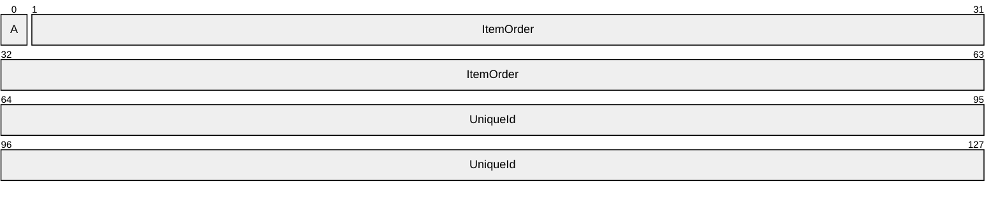

**A - IsFileOrDirectory (1 bit)**: This value MUST be set to 0 to indicate that the item is a directory, or to 1 to indicate that the item is a file.

**ItemOrder (63 bits)**: The prefix component of the identifier. This prefix is composed of the least-significant 63 bits of a FILETIME structure.

**UniqueId (16 bytes)**: This value is set to a GUID value.

## 2.2 REPLICA_GID

The REPLICA_GID structure represents an identifier for a replica of the synchronized dataset.

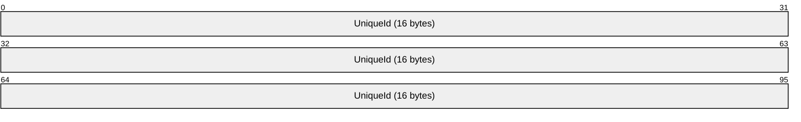

**UniqueId (16 bytes)**: This value is set to a GUID value.

## 2.3 SYNC_KNOWLEDGE

The SYNC_KNOWLEDGE structure describes all the changes that the sync participant, which generated the [**knowledge**](#gt_knowledge), has tracked.

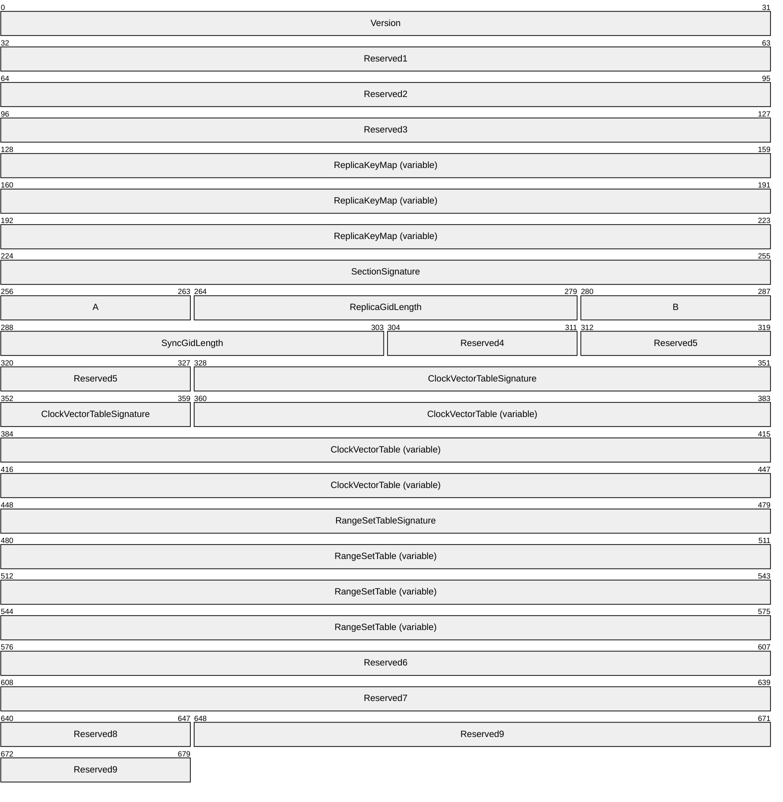

**Version (4 bytes)**: This value MUST be set to 5.

**Reserved1 (4 bytes)**: This value MUST be set to 0.

**Reserved2 (4 bytes)**: This value MUST be set to 1.

**Reserved3 (4 bytes)**: This value MUST be set to 0.

**ReplicaKeyMap (variable)**: Specifies all the replicas referenced by this SYNC_KNOWLEDGE structure. The index position in this map is used to more concisely describe the replica name in each CLOCK_VECTOR_ELEMENT.

**SectionSignature (4 bytes)**: This value MUST be set to 24.

**A - AreReplicaGidsVariableLength (1 byte):** This value MUST be set to 0.

**ReplicaGidLength (2 bytes):** This value MUST be set to 16.

**B - AreSyncGidsVariableLength (1 byte):** This value MUST be set to 0.

**SyncGidLength (2 bytes):** This value MUST be set to 24.

**Reserved4 (1 byte):** This value MUST be set to 0.

**Reserved5 (2 bytes):** This value MUST be set to 1.

**ClockVectorTableSignature (4 bytes):** This value MUST be set to 21.

**ClockVectorTable (variable):** A VECTOR_CLOCK_VECTOR element that contains a list of CLOCK_VECTOR structures that specify the version state for the items identified by a RANGE.

**RangeSetTableSignature (4 bytes):** This value MUST be set to 23.

**RangeSetTable (variable):** A VECTOR_RANGE_SET element that contains a list of RANGE_SET structures that specify the version state tracked by the [**replica**](#gt_replica) for the items identified by each RANGE.

**Reserved6 (4 bytes):** This value MUST be set to 0.

**Reserved7 (4 bytes):** This value MUST be set to 25.

**Reserved8 (1 byte):** This value MUST be set to 1.

**Reserved9 (4 bytes):** This value MUST be set to 0.

## 2.4 REPLICA_KEY_MAP

The REPLICA_KEY_MAP structure specifies the mapping of a 4-byte index to the REPLICA_GID structures that are used to identify each sync participant participating in the [**synchronization community**](#gt_synchronization-community). The index for each [**replica**](#gt_replica) is implied by its position in the ReplicaKeys vector.

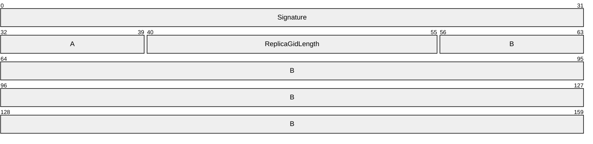

**Signature (4 bytes)**: This value MUST be set to 5.

**A - AreReplicaGidsVariableLength (1 byte)**: This value MUST be set to 0.

**ReplicaGidLength (2 bytes)**: This is the REPLICA_GID length in bytes and MUST be set to 16.

**B - ReplicaKeys (variable):** A VECTOR_REPLICA_KEY element that contains a list of replicas that are referenced by the CLOCK_VECTOR_ELEMENT structures in the SYNC_KNOWLEDGE structure.

## 2.5 VECTOR_REPLICA_KEY

The VECTOR_REPLICA_KEY structure represents a collection of REPLICA_GID structures, as specified in section [2.2](#Section_2.2), in the following format:

**NumEntries (4 bytes)**: This is the number of entries in the vector.

**ReplicaGids (variable)**: An array of 0 or more REPLICA_GID structures.

## 2.6 VECTOR_CLOCK_VECTOR

The VECTOR_CLOCK_VECTOR structure represents a collection of CLOCK_VECTOR structures, as specified in section [2.7](#Section_2.7), in the following format:

**NumEntries (4 bytes)**: This is the number of entries in the vector.

**ClockVectorEntries (variable)**: An array of 1 or more CLOCK_VECTOR structures. The **ClockVectorElementEntries** field of the first CLOCK_VECTOR structure in the array MUST have zero **NumEntries**.

## 2.7 CLOCK_VECTOR

The CLOCK_VECTOR structure specifies the collection of VECTOR_CLOCK_VECTOR_ELEMENT structures, as specified in section [2.8](#Section_2.8), in the following format:

**Signature (4 bytes)**: This value MUST be 1.

**ClockVectorElementEntries (variable)**: A VECTOR_CLOCK_VECTOR_ELEMENT structure that contains a list of CLOCK_VECTOR_ELEMENT structures.

## 2.8 VECTOR_CLOCK_VECTOR_ELEMENT

The VECTOR_CLOCK_VECTOR_ELEMENT structure represents a collection of CLOCK_VECTOR_ELEMENT structures, as specified in section [2.9](#Section_2.9), in the following format:

**NumEntries (4 bytes):** This is the number of entries in the vector.

**ClockVectorElements (variable):** An array of 0 or more CLOCK_VECTOR_ELEMENT structures.

## 2.9 CLOCK_VECTOR_ELEMENT

The CLOCK_VECTOR_ELEMENT structure describes the revision version of an item. It consists of the replica key and the replica tick count.

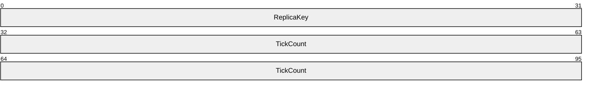

**ReplicaKey (4 bytes):** The index into the REPLICA_KEY_MAP to define the REPLICA_GID entry for the replica described by this element.

**TickCount (8 bytes):** A monotonically increasing number that is specific to a replica and combined with a replica key to make a version.

## 2.10 VECTOR_RANGE_SET

The VECTOR_RANGE_SET structure represents a collection of RANGE_SET structures, as specified in section [2.11](#Section_2.11), in the following format:

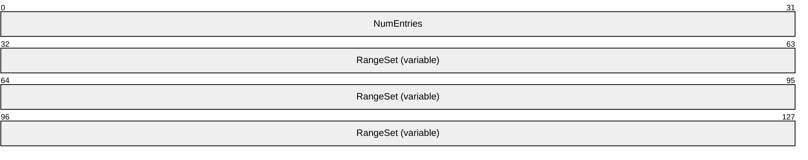

**NumEntries (4 bytes):** This MUST be set to 1.

**RangeSet (variable):** An array of 1 RANGE_SET structures.

## 2.11 RANGE_SET

The RANGE_SET structure represents a collection of VECTOR_RANGE structures, as specified in section [2.12](#Section_2.12), in the following format:

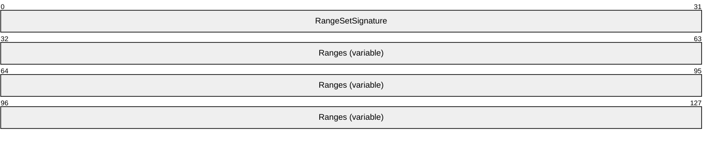

**RangeSetSignature (4 bytes):** This MUST be set to 22.

**Ranges (variable):** A VECTOR_RANGE structure that contains the list of RANGE structures.

## 2.12 VECTOR_RANGE

The VECTOR_RANGE structure represents a collection of RANGE structures, as specified in section [2.13](#Section_2.13), in the following format:

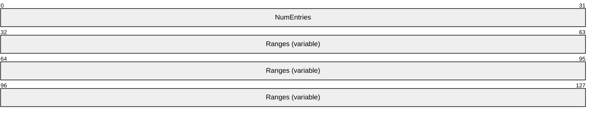

**NumEntries (4 bytes):** The number of entries in the Ranges field.

**Ranges (variable):** An array of 1 or more RANGE structures.

## 2.13 RANGE

The RANGE structure describes a set of contiguous item identifiers to which the same [**clock vector**](#gt_clock-vector) applies. A [**range**](#gt_range) is represented by a lower bound, an upper bound and the clock vector that applies to all IDs that are in between. The upper bound of a range is the previous item identifier of the lower bound of the next range in VECTOR_RANGE_SET. If this is the last range in VECTOR_RANGE_SET, all the item identifiers greater than the lower bound are considered to be part of this last range.

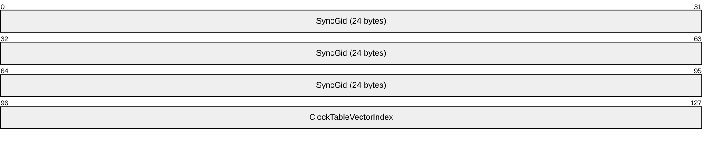

**SyncGid (24 bytes):** The SYNC_GID for the item that represents the lower bound of this range.

**ClockTableVectorIndex (4 bytes):** The index into the ClockVectorTable in a SYNC_KNOWLEDGE structure for the CLOCK_VECTOR that describes the set of updates tracked by the replica.

## 2.14 SYNC_CHANGE_INFORMATION

The SYNC_CHANGE_INFORMATION structure represents the list of changed items tracked by the source replica when compared to the destination’s version state.

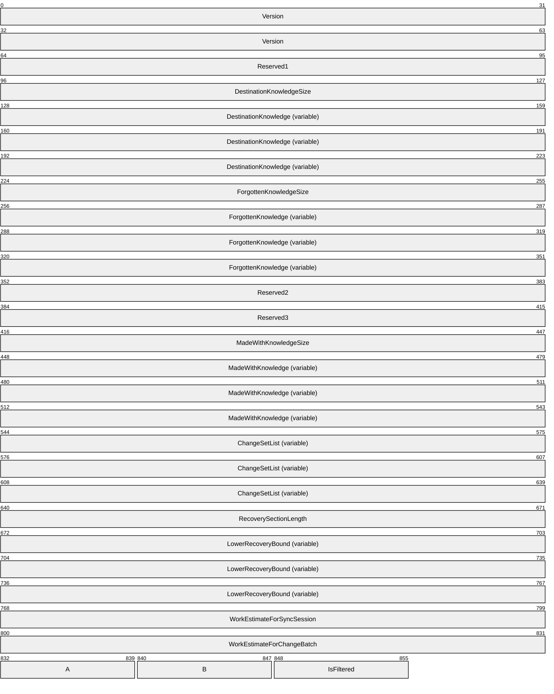

**Version (8 bytes)**: The SYNC_CHANGE_INFORMATION serialization format used; this MUST be set to 5.

**Reserved1 (4 bytes):** This value MUST be set to 0.

**DestinationKnowledgeSize (4 bytes)**: The length, in bytes, of the **DestinationKnowledge** field.

**DestinationKnowledge (variable)**: A SYNC_KNOWLEDGE structure that represents knowledge from the destination replica that is used to generate this SYNC_CHANGE_INFORMATION structure. The destination knowledge MUST always contain the serialized replica key map.

**ForgottenKnowledgeSize (4 bytes):** The length, in bytes, of the **ForgottenKnowledge** field. If 0, there is no ForgottenKnowledge field in this SYNC_CHANGE_INFORMATION structure.

**ForgottenKnowledge (variable)**: A SYNC_KNOWLEDGE structure that tracks the maximum version of tombstones that have been removed from the destination’s synchronization metadata. The forgotten knowledge MUST always contain the serialized replica key map. This field is not present if the **ForgottenKnowledgeSize** field is set to 0.

**Reserved2 (4 bytes)**: This value MUST be set to 0.

**Reserved3 (4 bytes)**: This value MUST be set to 1.

**MadeWithKnowledgeSize (4 bytes)**: The length, in bytes, of the **MadeWithKnowledge** field.

**MadeWithKnowledge (variable)**: A SYNC_KNOWLEDGE structure that represents knowledge from the source replica that is used to generate this SYNC_CHANGE_INFORMATION structure. This field MUST always contain the serialized replica key map.

**ChangeSetList (variable)**: The list of changes represented in this change batch.

**RecoverySectionLength (4 bytes)**: The length, in bytes, of the **LowerRecoveryBound** data. If this is a recovery synchronization session (**IsRecoverySynchronization** is set to 1), this MUST be set to 16; otherwise, this value MUST be set to 0.

**LowerRecoveryBound (variable)**: When present, this is the SYNC_GID for the lowest item in the **ChangeSetEntries** that is part of the recovery synchronization.

**WorkEstimateForSyncSession (4 bytes)**: This value MUST be set to 0.

**WorkEstimateForChangeBatch (4 bytes)**: This value MUST be set to 0.

**A - IsLastChangeBatch (1 byte)**: Indicates whether this SYNC_CHANGE_INFORMATION is the last set of change information sent by the source replica. A value of 0 indicates that this is not the last set. A value of 1 indicates that this is the last set.

**B - IsRecoverySynchronization (1 byte)**: Indicates whether this SYNC_CHANGE_INFORMATION is part of a recovery synchronization. A value of 1 indicates that this change information is part of a recovery synchronization. A value of 0 indicates that this change information is not part of a recovery synchronization.

**IsFiltered (1 byte)**: This value MUST be set to 0.

## 2.15 VECTOR_CHANGE_SET_ENTRY

The VECTOR_CHANGE_SET_ENTRY structure represents the list of changed items described in the sync change information structure, as specified in section [2.16](#Section_2.16), in the following format:

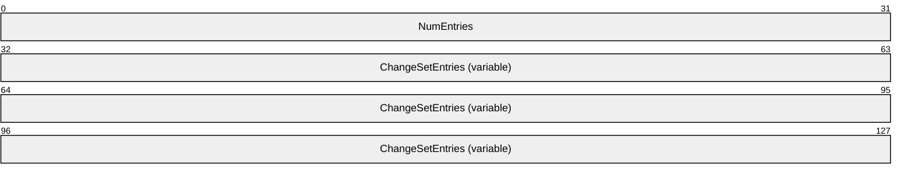

**NumEntries (4 bytes)**: The number of entries in the **ChangeSetEntries** field.

**ChangeSetEntries (variable)**: A byte stream of 0 or more CHANGE_SET_ENTRY structures used to describe which items in the replica have changed.

## 2.16 CHANGE_SET_ENTRY

The CHANGE_SET_ENTRY structure represents an item that has changed in the source replica relative to the destination replica.

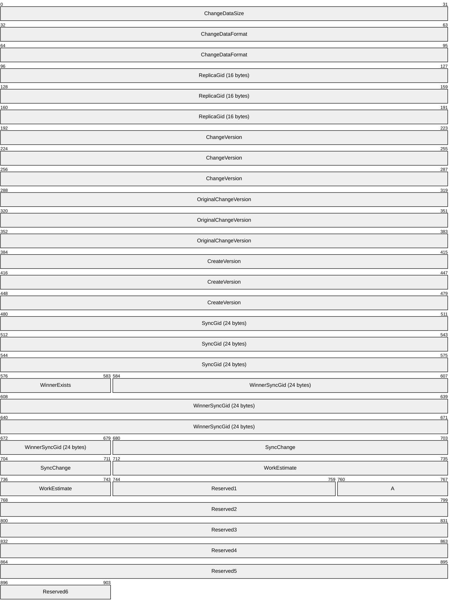

**ChangeDataSize (4 bytes)**: The size, in bytes, for the CHANGE_SET_ENTRY structure excluding the size of this field.

**ChangeDataFormat (8 bytes)**: This value MUST be set to 7.

**ReplicaGid (16 bytes)**: The ID for the replica delivering this change.

**ChangeVersion (12 bytes)**: A CLOCK_VECTOR_ELEMENT structure which describes the revision version of this change.

**OriginalChangeVersion (12 bytes)**: A CLOCK_VECTOR_ELEMENT structure which MUST match the value in the ChangeVersion field.

**CreateVersion (12 bytes)**: A CLOCK_VECTOR_ELEMENT structure which describes the revision version of this Item when it was created.

**SyncGid (24 bytes)**: The ID for the file or directory affected by this change.

**WinnerExists (1 bytes)**: The value of 1 indicates that there is a **WinnerSyncGid** field.

**WinnerSyncGid (24 bytes):** The ID for the winning object.

**SyncChange (4 bytes)**: This field MUST contain one of the following values:

| Value | Meaning |
| --- | --- |
| 0x00000000 | Indicates that this entry is a change for a file item. |
| 0x00000001 | Indicates that this entry is a change for a deleted file item. |
| 0x00010000 | Indicates that this entry is the beginning of a range of changes. |
| 0x00020000 | Indicates that this entry is the end of a range of changes. |

**WorkEstimate (4 bytes)**: The work estimate for the change. This value SHOULD be set to 1.

**Reserved1 (2 bytes)**: This value MUST be set to 0.

**A - IsLearnedKnowledgeProjected (1 byte)**: This value will be set to 0 for a regular sync session and 1 for a change batch during a full enumeration sync session.

**Reserved2 (4 bytes)**: This value MUST be set to 0.

**Reserved3 (4 bytes)**: This value MUST be set to 0.

**Reserved4 (4 bytes):** This value MUST be set to 0.

**Reserved5 (4 bytes):** This value MUST be set to 0.

**Reserved6 (1 byte):** This value MUST be set to 0.

# 3 Algorithm Details

## 3.1 Object Store Details

### 3.1.1 Abstract Data Model

This section describes a conceptual model of possible data organization that an implementation maintains to participate in this algorithm. The described organization is provided to facilitate the explanation of how the protocol behaves. This document does not mandate that implementations adhere to this model as long as their external behavior is consistent with that described in this document.

The following abstract object types are defined in this document:

**ReplicaEntry**

**FileItemEntry**

**ClockVectorElement**

**ClockVectorEntry**

**RangeSetEntry**

**Participant**

The following shorthand forms are also used:

**DataFileItem**: A **FileItem** object that represents a FileType of DataFile.

**DirectoryFileItem**: A **FileItem** object with a FileType of DirectoryFile.

#### 3.1.1.1 Per ReplicaEntry

Each Participant in the [**synchronization community**](#gt_synchronization-community) MUST implement the following persistent attributes:

- **ReplicaGid**: The 16-byte REPLICA_GID that uniquely names the replica in the synchronization community.

#### 3.1.1.2 Per FileItemEntry

Each Participant in the synchronization community MUST implement the following persistent attributes:

- **SyncGid**: The 24-byte SYNC_GID that uniquely identifies an item within the dataset.
- **CreateReplicaKey**: The index into the ReplicaTable that identifies the replica in the synchronization community that created this item.
- **CreateTickCount**: The TickCount from the CreateReplicaKey that represents the time that this item was created.
- **ChangeReplicaKey**: The index into the ReplicaList that identifies the replica in the synchronization community that made the last change to this item that this replica has seen.
- **ChangeTickCount**: The TickCount from the ChangeReplicaKey that represents the time that this item was changed.
- **IsDeleted**: A flag that is set when this item has been deleted from the dataset.
- **WinnerExists**: If this item has been deleted and the deleted item has been merged with another item, this is set to TRUE; otherwise it is FALSE.
- **WinningFileItem**: If this item has been deleted and the deleted item has been merged with another item, this is the SYNC_GID for that winning item.

#### 3.1.1.3 Per ClockVectorElement

Each Participant in the synchronization community MUST implement the following persistent attributes:

- **ReplicaKey**: The index into the ReplicaTable that identifies the replica in the synchronization community that this ClockVectorElement describes.
- **TickCount**: The TickCount representing the highest [**version**](#gt_version) known from the Replica identified by the ReplicaKey for this ClockVectorElement.

#### 3.1.1.4 Per ClockVectorEntry

Each Participant in the synchronization community MUST implement the following persistent attributes:

- **ClockVectorElementList**: A list of one or more ClockVectorElements. In this list, there MUST be exactly one ClockVectorElement per Replica in the synchronization community.

#### 3.1.1.5 Per RangeEntry

Each Participant in the synchronization community MUST implement the following persistent attributes:

- **SyncGid**: The SYNC_GID that identifies the **FileItem** which begins this range.
- **ClockVectorKey**: The index into the **ClockVectorList** that identifies the clock vector used to describe the version state of the **FileItems** in this range.
The end of the range is implied by the **SyncGid** of the next **RangeEntry** in the **RangeList**.

#### 3.1.1.6 Per ChangeSetEntry

Each Participant in the synchronization community MUST implement the following persistent attributes:

- **ReplicaGid**: The REPLICA_GID for the replica delivering this change.
- **ChangeReplicaKey**: The replica key identifying the replica which made this change.
- **ChangeTickCount**: The [**tick count**](#gt_tick-count) of the changing replica at the time this change was made.
- **CreateReplicaKey**: The replica key identifying the replica that created this item.
- **CreateTickCount**: The tick count of the creating replica at the time this item was created.
- **SyncGid**: The SYNC_GID for the **FileItem** affected by this change.
- **WinnerExists**: Set to TRUE (1) if there is a WinnerSyncGid for this change or FALSE (0) if there is no **WinnerSyncGid**.
- **WinnerSyncGid**: If **WinnerExists** is TRUE, the SYNC_GID of the winning **FileItem**.
- **SyncChange**: The type of change this entry represents, as specified in the **SyncChange** field in section [2.16](#Section_2.16).

#### 3.1.1.7 Per Participant

Each **Participant** in the synchronization community MUST implement the following persistent attributes:

- **ReplicaList**: A list of one or more **ReplicaEntries** providing **ReplicaKey** to **ReplicaGid** mapping for all replicas from the synchronization community known by this **Participant**. This list will always have an entry for the replica managed by this **Participant** and this entry is always the first entry in the list. The **ReplicaKey** used by other data structures to identify a **ReplicaEntry** is the index into this list, with the first index being assigned the value of 0.
- **FileItemList**: A list of zero or more **FileItemEntries** describing the detailed version state known for each item in the replica managed by this **Participant**.
- **ClockVectorList**: A list of zero or more ClockVectorEntries specifying the version state known for one or more **FileItems** tracked by this **Participant**. The **ClockVectorKey** used by other data structures to identify a **ClockVectorEntry** is the index into this list, with the first index being assigned the value of 0.
- **RangeList**: A list of zero or one RangeEntries specifying the version state known for the **FileItems** identified in each range and tracked by this **Participant**. The **RangeEntries** in this list are ordered by increasing **SyncGid** so that the end of each range can be implied by the beginning of the next **RangeEntry**. The last entry in the list specifies the version state for the **SyncGid** specified to the highest **SyncGid** for a **FileItem** known within the **Replica**.
- **ChangeSetEntryList**: A list of zero or more **ChangeSetEntries** specifying the set of changes known by this **Participant** when this **Participant** is acting as the source replica when synchronizing with a destination replica.
- **SyncKnowledge**: A SYNC_KNOWLEDGE data structure that represents the version state for the replica managed by this **Participant**.
- **ForgottenKnowledge**: A SYNC_KNOWLEDGE data structure that represents the version information no longer tracked in SyncKnowledge by this **Participant** due to the deletion of tombstones in the FileItemList.

### 3.1.2 Timers

None.

### 3.1.3 Initialization

None.

### 3.1.4 Common Algorithms

#### 3.1.4.1 Algorithm for Querying Sync Knowledge for a Participant

The inputs for this algorithm are:

- **ReplicaList**: The **ReplicaList** for the **Participant**.
- **ClockVectorList**: The **ClockVectorList** for the **Participant**.
- **RangeList**: The **RangeList** for the **Participant**.
- **OutputBufferSize**: The maximum number of bytes to return in OutputBuffer.
On completion, the Participant store MUST return:

- **OutputBuffer**: An array of bytes that returns a SYNC_KNOWLEDGE structure as specified in section [2.3](#Section_2.3).
The algorithm uses the following local variables:

- *SyncKnowledge* structure
- Integer value (initialized to 0) *CurrentReplicaIndex, CurrentClockVectorIndex, CurrentElementIndex,* CurrentRangeIndex*.*
Pseudocode for the operation is as follows:

- Set *SyncKnowledge.Version* to 5.
- Set *SyncKnowledge.Reserved1* to 0.
- Set *SyncKnowledge.Reserved2* to 1.
- Set *SyncKnowledge.Reserved3* to 0.
- Set *SyncKnowledge.Version* to 5.
- Set *SyncKnowledge.ReplicaKeyMap.Signature* to 5.
- Set *SyncKnowledge.ReplicaKeyMap.AreReplicaGidsVariableLength* to 0.
- Set *SyncKnowledge.ReplicaKeyMap.ReplicaGidLength* to 16.
- Set *SyncKnowledge.ReplicaKeyMap.ReplicaKeys.NumEntries* to ReplicaList.Count.
- For each ReplicaEntry in ReplicaTable:
- Set *SyncKnowledge.ReplicaKeyMap.ReplicaKeys.ReplicaGids[CurrentReplicaIndex]* to ReplicaEntry.ReplicaGid.
- Set *CurrentReplicaIndex* to *CurrentReplicaIndex* + 1.
- EndFor
- Set *SyncKnowledge.SectionSignature* to 24.
- Set *SyncKnowledge.AreReplicaGidsVariableLength* to 0.
- Set *SyncKnowledge.ReplicaGidLength* to 16.
- Set *SyncKnowledge.AreSyncGidsVariableLength* to 0.
- Set *SyncKnowledge.SyncGidLength* to 24.
- Set *SyncKnowledge.Reserved4* to 0.
- Set *SyncKnowledge.Reserved5* to 1.
- Set *SyncKnowledge.ClockVectorTableSignature* to 21.
- Set *SyncKnowledge.ClockVectorTable.*NumEntries to ClockVectorList.Count.
- For each *ClockVector* in ClockVectorList
- Set *SyncKnowledge.ClockVectorTable.ClockVectorEntries[CurrentClockVectorIndex].Signature* to 1.
- Set *SyncKnowledge.ClockVectorTable.ClockVectorEntries[CurrentClockVectorIndex].ClockVectorElementEntries.NumElements* to ClockVectorList[*CurrentIndex*].ClockVectorElementList.Count.
- For each *ClockVectorElement* in ClockVectorList[*CurrentClockVectorIndex*].ClockVectorElementList
- Set *SyncKnowledge.ClockVectorTable.ClockVectorEntries[CurrentClockVectorIndex].ClockVectorElementEntries.ClockVectorElement[CurrentElementIndex].ReplicaKey* to ClockVectorList[*CurrentIndex*].ClockVectorElementList[*CurrentElementIndex*].ReplicaKey.
- Set *SyncKnowledge.ClockVectorTable.ClockVectorEntries[CurrentClockVectorIndex].ClockVectorElementEntries.ClockVectorElement[CurrentElementIndex].TickCount* to ClockVectorList[*CurrentClockVectorIndex*].ClockVectorElementList[*CurrentElementIndex*].TickCount.
- Set *CurrentElementIndex* to *CurrentElementIndex* + 1.
- EndFor
- Set *CurrentClockVectorIndex* to *CurrentClockVectorIndex* + 1.
- EndFor
- Set *SyncKnowledge.RangeSetTableSignature* to 23.
- Set *SyncKnowledge.RangeSetTable.NumEntries* to 1.
- Set *SyncKnowledge.RangeSetTable.RangeSets[0].RangeSetSignature* to 22.
- For each RangeEntry in RangeList:
- Set SyncKnowledge.RangeSetTable.RangeSets[0].Ranges[CurrentRangeIndex].SyncGid to RangeEntry.SyncGid.
- Set SyncKnowledge.RangeSetTable.RangeSets[0].Ranges[CurrentRangeIndex].ClockTableVectorIndex to RangeEntry.ClockVectorKey.
- Set CurrentRangeIndex to CurrentRangeIndex + 1.
- EndFor
- Set *SyncKnowledge.Reserved6* to 0.
- Set *SyncKnowledge.Reserved7* to 25.
- Set *SyncKnowledge.Reserved8* to 1.
- Set *SyncKnowledge.Reserved9* to 0.

#### 3.1.4.2 Algorithm for Querying Change Information for a Participant

The inputs for this algorithm are the following:

- **DestinationKnowledgeSize**: The size, in bytes, of the DestinationKnowledge.
- **DestinationKnowledge**: The SYNC_KNOWLEDGE structure provided by the destination replica with which this Participant is synchronizing.
- **ForgottenKnowledgeSize**: The size, in bytes, of the ForgottenKnowledge.
- **ForgottenKnowledge**: The SYNC_KNOWLEDGE structure maintained by this Participant which describes the [**version**](#gt_version) information no longer tracked due to the deletion of tombstones from the FileItemList.
- **MadeWithKnowledgeSize**: The size, in bytes, of the MadeWithKnowledge.
- **MadeWithKnowledge**: The SYNC_KNOWLEDGE structure describing the version state known by this **Participant** when the list of changes was generated.
- **ChangeSetEntryList**: The list of changes known by this replica that are not yet known by the destination replica.
- **OutputBufferSize**: The maximum number of bytes to return in OutputBuffer.
- **IsRecoverySynchronization**: A Boolean that specifies whether the session of this **Participant** is a recovery synchronization session.
On completion, the Participant store MUST return:

- **OutputBuffer**: An array of bytes that returns a SYNC_CHANGE_INFORMATION structure as specified in section [2.14](#Section_2.14).
The algorithm uses the following local variables.

- SYNC_CHANGE_INFORMATION structure
- Integer value (initialized to 1) *CurrentChangeSetEntry.*
Pseudocode for the operation is as follows:

- Set *SyncChangeInformation.Version* to 5.
- Set *SyncChangeInformation.Reserved1* to 0.
- Set *SyncChangeInformation.DestinationKnowledgeSize* to DestinationKnowledgeSize.
- Set *SyncChangeInformation.DestinationKnowledge* to DestinationKnowledge.
- Set *SyncChangeInformation.ForgottenKnowledgeSize* to ForgottenKnowledgeSize.
- Set *SyncChangeInformation.ForgottenKnowledge* to ForgottenKnowledge.
- Set *SyncChangeInformation.Reserved2* to 0.
- Set *SyncChangeInformation.Reserved3* to 1.
- Set *SyncChangeInformation.MadeWideKnowledgeSize* to MadeWithKnowledgeSize.
- Set *SyncChangeInformation.MadeWithKnowledge* to MadeWithKnowledge.
- Set *SyncChangeInformation.ChangeSetList.NumEntries* to ChangeSetList.Count.
- Set *SyncChangeInformation.ChangeSetList.ChangeSetEntry[0].ChangeDataSize* to the size in bytes for the CHANGE_SET_ENTRY structure.
- Set *SyncChangeInformation.ChangeSetList.ChangeSetEntry[0].ChangeDataFormat* to 7.
- Set *SyncChangeInformation.ChangeSetList.ChangeSetEntry[0].ReplicaGid* to 16-bytes of 0.
- Set *SyncChangeInformation.ChangeSetList.ChangeSetEntry[0].SyncGid* to 24-bytes of 0.
- Set *SyncChangeInformation.ChangeSetList.ChangeSetEntry[0].WinnerExists* to 0.
- Set *SyncChangeInformation.ChangeSetList.ChangeSetEntry[0].SyncChange* to 0x00010000.
- Set *SyncChangeInformation.ChangeSetList.ChangeSetEntry[0].WorkEstimate* to 0.
- Set *SyncChangeInformation.ChangeSetList.ChangeSetEntry[0].Reserved1* to 0.
- Set *SyncChangeInformation.ChangeSetList.ChangeSetEntry[0].IsLearnedKnowledgeProjected* to 0.
- Set *SyncChangeInformation.ChangeSetList.ChangeSetEntry[0].Reserved2* to 0.
- Set *SyncChangeInformation.ChangeSetList.ChangeSetEntry[0].Reserved3* to 0.
- Set *SyncChangeInformation.ChangeSetList.ChangeSetEntry[0].Reserved4* to 0.
- Set *SyncChangeInformation.ChangeSetList.ChangeSetEntry[0].Reserved5* to 0.
- Set *SyncChangeInformation.ChangeSetList.ChangeSetEntry[0].Reserved6* to 0.
- For each ChangeSetEntry in ChangeSetList:
- Set *SyncChangeInformation.ChangeSetList.ChangeSetEntry[CurrentChangeSetEntry].ChangeDataSize* to the size, in bytes, for the CHANGE_SET_ENTRY structure.
- Set *SyncChangeInformation.ChangeSetList.ChangeSetEntry[0] CurrentChangeSetEntry*.*ChangeDataFormat* to 7.
- Set *SyncChangeInformation.ChangeSetList.ChangeSetEntry[CurrentChangeSetEntry].ReplicaGid* to ChangeSetEntry.ReplicaGid.
- Set *SyncChangeInformation.ChangeSetList.ChangeSetEntry[CurrentChangeSetEntry].ChangeVersion.ReplicaKey* to ChangeSetEntry.ChangeReplicaKey.
- Set *SyncChangeInformation.ChangeSetList.ChangeSetEntry[CurrentChangeSetEntry].ChangeVersion.TickCount* to ChangeSetEntry.ChangeReplicaTickCount.
- Set *SyncChangeInformation.ChangeSetList.ChangeSetEntry[CurrentChangeSetEntry].OriginalChangeVersion.ReplicaKey* to ChangeSetEntry.ChangeReplicaKey.
- Set *SyncChangeInformation.ChangeSetList.ChangeSetEntry[CurrentChangeSetEntry].OriginalChangeVersion.TickCount* to ChangeSetEntry.ChangeReplicaTickCount.
- Set *SyncChangeInformation.ChangeSetList.ChangeSetEntry[CurrentChangeSetEntry].CreateVersion.ReplicaKey* to ChangeSetEntry.CreateReplicaKey.
- Set *SyncChangeInformation.ChangeSetList.ChangeSetEntry[CurrentChangeSetEntry].CreateVersion.TickCount* to ChangeSetEntry.CreateReplicaTickCount.
- Set *SyncChangeInformation.ChangeSetList.ChangeSetEntry[CurrentChangeSetEntry].SyncGid* to ChangeSetEntry.SyncGid.
- Set *SyncChangeInformation.ChangeSetList.ChangeSetEntry[CurrentChangeSetEntry].WinnerExists* to 0.
- Set *SyncChangeInformation.ChangeSetList.ChangeSetEntry[CurrentChangeSetEntry].SyncChange* to 0x00000000 if this is a change or 0x00000001 if this **FileItem** has been deleted.
- Set *SyncChangeInformation.ChangeSetList.ChangeSetEntry[CurrentChangeSetEntry].WorkEstimate* to 0.
- Set *SyncChangeInformation.ChangeSetList.ChangeSetEntry[CurrentChangeSetEntry].Reserved1* to 0.
- Set *SyncChangeInformation.ChangeSetList.ChangeSetEntry[CurrentChangeSetEntry].IsLearnedKnowledgeProjected* to 0.
- Set *SyncChangeInformation.ChangeSetList.ChangeSetEntry[CurrentChangeSetEntry].Reserved2* to 0.
- Set *SyncChangeInformation.ChangeSetList.ChangeSetEntry[CurrentChangeSetEntry].Reserved3* to 0.
- Set *SyncChangeInformation.ChangeSetList.ChangeSetEntry[CurrentChangeSetEntry].Reserved4* to 0.
- Set *SyncChangeInformation.ChangeSetList.ChangeSetEntry[CurrentChangeSetEntry].Reserved5* to 0.
- Set *SyncChangeInformation.ChangeSetList.ChangeSetEntry[CurrentChangeSetEntry].Reserved6* to 0.
- Set *CurrentChangeSetEntry* to *CurrentChangeSetEntry* + 1.
- EndFor
- Set *SyncChangeInformation.ChangeSetList.ChangeSetEntry[CurrentChangeSetEntry].ChangeDataSize* to the size in bytes for the CHANGE_SET_ENTRY structure.
- Set *SyncChangeInformation.ChangeSetList.ChangeSetEntry[CurrentChangeSetEntry].ChangeDataFormat* to 7.
- Set *SyncChangeInformation.ChangeSetList.ChangeSetEntry[CurrentChangeSetEntry].ReplicaGid* to 16-bytes of 0.
- *Set SyncChangeInformation.ChangeSetList.ChangeSetEntry[CurrentChangeSetEntry].SyncGid* to 24-bytes of 0xFFFFFFFFFFFFFFFFFFFFFFFFFFFFFFFFFFFFFFFFFFFFFFFE.
- Set *SyncChangeInformation.ChangeSetList.ChangeSetEntry[CurrentChangeSetEntry].WinnerExists* to 0.
- Set *SyncChangeInformation.ChangeSetList.ChangeSetEntry[CurrentChangeSetEntry].SyncChange* to 0x00020000.
- Set SyncChangeInformation.ChangeSetList.ChangeSetEntry[*CurrentChangeSetEntry*].WorkEstimate to 0.
- Set *SyncChangeInformation.ChangeSetList.ChangeSetEntry[CurrentChangeSetEntry].Reserved1* to 0.
- Set *SyncChangeInformation.ChangeSetList.ChangeSetEntry[CurrentChangeSetEntry].IsLearnedKnowledgeProjected* to 0.
- Set *SyncChangeInformation.ChangeSetList.ChangeSetEntry[CurrentChangeSetEntry].Reserved2* to 0.
- Set *SyncChangeInformation.ChangeSetList.ChangeSetEntry[CurrentChangeSetEntry].Reserved3* to 0.
- Set *SyncChangeInformation.ChangeSetList.ChangeSetEntry[CurrentChangeSetEntry].Reserved4* to 0.
- Set *SyncChangeInformation.ChangeSetList.ChangeSetEntry[CurrentChangeSetEntry].Reserved5* to 0.
- Set *SyncChangeInformation.ChangeSetList.ChangeSetEntry[CurrentChangeSetEntry].Reserved6* to 0.
- Set *SyncChangeInformation.RecoverySectionLength* to 0 if this is not a recovery synchronization session or to 16 if this is a recovery synchronization session.
- Set *SyncChangeInformation.WorkEstimateForSyncSession* to 0.
- Set *SyncChangeInformation.WorkEstimateForChangeBatch* to 0.
- Set *SyncChangeInformation.IsLastChangeBatch* to 0 if this is not the last set of changes or to 1 if this is the last set of changes.
- Set *SyncChangeInformation.IsRecoverySynchronization* to 0 if this is not a recovery synchronization session or to 1 if this is a recovery synchronization session.
- Set *SyncChangeInformation.IsFiltered* to 0.
- Set *OutputBuffer* to *SyncChangeInformation*.

#### 3.1.4.3 Algorithm for Creating the ChangeSetEntryList for a Participant Given Another Participant’s Destination Knowledge

The inputs for this algorithm are the following:

- **DestinationKnowledge**: The SYNC_KNOWLEDGE structure provided by the destination replica with which this Participant is synchronizing.
- **FileItemList**: The list of zero or more **FileItemEntries** describing the detailed version state known for each item in the replica managed by this **Participant**.
- **ReplicaList**: The list of one or more ReplicaEntries providing ReplicaKey to ReplicaGid mapping for all replicas from the synchronization community known by this **Participant**. This list will always have an entry for the replica managed by this **Participant** and this entry is always the first entry in the list. The **ReplicaKey** used by other data structures to identify a **ReplicaEntry** is the index into this list, with the first index being assigned the value of 0.
On completion, the Participant store MUST return:

- **ChangeSetEntryList**: The list of changes known by this replica that are not yet known by the destination replica.
The algorithm uses the following local variables:

- SYNC_KNOWLEDGE structure *DestinationSyncKnowledge.*
- Integer value (initialized to 0) CurrentRangeIndex, CurrentReplicaKey, DestinationReplicaKey, DestinationReplicaKeyFound, *CurrentClockVector, CurrentClockVectorElementIndex*
- Boolean value AddToChangeList*.*
- RANGE value ItemRange*.*
Pseudocode for the operation is as follows:

- Set *DestinationSyncKnowledge* to **DestinationKnowledge**.
- Clear all current entries in the **ChangeSetEntryList**.
- For each FileItemEntry in the FileItemList:
- Set *AddToChangeList* to FALSE.
- Set *CurrentRangeIndex* to 0.
- While *CurrentRangeIndex* < *DestinationSyncKnowledge.RangeSetTable.RangeSet[0].NumEntries*:
- If FileItemEntry.SyncGid > *DestinationSyncKnowledge.RangeSetTable.RangeSet[0].Ranges[CurrentRangeIndex].SyncGid*:
- Set *CurrentRangeIndex* to *CurrentRangeIndex* + 1.
- Else
- Break while loop.
- End If
- End While
- Set *ItemRange* to *DestinationSyncKnowledge.RangeSetTable.RangeSets[0].Ranges[CurrentRangeIndex].*
- Set *ItemChangeReplicaGid* to *ReplicaList[FileItemEntry].ChangeReplicaKey*.
- Set *CurrentReplicaKey* to 0.
- Set *DestinationReplicaKey* to 0.
- While *CurrentReplicaKey* < *DestinationSyncKnowledge*.ReplicaKeyMap.ReplicaKeys.NumEntries:
- If *ItemChangeReplicaGid* == *DestinationSyncKnowledge*. *ReplicaKeyMap.ReplicaKeys.ReplicaGids[CurrentReplicaKey]*:
- Set *DestinationReplicaKey* to CurrentReplicaKey.
- Set *DestinationReplicaKeyFound* to TRUE.
- Break while loop.
- Else
- Set *CurrentReplicaKey to CurrentReplicaKey* + 1.
- End If
- End While
- If DestinationReplicaKeyFound is TRUE:
- Set *CurrentClockVector* to *DestinationSyncKnowledge.ClockVectorTable.ClockVectorEntries[DestinationItemRange.ClockTableVectorIndex]*.
- Set *CurrentClockVectorElementIndex* to 0.
- Set *DestinationReplicaKeyFound* to FALSE.
- While *CurrentClockVectorElementIndex* < *CurrentClockVector.ClockVectorElementEntries.NumElements*:
- If *CurrentClockVector.ClockVectorElementEntries.ClockVectorElement[CurrentClockVectorElementIndex].ReplicaKey* == *DestinationReplicaKey:*
- Set *DestinationReplicaKeyFound* to TRUE.
- If *CurrentClockVector.ClockVectorElementEntries.ClockVectorElement[CurrentClockVectorElementIndex].TickCount* < FileItemEntry.ChangeTickCount:
- Set *AddToChangeList* to TRUE.
- End If.
- Else:
- Set *CurrentClockVectorElementIndex* to *CurrentClockVectorElementIndex* + 1.
- End If.
- End While.
- If *DestinationReplicaKeyFound* is FALSE
- Set *AddToChangeList* to TRUE.
- End If.
- Else:
- Set *AddToChangeList* to TRUE.
- End If
- If *AddToChangeList* == TRUE:
- Add a new ChangeSetEntry to the ChangeSetEntryList with the following values:
- Set *ChangeSetEntry.ReplicaGid* to ReplicaList[0].ReplicaGid.
- Set *ChangeSetEntry.ChangeReplicaKey* to FileItemEntry.ChangeReplicaKey.
- Set *ChangeSetEntry.ChangeTickCount* to FileItemEntry.ChangeTickcount.
- Set *ChangeSetEntry.CreateReplicaKey* to FileItemEntry.CreateReplicaKey.
- Set *ChangeSetEntry.CreateTickCount* to FileItemEntry.CreateTickCount.
- Set *ChangeSetEntry.SyncGid* to FileItemEntry.SyncGid.
- Set *ChangeSetEntry.WinnerExists* to FileItemEntry.WinnerExists.
- Set *ChangeSetEntry.WinnerSyncGid* to FileItemEntry.WinningFileItem.
- If FileItemEntry.IsDeleted == TRUE:
- Set *ChangeSetEntry.SyncChange* to 0x00000001.
- Else
- Set *ChangeSetEntry.SyncChange* to 0x00000000.
- End If
- End If
- End For

#### 3.1.4.4 Algorithm for Updating the FSVCA Metadata When an Item Changes

The inputs for this algorithm are the following:

**SyncGid**: The 24-byte SYNC_GID that uniquely identifies an item within the dataset.

**IsDelete**: A flag that indicates if an item is deleted from the dataset.

The Participant store MUST update the metadata as follows:

- Increment the tick count of all the **ClockVectorElements** associated with the local replica in **ClockVectorList**.
- Search for a **FileItemEntry** in **FileItemList** where **SyncGid** is equal to **FileItemEntry.SyncGid**. If an entry is found:
- Set **FileItemEntry.ChangeTickCount** to the TickCount associated with the local replica in **ClockVectorList**.
- If **IsDelete** is TRUE, set **FileItemEntry.IsDeleted** to TRUE.
- Otherwise, create a **FileItemEntry** and initialize it as follows:
- Set **FileItemEntry.SyncGid** to **SyncGid**.
- Set **FileItemEntry.CreateReplicaKey** to the index of the local replica in the **ReplicaTable**.
- Set **FileItemEntry.CreateTickCount** to the TickCount associated with the local replica in **ClockVectorList**.
- Set **FileItemEntry.ChangeReplicaKey** to the index of the local replica in the **ReplicaTable**.
- Set **FileItemEntry.ChangeTickCount** to the TickCount associated with the local replica in **ClockVectorList**.
- Set **FileItemEntry.IsDeleted** to FALSE.
- Set **WinnerExists** to FALSE.
- Set **WinningFileItem** to 0.

#### 3.1.4.5 Algorithm for Updating the FSVCA Metadata for the Successfully Applied Items

The inputs for this algorithm are the following:

**SyncMetadata**: SYNC_CHANGE_INFORMATION structure provided by other replica.

The Participant store MUST update the metadata as follows:

- For each CHANGE_SET_ENTRY in **SyncMetadata.ChangeSetList**, the Participant store MUST update the metadata as follows:
- Search for a **FileItemEntry** in **FileItemList** where **CHANGE_SET_ENTRY.SyncGid** is equal to **FileItemEntry.SyncGid**. If an entry is not found, construct a **FileItemEntry**, initialize it as follows, and insert it in **FileItemList**.
- Set **FileItemEntry.SyncGid** to **CHANGE_SET_ENTRY.SyncGid**.
- Update **FileItemEntry** as follows:
- Get the local index of **SyncMetadata.MadeWithKnowledge.ReplicaKeys.REPLICA_GID** referred by **CHANGE_SET_ENTRY.CreateVersion.ReplicaKey** in the **ReplicaTable**. Set **FileItemEntry.CreateReplicaKey** to the preceding index.
- Set **FileItemEntry.CreateTickCount** to **CHANGE_SET_ENTRY.CreateVersion.ChangeTickCount**.
- Get the local index of **SyncMetadata.MadeWithKnowledge.ReplicaKeys.REPLICA_GID** referred by **CHANGE_SET_ENTRY.ChangeVersion.ReplicaKey** in the **ReplicaTable**. Set **FileItemEntry.ChangeReplicaKey** to the preceding index.
- Set **FileItemEntry.ChangeTickCount** to **CHANGE_SET_ENTRY.ChangeVersion.ChangeTickCount**.
- If **CHANGE_SET_ENTRY.SyncChange** is equal to 0x00000001, set **FileItemEntry.IsDeleted** to TRUE.
- Set **FileItemEntry.WinnerExists** to TRUE if **CHANGE_SET_ENTRY.WinnerExists** is 0x01, FALSE otherwise.
- If **FileItemEntry.WinnerExists** is TRUE, set **FileItemEntry.WinningFileItem** to **CHANGE_SET_ENTRY.WinnerSyncGid**.
- Update **RangeList** and **ClockVectorList** using **SyncMetadata.MadeWithKnowledge**.

# 4 Algorithm Examples

None.

# 5 Security

## 5.1 Security Considerations for Implementers

None.

## 5.2 Index of Security Parameters

None.

# 6 Appendix A: Product Behavior

The information in this specification is applicable to the following Microsoft products or supplemental software. References to product versions include updates to those products.

- Windows 8.1 operating system
- Windows Server 2012 R2 operating system
- Windows 10 operating system
- Windows Server 2016 operating system
- Windows Server operating system
- Windows Server 2019 operating system
- Windows Server 2022 operating system
- Windows 11 operating system
- Windows Server 2025 operating system
Exceptions, if any, are noted in this section. If an update version, service pack or Knowledge Base (KB) number appears with a product name, the behavior changed in that update. The new behavior also applies to subsequent updates unless otherwise specified. If a product edition appears with the product version, behavior is different in that product edition.

Unless otherwise specified, any statement of optional behavior in this specification that is prescribed using the terms "SHOULD" or "SHOULD NOT" implies product behavior in accordance with the SHOULD or SHOULD NOT prescription. Unless otherwise specified, the term "MAY" implies that the product does not follow the prescription.

# 7 Change Tracking

This section identifies changes that were made to this document since the last release. Changes are classified as Major, Minor, or None.

The revision class **Major** means that the technical content in the document was significantly revised. Major changes affect protocol interoperability or implementation. Examples of major changes are:

- A document revision that incorporates changes to interoperability requirements.
- A document revision that captures changes to protocol functionality.
The revision class **Minor** means that the meaning of the technical content was clarified. Minor changes do not affect protocol interoperability or implementation. Examples of minor changes are updates to clarify ambiguity at the sentence, paragraph, or table level.

The revision class **None** means that no new technical changes were introduced. Minor editorial and formatting changes may have been made, but the relevant technical content is identical to the last released version.

The changes made to this document are listed in the following table. For more information, please contact [dochelp@microsoft.com](mailto:dochelp@microsoft.com).

| Section | Description | Revision class |
| --- | --- | --- |
| [6](#Section_6) Appendix A: Product Behavior | Added Windows Server 2025 to the list of applicable products. | Major |

## Revision History

| Date | Version | Revision Class | Comments |
| --- | --- | --- | --- |
| 5/15/2014 | 1.0 | New | Released new document |
| 6/30/2015 | 2.0 | Major | Significantly changed the technical content. |
| 10/16/2015 | 2.0 | None | No changes to the meaning, language, or formatting of the technical content. |
| 7/14/2016 | 2.0 | None | No changes to the meaning, language, or formatting of the technical content. |
| 6/1/2017 | 2.0 | None | No changes to the meaning, language, or formatting of the technical content. |
| 9/15/2017 | 3.0 | Major | Significantly changed the technical content. |
| 12/1/2017 | 3.0 | None | No changes to the meaning, language, or formatting of the technical content. |
| 9/12/2018 | 4.0 | Major | Significantly changed the technical content. |
| 4/7/2021 | 5.0 | Major | Significantly changed the technical content. |
| 6/25/2021 | 6.0 | Major | Significantly changed the technical content. |
| 4/23/2024 | 7.0 | Major | Significantly changed the technical content. |
