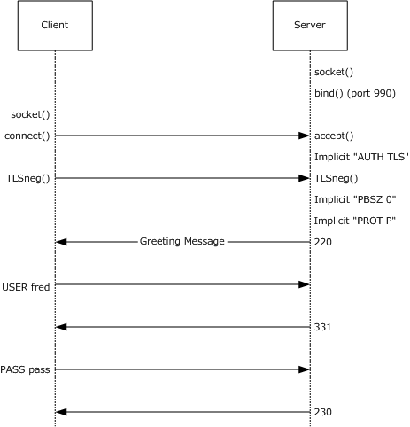

# [MS-FTPS]: File Transfer Protocol over Secure Sockets Layer (FTPS)

Table of Contents

1 Introduction

- [1 Introduction](#Section_1)
  - [1.1 Glossary](#Section_1.1)
  - [1.2 References](#Section_1.2)
    - [1.2.1 Normative References](#Section_1.2.1)
    - [1.2.2 Informative References](#Section_1.2.2)
  - [1.3 Overview](#Section_1.3)
  - [1.4 Relationship to Other Protocols](#Section_1.4)
  - [1.5 Prerequisites/Preconditions](#Section_1.5)
  - [1.6 Applicability Statement](#Section_1.6)
  - [1.7 Versioning and Capability Negotiation](#Section_1.7)
  - [1.8 Vendor-Extensible Fields](#Section_1.8)
  - [1.9 Standards Assignments](#Section_1.9)

2 Messages

- [2 Messages](#Section_2)
  - [2.1 Transport](#Section_2.1)
  - [2.2 Message Syntax](#Section_2.2)
    - [2.2.1 AUTH SSL](#Section_2.2.1)

3 Protocol Details

- [3 Protocol Details](#Section_3)
  - [3.1 Client Role Details](#Section_3.1)
    - [3.1.1 Abstract Data Model](#Section_3.1.1)
    - [3.1.2 Timers](#Section_3.1.2)
    - [3.1.3 Initialization](#Section_3.1.3)
    - [3.1.4 Higher-Layer Triggered Events](#Section_3.1.4)
    - [3.1.5 Message Processing Events and Sequencing Rules](#Section_3.1.5)
      - [3.1.5.1 Control Connection Negotiation with Implicit FTPS](#Section_3.1.5.1)
      - [3.1.5.2 CCC Message Handling](#Section_3.1.5.2)
      - [3.1.5.3 REIN Message Handling](#Section_3.1.5.3)
      - [3.1.5.4 AUTH SSL Message Handling](#Section_3.1.5.4)
      - [3.1.5.5 FEAT Message Handling](#Section_3.1.5.5)
      - [3.1.5.6 AUTH Message Handling](#Section_3.1.5.6)
    - [3.1.6 Timer Events](#Section_3.1.6)
    - [3.1.7 Other Local Events](#Section_3.1.7)
  - [3.2 Server Role Details](#Section_3.2)
    - [3.2.1 Abstract Data Model](#Section_3.2.1)
    - [3.2.2 Timers](#Section_3.2.2)
    - [3.2.3 Initialization](#Section_3.2.3)
    - [3.2.4 Higher-Layer Triggered Events](#Section_3.2.4)
    - [3.2.5 Message Processing Events and Sequencing Rules](#Section_3.2.5)
      - [3.2.5.1 Control Connection Negotiation with Implicit FTPS](#Section_3.2.5.1)
      - [3.2.5.2 CCC Message Handling](#Section_3.2.5.2)
      - [3.2.5.3 REIN Message Handling](#Section_3.2.5.3)
      - [3.2.5.4 AUTH SSL Message Handling](#Section_3.2.5.4)
      - [3.2.5.5 FEAT Message Handling](#Section_3.2.5.5)
      - [3.2.5.6 AUTH Message Handling](#Section_3.2.5.6)
    - [3.2.6 Timer Events](#Section_3.2.6)
    - [3.2.7 Other Local Events](#Section_3.2.7)

4 Protocol Examples

- [4 Protocol Examples](#Section_4)
  - [4.1 Control Connection Negotiation with Implicit FTPS](#Section_4.1)
  - [4.2 FEAT Response Example for "AUTH SSL" Support](#Section_4.2)

5 Security

- [5 Security](#Section_5)
  - [5.1 Security Considerations for Implementers](#Section_5.1)
  - [5.2 Index of Security Parameters](#Section_5.2)

6 Appendix A: Product Behavior

- [6 Appendix A: Product Behavior](#Section_6)

7 Change Tracking

- [7 Change Tracking](#Section_7)

For the legal notice and IP terms, see [LEGAL.md](../LEGAL.md).
Last updated: 4/23/2024.
See [Revision History](#revision-history) for full version history.

# 1 Introduction

The File Transfer Protocol over TLS, commonly referred to as FTPS, is defined in [[RFC4217]](https://go.microsoft.com/fwlink/?LinkId=160203). The FTPS protocol enables the use of TLS to secure FTP transfers.

This specification extends the FTPS protocol with a feature that is commonly referred to as [**Implicit SSL**](#gt_implicit-ssl). It also introduces the AUTH SSL message, to allow interoperability with legacy FTP clients.

Sections 1.5, 1.8, 1.9, 2, and 3 of this specification are normative. All other sections and examples in this specification are informative.

## 1.1 Glossary

This document uses the following terms:

**Explicit FTPS**: A common term for an [**FTPS**](#gt_ftps) implementation based on [[RFC4217]](https://go.microsoft.com/fwlink/?LinkId=160203). It refers to the fact that an explicit protocol handshake is required to promote a FTP connection (most commonly connected to port 21) from a non-secure to secure one.

**File Transfer Protocol (FTP)**: A member of the TCP/IP suite of protocols that is used to copy files between two computers on the Internet if both computers support their respective FTP roles. One computer is an FTP client and the other is an FTP server.

**FTPS**: The File transfer Protocol over SSL/TLS Extension [RFC4217] of [[RFC959]](https://go.microsoft.com/fwlink/?LinkId=160200), which enables the secure transfer of information between client and server.

**Implicit FTPS**: A common term for an early implementation of [**FTPS**](#gt_ftps) (based on the now-expired Internet draft [[EXPIRED-FTP-DRAFT]](https://go.microsoft.com/fwlink/?LinkId=160197)) that required a dedicated port that would be used exclusively for the SSL/TLS protected data transfer. TLS/SSL would be negotiated immediately after a TCP connection was established. It is analogous to HTTPS protocol handling [[RFC2818]](https://go.microsoft.com/fwlink/?LinkId=90383).

**Implicit SSL**: See [**Implicit FTPS**](#gt_implicit-ftps).

**MAY, SHOULD, MUST, SHOULD NOT, MUST NOT:** These terms (in all caps) are used as defined in [[RFC2119]](https://go.microsoft.com/fwlink/?LinkId=90317). All statements of optional behavior use either MAY, SHOULD, or SHOULD NOT.

## 1.2 References

Links to a document in the Microsoft Open Specifications library point to the correct section in the most recently published version of the referenced document. However, because individual documents in the library are not updated at the same time, the section numbers in the documents may not match. You can confirm the correct section numbering by checking the [Errata](https://go.microsoft.com/fwlink/?linkid=850906).

### 1.2.1 Normative References

We conduct frequent surveys of the normative references to assure their continued availability. If you have any issue with finding a normative reference, please contact [dochelp@microsoft.com](mailto:dochelp@microsoft.com). We will assist you in finding the relevant information.

[RFC2119] Bradner, S., "Key words for use in RFCs to Indicate Requirement Levels", BCP 14, RFC 2119, March 1997, [https://www.rfc-editor.org/info/rfc2119](https://go.microsoft.com/fwlink/?LinkId=90317)

[RFC2228] Horowitz, M., and Lunt, S., "FTP Security Extensions", RFC 2228, October 1997, [https://www.rfc-editor.org/info/rfc2228](https://go.microsoft.com/fwlink/?LinkId=160201)

[RFC2246] Dierks, T., and Allen, C., "The TLS Protocol Version 1.0", RFC 2246, January 1999, [https://www.rfc-editor.org/info/rfc2246](https://go.microsoft.com/fwlink/?LinkId=90324)

[RFC2389] Hethmon, P., Elz, R., "Feature negotiation mechanism for the File Transfer Protocol", RFC 2389, August 1998, [https://www.rfc-editor.org/info/rfc2389](https://go.microsoft.com/fwlink/?LinkId=160202)

[RFC4217] Ford-Hutchinson, P., "Securing FTP with TLS", RFC 4217, October 2005, [https://www.rfc-editor.org/info/rfc4217](https://go.microsoft.com/fwlink/?LinkId=160203)

[RFC959] Postel, J., and Reynolds, J., "File Transfer Protocol (FTP)", RFC 959, October 1985, [https://www.rfc-editor.org/info/rfc959](https://go.microsoft.com/fwlink/?LinkId=160200)

### 1.2.2 Informative References

[EXPIRED-FTP-DRAFT] Ford-Hutchinson, P., Carpenter, M., Hudson, T., et al., "Securing FTP with TLS (Expired Draft)", September 2000, [http://tools.ietf.org/id/draft-murray-auth-ftp-ssl-06.txt](https://go.microsoft.com/fwlink/?LinkId=160197)

## 1.3 Overview

This document provides the following extensions to the File Transfer Protocol over TLS [[RFC4217]](https://go.microsoft.com/fwlink/?LinkId=160203):

- [**Implicit FTPS**](#gt_implicit-ftps) support

- AUTH SSL message support

The primary purpose of these extensions is to accommodate legacy [**FTP**](#gt_file-transfer-protocol-ftp) client and firewall behaviors.

The FTP protocol uses a dynamic range of ports for data connections. Firewalls implement packet filters that can parse the port information from the FTP traffic and temporarily open those ports. If [**FTPS**](#gt_ftps) [RFC4217] is used, then a number of legacy firewall packet filters can be confused by the mixture of encrypted and unencrypted traffic and might disconnect FTP connections. Implicit FTPS support that uses dedicated port 990 (assigned by IANA) helps with firewall issues by keeping encrypted and unencrypted traffic on separate ports. Additional configuration is needed on the firewall to allow data connections over FTPS but that discussion is outside the scope of this document.

Implicit FTPS support is an extension to the FTPS protocol [RFC4217], and was originally documented in a draft that has expired (see [[EXPIRED-FTP-DRAFT]](https://go.microsoft.com/fwlink/?LinkId=160197)). A client connects to Implicit FTPS over port 990. The server will delay sending the connection welcome greeting until the TLS session is negotiated. The server assumes that the client has sent an AUTH TLS message immediately after the TCP connection was established. The client assumes that the server sent a positive reply to the implicit AUTH TLS message. The actual TLS session negotiation takes place as specified in [RFC4217]. Once the TLS session has been negotiated, the server assumes that the client sent PROT P and PBSZ 0 messages and sets the FTP session's state accordingly. These implicit commands will force the default mode for the FTP data channel to be protected. The client can later reset the protection level on the data channel by sending the PROT C message as specified in[RFC4217].

AUTH SSL message support allows legacy clients that are not TLS-aware to work with FTPS. The TLS protocol [[RFC2246]](https://go.microsoft.com/fwlink/?LinkId=90324) is backward compatible with the SSL protocol. The server will accept both AUTH SSL and AUTH TLS messages interchangeably. If an AUTH SSL message is sent by a client, the server will treat it as if an AUTH TLS message was received.

## 1.4 Relationship to Other Protocols

The File Transfer Protocol over Secure Sockets Layer depends on [**FTPS**](#gt_ftps) [[RFC4217]](https://go.microsoft.com/fwlink/?LinkId=160203), which in turn depends on the [**File Transfer Protocol**](#gt_file-transfer-protocol-ftp) [[RFC959]](https://go.microsoft.com/fwlink/?LinkId=160200), the FTP Security Extensions [[RFC2228]](https://go.microsoft.com/fwlink/?LinkId=160201), and the TLS Protocol Version 1.0 [[RFC2246]](https://go.microsoft.com/fwlink/?LinkId=90324).

## 1.5 Prerequisites/Preconditions

This specification requires that client and server support [**FTPS**](#gt_ftps) [[RFC4217]](https://go.microsoft.com/fwlink/?LinkId=160203).

## 1.6 Applicability Statement

The protocol extensions documented in this specification apply to situations where legacy [**FTPS**](#gt_ftps) clients are used and/or when legacy firewalls are unable to handle a mixture of unencrypted and encrypted [**FTP**](#gt_file-transfer-protocol-ftp) protocol traffic on the default FTP port 21.

Although the [**Implicit FTPS**](#gt_implicit-ftps) protocol is considered to be deprecated, there are some benefits it provides. For example, some legacy firewalls might not process a mixture of encrypted and unencrypted traffic over FTP port 21 correctly. Also, many popular FTP clients support [**Implicit SSL**](#gt_implicit-ssl), and a lack of support for Implicit SSL on the server might confuse users and be interpreted as functionality that is missing.

## 1.7 Versioning and Capability Negotiation

If AUTH SSL message is supported by the server, then the output to the FEAT message that is used for feature negotiation, as specified in [[RFC2389]](https://go.microsoft.com/fwlink/?LinkId=160202), includes the AUTH command with the supported SSL parameter.

The actual TLS/SSL negotiation is handled by TLS protocol, as specified in [[RFC2246]](https://go.microsoft.com/fwlink/?LinkId=90324).

## 1.8 Vendor-Extensible Fields

None.

## 1.9 Standards Assignments

| Parameter | Value | Reference |
| --- | --- | --- |
| TCP Port | 990 | The IANA-assigned port that [**Implicit FTPS**](#gt_implicit-ftps) uses for control connections. |
| TCP Port | 989 | The IANA-assigned port that Implicit FTPS uses for active data connections. |

# 2 Messages

## 2.1 Transport

[**FTP**](#gt_file-transfer-protocol-ftp) messages are transported over TCP. The server SHOULD use the IANA-assigned default ports 989 and 990 for the [**Implicit FTPS**](#gt_implicit-ftps). The server MAY choose other ports.

## 2.2 Message Syntax

The extensions specified in this document use or reference messages documented in [[RFC4217]](https://go.microsoft.com/fwlink/?LinkId=160203), [[RFC2389]](https://go.microsoft.com/fwlink/?LinkId=160202), [[RFC959]](https://go.microsoft.com/fwlink/?LinkId=160200), and [[RFC2228]](https://go.microsoft.com/fwlink/?LinkId=160201). The list of existing messages that relate to the File Transfer Protocol over Secure Sockets Layer is as follows:

- AUTH TLS from [RFC4217]
- PROT P from [RFC4217]
- PBSZ 0 from [RFC2228] and [RFC4217]
- CCC from [RFC4217]
- REIN from [RFC959]
- FEAT from [RFC2389]
The AUTH SSL message is introduced in this specification. This new message is fully synonymous with the existing AUTH TLS message.

### 2.2.1 AUTH SSL

The AUTH SSL message behaves identical to the AUTH TLS message [[RFC4217]](https://go.microsoft.com/fwlink/?LinkId=160203). The only difference is the parameter name for the AUTH command. Both messages can be used interchangeably. The server will take identical action for both of them. The only function of this message is to enable compatibility with legacy clients.

# 3 Protocol Details

## 3.1 Client Role Details

### 3.1.1 Abstract Data Model

No new abstract data model is introduced beyond the existing underlying protocol.

### 3.1.2 Timers

None.

### 3.1.3 Initialization

To implement the Implicit FTPS support, the server SHOULD listen on the default port 990, as assigned by IANA. The server MAY choose to listen on a custom port.

### 3.1.4 Higher-Layer Triggered Events

None.

### 3.1.5 Message Processing Events and Sequencing Rules

#### 3.1.5.1 Control Connection Negotiation with Implicit FTPS

The client connects to the TCP port dedicated to [**Implicit FTPS**](#gt_implicit-ftps), but MUST NOT expect the greeting message immediately. Instead, the client MUST proceed as if it had sent an AUTH TLS message and received a positive reply in response. The TLS session negotiation MUST follow the sequence specified in [[RFC4217]](https://go.microsoft.com/fwlink/?LinkId=160203).

After TLS negotiation has completed, the client MUST NOT send PBSZ 0 and PROT P messages. Instead, it MUST assume that the server successfully processed PBSZ 0 and PROT P messages and sent a positive reply. Implicit PROT P messages will switch the FTP session to the mode requiring secure data connections as specified in [RFC4217]. The client MUST maintain the internal state about the data connection mode based on the implicitly assumed PROT P message.

After TLS negotiation the client MUST receive the connection greeting message as specified in [[RFC959]](https://go.microsoft.com/fwlink/?LinkId=160200) section 5.4.

#### 3.1.5.2 CCC Message Handling

The client SHOULD NOT send a CCC message over a session negotiated with [**Implicit FTPS**](#gt_implicit-ftps), as the server will always reject it.

#### 3.1.5.3 REIN Message Handling

A client can send a REIN message over a session negotiated with [**Implicit FTPS**](#gt_implicit-ftps). The server responds with a reply as specified by [[RFC959]](https://go.microsoft.com/fwlink/?LinkId=160200) and then shuts down the TLS session.

At the end of the REIN message, processing the client MUST restore the internal state for the connection to the same state it was when the original TCP connection was established. If the client is to reuse the TCP connection, it MUST negotiate the Implicit FTPS again.

#### 3.1.5.4 AUTH SSL Message Handling

The client can send an AUTH SSL message when used with [**Explicit FTPS**](#gt_explicit-ftps) instead of AUTH TLS. It MUST assume that the server will process it identically to an AUTH TLS message.

#### 3.1.5.5 FEAT Message Handling

The handling of a FEAT message on the client is not affected by this protocol.

#### 3.1.5.6 AUTH Message Handling

The client SHOULD NOT send AUTH TLS or AUTH SSL messages over the [**Implicit FTPS**](#gt_implicit-ftps) connection. These messages will always be rejected by the server because the implicit AUTH TLS command has already been processed and additional messages sent over the already encrypted session are not allowed.

### 3.1.6 Timer Events

None.

### 3.1.7 Other Local Events

None.

## 3.2 Server Role Details

### 3.2.1 Abstract Data Model

No new abstract data model is introduced beyond the existing underlying protocol.

### 3.2.2 Timers

None.

### 3.2.3 Initialization

To implement the [**Implicit FTPS**](#gt_implicit-ftps) support, the server SHOULD listen on the default port 990, as assigned by IANA. The server MAY choose to listen on a custom port.

### 3.2.4 Higher-Layer Triggered Events

None.

### 3.2.5 Message Processing Events and Sequencing Rules

#### 3.2.5.1 Control Connection Negotiation with Implicit FTPS

When a client connects to the TCP port dedicated for [**Implicit FTPS**](#gt_implicit-ftps), the server MUST NOT send the connection greeting message immediately. Instead, the server MUST assume that the AUTH TLS message was sent by the client. The server MUST do internal processing identical to handling an AUTH TLS message without sending a positive reply to the client. The client MUST assume that a positive reply was sent in response to the implicit AUTH TLS message. TLS session negotiation will follow as specified in [[RFC4217]](https://go.microsoft.com/fwlink/?LinkId=160203).

After TLS negotiation has completed, the server MUST assume that client sent a PBSZ 0 message followed by a PROT P message. The server MUST process implicit messages without sending a response to the client. Implicit PROT P messages will switch the [**FTP**](#gt_file-transfer-protocol-ftp) session to the mode requiring secure data connections as specified in [RFC4217].

After handling the implicit PBSZ 0 and PROT P messages, the secure connection negotiation is completed. The server MUST send the connection greeting message as specified in section 5.4 of [[RFC959]](https://go.microsoft.com/fwlink/?LinkId=160200).

The implicit message processing specified previously assumes that the server maintains internal state as if implicit commands were sent by the client. For example, if an AUTH TLS message sent over the Implicit FTPS connection by a client will be rejected by the server, because the server assuming that it already processed the implicitly assumed AUTH TLS message during the control connection negotiation (even though the AUTH TLS message was not actually sent by the client).

#### 3.2.5.2 CCC Message Handling

If a client sends a CCC message over a session negotiated with [**Implicit FTPS**](#gt_implicit-ftps), the server MUST reject the message as if the server-side policy was configured to not allow CCC messages. The reply to the CCC message is governed by [[RFC4217]](https://go.microsoft.com/fwlink/?LinkId=160203).

#### 3.2.5.3 REIN Message Handling

If a client sends a REIN message over a session negotiated with [**Implicit FTPS**](#gt_implicit-ftps), then the server MUST respond with a reply as specified by [[RFC959]](https://go.microsoft.com/fwlink/?LinkId=160200) and then shut down the TLS session. At the end of the server processing, the [**FTP**](#gt_file-transfer-protocol-ftp) and TLS session for the connection MUST be in the same state it was when the original TCP connection negotiation has completed.

#### 3.2.5.4 AUTH SSL Message Handling

The AUTH SSL message can be used with [**Explicit FTPS**](#gt_explicit-ftps) and does not apply to [**Implicit FTPS**](#gt_implicit-ftps). When server receives an AUTH SSL message, it will interpret it as an AUTH TLS message and the rest of the execution will proceed as specified in [[RFC4217]](https://go.microsoft.com/fwlink/?LinkId=160203). There is no semantic difference between processing AUTH TLS and AUTH SSL messages. The AUTH SSL message is supported for the compatibility with legacy clients.

#### 3.2.5.5 FEAT Message Handling

If a server is configured to support AUTH SSL messages, then it MUST include SSL on the list of parameters supported for the AUTH command. FEAT message handling and reply formatting MUST comply with [[RFC2389]](https://go.microsoft.com/fwlink/?LinkId=160202).

If [**Implicit FTPS**](#gt_implicit-ftps) is used, then FEAT can only be sent over the encrypted TLS session. This means that feature negotiation cannot be used before the TLS session is negotiated. Hence the AUTH message information included in the FEAT message response has only informational value for the [**implicit SSL**](#gt_implicit-ssl) negotiation. This applies primarily to [**Explicit FTPS**](#gt_explicit-ftps).

#### 3.2.5.6 AUTH Message Handling

If the client sends an AUTH TLS or AUTH SSL message over the [**Implicit FTPS**](#gt_implicit-ftps) connection, it will be rejected as specified in [[RFC4217]](https://go.microsoft.com/fwlink/?LinkId=160203) due to the fact that implicit AUTH TLS command has already been processed and a second one over the already encrypted session is not allowed.

### 3.2.6 Timer Events

None.

### 3.2.7 Other Local Events

None.

# 4 Protocol Examples

## 4.1 Control Connection Negotiation with Implicit FTPS

Figure 1: Control connection negotiation with Implicit FTPS

## 4.2 FEAT Response Example for "AUTH SSL" Support

The following is an example of a server response to the FEAT message from the server that implements AUTH SSL as follows:

C> FEAT

S> 211-Extended features supported:

LANG EN*

UTF8

AUTH TLS;SSL;

PBSZ

PROT C;P;

CCC

HOST

SIZE

MDTM

REST STREAM

211 END

# 5 Security

## 5.1 Security Considerations for Implementers

No new security considerations are introduced by the File Transfer Protocol over Secure Sockets Layer. The security considerations of [[RFC4217]](https://go.microsoft.com/fwlink/?LinkId=160203) apply.

## 5.2 Index of Security Parameters

No new security parameters are introduced by the File Transfer Protocol over Secure Sockets Layer. The base protocol [[RFC4217]](https://go.microsoft.com/fwlink/?LinkId=160203) includes all the relevant security parameters.

# 6 Appendix A: Product Behavior

The information in this specification is applicable to the following Microsoft products or supplemental software. References to product versions include updates to those products.

- Windows Vista operating system
- Windows Server 2008 operating system
- Windows 7 operating system
- Windows Server 2008 R2 operating system
- Windows 8 operating system
- Windows Server 2012 operating system
- Windows 8.1 operating system
- Windows Server 2012 R2 operating system
- Windows 10 operating system
- Windows Server 2016 operating system
- Windows Server operating system
- Windows Server 2019 operating system
- Windows Server 2022 operating system
- Windows 11 operating system
- Windows Server 2025 operating system
Exceptions, if any, are noted in this section. If an update version, service pack or Knowledge Base (KB) number appears with a product name, the behavior changed in that update. The new behavior also applies to subsequent updates unless otherwise specified. If a product edition appears with the product version, behavior is different in that product edition.

Unless otherwise specified, any statement of optional behavior in this specification that is prescribed using the terms "SHOULD" or "SHOULD NOT" implies product behavior in accordance with the SHOULD or SHOULD NOT prescription. Unless otherwise specified, the term "MAY" implies that the product does not follow the prescription.

# 7 Change Tracking

This section identifies changes that were made to this document since the last release. Changes are classified as Major, Minor, or None.

The revision class **Major** means that the technical content in the document was significantly revised. Major changes affect protocol interoperability or implementation. Examples of major changes are:

- A document revision that incorporates changes to interoperability requirements.
- A document revision that captures changes to protocol functionality.
The revision class **Minor** means that the meaning of the technical content was clarified. Minor changes do not affect protocol interoperability or implementation. Examples of minor changes are updates to clarify ambiguity at the sentence, paragraph, or table level.

The revision class **None** means that no new technical changes were introduced. Minor editorial and formatting changes may have been made, but the relevant technical content is identical to the last released version.

The changes made to this document are listed in the following table. For more information, please contact [dochelp@microsoft.com](mailto:dochelp@microsoft.com).

| Section | Description | Revision class |
| --- | --- | --- |
| [6](#Section_6) Appendix A: Product Behavior | Added Windows Server 2025 to the list of applicable products. | Major |

## Revision History

| Date | Version | Revision Class | Comments |
| --- | --- | --- | --- |
| 9/25/2009 | 0.1 | Major | First Release. |
| 11/6/2009 | 0.1.1 | Editorial | Changed language and formatting in the technical content. |
| 12/18/2009 | 0.1.2 | Editorial | Changed language and formatting in the technical content. |
| 1/29/2010 | 0.1.3 | Editorial | Changed language and formatting in the technical content. |
| 3/12/2010 | 0.1.4 | Editorial | Changed language and formatting in the technical content. |
| 4/23/2010 | 1.0 | Major | Updated and revised the technical content. |
| 6/4/2010 | 1.0.1 | Editorial | Changed language and formatting in the technical content. |
| 7/16/2010 | 1.0.1 | None | No changes to the meaning, language, or formatting of the technical content. |
| 8/27/2010 | 1.0.1 | None | No changes to the meaning, language, or formatting of the technical content. |
| 10/8/2010 | 1.0.1 | None | No changes to the meaning, language, or formatting of the technical content. |
| 11/19/2010 | 1.0.1 | None | No changes to the meaning, language, or formatting of the technical content. |
| 1/7/2011 | 1.0.1 | None | No changes to the meaning, language, or formatting of the technical content. |
| 2/11/2011 | 1.0.1 | None | No changes to the meaning, language, or formatting of the technical content. |
| 3/25/2011 | 1.0.1 | None | No changes to the meaning, language, or formatting of the technical content. |
| 5/6/2011 | 1.0.1 | None | No changes to the meaning, language, or formatting of the technical content. |
| 6/17/2011 | 1.1 | Minor | Clarified the meaning of the technical content. |
| 9/23/2011 | 1.1 | None | No changes to the meaning, language, or formatting of the technical content. |
| 12/16/2011 | 2.0 | Major | Updated and revised the technical content. |
| 3/30/2012 | 2.0 | None | No changes to the meaning, language, or formatting of the technical content. |
| 7/12/2012 | 2.0 | None | No changes to the meaning, language, or formatting of the technical content. |
| 10/25/2012 | 2.0 | None | No changes to the meaning, language, or formatting of the technical content. |
| 1/31/2013 | 2.0 | None | No changes to the meaning, language, or formatting of the technical content. |
| 8/8/2013 | 3.0 | Major | Updated and revised the technical content. |
| 11/14/2013 | 3.0 | None | No changes to the meaning, language, or formatting of the technical content. |
| 2/13/2014 | 3.0 | None | No changes to the meaning, language, or formatting of the technical content. |
| 5/15/2014 | 3.0 | None | No changes to the meaning, language, or formatting of the technical content. |
| 6/30/2015 | 4.0 | Major | Significantly changed the technical content. |
| 10/16/2015 | 4.0 | None | No changes to the meaning, language, or formatting of the technical content. |
| 7/14/2016 | 4.0 | None | No changes to the meaning, language, or formatting of the technical content. |
| 6/1/2017 | 4.0 | None | No changes to the meaning, language, or formatting of the technical content. |
| 9/15/2017 | 5.0 | Major | Significantly changed the technical content. |
| 9/12/2018 | 6.0 | Major | Significantly changed the technical content. |
| 4/7/2021 | 7.0 | Major | Significantly changed the technical content. |
| 6/25/2021 | 8.0 | Major | Significantly changed the technical content. |
| 4/23/2024 | 9.0 | Major | Significantly changed the technical content. |
