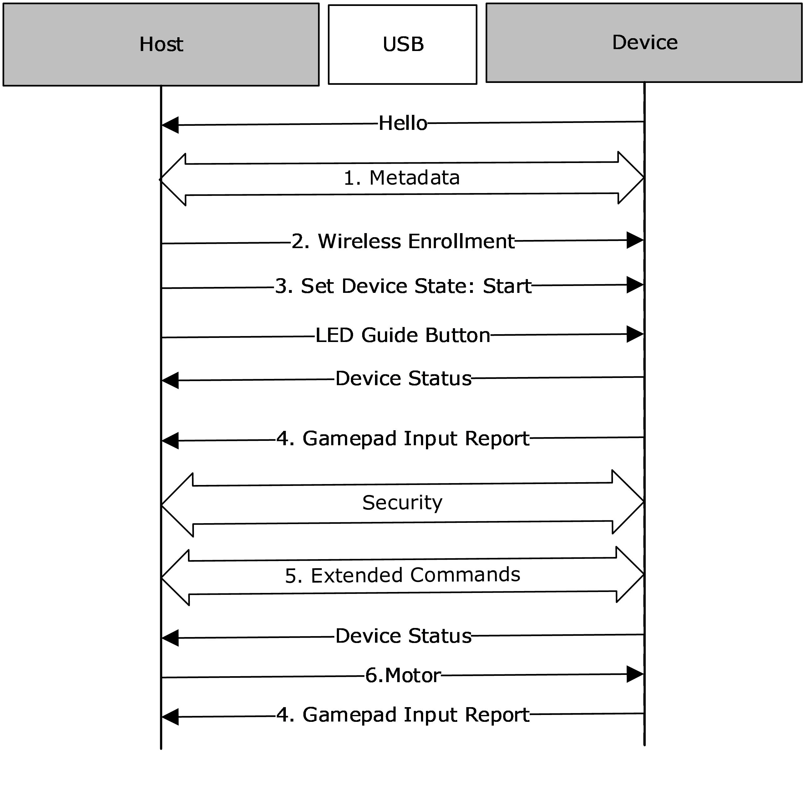
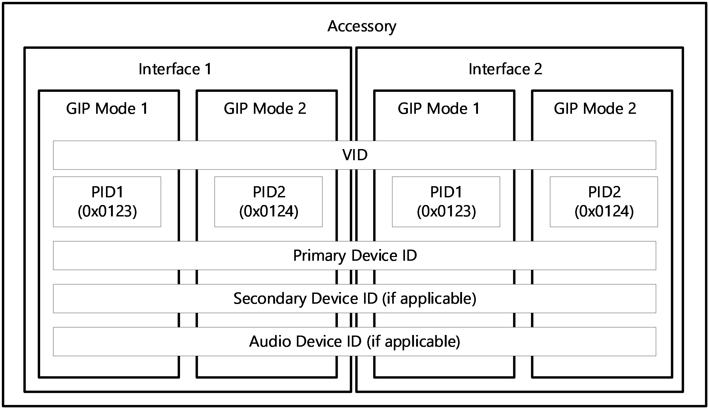
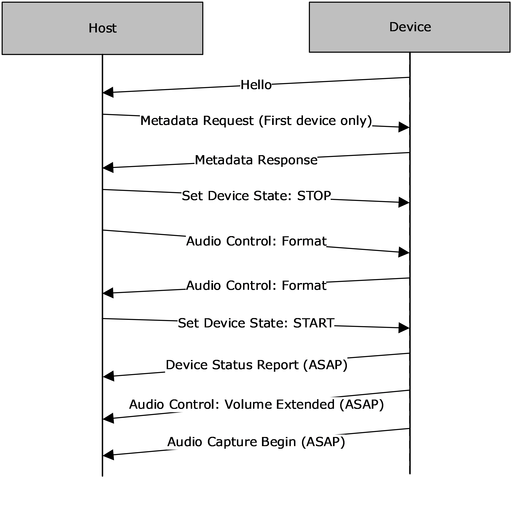
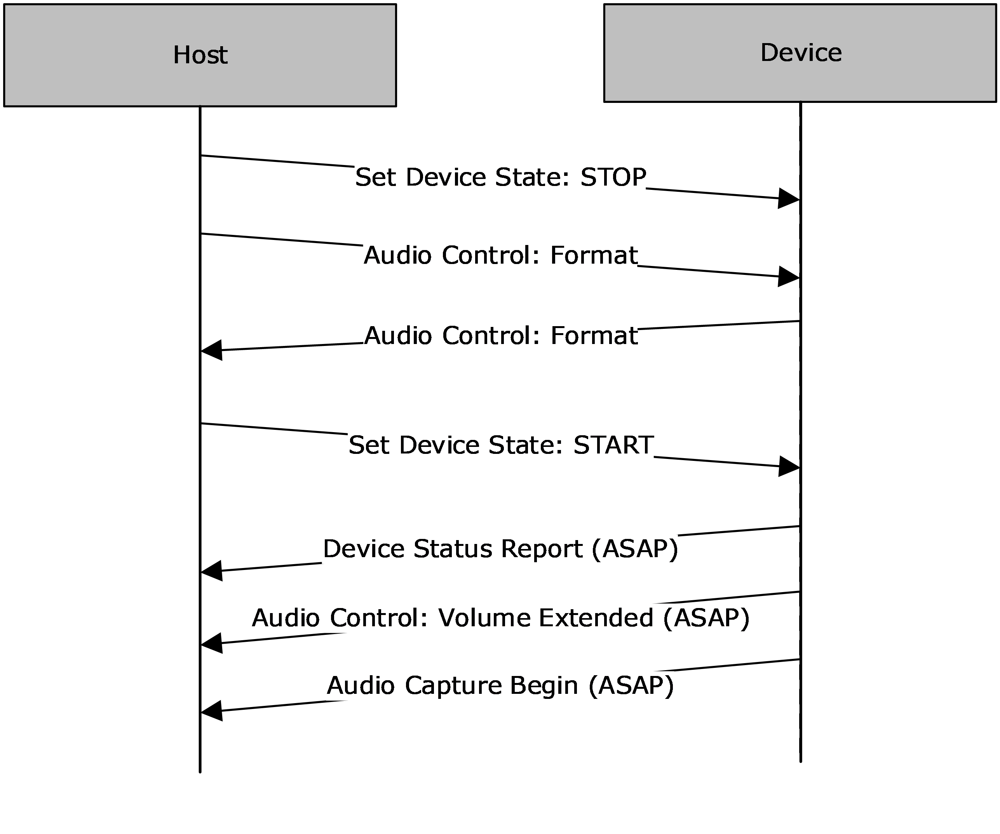
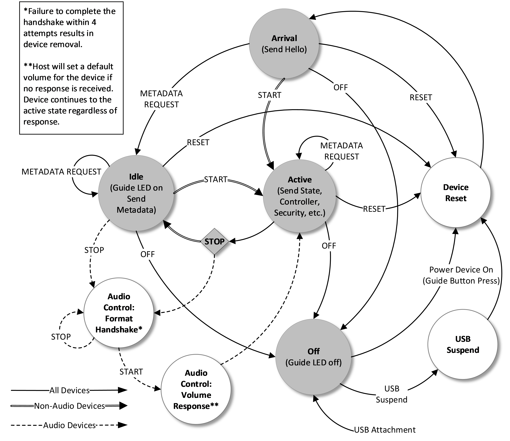
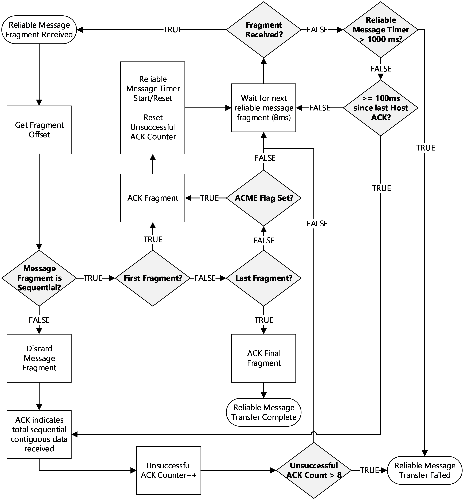
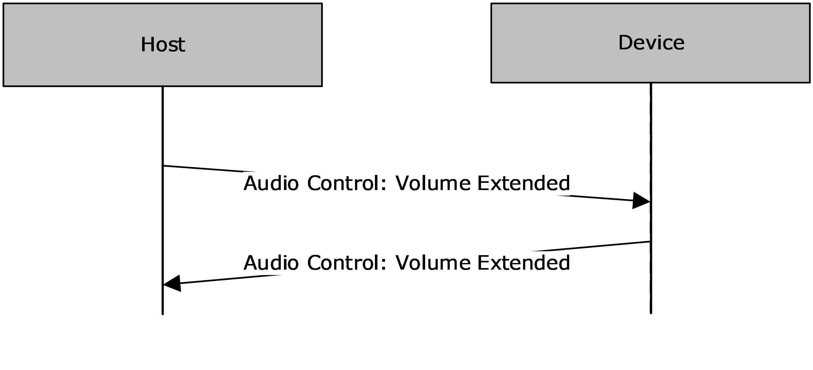

# [MS-GIPUSB]: Gaming Input Protocol (GIP) Universal Serial Bus (USB) Extension

Table of Contents

1 Introduction

- [1 Introduction](#Section_1)
  - [1.1 Glossary](#Section_1.1)
  - [1.2 References](#Section_1.2)
    - [1.2.1 Normative References](#Section_1.2.1)
    - [1.2.2 Informative References](#Section_1.2.2)
  - [1.3 Overview](#Section_1.3)
    - [1.3.1 Startup Sequence](#Section_1.3.1)
    - [1.3.2 Hello Stage](#Section_1.3.2)
    - [1.3.3 Metadata Stage](#Section_1.3.3)
    - [1.3.4 Gamepad Input Report](#Section_1.3.4)
    - [1.3.5 Audio](#Section_1.3.5)
  - [1.4 Relationship to Other Protocols](#Section_1.4)
  - [1.5 Prerequisites/Preconditions](#Section_1.5)
  - [1.6 Applicability Statement](#Section_1.6)
  - [1.7 Versioning and Capability Negotiation](#Section_1.7)
  - [1.8 Vendor-Extensible Fields](#Section_1.8)
  - [1.9 Standards Assignments](#Section_1.9)

2 Messages

- [2 Messages](#Section_2)
  - [2.1 Transport](#Section_2.1)
  - [2.2 Message Syntax](#Section_2.2)
    - [2.2.1 Device Hello Enumeration](#Section_2.2.1)
      - [2.2.1.1 Vendor ID](#Section_2.2.1.1)
      - [2.2.1.2 Product ID](#Section_2.2.1.2)
      - [2.2.1.3 Device ID](#Section_2.2.1.3)
      - [2.2.1.4 Secondary Device ID](#Section_2.2.1.4)
    - [2.2.2 GIP Metadata Exchange](#Section_2.2.2)
      - [2.2.2.1 GIP Metadata](#Section_2.2.2.1)
      - [2.2.2.2 Metadata JSON Object](#Section_2.2.2.2)
      - [2.2.2.3 Metadata Header Object](#Section_2.2.2.3)
      - [2.2.2.4 Device Metadata Object](#Section_2.2.2.4)
        - [2.2.2.4.1 SupportedInSystemCommands](#Section_2.2.2.4.1)
        - [2.2.2.4.2 SupportedOutSystemCommands](#Section_2.2.2.4.2)
        - [2.2.2.4.3 SupportedAudioFormats](#Section_2.2.2.4.3)
          - [2.2.2.4.3.1 Supported Frequencies](#Section_2.2.2.4.3.1)
        - [2.2.2.4.4 SupportedDeviceFirmareVersions](#Section_2.2.2.4.4)
        - [2.2.2.4.5 PreferredTypes](#Section_2.2.2.4.5)
        - [2.2.2.4.6 SupportedInterfaces](#Section_2.2.2.4.6)
        - [2.2.2.4.7 SupportedHidDescriptor](#Section_2.2.2.4.7)
      - [2.2.2.5 Messages Array](#Section_2.2.2.5)
        - [2.2.2.5.1 Message Example](#Section_2.2.2.5.1)
    - [2.2.3 USB Configuration](#Section_2.2.3)
      - [2.2.3.1 USB Device Initialization](#Section_2.2.3.1)
      - [2.2.3.2 USB Remote Wakeup](#Section_2.2.3.2)
      - [2.2.3.3 USB Control Endpoints](#Section_2.2.3.3)
    - [2.2.4 USB String Descriptors](#Section_2.2.4)
    - [2.2.5 USB Device Qualifier Descriptor](#Section_2.2.5)
    - [2.2.6 Microsoft OS and Extended Compatible ID Descriptors](#Section_2.2.6)
    - [2.2.7 USB Device Descriptor](#Section_2.2.7)
    - [2.2.8 USB Configuration Descriptor](#Section_2.2.8)
    - [2.2.9 USB Interface Descriptors](#Section_2.2.9)
      - [2.2.9.1 GIP Data Interface](#Section_2.2.9.1)
        - [2.2.9.1.1 GIP Data Interrupt OUT Endpoint Descriptor](#Section_2.2.9.1.1)
        - [2.2.9.1.2 GIP Data Interrupt IN Endpoint Descriptor](#Section_2.2.9.1.2)
    - [2.2.10 Message Header](#Section_2.2.10)
      - [2.2.10.1 Message Type](#Section_2.2.10.1)
      - [2.2.10.2 Flags](#Section_2.2.10.2)
      - [2.2.10.3 Sequence ID](#Section_2.2.10.3)
      - [2.2.10.4 GIP Payload Length MTUs](#Section_2.2.10.4)
    - [2.2.11 Audio Initialization](#Section_2.2.11)
      - [2.2.11.1 Starting Audio Capture](#Section_2.2.11.1)
      - [2.2.11.2 Lost Initialization Packets](#Section_2.2.11.2)
      - [2.2.11.3 Audio Reconfiguration](#Section_2.2.11.3)
    - [2.2.12 GIP Audio Interface Descriptors](#Section_2.2.12)
      - [2.2.12.1 GIP Audio Interface Descriptor Alternate](#Section_2.2.12.1)
      - [2.2.12.2 GIP Audio Isochronous OUT Endpoint Descriptor](#Section_2.2.12.2)
      - [2.2.12.3 GIP Audio Isochronous IN Endpoint Descriptor](#Section_2.2.12.3)

3 Protocol Details

- [3 Protocol Details](#Section_3)
  - [3.1 GIP Accessory Details](#Section_3.1)
    - [3.1.1 Abstract Data Model](#Section_3.1.1)
    - [3.1.2 Timers](#Section_3.1.2)
    - [3.1.3 Initialization](#Section_3.1.3)
    - [3.1.4 Higher-Layer Triggered Events](#Section_3.1.4)
    - [3.1.5 Message Processing Events and Sequencing Rules](#Section_3.1.5)
      - [3.1.5.1 Reliable Message Acknowledgement](#Section_3.1.5.1)
      - [3.1.5.2 Reliable Large Message Transmission](#Section_3.1.5.2)
      - [3.1.5.3 Coalescing Messages](#Section_3.1.5.3)
      - [3.1.5.4 Message Summary](#Section_3.1.5.4)
      - [3.1.5.5 Core System Messages](#Section_3.1.5.5)
        - [3.1.5.5.1 Hello Device Command](#Section_3.1.5.5.1)
        - [3.1.5.5.2 Status Device Command](#Section_3.1.5.5.2)
          - [3.1.5.5.2.1 Legacy Status Device Message](#Section_3.1.5.5.2.1)
          - [3.1.5.5.2.2 Extended Status Device Message](#Section_3.1.5.5.2.2)
            - [3.1.5.5.2.2.1 Status Field](#Section_3.1.5.5.2.2.1)
            - [3.1.5.5.2.2.2 Extended Status Field](#Section_3.1.5.5.2.2.2)
          - [3.1.5.5.2.3 Extended Status Events](#Section_3.1.5.5.2.3)
            - [3.1.5.5.2.3.1 Fault Event](#Section_3.1.5.5.2.3.1)
        - [3.1.5.5.3 Metadata Request Command](#Section_3.1.5.5.3)
        - [3.1.5.5.4 Metadata Response Command](#Section_3.1.5.5.4)
          - [3.1.5.5.4.1 Initial Metadata Response Command](#Section_3.1.5.5.4.1)
          - [3.1.5.5.4.2 Middle Metadata Response Command](#Section_3.1.5.5.4.2)
          - [3.1.5.5.4.3 Final Metadata Response Command](#Section_3.1.5.5.4.3)
          - [3.1.5.5.4.4 Metadata Complete Command](#Section_3.1.5.5.4.4)
        - [3.1.5.5.5 Set Device State Command](#Section_3.1.5.5.5)
        - [3.1.5.5.6 Guide Button Status](#Section_3.1.5.5.6)
        - [3.1.5.5.7 LED eButton Command](#Section_3.1.5.5.7)
        - [3.1.5.5.8 LED IR Command](#Section_3.1.5.5.8)
        - [3.1.5.5.9 Debug Commands](#Section_3.1.5.5.9)
          - [3.1.5.5.9.1 Debug Large Message Request](#Section_3.1.5.5.9.1)
          - [3.1.5.5.9.2 Debug Test Command](#Section_3.1.5.5.9.2)
        - [3.1.5.5.10 Extended Commands](#Section_3.1.5.5.10)
          - [3.1.5.5.10.1 Get Capabilities Command](#Section_3.1.5.5.10.1)
          - [3.1.5.5.10.2 Get Serial Number Command](#Section_3.1.5.5.10.2)
          - [3.1.5.5.10.3 Telemetry Extended Commands](#Section_3.1.5.5.10.3)
            - [3.1.5.5.10.3.1 Get Telemetry Data Command](#Section_3.1.5.5.10.3.1)
      - [3.1.5.6 Gamepad Vendor Messages](#Section_3.1.5.6)
        - [3.1.5.6.1 Direct Motor Command](#Section_3.1.5.6.1)
          - [3.1.5.6.1.1 Gamepad Input Report](#Section_3.1.5.6.1.1)
          - [3.1.5.6.1.2 Custom Vendor Data](#Section_3.1.5.6.1.2)
          - [3.1.5.6.1.3 Extensions](#Section_3.1.5.6.1.3)
            - [3.1.5.6.1.3.1 Console Function Map](#Section_3.1.5.6.1.3.1)
            - [3.1.5.6.1.3.2 Share button](#Section_3.1.5.6.1.3.2)
          - [3.1.5.6.1.4 Overflow Message](#Section_3.1.5.6.1.4)
          - [3.1.5.6.1.5 Preventing Host from Entering Power Save Mode](#Section_3.1.5.6.1.5)
    - [3.1.6 Timer Events](#Section_3.1.6)
    - [3.1.7 Other Local Events](#Section_3.1.7)
  - [3.2 Audio Details](#Section_3.2)
    - [3.2.1 Abstract Data Model](#Section_3.2.1)
    - [3.2.2 Timers](#Section_3.2.2)
    - [3.2.3 Initialization](#Section_3.2.3)
    - [3.2.4 Higher-Layer Triggered Events](#Section_3.2.4)
    - [3.2.5 Message Processing Events and Sequencing Rules](#Section_3.2.5)
      - [3.2.5.1 Audio System Messages](#Section_3.2.5.1)
        - [3.2.5.1.1 Audio Control Volume Extended](#Section_3.2.5.1.1)
        - [3.2.5.1.2 Audio Control Configuration](#Section_3.2.5.1.2)
        - [3.2.5.1.3 Audio Render Data Message](#Section_3.2.5.1.3)
        - [3.2.5.1.4 Audio Capture Data Message](#Section_3.2.5.1.4)
        - [3.2.5.1.5 Audio Data Message Size and Flow Control](#Section_3.2.5.1.5)
    - [3.2.6 Timer Events](#Section_3.2.6)
    - [3.2.7 Other Local Events](#Section_3.2.7)

4 Protocol Examples

- [4 Protocol Examples](#Section_4)

5 Security

- [5 Security](#Section_5)
  - [5.1 Security Considerations for Implementers](#Section_5.1)
  - [5.2 Index of Security Parameters](#Section_5.2)

6 Appendix A: Software Development Kits

- [6 Appendix A: Software Development Kits](#Section_6)

7 Appendix B: Product Behavior

- [7 Appendix B: Product Behavior](#Section_7)

8 Change Tracking

- [8 Change Tracking](#Section_8)

For the legal notice and IP terms, see [LEGAL.md](../LEGAL.md).
Last updated: 9/16/2024.
See [Revision History](#revision-history) for full version history.

# 1 Introduction

The Gaming Input Protocol (GIP) Universal Serial Bus (USB) Extension is a modified version of the USB 2.0 interface that provides extended semantics for interaction between game controller devices and a host. The high-level interface of the GIP specification includes enumeration of device capabilities, determining of device type and subtype, transfer of gamepad and voice data, and support for an expansion device on the controller.

Sections 1.5, 1.8, 1.9, 2, and 3 of this specification are normative. All other sections and examples in this specification are informative.

## 1.1 Glossary

This document uses the following terms:

**fragment**: A sequential portion of a large payload wrapped by a header. A GIP message whose total length exceeds the protocol medium's maximum transmission unit (MTU) is split into multiple fragments, each of which is kept within the MTU size. On the receiving end of the transmission the partial payloads are extracted from the fragments and assembled into the full payload.

**JavaScript Object Notation (JSON)**: A text-based, data interchange format that is used to transmit structured data, typically in Asynchronous JavaScript + XML (AJAX) web applications, as described in [[RFC7159]](https://go.microsoft.com/fwlink/?linkid=842522). The JSON format is based on the structure of ECMAScript (Jscript, JavaScript) objects.

**message**: Commands and responses of various types used by the host and device to execute specific host functions that relate to the message type. Multiple small GIP messages can fit into a single packet, or a message can be split across multiple packets.

**packet**: A bundle of data organized in a group for transmission.

**reliable transmission**: A method that utilizes host/device acknowledgements to send message fragments with verified receipt for the first, last, and periodic fragments of the message.

**transaction**: A communication event between the GIP device and host.

**transfer**: One or more transactions to move information between the GIP device and host.

**MAY, SHOULD, MUST, SHOULD NOT, MUST NOT:** These terms (in all caps) are used as defined in [[RFC2119]](https://go.microsoft.com/fwlink/?LinkId=90317). All statements of optional behavior use either MAY, SHOULD, or SHOULD NOT.

## 1.2 References

Links to a document in the Microsoft Open Specifications library point to the correct section in the most recently published version of the referenced document. However, because individual documents in the library are not updated at the same time, the section numbers in the documents may not match. You can confirm the correct section numbering by checking the [Errata](https://go.microsoft.com/fwlink/?linkid=850906).

### 1.2.1 Normative References

We conduct frequent surveys of the normative references to assure their continued availability. If you have any issue with finding a normative reference, please contact [dochelp@microsoft.com](mailto:dochelp@microsoft.com). We will assist you in finding the relevant information.

[RFC2119] Bradner, S., "Key words for use in RFCs to Indicate Requirement Levels", BCP 14, RFC 2119, March 1997, [https://www.rfc-editor.org/info/rfc2119](https://go.microsoft.com/fwlink/?LinkId=90317)

[USB-SPC2.0] USB Implementers Forum, Inc., "Document Library", USB 2.0 Specification, October 2021, [https://www.usb.org/documents](https://go.microsoft.com/fwlink/?LinkId=207891)

**Note** Search for 2.0 and Technology USB 2.0

[USB-SPC] USB Consortium, "USB 3.0 Specification", April 2000, [http://www.usb.org/developers/docs/](https://go.microsoft.com/fwlink/?LinkId=160819)

### 1.2.2 Informative References

[JSON-Schema] Internet Engineering Task Force (IETF), "JSON Schema and Hyper-Schema", [http://json-schema.org/](https://go.microsoft.com/fwlink/?LinkId=392822)

[MSLEARN-USB-OS-Descriptors] Microsoft Corporation, "Microsoft OS descriptors for USB devices", [https://docs.microsoft.com/en-us/windows-hardware/drivers/usbcon/microsoft-defined-usb-descriptors](https://go.microsoft.com/fwlink/?linkid=2281180)

[MSLEARN-USBCERT] Microsoft Corporation, "USB-IF certification", [https://learn.microsoft.com/en-us/windows-hardware/drivers/usbcon/usb-if-certification-tests](https://go.microsoft.com/fwlink/?linkid=2282326)

[MSLEARN-XIGC-API] Microsoft Corporation, "XInput Game Controller APIs", [https://learn.microsoft.com/en-us/windows/win32/api/_xinput/](https://go.microsoft.com/fwlink/?linkid=2281343)

[USB-VID] USB Implementers Forum, Inc, "Getting a Vendor ID", [https://www.usb.org/getting-vendor-id](https://go.microsoft.com/fwlink/?linkid=2281523)

## 1.3 Overview

The Gaming Input Protocol (GIP) Universal Serial Bus (USB) Extension provides flexibility for various transmission scenarios. A large GIP message can be split across multiple packets, which is necessary for security data and usually for metadata. GIP supports optional guaranteed message delivery and includes fields in the header to track sequence numbers and request ACK. Multiple small GIP messages can also be coalesced into a single [**packet**](#gt_packet). GIP message headers have a variable length. They are 4 bytes for messages which fit into a single packet and 6 bytes (or longer) to handle segmentation of a large GIP message across multiple packets.

GIP also provides support for hot swappable secondary GIP devices that attach to the primary GIP device (for example, a detachable chat pad that plugs into an expansion port on a gamepad). GIP devices that aim to provide functionality beyond that which is offered by the standard device types that are available from supported APIs can leverage extensibility options provided by those APIs. For a GIP device state diagram, see section [3.1.1](#Section_3.1.1). For more information, see the documentation downloadable from [[MSLEARN-XIGC-API]](https://go.microsoft.com/fwlink/?linkid=2281343).

### 1.3.1 Startup Sequence

The following diagram shows the startup sequence of GIP devices for a device to host connection.

Figure 1: Device to host connect

Process notes follow:

- Metadata handshake is not always required during startup sequence. See section [2.2.2](#Section_2.2.2.1).
- Wireless enrollment is only present during startup when connected via USB.
- Audio initialization sequence differs in that it starts with a set device state: Stop.
- For other device types, the Gamepad Input Report MUST be replaced by an appropriate report.
- Extended Command handshake only appears if Metadata indicates support.
- Motor command is only applicable to Gamepad.

### 1.3.2 Hello Stage

All GIP devices advertise a Hello [**message**](#gt_message) at enumeration that contains essential information necessary for identification. This includes information required to identify their unique instance from others: a device ID akin to a serial number, the product vendor and model, and their firmware, hardware, and protocol versions. See section [2.2.1](#Section_2.2.1) for vendor ID, product ID, device ID, and secondary device ID.

### 1.3.3 Metadata Stage

See section [2.2.2](#Section_2.2.2.1) for more information.

### 1.3.4 Gamepad Input Report

The Gamepad Input Report that follows the Motor exchange in the previous figure (section [1.3.1](#Section_1.3.1)) is not strictly necessary. However, the first Gamepad Input Report after Set Device State: Start is required and MUST reflect the current state of the device.

### 1.3.5 Audio

An audio streaming device is a special case. Audio data is not routed to or from the vendor’s library. Instead, it is communicated directly to the host’s audio stack, and special handling is done to ensure regular and continuous flow of data. See section [2.2.11](#Section_3.1.3) for more information.

## 1.4 Relationship to Other Protocols

The Gaming Input Protocol (GIP) Universal Serial Bus (USB) Extension uses the [[USB-SPC2.0]](https://go.microsoft.com/fwlink/?LinkId=207891) or [[USB-SPC]](https://go.microsoft.com/fwlink/?LinkId=160819) specifications from the USB Implementors Forum.

## 1.5 Prerequisites/Preconditions

The requirements in this section apply to all accessories that utilize USB (this includes game controllers).

- MUST be compliant with published USB 2.0 or 3.0 specifications from the USB Implementors Forum. See [[USB-SPC2.0]](https://go.microsoft.com/fwlink/?LinkId=207891) or [[USB-SPC]](https://go.microsoft.com/fwlink/?LinkId=160819) specifications.
- SHOULD pass USB 2.0 or 3.0 compliance and certification testing requirements. Include the USB-IF Test ID (TID) with the product submission if available. Submission to the USB-IF’s list of certified devices on usb.org is optional. See [[MSLEARN-USBCERT]](https://go.microsoft.com/fwlink/?linkid=2282326) for details. For example, USB 2.0 requirements specifically include:
- Inrush charge less than 50 µC
- Unconfigured current less than 100 mA
- Suspend current less than 2.5 mA
- Maximum configured current less than 500 mA
- SHOULD pass USB-IF’s USB Command Verifier test tools for USB 2.0 or 3.0. This is part of the USB certification testing covered by the previous requirements.
- MUST use a valid USB Vendor ID (VID) registered to the device manufacturer. See [[USB-VID]](https://go.microsoft.com/fwlink/?linkid=2281523) for more information.
- SHOULD have a USB icon molded into the USB plug in conformance with USB 2.0 Connector Mechanical Configuration and Material Requirements.
- MUST appear off when in USB suspend. LEDs MUST be off unless used to indicate battery charging activity. All available analog sticks, analog triggers, and digital buttons MUST remain inactive except for the button used to power on the accessory. All rumble and haptics features MUST remain off. Any speaker output MUST remain inaudible except for accessories that use this to communicate charging battery status.
- All partner accessories that seek to connect via wireless SHOULD leverage the USB path and implement encryption on top of it to guarantee the privacy and security of the transport.

## 1.6 Applicability Statement

Applies to all accessories that utilize the Universal Serial Bus (USB).

## 1.7 Versioning and Capability Negotiation

None.

## 1.8 Vendor-Extensible Fields

All GIP devices advertise a Hello message at enumeration that contains essential information necessary for identification. This includes information required to identify their unique instance from others: a device id akin to a serial number, the product vendor and model, and their firmware, hardware, and protocol versions.

All accessories that utilize USB MUST use a valid USB Vendor ID (VID) registered to the device manufacturer. See [[USB-VID]](https://go.microsoft.com/fwlink/?linkid=2281523) for more information. See section [2.2.1](#Section_2.2.1) for vendor ID, product ID, device ID, and secondary device ID.

## 1.9 Standards Assignments

None.

# 2 Messages

## 2.1 Transport

The Gaming Input Protocol (GIP) Universal Serial Bus (USB) Extension transports messages via the Universal Serial Bus (USB) Core protocol as specified by [[USB-SPC2.0]](https://go.microsoft.com/fwlink/?LinkId=207891) and [[USB-SPC]](https://go.microsoft.com/fwlink/?LinkId=160819). USB Core is an external bus architecture that connects USB-capable peripheral devices to a host computer. Wired and wireless USB adapters are supported.

## 2.2 Message Syntax

### 2.2.1 Device Hello Enumeration

All GIP devices advertise a Hello [**message**](#gt_message) at enumeration that contains essential information necessary for identification. This includes information required to identify their unique instance from others: a device id akin to a serial number, the product vendor and model, and their firmware, hardware, and protocol versions. The following sections define Vendor ID, Product ID, Device ID, and Secondary Device ID.

The device will continue to advertise a Hello message at an interval until the host replies with an expected instruction. The host waits for a device’s Hello message before it responds with any further instruction. Its function is comparable to a USB Device Descriptor.

While in the Arrival state, the device MUST send GIP Hello messages at 500 millisecond intervals until a response is received from the host. No other messages SHOULD be sent to the host except for Hello until a response is received from the host. For all GIP devices, this response message could be a Metadata Request, a Set Device State: Off, or a Set Device State: Reset. Additionally, the response for non-audio devices could be a Set Device State: Start, or for audio devices a Set Device State: Stop.

#### 2.2.1.1 Vendor ID

The USB Vendor ID of a product identifies the partner company that produced the product. It is assigned by the USB Implementer’s Forum (USB-IF). See [[USB-VID]](https://go.microsoft.com/fwlink/?linkid=2281523) for more information. The VID for all components that enumerate across the USB bus MUST match the VID registered with the USB-IF for the submitting partner. If the Gaming Input Protocol (GIP) is used with a USB device, the Vendor ID (VID) and Product ID (PID) specified in the USB Device Descriptor MUST match the VID and PID specified in the primary GIP Hello message.

#### 2.2.1.2 Product ID

The USB Product ID (PID) is allocated and assigned to a device by the vendor. This differs from the USB Vendor ID (VID) which is assigned by the USB Implementer’s Forum (USB-IF). For purposes of telemetry and differentiation, there are a few requirements that MUST be followed when a PID is allocated to a product:

- MUST assign a unique USB Product ID (PID) to each primary accessory, colorway variant, and secondary/sub-devices. There are approved exceptions where a secondary/sub-device PID can be shared across different accessories from the same vendor product category. For example, an embedded audio sub-device with similar functionality across all gamepads can share the same PID. Note, however, that a sub-device PID MUST always be different than the primary accessory PID. Finally, there MUST be a unique PID assigned to each GIP Mode the device supports. A GIP Mode MAY be a device-type like Gamepad, Arcade Stick, Wheel, or Flight Stick. For example, an Arcade Stick that supports operation as a Gamepad for compatibility reasons, would require unique PID for each device-type. A GIP Mode MAY also be a supported protocol like GIP, HID, or Bluetooth. For example, a GIP Wheel that also supports HID when connected to PC, would require different PIDs for each protocol. Note, however, the PID SHOULD remain the same for a protocol shared between communication interfaces.
- USB Product IDs MUST NOT be reused on future products even if the product is a re-launch of the previous product. For example, Product A is assigned Primary PID 0x0123 and Secondary PID 0x0124. Product B MUST NOT use 0x0123 or 0x0124 as a primary PID. However, Product B MAY use Secondary PID 0x0124 if the functionality of the sub-device is equivalent Product A’s functionality.

#### 2.2.1.3 Device ID

All GIP devices MUST have a unique 64-bit Primary Device ID of which the four most significant bytes are 0x00, 0x00, 0xFF, 0xFB. The remaining bytes MUST be Random numbers, determined on bootup of the GIP device. Note that if two devices have the same Device IDs, neither device will function correctly. As a result, devices need to ensure reliable hardware-based random number generation.

**Note**: If Device ID generation fails, the device MUST retry or reset. A device MUST NOT continue through the GIP connection process without a valid Device ID.

Figure 2: GIP device IDs example

#### 2.2.1.4 Secondary Device ID

GIP supports enumeration of additional sub-devices after the primary device has completed the Security Handshake successfully. These secondary sub-devices MUST also have their own unique Device IDs. However, the Primary Device ID can be used to generate additional secondary sub-device Device IDs.

The information in the following table is an example taken from a GIP controller. It shows the derived IDs for both secondary devices (Audio and Other) through use of the GenerateSecondaryDeviceID algorithm.

**Note:** Most GIP devices do not have other devices but do include audio. Unique device ID numbering is noted by the bold digits in the following table.

| Device | Sub-device | VID | PID | DeviceID |
| --- | --- | --- | --- | --- |
| 0 | 0 (Primary) | 0x045E | 0x0B00 | 0000D**6**0F4882ED7E |
| 0 | 1 (3.5 mm Audio) | 0x045E | 0x0B01 | 0000D**7**0F4882ED7E |
| 0 | 2 (Other) | 0x045E | 0x0B02 | 0000D**8**0F4882ED7E |

Table 1: GIP controller example

Generating a Secondary Device ID is demonstrated in the following code snippet. The Secondary Device ID is generated for a virtual sub-device from a Primary Device ID through addition of the secondary device’s expansion index (see the **Flags** field in Message Header, section [2.2.10](#Section_2.2.10)) to the most significant non-zero byte of the Primary Device ID. If that addition wraps, it is carried backwards to the previous byte for up to 4 bytes.

#define DEVICE_ID_LEN (6)

void GenerateSecondaryDeviceId(uint8_t* pDeviceId, uint8_t ExpansionIndex)

{

uint8_t j = 0;

// Get Primary Device ID generated from Security Chip's PUID.

GetPrimaryDeviceId(pDeviceId);

// Generate a unique device ID for this virtual GIP sub-device by adding

// the expansion index of the device to the most significant non-zero

// byte of the Primary Device ID. If it wraps around, carry that

// backward to previous byte for up to 4 bytes.

for (uint8_t i = 1; i < 5 && j < ExpansionIndex; i++)

{

while (j < ExpansionIndex)

{

pDeviceId[DEVICE_ID_LEN - i]++;

if (pDeviceId[DEVICE_ID_LEN - i] == 0)

{

break;

}

j++;

}

if (pDeviceId[DEVICE_ID_LEN - i] != 0)

{

break;

}

}

}

### 2.2.2 GIP Metadata Exchange

All GIP devices provide details about supported system and vendor feature sets and their related [**message**](#gt_message) properties through device-specific metadata. Metadata packets are requested by a host in response to a GIP connection request or Hello message. Metadata contains immutable information about the device. Its function is comparable to a Human Interface Device (HID) report descriptor.

The following figure demonstrates the exchange.

Figure 3: GIP controller metadata exchange

The host will request metadata up to 4 times at 500ms intervals. After that period has expired, the host will mark the device for removal. Devices SHOULD promptly reply with a Metadata response (<500ms). If the device is in the process of responding to a Metadata request while it receives another, the device SHOULD always ensure it replies at minimum to the most recent request. If the device is unable to complete the metadata [**transfer**](#gt_transfer) and times out, the device MUST move back to the Hello stage until it receives a new Metadata request, a GIP Set Device State: START (or STOP for audio devices), or is commanded to turn off or reset via a GIP Set Device State: OFF/RESET command.

**Caching**

The first time a device is plugged into the Host system it will be queried for the metadata. Subsequent times might or might not query the device for the metadata as the system caches this information when it can. If metadata for a GIP device has not been encountered before, the host will cache it for quicker subsequent retrieval. The metadata cache can be cleared through a reboot (or power cycle) of the host. A complete reboot of the system SHOULD remove the cache and cause a re-query of the device’s metadata on re-enumeration.

Each standard GIP device type will have different metadata contents. A single device that allows the user to switch between different GIP device types (such as between Arcade Stick and Gamepad) SHOULD differentiate the fields used for metadata lookup in the Hello message so that they have unique metadata cache entries. For example, if the host caches the metadata for the device in Arcade Stick mode and the Hello message for Gamepad is not properly differentiated, the host will use the cached Arcade Stick metadata for Gamepad mode and the device will not function properly. To assure appropriate metadata association, a device can differentiate the Hello messages through use of either a unique Product ID or unique Major or Minor Firmware Version fields for each mode. In general, using a unique Product ID is preferred over differentiating by Firmware Version, but there might be circumstances where Firmware Version is the best option.

Metadata lookup is performed by comparing the Hello message’s Vendor ID, Product ID, and Major and Minor Firmware Version fields with any previously encountered entries. A single metadata blob for a specific Vendor ID and Product ID combination can be shared across multiple firmware versions, so long as the version advertised in the Hello message matches one listed within the metadata supported firmware version list. At least one of the supported Major and Minor Firmware Version pairs listed in metadata MUST match what is provided by the Hello message or the host will stop responding to the GIP device after the conclusion of the metadata exchange.

At the conclusion of the metadata exchange, the host will inform the device that it can either start normal activity or continue with any additional and necessary configuration.

**GIP Gamepad metadata Example**

The following is a typical GIP Gamepad metadata in JSON format. For wire trace examples, see the documentation downloadable from [[MSLEARN-XIGC-API]](https://go.microsoft.com/fwlink/?linkid=2281343).

{

"MetadataHeader" :

{

"MajorVersion" : 1,

"MinorVersion" : 0

},

"DeviceMetadata" :

{

"SupportsDeviceFirmwareVersions" : [

{ "Major" : 1, "Minor" : 0 }

],

"SupportedAudioFormats" : [],

"SupportedInSystemCommands" : [1,2,3,4,6,7],

"SupportedOutSystemCommands" : [1,4,5,6,10],

"PreferredTypes" : [

"Windows.Xbox.Input.Gamepad"

],

"SupportedInterfaces" : [

"9776FF56-9BFD-4581-AD45-B645BBA526D6",

"082E402C-07DF-45E1-A5AB-A3127AF197B5",

"B8F31FE7-7386-40E9-A9F8-2F21263ACFB7"

]

},

"Messages" : [

{

"MessageType" : 32,

"MessageLength" : 14,

"DataType" : "custom",

"IsUpstream" : true,

"Period" : 0,

"PersistenceTimeout" : 0

},

{

"MessageType" : 9,

"MessageLength" : 9,

"DataType" : "custom",

"IsDownstream" : true,

"Period" : 0,

"PersistenceTimeout" : 0

}

]

}

Note the preferred type of Windows.Xbox.Input.Gamepad that specifies the DLL to load and the three supported interfaces as follows:

- Windows.Xbox.Input.IController {9776FF56-9BFD-4581-AD45-B645BBA526D6}
- Windows.Xbox.Input.IGamepad {082E402C-07DF-45E1-A5AB-A3127AF197B5}
- Windows.Xbox.Input.INavigationController {B8F31FE7-7386-40E9-A9F8-2F21263ACFB7}
The preceding JSON is then transformed into a binary blob using the metadata compiler. See the [MSLEARN-XIGC-API] gipdocs download for the source code.

The following shows a typical GIP Gamepad compiled metadata binary blob as source code.

const unsigned char Metadata[182] =

{

0x10, 0x00, 0x01, 0x00, 0x00, 0x00, 0x00, 0x00, 0x00, 0x00, 0x00, 0x00, 0x00, 0x00, 0xB6, 0x00, // 0x00

0x77, 0x00, 0x16, 0x00, 0x1B, 0x00, 0x1C, 0x00, 0x23, 0x00, 0x29, 0x00, 0x46, 0x00, 0x00, 0x00, // 0x10

0x00, 0x00, 0x00, 0x00, 0x00, 0x00, 0x01, 0x01, 0x00, 0x00, 0x00, 0x00, 0x06, 0x01, 0x02, 0x03, // 0x20

0x04, 0x06, 0x07, 0x05, 0x01, 0x04, 0x05, 0x06, 0x0A, 0x01, 0x1A, 0x00, 0x57, 0x69, 0x6E, 0x64, // 0x30

0x6F, 0x77, 0x73, 0x2E, 0x58, 0x62, 0x6F, 0x78, 0x2E, 0x49, 0x6E, 0x70, 0x75, 0x74, 0x2E, 0x47, // 0x40

0x61, 0x6D, 0x65, 0x70, 0x61, 0x64, 0x03, 0x56, 0xFF, 0x76, 0x97, 0xFD, 0x9B, 0x81, 0x45, 0xAD, // 0x50

0x45, 0xB6, 0x45, 0xBB, 0xA5, 0x26, 0xD6, 0x2C, 0x40, 0x2E, 0x08, 0xDF, 0x07, 0xE1, 0x45, 0xA5, // 0x60

0xAB, 0xA3, 0x12, 0x7A, 0xF1, 0x97, 0xB5, 0xE7, 0x1F, 0xF3, 0xB8, 0x86, 0x73, 0xE9, 0x40, 0xA9, // 0x70

0xF8, 0x2F, 0x21, 0x26, 0x3A, 0xCF, 0xB7, 0x02, 0x17, 0x00, 0x20, 0x0E, 0x00, 0x01, 0x00, 0x10, // 0x80

0x00, 0x00, 0x00, 0x00, 0x00, 0x00, 0x00, 0x00, 0x00, 0x00, 0x00, 0x00, 0x00, 0x00, 0x00, 0x17, // 0x90

0x00, 0x09, 0x09, 0x00, 0x01, 0x00, 0x08, 0x00, 0x00, 0x00, 0x00, 0x00, 0x00, 0x00, 0x00, 0x00, // 0xA0

0x00, 0x00, 0x00, 0x00, 0x00, 0x00 // 0xB0

};

#### 2.2.2.1 GIP Metadata

GIP device manufacturers start with creation of the JavaScript Object Notation (JSON) metadata descriptions for their device with the schema defined in the following GIP Metadata sections. They then generate the metadata binary blobs from the JSON with the GIP metadata compiler. Partners then need to embed these blobs into their device firmware. Generic JSON templates for the standard device types are available as separate documentation for each device type.

Metadata provides the Host with information about:

- System message support
- Type-specific messages
- Supported types and interfaces
Metadata is described with [**JavaScript Object Notation (JSON)**](#gt_javascript-object-notation-json), which is a human-readable structured format. See [[JSON-Schema]](https://go.microsoft.com/fwlink/?LinkId=392822).

**Compiling the Metadata**

The JSON object is run through a compiler to produce a more compact binary blob. The compiler is available as source code contained within a download available online. See [[MSLEARN-XIGC-API]](https://go.microsoft.com/fwlink/?linkid=2281343).

Usage once the compiler source code is compiled:

MetadataCompiler inputfile [outputfile]

**inputfile**: The file that contains the JSON formatted metadata. This parameter is required.

**outputfile**: The resultant binary metadata blob. This parameter is optional. If not set the output will be sent to inputfile.bin.

#### 2.2.2.2 Metadata JSON Object

The complete metadata is a single top-level, unnamed JSON object that contains three name/value pairs.

{

"MetadataHeader" : { … },

"DeviceMetadata" : { … },

"Messages" : [ … ]

}

#### 2.2.2.3 Metadata Header Object

The **MetdataHeader** is an object that contains two name/value pairs.

"MetadataHeader" : {

"MajorVersion" : 1,

"MinorVersion" : 0

}

**MajorVersion**: An integer. It represents the major portion of the metadata specification this object follows. Its value is 1.

**MinorVersion**: An integer. It represents the minor portion of the metadata specification this object follows. Its value is 0.

#### 2.2.2.4 Device Metadata Object

**DeviceMetadata** is of type object. It contains six name/value pairs.

"DeviceMetadata" : {

"SupportedInSystemCommands" : [ … ]

"SupportedOutSystemCommands" : [ … ]

"SupportedAudioFormats" : [ … ]

"SupportedDeviceFirmwareVersions" : [ … ]

"PreferredTypes" : [ … ]

"SupportedInterface" : [ … ]

}

The following sections define the DeviceMetadata fields.

##### 2.2.2.4.1 SupportedInSystemCommands

**SupportedInSystemCommands** is an array of integers. These values are the system commands that the device can send to the console. The following table lists the commands. As noted in the table, almost every device has this **SupportedInSystemCommands** name value pair.

"SupportedInSystemCommand" : [1, 2, 3, 4, 6, 7]

| Value | Name | Notes |
| --- | --- | --- |
| 1 | Protocol Control | Every device MUST support. |
| 2 | Hello Device | Every device MUST support. Even though this is sent before the metadata exchange, this MUST still be listed in the metadata |
| 3 | Status Device | Every device MUST support. |
| 4 | Metadata Response | Every device MUST support. Even though the device obviously supports the metadata exchange (or the system would not look at this field), this MUST still be listed in the metadata. |
| 6 | Security Exchange | Every device MUST support. |
| 7 | Key Input | Every device with an Xbox button MUST support this. This message is used for indicated VKEY presses, and the Xbox button is in the form of a VKEY (0x5B or VK_LWIN). |
| 8 | Audio Control | Any device which supports audio, either input or output, MUST support this. |
| 31 | Debug Message | Optional use for large [**packet**](#gt_packet) debugging. |
| 96 | Audio Data | Any device which provides audio MUST support, whether input or output. |

Table 2: SupportedInSystemCommands name value pairs

##### 2.2.2.4.2 SupportedOutSystemCommands

**SupportedOutSystemCommands** is an array of integers. These values are the system commands that the device supports receiving. Almost all devices have the following array for out commands.

"SupportedOutSystemCommands" : [1, 4, 5, 6, 10 ]

The following table lists the supported Out system commands.

| Value | Name | Notes |
| --- | --- | --- |
| 1 | Protocol Control | Every device MUST support. |
| 4 | Metadata Request | Every device MUST support. Even though the device obviously supports the metadata exchange (or the system would not look at this field), this MUST still be listed in the metadata. |
| 5 | Set Device State | Every device MUST support. |
| 6 | Security Exchange | Every device MUST support. |
| 8 | Audio Control | Any device which supports audio, either input or output, MUST support this. |
| 10 | LED Commands | Devices with a guide button MUST support this command. |
| 31 | Debug Message | Optional, used for Large Packet Debugging. |
| 96 | Audio Data | Any device which supports audio output MUST support this. Not required for input-only (microphone) devices. |

Table 3: SupportedOutSystemCommands name value pairs

##### 2.2.2.4.3 SupportedAudioFormats

**SupportedAudioFormats** is an array of unnamed audio format objects. The audio format objects can contain one or two named objects to describe inbound and outbound audio format information.

{

"Inbound" : { ... },

"Outbound" : { ... }

}

If your device does not support audio, do not include this section.

If your device supports audio, it SHOULD specify the supported audio configuration here. The configurations SHOULD be specified in order of preference, with the default mode listed first and possible fallback modes second. Each section specifies inbound and outbound configurations. If a device does not support both inbound (microphone) and outbound (speaker) audio, specify 0 for both Channels and Rate on the nonexistent direction.

The purpose of a fallback mode is to enable a wireless audio product to function in a poor or noisy RF environment. It only uses the best available audio quality.

Inbound and outbound are specified in pairs to prevent the device from attempting to configure an inbound (capture)/outbound (render) combination of rates a given device might not support. For the following example (example 1), the device will only request either a 24 KHz/48 KHz combination or a 12 KHz /24 KHz combination. It never requests 12 KHz /48 KHz because it is not listed in the metadata.

Example 1: A stereo chat headset with microphone.

"SupportedAudioFormats" : [

{ "Inbound" : { "Channels" : 1, "Rate" : 24000 }, "Outbound" : { "Channels" : 2, "Rate" : 48000 }

}, { "Inbound" : { "Channels" : 1, "Rate" : 12000 }, "Outbound" : { "Channels" : 2, "Rate" : 24000 }

}

]

Example 2: A microphone-only product.

"SupportedAudioFormats" : [

{ "Inbound" : { "Channels" : 1, "Rate" : 24000 }, "Outbound" : { "Channels" : 0, "Rate" : 0 }

}

]

###### 2.2.2.4.3.1 Supported Frequencies

Any frequency can support one or two channels. All audio data formats are 16-bit, little endian. Multi-channel audio devices MUST interleave the samples. The following lists supported frequencies:

- 0 (No data)
- 8000
- 12000
- 16000
- 20000
- 24000
- 32000
- 40000
- 48000
**Note:** Not all frequencies are appropriate for all functions, and the Host audio stack does not provide resampling for all possible combinations of audio source and output frequency. For general purpose audio the preferred frequencies are 24 kHz and 48 kHz. For custom devices where the only audio provider will be a single title that understands the device, any frequency can be used on the recommendation that the source frequency SHOULD match the output frequency. Audio resampling is done in software, is computationally intensive and might result in poor quality.

##### 2.2.2.4.4 SupportedDeviceFirmareVersions

**SupportedDeviceFirmareVersions** is an array of unnamed version objects. The version objects contain two named number pairs.

{

"Major" : 1,

"Minor" : 0

}

**Major** and **Minor** in this object refer to the major and minor portion of the firmware version part of the **Hello** message. The revision and build portion of the firmware are not used here.

This list of supported versions indicates what firmware this metadata describes. If the firmware changes (new major or minor version), but the metadata information is unchanged (with the exception of this array), both the new and the old versions SHOULD be included here. This allows the system some efficiencies in lookup and storage of the metadata.

If the firmware major.minor that is reported in the Hello message is not present here, the device will not work on the Host. If you change either, you MUST change this array. Changes to firmware revision or build do not require a change to the metadata. It is recommended that the device SHOULD only state the version here that matches the Hello message.

The following is an example that supports both 1.0 and 1.1 firmware revisions.

"SupportedDeviceFirmareVersions" : [

{

"Major" : 1,

"Minor" : 0

},

{

"Major" : 1,

"Minor" : 1

}

]

##### 2.2.2.4.5 PreferredTypes

**PreferredTypes** is an array of string values. The strings represent an ordered list of types supported by the controller. Games (or the system) MUST provide a handler (usually a DLL) for the specified type. If this does not exist, the next type is tried, until either a match is found, or the system is unable to make a match. If no match is made, this device is not used.

**Published Types**

- Windows.Xbox.Input.Gamepad
- Microsoft.Xbox.Input.ArcadeStick
- Windows.Xbox.Input.ArcadeStick
- Microsoft.Xbox.Input.Wheel
- Windows.Xbox.Input.Wheel
- Windows.Xbox.Input.NavigationController
Types that begin with Windows are built into the operating system. Types that begin with Microsoft are not built into the operating system but are shipped as part of the title.

**Custom Types**

Hardware manufacturers can create their own types and provide a corresponding handler DLL so that games will work with these custom types. These types SHOULD be named with the following format.

*Company.Xbox.TypeLessSpecific.TypeMoreSpecific*

For example, if fictional company Contoso were to create a gamepad that they market as the Shazam Gamepad they would use Contoso.Xbox.Gamepad.Shazam. If they were creating a category of devices for a high-end boat simulator, they could use type names such as the following:

- Contoso.Xbox.Boat.Sextant
- Contoso.Xbox.Boat.Rudder
- Contoso.Xbox.Boat.Anchor
It is NOT possible to extend an existing type. However, it is possible to be protocol compatible with an existing type. To achieve this, device handlers are built to allow packets larger than those expected and to expect and ignore packets with IDs that are unknown.

This allows devices to send messages that are extensions of existing messages. For example, if Contoso wanted to have its Shazam gamepad include an extra slider (lightning-bolt shaped of course) they could include this information at the end of the gamepad data [**packet**](#gt_packet). For a message with ID: 0x20, Flags: 0x00, and a payload of 14 bytes, they could change the payload size to 15 and append the byte to the end.

Games that want to support the extra Shazam behavior would include Contoso.Xbox.Gamepad.Shazam.dll. The hardware would enumerate the following preferred types.

"PreferredTypes" : [

"Contoso.Xbox.Gamepad.Shazam",

"Windows.Xbox.Input.Gamepad",

"Windows.Xbox.Input.NavigationController"

]

Games that include Contoso.Xbox.Gampead.Shamzam.dll would get the Contoso.Xbox.Gamepad.Shazam type at runtime and be able to access the additional button state. Games that did not include that DLL would fall back to the system supplied Windows.Xbox.Input.Gamepad type and have access to standard Gamepad functionality, but not the extra button state.

Audio devices which support chat or normal game audio are encouraged to specify Windows.Xbox.Input.Headset as their typename. Custom audio devices which MAY provide title-specific non-chat audio output SHOULD specify Windows.Xbox.Input.CustomAudio. Both types of devices use the same message types and communication formats to stream audio data, specifically system packet 96. Host does not support the vendor’s library directly handling of audio streaming, and audio data is instead routed through the audio driver to ensure consistent quality.

Vendors are free to implement non-streaming scenarios such as the download of clips to the device for later playback using non-system vendor commands. The GIP protocol MAY enforce a size limit on vendor messages in either direction.

##### 2.2.2.4.6 SupportedInterfaces

**SupportedInterfaces** is an array of string values. The strings represent interface GUIDs.

**Published Types**

- Microsoft.Xbox.Input.IGamepad {082E402C-07DF-45E1-A5AB-A3127AF197B5}
- Microsoft.Xbox.Input.IProgrammableGamepad {31C1034D-B5B7-4551-9813-8769D4A0E4F9}
- Microsoft.Xbox.Input.IArcadeStick {332054CC-A34B-41D5-A34A-A6A6711EC4B3}
- Microsoft.Xbox.Input.IWheel {646979CF-6B71-4E96-8DF9-59E398D7420C}
- Windows.Xbox.Input.INavigationController {B8F31FE7-7386-40E9-A9F8-2F21263ACFB7}
- Windows.Xbox.Input.IController {9776FF56-9BFD-4581-AD45-B645BBA526D6}
- Windows.Xbox.Input.IHeadset {BC25D1A3-C24E-4992-9DDA-EF4F123EF5DC}
- Windows.Xbox.Input.ICustomAudio {63FD9CC9-94EE-4B5D-9C4D-8B864C149CAC}
- Windows.Xbox.Input.IConsoleFunctionMap {ECDDD2FE-D387-4294-BD96-1A712E3DC77D}
A device SHOULD list supported interfaces in preferred order, from most specific to least specific. Unlike the type, multiple interfaces MAY be used by the game for the same device.

Microsoft.Xbox.Input.IProgrammableGamepad is a flag for devices to opt-out of system remapping, and instead apply vendor-specific internal remapping (to be defined and implemented by them).

All controller devices MUST list Microsoft.Xbox.Input.IController in **SupportedInterfaces**.

All audio devices which support game audio or headset/chat capabilities MUST list Microsoft.Xbox.Input.IHeadset in **SupportedInterfaces**. Custom audio devices which play dedicated sounds but do not support chat scenarios or full game audio SHOULD instead specify Microsoft.Xbox.Input.ICustomAudio.

**Custom Interfaces**

Devices can also enumerate custom interfaces. The custom type handler DLL exposes these interfaces. There is no requirement for the DLL to implement all interfaces exposed by the device. The custom type handler does NOT directly implement Windows.Xbox.Input.IController as that implementation is provided by a built-in system component.

Example for the Contoso Shazam Controller.

Contoso.Xbox.Gamepad.IShazam : {C91E76C0-1C6E-450B-8B33-5DB3947F6416}

"SupportedInterfaces" : [

"C91E76C0-1C6E-450B-8B33-5DB3947F6416",

"082E402C-07DF-45E1-A5AB-A3127AF197B5",

"B8F31FE7-7386-40E9-A9F8-2F21263ACFB7",

"9776FF56-9BFD-4581-AD45-B645BBA526D6"

]

This translates in this order to the following.

"SupportedInterfaces" : [

"Contoso.Xbox.Gamepad.IShazam",

"Microsoft.Xbox.Input.IGamepad",

"Microsoft.Xbox.Input.INavigationController",

"Microsoft.Xbox.Input.IController"

]

##### 2.2.2.4.7 SupportedHidDescriptor

Some devices like a chatpad can tunnel human interface device (HID) input in GIP packets through use of the GIP MessageType 0xB (**System** flag set). These devices SHOULD specify Windows.Xbox.Input.Chatpad among the **PreferredTypes** and the **SupportedHidDescriptor** SHOULD be the hex bytes of an appropriate HID descriptor as follows.

"SupportedHidDescriptor" : "09 21 01 01 00 01 22 40 00 05 01 09 06 A1 01 05 07 19 E0 29 E7 15 00 25 01 75 01 95 08 81 02 95 01 75 08 81 01 95 05 75 01 05 08 19 01 29 05 91 02 95 01 75 03 91 01 95 06 75 08 15 00 26 FF 00 05 07 19 00 29 FF 81 00 C0"

"SupportedInterfaces" SHOULD include the GUID: "9776FF56-9BFD-4581-AD45-B645BBA526D6".

#### 2.2.2.5 Messages Array

The **Messages** array is an array of unnamed **Message** objects. The messages in the array are the non-system messages the device sends and receives. If a message is not listed here, the system will not send the message to the device or pass the message up from the device. The **Message** objects are collections of the following name/value pairs.

{

"MessageType" : number,

"MessageLength" : number,

"DataType" : string,

"IsBigEndian" : boolean,

"IsReliable" : boolean,

"IsSequenced" : boolean,

"IsDownstream" : boolean,

"IsUpstream" : boolean,

"Period" : number,

"PersistanceTimeout" : number

}

**MessageType**: A decimal number. This is the ID of the message.

**MessageLength**: A number that is the maximum length of the message. Smaller messages can be sent/received. Messages larger than the set value will be ignored by the system.

**DataType**: A string that indicates the type of message. It MUST all be set to "custom".

**IsBigEndian**: A Boolean value (true or false) that indicates the endianness of the data in the message. False indicates small-endian; true indicates big-endian.

**IsReliable**: A Boolean value. If true, indicates the [**packet**](#gt_packet) SHOULD be ACK'd by the system (or if to the device, the system will request an ACK. This SHOULD always be set to false. Not used by third-party protocols.

**IsSequenced**: A Boolean that indicates if the messages are in sequence. All messages from the console will have changing sequence ids. Devices SHOULD do the same. If this flag is set for downstream, the console will ensure that the sequence IDs do not just change, but always change by +1. Otherwise, this is not guaranteed (can change by 2 or can change by -1). This way the receiver can know that it missed a particular message if it detects a gap. For USB devices this is not a problem, and this SHOULD always be set to false.

**IsDownstream**: A Boolean value where true indicates this message is sent from the system to the device. False indicates it is not sent from the system to the device.

**IsUpstream**: A Boolean value where true indicates this message is sent from the device to the system. False indicates it is not.

**Period**: A number. This is not implemented by the console and SHOULD be set to 0.

**PersistanceTimeout**: A number. This is not implemented by the console and SHOULD be set to 0.

##### 2.2.2.5.1 Message Example

The Gamepad supports two messages: one upstream only, one downstream only.

"Messages" : [

{

"MessageType" : 32,

"MessageLength" : 14,

"DataType" : "Custom",

"IsBigEndian" : false,

"IsReliable" : false,

"IsSequenced" : false,

"IsDownstream" : false,

"IsUpstream" : true,

"Period" : 0,

"PersistanceTimeout" : 0

},

{

"MessageType" : 9,

"MessageLength" : 60,

"DataType" : "Custom",

"IsBigEndian" : false,

"IsReliable" : false,

"IsSequenced" : false,

"IsDownstream" : true,

"IsUpstream" : false,

"Period" : 0,

"PersistanceTimeout" : 0

}

]

### 2.2.3 USB Configuration

USB device Configuration consists of the following parts:

- USB device initialization
- USB remote wakeup
- USB control endpoints<1>
- Various Descriptors

#### 2.2.3.1 USB Device Initialization

See [[MSLEARN-XIGC-API]](https://go.microsoft.com/fwlink/?linkid=2281343) gipdocs download for a wire trace of GET/SET exchanges in figure 3-10.

#### 2.2.3.2 USB Remote Wakeup

USB devices that support remote wakeup (indicated by the USB Configuration Descriptor’s **bmAttributes** field) MUST have remote wakeup enabled (armed) by the host sending SET_FEATURE DEVICE_REMOTE_WAKEUP before the host suspends the device for the device to be able to wake up the host (USB 2.0 .1.7.7 Resume). If remote wakeup is not enabled, the USB device does not wake up the host (USB 2.0 .1.1.6 Suspended).

USB GIP devices SHOULD not wake the host upon simple connection to the USB port on the host. USB GIP devices SHOULD only wake the host when the Guide Button on the device is pressed. In the scenario where the device does not have a Guide Button, waking the host SHOULD be restricted to the control that powers on the host.

**Note**: Support for disabling remote wakeup (host sends CLEAR_FEATURE DEVICE_REMOTE_WAKEUP) MUST comply with USB 2.0 2.5.2 Remote Wakeup and pass USBCV’s Remote Wakeup Test – Disabled test case.

See [[MSLEARN-XIGC-API]](https://go.microsoft.com/fwlink/?linkid=2281343) gipdocs download for wire traces in figures 3-11 and 3-12.

#### 2.2.3.3 USB Control Endpoints

The following table summarizes standard requests and specific extensions.

| Request Name | SETUP Packet | USB State | Comments | Column 5 | Column 6 | Column 7 | Column 8 | Column 9 | Column 10 | Column 11 |
| --- | --- | --- | --- | --- | --- | --- | --- | --- | --- | --- |
| - | **bmRequestType** | **bRequest** | **wValue** | **wIndex** | **wLength** | **Data** | **Def** | **Adr** | **Cfg** | - |
| **Standard Requests** | - | - | - | - | - | - | - | - | - | - |
| GET_STATUS (Device) | 0x80 | 0x00 | 0x0000 | 0x0000 | 0x0002 | STATUS | S | V | V | - |
| GET_STATUS (Interface) | 0x81 | 0x00 | 0x0000 | INTERFACE | 0x0002 | STATUS | S | S | S | NOT SUPPORTED |
| GET_STATUS (Endpoint) | 0x82 | 0x00 | 0x0000 | ENDPOINT | 0x0002 | STATUS | S | V: EP0 | V | - |
| CLEAR_FEATURE (Device) | 0x00 | 0x01 | 0x0001 | 0x0000 | 0x0000 | NONE | S | V | V | CLEAR DEVICE_REMOTE_WAKEUP |
| CLEAR_FEATURE (Interface) | 0x01 | 0x01 | FEATURE | INTERFACE | 0x0000 | NONE | S | S | S | NOT SUPPORTED |
| CLEAR_FEATURE (Endpoint) | 0x02 | 0x01 | 0x0000 | ENDPOINT | 0x0000 | NONE | S | V: EP0 | V | CLEAR ENDPOINT_HALT |
| SET_FEATURE (Device) | 0x00 | 0x03 | 0x0001 | 0x0000 | 0x0000 | NONE | S | V | V | SET DEVICE_REMOTE_WAKEUP |
| SET_FEATURE (Interface) | 0x01 | 0x03 | FEATURE | INTERFACE | 0x0000 | NONE | S | S | S | NOT SUPPORTED |
| SET_FEATURE (Endpoint) | 0x02 | 0x03 | 0x0000 | ENDPOINT | 0x0000 | NONE | S | V: EP0 | V | SET ENDPOINT_HALT |
| SET_ADDRESS | 0x00 | 0x05 | ADDRESS | 0x0000 | 0x0000 | NONE | V | V | S | - |
| GET_DESCRIPTOR (Device) | 0x80 | 0x06 | 0x0100 | 0x0000 | LENGTH | DESCRIPTOR | V | V | V | Returns up to 18 bytes. |
| GET_DESCRIPTOR (Config) | 0x80 | 0x06 | 0x0200 | 0x0000 | LENGTH | DESCRIPTOR | V | V | V | Returns CONFIG and INT/EP descriptors. |
| GET_DESCRIPTOR (LANGID) | 0x80 | 0x06 | 0x0300 | 0x0000 | LENGTH | DESCRIPTOR | V | V | V | Return LANGID from STRING INDEX ZERO. |
| GET_DESCRIPTOR (String) | 0x80 | 0x06 | 0x03xx | LANGID | LENGTH | DESCRIPTOR | V | V | V | Return STRING descriptor at INDEX xx. See String Descriptors section [2.2.4](#Section_2.2.4). |
| GET_DESCRIPTOR (DEVICE_QUALIFER) | 0x80 | 0x06 | 0x06xx | 0x0000 | LENGTH | DESCRIPTOR | S | S | S | See USB Device Qualifier section [2.2.5](#Section_2.2.5). |
| SET_DESCRIPTOR (Device) | 0x00 | 0x07 | 0x0100 | 0x0000 | LENGTH | DESCRIPTOR | S | S | S | NOT SUPPORED. |
| SET_DESCRIPTOR (Config) | 0x00 | 0x07 | 0x0200 | 0x0000 | LENGTH | DESCRIPTOR | S | S | S | NOT SUPPORTED. |
| SET_DESCRIPTOR (String) | 0x00 | 0x07 | 0x03xx | LANGID | LENGTH | DESCRIPTOR | S | S | S | NOT SUPPORTED. |
| GET_CONFIGURATION | 0x80 | 0x08 | 0x0000 | 0x0000 | 0x0001 | CONFIG | S | V | V | CONFIG: 0x00 (Not Configured) and 0x01 (GIP Config.) |
| SET_CONFIGURATION | 0x00 | 0x09 | CONFIG | 0x0000 | 0x0000 | NONE | S | V | V | CONFIG: 0x00 (Not Configured) and 0x01 (GIP Config). |
| GET_INTERFACE | 0x81 | 0x0A | 0x0000 | INTERFACE | 0x0001 | ALT_SETTING | S | S | V | NOT SUPPORTED by game controllers without GIP Audio Interface. |
| - | - | - | - | - | - | - | - | - | - | - |
| SET_INTERFACE | 0x01 | 0x0B | ALT_SETTING | INTERFACE | 0x0000 | NONE | S | S | V | NOT SUPPORTED by game controllers without GIP Audio Interface. |
| SYNC_FRAME | 0x82 | 0x0C | 0x0000 | ENDPOINT | 0x0002 | FRAME_NO | S | S | S | NOT SUPPORTED by game controllers without GIP Audio Interface. |
| **Microsoft Windows Specific Extensions** | - | - | - | - | - | - | - | - | - | - |
| GET_MS_OS_ DESCRIPTOR | 0x80 | 0x06 | 0x03EE | 0x0000 | 0x0012 | DESCRIPTOR | S | V | V | See OS Descriptor section [2.2.6](#Section_2.2.6). |
| GET_EXTENDED_ COMPATIBLE_ID_ DESCRIPTOR | 0xC0 | bMS_ Vendor_ Code | 0x0000 | 0x0004 | 0x0028 | DESCRIPTOR | S | V | V | See OS Descriptor. |
| GET_EXTENDED_ PROPERTIES_ DESCRIPTOR | 0xC1 | bMS_ Vendor_ Code | 0x0000 | 0x0005 | 0x00A0 | DESCRIPTOR | S | S | S | See OS Descriptor. |

Table 4: Standard device request summary

For the preceding table, in the Def, Adr and Cfg columns, S means STALL, and V means Valid. The device MUST STALL the requests that are not listed in this table.

### 2.2.4 USB String Descriptors

All USB strings use UTF-16LE encoding and GIP USB strings MUST use 0x0409 English (United States) for the Language ID (LANGID). USB String Descriptors include the following:

- LANGID (Index0)
- Manufacturer String (Index 1)
- Product String (Index 2)
- Serial Number String (Index 3)
**LANGID (Index 0)**

The host requests the LANGID from String Index 0x0000 and the device MUST respond with a String Descriptor that contains 0x0409. See [[MSLEARN-XIGC-API]](https://go.microsoft.com/fwlink/?linkid=2281343) gipdocs download for wire trace figure 3-13.

**Manufacturer String (Index 1)**

The host MAY request the Manufacturer String from Index 0x0001 with LANGID 0x0409 and the device responds with the Manufacturer String Descriptor. See [MSLEARN-XIGC-API] gipdocs download for wire trace figure 3-14.

**Product String (Index 2)**

The host requests the Product String from Index 0x0002 with LANGID 0x0409 and the device MUST respond with the Product String Descriptor. See [MSLEARN-XIGC-API] gipdocs download for wire trace figure 3-15.

**Serial Number String (Index 3)**

The host requests the Serial Number String from Index 0x0003 with LANGID 0x0409 and the device MUST respond with the unique Serial Number String Descriptor that contains the device ID. See [MSLEARN-XIGC-API] gipdocs download for wire trace figure 3-16.

### 2.2.5 USB Device Qualifier Descriptor

USB GIP devices MUST respond to a request for the device_qualifier descriptor with a request error (STALL) to indicate that this is a Full-Speed (12 Mbps) device and not a High-Speed (480 Mbps) device as per USB 2.0 specification .6.1 Device. To ignore this request has side effects with the "This device can perform faster" pop-up [**message**](#gt_message). See [[MSLEARN-XIGC-API]](https://go.microsoft.com/fwlink/?linkid=2281343) gipdocs download for wire trace figure 3-18.

### 2.2.6 Microsoft OS and Extended Compatible ID Descriptors

The host will identify GIP USB devices that use the Microsoft OS Descriptor / Extended Compatible ID Descriptor mechanism. See [[MSLEARN-USB-OS-Descriptors]](https://go.microsoft.com/fwlink/?linkid=2281180) for an overview. See also [[MSLEARN-XIGC-API]](https://go.microsoft.com/fwlink/?linkid=2281343) gipdocs download for wire traces figures 3-19 to 3-22 and Testing section.

The following table shows the Microsoft OS string descriptor.

| Bit Range | Field | Description |
| --- | --- | --- |
| Variable | bLength | 1 0x12 Descriptor length in bytes. |
| Variable | bDescriptorType | 1 0x03 STRING Descriptor Type. |
| Variable | qwSignature | 14 'MSFT100' Signature field, UTF-16LE string (4D00530046005400310030003000) |
| Variable | bMS_VendorCode | 1 0x90 Vendor specified code to fetch Microsoft OS Feature Descriptors. Default is 0x90. |
| Variable | bPad | 1 0x00 Pad field |

Table 5: Microsoft OS string descriptor

The following table shows the extended compatible ID descriptor.

| Bit Range | Field | Description |
| --- | --- | --- |
| Variable | 0 | dwLength 4 0x00000028 Descriptor length in bytes. |
| Variable | 4 | bcdVersion 2 0x0100 Version 1.0 |
| Variable | 6 | wIndex 2 0x0004 Extended Configuration Descriptor |
| Variable | 8 | bCount 1 0x01 Total number of Function Sections that follow the Header Section. |
| Variable | 9 | RESERVED 7 0x00000000000000 Reserved |
| Variable | 16 | bFirstInterfaceNumber 1 0x00 Starting Interface Number for this function. |
| Variable | 17 | bNumInterfaces 1 NUMBER Number of interfaces: 0x01: GIP game controller without audio 0x02: GIP game controller with audio |
| Variable | 18 | compatibleID 8 0x58, 0x47, 0x49, 0x50, 0x31, 0x30, 0x00, 0x00 'XGIP10' designates GIP compatible device. Pad to 8 bytes with 0x00. |
| Variable | 26 | subCompatibleID 8 0x0000000000000000 Secondary compatible ID (none). |
| Variable | 34 | RESERVED 6 0x000000000000 Reserved |

Table 6: Extended compatible ID descriptor

### 2.2.7 USB Device Descriptor

The following table shows the device descriptor.

| Bit Range | Field | Description |
| --- | --- | --- |
| Variable | 0 | bLength 1 0x12 Descriptor length in bytes. |
| DEVICE Descriptor Type ([[USB-SPC2.0]](https://go.microsoft.com/fwlink/?LinkId=207891), Table 9-5). | 1 | bDescriptorType 1 0x01 |
| Variable | 2 | bcdUSB 2 0x0200 USB Specification Release Number in Binary-Coded Decimal (that is, 2.00 is 0x0200). This field identifies the release of the USB Specification with which the device and its descriptors are compliant. Little Endian. |
| Vendor specific device class type ( Table 9-8). | 4 | bDeviceClass 1 0xFF |
| Vendor specific device subclass (USB 2.0 Table 9-8). | 5 | bDeviceSubclass 1 0x47 |
| Vendor specific protocol type (USB 2.0 Table 9-8). | 6 | bDeviceProtocol 1 0xD0 |
| 64-byte maximum data payload size to/from Control Endpoint. | 7 | bMaxPacketSize0 1 0x40 |
| 16-bit Little Endian Vendor ID (VID) assigned to Microsoft by the USB-IF. | 8 | idVendor 2 NUMBER |
| 16-bit Little Endian USB Product ID (PID) assigned by the vendor. | 10 | idProduct 2 NUMBER |
| 16-bit Little Endian Vendor specified device release version in Binary Coded Decimal (BCD). | 12 | bcdDevice 2 BCD |
| Variable | 14 | iManufacturer 1 0x01 Index of Manufacturer string. String is Unicode (UTF-16LE). |
| Variable | 15 | iProduct 1 0x02 Index of Product string. String is Unicode (UTF-16LE). |
| Index of Serial number string. String is 32 hexadecimal digits and contains 64-bit Device ID in Unicode (UTF-16LE). | 16 | iSerialNumber 1 0x03 |
| Variable | 17 | bNumConfigure 1 0x01 Number of configurations: 1 |

Table 7: Device descriptor

### 2.2.8 USB Configuration Descriptor

The following table shows the configuration descriptor.

| Bit Range | Field | Description |
| --- | --- | --- |
| Variable | 0 | bLength 1 0x09 Descriptor length in bytes. |
| CONFIGURATION Descriptor Type ([[USB-SPC2.0]](https://go.microsoft.com/fwlink/?LinkId=207891), Table 9-5). | 1 | bDescriptorType 1 0x02 |
| Variable | 2 | wTotalLength 2 NUMBER Total length of data returned for this configuration. This includes this descriptor, all the interface descriptors, and their endpoint descriptors. |
| Variable | 4 | bNumInterfaces 1 NUMBER Number of interfaces associated with the configuration. NUMBER is: 0x01: game controller without audio 0x02: game controller with audio |
| Variable | 5 | bConfigurationValue 1 0x01 Value to use to set this configuration. This MUST be 1. |
| Variable | 6 | iConfiguration 1 0x00 No Configuration String Descriptor. |
| Variable | 7 | bmAttributes 1 NUMBER Bitmap configuration characteristics 0xA0 for game controllers (remote wakeup supported): D7…1: Reserved (set to one for historical reasons) D6…0: Bus Powered D5…1: Remote Wakeup supported D4…0: Reserved (reset to zero) MAY be 0x80 (remote wakeup not supported) for other accessories. |
| Variable | 8 | bMaxPower 1 NUMBER Peak current consumption in 2 mA units. Must be non-zero and less than or equal to 500 mA (0xFA). |

Table 8: Configuration descriptor

### 2.2.9 USB Interface Descriptors

The following subsections define the GIP data interface

#### 2.2.9.1 GIP Data Interface

All GIP USB devices require a Data Interface (USB Interface #0) with one 64-byte [**packet**](#gt_packet) capable interrupt IN endpoint and one 64-byte packet capable interrupt OUT endpoint. Polling interval / rate is up to 4 ms / 250 Hz. The following table shows the GIP data interface descriptor.

| Bit Range | Field | Description |
| --- | --- | --- |
| Variable | 0 | bLength 1 0x09 Descriptor length in bytes. |
| INTERFACE Descriptor Type ([[USB-SPC2.0]](https://go.microsoft.com/fwlink/?LinkId=207891), Table 9-5). | 1 | bDescriptorType 1 0x04 |
| Variable | 2 | bInterfaceNumber 1 0x00 Interface number. |
| Variable | 3 | bAlternateSetting 1 0x00 Alternate settings are not supported. |
| Variable | 4 | bNumEndpoints 1 0x02 Total number of endpoints in this interface. |
| Variable | 5 | bInterfaceClass 1 0xFF Vendor specific class |
| Variable | 6 | bInterfaceSubClass 1 0x47 GIP Subclass |
| Variable | 7 | bInterfaceProtocol 1 0xD0 GIP Protocol |
| Variable | 8 | iInterface 1 0x00 No Interface String Descriptor. |

Table 9: GIP data interface descriptor

##### 2.2.9.1.1 GIP Data Interrupt OUT Endpoint Descriptor

The following table shows the GIP Data Interrupt OUT endpoint descriptor.

| Bit Range | Field | Description |
| --- | --- | --- |
| Variable | 0 | bLength 1 0x07 Descriptor length in bytes. |
| ENDPOINT Descriptor Type ([[USB-SPC2.0]](https://go.microsoft.com/fwlink/?LinkId=207891), Table 9-5). | 1 | bDescriptorType 1 0x05 |
| Variable | 2 | bEndpointAddress 1 0x01 D7: Direction: **0: OUT** 1: IN D6…4: Reserved 000 D3…0: Endpoint Number 0x01 |
| Variable | 3 | bmAttributes 1 0x03 Interrupt endpoint. |
| Variable | 4 | wMaxPacketSize 2 0x0040 It is not required for the packet size to accommodate the largest report in a single packet. One report can be sent with two packets if so defined in the identifier descriptor. D15…13: Reserved, MUST be zero 000 D12…11: Reserved, MUST be zero for Full Speed devices: 00 D10…0: Maximum packet size in bytes. |
| Variable | 6 | bInterval 1 NUMBER Polling interval in milliseconds: MUST be ≥ 4. |

Table 10: GIP Data Interrupt OUT endpoint descriptor

##### 2.2.9.1.2 GIP Data Interrupt IN Endpoint Descriptor

The following table shows the GIP Data Interrupt IN endpoint descriptor.

| Bit Range | Field | Description |
| --- | --- | --- |
| Variable | 0 | bLength 1 0x07 Descriptor length in bytes. |
| ENDPOINT Descriptor Type ([[USB-SPC2.0]](https://go.microsoft.com/fwlink/?LinkId=207891), Table 9-5). | 1 | bDescriptorType 1 0x05 |
| Variable | 2 | bEndpointAddress 1 0x81 D7: Direction: 0: OUT 1: IN D6…4: Reserved 000 D3…0: Endpoint Number 0x01 |
| Variable | 3 | bmAttributes 1 0x03 Interrupt endpoint. |
| Variable | 4 | wMaxPacketSize 2 0x0040 It is not required for the packet size to accommodate the largest report in a single packet. One report can be sent with two packets if so defined in the identifier descriptor. D15…13: Reserved, MUST be zero 000 D12…11: Reserved, MUST be zero for Full Speed devices: 00 D10…0: Maximum packet size in bytes. |
| Variable | 6 | bInterval 1 NUMBER Polling interval in milliseconds: MUST be ≥ 4. |

Table 11: GIP Data Interrupt IN endpoint descriptor

### 2.2.10 Message Header

All upstream and downstream packets are wrapped by a GIP header which contains information about the size, type of the data, and transport information. The size of the GIP header can be extended to accommodate large payload sizes and includes a mechanism for the split of large payloads into multiple packets for [**reliable transmission**](#gt_reliable-transmission). The payload size for a [**packet**](#gt_packet) is limited by the maximum transmission unit (MTU) specified for the data class the [**message**](#gt_message) contains. See section [2.2.10.4](#Section_2.2.10.4) for MTU sizes specified for supported data classes.

The following table shows the GIP single packet message header format.

| Bit Range | Field | Description |
| --- | --- | --- |
| Variable | 0 | 1 GIP MessageType Defines the Data Class and Message Number. See section 2.2.10.1. |
| Variable | 1 | 1 GIP Flags Defines the content of the packet. See section [2.2.10.2](#Section_2.2.10.2). |
| Wrapping counter for MessageType. Also used as an identifier for message [**fragments**](#gt_fragment) within the same sequence. 0x00 is reserved for both system and vendor messages. | 2 | 1 GIP Sequence ID |
| [7] Extended: 1 = Extend the length field to include the next byte offset. (Extended fields also have an extend bit for further extension.) [6:0] Length of the payload (not header) in bytes. Maximum length is the MTU for the Data Class indicated by the **MessageType** field minus the length of the header. See MTU sizes in section 2.2.10.4. If the payload length is greater than 127 or an extended header size is needed, set bit 7. | 3 | 1 GIP Payload Length |

Table 12: GIP message header: single packet message

#### 2.2.10.1 Message Type

The **MessageType** field defines which data class the packet contains and the [**message**](#gt_message) number.

| Bit Range | Field | Description |
| --- | --- | --- |
| 7:5 | Data Class | 000 = Command 001 = Low Latency Data 010 = Standard Latency Data 011 = Audio Data Other = Reserved |
| 4:0 | Message Number | 00000 – 11111 |

Table 13: GIP message header: MessageType field

GIP supports the following data classes:

- **Command**: Used to send commands to the device or to the host. It is available to both upstream and downstream. There are two types of messages that use the Command Data Class: System and Non-System. The System bit in the Flags field of the GIP header indicates whether the data is a System Command and is therefore exempt from definition in Metadata.
- **System Commands** are the same for all devices. Because they are the same for all devices, it is not necessary to define these Commands in the Message array of the Metadata. However, they still MUST be listed within either the **SupportedInSystemCommands** array or the **SupportedOutSystemCommands** array or both arrays in the Metadata.
- **Non-System Commands** are messages specific to a device or subset of devices and therefore MUST be defined within the Messages array in the Metadata.
**Note**: 0x1F (31) is reserved for both System and Non-System commands.

- **Low Latency Data**: Used to send device data to the host with a short latency. These messages are defined in the Metadata (non-system). Although this data class is available to downstream as well as upstream, its primary purpose is for upstream data. There are no defined interfaces with downstream messages that use the **Low Latency Data** class. Formerly known as Controller 1 Data.
- **Standard Latency Data**: Similar but longer than the **Low Latency Data** class. These messages are defined in the Metadata (non-system). This data class is available to both upstream and downstream. There are no defined interfaces with messages that use the Standard Latency Data Class. Formerly known as Controller 2 Data.
- **Audio Data**: Used to send audio data between the device and host. It is available to both upstream and downstream. These messages are not defined in the Metadata (system).

#### 2.2.10.2 Flags

The **Flags** field values define the content of the message. They are used to indicate if the message is fragmented, if it is the first [**fragment**](#gt_fragment) of a fragmented message, if it is a system defined message, and if the message requires acknowledgement. The field also includes the expansion index to identify the device the message is intended for or from where it is sent. The following table defines these flags.

| Bit Range | Field | Description |
| --- | --- | --- |
| Variable | 7 | Fragment 0: This message is not fragmented. It is completely contained in the payload attached to this header. 1: This message is fragmented. The payload attached to this header contains only a fragment of the complete message. See Reliable Large Message Transmission section [3.1.5.2](#Section_3.1.5.2). |
| This bit is valid only when Fragment bit is set to 1. 0: This is not the first fragment of a fragmented message. The field immediately following the Length field specifies the offset of this fragment within the full message. 1: This is the first fragment of a fragmented message. The total length of the message is specified in the field immediately following the Length field. See Reliable Large Message Transmission section 3.1.5.2. | 6 | InitFrag |
| Variable | 5 | System 0: Message is not a System Message. The message MUST be defined in the Metadata under the Messages array. 1: Message is a System Message. This message is the same for all devices and thus not required to be defined in the Metadata but is required to be listed under the SupportedInSystemCommands and SupportedOutSystemCommands arrays. |
| Variable | 4 | ACME 0: This complete message or fragment requires no acknowledgement. 1: This complete message or fragment requires acknowledgement. See Reliable Message Acknowledgement section 3.1.5.2. |
| Variable | 3 | Reserved 0: Always zero |
| 2:0 | Expansion Index | 000…111: Index of device or module attached to the device. The primary device itself is always 000. |

Table 14: GIP message header: Flags field

#### 2.2.10.3 Sequence ID

The GIP **Sequence ID** is a rolling counter that tracks the number of similar messages sent and allows for potential identification of missing messages/packets via skips in the sequence. GIP Messages share a global Sequence ID pool that SHOULD be incremented any time a message in the global pool is sent. Some GIP Messages require a unique Sequence ID pool. Unique pools are specific to the message type and SHOULD be maintained separately from the global pool and other unique pools. In general, System messages that are not Audio, Security, or Extended Command messages will use the Global pool. Everything else will use a unique pool based on the message type. The following table shows the messages, types, class, system, and pool type.

| Message | Type | Class | System Message | Pool |
| --- | --- | --- | --- | --- |
| Protocol Control | 0x01 (1) | Command | Yes | Global |
| Hello Device | 0x02 (2) | Command | Yes | Global |
| Status Device | 0x03 (3) | Command | Yes | Global |
| Metadata Response | 0x04 (4) | Command | Yes | Global |
| Set Device State | 0x05 (5) | Command | Yes | Global |
| Security Control / Data | 0x06 (6) | Command | Yes | Unique |
| Guide Button Status | 0x07 (7) | Command | Yes | Global |
| Audio Control | 0x08 (8) | Command | Yes | Global |
| LED Guide Button | 0x0A (10) | Command | Yes | Global |
| Extended Commands | 0x1E (30) | Command | Yes | Unique |
| Large Message Request / Debug | 0x1F (31) | Command | Yes | Global |
| Audio Render / Capture | 0x60 (96) | Audio | Yes | Unique |
| Vendor Messages Gamepad Vibration Report Gamepad Input Report Gamepad Overflow Input Report | Varied 0x09 (9) 0x20 (32) 0x26 (38) | Varied Command Low Latency Low Latency | No - - - | Unique - - - |

Table 15: GIP Message header: Sequence ID pools

#### 2.2.10.4 GIP Payload Length MTUs

The GIP **Payload Length** field defines the length of the message payload in bytes. The length does not include the header length. The maximum number of bytes allowed depends on the data class and is defined in the following table.

| Bit Range | Field | Description |
| --- | --- | --- |
| Variable | Command | 64 |
| Variable | Low Latency | 64 |
| Variable | Standard Latency | 64 |
| Variable | Audio (USB) | 2048 |

Table 16: GIP message header: maximum transmission units (MTUs)

**Payload Length** can become a multiple byte field by setting bit 7, which indicates the next byte represents the next higher order 7 bits of the composite number. Extension bytes can be further extended (to a maximum of 4 bytes) by setting bit 7 of the extension byte.

Anytime the payload exceeds 127 bytes, or an extended header size is needed, bit 7 SHOULD be set.

### 2.2.11 Audio Initialization

An audio streaming device is a special case. Audio data is not routed to or from the vendor’s library. Instead, it is communicated directly to the host’s audio stack. Special handling is done to ensure regular and continuous flow of data.

Initialization of an audio device has a few extra steps relative to a gamepad or other controller. The audio frequency for a device MUST be configured before the device can be started and audio flow begins. Audio initialization for secondary audio devices SHOULD delay 500 ms to 1000 ms after the primary device initializes prior to transmission of the **Audio Device Hello** message.

If the host stalls after metadata, audio devices SHOULD not resend hello. Instead, the device SHOULD wait for the host to take the next action, whether it be Audio Configuration or STOP. The initialization sequence of an audio device is as follows.

Figure 4: Audio device initialization sequence

The first steps of Hello and Metadata exchange (if required) are the same as with any other device. After this point the host will send a Set Device State: STOP, followed by an audio control message to specify the audio configuration the device is to use. This differs from non-audio devices that receive a Set Device State: START, after Hello or the Metadata exchange.

The host always picks the first configuration listed in the **SupportedAudioFormats** section of the device’s metadata. See section [2.2.2](#Section_2.2.2.1) for GIP metadata. The device will respond to the request with the format configuration it is using. Additional format negotiations will not be issued by the host unless the device responds with a mismatched format configuration, or the host fails to receive a response from the device within one second. The response will be the same as the format request, apart from the sequence ID. However, in the case the host receives a mismatched audio configuration, it will try up to four times to negotiate a matching configuration with the device. The device SHOULD not send the audio format response until it has properly configured its audio hardware and is prepared to send or receive audio data.

If the device’s hardware configuration does not support the requested audio format, the device SHOULD reply with a format it can support from the list of audio configurations in the **SupportedAudioFormats** section of the metadata. The host will then retry negotiation of the audio configuration first by transmission of Set Device State: STOP, then another Audio Control: Configuration message that uses the format indicated by the device.

As previously noted, the host will make up to four attempts to set the configuration and will wait up to one second each attempt for a matching response. If the device has not replied with a matching format after four attempts, the host marks the device for removal.

If at any point the device responds with a format that is not in its **SupportedAudioFormats** list in metadata, the host ignores it. The host will time out after 1000 ms and continue to renegotiate the initial request until the maximum number of attempts is exceeded. The host assumes that it supports all formats listed in the **SupportedAudioFormats** list in the metadata. Upon receipt of a matching audio control format response from the device, the host sends a Set Device State: START message.

After receipt of the Device State: START message, the audio device SHOULD, as soon as is practical, send an Audio Control: Volume or Audio Control: Volume Extended message to the host as the host might not start to play audio data until a volume indication is received. The host sends Set Device State: START at 500 ms intervals until receipt of the volume message, or until it times out after 3 seconds. If no volume message is received from the device, the host fails the device unless it receives an audio capture message. The device SHOULD attempt to send the volume indication before any captured audio is sent. Otherwise, the host assumes a default volume configuration. The device SHOULD also not wait for security to complete before the volume indication and captured audio are sent. Note that any volume changes made to the device or audio sent to the host during the security handshake are processed in parallel.

Once started, audio data flows continually even if the data represents only silence, until the device is powered off, disconnected, or until the host requests a new audio configuration first through transmission of a Set Device State: STOP.

#### 2.2.11.1 Starting Audio Capture

If audio capture is supported, the device SHOULD begin transmission as soon as is practical after receipt of the Device State: START message and after the volume indication is sent. The device SHOULD not wait until after the security handshake, as that can result in excessive delays if there are security retries. The host waits up to 3 seconds for an audio volume or volume extended message from the host after the initial GIP Set Device State: START. During the wait for a volume message, the host continues to send GIP Set Device State: START messages at a 500 ms interval until either the 3 second timeout expires or an audio volume or capture message is received.

- If no volume message is received, but an audio capture packet is, the host assumes the volume packet was lost and uses a default of speaker volume: 50%, game/chat balance: 50%, and microphone volume: 100%. The host also assumes the volume settings are read-only. A unique diagnostic message is logged.
- If neither a volume message nor an audio capture packet is received, the host assumes that audio initialization failed, and the device is marked for removal. A unique diagnostic message is logged.
- If a volume message is received, but no audio capture packets have been received for 10 seconds, the host assumes the device's microphone has stalled. A universal telemetry error is reported. The device remains connected.

#### 2.2.11.2 Lost Initialization Packets

In some circumstances, the initialization process can be salvaged when certain packets are lost.

- For audio devices, while in the Idle state after transmission of metadata, if an initial Audio Control: Configuration message is received, it can be assumed the expected Set Device State: STOP message was lost and that the device can go ahead and proceed with the next step of Audio Initialization through reply to the Audio Control: Configuration message.
- For audio devices, while in the Arrival state, if a GIP Audio Control: Configuration message is received, it can be assumed the GIP Set Device State: STOP message was lost and that the device can go ahead and proceed with the next step of Audio Initialization through reply to the Audio Control: Configuration message.

#### 2.2.11.3 Audio Reconfiguration

If GIP needs to reconfigure the audio stream, the behavior is the same as the initialization sequence and begins with the Set Device State: STOP message. The following figure shows the audio device reconfiguration sequence.

Figure 5: Audio device reconfiguration sequence

### 2.2.12 GIP Audio Interface Descriptors

If the Configuration Descriptor indicates more than one Interface Descriptor (GIP devices require at minimum the GIP Data Interface) an Audio Interface and Alternate MUST be defined (USB Interface #1). Most GIP controllers define the Alternate to have one 64-byte [**packet**](#gt_packet) capable isochronous IN endpoint and one 228-byte packet capable isochronous OUT endpoint. Polling interval / rate is up to 1 mS / 250 Hz. The following table shows the GIP Audio Interface descriptor.

| Bit Range | Field | Description |
| --- | --- | --- |
| Variable | 0 | bLength 1 0x09 Descriptor length in bytes. |
| INTERFACE Descriptor Type ([[USB-SPC2.0]](https://go.microsoft.com/fwlink/?LinkId=207891), Table 9-5). | 1 | bDescriptorType 1 0x04 |
| Variable | 2 | bInterfaceNumber 1 0x01 Interface number. |
| Variable | 3 | bAlternateSetting 1 0x00 Alternate settings are not supported. |
| Variable | 4 | bNumEndpoints 1 0x00 Total number of endpoints in this interface. |
| Variable | 5 | bInterfaceClass 1 0xFF Vendor specific class. |
| Variable | 6 | bInterfaceSubClass 1 0x47 GIP Subclass. |
| Variable | 7 | bInterfaceProtocol 1 0xD0 GIP Protocol. |
| Variable | 8 | iInterface 1 0x00 No Interface String Descriptor. |

Table 17: GIP Audio Interface descriptor

#### 2.2.12.1 GIP Audio Interface Descriptor Alternate

The following table shows the GIP Audio Interface descriptor alternate.

| Bit Range | Field | Description |
| --- | --- | --- |
| Variable | 0 | bLength 1 0x09 Descriptor length in bytes. |
| INTERFACE Descriptor Type ([[USB-SPC2.0]](https://go.microsoft.com/fwlink/?LinkId=207891), Table 9-5). | 1 | bDescriptorType 1 0x04 |
| Variable | 2 | bInterfaceNumber 1 0x01 Interface number. |
| Variable | 3 | bAlternateSetting 1 0x01 Alternate settings are not supported. |
| Variable | 4 | bNumEndpoints 1 0x02 Total number of endpoints in this interface. |
| Variable | 5 | bInterfaceClass 1 0xFF Vendor specific class. |
| Variable | 6 | bInterfaceSubClass 1 0x47 GIP Subclass. |
| Variable | 7 | bInterfaceProtocol 1 0xD0 GIP Protocol. |
| Variable | 8 | iInterface 1 0x00 No Interface String Descriptor. |

Table 18: GIP Audio Interface descriptor alternate

#### 2.2.12.2 GIP Audio Isochronous OUT Endpoint Descriptor

The following table shows the GIP Audio Isochronous OUT endpoint descriptor.

| Bit Range | Field | Description |
| --- | --- | --- |
| Variable | 0 | bLength 1 0x07 Descriptor length in bytes. |
| ENDPOINT Descriptor Type ([[USB-SPC2.0]](https://go.microsoft.com/fwlink/?LinkId=207891), Table 9-5). | 1 | bDescriptorType 1 0x05 |
| Variable | 2 | bEndpointAddress 1 0x02 D7: Direction: 0: OUT 1: IN D6…4: Reserved 000 D3…0: Endpoint Number 0x02 |
| Variable | 3 | bmAttributes 1 0x01 Isochronous, no synchronization, data endpoint. |
| Variable | 4 | wMaxPacketSize 2 0x00E4 It is not required for the packet size to accommodate the largest report in a single packet. One report can be sent with two packets if so defined in the identifier descriptor. D15…13: Reserved, MUST be zero: 000 D12…11: Reserved, MUST be zero for Full Speed devices: 00 D10…0: Maximum packet size in bytes. |
| Variable | 6 | bInterval 1 1 For full-speed isochronous endpoints, the bInterval value is used as an exponent for a 2(bInterval-1) value. A bInterval value of 1 indicates a polling interval of 1 ms. This MUST be 1. |

Table 19: GIP Audio Isochronous OUT endpoint descriptor

#### 2.2.12.3 GIP Audio Isochronous IN Endpoint Descriptor

The following table shows the GIP Audio Isochronous IN endpoint descriptor.

| Bit Range | Field | Description |
| --- | --- | --- |
| Variable | 0 | bLength 1 0x07 Descriptor length in bytes. |
| ENDPOINT Descriptor Type ([[USB-SPC2.0]](https://go.microsoft.com/fwlink/?LinkId=207891), Table 9-5). | 1 | bDescriptorType 1 0x05 |
| Variable | 2 | bEndpointAddress 1 0x82 D7: Direction: 0: OUT 1: IN D6…4: Reserved 000 D3…0: Endpoint Number 0x02 |
| Variable | 3 | bmAttributes 1 0x01 Isochronous, no synchronization, data endpoint. |
| Variable | 4 | wMaxPacketSize 2 0x0040 It is not required for the packet size to accommodate the largest report in a single packet. One report can be sent with two packets if so defined in the identifier descriptor. D15…13: Reserved, MUST be zero: 000 D12…11: Reserved, MUST be zero for Full Speed devices: 00 D10…0: Maximum packet size in bytes. |
| Variable | 6 | bInterval 1 1 For full-speed isochronous endpoints, the bInterval value is used as an exponent for a 2(bInterval-1) value. A bInterval value of 1 indicates a polling interval of 1 ms. This MUST be 1. |

Table 20: GIP Audio Isochronous IN endpoint descriptor

# 3 Protocol Details

## 3.1 GIP Accessory Details

### 3.1.1 Abstract Data Model

This section describes a conceptual model of possible data organization that an implementation can maintain to participate in this protocol. The organization is provided to help explain how the protocol works. This document does not require that implementations adhere to this model, provided their external behavior is consistent with that specified in this document.

The following figure shows the four major GIP Device States plus generic USB Suspended and Device Reset states. In implementation the Idle state would have multiple internal states to handle transmission of the GIP Metadata Response [**message**](#gt_message) and the Active state would have multiple internal states to send and receive GIP messages, handle security, and so on. These have been omitted for clarity along with standard USB device states. USB Reset and USB Suspend MUST be handled by all the GIP states. Signals in CAPITALS are implemented through the GIP messages Set Device State or Metadata Request. Note that the host can repeat the Metadata Request in the Idle state.

Figure 6: GIP device state diagram

Anytime a GIP device is in the Arrival state it SHOULD only send GIP Hellos at 500 ms intervals until the host responds. See Notes on the Hello stage for details.

- In the Off state a GIP device SHOULD appear powered off: motors off, LEDs off, and so on. USB devices SHOULD wait for the host to signal USB Suspend before suspending.
- While in the Idle state after transmission of metadata, if an initial GIP Set Device State message of STOP (only audio devices) or START (only non-audio devices) is not received within 500 ms, the device can assume the message was lost and transition to the next state or operation. This SHOULD NOT happen for any transitions into the Idle state from the Active state.
- During the transition to the Idle state from the Arrival state via a GIP Metadata Request, if [**reliable transmission**](#gt_reliable-transmission) of metadata times out, that is if a GIP Protocol Control ACK is not received from the host within 1 second of a requested ACK, the device MUST transition back to the Arrival state and begin to resend GIP Hello messages.
- Vendor messages MUST NOT be sent before receipt of GIP Set Device State START from the host unless START can be safely assumed as noted previously.
- Upon receipt of GIP Set Device State RESET or GIP Set Device State OFF a device MUST immediately reply with a GIP Status that indicates powering off. The other fields of this status message SHOULD indicate the current status. The device SHOULD then wait 500 ms before a power off or reset to ensure the message gets sent to the host and processed. No other traffic SHOULD be transmitted from the device except this status message. During this wait the device can save parameters in persistent storage, do other cleanup and anything else needed before a power off or reset. If the device receives a GIP Set Device State OFF, GIP Set Device State STOP, or GIP Set Device State RESET before the 500 ms timer expires, the device can immediately tear down all sub-devices and then power off or reset from that point. However, no state change other than the initial OFF or RESET is allowed. For example, if receipt of an OFF is followed by a RESET, the device SHOULD continue to power off rather than reset. Disassociation prior to the host receipt and processing of a powering off message from the device will be perceived as an unexpected disconnect by the host.
- Upon reconnection after a GIP Set Device State RESET, the device SHOULD send GIP Hello's at 500 ms intervals until the host responds, as it does if it were to connect for the first time.
- When there is an attempt to power off a device, after GIP Set Device State OFF is sent to the primary device, the GIP host follows up with a GIP Set Device State STOP command to the primary device and any secondary or sub-devices that are attached. A status response from the secondary device is not expected if OFF was sent to the primary device.
- Audio devices in the Audio Control Format Handshaking phase are marked for removal if they do not respond to the host with a valid audio control format after four attempts.
- USB Reset and USB Suspend MUST be handled by all GIP states.

### 3.1.2 Timers

The host requests metadata up to four times at 500 ms intervals.

### 3.1.3 Initialization

For USB Device initialization see section [2.2.3.1](#Section_2.2.3.1).

### 3.1.4 Higher-Layer Triggered Events

None.

### 3.1.5 Message Processing Events and Sequencing Rules

The following subsections define GIP processing messages, commands, and events.

#### 3.1.5.1 Reliable Message Acknowledgement

The sender can request that the receiver acknowledge a GIP [**message**](#gt_message) (or more commonly a message [**fragment**](#gt_fragment)) by setting the ACME (ACknowledge ME) bit in the Flags field of the GIP header. The receiver replies with a Protocol Control message (See Protocol Control section) with the ControlCode field set to ACK. This is used for large GIP messages such as metadata and security. To increase protocol efficiency, the host and device do not request that all GIP message fragments in a long sequence be acknowledged. In large transmissions and to avoid redundant sends, the device MUST request ACME before the ACK timeout of 100 ms triggers on the host. For large transmissions, devices MUST set the ACME flag of the GIP header:

- When it is the first [**packet**](#gt_packet) in the transmission.
- When it is the last packet in the transmission.
- Before 100 ms has elapsed since the last received protocol control ACK in the transmission.
As of GIP library version 3.2, the device requests ACME every 60 ms from the start of the transmission and from the last received protocol control ACK.

There are occasions where the host sends an ACK even if not requested. The ACKs in these instances help communicate possible transmission or buffer issues. The host abides by the following rules for transmission of ACK:

- If the message type is defined as a reliable message, the host always ACKs the initial fragment.
- If a fragment has the ACME flag set, the host always ACKs it.
- If the message type is defined as a reliable message, and the host has received all the data, the host ACKs the final fragment.
- If the host receives a fragment with an initial offset that does not directly follow the ending offset of the last received fragment (likely due to a missed packet), and the host has not sent any other ACKs for this [**transfer**](#gt_transfer) within 100 ms, the host sends an ACK that indicates the total amount of sequential contiguous data received. Note that the host discards fragments beyond the offset it is expecting, and they MUST be resent in sequential order.
- If the host expects another fragment, has not exceeded 8 ACKs without a response, has not sent any other ACKs for this transfer within 100 ms, and the duration since last receipt of data has not exceeded the defined reliable message timeout (1,000 ms), the host sends an ACK that indicates the total amount of sequential contiguous data received at the processing interval of 8 ms.
The following diagram shows the message fragment processing flow.

Figure 7: Reliable message ACK process flow

#### 3.1.5.2 Reliable Large Message Transmission

GIP messages which are larger than the MTU for the data class contained are fragmented across multiple packets and require additional handling. See MTU sizes section [2.2.10.4](#Section_2.2.10.4). Some system commands that require the use of message fragmentation include Metadata, Security, and Extended Commands. Large GIP messages require the GIP’s Protocol Control features (section [3.1.5.1](#Section_3.1.5.1)) and TCP-like triple handshakes. All fragments of a fragmented message use the same number in the Sequence ID field of the GIP header. The ACME bit of the GIP header’s **Flag** field is set in the first and last [**fragment**](#gt_fragment) to request acknowledgment. To increase protocol efficiency the host and device do not request that all other middle fragments be acknowledged, usually just every fourth or fifth packet.

To handle message fragmentation, the header includes an extra field to indicate either the total message length (in the case of the first fragment) or the fragment offset (in subsequent fragments). For all fragments, the **Fragment** bit of the GIP header’s **Flag** field is set, that indicates that there is an additional field after the **Payload Length** field. For the first fragment, the InitFrag bit of the GIP header’s Flag field is set to one to indicate that the additional field represents Total Length of the complete message. For subsequent fragments, the InitFrag bit is set to zero to indicate the additional field represents Offset of the fragment within the complete message. The extra field is often referred to as the TLO field (Total Length or Offset).

The GIP fields used for **Payload Length**, **Total Length**, and **Offset** can all become multiple byte fields by setting bit 7, which indicates the next byte represents the next higher order 7 bits of the composite number. Extension bytes can be further extended (with a maximum of 4 bytes) by setting bit 7. This practice is often used for large Audio messages. For fragmented messages, one of these length fields in a packet’s GIP header becomes a two-byte field to bring the GIP header size to an even 6 bytes. Downstream GIP headers are required to have an even number of bytes due to specific device constraints. Upstream messages can have an odd sized GIP header; however, we recommend that accessories keep all GIP headers at an even number of bytes through use of the length extension method even if the length field sizes can be expressed in an odd number of bytes. The examples in this document use even sized GIP headers.

The following tables show two possible GIP header formats for the first fragment of a fragmented message. The format 1 allots 2 bytes for GIP Payload Length and 1 byte for Total Message Length. The reverse is true for format 2.

Packets with 6-byte GIP headers that transport data classes with MTUs less than 134 bytes can always use the format 1: set the Total Message Length’s High Byte to zero when the Total Message Length is less than 128 bytes. However, accessories will need to support both formats downstream since the host MAY use either.

The following table gives format 1 for the header message's first fragment where the total message length is less than 128 bytes.

| Bit Range | Field | Description |
| --- | --- | --- |
| [7:5] Data Class: 000 (Command) [4:0] Message Number: 0…31 | 0 | 000X_XXXX GIP MessageType |
| [7] Fragment: 1 [6] InitFrag: 1 [5] System: X [4] ACME: 1 [3] Reserved: 0 [2:0] Expansion Index XXX | 1 | 11X1_0XXX GIP Flags |
| Variable | 2 | Variable GIP Sequence ID Fixed value for all message fragments in same multiple packet message sequence. |
| GIP Payload Length (Low Byte) | 3 | 1XXX_XXXX Length of payload data in bytes, that is, length of this fragment. Expanded to two bytes to pad header to an even number of bytes: (High byte * 128) + (Low byte & 0x7F). Low byte: [7] Extended: 1 [6:0] 7 bits of length: 0 to 127 bytes High byte: [7] Further Extension: 0 (not extended) [6:0] 7 bits of length: (0 to 127) * 128 bytes |
| GIP Payload Length (High Byte) | 4 | 0XXX_XXXX - |
| Length of full GIP message in bytes. [7] Extended: 0 (not extended) [6:0] 7 bits of length: 0 to 127 bytes | 5 | 0XXX_XXXX Total Message Length |

Table 21: GIP Message Header: First Fragment of Fragmented Message Format 1

The following table gives format 2 for the header message's first fragment where the total message length is greater than 128 bytes.

| Bit Range | Field | Description |
| --- | --- | --- |
| [7:5] Data Class: 000 (Command) [4:0] Message Number: 0…31 | 0 | 000X_XXXX GIP MessageType |
| [7] Fragment: 1 [6] InitFrag: 1 [5] System: X [4] ACME: 1 [3] Reserved: 0 [2:0] Expansion Index XXX | 1 | 11X1_0XXX GIP Flags |
| Variable | 2 | Variable GIP Sequence ID Fixed value for all message fragments in same multiple packet message sequence |
| Length of payload data in bytes, that is, length of this fragment. [7] Extension: 0 (not extended) [6:0] 7 bits of length: 0 to 127 bytes | 3 | 0XXX_XXXX GIP Payload Length |
| Total Message Length (Low Byte) | 4 | 1XXX_XXXX Length of full GIP message in bytes. Expanded to two bytes to pad header to an even number of bytes: (High byte * 128) + (Low byte & 0x7F). Low byte: [7] Extended: 1 [6:0] 7 bits of length: 0 to 127 bytes High byte: [7] Further Extension: 0 (not extended) [6:0] 7 bits of length: (0 to 127) * 128 bytes |
| Total Message Length (High Byte) | 5 | 0XXX_XXXX - |

Table 22: GIP Message Header: First Fragment of Fragmented Message Format 2

For the second fragment, shorter GIP messages that need only two fragments skip directly to the Final fragment format shown in final fragment table. Longer messages need fragments that intervene, and these use the format from either middle fragment tables. Packets with 6-byte GIP headers that transport data classes with MTUs less than 134 bytes can always be represented with only 7 bits. If the offset is less than 16,384, the offset can always be represented with 2 bytes (set offset’s high byte to zero when the offset is less than 128 bytes). Therefore, 6-byte GIP headers with MTUs less than 123 bytes can always follow the format in the middle table format 2. However, accessories need to support both formats downstream because the host uses both.

The following table gives format 1 for the header message's middle fragment where the offset is less than 128 bytes.

| Bit Range | Field | Description |
| --- | --- | --- |
| [7:5] Data Class: 000 (Command) [4:0] Message Number: 0…31 | 0 | 000X_XXXX GIP MessageType |
| [7] Fragment: 1 [6] InitFrag: 0 [5] System: X [4] ACME: X [3] Reserved: 0 [2:0] Expansion Index XXX | 1 | 10XX_0XXX GIP Flags |
| Variable | 2 | Variable GIP Sequence ID Fixed value for all message fragments in same multiple packet message sequence |
| GIP Payload Length (Low Byte) | 3 | 1XXX_XXXX Length of payload data in bytes, that is, length of this fragment. Expanded to two bytes to pad header to an even number of bytes: (High byte * 128) + (Low byte & 0x7F). Low byte: [7] Extended: 1 [6:0] 7 bits of length: 0 to 127 bytes High byte: [7] Further Extension: 0 (not extended) [6:0] 7 bits of length: (0 to 127) * 128 bytes |
| GIP Payload Length (High Byte) | 4 | 0XXX_XXXX - |
| Offset in bytes of fragment within full GIP message. [7] Extended: 0 [6:0] 7 bits of length: 0 to 127 bytes | 5 | 0XXX_XXXX Fragment Offset |

Table 23: GIP Message Header: Middle Fragment of Fragmented Message Format 1

The following table shows format 2 for the header message's middle fragment where the offset could be greater than 127 bytes.

| Bit Range | Field | Description |
| --- | --- | --- |
| [7:5] Data Class: 000 (Command) [4:0] Message Number: 0…31 | 0 | 000X_XXXX GIP MessageType |
| [7] Fragment: 1 [6] InitFrag: 0 [5] System: X [4] ACME: X [3] Reserved: 0 [2:0] Expansion Index XXX | 1 | 10XX_0XXX GIP Flags |
| Variable | 2 | Variable GIP Sequence ID Fixed value for all message fragments in same multiple packet message sequence. |
| Length of payload data in bytes, that is , length of this fragment. [7] Further Extension: 0 (not extended) [6:0] 7 bits of length: 0 to 127 bytes | 3 | 0XXX_XXXX GIP Payload Length |
| Fragment Offset (Low Byte) | 4 | 1XXX_XXXX Offset in bytes of fragment within full GIP message. Expanded to two bytes to pad header to an even number of bytes: (High byte * 128) + (Low byte & 0x7F). Low byte: [7] Extended: 1 [6:0] 7 bits of length: 0 to 127 bytes High byte: [7] Further Extension: 0 (not extended) [6:0] 7 bits of length: (0 to 127) * 128 bytes |
| Fragment Offset (High Byte) | 5 | 0XXX_XXXX - |

Table 24: GIP Message Header: Middle Fragment of Fragmented Message Format 2

The following table shows the final fragment of the fragmented GIP header message.

| Bit Range | Field | Description |
| --- | --- | --- |
| [7:5] Data Class: 000 (Command) [4:0] Message Number: 0…31 | 0 | 000X_XXXX GIP MessageType |
| [7] Fragment: 1 [6] InitFrag: 0 [5] System: X [4] ACME: 1 [3] Reserved: 0 [2:0] Expansion Index XXXX | 1 | 10X1_0XXX GIP Flags |
| Variable | 2 | Variable GIP Sequence ID Fixed value for all message fragments in same multiple packet message sequence. |
| Length of payload data in bytes, that is, length of this fragment. [7] Extended: 0 (not extended) [6:0] 7 bits of length: 0 to 127 bytes | 3 | 0XXX_XXXX GIP Payload Length |
| Fragment Offset (Low Byte) | 4 | 1XXX_XXXX Offset in bytes of fragment within full GIP message. Expanded to two bytes to pad header to an even number of bytes: (High byte * 128) + (Low byte & 0x7F). Low byte: [7] Extended: 1 [6:0] 7 bits of length: 0 to 127 bytes High byte: [7] Further Extension: 0 (not extended) [6:0] 7 bits of length: (0 to 127) * 128 bytes |
| Fragment Offset (High Byte) | 5 | 0XXX_XXXX - |

Table 25: GIP Message Header: Final Fragment of Fragmented Message

#### 3.1.5.3 Coalescing Messages

Multiple small GIP messages can be packed into a single packet. Wheel and arcade stick libraries do not use this feature for downstream packets.

#### 3.1.5.4 Message Summary

The following table summarizes GIP messages for a quick reference.<2>

| Bit Range | Field | Description |
| --- | --- | --- |
| Variable | 0x01 | 0x20 Variable 0x09 Control Code 4 Protocol Control Bidirectional Command ACKs transfers and indicates receive buffer status. |
| Variable | 0x02 | 0x20 Incrementing 0x1C Data 4 Hello Device Upstream Command Device sends to Host when communication is established every 500 ms until Host responds. |
| (0x01 is deprecated), 0x04, or 0x23-0x37 | 0x03 | 0x20 Incrementing Status 4 Status Device Upstream Command Device state report: battery level, battery type, and so on. Presence of Extended Status fields indicated in second payload byte. |
| Variable | 0x04 | 0x20 Incrementing 0x00 N/A 4 Metadata Request Downstream Command Request for primary device’s metadata. |
| Variable | 0x04 | Variable Incrementing Variable Data 4 or 6 Metadata Response Upstream Command Single or multipacket response that contains primary device’s metadata. |
| Variable | 0x04 | 0xA0 Incrementing 0x00 N/A 4 Metadata Complete Upstream Command Completes TCP-like triple handshake at end of each multipacket metadata transfer. Not applicable to single packet responses. |
| Variable | 0x05 | 0x20 Incrementing 0x01 State 4 Set Device State Downstream Command Set device state. |
| Variable | 0x05 | 0x20 Incrementing 0x0F State 4 Set Device State Downstream Command Set device state. |
| Variable | 0x06 | Variable Incrementing Variable Type 4 or 6 Security Data Bidirectional Command Security Command that contains security data or PUID. |
| Variable | 0x06 | 0xA0 Incrementing 0x00 N/A 4 Security Data Complete Bidirectional Command Completes TCP-like triple handshake at end of each multipacket security transfer. Not applicable to single packet responses. |
| Variable | 0x06 | 0x20 Incrementing 0x02 Type 4 Security Control Downstream Command Indicates security state. |
| Variable | 0x07 | 0x20 Incrementing 0x02 Data 4 Guide Button Status Upstream Command Guide button status on the device. |
| Variable | 0x08 | 0x20 Incrementing Variable Type 4 Audio Control Bidirectional Command Audio format configuration and volume settings. |
| Variable | 0x09 | 0x00 Incrementing 0x09 Type 4 Direct Motor Command Downstream Command Directly controls vibration and impulse motors. |
| Variable | 0x0A | 0x20 Incrementing 0x03 Type 4 Guide Button LED Downstream Command Control Guide button LED intensity. |
| Variable | 0x0A | 0x20 Incrementing 0x06 Type 4 IR LED Downstream Command Set IR LED pattern for Controller Pairing. |
| Variable | 0x1E | 0x20 Incrementing Variable Type 4 or 6 Extended Command Bidirectional Command Host requests for device telemetry, serial number, and trace logging. |
| Variable | 0x1F | 0x20 Incrementing Variable Type 4 or 6 Debug Command Bidirectional Command Large Message testing, Test Commands. Dev-kit only. Optional. |
| Variable | 0x20 | 0x00 Incrementing 0x0E Data 4 Gamepad Input Report Upstream Low Latency Buttons, Triggers, Thumbstick, and so on data. |
| Variable | 0x20 | 0x00 Incrementing 0x20 Data 4 Gamepad Input Report w/ Share Button Upstream Low Latency Buttons, Triggers, Thumbstick, and so on data. |
| Variable | 0x26 | 0x00 Incrementing 0x12 Data 4 Overflow Input Report w/ Share Button Upstream Low Latency Host Function Map Extension. |
| Variable | 0x60 | 0x20 Incrementing Variable Data 4 or 6 Audio Render Downstream Audio Speaker audio data. |
| Variable | 0x60 | 0x20 Incrementing Variable Flow Rate 4 or 6 Audio Capture Upstream Audio Flow rate and microphone data. |

Table 26: GIP Message Quick Reference

#### 3.1.5.5 Core System Messages

##### 3.1.5.5.1 Hello Device Command

A device to host message contains information about the device that connects to a host. The device SHOULD continue to send this message every 500 ms until the host responds either with Metadata Request or Set Device State Start. The host does not respond to a Hello message if the **Device ID** field is not per the format in the following table.

Hardware Version MAY be conditionally used, with approval, to identify unique non-gamepad device configurations or for cosmetic variations of any device. Unique Hardware Version values help identify variations of devices in device health analytics. Utilization of unique Hardware Version values for device differentiation is defined in the requirements or specification documentation specific to the device category: Flight, Headset, Gamepad, Wheel, and so on. See [[MSLEARN-XIGC-API]](https://go.microsoft.com/fwlink/?linkid=2281343) gipdocs download.

The following table describes the Hello device message structure.

| Bit Range | Field | Description |
| --- | --- | --- |
| Variable | 0 | 0x02 GIP MessageType Command Data Class, Command 2. |
| Variable | 1 | 0x20 GIP Flags Single packet system message from primary device. No acknowledgement required. |
| Variable | 2 | Incrementing GIP Sequence ID Wrapping counter for Command Data class that is incremented each time Command packet is sent. 0x00 is reserved. |
| Variable | 3 | 0x1C GIP Payload Length Length of payload data: 28 bytes. |
| Variable | 4 | 0xZZ DeviceID DeviceID. 8 bytes, little endian, 0x**00**:**00**:UU:VV:WW:XX:YY:ZZ. See Device ID section [2.2.1.3](#Section_2.2.1.3). |
| Variable | 5 | 0xYY - - |
| Variable | 6 | 0xXX - - |
| Variable | 7 | 0xWW - - |
| Variable | 8 | 0xVV - - |
| Variable | 9 | 0xUU - - |
| Variable | 10 | 0x**00** - - |
| Variable | 11 | 0x**00** - - |
| Variable | 12 | 0xRR Vendor ID Vendor ID. 2 bytes, little endian. 0xQQRR. Same as USB Vendor ID. |
| Variable | 13 | 0xQQ - - |
| Variable | 14 | 0xPP Product ID Product ID. 2 bytes, little endian. 0xOOPP. Same as USB Product ID. |
| Variable | 15 | 0xOO - - |
| Variable | 16 | 0xNN Firmware Version Major<3> Firmware Version Major. 2 bytes, little endian. 0xMMNN. Vendor defined but MUST match Major field in metadata’s SupportsDeviceFirmwareVersions. |
| Variable | 17 | 0xMM - - |
| Variable | 18 | 0xLL Firmware Version Minor Firmware Version Minor. 2 bytes, little endian. 0xKKLL. Vendor defined but MUST match Minor field in metadata’s SupportsDeviceFirmwareVersions. |
| Variable | 19 | 0xKK - - |
| Variable | 20 | 0xJJ Firmware Version Build<4> Firmware Version Build. 2 bytes, little endian. 0xIIJJ. Vendor defined. This field is not compared against metadata. |
| Variable | 21 | 0xII - - |
| Variable | 22 | 0xHH Firmware Revision FW Revision. 2 bytes, little endian. 0xGGHH. Vendor defined. This field is not compared against metadata. |
| Variable | 23 | 0xGG - - |
| Variable | 24 | Number Major Version Hardware Version. Vendor defined. This field is not compared against metadata. |
| Variable | 25 | Number Minor Version<5> - |
| Variable | 26 | 0x01 Major Version RF Protocol Version. Major Version MUST be 0x01 and Minor Version MUST be 0x00 (including for wired devices). |
| Variable | 27 | 0x00 Minor Version - |
| Variable | 28 | 0x01 Major Version Security Protocol Version. Major Version MUST be 0x01 and Minor Version MUST be 0x00. |
| Variable | 29 | 0x00 Minor Version - |
| Variable | 30 | 0x01 Major Version GIP Version. Major Version MUST be 0x01 and Minor Version MUST be 0x00. |
| Variable | 31 | 0x00 Minor Version - |

Table 27: Upstream GIP Message: Hello Device

##### 3.1.5.5.2 Status Device Command

Device to host message provides the current status of the device. There are eight events on which a device MUST send status:

- Connection (as soon as possible after receipt of Set Device State: START from host).
- Reconnection after disconnect (as soon as possible after receipt of Set Device State: START from host).
- Power off (before device powers off for both host initiated and device-initiated events).
- Reset (before device resets for both host initiated and device-initiated events).
- Charging state changes (after value change).
- Battery type changes (after value change).
- Periodically every second for the first 10 seconds.
- Periodically every 20 seconds after the first 10 seconds.
- The timer for the periodic status SHOULD be reset anytime a Status Device message is sent.
- Battery level changes between periodic status messages SHOULD be rolled into the next periodic message. This is to prevent a device with an oscillating battery from transmission of excessive messages to the host.
Other than for power off or reset state changes, status SHOULD NOT be sent before receipt of Set Device State: START from the host.

The status field of a Status Device Message sent during Power Off or Reset MUST reflect the actual state of the device at the time of the power off or reset process.

###### 3.1.5.5.2.1 Legacy Status Device Message

DEPRECATED. The original version of the Status Device Message was replaced with an expanded version (see section [3.1.5.5.2.2](#Section_3.1.5.5.2.2)). All new GIP devices MUST use the expanded version. The host’s GIP driver<6> identifies truncated messages and adds in the missing fields.

The following table describes the upstream GIP Legacy Status Device message format.

| Bit Range | Field | Description |
| --- | --- | --- |
| Variable | 0 | 0x03 GIP MessageType Command Data Class, Command 3. |
| Variable | 1 | 0x20 GIP Flags Single packet system message from primary device. No acknowledgment required. |
| Variable | 2 | Incrementing GIP Sequence ID Wrapping counter for Command Data Class that is incremented each time Command packet is sent. 0x00 is reserved. |
| Length of payload data: 1 byte. | 3 | 0x01 GIP Payload Length |
| Variable | 4 | Variable Status See Status Field and table section [3.1.5.5.2.2.1](#Section_3.1.5.5.2.2.1). |

Table 28: Upstream GIP Message: Legacy Status Device Message

###### 3.1.5.5.2.2 Extended Status Device Message

This format MUST be used for all new GIP devices.

The following table shows the upstream GIP Extended Status Device message structure.

| Bit Range | Field | Description |
| --- | --- | --- |
| Variable | 0 | 0x03 GIP MessageType Command Data Class, Command 3. |
| Variable | 1 | 0x20 GIP Flags Single packet system message from primary device. No acknowledgement required. |
| Variable | 2 | Incrementing GIP Sequence ID Wrapping counter for Command Data Class that is incremented each time Command packet is sent. 0x00 is reserved. |
| If the Events Present bit of Extended Status field is 0, the length of the payload data is 4 bytes. If Events Present bit of Extended Status field is 1, the length of the payload data is a minimum of 35 bytes and a maximum of 55 bytes. | 3 | Variable GIP Payload Length |
| Variable | 4 | Variable Status See section [3.1.5.5.2.2.1](#Section_3.1.5.5.2.2.1) Status Field table. |
| Variable | 5 | Variable Extended Status See section [3.1.5.5.2.2.2](#Section_3.1.5.5.2.2.2) Extended Status Field table. |
| Variable | 6 | 0x00 Reserved For future use. |
| Variable | 7 | 0x00 Reserved For future use. |
| Optional. Offsets 8 and up are only included if the Events Present bit is set in the Extended Status field. At minimum, the host expects three events. If the Event Count is less than three, the bytes that remain SHOULD be zeroed. If the Event Count is greater than three, the trailing events MAY be discarded by the host. Events SHOULD appear from oldest to latest order (FIFO). To avoid message fragmentation, only a maximum of five events can be specified per status message. Because status messages are expected to be sent frequently, a device can choose to buffer a maximum of five events and discard any further until the event buffer is cleared via the next transmission. See Extended Status Events section [3.1.5.5.2.3](#Section_3.1.5.5.2.3) for the definition of specific Event types. Events SHOULD NOT be sent outside of the expected status scenarios. They are rolled into the next periodic status report, or the first status report sent by the device after a power cycle or reset, whichever comes first. | 8 | Variable Event Count |
| Variable | 9…18 | Variable Event 1 - |
| Variable | 19…28 | Variable Event 2 - |
| Variable | 29…38 | Variable Event 3 - |
| Variable | 39…48 | Variable Event 4 - |
| Variable | 49…58 | Variable Event 5 - |

Table 29: Upstream GIP Message: Extended Status Device Message

Status Field

The status field of the Legacy Status Device and Extended Status Device Message relays the current power state information of the device. This information is used to trigger UI updates on host and to inform the system when the device is powering off. The status field MUST always reflect the actual state of the device at the time the status is sent. A status of zero is not valid except for a USB-only device without batteries that is powering off. All other devices are expected to always have non-zero status messages.

The following table lists the available status messages.

| Bit Range | Field | Description |
| --- | --- | --- |
| 7:6 | Power level | 00: Device powering off/resetting. 01: Not used, formerly Standby 10: Full Power 11: Reserved Current power status/state of the device. |
| 5:4 | Charge | 00: Not charging 01: Charging 10: Charge error 11: Reserved Charging state of the batteries in the device. |
| 3:2 | Battery Type | 00: Battery Absent No battery present/USB BUS powered. 01: Battery Standard Alkaline Battery/Not Rechargeable. 10: Rechargeable Battery Rechargeable battery detected. 11: Reserved The presence or type of battery in the device. USB-only devices MUST show 00. |
| 1:0 | Battery Level | 00: Critically Low Less than 2 hours of charge remaining. 01: Low Approximately 25% charge remaining. 10: Medium Halfway through 50% depletion estimate. 11: Full Close to full charge/fully charged. Current charge level of the battery. USB-only devices MUST show 00. |

Table 30: Status Device Message: Status Field

The Critically Low Battery Level state has special significance as the host depends on receipt of two consecutive status reports that indicate Critically Low to provide an on-screen pop-up warning to users on console. Powering off due to low battery without triggering the toast MAY give the user the impression that the device shut down unexpectedly. Battery level notifications provided by the device do not supplant the requirement for correct battery level reporting. Additionally, USB bus powered only devices SHOULD always report Critically Low.

Devices with rumble/haptics MAY disable them when the battery enters the Critically Low state to conserve power. This does not apply to devices that MUST report Critically Low based on the device connection and battery type. A wired device with no battery MUST report Critically Low (see the following table); however, it is not allowed to disable the rumble/haptic motors because that is specifically reserved for devices with batteries to conserve power.

The following table defines the values expected in the periodic Device Status Message Status Field based on data connection type and battery composition. Wired or Wireless in the table refers to whether the USB device is a wired controller or a USB adapter connected to a wireless device. Batteries are not differentiated by specific battery chemistry but rather by the ability to be recharged by the GIP device that contains them.

Rechargeable represents:

- The presence of a battery that can be charged directly by the GIP device that contains it, which does not require removal of the battery prior to recharging.
- Any device that has built in, non-removable, rechargeable batteries.
Standard represents:

- Batteries that cannot be recharged.
- Rechargeable batteries that MUST be removed prior to charging.
- Rechargeable batteries that can be charged during use but are charged by an external source other than the GIP device that contains the battery.
- A GIP device that lacks the ability to charge batteries contained within.
Full Power is always expected when the device is not powering off for a known reason or resetting. If the device is powering off or resetting, the power level MUST indicate Powering Off.

When powering off, all other fields are expected to reflect the current status of the device. It is not acceptable to send a powering off status of zero with the exception of a wired device without batteries.

If the device contains a rechargeable battery and it has not had a chance to measure the battery level prior to transmission of an Extended Status Device Message, the device SHOULD report a Battery Level of Full until it can gather an accurate measurement of the actual battery level. The accurate battery level measurement SHOULD be included in the next periodic or required status message, whichever occurs first. The following table shows device messages for connection type and charging capabilities.

| Bit Range | Field | Description |
| --- | --- | --- |
| Variable | **Connection** | **Battery Detected** **Power Level** **Charge** **Battery Type** **Battery Level** |
| Variable | Wired | No Batteries Full Power Not Charging Battery Absent Critically Low |
| Variable | Wired | Standard Full Power Not Charging Battery Absent Critically Low |
| Variable | Wired | Rechargeable Full Power Actual Charging Status Rechargeable Battery Actual Battery Level |
| Variable | Wireless | Standard Full Power Not Charging Battery Standard Actual Battery Level |
| Variable | Wireless | Rechargeable Full Power Not Charging Rechargeable Battery Actual Battery Level |

Table 31: Expected Status Device Messages for Connection Type and Charging Capability

The table reads from left to right. A wired device with no batteries, when not powering off, SHOULD send "Full Power, Not Charging, Battery Absent, Critically Low" in all status reports. When powering off, the "Power Level" SHOULD report "Device is powering off".

Extended Status Field

The **Extended Status** field of the Extended Status Device Message is used to notify the system that there are additional status events in the payload and indicate activity on the device.

The following table shows the **Extended Status** field of a device message.

| Bit Range | Field | Description |
| --- | --- | --- |
| 7:2 | Reserved | Must be zero |
| Variable | 1 | Events Present 0: No Data 1: Data |
| Variable | 0 | Device Active 0: Device Inactive 1: Device Active |

Table 32: Extended Status Device Message: Extended Status Field

The device MUST send status in the scenarios defined in Status Device Command section [3.1.5.5.2](#Section_3.1.5.5.2.2). On connection/reconnection, status SHOULD be sent after receipt of Set Device State: START. Other than for power off or reset state changes, status SHOULD NOT be sent before getting Set Device State: START.

During transmission of status, if the input data has changed in the last 20 seconds, the Device Active bit is set. Otherwise, the Device Active bit is cleared. GIP devices that lack IR LEDs SHOULD always clear the Device Active bit.

The Events Present bit is used to indicate that an Extended Status Event is included in the payload. The presence of an extended status event indicates that there is some form of unexpected disconnect or fault detected. The event data can be used to better define the reason for the last unexpected disconnect.

###### 3.1.5.5.2.3 Extended Status Events

The Extended Status Device Message (section [3.1.5.5.2.2](#Section_3.1.5.5.2.2)) provides for five events. There are four types of Extended Status Events that can be attached to a GIP Extended Status message. These are Disconnect, Fault, Performance, and Power State events. None of the Extended Status Events are expected to persist a power off. However, the data for a Fault Event is expected to persist a reset so that it can be transmitted with the first GIP Extended Status from the device following a successful GIP connection. Similarly, the data for a Disconnect Event is not transmitted until the first GIP Extended Status following a successful GIP reconnection. For devices that can switch between exclusive Bluetooth and GIP connections, the device MUST hold onto the event until it can be logged via the next successful GIP connection, unless, as previously noted, there is a loss of power. The device MUST retain at minimum the last three events; however, with the addition of Performance Events, five is preferred.

Fault Event

Fault Events log occurrences of failed assertions in code, watchdog timeouts, hard faults, or entry into other exception handlers such as non-maskable interrupt (NMI), supervisor call (SVC), or PendSV. These events are tagged when the fault occurs and logged when the device subsequently restarts and reaches the Start state. The fault address SHOULD be set to the program counter (PC) whenever possible. The fault tags themselves are implementation-specific; however, the following table does provide examples. Some possible ways to retain the tag and address information for the next application startup are to either store the values in non-volatile memory, or to store them in non-initialized volatile memory and determine their validity via a startup cause likely obtained from hardware registers (such as a watchdog timeout).

The following table describes possible fault event messages.

| Bit Range | Field | Description |
| --- | --- | --- |
| Variable | 0…1 | 0x0002 Event Type Fault Event |
| Variable | 2…5 | Variable Fault Tag Recommended Tags (if applicable): 0: Unknown Fault 1: Hard Fault 2: NMI Exception 3: SVC Exception 4: PendSV Exception 5: SmartPtr_Tag 6: MemManage Exception/MCU Assertion Failure 7: Bus Fault 8: Usage Fault 9: Radio Hang 10: Watch Dog Warning 11: Link Stall 12: Subsystem Assertion Failure |
| Variable | 6…9 | Variable Fault Address Address at which fault occurred, or zero if not known |

Table 33: Fault Event

##### 3.1.5.5.3 Metadata Request Command

Host to device request for metadata. The host resends this request to the device at 500 ms intervals if it does not receive a complete response within that timeframe.

The following table describes the downstream GIP Metadata Request Command message format.

| Bit Range | Field | Description |
| --- | --- | --- |
| Variable | 0 | 0x04 GIP MessageType Command Data Class, Command 4. |
| Variable | 1 | 0x20 GIP Flags Single packet system message to primary device. No acknowledgement required. |
| Variable | 2 | Variable GIP Sequence ID ID is 1 for primary devices. |
| Variable | 3 | 0x00 GIP Payload Length Length of payload data: zero bytes. |

Table 34: Downstream GIP Message: Metadata Request Command

##### 3.1.5.5.4 Metadata Response Command

###### 3.1.5.5.4.1 Initial Metadata Response Command

First [**fragment**](#gt_fragment) of fragmented device to host metadata message.

The following table shows the upstream GIP Initial Metadata Response Command message format.

| Bit Range | Field | Description |
| --- | --- | --- |
| Variable | 0 | 0x04 GIP MessageType Command Data Class, Command 4. |
| Variable | 1 | 0xF0 GIP Flags First Fragment: fragment, initial fragment, system message from primary device, acknowledgement required. |
| Variable | 2 | Variable GIP Sequence ID Fixed value for all message fragments. |
| Length of payload data in bytes, that is, length of this fragment. [7] Extended: 0 (not extended) [6:0] 7 bits of length: 0 to 127 bytes | 3 | 0XXX_XXXX GIP Payload Length |
| Total Message Length (Low byte) | 4 | 1XXX_XXXX Length of full GIP message in bytes. Expanded to two bytes to pad header to an even number of bytes: (High byte * 128) + (Low byte & 0x7F). Low byte: [7] Extended: 1 [6:0] 7 bits of length: 0 to 127 bytes High byte: [7] Further Extension: 0 (not extended) [6:0] 7 bits of length: (0 to 127) * 128 bytes |
| Total Message Length (High byte) | 5 | 0XXX_XXXX - |
| Variable | 6…63 | … Data 58 bytes of data. |

Table 35: Upstream GIP Message: Initial Metadata Response Command

###### 3.1.5.5.4.2 Middle Metadata Response Command

Fragments between initial [**fragment**](#gt_fragment) and final fragment of fragmented device to host metadata message. The following table shows the upstream GIP Middle Metadata Response Command message format.

| Bit Range | Field | Description |
| --- | --- | --- |
| Variable | 0 | 0x04 GIP MessageType Command Data Class, Command 4. |
| Variable | 1 | 0xA0 GIP Flags Middle Fragment: Fragment, not initial fragment, system message from primary device, no acknowledgement required. |
| Variable | 2 | Variable GIP Sequence ID Fixed value for all message fragments. |
| GIP Payload Length (Low byte) | 3 | 1XXX_XXXX Length of payload data in bytes, that is, length of this fragment. Expanded to two bytes to pad header to an even number of bytes: (High byte * 128) + (Low byte & 0x7F). Low byte: [7] Extended: 1 [6:0] 7 bits of length: 0 to 127 bytes High byte: [7] Further Extension: 0 (not extended) [6:0] 7 bits of length: 0 to 127 bytes |
| GIP Payload Length (High byte) | 4 | 0XXX_XXXX - |
| Variable | 5 | Variable Fragment Offset Offset in bytes of fragment within full GIP message. |
| Variable | 6…63 | … Data 58 bytes of data. |

Table 36: Upstream GIP Message: Middle Metadata Response Command

###### 3.1.5.5.4.3 Final Metadata Response Command

Last [**fragment**](#gt_fragment) of fragmented device to host metadata message.

The following table shows the upstream GIP Final Metadata Response Command message format.

| Bit Range | Field | Description |
| --- | --- | --- |
| Variable | 0 | 0x04 GIP MessageType Command Data Class, Command 4 |
| Variable | 1 | 0xB0 GIP Flags Last fragment: Fragment, not initial fragment, system message from primary device, acknowledgement required. |
| Variable | 2 | Variable GIP Sequence ID Fixed value for all message fragments. |
| Variable | 3 | Variable GIP Payload Length Length of payload data in bytes, that is, length of this fragment. |
| Fragment Offset (Low byte) | 4 | 1XXX_XXXX Offset in bytes of fragment within full GIP message. Expanded to two bytes to pad header to an even number of bytes: (High byte * 128) + (Low byte & 0x7F). Low byte: [7] Extended: 1 [6:0] 7 bits of length: 0-127 bytes High byte: [7] Further Extension: 0 (not extended) [6:0] 7 bits of length: (0 to 127) * 128 bytes |
| Fragment Offset (High byte) | 5 | 0XXX_XXXX - |
| Variable | … | … Data - |

Table 37: Upstream GIP Message: Final Metadata Response Command

###### 3.1.5.5.4.4 Metadata Complete Command

The device to host message indicates that metadata [**transfer**](#gt_transfer) is complete. It completes triple handshake similar to TCP.

The following table shows the upstream GIP Metadata Complete Command message format.

| Bit Range | Field | Description |
| --- | --- | --- |
| Variable | 0 | 0x04 GIP MessageType Command Data Class, Command 4 |
| Completion: Fragment bit set since part of the fragmented message transfer, not initial fragment, system message from primary device, no acknowledgement required. | 1 | 0xA0 GIP Flags |
| Variable | 2 | Variable GIP Sequence ID Since part of the fragmented message transfer, MUST be the same sequence ID as all fragments for the message. |
| Variable | 3 | 0x00 GIP Payload Length Length of payload data: zero bytes. This allows receiver to distinguish this from a data-bearing Metadata Response message. |
| Message Length (Low Byte) | 4 | 1XXX_XXXX Length of full GIP message in bytes. Expanded to two bytes to pad header to an even number of bytes: (High byte * 128) + (Low byte & 0x7F). Low byte: [7] Extended: 1 [6:0] 7 bits of length: 0 to 127 bytes High byte: [7] Further Extension: 0 (not extended) [6:0] 7 bits of length: (0 to 127) * 128 bytes |
| Message Length (High Byte) | 5 | 0XXX_XXXX - |

Table 38: Upstream GIP Message: Metadata Complete Command

##### 3.1.5.5.5 Set Device State Command

Host to device message used to set the state of the device.

The following table shows the downstream GIP Set Device State Command message format.

| Bit Range | Field | Description |
| --- | --- | --- |
| Variable | 0 | 0x05 GIP MessageType Command Data Class, Command 5. |
| Variable | 1 | 0x20 GIP Flags Single packet system message to primary device. No acknowledgement required. |
| Variable | 2 | Incrementing GIP Sequence ID Wrapping counter for Command Data Class that is incremented each time Command packet is sent. 0x00 is reserved. |
| Length of payload data: 1 byte. | 3 | 0x01 GIP Payload Length |
| Variable | 4 | Variable State New device state. See Device States table for details. |

Table 39: Downstream GIP Message: Set Device State Command

The following table describes the GIP device states.

| State | Name | Description |
| --- | --- | --- |
| 0x00 | Start | GIP device SHOULD transition to the GIP Active State. See State Machine for details on device behavior section [3.1.1](#Section_3.1.1). |
| 0x01 | Stop | GIP device SHOULD transition to the GIP Idle State. See State Machine for details on device behavior. |
| 0x02 | - | Not used. Formerly Standby. |
| 0x03 | Full power | Resets idle user timer to prevent wireless devices from turning off. Not relevant to USB wired-only devices which SHOULD ignore this. |
| 0x04 | Off | GIP device SHOULD transition to the GIP Off State. See State Machine for details on device behavior. |
| 0x05 | Quiesce | This is used by the host to signal to a device when the focus changes from one app to another or from an app to the dashboard. This is triggered when the Guide button on the device is pressed to open the guide. The device SHOULD clear all motor states, FFB equations and memory, and so on. The app, with the help of the appropriate device library, is expected to restore any required motor state, FFB state, and so on, to the device when the app resumes. |
| 0x06 | Reserved | Reserved. |
| 0x07 | Reset | Full device reset. The device SHOULD cleanly tear down the GIP stack as if it were shutting down. The device SHOULD then reinitialize everything as it does on power up. Before resetting, the device MUST send a status message that indicates the Device is Powering Off. |
| Others | Reserved | Reserved. |

Table 40: Device States

##### 3.1.5.5.6 Guide Button Status

Device to host message sent to communicate Guide button status changes on the device.

When a device is off, the Guide button SHOULD wake the device when pressed. If the Guide button remains held while the device powers on, the device MUST never send a button pressed event to the host until after the first release. The device can choose not to send any button pressed or released events on initial use, or it can choose to send ONLY the button released event. After that, it MUST send both a button pressed event and a button released event.

##### 3.1.5.5.7 LED eButton Command

Host to device message used to set the device’s Guide button LED intensity to match the Guide button intensity on the Guide host.

The host always sends the LED Guide Button Command after START even if the LED Guide Button message type is not specifically declared in the device’s metadata.

The following table shows the downstream GIP LED Guide Button Command message format.

| Bit Range | Field | Description |
| --- | --- | --- |
| Variable | 0 | 0x0A GIP MessageType Command Data Class, Command 10. |
| Variable | 1 | 0x20 GIP Flags Single packet system message to primary device. No acknowledgement required. |
| Variable | 2 | Incrementing GIP Sequence ID Wrapping counter for Command Data Class that is incremented each time Command packet is sent. 0x00 is reserved. |
| Variable | 3 | 0x03 GIP Payload Length Length of payload data: 3 bytes. |
| Variable | 4 | 0x00 Command Guide Button LED command. |
| Variable | 5 | Variable Guide Button LED Pattern Guide button LED Pattern to display. See Guide Button LED Patterns table. |
| Variable | 6 | Variable Intensity Intensity of LED, 0 – 47%. Used on all of the preceding. |

Table 41: Downstream GIP Message: LED Guide Button Command

The following table describes the Guide Button LED patterns.

| Pattern | Name | On (mS) | Cycle (mS) | Description |
| --- | --- | --- | --- | --- |
| 0x00 | Off | - | ∞ | Not implemented by host. |
| 0x01 | On | ∞ | ∞ | Connected to host via USB. |
| 0x02 | Fast Blink | 200 | 400 | Not implemented by host. |
| 0x03 | Slow Blink | 600 | 1,200 | Not implemented by host. |
| 0x04 | Charging Blink | 3,000 | 6,000 | Not implemented by host. |
| 0x0D | Ramp to Level | - | - | - |
| Others | Reserved | - | - | - |

Table 42: Guide Button LED Patterns

##### 3.1.5.5.8 LED IR Command

DEPRECATED. Host to device message used to control the device’s IR LEDs. The device has one or two IR LEDs which are used for Controller Pairing<7>.

The following table shows the downstream GIP LED IR Command message format.

| Bit Range | Field | Description |
| --- | --- | --- |
| Variable | 0 | 0x0A GIP MessageType Command Data Class, Command 10. |
| Variable | 1 | 0x20 GIP Flags Single packet system message to primary device. No acknowledgement required. |
| Variable | 2 | Incrementing GIP Sequence ID Wrapping counter for Command Data Class that is incremented each time Command packet is sent. 0x00 is reserved. |
| Variable | 3 | 0x06 GIP Payload Length Length of payload data: 6 bytes. |
| Variable | 4 | 0x01 Command LED IR command. |
| Variable | 5 | Variable IRledState 0x00: Turn off IR LEDs. 0x01: Turn on IR LEDs for 100 ms. 0x04: Blink IR LEDs in specified pattern. |
| 6..9 | Variable | LEDpattern 32-bit left to right pattern specifies on (bit set) or off (bit clear) for 8 ms per bit. IR LEDs turn off at end of pattern. |

Table 43: Downstream GIP Message: LED IR Command

##### 3.1.5.5.9 Debug Commands

OPTIONAL. All Debug Commands are encapsulated within GIP message type 0x1F (Command Data Class).

To enable support for Debug Commands, the GIP Metadata JSON for the device MUST list system command 0x1F (31) in the **SupportedInSystemCommands** and **SupportedOutSystemCommands** arrays within the **DeviceMetadata** object. See Metadata Exchange section [2.2.2](#Section_2.2.2.1) and [[MSLEARN-XIGC-API]](https://go.microsoft.com/fwlink/?linkid=2281343) gipdocs download for more information on metadata requirements.

###### 3.1.5.5.9.1 Debug Large Message Request

A Debug Large Message Request is a device to host message used to test a device’s large GIP message handling. The host responds with a 2 KB message that contains a repeating 0x00—0xFF count pattern split across multiple 64-byte GIP Debug Command packets. Third-party accessories are not required to support this command but MAY find it useful for debugging.

The following table shows the format of the upstream GIP Debug Command Large Message request message.

| Bit Range | Field | Description |
| --- | --- | --- |
| Variable | 0 | 0x1F GIP MessageType Command Data Class, Command 31. |
| Variable | 1 | 0x20 GIP Flags Single packet system message from primary device. No acknowledgement required. |
| Variable | 2 | Incrementing GIP Sequence ID Wrapping counter for Command Data Class that is incremented each time Command message is sent. 0x00 is reserved. |
| Length of payload data: 1 byte. | 3 | 0x01 GIP Payload Length |
| Variable | 4 | 0x01 Debug Command Request large message. |

Table 44: Upstream GIP Message: Debug Command: Large Message Request

The following table shows the format of the downstream GIP Debug Command First Packet of Large Message response message.

| Bit Range | Field | Description |
| --- | --- | --- |
| Variable | 0 | 0x1F GIP MessageType Command Data Class, Command 0x1E. |
| Bit 7 = 1 = Fragment Bit 6 = 1 = Initial fragment Bit 5 = 1 = System packet Bit 4 = 1 = ACK requested Bits 3-0 = Device index (0=controller/base device) | 1 | 0xF0 GIP Flags |
| Variable | 2 | Incrementing GIP Sequence ID Wrapping counter for Command Data Class that is incremented each time Command packet is sent. 0x00 is reserved. |
| Variable | 3 | Variable GIP Payload Length Length of payload data. First packet indicates 58 bytes. |
| 4..5 | Variable | Total Length Initial fragment indicates total length. Proceeding packets indicate the current offset within total data. |
| 6..63 | 0x00…0xFF | Data Pattern Repeating 0x00…0xFF counting pattern. First packet contains the first 58 bytes of the 2048-byte pattern. Byte offset 6 is the first byte of the pattern and contains the initial value of 0x00. |

Table 45: Downstream GIP Message: Debug Command: First Packet of Large Message Response

The remaining data is sent over subsequent packets after the header definition and flow as specified in Reliable Large Message Transmission section [3.1.5.2](#Section_3.1.5.2).

###### 3.1.5.5.9.2 Debug Test Command

A Debug Test Command is a host to device message for sending test commands to a device and utilizes a request and response [**transaction**](#gt_transaction) flow. The device responds with at minimum a 10-byte message that contains the result of the command. The device MUST respond within five seconds to prevent the command from timing out on the host. This is only supported by dev-kit hosts and is not supported by retail consoles. Third-party accessories are not required to support this command but MAY find it useful for debugging.

The following table shows the format of the downstream GIP Debug Command Test Command request message.

| Bit Range | Field | Description |
| --- | --- | --- |
| Variable | 0 | 0x1F GIP MessageType Command Data Class, Command 31. |
| Variable | 1 | 0x20 GIP Flags Single packet system message from primary device. No acknowledgement required. |
| Variable | 2 | Incrementing GIP Sequence ID Wrapping counter for Command Data Class that is incremented each time Command message is sent. 0x00 is reserved. |
| Length of payload data: 1 byte. | 3 | Varies GIP Payload Length |
| Variable | 4 | 0x02 Debug Command Test command. |
| 0x02: Asynchronous Response 0x04: Response Required 0x08: Test Override These flags are not mutually exclusive. Test Override (0x08) is a way to control the behavior of the device while it is tested. With this bit, it is possible to have a specified subsystem ignore all commands except from a Test Command. | 5 | Variable Test Command Flags |
| Variable | 6 | Variable Subsystem ID Specific subsystem IDs described in supplementary documentation. |
| Variable | 7 | Variable Test Command ID Specific test command IDs described in supplementary documentation. |
| Specific subsystem IDs described in supplementary documentation. Must match ID specified at byte 6. | 8 | Variable Subsystem ID |
| Variable | 9…10 | Variable Request Payload Length 2 bytes, little endian. |
| Variable | 11+ | Variable Request Payload Zero to 53 bytes of data, which depends on the Test Command ID. Test command requests MUST not be fragmented. |

Table 46: Downstream GIP Message: Debug Command: Test Command Request

The following table shows the format of the upstream GIP Debug Command Test Command response message.

| Bit Range | Field | Description |
| --- | --- | --- |
| Variable | 0 | 0x1F GIP MessageType Command Data Class, Command 31. |
| Variable | 1 | 0x20 GIP Flags Single packet system message from primary device. No acknowledgement required. |
| Variable | 2 | Incrementing GIP Sequence ID Wrapping counter for Command Data Class that is incremented each time Command message is sent. 0x00 is reserved. |
| Length of payload data: 1 byte. | 3 | Varies GIP Payload Length |
| Variable | 4 | 0x02 Debug Command Test command. |
| Variable | 5 | Varies Result 0 = SUCCESS 1 = UNKNOWN 2 = FAILED 3 = BUSY |
| Variable | 6 | Variable Test Command ID The test command ID from the request to which this is the response. |
| Variable | 7 | Variable Subsystem ID The subsystem ID from the request to which this is the response. |
| Variable | 8 | Variable Response Payload Length The length of the attached response payload. |
| Variable | 9+ | Variable Response Payload Zero to 54 bytes of data, which depends on the Test Command ID. Test command responses MUST not be fragmented. |

Table 47: Upstream GIP Message: Debug Command: Test Command Response

##### 3.1.5.5.10 Extended Commands

OPTIONAL. All Extended Commands are encapsulated within GIP message type 0x1E (Command Data Class) and utilize a request and response [**transaction**](#gt_transaction) flow. Only GIP hosts issue requests to devices that indicate support for Extended Commands, and these devices are expected to respond.

To enable support for Extended Commands, the GIP Metadata JSON for the device MUST list system command 0x1E (30) in the **SupportedInSystemCommands** and **SupportedOutSystemCommands** arrays within the **DeviceMetadata** object. See Metadata Exchange section [2.2.2](#Section_2.2.2.1) for more information on metadata and where to find its requirements [[MSLEARN-XIGC-API]](https://go.microsoft.com/fwlink/?linkid=2281343) gipdocs download.

Any device that supports message type 0x1E (Extended Command) MUST support at minimum the Get Capabilities sub-command. If a device receives an Extended Command sub-command that it does not support, it MUST respond with status 1 (NOT_SUPPORTED).

All request payloads include at minimum a 1-byte sub-command field as shown in the command definitions and require a response within 300 ms.

All response payloads include a 1-byte sub-command/response field and a 1-byte status field. Additional fields are included only with a status of 0 (OK). The valid status codes are as follows.

enum

{

EXT_CMD_STATUS_OK = 0,

EXT_CMD_NOT_SUPPORTED = 1,

EXT_CMD_NOT_READY = 2,

EXT_CMD_ACCESS_DENIED = 3,

EXT_CMD_COMMAND_FAILED = 4

};

Partial payloads MAY be returned on error. Specific details are noted in each command’s response packet specification that follows.

###### 3.1.5.5.10.1 Get Capabilities Command

This command requests a list of the Extended Commands supported by the device.

The following table shows the downstream GIP Get Capabilities message format.

| Bit Range | Field | Description |
| --- | --- | --- |
| Variable | 0 | 0x1E GIP MessageType Command Data Class, Command 0x1E. |
| Bit 7-6 = 0 = Single Packet Bit 5 = 1 = System packet Bit 4 = x = ACK requested (0=no, 1=yes) Bits 3-0 = 0 = Primary Device | 1 | Variable GIP Flags |
| Variable | 2 | Incrementing GIP Sequence ID Wrapping counter for Command Data Class that is incremented each time Command packet is sent. 0x00 is reserved. |
| Length of payload data: 1 byte. | 3 | 0x01 GIP Payload Length |
| Variable | 4 | 0x00 Command Get Capabilities. |

Table 48: Downstream GIP Message: Get Capabilities

The following table shows the upstream GIP Get Capabilities response message format.

| Bit Range | Field | Description |
| --- | --- | --- |
| Variable | 0 | 0x1E GIP MessageType Command Data Class, Command 0x1E. |
| Variable | 1 | 0x20 GIP Flags Single packet system message from primary device. No acknowledgement required. |
| Variable | 2 | Incrementing GIP Sequence ID Wrapping counter for Command Data Class that is incremented each time Command packet is sent. 0x00 is reserved. |
| Variable | 3 | 0x22 GIP Payload Length Length of payload data. All Extended Command responses with Status other than 0 (OK) will have only a payload length of 2 bytes. |
| Variable | 4 | 0x00 Command Get Capabilities. |
| Variable | 5 | Variable Status 0 = OK 1 = NOT SUPPORTED 2 = NOT READY 3 = ACCESS DENIED 4 = COMMAND FAILED All fields that follow Status are included only when Status is 0 (OK). |
| 6-37 | Variable | Supported commands 32-byte bitmask that identifies the commands supported. The bit number corresponds to the command number with bytes concatenated little endian. For example, command 0 corresponds to bit 0 of the first byte of this field (message offset 6). Command 8 corresponds to bit 0 of the second byte of this field (message offset 7). 0x001: Get Capabilities 0x002: Get Telemetry Data 0x010: Get Serial Number |

Table 49: Upstream GIP Message: Get Capabilities Response

###### 3.1.5.5.10.2 Get Serial Number Command

This command requests the device’s serial number, which apps can query and use for telemetry purposes.

The following table shows the downstream GIP Get Serial Number message format.

| Bit Range | Field | Description |
| --- | --- | --- |
| Variable | 0 | 0x1E GIP MessageType Command Data Class, Command 0x1E. |
| Bit 7-6 = 0 = Single Packet Bit 5 = 1 = System packet Bit 4 = x = ACK requested (0=no, 1=yes) Bits 3-0 = 0 = Primary Device | 1 | Variable GIP Flags |
| Variable | 2 | Incrementing GIP Sequence ID Wrapping counter for Command Data Class that is incremented each time Command packet is sent. 0x00 is reserved. |
| Length of payload data: 1 byte. | 3 | 0x01 GIP Payload Length |
| Variable | 4 | 0x04 Command Get Serial Number. |

Table 50: Downstream GIP Message: Get Serial Number

The following table shows the upstream GIP Get Serial Number response message format.

| Bit Range | Field | Description |
| --- | --- | --- |
| Variable | 0 | 0x1E GIP MessageType Command Data Class, Command 0x1E. |
| Variable | 1 | 0x20 GIP Flags Single packet system message from primary device. No acknowledgement required. |
| Variable | 2 | Incrementing GIP Sequence ID Wrapping counter for Command Data Class that is incremented each time Command packet is sent. 0x00 is reserved. |
| Variable | 3 | 0x02 + N GIP Payload Length Length of payload data, where N is the length in bytes of the serial number [12 <= N <= 32]. All Extended Command responses with Status other than 0 (OK) have only a payload length of 2 bytes. |
| Variable | 4 | 0x04 Command Get Serial Number. |
| Variable | 5 | Variable Status 0 = OK 1 = NOT SUPPORTED 2 = NOT READY 3 = ACCESS DENIED 4 = COMMAND FAILED All fields following Status are included only when Status is 0 (OK). |
| 6..6 + N | Variable | Serial number Minimum of 12 bytes and up to 32 bytes, big endian. Length indicated by GIP Payload Length – 2. No serial number sent on error. See “H007624 Controller Product ID Label Specification” for serial number specifications. |

Table 51: Upstream GIP Message: Get Serial Number Response

###### 3.1.5.5.10.3 Telemetry Extended Commands

Get Telemetry Data Command

This command requests telemetry data.

The following table shows the downstream GIP Get Telemetry Data message format.

| Bit Range | Field | Description |
| --- | --- | --- |
| Variable | 0 | 0x1E GIP MessageType Command Data Class, Command 0x1E. |
| Bit 7-6 = 0 = Single Packet Bit 5 = 1 = System packet Bit 4 = x = ACK requested (0=no, 1=yes) Bits 3-0 = 0 = Primary Device | 1 | Variable GIP Flags |
| Variable | 2 | Incrementing GIP Sequence ID Wrapping counter for Command Data Class that is incremented each time Command packet is sent. 0x00 is reserved. |
| Length of payload data: 1 byte. | 3 | 0x01 GIP Payload Length |
| Variable | 4 | 0x01 Command Get Telemetry Data. |

Table 52: Downstream GIP Message: Get Telemetry Data

The response message consists of either a single packet (small response table) or multiple packets (large response table) and depends on the amount of data to be reported. For messages with multiple packets, the device SHOULD request ACK to implement flow control of packet transmission and follow the recommended guidelines mentioned in Reliable Message Acknowledgement section [3.1.5.1](#Section_3.1.5.1).

**Note**: If telemetry is disabled due to boot-up errors that read the data from non-volatile memory, 0 records SHOULD be returned.

The following table shows the upstream GIP Small Get Telemetry Data response message format with less than 10 records.

| Bit Range | Field | Description |
| --- | --- | --- |
| Variable | 0 | 0x1E GIP MessageType Command Data Class, Command 0x1E. |
| Bit 7-6 = 0 = Single Packet Bit 5 = 1 = System packet Bit 4 = x = ACK requested (0=no, 1=yes) Bits 3-0 = Device index (0=controller/base device) | 1 | 0x20 GIP Flags |
| Variable | 2 | Incrementing GIP Sequence ID Wrapping counter for Command Data Class that is incremented each time Command packet is sent. 0x00 is reserved. |
| Variable | 3 | 0x02+(0x06*N) GIP Payload Length Length of payload data where N is the total number of telemetry records (tag + value) [0 <= N <= 9]. All Extended Command responses with Status other than 0 (OK) will have only a payload length of 2 bytes. |
| Variable | 4 | 0x01 Command Get Telemetry Data. |
| Variable | 5 | Variable Status 0 = OK 1 = NOT SUPPORTED 2 = NOT READY 3 = ACCESS DENIED 4 = COMMAND FAILED All fields following Status are included only when Status is 0 (OK). |
| 6..7 | Variable | Tag Parameter Tag number 1 (16 bits, little endian). See Get Telemetry Data Response Message: Parameter Tag Field table. |
| 8..11 | Variable | Value Parameter Value number 1 (32 bits, little endian). |
| Variable | . . . | - - - |
| Variable | 6+6*(N-1) | - Tag Parameter Tag N. |
| Variable | 8+6*(N-1) | - Value Parameter Value N. |

Table 53: Upstream GIP Message: Small Get Telemetry Data Response

The following table shows the upstream GIP First fragment of Large Get Telemetry Data response message format with greater than 10 records.

| Bit Range | Field | Description |
| --- | --- | --- |
| Variable | 0 | 0x1E GIP MessageType Command Data Class, Command 0x1E. |
| Bit 7 = 1 = Fragment Bit 6 = 1 = Initial fragment Bit 5 = 1 = System packet Bit 4 = 1 = ACK requested Bits 3-0 = Device index (0=controller/base device) | 1 | 0xF0 GIP Flags |
| Variable | 2 | Incrementing GIP Sequence ID Wrapping counter for Command Data Class that is incremented each time Command packet is sent. 0x00 is reserved. |
| Variable | 3 | Variable GIP Payload Length Length of payload data. Initial fragment indicates 58 bytes. All Extended Command responses with Status other than 0 (OK) are single fragments with a payload length of 2 bytes. |
| Variable | 4…5 | Variable Total Length Initial fragment will indicate total length of payload data. Proceeding packets indicate the current offset within total data. |
| Variable | 6 | 0x01 Command Get Telemetry Data. |
| Variable | 7 | Variable Status 0 = OK 1 = NOT SUPPORTED 2 = NOT READY 3 = ACCESS DENIED 4 = COMMAND FAILED All fields following Status are included only when Status is 0 (OK). |
| Variable | 8…9 | Variable Tag Parameter Tag number 1 (16 bits, little endian). See Get Telemetry Data Response Message: Parameter Tag Field Table. |
| Variable | 10…13 | Variable Value Parameter Value number1 (32 bits, little endian). |
| Variable | … | … … … |

Table 54: Upstream GIP Message: First fragment of Large Get Telemetry Data Response

The remainder of the data is sent over subsequent packets following the header definition and flow specified in Reliable Large Message Transmission section [3.1.5.2](#Section_3.1.5.2).

The following table shows the parameter tag field of the Get Telemetry Data response message.

| Bit Range | Field | Description |
| --- | --- | --- |
| Variable | 15…14 | Parameter Group 00 = Common parameter applicable to all devices. 01 = TBD parameter. 10 = Reserved 11 = Device specific parameter. |
| Variable | 13…0 | Parameter ID Specific Parameter IDs. |

Table 55: Get Telemetry Data Response Message: Parameter Tag Field

#### 3.1.5.6 Gamepad Vendor Messages

##### 3.1.5.6.1 Direct Motor Command

Host to device message used to take direct control of the device’s vibration motors or impulse trigger motors.

The following table shows the downstream GIP Direct Motor Command message format.

| Bit Range | Field | Description |
| --- | --- | --- |
| Variable | 0 | 0x09 GIP MessageType Command Data Class, Command 9. |
| Variable | 1 | 0x00 GIP Flags Not a fragment. Device, not expansion port. |
| Variable | 2 | Incrementing GIP Sequence ID Wrapping counter for Command Data Class that is incremented each time Command packet is sent. 0x00 is reserved. |
| Variable | 3 | 0x09 GIP Payload Length Length of payload data: 9 bytes. |
| Variable | 4 | 0x00 Command Direct Motor Command. |
| [7:4]: Reserved (MUST be zero) [3]: Left Impulse Motor [2]: Right Impulse Motor [1]: Left Vibration Motor [0]: Right Vibration Moto | 5 | 0x0X Motor Bitmap |
| Variable | 6 | Variable Left Impulse Level Percentage, 0 – 100% (0x00 to 0x64), of PWM for motor. |
| Variable | 7 | Variable Right Impulse Level Percentage, 0 – 100% (0x00 to 0x64), of PWM for motor. |
| Variable | 8 | Variable Left Vibration Level Percentage, 0 – 100% (0x00 to 0x64), of PWM for motor. |
| Variable | 9 | Variable Right Vibration Level Percentage, 0 – 100% (0x00 to 0x64), of PWM for motor. |
| Variable | 10 | Variable Duration 0 = all motors canceled; levels ignored. 1 to 255, 10 ms steps |
| Variable | 11 | Variable Delay 0 = No delay 1 to 255, 10 ms steps |
| Variable | 12 | Variable Repeat 0 = No repeat, play once 1 to 255 repeat counts |

Table 56: Downstream GIP Message: Direct Motor Command

###### 3.1.5.6.1.1 Gamepad Input Report

All Gamepad Input Report messages contain a standard gamepad input report payload that includes status for the 16 digital buttons, two triggers, and two thumbsticks. This payload does not include the status for the Guide or Share buttons. For information on handling the Guide button, see Guide Button Status section [3.1.5.5.6](#Section_3.1.5.5.6). The Share button is handled via an input report extension, documented in the following Extensions section [3.1.5.6.1.3](#Section_3.1.5.6.1.3).

The Gamepad Input Report message is only used by gamepads. Other types of game controllers use type specific input report messages that utilize the same GIP Message Type 32 (0x20) and MUST always include the Digital Buttons field to support standard menu navigation. However, these other game controllers are not necessarily required to support all the buttons defined in the Digital Buttons field.

The following table shows the format of a typical upstream GIP Gamepad Input Report message.

| Bit Range | Field | Description |
| --- | --- | --- |
| Variable | 0 | 0x20 GIP Message Type Low Latency Data Class, Message 0. |
| Variable | 1 | 0x00 GIP Flags Single packet non-system message from primary device. No acknowledgement required. |
| Variable | 2 | Incrementing GIP Sequence ID Wrapping counter for Low Latency Data Class that is incremented each time Low Latency packet is sent. 0x00 is reserved. |
| Variable | 3 | 0x0E GIP Payload Length Length of payload data: 14 bytes. |
| Variable | 4 | 0xZZ Digital Buttons LSB 0x80: Y 0x40: X 0x20: B 0x10: A 0x08: View 0x04: Menu 0x02: Keep Alive 0x01: Reserved |
| Variable | 5 | 0xYY Digital Buttons MSB 0x80: Thumbstick Right (RSB) 0x40: Thumbstick Left (LSB) 0x20: Bumper Right 0x10: Bumper Left 0x08: Dpad Right 0x04: Dpad Left 0x02: Dpad Down 0x01: Dpad Up |
| Variable | 6 | 0xZZ Left Trigger LSB 0xYYZZ value of the left trigger, 0 – 1023. Little endian. |
| Variable | 7 | 0xYY Left Trigger MSB - |
| Variable | 8 | 0xXX Right Trigger LSB 0xWWXX value of the right trigger, 0 – 1023. Little endian. |
| Variable | 9 | 0xWW Right Trigger MSB - |
| Variable | 10 | 0xVV Left Thumbstick X LSB 0xUUVV value of the left thumbstick X direction, -32,768 to +32767. Little endian. |
| Variable | 11 | 0xUU Left Thumbstick X MSB - |
| Variable | 12 | 0xTT Left Thumbstick Y LSB 0xSSTT value of the left thumbstick Y direction, -32,768 to +32767. Little endian. |
| Variable | 13 | 0xSS Left Thumbstick Y MSB - |
| Variable | 14 | 0xRR Right Thumbstick X LSB 0xQQRR value of the right thumbstick X direction, -32,768 to +32767. Little endian. |
| Variable | 15 | 0xQQ Right Thumbstick X MSB - |
| Variable | 16 | 0xPP Right Thumbstick Y LSB 0xOOPP value of the right thumbstick Y direction, -32,768 to +32767. Little endian. |
| Variable | 17 | 0xOO Right Thumbstick Y MSB - |

Table 57: Upstream GIP Message: Typical Gamepad Input Report

The following Navigation Minimum Input Requirements table shows the minimum required navigation buttons that are necessary for each category of device.

See [[MSLEARN-XIGC-API]](https://go.microsoft.com/fwlink/?linkid=2281343) gipdocs download for the specific game controllers and details on the features that are supported. The GIP Payload Length and the rest of the payload might be the same as or different from those of the Gamepad Input Report.

Random noise on the thumbsticks SHOULD be suppressed when there is no user activity to avoid a large amount of unnecessary Gamepad Input Report message traffic.

Input reports SHOULD only be sent when at least one field value has changed. Duplicate reports create unnecessary traffic between the device and host. This rule applies for all input devices and is not specific to gamepad.

The following table describes the minimum input requirements of GIP UI Navigation.

| Navigation Command | Gamepad | Arcade | Racing | Flight |
| --- | --- | --- | --- | --- |
| Up | D-pad up | Stick up | D-pad up | Hat/Joy up |
| Down | D-pad down | Stick down | D-pad down | Hat/Joy down |
| Left | D-pad left | Stick left | D-pad left | Hat/Joy left |
| Right | D-pad right | Stick right | D-pad right | Hat/Joy right |
| View | View button | View button | View button | View button |
| Menu | Menu button | Menu button | Menu button | Menu button |
| Accept | A button | Action 1 button | A button | A button |
| Cancel | B button | Action 2 button | B button | B button |

Table 58: GIP UI Navigation Minimum Input Requirements

###### 3.1.5.6.1.2 Custom Vendor Data

A device partner can send custom vendor data by appending it to an input report message. Only GIP client applications that include GIP custom device libraries can interface with any additional fields provided in this custom vendor data. This also requires extra effort on the part of the device maker to develop, maintain, support, and distribute GIP client extensions to developers. Additional documentation about GIP custom device libraries and GIP client application development can be provided upon request.

Requirements for input report custom vendor data:

- The custom vendor data MUST appear directly after the standard input report payload (if not an overflow message) and before any extension payload. For Overflow messages, see Overflow Message section [3.1.5.6.1.4](#Section_3.1.5.6.1.4).
- The GIP length in the GIP header of the input report message MUST include any additional length for the custom vendor data.
- The message length advertised in the GIP metadata under the Messages array for the typical input report message (type 0x20) or the overflow input report message (type 0x26) MUST include any additional length for the custom vendor data. Otherwise, the message is filtered out.
- A Preferred Type and Supported Interface GUID needs to be added to the GIP metadata to identify the custom interface. These are used by a GIP client application to determine the custom device library that is to be loaded for a device.
- The maximum size of the message includes the GIP header, standard input report data (if not the overflow message), custom vendor data, and system extensions, and MUST not exceed 64 bytes. All input report messages MUST remain unfragmented. If more room is needed than the typical input report message (type 0x20) provides, consider also the use of the overflow input report message that is defined in section 3.1.5.6.1.4.
- Input report messages with custom vendor data MUST only be sent from a device when there are differences in the payload from the previous payload or the host has specifically requested it.
**Note**: During runtime, the only size that can be dynamically adjusted is the custom vendor data portion of a message.

###### 3.1.5.6.1.3 Extensions

GIP also supports the ability to append special data to the end of an input report payload to exercise additional system features. These extensions MUST appear after the standard input report payload and any custom vendor payload if included. The offsets of the extension payloads are all relative to the end of the input report payload and any custom vendor data. Additionally, a specific order is required for each extension’s payload when multiple extensions are present. Any additional payload length MUST be reported for the typical input report message (type 0x20) or the overflow input report message (type 0x26) under the Messages array of the device’s GIP metadata. As with typical input report messages with only standard input report payloads, input report messages with extension payloads MUST only be sent from a device when there are differences in the payload from the previous payload or the host has specifically requested it.

Requirements for input report extensions:

- The extension payloads MUST appear directly after the standard input report payload (if not an overflow message) and any custom vendor payload.
- The GIP length in the GIP header of the input report message MUST include any additional length for the extension payload.
- The message length advertised in the GIP metadata under the Messages array for the typical input report message (type 0x20) or the overflow input report message (type 0x26) MUST include any additional length for the extension payload. Otherwise, the message is filtered out.
- A Supported Interface GUID for the extension MUST be added to the GIP metadata to indicate support for the extension payload.
- The maximum size of the message includes the GIP header, standard input report data (if not an overflow message), custom vendor data, and system extensions, and MUST not exceed 64 bytes. All input report messages MUST remain unfragmented. If more room is needed than the typical input report message (type 0x20) provides, consider also the use of the overflow input report message that is defined in the Overflow Message section [3.1.5.6.1.4](#Section_3.1.5.6.1.4).
- Input report messages with extensions MUST only be sent from a device when there are differences in the payload from the previous payload or the host has specifically requested it.
**Note**: Standard input reports and extensions MUST always be sent and their size MUST remain consistent. Metadata length for the message MUST indicate the message’s maximum possible size of standard input payload, plus custom vendor data payload, plus extension payload.

The following table shows the payload for the upstream GIP input report layout with custom vendor data and extensions.

| GIP Header |
| --- |
| Standard Input Report Payload |
| Custom Vendor Payload |
| Extension Payload |

Table 59: Upstream GIP Message: Input Report Layout with Custom Vendor Data and Extensions

The following table shows the metadata for supported interfaces of extension GUIDs.

| Name | GUID for Message Type 0x20 | GUID for Message Type 0x26 |
| --- | --- | --- |
| IConsoleFunctionMap | ECDDD2FE-D387-4294-BD96-1A712E3DC77D | 137D4BD0-9347-4472-AA26-8C34A08FF9BD |

Table 60: Metadata: Supported Interfaces: Extension GUIDs

Console Function Map

The Console Function Map extension allows devices to pass a request of up to 18 simultaneous console functions IDs to the host that are translated to actions executed by the operating system. This requires the inclusion of the Windows.Xbox.Input.IConsoleFunctionMap interface GUID {ECDDD2FE-D387-4294-BD96-1A712E3DC77D} in the SupportedInterfaces section of the device’s GIP metadata or {137D4BD0-9347-4472-AA26-8C34A08FF9BD} if the Overflow message is used. When this interface is included, the input report message MUST always include the Console Function Map payload, even when no actions are to be executed. Note that nothing needs to be added to the PreferredTypes section of the metadata to implement Windows.Xbox.Input.IConsoleFunctionMap. See [[MSLEARN-XIGC-API]](https://go.microsoft.com/fwlink/?linkid=2281343) gipdocs download for more information about GIP metadata.

The following table describes the Console Function Map payload of the upstream GIP Input Report message.

| Bit Range | Field | Description |
| --- | --- | --- |
| Variable | 0 | 0xZZ Function 1 0x00 : No Action/Request Finished 0x01 : Share Non-zero function IDs MUST always appear earlier in the payload. They also MUST NOT be duplicated in the payload. There are no requirements for the order of the non-zero function IDs relative to each other. An offset with a value of zero indicates that no action is to be performed, or if a function ID that was present in the previous input report is not present in the current input report, that a request for an action has finished. There MUST never be gaps (values of zero) between non-zero function IDs. This is particularly important when a function ID earlier in the payload from a previous input report is removed from the current input report, but function IDs that followed remain. In that case, all the function IDs that remain SHOULD be shifted down to an earlier offset and all gaps closed. Any unused offsets MUST be set to zero. Note that some console functions perform different actions due to the length of time the function ID remains present. |
| Variable | 1 | 0x00 Function 2 - |
| Variable | 2 | 0x00 Function 3 - |
| Variable | 3 | 0x00 Function 4 - |
| Variable | 4 | 0x00 Function 5 - |
| Variable | 5 | 0x00 Function 6 - |
| Variable | 6 | 0x00 Function 7 - |
| Variable | 7 | 0x00 Function 8 - |
| Variable | 8 | 0x00 Function 9 - |
| Variable | 9 | 0x00 Function 10 - |
| Variable | 10 | 0x00 Function 11 - |
| Variable | 11 | 0x00 Function 12 - |
| Variable | 12 | 0x00 Function 13 - |
| Variable | 13 | 0x00 Function 14 - |
| Variable | 14 | 0x00 Function 15 - |
| Variable | 15 | 0x00 Function 16 - |
| Variable | 16 | 0x00 Function 17 - |
| Variable | 17 | 0x00 Function 18 - |

Table 61: Upstream GIP Message: Input Report: Console Function Map Payload

Share button

The Share button was first introduced on GIP controllers in 2020. Like other buttons, it has physical placement, size, and icon requirements that are not covered in this specification. In terms of implementation, it utilizes the GIP input report message’s Console Function Map extension mentioned previously.

The following is an example of a message layout for a Gamepad Input Report with Share button support as well as an example of the changes in metadata required to support it.

The following table describes the format of the upstream GIP Gamepad Input Report with Share button message.

| Bit Range | Field | Description |
| --- | --- | --- |
| Variable | 0 | 0x20 GIP MessageType Low Latency Data Class, Message 0 |
| Variable | 1 | 0x00 GIP Flags Single packet non-system message from primary device. No acknowledgement required. |
| Variable | 2 | Incrementing GIP Sequence ID Wrapping counter for Low Latency Data Class that is incremented each time Low Latency packet is sent. 0x00 is reserved. |
| Variable | 3 | 0x20 GIP Payload Length Total Length of GIP Payload: 32 bytes. |
| Variable | 4 | Varies Standard Gamepad Input Report Payload Length of Standard Gamepad Input Report: 14 bytes. |
| Varies First byte: 0x00 or 0x01 Remaining bytes: 0x00 | 18 | Console Function Map Payload Length of Console Function Map. Assuming no other function IDs are used by the device, the first byte of the console function map is always either a 0x00 for no action or a 0x01 for the share function ID. When the physical button is not pressed, the first byte MUST remain a 0x00 for no action. Once the physical button is pressed, it MUST change from 0x00 to 0x01 for the share function ID. While the physical button is held, the share function ID MUST remain in the console function map. Once the physical button is released, the first byte MUST return to 0x00 for no action. All bytes in the console function map other than that first byte remain 0x00 for no action. |

Table 62: Upstream GIP Message: Gamepad Input Report with Share Button

**Metadata: Messages Array: Gamepad Input Report with Share Button**

The following code shows an example of the metadata implementation of a typical Gamepad Input Report message with additional support interface GUIDs, and Vendor message required to implement the standard message (type 0x20 (32)).

...

"SupportedInterfaces" : [

"9776FF56-9BFD-4581-AD45-B645BBA526D6",

"082E402C-07DF-45E1-A5AB-A3127AF197B5",

"B8F31FE7-7386-40E9-A9F8-2F21263ACFB7",

"ECDDD2FE-D387-4294-BD96-1A712E3DC77D"

]

...

"Messages" : [

{

"MessageType" : 32,

"MessageLength" : 32,

"DataType" : "custom",

"IsUpstream" : true,

"Period" : 0,

"PersistenceTimeout" : 0

},

{

"MessageType" : 9,

"MessageLength" : 9,

"DataType" : "custom",

"IsDownstream" : true,

"Period" : 0,

"PersistenceTimeout" : 0

}

]

###### 3.1.5.6.1.4 Overflow Message

There are scenarios where 60 bytes of payload for an input report is not enough space to include all the data necessary for the standard input report data, custom vendor data, and any extensions. For example, a flight stick needs 43 bytes for its standard input report payload. It only has 17 bytes that remain for any custom vendor data or extensions. The inclusion of the Console Function Map extension to implement the Share button requires 18 additional bytes. If the Console Function Map is included in this scenario, the input report message is sent fragmented, which adds input latency. (The queue gets backed up for consecutive input reports and the second fragment is always one input report behind). To work around this limitation, the ability to use an additional message to report custom vendor data and extensions has been added.

An upstream vendor message that uses GIP message type 38 (0x26) MUST be defined and used when at least one of the overflow interface GUIDs is listed in the SupportedInterfaces section of the device’s metadata. The extension data that is included in GIP message type 32 (0x20) after the standard input report, MUST instead be sent in the new overflow message with any desired custom vendor data. No standard input report data SHOULD be included in the overflow message.

The overflow message MUST only be sent:

- On initialization along with the typical input report message.
- Anytime there are changes in any included custom vendor or extension data.
As with the typical input report message, extensions MUST appear after any custom vendor payload if included. The offsets of the extension payloads are all relative to the end of the overflow input report payload and any custom vendor data. Additionally, a specific order is required for each extension’s payload when multiple extensions are present. The correct payload length MUST be reported for the overflow input report message type 38 (0x26) under the Messages array of the device’s GIP metadata.

The following table shows the payload for the Overflow Input Report layout with custom vendor data and extensions.

| GIP Header |
| --- |
| Custom Vendor Payload |
| Extension Payload |

Table 63: Overflow Input Report Layout with Custom Vendor Data and Extensions

The extension interface GUIDs defined for use with the overflow messages are different than those that are used with the typical input report message. Although the host can handle the same extensions in both messages at the same time, it is not recommended. See Metadata: Supported Interfaces: Extension GUIDs table for a list of supported GUIDs in section [3.1.5.6.1.3](#Section_3.1.5.6.1.3).

The following tables show example layouts of a typical and overflow input report messages for a flight stick with Share button support and the differences in metadata required to support it. The first table shows a standard Flight Stick Input Report followed by the Overflow Report in the second table required to support the implementation of the Share button on the device. Since the Share button report and the standard input report exceed 64 bytes if combined, and input messages cannot be fragmented, they are sent in separate messages.

| Bit Range | Field | Description |
| --- | --- | --- |
| Variable | 0 | 0x20 GIP MessageType Low Latency Data Class, Message 0. |
| Variable | 1 | 0x00 GIP Flags Single packet non-system message from primary device. No acknowledgement required. |
| Variable | 2 | Incrementing GIP Sequence ID Wrapping counter for Low Latency Data Class that is incremented each time Low Latency packet is sent. 0x00 is reserved. |
| Variable | 3 | 0x2B GIP Payload Length Total Length of GIP Payload: 43 bytes. |
| Variable | 4 | Varies Standard Flight Stick Input Report Payload Length of Standard Flight Stick Input Report: 43 bytes. See the GIP USB Flight Stick Specification for more detail. |

Table 64: Upstream GIP Message: Flight Stick Input Report with Share Button – Message 1:2

| Bit Range | Field | Description |
| --- | --- | --- |
| Variable | 0 | 0x26 GIP MessageType Low Latency Data Class, Message 6. |
| Variable | 1 | 0x00 GIP Flags Single packet non-system message from primary device. No acknowledgement required. |
| Variable | 2 | Incrementing GIP Sequence ID Wrapping counter for Low Latency Data Class that is incremented each time Low Latency packet is sent. 0x00 is reserved. |
| Variable | 3 | 0x12 GIP Payload Length Total Length of GIP Payload: 18 bytes. |
| Varies First byte: 0x00 or 0x01 Remaining Bytes: 0x00 | 4 | Console Function Map Payload Length of Console Function Map: 18 bytes. Follows the same set of guidelines defined in the Console Function Map, section [3.1.5.6.1.3.1](#Section_3.1.5.6.1.3.1). |

Table 65: Upstream GIP Message: Flight Stick Overflow Input Report with Share Button – Message 2:2

**Metadata: Flight Stick Typical and Overflow Input Report with Share Button**

The following code shows an example of the metadata implementation of a typical Flight Stick Overflow Input Report message with the additional support interface GUIDs, and Vendor message required to implement the overflow message (type 0x26 (38)).

...

"SupportedInterfaces" : [

"03F1A011-EFE9-4CC1-969C-38DC55F404D0",

"B8F31FE7-7386-40E9-A9F8-2F21263ACFB7",

"9776FF56-9BFD-4581-AD45-B645BBA526D6",

"137D4BD0-9347-4472-AA26-8C34A08FF9BD"

]

...

"Messages" : [

{

"MessageType" : 0,

"MessageLength" : 4,

"DataType" : "custom",

"IsDownstreamRequestResponse" : true,

"Period" : 0,

"PersistenceTimeout" : 0

},

{

"MessageType" : 1,

"MessageLength" : 6,

"DataType" : "custom",

"IsDownstreamRequestResponse" : true,

"Period" : 0,

"PersistenceTimeout" : 0

},

{

"MessageType" : 2,

"MessageLength" : 34,

"DataType" : "custom",

"IsDownstream" : true,

"Period" : 0,

"PersistenceTimeout" : 0

},

{

"MessageType" : 32,

"MessageLength" : 43,

"DataType" : "custom",

"IsUpstream" : true,

"Period" : 0,

"PersistenceTimeout" : 0

},

{

"MessageType" : 38,

"MessageLength" : 18,

"DataType" : "custom",

"IsUpstream" : true,

"Period" : 0,

"PersistenceTimeout" : 0

}

]

###### 3.1.5.6.1.5 Preventing Host from Entering Power Save Mode

### 3.1.6 Timer Events

None.

### 3.1.7 Other Local Events

None.

## 3.2 Audio Details

Audio Control messages are GIP system messages of the Command data class and are also predefined. These are used to negotiate audio formats and control volume levels. Other than at startup or in response to a volume request from the host, Audio Control Volume and Audio Control Volume Extended messages MUST only be sent if at least one field has changed. Duplicate Audio Control messages create unnecessary traffic between the host and device.

### 3.2.1 Abstract Data Model

This section describes a conceptual model of possible data organization that an implementation can maintain to participate in this protocol. The organization is provided to help explain how the protocol works. This document does not require that implementations adhere to this model, provided their external behavior is consistent with that specified in this document.

See section [3.1.1](#Section_3.1.1) for the GIP Device State Diagram that includes audio devices.

### 3.2.2 Timers

The host requests metadata up to four times at 500 ms intervals.

### 3.2.3 Initialization

For audio initialization, see section [2.2.11](#Section_3.1.3).

### 3.2.4 Higher-Layer Triggered Events

None.

### 3.2.5 Message Processing Events and Sequencing Rules

The following subsections define audio processing messages, commands, and events.

#### 3.2.5.1 Audio System Messages

Audio data packets are GIP system packets of the Audio data class. Audio data is in a predefined format. See Audio Control Configuration section [3.2.5.1.2](#Section_3.2.5.1.2) for available formats. All audio data is in pulse-code modulation (PCM) 16-bit little-endian. If the audio format supports multiple streams, the samples are interleaved.

- For stereo formats, the data is interleaved left then right.
- For 5.1 formats, the data is interleaved front left, front right, front center, low frequency, side left, side right.
- For 7.1 formats, the data is interleaved front left, front right, front center, low frequency, back left, back right, side left, and side right.

##### 3.2.5.1.1 Audio Control Volume Extended

The volume control message has microphone monitoring/sidetone volume and provides a bit in each volume field to indicate whether the field is writeable by the host. Audio devices which implement volume related controls with hard limits MUST mark the limited volume parameter as read-only in extended volume control messages to the host to avoid the host user interface getting out of sync with the device’s setting.

Figure 8: Audio Control: Volume Extended Message: Volume Exchange

If a device advertises at least one writeable volume field in its initial volume indicator, a device SHOULD reply with the actual volume after processing a volume request sent from the host. The host SHOULD never issue a volume request unless the device flags at least one volume field as writeable. However, if it does, and the device is unable to satisfy the host volume request for any reason, it is acceptable for the device to respond to the host with a message that matches the requested values, without an adjustment to the settings on the device, and then immediately send another message that indicates the actual values on the device. This stops the host from repeatedly sending erroneous audio control volume requests to the device and ensures the host and device stay in sync.

**Note**: The **Volume Flags** field provides bits for muting upstream (capture) or downstream (render) audio. If muting is implemented, use these bits for muting rather than changing the volume level.

The following table shows the bidirectional GIP Audio Control Volume Extended Message format.

| Bit Range | Field | Description |
| --- | --- | --- |
| Variable | 0x00 | 0x08 GIP MessageType Command Data Class, Command 8. |
| Variable | 0x01 | 0x2X GIP Flags System Packet. |
| Variable | 0x02 | Incrementing GIP Sequence ID Wrapping counter for Command Data Class that is incremented each time Command packet is sent. 0x00 is reserved. |
| Variable | 0x03 | 0x08 GIP Payload Length Length of payload. |
| Variable | 0x04 | 0x03 Control Type Audio Control Volume Extended message. |
| Bit 7 (MSB): 1: This field is writable by host 0: This field is read-only for host Bits 6-0: 0x01: Upstream is muted (Default is muted) 0x02: Downstream is muted (Default is unmuted) 0x04: Headset detected | 0x05 | 0xYY Volume Flags |
| Bit 7 (MSB): 1: This field is writable by host 0: This field is read-only for host Bits 6-0: Volume level, 0 – 100% Default is set to 50 (if applicable). | 0x06 | 0xWW Speaker Volume |
| Bit 7 (MSB): 1: This field is writable by host 0: This field is read-only for host Bits 6-0: 0-100% where: 0 = Full game audio, no chat. 100 = Full chat audio, no game. Default is set to 50 for stereo and 100 for mono (if applicable). This field MUST be marked read-only for a mono headset. | 0x07 | 0xVV Game to Chat Balance |
| Bit 7 (MSB): 1: This field is writable by host 0: This field is read-only for host Bit 6-0: Volume level, 0 – 100% Default is set to 100 (if applicable). | 0x08 | 0xUU Microphone Volume<8> |
| Bit 7 (MSB): 1: This field is writable by host 0: This field is read-only for host Bit 6-0: Volume level, 0 – 100% Default is set to 0 (if applicable). | 0x09 | 0xSS Sidetone Volume |
| Variable | 0x0A | 0x00 Reserved1 - |
| Variable | 0x0B | 0x00 Reserved2 - |

Table 66: Bidirectional GIP Message: Audio Control Volume Extended

##### 3.2.5.1.2 Audio Control Configuration

The following table describes the format of the bidirectional GIP Audio Control configuration.

| Bit Range | Field | Description |
| --- | --- | --- |
| Variable | 0x00 | 0x08 GIP MessageType Command Data Class, Command 8. |
| Variable | 0x01 | 0x2X GIP Flags System Packet. |
| Variable | 0x02 | 0xZZ GIP Sequence ID Wrapping counter for Command Data Class that is incremented each time Audio packet is sent. 0x00 is reserved. |
| Variable | 0x03 | 0x03 GIP Payload Length Length of Payload. |
| Variable | 0x04 | 0x02 Control Type Audio Control Format message. |
| Format of microphone data stream. 0x00: None 0x01: 8 KHz 1 Channel 0x02: 8 KHz 2 Channels 0x03: 12 KHz 1 Channel 0x04: 12 KHz 2 Channels 0x05: 16 KHz 1 Channel 0x06: 16 KHz 2 Channels 0x07: 20 KHz 1 Channel 0x08: 20 KHz 2 Channels 0x09: 24 KHz 1 Channel 0x0A: 24 KHz 2 Channels 0x0B: 32 KHz 1 Channel 0x0C: 32 KHz 2 Channels 0x0D: 40 KHz 1 Channel 0x0E: 40 KHz 2 Channels 0x0F: 48 KHz 1 Channel 0x10: 48 KHz 2 Channels | 0x05 | 0xUU Upstream Format (Capture) |
| Variable | 0x06 | 0xVV Downstream Format (Render) Format of speaker data stream. Values are the same as for upstream format. |

Table 67: Bidirectional GIP Message: Audio Control Configuration

##### 3.2.5.1.3 Audio Render Data Message

The following table shows the downstream GIP Audio Render Data message format.

| Bit Range | Field | Description |
| --- | --- | --- |
| Variable | 0x00 | 0x60 GIP MessageType Audio Data Class, Command 0. |
| Variable | 0x01 | 0x2X GIP Flags System Packet. |
| Variable | 0x02 | 0xZZ GIP Sequence ID Wrapping counter for Audio Data S that is incremented each time Audio packet is sent. 0x00 is reserved. |
| Length of Payload. (1-4 bytes. See Reliable Large Message Transmission section [3.1.5.2](#Section_3.1.5.2) for length extension methods). | 0x03 | 0xYY GIP Payload Length |
| Audio stream data (guaranteed to begin on even-byte boundary). | Varies | - Data |

Table 68: Downstream GIP Message: Audio Render Data

The audio data is guaranteed to begin on an even byte boundary by zero-extension of the length field, if necessary. For example, an audio data message that contains 384 bytes of audio data. With the format of the variable-sized GIP Payload Length field, 384 bytes is naturally encoded as 2 bytes: 0x80, 0x03. However, this creates a 5-byte GIP header, and the data begins on an odd byte boundary. To correct this, the GIP Payload Length field is encoded as three bytes: 0x80, 0x83, 0x00. See section 3.1.5.2 for more information about GIP Header size management.

##### 3.2.5.1.4 Audio Capture Data Message

The following table shows the upstream GIP Audio Capture Data message format.

| Bit Range | Field | Description |
| --- | --- | --- |
| Variable | 0x00 | 0x60 GIP MessageType Audio Data Class, Command 0. |
| Variable | 0x01 | 0x2X GIP Flags System Packet. |
| Variable | 0x02 | 0xZZ GIP Sequence ID Wrapping counter for Audio Data Class that is incremented each time Audio packet is sent. 0x00 is reserved. |
| Length of Payload. (1-4 bytes. See Reliable Large Message Transmission section [3.1.5.2](#Section_3.1.5.2) for length extension methods.) | 0x03 | 0xYY GIP Payload Length |
| Variable | Varies | 0xXXXX Flow Rate Little endian value to indicate the number of bytes of render data the host SHOULD send in each message. (2 bytes). |
| Audio stream data (not required to begin on even-byte boundary). | Varies | - Data |

Table 69: Upstream GIP Message: Audio Capture Data

##### 3.2.5.1.5 Audio Data Message Size and Flow Control

USB sends one message each millisecond, or eight messages in each 8 ms isochronous (ISOCH) window. For flow control purposes, the size of the Audio Render message is modulated by the flow field in the Audio Capture message. This is the mechanism GIP devices use to eliminate pops and clicks in audio.

The size of the audio capture message SHOULD never vary. The host compensates for overflow/underflow conditions in the capture stream.

**Example 1**: A controller with 48 kHz render / 24 kHz capture stereo headset attaches via USB. Initial flow rates are as follows:

- **192 bytes/packet** downstream (render) = 48 samples/ms (kHz) * 16 bits/sample * 1 byte/8 bits * 2 channels * 1 ms/packet
- **48 bytes/packet** upstream (capture) = 24 samples/ms (kHz) * 16 bits/sample * 1 byte/8 bits * 1 channel * 1 ms/packet
The flow rate field of capture messages SHOULD initially contain the value 192. This field modulates by +/- one sample per channel per 1 ms, depending on audio buffering conditions in the device, so over time this value can fluctuate between 188, 192, or 196.

**Example 2**: A controller with 24 kHz render / 24 kHz capture mono headset attaches via USB. Initial flow rates are as follows:

- **48 bytes/packet** upstream and downstream = 24 samples/ms (kHz) * 16 bits/sample * 1 byte/8 bits * 1 channel * 1 ms/packet
The flow rate field of capture messages SHOULD initially contain the value 48. This field modulates by +/- one sample per channel per 1 ms, depending on audio buffering conditions in the device. So over time this value SHOULD be 46, 48, or 50.

If a device supports only render, it can still send Audio Capture messages with no payload other than the flow rate to implement rate adaptation.

If a device allows for rerouting captured audio elsewhere (that is, paired Bluetooth host), the device MUST still transmit Audio Capture messages to the GIP host but instead with silence (zeroes).

**Note**: Communication between primary and secondary devices is not defined by this specification. The primary device might buffer on behalf of the secondary and therefore it is unlikely that messages from the secondary could be simply implemented as pass-through from the secondary.

If you require assistance with this documentation, contact **gip@microsoft.com**.

### 3.2.6 Timer Events

None.

### 3.2.7 Other Local Events

None.

# 4 Protocol Examples

None.

# 5 Security

## 5.1 Security Considerations for Implementers

All partner accessories that seek to connect via wireless SHOULD leverage the USB path and implement encryption on top of it to guarantee the privacy and security of the transport.

Controllers that talk to a Windows PC SHOULD use the following GUID to opt-out of the security exchange over USB. You SHOULD add it to the SupportedInterfaces section of the metadata. See [[MSLEARN-XIGC-API]](https://go.microsoft.com/fwlink/?linkid=2281343) gipdocs download to read the GIP metadata spec for more information.

Opt-out GUID: 7a34ce77-7de2-45c6-8ca4-0042c08bd94a

The host succeeds the security exchange by default.

## 5.2 Index of Security Parameters

None.

# 6 Appendix A: Software Development Kits

GIP accessories have specific design requirements for use with Windows 10 operating system and later editions. GIP is not limited to gamepads. The Game Development and Windows Software Development Kit (SDK) additionally support standardized implementations of a navigation controller, headset, arcade stick, flight stick, and racing wheel.

The Windows Software Development Kit (SDK) for Universal Windows Platform development targeting Windows 10 and later editions, and its accompanying documentation are available on the Windows Development Center website:

- [Windows SDK](https://developer.microsoft.com/en-us/windows/downloads/windows-sdk/)
- [What’s a Universal Windows Platform (UWP) app?](https://learn.microsoft.com/en-us/windows/uwp/get-started/universal-application-platform-guide)
- [UWP on Xbox One](https://learn.microsoft.com/en-us/windows/uwp/xbox-apps/)

# 7 Appendix B: Product Behavior

The information in this specification is applicable to the following Microsoft products or supplemental software. References to product versions include updates to those products.

The terms "earlier" and "later", when used with a product version, refer to either all preceding versions or all subsequent versions, respectively. The term "through" refers to the inclusive range of versions. Applicable Microsoft products are listed chronologically in this section.

**Windows Client**

- Windows 7 operating system
- Windows 8 operating system
- Windows 8.1 operating system
- Windows 10 operating system
- Windows 11 operating system
**Windows Server**

- Windows Server 2008 R2 operating system
- Windows Server 2012 operating system
- Windows Server 2012 R2 operating system
- Windows Server 2016 operating system
- Windows Server operating system
- Windows Server 2019 operating system
Exceptions, if any, are noted in this section. If an update version, service pack or Knowledge Base (KB) number appears with a product name, the behavior changed in that update. The new behavior also applies to subsequent updates unless otherwise specified. If a product edition appears with the product version, behavior is different in that product edition.

Unless otherwise specified, any statement of optional behavior in this specification that is prescribed using the terms "SHOULD" or "SHOULD NOT" implies product behavior in accordance with the SHOULD or SHOULD NOT prescription. Unless otherwise specified, the term "MAY" implies that the product does not follow the prescription.

<1> Section 2.2.3: Removed device authentication requirement for USB endpoints in Windows 10 v21H2 operating system,

Windows 11, and later.

<2> Section 3.1.5.4: Kinect Compatibility: IR LED controller pairing is no longer supported.

<3> Section 3.1.5.5.1: The Hello message MAJOR.MINOR.BUILD.REVISION firmware fields MUST contain at least one non-zero value. Specifically, 0.0.0.0 is invalid.

<4> Section 3.1.5.5.1: The Hello message MAJOR.MINOR.BUILD.REVISION firmware fields MUST contain at least one non-zero value. Specifically, 0.0.0.0 is invalid.

<5> Section 3.1.5.5.1: The Hello message MAJOR.MINOR.BUILD.REVISION firmware fields MUST contain at least one non-zero value. Specifically, 0.0.0.0 is invalid.

<6> Section 3.1.5.5.2.1: The driver has been removed from Windows Server v1809 operating system, Windows Server 2019, and later.

<7> Section 3.1.5.5.8: Kinect Compatibility: IR LED controller pairing is no longer supported.

<8> Section 3.2.5.1.1: Windows 10 and Windows 11 hosts allow users to adjust this field via the legacy control panel.

# 8 Change Tracking

No table of changes is available. The document is either new or has had no changes since its last release.

## Revision History

| Date | Version | Revision Class | Comments |
| --- | --- | --- | --- |
| 9/16/2024 | 1.0 | New | Released new document. |
