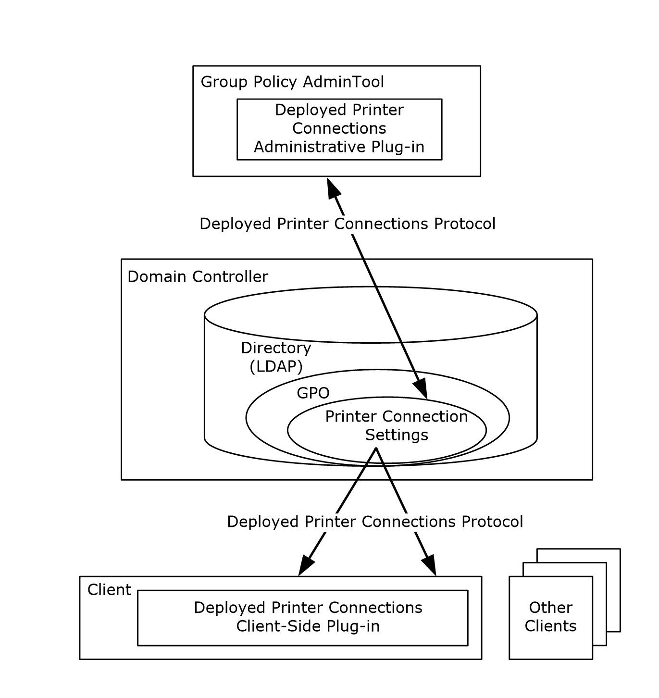
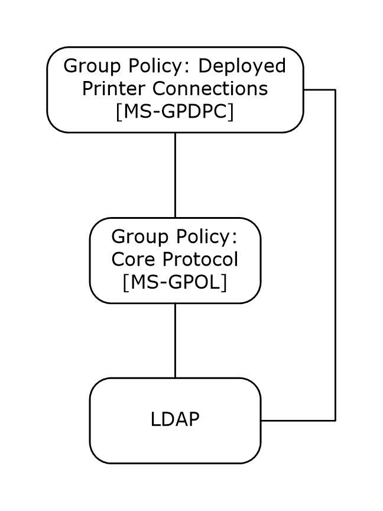

# [MS-GPDPC]: Group Policy: Deployed Printer Connections Extension

Table of Contents

1 Introduction

- [1 Introduction](#Section_1)
  - [1.1 Glossary](#Section_1.1)
  - [1.2 References](#Section_1.2)
    - [1.2.1 Normative References](#Section_1.2.1)
    - [1.2.2 Informative References](#Section_1.2.2)
  - [1.3 Overview](#Section_1.3)
    - [1.3.1 Background](#Section_1.3.1)
    - [1.3.2 Deployed Printer Connections](#Section_1.3.2)
      - [1.3.2.1 Administrative Scenario](#Section_1.3.2.1)
      - [1.3.2.2 Client Scenario](#Section_1.3.2.2)
  - [1.4 Relationship to Other Protocols](#Section_1.4)
  - [1.5 Prerequisites/Preconditions](#Section_1.5)
  - [1.6 Applicability Statement](#Section_1.6)
  - [1.7 Versioning and Capability Negotiation](#Section_1.7)
  - [1.8 Vendor-Extensible Fields](#Section_1.8)
  - [1.9 Standards Assignments](#Section_1.9)

2 Messages

- [2 Messages](#Section_2)
  - [2.1 Transport](#Section_2.1)
  - [2.2 Message Syntax](#Section_2.2)
    - [2.2.1 Deployed Printer Connection Setting Creation Messages](#Section_2.2.1)
      - [2.2.1.1 PushedPrinterConnections Container Creation](#Section_2.2.1.1)
      - [2.2.1.2 Printer Connections Creation](#Section_2.2.1.2)
    - [2.2.2 Deployed Printer Connection Setting Deletion Message](#Section_2.2.2)
    - [2.2.3 Common LDAP Messages](#Section_2.2.3)
      - [2.2.3.1 LDAP SearchRequest Message](#Section_2.2.3.1)
      - [2.2.3.2 LDAP SearchResultEntry Message](#Section_2.2.3.2)
  - [2.3 Directory Service Schema Elements](#Section_2.3)

3 Protocol Details

- [3 Protocol Details](#Section_3)
  - [3.1 Administrative Tool Plug-in Details](#Section_3.1)
    - [3.1.1 Abstract Data Model](#Section_3.1.1)
    - [3.1.2 Timers](#Section_3.1.2)
    - [3.1.3 Initialization](#Section_3.1.3)
    - [3.1.4 Higher-Layer Triggered Events](#Section_3.1.4)
    - [3.1.5 Message Processing Events and Sequencing Rules](#Section_3.1.5)
      - [3.1.5.1 Adding a Printer Connection](#Section_3.1.5.1)
      - [3.1.5.2 Deleting a Printer Connection](#Section_3.1.5.2)
      - [3.1.5.3 Retrieving Connection Policy Objects](#Section_3.1.5.3)
    - [3.1.6 Timer Events](#Section_3.1.6)
    - [3.1.7 Other Local Events](#Section_3.1.7)
  - [3.2 Client-Side Plug-in Details](#Section_3.2)
    - [3.2.1 Abstract Data Model](#Section_3.2.1)
    - [3.2.2 Timers](#Section_3.2.2)
    - [3.2.3 Initialization](#Section_3.2.3)
    - [3.2.4 Higher-Layer Triggered Events](#Section_3.2.4)
      - [3.2.4.1 Process Group Policy](#Section_3.2.4.1)
    - [3.2.5 Message Processing Events and Sequencing Rules](#Section_3.2.5)
      - [3.2.5.1 Retrieving Connection Policy Objects](#Section_3.2.5.1)
    - [3.2.6 Timer Events](#Section_3.2.6)
    - [3.2.7 Other Local Events](#Section_3.2.7)

4 Protocol Examples

- [4 Protocol Examples](#Section_4)

5 Security

- [5 Security](#Section_5)
  - [5.1 Security Considerations for Implementers](#Section_5.1)
  - [5.2 Index of Security Parameters](#Section_5.2)

6 Appendix A: Product Behavior

- [6 Appendix A: Product Behavior](#Section_6)

7 Change Tracking

- [7 Change Tracking](#Section_7)

For the legal notice and IP terms, see [LEGAL.md](../LEGAL.md).
Last updated: 4/23/2024.
See [Revision History](#revision-history) for full version history.

# 1 Introduction

The Group Policy: Deployed Printer Connections Extension supports managing connections to printers that are hosted by [**print servers**](#gt_print-server) and shared by multiple users.

A Deployed Printer Connections protocol implementation consists of server and client components. The server component allows a network administrator to configure the printer connections. The client component allows a user to discover the printer connections that have been configured.

Sections 1.5, 1.8, 1.9, 2, and 3 of this specification are normative. All other sections and examples in this specification are informative.

## 1.1 Glossary

This document uses the following terms:

**Active Directory**: The Windows implementation of a general-purpose [**directory service**](#gt_directory-service-ds), which uses [**LDAP**](#gt_lightweight-directory-access-protocol-ldap) as its primary access protocol. [**Active Directory**](#gt_active-directory) stores information about a variety of objects in the network such as user accounts, computer accounts, groups, and all related credential information used by [**Kerberos**](#gt_kerberos) [MS-KILE](../MS-KILE/MS-KILE.md). [**Active Directory**](#gt_active-directory) is either deployed as Active Directory Domain Services (AD DS) or Active Directory Lightweight Directory Services (AD LDS), which are both described in [MS-ADOD](../MS-ADOD/MS-ADOD.md): Active Directory Protocols Overview.

**Active Directory object**: A set of directory objects that are used within [**Active Directory**](#gt_active-directory) as defined in [MS-ADTS](../MS-ADTS/MS-ADTS.md) section 3.1.1. An [**Active Directory object**](#gt_active-directory-object) can be identified by a dsname. See also directory object.

**Administrative tool**: An implementation-specific tool, such as the Group Policy Management Console, that allows administrators to read and write [**policy settings**](#gt_policy-setting) from and to a [**Group Policy Object (GPO)**](#gt_group-policy-object-gpo) and policy files. The Group Policy Administrative tool uses the Extension list of a GPO to determine which Administrative tool extensions are required to read settings from and write settings to the logical and physical components of a GPO.

**client-side extension GUID (CSE GUID)**: A [**GUID**](#gt_globally-unique-identifier-guid) that enables a specific client-side extension on the Group Policy client to be associated with policy data that is stored in the logical and physical components of a [**Group Policy Object (GPO)**](#gt_group-policy-object-gpo) on the Group Policy server, for that particular extension.

**computer policy mode**: A mode of policy application intended to retrieve settings for the computer account of the client.

**curly braced GUID string**: The string representation of a 128-bit globally unique identifier ([**GUID**](#gt_globally-unique-identifier-guid)) using the form {XXXXXXXX-XXXX-XXXX-XXXX-XXXXXXXXXXXX}, where X denotes a hexadecimal digit. The string representation between the enclosing braces is the standard representation of a GUID as described in [[RFC4122]](https://go.microsoft.com/fwlink/?LinkId=90460) section 3. Unlike a GUIDString, a curly braced GUID string includes enclosing braces.

**directory service (DS)**: A service that stores and organizes information about a computer network's users and network shares, and that allows network administrators to manage users' access to the shares. See also [**Active Directory**](#gt_active-directory).

**directory string**: A string encoded in UTF-8 as defined in [[RFC2252]](https://go.microsoft.com/fwlink/?LinkId=90326) section 6.10.

**distinguished name (DN)**: In [**Lightweight Directory Access Protocol (LDAP)**](#gt_lightweight-directory-access-protocol-ldap), an LDAP Distinguished Name, as described in [[RFC2251]](https://go.microsoft.com/fwlink/?LinkId=90325) section 4.1.3. The DN of an object is the DN of its parent, preceded by the RDN of the object. For example: CN=David Thompson, OU=Users, DC=Microsoft, DC=COM. For definitions of CN and OU, see [[RFC2256]](https://go.microsoft.com/fwlink/?LinkId=91339) sections 5.4 and 5.12, respectively.

**domain**: A set of users and computers sharing a common namespace and management infrastructure. At least one computer member of the set has to act as a [**domain controller (DC)**](#gt_domain-controller-dc) and host a member list that identifies all members of the domain, as well as optionally hosting the [**Active Directory**](#gt_active-directory) service. The domain controller provides authentication of members, creating a unit of trust for its members. Each domain has an identifier that is shared among its members. For more information, see [MS-AUTHSOD](../MS-AUTHSOD/MS-AUTHSOD.md) section 1.1.1.5 and [MS-ADTS].

**domain controller (DC)**: The service, running on a server, that implements [**Active Directory**](#gt_active-directory), or the server hosting this service. The service hosts the data store for objects and interoperates with other [**DCs**](#gt_domain-controller-dc) to ensure that a local change to an object replicates correctly across all [**DCs**](#gt_domain-controller-dc). When [**Active Directory**](#gt_active-directory) is operating as Active Directory Domain Services (AD DS), the [**DC**](#gt_domain-controller-dc) contains full NC replicas of the configuration naming context (config NC), schema naming context (schema NC), and one of the domain NCs in its forest. If the AD DS [**DC**](#gt_domain-controller-dc) is a global catalog server (GC server), it contains partial NC replicas of the remaining domain NCs in its forest. For more information, see [MS-AUTHSOD] section 1.1.1.5.2 and [MS-ADTS]. When [**Active Directory**](#gt_active-directory) is operating as Active Directory Lightweight Directory Services (AD LDS), several AD LDS [**DCs**](#gt_domain-controller-dc) can run on one server. When [**Active Directory**](#gt_active-directory) is operating as AD DS, only one AD DS [**DC**](#gt_domain-controller-dc) can run on one server. However, several AD LDS [**DCs**](#gt_domain-controller-dc) can coexist with one AD DS [**DC**](#gt_domain-controller-dc) on one server. The AD LDS [**DC**](#gt_domain-controller-dc) contains full NC replicas of the config NC and the schema NC in its forest. The domain controller is the server side of Authentication Protocol Domain Support [MS-APDS](../MS-APDS/MS-APDS.md).

**fully qualified domain name (FQDN)**: An unambiguous domain name that gives an absolute location in the Domain Name System's (DNS) hierarchy tree, as defined in [[RFC1035]](https://go.microsoft.com/fwlink/?LinkId=90264) section 3.1 and [[RFC2181]](https://go.microsoft.com/fwlink/?LinkId=127732) section 11.

**globally unique identifier (GUID)**: A term used interchangeably with universally unique identifier (UUID) in Microsoft protocol technical documents (TDs). Interchanging the usage of these terms does not imply or require a specific algorithm or mechanism to generate the value. Specifically, the use of this term does not imply or require that the algorithms described in [RFC4122] or [[C706]](https://go.microsoft.com/fwlink/?LinkId=89824) must be used for generating the [**GUID**](#gt_globally-unique-identifier-guid). See also universally unique identifier (UUID).

**Group Policy**: A mechanism that allows the implementer to specify managed configurations for users and computers in an [**Active Directory**](#gt_active-directory) service environment.

**Group Policy Object (GPO)**: A collection of administrator-defined specifications of the policy settings that can be applied to groups of computers in a domain. Each GPO includes two elements: an object that resides in the [**Active Directory**](#gt_active-directory) for the domain, and a corresponding file system subdirectory that resides on the sysvol DFS share of the Group Policy server for the domain.

**Group Policy Object (GPO) GUID**: A [**curly braced GUID string**](#gt_curly-braced-guid-string) that uniquely identifies a [**Group Policy Object (GPO)**](#gt_group-policy-object-gpo).

**Kerberos**: An authentication system that enables two parties to exchange private information across an otherwise open network by assigning a unique key (called a ticket) to each user that logs on to the network and then embedding these tickets into messages sent by the users. For more information, see [MS-KILE].

**Lightweight Directory Access Protocol (LDAP)**: The primary access protocol for [**Active Directory**](#gt_active-directory). Lightweight Directory Access Protocol (LDAP) is an industry-standard protocol, established by the Internet Engineering Task Force (IETF), which allows users to query and update information in a [**directory service (DS)**](#gt_directory-service-ds), as described in [MS-ADTS]. The Lightweight Directory Access Protocol can be either version 2 [[RFC1777]](https://go.microsoft.com/fwlink/?LinkId=90290) or version 3 [[RFC3377]](https://go.microsoft.com/fwlink/?LinkID=91337).

**machine connection**: A connection to a printer that is shared from a [**print server**](#gt_print-server) from a client machine. The connection can be displayed in the user interface as a printer. [**Machine connections**](#gt_machine-connection) are displayed to all users in all user environments of a particular client machine.

**policy application**: The protocol exchange by which a client obtains all of the [**Group Policy Object (GPO)**](#gt_group-policy-object-gpo) and thus all applicable Group Policy settings for a particular policy target from the server, as specified in [MS-GPOL](../MS-GPOL/MS-GPOL.md). Policy application can operate in two modes, user policy and computer policy.

**policy setting**: A statement of the possible behaviors of an element of a domain member computer's behavior that can be configured by an administrator.

**policy target**: A user or computer account for which policy settings can be obtained from a server in the same domain, as specified in [MS-GPOL]. For user policy mode, the policy target is a user account. For computer policy mode, the policy target is a computer account.

**print server**: A machine that hosts the print system and all its different components.

**scoped Group Policy Object (GPO) distinguished name (DN)**: A Group Policy Object (GPO) distinguished name (DN) where the set of "CN=<cn>" elements is prepended with "CN=User" for the [**user policy mode**](#gt_user-policy-mode) of policy application and with "CN=Machine" for [**computer policy mode**](#gt_computer-policy-mode).

**scoped Group Policy Object (GPO) path**: A [**Group Policy Object (GPO)**](#gt_group-policy-object-gpo) path appended with "\User" for the [**user policy mode**](#gt_user-policy-mode) of policy application, and "\Machine" for the [**computer policy mode**](#gt_computer-policy-mode).

**Simple and Protected GSS-API Negotiation Mechanism (SPNEGO)**: An authentication mechanism that allows Generic Security Services (GSS) peers to determine whether their credentials support a common set of GSS-API security mechanisms, to negotiate different options within a given security mechanism or different options from several security mechanisms, to select a service, and to establish a security context among themselves using that service. [**SPNEGO**](#gt_simple-and-protected-gss-api-negotiation-mechanism-spnego) is specified in [[RFC4178]](https://go.microsoft.com/fwlink/?LinkId=90461).

**tool extension GUID or administrative plug-in GUID**: A GUID defined separately for each of the user policy settings and computer policy settings that associates a specific administrative tool plug-in with a set of policy settings that can be stored in a [**Group Policy Object (GPO)**](#gt_group-policy-object-gpo).

**UncPath**: The location of a file in a network of computers, as specified in Universal Naming Convention (UNC) syntax.

**Unicode**: A character encoding standard developed by the Unicode Consortium that represents almost all of the written languages of the world. The [**Unicode**](#gt_unicode) standard [[UNICODE5.0.0/2007]](https://go.microsoft.com/fwlink/?LinkId=154659) provides three forms (UTF-8, UTF-16, and UTF-32) and seven schemes (UTF-8, UTF-16, UTF-16 BE, UTF-16 LE, UTF-32, UTF-32 LE, and UTF-32 BE).

**Universal Naming Convention (UNC)**: A string format that specifies the location of a resource. For more information, see [MS-DTYP](../MS-DTYP/MS-DTYP.md) section 2.2.57.

**user connection**: A connection to a printer that is shared from a [**print server**](#gt_print-server) from a client machine. The connection can be displayed in the user interface as a printer. [**User connections**](#gt_user-connection) are seen only by a specified user account on the client machine.

**user policy mode**: A mode of policy application that is used to retrieve settings for an authenticated domain user account, interactively logged on to a client.

**MAY, SHOULD, MUST, SHOULD NOT, MUST NOT:** These terms (in all caps) are used as defined in [[RFC2119]](https://go.microsoft.com/fwlink/?LinkId=90317). All statements of optional behavior use either MAY, SHOULD, or SHOULD NOT.

## 1.2 References

Links to a document in the Microsoft Open Specifications library point to the correct section in the most recently published version of the referenced document. However, because individual documents in the library are not updated at the same time, the section numbers in the documents may not match. You can confirm the correct section numbering by checking the [Errata](https://go.microsoft.com/fwlink/?linkid=850906).

### 1.2.1 Normative References

We conduct frequent surveys of the normative references to assure their continued availability. If you have any issue with finding a normative reference, please contact [dochelp@microsoft.com](mailto:dochelp@microsoft.com). We will assist you in finding the relevant information.

[MS-ADA3] Microsoft Corporation, "[Active Directory Schema Attributes N-Z](../MS-ADA3/MS-ADA3.md)".

[MS-ADSC] Microsoft Corporation, "[Active Directory Schema Classes](../MS-ADSC/MS-ADSC.md)".

[MS-ADTS] Microsoft Corporation, "[Active Directory Technical Specification](../MS-ADTS/MS-ADTS.md)".

[MS-DTYP] Microsoft Corporation, "[Windows Data Types](../MS-DTYP/MS-DTYP.md)".

[MS-GPOL] Microsoft Corporation, "[Group Policy: Core Protocol](../MS-GPOL/MS-GPOL.md)".

[MS-RPRN] Microsoft Corporation, "[Print System Remote Protocol](../MS-RPRN/MS-RPRN.md)".

[MS-SPNG] Microsoft Corporation, "[Simple and Protected GSS-API Negotiation Mechanism (SPNEGO) Extension](../MS-SPNG/MS-SPNG.md)".

[RFC2119] Bradner, S., "Key words for use in RFCs to Indicate Requirement Levels", BCP 14, RFC 2119, March 1997, [https://www.rfc-editor.org/info/rfc2119](https://go.microsoft.com/fwlink/?LinkId=90317)

[RFC2251] Wahl, M., Howes, T., and Kille, S., "Lightweight Directory Access Protocol (v3)", RFC 2251, December 1997, [https://www.rfc-editor.org/info/rfc2251](https://go.microsoft.com/fwlink/?LinkId=90325)

### 1.2.2 Informative References

[MSDN-ImpersLogdOnUser] Microsoft Corporation, "ImpersonateLoggedOnUser function", [http://msdn.microsoft.com/en-us/library/aa378612.aspx](https://go.microsoft.com/fwlink/?LinkId=112034)

[SYSPRINT] Microsoft Corporation, "Deploy printers by using Group Policy", August 2005, [https://technet.microsoft.com/en-us/library/cc722179(v=ws.10).aspx](https://go.microsoft.com/fwlink/?LinkId=180496)

## 1.3 Overview

The Group Policy: Deployed Printer Connections Extension uses the Group Policy: Core Protocol specified in [MS-GPOL](../MS-GPOL/MS-GPOL.md) to support the use of preconfigured collections of shared printer connections. The Deployed Printer Connections [administrative tool plug-in](#Section_3.1) to the [**group policy**](#gt_group-policy) [**administrative tool**](#gt_administrative-tool) allows network administrators to configure connections to printers that are hosted by [**print servers**](#gt_print-server) and shared to other users, so that those printer connections will appear on a set of client computers or to a set of users, no matter which computers those users log on to.

The Deployed Printer Connections client-side plug-in uses the Deployed Printer Connections protocol to query the [**Active Directory**](#gt_active-directory) [**domain controller (DC)**](#gt_domain-controller-dc) in order to obtain the list of printer connections that have been configured by the network administrator for the computer or the user.

### 1.3.1 Background

The Group Policy: Core Protocol allows clients to discover and retrieve [**policy settings**](#gt_policy-setting) that were created by the administrators of a [**domain**](#gt_domain). These settings are stored in [**Group Policy Objects (GPOs)**](#gt_group-policy-object-gpo), which are assigned to [**policy target**](#gt_policy-target) accounts in [**Active Directory**](#gt_active-directory). By assigning a GPO to policy target accounts, network administrators can ensure that a GPO is associated with certain computer or user accounts in the Active Directory. Each client uses the [**Lightweight Directory Access Protocol (LDAP)**](#gt_lightweight-directory-access-protocol-ldap) [[RFC2251]](https://go.microsoft.com/fwlink/?LinkId=90325), to determine which GPOs apply to it, by querying the [**Active Directory objects**](#gt_active-directory-object) that correspond to the computer's account and the user accounts of the users who log on to the client computer.

Each GPO is interpreted on each client computer and acted upon by software components known as client-side plug-ins. The client-side plug-ins that are responsible for a given GPO are specified in an attribute of the GPO. This attribute contains a list of [**globally unique identifier (GUID)**](#gt_globally-unique-identifier-guid) pairs. The first GUID of each pair is the [**client-side extension GUID (CSE GUID)**](#gt_client-side-extension-guid-cse-guid) that identifies the client-side plug-in and the second GUID is the [**tool extension GUID**](#gt_88ad7745-bee6-47f7-ae98-6fac7c5ef330) that identifies the [**administrative tool**](#gt_administrative-tool) plug-in (section [3.1](#Section_3.1)).

For each GPO that is applicable to a client, the client consults the CSE GUID listed in the GPO to determine which client-side plug-ins on the client will handle the GPOs. The client then invokes the client-side plug-ins to handle the GPOs. A client-side plug-in uses the contents of the GPOs to retrieve settings that are specific to its class in a manner that is specific to its class. Once its class-specific settings are retrieved, the client-side plug-in uses those settings to perform class-specific processing.

### 1.3.2 Deployed Printer Connections

The following diagram shows the consumers of the Deployed Printer Connections protocol.

Figure 1: Consumers of the Deployed Printer Connections Protocol

The situations in which this protocol is used are described in two scenarios: the **administrative scenario** and the **client scenario**, which are defined in sections [1.3.2.1](#Section_1.3.2.1) and [1.3.2.2](#Section_1.3.2.2), respectively.

#### 1.3.2.1 Administrative Scenario

An administrator invokes a [**Group Policy**](#gt_group-policy) [**administrative tool**](#gt_administrative-tool) to manage a [**GPO**](#gt_group-policy-object-gpo), using the Policy Administration Protocol specified in [MS-GPOL](../MS-GPOL/MS-GPOL.md) sections 2.2.7 and 2.2.8.<1> This administration is performed on the administrator's machine.

Using the Group Policy: Core Protocol specified in [MS-GPOL], the presence of the [**tool extension GUID**](#gt_88ad7745-bee6-47f7-ae98-6fac7c5ef330) for the Deployed Printer Connections [administrative tool plug-in](#Section_3.1) is queried. If present, the GPO contains [**policy settings**](#gt_policy-setting) that can be administered by using the Deployed Printer Connections administrative tool plug-in.

The administrative tool plug-in stores and retrieves the data from a GPO on a [**domain controller (DC)**](#gt_domain-controller-dc). This data describes the printer connections that the administrator wants to add to a client that is affected by the GPO. The administrator can view the existing printer connection data and also update it to add new printer connections.

#### 1.3.2.2 Client Scenario

When a client computer that is affected by a [**GPO**](#gt_group-policy-object-gpo) starts, or if it is connected to the network after it has been started, it performs [**policy application**](#gt_policy-application) by retrieving the [**policy settings**](#gt_policy-setting) for the computer account from the [**DC**](#gt_domain-controller-dc) using the Group Policy: Core Protocol specified in [MS-GPOL](../MS-GPOL/MS-GPOL.md).<2>

When a user logs on or when policy application occurs, the computer connects to the network after the user has logged on. When policy application is performed, the client computer retrieves the policy settings for the user from the DC, by using the Group Policy: Core Protocol.

In both cases, if the Deployed Printer Connections client-side plug-in [**GUID**](#gt_globally-unique-identifier-guid) is read from one or more of the GPOs as part of the GPO processing, the client computer invokes the Deployed Printer Connections client-side plug-in component to perform policy application.

When the Deployed Printer Connections client-side plug-in performs policy application, the client computer identifies the directive to add the printer connection, which is specified by the administrator, either to all users of the machine or to only the current user.

- In [**computer policy mode**](#gt_computer-policy-mode), the printer connection was deployed by the administrator as a [**machine connection**](#gt_machine-connection), and the printer connection is applied to all users of the computer.
- In [**user policy mode**](#gt_user-policy-mode), the printer connection was deployed by the administrator as a [**user connection**](#gt_user-connection), and the printer connection is applied only to the current user of the computer.

## 1.4 Relationship to Other Protocols

The Group Policy: Deployed Printer Connections Extension depends on the Group Policy: Core Protocol specified in [MS-GPOL](../MS-GPOL/MS-GPOL.md) to update version information in applicable [**GPOs**](#gt_group-policy-object-gpo). The [administrative tool plug-in](#Section_3.1) for this protocol uses LDAP version 3 [[RFC2251]](https://go.microsoft.com/fwlink/?LinkId=90325) to read and write protocol-specific data. These relationships are illustrated in the following diagram:

Figure 2: Group Policy: Deployed Printer Connections dependencies

## 1.5 Prerequisites/Preconditions

The Group Policy: Deployed Printer Connections Extension has no additional prerequisites or preconditions beyond those specified in the Group Policy: Core Protocol.

## 1.6 Applicability Statement

The Group Policy: Deployed Printer Connections Extension is applicable only within the [**Group Policy**](#gt_group-policy) framework, as specified in [MS-GPOL](../MS-GPOL/MS-GPOL.md).

## 1.7 Versioning and Capability Negotiation

The Group Policy: Deployed Printer Connections Extension does not provide versioning or capability negotiations, and it defines no locale-specific data.<3>

## 1.8 Vendor-Extensible Fields

The Group Policy: Deployed Printer Connections Extension does not define any vendor-extensible fields.

## 1.9 Standards Assignments

The Group Policy: Deployed Printer Connections Extension defines the [**CSE GUID**](#gt_client-side-extension-guid-cse-guid) and [**tool extension GUID**](#gt_88ad7745-bee6-47f7-ae98-6fac7c5ef330) values, as specified in [MS-GPOL](../MS-GPOL/MS-GPOL.md) section 1.8. The assignments are as follows.

| Parameter | Value |
| --- | --- |
| Tool extension GUID (both user [**policy settings**](#gt_policy-setting) and computer policy settings) | {180F39F3-CF17-4C68-8410-94B71452A22D} |
| CSE GUID | {8A28E2C5-8D06-49A4-A08C-632DAA493E17} |

# 2 Messages

## 2.1 Transport

The Group Policy: Deployed Printer Connections Extension uses LDAP version 3, as defined in [[RFC2251]](https://go.microsoft.com/fwlink/?LinkId=90325), to read and write deployed printer connection settings to [**GPOs**](#gt_group-policy-object-gpo) on the [**domain controller (DC)**](#gt_domain-controller-dc).

After writing a new deployed printer connection setting to a GPO, the Deployed Printer Connections protocol uses the messages specified in [MS-GPOL](../MS-GPOL/MS-GPOL.md) section 2.2.4 to update the version information in the GPO.

## 2.2 Message Syntax

Messages exchanged in the Group Policy: Deployed Printer Connections Extension allow:

- The client-side plug-in to discover settings in the [**GPOs**](#gt_group-policy-object-gpo) that indicate that the clients SHOULD<4> add printer connections to the user's computer.
- The [administrative tool plug-in](#Section_3.1) to query a GPO for a list of printer connection settings.
- The administrative tool plug-in to create and delete printer connection settings on the [**domain controller (DC)**](#gt_domain-controller-dc).
The Deployed Printer Connections administrative tool plug-in MUST store data in an msPrint-ConnectionPolicy [**Active Directory object**](#gt_active-directory-object) as specified in [MS-ADSC](../MS-ADSC/MS-ADSC.md) section 2.172. The Active Directory object MUST be contained in the GPO.

msPrint-ConnectionPolicy objects MUST have the following attributes, as specified in [MS-ADA3](../MS-ADA3/MS-ADA3.md) sections 2.331, 2.130, 2.241, and 2.124, respectively.

| Attribute | Value |
| --- | --- |
| uNCName | The value of this attribute MUST be a [**directory string**](#gt_directory-string) that specifies the full connection name, and it MUST consist of the server and printer names, as specified in the [**Universal Naming Convention (UNC)**](#gt_universal-naming-convention-unc), in the form \\server name\printer name. |
| printerName | The value of this attribute MUST be a directory string that specifies the printer name part of the **uNCName** attribute in the format specified in [MS-RPRN](../MS-RPRN/MS-RPRN.md), section 2.2.4.14. |
| serverName | The value of this attribute MUST be a directory string that specifies the server name part of the **uNCName** attribute in the format specified in [MS-RPRN], section 2.2.4.16. |
| printAttributes | The value of this attribute SHOULD be zero, and any value of this attribute MUST be ignored during [**policy application**](#gt_policy-application). |

msPrint-ConnectionPolicy objects MUST be created in one of the following locations in the [**Active Directory**](#gt_active-directory) where <x>, <y>, <z> is the [**fully qualified domain name (FQDN)**](#gt_fully-qualified-domain-name-fqdn) of the domain/LDAP server and <GPO_GUID> is the [**GUID**](#gt_globally-unique-identifier-guid) of the GPO that is being queried or updated.

- Printer connection settings in the User section of the GPO MUST use this location:
CN=PushedPrinterConnections, CN=User, CN=<GPO_GUID>, CN=Policies, CN=System, DC=<x>, DC=<y>, DC=<z>

- Printer connection settings in the Machine section of the GPO MUST use this location:
CN=PushedPrinterConnections, CN=Machine, CN=<GPO_GUID>, CN=Policies, CN=System, DC=<x>, DC=<y>, DC=<z>

The messages that are used by this protocol perform the following functions:

- Printer connection setting creation
- Printer connection setting deletion
- Printer connection setting retrieval
Unless specified otherwise, the format used for GUID values in this protocol is the curly-braced string representation ([MS-DTYP](../MS-DTYP/MS-DTYP.md) section 2.3.4.3).

### 2.2.1 Deployed Printer Connection Setting Creation Messages

#### 2.2.1.1 PushedPrinterConnections Container Creation

The PushedPrinterConnections container, under the User or Computer that is contained in the [**GPO**](#gt_group-policy-object-gpo) in [**Active Directory**](#gt_active-directory), is the container for all msPrint-ConnectionPolicy objects that represent deployed printer connections. This message is an LDAP AddRequest message as specified in [[RFC2251]](https://go.microsoft.com/fwlink/?LinkId=90325) section 4.7. The message MUST have the following fields.

| Parameter name | Value |
| --- | --- |
| entry | The value of this parameter MUST be a Computer or User section of the [**scoped Group Policy Object (GPO) distinguished name (DN)**](#gt_scoped-group-policy-object-gpo-distinguished-name-dn), as specified in [MS-GPOL](../MS-GPOL/MS-GPOL.md). |
| attributes | The value of this parameter MUST specify the values of the **objectClass** and **name** attributes in an **AttributeList** as specified in [RFC2251], section 4.7. |

The *attributes* parameter of this message MUST contain the attribute name and value pairs that are specified in the following table.

| Attribute name | Value |
| --- | --- |
| objectClass | The value of this attribute MUST be the [**directory string**](#gt_directory-string) "container". |
| name | The value of this attribute MUST be the directory string "PushedPrinterConnections". |

#### 2.2.1.2 Printer Connections Creation

This message instructs the [**domain controller (DC)**](#gt_domain-controller-dc) to create an msPrint-ConnectionPolicy object in the [**Active Directory**](#gt_active-directory). The LDAP portion of the message is an LDAP AddRequest as specified in [[RFC2251]](https://go.microsoft.com/fwlink/?LinkId=90325), section 4.7, and MUST have the following parameters:

| Parameter name | Value |
| --- | --- |
| entry | The value of this parameter MUST be the [**distinguished name (DN)**](#gt_distinguished-name-dn) that corresponds to the [PushedPrinterConnections container](#Section_2.2.1.1) in a User or Computer container in a [**scoped Group Policy Object (GPO) distinguished name (DN)**](#gt_scoped-group-policy-object-gpo-distinguished-name-dn). |
| attributes | The value of this parameter MUST specify the values of the **uNCName**, **printerName**, **serverName**, and **printAttributes** attributes in an **AttributeList**, as specified in [RFC2251], section 4.7. |

The *attributes* parameter of this message MUST contain a list of attribute name/value pairs, as specified in the following table:

| Attribute name | Value |
| --- | --- |
| objectClass | The value of this attribute MUST be the [**directory string**](#gt_directory-string) value "msPrint-ConnectionPolicy". |
| uNCName | The value of this attribute MUST specify a value of **uNCName**, as specified in section [2.2](#Section_2.2). |
| printerName | The value of this attribute MUST specify a value of **printerName**, as specified in section 2.2. |
| serverName | The value of this attribute MUST specify a value of **serverName**, as specified in section 2.2. |
| printAttributes | The value of this attribute MUST specify a value of **printAttributes**, as specified in section 2.2. |

### 2.2.2 Deployed Printer Connection Setting Deletion Message

This message instructs the [**DC**](#gt_domain-controller-dc) to delete an **msPrint-ConnectionPolicy** object in [**Active Directory**](#gt_active-directory). The LDAP portion of the message is an LDAP **DelRequest**, as specified in [[RFC2251]](https://go.microsoft.com/fwlink/?LinkId=90325), section 4.8.

The *LDAPDN* parameter specifies the Printer Connection Setting distinguished name (DN) of the msPrint-ConnectionPolicy object.

### 2.2.3 Common LDAP Messages

#### 2.2.3.1 LDAP SearchRequest Message

Each LDAP **SearchRequest** message (sections [3.1.5.3](#Section_3.1.5.3) and [3.2.5.1](#Section_3.2.5.1)) MUST have the following parameters:

| Parameter name | Value |
| --- | --- |
| baseObject | The value of this parameter MUST be the LDAP distinguished name (DN) for the [PushedPrinterConnections container (section 2.2.1.1)](#Section_2.2.1.1) inside the User or Machine section of the [**GPO**](#gt_group-policy-object-gpo); and it MUST be in the following form, where <GPO_GUID> is the [**curly braced GUID string**](#gt_curly-braced-guid-string) of the GPO that is being queried, and <x>, <y>, <z> is the FQDN of the domain/LDAP server: CN=PushedPrinterConnections, CN=Machine, CN=<GPO_GUID>, CN=Policies, CN=System, DC=<x>, DC=<y>, DC=<z> CN=PushedPrinterConnections, CN=User, CN=<GPO_GUID>, CN=Policies, CN=System, DC=<x>, DC=<y>, DC=<z> |
| scope | The value of this parameter MUST be 2 to search the whole subtree. |
| derefAliases | The value of this parameter MUST be zero (never dereference aliases). |
| sizeLimit | The value of this parameter MUST be zero (no size limit). |
| timeLimit | The value of this parameter can be zero if there is no time limit, or it can be the number of seconds; however, it has no direct influence on the protocol defined in this specification. |
| typesOnly | The value of this parameter MUST be zero (FALSE). |
| filter | The value of this parameter MUST be an LDAP filter of "(objectClass=msPrint-ConnectionPolicy)". This query is filtered so that only msPrint-ConnectionPolicy objects are returned. |
| attributes | The value of this parameter MUST be an **AttributeDescriptionList** ([[RFC2251]](https://go.microsoft.com/fwlink/?LinkId=90325) section 4.1.5). The **AttributeDescriptionList** MUST contain **uNCName** and **printAttributes** attribute names. |

#### 2.2.3.2 LDAP SearchResultEntry Message

Each LDAP **SearchResultEntry** message (sections [3.1.5.3](#Section_3.1.5.3) and [3.2.5.1](#Section_3.2.5.1)) MUST have the following parameters:

| Parameter name | Value |
| --- | --- |
| objectName | The value of this parameter MUST be the LDAP distinguished name (DN) for the msPrint-ConnectionPolicy object found in the [PushedPrinterConnections container (section 2.2.1.1)](#Section_2.2.1.1). |
| attributes | The value of this parameter MUST be a **PartialAttributeList** ([[RFC2251]](https://go.microsoft.com/fwlink/?LinkId=90325) section 4.5.2) that contains name/value pairs for the **uNCName** and **printAttributes** attributes. |

## 2.3 Directory Service Schema Elements

The Group Policy: Deployed Printer Connections Extension to the Group Policy: Core Protocol specified in [MS-GPOL](../MS-GPOL/MS-GPOL.md) accesses the [**directory service**](#gt_directory-service-ds) schema classes and attributes that are listed in the following table. For the syntactic specifications of the <Class> or <Class> <Attribute> pairs, refer to [MS-ADSC](../MS-ADSC/MS-ADSC.md) and [MS-ADA3](../MS-ADA3/MS-ADA3.md).

| Class | Attribute |
| --- | --- |
| msPrint-ConnectionPolicy | All |
| container | name |

# 3 Protocol Details

The Group Policy: Deployed Printer Connections Extension [administrative tool plug-in](#Section_3.1) SHOULD<5> read and write printer connection settings on the [**Active Directory**](#gt_active-directory) server.

The Deployed Printer Connections client-side plug-in reads printer connection settings from the Active Directory server.

## 3.1 Administrative Tool Plug-in Details

The [**administrative tool**](#gt_administrative-tool) abstract data model, as specified in [MS-GPOL](../MS-GPOL/MS-GPOL.md) section 3.3.1, allows the Deployed Printer Connections administrative tool plug-in to write extension-specific data that it receives from a user interface to [**Active Directory**](#gt_active-directory).

### 3.1.1 Abstract Data Model

The [administrative tool plug-in](#Section_3.1) has a user interface that allows an administrator to deploy a printer connection to a [**GPO**](#gt_group-policy-object-gpo) in the format that is specified in section [2.2](#Section_2.2).

The administrative tool plug-in maintains an **ADConnection handle** abstract data model element, which is a handle to an **ADConnection** ([MS-ADTS](../MS-ADTS/MS-ADTS.md) ADConnection Abstract Data Model section 7.3). It is used to manage communication between the administrative tool plug-in and the [**Active Directory**](#gt_active-directory).

### 3.1.2 Timers

None.

### 3.1.3 Initialization

When the [administrative tool plug-in](#Section_3.1) starts up, it gets a [**scoped GPO path**](#gt_ba6aca14-cdb7-43d3-bd8b-e3c04cf3f976) from the Group Policy: Core Protocol in the following form:

CN=<GPO_GUID>, CN=Policies, CN=System, DC=<x>, DC=<y>, DC=<z>

where <x>, <y>, <z> is the [**FQDN**](#gt_fully-qualified-domain-name-fqdn) of the domain/LDAP server, and <GPO_GUID> is the [**curly braced GUID string**](#gt_curly-braced-guid-string) containing the [**GUID**](#gt_globally-unique-identifier-guid) of the [**GPO**](#gt_group-policy-object-gpo) that is being queried or updated.

To use LDAP, the administrative tool plug-in invokes the Initializing an ADConnection task ([MS-ADTS](../MS-ADTS/MS-ADTS.md) section 7.6.1.1) with the following parameters, and stores the new *TaskReturnADConnection* returned from the task as the **ADConnection handle** ADM element (section [3.1.1](#Section_3.1.1)):

- *TaskInputTargetName*: MAY be specified by the administrator, or if not specified, NULL
- *TaskInputPortNumber*: 389
The administrative tool plug-in MUST attempt to use LDAP to retrieve any existing printer connection settings from the scoped GPO path, as specified in section [3.1.5.3](#Section_3.1.5.3).

### 3.1.4 Higher-Layer Triggered Events

When a network administrator adds a printer connection to a [**GPO**](#gt_group-policy-object-gpo) by using the [administrative tool plug-in](#Section_3.1), the administrative tool plug-in MUST add the connection to [**Active Directory**](#gt_active-directory), as specified in section [2.2.1](#Section_2.2.1). If this fails, the administrator MUST be informed.

When a network administrator deletes a printer connection from a GPO by using the administrative tool plug-in, the administrative tool plug-in MUST delete the connection from Active Directory, as specified in section [2.2.2](#Section_2.2.2). If this fails, the administrator MUST be informed.

### 3.1.5 Message Processing Events and Sequencing Rules

This section specifies message processing and sequencing for the following events:

- An administrator adding a printer connection to a [**GPO**](#gt_group-policy-object-gpo) (section [3.1.5.1](#Section_3.1.5.1)).
- An administrator deleting a printer connection from a GPO (section [3.1.5.2](#Section_3.1.5.2)).
- An administrator retrieving a GPO (section [3.1.5.3](#Section_3.1.5.3)).

#### 3.1.5.1 Adding a Printer Connection

This section specifies the processing events and sequencing for an administrator adding a printer connection to a [**GPO**](#gt_group-policy-object-gpo).

The Deployed Printer Connections [administrative tool plug-in](#Section_3.1) receives extension-specific information from a user interface and writes the data in conformance with [[RFC2251]](https://go.microsoft.com/fwlink/?LinkId=90325).

One msPrint-ConnectionPolicy object is created for each Deployed Printer Connection setting that is received from the user interface.

The Deployed Printer Connections administrative tool plug-in sends a message to the [**DC**](#gt_domain-controller-dc) indicating that a new printer connection setting SHOULD be added to a GPO. This message is sent using the LDAP as a transport. Authentication MUST be either [**Kerberos**](#gt_kerberos) with credentials in [**Unicode**](#gt_unicode) for [**computer policy mode**](#gt_computer-policy-mode), or [**Simple and Protected GSS-API Negotiation Mechanism (SPNEGO)**](#gt_simple-and-protected-gss-api-negotiation-mechanism-spnego) [MS-SPNG](../MS-SPNG/MS-SPNG.md) for [**user policy mode**](#gt_user-policy-mode).

The following protocol sequences MUST be generated to add a printer connection to a GPO:

- The administrative tool plug-in MUST send an LDAP BindRequest to [**Active Directory**](#gt_active-directory), and Active Directory MUST generate an LDAP BindResponse in reply. The parameters for the BindRequest MUST include a zero-length string for the *distinguished name (DN)* parameter; and the authentication choice MUST be either Kerberos for computer policy mode, or SPNEGO for user policy mode. The value of the **version** field MUST be 3.
- The administrative tool plug-in MUST wait for a successful BindResponse from Active Directory.
- The user interface [**administrative tool**](#gt_administrative-tool) SHOULD allow the network administrator to specify:
- The LDAP address of the GPO that is to be modified.
- A choice of modifying either the Machine section or the User section of the GPO, so that the connections can be added for either all users of the computer or only one user.
- The [**UncPath**](#gt_uncpath) of the printer connection that is to be added.
- Using the LDAP address that was obtained from a successful BindResponse, the client MUST send an LDAP AddRequest message to create a container, as specified in [PushedPrinterConnections Container Creation (section 2.2.1.1)](#Section_2.2.1.1), in one of the following locations, where <x>, <y>, <z> is the FQDN of the domain/LDAP server, and <GPO_GUID> is the [**curly braced GUID string**](#gt_curly-braced-guid-string) containing the [**GUID**](#gt_globally-unique-identifier-guid) of the GPO that the administrator selected in the user interface.
- Printer connection settings in the User section of the GPO MUST use this location:
CN=PushedPrinterConnections, CN=User, CN=<GPO_GUID>, CN=Policies, CN=System, DC=<x>, DC=<y>, DC=<z>

- Printer connection settings in the Machine section of the GPO MUST use this location:
CN=PushedPrinterConnections, CN=Machine, CN=<GPO_GUID>, CN=Policies, CN=System, DC=<x>, DC=<y>, DC=<z>

If the **resultCode** field of the corresponding LDAP AddResponse message is nonzero, this protocol sequence MUST skip the intervening steps and the administrative tool plug-in MUST make an LDAP UnbindRequest to close the connection.

- The administrative tool plug-in MUST send an LDAP AddRequest message, as specified in [Printer Connections Creation (section 2.2.1.2)](#Section_2.2.1.2), to add an msPrint-ConnectionPolicy object in the PushedPrinterConnections container (section 2.2.1.1) that was created in the previous step.
If the **resultCode** field of the corresponding LDAP AddResponse message is nonzero, this protocol sequence MUST skip the intervening steps and the administrative tool plug-in MUST make an LDAP UnbindRequest to close the connection.

- The administrative tool plug-in MUST invoke the task Group Policy Extension Update ([MS-GPOL](../MS-GPOL/MS-GPOL.md) section 3.3.4.4).
- An LDAP UnbindRequest MUST be made by the administrative tool plug-in to close the connection.

#### 3.1.5.2 Deleting a Printer Connection

This section specifies the processing events and sequencing for an administrator to delete a printer connection from a [**GPO**](#gt_group-policy-object-gpo).

The Deployed Printer Connections [administrative tool plug-in](#Section_3.1) sends a message to the [**DC**](#gt_domain-controller-dc) indicating that a new printer connection setting SHOULD be removed from a GPO. This message uses LDAP as a transport. Authentication MUST be either Kerberos with credentials in [**Unicode**](#gt_unicode) for [**computer policy mode**](#gt_computer-policy-mode), or the [**SPNEGO**](#gt_simple-and-protected-gss-api-negotiation-mechanism-spnego) Extension specified in [MS-SPNG](../MS-SPNG/MS-SPNG.md) for [**user policy mode**](#gt_user-policy-mode).

The following protocol sequences MUST be generated to delete a printer connection from a GPO:

- The administrative tool plug-in MUST send an LDAP BindRequest to [**Active Directory**](#gt_active-directory), and Active Directory MUST generate an LDAP BindResponse message in reply. The parameters for the BindRequest MUST include a zero-length string for the *DN* parameter; and the authentication choice MUST be either Kerberos for computer policy mode, or SPNEGO for user policy mode. The value of the **version** field MUST be 3.
- The administrative tool plug-in MUST wait for a successful BindResponse from Active Directory.
- The administrative tool plug-in SHOULD present a list of the printer connection settings in the GPO to the user in an interface using the search specified in section [3.1.5.3](#Section_3.1.5.3), and it SHOULD allow the user to select a printer connection setting for deletion. The LDAP addresses of the printer connection objects in the GPO MUST be maintained by the administrative tool plug-in.
- Using the LDAP address that was obtained from a successful BindResponse, an LDAP DelRequest message MUST be sent by using the message that is specified in section [2.2.2](#Section_2.2.2) to delete the printer connection setting.
If the **resultCode** field of the corresponding LDAP DelResponse message is nonzero, the administrative tool plug-in SHOULD indicate to the user that an error has occurred.

- The administrative tool plug-in MUST invoke the task Group Policy Extension Update ([MS-GPOL](../MS-GPOL/MS-GPOL.md) section 3.3.4.4).
- An LDAP UnbindRequest MUST be made by the administrative tool plug-in to close the connection.

#### 3.1.5.3 Retrieving Connection Policy Objects

This section specifies the processing events and sequencing for an administrator to retrieve existing connection policy objects.

The Deployed Printer Connections [**administrative tool**](#gt_administrative-tool) plug-in sends a single policy retrieval message by using an LDAP **SearchRequest** message ([[RFC2251]](https://go.microsoft.com/fwlink/?LinkId=90325) section 4.5) to read the extension-specific data from the LDAP directory store.

The policy retrieval message uses LDAP as a transport. Authentication MUST be either Kerberos with credentials in Unicode for [**computer policy mode**](#gt_computer-policy-mode), or the [**SPNEGO**](#gt_simple-and-protected-gss-api-negotiation-mechanism-spnego) Extension specified in [MS-SPNG](../MS-SPNG/MS-SPNG.md) for [**user policy mode**](#gt_user-policy-mode). This message allows the client to query [**Active Directory**](#gt_active-directory) for printer connections settings that are associated with the [**GPO**](#gt_group-policy-object-gpo).

The following protocol sequences MUST be generated for this message:

- An LDAP **BindRequest** message MUST be sent from the client to Active Directory, and an LDAP **BindResponse** message MUST be sent to the client in reply. The parameters of the BindRequest MUST include a zero-length string for the *DN* parameter, and the authentication choice MUST be either Kerberos for computer policy mode, or SPNEGO for user policy mode. The value of the **version** field MUST be 3.
- After the client receives a successful BindResponse message, the client MUST send an LDAP SearchRequest message to Active Directory with the parameters specified in section [2.2.3.1](#Section_2.2.3.1).
- A successful search response ([RFC2251] section 4.5.2) MUST consist of zero or more LDAP **SearchResultEntry** messages, followed by one LDAP **SearchResponseDone** message. One LDAP SearchResultEntry message MUST be returned for each msPrint-ConnectionPolicy object found in the [PushedPrinterConnections container](#Section_2.2.1.1) that is identified by the *baseObject* parameter of the LDAP SearchRequest.
Each LDAP SearchResultEntry message MUST have the parameters specified in section [2.2.3.2](#Section_2.2.3.2).

- An LDAP **UnbindRequest** MUST be made by the client to close the connection.

### 3.1.6 Timer Events

None.

### 3.1.7 Other Local Events

None.

## 3.2 Client-Side Plug-in Details

The Group Policy: Deployed Printer Connections Extension client-side plug-in has a logical client role because it is responsible for reading the settings that were written by the [administrative tool plug-in](#Section_3.1), and it implements client-specific logic based on those settings. The client-side plug-in is a logical client because either a physical client or a physical server that is used in a client role can host it.

### 3.2.1 Abstract Data Model

This section describes a conceptual model of a possible data organization that an implementation SHOULD maintain to participate in this protocol. The described organization is provided to facilitate the explanation of how the protocol behaves. This specification does not require that implementations adhere to this model as long as their external behavior is consistent with that described in this specification.

The client-side plug-in uses the following data stores:

**DesiredConnections list**: A list of printer connections that a network administrator has assigned to a user or to a machine. Each entry in this list includes the [**GUID**](#gt_globally-unique-identifier-guid) of the [**GPO**](#gt_group-policy-object-gpo) through which the administrator assigned the printer connection to the user or machine.

**PreviouslyAppliedConnections list**: A list of printer connections that were assigned to a user or machine, at the previous [**policy application**](#gt_policy-application). When the operating system is installed, the **PreviouslyAppliedConnections list** MUST be empty. Each entry in this list includes the GUID of the GPO through which the administrator assigned the printer connection to the user or machine.

**Printer connections list**: A list of printer connections that are maintained by the spooler component. Printer connections are maintained in this list as [**per-user connections**](#gt_user-connection) or [**per-machine connections**](#gt_machine-connection). Per-machine connections are added for, and usable by, all users of a client computer.

**ADConnection handle**: A handle to an **ADConnection** ([MS-ADTS](../MS-ADTS/MS-ADTS.md) ADConnection Abstract Data Model section 7.3). It is used to manage communication between the client-side plug-in and the [**Active Directory**](#gt_active-directory).

### 3.2.2 Timers

None.

### 3.2.3 Initialization

In order to use LDAP, the client-side plug-in invokes the Initializing an ADConnection task specified in [MS-ADTS](../MS-ADTS/MS-ADTS.md) section 7.6.1.1 with the following parameters, and it stores the new *TaskReturnADConnection* returned from the task as the **ADConnection handle** abstract data model element (section [3.2.1](#Section_3.2.1)):

- *TaskInputTargetName*: MAY be specified by the administrator, or if not specified, NULL.
- *TaskInputPortNumber*: 389

### 3.2.4 Higher-Layer Triggered Events

#### 3.2.4.1 Process Group Policy

The Deployed Printer Connections extension is launched by the Group Policy: Core Protocol, which invokes the Process Group Policy event to apply policies handled by this extension. The abstract interface for Process Group Policy is defined in [MS-GPOL](../MS-GPOL/MS-GPOL.md) section 3.2.4.1.

### 3.2.5 Message Processing Events and Sequencing Rules

The Deployed Printer Connections client-side plug-in reads a list of printer connections, shared from a central server, that a network administrator would like to deploy to client computers, and it configures the client computer based on this information. The client computer then uses the applicable printer connection settings to create connections to printers that a user on the client computer can use.

When the client-side plug-in receives a [Process Group Policy](#Section_3.2.4.1) event (section 3.2.4.1), it MUST perform the following processing steps:

- The client-side plug-in MUST initialize the **DesiredConnections list** abstract data model element (section [3.2.1](#Section_3.2.1)) to the list of printer connections in the **PreviouslyAppliedConnections list** abstract data model element (section 3.2.1).
- For each [**GPO**](#gt_group-policy-object-gpo) in the *Deleted GPO list* parameter (specified in [MS-GPOL](../MS-GPOL/MS-GPOL.md) section 3.2.4.1), the client-side plug-in MUST remove any printer connections from the **DesiredConnections list** that were assigned to the user or machine by this GPO, as determined by the [**GUID**](#gt_globally-unique-identifier-guid) of the GPO.
- The client-side plug-in MUST issue one LDAP search for each GPO in the *New or Changed GPO list* parameter ([MS-GPOL] section 3.2.4.1) to obtain a list of all new or changed printer connection settings. The message format for this LDAP search is specified in section [3.2.5.1](#Section_3.2.5.1).
- The list of printer connection settings that was obtained from [**Active Directory**](#gt_active-directory) in the previous step SHOULD be removed from the **DesiredConnections list** cache, as determined by the [**Group Policy Object (GPO) GUIDs**](#gt_group-policy-object-gpo-guid). The list of printer connection settings MUST then be added to the **DesiredConnections list**.
- The client-side plug-in MUST compare the **DesiredConnections list** with the **PreviouslyAppliedConnections list**, and then:
- If a connection is in the **DesiredConnections list** and the **PreviouslyAppliedConnections list**, the client-side plug-in MUST do nothing.
- If a connection is not in the **DesiredConnections list** but is in the **PreviouslyAppliedConnections list**, the client-side plug-in MUST delete the printer connection from the client system. The connection is removed from the **Printer connections list** abstract data model element (section 3.2.1) maintained by the spooler. This can be performed by calling a local operation equivalent to DeletePrinterConnection(UncPath).
- If a connection is in the **DesiredConnections list** and not in the **PreviouslyAppliedConnections list**, then:
- The client-side plug-in MUST add the printer connection by creating a new connection to the printer. The connection is added to the **Printer connections list** abstract data model element maintained by the spooler. This can be performed by calling a local operation equivalent to AddPrinterConnection(UncPath).
- If the printer connection could not be added, a failure case MUST NOT be logged. The client-side plug-in MUST try adding the connection again during the next [**policy application**](#gt_policy-application).
- A printer connection MUST be added or deleted for the current user only or for all users of the machine, depending on whether the connection settings are in the User section or Machine section of the GPO.
To determine this, the client-side plug-in MUST examine the *SessionFlags* parameter ([MS-GPOL] section 3.2.4.1) that is associated with the Process Group Policy event. If the Computer Policy Application Mode flag in *SessionFlags* is not set to 1, the client-side plug-in MUST temporarily impersonate the user by using the *SecurityToken* parameter ([MS-GPOL] section 3.2.4.1) that is associated with the Process Group Policy event, before adding or deleting the printer connection.<6>

- The client-side plug-in MUST save the list of all the printer connections that it maintains as a new version of the **PreviouslyAppliedConnections list**.

#### 3.2.5.1 Retrieving Connection Policy Objects

This section specifies the processing events and sequencing for a client to retrieve existing connection policy objects.

The Deployed Printer Connections client-side plug-in sends a single policy retrieval message by using an LDAP **SearchRequest** message ([[RFC2251]](https://go.microsoft.com/fwlink/?LinkId=90325) section 4.5) to read the extension-specific data from the LDAP directory store.

The policy retrieval message uses LDAP as a transport. Authentication MUST be either [**Kerberos**](#gt_kerberos) with credentials in Unicode for [**computer policy mode**](#gt_computer-policy-mode), or the [**SPNEGO**](#gt_simple-and-protected-gss-api-negotiation-mechanism-spnego) Extension specified in [MS-SPNG](../MS-SPNG/MS-SPNG.md) for [**user policy mode**](#gt_user-policy-mode). This message allows the client to query [**Active Directory**](#gt_active-directory) for printer connections settings that are associated with the [**GPO**](#gt_group-policy-object-gpo).

The following protocol sequences MUST be generated for this message:

- Impersonate the logged-on user as specified in Impersonation Abstract Interfaces ([MS-DTYP](../MS-DTYP/MS-DTYP.md) section 2.7).
- An LDAP **BindRequest** message MUST be sent from the client to Active Directory, and an LDAP **BindResponse** message MUST be sent to the client in reply. The parameters of the BindRequest MUST include a zero-length string for the *DN* parameter, and the authentication choice MUST be either Kerberos for computer policy mode, or SPNEGO for user policy mode. The value of the **version** field MUST be 3.
- End impersonation of the logged-on user.
- After the client receives a successful BindResponse message, the client MUST send an LDAP SearchRequest message to Active Directory with the parameters specified in section [2.2.3.1](#Section_2.2.3.1).
- A successful search response ([RFC2251] section 4.5.2) MUST consist of zero or more LDAP **SearchResultEntry** messages, followed by one LDAP **SearchResponseDone** message. One LDAP SearchResultEntry message MUST be returned for each msPrint-ConnectionPolicy object found in the [PushedPrinterConnections container](#Section_2.2.1.1) that is identified by the *baseObject* parameter of the LDAP SearchRequest.
Each LDAP SearchResultEntry message MUST have the parameters specified in section [2.2.3.2](#Section_2.2.3.2).

- An LDAP **UnbindRequest** MUST be made by the client to close the connection.

### 3.2.6 Timer Events

None.

### 3.2.7 Other Local Events

None.

# 4 Protocol Examples

The Group Policy: Deployed Printer Connections Extension allows network administrators to deploy printer connections to a printer that is shared by a central server to multiple client computers.

For example, suppose that in the fabrikam.com domain, a network administrator wants to deploy the printer connection, "\\fabprint44\b2-2003-clr", to all users on the second floor of the building.

The network administrator uses the [administrative tool plug-in](#Section_3.1) to add the \\fabprint44\b2-2003-clr printer connection setting to a previously existing [**GPO**](#gt_group-policy-object-gpo) named "Deploy b2-2003-clr printer".

The "Floor2" GPO is linked to the Floor 2 Organizational Unit.

User "JohnQ" is a user with a user account in the Floor 2 Organizational Unit. JohnQ regularly logs on to a computer called "JohnQ-Laptop".

When the network administrator configures the printer connections, the administrative tool plug-in performs the following tasks:

- The network administrator selects the "Deploy b2-2003-clr printer" GPO for editing, and opens a tool that hosts the Deployed Printer Connections administrative tool plug-in.
- The administrator directs the Deployed Printer Connections [**administrative tool**](#gt_administrative-tool) to deploy printer \\fabprint44\b2-2003-clr to the GPO.
- Using the Group Policy: Core Protocol [MS-GPOL](../MS-GPOL/MS-GPOL.md), the plug-in creates a new msPrint-ConnectionPolicy object in
CN=PushedPrinterConnections, CN=User, CN=<GPO_GUID>, CN=Policies, CN=System, DC=fabrikam, DC=com

where <GPO_GUID> is the [**curly braced GUID string**](#gt_curly-braced-guid-string) of the Deploy b2-2003-clr printer GPO.

- The msPrint-ConnectionPolicy object has the following attributes and values:
| Attributes | Values |
| --- | --- |
| uNCName | \\fabprint44\b2-2003-clr |
| printerName | b2-2003-clr |
| serverName | \\fabprint44 |
| printAttributes | 0x00000000 |

When JohnQ logs on to JohnQ-Laptop, the client-side plug-in performs the following tasks:

- During [**policy application**](#gt_policy-application), the client-side plug-in gets a list of GPOs that apply to the user JohnQ or computer JohnQ-Laptop from [**Group Policy**](#gt_group-policy).
- Using [MS-GPOL], the client-side plug-in issues one LDAP search for each GPO to obtain a list of all printer connection settings that apply to "JohnQ" or "JohnQ-Laptop". In this example, the client-side plug-in discovers a [**user connection**](#gt_user-connection) that applies to JohnQ, but does not discover a [**machine connection**](#gt_machine-connection) that applies to JohnQ-Laptop.
- The client-side plug-in adds the discovered printer connection \\fabprint44\b2-2003-clr to its DesiredConnections list, as specified in section [3.2.1](#Section_3.2.1). It then compares the DesiredConnections list with its PreviouslyAppliedConnections list. It discovers that it needs to add that printer connection to the client machine, because it does not appear in the PreviouslyAppliedConnections list.
- The printer connections that are specified in the GPOs are added to the client machine. The client-side plug-in now removes the printer connection \\fabprint44\b2-2003-clr from its DesiredConnections list and adds the printer connection to its PreviouslyAppliedConnections list. JohnQ will subsequently observe a representation of that printer connection in the user interface.
Later, the network administrator wants to remove the printer connection \\fabprint44\b2-2003-clr. The network administrator uses the administrative tool plug-in to remove that printer connection setting from the GPO named "Deploy b2-2003-clr printer". The administrative tool plug-in performs the following tasks:

- The network administrator selects the "Deploy b2-2003-clr printer" GPO for editing, and opens a tool that hosts the Deployed Printer Connections administrative tool plug-in.
- The administrator directs the Deployed Printer Connections administrative tool to remove printer \\fabprint44\b2-2003-clr from the GPO.
- Using [MS-GPOL], the plug-in removes the msPrint-ConnectionPolicy object that corresponds to the \\fabprint44\b2-2003-clr from the GPO Deploy b2-2003-clr printer.
When JohnQ logs onto JohnQ-Laptop, the client-side plug-in performs the following tasks:

- During policy application, the client-side plug-in gets a list of GPOs that apply to the user JohnQ or computer JohnQ-Laptop from Group Policy.
- Using [MS-GPOL], the client-side plug-in issues one LDAP search for each GPO to obtain a list of all printer connection settings that apply to "JohnQ" or "JohnQ-Laptop". In this example, the client-side plug-in discovers that there is no user connection that applies to JohnQ, and there is no machine connection that applies to JohnQ-Laptop.
- The client-side plug-in compares its DesiredConnections list with its PreviouslyAppliedConnections list; and discovers that it needs to remove printer connection \\fabprint44\b2-2003-clr from the client machine because it appears in the PreviouslyAppliedConnections list but does not appear in the DesiredConnections list.
- The client-side plug-in removes the printer connection \\fabprint44\b2-2003-clr from the client machine. It also removes the printer connection from its PreviouslyAppliedConnections list. JohnQ will subsequently observe that the representation of the \\fabprint44\b2-2003-clr printer connection is removed from the user interface.

# 5 Security

## 5.1 Security Considerations for Implementers

Because the Group Policy: Deployed Printer Connections Extension allows printer connections to be added automatically without any user intervention, spoofing of [**print servers**](#gt_print-server) is a concern. Implementers need to ensure that a printer connection is added only if the client computer is on a secure network environment; that is, on a network where [**Active Directory**](#gt_active-directory) can be contacted.

## 5.2 Index of Security Parameters

The Group Policy: Deployed Printer Connections Extension does not define any security parameters.

# 6 Appendix A: Product Behavior

The information in this specification is applicable to the following Microsoft products or supplemental software. References to product versions include updates to those products.

- Windows 2000 operating system
- Windows XP operating system
- Windows Server 2003 operating system
- Windows Vista operating system
- Windows Server 2008 operating system
- Windows 7 operating system
- Windows Server 2008 R2 operating system
- Windows 8 operating system
- Windows Server 2012 operating system
- Windows 8.1 operating system
- Windows Server 2012 R2 operating system
- Windows 10 operating system
- Windows Server 2016 operating system
- Windows Server 2019 operating system
- Windows Server 2022 operating system
- Windows 11 operating system
- Windows Server 2025 operating system
Exceptions, if any, are noted in this section. If an update version, service pack or Knowledge Base (KB) number appears with a product name, the behavior changed in that update. The new behavior also applies to subsequent updates unless otherwise specified. If a product edition appears with the product version, behavior is different in that product edition.

Unless otherwise specified, any statement of optional behavior in this specification that is prescribed using the terms "SHOULD" or "SHOULD NOT" implies product behavior in accordance with the SHOULD or SHOULD NOT prescription. Unless otherwise specified, the term "MAY" implies that the product does not follow the prescription.

<1> Section 1.3.2.1: Windows 2000, Windows XP, and Windows Server 2003 (prior to Windows Server 2003 R2 operating system) do not support the Group Policy: Deployed Printer Connections Extension in the administrative scenario.

However, the administrative scenario is supported when the Windows Server 2003 Administration Tools Pack for Windows Server 2003 R2 or Windows Server 2012 is installed on one of the following releases:

- Windows XP operating system Service Pack 2 (SP2)
- Windows XP Professional x64 Edition operating system
- Windows Server 2003
<2> Section 1.3.2.2: Windows 2000, Windows XP, and Windows Server 2003 do not support the Group Policy: Deployed Printer Connections Extension in the client scenario. In these releases, the client scenario is supported when the application pushprinterconnections.exe, described in [[SYSPRINT]](https://go.microsoft.com/fwlink/?LinkId=180496), is set up to run as part of a logon script to deploy printers.

<3> Section 1.7: Windows 2000, Windows XP, and Windows Server 2003 do not support the Deployed Printer Connections client-side plug-in.

<4> Section 2.2: Windows 2000 Server operating system does not store the settings that this protocol generates.

<5> Section 3: Windows 2000, Windows XP, and Windows Server 2003 do not contain the Deployed Printer Connections [administrative tool plug-in](#Section_3.1).

<6> Section 3.2.5: Windows uses the ImpersonateLoggedOnUser() function described in [[MSDN-ImpersLogdOnUser]](https://go.microsoft.com/fwlink/?LinkId=112034) to achieve this impersonation.

# 7 Change Tracking

This section identifies changes that were made to this document since the last release. Changes are classified as Major, Minor, or None.

The revision class **Major** means that the technical content in the document was significantly revised. Major changes affect protocol interoperability or implementation. Examples of major changes are:

- A document revision that incorporates changes to interoperability requirements.
- A document revision that captures changes to protocol functionality.
The revision class **Minor** means that the meaning of the technical content was clarified. Minor changes do not affect protocol interoperability or implementation. Examples of minor changes are updates to clarify ambiguity at the sentence, paragraph, or table level.

The revision class **None** means that no new technical changes were introduced. Minor editorial and formatting changes may have been made, but the relevant technical content is identical to the last released version.

The changes made to this document are listed in the following table. For more information, please contact [dochelp@microsoft.com](mailto:dochelp@microsoft.com).

| Section | Description | Revision class |
| --- | --- | --- |
| [6](#Section_6) Appendix A: Product Behavior | Added Windows Server 2025 to the list of applicable products. | Major |

## Revision History

| Date | Version | Revision Class | Comments |
| --- | --- | --- | --- |
| 3/2/2007 | 1.0 | New | Version 1.0 release |
| 4/3/2007 | 1.1 | Minor | Version 1.1 release |
| 5/11/2007 | 1.2 | Minor | Version 1.2 release |
| 6/1/2007 | 1.2.1 | Editorial | Changed language and formatting in the technical content. |
| 7/3/2007 | 1.2.2 | Editorial | Changed language and formatting in the technical content. |
| 8/10/2007 | 1.2.3 | Editorial | Changed language and formatting in the technical content. |
| 9/28/2007 | 1.2.4 | Editorial | Changed language and formatting in the technical content. |
| 10/23/2007 | 2.0 | Major | Converted document to unified format. |
| 1/25/2008 | 2.0.1 | Editorial | Changed language and formatting in the technical content. |
| 3/14/2008 | 3.0 | Major | Updated and revised the technical content. |
| 6/20/2008 | 4.0 | Major | Updated and revised the technical content. |
| 7/25/2008 | 4.0.1 | Editorial | Changed language and formatting in the technical content. |
| 8/29/2008 | 5.0 | Major | Updated and revised the technical content. |
| 10/24/2008 | 5.0.1 | Editorial | Changed language and formatting in the technical content. |
| 12/5/2008 | 5.1 | Minor | Clarified the meaning of the technical content. |
| 1/16/2009 | 5.1.1 | Editorial | Changed language and formatting in the technical content. |
| 2/27/2009 | 5.1.2 | Editorial | Changed language and formatting in the technical content. |
| 4/10/2009 | 5.1.3 | Editorial | Changed language and formatting in the technical content. |
| 5/22/2009 | 5.1.4 | Editorial | Changed language and formatting in the technical content. |
| 7/2/2009 | 5.2 | Minor | Clarified the meaning of the technical content. |
| 8/14/2009 | 5.3 | Minor | Clarified the meaning of the technical content. |
| 9/25/2009 | 5.4 | Minor | Clarified the meaning of the technical content. |
| 11/6/2009 | 5.4.1 | Editorial | Changed language and formatting in the technical content. |
| 12/18/2009 | 5.4.2 | Editorial | Changed language and formatting in the technical content. |
| 1/29/2010 | 5.5 | Minor | Clarified the meaning of the technical content. |
| 3/12/2010 | 5.5.1 | Editorial | Changed language and formatting in the technical content. |
| 4/23/2010 | 5.5.2 | Editorial | Changed language and formatting in the technical content. |
| 6/4/2010 | 5.6 | Minor | Clarified the meaning of the technical content. |
| 7/16/2010 | 5.7 | Minor | Clarified the meaning of the technical content. |
| 8/27/2010 | 5.7 | None | No changes to the meaning, language, or formatting of the technical content. |
| 10/8/2010 | 5.7 | None | No changes to the meaning, language, or formatting of the technical content. |
| 11/19/2010 | 5.7 | None | No changes to the meaning, language, or formatting of the technical content. |
| 1/7/2011 | 5.7 | None | No changes to the meaning, language, or formatting of the technical content. |
| 2/11/2011 | 6.0 | Major | Updated and revised the technical content. |
| 3/25/2011 | 7.0 | Major | Updated and revised the technical content. |
| 5/6/2011 | 8.0 | Major | Updated and revised the technical content. |
| 6/17/2011 | 8.1 | Minor | Clarified the meaning of the technical content. |
| 9/23/2011 | 8.2 | Minor | Clarified the meaning of the technical content. |
| 12/16/2011 | 9.0 | Major | Updated and revised the technical content. |
| 3/30/2012 | 9.0 | None | No changes to the meaning, language, or formatting of the technical content. |
| 7/12/2012 | 9.0 | None | No changes to the meaning, language, or formatting of the technical content. |
| 10/25/2012 | 9.0 | None | No changes to the meaning, language, or formatting of the technical content. |
| 1/31/2013 | 9.0 | None | No changes to the meaning, language, or formatting of the technical content. |
| 8/8/2013 | 10.0 | Major | Updated and revised the technical content. |
| 11/14/2013 | 10.0 | None | No changes to the meaning, language, or formatting of the technical content. |
| 2/13/2014 | 10.0 | None | No changes to the meaning, language, or formatting of the technical content. |
| 5/15/2014 | 10.0 | None | No changes to the meaning, language, or formatting of the technical content. |
| 6/30/2015 | 11.0 | Major | Significantly changed the technical content. |
| 10/16/2015 | 11.0 | None | No changes to the meaning, language, or formatting of the technical content. |
| 7/14/2016 | 11.0 | None | No changes to the meaning, language, or formatting of the technical content. |
| 6/1/2017 | 11.0 | None | No changes to the meaning, language, or formatting of the technical content. |
| 9/15/2017 | 12.0 | Major | Significantly changed the technical content. |
| 9/12/2018 | 13.0 | Major | Significantly changed the technical content. |
| 4/7/2021 | 14.0 | Major | Significantly changed the technical content. |
| 6/25/2021 | 15.0 | Major | Significantly changed the technical content. |
| 4/23/2024 | 16.0 | Major | Significantly changed the technical content. |
