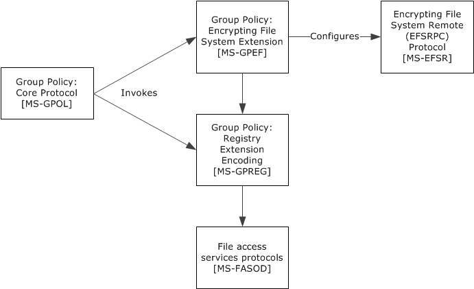
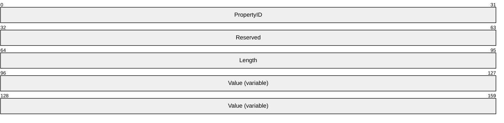
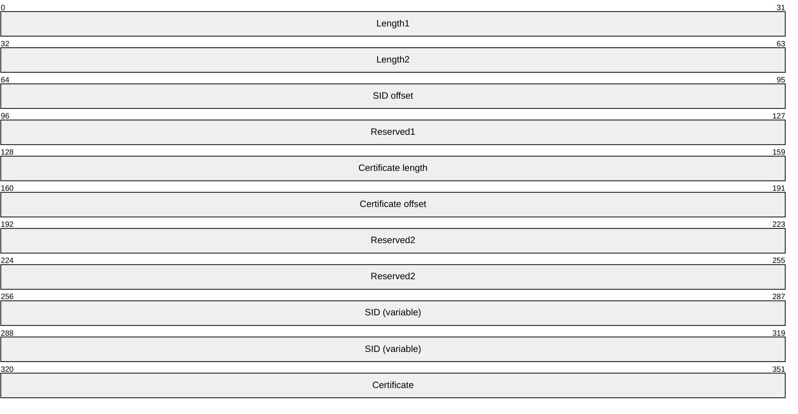

# [MS-GPEF]: Group Policy: Encrypting File System Extension

Table of Contents

1 Introduction

- [1 Introduction](#Section_1)
  - [1.1 Glossary](#Section_1.1)
  - [1.2 References](#Section_1.2)
    - [1.2.1 Normative References](#Section_1.2.1)
    - [1.2.2 Informative References](#Section_1.2.2)
  - [1.3 Overview](#Section_1.3)
    - [1.3.1 Background](#Section_1.3.1)
    - [1.3.2 EFS Group Policy Extension Overview](#Section_1.3.2)
  - [1.4 Relationship to Other Protocols](#Section_1.4)
  - [1.5 Prerequisites/Preconditions](#Section_1.5)
  - [1.6 Applicability Statement](#Section_1.6)
  - [1.7 Versioning and Capability Negotiation](#Section_1.7)
  - [1.8 Vendor-Extensible Fields](#Section_1.8)
  - [1.9 Standards Assignments](#Section_1.9)

2 Messages

- [2 Messages](#Section_2)
  - [2.1 Transport](#Section_2.1)
  - [2.2 Message Syntax](#Section_2.2)
    - [2.2.1 EFS Recovery Policy](#Section_2.2.1)
      - [2.2.1.1 Recovery Agent Certificate](#Section_2.2.1.1)
        - [2.2.1.1.1 Certificate BLOB](#Section_2.2.1.1.1)
          - [2.2.1.1.1.1 Certificate BLOB Properties](#Section_2.2.1.1.1.1)
            - [2.2.1.1.1.1.1 KEY_PROV_INFO](#Section_2.2.1.1.1.1.1)
          - [2.2.1.1.1.2 Certificate BLOB Encoding](#Section_2.2.1.1.1.2)
      - [2.2.1.2 EfsBlob Value](#Section_2.2.1.2)
        - [2.2.1.2.1 EfsBlob](#Section_2.2.1.2.1)
        - [2.2.1.2.2 EfsKey](#Section_2.2.1.2.2)
    - [2.2.2 EFS Enabled Status](#Section_2.2.2)
    - [2.2.3 EFS Additional Options](#Section_2.2.3)
    - [2.2.4 EFS Cache Timeout](#Section_2.2.4)
    - [2.2.5 EFS User Template Name](#Section_2.2.5)
    - [2.2.6 EFS RSA Self-Signed Certificate Key Length](#Section_2.2.6)
    - [2.2.7 EFS ECC Self-Signed Certificate Algorithm Identifier](#Section_2.2.7)

3 Protocol Details

- [3 Protocol Details](#Section_3)
  - [3.1 Administrative Plug-in Details](#Section_3.1)
    - [3.1.1 Abstract Data Model](#Section_3.1.1)
    - [3.1.2 Timers](#Section_3.1.2)
    - [3.1.3 Initialization](#Section_3.1.3)
    - [3.1.4 Higher-Layer Triggered Events](#Section_3.1.4)
    - [3.1.5 Processing Events and Sequencing Rules](#Section_3.1.5)
    - [3.1.6 Timer Events](#Section_3.1.6)
    - [3.1.7 Other Local Events](#Section_3.1.7)
  - [3.2 Client Details](#Section_3.2)
    - [3.2.1 Abstract Data Model](#Section_3.2.1)
    - [3.2.2 Timers](#Section_3.2.2)
    - [3.2.3 Initialization](#Section_3.2.3)
    - [3.2.4 Higher-Layer Triggered Events](#Section_3.2.4)
      - [3.2.4.1 Process Group Policy](#Section_3.2.4.1)
    - [3.2.5 Processing Events and Sequencing Rules](#Section_3.2.5)
      - [3.2.5.1 Receiving Updated Policy](#Section_3.2.5.1)
    - [3.2.6 Timer Events](#Section_3.2.6)
    - [3.2.7 Other Local Events](#Section_3.2.7)

4 Protocol Examples

- [4 Protocol Examples](#Section_4)

5 Security

- [5 Security](#Section_5)
  - [5.1 Security Considerations for Implementers](#Section_5.1)
  - [5.2 Index of Security Parameters](#Section_5.2)

6 Appendix A: Product Behavior

- [6 Appendix A: Product Behavior](#Section_6)

7 Change Tracking

- [7 Change Tracking](#Section_7)

For the legal notice and IP terms, see [LEGAL.md](../LEGAL.md).
Last updated: 4/23/2024.
See [Revision History](#revision-history) for full version history.

# 1 Introduction

The Group Policy: Encrypting File System Extension uses Group Policy: Core Protocol, specified in [MS-GPOL](../MS-GPOL/MS-GPOL.md), to allow remote administrative configuration of the [**Encrypting File System (EFS)**](#gt_encrypting-file-system-efs).

Sections 1.5, 1.8, 1.9, 2, and 3 of this specification are normative. All other sections and examples in this specification are informative.

## 1.1 Glossary

This document uses the following terms:

**Active Directory**: The Windows implementation of a general-purpose directory service, which uses [**LDAP**](#gt_lightweight-directory-access-protocol-ldap) as its primary access protocol. [**Active Directory**](#gt_active-directory) stores information about a variety of objects in the network such as user accounts, computer accounts, groups, and all related credential information used by Kerberos [MS-KILE](../MS-KILE/MS-KILE.md). [**Active Directory**](#gt_active-directory) is either deployed as Active Directory Domain Services (AD DS) or Active Directory Lightweight Directory Services (AD LDS), which are both described in [MS-ADOD](../MS-ADOD/MS-ADOD.md): Active Directory Protocols Overview.

**certificate**: A certificate is a collection of attributes and extensions that can be stored persistently. The set of attributes in a certificate can vary depending on the intended usage of the certificate. A certificate securely binds a public key to the entity that holds the corresponding private key. A certificate is commonly used for authentication and secure exchange of information on open networks, such as the Internet, extranets, and intranets. Certificates are digitally signed by the issuing [**certification authority (CA)**](#gt_certification-authority-ca) and can be issued for a user, a computer, or a service. The most widely accepted format for certificates is defined by the ITU-T X.509 version 3 international standards. For more information about attributes and extensions, see [[RFC3280]](https://go.microsoft.com/fwlink/?LinkId=90414) and [[X509]](https://go.microsoft.com/fwlink/?LinkId=90590) sections 7 and 8.

**certificate template**: A list of attributes that define a blueprint for creating an [**X.509**](#gt_x509) [**certificate**](#gt_certificate). It is often referred to in non-Microsoft documentation as a "certificate profile". A [**certificate template**](#gt_certificate-template) is used to define the content and purpose of a digital certificate, including issuance requirements (certificate policies), implemented [**X.509**](#gt_x509) extensions such as application policies, key usage, or extended key usage as specified in [X509], and enrollment permissions. Enrollment permissions define the rules by which a [**certification authority (CA)**](#gt_certification-authority-ca) will issue or deny certificate requests. In Windows environments, [**certificate templates**](#gt_certificate-template) are stored as objects in the [**Active Directory**](#gt_active-directory) and used by Microsoft enterprise [**CAs**](#gt_certification-authority-ca).

**certification authority (CA)**: A third party that issues public key [**certificates**](#gt_certificate). Certificates serve to bind public keys to a user identity. Each user and certification authority (CA) can decide whether to trust another user or CA for a specific purpose, and whether this trust is to be transitive. For more information, see [RFC3280].

**client-side extension GUID (CSE GUID)**: A [**GUID**](#gt_globally-unique-identifier-guid) that enables a specific client-side extension on the Group Policy client to be associated with policy data that is stored in the logical and physical components of a [**Group Policy Object (GPO)**](#gt_group-policy-object-gpo) on the Group Policy server, for that particular extension.

**common name (CN)**: A string attribute of a [**certificate**](#gt_certificate) that is one component of a distinguished name (DN). In Microsoft Enterprise uses, a CN has to be unique within the forest where it is defined and any forests that share trust with the defining forest. The website or email address of the certificate owner is often used as a common name. Client applications often refer to a [**certification authority (CA)**](#gt_certification-authority-ca) by the CN of its signing certificate.

**computer-scoped Group Policy Object path**: A scoped Group Policy Object (GPO) path that ends in "\Machine".

**data recovery agent (DRA)**: A logical entity corresponding to an asymmetric key pair, which is configured as part of [**Encrypting File System (EFS)**](#gt_encrypting-file-system-efs) administrative policy by an administrator. Whenever an [**EFS**](#gt_encrypting-file-system-efs) file is created or modified, it is also automatically configured to give authorized access to all [**DRAs**](#gt_data-recovery-agent-dra) in effect at that time.

**domain**: A set of users and computers sharing a common namespace and management infrastructure. At least one computer member of the set has to act as a [**domain controller (DC)**](#gt_domain-controller-dc) and host a member list that identifies all members of the domain, as well as optionally hosting the [**Active Directory**](#gt_active-directory) service. The domain controller provides authentication of members, creating a unit of trust for its members. Each domain has an identifier that is shared among its members. For more information, see [MS-AUTHSOD](../MS-AUTHSOD/MS-AUTHSOD.md) section 1.1.1.5 and [MS-ADTS](../MS-ADTS/MS-ADTS.md).

**domain controller (DC)**: The service, running on a server, that implements [**Active Directory**](#gt_active-directory), or the server hosting this service. The service hosts the data store for objects and interoperates with other [**DCs**](#gt_domain-controller-dc) to ensure that a local change to an object replicates correctly across all [**DCs**](#gt_domain-controller-dc). When [**Active Directory**](#gt_active-directory) is operating as Active Directory Domain Services (AD DS), the [**DC**](#gt_domain-controller-dc) contains full NC replicas of the configuration naming context (config NC), schema naming context (schema NC), and one of the domain NCs in its forest. If the AD DS [**DC**](#gt_domain-controller-dc) is a global catalog server (GC server), it contains partial NC replicas of the remaining domain NCs in its forest. For more information, see [MS-AUTHSOD] section 1.1.1.5.2 and [MS-ADTS]. When [**Active Directory**](#gt_active-directory) is operating as Active Directory Lightweight Directory Services (AD LDS), several AD LDS [**DCs**](#gt_domain-controller-dc) can run on one server. When [**Active Directory**](#gt_active-directory) is operating as AD DS, only one AD DS [**DC**](#gt_domain-controller-dc) can run on one server. However, several AD LDS [**DCs**](#gt_domain-controller-dc) can coexist with one AD DS [**DC**](#gt_domain-controller-dc) on one server. The AD LDS [**DC**](#gt_domain-controller-dc) contains full NC replicas of the config NC and the schema NC in its forest. The domain controller is the server side of Authentication Protocol Domain Support [MS-APDS](../MS-APDS/MS-APDS.md).

**EFSR**: Encrypting File System Remote (EFSRPC) Protocol.

**elliptic curve cryptography (ECC)**: A public-key cryptosystem that is based on high-order elliptic curves over finite fields. For more information, see [[IEEE1363]](https://go.microsoft.com/fwlink/?LinkId=89899).

**Encrypting File System (EFS)**: The name for the encryption capability of the [**NTFS**](#gt_nt-file-system-ntfs) file system. When a file is encrypted using [**EFS**](#gt_encrypting-file-system-efs), a symmetric key known as the file encryption key (FEK) is generated and the contents of the file are encrypted with the FEK. For each user or [**data recovery agent (DRA)**](#gt_data-recovery-agent-dra) that is authorized to access the file, a copy of the FEK is encrypted with that user's or [**DRA's**](#gt_data-recovery-agent-dra) public key and is stored in the file's metadata. For more information about [**EFS**](#gt_encrypting-file-system-efs), see [[MSFT-EFS]](https://go.microsoft.com/fwlink/?LinkId=90185).

**globally unique identifier (GUID)**: A term used interchangeably with universally unique identifier (UUID) in Microsoft protocol technical documents (TDs). Interchanging the usage of these terms does not imply or require a specific algorithm or mechanism to generate the value. Specifically, the use of this term does not imply or require that the algorithms described in [[RFC4122]](https://go.microsoft.com/fwlink/?LinkId=90460) or [[C706]](https://go.microsoft.com/fwlink/?LinkId=89824) must be used for generating the [**GUID**](#gt_globally-unique-identifier-guid). See also universally unique identifier (UUID).

**Group Policy Object (GPO)**: A collection of administrator-defined specifications of the policy settings that can be applied to groups of computers in a domain. Each GPO includes two elements: an object that resides in the [**Active Directory**](#gt_active-directory) for the domain, and a corresponding file system subdirectory that resides on the sysvol DFS share of the Group Policy server for the domain.

**Group Policy server**: A server holding a database of [**Group Policy Objects (GPOs)**](#gt_group-policy-object-gpo) that can be retrieved by other machines. The [**Group Policy server**](#gt_group-policy-server) must be a [**domain controller (DC)**](#gt_domain-controller-dc).

**Lightweight Directory Access Protocol (LDAP)**: The primary access protocol for [**Active Directory**](#gt_active-directory). Lightweight Directory Access Protocol (LDAP) is an industry-standard protocol, established by the Internet Engineering Task Force (IETF), which allows users to query and update information in a directory service (DS), as described in [MS-ADTS]. The Lightweight Directory Access Protocol can be either version 2 [[RFC1777]](https://go.microsoft.com/fwlink/?LinkId=90290) or version 3 [[RFC3377]](https://go.microsoft.com/fwlink/?LinkID=91337).

**NT file system (NTFS)**: A proprietary Microsoft file system. For more information, see [[MSFT-NTFS]](https://go.microsoft.com/fwlink/?LinkId=90200).

**page file or paging file**: A file that is used by operating systems for managing virtual memory.

**registry**: A local system-defined database in which applications and system components store and retrieve configuration data. It is a hierarchical data store with lightly typed elements that are logically stored in tree format. Applications use the registry API to retrieve, modify, or delete registry data. The data stored in the registry varies according to the version of the operating system.

**registry policy file**: A file associated with a [**Group Policy Object (GPO)**](#gt_group-policy-object-gpo) that contains a set of registry-based policy settings.

**Rivest-Shamir-Adleman (RSA)**: A system for public key cryptography. [**RSA**](#gt_rivest-shamir-adleman-rsa) is specified in [[RFC8017]](https://go.microsoft.com/fwlink/?linkid=2164409).

**security identifier (SID)**: An identifier for security principals that is used to identify an account or a group. Conceptually, the [**SID**](#gt_security-identifier-sid) is composed of an account authority portion (typically a [**domain**](#gt_domain)) and a smaller integer representing an identity relative to the account authority, termed the relative identifier (RID). The [**SID**](#gt_security-identifier-sid) format is specified in [MS-DTYP](../MS-DTYP/MS-DTYP.md) section 2.4.2; a string representation of [**SIDs**](#gt_security-identifier-sid) is specified in [MS-DTYP] section 2.4.2 and [MS-AZOD](../MS-AZOD/MS-AZOD.md) section 1.1.1.2.

**self-signed certificate**: A [**certificate**](#gt_certificate) that is signed by its creator and verified using the public key contained in it. Such certificates are also termed root certificates.

**SHA-1**: An algorithm that generates a 160-bit hash value from an arbitrary amount of input data, as described in [[RFC3174]](https://go.microsoft.com/fwlink/?LinkId=90408). SHA-1 is used with the Digital Signature Algorithm (DSA) in the Digital Signature Standard (DSS), in addition to other algorithms and standards.

**smart card**: A portable device that is shaped like a business card and is embedded with a memory chip and either a microprocessor or some non-programmable logic. [**Smart cards**](#gt_smart-card) are often used as authentication tokens and for secure key storage. [**Smart cards**](#gt_smart-card) used for secure key storage have the ability to perform cryptographic operations with the stored key without allowing the key itself to be read or otherwise extracted from the card.

**tool extension GUID or administrative plug-in GUID**: A GUID defined separately for each of the user policy settings and computer policy settings that associates a specific administrative tool plug-in with a set of policy settings that can be stored in a [**Group Policy Object (GPO)**](#gt_group-policy-object-gpo).

**Unicode**: A character encoding standard developed by the Unicode Consortium that represents almost all of the written languages of the world. The [**Unicode**](#gt_unicode) standard [[UNICODE5.0.0/2007]](https://go.microsoft.com/fwlink/?LinkId=154659) provides three forms (UTF-8, UTF-16, and UTF-32) and seven schemes (UTF-8, UTF-16, UTF-16 BE, UTF-16 LE, UTF-32, UTF-32 LE, and UTF-32 BE).

**X.509**: An ITU-T standard for public key infrastructure subsequently adapted by the IETF, as specified in [RFC3280].

**MAY, SHOULD, MUST, SHOULD NOT, MUST NOT:** These terms (in all caps) are used as defined in [[RFC2119]](https://go.microsoft.com/fwlink/?LinkId=90317). All statements of optional behavior use either MAY, SHOULD, or SHOULD NOT.

## 1.2 References

Links to a document in the Microsoft Open Specifications library point to the correct section in the most recently published version of the referenced document. However, because individual documents in the library are not updated at the same time, the section numbers in the documents may not match. You can confirm the correct section numbering by checking the [Errata](https://go.microsoft.com/fwlink/?linkid=850906).

### 1.2.1 Normative References

We conduct frequent surveys of the normative references to assure their continued availability. If you have any issue with finding a normative reference, please contact [dochelp@microsoft.com](mailto:dochelp@microsoft.com). We will assist you in finding the relevant information.

[MS-DTYP] Microsoft Corporation, "[Windows Data Types](../MS-DTYP/MS-DTYP.md)".

[MS-EFSR] Microsoft Corporation, "[Encrypting File System Remote (EFSRPC) Protocol](../MS-EFSR/MS-EFSR.md)".

[MS-GPOL] Microsoft Corporation, "[Group Policy: Core Protocol](../MS-GPOL/MS-GPOL.md)".

[MS-GPREG] Microsoft Corporation, "[Group Policy: Registry Extension Encoding](../MS-GPREG/MS-GPREG.md)".

[NSA] National Security Agency, "Suite B Implementer’s Guide to FIPS 186-3 (ECDSA)", February 2010, [https://silo.tips/download/suite-b-implementer-s-guide-to-fips-ecdsa](https://go.microsoft.com/fwlink/?LinkId=183693)

[RFC2119] Bradner, S., "Key words for use in RFCs to Indicate Requirement Levels", BCP 14, RFC 2119, March 1997, [https://www.rfc-editor.org/info/rfc2119](https://go.microsoft.com/fwlink/?LinkId=90317)

[RFC5280] Cooper, D., Santesson, S., Farrell, S., et al., "Internet X.509 Public Key Infrastructure Certificate and Certificate Revocation List (CRL) Profile", RFC 5280, May 2008, [https://www.rfc-editor.org/info/rfc5280](https://go.microsoft.com/fwlink/?LinkId=131034)

### 1.2.2 Informative References

[MS-FASOD] Microsoft Corporation, "[File Access Services Protocols Overview](#Section_1.3)".

[MS-LSAD] Microsoft Corporation, "[Local Security Authority (Domain Policy) Remote Protocol](#Section_5)".

## 1.3 Overview

[**Encrypting File System (EFS)**](#gt_encrypting-file-system-efs) is a capability of the [**NT file system (NTFS)**](#gt_nt-file-system-ntfs). It encrypts files stored on disk in a manner transparent to users and applications. Each user of EFS is associated with a key pair of a public key cryptography system. In addition, administrators can configure [**data recovery agents (DRAs)**](#gt_data-recovery-agent-dra), which are logical entities, each associated with its own key pair. When EFS encrypts a file, it randomly generates a symmetric key that is used to encrypt the file data. It then encrypts a copy of this key with the public key of each user and with the public key of each DRA that is authorized to access the file, and stores these in the file metadata. When a user with access to one of the corresponding private keys tries to open such a file, NTFS automatically invokes EFS functionality to extract the symmetric key from the file metadata and decrypt the file data on the fly.

The behavior of EFS can be controlled through Group Policy. An administrator can use this mechanism to enable or disable EFS, or to enforce policies such as those related to key management or data recovery. All EFS policies are machine-specific, meaning that all users on a given machine will have the same policy applied to them.

### 1.3.1 Background

The Group Policy: Core Protocol, specified in [MS-GPOL](../MS-GPOL/MS-GPOL.md), allows clients to discover and retrieve policy settings created by administrators of a [**domain**](#gt_domain). These settings are persisted within Group Policy Objects (GPOs), which are assigned to policy target accounts in [**Active Directory**](#gt_active-directory). Policy target accounts are either computer accounts or user accounts in Active Directory. Each client uses the [**Lightweight Directory Access Protocol (LDAP)**](#gt_lightweight-directory-access-protocol-ldap) to determine which GPOs are applicable to it by consulting the Active Directory objects corresponding to its computer account and the user accounts of any users logging on to the client computer.

On each client, each GPO is interpreted and acted upon by software components known as client-side plug-ins. Each client-side plug-in is associated with a specific class of settings. The client-side plug-ins that are responsible for a given GPO are specified by using an attribute on the GPO. This attribute specifies a list of [**GUID**](#gt_globally-unique-identifier-guid) pairs. The first GUID of each pair is referred to as a [**client-side extension (CSE GUID)**](#gt_client-side-extension-guid-cse-guid). The second GUID of each pair is referred to as a [**tool extension GUID**](#gt_88ad7745-bee6-47f7-ae98-6fac7c5ef330).

For each GPO that is applicable to a client, the client consults the CSE GUIDs listed in the GPO to determine which client-side plug-ins on the client will handle the GPO. The client then invokes the client-side plug-ins to handle the GPO.

A client-side plug-in uses the contents of the GPO to retrieve and process settings specific to its class, in a manner specific to the plug-in.

### 1.3.2 EFS Group Policy Extension Overview

[**EFS**](#gt_encrypting-file-system-efs) Group Policy settings are accessible from a GPO through the Group Policy: Encrypting File System Extension to the Group Policy: Core Protocol specified in [MS-GPOL](../MS-GPOL/MS-GPOL.md). The extension provides a mechanism for administrative tools to obtain metadata about registry-based settings.

The process of configuring and applying the EFS Group Policy settings consists of the following steps:

- An administrator invokes a Group Policy administrative tool to administer a GPO through the Group Policy: Core Protocol using the Policy Administration Protocol, as specified in [MS-GPOL] section 2.2.8. Through this protocol, the presence of the [**tool extension GUID**](#gt_88ad7745-bee6-47f7-ae98-6fac7c5ef330) for computer policy settings for the Group Policy: Encrypting File System Extension in is retrieved, which indicates that the GPO contains policy settings that are administered through the Policy Administration portion of the Group Policy: Encrypting File System Extension.
The administrative tool invokes a plug-in specific to the Group Policy: Encrypting File System Extension so that the administrator can administer the EFS settings, which results in the storage and retrieval of metadata inside a GPO on a [**Group Policy server**](#gt_group-policy-server). This metadata describes configuration settings to be applied to a generic settings database (the [**registry**](#gt_registry) in Windows) on a client that is affected by the GPO.

The administrator views the data and updates it as desired.

- A client computer affected by that GPO is started (or is connected to the network, if this happens after the client starts), and the Group Policy: Core Protocol is invoked by the client to retrieve policy settings from the Group Policy server. As part of this processing, two [**GUIDs**](#gt_globally-unique-identifier-guid) are read from the GPO: the registry extension's [**CSE GUID**](#gt_client-side-extension-guid-cse-guid), as specified in [MS-GPREG](../MS-GPREG/MS-GPREG.md) section 1.9, and the EFS extension's CSE GUID.
- The presence of the registry extension's CSE GUID, as specified in [MS-GPREG] section 1.9, in the GPO instructs the client to invoke a registry extension plug-in component for policy application. This component parses the file of settings and saves them in the generic settings database (registry) on the local machine.
- The presence of the EFS extension's CSE GUID in the GPO instructs the client to invoke an EFS extension plug-in component for policy application. This component is not required for the protocol and does not affect the operation of the protocol. Specifically, this component is intended to adjust the internal state of the EFS on the client, and it is not intended to participate in any network communication.
- The EFS on the client recognizes that its configuration has been updated and takes the appropriate actions.
This document specifies the behavior of the administrative plug-in mentioned in step 1. The operation of the Group Policy: Core Protocol in step 2 is specified in [MS-GPOL] section 3.2. The process of retrieving the settings in step 3 is specified in [MS-GPREG] section 3.2. Step 4 and step 5 are specific to EFS and are not specified.

## 1.4 Relationship to Other Protocols

Group Policy: Encrypting File System Extension is invoked as an extension of the Group Policy: Core Protocol. Group Policy: Encrypting File System Extension is only initiated as part of the Group Policy: Core Protocol. The invocation of this (and of all Group Policy protocol extensions) is specified in [MS-GPOL](../MS-GPOL/MS-GPOL.md) section 3. Group Policy: Encrypting File System Extension explicitly depends on all the protocols upon which the Group Policy: Core Protocol depends.

Group Policy: Encrypting File System Extension also depends on Group Policy: Registry Extension Encoding specified in [MS-GPREG](../MS-GPREG/MS-GPREG.md) to retrieve settings from a GPO and to populate settings in the client [**registry**](#gt_registry). Group Policy: Encrypting File System Extension uses file access protocols described in [MS-FASOD](#Section_1.3) as its underlying transport.

Group Policy: Encrypting File System Extension configures settings that are used by the [**EFSR**](#gt_efsr). These settings are defined in [MS-EFSR](../MS-EFSR/MS-EFSR.md) section 3.1.1.1.

Figure 1: Protocol relationship diagram

## 1.5 Prerequisites/Preconditions

The prerequisites for this extension are the same as those for the Group Policy: Core Protocol.

In addition, the Group Policy: Registry Extension Encoding needs to be present on the client to retrieve the settings stored by the [**EFS**](#gt_encrypting-file-system-efs) Group Policy administrative plug-in.

## 1.6 Applicability Statement

The Group Policy: Encrypting File System Extension is only applicable within the Group Policy framework and only when a number of client computers in a [**domain**](#gt_domain) support [**EFS**](#gt_encrypting-file-system-efs). The Group Policy: Encrypting File System Extension is intended to be used to configure certain aspects of EFS behavior on such clients.

The Group Policy: Encrypting File System Extension is in a certain class of extensions that have only an administrative-side extension and no client-side extension. These extensions are data structures and are documented here for informative purposes only.

## 1.7 Versioning and Capability Negotiation

The Group Policy: Encrypting File System Extension does not provide versioning or capability negotiations.

All [**EFS**](#gt_encrypting-file-system-efs) Group Policy settings have unique definitions, and all implementations are required to support a base set of options. Thus, the only differences between implementations are in the sets of additional options supported. Due to the nature of the Group Policy configuration store used for EFS settings, a [**domain controller (DC)**](#gt_domain-controller-dc) can store and maintain even those settings which its Group Policy: Encrypting File System Extension do not support.

In a heterogeneous environment, it is expected that some client computers will not recognize some settings specified here. A client will not be able to use the administrative plug-in to configure those settings that it does not support. However, the EFS administrative plug-in will neither modify nor destroy any settings it does not support.

## 1.8 Vendor-Extensible Fields

The Group Policy: Encrypting File System Extension does not define any vendor-extensible fields.

## 1.9 Standards Assignments

This protocol defines [**CSE GUID**](#gt_client-side-extension-guid-cse-guid) and [**tool extension GUID**](#gt_88ad7745-bee6-47f7-ae98-6fac7c5ef330) values as specified in [MS-GPOL](../MS-GPOL/MS-GPOL.md) section 1.8. The assignments are as follows.

| Parameter | Value |
| --- | --- |
| CSE GUID | {B1BE8D72-6EAC-11D2-A4EA-00C04F79F83A} |
| Tool extension GUID (computer policy settings) | {53D6AB1D-2488-11D1-A28C-00C04FB94F17} |
| Tool extension GUID (default domain policy settings) | {53D6AB1B-2488-11D1-A28C-00C04FB94F17} |

# 2 Messages

## 2.1 Transport

The [**EFS**](#gt_encrypting-file-system-efs) Group Policy administrative plug-in uses the transport specified in [MS-GPOL](../MS-GPOL/MS-GPOL.md) to read and modify settings in the central policy store. Specifically, it uses the file access services protocols described in [MS-FASOD](#Section_1.3) as the underlying transport for reading, updating, creating, and deleting EFS Group Policy settings. Information is retrieved from the policy store and written to the client's registry by the Group Policy: Registry Extension Encoding ([MS-GPREG](../MS-GPREG/MS-GPREG.md) section 3.2) using file access protocols as the underlying transport. The file access version, capabilities, and authentication used for this connection are negotiated between the client and the server when the connection is established.

## 2.2 Message Syntax

The Group Policy: Encrypting File System Extension MUST use the message syntaxes as specified in [MS-GPOL](../MS-GPOL/MS-GPOL.md) section 2.2 and [MS-GPREG](../MS-GPREG/MS-GPREG.md) section 2.2. EFS Group Policy options are implemented as entries in the machine-specific Registry Policy file used by the Group Policy: Registry Extension Encoding. To support a given Group Policy option, the [**EFS**](#gt_encrypting-file-system-efs) administrative plug-in MUST provide a method to write and query the corresponding entry in the machine-specific Registry Policy file of the relevant GPO.

The following EFS Group Policy options are defined:

- EFS recovery policy
- EFS enabled status
- EFS additional options
- EFS user template name
- EFS self-signed [**certificate**](#gt_certificate) key length or algorithm identifier.
These are described in more detail in the following sections. Because all message processing is performed by the Group Policy: Core Protocol, the following sections merely specify the format of the corresponding entries in the machine-specific Registry Policy file. The intent of various settings is also described in the following sections; however, these settings are processed by the EFS in the client, and their descriptions here are only for informative purposes, not for normative purposes.

### 2.2.1 EFS Recovery Policy

This option MUST be supported by all implementations of the Group Policy: Encrypting File System Extensions.

When writing the [**EFS**](#gt_encrypting-file-system-efs) recovery policy, the administrative plug-in MUST configure the machine-specific Registry Policy file to create a [**registry**](#gt_registry) key named Software\Policies\Microsoft\SystemCertificates\EFS. This key MUST contain three subkeys, named Certificates, CRLs, and CTLs, respectively. The Certificates subkey MUST in turn contain zero or more subkeys, each of which represents the [**X.509**](#gt_x509) certificate (as specified in [[RFC5280]](https://go.microsoft.com/fwlink/?LinkId=131034)) of an EFS recovery agent. The format of these entries is specified in section [2.2.1.1](#Section_2.2.1.1). The CRLs and CTLs subkeys MUST be empty.

In addition to the previous information, the administrative plug-in MUST create an additional entry in the machine-specific Registry Policy file, which contains all the applicable EFS recovery agent [**certificates**](#gt_certificate) marshaled into a single value, as specified in section [2.2.1.2](#Section_2.2.1.2.1).

#### 2.2.1.1 Recovery Agent Certificate

A separate [**registry**](#gt_registry) key MUST be created for each [**EFS**](#gt_encrypting-file-system-efs) recovery agent under the path Software\Policies\Microsoft\SystemCertificates\EFS\Certificates. The name of this key MUST be the 40-character string corresponding to the hexadecimal representation of the [**SHA-1**](#gt_sha-1) hash of the [**certificate**](#gt_certificate) (this quantity is sometimes referred to as the certificate "thumbprint"). This key MUST contain a single value of type REG_BINARY. The name of this value MUST be "Blob". The format of this value (hereafter referred to as the certificate binary large object (BLOB)) is described in the following sections.

##### 2.2.1.1.1 Certificate BLOB

The [**certificate**](#gt_certificate) BLOB MUST consist of zero or more certificate properties, followed by the encoded certificate. The format of the properties is specified in section [2.2.1.1.1.1](#Section_2.2.1.1.1.1). The format of the encoded certificate is specified in section [2.2.1.1.1.2](#Section_2.2.1.1.1.2).

###### 2.2.1.1.1.1 Certificate BLOB Properties

Each property in the certificate BLOB structure MUST be formatted as follows.

**PropertyID (4 bytes):** This field MUST identify the property whose value is contained in the **Value** field. It MUST be an unsigned 32-bit integer in little-endian format. Valid integer values are shown in the following table.

| Value | Meaning |
| --- | --- |
| KEY_PROV_INFO 2 | This property is used to provide hints regarding the handling of the certificate. Its format is specified later in this section. |
| SHA1_HASH 3 | A 20-byte array representing the SHA-1 hash of the certificate. |
| MD5_HASH 4 | 16-byte array representing the MD5 hash of the certificate. |
| KEY_SPEC 6 | Unsigned 32-bit integer in little-endian format. The only valid value is 1 (also referred to as AT_KEYEXCHANGE). |
| ENHKEY_USAGE 9 | The value of the extended key usage extension on the certificate, in ASN.1 DER encoding. For more details, see [[RFC5280]](https://go.microsoft.com/fwlink/?LinkId=131034) section 4.2.1.12. |
| FRIENDLY_NAME 11 | A null-terminated [**Unicode**](#gt_unicode) string representing the display name for the certificate. |
| DESCRIPTION 13 | A null-terminated Unicode string representing a brief description of the certificate. |
| SIGNATURE_HASH 15 | A 20-byte array containing the SHA-1 hash of the certificate signature, or a 16-byte array containing the MD5 hash of the certificate signature. |
| KEY_IDENTIFIER 20 | A 20-byte array containing the SHA-1 hash of the certificate subject public key. |
| AUTO_ENROLL 21 | A null-terminated Unicode string that contains the name or object identifier used for autoenrollment. This is present when the certificate was obtained through autoenrollment. |
| PUBKEY_ALG_PARA 22 | The algorithm identifier for the public key contained in the certificate, in Distinguished Encoding Rules (DER) encoding. The structure of an [**X.509**](#gt_x509) certificate is defined by [RFC5280]. |
| ISSUER_PUBLIC_KEY_MD5_HASH 24 | A 16-byte array containing the MD5 hash of the public key associated with the private key used to sign the certificate. |
| SUBJECT_PUBLIC_KEY_MD5_HASH 25 | A 16-byte array containing the MD5 hash of the public key contained in the certificate. |
| DATE_STAMP 27 | A date stamp, in the form of an unsigned 64-bit integer in little-endian format representing the number of 100-nanosecond intervals since January 1, 1601. |
| ISSUER_SERIAL_NUMBER_MD5_HASH 28 | A 16-byte array containing the MD5 hash of the [**certificate authority (CA)**](#gt_certification-authority-ca) signing certificate serial number. |
| SUBJECT_NAME_MD5_HASH 29 | A 16-byte array containing the MD5 hash of the subject name in the certificate. |

**Reserved (4 bytes):** Reserved. MUST be set to 0x01 0x00 0x00 0x00.

**Length (4 bytes):** This field MUST contain the length of the **Value** field in bytes. It MUST be an unsigned 32-bit number in little-endian format.

**Value (variable):** This field MUST contain the value of the specified property, in the format specified for the property associated with the table of possible values for PropertyID.

KEY_PROV_INFO

The value for the KEY_PROV_INFO property (if this property is present) MUST be in the following format.

**Offset to Container Name (4 bytes):** This MUST be set to the offset, in bytes, of the Container Name subfield of the **Name Data** field from the beginning of this structure. It MUST be an unsigned 32-bit integer in little-endian format.

**Offset to Provider Name (4 bytes):** This MUST be set to the offset, in bytes, of the Provider Name subfield of the **Name Data** field from the beginning of this structure. It MUST be an unsigned 32-bit integer in little-endian format.

**Provider Type (4 bytes):** This field indicates the class of cryptographic algorithm associated with the public key in the certificate. It MUST be set to the unsigned 32-bit number 0x00000001 (in little-endian format) to signify an RSA public key.

**Flags (4 bytes):** This field SHOULD be set to zero, and its value MUST be ignored by the client.

**Reserved (8 bytes):** This field is two rows total in the previous diagram and MUST be set to zero.

**Key Specification (4 bytes):** This field indicates the cryptographic capabilities associated with the public key in the certificate. It MUST be set to the unsigned 32-bit number 0x00000001 (in little-endian format) to signify that the key is usable for both signature and encryption operations.

**Name Data (variable):** This field MUST contain the following items, in any order, at the locations indicated by the respective Offset fields described earlier in this section. These items MUST be completely contained inside this field and MUST NOT overlap each other. There MUST be no unused areas within this field that span more than eight contiguous bytes. All unused bytes within this field SHOULD be set to zero. Unused bytes MUST be ignored by the implementation.

**Container Name (variable):** This MUST be a null-terminated [**Unicode**](#gt_unicode) string representing a specific key container in the cryptographic service provider (CSP) referred to by the provider name.

**Provider Name (variable):** This MUST be a null-terminated Unicode string representing the CSP associated with the public key contained in the certificate.

###### 2.2.1.1.1.2 Certificate BLOB Encoding

The encoded certificate structure MUST be formatted as follows.

**Reserved (8 bytes):** This field MUST be set to the following bytes, in the following order: 0x20 0x00 0x00 0x00 0x01 0x00 0x00 0x00.

**Length (4 bytes):** This field MUST contain the length of the **Value** field in bytes. It MUST be an unsigned 32-bit number in little-endian format.

**Value (variable):** This field MUST contain the ASN.1 DER encoding of the [**X.509**](#gt_x509) certificate of the EFS Recovery Agent. The certificate MUST contain a public key for use with the RSA or ECC encryption algorithm. For more details, see [[RFC5280]](https://go.microsoft.com/fwlink/?LinkId=131034).

#### 2.2.1.2 EfsBlob Value

The [EfsBlob](#Section_2.2.1.2.1) entry MUST be represented in the machine-specific Registry Policy file as follows:

Key: **Software\Policies\Microsoft\SystemCertificates\EFS \EfsBlob**

Value: "EfsBlob" or one of the special values defined in [MS-GPREG](../MS-GPREG/MS-GPREG.md) section 3.2.5.1.

Type: REG_BINARY.

Size: Equal to size of the **Data** field.

Data: Specified in the next section.

The format of the EfsBlob entry is specified in section 2.2.1.2.1.

##### 2.2.1.2.1 EfsBlob

The EfsBlob packet is a data structure that contains EFS Recovery Keys.

**Reserved (4 bytes):** Reserved array of bytes. MUST be set to 0x01 0x00 0x01 0x00, in that order.

**Key count (4 bytes):** Number of recovery keys included. This field MUST be greater than zero. This field MUST contain a 32-bit integer in little-endian format.

**Keys (variable):** This field MUST consist of one or more entries as specified in the **Key count** field, with each entry being formatted as defined in section [2.2.1.2.2](#Section_2.2.1.2.2).

##### 2.2.1.2.2 EfsKey

The EfsKey packet contains an [**EFS**](#gt_encrypting-file-system-efs) key.

**Length1 (4 bytes):** This field MUST be equal to the length of the key structure in bytes, as measured from the beginning of the **Length1** field to the end of the **Certificate** field. This field MUST be a 32-bit unsigned integer in little-endian format.

**Length2 (4 bytes):** This field MUST be equal to the length of the key structure in bytes, as measured from the beginning of the **Length2** field to the end of the **Certificate** field. This field MUST be a 32-bit unsigned integer in little-endian format. Note that the value of **Length2** is always four bytes less than the value of **Length1**. This redundancy is due to historical reasons.

**SID offset (4 bytes):** This field MUST be equal to the offset of the **SID** field in bytes, starting from the beginning of the **Length2** field. This field MUST be a 32-bit unsigned integer in little-endian format.

**Reserved1 (4 bytes):** This field MUST be set to 0x02 0x00 0x00 0x00. This field MUST be a 32-bit unsigned integer in little-endian format.

**Certificate length (4 bytes):** This field MUST be equal to the length of the **Certificate** field in bytes. This field MUST be a 32-bit unsigned integer in little-endian format.

**Certificate offset (4 bytes):** This field MUST be equal to the offset of the **Certificate** field in bytes, starting from the beginning of the **Length2** field. This field MUST be a 32-bit unsigned integer in little-endian format.

**Reserved2 (8 bytes):** All bits within this field SHOULD be set to zero. The client MUST ignore any nonzero values.

**SID (variable):** (Optional field.) This field MAY<1> contain the [**security identifier (SID)**](#gt_security-identifier-sid) of a valid user within the [**domain**](#gt_domain). When set to a nonzero value, this field is intended to be used as a hint indicating which user created the key, and it does not affect the protocol processing at either the client or the server, as specified in [MS-DTYP](../MS-DTYP/MS-DTYP.md) section 2.4.2.

**Certificate (4 bytes):** This field MUST contain the ASN.1 representation, in DER encoding, of an [**X.509**](#gt_x509) certificate from among the EFS recovery agent certificates described earlier.

### 2.2.2 EFS Enabled Status

Key: **Software\Policies\Microsoft\Windows NT\CurrentVersion\EFS**

Value: "EfsConfiguration" or one of the special values in [MS-GPREG](../MS-GPREG/MS-GPREG.md) section 3.2.5.1.

Type: REG_DWORD.

Size: Equal to size of the **Data** field.

Data: 0x00000000 (to enable [**EFS**](#gt_encrypting-file-system-efs) on the client) or 0x00000001 (to disable EFS on the client).

This option SHOULD<2> be supported by implementations of the Group Policy: Encrypting File System Extension. If an implementation chooses not to support this option, the administrative plug-in MUST NOT modify the Registry Policy entry described earlier.

If the client supports this option but the option is not present, the client SHOULD use a default value of 0x00000000.

### 2.2.3 EFS Additional Options

Key: **Software\Policies\Microsoft\Windows NT\CurrentVersion\EFS**

Value: "EfsOptions" or one of the special values in [MS-GPREG](../MS-GPREG/MS-GPREG.md) section 3.2.5.1.

Type: REG_DWORD.

Size: Equal to size of the **Data** field.

The [**registry**](#gt_registry) value name "EfsOptions" can be replaced with one of the special values in [MS-GPREG] section 3.2.5.1.

Data: A 32-bit value consisting of the bitwise OR of zero or more of the following flags.

| Value | Meaning |
| --- | --- |
| 0x00000001 | [**EFS**](#gt_encrypting-file-system-efs) attempts to encrypt the user's Documents folder and its contents. |
| 0x00000002 | When using a [**smart card**](#gt_smart-card) to store the user's private key, EFS derives a symmetric key from the private key, caches it in memory, and performs symmetric key operations with it instead of asymmetric key operations with the private and public keys on the smart card. |
| 0x00000004 | EFS permits users to use public keys associated with [**self-signed certificates**](#gt_self-signed-certificate) for encryption. |
| 0x00000010 | EFS flushes all per-user secrets and keying material from memory after an idle interval as specified in the EFS cache timeout option (see more later in this section). If this flag is supported by an implementation, that implementation MUST also support the cache timeout option described later. |
| 0x00000020 | For users who are logged on to the client interactively, EFS flushes all per-user secrets and keying material from memory whenever the user temporarily locks the session. |
| 0x00000100 | EFS rejects attempts by users to create encrypted files or to encrypt existing files using keys not stored on a smart card. |
| 0x00000200 | This setting is used as a hint to the client to enable encryption of the system [**page file**](#gt_d359150b-3c93-451c-a6b4-e77255c9f212). |
| 0x00000400 | EFS reminds users to back up their keys each time they change their EFS key. |
| 0x00001000 | EFS disallows the use of [**ECC**](#gt_elliptic-curve-cryptography-ecc) keys for user and recovery keys. This flag MUST NOT be specified in combination with 0x00002000. If neither 0x00001000 nor 0x00002000 is specified, then both ECC and [**RSA**](#gt_rivest-shamir-adleman-rsa) keys are permitted. |
| 0x00002000 | EFS requires the use of ECC keys for user and recovery keys. This flag MUST NOT be specified in combination with 0x00001000. If neither 0x00001000 nor 0x00002000 is specified, then both ECC and RSA keys are permitted. |

With the exception of flag 0x00000200, an implementation SHOULD<3> support all the flags described in this section. An implementation MAY<4> support flag 0x00000200.

If the client supports this option but the option is not present, the client SHOULD use a default value of 0x00000002 | 0x00000004 | 0x00000010.

### 2.2.4 EFS Cache Timeout

The [**EFS**](#gt_encrypting-file-system-efs) cache timeout field is specified as follows:

Key: **Software\Policies\Microsoft\Windows NT\CurrentVersion\EFS**

Value: "CacheTimeout" or one of the special values in [MS-GPREG](../MS-GPREG/MS-GPREG.md) section 3.2.5.1.

Type: REG_DWORD.

Size: Equal to size of the **Data** field.

Data: This field is intended to be used in conjunction with a flag to flush the cache on timeout (specified earlier as 0x00000010). The implementation MUST either support both the **CacheTimeout** field AND the flag to flush the cache on timeout, or neither the **CacheTimeout** field nor the flag to flush the cache on timeout. This value MUST be expressed as a number of minutes, and the value SHOULD be no less than 5 and no greater than 10080 (that is, one week).<5>

If the client supports this option but the option is not present, the client SHOULD use a default value of 480 (that is, 8 hours).

### 2.2.5 EFS User Template Name

**Key: Software\Policies\Microsoft\Windows NT\CurrentVersion\EFS**

**Value:** "TemplateName" or one of the special values in [MS-GPREG](../MS-GPREG/MS-GPREG.md) section 3.2.5.1.

**Type:** REG_SZ.

**Size:** Equal to size of the **Data** field.

**Data:** A variable-length, null-terminated [**Unicode**](#gt_unicode) string. This setting specifies the [**common name (CN)**](#gt_common-name-cn) of a [**certificate template**](#gt_certificate-template), and is used by EFS on the client for certificate enrollment requests. See section [3.2.5.1](#Section_3.2.5.1) and the corresponding section 3.1.4.1 of [MS-EFSR](../MS-EFSR/MS-EFSR.md) for details of how and when this field is used by the client.

This option SHOULD<6> be supported.

If the client supports this option but the option is not present, the client SHOULD use the default value "EFS".

### 2.2.6 EFS RSA Self-Signed Certificate Key Length

Key:**Software\Policies\Microsoft\Windows NT\CurrentVersion\EFS**

Value: "RSAKeyLength" or one of the special values in [MS-GPREG](../MS-GPREG/MS-GPREG.md) section 3.2.5.1.

Type: REG_DWORD.

Size: Equal to size of the **Data** field.

Data: A 32-bit multiple of 8, representing the key length, in bits. This value SHOULD be no less than 1024 and no greater than 16384.<7>

This setting specifies the key length, in bits, that [**EFS**](#gt_encrypting-file-system-efs) uses when generating an RSA self-signed certificate. Such a certificate is generated when a user with no existing EFS keys attempts to create a new encrypted file or to convert an existing plain text file to encrypted form, and EFS fails to enroll the user for a suitable certificate from a [**certificate authority (CA)**](#gt_certification-authority-ca).

Implementations SHOULD<8> support this option. If this option is supported, the flag to disable self-signed certificates (defined as 0x00000004 in section [2.2.3](#Section_2.2.3)) MUST be supported.

If the client supports this option but the option is not present, the client SHOULD use a default value of 2048.

### 2.2.7 EFS ECC Self-Signed Certificate Algorithm Identifier

Key: **Software\Policies\Microsoft\Windows NT\CurrentVersion\EFS**

Value: "SuiteBAlgorithm" or one of the special values in [MS-GPREG](../MS-GPREG/MS-GPREG.md) section 3.2.5.1.

Type: REG_SZ.

Size: Equal to size of the **Data** field.

Data: A variable-length, null-terminated Unicode string. This setting specifies the algorithm that [**EFS**](#gt_encrypting-file-system-efs) uses when generating an [**ECC**](#gt_elliptic-curve-cryptography-ecc) self-signed certificate. Such a certificate is generated when a user with no existing EFS keys attempts to create a new encrypted file or to convert an existing plain text file to encrypted form, and EFS fails to enroll the user for a suitable certificate from a [**certificate authority (CA)**](#gt_certification-authority-ca).

Implementations SHOULD<9> choose to support this option. If this option is supported, the flag to disable self-signed certificates (defined as 0x00000004 in section [2.2.3](#Section_2.2.3)) MUST be supported.

An implementation that supports this option MUST support the following identifiers.

| Algorithm Identifier | Description |
| --- | --- |
| "ECDH_P256" | The 256-bit prime elliptic curve Diffie-Hellman key exchange algorithm. |
| "ECDH_P384" | The 384-bit prime elliptic curve Diffie-Hellman key exchange algorithm. |
| "ECDH_P521" | The 521-bit prime elliptic curve Diffie-Hellman Key exchange algorithm. |

If the client supports this option but the option is not present, the client SHOULD use the default value "ECDH_P256".

# 3 Protocol Details

## 3.1 Administrative Plug-in Details

The administrative plug-in mediates between the user interface (UI) and a remote data store that contains the [**EFS**](#gt_encrypting-file-system-efs) policy settings. Its purpose is to receive EFS policy information from a UI and to write the EFS policy information to a remote data store.

### 3.1.1 Abstract Data Model

This section describes a conceptual model of possible data organization that an implementation maintains to participate in this protocol. The described organization is provided to facilitate the explanation of how the protocol behaves. This document does not mandate that implementations adhere to this model as long as their external behavior is consistent with that described in this document.

The [**EFS**](#gt_encrypting-file-system-efs) Group Policy administrative plug-in relies on a collection of settings specified in section [2.2](../MS-GPREG/MS-GPREG.md) and stored as a [**Unicode**](#gt_unicode) configuration file ([MS-GPREG](../MS-GPREG/MS-GPREG.md) section 2.2) at a remote storage location using the Group Policy: Core Protocol. The administrative plug-in treats these settings merely as a collection of name-value pairs.

The EFS Group Policy administrative plug-in reads in these settings from the remote storage location and displays them to an administrator through a UI.

An administrator can then use the UI to make further configuration changes and the EFS Group Policy administrative plug-in will make corresponding changes to the name-value pairs stored in the aforementioned Unicode configuration file.

This conceptual data can be implemented using a variety of techniques. An implementation can implement such data using any method.<10>

This protocol also includes one ADM element, **Administered GPO (Public)**, which is directly accessed from the Group Policy: Core Protocol, as specified in [MS-GPOL](../MS-GPOL/MS-GPOL.md) section 3.3.1.3.

### 3.1.2 Timers

This protocol does not introduce any new timers.

### 3.1.3 Initialization

No additional initialization steps are needed.

### 3.1.4 Higher-Layer Triggered Events

The [**EFS**](#gt_encrypting-file-system-efs) Group Policy administrative plug-in is invoked when an administrator launches the user interface for editing Group Policy settings. The plug-in displays the current settings to the administrator, and when the administrator requests a change in settings, it updates the stored configuration appropriately as specified in section [2.2](#Section_2.2), after performing additional checks and actions as noted in this section.

When the administrator requests an update of the EFS recovery policy, the administrative plug-in MUST also create or update the EfsBlob entry as specified in section [2.2.1](#Section_2.2.1).

The administrative plug-in SHOULD<11> take measures in its UI to ensure that the user cannot unknowingly set the EFS user template name to an invalid value. If the implementation supports the flag requiring [**smart cards**](#gt_smart-card) for EFS (specified in section [2.2.3](#Section_2.2.3)) and if that option is configured to require smart cards for EFS, the administrative plug-in SHOULD ensure that this template is compatible with smart cards.

Implementations SHOULD<12> prevent users from configuring very low values for the EFS [**self-signed certificate**](#gt_self-signed-certificate) key length (as specified in section [2.2.6](#Section_2.2.6)), as short keys are insecure. Implementations can also restrict the maximum key length permitted.

### 3.1.5 Processing Events and Sequencing Rules

The [**EFS**](#gt_encrypting-file-system-efs) Group Policy administrative plug-in reads extension-specific data from the remote storage location and will then pass that information to a UI to display the current settings to an administrator.

It will also write the extension-specific configuration data to the remote storage location if the administrator makes any changes to the existing configuration.

Any additional entries in the configuration data that do not pertain to the configuration options specified in section [2.2](#Section_2.2), or that are not supported by the particular implementation, MUST be ignored by the plug-in. The plug-in MUST NOT overwrite, delete, or otherwise modify any settings that it does not support.

The EFS Group Policy administrative plug-in queries and persists these settings in the "registry.pol" [**registry policy file**](#gt_registry-policy-file) under the [**computer-scoped Group Policy Object path**](#gt_computer-scoped-group-policy-object-path).

The EFS Group Policy administrative plug-in MUST invoke the following event to load the "registry.pol" file:

- Load Policy Settings event specified in [MS-GPREG](../MS-GPREG/MS-GPREG.md) section 3.1.4.1
The EFS Group Policy administrative plug-in MUST invoke the following events to update the "registry.pol" file:

- Update Policy Settings event specified in [MS-GPREG] section 3.1.4.2
- Group Policy Extension Update event described in [MS-GPOL](../MS-GPOL/MS-GPOL.md) section 3.3.4.4 with the following parameters:
- "*GPO DN*" is set to the distinguished name of the **Administered GPO**
- "*Is User Policy*" is set to FALSE
- "*CSE GUID*" is set to the Group Policy: Encrypting File System *CSE GUID* (defined in section [1.9](#Section_1.9))
- "*TOOL GUID*" is set to the Group Policy: Encrypting File System *Tool extension GUID (computer policy settings)* (defined in section 1.9)
- Group Policy Extension Update event described in [MS-GPOL] section 3.3.4.4 with the following parameters:
- "*GPO DN*" is set to the distinguished name of the **Administered GPO**
- "*Is User Policy*" is set to FALSE
- "*CSE GUID*" is set to the Group Policy: Registry Extension Encoding *CSE GUID* (defined in [MS-GPREG] section 1.9)
- "*TOOL GUID*" is set to the Group Policy: Encrypting File System *Tool extension GUID (computer policy settings)* (defined in section 1.9)
In all cases, the <gpo path> is set to computer-scoped Group Policy Object path, and the settings contained in the "registry.pol" file are used for the Policy Setting State. No other policy files are accessed by this plug-in. The plug-in MUST use the registry policy file format specified in [MS-GPREG] section 2.2.1 to query and update the policy entries described in section 2.2 in the "registry.pol" file.

### 3.1.6 Timer Events

This protocol does not introduce any new timers.

### 3.1.7 Other Local Events

The administrative plug-in MAY<13> use other events to populate the [**EFS**](#gt_encrypting-file-system-efs) policy, especially the recovery policy, to minimize the probability of data loss.

## 3.2 Client Details

Clients of this protocol consume the settings specified using the [administrative plug-in (section 3.1)](#Section_1.3). These settings specify behavior for [**EFS**](#gt_encrypting-file-system-efs) on the client. The client also provides a facility for higher-layer applications to bind a user to a certificate suitable for EFS.

### 3.2.1 Abstract Data Model

This section describes a conceptual model of possible data organization that an implementation maintains to participate in this protocol. The described organization is provided to facilitate the explanation of how the protocol behaves. This document does not mandate that implementations adhere to this model as long as their external behavior is consistent with that described in this document.

This protocol uses the model outlined in section 3.2.1.1 of [MS-GPREG](../MS-GPREG/MS-GPREG.md) to store and retrieve settings on the client. Settings defined by the administrative plug-in [3.1](#Section_1.3) are populated to a persistent generic database on the client by methods described in [MS-GPREG]. The client then queries the database using the key and value names outlined in sections [2.2.1](#Section_2.2.1) - [2.2.7](#Section_2.2.7) to retrieve the settings. Based on the data retrieved for these settings, the client modifies the internal state of [**EFS**](#gt_encrypting-file-system-efs) to conform to the specified settings.

In addition to the collection of settings described above, public elements of the User-Certificate Binding ADM (exposed by [MS-EFSR](../MS-EFSR/MS-EFSR.md) section 3.1.1.1) are directly accessed. The following public ADM elements are configured by the clients of the Group Policy: Encrypting File System Extension:

- **RequireV3Template** (exposed by [MS-EFSR] section 3.1.1.1)
- **DisallowV3Template** (exposed by [MS-EFSR] section 3.1.1.1)
- **RequireSmartCard** (exposed by [MS-EFSR] section 3.1.1.1)
- **TemplateName** (exposed by [MS-EFSR] section 3.1.1.1)
The listed elements are exposed by the ADM of [MS-EFSR], as specified in [MS-EFSR] section 3.1.1.1.

Public elements of the [**EFSR**](#gt_efsr) Server Control (defined in [MS-EFSR] section 3.1.1.2) are also directly accessed. The following public ADM elements are configured by clients of the Group Policy: Encrypting File System Extension:

- **EfsDisabled** (exposed by [MS-EFSR] section 3.1.1.2)
The listed element is exposed by the ADM of [MS-EFSR], as specified in [MS-EFSR] section 3.1.1.2.

### 3.2.2 Timers

This protocol does not introduce any new timers.

### 3.2.3 Initialization

No additional initialization steps are needed.

### 3.2.4 Higher-Layer Triggered Events

#### 3.2.4.1 Process Group Policy

A client of the Group Policy: Encrypting File System Extension MAY<14> register an EFS extension plug-in component using the EFS extension's **CSE GUID**. If the client registers an EFS extension plug-in component, the Group Policy: Core Protocol launches the component by invoking the Process Group Policy event. The abstract interface for the Process Group Policy event is specified in [MS-GPOL](../MS-GPOL/MS-GPOL.md) section 3.2.4.1.

### 3.2.5 Processing Events and Sequencing Rules

If a client of Group Policy: Encrypting File System Extension registers an EFS extension plug-in component, the client plug-in component that receives an updated collection of settings MUST only adjust the internal state of EFS on the client, as specified in section [3.2.5.1](#Section_3.2.5.1). It MUST NOT participate in any network communication.

#### 3.2.5.1 Receiving Updated Policy

When a client of the Group Policy: Encrypting File System Extension receives an updated collection of settings via the procedure in [MS-GPREG](../MS-GPREG/MS-GPREG.md) section 3.2.4.1, it directly accesses the public User-Certificate Binding ADM elements ([MS-EFSR](../MS-EFSR/MS-EFSR.md) section 3.1.1.1) and configures them in the following way:

**RequireV3Template (Public):** If the value of the **EfsOptions** field (section [2.2.3](#Section_2.2.3)) is present in the client database and flag 0x00002000 is set, the client MUST set this value to True. Otherwise, this element is not modified.

**DisallowV3Template (Public):** If the value of the **EfsOptions** field (section 2.2.3) is present in the client database and flag 0x00001000 is set, the client MUST set this value to True. Otherwise, this element is not modified.

**RequireSmartCard (Public):** If the value of the **EfsOptions** field (section 2.2.3) is present in the client database and flag 0x00000100 is set, the client MUST set this value to True. Otherwise, this element is not modified.

**TemplateName (Public):** If the value of the **TemplateName** field (section [2.2.5](#Section_2.2.5)) is present in the client database, the client MUST use the value from the database to set the **TemplateName (Public)** User-Certificate Binding ADM element ([MS-EFSR] section 3.1.1.1). Otherwise, this element is not modified.

A client of the Group Policy: Encrypting File System Extension also directly accesses the public [**EFSR**](#gt_efsr) Server Control ADM elements ([MS-EFSR] section 3.1.1.2) and configures them in the following way:

**EfsDisabled (Public):** If the value of the **EfsConfiguration** field (section [2.2.2](#Section_2.2.2)) is present in the client database and equal to 0x00000001, the client SHOULD set this value to true. A client implementation MAY<15> use an alternative mechanism for configuring the **EfsDisabled** public ADM element.

### 3.2.6 Timer Events

None.

### 3.2.7 Other Local Events

None.

# 4 Protocol Examples

In the following example, an administrator sets up a new [**domain**](#gt_domain) and wants to enable [**EFS**](#gt_encrypting-file-system-efs) use on the computers in the domain. The client computers run an operating system whose EFS implementation contains a system process that is initialized at startup and terminated at shutdown.

First, the administrator installs and configures an operating system on a computer that is intended to function as the [**DC**](#gt_domain-controller-dc). After taking the necessary steps to designate the computer as a DC and creating a user account with administrative privileges over the new domain, the administrator restarts the machine and logs on as the newly created user. At this point, the administrative plug-in is triggered: a new public-private key pair is generated, a self-signed [**X.509**](#gt_x509) certificate is created containing the public key, with its enhanced key usage extension set to the value denoting File Recovery. This certificate is written to the Group Policy configuration store as specified in section [2.2.1](#Section_2.2.1). An [EfsBlob](#Section_2.2.1.2.1) entry is also created that contains this certificate.

The administrator then launches the user interface for the administrative plug-in, and sets the status of EFS to Enabled. This causes the following entry to be written to the machine-specific Registry Policy file of the relevant GPO.

Key: **Software\Policies\Microsoft\Windows NT\CurrentVersion\EFS**

Value: "EfsConfiguration".

Type: REG_DWORD.

Size: Equal to size of the **Data** field.

Data: 0x00000000.

The administrator then adds client computers to this domain. The operating system used on these computers incorporates a long-running system process as part of its EFS implementation. This process monitors updates to Group Policy and reconfigures EFS accordingly when such an update is received. When a client computer is restarted for the first time after being added to the domain, it contacts the domain controller (DC) and reads Group Policy information as specified in [MS-GPOL](../MS-GPOL/MS-GPOL.md). As part of this process, a machine-specific [**registry**](#gt_registry) policy file containing the following items is also downloaded:

- A set of values under the registry key, Software\Policies\Microsoft\SystemCertificates\EFS\Certificates, which represent the certificate created by the administrative plug-in as described earlier.
- The value EfsBlob under the registry key, Software\Policies\Microsoft\SystemCertificates, consisting of the certificate described earlier represented in the format specified in section 2.2.1.
- The registry value EfsConfiguration described earlier.
The Group Policy: Registry Extension Encoding on the client parses this file and adds the configuration information to the machine's registry.

The EFS [**client-side extension**](#gt_client-side-extension-guid-cse-guid) plug-in is then invoked. This plug-in signals the long-running EFS system process that its Group Policy settings have changed. The EFS process then reads the EfsBlob, verifies that it is consistent with the values stored under the HKLM\Software\Policies\Microsoft\SystemCertificates\EFS\Certificates registry key, and copies the EfsBlob value into an internal buffer so it will be used from that point on by the EFS routines manipulating the EFS file metadata. It also sets an internal variable to signify that EFS is enabled.

When a user logs on to the client, the desktop environment is configured to expose user interface elements that allow them to use EFS functionality. The user creates a new directory, marks it as encrypted, and creates a new file within it. An EFS routine is called to generate the metadata for this new file. It generates a symmetric key for encrypting the file contents, encrypts one copy of it with the user's public key, and another copy with the recovery certificate contained in the EfsBlob value that it has stored internally. These two encrypted copies of the key are stored in the file's EFS metadata, which is then written to disk.

# 5 Security

## 5.1 Security Considerations for Implementers

The Group Policy: Encrypting File System Extension sets the [**EFS**](#gt_encrypting-file-system-efs) recovery policy on the client computer. This policy consists of one or more public keys contained in [**X.509**](#gt_x509) [**certificates**](#gt_certificate). Anyone who possesses any one of the associated private keys has the ability to decrypt all files that are encrypted or modified by any user on the client while the policy is in effect. Therefore, it is extremely important that implementers provide a means of protecting the integrity of the recovery policy against tampering, especially during its transfer from server to client. Ideally, this is provided as part of the transport for the Group Policy: Core Protocol. The security method used is implementation-specific.

The Microsoft implementation of EFS uses RSA for public key cryptography. As of this writing, key sizes of 2,048 bits and higher are thought to provide adequate security for most applications. Ensure that the EFS [**self-signed certificate**](#gt_self-signed-certificate) key length option supports a large enough range of key sizes. Implementations are encouraged to impose minimum limits on key length to ensure security.

The National Security Agency (NSA) has defined a set of cryptographic algorithms that are to be used for secure sharing of information. These algorithms are collectively referred to as "Suite B" ([[NSA]](https://go.microsoft.com/fwlink/?LinkId=183693)). The Group Policy: Encrypting File System Extension includes settings that express use of Elliptic Curve Cryptography (ECC). Specifically, when option 0x00002000 is enabled in [EFS Addition Options (section 2.2.3)](#Section_2.2.3), an implementation that supports this option is expected to enforce the use of ECC for user and recovery certificates. When this setting is enabled, Windows restricts the algorithms allowed for new user and recovery certificates to ECC algorithms. Using this setting in conjunction with an appropriate [EFS Recovery Policy (section 2.2.1)](#Section_2.2.1), [EFS User Template Name (section 2.2.5)](#Section_2.2.5), and [EFS ECC Self-Signed Certificate Algorithm Identifier (section 2.2.7)](#Section_2.2.7), an administrator can configure Windows to use only algorithms allowed by Suite B for EFS certificates. If an administrator wants to configure EFS certificates in a manner conformant with Suite B, it is the responsibility of the administrator to understand the conformant algorithms and to correspondingly configure the set of algorithms used, with the settings described above. Other implementations are not required to support algorithms included in Suite B.

## 5.2 Index of Security Parameters

There are no security parameters used by this extension.

# 6 Appendix A: Product Behavior

The information in this specification is applicable to the following Microsoft products or supplemental software. References to product versions include updates to those products.

- Windows 2000 operating system
- Windows XP operating system
- Windows Server 2003 operating system
- Windows Server 2003 R2 operating system
- Windows Vista operating system
- Windows Server 2008 operating system
- Windows 7 operating system
- Windows Server 2008 R2 operating system
- Windows 8 operating system
- Windows Server 2012 operating system
- Windows 8.1 operating system
- Windows Server 2012 R2 operating system
- Windows 10 operating system
- Windows Server 2016 operating system
- Windows Server 2019 operating system
- Windows Server 2022 operating system
- Windows 11 operating system
- Windows Server 2025 operating system
Exceptions, if any, are noted in this section. If an update version, service pack or Knowledge Base (KB) number appears with a product name, the behavior changed in that update. The new behavior also applies to subsequent updates unless otherwise specified. If a product edition appears with the product version, behavior is different in that product edition.

Unless otherwise specified, any statement of optional behavior in this specification that is prescribed using the terms "SHOULD" or "SHOULD NOT" implies product behavior in accordance with the SHOULD or SHOULD NOT prescription. Unless otherwise specified, the term "MAY" implies that the product does not follow the prescription.

<1> Section 2.2.1.2.2: Windows adds the [**SID**](#gt_security-identifier-sid) whenever a user manually creates a certificate and key. When the [**DRA**](#gt_data-recovery-agent-dra) is created automatically as specified in section [3.1.7](#Section_3.1.7), no SID is added.

<2> Section 2.2.2: This setting is not supported in Windows 2000.

<3> Section 2.2.3: Windows Vista and Windows Server 2008 support only flags 0x00000001 through 0x00000400.

<4> Section 2.2.3: Windows Vista and Windows Server 2008 use flag 0x00000200 to enable encryption of the system [**page file**](#gt_d359150b-3c93-451c-a6b4-e77255c9f212) by [**NTFS**](#gt_nt-file-system-ntfs) to avoid the security implications of unintended information transfer through old page file contents. The symmetric key for the encrypted page file is kept in memory at all times, effectively ensuring that the page file becomes unreadable when the system is powered off.

<5> Section 2.2.4: If **CacheTimeout** is set to a value less than 5 minutes, Windows behaves as though it were set to 5 minutes. If **CacheTimeout** is set to a value greater than 10080 minutes (1 week), Windows behaves as though it were set to 10080 minutes (1 week).

<6> Section 2.2.5: This field is not supported in Windows 2000, Windows XP, Windows Server 2003, and Windows Server 2003 R2.

<7> Section 2.2.6: If **RSAKeyLength** is set to a value less than 1024 or greater than 16384, Windows ignores that value and behaves as if **RSAKeyLength** were set to the default of 2048.

<8> Section 2.2.6: This field is not supported in Windows 2000, Windows XP, Windows Server 2003, and Windows Server 2003 R2.

<9> Section 2.2.7: This field is not supported in Windows 2000, Windows XP, Windows Server 2003, Windows Server 2003 R2, Windows Vista, and Windows Server 2008.

<10> Section 3.1.1: The EFS configuration data is stored in registry keys of the managed computer as described in section [2.2.1](#Section_2.2.1) and its subsections. Windows 2000, Windows XP, Windows Server 2003, Windows Server 2003 R2, Windows Vista, and Windows Server 2008 used code within LSA to handle this configuration data, and that code left a copy of the configuration data in the LSA policy database from which it is available to be accessed using LSAD [MS-LSAD](#Section_5). Windows does not use LSAD over the wire to access this data. Specifically, in these Windows releases the following behavior applies:

- The "Encrypting File System (EFS) Policy Information" specified in [MS-LSAD] section 3.1.1.1 is updated to match the [EfsBlob](#Section_2.2.1.2.1) value (specified in section 2.2.1.2).
- The Windows EFS reads the "Encrypting File System (EFS) Policy Information" from the Local Security Authority store (as specified in [MS-LSAD]) on the local machine.
This use of LSA was never necessary and is only available in Windows 2000, Windows XP, Windows Server 2003, Windows Server 2003 R2, Windows Vista, and Windows Server 2008.

<11> Section 3.1.4: Windows queries Active Directory to obtain a list of available [**certificate templates**](#gt_certificate-template) and filters out those that are not suitable for use with [**EFS**](#gt_encrypting-file-system-efs). The user is then asked to choose among the remaining templates.

<12> Section 3.1.4: Windows requires this value to be a power of 2 between 1024 and 16384, inclusive.

<13> Section 3.1.7: The first time an administrator logs on to a [**domain controller**](#gt_domain-controller-dc) after domain creation, Windows creates a DRA by generating a certificate and key for that administrator. It then updates the default domain policy [**Group Policy Object (GPO)**](#gt_group-policy-object-gpo) by writing the certificate into the EFS recovery policy as specified in section 2.2.1. This implementation-specific update to the default domain policy is identified by the [**tool extension GUID**](#gt_88ad7745-bee6-47f7-ae98-6fac7c5ef330) (specified in section [1.9](#Section_1.9)) in the GPO attribute **gPCMachineExtensionNames**.

This update to the Default Domain Policy follows a similar sequence of events as defined in the "registry.pol" update sequence in section [3.1.5](#Section_3.1.5) except that in Steps 2 and 3 the **Administered GPO** is set to the Default Domain Policy GPO and the "*TOOL GUID*" is set to the *Tool extension GUID (default domain policy settings)* specified in section 1.9.

<14> Section 3.2.4.1: Windows 2000, Windows XP, Windows Server 2003, Windows Server 2003 R2, Windows Vista, and Windows Server 2008 register an EFS extension plug-in component.

<15> Section 3.2.5.1: The Windows 2000 implementation configures the **EfsDisabled** ADM element in the following way:

If the EFS Recovery Policy (section 2.2.1) is not present (that is, there is no recovery policy defined) in the client database or is present but the number of keys under the Certificates subkey defined in section [2.2.1.1](#Section_2.2.1.1) is zero (that is, the recovery policy is empty), then the client sets the **EfsDisabled** ADM element value to true.

# 7 Change Tracking

This section identifies changes that were made to this document since the last release. Changes are classified as Major, Minor, or None.

The revision class **Major** means that the technical content in the document was significantly revised. Major changes affect protocol interoperability or implementation. Examples of major changes are:

- A document revision that incorporates changes to interoperability requirements.
- A document revision that captures changes to protocol functionality.
The revision class **Minor** means that the meaning of the technical content was clarified. Minor changes do not affect protocol interoperability or implementation. Examples of minor changes are updates to clarify ambiguity at the sentence, paragraph, or table level.

The revision class **None** means that no new technical changes were introduced. Minor editorial and formatting changes may have been made, but the relevant technical content is identical to the last released version.

The changes made to this document are listed in the following table. For more information, please contact [dochelp@microsoft.com](mailto:dochelp@microsoft.com).

| Section | Description | Revision class |
| --- | --- | --- |
| [6](#Section_6) Appendix A: Product Behavior | Added Windows Server 2025 to the list of applicable products. | Major |

## Revision History

| Date | Version | Revision Class | Comments |
| --- | --- | --- | --- |
| 12/18/2006 | 0.01 | New | Version 0.01 release |
| 3/2/2007 | 1.0 | Major | Version 1.0 release |
| 4/3/2007 | 1.1 | Minor | Version 1.1 release |
| 5/11/2007 | 1.2 | Minor | Version 1.2 release |
| 7/3/2007 | 1.2.1 | Editorial | Changed language and formatting in the technical content. |
| 7/20/2007 | 1.2.2 | Editorial | Changed language and formatting in the technical content. |
| 8/10/2007 | 2.0 | Major | Updated and revised the technical content. |
| 9/28/2007 | 3.0 | Major | Updated and revised the technical content. |
| 10/23/2007 | 3.0.1 | Editorial | Changed language and formatting in the technical content. |
| 11/30/2007 | 3.0.2 | Editorial | Changed language and formatting in the technical content. |
| 1/25/2008 | 3.0.3 | Editorial | Changed language and formatting in the technical content. |
| 3/14/2008 | 4.0 | Major | Updated and revised the technical content. |
| 5/16/2008 | 4.0.1 | Editorial | Changed language and formatting in the technical content. |
| 6/20/2008 | 4.0.2 | Editorial | Changed language and formatting in the technical content. |
| 7/25/2008 | 4.0.3 | Editorial | Changed language and formatting in the technical content. |
| 8/29/2008 | 4.0.4 | Editorial | Changed language and formatting in the technical content. |
| 10/24/2008 | 4.0.5 | Editorial | Changed language and formatting in the technical content. |
| 12/5/2008 | 5.0 | Major | Updated and revised the technical content. |
| 1/16/2009 | 5.0.1 | Editorial | Changed language and formatting in the technical content. |
| 2/27/2009 | 5.0.2 | Editorial | Changed language and formatting in the technical content. |
| 4/10/2009 | 5.0.3 | Editorial | Changed language and formatting in the technical content. |
| 5/22/2009 | 6.0 | Major | Updated and revised the technical content. |
| 7/2/2009 | 6.0.1 | Editorial | Changed language and formatting in the technical content. |
| 8/14/2009 | 6.0.2 | Editorial | Changed language and formatting in the technical content. |
| 9/25/2009 | 7.0 | Major | Updated and revised the technical content. |
| 11/6/2009 | 8.0 | Major | Updated and revised the technical content. |
| 12/18/2009 | 8.1 | Minor | Clarified the meaning of the technical content. |
| 1/29/2010 | 9.0 | Major | Updated and revised the technical content. |
| 3/12/2010 | 10.0 | Major | Updated and revised the technical content. |
| 4/23/2010 | 10.0.1 | Editorial | Changed language and formatting in the technical content. |
| 6/4/2010 | 11.0 | Major | Updated and revised the technical content. |
| 7/16/2010 | 12.0 | Major | Updated and revised the technical content. |
| 8/27/2010 | 13.0 | Major | Updated and revised the technical content. |
| 10/8/2010 | 13.1 | Minor | Clarified the meaning of the technical content. |
| 11/19/2010 | 13.1 | None | No changes to the meaning, language, or formatting of the technical content. |
| 1/7/2011 | 13.1 | None | No changes to the meaning, language, or formatting of the technical content. |
| 2/11/2011 | 14.0 | Major | Updated and revised the technical content. |
| 3/25/2011 | 15.0 | Major | Updated and revised the technical content. |
| 5/6/2011 | 16.0 | Major | Updated and revised the technical content. |
| 6/17/2011 | 16.1 | Minor | Clarified the meaning of the technical content. |
| 9/23/2011 | 16.1 | None | No changes to the meaning, language, or formatting of the technical content. |
| 12/16/2011 | 17.0 | Major | Updated and revised the technical content. |
| 3/30/2012 | 17.0 | None | No changes to the meaning, language, or formatting of the technical content. |
| 7/12/2012 | 17.0 | None | No changes to the meaning, language, or formatting of the technical content. |
| 10/25/2012 | 17.0 | None | No changes to the meaning, language, or formatting of the technical content. |
| 1/31/2013 | 18.0 | Major | Updated and revised the technical content. |
| 8/8/2013 | 19.0 | Major | Updated and revised the technical content. |
| 11/14/2013 | 19.0 | None | No changes to the meaning, language, or formatting of the technical content. |
| 2/13/2014 | 19.0 | None | No changes to the meaning, language, or formatting of the technical content. |
| 5/15/2014 | 19.1 | Minor | Clarified the meaning of the technical content. |
| 6/30/2015 | 20.0 | Major | Significantly changed the technical content. |
| 10/16/2015 | 20.0 | None | No changes to the meaning, language, or formatting of the technical content. |
| 7/14/2016 | 20.0 | None | No changes to the meaning, language, or formatting of the technical content. |
| 6/1/2017 | 20.0 | None | No changes to the meaning, language, or formatting of the technical content. |
| 9/15/2017 | 21.0 | Major | Significantly changed the technical content. |
| 9/12/2018 | 22.0 | Major | Significantly changed the technical content. |
| 4/7/2021 | 23.0 | Major | Significantly changed the technical content. |
| 6/25/2021 | 24.0 | Major | Significantly changed the technical content. |
| 4/23/2024 | 25.0 | Major | Significantly changed the technical content. |
