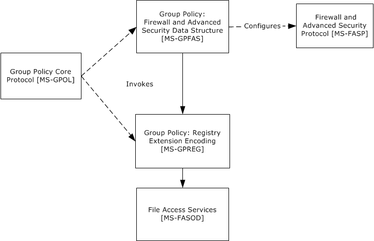

# [MS-GPFAS]: Group Policy: Firewall and Advanced Security Data Structure

Table of Contents

1 Introduction

- [1 Introduction](#Section_1)
  - [1.1 Glossary](#Section_1.1)
  - [1.2 References](#Section_1.2)
    - [1.2.1 Normative References](#Section_1.2.1)
    - [1.2.2 Informative References](#Section_1.2.2)
  - [1.3 Protocol Overview (Synopsis)](#Section_1.3)
    - [1.3.1 Background](#Section_1.3.1)
    - [1.3.2 Firewall and Advanced Security Extension Encoding Overview](#Section_1.3.2)
  - [1.4 Relationship to Other Protocols](#Section_1.4)
  - [1.5 Prerequisites/Preconditions](#Section_1.5)
  - [1.6 Applicability Statement](#Section_1.6)
  - [1.7 Versioning and Capability Negotiation](#Section_1.7)
  - [1.8 Vendor-Extensible Fields](#Section_1.8)
  - [1.9 Standards Assignments](#Section_1.9)

2 Messages

- [2 Messages](#Section_2)
  - [2.1 Transport](#Section_2.1)
  - [2.2 Message Syntax](#Section_2.2)
    - [2.2.1 Global Policy Configuration Options](#Section_2.2.1)
      - [2.2.1.1 Disable Stateful FTP](#Section_2.2.1.1)
      - [2.2.1.2 Disable Stateful PPTP](#Section_2.2.1.2)
      - [2.2.1.3 Security Associations Idle Time](#Section_2.2.1.3)
      - [2.2.1.4 Preshared Key Encoding](#Section_2.2.1.4)
      - [2.2.1.5 IPsec Exemptions](#Section_2.2.1.5)
      - [2.2.1.6 Certificate Revocation List Check](#Section_2.2.1.6)
      - [2.2.1.7 IPsec Through NATs](#Section_2.2.1.7)
      - [2.2.1.8 Policy Version](#Section_2.2.1.8)
      - [2.2.1.9 Tunnel Remote Machine Authorization List](#Section_2.2.1.9)
      - [2.2.1.10 Tunnel Remote User Authorization List](#Section_2.2.1.10)
      - [2.2.1.11 Opportunistically Match Authentication Set Per Key Module](#Section_2.2.1.11)
      - [2.2.1.12 Transport Remote Machine Authorization List](#Section_2.2.1.12)
      - [2.2.1.13 Transport Remote User Authorization List](#Section_2.2.1.13)
      - [2.2.1.14 Packet Queue](#Section_2.2.1.14)
    - [2.2.2 Firewall Rule Messages](#Section_2.2.2)
      - [2.2.2.1 Profile Tokens](#Section_2.2.2.1)
      - [2.2.2.2 Port and Port Range Rules](#Section_2.2.2.2)
      - [2.2.2.3 Port Keyword Rules](#Section_2.2.2.3)
      - [2.2.2.4 Direction Tokens](#Section_2.2.2.4)
      - [2.2.2.5 Action Tokens](#Section_2.2.2.5)
      - [2.2.2.6 IfSecure Tokens](#Section_2.2.2.6)
      - [2.2.2.7 Interfaces](#Section_2.2.2.7)
      - [2.2.2.8 Interface Types](#Section_2.2.2.8)
      - [2.2.2.9 IPV4 Address Ranges Rules](#Section_2.2.2.9)
      - [2.2.2.10 IPV4 Address Subnet Rules](#Section_2.2.2.10)
      - [2.2.2.11 IPV6 Address Range Rules](#Section_2.2.2.11)
      - [2.2.2.12 IPV6 Address Subnet Rules](#Section_2.2.2.12)
      - [2.2.2.13 Address Keyword Rules](#Section_2.2.2.13)
      - [2.2.2.14 Boolean Rules](#Section_2.2.2.14)
      - [2.2.2.15 Edge Defer Rules](#Section_2.2.2.15)
      - [2.2.2.16 ICMP Type - Code Rules](#Section_2.2.2.16)
      - [2.2.2.17 Platform Validity Rules](#Section_2.2.2.17)
      - [2.2.2.18 Platform Validity Operators Rules](#Section_2.2.2.18)
      - [2.2.2.19 Firewall Rule and the Firewall Rule Grammar Rule](#Section_2.2.2.19)
      - [2.2.2.20 Trust Tuple Keyword Rules](#Section_2.2.2.20)
    - [2.2.3 Per-Profile Policy Configuration Options](#Section_2.2.3)
      - [2.2.3.1 Enable Firewall](#Section_2.2.3.1)
      - [2.2.3.2 Disable Stealth Mode](#Section_2.2.3.2)
      - [2.2.3.3 Shield Up Mode](#Section_2.2.3.3)
      - [2.2.3.4 Disable Unicast Responses to Multicast and Broadcast Traffic](#Section_2.2.3.4)
      - [2.2.3.5 Log Dropped Packets](#Section_2.2.3.5)
      - [2.2.3.6 Log Successful Connections](#Section_2.2.3.6)
      - [2.2.3.7 Log Ignored Rules](#Section_2.2.3.7)
      - [2.2.3.8 Maximum Log File Size](#Section_2.2.3.8)
      - [2.2.3.9 Log File Path](#Section_2.2.3.9)
      - [2.2.3.10 Disable Inbound Notifications](#Section_2.2.3.10)
      - [2.2.3.11 Allow Authenticated Applications User Preference Merge](#Section_2.2.3.11)
      - [2.2.3.12 Allow Globally Open Ports User Preference Merge](#Section_2.2.3.12)
      - [2.2.3.13 Allow Local Firewall Rule Policy Merge](#Section_2.2.3.13)
      - [2.2.3.14 Allow Local IPsec Policy Merge](#Section_2.2.3.14)
      - [2.2.3.15 Disabled Interfaces](#Section_2.2.3.15)
      - [2.2.3.16 Default Outbound Action](#Section_2.2.3.16)
      - [2.2.3.17 Default Inbound Action](#Section_2.2.3.17)
      - [2.2.3.18 Disable Stealth Mode for IPsec Secured Packets](#Section_2.2.3.18)
    - [2.2.4 Authentication Sets](#Section_2.2.4)
      - [2.2.4.1 Version](#Section_2.2.4.1)
      - [2.2.4.2 Name](#Section_2.2.4.2)
      - [2.2.4.3 Description](#Section_2.2.4.3)
      - [2.2.4.4 EmbeddedContext](#Section_2.2.4.4)
      - [2.2.4.5 Suite Keys](#Section_2.2.4.5)
      - [2.2.4.6 Phase 1 and Phase 2 Auth Suite Methods](#Section_2.2.4.6)
      - [2.2.4.7 Phase 1 and Phase 2 Auth Suite Certificate Authority Names](#Section_2.2.4.7)
      - [2.2.4.8 Phase 1 Auth Suite Preshared Key](#Section_2.2.4.8)
      - [2.2.4.9 Phase 1 and Phase 2 Auth Suite Certificate Account Mapping](#Section_2.2.4.9)
      - [2.2.4.10 Phase 1 Auth Suite Exclude CA Name](#Section_2.2.4.10)
      - [2.2.4.11 Phase 1 and Phase 2 Auth Suite Health Cert](#Section_2.2.4.11)
      - [2.2.4.12 Phase 1 and Phase 2 Auth Suite Skip Version](#Section_2.2.4.12)
      - [2.2.4.13 Phase 1 and Phase 2 Auth Suite Other Certificate Signing](#Section_2.2.4.13)
      - [2.2.4.14 Phase 1 and Phase 2 Auth Suite Intermediate CA](#Section_2.2.4.14)
      - [2.2.4.15 Certificate Criteria Type Tokens](#Section_2.2.4.15)
      - [2.2.4.16 Certificate Criteria Name Type Tokens](#Section_2.2.4.16)
      - [2.2.4.17 Phase 1 and Phase 2 Auth Suite Certificate Criteria](#Section_2.2.4.17)
      - [2.2.4.18 Phase 1 and Phase 2 Auth Suite Allow Kerberos Proxy](#Section_2.2.4.18)
      - [2.2.4.19 Phase 1 and Phase 2 Auth Suite Kerberos Proxy Server](#Section_2.2.4.19)
    - [2.2.5 Cryptographic Sets](#Section_2.2.5)
      - [2.2.5.1 Version](#Section_2.2.5.1)
      - [2.2.5.2 Name](#Section_2.2.5.2)
      - [2.2.5.3 Description](#Section_2.2.5.3)
      - [2.2.5.4 EmbeddedContext](#Section_2.2.5.4)
      - [2.2.5.5 Phase 1 - Do Not Skip Deffie Hellman](#Section_2.2.5.5)
      - [2.2.5.6 Phase 1 - Time Out in Minutes](#Section_2.2.5.6)
      - [2.2.5.7 Phase 1 - Time Out in Sessions](#Section_2.2.5.7)
      - [2.2.5.8 Phase 2 - Perfect Forward Secrecy](#Section_2.2.5.8)
      - [2.2.5.9 Phase 1 - Suite Keys](#Section_2.2.5.9)
      - [2.2.5.10 Phase 1 Suite - Key Exchange Algorithm](#Section_2.2.5.10)
      - [2.2.5.11 Phase 1 Suite - Encryption Algorithm](#Section_2.2.5.11)
      - [2.2.5.12 Phase 1 Suite - Hash Algorithm](#Section_2.2.5.12)
      - [2.2.5.13 Phase 1 Suite Skip Version](#Section_2.2.5.13)
      - [2.2.5.14 Phase 1 Suite - 2.1 Hash Algorithm](#Section_2.2.5.14)
      - [2.2.5.15 Phase 1 Suite - 2.16 Key Exchange Algorithm](#Section_2.2.5.15)
      - [2.2.5.16 Phase 2 - Suite Keys](#Section_2.2.5.16)
      - [2.2.5.17 Phase 2 Suite - Protocol](#Section_2.2.5.17)
      - [2.2.5.18 Phase 2 Suite - Encryption Algorithm](#Section_2.2.5.18)
      - [2.2.5.19 Phase 2 Suite - AH Protocol Hash Algorithm](#Section_2.2.5.19)
      - [2.2.5.20 Phase 2 Suite - ESP Protocol Hash Algorithm](#Section_2.2.5.20)
      - [2.2.5.21 Phase 2 Suite - Time Out in Minutes](#Section_2.2.5.21)
      - [2.2.5.22 Phase 2 Suite - Time Out in Kilobytes](#Section_2.2.5.22)
      - [2.2.5.23 Phase 2 Suite - Skip Version](#Section_2.2.5.23)
      - [2.2.5.24 Phase 2 Suite - 2.1 Encryption Algorithm](#Section_2.2.5.24)
      - [2.2.5.25 Phase 2 Suite - 2.1 AH Hash Algorithm](#Section_2.2.5.25)
      - [2.2.5.26 Phase 2 Suite - 2.1 ESP Hash Algorithm](#Section_2.2.5.26)
      - [2.2.5.27 Phase 2 Suite - 2.9 Protocol](#Section_2.2.5.27)
      - [2.2.5.28 Phase 2 - 2.16 Perfect Forward Secrecy](#Section_2.2.5.28)
    - [2.2.6 Connection Security Rule Messages](#Section_2.2.6)
      - [2.2.6.1 Connection Security Action Tokens](#Section_2.2.6.1)
      - [2.2.6.2 Connection Security Rule and the Connection Security Rule Grammar Rule](#Section_2.2.6.2)
      - [2.2.6.3 Keying Module Rules](#Section_2.2.6.3)
    - [2.2.7 Main Mode Rule Messages](#Section_2.2.7)
      - [2.2.7.1 Main Mode Rule and the Main Mode Rule Grammar Rule](#Section_2.2.7.1)

3 Protocol Details

- [3 Protocol Details](#Section_3)
  - [3.1 Administrative Plug-in Details](#Section_3.1)
    - [3.1.1 Abstract Data Model](#Section_3.1.1)
    - [3.1.2 Timers](#Section_3.1.2)
    - [3.1.3 Initialization](#Section_3.1.3)
    - [3.1.4 Higher-Layer Triggered Events](#Section_3.1.4)
    - [3.1.5 Message Processing Events and Sequencing Rules](#Section_3.1.5)
      - [3.1.5.1 Policy Administration Load Message Sequencing](#Section_3.1.5.1)
      - [3.1.5.2 Policy Administration Update Message Sequencing](#Section_3.1.5.2)
    - [3.1.6 Timer Events](#Section_3.1.6)
    - [3.1.7 Other Local Events](#Section_3.1.7)
  - [3.2 Client Details](#Section_3.2)
    - [3.2.1 Abstract Data Model](#Section_3.2.1)
    - [3.2.2 Timers](#Section_3.2.2)
    - [3.2.3 Initialization](#Section_3.2.3)
    - [3.2.4 Higher-Layer Triggered Events](#Section_3.2.4)
    - [3.2.5 Message Processing Events and Sequencing Rules](#Section_3.2.5)
    - [3.2.6 Timer Events](#Section_3.2.6)
    - [3.2.7 Other Local Events](#Section_3.2.7)
      - [3.2.7.1 Policy Application Event](#Section_3.2.7.1)

4 Protocol Examples

- [4 Protocol Examples](#Section_4)
  - [4.1 Configuration Options Messages](#Section_4.1)
  - [4.2 Firewall Rule Message](#Section_4.2)
  - [4.3 Connection Security Rule Message](#Section_4.3)
  - [4.4 Authentication Set Messages](#Section_4.4)
    - [4.4.1 Authentication Set { 212D4E36-DB6E-4EAE-A65F-1C4615EBFDDB }](#Section_4.4.1)
    - [4.4.2 Authentication Set { D842F406-E895-406A-AC35-9837B6D499F4 }](#Section_4.4.2)
    - [4.4.3 Authentication Set { A75A5046-E377-45CC-BD25-EC0F8E601CE1 }](#Section_4.4.3)
    - [4.4.4 Authentication Set { 967F0367-F879-42EC-938B-C89FE8289B26 }](#Section_4.4.4)
    - [4.4.5 Cryptographic Set Messages](#Section_4.4.5)
      - [4.4.5.1 Cryptographic Set { CD863A4F-CD94-4763-AD25-69A1378D51EB }](#Section_4.4.5.1)
      - [4.4.5.2 Cryptographic Set { E9A15CB6-DFC4-41F8-8D14-CA62A4EC708F }](#Section_4.4.5.2)

5 Security

- [5 Security](#Section_5)
  - [5.1 Security Considerations for Implementers](#Section_5.1)
  - [5.2 Index of Security Parameters](#Section_5.2)

6 Appendix A: Product Behavior

- [6 Appendix A: Product Behavior](#Section_6)

7 Appendix B: Full ABNF Grammar

- [7 Appendix B: Full ABNF Grammar](#Section_7)

8 Change Tracking

- [8 Change Tracking](#Section_8)

For the legal notice and IP terms, see [LEGAL.md](../LEGAL.md).
Last updated: 4/23/2024.
See [Revision History](#revision-history) for full version history.

# 1 Introduction

This document specifies the Group Policy: Firewall and Advanced Security Data Structure extension to the Group Policy: Registry Extension Encoding, as specified in [MS-GPREG](../MS-GPREG/MS-GPREG.md), and provides a mechanism for an administrator to control any Firewall and Advanced Security behavior on a client using Group Policy settings.

Sections 1.5, 1.8, 1.9, 2, and 3 of this specification are normative. All other sections and examples in this specification are informative.

## 1.1 Glossary

This document uses the following terms:

**Active Directory**: The Windows implementation of a general-purpose directory service, which uses LDAP as its primary access protocol. [**Active Directory**](#gt_active-directory) stores information about a variety of objects in the network such as user accounts, computer accounts, groups, and all related credential information used by Kerberos [MS-KILE](../MS-KILE/MS-KILE.md). [**Active Directory**](#gt_active-directory) is either deployed as Active Directory Domain Services (AD DS) or Active Directory Lightweight Directory Services (AD LDS), which are both described in [MS-ADOD](../MS-ADOD/MS-ADOD.md): Active Directory Protocols Overview.

**administrative template**: A file associated with a [**Group Policy Object (GPO)**](#gt_group-policy-object-gpo) that combines information on the syntax of registry-based policy settings with human-readable descriptions of the settings, as well as other information.

**client-side extension GUID (CSE GUID)**: A [**GUID**](#gt_globally-unique-identifier-guid) that enables a specific client-side extension on the Group Policy client to be associated with policy data that is stored in the logical and physical components of a [**Group Policy Object (GPO)**](#gt_group-policy-object-gpo) on the Group Policy server, for that particular extension.

**computer-scoped Group Policy Object path**: A scoped Group Policy Object (GPO) path that ends in "\Machine".

**distinguished name (DN)**: A name that uniquely identifies an object by using the relative distinguished name (RDN) for the object, and the names of container objects and domains that contain the object. The distinguished name (DN) identifies the object and its location in a tree.

**domain**: A set of users and computers sharing a common namespace and management infrastructure. At least one computer member of the set has to act as a domain controller (DC) and host a member list that identifies all members of the domain, as well as optionally hosting the [**Active Directory**](#gt_active-directory) service. The domain controller provides authentication of members, creating a unit of trust for its members. Each domain has an identifier that is shared among its members. For more information, see [MS-AUTHSOD](../MS-AUTHSOD/MS-AUTHSOD.md) section 1.1.1.5 and [MS-ADTS](../MS-ADTS/MS-ADTS.md).

**globally unique identifier (GUID)**: A term used interchangeably with universally unique identifier (UUID) in Microsoft protocol technical documents (TDs). Interchanging the usage of these terms does not imply or require a specific algorithm or mechanism to generate the value. Specifically, the use of this term does not imply or require that the algorithms described in [[RFC4122]](https://go.microsoft.com/fwlink/?LinkId=90460) or [[C706]](https://go.microsoft.com/fwlink/?LinkId=89824) must be used for generating the [**GUID**](#gt_globally-unique-identifier-guid). See also universally unique identifier (UUID).

**Group Policy Object (GPO)**: A collection of administrator-defined specifications of the policy settings that can be applied to groups of computers in a domain. Each GPO includes two elements: an object that resides in the [**Active Directory**](#gt_active-directory) for the domain, and a corresponding file system subdirectory that resides on the sysvol DFS share of the Group Policy server for the domain.

**policy setting**: A statement of the possible behaviors of an element of a domain member computer's behavior that can be configured by an administrator.

**registry**: A local system-defined database in which applications and system components store and retrieve configuration data. It is a hierarchical data store with lightly typed elements that are logically stored in tree format. Applications use the registry API to retrieve, modify, or delete registry data. The data stored in the registry varies according to the version of the operating system.

**registry policy file**: A file associated with a [**Group Policy Object (GPO)**](#gt_group-policy-object-gpo) that contains a set of registry-based policy settings.

**tool extension GUID or administrative plug-in GUID**: A GUID defined separately for each of the user policy settings and computer policy settings that associates a specific administrative tool plug-in with a set of policy settings that can be stored in a [**Group Policy Object (GPO)**](#gt_group-policy-object-gpo).

**Unicode**: A character encoding standard developed by the Unicode Consortium that represents almost all of the written languages of the world. The [**Unicode**](#gt_unicode) standard [[UNICODE5.0.0/2007]](https://go.microsoft.com/fwlink/?LinkId=154659) provides three forms (UTF-8, UTF-16, and UTF-32) and seven schemes (UTF-8, UTF-16, UTF-16 BE, UTF-16 LE, UTF-32, UTF-32 LE, and UTF-32 BE).

**MAY, SHOULD, MUST, SHOULD NOT, MUST NOT:** These terms (in all caps) are used as defined in [[RFC2119]](https://go.microsoft.com/fwlink/?LinkId=90317). All statements of optional behavior use either MAY, SHOULD, or SHOULD NOT.

## 1.2 References

Links to a document in the Microsoft Open Specifications library point to the correct section in the most recently published version of the referenced document. However, because individual documents in the library are not updated at the same time, the section numbers in the documents may not match. You can confirm the correct section numbering by checking the [Errata](https://go.microsoft.com/fwlink/?linkid=850906).

### 1.2.1 Normative References

We conduct frequent surveys of the normative references to assure their continued availability. If you have any issue with finding a normative reference, please contact [dochelp@microsoft.com](mailto:dochelp@microsoft.com). We will assist you in finding the relevant information.

[MS-FASP] Microsoft Corporation, "[Firewall and Advanced Security Protocol](#Section_5)".

[MS-GPOL] Microsoft Corporation, "[Group Policy: Core Protocol](../MS-GPOL/MS-GPOL.md)".

[MS-GPREG] Microsoft Corporation, "[Group Policy: Registry Extension Encoding](../MS-GPREG/MS-GPREG.md)".

[RFC2119] Bradner, S., "Key words for use in RFCs to Indicate Requirement Levels", BCP 14, RFC 2119, March 1997, [https://www.rfc-editor.org/info/rfc2119](https://go.microsoft.com/fwlink/?LinkId=90317)

[RFC4122] Leach, P., Mealling, M., and Salz, R., "A Universally Unique Identifier (UUID) URN Namespace", RFC 4122, July 2005, [https://www.rfc-editor.org/info/rfc4122](https://go.microsoft.com/fwlink/?LinkId=90460)

[RFC4234] Crocker, D., Ed., and Overell, P., "Augmented BNF for Syntax Specifications: ABNF", RFC 4234, October 2005, [https://www.rfc-editor.org/info/rfc4234](https://go.microsoft.com/fwlink/?LinkId=90462)

[RFC4291] Hinden, R. and Deering, S., "IP Version 6 Addressing Architecture", RFC 4291, February 2006, [https://www.rfc-editor.org/info/rfc4291](https://go.microsoft.com/fwlink/?LinkId=90464)

### 1.2.2 Informative References

[MSDN-RegisterGPNotification] Microsoft Corporation, "RegisterGPNotification function", [http://msdn.microsoft.com/en-us/library/aa374404(VS.85).aspx](https://go.microsoft.com/fwlink/?LinkId=217895)

## 1.3 Protocol Overview (Synopsis)

The Group Policy: Firewall and Advanced Security Data Structure provides a mechanism for an administrator to control Firewall and Advanced Security behavior of the client through Group Policy using the Group Policy: Registry Extension Encoding specified in [MS-GPREG](../MS-GPREG/MS-GPREG.md).

### 1.3.1 Background

The Group Policy: Core Protocol (as specified in [MS-GPOL](../MS-GPOL/MS-GPOL.md)) allows clients to discover and retrieve [**policy settings**](#gt_policy-setting) created by administrators of a [**domain**](#gt_domain). These settings are persisted within [**Group Policy Objects (GPOs)**](#gt_group-policy-object-gpo) that are assigned to the policy target accounts in the [**Active Directory**](#gt_active-directory). On each client, each GPO is interpreted and acted upon by software components known as client plug-ins. The client plug-ins responsible for a given GPO are specified using an attribute on the GPO. This attribute specifies a list of [**globally unique identifier (GUID)**](#gt_globally-unique-identifier-guid) lists. The first GUID of each GUID list is referred to as a [**client-side extension GUID (CSE GUID)**](#gt_client-side-extension-guid-cse-guid). Other GUIDs in the GUID list are referred to as [**tool extension GUIDs**](#gt_88ad7745-bee6-47f7-ae98-6fac7c5ef330). For each GPO that is applicable to a client, the client consults the CSE GUIDs listed in the GPO to determine which client plug-in on the client will handle the GPO. The client then invokes the client plug-in to handle the GPO.

[**Registry**](#gt_registry)-based settings are accessible from a GPO through the Group Policy: Registry Extension Encoding protocol, which is a client plug-in. The protocol provides mechanisms both for administrative tools to obtain metadata about registry-based settings and for clients to obtain applicable registry-based settings.

Group Policy: Firewall and Advanced Security Data Structure settings can be administered using [**administrative templates**](#gt_administrative-template) (as specified in [MS-GPREG](../MS-GPREG/MS-GPREG.md) section 2.2.2). An administrative template is a file associated with a GPO that combines information on the syntax of registry-based settings with human-readable descriptions of the settings as well as other information. Administrative tools use administrative templates to allow administrators to configure registry-based settings for applications on clients.

Group Policy: Registry Extension Encoding settings are specified using [**registry policy files**](#gt_registry-policy-file) (as specified in [MS-GPREG] section 2.2.1). An administrative tool uses the information within the administrative template to write out a registry policy file and associate it with a GPO. The Group Policy: Registry Extension Encoding plug-in on each client reads registry policy files specified by applicable GPOs and applies their contents to its registry.

Administrative templates support a limited subset of the syntax for registry policy files. As a result, not all registry-based settings can be expressed using administrative templates. Such registry-based settings can be implemented using a custom user-interface that does not rely on administrative templates. One example of such registry-based settings is those belonging to the Firewall and Advanced Security component, which are described in this document.

### 1.3.2 Firewall and Advanced Security Extension Encoding Overview

Firewall and Advanced Security policies are configurable from a [**GPO**](#gt_group-policy-object-gpo) through the Group Policy: Firewall and Advanced Security Data Structure. The Firewall and Advanced Security component has complex settings not expressible through [**administrative templates**](#gt_administrative-template) and for this reason it implements a custom UI that can author [**registry policy files**](#gt_registry-policy-file) containing the encodings of the settings described in this document. Because the Firewall and Advanced Security policies are applied to the whole machine, the Group Policy: Firewall and Advanced Security Data Structure protocol uses the Computer Policy Mode specified in [MS-GPREG](../MS-GPREG/MS-GPREG.md) section 1.3.2.

This protocol provides mechanisms both for Group Policy administrators to deploy policies and for clients to obtain the applicable policies to enforce them. Thus, the protocol consists of two components: an administrative plug-in and a client.

The Group Policy: Firewall and Advanced Security Data Structure administrative plug-in is invoked by an administrative tool. It is responsible for loading and updating the Firewall and Advanced Security settings contained within a specified GPO. It understands how to translate these settings to and from the encodings described in section [2.2](#Section_2.2).

The Group Policy: Firewall and Advanced Security Data Structure client is responsible for applying the Firewall and Advanced Security settings configured through Group Policy to the local Firewall and Advanced Security Protocol server. Group Policy: Firewall and Advanced Security Data Structure does not implement its own Client-Side Extension as defined in [MS-GPOL](../MS-GPOL/MS-GPOL.md) section 3.2.1.24; instead, it relies on the Group Policy: Registry Extension Encoding Client-Side Extension. Thus, the processing of Firewall and Advanced Security policies on the client computer is divided into two distinct stages. First, the Group Policy: Registry Extension Encoding client plug-in copies the settings from the GPO to the registry, and then the Group Policy: Firewall and Advanced Security Data Structure client reads the settings from the registry and applies them to the local Firewall and Advanced Security Protocol server.

The application of Firewall and Advanced Security policies is done as follows:

- An administrator invokes a Group Policy Protocol Administrative Tool, as specified in [MS-GPOL] section 3.3.1.1, on the administrator's computer in order to administer the Firewall and Advanced Security settings of a GPO.
- The administrative tool invokes the Group Policy: Firewall and Advanced Security Data Structure administrative plug-in to load the current policy settings. The administrative plug-in loads the settings through the Group Policy: Registry Extension Encoding administrative plug-in by invoking the Load Policy Settings event, as specified in [MS-GPREG] section 3.1.4.1.
- The administrative tool displays these policy settings to the administrator in a custom UI, which enables the administrator to make changes if needed.
- If the administrator makes any changes to the policy settings, the administrative tool invokes the Group Policy: Firewall and Advanced Security Data Structure administrative plug-in to update the settings in the GPO. The administrative plug-in updates the settings through the Group Policy: Registry Extension Encoding administrative plug-in by invoking the Update Policy Settings event, as specified in [MS-GPREG] section 3.1.4.2. During the processing of this event, the Group Policy: Registry Extension Encoding's CSE GUID is written to the GPO. After updating the settings, the administrative plug-in uses Group Policy: Core Protocol to update the version number associated with the GPO by invoking the Group Policy Extension Update event, as specified in [MS-GPOL] section 3.3.4.4.
- A client computer affected by that GPO is started (or is connected to the network, if this happens after the client starts), and Group Policy: Core Protocol is invoked by the client to retrieve Policy Settings from the Group Policy server. As part of the processing of Group Policy: Core Protocol, the Group Policy: Registry Extension Encoding's [**CSE GUID**](#gt_client-side-extension-guid-cse-guid) is read from this GPO, and this instructs the client to invoke a Group Policy: Registry Extension Encoding client plug-in component for Policy Application.
- In processing the Policy Application portion of Group Policy: Registry Extension Encoding, the client parses the settings and then saves the settings in the [**registry**](#gt_registry). The Firewall and Advanced Security policies are stored under the Software\Policies\Microsoft\WindowsFirewall\ registry key.
- After all Client-Side Extensions (including the Group Policy: Registry Extension Encoding client plug-in) have completed processing, Group Policy: Core Protocol signals the Policy Application event, as specified in [MS-GPOL] section 3.2.7.3, to notify the Group Policy: Firewall and Advanced Security Data Structure client.
- The Group Policy: Firewall and Advanced Security Data Structure client parses the Firewall and Advanced Security settings from the Software\Policies\Microsoft\WindowsFirewall\ registry key. The client then passes these settings to the Group Policy: Firewall and Advanced Security Data Structure server for enforcement by invoking the SetGroupPolicyRSoPStore abstract interface, as specified in [MS-FASP](#Section_5) section 3.1.6.4.

## 1.4 Relationship to Other Protocols

This protocol depends on the Group Policy: Core Protocol (as specified in [MS-GPOL](../MS-GPOL/MS-GPOL.md)) to provide a list of applicable GPOs.

Group Policy: Firewall and Advanced Security Data Structure configures settings that are used by the Firewall and Advanced Security Protocol specified in [MS-FASP](#Section_5). These settings are defined in [MS-FASP] section 3.1.1.

For policy administration, the Group Policy: Firewall and Advanced Security Data Structure depends on the Group Policy: Registry Extension Encoding (specified in [MS-GPREG](../MS-GPREG/MS-GPREG.md)) to store settings from in the [**GPO**](#gt_group-policy-object-gpo). For policy application, the Group Policy: Firewall and Advanced Security Data Structure depends on Group Policy: Registry Extension Encoding to retrieve settings from a GPO and to populate settings in the client registry. Group Policy: Registry Extension Encoding in turn depends on remote file access to read and write these settings from the GPO. Thus the Group Policy: Firewall and Advanced Security Data Structure has an indirect dependency on remote file access.

Figure 1: Group Policy: Firewall and Advanced Security Data Structure protocol relationship diagram

## 1.5 Prerequisites/Preconditions

The prerequisites for this protocol are the same as those for the Group Policy: Registry Extension Encoding.

In addition, a client needs a system/subsystem capable of executing commands at startup/shutdown time because the Computer Policy Mode of the Group Policy: Registry Extension Encoding is used.

## 1.6 Applicability Statement

Group Policy: Firewall and Advanced Security Data Structure is applicable only while transported under the Group Policy: Registry Extension Encoding and within the Group Policy: Core Protocol framework. Group Policy: Firewall and Advanced Security Data Structure can be used to express the required Firewall and Advanced Security policy of the client.

This protocol is also applicable only when the requirement is for many clients to get the same Firewall and Advanced Security policies. To configure individual clients with custom Firewall and Advanced Security policies, the Firewall and Advanced Security Protocol (as specified in [MS-FASP](#Section_5)) can be used instead.

Do not use the protocol in any other context.

## 1.7 Versioning and Capability Negotiation

This document covers versioning and capability negotiation issues in the following areas:

- Protocol Versions: This protocol has a policy version. This version (also called the inherent version of the component or the maximum supported schema version of the component), can be tied to policies and specific policy objects, as defined in section [2.2](#Section_2.2). <1>
- Capability Negotiation: A configuration option defined in section 2.2 contains the maximum policy version encoded in the [**policy settings**](#gt_policy-setting). Policy Objects also specify the policy version in which they are encoded. Lastly, a client component implementing the Group Policy: Firewall and Advanced Security Data Structure has an inherent maximum policy version it supports. Using this information, a client can understand what can and cannot be expected in these encodings, what needs to be parsed and what needs to be ignored. The settings in section 2.2 are defined in terms of these policy versions when appropriate. No other negotiation capabilities, version-specific or otherwise, are present in this protocol.

## 1.8 Vendor-Extensible Fields

None.

## 1.9 Standards Assignments

This protocol defines the administrative tool's extension [**GUID**](#gt_globally-unique-identifier-guid) standards assignments, as specified in [MS-GPOL](../MS-GPOL/MS-GPOL.md) section 1.8. It also defines a base [**registry**](#gt_registry) key where the settings of this protocol are stored on [**registry policy files**](#gt_registry-policy-file) using Group Policy: Registry Extension Encoding. The assignments are as follows.

| Parameter | Value |
| --- | --- |
| Tool extension GUID | {b05566ac-fe9c-4368-be01-7a4cbb6cba11} |
| Policy Base registry key | Software\Policies\Microsoft\WindowsFirewall\ |

When a GPO is modified, the Tool Extension GUID value is written to the GPO by the administrative plug-in tools that are part of Windows.

# 2 Messages

## 2.1 Transport

The Group Policy: Firewall and Advanced Security Data Structure's administrative plug-in uses the transport specified in [MS-GPOL](../MS-GPOL/MS-GPOL.md) to read and modify settings in the central policy store. Specifically, it uses remote file access for reading, updating, creating, and deleting the Group Policy settings. Information is retrieved from the policy store and written to the client's registry by the Group Policy: Registry Extension Encoding ([MS-GPREG](../MS-GPREG/MS-GPREG.md) section 3.2), using remote file access.

## 2.2 Message Syntax

### 2.2.1 Global Policy Configuration Options

The Global Policy Configuration Options are values that represent the enumeration values of the **FW_GLOBAL_CONFIG** enumeration type as defined in [MS-FASP](#Section_5) section 2.2.42. Note that the following global policy configuration options supported by the Firewall and Advanced Security Protocol specified in [MS-FASP] are read-only, and thus cannot be configured through this protocol:

- FW_GLOBAL_CONFIG_POLICY_VERSION_SUPPORTED
- FW_GLOBAL_CONFIG_CURRENT_PROFILE
- FW_GLOBAL_CONFIG_BINARY_VERSION_SUPPORTED

#### 2.2.1.1 Disable Stateful FTP

Key: Software\Policies\Microsoft\WindowsFirewall\

Value: "DisableStatefulFTP"

Type: REG_DWORD.

Size: Equal to the size of the **Data** field.

Data: An unsigned, 32-bit integer value for which possible values are 0x00000000 or 0x00000001.

This value represents the contents assigned to the configuration option represented by the **FW_GLOBAL_CONFIG_DISABLE_STATEFUL_FTP** enumeration value as defined in [MS-FASP](#Section_5) section 2.2.42.

#### 2.2.1.2 Disable Stateful PPTP

Key: Software\Policies\Microsoft\WindowsFirewall\

Value: "DisableStatefulPPTP"

Type: REG_DWORD.

Size: Equal to the size of the **Data** field.

Data: An unsigned, 32-bit integer value for which possible values are 0x00000000 or 0x00000001.

This value represents the contents assigned to the configuration option represented by the **FW_GLOBAL_CONFIG_DISABLE_STATEFUL_PPTP** enumeration value as defined in [MS-FASP](#Section_5) section 2.2.42.

#### 2.2.1.3 Security Associations Idle Time

Key: Software\Policies\Microsoft\WindowsFirewall\

Value: "SAIdlTime"

Type: REG_DWORD.

Size: Equal to size of the **Data** field.

Data: This field is an unsigned 32-bit integer value.

This value represents the contents assigned to the configuration option represented by the **FW_GLOBAL_CONFIG_SA_IDLE_TIME** enumeration value as defined in [MS-FASP](#Section_5) section 2.2.42.

#### 2.2.1.4 Preshared Key Encoding

Key: Software\Policies\Microsoft\WindowsFirewall\

Value: "PresharedKeyEncoding"

Type: REG_DWORD.

Size: Equal to size of the **Data** field.

Data: This field is a 32-bit value consisting of the following value.

| Value | Meaning |
| --- | --- |
| 0x00000001 | This value represents the enumeration value **FW_GLOBAL_CONFIG_PRESHARED_KEY_ENCODING_UTF_8** as defined in [MS-FASP](#Section_5) section 2.2.40. |

This value represents the contents assigned to the configuration option represented by the **FW_GLOBAL_CONFIG_PRESHARED_KEY_ENCODING** enumeration value as defined in [MS-FASP] section 2.2.42.

#### 2.2.1.5 IPsec Exemptions

Key: Software\Policies\Microsoft\WindowsFirewall\

Value: "IPsecExempt"

Type: REG_DWORD.

Size: Equal to size of the **Data** field.

Data: This field is a 32-bit value consisting of the bitwise OR of zero or more of the following flags.

| Value | Meaning |
| --- | --- |
| 0x00000001 | This value represents the **FW_GLOBAL_CONFIG_IPSEC_EXEMPT_NEIGHBOR_DISC** enumeration value as defined in [MS-FASP](#Section_5) section 2.2.39. |
| 0x00000002 | This value represents the **FW_GLOBAL_CONFIG_IPSEC_EXEMPT_ICMP** enumeration value as defined in [MS-FASP] section 2.2.39. |
| 0x00000004 | This value represents the **FW_GLOBAL_CONFIG_IPSEC_EXEMPT_ROUTER_DISC** enumeration value as defined in [MS-FASP] section 2.2.39. |
| 0x00000008 | This value represents the **FW_GLOBAL_CONFIG_IPSEC_EXEMPT_DHCP** enumeration value as defined in [MS-FASP] section 2.2.39. |

This value represents the contents assigned to the configuration option represented by the **FW_GLOBAL_CONFIG_IPSEC_EXEMPT** enumeration value as defined in [MS-FASP] section 2.2.39.

#### 2.2.1.6 Certificate Revocation List Check

Key: Software\Policies\Microsoft\WindowsFirewall\

Value: "StrongCRLCheck"

Type: REG_DWORD.

Size: Equal to size of the **Data** field.

Data: This field is a 32-bit value.

This value represents the contents assigned to the configuration option represented by the **FW_GLOBAL_CONFIG_CRL_CHECK** enumeration value as defined in [MS-FASP](#Section_5) section 2.2.42.

#### 2.2.1.7 IPsec Through NATs

Key: Software\Policies\Microsoft\WindowsFirewall\

Value: "IPsecThroughNAT"

Type: REG_DWORD.

Size: Equal to size of the **Data** field.

Data: This field is a 32-bit value consisting of one of the following flags, all defined in [MS-FASP](#Section_5) section 2.2.41.

| Value | Meaning |
| --- | --- |
| 0x00000000 | This value represents the **FW_GLOBAL_CONFIG_IPSEC_THROUGH_NAT_NEVER** enumeration value. |
| 0x00000001 | This value represents the enumeration value **FW_GLOBAL_CONFIG_IPSEC_THROUGH_NAT_SERVER_BEHIND_NAT**. |
| 0x00000002 | This value represents the **FW_GLOBAL_CONFIG_IPSEC_THROUGH_NAT_SERVER_AND_CLIENT_BEHIND_NAT** enumeration value. |

This value represents the contents assigned to the configuration option represented by the **FW_GLOBAL_CONFIG_IPSEC_THROUGH_NAT** enumeration value as defined in [MS-FASP] section 2.2.42.

#### 2.2.1.8 Policy Version

Key: Software\Policies\Microsoft\WindowsFirewall\

Value: "PolicyVersion"

Type: REG_DWORD.

Size: Equal to size of the **Data** field.

Data: This field is a 32-bit value.

This value represents the contents assigned to the configuration option represented by the **FW_GLOBAL_CONFIG_POLICY_VERSION** enumeration value as defined in [MS-FASP](#Section_5) section 2.2.42.

#### 2.2.1.9 Tunnel Remote Machine Authorization List

Key: Software\Policies\Microsoft\WindowsFirewall\

Value: "IPsecTunnelRemoteMachineAuthorizationList"

Type: REG_SZ.

Size: Equal to size of the **Data** field.

Data: A variable-length, null-terminated [**Unicode**](#gt_unicode) string.

This value represents the contents assigned to the configuration option represented by the **FW_GLOBAL_CONFIG_IPSEC_TUNNEL_REMOTE_MACHINE_AUTHORIZATION_LIST** enumeration value as defined in [MS-FASP](#Section_5) section 2.2.42.

#### 2.2.1.10 Tunnel Remote User Authorization List

Key: Software\Policies\Microsoft\WindowsFirewall\

Value: "IPsecTunnelRemoteUserAuthorizationList"

Type: REG_SZ.

Size: Equal to size of the **Data** field.

Data: A variable-length, null-terminated [**Unicode**](#gt_unicode) string.

This value represents the contents assigned to the configuration option represented by the **FW_GLOBAL_CONFIG_IPSEC_TUNNEL_REMOTE_USER_AUTHORIZATION_LIST** enumeration value as defined in [MS-FASP](#Section_5) section 2.2.42.

#### 2.2.1.11 Opportunistically Match Authentication Set Per Key Module

Key: Software\Policies\Microsoft\WindowsFirewall\

Value: "IPsecOpportunisticallyMatchAuthSetPerKM"

Type: REG_DWORD.

Size: Equal to size of the **Data** field.

Data: An unsigned, 32-bit integer value for which possible values are 0x00000000 or 0x00000001.

This value represents the contents assigned to the configuration option represented by the **FW_GLOBAL_CONFIG_OPPORTUNISTICALLY_MATCH_AUTH_SET_PER_KM** enumeration value as defined in [MS-FASP](#Section_5) section 2.2.42.

#### 2.2.1.12 Transport Remote Machine Authorization List

Key: Software\Policies\Microsoft\WindowsFirewall\

Value: "IPsecTransportRemoteMachineAuthorizationList"

Type: REG_SZ.

Size: Equal to size of the **Data** field.

Data: A variable-length, null-terminated [**Unicode**](#gt_unicode) string.

This value represents the contents assigned to the configuration option represented by the **FW_GLOBAL_CONFIG_IPSEC_TRANSPORT_REMOTE_MACHINE_AUTHORIZATION_LIST** enumeration value as defined in [MS-FASP](#Section_5) section 2.2.42.

#### 2.2.1.13 Transport Remote User Authorization List

Key: Software\Policies\Microsoft\WindowsFirewall\

Value: "IPsecTransportRemoteUserAuthorizationList"

Type: REG_SZ.

Size: Equal to size of the **Data** field.

Data: A variable-length, null-terminated [**Unicode**](#gt_unicode) string.

This value represents the contents assigned to the configuration option represented by the **FW_GLOBAL_CONFIG_IPSEC_TRANSPORT_REMOTE_USER_AUTHORIZATION_LIST** enumeration value as defined in [MS-FASP](#Section_5) section 2.2.42.

#### 2.2.1.14 Packet Queue

Key: Software\Policies\Microsoft\WindowsFirewall\

Value: "EnablePacketQueue"

Type: REG_DWORD

Size: Equal to size of the Data field.

Data: This field is a 32-bit value.

This value represents the contents assigned to the configuration option represented by the FW_GLOBAL_CONFIG_ENABLE_PACKET_QUEUE enumeration value as defined in [MS-FASP](#Section_5) section 2.2.42.

### 2.2.2 Firewall Rule Messages

This section defines the grammars used to encode different portions of the firewall rules.

#### 2.2.2.1 Profile Tokens

This grammar, as specified in [[RFC4234]](https://go.microsoft.com/fwlink/?LinkId=90462), is used to identify profile types.

PROFILE-VAL = "Domain" / "Private" / "Public"

**Domain**: This token value represents the **FW_PROFILE_TYPE_DOMAIN** enumeration value as defined in [MS-FASP](#Section_5) section 2.2.2. The remaining token values in this list can be found in the same Protocol specification section.

**Private**: This token value represents the **FW_PROFILE_TYPE_PRIVATE** enumeration value.

**Public**: This token value represents the **FW_PROFILE_TYPE_PUBLIC** enumeration value.

#### 2.2.2.2 Port and Port Range Rules

This grammar is used to identify ports.

PORT-RANGE-VAL = BEGINPORT "-" ENDPORT

PORT-VAL = SINGLEPORT

BEGINPORT = PORT

ENDPORT = PORT

SINGLEPORT = PORT

PORT = 1*5DIGIT

**PORT:** This rule represents a port number. Hence, its decimal value MUST NOT be greater than 65,535.

**BEGINPORT:** This rule describes a port number that represents the **wBegin** field of a **FW_PORT_RANGE** structure as defined in [MS-FASP](#Section_5) section 2.2.12. The remaining rules in this list can be found in the same Protocol specification section.

**ENDPORT:** This rule describes a port number that represents the **wEnd** field of a **FW_PORT_RANGE** structure.

**SINGLEPORT:** This rule describes a port number that represents both the **wBegin** and the **wEnd** fields of a **FW_PORT_RANGE** structure.

**PORT-VAL:** This rule describes a **FW_PORT_RANGE** structure as defined in [MS-FASP] section 2.2.12. The structure MUST comply with all requirements defined in that section.

#### 2.2.2.3 Port Keyword Rules

This grammar is used to identify port keywords.<2>

LPORT-KEYWORD-VAL = "RPC" / "RPC-EPMap" / "Teredo"

LPORT-KEYWORD-VAL-2-10 = "IPTLSIn" / "IPHTTPSIn"

RPORT-KEYWORD-VAL-2-10 = "IPTLSOut" / "IPHTTPSOut"

LPORT-KEYWORD-VAL-2-20 = “DHCP”

LPORT-KEYWORD-VAL-2-20 = "Ply2Disc"

LPORT-KEYWORD-VAL-2-25 = “mDNS”

RPORT-KEYWORD-VAL-2-28 = “CortanaOut”

LPORT-KEYWORD-VAL-2-29 = “TcpCDPSvc”

**RPC:** This token represents the **FW_PORT_KEYWORD_DYNAMIC_RPC_PORTS** enumeration value as defined in [MS-FASP](#Section_5) section 2.2.14. The remaining token values in this list can be found in the same section.

**RPC-EPMap:** This token represents the **FW_PORT_KEYWORD_RPC_EP** enumeration value.

**Teredo:** This token represents the **FW_PORT_KEYWORD_TEREDO_PORT** enumeration value.

**IPTLSIn**: This token represents the **FW_PORT_KEYWORD_IP_TLS_IN** enumeration value.

**IPHTTPSIn:** This token represents the **FW_PORT_KEYWORD_IP_TLS_IN** enumeration value.

**IPTLSOut**: This token represents the **FW_PORT_KEYWORD_IP_TLS_OUT** enumeration value.

**IPHTTPSOut:** This token represents the **FW_PORT_KEYWORD_IP_TLS_OUT** enumeration value.

**DHCP**: This token represents the **FW_PORT_KEYWORD_DHCP** enumeration value.

**Ply2Disc:** This token represents the **FW_PORT_KEYWORD_PLAYTO_DISCOVERY** enumeration value.

**mDNS**: This token represents the **FW_PORT_KEYWORD_MDNS** enumeration value.

**CortanaOut**: This token represents the **FW_PORT_KEYWORD_CORTANA_OUT** enumeration value.

**TcpCDPSvc**: This token represents the **FW_PORT_KEYWORD_PROXIMAL_TCP_CDP** enumeration value.

#### 2.2.2.4 Direction Tokens

This grammar is used to identify the direction of a network traffic flow.

DIR-VAL = "In" / "Out"

**In:** This token value represents the **FW_DIR_IN** enumeration value as defined in [MS-FASP](#Section_5) section 2.2.19.

**Out:** This token value represents the **FW_DIR_OUT** enumeration value as defined in [MS-FASP] section 2.2.19.

#### 2.2.2.5 Action Tokens

This grammar is used to identify the actions available for firewall rules.

ACTION-VAL = "Allow" / "Block" / "ByPass"

**Allow:** This token value represents the **FW_RULE_ACTION_ALLOW** enumeration value as defined in [MS-FASP](#Section_5) section 2.2.34. The remaining token values in this list can be found in the same Protocol specification section.

**Block:** This token value represents the **FW_RULE_ACTION_BLOCK** enumeration value.

**ByPass:** This token value represents the **FW_RULE_ACTION_ALLOW_BYPASS** enumeration value.

#### 2.2.2.6 IfSecure Tokens

This grammar is used to identify the security flags on firewall rules described in [MS-FASP](#Section_5) section 2.2.35.

IFSECURE-VAL = "Authenticate" / "AuthenticateEncrypt"

IFSECUIRE2-9-VAL = "An-NoEncap"

IFSECURE2-10-VAL = "AnE-Nego"

**Authenticate:** This token value represents the **FW_RULE_FLAGS_AUTHENTICATE** enumeration value as defined in [MS-FASP] section 2.2.35. The remaining token values in this list can be found in the same Protocol specification section.

**AuthenticateEncrypt:** This token value represents the **FW_RULE_FLAGS_AUTHENTICATE_WITH_ENCRYPTION** enumeration value.

**An-NoEncap:** This token value represents the **FW_RULE_FLAGS_AUTH_WITH_NO_ENCAPSULATION** enumeration value.

**AnE-Nego:** This token value represents the **FW_RULE_FLAGS_AUTH_WITH_ENC_NEGOTIATE** enumeration value.

#### 2.2.2.7 Interfaces

This grammar is used to identify the interfaces on firewall rules described in [MS-FASP](#Section_5) section 2.2.18.

IF-VAL = GUID

**IF-VAL:** This grammar rule represents a [**GUID**](#gt_globally-unique-identifier-guid) that identifies an interface ([MS-FASP] section 2.2.18).

#### 2.2.2.8 Interface Types

This grammar is used to identify the types of network adapters described in [MS-FASP](#Section_5) section 2.2.20.

IFTYPE-VAL = "Lan" / "Wireless" / "RemoteAccess"

**Lan:** This token value represents the **FW_INTERFACE_TYPE_LAN** enumeration value as defined in [MS-FASP] section 2.2.20. The remaining token values in this list can be found in the same Protocol specification section.

**Wireless:** This token value represents the **FW_INTERFACE_TYPE_WIRELESS** enumeration value.

**RemoteAccess:** This token value represents the **FW_INTERFACE_TYPE_REMOTE_ACCESS** enumeration value.

#### 2.2.2.9 IPV4 Address Ranges Rules

This grammar is used to identify IPv4 address ranges.

ADDRESSV4-RANGE-VAL = ( BEGINADDRV4 "-" ENDADDRV4 / SINGLEADDRV4 )

BEGINADDRV4 = ADDRV4

ENDADDRV4 = ADDRV4

SINGLEADDRV4 = ADDRV4

ADDRV4 = 1*3DIGIT "."1*3DIGIT "."1*3DIGIT "."1*3DIGIT

**ADDRV4:** This rule represents an IPv4 address.

**BEGINADDRV4:** This rule describes an IPv4 address that represents the **dwBegin** field of a **FW_IPV4_ADDRESS_RANGE** structure as defined in [MS-FASP](#Section_5) section 2.2.8. The remaining rules in this list can be found in the same Protocol specification section.

**ENDADDRV4:** This rule describes an IPv4 address that represents the **dwEnd** field of a **FW_IPV4_ADDRESS_RANGE** structure.

**SINGLEADDRV4:** This rule describes an IPv4 address that represents both the **dwBegin** and the **dwEnd** fields of a **FW_IPV4_ADDRESS_RANGE** structure.

**ADDRESSV4-RANGE-VAL:** This rule represents a **FW_IPV4_ADDRESS_RANGE** structure as defined in [MS-FASP] section 2.2.8. The structure MUST comply with all requirements defined in that section.

#### 2.2.2.10 IPV4 Address Subnet Rules

This grammar is used to identify IPv4 subnets.

ADDRESSV4-SUBNET-VAL = ( SUBNET_ADDRV4 "/" V4PREFIX_LENGTH ) / ( SUBNET_ADDRV4 "/" MASK_ADDRV4 )

V4PREFIX-LENGTH = 1*2DIGIT

SUBNET-ADDRV4 = ADDRV4

MASK-ADDRV4 = ADDRV4

**ADDRV4:** This rule represents an IPv4 address as defined in section [2.2.2.9](#Section_2.2.2.11).

**SUBNET-ADDRV4:** This rule describes an IPv4 address that represents the **dwAddress** field of a **FW_IPV4_SUBNET** structure as defined in [MS-FASP](#Section_5) section 2.2.4. The remaining rules in this list can be found in the same Protocol specification section.

**MASK-ADDRV4:** This rule describes an IPv4 address mask that represents the **dwSubNetMask** field of a **FW_IPV4_SUBNET** structure.

**V4PREFIX-LENGTH:** This rule describes a decimal number that MUST be less than 32 and that represents the **dwSubNetMask** field of a **FW_IPV4_SUBNET** structure. The way in which it represents it is a shortcut as it describes the number of high order consecutive bits that are set to 1 in the address mask.

**ADDRESSV4-SUBNET-VAL:** This rule represents a **FW_IPV4_SUBNET** structure as defined in [MS-FASP] section 2.2.4. The structure MUST comply with all requirements defined in that section.

#### 2.2.2.11 IPV6 Address Range Rules

This grammar is used to identify IPv6 address ranges.

ADDRESSV6-RANGE-VAL = ( BEGINADDRV6 "-" ENDADDRV6 / SINGLEADDRV6 )

BEGINADDRV6 = ADDRV6

ENDADDRV6 = ADDRV6

SINGLEADDRV6 = ADDRV6

ADDRV6 = a string representing an IPv6 address

**ADDRV6:** This rule represents an IPv6 address as defined in [[RFC4291]](https://go.microsoft.com/fwlink/?LinkId=90464).

**BEGINADDRV6:** This rule describes an IPv6 address that represents the **Begin** field of a **FW_IPV6_ADDRESS_RANGE** structure as defined in [MS-FASP](#Section_5) section 2.2.10. The remaining rules in this list can be found in the same Protocol specification section.

**ENDADDRV6:** This rule describes an IPv6 address that represents the **End** field of a **FW_IPV6_ADDRESS_RANGE** structure.

**SINGLEADDRV6:** This rule describes an IPv6 address that represents both the **Begin** and the **End** fields of a **FW_IPV6_ADDRESS_RANGE** structure.

**ADDRESSV6-RANGE-VAL:** This rule represents a **FW_IPV6_ADDRESS_RANGE** structure as defined in [MS-FASP] section 2.2.10. The structure MUST comply with all requirements defined in that section.

#### 2.2.2.12 IPV6 Address Subnet Rules

This grammar is used to identify IPv6 subnets.

ADDRESSV6-SUBNET-VAL = SUBNET-ADDRV6 "/" V6PREFIX-LENGTH

V6PREFIX-LENGTH = 1*3DIGIT

SUBNET-ADDRV6 = ADDRV6

**ADDRV6:** This rule represents an IPv6 address as defined in section [2.2.2.11](#Section_2.2.2.11).

**SUBNET-ADDRV6:** This rule describes an IPv4 address that represents the **Address** field of a **FW_IPV6_SUBNET** structure as defined in [MS-FASP](#Section_5) section 2.2.6. The remaining rules in this list can be found in the same Protocol specification section.

**V6PREFIX-LENGTH:** This rule describes a decimal number that MUST be less than 128 and that represents the **dwNumPrefixBits** field of a **FW_IPV6_SUBNET** structure.

**ADDRESSV6-SUBNET-VAL:** This rule represents a **FW_IPV6_SUBNET** structure as defined in [MS-FASP] section 2.2.6. The structure MUST comply with all requirements defined in that section.

#### 2.2.2.13 Address Keyword Rules

This grammar is used to identify address keywords.

ADDRESS-KEYWORD-VAL = "LocalSubnet" / "DNS" / "DHCP" / "WINS" / "DefaultGateway"

ADDRESS-KEYWORD-VAL-2-20 = "IntrAnet" / "IntErnet" / "Ply2Renders" / "RmtIntrAnet" / “CaptivePortal”

**LocalSubnet:** This token represents the **FW_ADDRESS_KEYWORD_LOCAL_SUBNET** enumeration value as defined in [MS-FASP](#Section_5) section 2.2.21. The remaining token values in this list can be found in the same Protocol specification section.

**DNS:** This token represents the **FW_ADDRESS_KEYWORD_DNS** enumeration value.

**DHCPL:** This token represents the **FW_ADDRESS_KEYWORD_DHCP** enumeration value.

**WINS:** This token represents the **FW_ADDRESS_KEYWORD_WINS** enumeration value.

**DefaultGateway:** This token represents the **FW_ADDRESS_KEYWORD_DEFAULT_GATEWAY** enumeration value.

**IntrAnet:** This token represents the **FW_ADDRESS_KEYWORD_INTRANET** enumeration value.

**IntErnet:** This token represents the **FW_ADDRESS_KEYWORD_INTERNET** enumeration value.

**Ply2Renders:** This token represents the **FW_ADDRESS_KEYWORD_PLAYTO_RENDERERS** enumeration value.

**RmtIntrAnet:** This token represents the **FW_ADDRESS_KEYWORD_REMOTE_INTERNET** enumeration value.

**CaptivePortal**: This token represents the **FW_ADDRESS_KEYWORD_CAPTIVE_PORTAL** enumeration value.

#### 2.2.2.14 Boolean Rules

This grammar is used to identify Boolean values.

BOOL-VAL = "TRUE" / "FALSE"

**TRUE:** This token represents a decimal value of 1 which has the meaning of the Boolean value of true.

**FALSE:** This token represents a decimal value of 0 which has the meaning of the Boolean value of false.

#### 2.2.2.15 Edge Defer Rules

This grammar is used to identify Edge defer flags.

DEFER-VAL = "App" / "User"

**App:** This token represents the FW_RULE_FLAGS_ROUTEABLE_ADDRS_TRAVERSE_DEFER_APP flag as defined in [MS-FASP](#Section_5) section 2.2.35. The meaning of the appearance of this token is a Boolean true.

**User:** This token represents the FW_RULE_FLAGS_ROUTEABLE_ADDRS_TRAVERSE_DEFER_USER flag as defined in [MS-FASP] section 2.2.35. The meaning of the appearance of this token is a Boolean true.

#### 2.2.2.16 ICMP Type - Code Rules

This grammar is used to identify ICMP protocol type and codes.

ICMP-TYPE-CODE-VAL = TYPE ":" CODE

TYPE = 1*3DIGIT

CODE = 1*3DIGIT / "*"

**TYPE:** This grammar rule represents the **bType** field of the **FW_ICMP_TYPE_CODE** structure as defined in [MS-FASP](#Section_5) section 2.2.16. The grammar rule encodes a decimal value which MUST be less than or equal to 255.

**CODE:** This grammar rule represents the **wCode** field of the **FW_ICMP_TYPE_CODE** structure as defined in [MS-FASP] section 2.2.16. When the grammar rule encodes a decimal value, such value MUST be less than or equal to 255. When the grammar rule encodes a "*" token, then the meaning is the same as a value of 0x100 in the **wCode** field.

**ICMP-TYPE-CODE-VAL:** This rule represents a **FW_ICMP_TYPE_CODE** structure as defined in [MS-FASP] section 2.2.16. The structure MUST comply with all requirements defined in that section.

#### 2.2.2.17 Platform Validity Rules

This grammar is used to identify platform validity objects.

PLATFORM-VAL = PLATFORM ":" OS-MAJOR-VER ":" OS-MINOR-VER

PLATFORM = 1*DIGIT

OS-MAJOR-VER = 1*3DIGIT

OS-MINOR-VER = 1*3DIGIT

**PLATFORM:** This grammar rule represents the 3 least significant bits of the **bPlatform** field of the **FW_OS_PLATFORM** structure as defined in [MS-FASP](#Section_5) section 2.2.30. The grammar rule encodes a decimal value which MUST be less than or equal to 7.

**OS-MAJOR-VER:** This grammar rule represents the **bMajorVersion** field of the **FW_OS_PLATFORM** structure as defined in [MS-FASP] section 2.2.30. The grammar rule encodes a decimal value which MUST be less than or equal to 255.

**OS-MINOR-VER:** This grammar rule represents the **bMinorVersion** field of the **FW_OS_PLATFORM** structure as defined in [MS-FASP] section 2.2.30. The grammar rule encodes a decimal value which MUST be less than or equal to 255.

**PLATFORM-VAL:** This rule represents a **FW_OS_PLATFORM** structure as defined in [MS-FASP] section 2.2.30, with the exception of the 5 most significant bits of the **bPlatform** field. The structure MUST comply with all requirements defined in that section.

#### 2.2.2.18 Platform Validity Operators Rules

This grammar is used to identify platform validity objects.

PLATFORM-OP-VAL = "GTEQ"

**GTEQ:** This token represents the **FW_OS_PLATFORM_GTEQ** enumeration value as defined in [MS-FASP](#Section_5) section 2.2.29.

**PLATFORM-OP-VAL:** This rule represents the 5 most significant bits of the **bPlatform** field of the last **FW_OS_PLATFORM** structure entry (as defined in [MS-FASP] section 2.2.30), of the **pPlatforms** field of the **FW_OS_PLATFORM_LIST** structure as defined in [MS-FASP] section 2.2.31.

#### 2.2.2.19 Firewall Rule and the Firewall Rule Grammar Rule

Firewall rules are stored under the Software\Policies\Microsoft\WindowsFirewall\FirewallRules key.

Each value under the key is a firewall rule. The type of the value MUST be **REG_SZ**. The data of each value is a string that can be parsed by the following grammar. This grammar represents a firewall rule as defined in [MS-FASP](#Section_5) section 2.2.37, except for the **wszRuleId** field of the **FW_RULE** structure which is instead represented by the name of the [**registry**](#gt_registry) value.

RULE = "v" VERSION "|" 1*FIELD

FIELD = TYPE_VALUE "|"

TYPE-VALUE = "Action=" ACTION-VAL

TYPE-VALUE =/ "Dir=" DIR-VAL

TYPE-VALUE =/ "Profile=" PROFILE-VAL

TYPE-VALUE =/ "Protocol=" 1*3DIGIT ; protocol is maximum 3 digits (255)

TYPE-VALUE =/ "LPort=" ( PORT-VAL / LPORT-KEYWORD-VAL )

TYPE-VALUE =/ "RPort=" PORT-VAL

TYPE-VALUE =/ "LPort2_10=" ( PORT-RANGE-VAL / LPORT-KEYWORD-VAL-2-10 )

TYPE-VALUE =/ "RPort2_10=" ( PORT-RANGE-VAL / RPORT-KEYWORD-VAL-2-10 )

TYPE-VALUE =/ "Security=" IFSECURE-VAL

TYPE-VALUE =/ "Security2_9=" IFSECURE2-9-VAL

TYPE-VALUE =/ "Security2=" IFSECURE2-10-VAL

TYPE-VALUE =/ "IF=" IF-VAL

TYPE-VALUE =/ "IFType=" IFTYPE-VAL

TYPE-VALUE =/ "App=" APP-VAL

TYPE-VALUE =/ "Svc=" SVC-VAL

TYPE-VALUE =/ "LA4=" ( ADDRESSV4-RANGE-VAL / ADDRESSV4-SUBNET-VAL )

TYPE-VALUE =/ "RA4=" ( ADDRESSV4-RANGE-VAL / ADDRESSV4-SUBNET-VAL / ADDRESS-KEYWORD-VAL )

TYPE-VALUE =/ "LA6=" ( ADDRESSV6-RANGE-VAL / ADDRESSV6-SUBNET-VAL )

TYPE-VALUE =/ "RA6=" ( ADDRESSV6-RANGE-VAL / ADDRESSV6-SUBNET-VAL / ADDRESS-KEYWORD-VAL )

TYPE-VALUE =/ "Name=" STR-VAL

TYPE-VALUE =/ "Desc=" STR-VAL

TYPE-VALUE =/ "EmbedCtxt=" STR-VAL

TYPE-VALUE =/ "Edge=" BOOL-VAL

TYPE-VALUE =/ "Defer=" DEFER-VAL

TYPE-VALUE =/ "LSM=" BOOL-VAL

TYPE-VALUE =/ "Active=" BOOL-VAL

TYPE-VALUE =/ "ICMP4=" ICMP-TYPE-CODE-VAL

TYPE-VALUE =/ "ICMP6=" ICMP-TYPE-CODE-VAL

TYPE-VALUE =/ "Platform=" PLATFORM-VAL

TYPE-VALUE =/ "RMauth=" STR-VAL

TYPE-VALUE =/ "RUAuth=" STR-VAL

TYPE-VALUE =/ "AuthByPassOut=" BOOL-VAL

TYPE-VALUE =/ "SkipVer=" VERSION

TYPE-VALUE =/ "LOM=" BOOL-VAL

TYPE-VALUE =/ "Platform2=" PLATFORM-OP-VAL

TYPE-VALUE =/ "PCross=" BOOL-VAL

TYPE-VALUE =/ "LUAuth=" STR-VAL

TYPE-VALUE =/ "RA42=" ADDRESS-KEYWORD-VAL-2-20

TYPE-VALUE =/ "RA62=" ADDRESS-KEYWORD-VAL-2-20

TYPE-VALUE =/ "LUOwn=" STR-VAL

TYPE-VALUE =/ "AppPkgId=" STR-VAL

TYPE-VALUE =/ "LPort2_20=" LPORT-KEYWORD-VAL-2-20

TYPE-VALUE =/ "TTK=" TRUST-TUPLE-KEYWORD-VAL

TYPE-VALUE =/ “TTK2_22=” TRUST-TUPLE-KEYWORD-VAL2-22

TYPE-VALUE =/ “TTK2_27=” TRUST-TUPLE-KEYWORD-VAL2-27

TYPE-VALUE =/ “TTK2_28=” TRUST-TUPLE-KEYWORD-VAL2-28

TYPE-VALUE =/ "LUAuth2_24=" STR-VAL

TYPE-VALUE =/ "NNm=" STR-ENC-VAL

TYPE-VALUE =/ "SecurityRealmId=" STR-VAL

VERSION = MAJOR-VER "." MINOR-VER

MAJOR-VER = 1*3DIGIT

MINOR-VER = 1*3DIGIT

APP-VAL = 1*ALPHANUM

SVC-VAL = "*" / 1*ALPHANUM

STR-VAL = 1*ALPHANUM

**MAJOR-VER:** This grammar rule describes a decimal number that represents the high order 8 bits of the **wSchemaVersion** field of the **FW_RULE** structure as defined in [MS-FASP] section 2.2.37. Because of this, the decimal value of this number MUST NOT be greater than 255. The following grammar rules can also be found in the previously mentioned [MS-FASP] section 2.2.37.

**MINOR-VER:** This grammar rule describes a decimal number that represents the low order 8 bits of the **wSchemaVersion** field of the **FW_RULE** structure. Because of this, the decimal value of this number MUST NOT be greater than 255.

**VERSION:** This grammar rule describes a decimal value whose low 8 order bits are those described in the MINOR-VER grammar rule, and whose high 8 order bits are those described in the MAJOR-VER grammar rule.

**Action=:** This token value represents the **Action** field of the **FW_RULE** structure as defined in [MS-FASP] section 2.2.37. The ACTION-VAL grammar rule represents the value contents of this field. This token MUST appear at most once in a rule string. The remaining token values in this list can be found in the same Protocol specification section except where noted.

**Dir=:** This token value represents the **Direction** field of the **FW_RULE** structure. The DIR-VAL grammar rule represents the value contents of this field. This token MUST appear at most once in a rule string.

**Profile=:** This token value represents the **dwProfiles** field of the **FW_RULE** structure. The PROFILE-VAL grammar rule represents a value content of such field. If this token appears more than once in a RULE grammar rule, then all the contents represented by the PROFILE-VAL rule appearing next to them are included. If the **Profile=** token never appears in the rule string then it represents a value of **FW_PROFILE_TYPE_ALL** as defined in [MS-FASP] section 2.2.2.

**Protocol=:** This token value represents the **wIpProtocol** field of the **FW_RULE** structure. The 1*3DIGIT grammar rule represents the value content of this field. Such value MUST NOT be greater than 255. The **Protocol** token MUST appear at most once in a RULE grammar rule. If a **Protocol** token does not appear in the rule string, then the meaning is the same as a value of 256 in the **wIpProtocol** field in [MS-FASP] section 2.2.37.

**LPort=:** This token value represents the **LocalPorts** field of the **FW_RULE** structure. As such defined, **LocalPorts** is of type **FW_PORTS**, which contains a **Ports** field of type **FW_PORT_RANGE_LIST**, which also contains a pPorts array of type **FW_PORT_RANGE**. The PORT_VAL grammar rule represents an entry in the **pPorts** field. The LPORT-KEYWORD-VAL grammar rule, however, represents the **wPortKeywords** field of the **LocalPorts** field (which is of type **FW_PORTS**) of the **FW_RULE** structure. If the **LPort=:** token appears multiple times in the rule string, then all the respective PORT-VAL rules and LPORT-KEYWORD-VAL rules of such appearances are allowed.

**LPort2_10=:** This token value represents the **LocalPorts** field of the **FW_RULE** structure. Similarly to the case of the "LPort=" token, the PORT-RANGE-VAL grammar rule represents an entry in the **pPorts** field. The LPORT-KEYWORD-VAL-2-10 grammar rule, however, represents the **wPortKeywords** field of the **LocalPorts** field (which is of type **FW_PORTS**) of the **FW_RULE** structure. If the **LPort** token appears multiple times in the rule string, then all the respective PORT-RANGE-VAL rules and LPORT-KEYWORD-VAL-2-10 rules of such appearances are allowed.

**RPort=:** This token value represents the **RemotePorts** field of the **FW_RULE** structure. As such defined, **RemotePorts** is of type **FW_PORTS**, which contains a **Ports** field of type **FW_PORT_RANGE_LIST**, which also contains a pPorts array of type **FW_PORT_RANGE**. The PORT-VAL grammar rule represents an entry in the **pPorts** field. If the **RPort** token appears multiple times in the rule string, then all the PORT-VAL rule of such are allowed.

**RPort2_10=:** This token value represents the **RemotePorts** field of the **FW_RULE** structure. Similarly to the case of the "RPort=" token, the PORT-RANGE-VAL grammar rule represents an entry in the **pPorts** field. The RPORT-KEYWORD-VAL-2-10 grammar rule however represents the **wPortKeywords** field of the **RemotePorts** field (which is of type **FW_PORTS**) of the **FW_RULE** structure. If the **RPort** token appears multiple times in the rule string, then all the respective PORT-RANGE-VAL rules and RPORT-KEYWORD-VAL-2-10 rules of such appearances are allowed.

**Security=:** This token value represents specific flags in the **wFlags** field of the **FW_RULE** structure. The IFSECURE-VAL grammar rule represents a flag of such field. This token MUST appear at most once in a rule string.

**Security2_9=:** This token value represents specific flags in the **wFlags** field of the **FW_RULE** structure. The IFSECURE-VAL grammar rule represents a flag of such field. This token MUST appear at most once in a rule string. Also this token MUST appear only if the VERSION is a number greater than or equal to 0x0209.

**Security2=:** This token value represents specific flags in the **wFlags** field of the **FW_RULE** structure. The IFSECURE-VAL grammar rule represents a flag of such field. This token MUST appear at most once in a rule string. Also this token MUST appear only if the VERSION is a number greater than or equal to 0x020A.

**IF=:** This token represents an entry in the **LocalInterfaceIds** field of the **FW_RULE** structure.

**IFType=:** This token represents the **dwLocalInterfaceType** field of the **FW_RULE** structure.

**App=:** This token represents the **wszLocalApplication** field of the **FW_RULE** structure. The grammar rule APP-VAL represents a [**Unicode**](#gt_unicode) string that represents the contents of such field. This token MUST appear at most once in a rule string.

**Svc=:** This token represents the **wszLocalService** field of the **FW_RULE** structure. The grammar rule SVC-VAL represents a Unicode string that represents the contents of such field. This token MUST appear at most once in a rule string.

**LA4=:** This token value represents the **LocalAddress** field of the **FW_RULE** structure, specifically the v4 fields. As such defined **LocalAddress** is of type **FW_ADDRESSES**, it contains the following 3 fields: a **dwV4AddressKeyword** field, a **V4Ranges** field of type **FW_IPV4_RANGE_LIST**, which also contains a pRanges array of type FW_IPV4_ADDRESS_RANGE, and lastly a **V4SubNets** field of type **FW_IPV4_SUBNET_LIST**, which also contains a pSubNets array of type **FW_IPV4_SUBNET**. The ADDRESSV4-RANGE-VAL grammar rule represents an entry in the **pRanges** field. The ADDRESSV4-SUBNET-VAL grammar rule represents an entry in the **pSubNets** field. If the "LA4" token appears multiple times in the rule string, then all the respective ADDRESSV4-RANGE-VAL and ADDRESSV4-SUBNET-VAL rules of such appearances are allowed.

**RA4=:** This token value represents the **RemoteAddress** field of the **FW_RULE** structure, specifically the v4 fields. As such defined **RemoteAddress** is of type **FW_ADDRESSES**, it contains the following 3 fields: a **dwV4AddressKeyword** field, a **V4Ranges** field of type **FW_IPV4_RANGE_LIST**, which also contains a pRanges array of type **FW_IPV4_ADDRESS_RANGE**, and lastly a **V4SubNets** field of type **FW_IPV4_SUBNET_LIST**, which also contains a pSubNets array of type **FW_IPV4_SUBNET**. The ADDRESSV4-RANGE-VAL grammar rule represents an entry in the **pRanges** field. The ADDRESSV4-SUBNET-VAL grammar rule represents an entry in the **pSubNets** field. The ADDRESS-KEYWORD-VAL grammar rule, however, represents the **dwV4AddressKeywords** field. If the "RA4" token appears multiple times in the rule string, then all the respective ADDRESSV4-RANGE-VAL, ADDRESSV4-SUBNET-VAL, and the ADDRESS-KEYWORD-VAL rules of such appearances are allowed.

**LA6=:** This token value represents the **LocalAddress** field of the **FW_RULE** structure, specifically the v6 fields. As such defined **LocalAddress** is of type **FW_ADDRESSES**, it contains the following 3 fields: a **dwV6AddressKeyword** field, a **V6Ranges** field of type **FW_IPV6_RANGE_LIST**, which also contains a pRanges array of type **FW_IPV6_ADDRESS_RANGE**, and lastly a **V6SubNets** field of type **FW_IPV6_SUBNET_LIST**, which also contains a pSubNets array of type **FW_IPV6_SUBNET**. The ADDRESSV6-RANGE-VAL grammar rule represents an entry in the **pRanges** field. The ADDRESSV6-SUBNET-VAL grammar rule represents an entry in the **pSubNets** field. If the "LA6" token appears multiple times in the rule string, then all the respective ADDRESSV6-RANGE-VAL and ADDRESSV6-SUBNET-VAL rules of such appearances are allowed.

**RA6=:** This token value represents the **RemoteAddress** field of the **FW_RULE** structure, specifically the v6 fields. As such defined **RemoteAddress** is of type **FW_ADDRESSES**, it contains the following 3 fields: a **dwV6AddressKeyword** field, a **V6Ranges** field of type **FW_IPV6_RANGE_LIST**, which also contains a pRanges array of type **FW_IPV6_ADDRESS_RANGE**, and lastly a **V6SubNets** field of type **FW_IPV6_SUBNET_LIST**, which also contains a pSubNets array of type **FW_IPV6_SUBNET**. The ADDRESSV6-RANGE-VAL grammar rule represents an entry in the **pRanges** field. The ADDRESSV6-SUBNET-VAL grammar rule represents an entry in the **pSubNets** field. The ADDRESS-KEYWORD-VAL grammar rule, however, represents the **dwV6AddressKeywords** field. If the "RA6" token appears multiple times in the rule string, then all the respective ADDRESSV6-RANGE-VAL, ADDRESSV6-SUBNET-VAL, and the ADDRESS-KEYWORD-VAL rules of such appearances are allowed.

**Name=:** This token represents the **wszName** field of the **FW_RULE** structure. The STR-VAL grammar rule represents a Unicode string that represents the contents of such field. This token MUST appear at most once in a rule string.

**Desc=:** This token represents the **wszDescription** field of the **FW_RULE** structure. The STR-VAL grammar rule represents a Unicode string that represents the contents of such field. This token MUST appear at most once in a rule string.

**EmbedCtxt=:** This token represents the **wszEmbeddedContext** field of the **FW_RULE** structure. The STR-VAL grammar rule represents a Unicode string that represents the contents of such field. This token MUST appear at most once in a rule string.

**Edge=:** This token represents the FW_RULE_FLAGS_ROUTEABLE_ADDRS_TRAVERSE flag (as defined in [MS-FASP] section 2.2.35) of the **wFlags** field of the **FW_RULE** structure. The BOOL-VAL grammar rule represents the Boolean meaning of such flag as defined in section [2.2.2.14](#Section_2.2.2.14). If the "Edge=" token does not appear in the rule a Boolean value of false is assumed. This token MUST appear at most once in a rule string.

**Defer=:** This token represents the contents of the **wFlags** field of the **FW_RULE** structure on the position defined by the FW_RULE_FLAGS_ROUTEABLE_ADDRS_TRAVERSE_APP and FW_RULE_FLAGS_ROUTEABLE_ADDRS_TRAVERSE_USER flag (as defined in [MS-FASP] section 2.2.35) The DEFER-VAL grammar rule represents the Boolean contents of such flag as defined in section 2.2.2.14. If the "Defer=" token does not appear in the rule then a Boolean value false is assumed for both flags. Also this token MUST appear only if the VERSION is a number greater than or equal to 0x020A. This token MUST appear at most once in a rule string.

**LSM=:** This token represents the FW_RULE_FLAGS_LOOSE_SOURCE_MAPPED flag (as defined in [MS-FASP] section 2.2.35) of the **wFlags** field of the **FW_RULE** structure. The BOOL-VAL grammar rule represents the Boolean meaning of such flag as defined in section 2.2.2.14. If the "LSM=" token does not appear in the rule a Boolean value of false is assumed. This token MUST appear at most once in a rule string.

**Active=:** This token represents the FW_RULE_FLAGS_ACTIVE flag (as defined in [MS-FASP] section 2.2.35) of the **wFlags** field of the **FW_RULE** structure. The BOOL-VAL grammar rule represents the Boolean meaning of such flag as defined in section 2.2.2.14. If the "Active=" token does not appear in the rule a Boolean value of false is assumed. This token MUST appear at most once in a rule string.

**ICMP4=:** This token value represents the **V4TypeCodeList** field of the **FW_RULE** structure. As such defined **V4TypeCodeList** is of type **FW_ICMP_TYPE_CODE_LIST**, it contains a pEntries array of type **FW_ICMP_TYPE_CODE**. The ICMP-TYPE-CODE-VAL grammar rule represents an entry in the **pEntries** field. If the "ICMP4=" token appears multiple times in the rule string, then all the respective ICMP-TYPE-CODE-VAL grammar rules of such appearances are allowed.

**ICMP6=:** This token value represents the **V6TypeCodeList** field of the **FW_RULE** structure. As such defined **V6TypeCodeList** is of type **FW_ICMP_TYPE_CODE_LIST**, it contains a pEntries array of type **FW_ICMP_TYPE_CODE**. The ICMP-TYPE-CODE-VAL grammar rule represents an entry in the **pEntries** field. If the "ICMP6=" token appears more than once in the rule string, then all the respective ICMP-TYPE-CODE-VAL grammar rules of such appearances are allowed.

**Platform=:** This token value represents the **PlatformValidityList** field of the **FW_RULE** structure. As such defined **PlatformValidityList** is of type **FW_OS_PLATFORM_LIST**, it contains a pPlatforms array of type **FW_OS_PLATFORM**. The PLATFORM-VAL grammar rule represents an entry in the **pPlatforms** field. If the "Platform=" token appears multiple times in the rule string, then all the respective PLATFORM-VAL grammar rules of such appearances are allowed.

**RMAuth=:** This token represents the **wszRemoteMachineAuthorizationList** field of the **FW_RULE** structure. The STR-VAL grammar rule represents a Unicode string that represents the contents of such field. This token MUST appear at most once in a rule string.

**RUAuth=:** This token represents the **wszRemoteUserAuthorizationList** field of the **FW_RULE** structure. The STR-VAL grammar rule represents a Unicode string that represents the contents of such field. This token MUST appear at most once in a rule string.

**AuthByPassOut=:** This token represents the FW_RULE_FLAGS_AUTHENTICATE_BYPASS_OUTBOUND flag (as defined in [MS-FASP] section 2.2.35) of the **wFlags** field of the **FW_RULE** structure. The BOOL-VAL grammar rule represents the Boolean meaning of such flag as defined in section 2.2.2.14. If the "AuthByPassOut=" token does not appear in the rule a Boolean value of false is assumed. This token MUST appear at most once in a rule string.

**SkipVer=:** The VERSION grammar rule following this token represents the highest inherent version of the Firewall and Advanced Security components that can ignore this rule string completely. The inherent version of a Firewall and Advanced Security component is the highest version that component supports.

**LOM=:** This token represents the FW_RULE_FLAGS_LOCAL_ONLY_MAPPED flag (as defined in [MS-FASP] section 2.2.35) of the **wFlags** field of the **FW_RULE** structure. The BOOL-VAL grammar rule represents the Boolean meaning of such flag as defined in section 2.2.2.14. If the "LOM=" token does not appear in the rule, a Boolean value of false is assumed. This token MUST appear only once in a rule string.

**Platform2=:** This token represents the operator to use on the last entry of the **PlatformValidityList** field of the **FW_RULE** structure. Hence the PLATFORM-OP-VAL grammar rule represents the five most significant bits of the **bPlatform** field of the last **FW_OS_PLATFORM** structure entry (as defined in [MS-FASP] section 2.2.30) of the **pPlatforms** field of the **FW_OS_PLATFORM_LIST** structure as defined in [MS-FASP] section 2.2.31.

**PCROSS=:** This token represents the FW_RULE_FLAGS_ALLOW_PROFILE_CROSSING flag (as defined in [MS-FASP] section 2.2.35) of the **wFlags** field of the **FW_RULE** structure. The BOOL-VAL grammar rule represents the Boolean meaning of such flag as defined in section 2.2.2.14. If the "PCROSS=" token does not appear in the rule, a Boolean value of false is assumed. This token MUST appear only once in a rule string.

**LUAuth=:** This token represents the **wszLocalUserAuthorizationList** field of the **FW_RULE** structure. The STR-VAL grammar rule represents a Unicode string that represents the contents of such field. This token MUST appear only once in a rule string.

**RA42=:** This token value represents the **RemoteAddresses** field of the **FW_RULE** structure, specifically the **dwV4AddressKeywords** field. The ADDRESS-KEYWORD-VAL-2-20 grammar rule represents a flag in the **dwV4AddressKeywords** field. If the "RA42=" token appears multiple times in the rule string, then all the respective ADDRESS-KEYWORD-VAL-2-20 rules of such appearances are allowed.

**RA62=:** This token value represents the **RemoteAddresses** field of the **FW_RULE** structure, specifically the **dwTrustTupleKeywords** field. The ADDRESS-KEYWORD-VAL-2-20 grammar rule represents a flag in the **dwV6AddressKeywords** field. If the "RA62=" token appears multiple times in the rule string, then all the respective ADDRESS-KEYWORD-VAL-2-20 rules of such appearances are allowed.

**LUOwn=:** This token represents the **wszLocalUserOwner** field of the **FW_RULE** structure. The STR_VAL grammar rule represents a Unicode string that represents the contents of such field. This token MUST appear only once in a rule string.

**AppPkgId=:** This token represents the **wszPackageId** field of the **FW_RULE** structure. The STR_VAL grammar rule represents a Unicode string that represents the contents of such field. This token MUST appear only once in a rule string.

**LPort2_20=:** This token value represents the **LocalPorts** field of the **FW_RULE** structure, specifically the **wPortKeywords** field. The LPORT-KEYWORD-VAL-2-20 grammar rule represents a flag in the **dwTrustTupleKeywords** field. If the "LPort2_20=" token appears multiple times in the rule string, then all the respective LPORT-KEYWORD-VAL-2-20 rules of such appearances are allowed.

**TTK=:** This token value represents the **dwTrustTupleKeywords** field of the **FW_RULE** structure. The TRUST-TUPLE-KEYWORD-VAL grammar rule represents a flag in the **dwTrustTupleKeywords** field. If the "TTK=" token appears multiple times in the rule string, then all the respective TRUST-TUPLE-KEYWORD-VAL rules of such appearances are allowed.

**LUAuth2_24=:** This token value<3> represents the base64 encoded content of **wszLocalUserAuthorizationList** and it also adds the FW_RULE_FLAGS_LUA_CONDITIONAL_ACE flag on the **wFlags** field of the FW_RULE2_24 structure ([MS-FASP] section 2.2.104). This token MUST appear only once in a rule string.

**NNm=:** This token value<4> represents the **OnNetworkNames** field of the FW_RULE2_24 structure ([MS-FASP] section 2.2.104). The STR-ENC-VAL grammar rule represents an encoded string that represents the contents of such field. This token MUST appear only once in a rule string.

**SecurityRealmId=**: This token<5> represents the **wszSecurityRealmId** field of the FW_RULE2_24 structure ([MS-FASP] section 2.2.104). The STR-VAL grammar rule represents a Unicode string that represents the contents of the field. This token MUST appear only once in a rule string.

**TTK2_22=**: This token value represents the **dwTrustTupleKeywords** field of the **FW_RULE** structure. The TRUST-TUPLE-KEYWORD-VAL2-22 grammar rule represents a flag in the **dwTrustTupleKeywords** field. If the "TTK2_22=" token appears multiple times in the rule string, then all the respective TRUST-TUPLE-KEYWORD-VAL2-22 rules of such appearances are allowed.

**TTK2_27=**: This token value represents the **dwTrustTupleKeywords** field of the **FW_RULE** structure. The TRUST-TUPLE-KEYWORD-VAL2-27 grammar rule represents a flag in the **dwTrustTupleKeywords** field. If the "TTK2_27=" token appears multiple times in the rule string, then all the respective TRUST-TUPLE-KEYWORD-VAL2-27 rules of such appearances are allowed.

**TTK2_28=**: This token value represents the **dwTrustTupleKeywords** field of the **FW_RULE** structure. The TRUST-TUPLE-KEYWORD-VAL2-28 grammar rule represents a flag in the **dwTrustTupleKeywords** field. If the "TTK2_28=" token appears multiple times in the rule string, then all the respective TRUST-TUPLE-KEYWORD-VAL2-28 rules of such appearances are allowed.

The "LPort=" token MUST appear only if a "Protocol=" token has appeared before it on the rule string AND the value of the "Protocol=" token is either 6 (for TCP) or 17 (for UDP). The same applies to the "RPort=", "LPort2_10=" and "RPort2_10=" tokens. The "ICMP4=" and "ICMP6=" tokens MUST appear only if the "Protocol=" token has appeared before it on the rule string and expressed a value of 1 for "ICMP4=" or of 58 for "ICMP6=". The "LPort=", "RPort=", "LPort2_10=", and "RPort2_10=" tokens cannot appear in a rule string where a "ICMP4=" or a "ICMP6=" token appears and vice versa.

The semantic checks described in [MS-FASP] section 2.2.37 are also applicable to the firewall rules described in this section after following the mapping in each of the preceding tokens.

#### 2.2.2.20 Trust Tuple Keyword Rules

This grammar SHOULD<6> be used to identify trust tuple keywords.

TRUST-TUPLE-KEYWORD-VAL = "Proximity" / "ProxSharing"

TRUST-TUPLE-KEYWORD-VAL2-22 = "WFDPrint" / "WFDDisplay" / "WFDDevices"

TRUST-TUPLE-KEYWORD-VAL2-27 = "WFDKmDriver" / "UPnP"

TRUST-TUPLE-KEYWORD-VAL2-28 = "WFDCDPSvc"

**Proximity:** This token represents the **FW_TRUST_TUPLE_KEYWORD_PROXIMITY** enumeration value as defined in [MS-FASP](#Section_5) section 2.2.97. The remaining token values in this list can be found in the same section.

**ProxSharing:** This token represents the **FW_TRUST_TUPLE_KEYWORD_PROXIMITY_SHARING** enumeration value.

**WFDPrint:** This token represents the **FW_TRUST_TUPLE_KEYWORD_WFD_Print** enumeration value.

**WFDDisplay:** This token represents the **FW_TRUST_TUPLE_KEYWORD_WFD_Display** enumeration value.

**WFDDevices:** This token represents the **FW_TRUST_TUPLE_KEYWORD_WFD_Devices** enumeration value.

**WFDKmDriver**: This token represents the **FW_TRUST_TUPLE_KEYWORD_WFD_KM_DRIVER** enumeration value.

**UPnP**: This token represents the **FW_TRUST_TUPLE_KEYWORD_UPNP** enumeration value.

**WFDCDPSvc**: This token represents the **FW_TRUST_TUPLE_KEYWORD_WFD_CDP** enumeration value.

### 2.2.3 Per-Profile Policy Configuration Options

The Per-Profile Configuration Options are values that represent the enumeration values of the **FW_PROFILE_CONFIG** enumeration type as defined in [MS-FASP](#Section_5) section 2.2.38. If neither the Software\Policies\Microsoft\WindowsFirewall\PrivateProfile nor the Software\Policies\Microsoft\WindowsFirewall\PublicProfile key exists, then the settings under the Software\Policies\Microsoft\WindowsFirewall\StandardProfile key are applied to both public and private profiles. On the other hand, if either the Software\Policies\Microsoft\WindowsFirewall\PrivateProfile or the Software\Policies\Microsoft\WindowsFirewall\PublicProfile key exists then the settings under the Software\Policies\Microsoft\WindowsFirewall\StandardProfile key are ignored and the settings under the Software\Policies\Microsoft\WindowsFirewall\PrivateProfile key and the Software\Policies\Microsoft\WindowsFirewall\PublicProfile key apply to the networks identified by the corresponding **FW_PROFILE_TYPE_PRIVATE** and the **FW_PROFILE_TYPE_PUBLIC** enumeration values as defined in [MS-FASP] section 2.2.2.

#### 2.2.3.1 Enable Firewall

Keys: Software\Policies\Microsoft\WindowsFirewall\DomainProfile, Software\Policies\Microsoft\WindowsFirewall\PrivateProfile, Software\Policies\Microsoft\WindowsFirewall\PublicProfile, Software\Policies\Microsoft\WindowsFirewall\StandardProfile

Value: "EnableFirewall"

Type: REG_DWORD.

Size: Equal to size of the **Data** field.

Data: An unsigned, 32-bit integer value for which possible values are 0x00000000 or 0x00000001.

This value represents the contents assigned to the configuration option represented by the **FW_PROFILE_CONFIG_ENABLE_FW** enumeration value as defined in [MS-FASP](#Section_5) section 2.2.38.

#### 2.2.3.2 Disable Stealth Mode

Keys: Software\Policies\Microsoft\WindowsFirewall\DomainProfile, Software\Policies\Microsoft\WindowsFirewall\PrivateProfile, Software\Policies\Microsoft\WindowsFirewall\PublicProfile, Software\Policies\Microsoft\WindowsFirewall\StandardProfile

Value: "DisableStealthMode"

Type: REG_DWORD.

Size: Equal to size of the **Data** field.

Data: An unsigned, 32-bit integer value for which possible values are 0x00000000 or 0x00000001.

This value represents the contents assigned to the configuration option represented by the **FW_PROFILE_CONFIG_DISABLE_STEALTH_MODE** enumeration value as defined in [MS-FASP](#Section_5) section 2.2.38.

#### 2.2.3.3 Shield Up Mode

Keys: Software\Policies\Microsoft\WindowsFirewall\DomainProfile, Software\Policies\Microsoft\WindowsFirewall\PrivateProfile, Software\Policies\Microsoft\WindowsFirewall\PublicProfile, Software\Policies\Microsoft\WindowsFirewall\StandardProfile

Value: "DoNotAllowExceptions"

Type: REG_DWORD.

Size: Equal to size of the **Data** field.

Data: An unsigned, 32-bit integer value for which possible values are 0x00000000 or 0x00000001.

This value represents the contents assigned to the configuration option represented by the **FW_PROFILE_CONFIG_SHIELDED** enumeration value as defined in [MS-FASP](#Section_5) section 2.2.38.

#### 2.2.3.4 Disable Unicast Responses to Multicast and Broadcast Traffic

Keys: Software\Policies\Microsoft\WindowsFirewall\DomainProfile, Software\Policies\Microsoft\WindowsFirewall\PrivateProfile, Software\Policies\Microsoft\WindowsFirewall\PublicProfile, Software\Policies\Microsoft\WindowsFirewall\StandardProfile

Value: "DisableUnicastResponsesToMulticastBroadcast"

Type: REG_DWORD.

Size: Equal to size of the **Data** field.

Data: An unsigned, 32-bit integer value for which possible values are 0x00000000 or 0x00000001.

This value represents the contents assigned to the configuration option represented by the **FW_PROFILE_CONFIG_DISABLE_UNICAST_RESPONSES_TO_MULTICAST_BROADCAST** enumeration value as defined in [MS-FASP](#Section_5) section 2.2.38.

#### 2.2.3.5 Log Dropped Packets

Keys: Software\Policies\Microsoft\WindowsFirewall\DomainProfile\Logging, Software\Policies\Microsoft\WindowsFirewall\PrivateProfile\Logging, Software\Policies\Microsoft\WindowsFirewall\PublicProfile\Logging, Software\Policies\Microsoft\WindowsFirewall\StandardProfile\Logging

Value: "LogDroppedPackets"

Type: REG_DWORD.

Size: Equal to size of the **Data** field.

Data: An unsigned, 32-bit integer value for which possible values are 0x00000000 or 0x00000001.

This value represents the contents assigned to the configuration option represented by the **FW_PROFILE_CONFIG_LOG_DROPPED_PACKETS** enumeration value as defined in [MS-FASP](#Section_5) section 2.2.38.

#### 2.2.3.6 Log Successful Connections

Keys: Software\Policies\Microsoft\WindowsFirewall\DomainProfile\Logging, Software\Policies\Microsoft\WindowsFirewall\PrivateProfile\Logging, Software\Policies\Microsoft\WindowsFirewall\PublicProfile\Logging, Software\Policies\Microsoft\WindowsFirewall\StandardProfile\Logging

Value: "LogSuccessfulConnections"

Type: REG_DWORD.

Size: Equal to size of the **Data** field.

Data: An unsigned, 32-bit integer value for which possible values are 0x00000000 or 0x00000001.

This value represents the contents assigned to the configuration option represented by the **FW_PROFILE_CONFIG_LOG_SUCCESS_CONNECTIONS** enumeration value as defined in [MS-FASP](#Section_5) section 2.2.38.

#### 2.2.3.7 Log Ignored Rules

Keys: Software\Policies\Microsoft\WindowsFirewall\DomainProfile\Logging, Software\Policies\Microsoft\WindowsFirewall\PrivateProfile\Logging, Software\Policies\Microsoft\WindowsFirewall\PublicProfile\Logging. (This setting MUST NOT be present on Software\Policies\Microsoft\WindowsFirewall\StandardProfile\Logging)

Value: "LogIgnoredRules"

Type: REG_DWORD.

Size: Equal to size of the **Data** field.

Data: An unsigned, 32-bit integer value for which possible values are 0x00000000 or 0x00000001.

This value represents the contents assigned to the configuration option represented by the **FW_PROFILE_CONFIG_LOG_IGNORED_RULES** enumeration value as defined in [MS-FASP](#Section_5) section 2.2.38.

#### 2.2.3.8 Maximum Log File Size

Keys: Software\Policies\Microsoft\WindowsFirewall\DomainProfile\Logging, Software\Policies\Microsoft\WindowsFirewall\PrivateProfile\Logging, Software\Policies\Microsoft\WindowsFirewall\PublicProfile\Logging, Software\Policies\Microsoft\WindowsFirewall\StandardProfile\Logging

Value: "LogFileSize"

Type: REG_DWORD.

Size: Equal to size of the **Data** field.

Data: A 32-bit value that represents a number.

This value represents the contents assigned to the configuration option represented by the **FW_PROFILE_CONFIG_LOG_MAX_FILE_SIZE** enumeration value as defined in [MS-FASP](#Section_5) section 2.2.38.

#### 2.2.3.9 Log File Path

Keys: Software\Policies\Microsoft\WindowsFirewall\DomainProfile\Logging, Software\Policies\Microsoft\WindowsFirewall\PrivateProfile\Logging, Software\Policies\Microsoft\WindowsFirewall\PublicProfile\Logging, Software\Policies\Microsoft\WindowsFirewall\StandardProfile\Logging

Value: "LogFilePath"

Type: REG_SZ.

Size: Equal to size of the **Data** field.

Data: A Unicode string.

This value represents the contents assigned to the configuration option represented by the **FW_PROFILE_CONFIG_LOG_FILE_PATH** enumeration value as defined in [MS-FASP](#Section_5) section 2.2.38.

#### 2.2.3.10 Disable Inbound Notifications

Keys: Software\Policies\Microsoft\WindowsFirewall\DomainProfile, Software\Policies\Microsoft\WindowsFirewall\PrivateProfile, Software\Policies\Microsoft\WindowsFirewall\PublicProfile, Software\Policies\Microsoft\WindowsFirewall\StandardProfile

Value: "DisableNotifications"

Type: REG_DWORD.

Size: Equal to size of the **Data** field.

Data: An unsigned, 32-bit integer value for which possible values are 0x00000000 or 0x00000001.

This value represents the contents assigned to the configuration option represented by the **FW_PROFILE_CONFIG_DISABLE_INBOUND_NOTIFICATIONS** enumeration value as defined in [MS-FASP](#Section_5) section 2.2.38.

#### 2.2.3.11 Allow Authenticated Applications User Preference Merge

Keys: Software\Policies\Microsoft\WindowsFirewall\DomainProfile\AuthorizedApplications, Software\Policies\Microsoft\WindowsFirewall\PrivateProfile\AuthorizedApplications, Software\Policies\Microsoft\WindowsFirewall\PublicProfile\AuthorizedApplications, Software\Policies\Microsoft\WindowsFirewall\StandardProfile\AuthorizedApplications

Value: "AllowUserPrefMerge"

Type: REG_DWORD.

Size: Equal to size of the **Data** field.

Data: An unsigned, 32-bit integer value for which possible values are 0x00000000 or 0x00000001.

This value represents the contents assigned to the configuration option represented by the **FW_PROFILE_CONFIG_AUTH_APPS_ALLOW_USER_PREF_MERGE** enumeration value as defined in [MS-FASP](#Section_5) section 2.2.38.

#### 2.2.3.12 Allow Globally Open Ports User Preference Merge

Keys: Software\Policies\Microsoft\WindowsFirewall\DomainProfile\GloballyOpenPorts, Software\Policies\Microsoft\WindowsFirewall\PrivateProfile\GloballyOpenPorts, Software\Policies\Microsoft\WindowsFirewall\PublicProfile\GloballyOpenPorts, Software\Policies\Microsoft\WindowsFirewall\StandardProfile\GloballyOpenPorts

Value: "AllowUserPrefMerge"

Type: REG_DWORD.

Size: Equal to size of the **Data** field.

Data: An unsigned, 32-bit integer value for which possible values are 0x00000000 or 0x00000001.

This value represents the contents assigned to the configuration option represented by the **FW_PROFILE_CONFIG_GLOBAL_PORTS_ALLOW_USER_PREF_MERGE** enumeration value as defined in [MS-FASP](#Section_5) section 2.2.38.

#### 2.2.3.13 Allow Local Firewall Rule Policy Merge

Keys: Software\Policies\Microsoft\WindowsFirewall\DomainProfile, Software\Policies\Microsoft\WindowsFirewall\PrivateProfile, Software\Policies\Microsoft\WindowsFirewall\PublicProfile. (This setting MUST NOT be present on Software\Policies\Microsoft\WindowsFirewall\StandardProfile)

Value: "AllowLocalPolicyMerge"

Type: REG_DWORD.

Size: Equal to size of the **Data** field.

Data: An unsigned, 32-bit integer value for which possible values are 0x00000000 or 0x00000001.

This value represents the contents assigned to the configuration option represented by the **FW_PROFILE_CONFIG_ALLOW_LOCAL_POLICY_MERGE** enumeration value as defined in [MS-FASP](#Section_5) section 2.2.38.

#### 2.2.3.14 Allow Local IPsec Policy Merge

Keys: Software\Policies\Microsoft\WindowsFirewall\DomainProfile, Software\Policies\Microsoft\WindowsFirewall\PrivateProfile, Software\Policies\Microsoft\WindowsFirewall\PublicProfile. This setting MUST NOT be present on Software\Policies\Microsoft\WindowsFirewall\StandardProfile.

Value: "AllowLocalIPsecPolicyMerge"

Type: REG_DWORD.

Size: Equal to size of the **Data** field.

Data: An unsigned, 32-bit integer value for which possible values are 0x00000000 or 0x00000001.

This value represents the contents assigned to the configuration option represented by the **FW_PROFILE_CONFIG_ALLOW_LOCAL_IPSEC_POLICY_MERGE** enumeration value as defined in [MS-FASP](#Section_5) section 2.2.38.

#### 2.2.3.15 Disabled Interfaces

Keys: Software\Policies\Microsoft\WindowsFirewall\DomainProfile, Software\Policies\Microsoft\WindowsFirewall\PrivateProfile, Software\Policies\Microsoft\WindowsFirewall\PublicProfile. (This setting MUST NOT be present on Software\Policies\Microsoft\WindowsFirewall\StandardProfile)

Value: "DisabledInterfaces"

Type: REG_SZ.

Size: Equal to size of the **Data** field.

Data: A Unicode string encoded with the following INTERFACES_VAL grammar rule:

INTERFACES_VAL = [ *1INTF_FIELD / INTF_FIELD 1*INTF_FIELD_SEQ ]

INTF_FIELD = "{" GUID "}"

INTF_FIELD_SEQ = "," INTF_FIELD

Where [**GUID**](#gt_globally-unique-identifier-guid) is the string representation of the globally unique identifier, as defined in [[RFC4122]](https://go.microsoft.com/fwlink/?LinkId=90460) section 3, used to identify the interface on the client.

This value represents the contents assigned to the configuration option represented by the **FW_PROFILE_CONFIG_DISABLED_INTERFACES** enumeration value as defined in [MS-FASP](#Section_5) section 2.2.38.

#### 2.2.3.16 Default Outbound Action

Keys: Software\Policies\Microsoft\WindowsFirewall\DomainProfile, Software\Policies\Microsoft\WindowsFirewall\PrivateProfile, Software\Policies\Microsoft\WindowsFirewall\PublicProfile. (This setting MUST NOT be present on Software\Policies\Microsoft\WindowsFirewall\StandardProfile)

Value: "DefaultOutboundAction"

Type: REG_DWORD.

Size: Equal to size of the **Data** field.

Data: 0x00000000 means allow traffic and 0x00000001 means block traffic.

This value represents the contents assigned to the configuration option represented by the **FW_PROFILE_CONFIG_DEFAULT_OUTBOUND_ACTION** enumeration value as defined in [MS-FASP](#Section_5) section 2.2.38.

#### 2.2.3.17 Default Inbound Action

Keys: Software\Policies\Microsoft\WindowsFirewall\DomainProfile, Software\Policies\Microsoft\WindowsFirewall\PrivateProfile, Software\Policies\Microsoft\WindowsFirewall\PublicProfile. (This setting MUST NOT be present on Software\Policies\Microsoft\WindowsFirewall\StandardProfile)

Value: "DefaultInboundAction"

Type: REG_DWORD.

Size: Equal to size of the **Data** field.

Data: 0x00000000 means allow traffic and 0x00000001 means block traffic.

This value represents the contents assigned to the configuration option represented by the **FW_PROFILE_CONFIG_DEFAULT_INBOUND_ACTION** enumeration value as defined in [MS-FASP](#Section_5) section 2.2.38.

#### 2.2.3.18 Disable Stealth Mode for IPsec Secured Packets

Keys: Software\Policies\Microsoft\WindowsFirewall\DomainProfile, Software\Policies\Microsoft\WindowsFirewall\PrivateProfile, Software\Policies\Microsoft\WindowsFirewall\PublicProfile, Software\Policies\Microsoft\WindowsFirewall\StandardProfile)

Value: "DisableStealthModeIPsecSecuredPacketExemption"

Type: REG_DWORD.

Size: Equal to size of the **Data** field.

Data: An unsigned, 32-bit integer value for which possible values are 0x00000000 or 0x00000001.

This value represents the contents assigned to the configuration option represented by the **FW_PROFILE_CONFIG_DISABLE_STEALTH_MODE_IPSEC_SECURED_PACKET_EXEMPTION** enumeration value as defined in [MS-FASP](#Section_5) section 2.2.38.

### 2.2.4 Authentication Sets

The Authentication Set represents **FW_AUTH_SET** structures (as defined in [MS-FASP](#Section_5) section 2.2.65). These objects are encoded under the Software\Policies\Microsoft\WindowsFirewall\Phase1AuthenticationSets key or the Software\Policies\Microsoft\WindowsFirewall\Phase2AuthenticationSets key. Authentication sets stored on the Software\Policies\Microsoft\WindowsFirewall\Phase1AuthenticationSets key represent those that have a value of FW_IPSEC_PHASE_1 (as defined in [MS-FASP] section 2.2.50) in the **IpSecPhase** field of the **FW_AUTH_SET** structure.

Authentication sets stored on the Software\Policies\Microsoft\WindowsFirewall\Phase2AuthenticationSets key represent those that have a value of FW_IPSEC_PHASE_2 (as defined in [MS-FASP] section 2.2.50) in the **IpSecPhase** field of the **FW_AUTH_SET** structure. Each key under these two authentication set keys represents a unique authentication set object, and the name of each key represents the value of the **wszSetId** field of the **FW_AUTH_SET** structure. [**Registry**](#gt_registry) keys and values under each of these authentication set keys are described in the following sections. The semantic checks specified in [MS-FASP] section 2.2.65 are also applicable to the authentication sets described in this section after following the mapping of the following registry values and tokens.

The Software\Policies\Microsoft\WindowsFirewall\Phase1AuthenticationSet\{E5A5D32A-4BCE-4E4D-B07F-4AB1BA7E5FE3} and the Software\Policies\Microsoft\WindowsFirewall\Phase2AuthenticationSet\{E5A5D32A-4BCE-4E4D-B07F-4AB1BA7E5FE4} keys MUST NOT exist. Hence phase 1 set with a set Id equal to {E5A5D32A-4BCE-4E4D-B07F-4AB1BA7E5FE3} and phase 2 sets with a set id equal to {E5A5D32A-4BCE-4E4D-B07F-4AB1BA7E5FE4} MUST rename their Ids when encoded through this protocol. The original set id value of this set MUST be written to the following two corresponding registry values, which clients of this protocol will use to rename the sets back:

Keys: Software\Policies\Microsoft\WindowsFirewall\Phase1AuthenticationSet

Value: "{E5A5D32A-4BCE-4E4D-B07F-4AB1BA7E5FE3}"

Type: REG_SZ.

Size: Equal to size of the **Data** field.

Data: this value encodes a Unicode string containing the set id value to which a phase 1 set with an original set id of "{E5A5D32A-4BCE-4E4D-B07F-4AB1BA7E5FE3}" had to rename itself.

Keys: Software\Policies\Microsoft\WindowsFirewall\Phase2AuthenticationSet

Value: "{E5A5D32A-4BCE-4E4D-B07F-4AB1BA7E5FE4}"

Type: REG_SZ.

Size: Equal to size of the **Data** field.

Data: this value encodes a Unicode string containing the set id value to which a phase 2 set with an original set id of "{E5A5D32A-4BCE-4E4D-B07F-4AB1BA7E5FE4}" had to rename itself to.

#### 2.2.4.1 Version

Keys: Software\Policies\Microsoft\WindowsFirewall\Phase1AuthenticationSet\<wszSetId>, or Software\Policies\Microsoft\WindowsFirewall\Phase2AuthenticationSet\<wszSetId>.

Value: "Version"

Type: REG_SZ.

Size: Equal to size of the **Data** field.

Data: this value encodes a Unicode string using the VERSION grammar rule defined in section [2.2.2.19](#Section_2.2.2.19).

This value represents the values of the **wSchemaVersion** field of the **FW_AUTH_SET** structure as defined in [MS-FASP](#Section_5) section 2.2.65.

#### 2.2.4.2 Name

Keys: Software\Policies\Microsoft\WindowsFirewall\Phase1AuthenticationSet\<wszSetId>, or Software\Policies\Microsoft\WindowsFirewall\Phase2AuthenticationSet\<wszSetId>,

Value: "Name"

Type: REG_SZ.

Size: Equal to size of the **Data** field.

Data: a Unicode string.

This value represents the **wszName** field of the **FW_AUTH_SET** structure as defined in [MS-FASP](#Section_5) section 2.2.65.

#### 2.2.4.3 Description

Keys: Software\Policies\Microsoft\WindowsFirewall\Phase1AuthenticationSet\<wszSetId>, or Software\Policies\Microsoft\WindowsFirewall\Phase2AuthenticationSet\<wszSetId>,

Value: "Description"

Type: REG_SZ.

Size: Equal to size of the **Data** field.

Data: a Unicode string.

This value represents the **wszDescription** field of the **FW_AUTH_SET** structure as defined in [MS-FASP](#Section_5) section 2.2.65.

#### 2.2.4.4 EmbeddedContext

Keys: Software\Policies\Microsoft\WindowsFirewall\Phase1AuthenticationSet\<wszSetId>, or Software\Policies\Microsoft\WindowsFirewall\Phase2AuthenticationSet\<wszSetId>,

Value: "EmbeddedContext"

Type: REG_SZ.

Size: Equal to size of the **Data** field.

Data: a Unicode string.

This value represents the **wszEmbeddedContext** field of the **FW_AUTH_SET** structure as defined in [MS-FASP](#Section_5) section 2.2.65.

#### 2.2.4.5 Suite Keys

Each authentication set contains a list of suites corresponding to the authentication proposals that will be negotiated. These suites can be stored in Software\Policies\Microsoft\WindowsFirewall\Phase1AuthenticationSet\<wszSetId>\<SuiteIndex>, or in Software\Policies\Microsoft\WindowsFirewall\Phase2AuthenticationSet\<wszSetId>\<SuiteIndex>, where the SuiteIndex is a 4 digit decimal value encoded as a string.

The suite keys represent the **pSuites** array field of the **FW_AUTH_SET** structure as defined in [MS-FASP](#Section_5) section 2.2.65.

The suites for phase1 authentication sets differ from those of phase 2 authentication sets. The following sections describe how these suites are encoded. The semantic checks described in [MS-FASP] section 2.2.63 are also applicable to the authentication suites described in this section after following the mapping of the following [**registry**](#gt_registry) values and tokens.

#### 2.2.4.6 Phase 1 and Phase 2 Auth Suite Methods

Keys: Software\Policies\...\Phase1AuthenticationSet\<wszSetId>\<SuiteIndex>, or Software\Policies\...\Phase2AuthenticationSet\<wszSetId>\<SuiteIndex>,

Value: "Method"

Type: REG_SZ.

Size: Equal to size of the **Data** field.

Data: a Unicode string that uses the following grammar rules to encode an authentication method.

PHASE1-AUTH-METHOD-VAL = "Anonymous" / "MachineKerb" / "MachineCert"

PHASE1-AUTH-METHOD-VAL =/ "MachineSHKey" / "MachineNtlm"

PHASE2-AUTH-METHOD-VAL = "Anonymous" / "MachineCert" / "UserKerb"

PHASE2-AUTH-METHOD-VAL =/ "UserCert" / "UserNtlm"

**Anonymous** - this token represents the **FW_AUTH_METHOD_ANONYMOUS** enumeration value as defined in [MS-FASP](#Section_5) section 2.2.60. The remaining tokens can be found in the same Protocol specification section.

**MachineKerb** - this token represents the **FW_AUTH_METHOD_MACHINE_KERB** enumeration value.

**MachineCert** - this token represents the **FW_AUTH_METHOD_MACHINE_CERT** enumeration value.

**MachineSHKey** - this token represents the **FW_AUTH_METHOD_MACHINE_SHKEY** enumeration value.

**MachineNtlm** - this token represents the **FW_AUTH_METHOD_MACHINE_NTLM** enumeration value.

**UserKerb** - this token represents the **FW_AUTH_METHOD_USER_KERB** enumeration value.

**UserCert** - this token represents the **FW_AUTH_METHOD_USER_CERT** enumeration value.

**UserNtlm** - this token represents the **FW_AUTH_METHOD_USER_NTLM** enumeration value.

This value represents the **Method** field of the **FW_AUTH_SUITE** structure as defined in [MS-FASP] section 2.2.63. If the value is read from a phase 1 key then the PHASE1-AUTH-METHOD-VAL grammar rule MUST be used. If the value is read from a phase 2 key then the PHASE2-AUTH-METHOD-VAL grammar rule MUST be used.

#### 2.2.4.7 Phase 1 and Phase 2 Auth Suite Certificate Authority Names

Keys: Software\Policies\...\Phase1AuthenticationSet\<wszSetId>\<SuiteIndex>, or Software\Policies\...\Phase2AuthenticationSet\<wszSetId>\<SuiteIndex>,

Value: "CAName"

Type: REG_SZ.

Size: Equal to size of the **Data** field.

Data: a Unicode string.

This value represents the **wszCAName** field of the **FW_AUTH_SUITE** structure as defined in [MS-FASP](#Section_5) section 2.2.63. If this value appears in the Suite Key, then the SHKey value defined in the next section MUST NOT appear.

#### 2.2.4.8 Phase 1 Auth Suite Preshared Key

Keys: Software\Policies\...\Phase1AuthenticationSet\<wszSetId>\<SuiteIndex>.

Value: "SHKey"

Type: REG_SZ.

Size: Equal to size of the **Data** field.

Data: a Unicode string.

This value represents the **wszSHKey** field of the **FW_AUTH_SUITE** structure as defined in [MS-FASP](#Section_5) section 2.2.63.

#### 2.2.4.9 Phase 1 and Phase 2 Auth Suite Certificate Account Mapping

Keys: Software\Policies\...\Phase1AuthenticationSet\<wszSetId>\<SuiteIndex>, or Software\Policies\...\Phase2AuthenticationSet\<wszSetId>\<SuiteIndex>,

Value: "CertAccountMapping"

Type: REG_SZ.

Size: Equal to size of the **Data** field.

Data: a Unicode string that encodes a Boolean value using the BOOL-VAL grammar rule defined in section [2.2.2.19](#Section_2.2.2.19).

This value represents the FW_AUTH_SUITE_FLAGS_PERFORM_CERT_ACCOUNT_MAPPING flag (as defined in [MS-FASP](#Section_5) section 2.2.61) of the **wFlags** field of the **FW_AUTH_SUITE** structure as defined in [MS-FASP] section 2.2.63. If this value appears under the suite key, then the SHKey value defined in section 2.2.4.5.3 MUST NOT appear.

#### 2.2.4.10 Phase 1 Auth Suite Exclude CA Name

Keys: Software\Policies\...\Phase1AuthenticationSet\<wszSetId>\<SuiteIndex>.

Value: "ExcludeCAName"

Type: REG_SZ.

Size: Equal to size of the **Data** field.

Data: a Unicode string that encodes a Boolean value using the BOOL-VAL grammar rule defined in section [2.2.2.19](#Section_2.2.2.19).

This value represents the FW_AUTH_SUITE_FLAGS_CERT_EXCLUDE_CA_NAME flag (as defined in [MS-FASP](#Section_5) section 2.2.61) of the **wFlags** field of the **FW_AUTH_SUITE** structure as defined in [MS-FASP] section 2.2.63. If this value appears in the Suite Key, then the SHKey value defined in section 2.2.4.5.3 MUST NOT appear.

#### 2.2.4.11 Phase 1 and Phase 2 Auth Suite Health Cert

Keys: Software\Policies\...\Phase1AuthenticationSet\<wszSetId>\<SuiteIndex>, or Software\Policies\...\Phase2AuthenticationSet\<wszSetId>\<SuiteIndex>,

Value: "HealthCert"

Type: REG_SZ.

Size: Equal to size of the **Data** field.

Data: a Unicode string that encodes a Boolean value using the BOOL-VAL grammar rule defined in section [2.2.2.19](#Section_2.2.2.19).

This value represents the FW_AUTH_SUITE_FLAGS_HEALTH_CERT flag (as defined in [MS-FASP](#Section_5) section 2.2.61) of the **wFlags** field of the **FW_AUTH_SUITE** structure as defined in [MS-FASP] section 2.2.63. If this value appears in the Suite Key, then the SHKey value defined in section 2.2.4.5.3 MUST NOT appear.

#### 2.2.4.12 Phase 1 and Phase 2 Auth Suite Skip Version

Keys: Software\Policies\...\Phase1AuthenticationSet\<wszSetId>\<SuiteIndex>, or Software\Policies\...\Phase2AuthenticationSet\<wszSetId>\<SuiteIndex>,

Value: "SkipVersion"

Type: REG_SZ.

Size: Equal to size of the **Data** field.

Data: a Unicode string that encodes a schema version using the VERSION grammar rule defined in section [2.2.2.19](#Section_2.2.2.19).

If the Firewall and Advanced Security component parsing this suite key has a schema version smaller than or equal to the version value in this value, then it MUST skip this suite altogether.

#### 2.2.4.13 Phase 1 and Phase 2 Auth Suite Other Certificate Signing

Keys: Software\Policies\...\Phase1AuthenticationSet\<wszSetId>\<SuiteIndex>, or Software\Policies\...\Phase2AuthenticationSet\<wszSetId>\<SuiteIndex>,

Value: "OtherCertSigning"

Type: REG_SZ.

Size: Equal to size of the **Data** field.

Data: this value is a Unicode string that uses the following grammar rules to encode certificate signing algorithms.

OTHER-CERT-SIGNING-VAL = "ECDSA256" / "ECDSA384"

**ECDSA256**- this token represents the **FW_AUTH_SUITE_FLAGS_CERT_SIGNING_ECDSA256** enumeration value as defined in [MS-FASP](#Section_5) section 2.2.61.

**ECDSA384**- this token represents the **FW_AUTH_SUITE_FLAGS_CERT_SIGNING_ECDSA384** enumeration value as defined in [MS-FASP] section 2.2.61.

This value represents the FW_AUTH_SUITE_FLAGS_CERT_SIGNING_ECDSA256 and the FW_AUTH_SUITE_FLAGS_CERT_SIGNING_ECDSA384 flags of the **wFlags** field of the **FW_AUTH_SUITE** structure as defined in [MS-FASP] section 2.2.63. This value MUST be present only if the schema version of the authentication set, as defined in section [2.2.4.1](#Section_2.2.4), contains a version of 0x0201 or higher. Whenever this value is found in the suite key, a SkipVersion value MUST also be present, and MUST contain a version of 0x0200.

#### 2.2.4.14 Phase 1 and Phase 2 Auth Suite Intermediate CA

Keys: Software\Policies\...\Phase1AuthenticationSet\<wszSetId>\<SuiteIndex>, or Software\Policies\...\Phase2AuthenticationSet\<wszSetId>\<SuiteIndex>.

Value: "IntermediateCA"

Type: REG_SZ.

Size: Equal to size of the **Data** field.

Data: a Unicode string that encodes a Boolean value using the BOOL-VAL grammar rule defined in section [2.2.2.19](#Section_2.2.2.19).

This value represents the FW_AUTH_SUITE_FLAGS_INTERMEDIATE_CA flag (as defined in [MS-FASP](#Section_5) section 2.2.61) of the **wFlags** field of the **FW_AUTH_SUITE** structure as defined in [MS-FASP] section 2.2.63. This value MUST be present only if the schema version of the authentication set as defined in section [2.2.4.1](#Section_2.2.4) contains a version of 0x020A or higher. Whenever this value is found in the suite key, a SkipVersion value MUST also be present, and MUST contain a version of 0x0208.

#### 2.2.4.15 Certificate Criteria Type Tokens

This grammar is used to identify the types of certificate criteria.

CRITERIA-TYPE-VAL = "Both" / "Select" / "Validate"

**Both**: This token value represents the FW_CERT_CRITERIA_TYPE_BOTH enumeration value as defined in [MS-FASP](#Section_5) section 2.2.56. The remaining token values in this list can be found in the same Protocol specification section.

**Select**: This token value represents the FW_CERT_CRITERIA_TYPE_SELECTION enumeration value.

**Validate**: This token value represents the FW_CERT_CRITERIA_TYPE_VALIDATION enumeration value.

#### 2.2.4.16 Certificate Criteria Name Type Tokens

This grammar is used to identify the type of a name used in certificate criteria.

CRITERIA-NAME-TYPE-VAL = "DNS" / "UPN" / "RFC822" / "CN" / "OU" / "O" / "DC"

**DNS**: This token value represents the FW_CERT_CRITERIA_NAME_DNS enumeration value as defined in [MS-FASP](#Section_5) section 2.2.57. The remaining token values in this list can be found in the same Protocol specification section.

**UPN**: This token value represents the FW_CERT_CRITERIA_NAME_UPN enumeration value.

**RFC822**: This token value represents the FW_CERT_CRITERIA_NAME_RFC822 enumeration value.

**CN**: This token value represents the FW_CERT_CRITERIA_NAME_CN enumeration value.

**OU**: This token value represents the FW_CERT_CRITERIA_NAME_OU enumeration value.

**O**: This token value represents the FW_CERT_CRITERIA_NAME_O enumeration value.

**DC**: This token value represents the FW_CERT_CRITERIA_NAME_DC enumeration value.

#### 2.2.4.17 Phase 1 and Phase 2 Auth Suite Certificate Criteria

Keys: Software\Policies\...\Phase1AuthenticationSet\<wszSetId>\<SuiteIndex> or Software\Policies\...\Phase2AuthenticationSet\<wszSetId>\<SuiteIndex>

Value: "CertCriteria"

Type: REG_SZ.Size: Equal to size of the Data field.

Data: This value is a Unicode string that uses the following grammar rules to encode certificate criteria.

CERT-CRITERIA = "v" VERSION "|" 1*FIELD

VERSION = MAJOR-VER "." MINOR-VER

MAJOR-VER = 1*3DIGIT

MINOR-VER = 1*3DIGIT

FIELD = TYPE-VALUE "|"

TYPE-VALUE = "CriteriaType=" CRITERIA-TYPE_VAL

TYPE-VALUE =/ "NameType=" CRITERIA-NAME-TYPE-VAL

TYPE-VALUE =/ "Name=" STR-VAL

TYPE-VALUE =/ "Eku=" STR-VAL

TYPE_VALUE =/ "Hash=" STR-VAL

TYPE-VALUE =/ "FollowRenewal=" BOOL-VAL

This value represents the criteria for selecting and validating certificates as defined in [MS-FASP](#Section_5) section 2.2.59.

**MAJOR-VER**: This grammar rule describes a decimal number that represents the 8 high-order bits of the **wSchemaVersion** field of the **FW_CERT_CRITERIA** structure as defined in [MS-FASP] section 2.2.59. Because of this, the decimal value of this number MUST NOT be greater than 255. The following grammar rules can also be found in the previously mentioned [MS-FASP] section 2.2.59.

**MINOR-VER**: This grammar rule describes a decimal number that represents the 8 low-order bits of the **wSchemaVersion** field of the **FW_CERT_CRITERIA** structure. Because of this, the decimal value of this number MUST NOT be greater than 255.

**VERSION**: This grammar rule describes a decimal value whose 8 low-order bits are those described in the MINOR-VER grammar rule, and whose 8 high-order bits are those described in the MAJOR-VER grammar rule.

**CriteriaType=**: This token value represents the **CertCriteriaType** field of the **FW_CERT_CRITERIA** structure. The CRITERIA-TYPE-VAL grammar rule represents the value contents of this field. This token MUST appear only once in a certificate criteria string. The remaining token values in this list can be found in the same Protocol specification section except where noted.

**NameType=**: This token value represents the **NameType** field of the **FW_CERT_CRITERIA** structure. The CRITERIA-NAME-TYPE-VAL grammar rule represents the value contents of this field. This token MUST appear only once in a certificate criteria string.

**Name=**: This token value represents the **wszName** field of the **FW_CERT_CRITERIA** structure. The STR-VAL grammar rule represents a Unicode string that represents the contents of this field. This token MUST appear only once in a certificate criteria string.

**Eku=**: This token value represents an entry in the array stored in the **Eku** and **ppEku** fields of the **FW_CERT_CRITERIA** structure. The STR-VAL grammar rule represents a Unicode string that represents the contents of such entry. If the "Eku=" token appears multiple times in the certificate criteria string, then all the respective STR-VAL rules of such appearances are allowed.

**Hash=**: This token value represents the **wszHash** field of the **FW_CERT_CRITERIA** structure. The STR-VAL grammar rule represents a Unicode string that represents the contents of this field. This token MUST appear only once in a certificate criteria string.

**FollowRenewal=**: This token represents the FW_AUTH_CERT_CRITERIA_FLAGS_FOLLOW_RENEWAL flag (as defined in [MS-FASP] section 2.2.58) of the **wFlags** field of the **FW_CERT_CRITERIA** structure. The BOOL-VAL grammar rule represents the Boolean meaning of such flag as defined in section [2.2.2.14](#Section_2.2.2.14). If the "FollowRenewal=" token does not appear in the rule, a Boolean value of false is assumed. This token MUST appear only once in a certificate criteria string.

#### 2.2.4.18 Phase 1 and Phase 2 Auth Suite Allow Kerberos Proxy

Keys: Software\Policies\...\Phase1AuthenticationSet\<wszSetId>\<SuiteIndex> or Software\Policies\...\Phase2AuthenticationSet\<wszSetId>\<SuiteIndex>

Value: "AllowProxy"

Type: REG_SZ.

Size: Equal to size of the **Data** field.

Data: A Unicode string that encodes a Boolean value using the BOOL-VAL grammar rule defined in section [2.2.2.14](#Section_2.2.2.14).

This value represents the FW_AUTH_SUITE_FLAGS_ALLOW_PROXY flag (as defined in [MS-FASP](#Section_5) section 2.2.61) of the **wFlags** field of the **FW_AUTH_SUITE** structure as defined in [MS-FASP]section 2.2.63.

#### 2.2.4.19 Phase 1 and Phase 2 Auth Suite Kerberos Proxy Server

Keys: Software\Policies\...\Phase1AuthenticationSet\<wszSetId>\<SuiteIndex>

Value: "ProxyServer"

Type: REG_SZ.

Size: Equal to size of the **Data** field.

Data: A Unicode string.

This value represents the **wszProxyServer** field of the **FW_AUTH_SUITE** structure as defined in [MS-FASP](#Section_5) section 2.2.63.

### 2.2.5 Cryptographic Sets

The Cryptographic Sets represents **FW_CRYPTO_SET** structures as defined in [MS-FASP](#Section_5) section 2.2.74. These objects are encoded under the Software\Policies\Microsoft\WindowsFirewall\Phase1CryptoSet or the Software\Policies\Microsoft\WindowsFirewall\Phase2CryptoSets key. Cryptographic sets stored on the Software\Policies\Microsoft\WindowsFirewall\Phase1CryptoSet key represent those who have a value of FW_IPSEC_PHASE_1 (as defined in [MS-FASP] section 2.2.50) in the **IpSecPhase** field of the **FW_CRYPTO_SET** structure as defined in [MS-FASP] section 2.2.74). Cryptographic sets stored on the Software\Policies\Microsoft\WindowsFirewall\Phase2CryptoSets key represent those who have a value of FW_IPSEC_PHASE_2 (as defined in [MS-FASP] section 2.2.50) in the **IpSecPhase** field of the **FW_CRYPTO_SET** structure as defined in [MS-FASP] section 2.2.74). Every key under each of these two cryptographic sets keys represents a unique cryptographic set object, and the name of each key represents the value of the **wszSetId** field of the **FW_CRYPTO_SET** structure as defined in [MS-FASP] section 2.2.74. The semantic checks described in [MS-FASP] section 2.2.74 are also applicable to the cryptographic sets described in this section after the mapping of the [**registry**](#gt_registry) values and tokens.

The Software\Policies\Microsoft\WindowsFirewall\Phase1CryptoSet\{E5A5D32A-4BCE-4E4D-B07F-4AB1BA7E5FE1} and the Software\Policies\Microsoft\WindowsFirewall\Phase2CryptoSets\{E5A5D32A-4BCE-4E4D-B07F-4AB1BA7E5FE2} keys MUST NOT exist. Hence phase 1 sets with a set Id equal to {E5A5D32A-4BCE-4E4D-B07F-4AB1BA7E5FE1} and phase 2 sets with a set id equal to {E5A5D32A-4BCE-4E4D-B07F-4AB1BA7E5FE2} MUST rename their Ids when encoded through this protocol. The original set id value of this set MUST be written to the following two corresponding registry values, which clients of this protocol will use to rename the sets back:

Keys: Software\Policies\Microsoft\WindowsFirewall\Phase1CryptoSet

Value: "{E5A5D32A-4BCE-4E4D-B07F-4AB1BA7E5FE1}"

Type: REG_SZ.

Size: Equal to size of the **Data** field.

Data: this value encodes a Unicode string containing the set id value to which a phase 1 set with an original set id of "{E5A5D32A-4BCE-4E4D-B07F-4AB1BA7E5FE1}" had to rename itself to.

Keys: Software\Policies\Microsoft\WindowsFirewall\Phase2CryptoSets

Value: "{E5A5D32A-4BCE-4E4D-B07F-4AB1BA7E5FE2}"

Type: REG_SZ.

Size: Equal to size of the **Data** field.

Data: this value encodes a Unicode string containing the set id value to which a phase 2 set with an original set id of "{E5A5D32A-4BCE-4E4D-B07F-4AB1BA7E5FE2}" had to rename itself to.

#### 2.2.5.1 Version

Keys: Software\Policies\Microsoft\WindowsFirewall\Phase1CryptoSet\<wszSetId>, or Software\Policies\Microsoft\WindowsFirewall\Phase2CryptoSets\<wszSetId>.

Value: "Version"

Type: REG_SZ.

Size: Equal to size of the **Data** field.

Data: this value encodes a Unicode string using the VERSION grammar rule defined in section [2.2.2.19](#Section_2.2.2.19).

This value represents the values of the **wSchemaVersion** field of the **FW_CRYPTO_SET** structure as defined in [MS-FASP](#Section_5) section 2.2.74.

#### 2.2.5.2 Name

Keys: Software\Policies\Microsoft\WindowsFirewall\Phase1CryptoSet\<wszSetId>, or Software\Policies\Microsoft\WindowsFirewall\Phase2CryptoSets\<wszSetId>.

Value: "Name"

Type: REG_SZ.

Size: Equal to size of the **Data** field.

Data: a Unicode string.

This value represents the **wszName** field of the **FW_CRYPTO_SET** structure as defined in [MS-FASP](#Section_5) section 2.2.74.

#### 2.2.5.3 Description

Keys: Software\Policies\Microsoft\WindowsFirewall\Phase1CryptoSet\<wszSetId>, or Software\Policies\Microsoft\WindowsFirewall\Phase2CryptoSets\<wszSetId>.

Value: "Description"

Type: REG_SZ.

Size: Equal to size of the **Data** field.

Data: a Unicode string.

This value represents the **wszDescription** field of the **FW_CRYPTO_SET** structure as defined in [MS-FASP](#Section_5) section 2.2.74.

#### 2.2.5.4 EmbeddedContext

Keys: Software\Policies\Microsoft\WindowsFirewall\Phase1CryptoSet\<wszSetId>, or Software\Policies\Microsoft\WindowsFirewall\Phase2CryptoSets\<wszSetId>.

Value: "EmbeddedContext"

Type: REG_SZ.

Size: Equal to size of the **Data** field.

Data: a Unicode string.

This value represents the **wszEmbeddedContext** field of the **FW_CRYPTO_SET** structure as defined in [MS-FASP](#Section_5) section 2.2.74.

#### 2.2.5.5 Phase 1 - Do Not Skip Deffie Hellman

Keys: Software\Policies\Microsoft\WindowsFirewall\Phase1CryptoSet\<wszSetId>.

Value: "DoNotSkipDH"

Type: REG_SZ.

Size: Equal to size of the **Data** field.

Data: a Unicode string that encodes a Boolean value using the BOOL-VAL grammar rule defined in section [2.2.2.19](#Section_2.2.2.19).

This value represents the **FW_PHASE1_CRYPTO_FLAGS_DO_NOT_SKIP_DH** enumeration flag (as defined in [MS-FASP](#Section_5) section 2.2.72) of the **wFlags** field of the **FW_CRYPTO_SET** structure as defined in [MS-FASP] section 2.2.74.

#### 2.2.5.6 Phase 1 - Time Out in Minutes

Keys: Software\Policies\Microsoft\WindowsFirewall\Phase1CryptoSet\<wszSetId>.

Value: "TimeOutMinutes"

Type: REG_SZ.

Size: Equal to size of the **Data** field.

Data: this value is a Unicode string that encodes a decimal number using the following grammar rule:

TIMEOUT-MIN-VAL = 1*8DIGIT

**TIMEOUT-MIN-VAL =** the decimal value of this grammar rule MUST NOT be bigger than the decimal value of 71582788.

This value represents the **dwTimeoutMinutes** field of the **FW_CRYPTO_SET** structure as defined in [MS-FASP](#Section_5) section 2.2.74.

#### 2.2.5.7 Phase 1 - Time Out in Sessions

Keys: Software\Policies\Microsoft\WindowsFirewall\Phase1CryptoSet\<wszSetId>.

Value: "TimeOutSessions"

Type: REG_SZ.

Size: Equal to size of the **Data** field.

Data: this value is a Unicode string that encodes a decimal number using the following grammar rule:

TIMEOUT-SESS-VAL = 1*10DIGIT

**TIMEOUT-SESS-VAL:** The decimal value of this grammar rule MUST NOT be bigger than the decimal value of 2147483647.

This value represents the dwTimeoutSessions field of the **FW_CRYPTO_SET** structure as defined in [MS-FASP](#Section_5) section 2.2.74.

#### 2.2.5.8 Phase 2 - Perfect Forward Secrecy

Keys: Software\Policies\Microsoft\WindowsFirewall\Phase2CryptoSets\<wszSetId>.

Value: "PFS"

Type: REG_SZ.

Size: Equal to size of the **Data** field.

Data: this value is a Unicode string encoded using the following grammar rule:

PFS-VAL = "Disable" / "EnableDHFromPhase1" / "ReKeyDH1" / "ReKeyDH2" / "ReKeyDH2048"

PFS-VAL =/ "ReKeyECDH256" / "ReKeyECDH384"

**Disable:** This token represents the **FW_PHASE2_CRYPTO_PFS_DISABLE** enumeration value as defined in [MS-FASP](#Section_5) section 2.2.73. The remaining token values in this list can be found in the same Protocol specification section.

**EnableDHFromPhase1:** This token represents the **FW_PHASE2_CRYPTO_PFS_PHASE1** enumeration value.

**ReKeyDH1:** This token represents the **FW_PHASE2_CRYPTO_PFS_DH1** enumeration value.

**ReKeyDH2:** This token represents the **FW_PHASE2_CRYPTO_PFS_DH2** enumeration value.

**ReKeyDH2048:** This token represents the **FW_PHASE2_CRYPTO_PFS_DH2048** enumeration value.

**ReKeyECDH256:** This token represents the **FW_PHASE2_CRYPTO_PFS_ECDH256** enumeration value.

**ReKeyECDH384:** This token represents the **FW_PHASE2_CRYPTO_PFS_ECDH384** enumeration value.

This value represents the **Pfs** field of the **FW_CRYPTO_SET** structure as defined in [MS-FASP] section 2.2.74.

#### 2.2.5.9 Phase 1 - Suite Keys

Each authentication set can contain a list of suites corresponding to the cryptographic proposals that will be negotiated. These suites are stored in Software\Policies\Microsoft\WindowsFirewall\Phase1CryptoSet\<wszSetId>\<SuiteIndex> where the SuiteIndex is a 4 digit decimal value encoded as a string.

The suite keys represent the pPhase1Suites array field of the **FW_CRYPTO_SET** structure as defined in [MS-FASP](#Section_5) section 2.2.74.

The suites for phase 1 cryptographic sets differ from those of phase 2 authentication sets. The following sections describe how these phase 1 cryptographic suites are encoded. The semantic checks described in [MS-FASP] section 2.2.70 are also applicable to the cryptographic phase 1 suites described in this section after following the mapping of the [**registry**](#gt_registry) values and tokens.

#### 2.2.5.10 Phase 1 Suite - Key Exchange Algorithm

Keys: Software\Policies\...\Phase1CryptoSet\<wszSetId>\<SuiteIndex>.

Value: "KeyExchange"

Type: REG_SZ.

Size: Equal to size of the **Data** field.

Data: this value is a Unicode string encoded using the following grammar rule:

KEY-EXCHANGE-VAL = "DH1" / "DH2" / "DH2048" / "ECDH-256" / "ECDH-384"

**DH1:** This token represents the **FW_CRYPTO_KEY_EXCHANGE_DH1** enumeration value as defined in [MS-FASP](#Section_5) section 2.2.66. The remaining token values in this list can be found in the same Protocol specification section except where noted.

**DH2:** This token represents the **FW_CRYPTO_KEY_EXCHANGE_DH2** enumeration value.

**DH2048:** This token represents the **FW_CRYPTO_KEY_EXCHANGE_DH2048** enumeration value.

**ECDH-256:** This token represents the **FW_CRYPTO_KEY_EXCHANGE_ECDH256** enumeration value.

**ECDH-384:** This token represents the **FW_CRYPTO_KEY_EXCHANGE_ECDH384** enumeration value.

This value represents the **KeyExchange** field of the **FW_PHASE1_CRYPTO_SUITE** structure as defined in [MS-FASP] section 2.2.70.

#### 2.2.5.11 Phase 1 Suite - Encryption Algorithm

Keys: Software\Policies\...\Phase1CryptoSet\<wszSetId>\<SuiteIndex>.

Value: "Encryption"

Type: REG_SZ.

Size: Equal to size of the **Data** field.

Data: this value is a Unicode string encoded using the following grammar rule:

ENCRYPTION-VAL = "DES" / "3DES" / "AES-128" / "AES-192" / "AES-256"

**DES:** this token represents the **FW_CRYPTO_ENCRYPTION_DES** enumeration value as defined in [MS-FASP](#Section_5) section 2.2.67. The remaining token values in this list can be found in the same Protocol specification section except where noted.

**3DES:** This token represents the **FW_CRYPTO_ENCRYPTION_3DES** enumeration value.

**AES-128:** This token represents the **FW_CRYPTO_ENCRYPTION_AES128** enumeration value.

**AES-192:** This token represents the **FW_CRYPTO_ENCRYPTION_AES192** enumeration value.

**AES-256:** This token represents the **FW_CRYPTO_ENCRYPTION_AES256** enumeration value.

This value represents the **Encryption** field of the **FW_PHASE1_CRYPTO_SUITE** structure as defined in [MS-FASP] section 2.2.70.

#### 2.2.5.12 Phase 1 Suite - Hash Algorithm

Keys: Software\Policies\...\Phase1CryptoSet\<wszSetId>\<SuiteIndex>.

Value: "Hash"

Type: REG_SZ.

Size: Equal to size of the **Data** field.

Data: this value is a Unicode string encoded using the following grammar rule:

HASH-VAL = "MD5" / "SHA1"

**MD5:** This token represents the **FW_CRYPTO_HASH_MD5** enumeration value as defined in [MS-FASP](#Section_5) section 2.2.68.

**SHA1:** This token represents the **FW_CRYPTO_HASH_SHA1** enumeration value as defined in [MS-FASP] section 2.2.68.

This value represents the **Hash** field of the **FW_PHASE1_CRYPTO_SUITE** structure as defined in [MS-FASP] section 2.2.70.

#### 2.2.5.13 Phase 1 Suite Skip Version

Keys: Software\Policies\...\Phase1CryptoSet\<wszSetId>\<SuiteIndex>.

Value: "SkipVersion"

Type: REG_SZ.

Size: Equal to size of the **Data** field.

Data: a Unicode string that encodes a schema version using the VERSION grammar rule defined in section [2.2.2.19](#Section_2.2.2.19).

If the Firewall and Advanced Security component parsing this suite key has a schema version smaller than or equal to the version value in this value, then it MUST skip this suite altogether.

#### 2.2.5.14 Phase 1 Suite - 2.1 Hash Algorithm

Keys: Software\Policies\...\Phase1CryptoSet\<wszSetId>\<SuiteIndex>.

Value: "2_1Hash"

Type: REG_SZ.

Size: Equal to size of the **Data** field.

Data: this value is a Unicode string encoded using the following grammar rule:

HASH2-1-VAL = "SHA256" / "SHA384"

**SHA256:** This token represents the **FW_CRYPTO_HASH_SHA256** enumeration value as defined in [MS-FASP](#Section_5) section 2.2.68.

**SHA384:** This token represents the **FW_CRYPTO_HASH_SHA384** enumeration value as defined in [MS-FASP] section 2.2.68.

This value represents the **Hash** field of the **FW_PHASE1_CRYPTO_SUITE** structure as defined in [MS-FASP] section 2.2.70. If this value appears in the suite key, then a SkipVersion value with a version of 0x0200 or higher MUST be present.

#### 2.2.5.15 Phase 1 Suite - 2.16 Key Exchange Algorithm

Keys: Software\Policies\...\Phase1CryptoSet\<wszSetId>\<SuiteIndex>.

Value: "2_16KeyExchange"

Type: REG_SZ.

Size: Equal to size of the **Data** field.

Data: This value is a Unicode string encoded using the following grammar rule:

KEY-EXCHANGE-VAL = "DH1" / "DH2" / "DH2048" / "ECDH-256" / "ECDH-384" / "DH24"

**DH1:** This token represents the **FW_CRYPTO_KEY_EXCHANGE_DH1** enumeration value as defined in [MS-FASP](#Section_5) section 2.2.66. The remaining token values in this list can be found in the same Protocol specification section except where noted.

**DH2:** This token represents the **FW_CRYPTO_KEY_EXCHANGE_DH2** enumeration value.

**DH2048:** This token represents the **FW_CRYPTO_KEY_EXCHANGE_DH2048** enumeration value.

**ECDH-256:** This token represents the **FW_CRYPTO_KEY_EXCHANGE_ECDH256** enumeration value.

**ECDH-384:** This token represents the **FW_CRYPTO_KEY_EXCHANGE_ECDH384** enumeration value.

**DH24:** This token represents the **FW_CRYPTO_KEY_EXCHANGE_DH24** enumeration value.

This value represents the **KeyExchange** field of the **FW_PHASE1_CRYPTO_SUITE** structure as defined in [MS-FASP] section 2.2.70.

#### 2.2.5.16 Phase 2 - Suite Keys

Each authentication set could contain a list of suites which express cryptographic proposals that will be negotiated. These suites can be stored in Software\Policies\Microsoft\WindowsFirewall\Phase2CryptoSets\<wszSetId>\<SuiteIndex> where the SuiteIndex is a 4 digit decimal value encoded as a string.

The suite keys represent the **pPhase2Suites** array field of the **FW_CRYPTO_SET** structure as defined in [MS-FASP](#Section_5) section 2.2.74.

The suites for phase 2 cryptographic sets differ from those of phase 1 authentication sets. The following sections describe how these phase 2 cryptographic suites are encoded. The semantic checks described in [MS-FASP] section 2.2.71 are also applicable to the cryptographic phase 2 suites described in this section after following the mapping of the [**registry**](#gt_registry) values and tokens.

#### 2.2.5.17 Phase 2 Suite - Protocol

Keys: Software\Policies\...\Phase2CryptoSets\<wszSetId>\<SuiteIndex>.

Value: "Protocol"

Type: REG_SZ.

Size: Equal to size of the **Data** field.

Data: this value is a Unicode string encoded using the following grammar rule:

PROTOCOL-VAL = "AH" / "ESP" / "AH&ESP"

**AH:** This token represents the **FW_CRYPTO_PROTOCOL_AH** enumeration value as defined in [MS-FASP](#Section_5) section 2.2.69. The remaining token values in this list can be found in the same Protocol specification section.

**ESP:** This token represents the **FW_CRYPTO_PROTOCOL_ESP** enumeration value.

**AH&ESP:** This token represents the **FW_CRYPTO_PROTOCOL_BOTH** enumeration value.

This value represents the **Protocol** field of the **FW_PHASE2_CRYPTO_SUITE** structure as defined in [MS-FASP] section 2.2.71.

#### 2.2.5.18 Phase 2 Suite - Encryption Algorithm

Keys: Software\Policies\...\Phase2CryptoSets\<wszSetId>\<SuiteIndex>.

Value: "Encryption"

Type: REG_SZ.

Size: Equal to size of the **Data** field.

Data: this value is a Unicode string encoded using the ENCRYPTION-VAL grammar rule defined in section [2.2.5.11](#Section_2.2.5.11).

This value represents the **Encryption** field of the **FW_PHASE2_CRYPTO_SUITE** structure as defined in [MS-FASP](#Section_5) section 2.2.71.

#### 2.2.5.19 Phase 2 Suite - AH Protocol Hash Algorithm

Keys: Software\Policies\...\Phase2CryptoSets\<wszSetId>\<SuiteIndex>.

Value: "AhHash"

Type: REG_SZ.

Size: Equal to size of the **Data** field.

Data: this value is a Unicode string encoded using the HASH-VAL grammar rule defined in section [2.2.5.12](#Section_2.2.5.12).

This value represents the **AhHash** field of the **FW_PHASE2_CRYPTO_SUITE** structure as defined in [MS-FASP](#Section_5) section 2.2.71.

#### 2.2.5.20 Phase 2 Suite - ESP Protocol Hash Algorithm

Keys: Software\Policies\...\Phase2CryptoSets\<wszSetId>\<SuiteIndex>.

Value: "EspHash"

Type: REG_SZ.

Size: Equal to size of the **Data** field.

Data: this value is a Unicode string encoded using the HASH-VAL grammar rule defined in section [2.2.5.12](#Section_2.2.5.12).

This value represents the **EspHash** field of the **FW_PHASE2_CRYPTO_SUITE** structure as defined in [MS-FASP](#Section_5) section 2.2.71.

#### 2.2.5.21 Phase 2 Suite - Time Out in Minutes

Keys: Software\Policies\...\Phase2CryptoSets\<wszSetId>\<SuiteIndex>.

Value: "TimeOutMinutes"

Type: REG_SZ.

Size: Equal to size of the **Data** field.

Data: this value is a Unicode string that encodes a decimal number using the following grammar rule:

PHASE2-SUITE-TIMEOUT-MIN-VAL = 1*4DIGIT

**PHASE2-SUITE-TIMEOUT-MIN-VAL** = the decimal value of this grammar rule MUST NOT be bigger than the decimal value of 2880.

This value represents the **dwTimeoutMinutes** field of the **FW_PHASE2_CRYPTO_SUITE** structure as defined in [MS-FASP](#Section_5) section 2.2.71.

#### 2.2.5.22 Phase 2 Suite - Time Out in Kilobytes

Keys: Software\Policies\...\Phase2CryptoSets\<wszSetId>\<SuiteIndex>.

Value: "TimeOutKbytes"

Type: REG_SZ.

Size: Equal to size of the **Data** field.

Data: this value is a Unicode string that encodes a decimal number using the following grammar rule:

PHASE2-SUITE-TIMEOUT-KBYTES-VAL = 1*10DIGIT

**PHASE2-SUITE-TIMEOUT-MIN-VAL** = the decimal value of this grammar rule MUST NOT be bigger than the decimal value of 2147483647.

This value represents the **dwTimeoutKBytes** field of the **FW_PHASE2_CRYPTO_SUITE** structure as defined in [MS-FASP](#Section_5) section 2.2.71.

#### 2.2.5.23 Phase 2 Suite - Skip Version

Keys: Software\Policies\...\Phase2CryptoSets\<wszSetId>\<SuiteIndex>.

Value: "SkipVersion"

Type: REG_SZ.

Size: Equal to size of the **Data** field.

Data: a Unicode string that encodes a schema version using the VERSION grammar rule defined in section [2.2.2.19](#Section_2.2.2.19).

If the Firewall and Advanced Security component parsing this suite key has a schema version smaller than or equal to the version value in this value, then it MUST skip this suite altogether.

#### 2.2.5.24 Phase 2 Suite - 2.1 Encryption Algorithm

Keys: Software\Policies\...\Phase2CryptoSets\<wszSetId>\<SuiteIndex>.

Value: "2_1Encryption"

Type: REG_SZ.

Size: Equal to size of the **Data** field.

Data: this value is a Unicode string encoded using the following grammar rule:

ENCRYPTION2-1-VAL = "AES-GCM128" / "AES-GCM192" / "AES-GCM256"

**AES-GCM128:** This token represents the **FW_CRYPTO_ENCRYPTION_AES_GCM128** enumeration value as defined in [MS-FASP](#Section_5) section 2.2.67.

**AES-GCM192:** This token represents the **FW_CRYPTO_ENCRYPTION_AES_GCM192** enumeration value as defined in [MS-FASP] section 2.2.67.

**AES-GCM256:** This token represents the **FW_CRYPTO_ENCRYPTION_AES_GCM256** enumeration value as defined in [MS-FASP] section 2.2.67.

This value represents the **Encryption** field of the **FW_PHASE2_CRYPTO_SUITE** structure as defined in [MS-FASP] section 2.2.71. If this value appears in the suite key, then a SkipVersion value with a version of 0x0200 MUST be present.

#### 2.2.5.25 Phase 2 Suite - 2.1 AH Hash Algorithm

Keys: Software\Policies\...\Phase2CryptoSets\<wszSetId>\<SuiteIndex>.

Value: "2_1AhHash"

Type: REG_SZ.

Size: Equal to size of the **Data** field.

Data: this value is a Unicode string encoded using the following grammar rule:

AH-ESP-HASH2-1-VAL = "SHA256" / "AES-GCM128" / "AES-GCM192" / "AES-GCM256"

**SHA256:** This token represents the **FW_CRYPTO_HASH_SHA256** enumeration value as defined in [MS-FASP](#Section_5) section 2.2.68. The remaining token values in this list can be found in the same Protocol specification section.

**AES-GCM128:** This token represents the **FW_CRYPTO_HASH_AES_GMAC128** enumeration value.

**AES-GCM192:** This token represents the **FW_CRYPTO_HASH_AES_GMAC192** enumeration value.

**AES-GCM256:** This token represents the **FW_CRYPTO_HASH_AES_GMAC256** enumeration value.

This value represents the **AhHash** field of the **FW_PHASE2_CRYPTO_SUITE** structure as defined in [MS-FASP] section 2.2.71. If this value appears in the suite key, then a SkipVersion value with a version of 0x0200 MUST be present.

#### 2.2.5.26 Phase 2 Suite - 2.1 ESP Hash Algorithm

Keys: Software\Policies\...\Phase2CryptoSets\<wszSetId>\<SuiteIndex>.

Value: "2_1EspHash"

Type: REG_SZ.

Size: Equal to size of the **Data** field.

Data: this value is a Unicode string encoded using the AH-ESP-HASH2-1-VAL grammar rule defined in section [2.2.5.25](#Section_2.2.5.25).

This value represents the **EspHash** field of the **FW_PHASE2_CRYPTO_SUITE** structure as defined in [MS-FASP](#Section_5) section 2.2.71. If this value appears in the suite key, then a SkipVersion value with a version of 0x0200 MUST be present.

#### 2.2.5.27 Phase 2 Suite - 2.9 Protocol

Keys: Software\Policies\...\Phase2CryptoSets\<wszSetId>\<SuiteIndex>.

Value: "2_9Protocol"

Type: REG_SZ.

Size: Equal to size of the **Data** field.

Data: this value is a Unicode string encoded using the following grammar rule:

PROTOCOL2-9-VAL = "AUTH_NO_ENCAP"

**AUTH_NO_ENCAP:** This token represents the **FW_CRYPTO_PROTOCOL_AUTH_NO_ENCAP** enumeration value as defined in [MS-FASP](#Section_5) section 2.2.69.

This value represents the **Protocol** field of the **FW_PHASE2_CRYPTO_SUITE** structure as defined in [MS-FASP] section 2.2.71. If this value appears in the suite key, then a SkipVersion value with a version of 0x0209 MUST be present.

#### 2.2.5.28 Phase 2 - 2.16 Perfect Forward Secrecy

Keys: Software\Policies\Microsoft\WindowsFirewall\Phase2CryptoSets\<wszSetId>.

Value: "2_16PFS"

Type: REG_SZ.

Size: Equal to size of the **Data** field.

Data: This value is a Unicode string encoded using the following grammar rule:

PFS-VAL = "Disable" / "EnableDHFromPhase1" / "ReKeyDH1" / "ReKeyDH2" / "ReKeyDH2048"

PFS-VAL =/ "ReKeyECDH256" / "ReKeyECDH384" / "ReKeyDH24"

**Disable:** This token represents the **FW_PHASE2_CRYPTO_PFS_DISABLE** enumeration value as defined in [MS-FASP](#Section_5) section 2.2.73. The remaining token values in this list can be found in the same protocol specification section.

**EnableDHFromPhase1:** This token represents the **FW_PHASE2_CRYPTO_PFS_PHASE1** enumeration value.

**ReKeyDH1:** This token represents the **FW_PHASE2_CRYPTO_PFS_DH1** enumeration value.

**ReKeyDH2:** This token represents the **FW_PHASE2_CRYPTO_PFS_DH2** enumeration value.

**ReKeyDH2048:** This token represents the **FW_PHASE2_CRYPTO_PFS_DH2048** enumeration value.

**ReKeyECDH256:** This token represents the **FW_PHASE2_CRYPTO_PFS_ECDH256** enumeration value.

**ReKeyECDH384:** This token represents the **FW_PHASE2_CRYPTO_PFS_ECDH384** enumeration value.

**ReKeyDH24:** This token represents the **FW_PHASE2_CRYPTO_PFS_DH24** enumeration value.

This value represents the Pfs field of the **FW_CRYPTO_SET** structure as defined in [MS-FASP] section 2.2.74.

### 2.2.6 Connection Security Rule Messages

This section defines the grammars used to encode different portions of the Connection Security rules.

#### 2.2.6.1 Connection Security Action Tokens

This grammar is used to identify the actions available for firewall rules.

CS-ACTION-VAL = "SecureServer" / "Boundary" / "Secure" / "DoNotSecure"

**SecureServer:** This token value represents the **FW_CS_RULE_ACTION_SECURE_SERVER** enumeration value as defined in [MS-FASP](#Section_5) section 2.2.52. The remaining token values in this list can be found in the same Protocol specification section.

**Boundary:** This token value represents the **FW_CS_RULE_ACTION_BOUNDARY** enumeration value.

**Secure:** This token value represents the **FW_CS_RULE_ACTION_SECURE** enumeration value.

**DoNotSecure:** This token value represents the **FW_CS_RULE_ACTION_DO_NOT_SECURE** enumeration value.

#### 2.2.6.2 Connection Security Rule and the Connection Security Rule Grammar Rule

Connection security rules are stored under the Software\Policies\Microsoft\WindowsFirewall\ConSecRules key.

Each value under the key is a connection security rule. The type of the value MUST be REG_SZ. The data of each value is a string that can be parsed by the following grammar. This grammar represents a connection security rule as defined in [MS-FASP](#Section_5) section 2.2.55, except for the **wszRuleId** field of the **FW_CS_RULE** structure which is instead represented by the name of the [**registry**](#gt_registry) value.

CSRULE = "v" VERSION "|" 1*FIELD

FIELD = TYPE-VALUE "|"

TYPE-VALUE = "Action=" CS-ACTION-VAL

TYPE-VALUE =/ "Profile=" PROFILE-VAL

TYPE-VALUE =/ "Protocol=" 1*3DIGIT ; protocol is maximum 3 digits (255)

TYPE-VALUE =/ "EP1Port=" PORT-VAL

TYPE-VALUE =/ "EP2Port=" PORT-VAL

TYPE-VALUE =/ "EP1Port2_10=" PORT_RANGE-VAL

TYPE-VALUE =/ "EP2Port2_10=" PORT-RANGE-VAL

TYPE-VALUE =/ "IF=" IF-VAL

TYPE-VALUE =/ "IFType=" IFTYPE-VAL

TYPE-VALUE =/ "Auth1Set=" STR-VAL

TYPE-VALUE =/ "Auth2Set=" STR-VAL

TYPE-VALUE =/ "Crypto2Set=" STR-VAL

TYPE-VALUE =/ "EP1_4=" ( ADDRESSV4-RANGE-VAL / ADDRESSV4-SUBNET-VAL / ADDRESS-KEYWORD-VAL )

TYPE-VALUE =/ "EP2_4=" ( ADDRESSV4-RANGE-VAL / ADDRESSV4-SUBNET-VAL / ADDRESS-KEYWORD-VAL )

TYPE-VALUE =/ "EP1_6=" ( ADDRESSV6-RANGE-VAL / ADDRESSV6-SUBNET-VAL / ADDRESS-KEYWORD-VAL )

TYPE-VALUE =/ "EP2_6=" ( ADDRESSV6-RANGE-VAL / ADDRESSV6-SUBNET-VAL / ADDRESS-KEYWORD-VAL )

TYPE-VALUE =/ "Name=" STR-VAL

TYPE-VALUE =/ "Desc=" STR-VAL

TYPE-VALUE =/ "EmbedCtxt=" STR-VAL

TYPE-VALUE =/ "Active=" BOOL-VAL

TYPE-VALUE =/ "Platform=" PLATFORM-VAL

TYPE-VALUE =/ "SkipVer=" VERSION

TYPE-VALUE =/ "Platform2=" PLATFORM-OP-VAL

TYPE-VALUE =/ "SecureInClearOut=" BOOL-VAL

TYPE-VALUE =/ "ByPassTunnel=" BOOL-VAL

TYPE-VALUE =/ "Authz=" BOOL-VAL

TYPE-VALUE =/ "RTunnel4=" ADDRV4

TYPE-VALUE =/ "RTunnel6=" ADDRV6

TYPE-VALUE =/ "LTunnel4=" ADDRV4

TYPE-VALUE =/ "LTunnel6=" ADDRV6

TYPE-VALUE =/ "RTunnel4_2=" ADDRV4

TYPE-VALUE =/ "RTunnel6_2=" ADDRV6

TYPE-VALUE =/ "LTunnel4_2=" ADDRV4

TYPE-VALUE =/ "LTunnel6_2=" ADDRV6

TYPE-VALUE =/ "RTunnelFqdn=" STR-VAL

TYPE-VALUE =/ "RTunEndpts4=" ( ADDRESSV4-RANGE-VAL / ADDRESSV4-SUBNET-VAL / ADDRESS-KEYWORD-VAL )

TYPE-VALUE =/ "RTunEndpts6=" ( ADDRESSV6-RANGE-VAL / ADDRESSV6-SUBNET-VAL / ADDRESS-KEYWORD-VAL )

TYPE-VALUE =/ "KeyMod=" KEY-MOD-VAL

TYPE-VALUE =/ "KeyManagerDictate=" BOOL-VAL

TYPE-VALUE =/ "KeyManagerNotify=" BOOL-VAL

TYPE-VALUE =/ "FwdLifetime=" 1*10DIGIT

TYPE-VALUE =/ "TransportMachineAuthzSDDL=" STR-VAL

TYPE-VALUE =/ "TransportUserAuthzSDDL=" STR-VAL

TYPE-VALUE =/ "SecurityRealmEnabled=" BOOL-VAL

STR-VAL = 1*ALPHANUM

BOOL-VAL = "TRUE" / "FALSE"

**Action=:** This token value represents the **Action** field of the **FW_CS_RULE** structure as defined in [MS-FASP] section 2.2.55. The CS-ACTION-VAL grammar rule represents the value contents of such field. This token MUST appear at most once in a rule string. The remaining token values in this list can be found in the same Protocol specification section except where noted.

**Profile=:** This token value represents the **dwProfiles** field of the **FW_CS_RULE** structure. The PROFILE-VAL grammar rule represents a value content of such field. If this token appears several times in a CSRULE grammar rule, then all the contents represented by the PROFILE-VAL rule appearing next to them are included. If the "Profile=" token never appears in the rule string, then it represents a value of FW_PROFILE_TYPE_ALL as defined in [MS-FASP] section 2.2.2.

**Protocol=:** This token value represents the **wIpProtocol** field of the **FW_CS_RULE** structure. The 1*3DIGIT grammar rule represents a value content of such field. Such value MUST NOT be greater than 255. The "Protocol" token MUST appear at most once in a CSRULE grammar rule. If a "Protocol" token does not appear in the rule string, then the meaning is the same as a value of 256 in the **wIpProtocol** field in [MS-FASP] section 2.2.55.

**EP1Port=:** This token value represents the **Endpoint1Ports** field of the **FW_CS_RULE** structure. As such defined **Endpoint1Ports** is of type **FW_PORTS**, which contains a **Ports** field of type **FW_PORT_RANGE_LIST**, which also contains a **pPorts** array of type **FW_PORT_RANGE**. The PORT-VAL grammar rule represents an entry in the **pPorts** field. If the "EP1Port" token appears multiple times in the rule string, then all the respective PORT_VAL rules of such appearances are allowed.

**EP1Port2_10=:** This token value represents the **Endpoint1Ports** field of the **FW_CS_RULE** structure. As in the case of the "EP1Port=" token, the PORT-RANGE-VAL grammar rule represents an entry in the **pPorts** field. If the "EP1Port2_10" token appears multiple times in the rule string, then all the respective PORT-RANGE-VAL rules of such appearances are allowed.

**EP2Port=:** This token value represents the **Endpoint2Ports** field of the **FW_CS_RULE** structure. As such defined **Endpoint2Ports** is of type **FW_PORTS**, which contains a **Ports** field of type **FW_PORT_RANGE_LIST**, which also contains a **pPorts** array of type **FW_PORT_RANGE**. The PORT-VAL grammar rule represents an entry in the **pPorts** field. If the **EP2Port** token appears multiple times in the rule string, then all the PORT-VAL rule of such are allowed.

**EP2Port2_10=:** This token value represents the **Endpoint2Ports** field of the **FW_CS_RULE** structure. As in the case of the "EP2Port=" token, the PORT-RANGE-VAL grammar rule represents an entry in the **pPorts** field. If the **EP2Port2_10** token appears multiple times in the rule string, then all the respective PORT-RANGE-VAL rules of such appearances are allowed.

**IF=:** This token represents an entry in the **LocalInterfaceIds** field of the **FW_CS_RULE** structure.

**IFType=:** This token represents the **dwLocalInterfaceType** field of the **FW_CS_RULE** structure.

**EP1_4=:** This token value represents the **Endpoint1** field of the **FW_CS_RULE** structure, specifically the v4 fields. As such defined **Endpoint1** is of type **FW_ADDRESSES**, it contains the following 3 fields: a **dwV4AddressKeyword** field, a **V4Ranges** field of type **FW_IPV4_RANGE_LIST**, which also contains a **pRanges** array of type **FW_IPV4_ADDRESS_RANGE**, and lastly a **V4SubNets** field of type **FW_IPV4_SUBNET_LIST**, which also contains a **pSubNets** array of type **FW_IPV4_SUBNET**. The ADDRESSV4-RANGE-VAL grammar rule represents an entry in the **pRanges** field. The ADDRESSV4-SUBNET-VAL grammar rule represents an entry in the **pSubNets** field. The ADDRESS-KEYWORD-VAL grammar rule, however, represents the **dwV4AddressKeywords** field. If the "EP1_4" token appears multiple times in the rule string, then all the respective ADDRESSV4-RANGE-VAL, ADDRESSV4-SUBNET-VAL, and the ADDRESS-KEYWORD-VAL rules of such appearances are allowed.

**EP2_4=:** This token value represents the **Endpoint2** field of the **FW_CS_RULE** structure, specifically the v4 fields. As such defined **Endpoint2** is of type **FW_ADDRESSES**, it contains the following 3 fields: a **dwV4AddressKeyword** field, a **V4Ranges** field of type **FW_IPV4_RANGE_LIST**, which also contains a **pRanges** array of type **FW_IPV4_ADDRESS_RANGE**, and lastly a **V4SubNets** field of type **FW_IPV4_SUBNET_LIST**, which also contains a **pSubNets** array of type **FW_IPV4_SUBNET**. The ADDRESSV4-RANGE-VAL grammar rule represents an entry in the **pRanges** field. The ADDRESSV4-SUBNET-VAL grammar rule represents an entry in the **pSubNets** field. The ADDRESS-KEYWORD-VAL grammar rule, however, represents the **dwV4AddressKeywords** field. If the "EP2_4" token appears multiple times in the rule string, then all the respective ADDRESSV4-RANGE-VAL, ADDRESSV4-SUBNET-VAL, and the ADDRESS-KEYWORD-VAL rules of such appearances are allowed.

**EP1_6=:** This token value represents the **Endpoint1** field of the **FW_CS_RULE** structure, specifically the v6 fields. As such defined **Endpoint1** is of type **FW_ADDRESSES**, it contains the following 3 fields: a **dwV6AddressKeyword** field, a **V6Ranges** field of type **FW_IPV6_RANGE_LIST**, which also contains a **pRanges** array of type **FW_IPV6_ADDRESS_RANGE**, and lastly a **V6SubNets** field of type **FW_IPV6_SUBNET_LIST**, which also contains a **pSubNets** array of type **FW_IPV6_SUBNET**. The ADDRESSV6-RANGE-VAL grammar rule represents an entry in the **pRanges** field. The ADDRESSV6-SUBNET-VAL grammar rule represents an entry in the **pSubNets** field. The ADDRESS-KEYWORD-VAL grammar rule, however, represents the **dwV6AddressKeywords** field. If the "EP1_6" token appears multiple times in the rule string, then all the respective ADDRESSV6-RANGE-VAL, ADDRESSV6-SUBNET-VAL, and the ADDRESS-KEYWORD-VAL rules of such appearances are allowed.

**EP2_6=:** This token value represents the **Endpoint2** field of the **FW_CS_RULE** structure, specifically the v6 field. As such defined **Endpoint2** is of type **FsW_ADDRESSES**, it contains the following 3 fields: a **dwV6AddressKeyword** field, a **V6Ranges** field of type **FW_IPV6_RANGE_LIST**, which also contains a **pRanges** array of type **FW_IPV6_ADDRESS_RANGE**, and lastly a **V6SubNets** field of type **FW_IPV6_SUBNET_LIST**, which also contains a **pSubNets** array of type **FW_IPV6_SUBNET**. The ADDRESSV6-RANGE-VAL grammar rule represents an entry in the **pRanges** field. The ADDRESSV6-SUBNET-VAL grammar rule represents an entry in the **pSubNets** field. The ADDRESS-KEYWORD-VAL grammar rule, however, represents the **dwV6AddressKeywords** field. If the "EP2_6" token appears multiple times in the rule string, then all the respective ADDRESSV6-RANGE-VAL, ADDRESSV6-SUBNET-VAL, and the ADDRESS-KEYWORD-VAL rules of such appearances are allowed.

**Name=:** This token represents the **wszName** field of the **FW_CS_RULE** structure. The STR-VAL grammar rule represents a Unicode string that represents the contents of such field. This token MUST appear at most once in a rule string.

**Desc=:** This token represents the **wszDescription** field of the **FW_CS_RULE** structure. The STR-VAL grammar rule represents a Unicode string that represents the contents of such field. This token MUST appear at most once in a rule string.

**EmbedCtxt=:** This token represents the **wszEmbeddedContext** field of the **FW_CS_RULE** structure. The STR-VAL grammar rule represents a Unicode string that represents the contents of such field. This token MUST appear at most once in a rule string.

**Active=:** This token represents the FW_CS_RULE_FLAGS_ACTIVE flag (as defined in [MS-FASP] section 2.2.51) of the **wFlags** field of the **FW_CS_RULE** structure. The BOOL-VAL grammar rule represents the Boolean meaning of such flag as defined in section [2.2.2.14](#Section_2.2.2.14). If the "Active=" token does not appear in the rule, a Boolean value of false is assumed. This token MUST appear at most once in a rule string.

**Platform=:** This token value represents the **PlatformValidityList** field of the **FW_CS_RULE** structure. As such defined **PlatformValidityList** is of type **FW_OS_PLATFORM_LIST**, it contains a **pPlatforms** array of type **FW_OS_PLATFORM**. The PLATFORM-VAL grammar rule represents an entry in the **pPlatforms** field. If the **Platform=** token appears multiple times in the rule string, then all the respective PLATFORM-VAL grammar rules of such appearances are allowed.

**SkipVer=:** The VERSION grammar rule following this token represents the highest inherent version of the Firewall and Advanced Security components that can ignore this rule string completely. The inherent version of a Firewall and Advanced Security component is the highest version such component supports.

**Platform2=:** This token represents the operator to use on the last entry of the **PlatformValidityList** field of the **FW_CS_RULE** structure. Hence the PLATFORM-OP-VAL grammar rule represents the 5 most significant bits of the **bPlatform** field of the last FW_OS_PLATFORM structure entry (as defined in [MS-FASP] section 2.2.30) of the **pPlatforms** field of the **FW_OS_PLATFORM_LIST** structure as defined in [MS-FASP] section 2.2.31.

**Auth1Set=:** This token represents the **wszPhase1AuthSet** field of the **FW_CS_RULE** structure. The STR-VAL grammar rule represents a Unicode string that represents the contents of such field. This token MUST appear at most once in a rule string.

**Auth2Set=:** This token represents the **wszPhase2AuthSet** field of the **FW_CS_RULE** structure. The STR-VAL grammar rule represents a Unicode string that represents the contents of such field. This token MUST appear at most once in a rule string.

**Crypto2Set=:** This token represents the **wszPhase2CryptoSet** field of the **FW_CS_RULE** structure. The STR-VAL grammar rule represents a Unicode string that represents the contents of such field. This token MUST appear at most once in a rule string.

**SecureInClearOut=:** This token represents the FW_CS_RULE_OUTBOUND_CLEAR flag (as defined in [MS-FASP] section 2.2.51) of the **wFlags** field of the **FW_CS_RULE** structure. The BOOL-VAL grammar rule represents the Boolean meaning of such flag as defined in section 2.2.2.14. If the "SecureInClearOut=" token does not appear in the rule, a Boolean value of false is assumed. This token MUST appear at most once in a rule string.

**ByPassTunnel=:** This token represents the FW_CS_RULE_TUNNEL_BYPASS_IF_ENCRYPTED flag (as defined in [MS-FASP] section 2.2.51) of the **wFlags** field of the **FW_CS_RULE** structure. The BOOL-VAL grammar rule represents the Boolean meaning of such flag as defined in section 2.2.2.14. If the **ByPassTunnel=** token does not appear in the rule, a Boolean value of false is assumed. This token MUST appear at most once in a rule string.

**Authz=:** This token represents the FW_CS_RULE_FLAGS_APPLY_AUTHZ flag (as defined in [MS-FASP] section 2.2.51) of the **wFlags** field of the **FW_CS_RULE** structure. The BOOL-VAL grammar rule represents the Boolean meaning of such flag as defined in section 2.2.2.14. If the **"Authz="** token does not appear in the rule, a Boolean value of false is assumed. This token MUST appear at most once in a rule string.

**RTunnel4=:** This token represents the **dwLocalTunnelEndpointV4** field of the **FW_CS_RULE** structure. The ADDRV4-VAL grammar rule represents the contents of such field. This token MUST appear at most once in a rule string.

**RTunnel6=:** This token represents the **LocalTunnelEndpointV6** field of the **FW_CS_RULE** structure. The ADDRV6-VAL grammar rule represents the contents of such field. This token MUST appear at most once in a rule string.

**LTunnel4=:** This token represents the **dwRemoteTunnelEndpointV4** field of the **FW_CS_RULE** structure. The ADDRV4-VAL grammar rule represents the contents of such field. This token MUST appear at most once in a rule string.

**LTunnel6=:** This token represents the **RemoteTunnelEndpointV6** field of the **FW_CS_RULE** structure. The ADDRV6-VAL grammar rule represents the contents of such field. This token MUST appear at most once in a rule string.

**RTunnel4_2=:** This token represents the **dwRemoteTunnelEndpointV4** field of the **FW_CS_RULE** structure, with the additional meaning that it also represents a value of true in the FW_CS_RULE_FLAGS_DTM flag (as defined in [MS-FASP] section 2.2.51) of the **wFlags** field of the same **FW_CS_RULE** structure. The ADDRV4-VAL grammar rule represents the contents of the **dwRemoteTunnelEndpointV4** field. This token MUST appear at most once in a rule string.

**RTunnel6_2=:** This token represents the **RemoteTunnelEndpointV6** field of the **FW_CS_RULE** structure, with the additional meaning that it also represents a value of true in the FW_CS_RULE_FLAGS_DTM flag (as defined in [MS-FASP] section 2.2.51) of the **wFlags** field of the same **FW_CS_RULE** structure. The ADDRV6-VAL grammar rule represents the contents of the **RemoteTunnelEndpointV6** field. This token MUST appear at most once in a rule string.

**LTunnel4_2=:** This token represents the **dwLocalTunnelEndpointV4** field of the **FW_CS_RULE** structure, with the additional meaning that it also represents a value of true in the FW_CS_RULE_FLAGS_DTM flag (as defined in [MS-FASP] section 2.2.51) of the **wFlags** field of the same **FW_CS_RULE** structure. The ADDRV4-VAL grammar rule represents the contents of the **dwLocalTunnelEndpointV4** field. This token MUST appear at most once in a rule string.

**LTunnel6_2=:** This token represents the **LocalTunnelEndpointV6** field of the **FW_CS_RULE** structure, with the additional meaning that it also represents a value of true in the FW_CS_RULE_FLAGS_DTM flag (as defined in [MS-FASP] section 2.2.51) of the **wFlags** field of the same **FW_CS_RULE** structure. The ADDRV6-VAL grammar rule represents the contents of the **LocalTunnelEndpointV6** field. This token MUST appear at most once in a rule string.

**RTunnelFqdn=:** This token represents the **wszRemoteTunnelEndpointFqdn** field of the **FW_CS_RULE** structure. The STR-VAL grammar rule represents a Unicode string that represents the contents of such field. This token MUST appear only once in a rule string.

**RTunEndpts4=:** This token value represents the **RemoteTunnelEndpoints** field of the **FW_CS_RULE** structure, specifically the v4 fields. As such defined **RemoteTunnelEndpoints** is of type **FW_ADDRESSES**, it contains the following three fields: a **dwV4AddressKeyword** field, a **V4Ranges** field of type **FW_IPV4_RANGE_LIST**, which also contains a **pRanges** array of type **FW_IPV4_ADDRESS_RANGE**, and lastly, a **V4SubNets** field of type **FW_IPV4_SUBNET_LIST**, which also contains a **pSubNets** array of type **FW_IPV4_SUBNET**. The ADDRESSV4-RANGE-VAL grammar rule represents an entry in the **pRanges** field. The ADDRESSV4-SUBNET-VAL grammar rule represents an entry in the **pSubNets** field. The ADDRESS-KEYWORD-VAL grammar rule, however, represents the **dwV4AddressKeywords** field. If the "RTunEndpts4=" token appears multiple times in the rule string, then all the respective ADDRESSV4-RANGE-VAL, ADDRESSV4-SUBNET-VAL, and ADDRESS-KEYWORD-VAL rules of such appearances are allowed.

**RTunEndpts6=:** This token value represents the **RemoteTunnelEndpoints** field of the **FW_CS_RULE** structure, specifically the v6 fields. As such defined **RemoteTunnelEndpoints** is of type **FW_ADDRESSES**, it contains the following three fields: a **dwV6AddressKeyword** field, a **V6Ranges** field of type **FW_IPV6_RANGE_LIST**, which also contains a **pRanges** array of type **FW_IPV6_ADDRESS_RANGE**, and lastly, a **V4SubNets** field of type **FW_IPV6_SUBNET_LIST**, which also contains a **pSubNets** array of type **FW_IPV6_SUBNET**. The ADDRESSV6-RANGE-VAL grammar rule represents an entry in the **pRanges** field. The ADDRESSV6-SUBNET-VAL grammar rule represents an entry in the **pSubNets** field. The ADDRESS-KEYWORD-VAL grammar rule, however, represents the **dwV6AddressKeywords** field. If the "RTunEndpts6=" token appears multiple times in the rule string, then all the respective ADDRESSV4-RANGE-VAL, ADDRESSV4-SUBNET-VAL, and ADDRESS-KEYWORD-VAL rules of such appearances are allowed.

**KeyMod=:** This token value represents the **dwKeyModules** field of the **FW_CS_RULE** structure. The KEY-MOD-VAL grammar rule represents a flag in the **dwKeyModules** field. If the "KeyMod=" token appears multiple times in the rule string, then all the respective KEY-MOD-VAL rules of such appearances are allowed.

**KeyManagerDictate=:** This token represents the FW_CS_RULE_FLAGS_KEY_MANAGER_ALLOW_DICTATE_KEY flag (as defined in [MS-FASP] section 2.2.51) of the wFlags field of the **FW_CS_RULE** structure. The BOOL-VAL grammar rule represents the Boolean meaning of such flag as defined in section 2.2.2.14. If the "KeyManagerDictate=" token does not appear in the rule, a Boolean value of false is assumed. This token MUST appear only once in a rule string.

**KeyManagerNotify=:** This token represents the FW_CS_RULE_FLAGS_KEY_MANAGER_ALLOW_NOTIFY_KEY flag (as defined in [MS-FASP] section 2.2.51) of the **wFlags** field of the **FW_CS_RULE** structure. The BOOL-VAL grammar rule represents the Boolean meaning of such flag as defined in section 2.2.2.14. If the "KeyManagerNotify=" token does not appear in the rule, a Boolean value of false is assumed. This token MUST appear only once in a rule string.

**FwdLifetime=:** This token represents the **FwdPathSALifetime** field of the **FW_CS_RULE** structure. Its decimal value MUST NOT be greater than 4,294,967,295. If the "FwdLifetime=" token does not appear in the rule, a value of zero is assumed. This token MUST appear only once in a rule string.

**TransportMachineAuthzSDDL=:** This token represents the **wszTransportMachineAuthzSDDL** field of the **FW_CS_RULE** structure. The STR-VAL grammar rule represents a Unicode string that represents the contents of such field. This token MUST appear only once in a rule string.

**TransportUserAuthzSDDL=:** This token represents the **wszTransportUserAuthzSDDL** field of the **FW_CS_RULE** structure. The STR-VAL grammar rule represents a Unicode string that represents the contents of such field. This token MUST appear only once in a rule string.

**SecurityRealmEnabled=**: This token<7> represents the FW_CS_RULE_FLAGS_SECURITY_REALM flag (as defined in [MS-FASP] section 2.2.51) of the **wFlags** field of the FW_CS_RULE structure. The BOOL-VAL grammar rule represents the Boolean meaning of such flag as defined in section 2.2.2.14. If the SecurityRealmEnabled= token does not appear in the rule, a Boolean value of FALSE is assumed. This token MUST appear only once in a rule string.

The semantic checks defined in [MS-FASP] section 2.2.55 are also applicable to the connection security rules described in this section after following the mapping in each of the preceding tokens.

#### 2.2.6.3 Keying Module Rules

This grammar is used to identify keying modules.

KEY-MOD-VAL = "KeyModDefault" / "IkeV1" / "AuthIP" / "IkeV2"

**KeyModDefault:** This token represents the FW_KEY_MODULE_DEFAULT enumeration value as defined in [MS-FASP](#Section_5) section 2.2.96. The remaining token values in this list can be found in the same Protocol specification section.

**IkeV1:** This token represents the FW_KEY_MODULE_IKEv1 enumeration value.

**AuthIP:** This token represents the FW_KEY_MODULE_AUTHIP enumeration value.

**IkeV2:** This token represents the FW_KEY_MODULE_IKEv2 enumeration value.

### 2.2.7 Main Mode Rule Messages

This section defines the grammars used to encode different portions of the Main Mode rules. Main Mode rules are available on schema version 0x0208 and later.

#### 2.2.7.1 Main Mode Rule and the Main Mode Rule Grammar Rule

Main mode rules are stored under the Software\Policies\Microsoft\WindowsFirewall\MainModeRules key.

Each value under the key is a main mode rule. The type of the value MUST be REG_SZ. The data of each value is a string that can be parsed by the following grammar. This grammar represents a main mode rule as defined in [MS-FASP](#Section_5) section 2.2.85, except for the **wszRuleId** field of the **FW_MM_RULE** structure, which is instead represented by the name of the [**registry**](#gt_registry) value.

MMRULE = "v" VERSION "|" 1*FIELD

FIELD = TYPE-VALUE "|"

TYPE-VALUE =/ "Profile=" PROFILE-VAL

TYPE-VALUE =/ "Auth1Set=" STR-VAL

TYPE-VALUE =/ "Crypto1Set=" STR-VAL

TYPE-VALUE =/ "EP1_4=" ( ADDRESSV4-RANGE-VAL / ADDRESSV4-SUBNET-VAL / ADDRESS-KEYWORD-VAL )

TYPE-VALUE =/ "EP2_4=" ( ADDRESSV4-RANGE-VAL / ADDRESSV4-SUBNET-VAL / ADDRESS-KEYWORD-VAL )

TYPE-VALUE =/ "EP1_6=" ( ADDRESSV6-RANGE-VAL / ADDRESSV6-SUBNET-VAL / ADDRESS-KEYWORD-VAL )

TYPE-VALUE =/ "EP2_6=" ( ADDRESSV6-RANGE-VAL / ADDRESSV6-SUBNET-VAL / ADDRESS-KEYWORD-VAL )

TYPE-VALUE =/ "Name=" STR-VAL

TYPE-VALUE =/ "Desc=" STR-VAL

TYPE-VALUE =/ "EmbedCtxt=" STR-VAL

TYPE-VALUE =/ "Active=" BOOL-VAL

TYPE-VALUE =/ "Platform=" PLATFORM-VAL

TYPE-VALUE =/ "SkipVer=" VERSION

TYPE-VALUE =/ "Platform2=" PLATFORM-OP-VAL

STR-VAL = 1*ALPHANUM

BOOL-VAL = "TRUE" / "FALSE"

**Profile=:** This token value represents the **dwProfiles** field of the **FW_MM_RULE** structure as defined in [MS-FASP] section 2.2.85. The PROFILE-VAL grammar rule represents a value content of such field. If this token appears several times in an MMRULE grammar rule, then all the contents represented by the PROFILE-VAL rule appearing next to them are included. If the "Profile=" token never appears in the rule string then it represents a value of **FW_PROFILE_TYPE_ALL** as defined in [MS-FASP] section 2.2.2.

**EP1_4=:** This token value represents the **Endpoint1** field of the **FW_MM_RULE** structure, specifically the v4 fields, as defined in [MS-FASP] section 2.2.85. As such defined **Endpoint1** is of type **FW_ADDRESSES**, it contains the following 3 fields: a **dwV4AddressKeyword** field, a **V4Ranges** field of type **FW_IPV4_RANGE_LIST**, which also contains a **pRanges** array of type **FW_IPV4_ADDRESS_RANGE**, and lastly a **V4SubNets** field of type **FW_IPV4_SUBNET_LIST**, which also contains a **pSubNets** array of type **FW_IPV4_SUBNET**. The ADDRESSV4-RANGE-VAL grammar rule represents an entry in the **pRanges** field. The ADDRESSV4-SUBNET-VAL grammar rule represents an entry in the **pSubNets** field. The ADDRESS-KEYWORD-VAL grammar rule, however, represents the **dwV4AddressKeywords** field. If the "EP1_4" token appears multiple times in the rule string, then all the respective ADDRESSV4-RANGE-VAL, ADDRESSV4-SUBNET-VAL, and the ADDRESS-KEYWORD-VAL rules of such appearances are allowed.

**EP2_4=:** This token value represents the **Endpoint2** field of the **FW_MM_RULE** structure, specifically the v4 fields, as defined in [MS-FASP] section 2.2.85. As such defined **Endpoint2** is of type **FW_ADDRESSES**, it contains the following 3 fields: a **dwV4AddressKeyword** field, a **V4Ranges** field of type **FW_IPV4_RANGE_LIST**, which also contains a **pRanges** array of type **FW_IPV4_ADDRESS_RANGE**, and lastly a **V4SubNets** field of type **FW_IPV4_SUBNET_LIST**, which also contains a **pSubNets** array of type **FW_IPV4_SUBNET**. The ADDRESSV4-RANGE-VAL grammar rule represents an entry in the **pRanges** field. The ADDRESSV4-SUBNET-VAL grammar rule represents an entry in the **pSubNets** field. The ADDRESS-KEYWORD-VAL grammar rule, however, represents the **dwV4AddressKeywords** field. If the "EP2_4" token appears multiple times in the rule string, then all the respective ADDRESSV4-RANGE-VAL, ADDRESSV4-SUBNET-VAL, and the ADDRESS-KEYWORD-VAL rules of such appearances are allowed.

**EP1_6=:** This token value represents the **Endpoint1** field of the **FW_MM_RULE** structure, specifically the v6 fields, as defined in [MS-FASP] section 2.2.85. As such defined **Endpoint1** is of type **FW_ADDRESSES**, it contains the following 3 fields: a **dwV6AddressKeyword** field, a **V6Ranges** field of type **FW_IPV6_RANGE_LIST**, which also contains a **pRanges** array of type **FW_IPV6_ADDRESS_RANGE**, and lastly a **V6SubNets** field of type **FW_IPV6_SUBNET_LIST**, which also contains a **pSubNets** array of type **FW_IPV6_SUBNET**. The ADDRESSV6-RANGE-VAL grammar rule represents an entry in the **pRanges** field. The ADDRESSV6-SUBNET-VAL grammar rule represents an entry in the **pSubNets** field. The ADDRESS-KEYWORD-VAL grammar rule, however, represents the **dwV6AddressKeywords** field. If the "EP1_6" token appears multiple times in the rule string, then all the respective ADDRESSV6-RANGE-VAL, ADDRESSV6-SUBNET-VAL, and the ADDRESS-KEYWORD-VAL rules of such appearances are allowed.

**EP2_6=:** This token value represents the **Endpoint2** field of the **FW_MM_RULE** structure, specifically the v6 fields, as defined in [MS-FASP] section 2.2.85. As such defined **Endpoint2** is of type **FW_ADDRESSES**, it contains the following 3 fields: a **dwV6AddressKeyword** field, a **V6Ranges** field of type **FW_IPV6_RANGE_LIST**, which also contains a **pRanges** array of type **FW_IPV6_ADDRESS_RANGE**, and lastly a **V6SubNets** field of type **FW_IPV6_SUBNET_LIST**, which also contains a **pSubNets** array of type **FW_IPV6_SUBNET**. The ADDRESSV6-RANGE-VAL grammar rule represents an entry in the **pRanges** field. The ADDRESSV6-SUBNET-VAL grammar rule represents an entry in the **pSubNets** field. The ADDRESS-KEYWORD-VAL grammar rule, however, represents the **dwV6AddressKeywords** field. If the "EP2_6" token appears multiple times in the rule string, then all the respective ADDRESSV6-RANGE-VAL, ADDRESSV6-SUBNET-VAL, and the ADDRESS-KEYWORD-VAL rules of such appearances are allowed.

**Name=:** This token represents the **wszName** field of the **FW_MM_RULE** structure as defined in [MS-FASP] section 2.2.85. The remaining token values in this list can be found in the same Protocol specification section. The STR-VAL grammar rule represents a Unicode string that represents the contents of such field. This token MUST appear at most once in a rule string.

**Desc=:** This token represents the **wszDescription** field of the **FW_MM_RULE** structure. The STR-VAL grammar rule represents a Unicode string that represents the contents of such field. This token MUST appear at most once in a rule string.

**EmbedCtxt=:** This token represents the **wszEmbeddedContext** field of the **FW_MM_RULE** structure. The STR-VAL grammar rule represents a Unicode string that represents the contents of such field. This token MUST appear at most once in a rule string.

**Active=:** This token represents the FW_CS_RULE_FLAGS_ACTIVE flag (as defined in [MS-FASP] section 2.2.51) of the **wFlags** field of the **FW_MM_RULE** structure. The BOOL-VAL grammar rule represents the Boolean meaning of such flag as defined in section [2.2.2.14](#Section_2.2.2.14). If the "Active=" token does not appear in the rule, a Boolean value of false is assumed. This token MUST appear at most once in a rule string.

**Platform=:** This token value represents the **PlatformValidityList** field of the **FW_MM_RULE** structure. As such defined **PlatformValidityList** is of type **FW_OS_PLATFORM_LIST**, it contains a **pPlatforms** array of type **FW_OS_PLATFORM**. The PLATFORM-VAL grammar rule represents an entry in the **pPlatforms** field. If the "Platform=" token appears multiple times in the rule string, then all the respective PLATFORM-VAL grammar rules of such appearances are allowed.

**SkipVer=:** The VERSION grammar rule following this token represents the highest inherent version of the Firewall and Advanced Security components that can ignore this rule string completely. The inherent version of a Firewall and Advanced Security component is the highest version such component supports.

**Platform2=:** This token represents the operator to use on the last entry of the **PlatformValidityList** field of the **FW_MM_RULE** structure. Hence the PLATFORM-OP-VAL grammar rule represents the five most significant bits of the **bPlatform** field of the last **FW_OS_PLATFORM** structure entry (as defined in [MS-FASP] section 2.2.30) of the pPlatforms field of the **FW_OS_PLATFORM_LIST** structure as defined in [MS-FASP] section 2.2.31.

**Auth1Set=:** This token represents the **wszPhase1AuthSet** field of the **FW_MM_RULE** structure. The STR-VAL grammar rule represents a Unicode string that represents the contents of such field. This token MUST appear at most once in a rule string.

**Crypto1Set=:** This token represents the **wszPhase1CryptoSet** field of the **FW_MM_RULE** structure. The STR-VAL grammar rule represents a Unicode string that represents the contents of such field. This token MUST appear at most once in a rule string.

The semantic checks described in [MS-FASP] section 2.2.85 are also applicable to the main mode rules described in this section after following the mapping in each of the preceding tokens.

# 3 Protocol Details

## 3.1 Administrative Plug-in Details

The administrative plug-in mediates between the user interface (UI) and a remote data store that contains the Firewall and advanced security Group Policy extension settings. Its purpose is to receive Firewall and Advanced Security policy information from a UI and to write the same policy information to a remote data store.

### 3.1.1 Abstract Data Model

This section describes a conceptual model of possible data organization that an implementation maintains to participate in this protocol. The described organization is provided to explain how the protocol behaves. This document does not mandate that implementations adhere to this model as long as their external behavior is consistent with that specified in this document.

The Firewall and Advanced Security Group Policy administrative plug-in relies on a collection of settings specified in section [2.2](../MS-GPREG/MS-GPREG.md) and stored as a [**Unicode**](#gt_unicode) configuration file ([MS-GPREG](../MS-GPREG/MS-GPREG.md) section 2.2) in a [**GPO**](#gt_group-policy-object-gpo) using the Group Policy: Core Protocol specified in [MS-GPOL](../MS-GPOL/MS-GPOL.md). The administrative plug-in parses and encodes these settings as specified in section 2.2 to perform its functions.

The Firewall and Advanced Security Group Policy administrative plug-in reads in these settings from the remote storage location GPO and displays them to an administrator through a UI.

An administrator can then use the UI to make further configuration changes, and the Firewall and Advanced Security Group Policy administrative plug-in will make corresponding changes to the name-value pairs stored in the aforementioned Unicode configuration file following the conventions of the grammars rules, [**registry**](#gt_registry) values, and keys specified in section 2.2.

This conceptual data can be implemented using a variety of techniques. An implementation can implement such data using any method.<8>

This protocol also includes one ADM element, **Administered GPO (Public)**, which is directly accessed from Group Policy: Core Protocol, as specified in [MS-GPOL] section 3.3.1.3.

### 3.1.2 Timers

None.

### 3.1.3 Initialization

None.

### 3.1.4 Higher-Layer Triggered Events

The Firewall and Advanced Security Group Policy administrative plug-in is invoked when an administrator launches the Group Policy Protocol Administrative Tool, as specified in [MS-GPOL](../MS-GPOL/MS-GPOL.md) section 3.3.1.1. The Group Policy Protocol Administrative Tool passes the following parameters to the plug-in, as specified in [MS-GPOL] section 3.3.4.7.

| Parameter | Description |
| --- | --- |
| GPO DN | The [**distinguished name (DN)**](#gt_distinguished-name-dn) for the GPO that is being updated. This is the **Administered GPO (Public)** ADM element, as specified in section [3.1.1](#Section_3.1). |
| Is User Policy | A Boolean value indicating whether this update is for user policy mode. If set to FALSE, this update is for computer policy mode. This parameter is ignored. |

The plug-in displays the current settings to the administrator, and when the administrator requests a change in settings, it updates the stored configuration appropriately as specified in section [2.2](#Section_2.2), after performing additional checks and actions as noted in this section.

The administrative plug-in SHOULD<9> take measures in its UI to ensure that the user cannot unknowingly set the Firewall and Advanced Security [**policy settings**](#gt_policy-setting) to an invalid value. It SHOULD also make sure all references necessary for an object to work are appropriately configured (for example: ensure that non-default sets, which a connection security rule references, are also configured in the policy).

### 3.1.5 Message Processing Events and Sequencing Rules

The Firewall and Advanced Security (FASP) Group Policy administrative plug-in reads extension-specific data from the **Administered GPO** (as defined in section [3.1.1](#Section_3.1)) and will then pass that information to a UI to display the current settings to an administrator. The operations that the Firewall and Advanced Security Group Policy administrative plug-in uses to read extension-specific data from a GPO are detailed in [MS-GPREG](../MS-GPREG/MS-GPREG.md) section 3.1.5.3.

It will also write the extension-specific configuration data to the **Administered GPO** if the administrator makes any changes to the existing configuration. The operations that the Firewall and Advanced Security Group Policy administrative plug-in uses to create, update, or delete the extension-specific data to a GPO are detailed in section [3.1.5.2](#Section_3.1.5.2).

Any additional entries in the configuration data that do not pertain to the configuration options specified in section [2.2](#Section_2.2), or that are not supported by the particular implementation, MUST be ignored by the plug-in.

The FASP Group Policy administrative plug-in queries and persists these settings in the "registry.pol" [**registry policy file**](#gt_registry-policy-file) under the [**computer-scoped Group Policy Object path**](#gt_computer-scoped-group-policy-object-path). The "registry.pol" file is loaded and updated by invoking the events in [MS-GPREG] sections 3.1.4.1 and 3.1.4.2. No other policy files are accessed by this plug-in. The plug-in MUST use the registry policy file format specified in [MS-GPREG] section 2.2.1 to query and update the policy entries described in section 2.2 in the "registry.pol" file.

#### 3.1.5.1 Policy Administration Load Message Sequencing

The Group Policy: Firewall and Advanced Security Data Structure invokes the Load Policy Settings Event ([MS-GPREG](../MS-GPREG/MS-GPREG.md), section 3.1.4.1), [**computer-scoped Group Policy Object path**](#gt_computer-scoped-group-policy-object-path) of the **Administered GPO**, and receives a Policy Setting State ([MS-GPREG], section 3.2.1.1).

#### 3.1.5.2 Policy Administration Update Message Sequencing

To update the Group Policy: Firewall and Advanced Security Data Structure settings, the administrative plug-in MUST perform the following operations, in order:

- The administrative plug-in MUST invoke the Update Policy Event ([MS-GPREG](../MS-GPREG/MS-GPREG.md) section 3.1.4.2), specifying the [**computer-scoped Group Policy Object path**](#gt_computer-scoped-group-policy-object-path) of the **Administered GPO** and the new Policy Setting State ([MS-GPREG] section 3.2.1.1).
- The administrative plug-in MUST invoke the Group Policy Extension Update event specified in [MS-GPOL](../MS-GPOL/MS-GPOL.md) section 3.3.4.4 with the following parameters:
- "GPO DN" is set to the [**distinguished name (DN)**](#gt_distinguished-name-dn) of the **Administered GPO**.
- "Is User Policy" is set to FALSE.
- "CSE GUID" is set to the Group Policy: Registry Extension Encoding CSE GUID (defined in [MS-GPREG] section 1.9).
- "TOOL GUID" is set to the Group Policy: Firewall and Advanced Security Data Structure Tool extension GUID (defined in section [1.9](#Section_1.9)).

### 3.1.6 Timer Events

None.

### 3.1.7 Other Local Events

None.

## 3.2 Client Details

### 3.2.1 Abstract Data Model

The Group Policy: Firewall and Advanced Security Data Structure client maintains no state. However, it directly accesses the Policy Setting State from the Group Policy: Registry Extension Encoding, as specified in [MS-GPREG](../MS-GPREG/MS-GPREG.md) section 3.2.1.1.

### 3.2.2 Timers

None.

### 3.2.3 Initialization

The Group Policy: Firewall and Advanced Security Data Structure client initializes when the host machine starts. The client MUST use an implementation-specific<10> method to register for notification of the Policy Application event, as defined in [MS-GPOL](../MS-GPOL/MS-GPOL.md) section 3.2.7.3. The client MUST then query the registry using the key and value names defined in sections [2.2.1](#Section_2.2.1) through [2.2.7](#Section_2.2.6) to retrieve the initial policy settings. It MUST use the grammar rules defined in the same section to parse the values when necessary. Based on the data retrieved for these settings, the client MUST invoke the abstract interface SetGroupPolicyRSoPStore() (as specified in [MS-FASP](#Section_5) section 3.1.6.4) to modify the internal state of the Firewall and Advanced Security component.

### 3.2.4 Higher-Layer Triggered Events

None.

### 3.2.5 Message Processing Events and Sequencing Rules

None.

### 3.2.6 Timer Events

None.

### 3.2.7 Other Local Events

#### 3.2.7.1 Policy Application Event

When Group Policy: Core Protocol signals the Policy Application event, the Group Policy: Firewall and Advanced Security Data Structure client MUST query the registry using the key and value names defined in sections [2.2.1](#Section_2.2.1) through [2.2.7](#Section_2.2.6) to retrieve the updated policy settings. It MUST use the grammar rules defined in the same section to parse the values when necessary. Based on the data retrieved for these settings, the client MUST invoke the abstract interface SetGroupPolicyRSoPStore() (as specified in [MS-FASP](#Section_5) section 3.1.6) to modify the internal state of the Firewall and Advanced Security component.

# 4 Protocol Examples

## 4.1 Configuration Options Messages

The following is an example of options that are configured to both enable the firewall and block inbound connections by default on the public profile.

Key: SOFTWARE\Policies\Microsoft\WindowsFirewall\PublicProfile

Value: "EnableFirewall"

Type: REG_DWORD.

Size: 4

Data: 00000001

Value: "DefaultInboundAction"

Type: REG_DWORD.

Size: 4

Data: 00000001

## 4.2 Firewall Rule Message

The following is an example of a settings message that encodes a firewall rule object to be applied on client computers.

Key: SOFTWARE\Policies\Microsoft\WindowsFirewall\FirewallRules.

Value: "{F7EE5C6D-6C90-456B-9166-E301B1305A56}"

Type: REG_SZ.

Size: 540

Data: "v2.10|Action=Allow|Active=TRUE|Dir=In|Protocol=6|Profile=Public|LPort=RPC|RPort=49000|LA4=192.168.1.0/255.255.255.0|LA4=192.168.0.0/255.255.255.0|RA4=LocalSubnet|RA6=LocalSubnet|App=c:\\path\\foo.exe|Name=Firewall Rule Test|Security=Authenticate|Security2_9=An-NoEncap|"

## 4.3 Connection Security Rule Message

The following is an example of a settings message that encodes connection security rule objects to be applied on client computers.

Key: SOFTWARE\Policies\Microsoft\WindowsFirewall\ConSecRules.

Value: "{06BD9C7F-E80A-4A68-92A2-CCBF5351A60A}"

Type: REG_SZ.

Size: 912

Data: "v2.10|Action=Secure|Active=TRUE|Profile=Private|Profile=Public|EP2_6=2006:1601::/32|EP2_6=2a01:110::/31|EP2_6=2001:4898::-2001:4898:a0:5084:ffff:ffff:ffff:ffff|EP2_6=2001:4898:e0:7025::-2001:4898:ffff:ffff:ffff:ffff:ffff:ffff|RTunnel6_2=2001:4898:e0:3084::2|Name=Tunnel From Internet To Corp|Desc=|Auth1Set={D842F406-E895-406A-AC35-9837B6D499F4}|Auth2Set={A75A5046-E377-45CC-BD25-EC0F8E601CE1}|Crypto2Set={CD863A4F-CD94-4763-AD25-69A1378D51EB}|EmbedCtxt=|"

Key: SOFTWARE\Policies\Microsoft\WindowsFirewall\ConSecRules.

Value: "{797404C9-EEE0-4793-9271-9F09C834B902}"

Type: REG_SZ.

Size: 480

Data: "v2.10|Action=DoNotSecure|Protocol=6|Active=TRUE|EP1Port=5357|EP1Port=5358|EP1Port=5363|EP2_4=157.56.56.23|EP2_4=157.56.59.42|EP2_4=157.56.56.92|EP2_4=157.56.59.49|EP2_4=157.56.61.37|Name=Exempt TCP Ports on Specific boxes|Desc=|EmbedCtxt=|"

Key: SOFTWARE\Policies\Microsoft\WindowsFirewall\ConSecRules.

Value: "{840A0BA7-40F7-4ECE-A1E8-F9E8652F354B }"

Type: REG_SZ.

Size: 462

Data: "v2.10|Action=SecureServer|Active=TRUE|Name=Domain Isolation Rule|Desc=AuthIP policy|Auth1Set={212D4E36-DB6E-4EAE-A65F-1C4615EBFDDB}|Auth2Set={967F0367-F879-42EC-938B-C89FE8289B26}|Crypto2Set={E9A15CB6-DFC4-41F8-8D14-CA62A4EC708F}|"

## 4.4 Authentication Set Messages

The following are an example of a settings message that encodes authentication set objects to be applied on client computers and used by the connection security rule example in section [4.3](#Section_4.3).

### 4.4.1 Authentication Set { 212D4E36-DB6E-4EAE-A65F-1C4615EBFDDB }

The following messages encode a phase 1 authentication set with set id {212D4E36-DB6E-4EAE-A65F-1C4615EBFDDB}:

Key: SOFTWARE\Policies\Microsoft\WindowsFirewall\Phase1AuthenticationSets\{212D4E36-DB6E-4EAE-A65F-1C4615EBFDDB}.

Value: "Version"

Type: REG_SZ.

Size: 10

Data: "2.10"

Key: SOFTWARE\Policies\Microsoft\WindowsFirewall\Phase1AuthenticationSets\{212D4E36-DB6E-4EAE-A65F-1C4615EBFDDB}.

Value: "Name"

Type: REG_SZ.

Size: 96

Data: "AuthIP Domain Isolation Rule - Phase 1 Auth Set"

Key: SOFTWARE\Policies\Microsoft\WindowsFirewall\Phase1AuthenticationSets\{212D4E36-DB6E-4EAE-A65F-1C4615EBFDDB}\0000

Value: "Method"

Type: REG_SZ.

Size: 24

Data: "MachineKerb"

Key: SOFTWARE\Policies\Microsoft\WindowsFirewall\Phase1AuthenticationSets\{212D4E36-DB6E-4EAE-A65F-1C4615EBFDDB}\0001

Value: "Method"

Type: REG_SZ.

Size: 24

Data: "MachineCert"

Key: SOFTWARE\Policies\Microsoft\WindowsFirewall\Phase1AuthenticationSets\{212D4E36-DB6E-4EAE-A65F-1C4615EBFDDB}\0001

Value: "HealthCert"

Type: REG_SZ.

Size: 12

Data: "FALSE"

Key: SOFTWARE\Policies\Microsoft\WindowsFirewall\Phase1AuthenticationSets\{212D4E36-DB6E-4EAE-A65F-1C4615EBFDDB}\0001

Value: "CAName"

Type: REG_SZ.

Size: 104

Data: "O=Contoso Corporation, CN=Contoso Corporate Root CA"

Key: SOFTWARE\Policies\Microsoft\WindowsFirewall\Phase1AuthenticationSets\{212D4E36-DB6E-4EAE-A65F-1C4615EBFDDB}\0001

Value: "CertAccountMapping"

Type: REG_SZ.

Size: 12

Data: "FALSE"

Key: SOFTWARE\Policies\Microsoft\WindowsFirewall\Phase1AuthenticationSets\{212D4E36-DB6E-4EAE-A65F-1C4615EBFDDB}\0001

Value: "ExcludeCAName"

Type: REG_SZ.

Size: 12

Data: "FALSE"

### 4.4.2 Authentication Set { D842F406-E895-406A-AC35-9837B6D499F4 }

The following messages encode a phase 1 authentication set with set id {D842F406-E895-406A-AC35-9837B6D499F4}:

Key: SOFTWARE\Policies\Microsoft\WindowsFirewall\Phase1AuthenticationSets\{D842F406-E895-406A-AC35-9837B6D499F4}.

Value: "Version"

Type: REG_SZ.

Size: 10

Data: "2.10"

Key: SOFTWARE\Policies\Microsoft\WindowsFirewall\Phase1AuthenticationSets\{D842F406-E895-406A-AC35-9837B6D499F4}\0000

Value: "Method"

Type: REG_SZ.

Size: 24

Data: "MachineCert"

Key: SOFTWARE\Policies\Microsoft\WindowsFirewall\Phase1AuthenticationSets\{D842F406-E895-406A-AC35-9837B6D499F4}\0000

Value: "HealthCert"

Type: REG_SZ.

Size: 12

Data: "FALSE"

Key: SOFTWARE\Policies\Microsoft\WindowsFirewall\Phase1AuthenticationSets\{D842F406-E895-406A-AC35-9837B6D499F4}\0000

Value: "CAName"

Type: REG_SZ.

Size: 104

Data: "O=Contoso Corporation, CN=Contoso Corporate Root CA"

Key: SOFTWARE\Policies\Microsoft\WindowsFirewall\Phase1AuthenticationSets\{D842F406-E895-406A-AC35-9837B6D499F4}\0000

Value: "CertAccountMapping"

Type: REG_SZ.

Size: 12

Data: "FALSE"

Key: SOFTWARE\Policies\Microsoft\WindowsFirewall\Phase1AuthenticationSets\{D842F406-E895-406A-AC35-9837B6D499F4}\0000

Value: "ExcludeCAName"

Type: REG_SZ.

Size: 12

Data: "FALSE"

### 4.4.3 Authentication Set { A75A5046-E377-45CC-BD25-EC0F8E601CE1 }

The following messages encode a phase 2 authentication set with set id {A75A5046-E377-45CC-BD25-EC0F8E601CE1}:

Key: SOFTWARE\Policies\Microsoft\WindowsFirewall\Phase2AuthenticationSets\{A75A5046-E377-45CC-BD25-EC0F8E601CE1}.

Value: "Version"

Type: REG_SZ.

Size: 10

Data: "2.10"

Key: SOFTWARE\Policies\Microsoft\WindowsFirewall\Phase2AuthenticationSets\{A75A5046-E377-45CC-BD25-EC0F8E601CE1}\0000

Value: "Method"

Type: REG_SZ.

Size: 18

Data: "UserKerb"

### 4.4.4 Authentication Set { 967F0367-F879-42EC-938B-C89FE8289B26 }

The following messages encode a phase 2 authentication set with set id {967F0367-F879-42EC-938B-C89FE8289B26}:

Key: SOFTWARE\Policies\Microsoft\WindowsFirewall\Phase2AuthenticationSets\{967F0367-F879-42EC-938B-C89FE8289B26}.

Value: "Version"

Type: REG_SZ.

Size: 10

Data: "2.10"

Key: SOFTWARE\Policies\Microsoft\WindowsFirewall\Phase2AuthenticationSets\{967F0367-F879-42EC-938B-C89FE8289B26}.

Value: "Name"

Type: REG_SZ.

Size: 96

Data: "AuthIP Domain Isolation Rule - Phase 2 Auth Set"

Key: SOFTWARE\Policies\Microsoft\WindowsFirewall\Phase2AuthenticationSets\{967F0367-F879-42EC-938B-C89FE8289B26}\0000

Value: "Method"

Type: REG_SZ.

Size: 18

Data: "UserKerb"

Key: SOFTWARE\Policies\Microsoft\WindowsFirewall\Phase2AuthenticationSets\{967F0367-F879-42EC-938B-C89FE8289B26}\0001

Value: "Method"

Type: REG_SZ.

Size: 18

Data: "UserNTLM"

Key: SOFTWARE\Policies\Microsoft\WindowsFirewall\Phase2AuthenticationSets\{967F0367-F879-42EC-938B-C89FE8289B26}\0002

Value: "Method"

Type: REG_SZ.

Size: 18

Data: "UserCert"

Key: SOFTWARE\Policies\Microsoft\WindowsFirewall\Phase2AuthenticationSets\{967F0367-F879-42EC-938B-C89FE8289B26}\0002

Value: "CAName"

Type: REG_SZ.

Size: 24

Data: "CN=TPM Root"

Key: SOFTWARE\Policies\Microsoft\WindowsFirewall\Phase2AuthenticationSets\{967F0367-F879-42EC-938B-C89FE8289B26}\0002

Value: "CertAccountMapping"

Type: REG_SZ.

Size: 10

Data: "TRUE"

Key: SOFTWARE\Policies\Microsoft\WindowsFirewall\Phase2AuthenticationSets\{967F0367-F879-42EC-938B-C89FE8289B26}\0003

Value: "Method"

Type: REG_SZ.

Size: 20

Data: "Anonymous"

### 4.4.5 Cryptographic Set Messages

The following are an example of a settings message that encodes authentication set objects to be applied on client computers and used by the connection security rule example in section [4.3](#Section_4.3).

#### 4.4.5.1 Cryptographic Set { CD863A4F-CD94-4763-AD25-69A1378D51EB }

The following messages encode a phase 2 cryptographic set with set id {CD863A4F-CD94-4763-AD25-69A1378D51EB}:

Key: SOFTWARE\Policies\Microsoft\WindowsFirewall\Phase2CryptoSets\{CD863A4F-CD94-4763-AD25-69A1378D51EB}.

Value: "Version"

Type: REG_SZ.

Size: 10

Data: "2.10"

Key: SOFTWARE\Policies\Microsoft\WindowsFirewall\Phase2CryptoSets\{CD863A4F-CD94-4763-AD25-69A1378D51EB}.

Value: "Name"

Type: REG_SZ.

Size: 100

Data: "Tunnel From Internet To Corp - Phase 2 Crypto Set"

Key: SOFTWARE\Policies\Microsoft\WindowsFirewall\Phase2CryptoSets\{CD863A4F-CD94-4763-AD25-69A1378D51EB}.

Value: "PFS"

Type: REG_SZ.

Size: 16

Data: "Disable"

Key: SOFTWARE\Policies\Microsoft\WindowsFirewall\Phase2CryptoSets\{CD863A4F-CD94-4763-AD25-69A1378D51EB}\0000

Value: "Protocol"

Type: REG_SZ.

Size: 8

Data: "ESP"

Key: SOFTWARE\Policies\Microsoft\WindowsFirewall\Phase2CryptoSets\{CD863A4F-CD94-4763-AD25-69A1378D51EB}\0000

Value: "Encryption"

Type: REG_SZ.

Size: 16

Data: "AES-128"

Key: SOFTWARE\Policies\Microsoft\WindowsFirewall\Phase2CryptoSets\{CD863A4F-CD94-4763-AD25-69A1378D51EB}\0000

Value: "EspHash"

Type: REG_SZ.

Size: 10

Data: "SHA1"

Key: SOFTWARE\Policies\Microsoft\WindowsFirewall\Phase2CryptoSets\{CD863A4F-CD94-4763-AD25-69A1378D51EB}\0000

Value: "TimeOutMinutes"

Type: REG_SZ.

Size: 6

Data: "60"

Key: SOFTWARE\Policies\Microsoft\WindowsFirewall\Phase2CryptoSets\{CD863A4F-CD94-4763-AD25-69A1378D51EB}\0000

Value: "TimeOutKbytes"

Type: REG_SZ.

Size: 14

Data: "100000"

Key: SOFTWARE\Policies\Microsoft\WindowsFirewall\Phase2CryptoSets\{CD863A4F-CD94-4763-AD25-69A1378D51EB}\0001

Value: "Protocol"

Type: REG_SZ.

Size: 8

Data: "ESP"

Key: SOFTWARE\Policies\Microsoft\WindowsFirewall\Phase2CryptoSets\{CD863A4F-CD94-4763-AD25-69A1378D51EB}\0001

Value: "Encryption"

Type: REG_SZ.

Size: 10

Data: "3DES"

Key: SOFTWARE\Policies\Microsoft\WindowsFirewall\Phase2CryptoSets\{CD863A4F-CD94-4763-AD25-69A1378D51EB}\0001

Value: "EspHash"

Type: REG_SZ.

Size: 10

Data: "SHA1"

Key: SOFTWARE\Policies\Microsoft\WindowsFirewall\Phase2CryptoSets\{CD863A4F-CD94-4763-AD25-69A1378D51EB}\0001

Value: "TimeOutMinutes"

Type: REG_SZ.

Size: 6

Data: "60"

Key: SOFTWARE\Policies\Microsoft\WindowsFirewall\Phase2CryptoSets\{CD863A4F-CD94-4763-AD25-69A1378D51EB}\0001

Value: "TimeOutKbytes"

Type: REG_SZ.

Size: 14

Data: "100000"

#### 4.4.5.2 Cryptographic Set { E9A15CB6-DFC4-41F8-8D14-CA62A4EC708F }

The following messages encode a phase 2 cryptographic set with set id {E9A15CB6-DFC4-41F8-8D14-CA62A4EC708F}:

Key: SOFTWARE\Policies\Microsoft\WindowsFirewall\Phase2CryptoSets\{E9A15CB6-DFC4-41F8-8D14-CA62A4EC708F}.

Value: "Version"

Type: REG_SZ.

Size: 10

Data: "2.10"

Key: SOFTWARE\Policies\Microsoft\WindowsFirewall\Phase2CryptoSets\{E9A15CB6-DFC4-41F8-8D14-CA62A4EC708F}.

Value: "Name"

Type: REG_SZ.

Size: 100

Data: "AuthIP Domain Isolation Rule - Phase 2 Crypto Set"

Key: SOFTWARE\Policies\Microsoft\WindowsFirewall\Phase2CryptoSets\{E9A15CB6-DFC4-41F8-8D14-CA62A4EC708F}.

Value: "PFS"

Type: REG_SZ.

Size: 16

Data: "Disable"

Key: SOFTWARE\Policies\Microsoft\WindowsFirewall\Phase2CryptoSets\{E9A15CB6-DFC4-41F8-8D14-CA62A4EC708F}\0000

Value: "Protocol"

Type: REG_SZ.

Size: 8

Data: "ESP"

Key: SOFTWARE\Policies\Microsoft\WindowsFirewall\Phase2CryptoSets\{E9A15CB6-DFC4-41F8-8D14-CA62A4EC708F}\0000

Value: "EspHash"

Type: REG_SZ.

Size: 10

Data: "SHA1"

Key: SOFTWARE\Policies\Microsoft\WindowsFirewall\Phase2CryptoSets\{E9A15CB6-DFC4-41F8-8D14-CA62A4EC708F}\0000

Value: "TimeOutMinutes"

Type: REG_SZ.

Size: 6

Data: "60"

Key: SOFTWARE\Policies\Microsoft\WindowsFirewall\Phase2CryptoSets\{E9A15CB6-DFC4-41F8-8D14-CA62A4EC708F}\0000

Value: "TimeOutKbytes"

Type: REG_SZ.

Size: 22

Data: "2147483647"

Key: SOFTWARE\Policies\Microsoft\WindowsFirewall\Phase2CryptoSets\{E9A15CB6-DFC4-41F8-8D14-CA62A4EC708F}\0001

Value: "Protocol"

Type: REG_SZ.

Size: 8

Data: "ESP"

Key: SOFTWARE\Policies\Microsoft\WindowsFirewall\Phase2CryptoSets\{E9A15CB6-DFC4-41F8-8D14-CA62A4EC708F}\0001

Value: "2_1EspHash"

Type: REG_SZ.

Size: 22

Data: "AES-GCM128"

Key: SOFTWARE\Policies\Microsoft\WindowsFirewall\Phase2CryptoSets\{E9A15CB6-DFC4-41F8-8D14-CA62A4EC708F}\0001

Value: "TimeOutMinutes"

Type: REG_SZ.

Size: 6

Data: "60"

Key: SOFTWARE\Policies\Microsoft\WindowsFirewall\Phase2CryptoSets\{E9A15CB6-DFC4-41F8-8D14-CA62A4EC708F}\0001

Value: "TimeOutKbytes"

Type: REG_SZ.

Size: 22

Data: "2147483647"

Key: SOFTWARE\Policies\Microsoft\WindowsFirewall\Phase2CryptoSets\{E9A15CB6-DFC4-41F8-8D14-CA62A4EC708F}\0001

Value: "SkipVersion"

Type: REG_SZ.

Size: 8

Data: "2.0"

Key: SOFTWARE\Policies\Microsoft\WindowsFirewall\Phase2CryptoSets\{E9A15CB6-DFC4-41F8-8D14-CA62A4EC708F}\0002

Value: "Protocol"

Type: REG_SZ.

Size: 6

Data: "AH"

Key: SOFTWARE\Policies\Microsoft\WindowsFirewall\Phase2CryptoSets\{E9A15CB6-DFC4-41F8-8D14-CA62A4EC708F}\0002

Value: "AhHash"

Type: REG_SZ.

Size: 10

Data: "SHA1"

Key: SOFTWARE\Policies\Microsoft\WindowsFirewall\Phase2CryptoSets\{E9A15CB6-DFC4-41F8-8D14-CA62A4EC708F}\0002

Value: "TimeOutMinutes"

Type: REG_SZ.

Size: 6

Data: "60"

Key: SOFTWARE\Policies\Microsoft\WindowsFirewall\Phase2CryptoSets\{E9A15CB6-DFC4-41F8-8D14-CA62A4EC708F}\0002

Value: "TimeOutKbytes"

Type: REG_SZ.

Size: 22

Data: "2147483647"

Key: SOFTWARE\Policies\Microsoft\WindowsFirewall\Phase2CryptoSets\{E9A15CB6-DFC4-41F8-8D14-CA62A4EC708F}\0003

Value: "Protocol"

Type: REG_SZ.

Size: 8

Data: "ESP"

Key: SOFTWARE\Policies\Microsoft\WindowsFirewall\Phase2CryptoSets\{E9A15CB6-DFC4-41F8-8D14-CA62A4EC708F}\0003

Value: "Encryption"

Type: REG_SZ.

Size: 10

Data: "3DES"

Key: SOFTWARE\Policies\Microsoft\WindowsFirewall\Phase2CryptoSets\{E9A15CB6-DFC4-41F8-8D14-CA62A4EC708F}\0003

Value: "EspHash"

Type: REG_SZ.

Size: 10

Data: "SHA1"

Key: SOFTWARE\Policies\Microsoft\WindowsFirewall\Phase2CryptoSets\{E9A15CB6-DFC4-41F8-8D14-CA62A4EC708F}\0003

Value: "TimeOutMinutes"

Type: REG_SZ.

Size: 6

Data: "60"

Key: SOFTWARE\Policies\Microsoft\WindowsFirewall\Phase2CryptoSets\{E9A15CB6-DFC4-41F8-8D14-CA62A4EC708F}\0003

Value: "TimeOutKbytes"

Type: REG_SZ.

Size: 22

Data: "2147483647"

# 5 Security

## 5.1 Security Considerations for Implementers

Do not transmit passwords or other sensitive data through this protocol. The primary reason for this restriction is that the protocol provides no encryption, and therefore sensitive data transmitted through this protocol can be intercepted easily by an unauthorized user with access to the network carrying the data. For example, if a network administrator configured a Group Policy: Registry Extension Encoding setting in a GPO to instruct a computer to use a specific password when accessing a certain network resource, this protocol would send that password unencrypted to those computers. A person gaining unauthorized access, intercepting the protocol's network packets in this case, would then discover the password for that resource that would then be unprotected from the unauthorized person.

## 5.2 Index of Security Parameters

None.

# 6 Appendix A: Product Behavior

The information in this specification is applicable to the following Microsoft products or supplemental software. References to product versions include updates to those products.

The terms "earlier" and "later", when used with a product version, refer to either all preceding versions or all subsequent versions, respectively. The term "through" refers to the inclusive range of versions. Applicable Microsoft products are listed chronologically in this section.

**Windows Client**

- Windows Vista operating system
- Windows 7 operating system
- Windows 8 operating system
- Windows 8.1 operating system
- Windows 10 operating system
- Windows 11 operating system
**Windows Server**

- Windows Server 2008 operating system
- Windows Server 2008 R2 operating system
- Windows Server 2012 operating system
- Windows Server 2012 R2 operating system
- Windows Server 2016 operating system
- Windows Server operating system
- Windows Server 2019 operating system
- Windows Server 2022 operating system
- Windows Server 2025 operating system
Exceptions, if any, are noted in this section. If an update version, service pack or Knowledge Base (KB) number appears with a product name, the behavior changed in that update. The new behavior also applies to subsequent updates unless otherwise specified. If a product edition appears with the product version, behavior is different in that product edition.

Unless otherwise specified, any statement of optional behavior in this specification that is prescribed using the terms "SHOULD" or "SHOULD NOT" implies product behavior in accordance with the SHOULD or SHOULD NOT prescription. Unless otherwise specified, the term "MAY" implies that the product does not follow the prescription.

<1> Section 1.7: The maximum supported policy versions (the inherent schema versions) are mapped to Windows releases as follows:

| Windows Client Release | Windows Server Release | Policy Version |
| --- | --- | --- |
| Windows Vista | - | 0x0200 |
| Windows Vista operating system with Service Pack 1 (SP1) | Windows Server 2008 | 0x0201 |
| Windows 7 | Windows Server 2008 R2 operating system | 0x020A |
| Windows 8 | Windows Server 2012 | 0x0214 |
| Windows 8.1 | Windows Server 2012 R2 | 0x0216 |
| Windows 10 | - | 0x0218, 0x0219 |
| Windows 10 v1607 operating system | Windows Server 2016 | 0x021A |
| Windows 10 v1703 operating system | - | 0x021B |
| Windows 10 v1709 operating system | Windows Server operating system | 0x021B |
| Windows 10 v1803 operating system | Windows Server v1803 operating system | 0x021C |
| Windows 10 v1809 operating system | Windows Server v1809 operating system Windows Server 2019 | 0x021D |
| Windows 10 v1903 operating system | Windows Server v1903 operating system | 0x021E |

<2> Section 2.2.2.3: Added new port keywords, values, and corresponding descriptions for DHCP, mDNS, CortanaOut, and TcpCDPSvc tokens in Windows 10 v1809 and Windows Server v1809 and later, and in Windows Server 2019 and later operating systems.

<3> Section 2.2.2.19: LUAuth2_24= is not implemented in Windows Vista through Windows 8.1 and Windows Server 2008 through Windows Server 2012 R2.

<4> Section 2.2.2.19: NNm= is not implemented in Windows Vista through Windows 8.1 and Windows Server 2008 through Windows Server 2012 R2.

<5> Section 2.2.2.19: SecurityRealmId= is not implemented in Windows Vista through Windows 8.1 and Windows Server 2008 through Windows Server 2012 R2.

<6> Section 2.2.2.20: WFDPrint, WFDDisplay, WFDDevices, WFDKmDriver, UPnP, and WFDCDPSvc tokens are not available on Windows Vista through Windows 8 and Windows Server 2008 through Windows Server 2012.

<7> Section 2.2.6.2: The SecurityRealmEnabled= token is available in Windows 10 and Windows Server 2016.

<8> Section 3.1.1: The Firewall and Advanced Security configuration data is stored in [**registry**](#gt_registry) keys of the managed computer as specified in section [2.2.1](#Section_2.2.1) and its subsections.

<9> Section 3.1.4: Windows administrative tools verify the validity of the objects as defined in section [2.2](#Section_2.2) before writing them to the remote store through Group Policy: Registry Extension Encoding.

<10> Section 3.2.3: On Windows, Group Policy: Firewall and Advanced Security Data Structure client implementations use the RegisterGPNotification API to receive a notification when there is a change in policy (for more information, see [[MSDN-RegisterGPNotification]](https://go.microsoft.com/fwlink/?LinkId=217895)).

# 7 Appendix B: Full ABNF Grammar

The following section list the complete grammar rules of the policy setting that are encoded using ABNF syntax for implementers of Group Policy: Firewall and Advanced Security Group Policy Extension Encoding.

PROFILE-VAL = "Domain" / "Private" / "Public"

PORT-RANGE-VAL = BEGINPORT "-" ENDPORT

PORT-VAL = SINGLEPORT

BEGINPORT = PORT

ENDPORT = PORT

SINGLEPORT = PORT

PORT = 1*5DIGIT

LPORT-KEYWORD-VAL = "RPC" / "RPC-EPMap" / "Teredo"

LPORT-KEYWORD-VAL-2-10 = "IPTLSIn" / "IPHTTPSIn"

RPORT-KEYWORD-VAL-2-10 = "IPTLSOut" / "IPHTTPSOut"

LPORT-KEYWORD-VAL-2-20 = "Ply2Disc" / "DHCP"

LPORT-KEYWORD-VAL-2-25 = "mDNS"

RPORT-KEYWORD-VAL-2-28 = "CortanaOut"

LPORT-KEYWORD-VAL-2-29 = "TcpCDPSvc"

DIR-VAL = "In" / "Out"

ACTION-VAL = "Allow" / "Block" / "ByPass"

IFSECURE-VAL = "Authenticate" / "AuthenticateEncrypt"

IFSECURE2-9-VAL = "An-NoEncap"

IFSECURE2-10-VAL = "AnE-Nego"

IF-VAL = GUID

IFTYPE-VAL = "Lan" / "Wireless" / "RemoteAccess"

ADDRESSV4-RANGE-VAL = ( BEGINADDRV4 "-" ENDADDRV4 / SINGLEADDRV4 )

BEGINADDRV4 = ADDRV4

ENDADDRV4 = ADDRV4

SINGLEADDRV4 = ADDRV4

ADDRV4 = 1*3DIGIT "." 1*3DIGIT "." 1*3DIGIT "." 1*3DIGIT

ADDRESSV4-SUBNET-VAL = ( SUBNET-ADDRV4 "/" V4PREFIX-LENGTH ) / ( SUBNET-ADDRV4 "/" MASK-ADDRV4 )

V4PREFIX-LENGTH = 1*2DIGIT

SUBNET-ADDRV4 = ADDRV4

MASK-ADDRV4 = ADDRV4

ADDRESSV6-RANGE-VAL = ( BEGINADDRV6 "-" ENDADDRV6 / SINGLEADDRV6)

BEGINADDRV6 = ADDRV6

ENDADDRV6 = ADDRV6

SINGLEADDRV6 = ADDRV6

ADDRESSV6-SUBNET-VAL = SUBNET-ADDRV6 "/" V6PREFIX-LENGTH

V6PREFIX-LENGTH = 1*3DIGIT

SUBNET-ADDRV6 = ADDRV6

ADDRESS-KEYWORD-VAL = "LocalSubnet" / "DNS" / "DHCP" / "WINS" / "DefaultGateway"

BOOL-VAL = "TRUE" / "FALSE"

DEFER-VAL = "App" / "User"

ICMP-TYPE-CODE-VAL = TYPE ":" CODE

TYPE = 1*3DIGIT

CODE = 1*3DIGIT / "*"

PLATFORM-VAL = PLATFORM ":" OS-MAJOR-VER ":" OS-MINOR-VER

PLATFORM = 1*DIGIT

OS-MAJOR-VER = 1*3DIGIT

OS-MINOR-VER = 1*3DIGIT

PLATFORM-OP-VAL = "GTEQ"

RULE = "v" VERSION "|" 1*FIELD

FIELD = TYPE-VALUE "|"

TYPE-VALUE = "Action=" ACTION-VAL

TYPE-VALUE =/ "Dir=" DIR-VAL

TYPE-VALUE =/ "Profile=" PROFILE-VAL

TYPE-VALUE =/ "Protocol=" 1*3DIGIT ; protocol is maximum 3 digits (255)

TYPE-VALUE =/ "LPort=" ( PORT-VAL / LPORT-KEYWORD-VAL )

TYPE-VALUE =/ "RPort=" PORT-VAL

TYPE-VALUE =/ "LPort2_10=" ( PORT-RANGE-VAL / LPORT-KEYWORD-VAL-2-10 )

TYPE-VALUE =/ "RPort2_10=" ( PORT-RANGE-VAL / RPORT-KEYWORD-VAL-2-10 )

TYPE-VALUE =/ "Security=" IFSECURE-VAL

TYPE-VALUE =/ "Security2_9=" IFSECURE2-9-VAL

TYPE-VALUE =/ "Security2=" IFSECURE2-10-VAL

TYPE-VALUE =/ "IF=" IF-VAL

TYPE-VALUE =/ "IFType=" IFTYPE-VAL

TYPE-VALUE =/ "App=" APP-VAL

TYPE-VALUE =/ "Svc=" SVC-VAL

TYPE-VALUE =/ "LA4=" ( ADDRESSV4-RANGE-VAL / ADDRESSV4-SUBNET-VAL )

TYPE-VALUE =/ "RA4=" ( ADDRESSV4-RANGE-VAL / ADDRESSV4-SUBNET-VAL / ADDRESS-KEYWORD-VAL )

TYPE-VALUE =/ "LA6=" ( ADDRESSV6-RANGE-VAL / ADDRESSV6-SUBNET-VAL )

TYPE-VALUE =/ "RA6=" ( ADDRESSV6-RANGE-VAL / ADDRESSV6-SUBNET-VAL / ADDRESS-KEYWORD-VAL )

TYPE-VALUE =/ "Name=" STR-VAL

TYPE-VALUE =/ "Desc=" STR-VAL

TYPE-VALUE =/ "EmbedCtxt=" STR-VAL

TYPE-VALUE =/ "Edge=" BOOL-VAL

TYPE-VALUE =/ "Defer=" DEFER-VAL

TYPE-VALUE =/ "LSM=" BOOL-VAL

TYPE-VALUE =/ "Active=" BOOL-VAL

TYPE-VALUE =/ "ICMP4=" ICMP-TYPE-CODE-VAL

TYPE-VALUE =/ "ICMP6=" ICMP-TYPE-CODE-VAL

TYPE-VALUE =/ "Platform=" PLATFORM-VAL

TYPE-VALUE =/ "RMauth=" STR-VAL

TYPE-VALUE =/ "RUAuth=" STR-VAL

TYPE-VALUE =/ "AuthByPassOut=" BOOL-VAL

TYPE-VALUE =/ "SkipVer=" VERSION

VERSION = MAJOR-VER "." MINOR-VER

MAJOR-VER = 1*3DIGIT

MINOR-VER = 1*3DIGIT

APP-VAL = 1*ALPHANUM

SVC-VAL = "*" / 1*ALPHANUM

STR-VAL = 1*ALPHANUM

INTERFACES-VAL = [ *1INTF-FIELD / INTF-FIELD 1*INTF-FIELD-SEQ ]

INTF-FIELD = "{" GUID "}"

INTF-FIELD-SEQ = "," INTF-FIELD

PHASE1-AUTH-METHOD-VAL = "Anonymous" / "MachineKerb" / "MachineCert"

PHASE1-AUTH-METHOD-VAL =/ "MachineSHKey" / "MachineNtlm"

PHASE2-AUTH-METHOD-VAL = "Anonymous" / "MachineCert" / "UserKerb"

PHASE2-AUTH-METHOD-VAL =/ "UserCert" / "UserNtlm"

TIMEOUT-MIN-VAL = 1*8DIGIT

TIMEOUT-SESS-VAL = 1*10DIGIT

PFS-VAL = "Disable" / "EnableDHFromPhase1" / "ReKeyDH1" / "ReKeyDH2" / "ReKeyDH2048"

PFS-VAL =/ "ReKeyECDH256" / "ReKeyECDH384"

KEY-EXCHANGE-VAL = "DH1" / "DH2" / "DH2048" / "ECDH-256" / "ECDH-384"

ENCRYPTION-VAL = "DES" / "3DES" / "AES-128" / "AES-192" / "AES-256"

HASH-VAL = "MD5" / "SHA1"

HASH2-1-VAL = "SHA256" / "SHA384"

PROTOCOL-VAL = "AH" / "ESP" / "AH&ESP"

ENCRYPTION2-1-VAL = "AES-GCM128" / "AES-GCM192" / "AES-GCM256"

AH-ESP-HASH2-1-VAL = "SHA256" / "AES-GCM128" / "AES-GCM192" / "AES-GCM256"

PROTOCOL2-9-VAL = "AUTH_NO_ENCAP"

CS-ACTION-VAL = "SecureServer" / "Boundary" / "Secure" / "DoNotSecure"

CSRULE = "v" VERSION "|" 1*FIELD

TYPE-VALUE =/ "Action=" CS-ACTION-VAL

TYPE-VALUE =/ "Profile=" PROFILE-VAL

TYPE-VALUE =/ "Protocol=" 1*3DIGIT ; protocol is maximum 3 digits (255)

TYPE-VALUE =/ "EP1Port=" PORT-VAL

TYPE-VALUE =/ "EP2Port=" PORT-VAL

TYPE-VALUE =/ "EP1Port2_10=" PORT-RANGE-VAL

TYPE-VALUE =/ "EP2Port2_10=" PORT-RANGE-VAL

TYPE-VALUE =/ "IF=" IF-VAL

TYPE-VALUE =/ "IFType=" IFTYPE-VAL

TYPE-VALUE =/ "Auth1Set=" STR-VAL

TYPE-VALUE =/ "Auth2Set=" STR-VAL

TYPE-VALUE =/ "Crypto2Set=" STR-VAL

TYPE-VALUE =/ "EP1_4=" ( ADDRESSV4-RANGE-VAL / ADDRESSV4-SUBNET-VAL / ADDRESS-KEYWORD-VAL )

TYPE-VALUE =/ "EP2_4=" ( ADDRESSV4-RANGE-VAL / ADDRESSV4-SUBNET-VAL / ADDRESS-KEYWORD-VAL )

TYPE-VALUE =/ "EP1_6=" ( ADDRESSV6-RANGE-VAL / ADDRESSV6-SUBNET-VAL / ADDRESS-KEYWORD-VAL )

TYPE-VALUE =/ "EP2_6=" ( ADDRESSV6-RANGE-VAL / ADDRESSV6-SUBNET-VAL / ADDRESS-KEYWORD-VAL )

TYPE-VALUE =/ "Name=" STR-VAL

TYPE-VALUE =/ "Desc=" STR-VAL

TYPE-VALUE =/ "EmbedCtxt=" STR-VAL

TYPE-VALUE =/ "Active=" BOOL-VAL

TYPE-VALUE =/ "Platform=" PLATFORM-VAL

TYPE-VALUE =/ "SkipVer=" VERSION

TYPE-VALUE =/ "Platform2=" PLATFORM-OP-VAL

TYPE-VALUE =/ "SecureInClearOut=" BOOL-VAL

TYPE-VALUE =/ "ByPassTunnel=" BOOL-VAL

TYPE-VALUE =/ "Authz=" BOOL-VAL

TYPE-VALUE =/ "RTunnel4=" ADDRV4

TYPE-VALUE =/ "RTunnel6=" ADDRV6

TYPE-VALUE =/ "LTunnel4=" ADDRV4

TYPE-VALUE =/ "LTunnel6=" ADDRV6

TYPE-VALUE =/ "RTunnel4_2=" ADDRV4

TYPE-VALUE =/ "RTunnel6_2=" ADDRV6

TYPE-VALUE =/ "LTunnel4_2=" ADDRV4

TYPE-VALUE =/ "LTunnel6_2=" ADDRV6

MMRULE = "v" VERSION "|" 1*FIELD

TYPE-VALUE =/ "Profile=" PROFILE-VAL

TYPE-VALUE =/ "Auth1Set=" STR-VAL

TYPE-VALUE =/ "Crypto1Set=" STR-VAL

TYPE-VALUE =/ "EP1_4=" ( ADDRESSV4-RANGE-VAL / ADDRESSV4-SUBNET-VAL / ADDRESS-KEYWORD-VAL )

TYPE-VALUE =/ "EP2_4=" ( ADDRESSV4-RANGE-VAL / ADDRESSV4-SUBNET-VAL / ADDRESS-KEYWORD-VAL )

TYPE-VALUE =/ "EP1_6=" ( ADDRESSV6-RANGE-VAL / ADDRESSV6-SUBNET-VAL / ADDRESS-KEYWORD-VAL )

TYPE-VALUE =/ "EP2_6=" ( ADDRESSV6-RANGE-VAL / ADDRESSV6-SUBNET-VAL / ADDRESS-KEYWORD-VAL )

TYPE-VALUE =/ "Name=" STR-VAL

TYPE-VALUE =/ "Desc=" STR-VAL

TYPE-VALUE =/ "EmbedCtxt=" STR-VAL

TYPE-VALUE =/ "Active=" BOOL-VAL

TYPE-VALUE =/ "Platform=" PLATFORM-VAL

TYPE-VALUE =/ "SkipVer=" VERSION

# 8 Change Tracking

This section identifies changes that were made to this document since the last release. Changes are classified as Major, Minor, or None.

The revision class **Major** means that the technical content in the document was significantly revised. Major changes affect protocol interoperability or implementation. Examples of major changes are:

- A document revision that incorporates changes to interoperability requirements.
- A document revision that captures changes to protocol functionality.
The revision class **Minor** means that the meaning of the technical content was clarified. Minor changes do not affect protocol interoperability or implementation. Examples of minor changes are updates to clarify ambiguity at the sentence, paragraph, or table level.

The revision class **None** means that no new technical changes were introduced. Minor editorial and formatting changes may have been made, but the relevant technical content is identical to the last released version.

The changes made to this document are listed in the following table. For more information, please contact [dochelp@microsoft.com](mailto:dochelp@microsoft.com).

| Section | Description | Revision class |
| --- | --- | --- |
| [6](#Section_6) Appendix A: Product Behavior | Added Windows Server 2025 to the list of applicable products. | Major |

## Revision History

| Date | Version | Revision Class | Comments |
| --- | --- | --- | --- |
| 6/4/2010 | 0.1 | Major | First Release. |
| 7/16/2010 | 0.1 | None | No changes to the meaning, language, or formatting of the technical content. |
| 8/27/2010 | 1.0 | Major | Updated and revised the technical content. |
| 10/8/2010 | 1.1 | Minor | Clarified the meaning of the technical content. |
| 11/19/2010 | 1.1 | None | No changes to the meaning, language, or formatting of the technical content. |
| 1/7/2011 | 1.1 | None | No changes to the meaning, language, or formatting of the technical content. |
| 2/11/2011 | 2.0 | Major | Updated and revised the technical content. |
| 3/25/2011 | 3.0 | Major | Updated and revised the technical content. |
| 5/6/2011 | 4.0 | Major | Updated and revised the technical content. |
| 6/17/2011 | 5.0 | Major | Updated and revised the technical content. |
| 9/23/2011 | 5.1 | Minor | Clarified the meaning of the technical content. |
| 12/16/2011 | 6.0 | Major | Updated and revised the technical content. |
| 3/30/2012 | 7.0 | Major | Updated and revised the technical content. |
| 7/12/2012 | 8.0 | Major | Updated and revised the technical content. |
| 10/25/2012 | 8.0 | None | No changes to the meaning, language, or formatting of the technical content. |
| 1/31/2013 | 8.0 | None | No changes to the meaning, language, or formatting of the technical content. |
| 8/8/2013 | 9.0 | Major | Updated and revised the technical content. |
| 11/14/2013 | 9.0 | None | No changes to the meaning, language, or formatting of the technical content. |
| 2/13/2014 | 10.0 | Major | Updated and revised the technical content. |
| 5/15/2014 | 10.0 | None | No changes to the meaning, language, or formatting of the technical content. |
| 6/30/2015 | 11.0 | Major | Significantly changed the technical content. |
| 10/16/2015 | 11.0 | None | No changes to the meaning, language, or formatting of the technical content. |
| 7/14/2016 | 12.0 | Major | Significantly changed the technical content. |
| 6/1/2017 | 12.0 | None | No changes to the meaning, language, or formatting of the technical content. |
| 9/15/2017 | 13.0 | Major | Significantly changed the technical content. |
| 3/16/2018 | 14.0 | Major | Significantly changed the technical content. |
| 9/12/2018 | 15.0 | Major | Significantly changed the technical content. |
| 3/13/2019 | 16.0 | Major | Significantly changed the technical content. |
| 4/7/2021 | 17.0 | Major | Significantly changed the technical content. |
| 6/25/2021 | 18.0 | Major | Significantly changed the technical content. |
| 4/23/2024 | 19.0 | Major | Significantly changed the technical content. |
