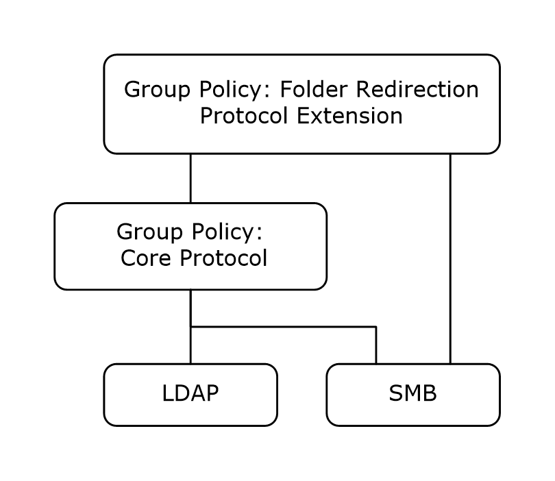

# [MS-GPFR]: Group Policy: Folder Redirection Protocol Extension

Table of Contents

1 Introduction

- [1 Introduction](#Section_1)
  - [1.1 Glossary](#Section_1.1)
  - [1.2 References](#Section_1.2)
    - [1.2.1 Normative References](#Section_1.2.1)
    - [1.2.2 Informative References](#Section_1.2.2)
  - [1.3 Overview](#Section_1.3)
    - [1.3.1 Background](#Section_1.3.1)
    - [1.3.2 Folder Redirection Protocol Overview](#Section_1.3.2)
    - [1.3.3 Folder Redirection Administrative-Side Plug-In](#Section_1.3.3)
    - [1.3.4 Folder Redirection Client-Side Plug-In](#Section_1.3.4)
  - [1.4 Relationship to Other Protocols](#Section_1.4)
  - [1.5 Prerequisites/Preconditions](#Section_1.5)
  - [1.6 Applicability Statement](#Section_1.6)
  - [1.7 Versioning and Capability Negotiation](#Section_1.7)
  - [1.8 Vendor-Extensible Fields](#Section_1.8)
  - [1.9 Standards Assignments](#Section_1.9)

2 Messages

- [2 Messages](#Section_2)
  - [2.1 Transport](#Section_2.1)
  - [2.2 Message Syntax](#Section_2.2)
    - [2.2.1 Folder Redirection Protocol Version Zero Configuration Data](#Section_2.2.1)
      - [2.2.1.1 Interpreting the Redirection Options Value](#Section_2.2.1.1)
      - [2.2.1.2 Per-Profile Sections](#Section_2.2.1.2)
    - [2.2.2 Folder Redirection Protocol Version One Configuration Data](#Section_2.2.2)
      - [2.2.2.1 Folder Redirection Section](#Section_2.2.2.1)
        - [2.2.2.1.1 Single-SID Value for the GUID-Groups Pair](#Section_2.2.2.1.1)
        - [2.2.2.1.2 List-of-SID Values for the GUID-Groups Pair](#Section_2.2.2.1.2)
      - [2.2.2.2 Per-GUID Section](#Section_2.2.2.2)
        - [2.2.2.2.1 Flags Key](#Section_2.2.2.2.1)
        - [2.2.2.2.2 FullPath Key](#Section_2.2.2.2.2)
        - [2.2.2.2.3 ParentFolder Key](#Section_2.2.2.2.3)
        - [2.2.2.2.4 RelativePath Key](#Section_2.2.2.2.4)
        - [2.2.2.2.5 ExcludeFolders Key](#Section_2.2.2.2.5)

3 Protocol Details

- [3 Protocol Details](#Section_3)
  - [3.1 Folder Redirection Administrative-Side Plug-In Details](#Section_3.1)
    - [3.1.1 Abstract Data Model](#Section_3.1.1)
    - [3.1.2 Timers](#Section_3.1.2)
    - [3.1.3 Initialization](#Section_3.1.3)
    - [3.1.4 Higher-Layer Triggered Events](#Section_3.1.4)
      - [3.1.4.1 Extraneous Data Ignored](#Section_3.1.4.1)
      - [3.1.4.2 Using the Protocol Versions](#Section_3.1.4.2)
    - [3.1.5 Timer Events](#Section_3.1.5)
    - [3.1.6 Other Local Events](#Section_3.1.6)
  - [3.2 Folder Redirection Client-Side Plug-in Details](#Section_3.2)
    - [3.2.1 Abstract Data Model](#Section_3.2.1)
    - [3.2.2 Timers](#Section_3.2.2)
    - [3.2.3 Initialization](#Section_3.2.3)
    - [3.2.4 Higher-Layer Triggered Events](#Section_3.2.4)
      - [3.2.4.1 Process Group Policy](#Section_3.2.4.1)
    - [3.2.5 Message Processing Events and Sequencing Rules](#Section_3.2.5)
      - [3.2.5.1 Ignoring Extraneous Data](#Section_3.2.5.1)
      - [3.2.5.2 Using the Protocol Versions](#Section_3.2.5.2)
      - [3.2.5.3 Using Redirection Values](#Section_3.2.5.3)
      - [3.2.5.4 Unspecified Redirection](#Section_3.2.5.4)
    - [3.2.6 Timer Events](#Section_3.2.6)
    - [3.2.7 Other Local Events](#Section_3.2.7)

4 Protocol Examples

- [4 Protocol Examples](#Section_4)
  - [4.1 Folder Redirection Protocol Version Zero Configuration Data](#Section_4.1)
  - [4.2 Folder Redirection Protocol Version One Configuration Data](#Section_4.2)
  - [4.3 Version One Configuration File Example](#Section_4.3)
  - [4.4 Version Zero Configuration File Example](#Section_4.4)

5 Security

- [5 Security](#Section_5)
  - [5.1 Security Considerations for Implementers](#Section_5.1)
  - [5.2 Index of Security Parameters](#Section_5.2)

6 Appendix A: Product Behavior

- [6 Appendix A: Product Behavior](#Section_6)

7 Change Tracking

- [7 Change Tracking](#Section_7)

For the legal notice and IP terms, see [LEGAL.md](../LEGAL.md).
Last updated: 4/23/2024.
See [Revision History](#revision-history) for full version history.

# 1 Introduction

The Group Policy: Folder Redirection Protocol Extension allows an administrator to relocate certain file system [**folders**](#gt_folder), called [**user profile folders**](#gt_user-profile-folder), to different paths such as a shared network location.

Sections 1.5, 1.8, 1.9, 2, and 3 of this specification are normative. All other sections and examples in this specification are informative.

## 1.1 Glossary

This document uses the following terms:

**access control list (ACL)**: A list of access control entries (ACEs) that collectively describe the security rules for authorizing access to some resource; for example, an object or set of objects.

**client-side extension GUID (CSE GUID)**: A [**GUID**](#gt_globally-unique-identifier-guid) that enables a specific client-side extension on the Group Policy client to be associated with policy data that is stored in the logical and physical components of a [**Group Policy Object (GPO)**](#gt_group-policy-object-gpo) on the Group Policy server, for that particular extension.

**curly braced GUID string**: The string representation of a 128-bit globally unique identifier ([**GUID**](#gt_globally-unique-identifier-guid)) using the form {XXXXXXXX-XXXX-XXXX-XXXX-XXXXXXXXXXXX}, where X denotes a hexadecimal digit. The string representation between the enclosing braces is the standard representation of a GUID as described in [[RFC4122]](https://go.microsoft.com/fwlink/?LinkId=90460) section 3. Unlike a GUIDString, a curly braced GUID string includes enclosing braces.

**domain**: A set of users and computers sharing a common namespace and management infrastructure. At least one computer member of the set has to act as a [**domain controller (DC)**](#gt_domain-controller-dc) and host a member list that identifies all members of the domain, as well as optionally hosting the Active Directory service. The domain controller provides authentication of members, creating a unit of trust for its members. Each domain has an identifier that is shared among its members. For more information, see [MS-AUTHSOD](../MS-AUTHSOD/MS-AUTHSOD.md) section 1.1.1.5 and [MS-ADTS](../MS-ADTS/MS-ADTS.md).

**domain controller (DC)**: The service, running on a server, that implements Active Directory, or the server hosting this service. The service hosts the data store for objects and interoperates with other [**DCs**](#gt_domain-controller-dc) to ensure that a local change to an object replicates correctly across all [**DCs**](#gt_domain-controller-dc). When Active Directory is operating as Active Directory Domain Services (AD DS), the [**DC**](#gt_domain-controller-dc) contains full NC replicas of the configuration naming context (config NC), schema naming context (schema NC), and one of the domain NCs in its forest. If the AD DS [**DC**](#gt_domain-controller-dc) is a global catalog server (GC server), it contains partial NC replicas of the remaining domain NCs in its forest. For more information, see [MS-AUTHSOD] section 1.1.1.5.2 and [MS-ADTS]. When Active Directory is operating as Active Directory Lightweight Directory Services (AD LDS), several AD LDS [**DCs**](#gt_domain-controller-dc) can run on one server. When Active Directory is operating as AD DS, only one AD DS [**DC**](#gt_domain-controller-dc) can run on one server. However, several AD LDS [**DCs**](#gt_domain-controller-dc) can coexist with one AD DS [**DC**](#gt_domain-controller-dc) on one server. The AD LDS [**DC**](#gt_domain-controller-dc) contains full NC replicas of the config NC and the schema NC in its forest. The domain controller is the server side of Authentication Protocol Domain Support [MS-APDS](../MS-APDS/MS-APDS.md).

**folder**: A file system construct. File systems organize a volume's data by providing a hierarchy of objects, which are referred to as folders or directories, that contain files and can also contain other folders.

**folder redirection**: The ability to change the location of certain predetermined [**folders**](#gt_folder) in a file system from their default location to another location on the same machine or to a network storage location.

**globally unique identifier (GUID)**: A term used interchangeably with universally unique identifier (UUID) in Microsoft protocol technical documents (TDs). Interchanging the usage of these terms does not imply or require a specific algorithm or mechanism to generate the value. Specifically, the use of this term does not imply or require that the algorithms described in [RFC4122] or [[C706]](https://go.microsoft.com/fwlink/?LinkId=89824) must be used for generating the [**GUID**](#gt_globally-unique-identifier-guid). See also universally unique identifier (UUID).

**Group Policy Object (GPO)**: A collection of administrator-defined specifications of the policy settings that can be applied to groups of computers in a domain. Each GPO includes two elements: an object that resides in the Active Directory for the domain, and a corresponding file system subdirectory that resides on the sysvol DFS share of the Group Policy server for the domain.

**Group Policy Object (GPO) path**: A [**domain**](#gt_domain)-based Distributed File System (DFS) path for a directory on the server that is accessible through the DFS/[**SMB**](#gt_server-message-block-smb) protocols. This path will always be a [**Universal Naming Convention (UNC)**](#gt_universal-naming-convention-unc) path of the form: "\\<dns domain name>\sysvol\<dns domain name>\policies\<gpo guid>", where <dns domain name> is the DNS domain name of the [**domain**](#gt_domain) and <gpo guid> is a Group Policy Object (GPO) GUID.

**security identifier (SID)**: An identifier for security principals that is used to identify an account or a group. Conceptually, the [**SID**](#gt_security-identifier-sid) is composed of an account authority portion (typically a [**domain**](#gt_domain)) and a smaller integer representing an identity relative to the account authority, termed the relative identifier (RID). The [**SID**](#gt_security-identifier-sid) format is specified in [MS-DTYP](../MS-DTYP/MS-DTYP.md) section 2.4.2; a string representation of [**SIDs**](#gt_security-identifier-sid) is specified in [MS-DTYP] section 2.4.2 and [MS-AZOD](../MS-AZOD/MS-AZOD.md) section 1.1.1.2.

**Server Message Block (SMB)**: A protocol that is used to request file and print services from server systems over a network. The SMB protocol extends the CIFS protocol with additional security, file, and disk management support. For more information, see [[CIFS]](https://go.microsoft.com/fwlink/?linkid=2109334) and [MS-SMB](../MS-SMB/MS-SMB.md).

**share**: A resource offered by a Common Internet File System (CIFS) server for access by CIFS clients over the network. A [**share**](#gt_share) typically represents a directory tree and its included files (referred to commonly as a "disk share" or "file share") or a printer (a "print share"). If the information about the [**share**](#gt_share) is saved in persistent store (for example, Windows registry) and reloaded when a file server is restarted, then the [**share**](#gt_share) is referred to as a "sticky share". Some [**share**](#gt_share) names are reserved for specific functions and are referred to as special [**shares**](#gt_share): IPC$, reserved for interprocess communication, ADMIN$, reserved for remote administration, and A$, B$, C$ (and other local disk names followed by a dollar sign), assigned to local disk devices.

**tool extension GUID or administrative plug-in GUID**: A GUID defined separately for each of the user policy settings and computer policy settings that associates a specific administrative tool plug-in with a set of policy settings that can be stored in a [**Group Policy Object (GPO)**](#gt_group-policy-object-gpo).

**Unicode**: A character encoding standard developed by the Unicode Consortium that represents almost all of the written languages of the world. The [**Unicode**](#gt_unicode) standard [[UNICODE5.0.0/2007]](https://go.microsoft.com/fwlink/?LinkId=154659) provides three forms (UTF-8, UTF-16, and UTF-32) and seven schemes (UTF-8, UTF-16, UTF-16 BE, UTF-16 LE, UTF-32, UTF-32 LE, and UTF-32 BE).

**Universal Naming Convention (UNC)**: A string format that specifies the location of a resource. For more information, see [MS-DTYP] section 2.2.57.

**user profile folder**: A storage location in an operating system that provides the operating system and applications with a per-user location with conventional semantics. For example, each user on a Windows operating system has his or her own documents, music, videos, and pictures user-profile folders in which he or she can store per-user data.

**MAY, SHOULD, MUST, SHOULD NOT, MUST NOT:** These terms (in all caps) are used as defined in [[RFC2119]](https://go.microsoft.com/fwlink/?LinkId=90317). All statements of optional behavior use either MAY, SHOULD, or SHOULD NOT.

## 1.2 References

Links to a document in the Microsoft Open Specifications library point to the correct section in the most recently published version of the referenced document. However, because individual documents in the library are not updated at the same time, the section numbers in the documents may not match. You can confirm the correct section numbering by checking the [Errata](https://go.microsoft.com/fwlink/?linkid=850906).

### 1.2.1 Normative References

We conduct frequent surveys of the normative references to assure their continued availability. If you have any issue with finding a normative reference, please contact [dochelp@microsoft.com](mailto:dochelp@microsoft.com). We will assist you in finding the relevant information.

[C706] The Open Group, "DCE 1.1: Remote Procedure Call", C706, August 1997, [https://publications.opengroup.org/c706](https://go.microsoft.com/fwlink/?LinkId=89824)

**Note** Registration is required to download the document.

[MS-DTYP] Microsoft Corporation, "[Windows Data Types](../MS-DTYP/MS-DTYP.md)".

[MS-GPOL] Microsoft Corporation, "[Group Policy: Core Protocol](../MS-GPOL/MS-GPOL.md)".

[MS-SMB] Microsoft Corporation, "[Server Message Block (SMB) Protocol](../MS-SMB/MS-SMB.md)".

[RFC2119] Bradner, S., "Key words for use in RFCs to Indicate Requirement Levels", BCP 14, RFC 2119, March 1997, [https://www.rfc-editor.org/info/rfc2119](https://go.microsoft.com/fwlink/?LinkId=90317)

### 1.2.2 Informative References

[HOWARD] Howard, M., "Writing Secure Code", Microsoft Press, 2002, ISBN: 0735617228.

## 1.3 Overview

This document specifies the Group Policy: Folder Redirection Protocol Extension, which conveys an administrator's policy for redirecting [**user profile folders**](#gt_user-profile-folder).

### 1.3.1 Background

The Group Policy Protocol, as specified in [MS-GPOL](../MS-GPOL/MS-GPOL.md), allows clients to discover and retrieve policy settings created by [**domain**](#gt_domain) administrators. These settings are persisted within [**Group Policy Objects (GPOs)**](#gt_group-policy-object-gpo) that are assigned to policy target accounts in the Active Directory. Policy target accounts are either computer accounts or user accounts in the Active Directory. Each client uses Lightweight Directory Access Protocol (LDAP) to determine what GPOs are applicable to it by consulting the Active Directory objects corresponding to each client's computer account, and the user accounts of any users logging on to the client computer.

On each client, each GPO is interpreted and acted upon by software components known as client-side plug-ins. The client-side plug-ins responsible for a given GPO are specified using an attribute on the GPO. This attribute specifies a list of [**globally unique identifier (GUID)**](#gt_globally-unique-identifier-guid) pairs. The first GUID of each pair is referred to as a [**client-side extension GUID (CSE GUID)**](#gt_client-side-extension-guid-cse-guid). The second GUID of each pair is referred to as a [**tool extension GUID**](#gt_88ad7745-bee6-47f7-ae98-6fac7c5ef330).

For each GPO that is applicable to a client, the client consults the CSE GUIDs listed in the GPO to determine which client-side plug-ins on the client will handle the GPO. The client then invokes the client-side plug-ins to handle the GPO.

A client-side plug-in uses the contents of the GPO to retrieve settings specific to its class in a manner specific to the class. Once its class-specific settings are retrieved, the client-side plug-in uses those settings to perform class-specific processing.

### 1.3.2 Folder Redirection Protocol Overview

The Group Policy: Folder Redirection Protocol Extension enables an administrator to redirect the location of certain file system [**folders**](#gt_folder), called [**user profile folders**](#gt_user-profile-folder), to different paths such as a shared network location. When the operating system or application requests access to these redirected folders, the operating system automatically redirects the access requests to the location on a network [**share**](#gt_share) specified by the administrator.

By convention, an operating system or application expects to read and store a user's data in a set of folders within the local file system. For example, an operating system conventionally stores image files for user "Sue" in a folder of the local file system called \Sue\Documents\My Pictures. The Group Policy: Folder Redirection Protocol Extension allows an administrator to change the location of Sue's My Pictures folder from its default local location to a UncPath such as \\CorpServer\Users\Sue\Documents, thereby making it available to Sue from any machine on the network. This also enables the administrator to manage its storage from a central location.

It is important to note that an operating system might not support redirection of all user folders. The set of folders that can be redirected (that is, user profile folders) is a function of the operating system version. The protocol provides both a Version Zero file format that assumes a constant list of user profile folders and a Version One file format that supports an extensible set of user profile folders.

Two software plug-ins interact with each other through files in the [**folder redirection**](#gt_folder-redirection) protocol format, stored and communicated through a remote storage location such as a network share. The plug-ins are as follows:

- Folder Redirection Administrative-Side Plug-in
- Folder Redirection Client-Side Plug-in
The Folder Redirection Administrative-Side Plug-in provides a user interface by which network administrators can establish and update folder locations for users' folders. It relies on the Group Policy Protocol, as specified in [MS-GPOL](../MS-GPOL/MS-GPOL.md), to specify the location of the remote storage location where the folder redirection configuration data is to be stored. This [**GPO path**](#gt_b6f231be-60b0-4890-bd73-5637568f2aea) is metadata in a [**GPO**](#gt_group-policy-object-gpo) that is stored on the [**domain controller (DC)**](#gt_domain-controller-dc) where the Folder Redirection Protocol configuration data is stored. The plug-in uses [**SMB**](#gt_server-message-block-smb) operations, as specified in [MS-SMB](../MS-SMB/MS-SMB.md), to retrieve existing configuration data (in the form of files) from that location and to store updated configuration to it.

The Folder Redirection Client-Side Plug-in is a component of each client machine in the network that users log on to. It is invoked by the client implementation of the Group Policy Protocol, as specified in [MS-GPOL], on behalf of the user logging on to the operating system. The protocol provides the folder redirection protocol with the remote storage location from which the protocol reads the Folder Redirection Client-Side Plug-in configuration data. This location is constructed based on the GPO path in the GPO retrieved by the Group Policy Protocol. The client-side plug-in uses SMB operations to retrieve the current configuration data from that location. The plug-in then parses the data and configures the folder redirection subsystem of the underlying operating system to redirect the user's user profile folders to the locations specified, as described in section [1.3.4](#Section_1.3).

**Note** The remote storage location can be implemented using a variety of techniques such as a network share. Therefore, implementing a remote storage location does not require understanding the folder redirection protocol.

### 1.3.3 Folder Redirection Administrative-Side Plug-In

The Folder Redirection Administrative-Side Plug-in determines (through the Group Policy Protocol, as specified in [MS-GPOL](../MS-GPOL/MS-GPOL.md)) the path of a file containing the [**Folder Redirection**](#gt_folder-redirection) protocol data. Given the path name, the plug-in retrieves the contents of the file using [**SMB**](#gt_server-message-block-smb) as a transport, as specified in [MS-SMB](../MS-SMB/MS-SMB.md).

An administrator uses the Folder Redirection Administrative-Side Plug-in to read the current configuration for users' [**folders**](#gt_folder) and to modify the configuration data for any of the users' folders by way of the user interface of the plug-in. If the administrator modifies any data, the Folder Redirection Administrative-Side Plug-in writes the modified folder redirection protocol configuration data to the remote storage location, using SMB as a transport.

### 1.3.4 Folder Redirection Client-Side Plug-In

The Folder Redirection Client-Side Plug-in determines (by way of the Group Policy Protocol, as specified in [MS-GPOL](../MS-GPOL/MS-GPOL.md)) the path of a file containing the [**folder redirection**](#gt_folder-redirection) protocol data. Given the path name, the client-side plug-in retrieves the contents of the file using SMB as a transport. The client-side plug-in parses the configuration data and configures the operating system folder redirection subsystem with the directives in the protocol data.

## 1.4 Relationship to Other Protocols

This protocol depends on the Group Policy: Core Protocol specified in [MS-GPOL](../MS-GPOL/MS-GPOL.md) to provide a list of applicable GPOs. It also depends on the [**SMB**](#gt_server-message-block-smb) Protocol, as specified in [MS-SMB](../MS-SMB/MS-SMB.md), for transmitting Group Policy settings and instructions between the client and the GP server.

Figure 1: Group Policy: Folder Redirection Protocol Extension relationship diagram

## 1.5 Prerequisites/Preconditions

The prerequisites for this protocol include those for the Group Policy Protocol as specified in [MS-GPOL](../MS-GPOL/MS-GPOL.md).

In addition, each participating client is required to have an operating system subsystem capable of redirecting [**user profile folders**](#gt_user-profile-folder), including intercepting and modifying application file system operations, and moving and merging directory contents to implement changes to user profile folder locations.

## 1.6 Applicability Statement

The [**folder redirection**](#gt_folder-redirection) protocol is only applicable within the Group Policy Protocol as specified in [MS-GPOL](../MS-GPOL/MS-GPOL.md).

Commonly-used configurations (those that use the Check Ownership and Exclusive Access flags of section [2.2.2.2.1](#Section_2.2.2.2.1)) require that the destination server of a redirection specification support New Technology File System (NTFS)-compatible security operations such as testing ownership of a directory and modifying directory [**access control lists (ACL)**](#gt_access-control-list-acl). The client folder redirection subsystem will fail if the policy uses these flags and the destination server does not provide these operations.

## 1.7 Versioning and Capability Negotiation

The Group Policy: Folder Redirection Protocol Extension does not provide for capability negotiations.

The Group Policy: Folder Redirection Protocol Extension does provide versioning capability through its configuration data that is stored in the remote storage location. The Folder Redirection Administrative-Side Plug-in generates additional, secondary configuration data for an operating system version if the [**folder redirection**](#gt_folder-redirection) policies specified by an administrator affect [**user profile folders**](#gt_user-profile-folder) (which are features provided only by that version of an operating system).

Folder Redirection Client-Side Plug-ins that support the later Version One format are required to read and use only the Version One configuration data from the remote storage location, when it is available. If the remote storage location provides only Version Zero configuration data, client-side plug-ins that support the later Version One format read and use the Version Zero configuration data.

The Version One format specifies a **VersionNumber** field designed to allow future versions of the protocol, but only a single value of that field is presently defined, and thus Version One of the protocol is required to set that field to a constant value.

## 1.8 Vendor-Extensible Fields

The Group Policy: Folder Redirection Protocol Extension defines a vendor-extensible [**GUID**](#gt_globally-unique-identifier-guid) (as specified in [MS-DTYP](../MS-DTYP/MS-DTYP.md) section 2.3.4.3) field for well-known [**user profile folders**](#gt_user-profile-folder). Vendors can obtain a value by generating one, according to the standard GUID algorithm, as specified in [[C706]](https://go.microsoft.com/fwlink/?LinkId=89824). The current assigned values are shown in section [1.9](#Section_1.9).

## 1.9 Standards Assignments

This protocol defines [**CSE GUID**](#gt_client-side-extension-guid-cse-guid) and [**tool extension GUID**](#gt_88ad7745-bee6-47f7-ae98-6fac7c5ef330) values using the assignment algorithm (as specified in section [1.8](#Section_1.8)) that refers to the [**GUID**](#gt_globally-unique-identifier-guid) generation algorithm, as specified in [[C706]](https://go.microsoft.com/fwlink/?LinkId=89824). This same algorithm is used to generate other GUIDs for well-known [**user profile folders**](#gt_user-profile-folder) (shown in the following table for reference).

| Parameter | Value |
| --- | --- |
| CSE GUID | {25537BA6-77A8-11D2-9B6C-0000F8080861} |
| Tool Extension GUID (User Policy Settings) | {88E729D6-BDC1-11D1-BD2A-00C04FB9603F} |

| Well-known user profile folder GUIDs | Column 2 |
| --- | --- |
| AppData\Roaming | {3EB685DB-65F9-4CF6-A03A-E3EF65729F3D} |
| Contacts | {56784854-C6CB-462b-8169-88E350ACB882} |
| Desktop | {B4BFCC3A-DB2C-424C-B029-7FE99A87C641} |
| Documents | {FDD39AD0-238F-46AF-ADB4-6C85480369C7} |
| Downloads | {374DE290-123F-4565-9164-39C4925E467B} |
| Favorites | {1777F761-68AD-4D8A-87BD-30B759FA33DD} |
| Links | {bfb9d5e0-c6a9-404c-b2b2-ae6db6af4968} |
| Music | {4BD8D571-6D19-48D3-BE97-422220080E43} |
| Pictures | {33E28130-4E1E-4676-835A-98395C3BC3BB} |
| SavedGames | {4C5C32FF-BB9D-43b0-B5B4-2D72E54EAAA4} |
| Searches | {7d1d3a04-debb-4115-95cf-2f29da2920da} |
| Start Menu | {625B53C3-AB48-4EC1-BA1F-A1EF4146FC19} |
| Videos | {18989B1D-99B5-455B-841C-AB7C74E4DDFC} |

# 2 Messages

## 2.1 Transport

The Group Policy: Folder Redirection Protocol Extension requires the [**SMB**](#gt_server-message-block-smb) transport with mutual authentication, as specified in [MS-GPOL](../MS-GPOL/MS-GPOL.md) section 2.1. All messages are exchanged as files, as specified in [MS-GPOL]. The client-side plug-in MUST use this protocol's [**CSE GUID**](#gt_client-side-extension-guid-cse-guid), and the administrative-side plug-in MUST use the [**tool extension GUID**](#gt_88ad7745-bee6-47f7-ae98-6fac7c5ef330).

The Group Policy Protocol uses this protocol protocol's CSE GUID and tool extension GUID values to invoke this protocol only to access [**GPOs**](#gt_group-policy-object-gpo) from which messages of this protocol can be generated.

## 2.2 Message Syntax

Messages exchanged in this protocol allow the client to discover settings in the [**GPOs**](#gt_group-policy-object-gpo) that instruct clients to configure their operating system [**folder redirection**](#gt_folder-redirection) subsystems according to administrator directives.

There are two versions of the protocol specified in the following sections:

- [2.2.1](#Section_4.1) Folder Redirection Protocol Version Zero Configuration Data
- [2.2.2](#Section_2.2.2) Folder Redirection Protocol Version One Configuration Data
Both versions convey a message as a .ini file. Each file is encoded in UTF-16LE with Byte Order Mark (0xFFFE). The syntax of each file, and thus the syntax of each message, is specified by the Augmented Backus-Naur Form (ABNF) non-terminal IniFile, as specified in [MS-GPOL](../MS-GPOL/MS-GPOL.md) section 2.2.4. The following sections use the terminology sections, keys, and values of that document to specify concrete syntax of each message.

### 2.2.1 Folder Redirection Protocol Version Zero Configuration Data

Version Zero of the protocol uses the [**SMB**](#gt_server-message-block-smb) transport to copy a file that MUST be named <gpo path>\User\Documents & Settings\fdeploy.ini, where <gpo path> is a scoped [**GPO path**](#gt_b6f231be-60b0-4890-bd73-5637568f2aea). The message is the file itself.

The file MUST contain one section with the SectionID Folder Status. The [**folder**](#gt_folder) status section MUST contain zero or more key-value pairs (called redirection options) where:

- The key MUST be one of the following five string constants, specifying the [**user profile folder**](#gt_user-profile-folder) to which the redirection options SHOULD<1> apply:
- My Documents
- My Pictures
- Start Menu
- Application Data
- Desktop
- The value corresponding to each key MUST be a string representation of a hexadecimal value, representing the binary OR of a collection of flags. The following section specifies the flags.
To see an example of a version zero configuration file example, please see section [4.4](#Section_4.4).

#### 2.2.1.1 Interpreting the Redirection Options Value

The client-side plug-in passes the flags to the underlying operating system [**folder redirection**](#gt_folder-redirection) subsystem. Other than the exceptions indicated in the following table with the prescriptive words MUST and MUST NOT, the redirection options flags do not affect the behavior of the protocol itself.

| Flag value | Behavior |
| --- | --- |
| 0x00000001 | Move Contents This flag indicates that all contents of the specified [**folder**](#gt_folder) MUST be moved to the redirected path location. For each file with versions present in the source location of the [**user profile folder**](#gt_user-profile-folder) and in the redirected location, the version in the default location is copied to the redirected location only if its file system time stamp is newer than the version to be replaced. |
| 0x00000002 | Follow Parent Folder This flag indicates that the user profile folder MUST be handled (for purposes of redirection) as ordinary contents of its parent folder. This flag is only meaningful when the specified user profile is a descendent of some other user profile folder. In Version Zero of the protocol, this flag MUST NOT be set in redirection options other than for those associated with the key My Pictures and, in this case, the My Pictures user profile folder MUST be treated as an ordinary subfolder of the My Documents user profile folder. If this flag is set, the client-side plug-in MUST configure the folder redirection subsystem to use the redirection options associated with the user profile folder of which the present user profile folder is a descendent. If this flag is set, all other flags MUST NOT be set, and the Per-Profile section (as specified in section [2.2.1.2](#Section_2.2.1.2)) for the corresponding user profile folder MUST NOT appear in the file. |
| 0x00000004 | Redirection Not Specified This flag indicates that the administrator has specified no specific redirection path for the folder, and the folder redirection subsystem MUST continue using whatever redirection configuration it was last configured with.<2> If this flag is set, all other flags MUST NOT be set, and the Per-Profile section (as specified in section 2.2.1.2) for the corresponding user profile folder MUST NOT appear in the file. |
| 0x00000008 | Advanced Redirection The client-side plug-in MUST ignore its value. |
| 0x00000010 | Check Ownership with Exclusive Access This flag indicates that the folder redirection subsystem, before initiating redirection, MUST verify that the file system permissions on the destination folder indicate that the user owns the destination folder. If the check fails, the folder redirection subsystem MUST behave as if no redirection had been specified for this user profile folder.<3> |
| 0x00000020 | Relocate On Move This flag indicates that if the policy is ever deleted in the future, the folder redirection MUST be undone. |

#### 2.2.1.2 Per-Profile Sections

For each redirection options key-value pair present in the Folder Status section with neither the Follow Parent Folder nor the Redirection Not Specified flags set, the file MUST contain an additional section, called a Per-Profile Folder section, whose SectionID is the same as the key of the redirection options key-value pair. The SectionID identifies which [**user profile folder**](#gt_user-profile-folder) SHOULD<4> be redirected. The corresponding key in the Folder Status section identifies the flags to be applied to the redirection of that user profile folder.

Each Per-Profile Folder section MUST contain zero or more key-value pairs called security group mappings. Each key MUST be the string representation of a security group [**security identifier (SID)**](#gt_security-identifier-sid) (as specified in [MS-DTYP](../MS-DTYP/MS-DTYP.md) section 2.4.2.1), and each value MUST be a [**Universal Naming Convention (UNC)**](#gt_universal-naming-convention-unc) path indicating the destination path to which the indicated user profile folder is redirected. The client-side plug-in MUST determine what destination path to pass to the [**folder redirection**](#gt_folder-redirection) subsystem by determining what security group the user belongs to. If the user belongs to more than one security group, the client-side plug-in MUST use the first matching securitygGroup mapping that appears in the section.

**Note** The security group SID MUST begin with either a lowercase or uppercase S and MUST be treated as case-insensitive by the client-side and administrative-side plug-ins.

### 2.2.2 Folder Redirection Protocol Version One Configuration Data

Version One of the protocol uses the SMB transport to copy a file that MUST be named <gpo path>\User\Documents & Settings\fdeploy1.ini, where <gpo path> is a scoped [**GPO path**](#gt_b6f231be-60b0-4890-bd73-5637568f2aea). The message is the file itself. <5>

The file MUST contain one section with the SectionID version. The version section MUST contain exactly one key-value pair in the following format: The key MUST be the constant string VersionNumber and the value MUST be the constant string 100.

The Folder Redirection Client-Side Plug-in receives this file, and it MUST ignore entirely any fdeploy1.ini file that contains a version number less than 100 or greater than 199. The Folder Redirection Client-Side Plug-in SHOULD<6> accept and process (as specified in this document) any fdeploy1.ini file that contains a version number in the range 100 to 199.

To see an example of a version one configuration file example, please see section [4.3](#Section_4.3).

#### 2.2.2.1 Folder Redirection Section

The file MUST contain another section with the SectionID [**folder redirection**](#gt_folder-redirection). This section MUST contain zero or more key-value pairs, called GUID-Groups, in the following format: The key is a string representation of a [**GUID**](#gt_globally-unique-identifier-guid) identifying a [**user profile folder**](#gt_user-profile-folder), and GUIDs of well-known [**folders**](#gt_folder) are listed in the table in section [1.9](#Section_1.9). The value MUST be one of two representations specifying either a single [**SID**](#gt_security-identifier-sid) or a list of SIDs, as specified in the sections that follow.

The client-side plug-in MUST determine what per-GUID section to interpret and pass to the folder redirection subsystem, by determining what security group the user belongs to. If the user belongs to more than one security group, the client-side plug-in MUST use the first matching GUID-Group that appears in the section.

##### 2.2.2.1.1 Single-SID Value for the GUID-Groups Pair

In this form, the value of the GUID-Groups pair MUST be the string representation of the security descriptor [**SID**](#gt_security-identifier-sid) of a security group.

##### 2.2.2.1.2 List-of-SID Values for the GUID-Groups Pair

In this form, the value MUST be a semicolon-delimited, whitespace-free list of *n* security descriptor [**SIDs**](#gt_security-identifier-sid). The meaning of this form MUST be interpreted exactly as *n* separate GUID-Groups pairs.

#### 2.2.2.2 Per-GUID Section

For each GUID-Groups pair present in the Folder Redirection section, the file MUST contain an additional Per-GUID section. The SectionID of the Per-GUID section MUST be the string formed by concatenating the key of the GUID-Groups pair, an underscore "_", and the value of the Per-GUID pair.

**Note** If a list of [**SID**](#gt_security-identifier-sid) values is defined for the GUID-Groups pair, the SectionID of the Per-GUID section MUST define a section for each individually valid GUID-SID combination separately, just as if the List-of-SIDs had been represented as n separate GUID-Groups pairs.

The Per-GUID section MUST contain one or more key-value pairs. The key names are as follows:

- Flags
- FullPath
- ParentFolder
- RelativePath
- Exclude Folders
The values for each of the keys are explained in the following sections.

##### 2.2.2.2.1 Flags Key

The section MUST contain exactly one key with the constant string Flags. The value MUST be a string representation of a hexadecimal value representing the binary OR of a collection of flags. The client-side plug-in passes the flags to the underlying operating system [**folder redirection**](#gt_folder-redirection) subsystem. As specified in the following table, some flags determine what other flags are set in the value and what keys are present in the section. Otherwise, the flags do not affect the behavior of the protocol itself. Those values marked "(same as section [2.2.1.1](#Section_2.2.1.1))" have semantics identical to those of the corresponding flags in section 2.2.1.1; all other flag values either deviate from the section 2.2.1.1 flags or introduce new behaviors relative to section 2.2.1.1.

| Flag value | Behavior |
| --- | --- |
| 0x00000001 | Move Contents (same as section 2.2.1.1) Indicates that all contents of the specified folder MUST be moved to the redirected path location.<7> |
| 0x00000002 | Follow Parent Folder This flag indicates that the [**user profile folder**](#gt_user-profile-folder) MUST be handled (for purposes of redirection) as ordinary contents of its parent folder. Unlike Version Zero, where the parent folder was specified by convention, in Version One, the parent folder MUST be explicitly specified by the ParentFolder key (see section [2.2.2.2.3](#Section_2.2.2.2.3)). Exactly one of the following flags: Follow ParentFolder, Redirect to FullPath, or Redirect To Local MUST be set. The key's parent folder and relative path MUST be present in this section if, and only if, this flag is set. |
| 0x00000004 | Redirection Not Specified (same as section 2.2.1.1) This flag indicates that the administrator has specified no specific redirection path for the folder, and that the folder redirection subsystem MUST continue using whatever redirection configuration it was last configured with.<8> If this flag is set, all other flags MUST NOT be set, and the Per-Profile section (see section [2.2.1.2](#Section_2.2.1.2)) for the corresponding user profile folder MUST NOT appear in the file. |
| 0x00000008 | Advanced Redirection (same as section 2.2.1.1) This flag MUST be used only for display purposes in the administrative-side plug-in. It does not affect the folder redirection protocol, and the client-side plug-in MUST ignore its value. |
| 0x00000010 | Exclusive Access This flag SHOULD<9> indicate that the client folder redirection subsystem MUST create and set the file system [**access control list**](#gt_access-control-list-acl) on the destination folder to ensure that only the user has access to the contents of the destination folder. This flag is enabled by default. If the destination folder already exists, and the security descriptor on the folder is protected, the folder redirection subsystem will not set the file system access control list on the destination folder, even if this flag is set |
| 0x00000020 | Relocate On Move (same as section 2.2.1.1) This flag indicates that if the policy is ever deleted in the future, the folder redirection MUST be undone. he folder redirection subsystem remembers the setting of this flag as well as the security group associated with the Per-Profile mapping that establishes the folder redirection. If the folder redirection subsystem learns via Group Policy that the user no longer belongs to the security group that established the previous redirection, and the previous redirection configuration had the Relocate On Move flag set, then the folder redirection subsystem moves the contents of the user profile folder from the previously configured destination to the default destination for the user profile folder. This destination is typically a directory on the local computer file system |
| 0x00000200 | Check Ownership This flag indicates that the folder redirection subsystem MUST verify (before initiating redirection) that the file system permissions on the destination folder indicate that the user owns the destination folder. If the check fails, the folder redirection subsystem MUST behave as if no redirection had been specified for this user profile folder. Check Ownership is enabled by default. |
| 0x00000800 | Do Not InheritFlags This flag indicates any redirection flags specified for the parent folder MUST NOT be inherited by this folder. If the Follow Parent Folder flag is set and this flag (Do Not InheritFlags) is not set, all other flags MUST NOT be set. In this case, the plug-in MUST configure the folder redirection subsystem to use the redirection options associated with the user profile folder of which the present user profile is a descendent. If this flag is set, the Follow Parent Folder flag MUST be set. In this case, the plug-in MUST configure the folder redirection subsystem to use the redirection options specified by this flag's key. |
| 0x00001000 | Redirect To FullPath This flag indicates that the folder MUST be redirected to the full path, as specified in section [2.2.2.2.2](#Section_2.2.2.2.2). Exactly one of the following flags: Follow ParentFolder, Redirect To FullPath, or Redirect To Local MUST be set. The key FullPath MUST be present in this section if, and only if, this flag is set. |
| 0x00002000 | Redirect To Local This flag indicates that the plug-in MUST configure the folder redirection subsystem to use the default destination for the user profile folder, typically a directory on the local computer file system. Exactly one of the following flags: Follow ParentFolder, Redirect to FullPath, or Redirect To Local MUST be set. |
| 0x00004000 | Exclude Known SubFolders If set, this flag indicates that the specified redirection options MUST NOT be applied to any subfolder associated with a user profile folder identified by a [**GUID**](#gt_globally-unique-identifier-guid) in the value list using the ExcludeFolders key, as specified in section [2.2.2.2.5](#Section_2.2.2.2.5). This section MUST contain an ExcludeFolders key if, and only if, this flag is set. |
| 0x00008000 | Apply to Downlevel This flag is used only for display purposes in the administrative-side plug-in. It does not affect the folder redirection protocol, and the client-side plug-in MUST ignore its value. |

##### 2.2.2.2.2 FullPath Key

The section MUST contain one key with the constant string FullPath if the flag 0x00001000 is set, as defined in section [2.2.2.2.1](#Section_2.2.2.2.1). The value MUST be a [**UNC**](#gt_universal-naming-convention-unc) path identifying the destination path to which the [**folder redirection**](#gt_folder-redirection) subsystem redirects the [**user profile folder**](#gt_user-profile-folder) that is identified by the [**GUID**](#gt_globally-unique-identifier-guid) in the SectionID for this section. The value of this pair communicates the same information as the value part of the security group mapping in the Version Zero file format.

##### 2.2.2.2.3 ParentFolder Key

The section MUST contain one key with the constant string ParentFolder if the flag 0x00000002 is set, as defined in section [2.2.2.2.1](#Section_2.2.2.2.1). The value MUST be a [**curly braced GUID string**](#gt_curly-braced-guid-string). If this key is present, it indicates that the [**folder redirection**](#gt_folder-redirection) subsystem MUST redirect this [**user profile folder**](#gt_user-profile-folder) to a child directory of the redirection destination for the user profile folder that is specified by the value [**GUID**](#gt_globally-unique-identifier-guid). The name of the child directory MUST be the string value associated with the RelativePath key defined in section [2.2.2.2.4](#Section_2.2.2.2.4).

##### 2.2.2.2.4 RelativePath Key

The section MUST contain at most one key with the constant string RelativePath if the flag 0x00000002 is set, as defined in section [2.2.2.2.1](#Section_2.2.2.2.1). This key indicates to the [**folder redirection**](#gt_folder-redirection) subsystem that it MUST treat the value as a relative file system path, using the backslash character "\" as a directory delimiter. The subsystem MUST determine the redirection destination as the concatenation of the destination path of the parent folder (as specified by the ParentFolder key) and the relative path indicated by the value of this key. The RelativePath key value MUST NOT start with a backslash character "\".

##### 2.2.2.2.5 ExcludeFolders Key

The section MUST contain one key with the constant string ExcludeFolders if the flag 0x00004000 is set, as defined in section [2.2.2.2.1](#Section_2.2.2.2.1). This pair has a key with the constant string ExcludeFolders. The value MUST be a semicolon-delimited list of [**curly braced GUID strings**](#gt_curly-braced-guid-string). This key indicates that the [**folder redirection**](#gt_folder-redirection) subsystem MUST NOT apply the redirection options specified in this section to any subfolder associated with a [**user profile folder**](#gt_user-profile-folder) identified by a [**GUID**](#gt_globally-unique-identifier-guid) in the value list.

# 3 Protocol Details

## 3.1 Folder Redirection Administrative-Side Plug-In Details

### 3.1.1 Abstract Data Model

This section describes a model of possible data organization that an implementation maintains to participate in this protocol. The described organization is provided to explain how the protocol behaves. This document does not mandate that implementations adhere to this model as long as their external behavior is consistent with what is described in this document.

This Folder Redirection Administrative-Side Plug-in relies on a collection of settings specified in section [2.2.1.1](#Section_2.2.1.1), and it is stored as a configuration file with encoded [**Unicode**](#gt_unicode) characters at a remote storage location, such as a network [**share**](#gt_share) whose path is passed to it by the [**Group Policy Object**](#gt_group-policy-object-gpo), as specified in [MS-GPOL](../MS-GPOL/MS-GPOL.md).

The Folder Redirection Administrative-Side Plug-in reads these settings from the remote storage location and displays them to an administrator by way of a user interface.

An administrator then uses the user interface to make further configuration changes to users' [**folders**](#gt_folder), and the administrative-side plug-in writes these changes back to the remote storage location as a Unicode configuration file whose format is defined in section 2.2.1.1.

**Note** The preceding conceptual data can be implemented using a variety of techniques. Any data structure that stores the preceding conceptual data can be used in the implementation.

### 3.1.2 Timers

None.

### 3.1.3 Initialization

Initialization occurs upon initiation of the administrative-side plug-in by an administrator using the Group Policy Protocol, as specified in [MS-GPOL](../MS-GPOL/MS-GPOL.md). The plug-in then relies on the Group Policy Protocol to give it a [**GPO path**](#gt_b6f231be-60b0-4890-bd73-5637568f2aea). From the GPO path, the administrative-side plug-in MUST construct the location of the remote storage location in which to store the [**folder redirection**](#gt_folder-redirection) configuration data, and attempt to read the file. For Version Zero of the folder redirection protocol, the file name used MUST be <gpo path>\User\Documents & Settings\fdeploy.ini; and for Version One of the protocol, the file name used MUST be <gpo path>\User\Documents & Settings\fdeploy1.ini, where <gpo path> is the GPO path. File reads MUST be performed, as specified in [MS-GPOL].

### 3.1.4 Higher-Layer Triggered Events

When initiated by an administrator, the Folder Redirection Administrative-Side Plug-in MUST read the protocol configuration data from the remote storage location and pass that information to a user interface to display the current settings to an administrator. If the administrator makes any settings changes for a [**folder**](#gt_folder) through the user interface of the administrative-side plug-in, the Folder Redirection Administrative-Side Plug-in MUST write that configuration data as [**Unicode**](#gt_unicode) (in a file using the format specified in section [2.2.1](#Section_4.1)) to the remote storage location using remote file access.

For Version Zero of the [**folder redirection**](#gt_folder-redirection) protocol, the file name used MUST be <gpo path>\User\Documents & Settings\fdeploy.ini; and for Version One of the protocol, the file name MUST be <gpo path>\User\Documents & Settings\fdeploy1.ini, where <gpo path> is provided by the Group Policy Protocol, as specified in [MS-GPOL](../MS-GPOL/MS-GPOL.md).

After every creation, modification or deletion that affects a Folder Redirection Protocol Configuration Data file on SYSVOL, the administrative tool MUST invoke the Group Policy Extension Update event as specified in [MS-GPOL] 3.3.4.4.

#### 3.1.4.1 Extraneous Data Ignored

Any sections or keys in the configuration file that do not conform to the configuration format, as specified in sections [2.2.1](#Section_4.1) and [2.2.2](#Section_2.2.2), MUST be ignored by the administrative-side plug-in. When the administrative-side plug-in modifies a configuration file, the new file it stores MUST include any unrecognized sections and any unrecognized keys in sections that the plug-in has not deleted or replaced entirely.

#### 3.1.4.2 Using the Protocol Versions

The administrative-side plug-in SHOULD<10> store both a Version One and a Version Zero file to ensure that heterogeneous clients can make maximum use of the protocol. That is, the administrative-side plug-in MUST store a Version Zero file and SHOULD store a Version One file in addition.

### 3.1.5 Timer Events

None.

### 3.1.6 Other Local Events

None.

## 3.2 Folder Redirection Client-Side Plug-in Details

### 3.2.1 Abstract Data Model

This section describes a conceptual model of possible data organization that an implementation maintains to participate in this protocol. The described organization is provided to explain how the protocol behaves. This document does not mandate that implementations adhere to this model as long as their external behavior is consistent with what is described in this document.

This Folder Redirection Client-Side Plug-in uses a collection of settings specified in section [2.2.1.1](#Section_2.2.1.1), and stored as a [**Unicode**](#gt_unicode) configuration file at a specific remote storage location, such as a network [**share**](#gt_share). This location is passed to the plug-in by the [**Group Policy Object**](#gt_group-policy-object-gpo), as specified in [MS-GPOL](../MS-GPOL/MS-GPOL.md).

The Folder Redirection Client-Side Plug-in parses and interprets the file as specified in section [2](#Section_2) and then configures the [**folder redirection**](#gt_folder-redirection) subsystem with the relevant parameters extracted from the file. The folder redirection subsystem can store its configuration persistently. From the configuration, the Client-Side Plug-in MUST persist the setting that determines the behavior when the folder redirection is removed for the folder.<11> At some later time, if the folder redirection subsystem learns via Group Policy that the user no longer belongs to the security group that established the previous redirection, and the previous redirection configuration had the Relocate On Move flag set (for Version Zero of the protocol) or had Redirect To Local set (for Version One), then the folder redirection subsystem moves the contents of the user profile folder from the previously configured destination to the default destination for the user profile folder (typically a directory on the local computer file system).

**Note** This conceptual data can be implemented using a variety of techniques. An implementation is at liberty to implement such data in any way it pleases.

**AlwaysWaitForNetworkAtStartupAndLogon**: A Boolean value indicating whether a computer waits for network connectivity at the time of the startup and logon process.<12>

**Redirection Destination**: For each GPO contained in the **New or Changed GPO list** and for each security descriptor [**SID**](#gt_security-identifier-sid), the [**UNC**](#gt_universal-naming-convention-unc) path identifying the destination path.

**Parent Folder ID**: For each GPO contained in the **New or Changed GPO list** and for each security descriptor SID, the [**GUID**](#gt_globally-unique-identifier-guid) for the well-known user profile folder (see section [1.9](#Section_1.9)) that is the parent folder for the user profile folder being redirected.

**Excluded Folders List**: For each GPO contained in the **New or Changed GPO list** and for each security descriptor SID, the list of folders, in the form of binary GUIDs, whose subfolders are excluded from the redirection options being applied.

### 3.2.2 Timers

None.

### 3.2.3 Initialization

When the client-side plug-in is initialized by the Group Policy Protocol, as specified in [MS-GPOL](../MS-GPOL/MS-GPOL.md), it MUST read in the configuration data from the remote storage location, as specified in section [3.1.3](#Section_3.2.3). If **AlwaysWaitForNetworkAtStartupAndLogon** is TRUE, the client-side plug-in MUST wait for network connectivity before attempting to read the configuration data from the remote storage location.

### 3.2.4 Higher-Layer Triggered Events

#### 3.2.4.1 Process Group Policy

When a user logs on to a computer that implements Group Policy, the Group Policy: Core Protocol invokes this Process Group Policy event, whose abstract interface is specified in [MS-GPOL](../MS-GPOL/MS-GPOL.md) section 3.2.4.1, to apply policies handled by this extension.

When this event is triggered, the Folder Redirection Client-Side Plug-in ignores the **Deleted GPO list** and takes action on the **New or Changed GPO list**, **SessionFlags**, and **SecurityToken**, as specified in section [3.2.5](#Section_3.2.5).

### 3.2.5 Message Processing Events and Sequencing Rules

If **SessionFlags**, as specified in [MS-GPOL](../MS-GPOL/MS-GPOL.md) section 3.2.4.1, has the Computer Policy Application Mode flag (0x00000001) set, the Folder Redirection Client-Side Plug-in MUST NOT attempt to process the Group Policy configuration, and MUST return ERROR_INVALID_PARAMETER to the caller.

If **SessionFlags** has the Policy applying as a background process flag (0x00000010) set, and the Policy applying as a foreground process flag (0x00001000) not set, the Folder Redirection Client-Side Plug-in MUST NOT attempt to process the Group Policy configuration, and MUST return ERROR_SYNC_FOREGROUND_REFRESH_REQUIRED to the caller.

For all other values of **SessionFlags**, the Folder Redirection Client-Side Plug-in MUST process the Group Policy configuration as follows. The client-side plug-in MUST use the location of fdeploy1.ini or fdeploy.ini passed to it in the **New or Changed GPO list** by the Group Policy: Core Protocol (as specified in [MS-GPOL] section 3.2.4.1), and MUST read protocol-specific data from the configuration file from the remote storage location. For accessing the fdeploy.ini file, the client-side plug-in SHOULD impersonate the policy target using **SecurityToken** as specified in [MS-DTYP](../MS-DTYP/MS-DTYP.md) section 2.7.1 and [MS-DTYP] section 2.7.2. Based on the configuration file, the client-side plug-in determines what user [**folder**](#gt_folder) locations need to be updated with the new locations specified in the configuration data, and calls on the operating system [**folder redirection**](#gt_folder-redirection) subsystem to perform that action. The client-side plug-in also passes any additional redirection options, as specified in sections [2.2.1.1](#Section_2.2.1.1) and [2.2.2.2.1](#Section_2.2.2.2.1), to the external component.

The steps to read the "fdeploy1.ini" file and store the folder redirection information are described as follows.

For each [**GPO**](#gt_group-policy-object-gpo) in "**New or Changed GPO list**"

- From entries under [Folder_Redirection] section of "fdeploy1.ini" file, create an array of unique user profile folder [**GUID**](#gt_globally-unique-identifier-guid)s
- For each user profile folder GUID
- Parse the semicolon-delimited string of [**SID**](#gt_security-identifier-sid)s
- For each SID
- Under section [{folder GUID}_<SID>], read the value associated with the "**Flags**" key
- If 0x00000004 (Redirection Not Specified) is not set
- If 0x00001000 (Redirect To FullPath) is set
- Read the value associated with the "FullPath" key
- Store the value in abstract element **Redirection Destination**
- Else if 0x00000002 (Follow Parent Folder) is set
- Read the value associated with the "ParentFolder" key
- Convert [**curly braced GUID string**](#gt_curly-braced-guid-string) to a binary GUID
- Store the binary GUID in abstract element **Parent Folder ID**
- Read the value associated with the "RelativePath" key
- Store the value in abstract element **Redirection Destination**
- Read the value associated with the "ExcludeFolders" key
- Parse the semicolon-delimited string to obtain list of folder curly braced GUID strings
- For each curly braced GUID string
- Convert the string to a binary GUID
- Append the binary GUID to abstract element **Excluded Folders List**

#### 3.2.5.1 Ignoring Extraneous Data

Any sections or keys in the configuration file that do not conform to the configuration format, as specified in sections [2.2.1](#Section_4.1) and [2.2.2](#Section_2.2.2), MUST be ignored by the client-side plug-in.

#### 3.2.5.2 Using the Protocol Versions

When Group Policy provides a [**GPO path**](#gt_b6f231be-60b0-4890-bd73-5637568f2aea), the client SHOULD<13> try Version One of the protocol; the client attempts to retrieve fdeploy1.ini using the GPO path, as specified in section [3.1.3](#Section_3.2.3), and parse it according to section [2.2.2](#Section_2.2.2). If the client successfully accesses the Version One file, it MUST NOT try Version Zero. If the Version One file is absent, the client tries Version Zero. It attempts to retrieve fdeploy.ini, and, if successful, parses it according to section [2.2.1](#Section_4.1).

Alternatively, the client simply attempts Version Zero of the protocol, fetching only fdeploy.ini and, if successful, parsing it according to section 2.2.1.

#### 3.2.5.3 Using Redirection Values

The client-side plug-in MUST pass the value of each key present in the [**User Profile Folder**](#gt_user-profile-folder) section to the operating system [**folder redirection**](#gt_folder-redirection) subsystem.<14>

#### 3.2.5.4 Unspecified Redirection

If the protocol does not specify redirection for a particular [**user profile folder**](#gt_user-profile-folder), or if it does specify redirection but sets the flag Redirection Not Specified, the client-side plug-in MUST configure the [**folder redirection**](#gt_folder-redirection) subsystem to allow the user to explicitly redirect that user profile folder. Otherwise, if a policy with the Redirection Not Specified flag not set is provided, the folder redirection subsystem MUST prevent the user from explicitly redirecting that user profile folder.

### 3.2.6 Timer Events

None.

### 3.2.7 Other Local Events

None.

# 4 Protocol Examples

In the following example, consider two [**user profile folders**](#gt_user-profile-folder), Documents and My Pictures, that an operating system makes available for redirection. Suppose that, due to security and backup concerns, the network administrator wants to enforce a policy that no users store documents and pictures on their local machines. Therefore, the network administrator expects that for users to whom a certain [**GPO**](#gt_group-policy-object-gpo) applies, computers to which they log on will relocate the users' Documents and My Pictures [**folders**](#gt_folder) to a network [**UNC**](#gt_universal-naming-convention-unc) path that the administrator has defined.

The administrator invokes the Folder Redirection Administrative-Side Plug-in by way of its user interface, and establishes a [**folder redirection**](#gt_folder-redirection) Group Policy that redirects the Documents and My Pictures folders for all users on that specific GPO from those folders' current locations to a centralized network storage location. The administrator also specifies that all current contents of these folders be moved to the new location. Suppose that each user in the network belongs to exactly one of two security groups: S-1-1-0 and S-1-2-3. The administrator declares that:

- For every user in either security group S-1-1-0 or security group S-1-2-3, the user's Documents folder is redirected to:
- \\fileserver1\%USERNAME%\My Documents, or
- \\fileserver2\%USERNAME%\My Documents, respectively.
- For every user in security group S-1-1-0, the user's My Pictures folder is redirected to:
- \\fileserver1\%USERNAME%\My Pictures.
Based on the administrator's selections, the Folder Redirection Administrative-Side Plug-in creates both a Version Zero and a Version One configuration file for that GPO at the [**GPO path**](#gt_b6f231be-60b0-4890-bd73-5637568f2aea) provided by the Group Policy Protocol, as specified in [MS-GPOL](../MS-GPOL/MS-GPOL.md). Examples of each version of the Folder Redirection configuration data file appear in sections [4.1](#Section_4.1) and [4.2](#Section_4.2).

When each user logs on to a machine in the network, the Folder Redirection Client-Side Plug-in will be initiated by the Group Policy Protocol, as specified in [MS-GPOL], during the user logon process. If the user belongs to the GPO, the client-side plug-in will read this configuration data from the remote storage location. Based on the configuration, the plug-in configures the folder redirection subsystem to redirect the user's current Documents and My Pictures folder paths from their current locations to the locations declared by the administrator. During this process, the subsystem will also copy all the current contents of these folders to the new locations.

Folder redirection allows users to access their data from any authenticated machine participating in the domain. It also enables the IT department to back up all the user's data from a centralized location.

## 4.1 Folder Redirection Protocol Version Zero Configuration Data

The following example is a Version Zero [**folder redirection**](#gt_folder-redirection) configuration file implementing the example policy:

[FolderStatus]

My Documents=11

My Pictures=11

[My Documents]

S-1-1-0=\\fileserver1\%USERNAME%\My Documents

S-1-2-3=\\fileserver2\%USERNAME%\My Documents

[My Pictures]

S-1-1-0=\\fileserver1\%USERNAME%\My Pictures

## 4.2 Folder Redirection Protocol Version One Configuration Data

The following example is a Version One [**folder redirection**](#gt_folder-redirection) configuration file implementing the example policy:

[version]

version=100

[Folder_Redirection]

{33E28130-4E1E-4676-835A-98395C3BC3BB}=S-1-1-0;

{FDD39AD0-238F-46AF-ADB4-6C85480369C7}=S-1-1-0; S-1-2-3

[{33E28130-4E1E-4676-835A-98395C3BC3BB}_S-1-1-0]

Flags=1001

FullPath=\\FileServer1\FR\%USERNAME%\Pictures

[{FDD39AD0-238F-46AF-ADB4-6C85480369C7}_S-1-1-0]

Flags=1001

FullPath=\\FileServer1\%USERNAME%\Documents

[{FDD39AD0-238F-46AF-ADB4-6C85480369C7}_S-1-2-3]

Flags=1001

FullPath=\\FileServer2\%USERNAME%\Documents

## 4.3 Version One Configuration File Example

The following is an example of a Version One configuration file. This example illustrates only some of the redirection options, as specified in section [2.2.1](#Section_4.1).

[version]

version=100

[Folder_Redirection]

{1777F761-68AD-4D8A-87BD-30B759FA33DD}=S-1-1-0;

{33E28130-4E1E-4676-835A-98395C3BC3BB}=S-1-1-0;

{FDD39AD0-238F-46AF-ADB4-6C85480369C7}=S-1-1-0;

{3EB685DB-65F9-4CF6-A03A-E3EF65729F3D}=S-1-1-0; S-1-2-0

[{1777F761-68AD-4D8A-87BD-30B759FA33DD}_S-1-1-0]

Flags=2001

[{33E28130-4E1E-4676-835A-98395C3BC3BB}_S-1-1-0]

Flags=1001

FullPath=\\FileServer1\FR\%USERNAME%\Pictures

[{FDD39AD0-238F-46AF-ADB4-6C85480369C7}_S-1-1-0]

Flags=1001

FullPath=\\FileServer1\%USERNAME%\Documents

[{3EB685DB-65F9-4CF6-A03A-E3EF65729F3D}_S-1-1-0]

Flags=1001

FullPath=\\FileServer1\%USERNAME%\Appdata

[{3EB685DB-65F9-4CF6-A03A-E3EF65729F3D}_S-1-2-0]

Flags=4001

FullPath=\\FileServer1\%USERNAME%\AppData

ExcludeFolders=625B53C3-AB48-4EC1-BA1F-A1EF4146FC19

## 4.4 Version Zero Configuration File Example

An example of a Version Zero configuration file follows. This example illustrates only some of the redirection options specified in section [2.2.1](#Section_4.1).

[FolderStatus]

My Documents=11

My Pictures=2

Desktop=11

[My Documents]

S-1-1-0=\\fileserver1\%USERNAME%\My Documents

S-1-2-3=\\fileserver2\%USERNAME%\My Documents

[Desktop]

S-1-1-0=\\fileserver1\%USERNAME%\Desktop

# 5 Security

## 5.1 Security Considerations for Implementers

The Group Policy: Folder Redirection Protocol Extension has security considerations in common with the ones specified in [MS-GPOL](../MS-GPOL/MS-GPOL.md), section 5.1 for the Group Policy Protocol.

The administrator can configure [**folder redirection**](#gt_folder-redirection) to use a network on any chosen share, including a hidden share. If this is done, the target share will become accessible via the visible, redirected path. The administrator needs to consider this potential visibility of otherwise hidden shares.

It is recommended that implementers follow secure coding and development practices to avoid buffer overflows, denial-of-service attacks, escalation of privilege attacks, and information disclosure risks. For an introduction to these concepts, secure development best practices, and common errors, see [HOWARD].

## 5.2 Index of Security Parameters

None.

# 6 Appendix A: Product Behavior

The information in this specification is applicable to the following Microsoft products or supplemental software. References to product versions include updates to those products.

- Windows 2000 operating system
- Windows XP operating system
- Windows Server 2003 operating system
- Windows Vista operating system
- Windows Server 2008 operating system
- Windows 7 operating system
- Windows Server 2008 R2 operating system
- Windows 8 operating system
- Windows Server 2012 operating system
- Windows 8.1 operating system
- Windows Server 2012 R2 operating system
- Windows 10 operating system
- Windows Server 2016 operating system
- Windows Server 2019 operating system
- Windows Server 2022 operating system
- Windows 11 operating system
- Windows Server 2025 operating system
Exceptions, if any, are noted in this section. If an update version, service pack or Knowledge Base (KB) number appears with a product name, the behavior changed in that update. The new behavior also applies to subsequent updates unless otherwise specified. If a product edition appears with the product version, behavior is different in that product edition.

Unless otherwise specified, any statement of optional behavior in this specification that is prescribed using the terms "SHOULD" or "SHOULD NOT" implies product behavior in accordance with the SHOULD or SHOULD NOT prescription. Unless otherwise specified, the term "MAY" implies that the product does not follow the prescription.

<1> Section 2.2.1: Except in Windows 2000 Server operating system, Windows XP, and Windows Server 2003, the set of folders that can be redirected is extensible and includes, by default, the additional folders Music, Videos, Favorites, Contacts, Downloads, Links, Saved Games, and Searches. In Windows 2000 Server, Windows XP, and Windows Server 2003, a constant list of exactly five [**user profile folders**](#gt_user-profile-folder) can be redirected, including My Documents, My Pictures, Desktop, Start Menu, and Application Data.

<2> Section 2.2.1.1: For each file with versions present in the source location of the user profile folder and in the redirected location, the version in the default location is copied to the redirected location only if its file system time stamp is newer than the version to be replaced.

<3> Section 2.2.1.1: If the destination folder does not exist, the [**folder redirection**](#gt_folder-redirection) subsystem creates the folder and modifies the file system [**ACL**](#gt_access-control-list-acl) on the destination folder to ensure that only the user has access to the contents of the destination folder. A destination folder implemented over a Windows FAT32 File System will not provide the requisite operations.

<4> Section 2.2.1.2: Except in Windows 2000, Windows XP, and Windows Server 2003, Windows supports, by default, the 13 well-known user profile folders listed in section [1.9](#Section_1.9) and is vendor-extensible to support additional user profile folders.

<5> Section 2.2.2: Version One configuration data is not supported in Windows 2000, Windows XP, or Windows Server 2003. These versions do not accept or process such a file.

<6> Section 2.2.2: Windows supports relocating the My Documents and Favorites user profile folder. When the administrator uses the Folder Redirection Administrative-Side Plug-in to define folder redirection policies for My Documents and Favorites for a user, the administrative-side plug-in generates a Version One configuration file.

<7> Section 2.2.2.2.1: For each file with versions present in the source location of the user profile folder and in the redirected location, the version in the default location is copied to the redirected location only if its file system time stamp is newer than the version to be replaced. Once the move is completed, the folder redirection subsystem deletes the user profile folder and all its contents from the source location.

<8> Section 2.2.2.2.1: If this flag is not set, the folder redirection subsystem prevents the user from explicitly changing how this user profile folder is redirected. If this flag is set, the folder redirection subsystem allows the user to change where the user profile is redirected.

<9> Section 2.2.2.2.1: The Exclusve Access flag is not supported in Windows 2000, Windows XP, and Windows Server 2003.

<10> Section 3.1.4.2: In Windows 2000 Server, Windows XP, and Windows Server 2003, the administrative-side plug-in stores only a Version Zero file.

<11> Section 3.2.1: In Windows 2000, Windows XP, and Windows Server 2003, the removal policy configuration is persisted in:

- %USERPROFILE%\Local Settings\Application Data\Microsoft\Windows\File Deployment\{25537BA6-77A8-11D2-9B6C-0000F8080861}.ini
Except in Windows 2000, Windows XP, and Windows Server 2003, the removal data is stored under this registry key:

- HKEY_LOCAL_MACHINE\SOFTWARE\Microsoft\Windows NT\CurrentVersion\ProfileList\<User's SID>\fdeploy\
Under that key, there is a REG_DWORD value for each redirected folder. The folders are identified by their well-known user profile folder GUIDs (see section 1.9), and the values are set using the flags defined in section [2.2.2.2.1](#Section_2.2.2.2.1).

<12> Section 3.2.1: In Windows, this is not configured by default. It can be configured via Group Policy settings, and the default behavior can be modified in the computer-specific Registry Policy file in the following location.

**Key:** Software\Policies\Microsoft\Windows NT\CurrentVersion\Winlogon

**Value:** SyncForegroundPolicy

**Type:** REG_DWORD

**Size:** 4

**Data:**

- Wait for network: 0x1
- Don’t wait for network: 0x0
<13> Section 3.2.5.2: Windows 2000 Server, Windows XP, and Windows Server 2003 implement only Version Zero of the protocol.

<14> Section 3.2.5.3: Windows interprets the value as a file system path in which components are delimited by the backslash "\" character. By convention, substrings of the path of the form %USERNAME% are understood to be replaced by the value of an operating system environment variable before the path is interpreted by the operating system file subsystem.

# 7 Change Tracking

This section identifies changes that were made to this document since the last release. Changes are classified as Major, Minor, or None.

The revision class **Major** means that the technical content in the document was significantly revised. Major changes affect protocol interoperability or implementation. Examples of major changes are:

- A document revision that incorporates changes to interoperability requirements.
- A document revision that captures changes to protocol functionality.
The revision class **Minor** means that the meaning of the technical content was clarified. Minor changes do not affect protocol interoperability or implementation. Examples of minor changes are updates to clarify ambiguity at the sentence, paragraph, or table level.

The revision class **None** means that no new technical changes were introduced. Minor editorial and formatting changes may have been made, but the relevant technical content is identical to the last released version.

The changes made to this document are listed in the following table. For more information, please contact [dochelp@microsoft.com](mailto:dochelp@microsoft.com).

| Section | Description | Revision class |
| --- | --- | --- |
| [6](#Section_6) Appendix A: Product Behavior | Added Windows Server 2025 to the list of applicable products. | Major |

## Revision History

| Date | Version | Revision Class | Comments |
| --- | --- | --- | --- |
| 2/22/2007 | 0.01 | New | Version 0.01 release |
| 6/1/2007 | 2.0 | Major | Updated and revised the technical content. |
| 7/3/2007 | 2.0.1 | Editorial | Changed language and formatting in the technical content. |
| 7/20/2007 | 2.0.2 | Editorial | Changed language and formatting in the technical content. |
| 8/10/2007 | 2.0.3 | Editorial | Changed language and formatting in the technical content. |
| 9/28/2007 | 2.0.4 | Editorial | Changed language and formatting in the technical content. |
| 10/23/2007 | 2.0.5 | Editorial | Changed language and formatting in the technical content. |
| 11/30/2007 | 2.0.6 | Editorial | Changed language and formatting in the technical content. |
| 1/25/2008 | 2.0.7 | Editorial | Changed language and formatting in the technical content. |
| 3/14/2008 | 2.0.8 | Editorial | Changed language and formatting in the technical content. |
| 5/16/2008 | 2.0.9 | Editorial | Changed language and formatting in the technical content. |
| 6/20/2008 | 2.1 | Minor | Clarified the meaning of the technical content. |
| 7/25/2008 | 2.2 | Minor | Clarified the meaning of the technical content. |
| 8/29/2008 | 2.2.1 | Editorial | Changed language and formatting in the technical content. |
| 10/24/2008 | 2.2.2 | Editorial | Changed language and formatting in the technical content. |
| 12/5/2008 | 2.3 | Minor | Clarified the meaning of the technical content. |
| 1/16/2009 | 2.3.1 | Editorial | Changed language and formatting in the technical content. |
| 2/27/2009 | 2.3.2 | Editorial | Changed language and formatting in the technical content. |
| 4/10/2009 | 2.3.3 | Editorial | Changed language and formatting in the technical content. |
| 5/22/2009 | 3.0 | Major | Updated and revised the technical content. |
| 7/2/2009 | 3.1 | Minor | Clarified the meaning of the technical content. |
| 8/14/2009 | 3.1.1 | Editorial | Changed language and formatting in the technical content. |
| 9/25/2009 | 3.2 | Minor | Clarified the meaning of the technical content. |
| 11/6/2009 | 3.3 | Minor | Clarified the meaning of the technical content. |
| 12/18/2009 | 3.3.1 | Editorial | Changed language and formatting in the technical content. |
| 1/29/2010 | 3.4 | Minor | Clarified the meaning of the technical content. |
| 3/12/2010 | 3.4.1 | Editorial | Changed language and formatting in the technical content. |
| 4/23/2010 | 3.4.2 | Editorial | Changed language and formatting in the technical content. |
| 6/4/2010 | 3.4.3 | Editorial | Changed language and formatting in the technical content. |
| 7/16/2010 | 3.5 | Minor | Clarified the meaning of the technical content. |
| 8/27/2010 | 3.5 | None | No changes to the meaning, language, or formatting of the technical content. |
| 10/8/2010 | 3.5 | None | No changes to the meaning, language, or formatting of the technical content. |
| 11/19/2010 | 3.5 | None | No changes to the meaning, language, or formatting of the technical content. |
| 1/7/2011 | 3.5 | None | No changes to the meaning, language, or formatting of the technical content. |
| 2/11/2011 | 3.5 | None | No changes to the meaning, language, or formatting of the technical content. |
| 3/25/2011 | 4.0 | Major | Updated and revised the technical content. |
| 5/6/2011 | 5.0 | Major | Updated and revised the technical content. |
| 6/17/2011 | 6.0 | Major | Updated and revised the technical content. |
| 9/23/2011 | 7.0 | Major | Updated and revised the technical content. |
| 12/16/2011 | 8.0 | Major | Updated and revised the technical content. |
| 3/30/2012 | 8.0 | None | No changes to the meaning, language, or formatting of the technical content. |
| 7/12/2012 | 8.0 | None | No changes to the meaning, language, or formatting of the technical content. |
| 10/25/2012 | 8.0 | None | No changes to the meaning, language, or formatting of the technical content. |
| 1/31/2013 | 8.0 | None | No changes to the meaning, language, or formatting of the technical content. |
| 8/8/2013 | 9.0 | Major | Updated and revised the technical content. |
| 11/14/2013 | 9.0 | None | No changes to the meaning, language, or formatting of the technical content. |
| 2/13/2014 | 9.0 | None | No changes to the meaning, language, or formatting of the technical content. |
| 5/15/2014 | 9.0 | None | No changes to the meaning, language, or formatting of the technical content. |
| 6/30/2015 | 10.0 | Major | Significantly changed the technical content. |
| 10/16/2015 | 10.0 | None | No changes to the meaning, language, or formatting of the technical content. |
| 7/14/2016 | 10.0 | None | No changes to the meaning, language, or formatting of the technical content. |
| 6/1/2017 | 10.0 | None | No changes to the meaning, language, or formatting of the technical content. |
| 9/15/2017 | 11.0 | Major | Significantly changed the technical content. |
| 9/12/2018 | 12.0 | Major | Significantly changed the technical content. |
| 4/7/2021 | 13.0 | Major | Significantly changed the technical content. |
| 6/25/2021 | 14.0 | Major | Significantly changed the technical content. |
| 4/23/2024 | 15.0 | Major | Significantly changed the technical content. |
