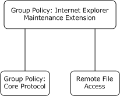
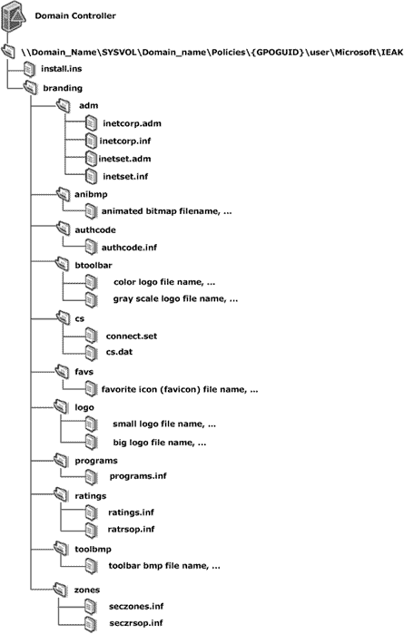

# [MS-GPIE]: Group Policy: Internet Explorer Maintenance Extension

Table of Contents

1 Introduction

- [1 Introduction](#Section_1)
  - [1.1 Glossary](#Section_1.1)
  - [1.2 References](#Section_1.2)
    - [1.2.1 Normative References](#Section_1.2.1)
    - [1.2.2 Informative References](#Section_1.2.2)
  - [1.3 Overview](#Section_1.3)
    - [1.3.1 Background](#Section_1.3.1)
    - [1.3.2 Internet Explorer Maintenance Extension Protocol Overview](#Section_1.3.2)
  - [1.4 Relationship to Other Protocols](#Section_1.4)
  - [1.5 Prerequisites/Preconditions](#Section_1.5)
  - [1.6 Applicability Statement](#Section_1.6)
  - [1.7 Versioning and Capability Negotiation](#Section_1.7)
  - [1.8 Vendor-Extensible Fields](#Section_1.8)
  - [1.9 Standards Assignments](#Section_1.9)

2 Messages

- [2 Messages](#Section_2)
  - [2.1 Transport](#Section_2.1)
  - [2.2 Message Syntax](#Section_2.2)
    - [2.2.1 SYSVOL Structure](#Section_2.2.1)

3 Protocol Details

- [3 Protocol Details](#Section_3)
  - [3.1 Administrative Tool Plug-in Details](#Section_3.1)
    - [3.1.1 Abstract Data Model](#Section_3.1.1)
      - [3.1.1.1 Administered GPO (Public)](#Section_3.1.1.1)
    - [3.1.2 Timers](#Section_3.1.2)
    - [3.1.3 Initialization](#Section_3.1.3)
    - [3.1.4 Higher-Layer Triggered Events](#Section_3.1.4)
    - [3.1.5 Message Processing Events and Sequencing Rules](#Section_3.1.5)
    - [3.1.6 Timer Events](#Section_3.1.6)
    - [3.1.7 Other Local Events](#Section_3.1.7)
  - [3.2 Client-Side Plug-in Details](#Section_3.2)
    - [3.2.1 Abstract Data Model](#Section_3.2.1)
      - [3.2.1.1 Client-Side State](#Section_3.2.1.1)
    - [3.2.2 Timers](#Section_3.2.2)
    - [3.2.3 Initialization](#Section_3.2.3)
    - [3.2.4 Higher-Layer Triggered Events](#Section_3.2.4)
      - [3.2.4.1 Process Group Policy](#Section_3.2.4.1)
    - [3.2.5 Message Processing Events and Sequencing Rules](#Section_3.2.5)
    - [3.2.6 Timer Events](#Section_3.2.6)
    - [3.2.7 Other Local Events](#Section_3.2.7)

4 Protocol Examples

- [4 Protocol Examples](#Section_4)
  - [4.1 File Formats](#Section_4.1)
    - [4.1.1 INS File Format](#Section_4.1.1)
    - [4.1.2 ADM File Format](#Section_4.1.2)
    - [4.1.3 INF File Format](#Section_4.1.3)
      - [4.1.3.1 File Format used by Seczones.INF, Authcode.INF, Ratings.INF, and Programs.INF](#Section_4.1.3.1)
        - [4.1.3.1.1 Part A](#Section_4.1.3.1.1)
        - [4.1.3.1.2 Part B](#Section_4.1.3.1.2)
      - [4.1.3.2 Seczrsop.INF File Format](#Section_4.1.3.2)
      - [4.1.3.3 Ratrsop.INF File Format](#Section_4.1.3.3)
    - [4.1.4 BMP File Format](#Section_4.1.4)
    - [4.1.5 ICO File Format](#Section_4.1.5)
    - [4.1.6 CONNECT.RAS File Format](#Section_4.1.6)
    - [4.1.7 CS.DAT File Format](#Section_4.1.7)
  - [4.2 INSTALL.INS Example](#Section_4.2)
  - [4.3 Examples of Seczones.INF, Authcode.INF, Ratings.INF, and Programs.INF](#Section_4.3)
    - [4.3.1 SECZONES.INF Example](#Section_4.3.1)
    - [4.3.2 AUTHCODE.INF Example](#Section_4.3.2)
    - [4.3.3 RATINGS.INF Example](#Section_4.3.3)
    - [4.3.4 PROGRAMS.INF Example](#Section_4.3.4)
  - [4.4 SECZRSOP.INF Example](#Section_4.4)
  - [4.5 RATRSOP.INF Example](#Section_4.5)

5 Security

- [5 Security](#Section_5)
  - [5.1 Security Considerations for Implementers](#Section_5.1)
  - [5.2 Index of Security Parameters](#Section_5.2)

6 Appendix A: Product Behavior

- [6 Appendix A: Product Behavior](#Section_6)

7 Change Tracking

- [7 Change Tracking](#Section_7)

For the legal notice and IP terms, see [LEGAL.md](../LEGAL.md).
Last updated: 6/1/2017.
See [Revision History](#revision-history) for full version history.

# 1 Introduction

This document specifies the Group Policy: Internet Explorer Maintenance Extension protocol.

Sections 1.5, 1.8, 1.9, 2, and 3 of this specification are normative. All other sections and examples in this specification are informative.

## 1.1 Glossary

This document uses the following terms:

**Active Directory**: A general-purpose network directory service. [**Active Directory**](#gt_active-directory) also refers to the Windows implementation of a directory service. [**Active Directory**](#gt_active-directory) stores information about a variety of objects in the network. Importantly, user accounts, computer accounts, groups, and all related credential information used by the Windows implementation of Kerberos are stored in [**Active Directory**](#gt_active-directory). [**Active Directory**](#gt_active-directory) is either deployed as Active Directory Domain Services (AD DS) or Active Directory Lightweight Directory Services (AD LDS). [MS-ADTS](../MS-ADTS/MS-ADTS.md) describes both forms. For more information, see [MS-AUTHSOD](../MS-AUTHSOD/MS-AUTHSOD.md) section 1.1.1.5.2, [**Lightweight Directory Access Protocol (LDAP)**](#gt_lightweight-directory-access-protocol-ldap) versions 2 and 3, Kerberos, and DNS.

**Administrative tool**: An implementation-specific tool, such as the Group Policy Management Console, that allows administrators to read and write policy settings from and to a [**Group Policy Object (GPO)**](#gt_group-policy-object-gpo) and policy files. The Group Policy Administrative tool uses the Extension list of a GPO to determine which Administrative tool extensions are required to read settings from and write settings to the logical and physical components of a GPO.

**American National Standards Institute (ANSI) character set**: A character set defined by a code page approved by the American National Standards Institute (ANSI). The term "ANSI" as used to signify Windows code pages is a historical reference and a misnomer that persists in the Windows community. The source of this misnomer stems from the fact that the Windows code page 1252 was originally based on an ANSI draft, which became International Organization for Standardization (ISO) Standard 8859-1 [[ISO/IEC-8859-1]](https://go.microsoft.com/fwlink/?LinkId=90689). In Windows, the ANSI character set can be any of the following code pages: 1252, 1250, 1251, 1253, 1254, 1255, 1256, 1257, 1258, 874, 932, 936, 949, or 950. For example, "ANSI application" is usually a reference to a non-[**Unicode**](#gt_unicode) or code-page-based application. Therefore, "ANSI character set" is often misused to refer to one of the character sets defined by a Windows code page that can be used as an active system code page; for example, character sets defined by code page 1252 or character sets defined by code page 950. Windows is now based on [**Unicode**](#gt_unicode), so the use of ANSI character sets is strongly discouraged unless they are used to interoperate with legacy applications or legacy data.

**Augmented Backus-Naur Form (ABNF)**: A modified version of Backus-Naur Form (BNF), commonly used by Internet specifications. ABNF notation balances compactness and simplicity with reasonable representational power. ABNF differs from standard BNF in its definitions and uses of naming rules, repetition, alternatives, order-independence, and value ranges. For more information, see [[RFC5234]](https://go.microsoft.com/fwlink/?LinkId=123096).

**client**: A client, also called a client computer, is a computer that receives and applies settings of a [**Group Policy Object (GPO)**](#gt_group-policy-object-gpo), as specified in [MS-GPOL](../MS-GPOL/MS-GPOL.md).

**client-side extension GUID (CSE GUID)**: A [**GUID**](#gt_globally-unique-identifier-guid) that enables a specific client-side extension on the Group Policy client to be associated with policy data that is stored in the logical and physical components of a [**Group Policy Object (GPO)**](#gt_group-policy-object-gpo) on the Group Policy server, for that particular extension.

**directory**: The database that stores information about objects such as users, groups, computers, printers, and the directory service that makes this information available to users and applications.

**fully qualified domain name (FQDN)**: An unambiguous domain name that gives an absolute location in the Domain Name System's (DNS) hierarchy tree, as defined in [[RFC1035]](https://go.microsoft.com/fwlink/?LinkId=90264) section 3.1 and [[RFC2181]](https://go.microsoft.com/fwlink/?LinkId=127732) section 11.

**globally unique identifier (GUID)**: A term used interchangeably with universally unique identifier (UUID) in Microsoft protocol technical documents (TDs). Interchanging the usage of these terms does not imply or require a specific algorithm or mechanism to generate the value. Specifically, the use of this term does not imply or require that the algorithms described in [[RFC4122]](https://go.microsoft.com/fwlink/?LinkId=90460) or [[C706]](https://go.microsoft.com/fwlink/?LinkId=89824) must be used for generating the [**GUID**](#gt_globally-unique-identifier-guid). See also universally unique identifier (UUID).

**Group Policy Object (GPO)**: A collection of administrator-defined specifications of the policy settings that can be applied to groups of computers in a domain. Each GPO includes two elements: an object that resides in the [**Active Directory**](#gt_active-directory) for the domain, and a corresponding file system subdirectory that resides on the sysvol DFS share of the Group Policy server for the domain.

**Group Policy Object (GPO) GUID**: A curly braced GUID string that uniquely identifies a [**Group Policy Object (GPO)**](#gt_group-policy-object-gpo).

**Group Policy Object (GPO) path**: A domain-based Distributed File System (DFS) path for a directory on the server that is accessible through the DFS/SMB protocols. This path will always be a [**Universal Naming Convention (UNC)**](#gt_universal-naming-convention-unc) path of the form: "\\<dns domain name>\sysvol\<dns domain name>\policies\<gpo guid>", where <dns domain name> is the DNS domain name of the domain and <gpo guid> is a [**Group Policy Object (GPO) GUID**](#gt_group-policy-object-gpo-guid).

**Group Policy server**: A server holding a database of [**Group Policy Objects (GPOs)**](#gt_group-policy-object-gpo) that can be retrieved by other machines. The [**Group Policy server**](#gt_group-policy-server) must be a domain controller (DC).

**Lightweight Directory Access Protocol (LDAP)**: The primary access protocol for [**Active Directory**](#gt_active-directory). Lightweight Directory Access Protocol (LDAP) is an industry-standard protocol, established by the Internet Engineering Task Force (IETF), which allows users to query and update information in a directory service (DS), as described in [MS-ADTS]. The Lightweight Directory Access Protocol can be either version 2 [[RFC1777]](https://go.microsoft.com/fwlink/?LinkId=90290) or version 3 [[RFC3377]](https://go.microsoft.com/fwlink/?LinkID=91337).

**policy target**: A user or computer account for which policy settings can be obtained from a server in the same domain, as specified in [MS-GPOL]. For user policy mode, the policy target is a user account. For computer policy mode, the policy target is a computer account.

**share**: A resource offered by a Common Internet File System (CIFS) server for access by CIFS clients over the network. A [**share**](#gt_share) typically represents a directory tree and its included files (referred to commonly as a "disk share" or "file share") or a printer (a "print share"). If the information about the [**share**](#gt_share) is saved in persistent store (for example, Windows registry) and reloaded when a file server is restarted, then the [**share**](#gt_share) is referred to as a "sticky share". Some [**share**](#gt_share) names are reserved for specific functions and are referred to as special [**shares**](#gt_share): IPC$, reserved for interprocess communication, ADMIN$, reserved for remote administration, and A$, B$, C$ (and other local disk names followed by a dollar sign), assigned to local disk devices.

**system volume (SYSVOL)**: A shared directory that stores the server copy of the domain's public files that must be shared for common access and replication throughout a domain.

**tool extension GUID or administrative plug-in GUID**: A GUID defined separately for each of the user policy settings and computer policy settings that associates a specific administrative tool plug-in with a set of policy settings that can be stored in a [**Group Policy Object (GPO)**](#gt_group-policy-object-gpo).

**Unicode**: A character encoding standard developed by the Unicode Consortium that represents almost all of the written languages of the world. The [**Unicode**](#gt_unicode) standard [[UNICODE5.0.0/2007]](https://go.microsoft.com/fwlink/?LinkId=154659) provides three forms (UTF-8, UTF-16, and UTF-32) and seven schemes (UTF-8, UTF-16, UTF-16 BE, UTF-16 LE, UTF-32, UTF-32 LE, and UTF-32 BE).

**Universal Naming Convention (UNC)**: A string format that specifies the location of a resource. For more information, see [MS-DTYP](../MS-DTYP/MS-DTYP.md) section 2.2.57.

**MAY, SHOULD, MUST, SHOULD NOT, MUST NOT:** These terms (in all caps) are used as defined in [[RFC2119]](https://go.microsoft.com/fwlink/?LinkId=90317). All statements of optional behavior use either MAY, SHOULD, or SHOULD NOT.

## 1.2 References

Links to a document in the Microsoft Open Specifications library point to the correct section in the most recently published version of the referenced document. However, because individual documents in the library are not updated at the same time, the section numbers in the documents may not match. You can confirm the correct section numbering by checking the [Errata](http://msdn.microsoft.com/en-us/library/dn781092.aspx).

### 1.2.1 Normative References

We conduct frequent surveys of the normative references to assure their continued availability. If you have any issue with finding a normative reference, please contact [dochelp@microsoft.com](mailto:dochelp@microsoft.com). We will assist you in finding the relevant information.

[MS-DTYP] Microsoft Corporation, "[Windows Data Types](../MS-DTYP/MS-DTYP.md)".

[MS-GPOL] Microsoft Corporation, "[Group Policy: Core Protocol](../MS-GPOL/MS-GPOL.md)".

[MS-GPREG] Microsoft Corporation, "[Group Policy: Registry Extension Encoding](../MS-GPREG/MS-GPREG.md)".

[RFC2119] Bradner, S., "Key words for use in RFCs to Indicate Requirement Levels", BCP 14, RFC 2119, March 1997, [http://www.rfc-editor.org/rfc/rfc2119.txt](https://go.microsoft.com/fwlink/?LinkId=90317)

[RFC4234] Crocker, D., Ed., and Overell, P., "Augmented BNF for Syntax Specifications: ABNF", RFC 4234, October 2005, [http://www.rfc-editor.org/rfc/rfc4234.txt](https://go.microsoft.com/fwlink/?LinkId=90462)

### 1.2.2 Informative References

[MS-FASOD] Microsoft Corporation, "[File Access Services Protocols Overview](#Section_1.3)".

[MS-WPO] Microsoft Corporation, "[Windows Protocols Overview](#Section_1.3)".

[MSDN-BMPST] Microsoft Corporation, "Bitmap Storage", [http://msdn.microsoft.com/en-us/library/dd183391(VS.85).aspx](https://go.microsoft.com/fwlink/?LinkId=222603)

[MSDN-ICO] Microsoft Corporation, "Icons in Win32", [http://msdn.microsoft.com/en-us/library/ms997538.aspx](https://go.microsoft.com/fwlink/?LinkId=90018)

[MSDN-INF] Microsoft Corporation, "About INF Files", [http://msdn.microsoft.com/en-us/library/aa376858.aspx](https://go.microsoft.com/fwlink/?LinkId=90025)

[MSDN-RAS2] Microsoft Corporation, "RASDIALPARAMS structure", [http://msdn.microsoft.com/en-us/library/aa377238.aspx](https://go.microsoft.com/fwlink/?LinkId=90072)

[MSDN-RAS] Microsoft Corporation, "RASENTRY structure", [http://msdn.microsoft.com/en-us/library/aa377274.aspx](https://go.microsoft.com/fwlink/?LinkId=90071)

[MSDN-SECZONES] Microsoft Corporation, "About URL Security Zones", [http://msdn.microsoft.com/en-us/library/ms537183.aspx](https://go.microsoft.com/fwlink/?LinkId=90660)

[MSDN-WININET1] Microsoft Corporation, "INTERNET_PER_CONN_OPTION_LIST structure", [http://msdn.microsoft.com/en-us/library/aa385146.aspx](https://go.microsoft.com/fwlink/?LinkId=90164)

[MSDN-WININET2] Microsoft Corporation, "INTERNET_PER_CONN_OPTION structure", [http://msdn.microsoft.com/en-us/library/aa385145.aspx](https://go.microsoft.com/fwlink/?LinkId=90165)

[MSFT-IEM] Microsoft Corporation, "Internet Explorer Maintenance Extension Technical Reference", March 2003, [http://technet2.microsoft.com/WindowsServer/en/Library/7393c49d-238e-433d-9193-ffe4f64b1e0f1033.mspx](https://go.microsoft.com/fwlink/?LinkId=90186)

[RFC1001] Network Working Group, "Protocol Standard for a NetBIOS Service on a TCP/UDP Transport: Concepts and Methods", RFC 1001, March 1987, [http://www.ietf.org/rfc/rfc1001.txt](https://go.microsoft.com/fwlink/?LinkId=90260)

[RFC1035] Mockapetris, P., "Domain Names - Implementation and Specification", STD 13, RFC 1035, November 1987, [http://www.ietf.org/rfc/rfc1035.txt](https://go.microsoft.com/fwlink/?LinkId=90264)

[RFC1123] Braden, R., "Requirements for Internet Hosts - Application and Support", RFC 1123, October 1989, [http://www.ietf.org/rfc/rfc1123.txt](https://go.microsoft.com/fwlink/?LinkId=90268)

[RFC2181] Elz, R., and Bush, R., "Clarifications to the DNS Specification", RFC 2181, July 1997, [http://www.ietf.org/rfc/rfc2181.txt](https://go.microsoft.com/fwlink/?LinkId=127732)

[RFC3986] Berners-Lee, T., Fielding, R., and Masinter, L., "Uniform Resource Identifier (URI): Generic Syntax", STD 66, RFC 3986, January 2005, [http://www.rfc-editor.org/rfc/rfc3986.txt](https://go.microsoft.com/fwlink/?LinkId=90453)

## 1.3 Overview

The Group Policy: Internet Explorer Maintenance Extension protocol enables administrators to assign custom Favorites, links, security, interface, and other settings to Internet Explorer as part of a [**Group Policy Object (GPO)**](#gt_group-policy-object-gpo). This enables administrators to enforce Internet-related security standards and provide a common browser interface within an organization.

### 1.3.1 Background

The Group Policy: Core Protocol Specification (as specified in [MS-GPOL](../MS-GPOL/MS-GPOL.md)) enables [**clients**](#gt_client) to discover and retrieve policy settings created by administrators of a domain. These settings are located in [**Group Policy Objects (GPOs)**](#gt_group-policy-object-gpo), which are assigned to [**policy target**](#gt_policy-target) accounts in [**Active Directory**](#gt_active-directory).

On each client, each GPO is interpreted and acted on by software components known as client-side plug-ins. The client-side plug-ins responsible for a given GPO are specified using an attribute on the GPO. This attribute specifies a list of [**globally unique identifier (GUID)**](#gt_globally-unique-identifier-guid) pairs. The first GUID of each pair is referred to as a [**client-side extension GUID (CSE GUID)**](#gt_client-side-extension-guid-cse-guid). The second GUID of each pair is referred to as a [**tool extension GUID**](#gt_88ad7745-bee6-47f7-ae98-6fac7c5ef330).

For each GPO that is applicable to a client, the client consults the CSE GUIDs listed in the GPO to determine which client-side plug-ins on the client handle the GPO. The client then invokes the client-side plug-ins to handle the GPO.

A client-side plug-in uses the contents of the GPO to retrieve settings specific to its class in a manner specific to its class. Once its class-specific settings are retrieved, the client-side plug-in uses those settings to perform class-specific processing.

### 1.3.2 Internet Explorer Maintenance Extension Protocol Overview

The participants in this protocol are the following:

- An administrative tool plug-in that is used to author and upload configuration settings (both policies and associated data files).
- A server acting as a generic binary large object (BLOB) store with no protocol-specific knowledge.
- A [**client**](#gt_client) with a client-side plug-in and a version of Internet Explorer.
The administrator can specify configuration information through a user interface provided by the administrative tool plug-in. The administrative tool plug-in then encodes the configuration information into one or more data files, and then copies the files into the generic BLOB store. The location of these files is stored in a [**GPO**](#gt_group-policy-object-gpo). The [**administrative tool**](#gt_administrative-tool) uses the Group Policy: Core Protocol to store this GPO in [**Active Directory**](#gt_active-directory).

The Group Policy: Core Protocol specifies how a client can learn of an updated policy (as specified in [MS-GPOL](../MS-GPOL/MS-GPOL.md) section 1.3.3) and, based on identifiers associated with each GPO, invoke an appropriate client-side plug-in. In the case of the Group Policy: Internet Explorer Maintenance Extension protocol, this client-side plug-in then retrieves the files contained in the GPO, copying them from a well-known location in the generic BLOB store ("<gpo path>\user\Microsoft\IEAK") to the client, where they will be processed later by Internet Explorer components.<1>

## 1.4 Relationship to Other Protocols

The Group Policy: Internet Explorer Maintenance Extension protocol is initiated only as part of the Group Policy: Core Protocol, as specified in [MS-GPOL](../MS-GPOL/MS-GPOL.md) section 1.3.3. The Group Policy: Internet Explorer Maintenance Extension protocol is dependent on the Group Policy: Core Protocol to provide it with the remote storage location for the configuration data, as specified in [MS-GPOL] and for transmitting Group Policy settings and instructions between the [**client**](#gt_client) and the Group Policy server. The Group Policy: Internet Explorer Maintenance Extension protocol is also indirectly dependent on the [**Lightweight Directory Access Protocol (LDAP)**](#gt_lightweight-directory-access-protocol-ldap) via the Group Policy: Core Protocol.

The Group Policy: Internet Explorer Maintenance Extension protocol uses remote file access to read and write files on the remote storage location. See [MS-WPO](#Section_1.3) section 6.4 for an overview of remote file access.

Figure 1: Group Policy: Internet Explorer Maintenance Extension protocol relationship diagram

## 1.5 Prerequisites/Preconditions

There are no prerequisites or preconditions for the Group Policy: Internet Explorer Maintenance Extension protocol beyond what is specified in Group Policy: Core Protocol.

## 1.6 Applicability Statement

The Group Policy: Internet Explorer Maintenance Extension protocol is applicable only within the Group Policy framework, as described in [MS-GPOL](../MS-GPOL/MS-GPOL.md).

## 1.7 Versioning and Capability Negotiation

The Group Policy: Internet Explorer Maintenance Extension protocol is not versioned and does not require any capability negotiation. It supports heterogeneous clients running different versions of the operating system or Internet Explorer browser.<2> However, some settings are not applicable for every version, and these are specifically mentioned in this document.

## 1.8 Vendor-Extensible Fields

The Group Policy: Internet Explorer Maintenance Extension protocol does not define any vendor-extensible fields.

## 1.9 Standards Assignments

The Group Policy: Internet Explorer Maintenance Extension protocol defines [**client-side extension GUID (CSE GUID)**](#gt_client-side-extension-guid-cse-guid) and tool extension [**GUID**](#gt_globally-unique-identifier-guid) standards assignments, as specified in [MS-GPOL](../MS-GPOL/MS-GPOL.md) section 1.8. The assignments are as shown in the following table.

| Parameter | Value |
| --- | --- |
| CSE GUID for client-side plug-in | {A2E30F80-D7DE-11d2-BBDE-00C04F86AE3B} |
| Tool extension GUID (user policy settings) | {FC715823-C5FB-11D1-9EEF-00A0C90347FF} |

# 2 Messages

## 2.1 Transport

All messages are exchanged by copying files, using remote file access as described in [MS-FASOD](#Section_1.3).

## 2.2 Message Syntax

### 2.2.1 SYSVOL Structure

The file store for Group Policy: Internet Explorer Maintenance Extension protocol files MUST be located in [**SYSVOL**](#gt_system-volume-sysvol) in the [**directory**](#gt_directory) structure shown in the figure below. Each subdirectory of the "branding" directory is optional, as is each file contained therein; but if the subdirectory is present, it MUST be named and located as depicted in the figure. Additional files may be placed in some of the subdirectories of the "branding" directory. Specifically, a file name followed by ",..." indicates that other files may exist in the directory.

Figure 2: SYSVOL structure for Group Policy: Internet Explorer Maintenance Extension protocol

# 3 Protocol Details

## 3.1 Administrative Tool Plug-in Details

The administrative plug-in mediates between a user interface (UI) and a generic BLOB store that contains data files. Its purpose is to receive configuration information from a UI and to write data files to a generic BLOB store.

### 3.1.1 Abstract Data Model

This section describes a conceptual model of possible data organization that an implementation maintains to participate in this protocol. The described organization is provided to facilitate the explanation of how the protocol behaves. This document does not mandate that implementations adhere to this model as long as their external behavior is consistent with that described in this document.

The administrative plug-in relies on a collection of data files described in section [2.2](#Section_2.2) and stored in the generic BLOB store. The administrative plug-in reads in these data files from the BLOB store and displays them to an administrator through a UI.

An administrator can then use the UI to make further configuration changes and the administrative plug-in will copy the resultant data files to the BLOB store.

This conceptual data can be implemented using a variety of techniques. An implementation can implement such data using any method.

#### 3.1.1.1 Administered GPO (Public)

The Administered GPO is generated by [MS-GPOL](../MS-GPOL/MS-GPOL.md) (as specified in section 3.3.1.3) and is read by Group Policy: Internet Explorer Maintenance Extension. The [**Group Policy Object (GPO) path**](#gt_group-policy-object-gpo-path) is used to determine the destination of the data files being copied to a BLOB store.

### 3.1.2 Timers

None.

### 3.1.3 Initialization

When the administrative tool plug-in is initialized, it retrieves the extension's GPO settings as described in [MS-GPOL](../MS-GPOL/MS-GPOL.md) section 2.2.7, and uses remote file access to read the contents of the various configuration files which are located under [**SYSVOL**](#gt_system-volume-sysvol) as described in section [2.2](../MS-GPOL/MS-GPOL.md).

### 3.1.4 Higher-Layer Triggered Events

Whenever an administrator changes a setting, the administrative tool plug-in MUST write the configuration files to the file [**share**](#gt_share) using remote file access. The install.ins file MUST reside under "<gpo path>\user\Microsoft\IEAK\". The remaining configuration files MUST reside under the "<gpo path>\user\Microsoft\IEAK\branding" [**directory**](#gt_directory), as specified in section [2.2](#Section_2.2).

### 3.1.5 Message Processing Events and Sequencing Rules

The administrative tool plug-in MUST write all the files to [**SYSVOL**](#gt_system-volume-sysvol), as specified in [MS-GPOL](../MS-GPOL/MS-GPOL.md), using remote file access. If a copy fails, the administrative tool plug-in MUST display to the user that the policy update has failed. After every creation, modification, or deletion that affects a GPIE file on SYSVOL, the [**administrative tool**](#gt_administrative-tool) MUST invoke the Group Policy Extension Update task ([MS-GPOL] section 3.3.4.4, Group Policy Extension Update).

### 3.1.6 Timer Events

None.

### 3.1.7 Other Local Events

None.

## 3.2 Client-Side Plug-in Details

The client-side plug-in for the Group Policy: Internet Explorer Maintenance Extension protocol retrieves settings, and controls how Internet Explorer behaves on [**client**](#gt_client) computers that receive settings. All relevant files MUST first be copied from the file store to the client.

### 3.2.1 Abstract Data Model

This section describes a conceptual model of possible data organization that an implementation maintains to participate in this protocol. The described organization is provided to facilitate the explanation of how the protocol behaves. This document does not mandate that implementations adhere to this model as long as their external behavior is consistent with that described in this document.

#### 3.2.1.1 Client-Side State

The client-side plug-in maintains no persistent state. During processing, the New or Changed GPO list passed as a parameter is enumerated and then discarded (see section [3.2.5](#Section_3.1.5)).

### 3.2.2 Timers

None.

### 3.2.3 Initialization

None.

### 3.2.4 Higher-Layer Triggered Events

#### 3.2.4.1 Process Group Policy

This extension is launched by the Group Policy: Core Protocol, which invokes the Process Group Policy event, whose abstract interface is specified in [MS-GPOL](../MS-GPOL/MS-GPOL.md) section 3.2.4.1, to apply policies that are handled by this extension.

### 3.2.5 Message Processing Events and Sequencing Rules

For each GPO in the New or Changed GPO list, the client-side plug-in MUST copy, using remote file access, the install.ins file from "<gpo path>\user\Microsoft\IEAK\". If the file is not found, the processing of the current [**GPO path**](#gt_group-policy-object-gpo-path) MUST be skipped.

The client-side plug-in MUST then copy, using remote file access, the "<gpo path>\user\Microsoft\IEAK\branding" [**directory**](#gt_directory), including all subdirectories and any files contained in those subdirectories.

The SecurityToken passed by the Group Policy: Core Protocol SHOULD be used to impersonate the logged-on user while copying these files as specified in [MS-DTYP](../MS-DTYP/MS-DTYP.md) section 2.7, Impersonation Abstract Interfaces.<3>

The destination of these file copies is implementation-specific.<4>

### 3.2.6 Timer Events

None.

### 3.2.7 Other Local Events

None.

# 4 Protocol Examples

The following sections give examples of the types of files stored on the BLOB server by the authoring components in Windows and ultimately consumed by Internet Explorer. Examples of informative descriptions of the individual file formats for each of the files under the "<gpo path>\user\Microsoft\IEAK" folder in SYSVOL are first, followed by examples of the INSTALL.INS, SECZONES.INF, SECZRSOP.INF, and RATRSOP.INF files.

## 4.1 File Formats

This section specifies the individual file formats for each of the files under the "<gpo path>\user\Microsoft\IEAK" folder in [**SYSVOL**](#gt_system-volume-sysvol).

### 4.1.1 INS File Format

The install.ins file is a file divided into various formatted sections and written using the [**ANSI character set (ANSI)**](#gt_100cd8a6-5cb1-4895-9de6-e4a3c224a583). Each section is designed for a particular purpose, and the entries in a section are name-value pairs separated by a newline character. The name and value are separated by an equal (=) sign. The [**Augmented Backus-Naur Form (ABNF)**](#gt_augmented-backus-naur-form-abnf) definition (as specified in [[RFC4234]](https://go.microsoft.com/fwlink/?LinkId=90462)) for the install.ins file format is as follows:

InsFile = *Section

Section = SectionLine *ValueLine

SectionLine = "[" SectionName "]" LineBreak

SectionName = (ALPHA / %d95) *(ALPHA / DIGIT / %d95)

ValueLine = ValueName "=" Value LineBreak

ValueName = (ALPHA / %d95) *(ALPHA / DIGIT / %d95)

Value = String/DquotedString

String = 1*%d33-126

DQuotedString = %d34 1*(%d32-33/%d35-126) %d34

LineBreak = %d13.10

The remainder of this section specifies additional restrictions for the SectionName, ValueName, and Value strings, and their interrelationships (for example, a certain ValueName will be legal only after a certain SectionName has appeared). In specifying legal data for Values, the following types are used in this section:

**Filename:** Indicates that the value is a file name, represented as an ANSI string.

**File path:** Indicates that the value is the full path name of a file, represented as an ANSI string. It is allowed to be either a local path to a file on the same machine or a [**UNC**](#gt_universal-naming-convention-unc) path to a file on another machine.

**Boolean:** Indicates that the value is either 0 or 1 as an ANSI string.

**String:** Indicates that the value is an ANSI string that does not contain a newline.

**URL:** Indicates that the value is a URL (for more information, see [[RFC3986]](https://go.microsoft.com/fwlink/?LinkId=90453)).

**Numeric:** Indicates that the value is an integer between 0 and 2^32-1 expressed in decimal as an ANSI string.

**Hexadecimal:** Indicates that the value is an integer between 0 and 2^32-1 expressed in hexadecimal as an ANSI string.

**Hostname:** Indicates that the value is the name of another computer. It is allowed to be either a [**fully qualified domain name (FQDN)**](#gt_fully-qualified-domain-name-fqdn) (for more information, see [[RFC1035]](https://go.microsoft.com/fwlink/?LinkId=90264) section 3.1 or [[RFC2181]](https://go.microsoft.com/fwlink/?LinkId=127732) section 11) or a NetBIOS (for more information, see [[RFC1001]](https://go.microsoft.com/fwlink/?LinkId=90260)) name.

**IP Address:** Indicates that the value is an IPv4 address as an ANSI string (for more information, see [[RFC1123]](https://go.microsoft.com/fwlink/?LinkId=90268) section 2.1).

The following table specifies sections, corresponding names, and data types for the assigned values for the install.ins file. The description and sample value columns are for informative purposes only (not normative purposes). That is, the values of these settings are not to be interpreted by the Group Policy: Internet Explorer Maintenance Extension protocol. These values are merely applied as-is to Internet Explorer, which can interpret them in a way that is independent of what protocol or mechanism was used to configure them.<5>

| SectionName | ValueName | Value type | Sample value | Description |
| --- | --- | --- | --- | --- |
| [Animation] | Big_Name | Filename | 38ani.bmp | The name of a file containing a large animation to be used by Internet Explorer. This is equal to the last component of the Big_Path entry. |
| - | Big_Path | File path | C:\My Documents\Branding\38ani.bmp | The full path (local or remote) of a file containing an animation to be used by Internet Explorer. The file name component is equal to the value of the Big_Name entry. |
| - | DoAnimation | Boolean | 1 | Indicates whether or not Internet Explorer is to customize the animation. |
| - | Small_Name | Filename | 22ani.bmp | File name of bitmap file that contains the frames for the 22x22 animation. |
| - | Small_Path | File path | C:\My Documents\Branding\22ani.bmp | Full path to the 22x22 icon animation bitmap file. |
| [ActiveSetup] | WizardBitmap | File path | C:\My Documents\Branding\wizard.bmp | Full path of a bitmap file that can be displayed by the Internet Explorer Setup Wizard. |
| - | WizardBitmapTop | File path | C:\My Documents\Branding\wizardtop.bmp | Full path of a bitmap file that can be displayed by the Internet Explorer Setup Wizard. |
| - | WizardTitle | String | Custom Browser Setup | Text to appear in the Internet Explorer Setup Wizard title bar. |
| [ActiveSetupSites] | SiteName0 | String | Microsoft Download Page | Friendly name of the download site to be used by Internet Explorer. |
| - | SiteRegion0 | String | Northwest Region | Friendly name of the geographical region in which the download site is located. |
| - | SiteURL0 | URL | http://www.microsoft.com/ie5/download/northwest | URL of the download site. |
| [Big_Logo] | Name | Filename | static38x38.bmp | Name of the bitmap file containing an icon that can be displayed by Internet Explorer. |
| - | Path | File Path | C:\My Documents\Branding\static38x38.bmp | Full path to the bitmap file containing the icon. The file name component is equal to the value of the Name entry above. |
| [Branding] | CabsURLPath | File path | http://example | URL path of cabinet files |
| - | CMBitmapName | Filename | - | Connection manager custom bitmap file name to be used by Internet Explorer. |
| - | CMBitmapPath | File path | - | Full path to connection manager custom bitmap file. |
| - | CMProfileName | Filename | - | Name of connection manager profile to be used by Internet Explorer. |
| - | CMProfilePath | File path | - | Full path to connection manager profile. The file name component is equal to the value of the CMProfileName entry above. |
| - | CMUseCustom | Boolean | 0 | Indicates whether or not a custom connection manager profile is to be used by Internet Explorer. |
| - | CompanyName | String | Custom Company Name | Name of company to be used by Internet Explorer. |
| - | CompatibilityModeOn | Boolean | 1 | A value of 1 indicates that Internet Explorer is to enable Compatibility Mode for all sites. |
| - | Custom_Key | String | MICROSO | A value of "MICROSO" will cause any custom branding to be removed from Internet Explorer. |
| - | DisableSuggestedSites | Boolean | 1 | A value of 1 indicates that Internet Explorer is to disable the Suggested Sites feature. |
| - | EncodeFavs | Boolean | 0 | A value of 1 indicates that Internet Explorer is to interpret Favorites settings as Internet Explorer 5 did. |
| - | FavoritesDelete | Numeric | 0x89 | Set this value to 0x89 to tell Internet Explorer to remove all pre-existing Favorites. |
| - | FavoritesOnTop | Boolean | 1 | A value of 1 indicates that new Favorites are to be added at the top of the Favorites menu. A value of 0 indicates that new Favorites are to be added at the bottom. |
| - | IE4 Welcome Msg | Boolean | 1 | Indicates to go to a welcome page the first time that the browser is opened. |
| - | InsVersion | String | 2010.03.28.02 | Version of the INS file. |
| - | Language ID | Numeric | 1033 | Code page of the language used by Internet Explorer. |
| - | Language Locale | String | EN | Friendly name for locale of the version of Internet Explorer being customized. |
| - | NoDial | Boolean | 0 | A value of 1 indicates that Internet Explorer is not to use any kind of an IEAK-based sign-up process. A value of 0 indicates that it is to use an IEAK-based sign-up process.. |
| - | NoFavoriteBar | Boolean | 1 | A value of 1 indicates that Internet Explorer is not to populate the Favorites Bar with default content. |
| - | NoIELite | Boolean | 0 | A value of 1 if the user wants the Internet Explorer Active Setup Wizard to optimize for download, using existing files if possible. |
| - | NoRSSFeeds | Boolean | 1 | A value of 1 indicates that Internet Explorer is not to install default RSS feeds. |
| - | NoSearchGuide | Boolean | 1 | A value of 1 indicates that Internet Explorer is not to offer a link to more search providers. |
| - | Platform | Numeric | 6 | Indicates the platform and architecture being targeted by this package: 32-bit Windows XP = 1, 32-bit Windows Server 2003 = 2, 64-bit Windows Server 2003 = 4, 32-bit Windows Vista = 3, 64-bit Windows Vista = 5, 32-bit Windows 7 = 6, 64-bit Windows 7 = 7. |
| - | RestartOption | Numeric | 1 | A value of 1 indicates that the custom package is to invoke Internet Explorer setup with the "/norestart" argument; a value of 2, with the "/forcerestart" argument. |
| - | SilentInstall | Boolean | 1 | A value of 1 indicates that the custom package is to invoke Internet Explorer setup with the "/passive" argument |
| - | StealthInstall | Boolean | 1 | A value of 1 indicates that the custom package is to invoke Internet Explorer setup with the "/quiet" argument. |
| - | Toolbar Bitmap | File path | - | The full path of the bitmap that is to appear on the Internet Explorer toolbar. |
| - | Type | Numeric | 2 | The type of customization being used by Internet Explorer: 2 = Corporate Administrator, 1 = Internet Service Provider, 0 = Internet Content Provider. |
| - | User Agent | String | Acme v1.1 | String to be appended to default User Agent string used by Internet Explorer. |
| - | Version | String | 5,0,0,1 | Target version of Internet Explorer. |
| - | Win32DownloadSite | URL | 0 | URL from which the Internet Explorer Setup file will be downloaded. |
| - | Window_Title | String | Microsoft Internet Explorer provided by Custom Company | Customized window title for Internet Explorer. |
| - | Window_Title_CN | String | Custom Company Name | The name to be appended to the Internet Explorer window title. |
| - | Wizard_Version | String | 8.0.0.1234 | Indicates the version of the IEAK wizard that produced the INS file. |
| - | GPVersion | String | 6.0.6001.16474 | Version of the software (IEM Tool Extension) that created the INS file. |
| [BrowserToolbars] | Action0 | File path | c:\windows\notepad.exe | The full path of a command to be executed for a custom toolbar button in Internet Explorer. |
| - | Caption0 | String | Sample | A caption for the custom toolbar button in Internet Explorer. |
| - | DeleteButtons | Boolean | 1 | Indicates whether or not to delete existing custom Internet Explorer toolbar buttons on install. |
| - | HotIcon0 | File path | C:\My Documents\Branding\Icons\hoticon.ico | The highlighted icon to appear in the button when the pointer is over the button in Internet Explorer. |
| - | Icon0 | File path | C:\My Documents\Branding\Icons\icon.ico | The gray icon to appear in the button when the pointer is not over the button in Internet Explorer. |
| - | Show0 | Boolean | 1 | Displays the new toolbar button on the toolbar by default. |
| - | ToolTipText0 | String | Click the sample button. | ToolTip text for the custom button. |
| [CabSigning] | InfoURL | URL | http://www.contoso.com/moreinfo.htm | The URL to appear on the certificate dialog in Internet Explorer. |
| - | Name | String | Microsoft | The company name that is associated with the certificate. |
| - | pvkFile | File path | c:\key.pvk | The full path of a private key file to be used by Internet Explorer. |
| - | spcFile | File path | c:\cert.spc | The full path of the actual certificate file. |
| [CDCustomFiles] | InstallIEVersion | String | 7,0,0,0 | Specifies the latest version of Internet Explorer to which this CD-based install will apply. |
| [Channel Add] | Category | Boolean | 0 | A value of 1 indicates that there will be only one Internet Explorer channel category; for multiple channel categories, set this value to 0. |
| - | CDFUrl0 | URL | http://server/sample.cdf | URL of the channel's .cdf file to be used by Internet Explorer. |
| - | ChBmpPath0 | File Path | sample.bmp | The full path of a bitmap for the channel, to appear in the Channel bar. |
| - | ChIconPath0 | File Path | sample.ico | The full path of an icon for the channel. |
| - | ChPreloadUrlName0 | Filename | sample.cdf | The name of .cdf file. |
| - | ChPreloadUrlPath0 | File Path | C:\WINDOWS\WEB\sample.cdf | Full path to .cdf file. The file name component is equal to the value of the ChPreloadUrlName0 entry above. |
| - | ChTitle0 | String | Sample Custom Channel | Title for the channel. |
| - | No Channels | Boolean | 1 | No channels indicates that no channels will be added. |
| [ConnectionSettings] | ConnectName0 | String | Microsoft | Name for connection to be used by Internet Explorer. |
| - | DeleteConnectionSettings | Boolean | 0 | Set this to 1 to remove the existing Internet Explorer connection settings. |
| - | EnableAutodial | Boolean | 0 | A value of 1 indicates that Internet Explorer is to always dial the default connection. |
| - | NoNetAutodial | Boolean | 0 | A value of 1 indicates that Internet Explorer is to dial whenever a network connection is not present. |
| - | Option | Boolean | 0 | A value of 1 indicates that the IEAK is to import the current connection settings and install them on target machines. |
| [Custom Branding] | Branding | URL | http://www.cohowinery.com/cabs/branding.cab,1998.09.26.03,-1,0 | URL to branding cab to be used by Internet Explorer. |
| [Custom Wallpaper] | File0 | Filename | wallpaper.htm | The name of an HTML file for custom wallpaper to be used by Internet Explorer. |
| - | File1 | Filename | wallpaper.gif | The name of a file referenced in the HTML above. |
| - | NumFiles | Numeric | 2 | Total number of files for custom wallpaper. |
| [DesktopObjects] | Channel Bar | Boolean | 1 | Displays the Channel bar on Internet Explorer startup. |
| - | Delete Old Channels | Boolean | 1 | Indicates to delete existing channels. |
| - | Desktop Component URL | URL | http:// | URL to the desktop component being added. |
| - | Desktop Wallpaper Path | File path | C:\My Documents\Branding\wallpapr.bmp | Path to the desktop wallpaper to be used by Internet Explorer. |
| - | Option | Boolean | 1 | Set this to 1 if using any desktop customizations. |
| [Device] | Type | String | modem | The type of connection being used for setup. |
| [ExtRegInf] | chat | String | *,chat.inf,DefaultInstall | INF file and install mode for Internet Explorer components. |
| [FavoritesEx] | IconFile1 | File Path | c:\windows\temp\iedktemp\branding\favs\news.ico | Icon for Favorite to be used by Internet Explorer. |
| - | Offline1 | Boolean | 1 | Indicates if Internet Explorer is to make the Favorite available for offline browsing. |
| - | Title1 | String | fav name.url | Title of the Favorite. |
| - | Url1 | URL | http://fav url | URL of the Favorite. |
| [Favorites] | fav name.url | URL | http://fav url | The ValueName in this setting is the Internet Explorer Favorite name, and the value is the Internet Explorer Favorite URL. |
| [HideCustom] | [**GUID**](#gt_globally-unique-identifier-guid) | Boolean | 0 | The ValueName in this setting is the GUID for the component. A value of 1 indicates that it is to be hidden on the Internet Explorer custom screen, and 0 if not. |
| [ICW_IEAK] | Header_Bitmap | File path | C:\My Documents\Branding\ICW_Header | The file path of a custom header bitmap for the Internet Explorer Internet Connection Wizard. |
| - | Watermark_Bitmap | File path | C:\My Documents\Branding\ICW_Watermark | The file path of a custom watermark bitmap for the Internet Explorer Internet Connection Wizard. |
| [IEAKLite] | Certificate Customization | Boolean | 1 | A value of 1 indicates that the IEAK wizard is to show the "Certificate Customization" page. |
| - | Sign-up Settings | Boolean | 1 | A value of 1 indicates that the IEAK wizard is to show the "Sign-up Settings" page. |
| [Media] | Build_BrandingOnly | Boolean | 1 | A value of 1 indicates that the IEAK will build a branding-only package. |
| - | Build_CD | Boolean | 0 | A value of 1 indicates that the IEAK will build a CD package. |
| - | Build_LAN | Boolean | 0 | A value of 1 indicates that the IEAK will build a LAN package. |
| [Proxy] | FTP_Proxy_Server | String | proxy | Host name for proxy server to be used by Internet Explorer. |
| - | Gopher_Proxy_Server | String | proxy | Host name for proxy server. |
| - | HTTP_Proxy_Server | String | proxy | Host name for proxy server. |
| - | Proxy_Enable | Boolean | 0 | If set, indicates to use a proxy server. |
| - | Proxy_Override | String | <local> | Host name for proxy server. |
| - | Secure_Proxy_Server | String | proxy | Host name for proxy server. |
| - | Socks_Proxy_Server | String | proxy | Host name for proxy server. |
| - | Use_Same_Proxy | Boolean | 1 | Use one proxy server for all services. |
| [Scripting] | Name | Filename | dialup.scp | File name of dial-up networking script used by Internet Explorer. |
| - | Name16 | Filename | dialup.scp | File name of dial-up networking script (16 bit). |
| - | Name32 | Filename | dialup.scp | File name of dial-up networking script (32 bit). |
| - | Path16 | File path | c:\scripts\dialup.scp | Full path to 16-bit script. |
| - | Path32 | File path | c:\scripts\dialup.scp | Full path to 32-bit script. |
| [Script_File] | 1 | String | First line of script file | Actual text of the script file to be used by Internet Explorer. |
| [Security Imports] | ImportAuthCode | Boolean | 0 | If set, Internet Explorer is to import the existing Authenticode settings. |
| - | ImportRatings | Boolean | 0 | If set, Internet Explorer is to import the existing Content Ratings settings. |
| - | ImportSecZones | Boolean | 0 | If set, Internet Explorer is to import the existing Security Zones settings. |
| - | ImportSiteCert | Boolean | 0 | If set, Internet Explorer is to import existing site certificate authorities. |
| - | TrustedPublisherLock | Boolean | 1 | A value of 1 indicates that Internet Explorer is to enable Trusted Publisher Lockdown, which prevents users from adding new trusted publishers. |
| - | Win16SiteCerts | Boolean | 0 | Use site certificates for 16-bit Windows systems. |
| [Server] | Disable_LCP | String | yes / no | Default settings for Internet connection to be used by Internet Explorer. |
| - | Negotiate_IPX/SPX | String | yes / no | Internet Explorer is to use IPX protocol. |
| - | Negotiate_NetBEUI | String | yes / no | Use NetBEUI protocol. |
| - | Negotiate_TCP/IP | String | yes / no | Use TCP/IP protocol. |
| - | Network_Logon | String | yes / no | Internet Explorer is to log on to the network. |
| - | PW_Encrypt | String | yes / no | Internet Explorer is to use encrypted passwords. |
| - | SW_Compress | String | yes / no | Internet Explorer is to use software compression. |
| - | SW_Encrypt | String | yes / no | Require data encryption. |
| - | Type | String | ppp | Server type, such as ppp. |
| [Signature] | Signature_Text | String | This is fun\n | Text of signature. |
| - | Use_Signature | Boolean | 1 | If set, indicates to use the signature in the Signature_Text entry above. |
| [SignupFiles] | file0 | Filename | cancel.ins | File name of signup INS to be used by Internet Explorer. |
| [Small_Logo] | Name | Filename | static22x22.bmp | Name of 22x22 pixel bitmap file for icon to appear in upper right corner of Internet Explorer. |
| - | Path | File path | C:\My Documents\Branding\static22x22.bmp | Full path to the small logo bitmap file. The file name component is equal to the value of the Name entry above. |
| [TCP/IP] | DNS_Address | IP Address | 127.0.0.1 | IP number of DNS server that Internet Explorer is to use. |
| - | DNS_Alt_Address | IP Address | 127.0.0.1 | IP number of alternate that DNS server to use. |
| - | Gateway_On_Remote | String | yes / no | Use remote gateway. |
| - | IP_Header_Compress | String | yes / no | Use IP header compression. |
| - | Specify_IP_Address | String | yes / no | Specify an IP address to use. |
| - | Specify_Server_Address | String | yes / no | Specify a server address to use. |
| [URL] | AutoConfig | Boolean | 1 | Set this to 1 to tell Internet Explorer to use an auto-configured proxy. |
| - | AutoConfigJSURL | URL | http://auto proxy url | URL of JS format auto-proxy file used by Internet Explorer. |
| - | AutoConfigTime | Numeric | 99 | AutoConfig after this many minutes. |
| - | AutoConfigURL | URL | http://auto config url | The URL of auto-proxy file used by Internet Explorer. |
| - | AutoDetect | Boolean | 1 | A value of 1 indicates that Internet Explorer is to automatically detect configuration settings. |
| - | FirstHomePage | URL | http://custom welcome page | Page to browse to on first run of customized browser. |
| - | Help_Page | URL | http://online support | URL of the Help page to be used by Internet Explorer. |
| - | Home_Page | URL | http://homepage | URL for the default home page to be used by Internet Explorer. |
| - | NoWelcome | Boolean | 1 | Do not display a welcome page the first time that Internet Explorer is used. |
| - | Quick_Link_1 | URL | http://www.microsoft.com/isapi/redir.dll?prd | Quick link URL. |
| - | Quick_Link_1_Name | String | Best of the Web.url | Quick link name. |
| - | Quick_Link_2 | URL | http://www.microsoft.com/isapi/redir.dll?prd | Quick link URL. |
| - | Quick_Link_2_Name | String | Channel Guide.url | Quick Link name. |
| - | Quick_Link_X | URL | http://link url | Quick link URL. |
| - | Quick_Link_X_Icon | File path | c:\windows\temp\iedktemp\branding\favs\news.ico | Quick link icon. |
| - | Quick_Link_X_Name | String | News | Quick link name. |
| - | Quick_Link_X_Offline | Boolean | 1 | If set, Internet Explorer is to make the quick link available for offline browsing. |
| - | Search_Page | URL | http://searchpane | Default search page to be used by Internet Explorer. |
| - | Signup | File path | signup.htm | Path to page with link to INS file for signup server. |
| - | UseLocalIns | Boolean | 0 | If set, Internet Explorer is to use a local INS file. |

### 4.1.2 ADM File Format

This file format applies to Inetcorp.adm and Inetset.adm under [**SYSVOL**](#gt_system-volume-sysvol). This file format is specified in [MS-GPREG](../MS-GPREG/MS-GPREG.md) section 2.2.2.1.

### 4.1.3 INF File Format

This file format applies to all INF files under [**SYSVOL**](#gt_system-volume-sysvol). This file format is specified by the following [**ABNF**](#gt_augmented-backus-naur-form-abnf) format. For examples of uses of INF files, see [[MSDN-INF]](https://go.microsoft.com/fwlink/?LinkId=90025).

For informative references for the description of Internet security-related fields used in the tables in the following sections, see [[MSDN-SECZONES]](https://go.microsoft.com/fwlink/?LinkId=90660).

InfFile = *Section

Section = SectionLine *ValueLine

SectionLine = "[" SectionName "]" LineBreak

SectionName = (ALPHA/%d95) *(ALPHA/DIGIT/%d95)

ValueLine = *(ValueName "=") Values LineBreak

Values = [Value] *("," [Value])

ValueName = (ALPHA/DIGIT/%d95) *(ALPHA/DIGIT/%d95/%d44)

Value = String/DquotedString

String = 1*%d33-126

DQuotedString = %d34 1*(%d32-33/%d35-126) %d34

LineBreak = %d13.10

For more information about INF files, see [MSDN-INF].

#### 4.1.3.1 File Format used by Seczones.INF, Authcode.INF, Ratings.INF, and Programs.INF

An informative description of the specific relevant setting names and legal values for these file formats follows, using the definitions of Value type from section [4.1.1](#Section_4.1.1). An example of this file format is given in section [4.3](#Section_4.3).

This description has been broken up into two logical parts: Part A and Part B. This division was made for the clarity of this documentation. In the protocol implementation, there is no separation marker or symbol placed between these parts. Part B seamlessly follows Part A of the file.

##### 4.1.3.1.1 Part A

Part A of seczones.inf is formed by sections and name-value pairs, similar in syntax to the INSTALL.INS file described above in section [4.1.1](#Section_4.1.1). The remainder of this section specifies additional restrictions for the SectionName, ValueName, and Value strings, and their interrelationships (for example, a certain ValueName will be legal only after a certain SectionName has appeared). In specifying legal data for Values, the same types are used as in section 4.1.1.

| SectionName | ValueName | Value type | Sample value | Description |
| --- | --- | --- | --- | --- |
| Version | - | - | - | - |
| - | Signature | String | $Chicago$ | Signature of an INF file |
| - | AdvancedINF | Numeric.Numeric | 2.5 | Version of the INF file format |
| DefaultInstall | - | - | - | - |
| - | RequiredEngine | String ',' String | SetupAPI,"Fatal error" | First string is the name of the library (DLL) which is loaded for setup functions, while the second string is the error string which is logged, in case the specified library could not be loaded. |
| - | CustomDestination | String | CustInstDestSection | This is exactly as shown. |
| - | AddReg | Comma separated list of Strings. | AddReg.HKLM,AddReg.HKCU | Each of the Strings in this list refer to a section name in Part B (section [4.1.3.1.2](#Section_4.1.3.1.2)). |
| CustInstDestSection | - | - | - | - |
| - | 49000,49001,49002,49003 | String,Numeric | ProgramFilesDir,21 | A reference to a section name in the part B of this file followed by an integer. |
| - | 49100,49101,49102,49103 | String,Numeric | IEDir,21 | A reference to a section name in the Part B of this file followed by an integer. |

##### 4.1.3.1.2 Part B

This part (Part B) details the sections that are already named in the previous part (Part A). For each section, the section heading is followed by a set of entries describing a registry key or value. Each entry is a comma-separated list of values terminated by a newline. Each such entry is of the following form:

RegistryRoot, [subkey], [value-entry-name], [flags], [value]

**RegistryRoot**

The RegistryRoot is non-null, while subsequent entries are optional. The comma separators are not optional, so the absence of one of these is indicated by two commas ",,". The RegistryRoot is one of the following entries:

| Short name | Long name |
| --- | --- |
| HKCR | HKEY_CLASSES_ROOT |
| HKCU | HKEY_CURRENT_USER |
| HKLM | HKEY_LOCAL_MACHINE |

**subkey**

Optional. Identifies the subkey to set. Has the following form: key1\key2\key3....

**value-entry-name**

Optional. This value either names an existing value entry in the given (existing) subkey or creates the name of a new value entry to be added in the specified subkey, whether the value-entry-name already exists or is a new key to be added to the registry. (If this is omitted for a string-type value, the value-entry-name is the default "unnamed" value entry for this key.)

**flags**

This optional hexadecimal value, expressed as an OR'd bitmask of system-defined low-word and high-word flag values, defines the data type for a value entry and/or controls the add-registry operation. Bitmask values for each of these flags are as follows:

0x00000001 (FLG_ADDREG_BINVALUETYPE)

The given value is "raw" data. (This value is identical to the

FLG_ADDREG_TYPE_BINARY.)

0x00000002 (FLG_ADDREG_NOCLOBBER)

Prevent a given value from replacing the value of an existing

value entry.

0x00000004 (FLG_ADDREG_DELVAL)

Delete the given subkey from the registry, or delete the

specified value-entry-name from the specified registry

subkey.

0x00000000 (FLG_ADDREG_TYPE_SZ)

The given value entry and/or value is of type REG_SZ. Note that

this is the default type for a specified value entry, so

the flags value can be omitted from any reg-root= line in

an add-registry section that operates on a value entry of

this type.

0x00010000 (FLG_ADDREG_TYPE_MULTI_SZ)

The given value entry and/or value is of the registry type

REG_MULTI_SZ. This specification does not require any NULL

terminator for a given string value.

0x00020000 (FLG_ADDREG_TYPE_EXPAND_SZ)

The given value entry and/or value is of the registry type

REG_EXPAND_SZ.

0x00010001 (FLG_ADDREG_TYPE_DWORD)

The given value entry and/or value is of the registry type

REG_DWORD.

**value**

Optional. Value to set. Can be a 32-bit number in little-endian format, an [**ANSI**](#gt_100cd8a6-5cb1-4895-9de6-e4a3c224a583) string, or an octet stream. An octet stream can extend beyond the 128-byte line maximum by using a backslash (\) character.

#### 4.1.3.2 Seczrsop.INF File Format

An informative description of the specific relevant setting names and legal values for Seczrsop.inf follows, which uses the definitions of value type from section [4.1.1](#Section_4.1.1). An example of this file format is provided in section [4.4](#Section_4.1.3.2). Note that the values of these settings are not to be interpreted by the Group Policy: Internet Explorer Maintenance Extension protocol; they are merely applied as-is to Internet Explorer, which can interpret them in a way that is independent of the protocol or mechanism that is used to configure them.

The following table sections repeat per zone for the total count of zones. For example, for a count of 2 zones, the following sections would be Zone0_ HKCU, Zone0_ HKLM, Zone1_ HKCU, and Zone1_ HKLM.

| SectionName | ValueName | Value type | Sample value | Description |
| --- | --- | --- | --- | --- |
| Security Imports | IEESCEnabled | Boolean | 1 | Indicates the state of the enhanced security level of the following zone security settings. |
| - | Zones | Numeric | 2 | The count of Internet security zones listed in the file. |

| SectionName | ValueName | Value type | Sample value | Description |
| --- | --- | --- | --- | --- |
| Zone%d _ HKCU | DisplayName | String | Local intranet | The friendly name of the zone. |
| - | Description | String | This zone is for all websites that are found on the user's intranet. | A longer, friendly description of the zone. |
| - | Icon | String | explorer.exe#100 | The string is composed of <binary>#<resource id> pointing to the icon for the zone. |
| - | CurrentLevel | Numeric | 66816 | An integer denoting the default security level for URL actions in this zone. For more information, see [[MSDN-SECZONES]](https://go.microsoft.com/fwlink/?LinkId=90660). |
| - | Flags | Numeric | 323 | An integer conveying additional behavioral parameters for this zone. For more information, see [MSDN-SECZONES]. |
| - | Action%d | Hexadecimal: Numeric | 1201:1 | The string <UrlAction>:<level>. Conveys a new security level for this URL action in this zone. |
| - | MinLevel | Numeric | 3 | An integer denoting the minimum security level for all URL actions in this zone. |
| - | RecommendedLevel | Numeric | 3 | An integer denoting the recommended security level for this zone. |
| - | Mapping%d | URL | - | A URL that maps to this zone. |
| Zone%d _ HKLM | DisplayName | String | Trusted sites | The friendly name of the zone. |
| - | Description | String | This zone contains websites that the user trusts not to damage the user's computer and files. | A longer, friendly description of the zone. |
| - | Icon | String | explorer.exe#100 | The string is composed of <binary>#<resource id> pointing to the icon for the zone. |
| - | CurrentLevel | Numeric | 69632 | An integer denoting the default security level for URL actions in this zone. |
| - | Flags | Numeric | 71 | An integer conveying additional behavioral parameters for this zone. |
| - | Action%d | Hexadecimal: Numeric | 1201:1 | The string <UrlAction>:<level> conveys a new security level for this URL action in this zone. |
| - | MinLevel | Numeric | 3 | An integer denoting the minimum security level for all URL actions in this zone. |
| - | RecommendedLevel | Numeric | 3 | An integer denoting the recommended security level for this zone. |
| - | Mapping%d | URL | - | A URL that maps to this zone. |
| PRIVACY | - | - | - | - |
| - | AdvancedSettings | Numeric | 2 | An integer conveying an Internet Explorer privacy level. |
| - | FirstPartyType | Numeric | 3 | An integer conveying an Internet Explorer privacy level for first-party cookies. |
| - | FirstPartyTypeText%d | URL | - | A URL that maps to the first-party privacy setting. |
| - | ThirdPartyType | Numeric | 4 | An integer conveying an Internet Explorer privacy level for third-party cookies. |
| - | ThirdPartyTypeText%d | URL | - | A URL that maps to the third-party privacy setting. |

#### 4.1.3.3 Ratrsop.INF File Format

An informative description of the setting names and legal values in Ratrsop.inf follows, which uses the definitions of value type from section [4.1.1](#Section_4.1.1). An example of this file format is provided in section [4.5](#Section_4.1.3.3).

| SectionName | ValueName | Value type | Sample value | Description |
| --- | --- | --- | --- | --- |
| GENERAL | - | - | - | - |
| - | Filename%d | Filename | - | The file name to be used by Internet Explorer for a website rating system. |
| - | Allow_Unknowns | Boolean | 1 | View unknown rated sites. |
| - | PleaseMom | Boolean | 0 | Password override enabled. |
| - | Approved%d | URL | - | Viewable sites. |
| - | Disapproved%d | URL | - | Unviewable sites. |
| - | Bureau | String | - | Ratings bureau. |

### 4.1.4 BMP File Format

The BMP files under [**SYSVOL**](#gt_system-volume-sysvol) are not interpreted by the Group Policy: Internet Explorer Maintenance Extension protocol [**client**](#gt_client) or administrative tool plug-ins. For more information about BMP files, see [[MSDN-BMPST]](https://go.microsoft.com/fwlink/?LinkId=222603).

### 4.1.5 ICO File Format

The ICO files under [**SYSVOL**](#gt_system-volume-sysvol) are not interpreted by the Group Policy: Internet Explorer Maintenance Extension protocol [**client**](#gt_client) or administrative tool plug-ins. For more information on ICO files, see [[MSDN-ICO]](https://go.microsoft.com/fwlink/?LinkId=90018).

### 4.1.6 CONNECT.RAS File Format

The format of this file is specified in the [**ABNF**](#gt_augmented-backus-naur-form-abnf) that follows. For more information on the RAS file format, see [[MSDN-RAS]](https://go.microsoft.com/fwlink/?LinkId=90071). The content of this file is not interpreted by the Group Policy: Internet Explorer Maintenance Extension protocol; it is simply given directly to Internet Explorer.

RasFile = Version *RasEntry

Version = %x01.00.00.00

RasEntry = 1*Dword

DWord = 4Byte

Byte = %x00-FF

### 4.1.7 CS.DAT File Format

The format of this file is specified in the following [**ABNF**](#gt_augmented-backus-naur-form-abnf). For more information, see [[MSDN-RAS2]](https://go.microsoft.com/fwlink/?LinkId=90072), [[MSDN-WININET1]](https://go.microsoft.com/fwlink/?LinkId=90164), and [[MSDN-WININET2]](https://go.microsoft.com/fwlink/?LinkId=90165). The content of this file is not interpreted by the Group Policy: Internet Explorer Maintenance Extension protocol; it is simply given directly to Internet Explorer.

csfile = csversion csheader sszname *setting

csversion = %x02.00.00.00

csheader = %xDE.AD.BE.AF

setting = rassetting / credsetting / wininetsetting

rassetting = csras dwsize csrasentry

credsetting = cscred dwsize sszcredname sszcredpwd sszcreddomain

wininetsetting = cswininet dwsize sszconnection dwoption *csipco

sszname = sizedstring

csras = %xDE.AF.BE.AF

dwsize = dword

csrasentry = dwsize csdata

csdata = *byte

cscred = %xFE.ED.BA.CC

sszcredname = sizedstring

sszcredpwd = sizedstring

sszcreddomain = sizedstring

cswininet = %xDE.CA.FB.AD

sszconnection = sizedstring

dwoption = dword

csipco = dword

sizedstring = strsize 1*wchar

strsize = dword

dword = wchar wchar

wchar = byte byte

byte = %x00-FF

**dwsize:** A 32-bit unsigned integer in little-endian order that specifies the number of octets in the csdata field.

**csdata:** A binary large object (BLOB) of data to be passed uninterpreted to Internet Explorer settings. The number of octets is equal to the value in the dwsize field.

**strsize:** A 32-bit unsigned integer in little-endian order that specifies the number of [**Unicode**](#gt_unicode) characters in the sizedstring field.

**sizedstring:** A BLOB of data to be passed uninterpreted to Internet Explorer settings. The number of octets is equal to two times the value in the strsize field.

## 4.2 INSTALL.INS Example

In this example, a system administrator chooses to not allow users in her group to configure proxy settings on their local machines. She, therefore, chooses to use the Internet Explorer Maintenance (IEM) Group Policy Extension to configure key proxy settings, such as "Address of Proxy Servers" and "Exceptions" list. The IEM Group Policy Extension not only helps those users by automatically providing them the correct proxy address, but it also helps the administrator manage users in her organizational unit by guaranteeing that they use the same settings, which she can modify, as necessary.

For example, suppose the administrator wants her users to use myproxy.mycorp.com as the proxy address for all URLs except those matching "http://*.mycorp.com".

For this example, the IEM install.ins would be as follows (adhering to the layout specified in section [2.2.1](#Section_2.2.1)) on the remote storage location in a [**GPO path**](#gt_group-policy-object-gpo-path), such as "\\Redmond\SYSVOL\Redmond\Policies\{*GPO-GUID*}\user\Microsoft\IEAK". The text "*GPO-GUID*" is replaced with the appropriate [**GPO GUID**](#gt_group-policy-object-gpo-guid) from the running [**Group Policy server**](#gt_group-policy-server) for example "\\Redmond\SYSVOL\Redmond\Policies\{E11F4FD7-25E3-4069-876B-B8C90C4A61AF}\user\Microsoft\IEAK". This GPO path is written by the administrative tool extension (as defined in section [1.3.2](#Section_1.3.2)):

[Proxy]

Proxy_Enable=1

HTTP_Proxy_Server=myproxy.mycorp.com:80

Use_Same_Proxy=1

Proxy_Override="http://*.mycorp.com;<local>"

[Branding]

GPVersion=6.0.5356.0

The IEM primary client-side plug-in when invoked then reads this configuration data from the path described above and changes the proxy settings to the address specified above. During this process, it also adds "http://*.mycorp.com" in the exception list as specified above by the configuration data. The client-side plug-in does not parse or interpret the settings or understand their semantics; it merely configures Internet Explorer with the values.

## 4.3 Examples of Seczones.INF, Authcode.INF, Ratings.INF, and Programs.INF

The INF file format is specified in section [4.1.3](#Section_4.1.3). These files are placed according to the layout specified in section [2.2.1](#Section_2.2.1) on the remote storage location in a [**GPO path**](#gt_group-policy-object-gpo-path), such as "\\Redmond\SYSVOL\Redmond\Policies\{*GPO-GUID*}\user\Microsoft\IEAK". The text "*GPO-GUID*" is replaced with the appropriate [**GPO GUID**](#gt_group-policy-object-gpo-guid) from the running [**Group Policy server**](#gt_group-policy-server); for example, "\\Redmond\SYSVOL\Redmond\Policies\{E11F4FD7-25E3-4069-876B-B8C90C4A61AF}\user\Microsoft\IEAK". This GPO path is written by the administrative tool extension. The following sections give examples of these INF file formats.

### 4.3.1 SECZONES.INF Example

The following is an example of the Seczones.INF file format.

[Version]

Signature=$Chicago$

AdvancedINF=2.5

[DefaultInstall]

RequiredEngine=SetupAPI,"Fatal Error - missing setupapi.dll"

CustomDestination=CustInstDestSection

AddReg=AddReg.Hkcu,AddReg.Hklm

[CustInstDestSection]

49000,49001,49002,49003=ProgramFilesDir,21

49100,49101,49102,49103=IEDir,21

[ProgramFilesDir]

HKLM,"SOFTWARE\Microsoft\Windows\CurrentVersion","ProgramFilesDir"

,,"%24%\Program Files"

[IEDir]

HKLM,"SOFTWARE\Microsoft\Windows\CurrentVersion\App Paths\

iexplore.exe","Path",,"%49001%\Internet Explorer"

[AddReg.Hklm]

HKLM,"Software\Microsoft\Windows\CurrentVersion\Internet Settings\

Zones",,,""

HKLM,"Software\Microsoft\Windows\CurrentVersion\Internet Settings\

Zones\2",,,""

HKLM,"Software\Microsoft\Windows\CurrentVersion\Internet Settings\

Zones\2",DisplayName,,"Trusted sites"

HKLM,"Software\Microsoft\Windows\CurrentVersion\Internet Settings\

Zones\2",CurrentLevel,0x10001,00,10,01,00

HKLM,"Software\Microsoft\Windows\CurrentVersion\Internet Settings\

Zones\2",Flags,0x10001,47,00,00,00

HKLM,"Software\Microsoft\Windows\CurrentVersion\Internet Settings\

Zones\2",120A,0x10001,03,00,00,00

HKLM,"Software\Microsoft\Windows\CurrentVersion\Internet Settings\

Zones\2",1400,0x10001,00,00,00,00

HKLM,"Software\Microsoft\Windows\CurrentVersion\Internet Settings\

ZoneMap",,,""

HKLM,"Software\Microsoft\Windows\CurrentVersion\Internet Settings\

ZoneMap",UNCAsIntranet,0x10001,00,00,00,00

HKLM,"Software\Microsoft\Windows\CurrentVersion\Internet Settings\

ZoneMap",AutoDetect,0x10001,01,00,00,00

HKLM,"Software\Microsoft\Windows\CurrentVersion\Internet Settings\

ZoneMap\Domains",,,""

HKLM,"Software\Microsoft\Windows\CurrentVersion\Internet Settings\

ZoneMap\Domains\contoso.com\www",http,0x10001,02,00,00,00

[AddReg.Hkcu]

HKCU,"Software\Microsoft\Windows\CurrentVersion\Internet Settings\

Zones",,,""

HKCU,"Software\Microsoft\Windows\CurrentVersion\Internet Settings\

Zones\2",,,""

HKCU,"Software\Microsoft\Internet Explorer\New Windows",PlaySound,

0x10001,01,00,00,00

HKCU,"Software\Microsoft\Internet Explorer\New Windows",UseSecBand,

0x10001,01,00,00,00

HKCU,"Software\Microsoft\Internet Explorer\New Windows",BlockUserInit,

0x10001,00,00,00,00

HKCU,"Software\Microsoft\Internet Explorer\New Windows",UseHooks,

0x10001,01,00,00,00

HKCU,"Software\Microsoft\Internet Explorer\New Windows",AllowHTTPS,

0x10001,00,00,00,00

HKCU,"Software\Microsoft\Internet Explorer\New Windows",BlockControls,

0x10001,00,00,00,00

HKCU,"Software\Microsoft\Internet Explorer\New Windows",PopupMgr,

0x10001,01,00,00,00

### 4.3.2 AUTHCODE.INF Example

The following is an example of the Authcode.INF file format.

[Version]

Signature=$Chicago$

AdvancedINF=2.5

[DefaultInstall]

RequiredEngine=SetupAPI,"Fatal Error - missing setupapi.dll"

CustomDestination=CustInstDestSection

AddReg=AddReg.Hkcu

[IeakInstall.Hkcu]

RequiredEngine=SetupAPI,"Fatal Error - missing setupapi.dll"

CustomDestination=CustInstDestSection

AddReg=AddReg.Hkcu

[CustInstDestSection]

49000,49001,49002,49003=ProgramFilesDir,21

49100,49101,49102,49103=IEDir,21

[ProgramFilesDir]

HKLM,"SOFTWARE\Microsoft\Windows\CurrentVersion","ProgramFilesDir",,"%24%\Program Files"

[IEDir]

HKLM,"SOFTWARE\Microsoft\Windows\CurrentVersion\App Paths\iexplore.exe","Path",,"%49001%\Internet Explorer"

[AddReg.Hkcu]

HKCU,"Software\Microsoft\Windows\CurrentVersion\WinTrust\Trust Providers\Software Publishing\Trust Database\0",mjjngfjeninhealdcflmbmjjeddcpgha bicgjfnidofeoilgbaedbnpcncepokfp,,"Contoso Test Root Authority"

HKCU,"Software\Microsoft\Windows\CurrentVersion\WinTrust\Trust Providers\Software Publishing\Trust Database\0",mhakmeenekpdljcgjcikfejnnbciilai mngnindodflkogelilcgapilhnpjjoef,,"Test CodeSign CA"

### 4.3.3 RATINGS.INF Example

The following is an example of the Ratings.INF file format.

[Version]

Signature=$Chicago$

AdvancedINF=2.5

[DefaultInstall]

RequiredEngine=SetupAPI,"Fatal Error - missing setupapi.dll"

CustomDestination=CustInstDestSection

AddReg=AddReg.Hklm

[IeakInstall.Hklm]

RequiredEngine=SetupAPI,"Fatal Error - missing setupapi.dll"

CustomDestination=CustInstDestSection

AddReg=AddReg.Hklm

[CustInstDestSection]

49000,49001,49002,49003=ProgramFilesDir,21

49100,49101,49102,49103=IEDir,21

[ProgramFilesDir]

HKLM,"SOFTWARE\Microsoft\Windows\CurrentVersion","ProgramFilesDir",,"%24%\Program Files"

[IEDir]

HKLM,"SOFTWARE\Microsoft\Windows\CurrentVersion\App Paths\iexplore.exe","Path",,"%49001%\Internet Explorer"

[AddReg.Hklm]

HKLM,"Software\Microsoft\Windows\CurrentVersion\Policies\Ratings",Key,1,C3,C7,8A,54,57,D1,20,6E,5B,22,4C,DA,09,E0,BE,4F

HKLM,"Software\Microsoft\Windows\CurrentVersion\Policies\Ratings",Hint,,"Jack"

HKLM,"Software\Microsoft\Windows\CurrentVersion\Policies\Ratings",FileName0,,"%11%\icrav03.rat"

HKLM,"Software\Microsoft\Windows\CurrentVersion\Policies\Ratings\.Default",Allow_Unknowns,0x10001,00,00,00,00

HKLM,"Software\Microsoft\Windows\CurrentVersion\Policies\Ratings\.Default",PleaseMom,0x10001,01,00,00,00

HKLM,"Software\Microsoft\Windows\CurrentVersion\Policies\Ratings\.Default",Enabled,0x10001,01,00,00,00

HKLM,"Software\Microsoft\Windows\CurrentVersion\Policies\Ratings\.Default\http://www.icra.org/pics/vocabularyv03/",n,0x10001,00,00,00,00

HKLM,"Software\Microsoft\Windows\CurrentVersion\Policies\Ratings\.Default\http://www.icra.org/pics/vocabularyv03/",s,0x10001,00,00,00,00

HKLM,"Software\Microsoft\Windows\CurrentVersion\Policies\Ratings\.Default\http://www.icra.org/pics/vocabularyv03/",v,0x10001,00,00,00,00

HKLM,"Software\Microsoft\Windows\CurrentVersion\Policies\Ratings\.Default\http://www.icra.org/pics/vocabularyv03/",l,0x10001,00,00,00,00

HKLM,"Software\Microsoft\Windows\CurrentVersion\Policies\Ratings\.Default\http://www.icra.org/pics/vocabularyv03/",oa,0x10001,00,00,00,00

HKLM,"Software\Microsoft\Windows\CurrentVersion\Policies\Ratings\.Default\http://www.icra.org/pics/vocabularyv03/",ob,0x10001,00,00,00,00

HKLM,"Software\Microsoft\Windows\CurrentVersion\Policies\Ratings\.Default\http://www.icra.org/pics/vocabularyv03/",oc,0x10001,00,00,00,00

HKLM,"Software\Microsoft\Windows\CurrentVersion\Policies\Ratings\.Default\http://www.icra.org/pics/vocabularyv03/",od,0x10001,00,00,00,00

HKLM,"Software\Microsoft\Windows\CurrentVersion\Policies\Ratings\.Default\http://www.icra.org/pics/vocabularyv03/",oe,0x10001,02,00,00,00

HKLM,"Software\Microsoft\Windows\CurrentVersion\Policies\Ratings\.Default\http://www.icra.org/pics/vocabularyv03/",of,0x10001,00,00,00,00

HKLM,"Software\Microsoft\Windows\CurrentVersion\Policies\Ratings\.Default\http://www.icra.org/pics/vocabularyv03/",og,0x10001,00,00,00,00

HKLM,"Software\Microsoft\Windows\CurrentVersion\Policies\Ratings\.Default\http://www.icra.org/pics/vocabularyv03/",oh,0x10001,00,00,00,00

HKLM,"Software\Microsoft\Windows\CurrentVersion\Policies\Ratings\.Default\http://www.icra.org/pics/vocabularyv03/",c,0x10001,00,00,00,00

HKLM,"Software\Microsoft\Windows\CurrentVersion\Policies\Ratings\PICSRules\.Default",NumSys,0x10001,00,00,00,00

HKLM,"Software\Microsoft\Windows\CurrentVersion\Policies\Ratings\PICSRules\.Default\0",dwFlags,0x10001,00,00,00,00

HKLM,"Software\Microsoft\Windows\CurrentVersion\Policies\Ratings\PICSRules\.Default\0",errLine,0x10001,00,00,00,00

HKLM,"Software\Microsoft\Windows\CurrentVersion\Policies\Ratings\PICSRules\.Default\0\PRPolicy",PRNumPolicy,0x10001,01,00,00,00

HKLM,"Software\Microsoft\Windows\CurrentVersion\Policies\Ratings\PICSRules\.Default\0\PRPolicy\0",PRPPolicyAttribute,0x10001,02,00,00,00

HKLM,"Software\Microsoft\Windows\CurrentVersion\Policies\Ratings\PICSRules\.Default\0\PRPolicy\0\PRPPolicySub",PRNumURLExpressions,0x10001,01,00,00,00

HKLM,"Software\Microsoft\Windows\CurrentVersion\Policies\Ratings\PICSRules\.Default\0\PRPolicy\0\PRPPolicySub\0",PRBUInternetPattern,0x10001,01,00,00,00

HKLM,"Software\Microsoft\Windows\CurrentVersion\Policies\Ratings\PICSRules\.Default\0\PRPolicy\0\PRPPolicySub\0",PRBUNonWild,0x10001,0D,00,00,00

HKLM,"Software\Microsoft\Windows\CurrentVersion\Policies\Ratings\PICSRules\.Default\0\PRPolicy\0\PRPPolicySub\0",PRBUSpecified,0x10001,1F,00,00,00

HKLM,"Software\Microsoft\Windows\CurrentVersion\Policies\Ratings\PICSRules\.Default\0\PRPolicy\0\PRPPolicySub\0",PRBUScheme,,"http"

HKLM,"Software\Microsoft\Windows\CurrentVersion\Policies\Ratings\PICSRules\.Default\0\PRPolicy\0\PRPPolicySub\0",PRBUHost,,"www.contoso.com"

HKLM,"Software\Microsoft\Windows\CurrentVersion\Policies\Ratings\PICSRules\.Default\0\PRPolicy\0\PRPPolicySub\0",PRBUPort,,"80"

HKLM,"Software\Microsoft\Windows\CurrentVersion\Policies\Ratings\PICSRules\.Default\0\PRPolicy\0\PRPPolicySub\0",PRBUUrl,,"http://www.contoso.com"

### 4.3.4 PROGRAMS.INF Example

The following is an example of the Programs.INF file format.

[Version]

Signature=$Chicago$

AdvancedINF=2.5

[DefaultInstall]

RequiredEngine=SetupAPI,"Fatal Error - missing setupapi.dll"

CustomDestination=CustInstDestSection

AddReg=AddReg.Hkcu,AddReg.Hklm

[IeakInstall.Hkcu]

RequiredEngine=SetupAPI,"Fatal Error - missing setupapi.dll"

CustomDestination=CustInstDestSection

AddReg=AddReg.Hkcu

[IeakInstall.Hklm]

RequiredEngine=SetupAPI,"Fatal Error - missing setupapi.dll"

CustomDestination=CustInstDestSection

AddReg=AddReg.Hklm

[CustInstDestSection]

49000,49001,49002,49003=ProgramFilesDir,21

49100,49101,49102,49103=IEDir,21

[ProgramFilesDir]

HKLM,"SOFTWARE\Microsoft\Windows\CurrentVersion","ProgramFilesDir",,"%24%\Program Files"

[IEDir]

HKLM,"SOFTWARE\Microsoft\Windows\CurrentVersion\App Paths\iexplore.exe","Path",,"%49001%\Internet Explorer"

[AddReg.Hklm]

HKLM,"Software\Clients\Calendar",,,"Microsoft Outlook"

HKLM,"Software\Clients\Contacts",,,"Microsoft Outlook"

HKLM,"Software\Clients\Mail",,,"Microsoft Outlook"

HKCR,"mailto",,,"URL:MailTo Protocol"

HKCR,"mailto",URL Protocol,,""

HKCR,"mailto",EditFlags,1,02,00,00,00

HKCR,"mailto\DefaultIcon",,,"C:\PROGRA~2\MICROS~2\Office14\OUTLOOK.EXE,-9403"

HKCR,"mailto\shell",,,"open"

HKCR,"mailto\shell\open\command",,,""C:\PROGRA~2\MICROS~2\Office14\OUTLOOK.EXE" -c IPM.Note /m "%1""

[AddReg.Hkcu]

HKCU,"Software\Microsoft\Internet Explorer\Main",Check_Associations,,"yes"

HKCU,"Software\Microsoft\Internet Explorer\Default HTML Editor",Description,,"Notepad"

HKCU,"Software\Microsoft\Internet Explorer\Default HTML Editor\shell\edit\command",,,"%11%\NOTEPAD.EXE %1"

## 4.4 SECZRSOP.INF Example

The INF file format is specified earlier in section [4.1.3](#Section_4.1.3). The following example demonstrates its use in describing the security zone settings for Internet Explorer through use of SECZRSOP.INF file. This file is placed according to the layout specified in section [2.2.1](#Section_2.2.1) on the remote storage location in a [**GPO path**](#gt_group-policy-object-gpo-path), such as "\\Redmond\Sysvol\Redmond\Policies\{GPO-GUID}\user\Microsoft\IEAK" as written by the administrative tool extension.

[Security Imports]

Zones=5

IEESCEnabled=0

[Privacy]

AdvancedSettings=0

FirstPartyType=3

ThirdPartyType=3

[Zone0_HKCU]

DisplayName=Computer

Description=Your computer

Icon=explorer.exe#0100

CurrentLevel=0

Flags=33

Action0=1201:1

Action1=1200:0

Action2=1E05:196608

Action15=1C00:131072

Action18=1400:0

Action19=1405:0

[Zone1_HKCU]

DisplayName=Local intranet

Description=This zone is for all websites that are found on your

intranet.

Icon=shell32.dll#0018

MinLevel=65536

RecommendedLevel=66816

CurrentLevel=66816

Flags=323

Action0=1201:3

Action1=1200:0

Action2=1E05:131072

Action15=1C00:131072

Action18=1400:0

Action19=1405:0

Mapping0=ftp://144.16.2.1

[Zone2_HKLM]

DisplayName=Trusted sites

Description=This zone contains websites that you trust not to

damage your computer or data.

Icon=inetcpl.cpl#00004480

CurrentLevel=69632

Flags=71

Action0=1201:3

Action1=1200:0

Action2=1E05:131072

Action5=1A00:131072

Action15=1C00:65536

Action16=1402:0

Action18=1400:0

Action23=1804:1

Mapping0=www.contoso.com

## 4.5 RATRSOP.INF Example

The INF file format is specified earlier in section [4.1.3](#Section_4.1.3). The following example demonstrates its use in describing the Content Advisor (site ratings) settings for Internet Explorer through use of RATRSOP.INF file. This file is placed according to the layout specified in section [2.2.1](#Section_2.2.1) on the remote storage location in a [**GPO path**](#gt_group-policy-object-gpo-path), such as "\\Redmond\SYSVOL\Redmond\Policies\{GPO-GUID}\user\Microsoft\IEAK" as written by the administrative tool extension.

[General]

FileName0=C:\Windows\system32\icrav03.rat

Allow_Unknowns=0

PleaseMom=1

Disapproved0=http://www.contoso.com

Approved0=http://www.microsoft.com

# 5 Security

## 5.1 Security Considerations for Implementers

None.

## 5.2 Index of Security Parameters

None.

# 6 Appendix A: Product Behavior

The information in this specification is applicable to the following Microsoft products or supplemental software. References to product versions include released service packs.

- Windows 2000 operating system
- Windows XP operating system
- Windows Server 2003 operating system
- Windows Vista operating system
- Windows Server 2008 operating system
- Windows 7 operating system
- Windows Server 2008 R2 operating system
Exceptions, if any, are noted below. If a service pack or Quick Fix Engineering (QFE) number appears with the product version, behavior changed in that service pack or QFE. The new behavior also applies to subsequent service packs of the product unless otherwise specified. If a product edition appears with the product version, behavior is different in that product edition.

Unless otherwise specified, any statement of optional behavior in this specification that is prescribed using the terms "SHOULD" or "SHOULD NOT" implies product behavior in accordance with the SHOULD or SHOULD NOT prescription. Unless otherwise specified, the term "MAY" implies that the product does not follow the prescription.

<1> Section 1.3.2: This client-side plug-in uses a command exposed by Internet Explorer to configure Internet Explorer settings. The exposed command is:

rundll32.exe iedkcs32.dll,BrandInternetExplorer /mode:gp /ins:*<INS-FILEPATH>*

Where, <INS-FILEPATH> is the complete path of the INSTALL.INS file, which has been copied to a [**client**](#gt_client) computer by the client side plug-in.

<2> Section 1.7: The following versions of the Internet Explorer browser are supported on the listed operating systems.

| Windows version | Internet Explorer version |
| --- | --- |
| Windows 2000 | Windows Internet Explorer 5, Internet Explorer 5.5, or Internet Explorer 6. |
| Windows XP | Internet Explorer 6, Internet Explorer 7, or Internet Explorer 8. |
| Windows Server 2003 | Internet Explorer 6, Internet Explorer 7, or Internet Explorer 8. |
| Windows Vista and Windows Server 2008 | Internet Explorer 7, Internet Explorer 8, or Internet Explorer 9. |
| Windows 7 and Windows Server 2008 R2 | Internet Explorer 8 or Internet Explorer 9. |

<3> Section 3.2.5: Windows uses the function ImpersonateLoggedOnUser() to achieve this impersonation.

<4> Section 3.2.5: Windows copies these files to a temporary folder.

<5> Section 4.1.1: For more information on the Windows interpretation of these settings, see [[MSFT-IEM]](https://go.microsoft.com/fwlink/?LinkId=90186).

# 7 Change Tracking

No table of changes is available. The document is either new or has had no changes since its last release.

## Revision History

| Date | Version | Revision Class | Comments |
| --- | --- | --- | --- |
| 3/2/2007 | 1.0 | Major | Updated and revised the technical content. |
| 4/3/2007 | 1.1 | Minor | Clarified the meaning of the technical content. |
| 5/11/2007 | 2.0 | Major | New format |
| 6/1/2007 | 2.0.1 | Editorial | Changed language and formatting in the technical content. |
| 7/3/2007 | 2.0.2 | Editorial | Changed language and formatting in the technical content. |
| 8/10/2007 | 3.0 | Major | Updated and revised the technical content. |
| 9/28/2007 | 3.0.1 | Editorial | Changed language and formatting in the technical content. |
| 10/23/2007 | 4.0 | Major | Updated and revised the technical content. |
| 1/25/2008 | 4.0.1 | Editorial | Changed language and formatting in the technical content. |
| 3/14/2008 | 4.0.2 | Editorial | Changed language and formatting in the technical content. |
| 6/20/2008 | 4.0.3 | Editorial | Changed language and formatting in the technical content. |
| 7/25/2008 | 4.0.4 | Editorial | Changed language and formatting in the technical content. |
| 8/29/2008 | 4.0.5 | Editorial | Changed language and formatting in the technical content. |
| 10/24/2008 | 5.0 | Major | Updated and revised the technical content. |
| 12/5/2008 | 5.1 | Minor | Clarified the meaning of the technical content. |
| 1/16/2009 | 5.1.1 | Editorial | Changed language and formatting in the technical content. |
| 2/27/2009 | 5.1.2 | Editorial | Changed language and formatting in the technical content. |
| 4/10/2009 | 5.1.3 | Editorial | Changed language and formatting in the technical content. |
| 5/22/2009 | 5.1.4 | Editorial | Changed language and formatting in the technical content. |
| 7/2/2009 | 6.0 | Major | Updated and revised the technical content. |
| 8/14/2009 | 6.1 | Minor | Clarified the meaning of the technical content. |
| 9/25/2009 | 6.2 | Minor | Clarified the meaning of the technical content. |
| 11/6/2009 | 6.3 | Minor | Clarified the meaning of the technical content. |
| 12/18/2009 | 6.3.1 | Editorial | Changed language and formatting in the technical content. |
| 1/29/2010 | 6.4 | Minor | Clarified the meaning of the technical content. |
| 3/12/2010 | 6.5 | Minor | Clarified the meaning of the technical content. |
| 4/23/2010 | 6.5.1 | Editorial | Changed language and formatting in the technical content. |
| 6/4/2010 | 6.6 | Minor | Clarified the meaning of the technical content. |
| 7/16/2010 | 6.7 | Minor | Clarified the meaning of the technical content. |
| 8/27/2010 | 7.0 | Major | Updated and revised the technical content. |
| 10/8/2010 | 8.0 | Major | Updated and revised the technical content. |
| 11/19/2010 | 9.0 | Major | Updated and revised the technical content. |
| 1/7/2011 | 10.0 | Major | Updated and revised the technical content. |
| 2/11/2011 | 11.0 | Major | Updated and revised the technical content. |
| 3/25/2011 | 12.0 | Major | Updated and revised the technical content. |
| 5/6/2011 | 13.0 | Major | Updated and revised the technical content. |
| 6/17/2011 | 13.1 | Minor | Clarified the meaning of the technical content. |
| 9/23/2011 | 14.0 | Major | Updated and revised the technical content. |
| 12/16/2011 | 15.0 | Major | Updated and revised the technical content. |
| 3/30/2012 | 15.0 | None | No changes to the meaning, language, or formatting of the technical content. |
| 7/12/2012 | 15.0 | None | No changes to the meaning, language, or formatting of the technical content. |
| 10/25/2012 | 16.0 | Major | Updated and revised the technical content. |
| 1/31/2013 | 16.1 | Minor | Clarified the meaning of the technical content. |
| 8/8/2013 | 16.1 | None | No changes to the meaning, language, or formatting of the technical content. |
| 11/14/2013 | 16.1 | None | No changes to the meaning, language, or formatting of the technical content. |
| 2/13/2014 | 16.1 | None | No changes to the meaning, language, or formatting of the technical content. |
| 5/15/2014 | 16.1 | None | No changes to the meaning, language, or formatting of the technical content. |
| 6/30/2015 | 16.1 | None | No changes to the meaning, language, or formatting of the technical content. |
| 10/16/2015 | 16.1 | None | No changes to the meaning, language, or formatting of the technical content. |
| 7/14/2016 | 16.1 | None | No changes to the meaning, language, or formatting of the technical content. |
| 6/1/2017 | 16.1 | None | No changes to the meaning, language, or formatting of the technical content. |
