# [MS-GPIPSEC]: Group Policy: IP Security (IPsec) Protocol Extension

Table of Contents

1 Introduction

- [1 Introduction](#Section_1)
  - [1.1 Glossary](#Section_1.1)
  - [1.2 References](#Section_1.2)
    - [1.2.1 Normative References](#Section_1.2.1)
    - [1.2.2 Informative References](#Section_1.2.2)
  - [1.3 Overview](#Section_1.3)
    - [1.3.1 Background](#Section_1.3.1)
    - [1.3.2 IPsec Protocol Overview](#Section_1.3.2)
  - [1.4 Relationship to Other Protocols](#Section_1.4)
  - [1.5 Prerequisites/Preconditions](#Section_1.5)
  - [1.6 Applicability Statement](#Section_1.6)
  - [1.7 Versioning and Capability Negotiation](#Section_1.7)
  - [1.8 Vendor-Extensible Fields](#Section_1.8)
  - [1.9 Standards Assignments](#Section_1.9)

2 Messages

- [2 Messages](#Section_2)
  - [2.1 Transport](#Section_2.1)
  - [2.2 Message Syntax](#Section_2.2)
    - [2.2.1 IPsec Policy Creation/Modification](#Section_2.2.1)
      - [2.2.1.1 ipsecPolicy Object Attribute Details](#Section_2.2.1.1)
        - [2.2.1.1.1 ipsecPolicy{GUID} Object Attribute Descriptions](#Section_2.2.1.1.1)
      - [2.2.1.2 ipsecISAKMPPolicy Object Attribute Details](#Section_2.2.1.2)
        - [2.2.1.2.1 ipsecISAKMPPolicy{GUID} Object Attribute Descriptions](#Section_2.2.1.2.1)
      - [2.2.1.3 ipsecNFA Object Attribute Details](#Section_2.2.1.3)
        - [2.2.1.3.1 ipsecNFA{GUID} Object Description](#Section_2.2.1.3.1)
      - [2.2.1.4 ipsecNegotiationPolicy Object Attribute Details](#Section_2.2.1.4)
        - [2.2.1.4.1 ipsecNegotiationPolicy{GUID} Object Description](#Section_2.2.1.4.1)
      - [2.2.1.5 ipsecFilter Object Attribute Details](#Section_2.2.1.5)
        - [2.2.1.5.1 ipsecFilter{GUID} Object Description](#Section_2.2.1.5.1)
    - [2.2.2 IPsec Policy Assignment](#Section_2.2.2)
    - [2.2.3 IPsec Policy Retrieval](#Section_2.2.3)
      - [2.2.3.1 Policy Location, Name, and Description Retrieval](#Section_2.2.3.1)
      - [2.2.3.2 Policy Data Retrieval](#Section_2.2.3.2)
  - [2.3 Directory Service Schema Elements](#Section_2.3)

3 Protocol Details

- [3 Protocol Details](#Section_3)
  - [3.1 IPsec Group Policy Administrative Plug-in Details](#Section_3.1)
    - [3.1.1 Abstract Data Model](#Section_3.1.1)
    - [3.1.2 Timers](#Section_3.1.2)
    - [3.1.3 Initialization](#Section_3.1.3)
    - [3.1.4 Higher-Layer Triggered Events](#Section_3.1.4)
    - [3.1.5 Message Processing Events and Sequencing Rules](#Section_3.1.5)
      - [3.1.5.1 Configuring an LDAP BindRequest](#Section_3.1.5.1)
      - [3.1.5.2 Terminating the LDAP BindRequest](#Section_3.1.5.2)
      - [3.1.5.3 Retrieving the Assigned Policy Location, Name, and Description](#Section_3.1.5.3)
      - [3.1.5.4 Reading the Assigned Policy Data](#Section_3.1.5.4)
      - [3.1.5.5 Writing the Assigned Policy Data](#Section_3.1.5.5)
      - [3.1.5.6 Modifying the Assigned Policy Data](#Section_3.1.5.6)
      - [3.1.5.7 Deleting the Assigned Policy Data](#Section_3.1.5.7)
      - [3.1.5.8 Policy Assignment](#Section_3.1.5.8)
    - [3.1.6 Timer Events](#Section_3.1.6)
    - [3.1.7 Other Local Events](#Section_3.1.7)
  - [3.2 IPsec Group Policy Client-Side Plug-in Details](#Section_3.2)
    - [3.2.1 Abstract Data Model](#Section_3.2.1)
    - [3.2.2 Timers](#Section_3.2.2)
    - [3.2.3 Initialization](#Section_3.2.3)
    - [3.2.4 Higher-Layer Triggered Events](#Section_3.2.4)
      - [3.2.4.1 Processing Group Policy Callbacks](#Section_3.2.4.1)
    - [3.2.5 Message Processing Events and Sequencing Rules](#Section_3.2.5)
      - [3.2.5.1 Locating a Domain Controller](#Section_3.2.5.1)
      - [3.2.5.2 Establishing a Connection to the Domain Controller](#Section_3.2.5.2)
      - [3.2.5.3 Retrieving the Assigned Policy Location, Name, and Description](#Section_3.2.5.3)
      - [3.2.5.4 Retrieving the Assigned Policy Data](#Section_3.2.5.4)
    - [3.2.6 Timer Events](#Section_3.2.6)
      - [3.2.6.1 Local Timer Expiration](#Section_3.2.6.1)
    - [3.2.7 Other Local Events](#Section_3.2.7)

4 Protocol Examples

- [4 Protocol Examples](#Section_4)
  - [4.1 Administrative Creation/Assignment of Policy](#Section_4.1)
    - [4.1.1 Policy Creation](#Section_4.1.1)
    - [4.1.2 Policy Assignment](#Section_4.1.2)
  - [4.2 Client Retrieval of Policy](#Section_4.2)
    - [4.2.1 Retrieving the Assigned Policy Name, Description, and Location](#Section_4.2.1)
    - [4.2.2 Retrieving the Assigned Policy Data](#Section_4.2.2)

5 Security

- [5 Security](#Section_5)
  - [5.1 Security Considerations for Implementers](#Section_5.1)
  - [5.2 Index of Security Parameters](#Section_5.2)

6 Appendix A: Product Behavior

- [6 Appendix A: Product Behavior](#Section_6)

7 Change Tracking

- [7 Change Tracking](#Section_7)

For the legal notice and IP terms, see [LEGAL.md](../LEGAL.md).
Last updated: 4/23/2024.
See [Revision History](#revision-history) for full version history.

# 1 Introduction

The Group Policy: IP Security (IPsec) Protocol Extension is layered on top of the Group Policy: Core Protocol (as specified in [MS-GPOL](../MS-GPOL/MS-GPOL.md)). The transmitted configuration data enables centralized (common) configuration of the [**IPsec component**](#gt_ipsec-component) on multiple client systems to provide basic traffic filtering, data integrity, and optionally, data encryption for IP traffic.

Sections 1.5, 1.8, 1.9, 2, and 3 of this specification are normative. All other sections and examples in this specification are informative.

## 1.1 Glossary

This document uses the following terms:

**Active Directory**: The Windows implementation of a general-purpose directory service, which uses LDAP as its primary access protocol. [**Active Directory**](#gt_active-directory) stores information about a variety of objects in the network such as user accounts, computer accounts, groups, and all related credential information used by Kerberos [MS-KILE](../MS-KILE/MS-KILE.md). [**Active Directory**](#gt_active-directory) is either deployed as Active Directory Domain Services (AD DS) or Active Directory Lightweight Directory Services (AD LDS), which are both described in [MS-ADOD](../MS-ADOD/MS-ADOD.md): Active Directory Protocols Overview.

**authentication header (AH)**: An [**Internet Protocol Security (IPsec)**](#gt_internet-protocol-security-ipsec) encapsulation mode that provides authentication and message integrity. For more information, see [[RFC4302]](https://go.microsoft.com/fwlink/?LinkId=90466) section 1.

**binary large object (BLOB)**: A collection of binary data stored as a single entity in a database.

**client-side extension GUID (CSE GUID)**: A [**GUID**](#gt_globally-unique-identifier-guid) that enables a specific client-side extension on the Group Policy client to be associated with policy data that is stored in the logical and physical components of a [**Group Policy Object (GPO)**](#gt_group-policy-object-gpo) on the Group Policy server, for that particular extension.

**curly braced GUID string**: The string representation of a 128-bit globally unique identifier ([**GUID**](#gt_globally-unique-identifier-guid)) using the form {XXXXXXXX-XXXX-XXXX-XXXX-XXXXXXXXXXXX}, where X denotes a hexadecimal digit. The string representation between the enclosing braces is the standard representation of a GUID as described in [[RFC4122]](https://go.microsoft.com/fwlink/?LinkId=90460) section 3. Unlike a GUIDString, a curly braced GUID string includes enclosing braces.

**default response rule**: A rule that ensures that computers respond to requests for secure communication. If an active policy does not have a rule defined for a computer that is requesting secure communication, the default response rule is applied and security is negotiated.

**directory**: The database that stores information about objects such as users, groups, computers, printers, and the directory service that makes this information available to users and applications.

**directory string**: A string encoded in UTF-8 as defined in [[RFC2252]](https://go.microsoft.com/fwlink/?LinkId=90326) section 6.10.

**distinguished name (DN)**: A name that uniquely identifies an object by using the relative distinguished name (RDN) for the object, and the names of container objects and domains that contain the object. The distinguished name (DN) identifies the object and its location in a tree.

**domain**: A set of users and computers sharing a common namespace and management infrastructure. At least one computer member of the set has to act as a domain controller (DC) and host a member list that identifies all members of the domain, as well as optionally hosting the [**Active Directory**](#gt_active-directory) service. The domain controller provides authentication of members, creating a unit of trust for its members. Each domain has an identifier that is shared among its members. For more information, see [MS-AUTHSOD](../MS-AUTHSOD/MS-AUTHSOD.md) section 1.1.1.5 and [MS-ADTS](../MS-ADTS/MS-ADTS.md).

**Encapsulating Security Payload (ESP)**: An [**Internet Protocol security (IPsec)**](#gt_internet-protocol-security-ipsec) encapsulation mode that provides authentication, data confidentiality, and message integrity. For more information, see [[RFC4303]](https://go.microsoft.com/fwlink/?LinkId=90467) section 1.

**fully qualified domain name (FQDN)**: An unambiguous domain name that gives an absolute location in the Domain Name System's (DNS) hierarchy tree, as defined in [[RFC1035]](https://go.microsoft.com/fwlink/?LinkId=90264) section 3.1 and [[RFC2181]](https://go.microsoft.com/fwlink/?LinkId=127732) section 11.

**globally unique identifier (GUID)**: A term used interchangeably with universally unique identifier (UUID) in Microsoft protocol technical documents (TDs). Interchanging the usage of these terms does not imply or require a specific algorithm or mechanism to generate the value. Specifically, the use of this term does not imply or require that the algorithms described in [RFC4122] or [[C706]](https://go.microsoft.com/fwlink/?LinkId=89824) must be used for generating the [**GUID**](#gt_globally-unique-identifier-guid). See also universally unique identifier (UUID).

**Group Policy**: A mechanism that allows the implementer to specify managed configurations for users and computers in an [**Active Directory**](#gt_active-directory) service environment.

**Group Policy extension**: A protocol that extends the functionality of Group Policy. Group Policy extensions consist of client-side extensions and Administrative tool extensions. They provide settings and other Group Policy information that can be read from and written to Group Policy data store components. Group Policy Extensions depend on the Group Policy: Core Protocol, via the core Group Policy engine, to identify [**GPOs**](#gt_group-policy-object-gpo) containing a list of extensions that apply to a particular Group Policy client.

**Group Policy Object (GPO)**: A collection of administrator-defined specifications of the policy settings that can be applied to groups of computers in a domain. Each GPO includes two elements: an object that resides in the [**Active Directory**](#gt_active-directory) for the domain, and a corresponding file system subdirectory that resides on the sysvol DFS share of the Group Policy server for the domain.

**Internet Key Exchange (IKE)**: The protocol that is used to negotiate and provide authenticated keying material for [**security associations (SAs)**](#gt_security-association-sa) in a protected manner. For more information, see [[RFC2409]](https://go.microsoft.com/fwlink/?LinkId=90349).

**Internet Protocol security (IPsec)**: A framework of open standards for ensuring private, secure communications over Internet Protocol (IP) networks through the use of cryptographic security services. IPsec supports network-level peer authentication, data origin authentication, data integrity, data confidentiality (encryption), and replay protection.

**Internet Security Association and Key Management Protocol (ISAKMP)**: A cryptographic protocol specified in [[RFC2408]](https://go.microsoft.com/fwlink/?LinkId=90348) that defines procedures and packet formats to establish, negotiate, modify and delete [**security associations (SAs)**](#gt_security-association-sa). It forms the basis of the [**Internet Key Exchange (IKE)**](#gt_internet-key-exchange-ike) protocol, as specified in [RFC2409].

**IPsec administrative plug-in**: The [**Internet Protocol security (IPsec)**](#gt_internet-protocol-security-ipsec) extension plug-in that operates as part of the group policy configuration tool that reads and writes [**IPsec**](#gt_internet-protocol-security-ipsec) policy using the Group Policy: IP Security (IPsec) Protocol Extension [MS-GPIPSEC](#Section_dc377790742947fc9b5559589e7a586b).

**IPsec client-side plug-in**: The [**Internet Protocol security (IPsec)**](#gt_internet-protocol-security-ipsec) extension plug-in that operates on the client machine to retrieve the policy using the Group Policy: IP Security (IPsec) Protocol Extension [MS-GPIPSEC].

**IPsec component**: The implementation of the [**Internet Protocol security (IPsec)**](#gt_internet-protocol-security-ipsec)/[**Internet Key Exchange (IKE)**](#gt_internet-key-exchange-ike) functionality on a client machine. This is the component that the Group Policy: IP Security (IPsec) Protocol Extension [MS-GPIPSEC] configures with the [**IPsec**](#gt_internet-protocol-security-ipsec)/[**IKE**](#gt_internet-key-exchange-ike) policy that is transferred as part of the protocol.

**main mode (MM)**: The first phase of an [**Internet Key Exchange (IKE)**](#gt_internet-key-exchange-ike) negotiation that performs authentication and negotiates a main mode security association (MM SA) between the peers. For more information, see [RFC2409] section 5.

**negotiation filter association (NFA)**: A term that is used to describe the logical binding together of the appropriate IPsec filter and IPsec negotiation policy settings for an IPsec policy.

**security association (SA)**: A simplex "connection" that provides security services to the traffic carried by it. See [[RFC4301]](https://go.microsoft.com/fwlink/?LinkId=90465) for more information.

**tool extension GUID or administrative plug-in GUID**: A GUID defined separately for each of the user policy settings and computer policy settings that associates a specific administrative tool plug-in with a set of policy settings that can be stored in a [**Group Policy Object (GPO)**](#gt_group-policy-object-gpo).

**Transmission Control Protocol (TCP)**: A protocol used with the Internet Protocol (IP) to send data in the form of message units between computers over the Internet. TCP handles keeping track of the individual units of data (called packets) that a message is divided into for efficient routing through the Internet.

**tunnel mode**: An IP encapsulation mechanism, as specified in [RFC4301], that provides Internet Protocol security (IPsec) security to tunneled IP packets. IPsec processing is performed by the tunnel endpoints, which can be (but are typically not) the end hosts.

**Unicode**: A character encoding standard developed by the Unicode Consortium that represents almost all of the written languages of the world. The [**Unicode**](#gt_unicode) standard [[UNICODE5.0.0/2007]](https://go.microsoft.com/fwlink/?LinkId=154659) provides three forms (UTF-8, UTF-16, and UTF-32) and seven schemes (UTF-8, UTF-16, UTF-16 BE, UTF-16 LE, UTF-32, UTF-32 LE, and UTF-32 BE).

**User Datagram Protocol (UDP)**: The connectionless protocol within TCP/IP that corresponds to the transport layer in the ISO/OSI reference model.

**MAY, SHOULD, MUST, SHOULD NOT, MUST NOT:** These terms (in all caps) are used as defined in [[RFC2119]](https://go.microsoft.com/fwlink/?LinkId=90317). All statements of optional behavior use either MAY, SHOULD, or SHOULD NOT.

## 1.2 References

Links to a document in the Microsoft Open Specifications library point to the correct section in the most recently published version of the referenced document. However, because individual documents in the library are not updated at the same time, the section numbers in the documents may not match. You can confirm the correct section numbering by checking the [Errata](https://go.microsoft.com/fwlink/?linkid=850906).

### 1.2.1 Normative References

We conduct frequent surveys of the normative references to assure their continued availability. If you have any issue with finding a normative reference, please contact [dochelp@microsoft.com](mailto:dochelp@microsoft.com). We will assist you in finding the relevant information.

[GSS] Piper, D., and Swander, B., "A GSS-API Authentication Method for IKE", Internet Draft, July 2001, [http://tools.ietf.org/html/draft-ietf-ipsec-isakmp-gss-auth-07](https://go.microsoft.com/fwlink/?LinkId=89876)

[MS-ADA1] Microsoft Corporation, "[Active Directory Schema Attributes A-L](../MS-ADA1/MS-ADA1.md)".

[MS-ADA2] Microsoft Corporation, "[Active Directory Schema Attributes M](../MS-ADA2/MS-ADA2.md)".

[MS-ADA3] Microsoft Corporation, "[Active Directory Schema Attributes N-Z](../MS-ADA3/MS-ADA3.md)".

[MS-ADSC] Microsoft Corporation, "[Active Directory Schema Classes](../MS-ADSC/MS-ADSC.md)".

[MS-ADTS] Microsoft Corporation, "[Active Directory Technical Specification](../MS-ADTS/MS-ADTS.md)".

[MS-DTYP] Microsoft Corporation, "[Windows Data Types](../MS-DTYP/MS-DTYP.md)".

[MS-GPOL] Microsoft Corporation, "[Group Policy: Core Protocol](../MS-GPOL/MS-GPOL.md)".

[MS-NRPC] Microsoft Corporation, "[Netlogon Remote Protocol](../MS-NRPC/MS-NRPC.md)".

[RFC2119] Bradner, S., "Key words for use in RFCs to Indicate Requirement Levels", BCP 14, RFC 2119, March 1997, [https://www.rfc-editor.org/info/rfc2119](https://go.microsoft.com/fwlink/?LinkId=90317)

[RFC2251] Wahl, M., Howes, T., and Kille, S., "Lightweight Directory Access Protocol (v3)", RFC 2251, December 1997, [https://www.rfc-editor.org/info/rfc2251](https://go.microsoft.com/fwlink/?LinkId=90325)

[RFC2254] Howes, T., "The String Representation of LDAP Search Filters", RFC 2254, December 1997, [https://www.rfc-editor.org/info/rfc2254](https://go.microsoft.com/fwlink/?LinkId=90328)

[RFC2408] Maughan, D., Schertler, M., Schneider, M., and Turner, J., "Internet Security Association and Key Management Protocol (ISAKMP)", RFC 2408, November 1998, [https://www.rfc-editor.org/info/rfc2408](https://go.microsoft.com/fwlink/?LinkId=90348)

[RFC2409] Harkins, D. and Carrel, D., "The Internet Key Exchange (IKE)", RFC 2409, November 1998, [https://www.rfc-editor.org/info/rfc2409](https://go.microsoft.com/fwlink/?LinkId=90349)

[RFC2412] Orman, H., "The OAKLEY Key Determination Protocol", RFC 2412, November 1998, [https://www.rfc-editor.org/info/rfc2412](https://go.microsoft.com/fwlink/?LinkId=90352)

### 1.2.2 Informative References

[MSFT-ISOLATION-1] Microsoft Corporation, "Server and Domain Isolation Using IPsec and Group Policy", July 2006, [https://technet.microsoft.com/en-us/library/cc163159.aspx](https://go.microsoft.com/fwlink/?LinkId=90188)

[MSFT-ISOLATION-2] Microsoft Corporation, "Setting Up IPsec Domain and Server Isolation in a Test Lab", June 2005, [https://technet.microsoft.com/en-us/library/cc782433(v=ws.10).aspx](https://go.microsoft.com/fwlink/?LinkId=90189)

[MSFT-ISOLATION-3] Microsoft Corporation, "Active Directory Domain Services in the Perimeter Network (Windows Server 2008)", April 2009, [https://technet.microsoft.com/en-us/library/dd728034(v=ws.10).aspx](https://go.microsoft.com/fwlink/?LinkId=90190)

[RFC2401] Kent, S. and Atkinson, R., "Security Architecture for the Internet Protocol", RFC 2401, November 1998, [https://tools.ietf.org/html/rfc2401](https://go.microsoft.com/fwlink/?LinkId=90341)

[RFC2402] Kent, S. and Atkinson, R., "IP Authentication Header", RFC 2402, November 1998, [https://www.rfc-editor.org/info/rfc2402](https://go.microsoft.com/fwlink/?LinkId=90342)

[RFC2406] Kent, S. and Atkinson, R., "IP Encapsulating Security Payload (ESP)", RFC 2406, November 1998, [https://www.rfc-editor.org/info/rfc2406](https://go.microsoft.com/fwlink/?LinkId=90346)

[RFC2407] Piper, D., "The Internet IP Security Domain of Interpretation for ISAKMP", RFC 2407, November 1998, [https://www.rfc-editor.org/info/rfc2407](https://go.microsoft.com/fwlink/?LinkId=90347)

[RFC2410] Glenn, R. and Kent, S., "The NULL Encryption Algorithm and Its Use With IPsec", RFC 2410, November 1998, [https://www.rfc-editor.org/info/rfc2409](https://go.microsoft.com/fwlink/?LinkId=90350)

[RFC2411] Thayer, R., Doraswamy, N., and Glenn, R., "IP Security Document Roadmap", RFC 2411, November 1998, [http://www.ietf.org/rfc/rfc2411.txt](https://go.microsoft.com/fwlink/?LinkId=90351)

[RFC3947] Kivinen, T., Swander, B., Huttunen, A., and Volpe, V., "Negotiation of NAT-Traversal in the IKE", RFC 3947, January 2005, [https://www.rfc-editor.org/info/rfc3947](https://go.microsoft.com/fwlink/?LinkId=90448)

## 1.3 Overview

The Group Policy: IPsec Protocol allows administrators to arbitrarily instruct large groups of client machines to configure their local [**IPsec**](#gt_internet-protocol-security-ipsec)/[**IKE**](#gt_internet-key-exchange-ike) components to provide basic IP traffic filtering, IP data integrity, and optionally, IP data encryption.

This allows administrators to configure client machines to block, permit, or secure (using IPsec) IP traffic, which enables the configuration of IP network isolation, for example server isolation and [**domain**](#gt_domain) isolation as described in [[MSFT-ISOLATION-1]](https://go.microsoft.com/fwlink/?LinkId=90188).

### 1.3.1 Background

The Group Policy: Core Protocol as specified in [MS-GPOL](../MS-GPOL/MS-GPOL.md) section 1.3, "Overview" allows clients to discover and retrieve policy settings that are created by administrators of a [**domain**](#gt_domain). These settings are persisted in [**Group Policy Objects (GPOs)**](#gt_group-policy-object-gpo), which are assigned to "policy target" accounts in [**Active Directory**](#gt_active-directory). For IPsec configuration, policy target accounts are computer accounts in Active Directory. Each client uses the Lightweight Directory Access Protocol (LDAP) to determine what GPOs are applicable to it by consulting Active Directory objects that correspond to its computer account.

On each client, each GPO is interpreted and acted on by software components known as client-side plug-ins. The client-side plug-ins that are responsible for a specific GPO are specified by using an attribute on the GPO. This attribute specifies a list of [**GUID**](#gt_globally-unique-identifier-guid) pairs. The first GUID of each pair is referred to as a [**client-side extension GUID (CSE GUID)**](#gt_client-side-extension-guid-cse-guid). The second GUID of each pair is referred to as a [**tool extension GUID**](#gt_88ad7745-bee6-47f7-ae98-6fac7c5ef330).

For each GPO that is applicable to a client, the client consults the CSE GUIDs that are listed in the GPO to determine which client-side plug-ins on the client will handle the GPO. The client then invokes the client-side plug-ins to handle the GPO.

A client-side plug-in uses the contents of the GPO to retrieve class-specific settings in a manner that is specific to its class. After its class-specific settings are retrieved, the client-side plug-in uses those settings to perform class-specific processing.

### 1.3.2 IPsec Protocol Overview

The following figure shows the components that use the Group Policy: IPsec Protocol.

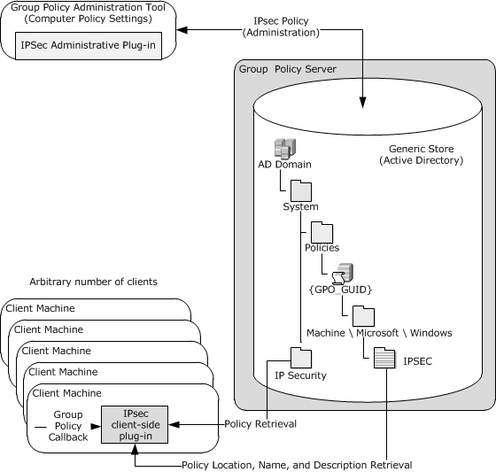

Figure 1: Components that use the Group Policy: IPsec Protocol Extension

The components in the protocol are as follows:

- An [**IPsec administrative plug-in**](#gt_ipsec-administrative-plug-in) (computer policy settings) that is used to author and upload policy settings.
- A generic [**binary large object (BLOB)**](#gt_binary-large-object-blob) store with no protocol-specific knowledge (in this case, Active Directory).
- A client machine with an [**IPsec client-side plug-in**](#gt_ipsec-client-side-plug-in).
The [**IPsec**](#gt_internet-protocol-security-ipsec) client-side plug-in locates the policy stores in the [**Active Directory**](#gt_active-directory) store to retrieve policy information (see details in sections [3.2.5.1](#Section_3.2.5.1) and [3.2.5.3](#Section_3.2.5.3)). Then, the IPsec client-side plug-in reads and applies policies, as specified in sections 3.2.5.1 and [3.2.5.4](#Section_3.2.5.4).

Policy information is authored in the IPsec administrative plug-in and is sent to a generic store (in this case, the Active Directory store). The policy data is generated by an IPsec policy administrator through an IPsec authoring user interface. The administrator creates one or more IPsec policies and assigns a single policy to a group of managed machines using a [**GPO**](#gt_group-policy-object-gpo).

The IPsec policy creation uses the LDAP "add" mechanism, as specified in [[RFC2251]](https://go.microsoft.com/fwlink/?LinkId=90325) section 4.7. For details, see Message Syntax (section [2.2](#Section_2.2)).

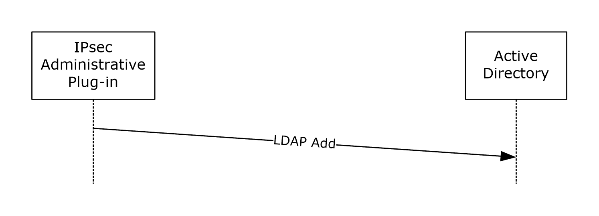

Figure 2: IPsec policy creation

The IPsec policy modification (for example, when changing an IPsec policy object name or reference GUID) uses the LDAP "modify" mechanism, as specified in [RFC2251] section 4.6. For details, see Message Syntax (section 2.2).

Figure 3: IPsec policy modification

A client obtains the IPsec policy in three steps:

- A client-side Group Policy protocol client polls the store to discover the existence of a new policy. When a new or changed IPsec policy is detected, it signals the IPsec client-side plug-in that an IPsec policy change has occurred and provides an LDAP path to the assigned policy, as specified in [MS-GPOL](../MS-GPOL/MS-GPOL.md) section 1.3.3.
- The IPsec client-side plug-in reads the LDAP path that specifies the assigned policy location as an LDAP path reference that specifies the assigned IPsec policy details.
- The IPsec policy detail LDAP path is then used by the IPsec client-side plug-in to read and interpret the assigned IPsec policy settings so that the IPsec policy settings can be enacted on the local system.
The details of the actual individual settings that are transferred by this protocol are specified in IPsec Policy Creation/Modification (section [2.2.1](#Section_4.1.1)), because the relevant behavior is not part of the Group Policy: Core Protocol or its extensions, but rather of the Group Policy: IPsec Protocol. These details are included to enable a client to successfully read and interpret the IPsec policy data and understand the protocol.

IPsec policy retrieval uses the LDAP search functionality, as specified in [RFC2251] section 4.5, and in sections 3.2.5.3 and 3.2.5.4.

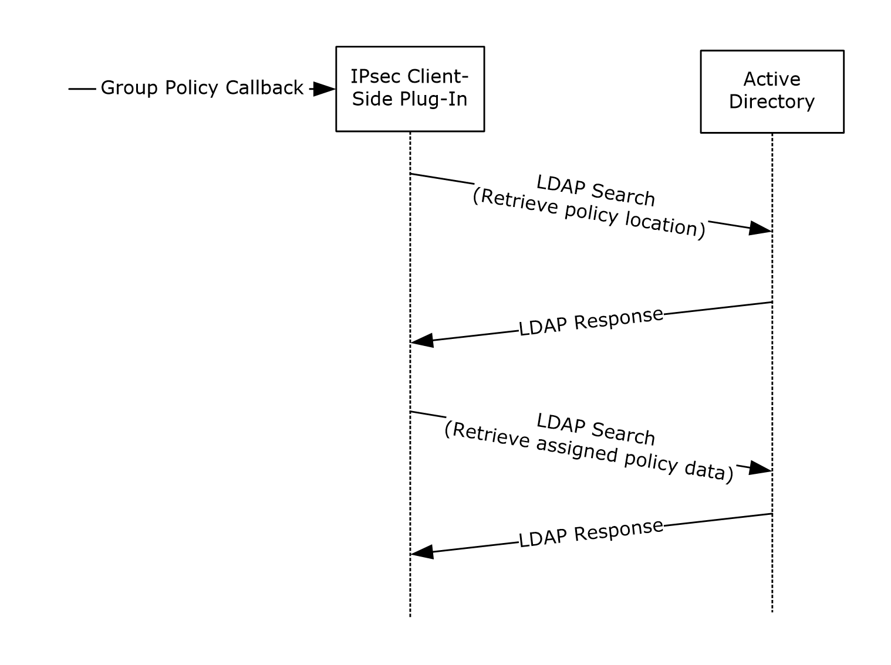

Figure 4: IPsec policy retrieval

**Note** Processing instructions for the first LDAP Search/Response pair is specified in section 3.2.5.3. Processing instructions for the second LDAP Search/Response pair is specified in section 3.2.5.4.

## 1.4 Relationship to Other Protocols

The Group Policy: IP Security (IPsec) Protocol Extension depends on the Group Policy: Core Protocol [MS-GPOL](../MS-GPOL/MS-GPOL.md) to read and write IPsec policy ( [[RFC2401]](https://go.microsoft.com/fwlink/?LinkId=90341), [[RFC2402]](https://go.microsoft.com/fwlink/?LinkId=90342), [[RFC2406]](https://go.microsoft.com/fwlink/?LinkId=90346), [[RFC2410]](https://go.microsoft.com/fwlink/?LinkId=90350), and [[RFC2411]](https://go.microsoft.com/fwlink/?LinkId=90351)) on applicable Group Policy Objects (GPOs). The [**administrative plug-in**](#gt_ipsec-administrative-plug-in) for this protocol uses LDAP [[RFC2251]](https://go.microsoft.com/fwlink/?LinkId=90325) to read and write protocol-specific data. The protocol also relies on the DC locator operation (see [MS-NRPC](../MS-NRPC/MS-NRPC.md) section 3.5.4.3, "DC Location Methods") to locate a server from which to download the policy. These relationships are illustrated in this section.

The Group Policy IPsec Protocol Extension also uses the Internet Security Association and Key Management Protocol ([**ISAKMP**](#gt_internet-security-association-and-key-management-protocol-isakmp)), ([[RFC2407]](https://go.microsoft.com/fwlink/?LinkId=90347) and [[RFC2408]](https://go.microsoft.com/fwlink/?LinkId=90348)), OAKLEY ([[RFC2412]](https://go.microsoft.com/fwlink/?LinkId=90352)), and Internet Key Exchange ([**IKE**](#gt_internet-key-exchange-ike)), as defined in [[RFC2409]](https://go.microsoft.com/fwlink/?LinkId=90349) and [[RFC3947]](https://go.microsoft.com/fwlink/?LinkId=90448).

The following figure illustrates the relationship of the Group Policy: IP Security (IPsec) Protocol Extension to other protocols and the DC locator process.

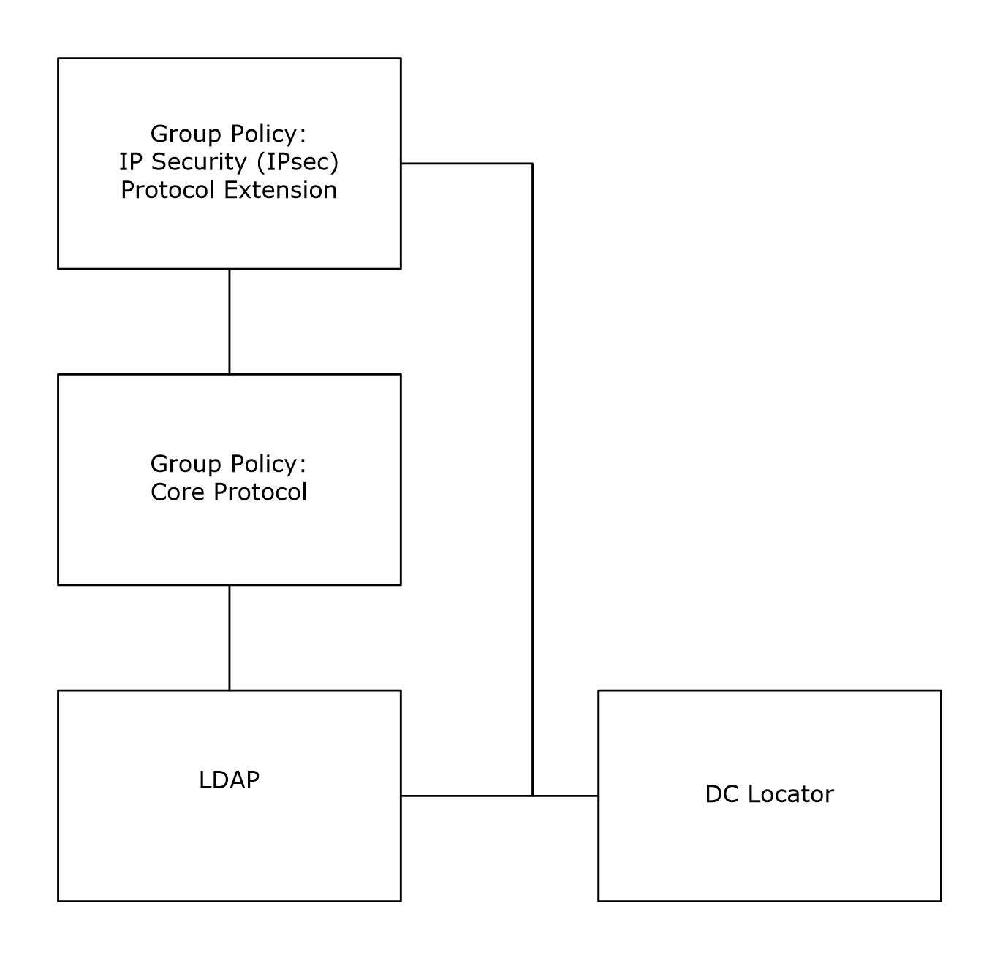

Figure 5: Protocol relationship diagram

## 1.5 Prerequisites/Preconditions

The prerequisites for this protocol are the same as for the Group Policy: Core Protocol, [MS-GPOL](../MS-GPOL/MS-GPOL.md) section 1.5.

## 1.6 Applicability Statement

The Group Policy: IPsec Protocol is applicable only in the [**Group Policy**](#gt_group-policy) framework. Data values that are interpreted differently depending on the implementation are noted in the specific data model descriptions. Systems receiving the policy data are required to ignore information that they do not understand.

## 1.7 Versioning and Capability Negotiation

There is no mechanism in the Group Policy: IPsec Protocol for versioning or capability negotiation. If new functionality is required that would be incompatible with the existing protocol, implement a new Group Policy protocol.

## 1.8 Vendor-Extensible Fields

None.

## 1.9 Standards Assignments

This protocol defines values for the [**IPsec**](#gt_internet-protocol-security-ipsec) [**client-side extension GUID**](#gt_client-side-extension-guid-cse-guid) and IPsec administrative extension [**GUID**](#gt_globally-unique-identifier-guid), as specified in [MS-GPOL](../MS-GPOL/MS-GPOL.md) section 1.8, "Vendor-Extensible Fields". The assignments are as follows (note that the GUIDs are specified as their string representations).

| Parameter | Value | Reference |
| --- | --- | --- |
| [**IPsec administrative extension**](#gt_ipsec-administrative-plug-in) GUID (Computer Policy Settings) | {DEA8AFA0-CC85-11D0-9CE2-0080C7221EBD} | [MS-GPOL] |
| IPsec client-side extension GUID | {E437BC1C-AA7D-11D2-A382-00C04F991E27} | [MS-GPOL] |

# 2 Messages

## 2.1 Transport

The Group Policy: IPsec Protocol uses the LDAP protocol, as specified in [[RFC2251]](https://go.microsoft.com/fwlink/?LinkId=90325), to read and write data to the remote [**Active Directory**](#gt_active-directory) data store.

## 2.2 Message Syntax

The messages are in the following three categories:

- IPsec policy creation/modification
- IPsec policy assignment
- IPsec policy retrieval
These categories are explained in the following subsections.

### 2.2.1 IPsec Policy Creation/Modification

This section specifies how the [**IPsec**](#gt_internet-protocol-security-ipsec) [**Group Policy**](#gt_group-policy) [**administrative plug-in**](#gt_ipsec-administrative-plug-in) creates and modifies an IPsec policy that is stored in [**Active Directory**](#gt_active-directory).

This section also provides background information that is needed to understand the storage of IPsec policy settings that are contained both within [**Group Policy Objects (GPOs)**](#gt_group-policy-object-gpo) and the IPsec policy data that is contained within an IPsec-specific Active Directory data store. It also specifies how individual IPsec policy data items are written and modified in a generic policy store (in this case, Active Directory).

The following figure specifies the IPsec policy storage. IPsec policy storage deviates from the typical Group Policy storage mechanism as specified in [MS-GPOL](../MS-GPOL/MS-GPOL.md) by storing the IPsec policy data separately from the GPO. The GPO contains a reference to the actual IPsec policy that is assigned to the policy target accounts, as specified in [MS-GPOL] section 1.3.3, "Policy Application".

An IPsec policy is created by writing the appropriate IPsec policy attributes to the "*System\IP Security*" container. The policy can then be assigned by writing a "reference" to the policy data in the "*System\Policies\GPO-GUID\Machine\Microsoft\Windows\IPSEC*" container. Note that the GPO_[**GUID**](#gt_globally-unique-identifier-guid) text MUST be replaced by a [**curly braced GUID string**](#gt_curly-braced-guid-string) ([MS-DTYP](../MS-DTYP/MS-DTYP.md) section 2.3.4.3, "GUID--Curly Braced String Representation") that identifies the GPO.

The reference of the policy that is assigned to a GPO MUST be stored in the "*Machine\Microsoft\Windows*" container in the IPSEC object of the GPO for this Group Policy protocol. IPsec Policy Assignment is specified in section [2.2.2](#Section_3.1.5.8).

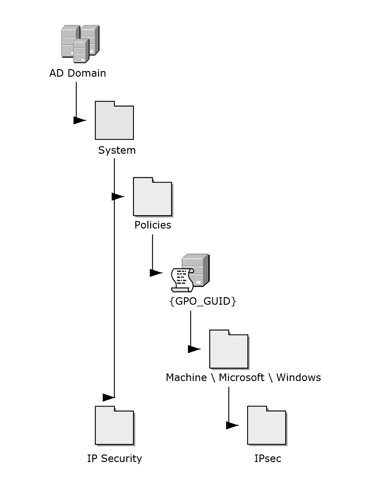

Figure 6: IPsec policy storage

The actual IPsec policy creation and modification protocol consists of writing a series of messages that create or modify the *ipsecPolicy*, *ipsecISAKMPPolicy*, *ipsecNFA*, *ipsecNegotiationPolicy*, and *ipsecFilter* entries (and the associated attributes as specified in [MS-ADSC](../MS-ADSC/MS-ADSC.md) section 2.71, "Class ipsecFilter", [MS-ADSC] section 2.72, "Class ipsecISAKMPPolicy", [MS-ADSC] section 2.73, "Class ipsecNegotiationPolicy", [MS-ADSC] section 2.74, "Class ipsecNFA", and [MS-ADSC] section 2.75, "Class ipsecPolicy") to the "*System\IP Security*" container. IPsec policy creation uses 'addRequest' messages that conform with [[RFC2251]](https://go.microsoft.com/fwlink/?LinkId=90325) section 4.1.1. IPsec policy modification uses 'modifyRequest' messages that conform with [RFC2251] section 4.1.1.

All attributes MUST be present and correctly formatted to specify an IPsec policy. There is no restriction on the order in which the values are written. The individual policy objects MUST be stored in the "*IP Security*" container, as the following figure shows.

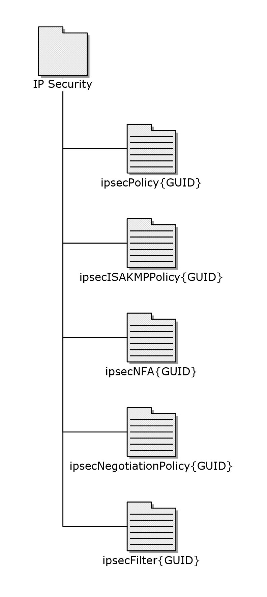

Figure 7: Individual policy objects stored in the IP Security container

IPsec policy creation MUST use the addRequest when adding the policy. The individual values are specified in the data descriptions that follow in sections [2.2.1.1](#Section_2.2.1.1), [2.2.1.2](#Section_2.2.1.2), [2.2.1.3](#Section_2.2.1.3), [2.2.1.4](#Section_2.2.1.4), and [2.2.1.5](#Section_2.2.1.5).

IPsec policy modification MUST use the "replace" operation of modifyRequest when writing policies to enable "update-to" values representing the policy. The individual values are specified in the data descriptions that follow in sections 2.2.1.1, 2.2.1.2, 2.2.1.3, 2.2.1.4, and 2.2.1.5.

The individual objects in a single policy MUST be organized into a logical hierarchy. The hierarchy is defined by individual data object attributes (as specified in sections 2.2.1.1, 2.2.1.2, 2.2.1.3, 2.2.1.4, and 2.2.1.5). A complete IPsec policy consists of five hierarchical data objects, as shown in the following figure. Each IPsec policy instance MUST have one of each policy type. The diagram depicts the required policy items and logical hierarchy.

The individual items are all stored in the "*IP Security*" container, and the relationships shown are logical, not physical. A logical relationship is formed by an attribute of one item having as a value the name of another item.

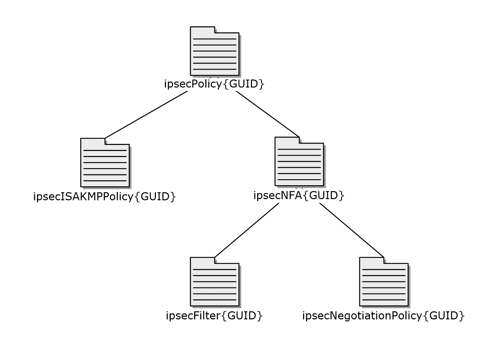

Figure 8: Required policy items and logical hierarchy for a complete IPsec policy

To create a complete IPsec policy, object creation and modification can be implemented in the following order:

- Create ipsecPolicy.
- Create ipsecISAKMPPolicy.
- Create ipsecNFA.
- Create ipsecNegotiationPolicy.
- Create ipsecFilter.
- Modify ipsecPolicy - with ipsecISAKMPReference ipsecNFAReference.
- Modify ipsecNFA - with ipsecFilterReference ipsecNegotiationPolicyReference.
**Note** In practice, the policy structure might not be as simple as the preceding diagram suggests because multiple ipsecNFA objects can (and usually do) exist per ipsecPolicy. For example, consider two ipsecFilter objects, two ipsecNegotiationPolicy objects, and three different ipsecNFA objects. In this example, these objects are denoted as F1, F2; NegPol1, NegPol2; and NFA1, NFA2, and NFA3 respectively. Note that NFA1 can reference F1 and NegPol1, and NFA2 can reference F2 and NegPol2. Then, a single ipsecPolicy can reference both NFA1 and NFA2. These relationships are illustrated in the following figure.

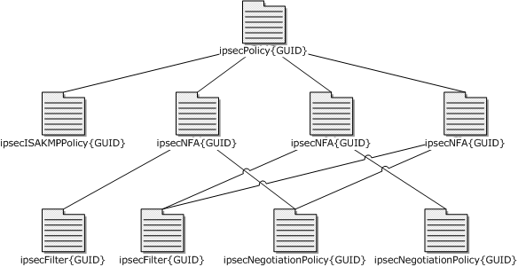

Figure 9: Multiple ipsecNFA objects per ipsecPolicy

**Note** Multiple ipsecPolicy objects can be stored in the "*IP Security*" container. Separate policies (ipsecPolicy objects) are often assigned as active policy to particular GPOs, so that a specific IPsec policy can be applied to a group of machines that have a common need.

The following explains the cardinality of object associations:

- Each ipsecPolicy object can be associated to one or more ipsecNFA objects. Each ipsecNFA object can be associated to a maximum of one ipsecPolicy object.
- Each ipsecISAKMPPolicy object can be associated to one ipsecPolicy object. Each ipsecPolicy object can be associated to a maximum of one ipsecISAKMPPolicy object.
- Each ipsecNegotiationPolicy object can be associated to zero or more ipsecNFA objects. Each ipsecNFA object can be associated to a maximum of one ipsecNegotiationPolicy object.
- Each ipsecFilter object can be associated to zero or more ipsecNFA objects. Each ipsecNFA object can be associated to one or more ipsecFilter objects.

#### 2.2.1.1 ipsecPolicy Object Attribute Details

[**IPsec**](#gt_internet-protocol-security-ipsec) policy is the main unit of a single policy instance. The **ipsecPolicy** data attribute contains this IPsec policy information. It MUST contain a reference to an [**ISAKMP**](#gt_internet-security-association-and-key-management-protocol-isakmp) policy, at least one reference to a [**negotiation filter association (NFA)**](#gt_negotiation-filter-association-nfa) policy, and other miscellaneous IPsec policy settings. The following figure shows an IPsec policy object.

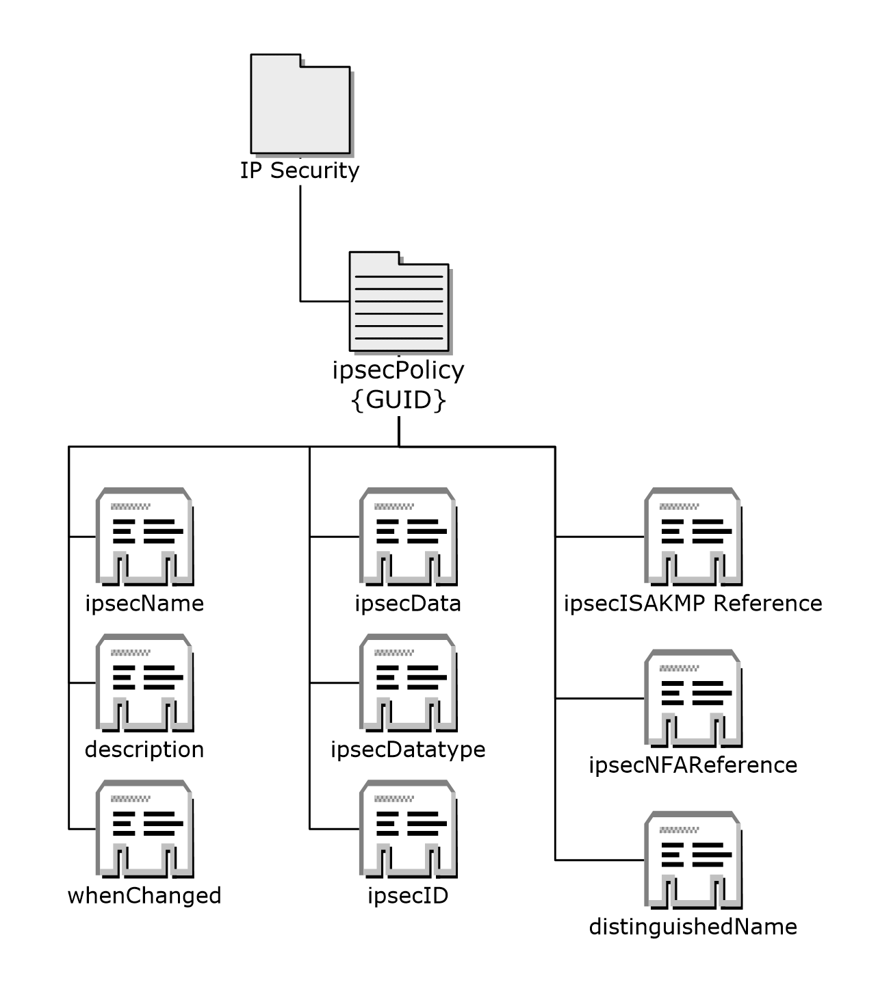

Figure 10: IPsec policy object

IPsec policy creation MUST use the LDAP add functionality in conformance with [[RFC2251]](https://go.microsoft.com/fwlink/?LinkId=90325) section 4.7.

IPsec policy modification MUST use the LDAP modify functionality in conformance with [RFC2251] section 4.6.

##### 2.2.1.1.1 ipsecPolicy{GUID} Object Attribute Descriptions

The following table specifies the attributes of the ipsecPolicy class object (as specified in [MS-ADSC](../MS-ADSC/MS-ADSC.md), [MS-ADA1](../MS-ADA1/MS-ADA1.md), and [MS-ADA3](../MS-ADA3/MS-ADA3.md)).

The types used in the following (and subsequent) tables are defined as follows: "*LDAPString*" as defined in [[RFC2251]](https://go.microsoft.com/fwlink/?LinkId=90325) section 4.1.2; "*UTC Coded String*" defined as an LDAPString containing the generalized time syntax of the form *YYYYMMDDHHMMSS[.|,fraction][(+|-HHMM)|Z]*, where Z means UTC; "*Distinguished Name*" as defined in [RFC2251] section 4.1.3; and "*Octet String*" as defined in [RFC2251] section 4.1.2.

| Name | Type | Description |
| --- | --- | --- |
| objectClass | LDAPString | The [**Directory String**](#gt_directory-string) that contains the object class. A typical value is "ipsecPolicy". This attribute is only used during policy creation. |
| ipsecName | LDAPString | The user-constructed Directory String that contains the name for this policy. A typical value is "*Secure Server Policy*". |
| description | LDAPString | The user-constructed Directory String that is intended to contain a description of the policy. A typical value is "*Policy to secure corporate network traffic*". |
| whenChanged | UTC–coded string | The [**Unicode**](#gt_unicode) generalized time syntax of the time and date the policy was last changed. This value is set by the [**Active Directory**](#gt_active-directory) server. |
| ipsecID | LDAPString | A Directory String containing the [**curly braced GUID string**](#gt_curly-braced-guid-string) value of this ipsecPolicy object. A typical value is like the following: "*{6A1E5C3F-72B7-11D2-ACF0-0260B025CAFE}*". |
| distinguishedName | Distinguished name | The Directory String description of the [**directory**](#gt_directory) location of this policy. This MUST be in the [**distinguished name (DN)**](#gt_distinguished-name-dn) format of [RFC2251]. This MUST be set by the protocol. A typical value is like the following: "*CN=ipsecPolicy{6A1E5C3F-72B7-11D2-ACF0-0260B025CAFE },CN=IP Security,CN=System,DC=myDomain,DC=contoso,DC=com*". |
| ipsecISAKMPReference | Distinguished name | The Directory String reference to the ipsecISAKMPPolicy object that is associated with this policy. This MUST be in the DN format of [RFC2251]. A typical value is like the following: "*CN=ipsecISAKMPPolicy{6A1E5C3F-72B7-11D2-ACF0-0260B025CAFE }, CN=IP Security,CN=System, DC=myDomain, DC=contoso,DC=com*". This attribute is not used during ipsecPolicy creation; it is only used during modification. |
| ipsecNFAReference | A list of distinguished names | A list of Directory String references to the ipsecNFA objects that are associated with this ipsecPolicy object. The list MUST be composed of DNs in the format specified in [RFC2251]. The separator between two DNs is 2 bytes of 0. For example: DN1-2bytesof0-DN2, where DN1 and DN2 are distinguished names. There can be multiple [**NFA**](#gt_negotiation-filter-association-nfa) references present; each NFA reference is a NULL-terminated DN. A typical value is like the following: "*CN=ipsecNFA{6A1E5C3F-72B7-11D2-ACF0-0260B025CAFE },CN=IP Security, CN=System,DC=myDomain, DC=contoso,DC=com*". This attribute is not used during policy creation; it is only used during policy modification. |
| ipsecDataType | LDAPString | The identifier that describes the format of the following ipsecData attribute. This MUST be the base-10 Directory String representation of the unsigned integer value 0x100 (256). |
| ipsecData | Octet string | The octet string representation of the binary data that specifies additional policy data stored as described in the following ipsecData–specific table. |

The following table specifies the contents of the ipsecData attribute.

Note that all fields specified in the following tables MUST appear in little-endian byte order.

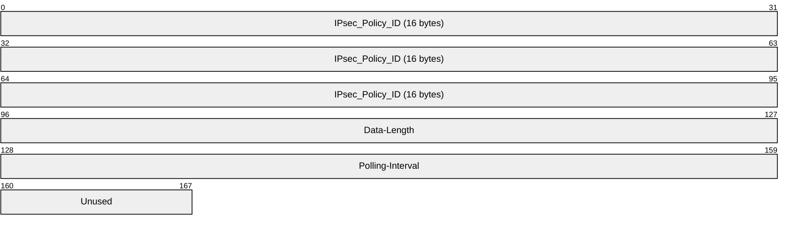
```mermaid
packet-beta
  0-95: "IPsec_Policy_ID (16 bytes)"
  96-127: "Data-Length"
  128-159: "Polling-Interval"
  160-167: "Unused"
```

**IPsec_Policy_ID (16 bytes):** The identifier that specifies this as describing the policy. This MUST be the [**GUID**](#gt_globally-unique-identifier-guid) whose string representation is "{22202163-4f4c-11d1-863b-00a0248d3021}".

**Data-Length (4 bytes):** The length, in bytes, of the following data. This MUST be the unsigned integer value 0x00000004.

**Polling-Interval (4 bytes):** The number of seconds that the client waits before polling the [**IPsec**](#gt_internet-protocol-security-ipsec) Active Directory store to see if there have been any policy changes. This MUST be an unsigned integer value. Polling interval is 10,800 seconds when this value is set to 0.

**Unused (1 byte):** This value MUST always be written as 0x0 and MUST be ignored when read.

#### 2.2.1.2 ipsecISAKMPPolicy Object Attribute Details

The [**ISAKMP**](#gt_internet-security-association-and-key-management-protocol-isakmp) policy stores information related to the initial [**IPsec**](#gt_internet-protocol-security-ipsec) conversation (that is, [**main mode (MM)**](#gt_main-mode-mm); as defined in [[RFC2408]](https://go.microsoft.com/fwlink/?LinkId=90348) and [[RFC2409]](https://go.microsoft.com/fwlink/?LinkId=90349), section 7.1). The **ipsecISAKMPPolicy** data attribute contains this ISAKMP policy information.

The ISAKMP policy includes settings for establishing a [**security association (SA)**](#gt_security-association-sa) and cryptographic keys with a remote peer. It also stores [**IKE**](#gt_internet-key-exchange-ike) settings that it uses to exchange keys with the IPsec peer.

The following diagram shows the ISAKMP policy object.

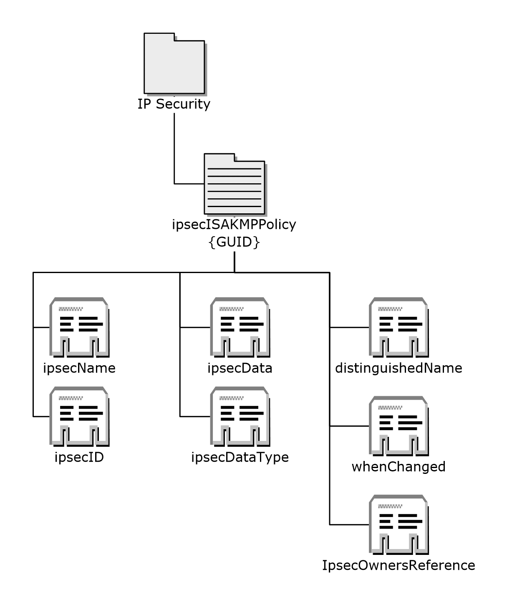

Figure 11: ISAKMP policy object

The **ipsecISAKMPPolicy** object creation MUST use the LDAP add functionality in conformance with [[RFC2251]](https://go.microsoft.com/fwlink/?LinkId=90325) section 4.7.

The **ipsecISAKMPPolicy** object modification MUST use the LDAP modify functionality in conformance with [RFC2251] section 4.6.

The **ipsecISAKMPPolicy** attributes are specified in the following subsection.

##### 2.2.1.2.1 ipsecISAKMPPolicy{GUID} Object Attribute Descriptions

The following table specifies the attributes of the ipsecISAKMPPolicy class object (as specified in [MS-ADSC](../MS-ADSC/MS-ADSC.md), [MS-ADA1](../MS-ADA1/MS-ADA1.md), and [MS-ADA3](../MS-ADA3/MS-ADA3.md)).

| Name | Type | Description |
| --- | --- | --- |
| objectClass | LDAPString | The [**Directory String**](#gt_directory-string) that contains the object class. A typical value is "ipsecISAKMPPolicy". This attribute is only used during policy creation. |
| ipsecName | LDAPString | The ipsecName attribute for ipsecISAKMPPolicy objects. This MUST NOT be set to NULL.<1> |
| whenChanged | UTC-coded string | The Unicode-generalized time syntax of the time and date that the policy was last changed. This value is set by the Active Directory server. |
| ipsecID | LDAPString | This MUST be a Directory String containing the curly braced GUID string value of this ipsecISAKMPPolicy object. A typical value is "*{6A155C3F-72B7-11D2-A3F0-0260B025CAFE}*". |
| distinguishedName | Distinguished name | This MUST be a Directory String description of the directory location of this ISAKMP policy. This MUST be in the distinguished name (DN) format of [[RFC2251]](https://go.microsoft.com/fwlink/?LinkId=90325). This MUST be set by the protocol. A typical value is "*CN=ipsecISAKMPPolicy{6A1E5C3F-72B7-11D2-ACF0-0260B025CAFE },CN=IP Security,CN= System,DC=myDomain,DC=contoso,DC=com*". |
| ipsecOwnersReference | Distinguished name | This MUST be a Directory String reference (DN) to the "owner" IPsec policy object with which this ISAKMP object is associated. This MUST be in the DN format of [RFC2251]. A typical value is "*CN=ipsecPolicy{6A455C3F-72B7-11D2-ACF0-0260B025CAFE},CN=IP Security,CN= System,DC=myDomain,DC=contoso,DC=com*". |
| ipsecDataType | LDAPString | The identifier that describes the format of the following **ipsecData** attribute. This MUST be the base-10 Directory String representation of the unsigned integer value 0x100 (256). |
| ipsecData | Octet string | The octet string representation of the binary data that specifies additional policy data; stored as described in the following **ipsecData**-specific table. |

**Note** The ipsecISAKMPPolicy object ([MS-ADSC] section 2.72, "Class ipsecISAKMPPolicy") as specified in LDAP messages, is encoded using BER, as defined in [RFC2251] section 5.1.

The following table specifies the **ipsecData** attribute-specific sections, corresponding names, and data types for the assigned values for the purpose of [**IPsec**](#gt_internet-protocol-security-ipsec) policy configuration.

The values of these settings MUST NOT be interpreted by this protocol; that is, they are to be applied as is to the IPsec component, which can interpret them independently of the protocol or mechanism that was used to configure them. A description of the interpretation by the IPsec component is provided for informative purposes (as opposed to the syntax, which is normative).

Note that all fields specified in the following tables MUST appear in little-endian byte order.

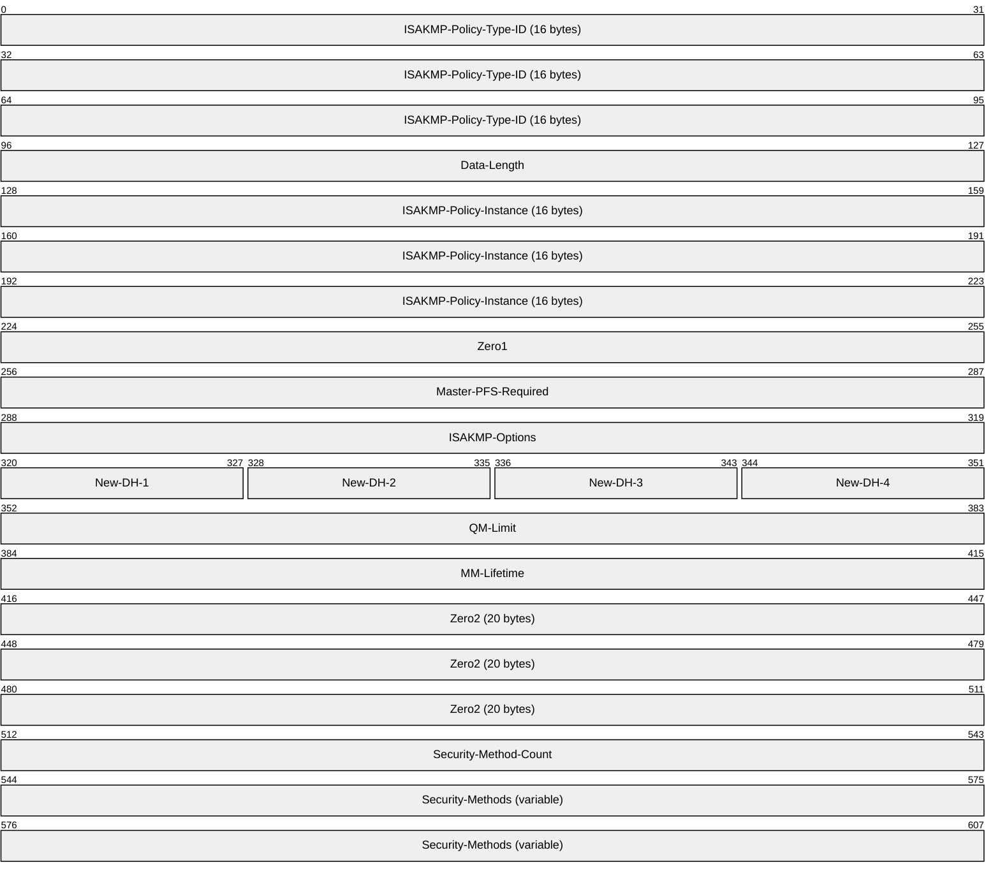
```mermaid
packet-beta
  0-95: "ISAKMP-Policy-Type-ID (16 bytes)"
  96-127: "Data-Length"
  128-223: "ISAKMP-Policy-Instance (16 bytes)"
  224-255: "Zero1"
  256-287: "Master-PFS-Required"
  288-319: "ISAKMP-Options"
  320-327: "New-DH-1"
  328-335: "New-DH-2"
  336-343: "New-DH-3"
  344-351: "New-DH-4"
  352-383: "QM-Limit"
  384-415: "MM-Lifetime"
  416-511: "Zero2 (20 bytes)"
  512-543: "Security-Method-Count"
  544-607: "Security-Methods (variable)"
```

**ISAKMP-Policy-Type-ID (16 bytes):** The identifier that specifies this as an [**ISAKMP**](#gt_internet-security-association-and-key-management-protocol-isakmp) policy; MUST be the [**GUID**](#gt_globally-unique-identifier-guid) whose string representation is "{80DC20B8-2EC8-11D1-A89E-00A0248D3021}".

**Data-Length (4 bytes):** This field MUST be the length, in bytes, of the following data minus 1. This MUST be an unsigned integer. This field is always 1 byte less than the size of the following data encoded as an octet stream.

**ISAKMP-Policy-Instance (16 bytes):** This MUST be the GUID value of this ipsecISAKMPPolicy object. This MUST be a 128-bit GUID value.

**Zero1 (4 bytes):** This value MUST always be written as 0x00000000 and MUST be ignored when read.

**Master-PFS-Required (4 bytes):** Indicates whether [**IKE**](#gt_internet-key-exchange-ike), as defined in [[RFC2408]](https://go.microsoft.com/fwlink/?LinkId=90348), is to use master perfect forward secrecy (PFS) as defined in [[RFC2409]](https://go.microsoft.com/fwlink/?LinkId=90349), sections 3.3 and 8. Master PFS configures the number of times a master key or its base keying material can be reused to generate the session key to one time only. It MUST be one of the following values.

| Value | Meaning |
| --- | --- |
| 0x00000000 | No, master PFS is not required. |
| 0x00000001 | Yes, master PFS is required. |

**ISAKMP-Options (4 bytes):** The policy specification modifiers applied to the ISAKMP policy, defined in [RFC2408] that IKE enacts. This field MUST be one of the following values.

| Value | Meaning |
| --- | --- |
| 0x00000000 | No policy modifier. |
| 0x00000001 | When performing X.509 certificate authentication, the authentication MUST only be allowed if the certificate "Subject Alternate Name" can be mapped to a Kerberos authentication system identity (also known as certificate-mapping). |
| 0x00000002 | When performing X.509 certificate negotiation, do not send the peer the certificate request payload (CRP). |
| 0x00000003 | Perform X.509 certificate mapping (as per value 0x00000001 shown in the second row) and do not send the peer the CRP (as per value 0x00000002 shown in the third row). |

**New-DH-1 (1 byte):** A nonzero value in the **New-DH-1** field is first in the order of precedence for the main mode ([**MM**](#gt_main-mode-mm)) offers used by IKE. If the value in this field is zero, byte–fields **New-DH-2**, **New-DH-3**, and **New-DH-4** is also set to zero. MM offers set on **Security-Methods** are appended to the **New-DH-1**, **New-DH-2**, **New-DH-3**, and **New-DH-4** fields. The **New-DH-1** field SHOULD<2> be one of the following values.

| Value | Meaning |
| --- | --- |
| 0x00 | The field is not used. |
| 0x01 | The ISAKMP policy setting is Encryption:DES; Integrity:MD5; Diffie-Hellman:DH-2048. |
| 0x02 | The ISAKMP policy setting is Encryption:DES; Integrity:SHA-1; Diffie-Hellman:DH-2048. |
| 0x03 | The ISAKMP policy setting is Encryption:3DES; Integrity:MD5; Diffie-Hellman:DH-2048. |
| 0x04 | The ISAKMP policy setting is Encryption:3DES; Integrity:SHA-1; Diffie-Hellman:DH-2048. |

**New-DH-2 (1 byte):** A nonzero value in the **New-DH-2** field is second in the order of precedence for the MM offers used by IKE. If the value in this field is zero, byte–fields **New-DH-3** and **New-DH-4** are also set to zero. MM offers set on **Security-Methods** are appended to the **New-DH-1**, **New-DH-2**, **New-DH-3**, and **New-DH-4** fields. The **New-DH-2** field SHOULD<3> be one of the following values.

| Value | Meaning |
| --- | --- |
| 0x00 | This field is not used. |
| 0x01 | The ISAKMP policy setting is Encryption:DES; Integrity:MD5; Diffie-Hellman:DH-2048. |
| 0x02 | The ISAKMP policy setting is Encryption:DES; Integrity:SHA-1; Diffie-Hellman:DH-2048. |
| 0x03 | The ISAKMP policy setting is Encryption:3DES; Integrity:MD5; Diffie-Hellman:DH-2048. |
| 0x04 | The ISAKMP policy setting is Encryption:3DES; Integrity:SHA-1; Diffie-Hellman:DH-2048. |

**New-DH-3 (1 byte):** A nonzero value in the **New-DH-3** field is third in the order of precedence for the MM offers used by IKE. If the value in this field is zero, byte–field **New-DH-4** is also set to zero. MM offers set on **Security-Methods** are appended to the **New-DH-1**, **New-DH-2**, **New-DH-3**, and **New-DH-4** fields. The **New-DH-3** field SHOULD<4> be one of the following values.

| Value | Meaning |
| --- | --- |
| 0x00 | This field is not used. |
| 0x01 | The ISAKMP policy setting is Encryption:DES; Integrity:MD5; Diffie-Hellman:DH-2048. |
| 0x02 | The ISAKMP policy setting is Encryption:DES; Integrity:SHA-1; Diffie-Hellman:DH-2048. |
| 0x03 | The ISAKMP policy setting is Encryption:3DES; Integrity:MD5; Diffie-Hellman:DH-2048. |
| 0x04 | The ISAKMP policy setting is Encryption:3DES; Integrity:SHA-1; Diffie-Hellman:DH-2048. |

**New-DH-4 (1 byte):** A nonzero value in the **New-DH-4** field is fourth in the order of precedence for the MM offers used by IKE. MM offers set on **Security-Methods** are appended to the **New-DH-1**, **New-DH-2**, **New-DH-3**, and **New-DH-4** fields. The **New-DH-4** field SHOULD<5> be one of the following values.

| Value | Meaning |
| --- | --- |
| 0x00 | This field is not used. |
| 0x01 | The ISAKMP policy setting is Encryption:DES; Integrity:MD5; Diffie-Hellman:DH-2048. |
| 0x02 | The ISAKMP policy setting is Encryption:DES; Integrity:SHA-1; Diffie-Hellman:DH-2048. |
| 0x03 | The ISAKMP policy setting is Encryption:3DES; Integrity:MD5; Diffie-Hellman:DH-2048. |
| 0x04 | The ISAKMP policy setting is Encryption:3DES; Integrity:SHA-1; Diffie-Hellman:DH-2048. |

The table that follows illustrates how the MM precedence order works. An X in a table cell denotes that a field has a value and a hyphen (-) indicates a value of zero.

| New-DH-1 | New-DH-2 | New-DH-3 | New-DH-4 | Security-Method-1 | ... | Security-Method-N | Resultant order of MM precedence |
| --- | --- | --- | --- | --- | --- | --- | --- |
| X | X | X | X | X | ... | X | New-DH-1 New-DH-2 New-DH-3 New-DH-4 Security-Method-1 ... Security-Method-N |
| X | X | X | - | X | ... | X | New-DH-1 New-DH-2 New-DH-3 Security-Method-1 ... Security-Method-N |
| X | X | - | - | X | ... | X | New-DH-1 New-DH-2 Security-Method-1 ... Security-Method-N |
| X | - | - | - | X | ... | X | New-DH-1 Security-Method-1 ... Security-Method-N |
| - | - | - | - | X | ... | X | Security-Method-1 ... Security-Method-N |

**QM-Limit (4 bytes):** The number of quick modes allowed per main mode in an IKE ([RFC2409]) negotiation. A special value is 0x00000000, which means no limit. This field MUST be an unsigned integer.

**MM-Lifetime (4 bytes):** The maximum allowed main-mode key lifetime, in seconds, that IKE uses. A special value is 0x00000000, which means the main-mode key lifetime is set to 28,800 seconds. This field MUST be an unsigned integer.

**Zero2 (20 bytes):** This value MUST always be written as a 20-byte field that is filled with 0x00 and MUST be ignored when read.

**Security-Method-Count (4 bytes):** This MUST be the number of security-method BLOBs that follow. This field MUST be an unsigned integer.

**Security-Methods (variable):** The ISAKMP security methods, as specified in the following binary representation. There can be any number of these. The number is specified by the preceding Security-Method-Count field. This field is a multiple of 64 bytes.

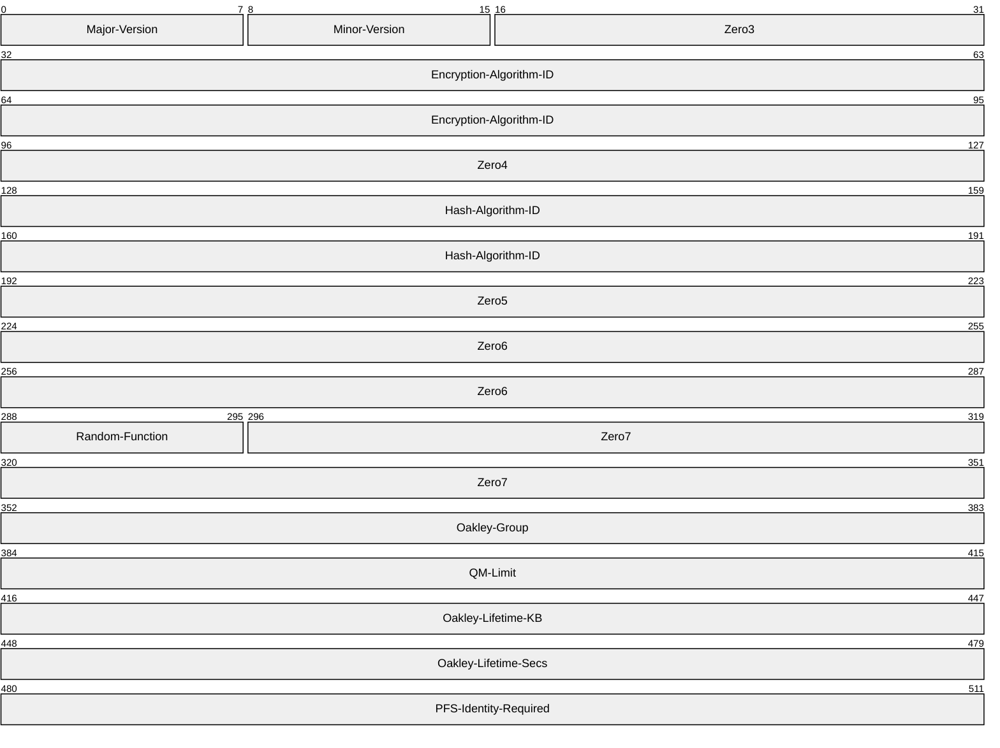
```mermaid
packet-beta
  0-7: "Major-Version"
  8-15: "Minor-Version"
  16-31: "Zero3"
  32-95: "Encryption-Algorithm-ID"
  96-127: "Zero4"
  128-191: "Hash-Algorithm-ID"
  192-223: "Zero5"
  224-287: "Zero6"
  288-295: "Random-Function"
  296-351: "Zero7"
  352-383: "Oakley-Group"
  384-415: "QM-Limit"
  416-447: "Oakley-Lifetime-KB"
  448-479: "Oakley-Lifetime-Secs"
  480-511: "PFS-Identity-Required"
```

**Major-Version (1 byte):** The crypto bundle major version; MUST be 0x00.

**Minor-Version (1 byte):** The crypto bundle minor version; MUST be 0x00.

**Zero3 (2 bytes):** This value MUST always be written as 0x0000 and MUST be ignored when read.

**Encryption-Algorithm-ID (8 bytes):** The encryption algorithm that IKE uses. This MUST be one of the following values.

| Value | Meaning |
| --- | --- |
| 0x0000000000000000 | None |
| 0x0000000000000001 | DES-CBC |
| 0x0000000000000002 | 3DES-CBC |
| 0x0000000000000003 | 3DES-CBC |

**Zero4 (4 bytes):** This value MUST always be written as 0x00000000 and MUST be ignored when read.

**Hash-Algorithm-ID (8 bytes):** The hash algorithm that IKE uses. This MUST be one of the following values.

| Value | Meaning |
| --- | --- |
| 0x0000000000000000 | None |
| 0x0000000000000001 | MD5 |
| 0x0000000000000002 | SHA-1 |

**Zero5 (4 bytes):** This value MUST always be written as 0x00000000 and MUST be ignored when read.

**Zero6 (8 bytes):** This value MUST always be written as an 8-byte field that is filled with 0x00 and MUST be ignored when read.

**Random-Function (1 byte):** Overrides the values of Encryption-Algorithm-ID, Hash-Algorithm-ID, and Oakley-Group as follows. In addition, QM-Limit, MM-Lifetime, and Master-PFS-Required values from the policy object are used.

| Value | Encryption-Algorithm-ID | Hash-Algorithm-ID | Oakley-Group |
| --- | --- | --- | --- |
| 0x01 | DES | MD5 | Group-14 |
| 0x02 | DES | SHA | Group-14 |
| 0x03 | 3DES | MD5 | Group-14 |
| 0x04 | 3DES | SHA | Group-14 |

**Zero7 (7 bytes):** This value MUST always be written as a 7-byte field that is filled with 0x00 and MUST be ignored when read.

**Oakley-Group (4 bytes):** The Diffie-Hellman group that IKE uses, as defined in [[RFC2412]](https://go.microsoft.com/fwlink/?LinkId=90352). This MUST be one of the following values.

| Value | Meaning |
| --- | --- |
| 0x00000000 | This field is not used. |
| 0x00000001 | Group-1 |
| 0x00000002 | Group-2 |
| 0x10000001 | Group-14 |

**QM-Limit (4 bytes):** The number of quick modes allowed per main mode in an IKE negotiation, as defined in [RFC2412] and [RFC2409]. A special value is 0x00000000, which means no limit. This field MUST be an unsigned integer.

**Oakley-Lifetime-KB (4 bytes):** The lifetime, in kilobytes, that IKE is to negotiate. This field MUST be an unsigned integer.

**Oakley-Lifetime-Secs (4 bytes):** The lifetime, in seconds, that IKE is to negotiate. This field MUST be an unsigned integer.

**PFS-Identity-Required (4 bytes):** Indicates whether IKE is to use PFS, as defined in [RFC2409]. Configures the number of times a master key or its base keying material can be reused to generate the session key to one time only. This MUST be one of the following values.

| Value | Meaning |
| --- | --- |
| 0x00000000 | No, PFS Identity is not required. |
| 0x00000001 | Yes, PFS identity is required. |

#### 2.2.1.3 ipsecNFA Object Attribute Details

The [**NFA**](#gt_negotiation-filter-association-nfa) policy stores references to a Filter List policy and a Negotiation policy to bind the individual Filter and Negotiation policy objects together. The **ipsecNFA** data attribute contains this policy binding information. It also stores additional [**IPsec**](#gt_internet-protocol-security-ipsec) settings, such as authentication methods and [**tunnel mode**](#gt_tunnel-mode) configuration. The following diagram shows an NFA policy object.

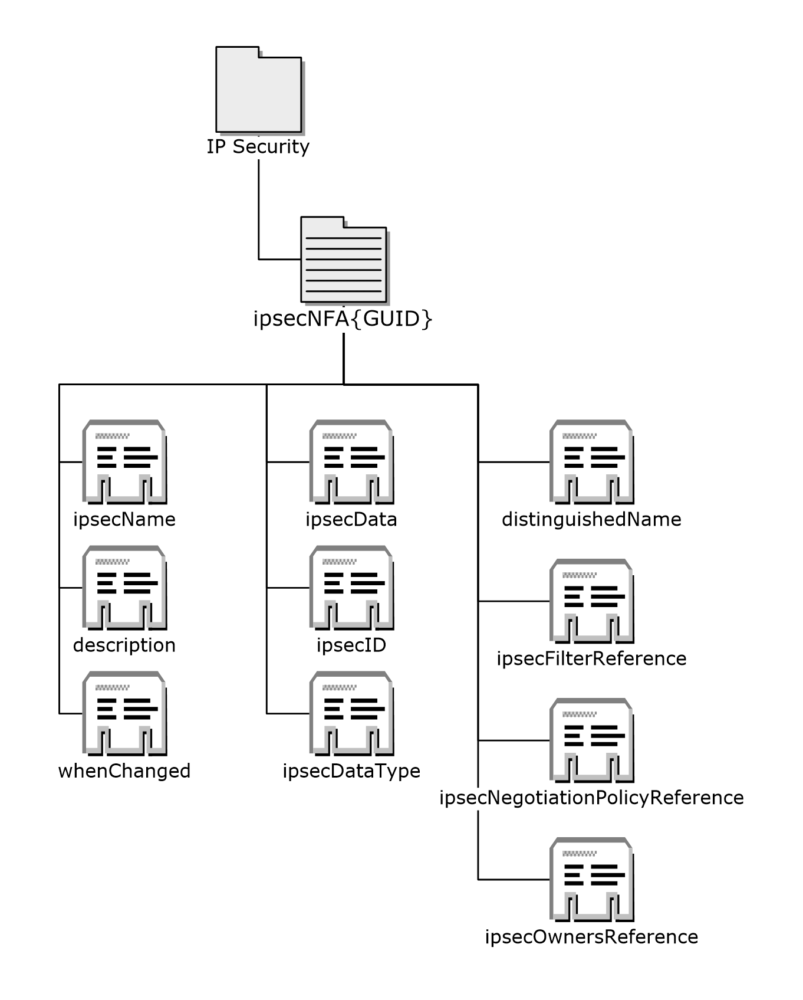

Figure 12: NFA policy object

The **ipsecNFA** object creation MUST use the LDAP add functionality in conformance with [[RFC2251]](https://go.microsoft.com/fwlink/?LinkId=90325) section 4.7.

The **ipsecNFA** object modification MUST use the LDAP modify functionality in conformance with [RFC2251] section 4.6.

The **ipsecNFA** attributes are specified in in the following subsection.

##### 2.2.1.3.1 ipsecNFA{GUID} Object Description

The following table specifies the attributes of the ipsecNFA class object, as specified in [MS-ADSC](../MS-ADSC/MS-ADSC.md), [MS-ADA1](../MS-ADA1/MS-ADA1.md), and [MS-ADA3](../MS-ADA3/MS-ADA3.md).

| Name | Type | Description |
| --- | --- | --- |
| **objectClass** | LDAPString | The [**Directory String**](#gt_directory-string) that contains the object class. A typical value is "ipsecNFA". This attribute is only used during policy creation. |
| **ipsecName** | LDAPString | The user-constructed Directory String that contains the name for this filter group. A typical value is "*All Traffic filters*". |
| **description** | LDAPString | The user-constructed Directory String that is intended to contain a description of the filter group. A typical value is "*Me to Any filters*". |
| **whenChanged** | UTC-coded string | The [**Unicode**](#gt_unicode)-generalized time syntax of the time and date that the policy was last changed. This value is set by the [**Active Directory**](#gt_active-directory) server. |
| **ipsecID** | LDAPString | The Directory String that contains the [**curly braced GUID string**](#gt_curly-braced-guid-string) value of this **ipsecNFA** object. A typical value looks like "*{6A1E5C3F-72B7-11D2-ACF0-02603625CAFE}*". |
| **distinguishedName** | Distinguished name | The Directory String description of the directory location of the [**NFA**](#gt_negotiation-filter-association-nfa) policy object. This MUST be in the [**DN**](#gt_distinguished-name-dn) format of [[RFC2251]](https://go.microsoft.com/fwlink/?LinkId=90325). This MUST be set by the protocol. A typical value is "*CN=ipsecNFA{6A1E5C3F-72B7-11D2-ACF0-0260B025CAFE },CN=IP Security,CN= System,DC=myDomain,DC=contoso,DC=com*". |
| **ipsecFilterReference** | Distinguished name | The Directory String reference to the ipsecFilter object that is associated with this filter list. This MUST be in the DN format of [RFC2251]. If multiple filters are associated with this NFA, this filter is one of them. Other associated filters can be found by analyzing the ipsecOwnersReference of the filter. A typical value is "*CN=ipsecFilter{6A1E5C3F-72B7-11D2-ACF0-0260B025CAFE },CN=IP Security, CN=System, DC=myDomain, DC=contoso, DC=com*". This attribute is not used during policy creation; it is only used during policy modification. |
| **ipsecNegotiationPolicy Reference** | Distinguished name | The Directory String reference to the single ipsecNegotiationPolicy object that is associated with this filter list policy. This MUST be in the DN format of [RFC2251]. A typical value is *"CN=ipsecNegotiationPolicy{6A1E5C3F-72B7-11D2-ACF0-0260B025CAFE },CN=IP Security,CN=System, DC=myDomain, DC=contoso, DC=com"*. This attribute is not used during policy creation; it is only used during policy modification. |
| **ipsecOwnersReference** | Distinguished name | The Directory String reference to the owner IPsec policy object with which this NFA object is associated. This MUST be in the DN format of [RFC2251]. A typical value is *"CN=ipsecPolicy{6A1E5C3F-72B7-11D2-ACF0-0260B025CAFE },CN=IP Security, CN=System, DC=myDomain, DC=contoso,DC=com"*. |
| **ipsecDataType** | LDAPString | The identifier that describes the format of the following ipsecData attribute; this MUST be the Directory String representation of the unsigned integer value 0x100. |
| **ipsecData** | Octet string | The octet string representation of the binary data that specifies additional policy data that is stored as described in the following ipsecData-specific table. |

**Note** The **ipsecNFA** object as specified in LDAP messages ([MS-ADSC], section 2.74, "Class ipsecNFA") is encoded using BER, as defined in [RFC2251] section 5.1.

The following table specifies the ipsecData attribute's specific sections, corresponding names, and the data types for the assigned values for the purpose of [**IPsec**](#gt_internet-protocol-security-ipsec) policy configuration.

The values of these settings MUST be applied as is to the [**IPsec component**](#gt_ipsec-component); they MUST NOT be interpreted by this protocol. The IPsec component that later interprets these settings is independent of the protocol or mechanism that is used to configure them. The syntax of these settings is normative, but a description of the IPsec component interpretation is provided for informative purposes only.

Note that all fields specified in the following tables MUST appear in little-endian byte order.

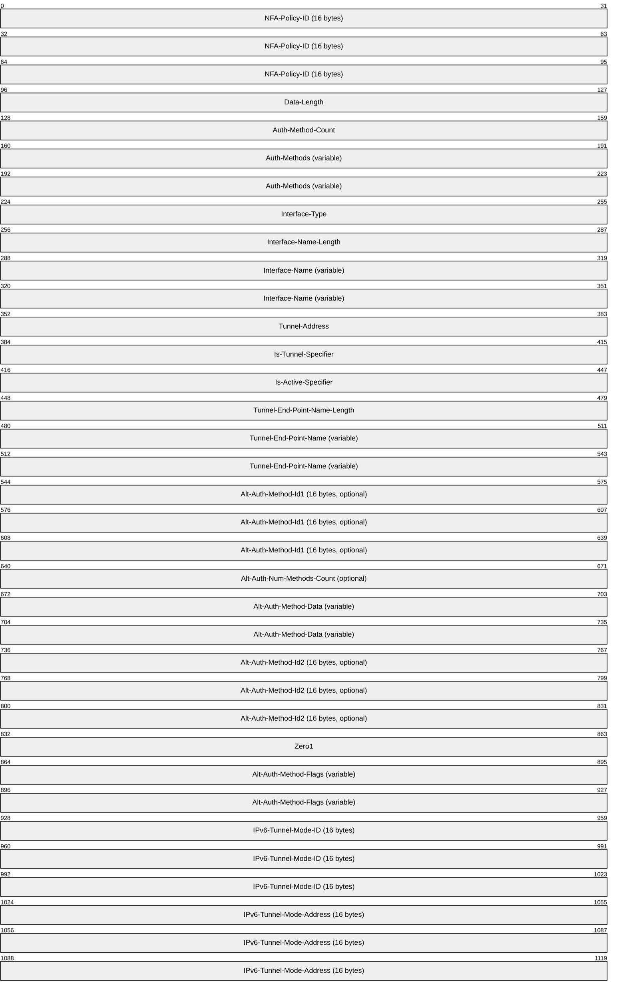
```mermaid
packet-beta
  0-95: "NFA-Policy-ID (16 bytes)"
  96-127: "Data-Length"
  128-159: "Auth-Method-Count"
  160-223: "Auth-Methods (variable)"
  224-255: "Interface-Type"
  256-287: "Interface-Name-Length"
  288-351: "Interface-Name (variable)"
  352-383: "Tunnel-Address"
  384-415: "Is-Tunnel-Specifier"
  416-447: "Is-Active-Specifier"
  448-479: "Tunnel-End-Point-Name-Length"
  480-543: "Tunnel-End-Point-Name (variable)"
  544-639: "Alt-Auth-Method-Id1 (16 bytes, optional)"
  640-671: "Alt-Auth-Num-Methods-Count (optional)"
  672-735: "Alt-Auth-Method-Data (variable)"
  736-831: "Alt-Auth-Method-Id2 (16 bytes, optional)"
  832-863: "Zero1"
  864-927: "Alt-Auth-Method-Flags (variable)"
  928-1023: "IPv6-Tunnel-Mode-ID (16 bytes)"
  1024-1119: "IPv6-Tunnel-Mode-Address (16 bytes)"
```

**NFA-Policy-ID (16 bytes):** The identifier that specifies this [**BLOB**](#gt_binary-large-object-blob) as an NFA policy describing the policy; this MUST be the [**GUID**](#gt_globally-unique-identifier-guid) whose string representation is "{11BBAC00-498D-11D1-8639-00A0248D3021}".

**Data-Length (4 bytes):** This MUST be the length, in bytes, of the data that follows up to and including Tunnel-End-Point-Name. The data beyond Tunnel-End-Point-Name is not accounted for in the **Data-Length** field. This MUST be an unsigned integer value. This field is always 1 byte less than the size of the following data encoded as an octet stream.<6>

**Auth-Method-Count (4 bytes):** This MUST be the number of Auth-Method binary values that follow. This MUST be an unsigned integer value.

**Auth-Methods (variable):** The binary data that specifies additional policy data. The length of this data is determined by the **Auth-Method-Count** field value and the **Auth-Method** data structure length; more specifically, the **Auth-Method** data structure repeats **Auth-Method-Count** times.

The following binary format specifies the contents of the **Auth-Method** structure.

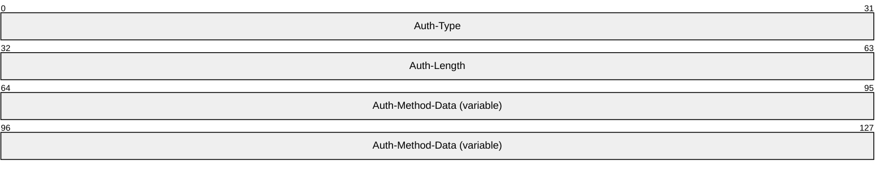
```mermaid
packet-beta
  0-31: "Auth-Type"
  32-63: "Auth-Length"
  64-127: "Auth-Method-Data (variable)"
```

**Auth-Type (4 bytes):** The type of authentication that [**IKE**](#gt_internet-key-exchange-ike) performs for the NFA policy, as defined in [[RFC2409]](https://go.microsoft.com/fwlink/?LinkId=90349) and [[GSS]](https://go.microsoft.com/fwlink/?LinkId=89876). This field MUST be one of the following values.

| Value | Meaning |
| --- | --- |
| 0x00000001 | Authenticate by using a pre-shared key (PSK). |
| 0x00000003 | Authenticate by using an X.509 certificate. |
| 0x00000005 | Authenticate by using the Kerberos authentication system. |

**Auth-Length (4 bytes):** This MUST be the length, in bytes, of the following **Auth-Method-Data** field. This MUST be an unsigned integer.

**Auth-Method-Data (variable):** The specific details of the Auth-Type that IKE uses, as defined in [GSS]. This MUST be one of the following values, based on the value of Auth-Type. It is recommended that the **Auth-Method-Data** be privacy protected (encrypted) to ensure that it is not susceptible to eavesdropping. This is particularly important for the pre-shared key value because it is not protected by a hash.

| Auth-Type value | Auth-Method-Data value and meaning |
| --- | --- |
| 0x00000001 | Pre-shared key. The null-terminated Unicode text string to use for the pre-shared key (PSK) authentication. |
| 0x00000003 | X.509 certificate. The Unicode text string certificate name of the X.509 certificate to use to authenticate.<7> |
| 0x00000005 | Kerberos. The **Auth-Method-Data** field MUST be 0x0000. |

**Interface-Type (4 bytes):** The type of interface to which the IPsec component MUST apply the NFA policy. This MUST be one of the following values.

| Value | Meaning |
| --- | --- |
| 0xFFFFFFFF | Apply to dial-up interfaces only. |
| 0xFFFFFFFE | Apply to LAN interfaces only. |
| 0xFFFFFFFD | Apply to all interfaces. |

**Interface-Name-Length (4 bytes):** An unsigned integer that MUST be the length, in bytes, of the following **Interface-Name** field.

**Interface-Name (variable):** The Unicode string that names a particular interface.

**Tunnel-Address (4 bytes):** This MAY<8> be the IPv4 IP address of the IPsec [**tunnel mode**](#gt_tunnel-mode) endpoint to which the IPsec component will apply this NFA policy (if applicable). The **Is-Tunnel-Specifier** field indicates whether this field is to be interpreted by the IPsec component.

**Is-Tunnel-Specifier (4 bytes):** An indicator that this NFA policy applies to an IPsec tunnel. Used by IKE to negotiate [**SAs**](#gt_security-association-sa). This MUST be one of the following values.

| Value | Meaning |
| --- | --- |
| 0x00000000 | This NFA is not a tunnel filter. |
| 0x00000001 | This filter is a tunnel filter. |

**Is-Active-Specifier (4 bytes):** An indicator that this NFA policy is active and part of a policy. This MUST be one of the following values.

| Value | Meaning |
| --- | --- |
| 0x0000000 | This NFA is not active. |
| 0x0000001 | This filter is active. |

**Tunnel-End-Point-Name-Length (4 bytes):** This MUST be the length, in bytes, of the **Tunnel-End-Point-Name** field. This MUST be an unsigned integer.

**Tunnel-End-Point-Name (variable):** The Unicode string that names the tunnel mode endpoint (if applicable). This is applicable if the **Is-Tunnel-Specifier** field indicates that this is a tunnel, and the **Tunnel-End-Point-Name-Length** field indicates that this field has data.

**Alt-Auth-Method-Id1 (16 bytes):** This is an optional field that specifies this BLOB as an alternate authentication method. This SHOULD<9> be the GUID whose string representation is "{01010101-0101-0101-0101-01010101}". If the GUID is specified, **Alt-Auth-Num-Methods-Count** and **Alt-Auth-Method-Data** are also specified.

**Alt-Auth-Num-Methods-Count (4 bytes):** This is an optional field that SHOULD<10> specify the number of alternate authentication methods that follow. This value MUST be equal to **Auth-Method-Count** field.

**Alt-Auth-Method-Data (variable):** This optional field SHOULD<11> be the binary data that specifies additional authentication method policy data. The length of this data is determined by the **Alt-Auth-Num-Methods-Count** value and the Alt-Auth-Method-Data structure length. This data structure repeats for the value of **Alt-Auth-Num-Methods-Count**. The following binary format specifies the contents of this field.

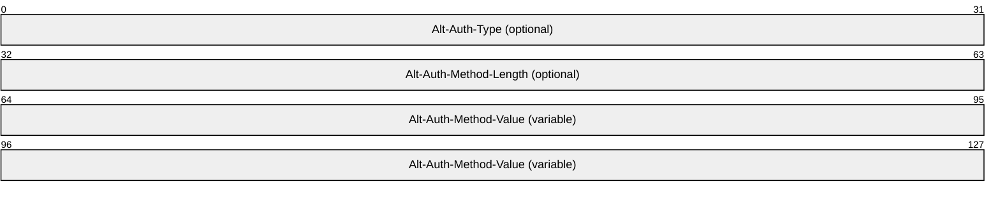
```mermaid
packet-beta
  0-31: "Alt-Auth-Type (optional)"
  32-63: "Alt-Auth-Method-Length (optional)"
  64-127: "Alt-Auth-Method-Value (variable)"
```

**Alt-Auth-Type (4 bytes):** This optional field<12> is the type of authentication to perform for the NFA policy. This MUST be one of the following values:

| Value | Meaning |
| --- | --- |
| 0x00000001 | Authenticate by using a pre-shared key (PSK). |
| 0x00000003 | Authenticate by using an X.509 certificate. |
| 0x00000005 | Authenticate by using the Kerberos authentication system. |

**Alt-Auth-Method-Length (4 bytes):** This is an optional field. This field is the length, in bytes, of the following **Alt-Auth-Method-Value** field. This field SHOULD<13> be an unsigned integer.

**Alt-Auth-Method-Value (variable):** An optional field, containing the specific details of the **Auth-Type** field. This SHOULD<14> be one of the following values.

| Value | Meaning |
| --- | --- |
| 0x00000001 | Pre-shared key. The null-terminated Unicode text string to use for the pre-shared key (PSK) authentication. For example, "Open-Sesame". |
| 0x00000003 | X.509 certificate. The Unicode text string certificate name of the X.509 certificate to use to authenticate.<15> |
| 0x00000005 | Kerberos. The **Auth-Method-Data** field MUST be 0x00. |

**Alt-Auth-Method-Id2 (16 bytes):** This is an optional field. The identifier that specifies this BLOB as an alternate authentication method; This SHOULD<16> be the GUID whose string representation is "{01010101-0101-0101-0101-01010102}". If the GUID is specified, the **Alt-Auth-Method-Flags** is specified.

**Zero1 (4 bytes):** This value MAY be filled with 0x00 and MUST be ignored when read.

**Alt-Auth-Method-Flags (variable):** This is an optional field that occurs **Alt-Auth-Num-Methods-Count** number of times. The length of this field is **Alt-Auth-Num-Methods-Count** * 4 bytes. If the **Alt-Auth-Method-Value** is an X.509 certificate, this field describes the behavior of the certificate. This field SHOULD<17> be one of the following values.

| Value | Meaning |
| --- | --- |
| 0x00000000 | Auth method is not a certificate. |
| 0x00000001 | Enable certificate to account mapping. |
| 0x00000002 | Exclude CA name from certificate request. |

**IPv6-Tunnel-Mode-ID (16 bytes):** The identifier that specifies this NFA contains an optional IPv6 address for the tunnel endpoint. If this field is present, it supersedes the (IPv4) **Tunnel-Address** field value. This SHOULD<18> be the GUID whose string representation is "{01010101-0101-0101-0101-01010103}".

**IPv6-Tunnel-Mode-Address (16 bytes):** This SHOULD<19> be the IPv6 address of the IPsec tunnel mode endpoint to which the IPsec component will apply this NFA (if applicable).

#### 2.2.1.4 ipsecNegotiationPolicy Object Attribute Details

The Negotiation policy stores information regarding what action to take when it is determined that a packet matches the associated Filter policy. The **ipsecNegotiationPolicy** data attribute contains this Negotiation policy information. The actions are block, allow, and secure. It also includes security settings on how to secure the connection (also known as quick mode). The following diagram shows a Negotiation policy object.

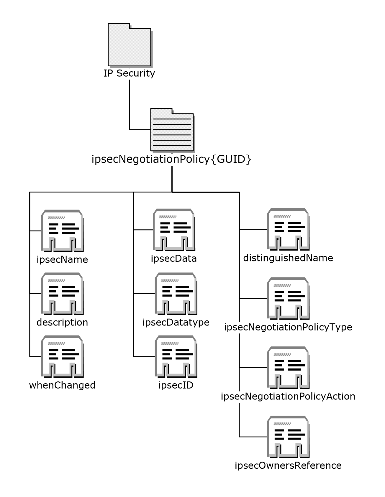

Figure 13: Negotiation policy object

The **ipsecNegotiationPolicy** object creation MUST use the LDAP add functionality in conformance with [[RFC2251]](https://go.microsoft.com/fwlink/?LinkId=90325) section 4.7.

The **ipsecNegotiationPolicy** object modification MUST use the LDAP modify functionality in conformance with [RFC2251] section 4.6.

The **ipsecNegotiationPolicy** attributes are specified in the following subsection.

##### 2.2.1.4.1 ipsecNegotiationPolicy{GUID} Object Description

The following table specifies the attributes of the **ipsecNegotiationPolicy** class object, as specified in [MS-ADSC](../MS-ADSC/MS-ADSC.md), [MS-ADA1](../MS-ADA1/MS-ADA1.md), and [MS-ADA3](../MS-ADA3/MS-ADA3.md).

| Name | Type | Description |
| --- | --- | --- |
| **objectClass** | LDAPString | The [**Directory String**](#gt_directory-string) that contains the object class. A typical value is like the following: "ipsecNegotiationPolicy". This attribute is only used during policy creation. |
| **ipsecName** | LDAPString | The ipsecName attribute for ipsecNegotiationPolicy objects. This MUST NOT be set to NULL.<20> |
| **Description** | LDAPString | The user-constructed Directory String that is intended to contain a description of the negotiation policy. A typical value is like the following: *"Secure the traffic with ESP(3DES)"*. |
| **whenChanged** | UTC–coded string | The Unicode-generalized time syntax of the time and date that the policy was last changed. This value is set by the Active Directory server. |
| **ipsecID** | LDAPString | The Directory String that contains the curly braced GUID string value of this ipsecNegotiationPolicy object. A typical value is like the following: *"{6A1E5C3F-72B7-11d2-ACF0-02603625CAFE}"*. |
| **distinguishedName** | Distinguished name | The Directory String description of the directory location (DN) of this Negotiation policy object. This MUST be set by the protocol. A typical value is like the following: *"CN=ipsecNegotiationPolicy{6A1E5C3F-72B7-11D2-ACF0-0260B025CAFE },CN=IP Security,CN=System,DC=myDomain,DC=contoso,DC=com"*. |
| **ipsecNegotiationPolicyAction** | LDAPString | The Directory String of the GUID that represents the policy action that needs to be taken based on a filter. For more information, see the following ipsecNegotiationPolicyAction table. A typical value is like the following: *"{3F91A819-7647-11D1-864D-D46A00000000}"*. |
| **ipsecNegotiationPolicyType** | LDAPString | The Directory String of the GUID that represents the filter action type profile to use when interpreting the policy. For more information, see the following ipsecNegotiationPolicyType table. A typical value is like the following: *"{62F49E10-6C37-11D1-864C-14A300000000}"*. |
| **ipsecOwnersReference** | List of distinguished names | A list composed of Directory String references to the owner ipsecNFA objects that are associated with this Negotiation policy object. The list MUST be composed of [**DNs**](#gt_distinguished-name-dn) in the format of [[RFC2251]](https://go.microsoft.com/fwlink/?LinkId=90325). The separator between two DNs is 2 bytes of '0'. For example: DN1 2bytesof0 DN2, where DN1 and DN2 are distinguished names. |
| **ipsecDataType** | LDAPString | The identifier that describes the format of the following **ipsecData** attribute. This MUST be the Directory String representation of the unsigned integer value 0x100. |
| **ipsecData** | Octet string | The octet string representation of the binary data that specifies additional policy data stored, as described in the following **ipsecData**-specific table. |

**Note** The **ipsecNegotiationPolicy** object as specified in LDAP messages ([MS-ADSC], section 2.73, "Class ipsecNegotiationPolicy") is encoded using BER, as defined in [RFC2251] section 5.1.

The following tables specify the **ipsecNegotiationPolicyType**, **ipsecNegotiationPolicyAction**, and **ipsecData** attribute-specific sections, corresponding names, and the data types for the assigned values for the purpose of [**IPsec**](#gt_internet-protocol-security-ipsec) policy configuration.

The values of these settings MUST NOT be interpreted by this protocol; that is, they are applied as is to the IPsec component, which can interpret them independently of the protocol or mechanism that was used to configure them. A description of the interpretation by the IPsec component is provided for informative purposes (as opposed to the syntax, which is normative).

**ipsecNegotiationPolicyType**: The **ipsecNegotiationPolicyType** value description. The value MUST be one of the following.

| Value | Meaning |
| --- | --- |
| {62F49E13-6C37-11D1-864C-14A3-00000000} | This Negotiation policy is to use the [**default response rule**](#gt_default-response-rule) action type for SA negotiation. |
| {62F49E10-6C37-11D1-864C-14A3-00000000} | This is a standard negotiation type; that is, it is not a default response. |

**ipsecNegotiationPolicyAction**: The **ipsecNegotiationPolicyAction** value description. The value MUST be one of the following.

| Value | Meaning |
| --- | --- |
| {3F91A819-7647-11D1-864D-D46A00000000} | Block: The action to prevent the IP traffic from flowing needs to occur. |
| {8A171DD2-77E3-11d1-8659-A04F00000000} | Permit: The traffic is to be allowed to flow unhindered and unprotected by IPsec encapsulation. |
| {8A171DD3-77E3-11D1-8659-A04F00000000} | Secure: The traffic is to be protected by IPsec encapsulation (for example, [**authentication header**](#gt_authentication-header-ah) (AH) and/or [**Encapsulating Security Payload**](#gt_encapsulating-security-payload-esp) (ESP) encapsulation). |
| {3F91A81A-7647-11D1-864D-D46A00000000} | Inbound pass-through: Allow traffic to be accepted if it is not IPsec-protected; however, initiate IKE to peer and evaluate the corresponding response against the traffic filters. |

**IPsecData Attribute description**:

Note that all fields specified in the following tables MUST appear in little-endian byte order.

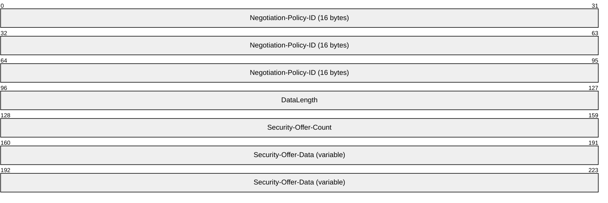
```mermaid
packet-beta
  0-95: "Negotiation-Policy-ID (16 bytes)"
  96-127: "DataLength"
  128-159: "Security-Offer-Count"
  160-223: "Security-Offer-Data (variable)"
```

**Negotiation-Policy-ID (16 bytes):** The identifier that specifies this [**BLOB**](#gt_binary-large-object-blob) as an [**NFA**](#gt_negotiation-filter-association-nfa) policy that describes the policy. MUST be the [**GUID**](#gt_globally-unique-identifier-guid) whose string representation is "{80DC20B9-2EC8-11D1-A89E-00A0248D3021}".

**DataLength (4 bytes):** This is the length of the data that follows. This MUST be an unsigned integer. This field is always 1 byte less than the size of the following data encoded as an octet stream.

**Security-Offer-Count (4 bytes):** The number of security offers that are specified in the **Security-Offer-Data** that follows.

**Security-Offer-Data (variable):** The binary data that specifies additional policy data stored as specified in the following binary format. This binary data is in multiples of 80 bytes.

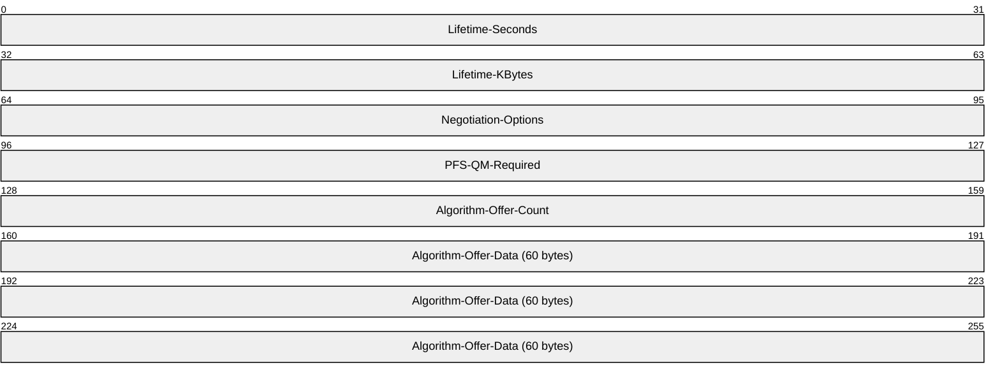
```mermaid
packet-beta
  0-31: "Lifetime-Seconds"
  32-63: "Lifetime-KBytes"
  64-95: "Negotiation-Options"
  96-127: "PFS-QM-Required"
  128-159: "Algorithm-Offer-Count"
  160-255: "Algorithm-Offer-Data (60 bytes)"
```

**Lifetime-Seconds (4 bytes):** The QM lifetime, as defined in [[RFC2409]](https://go.microsoft.com/fwlink/?LinkId=90349), in seconds, that [**IKE**](#gt_internet-key-exchange-ike) is to negotiate. This MUST be an unsigned integer.

**Lifetime-KBytes (4 bytes):** The QM lifetime, in kilobytes, that IKE is to negotiate. This MUST be an unsigned integer.

**Negotiation-Options (4 bytes):** The policy specification modifiers to apply to the negotiation policy. This MUST be 0x00000000.

**PFS-QM-Required (4 bytes):** Whether or not IKE is to negotiate PFS when negotiating QM. This MUST be one of the following values.

| Value | Meaning |
| --- | --- |
| 0x00000000 | QM-PFS is used. |
| 0x00000001 | QM-PFS is not used. |

**Algorithm-Offer-Count (4 bytes):** The number of algorithm offers that are specified in the **Algorithm-Offer-Data** that follows; the maximum number supported is 3. This MUST be an unsigned integer.

**Algorithm-Offer-Data (60 bytes):** The binary data that specifies additional policy data are stored in three sets of the following binary format. For fields in this data, see [[RFC2402]](https://go.microsoft.com/fwlink/?LinkId=90342) section 3.2 and [[RFC2406]](https://go.microsoft.com/fwlink/?LinkId=90346) section 3.2. The size of this field is always 60 bytes, of which only the first **Algorithm-Offer-Count** *20 bytes are significant, any other bytes in this field MUST be ignored.

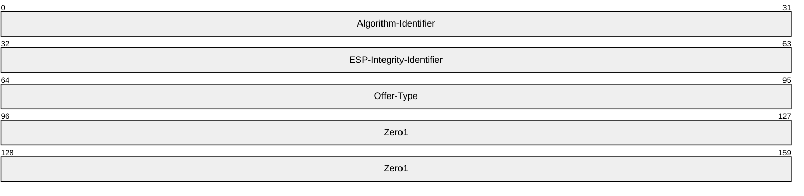
```mermaid
packet-beta
  0-31: "Algorithm-Identifier"
  32-63: "ESP-Integrity-Identifier"
  64-95: "Offer-Type"
  96-159: "Zero1"
```

**Algorithm-Identifier (4 bytes):** The IPsec framing algorithm identifier; either AH or ESP.

If AH is used (as specified by Offer-Type), it MUST have one of the values specified in the following table.

| Value | Meaning |
| --- | --- |
| AH[MD5] 0x00000001 | AH framing with MD5. |
| AH[SHA-1] 0x00000002 | AH framing with SHA-1. |

If ESP is used (as specified by Offer-Type), it MUST have one of the values specified in the following table.

| Value | Meaning |
| --- | --- |
| ESP[null] 0x00000001 | ESP encapsulation with no encryption. |
| ESP[DES] 0x00000002 | ESP encapsulation with Data Encryption Standard (DES) encryption. |
| ESP[3DES] 0x00000003 | ESP encapsulation with Triple DES (3DES) encryption. |

**ESP-Integrity-Identifier (4 bytes):** Specifies the Hash-based Message Authentication Code (HMAC) to use if ESP is specified by Offer-Type. This field MUST be one of the following values.

| Value | Meaning |
| --- | --- |
| 0x00000000 | None (ESP is not used). |
| 0x00000001 | ESP integrity with MD5. |
| 0x00000002 | ESP integrity with SHA-1. |

**Offer-Type (4 bytes):** The offer type that is presented; either Authentication or Encryption. This MUST be one of the following values.

| Value | Meaning |
| --- | --- |
| 0x00000001 | AH encapsulation. |
| 0x00000002 | ESP encapsulation. |

**Zero1 (8 bytes):** This value MAY be filled with 0x00 and MUST be ignored when read.

#### 2.2.1.5 ipsecFilter Object Attribute Details

The Filter policy stores IP filter conditions. The **ipsecFilter** data attribute contains the [**IPsec**](#gt_internet-protocol-security-ipsec) filter policy information. This information includes what is commonly associated with IP filters (for example, source address/mask, destination address/mask, and port). The following diagram shows a Filter policy object.

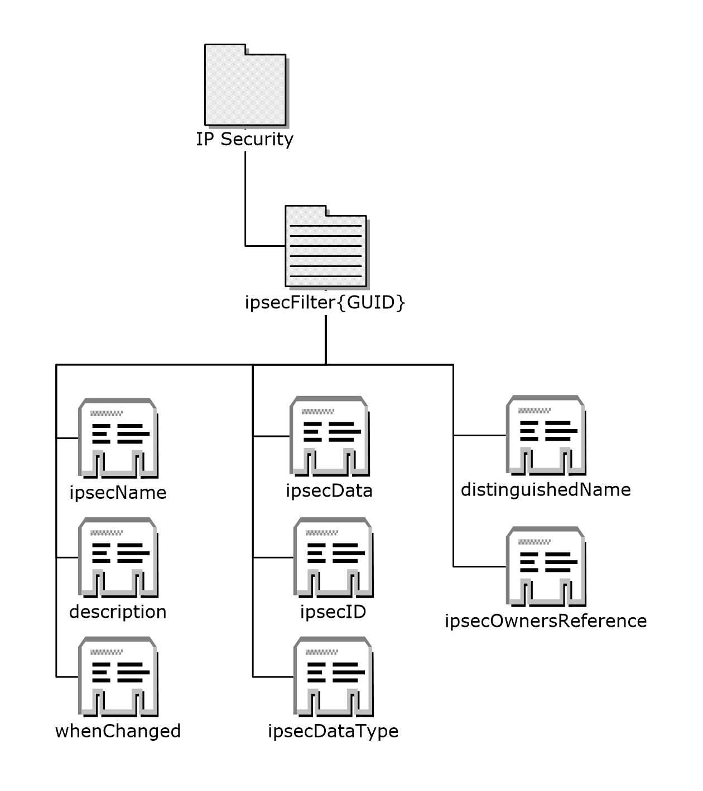

Figure 14: Filter policy object

The ipsecFilter object creation MUST use the LDAP add functionality in conformance with [[RFC2251]](https://go.microsoft.com/fwlink/?LinkId=90325) section 4.7.

The **ipsecFilter** object creation/modification MUST use the LDAP modify functionality in conformance with [RFC2251] section 4.6.

The **ipsecFilter** attributes are specified in the following subsection.

##### 2.2.1.5.1 ipsecFilter{GUID} Object Description

The following table specifies the attributes of the **ipsecFilter class** object, as specified in [MS-ADSC](../MS-ADSC/MS-ADSC.md), [MS-ADA1](../MS-ADA1/MS-ADA1.md), and [MS-ADA3](../MS-ADA3/MS-ADA3.md).

| Name | Type | Description |
| --- | --- | --- |
| **objectClass** | LDAPString | The [**Directory String**](#gt_directory-string) that contains the object class. A typical value is "ipsecFilter". This attribute is only used during policy creation. |
| **ipsecName** | LDAPString | The user-constructed Directory String that contains the name for this filter. A typical value is "*All traffic filter*". |
| **description** | LDAPString | The user-constructed Directory String that is intended to contain a description of the filter group. A typical value is *"My servers to protect"*. |
| **whenChanged** | UTC-coded string | The Unicode-generalized time syntax of the time and date that the policy was last changed. This value is set by the Active Directory server. |
| **ipsecID** | LDAPString | The Directory String that contains the curly braced GUID string value of the ipsecFilter object. A typical value is similar to the following: *"{6A1E5C3F-72B7-11D2-ACF0-02603625CAFE}"*. |
| **distinguishedName** | Distinguished name | The Directory String description of the directory location of this ipsecFilter policy object. This MUST be in the DN format of [[RFC2251]](https://go.microsoft.com/fwlink/?LinkId=90325). This MUST be set by the protocol. A typical value is similar to the following: *"CN=ipsecFilter{6A1E5C3F-72B7-11D2-ACF0-0260B025CAFE },CN=IP Security,CN=System,DC=myDomain,DC=contoso,DC=com"*. |
| **ipsecOwnersReference** | List of distinguished names | A list composed of Directory String references to the parent ipsecNFA objects that are associated with this filter. Note that a filter can be associated with multiple NFAs. The list MUST be composed of DNs in the format of [RFC2251]. The separator between two DNs is 2 bytes of '0'. For example: DN1 2bytesof0 DN2, where DN1 and DN2 are distinguished names. |
| **ipsecDataType** | LDAPString | The identifier that describes the format of the following **ipsecData** attribute. This MUST be the Directory String representation of the unsigned integer value 0x100. |
| **ipsecData** | Octet string | The octet string representation of the binary data that specifies additional policy data stored as described in the following **ipsecData**-specific table. |

**Note** The ipsecFilter object as specified in LDAP messages ([MS-ADSC], section 2.71 "Class ipsecFilter") is encoded using BER, as defined in [RFC2251] section 5.1.

The following table specifies the **ipsecData** attribute-specific sections, corresponding names, and data types for the assigned values for the purpose of [**IPsec**](#gt_internet-protocol-security-ipsec) policy configuration.

The values of these settings MUST NOT be interpreted by this protocol; that is, they are to be applied as is to the IPsec component, which can interpret them independently of the protocol or mechanism that was used to configure them. A description of the interpretation by the IPsec component is provided for informative purposes (as opposed to the syntax, which is normative).

Note that all fields specified in the following tables MUST appear in little-endian byte order.

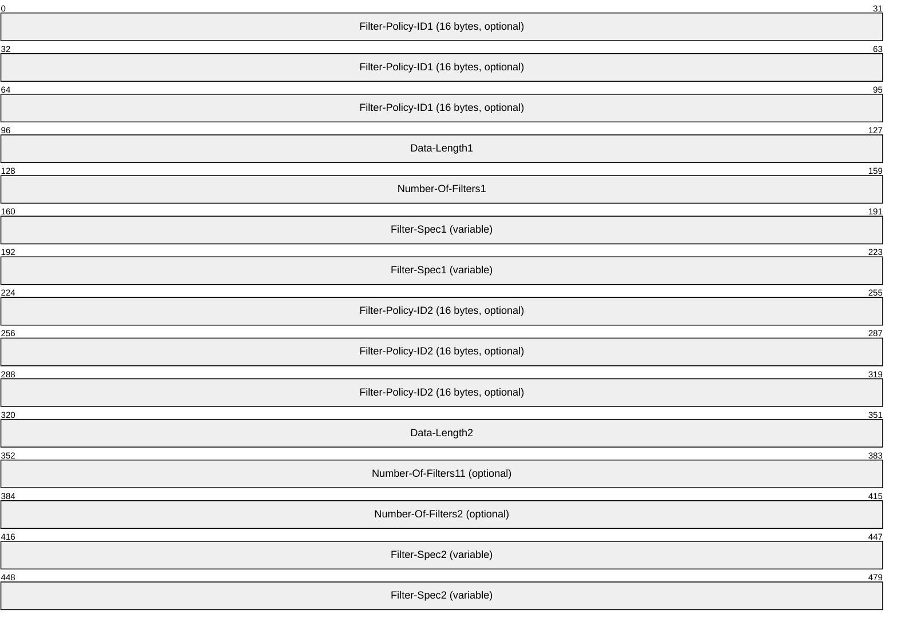
```mermaid
packet-beta
  0-95: "Filter-Policy-ID1 (16 bytes, optional)"
  96-127: "Data-Length1"
  128-159: "Number-Of-Filters1"
  160-223: "Filter-Spec1 (variable)"
  224-319: "Filter-Policy-ID2 (16 bytes, optional)"
  320-351: "Data-Length2"
  352-383: "Number-Of-Filters11 (optional)"
  384-415: "Number-Of-Filters2 (optional)"
  416-479: "Filter-Spec2 (variable)"
```

**Filter-Policy-ID1 (16 bytes):** The identifier that specifies the [**BLOB**](#gt_binary-large-object-blob) as a collection of the legacy filter policy format. This is the [**GUID**](#gt_globally-unique-identifier-guid) whose string representation is "{80DC20B5-2EC8-11D1-A89E-00A0248D3021}". This means that a legacy filter follows.

**Data-Length1 (4 bytes):** This field SHOULD<21> be the length of data, in bytes, of the **Filter-Spec1** field. This MUST be an unsigned integer.

**Number-Of-Filters1 (4 bytes):** The number of Filter-Spec1 (legacy filters) that are present.

**Filter-Spec1 (variable):** The format of the data for the Legacy (V1) filter. This structure is repeated **Number-Of-Filters1** times (or **Number-Of-Filters11** times when **Filter-Policy-ID2** is present).

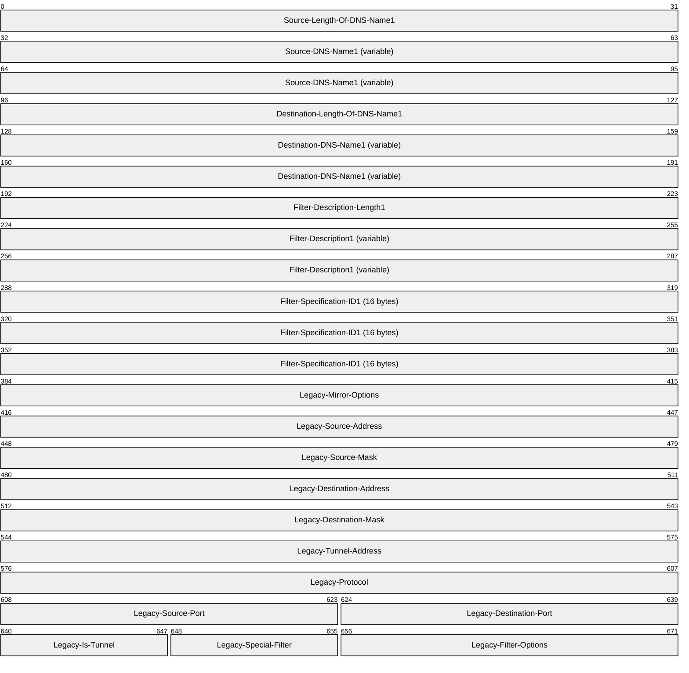
```mermaid
packet-beta
  0-31: "Source-Length-Of-DNS-Name1"
  32-95: "Source-DNS-Name1 (variable)"
  96-127: "Destination-Length-Of-DNS-Name1"
  128-191: "Destination-DNS-Name1 (variable)"
  192-223: "Filter-Description-Length1"
  224-287: "Filter-Description1 (variable)"
  288-383: "Filter-Specification-ID1 (16 bytes)"
  384-415: "Legacy-Mirror-Options"
  416-447: "Legacy-Source-Address"
  448-479: "Legacy-Source-Mask"
  480-511: "Legacy-Destination-Address"
  512-543: "Legacy-Destination-Mask"
  544-575: "Legacy-Tunnel-Address"
  576-607: "Legacy-Protocol"
  608-623: "Legacy-Source-Port"
  624-639: "Legacy-Destination-Port"
  640-647: "Legacy-Is-Tunnel"
  648-655: "Legacy-Special-Filter"
  656-671: "Legacy-Filter-Options"
```

**Source-Length-Of-DNS-Name1 (4 bytes):** The length of the **Source-DNS-Name1** field that follows.

**Source-DNS-Name1 (variable):** The source [**fully qualified domain name (FQDN)**](#gt_fully-qualified-domain-name-fqdn) field whose length is described by **Source-Length-Of-DNS-Name1**.

**Destination-Length-Of-DNS-Name1 (4 bytes):** The length of the **Destination-DNS-Name1** field that follows.

**Destination-DNS-Name1 (variable):** The destination FQDN field whose length is described by **Destination-Length-Of-DNS-Name1**.

**Filter-Description-Length1 (4 bytes):** The length of the filter-description field that follows.

**Filter-Description1 (variable):** The user-constructed [**Unicode**](#gt_unicode), NULL-terminated text string that is intended to contain a description of this individual filter (for example, *"Matches all ICMP packets between this computer and any other computer"*).

**Filter-Specification-ID1 (16 bytes):** The user-constructed identifier that identifies this individual legacy filter.

**Legacy-Mirror-Options (4 bytes):** An indicator that this filter needs to be mirrored. A mirrored filter is one that MUST be detected by generating a matching incoming and outgoing filter pair. (For example, "IP1 to IP2, mirrored" is detected as "IP1 to IP2" and "IP2 to IP1" directional filters.) This MUST be one of the following values.

| Value | Meaning |
| --- | --- |
| 0x00000000 | This filter is not mirrored. |
| 0x00000001 | This filter is mirrored. |

**Legacy-Source-Address (4 bytes):** The (IPv4) IP address of the traffic source address to apply the IPsec filter to. Note that 0x00000000 is a special value that means "any IP address".

**Legacy-Source-Mask (4 bytes):** The (IPv4) IP subnet mask for the source IP address specified in Source-Address.

**Legacy-Destination-Address (4 bytes):** The (IPv4) IP address of the traffic destination address to apply the IPsec filter to. Note that 0x00000000 is a special value that means "any IP address".

**Legacy-Destination-Mask (4 bytes):** The (IPv4) IP subnet mask for the source IP address specified in Destination-Address.

**Legacy-Tunnel-Address (4 bytes):** The optional (IPv4) IP address of the traffic IPsec [**tunnel mode**](#gt_tunnel-mode) endpoint to apply the IPsec filter to. Note that this field MUST NOT be interpreted unless the **Legacy-Is-Tunnel** field specifies that this is a tunnel filter.

**Legacy-Protocol (4 bytes):** The protocol number that specifies the (IPv4) IP traffic protocol to filter, for example, 0x00000006 for [**TCP**](#gt_transmission-control-protocol-tcp) and 0x00000011 for [**UDP**](#gt_user-datagram-protocol-udp). Note that 0x00000000 is a special value that means "any protocol". This MUST be an unsigned integer.

**Legacy-Source-Port (2 bytes):** The source port that this filter applies to. Note that 0x0000 is a special value that means "any port". This MUST be an unsigned integer.

**Legacy-Destination-Port (2 bytes):** The destination port that this filter applies to. Note that 0x0000 is a special value that means "any port". This MUST be an unsigned integer.

**Legacy-Is-Tunnel (1 byte):** Specifies that this filter is an IPsec tunnel-mode filter and the **Legacy-Tunnel-Address** field MUST be interpreted. This MUST be one of the following values.

| Value | Meaning |
| --- | --- |
| 0x00 | This filter is not a tunnel filter. |
| 0x01 | This filter is a tunnel filter. |

**Legacy-Special-Filter (1 byte):** Specifies that this filter is a special filter that has a predefined meaning and SHOULD<22> be interpreted based on the IP configuration of the host machine. One of the following values is used.

| Value | Meaning |
| --- | --- |
| 0x00 | This is not a special filter. |
| 0x01 | This filter is to use the local system's DNS server(s) (IPv4) IP address for the source address. |
| 0x02 | This filter is to use the local system's WINS server(s) (IPv4) IP address for the source address. |
| 0x03 | This filter is to use the local system's DHCP server (IPv4) IP address for the source address. |
| 0x04 | This filter is to use the local system's default-gateway (IPv4) IP address for the source address. |
| 0x81 | This filter is to use the local system's DNS server(s) (IPv4) IP address for the destination address. |
| 0x82 | This filter is to use the local system's WINS server(s) (IPv4) IP address for the destination address. |
| 0x83 | This filter is to use the local system's DHCP server (IPv4) IP address for the destination address. |
| 0x84 | This filter is to use the local system's default-gateway (IPv4) IP address for the destination address. |

**Legacy-Filter-Options (2 bytes):** The policy specification modifiers to apply to the filter policy. This MUST be 0x00.

**Filter-Policy-ID2 (16 bytes):** Optional. The identifier that specifies the BLOB as a collection of the new Filter policy format. This SHOULD<23> be the GUID whose string representation is "{35FECD3D-AE29-4373-8A6A-C5D8FAB2FB08}". This means that a newer filter format, Filter-Spec2, follows.

**Data-Length2 (4 bytes):** This field MUST be the length, in bytes, of the **Filter-Spec2** field. This MUST be an unsigned integer.

**Number-Of-Filters11 (4 bytes):** Optional. This field is present when **Filter-Policy-ID2** is specified. The number of **Filter-Spec1** (legacy filters) that are present. If this value is nonzero, it overrides the value present in **Number-Of-Filters1**.

**Number-Of-Filters2 (4 bytes):** Optional. This field is present when **Filter-Policy-ID2** is specified. The number of **Filter-Spec2** filters that are present.

**Filter-Spec2 (variable):** The format of the data for the version 2 (V2) filter.

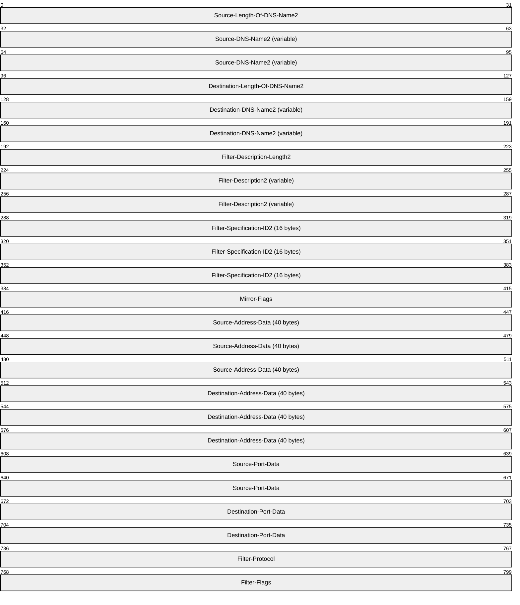
```mermaid
packet-beta
  0-31: "Source-Length-Of-DNS-Name2"
  32-95: "Source-DNS-Name2 (variable)"
  96-127: "Destination-Length-Of-DNS-Name2"
  128-191: "Destination-DNS-Name2 (variable)"
  192-223: "Filter-Description-Length2"
  224-287: "Filter-Description2 (variable)"
  288-383: "Filter-Specification-ID2 (16 bytes)"
  384-415: "Mirror-Flags"
  416-511: "Source-Address-Data (40 bytes)"
  512-607: "Destination-Address-Data (40 bytes)"
  608-671: "Source-Port-Data"
  672-735: "Destination-Port-Data"
  736-767: "Filter-Protocol"
  768-799: "Filter-Flags"
```

**Source-Length-Of-DNS-Name2 (4 bytes):** The length of the **Source-DNS-Name2** field that follows.

**Source-DNS-Name2 (variable):** The source FQDN field whose length is described by **Source-Length-Of-DNS-Name2**.

**Destination-Length-Of-DNS-Name2 (4 bytes):** The length of **Destination-DNS-Name2** field that follows.

**Destination-DNS-Name2 (variable):** The destination FQDN field whose length is described by Destination-Length-Of-DNS-Name2.

**Filter-Description-Length2 (4 bytes):** The length of the filter-description field that follows.

**Filter-Description2 (variable):** The user-constructed Unicode, NULL-terminated text string that is intended to contain a description of this individual filter (for example, "*Matches all ICMP packets between this computer and any other computer*").

**Filter-Specification-ID2 (16 bytes):** The user-constructed identifier that identifies this individual filter.

**Mirror-Flags (4 bytes):** An indicator that this filter needs to be mirrored. A mirrored filter is one that MUST be realized by generating a matching incoming and outgoing filter pair. (For example, "IP1 to IP2, mirrored" is realized as "IP1 to IP2" and "IP2 to IP1" directional filters.) This MUST be one of the following values.

| Value | Meaning |
| --- | --- |
| 0x00000000 | This filter is not mirrored. |
| 0x00000001 | This filter is mirrored. |

**Source-Address-Data (40 bytes):** The IP address of the traffic source to apply the IPsec filter to. This is specified in the following binary format. Note that all addresses are expected in network byte order.<24>

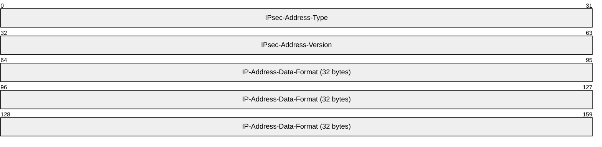
```mermaid
packet-beta
  0-31: "IPsec-Address-Type"
  32-63: "IPsec-Address-Version"
  64-159: "IP-Address-Data-Format (32 bytes)"
```

**IPsec-Address-Type (4 bytes):** Specifies the type of address that the IPsec filter specifies. This includes special filter types that have a predefined meaning and are interpreted based on the IP configuration of the host machine. This MUST be one of the following values and MUST be an unsigned integer.

| Value | Meaning |
| --- | --- |
| 0x00000000 | This is the filter that applies to all IP traffic (that is, any traffic filter). |
| 0x00000001 | This filter specifies a single IP address filter. |
| 0x00000002 | This filter specifies a range of IP addresses. |
| 0x00000004 | This filter specifies an IP subnet. |
| 0x00000008 | This filter is to use the local system's IP address(es) (that is, 'Me' traffic filter). |
| 0x00000010 | This filter is to use the local system's DNS server(s) IP address. |
| 0x00000020 | This filter is to use the local system's WINS server(s) IP address. |
| 0x00000040 | This filter is to use the local system's DHCP server IP address. |
| 0x00000080 | This filter is to use the local system's default-gateway IP address. |

**IPsec-Address-Version (4 bytes):** Specifies the IP version (IPv4/IPv6) of an address that the IPsec filter specifies. This MUST be one of the following values and MUST be an unsigned integer.

| Value | Meaning |
| --- | --- |
| 0x00000001 | This filter specifies an IP version 4 (IPv4) address. |
| 0x00000002 | This filter specifies an IP version 6 (IPv6) address. |
| 0x00000003 | This filter specifies both an IP version 4 (IPv4) address and an IP version 6 (IPv6) address. |

The value 0x00000003 MUST only be used if the value of the **IPsec-Address-Type** is 0x00000008, 0x00000010, 0x00000020, 0x00000040, or 0x00000080.

**IP-Address-Data-Format (32 bytes):** The IP address or addresses of the traffic that defines the IPsec filter. This is specified in the following binary format. Note that all addresses are expected in network byte order.

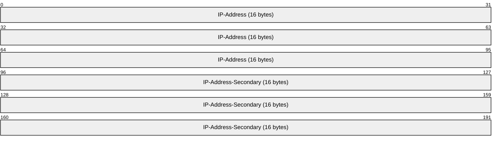
```mermaid
packet-beta
  0-95: "IP-Address (16 bytes)"
  96-191: "IP-Address-Secondary (16 bytes)"
```

**IP-Address (16 bytes):** The IP address of the traffic that defines the IPsec filter. If the **IPsec-Address-Version** field is 0x0001, this is the 4-byte (network byte order) representation of an IPv4 address (the remaining 12 bytes are not significant). If the **IPsec-Address-Version** field is 0x0002, this is the 16-byte (network byte order) representation of an IPv6 address. On reading, if the **IPsec-Address-Version** field is equal to 0x0003, the 16 bytes of the **IP-Address** field MUST be ignored. On writing, if the **IPsec-Address-Version** field is equal to 0x0003, the 16 bytes of the **IP-Address** field MUST be set to 0. Note that this field is only significant if the IPsec-Address-Type field is 0x0001, 0x0002, or 0x0004.

**IP-Address-Secondary (16 bytes):** The secondary IP address of the traffic that defines the IPsec filter. If the **IPsec-Address-Version** field is 0x0001, this is the 4-byte (network byte order) representation of an IPv4 address (the remaining 12 bytes are not significant). If the **IPsec-Address-Version** field is 0x0002, this is the 16-byte (network byte order) representation of an IPv6 address. Note that this field is only significant if the **IPsec-Address-Type** field is 0x0002 or 0x0004. If the **IPsec-Address-Type** field is 0x0002, this defines the last address in the applicable range of IP addresses for this filter. If the **IPsec-Address-Type** field is 0x0004, this defines the subnet mask for this filter. When a subnet filter is defined: if the **IPsec-Address-Version** field is 0x0001, this is the 4-byte (network byte order) representation of the IPv4 subnet mask; if the **IPsec-Address-Version** field is 0x0002, this is the 1-byte representation of the IPv6 subnet mask. The IPv6 subnet mask is a byte number that counts the number of bits prefixes that compose the mask.

**Destination-Address-Data (40 bytes):** The IP address of the traffic destination to apply the IPsec filter to. This SHOULD<25> be specified in the same binary format as shown previously in the **Source-Address-Data** field and in the following table.

```mermaid
packet-beta
  1-33: "IPsec-Address-Type"
  34-66: "IPsec-Address-Version"
  67-164: "IP-Address-Data-Format (32 bytes)"
```

**IPsec-Address-Type (4 bytes):** Specifies the type of address that the IPsec filter specifies. This includes special filter types that have a predefined meaning and are interpreted based on the IP configuration of the host machine. This MUST be one of the following values and MUST be an unsigned integer.

| Value | Meaning |
| --- | --- |
| 0x00000000 | This is the filter that applies to all IP traffic (that is, 'Any' traffic filter). |
| 0x00000001 | This filter specifies a single IP address filter. |
| 0x00000002 | This filter specifies a range of IP addresses. |
| 0x00000004 | This filter specifies an IP subnet. |
| 0x00000008 | This filter is to use the local system's IP address(es) (that is, 'Me' traffic filter). |
| 0x00000010 | This filter is to use the local system's DNS server(s) IP address. |
| 0x00000020 | This filter is to use the local system's WINS server(s) IP address. |
| 0x00000040 | This filter is to use the local system's DHCP server IP address. |
| 0x00000080 | This filter is to use the local system's default-gateway IP address. |

**IPsec-Address-Version (4 bytes):** Specifies the IP version (IPv4/IPv6) of an address that the IPsec filter specifies. This MUST be one of the following values, and this MUST be an unsigned integer.

| Value | Meaning |
| --- | --- |
| 0x00000001 | This filter specifies an IP version 4 (IPv4) address. |
| 0x00000002 | This filter specifies an IP version 6 (IPv6) address. |
| 0x00000003 | This filter specifies both an IP version 4 (IPv4) address and an IP version 6 (IPv6) address. |

The value 0x00000003 MUST only be used if the value of the **IPsec-Address-Type** is 0x00000008, 0x00000010, 0x00000020, 0x00000040, or 0x00000080.

**IP-Address-Data-Format (32 bytes):** The IP address(es) of the traffic that define(s) the IPsec filter. This is specified in the following binary format. Note that all addresses are expected in network byte order.

```mermaid
packet-beta
  0-95: "IP-Address (16 bytes)"
  96-191: "IP-Address-Secondary (16 bytes)"
```

**IP-Address (16 bytes):** The IP address of the traffic that defines the IPsec filter. If the **IPsec-Address-Version** field is 0x0001, this is the 4-byte (network byte order) representation of an IPv4 address (the remaining 12 bytes are not significant). If the **IPsec-Address-Version** field is 0x0002, this is the 16-byte (network byte order) representation of an IPv6 address. On reading, if the **IPsec-Address-Version** field is equal to 0x0003, the 16 bytes of the **IP-Address** field MUST be ignored. On writing, if the **IPsec-Address-Version** field is equal to 0x0003, the 16 bytes of the **IP-Address** field MUST be set to 0. Note that this field is only significant if the IPsec-Address-Type field is 0x0001, 0x0002, or 0x0004.

**IP-Address-Secondary (16 bytes):** The secondary IP address of the traffic that defines the IPsec filter. If the **IPsec-Address-Version** field is 0x0001, this is the 4-byte (network byte order) representation of an IPv4 address (the remaining 12 bytes are not significant). If the **IPsec-Address-Version** field is 0x0002, this is the 16-byte (network byte order) representation of an IPv6 address. Note that this field is only significant if the **IPsec-Address-Type** field is 0x0002, or 0x0004. If the **IPsec-Address-Type** field is 0x0002, this defines the last address in the applicable range of IP addresses for this filter. If the **IPsec-Address-Type** field is 0x0004, this defines the subnet mask for this filter. When a subnet filter is defined: if the **IPsec-Address-Version** field is 0x0001, this is the 4-byte (network byte order) representation of the IPv4 subnet mask; if the **IPsec-Address-Version** field is 0x0002, this is the 1-byte representation of the IPv6 subnet mask. The IPv6 subnet mask is a byte number that counts the number of bits prefixes that compose the mask.

**Source-Port-Data (8 bytes):** The source port that this filter applies to. This is specified in the following binary format.<26>

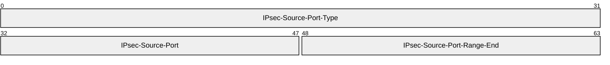
```mermaid
packet-beta
  0-31: "IPsec-Source-Port-Type"
  32-47: "IPsec-Source-Port"
  48-63: "IPsec-Source-Port-Range-End"
```

**IPsec-Source-Port-Type (4 bytes):** Specifies the type of port that the IPsec filter specifies. This includes special port types that have a predefined meaning. This MUST be one of the following values and MUST be an unsigned integer.

| Value | Meaning |
| --- | --- |
| 0x00000000 | This is the filter that applies to all ports (that is, 'Any' traffic filter). |
| 0x00000001 | This filter specifies a single port. |
| 0x00000002 | This filter specifies a range of ports. |

**IPsec-Source-Port (2 bytes):** Specifies the port number for the IPsec filter. This includes the following special modifiers: if IPsec-Port-Type is 0x0000, this value is not significant; if IPsec-Port-Type is 0x0001, this is the port the IPsec filter applies to; if IPsec-Port-Type is 0x0002, this is the first port in the port range to apply the IPsec filter to.

**IPsec-Source-Port-Range-End (2 bytes):** Specifies the port number for the end of the port range for the IPsec filter. This includes the following special modifiers: if IPsec-Port-Type is 0x0000 or IPsec-Port-Type is 0x0001, this value is not significant; if IPsec-Port-Type is 0x0002, this is the last port in the port range to apply the IPsec filter to.

**Destination-Port-Data (8 bytes):** The destination port that this filter applies to. This is specified in the same binary format as shown previously in the **Source-Port-Data** field and in the following table.<27>

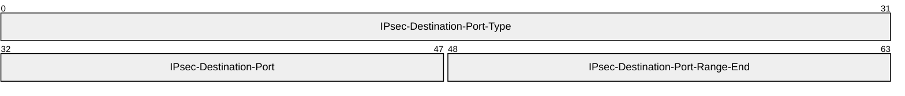
```mermaid
packet-beta
  0-31: "IPsec-Destination-Port-Type"
  32-47: "IPsec-Destination-Port"
  48-63: "IPsec-Destination-Port-Range-End"
```

**IPsec-Destination-Port-Type (4 bytes):** Specifies the type of port that the IPsec filter specifies. This includes special port types that have a predefined meaning. This MUST be one of the following values and MUST be an unsigned integer.

| Value | Meaning |
| --- | --- |
| 0x00000000 | This is the filter that applies to all ports (that is, 'Any' traffic filter). |
| 0x00000001 | This filter specifies a single port. |
| 0x00000002 | This filter specifies a range of ports. |

**IPsec-Destination-Port (2 bytes):** Specifies the port number for the IPsec filter. This includes the following special modifiers: if IPsec-Port-Type is 0x0000, this value is not significant; if IPsec-Port-Type is 0x0001, this is the port the IPsec filter applies to; if IPsec-Port-Type is 0x0002, this is the first port in the port range to apply the IPsec filter to.

**IPsec-Destination-Port-Range-End (2 bytes):** Specifies the port number for the end of the port range for the IPsec filter. This includes the following special modifiers: if IPsec-Port-Type is 0x0000 or IPsec-Port-Type is 0x0001, this value is not significant; if IPsec-Port-Type is 0x0002, this is the last port in the port range to apply the IPsec filter to.

**Filter-Protocol (4 bytes):** This SHOULD<28> be an unsigned integer. The protocol number that specifies the IP traffic protocol to filter. For example, 0x00000006 for TCP and 0x00000011 for UDP. Note that 0x00000000 is a "special" value that means "Any Protocol".

**Filter-Flags (4 bytes):** The flags that specify optional additional behavior. This SHOULD<29> be a word value and be one of the following values.

| Value | Meaning |
| --- | --- |
| 0x00000000 | No flag value. This MUST NOT be interpreted as significant. |
| 0x00000008 | Use version-2 (v2) filter ranges. This value is set when using address ranges. If the address set is expressed as both the version-1 (v1) expanded subnets and the v2 address range, the meaning of the flag is to ignore the v1 expanded subnets because it can process the v2 filter expressed as an address range. |

### 2.2.2 IPsec Policy Assignment

This section specifies how an [**IPsec**](#gt_internet-protocol-security-ipsec) [**Group Policy**](#gt_group-policy) [**administrative plug-in**](#gt_ipsec-administrative-plug-in) assigns an active IPsec policy to a [**GPO**](#gt_group-policy-object-gpo).

The active IPsec policy MUST be assigned to a GPO by writing to the ipsecOwnersReference attribute, as specified in [MS-ADA1](../MS-ADA1/MS-ADA1.md) section 2.330, "Attribute ipsecOwnersReference", of the assigned GPO "*Machine\Microsoft\Windows\IPSEC*" data object. The ipsecOwnersReference value MUST be a reference to the [**Active Directory**](#gt_active-directory) location of the assigned IPsec policy that MUST be stored in the System\IP Security container as shown in the following diagram.

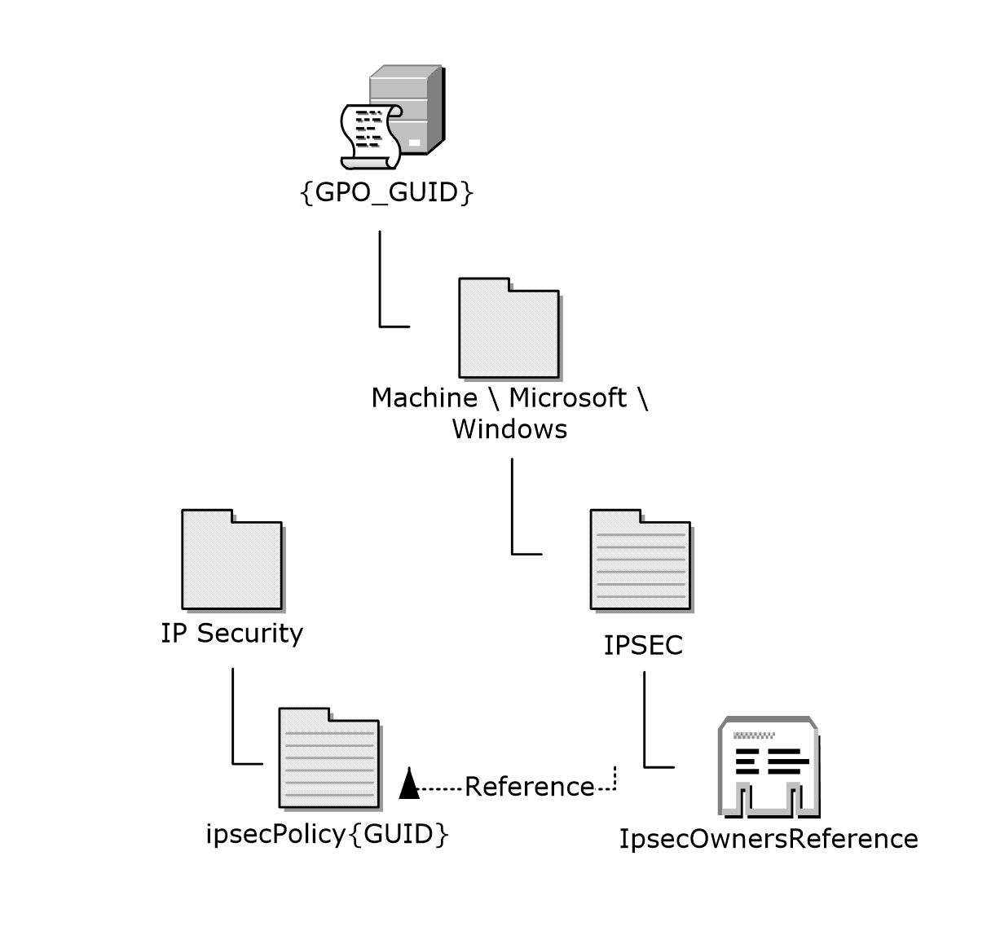

Figure 15: Location of the ipsecOwnersReference value\System\IP Security container

Two additional values MUST be written to the IPsec object to name and describe the assigned policy; they are the ipsecName and Description values as specified in [MS-ADA1].

The following table specifies the expected contents of the IPSEC object as specified by [MS-ADA1].

| Name | Type | Description |
| --- | --- | --- |
| ipsecOwnersReference | Distinguished name | The [**Directory String**](#gt_directory-string) that represents the LDAP reference to the location (in Active Directory) of the policy that is currently assigned to the GPO. This MUST be in the [**distinguished name (DN)**](#gt_distinguished-name-dn) format of [[RFC2251]](https://go.microsoft.com/fwlink/?LinkId=90325). |
| ipsecName | LDAPString | An optional user-defined Directory String that names the currently assigned policy. This is intended for display purposes only. |
| description | LDAPString | An optional user-defined Directory String that describes the currently-assigned policy. This is intended for display purposes only. |

To assign an active IPsec policy, the LDAP portion of the message is an LDAP addRequest as specified in [RFC2251] section 4.7.

The following table specifies the values for Entry and attributes parameters, as applicable to LDAP addRequest messages.

| Parameter | Value |
| --- | --- |
| Entry | The IPSEC object distinguished name for the GPO: cn=ipsec,cn=Windows,cn=Microsoft,cn=Machine,cn={GPO GUID},cn=policies,cn=system,<domain naming context>. |
| attributes | This field MUST specify the Active Directory object class: objectClass=ipsecPolicy. |

If the **resultCode** field of the "AddResponse" message ([RFC2251] section 4.7) is nonzero, the add operation failed and this protocol sequence MUST log an error.

To modify an already assigned IPsec policy, the LDAP portion of the message is an LDAP modifyRequest (that MUST specify the replace operation) as specified in [RFC2251] section 4.6.

The following table specifies the values for Entry and attributes parameters, as applicable to LDAP modifyRequest messages.

| Parameter | Value |
| --- | --- |
| Entry | The IPSEC object distinguished name (DN) for the GPO: cn=ipsec,cn=Windows,cn=Microsoft,cn=Machine,cn={GPO GUID},cn=policies,cn=system,<domain naming context>. |
| attributes | This field MUST specify the **ipsecOwnersReference** attribute. The **ipsecOwnersReference** value MUST be CN=ipsecPolicy{GUID},CN=IP Security,CN=System,<domain naming context>. It MUST also specify any additional/optional attributes that are set on the object, such as the **ipsecName** and **description** attributes. If an optional attribute is not set on the object, that attribute MUST NOT be included in the LDAP modifyRequest message. |

If the **resultCode** field of the "ModifyResponse" message ([RFC2251] section 4.6) is nonzero, the modify operation failed and this protocol sequence MUST log an error.

### 2.2.3 IPsec Policy Retrieval

This section specifies LDAP SearchRequest message parameters for the retrieval of policy location, name, and description; the retrieval of policy data; and for determining whether an IPsec policy exists.

#### 2.2.3.1 Policy Location, Name, and Description Retrieval

When retrieving the assigned policy location, name, and description, an LDAP SearchRequest message MUST be sent to the domain controller with the parameters that follow:

| Parameter | Value |
| --- | --- |
| baseObject | The IPsec policy [**DN**](#gt_distinguished-name-dn) that corresponds to the GPO in which to search for IPsec protocol settings: cn=ipsec,cn=Windows,cn=Microsoft,cn=Machine,cn={GPO GUID},cn=policies,cn=system,<domain naming context> |
| Scope | This value MUST be equal to 0, for the baseObject scope (as defined in [[RFC2251]](https://go.microsoft.com/fwlink/?LinkId=90325)). |
| derefAliases | This MUST be set to 0 (neverDerefAliases) to dereference in searching. |
| sizeLimit | No limit is set (this MUST be set to 0). |
| timeLimit | The time limit MUST be infinite (it MUST be set to 0). |
| typesOnly | This MUST be set to FALSE as defined in [RFC2251]. |
| Filter | The following LDAP filter (as specified in [[RFC2254]](https://go.microsoft.com/fwlink/?LinkId=90328)) MUST be used: (objectclass=*) |
| Attributes | None |

If the preceding LDAP SearchRequest succeeds, then the following LDAP SearchRequest message MUST be sent to the domain controller with the parameters that follow:

| Parameter | Value |
| --- | --- |
| baseObject | The IPsec policy DN that corresponds to the [**GPO**](#gt_group-policy-object-gpo) in which to search for IPsec protocol settings: cn=ipsec,cn=Windows,cn=Microsoft,cn=Machine,cn={GPO GUID},cn=policies,cn=system,<domain naming context> |
| Scope | This value MUST be the value 0, for the baseObject scope (as defined in [RFC2251]). |
| derefAliases | This MUST be set to 0 (neverDerefAliases) to dereference in searching. |
| sizeLimit | No limit is set (this MUST be set to 0). |
| timeLimit | The time limit MUST be infinite (it MUST be set to 0). |
| typesOnly | This MUST be set to FALSE as defined in [RFC2251]. |
| Filter | The following LDAP filter (as specified in [RFC2254]) MUST be used: (objectclass=*) |
| Attributes | This field MUST specify the attributes ipsecOwnersReference, description, and ipsecName, as specified in section [2.2.2](#Section_3.1.5.8). |

#### 2.2.3.2 Policy Data Retrieval

To retrieve the assigned policy data, an LDAP SearchRequest MUST be sent to the domain controller with following parameters:

| Parameter | Value |
| --- | --- |
| baseObject | The IPsec policy store [**DN**](#gt_distinguished-name-dn) for the Internet Protocol security container: cn=ip security,cn=system,<domain naming context> |
| Scope | This MUST be the value 1, for the singleLevel scope as defined in [[RFC2251]](https://go.microsoft.com/fwlink/?LinkId=90325). |
| derefAliases | This MUST be set to 0 (neverDerefAliases) to dereference in searching. |
| sizeLimit | No limit is set (this MUST be set to 0). |
| timeLimit | The time limit MUST be infinite (it MUST be set to 0). |
| typesOnly | This MUST be set to FALSE as defined in [RFC2251]. |
| Filter | The following LDAP filter ([[RFC2254]](https://go.microsoft.com/fwlink/?LinkId=90328)) MUST be used: (&(objectclass=POLICY_OBJECT_TYPE)(cn=OBJECT_NAME)) where POLICY_OBJECT_TYPE is "ipsecPolicy", "ipsecISAKMPPolicy", "ipsecNFA", "ipsecFilter", or "ipsecNegotiationPolicy" as appropriate; and OBJECT_NAME is the object name with the string representation of the identifying GUID appended, for example: (&(objectclass=ipsecPolicy)(cn=ipsecPolicy{6A1E4C3F-72C7-1232-ACF0-0260B025CAFE})). In this example, (cn=ipsecPolicy{6A1E4C3F-72C7-1232-ACF0-0260B025CAFE}) is extracted from the **ipsecOwnersReference** obtained in section [2.2.3.1](#Section_2.2.3.1). |
| Attributes | This field MUST specify the attributes that are specific to the individual policy object, as specified in sections [2.2.1.1](#Section_2.2.1.1), [2.2.1.2](#Section_2.2.1.2), [2.2.1.3](#Section_2.2.1.3), [2.2.1.4](#Section_2.2.1.4), and [2.2.1.5](#Section_2.2.1.5). |

## 2.3 Directory Service Schema Elements

The Group Policy: Core Protocol accesses the Directory Service schema classes and attributes listed in the following table. For the syntactic specifications of the following <Class> or <Class> <Attribute> pairs, refer to: [MS-ADSC](../MS-ADSC/MS-ADSC.md), [MS-ADA1](../MS-ADA1/MS-ADA1.md), [MS-ADA2](../MS-ADA2/MS-ADA2.md), and [MS-ADA3](../MS-ADA3/MS-ADA3.md).

| Class | Attribute |
| --- | --- |
| ipsecPolicy | objectClass ipsecName description whenChanged ipsecID distinguishedName ipsecISAKMPReference ipsecNFAReference ipsecDataType ipsecData |
| ipsecFilter | objectClass ipsecName description whenChanged ipsecID distinguishedName ipsecOwnersReference ipsecDataType ipsecData |
| ipsecNegotiationPolicy | objectClass ipsecName Description whenChanged ipsecID distinguishedName ipsecNegotiationPolicyAction ipsecNegotiationPolicyType ipsecOwnersReference ipsecDataType ipsecData |
| ipsecNFA | objectClass ipsecName description whenChanged ipsecID distinguishedName ipsecFilterReference ipsecNegotiationPolicyReference ipsecOwnersReference ipsecDataType ipsecData |
| ipsecISAKMPPolicy | objectClass ipsecName whenChanged ipsecID distinguishedName ipsecOwnersReference ipsecDataType ipsecData |

# 3 Protocol Details

## 3.1 IPsec Group Policy Administrative Plug-in Details

The [**IPsec administrative plug-in**](#gt_ipsec-administrative-plug-in) consists of a user interface that allows an [**IPsec**](#gt_internet-protocol-security-ipsec) administrator to author an IPsec policy and assign it to a [**GPO**](#gt_group-policy-object-gpo). First, the values that are entered by the administrator are used to form IPsec creation/modification messages as specified in IPsec Policy Creation/Modification (section [2.2.1](#Section_4.1.1)) and IPsec policy assignment messages, as specified in IPsec Policy Assignment (section [2.2.2](#Section_3.1.5.8)). These messages are then sent to [**Active Directory**](#gt_active-directory) and stored as the IPsec policy, as explained in IPsec Extension Overview (section [1.3.2](#Section_1.3.2)).

### 3.1.1 Abstract Data Model

This section specifies a conceptual model of possible data organization that an implementation can maintain to participate in this protocol. The described organization is provided to facilitate the explanation of how the protocol behaves. This document does not mandate that implementations adhere to this model as long as their external behavior is consistent with that described in this document.

For state, the plug-in simply maintains the list of <name of setting, value of setting> pairs for the settings specified in section [2.2](#Section_2.2), "Message Syntax", that are suitable for displaying in the user interface.

**ADConnectionHandle:** An **ADConnection** structure (see "ADConnection Abstract Data Model", in [MS-ADTS](../MS-ADTS/MS-ADTS.md) section 7.3) of type **ADCONNECTION_HANDLE** (see [MS-DTYP](../MS-DTYP/MS-DTYP.md) section 2.2.2, "ADCONNECTION_HANDLE") that tracks a connection to an Active Directory server.

Note that an **ADCONNECTION_HANDLE** object is returned by the **ADConnection** initialization operation, as defined in section [3.2.5.2](#Section_3.2.5.2).

### 3.1.2 Timers

None.

### 3.1.3 Initialization

When the [**IPsec administrative plug-in**](#gt_ipsec-administrative-plug-in) starts, the [**Group Policy**](#gt_group-policy) Protocol component (as specified in [MS-GPOL](../MS-GPOL/MS-GPOL.md) (section 1.3.3.1), "Server Discovery and Group Policy Object Association" and [MS-GPOL] (section 1.3.3.2), "GPO Retrieval") gives it an LDAP path (as defined in [[RFC2251]](https://go.microsoft.com/fwlink/?LinkId=90325)) that identifies the [**GPO**](#gt_group-policy-object-gpo) path that contains the [**IPsec**](#gt_internet-protocol-security-ipsec) policy. The plug-in MUST then use this path to read the current active policy (if any) from the GPO path by using the messages specified in section [3.2.5.3](../MS-GPOL/MS-GPOL.md).

The IPsec administrative plug-in MUST then retrieve the details of the IPsec policy objects that are currently available for assignment to the GPO from the IP Security [**Active Directory**](#gt_active-directory) container, as specified in section [3.2.5.4](#Section_3.2.5.4). If this fails, administrators MUST be informed so that they can determine the appropriate action to take.

### 3.1.4 Higher-Layer Triggered Events

The higher-layer triggered events are: policy creation, policy modification, policy deletion, reading the policy, and assigning the policy to a GPO.

The administrator triggers each of these events by using the administrative plug-in.

On the policy creation/modify, the IPsec Protocol plug-in MUST generate the messages to create or modify the IPsec policy in the Active Directory store, as specified in IPsec Policy Creation/Modification (section [2.2.1](#Section_4.1.1)).

On policy reading, the IPsec Protocol plug-in MUST generate the messages specified in section [3.1.5.4](#Section_3.1.5.4).

On policy deleting, the IPsec Protocol plug in MUST generate the messages specified in section [3.1.5.7](#Section_3.1.5.7).

For assigning policy to a GPO, the IPsec Protocol plug-in MUST generated the messages as specified in section [3.1.5.8](#Section_3.1.5.8).

In all cases, if this fails, the administrator MUST be informed so that they can determine the appropriate action to take.

### 3.1.5 Message Processing Events and Sequencing Rules

#### 3.1.5.1 Configuring an LDAP BindRequest

The following protocol sequences MUST be generated by the administrative plug-in.

**To configure an LDAP BindRequest:**

- Binding MUST be handled by passing abstract element ADConnectionHandle to [MS-ADTS](../MS-ADTS/MS-ADTS.md) section 7.6.1.4.
- If the TaskReturnStatus does not indicate success (0), then the administrative plug-in MUST log an error and MUST terminate policy reading.

#### 3.1.5.2 Terminating the LDAP BindRequest

To close the connection opened by a previous LDAP BindRequest, the administrative plug-in MUST unbind as specified in [MS-ADTS](../MS-ADTS/MS-ADTS.md) section 7.6.1.5. The administrative plug-in MUST pass its ADConnectionHandle as a parameter to the unbind task.

#### 3.1.5.3 Retrieving the Assigned Policy Location, Name, and Description

The administrative plug-in MUST connect to the domain controller as specified in sections [3.2.5.1](#Section_3.2.5.1) and [3.2.5.2](#Section_3.2.5.2). The administrative plug-in MUST retrieve the assigned policy location, name, and description, as specified in section [3.2.5.3](#Section_3.2.5.3). Thereafter, terminate the BindRequest, as defined in section [3.1.5.2](#Section_3.1.5.2).

#### 3.1.5.4 Reading the Assigned Policy Data

The administrative plug-in MUST connect to the domain controller as specified in section [3.2.5.1](#Section_3.2.5.1) and [3.2.5.2](#Section_3.2.5.2). The administrative plug-in MUST read the existing group policy, using the appropriate parameters and values, as specified in sections [3.2.5.3](#Section_3.2.5.3) and [3.2.5.4](#Section_3.2.5.4). Thereafter, terminate the LDAP BindRequest, as specified in section [3.1.5.2](#Section_3.1.5.2).

#### 3.1.5.5 Writing the Assigned Policy Data

The administrative plug-in MUST connect to the domain controller as specified in sections [3.2.5.1](../MS-ADTS/MS-ADTS.md) and [3.2.5.2](../MS-ADTS/MS-ADTS.md). To write the new IPsec policy, the administrative plug-in MUST perform the LDAP operation specified in [MS-ADTS](../MS-ADTS/MS-ADTS.md) section 7.6.1.6, "Performing an LDAP Operation on an ADConnection". The TaskInputADConnection value MUST be the ADCONNECTION_HANDLE object ([MS-DTYP](../MS-DTYP/MS-DTYP.md) section 2.2.2, "ADCONNECTION_HANDLE") stored in **ADConnectionHandle**. The TaskInputRequestMessage MUST contain an LDAP AddRequest message ([[RFC2251]](https://go.microsoft.com/fwlink/?LinkId=90325) section 4.7) with the following parameters:

| Parameter | Value |
| --- | --- |
| Entry | The value for this parameter MUST be CN=ObjectPath, CN=IP Security, CN=System, DN for the root of the domain; where objectpath is ipsecfilter{Guid} (section [2.2.1.5](#Section_2.2.1.5)), ipsecISAKMPPolicy{Guid} (section [2.2.1.2](#Section_2.2.1.2)), ipsecNegotiationPolicy{Guid} (section [2.2.1.4](#Section_2.2.1.4)), IPsecNFA{Guid} (section [2.2.1.3](#Section_2.2.1.3)), or IpsecPolicy{Guid} (section [2.2.1.1](#Section_2.2.1.1)). |
| Attributes | This field MUST specify the following attributes (sections 2.2.1.1, 2.2.1.2, 2.2.1.3, 2.2.1.4, and 2.2.1.5): For all objects ipsecfilter{Guid}, ipsecISAKMPPolicy{Guid}, ipsecNegotiationPolicy{Guid}, IPsecNFA{Guid}, IpsecPolicy{Guid}: **objectClass** **ipsecName** **ipsecID** **distinguishedName** **description** **ipsecData** **ipsecDataType** For ipsecISAKMPPolicy{Guid}: **ipsecOwnersReference** For ipsecfilter{Guid}: **ipsecOwnersReference** For ipsecNegotiationPolicy{Guid}: **ipsecOwnersReference** **ipsecNegotiationPolicyAction** **ipsecNegotiationPolicyType** For IPsecNFA{Guid}: **ipsecOwnersReference** |

The administrative plug-in waits for a response. If the TaskReturnStatus does not signal success (0), then the administrative plug-in MUST log an error, and then unbind as specified in section [3.1.5.2](#Section_3.1.5.2).

**Note** When writing the new IPsec policy is complete, terminate the BindRequest as specified in section 3.1.5.2.

#### 3.1.5.6 Modifying the Assigned Policy Data

The administrative plug-in MUST connect to the domain controller as specified in sections [3.2.5.1](#Section_3.2.5.1) and [3.2.5.2](#Section_3.2.5.2). To modify the policy, the administrative-side plug-in modifies the existing policy object in [**Active Directory**](#gt_active-directory).

To accomplish this, an LDAP operation MUST be performed, as specified in [MS-ADTS](../MS-ADTS/MS-ADTS.md) section 7.6.1.6, "Performing an LDAP Operation on an ADConnection". The TaskInputADConnection value MUST be the ADCONNECTION_HANDLE object ([MS-DTYP](../MS-DTYP/MS-DTYP.md), section 2.2.2, "ADCONNECTION_HANDLE") stored in **ADConnectionHandle**. The TaskInputRequestMessage MUST contain an LDAP ModifyRequest message ([[RFC2251]](https://go.microsoft.com/fwlink/?LinkId=90325) section 4.6) with the following parameters:

| Parameter | Value |
| --- | --- |
| Entry | The value for this parameter MUST be CN=ObjectPath, CN=IP Security, CN=System, DN for the root of the domain; where ObjectPath is ipsecfilter{Guid} (section [2.2.1.5](#Section_2.2.1.5)), ipsecISAKMPPolicy{Guid} (section [2.2.1.2](#Section_2.2.1.2)), ipsecNegotiationPolicy{Guid} (section [2.2.1.4](#Section_2.2.1.4)) IPsecNFA{Guid} (section [2.2.1.3](#Section_2.2.1.3)), or IpsecPolicy{Guid} (section [2.2.1.1](#Section_2.2.1.1)). |
| Attributes | This field MUST specify any or all of the following attributes (sections 2.2.1.1, 2.2.1.2, 2.2.1.3, 2.2.1.4, and 2.2.1.5): For all objects: **ipsecData** **ipsecDataType** For IpsecPolicy{Guid} objects: **ipsecISAKMPReference** **ipsecNFAReference** For IPsecNFA{Guid} objects: **ipsecFilterReference** **ipsecNegotiationPolicyReference** For ipsecFilter{Guid}, ipsecNegotiationPolicy{Guid}, and ipsecISAKMPPolicy{Guid} objects: ipsecOwnersReference |

The administrative plug-in waits for a response. If the TaskReturnStatus does not signal success (0), then the administrative plug-in MUST log an error, and then unbind as specified in section [3.1.5.2](#Section_3.1.5.2).

**Note** To terminate the LDAP BindRequest and close the connection, the administrative plug-in MUST make an LDAP UnBindRequest corresponding to the LDAP BindRequest, as indicated in section 3.1.5.2.

#### 3.1.5.7 Deleting the Assigned Policy Data

To delete an existing object, the administrative plug-in MUST connect to the domain controller as specified in sections [3.2.5.1](../MS-ADTS/MS-ADTS.md) and [3.2.5.2](../MS-ADTS/MS-ADTS.md). The administrative-side plug-in MUST delete the existing object in the [**Active Directory**](#gt_active-directory) that contains the particular IPsec settings. To accomplish this, an LDAP operation MUST be performed, as specified in [MS-ADTS](../MS-ADTS/MS-ADTS.md), section 7.6.1.6, "Performing an LDAP Operation on an ADConnection". The TaskInputADConnection value MUST be the ADCONNECTION_HANDLE object ([MS-DTYP](../MS-DTYP/MS-DTYP.md), section 2.2.2, "ADCONNECTION_HANDLE") stored in **ADConnectionHandle**. The TaskInputRequestMessage MUST contain an LDAP delRequest message ([[RFC2251]](https://go.microsoft.com/fwlink/?LinkId=90325) section 4.8) with the following parameters:

| Parameter | Value |
| --- | --- |
| Entry | The value for this parameter MUST be CN=ObjectPath, CN=IP Security, CN=System, DN for the root of the domain; where ObjectPath is ipsecfilter{Guid} (section [2.2.1.5](#Section_2.2.1.5)), ipsecISAKMPPolicy{Guid} (section [2.2.1.2](#Section_2.2.1.2)), ipsecNegotiationPolicy{Guid} (section [2.2.1.4](#Section_2.2.1.4)), IPsecNFA{Guid} (section [2.2.1.3](#Section_2.2.1.3)), or IpsecPolicy{Guid} (section [2.2.1.1](#Section_2.2.1.1)). |

The administrative plug-in waits for a response. If the TaskReturnStatus does not signal success (0), the administrative plug-in MUST log an error, and then unbind as specified in section [3.1.5.2](#Section_3.1.5.2).

**Note** This message deletes the existing Active Directory object for the corresponding policy. To terminate the LDAP BindRequest and close the connection, the administrative plug-in MUST make an LDAP UnBindRequest corresponding to the initial LDAP BindRequest (section 3.1.5.2).

When deleting an object, the administrative plug-in MUST fail the delete (and report an error back to the user) if there are outstanding references to the object being deleted in the following cases:

- On attempting to delete an ipsecFilter, if any IPsecNFA object references that filter object, the delete MUST fail. Deleting an ipsecFilter MUST NOT modify any existing IPsecNFA objects.
- On attempting to delete an ipsecNegotiationPolicy object, if any IPsecNFA object references that policy object, the delete MUST fail. Deleting an ipsecNegotiationPolicy object MUST NOT modify any existing IPsecNFA objects.
- On attempting to delete an ipsecISAKMPPolicy object, if any ipsecPolicy object references that ipsecISAKMPPolicy object, the delete MUST fail. Deleting an ipsecISAKMPPolicy object MUST NOT modify any existing ipsecPolicy objects.
On deleting an IPsecNFA object, the order of operations MUST be as follows:

- The ipsecNFAReference value MUST be updated to remove the reference to the deleted NFA from any ipsecPolicy objects that reference the deleted IPsecNFA object. On failure, the delete operation MUST be terminated and an error logged.
- The IPsecNFA reference in the ipsecOwnersReference of the ipsecNegotiationPolicy object MUST be deleted. On failure, the delete operation MUST be terminated and an error logged.
- The IPsecNFA reference in the ipsecOwnersReference of the ipsecFilter(s) object MUST be deleted. On failure, the delete operation MUST be terminated and an error logged.
- The IPsecNFA object MUST be deleted. On failure, the delete operation MUST be terminated and an error logged.
On deleting an ipsecPolicy object, the order of operations is as follows:

- All IPsecNFA objects associated with the ipsecPolicy object MUST first be deleted. On failure, the delete operation MUST be terminated and an error logged.
- The **ipsecOwnersReference** field of the ipsecISAKMPPolicy object that is referenced by the deleted ipsecPolicy object MUST be updated to remove the reference to the deleted ipsecPolicy object. On failure, the error MUST be ignored and the delete operation continued.
- The ipsecPolicy object MUST be deleted. On failure, an error MUST be logged.
- If the newly deleted ipsecPolicy object is currently assigned (as specified in section [3.1.5.8](#Section_3.1.5.8)), the assigned policy location **ipsecOwnersReference**, **description**, and **ipsecName** MAY<30> be updated to remove the reference to the newly deleted policy object.
All reference modification MUST be done as specified in section [3.1.5.6](#Section_3.1.5.6). Object deletion MUST be done as specified in this section.

#### 3.1.5.8 Policy Assignment

The **Policy Assignment** event is invoked to assign an ipsecPolicy object to a GPO.

The parameters to the **Policy Assignment** event are as follows.

| Parameter | Description |
| --- | --- |
| GPO Path | A string containing the [**distinguished name (DN)**](#gt_distinguished-name-dn) of the GPO to which the ipsecPolicy object is being assigned |
| ipsecOwnersReference | A string containing the DN of the ipsecPolicy object being assigned |
| ipsecName | A string containing the name of the policy being assigned |
| description | A string containing a description of the policy being assigned |

To assign the policy to the GPO, the [**administrative plug-in**](#gt_ipsec-administrative-plug-in) MUST perform the following operations in order:

- The administrative plug-in MUST locate a Domain Controller as specified in section [3.2.5.1](#Section_3.2.5.1). If this operation fails, the administrative plug-in MUST stop processing the policy assignment event.
- The administrative plug-in MUST establish a connection to the Domain Controller as specified in section [3.2.5.2](#Section_3.2.5.2). If this operation fails, the administrative plug-in MUST stop processing the policy assignment event.
- The administrative plug-in MUST attempt to retrieve the assigned policy location as specified in section [3.2.5.3](#Section_3.2.5.3). The DN for the IPSEC object MUST be specified as "CN=IPSEC, CN=Windows, CN=Microsoft, <GPO path>". Note that this operation is performed only to determine if the IPSEC object already exists; the returned attributes (if any) are ignored.
- If any of the SearchRequests performed in step 3 returns a TaskReturnStatus ([MS-ADTS](../MS-ADTS/MS-ADTS.md) section 7.6.1.6, Performing an LDAP Operation on an ADConnection) other than success (0) or "No such object" (32), the administrative plug-in MUST terminate the BindRequest as specified in section [3.1.5.2](../MS-ADTS/MS-ADTS.md) and MUST stop processing the policy assignment event.
- If all of the SearchRequests performed in step 3 return a TaskReturnStatus of success (0), the administrative plug-in MUST skip to step 7; that is, it MUST NOT send an addRequest.
- Otherwise, the administrative plug-in MUST send an LDAP addRequest as specified in section [2.2.2](#Section_3.1.5.8). If the addRequest returns a TaskReturnStatus other than success (0), that is, the addRequest fails for any reason, the administrative plug-in MUST terminate the BindRequest as specified in section 3.1.5.2 and MUST stop processing the policy assignment event.
- The administrative plug-in MUST send an LDAP modifyRequest as specified in section 2.2.2. The ipsecOwnersReference, ipsecName, and description parameters for the modifyRequest are the same as the corresponding parameters supplied to this event. If the modifyRequest returns a TaskReturnStatus other than success (0), that is, the modifyRequest fails for any reason, the administrative plug-in MUST terminate the BindRequest as specified in section 3.1.5.2 and MUST stop processing the policy assignment event.
- The administrative plug-in MUST terminate the LDAP BindRequest as specified section 3.1.5.2.
- The administrative plug-in MUST invoke the [**Group Policy extension**](#gt_group-policy-extension) Update event ([MS-GPOL](../MS-GPOL/MS-GPOL.md) section 3.3.4.4, Group Policy Extension Update).

### 3.1.6 Timer Events

None.

### 3.1.7 Other Local Events

None.

## 3.2 IPsec Group Policy Client-Side Plug-in Details

During policy application, this protocol is invoked after the Group Policy: Core Protocol has computed a list of [**GPOs**](#gt_group-policy-object-gpo) for which the [**IPsec**](#gt_internet-protocol-security-ipsec) client plug-in is to be invoked as specified in [MS-GPOL](../MS-GPOL/MS-GPOL.md) section 3.2.5, "Message Processing Events and Sequencing Rules".

### 3.2.1 Abstract Data Model

This section specifies a conceptual model of possible data organization that an implementation can maintain to participate in this protocol. The described organization is provided to facilitate the explanation of how the protocol behaves. This document does not mandate that implementations adhere to this model as long as their external behavior is consistent with that described in this document.

**Local Timer Interval:** Contains the current duration in minutes of the **Local Timer** (section [3.2.2](#Section_3.2.2)). The initial value is zero.

**RetrievedDomainName:** Contains the domain name retrieved by the DC locator operation, as specified in section [3.2.5.1](#Section_3.2.5.1).

**ADConnectionHandle:** An **ADConnection** structure ([MS-ADTS](../MS-ADTS/MS-ADTS.md) section 7.3, "ADConnection Abstract Data Model") of type **ADCONNECTION_HANDLE** ([MS-DTYP](../MS-DTYP/MS-DTYP.md) section 2.2.2, "ADCONNECTION_HANDLE") that tracks a connection to an Active Directory server.

**Note** An **ADCONNECTION_HANDLE** object is returned by the **ADConnection** initialization operation specified in section [3.2.5.2](#Section_3.2.5.2).

**LocalWhenChanged:** A copy of the whenChanged attribute from the ipsecPolicy object (see section [2.2.1.1.1](#Section_2.2.1.1.1)) of the assigned policy.

**FilteredGPOList:** A list of new or changed GPOs since this client-side extension was last applied. Filtered GO List is defined in [MS-GPOL](../MS-GPOL/MS-GPOL.md) section 3.2.1.5.

### 3.2.2 Timers

**Local Timer:** A local timer controls the time interval at which to check for [**IPsec**](#gt_internet-protocol-security-ipsec) policy updates in the IPsec policy container.

### 3.2.3 Initialization

On initialization, the client MUST set the **LocalWhenChanged** ADM element to 0 and then execute the functionality specified in [3.2.6.1](#Section_3.2.6.1). Note that the **whenChanged** attribute in the retrieved policy will never be 0; thus, setting LocalWhenChanged to 0 will trigger the implementation to reread all the policy objects as specified in 3.2.6.1.

### 3.2.4 Higher-Layer Triggered Events

#### 3.2.4.1 Processing Group Policy Callbacks

During policy application, this protocol is invoked after the Group Policy: Core Protocol has computed a list of GPOs for which the IPsec client plug-in is to be invoked, as specified in [MS-GPOL](../MS-GPOL/MS-GPOL.md) section 3.2.5, "Message Processing Events and Sequencing Rules".

This extension is launched by the Group Policy: Core Protocol by invoking the **Process Group Policy Event** as specified in [MS-GPOL], section 3.2.4.1 and section 3.2.5.1.10.

[MS-GPOL] provides the *New or Changed GPO list*, which is a list of the new or changed GPOs. It also supplies the *Deleted GPO list* and other parameters. The *Deleted GPO list* and all the other parameters supplied to the callback are ignored.

The GPOs that are assigned to the client machine are indicated in the callback in the *New or Changed GPO list*. This list of GPOs MUST be copied to the **FilteredGPOList** ADM element. The client MUST determine the location of the policy that is assigned to the client as specified by sections [3.2.5.1](#Section_3.2.5.1), [3.2.5.2](#Section_3.2.5.2), and [3.2.5.3](#Section_3.2.5.3).

Once the policy location is known, the client MUST read the policy, as specified in sections 3.2.5.1, 3.2.5.2, and [3.2.5.4](#Section_3.2.5.4).

### 3.2.5 Message Processing Events and Sequencing Rules

#### 3.2.5.1 Locating a Domain Controller

To locate the domain controller, the client MUST invoke the DC locator operation DsrGetDcName ([MS-NRPC](../MS-NRPC/MS-NRPC.md) section 3.5.4.3.3, "DsrGetDcName (Opnum 20)"). For this method, the input parameters are all NULL except for the *Flags* parameter, which MUST have bits B and R set ([MS-NRPC] section 3.5.4.3.1, "DsrGetDcNameEx2 (Opnum 34)").

When the DsrGetDcName method completes, store the value of the **DomainName** member from the returned **DOMAIN_CONTROLLER_INFOW** structure in the **RetrievedDomainName** data element.

**Note** The hostname, contained in the **RetrievedDomainName** data element, is resolved to an explicit IP address when connecting to the domain controller in section [3.2.5.2](#Section_3.2.5.2).

If the DsrGetDcName method fails, the client MUST increment the **Local Timer Interval** value (section [3.2.1](#Section_3.1.1)) by 1, square it, reduce it to 166 if its value is greater than 166, and then set the **Local Timer** to this new value, in minutes. Otherwise, the client MUST retrieve the assigned policy location, name, and description, as specified in section [3.2.5.3](#Section_3.2.5.3).

#### 3.2.5.2 Establishing a Connection to the Domain Controller

An ADConnection initialization operation MUST be performed, as specified in [MS-ADTS](../MS-ADTS/MS-ADTS.md) section 7.6.1.1, "Initializing an ADConnection". The *TaskInputTargetName* input value MUST be taken from **RetrievedDomainName**, and the *TaskInputPortNumber* value MUST be 389. The resulting ADCONNECTION_HANDLE object ([MS-DTYP](../MS-DTYP/MS-DTYP.md) section 2.2.2, "ADCONNECTION_HANDLE") MUST be stored in **ADConnectionHandle**.

The following options MUST be set on the ADConnection associated with **ADConnectionHandle**, using the operation specified in [MS-ADTS] section 7.6.1.2, "Setting an LDAP Option on an ADConnection".

- LDAP_OPT_PROTOCOL_VERSION MUST be set to 3.
- LDAP_OPT_ENCRYPT MUST be set to TRUE.
- LDAP_OPT_SIGN MUST be set to TRUE.
An ADConnection MUST be established using the operation specified in [MS-ADTS] section 7.6.1.3, "Establishing an ADConnection". The *TaskInputADConnection* value MUST be the ADCONNECTION_HANDLE object ([MS-DTYP] section 2.2.2, "ADCONNECTION_HANDLE") stored in **ADConnectionHandle**.

Then, the connection handle MUST bind as specified in section [3.1.5.1](#Section_3.1.5.1).

**Note** The hostname, contained in the **RetrievedDomainName** data element, is resolved to an explicit IP address in [MS-ADTS] section 7.6.1.1, "Initializing an ADConnection", and [MS-ADTS] section 7.6.1.3, "Establishing an ADConnection".

#### 3.2.5.3 Retrieving the Assigned Policy Location, Name, and Description

The client MUST determine the location of the currently assigned policy by accessing the ipsecOwnersReference attribute, as specified in [MS-ADA1](../MS-ADA1/MS-ADA1.md) section 2.330, "Attribute ipsecOwnersReference", of the IPSEC object cn=ipsec,cn=Windows,cn=Microsoft,cn=Machine,<GPO DN>, for the last (highest precedence) GPO of the FilteredGPOList ADM element. The ipsecOwnersReference attribute contains the [**DN**](#gt_distinguished-name-dn) of the ipsecPolicy object that is to be applied to the client machine.

Similarly, the assigned policy name and description MUST be read by retrieving the ipsecName and description values. These values MUST be interpreted as a [**Directory String**](#gt_directory-string) (section [2.2.2](#Section_3.1.5.8)).

To retrieve the assigned IPsec policy location, name, and description for a GPO, an LDAP operation MUST be performed using the operation specified in [MS-ADTS](../MS-ADTS/MS-ADTS.md) section 7.6.1.6, "Performing an LDAP Operation on an ADConnection". The *TaskInputADConnection* value MUST be the ADCONNECTION_HANDLE object ([MS-DTYP](../MS-DTYP/MS-DTYP.md) section 2.2.2, "ADCONNECTION_HANDLE") stored in **ADConnectionHandle**. The TaskInputRequestMessage MUST contain an LDAP searchRequest message ([[RFC2251]](https://go.microsoft.com/fwlink/?LinkId=90325) [[RFC2254]](https://go.microsoft.com/fwlink/?LinkId=90328)) with the values specified in section [2.2.3.1](../MS-ADTS/MS-ADTS.md).

The client MUST first send an LDAP SearchRequest message with the **objectClass** attribute, as specified in 2.2.3.1. If this operation succeeds, then the client MUST send an LDAP SearchRequest message with the **ipsecOwnersReference**, **ipsecName**, and **description** attributes, as specified in 2.2.3.1.

If either LDAP SearchRequest message fails, the local IPsec component MUST be signaled so that it can enter a known-safe state. Otherwise, the client MUST retrieve its assigned policy data (section [3.2.5.4](#Section_3.2.5.4)).

#### 3.2.5.4 Retrieving the Assigned Policy Data

The IPsec policy data that is currently assigned is specified by the ipsecFilter, ipsecISAKMPPolicy, ipsecNegotiationPolicy, ipsecNFA, and ipsecPolicy entries, as specified in [MS-ADSC](../MS-ADSC/MS-ADSC.md) section 2.71, "Class ipsecFilter", [MS-ADSC] section 2.72, "Class ipsecISAKMPPolicy", [MS-ADSC] section 2.73, "Class ipsecNegotiationPolicy", [MS-ADSC] section 2.74, "Class ipsecNFA", and [MS-ADSC] section 2.75, "Class ipsecPolicy", respectively. Additional details are specified in sections [2.2.1.1](../MS-ADSC/MS-ADSC.md), [2.2.1.2](#Section_2.2.1.2), [2.2.1.3](#Section_2.2.1.3), [2.2.1.4](#Section_2.2.1.4), and [2.2.1.5](#Section_2.2.1.5). To retrieve the details of the assigned IPsec policy from the IPsec ("System\IP Security") container, an LDAP searchRequest message ([[RFC2251]](https://go.microsoft.com/fwlink/?LinkId=90325) [[RFC2254]](https://go.microsoft.com/fwlink/?LinkId=90328)) with the values specified in section [2.2.3.2](../MS-ADSC/MS-ADSC.md) MUST be sent to the domain controller (located in section [3.2.5.1](../MS-ADSC/MS-ADSC.md)):

If this operation fails, the client MUST increment the **Local Timer Interval** value (section [3.2.1](#Section_3.1.1)) by 1, square it, reduce it to 166 if its value is greater than 166, and then set the **Local Timer** (section [3.2.2](#Section_3.2.2)) to this new value, in minutes. Otherwise, it MUST reset the **Local Timer** to the interval specified by the Polling-Interval value that is retrieved as part of the IPsec policy object, as specified in the messages defined in ipsecPolicy Object Attribute Details.

Any retrieved ipsecPolicy object MUST copy its **whenChanged** field (see section 2.2.1.1) to the implementation's **LocalWhenChanged** ADM element, as defined in section 3.2.1.

### 3.2.6 Timer Events

#### 3.2.6.1 Local Timer Expiration

When the **Local Timer** (section [3.2.2](#Section_3.2.2)) expires, the client MUST check for [**IPsec**](#gt_internet-protocol-security-ipsec) policy updates in the IPsec policy container.

The client MUST locate the domain controller (section [3.2.5.1](#Section_3.2.5.1)), connect to the domain controller (section [3.2.5.2](#Section_3.2.5.2)), and retrieve the assigned policy data (section [3.2.5.4](#Section_3.2.5.4)) for the assigned ipsecPolicy object. For the newly retrieved ipsecPolicy object, the client MUST compare the whenChanged attribute (section [2.2.1.1.1](#Section_2.2.1.1.1)) against the **LocalWhenChanged** ADM element. If these values are the same, the client MUST reset the timer using the LocalTimerInterval. Otherwise, the client MUST reread all policies for all objects as defined in section 3.2.5.4.

### 3.2.7 Other Local Events

None.

# 4 Protocol Examples

The IT security office of Contoso, Ltd (contoso.com) decides to implement an [**IPsec**](#gt_internet-protocol-security-ipsec)-based security solution. On a network that is managed by a central IT department, computers will use the authentication infrastructure and policy distribution mechanism to implement [**domain**](#gt_domain) and server isolation. Step-by-step details about the configuration and resulting settings can be found in the references [[MSFT-ISOLATION-1]](https://go.microsoft.com/fwlink/?LinkId=90188), [[MSFT-ISOLATION-2]](https://go.microsoft.com/fwlink/?LinkId=90189), and [[MSFT-ISOLATION-3]](https://go.microsoft.com/fwlink/?LinkId=90190).

To configure this functionality, the administrator needs to ensure that computers are members of the domain and are configured with the [**Group Policy**](#gt_group-policy) settings to require authentication for incoming communication attempts, to secure data traffic, and optionally, to encrypt data traffic. The security administrator configures this policy format in the IPsec policy administrative user interface.

## 4.1 Administrative Creation/Assignment of Policy

To create and assign the policy, the security administrator uses an [**IPsec administrative plug-in**](#gt_ipsec-administrative-plug-in) user interface to configure and make active the required policy. This results in the Group Policy: IPsec Protocol transferring the settings to the IP Security container and the [**GPO**](#gt_group-policy-object-gpo) of the client computers that need to participate in the isolation mechanism. In this example, the [**domain**](#gt_domain) name myDomain.contoso.com is used.

### 4.1.1 Policy Creation

The protocol messages that occur to create the policy are as follows.

An LDAP addRequest message consists of the following.

- CN=ipsecPolicy{E514E247-80C3-429A-8D69-74BD54FEB31E},CN=IP Security, CN=System, DC=myDomain,DC=contoso,DC=com
- **objectClass** = "ipsecPolicy"
- **ipsecName** = "Domain Isolation Policy"
- **description** = "Policy to secure corporate network traffic"
- **ipsecID** = "{E514E247-80C3-429A-8D69-74BD54FEB31E}"
- **distinguishedName** = "CN=ipsecPolicy{E514E247-80C3-429A-8D69-74BD54FEB31E},CN=IP Security,CN=System,DC=myDomain, DC=contoso,DC=com"
- **ipsecDataType** = "256"
- **ipsecData** = << 25-byte Octet String of IPsec policy data >>
An LDAP addRequest message consists of the following.

- CN=ipsecISAKMPPolicy{12A63239-DFB6-4f7A-9E84-FEA90E81202A},CN=IP Security,CN=System,DC=myDomain,DC=contoso,DC=com
- **objectClass** = "ipsecISAKMPPolicy"
- **ipsecName** = "All Traffic Filter"
- **ipsecID** = "{12A63239-DFB6-4F7A-9E84-FEA90E81202A}"
- **distinguishedName** = "CN=ipsecISAKMPPolicy{12A63239-DFB6-4f7A-9E84-FEA90E81202A},CN=IP Security,CN=System,DC=myDomain, DC=contoso,DC=com"
- **ipsecOwnersReference** = "CN=ipsecPolicy{E514E247-80C3-429A-8D69-74BD54FEB31E},CN=IP Security,CN=System,DC=myDomain, DC=contoso,DC=com"
- **ipsecDataType** = "256"
- **ipsecData** = << 293-byte Octet String of IPsec (ISAKMP) policy data >>
An LDAP addRequest message consists of the following.

- ipsecNFA{116CA92D-D536-4A44-BDCE-17D8363ED949},CN=IP Security, CN=System,DC=myDomain,DC=contoso,DC=com
- **objectClass** = "ipsecNFA"
- **ipsecName** = "All Traffic Filters"
- **description** = "Me to Any Filters for traffic protection"
- **ipsecID** = "{116CA92D-D536-4A44-BDCE-17D8363ED949}"
- **distinguishedName** = "ipsecNFA{116CA92D-D536-4A44-BDCE-17D8363ED949},CN=IP Security,CN=System, DC=myDomain,DC=contoso,DC=com"
- **ipsecOwnersReference** = "CN=ipsecPolicy{E514E247-80C3-429A-8D69-74BD54FEB31E},CN=IP Security,CN=System,DC=myDomain, DC=contoso,DC=com"
- **ipsecDataType** = "256"
- **ipsecData** = << 172-byte Octet String of IPsec (NFA) policy data >>
An LDAP addRequest message consists of the following.

- ipsecNegotiationPolicy{72385233-70FA-11D1-864C-14A300000000},CN=IP Security, CN=System, DC=myDomain,DC=contoso,DC=com
- **objectClass** = "ipsecNegotiationPolicy"
- **ipsecName** = "All Traffic Filter"
- **description** = "Secure the traffic with ESP(3DES)"
- **ipsecID** = "{72385233-70FA-11D1-864C-14A300000000}"
- **distinguishedName** = "ipsecNegotiationPolicy{72385233-70FA-11D1-864C-14A300000000},CN=IP Security,CN=System, DC=myDomain,DC=contoso,DC=com"
- **ipsecOwnersReference** = "CN= ipsecNFA{116CA92D-D536-4A44-BDCE-17D8363ED949},CN=IP Security,CN=System, DC=myDomain,DC=contoso,DC=com"
- **ipsecNegotiationPolicyAction** = "{3F91A819-7647-11D1-864D-D46A00000000}"
- **ipsecNegotiationPolicyType** = "{62F49E10-6C37-11D1-864C-14A300000000}"
- **ipsecDataType** = "256"
- **ipsecData** = << 43-byte Octet String of IPsec (Negotiation) policy data >>
An LDAP addRequest message consists of the following.

- ipsecFilter{2FE2FD79-0389-4D6C-8794-55C4D444DB31},CN=IP Security, CN=System, DC=myDomain,DC=contoso,DC=com
- **objectClass** = "ipsecFilter"
- **ipsecName** = "All Traffic Filter"
- **description** = "Protect all traffic to my servers"
- **ipsecID** = "{2FE2FD79-0389-4D6C-8794-55C4D444DB31}"
- **distinguishedName** = "ipsecFilter{2FE2FD79-0389-4D6C-8794-55C4D444DB31},CN=IP Security,CN=System, DC=myDomain,DC=contoso,DC=com"
- **ipsecOwnersReference** = "CN= ipsecNFA{116CA92D-D536-4A44-BDCE-17D8363ED949},CN=IP Security,CN=System, DC=myDomain,DC=contoso,DC=com"
- **ipsecDataType** = "256"
- **ipsecData** = << 108-byte Octet String of IPsec (Filter) policy data >>
An LDAP modifyRequest (with the replace operation) message consists of the following:

- CN=ipsecPolicy{E514E247-80C3-429A-8D69-74BD54FEB31E},CN=IP Security, CN=System, DC=myDomain,DC=contoso,DC=com
- **ipsecISAKMPReference**= "CN=ipsecISAKMPPolicy{12A63239-DFB6-4f7A-9E84-FEA90E81202A},CN=IP Security,CN=System,DC=myDomain,DC=contoso,DC=com"
- **ipsecNFAReference**= " CN=ipsecNFA{116CA92D-D536-4A44-BDCE-17D8363ED949},CN=IP Security, CN=System,DC=myDomain,DC=contoso,DC=com "
An LDAP modifyRequest (with the replace operation) message consists of the following:

- CN=ipsecNFA{116CA92D-D536-4A44-BDCE-17D8363ED949},CN=IP Security, CN=System,DC=myDomain,DC=contoso,DC=com
- **ipsecNegotiationPolicyReference**= "CN= ipsecNegotiationPolicy{72385233-70FA-11D1-864C-14A300000000},CN=IP Security, CN=System, DC=myDomain,DC=contoso,DC=com"
- **ipsecFilterReference**= "CN=ipsecFilter{2FE2FD79-0389-4D6C-8794-55C4D444DB31},CN=IP Security, CN=System, DC=myDomain,DC=contoso,DC=com"

### 4.1.2 Policy Assignment

The protocol message that occurs to assign the policy is as follows:

An LDAP addRequest message consists of the following:

- IPSEC,CN=Windows,CN=Microsoft,CN=Machine,CN={2C4E2FD79-0E89-4D6C-8794-55C4D444DB31},CN=Policies,CN=System,DC=myDomain, DC=contoso,DC=com
The objectClass = ipsecPolicy.

An LDAP modifyRequest message consists of the following:

- IPSEC,CN=Windows,CN=Microsoft,CN=Machine,CN={2C4E2FD79-0E89-4D6C-8794-55C4D444DB31},CN=Policies,CN=System,DC=myDomain, DC=contoso,DC=com
- **ipsecName** = "Assigned IPsec Policy v1.2.1.2 [assigned July 2006]"
- **description** = "Active Policy to Protect the network"
- **ownersReference** = "CN=ipsecPolicy{E514E247-80C3-429A-8D69-74BD54FEB31E},CN=IP Security,CN=System,DC=myDomain, DC=contoso,DC=com"

## 4.2 Client Retrieval of Policy

On client machines that are members of the [**GPO**](#gt_group-policy-object-gpo), the [**Group Policy**](#gt_group-policy) protocol client subsequently signals the [**IPsec client-side plug-in**](#gt_ipsec-client-side-plug-in), as specified in [MS-GPOL](../MS-GPOL/MS-GPOL.md) section 3.2.5, "Message Processing Events and Sequencing Rules", that an [**IPsec**](#gt_internet-protocol-security-ipsec) policy has been activated. The policy is retrieved by using the Group Policy: IPsec Protocol and is supplied to the local IPsec/[**IKE**](#gt_internet-key-exchange-ike) component to enact the required policy.

### 4.2.1 Retrieving the Assigned Policy Name, Description, and Location

The protocol exchange that occurs to retrieve the assigned policy is as follows:

LDAP SearchRequest (with the filter "objectClass=*") message, as specified in section [3.2.5.3](#Section_3.2.5.3):

- **Location**: IPSEC,CN=Windows,CN=Microsoft,CN=Machine,CN={2C4E2FD79-0E89-4D6C-8794-55C4D444DB31},CN=Policies,CN=System,DC=myDomain, DC=contoso,DC=com
- **Attributes**: None
On success:

LDAP SearchRequest (with the filter "objectClass=*") message, as specified in section 3.2.5.3:

- **Location**: IPSEC,CN=Windows,CN=Microsoft,CN=Machine,CN={2C4E2FD79-0E89-4D6C-8794-55C4D444DB31},CN=Policies,CN=System,DC=myDomain, DC=contoso,DC=com
- **Attributes**: ipsecName, description, ownersReference
The data returned is as follows:

- **ipsecName** = "Assigned IPsec Policy v1.2.1.2 [assigned July 2006]"
- **description** = "Active Policy to Protect the network"
- **ownersReference** = "CN=ipsecPolicy{E514E247-80C3-429A-8D69-74BD54FEB31E},CN=IP Security,CN=System,DC=myDomain, DC=contoso,DC=com"

### 4.2.2 Retrieving the Assigned Policy Data

The protocol messages that occur to retrieve the assigned policy data are as follows:

LDAP searchRequest message, as specified in ipsecPolicy Object Attribute Details (section [2.2.1.1)](#Section_53aa110628f34eef81a61466bd989ae8):

- **Location**: CN=IP Security, CN=System, DC=myDomain,DC=contoso,DC=com
- **Filter**: (&(objectclass=ipsecPolicy)(cn=ipsecPolicy{E514E247-80C3-429A-8D69-74BD54FEB31E}))
- **Attributes**: ipsecName, description, ipsecID, distinguishedName, ipsecISAKMPReference, ipsecNFAReference, ipsecDataType, ipsecData
The data returned is as follows:

- **ipsecName** = "Domain Isolation Policy"
- **description** = "Policy to secure corporate network traffic"
- **ipsecID** = "{E514E247-80C3-429A-8D69-74BD54FEB31E}"
- **distinguishedName** = "CN=ipsecPolicy{E514E247-80C3-429A-8D69-74BD54FEB31E},CN=IP Security,CN=System,DC=myDomain, DC=contoso,DC=com"
- **ipsecISAKMPReference** = "ipsecISAKMPPolicy{12A63239-DFB6-4F7A-9E84-FEA90E81202A},CN=IP Security,CN=System,DC=myDomain, DC=contoso,DC=com"
- **ipsecNFAReference** = ipsecNFA{116CA92D-D536-4A44-BDCE-17D8363ED949},CN=IP Security,CN=System, DC=myDomain,DC=contoso,DC=com"
- **ipsecDataType** = "256"
- **ipsecData** = << 25-byte Octet String of IPsec policy data >>
LDAP searchRequest message, as specified in [ipsecISAKMPPolicy Object Attribute Details (section 2.2.1.2)](#Section_2.2.1.2):

- **Location**: CN=IP Security,CN=System,DC=myDomain,DC=contoso,DC=com
- **Filter**: (&(objectclass=ipsecISAKMPPolicy)(cn=ipsecISAKMPPolicy{12A63239-DFB6-4f7A-9E84-FEA90E81202A}))
- **Attributes**: ipsecName, ipsecID, distinguishedName, ipsecOwnersReference, ipsecDataType, ipsecData
The data returned is as follows:

- **ipsecName** = ""
- **ipsecID** = "{12A63239-DFB6-4F7A-9E84-FEA90E81202A}"
- **distinguishedName** = "CN=ipsecISAKMPPolicy{12A63239-DFB6-4F7A-9E84-FEA90E81202A},CN=IP Security,CN=System,DC=myDomain, DC=contoso,DC=com "
- **ipsecOwnersReference** = "CN=ipsecPolicy{E514E247-80C3-429A-8D69-74BD54FEB31E},CN=IP Security,CN=System,DC=myDomain, DC=contoso,DC=com"
- **ipsecDataType** = "256"
- **ipsecData** = << 293-byte Octet String of IPsec (ISAKMP) policy data >>
LDAP searchRequest message, as specified in [ipsecNFA Object Attribute Details (section 2.2.1.3)](#Section_2.2.1.3):

- **Location**: CN=IP Security,CN=System,DC=myDomain,DC=contoso,DC=com
- **Filter**: (&(objectclass=ipsecNFA)(cn=ipsecNFA{116CA92D-D536-4A44-BDCE-17D8363ED949}))
- **Attributes**: ipsecName, description, ipsecID, distinguishedName, ipsecOwnersReference, ipsecNegotiationPolicyReference, ipsecDataType, ipsecData
The data returned is as follows:

- **ipsecName** = "All Traffic Filters"
- **description** = "Me to Any Filters for traffic protection"
- **ipsecID** = "{116CA92D-D536-4A44-BDCE-17D8363ED949}"
- **distinguishedName** = "ipsecNFA{116CA92D-D536-4A44-BDCE-17D8363ED949},CN=IP Security,CN=System, DC=myDomain,DC=contoso,DC=com"
- **ipsecOwnersReference** = "CN=ipsecPolicy{E514E247-80C3-429A-8D69-74BD54FEB31E},CN=IP Security,CN=System,DC=myDomain, DC=contoso,DC=com"
- **ipsecFilterReference** = "CN=ipsecFilter{2FE2FD79-0389-4D6C-8794-55C4D444DB31},CN=IP Security,CN=System,DC=myDomain, DC=contoso,DC=com"
- **ipsecNegotiationPolicyReference** = "CN=ipsecNegotiationPolicy{72385233-70FA-11D1-864C-14A300000000},CN=IP Security,CN=System, DC=myDomain,DC=contoso,DC=com"
- **ipsecDataType** = "256"
- **ipsecData** = << 172-byte Octet String of IPsec (NFA) policy data >>
LDAP searchRequest message, as specified in [ipsecNegotiationPolicy Object Attribute Details (section 2.2.1.4)](#Section_2.2.1.4):

- **Location**: CN=IP Security,CN=System,DC=myDomain,DC=contoso,DC=com
- **Filter**: (&(objectclass=ipsecNegotiationPolicy)(cn= ipsecNegotiationPolicy{72385233-70FA-11D1-864C-14A300000000}))
- **Attributes**: ipsecName, description, ipsecID, distinguishedName, ipsecOwnersReference, ipsecNegotiationPolicyAction, ipsecNegotiationPolicyType, ipsecDataType, ipsecData
The data returned is as follows:

- **ipsecName** = ""
- **description** = "Secure the traffic with ESP(3DES)"
- **ipsecID** = "{72385233-70FA-11D1-864C-14A300000000}"
- **distinguishedName** = "ipsecNegotiationPolicy{72385233-70FA-11D1-864C-14A300000000},CN=IP Security,CN=System, DC=myDomain,DC=contoso,DC=com"
- **ipsecOwnersReference** = "CN= ipsecNFA{116CA92D-D536-4A44-BDCE-17D8363ED949},CN=IP Security,CN=System, DC=myDomain,DC=contoso,DC=com"
- **ipsecNegotiationPolicyAction** = "{8A171DD3-77E3-11D1-8659-A04F00000000} "
- **ipsecNegotiationPolicyType** = "{62F49E10-6C37-11D1-864C-14A300000000}"
- **ipsecDataType** = "256"
- **ipsecData** = << 43-byte Octet String of IPsec (Negotiation) policy data >>
LDAP searchRequest message, as specified in [ipsecFilter Object Attribute Details (section 2.2.1.5)](#Section_2.2.1.5):

- **Location**: CN=IP Security,CN=System,DC=myDomain,DC=contoso,DC=com
- **Filter**: (&(objectclass=ipsecFilter)(cn=ipsecFilter{2FE2FD79-0389-4D6C-8794-55C4D444DB31}))
- **Attributes**: ipsecName, description, ipsecID, distinguishedName, ipsecOwnersReference, ipsecDataType, ipsecData
The data returned is as follows:

- **ipsecName** = "All Traffic Filter"
- **description** = "Protect all traffic to my servers"
- **ipsecID** = "{2FE2FD79-0389-4D6C-8794-55C4D444DB31}"
- **distinguishedName** = "ipsecFilter{2FE2FD79-0389-4D6C-8794-55C4D444DB31},CN=IP Security,CN=System, DC=myDomain,DC=contoso,DC=com"
- **ipsecOwnersReference** = "CN= ipsecNFA{116CA92D-D536-4A44-BDCE-17D8363ED949},CN=IP Security,CN=System, DC=myDomain,DC=contoso,DC=com"
- **ipsecDataType** = "256"
- **ipsecData** = << 108-byte Octet String of IPsec (Filter) policy data >>

# 5 Security

## 5.1 Security Considerations for Implementers

The transmission of the [**IPsec**](#gt_internet-protocol-security-ipsec) configuration data can present a risk of disclosing the assets that the IPsec policy is being used to protect. Of particular concern is the transmission of a pre-shared key (in plain text), as specified in [ipsecNFA Object Attribute Details (section 2.2.1.3)](#Section_2.2.1.3), and whether the ability to determine the security controls allows an attacker to analyze the policy for weaknesses and organizational data. As such, implementers are advised to provide data integrity and data confidentiality for this protocol.

## 5.2 Index of Security Parameters

This protocol does not explicitly control the security parameters that are used to protect the data; however, it does configure the [**IPsec**](#gt_internet-protocol-security-ipsec) component, which is a group of security parameter settings.

| Security parameter | Section |
| --- | --- |
| IKE MM Diffie-Hellman groups | [ipsecISAKMPPolicy{GUID} Object Attribute Descriptions (section 2.2.1.2.1)](#Section_2.2.1.2.1) |
| IKE MM encryption algorithms | ipsecISAKMPPolicy{GUID} Object Attribute Descriptions (section 2.2.1.2.1) |
| IKE MM integrity algorithms | ipsecISAKMPPolicy{GUID} Object Attribute Descriptions (section 2.2.1.2.1) |
| IKE MM key lifetimes | ipsecISAKMPPolicy{GUID} Object Attribute Descriptions (section 2.2.1.2.1) |
| IKE authentication method (PSK, X.509 certificate, Kerberos) | [ipsecNFA{GUID} Object Description (section 2.2.1.3.1)](#Section_2.2.1.3.1) |
| Traffic protection to enact (permit, block, and secure with IPsec) | [ipsecNegotiationPolicy Object Attribute Details (section 2.2.1.4)](#Section_2.2.1.4) |
| IPsec QM key lifetimes | [ipsecNegotiationPolicy{GUID} Object Description (section 2.2.1.4.1)](#Section_2.2.1.4.1) |
| IPsec framing method (ESP or AH) | ipsecNegotiationPolicy{GUID} Object Description (section 2.2.1.4.1) |
| IPsec encryption algorithms | ipsecNegotiationPolicy{GUID} Object Description (section 2.2.1.4.1) |
| IPsec integrity algorithms | ipsecNegotiationPolicy{GUID} Object Description (section 2.2.1.4.1) |

# 6 Appendix A: Product Behavior

The information in this specification is applicable to the following Microsoft products or supplemental software. References to product versions include updates to those products.

- Windows 2000 operating system
- Windows XP operating system
- Windows XP operating system Service Pack 2 (SP2)
- Windows Server 2003 operating system
- Windows Vista operating system
- Windows Server 2008 operating system
- Windows 7 operating system
- Windows Server 2008 R2 operating system
- Windows 8 operating system
- Windows Server 2012 operating system
- Windows 8.1 operating system
- Windows Server 2012 R2 operating system
- Windows 10 operating system
- Windows Server 2016 operating system
- Windows Server operating system
- Windows Server 2019 operating system
- Windows Server 2022 operating system
- Windows 11 operating system
- Windows Server 2025 operating system
Exceptions, if any, are noted in this section. If an update version, service pack or Knowledge Base (KB) number appears with a product name, the behavior changed in that update. The new behavior also applies to subsequent updates unless otherwise specified. If a product edition appears with the product version, behavior is different in that product edition.

Unless otherwise specified, any statement of optional behavior in this specification that is prescribed using the terms "SHOULD" or "SHOULD NOT" implies product behavior in accordance with the SHOULD or SHOULD NOT prescription. Unless otherwise specified, the term "MAY" implies that the product does not follow the prescription.

<1> Section 2.2.1.2.1: The **ipsecName** is not used in Windows, and its value as purely descriptive.

<2> Section 2.2.1.2.1: The **New-DH-1** field is not implemented in Windows 2000 and Windows XP.

<3> Section 2.2.1.2.1: The **New-DH-2** field is not implemented in Windows 2000 and Windows XP.

<4> Section 2.2.1.2.1: The **New-DH-3** field is not implemented in Windows 2000 and Windows XP.

<5> Section 2.2.1.2.1: The **New-DH-4** field is not implemented in Windows 2000 and Windows XP.

<6> Section 2.2.1.3.1: Except for Windows Server 2003 and Windows XP SP2, Windows honors the settings in the additional data. Windows Server 2003 and Windows XP SP2 read only up to the value specified in the data length; the additional data is ignored.

<7> Section 2.2.1.3.1: In Windows, the name is in the format "OU=Copyright (c) 1997 Microsoft Corp., OU=Microsoft Corporation,CN=Microsoft Root Authority".

<8> Section 2.2.1.3.1: IPv6 address support for Tunnel-Address, Source-Address, and Destination-Address is not implemented in Windows 2000, Windows XP, and Windows Server 2003.

<9> Section 2.2.1.3.1: The **Alt-Auth-Method-Id1** field is not implemented in Windows 2000, Windows XP, and Windows Server 2003.

<10> Section 2.2.1.3.1: The **Alt-Auth-Num-Methods-Count** field is not implemented in Windows 2000, Windows XP, and Windows Server 2003.

<11> Section 2.2.1.3.1: The **Alt-Auth-Method-Data** field is not implemented in Windows 2000, Windows XP, and Windows Server 2003.

<12> Section 2.2.1.3.1: The **Alt-Auth-Type** field is not implemented in Windows 2000, Windows XP, and Windows Server 2003.

<13> Section 2.2.1.3.1: The **Alt-Auth-Method-Length** field is not implemented in Windows 2000, Windows XP, and Windows Server 2003.

<14> Section 2.2.1.3.1: The **Alt-Auth-Method-Value** field is not implemented in Windows 2000, Windows XP, and Windows Server 2003.

<15> Section 2.2.1.3.1: In Windows, the name is in the format "OU=Copyright (c) 1997 Microsoft Corp., OU=Microsoft Corporation,CN=Microsoft Root Authority".

<16> Section 2.2.1.3.1: The **Alt-Auth-Method-Id2** field is not implemented in Windows 2000, Windows XP, and Windows Server 2003.

<17> Section 2.2.1.3.1: The **Alt-Auth-Method-Flags** field is not implemented in Windows 2000, Windows XP, and Windows Server 2003.

<18> Section 2.2.1.3.1: The (Optional) **IPv6-Tunnel-Mode-ID** field is not implemented in Windows 2000, Windows XP, and Windows Server 2003.

<19> Section 2.2.1.3.1: The (Optional) **IPv6-Tunnel-Mode-Address** field is not implemented in Windows 2000, Windows XP, and Windows Server 2003.

<20> Section 2.2.1.4.1: **ipsecName** is not used by Windows in its implementation. Windows considers this value as purely descriptive.

<21> Section 2.2.1.5.1: On Windows XP SP2 and Windows Server 2003, this field is always one byte less than the size of the following data encoded as an octet stream.

<22> Section 2.2.1.5.1: The **Legacy-Special-Filter** special-filter is not implemented in Windows 2000 and Windows XP.

<23> Section 2.2.1.5.1: The **Filter-Policy-ID2** field with [**curly braced GUID string**](#gt_curly-braced-guid-string) {35FECD3D-AE29-4373-8A6A-C5D8FAB2FB08} is not implemented in Windows 2000, Windows XP, and Windows Server 2003.

<24> Section 2.2.1.5.1: The **Source-Address-Data** field is not implemented in Windows 2000, Windows XP, and Windows Server 2003.

<25> Section 2.2.1.5.1: The **Destination-Address-Data** field is not implemented in Windows 2000, Windows XP, and Windows Server 2003.

<26> Section 2.2.1.5.1: The **Source-Port-Data** field is not implemented in Windows 2000, Windows XP, and Windows Server 2003.

<27> Section 2.2.1.5.1: The **Destination-Port-Data** field is not implemented in Windows 2000, Windows XP, and Windows Server 2003.

<28> Section 2.2.1.5.1: The **Filter-Protocol** field is not implemented in Windows 2000, Windows XP, and Windows Server 2003.

<29> Section 2.2.1.5.1: The **Filter-Flags** field is not implemented in Windows 2000, Windows XP, and Windows Server 2003.

<30> Section 3.1.5.7: Windows does not update the **ipsecOwnersReference**, **description**, or **ipsecName** field.

# 7 Change Tracking

This section identifies changes that were made to this document since the last release. Changes are classified as Major, Minor, or None.

The revision class **Major** means that the technical content in the document was significantly revised. Major changes affect protocol interoperability or implementation. Examples of major changes are:

- A document revision that incorporates changes to interoperability requirements.
- A document revision that captures changes to protocol functionality.
The revision class **Minor** means that the meaning of the technical content was clarified. Minor changes do not affect protocol interoperability or implementation. Examples of minor changes are updates to clarify ambiguity at the sentence, paragraph, or table level.

The revision class **None** means that no new technical changes were introduced. Minor editorial and formatting changes may have been made, but the relevant technical content is identical to the last released version.

The changes made to this document are listed in the following table. For more information, please contact [dochelp@microsoft.com](mailto:dochelp@microsoft.com).

| Section | Description | Revision class |
| --- | --- | --- |
| [6](#Section_6) Appendix A: Product Behavior | Added Windows Server 2025 to the list of applicable products. | Major |

## Revision History

| Date | Version | Revision Class | Comments |
| --- | --- | --- | --- |
| 2/22/2007 | 0.01 | New | Version 0.01 release |
| 6/1/2007 | 1.0 | Major | Updated and revised the technical content. |
| 7/3/2007 | 2.0 | Major | Updated and revised the technical content. |
| 7/20/2007 | 2.0.1 | Editorial | Changed language and formatting in the technical content. |
| 8/10/2007 | 2.0.2 | Editorial | Changed language and formatting in the technical content. |
| 9/28/2007 | 2.0.3 | Editorial | Changed language and formatting in the technical content. |
| 10/23/2007 | 2.0.4 | Editorial | Changed language and formatting in the technical content. |
| 11/30/2007 | 2.0.5 | Editorial | Changed language and formatting in the technical content. |
| 1/25/2008 | 3.0 | Major | Updated and revised the technical content. |
| 3/14/2008 | 3.0.1 | Editorial | Changed language and formatting in the technical content. |
| 5/16/2008 | 3.0.2 | Editorial | Changed language and formatting in the technical content. |
| 6/20/2008 | 3.0.3 | Editorial | Changed language and formatting in the technical content. |
| 7/25/2008 | 4.0 | Major | Updated and revised the technical content. |
| 8/29/2008 | 5.0 | Major | Updated and revised the technical content. |
| 10/24/2008 | 5.1 | Minor | Clarified the meaning of the technical content. |
| 12/5/2008 | 5.1.1 | Editorial | Changed language and formatting in the technical content. |
| 1/16/2009 | 5.2 | Minor | Clarified the meaning of the technical content. |
| 2/27/2009 | 5.3 | Minor | Clarified the meaning of the technical content. |
| 4/10/2009 | 5.4 | Minor | Clarified the meaning of the technical content. |
| 5/22/2009 | 6.0 | Major | Updated and revised the technical content. |
| 7/2/2009 | 7.0 | Major | Updated and revised the technical content. |
| 8/14/2009 | 7.1 | Minor | Clarified the meaning of the technical content. |
| 9/25/2009 | 7.2 | Minor | Clarified the meaning of the technical content. |
| 11/6/2009 | 7.2.1 | Editorial | Changed language and formatting in the technical content. |
| 12/18/2009 | 8.0 | Major | Updated and revised the technical content. |
| 1/29/2010 | 8.1 | Minor | Clarified the meaning of the technical content. |
| 3/12/2010 | 9.0 | Major | Updated and revised the technical content. |
| 4/23/2010 | 10.0 | Major | Updated and revised the technical content. |
| 6/4/2010 | 10.1 | Minor | Clarified the meaning of the technical content. |
| 7/16/2010 | 11.0 | Major | Updated and revised the technical content. |
| 8/27/2010 | 12.0 | Major | Updated and revised the technical content. |
| 10/8/2010 | 13.0 | Major | Updated and revised the technical content. |
| 11/19/2010 | 14.0 | Major | Updated and revised the technical content. |
| 1/7/2011 | 15.0 | Major | Updated and revised the technical content. |
| 2/11/2011 | 16.0 | Major | Updated and revised the technical content. |
| 3/25/2011 | 17.0 | Major | Updated and revised the technical content. |
| 5/6/2011 | 18.0 | Major | Updated and revised the technical content. |
| 6/17/2011 | 18.1 | Minor | Clarified the meaning of the technical content. |
| 9/23/2011 | 19.0 | Major | Updated and revised the technical content. |
| 12/16/2011 | 20.0 | Major | Updated and revised the technical content. |
| 3/30/2012 | 20.0 | None | No changes to the meaning, language, or formatting of the technical content. |
| 7/12/2012 | 20.1 | Minor | Clarified the meaning of the technical content. |
| 10/25/2012 | 20.1 | None | No changes to the meaning, language, or formatting of the technical content. |
| 1/31/2013 | 20.1 | None | No changes to the meaning, language, or formatting of the technical content. |
| 8/8/2013 | 21.0 | Major | Updated and revised the technical content. |
| 11/14/2013 | 21.0 | None | No changes to the meaning, language, or formatting of the technical content. |
| 2/13/2014 | 21.1 | Minor | Clarified the meaning of the technical content. |
| 5/15/2014 | 21.1 | None | No changes to the meaning, language, or formatting of the technical content. |
| 6/30/2015 | 22.0 | Major | Significantly changed the technical content. |
| 10/16/2015 | 22.0 | None | No changes to the meaning, language, or formatting of the technical content. |
| 7/14/2016 | 22.0 | None | No changes to the meaning, language, or formatting of the technical content. |
| 6/1/2017 | 22.0 | None | No changes to the meaning, language, or formatting of the technical content. |
| 9/15/2017 | 23.0 | Major | Significantly changed the technical content. |
| 9/12/2018 | 24.0 | Major | Significantly changed the technical content. |
| 4/7/2021 | 25.0 | Major | Significantly changed the technical content. |
| 6/25/2021 | 26.0 | Major | Significantly changed the technical content. |
| 4/23/2024 | 27.0 | Major | Significantly changed the technical content. |
