# [MS-GPOD]: Group Policy Protocols Overview

Table of Contents

1 Introduction

- [1 Introduction](#Section_1)
  - [1.1 Conceptual Overview](#Section_1.1)
    - [1.1.1 Group Policy Core Protocol](#Section_1.1.1)
    - [1.1.2 Group Policy Settings](#Section_1.1.2)
    - [1.1.3 Group Policy Objects](#Section_1.1.3)
    - [1.1.4 Group Policy Extensions](#Section_1.1.4)
    - [1.1.5 Group Policy Data Storage](#Section_1.1.5)
    - [1.1.6 Group Policy Administration](#Section_1.1.6)
    - [1.1.7 Group Policy Application](#Section_1.1.7)
      - [1.1.7.1 Triggering Group Policy Application](#Section_1.1.7.1)
      - [1.1.7.2 Discovering the Server and Applicable GPOs](#Section_1.1.7.2)
      - [1.1.7.3 Retrieving GPO Attributes](#Section_1.1.7.3)
      - [1.1.7.4 Retrieving and Applying Extension Settings](#Section_1.1.7.4)
    - [1.1.8 Group Policy SOM](#Section_1.1.8)
    - [1.1.9 Group Policy Management](#Section_1.1.9)
    - [1.1.10 Group Policy Structure](#Section_1.1.10)
    - [1.1.11 GPO Configuration Model](#Section_1.1.11)
  - [1.2 Glossary](#Section_1.2)
  - [1.3 References](#Section_1.3)

2 Functional Architecture

- [2 Functional Architecture](#Section_2)
  - [2.1 Overview](#Section_2.1)
    - [2.1.1 System Purpose](#Section_2.1.1)
      - [2.1.1.1 Core Protocol](#Section_2.1.1.1)
      - [2.1.1.2 Extensible Architecture](#Section_2.1.1.2)
      - [2.1.1.3 Scriptable Policy Settings](#Section_2.1.1.3)
    - [2.1.2 Group Policy Components](#Section_2.1.2)
      - [2.1.2.1 Component Protocol Communications](#Section_2.1.2.1)
      - [2.1.2.2 Component Functionality](#Section_2.1.2.2)
      - [2.1.2.3 Component Tasks](#Section_2.1.2.3)
        - [2.1.2.3.1 Group Policy Server](#Section_2.1.2.3.1)
        - [2.1.2.3.2 Group Policy Client](#Section_2.1.2.3.2)
        - [2.1.2.3.3 Group Policy Administrative Tool](#Section_2.1.2.3.3)
    - [2.1.3 Group Policy Communication Process Details](#Section_2.1.3)
      - [2.1.3.1 Protocol Communication Between a Group Policy Client and Group Policy Server](#Section_2.1.3.1)
        - [2.1.3.1.1 Locating a Group Policy Server](#Section_2.1.3.1.1)
        - [2.1.3.1.2 Domain SOM Search and Response](#Section_2.1.3.1.2)
        - [2.1.3.1.3 Site SOM Search and Response](#Section_2.1.3.1.3)
        - [2.1.3.1.4 GPO Search and Reply](#Section_2.1.3.1.4)
        - [2.1.3.1.5 WMI Filter Processing](#Section_2.1.3.1.5)
        - [2.1.3.1.6 Link Speed Determination](#Section_2.1.3.1.6)
        - [2.1.3.1.7 Policy File Read Operation](#Section_2.1.3.1.7)
      - [2.1.3.2 Protocol Communication Between the Administrative Tool and Group Policy Server](#Section_2.1.3.2)
        - [2.1.3.2.1 Creating Group Policy Objects](#Section_2.1.3.2.1)
          - [2.1.3.2.1.1 Creating the Active Directory Containers](#Section_2.1.3.2.1.1)
          - [2.1.3.2.1.2 Creating the GPO File System Components](#Section_2.1.3.2.1.2)
          - [2.1.3.2.1.3 Completing the GPO Configuration](#Section_2.1.3.2.1.3)
        - [2.1.3.2.2 Editing Existing Policies](#Section_2.1.3.2.2)
          - [2.1.3.2.2.1 Modifying Extension Settings](#Section_2.1.3.2.2.1)
          - [2.1.3.2.2.2 Updating GPO Properties](#Section_2.1.3.2.2.2)
          - [2.1.3.2.2.3 Updating SOM](#Section_2.1.3.2.2.3)
        - [2.1.3.2.3 Deleting Group Policy Objects](#Section_2.1.3.2.3)
      - [2.1.3.3 Transport Requirements](#Section_2.1.3.3)
    - [2.1.4 Applicability](#Section_2.1.4)
    - [2.1.5 Relevant Standards](#Section_2.1.5)
  - [2.2 Protocol Summary](#Section_2.2)
    - [2.2.1 Core Protocol Group](#Section_2.2.1)
    - [2.2.2 Group Policy Extension Protocol Group](#Section_2.2.2)
  - [2.3 Environment](#Section_2.3)
    - [2.3.1 Dependencies on Group Policy Protocols](#Section_2.3.1)
    - [2.3.2 Dependencies on Other Services](#Section_2.3.2)
      - [2.3.2.1 Network Connectivity](#Section_2.3.2.1)
      - [2.3.2.2 Underlying Protocols](#Section_2.3.2.2)
      - [2.3.2.3 Persistent Data Storage Facilities](#Section_2.3.2.3)
  - [2.4 Assumptions and Preconditions](#Section_2.4)
  - [2.5 Use Cases](#Section_2.5)
    - [2.5.1 Use Case Diagram](#Section_2.5.1)
    - [2.5.2 Applying Group Policy — Group Policy Client](#Section_2.5.2)
    - [2.5.3 Administering Group Policy — Administrative Tool](#Section_2.5.3)
  - [2.6 Versioning, Capability Negotiation, and Extensibility](#Section_2.6)
    - [2.6.1 System Versioning and Capability Negotiation](#Section_2.6.1)
    - [2.6.2 Vendor-Extensible Fields](#Section_2.6.2)
  - [2.7 Error Handling](#Section_2.7)
    - [2.7.1 Failure Scenarios](#Section_2.7.1)
      - [2.7.1.1 Connection Failure](#Section_2.7.1.1)
      - [2.7.1.2 Internal Failures](#Section_2.7.1.2)
        - [2.7.1.2.1 Operating System-Related Failures](#Section_2.7.1.2.1)
        - [2.7.1.2.2 Failure in Client-Side Extensions](#Section_2.7.1.2.2)
        - [2.7.1.2.3 Link Speed Determination Failure](#Section_2.7.1.2.3)
      - [2.7.1.3 History Repository Errors](#Section_2.7.1.3)
      - [2.7.1.4 Group Policy File Share Access Failure](#Section_2.7.1.4)
      - [2.7.1.5 Group Policy Failures Related to Active Directory Replication](#Section_2.7.1.5)
  - [2.8 Coherency Requirements](#Section_2.8)
    - [2.8.1 Timers](#Section_2.8.1)
    - [2.8.2 Nontimer Events](#Section_2.8.2)
    - [2.8.3 Initialization and Re-Initialization Procedures](#Section_2.8.3)
  - [2.9 Security](#Section_2.9)
    - [2.9.1 Internal Security](#Section_2.9.1)
      - [2.9.1.1 Data Store Permissions](#Section_2.9.1.1)
      - [2.9.1.2 Timer and Network Events](#Section_2.9.1.2)
      - [2.9.1.3 Computer Startup and Logon Events](#Section_2.9.1.3)
    - [2.9.2 External Security](#Section_2.9.2)
  - [2.10 Additional Considerations](#Section_2.10)

3 Examples

- [3 Examples](#Section_3)
  - [3.1 Example 1: Processing Group Policy Events](#Section_3.1)
  - [3.2 Example 2: Applying Policy on the Group Policy Client](#Section_3.2)
  - [3.3 Example 3: Populating the Administrative Tool with Configuration Data](#Section_3.3)
  - [3.4 Example 4: Authoring a New GPO](#Section_3.4)
  - [3.5 Example 5: Administrative Tool Cannot Connect to a Group Policy Server](#Section_3.5)
  - [3.6 Example 6: Querying Active Directory for Scope of Management and Version Information](#Section_3.6)
  - [3.7 Example 7: Group Policy Client Cannot Connect to the Group Policy Server When Applying Policy](#Section_3.7)

4 Microsoft Implementations

- [4 Microsoft Implementations](#Section_4)
  - [4.1 Product Behavior](#Section_4.1)

5 Change Tracking

- [5 Change Tracking](#Section_5)

For the legal notice and IP terms, see [LEGAL.md](../LEGAL.md).
Last updated: 10/26/2021.
See [Revision History](#revision-history) for full version history.

# 1 Introduction

Organizations face increasingly complex challenges in managing their IT infrastructures. They are responsible for delivering and maintaining customized desktop configurations for many types of workers, including mobile users, information workers, and others that are assigned to strictly defined tasks, such as data entry. Changes to standard operating system images might be required on an ongoing basis. Security settings and updates must be delivered efficiently to all the computers and devices in the organization. New users have to be productive quickly without costly training. In the event of a computer failure or disaster, service must be restored with minimal data loss and interruption.

Typically, IT departments respond to various factors that require changes in the IT environment. These changes might consist of requirements such as the following:

- Installation of new operating systems and applications.
- Updates to operating systems and applications.
- Installation of new hardware.
- Configuration changes to support new business needs.
- Management of centralized control of resources.
- Configuration changes that enhance security.
- Addition of new users and computers in the [**domain**](#gt_domain).
[**Group Policy**](#gt_group-policy) enables IT departments to efficiently respond to requirements such as these, by providing the necessary framework to deliver computer configuration and [**policy setting**](#gt_policy-setting) changes that target specific computers and users. These policy settings are specified by a [**Group Policy administrator**](#gt_group-policy-administrator).

## 1.1 Conceptual Overview

[**Group Policy**](#gt_group-policy) provides the infrastructure to deliver and apply one or more desired configurations or [**policy settings**](#gt_policy-setting) to a set of targeted users and computers within a [**directory service**](#gt_directory-service-ds) environment. Policy settings are administrative directives that define computer-wide and user-specific setting configurations. Administrators can define policy settings once and rely on Windows to enforce that policy.

This section provides a conceptual overview of the major components and processes of the Group Policy protocols, which includes the following:

- Group Policy core protocol, section [1.1.1](#Section_1.1.1)
- Group Policy settings, section [1.1.2](#Section_1.1.2)
- Group Policy Objects, section [1.1.3](#Section_1.1.3)
- Group Policy extensions, section [1.1.4](#Section_1.1.4)
- Group Policy data storage, section [1.1.5](#Section_1.1.5)
- Group Policy administration, section [1.1.6](#Section_1.1.6)
- Group Policy application, section [1.1.7](#Section_1.1.7)
- Group Policy SOM, section [1.1.8](#Section_1.1.8)
- Group Policy management, section [1.1.9](#Section_1.1.9)
- Group Policy structure, section [1.1.10](#Section_1.1.10)
- GPO configuration mode, section [1.1.11](#Section_1.1.11)

### 1.1.1 Group Policy Core Protocol

The Group Policy: Core Protocol [MS-GPOL](#Section_2.1.1.1) is a client/server protocol that enables a [**Group Policy client**](#gt_group-policy-client) to discover and retrieve [**policy settings**](#gt_policy-setting) that are created by a [**Group Policy administrator**](#gt_group-policy-administrator) (a [**domain**](#gt_domain) administrator) and are stored as a [**Group Policy Object (GPO)**](#gt_group-policy-object-gpo) in [**Active Directory**](#gt_active-directory) ([MS-ADTS](../MS-ADTS/MS-ADTS.md)). A Group Policy administrator creates policy settings to control Group Policy client behavior and capabilities. The Group Policy: Core Protocol then facilitates the communication of the administrator-defined policies from the [**Group Policy server**](#gt_group-policy-server) to domain members such as a Group Policy client or a user who is interactively logged on to the Group Policy client computer.

For example, a Group Policy administrator might want to target the firewall configuration of a group of client computers to open a specific port on each client computer. The Group Policy administrator can use the [**Group Policy**](#gt_group-policy) protocols to create a policy setting that specifies the firewall configuration, and the Group Policy: Core Protocol enables it to be delivered to Group Policy clients.

The Group Policy: Core Protocol has two primary modes of operation:

**Policy administration:** The policy administration mode is driven by the Group Policy administrator, where the [**Administrative tool**](#gt_administrative-tool) is used to create or modify behavior and capability settings of computers and users.

**Policy application:** The [**policy application**](#gt_policy-application) mode is driven by the Group Policy client, where the Group Policy client retrieves administrator-specified behavior and capability settings from the Group Policy server, with the assistance of the Group Policy: Core Protocol.

The Group Policy: Core Protocol does not define policy settings. The Group Policy: Core Protocol is implemented by the [**core Group Policy engine**](#gt_core-group-policy-engine), which issues the network requests that constitute the policy application sequence. The Group Policy: Core Protocol is the actual network traffic for the associated message sequences. Some of the major tasks that the core Group Policy engine handles on behalf of the Group Policy: Core Protocol are described as follows:

**Applying policy:** The core Group Policy engine is responsible for the application of Group Policy at regular refresh intervals; this process is called background policy application. It also applies Group Policy each time that a Group Policy client computer starts or shuts down, or a user logs on or logs off the Group Policy client computer; this process is called foreground policy application.

**Locating GPOs:** The core Group Policy engine locates GPOs from the appropriate domain, [**site**](#gt_site), and [**organizational unit (OU)**](#gt_organizational-unit-ou) containers in Active Directory, by using the **gpLink** attribute of a [**scope of management (SOM)**](#gt_scope-of-management-som) container object (section [1.1.8](#Section_1.1.8)) that specifies the [**distinguished names (DN)**](#gt_distinguished-name-dn) of applicable GPOs.

**Filtering and ordering GPOs:** The core Group Policy engine determines whether the Group Policy administrator specified that certain GPOs should be filtered out or whether a GPO application order was configured.

**Invoking execution of CSEs under specified conditions:** The core Group Policy engine can run [**client-side extensions (CSEs)**](#gt_cses) under specific conditions, as configured in the [**registry**](#gt_registry).

**Maintaining CSE version numbers and history:** The core Group Policy engine maintains a list of version numbers for CSEs and also keeps a registry-based history that records when a CSE last applied policy settings and whether that application was successful.

**Calling CSEs:** On determining that a CSE should be executed, the core Group Policy engine loads the CSE's dynamic link library (DLL) and accesses its execution entry point for execution.

**Providing notification of policy changes:** Following policy application, the core Group Policy engine fires the [**PolicyChange**](#gt_policychange) event to indicate that a policy has changed. Applications can subscribe to this event and receive notification of policy application.

**Note** The core Group Policy engine is installed on all Group Policy clients.

### 1.1.2 Group Policy Settings

There are two types of [**policy settings**](#gt_policy-setting), as follows:

**User policy settings**: These specify capabilities and behaviors for interactively logged-on users. These settings can also affect different users who are logged on to the same computer. Examples of such settings include the user's default location for saving documents, or the desktop background image for a user.

Some settings affect users regardless of the computer that they log on to. For example, policy source mode, as described in [MS-GPOL](#Section_2.1.1.1) section 3.2.1.2, can override user policy settings by causing computer policy settings to be applied to the user.

**Computer policy settings**: These specify capabilities and behaviors for individual computers, even when no users are logged on. Computer policy settings can also globally affect every user who logs on to the computer. Examples include policy settings that enable a computer to host a web server, schedule automated disk backups of the computer, or specify a standard web home page for all users of the computer.

The Group Policy: Core Protocol enables [**Group Policy clients**](#gt_group-policy-client) to discover and retrieve these policy settings. The policy settings that are applied to the Group Policy client depend on the filtered [**GPO**](#gt_group-policy-object-gpo) list, which is derived and prioritized by the [**core Group Policy engine**](#gt_core-group-policy-engine) on the Group Policy client. The filtered GPO list is a set of GPOs that have passed various test criteria to verify whether they are permitted or denied applicability on the Group Policy client, as specified in [MS-GPOL] section 3.2.1.5.

The application of [**Group Policy**](#gt_group-policy) settings to the Group Policy client is discussed further in section [1.1.7](#Section_1.1.7) and an example with message sequences is provided in section [3.2](#Section_3.2).

### 1.1.3 Group Policy Objects

[**Group Policy**](#gt_group-policy) uses several protocols to create, read, update, and remove [**GPOs**](#gt_group-policy-object-gpo). Group Policy uses a document-centric approach to create, store, and associate [**policy settings**](#gt_policy-setting). Group Policy settings are contained in GPOs to maintain various sets of behavior specifications. A GPO is a virtual object that stores policy-setting information with two components:

**Directory service:** GPOs and their attributes are stored in a [**directory service**](#gt_directory-service-ds), such as [**Active Directory**](#gt_active-directory).

**File share:** GPOs also store policy settings information on a local or remote file [**share**](#gt_share), such as the [**Group Policy file share**](#gt_group-policy-file-share). The Group Policy file share repository in Windows is a [**system volume (SYSVOL)**](#gt_system-volume-sysvol) share on the [**Group Policy server**](#gt_group-policy-server).

Both of these storage components can reside on the Group Policy server. Through the hierarchical modeling of Active Directory, GPOs can be linked to [**site**](#gt_site), [**domain**](#gt_domain), and [**organizational unit (OU)**](#gt_organizational-unit-ou) containers to enable policy settings to be applied to target users and computers that are associated with these containers. This infrastructure provides a high degree of flexibility that enables the [**Group Policy administrator**](#gt_group-policy-administrator) to customize configurations, such as delivering a specific piece of software to specialized users based on their membership in an OU.

A GPO is uniquely identified by a [**globally unique identifier (GUID)**](#gt_globally-unique-identifier-guid). GPO settings are evaluated by the [**Group Policy client**](#gt_group-policy-client) through the hierarchical nature of Active Directory and by interpreting the extension policy file data on the Group Policy file share. The processes for creating a GPO are described in section [2.1.3.2.1](#Section_2.1.3.2.1.1).

### 1.1.4 Group Policy Extensions

[**Group Policy**](#gt_group-policy) functionality can be enhanced through the implementation of [**Group Policy extensions**](#gt_group-policy-extension). Group Policy extensions consist of [**client-side extensions (CSEs)**](#gt_cses) and [**Administrative tool extensions**](#gt_administrative-tool-extensions). Most Group Policy extensions have these two extension implementation pairs; a CSE that applies [**policy settings**](#gt_policy-setting), and an associated administrative-side extension that plugs into the [**Administrative tool**](#gt_administrative-tool) to define policy settings. Group Policy extensions are invoked by the Administrative tool when creating or updating policy settings. Group Policy extensions are also invoked by the [**core Group Policy engine**](#gt_core-group-policy-engine) when applying policy on a [**policy target**](#gt_policy-target) such as a [**Group Policy client**](#gt_group-policy-client).

A few Group Policy extensions have only an administrative-side, as shown in the diagram of section [2.1.2.2](#Section_2.1.2.2) and as described in section [2.2](#Section_2.2). In most cases, these Group Policy extensions depend on another CSE to perform client-side functions. For Group Policy extensions that implement both a client-side and administrative-side, the Extension list that is stored in a [**GPO**](#gt_group-policy-object-gpo) specifies a list of [**GUID**](#gt_globally-unique-identifier-guid) pairs. The first GUID of each pair is the [**CSE GUID**](#gt_client-side-extension-guid-cse-guid), and the second GUID of each pair is an [**Administrative tool extension GUID**](#gt_administrative-tool-extension-guid). Extension lists are maintained by the **gPCMachineExtensionNames** and **gPCUserExtensionNames** attributes of a GPO. The **gPCMachineExtensionNames** attribute contains Group Policy extension GUID pairs that apply to computer policy settings, and the **gPCUserExtensionNames** attribute contains Group Policy extension GUID pairs that apply to user policy settings.

CSEs and Administrative tool extensions function in the following manner:

**CSEs**: Enable the application of explicit functionality to various subsystems on a Group Policy client. This is accomplished by implementing application-specific policy settings, such as the client security policies specified in [MS-GPSB](#Section_2.9), on Group Policy client computers.

The CSEs that apply to a set of policy targets are designated by the Extension list of a GPO. Each CSE in the GPO Extension list is represented as a GUID that is associated with a CSE protocol, sometimes referred to as a client-side plug-in, residing on the Group Policy client computer. The GUID enables the core Group Policy engine on the Group Policy client to locate and invoke the CSE protocol, which in turn applies policy settings to the policy target. These settings are all defined by the GPO, which includes the extension policy files that reside on the [**Group Policy file share**](#gt_group-policy-file-share).

CSE protocols depend on the execution of the core Group Policy engine on the Group Policy client for the following:

- To identify GPOs for a CSE to query to obtain the stored settings for that extension.
- To provide the message sequences for retrieving the CSE settings that are stored in the logical part of a GPO.
- To invoke a file access protocol to retrieve extension-related policy settings in the extension policy files on the Group Policy file share.
**Administrative tool extensions**: Facilitate authoring and modification of specific administrative settings that are related to extended functionality, such as the security-based settings specified in [MS-GPIPSEC](#Section_2.9).

The Administrative tool extensions that apply to policy targets are designated by the Extension list of a GPO. Each Administrative tool extension in the GPO Extension list is represented as a GUID that is associated with an administrative-side extension protocol, sometimes referred to as an administrative plug-in. The plug-in resides on the computer that hosts the Administrative tool. This GUID enables the Administrative tool to locate the extension for administering the GPO settings that are related to that particular extension. Settings for such extensions, for example, those specified in [MS-GPSB], are typically stored in Active Directory via the Lightweight Directory Access Protocol (LDAP) [[RFC2251]](https://go.microsoft.com/fwlink/?LinkId=90325)] and in the Group Policy file share via a file access protocol.

Administrative tool extension protocols depend on the Administrative tool for the following:

- To identify GPOs that the administrative-side extension can query to obtain the stored settings for that extension.
- To provide the message sequences for updating the administrative-side extension settings that are stored in the logical part of a GPO.
- To invoke a file access protocol to retrieve or store extension-related policy settings in the extension policy files on the Group Policy file share.
Policy settings for a given class of extension functionality are communicated by a CSE protocol itself and not directly by the core Group Policy engine. The behavior of a given protocol extension is specified in the documentation for that extension. For example, the behavior of the Group Policy: IP Security (IPsec) Protocol is documented in [MS-GPIPSEC].

The extension protocols that are native to Group Policy are specified in section 2.2. However, vendors can extend the functionality of Group Policy by implementing custom Group Policy extensions, as described in [MS-GPOL](#Section_2.1.1.1) section 1.8.

### 1.1.5 Group Policy Data Storage

The Group Policy protocols read and write policy information to and from the Group Policy data store, which contains the following components:

**Active Directory data store**: This store is part of AD DS implemented on the Group Policy server and serves as a repository for GPOs. GPOs are maintained in [**Active Directory**](#gt_active-directory) as type groupPolicyContainer objects within a [**Group Policy Objects**](#gt_group-policy-object-gpo) container and are accessed via LDAP calls. A GPO maintains policy configuration settings that apply to policy targets, such as a user that is interactively logged on to a Group Policy client.

Some policy configuration settings that are stored in GPOs can be regarded as Group Policy metadata because this information (section [1.1.7.3](#Section_1.1.7.3)), embedded in the attributes of Active Directory objects, is used to identify Group Policy configurations such as SOM, extension applicability, and the policy file location, rather than the actual policy settings that are applied to Group Policy clients. For example, a GPO contains attributes that specify a user extension list and computer extension list that are specific to that particular GPO configuration. These lists specify the extension protocols that apply to target users and computers, for which the GPO is configured. The actual settings for these extensions are stored in the Group Policy file share and comprise the actual policy settings that [**CSEs**](#gt_cses) apply on the Group Policy client. However, it is a GPO attribute in Active Directory that holds the pointer to the file share location where the CSE policy settings reside.

**Group Policy file share data store**: This store persists user and computer policy settings and also maintains a file that specifies GPO version information. If a GPO has registry settings, the Group Policy file share data store will contain the file registry.pol, which stores the registry settings that are generated by configuring Administrative template items with a management tool such as the Group Policy Management Console (GPMC). The Group Policy file share store can exist locally on the Group Policy server or remotely on a file share, where policy data is retrieved via a file access protocol. The [**Group Policy**](#gt_group-policy) protocols use file access protocols, as described in [MS-FASOD](#Section_2.1) for file access operations

Policy settings for Group Policy extensions are persisted in extension policy files on the Group Policy file share and/or in a GPO. These settings are retrieved for the application of extension policy settings on the Group Policy client. For more information about how extension settings are applied to a Group Policy client, refer to section [1.1.7.4](#Section_1.1.7.4).

### 1.1.6 Group Policy Administration

[**Group Policy**](#gt_group-policy) administration consists of creating new [**GPOs**](#gt_group-policy-object-gpo), deleting GPOs, and editing existing [**policy settings**](#gt_policy-setting), as described in section [2.1.3.2](#Section_2.1.3.2). In policy administration mode, the [**Group Policy administrator**](#gt_group-policy-administrator) uses the [**Administrative tool**](#gt_administrative-tool) to locate the [**Group Policy server**](#gt_group-policy-server) and interact with the same [**Active Directory**](#gt_active-directory) objects as occurs during [**policy application**](#gt_policy-application) by the [**Group Policy client**](#gt_group-policy-client). However, the Administrative tool does not directly apply policy settings to the Group Policy client. Instead, it only enables the Group Policy administrator to create, update, or delete policy settings, and then update the Group Policy server with those configurations via [**LDAP**](#gt_lightweight-directory-access-protocol-ldap). Thereafter, following a Group Policy trigger, the Group Policy client accesses those updated or new objects and associated settings during the policy application process.

Policy administration also applies to modifying and authoring [**Group Policy extension**](#gt_group-policy-extension) settings, in addition to authoring [**Administrative template**](#gt_administrative-template) settings:

**Modifying extension settings:** GPOs that contain classes of settings for a specific [**Administrative tool extension**](#gt_administrative-tool-extensions) are identified by an [**Administrative tool extension GUID**](#gt_administrative-tool-extension-guid), which is used to invoke the extension protocol that can retrieve the associated settings from a GPO for updating. The retrieval process is facilitated by the Administrative tool, which invokes LDAP and a file access protocol to access the settings. After extension settings are edited, the Administrative tool sends an LDAP **modifyRequest** to update the logical component of a GPO and a file access open/write request to update the [**Group Policy file share**](#gt_group-policy-file-share) location where the extension policy files reside.

**Authoring extension settings:** When authoring new extension settings for a new GPO, the Group Policy administrator first creates the new GPO by following the processes described in section [2.1.3.2.1](#Section_2.1.3.2.1.1). Thereafter, the Group Policy administrator can use the Administrative tool to author settings for an Administrative tool extension. When this occurs, the Administrative tool sends an LDAP **addRequest** to Active Directory to write the Administrative tool extension GUID and [**client-side extension GUID (CSE GUID)**](#gt_client-side-extension-guid-cse-guid) to the Extension lists of the GPO. These attributes enable the Group Policy client to determine which Group Policy extensions settings to apply to the Group Policy client during the policy application process.

**Configuring administrative template settings:** Policy administration includes the configuration of Administrative template settings that are accessible from a management tool such as the [**GPMC**](#gt_group-policy-management-console-gpmc). The Administrative template policy configurations generate [**registry**](#gt_registry) settings that are stored in the file registry.pol, which is located on the Group Policy file share. During policy application, this file is read by the Group Policy: Registry Extension Encoding protocol [MS-GPREG](../MS-GPREG/MS-GPREG.md), and its settings are applied to the Group Policy client registry.

### 1.1.7 Group Policy Application

The [**policy application**](#gt_policy-application) process utilizes a pull model when it retrieves [**Group Policy**](#gt_group-policy) data to apply to the [**Group Policy client**](#gt_group-policy-client). For example, when retrieving [**policy settings**](#gt_policy-setting), the Group Policy client polls the [**Group Policy server**](#gt_group-policy-server) to check for new policy settings specified by the [**Group Policy administrator**](#gt_group-policy-administrator) that affect either the client computer itself or a [**domain**](#gt_domain) user that is interactively logged on to the client computer.

To accommodate these requirements, the application of Group Policy is specified in two modes. The first is computer policy mode, which affects the client computer and all users logging on to the client computer; the second is user policy mode, which only affects the users who log on to the client computer. For user policy mode, the [**policy target**](#gt_policy-target) is a domain user account, for which policy settings are retrieved. For computer policy mode, the policy target is a domain computer account, for which policy settings are retrieved.

The application of Group Policy is triggered by specific events, such as a user logon or computer startup, as described in section [1.1.7.1](#Section_1.1.7.1). The following is a conceptual summary of the processes that occur whenever Group Policy is applied. The specified actions of the Group Policy client are carried out by the [**core Group Policy engine**](#gt_core-group-policy-engine) running on the Group Policy client:

**DC discovery**: The Group Policy client searches for a domain controller (DC) and connects to Active Directory. The communication details for this process are described in section [2.1.3.1.1](#Section_2.1.3.1.1).

**DN discovery**: The Group Policy client attempts to discover the [**DN**](#gt_distinguished-name-dn) of the policy target, which is used in querying for applicable GPOs, as described in [MS-GPOL](#Section_2.1.1.1) section 3.2.5.1.2.

**Domain SOM search**: The Group Policy client queries the Group Policy server for any GPOs that are linked to the domain, which therefore applies to the Group Policy client policy target account. The communication details for this process are described in section [2.1.3.1.2](#Section_2.1.3.1.2).

SOM defines hierarchical levels from which GPOs apply to policy targets; these levels include the domain, site, and [**organizational unit (OU)**](#gt_organizational-unit-ou) levels. For example, a domain SOM search returns the DNs of all GPOs that are linked to the domain container, which holds one or more policy targets to which the GPOs applies. For more information about SOM, refer to section [1.1.8](#Section_1.1.8).

**Site SOM search**: The Group Policy client queries the Group Policy server for any GPOs that are linked to the site container, which therefore applies to the Group Policy client policy target account. The communication details for this process are described in section [2.1.3.1.3](#Section_2.1.3.1.3).

**GPO search**: The Group Policy client queries the collection of GPOs defined by the SOM, to obtain various information sets that include the GPO security descriptor, the GPO file system path, GPO version number, the GUIDs of extensions that apply to the Group Policy client, and other GPO metadata, as described in section [1.1.7.3](#Section_1.1.7.3). Communication details for this process are described in section [2.1.3.1.4](#Section_2.1.3.1.4).

**GPO filter evaluation**: The Group Policy client processes each GPO to check its functionality version, disabled/enabled status, empty status, and security rights. These checks determine whether the GPO is allowed or denied applicability on the Group Policy client, as described in [MS-GPOL] section 3.2.5.1.6

**WMI filter evaluation**: The Group Policy client queries the Group Policy server for any [**Windows Management Instrumentation (WMI)**](#gt_windows-management-instrumentation-wmi) filters that limit the set of GPOs that are to be used by Group Policy extensions. The communication details for this process are described in section [2.1.3.1.5](#Section_2.1.3.1.5).

**Link speed discovery**: The Group Policy client attempts to estimate the network speed of its connection to the Group Policy server, as described in section [2.1.3.1.6](#Section_2.1.3.1.6).

**Extension protocol sequences**: The Group Policy client determines which CSEs apply to it for user policy mode and computer policy mode, and then invokes a protocol sequence that causes each CSE to apply its settings to the Group Policy client, as described in section [1.1.7.4](#Section_1.1.7.4).

**Policy change event**: The Group Policy client raises a local [**PolicyChange**](#gt_policychange) event at the end of policy application to indicate that a policy has changed, as described in section [2.8.2](#Section_2.8.2).

The programmatic details for these processes are specified in [MS-GPOL] section 3.2.5.1. Formats for the messages that are associated with these processes are specified in [MS-GPOL] section 2.2.

#### 1.1.7.1 Triggering Group Policy Application

Certain events that occur trigger the application of [**Group Policy**](#gt_group-policy), at which time the [**core Group Policy engine**](#gt_core-group-policy-engine) is invoked to initiate the application process. The following events trigger the application of Group Policy in computer policy mode and user policy mode.

**Computer policy mode:** The following events trigger the application of Group Policy to the [**Group Policy client**](#gt_group-policy-client) computer:

- Computer startup
- Computer shutdown
- Periodic refresh timer
**User policy mode:** The following events trigger the application of Group Policy to the user on the Group Policy client computer:

- User logon
- User logoff
- Periodic refresh timer
**Note** The periodic refresh timer can be superseded to apply Group Policy at any time, as described in section [2.8.2](#Section_2.8.2).

The application of Group Policy in either computer policy mode or user policy mode involves the application of both [**Administrative template**](#gt_administrative-template) settings and extension settings. However, before this can occur, it is necessary to discover the [**domain controller**](#gt_domain-controller-dc) that contains the [**GPOs**](#gt_group-policy-object-gpo) that apply to the [**policy targets**](#gt_policy-target), as described in the following sections.

#### 1.1.7.2 Discovering the Server and Applicable GPOs

[**Policy application**](#gt_policy-application) starts with an initial discovery step by the [**Group Policy client**](#gt_group-policy-client) to locate a [**domain controller**](#gt_domain-controller-dc), as described in [MS-ADOD](#Section_2.1) (section 3.1.1). This step is necessary to identify the domain controller that contains the Group Policy Objects container for the [**domain**](#gt_domain) in which the Group Policy client resides. After locating a domain controller, the [**core Group Policy engine**](#gt_core-group-policy-engine) on the Group Policy client performs a set of [**LDAP**](#gt_lightweight-directory-access-protocol-ldap) queries to [**Active Directory**](#gt_active-directory) on the [**Group Policy server**](#gt_group-policy-server).

The initial queries determine which [**GPOs**](#gt_group-policy-object-gpo) were assigned to the [**policy target**](#gt_policy-target) accounts by the [**Group Policy administrator**](#gt_group-policy-administrator), which include the domain computer account and the account of the user logged on to the Group Policy client. The remaining queries assemble the logical GPO from its component parts, which include the components stored in Active Directory and in the file system ([**Group Policy file share**](#gt_group-policy-file-share)), as described in sections [1.1.7.3](#Section_1.1.7.3) and [1.1.7.4](#Section_1.1.7.4).

To discover the GPOs that apply to the policy target account, the initial queries perform a search on the Active Directory hierarchy containing the policy target accounts. This hierarchy typically contains a domain root container that has [**OU**](#gt_organizational-unit-ou) containers within it, which in turn contain domain account objects. GPOs can be associated with any of these containers, to define the scope of [**Group Policy**](#gt_group-policy) applicability, and therefore apply to any domain accounts that exist within them.

Essentially, the initial queries locate the Group Policy Objects container for the domain to discover the GPOs contained within it, along with the [**SOM**](#gt_scope-of-management-som) container objects (domain, [**sites**](#gt_site), and/or OUs) to which the GPOs are linked, so that a [**Resultant Set of Policy (RSoP)**](#gt_resultant-set-of-policy-rsop) can be achieved on the Group Policy client.

#### 1.1.7.3 Retrieving GPO Attributes

By using information obtained from the initial queries, the [**Group Policy client**](#gt_group-policy-client) uses another set of queries to assemble the logical [**GPO**](#gt_group-policy-object-gpo) from its component parts that exist in [**Active Directory**](#gt_active-directory) and on the [**Group Policy file share**](#gt_group-policy-file-share). These queries utilize [**LDAP**](#gt_lightweight-directory-access-protocol-ldap) to return GPO attributes that are associated with the [**policy target**](#gt_policy-target) accounts, as follows:

**Extension list:** Provides a list of [**GUIDs**](#gt_globally-unique-identifier-guid), contained within a GPO, that identify classes of settings (associated with extension protocols) to be applied to the Group Policy client.

**Filtering:** Enables specified policy target accounts to be excluded from association with a GPO.

**GPO path directories:** Provides the location of extension policy files and the GPO version information file (gpt.ini) stored on the Group Policy file share.

**GPO security descriptor:** Determines whether a GPO is allowed or denied, based on an [**access control entry (ACE)**](#gt_access-control-entry-ace) right that applies to the Active Directory security group in which the policy target account is a member.

**Precedence:** Enables resolution of conflicts between settings of different GPOs.

**Version:** Specifies the version of a GPO, for use in determining whether a policy target requires updating.

By using the **GPO path** directory information, the [**core Group Policy engine**](#gt_core-group-policy-engine) on the Group Policy client invokes a file access protocol to query the Group Policy file share to locate the file that contains the GPO version information and the [**directories**](#gt_directory) that contains the extension policy files.

The Group Policy client uses all of the previous information to compute a list of the GPOs that apply to it, along with the GUIDs that identify the extensions whose settings are to be applied in the next and final steps of [**policy application**](#gt_policy-application).

#### 1.1.7.4 Retrieving and Applying Extension Settings

The last steps of [**policy application**](#gt_policy-application) involve the retrieval and application of extension settings. The [**Group Policy client**](#gt_group-policy-client) uses its computed list of [**GPOs**](#gt_group-policy-object-gpo) with different classes of settings to begin the process. For each class of settings in the list, the Group Policy client uses a [**CSE GUID**](#gt_client-side-extension-guid-cse-guid) to identify a [**CSE**](#gt_cses) (a [**Group Policy extension**](#gt_group-policy-extension)), such as the Group Policy: Registry Extension Encoding protocol [MS-GPREG](../MS-GPREG/MS-GPREG.md)), that contains corresponding extension settings. The [**core Group Policy engine**](#gt_core-group-policy-engine) on the Group Policy client invokes a protocol sequence that uses the CSE GUID to locate the settings associated with the CSEs that are stored in the GPO on the [**Group Policy server**](#gt_group-policy-server). The CSE retrieves the associated settings that are stored in the GPO by using [**LDAP**](#gt_lightweight-directory-access-protocol-ldap) to access the [**Active Directory**](#gt_active-directory)-based component of the GPO and by using a file access protocol to access the [**Group Policy file share**](#gt_group-policy-file-share)-based component of the GPO. When the settings are successfully retrieved, the CSE on the Group Policy client interprets the settings and enforces the behaviors that they specify. The Group Policy client of itself cannot interpret and enforce settings because it does not recognize the internal details of the Group Policy extension.

The following summary provides some additional context to the preceding discussion by further clarifying the retrieval and application of extension [**policy settings**](#gt_policy-setting) to a Group Policy client via a CSE protocol.

- Prior to the [**Group Policy**](#gt_group-policy) trigger, the [**Group Policy administrator**](#gt_group-policy-administrator) will have configured extension settings with the [**Administrative tool**](#gt_administrative-tool) for a [**policy target**](#gt_policy-target).
This creates an extension policy file, which is then associated with a GPO in Active Directory and stored on the Group Policy file share. For some extensions, settings are stored on the Group Policy file share and/or in the GPO itself.

- A Group Policy trigger causes the Group Policy client to invoke the core Group Policy engine to initiate the retrieval of attributes and policy settings from a GPO (or set of GPOs) that apply to the Group Policy client and that specify the applicable CSEs.
- The core Group Policy engine initiates an LDAP call that reads the [**GUID**](#gt_globally-unique-identifier-guid) of the CSE protocol from a GPO that applies to the Group Policy client and then invokes the CSE protocol for policy application.
- The CSE protocol reads and parses the settings of the extension policy file on the Group Policy file share and/or reads the extension settings that are stored in the GPO itself, and then applies them to the appropriate Group Policy client.

### 1.1.8 Group Policy SOM

The collection of [**GPOs**](#gt_group-policy-object-gpo) that apply to a set of [**policy targets**](#gt_policy-target) is considered the [**scope of management (SOM)**](#gt_scope-of-management-som). SOM tells the [**core Group Policy engine**](#gt_core-group-policy-engine) which site-, domain-, or OU-level GPOs apply to a policy target. During [**policy application**](#gt_policy-application), the core Group Policy engine searches for GPOs in the Group Policy Objects container (section [1.1.9](#Section_1.1.9)) in [**Active Directory**](#gt_active-directory) and then determines the SOM by inquiring which [**site**](#gt_site), [**domain**](#gt_domain), and [**OU**](#gt_organizational-unit-ou) containers the GPOs are linked to, along with the order of precedence in which they apply to the policy target.

SOM is not an object itself but rather a construct that describes how [**Group Policy**](#gt_group-policy) is applied to policy targets from Active Directory hierarchical levels by using GPOs. SOM associates GPOs with policy targets that exist within a site, domain, or OU container object, in accordance with the GPOs that are linked to such objects. This association is established, in order of GPO precedence, within a list of GPO DNs that is contained by the **gpLink** attribute of the site, domain, or OU container object. For example, there might be GPOs at the domain and OU level that apply to a particular set of policy targets, and the order of precedence might be that the OU-level GPO overrides a GPO at the domain-level in terms of certain [**policy settings**](#gt_policy-setting) that have priority. The GPO applicability and precedence configuration is resolved through various filtering evaluations that result in a final computed list of GPOs whose settings are applied to one or more policy targets.

All SOM containers have to maintain the following attributes:

**SOM DN:** The [**DN**](#gt_distinguished-name-dn) of the SOM container, such as a domain container.

**gpLink:** A [**directory**](#gt_directory) string value for the **gpLink** attribute of the SOM container.

**gpOptions:** An integer value that is used to set the Group Policy inheritance configuration among hierarchical SOM containers. For more information, see [MS-GPOL](#Section_2.1.1.1) section 2.2.2.

**SOM object type:** Specifies the type of Active Directory container that the SOM represents; one of the following values is assigned to this attribute:

**GPLinkOrganizationalUnit:** The SOM container object represents an OU.

**GPLinkDomain:** The SOM container object represents a domain.

**GPLinkSite:** The SOM container object represents a site.

An Active Directory container comes into scope of management when one or more GPOs are linked to it.

### 1.1.9 Group Policy Management

[**Group Policy**](#gt_group-policy) can be managed from an interface such as the [**GPMC**](#gt_group-policy-management-console-gpmc), a custom application, or a command-line tool. [**GPOs**](#gt_group-policy-object-gpo) exist within a Group Policy Objects container in [**Active Directory**](#gt_active-directory), as shown in the following diagram, and can be managed by a [**Group Policy administrator**](#gt_group-policy-administrator):

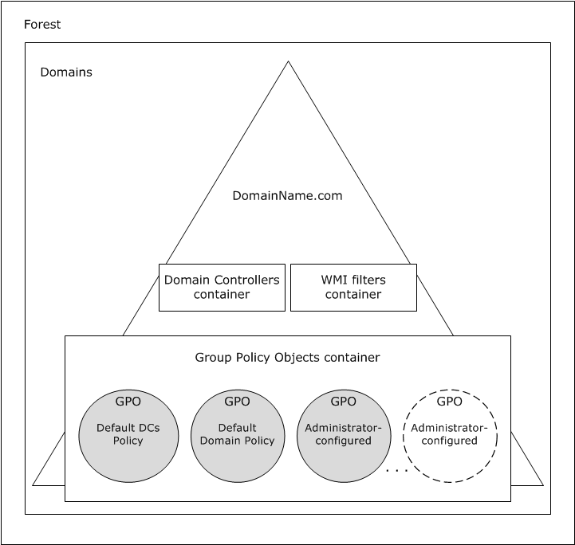

Figure 1: GPO location in Active Directory

The Group Policy administrator uses the Active Directory container objects for the domain as shown in the diagram to manage Group Policy. When Group Policy administrators need to manage GPOs, they can create a new GPO, delete a GPO, or edit an existing one. They can also manage [**policy settings**](#gt_policy-setting) via other default GPOs for the [**domain**](#gt_domain). The following default objects and containers can be accessed in a domain for management purposes:

**Domain Controllers container:** A default container that is automatically created when a server is promoted to a [**domain controller**](#gt_domain-controller-dc). It is linked to the domain controller's [**OU**](#gt_organizational-unit-ou) and manages security settings for all domain controllers in a domain.

**WMI Filters container:** A default container that is automatically created when a server is promoted to a domain controller. It holds [**WMI**](#gt_windows-management-instrumentation-wmi) filter objects that the Group Policy administrator creates and that are linked to GPOs to exempt specific [**Group Policy clients**](#gt_group-policy-client) from the extension policy settings that they hold. For information about evaluating WMI filters, refer to [MS-GPOL](#Section_2.1.1.1) section 3.2.5.1.7.

**Group Policy Objects container:** A default container that is automatically created when a server is promoted to a domain controller. It provides a hierarchical repository for GPOs that the Group Policy administrator creates with the use of the [**Administrative tool**](#gt_administrative-tool). For more information about how GPOs are created, refer to section [2.1.3.2.1](#Section_2.1.3.2.1.1).

**Default Domain Controllers Policy:** A default GPO that is automatically created and linked to the domain whenever a server is promoted to a domain controller. This GPO represents the default policy that is applied to all domain controllers in the Domain Controllers container.

**Default Domain Policy:** A default GPO that is automatically created and linked to the domain whenever a server is promoted to a domain controller. It has the highest precedence of all GPOs linked to the domain, and it applies to all users and computers in the domain. The Default Domain Policy GPO is generally used to manage default account settings, although there are exceptions to this practice. For other areas of policy management, new GPOs can be created; however, some policy settings are best configured at the domain level, and there are no restrictions against doing so.

**Administrator-configured:** A GPO that is created by the Group Policy administrator to generate custom Group Policy settings for [**policy targets**](#gt_policy-target) such as a Group Policy client computer.

### 1.1.10 Group Policy Structure

[**Group Policy**](#gt_group-policy) structure is modeled after the [**Active Directory**](#gt_active-directory) structure, in that it has both physical and logical components. At the core of Active Directory's physical architecture is an extensible storage engine that reads and writes information to the Active Directory data store. This engine makes use of the logical, object-based hierarchy that represents data store information.

Group Policy structure is similar to that of Active Directory, because it maintains both a logical and physical representation of [**GPOs**](#gt_group-policy-object-gpo), as follows:

**Logical component:** Consists of a Group Policy container object, which is stored in the Group Policy Objects container of Active Directory. The Group Policy container object contains attributes that specify basic GPO information, such as the following:

- GPO display name
- [**GPO path**](#gt_group-policy-object-gpo-path) to the extension policy and Group Policy template (GPT) files.
- GPO version number
- GPO status
- [**Access control list (ACL)**](#gt_access-control-list-acl)
- [**GUID**](#gt_globally-unique-identifier-guid)-references to the [**CSEs**](#gt_cses) that are to be invoked when the [**core Group Policy engine**](#gt_core-group-policy-engine) on the [**Group Policy client**](#gt_group-policy-client) processes the GPO.
When the Group Policy administrator creates a GPO, Active Directory creates a Group Policy container object for that GPO, as described in section [2.1.3.2.1](#Section_2.1.3.2.1.1). This Group Policy container is a container object of the groupPolicyContainer class and is named with a GUID that identifies the GPO. The Group Policy container is stored under the CN=Policies,CN=System container within the domain. The Administrative tool and the Group Policy client locate this container according to its DN, which is the exact path to the Group Policy container object in the Active Directory data store.

**Physical component**: Consists of the Group Policy file share component that stores GPT and Group Policy extension settings on a domain controller or other server.

The physical component of a GPO is represented through a series of files containing Administrative template and extension policy settings that are stored on disk. These files contain numerous policy settings along with the state of these settings. These files are stored in Machine and User subdirectories along with the associated GPO version file gpt.ini, in the following path, which is also known as the GPO path: <dns domain name>\<Group Policy file share-name>\<dns domain name>\Policies\<guid>\.

Whenever the [**Group Policy administrator**](#gt_group-policy-administrator) creates a new GPO, the <guid> folder in this path is automatically created and named with the GUID of the GPO. Within the <guid> folder are Machine and User subdirectories that contain extension [**policy settings**](#gt_policy-setting) and [**Administrative template**](#gt_administrative-template) configuration items. During policy administration, when the Group Policy administrator creates or modifies [**Group Policy extension**](#gt_group-policy-extension) or Administrative template settings, the [**Administrative tool**](#gt_administrative-tool) locates the policy files according to the <guid> in the GPO path. During [**policy application**](#gt_policy-application), the Group Policy client locates the policy files in the same manner.

### 1.1.11 GPO Configuration Model

The [**GPO**](#gt_group-policy-object-gpo) configuration model accommodates settings for users and computers, and includes Software, Windows, and Administrative Templates settings for both user and computer configurations. Software settings enable the [**Group Policy administrator**](#gt_group-policy-administrator) to specify software applications to be installed on [**Group Policy client**](#gt_group-policy-client) computers; Windows settings hold the extension configurations; and Administrative Templates represents Group Policy client subsystems for which [**registry**](#gt_registry) settings can be configured.

[**Policy targets**](#gt_policy-target) in [**Active Directory**](#gt_active-directory) are individual user and computer accounts that exist within [**domain**](#gt_domain), [**site**](#gt_site), or [**OU**](#gt_organizational-unit-ou) containers. Each site, domain, and OU has a **gpLink** attribute that associates it with one or more Group Policy container objects, which represent GPOs in Active Directory. Each GPO contains various attributes that are associated with users and computers. This includes an attribute that specifies the [**GPO path**](#gt_group-policy-object-gpo-path) to policy files that store user and computer [**policy settings**](#gt_policy-setting). The file system component of a GPO itself is configured with [**directories**](#gt_directory) that hold policy data for users and computers. Therefore, when the Group Policy administrator views a GPO in a management interface such as the [**GPMC**](#gt_group-policy-management-console-gpmc), two different sets of configuration settings are provided, as shown in the diagram of section [2.1.3.2.2](#Section_2.1.3.2.2.2):

**User Configuration:** Contains all information related to user policies that Group Policy clients retrieve during [**policy application**](#gt_policy-application) in user policy mode, which includes data for the applicable [**CSEs**](#gt_cses). These CSEs store all server state for policy settings within the user configuration, in a format that is described in corresponding extension specifications.

**Computer Configuration:** Contains all information related to computer policies that Group Policy clients retrieve during policy application in computer policy mode, which includes data for the applicable CSEs. These CSEs store all server state for policy settings within the computer configuration, in a format that is described in corresponding extension specifications.

The logical component of each GPO contains a user extension list and a computer extension list that specifies the [**GUIDs**](#gt_globally-unique-identifier-guid) of CSEs that apply to users and computers, respectively. The actual settings for these extensions are stored in the physical (file system) component of the GPO, as described in section [1.1.10](#Section_1.1.10). The extension settings for the user and computer configuration are configurable from the [**Administrative tool**](#gt_administrative-tool). When the Group Policy administrator creates or modifies extension settings, they are sent to the [**Group Policy data store**](#gt_group-policy-data-store). For example, any modifications to GPO attributes are communicated to Active Directory on the [**Group Policy server**](#gt_group-policy-server) via [**LDAP**](#gt_lightweight-directory-access-protocol-ldap) [[RFC2251]](https://go.microsoft.com/fwlink/?LinkId=90325), while the actual extension policy settings are communicated to the [**Group Policy file share**](#gt_group-policy-file-share) via a file access protocol, both of which protocols are invoked by the Administrative tool.

## 1.2 Glossary

This document uses the following terms:

**access control entry (ACE)**: An entry in an [**access control list (ACL)**](#gt_access-control-list-acl) that contains a set of user rights and a security identifier (SID) that identifies a principal for whom the rights are allowed, denied, or audited.

**access control list (ACL)**: A list of [**access control entries (ACEs)**](#gt_access-control-entry-ace) that collectively describe the security rules for authorizing access to some resource; for example, an object or set of objects.

**Active Directory**: The Windows implementation of a general-purpose [**directory service**](#gt_directory-service-ds), which uses [**LDAP**](#gt_lightweight-directory-access-protocol-ldap) as its primary access protocol. [**Active Directory**](#gt_active-directory) stores information about a variety of objects in the network such as user accounts, computer accounts, groups, and all related credential information used by Kerberos [MS-KILE](../MS-KILE/MS-KILE.md). [**Active Directory**](#gt_active-directory) is either deployed as [**Active Directory Domain Services (AD DS)**](#gt_active-directory-domain-services-ad-ds) or Active Directory Lightweight Directory Services (AD LDS), which are both described in [MS-ADOD](#Section_2.1): Active Directory Protocols Overview.

**Active Directory Domain Services (AD DS)**: A [**directory service (DS)**](#gt_directory-service-ds) implemented by a [**domain controller (DC)**](#gt_domain-controller-dc). The [**DS**](#gt_directory-service-ds) provides a data store for objects that is distributed across multiple [**DCs**](#gt_domain-controller-dc). The [**DCs**](#gt_domain-controller-dc) interoperate as peers to ensure that a local change to an object replicates correctly across [**DCs**](#gt_domain-controller-dc). AD DS is a deployment of [**Active Directory**](#gt_active-directory) [MS-ADTS](../MS-ADTS/MS-ADTS.md).

**administrative template**: A file associated with a [**Group Policy Object (GPO)**](#gt_group-policy-object-gpo) that combines information on the syntax of registry-based policy settings with human-readable descriptions of the settings, as well as other information.

**Administrative templates**: A series of [**Group Policy**](#gt_group-policy) master templates that extend the [**Group Policy**](#gt_group-policy) management functionalities that can be applied to a [**policy target**](#gt_policy-target) such as a [**Group Policy client**](#gt_group-policy-client), the settings for which are accessible from a management interface such as the [**GPMC**](#gt_group-policy-management-console-gpmc). The [**Administrative templates**](#gt_administrative-template) provide an extensive collection of [**policy settings**](#gt_policy-setting) for applications and operating system components, which are applied through [**registry**](#gt_registry) modifications on [**Group Policy clients**](#gt_group-policy-client). For this reason, [**Administrative template**](#gt_administrative-template) [**policy settings**](#gt_policy-setting) are also referred to as [**registry**](#gt_registry)-based policy.

**Administrative tool**: An implementation-specific tool, such as the Group Policy Management Console, that allows administrators to read and write [**policy settings**](#gt_policy-setting) from and to a [**Group Policy Object (GPO)**](#gt_group-policy-object-gpo) and policy files. The Group Policy Administrative tool uses the Extension list of a GPO to determine which Administrative tool extensions are required to read settings from and write settings to the logical and physical components of a GPO.

**Administrative tool extension**: A Group Policy extension protocol that is identified by an Administrative tool extension GUID and invoked by a management entity such as the Group Policy Management Console. The Administrative tool extension enables the Group Policy administrator to administer policy settings associated with the specific context provided by the extension.

**Administrative tool extension GUID**: A GUID that enables a specific [**Administrative tool extension**](#gt_administrative-tool-extensions) to be associated with settings that are stored in a [**GPO**](#gt_group-policy-object-gpo) on the Group Policy server for that particular extension. The GUID enables the [**Administrative tool**](#gt_administrative-tool) to identify the extension protocol for which settings are to be administered.

**client-side extension (CSE)**: A Group Policy extension that resides locally on the [**Group Policy client**](#gt_group-policy-client) and is identified by a [**client-side extension GUID (CSE GUID)**](#gt_client-side-extension-guid-cse-guid).

**client-side extension GUID (CSE GUID)**: A [**GUID**](#gt_globally-unique-identifier-guid) that enables a specific client-side extension on the [**Group Policy client**](#gt_group-policy-client) to be associated with policy data that is stored in the logical and physical components of a [**Group Policy Object (GPO)**](#gt_group-policy-object-gpo) on the Group Policy server, for that particular extension.

**configuration naming context (config NC)**: A specific type of naming context (NC), or an instance of that type, that contains configuration information. In [**Active Directory**](#gt_active-directory), a single [**config NC**](#gt_configuration-naming-context-config-nc) is shared among all [**domain controllers (DCs)**](#gt_domain-controller-dc) in the forest. A [**config NC**](#gt_configuration-naming-context-config-nc) cannot contain security principal objects.

**core Group Policy engine**: The software entity that implements the Group Policy: Core Protocol [MS-GPOL](#Section_2.1.1.1). The core Group Policy engine issues the message sequences that result in core protocol network traffic during policy application on [**Group Policy clients**](#gt_group-policy-client). The engine handles functions on behalf of the core protocol such as the Group Policy refresh interval, [**GPO**](#gt_group-policy-object-gpo) and policy file access, GPO filtering and ordering, and invoking transport protocols for retrieving and storing policy settings.

**directory**: The database that stores information about objects such as users, groups, computers, printers, and the [**directory service**](#gt_directory-service-ds) that makes this information available to users and applications.

**directory service (DS)**: A service that stores and organizes information about a computer network's users and network shares, and that allows network administrators to manage users' access to the shares. See also [**Active Directory**](#gt_active-directory).

**distinguished name (DN)**: A name that uniquely identifies an object by using the relative distinguished name (RDN) for the object, and the names of container objects and domains that contain the object. The distinguished name (DN) identifies the object and its location in a tree.

**domain**: A set of users and computers sharing a common namespace and management infrastructure. At least one computer member of the set must act as a [**domain controller (DC)**](#gt_domain-controller-dc) and host a member list that identifies all members of the domain, as well as optionally hosting the [**Active Directory**](#gt_active-directory) service. The domain controller provides authentication of members, creating a unit of trust for its members. Each domain has an identifier that is shared among its members. For more information, see [MS-AUTHSOD](#Section_2.1) section 1.1.1.5 and [MS-ADTS].

**domain controller (DC)**: The service, running on a server, that implements [**Active Directory**](#gt_active-directory), or the server hosting this service. The service hosts the data store for objects and interoperates with other [**DCs**](#gt_domain-controller-dc) to ensure that a local change to an object replicates correctly across all [**DCs**](#gt_domain-controller-dc). When [**Active Directory**](#gt_active-directory) is operating as [**Active Directory Domain Services (AD DS)**](#gt_active-directory-domain-services-ad-ds), the [**DC**](#gt_domain-controller-dc) contains full NC replicas of the [**configuration naming context (config NC)**](#gt_configuration-naming-context-config-nc), schema naming context (schema NC), and one of the [**domain NCs**](#gt_domain-naming-context-domain-nc) in its [**forest**](#gt_forest). If the [**AD DS**](#gt_active-directory-domain-services-ad-ds) [**DC**](#gt_domain-controller-dc) is a global catalog server (GC server), it contains partial NC replicas of the remaining [**domain NCs**](#gt_domain-naming-context-domain-nc) in its [**forest**](#gt_forest). For more information, see [MS-AUTHSOD] section 1.1.1.5.2 and [MS-ADTS]. When [**Active Directory**](#gt_active-directory) is operating as Active Directory Lightweight Directory Services (AD LDS), several AD LDS [**DCs**](#gt_domain-controller-dc) can run on one server. When [**Active Directory**](#gt_active-directory) is operating as [**AD DS**](#gt_active-directory-domain-services-ad-ds), only one [**AD DS**](#gt_active-directory-domain-services-ad-ds) [**DC**](#gt_domain-controller-dc) can run on one server. However, several AD LDS [**DCs**](#gt_domain-controller-dc) can coexist with one [**AD DS**](#gt_active-directory-domain-services-ad-ds) [**DC**](#gt_domain-controller-dc) on one server. The AD LDS [**DC**](#gt_domain-controller-dc) contains full NC replicas of the [**config NC**](#gt_configuration-naming-context-config-nc) and the schema NC in its [**forest**](#gt_forest). The domain controller is the server side of Authentication Protocol Domain Support [MS-APDS](../MS-APDS/MS-APDS.md).

**Domain Name System (DNS)**: A hierarchical, distributed database that contains mappings of domain names to various types of data, such as IP addresses. DNS enables the location of computers and services by user-friendly names, and it also enables the discovery of other information stored in the database.

**domain naming context (domain NC)**: A partition of the directory that contains information about the domain and is replicated with other [**domain controllers (DCs)**](#gt_domain-controller-dc) in the same domain.

**Encrypting File System (EFS)**: The name for the encryption capability of the NTFS file system. When a file is encrypted using [**EFS**](#gt_encrypting-file-system-efs), a symmetric key known as the file encryption key (FEK) is generated and the contents of the file are encrypted with the FEK. For each user or data recovery agent (DRA) that is authorized to access the file, a copy of the FEK is encrypted with that user's or DRA's public key and is stored in the file's metadata. For more information about [**EFS**](#gt_encrypting-file-system-efs), see [[MSFT-EFS]](https://go.microsoft.com/fwlink/?LinkId=90185).

**forest**: One or more [**domains**](#gt_domain) that share a common schema and trust each other transitively. An organization can have multiple [**forests**](#gt_forest). A [**forest**](#gt_forest) establishes the security and administrative boundary for all the objects that reside within the [**domains**](#gt_domain) that belong to the [**forest**](#gt_forest). In contrast, a [**domain**](#gt_domain) establishes the administrative boundary for managing objects, such as users, groups, and computers. In addition, each [**domain**](#gt_domain) has individual security policies and trust relationships with other [**domains**](#gt_domain).

**globally unique identifier (GUID)**: A term used interchangeably with universally unique identifier (UUID) in Microsoft protocol technical documents (TDs). Interchanging the usage of these terms does not imply or require a specific algorithm or mechanism to generate the value. Specifically, the use of this term does not imply or require that the algorithms described in [[RFC4122]](https://go.microsoft.com/fwlink/?LinkId=90460) or [[C706]](https://go.microsoft.com/fwlink/?LinkId=89824) must be used for generating the [**GUID**](#gt_globally-unique-identifier-guid). See also universally unique identifier (UUID).

**Group Policy**: A mechanism that allows the implementer to specify managed configurations for users and computers in an [**Active Directory**](#gt_active-directory) service environment.

**Group Policy administrator**: A [**domain**](#gt_domain) administrator who is responsible for defining [**policy settings**](#gt_policy-setting) and managing the [**Group Policy**](#gt_group-policy) infrastructure of a [**domain**](#gt_domain).

**Group Policy client**: A client computer that receives and applies settings of a [**GPO**](#gt_group-policy-object-gpo). The Group Policy client can use client-side extensions to extend the functionality of the Group Policy protocols.

**Group Policy data store**: A data store that consists of two types of stores. One is a physical (file system) data store on the [**Group Policy file share**](#gt_group-policy-file-share) that contains policy settings (extension and administrative template data), which can be locally or remotely accessed depending on location. The other is a logical data store that is part of [**Active Directory**](#gt_active-directory) and serves as a repository for GPOs that are accessible via [**Lightweight Directory Access Protocol (LDAP)**](#gt_lightweight-directory-access-protocol-ldap).

**Group Policy extension**: A protocol that extends the functionality of Group Policy. Group Policy extensions consist of client-side extensions and [**Administrative tool extensions**](#gt_administrative-tool-extensions). They provide settings and other Group Policy information that can be read from and written to [**Group Policy data store**](#gt_group-policy-data-store) components. Group Policy Extensions depend on the Group Policy: Core Protocol, via the [**core Group Policy engine**](#gt_core-group-policy-engine), to identify [**GPOs**](#gt_group-policy-object-gpo) containing a list of extensions that apply to a particular [**Group Policy client**](#gt_group-policy-client).

**Group Policy file share**: A file system storage location that contains policy settings that include extension settings and Group Policy template settings for [**GPOs**](#gt_group-policy-object-gpo). The latter settings consist of security and registry settings, script files, and application installation information.

**Group Policy Management Console (GPMC)**: An implementation-specific [**Administrative tool**](#gt_administrative-tool) that provides an integrated interface to create, view, and manage [**GPOs**](#gt_group-policy-object-gpo) and [**policy settings**](#gt_policy-setting) in multiple [**forests**](#gt_forest), [**domains**](#gt_domain), and [**sites**](#gt_site).

**Group Policy Object (GPO)**: A collection of administrator-defined specifications of the policy settings that can be applied to groups of computers in a domain. Each GPO includes two elements: an object that resides in the [**Active Directory**](#gt_active-directory) for the domain, and a corresponding file system subdirectory that resides on the sysvol DFS share of the Group Policy server for the domain.

**Group Policy Object (GPO) GUID**: A curly braced GUID string that uniquely identifies a [**Group Policy Object (GPO)**](#gt_group-policy-object-gpo).

**Group Policy Object (GPO) path**: A [**domain**](#gt_domain)-based Distributed File System (DFS) path for a directory on the server that is accessible through the DFS/[**SMB**](#gt_server-message-block-smb) protocols. This path will always be a Universal Naming Convention (UNC) path of the form: "\\<dns domain name>\sysvol\<dns domain name>\policies\<gpo guid>", where <dns domain name> is the [**DNS**](#gt_domain-name-system-dns) domain name of the [**domain**](#gt_domain) and <gpo guid> is a [**Group Policy Object (GPO) GUID**](#gt_group-policy-object-gpo-guid).

**Group Policy server**: A server holding a database of [**Group Policy Objects (GPOs)**](#gt_group-policy-object-gpo) that can be retrieved by other machines. The [**Group Policy server**](#gt_group-policy-server) must be a [**domain controller (DC)**](#gt_domain-controller-dc).

**Lightweight Directory Access Protocol (LDAP)**: The primary access protocol for [**Active Directory**](#gt_active-directory). Lightweight Directory Access Protocol (LDAP) is an industry-standard protocol, established by the Internet Engineering Task Force (IETF), which allows users to query and update information in a [**directory service (DS)**](#gt_directory-service-ds), as described in [MS-ADTS]. The Lightweight Directory Access Protocol can be either version 2 [[RFC1777]](https://go.microsoft.com/fwlink/?LinkId=90290) or version 3 [[RFC3377]](https://go.microsoft.com/fwlink/?LinkID=91337).

**NT LAN Manager (NTLM) Authentication Protocol**: A protocol using a challenge-response mechanism for authentication in which clients are able to verify their identities without sending a password to the server. It consists of three messages, commonly referred to as Type 1 (negotiation), Type 2 (challenge) and Type 3 (authentication).

**organizational unit (OU)**: An [**Active Directory**](#gt_active-directory) object contained within a [**domain**](#gt_domain), into which users, groups, computers, and other organizational units can be placed. An organizational unit provides a facility to classify and differentiate objects in a directory structure such as [**LDAP**](#gt_lightweight-directory-access-protocol-ldap).

**policy application**: The protocol exchange by which a client obtains all of the [**Group Policy Object (GPO)**](#gt_group-policy-object-gpo) and thus all applicable Group Policy settings for a particular policy target from the server, as specified in [MS-GPOL]. Policy application can operate in two modes, user policy and computer policy.

**policy setting**: A statement of the possible behaviors of an element of a domain member computer's behavior that can be configured by an administrator.

**policy target**: A user or computer account for which policy settings can be obtained from a server in the same domain, as specified in [MS-GPOL]. For user policy mode, the policy target is a user account. For computer policy mode, the policy target is a computer account.

**PolicyChange**: A local event that indicates that a policy has changed.

**print server**: A machine that hosts the print system and all its different components.

**registry**: A local system-defined database in which applications and system components store and retrieve configuration data. It is a hierarchical data store with lightly typed elements that are logically stored in tree format. Applications use the registry API to retrieve, modify, or delete registry data. The data stored in the registry varies according to the version of the operating system.

**Resultant Set of Policy (RSoP)**: The cumulative effect of [**GPO**](#gt_group-policy-object-gpo) inheritance and processing on an individual computer or a specific user. When the [**policy application**](#gt_policy-application) process is initiated, the [**core Group Policy engine**](#gt_core-group-policy-engine) looks at local [**registry**](#gt_registry) and WMI settings, and then the [**RSoP**](#gt_resultant-set-of-policy-rsop), to determine whether a [**policy target**](#gt_policy-target) requires a [**Group Policy**](#gt_group-policy) update. [**RSoP**](#gt_resultant-set-of-policy-rsop) data is stored, along with WMI data, in a local WMI database.

**scope of management (SOM)**: An [**Active Directory**](#gt_active-directory) [**site**](#gt_site), [**domain**](#gt_domain), or organizational unit container. These containers contain user and computer accounts that can be managed through [**Group Policy**](#gt_group-policy). These [**SOMs**](#gt_scope-of-management-som) are themselves associated with [**Group Policy Objects (GPOs)**](#gt_group-policy-object-gpo), and the accounts within them are considered by the Group Policy Protocol [MS-GPOL] to inherit that association.

**Server Message Block (SMB)**: A protocol that is used to request file and print services from server systems over a network. The SMB protocol extends the CIFS protocol with additional security, file, and disk management support. For more information, see [[CIFS]](https://go.microsoft.com/fwlink/?linkid=2109334) and [MS-SMB](../MS-SMB/MS-SMB.md).

**share**: A resource offered by a Common Internet File System (CIFS) server for access by CIFS clients over the network. A [**share**](#gt_share) typically represents a directory tree and its included files (referred to commonly as a "disk share" or "file share") or a printer (a "print share"). If the information about the [**share**](#gt_share) is saved in persistent store (for example, Windows registry) and reloaded when a file server is restarted, then the [**share**](#gt_share) is referred to as a "sticky share". Some [**share**](#gt_share) names are reserved for specific functions and are referred to as special [**shares**](#gt_share): IPC$, reserved for interprocess communication, ADMIN$, reserved for remote administration, and A$, B$, C$ (and other local disk names followed by a dollar sign), assigned to local disk devices.

**site**: A collection of one or more well-connected (reliable and fast) TCP/IP subnets. By defining [**sites**](#gt_site) (represented by site objects) an administrator can optimize both [**Active Directory**](#gt_active-directory) access and [**Active Directory**](#gt_active-directory) replication with respect to the physical network. When users log in, [**Active Directory**](#gt_active-directory) clients find [**domain controllers (DCs)**](#gt_domain-controller-dc) that are in the same [**site**](#gt_site) as the user, or near the same [**site**](#gt_site) if there is no [**DC**](#gt_domain-controller-dc) in the [**site**](#gt_site). See also Knowledge Consistency Checker (KCC). For more information, see [MS-ADTS].

**system volume (SYSVOL)**: A shared directory that stores the server copy of the [**domain's**](#gt_domain) public files that must be shared for common access and replication throughout a [**domain**](#gt_domain).

**UncPath**: The location of a file in a network of computers, as specified in Universal Naming Convention (UNC) syntax.

**Windows Management Instrumentation (WMI)**: The Microsoft implementation of Common Information Model (CIM), as specified in [[DMTF-DSP0004]](https://go.microsoft.com/fwlink/?LinkId=89848). WMI allows an administrator to manage local and remote machines and models computer and network objects using an extension of the CIM standard.

**Windows Server Update Services (WSUS)**: An optional component that enables a machine to operate as an update server.

## 1.3 References

[MS-ADOD] Microsoft Corporation, "[Active Directory Protocols Overview](#Section_2.1)".

[MS-ADTS] Microsoft Corporation, "[Active Directory Technical Specification](../MS-ADTS/MS-ADTS.md)".

[MS-AUTHSOD] Microsoft Corporation, "[Authentication Services Protocols Overview](#Section_2.1)".

[MS-CERSOD] Microsoft Corporation, "[Certificate Services Protocols Overview](#Section_2.1)".

[MS-ERREF] Microsoft Corporation, "[Windows Error Codes](../MS-ERREF/MS-ERREF.md)".

[MS-FASOD] Microsoft Corporation, "[File Access Services Protocols Overview](#Section_2.1)".

[MS-GPAC] Microsoft Corporation, "[Group Policy: Audit Configuration Extension](../MS-GPAC/MS-GPAC.md)".

[MS-GPCAP] Microsoft Corporation, "[Group Policy: Central Access Policies Protocol Extension](../MS-GPCAP/MS-GPCAP.md)".

[MS-GPDPC] Microsoft Corporation, "[Group Policy: Deployed Printer Connections Extension](../MS-GPDPC/MS-GPDPC.md)".

[MS-GPEF] Microsoft Corporation, "[Group Policy: Encrypting File System Extension](../MS-GPEF/MS-GPEF.md)".

[MS-GPFAS] Microsoft Corporation, "[Group Policy: Firewall and Advanced Security Data Structure](#Section_2.9)".

[MS-GPFR] Microsoft Corporation, "[Group Policy: Folder Redirection Protocol Extension](../MS-GPFR/MS-GPFR.md)".

[MS-GPIE] Microsoft Corporation, "[Group Policy: Internet Explorer Maintenance Extension](../MS-GPIE/MS-GPIE.md)".

[MS-GPIPSEC] Microsoft Corporation, "[Group Policy: IP Security (IPsec) Protocol Extension](#Section_2.9)".

[MS-GPNAP] Microsoft Corporation, "[Group Policy: Network Access Protection (NAP) Extension](../MS-GPNAP/MS-GPNAP.md)".

[MS-GPNRPT] Microsoft Corporation, "[Group Policy: Name Resolution Policy Table (NRPT) Data Extension](../MS-GPNRPT/MS-GPNRPT.md)".

[MS-GPOL] Microsoft Corporation, "[Group Policy: Core Protocol](#Section_2.1.1.1)".

[MS-GPPREF] Microsoft Corporation, "[Group Policy: Preferences Extension Data Structure](#Section_1.3)".

[MS-GPREG] Microsoft Corporation, "[Group Policy: Registry Extension Encoding](../MS-GPREG/MS-GPREG.md)".

[MS-GPSB] Microsoft Corporation, "[Group Policy: Security Protocol Extension](#Section_2.9)".

[MS-GPSCR] Microsoft Corporation, "[Group Policy: Scripts Extension Encoding](../MS-GPSCR/MS-GPSCR.md)".

[MS-GPSI] Microsoft Corporation, "[Group Policy: Software Installation Protocol Extension](../MS-GPSI/MS-GPSI.md)".

[MS-GPWL] Microsoft Corporation, "[Group Policy: Wireless/Wired Protocol Extension](../MS-GPWL/MS-GPWL.md)".

[MS-KILE] Microsoft Corporation, "[Kerberos Protocol Extensions](../MS-KILE/MS-KILE.md)".

[MS-NLMP] Microsoft Corporation, "[NT LAN Manager (NTLM) Authentication Protocol](../MS-NLMP/MS-NLMP.md)".

[MS-NRPC] Microsoft Corporation, "[Netlogon Remote Protocol](../MS-NRPC/MS-NRPC.md)".

[MS-PRSOD] Microsoft Corporation, "[Print Services Protocols Overview](#Section_2.1)".

[MS-SMB] Microsoft Corporation, "[Server Message Block (SMB) Protocol](../MS-SMB/MS-SMB.md)".

[MS-SPNG] Microsoft Corporation, "[Simple and Protected GSS-API Negotiation Mechanism (SPNEGO) Extension](../MS-SPNG/MS-SPNG.md)".

[MS-WMI] Microsoft Corporation, "[Windows Management Instrumentation Remote Protocol](../MS-WMI/MS-WMI.md)".

[MS-WSUSOD] Microsoft Corporation, "[Windows Server Update Services Protocols Overview](#Section_2.1)".

[MS-WUSP] Microsoft Corporation, "[Windows Update Services: Client-Server Protocol](../MS-WUSP/MS-WUSP.md)".

[MSDN-GroupPolicy] Microsoft Corporation, "Group Policy API", [http://msdn.microsoft.com/en-us/library/aa374177(VS.85).aspx](https://go.microsoft.com/fwlink/?LinkId=136541)

[MSDN-RSATW7] Microsoft Corporation, "Remote Server Administration Tools for Windows 7", [http://msdn.microsoft.com/en-us/library/ee449475(WS.10).aspx](https://go.microsoft.com/fwlink/?LinkId=220457)

[RFC1034] Mockapetris, P., "Domain Names - Concepts and Facilities", STD 13, RFC 1034, November 1987, [http://www.ietf.org/rfc/rfc1034.txt](https://go.microsoft.com/fwlink/?LinkId=90263)

[RFC1035] Mockapetris, P., "Domain Names - Implementation and Specification", STD 13, RFC 1035, November 1987, [http://www.ietf.org/rfc/rfc1035.txt](https://go.microsoft.com/fwlink/?LinkId=90264)

[RFC2251] Wahl, M., Howes, T., and Kille, S., "Lightweight Directory Access Protocol (v3)", RFC 2251, December 1997, [http://www.ietf.org/rfc/rfc2251.txt](https://go.microsoft.com/fwlink/?LinkId=90325)

[RFC4120] Neuman, C., Yu, T., Hartman, S., and Raeburn, K., "The Kerberos Network Authentication Service (V5)", RFC 4120, July 2005, [https://www.rfc-editor.org/rfc/rfc4120.txt](https://go.microsoft.com/fwlink/?LinkId=90458)

[RFC792] Postel, J., "Internet Control Message Protocol", RFC 792, September 1981, [http://www.ietf.org/rfc/rfc792.txt](https://go.microsoft.com/fwlink/?LinkId=90492)

# 2 Functional Architecture

## 2.1 Overview

The [**Group Policy**](#gt_group-policy) protocols enable a [**Group Policy administrator**](#gt_group-policy-administrator) to maintain standard operating environments for specific groups of users. As policies, software, and environments change over time, administrators can use Group Policy to update an already-deployed operating environment. Group Policy can also enforce rules that restrict the programs that can be run on company computers. To manage such environments, Group Policy utilizes an architectural model that embraces a dual approach consisting of policy administration and [**policy application**](#gt_policy-application) features.

The policy administration feature makes use of an [**Administrative tool**](#gt_administrative-tool), [**Administrative tool extensions**](#gt_administrative-tool-extensions), a Group Policy data store ([**Group Policy data store**](#gt_group-policy-data-store)) containing [**GPOs**](#gt_group-policy-object-gpo) and data, and a [**Group Policy server**](#gt_group-policy-server) that provides [**directory service**](#gt_directory-service-ds)-based access to Group Policy metadata (sections [1.1.5](#Section_1.1.5) and [1.1.7.3](#Section_1.1.7.3)) and file access to [**policy settings**](#gt_policy-setting).

The policy application feature makes use of the [**Group Policy client**](#gt_group-policy-client), [**CSEs**](#gt_cses), and the Group Policy data store on the Group Policy server, from where the Group Policy client for the policy application process (section [1.1.7](#Section_1.1.7)) obtains GPO metadata and policy settings.

The following diagram shows the basic architecture of the Group Policy protocols. Note that the Administrative tool in this architecture is an implementation-specific interface that the Group Policy administrator uses to manage Group Policy.

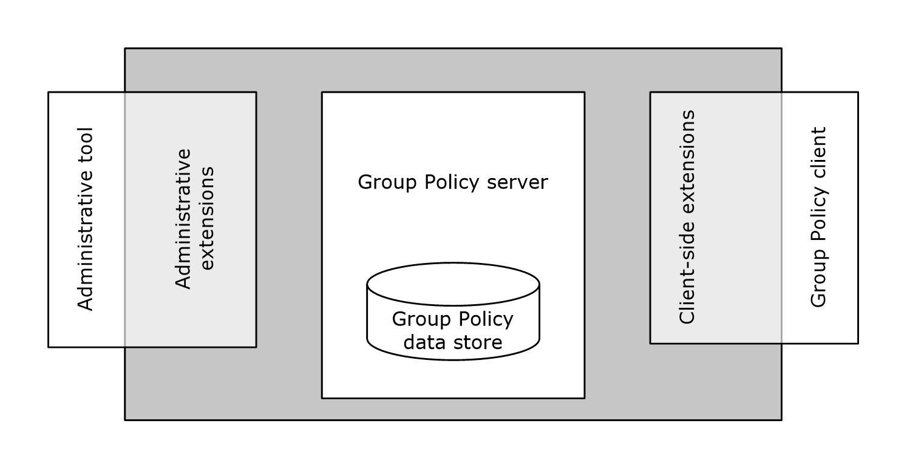

Figure 2: Group Policy architecture

The main components of the Group Policy protocols are described in section [2.1.2](#Section_2.1.2).

Group Policy components are typically installed in a distributed environment. The following diagram shows a basic deployment of Group Policy components in a distributed environment that consists of three computers.

Figure 3: Group Policy distributed environment

### 2.1.1 System Purpose

System administrators are required to provide consistency among groups of computers and/or users, with respect to such things as operating system versions, applications, and the general user experience. [**Group Policy**](#gt_group-policy) enables a remote administrator to ensure that groups of computers conform to standards, and that users are provided with a consistent experience regardless of the computer that they use.

As the enabling technology in Windows, Group Policy allows programs and administrators to use [**Active Directory**](#gt_active-directory) as an infrastructure to centralize network administration, centrally define management policy, and delegate administrative authority. Users, computers, devices, and resources are represented as objects in Active Directory. With Group Policy, administrators can target [**policy settings**](#gt_policy-setting) on everything from users and computers to individual objects throughout the Active Directory hierarchy.

Group Policy depends on a domain-joined environment, as described in section [2.4](#Section_2.4). In this environment, the Group Policy protocols enable a [**Group Policy client**](#gt_group-policy-client) to retrieve [**GPO**](#gt_group-policy-object-gpo) metadata and policy settings from a [**Group Policy server**](#gt_group-policy-server), and it enables the [**Administrative tool**](#gt_administrative-tool) to create, retrieve, update, and delete policy settings. The Group Policy: Core Protocol [MS-GPOL](#Section_2.1.1.1) provides the core functionality of Group Policy, as described in section [1.1.1](../MS-GPOL/MS-GPOL.md). Group Policy functionality is extensible on both the client side ([**policy application**](#gt_policy-application)) and the administrative side (policy administration).

#### 2.1.1.1 Core Protocol

The Group Policy: Core Protocol [MS-GPOL](#Section_2.1.1.1) is the main [**Group Policy**](#gt_group-policy) protocol. It is a client/server protocol that allows clients to discover and retrieve [**policy settings**](#gt_policy-setting) created by [**Group Policy administrators**](#gt_group-policy-administrator). Policy settings are the directives that Group Policy administrators employ to control client behavior. Section [1.1.1](../MS-GPOL/MS-GPOL.md) describes the Group Policy: Core Protocol in more detail.

#### 2.1.1.2 Extensible Architecture

[**Group Policy**](#gt_group-policy) has an extensible architecture that consists of the Group Policy: Core Protocol and the extension protocols that are described in section [2.2](#Section_2.2). The Group Policy: Core Protocol is fully implemented by the [**core Group Policy engine**](#gt_core-group-policy-engine). The core Group Policy engine provides the functionality that determines which policies apply to a [**policy target**](#gt_policy-target) such as a [**Group Policy client**](#gt_group-policy-client), whereas an extension, based on the determined policy applicability, is responsible for the actual [**policy application**](#gt_policy-application). The core Group Policy engine itself does not apply actual [**policy settings**](#gt_policy-setting) to a Group Policy client; rather, it makes the [**LDAP**](#gt_lightweight-directory-access-protocol-ldap) or file access calls and extension invocations through which extension and [**Administrative template**](#gt_administrative-template) settings are applied.

Note that failure of a particular protocol extension sequence does not cause policy application to fail. Failure simply means that Group Policy clients are not able to enforce settings that are associated with a specific extension or Administrative template configuration item.

#### 2.1.1.3 Scriptable Policy Settings

The [**Group Policy**](#gt_group-policy) protocols apply [**policy settings**](#gt_policy-setting) to [**Group Policy clients**](#gt_group-policy-client) when specific events occur, such as computer startup, computer shutdown, user logon, and user logoff, as described in section [1.1.7.1](#Section_1.1.7.1). These events provide the [**Group Policy administrator**](#gt_group-policy-administrator) with the opportunity to run scripts that apply additional policy configurations to the Group Policy client. These scripts can be stored on any server that contains a [**Group Policy file share**](#gt_group-policy-file-share), which includes the [**Group Policy server**](#gt_group-policy-server). Users and computers must be able to access this [**share**](#gt_share).

For more information about applying policy settings during the events mentioned in this section, see the documentation for the Group Policy: Scripts Extension Encoding protocol [MS-GPSCR](../MS-GPSCR/MS-GPSCR.md).

### 2.1.2 Group Policy Components

The main components of the [**Group Policy**](#gt_group-policy) protocols are described as follows:

**Administrative tool:** An implementation-specific management entity, such as the [**GPMC**](#gt_group-policy-management-console-gpmc), that enables a [**Group Policy administrator**](#gt_group-policy-administrator) to create, modify, and delete [**GPOs**](#gt_group-policy-object-gpo) and [**policy settings**](#gt_policy-setting) ([**Administrative templates**](#gt_administrative-template) and extension settings). The [**Administrative tool**](#gt_administrative-tool) manages policy settings that are specific to the [**Group Policy client**](#gt_group-policy-client) implementation. Policy settings and other Group Policy functions are managed through the following administrative tasks:

- Authoring or editing GPOs via write access to [**Active Directory**](#gt_active-directory) to facilitate configuration of GPOs with specific policy directives or settings.
- Updating policy files on the [**Group Policy file share**](#gt_group-policy-file-share) via file access write operations.
- Configuring core aspects of Group Policy, such as [**SOM**](#gt_scope-of-management-som) and GPO precedence.
The Administrative tool, along with its associated extensions, can be located and run on any computer that is a member of the [**domain**](#gt_domain), including the [**Group Policy server**](#gt_group-policy-server).

**Note** All Group Policy server SKUs, and Group Policy clients with Remote Server Administration Tools [[MSDN-RSATW7]](https://go.microsoft.com/fwlink/?LinkId=220457) installed, have the Administrative tool and extensions.

**Group Policy client:** The client computer on which Group Policy settings are applied by invoking the [**core Group Policy engine**](#gt_core-group-policy-engine) and the [**CSEs**](#gt_cses). The Group Policy client communicates with [**Group Policy data store**](#gt_group-policy-data-store) components, which includes the Active Directory and Group Policy file share data stores, via the Group Policy: Core Protocol [MS-GPOL](#Section_2.1.1.1), as implemented by the core Group Policy engine on the client computer.

**Group Policy Extensions:** Consist of CSE and [**Administrative tool extension**](#gt_administrative-tool-extensions) protocols that enhance the base functionality of Group Policy. Extension data is typically read from and written to Group Policy data store components.

**Group Policy data store:** Consists of an Active Directory data store that provides storage and access to GPOs containing Group Policy metadata. It also contains a Group Policy file share data store that serves as a file system repository for user and computer extension policy settings, GPO version information, and [**administrative template**](#gt_administrative-template) policy settings.

The Group Policy administrative templates can be used to configure [**registry**](#gt_registry)-based settings for a GPO, which can include security settings, script files for custom policy configurations, and software installation information. Administrative template settings are stored on the Group Policy file share; however, note that administrative templates are not a requirement for a GPO.

**Group Policy server:** A [**domain controller**](#gt_domain-controller-dc) that implements Active Directory, from which a Group Policy client retrieves GPO metadata via [**LDAP**](#gt_lightweight-directory-access-protocol-ldap) and policy settings via a file access protocol.

**Note** The terms domain controller and Group Policy server are used interchangeably throughout this document.

Although Group Policy extends Active Directory functionality to support Group Policy operations, Active Directory is not officially part of Group Policy. Implementers are free to choose Active Directory or any LDAP-accessed [**directory service**](#gt_directory-service-ds) with which Group Policy is compatible, to support Group Policy operations. However, for purposes of discussion herein, this document assumes that Active Directory is the LDAP-accessed directory service for Group Policy.

**Note** The directory service that the implementer chooses are required to support [**forests**](#gt_forest).

The following sections describe the Group Policy components and the interrelationships among their parts, consumers, and dependencies. In particular, the following communication and process functionalities of Group Policy are covered in the discussions, along with applicable standards:

- Protocol communications between components
- Relationships between internal components
- Communication architecture and message flows
- Policy application and administration processes
- Applicability and interoperability standards

#### 2.1.2.1 Component Protocol Communications

The following diagram shows the [**Group Policy**](#gt_group-policy) protocols along with the protocols that facilitate communication between components.

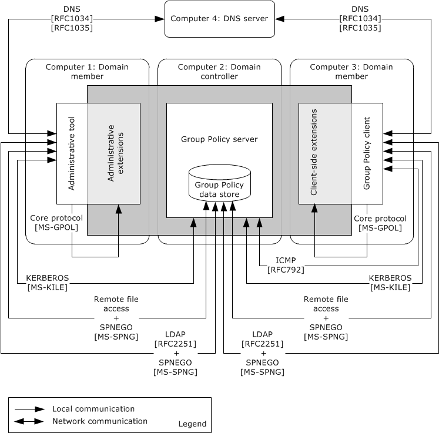

Figure 4: Group Policy component protocol communications

Group Policy makes use of several protocols to facilitate communications among its components, as illustrated in the preceding diagram:

**Administrative Tool Communication Protocols**

The [**Administrative tool**](#gt_administrative-tool) uses the following communication protocols:

- [**LDAP**](#gt_lightweight-directory-access-protocol-ldap) ([[RFC2251]](https://go.microsoft.com/fwlink/?LinkId=90325)) and a file access protocol for accessing [**Group Policy data store**](#gt_group-policy-data-store) components, which includes the [**Active Directory**](#gt_active-directory) data store on the [**Group Policy server**](#gt_group-policy-server) and the [**Group Policy file share**](#gt_group-policy-file-share) data store.
- [**DNS**](#gt_domain-name-system-dns), as described in [MS-ADOD](#Section_2.1) section 3.1.1, for locating a [**domain controller**](#gt_domain-controller-dc).
- Kerberos [MS-KILE](../MS-KILE/MS-KILE.md) or NT LAN Manager (NTLM) Authentication Protocol [MS-NLMP](../MS-NLMP/MS-NLMP.md), as described in [MS-SPNG](../MS-SPNG/MS-SPNG.md), for authenticating to the Group Policy server.
- Group Policy: Core Protocol [MS-GPOL](#Section_2.1.1.1), for invoking and processing [**Administrative tool extensions**](#gt_administrative-tool-extensions) via the Administrative tool.
**Group Policy Client Communication Protocols**

The [**Group Policy client**](#gt_group-policy-client) uses the following communication protocols:

- LDAP and a file access protocol, for accessing Group Policy data store components, which include the Active Directory data store on the Group Policy server and the Group Policy file share data store.
- DNS, as described in [MS-ADOD] section 3.1.1, for locating a domain controller.
- Kerberos [MS-KILE] or [**NTLM**](#gt_fff710f9-e3d1-4991-99a2-009768d57585) [MS-NLMP], as described in [MS-SPNG], for authenticating to the Group Policy server.
- Group Policy: Core Protocol, as described in [MS-GPOL], for invoking and processing [**CSEs**](#gt_cses) via the [**core Group Policy engine**](#gt_core-group-policy-engine).
**Group Policy Extension Communication Protocols**

The communication protocols that the [**Group Policy extensions**](#gt_group-policy-extension) use, which include Administrative tool extensions and CSEs, are as follows:

- LDAP and a file access protocol, for communicating with Active Directory and the Group Policy file share.
In policy administration mode, Administrative tool extensions make direct writes against Active Directory via LDAP and against policy files via a file access protocol. In [**policy application**](#gt_policy-application) mode, CSEs use LDAP and a file access protocol to query the Group Policy server and the Group Policy file share data store, respectively, for the retrieval and application of [**policy settings**](#gt_policy-setting).

**Group Policy Server Communication Protocols**

The Group Policy server uses the following communication protocols:

- LDAP, when accepting access to [**GPOs**](#gt_group-policy-object-gpo) in Active Directory.
- File access protocol, for accepting local access to user and computer policy files, that is, when the Group Policy file share data store is located on the Group Policy server.
Note that the core Group Policy engine on the Group Policy client chooses the appropriate protocol to invoke whenever the Group Policy client requires access to Active Directory or the Group Policy file share. Likewise, the Administrative tool chooses the appropriate protocol to invoke when it needs access to Active Directory or the Group Policy file share.

**Group Policy Data Store Communication Protocols**

The Group Policy data store uses the following communication protocols:

- LDAP, when access is required for the storage and retrieval of GPOs in Active Directory.
- File access protocol, when access is required for updating and retrieving user and computer policy settings, and GPO version information, on the Group Policy file share.
The protocols and services that enable communications between Group Policy components are described as follows:

**Authentication protocols:** Authentication services, as described in [MS-AUTHSOD](#Section_2.1), are provided by NTLM, specified in [MS-NLMP], or Kerberos, as specified in [[RFC4120]](https://go.microsoft.com/fwlink/?LinkId=90458) and [MS-KILE], to secure communications within the Group Policy protocols. These protocols also provides authentication services that support the client-to-server communication within and outside Group Policy. This includes the use of the Simple and Protected GSS-API Negotiation Mechanism (SPNEGO) Protocol Extensions as described in [MS-SPNG], which facilitate a secure environment while negotiating which authentication protocol the Group Policy protocols use: either NTLM [MS-NLMP] or Kerberos [RFC4120], as described in [MS-SPNG], section 1.5.

**DNS Server:** DNS, as specified in [[RFC1034]](https://go.microsoft.com/fwlink/?LinkId=90263) and [[RFC1035]](https://go.microsoft.com/fwlink/?LinkId=90264), is used by both the Group Policy client and the Administrative tool to discover the location of the Group Policy server.

**Internet Control Message Protocol (ICMP):** In some instances, ICMP, as specified in [[RFC792]](https://go.microsoft.com/fwlink/?LinkId=90492) is used by the Group Policy client to determine the network speed of the link to the domain controller, to ensure that bandwidth-intensive protocol extension sequences is sufficiently supported. See section [2.1.3.1.6](#Section_2.1.3.1.6) for more information on link speed determination.

**Lightweight Directory Access Protocol:** LDAP is invoked by the Group Policy: Core Protocol and may be invoked by Group Policy extensions to read and update various policy attributes stored in GPOs within the Active Directory hierarchy on the Group Policy server.

**File access protocol:** A file access protocol is invoked to read and update policy files on the Group Policy file share and to transmit policy settings and other data between the Group Policy server and Group Policy client.

#### 2.1.2.2 Component Functionality

The following diagram shows the internal components and protocol connections for the [**Group Policy**](#gt_group-policy) protocols.

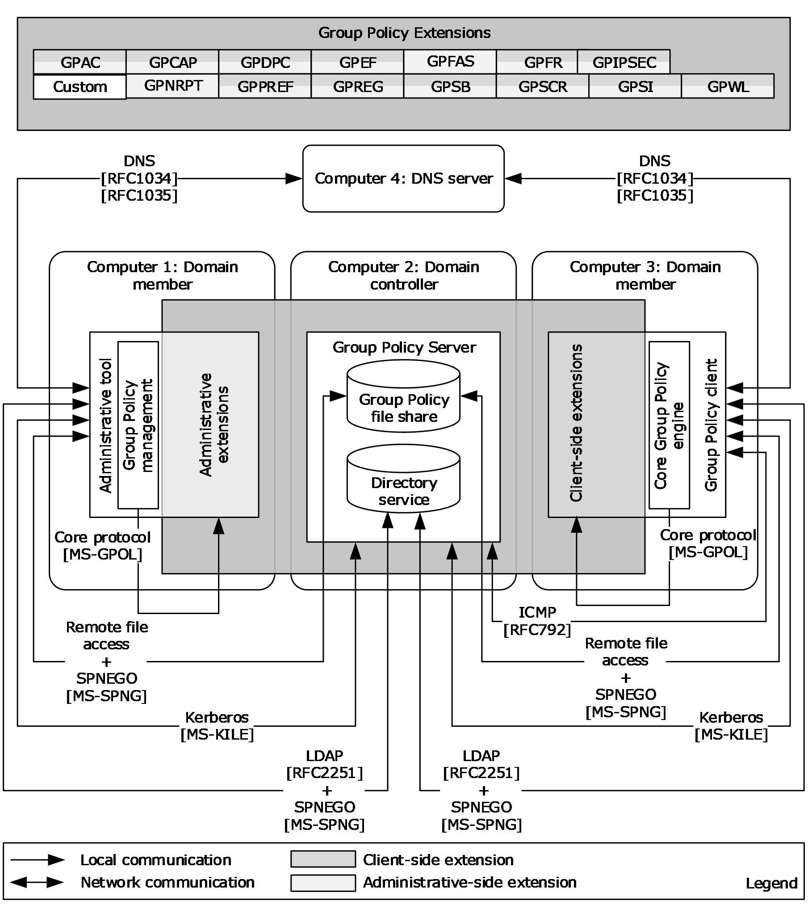

Figure 5: Internal component functions

The general functions of Group Policy components as follows:

**Core Group Policy engine:** Coordinates the application and processing of Group Policy by handling tasks such as:

- Applying Group Policy at regular intervals
- Accessing [**GPOs**](#gt_group-policy-object-gpo) and retrieving GPO extension lists from [**Active Directory**](#gt_active-directory).
- Accessing [**policy settings**](#gt_policy-setting) on the [**Group Policy file share**](#gt_group-policy-file-share).
- Filtering and ordering GPOs
- Providing notification of Group Policy changes.
**Extension protocols:** Consist of [**CSE**](#gt_cses) and [**Administrative tool extension**](#gt_administrative-tool-extensions) protocols that extend Group Policy application functionality. Note that implementers can create their own custom extension protocols, as described in [MS-GPOL](#Section_2.1.1.1), section 1.8.

In the preceding diagram, the color-code scheme indicates that most [**Group Policy extension**](#gt_group-policy-extension) protocols implement both an administrative-side and a client-side extension. However, the Group Policy: Firewall and Advanced Security Data Structure defined in [MS-GPFAS](#Section_2.9), implements only an administrative-side extension. For additional information about administrative-side and client-side extensions, see sections [1.1.4](../MS-GPFAS/MS-GPFAS.md) and [2.2](../MS-GPFAS/MS-GPFAS.md).

**Group Policy file share:** An implementation-specific version of a file share location. The Group Policy file share location and its internal [**directory**](#gt_directory) structure are shared with all [**Group Policy clients**](#gt_group-policy-client) and can be replicated to other peers in a multimaster topology.

**Group Policy management:** The [**Administrative tool**](#gt_administrative-tool) provides facilities for locating, retrieving, creating, modifying, and deleting group policies. These management functions can be accomplished from an interface such as the [**GPMC**](#gt_group-policy-management-console-gpmc), a custom application, or a command-line tool.

**Directory service:** An implementation-specific version of an [**LDAP**](#gt_lightweight-directory-access-protocol-ldap)-accessible [**directory service**](#gt_directory-service-ds), such as Active Directory, for the storage of GPOs.

#### 2.1.2.3 Component Tasks

The following diagram provides a high-level depiction of the major tasks performed by [**Group Policy**](#gt_group-policy) components. The sections following the diagram provide details about the messaging and Group Policy component functions that enable these tasks to be carried out.

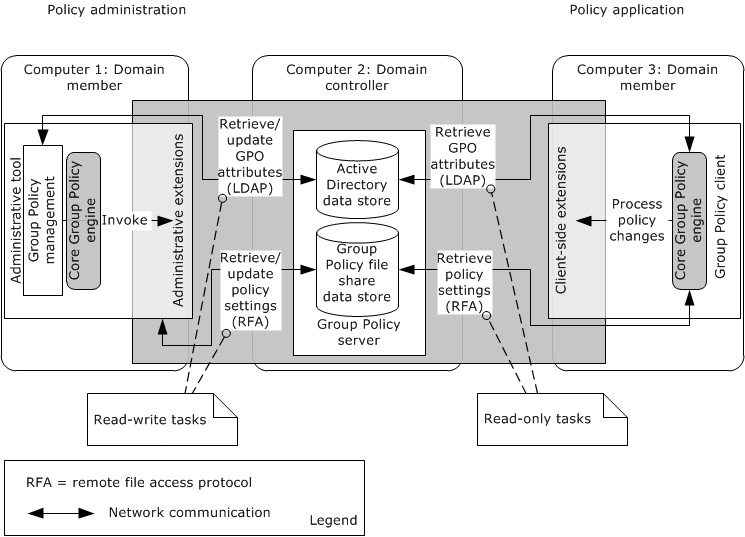

Figure 6: Group Policy communications architecture

##### 2.1.2.3.1 Group Policy Server

The [**Group Policy server**](#gt_group-policy-server) is a [**domain controller**](#gt_domain-controller-dc) that implements [**Active Directory Domain Services (AD DS)**](#gt_active-directory-domain-services-ad-ds). The Group Policy server of itself has no knowledge of [**Group Policy**](#gt_group-policy). It is simply a server that provides storage for managed generic objects ([**GPOs**](#gt_group-policy-object-gpo)) that are used to maintain policy information.

The Group Policy server maintains state via two [**Group Policy data store**](#gt_group-policy-data-store) components, which consist of the following:

**Active Directory data store:** A hierarchical [**directory service**](#gt_directory-service-ds) that stores the logical component of GPOs that are accessible through [**LDAP**](#gt_lightweight-directory-access-protocol-ldap).

**Group Policy file share data store:** A domain-based file share that stores [**Group Policy extension**](#gt_group-policy-extension) and Group Policy template settings and is accessible through a file access protocol. Note that the [**Group Policy file share**](#gt_group-policy-file-share) data store can be located on a remote file server or on the Group Policy server itself.

These data stores are modified as a result of changes made when authoring or modifying [**policy settings**](#gt_policy-setting) with the [**Administrative tool**](#gt_administrative-tool). In addition, [**Group Policy clients**](#gt_group-policy-client) use these repositories as read-only stores during the [**policy application**](#gt_policy-application) process.

For more information about the Group Policy server, including how GPOs are structured, see [MS-GPOL](#Section_2.1.1.1) section 3.1.

##### 2.1.2.3.2 Group Policy Client

The [**Group Policy client**](#gt_group-policy-client) contains the [**core Group Policy engine**](#gt_core-group-policy-engine) and the [**CSEs**](#gt_cses) that extend [**Group Policy**](#gt_group-policy). The CSEs that extend Group Policy are described in section [2.2](#Section_2.2).

The core Group Policy engine has the task of managing various functionalities on Group Policy clients and across CSEs, which includes the following:

- Applying Group Policy at regular intervals, as described in sections [2.8.1](#Section_2.8.1) and [2.8.2](#Section_2.8.2).
- Accessing [**GPO**](#gt_group-policy-object-gpo) attribute information from the appropriate locations in [**Active Directory**](#gt_active-directory) and accessing [**policy settings**](#gt_policy-setting) on the [**Group Policy file share**](#gt_group-policy-file-share).
- Handling special cases that affect all CSEs, such as loopback mode, are described in [MS-GPOL](#Section_2.1.1.1) section 3.2.1.3.
- Appropriately filtering and ordering GPOs, as described in [MS-GPOL] sections 3.2.5.1.6 and 3.2.5.1.7.
- Invoking extension protocol sequences, as described in [MS-GPOL] section 3.2.5.1.10.
- Maintaining version numbers and histories for all CSEs.
- Invoking CSEs for the [**policy application**](#gt_policy-application) process.
- Notifying various components of changes made by Group Policy. The core Group Policy engine is responsible for this activity after the completion of policy processing.
The basic communication flow that is associated with the Group Policy client consists of the following:

- The Group Policy client locates a [**domain controller**](#gt_domain-controller-dc) ([**Group Policy server**](#gt_group-policy-server)), as described in [MS-ADOD](#Section_2.1) (section 3.1.1).
- The Group Policy client uses [**LDAP**](#gt_lightweight-directory-access-protocol-ldap) to query the Group Policy server for a list of GPOs, as described in [MS-GPOL] section 3.2.5.1.5.
- For each object in the GPO list, the Group Policy client queries the Group Policy server for the GPO's attributes, using LDAP and a file access protocol, as described in [MS-GPOL] sections 3.2.5.1.5, 3.2.5.1.6, and 3.2.5.1.7.
- Based on the [**GUIDs**](#gt_globally-unique-identifier-guid) in the Extension list of GPOs, the core Group Policy engine on the Group Policy client invokes the appropriate CSEs ([MS-GPOL] section 3.2.5.1.10).
- In turn, each CSE uses LDAP and a file access protocol to query the Group Policy server and Group Policy file share, respectively, for the retrieval of GPO attributes and policy settings, as described in [MS-GPOL] section 1.3.3.3.

##### 2.1.2.3.3 Group Policy Administrative Tool

The [**Administrative tool**](#gt_administrative-tool) facilitates the creation, deletion, and modification of [**Group Policy**](#gt_group-policy) settings. It also enables the [**Group Policy administrator**](#gt_group-policy-administrator) to define the manner in which [**policy settings**](#gt_policy-setting) are to be applied, by creating the [**SOM**](#gt_scope-of-management-som) configuration and [**GPO**](#gt_group-policy-object-gpo) precedence order.

The Administrative tool uses the same set of protocols to discover the [**Group Policy server**](#gt_group-policy-server) and the same extensions when authoring policy as the [**Group Policy client**](#gt_group-policy-client) uses to discover the Group Policy server and apply policy settings. An overview of communication and authoring processes is provided in section [2.1.3.2.1](#Section_2.1.3.2.1.1).

The basic communication flow associated with the Administrative tool consists of the following:

- The Administrative tool locates the [**domain controller**](#gt_domain-controller-dc) (Group Policy server) as specified in [MS-ADOD](#Section_2.1) section 3.1.1.
- The Administrative tool uses [**LDAP**](#gt_lightweight-directory-access-protocol-ldap) to query [**Active Directory**](#gt_active-directory) on the Group Policy server for the retrieval of GPO attributes.
- The [**core Group Policy engine**](#gt_core-group-policy-engine) on the computer that hosts the Administrative tool invokes an [**Administrative tool extension**](#gt_administrative-tool-extensions), via a [**GUID**](#gt_globally-unique-identifier-guid) that is specified in the GPO Extension list.
- The Administrative tool extension retrieves Group Policy attributes from the logical component of a GPO by using LDAP to query Active Directory on the Group Policy server, as described in section [1.1.6](#Section_1.1.6).
- The Administrative tool extension retrieves policy settings from the file system component of the GPO by using a file access protocol to query the appropriate [**Group Policy file share**](#gt_group-policy-file-share) [**directory**](#gt_directory) locations.
- The extension uses LDAP or a file access protocol to update Group Policy attributes in Active Directory on the Group Policy server and extension and template setting changes on the Group Policy file share, respectively.
- The Administrative tool uses LDAP to update version information for the GPO in Active Directory and uses a file access protocol to update version information in the gpt.ini file on the Group Policy file share. This is described in detail in [MS-GPOL](#Section_2.1.1.1) section 3.3.4.1.

### 2.1.3 Group Policy Communication Process Details

This section describes the protocol communications, interactions, and transports on which the [**Group Policy**](#gt_group-policy) protocols rely. Although the related protocols have been noted earlier, the details of the actual communication process have not. The two communication processes of interest involve interactions between the following:

- [**Group Policy client**](#gt_group-policy-client) and the [**Group Policy server**](#gt_group-policy-server)
- [**Administrative tool**](#gt_administrative-tool) and the Group Policy server
The communication discussions that follow assume that [**AD DS**](#gt_active-directory-domain-services-ad-ds) is implemented on the Group Policy server.

#### 2.1.3.1 Protocol Communication Between a Group Policy Client and Group Policy Server

The [**Group Policy**](#gt_group-policy) protocols use [**LDAP**](#gt_lightweight-directory-access-protocol-ldap) and a file access protocol to transport Group Policy-specific information that is sent between the [**Group Policy client**](#gt_group-policy-client) and the [**Group Policy server**](#gt_group-policy-server). The sections that follow describe the communication that occurs between a Group Policy client and a Group Policy server via [**policy application**](#gt_policy-application) messages, to enable the client to read and apply Group Policy.

The following diagram summarizes the communication between various Group Policy components during policy application by the Group Policy client. The communications illustrated in the diagram map to the discussions in the sections that follow.

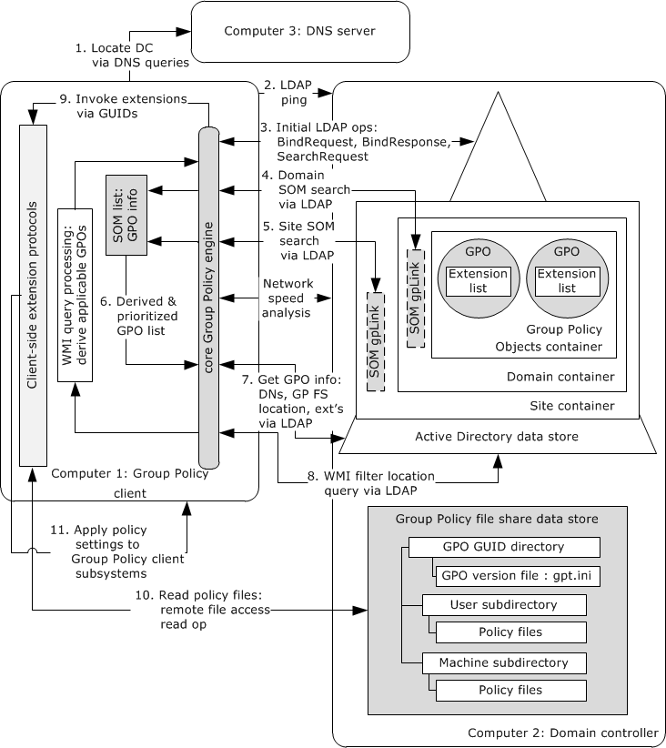

Figure 7: Policy application process

##### 2.1.3.1.1 Locating a Group Policy Server

The [**Group Policy client**](#gt_group-policy-client) locates the [**Group Policy server**](#gt_group-policy-server) by discovering the location where the [**Active Directory**](#gt_active-directory) data store resides, and through an associated [**LDAP**](#gt_lightweight-directory-access-protocol-ldap) lookup, locates the file system share where the extension policy files reside. In the Microsoft implementation, both the Active Directory data store and file system share ([**SYSVOL**](#gt_system-volume-sysvol)) are located on the Group Policy server, which is the [**domain controller**](#gt_domain-controller-dc).

The process of locating a domain controller (Group Policy server) is specified in [MS-ADOD](#Section_2.1) sections 2.5 and 3.1.1.

##### 2.1.3.1.2 Domain SOM Search and Response

[**SOM**](#gt_scope-of-management-som) is associated with an [**Active Directory**](#gt_active-directory) container, such as a [**domain**](#gt_domain), [**site**](#gt_site), or [**OU**](#gt_organizational-unit-ou), that holds user and computer accounts that are managed through [**Group Policy**](#gt_group-policy). The [**Group Policy client**](#gt_group-policy-client) accesses the SOM container to obtain attribute information. To initiate this process, the Group Policy client sends an [**LDAP**](#gt_lightweight-directory-access-protocol-ldap) **BindRequest**, and the [**Group Policy server**](#gt_group-policy-server) sends an LDAP **BindResponse** in reply. After the Group Policy client has successfully received a **BindResponse** from the Group Policy server, it sends an LDAP **SearchRequest** to the Group Policy server, with the LDAP information about its [**directory**](#gt_directory) location. The Group Policy client then queries for the **gpLink** and **gpOptions** attributes that hold information about the [**GPOs**](#gt_group-policy-object-gpo) in the SOM container for the [**configuration naming context (config NC)**](#gt_configuration-naming-context-config-nc), which stores configuration information in Active Directory, as described in [MS-ADTS](../MS-ADTS/MS-ADTS.md) sections 3.1.1.1.5 and 6.1.1.1.2.

The Group Policy server processes the information that is provided as part of the request for the domain SOM and returns an object with **gpLink** and **gpOptions** attribute information to the Group Policy client along with the [**DN**](#gt_distinguished-name-dn) to which it applies.

The **gpLink** attribute retrieved from the domain container in Active Directory holds LDAP DNs for GPOs that are associated with domain-level SOM. This information enables the [**policy application**](#gt_policy-application) process to determine GPO names, the policy file location on the [**Group Policy file share**](#gt_group-policy-file-share), and any extensions that are specified in the GPO extension lists, all of which apply to domain-level SOM. For information about the corresponding **gpLink** and **gpOptions** ADM elements, see [MS-GPOL](#Section_2.1.1.1) section 3.2.1.6.

The domain SOM data is added to an **SOM list** maintained by the Group Policy client. For information about the **SOM list** ADM element, see [MS-GPOL] section 3.2.1.6.

##### 2.1.3.1.3 Site SOM Search and Response

After the [**Group Policy client**](#gt_group-policy-client) has determined its [**domain**](#gt_domain) [**SOM**](#gt_scope-of-management-som), it then uses a [**site**](#gt_site) search message, as described in [MS-GPOL](#Section_2.1.1.1) sections 2.2.3 and 3.2.5.1.4, to determine the site to which the computer belongs. The name of the site to which the Group Policy client computer belongs is maintained by the client **site name** ADM element, as described in [MS-ADOD](#Section_2.1) section 3.1.1. Because the site can change based on the Group Policy client's location, the **site name** ADM element is maintained as part of policy processing.

After the Group Policy client has the site to which it belongs, it makes an [**LDAP**](#gt_lightweight-directory-access-protocol-ldap) query for the same attributes that a domain SOM search does. These are the **gpLink** and **gpOptions** attributes, although the Group Policy client also passes the site name that it has discovered in this LDAP query. The [**Group Policy server**](#gt_group-policy-server) returns the **gpLink** and **gpOptions** attribute values that apply to the Group Policy client for processing.

The **gpLink** attribute that is retrieved from the site container in [**Active Directory**](#gt_active-directory) holds LDAP DNs for [**GPOs**](#gt_group-policy-object-gpo) that are associated with site-level SOM. Similar to the domain-level SOM, this information enables the [**policy application**](#gt_policy-application) process to determine GPO names, the policy file location on the [**Group Policy file share**](#gt_group-policy-file-share), and any extensions specified in the GPO Extension lists, all of which apply to site-level SOM. The site [**DN**](#gt_distinguished-name-dn) and the **gpLink** and **gpOptions** ADM element values are appended to the end of the **SOM list**. For more information about the **SOM list** ADM element, see [MS-GPOL] section 3.2.1.6.

If the site search message specified in [MS-GPOL] section 2.2.3 is invalid in any way, the entire Group Policy: Core Protocol policy application sequence is terminated.

##### 2.1.3.1.4 GPO Search and Reply

After the [**Group Policy client**](#gt_group-policy-client) has computed the [**domain**](#gt_domain) [**SOM**](#gt_scope-of-management-som) and configured the **SOM list**, the Group Policy client searches for the [**GPOs**](#gt_group-policy-object-gpo) that apply to it.

The search for GPOs involves the Group Policy client creating a prioritized list of GPOs, as described in [MS-GPOL](#Section_2.1.1.1) sections 3.2.5.1.5, 3.2.5.1.6, and 3.2.5.1.7, and sending an [**LDAP**](#gt_lightweight-directory-access-protocol-ldap) query that contains this list to the [**Group Policy server**](#gt_group-policy-server). The Group Policy server returns an LDAP reply with further attribute information about each queried GPO, as described in [MS-GPOL] section 2.2.4. These attributes describe the GPO display name, the location of the policy file on the [**Group Policy file share**](#gt_group-policy-file-share), extensions used in that policy file, a security descriptor, an enabled flag, denial status, and any [**WMI**](#gt_windows-management-instrumentation-wmi) filters that might apply to the GPO.

This LDAP query message requires the success of all previous messages that have retrieved SOM data and a **gpLink** attribute that is associated with each SOM, and this information is stored in the **SOM list**. If this message is invalid, the entire [**policy application**](#gt_policy-application) sequence is terminated, and the Group Policy client must not generate further policy application messages for this GPO processing sequence.

For each GPO that is successfully retrieved in each search, the Group Policy client generates the following file access protocol sequences:

**File open:** The version file gpt.ini typically exists in the <gpo path> directory on a remote Group Policy file share or a local [**SYSVOL**](#gt_system-volume-sysvol) share. The policy files typically exist in subdirectories of the <gpo path> directory. As part of file open operations, authentication occurs in accordance with SPNEGO [MS-SPNG](../MS-SPNG/MS-SPNG.md) for user policy mode, and in accordance with Kerberos [[RFC4120]](https://go.microsoft.com/fwlink/?LinkId=90458) for computer policy mode. The directory <gpo path> corresponds to the file system path that is retrieved from the GPO in the **gPCFileSysPath** attribute of the search.

**File read:** File reads occur until either the entire contents of the opened file are read or an error in reading occurs.

**File close:** A file close operation is issued.

##### 2.1.3.1.5 WMI Filter Processing

When the [**Group Policy client**](#gt_group-policy-client) has processed the [**GPO**](#gt_group-policy-object-gpo) attributes returned by the [**Group Policy server**](#gt_group-policy-server) and has determined that a policy object has a [**WMI**](#gt_windows-management-instrumentation-wmi) query that applies to a GPO, the Group Policy client also has the location of that WMI filter in [**Active Directory**](#gt_active-directory). The Group Policy client then uses [**LDAP**](#gt_lightweight-directory-access-protocol-ldap) to query the Group Policy server for the WMI query by passing into the query the required location and attributes, as described in [MS-GPOL](#Section_2.1.1.1) section 2.2.5.

The Group Policy server replies with an LDAP response that returns the necessary attribute information, as described in [MS-GPOL] section 2.2.5. The Group Policy client processes the WMI query to determine which GPOs apply to it, as indicated by the WMI query.

If the WMI query cannot be evaluated due to a local Group Policy client error, the entire [**policy application**](#gt_policy-application) mode sequence is terminated. If the WMI query returns no results, the GPO is denied; otherwise, the GPO is allowed, as described in [MS-GPOL] section 3.2.5.1.7.

##### 2.1.3.1.6 Link Speed Determination

The [**Group Policy client**](#gt_group-policy-client) estimates the link speed of the network between the Group Policy client and [**Group Policy**](#gt_group-policy) by implementation-specific means. See [MS-GPOL](#Section_2.1.1.1) section 2.2.6 for link speed determination. The implementation can send a message to determine link speed by using ICMP as a transport, but it must support at least 500-byte packets, as described in [[RFC792]](https://go.microsoft.com/fwlink/?LinkId=90492). If the determined link speed ([MS-GPOL] section 3.2.5.1.9) is below an implementation-defined threshold, the implementation should not invoke any bandwidth-intensive protocol extension sequence. See [MS-GPOL] section 3.2.5.1.10 for more information.

##### 2.1.3.1.7 Policy File Read Operation

When the [**Group Policy client**](#gt_group-policy-client) has all the [**GPO**](#gt_group-policy-object-gpo) attribute information that applies to the Group Policy client, has evaluated [**WMI**](#gt_windows-management-instrumentation-wmi) filters, and has determined the link state, it is ready to read the extension information from the policy files.

By using the specific extensions that are relevant to the GPO, the Group Policy client makes a file access protocol request to the file system location that is indicated by the attributes returned in the [**LDAP**](#gt_lightweight-directory-access-protocol-ldap) queries specified in section [2.1.3.1.4](#Section_2.1.3.1.4). It then reads the specific extension settings from the policy files.

#### 2.1.3.2 Protocol Communication Between the Administrative Tool and Group Policy Server

[**Group Policy**](#gt_group-policy) is managed with an [**Administrative tool**](#gt_administrative-tool) that uses the same protocols ([**LDAP**](#gt_lightweight-directory-access-protocol-ldap) and a file access protocol), and in several instances, the same protocol sequence methods that the [**Group Policy client**](#gt_group-policy-client) uses. The protocol steps differ for the following Group Policy management operations:

- Creating new policies
- Editing existing policies
- Deleting policies

##### 2.1.3.2.1 Creating Group Policy Objects

When authoring new [**GPOs**](#gt_group-policy-object-gpo) with the [**Administrative tool**](#gt_administrative-tool), the [**Group Policy administrator**](#gt_group-policy-administrator) follows the same initial steps of the protocol sequence that occurs during [**Group Policy client**](#gt_group-policy-client) operations:

- Locate a [**Group Policy server**](#gt_group-policy-server), as specified in section [2.1.3.1.1](#Section_2.1.3.1.1) and [MS-ADOD](#Section_2.1) (section 3.1.1).
- Initiate an [**LDAP**](#gt_lightweight-directory-access-protocol-ldap) **BindRequest** and **BindResponse**, as specified in section [2.1.3.1.2](#Section_2.1.3.1.2).
Thereafter, to complete the GPO configuration, the [**Active Directory**](#gt_active-directory) containers and file system components of the GPO have to be created, and various GPO attributes have to be set.

###### 2.1.3.2.1.1 Creating the Active Directory Containers

To construct a [**GPO**](#gt_group-policy-object-gpo) after the preceding initial protocol sequence, it is necessary to create a Group Policy container object for the GPO in [**Active Directory**](#gt_active-directory) on the [**Group Policy server**](#gt_group-policy-server). The Group Policy container for a GPO is an object of the *groupPolicyContainer* class. The Group Policy container is typically created in the *Group Policy Objects* container within the [**domain**](#gt_domain); it is then linked to the domain container. Following creation of the Group Policy container object, GPO *User* and *Machine* subcontainers have to be created to complete the Active Directory components of the GPO.

To create the Group Policy container for a GPO, the [**Administrative tool**](#gt_administrative-tool) sends [**LDAP**](#gt_lightweight-directory-access-protocol-ldap) messages to the Group Policy server. The first message is an LDAP **addRequest** that follows the format specified in [MS-GPOL](#Section_2.1.1.1) section 2.2.8.1.4, to create a Policies container. Additional LDAP messages, as specified in [MS-GPOL] sections 2.2.8.1.5, 2.2.8.1.6, and 2.2.8.1.7, are then required for each of the following:

- GPO **addRequest**
- GPO *User* subcontainer **addRequest**
- GPO *Machine* subcontainer **addRequest**
When creating the new GPO, the Administrative tool also sends an LDAP **SearchRequest** to return the security descriptor for the new GPO. The Administrative tool also creates a unique [**GUID**](#gt_globally-unique-identifier-guid) for the GPO [**DN**](#gt_distinguished-name-dn). Further details on the process of creating a GPO and the associated hierarchical containers are specified in [MS-GPOL] section 3.3.5.1.

For each of the LDAP **addRequest** messages, the Group Policy server replies to the Administrative tool with **addResponse** messages, as defined in [[RFC2251]](https://go.microsoft.com/fwlink/?LinkId=90325) section 4.7. The value of the **resultCode** field of the **addResponse** messages determines message success or failure; the value zero indicates success, while any other value indicates failure.

###### 2.1.3.2.1.2 Creating the GPO File System Components

To create the file system components of the [**GPO**](#gt_group-policy-object-gpo), it is necessary to create an associated set of [**directories**](#gt_directory) on the [**Group Policy file share**](#gt_group-policy-file-share), to which the GPO will point, for storing and locating user and computer policy files, in addition to GPO version and GPT information.

After the preceding [**LDAP**](#gt_lightweight-directory-access-protocol-ldap) messages are successfully processed, the required set of directories on the Group Policy file share are created with the following operations. These processes utilize the [**Group Policy Object (GPO) path**](#gt_group-policy-object-gpo-path) to create a *User* subdirectory and a *Machine* subdirectory. The GPO path is a [**UncPath**](#gt_uncpath) of the form: "\\<dns domain name>\<GP FS-name>\<dns domain name>\policies\<gpo guid>", where <dns domain name> is the DNS domain name, and <gpo guid> is a [**Group Policy Object (GPO) GUID**](#gt_group-policy-object-gpo-guid).

The following steps create the GPO path directory and gpt.ini file on the Group Policy file share via the file and directory operations of a file access protocol:

- Send a **File Status** request for the GPO path by using SPNEGO (as described in [MS-SPNG](../MS-SPNG/MS-SPNG.md)) for authentication.
- Send a **Create Directory** request to create a new directory named by the GPO GUID of the GPO [**DN**](#gt_distinguished-name-dn) by using SPNEGO for authentication, as described in [MS-SPNG].
- Send a **Close** request by using SPNEGO for authentication, as described in [MS-SPNG].
- Send an **Open** request for the GPO path by using SPNEGO for authentication, as described in [MS-SPNG].
- Send a **Create File** request to create a file named gpt.ini by using SPNEGO for authentication, as described in [MS-SPNG].
- Send a **Write File** request to write contents to the gpt.ini file (as described in [MS-GPOL](#Section_2.1.1.1) section 2.2.4), that contains the required section named "General"; the key "Version" under the General section; and the value of the key "Version" set to "0" for the first version. The Write File request uses SPNEGO for authentication, as described in [MS-SPNG].
Sample content for a gpt.ini file is described in [MS-GPOL] section 4.10.

- Send a **Close** request by using SPNEGO for authentication, as described in [MS-SPNG].
The following steps are used to create directories named with the user-scoped GPO path and the computer-scoped GPO path via the directory operations of a remote file access protocol. All of the following requests are sent by using SPNEGO for authentication, as described in [MS-SPNG].

- Send an **Open** request for the GPO path.
- Send a **Create Directory** request for the directory that is named with the user-scoped GPO path
- Send a **Close** request.
- Send an **Open** request for the GPO path.
- Send a **Create Directory** request for the directory that is named with the computer-scoped GPO path.
- Send a **Close** request.
Any failures from these file access protocol operations means that the overall message that creates the GPO is invalid, and as a result, the protocol sequence is terminated.

###### 2.1.3.2.1.3 Completing the GPO Configuration

[**GPOs**](#gt_group-policy-object-gpo) store various information sets in the form of attributes, which support [**Group Policy**](#gt_group-policy) processes. Some of these attributes are automatically generated when the GPO is created and some are configured by the [**Group Policy administrator**](#gt_group-policy-administrator), such as the Extension lists. After the Group Policy administrator creates and configures the GPO, it will contain the following key attributes:

**createTimeStamp:** Stores the date and time that the *groupPolicyContainer* object was created.

**displayName:** Stores the friendly name of the GPO specified by the Group Policy administrator.

**DistinguishedName:** Stores the full [**DN**](#gt_distinguished-name-dn) of the *groupPolicyContainer* object.

**Flags:** Stores the state of the GPO:

- Flags=0; the GPO is enabled
- Flags=1; the user configuration portion of the GPO is disabled
- Flags=2; the computer configuration portion of GPO is disabled
- Flags=3; the GPO is disabled
**gPCFileSysPath:** Stores the [**Group Policy file share**](#gt_group-policy-file-share) path to the GPO's gpt.ini file.

**gPCMachineExtensionNames:** Stores a list of [**GUIDs**](#gt_globally-unique-identifier-guid) that correspond to computer-specific [**CSEs**](#gt_cses) that are implemented in this GPO.

**gPCUserExtensionNames:** Stores a list of GUIDs that correspond to user-specific CSEs that are implemented in this GPO.

**versionNumber:** Stores the current version number for the *groupPolicyContainer* of the GPO. Versioning is used to determine how many changes have been made to the GPO and whether the changes synchronize with the version that is specified by the gpt.ini file in the [**GPO path**](#gt_group-policy-object-gpo-path).

After a GPO is successfully created, it can be edited in the same manner as an existing policy is edited, as described in section [2.1.3.2.2](#Section_2.1.3.2.2.2).

##### 2.1.3.2.2 Editing Existing Policies

Before the administrator can use the [**Administrative tool**](#gt_administrative-tool) to edit policy objects, a connection to [**Active Directory**](#gt_active-directory) is required to look up [**LDAP**](#gt_lightweight-directory-access-protocol-ldap) objects. This involves the same two steps that are used in [**policy application**](#gt_policy-application):

- Locate a [**Group Policy server**](#gt_group-policy-server), as described in section [2.1.3.1.1](#Section_2.1.3.1.1) and [MS-ADOD](#Section_2.1) (section 3.1.1).
- Initiate an LDAP **BindRequest** and **BindResponse**, as described in section [2.1.3.1.2](#Section_2.1.3.1.2).
After the Administrative tool discovers a writable Group Policy server and makes a successful connection to Active Directory, the administrator can select a policy to be edited.

The following diagram shows the communication between various [**Group Policy**](#gt_group-policy) components during the policy administration editing process, as facilitated by the Administrative tool.

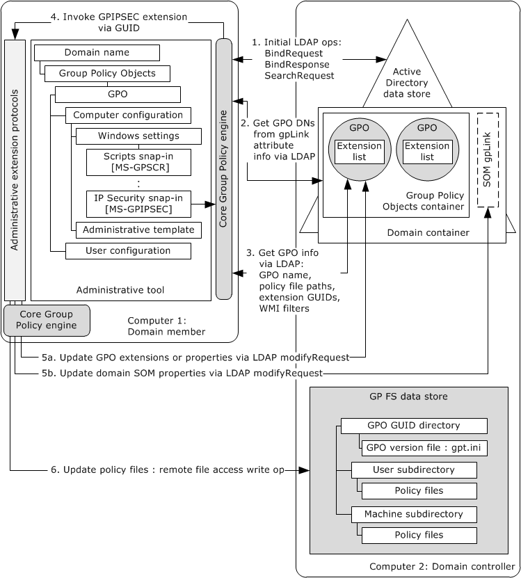

Figure 8: Policy administration editing process

The sections that follow describe the processes that occur when editing [**GPOs**](#gt_group-policy-object-gpo) and policy files.

###### 2.1.3.2.2.1 Modifying Extension Settings

When the administrator uses the [**Administrative tool**](#gt_administrative-tool) to update the configuration of an administrative-side extension, the tool invokes the administrative extension via a [**GUID**](#gt_globally-unique-identifier-guid) that is referenced in the [**GPO**](#gt_group-policy-object-gpo) Extension list. To apply updates, the extensions make direct writes against [**Active Directory**](#gt_active-directory) by using [**LDAP**](#gt_lightweight-directory-access-protocol-ldap), and against the policy settings files via a file access protocol.

Whenever the Administrative tool invokes an extension protocol specified by a GPO and that extension modifies the GPO, the extension invokes a GPO extension update sequence, which in turn generates a GPO extension update message. This is an LDAP **modifyRequest** message with specific parameters passed, as described in [MS-GPOL](#Section_2.1.1.1) section 2.2.8.2.

The extension receives a **modifyResponse** message in reply. This message provides a return value that indicates success or failure of the **modifyRequest** message. A value equal to the integer zero indicates success, whereas any other value indicates failure.

The Administrative tool then uses a file access protocol to update the gpt.ini file and any applicable [**policy settings**](#gt_policy-setting) in the [**GPO path**](#gt_group-policy-object-gpo-path) and receives responses that confirm success or failure. For additional details about updating the gpt.ini file, see [MS-GPOL] section 3.3.5.2.

###### 2.1.3.2.2.2 Updating GPO Properties

Whenever the administrator uses the [**Administrative tool**](#gt_administrative-tool) to modify [**GPO**](#gt_group-policy-object-gpo) properties, the tool generates a GPO property update message. This is an [**LDAP**](#gt_lightweight-directory-access-protocol-ldap) **modifyRequest** message with specific passed parameters, as described in [MS-GPOL](#Section_2.1.1.1) section 2.2.8.3. The Administrative tool receives a **modifyResponse** message in reply. This message provides a return value that indicates success or failure of the modify request. A value equal to the integer zero indicates success, whereas any other value indicates failure.

The following tasks are also required after GPO properties are updated:

- Open the policy file on the [**Group Policy file share**](#gt_group-policy-file-share) by using SPNEGO for authentication, as described in [MS-SPNG](../MS-SPNG/MS-SPNG.md).
- Modify the directory security descriptor.
- Close the policy file.

###### 2.1.3.2.2.3 Updating SOM

Whenever the administrator uses the [**Administrative tool**](#gt_administrative-tool) to modify [**SOM**](#gt_scope-of-management-som) properties, the tool generates a SOM property update message. This is an [**LDAP**](#gt_lightweight-directory-access-protocol-ldap) **modifyRequest** message with specific passed parameters, as described in [MS-GPOL](#Section_2.1.1.1) section 2.2.8.4. The Administrative tool receives a **modifyResponse** message in reply. This message provides a return value that indicates success or failure of the modify request. A value equal to the integer zero indicates success, whereas any other value indicates failure.

##### 2.1.3.2.3 Deleting Group Policy Objects

To delete a [**GPO**](#gt_group-policy-object-gpo), it is necessary to delete all [**Active Directory**](#gt_active-directory) objects associated with the GPO on the [**Group Policy server**](#gt_group-policy-server) and to delete corresponding directories on the [**Group Policy file share**](#gt_group-policy-file-share) that contain user and computer settings, to which the GPO links. To delete the Active Directory objects for a GPO, it is necessary to send an [**LDAP**](#gt_lightweight-directory-access-protocol-ldap) **delRequest** message, as described [MS-GPOL](#Section_2.1.1.1) section 2.2.8.5 and [[RFC2251]](https://go.microsoft.com/fwlink/?LinkId=90325) section 4.8, from the [**Administrative tool**](#gt_administrative-tool) to the Group Policy server.

The Group Policy server replies to the **delRequest** message with a **delResponse** message, as defined in [RFC2251] section 4.8. The value of the **resultCode** field in the **delResponse** message determines whether the delete operation succeeded or failed; success is indicated by a **resultCode** field value of zero, while all other values indicate failure.

A GPO is an Active Directory container; therefore, an LDAP **delRequest** message is first sent for all Active Directory objects contained in the GPO, and then an LDAP **delRequest** is sent recursively for each subcontainer and all Active Directory objects contained in the subcontainer. To begin the sequence, an LDAP **SearchRequest** ([RFC2251] section 4.5.1) containing the parameters specified in [MS-GPOL] section 3.3.5.6 is sent to the Group Policy server to retrieve the GPOs.

To delete Group Policy file share files and directories, it is necessary to recursively delete the files and directories in the <gpo path> via a file access protocol. All I/O operations that fail should be logged.

For further details about deleting GPOs, see [MS-GPOL] section 3.3.5.6.

#### 2.1.3.3 Transport Requirements

The [**Group Policy client**](#gt_group-policy-client) and the [**Administrative tool**](#gt_administrative-tool) use the following protocols for data transport:

- [**LDAP**](#gt_lightweight-directory-access-protocol-ldap) and a file access protocol to transmit [**policy settings**](#gt_policy-setting) and to transmit instructions between the Group Policy client and the [**Group Policy server**](#gt_group-policy-server).
- Kerberos [[RFC4120]](https://go.microsoft.com/fwlink/?LinkId=90458) and SPNEGO [MS-SPNG](../MS-SPNG/MS-SPNG.md) for authentication in computer [**policy application**](#gt_policy-application) mode.
- SPNEGO [MS-SPNG] for authentication in user policy application mode.
For other protocols upon which the Group Policy server relies, see section [2.3.2](#Section_2.3.2).

### 2.1.4 Applicability

The [**Group Policy**](#gt_group-policy) protocols are primarily applicable in scenarios where centralized administration of users and computers is desired.

### 2.1.5 Relevant Standards

The [**Group Policy**](#gt_group-policy) protocols use the following communication standards to allow interoperability with other external systems:

**DNS:** Specified in [[RFC1034]](https://go.microsoft.com/fwlink/?LinkId=90263) and [[RFC1035]](https://go.microsoft.com/fwlink/?LinkId=90264). Used for locating the [**Group Policy server**](#gt_group-policy-server) and determining [**site**](#gt_site) membership.

**Lightweight Directory Access Protocol (LDAP):** Specified in [[RFC2251]](https://go.microsoft.com/fwlink/?LinkId=90325). Used for communication with the Group Policy server to obtain [**GPO**](#gt_group-policy-object-gpo) attribute data.

**File access services:** As described in [MS-FASOD](#Section_2.1). The Windows platform chooses an [**SMB**](#gt_server-message-block-smb) file access protocol to remotely access the [**Group Policy file share**](#gt_group-policy-file-share) and obtain user policy information, computer policy information, and GPO version data.

**SPNEGO:** Specified in [MS-SPNG](../MS-SPNG/MS-SPNG.md). Used for authentication and authorization. See [MS-GPOL](#Section_2.1.1.1) section 1.4 for the authentication protocols that the Group Policy protocols support.

## 2.2 Protocol Summary

This section describes the member protocols that accomplish the goals of [**Group Policy**](#gt_group-policy). The Group Policy protocols are organized into the following groups:

- Group Policy core — consists of the Group Policy: Core Protocol [MS-GPOL](#Section_2.1.1.1). The core protocol is implemented fully by the [**core Group Policy engine**](#gt_core-group-policy-engine), which enables the processing and application of Group Policy.
- [**Group Policy extensions**](#gt_group-policy-extension) consist of the extension protocols listed in the following table after the Group Policy: Core Protocol.
The following table provides a comprehensive list and functional description of the Group Policy member protocols.

**Note:** Group Policy: Network Access Protection (NAP) Extension [MS-GPNAP](../MS-GPNAP/MS-GPNAP.md) and Group Policy: Internet Explorer Maintenance Extension [MS-GPIE](../MS-GPIE/MS-GPIE.md) are no longer implemented and are not described in this document. The Product Behavior Appendix in each specification ([MS-GPNAP] section 5 and [MS-GPIE] section 6) lists the Windows versions in which the extensions are implemented.

| Protocol Name | Functional Description | Short Name |
| --- | --- | --- |
| Group Policy: Core Protocol | Enables discovery and connection to a [**domain controller**](#gt_domain-controller-dc), discovery and retrieval of [**GPOs**](#gt_group-policy-object-gpo), support for the authoring of policies and extension settings, and communication of administrator-defined policies from the [**Group Policy server**](#gt_group-policy-server) to the [**Group Policy client**](#gt_group-policy-client). The Group Policy: Core Protocol is fully implemented by the core Group Policy engine. | [MS-GPOL] |
| Group Policy: Audit Configuration Extension | Enables advanced audit policies to be distributed to multiple client systems where they are enforced in accordance with administrative intent. The [**policy settings**](#gt_policy-setting) for this extension enable the underlying audit subsystem to determine the activities to be monitored and logged in the security event log. The GPAC extension has both client-side and administrative-side implementations. The administrative-side extension enables the [**Group Policy administrator**](#gt_group-policy-administrator) to author audit policies, store them on the [**Group Policy file share**](#gt_group-policy-file-share), and update a GPO with the path to the policy files on the Group Policy file share. The client-side extension is invoked by the core Group Policy engine on the Group Policy client to locate GPO(s) that contain audit configuration settings (as indicated by the GPAC [**GUID**](#gt_globally-unique-identifier-guid) appearing in the GPO Extension list), transfer the policy files to the Group Policy client computer via a file access protocol, and then configure the advanced audit policy, audit options, and global object access auditing settings on the Group Policy client computer. | [MS-GPAC](../MS-GPAC/MS-GPAC.md) |
| Group Policy: Central Access Policies Extension | Provides the means to configure central access policies on Group Policy client computers for centralized control of user access to resources. This protocol extension also contains the mechanisms that enable Group Policy administrators to retrieve policy files and configure central access policy information that is stored in the [**Group Policy data store**](#gt_group-policy-data-store). The administrative-side extension participates in authoring settings for central access policies via GPO configuration. The administrative-side extension of this protocol invokes [**LDAP**](#gt_lightweight-directory-access-protocol-ldap) to write or retrieve GPO information and invokes a file access protocol to write or read extension-specific data in central access policy files that are stored on the Group Policy file share. Central access policy settings are created or modified by the [**Administrative tool**](#gt_administrative-tool). The client-side extension retrieves policy settings from the file system component of one or more GPOs. These settings consist of one or more DNs of central access policy objects that reside in [**Active Directory**](#gt_active-directory). The [**CSE**](#gt_cses) binds to these objects and retrieves central access policy configuration data from the object attributes. The CSE uses this data to populate local data elements on the Group Policy client, typically a file server, to maintain state that later an administrator applies to enforce the central access policies that authorize user access to resources on the file server. | [MS-GPCAP](../MS-GPCAP/MS-GPCAP.md) |
| Group Policy: Deployed Printer Connections Extension | Supports the management of printer connections that are hosted by print servers and shared by multiple users. The GPDPC extension has both client-side and administrative-side implementations. The administrative-side extension enables the Group Policy administrator to configure printer connections by updating settings in a GPO that applies to Group Policy clients. The client-side extension is invoked by the core Group Policy engine on the Group Policy client to enable users to discover the printer connections that were configured by the Group Policy administrator and to apply them to the Group Policy client computer. | [MS-GPDPC](../MS-GPDPC/MS-GPDPC.md) |
| Group Policy: Encrypting File System Extension | Enables remote administrative configuration of the [**Encrypting File System (EFS)**](#gt_encrypting-file-system-efs). The GPEF extension has both client-side and administrative-side implementations. The administrative-side extension enables the Group Policy Administrator to retrieve and edit EFS configuration settings that are stored in a [**registry**](#gt_registry)-based policy file on the Group Policy file share, for later application to the registry of Group Policy client that are affected by GPO(s) that specify those settings. The client-side extension is invoked by the core Group Policy engine on the Group Policy client to parse the registry policy file settings and copy them to the Group Policy client registry. The EFS extension then reads those registry settings and applies them to the EFS subsystem on the Group Policy client computer. | [MS-GPEF](../MS-GPEF/MS-GPEF.md) |
| Group Policy: Firewall and Advanced Security Data Structure Extension | Enables administrators to use Group Policy to control firewall and advanced security behavior on a Group Policy client with the use of the GPREG protocol. The GPFAS extension is invoked by the Administrative tool and is responsible for loading and updating the firewall and advanced security settings specified by a GPO. GPFAS reads registry values that are copied to the Group Policy client registry by the Group Policy: Registry Extension Encoding protocol [MS-GPREG](../MS-GPREG/MS-GPREG.md) and applies them to the local Firewall and Advanced Security Protocol server. Because this extension relies on the CSE implementation of GPREG, GPFAS is implemented as an administrative-side extension only. | [MS-GPFAS](#Section_2.9) |
| Group Policy: Folder Redirection Protocol Extension | Enables the Group Policy administrator to redirect the path of certain file system folders to a new location. The new location can be a folder on the local computer or a shared directory on a network. This enables users to work with documents on a remote server [**share**](#gt_share), as if the documents were located on the hard disk of their local computer. This extension has both client-side and administrative-side implementations. The administrative-side extension enables the Group Policy administrator to establish and configure folder locations for user folders and to store them on the Group Policy file share. The client-side extension is invoked by the core Group Policy engine on the Group Policy client to retrieve GPFR configuration data from the Group Policy file share and to apply it to the Group Policy client computer. | [MS-GPFR](../MS-GPFR/MS-GPFR.md) |
| Group Policy: IPsec Protocol Extension | Enables centralized configuration of the IPsec component on multiple client systems to provide basic traffic filtering, data integrity, and optional data encryption, for IP traffic. The Group Policy administrator assigns an IPsec policy to a group of managed client computers by using a GPO. This extension has both client-side and administrative-side implementations. The administrative-side extension enables the Group Policy administrator to create one or more IPsec policies and store them in policy files on the Group Policy file share. The client-side extension is invoked by the core Group Policy engine on the Group Policy client to retrieve the associated policy settings that are stored in the policy files and to apply them to the Group Policy client computer. | [MS-GPIPSEC](#Section_2.9) |
| Group Policy: Name Resolution Policy Table (NRPT) Data Extension | Provides a mechanism for a Group Policy administrator to deploy and control any Name Resolution Policy behavior on a client by using the Group Policy: Registry Extension Encoding [[MS-GPREG]. | [MS-GPNRPT](../MS-GPNRPT/MS-GPNRPT.md) |
| Group Policy: Preferences Extension Data Structure | Enables the Group Policy administrator to manage and deploy Group Policy preferences. Preferences settings are specified by using an XML file. This extension has both administrative-side and client-side implementations. The administrative-side extension enables the Group Policy administrator to invoke the preferences extension on his or her computer to define, maintain, and associate extension-specific settings with a GPO. The client-side extension is invoked by the core Group Policy engine on the Group Policy client to read the XML preferences file specified by the GPO and apply its preferences configuration to the Group Policy client computer. The Group Policy: Preferences Extension supports both computer and use policy modes. [**Policy application**](#gt_policy-application) in computer policy mode applies to the Group Policy client computer and all users who log on to it, whereas user policy mode applies to specific users who log on to the Group Policy client computer. | [MS-GPPREF](#Section_1.3) |
| Group Policy: Registry Extension Encoding | Provides the mechanism for a Group Policy administrator to control any behavior on a Group Policy client that depends on registry-based settings. This extension has both administrative-side and client-side implementations. The administrative-side extension enables the Group Policy administrator to use [**Administrative template**](#gt_administrative-template) settings to write a registry policy file and associate it with a GPO. The client-side is extension invoked by the core Group Policy engine on the Group Policy client to read the registry policy file specified by a GPO and apply its contents to the registry of the Group Policy client computer. | [MS-GPREG] |
| Group Policy: Security Protocol Extension | Enables the Group Policy administrator to distribute and apply group security policies to multiple client systems. This extension has both administrative-side and client-side implementations. The administrative-side extension enables the Group Policy administrator to author security policies as .inf files and save them to the Group Policy file share. The Group Policy administrator assigns security policies by specifying a reference, within the logical structure of a GPO, to the Group Policy file share network location where the security policy files reside. The client-side extension is invoked by the core Group Policy engine on the Group Policy client to process GPOs that refer to security policies. The client-side extracts the Group Policy file share network location from the GPO, transfers the security policy files to the Group Policy client computer by using a file access protocol, and then utilizes the retrieved security policy files to configure the security settings of the applicable subsystems on the Group Policy client computer. | [MS-GPSB](#Section_2.9) |
| Group Policy: Scripts Extension Encoding | Provides a mechanism for the Group Policy administrator to configure the execution of administrator-specified code on specific [**policy targets**](#gt_policy-target) at computer start, computer shut-down, user logon, or user logoff. The code executed by specified policy targets is contained in a command-line tool or batch-processing script that resides in the file system of the Group Policy client computer or at a network file system location. This extension has both administrative-side and client-side implementations. The administrative-side extension enables the Group Policy administrator to store and retrieve GPO metadata that specifies a directive for running a command at computer startup or shutdown that affects the configuration of a Group Policy client subsystem. The client-side extension is invoked by the core Group Policy engine on the Group Policy client to identify the directive that runs the administrator-specified command and to configure a command execution subsystem in the Group Policy client operating system with this directive, such that it executes the command at computer startup or shutdown. | [MS-GPSCR](../MS-GPSCR/MS-GPSCR.md) |
| Group Policy: Software Installation Protocol Extension | Enables a Group Policy administrator to install, update, and remove software applications on Group Policy client computers. This extension has both administrative-side and client-side implementations. The administrative-side extension enables the Group Policy administrator to specify applications to be installed on Group Policy client computers and to control the manner in which they are installed, for example, with minimum user interaction. The related settings are stored on the Group Policy file share and the metadata that specifies the path to the settings is stored in the logical structure of a GPO. The client-side extension is invoked by the core Group Policy engine on the Group Policy client to locate the GPO(s) containing software installation settings, retrieve those settings from the appropriate Group Policy file share location, and apply them on the Group Policy client computer. | [MS-GPSI](../MS-GPSI/MS-GPSI.md) |
| Group Policy: Wireless/Wired Protocol Extension | Enables a Group Policy administrator to create, update, and store GPWL data in a GPO. This extension has both administrative-side and client-side implementations. The administrative-side extension is used by the Group Policy administrator to read and edit wireless or wired policy settings through a user interface, and to store the settings within the logical structure of a GPO via LDAP. The client-side extension is invoked by the core Group Policy engine on the Group Policy client to retrieve the wireless or wired policy settings from the specified location via LDAP, and to apply them on the Group Policy client computer. | [MS-GPWL](../MS-GPWL/MS-GPWL.md) |

The major functions and interactions of these protocol groups are described in sections [2.1.2](#Section_2.1.2) and [2.1.3](#Section_2.1.3).

The following sections provide additional technical details about these protocol groups.

### 2.2.1 Core Protocol Group

The Group Policy: Core Protocol is required for successful [**Group Policy**](#gt_group-policy) processing via the [**core Group Policy engine**](#gt_core-group-policy-engine). The core Group Policy engine enables clients to discover and retrieve data from [**GPOs**](#gt_group-policy-object-gpo) that [**Group Policy administrators**](#gt_group-policy-administrator) created.

In [**policy application**](#gt_policy-application) mode, the core Group Policy engine invokes the message sequences that discover the [**Group Policy server**](#gt_group-policy-server) and obtain a list of GPOs that apply to a [**policy target**](#gt_policy-target), such as a [**Group Policy client**](#gt_group-policy-client) computer or interactively logged-on user. The retrieved GPOs specify [**policy settings**](#gt_policy-setting) that are to be applied to a policy target by one or more extensions. The core Group Policy engine is also responsible for invoking the extensions so that their settings can be applied to the policy target. The core Group Policy engine does not recognize the internal details of specific extensions or the settings that it applies.

In the policy administration mode, the [**Administrative tool**](#gt_administrative-tool) uses Group Policy: Core protocol messaging when authoring and modifying extension-specific settings.

For additional information about the Group Policy: Core Protocol [MS-GPOL](#Section_2.1.1.1), see section [1.1](#Section_1.1).

### 2.2.2 Group Policy Extension Protocol Group

[**Group Policy**](#gt_group-policy) is extended through [**CSE**](#gt_cses) functionality. Group Policy supports CSEs for the application of specific client functionality, such as the client security policies specified in [MS-GPSB](#Section_2.9), and supports [**Administrative tool extensions**](#gt_administrative-tool-extensions) for authoring extension-specific settings, such as the security settings specified in [MS-GPIPSEC](#Section_2.9).

CSEs are used for implementing application-specific [**policy settings**](#gt_policy-setting) on [**Group Policy client**](#gt_group-policy-client) computers. CSE protocols depend on the [**core Group Policy engine**](#gt_core-group-policy-engine) to execute on the Group Policy client to identify [**GPOs**](#gt_group-policy-object-gpo) to query for [**policy application**](#gt_policy-application).

GPOs with settings for a particular extension are identified with an [**Administrative tool extension GUID**](#gt_administrative-tool-extension-guid), to enable the [**Administrative tool**](#gt_administrative-tool) to identify the extension and administer its settings. Such extensions, for example, those specified in [MS-GPSB], typically use [**LDAP**](#gt_lightweight-directory-access-protocol-ldap) to store and retrieve GPO attributes in [**Active Directory**](#gt_active-directory) and use a file access protocol to store and retrieve policy settings that reside in policy files on the [**Group Policy file share**](#gt_group-policy-file-share).

Policy settings for a given class of functionality are communicated by the extension protocol and not directly by the core Group Policy engine. If an extension is not present or policy settings that are related to an extension are not present, then that specific extension is ignored by the core Group Policy engine.

The presence of extensions is not required for the Group Policy protocols to function. For additional information about [**Group Policy extensions**](#gt_group-policy-extension), refer to section [1.1.4](#Section_1.1.4).

## 2.3 Environment

[**Group Policy**](#gt_group-policy) depends on a number of prerequisites to facilitate the configuration, application, and utilization of Group Policy by [**Group Policy client**](#gt_group-policy-client) computers. There are core networking protocols and services that need to be open, running, and configured to handle the query and response messages that facilitate the application of Group Policy. For example, the network must be capable of supporting TCP/IP traffic for protocol communications such as [**DNS**](#gt_domain-name-system-dns), [**LDAP**](#gt_lightweight-directory-access-protocol-ldap), and a file access protocol, to support the lookup, transport, and transfer of services and policy data. The network must also support Netlogon (with Kerberos v5 [[RFC4120]](https://go.microsoft.com/fwlink/?LinkId=90458)) authentication and authorization traffic. In addition, firewalls that reside on clients and servers must have open TCP ports for all services that support Group Policy.

An example of a supporting service is the Domain Name System (DNS), which facilitates the correlation of service names to IP addresses during the [**Group Policy server**](#gt_group-policy-server) discovery process.

A Group Policy server that uses the LDAP protocol is required to store [**GPO**](#gt_group-policy-object-gpo) attributes. After discovering the location of the Group Policy server through DNS, the [**core Group Policy engine**](#gt_core-group-policy-engine) on the Group Policy client queries the Group Policy server to discover and calculate which policies apply to it and where to find the necessary policy files for application. It also uses the Group Policy server to discover WMI filters that determine whether a particular policy applies to the Group Policy client. In a large business or government network, it is common to have a number of Group Policy servers in the network for redundancy and performance, each with a copy of the LDAP-accessible database for replication and data consistency. For more information about Group Policy in replication scenarios, see section [2.7.1.5](#Section_2.7.1.5).

The Group Policy protocols use a [**Group Policy file share**](#gt_group-policy-file-share) that supports communications via a file access protocol to store policy data in a specific service location, to which the Group Policy client is provided with full read access. The Group Policy file share can be co-located on the Group Policy server along with the [**Active Directory**](#gt_active-directory) data store, or can be hosted in a remote network location.

### 2.3.1 Dependencies on Group Policy Protocols

Windows components and subsystems that require configuration and change management depend on the [**Group Policy**](#gt_group-policy) protocols. As a result, Group Policy influences a large number of services and protocols. The most prominent examples of protocols and services that have a dependency on the Group Policy protocols are as follows:

**Certificate Services**: Provide a set of customizable services for issuing certificates to requestors, managing certificate lifetime and renewals, and revoking certificates. Certificates are used in software security services that utilize public key technologies, to bind the identity of a person, device, or service to an associated private key. See [MS-CERSOD](#Section_2.1) for an overview of certificate services.

Certificate services depend on the Group Policy protocols for the following:

- Group Policy store: The Certificate Authority server depends on a Policy Server to store policy end point information that can be obtained through the Group Policy: Registry Extension Encoding [MS-GPREG](../MS-GPREG/MS-GPREG.md) protocol.
- Policy Server discovery: The Certificate Authority server depends on Group Policy to enable enrollment clients to discover available certificate Policy Servers. For example, clients that enroll for certificates need to be configured with end point information that specifies which Policy Server to contact and how to authenticate to it. The Certificate Services rely upon Group Policy to store and configure this information with the [**Administrative tool**](#gt_administrative-tool).
**File Access Services:** Provide a unified view of files and other resources, and includes facilities for centralized data management, file organization, and backup. It enables applications to access and share resources on a network file server, in a secure and managed environment. See [MS-FASOD](#Section_2.1) for an overview of file access services.

The File Access Services depend on the Group Policy protocols for the configuration of individual protocol capabilities within the File Access Services. Without the Group Policy protocols, the File Access Services cannot be centrally configured and managed.

**Print Services:** Support communication between print clients and [**print servers**](#gt_print-server). Print services enable print clients to submit print jobs to print queues that are managed by a print spooler component, which buffers and orders print jobs that arrive simultaneously from multiple print clients. Print Services use print drivers that are associated with the print queues to learn about printer capabilities. The Group Policy: Core Protocol [MS-GPOL](#Section_2.1.1.1) and Group Policy: Deployed Printer Connections Extension protocol [MS-GPDPC](../MS-GPDPC/MS-GPDPC.md) provide support for the Print Services. See [MS-PRSOD](#Section_2.1) for more information on print services.

The Print Services depend on the Group Policy protocols for the following:

- Propagating [**policy settings**](#gt_policy-setting) to print clients and print servers through the Group Policy: Core Protocol [MS-GPOL] to control local spooler behavior.
- Restricting print clients from accessing specified print servers.
- Remotely pushing pre-configured print queue connections to print clients, so that print clients have pre-established connections to specified print queues. The Print Services use the Group Policy: Deployed Printer Connections Extension [MS-GPDPC] protocol to distribute these pre-configured print queue connections to print clients.
[**Windows Server Update Services (WSUS)**](#gt_windows-server-update-services-wsus)**:** Provide centralized update management in an enterprise computing environment. WSUS provides automated update discovery, delivery of relevant updates to computers, administrative control over update availability, and update activity monitoring. See [MS-WSUSOD](#Section_2.1) for an overview of WSUS protocols.

WSUS depends on the Group Policy protocols for the following:

- The Windows Update Agent uses Group Policy to configure policy settings for Windows Update Services: Client-Server Protocol (WUSP) clients, which includes the specification of an update server, target groups, and detection frequency, as described in [MS-WUSP](../MS-WUSP/MS-WUSP.md) section 3.2.1.
- The WSUS administrator uses Group Policy to assign and distribute settings that control the behavior of the WUSP client [MS-WUSP].
**Group Policy Extensions:** Group Policy is designed to be extended. Microsoft has implemented many extensions that depend on the Group Policy protocols to implement the specific configurations that the [**Group Policy extensions**](#gt_group-policy-extension) support.

**Note** Additional extensions to the Group Policy protocols are possible, beyond those described in this document. Implementers are free to create custom Group Policy extensions to enhance the functionality of the Group Policy protocols, as described in [MS-GPOL] section 1.8.

### 2.3.2 Dependencies on Other Services

[**Group Policy**](#gt_group-policy) depends on the following to maintain consistent availability:

**Connectivity:** Group Policy requires physical network connectivity and correctly configured TCP/IP configuration on both the [**Group Policy server**](#gt_group-policy-server) and the [**Group Policy client**](#gt_group-policy-client). There is no specific requirement for the type of physical networking topology.

It is important for the connectivity from the Group Policy client to the Group Policy server to be continuous. New and existing policies should be periodically refreshed with updates. See [MS-GPOL](#Section_2.1.1.1) section 3.2.1.17 for the Group Policy refresh interval. The client should be able to tolerate network outages and refresh for policy changes when it is reconnected to the network.

**LDAP directory services and file access services:** Provides Group Policy services to Group Policy clients. The Group Policy server provides [**LDAP**](#gt_lightweight-directory-access-protocol-ldap) and file access services as shown in the diagram of section [2.1.2.1](#Section_2.1.2.1).

**Authorization:** Group Policy depends on the SPNEGO authentication service specified in [MS-SPNG](../MS-SPNG/MS-SPNG.md) to negotiate the specific authentication scheme. Group Policy relies on authentication protocols and the SPNEGO service to assist in determining which policies apply to the computer and the user.

**DC discovery:** The Group Policy client depends on an IP address of a correctly configured [**DNS**](#gt_domain-name-system-dns) server, to discover and resolve host names of Group Policy servers and connect to them.

**Policy store:** The Group Policy client depends on a local store, such as the Windows registry, for the storage of specific policy information obtained from the Group Policy server for the following purposes:

- To register the extension libraries that process the settings in the policy files.
- To persist the policies into user and machine configurations, as this information is not stored in memory.
Group Policy depends on the following services and protocols for the exchange of information between the Group Policy client and Group Policy server:

**Active Directory:** Specified in [MS-ADTS](../MS-ADTS/MS-ADTS.md), [**Active Directory**](#gt_active-directory) is the [**directory service**](#gt_directory-service-ds) that stores information about objects on a network and makes this information available to users and network administrators. Administrators link [**GPOs**](#gt_group-policy-object-gpo) to Active Directory containers such as [**sites**](#gt_site), domains, and [**OUs**](#gt_organizational-unit-ou), and can also include user and computer objects. This enables [**policy settings**](#gt_policy-setting) to target specific users and computers throughout an organization.

Group Policy requires Active Directory for storing group policies, so that Group Policy clients can discover and retrieve them. For detailed information on how the directory service is structured and how LDAP operations are conducted, see [MS-ADOD](#Section_2.1).

**Authentication:** Specified in the following authentication protocols:

- Simple and Protected Generic Security Service Application Program Interface Negotiation Mechanism (SPNEGO) Protocol Extensions, as described in [MS-SPNG] and [MS-AUTHSOD](#Section_2.1).
- Kerberos Protocol Extensions, as described in [MS-KILE](../MS-KILE/MS-KILE.md) and [MS-AUTHSOD].
- NT LAN Manager Authentication Protocol, as described in [MS-NLMP](../MS-NLMP/MS-NLMP.md) and [MS-AUTHSOD].
**DNS:** For discovering Group Policy servers.

**File Access Services:** As described in [MS-FASOD](#Section_2.1), for the following:

- Accessing the [**Group Policy file share**](#gt_group-policy-file-share) via a file access protocol.
- Distributing Group Policy.
**Internet Control Message Protocol (ICMP):** Specified in [[RFC792]](https://go.microsoft.com/fwlink/?LinkId=90492), for determining link speed.

**LDAP:** Specified in [[RFC2251]](https://go.microsoft.com/fwlink/?LinkId=90325), for transmitting policy settings and instructions between the Group Policy client and the Group Policy server. An LDAP ping [MS-ADTS], enables the Group Policy client and [**Administrative tool**](#gt_administrative-tool) to locate a writeable domain controller ([MS-ADOD] section 3.1.1).

**Netlogon Remote Protocol:** Specified in [MS-NRPC](../MS-NRPC/MS-NRPC.md), to enable the Group Policy client and Administrative tool to securely log on to a [**domain controller**](#gt_domain-controller-dc) ([MS-ADOD] section 3.1.1) to retrieve GPO data in the Active Directory data store.

**NetBIOS:** An alternate service for discovering a Group Policy server, as described in [MS-ADOD] section 3.1.1.

**File Access Services:** As described in [MS-FASOD], for transmitting policy settings and instructions between the Group Policy client and the Group Policy file share.

**Windows Management Instrumentation Remote Protocol:** Specified in [MS-WMI](../MS-WMI/MS-WMI.md), for Group Policy filtering. During GPO processing, the [**core Group Policy engine**](#gt_core-group-policy-engine) evaluates WMI filters to determine whether a GPO is within scope for computers or users. WMI filtering configurations ensure that policy settings are applied only to specific [**policy targets**](#gt_policy-target), while others are filtered out.

#### 2.3.2.1 Network Connectivity

This system has no additional network connectivity considerations.

#### 2.3.2.2 Underlying Protocols

This system specifies no underlying protocols.

#### 2.3.2.3 Persistent Data Storage Facilities

The [**Group Policy**](#gt_group-policy) protocols require a persistent storage facility to maintain Abstract Data Model (ADM) elements. Examples of such a facility include file systems and databases. If this requirement is not satisfied, Group Policy does not function.

The Group Policy ADM is based on the conceptual models specified in [MS-GPOL](#Section_2.1.1.1) sections 3.1.1, 3.2.1, and 3.3.1. General information about the [**Group Policy server**](#gt_group-policy-server), [**Group Policy client**](#gt_group-policy-client), and [**Administrative tool**](#gt_administrative-tool) ADMs for Group Policy follows:

**Server Abstract Data Model:** The Group Policy server implements [**AD DS**](#gt_active-directory-domain-services-ad-ds) for the storage of managed generic objects known as [**GPOs**](#gt_group-policy-object-gpo), along with the policy information that affects these objects. However, the Group Policy server itself does not introduce any specific ADM elements. Rather, the Group Policy server maintains state in two conceptual stores: an [**Active Directory**](#gt_active-directory) data store and a domain-based [**Group Policy file share**](#gt_group-policy-file-share) data store that is accessible through a file access protocol.

For additional information about the Group Policy server ADM, see [MS-GPOL] section 3.1.1.

**Client Abstract Data Model:** The Group Policy client ADM is described in [MS-GPOL] section 3.2.1.

**Administrative Tool Abstract Data Model:** The Administrative tool ADM is specified in [MS-GPOL] section 3.3.1.

**Note** Extending the Administrative tool requires the use of the ADM.

## 2.4 Assumptions and Preconditions

Preconditions for Group Policy: Core Protocol communications between a [**Group Policy client**](#gt_group-policy-client) and a [**Group Policy server**](#gt_group-policy-server) are as follows:

- The Group Policy server is a writeable [**domain controller**](#gt_domain-controller-dc).
- The Group Policy client is joined to the Group Policy server domain.
- For user policy mode, the Group Policy client is joined to a domain for which the user domain has a bidirectional domain trust.
- All Group Policy servers in the domain is configured to require signing of traffic from file access operations, for example, as described in [MS-SMB](../MS-SMB/MS-SMB.md) section 3.2.4.2.4.
- All Group Policy servers in the domain is configured to require signing of [**LDAP**](#gt_lightweight-directory-access-protocol-ldap) traffic, as described in [[RFC2251]](https://go.microsoft.com/fwlink/?LinkId=90325) section 4.2.2.
The following preconditions also apply to the Group Policy client:

- To process a policy that applies to a Group Policy client, the [**core Group Policy engine**](#gt_core-group-policy-engine) must be able to read the policy data from the directory service so that the [**policy settings**](#gt_policy-setting) can be applied to the Group Policy client or the interactive user. It is therefore required that [**access control list (ACLs)**](#gt_access-control-list-acl) are correctly configured to allow the policy to be read.

## 2.5 Use Cases

This section describes the basic use cases that explain the main usage of the [**Group Policy**](#gt_group-policy) protocols.

**Actors**

The following actors support the use cases that are described in this section:

**Group Policy administrator:** An individual who is responsible for configuring [**policy settings**](#gt_policy-setting) that align with organizational and business requirements. The primary interests of the [**Group Policy administrator**](#gt_group-policy-administrator) are as follows:

- Ensuring that policy settings that are stored in the [**Group Policy server**](#gt_group-policy-server) are protected from unauthorized use.
- Targeting policy settings for users and computers at different levels of granularity, which is known as [**SOM**](#gt_scope-of-management-som) (section [1.1.8](#Section_1.1.8)).
- Ensuring that management of policy settings can be delegated as described in [MS-ADTS](../MS-ADTS/MS-ADTS.md).
- Altering the default processing of policy settings.
- Configuring a large number of computers to execute administrator-specified code at computer start, computer shut-down, user logon, or user logoff, as described in [MS-GPSCR](../MS-GPSCR/MS-GPSCR.md).
**Group Policy Server:** A [**domain controller**](#gt_domain-controller-dc) that holds a database of [**GPOs**](#gt_group-policy-object-gpo) that [**Group Policy clients**](#gt_group-policy-client) can retrieve. The primary interests of the Group Policy server are as follows:

- Enabling a Group Policy client to retrieve Group Policy information from the [**domain**](#gt_domain), based on the group memberships of domain accounts and domain account locations in the [**Active Directory**](#gt_active-directory) structure.
- Supporting [**Administrative tool**](#gt_administrative-tool) operations, such as creating, updating, and deleting Group Policy content.
**Administrative tool:** A tool that is used to administer policy settings. The primary interests of the Administrative tool are as follows:

- Enabling Group Policy administrators to create, update, and delete policy settings by writing and reading policy information to and from the logical and file system components of GPOs.
**Supporting services:** The services that provide a common infrastructure to support Group Policy operations:

- Remote file services [MS-FASOD]
- [**LDAP**](#gt_lightweight-directory-access-protocol-ldap) directory services [[RFC2251]](https://go.microsoft.com/fwlink/?LinkId=90325)
- Domain controller discovery ([MS-ADOD](#Section_2.1) (section 3.1.1))
- WMI services [MS-WMI](../MS-WMI/MS-WMI.md)
**Authentication services:** The authentication services specified in [MS-AUTHSOD](#Section_2.1) provide identity, authentication, and authorization services through [**NTLM**](#gt_fff710f9-e3d1-4991-99a2-009768d57585) [MS-NLMP](../MS-NLMP/MS-NLMP.md) or Kerberos [[RFC4120]](https://go.microsoft.com/fwlink/?LinkId=90458) to secure communications in Group Policy. This includes authentication services that support client-to-server communication within Group Policy.

### 2.5.1 Use Case Diagram

The following diagram shows two [**Group Policy**](#gt_group-policy) use cases:

- Applying Group Policy - [**Group Policy client**](#gt_group-policy-client)
- Administering Group Policy - [**Group Policy administrator**](#gt_group-policy-administrator)
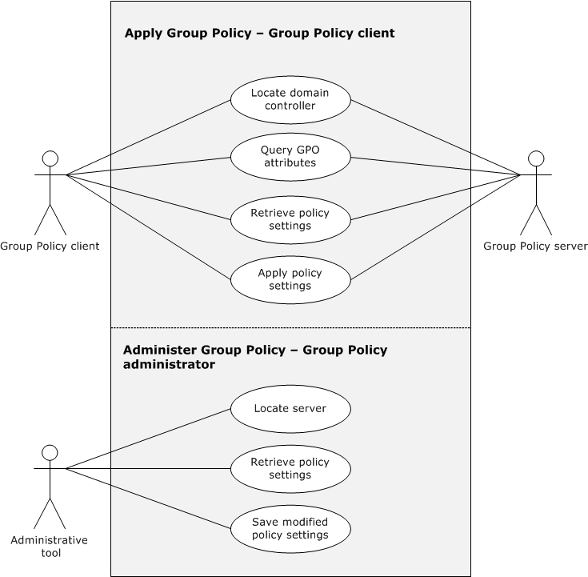

Figure 9: Group Policy use case diagram

### 2.5.2 Applying Group Policy — Group Policy Client

**Goal**

The goal of this use case is to retrieve [**Group Policy**](#gt_group-policy) information from the [**Group Policy server**](#gt_group-policy-server) and to apply [**policy settings**](#gt_policy-setting) on the [**Group Policy client**](#gt_group-policy-client).

**Context of use**

Group Policy is applied after the Group Policy client contacts the Group Policy server and successfully retrieves new or updated content. Based on the [**SOM**](#gt_scope-of-management-som), the client retrieves the list of [**GPOs**](#gt_group-policy-object-gpo) for [**policy application**](#gt_policy-application), as described in [MS-GPOL](#Section_2.1.1.1) section 3.2.5.1.5.

**Actors**

**Group Policy client:** Maintains a policy configuration that is consistent with the policy information that is stored on the Group Policy server. This is the primary actor. The primary interests of the Group Policy client are to:

- Retrieve policy content from the Group Policy server.
- Ensure that policy settings defined by the [**Group Policy administrator**](#gt_group-policy-administrator) are enforced on the Group Policy client computer.
**Group Policy Server:** A [**domain controller**](#gt_domain-controller-dc) that contains a database of GPOs that Group Policy clients can retrieve. The Group Policy server responds to requests from the Group Policy client. The primary interests of the Group Policy server are as follows:

- Enable a Group Policy client to retrieve Group Policy information from the [**domain**](#gt_domain), based on the group memberships of domain accounts and domain account locations in [**Active Directory**](#gt_active-directory).
- Support [**Administrative tool**](#gt_administrative-tool) operations, such as creating, updating, and deleting GPOs.
**Stakeholders**

**Users:** An individual who uses a Group Policy-enabled computer and whose primary interests are to understand the following:

- How the user experience is influenced by policy settings that affect computers.
- How Group Policy specifically applies to users.
**Group Policy administrator:** An individual who is responsible for configuring policy settings that align with organizational and business requirements. The primary interests of the Group Policy administrator are to:

- Ensure that policy settings stored in the Group Policy server are protected from unauthorized use.
- Target policy settings for users and computers at different levels of granularity, which is known as SOM.
- Ensure that policy setting management can be delegated as described in [MS-GPSB](#Section_2.9).
- Alter the default processing of policy settings.
- Configure a large number of computers to execute administrator-specified code at computer start, computer shut-down, user logon, or user logoff, as described in [MS-GPSCR](../MS-GPSCR/MS-GPSCR.md).
**Preconditions**: The Group Policy client is able to access the Group Policy server.

**Main Success Scenario**

The main success scenario can be summarized as follows:

- Trigger: Computer startup, user logon, or the periodic timer (sections [2.8.1](#Section_2.8.1) and [2.8.2](#Section_2.8.2)) trigger this use case. When a trigger occurs, the Group Policy client successfully connects to the Group Policy server.
- The Group Policy client can query for applicable policy configuration settings from the Group Policy server.
- The Group Policy client successfully retrieves the policy information that is based on the results from queries.
- The Group Policy client applies the policy settings.
**Extensions**

- Based on WMI filters, the Group Policy client decides whether to apply a specific GPO.
- Based on the policy source mode, as described in [MS-GPOL] sections 3.2.1.2 and 3.2.1.3, the Group Policy client obtains a set of GPOs that apply to itself.

### 2.5.3 Administering Group Policy — Administrative Tool

**Context of use**

The [**Group Policy administrator**](#gt_group-policy-administrator) initiates a task that is defined in the goal for this use case.

**Goal**

The goal of this use case is to create, update, and delete [**Group Policy**](#gt_group-policy) content.

**Actors**

**Administrative tool:** A tool that the Group Policy administrator uses to manage [**GPOs**](#gt_group-policy-object-gpo). This is the primary actor. The primary interests of the [**Administrative tool**](#gt_administrative-tool) are to:

- Discover the [**Group Policy server**](#gt_group-policy-server).
- Ensure read and write access to the Group Policy server.
- Manage Group Policy.
**Group Policy Server:** A [**domain controller**](#gt_domain-controller-dc) implementing [**Active Directory**](#gt_active-directory) [MS-ADOD](#Section_2.1) that contains a database of GPO that Group Policy administrators can read and write to. The Group Policy server responds to requests from the Group Policy administrator. The primary interests of the Group Policy server are to:

- Support Administrative tool operations, such as creating, retrieving, modifying, and deleting GPOs that apply to groups of domain user and computer accounts in Active Directory
- Store [**policy settings**](#gt_policy-setting) and attributes configured by the Group Policy administrator
**Stakeholders**

**Group Policy administrator:** An individual who ensures that the Group Policy server is storing policies that align with business and organizational requirements. The primary interests of the Group Policy administrator are to:

- Ensure that policy settings are stored on the Group Policy server.
- Create, retrieve, modify, or delete Group Policy content on the Group Policy server.
**Preconditions**

- The Administrative tool can access the Group Policy server.
- The Group Policy server is a read/write domain controller.
**Main Success Scenario**

The main success scenario can be summarized as follows:

- Trigger: The Group Policy administrator starts the Administrative tool. When a trigger occurs (section [1.1.7.1](#Section_1.1.7.1)), the Administrative tool successfully connects to the Group Policy server.
- The Administrative tool can query for policy information on the Group Policy server and successfully retrieve the prioritized GPO list based on query results.
- The Administrative tool displays the prioritized GPO list.
- The Group Policy administrator updates, creates, or deletes policy information with the Administrative tool.
- The Administrative tool successfully writes updated information to the Group Policy server.
**Extensions**

- None.

## 2.6 Versioning, Capability Negotiation, and Extensibility

This section describes the features of versioning, capability negotiation, and vendor-extensible fields for the [**Group Policy**](#gt_group-policy) protocols.

### 2.6.1 System Versioning and Capability Negotiation

[**Group Policy**](#gt_group-policy) protocols each have their own system versioning and capability negotiation.

Group Policy relies on the Group Policy: Core Protocol, as implemented in the [**core Group Policy engine**](#gt_core-group-policy-engine), for the transport of policy information. It provides a versioning capability in an attribute of the [**Active Directory**](#gt_active-directory) object class for a [**GPO**](#gt_group-policy-object-gpo), as described in [MS-GPOL](#Section_2.1.1.1) section 2.2.4. The version number is a simple integer that is also written to the gpt.ini file on the [**Group Policy file share**](#gt_group-policy-file-share), as described in [MS-GPOL] section 2.2.4. There is currently only one version, and if the [**Group Policy client**](#gt_group-policy-client) receives anything other than the current version for a GPO, the GPO does not participate in the Group Policy: Core Protocol, as described in [MS-GPOL] section 3.2.5.1.5.

The System Versioning and Capability Negotiation implementation of extension protocols is documented in the respective extension protocol specifications. They are described in the Versioning and Capability Negotiation section of the respective protocol technical documents.

### 2.6.2 Vendor-Extensible Fields

[**Group Policy**](#gt_group-policy) protocols can incorporate new functionality by adding new extensions to the [**Group Policy client**](#gt_group-policy-client) or the [**Administrative tool**](#gt_administrative-tool). Each new extension can also potentially be extended. For more information about implementing extensions on the Group Policy client, see [MS-GPOL](#Section_2.1.1.1) section 1.8. Extending the Administrative tool requires the use of the ADM specified in [MS-GPOL] section 3.3.1.

The system vendor-extensible fields of each extension protocol are documented in the respective extension protocol specification. These are specified in section 1.8 Vendor-Extensible Fields of the respective technical documents.

## 2.7 Error Handling

The [**Group Policy**](#gt_group-policy) protocols do not define any error handling requirements beyond those described in the specifications of the protocols that the system supports, as listed in section [2.2](#Section_2.2).

Various kinds of errors can affect the system. More precisely, an error condition might affect one or more protocols that the system supports. Such error conditions and the resulting protocol semantics are described in section 2 of the corresponding protocol specifications.

The following Windows error codes, specified in [MS-ERREF](../MS-ERREF/MS-ERREF.md), are returned for the failure scenarios described in this section:

- Connection failures: ERROR_NO_SUCH_DOMAIN.
- Failures related to the operating system: ERROR_OUTOFMEMORY and ERROR_ACCESS_DENIED.
- [**Group Policy file share**](#gt_group-policy-file-share) access failure: ERROR_FILE_NOT_FOUND and ERROR_ACCESS_DENIED.
- [**Active Directory**](#gt_active-directory) or Group Policy file share time-out failures: ERROR_TIMEOUT.
- [**CSEs**](#gt_cses) indicate errors by returning an error code other than ERROR_SUCCESS or E_PENDING.

### 2.7.1 Failure Scenarios

This section describes common failure scenarios and specifies the behavior under such conditions.

#### 2.7.1.1 Connection Failure

A common failure scenario is an unexpected connection breakdown between the [**Group Policy server**](#gt_group-policy-server) and the [**Group Policy client**](#gt_group-policy-client) or between the Group Policy server and the computer that hosts the [**Administrative tool**](#gt_administrative-tool). A disconnection can be caused by the network not being available or by the Group Policy server becoming unavailable. In both cases, where the network or the Group Policy server is not available, the effect on the Group Policy client and the Administrative tool is as follows.

- When the Group Policy client is unable to reach the Group Policy server, the [**policy application**](#gt_policy-application) fails, and a message is logged in the event log. The Group Policy client periodically tries to contact the Group Policy server to refresh its [**policy settings**](#gt_policy-setting).<1>
- When the Administrative tool is unable to reach the Group Policy server, for example, due to network or Group Policy server unavailability, an error message is displayed to the [**Group Policy administrator**](#gt_group-policy-administrator). It is up to the Group Policy administrator to retry the task when the issue has been resolved.

#### 2.7.1.2 Internal Failures

##### 2.7.1.2.1 Operating System-Related Failures

It is possible that the [**Group Policy client**](#gt_group-policy-client) or the [**Administrative tool**](#gt_administrative-tool) might detect an unrecoverable internal state at some point during its operation. For example, this might occur due to the unavailability of some operating system resources. For this kind of failure, the consequences and recovery are similar to those for the connection failure described in section [2.7.1.1](#Section_2.7.1.1). This kind of failure is detected when the operating system indicates that it could not allocate virtual memory, or was unable to access critical system resources. Recovery from this failure allows successful [**policy application**](#gt_policy-application).

##### 2.7.1.2.2 Failure in Client-Side Extensions

An internal failure in any [**CSE**](#gt_cses) does not cause the entire [**policy application**](#gt_policy-application) to fail. The consequence of this failure is that the settings corresponding to that protocol extension are not applied to the system. The failure is detected when a CSE indicates an error. At the next scheduled policy application, the [**Group Policy client**](#gt_group-policy-client) calls the CSE again, in an attempt to recover from the failure. Recovery from the failure allows the successful application of settings that correspond to the CSE. If a CSE for which a policy is configured is missing from the client, the Group Policy client ignores the policy for that extension and continues with application of policies for other applicable extensions. It is not an error condition for a CSE to be absent from the Group Policy client.

##### 2.7.1.2.3 Link Speed Determination Failure

If a failure in link speed determination occurs ([MS-GPOL](#Section_2.1.1.1) section 2.2.6), the [**Group Policy client**](#gt_group-policy-client) assumes link speed to be above the threshold and processes [**policy settings**](#gt_policy-setting) that belong to all [**CSEs**](#gt_cses). At the next scheduled [**policy application**](#gt_policy-application), the Group Policy client initiates link speed determination again in an attempt to recover from the failure. Recovery from the failure helps prevent application of policies from those CSEs that should not be invoked when link speed is below threshold.

If the link speed cannot be determined, all policies are applied to ensure that critical functionalities are in place.

#### 2.7.1.3 History Repository Errors

The [**Group Policy client**](#gt_group-policy-client) maintains a history of [**policy application**](#gt_policy-application) to optimize client performance and certain cleanup tasks. If the history repository is corrupted or lost, the Group Policy client proceeds as though the policy is being applied for the first time and re-creates the history repository.

#### 2.7.1.4 Group Policy File Share Access Failure

The [**Group Policy client**](#gt_group-policy-client) might not be able to access a file on the [**Group Policy file share**](#gt_group-policy-file-share) via a file access protocol for one of the following reasons:

- File replication delays
- File permissions configured incorrectly by the [**Group Policy administrator**](#gt_group-policy-administrator).
As a consequence of this failure, the Group Policy client is unable to apply any policy. At the next scheduled [**policy application**](#gt_policy-application), the Group Policy client will attempt to apply policy again. Recovery from this failure ensures that the client has the latest set of policies.

#### 2.7.1.5 Group Policy Failures Related to Active Directory Replication

In a single [**DC**](#gt_domain-controller-dc) domain, there is no impact on [**Group Policy**](#gt_group-policy) that is associated with [**Active Directory**](#gt_active-directory) replication. However, in multiple-DC domain scenarios, directory replication introduces a time delay that can defer the application of Group Policy in a domain until all data is successfully propagated to all DCs. During this delay period, earlier modifications to Group Policy configurations are not applied to [**policy targets**](#gt_policy-target) in replication domains. [**Group Policy administrators**](#gt_group-policy-administrator) should note that this is not an error, although it can appear to be an error.

However, if Active Directory replication actually fails, Group Policy continues to function normally in its pre-existing state, but any updates to Group Policy configurations are not applied until a successful replication occurs and the delay period has expired.

## 2.8 Coherency Requirements

### 2.8.1 Timers

The [**Group Policy client**](#gt_group-policy-client) should have the following timer:

**Periodic Refresh timer:** This timer is triggered periodically to check for an updated policy for the computer or for each user who is interactively logged on to the computer. The frequency of this timer is implementation-specific.<2>

For more information about Group Policy client periodic refresh timers, see [MS-GPOL](#Section_2.1.1.1) section 3.2.2.

### 2.8.2 Nontimer Events

Events associated with [**policy application**](#gt_policy-application) include the following:

**Computer start up or new connection:** Policy application in computer policy mode is invoked when a client machine starts or connects to a new network.

**User logon or new connection:** Policy application in user policy mode is invoked when a user logs on or connects to a new network.

**GPUpdate.exe:** An update event can be set via GPUpdate.exe to supersede the periodic refresh timer functionality and to allow policy to be applied at any time.

**Policy change event:** A local [**PolicyChange**](#gt_policychange) event is triggered at the end of policy application to indicate that a policy has changed. To receive notification of this event, see the **RegisterGPNotification** function described in the [**Group Policy**](#gt_group-policy) API reference documentation [[MSDN-GroupPolicy]](https://go.microsoft.com/fwlink/?LinkId=136541).

Policy application can also be invoked at other times, as described in section [2.8.1](#Section_2.8.1).

Events associated with the use of the [**Administrative tool**](#gt_administrative-tool) include the following:

**GPO creation:** Group Policy is created when the [**Group Policy administrator**](#gt_group-policy-administrator) uses the Administrative tool to create a [**GPO**](#gt_group-policy-object-gpo). This process triggers a GPO Creation message, as described in [MS-GPOL](#Section_2.1.1.1) section 2.2.8.1.

**GPO property update:** A Group Policy property update occurs when the Group Policy administrator uses the policy administration sequence of a [**Group Policy extension**](#gt_group-policy-extension) protocol to change the properties of a GPO. This process triggers a GPO Property Update message, as described in [MS-GPOL] section 2.2.8.3.

**SOM property update:** An [**SOM**](#gt_scope-of-management-som) property update occurs when the Group Policy administrator uses the policy administration sequence of a Group Policy extension protocol to change the properties of an [**Active Directory**](#gt_active-directory) container object in the Group Policy domain that is within SOM. This process triggers an SOM Property Update message, as described in [MS-GPOL] section 2.2.8.4.

**GPO extension update:** A Group Policy extension settings update occurs when the Group Policy administrator changes the settings of an extension in a GPO. This triggers a GPO Extension Update message, as described in [MS-GPOL] section 2.2.8.2. In this message, the GPO container and GPO file system version numbers are computed as described in [MS-GPOL] section 3.3.4.5.

### 2.8.3 Initialization and Re-Initialization Procedures

The [**Group Policy client**](#gt_group-policy-client) registers for computer startup and user logon event notifications in the domain to ensure that during initialization, policy application occurs as a result of these events. If the Group Policy client computer restarts while it is already up and running, the Group Policy client should recreate the operational state of the computer and all logged-on users.

## 2.9 Security

This section documents system-wide security issues that are not otherwise described in the Technical Documents (TDs) of the member protocols that are listed in section [2.2](#Section_2.2). This section does not duplicate what is already in these documents unless there is some unique aspect that applies to the system as a whole.

In a distributed environment where information is stored and retrieved from clients to the server, it is essential to protect information exchange from tampering. [**Group Policy**](#gt_group-policy) protocols are not intended to transmit sensitive information.

### 2.9.1 Internal Security

This section describes the internal security of the [**Group Policy client**](#gt_group-policy-client). The general guideline for [**Group Policy**](#gt_group-policy) implementers is to ensure that the resources used by the [**core Group Policy engine**](#gt_core-group-policy-engine) and extensions are protected from unauthorized access. It is important to prevent users who do not have the required credentials from modifying or tampering with administrative configurations.

The following diagram shows the different components that define the security boundaries of the Group Policy protocols on the Group Policy client. Elements that are external to the Group Policy protocols are described in [MS-GPOL](#Section_2.1.1.1).

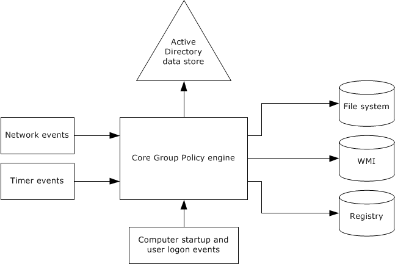

Figure 10: Group Policy security boundary components

#### 2.9.1.1 Data Store Permissions

[**Group Policy**](#gt_group-policy) writes policy information to various data stores, such as the [**Group Policy file share**](#gt_group-policy-file-share), [**Active Directory**](#gt_active-directory), and the [**registry**](#gt_registry), where [**policy settings**](#gt_policy-setting) are persisted. The Group Policy protocols ensure that appropriate permissions are set on each resource so that no user can tamper with the data unless that user has permissions to the resource. Group Policy protocols set user permissions on resources to read only, so they cannot change the data. Group Policy cannot protect against a user with administrative credentials, because that user can take ownership of a resource and change it.

#### 2.9.1.2 Timer and Network Events

The process that applies [**Group Policy**](#gt_group-policy) to [**Group Policy client**](#gt_group-policy-client) computers runs periodically in the background and is triggered by the firing of a timer or a network event, such as a change to the user’s network state. Any implementation of Group Policy protocols should ensure that these event sources are trusted and cannot be spoofed.

#### 2.9.1.3 Computer Startup and Logon Events

The computer startup, computer shutdown, user logon, and user logoff events are used to apply policies to a user or a computer when these events occur. Any implementation of [**Group Policy**](#gt_group-policy) protocols should ensure that the components that generate these events are trusted and cannot be spoofed.

### 2.9.2 External Security

[**Group Policy**](#gt_group-policy) protocols use the encryption mechanisms provided by the [**LDAP**](#gt_lightweight-directory-access-protocol-ldap) and file access transports to ensure that the data is protected against tampering. Group Policy relies on the authentication mechanisms provided by the underlying protocols to establish user and computer identities. These security mechanisms include the following:

- LDAP and file access protocol signing, for setting and retrieving policy data.
- Kerberos [[RFC4120]](https://go.microsoft.com/fwlink/?LinkId=90458) authentication for application of computer policy, as described in [MS-AUTHSOD](#Section_2.1) section 3.3.
- SPNEGO authentication for application of user policy, as described in [MS-GPOL](#Section_2.1.1.1) section 5.
The Group Policy protocols do not define any additional external security beyond what is described in the specifications of the protocols listed in section [2.2](#Section_2.2).

## 2.10 Additional Considerations

There are no additional security considerations.

# 3 Examples

The [**Group Policy server**](#gt_group-policy-server) allows clients to discover and retrieve [**policy settings**](#gt_policy-setting) created by domain administrators. Policy settings are directives that administrators issue to control client behaviors. These behaviors are defined by user policy settings and computer policy settings.

This section contains examples that further elaborate the [**Group Policy**](#gt_group-policy) concepts that are described in this document, to provide a basis for practical understanding and implementation of the Group Policy server. Message flow diagrams are included to illustrate the flow of communication as certain events occur.

The examples demonstrate the Group Policy server system architecture in the context of various scenarios. The functionalities illustrated in these scenarios exemplify some of the purposes of the Group Policy server:

- Processing Group Policy events.
- Applying policy via the [**Group Policy client**](#gt_group-policy-client).
- Populating the [**Administrative tool**](#gt_administrative-tool) with configuration data.
- Authoring new policies.
- Connecting the Administrative tool to a Group Policy server resulting in failure.
- Querying [**Active Directory**](#gt_active-directory) for [**SOM**](#gt_scope-of-management-som) and version information.
- Applying policy via the Group Policy client resulting in failure to connect to the Group Policy server.

## 3.1 Example 1: Processing Group Policy Events

This section describes various events that trigger the [**Group Policy**](#gt_group-policy) processing architecture and the resulting sequence of messages that apply Group Policy. This example provides a very high-level view of the sequences that take place in response to specific event occurrences, such as:

- Computer startup.
- User logon to a computer.
- User logoff from a computer.
- Computer shutdown.
This example maps to the use case specified in section [2.5.2](#Section_2.1.2.3.2), "Applying Group Policy".

**Prerequisites**

The following prerequisites apply to this example:

- The [**Group Policy client**](#gt_group-policy-client) is able to discover and communicate with the [**Group Policy server**](#gt_group-policy-server), as described in [MS-GPOL](#Section_2.1.1.1) section 3.2.5.1.1.
- The Group Policy server is storing policy and responds to requests from the Group Policy client.
- The Group Policy client maintains a consistent configuration of policy information that is retrieved from the Group Policy server, which includes [**registry**](#gt_registry) settings, WMI data, and [**RSoP**](#gt_resultant-set-of-policy-rsop) data.
- The [**Group Policy administrator**](#gt_group-policy-administrator) ensures that the Group Policy client policy configuration aligns with business requirements.
**Initial System State**

Prior to the application of Group Policy, the Group Policy protocols are actively listening for the specific events that will trigger [**policy application**](#gt_policy-application) on computers in a [**domain**](#gt_domain).

**Final System State**

The state of the Group Policy protocols and components after execution of this example can be described as follows:

- The Group Policy client retrieved the appropriate policies from the Group Policy protocols, and they were applied on the client.
**Sequence of Events**

The following diagram illustrates the message sequence that occurs in response to events that trigger policy application. The diagram also indicates when Group Policy computer startup, computer shutdown, user logon, and user logoff scripts are run.

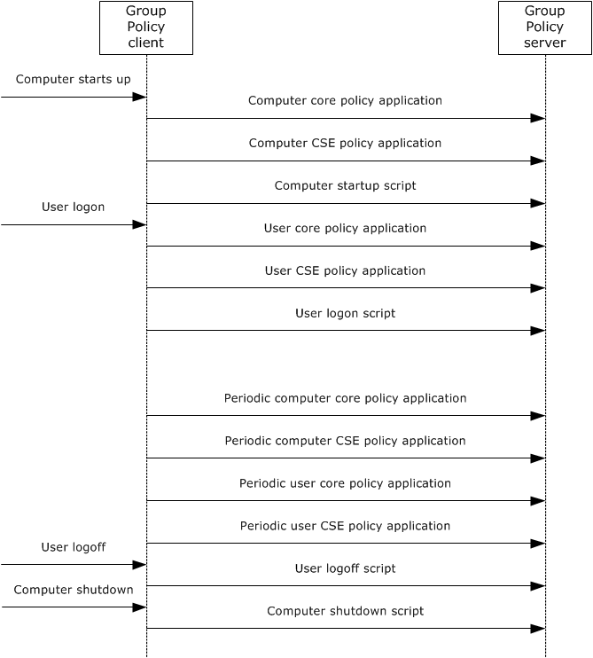

Figure 11: Group Policy processing internal architecture

The following table provides document references for the messages in the preceding figure.

**Group Policy messages and document references**

| Protocol message | Document name | Section |
| --- | --- | --- |
| Computer Core Policy Application | [MS-GPOL]: Group Policy: Core Protocol Specification | 1.3.3, Policy Application |
| Computer CSE Policy Application | [MS-GPOL]: Group Policy: Core Protocol Specification | 3.2.5.1.10, Extension Protocol Sequences |
| Computer Startup Scripts | [MS-GPSCR](../MS-GPSCR/MS-GPSCR.md): Group Policy Scripts Extension: Protocol Specification | 3.2.5, Message Processing Events and Sequencing Rules |
| User Core Policy Application | [MS-GPOL]: Group Policy: Core Protocol Specification | 1.3.3, Policy Application |
| User CSE Policy Application | [MS-GPOL]: Group Policy: Core Protocol Specification | 3.2.5.1.10, Extension Protocol Sequences |
| User Logon Scripts | [MS-GPSCR]: Group Policy Scripts Extension: Protocol Specification | 3.2.5, Message Processing Events and Sequencing Rules |
| Periodic Computer Core Policy Application | [MS-GPOL]: Group Policy: Core Protocol Specification | 1.3.3, Policy Application |
| Periodic Computer CSE Policy Application | [MS-GPOL]: Group Policy: Core Protocol Specification | 3.2.5.1.10, Extension Protocol Sequences |
| Periodic User Policy Core Application | [MS-GPOL]: Group Policy: Core Protocol Specification | 1.3.3, Policy Application |
| Periodic User CSE Policy Application | [MS-GPOL]: Group Policy: Core Protocol Specification | 3.2.5.1.10, Extension Protocol Sequences |
| User Logoff Scripts | [MS-GPSCR]: Group Policy Scripts Extension: Protocol Specification | 3.2.5, Message Processing Events and Sequencing Rules |
| Computer Shutdown Scripts | [MS-GPSCR]: Group Policy Scripts Extension: Protocol Specification | 3.2.5, Message Processing Events and Sequencing Rules |

## 3.2 Example 2: Applying Policy on the Group Policy Client

The [**Group Policy client's**](#gt_group-policy-client) interaction with the [**Group Policy server**](#gt_group-policy-server) in [**policy application**](#gt_policy-application) uses a pull model, in which the Group Policy client polls a Group Policy server to check for new user [**GPOs**](#gt_group-policy-object-gpo).

When the Group Policy client discovers the Group Policy server, the client performs two sets of queries to [**Active Directory**](#gt_active-directory) on the Group Policy server using LDAP as a transport.

- The first set of queries determines which GPOs have been assigned.
- The second set of queries determines attributes of the relevant policies, discovers the location of the policy files, and determines any exclusionary WMI filtering for GPOs.
The Group Policy client then checks the link speed and processes any relevant filters to potentially filter down the collective list of extensions.

Lastly, [**CSEs**](#gt_cses) read the relevant [**policy settings**](#gt_policy-setting) from the server that are stored in Active Directory and on the [**Group Policy file share**](#gt_group-policy-file-share), using [**LDAP**](#gt_lightweight-directory-access-protocol-ldap) or a file access protocol, respectively, and apply them.

This example maps to the use case specified in section [2.5.2](#Section_2.1.2.3.2), "Applying Group Policy".

**Prerequisites**

The following prerequisites apply to this example:

- The Group Policy server is storing policy information.
- The Group Policy client maintains a consistent configuration of policy information that is retrieved from the Group Policy server, which includes [**registry**](#gt_registry) settings, WMI data, and [**RSoP**](#gt_resultant-set-of-policy-rsop) data.
- The [**Group Policy administrator**](#gt_group-policy-administrator) ensures that the Group Policy client policy configuration aligns with business requirements.
- The Group Policy client has discovered the Group Policy server and connected with Active Directory, as described in [MS-GPOL](#Section_2.1.1.1) section 3.2.5.1.1.
- The Group Policy client has sent an LDAP **BindRequest** message, as specified in [[RFC2251]](https://go.microsoft.com/fwlink/?LinkId=90325) section 4.2, to the Group Policy server, and the Group Policy server has replied with an LDAP **BindResponse** message, as described in [RFC2251] section 4.2.3.
- In this scenario, it is assumed that the Group Policy file share resides on the Group Policy server.
**Initial System State**

The initial state of the [**Group Policy**](#gt_group-policy) protocols corresponds to the previously specified prerequisites.

**Final System State**

The state of the Group Policy protocols and components after execution of this example can be described as follows:

- The Group Policy client applied the appropriate user and computer policies that were retrieved from the [**Group Policy data store**](#gt_group-policy-data-store).
**Sequence of events**

The following diagram illustrates the message sequence that occurs when Group Policy is applied on the Group Policy client:

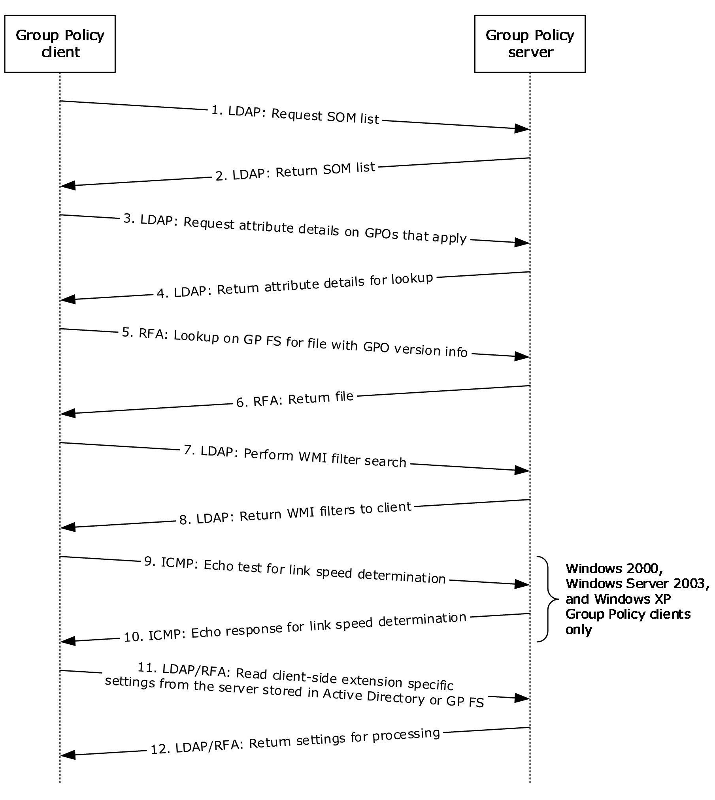

Figure 12: Group Policy client applies policy

The message sequence for this example is as follows:

- The Group Policy client sends a series of LDAP requests to the Group Policy server to discover the policies that apply to the user and to the computer. For more information, see [MS-GPOL] sections 2.2.2, 2.2.3, and 3.2.5.1.3.
- The Group Policy server sends a series of LDAP replies to the Group Policy client that contain the policies that apply to the user and to the computer. For more information, see [MS-GPOL] sections 2.2.2, 2.2.3, and 3.2.5.1.3.
- The Group Policy client receives the list of policies and then sends an LDAP query to the Group Policy server to request specific attributes that define further filtering, the location of the policy file, and the precedence order for sequential application of policies and classes of settings. For more information, see [MS-GPOL] sections 2.2.4 and 3.2.5.1.5.
- Through an LDAP reply, the Group Policy server returns the list of attributes that the Group Policy client requested. The Group Policy client then invokes any extension settings that are defined as part of the returned attributes. For more information, see [MS-GPOL] section 2.2.4 and 3.2.5.1.5.
- The Group Policy client sends a file access request to the Group Policy file share on the Group Policy server to read the gpt.ini file that contains version information for the GPO. For more information, see [MS-GPOL] section 2.2.4.
- The version information from the file is returned to the Group Policy client in response to the file access request. The Group Policy client parses the file to check the GPO version.
- The Group Policy client sends an encrypted LDAP request to the Group Policy server to retrieve any WMI filters that apply to the GPOs in scope for the Group Policy client. For more information, see [MS-GPOL] sections 2.2.5 and 3.2.5.1.7.
- The Group Policy server sends an encrypted response back to the client with any relevant WMI filters that apply to the client. For more information, see [MS-GPOL] section 2.2.5.
- The Group Policy client might send a separate request to the Group Policy server to determine the link speed. For more information, see [MS-GPOL] sections 2.2.6 and 3.2.5.1.9.
- The Group Policy client receives a response from the Group Policy server that assists the Group Policy client in determining link speed. For more information, see [MS-GPOL] section 2.2.6.
- If a Group Policy update is required, the Group Policy client sends an LDAP request to the Group Policy server and a file access request to the Group Policy file share that stores the extension-specific policy settings. For more information, see [MS-GPOL] section 3.2.5.1.
- The Group Policy client then retrieves the requested settings and applies them. For more information, see [MS-GPOL] section 3.2.5.1.

## 3.3 Example 3: Populating the Administrative Tool with Configuration Data

This example demonstrates the processes that occur when the [**Administrative tool**](#gt_administrative-tool) loads and retrieves the appropriate information from the data stores that contain [**Group Policy**](#gt_group-policy) data. The Administrative tool is populated with data that is retrieved from the [**Group Policy server**](#gt_group-policy-server).

This example maps to the use case specified in [Administering Group Policy (section 2.5.3)](#Section_2.1).

**Prerequisites**

The following prerequisites apply to this example:

- Policy information that is stored in the [**Group Policy data store**](#gt_group-policy-data-store) aligns with business and organizational requirements.
- The [**Group Policy administrator**](#gt_group-policy-administrator) who is running the Administrative tool has read/write access to [**Active Directory**](#gt_active-directory) on the Group Policy server and to the [**Group Policy file share**](#gt_group-policy-file-share).
- The Group Policy server is a read/write [**domain controller (DC)**](#gt_domain-controller-dc).
- The Administrative tool is able to discover and communicate with the Group Policy server, as described in [MS-GPOL](#Section_2.1.1.1) section 3.2.5.1.1.
Note that the Group Policy server (DC) discovery and connection sequence for the [**Group Policy client**](#gt_group-policy-client) and Administrative tool are identical.

- The computer hosting the Administrative tool is joined to the domain and the Group Policy administrator is logged on with domain credentials of sufficient rights.
- In this scenario, it is assumed that the Group Policy file share resides on the Group Policy server.
**Initial System State**

The initial state of the Group Policy protocols corresponds to the previously specified prerequisites.

**Final System State**

The state of the Group Policy protocols and components after execution of this example can be described as follows:

- The Administrative tool retrieved all the existing policies on the Group Policy server.
**Sequence of events**

The following diagram illustrates the message sequence that occurs when the Administrative tool retrieves [**GPO**](#gt_group-policy-object-gpo) data from the Group Policy server and [**policy settings**](#gt_policy-setting) from the Group Policy file share.

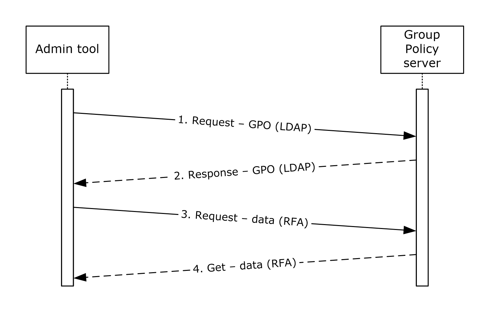

Figure 13: Populating the Administrative tool with data

The message sequence for this example is described as follows:

- The Administrative tool makes a sequence of [**LDAP**](#gt_lightweight-directory-access-protocol-ldap) calls to the Group Policy server to retrieve GPO information via the message types described in [MS-GPOL] sections 2.2.2, 2.2.3, 2.2.4, 2.2.5, and 2.2.7.
- The GPO information that is returned in response to the LDAP queries is used to populate the tool.
- During editing operations, the Administrative tool invokes one or more extension protocols, which communicate with the Group Policy file share via a file access protocol to return existing policy settings.
- The returned policy settings information is used to populate the tool.

## 3.4 Example 4: Authoring a New GPO

This example describes the message flow during new policy authoring. When the [**Group Policy administrator**](#gt_group-policy-administrator) creates a new [**GPO**](#gt_group-policy-object-gpo), the [**Group Policy server**](#gt_group-policy-server) handles the request by provisioning resources in [**Active Directory**](#gt_active-directory) for a new GPO and appropriate directories are created on the [**Group Policy file share**](#gt_group-policy-file-share). After the new policy is created, the administrator opens the policy and begins setting the policy configuration. As the administrator authors [**policy settings**](#gt_policy-setting), the [**Administrative tool**](#gt_administrative-tool) communicates with Active Directory on the Group Policy server and the Group Policy file share to update these [**Group Policy data stores**](#gt_group-policy-data-store) with the policy data.

This example maps to the use case specified in [Administering Group Policy (section 2.5.3)](#Section_2.1).

**Prerequisites**

The following prerequisites apply to this example:

- Policy information that is stored in the Group Policy data store aligns with business and organizational requirements
- The Administrative tool has read/write access to the Group Policy server.
- The Group Policy server is a read/write [**domain controller**](#gt_domain-controller-dc).
- The Administrative tool is able to discover and communicate with the Group Policy server, as described in [MS-GPOL](#Section_2.1.1.1) section 3.2.5.1.1.
- In this scenario, it is assumed that the Group Policy file share resides on the Group Policy server.
**Note** The Group Policy server (DC) discovery and connection sequence for the [**Group Policy client**](#gt_group-policy-client) and Administrative tool are identical.

**Initial System State**

The initial state of [**Group Policy**](#gt_group-policy) corresponds to the previously specified prerequisites.

**Final System State**

The state of Group Policy and its components after execution of this example can be described as follows:

- The Group Policy server is updated with newly authored Group Policy information.
**Sequence of events**

The following diagram illustrates the message sequence that occurs when the Administrative tool is used to author a new policy.

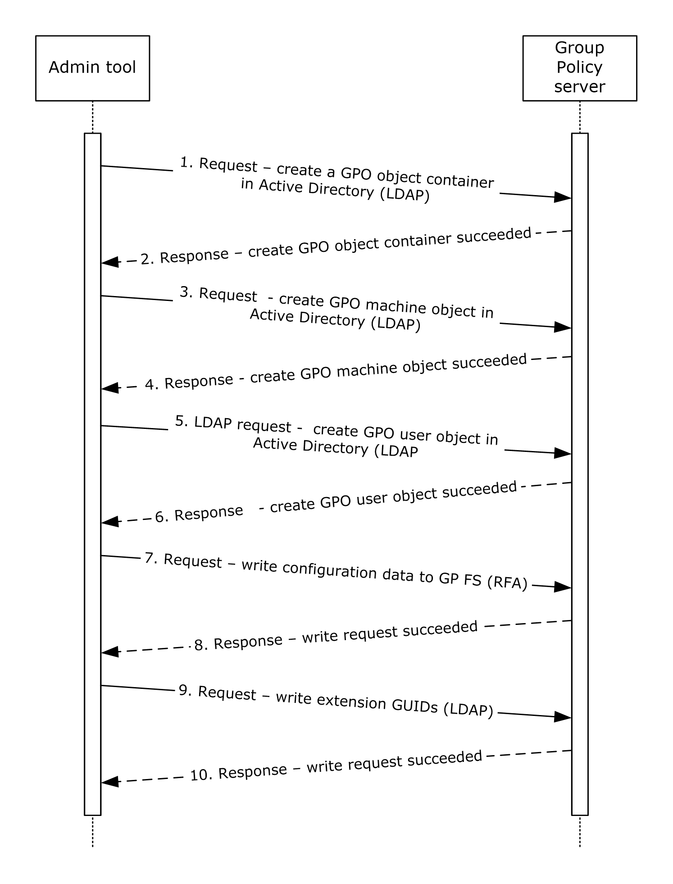

Figure 14: Authoring a new policy

The message sequence for this example is described fully in the following sections of [MS-GPOL].

- Steps 1-5 are described in [MS-GPOL] section 3.3.5.1.
- Steps 7 and 8 are described in [MS-GPOL] section 3.3.5.4.
- Steps 9 and 10 are described in [MS-GPOL] section 3.3.5.2.

## 3.5 Example 5: Administrative Tool Cannot Connect to a Group Policy Server

The examples in this section describe message sequences that occur during the policy administration process that end in failure as a result of a lost connection with the [**Group Policy server**](#gt_group-policy-server) or a remotely-located [**Group Policy file share**](#gt_group-policy-file-share). These two scenarios are illustrated:

- Failure to contact [**Active Directory**](#gt_active-directory)
- Failure to contact the Group Policy file share
The examples in this section map to the use case specified in [Administering Group Policy (section 2.5.3)](#Section_2.1).

**Prerequisites**

The following prerequisites apply to the examples in this section:

- Policy information stored in the [**Group Policy data store**](#gt_group-policy-data-store) aligns with business and organizational requirements.
- The Group Policy server is a read/write [**domain controller**](#gt_domain-controller-dc).
- The [**Administrative tool**](#gt_administrative-tool) is able to discover the Group Policy server, as described in [MS-GPOL](#Section_2.1.1.1) section 3.2.5.1.1.
Note that the Group Policy server (DC) discovery and connection sequence for the [**Group Policy client**](#gt_group-policy-client) and Administrative tool are identical.

- The Administrative tool has read/write access to the Group Policy server.
- For the failure to contact the Group Policy file share scenario, it is assumed that the Group Policy file share resides on the Group Policy server.
**Initial System State**

The initial state of the [**Group Policy**](#gt_group-policy) protocols corresponds to the previously specified prerequisites.

**Final System State**

The state of the Group Policy protocols and components after execution of each example in this section can be described as follows:

- The state of the Group Policy protocols and components is unchanged.
**Sequence of events for Active Directory Connection Failure**

The following diagram shows the message sequence that occurs when the Administrative tool is unable to connect with Active Directory.

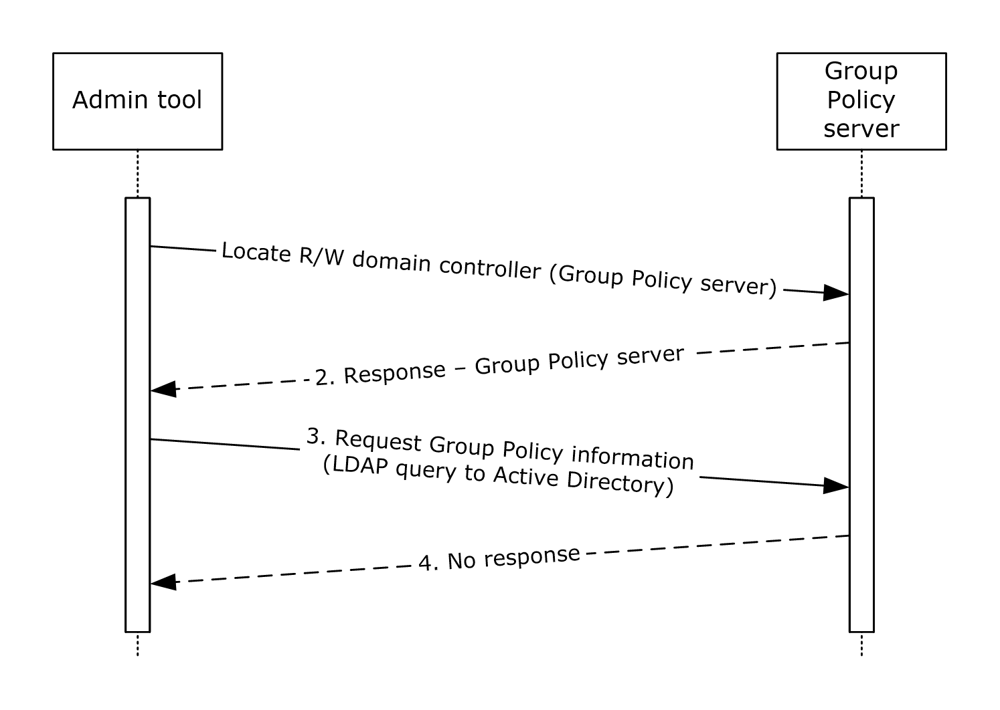

Figure 15: Administrative tool cannot connect with Active Directory

The message sequence for this example is described as follows:

- The Administrative tool attempts to locate the Group Policy server in the domain by the steps described in [MS-ADOD](#Section_2.1) section 3.1.1.
- The Group Policy server information for the domain is returned.
- The Administrative tool sends an [**LDAP**](#gt_lightweight-directory-access-protocol-ldap) query to Active Directory to retrieve [**GPO**](#gt_group-policy-object-gpo) information, as described in [MS-GPOL] sections 2.2.2, 2.2.3, and 2.2.4.
- The Administrative tool fails to receive a response from the Group Policy server within a specified time-out interval.
**Sequence of events for Group Policy file share Connection Failure**

The following diagram shows the message sequence that occurs when the Administrative tool fails to connect with the Group Policy file share.

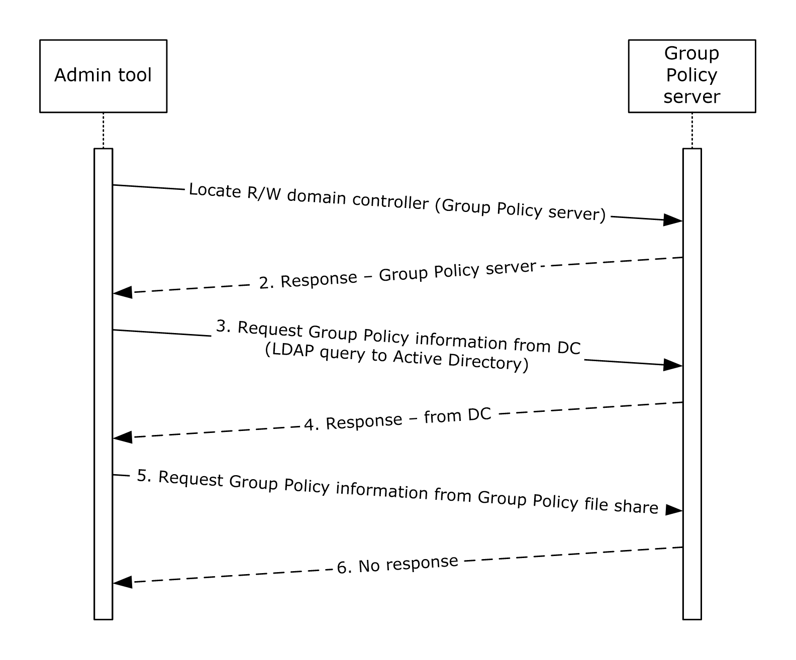

Figure 16: Administrative tool cannot connect with the Group Policy file share

The message sequence for this example is described as follows:

- The Administrative tool attempts to locate the Group Policy server in the domain by following the steps described in [MS-ADOD] section 3.1.1.
- The Group Policy server information for the domain is returned.
- The Administrative tool sends an LDAP query to Active Directory to request GPO information, as described in [MS-GPOL] sections 2.2.2, 2.2.3, 2.2.4, 2.2.5, and 2.2.7.
- The Administrative tool receives responses ([MS-GPOL] sections 2.2.2, 2.2.3, 2.2.4, 2.2.5, and 2.2.7) from the Group Policy server within a specified time-out interval.
- The Administrative tool requests information from the Group Policy file share on the Group Policy server, in a manner that is similar to the process described in section [2.1.3.1.7](#Section_2.1.3.1.7).
- The Administrative tool does not receive a response from the Group Policy server within a specified time-out interval.

## 3.6 Example 6: Querying Active Directory for Scope of Management and Version Information

In this example, a [**Group Policy client**](#gt_group-policy-client) queries a [**Group Policy server**](#gt_group-policy-server) for [**SOM**](#gt_scope-of-management-som) and version information. SOM containers such as [**domain**](#gt_domain), [**site**](#gt_site), and [**OU**](#gt_organizational-unit-ou) containers hold user and computer account information and are associated with [**GPOs**](#gt_group-policy-object-gpo). Each GPO is associated with a specific [**policy target**](#gt_policy-target), such as a user or computer account. Messages exchanged between the Group Policy client and the Group Policy server use [**LDAP**](#gt_lightweight-directory-access-protocol-ldap) as a transport.

This example loosely maps to the use case specified in [Applying Group Policy — Group Policy client (section 2.5.2)](#Section_2.1.2.3.2).

**Prerequisites**

The following prerequisites apply to this example:

- The Group Policy client has discovered the Group Policy server and has connected with [**Active Directory**](#gt_active-directory), as described in [MS-GPOL](#Section_2.1.1.1) section 3.2.5.1.1.
- The Group Policy server stores policy and responds to LDAP requests from the Group Policy client.
- The Group Policy client maintains a consistent configuration of policy information that is retrieved from the Group Policy server, which includes [**registry**](#gt_registry) settings, WMI data, and [**RSoP**](#gt_resultant-set-of-policy-rsop) data.
- The [**Group Policy administrator**](#gt_group-policy-administrator) ensures that the Group Policy client policy configuration aligns with business requirements.
**Initial System State**

The initial state of [**Group Policy**](#gt_group-policy) corresponds to the previously specified prerequisites.

**Final System State**

The state of Group Policy and its components after execution of this example can be described as follows:

- The Group Policy client successfully retrieved the SOM and version information from the Group Policy server.
**Sequence of Events**

The following diagram shows the message sequence that occurs when the Group Policy client queries Active Directory for SOM and Version information.

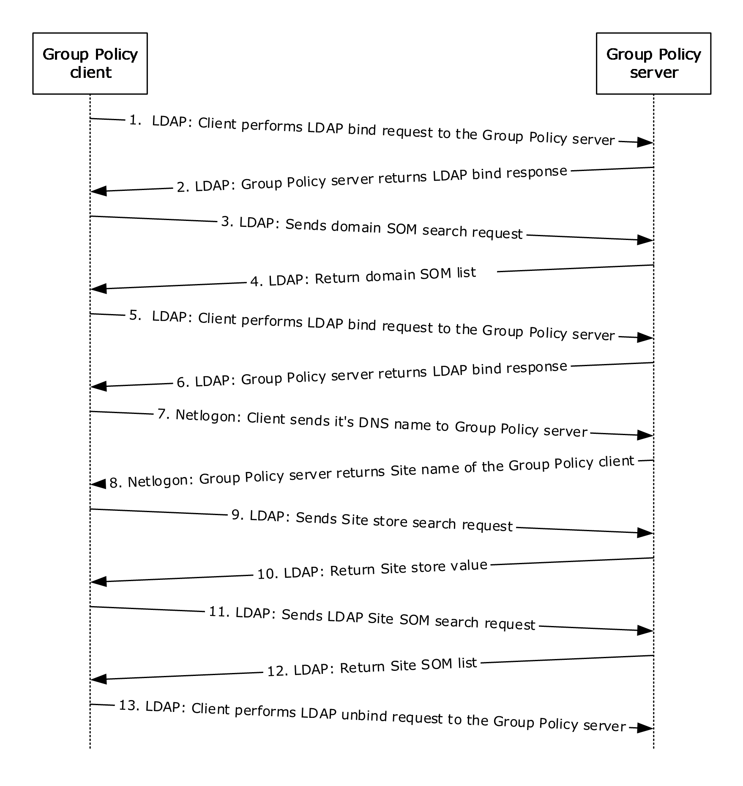

Figure 17: Querying Active Directory for SOM and version information

The message sequence for this example is described as follows:

- The Group Policy client sends an LDAP **BindRequest**, as described in [[RFC2251]](https://go.microsoft.com/fwlink/?LinkId=90325) section 4.2, to the Group Policy server.
- The Group Policy server sends an LDAP **BindResponse**, as described in [RFC2251] section 4.2.3, to the Group Policy client.
- The Group Policy client sends an LDAP domain SOM **SearchRequest** to the Group Policy server, to query for the **gpLink** and **gpOption** attributes for its DN for the [**domain naming context (domain NC)**](#gt_domain-naming-context-domain-nc), as described in [MS-GPOL] section 3.2.5.1.3.
- The Group Policy server returns the domain SOM list via an LDAP **SearchResponse**, as described in [MS-GPOL] section 3.2.5.1.3.
The Group Policy client processes the **gpLink** and **gpOption** attributes information for the domain SOM and uses it to search for the list of GPOs for the domain SOM, as described in [MS-GPOL] section 3.2.5.1.5.

- The Group Policy client sends an LDAP **BindRequest** to the Group Policy server.
- The Group Policy server sends an LDAP **BindResponse** to the Group Policy client.
- The Group Policy client sends its [**DNS**](#gt_domain-name-system-dns) name to the Group Policy server via Netlogon.
- The Group Policy server returns the site name of the Group Policy client via Netlogon.
- The Group Policy client sends an LDAP **SearchRequest** to the Group Policy server, to query for the **configurationNamingContext** attribute for the root of the domain, as described in [MS-GPOL] section 3.2.5.1.4.
- The Group Policy server returns the site store value via an LDAP **SearchResponse** message.
The Group Policy client processes the **configurationNamingContext** attribute information for the root domain and uses it to compute the DN of the site, as described in [MS-GPOL] section 3.2.5.1.4.

- The Group Policy client sends an LDAP **SearchRequest** message to the Group Policy server, to query for the **gpLink** and **gpOption** attributes to obtain the DN for the [**config NC**](#gt_configuration-naming-context-config-nc), as described in [MS-GPOL] section 3.2.5.1.4.
- The Group Policy server returns the site SOM list via an LDAP **SearchResponse** message.
The Group Policy client processes the **gpLink** and **gpOption** attributes information for the site SOM and uses this information to search for the list of GPOs for the domain SOM, as described in [MS-GPOL] section 3.2.5.1.5.

- The Group Policy client sends an LDAP **UnBindRequest**, as described in [RFC2251] section 4.3, to the Group Policy server.

## 3.7 Example 7: Group Policy Client Cannot Connect to the Group Policy Server When Applying Policy

The examples in this section describe the message sequences during [**policy application**](#gt_policy-application) that end in failure as a result of a lost connection with the [**Group Policy server**](#gt_group-policy-server). The following two scenarios are:

- Failure to contact [**Active Directory**](#gt_active-directory).
- Failure to contact the [**Group Policy file share**](#gt_group-policy-file-share).
This example maps to the use case specified in [Applying Group Policy — Group Policy client (section 2.5.2)](#Section_2.1.2.3.2).

**Prerequisites**

The following prerequisites apply to the examples in this section:

- The Group Policy server stores policy and responds to requests from the [**Group Policy client**](#gt_group-policy-client).
- The Group Policy client maintains a consistent configuration of policy information that is retrieved from the Group Policy server, which includes [**registry**](#gt_registry) settings, WMI data, and [**RSoP**](#gt_resultant-set-of-policy-rsop) data.
- The [**Group Policy administrator**](#gt_group-policy-administrator) ensures that the Group Policy client policy configuration aligns with business requirements.
- The Group Policy client has discovered the Group Policy server and established a connection with Active Directory, as described in [MS-GPOL](#Section_2.1.1.1) section 3.2.5.1.1.
- The Group Policy client has sent an [**LDAP**](#gt_lightweight-directory-access-protocol-ldap) **BindRequest** message, as described in [[RFC2251]](https://go.microsoft.com/fwlink/?LinkId=90325) section 4.2, to the Group Policy server and the Group Policy server has replied with an LDAP **BindResponse** message, as described in [RFC2251] section 4.2.3.
- For the failure to contact Group Policy file share scenario, it is assumed that the Group Policy file share resides on the Group Policy server.
**Initial System State**

The initial state of the [**Group Policy**](#gt_group-policy) protocols corresponds to the previously specified prerequisites.

**Final System State**

The state of the Group Policy protocols and components after execution of each example in this section can be described as follows:

- The state of the Group Policy protocols and components is unchanged.
**Sequence of Events for Active Directory Contact Failure**

The following diagram shows the message sequence that occurs when the Group Policy client fails to connect with Active Directory:

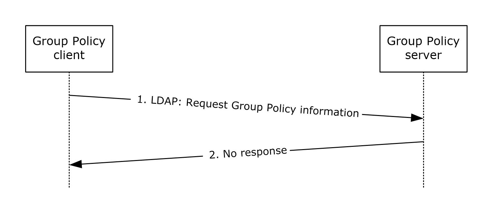

Figure 18: Group Policy client applying policy cannot connect with Active Directory

The message sequence for this example is described as follows:

- The Group Policy client sends an LDAP search query, as described in [RFC2251] section 4.5.1, to the Group Policy server to request Group Policy information.
- The Group Policy client does not receive a response from the Group Policy server within the time-out interval.
**Sequence of Events for Group Policy File Share Contact Failure**

The following diagram shows the message sequence that occurs when the Group Policy client fails to connect with the Group Policy file share.

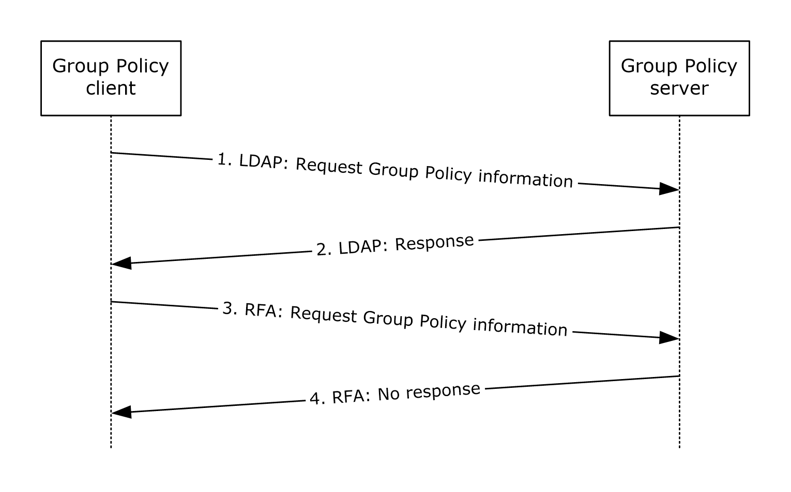

Figure 19: Group Policy client applying policy cannot connect with the Group Policy file share

The message sequence for this example is described as follows:

- The Group Policy client sends an LDAP search query, as described in [RFC2251] section 4.5.1, to the Group Policy server to request Group Policy information.
- The Group Policy client receives an LDAP response from the Group Policy server.
- The Group Policy client sends a *File Open* request via a file access protocol to the Group Policy server.
- The Group Policy client does not receive a response from the Group Policy server within a specified time-out interval.

# 4 Microsoft Implementations

The information in this specification is applicable to the following versions of Microsoft products:

- Windows 2000 operating system
- Windows XP operating system
- Windows Server 2003 operating system
- Windows Vista operating system
- Windows Server 2008 operating system
- Windows 7 operating system
- Windows Server 2008 R2 operating system
- Windows 8 operating system
- Windows Server 2012 operating system
- Windows 8.1 operating system
- Windows Server 2012 R2 operating system
- Windows 10 operating system
- Windows Server 2016 operating system
- Windows Server operating system
- Windows 10 v1809 operating system
- Windows Server 2019 operating system
- Windows Server 2022 operating system
- Windows 11 operating system

## 4.1 Product Behavior

<1> Section 2.7.1.1: Except in Windows 2000, Windows XP, and Windows Server 2003, when the network is unavailable, the [**Group Policy client**](#gt_group-policy-client) also listens to network change notifications so that the policy can be refreshed as soon as the network is reachable. When a network change is detected and the [**Group Policy server**](#gt_group-policy-server) is reachable, the [**policy application**](#gt_policy-application) is applied only if the time elapsed is greater than the periodic refresh interval.

<2> Section 2.8.1: Periodic timer expiration for each user who is interactively logged on to the computer and for the computer itself is, by default, every 90 minutes, plus, by default, a random offset between 0 and 30 minutes. Windows [**Group Policy**](#gt_group-policy) clients maintain separate timers for the computer and each user who is interactively logged on to the computer. Time-outs can vary from as low as 1 minute to any number of days. The timer interval is a value that is determined by the client computer configuration and is typically configured by an administrator.

# 5 Change Tracking

This section identifies changes that were made to this document since the last release. Changes are classified as Major, Minor, or None.

The revision class **Major** means that the technical content in the document was significantly revised. Major changes affect protocol interoperability or implementation. Examples of major changes are:

- A document revision that incorporates changes to interoperability requirements.
- A document revision that captures changes to protocol functionality.
The revision class **Minor** means that the meaning of the technical content was clarified. Minor changes do not affect protocol interoperability or implementation. Examples of minor changes are updates to clarify ambiguity at the sentence, paragraph, or table level.

The revision class **None** means that no new technical changes were introduced. Minor editorial and formatting changes may have been made, but the relevant technical content is identical to the last released version.

The changes made to this document are listed in the following table. For more information, please contact [dochelp@microsoft.com](mailto:dochelp@microsoft.com).

| Section | Description | Revision class |
| --- | --- | --- |
| [4](#Section_4) Microsoft Implementations | Added Windows 11 operating system to the Windows client product applicability list. | Major |

## Revision History

| Date | Version | Revision Class | Comments |
| --- | --- | --- | --- |
| 9/23/2011 | 1.0 | New | Released new document. |
| 12/16/2011 | 1.0 | None | No changes to the meaning, language, or formatting of the technical content. |
| 3/30/2012 | 2.0 | Major | Updated and revised the technical content. |
| 7/12/2012 | 2.0 | None | No changes to the meaning, language, or formatting of the technical content. |
| 10/25/2012 | 2.0 | None | No changes to the meaning, language, or formatting of the technical content. |
| 1/31/2013 | 2.0 | None | No changes to the meaning, language, or formatting of the technical content. |
| 8/8/2013 | 3.0 | Major | Updated and revised the technical content. |
| 11/14/2013 | 4.0 | Major | Updated and revised the technical content. |
| 2/13/2014 | 4.0 | None | No changes to the meaning, language, or formatting of the technical content. |
| 5/15/2014 | 4.0 | None | No changes to the meaning, language, or formatting of the technical content. |
| 6/30/2015 | 5.0 | Major | Significantly changed the technical content. |
| 9/24/2015 | 6.0 | Major | Significantly changed the technical content. |
| 10/16/2015 | 6.0 | None | No changes to the meaning, language, or formatting of the technical content. |
| 9/26/2016 | 7.0 | Major | Significantly changed the technical content. |
| 6/1/2017 | 7.0 | None | No changes to the meaning, language, or formatting of the technical content. |
| 12/15/2017 | 8.0 | Major | Significantly changed the technical content. |
| 11/5/2018 | 9.0 | Major | Significantly changed the technical content. |
| 6/3/2021 | 10.0 | Major | Significantly changed the technical content. |
| 10/26/2021 | 11.0 | Major | Significantly changed the technical content. |
