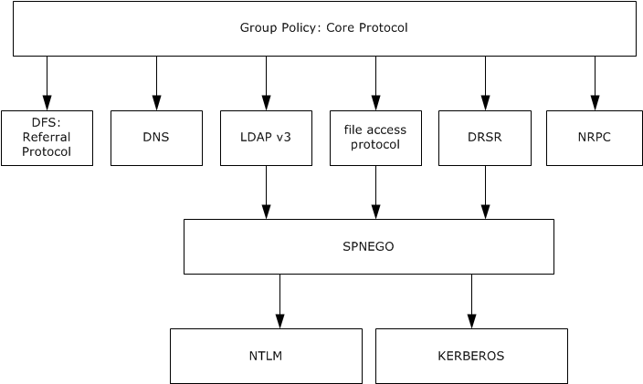

# [MS-GPOL]: Group Policy: Core Protocol

Table of Contents

1 Introduction

- [1 Introduction](#Section_1)
  - [1.1 Glossary](#Section_1.1)
  - [1.2 References](#Section_1.2)
    - [1.2.1 Normative References](#Section_1.2.1)
    - [1.2.2 Informative References](#Section_1.2.2)
  - [1.3 Overview](#Section_1.3)
    - [1.3.1 User and Computer Policy Settings](#Section_1.3.1)
    - [1.3.2 Protocol Operational Modes](#Section_1.3.2)
    - [1.3.3 Policy Application](#Section_1.3.3)
      - [1.3.3.1 Server Discovery and Group Policy Object Association](#Section_1.3.3.1)
      - [1.3.3.2 GPO Retrieval](#Section_1.3.3.2)
      - [1.3.3.3 Group Policy Extension Settings Retrieval](#Section_1.3.3.3)
    - [1.3.4 Policy Administration](#Section_1.3.4)
  - [1.4 Relationship to Other Protocols](#Section_1.4)
  - [1.5 Prerequisites/Preconditions](#Section_1.5)
  - [1.6 Applicability Statement](#Section_1.6)
  - [1.7 Versioning and Capability Negotiation](#Section_1.7)
  - [1.8 Vendor-Extensible Fields](#Section_1.8)
  - [1.9 Standards Assignments](#Section_1.9)

2 Messages

- [2 Messages](#Section_2)
  - [2.1 Transport](#Section_2.1)
  - [2.2 Message Syntax](#Section_2.2)
    - [2.2.1 DN Discovery](#Section_2.2.1)
    - [2.2.2 Domain SOM Search](#Section_2.2.2)
    - [2.2.3 Site Search](#Section_2.2.3)
    - [2.2.4 GPO Search](#Section_2.2.4)
    - [2.2.5 WMI Filter Search](#Section_2.2.5)
    - [2.2.6 Link Speed Determination](#Section_2.2.6)
    - [2.2.7 GPO Read Administration](#Section_2.2.7)
    - [2.2.8 GPO Write Administration](#Section_2.2.8)
      - [2.2.8.1 GPO Creation Message](#Section_2.2.8.1)
        - [2.2.8.1.1 GPO Container SearchRequest](#Section_2.2.8.1.1)
        - [2.2.8.1.2 GPO User Container SearchRequest](#Section_2.2.8.1.2)
        - [2.2.8.1.3 Machine Container SearchRequest](#Section_2.2.8.1.3)
        - [2.2.8.1.4 Policies Container AddRequest](#Section_2.2.8.1.4)
        - [2.2.8.1.5 GPO AddRequest](#Section_2.2.8.1.5)
        - [2.2.8.1.6 GPO User Subcontainer AddRequest](#Section_2.2.8.1.6)
        - [2.2.8.1.7 GPO Machine Subcontainer AddRequest](#Section_2.2.8.1.7)
        - [2.2.8.1.8 GPO Security Descriptor SearchRequest](#Section_2.2.8.1.8)
      - [2.2.8.2 GPO Extension Update Message](#Section_2.2.8.2)
      - [2.2.8.3 GPO Property Update Message](#Section_2.2.8.3)
      - [2.2.8.4 SOM Property Update Message](#Section_2.2.8.4)
      - [2.2.8.5 GPO Deletion Message](#Section_2.2.8.5)
      - [2.2.8.6 Organizational Unit Creation Message](#Section_2.2.8.6)
      - [2.2.8.7 Organizational Unit Deletion Message](#Section_2.2.8.7)
  - [2.3 Directory Service Schema Elements](#Section_2.3)

3 Protocol Details

- [3 Protocol Details](#Section_3)
  - [3.1 Server Details](#Section_3.1)
    - [3.1.1 Server Abstract Data Model](#Section_3.1.1)
    - [3.1.2 Timers](#Section_3.1.2)
    - [3.1.3 Initialization](#Section_3.1.3)
    - [3.1.4 Higher-Layer Triggered Events](#Section_3.1.4)
    - [3.1.5 Message Processing Events and Sequencing Rules](#Section_3.1.5)
    - [3.1.6 Timer Events](#Section_3.1.6)
    - [3.1.7 Other Local Events](#Section_3.1.7)
  - [3.2 Client Details](#Section_3.2)
    - [3.2.1 Client Abstract Data Model](#Section_3.2.1)
      - [3.2.1.1 Cache of GPO Versions](#Section_3.2.1.1)
      - [3.2.1.2 Default Policy Source Mode](#Section_3.2.1.2)
      - [3.2.1.3 Policy Source Mode](#Section_3.2.1.3)
      - [3.2.1.4 GPO List](#Section_3.2.1.4)
      - [3.2.1.5 Filtered GPO List](#Section_3.2.1.5)
      - [3.2.1.6 SOM List](#Section_3.2.1.6)
      - [3.2.1.7 SOM GPLink List](#Section_3.2.1.7)
      - [3.2.1.8 Enforced GPLink List](#Section_3.2.1.8)
      - [3.2.1.9 Non-enforced GPLink List](#Section_3.2.1.9)
      - [3.2.1.10 GPLink List](#Section_3.2.1.10)
      - [3.2.1.11 Allow-Enforced-GPOs-Only](#Section_3.2.1.11)
      - [3.2.1.12 Policy Application Mode](#Section_3.2.1.12)
      - [3.2.1.13 Group Policy Server](#Section_3.2.1.13)
      - [3.2.1.14 Configured Computer Base Frequency](#Section_3.2.1.14)
      - [3.2.1.15 Configured Computer Random Offset](#Section_3.2.1.15)
      - [3.2.1.16 Policy Target Domain Name](#Section_3.2.1.16)
      - [3.2.1.17 Computer Policy Refresh Interval](#Section_3.2.1.17)
      - [3.2.1.18 Configured User Base Frequency](#Section_3.2.1.18)
      - [3.2.1.19 Configured User Random Offset](#Section_3.2.1.19)
      - [3.2.1.20 User Policy Refresh Interval](#Section_3.2.1.20)
      - [3.2.1.21 Configured Disable Periodic Refresh](#Section_3.2.1.21)
      - [3.2.1.22 Disable Periodic Refresh](#Section_3.2.1.22)
      - [3.2.1.23 Group Policy Client AD Connection Handle](#Section_3.2.1.23)
      - [3.2.1.24 Extension List](#Section_3.2.1.24)
      - [3.2.1.25 Cache of Link Speed](#Section_3.2.1.25)
      - [3.2.1.26 Cache of Logging State](#Section_3.2.1.26)
      - [3.2.1.27 Policy Target User Name](#Section_3.2.1.27)
      - [3.2.1.28 Machine Role](#Section_3.2.1.28)
      - [3.2.1.29 Policy Target Security Token](#Section_3.2.1.29)
      - [3.2.1.30 Policy Target Domain DN](#Section_3.2.1.30)
    - [3.2.2 Timers](#Section_3.2.2)
    - [3.2.3 Initialization](#Section_3.2.3)
    - [3.2.4 Higher-Layer Triggered Events](#Section_3.2.4)
      - [3.2.4.1 Process Group Policy](#Section_3.2.4.1)
    - [3.2.5 Message Processing Events and Sequencing Rules](#Section_3.2.5)
      - [3.2.5.1 Policy Application](#Section_3.2.5.1)
        - [3.2.5.1.1 DC Discovery and AD Connection Establishment](#Section_3.2.5.1.1)
        - [3.2.5.1.2 DN Discovery](#Section_3.2.5.1.2)
        - [3.2.5.1.3 Domain SOM Search](#Section_3.2.5.1.3)
        - [3.2.5.1.4 Site Search](#Section_3.2.5.1.4)
        - [3.2.5.1.5 GPO Search](#Section_3.2.5.1.5)
        - [3.2.5.1.6 GPO Filter Evaluation](#Section_3.2.5.1.6)
        - [3.2.5.1.7 WMI Filter Evaluation](#Section_3.2.5.1.7)
        - [3.2.5.1.8 AD Connection Termination](#Section_3.2.5.1.8)
        - [3.2.5.1.9 Link Speed Discovery](#Section_3.2.5.1.9)
        - [3.2.5.1.10 Extension Protocol Sequences](#Section_3.2.5.1.10)
        - [3.2.5.1.11 Policy Application Notification](#Section_3.2.5.1.11)
      - [3.2.5.2 GPO Processing Order](#Section_3.2.5.2)
    - [3.2.6 Timer Events](#Section_3.2.6)
    - [3.2.7 Other Local Events](#Section_3.2.7)
      - [3.2.7.1 Policy Application Mode Initialization](#Section_3.2.7.1)
      - [3.2.7.2 Refresh Timer Initialization](#Section_3.2.7.2)
      - [3.2.7.3 Policy Application Event](#Section_3.2.7.3)
  - [3.3 Administrative Tool Details](#Section_3.3)
    - [3.3.1 Abstract Data Model](#Section_3.3.1)
      - [3.3.1.1 Group Policy Protocol Administrative Tool](#Section_3.3.1.1)
      - [3.3.1.2 Group Policy Extension Administrative Plug-In](#Section_3.3.1.2)
      - [3.3.1.3 Administered GPO (Public)](#Section_3.3.1.3)
      - [3.3.1.4 Group Policy Server](#Section_3.3.1.4)
      - [3.3.1.5 Administrative Tool AD Connection Handle](#Section_3.3.1.5)
    - [3.3.2 Timers](#Section_3.3.2)
    - [3.3.3 Initialization](#Section_3.3.3)
    - [3.3.4 Higher-Layer Triggered Events](#Section_3.3.4)
      - [3.3.4.1 Group Policy Creation](#Section_3.3.4.1)
      - [3.3.4.2 Group Policy Property Update](#Section_3.3.4.2)
      - [3.3.4.3 SOM Property Update](#Section_3.3.4.3)
      - [3.3.4.4 Group Policy Extension Update](#Section_3.3.4.4)
      - [3.3.4.5 Version Number Update](#Section_3.3.4.5)
      - [3.3.4.6 Group Policy Deletion](#Section_3.3.4.6)
      - [3.3.4.7 Invoke Group Policy Extension Administrative Plug-In](#Section_3.3.4.7)
    - [3.3.5 Message Processing Events and Sequencing Rules](#Section_3.3.5)
      - [3.3.5.1 GPO Creation](#Section_3.3.5.1)
      - [3.3.5.2 GPO Extension Update](#Section_3.3.5.2)
      - [3.3.5.3 GPO Property Update](#Section_3.3.5.3)
      - [3.3.5.4 GPO File System Version Update](#Section_3.3.5.4)
      - [3.3.5.5 SOM Property Update](#Section_3.3.5.5)
      - [3.3.5.6 GPO Deletion](#Section_3.3.5.6)
      - [3.3.5.7 GPO Link Creation and Update](#Section_3.3.5.7)
      - [3.3.5.8 GPO Link Deletion](#Section_3.3.5.8)
      - [3.3.5.9 Organizational Unit Creation](#Section_3.3.5.9)
      - [3.3.5.10 Organizational Unit Deletion](#Section_3.3.5.10)
    - [3.3.6 Timer Events](#Section_3.3.6)
    - [3.3.7 Other Local Events](#Section_3.3.7)

4 Protocol Examples

- [4 Protocol Examples](#Section_4)
  - [4.1 Domain SOM Search and Reply Messages](#Section_4.1)
    - [4.1.1 Domain SOM Search Message](#Section_4.1.1)
    - [4.1.2 Domain SOM Reply Message](#Section_4.1.2)
  - [4.2 Site Search Messages](#Section_4.2)
    - [4.2.1 Site Search configurationNamingContext Request Message](#Section_4.2.1)
    - [4.2.2 Site Search configurationNamingContext Reply Message](#Section_4.2.2)
    - [4.2.3 Site Search SOM Request Message](#Section_4.2.3)
  - [4.3 GPO Search Message and Reply](#Section_4.3)
    - [4.3.1 GPO Search Message](#Section_4.3.1)
    - [4.3.2 GPO Search Reply Message](#Section_4.3.2)
  - [4.4 WMI Filter Search and Reply Messages](#Section_4.4)
    - [4.4.1 WMI Filter Search Message](#Section_4.4.1)
    - [4.4.2 WMI Filter Search Response Message](#Section_4.4.2)
  - [4.5 GPO Read Administration Request and Reply Messages](#Section_4.5)
  - [4.6 GPO Creation Message](#Section_4.6)
  - [4.7 GPO Extension Update Message](#Section_4.7)
  - [4.8 GPO Property Update Message](#Section_4.8)
  - [4.9 SOM Property Update Message](#Section_4.9)
  - [4.10 Sample gpt.ini File](#Section_4.10)

5 Security

- [5 Security](#Section_5)
  - [5.1 Security Considerations for Implementers](#Section_5.1)
  - [5.2 Index of Security Parameters](#Section_5.2)

6 Appendix A: Product Behavior

- [6 Appendix A: Product Behavior](#Section_6)

7 Change Tracking

- [7 Change Tracking](#Section_7)

For the legal notice and IP terms, see [LEGAL.md](../LEGAL.md).
Last updated: 4/23/2024.
See [Revision History](#revision-history) for full version history.

# 1 Introduction

The Group Policy: Core Protocol communicates administrator-defined policies between a [**domain member**](#gt_domain-member-member-machine) and a [**Group Policy server**](#gt_group-policy-server).

Sections 1.5, 1.8, 1.9, 2, and 3 of this specification are normative. All other sections and examples in this specification are informative.

## 1.1 Glossary

This document uses the following terms:

**access control entry (ACE)**: An entry in an access control list (ACL) that contains a set of user rights and a security identifier (SID) that identifies a principal for whom the rights are allowed, denied, or audited.

**Active Directory**: The Windows implementation of a general-purpose directory service, which uses [**LDAP**](#gt_lightweight-directory-access-protocol-ldap) as its primary access protocol. [**Active Directory**](#gt_active-directory) stores information about a variety of objects in the network such as user accounts, computer accounts, groups, and all related credential information used by Kerberos [MS-KILE](../MS-KILE/MS-KILE.md). [**Active Directory**](#gt_active-directory) is either deployed as Active Directory Domain Services (AD DS) or Active Directory Lightweight Directory Services (AD LDS), which are both described in [MS-ADOD](../MS-ADOD/MS-ADOD.md): Active Directory Protocols Overview.

**Active Directory object**: A set of directory objects that are used within [**Active Directory**](#gt_active-directory) as defined in [MS-ADTS](../MS-ADTS/MS-ADTS.md) section 3.1.1. An [**Active Directory object**](#gt_active-directory-object) can be identified by a dsname. See also directory object.

**Administrative tool**: An implementation-specific tool, such as the Group Policy Management Console, that allows administrators to read and write [**policy settings**](#gt_policy-setting) from and to a [**Group Policy Object (GPO)**](#gt_group-policy-object-gpo) and policy files. The Group Policy Administrative tool uses the Extension list of a GPO to determine which Administrative tool extensions are required to read settings from and write settings to the logical and physical components of a GPO.

**client**: A [**domain**](#gt_domain) member that is involved in a [**policy application**](#gt_policy-application) mode sequence.

**client-side extension GUID (CSE GUID)**: A [**GUID**](#gt_globally-unique-identifier-guid) that enables a specific client-side extension on the [**Group Policy client**](#gt_group-policy-client) to be associated with policy data that is stored in the logical and physical components of a [**Group Policy Object (GPO)**](#gt_group-policy-object-gpo) on the Group Policy server, for that particular extension.

**computer account**: See machine account.

**computer policy mode**: A mode of policy application intended to retrieve settings for the computer account of the client.

**computer-scoped Group Policy Object distinguished name**: A scoped [**Group Policy Object (GPO)**](#gt_group-policy-object-gpo) [**distinguished name (DN)**](#gt_distinguished-name-dn) that begins with "CN=Machine".

**computer-scoped Group Policy Object path**: A scoped [**Group Policy Object (GPO) path**](#gt_group-policy-object-gpo-path) that ends in "\Machine".

**curly braced GUID string**: The string representation of a 128-bit globally unique identifier ([**GUID**](#gt_globally-unique-identifier-guid)) using the form {XXXXXXXX-XXXX-XXXX-XXXX-XXXXXXXXXXXX}, where X denotes a hexadecimal digit. The string representation between the enclosing braces is the standard representation of a GUID as described in [[RFC4122]](https://go.microsoft.com/fwlink/?LinkId=90460) section 3. Unlike a GUIDString, a curly braced GUID string includes enclosing braces.

**directory string**: A string encoded in UTF-8 as defined in [[RFC2252]](https://go.microsoft.com/fwlink/?LinkId=90326) section 6.10.

**discretionary access control list (DACL)**: An access control list (ACL) that is controlled by the owner of an object and that specifies the access particular users or groups can have to the object.

**distinguished name (DN)**: A name that uniquely identifies an object by using the relative distinguished name (RDN) for the object, and the names of container objects and domains that contain the object. The distinguished name (DN) identifies the object and its location in a tree.

**domain**: A set of users and computers sharing a common namespace and management infrastructure. At least one computer member of the set has to act as a [**domain controller (DC)**](#gt_domain-controller-dc) and host a member list that identifies all members of the domain, as well as optionally hosting the [**Active Directory**](#gt_active-directory) service. The domain controller provides authentication of members, creating a unit of trust for its members. Each domain has an identifier that is shared among its members. For more information, see [MS-AUTHSOD](#Section_1.3) section 1.1.1.5 and [MS-ADTS].

**domain account**: A stored set of attributes representing a principal used to authenticate a user or machine to an [**Active Directory**](#gt_active-directory) domain.

**domain controller (DC)**: The service, running on a server, that implements [**Active Directory**](#gt_active-directory), or the server hosting this service. The service hosts the data store for objects and interoperates with other [**DCs**](#gt_domain-controller-dc) to ensure that a local change to an object replicates correctly across all [**DCs**](#gt_domain-controller-dc). When [**Active Directory**](#gt_active-directory) is operating as Active Directory Domain Services (AD DS), the [**DC**](#gt_domain-controller-dc) contains full NC replicas of the configuration naming context (config NC), schema naming context (schema NC), and one of the [**domain NCs**](#gt_domain-naming-context-domain-nc) in its [**forest**](#gt_forest). If the AD DS [**DC**](#gt_domain-controller-dc) is a global catalog server (GC server), it contains partial NC replicas of the remaining [**domain NCs**](#gt_domain-naming-context-domain-nc) in its [**forest**](#gt_forest). For more information, see [MS-AUTHSOD] section 1.1.1.5.2 and [MS-ADTS]. When [**Active Directory**](#gt_active-directory) is operating as Active Directory Lightweight Directory Services (AD LDS), several AD LDS [**DCs**](#gt_domain-controller-dc) can run on one server. When [**Active Directory**](#gt_active-directory) is operating as AD DS, only one AD DS [**DC**](#gt_domain-controller-dc) can run on one server. However, several AD LDS [**DCs**](#gt_domain-controller-dc) can coexist with one AD DS [**DC**](#gt_domain-controller-dc) on one server. The AD LDS [**DC**](#gt_domain-controller-dc) contains full NC replicas of the config NC and the schema NC in its [**forest**](#gt_forest). The domain controller is the server side of Authentication Protocol Domain Support [MS-APDS](../MS-APDS/MS-APDS.md).

**domain member (member machine)**: A machine that is joined to a domain by sharing a secret between the machine and the domain.

**Domain Name System (DNS)**: A hierarchical, distributed database that contains mappings of domain names to various types of data, such as IP addresses. DNS enables the location of computers and services by user-friendly names, and it also enables the discovery of other information stored in the database.

**domain naming context (domain NC)**: A partition of the directory that contains information about the domain and is replicated with other [**domain controllers (DCs)**](#gt_domain-controller-dc) in the same domain.

**domain user**: A user with an account in the domain's user account database.

**enforced Group Policy Object (GPO)**: A [**Group Policy Object (GPO)**](#gt_group-policy-object-gpo) that is specifically associated with a [**scope of management (SOM)**](#gt_scope-of-management-som) so that the associated [**GPO**](#gt_group-policy-object-gpo) has a higher [**GPO precedence**](#gt_ff5d0b29-4924-4712-b0f1-663d6ef8a6af) compared to non-enforced [**GPOs**](#gt_group-policy-object-gpo) that are associated with the same [**SOM**](#gt_scope-of-management-som) and compared to all [**GPOs**](#gt_group-policy-object-gpo) that are associated with descendant [**SOMs**](#gt_scope-of-management-som). An enforced [**GPO**](#gt_group-policy-object-gpo) cannot be blocked by a descendant [**SOM**](#gt_scope-of-management-som) using the gpOptions attribute.

**forest**: One or more [**domains**](#gt_domain) that share a common schema and trust each other transitively. An organization can have multiple [**forests**](#gt_forest). A [**forest**](#gt_forest) establishes the security and administrative boundary for all the objects that reside within the [**domains**](#gt_domain) that belong to the [**forest**](#gt_forest). In contrast, a [**domain**](#gt_domain) establishes the administrative boundary for managing objects, such as users, groups, and computers. In addition, each [**domain**](#gt_domain) has individual security policies and trust relationships with other [**domains**](#gt_domain).

**fully qualified domain name (FQDN)**: An unambiguous domain name that gives an absolute location in the [**Domain Name System's (DNS)**](#gt_domain-name-system-dns) hierarchy tree, as defined in [[RFC1035]](https://go.microsoft.com/fwlink/?LinkId=90264) section 3.1 and [[RFC2181]](https://go.microsoft.com/fwlink/?LinkId=127732) section 11.

**globally unique identifier (GUID)**: A term used interchangeably with [**universally unique identifier (UUID)**](#gt_universally-unique-identifier-uuid) in Microsoft protocol technical documents (TDs). Interchanging the usage of these terms does not imply or require a specific algorithm or mechanism to generate the value. Specifically, the use of this term does not imply or require that the algorithms described in [RFC4122] or [[C706]](https://go.microsoft.com/fwlink/?LinkId=89824) must be used for generating the [**GUID**](#gt_globally-unique-identifier-guid). See also [**universally unique identifier (UUID)**](#gt_universally-unique-identifier-uuid).

**Group Policy**: A mechanism that allows the implementer to specify managed configurations for users and computers in an [**Active Directory**](#gt_active-directory) service environment.

**Group Policy client**: A client computer that receives and applies settings of a [**GPO**](#gt_group-policy-object-gpo). The Group Policy client can use client-side extensions to extend the functionality of the Group Policy protocols.

**Group Policy extension**: A protocol that extends the functionality of Group Policy. Group Policy extensions consist of client-side extensions and Administrative tool extensions. They provide settings and other Group Policy information that can be read from and written to Group Policy data store components. Group Policy Extensions depend on the Group Policy: Core Protocol, via the core Group Policy engine, to identify [**GPOs**](#gt_group-policy-object-gpo) containing a list of extensions that apply to a particular [**Group Policy client**](#gt_group-policy-client).

**Group Policy Object (GPO)**: A collection of administrator-defined specifications of the policy settings that can be applied to groups of computers in a domain. Each GPO includes two elements: an object that resides in the [**Active Directory**](#gt_active-directory) for the domain, and a corresponding file system subdirectory that resides on the sysvol DFS share of the Group Policy server for the domain.

**Group Policy Object (GPO) container version**: A [**GPO**](#gt_group-policy-object-gpo) version stored in the [**Active Directory**](#gt_active-directory) portion of the [**GPO**](#gt_group-policy-object-gpo).

**Group Policy Object (GPO) distinguished name (DN)**: An [**LDAP**](#gt_lightweight-directory-access-protocol-ldap) [**distinguished name (DN)**](#gt_distinguished-name-dn) for an [**Active Directory**](#gt_active-directory) object of object class groupPolicyContainer. All such object paths will be paths of the form "LDAP://<gpo guid>,CN=policies,CN=system,<rootdse>", where <rootdse> is the root [**DN**](#gt_distinguished-name-dn) path of the [**Active Directory**](#gt_active-directory) [**domain**](#gt_domain) and <gpo guid> is a [**GPO**](#gt_group-policy-object-gpo) [**GUID**](#gt_globally-unique-identifier-guid).

**Group Policy Object (GPO) distinguished name (DN) list**: An ordered set of scoped [**GPO DNs**](#gt_group-policy-object-gpo-distinguished-name-dn), one for each [**GPO**](#gt_group-policy-object-gpo) for which a [**Group Policy extension**](#gt_group-policy-extension) is to request and retrieve settings. Each element in the list corresponds to one of the elements in the corresponding GPO path list. An element in the [**GPO DN list**](#gt_0a386a37-b4f4-4b58-a662-54f34ca34a34) corresponds to an element in the GPO path list if both elements have the same ordinal number in their respective lists.

**Group Policy Object (GPO) file system version**: A [**Group Policy Object (GPO)**](#gt_group-policy-object-gpo) version stored in the file system portion of the [**GPO**](#gt_group-policy-object-gpo).

**Group Policy Object (GPO) GUID**: A [**curly braced GUID string**](#gt_curly-braced-guid-string) that uniquely identifies a [**Group Policy Object (GPO)**](#gt_group-policy-object-gpo).

**Group Policy Object (GPO) path**: A [**domain**](#gt_domain)-based Distributed File System (DFS) path for a directory on the server that is accessible through the DFS/SMB protocols. This path will always be a Universal Naming Convention (UNC) path of the form: "\\<dns domain name>\sysvol\<dns domain name>\policies\<gpo guid>", where <dns domain name> is the [**DNS**](#gt_domain-name-system-dns) domain name of the [**domain**](#gt_domain) and <gpo guid> is a [**Group Policy Object (GPO) GUID**](#gt_group-policy-object-gpo-guid).

**Group Policy Object (GPO) precedence**: An ordering between the [**GPOs**](#gt_group-policy-object-gpo) that are associated with a [**policy target**](#gt_policy-target). A [**policy setting**](#gt_policy-setting) defined in a [**GPO**](#gt_group-policy-object-gpo) that has a lower precedence can be overridden by a [**policy setting**](#gt_policy-setting) defined in a [**GPO**](#gt_group-policy-object-gpo) that has a higher precedence.

**Group Policy server**: A server holding a database of [**Group Policy Objects (GPOs)**](#gt_group-policy-object-gpo) that can be retrieved by other machines. The [**Group Policy server**](#gt_group-policy-server) must be a [**domain controller (DC)**](#gt_domain-controller-dc).

**Lightweight Directory Access Protocol (LDAP)**: The primary access protocol for [**Active Directory**](#gt_active-directory). Lightweight Directory Access Protocol (LDAP) is an industry-standard protocol, established by the Internet Engineering Task Force (IETF), which allows users to query and update information in a directory service (DS), as described in [MS-ADTS]. The Lightweight Directory Access Protocol can be either version 2 [[RFC1777]](https://go.microsoft.com/fwlink/?LinkId=90290) or version 3 [[RFC3377]](https://go.microsoft.com/fwlink/?LinkID=91337).

**link order**: An integer that describes the precedence of a [**GPO**](#gt_group-policy-object-gpo) that is associated with a [**scope of management (SOM)**](#gt_scope-of-management-som) when compared to other [**GPOs**](#gt_group-policy-object-gpo) that are associated with that [**SOM**](#gt_scope-of-management-som). A [**GPO**](#gt_group-policy-object-gpo) that has a smaller [**link order**](#gt_link-order) associated with an [**SOM**](#gt_scope-of-management-som) has higher [**GPO precedence**](#gt_ff5d0b29-4924-4712-b0f1-663d6ef8a6af) than a [**GPO**](#gt_group-policy-object-gpo) that has a higher [**link order**](#gt_link-order) associated with the same [**SOM**](#gt_scope-of-management-som).

**machine Group Policy Object (GPO) version**: A version number of the changes for the computer policy portion of a [**Group Policy Object (GPO)**](#gt_group-policy-object-gpo). This is a 16-bit integer encoded in the lower 16 bits of a [**GPO**](#gt_group-policy-object-gpo) version.

**policy application**: The protocol exchange by which a client obtains all of the [**Group Policy Object (GPO)**](#gt_group-policy-object-gpo) and thus all applicable Group Policy settings for a particular policy target from the server, as specified in [MS-GPOL](#Section_62d1292462524052996f161d2b9019f4). Policy application can operate in two modes, user policy and computer policy.

**policy setting**: A statement of the possible behaviors of an element of a domain member computer's behavior that can be configured by an administrator.

**policy source**: The LDAP [**distinguished name**](#gt_distinguished-name-dn) of an Active Directory account object that is used to compute a [**GPO**](#gt_group-policy-object-gpo) list.

**policy target**: A user or computer account for which policy settings can be obtained from a server in the same domain, as specified in [MS-GPOL]. For user policy mode, the policy target is a user account. For computer policy mode, the policy target is a computer account.

**remote procedure call (RPC)**: A communication protocol used primarily between client and server. The term has three definitions that are often used interchangeably: a runtime environment providing for communication facilities between computers (the RPC runtime); a set of request-and-response message exchanges between computers (the RPC exchange); and the single message from an RPC exchange (the RPC message). For more information, see [C706].

**root directory system agent-specific entry (rootDSE)**: The logical root of a directory server, whose [**distinguished name (DN)**](#gt_distinguished-name-dn) is the empty string. In the [**Lightweight Directory Access Protocol (LDAP)**](#gt_lightweight-directory-access-protocol-ldap), the [**rootDSE**](#gt_root-directory-system-agent-specific-entry-rootdse) is a nameless entry (a [**DN**](#gt_distinguished-name-dn) with an empty string) containing the configuration status of the server. Access to this entry is typically available to unauthenticated clients. The [**rootDSE**](#gt_root-directory-system-agent-specific-entry-rootdse) contains attributes that represent the features, capabilities, and extensions provided by the particular server.

**scope of management (SOM)**: An [**Active Directory**](#gt_active-directory) [**site**](#gt_site), [**domain**](#gt_domain), or organizational unit container. These containers contain user and computer accounts that can be managed through [**Group Policy**](#gt_group-policy). These [**SOMs**](#gt_scope-of-management-som) are themselves associated with [**Group Policy Objects (GPOs)**](#gt_group-policy-object-gpo), and the accounts within them are considered by the Group Policy Protocol [MS-GPOL] to inherit that association.

**scoped Group Policy Object (GPO) distinguished name (DN)**: A [**Group Policy Object (GPO) distinguished name (DN)**](#gt_group-policy-object-gpo-distinguished-name-dn) where the set of "CN=<cn>" elements is prepended with "CN=User" for the [**user policy mode**](#gt_user-policy-mode) of policy application and with "CN=Machine" for [**computer policy mode**](#gt_computer-policy-mode).

**scoped Group Policy Object (GPO) path**: A [**Group Policy Object (GPO)**](#gt_group-policy-object-gpo) path appended with "\User" for the [**user policy mode**](#gt_user-policy-mode) of policy application, and "\Machine" for the [**computer policy mode**](#gt_computer-policy-mode).

**site**: A collection of one or more well-connected (reliable and fast) TCP/IP subnets. By defining [**sites**](#gt_site) (represented by site objects) an administrator can optimize both [**Active Directory**](#gt_active-directory) access and Active Directory replication with respect to the physical network. When users log in, Active Directory clients find [**domain controllers (DCs)**](#gt_domain-controller-dc) that are in the same site as the user, or near the same site if there is no [**DC**](#gt_domain-controller-dc) in the site. See also Knowledge Consistency Checker (KCC). For more information, see [MS-ADTS].

**site distinguished name (DN)**: The [**distinguished name (DN)**](#gt_distinguished-name-dn) for an object in [**Active Directory**](#gt_active-directory) that represents a [**site**](#gt_site).

**system volume (SYSVOL)**: A shared directory that stores the server copy of the [**domain's**](#gt_domain) public files that must be shared for common access and replication throughout a [**domain**](#gt_domain).

**tool extension GUID or administrative plug-in GUID**: A GUID defined separately for each of the user policy settings and computer policy settings that associates a specific administrative tool plug-in with a set of policy settings that can be stored in a [**Group Policy Object (GPO)**](#gt_group-policy-object-gpo).

**trusted third party**: A trusted third party issues signed statements to stated parties enabling those stated parties to act on another identity's behalf for a certain amount of time. The trusted third party is trusted to perform a set of specialized functions, such as a security token service that provides authentication and single sign-on services to web services (see [[MSDN-SUBSYSDSGN]](https://go.microsoft.com/fwlink/?LinkId=161303) for more information). As a trusted authentication service on the network, this service knows all passwords and can grant access to any server. This characteristic is convenient but also a single point of failure, and so requires a high level of physical security. For the Kerberos authentication protocol, the trusted third party arbitrator is a server known as a Key Distribution Center (KDC) that runs the Kerberos daemons.

**Unicode**: A character encoding standard developed by the Unicode Consortium that represents almost all of the written languages of the world. The [**Unicode**](#gt_unicode) standard [[UNICODE5.0.0/2007]](https://go.microsoft.com/fwlink/?LinkId=154659) provides three forms (UTF-8, UTF-16, and UTF-32) and seven schemes (UTF-8, UTF-16, UTF-16 BE, UTF-16 LE, UTF-32, UTF-32 LE, and UTF-32 BE).

**Unicode string**: A [**Unicode**](#gt_unicode) 8-bit string is an ordered sequence of 8-bit units, a [**Unicode**](#gt_unicode) 16-bit string is an ordered sequence of 16-bit code units, and a [**Unicode**](#gt_unicode) 32-bit string is an ordered sequence of 32-bit code units. In some cases, it could be acceptable not to terminate with a terminating null character. Unless otherwise specified, all [**Unicode strings**](#gt_unicode-string) follow the UTF-16LE encoding scheme with no Byte Order Mark (BOM).

**universally unique identifier (UUID)**: A 128-bit value. UUIDs can be used for multiple purposes, from tagging objects with an extremely short lifetime, to reliably identifying very persistent objects in cross-process communication such as client and server interfaces, manager entry-point vectors, and [**RPC**](#gt_remote-procedure-call-rpc) objects. UUIDs are highly likely to be unique. UUIDs are also known as [**globally unique identifiers (GUIDs)**](#gt_globally-unique-identifier-guid) and these terms are used interchangeably in the Microsoft protocol technical documents (TDs). Interchanging the usage of these terms does not imply or require a specific algorithm or mechanism to generate the UUID. Specifically, the use of this term does not imply or require that the algorithms described in [RFC4122] or [C706] must be used for generating the UUID.

**user GPO version**: A version number of the changes for the user policy portion of a [**Group Policy Object (GPO)**](#gt_group-policy-object-gpo). This is a 16-bit integer encoded in the upper 16 bits of a [**GPO**](#gt_group-policy-object-gpo) version.

**user policy mode**: A mode of policy application that is used to retrieve settings for an authenticated domain user account, interactively logged on to a client.

**user principal name (UPN)**: A user account name (sometimes referred to as the user logon name) and a domain name that identifies the domain in which the user account is located. This is the standard usage for logging on to a Windows domain. The format is: someone@example.com (in the form of an email address). In [**Active Directory**](#gt_active-directory), the userPrincipalName attribute of the account object, as described in [MS-ADTS].

**user-scoped Group Policy Object distinguished name**: A scoped [**Group Policy Object (GPO)**](#gt_group-policy-object-gpo) [**distinguished name (DN)**](#gt_distinguished-name-dn) that begins with "CN=User".

**user-scoped Group Policy Object path**: A scoped [**Group Policy Object (GPO)**](#gt_group-policy-object-gpo) path that ends in "\User".

**Windows Management Instrumentation (WMI)**: The Microsoft implementation of Common Information Model (CIM), as specified in [[DMTF-DSP0004]](https://go.microsoft.com/fwlink/?LinkId=89848). WMI allows an administrator to manage local and remote machines and models computer and network objects using an extension of the CIM standard.

**WMI Query Language (WQL)**: A subset of American National Standards Institute Structured Query Language (ANSI SQL). It differs from the standard SQL in that it retrieves from classes rather than tables and returns CIM classes or instances rather than rows. WQL is specified in [MS-WMI](../MS-WMI/MS-WMI.md) section 2.2.1.

**MAY, SHOULD, MUST, SHOULD NOT, MUST NOT:** These terms (in all caps) are used as defined in [[RFC2119]](https://go.microsoft.com/fwlink/?LinkId=90317). All statements of optional behavior use either MAY, SHOULD, or SHOULD NOT.

## 1.2 References

Links to a document in the Microsoft Open Specifications library point to the correct section in the most recently published version of the referenced document. However, because individual documents in the library are not updated at the same time, the section numbers in the documents may not match. You can confirm the correct section numbering by checking the [Errata](https://go.microsoft.com/fwlink/?linkid=850906).

### 1.2.1 Normative References

We conduct frequent surveys of the normative references to assure their continued availability. If you have any issue with finding a normative reference, please contact [dochelp@microsoft.com](mailto:dochelp@microsoft.com). We will assist you in finding the relevant information.

[C706] The Open Group, "DCE 1.1: Remote Procedure Call", C706, August 1997, [https://publications.opengroup.org/c706](https://go.microsoft.com/fwlink/?LinkId=89824)

**Note** Registration is required to download the document.

[MS-ADA1] Microsoft Corporation, "[Active Directory Schema Attributes A-L](../MS-ADA1/MS-ADA1.md)".

[MS-ADA2] Microsoft Corporation, "[Active Directory Schema Attributes M](../MS-ADA2/MS-ADA2.md)".

[MS-ADA3] Microsoft Corporation, "[Active Directory Schema Attributes N-Z](../MS-ADA3/MS-ADA3.md)".

[MS-ADLS] Microsoft Corporation, "[Active Directory Lightweight Directory Services Schema](../MS-ADLS/MS-ADLS.md)".

[MS-ADSC] Microsoft Corporation, "[Active Directory Schema Classes](../MS-ADSC/MS-ADSC.md)".

[MS-ADTS] Microsoft Corporation, "[Active Directory Technical Specification](../MS-ADTS/MS-ADTS.md)".

[MS-DFSC] Microsoft Corporation, "[Distributed File System (DFS): Referral Protocol](../MS-DFSC/MS-DFSC.md)".

[MS-DRSR] Microsoft Corporation, "[Directory Replication Service (DRS) Remote Protocol](../MS-DRSR/MS-DRSR.md)".

[MS-DSSP] Microsoft Corporation, "[Directory Services Setup Remote Protocol](../MS-DSSP/MS-DSSP.md)".

[MS-DTYP] Microsoft Corporation, "[Windows Data Types](../MS-DTYP/MS-DTYP.md)".

[MS-GPFR] Microsoft Corporation, "[Group Policy: Folder Redirection Protocol Extension](../MS-GPFR/MS-GPFR.md)".

[MS-GPIPSEC] Microsoft Corporation, "[Group Policy: IP Security (IPsec) Protocol Extension](#Section_5)".

[MS-GPREG] Microsoft Corporation, "[Group Policy: Registry Extension Encoding](../MS-GPREG/MS-GPREG.md)".

[MS-GPSCR] Microsoft Corporation, "[Group Policy: Scripts Extension Encoding](../MS-GPSCR/MS-GPSCR.md)".

[MS-GPSI] Microsoft Corporation, "[Group Policy: Software Installation Protocol Extension](../MS-GPSI/MS-GPSI.md)".

[MS-KILE] Microsoft Corporation, "[Kerberos Protocol Extensions](../MS-KILE/MS-KILE.md)".

[MS-NLMP] Microsoft Corporation, "[NT LAN Manager (NTLM) Authentication Protocol](../MS-NLMP/MS-NLMP.md)".

[MS-NRPC] Microsoft Corporation, "[Netlogon Remote Protocol](../MS-NRPC/MS-NRPC.md)".

[MS-SPNG] Microsoft Corporation, "[Simple and Protected GSS-API Negotiation Mechanism (SPNEGO) Extension](../MS-SPNG/MS-SPNG.md)".

[MS-WKST] Microsoft Corporation, "[Workstation Service Remote Protocol](../MS-WKST/MS-WKST.md)".

[MS-WMI] Microsoft Corporation, "[Windows Management Instrumentation Remote Protocol](../MS-WMI/MS-WMI.md)".

[RFC2119] Bradner, S., "Key words for use in RFCs to Indicate Requirement Levels", BCP 14, RFC 2119, March 1997, [https://www.rfc-editor.org/info/rfc2119](https://go.microsoft.com/fwlink/?LinkId=90317)

[RFC2251] Wahl, M., Howes, T., and Kille, S., "Lightweight Directory Access Protocol (v3)", RFC 2251, December 1997, [https://www.rfc-editor.org/info/rfc2251](https://go.microsoft.com/fwlink/?LinkId=90325)

[RFC2252] Wahl, M., Coulbeck, A., Howes, T., and Kille, S., "Lightweight Directory Access Protocol (v3): Attribute Syntax Definitions", RFC 2252, December 1997, [https://www.rfc-editor.org/info/rfc2252](https://go.microsoft.com/fwlink/?LinkId=90326)

[RFC2254] Howes, T., "The String Representation of LDAP Search Filters", RFC 2254, December 1997, [https://www.rfc-editor.org/info/rfc2254](https://go.microsoft.com/fwlink/?LinkId=90328)

[RFC4234] Crocker, D., Ed., and Overell, P., "Augmented BNF for Syntax Specifications: ABNF", RFC 4234, October 2005, [https://www.rfc-editor.org/info/rfc4234](https://go.microsoft.com/fwlink/?LinkId=90462)

[RFC792] Postel, J., "Internet Control Message Protocol", RFC 792, September 1981, [https://www.rfc-editor.org/info/rfc792](https://go.microsoft.com/fwlink/?LinkId=90492)

### 1.2.2 Informative References

[MS-AUTHSOD] Microsoft Corporation, "[Authentication Services Protocols Overview](#Section_1.3)".

[MS-GPOD] Microsoft Corporation, "[Group Policy Protocols Overview](#Section_1.3)".

[MS-LSAD] Microsoft Corporation, "[Local Security Authority (Domain Policy) Remote Protocol](#Section_5)".

[MSDN-AcceptSecurityContext] Microsoft Corporation, "AcceptSecurityContext (General) function", [https://learn.microsoft.com/en-us/windows/win32/api/sspi/nf-sspi-acceptsecuritycontext](https://go.microsoft.com/fwlink/?LinkId=378278)

[MSDN-AccessCheckByType] Microsoft Corporation, "AccessCheckByType function (securitybaseapi.h)", [https://learn.microsoft.com/en-us/windows/win32/api/securitybaseapi/nf-securitybaseapi-accesscheckbytype](https://go.microsoft.com/fwlink/?LinkId=213727)

[MSDN-InitializeSecurityContext] Microsoft Corporation, "InitializeSecurityContext (General) function", [http://msdn.microsoft.com/en-us/library/aa375506(VS.85).aspx](https://go.microsoft.com/fwlink/?LinkId=378277)

[MSDN-NLA] Microsoft Corporation, "Network Location Awareness Service Provider (NLA)", [http://msdn.microsoft.com/en-us/library/ms739931(v=vs.85).aspx](https://go.microsoft.com/fwlink/?LinkId=210125)

[MSDN-OpenThreadToken] Microsoft Corporation, "OpenThreadToken function", [http://msdn.microsoft.com/en-us/library/aa379296(VS.85).aspx](https://go.microsoft.com/fwlink/?LinkId=211787)

[MSDN-SetNamedSecurityInfo] Microsoft Corporation, "SetNamedSecurityInfo function", [http://msdn.microsoft.com/en-us/library/aa379579(VS.85).aspx](https://go.microsoft.com/fwlink/?LinkId=211774)

## 1.3 Overview

The Group Policy: Core Protocol is a client/server protocol that allows Group Policy clients to discover and retrieve [**policy settings**](#gt_policy-setting) that administrators of a [**domain**](#gt_domain) create. Policy settings are administrative directives that administrators make regarding the behavior of the clients. For example, an administrator might want to configure every computer in a certain group of computers to open a specific port in their firewall. That administrator can use Group Policy to state that directive, and it will eventually be communicated to the clients through the Group Policy: Core Protocol.

### 1.3.1 User and Computer Policy Settings

The behavior of the [**clients**](#gt_client) fall into two categories: user [**policy settings**](#gt_policy-setting), and computer policy settings.

User policy settings specify behavior for interactively logged-on users and can potentially affect different users who are logged on to the same computer. There are also settings that affect that user no matter what computer the user logs on to. Such settings include the desktop background image for a user or the user's default location for saving documents.

Computer policy settings are either behaviors that can affect the computer (even when no users are logged on to the computer) or settings that globally affect every user who is logged on to the computer. Examples of such settings include a setting that enables a computer to host a web server, that schedules automated disk backups of the computer, or that specifies a standard web home page for all users of the computer.

The Group Policy: Core Protocol does not define any policy settings itself. A vendor defines settings by implementing a [**Group Policy extension**](#gt_group-policy-extension) or by using data-driven Group Policy extensions (such as the Group Policy: Registry Extension Encoding, as specified in [MS-GPREG](../MS-GPREG/MS-GPREG.md)) that allow for the definition of new settings.

An overview of when user and computer policies are applied to a client is described in [MS-GPOD](#Section_1.3) section 2.5.2.

### 1.3.2 Protocol Operational Modes

The Group Policy: Core Protocol has two primary modes of operation: policy application and policy administration.

- In [**policy application**](#gt_policy-application) driven by the [**Group Policy client**](#gt_group-policy-client), the client retrieves administrator-specified behaviors from the [**Group Policy server**](#gt_group-policy-server).
- In policy administration driven by the administrator, administrator-operated tools on a remote computer can be used to modify the behavioral specifications (or policies) that the Group Policy server returns when the client performs policy application.

### 1.3.3 Policy Application

The [**client’s**](#gt_60e0e1fa-66fe-41e1-b5e3-ceab97e53506) interaction with the [**Group Policy server**](#gt_group-policy-server) in [**policy application**](#gt_policy-application) follows a pull model in which the client polls a Group Policy server to check for new behavioral specifications from administrators. The settings that are retrieved through policy application are intended to affect either the client computer itself or a [**domain user**](#gt_domain-user) that is interactively logged on to the client. Because of this, policy application operates in two modes: a [**computer policy mode**](#gt_computer-policy-mode) that retrieves computer [**policy settings**](#gt_policy-setting) that are based on the client computer's account, and a [**user policy mode**](#gt_user-policy-mode) that retrieves user policy settings that are based on the account of a domain user who is interactively logged on to the computer. The account for which the settings are being retrieved is called the [**policy target**](#gt_policy-target). For computer policy mode, the policy target is always the client computer's [**domain account**](#gt_domain-account); for user policy mode, the policy target is the account of a domain user who is interactively logged on to the client.

#### 1.3.3.1 Server Discovery and Group Policy Object Association

[**Policy application**](#gt_policy-application) starts with a discovery step that is based on locating a [**domain controller (DC)**](#gt_domain-controller-dc) as specified in section [3.2.5.1.1](#Section_3.2.5.1.10) in order to identify a DC. The client initiates this step. After a domain controller is located, the [**Group Policy client**](#gt_group-policy-client) performs two sets of queries on the directory of the [**Group Policy server**](#gt_group-policy-server) by using the [**Lightweight Directory Access Protocol (LDAP)**](#gt_lightweight-directory-access-protocol-ldap).

The purpose of the first set of queries is to determine what sets of behavior specifications, called [**Group Policy Objects (GPOs)**](#gt_group-policy-object-gpo), have been assigned to the [**policy target**](#gt_policy-target) account (that is, the GPOs that an administrator has configured as being applicable to the policy target account). Because [**domain accounts**](#gt_domain-account) are stored in Active Directory, information about the GPOs that are associated with those accounts is also stored there.

Domain accounts are stored as objects in Active Directory in a hierarchy of organizational unit containers that is rooted in a container for the [**domain**](#gt_domain) itself. Each of these containers can also specify a set of GPOs, and this association means that the set of GPOs applies to all accounts in the same container. Thus, the first set of queries performs a search on the hierarchy of the policy target account in order to identify the associated set of GPOs.

#### 1.3.3.2 GPO Retrieval

The second set of queries assembles the logical [**GPO**](#gt_group-policy-object-gpo) from its component parts that include its [**Active Directory**](#gt_active-directory) portion and its file system-based portion. This second set of queries is also performed through the [**LDAP**](#gt_lightweight-directory-access-protocol-ldap), and it uses the names of GPOs that are returned in the first search to perform a query that returns detailed attributes for each of the GPOs that are associated with the [**policy target**](#gt_policy-target). These attributes describe details such as the following:

- Precedence between GPOs to allow for resolution of conflicts between different GPOs (for example, if one GPO requests to set the background to green and another requests to set it to blue).
- Information used for filtering to allow exclusion of some accounts in a container from being associated with a GPO.
- Identification of classes of settings that are contained within a GPO.
- Version information on the Active Directory portion of the GPO.
- Location of information for that GPO stored outside Active Directory on the [**Group Policy server's**](#gt_group-policy-server) [**SYSVOL**](#gt_system-volume-sysvol) [**domain**](#gt_domain) -based Distributed File System (DFS) share, as specified in [MS-DFSC](../MS-DFSC/MS-DFSC.md) section 3.1.5.4.4.
The client also uses file access to query the SYSVOL share for a file that contains version information for the file system storage portion of the GPO. The client uses all of this information to decide which of the GPOs have certain classes of settings that require protocol activity in the next and final step of [**policy application**](#gt_policy-application).

#### 1.3.3.3 Group Policy Extension Settings Retrieval

The last step of [**policy application**](#gt_policy-application) is the actual retrieval of settings. In this step, the client uses its computed list of [**GPOs**](#gt_group-policy-object-gpo) that contain different classes of settings to invoke a protocol sequence that is specific to each class of settings called a [**Group Policy extension**](#gt_group-policy-extension) (for example, the Group Policy: Registry Extension Encoding, specified in [MS-GPREG](../MS-GPREG/MS-GPREG.md)). Such an invocation is done by using a unique [**client-side extension GUID (CSE GUID)**](#gt_client-side-extension-guid-cse-guid) in the GPO to identify the class. The Group Policy client then executes the plug-in code (which is associated with that CSE GUID on the client) that obtains the Group Policy extension's settings from the GPO through a protocol exchange with the [**Group Policy server**](#gt_group-policy-server) and that interprets those settings in a specific manner. The Group Policy client itself has no knowledge of the internal details of specific Group Policy extensions.

These Group Policy extensions retrieve the settings of their specific classes that are stored in each GPO, typically by using [**LDAP**](#gt_lightweight-directory-access-protocol-ldap) to access the [**Active Directory**](#gt_active-directory) storage portion of the GPO on the Group Policy server or by reading or writing the file system portion of the GPO on the Group Policy server, or both. After the settings are retrieved, the Group Policy extension plug-in on the client can interpret the settings and enforce the behaviors they specify.

### 1.3.4 Policy Administration

In policy administration mode, an [**administrative tool**](#gt_administrative-tool) locates the [**Group Policy server**](#gt_group-policy-server), as described in section [1.3.3.1](#Section_1.3.3.1), and operates on the same [**Active Directory objects**](#gt_active-directory-object) as [**policy application**](#gt_policy-application). Instead of applying [**policy settings**](#gt_policy-setting) locally, policy administration allows an administrator to create, update, and delete policy settings, and then updates the Group Policy server by using the [**LDAP**](#gt_lightweight-directory-access-protocol-ldap).

Just as policy application supports [**Group Policy extension**](#gt_group-policy-extension) plug-ins on the client, to consume settings of a given mode, policy administration supports Group Policy extension plug-ins to the administrative tool for authoring Group Policy extension-specific settings. [**GPOs**](#gt_group-policy-object-gpo) with settings for a particular Group Policy extension are identified with a [**tool extension GUID**](#gt_88ad7745-bee6-47f7-ae98-6fac7c5ef330) to enable administrative tools to identify a plug-in that is capable of administering the settings. Such Group Policy extensions (for example, as specified in [MS-GPREG](../MS-GPREG/MS-GPREG.md)) typically use LDAP to store settings in [**Active Directory**](#gt_active-directory), or they store settings in files.

## 1.4 Relationship to Other Protocols

Note that the Group Policy: Core Protocol by itself is not capable of communicating [**policy settings**](#gt_policy-setting) directly. The Group Policy: Core Protocol only does so by being extended by one or more [**Group Policy extensions**](#gt_group-policy-extension) (for example, as specified in [MS-GPREG](../MS-GPREG/MS-GPREG.md), [MS-GPSCR](../MS-GPSCR/MS-GPSCR.md), and [MS-GPIPSEC](#Section_5)) that are capable of communicating policy settings of a given class. These Group Policy extensions depend on the Group Policy: Core Protocol to execute first on the [**Group Policy client**](#gt_group-policy-client) to identify [**GPOs**](#gt_group-policy-object-gpo) that the Group Policy extension needs to query or update. The Group Policy: Core Protocol has no dependency on any Group Policy extensions. Any number of Group Policy extensions can be added without requiring changes to the Group Policy: Core Protocol.

Group Policy depends on the following protocols to exchange information between a client and a [**Group Policy server**](#gt_group-policy-server):

- Simple and Protected Generic Security Service Application Program Interface Negotiation Mechanism (SPNEGO) Protocol Extensions, specified in [MS-SPNG](../MS-SPNG/MS-SPNG.md), for authentication.
- Kerberos Protocol Extensions, specified in [MS-KILE](../MS-KILE/MS-KILE.md), for authentication.
- NT LAN Manager (NTLM) Authentication Protocol, specified in [MS-NLMP](../MS-NLMP/MS-NLMP.md), for authentication.
- DFS: Referral Protocol, specified in [MS-DFSC](../MS-DFSC/MS-DFSC.md), to provide location-independent access to the Group Policy server for clients during [**policy application**](#gt_policy-application) and policy administration.
- LDAP v3, as specified in [[RFC2251]](https://go.microsoft.com/fwlink/?LinkId=90325), for transmitting Group Policy settings and instructions between the client and the Group Policy server.
- DRS Remote Protocol, as specified in [MS-DRSR](../MS-DRSR/MS-DRSR.md) is used for the DN Discovery.
- Netlogon Remote Protocol, as specified in [MS-NRPC](../MS-NRPC/MS-NRPC.md), is used for DC Discovery.

Figure 1: Group Policy: Core Protocol relationship diagram

The Internet Control Message Protocol (ICMP), as specified in [[RFC792]](https://go.microsoft.com/fwlink/?LinkId=90492), can be used for Link Speed Determination.

## 1.5 Prerequisites/Preconditions

Preconditions for Group Policy: Core Protocol communications between a [**Group Policy client**](#gt_group-policy-client) and [**Group Policy server**](#gt_group-policy-server) are the following:

- The server is assumed to be a [**DC**](#gt_domain-controller-dc).
- The client is joined to the server domain.
- For [**user policy mode**](#gt_user-policy-mode), the client is joined to a domain for which the user domain has a bidirectional domain trust.
- All DCs in the domain are configured to require signing of [**LDAP**](#gt_lightweight-directory-access-protocol-ldap) traffic, as specified in [[RFC2251]](https://go.microsoft.com/fwlink/?LinkId=90325) section 4.2.2.

## 1.6 Applicability Statement

The Group Policy: Core Protocol is only applicable for communicating administrative directives to clients. Because the Group Policy: Core Protocol itself is not encrypted, it is not recommended to be used to directly transmit directives that are sensitive and require being sent sent securely (such as password information that clients use to access resources).

The Group Policy: Core Protocol is not applicable if an administrator requires explicit acknowledgment that the [**policy settings**](#gt_policy-setting) have been retrieved or enforced by the client computers.

The Group Policy: Core Protocol is not applicable if different settings need to be applied to each client. This protocol is intended for applying the same settings to large groups of clients.

## 1.7 Versioning and Capability Negotiation

This document covers versioning issues in the following areas:

- Protocol versions: The Group Policy: Core Protocol provides a versioning capability in the **gPCFunctionalityVersion** attribute of the Active Directory object class for a [**Group Policy Object (GPO)**](#gt_group-policy-object-gpo) specified in section [2.2](#Section_2.2). There is no capability negotiation that is associated with this version. The version itself is a simple integer. There is only one version currently, and if the [**Group Policy client**](#gt_group-policy-client) receives anything other than that version for a GPO, the GPO does not participate in this protocol, as specified in section [3.2.5.1.5](#Section_3.2.5.1.5).
- Security and authentication methods: The Group Policy: Core Protocol supports the following authentication methods: NT LAN Manager protocol (NTLM) and Kerberos. The authentication method in use is negotiated using the mechanisms specified in [MS-SPNG](../MS-SPNG/MS-SPNG.md).

## 1.8 Vendor-Extensible Fields

The Group Policy: Core Protocol allows vendors to define [**Group Policy extensions**](#gt_group-policy-extension) to the protocol. These Group Policy extensions enable vendors to store vendor-specific data in a [**GPO**](#gt_group-policy-object-gpo) on the [**Group Policy server**](#gt_group-policy-server). For the [**Group Policy client**](#gt_group-policy-client) to access that data, it needs to be able to identify a system component that can retrieve and interpret that data.

To facilitate this, the GPO [**Active Directory object**](#gt_active-directory-object) schema has two attributes, **gPCMachineExtensionNames** and **gPCUserExtensionNames**, in which a vendor can append both a [**CSE GUID**](#gt_client-side-extension-guid-cse-guid) (as specified in [MS-DTYP](../MS-DTYP/MS-DTYP.md) section 2.3.4.3) that identifies that GPO as having that vendor's particular extra Group Policy extension data stored inside it, and a [**tool extension GUID**](#gt_88ad7745-bee6-47f7-ae98-6fac7c5ef330) that allows the vendor to associate an [**administrative tool**](#gt_administrative-tool) that can update the data. The vendor obtains the [**UUIDs**](#gt_universally-unique-identifier-uuid) of the CSE GUID and the tool extension GUID by generating them according to the standard [**GUID**](#gt_globally-unique-identifier-guid) algorithm, as specified in [[C706]](https://go.microsoft.com/fwlink/?LinkId=89824). After they are generated, the vendor includes the GUID in these attributes, as specified in section [2.2](../MS-DTYP/MS-DTYP.md). Vendors do not need to collaborate or obtain GUIDs from a central authority; the GUID generation algorithm ensures that no two vendors make use of the same GUID. Vendors can specify a NULL GUID for the tool extension GUID.

Each CSE GUID and tool extension GUID defined by a vendor MUST be treated as a standards assignment to the **gPCMachineExtensionNames** and **gPCUserExtensionNames** attributes that MUST be declared in the Group Policy extension documentation that is associated with the CSE GUID and tool extension GUID.

## 1.9 Standards Assignments

There are no standards assignments for the Group Policy: Core Protocol.

# 2 Messages

## 2.1 Transport

The Group Policy: Core Protocol is a sequence of protocol conversations using different transports. The initial protocol conversation locates the [**Group Policy server**](#gt_group-policy-server) specified in section [3.2.5.1.1](#Section_3.2.5.1.10).

Subsequent messages are exchanged by using a combination of file access and [**LDAP**](#gt_lightweight-directory-access-protocol-ldap). The Group Policy: Core Protocol allows [**Group Policy clients**](#gt_group-policy-client) and [**administrative tools**](#gt_administrative-tool) to access policy instructions stored on the Group Policy server. The client and administrative tools use file access and LDAP as transports to access that storage, which itself is split between network file system storage and [**Active Directory**](#gt_active-directory). Group Policy defines specific file formats and directory structure layouts that define the structure of the file system storage.

Similarly, Group Policy also defines objects with specific schemas that are stored in Active Directory of the Group Policy server, and clients and administrative tools use LDAP to access Active Directory to obtain these structured objects. Almost all of the data that is exchanged in a Group Policy protocol conversation consists of file access and LDAP as the transports for conveying the Group Policy: Core Protocol.

The structure of the files and Active Directory objects are defined in section [2.2](#Section_2.2).

## 2.2 Message Syntax

The Group Policy: Core Protocol is an amalgam of protocol conversations. For the purposes of this document, different phases of this conversation are described as messages. These messages are themselves bidirectional; that is, they can contain multiple pairs of both requests and responses.

There are two classes of protocol conversations. Each message can be categorized into one of the following two classes:

- [**Policy application**](#gt_policy-application) messages
- Administrative messages
Policy application messages are exchanged during policy application after which a [**Group Policy extension**](#gt_group-policy-extension) typically takes action to apply administrative policy. Collectively, the following sequence of eight messages is referred to in this documentation as a policy application message:

- [Distinguished Name (DN) Discovery](#Section_2.2.1)
- [Domain Scope of Management (SOM) Search](#Section_4.1.1)
- [Site Search](#Section_3.2.5.1.4)
- [Group Policy Object (GPO) Search](#Section_4.3.1)
- [WMI Filter Search](#Section_2.2.5)
- [Link Speed Determination](#Section_2.2.6)
Administrative messages allow an administrator to view and update policies in a [**domain**](#gt_domain). They are only used by an administrative plug-in, never by a client plug-in. Administrative messages consist of the following:

- [GPO Read Administration](#Section_2.2.7)
- [GPO Write Administration](#Section_2.2.8)
**Note** All usage of file access and [**LDAP**](#gt_lightweight-directory-access-protocol-ldap) in the following message syntaxes include SPNEGO messages in the appropriate part of the protocol sequences. For [**computer policy mode**](#gt_computer-policy-mode), they MUST include Kerberos authentication.

The authentication requirements mean that for [**user policy mode**](#gt_user-policy-mode), if the client needs the settings for a [**policy target**](#gt_policy-target), the client MUST be able to authenticate all LDAP and file operations against the [**Group Policy server**](#gt_group-policy-server) as the policy target account. Thus all LDAP and file operations that can be authenticated include authentication traffic that authenticates the policy target against the Group Policy server.

**Note** All references in this document to object [**distinguished names (DN)**](#gt_distinguished-name-dn) and attribute names through LDAP correspond exactly to objects and attributes that are stored on the [**DC**](#gt_domain-controller-dc) LDAP server, according to the Active Directory schema, as specified in [MS-ADSC](../MS-ADSC/MS-ADSC.md), [MS-ADA1](../MS-ADA1/MS-ADA1.md), [MS-ADA2](../MS-ADA2/MS-ADA2.md), and [MS-ADA3](../MS-ADA3/MS-ADA3.md).

The Group Policy: Core Protocol provides a Group Policy extension mechanism that allows other protocols to insert themselves into this protocol's sequences; each Group Policy extension has its own document (for example, [MS-GPREG](../MS-GPREG/MS-GPREG.md) and [MS-GPSCR](../MS-GPSCR/MS-GPSCR.md)). Note that the Group Policy: Core Protocol does not require any of these Group Policy extensions; for example, vendors can use this protocol with only their own Group Policy extensions.

### 2.2.1 DN Discovery

DN Discovery uses the DRS Remote Protocol, as specified in [MS-DRSR](../MS-DRSR/MS-DRSR.md). The message syntax of the traffic the query generates is specified in [MS-DRSR] section 4.1.4 for the [**remote procedure call (RPC)**](#gt_remote-procedure-call-rpc) method, DRSCrackNames. The [**Group Policy client**](#gt_group-policy-client) makes the call to the [**Group Policy server**](#gt_group-policy-server) with the dwInVersion set to 1 with a DRS_MSG_CRACKREQ *pMsgIn* structure parameter that passes in the specified account name in the format DS_NT4_ACCOUNT_NAME, as specified in [MS-DRSR] section 4.1.4.1.3. As specified in [MS-DRSR], the method returns a code of 0 if it is successful with a DRS_MSG_CRACKREPLY structure that contains a DS_NAME_RESULTW structure, which in turn contains an array of DS_NAME_RESULT_ITEMW structures, each of which corresponds to a requested name. Inside each DS_NAME_RESULT_ITEMW structure is a **pName** field that contains the fully qualified distinguished name in [**Unicode**](#gt_unicode) format for the corresponding requested account.

The detailed specification of the *pMsgIn* parameter is as follows.

| Bit Range | Field | Description |
| --- | --- | --- |
| Variable | **CodePage** | MUST be set to 0. |
| Variable | **LocaleId** | MUST be set to 0. |
| Variable | **dwFlags** | MUST be set to 0. |
| Variable | **formatOffered** | 2 **Note** In this **DRS_MSG_CRACKREQ** structure sent by the client to the Group Policy server, one of the elements in the **rpNames** parameter MUST be of the form DS_NT4_ACCOUNT_NAME, as specified in [MS-DRSR] section 4.1.4.1.3. Any or all other formats specified in [MS-DRSR] section 4.1.4.1.3 can also be included. These other optional formats can be ignored by Group Policy: Core Protocol implementations. |
| Variable | **formatDesired** | 1 **Note** According to the syntax specified in [MS-DRSR] section 4.1.4.1.3, if one of the elements in the rpNames parameter is a valid account name of the form DS_NT4_ACCOUNT_NAME, then the implementation of DRSCrackNames MUST return a fully qualified distinguished name in the corresponding DS_NAME_RESULT_ITEMW structure inside the DS_NAME_RESULTW structure that this method returns when it completes successfully. If, however, formatDesired is set to a value other than 1, the implementation MUST return DS_NAME_ERROR_NO_MAPPING in every DS_NAME_RESULT_ITEMW structure in rItems.<1> |
| Variable | **cNames** | MUST be greater than or equal to 1. |
| Variable | **rpNames** | At least one of the names in the rpNames array MUST contain the account name to be cracked, in the DS_NT4_ACCOUNT_NAME format. |

Protocol details of this RPC method are specified in [MS-DRSR] section 4.1.4.

**Note** The DSR Remote Protocol, as specified in [MS-DRSR], itself supports caching the results of this message, so this message might not always appear in the protocol sequence for [**policy application**](#gt_policy-application).

### 2.2.2 Domain SOM Search

The Domain SOM Search message uses [**LDAP**](#gt_lightweight-directory-access-protocol-ldap) as a transport. The purpose of this message is to allow the client to query the [**Group Policy server**](#gt_group-policy-server) for SOMs that are associated with the [**policy target**](#gt_policy-target) account.

An LDAP SearchRequest MUST be sent to the Group Policy server with the following parameters.

| Parameter | Value |
| --- | --- |
| *baseObject* | LDAP [**DN**](#gt_distinguished-name-dn) for the root of the [**domain**](#gt_domain). This is an input parameter referenced from the **Policy Target Domain DN** ADM element. |
| *scope* | MUST be the whole subtree (2). |
| *derefAliases* | MUST be set to 0 (neverDerefAliases). |
| *sizeLimit* | No limit is set (this is set to 0 by default). |
| *timeLimit* | MAY<2> be 0 (infinite), but SHOULD be 240 (seconds). |
| *typesOnly* | MUST be set to 0. |
| *filter* | The following LDAP filter (using the representation specified in [[RFC2254]](https://go.microsoft.com/fwlink/?LinkId=90328)) MUST be used: (\|(distinguishedName=<OUPath1>)(distinguishedName=<OUPath2>)... (distinguishedName=<LDAP DN for the root of the domain>)) Where <OUPath1> and <OUPath2> are LDAP DNs for an object of type organizationalUnit, <LDAP DN for the root of the domain> is the DN of the root of the domain, and all other characters are to be taken literally. |
| *attributes* | The following literal attribute names MUST be passed as inputs to the LDAP search request, and the following attributes are of the domain and organizational unit [**Active Directory**](#gt_active-directory) containers (that is, [**SOMs**](#gt_scope-of-management-som)): **gpLink** and **gpOptions**. |

A successful reply from the LDAP search request MUST contain one or more LDAP searchResponse messages. Those messages MUST contain one or more searchResultEntries. Those searchResultEntries MUST contain an objectName DN attribute, which is the SOM named by that DN. The searchResultEntry MUST also contain an attributes field with the values in Active Directory for the gpLink and gpOptions attributes of the SOM objects that were searched for. The attributes MUST have the following formats:

gpLink: MUST be a Directory String encoded in UTF-8 as defined in [[RFC2252]](https://go.microsoft.com/fwlink/?LinkId=90326) section 6.10 with the following format:

[<GPO DN_1>;<GPLinkOptions_1>][<GPO DN_2>;<GPLinkOptions_2>]... [<GPODN_n>;<GPLinkOptions_n>]

where "[", "]" and ";" are to be taken literally, <GPO DN*> are GPO DNs, and <GPLinkOptions> is a bit field with the following flags (any bitwise combination of the flag values is valid) defining the state of the association of the [**GPO**](#gt_group-policy-object-gpo) referenced by the GPO DN with this and only this SOM:

| Value | Meaning |
| --- | --- |
| 0x00000000 | The GPO Link preceding the <GPLinkOptions> field is not ignored and is not an [**enforced GPO**](#gt_99ca6346-ef0e-41f3-9255-ff1a7447dc21). This is the default <GPLinkOptions> value. |
| 0x00000001 | The GPO Link preceding the <GPLinkOptions> field MUST be ignored. |
| 0x00000002 | The GPO Link preceding this <GPLinkOptions> is an enforced GPO. |
| 0x00000003 | The GPO Link preceding the <GPLinkOptions> field MUST be ignored; in other words, when the 0x00000001 bit is set, the 0x00000002 bit is ignored, and the behavior is the same as if the flag value were 0x00000001. |

**Note** The presence of the GPO DNs in the gpLink attribute of the SOM from which it came defines an association of the GPO DNs with the SOM. The order in which [**GPO paths**](#gt_group-policy-object-gpo-path) appear in this attribute specifies the [**link order**](#gt_link-order) for the associated GPOs. A GPO can be linked one or more times to a SOM object, and the <GPLinkOptions> field can be configured independently on each of the links.

gpOptions: This is an LDAP INTEGER (as defined in [RFC2252] section 6.16). It is used to block Group Policy inheritance. A value of "1" for this attribute in a given SOM container means that non-enforced GPO links to SOM objects higher in the Active Directory hierarchy of this SOM container MUST be ignored. GPO links to the SOM object in which this attribute is set to "1" are not affected. A value of "0" means that GPOs in this SOM's container hierarchy in the Active Directory MUST be honored. The default value is "0".

### 2.2.3 Site Search

The purpose of this message is to allow the [**Group Policy client**](#gt_group-policy-client) to query the [**Group Policy server**](#gt_group-policy-server) for SOMs that are associated with the [**site**](#gt_site) that is associated with the client computer's account, because a site is also considered a [**SOM**](#gt_scope-of-management-som) with relevance to the Group Policy: Core Protocol.

An [**LDAP**](#gt_lightweight-directory-access-protocol-ldap) **SearchRequest** MUST be sent to the Group Policy server with the following parameters:

| Parameter | Value |
| --- | --- |
| *baseObject* | Zero-length string (meaning [**rootDSE**](#gt_root-directory-system-agent-specific-entry-rootdse) DN as defined in [MS-ADTS](../MS-ADTS/MS-ADTS.md) section 1.1). |
| *Scope* | MUST be set to 0. Search the base entry only. Exclude entries below the base. |
| *derefAliases* | MUST be set to 0 (neverDerefAliases). |
| *sizeLimit* | MUST be set to 1 (the *Scope* parameter limits search to the base entry only and therefore, at most one entry can be returned). |
| *timeLimit* | MAY<3> be 0 (infinite), but SHOULD be 240 (seconds). |
| *typesOnly* | MUST be set to 0 (FALSE). |
| *Filter* | The following LDAP filter (using the representation as specified in [[RFC2254]](https://go.microsoft.com/fwlink/?LinkId=90328)) MUST be used: (objectClass=*) |
| *attributes* | configurationNamingContext, nTSecurityDescriptor |

As specified in [[RFC2251]](https://go.microsoft.com/fwlink/?LinkId=90325), a reply from the LDAP **SearchRequest** is received by the client from the Group Policy server with one LDAP searchResponse message. That message contains **searchResultEntries** which contain an **attributes** field with the values **nTSecurityDescriptor**, as specified in [MS-DTYP](../MS-DTYP/MS-DTYP.md) section 2.4.6, and **configurationNamingContext**, from the rootDSE DN as defined in [MS-ADTS] section 1.1. The type of this value is a distinguishedName. From this value and the SiteName value, the [**site distinguished name (DN)**](#gt_site-distinguished-name-dn) can be computed. This computation is specified in section [3.2.5.1.4](#Section_3.2.5.1.4).

Another **SearchRequest** is made with the following parameters:

| Parameter | Value |
| --- | --- |
| *baseObject* | Site DN, as specified in section 3.2.5.1.4. |
| *Scope* | MUST be the base object (0). |
| *derefAliases* | MUST be set to 0 (neverDerefAliases). |
| *sizeLimit* | No limit is set (this MUST be set to 0). |
| *timeLimit* | MAY<4> be 0 (infinite), but SHOULD be 240 (seconds). |
| *typesOnly* | MUST be set to 0 (FALSE). |
| *Filter* | The following LDAP filter (using the representation as specified in [RFC2254]) MUST be used: (objectClass=*) |
| *Attributes* | **gpLink** and **gpOptions** attributes. |

The searchResponse received MUST meet the same requirements as those specified in the Domain Scope of Management Search (section [2.2.2](#Section_4.1.1)).

### 2.2.4 GPO Search

The GPO Search message uses file access and [**LDAP**](#gt_lightweight-directory-access-protocol-ldap) as transports. The purpose of this message is to allow the [**Group Policy client**](#gt_group-policy-client) to query the [**GPOs**](#gt_group-policy-object-gpo) that are associated with SOMs.

An LDAP SearchRequest MUST be sent to the [**Group Policy server**](#gt_group-policy-server) with the following parameters.

| Parameter | Value |
| --- | --- |
| *baseObject* | cn=policies,cn=system,< LDAP DN for the root of the domain> The <LDAP DN for the root of the domain> is an input parameter referenced from the **Policy Target Domain DN** ADM element. |
| *Scope* | Search entire subtree (this MUST be set to 2). |
| *derefAliases* | MUST be set to 0 (neverDerefAliases). |
| *sizeLimit* | SHOULD be set to 65536. |
| *timeLimit* | MAY<5> be 0 (infinite), but SHOULD be 240 (seconds). |
| *typesOnly* | MUST be set to 0 (FALSE). |
| *Filter* | The following LDAP filter (using the representation as specified in [[RFC2254]](https://go.microsoft.com/fwlink/?LinkId=90328)) MUST be used: (\|(**distinguishedName**=<GPOPath1>)(**distinguishedName**=<GPOPath2>)... (**distinguishedName**=<GPOPathN>)) where <GPOPath1> and <GPOPathN> are the [**GPO DNs**](#gt_group-policy-object-gpo-distinguished-name-dn) (as specified in sections [2.2.2](#Section_4.1.1) and [2.2.3](#Section_3.2.5.1.4)) without the prefix "LDAP://"; all other characters are to be interpreted literally. The following LDAP filter (using the representation as specified in [[RFC2251]](https://go.microsoft.com/fwlink/?LinkId=90325)) makes the LDAP query more efficient by returning only GPOs that are enabled and contain extensions: **GPO targeted to user policy:** (&(!(flags:1.2.840.113556.1.4.803:=1))(gPCUserExtensionNames=[*])((\|(distinguishedName=<GPOPath1>)(distinguishedName=<GPOPath2>)... (distinguishedName=<GPOPathN>))))where <GPOPath1> and <GPOPathN> are the GPO DNs (as specified in sections 2.2.2 and 2.2.3) without the prefix "LDAP://"; all other characters are to be interpreted literally. **GPO targeted to a computer policy:** (&(!(flags:1.2.840.113556.1.4.803:=2))(gPCMachineExtensionNames=[*])((\|(distinguishedName=<GPOPath1>)(distinguishedName=<GPOPath2>)... (distinguishedName=<GPOPathN>))))where <GPOPath1> and <GPOPathN> are the GPO DNs (as specified in sections 2.2.2 and 2.2.3) without the prefix "LDAP://"; all other characters are to be interpreted literally. |
| *attributes* | nTSecurityDescriptor, cn, displayName, gPCFileSysPath, versionNumber, gPCMachineExtensionNames, gPCUserExtensionNames, gPCFunctionalityVersion, flags, gPCWQLFilter, and objectClass. |

The client receives a reply from the search request from the Group Policy server with one or more LDAP searchResponse messages. Those messages contain one or more **searchResultEntries**. Those **searchResultEntries** MUST contain an **objectName** DN attribute that is the GPO named by that DN. The **searchResultEntry** also MUST contain an **attributes** field with the values in Active Directory for the attributes of the GPOs that were searched for. The attributes MUST have the following format.

| Attribute | Format |
| --- | --- |
| **nTSecurityDescriptor** | A security descriptor whose format is specified in [MS-DTYP](../MS-DTYP/MS-DTYP.md) section 2.4.6. |
| **cn** | The common name of the GPO; all GPO common names are [**curly braced GUID strings**](#gt_curly-braced-guid-string) of the form {XXXXXXXX-XXXX-XXXX-XXXX-XXXXXXXXXXXX}. |
| **displayName** | A human-readable [**directory string**](#gt_directory-string) description of the GPO. |
| **gPCFileSysPath** | A [**GPO path**](#gt_group-policy-object-gpo-path). |
| **versionNumber** | A [**GPO container version**](#gt_87f50812-d913-4f1b-9c8e-72ccccd2b2e7). It is a 32-bit integer which consists of 16 bits of [**user GPO version**](#gt_user-gpo-version) and 16 bits of [**machine GPO version**](#gt_deebb666-7f7a-47fa-9456-7fb94c534b90). |
| **gPCMachineExtensionNames** | A directory string with the format: [<CSE GUID1><TOOL GUID1>][<CSE GUID2><TOOL GUID2>] sorted in case-insensitive ascending order by <CSE GUID> where <CSE GUIDn> is a [**CSE GUID**](#gt_client-side-extension-guid-cse-guid) and <TOOL GUIDn> is a [**tool extension GUID**](#gt_88ad7745-bee6-47f7-ae98-6fac7c5ef330), and the "[" and "]" characters are to be interpreted literally. The CSE GUID and tool extension GUID are each a 38-character curly braced GUID string. Group Policy processing terminates at the first <CSE GUIDn> out of sequence. |
| **gPCUserExtensionNames** | This attribute has the same format as **gPCMachineExtensionNames**. |
| **gPCFunctionalityVersion** | A 32-bit integer, as described in section [1.7](#Section_1.7). This MUST be set to 2 for the GPO to be included in the protocol sequence; any other value means the GPO MUST be considered denied. |
| **flags** | A 32-bit integer that is interpreted as a flags bit field. Any bitwise combination of the following two flag values is valid. The client MUST ignore any other flags: If no bits are set (0x00000000): This GPO is enabled for both user and computer policy mode. If bit 0 is set (0x00000001): Ignore this GPO for [**user policy mode**](#gt_user-policy-mode). If bit 1 is set (0x00000002): Ignore this GPO for [**computer policy mode**](#gt_computer-policy-mode). If both bits are set (0x00000003): This GPO is disabled for both user and computer policy mode. |
| **gPCWQLFilter** | A directory string of the format: "["<DOMAIN NAME>";"<WMI FILTER ID>";"<FLAGS>"]" where "[", ";", and "]" are to be included literally, and where <WMI FILTER ID> is the identifier of the WMI filter, <DOMAIN NAME> is the [**fully qualified domain name (FQDN)**](#gt_fully-qualified-domain-name-fqdn) of the [**domain**](#gt_domain) in which the WMI filter is defined, and <FLAGS> MUST be ignored by the client. |
| **objectClass** | Name of the [**Active Directory**](#gt_active-directory) object class type. |

For each GPO successfully retrieved in each search, <gpo path>\gpt.ini is a file on the Group Policy server. The directory <gpo path> corresponds to the file system path retrieved for the GPO in the **gPCFileSysPath** attribute of the search.

The format of the file is as follows:

The gpt.ini file MUST be encoded in ANSI and is described with the following Augmented Backus-Naur Form (ABNF), as specified in [[RFC4234]](https://go.microsoft.com/fwlink/?LinkId=90462).

IniFile = WhiteSpace Sections WhiteSpace

Sections = Section / Sections Section

WhiteSpaceClass = %x09 / " "

WhiteSpace = *WhiteSpaceClass

LineBreak = CR / LF / CRLF

IniId = 1*ALPHAKey

IniIdIniValue = 1*(ALPHA / "_" / DIGIT )

Id = 1*(ALPHA / "_" / DIGIT )

Section = SectionId Keys

Keys = Key / Keys Key

SectionId = "[" SectionName "]" WhiteSpace LineBreak

SectionName = 1*SectionChar

SectionChar = ALPHA / "_" / WSP

Key = KeyId WhiteSpace "=" WhiteSpace IniValue WhiteSpace

LineBreak

Abstractly, the file is described as having unique sections that correspond to the section tags in the previous code example. Each section MUST have a unique SectionId. The Key tags that are part of the definition of section define abstract "Keys" that MUST be unique within that abstract section only, defined by their associated KeyId tags. When testing uniqueness of the KeyId and SectionId tags, case MUST be ignored.

Using the sections, keys, and values terminology of this documentation, the specific format of gpt.ini can be specified as follows:

- Sections: The file MUST have the required section, "General". If this section is not present, the file is considered corrupt, and the protocol exchange MUST be terminated.
- Keys: The required key, "Version", MUST exist under the "General" section.
- Value: The value of the key, "Version", MUST be a 32-bit integer that corresponds to a GPO version. This is where the GPO file system version is defined. It is a 32-bit integer which consists of 16 bits of user GPO version and 16 bits of machine GPO version.

### 2.2.5 WMI Filter Search

The WMI Filter Search message uses [**LDAP**](#gt_lightweight-directory-access-protocol-ldap) as a transport. The message allows the client to query the [**Group Policy server**](#gt_group-policy-server) for filters using a WQL Query (as specified in [MS-WMI](../MS-WMI/MS-WMI.md) section 2.2.1) that additionally constrain the set of [**GPOs**](#gt_group-policy-object-gpo) that [**Group Policy extensions**](#gt_group-policy-extension) SHOULD<6> use.

An LDAP SearchRequest MUST be sent to the Group Policy server with the following parameters.

| Parameter | Value |
| --- | --- |
| *baseObject* | CN=<WMI FILTER ID>,CN=SOM,CN=WMIPolicy,CN=System, <LDAP DN for the root of the domain> where <WMI FILTER ID> is the identifier of the WMI filter, and <LDAP DN for the root of the domain> is the DN of the root of the domain where the filter is defined. The <LDAP DN for the root of the domain> is an input parameter referenced from the **Policy Target Domain DN** ADM element. |
| *scope* | MUST be the base object (0). |
| *derefAliases* | MUST be set to 0 (neverDerefAliases). |
| *sizeLimit* | No limit is set (this MUST be set to 0). |
| *timeLimit* | MUST be set to 0 (infinite). |
| *typesOnly* | MUST be set to 0 (FALSE). |
| *filter* | The following LDAP filter (using the representation as specified in [[RFC2254]](https://go.microsoft.com/fwlink/?LinkId=90328)) MUST be used: (objectclass=*) |
| *attributes* | The following attribute names are passed as inputs to the LDAP search request: **msWMI-ID**, **msWMI-Name**, **msWMI-Parm1**, **msWMI-Author**, **msWMI-ChangeDate**, **msWMI-CreationDate**, and **msWMI-Parm2**. |

The client receives a reply from the search request from the Group Policy server with one or more LDAP searchResponse messages. Those messages MUST contain one or more **searchResultEntries**. Those **searchResultEntries** MUST contain an **objectName** DN attribute that is the WMI filter named by that DN. The **searchResultEntry** also MUST contain an **attributes** field with the values in Active Directory for the attributes of the WMI filter object that were searched for. The attributes MUST have the following formats.

| Attribute | Format |
| --- | --- |
| **msWMI-ID** | [**GUID**](#gt_globally-unique-identifier-guid). |
| **msWMI-Name** | [**Directory string**](#gt_directory-string) that gives a human-friendly name that an administrator defines. |
| **msWMI-Parm1** | Directory string that gives a human-friendly description of the filter's purpose that an administrator defines. |
| **msWMI-Author** | Directory string that gives the name of the author of the WMI filter. |
| **msWMI-ChangeDate** | A field in date-time format that indicates when the filter was last updated. |
| **msWMI-CreationDate** | A field in date-time format that indicates when the filter was created. |
| **msWMI-Parm2** | Directory string that contains the [**WMI Query Language (WQL)**](#gt_wmi-query-language-wql) query for a WQL query to be executed on the client. |

### 2.2.6 Link Speed Determination

The client SHOULD<7> use the Network Location Awareness Service Provider (NLA) to estimate the link speed of the network between the client and the domain controller. The Link Speed Determination message MAY use Internet Control Message Protocol (ICMP) (as specified in [[RFC792]](https://go.microsoft.com/fwlink/?LinkId=90492)) as a transport, supporting at least 2048-byte packets, as an implementation-specific means.

### 2.2.7 GPO Read Administration

This operation is similar to the sequences for [**policy application**](#gt_policy-application), but it is targeted only at a single [**GPO**](#gt_group-policy-object-gpo). This part of the protocol allows users to view the settings and state of an individual GPO.

Attributes and files MUST be interpreted in the same way as interpreted in section [2.2.4](#Section_4.3.1) with the only difference being the search protocol sequence in the [**LDAP**](#gt_lightweight-directory-access-protocol-ldap) search request. This difference is specified in the following table.

| Parameter | Value |
| --- | --- |
| *baseObject* | Base Search Scope MUST be the [**GPO DN**](#gt_group-policy-object-gpo-distinguished-name-dn) for some GPO. |
| *Scope* | Search only the root of the computer's domain (this MUST be set to 0). |
| *derefAliases* | MUST be set to 0 (neverDerefAliases). |
| *sizeLimit* | No limit is set (this MUST be set to 0). |
| *timeLimit* | MUST be set to 0 (infinite). |
| *typesOnly* | MUST be set to 0 (FALSE). |
| *Filter* | The following LDAP filter (as specified in [[RFC2254]](https://go.microsoft.com/fwlink/?LinkId=90328)) MUST be used: (objectClass=*) |
| *Attributes* | MAY be NULL, but SHOULD<8> be as specified in section 2.2.4, plus systemFlags, whenCreated, and whenChanged. |

The reply from the search request from the [**Group Policy server**](#gt_group-policy-server) MUST include the attributes in section 2.2.4 as well as the following additional attributes. Any attributes other than those specified here and in section 2.2.4 MUST be ignored.

| Attribute | Format |
| --- | --- |
| systemFlags | An integer value that contains flags that define additional properties of this GPO. This value is maintained by the [**Active Directory**](#gt_active-directory) server, as specified in [MS-ADA3](../MS-ADA3/MS-ADA3.md) section 2.294 and [MS-ADTS](../MS-ADTS/MS-ADTS.md). |
| whenCreated | The date when this GPO was created. This value is set by the Active Directory server, as specified in [MS-ADA3] section 2.371. |
| whenChanged | The date when this GPO was last changed. This value is managed by the Active Directory server, as specified in [MS-ADA3] section 2.370. |

### 2.2.8 GPO Write Administration

[**Administrative tools**](#gt_administrative-tool) use the following messages to create or update a [**GPO**](#gt_group-policy-object-gpo).

#### 2.2.8.1 GPO Creation Message

An [**administrative tool**](#gt_administrative-tool) MUST generate the [**GUID**](#gt_globally-unique-identifier-guid) portion of the new [**GPO DN**](#gt_group-policy-object-gpo-distinguished-name-dn) by using the GUID-generation algorithm, as specified in [[C706]](https://go.microsoft.com/fwlink/?LinkId=89824) Appendix A "Universal Unique Identifier", to ensure that the DN is unique in the domain.

Containers and [**GPO**](#gt_group-policy-object-gpo) existence MUST be checked by sending the following [**LDAP**](#gt_lightweight-directory-access-protocol-ldap) SearchRequest messages to the [**Group Policy server**](#gt_group-policy-server) prior to the applicable LDAP addRequest.

##### 2.2.8.1.1 GPO Container SearchRequest

An [**LDAP**](#gt_lightweight-directory-access-protocol-ldap) SearchRequest to search for GPO container MUST be sent to the [**Group Policy server**](#gt_group-policy-server) with the following parameters:

| Parameter | Value |
| --- | --- |
| baseObject | CN=<GPO DN> |
| scope | MUST be the base object (0). |
| filter | The following LDAP filter (using the representation as specified in [[RFC2254]](https://go.microsoft.com/fwlink/?LinkId=90328)) MUST be used: (objectclass=*) |
| attributes | **objectClass** |

##### 2.2.8.1.2 GPO User Container SearchRequest

An [**LDAP**](#gt_lightweight-directory-access-protocol-ldap) SearchRequest to search for user container MUST be sent to the [**Group Policy server**](#gt_group-policy-server) with the following parameters:

| Parameter | Value |
| --- | --- |
| baseObject | CN=User,CN=<GPO DN> |
| scope | MUST be the base object (0). |
| filter | The following LDAP filter (using the representation as specified in [[RFC2254]](https://go.microsoft.com/fwlink/?LinkId=90328)) MUST be used: (objectclass=*) |
| attributes | **objectClass** |

##### 2.2.8.1.3 Machine Container SearchRequest

An [**LDAP**](#gt_lightweight-directory-access-protocol-ldap) SearchRequest to search for machine container MUST be sent to the [**Group Policy server**](#gt_group-policy-server) with the following parameters:

| Parameter | Value |
| --- | --- |
| baseObject | CN=Machine,CN=<GPO DN> |
| scope | MUST be the base object (0). |
| filter | The following LDAP filter (using the representation as specified in [[RFC2254]](https://go.microsoft.com/fwlink/?LinkId=90328)) MUST be used: (objectclass=*) |
| attributes | **objectClass** |

##### 2.2.8.1.4 Policies Container AddRequest

The creation of Policies container MUST be accomplished through an LDAP addRequest message with the following parameters:

| Parameter | Value |
| --- | --- |
| *entry* | CN=policies,CN=system,<DN of domain naming context> |
| *attributes* | MUST contain two attributes: **objectClass** and **cn**. |

The LDAP addRequest message attributes parameter has the following format:

| Attribute name | Value | Meaning |
| --- | --- | --- |
| objectClass | MUST be the directory string value "container". | Name of the Active Directory object class type to create through this message. |
| cn | MUST be the directory string value "Policies". | Name of the Active Directory container. |

##### 2.2.8.1.5 GPO AddRequest

The creation of the [**Active Directory**](#gt_active-directory) portion of the new [**GPO**](#gt_group-policy-object-gpo) MUST be accomplished through an [**LDAP**](#gt_lightweight-directory-access-protocol-ldap) addRequest message with the following parameters:

| Parameter | Value |
| --- | --- |
| *entry* | A GPO DN that is unique for the GPO in the domain. An [**administrative tool**](#gt_administrative-tool) MUST generate the [**GUID**](#gt_globally-unique-identifier-guid) portion of the GPO DN by using the GUID-generation algorithm, as specified in [[C706]](https://go.microsoft.com/fwlink/?LinkId=89824) Appendix A Universal Unique Identifier, to ensure that the DN is unique in the domain. |
| *attributes* | MUST contain two attributes: **objectClass** and **cn**. |

The LDAP addRequest message attributes parameter has the following format:

| Attribute name | Value | Meaning |
| --- | --- | --- |
| **objectClass** | MUST be the [**directory string**](#gt_directory-string) value "groupPolicyContainer". | Name of the [**Active Directory object**](#gt_active-directory-object) class type to create through this message. |
| **cn** | MUST be a curly braced GUID string in directory string format. | Name of the Active Directory GPO container. |

Similar addRequest messages MUST be made to create subcontainers of the groupPolicyContainer object. The addRequest messages MUST have the following parameters and attributes.

##### 2.2.8.1.6 GPO User Subcontainer AddRequest

A user subcontainer has the following parameters:

| Parameter | Value |
| --- | --- |
| *entry* | MUST be the [**directory string**](#gt_directory-string) value "cn=user,<GPO DN>". |
| *attributes* | MUST contain two attributes: **objectClass** and **cn**. |

A user subcontainer attributes parameter has the following format:

| Attribute name | Value | Meaning |
| --- | --- | --- |
| **objectClass** | MUST be the directory string value "container". | Name of the [**Active Directory object**](#gt_active-directory-object) class type to create through this message. |
| **cn** | MUST be the directory string value "user". | Name of the [**Active Directory**](#gt_active-directory) [**GPO**](#gt_group-policy-object-gpo) subcontainer. |

##### 2.2.8.1.7 GPO Machine Subcontainer AddRequest

A machine subcontainer has the following parameters:

| Parameter | Value |
| --- | --- |
| *entry* | MUST be the [**directory string**](#gt_directory-string) value "cn=machine,<GPO DN>". |
| *attributes* | MUST contain two attributes: **objectClass** and **cn**. |

A machine subcontainer attributes parameter has the following format:

| Attribute name | Value | Meaning |
| --- | --- | --- |
| **objectClass** | MUST be the directory string value "container". | Name of the [**Active Directory object**](#gt_active-directory-object) class type to create through this message. |
| **cn** | MUST be the directory string value "machine". | Name of the [**Active Directory**](#gt_active-directory) [**GPO**](#gt_group-policy-object-gpo) subcontainer. |

##### 2.2.8.1.8 GPO Security Descriptor SearchRequest

An [**LDAP**](#gt_lightweight-directory-access-protocol-ldap) SearchRequest MUST be sent to the [**Group Policy server**](#gt_group-policy-server) with the following parameters:

| Parameter | Value |
| --- | --- |
| baseObject | CN=<GPO DN> |
| scope | MUST be the base object (0). |
| derefAliases | MUST be set to 0 (neverDerefAliases). |
| sizeLimit | No limit is set (this MUST be set to 0). |
| timeLimit | MUST be set to 0 (infinite). |
| typesOnly | MUST be set to 0 (FALSE). |
| filter | The following LDAP filter (using the representation as specified in [[RFC2254]](https://go.microsoft.com/fwlink/?LinkId=90328)) MUST be used: (objectclass=*) |
| attributes | **nTSecurityDescriptor**: A security descriptor whose format is specified in [MS-DTYP](../MS-DTYP/MS-DTYP.md) section 2.4.6. |

#### 2.2.8.2 GPO Extension Update Message

The GPO Extension Update message MUST be an [**LDAP**](#gt_lightweight-directory-access-protocol-ldap) modifyRequest with the following parameters. The result of modifyRequest is a modifyResponse message in reply, as defined in [[RFC2251]](https://go.microsoft.com/fwlink/?LinkId=90325) section 4.6. The **resultCode** field value determines a failure or success for the message.

| Parameter | Value |
| --- | --- |
| *Entry* | [**GPO DN**](#gt_group-policy-object-gpo-distinguished-name-dn) for the [**GPO**](#gt_group-policy-object-gpo) being updated. |
| *attributes* | This field MUST specify the attributes **versionNumber** and either **gPCUserExtensionNames** (if user [**policy settings**](#gt_policy-setting) are being modified) or **gPCMachineExtensionNames** (if computer policy settings are being modified). The operation for each attribute specified MUST be "replace" as specified in [RFC2251]. The syntax of these attributes is specified in section [2.2.4](#Section_4.3.1). If the extension GUID of the plug-in that modified the GPO is not already present from a prior update and the tool extension is adding or updating settings, **gPCUserExtensionNames** or **gPCMachineExtensionNames** MUST be updated to append the extension GUID and tool extension GUID to the directory string. If the tool extension is removing all settings managed by this tool extension, **gPCUserExtensionNames** or **gPCMachineExtensionNames** MUST be updated to remove the extension GUID and tool extension GUID from the directory string. |

#### 2.2.8.3 GPO Property Update Message

The GPO Property Update message MUST be an [**LDAP**](#gt_lightweight-directory-access-protocol-ldap) modifyRequest with the following parameters. The result of modifyRequest is a modifyResponse message in reply, as defined in [[RFC2251]](https://go.microsoft.com/fwlink/?LinkId=90325) section 4.6. The **resultCode** field value determines a failure or success for the message.

| Parameter | Value |
| --- | --- |
| *Entry* | [**GPO DN**](#gt_group-policy-object-gpo-distinguished-name-dn) for the [**GPO**](#gt_group-policy-object-gpo) being updated. |
| *attributes* | MUST specify one or more of the attributes defined in section [2.2.4](#Section_4.3.1). Semantics of these attributes are defined in section 2.2.4. The operation for each attribute specified MUST be "replace" as specified in [RFC2251]. |

#### 2.2.8.4 SOM Property Update Message

The SOM Property Update message MUST be an [**LDAP**](#gt_lightweight-directory-access-protocol-ldap) modifyRequest with the following parameters. The result of modifyRequest is a modifyResponse message in reply, as defined in [[RFC2251]](https://go.microsoft.com/fwlink/?LinkId=90325) section 4.6. The **resultCode** field value determines a failure or success for the message.

| Parameter | Value |
| --- | --- |
| *Entry* | SOM DN for the SOM being updated. |
| *attributes* | This field MUST specify one or more of the attributes: **gpLink**: A Directory String encoded in UTF-8 as defined in [[RFC2252]](https://go.microsoft.com/fwlink/?LinkId=90326) section 6.10 specifying a list of [**GPOs**](#gt_group-policy-object-gpo) that are associated with the [**SOM**](#gt_scope-of-management-som) and the properties of the association. The format of this string is defined in section [2.2.2](#Section_4.1.1). **gpOptions**: An LDAP INTEGER specifying properties of the SOM. The syntax of these attributes is defined in section 2.2.2. The operation for each attribute specified MUST be "replace" as specified in [RFC2251]. |

#### 2.2.8.5 GPO Deletion Message

The deletion of the [**Active Directory**](#gt_active-directory) portion of the [**GPO**](#gt_group-policy-object-gpo) MUST be accomplished through a series of [**LDAP**](#gt_lightweight-directory-access-protocol-ldap) delRequest messages with the following parameters.

| Parameter | Value |
| --- | --- |
| *entry* | [**GPO DN**](#gt_group-policy-object-gpo-distinguished-name-dn) or GPO subcontainer DN |

#### 2.2.8.6 Organizational Unit Creation Message

The creation of an Organizational Unit MUST be accomplished through an LDAP addRequest message with the following parameters. The result of addRequest is an addResponse message in reply, as defined in [[RFC2251]](https://go.microsoft.com/fwlink/?LinkId=90325) section 4.7. The **resultCode** field value determines a failure or success for the message.

| Parameter | Value |
| --- | --- |
| entry | ou={name of OU being created},ou={name of any existing OU},...,<DN of domain naming context> |
| attributes | objectClass=organizationalUnit |

#### 2.2.8.7 Organizational Unit Deletion Message

The deletion of an organizational unit (ou) MUST be accomplished through an LDAP delRequest message with the following parameter. The result of delRequest is a delResponse message in reply, as defined in [[RFC2251]](https://go.microsoft.com/fwlink/?LinkId=90325) section 4.8. The **resultCode** field value determines a failure or success for the message.

| Parameter | Value |
| --- | --- |
| entry | ou={name of OU being deleted},ou={name of any existing OU},...,<DN of domain naming context> |

## 2.3 Directory Service Schema Elements

The Group Policy: Core Protocol accesses the following Directory Service schema classes and attributes listed in the following table. For the syntactic specifications of the following <Class> or <Class> <Attribute> pairs, refer to: [MS-ADSC](../MS-ADSC/MS-ADSC.md), [MS-ADA1](../MS-ADA1/MS-ADA1.md), [MS-ADA2](../MS-ADA2/MS-ADA2.md), and [MS-ADA3](../MS-ADA3/MS-ADA3.md).

| Class | Attribute |
| --- | --- |
| domain | gPLink gPOptions |
| groupPolicyContainer | displayName flags gPCFileSysPath gPCFunctionalityVersion gPCMachineExtensionNames gPCUserExtensionNames gPCWQLFilter versionNumber |
| msWMI-Som | msWMI-Author msWMI-ChangeDate msWMI-CreationDate msWMI-ID msWMI-Name msWMI-Parm1 msWMI-Parm2 |
| organizationalUnit | gPLink gPOptions |
| site | gPLink gPOptions |

# 3 Protocol Details

This section describes a conceptual model of possible data organization that an implementation maintains to participate in this protocol. The described organization helps explain how the protocol behaves. This document does not mandate that implementations adhere to this model as long as their external behaviors are consistent with what is described in this document.

The following sections describe the state maintained on the [**Group Policy client**](#gt_group-policy-client) and server that implement the Group Policy: Core Protocol.

## 3.1 Server Details

### 3.1.1 Server Abstract Data Model

The [**Group Policy server**](#gt_group-policy-server) has no knowledge of the Group Policy: Core Protocol. It is merely an [**LDAP**](#gt_lightweight-directory-access-protocol-ldap) and file server that stores generic objects. The Group Policy server primarily stores information on managed objects and policies that affect those objects.

The Group Policy server keeps state in two conceptual stores: an LDAP server and a [**domain**](#gt_domain)-based distributed file system. The LDAP server stores information on [**policy targets**](#gt_policy-target) and the policies that affect those targets. The distributed file system part of the Group Policy server is primarily intended for storing large streams of data (by convention, large data is considered to be anything over 100 kilobytes) that are not appropriate for a lightweight store (such as an LDAP server) or for storing data that has traditionally been accessed in files by [**clients**](#gt_client) outside the context of the Group Policy: Core Protocol.

The LDAP server portion models policy in the following ways.

- Policy targets exist in the directory as individual user accounts and computer accounts.
- Thus policy targets exist in organizational unit containers and domains.
- Sites need to be defined in the LDAP server.
- Each [**site**](#gt_site), domain, and organizational unit has an attribute named **gpLink** that associates that site, domain, or organizational unit with a set of gpContainer objects that logically represent [**GPOs**](#gt_group-policy-object-gpo) in the LDAP server.
Logically, GPOs exist in two different sections.

- User section: Contains all information that relates to user policies, which clients are to retrieve as part of [**user policy mode**](#gt_user-policy-mode). [**Group Policy extensions**](#gt_group-policy-extension) store all server state for user [**policy settings**](#gt_policy-setting) within this section in formats of their own specifications.
- Computer section: Contains all information that relate to computer policies, which clients are to retrieve as part of [**computer policy mode**](#gt_computer-policy-mode). Group Policy extensions store all server state for computer policy settings within this section in formats of their own specifications.
Each of these sections corresponds to a policy mode.

- User Extension List: The list of Group Policy extensions that stores settings in the User section of the GPO.
- Computer Extension List: The list of Group Policy extensions that stores settings in the Computer section of the GPO.
GPOs themselves have the following structures on the Group Policy server.

- GPO [**Active Directory**](#gt_active-directory) storage: For each GPO to be communicated through the protocol, the following objects and attributes MUST be accessible under the LDAP path CN=Policies,CN=System,<DN for root of the domain> via LDAP. The "Policies" object is of the class "Container" (as defined in [MS-ADSC](../MS-ADSC/MS-ADSC.md)); whereas the GPO object is of the class "groupPolicyContainer" (as defined in [MS-ADSC]). The CN attribute of the object MUST be a [**GUID**](#gt_globally-unique-identifier-guid) that is unique in the domain.
- GPO user container: The container CN=User,<GPO DN> that stores all Active Directory information to be retrieved for Group Policy extension sequences for user policy mode.
- GPO computer container: The container CN=Machine,<GPO DN> that stores all Active Directory information to be retrieved for Group Policy extension sequences for computer policy mode.
- GPO domain-based distributed file system storage: The following file system information MUST be available on the Group Policy server through file access as follows:
- GPO path: A [**GPO path**](#gt_group-policy-object-gpo-path) MUST be available for the GPO. For a given GPO, the GUID in the [**GPO DN**](#gt_group-policy-object-gpo-distinguished-name-dn) and the GPO path MUST be the same.
- GPO user path: The subdirectory <GPOPath>\User (where <GPO Path> is the GPO path) MUST exist; this subdirectory contains all user policy information that is stored in the file system.
- GPO computer path: The subdirectory <GPOPath>\Machine (where <GPO Path> is the GPO path) MUST exist; this subdirectory contains all computer policy information that MUST be stored in the file system.

### 3.1.2 Timers

None.

### 3.1.3 Initialization

None.

### 3.1.4 Higher-Layer Triggered Events

None.

### 3.1.5 Message Processing Events and Sequencing Rules

None.

### 3.1.6 Timer Events

None.

### 3.1.7 Other Local Events

None.

## 3.2 Client Details

### 3.2.1 Client Abstract Data Model

The following sections describe the data that is stored on the [**Group Policy client**](#gt_group-policy-client) for applying policy for a policy target.

#### 3.2.1.1 Cache of GPO Versions

A table of the following information is present on the client, indexed by GPO GUID, as part of the efficient implementation of the protocol:

- [**GPO Container Version**](#gt_87f50812-d913-4f1b-9c8e-72ccccd2b2e7): [**GPO**](#gt_group-policy-object-gpo) version that is stored in the Active Directory portion of the GPO.
- [**GPO File System Version**](#gt_c78fa9f0-dc7a-43a0-b911-61363d5fe29a): GPO version that is stored in the [**SYSVOL**](#gt_system-volume-sysvol) file system portion of the GPO.
The client maintains this information (even across system restarts) after every Group [**Policy application**](#gt_policy-application) protocol conversation so that clients do not overwhelm the [**Group Policy server**](#gt_group-policy-server). As part of any future policy application protocol sequence, these cached attributes can be compared against those attributes that are being retrieved for each GPO returned by the server. If both version numbers are identical, this can be interpreted as meaning that there are no changes to administrative intent since the last policy application; thus, there is nothing new for the client to enforce because it is assumed to be in compliance from the earlier policy application.

Thus, as an optimization, the client can choose not to include some of the [**Group Policy extension**](#gt_group-policy-extension) sequences for some extensions to Group Policy to avoid unnecessary network usage and client or server processing.

#### 3.2.1.2 Default Policy Source Mode

The Default Policy Source Mode is used by the client to compute the [Policy Source Mode](#Section_3.2.1.3). If specified, it MUST be one of the values specified in section 3.2.1.3.<9>

#### 3.2.1.3 Policy Source Mode

Policy Source Mode determines the [**policy sources**](#gt_policy-source) used by the client to compute the [Filtered GPO list (section 3.2.1.5)](#Section_3.2.1.4), computed on the client by searching on the policy source's hierarchy in [**Active Directory**](#gt_active-directory) to identify the associated set of [**GPOs**](#gt_group-policy-object-gpo).

Policy Source Mode is assigned one of the following values on the client. The client MUST choose policy sources as described for each Policy Source Mode:

**Normal mode:** The Filtered GPO list MUST be computed using the policy source of the [**policy target**](#gt_policy-target) account.

**Loopback replace mode:** The Filtered GPO list MUST be computed using the policy source of the [**computer account**](#gt_computer-account) and applied to the impersonated user.

**Loopback merge mode:** The Filtered GPO list MUST be computed using two policy sources: the one for the computer account and the one for the policy target account. The GPO list obtained for the computer is appended to the GPO list for the user, and the merged list is applied to the impersonated user. The GPO list for the computer is applied later and therefore has precedence if it conflicts with settings in the user's list.

The Policy Source Mode computation is as specified in section [3.2.5.1](#Section_1.3.3).

#### 3.2.1.4 GPO List

A GPO list is a list of [**Group Policy Objects**](#gt_group-policy-object-gpo) that are associated with a specified [**policy target**](#gt_policy-target). The list is ordered by [**GPO precedence**](#gt_ff5d0b29-4924-4712-b0f1-663d6ef8a6af) in descending order of priority. The following information MUST be maintained for each GPO:

**GPO versions:** A 32-bit integer that stores the [**GPO container version**](#gt_87f50812-d913-4f1b-9c8e-72ccccd2b2e7) in the lower 16 bits and the [**GPO file system version**](#gt_c78fa9f0-dc7a-43a0-b911-61363d5fe29a) in the upper 16 bits. For the user [**policy application**](#gt_policy-application) mode of the policy application, the [**user GPO version**](#gt_user-gpo-version) part of the GPO container version and the GPO file system version MUST be maintained. For the computer policy application mode of the policy application, the [**machine GPO version**](#gt_deebb666-7f7a-47fa-9456-7fb94c534b90) part of the GPO container version and the GPO file system version MUST be maintained.

**Scoped GPO DN:** A [**Unicode**](#gt_unicode) string of the scoped GPO DN, prefixed with "LDAP://". For the user policy application mode of the policy application, the [**user-scoped GPO DN**](#gt_a745d405-d3e6-4f0d-9c4e-4396d9810a45) MUST be maintained. For the computer policy application mode of the policy application, the [**computer-scoped GPO DN**](#gt_992e831f-5699-4980-9524-88fcfdafae67) MUST be maintained.

**Scoped GPO path:** A Unicode string of the scoped GPO path. For the user policy application mode of the policy application, the user-scoped [**GPO path**](#gt_group-policy-object-gpo-path) MUST be maintained. For the computer policy application mode of the policy application, the [**computer-scoped GPO path**](#gt_75cdc562-983e-442d-9387-54845be74fcc) MUST be maintained.

**GPO GUID:** The [**curly braced GUID string**](#gt_curly-braced-guid-string) that identifies the GPO.

**Display name:** A human-readable [**directory string**](#gt_directory-string) description of the GPO.

**ExtensionList:** An array of [**CSE GUIDs**](#gt_client-side-extension-guid-cse-guid) configured in the GPO. The ExtensionList is an array of CSE GUIDs from gPCMachineExtensionNames for the computer policy application mode and an array of CSE GUIDs from gPCUserExtensionNames for the user policy application mode as specified in section [2.2.4](#Section_4.3.1).

**FunctionalityVersion:** An integer that stores the functionality version of the GPO.

**SecurityDescriptor:** The security descriptor, as specified in [MS-DTYP](../MS-DTYP/MS-DTYP.md) section 2.4.6, of the GPO.

**WMI Filter:** A Unicode string that stores the WMI filter that is associated with the GPO.

#### 3.2.1.5 Filtered GPO List

The Filtered GPO list contains only those [**GPOs**](#gt_group-policy-object-gpo) that pass all the criteria specified in sections [3.2.5.1.1](#Section_3.2.5.1.10) through [3.2.5.1.9](#Section_3.2.5.1.9). A subset of the Filtered GPO list is computed separately for each [**Group Policy extension**](#gt_group-policy-extension) at policy application time (as specified in section [3.2.5.1.10](#Section_3.2.5.1.10)) and is then shared with each specific Group Policy extension. GPOs represented in this list have passed access checking and are a subset of those in abstract data element **GPO List**.

#### 3.2.1.6 SOM List

A prioritized list of [**SOMs**](#gt_scope-of-management-som) to which the specified [**policy target**](#gt_policy-target) belongs. An SOM MUST be prioritized higher in the list compared to its parent SOMs. The following information MUST be maintained for each SOM:

- **SOM DN**: The DN of the SOM.
- **gpLink**: A [**directory string**](#gt_directory-string) value of the **gpLink** attribute on the SOM.
- **gpOptions**: An integer value of the **gpOptions** attribute on the SOM.
- **SOM Object type**: One of the following values is assigned:
- **GPLinkOrganizationalUnit**: SOM represents an organizational unit.
- **GPLinkDomain**: SOM represents a [**domain**](#gt_domain).
- **GPLinkSite**: SOM represents a site.

#### 3.2.1.7 SOM GPLink List

A prioritized list of [**GPO DNs**](#gt_group-policy-object-gpo-distinguished-name-dn) that is associated with a given [**SOM**](#gt_scope-of-management-som). The following information MUST be maintained for each object in the list:

- GPO DN: Distinguished name of GPO.
- Enforced: A Boolean to indicate whether the GPO DN is enforced.

#### 3.2.1.8 Enforced GPLink List

A prioritized list of enforced [**GPO DNs**](#gt_group-policy-object-gpo-distinguished-name-dn).

#### 3.2.1.9 Non-enforced GPLink List

A prioritized list of non-enforced [**GPO DNs**](#gt_group-policy-object-gpo-distinguished-name-dn).

#### 3.2.1.10 GPLink List

A prioritized list of [**GPO DNs**](#gt_group-policy-object-gpo-distinguished-name-dn).

#### 3.2.1.11 Allow-Enforced-GPOs-Only

For each SOM, a Boolean value to indicate whether only [**enforced GPOs**](#gt_99ca6346-ef0e-41f3-9255-ff1a7447dc21) are allowed.

#### 3.2.1.12 Policy Application Mode

Determines whether the policy application is for the logged-on User or the Computer.

#### 3.2.1.13 Group Policy Server

This is the [**FQDN**](#gt_fully-qualified-domain-name-fqdn) of the [**domain controller (DC)**](#gt_domain-controller-dc) prefixed by 2 backslashes (\\).

#### 3.2.1.14 Configured Computer Base Frequency

If configured, this value along with the [Configured Computer Random Offset](#Section_3.2.1.15) determines the frequency of [**policy application**](#gt_policy-application) for the computer. The minimum value is 7 seconds and the maximum value is 45 days.<10>

#### 3.2.1.15 Configured Computer Random Offset

If specified, this value along with [Configured Computer Base Frequency](#Section_3.2.1.14) determines the frequency of [**policy application**](#gt_policy-application) for the computer. The minimum value is 0 minutes and the maximum value is 1440 minutes.<11>

#### 3.2.1.16 Policy Target Domain Name

This is the [**FQDN**](#gt_fully-qualified-domain-name-fqdn) of [**policy target**](#gt_policy-target).

#### 3.2.1.17 Computer Policy Refresh Interval

This is the frequency of [**policy application**](#gt_policy-application) for the computer.

If specified, [Configured Computer Base Frequency](#Section_3.2.1.14) and [Configured Computer Random Offset](#Section_3.2.1.15) are added to determine this value.

If **Configured Computer Base Frequency** and **Configured Computer Random Offset** are not specified, this value is 5 minutes for clients that are [**domain controllers**](#gt_domain-controller-dc). For clients that are not domain controllers, this value is determined by adding 90 minutes to an offset value in the range of 0 to 30 minutes.

#### 3.2.1.18 Configured User Base Frequency

If specified, this value along with [Configured User Random Offset](#Section_3.2.1.19) determines the frequency of [**policy application**](#gt_policy-application) for an interactively logged-on user. The minimum value is 7 seconds and maximum value is 45 days.<12>

#### 3.2.1.19 Configured User Random Offset

If specified, this value along with [Configured User Base Frequency](#Section_3.2.1.18) determines the frequency of [**policy application**](#gt_policy-application) for an interactively logged-on user. The minimum value is 0 minutes and the maximum value is 1440 minutes.<13>

#### 3.2.1.20 User Policy Refresh Interval

This is the frequency of [**policy application**](#gt_policy-application) for interactively logged-on users.

If specified, [Configured User Base Frequency](#Section_3.2.1.18) and [Configured User Random Offset](#Section_3.2.1.19) are added to determine this value.

If **Configured User Base Frequency** and **Configured User Random Offset** are not specified, this value is determined by adding 90 minutes to an offset value in the range of 0 to 30 minutes.

#### 3.2.1.21 Configured Disable Periodic Refresh

If specified, a Boolean value of TRUE indicates that periodic refresh is disabled for the computer and all interactively logged-on users, and FALSE indicates that periodic refresh is enabled for the computer and all interactively logged-on users.<14>

#### 3.2.1.22 Disable Periodic Refresh

A Boolean value of TRUE indicates that periodic refresh is disabled for the computer and all interactively logged-on users and FALSE indicates that periodic refresh is enabled for the computer and all interactively logged-on users.

If [Configured Disable Periodic Refresh](#Section_3.2.1.21) is specified, this value is same as the value of **Configured Disable Periodic Refresh**.

If **Configured Disable Periodic Refresh** is not specified, this value MUST be FALSE.

#### 3.2.1.23 Group Policy Client AD Connection Handle

This is an ADConnection handle as defined in [MS-ADTS](../MS-ADTS/MS-ADTS.md) section 7.3. This element is used each time a Group Policy client communicates with a [**Group Policy server**](#gt_group-policy-server) over an [**Active Directory**](#gt_active-directory) connection.

#### 3.2.1.24 Extension List

The list of Group Policy client-side extensions present in the local machine. The **Extension List** is in ascending order by **CSE GUID**. The following information MUST be maintained for each extension:

- **CSE GUID**
- **Implementation Identifier**: A string that uniquely identifies the implementation-specific reification of the **CSE GUID**.
- **MaxNoGPOListChangesInterval**: An integer value that SHOULD<15> specify the maximum number of minutes to skip the extension when the policy has not changed.

#### 3.2.1.25 Cache of Link Speed

A cached Link Speed value can be present on the client. The client maintains this value (even across system restarts) after every Group Policy application. As part of any future [**policy application**](#gt_policy-application) protocol sequence, a change in Link Speed between Group Policy applications is available during Group Policy application.

#### 3.2.1.26 Cache of Logging State

A cached Logging State value can be present on the client. The client maintains this value (even across system restarts) after every Group Policy application. As part of any future [**policy application**](#gt_policy-application) protocol sequence, a change in Logging State between Group Policy applications is available during Group Policy application.

#### 3.2.1.27 Policy Target User Name

A list of [**user principal names (UPNs)**](#gt_user-principal-name-upn) of logged-on users.

#### 3.2.1.28 Machine Role

Specifies the current role of the computer (as documented in [MS-DSSP](../MS-DSSP/MS-DSSP.md) section 2.2.2).

#### 3.2.1.29 Policy Target Security Token

The security token that allows the Group Policy: Core Protocol to access secure resources on behalf of the policy target.

#### 3.2.1.30 Policy Target Domain DN

This is the domain name of policy target in DN format.

### 3.2.2 Timers

Unless periodic refresh is disabled by [Disable Periodic Refresh](#Section_3.2.1.22), the [**Group Policy client**](#gt_group-policy-client) has the following timers:

- Computer Periodic Refresh timer: This timer is triggered periodically to check for updated policy for the computer. The frequency of this timer is determined by the [Computer Policy Refresh Interval](#Section_3.2.1.17).
- User Periodic Refresh timer: This timer is triggered periodically to check for updated policy for each user interactively logged on to the computer. This timer is maintained separately for each interactively logged on user. The frequency of this timer is determined by the [User Policy Refresh Interval](#Section_3.2.1.20).

### 3.2.3 Initialization

None.

### 3.2.4 Higher-Layer Triggered Events

Each [**Group Policy extension**](#gt_group-policy-extension) MUST request and retrieve its settings during the [**policy application**](#gt_policy-application) sequence. The request and retrieval are specific to each Group Policy extension and are not specified in this document.

#### 3.2.4.1 Process Group Policy

All [**Group Policy extension**](#gt_group-policy-extension) messages can be considered to have an abstract interface with the following logical input parameters. (An individual Group Policy extension sequence can use every part of the input parameters to obtain its settings.) Refer to the specific Group Policy extension sequence for the format of the data that is actually transmitted between the client and any servers during the protocol sequence. A [**GPO**](#gt_group-policy-object-gpo) state of New, Changed, or Deleted is derived by comparing the **Filtered GPO list** against [**Group Policy**](#gt_group-policy) processing results logged on the local machine during the previous [**policy application**](#gt_policy-application) session. If the client-specific implementation does not support Group Policy processing results logging, all GPOs MUST be considered New or Changed in order to apply policy.

The logical parameters are:

**New or Changed GPO list:** Contains one entry for each GPO for which a Group Policy extension will request and retrieve settings as well as the [**GPO path**](#gt_group-policy-object-gpo-path).

**Deleted GPO list:** Contains the represented GPOs that were applied in the previous policy application session but are no longer present in the current **New or Changed GPO list**.

**SessionFlags:** A set of flags defining aspects of this policy application session. These flag values are listed in the following table.

| Value | Description |
| --- | --- |
| 0x00000001 | Computer Policy Application Mode. |
| 0x00000010 | Policy applying as a background process. |
| 0x00000020 | Policy applying across a slow link. |
| 0x00000040 | The Group Policy extension uses verbose logging. |
| 0x00000080 | No changes were detected in the GPO List. |
| 0x00000100 | A change in link speed was detected in comparison to the previous policy application. |
| 0x00000200 | A change in logging was detected in comparison to the previous policy application. |
| 0x00000400 | A forced refresh of policy is being applied. |
| 0x00000800 | The computer is in maintenance or recovery(Safe) mode. |
| 0x00001000 | Policy applying as a foreground process. |

**SecurityToken:** A security token enabling impersonation of the policy target.

The [**GPO DN list**](#gt_0a386a37-b4f4-4b58-a662-54f34ca34a34) (New or Changed GPOs) passed to each Group Policy extension's specific protocol sequence only contains those GPOs that are marked as containing those [Extension Protocol Sequences (section 3.2.5.1.10)](#Section_3.2.5.1.10)). The GPO list does not contain GPOs that are noted by the client as denied (section [3.2.5.1.6](#Section_3.2.5.1.6)), or GPOs for which the WMI query returns no results and are considered denied (section [3.2.5.1.7](#Section_3.2.5.1.7)). The GPO DN list (Deleted GPOs) passed to each Group Policy extension's specific protocol sequence contains only those GPOs that no longer apply but applied during the previous policy application session.

### 3.2.5 Message Processing Events and Sequencing Rules

#### 3.2.5.1 Policy Application

Policy application is composed of the following parts:

- DC Discovery and AD Connection establishment
- DN Discovery
- Domain [**SOM**](#gt_scope-of-management-som) Search
- Site Search
- [**GPO**](#gt_group-policy-object-gpo) Search
- GPO Filter Evaluation
- [**WMI**](#gt_windows-management-instrumentation-wmi) Filter Evaluation
- AD Connection termination
- Link Speed Discovery
- Extension Protocol Sequences
- Policy Application Notification
The steps in sections [3.2.5.1.3](#Section_3.2.5.1.3) through [3.2.5.1.7](#Section_3.2.5.1.7) are performed while impersonating the policy target as specified in [MS-DTYP](../MS-DTYP/MS-DTYP.md) section 2.7, Impersonation Abstract Interfaces. The successful completion of these steps ends with a Policy Application Notification. There is no Policy Application starting or failure notification.

The following initialization steps MUST be completed before proceeding with the tasks listed above.

- The GPO list, SOM list, GPLink list, SOM GPLink list, Enforced GPLink list, and Non-enforced GPLink list MUST be initialized to empty lists.
- Allow-Enforced-GPOs-Only MUST be initialized to FALSE.
Policy target impersonation proceeds as follows:

- For Computer [**Policy Application**](#gt_policy-application) Mode, the [**Policy Source**](#gt_policy-source) Mode MUST be set to Normal.
- The client application retrieves the primary token of the interactive user (the policy target) during user policy application or retrieves the machine token of the computer (the policy target) during computer policy application. It then passes the token to the Start Impersonation abstract interface as specified in [MS-DTYP] section 2.7.1.
- The client application establishes an LDAP connection to the directory server. An LDAP bind request ([[RFC2251]](https://go.microsoft.com/fwlink/?LinkId=90325) section 4.2, Bind Operation) is sent to the directory server with the credentials of the policy target.
- The directory server verifies the credentials, as described in [MS-AUTHSOD](#Section_1.3) section 2.5.3.1.1, and sends an LDAP bind response, as specified in [RFC2251] section 4.2.3, Bind Response, to the client application.
- The client application requests an [**RPC**](#gt_remote-procedure-call-rpc) binding handle to establish a connection with the directory server by using the Directory Replication Service (DRS) Remote Protocol, as defined in [MS-DRSR](../MS-DRSR/MS-DRSR.md) section 4.1.3.
- The directory server processes the bind request and sends a response with an RPC binding handle.
- The client application sends a request for name translation to the server using the RPC binding handle, as specified in [MS-DRSR] section4.1.4, passing in DRS_MSG_CRACKREQ with the following settings:
| Setting | Value |
| --- | --- |
| formatOffered | DS_STRING_SID_NAME |
| formatDesired | DS_DNS_DOMAIN_NAME |
| CodePage | 0 |
| LocaleId | 0 |
| dwFlags | 0 |
| rpNames | The string version of the user's SID obtained from the primary token at token.SIDS[UserIndex] (Tokens are defined in [MS-DTYP] section 2.5.2). |

- The directory server processes the request and returns the translated name (the user's domain name) as specified in [MS-DRSR] section 4.1.4.3.
- The client application retrieves the policy target's domain name in [**Unicode**](#gt_unicode) format from DRS_MESSAGE_CRACKREPLY, assigning it to the <Policy Target Domain Name> ADM element.
- The directory server processes the request and returns the translated name (the user's DN) as specified in [MS-DRSR] section 4.1.4.3.
- The client application requests to release the RPC binding handle it received in step 5, as specified in [MS-DRSR] section 4.1.25.
- The directory server processes the request as specified in [MS-DRSR] section 4.1.25.1.
- The client application ends impersonation by invoking the abstract interface **EndImpersonation**, as specified in [MS-DTYP] section 2.7.2.
Impersonate the [**policy target**](#gt_policy-target) as defined in [MS-DTYP] section 2.7. Invoke the **IDL_DRSCrackNames (Opnum 12)** RPC method ([MS-DRSR] section 4.1.4), passing in **DRS_MSG_CRACKREQ** with the **formatDesired** field set to DS_DNS_DOMAIN_NAME.<16> Retrieve the policy target's domain name in Unicode format from **DRS_MSG_CRACKREPLY**, assigning it to abstract element **Policy Target Domain Name**. End impersonation of the policy target.

Determine the role of the machine that Group Policy application is running on by locally invoking DsRoleGetPrimaryDomainInformation (specified in [MS-DSSP](../MS-DSSP/MS-DSSP.md) section 3.2.5.1), using the following parameters:

- Set the *hBinding* parameter to NULL.
- Set the *InfoLevel* parameter to DsRolePrimaryDomainInfoBasic.
The **Machine Role** ADM element is initialized to the value of the **MachineRole** field in the returned DomainInfo structure (as defined in [MS-DSSP] section 2.2.1). For User Policy Application Mode, if **Machine Role** is not equal to DsRole_RoleStandaloneWorkstation or DsRole_RoleStandaloneServer, and the **DomainGuid** field of the returned DomainInfo structure is not null, then loopback replace and loopback merge modes are allowed. Otherwise, the abstract element **Policy Source Mode** defaults to Normal mode.

For User Policy Application Mode on a machine that is a member of a domain with directory service support, the client enumerates all the domains in the same [**forest**](#gt_forest) as the computer's domain by performing a local call consistent with the behavior as specified in the **DsrEnumerateDomainTrusts** method (as defined in [MS-NRPC](../MS-NRPC/MS-NRPC.md) section 3.5.4.7.1) with the following parameters.

- NULL for *ServerName*.
- Value A for *Flags*.
If the method returns a non-zero error code, policy application MUST be terminated and an event SHOULD<17> be logged using an implementation-specific mechanism. Otherwise, if the Policy Target Domain Name (section [3.2.1.16](#Section_3.2.1.16)) is not in the list of [**DNS**](#gt_domain-name-system-dns) domains found, then the Policy Source Mode MUST be set to Loopback replace mode. If the **Policy Target Domain Name** is in the list, the Policy Source Mode MUST be initialized to the Default Policy Source Mode (section [3.2.1.2](#Section_3.2.1.2)).

The priority list of GPOs applicable to a policy target MUST be computed as specified in the following subsections (3.2.5.1.x).

- If the Policy Source Mode is normal mode, the policy target and policy target domain MUST be used to compute the abstract element **Filtered GPO list**.
- If the Policy Source Mode is loopback replace mode, the [**computer account**](#gt_computer-account) name and computer domain MUST be used to compute the **Filtered GPO list**. Invoke the **IDL_DRSCrackNames (Opnum 12)** RPC method ([MS-DRSR] section 4.1.4) with the **formatDesired** field set to DS_DNS_DOMAIN_NAME. Retrieve the computer's domain name and assign it to abstract element **Policy Target Domain Name**.
- If the Policy Source Mode is loopback merge mode:
- Compute the initial **GPO List** using the policy target and policy target domain.
- Compute a new **GPO List** using the computer account name and computer domain. In DC Discovery and AD Connection Establishment (section [3.2.5.1.1](#Section_3.2.5.1.10)), the option LDAP_OPT_DNSDOMAIN_NAME is not set a second time if the domain controller is unchanged from the first bind.
- Append the second **GPO List** to the initial **GPO List** to create the **Filtered GPO list**.
- For any other Policy Source Mode, assign an empty list to **Filtered GPO list**.

##### 3.2.5.1.1 DC Discovery and AD Connection Establishment

The client performs the following steps to discover and establish [**Active Directory**](#gt_active-directory) connection with the [**DC**](#gt_domain-controller-dc). Steps 2-7 are performed while impersonating the policy target as specified in [MS-DTYP](../MS-DTYP/MS-DTYP.md) (section 2.7), Impersonation Abstract Interfaces. These steps are performed a second time if steps 2-7 fail the first time.

- The client locates a domain controller (DC) by invoking the **DsrGetDcNameEx2** method (as specified in [MS-NRPC](../MS-NRPC/MS-NRPC.md) section 3.5.4.3.1) locally with the following parameters:
- NULL for *ComputerName*.
- NULL for *AccountName*.
- 0 for *AllowableAccountControlBits*.
- Policy Target Domain Name (section [3.2.1.16](#Section_3.2.1.16)) for *DomainName*.
- NULL for *DomainGuid*.
- NULL for *SiteName*.
- Values B and R for *Flags* on the first iteration. Additionally, value A is also passed on the second iteration.
If the method returns a nonzero error code, [**policy application**](#gt_policy-application) MUST be terminated. Otherwise, the **Group Policy Server** ADM element (specified in section [3.2.1.13](#Section_3.2.1.13)) is populated with the value of the **DomainControllerName** field in the returned **DOMAIN_CONTROLLER_INFOW** structure.

- The client invokes the task "Initialize an ADConnection", as defined in [MS-ADTS](../MS-ADTS/MS-ADTS.md) section 7.6.1.1, with the following parameters:
- *TaskInputTargetName*: Value of **Group Policy Server** ADM element.
- *TaskInputPortNumber*: 389
- Store the new *TaskReturnADConnection* returned from the task as the [Group Policy Client AD Connection Handle](#Section_3.2.1.23) ADM element.
If the task returns failure and it is the first iteration, repeat from step 1. Otherwise, policy application MUST be terminated and an event logged using an implementation-specific mechanism, as defined in section [3.2.5.1](#Section_1.3.3).

- The [**Group Policy client**](#gt_group-policy-client) invokes the task "Setting an LDAP Option on an ADConnection", as defined in [MS-ADTS] section 7.6.1.2, passing the **Group Policy Client AD Connection Handle** ADM element, and setting the options specified by the following *TaskInputOptionName* and *TaskInputOptionValue* pairs:
- LDAP_OPT_PROTOCOL_VERSION set to 3
- LDAP_OPT_SIGN set to TRUE
If the task returns failure and it is the first iteration, repeat from step 1. Otherwise, policy application MUST be terminated and an event logged using an implementation-specific mechanism as defined in step 2.

- If Policy Application Mode is Computer, the client invokes the task "Setting an LDAP Option on an ADConnection", as defined in [MS-ADTS] section 7.6.1.2, with the following parameters:
- *TaskInputADConnection*: Value of the **Group Policy Client AD Connection Handle** ADM element
- *TaskInputOptionName*: LDAP_OPT_DNSDOMAIN_NAME
- *TaskInputOptionValue*: Value of the Policy Target Domain Name ADM element
If the task returns failure and it is the first iteration, repeat from step 1. Otherwise, policy application MUST be terminated and an event logged using an implementation-specific mechanism as defined in step 2.

- The client invokes the task "Establishing an ADConnection", as defined in [MS-ADTS] section 7.6.1.3, with the following parameter:
- *TaskInputADConnection*: Value of the **Group Policy Client AD Connection Handle** ADM element
If the task returns FALSE, policy application MUST be terminated and an event logged using an implementation-specific mechanism as defined in step 2.

- The client invokes the task "Setting an LDAP Option on an ADConnection", as defined in [MS-ADTS] section 7.6.1.2, with the following parameters:
- *TaskInputADConnection*: Value of the **Group Policy Client AD Connection Handle** ADM element
- *TaskInputOptionName*: LDAP_OPT_AUTH_INFO
- *TaskInputOptionValue*:
For computer policy mode,

- bindMethod: SASL with Kerberos as underlying authentication protocol ([MS-ADTS] section 5.1.1.1).
- name: NULL
- password: NULL
For user policy mode,

- bindMethod: SASL using the GSS-SPNEGO mechanism ([MS-ADTS] section 5.1.1.1).
- name: NULL
- password: NULL
- After the Active Directory connection is initialized and the options are set, the client invokes the "Performing an LDAP Bind on an ADConnection" task, as specified in [MS-ADTS] section 7.6.1.4, with the following parameter:
- *TaskInputADConnection*: Value of the **Group Policy Client AD Connection Handle** ADM element
If the *TaskReturnStatus* returned is not 0 and it is the first iteration, repeat from step 1. Otherwise, policy application MUST be terminated and an event logged using an implementation-specific mechanism as defined in step 2.

##### 3.2.5.1.2 DN Discovery

The client attempts to discover the [**policy target**](#gt_policy-target) [**DN**](#gt_distinguished-name-dn) to be used to query for the [**GPOs**](#gt_group-policy-object-gpo), as specified in section [2.2.1](#Section_2.2.1). The DN for the root of the domain is extracted from the fully qualified distinguished name for the requested account by parsing the [**Unicode string**](#gt_unicode-string) until an RDN beginning with 'DC=' is found. The DN of [**domain naming context (domain NC)**](#gt_domain-naming-context-domain-nc) is stored in abstract element **Policy Target Domain DN**. If the computer's account is to be used, the [**computer account**](#gt_computer-account) name MUST be specified in DS_NT4_ACCOUNT_NAME format. If the user account is to be used, the discovery is done under impersonation of the policy target, and the user account name MUST be specified in DS_NT4_ACCOUNT_NAME format. If this message is invalid, as specified in section [2.2](#Section_2.2), [**policy application**](#gt_policy-application) MUST be terminated and an event logged using an implementation-specific mechanism, as defined in section [3.2.5.1](#Section_1.3.3).

##### 3.2.5.1.3 Domain SOM Search

This procedure uses the domain controller name and the policy target [**DN**](#gt_distinguished-name-dn) that were retrieved in sections [3.2.5.1.1](#Section_3.2.5.1.10) and [3.2.5.1.2](#Section_3.2.5.1.2) for the Domain [**Scope of Management**](#gt_scope-of-management-som) search. The policy target DN retrieved MUST be parsed to form the prioritized list of SOMs. The prioritized SOM list MUST store the SOM Object type (**GPLinkOrganizationalUnit** or **GPLinkDomain**) and the DN, and is populated as follows:

- The DN MUST be parsed to compute the parent DN.
- The parent DN that is computed MUST be appended to the end of the SOM list.
- If there is a parent DN, and if it does not start with "DC=", steps 1 and 2 MUST be repeated with the parent DN computed until the DN starts with "DC=".
- All of the SOMs in the SOM list that don't start with "OU=" or "DC=" MUST NOT be added to the SOM list.
All of the SOMs in the domain that are discovered MUST be searched to retrieve the **gpLink** and **gpOptions** attributes as follows:

- Disable LDAP_OPT_REFERRALS by passing abstract element Group Policy Client AD Connection Handle (section [3.2.1.23](#Section_3.2.1.23)), setting an LDAP Option on an ADConnection.
- An [**LDAP**](#gt_lightweight-directory-access-protocol-ldap) SearchRequest as specified in section [2.2.2](#Section_4.1.1) MUST be sent from the client to the [**Group Policy server**](#gt_group-policy-server), and the SearchResponse received MUST be verified to satisfy the specified requirements. The SearchResponse contains the **gpLink** and **gpOptions** attribute values for all of the SOMs.
If there are no SOMs to search for, the protocol sequence continues at section [3.2.5.1.4](#Section_3.2.5.1.4) Site Search. If Domain SOM Search fails, the entire protocol sequence MUST be terminated and an event logged using an implementation-specific mechanism, as defined in section [3.2.5.1](#Section_1.3.3).

##### 3.2.5.1.4 Site Search

This procedure is skipped if **Machine Role** is equal to DsRole_RoleStandaloneWorkstation or DsRole_RoleStandaloneServer.

The site to which the client computer belongs (the SiteName) is determined by invoking the DsrGetSiteName method (as specified in [MS-NRPC](../MS-NRPC/MS-NRPC.md) section 3.5.4.3.6) locally with the following parameters:

- NULL for *ComputerName*.
If the method returns ERROR_NO_SITENAME, the remainder of this message MUST be skipped and the protocol sequence MUST continue at GPO Search (section [3.2.5.1.5](#Section_3.2.5.1.5)) . The initial site named "Default-First-Site-Name" is documented in [MS-ADTS](../MS-ADTS/MS-ADTS.md) section 6.1.1.2.2.1 that specifies the Site object. If the method returns any other nonzero error code, [**policy application**](#gt_policy-application) MUST be terminated. If the method returns zero, then the [**DN**](#gt_distinguished-name-dn) of the configuration container of the domain MUST be searched for as follows:

- An [**LDAP**](#gt_lightweight-directory-access-protocol-ldap) SearchRequest as specified in section [2.2.3](#Section_3.2.5.1.4) MUST be sent from the client to [**Group Policy server**](#gt_group-policy-server), and the SearchResponse received MUST be verified to satisfy the specified requirements. The SearchResponse contains the configurationNamingContext attribute value. From this value and the SiteName value (the out parameter of the previous DsrGetSiteName method call), the [**site distinguished name (DN)**](#gt_site-distinguished-name-dn) MUST be computed by concatenating the strings "CN=", <the site name>, ",CN=Sites,", and <the DN of the configuration container>. This site DN MUST be used for the remainder of this message to retrieve the attributes of the [**site**](#gt_site) object.
- Another LDAP SearchRequest, as specified in section 2.2.3, MUST be sent from the client to the Group Policy server to retrieve the **gpLink** and **gpOptions** attribute values.
If this message is invalid in any way, as specified in section 2.2.3, the entire Group Policy: Core Protocol policy application sequence MUST be terminated and an event logged using an implementation-specific mechanism, as defined in section [3.2.5.1](#Section_1.3.3).

The site DN and Object type (GPLinkSite) MUST be appended to the end of the [**SOM**](#gt_scope-of-management-som) list.

##### 3.2.5.1.5 GPO Search

This message requires the success of all previous messages that have retrieved a [**scope of management**](#gt_scope-of-management-som) and a **gpLink** that are associated with each of the SOMs, and have stored them in the SOM list. If this message is invalid, [**policy application**](#gt_policy-application) MUST be terminated and an event logged using an implementation-specific mechanism, as defined in section [3.2.5.1](#Section_1.3.3).

The following steps MUST be used to create a prioritized list of [**GPOs**](#gt_group-policy-object-gpo):

- Set Allow-Enforced-GPOs-Only to FALSE.
- For each SOM in the SOM list, beginning with the first SOM:
- Retrieve **gpLink** and **gpOptions** attributes of current SOM: searchRequest defined by baseObject: DN of SOM, scope: zero, filter: objectClass=*, attributes: **gpLink** and **gpOptions**.
- The client MUST parse the **gpLink** value into a list of individual directory strings of the following format, as specified in section [2.2.2](#Section_4.1.1).
[<GPO DN>;<GPLinkOptions>]

For each directory string in the list, if the decimal representation of the **GPLinkOptions** bit field does not specify that the [**GPO DN**](#gt_group-policy-object-gpo-distinguished-name-dn) MUST be ignored, an element MUST be appended to the end of SOM GPLink list as follows:

- GPO DN field MUST be set to the GPO DN in the directory string.
- The **Enforced** field MUST be set to TRUE, if the decimal representation of the **GPLinkOptions** bit field specifies that the GPO DN is an [**enforced GPO**](#gt_99ca6346-ef0e-41f3-9255-ff1a7447dc21); otherwise, it MUST be set to FALSE.
- For each element in the SOM GPLink list, beginning with the first element:
- If the **Enforced** field is FALSE, and Allow-Enforced-GPOs-Only is set to FALSE, the GPO DN MUST be prepended to the beginning of the Non-enforced GPLink list.
- The element MUST be removed from the SOM GPLink list.
- For each element that remains in the SOM GPLink list, beginning with the first element:
- GPO DN MUST be appended to the end of the Enforced GPLink list.
- The element MUST be removed from the SOM GPLink list.
- If the **gpOptions** value for the SOM is set to directory string "1", as specified in section 2.2.2, Allow-Enforced-GPOs-Only MUST be set to TRUE.
- For each GPO DN in the Non-enforced GPLink list, beginning with the first element, GPO DN MUST be appended to the end of the GPLink list.
- For each GPO DN in the Enforced GPLink list, beginning with the first element, GPO DN MUST be appended to the end of the GPLink list.
- The list of GPO DNs MUST be grouped on the basis of domain. In each domain, all of the GPO DNs in that domain MUST be placed as a logical OR in the LDAP Filter. Initialize "invalid" flag to False. While "invalid" flag is False, the next group of GPO DNs MUST be queried as follows:
- If the current group's domain is different from that stored in abstract element **Policy Target Domain DN**, bind to the new domain using the sequence shown in section [3.2.5.1.1](#Section_3.2.5.1.10), DC Discovery and AD Connection Establishment.
- Disable LDAP_OPT_REFERRALS, as specified in [MS-ADTS](../MS-ADTS/MS-ADTS.md) section 7.6.1.2, Setting an LDAP Option on an ADConnection.
- Perform an [**LDAP**](#gt_lightweight-directory-access-protocol-ldap) SearchRequest as specified in section [2.2.4](#Section_4.3.1) to verify the specified requirements.
- If the LDAPMessage response buffer is empty, log an error and set "invalid" flag to True.
- Otherwise, every LDAPMessage response buffer, along with the current domain's LDAP handle used for generating the query, can be cached within the abstract element GPLink List for later retrieval of attribute values. For each GPO in the group, the following file access sequences MUST be generated:
- File Open request for the gpt.ini file (defined in section 2.2.4) stored on the server.
- One or more file reads MUST be done until either the entire contents of the opened file are read or an error in reading occurs.
- A file close operation MUST then be issued.
If there are any errors in processing the previous messages, policy application MUST be terminated and an event logged using an implementation-specific mechanism, as defined in section 3.2.5.1.

- For each DN in the GPLink list, beginning with the first element:
- If the GPO was returned in the LDAP searchResponse (it is expected that not all GPOs in the search will be returned due to access control issues or replication issues), an element MUST be added to GPO list as follows:
- The [**GPO Versions**](#gt_87f50812-d913-4f1b-9c8e-72ccccd2b2e7) field MUST be updated by the GPO container version and GPO file system version, as specified in section [3.2.1.4](#Section_3.2.1.4).
- The [**Scoped GPO DN**](#gt_5ae3cacc-9e3c-459e-99f8-20a41628e5fe) field MUST be set to a [**Unicode**](#gt_unicode) [**computer-scoped GPO DN**](#gt_992e831f-5699-4980-9524-88fcfdafae67) or [**user-scoped GPO DN**](#gt_a745d405-d3e6-4f0d-9c4e-4396d9810a45) by prefixing "CN=Machine," or "CN=User," to the current DN of GPLink list.
- The [**Scoped GPO Path**](#gt_ba6aca14-cdb7-43d3-bd8b-e3c04cf3f976) field MUST be set to a Unicode [**computer-scoped GPO path**](#gt_75cdc562-983e-442d-9387-54845be74fcc) or [**user-scoped GPO path**](#gt_12b84d62-6bce-4f03-b954-6dec09bb346c) by appending "\Machine," or "\User," to the transformed value of the [**directory string**](#gt_directory-string) attribute **gPCFileSysPath** in the LDAP searchResponse.
- The [**GPO GUID**](#gt_group-policy-object-gpo-guid) field MUST be set to the value of the **cn** attribute in the LDAP searchResponse.
- The **displayName** field MUST be set to the value of the **displayName** attribute in the LDAP searchResponse.
- The **ExtensionList** field MUST be set to an array of [**curly braced GUID strings**](#gt_curly-braced-guid-string) formed by parsing [**CSE GUID**](#gt_client-side-extension-guid-cse-guid) from the value of the **gPCMachineExtensionNames** or **gPCUserExtensionNames** attributes in the LDAP searchResponse.
- The **FunctionalityVersion** field MUST set the value of the **gPCFunctionalityVersion** attribute in the LDAP searchResponse.
- The **SecurityDescriptor** field MUST be set to the value of the **ntSecurityDescriptor** attribute in the LDAP searchResponse.
- The **WMI Filter** field MUST be updated with the value of the **gpcWQLFilter** attribute, if present in the LDAP searchResponse.
- If the GPO was not returned in the LDAP searchResponse, the GPO MUST be ignored.
- The Policy Target Security Token MUST be initialized to the security token of the Policy Target.
- For computer policy mode, retrieve the machine token that is associated with the security context of the server using Kerberos authentication.<18>
- For user policy mode, retrieve the impersonation token of the caller.<19>
- For each GPO in the GPO list, beginning with the first element:
- The checks specified in section [3.2.5.1.6](#Section_3.2.5.1.6) MUST be performed.
- If the represented GPO passes access checking:
- WMI filter evaluation (section [3.2.5.1.7](#Section_3.2.5.1.7)) can be performed.
- If the represented GPO is considered allowed, append it to abstract element [Filtered GPO list](#Section_3.2.1.4).
If there are any errors in processing the previous messages, policy application MUST be terminated and an event logged using an implementation-specific mechanism, as defined in section 3.2.5.1.

##### 3.2.5.1.6 GPO Filter Evaluation

In this procedure, the client MUST process the [**GPO**](#gt_group-policy-object-gpo) as follows:

- Check for the functionality version of the GPO. If the **gPCFunctionalityVersion** field of the [Group Policy Object Search](#Section_4.3.1) message (as defined in [MS-ADA1](../MS-ADA1/MS-ADA1.md) section 2.278) is not set to 2, the GPO MUST NOT be included in the rest of the protocol sequence. The GPO MUST be considered denied.
- Check whether the GPO has been disabled. The GPO MUST be considered denied in either of the following two cases:
- If the decimal representation of the Flags bit field is equal to 1, and if the [**policy application**](#gt_policy-application) is part of [**user policy mode**](#gt_user-policy-mode).
- If the decimal representation of the Flags bit field is equal to 2, and if the policy application is part of [**computer policy mode**](#gt_computer-policy-mode).
- Perform security filtering. Using abstract element **Group Policy Client AD Connection Handle**, retrieve the attribute **nTSecurityDescriptor,** defined in [MS-ADLS](../MS-ADLS/MS-ADLS.md) section 2.257. This security descriptor, [**discretionary access control list (DACL)**](#gt_discretionary-access-control-list-dacl), MUST be checked for an [**access control entry (ACE)**](#gt_access-control-entry-ace) that grants the extended right ApplyGroupPolicy (as specified in [MS-ADTS](../MS-ADTS/MS-ADTS.md) section 5.1.3.2.1) to an Active Directory security group for which the [**policy target**](#gt_policy-target) account is a member. The access check is done against the abstract element **Policy Target Security Token**.<20> If the right is denied by an ACE for which the policy target account is a member, the GPO is to be considered denied. Otherwise, the entry grants that right, and that GPO is to be considered allowed.
- Checks for an empty GPO: GPO MUST be considered denied if the GPO versions consisting of GPO container version and GPO file system version are both 0. The GPO attribute **versionNumber** stores the 32-bit container version in [**Active Directory**](#gt_active-directory).

##### 3.2.5.1.7 WMI Filter Evaluation

The client MUST process the [**GPO**](#gt_group-policy-object-gpo) to evaluate the WMI filter as follows:

- The client parses the **gPCWQLFilter** attribute in the GPO structure and extract the WMI filter ID and domain name of the WMI filter.
- The client makes a [WMI Filter Search](#Section_2.2.5) as specified below with the WMI filter ID and domain name that was computed in step 1. If this step fails due to a failure that is returned from the [**LDAP**](#gt_lightweight-directory-access-protocol-ldap) messages, the WMI filter evaluation MUST be skipped, and the GPO MUST be assumed to be allowed.
- An LDAP SearchRequest as specified in section 2.2.5 MUST be sent from the client to the [**Group Policy server**](#gt_group-policy-server), and the SearchResponse received MUST be verified to satisfy the specified requirements.
- The [**WQL**](#gt_wmi-query-language-wql) query filter that is retrieved in the LDAP **msWMI-Parm2** attribute MUST be evaluated by locally invoking the **IWbemServices::ExecQuery** method (as specified in [MS-WMI](../MS-WMI/MS-WMI.md) section 3.1.4.3.18) with the following parameters:
- The value of the **msWMI-Parm2** attribute for the *strQuery* parameter.
- WBEM_FLAG_RETURN_IMMEDIATELY and WBEM_FLAG_FORWARD_ONLY for the *lFlags* parameter.
- NULL for the *pCtx* parameter.
If the method call is successful, the client invokes the enumerator methods (specified in [MS-WMI] section 3.1.4.4) on the returned **IEnumWbemClassObject** object (in the *ppEnum* parameter) and ensure that there is at least one CIM object returned in the query result set.

If the WMI filter cannot be evaluated due to some local error on the client, [**policy application**](#gt_policy-application) MUST be terminated and an event logged using an implementation-specific mechanism, as defined in section [3.2.5.1](#Section_1.3.3).

- If the WMI query returns no results, the GPO is considered denied; otherwise, the GPO is considered allowed.

##### 3.2.5.1.8 AD Connection Termination

The client performs the termination of the [**Active Directory**](#gt_active-directory) connection with the [**Group Policy server**](#gt_group-policy-server) by invoking the "Performing an LDAP Unbind on an ADConnection" task defined in [MS-ADTS](../MS-ADTS/MS-ADTS.md) section 7.6.1.5, with the following parameter:

- *TaskInputADConnection*: Value of the **Group Policy Client AD Connection Handle** ADM element.

##### 3.2.5.1.9 Link Speed Discovery

The client attempts to estimate the speed of the link between the client and the [**domain controller (DC)**](#gt_domain-controller-dc), as specified in section [2.2.6](#Section_2.2.6). The domain controller used MUST be the domain controller discovered in section [3.2.5.1.1](#Section_3.2.5.1.10).

##### 3.2.5.1.10 Extension Protocol Sequences

The **Extension List** abstract element is initialized by implementation-specific means.

The [**Group Policy extension**](#gt_group-policy-extension) sequence is initiated by invoking the Process Group Policy event specified in the client-side Higher-Layer Triggered Events section of the corresponding Group Policy extension specification. The associated abstract interface is specified in section [3.2.4.1](#Section_3.2.4.1) of this document.

The [**Group Policy client**](#gt_group-policy-client) MUST evaluate the subset of the abstract element **Filtered GPO list** separately for each Group Policy extension by including in the subset only those [**GPOs**](#gt_group-policy-object-gpo) whose **gPCUserExtensionNames** (for user policy mode) or **gPCMachineExtensionNames** (for computer policy mode) attributes contain [**CSE GUID**](#gt_client-side-extension-guid-cse-guid) that correspond to the Group Policy extension. If the CSE GUID corresponding to the Group Policy extension is present in **Extension List**, it is invoked using the **Implementation Identifier** field. Applicability is determined as specified in section [3.2.1.5](#Section_3.2.1.4). The Group Policy Registry Extension MUST always execute first. All other applicable Group Policy extensions in the **Extension List** MUST be loaded and executed in **Extension List** order. A failure in any Group Policy extension sequence MUST NOT affect the execution of other Group Policy extensions.

As a result, each Group Policy extension sequence only generates traffic that references GPOs in which that Group Policy extension's CSE GUID was present in the **gPCUserExtensionNames** attribute for the [**user policy mode**](#gt_user-policy-mode), and only those GPOs with the CSE GUID present in **gPCMachineExtensionNames** for the [**computer policy mode**](#gt_computer-policy-mode).

The behavior of a given Group Policy extension is specific to each Group Policy extension and is specified in the documentation of that Group Policy extension. A failure in any Group Policy extension sequence does not cause the [**policy application**](#gt_policy-application) sequence to fail. Failure simply means that Group Policy clients are not able to enforce settings that are associated with that specific Group Policy extension. For example, if the Group Policy: IP Security (IPSec) Protocol Extension (as specified in [MS-GPIPSEC](#Section_5)) sequence fails, the computer will not be configured according to the network administrator's IP security [**policy settings**](#gt_policy-setting). This might mean that the computer cannot access some network resources that are secured through IP security. Other Group Policy extensions are not directly affected by the failure of the Group Policy: IP Security (IPSec) Protocol Extension. For example, if the Group Policy: IP Security (IPSec) Protocol Extension fails, the Group Policy: Scripts Extension Encoding (as specified in [MS-GPSCR](../MS-GPSCR/MS-GPSCR.md)) protocol sequence MUST still be invoked by the client.

If the determined Link Speed (section [3.2.5.1.9](#Section_3.2.5.1.9)) is below an implementation defined threshold, an implementation SHOULD NOT<21> invoke any Group Policy extension sequence that is bandwidth intensive.

If time elapsed (in minutes) since the invocation of a Group Policy extension is greater than the **MaxNoGPOListChangesInterval** value (if present and nonzero) in the **Extension List** (section [3.2.1.24](#Section_3.2.1.24)), and the **Filtered GPO list** contains GPOs that are marked as containing that extension, then an implementation SHOULD invoke that Group Policy extension even when there are no changes to applicable GPOs.

An implementation-specific means SHOULD be provided to allow for the addition of Group Policy extensions.

##### 3.2.5.1.11 Policy Application Notification

The client MUST raise the [Policy Application Event](#Section_3.2.7.3) for the current Group Policy session.

#### 3.2.5.2 GPO Processing Order

Non-enforced GPOs in abstract element **Filtered GPO list** are processed in the following order:

- The Local Group Policy Object.<22>
- Group Policy Objects linked to Site.
- Group Policy Objects linked to Domain.
- Group Policy Objects linked to Organizational Units: Group Policy Objects that are linked to the organizational unit that is highest in the Active Directory hierarchy are processed first, then Group Policy Objects that are linked to its child organizational unit, and so on. Finally, the Group Policy Objects that are linked to the organizational unit that contains the user or computer are processed.

### 3.2.6 Timer Events

**Computer Periodic Refresh timer**: When the Computer Periodic Refresh timer expires, the client sets the [Policy Application Mode](#Section_3.2.1.12) to Computer and attempts to apply the policy, as specified in section [3.2.5.1](#Section_1.3.3). The client also attempts to restart the timer.

**User Periodic Refresh timer**: When the User Periodic Refresh timer expires, the client sets the Policy Application Mode to User and attempts to apply the policy for that user as specified in section 3.2.5.1. The client also attempts to restart the timer.

### 3.2.7 Other Local Events

#### 3.2.7.1 Policy Application Mode Initialization

The [Policy Application Mode](#Section_3.2.1.12) is initialized to the Computer at the time the computer boots, or to the User at the time a user logs on. [**Policy application**](#gt_policy-application) SHOULD be invoked at the following times:

- When the computer boots.
- When a unique user logs on. Append to abstract element **Policy Target User Name** the [**user principal name**](#gt_user-principal-name-upn) of the user logging on.
- During periodic timer expiration as specified in section [3.2.2](#Section_3.2.2).
- At user initiation. That is, a user could manually initiate a process that causes the Group Policy: Core Protocol to immediately attempt to get the client's state in compliance with the most recent [**policy settings**](#gt_policy-setting) that are stored in [**GPOs**](#gt_group-policy-object-gpo) on the server.
- When a computer regains network connectivity to a [**Group Policy server**](#gt_group-policy-server) after a prior policy application failure due to the lack of network connectivity to a Group Policy server.<23>

#### 3.2.7.2 Refresh Timer Initialization

If the Computer Periodic Refresh timer (specified in section [3.2.2](#Section_3.2.2)) is present, it is started at the time the computer boots. If the User Periodic Refresh timer (specified in section 3.2.2) is present, it is started at the time a user logs in.

#### 3.2.7.3 Policy Application Event

A local event that indicates that [**policy application**](#gt_policy-application) completed successfully. This event signals only a successful policy application. A new Policy Application Notification event MUST be defined for each unique user during logon and for the machine session.

## 3.3 Administrative Tool Details

### 3.3.1 Abstract Data Model

The [**administrative tool**](#gt_administrative-tool) abstract data model contains the [**Group Policy server**](#gt_group-policy-server) model defined in section [3.1.1](#Section_3.3.1). It also contains the following concepts:

- Group Policy Protocol Administrative Tool (section [3.3.1.1](#Section_3.3.1.1))
- Group Policy Extension Administrative Plug-In (section [3.3.1.2](#Section_3.3.1.2))
- Administered GPO (section [3.3.1.3](#Section_3.3.1.3))
- Group Policy Server (section [3.3.1.4](#Section_3.3.1.4))
- Administrative Tool AD Connection Handle (section [3.3.1.5](#Section_3.3.1.5))

#### 3.3.1.1 Group Policy Protocol Administrative Tool

The Group Policy: Core Protocol [**Administrative Tool**](#gt_administrative-tool) is an entity that determines the abstract data model for [**GPOs**](#gt_group-policy-object-gpo), except for the abstract data models of the [**Group Policy extensions**](#gt_group-policy-extension) of the GPO. It operates on a particular GPO, the Administered GPO.

#### 3.3.1.2 Group Policy Extension Administrative Plug-In

The [**Group Policy extension**](#gt_group-policy-extension) Administrative Plug-In is an entity that determines a specific Group Policy extension for updating and reading that Group Policy extension's settings to and from a [**GPO**](#gt_group-policy-object-gpo), but it does not understand how to alter a GPO. However, it is capable of invoking the Group Policy: Core Protocol's Group Policy extension update sequence. In common usage, the Group Policy Protocol [**administrative tool**](#gt_administrative-tool) invokes the plug-in as specified in section [3.3.4.7](#Section_3.3.4.7).

#### 3.3.1.3 Administered GPO (Public)

The Administered [**GPO**](#gt_group-policy-object-gpo) ADM element is the Group Policy Object administered by the [**Administrative Tool**](#gt_administrative-tool).

#### 3.3.1.4 Group Policy Server

This is the [**FQDN**](#gt_fully-qualified-domain-name-fqdn) of the domain controller prefixed by 2 backslashes (\\).

#### 3.3.1.5 Administrative Tool AD Connection Handle

An ADConnection handle as defined in [MS-ADTS](../MS-ADTS/MS-ADTS.md) section 7.3. This element is used each time the administrative tool communicates with a [**Group Policy server**](#gt_group-policy-server) over an [**Active Directory**](#gt_active-directory) connection.

### 3.3.2 Timers

None.

### 3.3.3 Initialization

When the Group Policy [**administrative tool**](#gt_administrative-tool) starts, it is provided with a [**Group Policy server**](#gt_group-policy-server) name. That name is stored in the **Group Policy Server** ADM element (section [3.3.1.4](#Section_3.3.1.4)).

The administrative tool invokes the task "Initialize an ADConnection", as defined in [MS-ADTS](../MS-ADTS/MS-ADTS.md) section 7.6.1.1, with the following parameters:

- *TaskInputTargetName*: Value of **Group Policy Server** ADM element.
- *TaskInputPortNumber*: 389
- Store the new *TaskReturnADConnection* returned from the task as the **Administrative Tool AD Connection Handle** ADM element.
If the task returns failure, policy administration MUST be terminated and an error presented to the administrator.

The administrator selects a [**GPO GUID**](#gt_group-policy-object-gpo-guid) to edit a [**GPO**](#gt_group-policy-object-gpo) or enters a new GPO GUID to create a GPO. This GPO is saved in the **Administered GPO** ADM element and is the object of all further administrative tool actions. When creating a new GPO, the GPO Creation Message (section [2.2.8.1](#Section_2.2.8.1)) MUST be used. When the GPO is being edited, the tool MUST attempt to access that GPO and read the GPO's user and computer [**Group Policy extension**](#gt_group-policy-extension) lists to determine the Group Policy extension administrative tool plug-ins that are needed to read or write settings in the GPO. It does this by using a GPO Read Administration (section [2.2.7](#Section_2.2.7)) message. The administrative tool checks for write access to the GPO by retrieving the **allowedAttributesEffective** attribute and ensuring that it contains **versionNumber**.

After this action, the Group Policy administrative tool can invoke the correct Group Policy extension, depending on user input, that directs the tool to show some (or all) of the settings, or to allow those settings to be changed.

### 3.3.4 Higher-Layer Triggered Events

#### 3.3.4.1 Group Policy Creation

The Group Policy Creation occurs whenever an administrator uses a Group Policy Administration tool to create a [**GPO**](#gt_group-policy-object-gpo). This triggers a GPO Creation (section [2.2.8.1](#Section_2.2.8.1)) message.

Parameters to the Group Policy Creation event are:

| Parameter | Description |
| --- | --- |
| DN of domain naming context | The [**distinguished name (DN)**](#gt_distinguished-name-dn) for the domain where the new Group Policy Object will be created. |

#### 3.3.4.2 Group Policy Property Update

The Group Policy property update occurs whenever an administrator uses a [**Group Policy extension's**](#gt_group-policy-extension)Policy Administration protocol to change properties on a [**GPO**](#gt_group-policy-object-gpo). This triggers a GPO Property Update (section [2.2.8.3](#Section_3.3.4.2)) message.

#### 3.3.4.3 SOM Property Update

The [**scope of management (SOM)**](#gt_scope-of-management-som) property update occurs whenever an administrator uses a [**Group Policy extension's**](#gt_group-policy-extension) Policy Administration protocol to change Group Policy properties on an SOM. This triggers an SOM Property Update Message (section [2.2.8.4](#Section_3.3.4.3)).

Parameters to the **SOM Property Update** event are:

| Parameter | Description |
| --- | --- |
| SOM DN for the SOM being updated | The DN for the object defining the scope of management to be updated. |
| attribute name | A string representing the attribute on the object referenced by the SOM DN. For example, "gpOptions". |
| attribute value | The value to be used to update the attribute named in the attribute name parameter. The data type of the attribute value depends on the data type of the attribute on the object referenced by the SOM DN. For example, the attribute "gpOptions" is defined as an integer. |

#### 3.3.4.4 Group Policy Extension Update

The [**Group Policy extension**](#gt_group-policy-extension) settings update occurs whenever an administrator uses a Group Policy extension's Policy Administration protocol to change a Group Policy extension's settings in a [**GPO**](#gt_group-policy-object-gpo). This triggers the processing rule [3.3.5.2](#Section_3.3.5.2) GPO Extension Update.

Parameters to the Group Policy extension Update event are the following:

| Parameter | Description |
| --- | --- |
| GPO DN | The distinguished name for the Group Policy Object that was updated. |
| Is User Policy | A Boolean value to indicate that this update is for user policy mode. If FALSE, this update is for computer policy mode. |
| CSE GUID | The client-side extension's GUID. |
| TOOL GUID | The Administrative extension plug-in's GUID. |

#### 3.3.4.5 Version Number Update

[**GPO container version**](#gt_87f50812-d913-4f1b-9c8e-72ccccd2b2e7): The user [**GPO**](#gt_group-policy-object-gpo) version part of GPO container version MUST be incremented if the user [**policy settings**](#gt_policy-setting) are being modified. The [**machine GPO version**](#gt_deebb666-7f7a-47fa-9456-7fb94c534b90) part of GPO container version MUST be incremented if computer policy settings are being modified. If, after the increment, the user GPO version or machine GPO version is 0, the value MUST be set to 1.

[**GPO file system version**](#gt_c78fa9f0-dc7a-43a0-b911-61363d5fe29a): The user GPO version part of GPO file system version MUST be incremented if the user policy settings are being modified. The machine GPO version part of the GPO file system version MUST be incremented if the computer policy settings are being modified. If, after the increment, the user GPO version or machine GPO version is 0, the value MUST be set to 1.

If the user policy settings are being modified then both the GPO container version and the GPO file system version for the user GPO version part MUST be updated as mentioned previously.

If the computer policy settings are being modified then both the GPO container version and the GPO file system version for the machine GPO version part MUST be updated as mentioned previously.

Issue a GPO Property Update event (section [3.3.5.3](#Section_3.3.4.2)). This message MUST specify the **versionNumber** attribute set to the value of the GPO container version in the modifyRequest portion of the GPO Property Update event. The GPO Property Update event itself issues a GPO File System Version Update (section [3.3.5.4](#Section_3.3.5.4)) that MUST specify the GPO file system version.

#### 3.3.4.6 Group Policy Deletion

The Group Policy Deletion occurs whenever an administrator uses a Group Policy Administration tool to delete a [**GPO**](#gt_group-policy-object-gpo). This triggers a GPO Deletion Message (section [2.2.8.5](#Section_2.2.8.5)). The parameter to the Group Policy Deletion event is a DN of the GPO to be deleted.

#### 3.3.4.7 Invoke Group Policy Extension Administrative Plug-In

The Group Policy Administrative Tool invokes a Group Policy Extension Administrative Plug-In (section [3.3.1.2](#Section_3.3.1.2)) whenever an administrator launches the plug-in to edit a [**GPO**](#gt_group-policy-object-gpo). The Group Policy Administrative Tool passes through to the Group Policy Extension Administrative Plug-In the GPO that is currently being edited.

The parameters for the Group Policy Extension Administrative Plug-In are as follows.

| Parameter | Description |
| --- | --- |
| GPO DN | The distinguished name for the Group Policy Object that is being updated. |
| Is User Policy | A Boolean value to indicate that this update is for user policy mode. If FALSE, this update is for computer policy mode. |

### 3.3.5 Message Processing Events and Sequencing Rules

None.

#### 3.3.5.1 GPO Creation

Creation of a [**GPO**](#gt_group-policy-object-gpo) requires the creation of a groupPolicyContainer [**Active Directory object**](#gt_active-directory-object) on the [**Group Policy server**](#gt_group-policy-server) and a corresponding directory on the Group Policy server [**SYSVOL**](#gt_system-volume-sysvol) share. The creation of the [**Active Directory**](#gt_active-directory) portion of the GPO MUST be accomplished through an [**LDAP**](#gt_lightweight-directory-access-protocol-ldap) addRequest message (as defined in the specification of the GPO Creation Message, section [2.2.8.1](#Section_2.2.8.1)) from the client to the Group Policy server. Prior to the creation of the Active Directory portion of the GPO, the parent Active Directory policies container is created through an LDAP addRequest message.

- Create Policies container as shown in an existing message specified in section [2.2.8.1.4](#Section_2.2.8.1.4). If the container exists, the "object already exists" error MUST be ignored. Other than the "object already exists" error, if the **resultCode** field ([[RFC2251]](https://go.microsoft.com/fwlink/?LinkId=90325) section 4.1.10) of the addResponse message is nonzero, this protocol sequence MUST be terminated.
- Attempt to retrieve the GPO container as shown in a new message specified in section [2.2.8.1.1](#Section_2.2.8.1.1).
- If the object does not exist, create GPO container as shown in an existing message specified in section [2.2.8.1.5](#Section_2.2.8.1.5). If the **resultCode** field of the addResponse message is nonzero, this protocol sequence MUST be terminated.
The result of a groupPolicyContainer addRequest is an addResponse message in reply, as defined in [RFC2251] section 4.7. The **resultCode** field value determines a failure or success for the message. Success is indicated when the value of the addResponse message's **resultCode** is 0. Any other **resultCode** value indicates a failure.

The result of the GPO Security Descriptor SearchRequest (section [2.2.8.1.8](#Section_2.2.8.1.8)) is an LDAP searchResponse that contains one searchResultEntry, as specified in [RFC2251] section 4.5.2. The searchResultEntry includes an attributes field that contains the value of the **ntSecurityDescriptor** attribute of the newly created GPO.

After the groupPolicyContainer object is created, create the machine and user container objects:

- Attempt to retrieve the machine container as shown in a message, as specified in section [2.2.8.1.3](#Section_2.2.8.1.3).
- If the object does not exist, create machine container as shown in a message, as specified in section [2.2.8.1.7](#Section_2.2.8.1.7). If the **resultCode** field of the addResponse message is nonzero, this protocol sequence MUST be terminated.
- Attempt to retrieve the user container as shown in a message, as specified in section [2.2.8.1.2](#Section_2.2.8.1.2).
- If the object does not exist, create user container as shown in a message, as specified in section [2.2.8.1.6](#Section_2.2.8.1.6). If the **resultCode** field of the addResponse message is nonzero, this protocol sequence MUST be terminated.
The following messages make up the remainder of the GPO Creation messages:

- File Status request for the directory GPO Path. If the GPO Path exists, the sequence MUST be terminated.
- Create Directory request for the directory GPO Path.
- Modify the security descriptor on the directory to the owner, primary group, and [**DACL**](#gt_discretionary-access-control-list-dacl) as specified in the **ntSecurityDescriptor** GPO attribute using an implementation-specific method.<24>
- Create File request for the file [**GPO path**](#gt_group-policy-object-gpo-path)\gpt.ini.
- Write File request to write the contents as defined in section [2.2.4](#Section_4.3.1) with the required section, "General"; the key, "Version"; and the value, 0 (integer).
- Create Directory request for the directory user scoped GPO path.
- Create Directory request for the directory [**computer-scoped GPO path**](#gt_75cdc562-983e-442d-9387-54845be74fcc).
Any failures from the file operations mean that the overall GPO Creation Message (section 2.2.8.1) is invalid, and the sequence previously mentioned MUST be terminated.

#### 3.3.5.2 GPO Extension Update

Whenever an [**administrative tool**](#gt_administrative-tool) invokes a [**Group Policy extension**](#gt_group-policy-extension) for the abstract element **Administered GPO** and that extension modifies the [**GPO**](#gt_group-policy-object-gpo), the administrative tool invokes the GPO Extension Update sequence, which produces the [**LDAP**](#gt_lightweight-directory-access-protocol-ldap) modifyRequest message (as defined in the specification of the GPO Extension Update Message, section [2.2.8.2](#Section_3.3.5.2)) from the client to the server. The GPO attribute **versionNumber** is incremented according to the current value associated with the "Version" key in the <GPO path>\gpt.ini file.

If the value of the modifyResponse message's **resultCode** is integer 0, it indicates success. Any other **resultCode** value indicates a failure.

The GPO File System Version Update (section [3.3.5.4](#Section_3.3.5.4)) file access messages make up the remainder of the GPO Extension Update message.

#### 3.3.5.3 GPO Property Update

Whenever an [**administrative tool**](#gt_administrative-tool) modifies the properties of the abstract element **Administered GPO**, it produces the [**LDAP**](#gt_lightweight-directory-access-protocol-ldap) modifyRequest message (as defined in the specification of the [**GPO**](#gt_group-policy-object-gpo) Property Update Message section [2.2.8.3](#Section_3.3.4.2)) from the client to the server.

If the value of the modifyResponse message's **resultCode** is integer 0, it indicates success. Any other **resultCode** value indicates a failure.

When the **nTSecurityDescriptor** attribute is modified in the GPO Property Update Message (section 2.2.8.3), the following file access message is included in the GPO Property Update message:

Modify the security descriptor on the directory to the value of the **nTSecurityDescriptor** GPO attribute using an implementation-specific method.<25>

The GPO File System Version Update (section [3.3.5.4](#Section_3.3.5.4)) file access messages make up the remainder of the GPO Property Update message.

#### 3.3.5.4 GPO File System Version Update

The following file access messages make up the [**GPO file system version**](#gt_c78fa9f0-dc7a-43a0-b911-61363d5fe29a) update sequence:

- Open the file [**GPO path**](#gt_group-policy-object-gpo-path)\gpt.ini for read/write access.
- Read the contents of the Value corresponding to Key "Version".
- Increment the GPO file system version.
- For [**user policy mode**](#gt_user-policy-mode), increment the upper 16-bit version; or
- For [**computer policy mode**](#gt_computer-policy-mode), increment the lower 16-bit version.
- Write the GPO file system version as the value corresponding to key "Version".
- Close the file.

#### 3.3.5.5 SOM Property Update

Whenever an [**administrative tool**](#gt_administrative-tool) modifies the properties of the SOM, it produces the [**LDAP**](#gt_lightweight-directory-access-protocol-ldap) modifyRequest message (as specified in section [2.2.8.4](#Section_3.3.4.3)) from the client to the server.

If the value of the modifyResponse message's **resultCode** is integer 0, it indicates success. Any other **resultCode** value indicates a failure.

#### 3.3.5.6 GPO Deletion

Deletion of the abstract element **Administered GPO** requires the deletion of its [**Active Directory object**](#gt_active-directory-object) on the [**Group Policy server**](#gt_group-policy-server) and a corresponding directory on the Group Policy server's [**SYSVOL**](#gt_system-volume-sysvol) share. The deletion of the [**Active Directory**](#gt_active-directory) portion of the [**GPO**](#gt_group-policy-object-gpo) MUST be accomplished through an [**LDAP**](#gt_lightweight-directory-access-protocol-ldap) delRequest message as defined in section [2.2.8.5](#Section_2.2.8.5) from the client to the server.

The result of delRequest is a delResponse message in reply, as defined in [[RFC2251]](https://go.microsoft.com/fwlink/?LinkId=90325) section 4.8. The **resultCode** value determines a failure or success for the message. Success is indicated when the value of the delResponse message's **resultCode** is 0. Any other **resultCode** value indicates a failure.

Recursively delete the files under {GPO path} on the file system. Any remote file I/O operations that fail are to be logged.

- Open directory file at <GPO path>
- Enumerate contents of current directory
- For each directory entry
- If entry is a directory file
- Repeat steps 2 and 3, enumerating contents of subdirectory
- Delete directory file
- Else
- Delete file
- Delete directory file at <GPO path>
A GPO is an Active Directory container so an LDAP delRequest message MUST be sent for all Active Directory objects contained in the GPO and recursively for each subcontainer and all Active Directory objects contained in the subcontainer before it is sent for the GPO. Starting at the GPO, an LDAP SearchRequest MUST be sent to the Group Policy server with the following parameters:

| Parameter | Value |
| --- | --- |
| *baseObject* | LDAP DN for the current container (starting with the GPO DN). |
| *Scope* | MUST be set to 1. Search all entries in the first level below the *baseObject* excluding the *baseObject*. |
| *derefAliases* | MUST be set to 0 (neverDerefAliases). |
| *sizeLimit* | No limit is set (this MUST be set to 0). |
| *timeLimit* | MAY be 0 (infinite). |
| *typesOnly* | MUST be set to 0 (FALSE). |
| *Filter* | The following LDAP filter (using the representation as specified in [[RFC2254]](https://go.microsoft.com/fwlink/?LinkId=90328)) MUST be used: (objectClass=*) |
| *attributes* | objectClass |

For each returned object, if the **objectClass** attribute is equal to "container", the object DN MUST be used as the *baseObject* for an LDAP SearchRequest recursively until the GPO contains no objects. If the **objectClass** attribute is not equal to "container", an LDAP delRequest message MUST be sent for the object. The final LDAP delRequest message MUST be for the GPO DN. If the **resultCode** value of a delResponse message is nonzero, the error condition is logged.

The following steps make up the remainder of GPO Deletion:

- A domain [**SOM**](#gt_scope-of-management-som) search as defined in section [2.2.2](#Section_4.1.1) except for these fields:
| Parameter | Value |
| --- | --- |
| *baseObject* | LDAP DN for the root of the domain. |
| *Scope* | MUST be the whole subtree (2). |
| *Filter* | The following LDAP filter (using the representation as specified in [RFC2254]) MUST be used: (&(\|(objectcategory=domaindns)(objectcategory=organizationalUnit))(gplink=*)) |

- A site search as defined in the first part of section [2.2.3](#Section_3.2.5.1.4) that retrieves the **configurationNamingContext**. The second search is identical except for these fields:
| Parameter | Value |
| --- | --- |
| *baseObject* | cn=Sites,<LDAP DN for the configurationNamingContext of the domain.> |
| *Scope* | MUST be the whole subtree (2). |
| *Filter* | The following LDAP filter (using the representation as specified in [RFC2254]) MUST be used: (objectCategory=site) |

- For each SOM object returned in Step 1, a SOM property update message for attribute **gPLink** removing the GPO DN from the list of linked GPO objects.
- For each Site object returned in Step 2, a SOM property update message for attribute **gPLink** removing the GPO DN from the list of linked GPO objects.

#### 3.3.5.7 GPO Link Creation and Update

Whenever an [**administrative tool**](#gt_administrative-tool) creates a link from a [**GPO**](#gt_group-policy-object-gpo) to a [**SOM**](#gt_scope-of-management-som), the "gpLink" attribute on the SOM is updated, which produces an [**LDAP**](#gt_lightweight-directory-access-protocol-ldap) modifyRequest message from the client to the server (as defined in section [2.2.8.4](#Section_3.3.4.3)).

The result of modifyRequest is a modifyResponse message in reply, as defined in [[RFC2251]](https://go.microsoft.com/fwlink/?LinkId=90325) section 4.6. The **resultCode** field value determines a failure or success for the message. If the value of the modifyResponse message's **resultCode** is integer 0, it indicates success. Any other **resultCode** value indicates a failure.

Parameters to the GPO Link Creation event are:

| Parameter | Description |
| --- | --- |
| SOM DN for the SOM being updated | The [**distinguished name (DN)**](#gt_distinguished-name-dn) for the object defining the SOM to be updated. |
| [**GPO DN**](#gt_group-policy-object-gpo-distinguished-name-dn) | The distinguished name for the GPO to be added to the GPO Link list. |
| GPO Link list | A list of GPO and GPO Link Options as defined in the "gpLink" attribute on the object referred to by the SOM DN. |
| GPO Link position | A GPO Link position is specified that defines the link order for the GPO. |
| GPO Link Options | A GPO Link Options is specified. The value for GPO Link Options is defined in the "gpLink" description in section [2.2.2](#Section_4.1.1). |

The GPO DN and GPO Link Options specified MUST be inserted in the GPO Link list at the position specified by the GPO Link position parameter or at the end of the GPO Link List if GPO Link position is unspecified. A directory string as defined in the "gpLink" description in section 2.2.2 MUST be created by enumerating the GPO Link list elements in order. The directory string is used as the attribute value in the "SOM Property Update Message", defined in section 2.2.8.4.

The [**link order**](#gt_link-order) for a GPO can be updated by combining a GPO Link Deletion and a GPO Link Creation at the desired GPO Link position.

#### 3.3.5.8 GPO Link Deletion

Whenever an administrative tool deletes a link from a [**GPO**](#gt_group-policy-object-gpo) to a [**SOM**](#gt_scope-of-management-som), the "gpLink" attribute on the SOM is updated, which produces an LDAP modifyRequest message from the client to the server (as defined in section [2.2.8.4](#Section_3.3.4.3)).

The result of modifyRequest is a modifyResponse message in reply, as defined in [[RFC2251]](https://go.microsoft.com/fwlink/?LinkId=90325) section 4.6. The **resultCode** field value determines a failure or success for the message. If the value of the modifyResponse message's **resultCode** is integer 0, it indicates success. Any other **resultCode** value indicates a failure.

Parameters to the GPO Link Deletion event are:

| Parameter | Description |
| --- | --- |
| SOM DN for the SOM being updated | The [**distinguished name (DN)**](#gt_distinguished-name-dn) for the object defining the SOM to be updated. |
| GPO DN | The distinguished name for the GPO to be deleted from the GPO Link list. |
| GPO Link list | A list of GPO and GPO Link Options as defined in the "gpLink" attribute on the object referred to by the SOM DN. |

The [**GPO DN**](#gt_group-policy-object-gpo-distinguished-name-dn) specified MUST be located by comparing the GPO DN parameter against the GPO DN in each GPO Link in the GPO Link list. If the GPO DN is located in the list, it MUST be removed from the GPO Link list. A directory string as defined in the "gpLink" description in section [2.2.2](#Section_4.1.1) MUST be created by enumerating the GPO Link list elements in order. The directory string is used as the attribute value in the SOM Property Update Message, defined in section 2.2.8.4.

#### 3.3.5.9 Organizational Unit Creation

Whenever an administrative tool creates an Organizational Unit, it produces the LDAP addRequest message (as specified in section [2.2.8.6](#Section_2.2.8.1)) from the client to the server.

If the value of the addResponse message's **resultCode** is integer 0, it indicates success. Any other **resultCode** value indicates a failure and this protocol sequence MUST proceed to an LDAP UnBindRequest.

#### 3.3.5.10 Organizational Unit Deletion

Whenever an administrative tool deletes an organizational unit, it produces the LDAP delRequest message (as specified in section [2.2.8.7](#Section_2.2.8.5)) from the client to the server.

If the value of the delResponse message's **resultCode** is integer 0, it indicates success. Any other **resultCode** value indicates a failure and this protocol sequence MUST proceed to an LDAP UnBindRequest.

### 3.3.6 Timer Events

None.

### 3.3.7 Other Local Events

None.

# 4 Protocol Examples

This section provides examples of how to use Group Policy to perform a representative subset of functions.

## 4.1 Domain SOM Search and Reply Messages

The following sections describe the message exchange with a [**Group Policy server**](#gt_group-policy-server) that is used to obtain the [**SOMs**](#gt_scope-of-management-som) for a computer account.

In this example, the process is initiated with a search message query sent to the Group Policy server and ends with receipt of two SOMs for the specified account.

### 4.1.1 Domain SOM Search Message

This section describes the initial Search message sent to the [**Group Policy server**](#gt_group-policy-server) to obtain the [**SOM**](#gt_scope-of-management-som) for a computer account.

In this example, the computer policy target account is identified by its [**Computer-Scoped GPO DN**](#gt_992e831f-5699-4980-9524-88fcfdafae67), "CN=LABSERVER,OU=ComputersOU,DC=test,DC=contoso,DC=com". The computer policy target account is located in the OU, "OU=ComputersOU,DC=test,DC=contoso,DC=com" and the root of the domain is "DC=test,DC=contoso,DC=com".

This message has the following form.

| Parameter | Value |
| --- | --- |
| **baseObject** | DC=test,DC=contoso,DC=com |
| **scope** | 2 |
| **derefAliases** | 0 |
| **sizeLimit** | 0 |
| **timeLimit** | 240 |
| **typesOnly** | 0 |
| **filter** | (\|(distinguishedName=OU=ComputersOU,DC=test,DC=contoso,DC=com)(distinguishedName=DC=test,DC=contoso,DC=com)) |
| **attributes** | gpLink, gpOptions |

### 4.1.2 Domain SOM Reply Message

This section describes the message received from the [**Group Policy server**](#gt_group-policy-server) in response to the query message sent in section [4.1.1](#Section_4.1.1) of this example. This response contains the [**SOMs**](#gt_scope-of-management-som) for a computer account.

The computer policy target account's [**Computer-Scoped GPO DN**](#gt_992e831f-5699-4980-9524-88fcfdafae67) is "CN=LABSERVER,OU=ComputersOU,DC=test,DC=contoso,DC=com". The reply contains two SOMs. In the first, searchResultEntry has the value "1" for the OU, "OU=ComputersOU,DC=test,DC=contoso,DC=com". In the second, searchResultEntry has the value "2" for the domain root, "DC=test,DC=contoso,DC=com".

This message has the following form.

| searchResultEntry | Attribute | Value |
| --- | --- | --- |
| 1 | DN | OU=ComputersOU,DC=test,DC=contoso,DC=com |
| 1 | gpLink | [LDAP://cn={D57B125B-5E65-48DF-A123-CF6262607BB6},cn=policies,cn=system,DC=test,DC=contoso,DC=com;0] |
| 1 | gPOptions | 0 |
| 2 | DN | DC=test,DC=contoso,DC=com |
| 2 | gpLink | [LDAP://CN={31B2F340-016D-11D2-945F-00C04FB984F9},CN=Policies,CN=System,DC=test,DC=contoso,DC=com;0] |
| 2 | gPOptions | 0 |

## 4.2 Site Search Messages

The following sections describe the message exchange with a [**Group Policy server**](#gt_group-policy-server) in which a [**Group Policy client**](#gt_group-policy-client) requests and receives the site where a [**computer account**](#gt_computer-account) is located.

In this example, the process is initiated with a Site Search message sent to the Group Policy server. The server replies with the configurationNamingContext. This configurationNamingContext is used in a second Site Search message. The process ends with receipt of the [**scope of management**](#gt_scope-of-management-som) for the site to which the computer account belongs.

### 4.2.1 Site Search configurationNamingContext Request Message

This section describes the initial query message sent to the [**Group Policy server**](#gt_group-policy-server) to obtain the configurationNamingContext for the computer policy target account "CN=LABSERVER,OU=ComputersOU,DC=test,DC=contoso,DC=com".

| Parameter | Value |
| --- | --- |
| baseObject | Zero-length string |
| scope | 0 |
| derefAliases | 0 |
| sizeLimit | 1 |
| timeLimit | 240 |
| typesOnly | 0 |
| filter | (objectClass=*) |
| attributes | configurationNamingContext |

### 4.2.2 Site Search configurationNamingContext Reply Message

This section describes the response to the Site Search message sent in section [4.2.1](#Section_4.2.1). In this case, the configurationNamingContext attribute returned from the [**Group Policy server**](#gt_group-policy-server) is "CN=Configuration,DC=test,DC=contoso,DC=com".

### 4.2.3 Site Search SOM Request Message

This section describes the second Site Search message sent to the [**Group Policy server**](#gt_group-policy-server). This message requests the [**scope of management**](#gt_scope-of-management-som) of the site in which the [**computer account**](#gt_computer-account) is located. The baseObject value contains the [**distinguished name (DN)**](#gt_distinguished-name-dn) of the site.

The site distinguished_name is computed from the site name combined with the configurationNamingContext value obtained in section [4.2.2](#Section_4.1). The site to which the client computer belongs (the **SiteName**) is detailed in [MS-WKST](../MS-WKST/MS-WKST.md) section 3.2.1.6. In this example, the computer policy target account belongs to the site "NA-WA-RED". In this example, the distinguished_name is "CN=NA-WA-RED,CN=Sites,CN=Configuration,DC=test,DC=contoso,DC=com". For more details, see section [2.2.3](#Section_3.2.5.1.4).

| Attribute | Value |
| --- | --- |
| baseObject | CN=NA-WA-RED,CN=Sites,CN=Configuration,DC=test,DC=contoso,DC=com |
| scope | 0 |
| derefAliases | 0 |
| sizeLimit | 0 |
| timeLimit | 240 |
| typesOnly | 0 |
| filter | (objectClass=*) |
| attributes | gpLink, gpOptions |

The response to the preceding message is identical to the response for the Domain SOM Search message as described in the example in section [4.1.2](#Section_4.1).

## 4.3 GPO Search Message and Reply

The following sections describe the message exchange with a [**Group Policy server**](#gt_group-policy-server) in which a client queries the GPOs that are associated with SOMs, as defined in section [2.2.4](#Section_4.3.1).

In this example, the process is initiated with a Site Search message sent to the Group Policy server. The server replies with the configurationNamingContext. This configurationNamingContext is used in a second Site Search message. The process ends with receipt of the **SOM** for the site to which the computer account belongs.

### 4.3.1 GPO Search Message

The following table lists the values of attributes that are sent to the [**Group Policy server**](#gt_group-policy-server) in the GPO Search message (section [2.2.4](#Section_4.3.1)). The query is sent requesting all the GPOs matching under the subtree of "cn=policies,cn=system,DC=test,DC= contoso,DC=com". The GPO paths passed in the filter are as obtained in the response for section [4.1.2](#Section_4.1) and reply for section [4.2.3](#Section_4.2.3).

| Attribute | Value |
| --- | --- |
| baseObject | cn=policies,cn=system,DC=test,DC= contoso,DC=com |
| scope | 2 |
| derefAliases | 0 |
| sizeLimit | 0 |
| timeLimit | 240 |
| typesOnly | 0 |
| filter | (\|(distinguishedName=CN={31B2F340-016D-11D2-945F-00C04FB984F9},CN=Policies,CN=System ,DC=test,DC=contoso,DC=com)(distinguishedName=cn={D57B125B-5E65-48DF-A123-CF6262607BB6},cn=policies,cn=system,DC=test,DC=contoso,DC=com)) |
| attributes | nTSecurityDescriptor, cn, displayName, gPCFileSysPath, versionNumber, gPCMachineExtensionNames, gPCUserExtensionNames, gPCFunctionalityVersion, flags, and gPCWQLFilter. |

### 4.3.2 GPO Search Reply Message

The following table lists the values of attributes that are returned from an LDAP search ([[RFC2251]](https://go.microsoft.com/fwlink/?LinkId=90325)) that was part of a GPO Search (section [2.2.4](#Section_4.3.1)). In this example, the GPO that is returned is named Default Domain Policy and has a GPO GUID of 31B2F340-016D-11D2-945F-00C04FB984F9. The Computer section of the GPO contains settings for the Group Policy: Registry Extension Encoding (as specified in [MS-GPREG](../MS-GPREG/MS-GPREG.md)) and the Group Policy: Scripts Extension Encoding (as specified in [MS-GPSCR](../MS-GPSCR/MS-GPSCR.md)) client-side plug-ins. The User section of the GPO contains settings for the Group Policy Registry Extension Administrative plug-in and the Administrative Templates administrative plug-in.

The [**GPO**](#gt_group-policy-object-gpo) with GUID "{31B2F340-016D-11D2-945F-00C04FB984F9}" is one of two default GPOs defined on a domain. Default GPOs are described in [MS-GPOD](#Section_1.3) section 1.1.9.

| Attribute | Value |
| --- | --- |
| cn | {31B2F340-016D-11D2-945F-00C04FB984F9} |
| displayName | Default Domain Policy |
| gPCFileSysPath | \\jdoe_pc.test.contoso.com\sysvol\ jdoe_pc.test.contoso.com\Policies\{31B2F340-016D-11D2-945F-00C04FB984F9} |
| versionNumber | 65537 |
| gPCMachineExtensionNames | [{35378EAC-683F-11D2-A89A-00C04FBBCFA2}{0F6B957E-509E-11D1-A7CC-0000F87571E3}][ {42B5FAAE-6536-11d2-AE5A-0000F87571E3} {40B6664F-4972-11D1-A7CA-0000F87571E3}] |
| gPCUserExtensionNames | [{35378EAC-683F-11D2-A89A-00C04FBBCFA2}{0F6B957E-509E-11D1-A7CC-0000F87571E3}] |
| gPCFunctionalityVersion | 2 |
| flags | 0 |
| gPCWQLFilter | Not set |

## 4.4 WMI Filter Search and Reply Messages

### 4.4.1 WMI Filter Search Message

The following table lists the values of attributes that are sent to the [**Group Policy server**](#gt_group-policy-server) for WMI Filter Search message (section [2.2.5](#Section_2.2.5)). The WMI filter is obtained from the value of attribute gPCWQLFilter in the GPO Search Reply Messages, as specified in [2.2.4](#Section_4.3.1). This is the WMI FILTER ID value as described under the **gPCWQLFilter** attribute.

| Attribute | Value |
| --- | --- |
| baseObject | CN={A5B195C1-7D26-451B-9819-0A92F10EFEB9},CN=SOM,CN=WMIPolicy,CN=System,DC=test,DC=contoso,DC=com |
| scope | 0 |
| derefAliases | 0 |
| sizeLimit | 0 |
| timeLimit | 0 |
| typesOnly | 0 |
| filter | (objectclass=*) |
| attributes | msWMI-ID, msWMI-Name, msWMI-Parm1, msWMI-Author, msWMI-ChangeDate, msWMI-CreationDate, and msWMI-Parm2. |

### 4.4.2 WMI Filter Search Response Message

The following table lists the values of attributes that are received from the [**Group Policy server**](#gt_group-policy-server) as a response for WMI Filter Search message, as specified in section [2.2.5](#Section_2.2.5).

| Attribute | Value |
| --- | --- |
| msWMI-ID | {A5B195C1-7D26-451B-9819-0A92F10EFEB9} |
| msWMI-Name | Test WMI Filter |
| msWMI-Parm1 | Description of Test WMI filter |
| msWMI-Author | Admin@test.contoso.com |
| msWMI-ChangeDate | 20070723220731.328000-000 |
| msWMI-CreationDate | 20070723220731.328000-000 |
| msWMI-Parm2 | 1;3;10;18;WQL;root\CIMv2;Select * from Win32_Printer; |

## 4.5 GPO Read Administration Request and Reply Messages

The following section describes the message exchange with a [**Group Policy server**](#gt_group-policy-server) in order to obtain settings and state of an individual GPO.

In this message, the query is for the "Default Domain Policy" with the GPO DN of "CN={31B2F340-016D-11D2-945F-00C04FB984F9},CN=Policies,CN=System,DC=test,DC=contoso,DC=com".

| Attribute | Value |
| --- | --- |
| baseObject | CN={31B2F340-016D-11D2-945F-00C04FB984F9},CN=Policies,CN=System,DC=test,DC=contoso,DC=com |
| scope | 0 |
| derefAliases | 0 |
| sizeLimit | 0 |
| timeLimit | 0 |
| typesOnly | 0 |
| filter | (objectClass=*) |
| attributes | nTSecurityDescriptor, cn, displayName, gPCFileSysPath, versionNumber, gPCMachineExtensionNames, gPCUserExtensionNames, gPCFunctionalityVersion, flags, and gPCWQLFilter |

The response for the preceding message is identical to the reply described in section [4.3.2](#Section_4.1).

## 4.6 GPO Creation Message

In this example, a GPO with the DN of "CN={1FE2ABF4-613E-4980-BA93-74F7B206A6C1},CN=Policies,CN=System,DC=test,DC=contoso,DC=com" is created, and the new GPOs GUID is "{1FE2ABF4-613E-4980-BA93-74F7B206A6C1}". This message is defined in section [2.2.8.1](#Section_2.2.8.1).

| Parameter | Value |
| --- | --- |
| entry | CN={1FE2ABF4-613E-4980-BA93-74F7B206A6C1},CN=Policies,CN=System,DC=test,DC=contoso,DC=com |
| attributes | objectClass: groupPolicyContainer versionNumber: 0 Flags: 0 |

On successful creation of the GPO, the client issues messages to create the user and machine subcontainers as shown in the following table.

User container: (the attributes field contains one attribute: objectClass).

| Parameter | Value |
| --- | --- |
| entry | CN=user,CN={1FE2ABF4-613E-4980-BA93-74F7B206A6C1},CN=Policies,CN=System,DC=test,DC=contoso,DC=com |
| attributes | objectClass: container |

Machine container: (the attributes field contains one attribute: objectClass).

| Parameter | Value |
| --- | --- |
| entry | CN=machine,CN={1FE2ABF4-613E-4980-BA93-74F7B206A6C1},CN=Policies,CN=System,DC=test,DC=contoso,DC=com |
| attributes | objectClass: container |

An [**LDAP**](#gt_lightweight-directory-access-protocol-ldap) SearchRequest is sent to the [**Group Policy server**](#gt_group-policy-server) with the following parameters.

| Parameter | Value |
| --- | --- |
| baseObject | CN={1FE2ABF4-613E-4980-BA93-74F7B206A6C1},CN=Policies,CN=System,DC=test,DC=contoso,DC=com |
| scope | 0 |
| derefAliases | 0 |
| sizeLimit | 0 |
| timeLimit | 0 |
| typesOnly | 0 |
| filter | (objectclass=*) |
| attributes | **nTSecurityDescriptor** |

This is followed by the creation of GPO on the Group Policy server [**SYSVOL**](#gt_system-volume-sysvol) share. In this example, the name of the Group Policy server machine is GPSvr1.test.contoso.com.

The following operations are involved:

- Create Directory request for directory: \\GPSvr1.test.contoso.com \sysvol\test.contoso.com\Policies\{1FE2ABF4-613E-4980-BA93-74F7B206A6C1}
- Modify the security descriptor on the directory to the value of the **ntSecurityDescriptor** [**Active Directory**](#gt_active-directory) [**GPO**](#gt_group-policy-object-gpo) attribute using an implementation-specific method.
- Create File request for file: \\GPSvr1.test.contoso.com \sysvol\test.contoso.com\Policies\{1FE2ABF4-613E-4980-BA93-74F7B206A6C1}\gpt.ini
- Write File request to write the contents of file: \\GPSvr1.test.contoso.com \sysvol\test.contoso.com\Policies\{1FE2ABF4-613E-4980-BA93-74F7B206A6C1}\gpt.ini, as defined in section [2.2.4](#Section_4.3.1) with the required section, "General"; the key, "Version"; and the value, "0".
- Close request for the opened file.
- Create Directory request for directory: \\GPSvr1.test.contoso.com \sysvol\test.contoso.com\Policies\{1FE2ABF4-613E-4980-BA93-74F7B206A6C1}\User
- Create Directory request for directory: \\GPSvr1.test.contoso.com \sysvol\test.contoso.com\Policies\{1FE2ABF4-613E-4980-BA93-74F7B206A6C1}\Machine

## 4.7 GPO Extension Update Message

In this example, user policy settings are being updated for the GPO with the DN of " CN={31B2F340-016D-11D2-945F-00C04FB984F9},CN=Policies,CN=System ,DC=test,DC=contoso,DC=com".

| Parameter | Value |
| --- | --- |
| entry | CN={31B2F340-016D-11D2-945F-00C04FB984F9},CN=Policies,CN=System ,DC=test,DC=contoso,DC=com |
| attributes | *Attribute names and values for this message:* versionNumber: 65537 gPCUserExtensionNames: [{35378EAC-683F-11D2-A89A-00C04FBBCFA2}{0F6B957E-509E-11D1-A7CC-0000F87571E3}] |

This is followed by the update to the [**Group Policy server's**](#gt_group-policy-server) [**SYSVOL**](#gt_system-volume-sysvol) share. In this example, the name of the Group Policy server is GPSvr1.test.contoso.com.

The following operations are involved:

- Open for the file: \\GPSvr1.test.contoso.com \sysvol\test.contoso.com\Policies\{31B2F340-016D-11D2-945F-00C04FB984F9}\gpt.ini
- Write "65537" as the value corresponding to key, "Version".
- Close for the opened file.

## 4.8 GPO Property Update Message

In this example the displayName attribute of the GPO with DN of "CN={31B2F340-016D-11D2-945F-00C04FB984F9},CN=Policies,CN=System,DC=test,DC=contoso,DC=com" is being updated.

| Parameter | Value |
| --- | --- |
| entry | CN={31B2F340-016D-11D2-945F-00C04FB984F9},CN=Policies,CN=System,DC=test,DC=contoso,DC=com |
| attributes | *Attribute name and value for this message:* displayName: Finance Department GPO |

If there is an update to the security descriptor of the [**GPO**](#gt_group-policy-object-gpo), that update needs to be propagated to the [**Group Policy server**](#gt_group-policy-server) [**SYSVOL**](#gt_system-volume-sysvol) share. In this example, the name of the Group Policy server is GPSvr1.test.contoso.com

The following operation is involved to update the security descriptor of the GPO on the SYSVOL share:

Modify the security descriptor on the directory to the value of the **nTSecurityDescriptor** GPO attribute using an implementation-specific method.

## 4.9 SOM Property Update Message

In this example, the GPO with the DN of "CN={31B2F340-016D-11D2-945F-00C04FB984F9},CN=Policies,CN=System,DC=test,DC=contoso,DC=com" associated with the SOM of "OU=Finance OU,DC=test,DC=contoso,DC=com" is being enforced. This message is defined in section [2.2.8.4](#Section_3.3.4.3).

| Parameter | Value |
| --- | --- |
| entry | OU=Finance OU,DC=test,DC=contoso,DC=com |
| attributes | *Attribute name and value for this message:* gpLink: [LDAP://CN={31B2F340-016D-11D2-945F-00C04FB984F9},CN=Policies,CN=System,DC=test,DC=contoso,DC=com;2] |

## 4.10 Sample gpt.ini File

The content of a sample gpt.ini file is as follows:

[General]

Version=9437184

# 5 Security

## 5.1 Security Considerations for Implementers

It is important for implementers to note that the server might (and often does) have nearly the same [**policy application**](#gt_policy-application) sequence with multiple clients, which means that the protocol is not suitable for communicating confidential information for disclosure to only one computer (or to only one user) unless other security measures have been taken (such as a physical security mechanism, IP security, and so on).

Examples of such confidential information are passwords, asset account identifiers, and government-issued identification numbers. Even with additional security measures, the Group Policy: Core Protocol is not intended to transmit such sensitive information and thus it is recommended to be used to transmit administrative intentions to multiple client computers.

It is important for implementers to note that the [**GPO**](#gt_group-policy-object-gpo) is made up of Active Directory objects under [**GPO DN**](#gt_group-policy-object-gpo-distinguished-name-dn) and file system objects (files and directories) under the domain-based DFS path [**GPO path**](#gt_group-policy-object-gpo-path). Access to both the GPO DN and GPO path of a GPO needs to be secured to secure access to a GPO.

It is important for implementers to note that a person with the appropriate permission on the [**Group Policy server**](#gt_group-policy-server) can modify the GPO settings. As specified in section [3.2.5.1.1](#Section_3.2.5.1.10), the client locates the Group Policy server - a domain controller (as specified in section [3.2.1.13](#Section_3.2.1.13)) by invoking the DsrGetDcNameEx2 method ([MS-NRPC](../MS-NRPC/MS-NRPC.md) section 3.5.4.3.1. A domain controller, by definition, is a [**trusted third party**](#gt_trusted-third-party) for the domain.

## 5.2 Index of Security Parameters

| Security parameter | Section |
| --- | --- |
| [**LDAP**](#gt_lightweight-directory-access-protocol-ldap) signing | [1.5](#Section_1.5) |
| Kerberos authentication for computer [**policy application**](#gt_policy-application) | [2.2](#Section_2.2) |
| SPNEGO authentication for user policy application | 2.2 |

# 6 Appendix A: Product Behavior

The information in this specification is applicable to the following Microsoft products or supplemental software. References to product versions include updates to those products.

- Windows 2000 operating system
- Windows XP operating system
- Windows Server 2003 operating system
- Windows Vista operating system
- Windows Server 2008 operating system
- Windows 7 operating system
- Windows Server 2008 R2 operating system
- Windows 8 operating system
- Windows Server 2012 operating system
- Windows 8.1 operating system
- Windows Server 2012 R2 operating system
- Windows 10 operating system
- Windows Server 2016 operating system
- Windows Server operating system
- Windows Server 2019 operating system
- Windows Server 2022 operating system
- Windows 11 operating system
- Windows Server 2025 operating system
Exceptions, if any, are noted in this section. If an update version, service pack or Knowledge Base (KB) number appears with a product name, the behavior changed in that update. The new behavior also applies to subsequent updates unless otherwise specified. If a product edition appears with the product version, behavior is different in that product edition.

Unless otherwise specified, any statement of optional behavior in this specification that is prescribed using the terms "SHOULD" or "SHOULD NOT" implies product behavior in accordance with the SHOULD or SHOULD NOT prescription. Unless otherwise specified, the term "MAY" implies that the product does not follow the prescription.

<1> Section 2.2.1: When the formatDesired field is set to 1, Windows Group Policy clients only ask for one DS_NAME_RESULT_ITEMW value in the array in DS_NAME_RESULTW. If a value other than 1 is specified in formatDesired, Windows-based [**Group Policy servers**](#gt_group-policy-server) return names according to the values that are specified in [MS-DRSR](../MS-DRSR/MS-DRSR.md) section 4.1.4.1.3. The Group Policy clients referred to here cannot be using Windows NT operating system.

<2> Section 2.2.2: The *timeLimit* option is 0 (infinite) in Windows XP, Windows 2000, and Windows Server 2003.

<3> Section 2.2.3: The *timeLimit* option is 0 (infinite) in Windows XP, Windows 2000, and Windows Server 2003.

<4> Section 2.2.3: The *timeLimit* option is 0 (infinite) in Windows XP, Windows 2000, and Windows Server 2003.

<5> Section 2.2.4: The *timeLimit* option is 0 (infinite) in Windows XP, Windows 2000, and Windows Server 2003.

<6> Section 2.2.5: This message is not generated by clients that run Windows 2000.

<7> Section 2.2.6: Except in Windows 2000, Windows XP, and Windows Server 2003, Windows uses normal protocol traffic via the Network Location Awareness Service Provider (NLA) [[MSDN-NLA]](https://go.microsoft.com/fwlink/?LinkId=210125) to determine link speed. Windows 2000, Windows XP, and Windows Server 2003 use ICMP to determine the link speed between the client and the domain controller. The following algorithm is used to determine the link speed when ICMP is used.

- An ICMP Echo request with a packet size between 500–2,048 bytes is formed.
- The request is sent to the domain controller three times, and the round-trip time for each of the echo responses is computed.
- The packet size divided by average response time is used as the estimate of the link speed between the client and the domain controller.
<8> Section 2.2.7: In Windows, the administrative tool specifies no attributes. This causes the Group Policy server to return the entire [**GPO**](#gt_group-policy-object-gpo) and all its attributes.

<9> Section 3.2.1.2: In Windows, the default value of User Policy Source Mode is read from the machine-specific Registry Policy file in the following location. If that value is missing, the default value of User Policy Source Mode is Normal Mode.

**Key:** Software\Policies\Microsoft\Windows\System

**Value:** UserPolicyMode

**Type:** REG_WORD

**Size:** 4

**Data:**

- Normal mode: 0x0
- Loopback merge mode: 0x1
- Loopback replace mode: 0x2
<10> Section 3.2.1.14: In Windows, an administrator can configure the Configured Computer Base Frequency by setting the base frequency value (in minutes) in the computer-specific Registry Policy file in the following location. If a value of 0 is configured, Windows ignores it and uses 7 seconds as the base frequency value.

**Key:** Software\Policies\Microsoft\Windows\System

**Value:** GroupPolicyRefreshTimeDC (for computers that are domain controllers)

GroupPolicyRefreshTime (for computers that are not domain controllers)

**Type:** REG_WORD

**Size:** 4

**Data:** A number in the range 0 – 64800 (decimal).

<11> Section 3.2.1.15: In Windows, an administrator can configure Configured Computer Random Offset by setting the offset value (in minutes) in the computer-specific Registry Policy file in the following location.

**Key:** Software\Policies\Microsoft\Windows\System

**Value:** GroupPolicyRefreshTimeOffsetDC (for computers that are domain controllers)

GroupPolicyRefreshTimeOffset (for computers that are not domain controllers)

**Type:** REG_WORD

**Size:** 4

**Data:** A number in the range 0 – 1440 (decimal).

<12> Section 3.2.1.18: In Windows, an administrator can configure the Configured User Base Frequency by setting the base frequency value (in minutes) in the user-specific Registry Policy file in the following location. If a value of 0 is configured, Windows ignores it and uses 7 seconds as the base frequency value.

**Key:** Software\Policies\Microsoft\Windows\System

**Value:** GroupPolicyRefreshTime

**Type:** REG_WORD

**Size:** 4

**Data:** A number in the range 0 – 64800 (decimal).

<13> Section 3.2.1.19: In Windows, an administrator can configure the Configured User Random Offset by setting the offset value (in minutes) in the user-specific Registry Policy file in the following location.

**Key:** Software\Policies\Microsoft\Windows\System

**Value:** GroupPolicyRefreshTimeOffset

**Type:** REG_WORD

**Size:** 4

**Data:** A number in the range 0 – 1440 (decimal).

<14> Section 3.2.1.21: In Windows, periodic refresh of Group Policy is enabled by default. An administrator can modify the default behavior by configuring Configured Disable Periodic Refresh in the computer-specific Registry Policy file in the following location.

**Key:** Software\Microsoft\Windows\CurrentVersion\Policies\System

**Value:** DisableBkGndGroupPolicy

**Type:** REG_WORD

**Size:** 4

**Data:**

- Disable periodic refresh: 0x1
- Enable periodic refresh: 0x0
<15> Section 3.2.1.24: In Windows, the **MaxNoGPOListChangesInterval** value for each client-side extension is maintained in the computer-specific registry location:

**Key:** Software\Microsoft\Windows NT\CurrentVersion\Winlogon\GPEExtensions\<CSE-GUID>

**Value:** MaxNoGPOListChangesInterval

**Type:** REG_WORD

**Size:** 4

**Data:** A number in the range 1 – 4294967295 (decimal).

<16> Section 3.2.5.1: Windows clients determine the [**FQDN**](#gt_fully-qualified-domain-name-fqdn) of a user account by calling the **GetUserNameEx** method with the following parameters:

- The decimal value 12 for *NameFormat*.
- A pointer to the output buffer for *lpNameBuffer*.
- The size of the output buffer.
Upon success, the method returns a string in the output buffer, which has the format <FQDN>\<User Name>. The string is parsed to obtain the FQDN.

<17> Section 3.2.5.1: When [**policy application**](#gt_policy-application) is terminated, Windows clients log an event to a Windows Event Log.

<18> Section 3.2.5.1.5: Windows clients obtain a reference to the security token by using InitializeSecurityContext (ISC) [[MSDN-InitializeSecurityContext]](https://go.microsoft.com/fwlink/?LinkId=378277) and AcceptSecurityContext (ASC) [[MSDN-AcceptSecurityContext]](https://go.microsoft.com/fwlink/?LinkId=378278).

<19> Section 3.2.5.1.5: Windows clients obtain a reference to the security token by calling OpenThreadToken (described in [[MSDN-OpenThreadToken]](https://go.microsoft.com/fwlink/?LinkId=211787)) on the current operating thread. A token is created with security impersonation level SecurityImpersonation as described in [MS-LSAD](#Section_5) section 2.2.3.5, Security Impersonation Level.

<20> Section 3.2.5.1.6: Windows clients perform access checking by calling the AccessCheckByType Win32 API, described in [[MSDN-AccessCheckByType]](https://go.microsoft.com/fwlink/?LinkId=213727).

<21> Section 3.2.5.1.10: By default, Windows clients (versions Windows 2000, Windows XP, and Windows Server 2003) do not invoke the Software Installation, as specified in [MS-GPSI](../MS-GPSI/MS-GPSI.md), and Folder Redirection, as specified in [MS-GPFR](../MS-GPFR/MS-GPFR.md), if the link speed is less than 500 kilobytes per second. An administrator can use Group Policy to modify the threshold speed and the set of [**Group Policy extensions**](#gt_group-policy-extension) to be skipped.

<22> Section 3.2.5.2: In Windows, the Local Group Policy Object is stored in the local file system under <Root-Windows-Directory>\System32\GroupPolicy (for example, C:\Windows\System32\GroupPolicy). Once created, the Local Group Policy Object persists until deleted.

<23> Section 3.2.7.1: In Windows, clients invoke policy application when a computer regains network connectivity to a Group Policy server after a prior policy application failure due to the lack of network connectivity to a Group Policy server.

This information is not applicable to Windows 2000, Windows XP, and Windows Server 2003.

<24> Section 3.3.5.1: Windows uses the SetNamedSecurityInfo Win32 API described in [[MSDN-SetNamedSecurityInfo]](https://go.microsoft.com/fwlink/?LinkId=211774).

<25> Section 3.3.5.3: Windows uses the SetNamedSecurityInfo Win32 API described in [MSDN-SetNamedSecurityInfo].

# 7 Change Tracking

This section identifies changes that were made to this document since the last release. Changes are classified as Major, Minor, or None.

The revision class **Major** means that the technical content in the document was significantly revised. Major changes affect protocol interoperability or implementation. Examples of major changes are:

- A document revision that incorporates changes to interoperability requirements.
- A document revision that captures changes to protocol functionality.
The revision class **Minor** means that the meaning of the technical content was clarified. Minor changes do not affect protocol interoperability or implementation. Examples of minor changes are updates to clarify ambiguity at the sentence, paragraph, or table level.

The revision class **None** means that no new technical changes were introduced. Minor editorial and formatting changes may have been made, but the relevant technical content is identical to the last released version.

The changes made to this document are listed in the following table. For more information, please contact [dochelp@microsoft.com](mailto:dochelp@microsoft.com).

| Section | Description | Revision class |
| --- | --- | --- |
| [6](#Section_6) Appendix A: Product Behavior | Added Windows Server 2025 to the list of applicable products. | Major |

## Revision History

| Date | Version | Revision Class | Comments |
| --- | --- | --- | --- |
| 2/22/2007 | 0.01 | New | Version 0.01 release |
| 6/1/2007 | 1.0 | Major | Updated and revised the technical content. |
| 7/3/2007 | 1.0.1 | Editorial | Changed language and formatting in the technical content. |
| 7/20/2007 | 2.0 | Major | Updated and revised the technical content. |
| 8/10/2007 | 3.0 | Major | Updated and revised the technical content. |
| 9/28/2007 | 4.0 | Major | Updated and revised the technical content. |
| 10/23/2007 | 5.0 | Major | Updated and revised the technical content. |
| 11/30/2007 | 5.1 | Minor | Clarified the meaning of the technical content. |
| 1/25/2008 | 5.1.1 | Editorial | Changed language and formatting in the technical content. |
| 3/14/2008 | 5.1.2 | Editorial | Changed language and formatting in the technical content. |
| 5/16/2008 | 6.0 | Major | Updated and revised the technical content. |
| 6/20/2008 | 7.0 | Major | Updated and revised the technical content. |
| 7/25/2008 | 7.0.1 | Editorial | Changed language and formatting in the technical content. |
| 8/29/2008 | 7.0.2 | Editorial | Changed language and formatting in the technical content. |
| 10/24/2008 | 8.0 | Major | Updated and revised the technical content. |
| 12/5/2008 | 9.0 | Major | Updated and revised the technical content. |
| 1/16/2009 | 9.0.1 | Editorial | Changed language and formatting in the technical content. |
| 2/27/2009 | 9.0.2 | Editorial | Changed language and formatting in the technical content. |
| 4/10/2009 | 9.0.3 | Editorial | Changed language and formatting in the technical content. |
| 5/22/2009 | 10.0 | Major | Updated and revised the technical content. |
| 7/2/2009 | 11.0 | Major | Updated and revised the technical content. |
| 8/14/2009 | 12.0 | Major | Updated and revised the technical content. |
| 9/25/2009 | 12.1 | Minor | Clarified the meaning of the technical content. |
| 11/6/2009 | 13.0 | Major | Updated and revised the technical content. |
| 12/18/2009 | 13.1 | Minor | Clarified the meaning of the technical content. |
| 1/29/2010 | 14.0 | Major | Updated and revised the technical content. |
| 3/12/2010 | 15.0 | Major | Updated and revised the technical content. |
| 4/23/2010 | 16.0 | Major | Updated and revised the technical content. |
| 6/4/2010 | 17.0 | Major | Updated and revised the technical content. |
| 7/16/2010 | 18.0 | Major | Updated and revised the technical content. |
| 8/27/2010 | 19.0 | Major | Updated and revised the technical content. |
| 10/8/2010 | 20.0 | Major | Updated and revised the technical content. |
| 11/19/2010 | 21.0 | Major | Updated and revised the technical content. |
| 1/7/2011 | 22.0 | Major | Updated and revised the technical content. |
| 2/11/2011 | 23.0 | Major | Updated and revised the technical content. |
| 3/25/2011 | 24.0 | Major | Updated and revised the technical content. |
| 5/6/2011 | 25.0 | Major | Updated and revised the technical content. |
| 6/17/2011 | 25.1 | Minor | Clarified the meaning of the technical content. |
| 9/23/2011 | 26.0 | Major | Updated and revised the technical content. |
| 12/16/2011 | 27.0 | Major | Updated and revised the technical content. |
| 3/30/2012 | 27.0 | None | No changes to the meaning, language, or formatting of the technical content. |
| 7/12/2012 | 28.0 | Major | Updated and revised the technical content. |
| 10/25/2012 | 29.0 | Major | Updated and revised the technical content. |
| 1/31/2013 | 29.0 | None | No changes to the meaning, language, or formatting of the technical content. |
| 8/8/2013 | 30.0 | Major | Updated and revised the technical content. |
| 11/14/2013 | 31.0 | Major | Updated and revised the technical content. |
| 2/13/2014 | 31.0 | None | No changes to the meaning, language, or formatting of the technical content. |
| 5/15/2014 | 31.0 | None | No changes to the meaning, language, or formatting of the technical content. |
| 6/30/2015 | 32.0 | Major | Significantly changed the technical content. |
| 10/16/2015 | 32.0 | None | No changes to the meaning, language, or formatting of the technical content. |
| 7/14/2016 | 33.0 | Major | Significantly changed the technical content. |
| 6/1/2017 | 34.0 | Major | Significantly changed the technical content. |
| 9/15/2017 | 35.0 | Major | Significantly changed the technical content. |
| 12/1/2017 | 35.0 | None | No changes to the meaning, language, or formatting of the technical content. |
| 9/12/2018 | 36.0 | Major | Significantly changed the technical content. |
| 3/15/2019 | 36.1 | Minor | Clarified the meaning of the technical content. |
| 4/7/2021 | 37.0 | Major | Significantly changed the technical content. |
| 6/25/2021 | 38.0 | Major | Significantly changed the technical content. |
| 4/23/2024 | 39.0 | Major | Significantly changed the technical content. |
