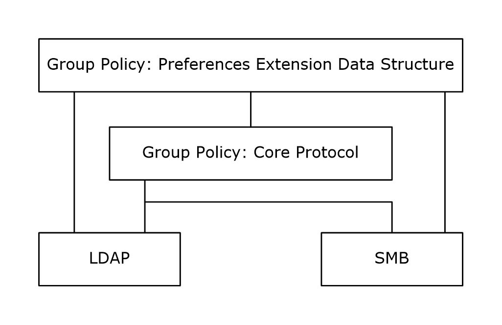

# [MS-GPPREF]: Group Policy: Preferences Extension Data Structure

Table of Contents

1 Introduction

- [1 Introduction](#Section_1)
  - [1.1 Glossary](#Section_1.1)
  - [1.2 References](#Section_1.2)
    - [1.2.1 Normative References](#Section_1.2.1)
    - [1.2.2 Informative References](#Section_1.2.2)
  - [1.3 Overview](#Section_1.3)
    - [1.3.1 Preferences Encoding Overview](#Section_1.3.1)
  - [1.4 Relationship to Other Protocols](#Section_1.4)
  - [1.5 Prerequisites/Preconditions](#Section_1.5)
  - [1.6 Applicability Statement](#Section_1.6)
  - [1.7 Versioning and Capability Negotiation](#Section_1.7)
  - [1.8 Vendor-Extensible Fields](#Section_1.8)
  - [1.9 Standards Assignments](#Section_1.9)

2 Messages

- [2 Messages](#Section_2)
  - [2.1 Transport](#Section_2.1)
  - [2.2 Message Syntax](#Section_2.2)
    - [2.2.1 Preferences Policy Message Syntax](#Section_2.2.1)
      - [2.2.1.1 Preferences Policy File Format](#Section_2.2.1.1)
        - [2.2.1.1.1 Common XML Schema](#Section_2.2.1.1.1)
        - [2.2.1.1.2 Outer and Inner Element Names and CLSIDs](#Section_2.2.1.1.2)
        - [2.2.1.1.3 Common XML Attributes](#Section_2.2.1.1.3)
        - [2.2.1.1.4 Password Encryption](#Section_2.2.1.1.4)
        - [2.2.1.1.5 Expanding Environment Variables](#Section_2.2.1.1.5)
      - [2.2.1.2 DataSources](#Section_2.2.1.2)
        - [2.2.1.2.1 Element-Specific Attributes](#Section_2.2.1.2.1)
        - [2.2.1.2.2 DataSources Schema](#Section_2.2.1.2.2)
      - [2.2.1.3 Devices](#Section_2.2.1.3)
        - [2.2.1.3.1 Element-Specific Attributes](#Section_2.2.1.3.1)
        - [2.2.1.3.2 Devices Schema](#Section_2.2.1.3.2)
      - [2.2.1.4 Drives](#Section_2.2.1.4)
        - [2.2.1.4.1 Element-Specific Attributes](#Section_2.2.1.4.1)
        - [2.2.1.4.2 Drives Schema](#Section_2.2.1.4.2)
      - [2.2.1.5 EnvironmentVariables](#Section_2.2.1.5)
        - [2.2.1.5.1 Element-Specific Attributes](#Section_2.2.1.5.1)
        - [2.2.1.5.2 EnvironmentVariables Schema](#Section_2.2.1.5.2)
      - [2.2.1.6 Files](#Section_2.2.1.6)
        - [2.2.1.6.1 Element-Specific Attributes](#Section_2.2.1.6.1)
        - [2.2.1.6.2 Files Schema](#Section_2.2.1.6.2)
      - [2.2.1.7 FolderOptions](#Section_2.2.1.7)
        - [2.2.1.7.1 GlobalFolderOptions element](#Section_2.2.1.7.1)
        - [2.2.1.7.2 GlobalFolderOptionsVista element](#Section_2.2.1.7.2)
        - [2.2.1.7.3 FileType element](#Section_2.2.1.7.3)
        - [2.2.1.7.4 OpenWith element](#Section_2.2.1.7.4)
        - [2.2.1.7.5 FolderOptions Schema](#Section_2.2.1.7.5)
      - [2.2.1.8 Folders](#Section_2.2.1.8)
        - [2.2.1.8.1 Element-Specific Attributes](#Section_2.2.1.8.1)
        - [2.2.1.8.2 Folders Schema](#Section_2.2.1.8.2)
      - [2.2.1.9 IniFiles](#Section_2.2.1.9)
        - [2.2.1.9.1 Element-Specific Attributes](#Section_2.2.1.9.1)
        - [2.2.1.9.2 IniFiles Schema](#Section_2.2.1.9.2)
      - [2.2.1.10 InternetSettings](#Section_2.2.1.10)
        - [2.2.1.10.1 Internet Settings (Internet Explorer 5 and 6)](#Section_2.2.1.10.1)
        - [2.2.1.10.2 Internet Explorer 7 Registry Keys](#Section_2.2.1.10.2)
        - [2.2.1.10.3 Internet Explorer 8 and Internet Explorer 9 Registry Keys](#Section_2.2.1.10.3)
        - [2.2.1.10.4 Internet Explorer 10 and Internet Explorer 11 Registry Keys](#Section_2.2.1.10.4)
        - [2.2.1.10.5 InternetSettings Schema](#Section_2.2.1.10.5)
      - [2.2.1.11 Local Users and Groups](#Section_2.2.1.11)
        - [2.2.1.11.1 Group Inner Element](#Section_2.2.1.11.1)
        - [2.2.1.11.2 User Inner Element](#Section_2.2.1.11.2)
        - [2.2.1.11.3 Groups Schema](#Section_2.2.1.11.3)
      - [2.2.1.12 NetworkOptions](#Section_2.2.1.12)
        - [2.2.1.12.1 DUN Element](#Section_2.2.1.12.1)
        - [2.2.1.12.2 VPN Element](#Section_2.2.1.12.2)
        - [2.2.1.12.3 NetworkOptions Schema](#Section_2.2.1.12.3)
      - [2.2.1.13 NetworkShare](#Section_2.2.1.13)
        - [2.2.1.13.1 Element-Specific Attributes](#Section_2.2.1.13.1)
        - [2.2.1.13.2 NetworkShareSettings Schema](#Section_2.2.1.13.2)
      - [2.2.1.14 PowerOptions](#Section_2.2.1.14)
        - [2.2.1.14.1 GlobalPowerOptions element](#Section_2.2.1.14.1)
        - [2.2.1.14.2 PowerScheme element](#Section_2.2.1.14.2)
        - [2.2.1.14.3 GlobalPowerOptionsV2 Element](#Section_2.2.1.14.3)
        - [2.2.1.14.4 PowerOptions Schema](#Section_2.2.1.14.4)
      - [2.2.1.15 Printers](#Section_2.2.1.15)
        - [2.2.1.15.1 LocalPrinter element](#Section_2.2.1.15.1)
        - [2.2.1.15.2 SharedPrinter Element](#Section_2.2.1.15.2)
        - [2.2.1.15.3 PortPrinter element](#Section_2.2.1.15.3)
        - [2.2.1.15.4 Printers Schema](#Section_2.2.1.15.4)
      - [2.2.1.16 Regional Options](#Section_2.2.1.16)
        - [2.2.1.16.1 Element-Specific Attributes](#Section_2.2.1.16.1)
        - [2.2.1.16.2 Regional Schema](#Section_2.2.1.16.2)
      - [2.2.1.17 Registry](#Section_2.2.1.17)
        - [2.2.1.17.1 Element-Specific Attributes](#Section_2.2.1.17.1)
        - [2.2.1.17.2 RegistrySettings Schema](#Section_2.2.1.17.2)
      - [2.2.1.18 Scheduled Tasks](#Section_2.2.1.18)
        - [2.2.1.18.1 Task Inner Element](#Section_2.2.1.18.1)
        - [2.2.1.18.2 ImmediateTask Inner Element](#Section_2.2.1.18.2)
        - [2.2.1.18.3 TaskV2 Inner Element](#Section_2.2.1.18.3)
        - [2.2.1.18.4 ImmediateTaskV2 Inner Element](#Section_2.2.1.18.4)
        - [2.2.1.18.5 ScheduledTasks Schema](#Section_2.2.1.18.5)
      - [2.2.1.19 Services](#Section_2.2.1.19)
        - [2.2.1.19.1 Element-Specific Attributes](#Section_2.2.1.19.1)
        - [2.2.1.19.2 NTServices Schema](#Section_2.2.1.19.2)
      - [2.2.1.20 Shortcuts](#Section_2.2.1.20)
        - [2.2.1.20.1 Element-Specific Attributes](#Section_2.2.1.20.1)
        - [2.2.1.20.2 Shortcuts Schema](#Section_2.2.1.20.2)
      - [2.2.1.21 Start Menu](#Section_2.2.1.21)
        - [2.2.1.21.1 StartMenu Inner Element](#Section_2.2.1.21.1)
        - [2.2.1.21.2 StartMenuVista Inner Element](#Section_2.2.1.21.2)
        - [2.2.1.21.3 Combined StartMenu and StartMenuVista Attribute Values](#Section_2.2.1.21.3)
        - [2.2.1.21.4 StartMenuTaskbar Schema](#Section_2.2.1.21.4)
      - [2.2.1.22 Targeting](#Section_2.2.1.22)
      - [2.2.1.23 Applications](#Section_2.2.1.23)
        - [2.2.1.23.1 Applications Schema](#Section_2.2.1.23.1)
    - [2.2.2 Policy Administration Message Syntax](#Section_2.2.2)
  - [2.3 Directory Service Schema Elements](#Section_2.3)

3 Protocol Details

- [3 Protocol Details](#Section_3)
  - [3.1 Administrative Add-in Details](#Section_3.1)
    - [3.1.1 Abstract Data Model](#Section_3.1.1)
    - [3.1.2 Timers](#Section_3.1.2)
    - [3.1.3 Initialization](#Section_3.1.3)
    - [3.1.4 Higher-Layer Triggered Events](#Section_3.1.4)
    - [3.1.5 Message Processing Events and Sequencing Rules](#Section_3.1.5)
      - [3.1.5.1 Policy Administration Update Message Sequencing](#Section_3.1.5.1)
      - [3.1.5.2 Policy Administration Delete Message Sequencing](#Section_3.1.5.2)
      - [3.1.5.3 Policy Administration Load Message Sequencing](#Section_3.1.5.3)
    - [3.1.6 Timer Events](#Section_3.1.6)
    - [3.1.7 Other Local Events](#Section_3.1.7)
  - [3.2 Client Add-in Details](#Section_3.2)
    - [3.2.1 Abstract Data Model](#Section_3.2.1)
      - [3.2.1.1 Preferences Setting State](#Section_3.2.1.1)
    - [3.2.2 Timers](#Section_3.2.2)
    - [3.2.3 Initialization](#Section_3.2.3)
    - [3.2.4 Higher-Layer Triggered Events](#Section_3.2.4)
      - [3.2.4.1 Process Group Policy](#Section_3.2.4.1)
    - [3.2.5 Message Processing Events and Sequencing Rules](#Section_3.2.5)
      - [3.2.5.1 Preferences Policy Message Sequencing](#Section_3.2.5.1)
        - [3.2.5.1.1 Deleted GPO List Processing](#Section_3.2.5.1.1)
        - [3.2.5.1.2 New or Changed GPO List Processing](#Section_3.2.5.1.2)
    - [3.2.6 Timer Events](#Section_3.2.6)
    - [3.2.7 Other Local Events](#Section_3.2.7)

4 Protocol Examples

- [4 Protocol Examples](#Section_4)
  - [4.1 Preferences Policy Application Message](#Section_4.1)
  - [4.2 Protocol Samples](#Section_4.2)
    - [4.2.1 DataSources XML Example](#Section_4.2.1)
    - [4.2.2 Devices XML Example](#Section_4.2.2)
    - [4.2.3 Mapped Drives XML Example](#Section_4.2.3)
    - [4.2.4 EnvironmentVariables XML Example](#Section_4.2.4)
    - [4.2.5 Files XML Example](#Section_4.2.5)
    - [4.2.6 FolderOptions XML Example](#Section_4.2.6)
    - [4.2.7 Folders XML Example](#Section_4.2.7)
    - [4.2.8 IniFile XML Example](#Section_4.2.8)
    - [4.2.9 InternetSettings XML Example](#Section_4.2.9)
    - [4.2.10 Local Users and Groups Example](#Section_4.2.10)
    - [4.2.11 NetworkOptions XML Example](#Section_4.2.11)
    - [4.2.12 NetworkShareSettings XML Example](#Section_4.2.12)
    - [4.2.13 PowerOptions XML Example](#Section_4.2.13)
    - [4.2.14 Printers XML Example](#Section_4.2.14)
    - [4.2.15 Regional Options XML Example](#Section_4.2.15)
    - [4.2.16 RegistrySettings XML Example](#Section_4.2.16)
    - [4.2.17 ScheduledTasks XML Example](#Section_4.2.17)
    - [4.2.18 NTServices XML Example](#Section_4.2.18)
    - [4.2.19 Shortcuts XML Example](#Section_4.2.19)
    - [4.2.20 StartMenu XML Example](#Section_4.2.20)
    - [4.2.21 Targeting Sample](#Section_4.2.21)
    - [4.2.22 Applications XML Sample](#Section_4.2.22)

5 Security

- [5 Security](#Section_5)
  - [5.1 Security Considerations for Implementers](#Section_5.1)
  - [5.2 Index of Security Parameters](#Section_5.2)

6 Appendix A: Product Behavior

- [6 Appendix A: Product Behavior](#Section_6)

7 Change Tracking

- [7 Change Tracking](#Section_7)

For the legal notice and IP terms, see [LEGAL.md](../LEGAL.md).
Last updated: 4/23/2024.
See [Revision History](#revision-history) for full version history.

# 1 Introduction

This document specifies the Group Policy: Preferences Extension protocol, which provides a mechanism for an administrator to manage and deploy [**preferences**](#gt_preference).

Sections 1.5, 1.8, 1.9, 2, and 3 of this specification are normative. All other sections and examples in this specification are informative.

## 1.1 Glossary

This document uses the following terms:

**Active Directory**: The Windows implementation of a general-purpose directory service, which uses LDAP as its primary access protocol. [**Active Directory**](#gt_active-directory) stores information about a variety of objects in the network such as user accounts, computer accounts, groups, and all related credential information used by Kerberos [MS-KILE](../MS-KILE/MS-KILE.md). [**Active Directory**](#gt_active-directory) is either deployed as Active Directory Domain Services (AD DS) or Active Directory Lightweight Directory Services (AD LDS), which are both described in [MS-ADOD](../MS-ADOD/MS-ADOD.md): Active Directory Protocols Overview.

**Challenge-Handshake Authentication Protocol (CHAP)**: A protocol for user authentication to a remote resource. For more information, see [[RFC1994]](https://go.microsoft.com/fwlink/?LinkId=90305) and [[RFC2759]](https://go.microsoft.com/fwlink/?LinkId=90379).

**client-side extension GUID (CSE GUID)**: A [**GUID**](#gt_globally-unique-identifier-guid) that enables a specific client-side extension on the Group Policy client to be associated with policy data that is stored in the logical and physical components of a [**Group Policy Object (GPO)**](#gt_group-policy-object-gpo) on the Group Policy server, for that particular extension.

**computer-scoped Group Policy Object path**: A scoped [**Group Policy Object (GPO) path**](#gt_group-policy-object-gpo-path) that ends in "\Machine".

**curly braced GUID string**: The string representation of a 128-bit globally unique identifier ([**GUID**](#gt_globally-unique-identifier-guid)) using the form {XXXXXXXX-XXXX-XXXX-XXXX-XXXXXXXXXXXX}, where X denotes a hexadecimal digit. The string representation between the enclosing braces is the standard representation of a GUID as described in [[RFC4122]](https://go.microsoft.com/fwlink/?LinkId=90460) section 3. Unlike a GUIDString, a curly braced GUID string includes enclosing braces.

**dial-up network (DUN) connection**: A mechanism consisting of hardware and software that allows computers at remote locations to connect and share resources on a network. Typically, a [**DUN connection**](#gt_2dc959cc-035d-49fb-9399-9a607284757f) uses a telephone connection with modems to provide the communications channel.

**domain**: A set of users and computers sharing a common namespace and management infrastructure. At least one computer member of the set has to act as a domain controller (DC) and host a member list that identifies all members of the domain, as well as optionally hosting the [**Active Directory**](#gt_active-directory) service. The domain controller provides authentication of members, creating a unit of trust for its members. Each domain has an identifier that is shared among its members. For more information, see [MS-AUTHSOD](../MS-AUTHSOD/MS-AUTHSOD.md) section 1.1.1.5 and [MS-ADTS](../MS-ADTS/MS-ADTS.md).

**environment variable**: A set of string name/value pairs that are used to abstract host-specific parameters, such as the location of the operating system or installed binaries.

**Extensible Authentication Protocol (EAP)**: A framework for authentication that is used to provide a pluggable model for adding authentication protocols for use in network access authentication, as specified in [[RFC3748]](https://go.microsoft.com/fwlink/?LinkId=90444).

**fully qualified domain name (FQDN)**: An unambiguous domain name that gives an absolute location in the Domain Name System's (DNS) hierarchy tree, as defined in [[RFC1035]](https://go.microsoft.com/fwlink/?LinkId=90264) section 3.1 and [[RFC2181]](https://go.microsoft.com/fwlink/?LinkId=127732) section 11.

**globally unique identifier (GUID)**: A term used interchangeably with universally unique identifier (UUID) in Microsoft protocol technical documents (TDs). Interchanging the usage of these terms does not imply or require a specific algorithm or mechanism to generate the value. Specifically, the use of this term does not imply or require that the algorithms described in [RFC4122] or [[C706]](https://go.microsoft.com/fwlink/?LinkId=89824) must be used for generating the [**GUID**](#gt_globally-unique-identifier-guid). See also universally unique identifier (UUID).

**group object**: A database object that represents a collection of user and group objects and has a [**security identifier (SID)**](#gt_security-identifier-sid) value.

**Group Policy Object (GPO)**: A collection of administrator-defined specifications of the policy settings that can be applied to groups of computers in a domain. Each GPO includes two elements: an object that resides in the [**Active Directory**](#gt_active-directory) for the domain, and a corresponding file system subdirectory that resides on the sysvol DFS share of the Group Policy server for the domain.

**Group Policy Object (GPO) path**: A [**domain**](#gt_domain)-based Distributed File System (DFS) path for a directory on the server that is accessible through the DFS/[**SMB**](#gt_server-message-block-smb) protocols. This path will always be a Universal Naming Convention (UNC) path of the form: "\\<dns domain name>\sysvol\<dns domain name>\policies\<gpo guid>", where <dns domain name> is the DNS domain name of the [**domain**](#gt_domain) and <gpo guid> is a Group Policy Object (GPO) GUID.

**Group Policy server**: A server holding a database of [**Group Policy Objects (GPOs)**](#gt_group-policy-object-gpo) that can be retrieved by other machines. The [**Group Policy server**](#gt_group-policy-server) must be a domain controller (DC).

**policy setting**: A statement of the possible behaviors of an element of a domain member computer's behavior that can be configured by an administrator.

**preference**: A value for one or more Group Policy settings that is not stored in a standard location in the [**registry**](#gt_registry). Instead, it is stored in another part of the [**registry**](#gt_registry) or in administrative (.adm) files.

**registry**: A local system-defined database in which applications and system components store and retrieve configuration data. It is a hierarchical data store with lightly typed elements that are logically stored in tree format. Applications use the registry API to retrieve, modify, or delete registry data. The data stored in the registry varies according to the version of the operating system.

**scoped Group Policy Object (GPO) path**: A [**Group Policy Object (GPO)**](#gt_group-policy-object-gpo) path appended with "\User" for the user policy mode of policy application, and "\Machine" for the computer policy mode.

**security identifier (SID)**: An identifier for security principals that is used to identify an account or a group. Conceptually, the [**SID**](#gt_security-identifier-sid) is composed of an account authority portion (typically a [**domain**](#gt_domain)) and a smaller integer representing an identity relative to the account authority, termed the relative identifier (RID). The [**SID**](#gt_security-identifier-sid) format is specified in [MS-DTYP](../MS-DTYP/MS-DTYP.md) section 2.4.2; a string representation of [**SIDs**](#gt_security-identifier-sid) is specified in [MS-DTYP] section 2.4.2 and [MS-AZOD](../MS-AZOD/MS-AZOD.md) section 1.1.1.2.

**Server Message Block (SMB)**: A protocol that is used to request file and print services from server systems over a network. The SMB protocol extends the CIFS protocol with additional security, file, and disk management support. For more information, see [[CIFS]](https://go.microsoft.com/fwlink/?linkid=2109334) and [MS-SMB](../MS-SMB/MS-SMB.md).

**tool extension GUID or administrative plug-in GUID**: A GUID defined separately for each of the user policy settings and computer policy settings that associates a specific administrative tool plug-in with a set of policy settings that can be stored in a [**Group Policy Object (GPO)**](#gt_group-policy-object-gpo).

**user object**: An object of class user. A user object is a security principal object; the principal is a person or service entity running on the computer. The shared secret allows the person or service entity to authenticate itself, as described in ([MS-AUTHSOD] section 1.1.1.1).

**user-scoped Group Policy Object path**: A scoped [**Group Policy Object (GPO)**](#gt_group-policy-object-gpo) path that ends in "\User".

**virtual private network (VPN)**: A network that provides secure access to a private network over public infrastructure.

**virtual private network (VPN) connection**: Provides a communications path from one computer to a dedicated computer network by using another computer network (such as the Internet) to provide the transport. One typical application of a VPN is to provide secure access to a corporate computing network for an employee at a remote location.

**VPN connection**: A connection that transfers private data across the public network by using the routing infrastructure of the Internet.

**MAY, SHOULD, MUST, SHOULD NOT, MUST NOT:** These terms (in all caps) are used as defined in [[RFC2119]](https://go.microsoft.com/fwlink/?LinkId=90317). All statements of optional behavior use either MAY, SHOULD, or SHOULD NOT.

## 1.2 References

Links to a document in the Microsoft Open Specifications library point to the correct section in the most recently published version of the referenced document. However, because individual documents in the library are not updated at the same time, the section numbers in the documents may not match. You can confirm the correct section numbering by checking the [Errata](https://go.microsoft.com/fwlink/?linkid=850906).

### 1.2.1 Normative References

We conduct frequent surveys of the normative references to assure their continued availability. If you have any issue with finding a normative reference, please contact [dochelp@microsoft.com](mailto:dochelp@microsoft.com). We will assist you in finding the relevant information.

[MS-ADA1] Microsoft Corporation, "[Active Directory Schema Attributes A-L](../MS-ADA1/MS-ADA1.md)".

[MS-ADA2] Microsoft Corporation, "[Active Directory Schema Attributes M](../MS-ADA2/MS-ADA2.md)".

[MS-ADA3] Microsoft Corporation, "[Active Directory Schema Attributes N-Z](../MS-ADA3/MS-ADA3.md)".

[MS-ADLS] Microsoft Corporation, "[Active Directory Lightweight Directory Services Schema](#Section_2.2.1.19)".

[MS-ADSC] Microsoft Corporation, "[Active Directory Schema Classes](../MS-ADSC/MS-ADSC.md)".

[MS-ADTS] Microsoft Corporation, "[Active Directory Technical Specification](../MS-ADTS/MS-ADTS.md)".

[MS-GPOL] Microsoft Corporation, "[Group Policy: Core Protocol](../MS-GPOL/MS-GPOL.md)".

[MS-SMB2] Microsoft Corporation, "[Server Message Block (SMB) Protocol Versions 2 and 3](../MS-SMB2/MS-SMB2.md)".

[MS-SMB] Microsoft Corporation, "[Server Message Block (SMB) Protocol](../MS-SMB/MS-SMB.md)".

[RFC1179] McLaughlin III, L., "Line Printer Daemon Protocol", RFC 1179, August 1990, [https://www.rfc-editor.org/info/rfc1179](https://go.microsoft.com/fwlink/?LinkId=90269)

[RFC2119] Bradner, S., "Key words for use in RFCs to Indicate Requirement Levels", BCP 14, RFC 2119, March 1997, [https://www.rfc-editor.org/info/rfc2119](https://go.microsoft.com/fwlink/?LinkId=90317)

### 1.2.2 Informative References

[MS-RRP] Microsoft Corporation, "[Windows Remote Registry Protocol](#Section_2.2.1.17)".

[MSDN-ACCESSDRIVER] Microsoft Corporation, "Setting Options Programmatically for the Access Driver", [https://learn.microsoft.com/en-us/sql/odbc/microsoft/setting-options-programmatically-for-the-access-driver?view=sql-server-ver16](https://go.microsoft.com/fwlink/?LinkId=102077)

[MSDN-APPSNAPIN] Microsoft Corporation, "Extending the Applications Snap-in", [https://learn.microsoft.com/en-us/previous-versions/windows/desktop/policy/extending-the-application-preference-item](https://go.microsoft.com/fwlink/?LinkId=208616)

[MSDN-ENVMTVAR] Microsoft Corporation, "Environment Variables", September 2007, [http://msdn.microsoft.com/en-us/library/ms682653](https://go.microsoft.com/fwlink/?LinkID=102769)

[MSDN-EXPLORER] Microsoft Corporation, "Common Explorer Concepts", [http://msdn.microsoft.com/en-us/library/Aa969312.aspx](https://go.microsoft.com/fwlink/?LinkId=112231)

[MSDN-FILEMGMT] Microsoft Corporation, "File Management Functions", September 2007, [http://msdn.microsoft.com/en-us/library/aa364232.aspx](https://go.microsoft.com/fwlink/?LinkId=102772)

[MSDN-FILETYPES] Microsoft Corporation, "File Types", [http://msdn.microsoft.com/en-us/library/aa969371.aspx](https://go.microsoft.com/fwlink/?LinkId=112232)

[MSDN-GetProfString] Microsoft Corporation, "GetProfileString function", [http://msdn.microsoft.com/en-us/library/ms724366.aspx](https://go.microsoft.com/fwlink/?LinkId=112230)

[MSDN-INF] Microsoft Corporation, "About INF Files", [http://msdn.microsoft.com/en-us/library/aa376858.aspx](https://go.microsoft.com/fwlink/?LinkId=90025)

[MSDN-LANGSUPPORT] Microsoft Corporation, "National Language Support", [http://msdn.microsoft.com/en-us/library/dd319078.aspx](https://go.microsoft.com/fwlink/?LinkId=112233)

[MSDN-LDAPDLCT] Microsoft Corporation, "LDAP Dialect", September 2007, [http://msdn.microsoft.com/en-us/library/aa746385.aspx](https://go.microsoft.com/fwlink/?LinkId=102773)

[MSDN-NETLCLGRPADD] Microsoft Corporation, "NetLocalGroupAdd function", September 2007, [http://msdn.microsoft.com/en-us/library/aa370434.aspx](https://go.microsoft.com/fwlink/?LinkId=102774)

[MSDN-NETUSERADD] Microsoft Corporation, "NetUserAdd function", September 2007, [http://msdn.microsoft.com/en-us/library/aa370649.aspx](https://go.microsoft.com/fwlink/?LinkId=102777)

[MSDN-ODBC] Microsoft Corporation, "ODBC Programmer's Reference", [http://msdn.microsoft.com/en-us/library/ms714177.aspx](https://go.microsoft.com/fwlink/?LinkId=101728)

[MSDN-POWER] Microsoft Corporation, "Configure power settings overview", December 2020, [https://learn.microsoft.com/en-us/windows-hardware/customize/power-settings/configure-power-settings](https://go.microsoft.com/fwlink/?LinkId=102780)

[MSDN-PRINT] Microsoft Corporation, "Introduction to Printing", [https://learn.microsoft.com/en-us/windows-hardware/drivers/print/introduction-to-printing](https://go.microsoft.com/fwlink/?LinkId=102783)

[MSDN-PROPSHEETEXTS] Microsoft Corporation, "Property Sheet Extensions", [http://msdn.microsoft.com/en-us/library/ms692751(v=VS.85).aspx](https://go.microsoft.com/fwlink/?LinkId=208617)

[MSDN-RAS2] Microsoft Corporation, "RASDIALPARAMS structure", [http://msdn.microsoft.com/en-us/library/aa377238.aspx](https://go.microsoft.com/fwlink/?LinkId=90072)

[MSDN-RAS] Microsoft Corporation, "RASENTRY structure", [http://msdn.microsoft.com/en-us/library/aa377274.aspx](https://go.microsoft.com/fwlink/?LinkId=90071)

[MSDN-SECZONES] Microsoft Corporation, "About URL Security Zones", [http://msdn.microsoft.com/en-us/library/ms537183.aspx](https://go.microsoft.com/fwlink/?LinkId=90660)

[MSDN-SetLocaleInfo] Microsoft Corporation, "SetLocaleInfo function", [http://msdn.microsoft.com/en-us/library/dd374049.aspx](https://go.microsoft.com/fwlink/?LinkId=112228)

[MSDN-SHELLLINKS] Microsoft Corporation, "Shell Links", [https://learn.microsoft.com/en-us/windows/win32/shell/links](https://go.microsoft.com/fwlink/?LinkId=104564)

[MSDN-TaskSchS] Microsoft Corporation, "Task Scheduler Schema", [http://msdn.microsoft.com/en-us/library/aa383609(VS.85).aspx](https://go.microsoft.com/fwlink/?LinkId=123740)

[MSDN-TASKS] Microsoft Corporation, "Tasks", September 2007, [http://msdn.microsoft.com/en-us/library/aa382589.aspx](https://go.microsoft.com/fwlink/?LinkId=102788)

[MSDN-VPN] Microsoft Corporation, "Virtual Private Network Connections", September 2007, [http://msdn.microsoft.com/en-us/library/aa382345.aspx](https://go.microsoft.com/fwlink/?LinkId=102791)

[MSDN-WININET1] Microsoft Corporation, "INTERNET_PER_CONN_OPTION_LIST structure", [http://msdn.microsoft.com/en-us/library/aa385146.aspx](https://go.microsoft.com/fwlink/?LinkId=90164)

[MSDN-WININET2] Microsoft Corporation, "INTERNET_PER_CONN_OPTION structure", [http://msdn.microsoft.com/en-us/library/aa385145.aspx](https://go.microsoft.com/fwlink/?LinkId=90165)

[MSDN-WINSVC] Microsoft Corporation, "Services", [http://msdn.microsoft.com/en-us/library/ms685141.aspx](https://go.microsoft.com/fwlink/?LinkId=90701)

[MSDN-WTSQRYSESSINFO] Microsoft Corporation, "WTSQuerySessionInformation function", [http://msdn.microsoft.com/en-us/library/aa383838.aspx](https://go.microsoft.com/fwlink/?LinkId=112229)

[MSFT-IEM] Microsoft Corporation, "Internet Explorer Maintenance Extension Technical Reference", March 2003, [http://technet2.microsoft.com/WindowsServer/en/Library/7393c49d-238e-433d-9193-ffe4f64b1e0f1033.mspx](https://go.microsoft.com/fwlink/?LinkId=90186)

[MSFT-IESECZNREGENTRY] Microsoft Corporation, "Description of Internet Explorer Security Zones Registry Entries", May 2007, [http://support.microsoft.com/kb/182569](https://go.microsoft.com/fwlink/?LinkId=94582)

[MSFT-STARTMENU] Microsoft Corporation, "Customize Windows 10 Start and taskbar with Group Policy", August 2022, [https://learn.microsoft.com/en-us/windows/configuration/customize-windows-10-start-screens-by-using-group-policy](https://go.microsoft.com/fwlink/?LinkID=102794)

[MSWINREG] Microsoft Corporation, "Registry", [http://msdn.microsoft.com/en-us/library/ms724871.aspx](https://go.microsoft.com/fwlink/?LinkId=90221)

## 1.3 Overview

The Group Policy: Preferences Extension provides a mechanism for an administrator to manage and deploy [**preferences**](#gt_preference) that target client computers and network users. In this document, the term *preferences* refers to 20 types of preference settings that are applied as defined later. Although preferences settings are identical to the Group Policy mechanism in deploying [**policy settings**](#gt_policy-setting), because preference settings are not written as policy, they can be overwritten by the user as needed.

**Background**

The Group Policy: Core Protocol, as specified in [MS-GPOL](../MS-GPOL/MS-GPOL.md), allows clients to discover and retrieve policy settings created by [**domain**](#gt_domain) administrators. These settings are persisted within [**Group Policy Objects (GPOs)**](#gt_group-policy-object-gpo) that are assigned to policy target accounts in [**Active Directory**](#gt_active-directory). Policy target accounts are either computer accounts or user accounts in Active Directory. Each client uses the Lightweight Directory Access Protocol (LDAP) to determine which GPOs apply to it by consulting the Active Directory objects corresponding to both its computer account and the user accounts of any users logging on to the client computer.

On each client, each GPO is interpreted and acted upon by software components known as client add-in. The client add-in responsible for a given GPO is specified by using an attribute on the GPO. This attribute specifies a list of [**GUID**](#gt_globally-unique-identifier-guid) pairs. The first GUID of each pair is referred to as a [**client-side extension GUID (CSE GUID)**](#gt_client-side-extension-guid-cse-guid). The second GUID of each pair is referred to as a [**tool extension GUID**](#gt_88ad7745-bee6-47f7-ae98-6fac7c5ef330).

The Group Policy: Core Protocol uses this protocol's CSE GUID and tool extension GUID values to invoke this protocol only to access GPOs that require processing by this protocol.

For each GPO that applies to a client, the client consults the CSE GUIDs listed in the GPO to determine which client add-in on the client will handle the GPO. The client then invokes the client add-in to handle the GPO.

A client add-in uses the contents of the GPO to retrieve settings specific to its class in a manner specific to its class. After the client add-in retrieves the class-specific settings, it uses those settings to perform class-specific processing.

### 1.3.1 Preferences Encoding Overview

Group Policy: Preferences Extension settings are specified using an XML file, as defined in section [2.2.1](#Section_2.2.1). An administrator invokes extension-specific Group Policy administrative tool plug-ins on the administrator's machine and defines, maintains, and associates the extension-specific settings with a [**GPO**](#gt_group-policy-object-gpo). For each Group Policy: Preferences Extension, there is one plug-in. The Group Policy: Preferences Extension plug-ins on each client read the [**preferences**](#gt_preference) XML specified by applicable GPOs and apply the contents to its preferences configuration.

Clients can use either, or both, of the following modes for this protocol because they address different issues. The computer policy mode is used in scenarios where the policies need to be applied to a computer and applies to all the users who log on to the computer; the user policy mode applies policies to specific users who log on to the computer. Preferences also support a more granular selection than user or computer through the use of targeting criteria that can be applied to each extension.

**Computer Policy Mode**

An administrator invokes a Group Policy administrative tool on the administrator's machine to administer a GPO through the Group Policy: Core Protocol using the policy administration mode, as specified in [MS-GPOL](../MS-GPOL/MS-GPOL.md) section 2.2.8. Through the Group Policy: Core Protocol, the presence of the [**tool extension GUID**](#gt_88ad7745-bee6-47f7-ae98-6fac7c5ef330) for computer [**policy settings**](#gt_policy-setting) for the Group Policy: Preferences Extension is retrieved. That [**GUID**](#gt_globally-unique-identifier-guid) indicates that the GPO contains policy settings that are to be administered through the policy administration portion of the Group Policy: Preferences Extension.

- Encoding. The administrative tool invokes a plug-in specific to a Group Policy: Preferences Extension so that the administrator can administer the Group Policy: Preferences Extension settings. The act of administering and persisting the settings results in the storage and retrieval of metadata inside a GPO on a Group Policy server. This metadata describes configuration settings to be applied to a generic settings database (or [**registry**](#gt_registry)) on a client that is affected by the GPO. The administrator views the data and updates it to add a directive to run a command when the client computer starts.
- A client computer affected by that GPO starts (or is connected to the network after the client computer starts), and the client invokes the Group Policy: Core Protocol to retrieve policy settings from the Group Policy server. The events that launch policy processing are defined as part of the Group Policy: Core Protocol. As part of the processing of the Group Policy: Core Protocol, the Group Policy: Preferences Extension [**CSE GUID**](#gt_client-side-extension-guid-cse-guid) is read from this GPO, and this instructs the client to invoke a Group Policy: Preferences Extension plug-in component for the policy application.
- In processing the policy application portion of the Group Policy: Preferences Extension, the client parses the file of settings and then saves the settings in the generic settings database (or registry) on the local machine.
**User Policy Mode**

- This step is the same as step 1 for computer policy mode, except that a separate tool extension GUID for the Group Policy: Preferences Extension is used.
- This step is the same as step 2 for computer policy mode, except that it occurs when a user logs on (or when the computer connects to the network after the user logs on).
- In processing the policy application portion of the Group Policy: Preferences Extension, the client parses the file of settings and then saves the settings in a user-specific portion of the generic settings database (registry) on the local machine.

## 1.4 Relationship to Other Protocols

This protocol depends on Group Policy: Core Protocol (as specified in [MS-GPOL](../MS-GPOL/MS-GPOL.md)) to provide a list of applicable [**GPOs**](#gt_group-policy-object-gpo). It also depends on the [**Server Message Block (SMB)**](#gt_server-message-block-smb) Protocols (as specified in [MS-SMB](../MS-SMB/MS-SMB.md) and [MS-SMB2](../MS-SMB2/MS-SMB2.md)) for transmitting Group policy settings and instructions between the client and the [**Group Policy server**](#gt_group-policy-server). Version negotiation within the SMB Version 2 protocol (SMB2) can lead to use of an SMB Version 1 protocol connection instead of an SMB2 connection, as defined in [MS-SMB2] section 3.2.4.2. It depends on Lightweight Directory Access Protocol (LDAP) to retrieve additional information from Active Directory to facilitate settings targeting.

The relationship to other protocols diagram depicts how these protocols relate to one another.

Figure 1: Group Policy: Preferences Extension protocol relationship diagram

## 1.5 Prerequisites/Preconditions

The prerequisites for this protocol are the same as those for the Group Policy: Core Protocol specified in [MS-GPOL](../MS-GPOL/MS-GPOL.md).

In addition, a client requires an implementation that is capable of executing commands at start up and shut down (if computer policy mode is used) and at user log on and log off (if user policy mode is used). The command processor is specific to the client implementation but could include, for example, ".bat" or ".cmd" scripts.

## 1.6 Applicability Statement

Group Policy: Preferences Extension is only applicable within the Group Policy: Core Protocol framework. The Group Policy: Preferences Extension is used to express the required state of the client at the time that the client add-in executes. However, it is not recommended to express intentions that are sensitive in an information disclosure context, because the metadata that the protocol transmits is not encrypted. For example, an administrator is not to use this protocol to transmit a password that the client needs to access a resource, because that password is unencrypted during transmission and can be easily intercepted by an unauthorized user, thus compromising the resource. Within the Group Policy: Preferences Extension, sensitive information is encoded as applicable.

This protocol also applies only when many clients are required to receive the same settings. To configure individual clients with custom settings, use the Windows Remote Registry Protocol instead. For more information, see [MS-RRP](#Section_2.2.1.17).

## 1.7 Versioning and Capability Negotiation

None.

## 1.8 Vendor-Extensible Fields

Third-party developers can extend the Group Policy: Preferences Extension Applications administrative plug-in defined by the Applications Preference type in section [1.9](#Section_1.9). See [[MSDN-APPSNAPIN]](https://go.microsoft.com/fwlink/?LinkId=208616).

## 1.9 Standards Assignments

The Group Policy: Preferences Extension defines [**CSE GUID**](#gt_client-side-extension-guid-cse-guid) and [**tool extension GUID**](#gt_88ad7745-bee6-47f7-ae98-6fac7c5ef330) standards assignments, as specified in [MS-GPOL](../MS-GPOL/MS-GPOL.md) section 1.8. The following table lists the assignments.

| Preference type | CSE GUID | Tool extension GUID |
| --- | --- | --- |
| Applications | {F9C77450-3A41-477E-9310-9ACD617BD9E3} | {0DA274B5-EB93-47A7-AAFB-65BA532D3FE6} |
| Data Sources | {728EE579-943C-4519-9EF7-AB56765798ED} | {1612b55c-243c-48dd-a449-ffc097b19776} |
| Devices | {1A6364EB-776B-4120-ADE1-B63A406A76B5} | {1b767e9a-7be4-4d35-85c1-2e174a7ba951} |
| Drives | {5794DAFD-BE60-433f-88A2-1A31939AC01F} | {2EA1A81B-48E5-45E9-8BB7-A6E3AC170006} |
| Environment Variables | {0E28E245-9368-4853-AD84-6DA3BA35BB75} | {35141B6B-498A-4CC7-AD59-CEF93D89B2CE} |
| Files | {7150F9BF-48AD-4da4-A49C-29EF4A8369BA} | {3BAE7E51-E3F4-41D0-853D-9BB9FD47605F} |
| Folder Options | {A3F3E39B-5D83-4940-B954-28315B82F0A8} | {3BFAE46A-7F3A-467B-8CEA-6AA34DC71F53} |
| Folders | {6232C319-91AC-4931-9385-E70C2B099F0E} | {3EC4E9D3-714D-471F-88DC-4DD4471AAB47} |
| Ini Files | {74EE6C03-5363-4554-B161-627540339CAB} | {516FC620-5D34-4B08-8165-6A06B623EDEB} |
| Internet Settings | {E47248BA-94CC-49C4-BBB5-9EB7F05183D0} | {5C935941-A954-4F7C-B507-885941ECE5C4} |
| Local users and groups | {17D89FEC-5C44-4972-B12D-241CAEF74509} | {79F92669-4224-476c-9C5C-6EFB4D87DF4A} |
| Network Options | {3A0DBA37-F8B2-4356-83DE-3E90BD5C261F} | {949FB894-E883-42C6-88C1-29169720E8CA} |
| Network Shares | {6A4C88C6-C502-4f74-8F60-2CB23EDC24E2} | {BFCBBEB0-9DF4-4c0c-A728-434EA66A0373} |
| Power Options | {E62688F0-25FD-4c90-BFF5-F508B9D2E31F} | {9AD2BAFE-63B4-4883-A08C-C3C6196BCAFD} |
| Printers | {BC75B1ED-5833-4858-9BB8-CBF0B166DF9D} | {A8C42CEA-CDB8-4388-97F4-5831F933DA84} |
| Regional Options | {E5094040-C46C-4115-B030-04FB2E545B00} | {B9CCA4DE-E2B9-4CBD-BF7D-11B6EBFBDDF7} |
| Registry | {B087BE9D-ED37-454f-AF9C-04291E351182} | {BEE07A6A-EC9F-4659-B8C9-0B1937907C83} |
| Scheduled Tasks | {AADCED64-746C-4633-A97C-D61349046527} | {CAB54552-DEEA-4691-817E-ED4A4D1AFC72} |
| Services | {91FBB303-0CD5-4055-BF42-E512A681B325} | {CC5746A9-9B74-4be5-AE2E-64379C86E0E4} |
| Shortcuts | {C418DD9D-0D14-4efb-8FBF-CFE535C8FAC7} | {CEFFA6E2-E3BD-421B-852C-6F6A79A59BC1} |
| Start Menu | {E4F48E54-F38D-4884-BFB9-D4D2E5729C18} | {CF848D48-888D-4F45-B530-6A201E62A605} |

# 2 Messages

## 2.1 Transport

The Group Policy: Preferences Extension MUST transport messages (in the form of files) over the Group Policy Protocol over [**Server Message Block (SMB)**](#gt_server-message-block-smb). Version negotiation within the protocol can lead to use of an SMB Version 1 protocol connection instead of an SMB2 connection, as defined in [MS-SMB2](../MS-SMB2/MS-SMB2.md) section 3.2.4.2.

## 2.2 Message Syntax

The following sections specify the syntax for the following protocol elements:

- [**Preferences**](#gt_preference) XML files (as specified in section [2.2.1](#Section_2.2.1)).
Each protocol element is described as a message that corresponds one-to-one with a file transferred using the [MS-SMB2](../MS-SMB2/MS-SMB2.md) protocol. The protocol is driven through the exchange of these messages, as specified in section [3](#Section_1.3).

### 2.2.1 Preferences Policy Message Syntax

This protocol uses the [**Server Message Block (SMB)**](#gt_server-message-block-smb) transport, and through this transport, it copies the file that MUST be named "<gpo path>\Preferences\{preference-type specific}", where "<gpo path>" is a [**scoped Group Policy Object (GPO) path**](#gt_scoped-group-policy-object-gpo-path) given to the protocol by the Group Policy: Core Protocol, as specified in [MS-GPOL](../MS-GPOL/MS-GPOL.md) section 3.2.5.1.10, and "{preference-type specific}" is a path as defined in the following table.<1> The message is the file itself.

| Preference type | Path |
| --- | --- |
| Applications | Applications\Applications.xml |
| ControlPanel | ControlPanel\ControlPanel.xml<2> |
| DataSources | DataSources\DataSources.xml |
| Devices | Devices\Devices.xml |
| Drives | Drives\Drives.xml |
| EnvironmentVariables | EnvironmentVariables\EnvironmentVariables.xml |
| Files | Files\Files.xml |
| FolderOptions | FolderOptions\FolderOptions.xml |
| Folders | Folders\Folders.xml |
| IniFiles | IniFiles\IniFiles.xml |
| InternetSettings | InternetSettings\InternetSettings.xml |
| Local Users and Groups | Groups\Groups.xml |
| NetworkOptions | NetworkOptions\NetworkOptions.xml |
| NetworkShares | NetworkShares\NetworkShares.xml |
| PowerOptions | PowerOptions\PowerOptions.xml |
| Printers | Printers\Printers.xml |
| Regional Options | RegionalOptions\RegionalOptions.xml |
| Registry | Registry\Registry.xml |
| ScheduledTasks | ScheduledTasks\ScheduledTasks.xml |
| Services | Services\Services.xml |
| Shortcuts | Shortcuts\Shortcuts.xml |
| StartMenu | StartMenuTaskbar\StartMenuTaskbar.xml |

Section [2.2.1.1](#Section_2.2.1.1) lists characteristics common to all messages. Sections [2.2.1.2](#Section_2.2.1.2) through [2.2.1.22](#Section_2.2.1.22) describe the features unique to each message.

#### 2.2.1.1 Preferences Policy File Format

The contents of a Preferences Policy file MUST be an XML document.

An XML schema is defined for each Preferences Policy file. All schemas share a common structure: a single top-level outer element that MUST be an XML sequence of zero or more inner elements. Each inner element MUST define a **properties** attribute. Abstractly, an inner element represents a single instance of an element, such as an [**environment variable**](#gt_environment-variable) or a data source. The outer element is a container of inner elements. The abstract XML schema is in section [2.2.1.1.1](#Section_2.2.1.1.1).

##### 2.2.1.1.1 Common XML Schema

Common Schema

<?xml version="1.0" encoding="utf-8"?>

<xs:schema attributeFormDefault="unqualified" elementFormDefault="qualified" xmlns:xs="http://www.w3.org/2001/XMLSchema">

<xs:element name="outer-element">

<xs:complexType>

<xs:sequence>

<xs:element maxOccurs="unbounded" name="inner-element">

<xs:complexType>

<xs:sequence>

<xs:element name="Properties">

<xs:complexType>

<xs:sequence>

// zero or more schema-specific properties

</xs:sequence>

<xs:attribute name="action" type="xs:string" use="optional" />

// zero or more schema-specific attributes

</xs:complexType>

</xs:element>

<xs:element minOccurs="0" name="Filters">

</xs:element>

</xs:sequence>

<xs:attribute name="clsid"

type="xs:string" use="required" />

<xs:attribute name="image"

type="xs:unsignedByte" use="optional" />

<xs:attribute name="bypassErrors"

type="xs:boolean" use="optional" />

<xs:attribute name="userContext"

type="xs:boolean" use="optional" />

<xs:attribute name="removePolicy"

type="xs:boolean" use="optional" />

<xs:attribute name="desc" type="xs:string" use="optional" />

<xs:attribute name="changed" type="xs:string" use="optional" />

<xs:attribute name="uid" type="xs:string" use="required" />

<xs:attribute name="name" type="xs:string" use="required" />

<xs:attribute name="status" type="xs:string" use="optional" />

</xs:complexType>

</xs:element>

</xs:sequence>

<xs:attribute name="clsid" type="xs:string" use="required" />

<xs:attribute name="disabled" type="xs:unsignedByte" use="optional" />

</xs:complexType>

</xs:element>

</xs:schema>

##### 2.2.1.1.2 Outer and Inner Element Names and CLSIDs

The following table shows the outer and inner elements in each Preference Policy file schema and the applicable clsid values. The meaning of each element is described in the appropriate section for the protocol.

| Preference type | Outer element name and CLSID | Inner element names and CLSIDs |
| --- | --- | --- |
| Applications | Applications {16DB8EC4-EBFC-4958-98EE-712E9DD3A966} | Application {C8535E2E-148D-494d-8E9A-71FC46649B5E} |
| Control Panel | ComputerControlPanel (for computer policy) {C2DC0825-BA13-4f79-9C58-7BC6B5AE0DF2} UserControlPanel (for user policy) {8502BEE0-089D-46d3-95FF-53D824ABA49F} | There are no settings configurable for the Control Panel preference type, although when the administrative tool plug-in loads, it MAY check for the existence of a settings file. |
| Data Sources | DataSources {380F820F-F21B-41ac-A3CC-24D4F80F067B} | DataSource {5C209626-D820-4d69-8D50-1FACD6214488} |
| Devices | Devices {4DD26924-3F32-47aa-BF33-36D51BD1E54E} | Device {2E1C95D0-85FB-403a-A57C-A508854FB7C8} |
| Drives | Drives {8FDDCC1A-0C3C-43cd-A6B4-71A6DF20DA8C} | Drive {935D1B74-9CB8-4e3c-9914-7DD559B7A417} |
| Environment Variables | EnvironmentVariables {BF141A63-327B-438a-B9BF-2C188F13B7AD} | EnvironmentVariable {78570023-8373-4a19-BA80-2F150738EA19} |
| Files | Files {215B2E53-57CE-475c-80FE-9EEC14635851} | File {50BE44C8-567A-4ed1-B1D0-9234FE1F38AF} |
| Folder Options | FolderOptions {8AB5F5D7-F676-48ab-A94E-1186E120EFDC} | GlobalFolderOptions {E7632293-E3FC-4fee-9CD3-584C95D8D2A0} GlobalFolderOptionsVista {DBF1E3CD-4CA2-407c-BE84-5F67D3BE754D} OpenWith {100B9C09-906A-4f5a-9C41-1BD98B6CA022} FileType {580C4D3B-7A89-44d0-92D2-C105702C7BD0} |
| Folders | Folders {77CC39E7-3D16-4f8f-AF86-EC0BBEE2C861} | Folder {07DA02F5-F9CD-4397-A550-4AE21B6B4BD3} |
| IniFiles | IniFiles {694C651A-08F2-47fa-A427-34C4F62BA207} | Ini {EEFACE84-D3D8-4680-8D4B-BF103E759448} |
| Internet Settings | InternetSettings {B611EB48-F531-42cd-A1F6-5E0D015377BA} | Internet {8C0FE68F-E8A2-4f17-99E7-C6EFED208917} IE7 {683F7AD7-E782-4232-8A6D-F22431F12DB5} |
| Local Users and Groups | Groups {3125E937-EB16-4b4c-9934-544FC6D24D26} | User {DF5F1855-51E5-4d24-8B1A-D9BDE98BA1D1} Group {6D4A79E4-529C-4481-ABD0-F5BD7EA93BA7} |
| Network Options | NetworkOptions {09686AD1-5D80-48ee-A940-690A6DF02A90} | VPN {0532F359-3205-4d32-ADB7-9AEC6402BECF} DUN {9B0D030D-9396-49c1-8DEF-08B35B5BB79E} |
| Network Shares | NetworkShareSettings {520870D8-A6E7-47e8-A8D8-E6A4E76EAEC2} | NetShare {2888C5E7-94FC-4739-90AA-2C1536D68BC0} |
| Power Options | PowerOptions {7B0F9381-C3B8-4525-8167-87349B671D94} | GlobalPowerOptions {46D0DCC4-FC14-48fb-829B-854868C7DC16} GlobalPowerOptionsV2 {2B130A62-fc14-4572-91C3-5435C6A0C3FC} PowerScheme {DE828AFA-7E71-480e-8081-5447CBE87754} |
| Printers | Printers {1F577D12-3D1B-471e-A1B7-060317597B9C} | SharedPrinter {9A5E9697-9095-436d-A0EE-4D128FDFBCE5} PortPrinter {C3A739D2-4A44-401e-9F9D-88E5E77DFB3E} LocalPrinter {F08996D5-568B-45f5-BB7A-D3FB1E370B0A} |
| Regional Options | Regional {BDBA23C2-DE02-434e-8D89-13E53CB6710B} | RegionalOptions {C126A328-BECF-4acc-BA8D-C9C7F6B84E49} |
| Registry | RegistrySettings {A3CCFC41-DFDB-43a5-8D26-0FE8B954DA51} | Registry {9CD4B2F4-923D-47f5-A062-E897DD1DAD50} Collection {53B533F5-224C-47e3-B01B-CA3B3F3FF4BF} |
| Scheduled Tasks | ScheduledTasks {CC63F200-7309-4ba0-B154-A71CD118DBCC} | Task {2DEECB1C-261F-4e13-9B21-16FB83BC03BD} ImmediateTask {9F030D12-DDA3-4C26-8548-B7CE9151166A} TaskV2 {D8896631-B747-47a7-84A6-C155337F3BC8} ImmediateTaskV2 {9756B581-76EC-4169-9AFC-0CA8D43ADB5F} |
| Services | NTServices {2CFB484A-4E96-4b5d-A0B6-093D2F91E6AE} | NTService {AB6F0B67-341F-4e51-92F9-005FBFBA1A43} |
| Shortcuts | Shortcuts {872ECB34-B2EC-401b-A585-D32574AA90EE} | Shortcut {4F2F7C55-2790-433e-8127-0739D1CFA327} |
| Start Menu | StartMenuTaskbar {4C4059E4-2F6E-4630-9CB8-5D9A89252C3B} | StartMenu {F722CC65-E38A-496b-BA76-49EBF9571415} StartMenuVista {8B03851A-1210-4621-80B6-C334A4F1C941} |

##### 2.2.1.1.3 Common XML Attributes

Each schema defines various attributes for its outer element and inner element. Many attributes are common to all schemas and are defined here. The common attributes are included in the schema for each preference type, but they are not further defined there unless special handling is required.

For Boolean values, specified in the schema as xs:boolean and with a possible value of 0 or 1, the default will always be 0 if unspecified.

| Attribute name | Description |
| --- | --- |
| **clsid** | Uniquely identifies each preference type. The value MUST be as documented in each protocol sample XML. The clsid is a developer generated GUID value and MUST be present in the client xml for the client to process the protocol settings. The clsid values are documented in section [2.2.1.1.2](#Section_2.2.1.1.2). |
| **disabled** | (optional) Marks the entire preference type as disabled. If specified, values MUST be "1" for disabled or "0" for enabled. |
| **name** | Appears in the management console result view and is not used by the client-side protocol. |
| **status** | (optional) Appears in the management console result view and is not used by the client-side protocol. |
| **image** | An offset into a bitmap resource that is used to display an icon next to the item when loaded in the management console. This field is required only for the management console when the image changes and can either be set to 0 or it can be omitted to display a default folder icon. |
| **changed** | (optional) A date that the preference was last edited. This is for display purposes. The current format MUST be "YYYY-MM-DD HH:MM:SS" in Coordinated Universal Time (UTC). |
| **uid** | A unique GUID generated when the preferences element is created and used to uniquely identify the preference item for tracing and reporting. |
| **desc** | (optional) A user-specified value. The value is limited by the XML standard size for attribute values. Preferences currently limit this value to 32 kilobytes in character length. |
| **bypassErrors** | (optional) Continue processing in the event of an error. If specified, values MUST be 1 to bypass errors or 0 to stop processing this preference type. |
| **userContext** | (optional) Specifies whether processing occurs in the system context or the user context. If specified, values MUST be 1 for user context or 0 for system context. The default value changes on a per-policy basis but, in general, preferences that target users set userContext to 1, and preferences that target the computer or the Default user set userContext to 0. |
| **removePolicy** | (optional) Specifies whether the preferences are to be removed if the scope changes and the preference is no longer applicable. If specified, values MUST be 1 to remove the preferences or 0 to leave the preference settings. |

Attributes that are noted as not applicable for a given action will be ignored if specified.

The <Filters> element is defined in section [2.2.1.22](#Section_2.2.1.22).

##### 2.2.1.1.4 Password Encryption

All passwords are encrypted using a derived Advanced Encryption Standard (AES) key.<3>

The 32-byte AES key is as follows:

4e 99 06 e8 fc b6 6c c9 fa f4 93 10 62 0f fe e8

f4 96 e8 06 cc 05 79 90 20 9b 09 a4 33 b6 6c 1b

##### 2.2.1.1.5 Expanding Environment Variables

Certain attributes can contain a reference to the environment variables "%systemroot%" or "%systemdrive%".

Clients MUST attempt to expand "%systemroot%" and "%systemdrive%" environment variables. Clients MUST attempt to replace "%systemroot%" with the repository value on the client computer read from key "HKEY_LOCAL_MACHINE\SOFTWARE\Microsoft\Windows NT\CurrentVersion" value "SystemRoot" and MUST attempt to replace "%systemdrive%" with the first two characters of that same value.<4>

Expanding environment variables other than "%systemroot%" and "%systemdrive%" is not part of this protocol.

#### 2.2.1.2 DataSources

The <DataSource> inner element describes a single ODBC data source. An ODBC DataSource is a set of attributes that point to a database or data provider. Each ODBC driver implements a standard set of attributes and can provide additional attributes on a driver-specific basis. These are driver-specific settings and ODBC drivers are available for a number of platforms. For more information on ODBC, see [[MSDN-ODBC]](https://go.microsoft.com/fwlink/?LinkId=101728).

##### 2.2.1.2.1 Element-Specific Attributes

| Attribute name | Description |
| --- | --- |
| **action** | (optional) If specified, the value MUST be C, D, R, or U, corresponding to Create, Delete, Replace, and Update. If unspecified, the default value is U. **Create**: This action MUST be used to create a new data source name for the user or computer. If the data source exists, then the protocol MUST NOT create a new data source and MUST NOT return an error. **Delete**: This action MUST be used to remove a data source from the user or computer. If the data source does not exist, the protocol MUST NOT perform an action and MUST NOT return an error. **Replace**: This action MUST be used to delete and re-create a data source for the user or computer. The net result of the Replace action MUST overwrite all existing settings associated with the data source. If the data source does not exist, then the Replace action MUST create the new data source. **Update**: This action MUST be used to modify the settings of an existing data source name. This action differs from Replace in that it MUST only update settings that are defined within the preference item. All other settings MUST remain as previously configured. If the data source does not exist, then the Update action MUST create a new data source. |
| **userDSN** | (optional) Sets the visibility of the data source. User data sources are available to users receiving the preference item. System data sources are available to all the users of the computer (including Local System). If 1, the client MUST create a data source accessible only to the user that is logged on. If 0, the client MUST create a data source accessible to all users. |
| **dsn** | MUST be the name used to identify the data source. |
| **driver** | MUST be the name of the ODBC driver used to connect to the data provider. |
| **description** | (optional) MUST provide text used to describe the data source. This field accepts environment variables, which MUST be resolved prior to creating the data source. |
| **username** | (optional) MUST be the user name used to connect to the indicated data source. The username MUST be in NETBIOS format domain\username. |
| **cpassword** | (optional) MUST set the password used to connect to the indicated data source. The password is encrypted using an AES derived encryption key when the preference is created and decrypted in the client during client processing. |
| **Attributes** | (optional) Defines a set of Attribute elements that the client MUST pass to the ODBC driver. Attribute: (optional) Settings that are passed through to the ODBC driver. Each name/value pair is driver specific. An informative description of driver parameters can be found at [[MSDN-ACCESSDRIVER]](https://go.microsoft.com/fwlink/?LinkId=102077). **name:** A value that MUST be passed to the ODBC driver and which is driver specific. **value:** A value that MUST be passed to the ODBC driver and which is driver specific. |

##### 2.2.1.2.2 DataSources Schema

<?xml version="1.0" encoding="utf-8"?>

<xs:schema attributeFormDefault="unqualified" elementFormDefault="qualified" xmlns:xs="http://www.w3.org/2001/XMLSchema">

<xs:element name="DataSources">

<xs:complexType>

<xs:sequence>

<xs:element maxOccurs="unbounded" name="DataSource">

<xs:complexType>

<xs:sequence>

<xs:element name="Properties">

<xs:complexType>

<xs:sequence>

<xs:element name="Attributes">

<xs:complexType>

<xs:sequence>

<xs:element name="Attribute">

<xs:complexType>

<xs:attribute name="name"

type="xs:string" use="required" />

<xs:attribute name="value"

type="xs:string" use="required" />

</xs:complexType>

</xs:element>

</xs:sequence>

</xs:complexType>

</xs:element>

</xs:sequence>

<xs:attribute name="action"

type="xs:string" use="optional" />

<xs:attribute name="userDSN"

type="xs:boolean" use="optional" />

<xs:attribute name="dsn"

type="xs:string" use="required" />

<xs:attribute name="driver"

type="xs:string" use="required" />

<xs:attribute name="description"

type="xs:string" use="optional"/>

<xs:attribute name="username"

type="xs:string" use="optional"/>

<xs:attribute name="cpassword"

type="xs:string" use="optional" />

<xs:attribute name="disabled"

type="xs:boolean" use="optional" />

</xs:complexType>

</xs:element>

<xs:element minOccurs="0" name="Filters">

</xs:element>

</xs:sequence>

<xs:attribute name="clsid" type="xs:string" use="required" />

<xs:attribute name="name" type="xs:string" use="required" />

<xs:attribute name="image" type="xs:unsignedByte" use="optional" />

<xs:attribute name="bypassErrors" type="xs:boolean" use="optional" />

<xs:attribute name="userContext" type="xs:boolean" use="optional" />

<xs:attribute name="removePolicy" type="xs:boolean" use="optional" />

<xs:attribute name="desc" type="xs:string" use="optional" />

<xs:attribute name="changed" type="xs:string" use="optional" />

<xs:attribute name="uid" type="xs:string" use="required" />

</xs:complexType>

</xs:element>

</xs:sequence>

<xs:attribute name="clsid" type="xs:string" use="required" />

<xs:attribute name="disabled" type="xs:boolean" use="optional" />

</xs:complexType>

</xs:element>

</xs:schema>

#### 2.2.1.3 Devices

The <Device> inner element refers to a hardware device controlled by the client. The <Device> element enables and disables devices attached to the system.

##### 2.2.1.3.1 Element-Specific Attributes

| Attribute name | Description |
| --- | --- |
| **deviceAction** | Valid values are ENABLE to enable a device, or DISABLE to disable a device. A value MUST be specified. |
| **deviceClass** | (optional) Description of the class of device selected. Used only for reporting purposes and by the management console. |
| **deviceType** | (optional) Description of the specific device targeted. Used only for reporting purposes and by the management console. |
| **deviceClassGUID** | This MUST be the [**curly braced GUID string**](#gt_curly-braced-guid-string) assigned by the operating system to this class of devices. |
| **deviceTypeID** | This MUST be the string that targets this instance of the device. |

##### 2.2.1.3.2 Devices Schema

<?xml version="1.0" encoding="utf-8"?>

<xs:schema attributeFormDefault="unqualified" elementFormDefault="qualified" xmlns:xs="http://www.w3.org/2001/XMLSchema">

<xs:element name="Devices">

<xs:complexType>

<xs:sequence>

<xs:element name="Device">

<xs:complexType>

<xs:sequence>

<xs:element name="Properties">

<xs:complexType>

<xs:attribute name="deviceAction"

type="xs:string" use="required" />

<xs:attribute name="deviceClass"

type="xs:string" use="optional" />

<xs:attribute name="deviceType"

type="xs:string" use="optional" />

<xs:attribute name="deviceClassGUID"

type="xs:string" use="required" />

<xs:attribute name="deviceTypeID"

type="xs:string" use="required" />

<xs:attribute name="disabled"

type="xs:boolean" use="optional"/>

</xs:complexType>

</xs:element>

</xs:sequence>

<xs:attribute name="clsid" type="xs:string" use="required" />

<xs:attribute name="name" type="xs:string" use="required" />

<xs:attribute name="image" type="xs:unsignedByte" use="optional" />

<xs:attribute name="changed" type="xs:string" use="optional" />

<xs:attribute name="uid" type="xs:string" use="required" />

<xs:attribute name="desc" type="xs:string" use="optional" />

<xs:attribute name="bypassErrors" type="xs:boolean" use="optional" />

<xs:attribute name="userContext" type="xs:boolean" use="optional" />

<xs:attribute name="removePolicy" type="xs:boolean" use="optional" />

</xs:complexType>

</xs:element>

</xs:sequence>

<xs:attribute name="clsid" type="xs:string" use="required" />

<xs:attribute name="disabled" type="xs:boolean" use="optional" />

</xs:complexType>

</xs:element>

</xs:schema>

#### 2.2.1.4 Drives

The <Drive> inner element refers to a local mapping of a remote filesystem path to a drive letter on the client.

##### 2.2.1.4.1 Element-Specific Attributes

| Attribute name | Description |
| --- | --- |
| **action** | (optional) If specified, the value MUST be C, D, R, or U, corresponding to Create, Delete, Replace, and Update. If unspecified, the default value is U. **Create**: This action MUST be used to create a new mapped drive for users. If the drive map already exists, then the protocol MUST NOT create a new drive map and MUST NOT return an error. **Delete**: This action MUST be used to remove a mapped drive for users. The protocol MUST NOT perform an action if the drive map does not exist and MUST NOT return an error. **Replace**: This action MUST be used to delete and re-create mapped drives for users. The net result of the Replace action MUST overwrite all existing settings associated with the mapped drive. If the drive mapping does not exist, then the Replace action MUST create a new drive mapping. **Update**: This action MUST be used to modify the settings of an existing mapped drive. This action differs from Replace in that it MUST only update settings defined within the [**preference**](#gt_preference) item. All other settings MUST remain as configured on the mapped drive. If the drive mapping does not exist, then the Update action MUST create a new drive mapping. |
| **path** | To configure a new drive mapping or to re-create a drive mapping, the user MUST provide a fully qualified Universal Naming Convention (UNC) path for the network share (such as \\server\sharename, \\server\hiddenshare$, or \\server\sharename\foldername). To modify an existing drive mapping (identified by the drive letter), the user MUST leave this field blank. |
| **persistent** | If "0", then the client MUST discard the mapping when the user logs off. If "1", then the client MUST attempt to restore the mapping each time the user logs on. |
| **label** | (optional) An optional descriptive label for the mapping that the client MAY present to the user in an implementation-dependent manner. |
| **letter** | MUST specify a single drive letter on the client. Depending on the value of **useLetter**, this letter represents either a single drive letter or the start of a range of letters; see the table in this section for more details. |
| **userName** | (optional) MUST be set to the [**domain**](#gt_domain) user name used to connect to the drive path. The domain user name MUST be in the NETBIOS format domain\userName. |
| **cpassword** | (optional) MUST be set to the password used to connect to the drive path. The password is encrypted using an AES-derived encryption key when the preference is created, and decrypted in the client during client processing. |
| **useLetter** | If "1", then **letter** refers to a single drive letter on which the action operates. If "0", then **letter** is the alphabetic beginning of a range of drive letters to which the action applies. |
| **thisDrive** | (optional) Configures the visibility of the mapped drive. To make no change to the visibility of the mapped drive, this MUST be set to "NOCHANGE". This setting MUST NOT take precedence over the Hide/Show setting for **allDrives**. To prevent the drive from being displayed, this MUST be set to "HIDE". This MUST take precedence over the Hide/Show setting for **allDrives**. To allow this drive to be displayed, this MUST be set to "SHOW". This MUST take precedence over the Hide/Show setting for **allDrives**. The default is "NOCHANGE". |
| **allDrives** | (optional) Configures the visibility of all mapped and physical drives. The three available options are the same as those for the **thisDrive** attribute, but apply globally to all drives. The default is NOCHANGE. |

The intent of a particular instance of the schema is defined by the **action**, **useLetter**, and **letter** attributes, according to the following table. The client MUST ignore drive letters that map to local devices rather than to remote filesystem paths.

| action | useLetter | Effect |
| --- | --- | --- |
| D | 1 | Delete the mapped drive specified in **letter**. |
| D | 0 | Delete all mapped drives from the one specified in **letter** through Z:. |
| C, R or U | 1 | Apply the requested action to the mapped drive specified in **letter**. |
| C | 0 | Look for an unassigned drive letter, starting at the one specified in **letter** and proceeding alphabetically to Z:. If an unassigned letter is found, create a new mapping using that letter. Otherwise, do nothing. |
| R or U | 0 | Updates or replaces the first mapped drive, starting with whatever drive is specified in **letter**. |

##### 2.2.1.4.2 Drives Schema

<?xml version="1.0" encoding="utf-8"?>

<xs:schema attributeFormDefault="unqualified" elementFormDefault="qualified"

xmlns:xs="http://www.w3.org/2001/XMLSchema">

<xs:element name="Drives">

<xs:complexType>

<xs:sequence>

<xs:element name="Drive">

<xs:complexType>

<xs:sequence>

<xs:element name="Properties">

<xs:complexType>

<xs:attribute name="action"

type="xs:string" use="optional" />

<xs:attribute name="thisDrive"

type="xs:string" use="optional" />

<xs:attribute name="allDrives"

type="xs:string" use="optional" />

<xs:attribute name="userName"

type="xs:string" use="optional" />

<xs:attribute name="cpassword"

type="xs:string" use="optional" />

<xs:attribute name="path"

type="xs:string" use="required" />

<xs:attribute name="label"

type="xs:string" use="optional" />

<xs:attribute name="persistent"

type="xs:unsignedByte" use="required" />

<xs:attribute name="useLetter"

type="xs:unsignedByte" use="required" />

<xs:attribute name="letter"

type="xs:string" use="required" />

<xs:attribute name="disabled"

type="xs:unsignedByte" use="optional" />

</xs:complexType>

</xs:element>

</xs:sequence>

<xs:attribute name="clsid"

type="xs:string" use="required" />

<xs:attribute name="name"

type="xs:string" use="required" />

<xs:attribute name="image"

type="xs:unsignedByte" use="optional" />

<xs:attribute name="changed"

type="xs:string" use="optional" />

<xs:attribute name="uid"

type="xs:string" use="required" />

<xs:attribute name="desc"

type="xs:string" use="optional" />

<xs:attribute name="bypassErrors"

type="xs:boolean" use="optional" />

<xs:attribute name="userContext"

type="xs:boolean" use="optional" />

<xs:attribute name="removePolicy"

type="xs:boolean" use="optional" />

</xs:complexType>

</xs:element>

</xs:sequence>

<xs:attribute name="clsid"

type="xs:string"

use="required" />

<xs:attribute name="disabled"

type="xs:unsignedByte"

use="optional" />

</xs:complexType>

</xs:element>

</xs:schema>

#### 2.2.1.5 EnvironmentVariables

The <EnvironmentVariable> inner element refers to a single environment variable in the policy target's environment. The <EnvironmentVariables> element creates both system and user variables. For information on environment variables, see [[MSDN-ENVMTVAR]](https://go.microsoft.com/fwlink/?LinkID=102769).

##### 2.2.1.5.1 Element-Specific Attributes

| Attribute name | Description |
| --- | --- |
| **action** | (optional) If specified, the value MUST be C, D, R, or U, corresponding to Create, Delete, Replace, and Update. If unspecified, the default value is U. The value descriptions are: **Create:** This action MUST be used to create a new environment variable or to add a semicolon-delimited segment to the PATH<5> environment variable for computers or users. If the environment variable exists, then the protocol MUST NOT create a new environment variable and MUST NOT return an error. **Delete:** This action MUST be used to remove an environment variable or to delete a semicolon-delimited segment from the PATH environment variable from computers or users. The protocol MUST NOT perform an action if the environment variable does not exist and MUST NOT return an error. **Replace:** This action MUST be used to delete and re-create an environment variable. The net result of the Replace action MUST be to overwrite all existing settings associated with the environment variable. If the environment variable does not exist, then the Replace action MUST create a new environment variable. **Update:** This action MUST be used to modify settings of an existing environment variable. This action differs from Replace in that it MUST update only settings defined within the [**preference**](#gt_preference) item. All other settings MUST remain as configured on the environment variable. If the environment variable does not exist, then the Update action MUST create a new environment variable. |
| **user** | (optional) To cause the environment variable to affect each user independently, this attribute MUST be set to 0. The environment variable is stored in the [**registry**](#gt_registry) in HKEY_CURRENT_USER. To cause the environment variable to affect only the default user of the computer, this MUST be set to 1. |
| **name** | MUST set a name for the environment variable to which the action applies. To select the PATH variable, this field MUST be blank or MUST specify PATH. |
| **partial** | (optional) To add or delete a semicolon-delimited segment of the value of the PATH variable, this variable MUST be set to 1. This value applies only when both System Variable and PATH are set. |
| **value** | MUST set the value of the environment variable. |

##### 2.2.1.5.2 EnvironmentVariables Schema

<?xml version="1.0" encoding="utf-8"?>

<xs:schema attributeFormDefault="unqualified" elementFormDefault="qualified" xmlns:xs="http://www.w3.org/2001/XMLSchema">

<xs:element name="EnvironmentVariables">

<xs:complexType>

<xs:sequence>

<xs:element maxOccurs="unbounded" name="EnvironmentVariable">

<xs:complexType>

<xs:sequence>

<xs:element name="Properties">

<xs:complexType>

<xs:attribute name="action" type="xs:string" use="optional" />

<xs:attribute name="name" type="xs:string" use="required" />

<xs:attribute name="value" type="xs:string" use="required" />

<xs:attribute name="user" type="xs:boolean" use="optional" />

<xs:attribute name="partial" type="xs:boolean" use="optional" />

<xs:attribute name="disabled" type="xs:boolean" use="optional" />

</xs:complexType>

</xs:element>

</xs:sequence>

<xs:attribute name="clsid" type="xs:string" use="required" />

<xs:attribute name="name" type="xs:string" use="required" />

<xs:attribute name="image" type="xs:unsignedByte" use="optional" />

<xs:attribute name="changed" type="xs:string" use="optional" />

<xs:attribute name="uid" type="xs:string" use="required" />

<xs:attribute name="desc" type="xs:string" use="optional" />

<xs:attribute name="bypassErrors" type="xs:boolean" use="optional" />

<xs:attribute name="userContext" type="xs:boolean" use="optional" />

<xs:attribute name="removePolicy" type="xs:boolean" use="optional" />

</xs:complexType>

</xs:element>

</xs:sequence>

<xs:attribute name="clsid" type="xs:string" use="required" />

<xs:attribute name="disabled" type="xs:boolean" use="optional" />

</xs:complexType>

</xs:element>

</xs:schema>

#### 2.2.1.6 Files

The <File> inner element represents a request to modify or copy one or more files. The source and destination paths can refer to a file system on the client, or to a network path in UNC format. The <Files> preference type aids in managing files on a client. Files can be copied, deleted, or renamed, or their attributes can be changed. For more information on files and their attributes, see [[MSDN-FILEMGMT]](https://go.microsoft.com/fwlink/?LinkId=102772).

##### 2.2.1.6.1 Element-Specific Attributes

| Attribute name | Description |
| --- | --- |
| **action** | (optional) If specified, the value MUST be C, D, R, or U, corresponding to Create, Delete, Replace, and Update. If unspecified, the default value is U. Create: This action MUST be used to copy a file (or multiple files in one folder) from a source location to a destination location if it does not already exist at the destination, and then configure the selected attributes of those files for computers or users. If the file exists, the protocol MUST NOT copy the file or change attributes and MUST NOT return an error. Delete: This action MUST be used to remove a file (or multiple files in one folder) for computers or users. The protocol MUST NOT perform an action if the files does not exist and MUST NOT return an error. Replace: This action MUST be used to delete a file (or multiple files in one folder), replace it with another file or files, and configure the attributes of those files for computers or users. The net result of the Replace action MUST overwrite the files at the destination location. If the file does not exist at the destination, then the Replace action MUST copy the file from the source location to the destination. Update: This action MUST be used to modify settings of an existing file (or multiple files in one folder) for computers or users. This action differs from Replace in that it MUST only update file attributes defined within the preference item. All other file attributes remain as configured on the file. If the file does not exist, then the Update action MUST copy the file from the source location to the destination. |
| **fromPath** | MUST be a fully qualified UNC or local filesystem path to the location from which to copy the Source files from the perspective of the client. This field can also contain single character (?) and multiple character (*) wildcards, allowing the user to copy or modify multiple files. The asterisk matches any sequence of characters, whereas the question mark matches any single character. |
| **targetPath** | MUST be a fully qualified UNC or local filesystem path to the location to which to copy a file or to the file to be modified from the perspective of the client. Parent folders will be created as necessary. The path MUST include the file name, and the instance can change the file name by providing a different name for it than specified in the fromPath field. |
| **suppress** | (optional) MUST be 1 to suppress errors during operations. Set to "0" to process errors. If suppress is set to 1 and an attempt is made to delete a read-only file in a folder with other writable files, the error MUST NOT be returned by the protocol. If set to 0, the error is returned by the protocol. |
| **readonly** | (optional) MUST be 1 to set the read-only attribute on the file, or 0 to clear the read-only attribute. |
| **archive** | (optional) MUST be 1 to set the archive attribute on the file, or 0 to clear the archive attribute. |
| **hidden** | (optional) MUST be 1 to set the hidden attribute on the file, or 0 to clear the hidden attribute. |

##### 2.2.1.6.2 Files Schema

<?xml version="1.0" encoding="utf-8"?>

<xs:schema attributeFormDefault="unqualified" elementFormDefault="qualified" xmlns:xs="http://www.w3.org/2001/XMLSchema">

<xs:element name="Files">

<xs:complexType>

<xs:sequence>

<xs:element name="File">

<xs:complexType>

<xs:sequence>

<xs:element name="Properties">

<xs:complexType>

<xs:attribute name="action" type="xs:string" use="optional" />

<xs:attribute name="fromPath"

type="xs:string" use="required" />

<xs:attribute name="targetPath"

type="xs:string" use="required" />

<xs:attribute name="readOnly"

type="xs:boolean" use="optional" />

<xs:attribute name="archive"

type="xs:boolean" use="optional" />

<xs:attribute name="hidden"

type="xs:boolean" use="optional" />

<xs:attribute name="suppress"

type="xs:boolean" use="optional" />

<xs:attribute name="disabled"

type="xs:boolean" use="optional" />

</xs:complexType>

</xs:element>

</xs:sequence>

<xs:attribute name="clsid" type="xs:string" use="required" />

<xs:attribute name="name" type="xs:string" use="required" />

<xs:attribute name="image" type="xs:unsignedByte" use="optional" />

<xs:attribute name="changed" type="xs:string" use="optional" />

<xs:attribute name="uid" type="xs:string" use="required" />

<xs:attribute name="desc" type="xs:string" use="optional" />

<xs:attribute name="bypassErrors" type="xs:boolean" use="optional" />

<xs:attribute name="userContext" type="xs:boolean" use="optional" />

<xs:attribute name="removePolicy" type="xs:boolean" use="optional" />

</xs:complexType>

</xs:element>

</xs:sequence>

<xs:attribute name="clsid" type="xs:string" use="required" />

<xs:attribute name="disabled" type="xs:boolean" use="optional" />

</xs:complexType>

</xs:element>

</xs:schema>

#### 2.2.1.7 FolderOptions

The Folder Options outer element is a container for operations related to the client's desktop and shell. Four different inner elements are defined. The FolderOptions preference type encompasses three different types of preferences:

- FolderOptions: Controls attributes of the desktop and shell.
- FileTypes: Associates applications with a given file extension.
- OpenWith: Defines the default application associated with a given file extension.
Two types of Folder Options are defined in elements [GlobalFolderOptions](#Section_2.2.1.7.1) and [GlobalFolderOptionsVista](#Section_2.2.1.7.2). A client SHOULD support both sets of settings.

For more information on folders and files, see [[MSDN-FILETYPES]](https://go.microsoft.com/fwlink/?LinkId=112232).

##### 2.2.1.7.1 GlobalFolderOptions element

The GlobalFolderOptions inner element represents a collection of options used to control how folders are displayed on a client operating system.

Some XML attributes control particular registry values of the client computer, as represented in the following table.<6>

| Attribute name | Description |
| --- | --- |
| **noNetCrawling** | HKEY_CURRENT_USER\Software\Microsoft\Windows\CurrentVersion\Explorer\Advanced\NoNetCrawling |
| **folderContentsInfoTip** | HKEY_CURRENT_USER\Software\Microsoft\Windows\CurrentVersion\Explorer\Advanced\FolderContentsInfoTip |
| **friendlyTree** | HKEY_CURRENT_USER\Software\Microsoft\Windows\CurrentVersion\Explorer\Advanced\FriendlyTree |
| **fullPathAddress** | HKEY_CURRENT_USER\Software\Microsoft\Windows\CurrentVersion\Explorer\CabinetState\FullPathAddress |
| **fullPath** | HKEY_CURRENT_USER\Software\Microsoft\Windows\CurrentVersion\Explorer\CabinetState\FullPath |
| **disableThumbnailCache** | HKEY_CURRENT_USER\Software\Microsoft\Windows\CurrentVersion\Explorer\Advanced\DisableThumbnailCache |
| **hidden** | HKEY_CURRENT_USER\Software\Microsoft\Windows\CurrentVersion\Explorer\Advanced\Hidden |
| **hideFileExt** | HKEY_CURRENT_USER\Software\Microsoft\Windows\CurrentVersion\Explorer\Advanced\HideFileExt |
| **separateProcess** | HKEY_CURRENT_USER\Software\Microsoft\Windows\CurrentVersion\Explorer\Advanced\SeparateProcess |
| **showSuperHidden** | HKEY_CURRENT_USER\Software\Microsoft\Windows\CurrentVersion\Explorer\Advanced\ShowSuperHidden |
| **classicViewState** | HKEY_CURRENT_USER\Software\Microsoft\Windows\CurrentVersion\Explorer\Advanced\ClassicViewState |
| **persistBrowsers** | HKEY_CURRENT_USER\Software\Microsoft\Windows\CurrentVersion\Explorer\Advanced\PersistBrowsers |
| **showControlPanel** | HKEY_CURRENT_USER\Software\Microsoft\Windows\CurrentVersion\Explorer\HideMyComputerIcons\{21EC2020-3AEA-1069-A2DD-08002B30309D} |
| **showCompColor** | HKEY_CURRENT_USER\Software\Microsoft\Windows\CurrentVersion\Explorer\Advanced\ShowCompColor |
| **showInfoTip** | HKEY_CURRENT_USER\Software\Microsoft\Windows\CurrentVersion\Explorer\Advanced\ShowInfoTip |
| **forceGuest** | HKEY_LOCAL_MACHINE\System\CurrentControlSet\Control\LSA\ForceGuest |
| **webViewBarricade** | HKEY_CURRENT_USER\Software\Microsoft\Windows\CurrentVersion\Explorer\Advanced\ WebViewBarricade |

Element-specific attributes for GlobalFolderOptions:

| Attribute name | Description |
| --- | --- |
| **noNetCrawling** | Automatically searches for network folders and printers. MUST be 1 to enable, or 0 to disable. |
| **folderContentsInfoTip** | Displays file size information in folder tips. MUST be 1 to enable, or 0 to disable. |
| **friendlyTree** | Displays the simple folder view in the shell folder list. MUST be 1 to enable, or 0 to disable. |
| **fullPathAddress** | Displays the full path in the address bar. MUST be 1 to enable, or 0 to disable |
| **fullPath** | Displays the full path in the title bar. MUST be 1 to enable, or 0 to disable. |
| **disableThumbnailCache** | Performs thumbnail caching. MUST be 1 to enable, or 0 to disable. |
| **hidden** | Hides or shows files and folders. MUST be HIDE to hide files and folders, or SHOW to show files and folders. |
| **hideFileExt** | Displays known file extensions. MUST be 1 to enable, or 0 to disable. |
| **separateProcess** | Launches folder dialogs in separate processes. MUST be 1 to enable, or 0 to disable. |
| **showSuperHidden** | Displays protected operating system files. MUST be 1 to enable, or 0 to disable. |
| **classicViewState** | Represents a set of behaviors that control features such as translucent dialogs. MUST be 1 to enable, or 0 to disable. |
| **persistBrowsers** | Persists each folder's view state. MUST be 1 to enable, or 0 to disable. |
| **showControlPanel** | Displays Control Panel in My Computer. MUST be 1 to enable, or 0 to disable. |
| **showCompColor** | Displays compressed and encrypted NTFS files in color. MUST be 1 to enable, or 0 to disable. |
| **showInfoTip** | Shows pop-up descriptions for folder and desktop items. MUST be 1 to enable, or 0 to disable. |
| **forceGuest** | Uses simple file sharing. MUST be 1 to enable, or 0 to disable. |
| **webViewBarricade** | Displays the content of system folders. MUST be 1 to enable or 0 to disable. |

##### 2.2.1.7.2 GlobalFolderOptionsVista element

The GlobalFolderOptionsVista inner element represents a collection of options used to control how folders are displayed on a client operating system. Some XML attributes control particular registry values of the client computer, as represented in the following table.<7>

| Attribute name | Description |
| --- | --- |
| **showDriveLetter** | HKEY_CURRENT_USER\Software\Microsoft\Windows\CurrentVersion\Explorer\ShowDriveLettersFirst |
| **showPreviewHandlers** | HKEY_CURRENT_USER\Software\Microsoft\Windows\CurrentVersion\Explorer\Advanced\ ShowPreviewHandlers |
| **useCheckBoxes** | HKEY_CURRENT_USER\Software\Microsoft\Windows\CurrentVersion\Explorer\Advanced\ UseCheckBoxes |
| **useSharingWizard** | HKEY_CURRENT_USER\Software\Microsoft\Windows\CurrentVersion\Explorer\Advanced\SharingWizardOn |
| **alwaysShowIcons** | HKEY_CURRENT_USER\Software\Microsoft\Windows\CurrentVersion\Explorer\Advanced\IconsOnly |
| **alwaysShowMenus** | HKEY_CURRENT_USER\Software\Microsoft\Windows\CurrentVersion\Explorer\Advanced\AlwayShowMenus |
| **hidden** | HKEY_CURRENT_USER\Software\Microsoft\Windows\CurrentVersion\Explorer\Advanced\Hidden |
| **displayIconThumb** | HKEY_CURRENT_USER\Software\Microsoft\Windows\CurrentVersion\Explorer\Advanced\ShowTypeOverlay |
| **displayFileSize** | HKEY_CURRENT_USER\Software\Microsoft\Windows\CurrentVersion\Explorer\Advanced\FolderContentsInfoTip |
| **hideFileExt** | HKEY_CURRENT_USER\Software\Microsoft\Windows\CurrentVersion\Explorer\Advanced\HideFileExt |
| **displaySimpleFolders** | HKEY_CURRENT_USER\Software\Microsoft\Windows\CurrentVersion\Explorer\Advanced\FriendlyTree |
| **listViewTyping** | HKEY_CURRENT_USER\Software\Microsoft\Windows\CurrentVersion\Explorer\Advanced\TypeAhead |
| **separateProcess** | HKEY_CURRENT_USER\Software\Microsoft\Windows\CurrentVersion\Explorer\Advanced\SeparateProcess |
| **showSuperHidden** | HKEY_CURRENT_USER\Software\Microsoft\Windows\CurrentVersion\Explorer\Advanced\ShowSuperHidden |
| **classicViewState** | HKEY_CURRENT_USER\Software\Microsoft\Windows\CurrentVersion\Explorer\Advanced\ClassicViewState |
| **persistBrowsers** | HKEY_CURRENT_USER\Software\Microsoft\Windows\CurrentVersion\Explorer\Advanced\PersistBrowsers |
| **showCompColor** | HKEY_CURRENT_USER\Software\Microsoft\Windows\CurrentVersion\Explorer\Advanced\ShowCompColor |
| **showInfoTip** | HKEY_CURRENT_USER\Software\Microsoft\Windows\CurrentVersion\Explorer\Advanced\ShowInfoTip |
| **fullPath** | HKEY_CURRENT_USER\Software\Microsoft\Windows\CurrentVersion\Explorer\CabinetState\FullPath |

Element-specific attributes for GlobalFolderOptionsVista:

| Attribute name | Description |
| --- | --- |
| **showDriveLetter** | Displays drive letters. MUST be 1 to enable, or 0 to disable. |
| **showPreviewHandlers** | Displays preview handlers in the preview pane. MUST be 1 to enable, or 0 to disable. |
| **useCheckBoxes** | Uses check boxes to select items in a list view. MUST be 1 to enable, or 0 to disable. |
| **useSharingWizard** | Uses the Sharing Wizard. MUST be 1 to enable, or 0 to disable. |
| **alwaysShowIcons** | Displays icons instead of thumbnails. MUST be 1 to enable, or 0 to disable. |
| **alwaysShowMenus** | Shows menus in a view. MUST be 1 to enable, or 0 to disable. |
| **hidden** | Hides or shows files and folders. MUST be HIDE to hide files and folders, or SHOW to show files and folders. |
| **displayIconThumb** | Displays file icons on thumbnails. MUST be 1 to enable, or 0 to disable. |
| **displayFileSize** | Displays file size information in folder tips. MUST be 1 to enable, or 0 to disable. |
| **hideFileExt** | Displays known file extensions. MUST be 1 to enable, or 0 to disable. |
| **displaySimpleFolders** | Uses the simple folder view in the view navigation pane. MUST be 1 to enable, or 0 to disable. |
| **listViewTyping** | When typing into a list view, MUST be SELECT to select the typed item in a view, or AUTO to automatically type in the search box. |
| **separateProcess** | Launches folder dialogs in separate processes. MUST be 1 to enable, or 0 to disable. |
| **showSuperHidden** | Displays protected operating system files. MUST be 1 to enable, or 0 to disable. |
| **classicViewState** | Represents a set of behaviors that control features such as translucent dialogs. MUST be 1 to enable, or 0 to disable. |
| **persistBrowsers** | Persists each folder's view state. MUST be 1 to enable, or 0 to disable. |
| **showCompColor** | Displays compressed and encrypted NTFS files in color. MUST be 1 to enable, or 0 to disable. |
| **showInfoTip** | Shows pop-up descriptions for folder and desktop items. MUST be 1 to enable, or 0 to disable. |
| **fullPath** | Displays the full path in the title bar. MUST be 1 to enable, or 0 to disable. |

##### 2.2.1.7.3 FileType element

The FileType element represents a mapping in the client between a file extension and a file type.

Element-Specific Attributes:

| Attribute name | Description |
| --- | --- |
| **action** | (optional) If specified, the value MUST be C, D, R, or U, corresponding to Create, Delete, Replace, and Update. If unspecified, the default value is U. Create: This action MUST be used to create a new file type association. If the file extension in the file type item is registered on the computer, then the new file type association MUST NOT be created. Delete: This action MUST be used to remove an existing file type association. An association exists when the file extension in the file type item is registered on the computer. No action MUST be performed if the association does not exist. Replace: This action MUST be used to delete and re-create the file type association. The net result of the Replace action MUST be the overwriting of all existing settings associated with the file type association. If the file type association does not exist, then the Replace action MUST create a new file type association. Update: This action MUST be used to modify a file type association. The action differs from Replace in that it MUST update the settings defined within the [**preference**](#gt_preference) item. All other settings MUST remain as they were previously configured. If the file type association does not exist, then the Update action MUST create a new file type association. |
| **fileExt** | MUST set the extension of the file to associate with the specified application. **Note** It is not necessary to insert the period before the file extension. |
| **application** | MUST be the description of the application associated with this file type. |
| **appProgID** | MUST be the program ID of the application associated with this file type. |
| **configActions** | MUST be set to 1 if actions are defined for this file type, or set to 0 if no actions are defined. |
| **iconPath** | (optional) MUST be the path to a resource DLL that contains the icon resource to display for files associated with this file type. |
| **iconIndex** | (optional) MUST be the resource ID of the icon referenced in the **iconPath** attribute. |
| **confirmOpen** | (optional) MUST be set to 1 to prompt the user before executing the application associated with this file type, or set to 0 if no confirmation is requested. |
| **alwaysShow** | (optional) MUST be set to 1 to always show the applications associated with this file type, or set to 0 if this application is not listed as an available application for this file type. |
| **sameWindow** | (optional) MUST be set to 1 to browse within the same window with this file type, or set to 0 if a new window MUST be opened. |
| **name** | (optional) The description assigned to an action associated with a file type. |
| **appUsed** | (optional) The path to an application associated with a user-defined action. |
| **default** | (optional) MUST be set to 1 to make this the default action, or set to 0 to specify that this action not be set as the default. |
| **useDDE** | (optional) MUST be set to 1 to specify that this application uses DDE for communications, or set to 0 to specify that DDE is not used. |
| **ddeMessage** | (optional) MUST be a user-defined message sent to the dynamic data exchange (DDE) host application. |
| **ddeApplication** | (optional) MUST be the application name registered to receive DDE messages. |
| **ddeAppNotRunning** | (optional) MUST be the default behavior if the dynamic data exchange (DDE) application is not running. |
| **ddeTopic** | (optional) MUST be a user-defined message sent to the DDE application. |

##### 2.2.1.7.4 OpenWith element

The OpenWith element represents a mapping in the client between a file type and an executable application capable of processing or displaying files of that type.

Element-Specific Attributes:

| Attribute name | Description |
| --- | --- |
| **action** | (optional) If specified, the value MUST be C, D, R, or U, corresponding to Create, Delete, Replace, and Update. If unspecified, the default value is U. Create: This action MUST be used to create a new Open With association. If a file extension in the OpenWith item exists within the user's profile, then the new association is not created. Delete: This action MUST be used to remove an existing Open With association. An association exists when the file extension in the OpenWith item exists within the user's profile. No action MUST be performed if the association does not exist. Replace: This action MUST be used to delete and re-create an Open With association. The net result of the Replace action MUST be the overwriting of all existing settings associated with the Open With association. If the Open With association does not exist, then the Replace action MUST create a new Open With association. Update: This action MUST be used to modify an Open With association. The action differs from Replace in that it MUST update the settings defined within the [**preference**](#gt_preference) item. All other settings MUST remain as they were previously configured. If the Open With association does not exist, then the Update action MUST create a new Open With association. |
| **fileExtension** | MUST be the extension of the file to associate with the specified application. **Note** It is not necessary to insert the period before the file extension. |
| **applicationPath** | MUST be the path and name of the application that is to be associated with the file extension. |
| **default** | (optional) MUST be set in order to make the associated application the default application that the operating system uses to open the file extension. MUST be 1 to set the default, or 0 to add the Open With association without setting the default. |

##### 2.2.1.7.5 FolderOptions Schema

<?xml version="1.0" encoding="utf-8"?>

<xs:schema attributeFormDefault="unqualified" elementFormDefault="qualified" xmlns:xs="http://www.w3.org/2001/XMLSchema">

<xs:element name="FolderOptions">

<xs:complexType>

<xs:sequence>

<xs:element name="GlobalFolderOptions">

<xs:complexType>

<xs:sequence>

<xs:element name="Filters">

</xs:element>

<xs:element name="Properties">

<xs:complexType>

<xs:attribute name="noNetCrawling"

type="xs:boolean" use="required" />

<xs:attribute name="folderContentsInfoTip"

type="xs:boolean" use="required" />

<xs:attribute name="friendlyTree"

type="xs:boolean" use="required" />

<xs:attribute name="fullPathAddress"

type="xs:boolean" use="required" />

<xs:attribute name="fullPath"

type="xs:boolean" use="required" />

<xs:attribute name="disableThumbnailCache"

type="xs:boolean" use="required" />

<xs:attribute name="hidden"

type="xs:string" use="required" />

<xs:attribute name="hideFileExt"

type="xs:boolean" use="required" />

<xs:attribute name="separateProcess"

type="xs:boolean" use="required" />

<xs:attribute name="showSuperHidden"

type="xs:boolean" use="required" />

<xs:attribute name="classicViewState"

type="xs:boolean" use="required" />

<xs:attribute name="persistBrowsers"

type="xs:boolean" use="required" />

<xs:attribute name="showControlPanel"

type="xs:boolean" use="required" />

<xs:attribute name="showCompColor"

type="xs:boolean" use="required" />

<xs:attribute name="showInfoTip"

type="xs:boolean" use="required" />

<xs:attribute name="forceGuest"

type="xs:boolean" use="required" />

<xs:attribute name="webViewBarricade"

type="xs:boolean" use="required" />

<xs:attribute name="disabled"

type="xs:boolean" use="optional" />

</xs:complexType>

</xs:element>

</xs:sequence>

<xs:attribute name="clsid" type="xs:string" use="required" />

<xs:attribute name="image" type="xs:unsignedByte" use="optional" />

<xs:attribute name="name" type="xs:string" use="required" />

<xs:attribute name="changed" type="xs:string" use="optional" />

<xs:attribute name="uid" type="xs:string" use="required" />

<xs:attribute name="desc" type="xs:string" use="optional" />

<xs:attribute name="bypassErrors" type="xs:boolean" use="optional" />

<xs:attribute name="userContext" type="xs:boolean" use="optional" />

<xs:attribute name="removePolicy" type="xs:boolean" use="optional" />

</xs:complexType>

</xs:element>

<xs:element name="GlobalFolderOptionsVista">

<xs:complexType>

<xs:sequence>

<xs:element name="Filters">

</xs:element>

<xs:element name="Properties">

<xs:complexType>

<xs:attribute name="alwaysShowIcons"

type="xs:boolean" use="required" />

<xs:attribute name="alwaysShowMenus"

type="xs:boolean" use="required" />

<xs:attribute name="displayIconThumb"

type="xs:boolean" use="required" />

<xs:attribute name="displayFileSize"

type="xs:boolean" use="required" />

<xs:attribute name="displaySimpleFolders"

type="xs:boolean" use="required" />

<xs:attribute name="fullPath"

type="xs:boolean" use="required" />

<xs:attribute name="hidden"

type="xs:string" use="required" />

<xs:attribute name="hideFileExt"

type="xs:boolean" use="required" />

<xs:attribute name="showSuperHidden"

type="xs:boolean" use="required" />

<xs:attribute name="separateProcess"

type="xs:boolean" use="required" />

<xs:attribute name="classicViewState"

type="xs:boolean" use="required" />

<xs:attribute name="persistBrowsers"

type="xs:boolean" use="required" />

<xs:attribute name="showDriveLetter"

type="xs:boolean" use="required" />

<xs:attribute name="showCompColor"

type="xs:boolean" use="required" />

<xs:attribute name="showInfoTip"

type="xs:boolean" use="required" />

<xs:attribute name="showPreviewHandlers"

type="xs:boolean" use="required" />

<xs:attribute name="useCheckBoxes"

type="xs:boolean" use="required" />

<xs:attribute name="useSharingWizard"

type="xs:boolean" use="required" />

<xs:attribute name="listViewTyping"

type="xs:string" use="required" />

<xs:attribute name="disabled"

type="xs:boolean" use="optional" />

</xs:complexType>

</xs:element>

</xs:sequence>

<xs:attribute name="clsid" type="xs:string" use="required" />

<xs:attribute name="image" type="xs:unsignedByte" use="optional" />

<xs:attribute name="name" type="xs:string" use="required" />

<xs:attribute name="changed" type="xs:string" use="optional" />

<xs:attribute name="uid" type="xs:string" use="required" />

<xs:attribute name="desc" type="xs:string" use="optional" />

<xs:attribute name="bypassErrors" type="xs:boolean" use="optional" />

<xs:attribute name="userContext" type="xs:boolean" use="optional" />

<xs:attribute name="removePolicy" type="xs:boolean" use="optional" />

</xs:complexType>

</xs:element>

<xs:element name="OpenWith">

<xs:complexType>

<xs:sequence>

<xs:element name="Properties">

<xs:complexType>

<xs:attribute name="action"

type="xs:string" use="optional" />

<xs:attribute name="fileExtension"

type="xs:string" use="required" />

<xs:attribute name="applicationPath"

type="xs:string" use="required" />

<xs:attribute name="default"

type="xs:boolean" use="optional" />

<xs:attribute name="disabled"

type="xs:boolean" use="optional" />

</xs:complexType>

</xs:element>

</xs:sequence>

<xs:attribute name="clsid" type="xs:string" use="required" />

<xs:attribute name="name" type="xs:string" use="required" />

<xs:attribute name="image" type="xs:unsignedByte" use="optional" />

<xs:attribute name="changed" type="xs:string" use="optional" />

<xs:attribute name="uid" type="xs:string" use="required" />

<xs:attribute name="desc" type="xs:string" use="optional" />

<xs:attribute name="bypassErrors" type="xs:boolean" use="optional" />

<xs:attribute name="userContext" type="xs:boolean" use="optional" />

<xs:attribute name="removePolicy" type="xs:boolean" use="optional" />

</xs:complexType>

</xs:element>

<xs:element name="FileType">

<xs:complexType>

<xs:sequence>

<xs:element name="Properties">

<xs:complexType>

<xs:attribute name="action"

type="xs:string" use="optional" />

<xs:attribute name="fileExt"

type="xs:string" use="required" />

<xs:attribute name="application"

type="xs:string" use="required" />

<xs:attribute name="appProgID"

type="xs:string" use="required" />

<xs:attribute name="configActions"

type="xs:boolean" use="required" />

<xs:attribute name="iconPath"

type="xs:string" use="optional" />

<xs:attribute name="iconIndex"

type="xs:string" use="optional" />

<xs:attribute name="confirmOpen"

type="xs:boolean" use="optional" />

<xs:attribute name="alwaysShow"

type="xs:boolean" use="optional" />

<xs:attribute name="sameWindow"

type="xs:boolean" use="optional" />

<xs:attribute name="name"

type="xs:string" use="optional" />

<xs:attribute name="appUsed"

type="xs:string" use="optional" />

<xs:attribute name="default"

type="xs:boolean" use="optional" />

<xs:attribute name="useDDE"

type="xs:boolean" use="optional" />

<xs:attribute name="ddeMessage"

type="xs:string" use="optional" />

<xs:attribute name="ddeApplication"

type="xs:string" use="optional" />

<xs:attribute name="ddeAppNotRunning"

type="xs:string" use="optional" />

<xs:attribute name="ddeTopic"

type="xs:string" use="optional" />

<xs:attribute name="disabled"

type="xs:boolean" use="optional" />

</xs:complexType>

</xs:element>

</xs:sequence>

<xs:attribute name="clsid" type="xs:string" use="required" />

<xs:attribute name="name" type="xs:string" use="required" />

<xs:attribute name="image" type="xs:unsignedByte" use="optional" />

<xs:attribute name="changed" type="xs:string" use="optional" />

<xs:attribute name="uid" type="xs:string" use="required" />

<xs:attribute name="desc" type="xs:string" use="optional" />

<xs:attribute name="bypassErrors" type="xs:boolean" use="optional" />

<xs:attribute name="userContext" type="xs:boolean" use="optional" />

<xs:attribute name="removePolicy" type="xs:boolean" use="optional" />

</xs:complexType>

</xs:element>

</xs:sequence>

<xs:attribute name="clsid" type="xs:string" use="required" />

<xs:attribute name="disabled" type="xs:boolean" use="optional" />

</xs:complexType>

</xs:element>

</xs:schema>

#### 2.2.1.8 Folders

The Folders element aids in managing folders on a client. Folders can be created, deleted, and renamed, or attributes changed. For more information on folders and their attributes, see MSDN at [[MSDN-FILEMGMT]](https://go.microsoft.com/fwlink/?LinkId=102772).

##### 2.2.1.8.1 Element-Specific Attributes

| Attribute name | Description |
| --- | --- |
| **action** | (optional) If specified, the value MUST be C, D, R, or U, corresponding to Create, Delete, Replace, and Update. If unspecified, the default value is U. Create: This action MUST be used to create a new folder for computers or users. If the folder already exists, then a new folder MUST NOT be created, and an error MUST NOT be returned. Delete: This action MUST be used to remove a folder for computers or users. If the folder does not exist, then the client MUST NOT perform an action, and an error MUST NOT be returned. Replace: This action MUST be used to delete and re-create a folder for computers or users. The net result of the Replace action MUST be to delete the contents of an existing folder and to overwrite all existing settings associated with the folder. If the folder does not exist, then the Replace action MUST create a new folder. Update: This action MUST be used to modify an existing folder for computers or users. This action differs from Replace in that it MUST update only settings defined within the [**preference**](#gt_preference) item. All other settings remain as configured on the folder. If the folder does not exist, then the Update action MUST create a new folder. |
| **path** | MUST be a fully qualified UNC path to the folder from the perspective of the client. The path MUST NOT include quotation marks or a trailing slash. Text delimited by the percent sign (%) SHOULD be considered a system or user environment variable and clients SHOULD attempt to expand the environment variable as defined in section [2.2.1.5](#Section_2.2.1.5). |
| **readonly** | MUST be 1 to set the read-only attribute on the file, or 0 to clear the attribute. |
| **archive** | MUST be 1 to set the archive attribute on the file, or 0 to clear the attribute. |
| **hidden** | MUST be 1 to set the hidden attribute on the file, or 0 to clear the attribute. |
| **deleteIgnoreErrors** | (optional) MUST be 0 or 1. If 0, then the client logs an error, using implementation-dependent means, if the Folder item attempts to delete a folder that is not empty, a file that is open, a file or folder for which the user does not have permission, or any other file or folder that cannot be deleted. If 1, the client does not log such errors. |
| **deleteReadOnly** | (optional) MUST be 0 or 1. If this option is set to 0, read-only files and folders MUST NOT be deleted. If set to 1, the read-only attribute of files and folders that this Folder item attempts to delete MUST be cleared so that the files can be deleted. |
| **deleteFiles** | (optional) MUST be 0 or 1. If this option is set to 0, files within folders MUST NOT be deleted. If set to 1, all files within a folder that are allowed to be deleted MUST be deleted. |
| **deleteSubFolders** | (optional) MUST be 0 or 1. If this option is set to 0, subfolders within the folder MUST NOT be deleted. If this option is set to 1, the lowest level of subfolders MUST be deleted if they are empty, repeating for each parent folder until reaching the folder specified in the Path field. If the **deleteFiles** attribute is also set, the client MUST process it before processing **deleteSubFolders**. |
| **deleteFolder** | (optional) MUST be 0 or 1. If this option is set to 0, the folder specified in the Path field MUST NOT be deleted. If this option is set to 1, the folder specified in the Path field MUST be deleted if it is empty. If the **deleteFiles** and/or **deleteSubFolders** attributes are also set, the client MUST process them before processing **deleteFolder**. |

The three attributes **deleteFiles**, **deleteSubFolders**, and **deleteFolder** MUST be processed by the client in that order, such that if all three are specified and set to 1, all files will be deleted, all empty subfolders will be deleted, and finally, if empty, the last parent folder will be deleted.

##### 2.2.1.8.2 Folders Schema

<?xml version="1.0" encoding="utf-8"?>

<xs:schema attributeFormDefault="unqualified" elementFormDefault="qualified" xmlns:xs="http://www.w3.org/2001/XMLSchema">

<xs:element name="Folders">

<xs:complexType>

<xs:sequence>

<xs:element name="Folder">

<xs:complexType>

<xs:sequence>

<xs:element name="Properties">

<xs:complexType>

<xs:attribute name="action"

type="xs:string" use="optional" />

<xs:attribute name="path"

type="xs:string" use="required" />

<xs:attribute name="readOnly"

type="xs:boolean" use="required" />

<xs:attribute name="archive"

type="xs:boolean" use="required" />

<xs:attribute name="hidden"

type="xs:boolean" use="required" />

<xs:attribute name="deleteSubFolders"

type="xs: unsignedByte " use="optional" />

<xs:attribute name="deleteFiles"

type="xs: unsignedByte " use="optional" />

<xs:attribute name="deleteFolder"

type="xs: unsignedByte " use="optional" />

<xs:attribute name="deleteReadOnly"

type="xs: unsignedByte " use="optional" />

<xs:attribute name="deleteIgnoreErrors"

type="xs: unsignedByte " use="optional" />

<xs:attribute name="disabled"

type="xs:boolean" use="optional" />

</xs:complexType>

</xs:element>

</xs:sequence>

<xs:attribute name="clsid" type="xs:string" use="required" />

<xs:attribute name="name" type="xs:string" use="required" />

<xs:attribute name="status" type="xs:string" use="optional" />

<xs:attribute name="image" type="xs:unsignedByte" use="optional" />

<xs:attribute name="changed" type="xs:string" use="optional" />

<xs:attribute name="uid" type="xs:string" use="required" />

<xs:attribute name="desc" type="xs:string" use="optional" />

<xs:attribute name="bypassErrors" type="xs:boolean" use="optional" />

<xs:attribute name="userContext" type="xs:boolean" use="optional" />

<xs:attribute name="removePolicy" type="xs:boolean" use="optional" />

</xs:complexType>

</xs:element>

</xs:sequence>

<xs:attribute name="clsid" type="xs:string" use="required" />

<xs:attribute name="disabled" type="xs:boolean" use="optional" />

</xs:complexType>

</xs:element>

</xs:schema>

#### 2.2.1.9 IniFiles

The <Ini> inner element MUST refer to a text file containing sections and key-value pairs in the following format.

[sectionA]

key=string

[sectionB]

key=string

key=string

The file structure is documented as part of the primary application programming interface (API) call **GetProfileString** that is used to read .ini files (for more information see [[MSDN-GetProfString]](https://go.microsoft.com/fwlink/?LinkId=112230)).

##### 2.2.1.9.1 Element-Specific Attributes

| Attribute name | Description |
| --- | --- |
| **action** | (optional) If specified, the value MUST be C, D, R, or U, corresponding to Create, Delete, Replace, and Update. If unspecified, the default value is U. **Create:** This action MUST be used to create and configure a new property in an .ini or .inf file for computers or users. If the file does not exist, it MUST be created. If the property already exists, then a new property MUST NOT be created, and an error MUST NOT be returned. **Delete:** This action MUST be used to remove a property or section from an .ini or .inf file, or to delete an .ini or .inf file for computers or users. If the property does not exist, then the client MUST NOT perform an action, and an error MUST NOT be returned. **Replace:** This action MUST be used to delete and re-create a property in an .ini or .inf file for computers or users. The net result of the Replace action MUST be to delete the contents of an existing property and to overwrite the property. If the property does not exist, then the Replace action MUST create a new property. **Update:** This action MUST have the same effect as **Replace**. |
| **path** | MUST be the fully qualified UNC path or a local path to an .ini or .inf format file from the perspective of the client, and MUST NOT include quotation marks. If the file and parent folders do not exist, they MUST be created, except in the case of a Delete operation. |
| **section** | (optional) MUST be the name of the section within the file in which to configure a property or from which to delete a property. To delete the entire .ini or .inf file, this field MUST be blank during a Delete operation. |
| **value** | (optional) MUST be a value for the property. Values can include quotation marks, but quotation marks are typically removed from the values when they are read by an application or the operating system. All values MUST be interpreted as text. This option applies only if the action selected is Create, Replace, or Update. If this field is left blank, the property MUST be configured with an empty value, which is interpreted as if the property did not exist. |
| **property** | (optional) MUST be the name of the property to configure or delete. To delete the entire section of the file or the entire file, leave this field blank. |

##### 2.2.1.9.2 IniFiles Schema

<?xml version="1.0" encoding="utf-8"?>

<xs:schema attributeFormDefault="unqualified" elementFormDefault="qualified"

xmlns:xs="http://www.w3.org/2001/XMLSchema">

<xs:element name="IniFiles">

<xs:complexType>

<xs:sequence>

<xs:element name="Ini">

<xs:complexType>

<xs:sequence>

<xs:element name="Properties">

<xs:complexType>

<xs:attribute name="path"

type="xs:string"

use="required" />

<xs:attribute name="section"

type="xs:string"

use="optional" />

<xs:attribute name="value"

type="xs:string"

use="optional" />

<xs:attribute name="property"

type="xs:string"

use="optional" />

<xs:attribute name="action"

type="xs:string"

use="optional" />

<xs:attribute name="disabled"

type="xs:unsignedByte"

use="optional" />

</xs:complexType>

</xs:element>

</xs:sequence>

<xs:attribute name="clsid"

type="xs:string"

use="required" />

<xs:attribute name="name"

type="xs:string"

use="required" />

<xs:attribute name="status"

type="xs:string"

use="optional" />

<xs:attribute name="image"

type="xs:unsignedByte"

use="optional" />

<xs:attribute name="changed"

type="xs:string"

use="optional" />

<xs:attribute name="uid"

type="xs:string"

use="required" />

<xs:attribute name="desc"

type="xs:string"

use="optional" />

<xs:attribute name="bypassErrors"

type="xs:boolean"

use="optional" />

<xs:attribute name="userContext"

type="xs:boolean"

use="optional" />

<xs:attribute name="removePolicy"

type="xs:boolean"

use="optional" />

</xs:complexType>

</xs:element>

</xs:sequence>

<xs:attribute name="clsid"

type="xs:string"

use="required" />

<xs:attribute name="disabled"

type="xs:unsignedByte"

use="optional" />

</xs:complexType>

</xs:element>

</xs:schema>

#### 2.2.1.10 InternetSettings

The InternetSettings element is composed of all [**registry**](#gt_registry) key and registry value settings. The examples provided in section [4.2](#Section_4.2) include all available settings. For the structure of the registry elements, see section [2.2.1.17](#Section_2.2.1.17.2).<8>

For information on Internet settings, refer to the following documents:[[MSDN-INF]](https://go.microsoft.com/fwlink/?LinkId=90025), [[MSDN-RAS]](https://go.microsoft.com/fwlink/?LinkId=90071), [[MSDN-RAS2]](https://go.microsoft.com/fwlink/?LinkId=90072), [[MSDN-SECZONES]](https://go.microsoft.com/fwlink/?LinkId=90660), [[MSDN-WININET1]](https://go.microsoft.com/fwlink/?LinkId=90164), [[MSDN-WININET2]](https://go.microsoft.com/fwlink/?LinkId=90165), [[MSFT-IEM]](https://go.microsoft.com/fwlink/?LinkId=90186), and [[MSFT-IESECZNREGENTRY]](https://go.microsoft.com/fwlink/?LinkId=94582).

##### 2.2.1.10.1 Internet Settings (Internet Explorer 5 and 6)

| Attribute | Registry type | Registry key |
| --- | --- | --- |
| Homepage | REG_SZ | HKEY_CURRENT_USER\Software\Microsoft\Internet Explorer\Main\Start Page |
| DaysToKeep | REG_DWORD | HKEY_CURRENT_USER\Software\Microsoft\Windows\CurrentVersion\Internet Settings\Url History\DaysToKeep |
| DownloadPath | REG_SZ | HKEY_CURRENT_USER\Software\Microsoft\Internet Explorer\Download Directory |
| SearchPath | REG_SZ | HKEY_CURRENT_USER\Software\Microsoft\Internet Explorer\Main\Search Bar |
| SupportPath | REG_SZ | HKEY_CURRENT_USER\Software\Microsoft\Internet Explorer\Help_Menu_URLs\Online_Support |
| AlwaysExpandALTText | REG_SZ | HKEY_CURRENT_USER\Software\Microsoft\Internet Explorer\Main\Expand Alt Text |
| MoveSystemCaret | REG_SZ | HKEY_CURRENT_USER\Software\Microsoft\Internet Explorer\Main\Move System Caret |
| SendURLsAsUTF8 | REG_DWORD | HKEY_CURRENT_USER\Software\Microsoft\Windows\CurrentVersion\Internet Settings\UrlEncoding |
| CheckForIEUpdates | REG_DWORD | HKEY_CURRENT_USER\Software\Microsoft\Internet Explorer\Main\NoUpdateCheck |
| CloseUnusedFolders | REG_DWORD | HKEY_CURRENT_USER\Software\Microsoft\Internet Explorer\Main\NscSingleExpand |
| DisableScriptDebugging | REG_SZ | HKEY_CURRENT_USER\Software\Microsoft\Internet Explorer\Main\Disable Script Debugger |
| DisplayErrorNotification | REG_SZ | HKEY_CURRENT_USER\Software\Microsoft\Internet Explorer\Main\Error Dlg Displayed On Every Error |
| FTPFolderView | REG_SZ | HKEY_CURRENT_USER\Software\Microsoft\Ftp\Use Web Based FTP |
| InstallOnDemand | REG_DWORD | HKEY_CURRENT_USER\Software\Microsoft\Internet Explorer\Main\NoJITSetup |
| InstallOnDemandOther | REG_DWORD | HKEY_CURRENT_USER\Software\Microsoft\Internet Explorer\Main\NowebJITSetup |
| EnableOfflineSync | REG_DWORD | HKEY_CURRENT_USER\Software\Microsoft\Windows\CurrentVersion\WebCheck\NoScheduledUpdates |
| PageHitCounting | REG_DWORD | HKEY_CURRENT_USER\Software\Microsoft\Windows\CurrentVersion\WebCheck\NoChannelLogging |
| PageTransitions | REG_DWORD | HKEY_CURRENT_USER\Software\Microsoft\Internet Explorer\Main\Page_Transitions |
| PersonalizedFavorites | REG_SZ | HKEY_CURRENT_USER\Software\Microsoft\Internet Explorer\Main\FavIntelliMenus |
| 3rdPartyExtensions | REG_SZ | HKEY_CURRENT_USER\Software\Microsoft\Internet Explorer\Main\Enable Browser Extensions |
| UseThemes | REG_DWORD | HKEY_CURRENT_USER\Software\Microsoft\Internet Explorer\Main\UseThemes |
| OffscreenCompositing | REG_DWORD | HKEY_CURRENT_USER\Software\Microsoft\Internet Explorer\Main\Force Offscreen Composition |
| NotifyDownloadComplete | REG_SZ | HKEY_CURRENT_USER\Software\Microsoft\Internet Explorer\Main\NotifyDownloadComplete |
| ReuseWindows | REG_DWORD | HKEY_CURRENT_USER\Software\Microsoft\Internet Explorer\Main\AllowWindowReuse |
| ShowFriendlyHTTP | REG_SZ | HKEY_CURRENT_USER\Software\Microsoft\Internet Explorer\Main\Friendly http errors |
| ShowFriendlyURLs | REG_DWORD | HKEY_CURRENT_USER\Software\Microsoft\Internet Explorer\Show_FullURL |
| ShowGoButton | REG_SZ | HKEY_CURRENT_USER\Software\Microsoft\Internet Explorer\Main\ShowGoButton |
| ShowIEOnDesktop | REG_DWORD | HKEY_CURRENT_USER\Software\Microsoft\Windows\CurrentVersion\Explorer\CLSID\{871C5380-42A0-1069-A2EA-08002B30309D}\ShellFolder\Attributes |
| UnderlineLinks | REG_SZ | HKEY_CURRENT_USER\Software\Microsoft\Internet Explorer\Main\Anchor Underline |
| InlineAutoComplete | REG_SZ | HKEY_CURRENT_USER\Software\Microsoft\Windows\CurrentVersion\Explorer\AutoComplete\Append Completion |
| PassiveFTP | REG_SZ | HKEY_CURRENT_USER\Software\Microsoft\FTP\Use PASV |
| SmoothScrolling | REG_DWORD | HKEY_CURRENT_USER\Software\Microsoft\Internet Explorer\Main\SmoothScroll |
| HTTP1_1 | REG_DWORD | HKEY_CURRENT_USER\Software\Microsoft\Windows\CurrentVersion\Internet Settings\EnableHTTP1_1 |
| HTTP1_1ThroughProxy | REG_DWORD | HKEY_CURRENT_USER\Software\Microsoft\Windows\CurrentVersion\Internet Settings\ProxyHTTP1.1 |
| JavaConsole | REG_BINARY | HKEY_CURRENT_USER\Software\Microsoft\Java VM\EnableJavaConsole |
| JavaLogging | REG_BINARY | HKEY_CURRENT_USER\Software\Microsoft\Java VM\EnableLogging |
| JITCompiler | REG_BINARY | HKEY_CURRENT_USER\Software\Microsoft\Java VM\EnableJIT |
| ShowIERadioToolbar | REG_SZ | HKEY_CURRENT_USER\Software\Microsoft\MediaPlayer\Radio\Settings\AlwaysShowRadio |
| SuppressOnlineContent | REG_SZ | HKEY_CURRENT_USER\Software\Microsoft\Internet Explorer\Media\SuppressOnlineContent |
| AutoImageResize | REG_SZ | HKEY_CURRENT_USER\Software\Microsoft\Internet Explorer\Main\Enable AutoImageResize |
| MyPicsHoverbar | REG_SZ | HKEY_CURRENT_USER\Software\Microsoft\Internet Explorer\Main\Enable_MyPics_Hoverbar |
| PlayAnimations | REG_SZ | HKEY_CURRENT_USER\Software\Microsoft\Internet Explorer\Main\Play_Animations |
| PlaySounds | REG_SZ | HKEY_CURRENT_USER\Software\Microsoft\Internet Explorer\Main\Play_Background_Sounds |
| PlayVideos | REG_SZ | HKEY_CURRENT_USER\Software\Microsoft\Internet Explorer\Main\Display Inline Videos |
| ImagePlaceholders | REG_DWORD | HKEY_CURRENT_USER\Software\Microsoft\Internet Explorer\Main\Show image placeholders |
| ShowPictures | REG_SZ | HKEY_CURRENT_USER\Software\Microsoft\Internet Explorer\Main\Display Inline Images |
| SmartDithering | REG_DWORD | HKEY_CURRENT_USER\Software\Microsoft\Internet Explorer\SmartDithering |
| PrintBackground | REG_sZ | HKEY_CURRENT_USER\Software\Microsoft\Internet Explorer\Print_Background |
| WhenSearching | REG_DWORD | HKEY_CURRENT_USER\Software\Microsoft\Internet Explorer\AutoSearch |
| PubCertRevocation | REG_DWORD | HKEY_CURRENT_USER\Software\Microsoft\Windows\CurrentVersion\WinTrust\Trust Providers\Software Publishing\State |
| ServerCertRevocation | REG_DWORD | HKEY_CURRENT_USER\Software\Microsoft\Windows\CurrentVersion\Internet Settings\CertificateRevocation |
| CheckExeSignatures | REG_SZ | HKEY_CURRENT_USER\Software\Microsoft\Internet Explorer\Download\CheckExeSignatures |
| DoNotSaveEncrypted | REG_DWORD | HKEY_CURRENT_USER\Software\Microsoft\Windows\CurrentVersion\Internet Settings\DisableCachingOfSSLPages |
| EmptyTemporary | REG_DWORD | HKEY_CURRENT_USER\Software\Microsoft\Windows\CurrentVersion\Internet Settings\Cache\Persistent |
| EnableIntegrated | REG_DWORD | HKEY_CURRENT_USER\Software\Microsoft\Windows\CurrentVersion\Internet Settings\EnableNegotiate |
| ProfileAssistant | REG_DWORD | HKEY_CURRENT_USER\Software\Microsoft\Internet Explorer\Security\P3Global\Enabled |
| Fortezza | REG_DWORD | HKEY_CURRENT_USER\Software\Microsoft\Windows\CurrentVersion\Internet Settings\Fortezza |
| SecureProtocols | REG_DWORD | HKEY_CURRENT_USER\Software\Microsoft\Windows\CurrentVersion\Internet Settings\SecureProtocols |
| WarnInvalidCert | REG_DWORD | HKEY_CURRENT_USER\Software\Microsoft\Windows\CurrentVersion\Internet Settings\WarnonBadCertRecving |
| WarnChangeSecure | REG_DWORD | HKEY_CURRENT_USER\Software\Microsoft\Windows\CurrentVersion\Internet Settings\WarnonZoneCrossing |
| WarnFormRedirect | REG_DWORD | HKEY_CURRENT_USER\Software\Microsoft\Windows\CurrentVersion\Internet Settings\WarnOnPostRedirect |
| DefaultConnection | REG_SZ | HKEY_CURRENT_USER\RemoteAccess\InternetProfile |
| EnableAutodial | REG_DWORD | HKEY_CURRENT_USER\Software\Microsoft\Windows\CurrentVersion\Internet Settings\EnableAutodial |
| NoNetAutodial | REG_DWORD | HKEY_CURRENT_USER\Software\Microsoft\Windows\CurrentVersion\Internet Settings\NoNetAutodial |
| DisableWizard | REG_DWORD | HKEY_CURRENT_USER\Software\Microsoft\Internet Connection Wizard\Completed |
| IEDefault | REG_SZ | HKEY_CURRENT_USER\Software\Microsoft\Internet Explorer\Main\Check_Associations |
| PromptActivXLocal | REG_DWORD | HKEY_CURRENT_USER\Software\Microsoft\Windows\CurrentVersion\Internet Settings\Zones\1\2201 |
| PromptActivXTrusted | REG_DWORD | HKEY_CURRENT_USER\Software\Microsoft\Windows\CurrentVersion\Internet Settings\Zones\2\2201 |
| PromptActivXInternet | REG_DWORD | HKEY_CURRENT_USER\Software\Microsoft\Windows\CurrentVersion\Internet Settings\Zones\3\2201 |
| PromptActivXRestricted | REG_DWORD | HKEY_CURRENT_USER\Software\Microsoft\Windows\CurrentVersion\Internet Settings\Zones\4\2201 |
| BinaryScriptLocal | REG_DWORD | HKEY_CURRENT_USER\Software\Microsoft\Windows\CurrentVersion\Internet Settings\Zones\1\2000 |
| BinaryScriptTrusted | REG_DWORD | HKEY_CURRENT_USER\Software\Microsoft\Windows\CurrentVersion\Internet Settings\Zones\2\2000 |
| BinaryScriptInternet | REG_DWORD | HKEY_CURRENT_USER\Software\Microsoft\Windows\CurrentVersion\Internet Settings\Zones\3\2000 |
| BinaryScriptRestricted | REG_DWORD | HKEY_CURRENT_USER\Software\Microsoft\Windows\CurrentVersion\Internet Settings\Zones\4\2000 |
| NotSignedAuthenticodeLocal | REG_DWORD | HKEY_CURRENT_USER\Software\Microsoft\Windows\CurrentVersion\Internet Settings\Zones\1\2004 |
| NotSignedAuthenticodeTrusted | REG_DWORD | HKEY_CURRENT_USER\Software\Microsoft\Windows\CurrentVersion\Internet Settings\Zones\2\2004 |
| NotSignedAuthenticodeInternet | REG_DWORD | HKEY_CURRENT_USER\Software\Microsoft\Windows\CurrentVersion\Internet Settings\Zones\3\2004 |
| NotSignedAuthenticodeRestricted | REG_DWORD | HKEY_CURRENT_USER\Software\Microsoft\Windows\CurrentVersion\Internet Settings\Zones\4\2004 |
| SignedAuthenticodeLocal | REG_DWORD | HKEY_CURRENT_USER\Software\Microsoft\Windows\CurrentVersion\Internet Settings\Zones\1\2001 |
| SignedAuthenticodeTrusted | REG_DWORD | HKEY_CURRENT_USER\Software\Microsoft\Windows\CurrentVersion\Internet Settings\Zones\2\2001 |
| SignedAuthenticodeInternet | REG_DWORD | HKEY_CURRENT_USER\Software\Microsoft\Windows\CurrentVersion\Internet Settings\Zones\3\2001 |
| SignedAuthenticodeRestricted | REG_DWORD | HKEY_CURRENT_USER\Software\Microsoft\Windows\CurrentVersion\Internet Settings\Zones\4\2001 |
| DownloadSignedActiveXLocal | REG_DWORD | HKEY_CURRENT_USER\Software\Microsoft\Windows\CurrentVersion\Internet Settings\Zones\1\1001 |
| DownloadSignedActiveXTrusted | REG_DWORD | HKEY_CURRENT_USER\Software\Microsoft\Windows\CurrentVersion\Internet Settings\Zones\2\1001 |
| DownloadSignedActiveXInternet | REG_DWORD | HKEY_CURRENT_USER\Software\Microsoft\Windows\CurrentVersion\Internet Settings\Zones\3\1001 |
| DownloadSignedActiveXRestricted | REG_DWORD | HKEY_CURRENT_USER\Software\Microsoft\Windows\CurrentVersion\Internet Settings\Zones\4\1001 |
| DownloadUnsignedActiveXLocal | REG_DWORD | HKEY_CURRENT_USER\Software\Microsoft\Windows\CurrentVersion\Internet Settings\Zones\1\1004 |
| DownloadUnsignedActiveXTrusted | REG_DWORD | HKEY_CURRENT_USER\Software\Microsoft\Windows\CurrentVersion\Internet Settings\Zones\2\1004 |
| DownloadUnsignedActiveXInternet | REG_DWORD | HKEY_CURRENT_USER\Software\Microsoft\Windows\CurrentVersion\Internet Settings\Zones\3\1004 |
| DownloadUnsignedActiveXRestricted | REG_DWORD | HKEY_CURRENT_USER\Software\Microsoft\Windows\CurrentVersion\Internet Settings\Zones\4\1004 |
| ScriptUnsafeActiveXLocal | REG_DWORD | HKEY_CURRENT_USER\Software\Microsoft\Windows\CurrentVersion\Internet Settings\Zones\1\1201 |
| ScriptUnsafeActiveXTrusted | REG_DWORD | HKEY_CURRENT_USER\Software\Microsoft\Windows\CurrentVersion\Internet Settings\Zones\2\1201 |
| ScriptUnsafeActiveXInternet | REG_DWORD | HKEY_CURRENT_USER\Software\Microsoft\Windows\CurrentVersion\Internet Settings\Zones\3\1201 |
| ScriptUnsafeActiveXRestricted | REG_DWORD | HKEY_CURRENT_USER\Software\Microsoft\Windows\CurrentVersion\Internet Settings\Zones\4\1201 |
| RunActiveXLocal | REG_DWORD | HKEY_CURRENT_USER\Software\Microsoft\Windows\CurrentVersion\Internet Settings\Zones\1\1200 |
| RunActiveXTrusted | REG_DWORD | HKEY_CURRENT_USER\Software\Microsoft\Windows\CurrentVersion\Internet Settings\Zones\2\1200 |
| RunActiveXInternet | REG_DWORD | HKEY_CURRENT_USER\Software\Microsoft\Windows\CurrentVersion\Internet Settings\Zones\3\1200 |
| RunActiveXRestricted | REG_DWORD | HKEY_CURRENT_USER\Software\Microsoft\Windows\CurrentVersion\Internet Settings\Zones\4\1200 |
| ScriptSafeActiveXLocal | REG_DWORD | HKEY_CURRENT_USER\Software\Microsoft\Windows\CurrentVersion\Internet Settings\Zones\1\1405 |
| ScriptSafeActiveXTrusted | REG_DWORD | HKEY_CURRENT_USER\Software\Microsoft\Windows\CurrentVersion\Internet Settings\Zones\2\1405 |
| ScriptSafeActiveXInternet | REG_DWORD | HKEY_CURRENT_USER\Software\Microsoft\Windows\CurrentVersion\Internet Settings\Zones\3\1405 |
| ScriptSafeActiveXRestricted | REG_DWORD | HKEY_CURRENT_USER\Software\Microsoft\Windows\CurrentVersion\Internet Settings\Zones\4\1405 |
| AllowStoredCookiesLocal | REG_DWORD | HKEY_CURRENT_USER\Software\Microsoft\Windows\CurrentVersion\Internet Settings\Zones\1\1A02 |
| AllowStoredCookiesTrusted | REG_DWORD | HKEY_CURRENT_USER\Software\Microsoft\Windows\CurrentVersion\Internet Settings\Zones\2\1A02 |
| AllowStoredCookiesInternet | REG_DWORD | HKEY_CURRENT_USER\Software\Microsoft\Windows\CurrentVersion\Internet Settings\Zones\3\1A02 |
| AllowStoredCookiesRestricted | REG_DWORD | HKEY_CURRENT_USER\Software\Microsoft\Windows\CurrentVersion\Internet Settings\Zones\4\1A02 |
| AllowPerSessionCookiesLocal | REG_DWORD | HKEY_CURRENT_USER\Software\Microsoft\Windows\CurrentVersion\Internet Settings\Zones\1\1A03 |
| AllowPerSessionCookiesTrusted | REG_DWORD | HKEY_CURRENT_USER\Software\Microsoft\Windows\CurrentVersion\Internet Settings\Zones\2\1A03 |
| AllowPerSessionCookiesInternet | REG_DWORD | HKEY_CURRENT_USER\Software\Microsoft\Windows\CurrentVersion\Internet Settings\Zones\3\1A03 |
| AllowPerSessionCookiesRestricted | REG_DWORD | HKEY_CURRENT_USER\Software\Microsoft\Windows\CurrentVersion\Internet Settings\Zones\4\1A03 |
| PromptFileDownloadLocal | REG_DWORD | HKEY_CURRENT_USER\Software\Microsoft\Windows\CurrentVersion\Internet Settings\Zones\1\2200 |
| PromptFileDownloadTrusted | REG_DWORD | HKEY_CURRENT_USER\Software\Microsoft\Windows\CurrentVersion\Internet Settings\Zones\2\2200 |
| PromptFileDownloadInternet | REG_DWORD | HKEY_CURRENT_USER\Software\Microsoft\Windows\CurrentVersion\Internet Settings\Zones\3\2200 |
| PromptFileDownloadRestricted | REG_DWORD | HKEY_CURRENT_USER\Software\Microsoft\Windows\CurrentVersion\Internet Settings\Zones\4\2200 |
| FileDownloadLocal | REG_DWORD | HKEY_CURRENT_USER\Software\Microsoft\Windows\CurrentVersion\Internet Settings\Zones\1\1803 |
| FileDownloadTrusted | REG_DWORD | HKEY_CURRENT_USER\Software\Microsoft\Windows\CurrentVersion\Internet Settings\Zones\2\1803 |
| FileDownloadInternet | REG_DWORD | HKEY_CURRENT_USER\Software\Microsoft\Windows\CurrentVersion\Internet Settings\Zones\3\1803 |
| FileDownloadRestricted | REG_DWORD | HKEY_CURRENT_USER\Software\Microsoft\Windows\CurrentVersion\Internet Settings\Zones\4\1803 |
| FontDownloadLocal | REG_DWORD | HKEY_CURRENT_USER\Software\Microsoft\Windows\CurrentVersion\Internet Settings\Zones\1\1604 |
| FontDownloadTrusted | REG_DWORD | HKEY_CURRENT_USER\Software\Microsoft\Windows\CurrentVersion\Internet Settings\Zones\2\1604 |
| FontDownloadInternet | REG_DWORD | HKEY_CURRENT_USER\Software\Microsoft\Windows\CurrentVersion\Internet Settings\Zones\3\1604 |
| FontDownloadRestricted | REG_DWORD | HKEY_CURRENT_USER\Software\Microsoft\Windows\CurrentVersion\Internet Settings\Zones\4\1604 |
| JavaPermissionsLocal | REG_DWORD | HKEY_CURRENT_USER\Software\Microsoft\Windows\CurrentVersion\Internet Settings\Zones\1\1C00 |
| JavaPermissionsTrusted | REG_DWORD | HKEY_CURRENT_USER\Software\Microsoft\Windows\CurrentVersion\Internet Settings\Zones\2\1C00 |
| JavaPermissionsInternet | REG_DWORD | HKEY_CURRENT_USER\Software\Microsoft\Windows\CurrentVersion\Internet Settings\Zones\3\1C00 |
| JavaPermissionsRestricted | REG_DWORD | HKEY_CURRENT_USER\Software\Microsoft\Windows\CurrentVersion\Internet Settings\Zones\4\1C00 |
| AccessDataAcrossDomainsLocal | REG_DWORD | HKEY_CURRENT_USER\Software\Microsoft\Windows\CurrentVersion\Internet Settings\Zones\1\1406 |
| AccessDataAcrossDomainsTrusted | REG_DWORD | HKEY_CURRENT_USER\Software\Microsoft\Windows\CurrentVersion\Internet Settings\Zones\2\1406 |
| AccessDataAcrossDomainsInternet | REG_DWORD | HKEY_CURRENT_USER\Software\Microsoft\Windows\CurrentVersion\Internet Settings\Zones\3\1406 |
| AccessDataAcrossDomainsRestricted | REG_DWORD | HKEY_CURRENT_USER\Software\Microsoft\Windows\CurrentVersion\Internet Settings\Zones\4\1406 |
| AllowMETAREFRESHLocal | REG_DWORD | HKEY_CURRENT_USER\Software\Microsoft\Windows\CurrentVersion\Internet Settings\Zones\1\1608 |
| AllowMETAREFRESHTrusted | REG_DWORD | HKEY_CURRENT_USER\Software\Microsoft\Windows\CurrentVersion\Internet Settings\Zones\2\1608 |
| AllowMETAREFRESHInternet | REG_DWORD | HKEY_CURRENT_USER\Software\Microsoft\Windows\CurrentVersion\Internet Settings\Zones\3\1608 |
| AllowMETAREFRESHRestricted | REG_DWORD | HKEY_CURRENT_USER\Software\Microsoft\Windows\CurrentVersion\Internet Settings\Zones\4\1608 |
| AllowScriptingLocal | REG_DWORD | HKEY_CURRENT_USER\Software\Microsoft\Windows\CurrentVersion\Internet Settings\Zones\1\1206 |
| AllowScriptingTrusted | REG_DWORD | HKEY_CURRENT_USER\Software\Microsoft\Windows\CurrentVersion\Internet Settings\Zones\2\1206 |
| AllowScriptingInternet | REG_DWORD | HKEY_CURRENT_USER\Software\Microsoft\Windows\CurrentVersion\Internet Settings\Zones\3\1206 |
| AllowScriptingRestricted | REG_DWORD | HKEY_CURRENT_USER\Software\Microsoft\Windows\CurrentVersion\Internet Settings\Zones\4\1206 |
| AllowScriptInitiatedWindowsLocal | REG_DWORD | HKEY_CURRENT_USER\Software\Microsoft\Windows\CurrentVersion\Internet Settings\Zones\1\2102 |
| AllowScriptInitiatedWindowsTrusted | REG_DWORD | HKEY_CURRENT_USER\Software\Microsoft\Windows\CurrentVersion\Internet Settings\Zones\2\2102 |
| AllowScriptInitiatedWindowsInternet | REG_DWORD | HKEY_CURRENT_USER\Software\Microsoft\Windows\CurrentVersion\Internet Settings\Zones\3\2102 |
| AllowScriptInitiatedWindowsRestricted | REG_DWORD | HKEY_CURRENT_USER\Software\Microsoft\Windows\CurrentVersion\Internet Settings\Zones\4\2102 |
| AllowRestrictedProtocolsLocal | REG_DWORD | HKEY_CURRENT_USER\Software\Microsoft\Windows\CurrentVersion\Internet Settings\Zones\1\2300 |
| AllowRestrictedProtocolsTrusted | REG_DWORD | HKEY_CURRENT_USER\Software\Microsoft\Windows\CurrentVersion\Internet Settings\Zones\2\2300 |
| AllowRestrictedProtocolsInternet | REG_DWORD | HKEY_CURRENT_USER\Software\Microsoft\Windows\CurrentVersion\Internet Settings\Zones\3\2300 |
| AllowRestrictedProtocolsRestricted | REG_DWORD | HKEY_CURRENT_USER\Software\Microsoft\Windows\CurrentVersion\Internet Settings\Zones\4\2300 |
| DisplayMixedContentLocal | REG_DWORD | HKEY_CURRENT_USER\Software\Microsoft\Windows\CurrentVersion\Internet Settings\Zones\1\1609 |
| DisplayMixedContentTrusted | REG_DWORD | HKEY_CURRENT_USER\Software\Microsoft\Windows\CurrentVersion\Internet Settings\Zones\2\1609 |
| DisplayMixedContentInternet | REG_DWORD | HKEY_CURRENT_USER\Software\Microsoft\Windows\CurrentVersion\Internet Settings\Zones\3\1609 |
| DisplayMixedContentRestricted | REG_DWORD | HKEY_CURRENT_USER\Software\Microsoft\Windows\CurrentVersion\Internet Settings\Zones\4\1609 |
| DontPromptForCertificateLocal | REG_DWORD | HKEY_CURRENT_USER\Software\Microsoft\Windows\CurrentVersion\Internet Settings\Zones\1\1A04 |
| DontPromptForCertificateTrusted | REG_DWORD | HKEY_CURRENT_USER\Software\Microsoft\Windows\CurrentVersion\Internet Settings\Zones\2\1A04 |
| DontPromptForCertificateInternet | REG_DWORD | HKEY_CURRENT_USER\Software\Microsoft\Windows\CurrentVersion\Internet Settings\Zones\3\1A04 |
| DontPromptForCertificateRestricted | REG_DWORD | HKEY_CURRENT_USER\Software\Microsoft\Windows\CurrentVersion\Internet Settings\Zones\4\1A04 |
| DragAndDropLocal | REG_DWORD | HKEY_CURRENT_USER\Software\Microsoft\Windows\CurrentVersion\Internet Settings\Zones\1\1802 |
| DragAndDropTrusted | REG_DWORD | HKEY_CURRENT_USER\Software\Microsoft\Windows\CurrentVersion\Internet Settings\Zones\2\1802 |
| DragAndDropInternet | REG_DWORD | HKEY_CURRENT_USER\Software\Microsoft\Windows\CurrentVersion\Internet Settings\Zones\3\1802 |
| DragAndDropRestricted | REG_DWORD | HKEY_CURRENT_USER\Software\Microsoft\Windows\CurrentVersion\Internet Settings\Zones\4\1802 |
| InstallDesktopItemsLocal | REG_DWORD | HKEY_CURRENT_USER\Software\Microsoft\Windows\CurrentVersion\Internet Settings\Zones\1\1800 |
| InstallDesktopItemsTrusted | REG_DWORD | HKEY_CURRENT_USER\Software\Microsoft\Windows\CurrentVersion\Internet Settings\Zones\2\1800 |
| InstallDesktopItemsInternet | REG_DWORD | HKEY_CURRENT_USER\Software\Microsoft\Windows\CurrentVersion\Internet Settings\Zones\3\1800 |
| InstallDesktopItemsRestricted | REG_DWORD | HKEY_CURRENT_USER\Software\Microsoft\Windows\CurrentVersion\Internet Settings\Zones\4\1800 |
| LaunchProgramsInIFRAMELocal | REG_DWORD | HKEY_CURRENT_USER\Software\Microsoft\Windows\CurrentVersion\Internet Settings\Zones\1\1804 |
| LaunchProgramsInIFRAMETrusted | REG_DWORD | HKEY_CURRENT_USER\Software\Microsoft\Windows\CurrentVersion\Internet Settings\Zones\2\1804 |
| LaunchProgramsInIFRAMEInternet | REG_DWORD | HKEY_CURRENT_USER\Software\Microsoft\Windows\CurrentVersion\Internet Settings\Zones\3\1804 |
| LaunchProgramsInIFRAMERestricted | REG_DWORD | HKEY_CURRENT_USER\Software\Microsoft\Windows\CurrentVersion\Internet Settings\Zones\4\1804 |
| NavigateSubFramesAcrossDomainsLocal | REG_DWORD | HKEY_CURRENT_USER\Software\Microsoft\Windows\CurrentVersion\Internet Settings\Zones\1\1607 |
| NavigateSubFramesAcrossDomainsTrusted | REG_DWORD | HKEY_CURRENT_USER\Software\Microsoft\Windows\CurrentVersion\Internet Settings\Zones\2\1607 |
| NavigateSubFramesAcrossDomainsInternet | REG_DWORD | HKEY_CURRENT_USER\Software\Microsoft\Windows\CurrentVersion\Internet Settings\Zones\3\1607 |
| NavigateSubFramesAcrossDomainsRestricted | REG_DWORD | HKEY_CURRENT_USER\Software\Microsoft\Windows\CurrentVersion\Internet Settings\Zones\4\1607 |
| FileContentLocal | REG_DWORD | HKEY_CURRENT_USER\Software\Microsoft\Windows\CurrentVersion\Internet Settings\Zones\1\2100 |
| FileContentTrusted | REG_DWORD | HKEY_CURRENT_USER\Software\Microsoft\Windows\CurrentVersion\Internet Settings\Zones\2\2100 |
| FileContentInternet | REG_DWORD | HKEY_CURRENT_USER\Software\Microsoft\Windows\CurrentVersion\Internet Settings\Zones\3\2100 |
| FileContentRestricted | REG_DWORD | HKEY_CURRENT_USER\Software\Microsoft\Windows\CurrentVersion\Internet Settings\Zones\4\2100 |
| ChannelPermissionsLocal | REG_DWORD | HKEY_CURRENT_USER\Software\Microsoft\Windows\CurrentVersion\Internet Settings\Zones\1\1E05 |
| ChannelPermissionsTrusted | REG_DWORD | HKEY_CURRENT_USER\Software\Microsoft\Windows\CurrentVersion\Internet Settings\Zones\2\1E05 |
| ChannelPermissionsInternet | REG_DWORD | HKEY_CURRENT_USER\Software\Microsoft\Windows\CurrentVersion\Internet Settings\Zones\3\1E05 |
| ChannelPermissionsRestricted | REG_DWORD | HKEY_CURRENT_USER\Software\Microsoft\Windows\CurrentVersion\Internet Settings\Zones\4\1E05 |
| SubmitNonEncryptedFormLocal | REG_DWORD | HKEY_CURRENT_USER\Software\Microsoft\Windows\CurrentVersion\Internet Settings\Zones\1\1601 |
| SubmitNonEncryptedFormTrusted | REG_DWORD | HKEY_CURRENT_USER\Software\Microsoft\Windows\CurrentVersion\Internet Settings\Zones\2\1601 |
| SubmitNonEncryptedFormInternet | REG_DWORD | HKEY_CURRENT_USER\Software\Microsoft\Windows\CurrentVersion\Internet Settings\Zones\3\1601 |
| SubmitNonEncryptedFormRestricted | REG_DWORD | HKEY_CURRENT_USER\Software\Microsoft\Windows\CurrentVersion\Internet Settings\Zones\4\1601 |
| UsePopUpBlockerLocal | REG_DWORD | HKEY_CURRENT_USER\Software\Microsoft\Windows\CurrentVersion\Internet Settings\Zones\1\1809 |
| UsePopUpBlockerTrusted | REG_DWORD | HKEY_CURRENT_USER\Software\Microsoft\Windows\CurrentVersion\Internet Settings\Zones\2\1809 |
| UsePopUpBlockerInternet | REG_DWORD | HKEY_CURRENT_USER\Software\Microsoft\Windows\CurrentVersion\Internet Settings\Zones\3\1809 |
| UsePopUpBlockerRestricted | REG_DWORD | HKEY_CURRENT_USER\Software\Microsoft\Windows\CurrentVersion\Internet Settings\Zones\4\1809 |
| UserdataPersistenceLocal | REG_DWORD | HKEY_CURRENT_USER\Software\Microsoft\Windows\CurrentVersion\Internet Settings\Zones\1\1606 |
| UserdataPersistenceTrusted | REG_DWORD | HKEY_CURRENT_USER\Software\Microsoft\Windows\CurrentVersion\Internet Settings\Zones\2\1606 |
| UserdataPersistenceInternet | REG_DWORD | HKEY_CURRENT_USER\Software\Microsoft\Windows\CurrentVersion\Internet Settings\Zones\3\1606 |
| UserdataPersistenceRestricted | REG_DWORD | HKEY_CURRENT_USER\Software\Microsoft\Windows\CurrentVersion\Internet Settings\Zones\4\1606 |
| LessPrivilegedWebsitesLocal | REG_DWORD | HKEY_CURRENT_USER\Software\Microsoft\Windows\CurrentVersion\Internet Settings\Zones\1\2101 |
| LessPrivilegedWebsitesTrusted | REG_DWORD | HKEY_CURRENT_USER\Software\Microsoft\Windows\CurrentVersion\Internet Settings\Zones\2\2101 |
| LessPrivilegedWebsitesInternet | REG_DWORD | HKEY_CURRENT_USER\Software\Microsoft\Windows\CurrentVersion\Internet Settings\Zones\3\2101 |
| LessPrivilegedWebsitesRestricted | REG_DWORD | HKEY_CURRENT_USER\Software\Microsoft\Windows\CurrentVersion\Internet Settings\Zones\4\2101 |
| ActiveScriptingLocal | REG_DWORD | HKEY_CURRENT_USER\Software\Microsoft\Windows\CurrentVersion\Internet Settings\Zones\1\1401 |
| ActiveScriptingTrusted | REG_DWORD | HKEY_CURRENT_USER\Software\Microsoft\Windows\CurrentVersion\Internet Settings\Zones\2\1401 |
| ActiveScriptingInternet | REG_DWORD | HKEY_CURRENT_USER\Software\Microsoft\Windows\CurrentVersion\Internet Settings\Zones\3\1401 |
| ActiveScriptingRestricted | REG_DWORD | HKEY_CURRENT_USER\Software\Microsoft\Windows\CurrentVersion\Internet Settings\Zones\4\1401 |
| PasteViaScriptLocal | REG_DWORD | HKEY_CURRENT_USER\Software\Microsoft\Windows\CurrentVersion\Internet Settings\Zones\1\1407 |
| PasteViaScriptTrusted | REG_DWORD | HKEY_CURRENT_USER\Software\Microsoft\Windows\CurrentVersion\Internet Settings\Zones\2\1407 |
| PasteViaScriptInternet | REG_DWORD | HKEY_CURRENT_USER\Software\Microsoft\Windows\CurrentVersion\Internet Settings\Zones\3\1407 |
| PasteViaScriptRestricted | REG_DWORD | HKEY_CURRENT_USER\Software\Microsoft\Windows\CurrentVersion\Internet Settings\Zones\4\1407 |
| AppletScriptingLocal | REG_DWORD | HKEY_CURRENT_USER\Software\Microsoft\Windows\CurrentVersion\Internet Settings\Zones\1\1402 |
| AppletScriptingTrusted | REG_DWORD | HKEY_CURRENT_USER\Software\Microsoft\Windows\CurrentVersion\Internet Settings\Zones\2\1402 |
| AppletScriptingInternet | REG_DWORD | HKEY_CURRENT_USER\Software\Microsoft\Windows\CurrentVersion\Internet Settings\Zones\3\1402 |
| AppletScriptingRestricted | REG_DWORD | HKEY_CURRENT_USER\Software\Microsoft\Windows\CurrentVersion\Internet Settings\Zones\4\1402 |
| LogonLocal | REG_DWORD | HKEY_CURRENT_USER\Software\Microsoft\Windows\CurrentVersion\Internet Settings\Zones\1\1A00 |
| LogonTrusted | REG_DWORD | HKEY_CURRENT_USER\Software\Microsoft\Windows\CurrentVersion\Internet Settings\Zones\2\1A00 |
| LogonInternet | REG_DWORD | HKEY_CURRENT_USER\Software\Microsoft\Windows\CurrentVersion\Internet Settings\Zones\3\1A00 |
| LogonRestricted | REG_DWORD | HKEY_CURRENT_USER\Software\Microsoft\Windows\CurrentVersion\Internet Settings\Zones\4\1A00 |
| CurrentLevelLocal | REG_DWORD | HKEY_CURRENT_USER\Software\Microsoft\Windows\CurrentVersion\Internet Settings\Zones\1\CurrentLevel |
| CurrentLevelTrusted | REG_DWORD | HKEY_CURRENT_USER\Software\Microsoft\Windows\CurrentVersion\Internet Settings\Zones\2\CurrentLevel |
| CurrentLevelInternet | REG_DWORD | HKEY_CURRENT_USER\Software\Microsoft\Windows\CurrentVersion\Internet Settings\Zones\3\CurrentLevel |
| CurrentLevelRestricted | REG_DWORD | HKEY_CURRENT_USER\Software\Microsoft\Windows\CurrentVersion\Internet Settings\Zones\4\CurrentLevel |
| IgnoreColors | REG_DWORD | HKEY_CURRENT_USER\Software\Microsoft\Internet Explorer\Settings\Always Use My Colors |
| IgnoreFontStyles | REG_DWORD | HKEY_CURRENT_USER\Software\Microsoft\Internet Explorer\Settings\Always Use My Font Face |
| IgnoreFontSizes | REG_DWORD | HKEY_CURRENT_USER\Software\Microsoft\Internet Explorer\Settings\Always Use My Font Size |
| FormatWithStylesheet | REG_DWORD | HKEY_CURRENT_USER\Software\Microsoft\Internet Explorer\Styles\Use My Stylesheet |
| Stylesheet | REG_SZ | HKEY_CURRENT_USER\Software\Microsoft\Internet Explorer\Styles\User Stylesheet |
| IncludeAllLocal | REG_DWORD | HKEY_CURRENT_USER\Software\Microsoft\Windows\CurrentVersion\Internet Settings\ZoneMap\IntranetName |
| IncludeAllBypass | REG_DWORD | HKEY_CURRENT_USER\Software\Microsoft\Windows\CurrentVersion\Internet Settings\ZoneMap\ ProxyBypass |
| IncludeAllUNC | REG_DWORD | HKEY_CURRENT_USER\Software\Microsoft\Windows\CurrentVersion\Internet Settings\ZoneMap\ UNCAsIntranet |
| ScriptAddress | REG_SZ | HKEY_CURRENT_USER\Software\Microsoft\Windows\CurrentVersion\Internet Settings\AutoConfigURL |
| UseProxyServer | REG_DWORD | HKEY_CURRENT_USER\Software\Microsoft\Windows\CurrentVersion\Internet Settings\ProxyEnable |
| ProxyServerAndPort | REG_DWORD | HKEY_CURRENT_USER\Software\Microsoft\Windows\CurrentVersion\Internet Settings\ProxyServer |
| ProxyOverride | REG_SZ | HKEY_CURRENT_USER\Software\Microsoft\Windows\CurrentVersion\Internet Settings\ProxyOverride |
| CacheLimit | REG_DWORD | HKEY_CURRENT_USER\Software\Microsoft\Windows\CurrentVersion\Internet Settings\5.0\Cache\Content\CacheLimit |
| SyncMode5 | REG_DWORD | HKEY_CURRENT_USER\Software\Microsoft\Windows\CurrentVersion\Internet Settings\SyncMode5 |
| TempCache | REG_DWORD | HKEY_CURRENT_USER\Software\Microsoft\Windows\CurrentVersion\Explorer\User Shell Folders\Cache |

##### 2.2.1.10.2 Internet Explorer 7 Registry Keys

| Attribute | Registry type | Registry Key |
| --- | --- | --- |
| Homepage | REG_SZ | HKEY_CURRENT_USER\Software\Microsoft\Internet Explorer\Main\Start Page |
| SecondaryStartPages | REG_MULTI_SZ | HKEY_CURRENT_USER\Software\Microsoft\Internet Explorer\Main\Secondary Start Pages |
| DaysToKeep | REG_DWORD | HKEY_CURRENT_USER\Software\Microsoft\Windows\CurrentVersion\Internet Settings\Url History\DaysToKeep |
| AlwaysExpandALTText | REG_SZ | HKEY_CURRENT_USER\Software\Microsoft\Internet Explorer\Main\Expand Alt Text |
| MoveSystemCaret | REG_SZ | HKEY_CURRENT_USER\Software\Microsoft\Internet Explorer\Main\Move System Caret |
| SendURLsAsUTF8 | REG_DWORD | HKEY_CURRENT_USER\Software\Microsoft\Windows\CurrentVersion\Internet Settings\UrlEncoding |
| CheckForIEUpdates | REG_DWORD | HKEY_CURRENT_USER\Software\Microsoft\Internet Explorer\Main\NoUpdateCheck |
| CloseUnusedFolders | REG_DWORD | HKEY_CURRENT_USER\Software\Microsoft\Internet Explorer\Main\NscSingleExpand |
| ResetTextSizeOnStartup | REG_SZ | HKEY_CURRENT_USER\Software\Microsoft\Internet Explorer\Zoom\ResetTextSizeOnStartup |
| ResetTextSizeOnZoom | REG_SZ | HKEY_CURRENT_USER\Software\Microsoft\Internet Explorer\Zoom\ResetTextSizeOnZoom |
| ResetZoomOnStartup | REG_SZ | HKEY_CURRENT_USER\Software\Microsoft\Internet Explorer\Zoom\ResetZoomOnStartup |
| DisableScriptDebugging | REG_SZ | HKEY_CURRENT_USER\Software\Microsoft\Internet Explorer\Main\Disable Script Debugger |
| DisplayErrorNotification | REG_SZ | HKEY_CURRENT_USER\Software\Microsoft\Internet Explorer\Main\Error Dlg Displayed On Every Error |
| FTPFolderView | REG_SZ | HKEY_CURRENT_USER\Software\Microsoft\Ftp\Use Web Based FTP |
| InstallOnDemand | REG_DWORD | HKEY_CURRENT_USER\Software\Microsoft\Internet Explorer\Main\NoJITSetup |
| InstallOnDemandOther | REG_DWORD | HKEY_CURRENT_USER\Software\Microsoft\Internet Explorer\Main\NowebJITSetup |
| EnableOfflineSync | REG_DWORD | HKEY_CURRENT_USER\Software\Microsoft\Windows\CurrentVersion\WebCheck\NoScheduledUpdates |
| PageTransitions | REG_DWORD | HKEY_CURRENT_USER\Software\Microsoft\Internet Explorer\Main\Page_Transitions |
| PersonalizedFavorites | REG_SZ | HKEY_CURRENT_USER\Software\Microsoft\Internet Explorer\Main\FavIntelliMenus |
| 3rdPartyExtensions | REG_SZ | HKEY_CURRENT_USER\Software\Microsoft\Internet Explorer\Main\Enable Browser Extensions |
| UseThemes | REG_DWORD | HKEY_CURRENT_USER\Software\Microsoft\Internet Explorer\Main\UseThemes |
| EnableSearchPane | REG_DWORD | HKEY_CURRENT_USER\Software\Microsoft\Internet Explorer\Main\EnableSearchPane |
| OffscreenCompositing | REG_DWORD | HKEY_CURRENT_USER\Software\Microsoft\Internet Explorer\Main\Force Offscreen Composition |
| NotifyDownloadComplete | REG_SZ | HKEY_CURRENT_USER\Software\Microsoft\Internet Explorer\Main\NotifyDownloadComplete |
| ReuseWindows | REG_DWORD | HKEY_CURRENT_USER\Software\Microsoft\Internet Explorer\Main\AllowWindowReuse |
| ShowFriendlyHTTP | REG_SZ | HKEY_CURRENT_USER\Software\Microsoft\Internet Explorer\Main\Friendly http errors |
| UnderlineLinks | REG_SZ | HKEY_CURRENT_USER\Software\Microsoft\Internet Explorer\Main\Anchor Underline |
| InlineAutoComplete | REG_SZ | HKEY_CURRENT_USER\Software\Microsoft\Windows\CurrentVersion\Explorer\AutoComplete\Append Completion |
| UseMRUSwitching | REG_SZ | HKEY_CURRENT_USER\Software\Microsoft\Internet Explorer\TabbedBrowsing |
| PassiveFTP | REG_SZ | HKEY_CURRENT_USER\Software\Microsoft\FTP\Use PASV |
| SmoothScrolling | REG_DWORD | HKEY_CURRENT_USER\Software\Microsoft\Internet Explorer\Main\SmoothScroll |
| HTTP1_1 | REG_DWORD | HKEY_CURRENT_USER\Software\Microsoft\Windows\CurrentVersion\Internet Settings\EnableHTTP1_1 |
| HTTP1_1ThroughProxy | REG_DWORD | HKEY_CURRENT_USER\Software\Microsoft\Windows\CurrentVersion\Internet Settings\ProxyHTTP1.1 |
| ShowPunyCode | REG_DWORD | HKEY_CURRENT_USER\Software\Microsoft\Windows\CurrentVersion\Internet Settings\ShowPunycode |
| EnablePunycode | REG_DWORD | HKEY_CURRENT_USER\Software\Microsoft\Windows\CurrentVersion\Internet Settings\EnablePunycode |
| UrlEncoding | REG_DWORD | HKEY_CURRENT_USER\Software\Microsoft\Windows\CurrentVersion\Internet Settings\UrlEncoding |
| DisableIDNPrompt | REG_DWORD | HKEY_CURRENT_USER\Software\Microsoft\Windows\CurrentVersion\Internet Settings\DisableIDNPrompt |
| MailtoUTF8Encoding | REG_DWORD | HKEY_CURRENT_USER\Software\Microsoft\Windows\CurrentVersion\Internet Settings\MailtoUTF8Encoding |
| UseClearType | REG_SZ | HKEY_CURRENT_USER\Software\Microsoft\Internet Explorer\Main\UseClearType |
| AutoImageResize | REG_SZ | HKEY_CURRENT_USER\Software\Microsoft\Internet Explorer\Main\Enable_AutoImageResize |
| PlayAnimations | REG_SZ | HKEY_CURRENT_USER\Software\Microsoft\Internet Explorer\Main\Play_Animations |
| PlaySounds | REG_SZ | HKEY_CURRENT_USER\Software\Microsoft\Internet Explorer\Main\Play_Background_Sounds |
| ImagePlaceholders | REG_DWORD | HKEY_CURRENT_USER\Software\Microsoft\Internet Explorer\Main\Show image placeholders |
| ShowPictures | REG_SZ | HKEY_CURRENT_USER\Software\Microsoft\Internet Explorer\Main\Display Inline Images |
| SmartDithering | REG_DWORD | HKEY_CURRENT_USER\Software\Microsoft\Internet Explorer\SmartDithering |
| PrintBackground | REG_sZ | HKEY_CURRENT_USER\Software\Microsoft\Internet Explorer\Print_Background |
| WhenSearching | REG_DWORD | HKEY_CURRENT_USER\Software\Microsoft\Internet Explorer\AutoSearch |
| LocalMachineCDUnlock | REG_DWORD | HKEY_CURRENT_USER\Software\Microsoft\Internet Explorer\Main\FeatureControl\FEATURE_LOCALMACHINE_LOCKDOWN\Settings\LOCALMACHINE_CD_UNLOCK |
| LocalMachineFilesUnlock | REG_DWORD | HKEY_CURRENT_USER\Software\Microsoft\Internet Explorer\Main\FeatureControl\FEATURE_LOCALMACHINE_LOCKDOWN\iexplore.exe |
| RunInvalidSignatures | REG_DWORD | HKEY_CURRENT_USER\Software\Microsoft\Internet Explorer\Download\RunInvalidSignatures |
| PubCertRevocation | REG_DWORD | HKEY_CURRENT_USER\Software\Microsoft\Windows\CurrentVersion\WinTrust\Trust Providers\Software Publishing\State |
| ServerCertRevocation | REG_DWORD | HKEY_CURRENT_USER\Software\Microsoft\Windows\CurrentVersion\Internet Settings\CertificateRevocation |
| CheckExeSignatures | REG_SZ | HKEY_CURRENT_USER\Software\Microsoft\Internet Explorer\Download\CheckExeSignatures |
| DoNotSaveEncrypted | REG_DWORD | HKEY_CURRENT_USER\Software\Microsoft\Windows\CurrentVersion\Internet Settings\DisableCachingOfSSLPages |
| EmptyTemporary | REG_DWORD | HKEY_CURRENT_USER\Software\Microsoft\Windows\CurrentVersion\Internet Settings\Cache\Persistent |
| EnableIntegrated | REG_DWORD | HKEY_CURRENT_USER\Software\Microsoft\Windows\CurrentVersion\Internet Settings\EnableNegotiate |
| XmlHttp | REG_DWORD | HKEY_CURRENT_USER\Software\Microsoft\Internet Explorer\Main\XMLHTTP |
| PhishingFilter | REG_DWORD | HKEY_CURRENT_USER\Software\Microsoft\Internet Explorer\PhishingFilter |
| SecureProtocols | REG_DWORD | HKEY_CURRENT_USER\Software\Microsoft\Windows\CurrentVersion\Internet Settings\SecureProtocols |
| WarnOnBadCert | REG_DWORD | HKEY_CURRENT_USER\Software\Microsoft\Windows\CurrentVersion\Internet Settings\WarnonBadCertRecving |
| WarnChangeSecure | REG_DWORD | HKEY_CURRENT_USER\Software\Microsoft\Windows\CurrentVersion\Internet Settings\WarnonZoneCrossing |
| WarnPostRedirect | REG_DWORD | HKEY_CURRENT_USER\Software\Microsoft\Windows\CurrentVersion\Internet Settings\WarnOnPostRedirect" |
| DefaultInternet | REG_SZ | HKEY_CURRENT_USER\Software\Microsoft\Ras AutoDial\Default\DefaultInternet |
| TurnOnPopupBlocker | REG_DWORD | HKEY_CURRENT_USER\Software\Microsoft\Internet Explorer\New Windows\PopupMgr |
| PlaySound | REG_DWORD | HKEY_CURRENT_USER\Software\Microsoft\Internet Explorer\New Windows\PlaySound |
| UseSecBand | REG_DWORD | HKEY_CURRENT_USER\Software\Microsoft\Internet Explorer\New Windows\UseSecBand |
| BlockUserInit | REG_DWORD | HKEY_CURRENT_USER\Software\Microsoft\Internet Explorer\New Windows\BlockUserInit |
| UserTimerMethod | REG_DWORD | HKEY_CURRENT_USER\Software\Microsoft\Internet Explorer\New Windows\UserTimerMethod |
| UseHooks | REG_DWORD | HKEY_CURRENT_USER\Software\Microsoft\Internet Explorer\New Windows\UseHooks |
| AllowHTTPS | REG_DWORD | HKEY_CURRENT_USER\Software\Microsoft\Internet Explorer\New Windows\AllowHTTPS |
| BlockControls | REG_DWORD | HKEY_CURRENT_USER\Software\Microsoft\Internet Explorer\New Windows\BlockControls |
| EnableAutodial | REG_DWORD | HKEY_CURRENT_USER\Software\Microsoft\Windows\CurrentVersion\Internet Settings\EnableAutodial |
| NoNetAutodial | REG_DWORD | HKEY_CURRENT_USER\Software\Microsoft\Windows\CurrentVersion\Internet Settings\NoNetAutodial |
| DisableWizard | REG_DWORD | HKEY_CURRENT_USER\Software\Microsoft\Internet Connection Wizard\Completed |
| IEDefault | REG_SZ | HKEY_CURRENT_USER\Software\Microsoft\Internet Explorer\Main\Check_Associations |
| PromptActivXLocal | REG_DWORD | HKEY_CURRENT_USER\Software\Microsoft\Windows\CurrentVersion\Internet Settings\Zones\1\2201 |
| PromptActivXTrusted | REG_DWORD | HKEY_CURRENT_USER\Software\Microsoft\Windows\CurrentVersion\Internet Settings\Zones\2\2201 |
| PromptActivXInternet | REG_DWORD | HKEY_CURRENT_USER\Software\Microsoft\Windows\CurrentVersion\Internet Settings\Zones\3\2201 |
| PromptActivXRestricted | REG_DWORD | HKEY_CURRENT_USER\Software\Microsoft\Windows\CurrentVersion\Internet Settings\Zones\4\2201 |
| BinaryScriptLocal | REG_DWORD | HKEY_CURRENT_USER\Software\Microsoft\Windows\CurrentVersion\Internet Settings\Zones\1\2000 |
| BinaryScriptTrusted | REG_DWORD | HKEY_CURRENT_USER\Software\Microsoft\Windows\CurrentVersion\Internet Settings\Zones\2\2000 |
| BinaryScriptInternet | REG_DWORD | HKEY_CURRENT_USER\Software\Microsoft\Windows\CurrentVersion\Internet Settings\Zones\3\2000 |
| BinaryScriptRestricted | REG_DWORD | HKEY_CURRENT_USER\Software\Microsoft\Windows\CurrentVersion\Internet Settings\Zones\4\2000 |
| NotSignedAuthenticodeLocal | REG_DWORD | HKEY_CURRENT_USER\Software\Microsoft\Windows\CurrentVersion\Internet Settings\Zones\1\2004 |
| NotSignedAuthenticodeTrusted | REG_DWORD | HKEY_CURRENT_USER\Software\Microsoft\Windows\CurrentVersion\Internet Settings\Zones\2\2004 |
| NotSignedAuthenticodeInternet | REG_DWORD | HKEY_CURRENT_USER\Software\Microsoft\Windows\CurrentVersion\Internet Settings\Zones\3\2004 |
| NotSignedAuthenticodeRestricted | REG_DWORD | HKEY_CURRENT_USER\Software\Microsoft\Windows\CurrentVersion\Internet Settings\Zones\4\2004 |
| SignedAuthenticodeLocal | REG_DWORD | HKEY_CURRENT_USER\Software\Microsoft\Windows\CurrentVersion\Internet Settings\Zones\1\2001 |
| SignedAuthenticodeTrusted | REG_DWORD | HKEY_CURRENT_USER\Software\Microsoft\Windows\CurrentVersion\Internet Settings\Zones\2\2001 |
| SignedAuthenticodeInternet | REG_DWORD | HKEY_CURRENT_USER\Software\Microsoft\Windows\CurrentVersion\Internet Settings\Zones\3\2001 |
| SignedAuthenticodeRestricted | REG_DWORD | HKEY_CURRENT_USER\Software\Microsoft\Windows\CurrentVersion\Internet Settings\Zones\4\2001 |
| DownloadSignedActiveXLocal | REG_DWORD | HKEY_CURRENT_USER\Software\Microsoft\Windows\CurrentVersion\Internet Settings\Zones\1\1001 |
| DownloadSignedActiveXTrusted | REG_DWORD | HKEY_CURRENT_USER\Software\Microsoft\Windows\CurrentVersion\Internet Settings\Zones\2\1001 |
| DownloadSignedActiveXInternet | REG_DWORD | HKEY_CURRENT_USER\Software\Microsoft\Windows\CurrentVersion\Internet Settings\Zones\3\1001 |
| DownloadSignedActiveXRestricted | REG_DWORD | HKEY_CURRENT_USER\Software\Microsoft\Windows\CurrentVersion\Internet Settings\Zones\4\1001 |
| DownloadUnsignedActiveXLocal | REG_DWORD | HKEY_CURRENT_USER\Software\Microsoft\Windows\CurrentVersion\Internet Settings\Zones\1\1004 |
| DownloadUnsignedActiveXTrusted | REG_DWORD | HKEY_CURRENT_USER\Software\Microsoft\Windows\CurrentVersion\Internet Settings\Zones\2\1004 |
| DownloadUnsignedActiveXInternet | REG_DWORD | HKEY_CURRENT_USER\Software\Microsoft\Windows\CurrentVersion\Internet Settings\Zones\3\1004 |
| DownloadUnsignedActiveXRestricted | REG_DWORD | HKEY_CURRENT_USER\Software\Microsoft\Windows\CurrentVersion\Internet Settings\Zones\4\1004 |
| ScriptUnsafeActiveXLocal | REG_DWORD | HKEY_CURRENT_USER\Software\Microsoft\Windows\CurrentVersion\Internet Settings\Zones\1\1201 |
| ScriptUnsafeActiveXTrusted | REG_DWORD | HKEY_CURRENT_USER\Software\Microsoft\Windows\CurrentVersion\Internet Settings\Zones\2\1201 |
| ScriptUnsafeActiveXInternet | REG_DWORD | HKEY_CURRENT_USER\Software\Microsoft\Windows\CurrentVersion\Internet Settings\Zones\3\1201 |
| ScriptUnsafeActiveXRestricted | REG_DWORD | HKEY_CURRENT_USER\Software\Microsoft\Windows\CurrentVersion\Internet Settings\Zones\4\1201 |
| RunActiveXLocal | REG_DWORD | HKEY_CURRENT_USER\Software\Microsoft\Windows\CurrentVersion\Internet Settings\Zones\1\1200 |
| RunActiveXTrusted | REG_DWORD | HKEY_CURRENT_USER\Software\Microsoft\Windows\CurrentVersion\Internet Settings\Zones\2\1200 |
| RunActiveXInternet | REG_DWORD | HKEY_CURRENT_USER\Software\Microsoft\Windows\CurrentVersion\Internet Settings\Zones\3\1200 |
| RunActiveXRestricted | REG_DWORD | HKEY_CURRENT_USER\Software\Microsoft\Windows\CurrentVersion\Internet Settings\Zones\4\1200 |
| ScriptSafeActiveXLocal | REG_DWORD | HKEY_CURRENT_USER\Software\Microsoft\Windows\CurrentVersion\Internet Settings\Zones\1\1405 |
| ScriptSafeActiveXTrusted | REG_DWORD | HKEY_CURRENT_USER\Software\Microsoft\Windows\CurrentVersion\Internet Settings\Zones\2\1405 |
| ScriptSafeActiveXInternet | REG_DWORD | HKEY_CURRENT_USER\Software\Microsoft\Windows\CurrentVersion\Internet Settings\Zones\3\1405 |
| ScriptSafeActiveXRestricted | REG_DWORD | HKEY_CURRENT_USER\Software\Microsoft\Windows\CurrentVersion\Internet Settings\Zones\4\1405 |
| AllowStoredCookiesLocal | REG_DWORD | HKEY_CURRENT_USER\Software\Microsoft\Windows\CurrentVersion\Internet Settings\Zones\1\1A02 |
| AllowStoredCookiesTrusted | REG_DWORD | HKEY_CURRENT_USER\Software\Microsoft\Windows\CurrentVersion\Internet Settings\Zones\2\1A02 |
| AllowStoredCookiesInternet | REG_DWORD | HKEY_CURRENT_USER\Software\Microsoft\Windows\CurrentVersion\Internet Settings\Zones\3\1A02 |
| AllowStoredCookiesRestricted | REG_DWORD | HKEY_CURRENT_USER\Software\Microsoft\Windows\CurrentVersion\Internet Settings\Zones\4\1A02 |
| AllowPerSessionCookiesLocal | REG_DWORD | HKEY_CURRENT_USER\Software\Microsoft\Windows\CurrentVersion\Internet Settings\Zones\1\1A03 |
| AllowPerSessionCookiesTrusted | REG_DWORD | HKEY_CURRENT_USER\Software\Microsoft\Windows\CurrentVersion\Internet Settings\Zones\2\1A03 |
| AllowPerSessionCookiesInternet | REG_DWORD | HKEY_CURRENT_USER\Software\Microsoft\Windows\CurrentVersion\Internet Settings\Zones\3\1A03 |
| AllowPerSessionCookiesRestricted | REG_DWORD | HKEY_CURRENT_USER\Software\Microsoft\Windows\CurrentVersion\Internet Settings\Zones\4\1A03 |
| PromptFileDownloadLocal | REG_DWORD | HKEY_CURRENT_USER\Software\Microsoft\Windows\CurrentVersion\Internet Settings\Zones\1\2200 |
| PromptFileDownloadTrusted | REG_DWORD | HKEY_CURRENT_USER\Software\Microsoft\Windows\CurrentVersion\Internet Settings\Zones\2\2200 |
| PromptFileDownloadInternet | REG_DWORD | HKEY_CURRENT_USER\Software\Microsoft\Windows\CurrentVersion\Internet Settings\Zones\3\2200 |
| PromptFileDownloadRestricted | REG_DWORD | HKEY_CURRENT_USER\Software\Microsoft\Windows\CurrentVersion\Internet Settings\Zones\4\2200 |
| FileDownloadLocal | REG_DWORD | HKEY_CURRENT_USER\Software\Microsoft\Windows\CurrentVersion\Internet Settings\Zones\1\1803 |
| FileDownloadTrusted | REG_DWORD | HKEY_CURRENT_USER\Software\Microsoft\Windows\CurrentVersion\Internet Settings\Zones\2\1803 |
| FileDownloadInternet | REG_DWORD | HKEY_CURRENT_USER\Software\Microsoft\Windows\CurrentVersion\Internet Settings\Zones\3\1803 |
| FileDownloadRestricted | REG_DWORD | HKEY_CURRENT_USER\Software\Microsoft\Windows\CurrentVersion\Internet Settings\Zones\4\1803 |
| FontDownloadLocal | REG_DWORD | HKEY_CURRENT_USER\Software\Microsoft\Windows\CurrentVersion\Internet Settings\Zones\1\1604 |
| FontDownloadTrusted | REG_DWORD | HKEY_CURRENT_USER\Software\Microsoft\Windows\CurrentVersion\Internet Settings\Zones\2\1604 |
| FontDownloadInternet | REG_DWORD | HKEY_CURRENT_USER\Software\Microsoft\Windows\CurrentVersion\Internet Settings\Zones\3\1604 |
| FontDownloadRestricted | REG_DWORD | HKEY_CURRENT_USER\Software\Microsoft\Windows\CurrentVersion\Internet Settings\Zones\4\1604 |
| JavaPermissionsLocal | REG_DWORD | HKEY_CURRENT_USER\Software\Microsoft\Windows\CurrentVersion\Internet Settings\Zones\1\1C00 |
| JavaPermissionsTrusted | REG_DWORD | HKEY_CURRENT_USER\Software\Microsoft\Windows\CurrentVersion\Internet Settings\Zones\2\1C00 |
| JavaPermissionsInternet | REG_DWORD | HKEY_CURRENT_USER\Software\Microsoft\Windows\CurrentVersion\Internet Settings\Zones\3\1C00 |
| JavaPermissionsRestricted | REG_DWORD | HKEY_CURRENT_USER\Software\Microsoft\Windows\CurrentVersion\Internet Settings\Zones\4\1C00 |
| AccessDataAcrossDomainsLocal | REG_DWORD | HKEY_CURRENT_USER\Software\Microsoft\Windows\CurrentVersion\Internet Settings\Zones\1\1406 |
| AccessDataAcrossDomainsTrusted | REG_DWORD | HKEY_CURRENT_USER\Software\Microsoft\Windows\CurrentVersion\Internet Settings\Zones\2\1406 |
| AccessDataAcrossDomainsInternet | REG_DWORD | HKEY_CURRENT_USER\Software\Microsoft\Windows\CurrentVersion\Internet Settings\Zones\3\1406 |
| AccessDataAcrossDomainsRestricted | REG_DWORD | HKEY_CURRENT_USER\Software\Microsoft\Windows\CurrentVersion\Internet Settings\Zones\4\1406 |
| AllowMETAREFRESHLocal | REG_DWORD | HKEY_CURRENT_USER\Software\Microsoft\Windows\CurrentVersion\Internet Settings\Zones\1\1608 |
| AllowMETAREFRESHTrusted | REG_DWORD | HKEY_CURRENT_USER\Software\Microsoft\Windows\CurrentVersion\Internet Settings\Zones\2\1608 |
| AllowMETAREFRESHInternet | REG_DWORD | HKEY_CURRENT_USER\Software\Microsoft\Windows\CurrentVersion\Internet Settings\Zones\3\1608 |
| AllowMETAREFRESHRestricted | REG_DWORD | HKEY_CURRENT_USER\Software\Microsoft\Windows\CurrentVersion\Internet Settings\Zones\4\1608 |
| AllowScriptingLocal | REG_DWORD | HKEY_CURRENT_USER\Software\Microsoft\Windows\CurrentVersion\Internet Settings\Zones\1\1206 |
| AllowScriptingTrusted | REG_DWORD | HKEY_CURRENT_USER\Software\Microsoft\Windows\CurrentVersion\Internet Settings\Zones\2\1206 |
| AllowScriptingInternet | REG_DWORD | HKEY_CURRENT_USER\Software\Microsoft\Windows\CurrentVersion\Internet Settings\Zones\3\1206 |
| AllowScriptingRestricted | REG_DWORD | HKEY_CURRENT_USER\Software\Microsoft\Windows\CurrentVersion\Internet Settings\Zones\4\1206 |
| AllowScriptInitiatedWindowsLocal | REG_DWORD | HKEY_CURRENT_USER\Software\Microsoft\Windows\CurrentVersion\Internet Settings\Zones\1\2102 |
| AllowScriptInitiatedWindowsTrusted | REG_DWORD | HKEY_CURRENT_USER\Software\Microsoft\Windows\CurrentVersion\Internet Settings\Zones\2\2102 |
| AllowScriptInitiatedWindowsInternet | REG_DWORD | HKEY_CURRENT_USER\Software\Microsoft\Windows\CurrentVersion\Internet Settings\Zones\3\2102 |
| AllowScriptInitiatedWindowsRestricted | REG_DWORD | HKEY_CURRENT_USER\Software\Microsoft\Windows\CurrentVersion\Internet Settings\Zones\4\2102 |
| AllowRestrictedProtocolsLocal | REG_DWORD | HKEY_CURRENT_USER\Software\Microsoft\Windows\CurrentVersion\Internet Settings\Zones\1\2300 |
| AllowRestrictedProtocolsTrusted | REG_DWORD | HKEY_CURRENT_USER\Software\Microsoft\Windows\CurrentVersion\Internet Settings\Zones\2\2300 |
| AllowRestrictedProtocolsInternet | REG_DWORD | HKEY_CURRENT_USER\Software\Microsoft\Windows\CurrentVersion\Internet Settings\Zones\3\2300 |
| AllowRestrictedProtocolsRestricted | REG_DWORD | HKEY_CURRENT_USER\Software\Microsoft\Windows\CurrentVersion\Internet Settings\Zones\4\2300 |
| DisplayMixedContentLocal | REG_DWORD | HKEY_CURRENT_USER\Software\Microsoft\Windows\CurrentVersion\Internet Settings\Zones\1\1609 |
| DisplayMixedContentTrusted | REG_DWORD | HKEY_CURRENT_USER\Software\Microsoft\Windows\CurrentVersion\Internet Settings\Zones\2\1609 |
| DisplayMixedContentInternet | REG_DWORD | HKEY_CURRENT_USER\Software\Microsoft\Windows\CurrentVersion\Internet Settings\Zones\3\1609 |
| DisplayMixedContentRestricted | REG_DWORD | HKEY_CURRENT_USER\Software\Microsoft\Windows\CurrentVersion\Internet Settings\Zones\4\1609 |
| DontPromptForCertificateLocal | REG_DWORD | HKEY_CURRENT_USER\Software\Microsoft\Windows\CurrentVersion\Internet Settings\Zones\1\1A04 |
| DontPromptForCertificateTrusted | REG_DWORD | HKEY_CURRENT_USER\Software\Microsoft\Windows\CurrentVersion\Internet Settings\Zones\2\1A04 |
| DontPromptForCertificateInternet | REG_DWORD | HKEY_CURRENT_USER\Software\Microsoft\Windows\CurrentVersion\Internet Settings\Zones\3\1A04 |
| DontPromptForCertificateRestricted | REG_DWORD | HKEY_CURRENT_USER\Software\Microsoft\Windows\CurrentVersion\Internet Settings\Zones\4\1A04 |
| DragAndDropLocal | REG_DWORD | HKEY_CURRENT_USER\Software\Microsoft\Windows\CurrentVersion\Internet Settings\Zones\1\1802 |
| DragAndDropTrusted | REG_DWORD | HKEY_CURRENT_USER\Software\Microsoft\Windows\CurrentVersion\Internet Settings\Zones\2\1802 |
| DragAndDropInternet | REG_DWORD | HKEY_CURRENT_USER\Software\Microsoft\Windows\CurrentVersion\Internet Settings\Zones\3\1802 |
| DragAndDropRestricted | REG_DWORD | HKEY_CURRENT_USER\Software\Microsoft\Windows\CurrentVersion\Internet Settings\Zones\4\1802 |
| InstallDesktopItemsLocal | REG_DWORD | HKEY_CURRENT_USER\Software\Microsoft\Windows\CurrentVersion\Internet Settings\Zones\1\1800 |
| InstallDesktopItemsTrusted | REG_DWORD | HKEY_CURRENT_USER\Software\Microsoft\Windows\CurrentVersion\Internet Settings\Zones\2\1800 |
| InstallDesktopItemsInternet | REG_DWORD | HKEY_CURRENT_USER\Software\Microsoft\Windows\CurrentVersion\Internet Settings\Zones\3\1800 |
| InstallDesktopItemsRestricted | REG_DWORD | HKEY_CURRENT_USER\Software\Microsoft\Windows\CurrentVersion\Internet Settings\Zones\4\1800 |
| LaunchProgramsInIFRAMELocal | REG_DWORD | HKEY_CURRENT_USER\Software\Microsoft\Windows\CurrentVersion\Internet Settings\Zones\1\1804 |
| LaunchProgramsInIFRAMETrusted | REG_DWORD | HKEY_CURRENT_USER\Software\Microsoft\Windows\CurrentVersion\Internet Settings\Zones\2\1804 |
| LaunchProgramsInIFRAMEInternet | REG_DWORD | HKEY_CURRENT_USER\Software\Microsoft\Windows\CurrentVersion\Internet Settings\Zones\3\1804 |
| LaunchProgramsInIFRAMERestricted | REG_DWORD | HKEY_CURRENT_USER\Software\Microsoft\Windows\CurrentVersion\Internet Settings\Zones\4\1804 |
| NavigateSubFramesAcrossDomainsLocal | REG_DWORD | HKEY_CURRENT_USER\Software\Microsoft\Windows\CurrentVersion\Internet Settings\Zones\1\1607 |
| NavigateSubFramesAcrossDomainsTrusted | REG_DWORD | HKEY_CURRENT_USER\Software\Microsoft\Windows\CurrentVersion\Internet Settings\Zones\2\1607 |
| NavigateSubFramesAcrossDomainsInternet | REG_DWORD | HKEY_CURRENT_USER\Software\Microsoft\Windows\CurrentVersion\Internet Settings\Zones\3\1607 |
| NavigateSubFramesAcrossDomainsRestricted | REG_DWORD | HKEY_CURRENT_USER\Software\Microsoft\Windows\CurrentVersion\Internet Settings\Zones\4\1607 |
| FileContentLocal | REG_DWORD | HKEY_CURRENT_USER\Software\Microsoft\Windows\CurrentVersion\Internet Settings\Zones\1\2100 |
| FileContentTrusted | REG_DWORD | HKEY_CURRENT_USER\Software\Microsoft\Windows\CurrentVersion\Internet Settings\Zones\2\2100 |
| FileContentInternet | REG_DWORD | HKEY_CURRENT_USER\Software\Microsoft\Windows\CurrentVersion\Internet Settings\Zones\3\2100 |
| FileContentRestricted | REG_DWORD | HKEY_CURRENT_USER\Software\Microsoft\Windows\CurrentVersion\Internet Settings\Zones\4\2100 |
| ChannelPermissionsLocal | REG_DWORD | HKEY_CURRENT_USER\Software\Microsoft\Windows\CurrentVersion\Internet Settings\Zones\1\1E05 |
| ChannelPermissionsTrusted | REG_DWORD | HKEY_CURRENT_USER\Software\Microsoft\Windows\CurrentVersion\Internet Settings\Zones\2\1E05 |
| ChannelPermissionsInternet | REG_DWORD | HKEY_CURRENT_USER\Software\Microsoft\Windows\CurrentVersion\Internet Settings\Zones\3\1E05 |
| ChannelPermissionsRestricted | REG_DWORD | HKEY_CURRENT_USER\Software\Microsoft\Windows\CurrentVersion\Internet Settings\Zones\4\1E05 |
| SubmitNonEncryptedFormLocal | REG_DWORD | HKEY_CURRENT_USER\Software\Microsoft\Windows\CurrentVersion\Internet Settings\Zones\1\1601 |
| SubmitNonEncryptedFormTrusted | REG_DWORD | HKEY_CURRENT_USER\Software\Microsoft\Windows\CurrentVersion\Internet Settings\Zones\2\1601 |
| SubmitNonEncryptedFormInternet | REG_DWORD | HKEY_CURRENT_USER\Software\Microsoft\Windows\CurrentVersion\Internet Settings\Zones\3\1601 |
| SubmitNonEncryptedFormRestricted | REG_DWORD | HKEY_CURRENT_USER\Software\Microsoft\Windows\CurrentVersion\Internet Settings\Zones\4\1601 |
| UsePopUpBlockerLocal | REG_DWORD | HKEY_CURRENT_USER\Software\Microsoft\Windows\CurrentVersion\Internet Settings\Zones\1\1809 |
| UsePopUpBlockerTrusted | REG_DWORD | HKEY_CURRENT_USER\Software\Microsoft\Windows\CurrentVersion\Internet Settings\Zones\2\1809 |
| UsePopUpBlockerInternet | REG_DWORD | HKEY_CURRENT_USER\Software\Microsoft\Windows\CurrentVersion\Internet Settings\Zones\3\1809 |
| UsePopUpBlockerRestricted | REG_DWORD | HKEY_CURRENT_USER\Software\Microsoft\Windows\CurrentVersion\Internet Settings\Zones\4\1809 |
| UserdataPersistenceLocal | REG_DWORD | HKEY_CURRENT_USER\Software\Microsoft\Windows\CurrentVersion\Internet Settings\Zones\1\1606 |
| UserdataPersistenceTrusted | REG_DWORD | HKEY_CURRENT_USER\Software\Microsoft\Windows\CurrentVersion\Internet Settings\Zones\2\1606 |
| UserdataPersistenceInternet | REG_DWORD | HKEY_CURRENT_USER\Software\Microsoft\Windows\CurrentVersion\Internet Settings\Zones\3\1606 |
| UserdataPersistenceRestricted | REG_DWORD | HKEY_CURRENT_USER\Software\Microsoft\Windows\CurrentVersion\Internet Settings\Zones\4\1606 |
| LessPrivilegedWebsitesLocal | REG_DWORD | HKEY_CURRENT_USER\Software\Microsoft\Windows\CurrentVersion\Internet Settings\Zones\1\2101 |
| LessPrivilegedWebsitesTrusted | REG_DWORD | HKEY_CURRENT_USER\Software\Microsoft\Windows\CurrentVersion\Internet Settings\Zones\2\2101 |
| LessPrivilegedWebsitesInternet | REG_DWORD | HKEY_CURRENT_USER\Software\Microsoft\Windows\CurrentVersion\Internet Settings\Zones\3\2101 |
| LessPrivilegedWebsitesRestricted | REG_DWORD | HKEY_CURRENT_USER\Software\Microsoft\Windows\CurrentVersion\Internet Settings\Zones\4\2101 |
| ActiveScriptingLocal | REG_DWORD | HKEY_CURRENT_USER\Software\Microsoft\Windows\CurrentVersion\Internet Settings\Zones\1\1401 |
| ActiveScriptingTrusted | REG_DWORD | HKEY_CURRENT_USER\Software\Microsoft\Windows\CurrentVersion\Internet Settings\Zones\2\1401 |
| ActiveScriptingInternet | REG_DWORD | HKEY_CURRENT_USER\Software\Microsoft\Windows\CurrentVersion\Internet Settings\Zones\3\1401 |
| ActiveScriptingRestricted | REG_DWORD | HKEY_CURRENT_USER\Software\Microsoft\Windows\CurrentVersion\Internet Settings\Zones\4\1401 |
| PasteViaScriptLocal | REG_DWORD | HKEY_CURRENT_USER\Software\Microsoft\Windows\CurrentVersion\Internet Settings\Zones\1\1407 |
| PasteViaScriptTrusted | REG_DWORD | HKEY_CURRENT_USER\Software\Microsoft\Windows\CurrentVersion\Internet Settings\Zones\2\1407 |
| PasteViaScriptInternet | REG_DWORD | HKEY_CURRENT_USER\Software\Microsoft\Windows\CurrentVersion\Internet Settings\Zones\3\1407 |
| PasteViaScriptRestricted | REG_DWORD | HKEY_CURRENT_USER\Software\Microsoft\Windows\CurrentVersion\Internet Settings\Zones\4\1407 |
| AppletScriptingLocal | REG_DWORD | HKEY_CURRENT_USER\Software\Microsoft\Windows\CurrentVersion\Internet Settings\Zones\1\1402 |
| AppletScriptingTrusted | REG_DWORD | HKEY_CURRENT_USER\Software\Microsoft\Windows\CurrentVersion\Internet Settings\Zones\2\1402 |
| AppletScriptingInternet | REG_DWORD | HKEY_CURRENT_USER\Software\Microsoft\Windows\CurrentVersion\Internet Settings\Zones\3\1402 |
| AppletScriptingRestricted | REG_DWORD | HKEY_CURRENT_USER\Software\Microsoft\Windows\CurrentVersion\Internet Settings\Zones\4\1402 |
| LogonLocal | REG_DWORD | HKEY_CURRENT_USER\Software\Microsoft\Windows\CurrentVersion\Internet Settings\Zones\1\1A00 |
| LogonTrusted | REG_DWORD | HKEY_CURRENT_USER\Software\Microsoft\Windows\CurrentVersion\Internet Settings\Zones\2\1A00 |
| LogonInternet | REG_DWORD | HKEY_CURRENT_USER\Software\Microsoft\Windows\CurrentVersion\Internet Settings\Zones\3\1A00 |
| LogonRestricted | REG_DWORD | HKEY_CURRENT_USER\Software\Microsoft\Windows\CurrentVersion\Internet Settings\Zones\4\1A00 |
| CurrentLevelLocal | REG_DWORD | HKEY_CURRENT_USER\Software\Microsoft\Windows\CurrentVersion\Internet Settings\Zones\1\CurrentLevel |
| CurrentLevelTrusted | REG_DWORD | HKEY_CURRENT_USER\Software\Microsoft\Windows\CurrentVersion\Internet Settings\Zones\2\CurrentLevel |
| CurrentLevelInternet | REG_DWORD | HKEY_CURRENT_USER\Software\Microsoft\Windows\CurrentVersion\Internet Settings\Zones\3\CurrentLevel |
| CurrentLevelRestricted | REG_DWORD | HKEY_CURRENT_USER\Software\Microsoft\Windows\CurrentVersion\Internet Settings\Zones\4\CurrentLevel |
| IgnoreColors | REG_DWORD | HKEY_CURRENT_USER\Software\Microsoft\Internet Explorer\Settings\Always Use My Colors |
| IgnoreFontStyles | REG_DWORD | HKEY_CURRENT_USER\Software\Microsoft\Internet Explorer\Settings\Always Use My Font Face |
| IgnoreFontSizes | REG_DWORD | HKEY_CURRENT_USER\Software\Microsoft\Internet Explorer\Settings\Always Use My Font Size |
| FormatWithStylesheet | REG_DWORD | HKEY_CURRENT_USER\Software\Microsoft\Internet Explorer\Styles\Use My Stylesheet |
| Stylesheet | REG_SZ | HKEY_CURRENT_USER\Software\Microsoft\Internet Explorer\Styles\User Stylesheet |
| IncludeAllLocal | REG_DWORD | HKEY_CURRENT_USER\Software\Microsoft\Windows\CurrentVersion\Internet Settings\ZoneMap\IntranetName |
| IncludeAllBypass | REG_DWORD | HKEY_CURRENT_USER\Software\Microsoft\Windows\CurrentVersion\Internet Settings\ZoneMap\ProxyBypass |
| IncludeAllUNC | REG_DWORD | HKEY_CURRENT_USER\Software\Microsoft\Windows\CurrentVersion\Internet Settings\ZoneMap\UNCAsIntranet |
| ScriptAddress | REG_SZ | HKEY_CURRENT_USER\Software\Microsoft\Windows\CurrentVersion\Internet Settings\AutoConfigURL |
| UseProxyServer | REG_DWORD | HKEY_CURRENT_USER\Software\Microsoft\Windows\CurrentVersion\Internet Settings\ProxyEnable |
| ProxyServerAndPort | REG_DWORD | HKEY_CURRENT_USER\Software\Microsoft\Windows\CurrentVersion\Internet Settings\ProxyServer |
| ProxyOverride | REG_SZ | HKEY_CURRENT_USER\Software\Microsoft\Windows\CurrentVersion\Internet Settings\ProxyOverride |
| CacheLimit | REG_DWORD | HKEY_CURRENT_USER\Software\Microsoft\Windows\CurrentVersion\Internet Settings\5.0\Cache\Content\CacheLimit |
| SyncMode5 | REG_DWORD | HKEY_CURRENT_USER\Software\Microsoft\Windows\CurrentVersion\Internet Settings\SyncMode5 |
| TempCache | REG_DWORD | HKEY_CURRENT_USER\Software\Microsoft\Windows\CurrentVersion\Explorer\User Shell Folders\Cache |
| Enabled | REG_DWORD | HKEY_CURRENT_USER\Software\Microsoft\Internet Explorer\TabbedBrowsing\Enabled |
| WarnOnClose | REG_DWORD | HKEY_CURRENT_USER\Software\Microsoft\Internet Explorer\TabbedBrowsing\WarnOnClose |
| OpenInForeground | REG_DWORD | HKEY_CURRENT_USER\Software\Microsoft\Internet Explorer\TabbedBrowsing\OpenInForeground |
| QuickTabsThreshold | REG_DWORD | HKEY_CURRENT_USER\Software\Microsoft\Internet Explorer\TabbedBrowsing\QuickTabsThreshold |
| OpenAllHomePages | REG_DWORD | HKEY_CURRENT_USER\Software\Microsoft\Internet Explorer\TabbedBrowsing\OpenAllHomePages |
| OpenAdjacent | REG_DWORD | HKEY_CURRENT_USER\Software\Microsoft\Internet Explorer\TabbedBrowsing\OpenAdjacent |
| UseHomepageForNewTab | REG_DWORD | HKEY_CURRENT_USER\Software\Microsoft\Internet Explorer\TabbedBrowsing\UseHomepageForNewTab |
| PopupsUseNewWindow | REG_DWORD | HKEY_CURRENT_USER\Software\Microsoft\Internet Explorer\TabbedBrowsing\PopupsUseNewWindow |
| ShortcutBehavior | REG_DWORD | HKEY_CURRENT_USER\Software\Microsoft\Internet Explorer\TabbedBrowsing\ShortcutBehavior |
| PopupShowInformationBar | REG_DWORD | HKEY_CURRENT_USER\Software\Microsoft\Internet Explorer\New Windows\UseSecBand |
| PopupPlaySoundWhenBlocked | REG_DWORD | HKEY_CURRENT_USER\Software\Microsoft\Internet Explorer\New Windows\PlaySound |
| PopupAllowHTTPS | REG_DWORD | HKEY_CURRENT_USER\Software\Microsoft\Internet Explorer\New Windows\AllowHTTPS |
| PopupBlockControls | REG_DWORD | HKEY_CURRENT_USER\Software\Microsoft\Internet Explorer\New Windows\BlockControls |
| PopupBlockUserInit | REG_DWORD | HKEY_CURRENT_USER\Software\Microsoft\Internet Explorer\New Windows\BlockUserInit |
| PopupUseHooks | REG_DWORD | HKEY_CURRENT_USER\Software\Microsoft\Internet Explorer\New Windows\UseHooks |
| PopupUseTimerMethod | REG_DWORD | HKEY_CURRENT_USER\Software\Microsoft\Internet Explorer\New Windows\UserTimerMethod |
| LooseXamlInternet | REG_DWORD | HKEY_CURRENT_USER\Software\Microsoft\Windows\CurrentVersion\Internet Settings\Zones\3\2402 |
| XamlBrowserAppInternet | REG_DWORD | HKEY_CURRENT_USER\Software\Microsoft\Windows\CurrentVersion\Internet Settings\Zones\3\2400 |
| XpsDocsInternet | REG_DWORD | HKEY_CURRENT_USER\Software\Microsoft\Windows\CurrentVersion\Internet Settings\Zones\3\2401 |
| ActiveXUnusedInternet | REG_DWORD | HKEY_CURRENT_USER\Software\Microsoft\Windows\CurrentVersion\Internet Settings\Zones\3\1208 |
| ScriptletsInternet | REG_DWORD | HKEY_CURRENT_USER\Software\Microsoft\Windows\CurrentVersion\Internet Settings\Zones\3\1209 |
| ShowVideoAnimationInternet | REG_DWORD | HKEY_CURRENT_USER\Software\Microsoft\Windows\CurrentVersion\Internet Settings\Zones\3\120A |
| FrameworkSetupInternet | REG_DWORD | HKEY_CURRENT_USER\Software\Microsoft\Windows\CurrentVersion\Internet Settings\Zones\3\2600 |
| AllowNoAddressStatusInternet | REG_DWORD | HKEY_CURRENT_USER\Software\Microsoft\Windows\CurrentVersion\Internet Settings\Zones\3\2104 |
| LocalDirOnULInternet | REG_DWORD | HKEY_CURRENT_USER\Software\Microsoft\Windows\CurrentVersion\Internet Settings\Zones\3\160A |
| AppsUnsafeFilesInternet | REG_DWORD | HKEY_CURRENT_USER\Software\Microsoft\Windows\CurrentVersion\Internet Settings\Zones\3\1806 |
| UsePhishingInternet | REG_DWORD | HKEY_CURRENT_USER\Software\Microsoft\Windows\CurrentVersion\Internet Settings\Zones\3\2301 |
| AllowClipboardInternet | REG_DWORD | HKEY_CURRENT_USER\Software\Microsoft\Windows\CurrentVersion\Internet Settings\Zones\3\1407 |
| AllowStatusBarInternet | REG_DWORD | HKEY_CURRENT_USER\Software\Microsoft\Windows\CurrentVersion\Internet Settings\Zones\3\2103 |
| PromptForInfoInternet | REG_DWORD | HKEY_CURRENT_USER\Software\Microsoft\Windows\CurrentVersion\Internet Settings\Zones\3\2105 |
| DisableScriptDebuggingIE | REG_DWORD | HKEY_CURRENT_USER\Software\Microsoft\Internet Explorer\Main\DisableScriptDebuggerIE |
| DisableIDNPrompt | REG_DWORD | HKEY_CURRENT_USER\Software\Microsoft\Windows\CurrentVersion\Internet Settings\DisableIDNPrompt |

##### 2.2.1.10.3 Internet Explorer 8 and Internet Explorer 9 Registry Keys

| Attribute | Registry type | Registry key |
| --- | --- | --- |
| CacheLimit | REG_DWORD | HKEY_CURRENT_USER\Software\Microsoft\Windows\CurrentVersion\Internet Settings\5.0\Cache\Content\CacheLimit |
| TempCache | REG_SZ | HKEY_CURRENT_USER\Software\Microsoft\Windows\CurrentVersion\Explorer\User Shell Folders\Cache |
| SyncMode5 | REG_DWORD | HKEY_CURRENT_USER\Software\Microsoft\Windows\CurrentVersion\Internet Settings\SyncMode5 |
| DaysToKeep | REG_DWORD | HKEY_CURRENT_USER\Software\Microsoft\Windows\CurrentVersion\Internet Settings\Url History\DaysToKeep |
| EnableTabbedBrowsing | REG_DWORD | HKEY_CURRENT_USER\Software\Microsoft\Internet Explorer\TabbedBrowsing\Enabled |
| WarnWhenClosingMultipleTabs | REG_DWORD | HKEY_CURRENT_USER\Software\Microsoft\Internet Explorer\TabbedBrowsing\WarnOnClose |
| AlwaysSwitchToNewTabs | REG_DWORD | HKEY_CURRENT_USER\Software\Microsoft\Internet Explorer\TabbedBrowsing\OpenInForeground |
| EnableQuickTabs | REG_DWORD | HKEY_CURRENT_USER\Software\Microsoft\Internet Explorer\TabbedBrowsing\QuickTabsThreshold |
| OpenOnlyFirstHomePage | REG_DWORD | HKEY_CURRENT_USER\Software\Microsoft\Internet Explorer\TabbedBrowsing\OpenAllHomePages |
| OpenNewTabsNextToCurrent | REG_DWORD | HKEY_CURRENT_USER\Software\Microsoft\Internet Explorer\TabbedBrowsing\OpenAdjacent |
| OpenHomePageForNewTabs | REG_DWORD | HKEY_CURRENT_USER\Software\Microsoft\Internet Explorer\TabbedBrowsing\UseHomepageForNewTab |
| PopupsUseNewWindow | REG_DWORD | HKEY_CURRENT_USER\Software\Microsoft\Internet Explorer\TabbedBrowsing\PopupsUseNewWindow |
| ShortcutBehavior | REG_DWORD | HKEY_CURRENT_USER\Software\Microsoft\Internet Explorer\TabbedBrowsing\ShortcutBehavior |
| IgnoreColors | REG_DWORD | HKEY_CURRENT_USER\Software\Microsoft\Internet Explorer\Settings\Always Use My Colors |
| IgnoreFontStyles | REG_DWORD | HKEY_CURRENT_USER\Software\Microsoft\Internet Explorer\Settings\Always Use My Font Face |
| IgnoreFontSizes | REG_DWORD | HKEY_CURRENT_USER\Software\Microsoft\Internet Explorer\Settings\Always Use My Font Size |
| FormatWithStylesheet | REG_DWORD | HKEY_CURRENT_USER\Software\Microsoft\Internet Explorer\Styles\Use My Stylesheet |
| Stylesheet | REG_SZ | HKEY_CURRENT_USER\Software\Microsoft\Internet Explorer\Styles\User Stylesheet |
| PopupShowInformationBar | REG_DWORD | HKEY_CURRENT_USER\Software\Microsoft\Internet Explorer\New Windows\UseSecBand |
| PopupPlaySoundWhenBlocked | REG_DWORD | HKEY_CURRENT_USER\Software\Microsoft\Internet Explorer\New Windows\PlaySound |
| PopupAllowHTTPS | REG_DWORD | HKEY_CURRENT_USER\Software\Microsoft\Internet Explorer\New Windows\AllowHTTPS |
| PopupBlockControls | REG_DWORD | HKEY_CURRENT_USER\Software\Microsoft\Internet Explorer\New Windows\BlockControls |
| PopupBlockUserInit | REG_DWORD | HKEY_CURRENT_USER\Software\Microsoft\Internet Explorer\New Windows\BlockUserInit |
| PopupUseHooks | REG_DWORD | HKEY_CURRENT_USER\Software\Microsoft\Internet Explorer\New Windows\UseHooks |
| PopupUseTimerMethod | REG_DWORD | HKEY_CURRENT_USER\Software\Microsoft\Internet Explorer\New Windows\UserTimerMethod |
| ScriptAddress | REG_SZ | HKEY_CURRENT_USER\Software\Microsoft\Windows\CurrentVersion\Internet Settings\AutoConfigURL |
| UseProxyServer | REG_DWORD | HKEY_CURRENT_USER\Software\Microsoft\Windows\CurrentVersion\Internet Settings\ProxyEnable |
| ProxyServerAndPort | REG_SZ | HKEY_CURRENT_USER\Software\Microsoft\Windows\CurrentVersion\Internet Settings\ProxyServer |
| ProxyOverride | REG_SZ | HKEY_CURRENT_USER\Software\Microsoft\Windows\CurrentVersion\Internet Settings\ProxyOverride |
| Homepage | REG_SZ | HKEY_CURRENT_USER\Software\Microsoft\Internet Explorer\Main\Start Page |
| SecondaryStartPages | REG_MULTI_SZ | HKEY_CURRENT_USER\Software\Microsoft\Internet Explorer\Main\Secondary Start Pages |
| CurrentLevelLocal | REG_DWORD | HKEY_CURRENT_USER\Software\Microsoft\Windows\CurrentVersion\Internet Settings\Zones\1\CurrentLevel |
| LooseXamlLocal | REG_DWORD | HKEY_CURRENT_USER\Software\Microsoft\Windows\CurrentVersion\Internet Settings\Zones\1\2402 |
| XamlBrowserAppLocal | REG_DWORD | HKEY_CURRENT_USER\Software\Microsoft\Windows\CurrentVersion\Internet Settings\Zones\1\2400 |
| XpsDocsLocal | REG_DWORD | HKEY_CURRENT_USER\Software\Microsoft\Windows\CurrentVersion\Internet Settings\Zones\1\2401 |
| SignedAuthenticodeLocal | REG_DWORD | HKEY_CURRENT_USER\Software\Microsoft\Windows\CurrentVersion\Internet Settings\Zones\1\2001 |
| NotSignedAuthenticodeLocal | REG_DWORD | HKEY_CURRENT_USER\Software\Microsoft\Windows\CurrentVersion\Internet Settings\Zones\1\2004 |
| ActiveXUnusedLocal | REG_DWORD | HKEY_CURRENT_USER\Software\Microsoft\Windows\CurrentVersion\Internet Settings\Zones\1\1208 |
| ScriptletsLocal | REG_DWORD | HKEY_CURRENT_USER\Software\Microsoft\Windows\CurrentVersion\Internet Settings\Zones\1\1209 |
| PromptActivXLocal | REG_DWORD | HKEY_CURRENT_USER\Software\Microsoft\Windows\CurrentVersion\Internet Settings\Zones\1\2201 |
| BinaryScriptLocal | REG_DWORD | HKEY_CURRENT_USER\Software\Microsoft\Windows\CurrentVersion\Internet Settings\Zones\1\2000 |
| ShowVideoAnimationLocal | REG_DWORD | HKEY_CURRENT_USER\Software\Microsoft\Windows\CurrentVersion\Internet Settings\Zones\1\120A |
| DownloadSignedActiveXLocal | REG_DWORD | HKEY_CURRENT_USER\Software\Microsoft\Windows\CurrentVersion\Internet Settings\Zones\1\1001 |
| DownloadUnsignedActiveXLocal | REG_DWORD | HKEY_CURRENT_USER\Software\Microsoft\Windows\CurrentVersion\Internet Settings\Zones\1\1004 |
| ScriptUnsafeActiveXLocal | REG_DWORD | HKEY_CURRENT_USER\Software\Microsoft\Windows\CurrentVersion\Internet Settings\Zones\1\1201 |
| RunActiveXLocal | REG_DWORD | HKEY_CURRENT_USER\Software\Microsoft\Windows\CurrentVersion\Internet Settings\Zones\1\1200 |
| ScriptSafeActiveXLocal | REG_DWORD | HKEY_CURRENT_USER\Software\Microsoft\Windows\CurrentVersion\Internet Settings\Zones\1\1405 |
| PromptFileDownloadLocal | REG_DWORD | HKEY_CURRENT_USER\Software\Microsoft\Windows\CurrentVersion\Internet Settings\Zones\1\2200 |
| FileDownloadLocal | REG_DWORD | HKEY_CURRENT_USER\Software\Microsoft\Windows\CurrentVersion\Internet Settings\Zones\1\1803 |
| FontDownloadLocal | REG_DWORD | HKEY_CURRENT_USER\Software\Microsoft\Windows\CurrentVersion\Internet Settings\Zones\1\1604 |
| FrameworkSetupLocal | REG_DWORD | HKEY_CURRENT_USER\Software\Microsoft\Windows\CurrentVersion\Internet Settings\Zones\1\2600 |
| AccessDataAcrossDomainsLocal | REG_DWORD | HKEY_CURRENT_USER\Software\Microsoft\Windows\CurrentVersion\Internet Settings\Zones\1\1406 |
| AllowMETAREFRESHLocal | REG_DWORD | HKEY_CURRENT_USER\Software\Microsoft\Windows\CurrentVersion\Internet Settings\Zones\1\1608 |
| AllowScriptingLocal | REG_DWORD | HKEY_CURRENT_USER\Software\Microsoft\Windows\CurrentVersion\Internet Settings\Zones\1\1206 |
| AllowScriptInitiatedWindowsLocal | REG_DWORD | HKEY_CURRENT_USER\Software\Microsoft\Windows\CurrentVersion\Internet Settings\Zones\1\2102 |
| AllowRestrictedProtocolsLocal | REG_DWORD | HKEY_CURRENT_USER\Software\Microsoft\Windows\CurrentVersion\Internet Settings\Zones\1\2300 |
| AllowNoAddressStatusLocal | REG_DWORD | HKEY_CURRENT_USER\Software\Microsoft\Windows\CurrentVersion\Internet Settings\Zones\1\2104 |
| DisplayMixedContentLocal | REG_DWORD | HKEY_CURRENT_USER\Software\Microsoft\Windows\CurrentVersion\Internet Settings\Zones\1\1609 |
| DontPromptForCertificateLocal | REG_DWORD | HKEY_CURRENT_USER\Software\Microsoft\Windows\CurrentVersion\Internet Settings\Zones\1\1A04 |
| DragAndDropLocal | REG_DWORD | HKEY_CURRENT_USER\Software\Microsoft\Windows\CurrentVersion\Internet Settings\Zones\1\1802 |
| LocalDirOnULLocal | REG_DWORD | HKEY_CURRENT_USER\Software\Microsoft\Windows\CurrentVersion\Internet Settings\Zones\1\160A |
| InstallDesktopItemsLocal | REG_DWORD | HKEY_CURRENT_USER\Software\Microsoft\Windows\CurrentVersion\Internet Settings\Zones\1\1800 |
| AppsUnsafeFilesLocal | REG_DWORD | HKEY_CURRENT_USER\Software\Microsoft\Windows\CurrentVersion\Internet Settings\Zones\1\1806 |
| LaunchProgramsInIFRAMELocal | REG_DWORD | HKEY_CURRENT_USER\Software\Microsoft\Windows\CurrentVersion\Internet Settings\Zones\1\1804 |
| NavigateSubFramesAcrossDomainsLocal | REG_DWORD | HKEY_CURRENT_USER\Software\Microsoft\Windows\CurrentVersion\Internet Settings\Zones\1\1607 |
| FileContentLocal | REG_DWORD | HKEY_CURRENT_USER\Software\Microsoft\Windows\CurrentVersion\Internet Settings\Zones\1\2100 |
| ChannelPermissionsLocal | REG_DWORD | HKEY_CURRENT_USER\Software\Microsoft\Windows\CurrentVersion\Internet Settings\Zones\1\1E05 |
| SubmitNonEncryptedFormLocal | REG_DWORD | HKEY_CURRENT_USER\Software\Microsoft\Windows\CurrentVersion\Internet Settings\Zones\1\1601 |
| UsePhishingLocal | REG_DWORD | HKEY_CURRENT_USER\Software\Microsoft\Windows\CurrentVersion\Internet Settings\Zones\1\2301 |
| UsePopUpBlockerLocal | REG_DWORD | HKEY_CURRENT_USER\Software\Microsoft\Windows\CurrentVersion\Internet Settings\Zones\1\1809 |
| UserdataPersistenceLocal | REG_DWORD | HKEY_CURRENT_USER\Software\Microsoft\Windows\CurrentVersion\Internet Settings\Zones\1\1606 |
| LessPrivilegedWebsitesLocal | REG_DWORD | HKEY_CURRENT_USER\Software\Microsoft\Windows\CurrentVersion\Internet Settings\Zones\1\2101 |
| ActiveScriptingLocal | REG_DWORD | HKEY_CURRENT_USER\Software\Microsoft\Windows\CurrentVersion\Internet Settings\Zones\1\1400 |
| AllowClipboardLocal | REG_DWORD | HKEY_CURRENT_USER\Software\Microsoft\Windows\CurrentVersion\Internet Settings\Zones\1\1407 |
| AllowStatusBarLocal | REG_DWORD | HKEY_CURRENT_USER\Software\Microsoft\Windows\CurrentVersion\Internet Settings\Zones\1\2103 |
| PromptForInfoLocal | REG_DWORD | HKEY_CURRENT_USER\Software\Microsoft\Windows\CurrentVersion\Internet Settings\Zones\1\2105 |
| AppletScriptingLocal | REG_DWORD | HKEY_CURRENT_USER\Software\Microsoft\Windows\CurrentVersion\Internet Settings\Zones\1\1402 |
| LogonLocal | REG_DWORD | HKEY_CURRENT_USER\Software\Microsoft\Windows\CurrentVersion\Internet Settings\Zones\1\1A00 |
| Default1207Local | REG_DWORD | HKEY_CURRENT_USER\Software\Microsoft\Windows\CurrentVersion\Internet Settings\Zones\1\1207 |
| Default120bLocal | REG_DWORD | HKEY_CURRENT_USER\Software\Microsoft\Windows\CurrentVersion\Internet Settings\Zones\1\120b |
| Default1408Local | REG_DWORD | HKEY_CURRENT_USER\Software\Microsoft\Windows\CurrentVersion\Internet Settings\Zones\1\1408 |
| Default1409Local | REG_DWORD | HKEY_CURRENT_USER\Software\Microsoft\Windows\CurrentVersion\Internet Settings\Zones\1\1409 |
| Default1605Local | REG_DWORD | HKEY_CURRENT_USER\Software\Microsoft\Windows\CurrentVersion\Internet Settings\Zones\1\1605 |
| Default1a02Local | REG_DWORD | HKEY_CURRENT_USER\Software\Microsoft\Windows\CurrentVersion\Internet Settings\Zones\1\1A02 |
| Default1a03Local | REG_DWORD | HKEY_CURRENT_USER\Software\Microsoft\Windows\CurrentVersion\Internet Settings\Zones\1\1A03 |
| Default1a05Local | REG_DWORD | HKEY_CURRENT_USER\Software\Microsoft\Windows\CurrentVersion\Internet Settings\Zones\1\1A05 |
| Default1a06Local | REG_DWORD | HKEY_CURRENT_USER\Software\Microsoft\Windows\CurrentVersion\Internet Settings\Zones\1\1A06 |
| Default2007Local | REG_DWORD | HKEY_CURRENT_USER\Software\Microsoft\Windows\CurrentVersion\Internet Settings\Zones\1\2007 |
| Default2106Local | REG_DWORD | HKEY_CURRENT_USER\Software\Microsoft\Windows\CurrentVersion\Internet Settings\Zones\1\2106 |
| Default2500Local | REG_DWORD | HKEY_CURRENT_USER\Software\Microsoft\Windows\CurrentVersion\Internet Settings\Zones\1\2500 |
| Default2700Local | REG_DWORD | HKEY_CURRENT_USER\Software\Microsoft\Windows\CurrentVersion\Internet Settings\Zones\1\2700 |
| CurrentLevelTrusted | REG_DWORD | HKEY_CURRENT_USER\Software\Microsoft\Windows\CurrentVersion\Internet Settings\Zones\2\CurrentLevel |
| LooseXamlTrusted | REG_DWORD | HKEY_CURRENT_USER\Software\Microsoft\Windows\CurrentVersion\Internet Settings\Zones\2\2402 |
| XamlBrowserAppTrusted | REG_DWORD | HKEY_CURRENT_USER\Software\Microsoft\Windows\CurrentVersion\Internet Settings\Zones\2\2400 |
| XpsDocsTrusted | REG_DWORD | HKEY_CURRENT_USER\Software\Microsoft\Windows\CurrentVersion\Internet Settings\Zones\2\2401 |
| SignedAuthenticodeTrusted | REG_DWORD | HKEY_CURRENT_USER\Software\Microsoft\Windows\CurrentVersion\Internet Settings\Zones\2\2001 |
| NotSignedAuthenticodeTrusted | REG_DWORD | HKEY_CURRENT_USER\Software\Microsoft\Windows\CurrentVersion\Internet Settings\Zones\2\2004 |
| ActiveXUnusedTrusted | REG_DWORD | HKEY_CURRENT_USER\Software\Microsoft\Windows\CurrentVersion\Internet Settings\Zones\2\1208 |
| ScriptletsTrusted | REG_DWORD | HKEY_CURRENT_USER\Software\Microsoft\Windows\CurrentVersion\Internet Settings\Zones\2\1209 |
| PromptActivXTrusted | REG_DWORD | HKEY_CURRENT_USER\Software\Microsoft\Windows\CurrentVersion\Internet Settings\Zones\2\2201 |
| BinaryScriptTrusted | REG_DWORD | HKEY_CURRENT_USER\Software\Microsoft\Windows\CurrentVersion\Internet Settings\Zones\2\2000 |
| ShowVideoAnimationTrusted | REG_DWORD | HKEY_CURRENT_USER\Software\Microsoft\Windows\CurrentVersion\Internet Settings\Zones\2\120A |
| DownloadSignedActiveXTrusted | REG_DWORD | HKEY_CURRENT_USER\Software\Microsoft\Windows\CurrentVersion\Internet Settings\Zones\2\1001 |
| DownloadUnsignedActiveXTrusted | REG_DWORD | HKEY_CURRENT_USER\Software\Microsoft\Windows\CurrentVersion\Internet Settings\Zones\2\1004 |
| ScriptUnsafeActiveXTrusted | REG_DWORD | HKEY_CURRENT_USER\Software\Microsoft\Windows\CurrentVersion\Internet Settings\Zones\2\1201 |
| RunActiveXTrusted | REG_DWORD | HKEY_CURRENT_USER\Software\Microsoft\Windows\CurrentVersion\Internet Settings\Zones\2\1200 |
| ScriptSafeActiveXTrusted | REG_DWORD | HKEY_CURRENT_USER\Software\Microsoft\Windows\CurrentVersion\Internet Settings\Zones\2\1405 |
| PromptFileDownloadTrusted | REG_DWORD | HKEY_CURRENT_USER\Software\Microsoft\Windows\CurrentVersion\Internet Settings\Zones\2\2200 |
| FileDownloadTrusted | REG_DWORD | HKEY_CURRENT_USER\Software\Microsoft\Windows\CurrentVersion\Internet Settings\Zones\2\1803 |
| FontDownloadTrusted | REG_DWORD | HKEY_CURRENT_USER\Software\Microsoft\Windows\CurrentVersion\Internet Settings\Zones\2\1604 |
| FrameworkSetupTrusted | REG_DWORD | HKEY_CURRENT_USER\Software\Microsoft\Windows\CurrentVersion\Internet Settings\Zones\2\2600 |
| AccessDataAcrossDomainsTrusted | REG_DWORD | HKEY_CURRENT_USER\Software\Microsoft\Windows\CurrentVersion\Internet Settings\Zones\2\1406 |
| AllowMETAREFRESHTrusted | REG_DWORD | HKEY_CURRENT_USER\Software\Microsoft\Windows\CurrentVersion\Internet Settings\Zones\2\1608 |
| AllowScriptingTrusted | REG_DWORD | HKEY_CURRENT_USER\Software\Microsoft\Windows\CurrentVersion\Internet Settings\Zones\2\1206 |
| AllowScriptInitiatedWindowsTrusted | REG_DWORD | HKEY_CURRENT_USER\Software\Microsoft\Windows\CurrentVersion\Internet Settings\Zones\2\2102 |
| AllowRestrictedProtocolsTrusted | REG_DWORD | HKEY_CURRENT_USER\Software\Microsoft\Windows\CurrentVersion\Internet Settings\Zones\2\2300 |
| AllowNoAddressStatusTrusted | REG_DWORD | HKEY_CURRENT_USER\Software\Microsoft\Windows\CurrentVersion\Internet Settings\Zones\2\2104 |
| DisplayMixedContentTrusted | REG_DWORD | HKEY_CURRENT_USER\Software\Microsoft\Windows\CurrentVersion\Internet Settings\Zones\2\1609 |
| DontPromptForCertificateTrusted | REG_DWORD | HKEY_CURRENT_USER\Software\Microsoft\Windows\CurrentVersion\Internet Settings\Zones\2\1A04 |
| DragAndDropTrusted | REG_DWORD | HKEY_CURRENT_USER\Software\Microsoft\Windows\CurrentVersion\Internet Settings\Zones\2\1802 |
| LocalDirOnULTrusted | REG_DWORD | HKEY_CURRENT_USER\Software\Microsoft\Windows\CurrentVersion\Internet Settings\Zones\2\160A |
| InstallDesktopItemsTrusted | REG_DWORD | HKEY_CURRENT_USER\Software\Microsoft\Windows\CurrentVersion\Internet Settings\Zones\2\1800 |
| AppsUnsafeFilesTrusted | REG_DWORD | HKEY_CURRENT_USER\Software\Microsoft\Windows\CurrentVersion\Internet Settings\Zones\2\1806 |
| LaunchProgramsInIFRAMETrusted | REG_DWORD | HKEY_CURRENT_USER\Software\Microsoft\Windows\CurrentVersion\Internet Settings\Zones\2\1804 |
| NavigateSubFramesAcrossDomainsTrusted | REG_DWORD | HKEY_CURRENT_USER\Software\Microsoft\Windows\CurrentVersion\Internet Settings\Zones\2\1607 |
| FileContentTrusted | REG_DWORD | HKEY_CURRENT_USER\Software\Microsoft\Windows\CurrentVersion\Internet Settings\Zones\2\2100 |
| ChannelPermissionsTrusted | REG_DWORD | HKEY_CURRENT_USER\Software\Microsoft\Windows\CurrentVersion\Internet Settings\Zones\2\1E05 |
| SubmitNonEncryptedFormTrusted | REG_DWORD | HKEY_CURRENT_USER\Software\Microsoft\Windows\CurrentVersion\Internet Settings\Zones\2\1601 |
| UsePhishingTrusted | REG_DWORD | HKEY_CURRENT_USER\Software\Microsoft\Windows\CurrentVersion\Internet Settings\Zones\2\2301 |
| UsePopUpBlockerTrusted | REG_DWORD | HKEY_CURRENT_USER\Software\Microsoft\Windows\CurrentVersion\Internet Settings\Zones\2\1809 |
| UserdataPersistenceTrusted | REG_DWORD | HKEY_CURRENT_USER\Software\Microsoft\Windows\CurrentVersion\Internet Settings\Zones\2\1606 |
| LessPrivilegedWebsitesTrusted | REG_DWORD | HKEY_CURRENT_USER\Software\Microsoft\Windows\CurrentVersion\Internet Settings\Zones\2\2101 |
| ActiveScriptingTrusted | REG_DWORD | HKEY_CURRENT_USER\Software\Microsoft\Windows\CurrentVersion\Internet Settings\Zones\2\1400 |
| AllowClipboardTrusted | REG_DWORD | HKEY_CURRENT_USER\Software\Microsoft\Windows\CurrentVersion\Internet Settings\Zones\2\1407 |
| AllowStatusBarTrusted | REG_DWORD | HKEY_CURRENT_USER\Software\Microsoft\Windows\CurrentVersion\Internet Settings\Zones\2\2103 |
| PromptForInfoTrusted | REG_DWORD | HKEY_CURRENT_USER\Software\Microsoft\Windows\CurrentVersion\Internet Settings\Zones\2\2105 |
| AppletScriptingTrusted | REG_DWORD | HKEY_CURRENT_USER\Software\Microsoft\Windows\CurrentVersion\Internet Settings\Zones\2\1402 |
| LogonTrusted | REG_DWORD | HKEY_CURRENT_USER\Software\Microsoft\Windows\CurrentVersion\Internet Settings\Zones\2\1A00 |
| Default1207Trusted | REG_DWORD | HKEY_CURRENT_USER\Software\Microsoft\Windows\CurrentVersion\Internet Settings\Zones\2\1207 |
| Default120bTrusted | REG_DWORD | HKEY_CURRENT_USER\Software\Microsoft\Windows\CurrentVersion\Internet Settings\Zones\2\120b |
| Default1408Trusted | REG_DWORD | HKEY_CURRENT_USER\Software\Microsoft\Windows\CurrentVersion\Internet Settings\Zones\2\1408 |
| Default1409Trusted | REG_DWORD | HKEY_CURRENT_USER\Software\Microsoft\Windows\CurrentVersion\Internet Settings\Zones\2\1409 |
| Default1605Trusted | REG_DWORD | HKEY_CURRENT_USER\Software\Microsoft\Windows\CurrentVersion\Internet Settings\Zones\2\1605 |
| Default1a02Trusted | REG_DWORD | HKEY_CURRENT_USER\Software\Microsoft\Windows\CurrentVersion\Internet Settings\Zones\2\1A02 |
| Default1a03Trusted | REG_DWORD | HKEY_CURRENT_USER\Software\Microsoft\Windows\CurrentVersion\Internet Settings\Zones\2\1A03 |
| Default1a05Trusted | REG_DWORD | HKEY_CURRENT_USER\Software\Microsoft\Windows\CurrentVersion\Internet Settings\Zones\2\1A05 |
| Default1a06Trusted | REG_DWORD | HKEY_CURRENT_USER\Software\Microsoft\Windows\CurrentVersion\Internet Settings\Zones\2\1A06 |
| Default2007Trusted | REG_DWORD | HKEY_CURRENT_USER\Software\Microsoft\Windows\CurrentVersion\Internet Settings\Zones\2\2007 |
| Default2106Trusted | REG_DWORD | HKEY_CURRENT_USER\Software\Microsoft\Windows\CurrentVersion\Internet Settings\Zones\2\2106 |
| Default2500Trusted | REG_DWORD | HKEY_CURRENT_USER\Software\Microsoft\Windows\CurrentVersion\Internet Settings\Zones\2\2500 |
| Default2700Trusted | REG_DWORD | HKEY_CURRENT_USER\Software\Microsoft\Windows\CurrentVersion\Internet Settings\Zones\2\2700 |
| CurrentLevelInternet | REG_DWORD | HKEY_CURRENT_USER\Software\Microsoft\Windows\CurrentVersion\Internet Settings\Zones\3\CurrentLevel |
| LooseXamlInternet | REG_DWORD | HKEY_CURRENT_USER\Software\Microsoft\Windows\CurrentVersion\Internet Settings\Zones\3\2402 |
| XamlBrowserAppInternet | REG_DWORD | HKEY_CURRENT_USER\Software\Microsoft\Windows\CurrentVersion\Internet Settings\Zones\3\2400 |
| XpsDocsInternet | REG_DWORD | HKEY_CURRENT_USER\Software\Microsoft\Windows\CurrentVersion\Internet Settings\Zones\3\2401 |
| SignedAuthenticodeInternet | REG_DWORD | HKEY_CURRENT_USER\Software\Microsoft\Windows\CurrentVersion\Internet Settings\Zones\3\2001 |
| NotSignedAuthenticodeInternet | REG_DWORD | HKEY_CURRENT_USER\Software\Microsoft\Windows\CurrentVersion\Internet Settings\Zones\3\2004 |
| ActiveXUnusedInternet | REG_DWORD | HKEY_CURRENT_USER\Software\Microsoft\Windows\CurrentVersion\Internet Settings\Zones\3\1208 |
| ScriptletsInternet | REG_DWORD | HKEY_CURRENT_USER\Software\Microsoft\Windows\CurrentVersion\Internet Settings\Zones\3\1209 |
| PromptActivXInternet | REG_DWORD | HKEY_CURRENT_USER\Software\Microsoft\Windows\CurrentVersion\Internet Settings\Zones\3\2201 |
| BinaryScriptInternet | REG_DWORD | HKEY_CURRENT_USER\Software\Microsoft\Windows\CurrentVersion\Internet Settings\Zones\3\2000 |
| ShowVideoAnimationInternet | REG_DWORD | HKEY_CURRENT_USER\Software\Microsoft\Windows\CurrentVersion\Internet Settings\Zones\3\120A |
| DownloadSignedActiveXInternet | REG_DWORD | HKEY_CURRENT_USER\Software\Microsoft\Windows\CurrentVersion\Internet Settings\Zones\3\1001 |
| DownloadUnsignedActiveXInternet | REG_DWORD | HKEY_CURRENT_USER\Software\Microsoft\Windows\CurrentVersion\Internet Settings\Zones\3\1004 |
| ScriptUnsafeActiveXInternet | REG_DWORD | HKEY_CURRENT_USER\Software\Microsoft\Windows\CurrentVersion\Internet Settings\Zones\3\1201 |
| RunActiveXInternet | REG_DWORD | HKEY_CURRENT_USER\Software\Microsoft\Windows\CurrentVersion\Internet Settings\Zones\3\1200 |
| ScriptSafeActiveXInternet | REG_DWORD | HKEY_CURRENT_USER\Software\Microsoft\Windows\CurrentVersion\Internet Settings\Zones\3\1405 |
| PromptFileDownloadInternet | REG_DWORD | HKEY_CURRENT_USER\Software\Microsoft\Windows\CurrentVersion\Internet Settings\Zones\3\2200 |
| FileDownloadInternet | REG_DWORD | HKEY_CURRENT_USER\Software\Microsoft\Windows\CurrentVersion\Internet Settings\Zones\3\1803 |
| FontDownloadInternet | REG_DWORD | HKEY_CURRENT_USER\Software\Microsoft\Windows\CurrentVersion\Internet Settings\Zones\3\1604 |
| FrameworkSetupInternet | REG_DWORD | HKEY_CURRENT_USER\Software\Microsoft\Windows\CurrentVersion\Internet Settings\Zones\3\2600 |
| AccessDataAcrossDomainsInternet | REG_DWORD | HKEY_CURRENT_USER\Software\Microsoft\Windows\CurrentVersion\Internet Settings\Zones\3\1406 |
| AllowMETAREFRESHInternet | REG_DWORD | HKEY_CURRENT_USER\Software\Microsoft\Windows\CurrentVersion\Internet Settings\Zones\3\1608 |
| AllowScriptingInternet | REG_DWORD | HKEY_CURRENT_USER\Software\Microsoft\Windows\CurrentVersion\Internet Settings\Zones\3\1206 |
| AllowScriptInitiatedWindowsInternet | REG_DWORD | HKEY_CURRENT_USER\Software\Microsoft\Windows\CurrentVersion\Internet Settings\Zones\3\2102 |
| AllowRestrictedProtocolsInternet | REG_DWORD | HKEY_CURRENT_USER\Software\Microsoft\Windows\CurrentVersion\Internet Settings\Zones\3\2300 |
| AllowNoAddressStatusInternet | REG_DWORD | HKEY_CURRENT_USER\Software\Microsoft\Windows\CurrentVersion\Internet Settings\Zones\3\2104 |
| DisplayMixedContentInternet | REG_DWORD | HKEY_CURRENT_USER\Software\Microsoft\Windows\CurrentVersion\Internet Settings\Zones\3\1609 |
| DontPromptForCertificateInternet | REG_DWORD | HKEY_CURRENT_USER\Software\Microsoft\Windows\CurrentVersion\Internet Settings\Zones\3\1A04 |
| DragAndDropInternet | REG_DWORD | HKEY_CURRENT_USER\Software\Microsoft\Windows\CurrentVersion\Internet Settings\Zones\3\1802 |
| LocalDirOnULInternet | REG_DWORD | HKEY_CURRENT_USER\Software\Microsoft\Windows\CurrentVersion\Internet Settings\Zones\3\160A |
| InstallDesktopItemsInternet | REG_DWORD | HKEY_CURRENT_USER\Software\Microsoft\Windows\CurrentVersion\Internet Settings\Zones\3\1800 |
| AppsUnsafeFilesInternet | REG_DWORD | HKEY_CURRENT_USER\Software\Microsoft\Windows\CurrentVersion\Internet Settings\Zones\3\1806 |
| LaunchProgramsInIFRAMEInternet | REG_DWORD | HKEY_CURRENT_USER\Software\Microsoft\Windows\CurrentVersion\Internet Settings\Zones\3\1804 |
| NavigateSubFramesAcrossDomainsInternet | REG_DWORD | HKEY_CURRENT_USER\Software\Microsoft\Windows\CurrentVersion\Internet Settings\Zones\3\1607 |
| FileContentInternet | REG_DWORD | HKEY_CURRENT_USER\Software\Microsoft\Windows\CurrentVersion\Internet Settings\Zones\3\2100 |
| ChannelPermissionsInternet | REG_DWORD | HKEY_CURRENT_USER\Software\Microsoft\Windows\CurrentVersion\Internet Settings\Zones\3\1E05 |
| SubmitNonEncryptedFormInternet | REG_DWORD | HKEY_CURRENT_USER\Software\Microsoft\Windows\CurrentVersion\Internet Settings\Zones\3\1601 |
| UsePhishingInternet | REG_DWORD | HKEY_CURRENT_USER\Software\Microsoft\Windows\CurrentVersion\Internet Settings\Zones\3\2301 |
| UsePopUpBlockerInternet | REG_DWORD | HKEY_CURRENT_USER\Software\Microsoft\Windows\CurrentVersion\Internet Settings\Zones\3\1809 |
| UserdataPersistenceInternet | REG_DWORD | HKEY_CURRENT_USER\Software\Microsoft\Windows\CurrentVersion\Internet Settings\Zones\3\1606 |
| LessPrivilegedWebsitesInternet | REG_DWORD | HKEY_CURRENT_USER\Software\Microsoft\Windows\CurrentVersion\Internet Settings\Zones\3\2101 |
| ActiveScriptingInternet | REG_DWORD | HKEY_CURRENT_USER\Software\Microsoft\Windows\CurrentVersion\Internet Settings\Zones\3\1400 |
| AllowClipboardInternet | REG_DWORD | HKEY_CURRENT_USER\Software\Microsoft\Windows\CurrentVersion\Internet Settings\Zones\3\1407 |
| AllowStatusBarInternet | REG_DWORD | HKEY_CURRENT_USER\Software\Microsoft\Windows\CurrentVersion\Internet Settings\Zones\3\2103 |
| PromptForInfoInternet | REG_DWORD | HKEY_CURRENT_USER\Software\Microsoft\Windows\CurrentVersion\Internet Settings\Zones\3\2105 |
| AppletScriptingInternet | REG_DWORD | HKEY_CURRENT_USER\Software\Microsoft\Windows\CurrentVersion\Internet Settings\Zones\3\1402 |
| LogonInternet | REG_DWORD | HKEY_CURRENT_USER\Software\Microsoft\Windows\CurrentVersion\Internet Settings\Zones\3\1A00 |
| Default1207Internet | REG_DWORD | HKEY_CURRENT_USER\Software\Microsoft\Windows\CurrentVersion\Internet Settings\Zones\3\1207 |
| Default120bInternet | REG_DWORD | HKEY_CURRENT_USER\Software\Microsoft\Windows\CurrentVersion\Internet Settings\Zones\3\120b |
| Default1408Internet | REG_DWORD | HKEY_CURRENT_USER\Software\Microsoft\Windows\CurrentVersion\Internet Settings\Zones\3\1408 |
| Default1409Internet | REG_DWORD | HKEY_CURRENT_USER\Software\Microsoft\Windows\CurrentVersion\Internet Settings\Zones\3\1409 |
| Default1605Internet | REG_DWORD | HKEY_CURRENT_USER\Software\Microsoft\Windows\CurrentVersion\Internet Settings\Zones\3\1605 |
| Default180bInternet | REG_DWORD | HKEY_CURRENT_USER\Software\Microsoft\Windows\CurrentVersion\Internet Settings\Zones\3\180B |
| Default1a02Internet | REG_DWORD | HKEY_CURRENT_USER\Software\Microsoft\Windows\CurrentVersion\Internet Settings\Zones\3\1A02 |
| Default1a03Internet | REG_DWORD | HKEY_CURRENT_USER\Software\Microsoft\Windows\CurrentVersion\Internet Settings\Zones\3\1A03 |
| Default1a05Internet | REG_DWORD | HKEY_CURRENT_USER\Software\Microsoft\Windows\CurrentVersion\Internet Settings\Zones\3\1A05 |
| Default1a06Internet | REG_DWORD | HKEY_CURRENT_USER\Software\Microsoft\Windows\CurrentVersion\Internet Settings\Zones\3\1A06 |
| Default2007Internet | REG_DWORD | HKEY_CURRENT_USER\Software\Microsoft\Windows\CurrentVersion\Internet Settings\Zones\3\2007 |
| Default2106Internet | REG_DWORD | HKEY_CURRENT_USER\Software\Microsoft\Windows\CurrentVersion\Internet Settings\Zones\3\2106 |
| Default2500Internet | REG_DWORD | HKEY_CURRENT_USER\Software\Microsoft\Windows\CurrentVersion\Internet Settings\Zones\3\2500 |
| Default2700Internet | REG_DWORD | HKEY_CURRENT_USER\Software\Microsoft\Windows\CurrentVersion\Internet Settings\Zones\3\2700 |
| CurrentLevelRestricted | REG_DWORD | HKEY_CURRENT_USER\Software\Microsoft\Windows\CurrentVersion\Internet Settings\Zones\4\CurrentLevel |
| LooseXamlRestricted | REG_DWORD | HKEY_CURRENT_USER\Software\Microsoft\Windows\CurrentVersion\Internet Settings\Zones\4\2402 |
| XamlBrowserAppRestricted | REG_DWORD | HKEY_CURRENT_USER\Software\Microsoft\Windows\CurrentVersion\Internet Settings\Zones\4\2400 |
| XpsDocsRestricted | REG_DWORD | HKEY_CURRENT_USER\Software\Microsoft\Windows\CurrentVersion\Internet Settings\Zones\4\2401 |
| SignedAuthenticodeRestricted | REG_DWORD | HKEY_CURRENT_USER\Software\Microsoft\Windows\CurrentVersion\Internet Settings\Zones\4\2001 |
| NotSignedAuthenticodeRestricted | REG_DWORD | HKEY_CURRENT_USER\Software\Microsoft\Windows\CurrentVersion\Internet Settings\Zones\4\2004 |
| ActiveXUnusedRestricted | REG_DWORD | HKEY_CURRENT_USER\Software\Microsoft\Windows\CurrentVersion\Internet Settings\Zones\4\1208 |
| ScriptletsRestricted | REG_DWORD | HKEY_CURRENT_USER\Software\Microsoft\Windows\CurrentVersion\Internet Settings\Zones\4\1209 |
| PromptActivXRestricted | REG_DWORD | HKEY_CURRENT_USER\Software\Microsoft\Windows\CurrentVersion\Internet Settings\Zones\4\2201 |
| BinaryScriptRestricted | REG_DWORD | HKEY_CURRENT_USER\Software\Microsoft\Windows\CurrentVersion\Internet Settings\Zones\4\2000 |
| ShowVideoAnimationRestricted | REG_DWORD | HKEY_CURRENT_USER\Software\Microsoft\Windows\CurrentVersion\Internet Settings\Zones\4\120A |
| DownloadSignedActiveXRestricted | REG_DWORD | HKEY_CURRENT_USER\Software\Microsoft\Windows\CurrentVersion\Internet Settings\Zones\4\1001 |
| DownloadUnsignedActiveXRestricted | REG_DWORD | HKEY_CURRENT_USER\Software\Microsoft\Windows\CurrentVersion\Internet Settings\Zones\4\1004 |
| ScriptUnsafeActiveXRestricted | REG_DWORD | HKEY_CURRENT_USER\Software\Microsoft\Windows\CurrentVersion\Internet Settings\Zones\4\1201 |
| RunActiveXRestricted | REG_DWORD | HKEY_CURRENT_USER\Software\Microsoft\Windows\CurrentVersion\Internet Settings\Zones\4\1200 |
| ScriptSafeActiveXRestricted | REG_DWORD | HKEY_CURRENT_USER\Software\Microsoft\Windows\CurrentVersion\Internet Settings\Zones\4\1405 |
| PromptFileDownloadRestricted | REG_DWORD | HKEY_CURRENT_USER\Software\Microsoft\Windows\CurrentVersion\Internet Settings\Zones\4\2200 |
| FileDownloadRestricted | REG_DWORD | HKEY_CURRENT_USER\Software\Microsoft\Windows\CurrentVersion\Internet Settings\Zones\4\1803 |
| FontDownloadRestricted | REG_DWORD | HKEY_CURRENT_USER\Software\Microsoft\Windows\CurrentVersion\Internet Settings\Zones\4\1604 |
| FrameworkSetupRestricted | REG_DWORD | HKEY_CURRENT_USER\Software\Microsoft\Windows\CurrentVersion\Internet Settings\Zones\4\2600 |
| AccessDataAcrossDomainsRestricted | REG_DWORD | HKEY_CURRENT_USER\Software\Microsoft\Windows\CurrentVersion\Internet Settings\Zones\4\1406 |
| AllowMETAREFRESHRestricted | REG_DWORD | HKEY_CURRENT_USER\Software\Microsoft\Windows\CurrentVersion\Internet Settings\Zones\4\1608 |
| AllowScriptingRestricted | REG_DWORD | HKEY_CURRENT_USER\Software\Microsoft\Windows\CurrentVersion\Internet Settings\Zones\4\1206 |
| AllowScriptInitiatedWindowsRestricted | REG_DWORD | HKEY_CURRENT_USER\Software\Microsoft\Windows\CurrentVersion\Internet Settings\Zones\4\2102 |
| AllowRestrictedProtocolsRestricted | REG_DWORD | HKEY_CURRENT_USER\Software\Microsoft\Windows\CurrentVersion\Internet Settings\Zones\4\2300 |
| AllowNoAddressStatusRestricted | REG_DWORD | HKEY_CURRENT_USER\Software\Microsoft\Windows\CurrentVersion\Internet Settings\Zones\4\2104 |
| DisplayMixedContentRestricted | REG_DWORD | HKEY_CURRENT_USER\Software\Microsoft\Windows\CurrentVersion\Internet Settings\Zones\4\1609 |
| DontPromptForCertificateRestricted | REG_DWORD | HKEY_CURRENT_USER\Software\Microsoft\Windows\CurrentVersion\Internet Settings\Zones\4\1A04 |
| DragAndDropRestricted | REG_DWORD | HKEY_CURRENT_USER\Software\Microsoft\Windows\CurrentVersion\Internet Settings\Zones\4\1802 |
| LocalDirOnULRestricted | REG_DWORD | HKEY_CURRENT_USER\Software\Microsoft\Windows\CurrentVersion\Internet Settings\Zones\4\160A |
| InstallDesktopItemsRestricted | REG_DWORD | HKEY_CURRENT_USER\Software\Microsoft\Windows\CurrentVersion\Internet Settings\Zones\4\1800 |
| AppsUnsafeFilesRestricted | REG_DWORD | HKEY_CURRENT_USER\Software\Microsoft\Windows\CurrentVersion\Internet Settings\Zones\4\1806 |
| LaunchProgramsInIFRAMERestricted | REG_DWORD | HKEY_CURRENT_USER\Software\Microsoft\Windows\CurrentVersion\Internet Settings\Zones\4\1804 |
| NavigateSubFramesAcrossDomainsRestricted | REG_DWORD | HKEY_CURRENT_USER\Software\Microsoft\Windows\CurrentVersion\Internet Settings\Zones\4\1607 |
| FileContentRestricted | REG_DWORD | HKEY_CURRENT_USER\Software\Microsoft\Windows\CurrentVersion\Internet Settings\Zones\4\2100 |
| ChannelPermissionsRestricted | REG_DWORD | HKEY_CURRENT_USER\Software\Microsoft\Windows\CurrentVersion\Internet Settings\Zones\4\1E05 |
| SubmitNonEncryptedFormRestricted | REG_DWORD | HKEY_CURRENT_USER\Software\Microsoft\Windows\CurrentVersion\Internet Settings\Zones\4\1601 |
| UsePhishingRestricted | REG_DWORD | HKEY_CURRENT_USER\Software\Microsoft\Windows\CurrentVersion\Internet Settings\Zones\4\2301 |
| UsePopUpBlockerRestricted | REG_DWORD | HKEY_CURRENT_USER\Software\Microsoft\Windows\CurrentVersion\Internet Settings\Zones\4\1809 |
| UserdataPersistenceRestricted | REG_DWORD | HKEY_CURRENT_USER\Software\Microsoft\Windows\CurrentVersion\Internet Settings\Zones\4\1606 |
| LessPrivilegedWebsitesRestricted | REG_DWORD | HKEY_CURRENT_USER\Software\Microsoft\Windows\CurrentVersion\Internet Settings\Zones\4\2101 |
| ActiveScriptingRestricted | REG_DWORD | HKEY_CURRENT_USER\Software\Microsoft\Windows\CurrentVersion\Internet Settings\Zones\4\1400 |
| AllowClipboardRestricted | REG_DWORD | HKEY_CURRENT_USER\Software\Microsoft\Windows\CurrentVersion\Internet Settings\Zones\4\1407 |
| AllowStatusBarRestricted | REG_DWORD | HKEY_CURRENT_USER\Software\Microsoft\Windows\CurrentVersion\Internet Settings\Zones\4\2103 |
| PromptForInfoRestricted | REG_DWORD | HKEY_CURRENT_USER\Software\Microsoft\Windows\CurrentVersion\Internet Settings\Zones\4\2105 |
| AppletScriptingRestricted | REG_DWORD | HKEY_CURRENT_USER\Software\Microsoft\Windows\CurrentVersion\Internet Settings\Zones\4\1402 |
| LogonRestricted | REG_DWORD | HKEY_CURRENT_USER\Software\Microsoft\Windows\CurrentVersion\Internet Settings\Zones\4\1A00 |
| Default1207Restricted | REG_DWORD | HKEY_CURRENT_USER\Software\Microsoft\Windows\CurrentVersion\Internet Settings\Zones\4\1207 |
| Default120bRestricted | REG_DWORD | HKEY_CURRENT_USER\Software\Microsoft\Windows\CurrentVersion\Internet Settings\Zones\4\120b |
| Default1408Restricted | REG_DWORD | HKEY_CURRENT_USER\Software\Microsoft\Windows\CurrentVersion\Internet Settings\Zones\4\1408 |
| Default1409Restricted | REG_DWORD | HKEY_CURRENT_USER\Software\Microsoft\Windows\CurrentVersion\Internet Settings\Zones\4\1409 |
| Default1605Restricted | REG_DWORD | HKEY_CURRENT_USER\Software\Microsoft\Windows\CurrentVersion\Internet Settings\Zones\4\1605 |
| Default180bRestricted | REG_DWORD | HKEY_CURRENT_USER\Software\Microsoft\Windows\CurrentVersion\Internet Settings\Zones\4\180B |
| Default1a02Restricted | REG_DWORD | HKEY_CURRENT_USER\Software\Microsoft\Windows\CurrentVersion\Internet Settings\Zones\4\1A02 |
| Default1a03Restricted | REG_DWORD | HKEY_CURRENT_USER\Software\Microsoft\Windows\CurrentVersion\Internet Settings\Zones\4\1A03 |
| Default1a05Restricted | REG_DWORD | HKEY_CURRENT_USER\Software\Microsoft\Windows\CurrentVersion\Internet Settings\Zones\4\1A05 |
| Default1a06Restricted | REG_DWORD | HKEY_CURRENT_USER\Software\Microsoft\Windows\CurrentVersion\Internet Settings\Zones\4\1A06 |
| Default2007Restricted | REG_DWORD | HKEY_CURRENT_USER\Software\Microsoft\Windows\CurrentVersion\Internet Settings\Zones\4\2007 |
| Default2106Restricted | REG_DWORD | HKEY_CURRENT_USER\Software\Microsoft\Windows\CurrentVersion\Internet Settings\Zones\4\2106 |
| Default2500Restricted | REG_DWORD | HKEY_CURRENT_USER\Software\Microsoft\Windows\CurrentVersion\Internet Settings\Zones\4\2500 |
| Default2700Restricted | REG_DWORD | HKEY_CURRENT_USER\Software\Microsoft\Windows\CurrentVersion\Internet Settings\Zones\4\2700 |
| TurnOnPopupBlocker | REG_DWORD | HKEY_CURRENT_USER\Software\Microsoft\Internet Explorer\New Windows\PopupMgr |
| DefaultInternet | REG_SZ | HKEY_CURRENT_USER\Software\Microsoft\RAS AutoDial\Default\DefaultInternet |
| EnableAutodial | REG_DWORD | HKEY_CURRENT_USER\Software\Microsoft\Windows\CurrentVersion\Internet Settings\EnableAutodial |
| NoNetAutodial | REG_DWORD | HKEY_CURRENT_USER\Software\Microsoft\Windows\CurrentVersion\Internet Settings\NoNetAutodial |
| DisableWizard | REG_DWORD | HKEY_CURRENT_USER\Software\Microsoft\Internet Connection Wizard\Completed |
| AlwaysExpandALTText | REG_SZ | HKEY_CURRENT_USER\Software\Microsoft\Internet Explorer\Main\Expand Alt Text |
| MoveSystemCaret | REG_SZ | HKEY_CURRENT_USER\Software\Microsoft\Internet Explorer\Main\Move System Caret |
| ResetTextSizeOnStartup | REG_DWORD | HKEY_CURRENT_USER\Software\Microsoft\Internet Explorer\Zoom\ResetTextSizeOnStartup |
| ResetTextSizeOnZoom | REG_DWORD | HKEY_CURRENT_USER\Software\Microsoft\Internet Explorer\Zoom\ResetTextSizeOnZoom |
| ResetZoomOnStartup | REG_DWORD | HKEY_CURRENT_USER\Software\Microsoft\Internet Explorer\Zoom\ResetZoomOnStartup2 |
| CheckForIEUpdates | REG_DWORD | HKEY_CURRENT_USER\Software\Microsoft\Internet Explorer\Main\NoUpdateCheck |
| CloseUnusedFolders | REG_DWORD | HKEY_CURRENT_USER\Software\Microsoft\Internet Explorer\Main\NscSingleExpand |
| DisableScriptDebuggingIE | REG_SZ | HKEY_CURRENT_USER\Software\Microsoft\Internet Explorer\Main\DisableScriptDebuggerIE |
| DisableScriptDebugging | REG_SZ | HKEY_CURRENT_USER\Software\Microsoft\Internet Explorer\Main\Disable Script Debugger |
| DisplayErrorNotification | REG_SZ | HKEY_CURRENT_USER\Software\Microsoft\Internet Explorer\Main\Error Dlg Displayed On Every Error |
| FTPFolderView | REG_SZ | HKEY_CURRENT_USER\Software\Microsoft\Ftp\Use Web Based FTP |
| PageTransitions | REG_DWORD | HKEY_CURRENT_USER\Software\Microsoft\Internet Explorer\Main\Page_Transitions |
| PersonalizedFavorites | REG_SZ | HKEY_CURRENT_USER\Software\Microsoft\Internet Explorer\Main\FavIntelliMenus |
| 3rdPartyExtensions | REG_SZ | HKEY_CURRENT_USER\Software\Microsoft\Internet Explorer\Main\Enable Browser Extensions |
| UseThemes | REG_DWORD | HKEY_CURRENT_USER\Software\Microsoft\Internet Explorer\Main\UseThemes |
| EnableSearchPane | REG_DWORD | HKEY_CURRENT_USER\Software\Microsoft\Internet Explorer\Main\EnableSearchPane |
| OffscreenCompositing | REG_DWORD | HKEY_CURRENT_USER\Software\Microsoft\Internet Explorer\Main\Force Offscreen Composition |
| NotifyDownloadComplete | REG_SZ | HKEY_CURRENT_USER\Software\Microsoft\Internet Explorer\Main\NotifyDownloadComplete |
| ReuseWindows | REG_DWORD | HKEY_CURRENT_USER\Software\Microsoft\Internet Explorer\Main\AllowWindowReuse |
| ShowFriendlyHTTP | REG_SZ | HKEY_CURRENT_USER\Software\Microsoft\Internet Explorer\Main\Friendly http errors |
| UnderlineLinks | REG_SZ | HKEY_CURRENT_USER\Software\Microsoft\Internet Explorer\Main\Anchor Underline |
| InlineAutoComplete | REG_SZ | HKEY_CURRENT_USER\Software\Microsoft\Windows\CurrentVersion\Explorer\AutoComplete\Append Completion |
| UseMRUSwitching | REG_SZ | HKEY_CURRENT_USER\Software\Microsoft\Internet Explorer\TabbedBrowsing\UseMRUSwitching |
| PassiveFTP | REG_SZ | HKEY_CURRENT_USER\Software\Microsoft\Ftp\Use PASV |
| SmoothScrolling | REG_DWORD | HKEY_CURRENT_USER\Software\Microsoft\Internet Explorer\Main\SmoothScroll |
| HTTP1_1 | REG_DWORD | HKEY_CURRENT_USER\Software\Microsoft\Windows\CurrentVersion\Internet Settings\EnableHTTP1_1 |
| HTTP1_1ThroughProxy | REG_DWORD | HKEY_CURRENT_USER\Software\Microsoft\Windows\CurrentVersion\Internet Settings\ProxyHTTP1.1 |
| ShowPunycode | REG_DWORD | HKEY_CURRENT_USER\Software\Microsoft\Windows\CurrentVersion\Internet Settings\ShowPunycode |
| EnablePunycode | REG_DWORD | HKEY_CURRENT_USER\Software\Microsoft\Windows\CurrentVersion\Internet Settings\EnablePunycode |
| UrlEncoding | REG_DWORD | HKEY_CURRENT_USER\Software\Microsoft\Windows\CurrentVersion\Internet Settings\UrlEncoding |
| DisableIDNPrompt | REG_DWORD | HKEY_CURRENT_USER\Software\Microsoft\Windows\CurrentVersion\Internet Settings\DisableIDNPrompt |
| MailtoUTF8Encoding | REG_DWORD | HKEY_CURRENT_USER\Software\Microsoft\Windows\CurrentVersion\Internet Settings\Protocols\Mailto\UTF8Encoding |
| UseClearType | REG_SZ | HKEY_CURRENT_USER\Software\Microsoft\Internet Explorer\Main\UseClearType |
| AutoImageResize | REG_SZ | HKEY_CURRENT_USER\Software\Microsoft\Internet Explorer\Main\Enable AutoImageResize |
| PlayAnimations | REG_SZ | HKEY_CURRENT_USER\Software\Microsoft\Internet Explorer\Main\Play_Animations |
| PlaySounds | REG_SZ | HKEY_CURRENT_USER\Software\Microsoft\Internet Explorer\Main\Play_Background_Sounds |
| ImagePlaceholders | REG_DWORD | HKEY_CURRENT_USER\Software\Microsoft\Internet Explorer\Main\Show image placeholders |
| ShowPictures | REG_SZ | HKEY_CURRENT_USER\Software\Microsoft\Internet Explorer\Main\Display Inline Images |
| SmartDithering | REG_DWORD | HKEY_CURRENT_USER\Software\Microsoft\Internet Explorer\SmartDithering |
| PrintBackground | REG_SZ | HKEY_CURRENT_USER\Software\Microsoft\Internet Explorer\Main\Print_Background |
| WhenSearching | REG_DWORD | HKEY_CURRENT_USER\Software\Microsoft\Internet Explorer\Main\AutoSearch |
| LocalMachineCDUnlock | REG_DWORD | HKEY_CURRENT_USER\Software\Microsoft\Internet Explorer\Main\FeatureControl\FEATURE_LOCALMACHINE_LOCKDOWN\Settings\LOCALMACHINE_CD_UNLOCK |
| LocalMachineFilesUnlock | REG_DWORD | HKEY_CURRENT_USER\Software\Microsoft\Internet Explorer\Main\FeatureControl\FEATURE_LOCALMACHINE_LOCKDOWN\iexplore.exe |
| RunInvalidSignatures | REG_DWORD | HKEY_CURRENT_USER\Software\Microsoft\Internet Explorer\Download\RunInvalidSignatures |
| ServerCertRevocation | REG_DWORD | HKEY_CURRENT_USER\Software\Microsoft\Windows\CurrentVersion\Internet Settings\CertificateRevocation |
| CheckExeSignatures | REG_SZ | HKEY_CURRENT_USER\Software\Microsoft\Internet Explorer\Download\CheckExeSignatures |
| DoNotSaveEncrypted | REG_DWORD | HKEY_CURRENT_USER\Software\Microsoft\Windows\CurrentVersion\Internet Settings\DisableCachingOfSSLPages |
| EmptyTemporary | REG_DWORD | HKEY_CURRENT_USER\Software\Microsoft\Windows\CurrentVersion\Internet Settings\Cache\Persistent |
| EnableIntegrated | REG_DWORD | HKEY_CURRENT_USER\Software\Microsoft\Windows\CurrentVersion\Internet Settings\EnableNegotiate |
| XmlHttp | REG_DWORD | HKEY_CURRENT_USER\Software\Microsoft\Internet Explorer\Main\XMLHTTP |
| PhishingFilter | REG_DWORD | HKEY_CURRENT_USER\Software\Microsoft\Internet Explorer\PhishingFilter\Enabled |
| SecureProtocols | REG_DWORD | HKEY_CURRENT_USER\Software\Microsoft\Windows\CurrentVersion\Internet Settings\SecureProtocols |
| State | REG_DWORD | HKEY_CURRENT_USER\Software\Microsoft\Windows\CurrentVersion\WinTrust\Trust Providers\Software Publishing\State |
| WarnOnBadCert | REG_DWORD | HKEY_CURRENT_USER\Software\Microsoft\Windows\CurrentVersion\Internet Settings\WarnonBadCertRecving |
| WarnChangeSecure | REG_DWORD | HKEY_CURRENT_USER\Software\Microsoft\Windows\CurrentVersion\Internet Settings\WarnonZoneCrossing |
| WarnPostRedirect | REG_DWORD | HKEY_CURRENT_USER\Software\Microsoft\Windows\CurrentVersion\Internet Settings\WarnOnPostRedirect |
| IEDefault | REG_SZ | HKEY_CURRENT_USER\Software\Microsoft\Internet Explorer\Main\Check_Associations |

##### 2.2.1.10.4 Internet Explorer 10 and Internet Explorer 11 Registry Keys

| Attribute | Registry type | Registry key |
| --- | --- | --- |
| EnableTabbedBrowsing | REG_DWORD | HKEY_CURRENT_USER\Software\Microsoft\Internet Explorer\TabbedBrowsing\EnableTabbedBrowsing |
| WarnWhenClosingMultipleTabs | REG_DWORD | HKEY_CURRENT_USER\Software\Microsoft\Internet Explorer\TabbedBrowsing\WarnWhenClosingMultipleTabs |
| AlwaysSwitchToNewTabs | REG_DWORD | HKEY_CURRENT_USER\Software\Microsoft\Internet Explorer\TabbedBrowsing\AlwaysSwitchToNewTabs |
| ShowPreviews | REG_DWORD | HKEY_CURRENT_USER\Software\Microsoft\Internet Explorer\TabbedBrowsing\ShowPreviews |
| EnableQuickTabs | REG_DWORD | HKEY_CURRENT_USER\Software\Microsoft\Internet Explorer\TabbedBrowsing\EnableQuickTabs |
| EnableTabGroups | REG_DWORD | HKEY_CURRENT_USER\Software\Microsoft\Internet Explorer\TabbedBrowsing\EnableTabGroups |
| OpenOnlyFirstHomePage | REG_DWORD | HKEY_CURRENT_USER\Software\Microsoft\Internet Explorer\TabbedBrowsing\OpenOnlyFirstHomePage |
| OpenNewTabsNextToCurrent | REG_DWORD | HKEY_CURRENT_USER\Software\Microsoft\Internet Explorer\TabbedBrowsing\OpenNewTabsNextToCurrent |
| PopupsUseNewWindow | REG_DWORD | HKEY_CURRENT_USER\Software\Microsoft\Internet Explorer\TabbedBrowsing\PopupsUseNewWindow |
| ShortcutBehavior | REG_DWORD | HKEY_CURRENT_USER\Software\Microsoft\Internet Explorer\TabbedBrowsing\ShortcutBehavior |
| NewTabOptions | REG_DWORD | HKEY_CURRENT_USER\Software\Microsoft\Internet Explorer\TabbedBrowsing\NewTabOptions |
| UseAllowList | REG_DWORD | HKEY_CURRENT_USER\Software\Microsoft\Internet Explorer\Privacy\UseAllowList |
| CleanTIF | REG_DWORD | HKEY_CURRENT_USER\Software\Microsoft\Internet Explorer\Privacy\CleanTIF |
| CleanCookies | REG_DWORD | HKEY_CURRENT_USER\Software\Microsoft\Internet Explorer\Privacy\CleanCookies |
| CleanHistory | REG_DWORD | HKEY_CURRENT_USER\Software\Microsoft\Internet Explorer\Privacy\CleanHistory |
| CleanDownloadHistory | REG_DWORD | HKEY_CURRENT_USER\Software\Microsoft\Internet Explorer\Privacy\CleanDownloadHistory |
| CleanForms | REG_DWORD | HKEY_CURRENT_USER\Software\Microsoft\Internet Explorer\Privacy\CleanForms |
| CleanPassword | REG_DWORD | HKEY_CURRENT_USER\Software\Microsoft\Internet Explorer\Privacy\CleanPassword |
| CleanInPrivateBlocking | REG_DWORD | HKEY_CURRENT_USER\Software\Microsoft\Internet Explorer\Privacy\CleanInPrivateBlocking |
| TempCache | REG_SZ | HKEY_CURRENT_USER\Software\Microsoft\Windows\CurrentVersion\Explorer\User Shell Folders\TempCache |
| SyncMode5 | REG_DWORD | HKEY_CURRENT_USER\Software\Microsoft\Windows\CurrentVersion\Internet Settings\SyncMode5 |
| DaysToKeep | REG_DWORD | HKEY_CURRENT_USER\Software\Microsoft\Windows\CurrentVersion\Internet Settings\Url History\DaysToKeep |
| AllowWebsiteCaches | REG_DWORD | HKEY_CURRENT_USER\Software\Microsoft\Internet Explorer\BrowserStorage\AppCache\AllowWebsiteCaches |
| AllowWebsiteDatabases | REG_DWORD | HKEY_CURRENT_USER\Software\Microsoft\Internet Explorer\BrowserStorage\IndexedDB\AllowWebsiteDatabases |
| DefaultDomainCacheLimitInMB | REG_DWORD | HKEY_CURRENT_USER\Software\Microsoft\Internet Explorer\BrowserStorage\DefaultDomainCacheLimitInMB |
| UseHoverColor | REG_SZ | HKEY_CURRENT_USER\Software\Microsoft\Internet Explorer\Settings\UseHoverColor |
| Use_DlgBox_Colors | REG_SZ | HKEY_CURRENT_USER\Software\Microsoft\Internet Explorer\Main\Use_DlgBox_Colors |
| TextColor | REG_SZ | HKEY_CURRENT_USER\Software\Microsoft\Internet Explorer\Settings\TextColor |
| BackgroundColor | REG_SZ | HKEY_CURRENT_USER\Software\Microsoft\Internet Explorer\Settings\BackgroundColor |
| AnchorColorVisited | REG_SZ | HKEY_CURRENT_USER\Software\Microsoft\Internet Explorer\Settings\AnchorColorVisited |
| AnchorColor | REG_SZ | HKEY_CURRENT_USER\Software\Microsoft\Internet Explorer\Settings\AnchorColor |
| AnchorColorHover | REG_SZ | HKEY_CURRENT_USER\Software\Microsoft\Internet Explorer\Settings\AnchorColorHover |
| ShiftQuickCompletePrefix | REG_DWORD | HKEY_CURRENT_USER\Software\Microsoft\Internet Explorer\Toolbar\QuickComplete\ShiftQuickCompletePrefix |
| AcceptLanguage | REG_SZ | HKEY_CURRENT_USER\Software\Microsoft\Internet Explorer\International\AcceptLanguage |
| ShiftQuickCompleteSuffix | REG_SZ | HKEY_CURRENT_USER\Software\Microsoft\Internet Explorer\Toolbar\QuickComplete\ShiftQuickCompleteSuffix |
| Default_Script | REG_BINARY | HKEY_CURRENT_USER\Software\Microsoft\Internet Explorer\International\Scripts\Default_Script |
| IEFixedFontName | REG_SZ | HKEY_CURRENT_USER\Software\Microsoft\Internet Explorer\International\Scripts\3\IEFixedFontName |
| IEPropFontName | REG_SZ | HKEY_CURRENT_USER\Software\Microsoft\Internet Explorer\International\Scripts\3\IEPropFontName |
| IgnoreColors | REG_DWORD | HKEY_CURRENT_USER\Software\Microsoft\Internet Explorer\Settings\IgnoreColors |
| IgnoreFontStyles | REG_DWORD | HKEY_CURRENT_USER\Software\Microsoft\Internet Explorer\Settings\IgnoreFontStyles |
| IgnoreFontSizes | REG_DWORD | HKEY_CURRENT_USER\Software\Microsoft\Internet Explorer\Settings\IgnoreFontSizes |
| FormatWithStylesheet | REG_DWORD | HKEY_CURRENT_USER\Software\Microsoft\Internet Explorer\Styles\FormatWithStylesheet |
| Stylesheet | REG_SZ | HKEY_CURRENT_USER\Software\Microsoft\Internet Explorer\Styles\Stylesheet |
| PopupShowInformationBar | REG_DWORD | HKEY_CURRENT_USER\Software\Microsoft\Internet Explorer\New Windows\PopupShowInformationBar |
| PopupPlaySoundWhenBlocked | REG_DWORD | HKEY_CURRENT_USER\Software\Microsoft\Internet Explorer\New Windows\PopupPlaySoundWhenBlocked |
| PopupAllowHTTPS | REG_DWORD | HKEY_CURRENT_USER\Software\Microsoft\Internet Explorer\New Windows\PopupAllowHTTPS |
| PopupBlockControls | REG_DWORD | HKEY_CURRENT_USER\Software\Microsoft\Internet Explorer\New Windows\PopupBlockControls |
| PopupBlockUserInit | REG_DWORD | HKEY_CURRENT_USER\Software\Microsoft\Internet Explorer\New Windows\PopupBlockUserInit |
| PopupUseHooks | REG_DWORD | HKEY_CURRENT_USER\Software\Microsoft\Internet Explorer\New Windows\PopupUseHooks |
| PopupUseTimerMethod | REG_DWORD | HKEY_CURRENT_USER\Software\Microsoft\Internet Explorer\New Windows\PopupUseTimerMethod |
| AutoSuggest | REG_SZ | HKEY_CURRENT_USER\Software\Microsoft\Windows\CurrentVersion\Explorer\AutoComplete\AutoSuggest |
| AutoCompleteGroups | REG_DWORD | HKEY_CURRENT_USER\Software\Microsoft\Internet Explorer\Main\WindowsSearch\AutoCompleteGroups |
| DomainSuggestion | REG_DWORD | HKEY_CURRENT_USER\Software\Microsoft\Internet Explorer\DomainSuggestion\DomainSuggestion |
| Use FormSuggest | REG_SZ | HKEY_CURRENT_USER\Software\Microsoft\Internet Explorer\Main\Use FormSuggest |
| FormSuggest Passwords | REG_SZ | HKEY_CURRENT_USER\Software\Microsoft\Internet Explorer\Main\FormSuggest Passwords |
| FormSuggest PW Ask | REG_SZ | HKEY_CURRENT_USER\Software\Microsoft\Internet Explorer\D\FormSuggest PW Ask |
| SyncStatus | REG_DWORD | HKEY_CURRENT_USER\Software\Microsoft\Feeds\SyncStatus |
| DefaultInterval | REG_DWORD | HKEY_CURRENT_USER\Software\Microsoft\Feeds\DefaultInterval |
| AutoMarkAsReadOPV | REG_DWORD | HKEY_CURRENT_USER\Software\Microsoft\Internet Explorer\Feeds\AutoMarkAsReadOPV |
| TurnOffOPV | REG_DWORD | HKEY_CURRENT_USER\Software\Microsoft\Internet Explorer\Feeds\TurnOffOPV |
| Sound | REG_DWORD | HKEY_CURRENT_USER\Software\Microsoft\Internet Explorer\Feed Discovery\Sound |
| UpdatedSound | REG_DWORD | HKEY_CURRENT_USER\Software\Microsoft\Internet Explorer\LinksBar\UpdatedSound |
| TurnOnClipButton | REG_DWORD | HKEY_CURRENT_USER\Software\Microsoft\Internet Explorer\Feeds\TurnOnClipButton |
| ScriptAddress | REG_SZ | HKEY_CURRENT_USER\Software\Microsoft\Windows\CurrentVersion\Internet Settings\ScriptAddress |
| UseProxyServer | REG_DWORD | HKEY_CURRENT_USER\Software\Microsoft\Windows\CurrentVersion\Internet Settings\UseProxyServer |
| ProxyServerAndPort | REG_SZ | HKEY_CURRENT_USER\Software\Microsoft\Windows\CurrentVersion\Internet Settings\ProxyServerAndPort |
| ProxyOverride | REG_SZ | HKEY_CURRENT_USER\Software\Microsoft\Windows\CurrentVersion\Internet Settings\ProxyOverride |
| AutodetectConfig | REG_DWORD | HKEY_CURRENT_USER\Software\Microsoft\Windows\CurrentVersion\Internet Settings\AutodetectConfig |
| Homepage | REG_SZ | HKEY_CURRENT_USER\Software\Microsoft\Internet Explorer\Main\Homepage |
| SecondaryStartPages | REG_MULTI_SZ | HKEY_CURRENT_USER\Software\Microsoft\Internet Explorer\Main\SecondaryStartPages |
| ClearBrowsingHistoryOnExit | REG_DWORD | HKEY_CURRENT_USER\Software\Microsoft\Internet Explorer\Privacy\ClearBrowsingHistoryOnExit |
| StartupOptions | REG_DWORD | HKEY_CURRENT_USER\Software\Microsoft\Internet Explorer\ContinuousBrowsing\StartupOptions |
| CurrentLevelLocal | REG_DWORD | HKEY_CURRENT_USER\Software\Microsoft\Windows\CurrentVersion\Internet Settings\Zones\1\CurrentLevelLocal |
| LooseXamlLocal | REG_DWORD | HKEY_CURRENT_USER\Software\Microsoft\Windows\CurrentVersion\Internet Settings\Zones\1\LooseXamlLocal |
| XamlBrowserAppLocal | REG_DWORD | HKEY_CURRENT_USER\Software\Microsoft\Windows\CurrentVersion\Internet Settings\Zones\1\XamlBrowserAppLocal |
| XpsDocsLocal | REG_DWORD | HKEY_CURRENT_USER\Software\Microsoft\Windows\CurrentVersion\Internet Settings\Zones\1\XpsDocsLocal |
| PermForManifestCompLocal | REG_DWORD | HKEY_CURRENT_USER\Software\Microsoft\Windows\CurrentVersion\Internet Settings\Zones\1\PermForManifestCompLocal |
| NotSignedAuthenticodeLocal | REG_DWORD | HKEY_CURRENT_USER\Software\Microsoft\Windows\CurrentVersion\Internet Settings\Zones\1\NotSignedAuthenticodeLocal |
| SignedAuthenticodeLocal | REG_DWORD | HKEY_CURRENT_USER\Software\Microsoft\Windows\CurrentVersion\Internet Settings\Zones\1\SignedAuthenticodeLocal |
| AllowActiveXFilteringLocal | REG_DWORD | HKEY_CURRENT_USER\Software\Microsoft\Windows\CurrentVersion\Internet Settings\Zones\1\AllowActiveXFilteringLocal |
| ActiveXUnusedLocal | REG_DWORD | HKEY_CURRENT_USER\Software\Microsoft\Windows\CurrentVersion\Internet Settings\Zones\1\ActiveXUnusedLocal |
| ScriptletsLocal | REG_DWORD | HKEY_CURRENT_USER\Software\Microsoft\Windows\CurrentVersion\Internet Settings\Zones\1\ScriptletsLocal |
| PromptActivXLocal | REG_DWORD | HKEY_CURRENT_USER\Software\Microsoft\Windows\CurrentVersion\Internet Settings\Zones\1\PromptActivXLocal |
| BinaryScriptLocal | REG_DWORD | HKEY_CURRENT_USER\Software\Microsoft\Windows\CurrentVersion\Internet Settings\Zones\1\BinaryScriptLocal |
| ShowVideoAnimationLocal | REG_DWORD | HKEY_CURRENT_USER\Software\Microsoft\Windows\CurrentVersion\Internet Settings\Zones\1\ShowVideoAnimationLocal |
| DownloadSignedActiveXLocal | REG_DWORD | HKEY_CURRENT_USER\Software\Microsoft\Windows\CurrentVersion\Internet Settings\Zones\1\DownloadSignedActiveXLocal |
| DownloadUnsignedActiveXLocal | REG_DWORD | HKEY_CURRENT_USER\Software\Microsoft\Windows\CurrentVersion\Internet Settings\Zones\1\DownloadUnsignedActiveXLocal |
| ScriptUnsafeActiveXLocal | REG_DWORD | HKEY_CURRENT_USER\Software\Microsoft\Windows\CurrentVersion\Internet Settings\Zones\1\ScriptUnsafeActiveXLocal |
| AllowOnlyApprovedDomainsActiveXLocal | REG_DWORD | HKEY_CURRENT_USER\Software\Microsoft\Windows\CurrentVersion\Internet Settings\Zones\1\AllowOnlyApprovedDomainsActiveXLocal |
| RunActiveXLocal | REG_DWORD | HKEY_CURRENT_USER\Software\Microsoft\Windows\CurrentVersion\Internet Settings\Zones\1\RunActiveXLocal |
| ScriptSafeActiveXLocal | REG_DWORD | HKEY_CURRENT_USER\Software\Microsoft\Windows\CurrentVersion\Internet Settings\Zones\1\ScriptSafeActiveXLocal |
| FileDownloadLocal | REG_DWORD | HKEY_CURRENT_USER\Software\Microsoft\Windows\CurrentVersion\Internet Settings\Zones\1\FileDownloadLocal |
| FontDownloadLocal | REG_DWORD | HKEY_CURRENT_USER\Software\Microsoft\Windows\CurrentVersion\Internet Settings\Zones\1\FontDownloadLocal |
| FrameworkSetupLocal | REG_DWORD | HKEY_CURRENT_USER\Software\Microsoft\Windows\CurrentVersion\Internet Settings\Zones\1\FrameworkSetupLocal |
| AccessDataAcrossDomainsLocal | REG_DWORD | HKEY_CURRENT_USER\Software\Microsoft\Windows\CurrentVersion\Internet Settings\Zones\1\AccessDataAcrossDomainsLocal |
| DragAcrossDomainsDiffWindowsLocal | REG_DWORD | HKEY_CURRENT_USER\Software\Microsoft\Windows\CurrentVersion\Internet Settings\Zones\1\DragAcrossDomainsDiffWindowsLocal |
| DragAcrossDomainsSameWindowLocal | REG_DWORD | HKEY_CURRENT_USER\Software\Microsoft\Windows\CurrentVersion\Internet Settings\Zones\1\DragAcrossDomainsSameWindowLocal |
| AllowMETAREFRESHLocal | REG_DWORD | HKEY_CURRENT_USER\Software\Microsoft\Windows\CurrentVersion\Internet Settings\Zones\1\AllowMETAREFRESHLocal |
| AllowScriptingLocal | REG_DWORD | HKEY_CURRENT_USER\Software\Microsoft\Windows\CurrentVersion\Internet Settings\Zones\1\AllowScriptingLocal |
| AllowScriptInitiatedWindowsLocal | REG_DWORD | HKEY_CURRENT_USER\Software\Microsoft\Windows\CurrentVersion\Internet Settings\Zones\1\AllowScriptInitiatedWindowsLocal |
| AllowRestrictedProtocolsLocal | REG_DWORD | HKEY_CURRENT_USER\Software\Microsoft\Windows\CurrentVersion\Internet Settings\Zones\1\AllowRestrictedProtocolsLocal |
| AllowNoAddressStatusLocal | REG_DWORD | HKEY_CURRENT_USER\Software\Microsoft\Windows\CurrentVersion\Internet Settings\Zones\1\AllowNoAddressStatusLocal |
| DisplayMixedContentLocal | REG_DWORD | HKEY_CURRENT_USER\Software\Microsoft\Windows\CurrentVersion\Internet Settings\Zones\1\DisplayMixedContentLocal |
| DontPromptForCertificateLocal | REG_DWORD | HKEY_CURRENT_USER\Software\Microsoft\Windows\CurrentVersion\Internet Settings\Zones\1\DontPromptForCertificateLocal |
| DragAndDropLocal | REG_DWORD | HKEY_CURRENT_USER\Software\Microsoft\Windows\CurrentVersion\Internet Settings\Zones\1\DragAndDropLocal |
| EnableMIMESniffingLocal | REG_DWORD | HKEY_CURRENT_USER\Software\Microsoft\Windows\CurrentVersion\Internet Settings\Zones\1\EnableMIMESniffingLocal |
| LocalDirOnULLocal | REG_DWORD | HKEY_CURRENT_USER\Software\Microsoft\Windows\CurrentVersion\Internet Settings\Zones\1\LocalDirOnULLocal |
| AppsUnsafeFilesLocal | REG_DWORD | HKEY_CURRENT_USER\Software\Microsoft\Windows\CurrentVersion\Internet Settings\Zones\1\AppsUnsafeFilesLocal |
| LaunchProgramsInIFRAMELocal | REG_DWORD | HKEY_CURRENT_USER\Software\Microsoft\Windows\CurrentVersion\Internet Settings\Zones\1\LaunchProgramsInIFRAMELocal |
| NavigateSubFramesAcrossDomainsLocal | REG_DWORD | HKEY_CURRENT_USER\Software\Microsoft\Windows\CurrentVersion\Internet Settings\Zones\1\NavigateSubFramesAcrossDomainsLocal |
| RenderLegacyFiltersLocal | REG_DWORD | HKEY_CURRENT_USER\Software\Microsoft\Windows\CurrentVersion\Internet Settings\Zones\1\RenderLegacyFiltersLocal |
| SubmitNonEncryptedFormLocal | REG_DWORD | HKEY_CURRENT_USER\Software\Microsoft\Windows\CurrentVersion\Internet Settings\Zones\1\SubmitNonEncryptedFormLocal |
| UsePhishingLocal | REG_DWORD | HKEY_CURRENT_USER\Software\Microsoft\Windows\CurrentVersion\Internet Settings\Zones\1\UsePhishingLocal |
| UsePopUpBlockerLocal | REG_DWORD | HKEY_CURRENT_USER\Software\Microsoft\Windows\CurrentVersion\Internet Settings\Zones\1\UsePopUpBlockerLocal |
| UserdataPersistenceLocal | REG_DWORD | HKEY_CURRENT_USER\Software\Microsoft\Windows\CurrentVersion\Internet Settings\Zones\1\UserdataPersistenceLocal |
| LessPrivilegedWebsitesLocal | REG_DWORD | HKEY_CURRENT_USER\Software\Microsoft\Windows\CurrentVersion\Internet Settings\Zones\1\LessPrivilegedWebsitesLocal |
| ActiveScriptingLocal | REG_DWORD | HKEY_CURRENT_USER\Software\Microsoft\Windows\CurrentVersion\Internet Settings\Zones\1\ActiveScriptingLocal |
| AllowClipboardLocal | REG_DWORD | HKEY_CURRENT_USER\Software\Microsoft\Windows\CurrentVersion\Internet Settings\Zones\1\AllowClipboardLocal |
| AllowStatusBarLocal | REG_DWORD | HKEY_CURRENT_USER\Software\Microsoft\Windows\CurrentVersion\Internet Settings\Zones\1\AllowStatusBarLocal |
| PromptForInfoLocal | REG_DWORD | HKEY_CURRENT_USER\Software\Microsoft\Windows\CurrentVersion\Internet Settings\Zones\1\PromptForInfoLocal |
| EnableXSSFilterLocal | REG_DWORD | HKEY_CURRENT_USER\Software\Microsoft\Windows\CurrentVersion\Internet Settings\Zones\1\EnableXSSFilterLocal |
| AppletScriptingLocal | REG_DWORD | HKEY_CURRENT_USER\Software\Microsoft\Windows\CurrentVersion\Internet Settings\Zones\1\AppletScriptingLocal |
| LogonLocal | REG_DWORD | HKEY_CURRENT_USER\Software\Microsoft\Windows\CurrentVersion\Internet Settings\Zones\1\LogonLocal |
| Default1207Local | REG_DWORD | HKEY_CURRENT_USER\Software\Microsoft\Windows\CurrentVersion\Internet Settings\Zones\1\Default1207Local |
| Default1408Local | REG_DWORD | HKEY_CURRENT_USER\Software\Microsoft\Windows\CurrentVersion\Internet Settings\Zones\1\Default1408Local |
| Default1409Local | REG_DWORD | HKEY_CURRENT_USER\Software\Microsoft\Windows\CurrentVersion\Internet Settings\Zones\1\Default1409Local |
| Default140ALocal | REG_DWORD | HKEY_CURRENT_USER\Software\Microsoft\Windows\CurrentVersion\Internet Settings\Zones\1\Default140ALocal |
| Default1605Local | REG_DWORD | HKEY_CURRENT_USER\Software\Microsoft\Windows\CurrentVersion\Internet Settings\Zones\1\Default1605Local |
| Default160BLocal | REG_DWORD | HKEY_CURRENT_USER\Software\Microsoft\Windows\CurrentVersion\Internet Settings\Zones\1\Default160BLocal |
| Default180bLocal | REG_DWORD | HKEY_CURRENT_USER\Software\Microsoft\Windows\CurrentVersion\Internet Settings\Zones\1\Default180bLocal |
| Default1a02Local | REG_DWORD | HKEY_CURRENT_USER\Software\Microsoft\Windows\CurrentVersion\Internet Settings\Zones\1\Default1a02Local |
| Default1a03Local | REG_DWORD | HKEY_CURRENT_USER\Software\Microsoft\Windows\CurrentVersion\Internet Settings\Zones\1\Default1a03Local |
| Default1a05Local | REG_DWORD | HKEY_CURRENT_USER\Software\Microsoft\Windows\CurrentVersion\Internet Settings\Zones\1\Default1a05Local |
| Default1a06Local | REG_DWORD | HKEY_CURRENT_USER\Software\Microsoft\Windows\CurrentVersion\Internet Settings\Zones\1\Default1a06Local |
| Default1a10Local | REG_DWORD | HKEY_CURRENT_USER\Software\Microsoft\Windows\CurrentVersion\Internet Settings\Zones\1\Default1a10Local |
| Default1C00Local | REG_DWORD | HKEY_CURRENT_USER\Software\Microsoft\Windows\CurrentVersion\Internet Settings\Zones\1\Default1C00Local |
| Default2005Local | REG_DWORD | HKEY_CURRENT_USER\Software\Microsoft\Windows\CurrentVersion\Internet Settings\Zones\1\Default2005Local |
| Default2106Local | REG_DWORD | HKEY_CURRENT_USER\Software\Microsoft\Windows\CurrentVersion\Internet Settings\Zones\1\Default2106Local |
| Default2107Local | REG_DWORD | HKEY_CURRENT_USER\Software\Microsoft\Windows\CurrentVersion\Internet Settings\Zones\1\Default2107Local |
| Default2108Local | REG_DWORD | HKEY_CURRENT_USER\Software\Microsoft\Windows\CurrentVersion\Internet Settings\Zones\1\Default2108Local |
| Default2200Local | REG_DWORD | HKEY_CURRENT_USER\Software\Microsoft\Windows\CurrentVersion\Internet Settings\Zones\1\Default2200Local |
| Default2302Local | REG_DWORD | HKEY_CURRENT_USER\Software\Microsoft\Windows\CurrentVersion\Internet Settings\Zones\1\Default2302Local |
| Default2500Local | REG_DWORD | HKEY_CURRENT_USER\Software\Microsoft\Windows\CurrentVersion\Internet Settings\Zones\1\Default2500Local |
| Default2700Local | REG_DWORD | HKEY_CURRENT_USER\Software\Microsoft\Windows\CurrentVersion\Internet Settings\Zones\1\Default2700Local |
| Default2701Local | REG_DWORD | HKEY_CURRENT_USER\Software\Microsoft\Windows\CurrentVersion\Internet Settings\Zones\1\Default2701Local |
| Default2703Local | REG_DWORD | HKEY_CURRENT_USER\Software\Microsoft\Windows\CurrentVersion\Internet Settings\Zones\1\Default2703Local |
| Default2704Local | REG_DWORD | HKEY_CURRENT_USER\Software\Microsoft\Windows\CurrentVersion\Internet Settings\Zones\1\Default2704Local |
| Default2707Local | REG_DWORD | HKEY_CURRENT_USER\Software\Microsoft\Windows\CurrentVersion\Internet Settings\Zones\1\Default2707Local |
| CurrentLevelTrusted | REG_DWORD | HKEY_CURRENT_USER\Software\Microsoft\Windows\CurrentVersion\Internet Settings\Zones\2\CurrentLevelTrusted |
| LooseXamlTrusted | REG_DWORD | HKEY_CURRENT_USER\Software\Microsoft\Windows\CurrentVersion\Internet Settings\Zones\2\LooseXamlTrusted |
| XamlBrowserAppTrusted | REG_DWORD | HKEY_CURRENT_USER\Software\Microsoft\Windows\CurrentVersion\Internet Settings\Zones\2\XamlBrowserAppTrusted |
| XpsDocsTrusted | REG_DWORD | HKEY_CURRENT_USER\Software\Microsoft\Windows\CurrentVersion\Internet Settings\Zones\2\XpsDocsTrusted |
| PermForManifestCompTrusted | REG_DWORD | HKEY_CURRENT_USER\Software\Microsoft\Windows\CurrentVersion\Internet Settings\Zones\2\PermForManifestCompTrusted |
| NotSignedAuthenticodeTrusted | REG_DWORD | HKEY_CURRENT_USER\Software\Microsoft\Windows\CurrentVersion\Internet Settings\Zones\2\NotSignedAuthenticodeTrusted |
| SignedAuthenticodeTrusted | REG_DWORD | HKEY_CURRENT_USER\Software\Microsoft\Windows\CurrentVersion\Internet Settings\Zones\2\SignedAuthenticodeTrusted |
| AllowActiveXFilteringTrusted | REG_DWORD | HKEY_CURRENT_USER\Software\Microsoft\Windows\CurrentVersion\Internet Settings\Zones\2\AllowActiveXFilteringTrusted |
| ActiveXUnusedTrusted | REG_DWORD | HKEY_CURRENT_USER\Software\Microsoft\Windows\CurrentVersion\Internet Settings\Zones\2\ActiveXUnusedTrusted |
| ScriptletsTrusted | REG_DWORD | HKEY_CURRENT_USER\Software\Microsoft\Windows\CurrentVersion\Internet Settings\Zones\2\ScriptletsTrusted |
| PromptActivXTrusted | REG_DWORD | HKEY_CURRENT_USER\Software\Microsoft\Windows\CurrentVersion\Internet Settings\Zones\2\PromptActivXTrusted |
| BinaryScriptTrusted | REG_DWORD | HKEY_CURRENT_USER\Software\Microsoft\Windows\CurrentVersion\Internet Settings\Zones\2\BinaryScriptTrusted |
| ShowVideoAnimationTrusted | REG_DWORD | HKEY_CURRENT_USER\Software\Microsoft\Windows\CurrentVersion\Internet Settings\Zones\2\ShowVideoAnimationTrusted |
| DownloadSignedActiveXTrusted | REG_DWORD | HKEY_CURRENT_USER\Software\Microsoft\Windows\CurrentVersion\Internet Settings\Zones\2\DownloadSignedActiveXTrusted |
| DownloadUnsignedActiveXTrusted | REG_DWORD | HKEY_CURRENT_USER\Software\Microsoft\Windows\CurrentVersion\Internet Settings\Zones\2\DownloadUnsignedActiveXTrusted |
| ScriptUnsafeActiveXTrusted | REG_DWORD | HKEY_CURRENT_USER\Software\Microsoft\Windows\CurrentVersion\Internet Settings\Zones\2\ScriptUnsafeActiveXTrusted |
| AllowOnlyApprovedDomainsActiveXTrusted | REG_DWORD | HKEY_CURRENT_USER\Software\Microsoft\Windows\CurrentVersion\Internet Settings\Zones\2\AllowOnlyApprovedDomainsActiveXTrusted |
| RunActiveXTrusted | REG_DWORD | HKEY_CURRENT_USER\Software\Microsoft\Windows\CurrentVersion\Internet Settings\Zones\2\RunActiveXTrusted |
| ScriptSafeActiveXTrusted | REG_DWORD | HKEY_CURRENT_USER\Software\Microsoft\Windows\CurrentVersion\Internet Settings\Zones\2\ScriptSafeActiveXTrusted |
| FileDownloadTrusted | REG_DWORD | HKEY_CURRENT_USER\Software\Microsoft\Windows\CurrentVersion\Internet Settings\Zones\2\FileDownloadTrusted |
| FontDownloadTrusted | REG_DWORD | HKEY_CURRENT_USER\Software\Microsoft\Windows\CurrentVersion\Internet Settings\Zones\2\FontDownloadTrusted |
| FrameworkSetupTrusted | REG_DWORD | HKEY_CURRENT_USER\Software\Microsoft\Windows\CurrentVersion\Internet Settings\Zones\2\FrameworkSetupTrusted |
| AccessDataAcrossDomainsTrusted | REG_DWORD | HKEY_CURRENT_USER\Software\Microsoft\Windows\CurrentVersion\Internet Settings\Zones\2\AccessDataAcrossDomainsTrusted |
| DragAcrossDomainsDiffWindowsTrusted | REG_DWORD | HKEY_CURRENT_USER\Software\Microsoft\Windows\CurrentVersion\Internet Settings\Zones\2\DragAcrossDomainsDiffWindowsTrusted |
| DragAcrossDomainsSameWindowTrusted | REG_DWORD | HKEY_CURRENT_USER\Software\Microsoft\Windows\CurrentVersion\Internet Settings\Zones\2\DragAcrossDomainsSameWindowTrusted |
| AllowMETAREFRESHTrusted | REG_DWORD | HKEY_CURRENT_USER\Software\Microsoft\Windows\CurrentVersion\Internet Settings\Zones\2\AllowMETAREFRESHTrusted |
| AllowScriptingTrusted | REG_DWORD | HKEY_CURRENT_USER\Software\Microsoft\Windows\CurrentVersion\Internet Settings\Zones\2\AllowScriptingTrusted |
| AllowScriptInitiatedWindowsTrusted | REG_DWORD | HKEY_CURRENT_USER\Software\Microsoft\Windows\CurrentVersion\Internet Settings\Zones\2\AllowScriptInitiatedWindowsTrusted |
| AllowRestrictedProtocolsTrusted | REG_DWORD | HKEY_CURRENT_USER\Software\Microsoft\Windows\CurrentVersion\Internet Settings\Zones\2\AllowRestrictedProtocolsTrusted |
| AllowNoAddressStatusTrusted | REG_DWORD | HKEY_CURRENT_USER\Software\Microsoft\Windows\CurrentVersion\Internet Settings\Zones\2\AllowNoAddressStatusTrusted |
| DisplayMixedContentTrusted | REG_DWORD | HKEY_CURRENT_USER\Software\Microsoft\Windows\CurrentVersion\Internet Settings\Zones\2\DisplayMixedContentTrusted |
| DontPromptForCertificateTrusted | REG_DWORD | HKEY_CURRENT_USER\Software\Microsoft\Windows\CurrentVersion\Internet Settings\Zones\2\DontPromptForCertificateTrusted |
| DragAndDropTrusted | REG_DWORD | HKEY_CURRENT_USER\Software\Microsoft\Windows\CurrentVersion\Internet Settings\Zones\2\DragAndDropTrusted |
| EnableMIMESniffingTrusted | REG_DWORD | HKEY_CURRENT_USER\Software\Microsoft\Windows\CurrentVersion\Internet Settings\Zones\2\EnableMIMESniffingTrusted |
| LocalDirOnULTrusted | REG_DWORD | HKEY_CURRENT_USER\Software\Microsoft\Windows\CurrentVersion\Internet Settings\Zones\2\LocalDirOnULTrusted |
| AppsUnsafeFilesTrusted | REG_DWORD | HKEY_CURRENT_USER\Software\Microsoft\Windows\CurrentVersion\Internet Settings\Zones\2\AppsUnsafeFilesTrusted |
| LaunchProgramsInIFRAMETrusted | REG_DWORD | HKEY_CURRENT_USER\Software\Microsoft\Windows\CurrentVersion\Internet Settings\Zones\2\LaunchProgramsInIFRAMETrusted |
| NavigateSubFramesAcrossDomainsTrusted | REG_DWORD | HKEY_CURRENT_USER\Software\Microsoft\Windows\CurrentVersion\Internet Settings\Zones\2\NavigateSubFramesAcrossDomainsTrusted |
| RenderLegacyFiltersTrusted | REG_DWORD | HKEY_CURRENT_USER\Software\Microsoft\Windows\CurrentVersion\Internet Settings\Zones\2\RenderLegacyFiltersTrusted |
| SubmitNonEncryptedFormTrusted | REG_DWORD | HKEY_CURRENT_USER\Software\Microsoft\Windows\CurrentVersion\Internet Settings\Zones\2\SubmitNonEncryptedFormTrusted |
| UsePhishingTrusted | REG_DWORD | HKEY_CURRENT_USER\Software\Microsoft\Windows\CurrentVersion\Internet Settings\Zones\2\UsePhishingTrusted |
| UsePopUpBlockerTrusted | REG_DWORD | HKEY_CURRENT_USER\Software\Microsoft\Windows\CurrentVersion\Internet Settings\Zones\2\UsePopUpBlockerTrusted |
| UserdataPersistenceTrusted | REG_DWORD | HKEY_CURRENT_USER\Software\Microsoft\Windows\CurrentVersion\Internet Settings\Zones\2\UserdataPersistenceTrusted |
| LessPrivilegedWebsitesTrusted | REG_DWORD | HKEY_CURRENT_USER\Software\Microsoft\Windows\CurrentVersion\Internet Settings\Zones\2\LessPrivilegedWebsitesTrusted |
| ActiveScriptingTrusted | REG_DWORD | HKEY_CURRENT_USER\Software\Microsoft\Windows\CurrentVersion\Internet Settings\Zones\2\ActiveScriptingTrusted |
| AllowClipboardTrusted | REG_DWORD | HKEY_CURRENT_USER\Software\Microsoft\Windows\CurrentVersion\Internet Settings\Zones\2\AllowClipboardTrusted |
| AllowStatusBarTrusted | REG_DWORD | HKEY_CURRENT_USER\Software\Microsoft\Windows\CurrentVersion\Internet Settings\Zones\2\AllowStatusBarTrusted |
| PromptForInfoTrusted | REG_DWORD | HKEY_CURRENT_USER\Software\Microsoft\Windows\CurrentVersion\Internet Settings\Zones\2\PromptForInfoTrusted |
| EnableXSSFilterTrusted | REG_DWORD | HKEY_CURRENT_USER\Software\Microsoft\Windows\CurrentVersion\Internet Settings\Zones\2\EnableXSSFilterTrusted |
| AppletScriptingTrusted | REG_DWORD | HKEY_CURRENT_USER\Software\Microsoft\Windows\CurrentVersion\Internet Settings\Zones\2\AppletScriptingTrusted |
| LogonTrusted | REG_DWORD | HKEY_CURRENT_USER\Software\Microsoft\Windows\CurrentVersion\Internet Settings\Zones\2\LogonTrusted |
| Default1207Trusted | REG_DWORD | HKEY_CURRENT_USER\Software\Microsoft\Windows\CurrentVersion\Internet Settings\Zones\2\Default1207Trusted |
| Default1408Trusted | REG_DWORD | HKEY_CURRENT_USER\Software\Microsoft\Windows\CurrentVersion\Internet Settings\Zones\2\Default1408Trusted |
| Default1409Trusted | REG_DWORD | HKEY_CURRENT_USER\Software\Microsoft\Windows\CurrentVersion\Internet Settings\Zones\2\Default1409Trusted |
| Default140ATrusted | REG_DWORD | HKEY_CURRENT_USER\Software\Microsoft\Windows\CurrentVersion\Internet Settings\Zones\2\Default140ATrusted |
| Default1605Trusted | REG_DWORD | HKEY_CURRENT_USER\Software\Microsoft\Windows\CurrentVersion\Internet Settings\Zones\2\Default1605Trusted |
| Default160BTrusted | REG_DWORD | HKEY_CURRENT_USER\Software\Microsoft\Windows\CurrentVersion\Internet Settings\Zones\2\Default160BTrusted |
| Default180bTrusted | REG_DWORD | HKEY_CURRENT_USER\Software\Microsoft\Windows\CurrentVersion\Internet Settings\Zones\2\Default180bTrusted |
| Default1a02Trusted | REG_DWORD | HKEY_CURRENT_USER\Software\Microsoft\Windows\CurrentVersion\Internet Settings\Zones\2\Default1a02Trusted |
| Default1a03Trusted | REG_DWORD | HKEY_CURRENT_USER\Software\Microsoft\Windows\CurrentVersion\Internet Settings\Zones\2\Default1a03Trusted |
| Default1a05Trusted | REG_DWORD | HKEY_CURRENT_USER\Software\Microsoft\Windows\CurrentVersion\Internet Settings\Zones\2\Default1a05Trusted |
| Default1a06Trusted | REG_DWORD | HKEY_CURRENT_USER\Software\Microsoft\Windows\CurrentVersion\Internet Settings\Zones\2\Default1a06Trusted |
| Default1a10Trusted | REG_DWORD | HKEY_CURRENT_USER\Software\Microsoft\Windows\CurrentVersion\Internet Settings\Zones\2\Default1a10Trusted |
| Default1C00Trusted | REG_DWORD | HKEY_CURRENT_USER\Software\Microsoft\Windows\CurrentVersion\Internet Settings\Zones\2\Default1C00Trusted |
| Default2005Trusted | REG_DWORD | HKEY_CURRENT_USER\Software\Microsoft\Windows\CurrentVersion\Internet Settings\Zones\2\Default2005Trusted |
| Default2106Trusted | REG_DWORD | HKEY_CURRENT_USER\Software\Microsoft\Windows\CurrentVersion\Internet Settings\Zones\2\Default2106Trusted |
| Default2107Trusted | REG_DWORD | HKEY_CURRENT_USER\Software\Microsoft\Windows\CurrentVersion\Internet Settings\Zones\2\Default2107Trusted |
| Default2108Trusted | REG_DWORD | HKEY_CURRENT_USER\Software\Microsoft\Windows\CurrentVersion\Internet Settings\Zones\2\Default2108Trusted |
| Default2200Trusted | REG_DWORD | HKEY_CURRENT_USER\Software\Microsoft\Windows\CurrentVersion\Internet Settings\Zones\2\Default2200Trusted |
| Default2302Trusted | REG_DWORD | HKEY_CURRENT_USER\Software\Microsoft\Windows\CurrentVersion\Internet Settings\Zones\2\Default2302Trusted |
| Default2500Trusted | REG_DWORD | HKEY_CURRENT_USER\Software\Microsoft\Windows\CurrentVersion\Internet Settings\Zones\2\Default2500Trusted |
| Default2700Trusted | REG_DWORD | HKEY_CURRENT_USER\Software\Microsoft\Windows\CurrentVersion\Internet Settings\Zones\2\Default2700Trusted |
| Default2701Trusted | REG_DWORD | HKEY_CURRENT_USER\Software\Microsoft\Windows\CurrentVersion\Internet Settings\Zones\2\Default2701Trusted |
| Default2703Trusted | REG_DWORD | HKEY_CURRENT_USER\Software\Microsoft\Windows\CurrentVersion\Internet Settings\Zones\2\Default2703Trusted |
| Default2704Trusted | REG_DWORD | HKEY_CURRENT_USER\Software\Microsoft\Windows\CurrentVersion\Internet Settings\Zones\2\Default2704Trusted |
| Default2707Trusted | REG_DWORD | HKEY_CURRENT_USER\Software\Microsoft\Windows\CurrentVersion\Internet Settings\Zones\2\Default2707Trusted |
| CurrentLevelInternet | REG_DWORD | HKEY_CURRENT_USER\Software\Microsoft\Windows\CurrentVersion\Internet Settings\Zones\3\CurrentLevelInternet |
| LooseXamlInternet | REG_DWORD | HKEY_CURRENT_USER\Software\Microsoft\Windows\CurrentVersion\Internet Settings\Zones\3\LooseXamlInternet |
| XamlBrowserAppInternet | REG_DWORD | HKEY_CURRENT_USER\Software\Microsoft\Windows\CurrentVersion\Internet Settings\Zones\3\XamlBrowserAppInternet |
| XpsDocsInternet | REG_DWORD | HKEY_CURRENT_USER\Software\Microsoft\Windows\CurrentVersion\Internet Settings\Zones\3\XpsDocsInternet |
| PermForManifestCompInternet | REG_DWORD | HKEY_CURRENT_USER\Software\Microsoft\Windows\CurrentVersion\Internet Settings\Zones\3\PermForManifestCompInternet |
| NotSignedAuthenticodeInternet | REG_DWORD | HKEY_CURRENT_USER\Software\Microsoft\Windows\CurrentVersion\Internet Settings\Zones\3\NotSignedAuthenticodeInternet |
| SignedAuthenticodeInternet | REG_DWORD | HKEY_CURRENT_USER\Software\Microsoft\Windows\CurrentVersion\Internet Settings\Zones\3\SignedAuthenticodeInternet |
| AllowActiveXFilteringInternet | REG_DWORD | HKEY_CURRENT_USER\Software\Microsoft\Windows\CurrentVersion\Internet Settings\Zones\3\AllowActiveXFilteringInternet |
| ActiveXUnusedInternet | REG_DWORD | HKEY_CURRENT_USER\Software\Microsoft\Windows\CurrentVersion\Internet Settings\Zones\3\ActiveXUnusedInternet |
| ScriptletsInternet | REG_DWORD | HKEY_CURRENT_USER\Software\Microsoft\Windows\CurrentVersion\Internet Settings\Zones\3\ScriptletsInternet |
| PromptActivXInternet | REG_DWORD | HKEY_CURRENT_USER\Software\Microsoft\Windows\CurrentVersion\Internet Settings\Zones\3\PromptActivXInternet |
| BinaryScriptInternet | REG_DWORD | HKEY_CURRENT_USER\Software\Microsoft\Windows\CurrentVersion\Internet Settings\Zones\3\BinaryScriptInternet |
| ShowVideoAnimationInternet | REG_DWORD | HKEY_CURRENT_USER\Software\Microsoft\Windows\CurrentVersion\Internet Settings\Zones\3\ShowVideoAnimationInternet |
| DownloadSignedActiveXInternet | REG_DWORD | HKEY_CURRENT_USER\Software\Microsoft\Windows\CurrentVersion\Internet Settings\Zones\3\DownloadSignedActiveXInternet |
| DownloadUnsignedActiveXInternet | REG_DWORD | HKEY_CURRENT_USER\Software\Microsoft\Windows\CurrentVersion\Internet Settings\Zones\3\DownloadUnsignedActiveXInternet |
| ScriptUnsafeActiveXInternet | REG_DWORD | HKEY_CURRENT_USER\Software\Microsoft\Windows\CurrentVersion\Internet Settings\Zones\3\ScriptUnsafeActiveXInternet |
| AllowOnlyApprovedDomainsActiveXInternet | REG_DWORD | HKEY_CURRENT_USER\Software\Microsoft\Windows\CurrentVersion\Internet Settings\Zones\3\AllowOnlyApprovedDomainsActiveXInternet |
| RunActiveXInternet | REG_DWORD | HKEY_CURRENT_USER\Software\Microsoft\Windows\CurrentVersion\Internet Settings\Zones\3\RunActiveXInternet |
| ScriptSafeActiveXInternet | REG_DWORD | HKEY_CURRENT_USER\Software\Microsoft\Windows\CurrentVersion\Internet Settings\Zones\3\ScriptSafeActiveXInternet |
| FileDownloadInternet | REG_DWORD | HKEY_CURRENT_USER\Software\Microsoft\Windows\CurrentVersion\Internet Settings\Zones\3\FileDownloadInternet |
| FontDownloadInternet | REG_DWORD | HKEY_CURRENT_USER\Software\Microsoft\Windows\CurrentVersion\Internet Settings\Zones\3\FontDownloadInternet |
| FrameworkSetupInternet | REG_DWORD | HKEY_CURRENT_USER\Software\Microsoft\Windows\CurrentVersion\Internet Settings\Zones\3\FrameworkSetupInternet |
| AccessDataAcrossDomainsInternet | REG_DWORD | HKEY_CURRENT_USER\Software\Microsoft\Windows\CurrentVersion\Internet Settings\Zones\3\AccessDataAcrossDomainsInternet |
| DragAcrossDomainsDiffWindowsInternet | REG_DWORD | HKEY_CURRENT_USER\Software\Microsoft\Windows\CurrentVersion\Internet Settings\Zones\3\DragAcrossDomainsDiffWindowsInternet |
| DragAcrossDomainsSameWindowInternet | REG_DWORD | HKEY_CURRENT_USER\Software\Microsoft\Windows\CurrentVersion\Internet Settings\Zones\3\DragAcrossDomainsSameWindowInternet |
| AllowMETAREFRESHInternet | REG_DWORD | HKEY_CURRENT_USER\Software\Microsoft\Windows\CurrentVersion\Internet Settings\Zones\3\AllowMETAREFRESHInternet |
| AllowScriptingInternet | REG_DWORD | HKEY_CURRENT_USER\Software\Microsoft\Windows\CurrentVersion\Internet Settings\Zones\3\AllowScriptingInternet |
| AllowScriptInitiatedWindowsInternet | REG_DWORD | HKEY_CURRENT_USER\Software\Microsoft\Windows\CurrentVersion\Internet Settings\Zones\3\AllowScriptInitiatedWindowsInternet |
| AllowRestrictedProtocolsInternet | REG_DWORD | HKEY_CURRENT_USER\Software\Microsoft\Windows\CurrentVersion\Internet Settings\Zones\3\AllowRestrictedProtocolsInternet |
| AllowNoAddressStatusInternet | REG_DWORD | HKEY_CURRENT_USER\Software\Microsoft\Windows\CurrentVersion\Internet Settings\Zones\3\AllowNoAddressStatusInternet |
| DisplayMixedContentInternet | REG_DWORD | HKEY_CURRENT_USER\Software\Microsoft\Windows\CurrentVersion\Internet Settings\Zones\3\DisplayMixedContentInternet |
| DontPromptForCertificateInternet | REG_DWORD | HKEY_CURRENT_USER\Software\Microsoft\Windows\CurrentVersion\Internet Settings\Zones\3\DontPromptForCertificateInternet |
| DragAndDropInternet | REG_DWORD | HKEY_CURRENT_USER\Software\Microsoft\Windows\CurrentVersion\Internet Settings\Zones\3\DragAndDropInternet |
| EnableMIMESniffingInternet | REG_DWORD | HKEY_CURRENT_USER\Software\Microsoft\Windows\CurrentVersion\Internet Settings\Zones\3\EnableMIMESniffingInternet |
| LocalDirOnULInternet | REG_DWORD | HKEY_CURRENT_USER\Software\Microsoft\Windows\CurrentVersion\Internet Settings\Zones\3\LocalDirOnULInternet |
| AppsUnsafeFilesInternet | REG_DWORD | HKEY_CURRENT_USER\Software\Microsoft\Windows\CurrentVersion\Internet Settings\Zones\3\AppsUnsafeFilesInternet |
| LaunchProgramsInIFRAMEInternet | REG_DWORD | HKEY_CURRENT_USER\Software\Microsoft\Windows\CurrentVersion\Internet Settings\Zones\3\LaunchProgramsInIFRAMEInternet |
| NavigateSubFramesAcrossDomainsInternet | REG_DWORD | HKEY_CURRENT_USER\Software\Microsoft\Windows\CurrentVersion\Internet Settings\Zones\3\NavigateSubFramesAcrossDomainsInternet |
| RenderLegacyFiltersInternet | REG_DWORD | HKEY_CURRENT_USER\Software\Microsoft\Windows\CurrentVersion\Internet Settings\Zones\3\RenderLegacyFiltersInternet |
| SubmitNonEncryptedFormInternet | REG_DWORD | HKEY_CURRENT_USER\Software\Microsoft\Windows\CurrentVersion\Internet Settings\Zones\3\SubmitNonEncryptedFormInternet |
| UsePhishingInternet | REG_DWORD | HKEY_CURRENT_USER\Software\Microsoft\Windows\CurrentVersion\Internet Settings\Zones\3\UsePhishingInternet |
| UsePopUpBlockerInternet | REG_DWORD | HKEY_CURRENT_USER\Software\Microsoft\Windows\CurrentVersion\Internet Settings\Zones\3\UsePopUpBlockerInternet |
| UserdataPersistenceInternet | REG_DWORD | HKEY_CURRENT_USER\Software\Microsoft\Windows\CurrentVersion\Internet Settings\Zones\3\UserdataPersistenceInternet |
| LessPrivilegedWebsitesInternet | REG_DWORD | HKEY_CURRENT_USER\Software\Microsoft\Windows\CurrentVersion\Internet Settings\Zones\3\LessPrivilegedWebsitesInternet |
| ActiveScriptingInternet | REG_DWORD | HKEY_CURRENT_USER\Software\Microsoft\Windows\CurrentVersion\Internet Settings\Zones\3\ActiveScriptingInternet |
| AllowClipboardInternet | REG_DWORD | HKEY_CURRENT_USER\Software\Microsoft\Windows\CurrentVersion\Internet Settings\Zones\3\AllowClipboardInternet |
| AllowStatusBarInternet | REG_DWORD | HKEY_CURRENT_USER\Software\Microsoft\Windows\CurrentVersion\Internet Settings\Zones\3\AllowStatusBarInternet |
| PromptForInfoInternet | REG_DWORD | HKEY_CURRENT_USER\Software\Microsoft\Windows\CurrentVersion\Internet Settings\Zones\3\PromptForInfoInternet |
| EnableXSSFilterInternet | REG_DWORD | HKEY_CURRENT_USER\Software\Microsoft\Windows\CurrentVersion\Internet Settings\Zones\3\EnableXSSFilterInternet |
| AppletScriptingInternet | REG_DWORD | HKEY_CURRENT_USER\Software\Microsoft\Windows\CurrentVersion\Internet Settings\Zones\3\AppletScriptingInternet |
| LogonInternet | REG_DWORD | HKEY_CURRENT_USER\Software\Microsoft\Windows\CurrentVersion\Internet Settings\Zones\3\LogonInternet |
| Default1207Internet | REG_DWORD | HKEY_CURRENT_USER\Software\Microsoft\Windows\CurrentVersion\Internet Settings\Zones\3\Default1207Internet |
| Default1408Internet | REG_DWORD | HKEY_CURRENT_USER\Software\Microsoft\Windows\CurrentVersion\Internet Settings\Zones\3\Default1408Internet |
| Default1409Internet | REG_DWORD | HKEY_CURRENT_USER\Software\Microsoft\Windows\CurrentVersion\Internet Settings\Zones\3\Default1409Internet |
| Default140AInternet | REG_DWORD | HKEY_CURRENT_USER\Software\Microsoft\Windows\CurrentVersion\Internet Settings\Zones\3\Default140AInternet |
| Default1605Internet | REG_DWORD | HKEY_CURRENT_USER\Software\Microsoft\Windows\CurrentVersion\Internet Settings\Zones\3\Default1605Internet |
| Default160BInternet | REG_DWORD | HKEY_CURRENT_USER\Software\Microsoft\Windows\CurrentVersion\Internet Settings\Zones\3\Default160BInternet |
| Default180bInternet | REG_DWORD | HKEY_CURRENT_USER\Software\Microsoft\Windows\CurrentVersion\Internet Settings\Zones\3\Default180bInternet |
| Default1a02Internet | REG_DWORD | HKEY_CURRENT_USER\Software\Microsoft\Windows\CurrentVersion\Internet Settings\Zones\3\Default1a02Internet |
| Default1a03Internet | REG_DWORD | HKEY_CURRENT_USER\Software\Microsoft\Windows\CurrentVersion\Internet Settings\Zones\3\Default1a03Internet |
| Default1a05Internet | REG_DWORD | HKEY_CURRENT_USER\Software\Microsoft\Windows\CurrentVersion\Internet Settings\Zones\3\Default1a05Internet |
| Default1a06Internet | REG_DWORD | HKEY_CURRENT_USER\Software\Microsoft\Windows\CurrentVersion\Internet Settings\Zones\3\Default1a06Internet |
| Default1a10Internet | REG_DWORD | HKEY_CURRENT_USER\Software\Microsoft\Windows\CurrentVersion\Internet Settings\Zones\3\Default1a10Internet |
| Default1C00Internet | REG_DWORD | HKEY_CURRENT_USER\Software\Microsoft\Windows\CurrentVersion\Internet Settings\Zones\3\Default1C00Internet |
| Default2005Internet | REG_DWORD | HKEY_CURRENT_USER\Software\Microsoft\Windows\CurrentVersion\Internet Settings\Zones\3\Default2005Internet |
| Default2106Internet | REG_DWORD | HKEY_CURRENT_USER\Software\Microsoft\Windows\CurrentVersion\Internet Settings\Zones\3\Default2106Internet |
| Default2107Internet | REG_DWORD | HKEY_CURRENT_USER\Software\Microsoft\Windows\CurrentVersion\Internet Settings\Zones\3\Default2107Internet |
| Default2108Internet | REG_DWORD | HKEY_CURRENT_USER\Software\Microsoft\Windows\CurrentVersion\Internet Settings\Zones\3\Default2108Internet |
| Default2200Internet | REG_DWORD | HKEY_CURRENT_USER\Software\Microsoft\Windows\CurrentVersion\Internet Settings\Zones\3\Default2200Internet |
| Default2302Internet | REG_DWORD | HKEY_CURRENT_USER\Software\Microsoft\Windows\CurrentVersion\Internet Settings\Zones\3\Default2302Internet |
| Default2500Internet | REG_DWORD | HKEY_CURRENT_USER\Software\Microsoft\Windows\CurrentVersion\Internet Settings\Zones\3\Default2500Internet |
| Default2700Internet | REG_DWORD | HKEY_CURRENT_USER\Software\Microsoft\Windows\CurrentVersion\Internet Settings\Zones\3\Default2700Internet |
| Default2701Internet | REG_DWORD | HKEY_CURRENT_USER\Software\Microsoft\Windows\CurrentVersion\Internet Settings\Zones\3\Default2701Internet |
| Default2703Internet | REG_DWORD | HKEY_CURRENT_USER\Software\Microsoft\Windows\CurrentVersion\Internet Settings\Zones\3\Default2703Internet |
| Default2704Internet | REG_DWORD | HKEY_CURRENT_USER\Software\Microsoft\Windows\CurrentVersion\Internet Settings\Zones\3\Default2704Internet |
| Default2707Internet | REG_DWORD | HKEY_CURRENT_USER\Software\Microsoft\Windows\CurrentVersion\Internet Settings\Zones\3\Default2707Internet |
| CurrentLevelRestricted | REG_DWORD | HKEY_CURRENT_USER\Software\Microsoft\Windows\CurrentVersion\Internet Settings\Zones\4\CurrentLevelRestricted |
| LooseXamlRestricted | REG_DWORD | HKEY_CURRENT_USER\Software\Microsoft\Windows\CurrentVersion\Internet Settings\Zones\4\LooseXamlRestricted |
| XamlBrowserAppRestricted | REG_DWORD | HKEY_CURRENT_USER\Software\Microsoft\Windows\CurrentVersion\Internet Settings\Zones\4\XamlBrowserAppRestricted |
| XpsDocsRestricted | REG_DWORD | HKEY_CURRENT_USER\Software\Microsoft\Windows\CurrentVersion\Internet Settings\Zones\4\XpsDocsRestricted |
| PermForManifestCompRestricted | REG_DWORD | HKEY_CURRENT_USER\Software\Microsoft\Windows\CurrentVersion\Internet Settings\Zones\4\PermForManifestCompRestricted |
| NotSignedAuthenticodeRestricted | REG_DWORD | HKEY_CURRENT_USER\Software\Microsoft\Windows\CurrentVersion\Internet Settings\Zones\4\NotSignedAuthenticodeRestricted |
| SignedAuthenticodeRestricted | REG_DWORD | HKEY_CURRENT_USER\Software\Microsoft\Windows\CurrentVersion\Internet Settings\Zones\4\SignedAuthenticodeRestricted |
| AllowActiveXFilteringRestricted | REG_DWORD | HKEY_CURRENT_USER\Software\Microsoft\Windows\CurrentVersion\Internet Settings\Zones\4\AllowActiveXFilteringRestricted |
| ActiveXUnusedRestricted | REG_DWORD | HKEY_CURRENT_USER\Software\Microsoft\Windows\CurrentVersion\Internet Settings\Zones\4\ActiveXUnusedRestricted |
| ScriptletsRestricted | REG_DWORD | HKEY_CURRENT_USER\Software\Microsoft\Windows\CurrentVersion\Internet Settings\Zones\4\ScriptletsRestricted |
| PromptActivXRestricted | REG_DWORD | HKEY_CURRENT_USER\Software\Microsoft\Windows\CurrentVersion\Internet Settings\Zones\4\PromptActivXRestricted |
| BinaryScriptRestricted | REG_DWORD | HKEY_CURRENT_USER\Software\Microsoft\Windows\CurrentVersion\Internet Settings\Zones\4\BinaryScriptRestricted |
| ShowVideoAnimationRestricted | REG_DWORD | HKEY_CURRENT_USER\Software\Microsoft\Windows\CurrentVersion\Internet Settings\Zones\4\ShowVideoAnimationRestricted |
| DownloadSignedActiveXRestricted | REG_DWORD | HKEY_CURRENT_USER\Software\Microsoft\Windows\CurrentVersion\Internet Settings\Zones\4\DownloadSignedActiveXRestricted |
| DownloadUnsignedActiveXRestricted | REG_DWORD | HKEY_CURRENT_USER\Software\Microsoft\Windows\CurrentVersion\Internet Settings\Zones\4\DownloadUnsignedActiveXRestricted |
| ScriptUnsafeActiveXRestricted | REG_DWORD | HKEY_CURRENT_USER\Software\Microsoft\Windows\CurrentVersion\Internet Settings\Zones\4\ScriptUnsafeActiveXRestricted |
| AllowOnlyApprovedDomainsActiveXRestricted | REG_DWORD | HKEY_CURRENT_USER\Software\Microsoft\Windows\CurrentVersion\Internet Settings\Zones\4\AllowOnlyApprovedDomainsActiveXRestricted |
| RunActiveXRestricted | REG_DWORD | HKEY_CURRENT_USER\Software\Microsoft\Windows\CurrentVersion\Internet Settings\Zones\4\RunActiveXRestricted |
| ScriptSafeActiveXRestricted | REG_DWORD | HKEY_CURRENT_USER\Software\Microsoft\Windows\CurrentVersion\Internet Settings\Zones\4\ScriptSafeActiveXRestricted |
| FileDownloadRestricted | REG_DWORD | HKEY_CURRENT_USER\Software\Microsoft\Windows\CurrentVersion\Internet Settings\Zones\4\FileDownloadRestricted |
| FontDownloadRestricted | REG_DWORD | HKEY_CURRENT_USER\Software\Microsoft\Windows\CurrentVersion\Internet Settings\Zones\4\FontDownloadRestricted |
| FrameworkSetupRestricted | REG_DWORD | HKEY_CURRENT_USER\Software\Microsoft\Windows\CurrentVersion\Internet Settings\Zones\4\FrameworkSetupRestricted |
| AccessDataAcrossDomainsRestricted | REG_DWORD | HKEY_CURRENT_USER\Software\Microsoft\Windows\CurrentVersion\Internet Settings\Zones\4\AccessDataAcrossDomainsRestricted |
| DragAcrossDomainsDiffWindowsRestricted | REG_DWORD | HKEY_CURRENT_USER\Software\Microsoft\Windows\CurrentVersion\Internet Settings\Zones\4\DragAcrossDomainsDiffWindowsRestricted |
| DragAcrossDomainsSameWindowRestricted | REG_DWORD | HKEY_CURRENT_USER\Software\Microsoft\Windows\CurrentVersion\Internet Settings\Zones\4\DragAcrossDomainsSameWindowRestricted |
| AllowMETAREFRESHRestricted | REG_DWORD | HKEY_CURRENT_USER\Software\Microsoft\Windows\CurrentVersion\Internet Settings\Zones\4\AllowMETAREFRESHRestricted |
| AllowScriptingRestricted | REG_DWORD | HKEY_CURRENT_USER\Software\Microsoft\Windows\CurrentVersion\Internet Settings\Zones\4\AllowScriptingRestricted |
| AllowScriptInitiatedWindowsRestricted | REG_DWORD | HKEY_CURRENT_USER\Software\Microsoft\Windows\CurrentVersion\Internet Settings\Zones\4\AllowScriptInitiatedWindowsRestricted |
| AllowRestrictedProtocolsRestricted | REG_DWORD | HKEY_CURRENT_USER\Software\Microsoft\Windows\CurrentVersion\Internet Settings\Zones\4\AllowRestrictedProtocolsRestricted |
| AllowNoAddressStatusRestricted | REG_DWORD | HKEY_CURRENT_USER\Software\Microsoft\Windows\CurrentVersion\Internet Settings\Zones\4\AllowNoAddressStatusRestricted |
| DisplayMixedContentRestricted | REG_DWORD | HKEY_CURRENT_USER\Software\Microsoft\Windows\CurrentVersion\Internet Settings\Zones\4\DisplayMixedContentRestricted |
| DontPromptForCertificateRestricted | REG_DWORD | HKEY_CURRENT_USER\Software\Microsoft\Windows\CurrentVersion\Internet Settings\Zones\4\DontPromptForCertificateRestricted |
| DragAndDropRestricted | REG_DWORD | HKEY_CURRENT_USER\Software\Microsoft\Windows\CurrentVersion\Internet Settings\Zones\4\DragAndDropRestricted |
| EnableMIMESniffingRestricted | REG_DWORD | HKEY_CURRENT_USER\Software\Microsoft\Windows\CurrentVersion\Internet Settings\Zones\4\EnableMIMESniffingRestricted |
| LocalDirOnULRestricted | REG_DWORD | HKEY_CURRENT_USER\Software\Microsoft\Windows\CurrentVersion\Internet Settings\Zones\4\LocalDirOnULRestricted |
| AppsUnsafeFilesRestricted | REG_DWORD | HKEY_CURRENT_USER\Software\Microsoft\Windows\CurrentVersion\Internet Settings\Zones\4\AppsUnsafeFilesRestricted |
| LaunchProgramsInIFRAMERestricted | REG_DWORD | HKEY_CURRENT_USER\Software\Microsoft\Windows\CurrentVersion\Internet Settings\Zones\4\LaunchProgramsInIFRAMERestricted |
| NavigateSubFramesAcrossDomainsRestricted | REG_DWORD | HKEY_CURRENT_USER\Software\Microsoft\Windows\CurrentVersion\Internet Settings\Zones\4\NavigateSubFramesAcrossDomainsRestricted |
| RenderLegacyFiltersRestricted | REG_DWORD | HKEY_CURRENT_USER\Software\Microsoft\Windows\CurrentVersion\Internet Settings\Zones\4\RenderLegacyFiltersRestricted |
| SubmitNonEncryptedFormRestricted | REG_DWORD | HKEY_CURRENT_USER\Software\Microsoft\Windows\CurrentVersion\Internet Settings\Zones\4\SubmitNonEncryptedFormRestricted |
| UsePhishingRestricted | REG_DWORD | HKEY_CURRENT_USER\Software\Microsoft\Windows\CurrentVersion\Internet Settings\Zones\4\UsePhishingRestricted |
| UsePopUpBlockerRestricted | REG_DWORD | HKEY_CURRENT_USER\Software\Microsoft\Windows\CurrentVersion\Internet Settings\Zones\4\UsePopUpBlockerRestricted |
| UserdataPersistenceRestricted | REG_DWORD | HKEY_CURRENT_USER\Software\Microsoft\Windows\CurrentVersion\Internet Settings\Zones\4\UserdataPersistenceRestricted |
| LessPrivilegedWebsitesRestricted | REG_DWORD | HKEY_CURRENT_USER\Software\Microsoft\Windows\CurrentVersion\Internet Settings\Zones\4\LessPrivilegedWebsitesRestricted |
| ActiveScriptingRestricted | REG_DWORD | HKEY_CURRENT_USER\Software\Microsoft\Windows\CurrentVersion\Internet Settings\Zones\4\ActiveScriptingRestricted |
| AllowClipboardRestricted | REG_DWORD | HKEY_CURRENT_USER\Software\Microsoft\Windows\CurrentVersion\Internet Settings\Zones\4\AllowClipboardRestricted |
| AllowStatusBarRestricted | REG_DWORD | HKEY_CURRENT_USER\Software\Microsoft\Windows\CurrentVersion\Internet Settings\Zones\4\AllowStatusBarRestricted |
| PromptForInfoRestricted | REG_DWORD | HKEY_CURRENT_USER\Software\Microsoft\Windows\CurrentVersion\Internet Settings\Zones\4\PromptForInfoRestricted |
| EnableXSSFilterRestricted | REG_DWORD | HKEY_CURRENT_USER\Software\Microsoft\Windows\CurrentVersion\Internet Settings\Zones\4\EnableXSSFilterRestricted |
| AppletScriptingRestricted | REG_DWORD | HKEY_CURRENT_USER\Software\Microsoft\Windows\CurrentVersion\Internet Settings\Zones\4\AppletScriptingRestricted |
| LogonRestricted | REG_DWORD | HKEY_CURRENT_USER\Software\Microsoft\Windows\CurrentVersion\Internet Settings\Zones\4\LogonRestricted |
| Default1207Restricted | REG_DWORD | HKEY_CURRENT_USER\Software\Microsoft\Windows\CurrentVersion\Internet Settings\Zones\4\Default1207Restricted |
| Default1408Restricted | REG_DWORD | HKEY_CURRENT_USER\Software\Microsoft\Windows\CurrentVersion\Internet Settings\Zones\4\Default1408Restricted |
| Default1409Restricted | REG_DWORD | HKEY_CURRENT_USER\Software\Microsoft\Windows\CurrentVersion\Internet Settings\Zones\4\Default1409Restricted |
| Default140ARestricted | REG_DWORD | HKEY_CURRENT_USER\Software\Microsoft\Windows\CurrentVersion\Internet Settings\Zones\4\Default140ARestricted |
| Default1605Restricted | REG_DWORD | HKEY_CURRENT_USER\Software\Microsoft\Windows\CurrentVersion\Internet Settings\Zones\4\Default1605Restricted |
| Default160BRestricted | REG_DWORD | HKEY_CURRENT_USER\Software\Microsoft\Windows\CurrentVersion\Internet Settings\Zones\4\Default160BRestricted |
| Default180bRestricted | REG_DWORD | HKEY_CURRENT_USER\Software\Microsoft\Windows\CurrentVersion\Internet Settings\Zones\4\Default180bRestricted |
| Default1a02Restricted | REG_DWORD | HKEY_CURRENT_USER\Software\Microsoft\Windows\CurrentVersion\Internet Settings\Zones\4\Default1a02Restricted |
| Default1a03Restricted | REG_DWORD | HKEY_CURRENT_USER\Software\Microsoft\Windows\CurrentVersion\Internet Settings\Zones\4\Default1a03Restricted |
| Default1a05Restricted | REG_DWORD | HKEY_CURRENT_USER\Software\Microsoft\Windows\CurrentVersion\Internet Settings\Zones\4\Default1a05Restricted |
| Default1a06Restricted | REG_DWORD | HKEY_CURRENT_USER\Software\Microsoft\Windows\CurrentVersion\Internet Settings\Zones\4\Default1a06Restricted |
| Default1a10Restricted | REG_DWORD | HKEY_CURRENT_USER\Software\Microsoft\Windows\CurrentVersion\Internet Settings\Zones\4\Default1a10Restricted |
| Default1C00Restricted | REG_DWORD | HKEY_CURRENT_USER\Software\Microsoft\Windows\CurrentVersion\Internet Settings\Zones\4\Default1C00Restricted |
| Default2005Restricted | REG_DWORD | HKEY_CURRENT_USER\Software\Microsoft\Windows\CurrentVersion\Internet Settings\Zones\4\Default2005Restricted |
| Default2106Restricted | REG_DWORD | HKEY_CURRENT_USER\Software\Microsoft\Windows\CurrentVersion\Internet Settings\Zones\4\Default2106Restricted |
| Default2107Restricted | REG_DWORD | HKEY_CURRENT_USER\Software\Microsoft\Windows\CurrentVersion\Internet Settings\Zones\4\Default2107Restricted |
| Default2108Restricted | REG_DWORD | HKEY_CURRENT_USER\Software\Microsoft\Windows\CurrentVersion\Internet Settings\Zones\4\Default2108Restricted |
| Default2200Restricted | REG_DWORD | HKEY_CURRENT_USER\Software\Microsoft\Windows\CurrentVersion\Internet Settings\Zones\4\Default2200Restricted |
| Default2302Restricted | REG_DWORD | HKEY_CURRENT_USER\Software\Microsoft\Windows\CurrentVersion\Internet Settings\Zones\4\Default2302Restricted |
| Default2500Restricted | REG_DWORD | HKEY_CURRENT_USER\Software\Microsoft\Windows\CurrentVersion\Internet Settings\Zones\4\Default2500Restricted |
| Default2700Restricted | REG_DWORD | HKEY_CURRENT_USER\Software\Microsoft\Windows\CurrentVersion\Internet Settings\Zones\4\Default2700Restricted |
| Default2701Restricted | REG_DWORD | HKEY_CURRENT_USER\Software\Microsoft\Windows\CurrentVersion\Internet Settings\Zones\4\Default2701Restricted |
| Default2703Restricted | REG_DWORD | HKEY_CURRENT_USER\Software\Microsoft\Windows\CurrentVersion\Internet Settings\Zones\4\Default2703Restricted |
| Default2704Restricted | REG_DWORD | HKEY_CURRENT_USER\Software\Microsoft\Windows\CurrentVersion\Internet Settings\Zones\4\Default2704Restricted |
| Default2707Restricted | REG_DWORD | HKEY_CURRENT_USER\Software\Microsoft\Windows\CurrentVersion\Internet Settings\Zones\4\Default2707Restricted |
| TurnOnPopupBlocker | REG_DWORD | HKEY_CURRENT_USER\Software\Microsoft\Internet Explorer\New Windows\TurnOnPopupBlocker |
| DisableLocationReport | REG_DWORD | HKEY_CURRENT_USER\Software\Microsoft\Internet Explorer\Geolocation\DisableLocationReport |
| DisableToolbarsInPrivate | REG_DWORD | HKEY_CURRENT_USER\Software\Microsoft\Internet Explorer\Safety\PrivacIE\DisableToolbarsInPrivate |
| EnableAutodial | REG_DWORD | HKEY_CURRENT_USER\Software\Microsoft\Windows\CurrentVersion\Internet Settings\EnableAutodial |
| NoNetAutodial | REG_DWORD | HKEY_CURRENT_USER\Software\Microsoft\Windows\CurrentVersion\Internet Settings\NoNetAutodial |
| UseSoftwareRendering | REG_DWORD | HKEY_CURRENT_USER\Software\Microsoft\Internet Explorer\Main\UseSoftwareRendering |
| AutoRecoverPageLayout | REG_DWORD | HKEY_CURRENT_USER\Software\Microsoft\Internet Explorer\BrowserEmulation\AutoRecoverPageLayout |
| AlwaysExpandALTText | REG_SZ | HKEY_CURRENT_USER\Software\Microsoft\Internet Explorer\Main\AlwaysExpandALTText |
| EnableCaretBrowsing | REG_DWORD | HKEY_CURRENT_USER\Software\Microsoft\Internet Explorer\CaretBrowsing\EnableCaretBrowsing |
| MoveSystemCaret | REG_SZ | HKEY_CURRENT_USER\Software\Microsoft\Internet Explorer\Main\MoveSystemCaret |
| PlaySystemSounds | REG_DWORD | HKEY_CURRENT_USER\Software\Microsoft\Internet Explorer\Main\PlaySystemSounds |
| ResetTextSizeOnStartup | REG_DWORD | HKEY_CURRENT_USER\Software\Microsoft\Internet Explorer\Zoom\ResetTextSizeOnStartup |
| ResetZoomOnStartup | REG_DWORD | HKEY_CURRENT_USER\Software\Microsoft\Internet Explorer\Zoom\ResetZoomOnStartup |
| CloseUnusedFolders | REG_DWORD | HKEY_CURRENT_USER\Software\Microsoft\Internet Explorer\Main\CloseUnusedFolders |
| DisableScriptDebuggingIE | REG_SZ | HKEY_CURRENT_USER\Software\Microsoft\Internet Explorer\Main\DisableScriptDebuggingIE |
| DisableScriptDebugging | REG_SZ | HKEY_CURRENT_USER\Software\Microsoft\Internet Explorer\Main\DisableScriptDebugging |
| DisplayErrorNotification | REG_SZ | HKEY_CURRENT_USER\Software\Microsoft\Internet Explorer\Main\DisplayErrorNotification |
| DisplayAccBtn | REG_DWORD | HKEY_CURRENT_USER\Software\Microsoft\Internet Explorer\Services\DisplayAccBtn |
| EnableAutoRecover | REG_DWORD | HKEY_CURRENT_USER\Software\Microsoft\Internet Explorer\Recovery\EnableAutoRecover |
| EnableFlipAhead | REG_DWORD | HKEY_CURRENT_USER\Software\Microsoft\Internet Explorer\FlipAhead\EnableFlipAhead |
| FTPFolderView | REG_SZ | HKEY_CURRENT_USER\Software\Microsoft\Ftp\FTPFolderView |
| EnableSuggestedSites | REG_DWORD | HKEY_CURRENT_USER\Software\Microsoft\Internet Explorer\Suggested Sites\EnableSuggestedSites |
| UseThemes | REG_DWORD | HKEY_CURRENT_USER\Software\Microsoft\Internet Explorer\Main\UseThemes |
| 3rdPartyExtensions | REG_SZ | HKEY_CURRENT_USER\Software\Microsoft\Internet Explorer\Main\3rdPartyExtensions |
| EnableSearchPane | REG_DWORD | HKEY_CURRENT_USER\Software\Microsoft\Internet Explorer\Main\EnableSearchPane |
| IntranetSingleWord | REG_DWORD | HKEY_CURRENT_USER\Software\Microsoft\Internet Explorer\Main\IntranetSingleWord |
| NotifyDownloadComplete | REG_SZ | HKEY_CURRENT_USER\Software\Microsoft\Internet Explorer\Main\NotifyDownloadComplete |
| ReuseWindows | REG_DWORD | HKEY_CURRENT_USER\Software\Microsoft\Internet Explorer\Main\ReuseWindows |
| ShowFriendlyHTTP | REG_SZ | HKEY_CURRENT_USER\Software\Microsoft\Internet Explorer\Main\ShowFriendlyHTTP |
| TellMeIENotDefault | REG_SZ | HKEY_CURRENT_USER\Software\Microsoft\Internet Explorer\Main\TellMeIENotDefault |
| UnderlineLinks | REG_SZ | HKEY_CURRENT_USER\Software\Microsoft\Internet Explorer\Main\UnderlineLinks |
| InlineAutoComplete | REG_SZ | HKEY_CURRENT_USER\Software\Microsoft\Windows\CurrentVersion\Explorer\AutoComplete\InlineAutoComplete |
| InlineAutoComplete2 | REG_SZ | HKEY_CURRENT_USER\Software\Microsoft\Internet Explorer\AutoComplete\InlineAutoComplete2 |
| UseMRUSwitching | REG_SZ | HKEY_CURRENT_USER\Software\Microsoft\Internet Explorer\TabbedBrowsing\UseMRUSwitching |
| PassiveFTP | REG_SZ | HKEY_CURRENT_USER\Software\Microsoft\Ftp\PassiveFTP |
| SmoothScrolling | REG_DWORD | HKEY_CURRENT_USER\Software\Microsoft\Internet Explorer\Main\SmoothScrolling |
| HTTP1_1 | REG_DWORD | HKEY_CURRENT_USER\Software\Microsoft\Windows\CurrentVersion\Internet Settings\HTTP1_1 |
| HTTP1_1ThroughProxy | REG_DWORD | HKEY_CURRENT_USER\Software\Microsoft\Windows\CurrentVersion\Internet Settings\HTTP1_1ThroughProxy |
| ShowPunycode | REG_DWORD | HKEY_CURRENT_USER\Software\Microsoft\Windows\CurrentVersion\Internet Settings\ShowPunycode |
| EnablePunycode | REG_DWORD | HKEY_CURRENT_USER\Software\Microsoft\Windows\CurrentVersion\Internet Settings\EnablePunycode |
| UrlEncoding | REG_DWORD | HKEY_CURRENT_USER\Software\Microsoft\Windows\CurrentVersion\Internet Settings\UrlEncoding |
| DisableIDNPrompt | REG_DWORD | HKEY_CURRENT_USER\Software\Microsoft\Windows\CurrentVersion\Internet Settings\DisableIDNPrompt |
| UseAltCodecsHTML5 | REG_SZ | HKEY_CURRENT_USER\Software\Microsoft\Internet Explorer\Main\UseAltCodecsHTML5 |
| AutoImageResize | REG_SZ | HKEY_CURRENT_USER\Software\Microsoft\Internet Explorer\Main\AutoImageResize |
| PlayAnimations | REG_SZ | HKEY_CURRENT_USER\Software\Microsoft\Internet Explorer\Main\PlayAnimations |
| PlaySounds | REG_SZ | HKEY_CURRENT_USER\Software\Microsoft\Internet Explorer\Main\PlaySounds |
| ImagePlaceholders | REG_DWORD | HKEY_CURRENT_USER\Software\Microsoft\Internet Explorer\Main\ImagePlaceholders |
| ShowPictures | REG_SZ | HKEY_CURRENT_USER\Software\Microsoft\Internet Explorer\Main\ShowPictures |
| LocalMachineCDUnlock | REG_DWORD | HKEY_CURRENT_USER\SOFTWARE\Microsoft\Internet Explorer\Main\FeatureControl\FEATURE_LOCALMACHINE_LOCKDOWN\Settings\LocalMachineCDUnlock |
| LocalMachineFilesUnlock | REG_DWORD | HKEY_CURRENT_USER\SOFTWARE\Microsoft\Internet Explorer\Main\FeatureControl\FEATURE_LOCALMACHINE_LOCKDOWN\LocalMachineFilesUnlock |
| AlwaysSendDoNotTrack | REG_DWORD | HKEY_CURRENT_USER\Software\Microsoft\Internet Explorer\Main\AlwaysSendDoNotTrack |
| RunInvalidSignatures | REG_DWORD | HKEY_CURRENT_USER\SOFTWARE\Microsoft\Internet Explorer\Download\RunInvalidSignatures |
| BlockUnsecureImages | REG_DWORD | HKEY_CURRENT_USER\Software\Microsoft\Internet Explorer\Main\BlockUnsecureImages |
| ServerCertRevocation | REG_DWORD | HKEY_CURRENT_USER\Software\Microsoft\Windows\CurrentVersion\Internet Settings\ServerCertRevocation |
| CheckExeSignatures | REG_SZ | HKEY_CURRENT_USER\SOFTWARE\Microsoft\Internet Explorer\Download\CheckExeSignatures |
| DoNotSaveEncrypted | REG_DWORD | HKEY_CURRENT_USER\Software\Microsoft\Windows\CurrentVersion\Internet Settings\DoNotSaveEncrypted |
| EmptyTemporary | REG_DWORD | HKEY_CURRENT_USER\Software\Microsoft\Windows\CurrentVersion\Internet Settings\Cache\EmptyTemporary |
| EnableDOMStorage | REG_DWORD | HKEY_CURRENT_USER\Software\Microsoft\Internet Explorer\Main\EnableDOMStorage |
| EnableMemProt | REG_DWORD | HKEY_CURRENT_USER\Software\Microsoft\Internet Explorer\Main\EnableMemProt |
| EnableProtectedMode | REG_SZ | HKEY_CURRENT_USER\Software\Microsoft\Internet Explorer\Main\EnableProtectedMode |
| EnableIntegrated | REG_DWORD | HKEY_CURRENT_USER\Software\Microsoft\Windows\CurrentVersion\Internet Settings\EnableIntegrated |
| XmlHttp | REG_DWORD | HKEY_CURRENT_USER\Software\Microsoft\Internet Explorer\Main\XmlHttp |
| PhishingFilter | REG_DWORD | HKEY_CURRENT_USER\Software\Microsoft\Internet Explorer\PhishingFilter\PhishingFilter |
| PhishingFilter9 | REG_DWORD | HKEY_CURRENT_USER\Software\Microsoft\Internet Explorer\PhishingFilter\PhishingFilter9 |
| SecureProtocols | REG_DWORD | HKEY_CURRENT_USER\Software\Microsoft\Windows\CurrentVersion\Internet Settings\SecureProtocols |
| State | REG_DWORD | HKEY_CURRENT_USER\Software\Microsoft\Windows\CurrentVersion\WinTrust\Trust Providers\Software Publishing\State |
| WarnOnBadCert | REG_DWORD | HKEY_CURRENT_USER\Software\Microsoft\Windows\CurrentVersion\Internet Settings\WarnOnBadCert |
| WarnChangeSecure | REG_DWORD | HKEY_CURRENT_USER\Software\Microsoft\Windows\CurrentVersion\Internet Settings\WarnChangeSecure |
| WarnPostRedirect | REG_DWORD | HKEY_CURRENT_USER\Software\Microsoft\Windows\CurrentVersion\Internet Settings\WarnPostRedirect |
| OpenTiles | REG_DWORD | HKEY_CURRENT_USER\Software\Microsoft\Internet Explorer\Main\OpenTiles |
| OpenLinks | REG_DWORD | HKEY_CURRENT_USER\Software\Microsoft\Internet Explorer\Main\OpenLinks |

##### 2.2.1.10.5 InternetSettings Schema

<?xml version="1.0" encoding="utf-8"?>

<xs:schema attributeFormDefault="unqualified" elementFormDefault="qualified"

xmlns:xs="http://www.w3.org/2001/XMLSchema">

<xs:element name="InternetSettings">

<xs:complexType>

<xs:sequence>

<xs:element name="Internet">

<xs:complexType>

<xs:sequence>

<xs:element name="Filters">

</xs:element>

<xs:element name="Properties">

<xs:complexType>

<xs:sequence>

<xs:element maxOccurs="unbounded" name="Reg">

<xs:complexType>

<xs:sequence minOccurs="0">

<xs:element maxOccurs="unbounded" name="SubProp">

<xs:complexType>

<xs:attribute name="id"

type="xs:string"

use="required" />

<xs:attribute name="value"

type="xs:unsignedByte"

use="required" />

<xs:attribute name="mask"

type="xs:unsignedByte"

use="required" />

</xs:complexType>

</xs:element>

</xs:sequence>

<xs:attribute name="id"

type="xs:string"

use="required" />

<xs:attribute name="type"

type="xs:string"

use="required" />

<xs:attribute name="hive"

type="xs:string"

use="required" />

<xs:attribute name="key"

type="xs:string"

use="required" />

<xs:attribute name="name"

type="xs:string"

use="required" />

<xs:attribute name="value"

type="xs:string"

use="optional" />

<xs:attribute name="disabled"

type="xs:unsignedByte"

use="optional" />

<xs:attribute name="defaultValue"

type="xs:unsignedByte"

use="optional" />

<xs:attribute name="bitfield"

type="xs:unsignedByte"

use="optional" />

</xs:complexType>

</xs:element>

</xs:sequence>

</xs:complexType>

</xs:element>

</xs:sequence>

<xs:attribute name="clsid"

type="xs:string"

use="required" />

<xs:attribute name="name"

type="xs:string"

use="required" />

<xs:attribute name="status"

type="xs:string"

use="optional" />

<xs:attribute name="image"

type="xs:unsignedByte"

use="optional" />

<xs:attribute name="changed"

type="xs:string"

use="optional" />

<xs:attribute name="uid"

type="xs:string"

use="required" />

<xs:attribute name="desc"

type="xs:string"

use="optional" />

<xs:attribute name="bypassErrors"

type="xs:boolean"

use="optional" />

<xs:attribute name="userContext"

type="xs:boolean"

use="optional" />

<xs:attribute name="removePolicy"

type="xs:boolean"

use="optional" />

</xs:complexType>

</xs:element>

<xs:element name="IE7">

<xs:complexType>

<xs:sequence>

<xs:element name="Filters">

</xs:element>

<xs:element name="Properties">

<xs:complexType>

<xs:sequence>

<xs:element maxOccurs="unbounded" name="Reg">

<xs:complexType>

<xs:sequence minOccurs="0">

<xs:element maxOccurs="unbounded" name="SubProp">

<xs:complexType>

<xs:attribute name="id"

type="xs:string"

use="required" />

<xs:attribute name="value"

type="xs:unsignedByte"

use="required" />

<xs:attribute name="mask"

type="xs:unsignedByte"

use="required" />

</xs:complexType>

</xs:element>

</xs:sequence>

<xs:attribute name="id"

type="xs:string"

use="required" />

<xs:attribute name="type"

type="xs:string"

use="required" />

<xs:attribute name="hive"

type="xs:string"

use="required" />

<xs:attribute name="key"

type="xs:string"

use="required" />

<xs:attribute name="name"

type="xs:string"

use="required" />

<xs:attribute name="value"

type="xs:string"

use="optional" />

<xs:attribute name="disabled"

type="xs:unsignedByte"

use="optional" />

<xs:attribute name="defaultValue"

type="xs:string"

use="optional" />

<xs:attribute name="bitfield"

type="xs:unsignedByte"

use="optional" />

</xs:complexType>

</xs:element>

</xs:sequence>

</xs:complexType>

</xs:element>

<xs:element name="Collection">

<xs:complexType>

<xs:sequence>

<xs:element name="Registry">

<xs:complexType>

<xs:sequence>

<xs:element name="Properties">

<xs:complexType>

<xs:attribute name="action"

type="xs:string"

use="optional" />

<xs:attribute name="default"

type="xs:unsignedByte"

use="optional" />

<xs:attribute name="hive"

type="xs:string"

use="required" />

<xs:attribute name="key"

type="xs:string"

use="required" />

<xs:attribute name="name"

type="xs:string"

use="required" />

<xs:attribute name="type"

type="xs:string"

use="required" />

<xs:attribute name="value"

type="xs:string"

use="required" />

</xs:complexType>

</xs:element>

</xs:sequence>

<xs:attribute name="clsid"

type="xs:string"

use="required" />

<xs:attribute name="name"

type="xs:string"

use="required" />

</xs:complexType>

</xs:element>

</xs:sequence>

<xs:attribute name="clsid"

type="xs:string"

use="required" />

</xs:complexType>

</xs:element>

</xs:sequence>

<xs:attribute name="clsid"

type="xs:string"

use="required" />

<xs:attribute name="name"

type="xs:string"

use="required" />

<xs:attribute name="status"

type="xs:string"

use="optional" />

<xs:attribute name="image"

type="xs:unsignedByte"

use="optional" />

<xs:attribute name="changed"

type="xs:string"

use="optional" />

<xs:attribute name="uid"

type="xs:string"

use="required" />

<xs:attribute name="desc"

type="xs:string"

use="optional" />

<xs:attribute name="bypassErrors"

type="xs:boolean"

use="optional" />

<xs:attribute name="userContext"

type="xs:boolean"

use="optional" />

<xs:attribute name="removePolicy"

type="xs:boolean"

use="optional" />

</xs:complexType>

</xs:element>

</xs:sequence>

<xs:attribute name="clsid"

type="xs:string"

use="required" />

<xs:attribute name="disabled"

type="xs:unsignedByte"

use="optional" />

</xs:complexType>

</xs:element>

</xs:schema>

#### 2.2.1.11 Local Users and Groups

##### 2.2.1.11.1 Group Inner Element

This element refers to a security [**group object**](#gt_group-object) that is local to the client computer. The group can be created, deleted, or modified by the element.

The Local Groups element maintains local groups and delivers the same functionality as the NetLocalGroupAdd API. For more information, see [[MSDN-NETLCLGRPADD]](https://go.microsoft.com/fwlink/?LinkId=102774).

| Attribute name | Description |
| --- | --- |
| **action** | (optional) If specified, the value MUST be C, D, R, or U, corresponding to Create, Delete, Replace, and Update. If unspecified, the default value is U. Create: This action MUST be used to create a new local group. If the local group exists, then it MUST NOT be modified, and an error MUST NOT be returned. Delete: This action MUST be used to remove a local group. If the group does not exist, then the client MUST NOT perform an action, and an error MUST NOT be returned. Replace: This action MUST be used to delete and re-create a local group for the client computer. The net result of the Replace action MUST be to overwrite all existing settings associated with the local group. If the local group does not exist, then the Replace action MUST create a new local group. Update: This action MUST be used to rename or modify settings, including group membership, of an existing group. This action differs from Replace in that it MUST update the settings defined within the preference item. All other settings MUST remain as previously configured. If the local group does not exist, then a new local group MUST be created. **Note** The Update action MUST NOT change the SID of the group. |
| **groupName** | MUST be the name of the targeted local group. The preference protocol MUST create a new group with this name if the group does not exist. If the group exists, the preference protocol MUST use the group with this name as the target of the requested action. |
| **groupSid** | (optional) MUST be the [**SID**](#gt_security-identifier-sid) of a local group on the client machine. If groupSid is specified, it MUST take precedence over the groupName.<9> |
| **newName** | (optional) MUST set the new name of the local group. This option is only applicable when using the Update action. The preference protocol MUST rename the group with the name that matches in **groupName** to the name provided in **newName**. |
| **description** | (optional) MUST be text used to describe the purpose or use of the local group. |
| **userAction** | (optional) MUST be ADD or REMOVE to add the current user to the group. |
| **removeAccounts** | (optional) MUST be set to 1 to prevent the user currently logged on from being added to or removed from the local group. |
| **deleteAllUsers** | (optional) MUST be set to 1 to remove all the user accounts that are members of the local group. The preference protocol MUST perform this work prior to processing the members list defined in the preference item. |
| **deleteAllGroups** | (optional) MUST be set to 1 to remove all the group accounts that are members of the local group. The preference protocol MUST perform this work prior to processing the members list defined in the preference item. |
| **Members** | (optional) List of zero or more **Member** elements. Each **Member** element MUST contain a **name** or **sid**, and an **action**. |
| **Member** | (optional) Each **Member** element names a local group member to be added or removed from the local group. There can be zero to many **Member** elements added within the **Members** element. |
| **name** | (optional) MUST be set to the name of a selected user to add or remove from a local group. |
| **sid** | (optional) MUST be the local SID of the user to be added or removed from the local group. If sid is specified, it MUST take precedence over the name. |
| **action** | (optional) MUST be ADD or REMOVE for each user from the **Members** list. |

##### 2.2.1.11.2 User Inner Element

This element refers to a [**user object**](#gt_user-object) that is local to the client computer.

The Local Users element maintains local users and in general delivers the same functionality as the NetUserAdd API. For more information on NetUserAdd, see [[MSDN-NETUSERADD]](https://go.microsoft.com/fwlink/?LinkId=102777).

| Attribute name | Description |
| --- | --- |
| **action** | (optional) If specified, the value MUST be C, D, R, or U, corresponding to Create, Delete, Replace, and Update. If unspecified, the default value is U. Create: This action MUST be used to create a new local user on the local computer. If the local user exists, then it MUST NOT be modified, and an error MUST NOT be returned. Delete: This action MUST be used to remove a local user from the local computer. If the user does not exist, then the client MUST NOT perform an action, and an error MUST NOT be returned. Replace: This action MUST be used to delete and re-create a local user for the local computer. The net result of the Replace action MUST be to overwrite all existing settings associated with the local user. If the local user does not exist, then the Replace action MUST create a new local user.<10> Update: This action MUST be used to rename or modify settings of an existing user. This action differs from **Replace** in that it MUST update the settings defined within the preference item. All other settings MUST remain as previously configured. If the local user does not exist, then a new local user MUST be created. **Note** The Update action MUST NOT change the [**SID**](#gt_security-identifier-sid) of the user. |
| **userName** | MUST be set to the name of the targeted local user. If the user exists, the user with this name MUST be used as the target of the requested action. A new user with this name MUST be created if the user does not exist. |
| **newName** | MUST be set to the new name of the local user. The user with the name that matches **userName** MUST be renamed to the name provided in **newName**. **Note** This option is only applicable when using the Update action. |
| **fullName** | MUST be text used to display the full name of the local user. |
| **description** | (optional) MUST be text used to describe the purpose or use of the local user. |
| **cpassword** | (optional) MUST be the password used to connect to the indicated data provider. The password is encrypted using an AES-derived encryption key when the preference is created and decrypted in the client during client processing. |
| **changeLogon** | (optional) MUST be set to 1 to force the newly created or updated local user to change his or her password at the next logon. |
| **acctDisabled** | (optional) MUST be set to 1 to disable the newly created or updated local user. |
| **neverExpires** | (optional) MUST be set to 0 to force the newly created or updated local user account to expire. MUST be set to 1 if the newly created or updated local user account will never expire. **Note** If set to 1, this value supersedes **expires**. |
| **expires** | (optional) MUST be the expiration date of the account in the format YYYY-MM-DD local time. The time is assumed to be 23:59 on the assigned date. |
| **nochange** | (optional) If 1, then the client MUST block the newly created or updated local user account from changing its password. |

##### 2.2.1.11.3 Groups Schema

<?xml version="1.0" encoding="utf-8"?>

<xs:schema attributeFormDefault="unqualified" elementFormDefault="qualified" xmlns:xs="http://www.w3.org/2001/XMLSchema">

<xs:element name="Groups">

<xs:complexType>

<xs:sequence>

<xs:element name="User">

<xs:complexType>

<xs:sequence>

<xs:element name="Properties">

<xs:complexType>

<xs:attribute name="action" type="xs:string" use="optional" />

<xs:attribute name="newName"

type="xs:string" use="required" />

<xs:attribute name="fullName"

type="xs:string" use="required" />

<xs:attribute name="description"

type="xs:string" use="optional" />

<xs:attribute name="cpassword"

type="xs:string" use="optional" />

<xs:attribute name="changeLogon"

type="xs:boolean" use="optional" />

<xs:attribute name="noChange"

type="xs:boolean" use="optional" />

<xs:attribute name="neverExpires"

type="xs:boolean" use="optional" />

<xs:attribute name="acctDisabled"

type="xs:boolean" use="optional" />

<xs:attribute name="userName"

type="xs:string" use="required" />

<xs:attribute name="expires"

type="xs:string" use="optional" />

</xs:complexType>

</xs:element>

</xs:sequence>

<xs:attribute name="clsid" type="xs:string" use="required" />

<xs:attribute name="name" type="xs:string" use="required" />

<xs:attribute name="image" type="xs:unsignedByte" use="optional" />

<xs:attribute name="changed" type="xs:string" use="optional" />

<xs:attribute name="uid" type="xs:string" use="required" />

<xs:attribute name="desc" type="xs:string" use="optional" />

<xs:attribute name="bypassErrors" type="xs:boolean" use="optional" />

<xs:attribute name="userContext" type="xs:boolean" use="optional" />

<xs:attribute name="removePolicy" type="xs:boolean" use="optional" />

</xs:complexType>

</xs:element>

<xs:element name="Group">

<xs:complexType>

<xs:sequence>

<xs:element name="Properties">

<xs:complexType>

<xs:sequence>

<xs:element name="Members">

<xs:complexType>

<xs:sequence>

<xs:element name="Member">

<xs:complexType>

<xs:attribute name="name"

type="xs:string" use="optional" />

<xs:attribute name="action"

type="xs:string" use="optional" />

<xs:attribute name="sid"

type="xs:string" use="optional" />

</xs:complexType>

</xs:element>

</xs:sequence>

</xs:complexType>

</xs:element>

</xs:sequence>

<xs:attribute name="action"

type="xs:string" use="optional" />

<xs:attribute name="newName"

type="xs:string" use="optional" />

<xs:attribute name="description"

type="xs:string" use="optional" />

<xs:attribute name="userAction"

type="xs:string" use="optional" />

<xs:attribute name="deleteAllUsers"

type="xs:boolean" use="optional" />

<xs:attribute name="deleteAllGroups"

type="xs:boolean" use="optional" />

<xs:attribute name="removeAccounts"

type="xs:boolean" use="optional" />

<xs:attribute name="groupName"

type="xs:string" use="required" />

<xs:attribute name="groupSid"

type="xs:string" use="optional" />

<xs:attribute name="disabled"

type="xs:boolean" use="optional" />

</xs:complexType>

</xs:element>

</xs:sequence>

<xs:attribute name="clsid" type="xs:string" use="required" />

<xs:attribute name="name" type="xs:string" use="required" />

<xs:attribute name="image" type="xs:unsignedByte" use="optional" />

<xs:attribute name="changed" type="xs:string" use="optional" />

<xs:attribute name="uid" type="xs:string" use="required" />

<xs:attribute name="desc" type="xs:string" use="optional" />

<xs:attribute name="bypassErrors" type="xs:boolean" use="optional" />

<xs:attribute name="userContext" type="xs:boolean" use="optional" />

<xs:attribute name="removePolicy" type="xs:boolean" use="optional" />

</xs:complexType>

</xs:element>

</xs:sequence>

<xs:attribute name="clsid" type="xs:string" use="required" />

<xs:attribute name="disabled" type="xs:boolean" use="optional" />

</xs:complexType>

</xs:element>

</xs:schema>

#### 2.2.1.12 NetworkOptions

The NetworkOptions protocol allows the creation and maintenance of [**virtual private network (VPN) connections**](#gt_virtual-private-network-vpn-connection) and [**dial-up network (DUN) connections**](#gt_dial-up-network-dun-connection).<11>

##### 2.2.1.12.1 DUN Element

This element refers to a [**DUN**](#gt_2dc959cc-035d-49fb-9399-9a607284757f) network connection on the client.

| Attribute name | Description |
| --- | --- |
| **action** | (optional) If specified, the value MUST be C, D, R, or U, corresponding to Create, Delete, Replace, and Update. If unspecified, the default value is U. Create: This action MUST be used to create a new dial-up or [**VPN connection**](#gt_vpn-connection). If a connection with the same name exists, then it MUST NOT be modified. Delete: This action MUST be used to remove a dial-up or VPN connection with the same name. The protocol MUST perform no action if the connection does not exist. Replace: This action MUST be used to delete and re-create the dial-up or [**virtual private connection**](#gt_436a2287-c358-4263-b098-b8888daba9da). The net result of the Replace action MUST be to overwrite all existing settings associated with the connection. If the connection does not exist, then the Replace action MUST create a new connection. Update: This action MUST be used to rename or modify a dial-up or VPN connection. The action differs from Replace in that it MUST update the settings defined within the preference item. All other settings MUST remain as previously configured. If the connection does not exist, then the Update action MUST create a new connection. |
| **user** | MUST be set to 1 to make a DUN connection visible only to the applied user. MUST be set to 0 to make a DUN connection visible to all users. |
| **name** | MUST be text used to name the connection. |
| **phoneNumber** | MUST be text used to indicate the phone number the connection uses. |

##### 2.2.1.12.2 VPN Element

This element refers to a [**VPN**](#gt_virtual-private-network-vpn) connection on the client

| Attribute name | Description |
| --- | --- |
| **action** | (optional) If specified, the value MUST be C, D, R, or U, corresponding to Create, Delete, Replace, and Update. If unspecified, the default value is U. Create: This action MUST be used to create a new [**VPN connection**](#gt_vpn-connection). If a connection with the same name exists, then it MUST NOT be modified. Delete: This action MUST be used to remove a VPN or VPN connection with the same name. If the connection does not exist, then the client MUST NOT perform an action, and an error MUST NOT be returned. Replace: This action MUST be used to delete and re-create the [**virtual private connection**](#gt_436a2287-c358-4263-b098-b8888daba9da). The net result of the Replace action MUST be to overwrite all existing settings associated with the connection. If the connection does not exist, then the Replace action MUST create a new connection. Update: This action MUST be used to rename or modify a VPN connection. The action differs from Replace in that it MUST update the settings defined within the [**preference**](#gt_preference) item. All other settings MUST remain as previously configured. If the connection does not exist, then the Update action MUST create a new connection. |
| **user** | MUST be set to 1 to make a VPN connection visible only to the applied user. MUST be set to 0 to make a VPN connection visible to all users. |
| **name** | MUST be text used to name the connection. |
| **ipAddress** | MUST be the IPv4 address of the connection or the [**fully qualified domain name (FQDN)**](#gt_fully-qualified-domain-name-fqdn) of the connection.<12> |
| **useDNS** | (optional) MUST be set to 1 if **ipAddress** contains an FQDN. |
| **dialFirst** | (optional) MUST be set to the name of the DUN connection that the client MUST establish prior to connecting to the VPN. |
| **trayIcon** | (optional) MUST be set to 1 to show an icon in notification area when connected. |
| **showProgress** | (optional) MUST be set to 1 to show connection-setup progress. |
| **showPassword** | (optional) MUST be set to 1 to indicate whether the initial connection setup dialogue box prompts for the user's password. |
| **showDomain** | (optional) MUST be set to 1 to indicate that the initial connection setup dialogue box MUST prompt for the user's domain. |
| **redialCount** | (optional) MUST be set to an integer redial count if unable to connect at first try. |
| **redialPause** | (optional) MUST be set to number of seconds to wait before redial attempt. |
| **idleDisconnect** | (optional) MUST be set to 1 to disconnect if idle. |
| **reconnect** | (optional) MUST be set to 1 to reconnect automatically. |
| **customSettings** | (optional) MUST be set to 1 to use custom VPN settings. |
| **securePassword** | (optional) MUST be set to 1 to require a secure password prompt. |
| **secureData** | (optional) MUST be set to 1 to require an encrypted connection. |
| **useLogon** | (optional) MUST be set to 1 to connect using current logged on user credentials. |
| **vpnStrategy** | (optional) MUST be VS_Default, VS_PptpOnly, VS_PptpFirst, VS_L2tpOnly or VS_L2tpFirst to select the VPN connection protocol. For more information on values allowed, see RASENTRY in [[MSDN-RAS]](https://go.microsoft.com/fwlink/?LinkId=90071). |
| **encryptionType** | (optional) MUST be ET_None, ET_Optional, ET_Require, or ET_RequireMax to select the VPN encryption type. For more information about values allowed, see RASENTRY in [MSDN-RAS]. |
| **eap** | (optional) MUST be set to 1 to connect using [**Extensible Authentication Protocol (EAP)**](#gt_extensible-authentication-protocol-eap). |
| **pap** | (optional) MUST be set to 1 to connect using an unencrypted password. |
| **spap** | (optional) MUST be set to 1 to connect using Shiva Password Authentication Protocol. |
| **chap** | (optional) MUST be set to 1 to connect using [**Challenge-Handshake Authentication Protocol (CHAP)**](#gt_challenge-handshake-authentication-protocol-chap). |
| **msChap** | (optional) MUST be set to 1, to connect using CHAP. |
| **oldMsChap** | (optional) MAY<13> be set to 1. |
| **msChapV2** | (optional) MUST be set to 1 to connect using CHAP version 2. |

##### 2.2.1.12.3 NetworkOptions Schema

<?xml version="1.0" encoding="utf-8"?>

<xs:schema attributeFormDefault="unqualified" elementFormDefault="qualified" xmlns:xs="http://www.w3.org/2001/XMLSchema">

<xs:element name="NetworkOptions">

<xs:complexType>

<xs:sequence>

<xs:element name="VPN">

<xs:complexType>

<xs:sequence>

<xs:element name="Properties">

<xs:complexType>

<xs:attribute name="action"

type="xs:string" use="optional" />

<xs:attribute name="user"

type="xs:boolean" use="required" />

<xs:attribute name="name"

type="xs:string" use="required" />

<xs:attribute name="ipAddress"

type="xs:string" use="required" />

<xs:attribute name="useDNS"

type="xs:boolean" use="optional" />

<xs:attribute name="dialFirst"

type="xs:string" use="optional" />

<xs:attribute name="trayIcon"

type="xs:boolean" use=" optional" />

<xs:attribute name="showProgress"

type="xs:boolean" use="optional" />

<xs:attribute name="showPassword"

type="xs:boolean" use="optional" />

<xs:attribute name="showDomain"

type="xs:boolean" use="optional" />

<xs:attribute name="redialCount"

type="xs:unsignedByte" use="optional" />

<xs:attribute name="redialPause"

type="xs:string" use="optional" />

<xs:attribute name="idleDisconnect"

type="xs:boolean" use="optional" />

<xs:attribute name="reconnect"

type="xs:boolean" use="optional" />

<xs:attribute name="customSettings"

type="xs:boolean" use="optional" />

<xs:attribute name="securePassword"

type="xs:boolean" use="optional" />

<xs:attribute name="secureData"

type="xs:boolean" use="optional" />

<xs:attribute name="useLogon"

type="xs:boolean" use="optional" />

<xs:attribute name="vpnStrategy"

type="xs:string" use="optional" />

<xs:attribute name="encryptionType"

type="xs:string" use="optional" />

<xs:attribute name="eap"

type="xs:boolean" use="optional" />

<xs:attribute name="pap"

type="xs:boolean" use="optional" />

<xs:attribute name="spap"

type="xs:boolean" use="optional" />

<xs:attribute name="chap"

type="xs:boolean" use="optional" />

<xs:attribute name="msChap"

type="xs:boolean" use="optional" />

<xs:attribute name="oldMsChap"

type="xs:boolean" use="optional" />

<xs:attribute name="msChapV2"

type="xs:boolean" use="optional" />

<xs:attribute name="disabled"

type="xs:boolean" use="optional" />

</xs:complexType>

</xs:element>

</xs:sequence>

<xs:attribute name="clsid" type="xs:string" use="required" />

<xs:attribute name="name" type="xs:string" use="required" />

<xs:attribute name="image" type="xs:unsignedByte" use="optional" />

<xs:attribute name="changed" type="xs:string" use="optional" />

<xs:attribute name="uid" type="xs:string" use="required" />

<xs:attribute name="desc" type="xs:string" use="optional" />

<xs:attribute name="bypassErrors" type="xs:boolean" use="optional" />

<xs:attribute name="userContext" type="xs:boolean" use="optional" />

<xs:attribute name="removePolicy" type="xs:boolean" use="optional" />

</xs:complexType>

</xs:element>

<xs:element name="DUN">

<xs:complexType>

<xs:sequence>

<xs:element name="Properties">

<xs:complexType>

<xs:attribute name="action" type="xs:string" use="optional" />

<xs:attribute name="user" type="xs:boolean" use="required" />

<xs:attribute name="name" type="xs:string" use="required" />

<xs:attribute name="phoneNumber"

type="xs:string" use="required" />

<xs:attribute name="disabled"

type="xs:boolean" use="optional" />

</xs:complexType>

</xs:element>

</xs:sequence>

<xs:attribute name="clsid" type="xs:string" use="required" />

<xs:attribute name="name" type="xs:string" use="required" />

<xs:attribute name="image" type="xs:unsignedByte" use="optional" />

<xs:attribute name="changed" type="xs:string" use="optional" />

<xs:attribute name="uid" type="xs:string" use="required" />

<xs:attribute name="desc" type="xs:string" use="optional" />

<xs:attribute name="bypassErrors" type="xs:boolean" use="optional" />

<xs:attribute name="userContext" type="xs:boolean" use="optional" />

<xs:attribute name="removePolicy" type="xs:boolean" use="optional" />

</xs:complexType>

</xs:element>

</xs:sequence>

<xs:attribute name="clsid" type="xs:string" use="required" />

<xs:attribute name="disabled" type="xs:boolean" use="optional" />

</xs:complexType>

</xs:element>

</xs:schema>

#### 2.2.1.13 NetworkShare

The NetShare element refers to a network Share offered by the client.

##### 2.2.1.13.1 Element-Specific Attributes

| Attribute name | Description |
| --- | --- |
| **action** | (optional) If specified, the value MUST be C, D, R, or U, corresponding to Create, Delete, Replace, and Update. If unspecified, the default value is U. Create: This action MUST be used to create a new share for computers. Delete: This action MUST be used to remove (unshare) a share from computers. Replace: This action MUST be used to delete and re-create a share. The net result of the Replace action MUST be to overwrite all existing settings associated with the share. If the share does not exist, then the Replace action MUST create a new share. Update: This action MUST be used to modify settings of a share. This action differs from Replace in that it MUST update only settings defined within the [**preference**](#gt_preference) item. All other settings MUST remain as configured on the share. If the share does not exist, then the Update action MUST create a new share. |
| **name** | MUST be a name for the share. |
| **path** | MUST be a path to an existing local filesystem path that the share will point to. |
| **comment** | MUST be text to appear in the Comment field of the share. |
| **allRegular** | (optional) MUST be set to 1 to modify or delete all shares that are not hidden (have a name ending in $) or special (SYSVOL and NETLOGON). |
| **allHidden** | (optional) MUST set to 1 to modify or delete all hidden shares except administrative drive-letter shares, ADMIN$, FAX$, IPC$, and PRINT$. |
| **allAdminDrive** | (optional) MUST set to 1 to modify or delete all administrative drive-letter shares (named with a drive letter followed by $). |
| **limitUsers** | (optional) To restrict the number of users, MUST be set to SET_LIMIT. To make the number of users unrestricted, MUST be set to MAX_ALLOWED. To leave the allowed number of users unchanged when updating a share, MUST be set to NO_CHANGE. |
| **userLimit** | (optional) if limitUsers is set to "SET_LIMIT", specified the number of user to limit. |
| **abe** | (optional) Access-based enumeration: Configures the visibility of folders within the share. To make folders within the share visible only to those who have read access, MUST be set to ENABLE. To make folders within the share visible to all users, MUST be set to DISABLE. To leave the visibility of folders within the share unchanged when updating a share, MUST be set to NO_CHANGE. |

##### 2.2.1.13.2 NetworkShareSettings Schema

<?xml version="1.0" encoding="utf-8"?>

<xs:schema attributeFormDefault="unqualified" elementFormDefault="qualified" xmlns:xs="http://www.w3.org/2001/XMLSchema">

<xs:element name="NetworkShareSettings">

<xs:complexType>

<xs:sequence>

<xs:element name="NetShare">

<xs:complexType>

<xs:sequence>

<xs:element name="Properties">

<xs:complexType>

<xs:attribute name="action" type="xs:string" use="optional" />

<xs:attribute name="name" type="xs:string" use="required" />

<xs:attribute name="path" type="xs:string" use="required" />

<xs:attribute name="comment"

type="xs:string" use="required" />

<xs:attribute name="allRegular"

type="xs:boolean" use="optional" />

<xs:attribute name="allHidden"

type="xs:boolean" use=" optional " />

<xs:attribute name="allAdminDrive"

type="xs:boolean" use="optional" />

<xs:attribute name="limitUsers"

type="xs:string" use="optional" />

<xs:attribute name="abe" type="xs:string" use="optional" />

<xs:attribute name="userLimit"

type="xs:unsignedByte" use="optional" />

<xs:attribute name="disabled"

type="xs:boolean" use="optional" />

</xs:complexType>

</xs:element>

</xs:sequence>

<xs:attribute name="clsid" type="xs:string" use="required" />

<xs:attribute name="image" type="xs:unsignedByte" use="optional" />

<xs:attribute name="name" type="xs:string" use="required" />

<xs:attribute name="changed" type="xs:string" use="optional" />

<xs:attribute name="uid" type="xs:string" use="required" />

<xs:attribute name="desc" type="xs:string" use="optional" />

<xs:attribute name="bypassErrors" type="xs:boolean" use="optional" />

<xs:attribute name="userContext" type="xs:boolean" use="optional" />

<xs:attribute name="removePolicy" type="xs:boolean" use="optional" />

</xs:complexType>

</xs:element>

</xs:sequence>

<xs:attribute name="clsid" type="xs:string" use="required" />

<xs:attribute name="disabled" type="xs:boolean" use="optional" />

</xs:complexType>

</xs:element>

</xs:schema>

#### 2.2.1.14 PowerOptions

The Power Options and Power Schemes elements allow configuration of power-management behavior on the client. A client SHOULD implement either the GlobalPowerOptions element (section [2.2.1.14.1](#Section_2.2.1.14.1)) and the PowerScheme element (section [2.2.1.14.2](#Section_2.2.1.14.2)) or the GlobalPowerOptionsV2 element (section [2.2.1.14.3](#Section_2.2.1.14.3)). For more information on power settings, see [[MSDN-POWER]](https://go.microsoft.com/fwlink/?LinkId=102780).

##### 2.2.1.14.1 GlobalPowerOptions element

The <GlobalPowerOptions> inner element defines global power-management options.

| Attribute name | Description |
| --- | --- |
| **closeLid** | (optional) MUST be set to DO_NOTHING, STAND_BY, or HIBERNATE to control the action of the computer when the lid is closed. **Note** Usually applies only to laptop or portable computers |
| **pressPowerBtn** | (optional) MUST be set to DO_NOTHING, STAND_BY, HIBERNATE, ASK_ME, or SHUTDOWN to control the behavior of the client when the power button is pressed. |
| **pressSleepBtn** | (optional) MUST be set to DO_NOTHING, STAND_BY, HIBERNATE, ASK_ME, or SHUTDOWN to control the behavior of the client when the sleep button is pressed. |
| **showIcon** | (optional) MUST be set to 1 to show the power status icon in the notification area, or set to 0 to turn off the power status icon in the notification area. |
| **promptPassword** | (optional) MUST be set to 1 to prompt for a password after emerging from sleep, or set to 0 to disable the prompt for a password. |
| **enableHibernation** | (optional) MUST be set to 1 to enable hibernation, or set to 0 to disable hibernation. |

##### 2.2.1.14.2 PowerScheme element

The <PowerScheme> inner element refers to a single power scheme. A power scheme is a named set of configuration parameters related to power management. The <PowerScheme> inner element allows management of power schemes on the client.

| Attribute name | Description |
| --- | --- |
| **action** | (optional) If specified, the value MUST be C, D, R, or U, corresponding to Create, Delete, Replace, and Update. If unspecified, the default value is U. Create: This action MUST be used to create a new power scheme. If the power scheme already exists, then the client MUST NOT perform an action, and an error MUST NOT be returned. Delete: This action MUST be used to remove a power scheme. If the power scheme does not exist, then the client MUST NOT perform an action, and an error MUST NOT be returned. Replace: This action MUST be used to delete and re-create a power scheme. The net result of the Replace action MUST be to overwrite all existing settings associated with the power scheme. If the power scheme does not exist, then the Replace action MUST create the new power scheme. Update: This action MUST be used to modify the settings of a power scheme. This action differs from Replace in that it MUST update only settings defined within the [**preference**](#gt_preference) item. All other settings MUST remain as previously configured in the power scheme. If the power scheme does not exist, then the Update action MUST create a new power scheme. |
| **name** | MUST be set to the name of this power scheme. |
| **default** | (optional) MUST be set to 1 to specify this power scheme as the default, or set to 0 to leave the current default power scheme unchanged. |
| **monitorAc** | (optional) MUST be set to the time, in hours, before the monitor turns off while on AC power. |
| **hardDiskAc** | (optional) MUST be set to the time, in hours, before the disk drives spin down while on AC power. |
| **standbyAc** | (optional) MUST be set to the time, in hours, before the system enters a standby state while on AC power. |
| **hibernateAc** | (optional) MUST be set to the time, in hours, before the system enters hibernation while on AC power. |
| **monitorDc** | (optional) MUST be set to the time, in hours, before the monitor turns off while on battery power. |
| **hardDiskDc** | (optional) MUST be set to the time, in hours, before the disk drives spin down while on battery power. |
| **standbyDc** | (optional) MUST be set to the time, in hours, before the system enters a standby state while on battery power. |
| **hibernateDc** | (optional) MUST be set to the time, in hours, before the monitor turns off while on battery power. |

##### 2.2.1.14.3 GlobalPowerOptionsV2 Element

The <GlobalPowerOptionsV2> inner element defines global power-management options. This element has a setting that ends in "AC", which applies when the computer is not running on batteries, and a setting that ends in "DC", which applies when the computer is running on batteries.

| Attribute name | Description |
| --- | --- |
| action | (optional) If specified, the value MUST be C, D, R, or U, corresponding to Create, Delete, Replace, and Update. If unspecified, the default value is U. **Create:** This action is used to create a new power plan. If the power plan already exists, then the client MUST NOT perform an action, and an error MUST NOT be returned. **Delete:** This action is used to remove a power plan. If the power plan does not exist, then the client MUST NOT perform an action, and an error MUST NOT be returned. **Replace:** This action is used to delete and re-create a power plan. The result of the Replace action is to overwrite all existing settings associated with the power plan. If the power plan does not exist, then the Replace action MUST create the new power plan. **Update:** This action is used to modify the settings of a power plan. This action differs from Replace in that it MUST update only settings defined within the preference item. All other settings MUST remain as previously configured in the power plan. If the power plan does not exist, then the Update action MUST create a new power plan. |
| **nameGuid** | (optional) MUST be set to the [**curly braced GUID string**](#gt_curly-braced-guid-string) value of this power plan for update, delete, and replace actions; not applicable for the create action. |
| **default** | (optional) MUST be set to 1 to specify this power plan as the default, or set to 0 to leave the current default power plan unchanged. If multiple power plans have the default set to 1, the default power plan will change as each power plan is processed, essentially setting the default power plan to the last power plan processed with the default set to 1. |
| **requireWakePwdAC, requireWakePwdDC** | (optional) MUST be YES to prompt for a password when the computer exits a sleep, suspends, or exits hibernation; or NO to not prompt. |
| **turnOffHDAC, turnOffHDDC** | (optional) MUST specify the wait time, in seconds, before turning off the hard disk when the computer is inactive. |
| **sleepAfterAC, sleepAfterDC** | (optional) MUST specify the wait time, in seconds, before an inactive computer is put to sleep. |
| **allowHybridSleepAC, allowHybridSleepDC** | (optional) MUST be ON to allow the computer to save user work and enter a low power state to enable almost immediate resume from an inactive state; or OFF to disable this setting. |
| **hibernateAC, hibernateDC** | (optional) MUST specify the wait time, in seconds, before an inactive computer is put into hibernation. |
| **lidCloseAC, lidCloseDC** | (optional) MUST be DO_NOTHING, SLEEP, HIBERNATE, or SHUT_DOWN to indicate the expected action when the lid is closed on a portable computer. |
| **pbActionAC, pbActionDC** | (optional) MUST be DO_NOTHING, SLEEP, HIBERNATE, or SHUT_DOWN to indicate the expected action when the power button is pushed. |
| **strtMenuActionAC, strtMenuActionDC** | (optional) MUST be DO_NOTHING, SLEEP, HIBERNATE, or SHUT_DOWN to indicate the expected action when the power menu item is selected. |
| **linkPwrMgmtAC, linkPwrMgmtDC** | (optional) MUST be ON to allow Active State Power Management or OFF to disable this feature. |
| **procStateMinAC, procStateMinDC** | (optional) MUST be between 0 and 100 to indicate the operating level of the processor at low power. |
| **procStateMaxAC, procStateMaxDC** | (optional) MUST be between 0 and 100 to indicate the operating level of the processor at maximum power. |
| **displayOffAC, displayOffDC** | (optional) MUST specify the wait time, in seconds, before turning off the display when the computer is inactive. |
| **adaptiveAC, adaptiveDC** | (optional) MUST be ON to extend the time before turning off the display when the computer is inactive if the display is repeatedly enabled by the keyboard or mouse; or OFF to disable this setting. |
| **critBatActionAC, critBatActionDC** | (optional) MUST be DO_NOTHING, SLEEP, HIBERNATE, or SHUT_DOWN to indicate that the battery level for the expected action is at a critical level. |
| **lowBatteryLvlAC, lowBatteryLvlDC** | (optional) MUST be between 0 and 100 to indicate the level of remaining battery power, as a percentage of total battery time, that equates to a low level. |
| **critBatteryLvlAC, critBatteryLvlDC** | (optional) MUST be between 0 and 100 to indicate the level of remaining battery power, as a percentage of total battery time, that equates to a critical level. |
| **lowBatteryNotAC, lowBatteryNotDC** | (optional) MUST be ON to cause a notification when the battery level is low; or OFF to disable this setting. |
| **lowBatteryActionAC, lowBatteryActionDC** | (optional) MUST be DO_NOTHING, SLEEP, HIBERNATE, or SHUT_DOWN to indicate that the battery level for the expected action is at a low level. |

##### 2.2.1.14.4 PowerOptions Schema

<?xml version="1.0" encoding="utf-8"?>

<xs:schema attributeFormDefault="unqualified" elementFormDefault="qualified" xmlns:xs="http://www.w3.org/2001/XMLSchema">

<xs:element name="PowerOptions">

<xs:complexType>

<xs:sequence>

<xs:element name="GlobalPowerOptions">

<xs:complexType>

<xs:sequence>

<xs:element name="Properties">

<xs:complexType>

<xs:attribute name="showIcon" type="xs:boolean" use="optional" />

<xs:attribute name="promptPassword" type="xs:boolean" use="optional" />

<xs:attribute name="enableHibernation" type="xs:boolean" use="optional" />

<xs:attribute name="closeLid" type="xs:string" use="optional" />

<xs:attribute name="pressPowerBtn" type="xs:string" use="optional" />

<xs:attribute name="pressSleepBtn" type="xs:string" use="optional" />

<xs:attribute name="disabled" type="xs:boolean" use="optional" />

</xs:complexType>

</xs:element>

</xs:sequence>

<xs:attribute name="clsid" type="xs:string" use="required" />

<xs:attribute name="name" type="xs:string" use="required" />

<xs:attribute name="image" type="xs:unsignedByte" use="optional" />

<xs:attribute name="changed" type="xs:string" use="optional" />

<xs:attribute name="uid" type="xs:string" use="required" />

<xs:attribute name="desc" type="xs:string" use="optional" />

<xs:attribute name="bypassErrors" type="xs:boolean" use="optional" />

<xs:attribute name="userContext" type="xs:boolean" use="optional" />

<xs:attribute name="removePolicy" type="xs:boolean" use="optional" />

</xs:complexType>

</xs:element>

<xs:element name="PowerScheme">

<xs:complexType>

<xs:sequence>

<xs:element name="Properties">

<xs:complexType>

<xs:attribute name="action" type="xs:string" use="optional" />

<xs:attribute name="name" type="xs:string" use="required" />

<xs:attribute name="default" type="xs:boolean" use="optional" />

<xs:attribute name="monitorAc" type="xs:unsignedByte" use="optional" />

<xs:attribute name="monitorDc" type="xs:unsignedByte" use="optional" />

<xs:attribute name="hardDiskAc" type="xs:unsignedByte" use="optional" />

<xs:attribute name="hardDiskDc" type="xs:unsignedByte" use="optional" />

<xs:attribute name="standbyAc" type="xs:unsignedByte" use="optional" />

<xs:attribute name="standbyDc" type="xs:unsignedByte" use="optional" />

<xs:attribute name="hibernateAc" type="xs:unsignedByte" use="optional" />

<xs:attribute name="hibernateDc" type="xs:unsignedByte" use="optional" />

<xs:attribute name="disabled" type="xs:boolean" use="optional" />

</xs:complexType>

</xs:element>

</xs:sequence>

<xs:attribute name="clsid" type="xs:string" use="required" />

<xs:attribute name="name" type="xs:string" use="required" />

<xs:attribute name="image" type="xs:unsignedByte" use="optional" />

<xs:attribute name="changed" type="xs:string" use="optional" />

<xs:attribute name="uid" type="xs:string" use="required" />

<xs:attribute name="desc" type="xs:string" use="optional" />

<xs:attribute name="bypassErrors" type="xs:boolean" use="optional" />

<xs:attribute name="userContext" type="xs:boolean" use="optional" />

<xs:attribute name="removePolicy" type="xs:boolean" use="optional" />

</xs:complexType>

</xs:element>

<xs:element name="GlobalPowerOptionsV2">

<xs:complexType>

<xs:sequence>

<xs:element name="Properties">

<xs:complexType>

<xs:attribute name="action" type="xs:string" use="optional" />

<xs:attribute name="nameGuid" type="xs:string" use="optional" />

<xs:attribute name="default" type="xs:unsignedByte" use="optional" />

<xs:attribute name="requireWakePwdAC" type="xs:string" use="optional" />

<xs:attribute name="requireWakePwdDC" type="xs:string" use="optional" />

<xs:attribute name="turnOffHDAC" type="xs:unsignedByte" use="optional" />

<xs:attribute name="turnOffHDDC" type="xs:unsignedByte" use="optional" />

<xs:attribute name="sleepAfterAC" type="xs:unsignedByte" use="optional" />

<xs:attribute name="sleepAfterDC" type="xs:unsignedByte" use="optional" />

<xs:attribute name="allowHybridSleepAC" type="xs:string" use="optional" />

<xs:attribute name="allowHybridSleepDC" type="xs:string" use="optional" />

<xs:attribute name="hibernateAC" type="xs:unsignedByte" use="optional" />

<xs:attribute name="hibernateDC" type="xs:unsignedByte" use="optional" />

<xs:attribute name="lidCloseAC" type="xs:string" use="optional" />

<xs:attribute name="lidCloseDC" type="xs:string" use="optional" />

<xs:attribute name="pbActionAC" type="xs:string" use="optional" />

<xs:attribute name="pbActionDC" type="xs:string" use="optional" />

<xs:attribute name="strtMenuActionAC" type="xs:string" use="optional" />

<xs:attribute name="strtMenuActionDC" type="xs:string" use="optional" />

<xs:attribute name="linkPwrMgmtAC" type="xs:string" use="optional" />

<xs:attribute name="linkPwrMgmtDC" type="xs:string" use="optional" />

<xs:attribute name="procStateMinAC" type="xs:unsignedByte" use="optional" />

<xs:attribute name="procStateMinDC" type="xs:unsignedByte" use="optional" />

<xs:attribute name="procStateMaxAC" type="xs:unsignedByte" use="optional" />

<xs:attribute name="procStateMaxDC" type="xs:unsignedByte" use="optional" />

<xs:attribute name="displayOffAC" type="xs:unsignedByte" use="optional" />

<xs:attribute name="displayOffDC" type="xs:unsignedByte" use="optional" />

<xs:attribute name="adaptiveAC" type="xs:string" use="optional" />

<xs:attribute name="adaptiveDC" type="xs:string" use="optional" />

<xs:attribute name="critBatActionAC" type="xs:string" use="optional" />

<xs:attribute name="critBatActionDC" type="xs:string" use="optional" />

<xs:attribute name="lowBatteryLvlAC" type="xs:unsignedByte" use="optional" />

<xs:attribute name="lowBatteryLvlDC" type="xs:unsignedByte" use="optional" />

<xs:attribute name="critBatteryLvlAC" type="xs:unsignedByte" use="optional" />

<xs:attribute name="critBatteryLvlDC" type="xs:unsignedByte" use="optional" />

<xs:attribute name="lowBatteryNotAC" type="xs:string" use="optional" />

<xs:attribute name="lowBatteryNotDC" type="xs:string" use="optional" />

<xs:attribute name="lowBatteryActionAC" type="xs:string" use="optional" />

<xs:attribute name="lowBatteryActionDC" type="xs:string" use="optional" />

</xs:complexType>

</xs:element>

</xs:sequence>

<xs:attribute name="clsid" type="xs:string" use="required" />

<xs:attribute name="name" type="xs:string" use="required" />

<xs:attribute name="image" type="xs:unsignedByte" use="optional" />

<xs:attribute name="changed" type="xs:string" use="optional" />

<xs:attribute name="uid" type="xs:string" use="required" />

<xs:attribute name="desc" type="xs:string" use="optional" />

<xs:attribute name="bypassErrors" type="xs:boolean" use="optional" />

<xs:attribute name="userContext" type="xs:boolean" use="optional" />

<xs:attribute name="removePolicy" type="xs:boolean" use="optional" />

</xs:complexType>

</xs:element>

</xs:sequence>

<xs:attribute name="clsid" type="xs:string" use="required" />

<xs:attribute name="disabled" type="xs:boolean" use="optional" />

</xs:complexType>

</xs:element>

</xs:schema>

#### 2.2.1.15 Printers

The Printers element allows the configuration and maintenance of shared printers, local printers, and TCP/IP – Line Printer Remote (LPR) printers. For more information on printers and printing, see [[MSDN-PRINT]](https://go.microsoft.com/fwlink/?LinkId=102783).

##### 2.2.1.15.1 LocalPrinter element

The <LocalPrinter> inner element refers to a printer attached to one of the following local printer ports on the client: LPT0:, LPT1:, LPT2:, or LPT3:.

| Attribute name | Description |
| --- | --- |
| **action** | (optional) If specified, the value MUST be C, D, R, or U, corresponding to Create, Delete, Replace, and Update. If unspecified, the default value is U. **Create:** This action MUST be used to create a new local printer. If a local printer with the same name exists, then it MUST NOT modify it, and an error MUST NOT be returned. **Delete:** This action MUST be used to remove a local printer with the same name. If the printer does not exist, then the client MUST NOT perform an action, and an error MUST NOT be returned. **Replace:** This action MUST be used to delete and re-create the local printer. The net result of the Replace action MUST be to overwrite all existing settings associated with the local printer. If the local printer does not exist, then the Replace action MUST create a new local printer. **Update:** This action MUST be used to rename or modify a local printer. The action differs from Replace in that it MUST update only the settings defined within the [**preference**](#gt_preference) item. All other settings MUST remain as previously configured. If the local printer does not exist, then the Update action MUST create a new local printer. |
| **name** | MUST be set to the name of the targeted local printer. The client MUST create a new local printer with this name if the local printer does not exist. If the printer exists, the local printer with this name MUST be used as the target of the requested action. |
| **port** | MUST be set to LTP0:, LPT1:, LPT2:, or LPT3:. |
| **path** | MUST be set to a fully qualified UNC path of a shared printer connection. The client MUST use this shared connection as an installation point for the printer driver. The actual printer MUST be physically connected to the workstation. |
| **default** | (optional) MUST be set to 1 to make the local printer the default printer for the current user. |
| **location** | (optional) MUST contain text to describe where the printer is located. This information appears in the printer's Location field. |
| **comment** | (optional) MUST contain text that provides additional comments about the printer. This information appears in the printer's Comments field. |
| **deleteAll** | (optional) MUST be set to 1 to delete all local printers. |

##### 2.2.1.15.2 SharedPrinter Element

The <SharedPrinter> inner element refers to a printer made available as a network resource.

| Attribute name | Description |
| --- | --- |
| **action** | (optional) If specified, the value MUST be C, D, R, or U, corresponding to Create, Delete, Replace, and Update. If unspecified, the default value is U. Create: This action MUST be used to create a new shared printer connection. If a local printer with the same name exists, then the client MUST NOT perform an action, and an error MUST NOT be returned. Delete: This action MUST be used to remove a shared printer connection with the same share path. If the printer does not exist, then the client MUST NOT perform an action, and an error MUST NOT be returned. Replace: This action MUST be used to delete and re-create the shared printer connection. The net result of the Replace action MUST be to overwrite all existing settings associated with the shared printer connection. If the shared printer connection does not exist, then the Replace action MUST create a new shared printer connection. Update: This action MUST be used to modify a shared printer connection. The action differs from Replace in that it MUST update the settings defined within the [**preference**](#gt_preference) item. All other settings MUST remain as previously configured. If the shared printer connection does not exist, then the Update action MUST create a new shared printer connection. |
| **location** | (optional) A text description of the location of this local printer. |
| **path** | MUST be set to a fully qualified UNC path of a shared printer. |
| **comment** | (optional) A text comment describing this local printer. |
| **default** | (optional) MUST be set to 1 to set this printer as the local default printer. |
| **skipLocal** | (optional) MUST be set to 1 to bypass changing the default printer if a local printer is configured on the computer. |
| **deleteAll** | (optional) MUST be set to 1 to delete all shared printer connections. |
| **port** | MUST be set to a local port to which the shared connection is to be mapped. |
| **persistent** | (optional) MUST be set to 1 if the shared printer connection is to be persistent. |
| **deleteMaps** | (optional) MUST be set to 1 to allow shared printer connections from all local ports. This setting applies only when the preference item's action is set to Delete. |
| **username** | (optional) MUST be set to the user name used to connect to the printer driver share. |
| **cpassword** | (optional) MUST be set to the password for the username used to connect to the printer driver share. The password is encrypted using an AES-derived encryption key when the preference is created, and decrypted in the client during client processing. |

##### 2.2.1.15.3 PortPrinter element

The <PortPrinter> inner element refers to a client's connection to a network printer using the LPR/LPD remote-printer protocol (as specified in [[RFC1179]](https://go.microsoft.com/fwlink/?LinkId=90269)) or the "JetDirect raw TCP" protocol using TCP port 9100.

| Attribute name | Description |
| --- | --- |
| **action** | (optional) If specified, the value MUST be C, D, R, or U, corresponding to Create, Delete, Replace, and Update. If unspecified, the default value is U. Create: This action MUST be used to create a new TCP/IP printer connection. If a network printer with the same IP address exists, then the client MUST NOT perform an action, and an error MUST NOT be returned. Delete: This action MUST be used to remove a TCP/IP printer connection with the same IP address. If a network printer with the same name does not exist, then the client MUST NOT perform an action, and an error MUST NOT be returned. Replace: This action MUST be used to delete and re-create the TCP/IP printer connection. The net result of the Replace action MUST be to overwrite all existing settings associated with the TCP/IP printer connection. If the TCP/IP printer connection does not exist, then the Replace action MUST create a new TCP/IP printer connection. Update: This action MUST be used to modify a TCP/IP printer connection. The action differs from Replace in that it MUST update the settings defined within the [**preference**](#gt_preference) item. All other settings MUST remain as previously configured. If the TCP/IP printer connection does not exist, then the Update action MUST create a new TCP/IP printer connection. |
| **ipAddress** | MUST be set to the IP address of the remote printer, or set to the [**FQDN**](#gt_fully-qualified-domain-name-fqdn) of the remote printer if **UseDNS** is set to 1. |
| **useDNS** | (optional) MUST be set to 1 if the **ipAddress** contains a Domain Name System (DNS) name. |
| **localName** | (optional) MUST be set to the local name of the targeted TCP/IP printer connection. A new TCP/IP printer connection with this name MUST be created if one does not exist. If a TCP/IP printer connection with this name exists, the TCP/IP printer with this name MUST be used as the target of the requested action. |
| **path** | MUST be set to a fully qualified UNC path of a shared printer connection. The shared connection MUST use this path as an installation point for the printer driver. The actual printer MUST be physically connected to the workstation. |
| **default** | (optional) MUST be set to 1 to make the targeted printer the default printer for the current user. |
| **skipLocal** | (optional) MUST be set to 1 to bypass changing the default printer if there is a local printer configured on the computer. |
| **deleteAll** | (optional) MUST be set to 1 to delete all TCP/IP printer connections for the current user. |
| **location** | (optional) MUST be set to Text that describes where the printer is located. This information appears in the printer's Location information. |
| **comment** | (optional) MUST be set to text that provides additional comments about the printer. This information appears in the printer's Comments information. |
| **lprQueue** | (optional) MUST be set to the LPR queue name. If supplied for a Raw TCP printer, the setting is ignored. |
| **snmpCommunity** | (optional) MUST be set to the Simple Network Management Protocol (SNMP) community name. This setting applies to both LPR and Raw TCP printers. |
| **protocol** | (optional) MUST be PROTOCOL_RAWTCP_TYPE or PROTOCOL_LPR_TYPE to specify a TCP or LPR type printer. |
| **portNumber** | (optional) MUST be set to the port number assigned to this printer. The value MUST be 515 for PROTOCOL_LPR_TYPE. |
| **doubleSpool** | (optional) MUST be set to 1 to enable double spooling. |
| **snmpEnabled** | (optional) MUST be set to 1 to enable SNMP support. |
| **snmpDevIndex** | (optional) MUST be set to an SNMP device index. |

##### 2.2.1.15.4 Printers Schema

<?xml version="1.0" encoding="utf-8"?>

<xs:schema attributeFormDefault="unqualified" elementFormDefault="qualified" xmlns:xs="http://www.w3.org/2001/XMLSchema">

<xs:element name="Printers">

<xs:complexType>

<xs:sequence>

<xs:element name="SharedPrinter">

<xs:complexType>

<xs:sequence>

<xs:element name="Properties">

<xs:complexType>

<xs:attribute name="action" type="xs:string" use="optional" />

<xs:attribute name="comment" type="xs:string" use="optional" />

<xs:attribute name="path" type="xs:string" use="required" />

<xs:attribute name="location" type="xs:string" use="optional" />

<xs:attribute name="default" type="xs:boolean" use="optional" />

<xs:attribute name="skipLocal" type="xs:boolean" use="optional" />

<xs:attribute name="deleteAll" type="xs:boolean" use="optional" />

<xs:attribute name="persistent" type="xs:boolean" use="optional" />

<xs:attribute name="deleteMaps" type="xs:boolean" use="optional" />

<xs:attribute name="port" type="xs:string" use="required" />

<xs:attribute name="username" type="xs:string" use="optional" />

<xs:attribute name="cpassword" type="xs:string" use="optional" />

<xs:attribute name="disabled" type="xs:boolean" use="optional" />

</xs:complexType>

</xs:element>

</xs:sequence>

<xs:attribute name="clsid" type="xs:string" use="required" />

<xs:attribute name="name" type="xs:string" use="required" />

<xs:attribute name="image" type="xs:unsignedByte" use="optional" />

<xs:attribute name="changed" type="xs:string" use="optional" />

<xs:attribute name="uid" type="xs:string" use="required" />

<xs:attribute name="desc" type="xs:string" use="optional" />

<xs:attribute name="bypassErrors" type="xs:boolean" use="optional" />

<xs:attribute name="userContext" type="xs:boolean" use="optional" />

<xs:attribute name="removePolicy" type="xs:boolean" use="optional" />

</xs:complexType>

</xs:element>

<xs:element name="PortPrinter">

<xs:complexType>

<xs:sequence>

<xs:element name="Properties">

<xs:complexType>

<xs:attribute name="ipAddress" type="xs:string" use="required" />

<xs:attribute name="action" type="xs:string" use="optional" />

<xs:attribute name="location" type="xs:string" use="optional" />

<xs:attribute name="localName" type="xs:string" use="optional" />

<xs:attribute name="comment" type="xs:string" use="optional" />

<xs:attribute name="default" type="xs:boolean" use="optional" />

<xs:attribute name="skipLocal" type="xs:boolean" use="optional" />

<xs:attribute name="useDNS" type="xs:boolean" use="optional" />

<xs:attribute name="path" type="xs:string" use="required" />

<xs:attribute name="deleteAll" type="xs:boolean" use="optional" />

<xs:attribute name="lprQueue" type="xs:string" use="optional" />

<xs:attribute name="snmpCommunity" type="xs:string" use="optional" />

<xs:attribute name="protocol" type="xs:string" use="optional" />

<xs:attribute name="portNumber" type="xs:unsignedShort" use="optional" />

<xs:attribute name="doubleSpool" type="xs:boolean" use="optional" />

<xs:attribute name="snmpEnabled" type="xs:boolean" use="optional" />

<xs:attribute name="snmpDevIndex" type="xs:unsignedByte" use="optional" />

<xs:attribute name="disabled" type="xs:boolean" use="optional" />

</xs:complexType>

</xs:element>

</xs:sequence>

<xs:attribute name="clsid" type="xs:string" use="required" />

<xs:attribute name="name" type="xs:string" use="required" />

<xs:attribute name="image" type="xs:unsignedByte" use="optional" />

<xs:attribute name="changed" type="xs:string" use="optional" />

<xs:attribute name="uid" type="xs:string" use="required" />

<xs:attribute name="desc" type="xs:string" use="optional" />

<xs:attribute name="bypassErrors" type="xs:boolean" use="optional" />

<xs:attribute name="userContext" type="xs:boolean" use="optional" />

<xs:attribute name="removePolicy" type="xs:boolean" use="optional" />

</xs:complexType>

</xs:element>

<xs:element name="LocalPrinter">

<xs:complexType>

<xs:sequence>

<xs:element name="Properties">

<xs:complexType>

<xs:attribute name="action" type="xs:string" use="optional" />

<xs:attribute name="name" type="xs:string" use="required" />

<xs:attribute name="port" type="xs:string" use="required" />

<xs:attribute name="path" type="xs:string" use="required" />

<xs:attribute name="default" type="xs:boolean" use="optional" />

<xs:attribute name="deleteAll" type="xs:boolean" use="optional" />

<xs:attribute name="location" type="xs:string" use="optional" />

<xs:attribute name="comment" type="xs:string" use="optional" />

<xs:attribute name="disabled" type="xs:boolean" use="optional" />

</xs:complexType>

</xs:element>

</xs:sequence>

<xs:attribute name="clsid" type="xs:string" use="required" />

<xs:attribute name="name" type="xs:string" use="required" />

<xs:attribute name="image" type="xs:unsignedByte" use="optional" />

<xs:attribute name="changed" type="xs:string" use="optional" />

<xs:attribute name="uid" type="xs:string" use="required" />

<xs:attribute name="desc" type="xs:string" use="optional" />

<xs:attribute name="bypassErrors" type="xs:boolean" use="optional" />

<xs:attribute name="userContext" type="xs:boolean" use="optional" />

<xs:attribute name="removePolicy" type="xs:boolean" use="optional" />

</xs:complexType>

</xs:element>

</xs:sequence>

<xs:attribute name="clsid" type="xs:string" use="required" />

<xs:attribute name="disabled" type="xs:boolean" use="optional" />

</xs:complexType>

</xs:element>

</xs:schema>

#### 2.2.1.16 Regional Options

The Regional Options element implements the functionality of the Regional Options item in Control Panel. The SetLocaleInfo API, which is used to manage the settings, contains an explanation of the settings. For information on the SetLocaleInfo API, see at [[MSDN-SetLocaleInfo]](https://go.microsoft.com/fwlink/?LinkId=112228).

##### 2.2.1.16.1 Element-Specific Attributes

| Attribute name | Description |
| --- | --- |
| **localeId** | (optional) The locale to set as the current user locale. It MUST be a valid locale installed on the system. |
| **localName** | (optional) A description of the locale currently used only by the management console. |
| **numDeciSymbol** | (optional) Maps to LCTYPE LOCALE_SDECIMAL. |
| **numNumDecimals** | (optional) Maps to LCTYPE LOCALE_IDIGITS. |
| **numGrpSymbol** | (optional) Maps to LCTYPE LOCALE_STHOUSAND. |
| **numDigitGrpFmt** | (optional) Maps to LCTYPE LOCALE_SGROUPING. |
| **numNegSymbol** | (optional) Maps to LCTYPE LOCALE_SNEGATIVESIGN. |
| **numNegFormat** | (optional) Maps to LCTYPE LOCALE_INEGNUMBER. |
| **numLeadingZeros** | (optional) Maps to LCTYPE LOCALE_ILZERO. |
| **numListSeparator** | (optional) Maps to LCTYPE LOCALE_SLIST. |
| **numMeasurement** | (optional) Maps to LCTYPE LOCALE_IMEASURE. |
| **currSymbol** | (optional) Maps to LCTYPE LOCALE_SCURRENCY. |
| **currPosFormat** | (optional) Maps to LCTYPE LOCALE_ICURRENCY. |
| **currNegFormat** | (optional) Maps to LCTYPE LOCALE_INEGCURR. |
| **currDeciSymbol** | (optional) Maps to LCTYPE LOCALE_SMONDECIMALSEP. |
| **currNumDecimals** | (optional) Maps to LCTYPE LOCALE_ICURRDIGITS. |
| **currGrpSymbol** | (optional) Maps to LCTYPE LOCALE_SMONTHOUSANDSEP. |
| **currDigitGrpFmt** | (optional) Maps to LCTYPE LOCALE_SMONGROUPING. |
| **timeFormat** | (optional) Maps to LCTYPE LOCALE_STIMEFORMAT. |
| **timeSeparator** | (optional) Maps to LCTYPE LOCALE_STIME. |
| **timeAmSymbol** | (optional) Maps to LCTYPE LOCALE_S1159. |
| **timePmSymbol** | (optional) Maps to LCTYPE LOCALE_S2359. |
| **dateInterpretYearMax** | (optional) Maps to LCTYPE LOCALE_ICALENDARTYPE. |
| **dateShortFormat** | (optional) Maps to LCTYPE LOCALE_SSHORTDATE. |
| **dateSeparator** | (optional) Maps to LCTYPE LOCALE_SDATE. |
| **dateLongFormat** | (optional) Maps to LCTYPE LOCALE_SLONGDATE. |

##### 2.2.1.16.2 Regional Schema

<?xml version="1.0" encoding="utf-8"?>

<xs:schema attributeFormDefault="unqualified" elementFormDefault="qualified" xmlns:xs="http://www.w3.org/2001/XMLSchema">

<xs:element name="Regional">

<xs:complexType>

<xs:sequence>

<xs:element name="RegionalOptions">

<xs:complexType>

<xs:sequence>

<xs:element name="Properties">

<xs:complexType>

<xs:attribute name="localeId"

type="xs:unsignedShort" use="optional" />

<xs:attribute name="localeName"

type="xs:string" use="optional" />

<xs:attribute name="numDeciSymbol"

type="xs:string" use="optional" />

<xs:attribute name="numNumDecimals"

type="xs:unsignedByte" use="optional" />

<xs:attribute name="numGrpSymbol"

type="xs:string" use="optional" />

<xs:attribute name="numDigitGrpFmt"

type="xs:string" use="optional" />

<xs:attribute name="numNegSymbol"

type="xs:string" use="optional" />

<xs:attribute name="numNegFormat"

type="xs:unsignedByte" use="optional" />

<xs:attribute name="numLeadingZeros"

type="xs:unsignedByte" use="optional" />

<xs:attribute name="numListSeparator"

type="xs:string" use="optional" />

<xs:attribute name="numMeasurement"

type="xs:unsignedByte" use="optional" />

<xs:attribute name="currSymbol"

type="xs:string" use="optional" />

<xs:attribute name="currPosFormat"

type="xs:unsignedByte" use="optional" />

<xs:attribute name="currNegFormat"

type="xs:unsignedByte" use="optional" />

<xs:attribute name="currDeciSymbol"

type="xs:string" use="optional" />

<xs:attribute name="currNumDecimals"

type="xs:unsignedByte" use="optional" />

<xs:attribute name="currGrpSymbol"

type="xs:string" use="optional" />

<xs:attribute name="currDigitGrpFmt"

type="xs:string" use="optional" />

<xs:attribute name="timeFormat"

type="xs:string" use="optional" />

<xs:attribute name="timeSeparator"

type="xs:string" use="optional" />

<xs:attribute name="timeAmSymbol"

type="xs:string" use="optional" />

<xs:attribute name="timePmSymbol"

type="xs:string" use="optional" />

<xs:attribute name="dateInterpretYearMax"

type="xs:unsignedShort" use="optional" />

<xs:attribute name="dateShortFormat"

type="xs:string" use="optional" />

<xs:attribute name="dateSeparator"

type="xs:string" use="optional" />

<xs:attribute name="dateLongFormat"

type="xs:string" use="optional" />

<xs:attribute name="disabled"

type="xs:boolean" use="optional" />

</xs:complexType>

</xs:element>

</xs:sequence>

<xs:attribute name="clsid" type="xs:string" use="required" />

<xs:attribute name="name" type="xs:string" use="required" />

<xs:attribute name="image" type="xs:unsignedByte" use="optional" />

<xs:attribute name="changed" type="xs:string" use="optional" />

<xs:attribute name="uid" type="xs:string" use="required" />

<xs:attribute name="desc" type="xs:string" use="optional" />

<xs:attribute name="bypassErrors" type="xs:boolean" use="optional" />

<xs:attribute name="userContext" type="xs:boolean" use="optional" />

<xs:attribute name="removePolicy" type="xs:boolean" use="optional" />

</xs:complexType>

</xs:element>

</xs:sequence>

<xs:attribute name="clsid" type="xs:string" use="required" />

<xs:attribute name="disabled" type="xs:boolean" use="optional" />

</xs:complexType>

</xs:element>

</xs:schema>

#### 2.2.1.17 Registry

The <Registry> element aids in maintaining [**registry**](#gt_registry) keys and values. For more information on the registry and registry maintenance, see [[MSWINREG]](https://go.microsoft.com/fwlink/?LinkId=90221). A Collection is an arbitrary collection of registry settings.

##### 2.2.1.17.1 Element-Specific Attributes

| Attribute name | Description |
| --- | --- |
| **action** | (optional) If specified, the value MUST be C, D, R, or U, corresponding to Create, Delete, Replace, and Update. If unspecified, the default value is U. Create: This action MUST be used to create a new [**registry**](#gt_registry) value or key for computers or users. Delete: This action MUST be used to remove a registry value or a registry key, and all of its values and subkeys, for computers or users. Replace: This action MUST be used to delete and re-create a registry value or key for computers or users. If the target is a registry value, the net result of the Replace action MUST be to overwrite all existing settings associated with the registry value. If the target is a registry key, the net result MUST be to delete all values and subkeys in the key, leaving only a default value name with no data. If the registry value or key does not exist, then the Replace action MUST create a new registry value or key. Update: This action MUST be used to modify settings of an existing registry value or key for computers or users. This action differs from Replace in that it MUST update only settings defined within the [**preference**](#gt_preference) item. All other settings MUST remain as configured in the registry value or key. If the registry value or key does not exist, then the Update action MUST create a new registry value or key. |
| **default** | (optional) MUST be set to 1 to indicate that the registry key is setting the default value. |
| **hive** | MUST be set to the hive for the registry key. HKEY_CLASSES_ROOT is an alias for HKEY_LOCAL_MACHINE\Software\Classes. HKEY_CURRENT_USER is an alias for HKEY_USERS\<logged-on user's hive>. HKEY_LOCAL_MACHINE is the default option for the computer policy. These settings affect all users of the computer. HKEY_USERS is the default option for the user policy. These settings affect individual users. HEKY_CURRENT_CONFIG is an alias for HEKY_LOCAL_MACHINE\System\CurrentControlSet\Hardware Profiles\Current. |
| **key** | MUST be set to the key path. Do not include the hive or a leading or trailing slash. |
| **name** | (optional) To configure a value, either <default> MUST set to configure the default value for the key, or the name of the value to configure MUST be set. To configure only a key, this field MUST be left blank. |
| **type** | (optional) To configure a value, the value type MUST be set. To configure only a key, this field MUST be left blank. If not blank, this field MUST be one of the following value types: REG_SZ, REG_DWORD, REG_EXPAND_SZ, or REG_MULTI_SZ. |
| **value** | (optional) This value MUST be set as the data for the registry value. To configure only a key, this field MUST be left blank. This option is applicable only if the action selected is Create, Replace, or Update and if <type> has also been set. |
| **displayDecimal** | (optional) This value is set to 1 to indicate if a numeric value is displayed as a decimal number. |
| **bitfield** | (optional) This value is set to 1 if the registry value represents a series of bit values. |
| **defaultValue** | (optional) This value sets the starting value for a registry value that represents a series of bit values; bitfield MUST be set to 1; otherwise the field is ignored. |
| **SubProp** | (optional) This element MUST contain three attributes (id, value, and mask): id is a user defined name for a series of bits in the registry value. value is a numeric value to be applied to the bits defined in the mask. mask is a number representing the bits in the registry value to set. |
| **desc** | (optional) Contains a comment. |

##### 2.2.1.17.2 RegistrySettings Schema

<?xml version="1.0" encoding="utf-8"?>

<xs:schema attributeFormDefault="unqualified" elementFormDefault="qualified" xmlns:xs="http://www.w3.org/2001/XMLSchema">

<xs:element name="RegistrySettings">

<xs:complexType>

<xs:sequence>

<xs:element name="Registry">

<xs:complexType>

<xs:sequence>

<xs:element name="Properties">

<xs:complexType>

<xs:attribute name="action" type="xs:string" use="optional" />

<xs:attribute name="default"

type="xs:boolean" use="optional" />

<xs:attribute name="hive" type="xs:string" use="required" />

<xs:attribute name="key" type="xs:string" use="required" />

<xs:attribute name="name" type="xs:string" use="optional" />

<xs:attribute name="type" type="xs:string" use="optional" />

<xs:attribute name="value"

type="xs:unsignedByte" use="optional" />

<xs:attribute name="displayDecimal"

type="xs:boolean" use="optional" />

<xs:attribute name="defaultValue"

type="xs:unsignedByte" use="optional" />

<xs:attribute name="bitfield"

type="xs:unsignedByte" use="optional" />

<xs:attribute name="disabled"

type="xs:boolean" use="optional" />

<xs:sequence minOccurs="0">

<xs:element maxOccurs="unbounded" name="SubProp">

<xs:complexType>

<xs:attribute name="id"

type="xs:string"

use="required" />

<xs:attribute name="value"

type="xs:unsignedByte"

use="required" />

<xs:attribute name="mask"

type="xs:unsignedByte"

use="required" />

</xs:complexType>

</xs:element>

</xs:sequence>

</xs:complexType>

</xs:element>

</xs:sequence>

<xs:attribute name="clsid" type="xs:string" use="required" />

<xs:attribute name="name" type="xs:string" use="required" />

<xs:attribute name="status" type="xs:string" use="optional" />

<xs:attribute name="image" type="xs:unsignedByte" use="optional" />

<xs:attribute name="changed" type="xs:string" use="optional" />

<xs:attribute name="uid" type="xs:string" use="required" />

</xs:complexType>

</xs:element>

<xs:element maxOccurs="unbounded" name="Collection">

<xs:complexType>

<xs:sequence minOccurs="0">

<xs:element name="Collection">

<xs:complexType>

<xs:sequence>

<xs:element name="Collection">

<xs:complexType>

<xs:sequence>

<xs:element name="Collection">

<xs:complexType>

<xs:sequence>

<xs:element name="Registry">

<xs:complexType>

<xs:sequence>

<xs:element name="Properties">

<xs:complexType>

<xs:attribute

name="action"

type="xs:string"

use="optional" />

<xs:attribute

name="default"

type="xs:boolean"

use="optional" />

<xs:attribute name="hive"

type="xs:string"

use="required" />

<xs:attribute name="key"

type="xs:string"

use="required" />

<xs:attribute name="type"

type="xs:string"

use="optional" />

<xs:attribute name="name"

type="xs:string"

use="optional" />

<xs:attribute name="value"

type="xs:string"

use="optional" />

<xs:attribute

name="defaultValue"

type="xs:unsignedByte"

use="optional" />

<xs:attribute

name="displayDecimal"

type="xs:boolean"

use="optional" />

<xs:attribute

name="bitfield"

type="xs:unsignedByte"

use="optional" />

<xs:sequence minOccurs="0">

<xs:element

maxOccurs="unbounded"

name="SubProp">

<xs:complexType>

<xs:attribute name="id"

type="xs:string"

use="required" />

<xs:attribute name="value"

type="xs:unsignedByte"

use="required" />

<xs:attribute name="mask"

type="xs:unsignedByte"

use="required" />

</xs:complexType>

</xs:element>

</xs:sequence>

</xs:complexType>

</xs:element>

</xs:sequence>

<xs:attribute name="clsid"

type="xs:string"

use="required" />

<xs:attribute name="name"

type="xs:string"

use="required" />

<xs:attribute name="image"

type="xs:unsignedByte"

use="optional" />

<xs:attribute name="desc"

type="xs:string"

use="optional" />

<xs:attribute name="status"

type="xs:string"

use="optional" />

<xs:attribute name="uid"

type="xs:string" use="required" /> </xs:complexType>

</xs:element>

</xs:sequence>

<xs:attribute name="clsid"

type="xs:string" use="required" />

<xs:attribute name="name"

type="xs:string" use="required" />

<xs:attribute name="disabled"

type="xs:boolean" use="optional" />

</xs:complexType>

</xs:element>

</xs:sequence>

<xs:attribute name="clsid"

type="xs:string" use="required" />

<xs:attribute name="name"

type="xs:string" use="required" />

</xs:complexType>

</xs:element>

</xs:sequence>

<xs:attribute name="clsid" type="xs:string" use="required" />

<xs:attribute name="name" type="xs:string" use="required" />

</xs:complexType>

</xs:element>

</xs:sequence>

<xs:attribute name="clsid" type="xs:string" use="required" />

<xs:attribute name="name" type="xs:string" use="required" />

<xs:attribute name="image" type="xs:unsignedByte" use="optional" />

<xs:attribute name="changed" type="xs:string" use="optional" />

<xs:attribute name="uid" type="xs:string" use="required" />

<xs:attribute name="desc" type="xs:string" use="optional" />

<xs:attribute name="bypassErrors" type="xs:boolean" use="optional" />

<xs:attribute name="userContext" type="xs:boolean" use="optional" />

<xs:attribute name="removePolicy" type="xs:boolean" use="optional" />

<xs:attribute name="status" type="xs:string" use="optional" />

</xs:complexType>

</xs:element>

</xs:sequence>

<xs:attribute name="clsid" type="xs:string" use="required" />

<xs:attribute name="disabled" type="xs:boolean" use="optional" />

</xs:complexType>

</xs:element>

</xs:schema>

#### 2.2.1.18 Scheduled Tasks

The Scheduled Task element implements most of the functionality of the Task Scheduler. A client SHOULD implement either the Task element (section [2.2.1.18.1](#Section_2.2.1.18.1)) and the ImmediateTask element (section [2.2.1.18.2](#Section_2.2.1.18.2)) or the TaskV2 element (section [2.2.1.18.3](#Section_2.2.1.18.3)) and the ImmediateTaskV2 element (section [2.2.1.18.4](#Section_2.2.1.18.4)). For information on tasks and scheduling, see [[MSDN-TASKS]](https://go.microsoft.com/fwlink/?LinkId=102788).

##### 2.2.1.18.1 Task Inner Element

The Task element shares a number of attributes with the ImmediateTask element. The shared attributes are defined in the table that follows.

| Attribute name | Description |
| --- | --- |
| **action** | (optional) If specified, the value MUST be C, D, R, or U, corresponding to Create, Delete, Replace, and Update. If unspecified, the default value is U. Create: This action MUST be used to create a new scheduled task for users or computers. Delete: This action MUST be used to remove a scheduled task for users or computers. Replace: This action MUST be used to delete and recreate scheduled tasks for users or computers. The net result of the Replace action is to overwrite all existing settings associated with the scheduled task. If the scheduled task does not exist, the Replace action creates a new scheduled task. Update: This action MUST be used to modify settings of an existing scheduled task for users or computers. This action differs from Replace in that it updates only settings defined within the [**preference**](#gt_preference) item. All other settings remain as configured in the scheduled task. If the scheduled task does not exist, the Update action creates a new scheduled task. |
| **name** | Sets a name for the scheduled task. This name appears in the list of scheduled tasks in Control Panel for users or computers. To modify or delete a task, this name MUST match the name of the existing task as it appears in Control Panel for computers or users. Scheduled tasks and immediate tasks with the same name will not conflict. |
| **appName** | Sets the command to be run, not including any arguments. This field applies only if the action selected is Create, Replace, or Update. |
| **args** | (optional) Sets any command-line arguments required. This field applies only if the action selected is Create, Replace, or Update. |
| **startIn** | (optional) Sets the working directory used for the task when launched. Do not include quotation marks or a trailing slash. This field applies only if the action selected is Create, Replace, or Update. |
| **comment** | (optional) Sets a description of the task. This description will be visible for users or computers to which this preference item is applied. This field applies only if the action selected is Create, Replace, or Update. |
| **runAs** | (optional) Configures the security context under which the task is run. If the preference item is part of Computer Configuration, by default the task is run in the security context of the Task Scheduler service, which is typically the System account. If the preference item is part of User Configuration, by default the task is run in the security context of the user that is logged on. The task is run only if the user is logged on to the computer but can continue after the user logs off. To run a task under the security context of a specified account (enabling the task to run whether or not that account is logged on), set the Run as option, and set credentials for the account. These fields apply only if the action selected is Create, Replace, or Update. |
| **cpassword** | (optional) The password of the **runAs** credentials. The password is encrypted using an AES key when the preference item is created. |
| **enabled** | Sets this option so that the task runs. To configure the task for users or computers without allowing it to run, clear this option. This option applies only if the action selected is Create, Replace, or Update. |
| **deleteWhenDone** | (optional) MUST be 1 to indicate that the task remains after completion, and 0 to indicate that it does not. |
| **maxRunTime** | (optional) MUST be the number of seconds that the job is allowed to run. |
| **startOnlyIfIdle** | (optional) MUST be 1 to indicate that the job will execute only if the machine is currently idle, and 0 to indicate that it will execute regardless of the machine's idle state. |
| **idleMinutes** | (optional) MUST be the number of minutes during which the system is not idle before the task is canceled. |
| **deadlineMinutes** | (optional) MUST be the number of minutes in which the task is allowed to be active. |
| **stopOnIdleEnd** | (optional) MUST be 1 to indicate that the task will terminate if the system becomes active, and 0 to indicate that it does not terminate. |
| **noStartIfOnBatteries** | (optional) MUST be 1 to indicate that the task will run only if running on AC power, and 0 to indicate that it will run regardless of the power type. |
| **stopIfGoingOnBatteries** | (optional) MUST be 1 to indicate that the task will terminate if AC power is disconnected, and 0 to indicate that it does not terminate. |
| **systemRequired** | (optional) MUST be 1 to indicate that the task executes from a local Administrator account, and 0 to indicate that an Administrator account is not necessary for the task to run. |

Each task can have one or more triggers that define when the task runs and various attributes of the task. These attributes are not shared with the ImmediateTask element.

| Attribute name | Description |
| --- | --- |
| **type** | (required) MUST be IDLE, ONCE, STARTUP, LOGON, DAILY, WEEKLY, or MONTHLY to indicate the frequency of the task processing. |
| **startHour** | (optional) MUST be the UTC hour in which the task will start. |
| **startMinutes** | (optional) MUST be the UTC minute in which the task will start. |
| **beginYear** | (optional) MUST be the year, using four digits, that the task will start. |
| **beginMonth** | (optional) MUST be the month that the task will start. |
| **beginDay** | (optional) MUST be the day that the task will start. |
| **hasEndDate** | (optional) MUST be 0 to indicate that the task has no end date, or 1 to indicate that the task is not scheduled beyond the end date. |
| **repeatTask** | (optional) MUST be 0 to indicate that the task repeats, or 1 to indicate that the task does not repeat. |
| **interval** | (optional) MUST be the numeric interval between task executions. The unit of measure is based on the **type** so it is expressed in days, weeks, or months. |
| **days** | (optional) MUST map to the day of the week in which the job will process for jobs that execute on a selected day. The field is a bit mask with 1 assigned to Sunday, 2 to Monday, 4 to Tuesday, 8 to Wednesday, 16 to Thursday, 32 to Friday, and 64 to Saturday. |
| **months** | (optional) MUST map to the month in which a job will process. The field is a 12-bit mask with 1 assigned to January, 2 to February, 4 to March, 8 to April, 16 to May, 32 to June, 64 to July, 128 to August, 256 to September, 512 to October, 1024 to November, and 2048 to December. |
| **week** | (optional) MUST be FIRST, SECOND, THIRD, FOURTH, or LAST to indicate the week position in the month when the task executes. |
| **idleMinute** | (optional) MUST specify the time, in minutes, that the system remains idle before the task can run. |
| **endYear** | (optional) MUST specify the time, in minutes, that the task will wait for the idle period specified in **idleMinute**. |
| **endMonth** | (optional) MUST specify the end month for the task to complete if an end date is specified. |
| **endDay** | (optional) MUST specify the end day for the task to complete if an end date is specified. |
| **minutesInterval** | (optional) MUST be the number of minutes between consecutive task executions. |
| **killAtDurationEnd** | (optional) MUST be 1 to specify that the task is terminated at the end of the trigger's lifetime. |
| **minutesDuration** | (optional) MUST be the number of minutes after the task starts that the task remains active. |

##### 2.2.1.18.2 ImmediateTask Inner Element

Immediate tasks are a special type of <ScheduledTask> and use similar settings. The primary difference is that immediate tasks have no scheduling attributes. Use of the <ImmediateTask> element causes the task to start as soon as it is deployed to the client; in essence it begins immediately. Attributes common to both <Task> and <ImmediateTask> are defined in Task Inner Element (section [2.2.1.18.1](#Section_2.2.1.18.1)).

##### 2.2.1.18.3 TaskV2 Inner Element

Each TaskV2 inner element contains an embedded Task element, which follows the schema that is defined at [[MSDN-TaskSchS]](https://go.microsoft.com/fwlink/?LinkId=123740). The unique attributes that are found on the Properties element are defined in the following table.

| Attribute name | Description |
| --- | --- |
| **action** | (optional) If specified, the value MUST be C, D, R, or U, corresponding to Create, Delete, Replace, and Update. If not specified, the default value is U. Create: This action MUST be used to create a new scheduled task for users or computers. Delete: This action MUST be used to remove a scheduled task for users or computers. Replace: This action MUST be used to delete and re-create scheduled tasks for users or computers. The net result of the Replace action is to overwrite all existing settings associated with the scheduled task. If the scheduled task does not exist, then the Replace action creates a new scheduled task. Update: This action MUST be used to modify settings of an existing scheduled task for users or computers. This action differs from Replace in that it updates only settings defined within the [**preference**](#gt_preference) item. All other settings remain as configured in the scheduled task. If the scheduled task does not exist, then the Update action creates a new scheduled task. |
| **name** | Sets a name for the scheduled task. This name appears in Control Panel under the list of scheduled tasks for users or computers. To modify or delete a task, this name MUST match the name of the existing task as it appears in Control Panel for users or computers. Scheduled tasks and immediate tasks that have the same name will not conflict. |
| **runAs** | Configures the security context under which the task is run. If the preference item is part of the Computer Configuration, by default, the task runs in the security context of the Task Scheduler service, which is typically the System account. If the preference item is part of User Configuration, by default, the task runs in the security context of the user who is logged on. The task runs only if the user is logged on to the computer but can continue after the user logs off. To run a task under the security context of a specified account (enabling the task to run regardless whether that account is logged on), set the Run as option and then set credentials for the account. These fields apply only if the action selected is Create, Replace, or Update. |
| **logonType** | MUST be Group, Service Account, or InteractiveToken. |
| **cpassword** | (optional) The password of the runAs credentials. The password is encrypted by using an Advanced Encryption Standard (AES) key when the preference item is created. |

##### 2.2.1.18.4 ImmediateTaskV2 Inner Element

Each ImmediateTaskV2 inner element contains an embedded Task element, which follows the schema that is defined at [[MSDN-TaskSchS]](https://go.microsoft.com/fwlink/?LinkId=123740). The unique attributes that are found on the Properties element are defined in the following table.

| Attribute name | Description |
| --- | --- |
| **action** | (optional) If specified, the value MUST be C, D, R, or U, corresponding to Create, Delete, Replace, and Update. If not specified, the default value is U. Create: This action MUST be used to create a new scheduled task for users or computers. Delete: This action MUST be used to remove a scheduled task for users or computers. Replace: This action MUST be used to delete and re-create scheduled tasks for users or computers. The net result of the Replace action is to overwrite all existing settings associated with the scheduled task. If the scheduled task does not exist, then the Replace action creates a new scheduled task. Update: This action MUST be used to modify settings of an existing scheduled task for users or computers. This action differs from Replace in that it updates only settings defined within the [**preference**](#gt_preference) item. All other settings remain as configured in the scheduled task. If the scheduled task does not exist, then the Update action creates a new scheduled task. |
| **name** | Sets a name for the scheduled task. This name appears in Control Panel under the list of scheduled tasks for users or computers. To modify or delete a task, this name MUST match the name of the existing task as it appears in Control Panel for users or computers. Scheduled tasks and immediate tasks with the same name will not conflict. |
| **runAs** | Configures the security context under which the task is run. If the preference item is part of the Computer Configuration, by default, the task runs in the security context of the Task Scheduler service, which is typically the System account. If the preference item is part of User Configuration, by default, the task runs in the security context of the user who is logged on. The task runs only if the user is logged on to the computer but can continue after the user logs off. To run a task under the security context of a specified account (enabling the task to run regardless whether that account is logged on), set the Run as option, and then set credentials for the account. These fields apply only if the action selected is Create, Replace, or Update. |
| **logonType** | MUST be Group, Service Account, or InteractiveToken. |
| **cpassword** | (optional) The password of the runAs credentials. The password is encrypted by using an Advanced Encryption Standard (AES) key when the preference item is created. |

##### 2.2.1.18.5 ScheduledTasks Schema

<?xml version="1.0" encoding="utf-8"?>

<xs:schema attributeFormDefault="unqualified" elementFormDefault="qualified" xmlns:xs="http://www.w3.org/2001/XMLSchema">

<xs:element name="ScheduledTasks">

<xs:complexType>

<xs:sequence>

<xs:element name="Task">

<xs:complexType>

<xs:sequence>

<xs:element name="Filters">

</xs:element>

<xs:element name="Properties">

<xs:complexType>

<xs:sequence>

<xs:element name="Triggers">

<xs:complexType>

<xs:sequence>

<xs:element name="Trigger">

<xs:complexType>

<xs:attribute name="type"

type="xs:string" use="required" />

<xs:attribute name="startHour"

type="xs:unsignedByte" use="optional" />

<xs:attribute name="startMinutes"

type="xs:unsignedByte" use="optional" />

<xs:attribute name="beginYear"

type="xs:unsignedShort" use="optional" />

<xs:attribute name="beginMonth"

type="xs:unsignedByte" use="optional" />

<xs:attribute name="beginDay"

type="xs:unsignedByte" use="optional" />

<xs:attribute name="hasEndDate"

type="xs:unsignedByte" use="optional" />

<xs:attribute name="repeatTask"

type="xs:unsignedByte" use="optional" />

<xs:attribute name="interval"

type="xs:unsignedByte" use="optional" />

<xs:attribute name="days"

type="xs:unsignedByte" use="optional" />

<xs:attribute name="months"

type="xs:unsignedByte" use="optional" />

<xs:attribute name="week"

type="xs:unsignedByte" use="optional" />

<xs:attribute name="idleMinute"

type="xs:unsignedByte" use="optional" />

<xs:attribute name="endYear"

type="xs:unsignedByte" use="optional" />

<xs:attribute name="endMonth"

type="xs:unsignedByte" use="optional" />

<xs:attribute name="endDay"

type="xs:unsignedByte" use="optional" />

<xs:attribute name="minutesInterval"

type="xs:unsignedByte" use="optional" />

<xs:attribute name="killAtDurationEnd"

type="xs:unsignedByte" use="optional" />

<xs:attribute name="minutesDuration"

type="xs:unsignedByte" use="optional" />

</xs:complexType>

</xs:element>

</xs:sequence>

</xs:complexType>

</xs:element>

</xs:sequence>

<xs:attribute name="action" type="xs:string" use="optional" />

<xs:attribute name="name" type="xs:string" use="required" />

<xs:attribute name="appName" type="xs:string" use="required" />

<xs:attribute name="args" type="xs:string" use="optional" />

<xs:attribute name="startIn" type="xs:string" use="optional" />

<xs:attribute name="comment" type="xs:string" use="optional" />

<xs:attribute name="maxRunTime" type="xs:unsignedInt" use="optional" />

<xs:attribute name="runAs" type="xs:string" use="optional" />

<xs:attribute name="cpassword" type="xs:string" use="optional" />

<xs:attribute name="enabled" type="xs:boolean" use="required" />

<xs:attribute name="deleteWhenDone" type="xs:boolean" use="optional" />

<xs:attribute name="deadlineMinutes" type="xs:unsignedInt" use="optional" />

<xs:attribute name="startOnlyIfIdle" type="xs:boolean" use="optional" />

<xs:attribute name="stopOnIdleEnd" type="xs:boolean" use="optional" />

<xs:attribute name="noStartIfOnBatteries" type="xs:boolean" use="optional" />

<xs:attribute name="stopIfGoingOnBatteries" type="xs:boolean" use="optional" />

<xs:attribute name="systemRequired" type="xs:boolean" use="optional" />

</xs:complexType>

</xs:element>

</xs:sequence>

<xs:attribute name="clsid" type="xs:string" use="required" />

<xs:attribute name="name" type="xs:string" use="required" />

<xs:attribute name="image" type="xs:unsignedByte" use="optional" />

<xs:attribute name="changed" type="xs:string" use="optional" />

<xs:attribute name="uid" type="xs:string" use="required" />

<xs:attribute name="desc" type="xs:string" use="optional" />

<xs:attribute name="bypassErrors" type="xs:boolean" use="optional" />

<xs:attribute name="userContext" type="xs:boolean" use="optional" />

<xs:attribute name="removePolicy" type="xs:boolean" use="optional" />

</xs:complexType>

</xs:element>

<xs:element name="ImmediateTask">

<xs:complexType>

<xs:sequence>

<xs:element name="Filters">

</xs:element>

<xs:element name="Properties">

<xs:complexType>

<xs:attribute name="name" type="xs:string" use="required" />

<xs:attribute name="appName" type="xs:string" use="required" />

<xs:attribute name="args" type="xs:string" use="optional" />

<xs:attribute name="startIn" type="xs:string" use="optional" />

<xs:attribute name="comment" type="xs:string" use="optional" />

<xs:attribute name="runAs" type="xs:string" use="optional" />

<xs:attribute name="cpassword" type="xs:string" use="optional" />

<xs:attribute name="enabled" type="xs:boolean" use="required" />

<xs:attribute name="deleteWhenDone" type="xs:boolean" use="optional" />

<xs:attribute name="maxRunTime" type="xs:unsignedInt" use="optional" />

<xs:attribute name="startOnlyIfIdle" type="xs:boolean" use="optional" />

<xs:attribute name="idleMinutes" type="xs:unsignedInt" use="optional" />

<xs:attribute name="deadlineMinutes" type="xs:unsignedInt" use="optional" />

<xs:attribute name="stopOnIdleEnd" type="xs:boolean" use="optional" />

<xs:attribute name="noStartIfOnBatteries" type="xs:boolean" use="optional" />

<xs:attribute name="stopIfGoingOnBatteries" type="xs:boolean" use="optional" />

<xs:attribute name="systemRequired" type="xs:boolean" use="optional" />

<xs:attribute name="action" type="xs:string" use="optional" />

</xs:complexType>

</xs:element>

</xs:sequence>

<xs:attribute name="clsid" type="xs:string" use="required" />

<xs:attribute name="name" type="xs:string" use="required" />

<xs:attribute name="image" type="xs:unsignedByte" use="optional" />

<xs:attribute name="changed" type="xs:string" use="optional" />

<xs:attribute name="uid" type="xs:string" use="required" />

<xs:attribute name="desc" type="xs:string" use="optional" />

<xs:attribute name="bypassErrors" type="xs:boolean" use="optional" />

<xs:attribute name="userContext" type="xs:boolean" use="optional" />

<xs:attribute name="removePolicy" type="xs:boolean" use="optional" />

</xs:complexType>

</xs:element>

<xs:element name="TaskV2">

<xs:complexType>

<xs:sequence>

<xs:element name="Properties">

<xs:complexType>

<xs:sequence>

<xs:element name="Task">

</xs:element>

</xs:sequence>

<xs:attribute name="action" type="xs:string" use="optional" />

<xs:attribute name="name" type="xs:string" use="required" />

<xs:attribute name="runAs" type="xs:string" use="required" />

<xs:attribute name="logonType" type="xs:string" use="required" />

<xs:attribute name="cpassword" type="xs:string" use="optional" />

</xs:complexType>

</xs:element>

<xs:element name="Filters">

<xs:complexType>

<xs:sequence>

<xs:element name="FilterRunOnce">

<xs:complexType>

<xs:attribute name="hidden" type="xs:unsignedByte" use="optional" />

<xs:attribute name="not" type="xs:unsignedByte" use="required" />

<xs:attribute name="bool" type="xs:string" use="required" />

<xs:attribute name="id" type="xs:string" use="required" />

</xs:complexType>

</xs:element>

</xs:sequence>

</xs:complexType>

</xs:element>

</xs:sequence>

<xs:attribute name="clsid" type="xs:string" use="required" />

<xs:attribute name="name" type="xs:string" use="required" />

<xs:attribute name="changed" type="xs:string" use="optional" />

<xs:attribute name="uid" type="xs:string" use="required" />

<xs:attribute name="bypassErrors" type="xs:boolean" use="optional" />

<xs:attribute name="userContext" type="xs:boolean" use="optional" />

<xs:attribute name="removePolicy" type="xs:boolean" use="optional" />

<xs:attribute name="image" type="xs:unsignedByte" use="optional" />

<xs:attribute name="desc" type="xs:string" use="optional" />

</xs:complexType>

</xs:element>

<xs:element name="ImmediateTaskV2">

<xs:complexType>

<xs:sequence>

<xs:element name="Filters">

<xs:complexType>

<xs:sequence>

<xs:element maxOccurs="unbounded" name="FilterOs">

<xs:complexType>

<xs:attribute name="hidden" type="xs:unsignedByte" use="optional" />

<xs:attribute name="not" type="xs:unsignedByte" use="required" />

<xs:attribute name="bool" type="xs:string" use="required" />

<xs:attribute name="class" type="xs:string" use="required" />

<xs:attribute name="version" type="xs:string" use="required" />

<xs:attribute name="type" type="xs:string" use="required" />

<xs:attribute name="edition" type="xs:string" use="required" />

<xs:attribute name="sp" type="xs:string" use="required" />

</xs:complexType>

</xs:element>

</xs:sequence>

</xs:complexType>

</xs:element>

<xs:element name="Properties">

<xs:complexType>

<xs:sequence>

<xs:element name="Task">

</xs:element>

</xs:sequence>

<xs:attribute name="action" type="xs:string" use="optional" />

<xs:attribute name="name" type="xs:string" use="required" />

<xs:attribute name="runAs" type="xs:string" use="required" />

<xs:attribute name="logonType" type="xs:string" use="required" />

<xs:attribute name="cpassword" type="xs:string" use="optional" />

</xs:complexType>

</xs:element>

</xs:sequence>

<xs:attribute name="clsid" type="xs:string" use="required" />

<xs:attribute name="name" type="xs:string" use="required" />

<xs:attribute name="changed" type="xs:string" use="optional" />

<xs:attribute name="uid" type="xs:string" use="required" />

<xs:attribute name="image" type="xs:unsignedByte" use="optional" />

</xs:complexType>

</xs:element>

</xs:sequence>

<xs:attribute name="clsid" type="xs:string" use="required" />

<xs:attribute name="disabled" type="xs:boolean" use="optional" />

</xs:complexType>

</xs:element>

</xs:schema>

#### 2.2.1.19 Services

The <Services> element manages services defined in the Service Control Manager.<14>

##### 2.2.1.19.1 Element-Specific Attributes

| Attribute Name | Description |
| --- | --- |
| **serviceAction** | MUST be NOCHANGE, START, STOP, RESTART, or RESTART_IF_REQUIRED. This attribute defines the action that is to be performed on the service. If RESTART_IF_REQUIRED is specified, if **startupType** is set to AUTOMATIC or BOOT and the service is not started at the time the protocol executes, the service MUST be started. |
| **startupType** | Sets the startup type for the service. MUST be NOCHANGE, AUTOMATIC, BOOT, DISABLED, MANUAL, or SYSTEM. |
| **serviceName** | Sets the unique name for the service. **Note** A service's unique name does not always match its display name. For example, the unique name of the Server service is LanmanServer. |
| **timeout** | Sets a time-out value, in seconds, that the [**preference**](#gt_preference) protocol waits to write configuration data, if the service is locked. |
| **accountName** | (optional) Sets the user name for the service's logon credentials. |
| **cPassword** | (optional) MUST be the password used to authenticate the user. The password is encrypted using an AES encryption key before being saved in the service item. The password is decrypted by the client during client processing. **Note** The password is decrypted by the Service client-side protocol. |
| **interact** | (optional) MUST be 1 to allow the service to interact with the desktop. The default value is 0. |
| **firstFailure** | (optional) MUST be START, STOP, RESTART, NOACTION, or RESTART_IF_REQUIRED to describe the behavior of the service after the first failure. |
| **secondFailure** | (optional) MUST be START, STOP, RESTART, NOACTION, or RESTART_IF_REQUIRED to describe the behavior of the service after the second failure. |
| **thirdFailure** | (optional) MUST be START, STOP, RESTART, NOACTION, or RESTART_IF_REQUIRED to describe the behavior of the service after the third failure. |
| **resetFailCountDelay** | (optional) MUST be the number of supported failure actions. |
| **restartServiceDelay** | (optional) MUST be the time, in seconds, before the failure action is initiated. |
| **restartComputerDelay** | (optional) MUST be the time, in seconds, before the restart action is initiated. |
| **restartMessage** | (optional) MUST be the message broadcast to the client prior to a restart. |
| **program** | (optional) MUST be the full path to the program that executes in the event of a failure. |
| **args** | (optional) MUST be the arguments passed to the program that executes in the event of a failure. |
| **append** | (optional) MUST be the arguments appended to the default arguments that are passed to the program that executes in the event of a failure. |

##### 2.2.1.19.2 NTServices Schema

<?xml version="1.0" encoding="utf-8"?>

<xs:schema attributeFormDefault="unqualified" elementFormDefault="qualified"

xmlns:xs="http://www.w3.org/2001/XMLSchema">

<xs:element name="NTServices">

<xs:complexType>

<xs:sequence>

<xs:element name="NTService">

<xs:complexType>

<xs:sequence>

<xs:element name="Properties">

<xs:complexType>

<xs:attribute name="serviceAction"

type="xs:string"

use="required" />

<xs:attribute name="startupType"

type="xs:string"

use="required" />

<xs:attribute name="serviceName"

type="xs:string"

use="required" />

<xs:attribute name="timeout"

type="xs:unsignedByte"

use="required" />

<xs:attribute name="accountName"

type="xs:string"

use="optional" />

<xs:attribute name="cpassword"

type="xs:string"

use="optional" />

<xs:attribute name="interact"

type="xs:unsignedByte"

use="optional" />

<xs:attribute name="firstFailure"

type="xs:string"

use="optional" />

<xs:attribute name="secondFailure"

type="xs:string"

use="optional" />

<xs:attribute name="thirdFailure"

type="xs:string"

use="optional" />

<xs:attribute name="resetFailCountDelay"

type="xs:unsignedByte"

use="optional" />

<xs:attribute name="restartServiceDelay"

type="xs:unsignedInt"

use="optional" />

<xs:attribute name="restartComputerDelay"

type="xs:unsignedByte"

use="optional" />

<xs:attribute name="restartMessage"

type="xs:string"

use="optional" />

<xs:attribute name="program"

type="xs:string"

use="optional" />

<xs:attribute name="args"

type="xs:string"

use="optional" />

<xs:attribute name="append"

type="xs:string"

use="optional" />

<xs:attribute name="disabled"

type="xs:unsignedByte"

use="optional" />

</xs:complexType>

</xs:element>

</xs:sequence>

<xs:attribute name="clsid"

type="xs:string"

use="required" />

<xs:attribute name="name"

type="xs:string"

use="required" />

<xs:attribute name="image"

type="xs:unsignedByte"

use="optional" />

<xs:attribute name="changed"

type="xs:string"

use="optional" />

<xs:attribute name="uid"

type="xs:string"

use="required" />

<xs:attribute name="desc"

type="xs:string"

use="optional" />

<xs:attribute name="bypassErrors"

type="xs:boolean"

use="optional" />

<xs:attribute name="userContext"

type="xs:boolean"

use="optional" />

<xs:attribute name="removePolicy"

type="xs:boolean"

use="optional" />

</xs:complexType>

</xs:element>

</xs:sequence>

<xs:attribute name="clsid"

type="xs:string"

use="required" />

<xs:attribute name="disabled"

type="xs:unsignedByte"

use="optional" />

</xs:complexType>

</xs:element>

</xs:schema>

#### 2.2.1.20 Shortcuts

The Shortcuts element creates and maintains shortcuts. A shortcut is a link to a local or remote resource. The way that shortcuts are made visible to the user is implementation-specific. For information on shortcuts and their settings, see [[MSDN-SHELLLINKS]](https://go.microsoft.com/fwlink/?LinkId=104564).

##### 2.2.1.20.1 Element-Specific Attributes

| Attribute name | Description |
| --- | --- |
| **action** | (optional) If specified, the value MUST be C, D, R, or U, corresponding to Create, Delete, Replace, and Update. If unspecified, the default value is U. Create: This action MUST be used to create a new shortcut for computers or users. Delete: This action MUST be used to remove a shortcut for computers or users. Replace: This action MUST be used to delete and re-create a shortcut for computers or users. The net result of the Replace action is to overwrite the existing shortcut. If the shortcut does not exist, then the Replace action creates a new shortcut. Update: This action MUST be used to modify the settings of an existing shortcut for computers or users. This action differs from Replace in that it updates only shortcut settings defined within the [**preference**](#gt_preference) item. All other settings remain as configured in the shortcut. If the shortcut does not exist, then the Update action creates a new shortcut. |
| **pidl** | (optional) A fully qualified item list specifying the location of a selected folder. For information on the pointer to an item identifier list (PIDL) data type, see [[MSDN-EXPLORER]](https://go.microsoft.com/fwlink/?LinkId=112231). |
| **shortcutPath** | MUST be a display name for the shortcut. |
| **targetType** | MUST be the type of target to which the shortcut will point. MUST be one of FILESYSTEM, URL, or SHELL. |
| **targetPath** | MUST be a local path, UNC path, or drive letter to which the shortcut will lead, a URL to which the shortcut will lead, or the shell object (such as a printer, file, folder, share, computer, network resource, or desktop or control panel item) to which the shortcut will lead. |
| **arguments** | (optional) MUST be the arguments to use when opening the target file or folder. This option applies only if **targetType** is set to FILESYSTEM and the action is Create, Replace, or Update. |
| **startIn** | (optional) MUST specify a working directory. Do not include quotation marks or a trailing slash. This option applies only if **targetType** is set to FILESYSTEM and the action is Create, Replace, or Update. |
| **shortcutKey** | (optional) Provides a keyboard shortcut for launching the shortcut. This value MUST be a key combination. This option applies only if the action is Create, Replace, or Update. |
| **window** | (optional) MUST be the size of the window in which to open the target of the shortcut. This option applies only if **targetType** is set to FILESYSTEM or SHELL and the action is Create, Replace, or Update. |
| **comment** | (optional) Displays a tooltip when the mouse pointer pauses on the shortcut. This value MUST be the text for the tooltip. This option applies only if **targetType** is set to FILESYSTEM or SHELL, and the action is Create, Replace, or Update. |
| **iconPath** | (optional) MUST be the path to a file that contains an icon resource. |
| **iconIndex** | (optional) MUST be the resource ID of an icon stored in the file that **iconPath** points to. |

##### 2.2.1.20.2 Shortcuts Schema

<?xml version="1.0" encoding="utf-8"?>

<xs:schema attributeFormDefault="unqualified" elementFormDefault="qualified" xmlns:xs="http://www.w3.org/2001/XMLSchema">

<xs:element name="Shortcuts">

<xs:complexType>

<xs:sequence>

<xs:element name="Shortcut">

<xs:complexType>

<xs:sequence>

<xs:element name="Properties">

<xs:complexType>

<xs:attribute name="pidl"

type="xs:string" use="optional" />

<xs:attribute name="targetType"

type="xs:string" use="required" />

<xs:attribute name="action" type="xs:string" use="optional" />

<xs:attribute name="comment"

type="xs:string" use="optional" />

<xs:attribute name="shortcutKey"

type="xs:unsignedByte" use="optional" />

<xs:attribute name="startIn"

type="xs:string" use="optional" />

<xs:attribute name="arguments"

type="xs:string" use="optional" />

<xs:attribute name="iconIndex"

type="xs:unsignedByte" use="optional" />

<xs:attribute name="targetPath"

type="xs:string" use="required" />

<xs:attribute name="iconPath"

type="xs:string" use="optional" />

<xs:attribute name="window" type="xs:string" use="optional" />

<xs:attribute name="shortcutPath"

type="xs:string" use="required" />

<xs:attribute name="disabled"

type="xs:boolean" use="optional" />

</xs:complexType>

</xs:element>

</xs:sequence>

<xs:attribute name="clsid" type="xs:string" use="required" />

<xs:attribute name="name" type="xs:string" use="required" />

<xs:attribute name="image" type="xs:unsignedByte" use="optional" />

<xs:attribute name="changed" type="xs:string" use="optional" />

<xs:attribute name="uid" type="xs:string" use="required" />

<xs:attribute name="desc" type="xs:string" use="optional" />

<xs:attribute name="bypassErrors" type="xs:boolean" use="optional" />

<xs:attribute name="userContext" type="xs:boolean" use="optional" />

<xs:attribute name="removePolicy" type="xs:boolean" use="optional" />

</xs:complexType>

</xs:element>

</xs:sequence>

<xs:attribute name="clsid" type="xs:string" use="required" />

<xs:attribute name="disabled"

type="xs:boolean" use="optional" />

</xs:complexType>

</xs:element>

</xs:schema>

#### 2.2.1.21 Start Menu

The StartMenu element manipulates the attributes of the Start menu, including showing and hiding options. A Start menu allows a centralized launching place for applications and utilities. For information on the Start menu, see [[MSFT-STARTMENU]](https://go.microsoft.com/fwlink/?LinkID=102794).

##### 2.2.1.21.1 StartMenu Inner Element

Some XML attributes control particular registry values of the client computer, as represented in the following table.<15>

| Attribute name | Registry key |
| --- | --- |
| **clearStartDocsList** | HKEY_CURRENT_USER\Software\Microsoft\Windows\CurrentVersion\Explorer\RecentDocs |
| **largeMFUIcons** | HKEY_CURRENT_USER\Software\Microsoft\Windows\CurrentVersion\Explorer\Advanced\Start_LargeMFUIcons |
| **minMFU** | HKEY_CURRENT_USER\Software\Microsoft\Windows\CurrentVersion\Explorer\Advanced\Start_MinMFU |
| **autoCascade** | HKEY_CURRENT_USER\Software\Microsoft\Windows\CurrentVersion\Explorer\Advanced\Start_AutoCascade |
| **notifyNewApps** | HKEY_CURRENT_USER\Software\Microsoft\Windows\CurrentVersion\Explorer\Advanced\Start_NotifyNewApps |
| **showControlPanel** | HKEY_CURRENT_USER\Software\Microsoft\Windows\CurrentVersion\Explorer\Advanced\Start_ShowControlPanel |
| **enableDragDrop** | HKEY_CURRENT_USER\Software\Microsoft\Windows\CurrentVersion\Explorer\Advanced\Start_EnableDragDrop |
| **startMenuFavorites** | HKEY_CURRENT_USER\Software\Microsoft\Windows\CurrentVersion\Explorer\Advanced\StartMenuFavorites |
| **showHelp** | HKEY_CURRENT_USER\Software\Microsoft\Windows\CurrentVersion\Explorer\Advanced\Start_ShowHelp |
| **showMyComputer** | HKEY_CURRENT_USER\Software\Microsoft\Windows\CurrentVersion\Explorer\Advanced\Start_ShowMyComputer |
| **showMyDocs** | HKEY_CURRENT_USER\Software\Microsoft\Windows\CurrentVersion\Explorer\Advanced\Start_ShowMyDocs |
| **showMyMusic** | HKEY_CURRENT_USER\Software\Microsoft\Windows\CurrentVersion\Explorer\Advanced\Start_ShowMyMusic |
| **showNetPlaces** | HKEY_CURRENT_USER\Software\Microsoft\Windows\CurrentVersion\Explorer\Advanced\Start_ShowNetPlaces |
| **showMyPics** | HKEY_CURRENT_USER\Software\Microsoft\Windows\CurrentVersion\Explorer\Advanced\Start_ShowMyPics |
| **showNetConn** | HKEY_CURRENT_USER\Software\Microsoft\Windows\CurrentVersion\Explorer\Advanced\Start_ShowNetConn |
| **showPrinters** | HKEY_CURRENT_USER\Software\Microsoft\Windows\CurrentVersion\Explorer\Advanced\Start_ShowPrinters |
| **showRun** | HKEY_CURRENT_USER\Software\Microsoft\Windows\CurrentVersion\Explorer\Advanced\StartShowRun |
| **scrollPrograms** | HKEY_CURRENT_USER\Software\Microsoft\Windows\CurrentVersion\Explorer\Advanced\Start_ScrollPrograms |
| **showSearch** | HKEY_CURRENT_USER\Software\Microsoft\Windows\CurrentVersion\Explorer\Advanced\Start_ShowSearch |
| **showRecentDocs** | HKEY_CURRENT_USER\Software\Microsoft\Windows\CurrentVersion\Explorer\Advanced\Start_ShowRecentDocs |
| **cCascadeControlPanel** | HKEY_CURRENT_USER\Software\Microsoft\Windows\CurrentVersion\Explorer\Advanced\CascadeControlPanel |
| **cCascadeMyDocuments** | HKEY_CURRENT_USER\Software\Microsoft\Windows\CurrentVersion\Explorer\Advanced\CascadeMyDocuments |
| **cCascadeMyPictures** | HKEY_CURRENT_USER\Software\Microsoft\Windows\CurrentVersion\Explorer\Advanced\CascadeMyPictures |
| **cCascadeNetworkConnections** | HKEY_CURRENT_USER\Software\Microsoft\Windows\CurrentVersion\Explorer\Advanced\CascadeNetworkConnections |
| **cCascadePrinters** | HKEY_CURRENT_USER\Software\Microsoft\Windows\CurrentVersion\Explorer\Advanced\CascadePrinters |
| **cScrollPrograms** | HKEY_CURRENT_USER\Software\Microsoft\Windows\CurrentVersion\Explorer\Advanced\StartMenuScrollPrograms |
| **cShowLogoff** | HKEY_CURRENT_USER\Software\Microsoft\Windows\CurrentVersion\Explorer\Advanced\StartMenuLogoff |
| **cShowRun** | HKEY_CURRENT_USER\Software\Microsoft\Windows\CurrentVersion\Explorer\Advanced\StartMenuRun |
| **cEnableDragDrop** | HKEY_CURRENT_USER\Software\Microsoft\Windows\CurrentVersion\Explorer\Advanced\StartMenuChange |
| **cPersonalized** | HKEY_CURRENT_USER\Software\Microsoft\Windows\CurrentVersion\Explorer\Advanced\IntelliMenus |

##### 2.2.1.21.2 StartMenuVista Inner Element

The following attributes control particular registry values of the client computer, as represented in the following table.<16>

| Attribute name | Registry key |
| --- | --- |
| **clearStartDocsList** | HKEY_CURRENT_USER\Software\Microsoft\Windows\CurrentVersion\Explorer\RecentDocs |
| **showControlPanel** | HKEY_CURRENT_USER\Software\Microsoft\Windows\CurrentVersion\Explorer\Advanced\Start_ShowControlPanel |
| **showHelp** | HKEY_CURRENT_USER\Software\Microsoft\Windows\CurrentVersion\Explorer\Advanced\Start_ShowHelp |
| **showMyComputer** | HKEY_CURRENT_USER\Software\Microsoft\Windows\CurrentVersion\Explorer\Advanced\Start_ShowMyComputer |
| **showMyDocs** | HKEY_CURRENT_USER\Software\Microsoft\Windows\CurrentVersion\Explorer\Advanced\Start_ShowMyDocs |
| **showMyMusic** | HKEY_CURRENT_USER\Software\Microsoft\Windows\CurrentVersion\Explorer\Advanced\Start_ShowMyMusic |
| **showNetPlaces** | HKEY_CURRENT_USER\Software\Microsoft\Windows\CurrentVersion\Explorer\Advanced\Start_ShowNetPlaces |
| **showMyPics** | HKEY_CURRENT_USER\Software\Microsoft\Windows\CurrentVersion\Explorer\Advanced\Start_ShowMyPics |
| **showPrinters** | HKEY_CURRENT_USER\Software\Microsoft\Windows\CurrentVersion\Explorer\Advanced\Start_ShowPrinters |
| **showSearch** | HKEY_CURRENT_USER\Software\Microsoft\Windows\CurrentVersion\Explorer\Advanced\Start_ShowSearch |
| **showRecentDocs** | HKEY_CURRENT_USER\Software\Microsoft\Windows\CurrentVersion\Explorer\Advanced\Start_ShowRecentDocs |
| **cCascadeControlPanel** | HKEY_CURRENT_USER\Software\Microsoft\Windows\CurrentVersion\Explorer\Advanced\CascadeControlPanel |
| **cCascadeMyDocuments** | HKEY_CURRENT_USER\Software\Microsoft\Windows\CurrentVersion\Explorer\Advanced\CascadeMyDocuments |
| **cCascadeMyPictures** | HKEY_CURRENT_USER\Software\Microsoft\Windows\CurrentVersion\Explorer\Advanced\CascadeMyPictures |
| **cCascadeNetworkConnections** | HKEY_CURRENT_USER\Software\Microsoft\Windows\CurrentVersion\Explorer\Advanced\CascadeNetworkConnections |
| **cCascadePrinters** | HKEY_CURRENT_USER\Software\Microsoft\Windows\CurrentVersion\Explorer\Advanced\CascadePrinters |
| **cScrollPrograms** | HKEY_CURRENT_USER\Software\Microsoft\Windows\CurrentVersion\Explorer\Advanced\StartMenuScrollPrograms |
| **cShowLogoff** | HKEY_CURRENT_USER\Software\Microsoft\Windows\CurrentVersion\Explorer\Advanced\StartMenuLogoff |
| **cShowRun** | HKEY_CURRENT_USER\Software\Microsoft\Windows\CurrentVersion\Explorer\Advanced\StartMenuRun |
| **cEnableDragDrop** | HKEY_CURRENT_USER\Software\Microsoft\Windows\CurrentVersion\Explorer\Advanced\StartMenuChange |
| **cPersonalized** | HKEY_CURRENT_USER\Software\Microsoft\Windows\CurrentVersion\Explorer\Advanced\IntelliMenus |
| **cShowAdminTools** | HKEY_CURRENT_USER\Software\Microsoft\Windows\CurrentVersion\Explorer\Advanced\StartMenuAdminTools |
| **cShowFavorites** | HKEY_CURRENT_USER\Software\Microsoft\Windows\CurrentVersion\Explorer\Advanced\StartMenuFavorites |
| **cSmallIcons** | HKEY_CURRENT_USER\Software\Microsoft\Windows\CurrentVersion\Explorer\Advanced\Start_LargeIcons |
| **connectTo** | HKEY_CURRENT_USER\Software\Microsoft\Windows\CurrentVersion\Explorer\Advanced\Start_ShowNetConn |
| **defaultPrograms** | HKEY_CURRENT_USER\Software\Microsoft\Windows\CurrentVersion\Explorer\Advanced\Start_ShowSetProgramAccessAndDefaults |
| **enableContextMenu** | HKEY_CURRENT_USER\Software\Microsoft\Windows\CurrentVersion\Explorer\Advanced\Start_EnableDragDrop |
| **showFavorites** | HKEY_CURRENT_USER\Software\Microsoft\Windows\CurrentVersion\Explorer\Advanced\Start_ShowFavorites |
| **showGames** | HKEY_CURRENT_USER\Software\Microsoft\Windows\CurrentVersion\Explorer\Advanced\Start_ShowMyGames |
| **highlightNew** | HKEY_CURRENT_USER\Software\Microsoft\Windows\CurrentVersion\Explorer\Advanced\hightLightNew |
| **openSubMenus** | HKEY_CURRENT_USER\Software\Microsoft\Windows\CurrentVersion\Explorer\Advanced\Start_AutoCascade |
| **personalFolders** | HKEY_CURRENT_USER\Software\Microsoft\Windows\CurrentVersion\Explorer\Advanced\Start_ShowUser |
| **runCommand** | HKEY_CURRENT_USER\Software\Microsoft\Windows\CurrentVersion\Explorer\Advanced\Start_ShowRun |
| **searchCommunications** | HKEY_CURRENT_USER\Software\Microsoft\Windows\CurrentVersion\Explorer\Advanced\Start_SearchComm |
| **searchFavorites** | HKEY_CURRENT_USER\Software\Microsoft\Windows\CurrentVersion\Explorer\Advanced\Start_SearchInternet |
| **searchFiles** | HKEY_CURRENT_USER\Software\Microsoft\Windows\CurrentVersion\Explorer\Advanced\Start_SearchFiles |
| **searchPrograms** | HKEY_CURRENT_USER\Software\Microsoft\Windows\CurrentVersion\Explorer\Advanced\Start_SearchPrograms |
| **sortAllPrograms** | HKEY_CURRENT_USER\Software\Microsoft\Windows\CurrentVersion\Explorer\Advanced\Start_SortByName |
| **trackProgs** | HKEY_CURRENT_USER\Software\Microsoft\Windows\CurrentVersion\Explorer\Advanced\Start_TrackProgs |
| **useLargeIcons** | HKEY_CURRENT_USER\Software\Microsoft\Windows\CurrentVersion\Explorer\Advanced\Start_LargeMFUIcons |
| **systemAdmin** | HKEY_CURRENT_USER\Software\Microsoft\Windows\CurrentVersion\Explorer\Advanced\StartMenuAdminTools HKEY_CURRENT_USER\Software\Microsoft\Windows\CurrentVersion\Explorer\Advanced\Start_AdminToolsRoot |
| **minMFU** | HKEY_CURRENT_USER\Software\Microsoft\Windows\CurrentVersion\Explorer\Advanced\Start_MinMFU |

##### 2.2.1.21.3 Combined StartMenu and StartMenuVista Attribute Values

The following attributes and values define behaviors of the client operating system. The values are stored in the registry at the location specified in the tables in section [2.2.1.21.1](#Section_2.2.1.21.1) and section [2.2.1.21.2](#Section_2.2.1.21.2). An xs:string value of "LINK" or "MENU" MUST enable display of the item as a link or a menu item and "HIDE" MUST hide the entry in the desktop menu. "LINK" is the default value.

All of the following attributes are optional.

| Attribute name | Type | Value | Description |
| --- | --- | --- | --- |
| **largeMFUIcons** | xs:boolean | MUST be "0" or "1". | Enables large icons for programs on the desktop menu. The default is enabled. |
| **minMFU** | xs:unsignedByte | MUST be between 0 and 30. | Controls the number of frequently used programs displayed in the desktop menu. The default value is 6. |
| **autoCascade** | xs:boolean | MUST be "0" or "1". | Enables the automatic opening of submenus when the mouse pauses over a desktop menu item. The default is enabled. |
| **notifyNewApps** | xs:boolean | MUST be "0" or "1". | Enables highlighting of new installed programs in the desktop menu. The default is enabled. |
| **ShowControlPanel** | xs:string | MUST be LINK, MENU, or HIDE mapping to values 0, 1, 2. | Controls display of the Control Panel option in the desktop menu. |
| **enableDragDrop** | xs:boolean | MUST be "0" or "1". | Enables drag and drop of items in the desktop menu. The default is enabled. |
| **startMenuFavorites** | xs:string | MUST be LINK, MENU, or HIDE mapping to values 0, 1, 2. | Controls display of the Favorites option in the desktop menu. |
| **showFavorites** | xs:boolean | MUST be "0" or "1". | Enables display of the Favorites option in the desktop menu. The default is disabled. |
| **showHelp** | xs:boolean | MUST be "0" or "1". | Enables display of the Help option in the desktop menu. The default is enabled. |
| **showMyComputer** | xs:string | MUST be LINK, MENU, or HIDE mapping to values 0, 1, 2. | Controls display of the My Computer option in the desktop menu. |
| **showMyDocs** | xs:string | MUST be LINK, MENU, or HIDE mapping to values 0, 1, 2. | Controls display of the My Documents option in the desktop menu. |
| **showMyMusic** | xs:string | MUST be LINK, MENU, or HIDE mapping to values 0, 1, 2. | Controls display of the My Music option in the desktop menu. |
| **showNetPlaces** | xs:boolean | MUST be "0" or "1". | Enables display of the Network Places option in the desktop menu. The default is disabled. |
| **showMyPics** | xs:boolean | MUST be LINK, MENU, or HIDE, mapping to values 0, 1, or 2. | Controls the display of the option My Pictures in the desktop menu. |
| **showNetConn** | xs:string | MUST be LINK, MENU, or HIDE mapping to values 0, 1, 2. | Controls display of the Network Connections option in the desktop menu. |
| **showPrinters** | xs:boolean | MUST be "0" or "1". | Enables display of the Printers option in the desktop menu. The default is disabled. |
| **showRun** | xs:boolean | MUST be "0" or "1". | Enables display of the Run option in the desktop menu. The default is disabled. |
| **scrollPrograms** | xs:boolean | MUST be "0" or "1". | Enables the amount of scrolling in the desktop menu. The default is disabled. |
| **showSearch** | xs:boolean | MUST be "0" or "1". | Enables display of the Search option in the desktop menu. The default is enabled. |
| **showRecentDocs** | xs:string | MUST be LINK, MENU, or HIDE mapping to values 0, 1, 2. | Controls display of the Recent Documents option in the desktop menu. |
| **clearStartDocsList** | xs:boolean | MUST be "0" or "1". | Clears recently used programs in the desktop menu if enabled. The default is disabled. |
| **cShowLogoff** | xs:boolean | MUST be "0" or "1" mapping to NO or YES. | Enables display of the Logoff option in the desktop menu. The default is disabled. |
| **cShowRun** | xs:boolean | MUST be "0" or "1" mapping to NO or YES. | Enables display of the Run option in the desktop menu. The default is disabled. |
| **cEnableDragDrop** | xs:boolean | MUST be "0" or "1" mapping to NO or YES. | Enables drag and drop of items in the desktop menu. The default is enabled. |
| **cCascadeControlPanel** | xs:boolean | MUST be "0" or "1" mapping to NO or YES. | Enables display of the Control Panel option in the desktop menu. The default is enabled. |
| **cCascadeMyDocuments** | xs:boolean | MUST be "0" or "1" mapping to NO or YES. | Enables display of the My Documents option in the desktop menu. The default is disabled. |
| **cCascadeMyPictures** | xs:boolean | MUST be "0" or "1" mapping to NO or YES. | Enables display of the My Pictures option in the desktop menu. The default is disabled. |
| **cCascadeNetworkConnections** | xs:boolean | MUST be "0" or "1" mapping to NO or YES. | Enables display of the Network Connections option in the desktop menu. The default is disabled. |
| **cCascadePrinters** | xs:boolean | MUST be "0" or "1" mapping to NO or YES. | Enables display of the Printers option in the desktop menu. The default is disabled. |
| **cScrollPrograms** | xs:boolean | MUST be "0" or "1" mapping to NO or YES. | Enables scrolling in the desktop menu. The default is disabled. |
| **cPersonalized** | xs:boolean | MUST be "0" or "1" mapping to NO or YES. | Enables display of personal folders in the desktop menu. The default is enabled. |
| **connectTo** | xs:boolean | MUST be "0" or "1". | Enables display of the Connect To option in the desktop menu. The default is disabled. |
| **defaultPrograms** | xs:boolean | MUST be "0" or "1". | Enables launching of recent documents with the default program. The default is enabled. |
| **cSmallIcons** | xs:boolean | MUST be "0" or "1". | Enables small icons in the desktop menu. The default is disabled. |
| **cShowFavorites** | xs:boolean | MUST be "0" or "1". | Enables display of the Favorites option in the desktop menu. The default is disabled. |
| **cShowAdminTools** | xs:boolean | MUST be "0" or "1". | Enables display of the Administrative Tools option in the desktop menu. The default is disabled. |
| **trackProgs** | xs:boolean | MUST be "0" or "1". | Enables tracking of recently used programs. The default is enabled. |
| **useLargeIcons** | xs:boolean | MUST be "0" or "1". | Enables large icons in the desktop menu. The default is enabled. |
| **runCommand** | xs:boolean | MUST be "0" or "1". | Enables display of the Run option in the desktop menu. The default is enabled. |
| **highlightNew** | xs:boolean | MUST be "0" or "1". | Enables highlighting of new installed programs in the desktop menu. The default is enabled. |
| **enableContextMenu** | xs:boolean | MUST be "0" or "1". | Enables display of context menus in the desktop menu. The default is enabled. |
| **showGames** | xs:string | MUST be LINK, MENU, or HIDE mapping to values 0, 1, 2. | Controls display of the Games option in the desktop menu. |
| **openSubMenus** | xs:boolean | MUST be "0" or "1". | Enables the automatic opening of submenus when the mouse pauses over a desktop menu item. The default is enabled. |
| **personalFolders** | xs:string | MUST be LINK, MENU, or HIDE mapping to values 0, 1, 2. | Controls display of personal folders in the desktop menu. |
| **searchFavorites** | xs:boolean | MUST be "0" or "1". | Enables inclusion of Favorites in search results. The default is enabled. |
| **searchPrograms** | xs:boolean | MUST be "0" or "1". | Enables inclusion of Programs in search results. The default is enabled. |
| **searchCommunications** | xs:boolean | MUST be "0" or "1". | Enables inclusion of email in search results. The default is enabled. |
| **searchFiles** | xs:string | MUST be NOSEARCH, INDEX or USER mapping to values 0, 2, or 1. | Controls inclusion of files in search results. The default is USER. |
| **sortAllPrograms** | xs:boolean | MUST be "0" or "1". | Enables sorting of program names in the desktop menu. The default is enabled. |
| **systemAdmin** | xs:string | MUST be NONE, ALLSTART or ALL mapping to values 0, 1 or 2. NONE always maps to 0. ALLSTART maps to 1 for the first registry key and 2 for the second registry key. ALL maps to 1 for the first registry key and 0 for the second registry key. | Controls the display of Administrative Tools in the desktop menu. The default is ALLSTART. |

##### 2.2.1.21.4 StartMenuTaskbar Schema

<?xml version="1.0" encoding="utf-8"?>

<xs:schema attributeFormDefault="unqualified" elementFormDefault="qualified" xmlns:xs="http://www.w3.org/2001/XMLSchema">

<xs:element name="StartMenuTaskbar">

<xs:complexType>

<xs:sequence>

<xs:element name="StartMenu">

<xs:complexType>

<xs:sequence>

<xs:element name="Filters">

</xs:element>

<xs:element name="Properties">

<xs:complexType>

<xs:attribute name="largeMFUIcons"

type="xs:boolean" use="optional" />

<xs:attribute name="minMFU"

type="xs:unsignedByte" use="optional" />

<xs:attribute name="autoCascade"

type="xs:boolean" use="optional" />

<xs:attribute name="notifyNewApps"

type="xs:boolean" use="optional" />

<xs:attribute name="showControlPanel"

type="xs:string" use="optional" />

<xs:attribute name="enableDragDrop"

type="xs:boolean" use="optional" />

<xs:attribute name="startMenuFavorites"

type="xs:string" use="optional" />

<xs:attribute name="showHelp"

type="xs:boolean" use="optional" />

<xs:attribute name="showMyComputer"

type="xs:string" use="optional" />

<xs:attribute name="showMyDocs"

type="xs:string" use="optional" />

<xs:attribute name="showMyMusic"

type="xs:string" use="optional" />

<xs:attribute name="showNetPlaces"

type="xs:boolean" use="optional" />

<xs:attribute name="showMyPics"

type="xs:string" use="optional" />

<xs:attribute name="showNetConn"

type="xs:string" use="optional" />

<xs:attribute name="showPrinters"

type="xs:boolean" use="optional" />

<xs:attribute name="showRun"

type="xs:boolean" use="optional" />

<xs:attribute name="scrollPrograms"

type="xs:boolean" use="optional" />

<xs:attribute name="showSearch"

type="xs:boolean" use="optional" />

<xs:attribute name="showRecentDocs"

type="xs:string" use="optional" />

<xs:attribute name="clearStartDocsList"

type="xs:boolean" use="optional" />

<xs:attribute name="cShowLogoff"

type="xs:boolean" use="optional" />

<xs:attribute name="cShowRun"

type="xs:boolean" use="optional" />

<xs:attribute name="cEnableDragDrop"

type="xs:boolean" use="optional" />

<xs:attribute name="cCascadeControlPanel"

type="xs:boolean" use="optional" />

<xs:attribute name="cCascadeMyDocuments"

type="xs:boolean" use="optional" />

<xs:attribute name="cCascadeMyPictures"

type="xs:boolean" use="optional" />

<xs:attribute name="cCascadeNetworkConnections"

type="xs:boolean" use="optional" />

<xs:attribute name="cCascadePrinters"

type="xs:boolean" use="optional" />

<xs:attribute name="cScrollPrograms"

type="xs:boolean" use="optional" />

<xs:attribute name="cPersonalized"

type="xs:boolean" use="optional" />

</xs:complexType>

</xs:element>

</xs:sequence>

<xs:attribute name="clsid" type="xs:string" use="required" />

<xs:attribute name="name" type="xs:string" use="required" />

<xs:attribute name="changed" type="xs:string" use="optional" />

<xs:attribute name="image" type="xs:unsignedByte" use="optional" />

<xs:attribute name="uid" type="xs:string" use="required" />

<xs:attribute name="disabled" type="xs:boolean" use="optional" />

</xs:complexType>

</xs:element>

<xs:element name="StartMenuVista">

<xs:complexType>

<xs:sequence>

<xs:element name="Filters">

<xs:complexType>

<xs:sequence>

<xs:element name="FilterOs">

<xs:complexType>

<xs:attribute name="hidden"

type="xs:boolean" use="optional" />

<xs:attribute name="not"

type="xs:boolean" use="required" />

<xs:attribute name="bool"

type="xs:string" use="required" />

<xs:attribute name="class"

type="xs:string" use="required" />

<xs:attribute name="version"

type="xs:string" use="required" />

<xs:attribute name="type"

type="xs:string" use="required" />

<xs:attribute name="edition"

type="xs:string" use="required" />

<xs:attribute name="sp"

type="xs:string" use="required" />

</xs:complexType>

</xs:element>

</xs:sequence>

</xs:complexType>

</xs:element>

<xs:element name="Properties">

<xs:complexType>

<xs:attribute name="minMFU"

type="xs:unsignedByte" use="optional" />

<xs:attribute name="showMyComputer"

type="xs:string" use="optional" />

<xs:attribute name="connectTo"

type="xs:boolean" use="optional" />

<xs:attribute name="showControlPanel"

type="xs:string" use="optional" />

<xs:attribute name="defaultPrograms"

type="xs:boolean" use="optional" />

<xs:attribute name="showMyDocs"

type="xs:string" use="optional" />

<xs:attribute name="enableContextMenu"

type="xs:boolean" use="optional" />

<xs:attribute name="showFavorites"

type="xs:boolean" use="optional" />

<xs:attribute name="showGames"

type="xs:string" use="optional" />

<xs:attribute name="showHelp"

type="xs:boolean" use="optional" />

<xs:attribute name="highlightNew"

type="xs:boolean" use="optional" />

<xs:attribute name="showMyMusic"

type="xs:string" use="optional" />

<xs:attribute name="showNetPlaces"

type="xs:boolean" use="optional" />

<xs:attribute name="openSubMenus"

type="xs:boolean" use="optional" />

<xs:attribute name="personalFolders"

type="xs:string" use="optional" />

<xs:attribute name="showMyPics"

type="xs:boolean" use="optional" />

<xs:attribute name="showPrinters"

type="xs:boolean" use="optional" />

<xs:attribute name="runCommand"

type="xs:boolean" use="optional" />

<xs:attribute name="showSearch"

type="xs:boolean" use="optional" />

<xs:attribute name="searchCommunications"

type="xs:boolean" use="optional" />

<xs:attribute name="searchFavorites"

type="xs:boolean" use="optional" />

<xs:attribute name="searchFiles"

type="xs:string" use="optional" />

<xs:attribute name="searchPrograms"

type="xs:boolean" use="optional" />

<xs:attribute name="trackProgs"

type="xs:boolean" use="optional" />

<xs:attribute name="sortAllPrograms"

type="xs:boolean" use="optional" />

<xs:attribute name="systemAdmin"

type="xs:string" use="optional" />

<xs:attribute name="useLargeIcons"

type="xs:boolean" use="optional" />

<xs:attribute name="showRecentDocs"

type="xs:string" use="optional" />

<xs:attribute name="clearStartDocsList"

type="xs:boolean" use="optional" />

<xs:attribute name="cShowAdminTools"

type="xs:boolean" use="optional" />

<xs:attribute name="cShowFavorites"

type="xs:boolean" use="optional" />

<xs:attribute name="cShowLogoff"

type="xs:boolean" use="optional" />

<xs:attribute name="cShowRun"

type="xs:boolean" use="optional" />

<xs:attribute name="cEnableDragDrop"

type="xs:boolean" use="optional" />

<xs:attribute name="cCascadeControlPanel"

type="xs:boolean" use="optional" />

<xs:attribute name="cCascadeMyDocuments"

type="xs:boolean" use="optional" />

<xs:attribute name="cCascadeNetworkConnections"

type="xs:boolean" use="optional" />

<xs:attribute name="cCascadeMyPictures"

type="xs:boolean" use="optional" />

<xs:attribute name="cCascadePrinters"

type="xs:boolean" use="optional" />

<xs:attribute name="cScrollPrograms"

type="xs:boolean" use="optional" />

<xs:attribute name="cSmallIcons"

type="xs:boolean" use="optional" />

<xs:attribute name="cPersonalized"

type="xs:boolean" use="optional" />

</xs:complexType>

</xs:element>

</xs:sequence>

<xs:attribute name="clsid" type="xs:string" use="required" />

<xs:attribute name="name" type="xs:string" use="required" />

<xs:attribute name="changed" type="xs:string" use="optional" />

<xs:attribute name="image" type="xs:unsignedByte" use="optional" />

<xs:attribute name="uid" type="xs:string" use="required" />

<xs:attribute name="desc" type="xs:string" use="optional" />

<xs:attribute name="bypassErrors" type="xs:boolean" use="optional" />

<xs:attribute name="userContext" type="xs:boolean" use="optional" />

<xs:attribute name="removePolicy" type="xs:boolean" use="optional" />

<xs:attribute name="disabled" type="xs:boolean" use="optional" />

</xs:complexType>

</xs:element>

</xs:sequence>

<xs:attribute name="clsid" type="xs:string" use="required" />

<xs:attribute name="disabled" type="xs:boolean" use="optional" />

</xs:complexType>

</xs:element>

</xs:schema>

#### 2.2.1.22 Targeting

Targeting criteria can be added to any element and allow a granular selection beyond the user or computer. For each element that has targeting criteria, the result of each targeting item can be treated as a Boolean (true or false) value. The protocol will process this element if the final evaluation of all targeting criteria is true. For the targeting criteria listed in this section, return values are used with zero mapping to true and 1 mapping to false.

All filters are based on a common schema element **IFilter** and share three attributes:

| Attribute | Attribute description |
| --- | --- |
| **bool** | (required) MUST be AND or OR to indicate how the filter result will be combined with additional filters. |
| **not** | (required) MUST be 0 to indicate that the filter returns true if the filter matches and false if it does not. MUST be 1 to indicate that the filter returns false if the filter matches and true if it does not. |
| **hidden** | (optional) MUST not display the setting in the administrative tool plug-in. |

Attributes unique to each filter are described in the following table.

| Criterion | Attribute | Attribute description |
| --- | --- | --- |
| **FilterBattery** | There are no settings for FilterBattery. It MUST return S_OK if running on battery power or S_FALSE if not. | - |
| **FilterCollection** | A collection is an element that wraps one to multiple filters. It MUST return a single result for all of the filters it contains. | - |
| - | **name** | (optional) A description of the collection. |
| **FilterComputer** | - | - |
| - | **name** | (required) MUST be either the NETBIOS computer name to match, or an [**FQDN**](#gt_fully-qualified-domain-name-fqdn) to match. |
| - | **type** | (required) MUST be set to "NETBIOS" to match the NETBIOS name, or "DNS" to match the FQDN. |
| **FilterCPU** | - | - |
| - | **speedMHz** | (required) MUST be the minimum speed in megahertz (MHz) to match. 2.0 gigahertz (GHz) is expressed as 2000. |
| **FilterDUN** | - | - |
| - | **type** | (required) MUST be set to "" (zero-length string) for any network connection, "modem" for telephone modem accessed through a COM port, "isdn" for ISDN card with corresponding NDISWAN driver installed, "x25" for X.25 card with corresponding NDISWAN driver installed, "vpn" for a [**VPN**](#gt_virtual-private-network-vpn), "pad" for a packet assembler/disassembler (PAD), "GENERIC" for a generic network, "SERIAL" for a serial port direct connection, "FRAMERELAY" for frame relay, "ATM" for asynchronous transfer mode (ATM), "SONET" for Sonet, "SW56" for Switched 56k access, IRDA for Infrared Data Association (IrDA) device, "PARALLEL" for parallel port direct connection, or "PPPoE" for Point-to-Point Protocol over Ethernet (PPPoE). These settings coincide to the return values in the szDeviceType field in the RASENTRY structure. For more information, refer to [[MSDN-RAS]](https://go.microsoft.com/fwlink/?LinkId=90071). |
| **FilterDisk** | - | - |
| - | **drive** | (required) MUST be either System to indicate disk space on the system drive, or a drive letter, such as D. |
| - | **freeSpace** | (required) MUST be set to the amount of free space in 1 kilobyte increments. |
| **FilterDomain** | - | - |
| - | **name** | (required) MUST be a NETBIOS [**domain**](#gt_domain) to be matched. |
| - | **userContext** | (optional) MUST be set to 0 to indicate a match if the user is a member of the domain, or 1 to indicate a match if the computer is a member of the domain. |
| **FilterVariable** | - | - |
| - | **variableName** | (required) MUST be an environment variable defined in either the user or the system space. |
| - | **value** | (optional) MUST be a value to match against the value of **variableName**. |
| **FilterFile** | - | - |
| - | **path** | (required) MUST be the path to a file or folder. |
| - | **type** | (optional) MUST be EXISTS to match if the file exists, or VERSION if the file exists and is a specific version. If VERSION, the value to compare against is stored in the **min** and **max** attributes. |
| - | **gte** | (optional) When matching on version, **gte** MUST be set to 1 to specify that the value MUST be greater than or equal to the **min** value. When set to 0, the value MUST be greater than the **min** value. |
| - | **lte** | (optional) When matching on version, **lte** MUST be set to 1 to specify that the value MUST be less than or equal to the **max** value. When set to 0, the value MUST be less than the **max** value. |
| - | **min** | (optional) The minimum file version MUST be this version, expressed as 1500.5.5.1. |
| - | **max** | (optional) The maximum file version MUST be this version, expressed as 1500.5.5.1. |
| - | **folder** | (optional) The path MUST be evaluated as a folder. |
| **FilterIpRange** | - | - |
| - | **min** | (required) The minimum IP address MUST be this address, expressed as 10.10.10.10. |
| - | **max** | (required) The maximum IP address MUST be this address, expressed as 10.10.10.50. |
| **FilterLanguage** | - | - |
| - | **default** | (optional) MUST be set to 1 to check whether the selected language is the logged-on user's default language. |
| - | **system** | (optional) MUST be set to 1 to check whether the selected language is the system language. |
| - | **native** | (optional) MUST be set to 1 to check whether the selected language is the native operating system language. |
| - | **language** | (required) MUST be the language ID to match. For more information on the language ID and the locale, see [[MSDN-LANGSUPPORT]](https://go.microsoft.com/fwlink/?LinkId=112233). |
| - | **displayName** | (optional) Not used during processing, but is usually the text representation of the language. (for example, English). |
| - | **locale** | (required) MUST be the locale ID to be matched. |
| **FilterLdap** | In addition to being a targeting criteria, the LDAP query targeting item can assign the value that it retrieves from the directory service for matching purposes to an environment variable that can be used later in the protocol processing. It shares this additional capability with the Registry and WMI targeting items. | - |
| - | **searchFilter** | (optional) MUST be an LDAP query string. For information on LDAP, see [[MSDN-LDAPDLCT]](https://go.microsoft.com/fwlink/?LinkId=102773). |
| - | **binding** | (required) MUST be the default binding to use to execute the query, (usually LDAP). |
| - | **variableName** | (optional) MUST be the name of an environment variable to set the results of the LDAP query. |
| - | **attribute** | (optional) MUST be the attribute name to return from the LDAP query. |
| **FilterMacRange** | - | - |
| - | **min** | (required) The minimum MAC address MUST be this address, expressed as ac:13:ab:de:34:16. |
| - | **max** | (required) The maximum MAC address MUST be this address, expressed as ac:13:ab:de:34:16. |
| **FilterMsi** | - | MSI refers to the Microsoft Windows Installer. |
| - | **type** | (required) MUST be PRODUCT, PATCH, or FILECOMPONENT to match a specific product, patch, or file component. |
| - | **subtype** | (required) MUST be EXISTS, VERSION, GET_PROPERTY, GET_INFORMATION, MATCH_PROPERTY, or MATCH_INFORMATION to perform those operations. |
| - | **item** | (optional) MUST be an item stored in the MSI description of the product, patch, or file component. |
| - | **code** | (optional) MUST be the product code of the selected MSI product. |
| - | **value** | (optional) MUST be a value associated with the item stored in the MSI description of the product, patch, or file component. |
| - | **max** | (optional) When matching on a version, **max** is the maximum version that is allowed to be present. It MUST be formatted as a valid version, such as 15543.1.1.1. |
| - | **min** | (optional) When matching on a version, **min** is the minimum version that is allowed to be present. It MUST be formatted as a valid version, such as 15543.1.1.1. |
| - | **gte** | (optional) When matching on a version, **gte** is be set to 1 to specify that the value MUST be greater than or equal to the **min** value. When set to 0, the value MUST be greater than the **min** value. |
| - | **lte** | (optional) When matching on a version, **lte** is set to 1 to specify that the value MUST be less than or equal to the **max** value. When set to 0, the value MUST be less than the **max** value. |
| **FilterOs** | - | **Note** From the perspective of interoperability, the same enumeration values for class and version are required for the correct filtering operation to occur for the classes and versions defined in their respective enumerations. An implementation is not constrained from including additional enumeration values for class or version to provide support for additional platforms. |
| - | **class** | (optional) SHOULD<17> be NE, 9X, or NT. |
| - | **version** | (optional) The value SHOULD<18> correspond to the operating system version. |
| - | **type** | (optional) SHOULD<19> be R2, SE, PRO, SV, DC, WS, PR, or NE. |
| - | **edition** | (optional) SHOULD<20> be one of 64, 64EP, 64DC, AS, DTC, EP, HM, MC, SRV, STD, TPC, TSE, WEB, SBS, PRO, 64STGSTD, 64STGWKGRP, 64MPSTD, 64MPPREM, 64ESSSOL, or NE. |
| - | **sp** | (optional) MUST be one of Gold, Service Pack 1, Service Pack 2, Service Pack 3, Service Pack 4, Service Pack 5, or Service Pack 6, or NE (NE is the mnemonic used for the option labeled "Any"). |
| **FilterOrgUnit** | - | - |
| - | **name** | (required) MUST be the name of the organizational unit (OU) to compare. |
| - | **userContext** | (optional) MUST be 1 to indicate that the user is a member of the OU, or 0 to indicate that the computer MUST be a member of the OU. |
| - | **directMember** | (optional) MUST be 1 to indicate that the user or computer is a direct member of the OU and not a member of a contained OU. |
| **FilterPCMCIA** | This filter item is primarily used to indicate that the protocol is processing on a laptop. If the computer has PCMCIA card slots available, the filter MUST return S_OK (0) and if there are no PCMCIA card slots available, the filter MUST return S_FALSE (1). | - |
| **FilterPortable** | - | - |
| - | **unknown** | (optional) MUST be 1 to return S_OK if this is a portable computer and the docked state is unknown. |
| - | **docked** | (optional) MUST be 1 to return S_OK if this is a portable computer and it is docked. |
| - | **undocked** | (optional) MUST be 1 to return **S_OK** if this is a portable computer and it is undocked. |
| **FilterProcMode** | - | - |
| - | **syncFore** | (optional) MUST be 1 to return S_OK if the [**preference**](#gt_preference) is processing in the synchronous foreground meaning that processing MUST complete before the log-on dialog is presented. |
| - | **asyncFore** | (optional) MUST be 1 to return S_OK if the preference is processing in the asynchronous foreground meaning that processing MUST complete before the log-on dialog is presented. |
| - | **backRefr** | (optional) MUST be 1 to return S_OK if the preference is processing in the background. |
| - | **slowLink** | (optional) MUST be 1 to return S_OK if the preference is processing over a slow link. |
| - | **verbLog** | (optional) MUST be 1 to return S_OK if verbose logging is enabled. |
| - | **noChg** | (optional) MUST be 1 to return S_OK if the preference processed but there was no change. |
| - | **linkTrns** | (optional) MUST be 1 to return S_OK if the preference link is in transition. This means that a change in the link speed was detected between the application of [**GPOs**](#gt_group-policy-object-gpo). |
| - | **forceRefr** | (optional) MUST be 1 to return S_OK if the preference is processing via a forced refresh. |
| - | **safeBoot** | (optional) MUST be 1 to return S_OK if the preference will cause a reboot. |
| - | **rsopEnbl** | (optional) MUST be 1 to return S_OK if Resultant Set of Policy (RSoP) is enabled for the preference. |
| - | **rsopTrns** | (optional) MUST be 1 to return S_OK if the preference will write an RSoP transaction. |
| **FilterRAM** | - | - |
| - | **totalMB** | (required) MUST be the minimum RAM installed in the targeted system. |
| **FilterRegistry** | In addition to being a targeting criteria, the registry targeting item can assign the value that it retrieves from the registry for matching purposes to an environment variable that can be used later in the protocol processing. It shares this additional capability with the LDAP and Windows Management Instrumentation (WMI) targeting items. | - |
| - | **type** | (optional) MUST be VALUEEXISTS, KEYEXISTS, MATCHVALUE, or GETVALUE to define the type of registry filtering to be processed. |
| - | **subtype** | (optional) MUST be EQUALHEX, EQUALDEC, SUBSTRING, or VERSION to define the type of matching being performed in this registry filtering. |
| - | **valueType** | (optional) MUST be REG_SZ, REG_EXPAND_SZ, REG_MULTI_SZ, REG_DWORD, or REG_BINARY to indicate the registry value type being matched. |
| - | **valueName** | (optional) MUST be the registry value name to be used in the registry filtering operation. |
| - | **valueData** | (optional) MUST be the value to use during matching operations. |
| - | **variableName** | (optional) MUST be the name of a variable to set into the list of environment variables. |
| - | **key** | (required) MUST be the full path to a Registry entry. |
| - | **hive** | (optional) MUST be HKEY_LOCAL_MACHINE, HKEY_CLASSES_ROOT, HKEY_CURRENT_USER, HKEY_CURRENT_CONFIG, or HKEY_USER to select the required registry hive. |
| - | **gte** | (optional) When **type** is MATCHVALUE and **subtype** is VERSION, **gte** MUST be set to 1 to indicate that the value match MUST be greater than or equal to the **min** value. A value of 0 indicates that the value match MUST be greater than the **min** value. The value of **gte** is ignored for all other combinations of **type** and **subtype**. |
| - | **lte** | (optional) When **type** is MATCHVALUE and **subtype** is VERSION, **lte** MUST be set to 1 to indicate that the value match MUST be less than or equal to the **max** value. A value of 0 indicates that the value match MUST be greater than the **min** value. The value of **lte** is ignored for all other combinations of **type** and **subtype**. |
| - | **max** | (optional) MUST be the maximum value against which to test when doing a MATCHVALUE filter. |
| - | **min** | (optional) MUST be the minimum value against which to test when doing a MATCHVALUE filter. |
| - | **version** | (optional) MUST be the version against which to test when doing a VERSION match. |
| **FilterSite** | - | - |
| - | **name** | (required) MUST be set to the name of the Active Directory site to match. |
| **FilterTerminal** | - | - |
| - | **type** | (required) MUST be NE, TS, or CONSOLE.<21> |
| - | **option** | (required) MUST be APPLICATION, PROGRAM, CLIENT, SESSION, DIRECTORY, or IP.<22> |
| - | **value** | (required) MUST be the value to match the retrieved option value. |
| - | **min** | (optional) The minimum IP address MUST be this address, for example 10.10.10.10 when option is set to "IP". |
| - | **max** | (optional) The maximum IP address MUST be this address, for example 10.10.10.50 when option is set to "IP". |
| **FilterUser** | - | - |
| - | **sid** | (optional) MUST be provided in order to match the SID specified to the logged-on user SID. |
| - | **name** | (optional) If **sid** is not specified, match the name specified to the logged-on user name. |
| **FilterTime** | - | - |
| - | **begin** | (required) MUST be set to a time at the beginning of the validated time range. The time format is "HH:MM" local time using a 24-hour clock and leading zeroes. |
| - | **end** | (required) MUST be set to a time at the end of the validated time range. The time format is "HH:MM" local time using a 24-hour clock and leading zeroes. |
| **FilterWMI** | In addition to being a targeting criteria, the WMI query targeting item can assign a CIM property value to an environment variable that can be used later in the protocol processing. It shares this additional capability with the Registry and LDAP targeting items. | - |
| - | **query** | (required) The WMI Query Language (WQL) query used when searching the CIM repository. |
| - | **nameSpace** | (optional) The default CIM namespace to query. The default value is Root\cimv2. |
| - | **variableName** | (optional) The name of an environment variable to set with the value of the selected CIM property. |
| - | **property** | (optional) The CIM property to return as an environment variable. |
| **FilterGroup** | - | - |
| - | **name** | (optional) MUST be the name of a security group if filtering is based on membership in the named security group. |
| - | **sid** | (optional) MUST be the sid of a security group if filtering is based on membership in a security group with the sid value. |
| - | **userContext** | (optional) MUST be 1 to indicate that the user is a member of the security group, or 0 to indicate that the computer MUST be a member of the security group. |
| - | **primaryGroup** | (optional) MUST be 1 to indicate that the user or computer is a member of the security group, or 0 to indicate that the user or computer is a member of any security group contained in the security group. |
| - | **localGroup** | (optional) MUST be 1 to indicate that the security group is local to the current machine, or 0 to indicate that the security group is part of the network security groups. |
| **FilterRunOnce** | - | - |
| - | **id** | (required) MUST be a unique value that will be stored on the machine when the filter processes. |
| - | **usercontext** | (optional) MUST be 1 to indicate that the filter applies to the current user or 0 to indicate that the filter applies to the computer. |
| - | **comments** | (optional) MUST be a description of the usage of this filter and any other necessary descriptive information. |
| **FilterDate** | - | - |
| - | **period** | (required) MUST be MONTHLY, WEEKLY or YEARLY. |
| - | **dow** | (optional) If period is WEEKLY, MUST be SUN, MON, TUE, WED, THU, FRI, or SAT. |
| - | **day** | (optional) If period is MONTHLY or YEARLY, MUST be the number corresponding to the day in the month. For example, 1 or 22. |
| - | **month** | (optional) If period is YEARLY, MUST be the number corresponding to the month. For example, 1 or 12. |
| - | **year** | (optional) If period is YEARLY, MUST be the year. For example, 2011. To indicate, every year, the attribute is omitted. |

Filters Schema

<?xml version="1.0" encoding="utf-8"?>

<xs:schema attributeFormDefault="unqualified" elementFormDefault="qualified" xmlns:xs="http://www.w3.org/2001/XMLSchema">

<xs:simpleType name="enumFilterTerminalOption">

<xs:restriction base="xs:string">

<xs:enumeration value="APPLICATION"/>

<xs:enumeration value="PROGRAM"/>

<xs:enumeration value="CLIENT"/>

<xs:enumeration value="SESSION"/>

<xs:enumeration value="DIRECTORY"/>

<xs:enumeration value="IP"/>

<xs:enumeration value="NE"/>

</xs:restriction>

</xs:simpleType>

<xs:simpleType name="enumFilterTerminalType">

<xs:restriction base="xs:string">

<xs:enumeration value="NE"/>

<xs:enumeration value="TS"/>

<xs:enumeration value="CONSOLE"/>

</xs:restriction>

</xs:simpleType>

<xs:simpleType name="enumFilterRegistryHive">

<xs:restriction base="xs:string">

<xs:enumeration value="HKEY_LOCAL_MACHINE"/>

<xs:enumeration value="HKEY_CLASSES_ROOT"/>

<xs:enumeration value="HKEY_CURRENT_USER"/>

<xs:enumeration value="HKEY_CURRENT_CONFIG"/>

<xs:enumeration value="HKEY_USERS"/>

</xs:restriction>

</xs:simpleType>

<xs:simpleType name="enumFilterRegistryValueType">

<xs:restriction base="xs:string">

<xs:enumeration value="REG_SZ"/>

<xs:enumeration value="REG_EXPAND_SZ"/>

<xs:enumeration value="REG_MULTI_SZ"/>

<xs:enumeration value="REG_DWORD"/>

<xs:enumeration value="REG_BINARY"/>

<xs:enumeration value=""/>

</xs:restriction>

</xs:simpleType>

<xs:simpleType name="enumFilterRegistrySubType">

<xs:restriction base="xs:string">

<xs:enumeration value="EQUALHEX"/>

<xs:enumeration value="EQUALDEC"/>

<xs:enumeration value="SUBSTRING"/>

<xs:enumeration value="VERSION"/>

</xs:restriction>

</xs:simpleType>

<xs:simpleType name="enumFilterRegistryType">

<xs:restriction base="xs:string">

<xs:enumeration value="VALUEEXISTS"/>

<xs:enumeration value="KEYEXISTS"/>

<xs:enumeration value="MATCHVALUE"/>

<xs:enumeration value="GETVALUE"/>

</xs:restriction>

</xs:simpleType>

<xs:simpleType name="enumFilterOsSp">

<xs:restriction base="xs:string">

<xs:enumeration value="NE"/>

<xs:enumeration value="Gold"/>

<xs:enumeration value="Service Pack 1"/>

<xs:enumeration value="Service Pack 2"/>

<xs:enumeration value="Service Pack 3"/>

<xs:enumeration value="Service Pack 4"/>

<xs:enumeration value="Service Pack 5"/>

<xs:enumeration value="Service Pack 6"/>

</xs:restriction>

</xs:simpleType>

<xs:simpleType name="enumFilterOsEdition">

<xs:restriction base="xs:string">

<xs:enumeration value="NE"/>

<xs:enumeration value="64EP"/>

<xs:enumeration value="64DC"/>

<xs:enumeration value="AS"/>

<xs:enumeration value="DTC"/>

<xs:enumeration value="EP"/>

<xs:enumeration value="WEB"/>

<xs:enumeration value="64"/>

<xs:enumeration value="HM"/>

<xs:enumeration value="MC"/>

<xs:enumeration value="TPC"/>

<xs:enumeration value="SRV"/>

<xs:enumeration value="STD"/>

<xs:enumeration value="TSE"/>

<xs:enumeration value="SBS"/>

<xs:enumeration value="PRO"/>

</xs:restriction>

</xs:simpleType>

<xs:simpleType name="enumFilterOsType">

<xs:restriction base="xs:string">

<xs:enumeration value="NE"/>

<xs:enumeration value="R2"/>

<xs:enumeration value="SE"/>

<xs:enumeration value="WS"/>

<xs:enumeration value="SV"/>

<xs:enumeration value="DC"/>

<xs:enumeration value="PRO"/>

<xs:enumeration value="PR"/>

</xs:restriction>

</xs:simpleType>

<xs:simpleType name="enumFilterOsVersion">

<xs:restriction base="xs:string">

<xs:enumeration value="NE"/>

<xs:enumeration value="95"/>

<xs:enumeration value="98"/>

<xs:enumeration value="ME"/>

<xs:enumeration value="NT"/>

<xs:enumeration value="2K"/>

<xs:enumeration value="XP"/>

<xs:enumeration value="2K3"/>

<xs:enumeration value="2K3R2"/>

<xs:enumeration value="VISTA"/>

<xs:enumeration value="2K8"/>

<xs:enumeration value="WIN7"/>

<xs:enumeration value="2K8R2"/>

<xs:enumeration value="WIN8"/>

<xs:enumeration value="WIN8S"/>

<xs:enumeration value="WINBLUE"/>

<xs:enumeration value="WINBLUESRV"/>

<xs:enumeration value="WINTHRESHOLD"/>

<xs:enumeration value="WINTHRESHOLDSRV"/>

</xs:restriction>

</xs:simpleType>

<xs:simpleType name="enumFilterOsClass">

<xs:restriction base="xs:string">

<xs:enumeration value="NE"/>

<xs:enumeration value="9X"/>

<xs:enumeration value="NT"/>

</xs:restriction>

</xs:simpleType>

<xs:simpleType name="enumFilterMsiSubType">

<xs:restriction base="xs:string">

<xs:enumeration value="EXISTS"/>

<xs:enumeration value="VERSION"/>

<xs:enumeration value="GET_PROPERTY"/>

<xs:enumeration value="GET_INFORMATION"/>

<xs:enumeration value="MATCH_PROPERTY"/>

<xs:enumeration value="MATCH_INFORMATION"/>

</xs:restriction>

</xs:simpleType>

<xs:simpleType name="enumFilterMsiType">

<xs:restriction base="xs:string">

<xs:enumeration value="PRODUCT"/>

<xs:enumeration value="PATCH"/>

<xs:enumeration value="FILECOMPONENT"/>

</xs:restriction>

</xs:simpleType>

<xs:simpleType name="enumFilterFileType">

<xs:restriction base="xs:string">

<xs:enumeration value="EXISTS"/>

<xs:enumeration value="VERSION"/>

</xs:restriction>

</xs:simpleType>

<xs:simpleType name="enumFilterDunType">

<xs:restriction base="xs:string">

<xs:enumeration value=""/>

<xs:enumeration value="modem"/>

<xs:enumeration value="isdn"/>

<xs:enumeration value="x25"/>

<xs:enumeration value="vpn"/>

<xs:enumeration value="pad"/>

<xs:enumeration value="GENERIC"/>

<xs:enumeration value="SERIAL"/>

<xs:enumeration value="FRAMERELAY"/>

<xs:enumeration value="ATM"/>

<xs:enumeration value="SONET"/>

<xs:enumeration value="SW56"/>

<xs:enumeration value="IRDA"/>

<xs:enumeration value="PARALLEL"/>

<xs:enumeration value="PPPoE"/>

</xs:restriction>

</xs:simpleType>

<xs:simpleType name="enumFilterDateDow">

<xs:restriction base="xs:string">

<xs:enumeration value="SUN"/>

<xs:enumeration value="MON"/>

<xs:enumeration value="TUE"/>

<xs:enumeration value="WED"/>

<xs:enumeration value="THU"/>

<xs:enumeration value="FRI"/>

<xs:enumeration value="SAT"/>

</xs:restriction>

</xs:simpleType>

<xs:simpleType name="enumFilterDatePeriod">

<xs:restriction base="xs:string">

<xs:enumeration value="MONTHLY"/>

<xs:enumeration value="WEEKLY"/>

<xs:enumeration value="YEARLY"/>

</xs:restriction>

</xs:simpleType>

<xs:simpleType name="enumFilterComputerNameType">

<xs:restriction base="xs:string">

<xs:enumeration value="DNS"/>

<xs:enumeration value="NETBIOS"/>

</xs:restriction>

</xs:simpleType>

<xs:simpleType name="enumFilterBool">

<xs:restriction base="xs:string">

<xs:enumeration value="AND"/>

<xs:enumeration value="OR"/>

</xs:restriction>

</xs:simpleType>

<xs:simpleType name="enumTrueFalse">

<xs:restriction base="xs:string">

<xs:enumeration value="0"/>

<xs:enumeration value="1"/>

</xs:restriction>

</xs:simpleType>

<xs:complexType name="IFilter" abstract="true">

<xs:attribute name="bool" type="enumFilterBool" use="required" />

<xs:attribute name="not" type="enumTrueFalse" use="required" />

<xs:attribute name="hidden" type="enumTrueFalse" use="optional" />

</xs:complexType>

<xs:group name="gFilterTypes">

<xs:sequence>

<xs:choice minOccurs="0" maxOccurs="unbounded">

<xs:element minOccurs="0" maxOccurs="unbounded" name="FilterSite">

<xs:complexType>

<xs:complexContent>

<xs:extension base="IFilter">

<xs:attribute name="name" type="xs:string" use="required" />

</xs:extension>

</xs:complexContent>

</xs:complexType>

</xs:element>

<xs:element minOccurs="0" maxOccurs="unbounded" name="FilterGroup">

<xs:complexType>

<xs:complexContent>

<xs:extension base="IFilter">

<xs:attribute name="name" type="xs:string" use="optional" default="" />

<xs:attribute name="sid" type="xs:string" use="optional" default="" />

<xs:attribute name="userContext" type="enumTrueFalse" use="optional" default="1" />

<xs:attribute name="primaryGroup" type="enumTrueFalse" use="optional" default="0" />

<xs:attribute name="localGroup" type="enumTrueFalse" use="optional" default="0" />

</xs:extension>

</xs:complexContent>

</xs:complexType>

</xs:element>

<xs:element minOccurs="0" maxOccurs="unbounded" name="FilterRunOnce">

<xs:complexType>

<xs:complexContent>

<xs:extension base="IFilter">

<xs:attribute name="id" type="xs:string" use="required" />

<xs:attribute name="userContext" type="enumTrueFalse" use="optional" default="1"/>

<xs:attribute name="comments" type="xs:string" use="optional" default="" />

</xs:extension>

</xs:complexContent>

</xs:complexType>

</xs:element>

<xs:element minOccurs="0" maxOccurs="unbounded" name="FilterLdap">

<xs:complexType>

<xs:complexContent>

<xs:extension base="IFilter">

<xs:attribute name="searchFilter" type="xs:string" use="optional" />

<xs:attribute name="binding" type="xs:string" use="required" />

<xs:attribute name="variableName" type="xs:string" use="optional" />

<xs:attribute name="attribute" type="xs:string" use="optional" />

</xs:extension>

</xs:complexContent>

</xs:complexType>

</xs:element>

<xs:element minOccurs="0" maxOccurs="unbounded" name="FilterBattery">

<xs:complexType>

<xs:complexContent>

<xs:extension base="IFilter"/>

</xs:complexContent>

</xs:complexType>

</xs:element>

<xs:element minOccurs="0" maxOccurs="unbounded" name="FilterComputer">

<xs:complexType>

<xs:complexContent>

<xs:extension base="IFilter">

<xs:attribute name="type" type="enumFilterComputerNameType" use="required" />

<xs:attribute name="name" type="xs:string" use="required" />

</xs:extension>

</xs:complexContent>

</xs:complexType>

</xs:element>

<xs:element minOccurs="0" maxOccurs="unbounded" name="FilterCpu">

<xs:complexType>

<xs:complexContent>

<xs:extension base="IFilter">

<xs:attribute name="speedMHz" type="xs:unsignedShort" use="required" />

</xs:extension>

</xs:complexContent>

</xs:complexType>

</xs:element>

<xs:element minOccurs="0" maxOccurs="unbounded" name="FilterDate">

<xs:complexType>

<xs:complexContent>

<xs:extension base="IFilter">

<xs:attribute name="period" type="enumFilterDatePeriod" use="required" />

<xs:attribute name="dow" type="enumFilterDateDow" use="optional" />

<xs:attribute name="day" type="xs:unsignedByte" use="optional" />

<xs:attribute name="month" type="xs:unsignedByte" use="optional" />

<xs:attribute name="year" type="xs:unsignedShort" use="optional" />

</xs:extension>

</xs:complexContent>

</xs:complexType>

</xs:element>

<xs:element minOccurs="0" maxOccurs="unbounded" name="FilterDun">

<xs:complexType>

<xs:complexContent>

<xs:extension base="IFilter">

<xs:attribute name="type" type="enumFilterDunType" use="required" />

</xs:extension>

</xs:complexContent>

</xs:complexType>

</xs:element>

<xs:element minOccurs="0" maxOccurs="unbounded" name="FilterDisk">

<xs:complexType>

<xs:complexContent>

<xs:extension base="IFilter">

<xs:attribute name="freeSpace" type="xs:unsignedByte" use="required" />

<xs:attribute name="drive" type="xs:string" use="required" />

</xs:extension>

</xs:complexContent>

</xs:complexType>

</xs:element>

<xs:element minOccurs="0" maxOccurs="unbounded" name="FilterDomain">

<xs:complexType>

<xs:complexContent>

<xs:extension base="IFilter">

<xs:attribute name="name" type="xs:string" use="required" />

<xs:attribute name="userContext" type="enumTrueFalse" use="optional" default="1" />

</xs:extension>

</xs:complexContent>

</xs:complexType>

</xs:element>

<xs:element minOccurs="0" maxOccurs="unbounded" name="FilterVariable">

<xs:complexType>

<xs:complexContent>

<xs:extension base="IFilter">

<xs:attribute name="variableName" type="xs:string" use="required" />

<xs:attribute name="value" type="xs:string" use="optional" default="1" />

</xs:extension>

</xs:complexContent>

</xs:complexType>

</xs:element>

<xs:element minOccurs="0" maxOccurs="unbounded" name="FilterFile">

<xs:complexType>

<xs:complexContent>

<xs:extension base="IFilter">

<xs:attribute name="gte" type="enumTrueFalse" use="optional" default="0" />

<xs:attribute name="lte" type="enumTrueFalse" use="optional" default="0"/>

<xs:attribute name="min" type="xs:string" use="optional" />

<xs:attribute name="max" type="xs:string" use="optional" />

<xs:attribute name="path" type="xs:string" use="required" />

<xs:attribute name="type" type="enumFilterFileType" use="optional" default="EXISTS" />

<xs:attribute name="folder" type="enumTrueFalse" use="optional" default="0" />

</xs:extension>

</xs:complexContent>

</xs:complexType>

</xs:element>

<xs:element minOccurs="0" maxOccurs="unbounded" name="FilterIpRange">

<xs:complexType>

<xs:complexContent>

<xs:extension base="IFilter">

<xs:attribute name="min" type="xs:string" use="required" />

<xs:attribute name="max" type="xs:string" use="required" />

</xs:extension>

</xs:complexContent>

</xs:complexType>

</xs:element>

<xs:element minOccurs="0" maxOccurs="unbounded" name="FilterLanguage">

<xs:complexType>

<xs:complexContent>

<xs:extension base="IFilter">

<xs:attribute name="default" type="enumTrueFalse" use="optional" default="0" />

<xs:attribute name="system" type="enumTrueFalse" use="optional" default="0" />

<xs:attribute name="native" type="enumTrueFalse" use="optional" default="0" />

<xs:attribute name="displayName" type="xs:string" use="optional" />

<xs:attribute name="language" type="xs:unsignedByte" use="required" />

<xs:attribute name="locale" type="xs:unsignedByte" use="required" />

</xs:extension>

</xs:complexContent>

</xs:complexType>

</xs:element>

<xs:element minOccurs="0" maxOccurs="unbounded" name="FilterMacRange">

<xs:complexType>

<xs:complexContent>

<xs:extension base="IFilter">

<xs:attribute name="min" type="xs:string" use="required" />

<xs:attribute name="max" type="xs:string" use="required" />

</xs:extension>

</xs:complexContent>

</xs:complexType>

</xs:element>

<xs:element minOccurs="0" maxOccurs="unbounded" name="FilterMsi">

<xs:complexType>

<xs:complexContent>

<xs:extension base="IFilter">

<xs:attribute name="type" type="enumFilterMsiType" use="required" />

<xs:attribute name="subtype" type="enumFilterMsiSubType" use="required" />

<xs:attribute name="code" type="xs:string" use="optional" />

<xs:attribute name="item" type="xs:string" use="optional" />

<xs:attribute name="value" type="xs:string" use="optional" />

<xs:attribute name="min" type="xs:string" use="optional" />

<xs:attribute name="max" type="xs:string" use="optional" />

<xs:attribute name="gte" type="enumTrueFalse" use="optional" default="0" />

<xs:attribute name="lte" type="enumTrueFalse" use="optional" default="0" />

</xs:extension>

</xs:complexContent>

</xs:complexType>

</xs:element>

<xs:element minOccurs="0" maxOccurs="unbounded" name="FilterOs">

<xs:complexType>

<xs:complexContent>

<xs:extension base="IFilter">

<xs:attribute name="class" type="enumFilterOsClass" use="optional" default="NE" />

<xs:attribute name="version" type="enumFilterOsVersion" use="optional" default="NE" />

<xs:attribute name="type" type="enumFilterOsType" use="optional" default="NE" />

<xs:attribute name="edition" type="enumFilterOsEdition" use="optional" default="NE" />

<xs:attribute name="sp" type="enumFilterOsSp" use="optional" default="NE" />

</xs:extension>

</xs:complexContent>

</xs:complexType>

</xs:element>

<xs:element minOccurs="0" maxOccurs="unbounded" name="FilterOrgUnit">

<xs:complexType>

<xs:complexContent>

<xs:extension base="IFilter">

<xs:attribute name="name" type="xs:string" use="required" />

<xs:attribute name="userContext" type="enumTrueFalse" use="optional" default="1" />

<xs:attribute name="directMember" type="enumTrueFalse" use="optional" default="0" />

</xs:extension>

</xs:complexContent>

</xs:complexType>

</xs:element>

<xs:element minOccurs="0" maxOccurs="unbounded" name="FilterPcmcia">

<xs:complexType>

<xs:complexContent>

<xs:extension base="IFilter"/>

</xs:complexContent>

</xs:complexType>

</xs:element>

<xs:element minOccurs="0" maxOccurs="unbounded" name="FilterPortable">

<xs:complexType>

<xs:complexContent>

<xs:extension base="IFilter">

<xs:attribute name="unknown" type="enumTrueFalse" use="optional" default="0" />

<xs:attribute name="docked" type="enumTrueFalse" use="optional" default="0" />

<xs:attribute name="undocked" type="enumTrueFalse" use="optional" default="0" />

</xs:extension>

</xs:complexContent>

</xs:complexType>

</xs:element>

<xs:element minOccurs="0" maxOccurs="unbounded" name="FilterProcMode">

<xs:complexType>

<xs:complexContent>

<xs:extension base="IFilter">

<xs:attribute name="synchFore" type="enumTrueFalse" use="optional" default="0" />

<xs:attribute name="asynchFore" type="enumTrueFalse" use="optional" default="0" />

<xs:attribute name="backRefr" type="enumTrueFalse" use="optional" default="0" />

<xs:attribute name="forceRefr" type="enumTrueFalse" use="optional" default="0" />

<xs:attribute name="linkTrns" type="enumTrueFalse" use="optional" default="0" />

<xs:attribute name="noChg" type="enumTrueFalse" use="optional" default="0" />

<xs:attribute name="rsopTrns" type="enumTrueFalse" use="optional" default="0" />

<xs:attribute name="safeBoot" type="enumTrueFalse" use="optional" default="0" />

<xs:attribute name="slowLink" type="enumTrueFalse" use="optional" default="0" />

<xs:attribute name="verbLog" type="enumTrueFalse" use="optional" default="0" />

<xs:attribute name="rsopEnbl" type="enumTrueFalse" use="optional" default="0" />

</xs:extension>

</xs:complexContent>

</xs:complexType>

</xs:element>

<xs:element minOccurs="0" maxOccurs="unbounded" name="FilterRam">

<xs:complexType>

<xs:complexContent>

<xs:extension base="IFilter">

<xs:attribute name="totalMB" type="xs:unsignedShort" use="required" />

</xs:extension>

</xs:complexContent>

</xs:complexType>

</xs:element>

<xs:element minOccurs="0" maxOccurs="unbounded" name="FilterRegistry">

<xs:complexType>

<xs:complexContent>

<xs:extension base="IFilter">

<xs:attribute name="type" type="enumFilterRegistryType" use="optional" default="KEYEXISTS" />

<xs:attribute name="subtype" type="enumFilterRegistrySubType" use="optional" default="EQUALHEX" />

<xs:attribute name="valueName" type="xs:string" use="optional" />

<xs:attribute name="valueType" type="enumFilterRegistryValueType" use="optional" default=""/>

<xs:attribute name="valueData" type="xs:string" use="optional" />

<xs:attribute name="variableName" type="xs:string" use="optional" />

<xs:attribute name="key" type="xs:string" use="required" />

<xs:attribute name="hive" type="enumFilterRegistryHive" use="optional" default="HKEY_LOCAL_MACHINE"/>

<xs:attribute name="min" type="xs:string" use="optional" />

<xs:attribute name="max" type="xs:string" use="optional" />

<xs:attribute name="gte" type="enumTrueFalse" use="optional" default="0" />

<xs:attribute name="lte" type="enumTrueFalse" use="optional" default="0" />

<xs:attribute name="version" type="xs:string" use="optional" />

</xs:extension>

</xs:complexContent>

</xs:complexType>

</xs:element>

<xs:element minOccurs="0" maxOccurs="unbounded" name="FilterTerminal">

<xs:complexType>

<xs:complexContent>

<xs:extension base="IFilter">

<xs:attribute name="type" type="enumFilterTerminalType" use="required" />

<xs:attribute name="option" type="enumFilterTerminalOption" use="required" />

<xs:attribute name="value" type="xs:string" use="required" default="" />

<xs:attribute name="min" type="xs:string" use="optional" default="" />

<xs:attribute name="max" type="xs:string" use="optional" default="" />

</xs:extension>

</xs:complexContent>

</xs:complexType>

</xs:element>

<xs:element minOccurs="0" maxOccurs="unbounded" name="FilterTime">

<xs:complexType>

<xs:complexContent>

<xs:extension base="IFilter">

<xs:attribute name="begin" type="xs:time" use="required" />

<xs:attribute name="end" type="xs:time" use="required" />

</xs:extension>

</xs:complexContent>

</xs:complexType>

</xs:element>

<xs:element minOccurs="0" maxOccurs="unbounded" name="FilterUser">

<xs:complexType>

<xs:complexContent>

<xs:extension base="IFilter">

<xs:attribute name="name" type="xs:string" use="optional" />

<xs:attribute name="sid" type="xs:string" use="optional" />

</xs:extension>

</xs:complexContent>

</xs:complexType>

</xs:element>

<xs:element minOccurs="0" maxOccurs="unbounded" name="FilterWmi">

<xs:complexType>

<xs:complexContent>

<xs:extension base="IFilter">

<xs:attribute name="query" type="xs:string" use="required" />

<xs:attribute name="nameSpace" type="xs:string" use="optional" default="root\cimv2" />

<xs:attribute name="property" type="xs:string" use="optional" />

<xs:attribute name="variableName" type="xs:string" use="optional" />

</xs:extension>

</xs:complexContent>

</xs:complexType>

</xs:element>

<xs:element minOccurs="0" maxOccurs="unbounded" name="FilterCollection">

<xs:complexType>

<xs:complexContent>

<xs:extension base="IFilter">

<xs:sequence>

<xs:group ref="gFilterTypes"/>

</xs:sequence>

<xs:attribute name="name" type="xs:string" use="optional" />

</xs:extension>

</xs:complexContent>

</xs:complexType>

</xs:element>

</xs:choice>

</xs:sequence>

</xs:group>

<xs:group name="gFilters">

<xs:sequence>

<xs:group ref="gFilterTypes"/>

</xs:sequence>

</xs:group>

<xs:element name="Filters">

<xs:complexType>

<xs:sequence>

<xs:group ref="gFilters"/>

</xs:sequence>

</xs:complexType>

</xs:element>

</xs:schema>

#### 2.2.1.23 Applications

The Application element allows third-party extensibility. For example, a third-party developer could combine a number of Registry settings into one Application element in order to apply policy to a third-party application. See [[MSDN-APPSNAPIN]](https://go.microsoft.com/fwlink/?LinkId=208616). There is no administrative tool plug-in that defines an Application element. A third-party developer extends the administrative tool plug-in to load and save application settings. See [[MSDN-PROPSHEETEXTS]](https://go.microsoft.com/fwlink/?LinkId=208617) and [MSDN-APPSNAPIN]. An application created by a third-party MUST generate a unique **extId** attribute and save it with the Application element to facilitate loading the appropriate administrative tool plug-in extension.

The Application element MUST contain zero or more Preferences Policy Messages as defined in sections [2.2.1.2](#Section_2.2.1.2) through [2.2.1.22](#Section_2.2.1.22). An Application element containing zero Preferences Policy Messages will not invoke any Preferences Client-side extensions. The Application Client-side extension does no specific processing, instead delegating based on the embedded Preferences Policy Messages. The Application Client-side extension invokes the Preferences Client-side extension specific to the embedded Preferences Policy Messages. For example, the sample message in section [4.2.22](#Section_4.2.22) shows a single Application that contains a Registry Preferences Policy Message setting a Registry value.

##### 2.2.1.23.1 Applications Schema

<?xml version="1.0" encoding="utf-8"?>

<xs:schema attributeFormDefault="unqualified" elementFormDefault="qualified"

xmlns:xs="http://www.w3.org/2001/XMLSchema">

<xs:element name="Applications">

<xs:complexType>

<xs:sequence>

<xs:element name="Application">

<xs:complexType>

<xs:sequence>

<xs:element name="Filters"/>

<xs:element name="Properties"/>

<xs:any minOccurs="0" ref="DataSources"/>

<xs:any minOccurs="0" ref="Devices"/>

<xs:any minOccurs="0" ref="Drives"/>

<xs:any minOccurs="0" ref="Files" />

<xs:any minOccurs="0" ref="FolderOptions" />

<xs:any minOccurs="0" ref="Folders" />

<xs:any minOccurs="0" ref="IniFiles" />

<xs:any minOccurs="0" ref="InternetSettings" />

<xs:any minOccurs="0" ref="Groups" />

<xs:any minOccurs="0" ref="NetworkOptions" />

<xs:any minOccurs="0" ref="NetworkShareSettings" />

<xs:any minOccurs="0" ref="PowerOptions" />

<xs:any minOccurs="0" ref="Printers" />

<xs:any minOccurs="0" ref="Regional" />

<xs:any minOccurs="0" ref="RegistrySettings" />

<xs:any minOccurs="0" ref="ScheduledTasks" />

<xs:any minOccurs="0" ref="NTServices" />

<xs:any minOccurs="0" ref="Shortcuts" />

<xs:any minOccurs="0" ref="StartMenuTaskbar" />

</xs:sequence>

<xs:attribute name="extId"

type="xs:string"

use="required" />

<xs:attribute name="clsid"

type="xs:string"

use="required" />

<xs:attribute name="name"

type="xs:string"

use="required" />

<xs:attribute name="image"

type="xs:unsignedByte"

use="optional" />

<xs:attribute name="changed"

type="xs:string"

use="optional" />

<xs:attribute name="uid"

type="xs:string"

use="required" />

<xs:attribute name="desc"

type="xs:string"

use="optional" />

<xs:attribute name="bypassErrors"

type="xs:boolean"

use="optional" />

<xs:attribute name="userContext"

type="xs:boolean"

use="optional" />

<xs:attribute name="removePolicy"

type="xs:boolean"

use="optional" />

</xs:complexType>

</xs:element>

</xs:sequence>

<xs:attribute name="clsid"

type="xs:string"

use="required" />

<xs:attribute name="disabled"

type="xs:unsignedByte"

use="optional" />

</xs:complexType>

</xs:element>

</xs:schema>

### 2.2.2 Policy Administration Message Syntax

Policy Administration messages are typically used by administrative tools to drive a user interface for viewing and editing settings, and they are most importantly used to describe the serialization and deserialization of settings to and from the Group Policy: Preferences Extension Encoding message format. The syntax of the messages is identical to the Preference Policy Message Syntax, as defined in section [2.2.1](#Section_2.2.1).

The administrative tool plug-ins that define and edit Group Policy: Preferences Extension Encoding settings read and write the settings using the protocol defined in sections [3.1.5.1](#Section_3.1.5.1), [3.1.5.2](#Section_3.1.5.2), and [3.1.5.3](#Section_3.1.5.3).

## 2.3 Directory Service Schema Elements

The Group Policy: Preferences Extension accesses the following Directory Service schema classes and attributes listed in the following table. For the syntactic specifications of the following <Class> or <Class> <Attribute> pairs, refer to: [MS-ADLS](#Section_2.2.1.19), [MS-ADTS](../MS-ADTS/MS-ADTS.md), [MS-ADSC](../MS-ADSC/MS-ADSC.md), [MS-ADA1](../MS-ADA1/MS-ADA1.md), [MS-ADA2](../MS-ADA2/MS-ADA2.md), and [MS-ADA3](../MS-ADA3/MS-ADA3.md).

| Class | Attribute |
| --- | --- |
| domain | objectSID rootDomainNamingContext |
| organizationalUnit | distinguishedName |
| site | cn msDS-SiteName distinguishedName |
| nTDSDSA | msDS-DefaultNamingContext distinguishedName cn dc |
| group | primaryGroupToken distinguishedName primaryGroupID memberOf objectSID |
| user | objectSID distinguishedName |

# 3 Protocol Details

The administrative tool plug-ins that define and edit Group Policy: Preferences Extension settings MUST use the protocol specified in section [2.2.1](#Section_2.2.1).

## 3.1 Administrative Add-in Details

### 3.1.1 Abstract Data Model

The administrative abstract data model mirrors the client abstract data model, as specified in section [3.2.1](#Section_1.3), the difference being that the administrative abstract data model is logically encapsulated within a single [**GPO's**](#gt_group-policy-object-gpo) user policy and computer policy sections. A summary of this state is as follows:

**GPO:** The GPO contains a policy description store, user policy setting state, and computer policy setting state.

**Policy Description Store:** The Policy Description Store is an [**SMB**](#gt_server-message-block-smb) file system directory given by the location "<gpo path>\Preferences\<policy specific folder>\<policy specific xml file>", where "<gpo path>" is a scoped GPO path on the Group Policy server. This xml file contains the Group Policy Preferences settings. The policy specific folder and policy specific file names are defined in Table [2.2.1](#Section_2.2.1).

**Computer Policy Setting State:** Has the same structure (as specified in section 2.2.1) as the client in the [**policy setting**](#gt_policy-setting) state (as specified in section [3.2.1.1](#Section_3.2.1.1)).

**User Policy Setting State:** Has the same structure (as specified in section 2.2.1) as the client in the policy setting state (as specified in section 3.2.1.1).

### 3.1.2 Timers

None.

### 3.1.3 Initialization

Administrative tool plug-ins that define and edit Group Policy: Preferences Extension settings have no specific initialization requirements.

### 3.1.4 Higher-Layer Triggered Events

Higher-layer triggered events occur in the following situations:

- An administrator makes a change to or deletes any Group Policy: Preferences Extension setting.
- A Group Policy: Preferences Extension setting is viewed.

### 3.1.5 Message Processing Events and Sequencing Rules

#### 3.1.5.1 Policy Administration Update Message Sequencing

To update the [**policy settings**](#gt_policy-setting) in a [**GPO**](#gt_group-policy-object-gpo) using administrative tool plug-ins, the state of that GPO on the Group Policy server MUST be updated with a new preferences policy message. This MUST be accomplished with the following message sequence:

- [**SMB**](#gt_server-message-block-smb) file open from client to server:
The file name used MUST be a path defined in section [2.2.1](#Section_2.2.1) and be specific to each preference type, where <gpo path> is the [**user-scoped GPO path**](#gt_12b84d62-6bce-4f03-b954-6dec09bb346c) if the GPO's user settings are being updated or if the [**computer-scoped GPO path**](#gt_75cdc562-983e-442d-9387-54845be74fcc) of the computer settings is being updated.

The SMB file open MUST request write permission and request that the file be created if it does not exist.

If the open request returns a failure status, the Group Policy: Preferences Extension sequence MUST be terminated. The contents of the settings file is read into the administration tool.

- SMB file write sequences:
The administrative add-in MUST perform a series of SMB file writes to overwrite the contents of the opened file with new settings. These writes MUST continue until the entire file is copied or an error is encountered.

If an error is encountered, the protocol sequence MUST be terminated.

- File close:
The tool MUST then issue an SMB file close operation.

- The administrative tool invokes the Group Policy Extension Update task ([MS-GPOL](../MS-GPOL/MS-GPOL.md) section 3.3.4.4).

#### 3.1.5.2 Policy Administration Delete Message Sequencing

To delete the [**policy settings**](#gt_policy-setting) in a [**GPO**](#gt_group-policy-object-gpo) using administrative tool plug-ins, the state of that GPO on the Group Policy server MUST be updated with a new preferences policy message. This MUST be accomplished by using the following message sequence:

- [**SMB**](#gt_server-message-block-smb) file open from client to server:
The file name used MUST be a path defined in section [2.2.1](#Section_2.2.1), and be specific to each preference type, where <gpo path> is the [**user-scoped GPO path**](#gt_12b84d62-6bce-4f03-b954-6dec09bb346c) if the GPO's user settings are being updated or if the [**computer-scoped GPO path**](#gt_75cdc562-983e-442d-9387-54845be74fcc) of the computer settings is being updated.

The SMB file open MUST request write permission.

If the open request returns a failure status, the Group Policy: Preferences Extension sequence MUST be terminated.

- SMB file delete sequences:
The administrative add-in MUST perform a series of SMB file writes to delete the contents of the opened file.

If an error is encountered, the protocol sequence MUST be terminated.

- The administrative tool invokes the task Group Policy Extension Update ([MS-GPOL](../MS-GPOL/MS-GPOL.md) section 3.3.4.4).

#### 3.1.5.3 Policy Administration Load Message Sequencing

To load the policy settings in a GPO using administrative tool plug-ins, the state of that GPO on the Group Policy server MUST be read with the following message sequence:

- [**SMB**](#gt_server-message-block-smb) file open from client to server:
The file name used MUST be a path, as defined in section [2.2.1](#Section_2.2.1), and be specific to each preference type, where <gpo path> is the [**user-scoped GPO path**](#gt_12b84d62-6bce-4f03-b954-6dec09bb346c) if the [**GPO's**](#gt_group-policy-object-gpo) user settings are being loaded or the [**computer-scoped GPO path**](#gt_75cdc562-983e-442d-9387-54845be74fcc) if the computer settings are being loaded.

The SMB file open MUST request read permission and request that the file not be created if it does not exist.

If the open request returns a failure status, the Group Policy: Preferences Extension sequence MUST capture the error and allow the administrative plug-in to proceed.

- SMB file read sequences:
If a file was opened, the administrative plug-in MUST perform a series of SMB file reads to load the contents of the opened file. These reads MUST continue until the entire file is copied or an error is encountered.

If an error is encountered, the protocol sequence MUST be terminated.

- File close:
The administrative tool plug-ins MUST then issue an SMB file close operation if a file was opened.

### 3.1.6 Timer Events

None.

### 3.1.7 Other Local Events

None.

## 3.2 Client Add-in Details

### 3.2.1 Abstract Data Model

This section describes a conceptual model of possible data organization that an implementation maintains to participate in this protocol. The described organization is provided to facilitate the explanation of how the protocol behaves. This document does not mandate that implementations adhere to this model as long as their external behavior is consistent with that described in this document.

#### 3.2.1.1 Preferences Setting State

The Group Policy: Preferences Extension protocol maintains no state but can, through Group Policy processing, apply [**preferences**](#gt_preference) to the computer or user. Preferences protocol settings are read from a known location, specified in section [2.2.1](#Section_2.2.1), as an XML file and during the processing of a [**GPO**](#gt_group-policy-object-gpo).

The client protocol reads the settings and applies them to either the local user or the local computer when Group Policy determines that the GPO applies to the user or to the computer.

Twenty different high-level setting types and a number of subtypes, plus additional targeting criteria, are part of the Preferences protocol. The schema definitions for the Group Policy: Preferences Extension settings are specified in Preferences Policy Message Syntax (section 2.2.1).

### 3.2.2 Timers

None.

### 3.2.3 Initialization

None.

### 3.2.4 Higher-Layer Triggered Events

#### 3.2.4.1 Process Group Policy

This extension is launched by the Group Policy: Core Protocol, which invokes this Process Group Policy event, whose abstract interface is specified in [MS-GPOL](../MS-GPOL/MS-GPOL.md) section 3.2.4.1, to apply policies handled by this extension.

### 3.2.5 Message Processing Events and Sequencing Rules

#### 3.2.5.1 Preferences Policy Message Sequencing

##### 3.2.5.1.1 Deleted GPO List Processing

For each [**GPO**](#gt_group-policy-object-gpo) in the Deleted GPO list (as specified in [MS-GPOL](../MS-GPOL/MS-GPOL.md) section 3.2.4.1), each preferences policy message is read from the Group Policy server, as specified in the following sequence. Preference types are processed in the ascending order of the [**CSE GUID**](#gt_client-side-extension-guid-cse-guid) assignment. For the purposes of protocol processing, the CSE GUID values can be treated as text values for the purpose of deriving the sort order. If any message cannot be read, the message sequence MUST be continued at the next instruction. The following Preference types MUST be skipped if defined in a Deleted GPO: FolderOptions (GlobalFolderOptions, GlobalFolderOptionsVista, FolderOptions), all InternetSettings, all Regional Options, Scheduled Tasks (ImmediateTask, ImmediateTaskV2), all Start Menu and all Services.

The following message sequence MUST occur for each "<gpo path>" that the Group Policy: Core Protocol has determined contains [**preferences**](#gt_preference) settings. This sequence attempts to retrieve a preferences policy message for a given "<gpo path>":

- [**SMB**](#gt_server-message-block-smb) file open from client to server:
For user policy mode, the "<gpo path>\User\Preferences\{preference type specific}" file MUST be used; for computer policy mode, the "<gpo path>\Machine\Preferences\{preference type specific}" MUST be used. {preference type specific} is a Path value shown in the table in section [2.2.1](#Section_2.2.1), Preferences Policy Message Syntax. The SMB file open MUST request read permission.

If the open request returns a failure status, the Group Policy: Preferences Extension sequence MUST be terminated.

- SMB file read sequences:
The client MUST then perform a series of SMB file reads until either the entire contents of the opened file are obtained or an error occurs.

If an error occurs, the Group Policy: Preferences Extension sequence MUST be terminated.

- File close:
The client MUST then issue an SMB file close operation.

After all messages have been retrieved, the client MUST process its preferences according to the following rules. Any errors in updating this database MAY be ignored, although if an error occurs, the error SHOULD<23> be logged.

- For each instruction found in the file, if the removePolicy attribute as defined in section [2.2.1.1.3](#Section_2.2.1.1.3) is set to 1, undo the preferences entry using the XML in the instruction. If the removePolicy attribute is not found or is set to 0, the extension MUST continue to the next instruction.
- The instruction elements MUST be processed sequentially in the order in which they occur from the start of the preferences policy message.
Applications that query this database for behavior after the Group Policy: Preferences Extension invocation can then conform to the specified settings.

##### 3.2.5.1.2 New or Changed GPO List Processing

For each [**GPO**](#gt_group-policy-object-gpo) in the New or Changed GPO list (as specified in [MS-GPOL](../MS-GPOL/MS-GPOL.md) section 3.2.4.1), each preferences policy message is read from the Group Policy server, as specified in the following sequence. Preference types are processed in the ascending order of the [**CSE GUID**](#gt_client-side-extension-guid-cse-guid) assignment. For the purposes of protocol processing, the CSE GUID values can be treated as text values for the purpose of deriving the sort order. If any message cannot be read, the message sequence MUST be terminated; this means that no further preferences policy messages for the current CSE GUID can be exchanged during this instance of the policy application mode sequence.

The following message sequence MUST occur for each "<gpo path>" that the Group Policy: Core Protocol has determined contains [**preferences**](#gt_preference) settings. This sequence attempts to retrieve a preferences policy message for a given "<gpo path>":

- [**SMB**](#gt_server-message-block-smb) file open from client to server:
For user policy mode, the "<gpo path>\User\Preferences\{preference type specific}" file MUST be used; for computer policy mode, the "<gpo path>\Machine\Preferences\{preference type specific}" MUST be used. The SMB file open MUST request read permission.

If the open request returns a failure status, the Group Policy: Preferences Extension sequence MUST be terminated.

- SMB file read sequences:
The client MUST then perform a series of SMB file reads until either the entire contents of the opened file are obtained or an error occurs.

If an error occurs, the Group Policy: Preferences Extension sequence MUST be terminated.

- File close:
The client MUST then issue an SMB file close operation.

After all messages have been retrieved, the client MUST update its preferences according to the following rules. Any errors in updating this database MAY be ignored.<24>

- For each instruction found in the file, create the preferences entry using the XML in the instruction.
- The instruction elements MUST be processed sequentially in the order in which they occur from the start of the preferences policy message.
The necessity of this is demonstrated by an example in which an instruction requires that a database value be set to 1 and another instruction requires the value be set to 0. Depending on the order in which those instructions are performed, the final value is either 1 or 0.

Applications that query this database for behavior after the Group Policy: Preferences Extension invocation can then conform to the specified settings.

### 3.2.6 Timer Events

None.

### 3.2.7 Other Local Events

None.

# 4 Protocol Examples

## 4.1 Preferences Policy Application Message

The following is an example of a [DataSources](#Section_2.2.1.2) settings message that instructs the client to create a DataSource for opening a local client database stored on a local disk drive:

- [**SMB**](#gt_server-message-block-smb) open occurs for the file "<gpo path>\Machine\Preferences\DataSources\DataSources.xml". The full [**GPO path**](#gt_group-policy-object-gpo-path) for this sample is as follows:
C:\WINNT\SYSVOL\domain\policies\{C90A2C67-EDBC-441c-94A0-537F009DD389}\Machine\

Preferences\Data Sources\DataSources.xml

A series of SMB read requests and replies to read the XML settings. The client reads the entire file.

<?xml version="1.0" encoding="utf-8"?>

<DataSources clsid="{A07F278F-2793-417d-B1E2-35E5C7FB2536}" disabled="1">

<DataSource clsid="{5C209626-D820-4d69-8D50-1FACD6214488}"

name="LocalContacts" image="1" bypassErrors="0"

userContext="1" removePolicy="1"

desc="This is a local database on the local machine."

changed="2007-07-06 20:33:47"

uid="{5AA6C3F8-B6D3-4FE1-8925-FEBE6F15310A}">

<Properties action="R" userDSN="1" dsn="LocalContacts"

driver="Microsoft Access (*.mdb)"

description="Local Access Database"

username="" cpassword="">

<Attributes>

<Attribute name="DSN" value="C:\USERS\DEMO.MDB"/>

</Attributes>

</Properties>

</DataSource>

<DataSource clsid="{5C209626-D820-4d69-8D50-1FACD6214488}"

name="SystemNodes" image="2" bypassErrors="0"

userContext="1" removePolicy="0"

changed="2007-07-06 20:35:31"

uid="{F2174147-A906-4977-AE6F-019C427979D8}">

<Properties action="U" userDSN="0" dsn="SystemNodes"

driver="Microsoft Access (*.mdb)"

description="All system nodes."

username="" cpassword="">

<Attributes>

<Attribute name="DSN" value="c:\nodelist.mdb"/>

</Attributes>

</Properties>

<Filters>

<FilterRunOnce hidden="1" not="0" bool="AND"

id="{8F7D51B0-F798-4C5F-972B-36FCD0399A33}"/>

</Filters>

</DataSource>

</DataSources>

- SMB close occurs.
- The Group Policy: Preferences Extension protocol processes the settings with the file and applies the setting to the local computer or user.

## 4.2 Protocol Samples

### 4.2.1 DataSources XML Example

The following is an example of a [DataSources](#Section_2.2.1.2) configuration XML. The XML in this example defines an ODBC data source in the logged-in user profile that points to a Microsoft Office Access database; it defines an ODBC data source for all users that points to another Microsoft Office Access database.

<?xml version="1.0" encoding="utf-8"?>

<DataSources clsid="{380F820F-F21B-41ac-A3CC-24D4F80F067B}" disabled="0">

<DataSource clsid="{5C209626-D820-4d69-8D50-1FACD6214488}" name="LocalContacts"

image="1" bypassErrors="0" userContext="1" removePolicy="1"

desc="This is a local database on the local machine."

changed="2007-07-06 20:33:47" uid="{5AA6C3F8-B6D3-4FE1-8925-FEBE6F15310A}">

<Properties action="R" userDSN="1" dsn="LocalContacts"

driver="Microsoft Access (*.mdb)" description="Local Access Database"

username="" cpassword="">

<Attributes>

<Attribute name="DSN" value="C:\USERS\DEMO.MDB"/>

</Attributes>

</Properties>

</DataSource>

<DataSource clsid="{5C209626-D820-4d69-8D50-1FACD6214488}" name="SystemNodes"

image="2" bypassErrors="0" userContext="1" removePolicy="0"

changed="2007-07-06 20:35:31" uid="{F2174147-A906-4977-AE6F-019C427979D8}">

<Properties action="U" userDSN="0" dsn="SystemNodes"

driver="Microsoft Access (*.mdb)" description="All system nodes."

username="" cpassword="">

<Attributes>

<Attribute name="DSN" value="c:\nodelist.mdb"/>

</Attributes>

</Properties>

<Filters>

<FilterRunOnce hidden="1" not="0" bool="AND"

id="{8F7D51B0-F798-4C5F-972B-36FCD0399A33}"/>

</Filters>

</DataSource>

</DataSources>

### 4.2.2 Devices XML Example

The following is an example of a [Devices](#Section_2.2.1.3) configuration XML. The XML in this example enables the standard disk controller.

<?xml version="1.0" encoding="utf-8"?>

<Devices clsid="{4DD26924-3F32-47aa-BF33-36D51BD1E54E}" disabled="0">

<Device clsid="{2E1C95D0-85FB-403a-A57C-A508854FB7C8}"

name="Standard floppy disk controller"

image="0"

changed="2007-07-06 20:40:03"

uid="{E71B266E-24D3-4141-9854-BDAB3A42601D}">

<Properties

deviceAction="ENABLE"

deviceClass="Floppy drive controllers"

deviceType="Standard floppy disk controller"

deviceClassGUID="{4D36E969-E325-11CE-BFC1-08002BE10318}"

deviceTypeID="ACPI\PNP0700\4&E5ACEE3&0"/>

</Device>

</Devices>

### 4.2.3 Mapped Drives XML Example

The following is an example of a mapped [Drives](#Section_2.2.1.4) configuration XML. The XML in this example defines a mapped drive assigned to drive letter "S:", which points to the UNC path "\\scratch" and labels the drive as "SCRATCH".

<?xml version="1.0" encoding="utf-8"?>

<Drives clsid="{8FDDCC1A-0C3C-43cd-A6B4-71A6DF20DA8C}"

disabled="1">

<Drive clsid="{935D1B74-9CB8-4e3c-9914-7DD559B7A417}"

name="S:"

status="S:"

image="2"

changed="2007-07-06 20:57:37"

uid="{4DA4A7E3-F1D8-4FB1-874F-D2F7D16F7065}">

<Properties action="U"

thisDrive="NOCHANGE"

allDrives="NOCHANGE"

userName=""

cpassword=""

path="\\scratch"

label="SCRATCH"

persistent="1"

useLetter="1"

letter="S"/>

</Drive>

</Drives>

### 4.2.4 EnvironmentVariables XML Example

The following is an example of an [EnvironmentVariables](#Section_2.2.1.5) configuration XML. The XML in this example defines a user-level EnvironmentVariable "GAMEDRIVE" with the value "Z:", and it defines a system-level EnvironmentVariable "MP3S" with the value "\\SCRATCHMP3".

<?xml version="1.0" encoding="utf-8"?>

<EnvironmentVariables

clsid="{BF141A63-327B-438a-B9BF-2C188F13B7AD}"

disabled="1">

<EnvironmentVariable

clsid="{78570023-8373-4a19-BA80-2F150738EA19}"

name="GAMEDRIVE"

status="GAMEDRIVE = Z:"

image="2"

changed="2007-07-06 20:58:37"

uid="{C715B0C2-23AB-4F8F-80DC-7350144F1A63}">

<Properties

action="U"

name="GAMEDRIVE"

value="Z:"

user="1"

partial="0"/>

</EnvironmentVariable>

<EnvironmentVariable

clsid="{78570023-8373-4a19-BA80-2F150738EA19}"

name="MP3S"

status="MP3S = \\SCRATCHMP3"

image="2"

changed="2007-07-06 20:59:09"

uid="{5B57561C-A0A6-491C-917A-937FB0A65903}">

<Properties

action="U"

name="MP3S"

value="\\SCRATCHMP3"

user="0"

partial="0"/>

</EnvironmentVariable>

</EnvironmentVariables>

### 4.2.5 Files XML Example

The following is an example of a [Files](#Section_2.2.1.6) configuration XML. The XML in this example copies the file "\\software\accounting\qb.msi" to the [EnvironmentVariable](#Section_2.2.1.5) "%TempDir%".

<?xml version="1.0" encoding="utf-8"?>

<Files clsid="{215B2E53-57CE-475c-80FE-9EEC14635851}"

disabled="1">

<File clsid="{50BE44C8-567A-4ed1-B1D0-9234FE1F38AF}"

name="%TempDir%"

status="%TempDir%"

image="2"

changed="2007-07-06 21:00:24"

uid="{80AABDB7-4590-4623-96A8-0E35522D9E8F}">

<Properties

action="U"

fromPath="\\software\accounting\qb.msi"

targetPath="%TempDir%"

readOnly="0"

archive="1"

hidden="0"

suppress="1"/>

</File>

</Files>

### 4.2.6 FolderOptions XML Example

The following is an example of a [FolderOptions](#Section_2.2.1.7) configuration XML. The XML in this example enables various settings in the user shell, such as showCompColor (which causes encrypted and compressed NTFS files to appear in a different color), defining that files with the ".salt" extension are opened with the Notepad application by default, and associating the "salt" file type with "Active Movie".

<?xml version="1.0" encoding="utf-8"?>

<FolderOptions clsid="{8AB5F5D7-F676-48ab-A94E-1186E120EFDC}"

disabled="1">

<GlobalFolderOptions

clsid="{E7632293-E3FC-4fee-9CD3-584C95D8D2A0}"

name="Folder Options (Windows XP)"

changed="2007-07-06 20:41:09"

uid="{D3D3DF1A-170D-44A9-B30E-F95F07B8D6C7}">

<Filters>

<FilterOs hidden="1"

not="1"

bool="AND"

class="NT"

version="VISTA"

type="NE"

edition="NE"

sp="NE"/>

</Filters>

<Properties noNetCrawling="0"

folderContentsInfoTip="1"

friendlyTree="1"

fullPathAddress="1"

fullPath="0"

disableThumbnailCache="0"

hidden="HIDE"

hideFileExt="1"

separateProcess="0"

showSuperHidden="0"

classicViewState="0"

persistBrowsers="0"

showControlPanel="1"

showCompColor="1"

showInfoTip="1"

webViewBarricade="0"

forceGuest="1"/>

</GlobalFolderOptions>

<GlobalFolderOptionsVista

clsid="{DBF1E3CD-4CA2-407c-BE84-5F67D3BE754D}"

name="Folder Options (Windows Vista)"

changed="2007-07-06 20:41:14"

uid="{AA3507A3-F6C2-4CE5-8646-D7AB7521DE20}">

<Filters>

<FilterOs hidden="1"

not="0"

bool="AND"

class="NT"

version="VISTA"

type="NE"

edition="NE"

sp="NE"/>

</Filters>

<Properties alwaysShowIcons="0"

alwaysShowMenus="0"

displayIconThumb="1"

displayFileSize="1"

displaySimpleFolders="1"

fullPath="0"

hidden="HIDE"

hideFileExt="1"

showSuperHidden="0"

separateProcess="0"

classicViewState="0"

persistBrowsers="0"

showDriveLetter="0"

showCompColor="1"

showInfoTip="1"

showPreviewHandlers="1"

useCheckBoxes="0"

useSharingWizard="1"

listViewTyping="SELECT"/>

</GlobalFolderOptionsVista>

<OpenWith clsid="{100B9C09-906A-4f5a-9C41-1BD98B6CA022}"

name="salt"

image="2"

changed="2007-07-06 20:41:36"

uid="{DB34CE2D-6C16-477F-B19B-3BD844BB7E9B}">

<Properties action="U"

fileExtension="salt"

applicationPath="notepad.exe"

default="1"/>

</OpenWith>

<FileType clsid="{580C4D3B-7A89-44d0-92D2-C105702C7BD0}"

name="salt"

image="2"

changed="2007-07-06 21:36:50"

uid="{22F1F58D-F470-4787-9B2C-16D30A07A285}">

<Properties action="U"

fileExt="salt"

application="ActiveMovie Control Object"

appProgID="AMOVIE.ActiveMovie Control"

configActions="0"/>

</FileType>

</FolderOptions>

### 4.2.7 Folders XML Example

The following is an example of a [Folders](#Section_2.2.1.8) configuration XML. The XML in this example changes the folder "\\scratch2\%LogonUser%" to add "readonly" and "archive" as folder attributes.

<?xml version="1.0" encoding="utf-8"?>

<Folders clsid="{77CC39E7-3D16-4f8f-AF86-EC0BBEE2C861}"

disabled="1">

<Folder clsid="{07DA02F5-F9CD-4397-A550-4AE21B6B4BD3}"

name="%LogonUser%"

status="%LogonUser%"

image="2"

changed="2007-07-06 21:01:26"

uid="{99F88DD6-8EE4-4D46-BCFF-2934498F495F}">

<Properties

action="U"

path="\\scratch2\%LogonUser%"

readOnly="1"

archive="1"

hidden="0"/>

</Folder>

</Folders>

### 4.2.8 IniFile XML Example

The following is an example of an [IniFiles](#Section_2.2.1.9) configuration XML. The XML in this example creates an .ini file in the location "%SystemDir%\mp3s.ini", with a section "[MP3]" and a property "ALLOWED" set to the value "ARTIST".

<?xml version="1.0" encoding="utf-8"?>

<IniFiles

clsid="{694C651A-08F2-47fa-A427-34C4F62BA207}"

disabled="1">

<Ini clsid="{EEFACE84-D3D8-4680-8D4B-BF103E759448}"

name="ARTIST"

status="ARTIST"

image="2"

changed="2007-07-06 21:03:11"

uid="{2E5509DA-18BB-49BD-953F-429B17DE053A}">

<Properties

path="%SystemDir%"

section="MP3"

value="ALLOWED"

property="ARTIST"

action="U"/>

</Ini>

</IniFiles>

### 4.2.9 InternetSettings XML Example

The following is an example of an [InternetSettings](#Section_2.2.1.10) configuration XML. The XML in this example changes a series of [**registry**](#gt_registry) keys that control the behavior of Internet Explorer on the client.

<?xml version="1.0" encoding="utf-8"?>

<InternetSettings clsid="{B611EB48-F531-42cd-A1F6-5E0D015377BA}"

disabled="1">

<Internet clsid="{8C0FE68F-E8A2-4f17-99E7-C6EFED208917}"

name="Internet Explorer 5 and 6"

status="Internet Settings"

changed="2007-07-06 20:43:08"

uid="{4DAD6166-915A-4AF6-BAEC-8F63E9653C8D}"

bypasserrors="1">

<Filters>

<FilterFile hidden="1"

not="0"

bool="AND"

path="%ProgramFilesDir%\Internet Explorer\iexplore.exe"

type="VERSION"

gte="1"

min="4.0.0.0"

max="7.0.0.0"

lte="0"/>

</Filters>

<Properties>

<Reg id="IgnoreColors"

type="REG_DWORD"

hive="HKEY_CURRENT_USER"

key="Software\Microsoft\Internet Explorer\Settings"

name="Always Use My Colors"

value="0"/>

<Reg id="IgnoreFontStyles"

type="REG_DWORD"

hive="HKEY_CURRENT_USER"

key="Software\Microsoft\Internet Explorer\Settings"

name="Always Use My Font Face"

value="0"/>

<Reg id="IgnoreFontSizes"

type="REG_DWORD"

hive="HKEY_CURRENT_USER"

key="Software\Microsoft\Internet Explorer\Settings"

name="Always Use My Font Size"

value="0"/>

<Reg id="FormatWithStylesheet"

type="REG_DWORD"

hive="HKEY_CURRENT_USER"

key="Software\Microsoft\Internet Explorer\Styles"

name="Use My Stylesheet"

value="0"/>

<Reg id="Stylesheet" disabled="1"

type="REG_SZ"

hive="HKEY_CURRENT_USER"

key="Software\Microsoft\Internet Explorer\Styles"

name="User Stylesheet"

value=""/>

<Reg id="ScriptAddress"

type="REG_SZ"

hive="HKEY_CURRENT_USER"

key="Software\Microsoft\Windows\CurrentVersion\Internet

Settings"

name="AutoConfigURL"

value=""/>

<Reg id="UseProxyServer"

type="REG_DWORD"

hive="HKEY_CURRENT_USER"

key="Software\Microsoft\Windows\CurrentVersion\Internet

Settings"

name="ProxyEnable"

value="0"/>

<Reg id="ProxyServerAndPort" disabled="1"

type="REG_SZ"

hive="HKEY_CURRENT_USER"

key="Software\Microsoft\Windows\CurrentVersion\Internet

Settings"

name="ProxyServer"

value=""/>

<Reg id="ProxyOverride" disabled="1"

type="REG_SZ"

hive="HKEY_CURRENT_USER"

key="Software\Microsoft\Windows\CurrentVersion\Internet

Settings"

name="ProxyOverride"

value=""/>

<Reg id="Homepage"

type="REG_SZ"

hive="HKEY_CURRENT_USER"

key="Software\Microsoft\Internet Explorer\Main"

name="Start Page"

value=""/>

<Reg id="SearchPath"

type="REG_SZ"

hive="HKEY_CURRENT_USER"

key="Software\Microsoft\Internet Explorer\Main"

name="Search Bar"

value=""/>

<Reg id="SupportPath"

type="REG_SZ"

hive="HKEY_CURRENT_USER"

key="Software\Microsoft\Internet Explorer\Help_Menu_URLs"

name="Online_Support"

value=""/>

<Reg id="DownloadPath"

type="REG_SZ"

hive="HKEY_CURRENT_USER"

key="Software\Microsoft\Internet Explorer"

name="Download Directory"

value=""/>

<Reg id="DaysToKeep"

type="REG_DWORD"

hive="HKEY_CURRENT_USER"

key="Software\Microsoft\Windows\CurrentVersion\Internet

Settings\Url History"

name="DaysToKeep"

value="00000014"/>

<Reg id="CurrentLevelLocal"

type="REG_DWORD"

hive="HKEY_CURRENT_USER"

key="Software\Microsoft\Windows\CurrentVersion\Internet

Settings\Zones\1"

name="CurrentLevel"

value="00011000"/>

<Reg id="CurrentLevelTrusted"

type="REG_DWORD"

hive="HKEY_CURRENT_USER"

key="Software\Microsoft\Windows\CurrentVersion\Internet

Settings\Zones\2"

name="CurrentLevel"

value="00011000"/>

<Reg id="CurrentLevelInternet"

type="REG_DWORD"

hive="HKEY_CURRENT_USER"

key="Software\Microsoft\Windows\CurrentVersion\Internet

Settings\Zones\3"

name="CurrentLevel"

value="00011000"/>

<Reg id="CurrentLevelRestricted"

type="REG_DWORD"

hive="HKEY_CURRENT_USER"

key="Software\Microsoft\Windows\CurrentVersion\Internet

Settings\Zones\4"

name="CurrentLevel"

value="00011000"/>

<Reg id="NotSignedAuthenticodeInternet"

type="REG_DWORD"

hive="HKEY_CURRENT_USER"

key="Software\Microsoft\Windows\CurrentVersion\Internet

Settings\Zones\3"

name="2004"

value="00000000"/>

<Reg id="SignedAuthenticodeInternet"

type="REG_DWORD"

hive="HKEY_CURRENT_USER"

key="Software\Microsoft\Windows\CurrentVersion\Internet

Settings\Zones\3"

name="2001"

value="00000000"/>

<Reg id="PromptActivXInternet"

type="REG_DWORD"

hive="HKEY_CURRENT_USER"

key="Software\Microsoft\Windows\CurrentVersion\Internet

Settings\Zones\3"

name="2201"

value="00000003"/>

<Reg id="BinaryScriptInternet"

type="REG_DWORD"

hive="HKEY_CURRENT_USER"

key="Software\Microsoft\Windows\CurrentVersion\Internet

Settings\Zones\3"

name="2000"

value="00000000"/>

<Reg id="DownloadSignedActiveXInternet"

type="REG_DWORD"

hive="HKEY_CURRENT_USER"

key="Software\Microsoft\Windows\CurrentVersion\Internet

Settings\Zones\3"

name="1001"

value="00000001"/>

<Reg id="DownloadUnsignedActiveXInternet"

type="REG_DWORD"

hive="HKEY_CURRENT_USER"

key="Software\Microsoft\Windows\CurrentVersion\Internet

Settings\Zones\3"

name="1004"

value="00000003"/>

<Reg id="ScriptUnsafeActiveXInternet"

type="REG_DWORD"

hive="HKEY_CURRENT_USER"

key="Software\Microsoft\Windows\CurrentVersion\Internet

Settings\Zones\3"

name="1201"

value="00000003"/>

<Reg id="RunActiveXInternet"

type="REG_DWORD"

hive="HKEY_CURRENT_USER"

key="Software\Microsoft\Windows\CurrentVersion\Internet

Settings\Zones\3"

name="1200"

value="00000000"/>

<Reg id="ScriptSafeActiveXInternet"

type="REG_DWORD"

hive="HKEY_CURRENT_USER"

key="Software\Microsoft\Windows\CurrentVersion\Internet

Settings\Zones\3"

name="1405"

value="00000000"/>

<Reg id="PromptFileDownloadInternet"

type="REG_DWORD"

hive="HKEY_CURRENT_USER"

key="Software\Microsoft\Windows\CurrentVersion\Internet

Settings\Zones\3"

name="2200"

value="00000003"/>

<Reg id="FileDownloadInternet"

type="REG_DWORD"

hive="HKEY_CURRENT_USER"

key="Software\Microsoft\Windows\CurrentVersion\Internet

Settings\Zones\3"

name="1803"

value="00000000"/>

<Reg id="FontDownloadInternet"

type="REG_DWORD"

hive="HKEY_CURRENT_USER"

key="Software\Microsoft\Windows\CurrentVersion\Internet

Settings\Zones\3"

name="1604"

value="00000000"/>

<Reg id="JavaPermissionsInternet"

type="REG_BINARY"

hive="HKEY_CURRENT_USER"

key="Software\Microsoft\Windows\CurrentVersion\Internet

Settings\Zones\3"

name="1C00"

value="00010000"/>

<Reg id="AccessDataAcrossDomainsInternet"

type="REG_DWORD"

hive="HKEY_CURRENT_USER"

key="Software\Microsoft\Windows\CurrentVersion\Internet

Settings\Zones\3"

name="1406"

value="00000003"/>

<Reg id="AllowMETAREFRESHInternet"

type="REG_DWORD"

hive="HKEY_CURRENT_USER"

key="Software\Microsoft\Windows\CurrentVersion\Internet

Settings\Zones\3"

name="1608"

value="00000000"/>

<Reg id="AllowScriptingInternet"

type="REG_DWORD"

hive="HKEY_CURRENT_USER"

key="Software\Microsoft\Windows\CurrentVersion\Internet

Settings\Zones\3"

name="1206"

value="00000000"/>

<Reg id="AllowScriptInitiatedWindowsInternet"

type="REG_DWORD"

hive="HKEY_CURRENT_USER"

key="Software\Microsoft\Windows\CurrentVersion\Internet

Settings\Zones\3"

name="2102"

value="00000003"/>

<Reg id="AllowRestrictedProtocolsInternet"

type="REG_DWORD"

hive="HKEY_CURRENT_USER"

key="Software\Microsoft\Windows\CurrentVersion\Internet

Settings\Zones\3"

name="2300"

value="00000001"/>

<Reg id="DisplayMixedContentInternet"

type="REG_DWORD"

hive="HKEY_CURRENT_USER"

key="Software\Microsoft\Windows\CurrentVersion\Internet

Settings\Zones\3"

name="1609"

value="00000001"/>

<Reg id="DontPromptForCertificateInternet"

type="REG_DWORD"

hive="HKEY_CURRENT_USER"

key="Software\Microsoft\Windows\CurrentVersion\Internet

Settings\Zones\3"

name="1A04"

value="00000003"/>

<Reg id="DragAndDropInternet"

type="REG_DWORD"

hive="HKEY_CURRENT_USER"

key="Software\Microsoft\Windows\CurrentVersion\Internet

Settings\Zones\3"

name="1802"

value="00000000"/>

<Reg id="InstallDesktopItemsInternet"

type="REG_DWORD"

hive="HKEY_CURRENT_USER"

key="Software\Microsoft\Windows\CurrentVersion\Internet

Settings\Zones\3"

name="1800"

value="00000001"/>

<Reg id="LaunchProgramsInIFRAMEInternet"

type="REG_DWORD"

hive="HKEY_CURRENT_USER"

key="Software\Microsoft\Windows\CurrentVersion\Internet

Settings\Zones\3"

name="1804"

value="00000001"/>

<Reg id="NavigateSubFramesAcrossDomainsInternet"

type="REG_DWORD"

hive="HKEY_CURRENT_USER"

key="Software\Microsoft\Windows\CurrentVersion\Internet

Settings\Zones\3"

name="1607"

value="00000000"/>

<Reg id="FileContentInternet"

type="REG_DWORD"

hive="HKEY_CURRENT_USER"

key="Software\Microsoft\Windows\CurrentVersion\Internet

Settings\Zones\3"

name="2100"

value="00000000"/>

<Reg id="ChannelPermissionsInternet"

type="REG_DWORD"

hive="HKEY_CURRENT_USER"

key="Software\Microsoft\Windows\CurrentVersion\Internet

Settings\Zones\3"

name="1E05"

value="00000001"/>

<Reg id="SubmitNonEncryptedFormInternet"

type="REG_DWORD"

hive="HKEY_CURRENT_USER"

key="Software\Microsoft\Windows\CurrentVersion\Internet

Settings\Zones\3"

name="1601"

value="00000001"/>

<Reg id="UsePopUpBlockerInternet"

type="REG_DWORD"

hive="HKEY_CURRENT_USER"

key="Software\Microsoft\Windows\CurrentVersion\Internet

Settings\Zones\3"

name="1809"

value="00000000"/>

<Reg id="UserdataPersistenceInternet"

type="REG_DWORD"

hive="HKEY_CURRENT_USER"

key="Software\Microsoft\Windows\CurrentVersion\Internet

Settings\Zones\3"

name="1606"

value="00000000"/>

<Reg id="LessPrivilegedWebsitesInternet"

type="REG_DWORD"

hive="HKEY_CURRENT_USER"

key="Software\Microsoft\Windows\CurrentVersion\Internet

Settings\Zones\3"

name="2101"

value="00000000"/>

<Reg id="ActiveScriptingInternet"

type="REG_DWORD"

hive="HKEY_CURRENT_USER"

key="Software\Microsoft\Windows\CurrentVersion\Internet

Settings\Zones\3"

name="1401"

value="00000000"/>

<Reg id="PasteViaScriptInternet"

type="REG_DWORD"

hive="HKEY_CURRENT_USER"

key="Software\Microsoft\Windows\CurrentVersion\Internet

Settings\Zones\3"

name="1407"

value="00000000"/>

<Reg id="AppletScriptingInternet"

type="REG_DWORD"

hive="HKEY_CURRENT_USER"

key="Software\Microsoft\Windows\CurrentVersion\Internet

Settings\Zones\3"

name="1402"

value="00000000"/>

<Reg id="LogonInternet"

type="REG_DWORD"

hive="HKEY_CURRENT_USER"

key="Software\Microsoft\Windows\CurrentVersion\Internet

Settings\Zones\3"

name="1A00"

value="00020000"/>

<Reg id="DefaultConnection"

type="REG_SZ"

hive="HKEY_CURRENT_USER"

key="RemoteAccess"

name="InternetProfile"

value=""/>

<Reg id="EnableAutodial"

type="REG_DWORD"

hive="HKEY_CURRENT_USER"

key="Software\Microsoft\Windows\CurrentVersion\Internet

Settings"

name="EnableAutodial"

value="0"/>

<Reg id="NoNetAutodial"

type="REG_DWORD"

hive="HKEY_CURRENT_USER"

key="Software\Microsoft\Windows\CurrentVersion\Internet

Settings"

name="NoNetAutodial"

value="0"/>

<Reg id="DisableWizard"

type="REG_DWORD"

hive="HKEY_CURRENT_USER"

key="Software\Microsoft\Internet Connection Wizard"

name="Completed"

value="0"/>

<Reg id="AlwaysExpandALTText"

type="REG_SZ"

hive="HKEY_CURRENT_USER"

key="Software\Microsoft\Internet Explorer\Main"

name="Expand Alt Text"

value="no"/>

<Reg id="MoveSystemCaret"

type="REG_SZ"

hive="HKEY_CURRENT_USER"

key="Software\Microsoft\Internet Explorer\Main"

name="Move System Caret"

value="no"/>

<Reg id="SendURLsAsUTF8"

type="REG_DWORD"

hive="HKEY_CURRENT_USER"

key="Software\Microsoft\Windows\CurrentVersion\Internet

Settings"

name="UrlEncoding"

value="00000000"/>

<Reg id="CheckForIEUpdates"

type="REG_DWORD"

hive="HKEY_CURRENT_USER"

key="Software\Microsoft\Internet Explorer\Main"

name="NoUpdateCheck"

value="00000000"/>

<Reg id="CloseUnusedFolders"

type="REG_DWORD"

hive="HKEY_CURRENT_USER"

key="Software\Microsoft\Internet Explorer\Main"

name="NscSingleExpand"

value="00000001"/>

<Reg id="DisableScriptDebugging"

type="REG_SZ"

hive="HKEY_CURRENT_USER"

key="Software\Microsoft\Internet Explorer\Main"

name="Disable Script Debugger"

value="yes"/>

<Reg id="DisplayErrorNotification"

type="REG_SZ"

hive="HKEY_CURRENT_USER"

key="Software\Microsoft\Internet Explorer\Main"

name="Error Dlg Displayed On Every Error"

value="no"/>

<Reg id="FTPFolderView"

type="REG_SZ"

hive="HKEY_CURRENT_USER"

key="Software\Microsoft\Ftp"

name="Use Web Based FTP"

value="no"/>

<Reg id="InstallOnDemand"

type="REG_DWORD"

hive="HKEY_CURRENT_USER"

key="Software\Microsoft\Internet Explorer\Main"

name="NoJITSetup"

value="00000000"/>

<Reg id="InstallOnDemandOther"

type="REG_DWORD"

hive="HKEY_CURRENT_USER"

key="Software\Microsoft\Internet Explorer\Main"

name="NowebJITSetup"

value="00000000"/>

<Reg id="EnableOfflineSync"

type="REG_DWORD"

hive="HKEY_CURRENT_USER"

key="Software\Microsoft\Windows\CurrentVersion\WebCheck"

name="NoScheduledUpdates"

value="00000000"/>

<Reg id="PageHitCounting"

type="REG_DWORD"

hive="HKEY_CURRENT_USER"

key="Software\Microsoft\Windows\CurrentVersion\WebCheck"

name="NoChannelLogging"

value="00000001"/>

<Reg id="PageTransitions"

type="REG_DWORD"

hive="HKEY_CURRENT_USER"

key="Software\Microsoft\Internet Explorer\Main"

name="Page_Transitions"

value="00000001"/>

<Reg id="PersonalizedFavorites"

type="REG_SZ"

hive="HKEY_CURRENT_USER"

key="Software\Microsoft\Internet Explorer\Main"

name="FavIntelliMenus"

value="no"/>

<Reg id="3rdPartyExtensions"

type="REG_SZ"

hive="HKEY_CURRENT_USER"

key="Software\Microsoft\Internet Explorer\Main"

name="Enable Browser Extensions"

value="no"/>

<Reg id="UseThemes"

type="REG_DWORD"

hive="HKEY_CURRENT_USER"

key="Software\Microsoft\Internet Explorer\Main"

name="UseThemes"

value="00000001"/>

<Reg id="OffscreenCompositing"

type="REG_DWORD"

hive="HKEY_CURRENT_USER"

key="Software\Microsoft\Internet Explorer\Main"

name="Force Offscreen Composition"

value="00000001"/>

<Reg id="NotifyDownloadComplete"

type="REG_SZ"

hive="HKEY_CURRENT_USER"

key="Software\Microsoft\Internet Explorer\Main"

name="NotifyDownloadComplete"

value="yes"/>

<Reg id="ReuseWindows"

type="REG_DWORD"

hive="HKEY_CURRENT_USER"

key="Software\Microsoft\Internet Explorer\Main"

name="AllowWindowReuse"

value="00000001"/>

<Reg id="ShowFriendlyHTTP"

type="REG_SZ"

hive="HKEY_CURRENT_USER"

key="Software\Microsoft\Internet Explorer\Main"

name="Friendly http errors"

value="yes"/>

<Reg id="ShowFriendlyURLs"

type="REG_DWORD"

hive="HKEY_CURRENT_USER"

key="Software\Microsoft\Internet Explorer"

name="Show_FullURL"

value="00000000"/>

<Reg id="ShowGoButton"

type="REG_SZ"

hive="HKEY_CURRENT_USER"

key="Software\Microsoft\Internet Explorer\Main"

name="ShowGoButton"

value="yes"/>

<Reg id="UnderlineLinks"

type="REG_SZ"

hive="HKEY_CURRENT_USER"

key="Software\Microsoft\Internet Explorer\Main"

name="Anchor Underline"

value="yes"/>

<Reg id="InlineAutoComplete"

type="REG_SZ"

hive="HKEY_CURRENT_USER"

key="Software\Microsoft\Windows\CurrentVersion\Explorer\

AutoComplete"

name="Append Completion"

value="no"/>

<Reg id="PassiveFTP"

type="REG_SZ"

hive="HKEY_CURRENT_USER"

key="Software\Microsoft\FTP"

name="Use PASV"

value="no"/>

<Reg id="SmoothScrolling"

type="REG_DWORD"

hive="HKEY_CURRENT_USER"

key="Software\Microsoft\Internet Explorer\Main"

name="SmoothScroll"

value="00000001"/>

<Reg id="HTTP1_1"

type="REG_DWORD"

hive="HKEY_CURRENT_USER"

key="Software\Microsoft\Windows\CurrentVersion\Internet

Settings"

name="EnableHTTP1_1"

value="00000001"/>

<Reg id="HTTP1_1ThroughProxy"

type="REG_DWORD"

hive="HKEY_CURRENT_USER"

key="Software\Microsoft\Windows\CurrentVersion\Internet

Settings"

name="ProxyHTTP1.1"

value="00000000"/>

<Reg id="JavaConsole"

type="REG_BINARY"

hive="HKEY_CURRENT_USER"

key="Software\Microsoft\Java VM"

name="EnableJavaConsole"

value="00000000"/>

<Reg id="JavaLogging"

type="REG_BINARY"

hive="HKEY_CURRENT_USER"

key="Software\Microsoft\Java VM"

name="EnableLogging"

value="00000000"/>

<Reg id="JITCompiler"

type="REG_BINARY"

hive="HKEY_CURRENT_USER"

key="Software\Microsoft\Java VM"

name="EnableJIT"

value="01000000"/>

<Reg id="SuppressOnlineContent"

type="REG_SZ"

hive="HKEY_CURRENT_USER"

key="Software\Microsoft\Internet Explorer\Media"

name="SuppressOnlineContent"

value="no"/>

<Reg id="AutoImageResize"

type="REG_SZ"

hive="HKEY_CURRENT_USER"

key="Software\Microsoft\Internet Explorer\Main"

name="Enable AutoImageResize"

value="no"/>

<Reg id="MyPicsHoverbar"

type="REG_SZ"

hive="HKEY_CURRENT_USER"

key="Software\Microsoft\Internet Explorer\Main"

name="Enable_MyPics_Hoverbar"

value="no"/>

<Reg id="PlayAnimations"

type="REG_SZ"

hive="HKEY_CURRENT_USER"

key="Software\Microsoft\Internet Explorer\Main"

name="Play_Animations"

value="yes"/>

<Reg id="PlaySounds"

type="REG_SZ"

hive="HKEY_CURRENT_USER"

key="Software\Microsoft\Internet Explorer\Main"

name="Play_Background_Sounds"

value="yes"/>

<Reg id="PlayVideos"

type="REG_SZ"

hive="HKEY_CURRENT_USER"

key="Software\Microsoft\Internet Explorer\Main"

name="Display Inline Videos"

value="yes"/>

<Reg id="ImagePlaceholders"

type="REG_DWORD"

hive="HKEY_CURRENT_USER"

key="Software\Microsoft\Internet Explorer\Main"

name="Show image placeholders"

value="00000000"/>

<Reg id="ShowPictures"

type="REG_SZ"

hive="HKEY_CURRENT_USER"

key="Software\Microsoft\Internet Explorer\Main"

name="Display Inline Images"

value="yes"/>

<Reg id="SmartDithering"

type="REG_DWORD"

hive="HKEY_CURRENT_USER"

key="Software\Microsoft\Internet Explorer"

name="SmartDithering"

value="00000001"/>

<Reg id="PrintBackground"

type="REG_SZ"

hive="HKEY_CURRENT_USER"

key="Software\Microsoft\Internet Explorer\Main"

name="Print_Background"

value="no"/>

<Reg id="WhenSearching"

type="REG_DWORD"

hive="HKEY_CURRENT_USER"

key="Software\Microsoft\Internet Explorer\Main"

name="AutoSearch"

value="00000006"/>

<Reg id="PubCertRevocation"

type="REG_DWORD"

hive="HKEY_CURRENT_USER"

key="Software\Microsoft\Windows\CurrentVersion\WinTrust\

Trust Providers\Software Publishing"

name="State"

value="000000C9"/>

<Reg id="ServerCertRevocation"

type="REG_DWORD"

hive="HKEY_CURRENT_USER"

key="Software\Microsoft\Windows\CurrentVersion\Internet

Settings"

name="CertificateRevocation"

value="00000000"/>

<Reg id="CheckExeSignatures"

type="REG_SZ"

hive="HKEY_CURRENT_USER"

key="Software\Microsoft\Internet Explorer\Download"

name="CheckExeSignatures"

value="no"/>

<Reg id="DoNotSaveEncrypted"

type="REG_DWORD"

hive="HKEY_CURRENT_USER"

key="Software\Microsoft\Windows\CurrentVersion\Internet

Settings"

name="DisableCachingOfSSLPages"

value="00000000"/>

<Reg id="EmptyTemporary"

type="REG_DWORD"

hive="HKEY_CURRENT_USER"

key="Software\Microsoft\Windows\CurrentVersion\Internet

Settings\Cache"

name="Persistent"

value="00000001"/>

<Reg id="EnableIntegrated"

type="REG_DWORD"

hive="HKEY_CURRENT_USER"

key="Software\Microsoft\Windows\CurrentVersion\Internet

Settings"

name="EnableNegotiate"

value="00000000"/>

<Reg id="ProfileAssistant"

type="REG_DWORD"

hive="HKEY_CURRENT_USER"

key="Software\Microsoft\Internet Explorer\Security\

P3Global"

name="Enabled"

value="00000001"/>

<Reg id="SecureProtocols"

type="REG_DWORD"

hive="HKEY_CURRENT_USER"

key="Software\Microsoft\Windows\CurrentVersion\Internet

Settings"

name="SecureProtocols"

defaultValue="00000028"

bitfield="1">

<SubProp id="SecureProtocolsSsl2"

value="00000008" mask="00000008"/>

<SubProp id="SecureProtocolsSsl3"

value="00000020" mask="00000020"/>

<SubProp id="SecureProtocolsTls1"

value="00000000" mask="00000080"/>

</Reg>

<Reg id="WarnInvalidCert"

type="REG_DWORD"

hive="HKEY_CURRENT_USER"

key="Software\Microsoft\Windows\CurrentVersion\Internet

Settings"

name="WarnonBadCertRecving"

value="00000001"/>

<Reg id="WarnChangeSecure"

type="REG_DWORD"

hive="HKEY_CURRENT_USER"

key="Software\Microsoft\Windows\CurrentVersion\Internet

Settings"

name="WarnonZoneCrossing"

value="00000001"/>

<Reg id="WarnFormRedirect"

type="REG_DWORD"

hive="HKEY_CURRENT_USER"

key="Software\Microsoft\Windows\CurrentVersion\Internet

Settings"

name="WarnOnPostRedirect"

value="00000001"/>

<Reg id="IEDefault"

type="REG_SZ"

hive="HKEY_CURRENT_USER"

key="Software\Microsoft\Internet Explorer\Main"

name="Check_Associations"

value="yes"/>

</Properties>

</Internet>

<IE7 clsid="{683F7AD7-E782-4232-8A6D-F22431F12DB5}"

name="Internet Explorer 7"

status="Internet Settings"

changed="2007-07-06 20:43:56"

uid="{413810A7-62FE-4426-8839-0E147EDDB113}">

<Filters>

<FilterFile hidden="1"

not="0"

bool="AND"

path="%ProgramFilesDir%\Internet Explorer\iexplore.exe"

type="VERSION"

gte="1"

min="7.0.0.0"

max="8.0.0.0"

lte="0"/>

</Filters>

<Properties>

<Reg id="CacheLimit"

type="REG_DWORD"

hive="HKEY_CURRENT_USER"

key="Software\Microsoft\Windows\CurrentVersion\Internet

Settings\5.0\Cache\Content"

name="CacheLimit"

value="00005000"/>

<Reg id="TempCache"

type="REG_SZ"

hive="HKEY_CURRENT_USER"

key="Software\Microsoft\Windows\CurrentVersion\Explorer\

User Shell Folders"

name="Cache"

value=""/>

<Reg id="SyncMode5"

type="REG_DWORD"

hive="HKEY_CURRENT_USER"

key="Software\Microsoft\Windows\CurrentVersion\Internet

Settings"

name="SyncMode5"

value="00000000"/>

<Reg id="DaysToKeep"

type="REG_DWORD"

hive="HKEY_CURRENT_USER"

key="Software\Microsoft\Windows\CurrentVersion\Internet

Settings\Url History"

name="DaysToKeep"

value="00000014"/>

<Reg id="PopupShowInformationBar"

type="REG_DWORD"

hive="HKEY_CURRENT_USER"

key="Software\Microsoft\Internet Explorer\New Windows"

name="UseSecBand"

value="1"/>

<Reg id="PopupPlaySoundWhenBlocked"

type="REG_DWORD"

hive="HKEY_CURRENT_USER"

key="Software\Microsoft\Internet Explorer\New Windows"

name="PlaySound"

value="1"/>

<Reg id="PopupAllowHTTPS"

type="REG_DWORD"

hive="HKEY_CURRENT_USER"

key="Software\Microsoft\Internet Explorer\New Windows"

name="AllowHTTPS"

value="0"/>

<Reg id="PopupBlockControls"

type="REG_DWORD"

hive="HKEY_CURRENT_USER"

key="Software\Microsoft\Internet Explorer\New Windows"

name="BlockControls"

value="0"/>

<Reg id="PopupBlockUserInit"

type="REG_DWORD"

hive="HKEY_CURRENT_USER"

key="Software\Microsoft\Internet Explorer\New Windows"

name="BlockUserInit"

value="0"/>

<Reg id="PopupUseHooks"

type="REG_DWORD"

hive="HKEY_CURRENT_USER"

key="Software\Microsoft\Internet Explorer\New Windows"

name="UseHooks"

value="1"/>

<Reg id="PopupUseTimerMethod"

type="REG_DWORD"

hive="HKEY_CURRENT_USER"

key="Software\Microsoft\Internet Explorer\New Windows"

name="UserTimerMethod"

value="0"/>

<Reg id="ScriptAddress"

type="REG_SZ"

hive="HKEY_CURRENT_USER"

key="Software\Microsoft\Windows\CurrentVersion\Internet

Settings"

name="AutoConfigURL"

value=""/>

<Reg id="UseProxyServer"

type="REG_DWORD"

hive="HKEY_CURRENT_USER"

key="Software\Microsoft\Windows\CurrentVersion\Internet

Settings"

name="ProxyEnable"

value="0"/>

<Reg id="ProxyServerAndPort" disabled="1"

type="REG_SZ"

hive="HKEY_CURRENT_USER"

key="Software\Microsoft\Windows\CurrentVersion\Internet

Settings"

name="ProxyServer"

value=""/>

<Reg id="ProxyOverride" disabled="1"

type="REG_SZ"

hive="HKEY_CURRENT_USER"

key="Software\Microsoft\Windows\CurrentVersion\Internet

Settings"

name="ProxyOverride"

value=""/>

<Reg id="Homepage"

type="REG_SZ"

hive="HKEY_CURRENT_USER"

key="Software\Microsoft\Internet Explorer\Main"

name="Start Page"

value=""/>

<Reg id="SecondaryStartPages"

type="REG_MULTI_SZ"

hive="HKEY_CURRENT_USER"

key="Software\Microsoft\Internet Explorer\Main"

name="Secondary Start Pages"

value=""/>

<Reg id="CurrentLevelInternet"

type="REG_DWORD"

hive="HKEY_CURRENT_USER"

key="Software\Microsoft\Windows\CurrentVersion\Internet

Settings\Zones\3"

name="CurrentLevel"

value="00011500"/>

<Reg id="LooseXamlInternet"

type="REG_DWORD"

hive="HKEY_CURRENT_USER"

key="Software\Microsoft\Windows\CurrentVersion\Internet

Settings\Zones\3"

name="2402"

value="00000000"/>

<Reg id="XamlBrowserAppInternet"

type="REG_DWORD"

hive="HKEY_CURRENT_USER"

key="Software\Microsoft\Windows\CurrentVersion\Internet

Settings\Zones\3"

name="2400"

value="00000000"/>

<Reg id="XpsDocsInternet"

type="REG_DWORD"

hive="HKEY_CURRENT_USER"

key="Software\Microsoft\Windows\CurrentVersion\Internet

Settings\Zones\3"

name="2401"

value="00000000"/>

<Reg id="SignedAuthenticodeInternet"

type="REG_DWORD"

hive="HKEY_CURRENT_USER"

key="Software\Microsoft\Windows\CurrentVersion\Internet

Settings\Zones\3"

name="2001"

value="00000003"/>

<Reg id="NotSignedAuthenticodeInternet"

type="REG_DWORD"

hive="HKEY_CURRENT_USER"

key="Software\Microsoft\Windows\CurrentVersion\Internet

Settings\Zones\3"

name="2004"

value="00000003"/>

<Reg id="ActiveXUnusedInternet"

type="REG_DWORD"

hive="HKEY_CURRENT_USER"

key="Software\Microsoft\Windows\CurrentVersion\Internet

Settings\Zones\3"

name="1208"

value="00000003"/>

<Reg id="ScriptletsInternet"

type="REG_DWORD"

hive="HKEY_CURRENT_USER"

key="Software\Microsoft\Windows\CurrentVersion\Internet

Settings\Zones\3"

name="1209"

value="00000003"/>

<Reg id="PromptActivXInternet"

type="REG_DWORD"

hive="HKEY_CURRENT_USER"

key="Software\Microsoft\Windows\CurrentVersion\Internet

Settings\Zones\3"

name="2201"

value="00000003"/>

<Reg id="BinaryScriptInternet"

type="REG_DWORD"

hive="HKEY_CURRENT_USER"

key="Software\Microsoft\Windows\CurrentVersion\Internet

Settings\Zones\3"

name="2000"

value="00000000"/>

<Reg id="ShowVideoAnimationInternet"

type="REG_DWORD"

hive="HKEY_CURRENT_USER"

key="Software\Microsoft\Windows\CurrentVersion\Internet

Settings\Zones\3"

name="120A"

value="00000003"/>

<Reg id="DownloadSignedActiveXInternet"

type="REG_DWORD"

hive="HKEY_CURRENT_USER"

key="Software\Microsoft\Windows\CurrentVersion\Internet

Settings\Zones\3"

name="1001"

value="00000001"/>

<Reg id="DownloadUnsignedActiveXInternet"

type="REG_DWORD"

hive="HKEY_CURRENT_USER"

key="Software\Microsoft\Windows\CurrentVersion\Internet

Settings\Zones\3"

name="1004"

value="00000003"/>

<Reg id="ScriptUnsafeActiveXInternet"

type="REG_DWORD"

hive="HKEY_CURRENT_USER"

key="Software\Microsoft\Windows\CurrentVersion\Internet

Settings\Zones\3"

name="1201"

value="00000003"/>

<Reg id="RunActiveXInternet"

type="REG_DWORD"

hive="HKEY_CURRENT_USER"

key="Software\Microsoft\Windows\CurrentVersion\Internet

Settings\Zones\3"

name="1200"

value="00000001"/>

<Reg id="ScriptSafeActiveXInternet"

type="REG_DWORD"

hive="HKEY_CURRENT_USER"

key="Software\Microsoft\Windows\CurrentVersion\Internet

Settings\Zones\3"

name="1405"

value="00000000"/>

<Reg id="PromptFileDownloadInternet"

type="REG_DWORD"

hive="HKEY_CURRENT_USER"

key="Software\Microsoft\Windows\CurrentVersion\Internet

Settings\Zones\3"

name="2200"

value="00000003"/>

<Reg id="FileDownloadInternet"

type="REG_DWORD"

hive="HKEY_CURRENT_USER"

key="Software\Microsoft\Windows\CurrentVersion\Internet

Settings\Zones\3"

name="1803"

value="00000000"/>

<Reg id="FontDownloadInternet"

type="REG_DWORD"

hive="HKEY_CURRENT_USER"

key="Software\Microsoft\Windows\CurrentVersion\Internet

Settings\Zones\3"

name="1604"

value="00000000"/>

<Reg id="FrameworkSetupInternet"

type="REG_DWORD"

hive="HKEY_CURRENT_USER"

key="Software\Microsoft\Windows\CurrentVersion\Internet

Settings\Zones\3"

name="2600"

value="00000000"/>

<Reg id="AccessDataAcrossDomainsInternet"

type="REG_DWORD"

hive="HKEY_CURRENT_USER"

key="Software\Microsoft\Windows\CurrentVersion\Internet

Settings\Zones\3"

name="1406"

value="00000003"/>

<Reg id="AllowMETAREFRESHInternet"

type="REG_DWORD"

hive="HKEY_CURRENT_USER"

key="Software\Microsoft\Windows\CurrentVersion\Internet

Settings\Zones\3"

name="1608"

value="00000000"/>

<Reg id="AllowScriptingInternet"

type="REG_DWORD"

hive="HKEY_CURRENT_USER"

key="Software\Microsoft\Windows\CurrentVersion\Internet

Settings\Zones\3"

name="1206"

value="00000003"/>

<Reg id="AllowScriptInitiatedWindowsInternet"

type="REG_DWORD"

hive="HKEY_CURRENT_USER"

key="Software\Microsoft\Windows\CurrentVersion\Internet

Settings\Zones\3"

name="2102"

value="00000003"/>

<Reg id="AllowRestrictedProtocolsInternet"

type="REG_DWORD"

hive="HKEY_CURRENT_USER"

key="Software\Microsoft\Windows\CurrentVersion\Internet

Settings\Zones\3"

name="2300"

value="00000001"/>

<Reg id="AllowNoAddressStatusInternet"

type="REG_DWORD"

hive="HKEY_CURRENT_USER"

key="Software\Microsoft\Windows\CurrentVersion\Internet

Settings\Zones\3"

name="2104"

value="00000003"/>

<Reg id="DisplayMixedContentInternet"

type="REG_DWORD"

hive="HKEY_CURRENT_USER"

key="Software\Microsoft\Windows\CurrentVersion\Internet

Settings\Zones\3"

name="1609"

value="00000001"/>

<Reg id="DontPromptForCertificateInternet"

type="REG_DWORD"

hive="HKEY_CURRENT_USER"

key="Software\Microsoft\Windows\CurrentVersion\Internet

Settings\Zones\3"

name="1A04"

value="00000003"/>

<Reg id="DragAndDropInternet"

type="REG_DWORD"

hive="HKEY_CURRENT_USER"

key="Software\Microsoft\Windows\CurrentVersion\Internet

Settings\Zones\3"

name="1802"

value="00000000"/>

<Reg id="LocalDirOnULInternet"

type="REG_DWORD"

hive="HKEY_CURRENT_USER"

key="Software\Microsoft\Windows\CurrentVersion\Internet

Settings\Zones\3"

name="160A"

value="00000000"/>

<Reg id="InstallDesktopItemsInternet"

type="REG_DWORD"

hive="HKEY_CURRENT_USER"

key="Software\Microsoft\Windows\CurrentVersion\Internet

Settings\Zones\3"

name="1800"

value="00000001"/>

<Reg id="AppsUnsafeFilesInternet"

type="REG_DWORD"

hive="HKEY_CURRENT_USER"

key="Software\Microsoft\Windows\CurrentVersion\Internet

Settings\Zones\3"

name="1806"

value="00000001"/>

<Reg id="LaunchProgramsInIFRAMEInternet"

type="REG_DWORD"

hive="HKEY_CURRENT_USER"

key="Software\Microsoft\Windows\CurrentVersion\Internet

Settings\Zones\3"

name="1804"

value="00000001"/>

<Reg id="NavigateSubFramesAcrossDomainsInternet"

type="REG_DWORD"

hive="HKEY_CURRENT_USER"

key="Software\Microsoft\Windows\CurrentVersion\Internet

Settings\Zones\3"

name="1607"

value="00000003"/>

<Reg id="FileContentInternet"

type="REG_DWORD"

hive="HKEY_CURRENT_USER"

key="Software\Microsoft\Windows\CurrentVersion\Internet

Settings\Zones\3"

name="2100"

value="00000000"/>

<Reg id="ChannelPermissionsInternet"

type="REG_DWORD"

hive="HKEY_CURRENT_USER"

key="Software\Microsoft\Windows\CurrentVersion\Internet

Settings\Zones\3"

name="1E05"

value="00020000"/>

<Reg id="SubmitNonEncryptedFormInternet"

type="REG_DWORD"

hive="HKEY_CURRENT_USER"

key="Software\Microsoft\Windows\CurrentVersion\Internet

Settings\Zones\3"

name="1601"

value="00000000"/>

<Reg id="UsePhishingInternet"

type="REG_DWORD"

hive="HKEY_CURRENT_USER"

key="Software\Microsoft\Windows\CurrentVersion\Internet

Settings\Zones\3"

name="2301"

value="00000000"/>

<Reg id="UsePopUpBlockerInternet"

type="REG_DWORD"

hive="HKEY_CURRENT_USER"

key="Software\Microsoft\Windows\CurrentVersion\Internet

Settings\Zones\3"

name="1809"

value="00000000"/>

<Reg id="UserdataPersistenceInternet"

type="REG_DWORD"

hive="HKEY_CURRENT_USER"

key="Software\Microsoft\Windows\CurrentVersion\Internet

Settings\Zones\3"

name="1606"

value="00000000"/>

<Reg id="LessPrivilegedWebsitesInternet"

type="REG_DWORD"

hive="HKEY_CURRENT_USER"

key="Software\Microsoft\Windows\CurrentVersion\Internet

Settings\Zones\3"

name="2101"

value="00000000"/>

<Reg id="ActiveScriptingInternet"

type="REG_DWORD"

hive="HKEY_CURRENT_USER"

key="Software\Microsoft\Windows\CurrentVersion\Internet

Settings\Zones\3"

name="1400"

value="00000000"/>

<Reg id="AllowClipboardInternet"

type="REG_DWORD"

hive="HKEY_CURRENT_USER"

key="Software\Microsoft\Windows\CurrentVersion\Internet

Settings\Zones\3"

name="1407"

value="00000001"/>

<Reg id="AllowStatusBarInternet"

type="REG_DWORD"

hive="HKEY_CURRENT_USER"

key="Software\Microsoft\Windows\CurrentVersion\Internet

Settings\Zones\3"

name="2103"

value="00000003"/>

<Reg id="PromptForInfoInternet"

type="REG_DWORD"

hive="HKEY_CURRENT_USER"

key="Software\Microsoft\Windows\CurrentVersion\Internet

Settings\Zones\3"

name="2105"

value="00000003"/>

<Reg id="AppletScriptingInternet"

type="REG_DWORD"

hive="HKEY_CURRENT_USER"

key="Software\Microsoft\Windows\CurrentVersion\Internet

Settings\Zones\3"

name="1402"

value="00000000"/>

<Reg id="LogonInternet"

type="REG_DWORD"

hive="HKEY_CURRENT_USER"

key="Software\Microsoft\Windows\CurrentVersion\Internet

Settings\Zones\3"

name="1A00"

value="00020000"/>

<Reg id="TurnOnPopupBlocker"

type="REG_DWORD"

hive="HKEY_CURRENT_USER"

key="Software\Microsoft\Internet Explorer\New Windows"

name="PopupMgr"

value="1"/>

<Reg id="DefaultInternet"

type="REG_SZ"

hive="HKEY_CURRENT_USER"

key="Software\Microsoft\RAS AutoDial\Default"

name="DefaultInternet"

value=""/>

<Reg id="EnableAutodial"

type="REG_DWORD"

hive="HKEY_CURRENT_USER"

key="Software\Microsoft\Windows\CurrentVersion\Internet

Settings"

name="EnableAutodial"

value="0"/>

<Reg id="NoNetAutodial"

type="REG_DWORD"

hive="HKEY_CURRENT_USER"

key="Software\Microsoft\Windows\CurrentVersion\Internet

Settings"

name="NoNetAutodial"

value="0"/>

<Reg id="DisableWizard"

type="REG_DWORD"

hive="HKEY_CURRENT_USER"

key="Software\Microsoft\Internet Connection Wizard"

name="Completed"

value="0"/>

<Reg id="AlwaysExpandALTText"

type="REG_SZ"

hive="HKEY_CURRENT_USER"

key="Software\Microsoft\Internet Explorer\Main"

name="Expand Alt Text"

value="no"/>

<Reg id="MoveSystemCaret"

type="REG_SZ"

hive="HKEY_CURRENT_USER"

key="Software\Microsoft\Internet Explorer\Main"

name="Move System Caret"

value="no"/>

<Reg id="ResetTextSizeOnStartup"

type="REG_SZ"

hive="HKEY_CURRENT_USER"

key="Software\Microsoft\Internet Explorer\Zoom"

name="ResetTextSizeOnStartup"

value="no"/>

<Reg id="ResetTextSizeOnZoom"

type="REG_SZ"

hive="HKEY_CURRENT_USER"

key="Software\Microsoft\Internet Explorer\Zoom"

name="ResetTextSizeOnZoom"

value="yes"/>

<Reg id="ResetZoomOnStartup"

type="REG_SZ"

hive="HKEY_CURRENT_USER"

key="Software\Microsoft\Internet Explorer\Zoom"

name="ResetZoomOnStartup"

value="yes"/>

<Reg id="CheckForIEUpdates"

type="REG_DWORD"

hive="HKEY_CURRENT_USER"

key="Software\Microsoft\Internet Explorer\Main"

name="NoUpdateCheck"

value="00000001"/>

<Reg id="CloseUnusedFolders"

type="REG_DWORD"

hive="HKEY_CURRENT_USER"

key="Software\Microsoft\Internet Explorer\Main"

name="NscSingleExpand"

value="00000000"/>

<Reg id="DisableScriptDebuggingIE"

type="REG_SZ"

hive="HKEY_CURRENT_USER"

key="Software\Microsoft\Internet Explorer\Main"

name="DisableScriptDebuggerIE"

value="yes"/>

<Reg id="DisableScriptDebugging"

type="REG_SZ"

hive="HKEY_CURRENT_USER"

key="Software\Microsoft\Internet Explorer\Main"

name="Disable Script Debugger"

value="yes"/>

<Reg id="DisplayErrorNotification"

type="REG_SZ"

hive="HKEY_CURRENT_USER"

key="Software\Microsoft\Internet Explorer\Main"

name="Error Dlg Displayed On Every Error"

value="no"/>

<Reg id="FTPFolderView"

type="REG_SZ"

hive="HKEY_CURRENT_USER"

key="Software\Microsoft\Ftp"

name="Use Web Based FTP"

value="no"/>

<Reg id="PageTransitions"

type="REG_DWORD"

hive="HKEY_CURRENT_USER"

key="Software\Microsoft\Internet Explorer\Main"

name="Page_Transitions"

value="00000001"/>

<Reg id="PersonalizedFavorites"

type="REG_SZ"

hive="HKEY_CURRENT_USER"

key="Software\Microsoft\Internet Explorer\Main"

name="FavIntelliMenus"

value="no"/>

<Reg id="3rdPartyExtensions"

type="REG_SZ"

hive="HKEY_CURRENT_USER"

key="Software\Microsoft\Internet Explorer\Main"

name="Enable Browser Extensions"

value="yes"/>

<Reg id="UseThemes"

type="REG_DWORD"

hive="HKEY_CURRENT_USER"

key="Software\Microsoft\Internet Explorer\Main"

name="UseThemes"

value="00000001"/>

<Reg id="EnableSearchPane"

type="REG_DWORD"

hive="HKEY_CURRENT_USER"

key="Software\Microsoft\Internet Explorer\Main"

name="EnableSearchPane"

value="00000000"/>

<Reg id="OffscreenCompositing"

type="REG_DWORD"

hive="HKEY_CURRENT_USER"

key="Software\Microsoft\Internet Explorer\Main"

name="Force Offscreen Composition"

value="00000000"/>

<Reg id="NotifyDownloadComplete"

type="REG_SZ"

hive="HKEY_CURRENT_USER"

key="Software\Microsoft\Internet Explorer\Main"

name="NotifyDownloadComplete"

value="yes"/>

<Reg id="ReuseWindows"

type="REG_DWORD"

hive="HKEY_CURRENT_USER"

key="Software\Microsoft\Internet Explorer\Main"

name="AllowWindowReuse"

value="00000001"/>

<Reg id="ShowFriendlyHTTP"

type="REG_SZ"

hive="HKEY_CURRENT_USER"

key="Software\Microsoft\Internet Explorer\Main"

name="Friendly http errors"

value="yes"/>

<Reg id="UnderlineLinks"

type="REG_SZ"

hive="HKEY_CURRENT_USER"

key="Software\Microsoft\Internet Explorer\Main"

name="Anchor Underline"

value="yes"/>

<Reg id="InlineAutoComplete"

type="REG_SZ"

hive="HKEY_CURRENT_USER"

key="Software\Microsoft\Windows\CurrentVersion\Explorer\

AutoComplete"

name="Append Completion"

value="no"/>

<Reg id="UseMRUSwitching"

type="REG_SZ"

hive="HKEY_CURRENT_USER"

key="Software\Microsoft\Internet Explorer\TabbedBrowsing"

name="UseMRUSwitching"

value="no"/>

<Reg id="PassiveFTP"

type="REG_SZ"

hive="HKEY_CURRENT_USER"

key="Software\Microsoft\Ftp"

name="Use PASV"

value="yes"/>

<Reg id="SmoothScrolling"

type="REG_DWORD"

hive="HKEY_CURRENT_USER"

key="Software\Microsoft\Internet Explorer\Main"

name="SmoothScroll"

value="00000001"/>

<Reg id="HTTP1_1"

type="REG_DWORD"

hive="HKEY_CURRENT_USER"

key="Software\Microsoft\Windows\CurrentVersion\Internet

Settings"

name="EnableHTTP1_1"

value="00000001"/>

<Reg id="HTTP1_1ThroughProxy"

type="REG_DWORD"

hive="HKEY_CURRENT_USER"

key="Software\Microsoft\Windows\CurrentVersion\Internet

Settings"

name="ProxyHTTP1.1"

value="00000001"/>

<Reg id="ShowPunycode"

type="REG_DWORD"

hive="HKEY_CURRENT_USER"

key="Software\Microsoft\Windows\CurrentVersion\Internet

Settings"

name="ShowPunycode"

value="00000000"/>

<Reg id="EnablePunycode"

type="REG_DWORD"

hive="HKEY_CURRENT_USER"

key="Software\Microsoft\Windows\CurrentVersion\Internet

Settings"

name="EnablePunycode"

defaultValue="00000001"

bitfield="1">

<SubProp id="EnablePunycodeGlobal"

value="00000001" mask="00000001"/>

<SubProp id="EnablePunycodeIntranet"

value="00000000" mask="00000002"/>

</Reg>

<Reg id="UrlEncoding"

type="REG_DWORD"

hive="HKEY_CURRENT_USER"

key="Software\Microsoft\Windows\CurrentVersion\Internet

Settings"

name="UrlEncoding"

value="00000001"/>

<Reg id="DisableIDNPropmt"

type="REG_DWORD"

hive="HKEY_CURRENT_USER"

key="Software\Microsoft\Windows\CurrentVersion\Internet

Settings"

name="DisableIDNPropmt"

value="00000000"/>

<Reg id="MailtoUTF8Encoding"

type="REG_DWORD"

hive="HKEY_CURRENT_USER"

key="Software\Microsoft\Windows\CurrentVersion\Internet

Settings"

name="MailtoUTF8Encoding"

value="00000000"/>

<Reg id="UseClearType"

type="REG_SZ"

hive="HKEY_CURRENT_USER"

key="Software\Microsoft\Internet Explorer\Main"

name="UseClearType"

value="yes"/>

<Reg id="AutoImageResize"

type="REG_SZ"

hive="HKEY_CURRENT_USER"

key="Software\Microsoft\Internet Explorer\Main"

name="Enable AutoImageResize"

value="yes"/>

<Reg id="PlayAnimations"

type="REG_SZ"

hive="HKEY_CURRENT_USER"

key="Software\Microsoft\Internet Explorer\Main"

name="Play_Animations"

value="yes"/>

<Reg id="PlaySounds"

type="REG_SZ"

hive="HKEY_CURRENT_USER"

key="Software\Microsoft\Internet Explorer\Main"

name="Play_Background_Sounds"

value="yes"/>

<Reg id="ImagePlaceholders"

type="REG_DWORD"

hive="HKEY_CURRENT_USER"

key="Software\Microsoft\Internet Explorer\Main"

name="Show image placeholders"

value="00000000"/>

<Reg id="ShowPictures"

type="REG_SZ"

hive="HKEY_CURRENT_USER"

key="Software\Microsoft\Internet Explorer\Main"

name="Display Inline Images"

value="yes"/>

<Reg id="SmartDithering"

type="REG_DWORD"

hive="HKEY_CURRENT_USER"

key="Software\Microsoft\Internet Explorer"

name="SmartDithering"

value="00000001"/>

<Reg id="PrintBackground"

type="REG_SZ"

hive="HKEY_CURRENT_USER"

key="Software\Microsoft\Internet Explorer\Main"

name="Print_Background"

value="no"/>

<Reg id="WhenSearching"

type="REG_DWORD"

hive="HKEY_CURRENT_USER"

key="Software\Microsoft\Internet Explorer\Main"

name="AutoSearch"

value="00000004"/>

<Reg id="LocalMachineCDUnlock"

type="REG_DWORD"

hive="HKEY_CURRENT_USER"

key="SOFTWARE\Microsoft\Internet Explorer\Main\

FeatureControl\FEATURE_LOCALMACHINE_LOCKDOWN\Settings"

name="LOCALMACHINE_CD_UNLOCK"

value="00000000"/>

<Reg id="LocalMachineFilesUnlock"

type="REG_DWORD"

hive="HKEY_CURRENT_USER"

key="SOFTWARE\Microsoft\Internet Explorer\Main\

FeatureControl\FEATURE_LOCALMACHINE_LOCKDOWN"

name="iexplore.exe"

value="00000000"/>

<Reg id="RunInvalidSignatures"

type="REG_DWORD"

hive="HKEY_CURRENT_USER"

key="SOFTWARE\Microsoft\Internet Explorer\Download"

name="RunInvalidSignaturesnatures"

value="00000000"/>

<Reg id="PubCertRevocation"

type="REG_DWORD"

hive="HKEY_CURRENT_USER"

key="Software\Microsoft\Windows\CurrentVersion\WinTrust\

Trust Providers\Software Publishing"

name="State"

value="000000C9"/>

<Reg id="ServerCertRevocation"

type="REG_DWORD"

hive="HKEY_CURRENT_USER"

key="Software\Microsoft\Windows\CurrentVersion\Internet

Settings"

name="CertificateRevocation"

value="00000000"/>

<Reg id="CheckExeSignatures"

type="REG_SZ"

hive="HKEY_CURRENT_USER"

key="SOFTWARE\Microsoft\Internet Explorer\Download"

name="CheckExeSignatures"

value="yes"/>

<Reg id="DoNotSaveEncrypted"

type="REG_DWORD"

hive="HKEY_CURRENT_USER"

key="Software\Microsoft\Windows\CurrentVersion\Internet

Settings"

name="DisableCachingOfSSLPages"

value="00000000"/>

<Reg id="EmptyTemporary"

type="REG_DWORD"

hive="HKEY_CURRENT_USER"

key="Software\Microsoft\Windows\CurrentVersion\Internet

Settings\Cache"

name="Persistent"

value="00000001"/>

<Reg id="EnableIntegrated"

type="REG_DWORD"

hive="HKEY_CURRENT_USER"

key="Software\Microsoft\Windows\CurrentVersion\Internet

Settings"

name="EnableNegotiate"

value="00000001"/>

<Reg id="XmlHttp"

type="REG_DWORD"

hive="HKEY_CURRENT_USER"

key="Software\Microsoft\Internet Explorer\Main"

name="XMLHTTP"

value="00000001"/>

<Reg id="PhishingFilter"

type="REG_DWORD"

hive="HKEY_CURRENT_USER"

key="Software\Microsoft\Internet Explorer\PhishingFilter"

name="Enabled"

value="00000001"/>

<Reg id="SecureProtocols"

type="REG_DWORD"

hive="HKEY_CURRENT_USER"

key="Software\Microsoft\Windows\CurrentVersion\Internet

Settings"

name="SecureProtocols"

defaultValue="000000A0"

bitfield="1">

<SubProp id="SecureProtocolsSsl2"

value="00000000" mask="00000008"/>

<SubProp id="SecureProtocolsSsl3"

value="00000020" mask="00000020"/>

<SubProp id="SecureProtocolsTls1"

value="00000080" mask="00000080"/>

</Reg>

<Reg id="WarnOnBadCert"

type="REG_DWORD"

hive="HKEY_CURRENT_USER"

key="Software\Microsoft\Windows\CurrentVersion\Internet

Settings"

name="WarnonBadCertRecving"

value="00000001"/>

<Reg id="WarnChangeSecure"

type="REG_DWORD"

hive="HKEY_CURRENT_USER"

key="Software\Microsoft\Windows\CurrentVersion\Internet

Settings"

name="WarnonZoneCrossing"

value="00000000"/>

<Reg id="WarnPostRedirect"

type="REG_DWORD"

hive="HKEY_CURRENT_USER"

key="Software\Microsoft\Windows\CurrentVersion\Internet

Settings"

name="WarnOnPostRedirect"

value="00000001"/>

<Reg id="IEDefault"

type="REG_SZ"

hive="HKEY_CURRENT_USER"

key="Software\Microsoft\Internet Explorer\Main"

name="Check_Associations"

value="yes"/>

</Properties>

<Collection clsid="{53B533F5-224C-47e3-B01B-CA3B3F3FF4BF}">

<Registry clsid="{9CD4B2F4-923D-47f5-A062-E897DD1DAD50}"

name="www.efax.com">

<Properties action="U" default="0"

hive="HKEY_CURRENT_USER"

key="Software\Microsoft\Internet Explorer\New Windows\

Allow"

name="www.efax.com"

type="REG_BINARY"

value=""/>

</Registry>

</Collection>

</IE7>

</InternetSettings>

### 4.2.10 Local Users and Groups Example

In the following example, the XML creates a local user called "DbAdmin" that is initially disabled. A local group called "Database Admins" is also created that removes all the members if they exist, and adds one member, "domain\sampleuser".

<?xml version="1.0" encoding="utf-8"?>

<Groups clsid="{3125E937-EB16-4b4c-9934-544FC6D24D26}"

disabled="1">

<User clsid="{DF5F1855-51E5-4d24-8B1A-D9BDE98BA1D1}"

name="DbAdmin"

image="2"

changed="2007-07-06 20:45:20"

uid="{253F4D90-150A-4EFB-BCC8-6E894A9105F7}">

<Properties

action="U"

newName=""

fullName="Database Admin"

description="Local Database Admin"

cpassword="demo"

changeLogon="0"

noChange="0"

neverExpires="0"

acctDisabled="1"

userName="DbAdmin"/>

</User>

<Group clsid="{6D4A79E4-529C-4481-ABD0-F5BD7EA93BA7}"

name="Database Admins"

image="2"

changed="2007-07-06 20:46:21"

uid="{C5FB3901-508A-4A9E-9171-60D4FC2B404B}">

<Properties

action="U"

newName=""

description="Local Database Admins"

userAction="REMOVE"

deleteAllUsers="1"

deleteAllGroups="1"

removeAccounts="0"

groupName="Database Admins">

<Members>

<Member

name="domain\sampleuser"

action="ADD"

sid=""/>

</Members>

</Properties>

</Group>

</Groups>

### 4.2.11 NetworkOptions XML Example

The following is an example of a [NetworkOptions](#Section_2.2.1.12) configuration XML. The XML in this example defines a [**VPN connection**](#gt_vpn-connection) named "Corporate" to the IP address "10.10.10.50", and sets the encryption standard and various attributes of the connection. It also defines a dial-up connection called "Default ISDN Line" that dials the phone number 1-555-1212 for this user.

<?xml version="1.0" encoding="utf-8"?>

<NetworkOptions

clsid="{09686AD1-5D80-48ee-A940-690A6DF02A90}"

disabled="1">

<VPN clsid="{0532F359-3205-4d32-ADB7-9AEC6402BECF}"

name="Corporate"

image="2"

userContext="0"

removePolicy="0"

changed="2007-07-06 20:47:40"

uid="{30201E8F-5BD1-4F72-8B8F-69EAA7B62C65}">

<Properties

action="U"

user="1"

name="Corporate"

ipAddress="10.10.10.50"

useDNS="0"

dialFirst=""

trayIcon="1"

showProgress="1"

showPassword="1"

showDomain="1"

redialCount="0"

redialPause=""

idleDisconnect=""

reconnect="0"

customSettings="0"

securePassword="0"

secureData="0"

useLogon="0"

vpnStrategy="VS_PptpOnly"/>

</VPN>

<DUN clsid="{9B0D030D-9396-49c1-8DEF-08B35B5BB79E}"

name="Default IDSN Line"

image="2"

changed="2007-07-06 20:47:56"

uid="{FE5D7ECD-DD71-468C-9D9B-54E9505A6751}">

<Properties

action="U"

user="1"

name="Default IDSN Line"

phoneNumber="1-555-1212"/>

</DUN>

</NetworkOptions>

### 4.2.12 NetworkShareSettings XML Example

The following is an example of a [NetworkShareSettings](#Section_2.2.1.13) configuration XML. The XML in this example defines a share named "Products" that points to the UNC path "\\Products" with a comment of "Testing MSI Packages".

<?xml version="1.0" encoding="utf-8"?>

<NetworkShareSettings clsid="{520870D8-A6E7-47e8-A8D8-E6A4E76EAEC2}">

<NetShare clsid="{2888C5E7-94FC-4739-90AA-2C1536D68BC0}"

image="2"

name="Products"

changed="2007-07-10 22:49:55"

uid="{F9D9E426-A1B5-47D2-BDF4-D0FE15414C4F}">

<Properties action="U"

name="Products"

path="\\Products"

comment="Testing MSI Packages"

allRegular="0"

allHidden="0"

allAdminDrive="0"

limitUsers="NO_CHANGE"

abe="NO_CHANGE"/>

</NetShare>

</NetworkShareSettings>

### 4.2.13 PowerOptions XML Example

The following is an example of a [PowerOptions](#Section_2.2.1.14) configuration XML. The XML in this example sets the behavior of the power button and sleep button to shut down, and it sets the default behavior when the lid is closed to standby. It also redefines the "Home/Office Desk" power scheme to change the minutes allocated to various states when connected to AC power and when running on batteries.

<?xml version="1.0" encoding="utf-8"?>

<PowerOptions

clsid="{7B0F9381-C3B8-4525-8167-87349B671D94}"

disabled="1">

<GlobalPowerOptions

clsid="{46D0DCC4-FC14-48fb-829B-854868C7DC16}"

name="Power Options (Windows XP)"

changed="2007-07-06 20:48:38"

uid="{9DFDDD5C-C66B-429B-9C75-2860C2CF9BC3}">

<Filters>

<FilterOs

hidden="1"

not="1"

bool="AND"

class="NT"

version="VISTA"

type="NE"

edition="NE"

sp="NE"/>

</Filters>

<Properties

showIcon="0"

promptPassword="0"

enableHibernation="0"

closeLid="STAND_BY"

pressPowerBtn="SHUT_DOWN"

pressSleepBtn="SHUT_DOWN"/>

</GlobalPowerOptions>

<PowerScheme

clsid="{DE828AFA-7E71-480e-8081-5447CBE87754}"

name="Home/Office Desk"

image="2"

changed="2007-07-06 20:48:53"

uid="{45723D7A-E831-4127-844C-FF524411CDC5}">

<Filters>

<FilterOs

hidden="1"

not="1"

bool="AND"

class="NT"

version="VISTA"

type="NE"

edition="NE"

sp="NE"/>

</Filters>

<Properties

action="U"

name="Home/Office Desk"

default="1"

monitorAc="20"

monitorDc="5"

hardDiskAc="0"

hardDiskDc="10"

standbyAc="0"

standbyDc="5"

hibernateAc="240"

hibernateDc="20"/>

</PowerScheme>

<GlobalPowerOptionsV2

clsid="{2B130A62-fc14-4572-91C3-5435C6A0C3FC}"

name="Power Plan (Windows Vista)"

image="2"

changed="2008-05-15 01:33:21"

uid="{8E248E6D-9F4A-4382-A24C-30EB44A9E0A6}">

<Filters>

<FilterOs

hidden="1"

not="0"

bool="AND"

class="NT"

version="VISTA"

type="NE"

edition="NE"

sp="NE"/>

<FilterOs

hidden="1"

not="0"

bool="OR"

class="NT"

version="2K8"

type="NE"

edition="NE"

sp="NE"/>

<FilterOs

hidden="1"

not="0"

bool="OR"

class="NT"

version="WIN7"

type="NE"

edition="NE"

sp="NE"/>

</Filters>

<Properties

action="U"

nameGuid="{8C5E7FDA-E8BF-4A96-9A85-A6E23A8C635C}"

default="0"

requireWakePwdAC="YES"

requireWakePwdDC="YES"

turnOffHDAC="20"

turnOffHDDC="20"

sleepAfterAC="0"

sleepAfterDC="0"

allowHybridSleepAC="OFF"

allowHybridSleepDC="OFF"

hibernateAC="0"

hibernateDC="0"

lidCloseAC="SLEEP"

lidCloseDC="SLEEP"

pbActionAC="SHUT_DOWN"

pbActionDC="SHUT_DOWN"

strtMenuActionAC="DO_NOTHING"

strtMenuActionDC="DO_NOTHING"

linkPwrMgmtAC="OFF"

linkPwrMgmtDC="OFF"

procStateMinAC="100"

procStateMinDC="5"

procStateMaxAC="100"

procStateMaxDC="100"

displayOffAC="15"

displayOffDC="10"

adaptiveAC="ON"

adaptiveDC="ON"

critBatActionAC="DO_NOTHING"

critBatActionDC="HIBERNATE"

lowBatteryLvlAC="10"

lowBatteryLvlDC="10"

critBatteryLvlAC="5"

critBatteryLvlDC="5"

lowBatteryNotAC="OFF"

lowBatteryNotDC="OFF"

lowBatteryActionAC="DO_NOTHING"

lowBatteryActionDC="DO_NOTHING"/>

</GlobalPowerOptionsV2>

</PowerOptions>

### 4.2.14 Printers XML Example

The following is an example of a [Printers](#Section_2.2.1.15) configuration XML. The XML in this example maps a shared printer "\\PRN-CORP1\b35-1053-a" as the default printer and skips the definition of the printer if a local printer is attached. It maps a TCP/IP printer located at IP address "10.10.10.10" with the local name "Lexmark 1150S", and sets various attributes of the printer. It also creates a local printer as the default printer attached to "LPT1:" with the name "Epsom DotMatrix" and drivers located at "EpsomDots".

<?xml version="1.0" encoding="utf-8"?>

<Printers

clsid="{1F577D12-3D1B-471e-A1B7-060317597B9C}"

disabled="1">

<SharedPrinter

clsid="{9A5E9697-9095-436d-A0EE-4D128FDFBCE5}"

name="b35-1053-a" status="b35-1053-a"

image="2"

changed="2007-07-06 20:49:50"

uid="{D954AF72-DDFC-498D-A185-A569A0D02FC4}">

<Properties

action="U"

comment=""

path="\\PRN-CORP1\b35-1053-a"

location=""

default="1"

skipLocal="1"

deleteAll="0"

persistent="0"

deleteMaps="0"

port=""/>

</SharedPrinter>

<PortPrinter

clsid="{C3A739D2-4A44-401e-9F9D-88E5E77DFB3E}"

name="10.10.10.10"

status="10.10.10.10"

image="2"

changed="2007-07-06 20:50:43"

uid="{6A331F02-C488-44B6-988C-0730C2C1E374}">

<Properties

ipAddress="10.10.10.10"

action="U"

location="1st Floor"

localName="Lexmark 1150S"

comment="Only for use by graphics"

default="1"

skipLocal="1"

useDNS="0"

path="Lexmark 1150S (Color)"

deleteAll="0"

lprQueue=""

snmpCommunity="Local"

protocol="PROTOCOL_RAWTCP_TYPE"

portNumber="9100"

doubleSpool="0"

snmpEnabled="1"

snmpDevIndex="1"/>

</PortPrinter>

<LocalPrinter

clsid="{F08996D5-568B-45f5-BB7A-D3FB1E370B0A}"

name="Epsom DotMatrix"

status="1st Floor Copy Room"

image="2"

changed="2007-07-06 20:51:47"

uid="{65D3663D-BC4E-45D2-8EA8-1DB3AC7158CB}">

<Properties

action="U"

name="Epsom DotMatrix"

port="LPT1:"

path="EpsomDots"

default="1"

deleteAll="0"

location="1st Floor Copy Room"

comment="Old printer. Don't use."/>

</LocalPrinter>

</Printers>

### 4.2.15 Regional Options XML Example

The following is an example of a Regional Options (section [2.2.1.16](#Section_2.2.1.16.2)) configuration XML. The XML in this example sets English (United States) as the default locale of this user, and it sets various attributes of the locale, such as the default time format, currency symbol, and date format.

<?xml version="1.0" encoding="utf-8"?>

<Regional

clsid="{BDBA23C2-DE02-434e-8D89-13E53CB6710B}"

disabled="1">

<RegionalOptions

clsid="{C126A328-BECF-4acc-BA8D-C9C7F6B84E49}"

name="English (United States)"

changed="2007-07-06 20:52:52"

uid="{D846650F-DCB6-4664-9DE5-B65DA7B7800D}">

<Properties

localeId="1033"

localeName="English (United States)"

numDeciSymbol="."

numNumDecimals="2"

numGrpSymbol=","

numDigitGrpFmt="3;0"

numNegSymbol="-"

numNegFormat="1"

numLeadingZeros="1"

numListSeparator=","

numMeasurement="1"

currSymbol="$"

currPosFormat="0"

currNegFormat="0"

currDeciSymbol="."

currNumDecimals="2"

currGrpSymbol=","

currDigitGrpFmt="3;0"

timeFormat="h:mm:ss tt"

timeSeparator=":"

timeAmSymbol="AM"

timePmSymbol="PM"

dateInterpretYearMax="2029"

dateShortFormat="M/d/yyyy"

dateSeparator="/"

dateLongFormat="dddd, MMMM dd, yyyy"/>

</RegionalOptions>

</Regional>

### 4.2.16 RegistrySettings XML Example

The following is an example of a [RegistrySettings](#Section_2.2.1.17.2) configuration XML. The XML in this example creates a key in "HKEY_CURRENT_USER" with the name "MP3", and it sets the DWORD value "Disallowed" to "00000001". It also creates a set of keys that are grouped as a collection.

<?xml version="1.0" encoding="utf-8"?>

<RegistrySettings

clsid="{A3CCFC41-DFDB-43a5-8D26-0FE8B954DA51}"

disabled="1">

<Registry

clsid="{9CD4B2F4-923D-47f5-A062-E897DD1DAD50}"

name="Disallowed"

status="Disallowed"

image="12"

changed="2007-07-06 21:04:18"

uid="{7575141C-6FE6-4E8D-A564-7D9B5ACA8AC4}">

<Properties

action="U"

displayDecimal="0"

default="0"

hive="HKEY_CURRENT_USER"

key="MP3"

name="Disallowed"

type="REG_DWORD"

value="00000001"/>

</Registry>

<Collection

clsid="{53B533F5-224C-47e3-B01B-CA3B3F3FF4BF}"

name="MP3 Files">

</Collection>

<Collection

clsid="{53B533F5-224C-47e3-B01B-CA3B3F3FF4BF}"

name="Registry Wizard Values"

status="Values generated by the Registry Wizard"

changed="2007-07-06 21:04:43"

uid="{5E3B93E0-8346-4DB3-8154-FB80AE97B3A3}">

<Collection

clsid="{53B533F5-224C-47e3-B01B-CA3B3F3FF4BF}"

name="HKEY_CURRENT_CONFIG">

<Collection

clsid="{53B533F5-224C-47e3-B01B-CA3B3F3FF4BF}"

name="Software">

<Collection

clsid="{53B533F5-224C-47e3-B01B-CA3B3F3FF4BF}"

name="Fonts">

<Registry

clsid="{9CD4B2F4-923D-47f5-A062-E897DD1DAD50}"

name="Fonts"

image="2"

descr="Wizard Generated Registry Item"

status="Fonts">

<Properties

action="U"

hive="HKEY_CURRENT_CONFIG"

key="Software\Fonts"

type=""

name=""

value=""/>

</Registry>

</Collection>

</Collection>

</Collection>

</Collection>

</RegistrySettings>

### 4.2.17 ScheduledTasks XML Example

The following is an example of a ScheduledTasks (section [2.2.1.18](#Section_2.2.1.18.2)) configuration XML. The XML in this example creates a task named "Cleanup" that runs the application "\\scratch\filecleanup.exe" on a daily basis starting on July 6, 2007, at 10:00 UTC. It also creates an ImmediateTask called "PingCorporate" that executes the application "c:\ping.exe" with argument "-ip 10.10.10.10", with various attributes to control the maximum run time and behavior if the system begins to be operated on battery power.

<?xml version="1.0" encoding="utf-8"?>

<ScheduledTasks clsid="{CC63F200-7309-4ba0-B154-A71CD118DBCC}"

disabled="1">

<Task clsid="{2DEECB1C-261F-4e13-9B21-16FB83BC03BD}"

name="Cleanup"

image="2"

changed="2007-07-06 20:54:40"

uid="{96C2DBEF-ECAE-4BD4-B1C7-0CD71116595C}">

<Filters>

<FilterOs hidden="1"

not="1"

bool="AND"

class="NT"

version="VISTA"

type="NE"

edition="NE"

sp="NE"/>

</Filters>

<Properties action="U"

name="Cleanup"

appName="\\scratch\filecleanup.exe"

args="-all"

startIn="c:\"

comment="Runs for almost 4 hours"

enabled="1"

deleteWhenDone="0"

startOnlyIfIdle="0"

stopOnIdleEnd="0"

noStartIfOnBatteries="1"

stopIfGoingOnBatteries="1"

systemRequired="0">

<Triggers>

<Trigger type="DAILY"

startHour="10"

startMinutes="0"

beginYear="2007"

beginMonth="7"

beginDay="6"

hasEndDate="0"

repeatTask="0"

interval="1"/>

</Triggers>

</Properties>

</Task>

<ImmediateTask clsid="{9F030D12-DDA3-4C26-8548-B7CE9151166A}"

name="PingCorporate"

changed="2007-07-06 20:55:15"

uid="{3D15BAA9-E05A-470C-9298-FA4C0B701695}">

<Filters>

<FilterOs hidden="1"

not="1"

bool="AND"

class="NT"

version="VISTA"

type="NE"

edition="NE"

sp="NE"/>

</Filters>

<Properties name="PingCorporate"

appName="c:\ping.exe"

args="-ip 10.10.10.10"

startIn=""

comment=""

maxRunTime="259200000"

startOnlyIfIdle="1"

idleMinutes="10"

deadlineMinutes="60"

stopOnIdleEnd="0"

noStartIfOnBatteries="1"

stopIfGoingOnBatteries="1"

systemRequired="0"/>

</ImmediateTask>

<TaskV2 clsid="{D8896631-B747-47a7-84A6-C155337F3BC8}"

name="Demo"

image="2"

changed="2008-05-28 21:07:40"

uid="{BA81EFFF-E567-4CB8-8708-6C17A5950B0A}"

bypassErrors="0"

userContext="0" removePolicy="0"

desc="This is a test of the system.">

<Properties action="U"

name="Demo"

runAs="%LogonDomain%\%LogonUser%"

logonType="InteractiveToken">

<Task version="1.2">

<RegistrationInfo>

<Author>WIN-P3LTV7KC6IO\Administrator</Author>

<Description>Demo</Description>

</RegistrationInfo>

<Principals>

<Principal id="Author">

<UserId>%LogonDomain%\%LogonUser</UserId>

<LogonType>InteractiveToken</LogonType>

<RunLevel>LeastPrivilege</RunLevel>

</Principal>

</Principals>

<Settings>

<IdleSettings>

<Duration>PT10M</Duration>

<WaitTimeout>PT1H</WaitTimeout>

<StopOnIdleEnd>true</StopOnIdleEnd>

<RestartOnIdle>true</RestartOnIdle>

</IdleSettings>

<MultipleInstancesPolicy>IgnoreNew</MultipleInstancesPolicy>

<DisallowStartIfOnBatteries>true</DisallowStartIfOnBatteries>

<StopIfGoingOnBatteries>true</StopIfGoingOnBatteries>

<AllowHardTerminate>true</AllowHardTerminate>

<StartWhenAvailable>true</StartWhenAvailable>

<RunOnlyIfNetworkAvailable>true</RunOnlyIfNetworkAvailable>

<AllowStartOnDemand>true</AllowStartOnDemand>

<Enabled>true</Enabled>

<Hidden>false</Hidden>

<RunOnlyIfIdle>true</RunOnlyIfIdle>

<WakeToRun>true</WakeToRun>

<ExecutionTimeLimit>P3D</ExecutionTimeLimit>

<Priority>7</Priority>

<RestartOnFailure>

<Interval>PT1M</Interval>

<Count>3</Count>

</RestartOnFailure>

</Settings>

<Triggers>

<TimeTrigger>

<StartBoundary>2008-05-28T14:06:04</StartBoundary>

<Enabled>true</Enabled>

</TimeTrigger>

<CalendarTrigger>

<StartBoundary>2008-05-28T14:06:08</StartBoundary>

<Enabled>true</Enabled>

<ScheduleByDay>

<DaysInterval>1</DaysInterval>

</ScheduleByDay>

</CalendarTrigger>

<CalendarTrigger>

<StartBoundary>2008-05-28T14:06:11</StartBoundary>

<Enabled>true</Enabled>

<ScheduleByWeek>

<WeeksInterval>1</WeeksInterval>

<DaysOfWeek>

<Sunday/>

<Thursday/>

</DaysOfWeek>

</ScheduleByWeek>

</CalendarTrigger>

<CalendarTrigger>

<StartBoundary>2008-05-28T14:06:16</StartBoundary>

<Enabled>true</Enabled>

<ScheduleByMonth>

<DaysOfMonth>

<Day>1</Day>

</DaysOfMonth>

<Months>

<January/>

</Months>

</ScheduleByMonth>

</CalendarTrigger>

<LogonTrigger>

<Enabled>true</Enabled>

</LogonTrigger>

<BootTrigger>

<Enabled>true</Enabled>

</BootTrigger>

<IdleTrigger>

<Enabled>true</Enabled>

</IdleTrigger>

<RegistrationTrigger>

<Enabled>true</Enabled>

</RegistrationTrigger>

<SessionStateChangeTrigger>

<Enabled>true</Enabled>

<StateChange>RemoteConnect</StateChange>

</SessionStateChangeTrigger>

<SessionStateChangeTrigger>

<Enabled>true</Enabled>

<StateChange>RemoteConnect</StateChange>

</SessionStateChangeTrigger>

<SessionStateChangeTrigger>

<Enabled>true</Enabled>

<StateChange>SessionLock</StateChange>

</SessionStateChangeTrigger>

<SessionStateChangeTrigger>

<Enabled>true</Enabled>

<StateChange>SessionUnlock</StateChange>

</SessionStateChangeTrigger>

</Triggers>

<Actions>

<Exec>

<Command>a</Command>

<Arguments>b</Arguments>

<WorkingDirectory>c</WorkingDirectory>

</Exec>

<SendEmail>

<From>a</From>

<To>b</To>

<Subject>c</Subject>

<Body>d</Body>

<HeaderFields/>

<Attachments>

<File>e</File>

</Attachments>

<Server>f</Server>

</SendEmail>

<ShowMessage>

<Title>aa</Title>

<Body>bb</Body>

</ShowMessage>

</Actions>

</Task>

</Properties>

</TaskV2>

<ImmediateTaskV2 clsid="{9756B581-76EC-4169-9AFC-0CA8D43ADB5F}"

name="ImdTask"

image="2"

changed="2008-05-27 03:49:21"

uid="{541F1F1E-CAD4-447C-B26F-5D1EAD6965AA}">

<Filters>

<FilterOs hidden="1" not="0" bool="AND" class="NT" version="Vista" type="NE" edition="NE" sp="NE"/>

<FilterOs hidden="1" not="0" bool="OR" class="NT" version="2K8" type="NE" edition="NE" sp="NE"/>

<FilterOs hidden="1" not="0" bool="OR" class="NT" version="WIN7" type="NE" edition="NE" sp="NE"/>

</Filters>

<Properties action="U"

name="ImdTask"

runAs="%LogonDomain%\%LogonUser%"

logonType="InteractiveToken">

<Task version="1.2">

<RegistrationInfo>

<Author>WIN-P3LTV7KC6IO\Administrator</Author>

<Description>Demo ImdTask </Description>

</RegistrationInfo>

<Principals>

<Principal id="Author">

<UserId>%LogonDomain%\%LogonUser</UserId>

<LogonType>InteractiveToken</LogonType>

<RunLevel>HighestAvailable</RunLevel>

</Principal>

</Principals>

<Settings>

<IdleSettings>

<Duration>PT10M</Duration>

<WaitTimeout>PT1H</WaitTimeout>

<StopOnIdleEnd>true</StopOnIdleEnd>

<RestartOnIdle>false</RestartOnIdle>

</IdleSettings>

<MultipleInstancesPolicy>IgnoreNew</MultipleInstancesPolicy>

<DisallowStartIfOnBatteries>true</DisallowStartIfOnBatteries>

<StopIfGoingOnBatteries>true</StopIfGoingOnBatteries>

<AllowHardTerminate>true</AllowHardTerminate>

<StartWhenAvailable>false</StartWhenAvailable>

<RunOnlyIfNetworkAvailable>false</RunOnlyIfNetworkAvailable>

<AllowStartOnDemand>true</AllowStartOnDemand>

<Enabled>true</Enabled>

<Hidden>false</Hidden>

<RunOnlyIfIdle>false</RunOnlyIfIdle>

<WakeToRun>false</WakeToRun>

<ExecutionTimeLimit>P3D</ExecutionTimeLimit>

<Priority>7</Priority>

</Settings>

<Actions>

<Exec><Command>calc.exe</Command>

</Exec>

</Actions>

</Task>

</Properties>

</ImmediateTaskV2>

</ScheduledTasks>

### 4.2.18 NTServices XML Example

The following is an example of an [NTServices](#Section_4.2.18) configuration XML. The XML in this example updates the NT service "Computer Browser" to run under the "LocalSystem" account with a restart after the third failure after a delay.

<?xml version="1.0" encoding="utf-8"?>

<NTServices

clsid="{2CFB484A-4E96-4b5d-A0B6-093D2F91E6AE}">

<NTService

clsid="{AB6F0B67-341F-4e51-92F9-005FBFBA1A43}"

name="Computer Browser"

image="0"

changed="2007-07-10 22:52:45"

uid="{8A3CC7D5-89F1-44DB-8D41-80F6471E17BF}">

<Properties

startupType="NOCHANGE"

serviceName="Computer Browser"

timeout="30"

accountName="LocalSystem"

interact="1"

firstFailure="NOACTION"

secondFailure="NOACTION"

thirdFailure="RESTART"

resetFailCountDelay="0"

restartServiceDelay="900000"/>

</NTService>

</NTServices>

### 4.2.19 Shortcuts XML Example

The following is an example of a [Shortcuts](#Section_2.2.1.20) configuration XML. The XML in this example creates a shortcut on the user desktop called "Temp Files" that points to "c:\temp".

<?xml version="1.0" encoding="utf-8"?>

<Shortcuts

clsid="{872ECB34-B2EC-401b-A585-D32574AA90EE}"

disabled="1">

<Shortcut

clsid="{4F2F7C55-2790-433e-8127-0739D1CFA327}"

userContext="1"

name="Temp Files"

status="Temp Files"

image="2"

changed="2007-07-06 21:06:14"

uid="{4A944BDF-91E1-41B8-AC2D-CFC8F4C75DE3}">

<Properties

pidl=""

targetType="FILESYSTEM"

action="U"

comment=""

shortcutKey="0"

startIn=""

arguments=""

iconIndex="0"

targetPath="c:\temp"

iconPath=""

window=""

shortcutPath="%DesktopDir%\Temp Files"/>

</Shortcut>

</Shortcuts>

### 4.2.20 StartMenu XML Example

The following is an example of a [StartMenu](#Section_2.2.1.21.1) configuration XML. The XML in this example sets various attributes of the desktop Start menu, such as hiding the Favorites menu, using large icons, showing My Music as a link, and showing the Search option on the Start menu.

<?xml version="1.0" encoding="utf-8"?>

<StartMenuTaskbar

clsid="{4C4059E4-2F6E-4630-9CB8-5D9A89252C3B}"

disabled="1">

<StartMenu

clsid="{F722CC65-E38A-496b-BA76-49EBF9571415}"

name="Start Menu (Windows XP)"

changed="2007-07-06 20:56:12"

uid="{6EA2DD46-13BA-4AB8-A099-DA07F8302C3E}">

<Filters>

<FilterOs

hidden="1"

not="1"

bool="AND"

class="NT"

version="VISTA"

type="NE"

edition="NE"

sp="NE"/>

</Filters>

<Properties

largeMFUIcons="1"

minMFU="6"

autoCascade="1"

notifyNewApps="1"

showControlPanel="LINK"

enableDragDrop="1"

startMenuFavorites="HIDE"

showHelp="1"

showMyComputer="LINK"

showMyDocs="LINK"

showMyMusic="LINK"

showNetPlaces="0"

showMyPics="LINK"

showNetConn="MENU"

showPrinters="1"

showRun="1"

scrollPrograms="0"

showSearch="1"

showRecentDocs="MENU"

clearStartDocsList="0"

cShowLogoff="0"

cShowRun="1"

cEnableDragDrop="1"

cCascadeControlPanel="0"

cCascadeMyDocuments="0"

cCascadeMyPictures="0"

cCascadeNetworkConnections="0"

cCascadePrinters="0"

cScrollPrograms="0"

cPersonalized="1"/>

</StartMenu>

<StartMenuVista

clsid="{8B03851A-1210-4621-80B6-C334A4F1C941}"

name="Start Menu (Windows Vista)"

userContext="0"

removePolicy="0"

changed="2007-07-06 20:56:19"

uid="{922E4532-9A31-4CCD-8F89-2763B061152A}">

<Filters>

<FilterOs

hidden="1"

not="0"

bool="AND"

class="NT"

version="VISTA"

type="NE"

edition="NE"

sp="NE"/>

</Filters>

<Properties

minMFU="6"

showMyComputer="LINK"

connectTo="1"

showControlPanel="LINK"

defaultPrograms="1"

showMyDocs="LINK"

enableContextMenu="1"

showFavorites="0"

showGames="LINK"

showHelp="1"

highlightNew="1"

showMyMusic="LINK"

showNetPlaces="1"

openSubMenus="1"

personalFolders="LINK"

showMyPics="LINK"

showPrinters="1"

runCommand="1"

showSearch="0"

searchCommunications="0"

searchFavorites="1"

searchFiles="INDEX"

searchPrograms="0"

sortAllPrograms="1"

systemAdmin="ALL"

trackProgs="1"

useLargeIcons="1"

showRecentDocs="MENU"

clearStartDocsList="0"

cShowAdminTools="0"

cShowFavorites="0"

cShowLogoff="0"

cShowRun="1"

cEnableDragDrop="1"

cCascadeControlPanel="0"

cCascadeMyDocuments="0"

cCascadeNetworkConnections="0"

cCascadeMyPictures="0"

cCascadePrinters="0"

cScrollPrograms="0"

cSmallIcons="0"

cPersonalized="1"/>

</StartMenuVista>

</StartMenuTaskbar>

### 4.2.21 Targeting Sample

The following is an example of a [Targeting](#Section_2.2.1.22) XML element. Targeting elements can occur within the Properties element of any configuration. The XML in this example applies various low-level selection criteria to decide whether a [**preference**](#gt_preference) applies. These include running on DC power, the computer name, the computer speed in megahertz, the availability of a modem, disk space, and so on.

<FILTERS>

<filterBattery

not="0"

bool="AND"/>

<filterComputer

not="0"

bool="AND"

name="GPTOOLS-02"

type="NETBIOS"/>

<filterCpu

not="0"

bool="AND"

speedMHz="2000"/>

<filterDun

not="0"

bool="AND"

type="modem"/>

<filterDisk not="0"

bool="AND"

freeSpace="80"

drive="%SystemDrive%"/>

<filterDomain

not="0"

bool="AND"

name="NTTEST.MICROSOFT.COM"

userContext="1"/>

<filterVariable

not="0"

bool="AND"

variableName="LOCALPOLICY"

value="1"/>

<filterFile

not="0"

bool="AND"

path="IEXPLORER.EXE"

type="EXISTS"/>

<filterCollection

not="0"

bool="AND"/>

<filterIpRange

not="0"

bool="AND"

min="10.0.0.1"

max="10.0.0.10"/>

<filterLanguage

not="0"

bool="AND"

default="1"

system="0"

native="0"

language="9"

displayName="English"

locale="0"/>

<filterLdap

not="0"

bool="AND"

searchFilter=""

binding="LDAP:"

variableName=""

attribute=""/>

<filterMacRange

not="0"

bool="AND"

min="A0-00-00-00-00-00"

max="A0-00-00-00-00-00"/>

<filterMsi

type="PRODUCT"

subtype="EXISTS"

item=""

not="0"

bool="AND"

code="WORD"

value=""

max=""

min=""

gte="1"

lte="0"/>

<filterMsi

type="PRODUCT"

subtype="VERSION"

item=""

not="0"

bool="AND"

code="{FBD367D1-642F-47CF-B79B-9BE48FB34007}"

value=""

min="4563.10.0.1"

max="4563.10.0.9"

gte="1"

lte="0"/>

<filterOs

not="0"

bool="AND"

class="NT"

version="2K"

type="NE"

edition="NE"

sp="NE"/>

<filterOrgUnit

not="0"

bool="AND"

name="ds=developers"

userContext="1"

directMember="0"/>

<filterPcmcia

not="0"

bool="AND"/>

<filterPortable

not="0"

bool="AND"

unknown="1"

docked="1"

undocked="1"/>

<filterRam

not="0"

bool="AND"

totalMB="256"/>

<filterDate

not="0"

bool="AND"

period="WEEKLY"

dow="SUN"/>

<filterRegistry

not="0"

bool="AND"

type="KEYEXISTS"

hive="HKEY_CURRENT_USER"

key=""/>

<filterGroup

not="0"

bool="AND"

userContext="1"

primaryGroup="0"

name="CHARISMA\Domain Users"

sid="S-1-5-21-3077722463-3052849185-1244025280-513"

localGroup="0"/>

<filterSite

not="0"

bool="AND"

name="Default-First-Site-Name"/>

<filterTerminal

not="0"

bool="AND"

type="NE"

option="NE"

value=""/>

<filterTime

not="0"

bool="AND"

begin="09:00:00"

end="17:00:00"/>

<filterUser

not="0"

bool="AND"

name="liharris"/>

<FilterWmi

not="0"

bool="AND"

query="SELECT * FROM PolicyMakerSettings"

nameSpace="Root\cimv2"

variableName=""

property=""/>

<filterProcMode

not="0"

bool="AND"

syncFore="1"

asyncFore="1"

backRefr="1"

forceRefr="0"

linkTrns="0"

noChg="0"

rsopEnbl="0"

rsopTrns="0"

safeBoot="0"

slowLink="0"

verbLog="0"/>

</FILTERS>

### 4.2.22 Applications XML Sample

The following sample shows an example of a single Application that contains a Registry Preferences Policy Message setting a Registry value. The Application Client-side extension launches the Registry Client-side extension to update a Registry value for the current user. The value Disallowed is updated to the value 00000001.

<?xml version="1.0" encoding="utf-8"?>

<Applications clsid="{16DB8EC4-EBFC-4958-98EE-712E9DD3A966}" disabled="0">

<Application clsid="{C8535E2E-148D-494d-8E9A-71FC46649B5E}"

name="Sample Application One"

image="0"

changed="2010-01-17 20:40:03"

uid="{E61B266E-24D3-4141-9854-BDAC3A42601D}"

extId="{5F6A652F-1FA2-4A5C-B4DB-48D5D8095F47}">

<Properties/>

<RegistrySettings

clsid="{A3CCFC41-DFDB-43a5-8D26-0FE8B954DA51}">

<Registry

clsid="{9CD4B2F4-923D-47f5-A062-E897DD1DAD50}"

name="Enable Sample Application One"

status=""

image="12"

changed="2010-01-17 20:40:03"

uid="{7575141C-6FE6-4E8D-A564-7D9B5ACA8AC4}">

<Properties

action="U"

displayDecimal="0"

default="0"

hive="HKEY_CURRENT_USER"

key="MP3"

name="Disallowed"

type="REG_DWORD"

value="00000001"/>

</Registry>

</RegistrySettings>

</Application>

</Applications>

# 5 Security

## 5.1 Security Considerations for Implementers

Do not transmit passwords or other sensitive data through this protocol. The primary reason for this restriction is that the protocol provides no encryption and, therefore, sensitive data transmitted through this protocol can be intercepted easily by an unauthorized user with access to the network carrying the data. Individual data elements can be hashed or encrypted within the xml settings documents.

For example, if a network administrator configured a Group Policy: Preferences Extension setting in a [**GPO**](#gt_group-policy-object-gpo) to instruct a computer to use a specific password when accessing a certain network resource, this protocol would send that password encrypted to those computers. A person who gains unauthorized access and intercepts the protocol's network packets, in this case, would then discover the encrypted password for that resource and could attempt to break the encryption and gain access to the protected resource.

Group Policy: Preferences Extension settings store encrypted data in a number of preference types.

## 5.2 Index of Security Parameters

None.

# 6 Appendix A: Product Behavior

The information in this specification is applicable to the following Microsoft products or supplemental software. References to product versions include updates to those products.

The terms "earlier" and "later", when used with a product version, refer to either all preceding versions or all subsequent versions, respectively. The term "through" refers to the inclusive range of versions. Applicable Microsoft products are listed chronologically in this section.

- Windows XP operating system
- Windows Server 2003 operating system
- Windows Server 2003 R2 operating system
- Windows Vista operating system
- Windows Server 2008 operating system
- Windows 7 operating system
- Windows Server 2008 R2 operating system
- Windows 8 operating system
- Windows Server 2012 operating system
- Windows 8.1 operating system
- Windows Server 2012 R2 operating system
- Windows 10 operating system
- Windows Server 2016 operating system
- Windows Server operating system
- Windows Server 2019 operating system
- Windows Server 2022 operating system
- Windows 11 operating system
- Windows Server 2025 operating system
Exceptions, if any, are noted in this section. If an update version, service pack or Knowledge Base (KB) number appears with a product name, the behavior changed in that update. The new behavior also applies to subsequent updates unless otherwise specified. If a product edition appears with the product version, behavior is different in that product edition.

Unless otherwise specified, any statement of optional behavior in this specification that is prescribed using the terms "SHOULD" or "SHOULD NOT" implies product behavior in accordance with the SHOULD or SHOULD NOT prescription. Unless otherwise specified, the term "MAY" implies that the product does not follow the prescription.

<1> Section 2.2.1: The preferences policy settings "Drives", "InternetSettings", "Regional Options", "StartMenu" and all "FolderOptions" except for "FileTypes" are not implemented for computer policy mode because these settings are applicable only to the current user. The preferences [**policy settings**](#gt_policy-setting) "FileTypes", "NetworkShares" and "Services" are not implemented for user policy mode because these settings are generic to the computer and apply to all logged-on users.

<2> Section 2.2.1: ControlPanel.xml is currently not created during any editing sequence. It is documented here for completeness.

<3> Section 2.2.1.1.4: The seed value used to generate the key is the sequence of characters:

0x71 0x46 0x32 0x0f 0x64 0x10 0x00

The pseudocode for generating the key on Windows (except on Windows XP, Windows Server 2003, and Windows Server 2003 R2), is as follows:

CryptAcquireContext( &hCryptProv, NULL, NULL,

PROV_RSA_AES, CRYPT_VERIFYCONTEXT);

CryptCreateHash( hCryptProv, CALG_SHA_256, 0, 0, &hHash );

CryptHashData(hHash, (BYTE *)szKey, strKey.GetLength(), 0);

CryptDeriveKey(hCryptProv, CALG_AES_256, hHash,

CRYPT_NO_SALT | CRYPT_EXPORTABLE, &hKey);

On Windows XP, Windows Server 2003, and Windows Server 2003 R2, `SHA1` is used in place of `SHA_256`.

<4> Section 2.2.1.1.5: In this case, "Windows" and "Microsoft" are not being used as a reference to the product or the company but as part of a path to a repository location. However, these paths are implementation specific and when implemented on another platform, another path name can be used. The Licensee can implement the repository using another technology but the path and key values, for example "HKEY_LOCAL_MACHINE\SOFTWARE\Microsoft\Windows NT\CurrentVersion" and "SystemRoot", are the values that make those environment variables unique within whatever repository is used.

<5> Section 2.2.1.5.1: The PATH environment variable is a semi-colon delimited list of folder paths that is searched when a program is requested that is not in the current location. It first appeared in MS-DOS and is still used by many MS-DOS and Microsoft Windows command line utilities.

<6> Section 2.2.1.7.1: In this case, "Windows" and "Microsoft" are not being used as a reference to the product or the company but as part of a path to a repository location. However, these paths are implementation specific and when implemented on a platform other than Windows, another path name can be used. The Licensee can implement the repository using another technology, but the path and key values, for example "HKEY_LOCAL_MACHINE\SOFTWARE\Microsoft\Windows NT\CurrentVersion" and "SystemRoot", are the values that make those environment variables unique within whatever repository is used.

<7> Section 2.2.1.7.2: In this case, "Windows" and "Microsoft" are not being used as a reference to the product or the company but as part of a path to a repository location. However, these paths are implementation specific and when implemented on a platform other than Windows, another path name can be used. The Licensee can implement the repository using another technology, but the path and key values, for example "HKEY_LOCAL_MACHINE\SOFTWARE\Microsoft\Windows NT\CurrentVersion" and "SystemRoot", are the values that make those environment variables unique within whatever repository is used.

<8> Section 2.2.1.10: In this case, "Windows" and "Microsoft" are not being used as a reference to the product or the company but as part of a path to a repository location. However, these paths are implementation specific and when implemented on a platform other than Windows, another path name can be used. The Licensee implement the repository using another technology but the path and key values, for example "HKEY_LOCAL_MACHINE\SOFTWARE\Microsoft\Windows NT\CurrentVersion" and "SystemRoot", are the values that make those environment variables unique within whatever repository is used.

<9> Section 2.2.1.11.1: Windows assigns each group a [**security identifier (SID)**](#gt_security-identifier-sid). Windows uses this information to determine if a group is allowed to access a particular resource. Use caution when using the Replace action as the newly created group will have a new SID. This can prevent groups from having access to resources.

<10> Section 2.2.1.11.2: Windows assigns each user a security identifier (SID). Windows uses this information to determine if a user is allowed to access a particular resource. Use caution when using the Replace action as the newly created user will have a new SID. This can prevent users from having access to resources.

<11> Section 2.2.1.12: For information on Windows client settings for VPN, see [[MSDN-VPN]](https://go.microsoft.com/fwlink/?LinkId=102791).

<12> Section 2.2.1.12.2: For Windows Vista, Windows Server 2008, Windows 7 or Windows Server 2008 R2 which use IPv6, the process will not fail but will return "No Match".

<13> Section 2.2.1.12.2: oldMsChap is set to 1 to connect using [**CHAP**](#gt_challenge-handshake-authentication-protocol-chap) version for Windows 95 operating system.

<14> Section 2.2.1.19: For information on Windows services, see [[MSDN-WINSVC]](https://go.microsoft.com/fwlink/?LinkId=90701).

<15> Section 2.2.1.21.1: In this case, "Windows" and "Microsoft" are not being used as a reference to the product or the company but as part of a path to a repository location. However, these paths are implementation specific and when implemented on any other platform, another path name can be used. The Licensee can implement the repository using a technology other than Windows, but the path and key values, for example "HKEY_LOCAL_MACHINE\SOFTWARE\Microsoft\Windows NT\CurrentVersion" and "SystemRoot", are the values that make those environment variables unique within whatever repository is used.

<16> Section 2.2.1.21.2: In this case, "Windows" and "Microsoft" are not being used as a reference to the product or the company but as part of a path to a repository location. However, these paths are implementation specific and when implemented on any other platform, another path name can be used. The Licensee can implement the repository using some a technology other than Windows, but the path and key values, for example "HKEY_LOCAL_MACHINE\SOFTWARE\Microsoft\Windows NT\CurrentVersion" and "SystemRoot", are the values that make those environment variables unique within whatever repository is used.

<17> Section 2.2.1.22: The enumerated values are as follows:

- NT refers to all Windows releases except Windows 95, Windows 98 operating system, and Windows Millennium Edition operating system.
- 9X refers to Windows 95, Windows 98, and Windows Millennium Edition.
- NE refers to Any.
<18> Section 2.2.1.22: The enumerated values and corresponding Windows releases are as follows:

| Version attribute | Windows release | Version attribute | Windows release |
| --- | --- | --- | --- |
| NE | Any | 2K8 | Windows Server 2008 |
| 95 | Windows 95 | WIN7 | Windows 7 |
| 98 | Windows 98 | 2K8R2 | Windows Server 2008 R2 |
| ME | Windows Millennium Edition | WIN8 | Windows 8 |
| NT | Windows NT operating system | WIN8S | Windows Server 2012 |
| 2K | Windows 2000 operating system | WINBLUE | Windows 8.1 |
| XP | Windows XP | WINBLUESRV | Windows Server 2012 R2 |
| 2K3 | Windows Server 2003 | WINTHRESHOLD | Windows 10 |
| 2K3R2 | Windows Server 2003 R2 | WINTHRESHOLDSRV | Windows Server 2016 and later |
| VISTA | Windows Vista | - | - |

<19> Section 2.2.1.22: The enumerated values R2, SE, PRO, SV, DC, WS, PR, or NE refer to R2, Standard Edition, Professional, Server, Domain Controller, Workstation, Professional or Any. Note that the values PR and PRO are equivalent and both refer to Professional.

<20> Section 2.2.1.22: The enumerated values 64, 64EP, 64DC, AS, DTC, EP, HM, MC, SRV, STD, TPC, TSE, WEB, SBS, PRO, 64STGSTD, 64STGWKGRP, 64MPSTD, 64MPPREM, 64ESSSOL, or NE refer to 64-bit, 64-bit Enterprise, 64-bit Datacenter, Advanced Server, Datacenter, Enterprise, Home, Media Center, Server, Standard, Tablet PC, Terminal Server, Web, Small Business Server, Professional, 64-bit Storage Server Standard, 64-bit Storage Server Premium, 64-bit MultiPoint Server Standard, 64-bit MultiPoint Server Premium, 64-bit Essentials, or Any.

<21> Section 2.2.1.22: The enumerated values NE, TS, or CONSOLE refer to the protocol type being used for the terminal server connection. This information is returned from the Windows API WTSQuerySessionInformation with the WTSInfoClass set to the constant "WTSClientProtocolType". NE equates to a value of 0 (the console session), 1 (retained for legacy purposes), or 2 (the RDP protocol). TS equates to a value of 2. CONSOLE equates to a value of 0. For more information, see [[MSDN-WTSQRYSESSINFO]](https://go.microsoft.com/fwlink/?LinkId=112229).

<22> Section 2.2.1.22: The enumerated values APPLICATION, PROGRAM, CLIENT, SESSION, DIRECTORY, or IP refers to query type being passed to the Windows API WTSQuerySessionInformation with the WTSInfoClass set to the constants WTSApplicationName, WTSInitialProgram, WTSClientProductId, WTSSessionInfo, WTSClientDirectory and WTSClientAddress respectively.

<23> Section 3.2.5.1.1: Windows ignores errors updating the local database and continues to the Group Policy: Preferences Extension sequence even when such failures occur. There is no surfacing of such ignored errors to other protocols, so the Group Policy: Core Protocol as a whole is unaffected by errors in updating the local database.

<24> Section 3.2.5.1.2: Windows ignores errors updating the local database and continues to the Group Policy: Preferences Extension sequence even when such failures occur. There is no surfacing of such ignored errors to other protocols, so the Group Policy: Core Protocol as a whole is unaffected by errors in updating the local database.

# 7 Change Tracking

This section identifies changes that were made to this document since the last release. Changes are classified as Major, Minor, or None.

The revision class **Major** means that the technical content in the document was significantly revised. Major changes affect protocol interoperability or implementation. Examples of major changes are:

- A document revision that incorporates changes to interoperability requirements.
- A document revision that captures changes to protocol functionality.
The revision class **Minor** means that the meaning of the technical content was clarified. Minor changes do not affect protocol interoperability or implementation. Examples of minor changes are updates to clarify ambiguity at the sentence, paragraph, or table level.

The revision class **None** means that no new technical changes were introduced. Minor editorial and formatting changes may have been made, but the relevant technical content is identical to the last released version.

The changes made to this document are listed in the following table. For more information, please contact [dochelp@microsoft.com](mailto:dochelp@microsoft.com).

| Section | Description | Revision class |
| --- | --- | --- |
| [6](#Section_6) Appendix A: Product Behavior | Added Windows Server 2025 to the list of applicable products. | Major |

## Revision History

| Date | Version | Revision Class | Comments |
| --- | --- | --- | --- |
| 8/10/2007 | 1.0 | Major | Version 1.0 release |
| 9/28/2007 | 1.0.1 | Editorial | Changed language and formatting in the technical content. |
| 10/23/2007 | 2.0 | Major | Updated and revised the technical content. |
| 1/25/2008 | 2.0.1 | Editorial | Changed language and formatting in the technical content. |
| 3/14/2008 | 3.0 | Major | Updated and revised the technical content. |
| 6/20/2008 | 3.0.1 | Editorial | Changed language and formatting in the technical content. |
| 7/25/2008 | 3.1 | Minor | Clarified the meaning of the technical content. |
| 8/29/2008 | 3.2 | Minor | Split single section into multiple sections. |
| 10/24/2008 | 4.0 | Major | Updated and revised the technical content. |
| 12/5/2008 | 5.0 | Major | Updated and revised the technical content. |
| 1/16/2009 | 5.0.1 | Editorial | Changed language and formatting in the technical content. |
| 2/27/2009 | 5.0.2 | Editorial | Changed language and formatting in the technical content. |
| 4/10/2009 | 5.0.3 | Editorial | Changed language and formatting in the technical content. |
| 5/22/2009 | 5.1 | Minor | Clarified the meaning of the technical content. |
| 7/2/2009 | 6.0 | Major | Updated and revised the technical content. |
| 8/14/2009 | 6.0.1 | Editorial | Changed language and formatting in the technical content. |
| 9/25/2009 | 7.0 | Major | Updated and revised the technical content. |
| 11/6/2009 | 7.1 | Minor | Clarified the meaning of the technical content. |
| 12/18/2009 | 8.0 | Major | Updated and revised the technical content. |
| 1/29/2010 | 8.1 | Minor | Clarified the meaning of the technical content. |
| 3/12/2010 | 9.0 | Major | Updated and revised the technical content. |
| 4/23/2010 | 9.1 | Minor | Clarified the meaning of the technical content. |
| 6/4/2010 | 9.2 | Minor | Clarified the meaning of the technical content. |
| 7/16/2010 | 9.2 | None | No changes to the meaning, language, or formatting of the technical content. |
| 8/27/2010 | 9.2 | None | No changes to the meaning, language, or formatting of the technical content. |
| 10/8/2010 | 10.0 | Major | Updated and revised the technical content. |
| 11/19/2010 | 11.0 | Major | Updated and revised the technical content. |
| 1/7/2011 | 12.0 | Major | Updated and revised the technical content. |
| 2/11/2011 | 13.0 | Major | Updated and revised the technical content. |
| 3/25/2011 | 14.0 | Major | Updated and revised the technical content. |
| 5/6/2011 | 15.0 | Major | Updated and revised the technical content. |
| 6/17/2011 | 16.0 | Major | Updated and revised the technical content. |
| 9/23/2011 | 16.0 | None | No changes to the meaning, language, or formatting of the technical content. |
| 12/16/2011 | 17.0 | Major | Updated and revised the technical content. |
| 3/30/2012 | 17.0 | None | No changes to the meaning, language, or formatting of the technical content. |
| 7/12/2012 | 18.0 | Major | Updated and revised the technical content. |
| 10/25/2012 | 18.1 | Minor | Clarified the meaning of the technical content. |
| 1/31/2013 | 18.1 | None | No changes to the meaning, language, or formatting of the technical content. |
| 8/8/2013 | 19.0 | Major | Updated and revised the technical content. |
| 11/14/2013 | 20.0 | Major | Updated and revised the technical content. |
| 2/13/2014 | 20.0 | None | No changes to the meaning, language, or formatting of the technical content. |
| 5/15/2014 | 20.0 | None | No changes to the meaning, language, or formatting of the technical content. |
| 6/30/2015 | 21.0 | Major | Significantly changed the technical content. |
| 10/16/2015 | 21.0 | None | No changes to the meaning, language, or formatting of the technical content. |
| 7/14/2016 | 22.0 | Major | Significantly changed the technical content. |
| 6/1/2017 | 23.0 | Major | Significantly changed the technical content. |
| 9/15/2017 | 24.0 | Major | Significantly changed the technical content. |
| 9/12/2018 | 25.0 | Major | Significantly changed the technical content. |
| 4/7/2021 | 26.0 | Major | Significantly changed the technical content. |
| 6/25/2021 | 27.0 | Major | Significantly changed the technical content. |
| 4/23/2024 | 28.0 | Major | Significantly changed the technical content. |
