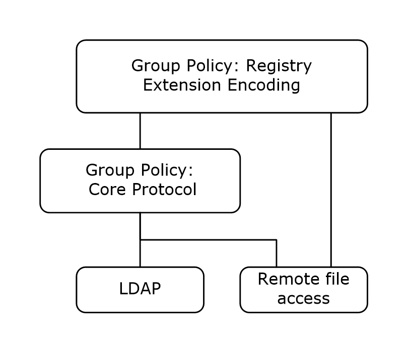
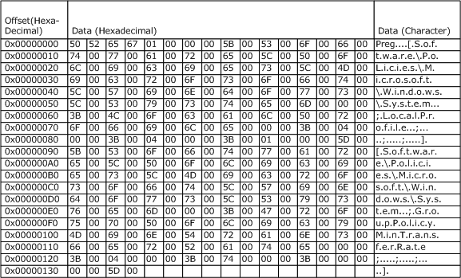
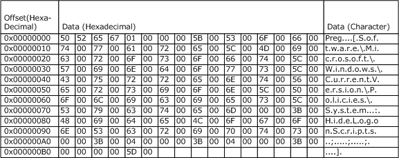

# [MS-GPREG]: Group Policy: Registry Extension Encoding

Table of Contents

1 Introduction

- [1 Introduction](#Section_1)
  - [1.1 Glossary](#Section_1.1)
  - [1.2 References](#Section_1.2)
    - [1.2.1 Normative References](#Section_1.2.1)
    - [1.2.2 Informative References](#Section_1.2.2)
  - [1.3 Overview](#Section_1.3)
    - [1.3.1 Background](#Section_1.3.1)
    - [1.3.2 Registry Extension Encoding Overview](#Section_1.3.2)
  - [1.4 Relationship to Other Protocols](#Section_1.4)
  - [1.5 Prerequisites/Preconditions](#Section_1.5)
  - [1.6 Applicability Statement](#Section_1.6)
  - [1.7 Versioning and Capability Negotiation](#Section_1.7)
  - [1.8 Vendor-Extensible Fields](#Section_1.8)
  - [1.9 Standards Assignments](#Section_1.9)

2 Messages

- [2 Messages](#Section_2)
  - [2.1 Transport](#Section_2.1)
  - [2.2 Message Syntax](#Section_2.2)
    - [2.2.1 Registry Policy Message Syntax](#Section_2.2.1)
    - [2.2.2 Policy Description Message](#Section_2.2.2)
      - [2.2.2.1 ADM-Based Policy Description Message](#Section_2.2.2.1)
        - [2.2.2.1.1 ADM Conditional Directive](#Section_2.2.2.1.1)
      - [2.2.2.2 ADMX-Based Policy Description Message](#Section_2.2.2.2)
        - [2.2.2.2.1 ADMX File](#Section_2.2.2.2.1)
          - [2.2.2.2.1.1 categories Element](#Section_2.2.2.2.1.1)
          - [2.2.2.2.1.2 policies Element](#Section_2.2.2.2.1.2)
          - [2.2.2.2.1.3 stringReference](#Section_2.2.2.2.1.3)
          - [2.2.2.2.1.4 presentationReference](#Section_2.2.2.2.1.4)
        - [2.2.2.2.2 ADML File](#Section_2.2.2.2.2)
          - [2.2.2.2.2.1 resources Element](#Section_2.2.2.2.2.1)
            - [2.2.2.2.2.1.1 stringTable Element](#Section_2.2.2.2.2.1.1)
            - [2.2.2.2.2.1.2 presentationTable Element](#Section_2.2.2.2.2.1.2)
        - [2.2.2.2.3 ADMX/ADML File Reference Examples](#Section_2.2.2.2.3)
      - [2.2.2.3 ADM-based policies compared to ADMX-based policies](#Section_2.2.2.3)
    - [2.2.3 Policy Comment Message](#Section_2.2.3)
  - [2.3 Directory Service Schema Elements](#Section_2.3)

3 Protocol Details

- [3 Protocol Details](#Section_3)
  - [3.1 Administrative Plug-in Details](#Section_3.1)
    - [3.1.1 Abstract Data Model](#Section_3.1.1)
      - [3.1.1.1 Group Policy Object (GPO)](#Section_3.1.1.1)
      - [3.1.1.2 Policy Description Store](#Section_3.1.1.2)
      - [3.1.1.3 Computer Policy Setting State](#Section_3.1.1.3)
      - [3.1.1.4 User Policy Setting State](#Section_3.1.1.4)
      - [3.1.1.5 Policy Comment State](#Section_3.1.1.5)
    - [3.1.2 Timers](#Section_3.1.2)
    - [3.1.3 Initialization](#Section_3.1.3)
    - [3.1.4 Higher-Layer Triggered Events](#Section_3.1.4)
      - [3.1.4.1 Load Policy Settings Event](#Section_3.1.4.1)
      - [3.1.4.2 Update Policy Settings Event](#Section_3.1.4.2)
      - [3.1.4.3 Load Policy Comments Event](#Section_3.1.4.3)
      - [3.1.4.4 Update Policy Comments Event](#Section_3.1.4.4)
      - [3.1.4.5 ADM-Based Policy Description Load Event](#Section_3.1.4.5)
      - [3.1.4.6 ADMX-Based Policy Description Load Event](#Section_3.1.4.6)
    - [3.1.5 Message Processing Events and Sequencing Rules](#Section_3.1.5)
      - [3.1.5.1 Policy Description Sequences for ADM-Based Administrative Templates](#Section_3.1.5.1)
      - [3.1.5.2 Policy Description Sequences for ADMX-Based Administrative Templates](#Section_3.1.5.2)
      - [3.1.5.3 Policy Administration Load Message Sequencing](#Section_3.1.5.3)
      - [3.1.5.4 Policy Administration Update Message Sequencing](#Section_3.1.5.4)
      - [3.1.5.5 Policy Administration Comments Load Message Sequencing](#Section_3.1.5.5)
      - [3.1.5.6 Policy Administration Comment Update Message Sequencing](#Section_3.1.5.6)
      - [3.1.5.7 Policy Administration Comment Localization Message Sequencing](#Section_3.1.5.7)
      - [3.1.5.8 Policy Administration for Network Access Protection](#Section_3.1.5.8)
    - [3.1.6 Timer Events](#Section_3.1.6)
    - [3.1.7 Other Local Events](#Section_3.1.7)
  - [3.2 Client Plug-in Details](#Section_3.2)
    - [3.2.1 Abstract Data Model](#Section_3.2.1)
      - [3.2.1.1 Policy Setting State](#Section_3.2.1.1)
      - [3.2.1.2 Impersonation Token](#Section_3.2.1.2)
    - [3.2.2 Timers](#Section_3.2.2)
    - [3.2.3 Initialization](#Section_3.2.3)
    - [3.2.4 Higher-Layer Triggered Events](#Section_3.2.4)
      - [3.2.4.1 Process Group Policy](#Section_3.2.4.1)
    - [3.2.5 Message Processing Events and Sequencing Rules](#Section_3.2.5)
      - [3.2.5.1 Registry Policy Message Sequencing](#Section_3.2.5.1)
        - [3.2.5.1.1 Deleted GPO List Processing](#Section_3.2.5.1.1)
        - [3.2.5.1.2 New or Changed GPO List Processing](#Section_3.2.5.1.2)
    - [3.2.6 Timer Events](#Section_3.2.6)
    - [3.2.7 Other Local Events](#Section_3.2.7)
  - [3.3 Interpretation of Registry Policy Messages as Policies by an Adminstration Tool](#Section_3.3)

4 Protocol Examples

- [4 Protocol Examples](#Section_4)
  - [4.1 Registry Policy Application Message](#Section_4.1)
  - [4.2 Policy Administration Update Message](#Section_4.2)
  - [4.3 ADM-Based Policy Description Message Example](#Section_4.3)
  - [4.4 ADMX-Based Policy Description Message Example](#Section_4.4)
    - [4.4.1 ADMX File Example](#Section_4.4.1)
    - [4.4.2 ADML File Example](#Section_4.4.2)
    - [4.4.3 CMTX File Example](#Section_4.4.3)
    - [4.4.4 CMTL File Example](#Section_4.4.4)

5 Security

- [5 Security](#Section_5)
  - [5.1 Security Considerations for Implementers](#Section_5.1)
  - [5.2 Index of Security Parameters](#Section_5.2)

6 Appendix A: Product Behavior

- [6 Appendix A: Product Behavior](#Section_6)

7 Appendix B: Full XML Schemas

- [7 Appendix B: Full XML Schemas](#Section_7)
  - [7.1 Base ADMX Schema](#Section_7.1)
  - [7.2 ADMX Policy Definition Schema](#Section_7.2)
  - [7.3 ADMX File Schema](#Section_7.3)
  - [7.4 CMTX File Schema](#Section_7.4)
  - [7.5 CMTL File Schema](#Section_7.5)

8 Change Tracking

- [8 Change Tracking](#Section_8)

For the legal notice and IP terms, see [LEGAL.md](../LEGAL.md).
Last updated: 4/23/2024.
See [Revision History](#revision-history) for full version history.

# 1 Introduction

This document specifies the Group Policy: Registry Extension Encoding to the Group Policy: Core Protocol, as specified in [MS-GPOL](../MS-GPOL/MS-GPOL.md), and provides a mechanism for an administrator to control any behavior on a client that depends on registry-based settings.

Sections 1.5, 1.8, 1.9, 2, and 3 of this specification are normative. All other sections and examples in this specification are informative.

## 1.1 Glossary

This document uses the following terms:

**Active Directory**: The Windows implementation of a general-purpose directory service, which uses LDAP as its primary access protocol. [**Active Directory**](#gt_active-directory) stores information about a variety of objects in the network such as user accounts, computer accounts, groups, and all related credential information used by Kerberos [MS-KILE](../MS-KILE/MS-KILE.md). [**Active Directory**](#gt_active-directory) is either deployed as Active Directory Domain Services (AD DS) or Active Directory Lightweight Directory Services (AD LDS), which are both described in [MS-ADOD](../MS-ADOD/MS-ADOD.md): Active Directory Protocols Overview.

**administrative template**: A file associated with a [**Group Policy Object (GPO)**](#gt_group-policy-object-gpo) that combines information on the syntax of registry-based policy settings with human-readable descriptions of the settings, as well as other information.

**client-side extension GUID (CSE GUID)**: A [**GUID**](#gt_globally-unique-identifier-guid) that enables a specific client-side extension on the Group Policy client to be associated with policy data that is stored in the logical and physical components of a [**Group Policy Object (GPO)**](#gt_group-policy-object-gpo) on the Group Policy server, for that particular extension.

**computer-scoped Group Policy Object path**: A scoped [**Group Policy Object (GPO) path**](#gt_group-policy-object-gpo-path) that ends in "\Machine".

**curly braced GUID string**: The string representation of a 128-bit globally unique identifier ([**GUID**](#gt_globally-unique-identifier-guid)) using the form {XXXXXXXX-XXXX-XXXX-XXXX-XXXXXXXXXXXX}, where X denotes a hexadecimal digit. The string representation between the enclosing braces is the standard representation of a GUID as described in [[RFC4122]](https://go.microsoft.com/fwlink/?LinkId=90460) section 3. Unlike a GUIDString, a curly braced GUID string includes enclosing braces.

**domain**: A set of users and computers sharing a common namespace and management infrastructure. At least one computer member of the set has to act as a domain controller (DC) and host a member list that identifies all members of the domain, as well as optionally hosting the [**Active Directory**](#gt_active-directory) service. The domain controller provides authentication of members, creating a unit of trust for its members. Each domain has an identifier that is shared among its members. For more information, see [MS-AUTHSOD](../MS-AUTHSOD/MS-AUTHSOD.md) section 1.1.1.5 and [MS-ADTS](../MS-ADTS/MS-ADTS.md).

**Extended Administrative Template (ADMX)**: A pair of files that combines information on the syntax of registry-based [**policy settings**](#gt_policy-setting) with human-readable descriptions of the settings, as well as other information. The first file contains the language-neutral description of each setting, while the second file contains the language-specific information.

**globally unique identifier (GUID)**: A term used interchangeably with universally unique identifier (UUID) in Microsoft protocol technical documents (TDs). Interchanging the usage of these terms does not imply or require a specific algorithm or mechanism to generate the value. Specifically, the use of this term does not imply or require that the algorithms described in [RFC4122] or [[C706]](https://go.microsoft.com/fwlink/?LinkId=89824) must be used for generating the [**GUID**](#gt_globally-unique-identifier-guid). See also universally unique identifier (UUID).

**Group Policy Object (GPO)**: A collection of administrator-defined specifications of the policy settings that can be applied to groups of computers in a domain. Each GPO includes two elements: an object that resides in the [**Active Directory**](#gt_active-directory) for the domain, and a corresponding file system subdirectory that resides on the sysvol DFS share of the Group Policy server for the domain.

**Group Policy Object (GPO) path**: A [**domain**](#gt_domain)-based Distributed File System (DFS) path for a directory on the server that is accessible through the DFS/SMB protocols. This path will always be a Universal Naming Convention (UNC) path of the form: "\\<dns domain name>\sysvol\<dns domain name>\policies\<gpo guid>", where <dns domain name> is the DNS domain name of the [**domain**](#gt_domain) and <gpo guid> is a Group Policy Object (GPO) GUID.

**Network Access Protection (NAP)**: A feature of an operating system that provides a platform for system health-validated access to private networks. [**NAP**](#gt_network-access-protection-nap) provides a way of detecting the health state of a network client that is attempting to connect to or communicate on a network, and limiting the access of the network client until the health policy requirements have been met. [**NAP**](#gt_network-access-protection-nap) is implemented through quarantines and health checks, as specified in [[TNC-IF-TNCCSPBSoH]](https://go.microsoft.com/fwlink/?LinkId=240054).

**policy setting**: A statement of the possible behaviors of an element of a domain member computer's behavior that can be configured by an administrator.

**registry**: A local system-defined database in which applications and system components store and retrieve configuration data. It is a hierarchical data store with lightly typed elements that are logically stored in tree format. Applications use the registry API to retrieve, modify, or delete registry data. The data stored in the registry varies according to the version of the operating system.

**registry policy file**: A file associated with a [**Group Policy Object (GPO)**](#gt_group-policy-object-gpo) that contains a set of registry-based policy settings.

**scoped Group Policy Object (GPO) path**: A [**Group Policy Object (GPO)**](#gt_group-policy-object-gpo) path appended with "\User" for the user policy mode of policy application, and "\Machine" for the computer policy mode.

**tool extension GUID or administrative plug-in GUID**: A GUID defined separately for each of the user policy settings and computer policy settings that associates a specific administrative tool plug-in with a set of policy settings that can be stored in a [**Group Policy Object (GPO)**](#gt_group-policy-object-gpo).

**user-scoped Group Policy Object path**: A scoped [**Group Policy Object (GPO)**](#gt_group-policy-object-gpo) path that ends in "\User".

**MAY, SHOULD, MUST, SHOULD NOT, MUST NOT:** These terms (in all caps) are used as defined in [[RFC2119]](https://go.microsoft.com/fwlink/?LinkId=90317). All statements of optional behavior use either MAY, SHOULD, or SHOULD NOT.

## 1.2 References

Links to a document in the Microsoft Open Specifications library point to the correct section in the most recently published version of the referenced document. However, because individual documents in the library are not updated at the same time, the section numbers in the documents may not match. You can confirm the correct section numbering by checking the [Errata](https://go.microsoft.com/fwlink/?linkid=850906).

### 1.2.1 Normative References

We conduct frequent surveys of the normative references to assure their continued availability. If you have any issue with finding a normative reference, please contact [dochelp@microsoft.com](mailto:dochelp@microsoft.com). We will assist you in finding the relevant information.

[MS-DTYP] Microsoft Corporation, "[Windows Data Types](../MS-DTYP/MS-DTYP.md)".

[MS-GPNAP] Microsoft Corporation, "[Group Policy: Network Access Protection (NAP) Extension](../MS-GPNAP/MS-GPNAP.md)".

[MS-GPOL] Microsoft Corporation, "[Group Policy: Core Protocol](../MS-GPOL/MS-GPOL.md)".

[RFC2119] Bradner, S., "Key words for use in RFCs to Indicate Requirement Levels", BCP 14, RFC 2119, March 1997, [https://www.rfc-editor.org/info/rfc2119](https://go.microsoft.com/fwlink/?LinkId=90317)

[RFC4234] Crocker, D., Ed., and Overell, P., "Augmented BNF for Syntax Specifications: ABNF", RFC 4234, October 2005, [https://www.rfc-editor.org/info/rfc4234](https://go.microsoft.com/fwlink/?LinkId=90462)

[XML1.0] Bray, T., Paoli, J., Sperberg-McQueen, C.M., and Maler, E., "Extensible Markup Language (XML) 1.0 (Second Edition)", W3C Recommendation, October 2000, [https://www.w3.org/TR/2000/REC-xml-20001006](https://go.microsoft.com/fwlink/?LinkId=90599)

### 1.2.2 Informative References

[MS-RRP] Microsoft Corporation, "[Windows Remote Registry Protocol](../MS-RRP/MS-RRP.md)".

[MS-WPO] Microsoft Corporation, "[Windows Protocols Overview](#Section_1.3)".

## 1.3 Overview

Group Policy: Registry Extension Encoding provides a mechanism for an administrator to control any behavior on a client that depends on registry-based settings.

### 1.3.1 Background

The Group Policy: Core Protocol (as specified in [MS-GPOL](../MS-GPOL/MS-GPOL.md)) allows clients to discover and retrieve [**policy settings**](#gt_policy-setting) created by administrators of a [**domain**](#gt_domain). These settings are persisted within [**Group Policy Objects (GPOs)**](#gt_group-policy-object-gpo) that are assigned to Policy Target accounts in the [**Active Directory**](#gt_active-directory). Policy Target accounts are either computer accounts or user accounts in the Active Directory. Each client uses Lightweight Directory Access Protocol (LDAP) to determine what GPOs are applicable to it by consulting the Active Directory objects corresponding to both its computer account and the user accounts of any users logging on to the client computer.

On each client, each GPO is interpreted and acted upon by software components known as client plug-ins. The client plug-ins responsible for a given GPO are specified using an attribute on the GPO. This attribute specifies a list of [**globally unique identifier (GUID)**](#gt_globally-unique-identifier-guid) lists. The first GUID of each GUID list is referred to as a [**client-side extension GUID (CSE GUID)**](#gt_client-side-extension-guid-cse-guid). Other GUIDs in the GUID list are referred to as [**tool extension GUIDs**](#gt_88ad7745-bee6-47f7-ae98-6fac7c5ef330).

For each GPO that is applicable to a client, the client consults the CSE GUIDs listed in the GPO to determine which client plug-in handles the GPO. The client then invokes the client plug-in to handle the GPO.

A client plug-in uses the contents of the GPO to retrieve settings specific to its class in a manner specific to its class. After its class-specific settings are retrieved, the client plug-in uses those settings to perform class-specific processing.

### 1.3.2 Registry Extension Encoding Overview

Registry-based settings are accessible from a [**GPO**](#gt_group-policy-object-gpo) through the Group Policy: Registry Extension Encoding. The protocol provides mechanisms both for administrative tools (or any tool that allows an administrator to view or modify the contents of a GPO) to obtain metadata about registry-based settings and for clients to obtain applicable registry-based settings.

Group Policy: Registry Extension Encoding settings can be administered using [**administrative templates**](#gt_administrative-template) (as specified in Policy Description Message (section [2.2.2](#Section_1.3))). An administrative template is a file associated with a GPO that combines information on the syntax of registry-based settings with human-readable descriptions of the settings as well as other information. Administrative tools use administrative templates to allow administrators to configure registry-based settings for applications on clients.

Group Policy: Registry Extension Encoding settings are specified using [**registry policy files**](#gt_registry-policy-file) (as specified in Registry Policy Message Syntax (section [2.2.1](#Section_2.2.1))). An administrative tool uses the information within the administrative template to write out a registry policy file and associate it with a GPO. The Group Policy: Registry Extension Encoding plug-in on each client reads registry policy files specified by applicable GPOs and applies their contents to its [**registry**](#gt_registry).

Only a limited subset of the syntax for registry policy files is supported by administrative templates. As a result, not all registry-based settings can be expressed using administrative templates. Such registry-based settings can be implemented using a custom user-interface that does not rely on administrative templates.

The protocol operates as follows. An administrative tool either implements a custom UI that can author registry policy files or just uses administrative templates, or both administrative templates can be stored on a server and be retrieved (using this protocol) by an administrative tool. Or, the tool can simply use administrative templates that are already on the administrator's computer.

Clients can use either or both of the following cases for this protocol because they address different issues. The Computer Policy Mode is used in scenarios where the policies need to be applied to a computer, and it is applicable for all the users logging on to the computer, whereas the User Policy Mode is used for applying policies to specific users logging on to the computer.

Computer Policy Mode

- An administrator invokes a Group Policy Administrative tool on the administrator's computer to administer a GPO through the Group Policy Core Protocol using the Policy Administration mode, as specified in [MS-GPOL](../MS-GPOL/MS-GPOL.md) section 1.3.2. The Administrative tool invokes a plug-in specific to Group Policy: Registry Extension Encoding so that the administrator can administer the Group Policy: Registry Extension Encoding settings. This results in the storage and retrieval of metadata inside a GPO on a Group Policy server. This metadata describes configuration settings to be applied to a generic settings database (or registry) on a client that is affected by the GPO. The administrator views the data and updates it to add a directive to run a command when the client computer starts up. If they are not already present from a prior update, the [**CSE GUID**](#gt_client-side-extension-guid-cse-guid) and [**tool extension GUID**](#gt_88ad7745-bee6-47f7-ae98-6fac7c5ef330) for Computer [**Policy Settings**](#gt_policy-setting) for Group Policy: Registry Extension Encoding are written to the GPO.
- A client computer affected by that GPO is started (or is connected to the network, if this happens after the client starts), and the Group Policy Core Protocol is invoked by the client to retrieve Policy Settings from the Group Policy server. As part of the processing of the Group Policy Core Protocol, the Group Policy: Registry Extension Encoding's CSE GUID is read from this GPO, and this instructs the client to invoke a Group Policy: Registry Extension Encoding plug-in component for Policy Application.
- In processing the Policy Application portion of the Group Policy: Registry Extension Encoding, the client parses the file of settings, and then saves the settings in the generic settings database (or registry) on the local computer.
User Policy Mode

- This step is the same as step 1 for Computer Policy Mode except that a separate tool extension GUID for the Group Policy: Registry Extension Encoding is written to the GPO.
- This step is the same as step 2 for Computer Policy Mode except that it occurs when a user logs on (or when the computer is connected to the network, if this happens after the user logs on).
- In processing the Policy Application portion of Group Policy: Registry Extension Encoding, the client parses the file of settings, and then saves the settings in a user-specific portion of the generic settings database (registry) on the local computer.

## 1.4 Relationship to Other Protocols

This protocol depends on the Group Policy: Core Protocol (as specified in [MS-GPOL](../MS-GPOL/MS-GPOL.md)) to provide a list of applicable [**Group Policy Objects (GPOs)**](#gt_group-policy-object-gpo). It also transmits Group Policy settings and instructions between the client and the Group Policy server by reading and writing files using remote file access. See [MS-WPO](#Section_1.3) section 6.4 for an overview of remote file access.

This protocol is used instead of the Windows Remote Registry Protocol, specified in [MS-RRP](../MS-RRP/MS-RRP.md), to configure the same settings on many computers.

The following diagram shows how this protocol relates to other protocols.

Figure 1: Group Policy: Registry Extension Encoding protocol relationship diagram

## 1.5 Prerequisites/Preconditions

The prerequisites for this protocol are the same as those for the Group Policy: Core Protocol.

In addition, a client needs a system/subsystem that is capable of executing commands at start-up/shutdown time (if Computer Policy Mode is used) and at user log-on/log-off time (if User Policy Mode is used).

## 1.6 Applicability Statement

Group Policy: Registry Extension Encoding is only applicable within the Group Policy: Core Protocol framework. Group Policy: Registry Extension Encoding is used to express the required state of the client. However, it is not used to express intentions that are sensitive in an information disclosure context because the metadata transmitted by the protocol is not encrypted. For example, an administrator is not to use this protocol to transmit a password needed by the client to access a resource, because that password is unencrypted during transmission and can be easily intercepted by an unauthorized user, thus compromising the resource.

This protocol is also only applicable when the requirement is for many clients to get the same settings. To configure individual clients with custom settings, the Windows Remote Registry Protocol can be used instead. For more information, see [MS-RRP](../MS-RRP/MS-RRP.md).

## 1.7 Versioning and Capability Negotiation

There is no capability negotiation based on versioning in this protocol. There are several fields that provide version information. The Registry Policy Message Syntax (section [2.2.1](#Section_2.2.1)) contains a version which is a fixed value. An ADM-Based Policy Description Message can contain an ADM Conditional Directive described in section [2.2.2.1.1](#Section_2.2.2.1.1) that compares the current platform against a version constant that represents platform releases. The ADMX-Based Policy Description Message schema described in Appendix B: Full XML Schemas (section [7](#Section_7)) contains informational revision and schemaVersion attributes.

## 1.8 Vendor-Extensible Fields

None.

## 1.9 Standards Assignments

This protocol defines [**client-side extension GUID (CSE GUID)**](#gt_client-side-extension-guid-cse-guid) and [**tool extension GUID**](#gt_88ad7745-bee6-47f7-ae98-6fac7c5ef330) standards assignments, as specified in [MS-GPOL](../MS-GPOL/MS-GPOL.md) section 1.8. The assignments are as follows. Where two possible GUIDs are listed, the value used is implementation dependent.<1><2>

| Parameter | Value |
| --- | --- |
| CSE GUID | {35378EAC-683F-11D2-A89A-00C04FBBCFA2} |
| Tool Extension GUID (User Policy Settings) | {0F6B957E-509E-11D1-A7CC-0000F87571E3} {D02B1F73-3407-48AE-BA88-E8213C6761F1} |
| Tool Extension GUID (Computer Policy Settings) | {0F6B957D-509E-11D1-A7CC-0000F87571E3} {D02B1F72-3407-48AE-BA88-E8213C6761F1} |

# 2 Messages

## 2.1 Transport

The Group Policy: Registry Extension Encoding uses remote file access. All messages are exchanged as files transferred using remote file access.

The Group Policy: Core Protocol uses this protocol [**CSE GUID**](#gt_client-side-extension-guid-cse-guid) (as specified in [MS-DTYP](../MS-DTYP/MS-DTYP.md) section 2.3.4.3) and [**tool extension GUID**](#gt_88ad7745-bee6-47f7-ae98-6fac7c5ef330) values to invoke this protocol only to access [**GPOs**](#gt_group-policy-object-gpo) that require processing by this protocol.

## 2.2 Message Syntax

The sections that follow specify the syntax for the following protocol elements:

[**Registry policy files**](#gt_registry-policy-file) (as specified in Registry Policy Message Syntax (section [2.2.1](#Section_2.2.1))).

The [**administrative templates**](#gt_administrative-template) (ADM format) file (as specified in ADM-Based Policy Description Message (section [2.2.2.1](#Section_1.3))) and the [**Extended Administrative Templates (ADMX)**](#gt_extended-administrative-template-admx) file (as specified in ADMX-Based Policy Description Message (section [2.2.2.2](#Section_2.2.2.2))).

Each protocol element is described as a message, which corresponds one-to-one with a file transferred using remote file access. The protocol is driven through the exchange of these messages, as specified in Protocol Details (section [3](#Section_3)).

### 2.2.1 Registry Policy Message Syntax

The following definitions will aid in understanding this section:

- [**Computer-scoped GPO path**](#gt_computer-scoped-group-policy-object-path):
A [**scoped GPO path**](#gt_ba6aca14-cdb7-43d3-bd8b-e3c04cf3f976) that ends in "\Machine".

- Scoped GPO path:
A [**GPO path**](#gt_group-policy-object-gpo-path) that is appended with "\User" for User Policy Mode of Policy Application or "\Machine" for Computer Policy Mode.

- [**User-scoped Group Policy Object path**](#gt_user-scoped-group-policy-object-path):
A scoped GPO path that ends in "\User".

This protocol uses remote file access to copy the file that MUST be named "<gpo path>\registry.pol", where <gpo path> is a scoped GPO path given to the protocol by the Group Policy: Core Protocol, as specified in [MS-GPOL](../MS-GPOL/MS-GPOL.md) section 2.2.8. The message is the file itself.

The contents of the Registry.pol file read above MUST be formatted according to the following Augmented Backus-Naur Form (ABNF) (as specified in the [[RFC4234]](https://go.microsoft.com/fwlink/?LinkId=90462)) description).

PolicyFile = Header Body

Header = Signature Version

Signature = %x50.52.65.67

Version = %x01

Body = Instructions

Instructions = Instruction / (Instructions Instruction)

IdCharacter = %x20-5B / %x5D-7E

ValueCharacter = SP / VCHAR

Key = 1*IdCharacter

Instruction = "[" KeyPath ";" Value ";" Type ";" Size ";" Data "]"

KeyPath = Key / KeyPath "\" Key

Value = 1*259ValueCharacter

Type = %x01 / %x02 / %x03 / %x04 / %x05 / %x07 / %x0B

Size = %x00-FFFF

Data = *65535OCTET

The meanings and encoding format of the fields are as follows:

- Key:
A null-terminated identifier of a record used to distinguish the record and efficiently search for it. The same Key can appear multiple times in the message. HKLM and HKCU MUST NOT be included in the identifier. If registry.pol file is under the computer-scoped path, the root of the key MUST be HKLM; if the file is under the user-scoped path, the root of the key MUST be HKCU. The encoding format is UTF-16LE.

- Value:
The null-terminated name of the column in a conceptual database record. The encoding format is UTF-16LE.

- Type:
MUST be one of the following:

| Value | Meaning |
| --- | --- |
| 0x01 REG_SZ | Data in the Data field to be interpreted as a null-terminated Unicode string. |
| 0x02 REG_EXPAND_SZ | Data in the Data field to be interpreted as a null-terminated Unicode string that contains operating system environment variables denoted using an operating system-specific syntax. |
| 0x03 REG_BINARY | Data in the Data field to be interpreted as an octet stream. |
| 0x04 REG_DWORD | Data to be interpreted in the same fashion as a 32-bit number in little-endian format. |
| 0x05 REG_DWORD_BIG_ENDIAN | Data to be interpreted in the same fashion as a 32-bit number in big-endian format. |
| 0x07 REG_MULTI_SZ | Data in the Data field to be interpreted as a sequence of characters terminated by two null Unicode characters, and within that sequence zero or more null-terminated Unicode strings can exist. |
| 0x0B REG_QWORD | Data in the Data field to be interpreted as a 64-bit number in little-endian format. |

The field is represented as 32-bit little-endian.

- Size:
Indicates the size, in bytes, of the Data field. MUST be in the range 0 to 65535, represented as 32-bit little-endian.

- Data:
Indicates the data associated with the value. This field MUST contain a number of bytes data indicated by the value of the Size field.

- Signature:
A 32-bit identifier for all registry.pol files.

- Version:
A 32-bit little-endian number.

The order of the Instruction elements is significant: two such messages that differ only in the order of the Instruction elements are not considered equivalent messages semantically. This is because message processing is sensitive to the order, as specified in Client Plug-In Details (section [3.2](#Section_3.2)).<3>

### 2.2.2 Policy Description Message

Policy Description Messages are typically used by administrative plug-in to drive a user interface for viewing and editing settings, and are most importantly used to describe the serialization and deserialization of settings to and from the Group Policy: Registry Extension Encoding Message format. There are two formats for these messages: ADM and [**ADMX**](#gt_extended-administrative-template-admx).

#### 2.2.2.1 ADM-Based Policy Description Message

ADM-Based Policy Description Messages are encapsulated in Unicode files that are transmitted using remote file access. The names of these files MUST end in ".adm".

The following ABNF specifies the ADM file format.

AdmFile = AdmStatements AdmStrings

WhiteSpaceClass = CR / LF / WSP

WhiteSpace = *WhiteSpaceClass

SpaceDelimiter = 1*WhiteSpaceClass

Dash = %x002D

LineBreak = CRLF

AdmStatements = *AdmStatement

AdmStatement = ( AdmClass / AdmCategory / AdmPolicy / AdmPart / AdmItemList / AdmActionList ) [AdmComment]

AdmQuotedCharacter = %x0020-0021 / %x0023-007E ; space to tilde except double-quote

AdmTokenCharacter = %x0021 / %x0023-003A / %x003C-007E ; Exclamation to tilde except double-quote and semi-colon

AdmToken = 1*AdmTokenCharacter

AdmComment = [LineBreak] TokSemi *(VCHAR / SP) LineBreak

AdmClass = TokClass ( TokUser / TokMachine )

AdmCategory = TokCategory AdmString [AdmKeyName] [AdmExplain] (1*AdmCategory / 1*AdmPolicy / (1*AdmCategory 1*AdmPolicy) / (1*AdmPolicy 1*AdmCategory)) TokEnd TokCategory

AdmString = ( WhiteSpace AdmToken SpaceDelimiter ) / TokQuotedString / AdmStringId

AdmKey = AdmString

AdmKeyName = TokKeyName AdmKey

AdmExplain = TokExplain AdmString

AdmSupported = TokSupported AdmString

AdmPolicy = TokPolicy AdmString [AdmKeyName] [AdmExplain] [AdmValueOnOff] [AdmActionListOnOff] [AdmSupported] [AdmClientExt] [AdmParts] TokEnd TokPolicy

AdmValueName = TokValueName AdmString

AdmValueOn = TokValueOn ( AdmNumericValue / AdmString )

AdmValueOff = TokValueOff ( AdmNumericValue / AdmString )

AdmValueOnOff = AdmValueName [AdmValueOn] [AdmValueOff]

AdmValue = AdmValueName [AdmValueData]

AdmKeyValuePair = [AdmKeyName] AdmValue

AdmNumericValue = TokNumeric TokDigits

AdmValueData = TokValue (TokDelete / AdmString / AdmNumericValue)

AdmClientExt = TokClientExt AdmGuid

AdmGuid = TokLeftCurly 8HEXDIG Dash 4HEXDIG Dash 4HEXDIG Dash 4HEXDIG Dash 12HEXDIG TokRightCurly

AdmParts = 1*AdmPart

AdmPart = TokPart AdmString AdmUIControl TokEnd TokPart

AdmActionList = TokActionList 1*AdmKeyValuePair TokEnd TokActionList

AdmActionListOn = TokActionListOn 1*AdmKeyValuePair TokEnd TokActionListOn

AdmActionListOff = TokActionListOff 1*AdmKeyValuePair TokEnd TokActionListOff

AdmActionListOnOff = [AdmActionListOn] [AdmActionListOff]

AdmItemList = TokItemList AdmItems TokEnd TokItemList

AdmItems = 1*AdmItem

AdmItem = TokName AdmString AdmValueData [TokDefault] [AdmActionList]

AdmDefaultString = TokDefault AdmString

AdmDefaultNumeric = TokDefault TokDigits

AdmMin = TokMin TokDigits

AdmMax = TokMax TokDigits

AdmMaxLen = TokMaxlen TokDigits

AdmNoSort = TokNosort

AdmRequired = TokRequired

AdmCheckbox = TokCheckbox AdmCheckBoxArguments

AdmCombobox = TokCombobox AdmComboBoxArguments

AdmDropdownlist = TokDropdownlist AdmDropdownListArguments

AdmEditText = TokEditText AdmEditTextArguments

AdmListbox = TokListbox AdmListBoxArguments

AdmNumeric = TokNumeric AdmNumericArguments

AdmOemConvert = TokOEMConvert

AdmExpandableText = TokExpandableText

AdmAdditive = TokAdditive

AdmExplicitValue = TokExplicitValue

AdmValuePrefix = TokValueprefix TokALPHA

AdmSpin = TokSpin TokDigits

AdmTextConvert = TokTxtConvert

AdmDefChecked = TokDefchecked

AdmUIControl = (

AdmCheckbox /

AdmCombobox /

AdmDropdownlist /

AdmEditText /

AdmListbox /

AdmNumeric /

TokText )

AdmCheckBoxArguments = <These occur in any order> [AdmKeyName] AdmValueOnOff [AdmDefChecked] [AdmActionListOn AdmActionListOff] [AdmClientExt]

AdmEditTextArguments = <These occur in any order> [AdmKeyName] AdmValueName [AdmDefaultString]

[AdmMaxLen] [AdmRequired] [AdmOemConvert] [AdmClientExt] [AdmExpandableText]

AdmNumericArguments = <These occur in any order> [AdmKeyName] AdmValueName [AdmDefaultNumeric] [AdmMax]

[AdmMin] [AdmRequired] [AdmSpin] [AdmClientExt] [AdmTextConvert]

AdmComboBoxArguments = <These occur in any order> AdmEditTextArguments [AdmSuggestions] [AdmNoSort]

AdmDropdownListArguments = <These occur in any order> [AdmKeyName] AdmValueName [ AdmItemList]

[AdmRequired] [AdmClientExt] [AdmNoSort]

AdmListBoxArguments = <These occur in any order> [AdmKeyName] [AdmAdditive] [AdmExplicitValue]

[AdmValuePrefix] [AdmClientExt] [AdmNoSort] [AdmExpandableText]

AdmStrings = [ TokStrings AdmStringStatements ]

AdmStringStatements = 1*AdmStringStatement

AdmStringStatement = WhiteSpace AdmToken TokIs TokQuotedString

AdmSuggestions = TokSuggestions 1*AdmString TokEnd TokSuggestions

AdmBangBang = WhiteSpace "!!"

AdmStringId = AdmBangBang AdmToken SpaceDelimiter

TokALPHA = WhiteSpace 1*ALPHA SpaceDelimiter

TokActionList = WhiteSpace "ActionList" SpaceDelimiter

TokActionListOff = WhiteSpace "ActionListOff" SpaceDelimiter

TokActionListOn = WhiteSpace "ActionListOn" SpaceDelimiter

TokAdditive = WhiteSpace "additive" SpaceDelimiter

TokCategory = WhiteSpace "category" SpaceDelimiter

TokCheckbox = WhiteSpace "checkbox" SpaceDelimiter

TokClass = WhiteSpace "class" SpaceDelimiter

TokClientExt = WhiteSpace "clientext" SpaceDelimiter

TokCombobox = WhiteSpace "combobox" SpaceDelimiter

TokDefault = WhiteSpace "default" SpaceDelimiter

TokDefchecked = WhiteSpace "defchecked" SpaceDelimiter

TokDelete = WhiteSpace "delete" SpaceDelimiter

TokDigits = WhiteSpace 1*DIGIT SpaceDelimiter

TokDropdownlist = WhiteSpace "dropdownlist" SpaceDelimiter

TokEditText = WhiteSpace "EditText" SpaceDelimiter

TokEnd = WhiteSpace "end" SpaceDelimiter

TokExpandableText = WhiteSpace "expandabletext" SpaceDelimiter

TokExplain = WhiteSpace "Explain" SpaceDelimiter

TokExplicitValue = WhiteSpace "explicitvalue" SpaceDelimiter

TokIs = WhiteSpace "=" WhiteSpace

TokItemList = WhiteSpace "ItemList" SpaceDelimiter

TokKeyName = WhiteSpace "KeyName" SpaceDelimiter

TokLeftCurly = WhiteSpace "{" WhiteSpace

TokListbox = WhiteSpace "listbox" SpaceDelimiter

TokMachine = WhiteSpace "Machine" SpaceDelimiter

TokMax = WhiteSpace "max" SpaceDelimiter

TokMaxlen = WhiteSpace "maxlen" SpaceDelimiter

TokMin = WhiteSpace "min" SpaceDelimiter

TokNE = WhiteSpace "!=" SpaceDelimiter

TokName = WhiteSpace "name" SpaceDelimiter

TokNosort = WhiteSpace "nosort" SpaceDelimiter

TokNumeric = WhiteSpace "numeric" SpaceDelimiter

TokOEMConvert = WhiteSpace "oemconvert" SpaceDelimiter

TokPart = WhiteSpace "Part" SpaceDelimiter

TokQuotedString = WhiteSpace DQUOTE 1*AdmQuotedCharacter DQUOTE WhiteSpace

TokPolicy = WhiteSpace "policy" SpaceDelimiter

TokRequired = WhiteSpace "required" SpaceDelimiter

TokRightCurly = WhiteSpace "}" SpaceDelimiter

TokSemi = WhiteSpace ";" WhiteSpace

TokSpin = WhiteSpace "spin" SpaceDelimiter

TokStrings = WhiteSpace "[strings]" SpaceDelimiter

TokSuggestions = WhiteSpace "suggestions" SpaceDelimiter

TokSupported = WhiteSpace "supported" SpaceDelimiter

TokText = WhiteSpace "text" SpaceDelimiter

TokTxtConvert = WhiteSpace "TxtConvert" SpaceDelimiter

TokUser = WhiteSpace "User" SpaceDelimiter

TokValue = WhiteSpace "value" SpaceDelimiter

TokValueName = WhiteSpace "ValueName" SpaceDelimiter

TokValueOff = WhiteSpace "valueoff" SpaceDelimiter

TokValueOn = WhiteSpace "valueon" SpaceDelimiter

TokValueprefix = WhiteSpace "valueprefix" SpaceDelimiter

The file specifies both presentation information for administrative plug-in and serialization/deserialization for administrative tools.

The key directive for user interface presentation is the AdmUIControl production in the preceding ABNF; it can begin with one of the following terminal strings with the following meanings:

| Value | Meaning |
| --- | --- |
| CheckBox | Policy Administration plug-ins are expected to present a control that allows the user to select a single check box. |
| EditText | Policy Administration plug-ins are expected to present a simple string control for viewing and editing this setting. |
| ComboBox | Policy Administration plug-ins are expected to present a simple list control that also allows manual editing for viewing and editing this setting. |
| DropDownList | Policy Administration plug-ins are expected to present a control that allows the user to select a single item from a drop-down list. |
| Numeric | Policy Administration plug-ins are expected to present a simple numeric control for viewing and editing this setting. |
| ListBox | Policy Administration plug-ins are expected to present a list user interface control for viewing and editing this setting. If not modified with "additive", this MUST be serialized to the format specified in Registry Policy Message Syntax (section [2.2.1](#Section_2.2.1)) with an instruction that is preceded by an instruction using the "***DeleteKeys" value (the quoted value string MUST be taken literally), as specified in Client Plug-In Details (section [3.2](#Section_3.2)). |
| Text | Policy Administration plug-ins are expected to just display the characters, following this literally. There is no user input to serialize or deserialize. |

The following nonterminal symbols imply important semantics for presentation or serialization:

- AdmOemConvert:
If present, indicates that the string value associated with this part MUST be converted to ASCII before serialization. ASCII refers to a single 8-bit ASCII character or an array of 8-bit ASCII characters with the high bit of each character set to zero.

- AdmExpandableText:
If present, indicates that, for this associated part, the Registry Policy Message Data Type from Registry Policy Message Syntax (section 2.2.1) MUST be serialized using type 0x02 from Registry Policy Message Syntax (section 2.2.1).

- AdmAdditive:
If present, indicates that for AdmListBox controls, the [**Policy Setting**](#gt_policy-setting) MUST be serialized into Registry Policy format without being preceded by an instruction to delete all values (see section Registry Policy Message Sequencing (section [3.2.5.1](#Section_3.2.5.1))).

- AdmExplicitValue:
If present, indicates that for AdmListBox controls, both the Value and Data to serialize to, from the Registry Policy Message specification (as specified in Registry Policy Message Syntax (section 2.2.1)), MUST come from an administrative tool's user input. If AdmValuePrefix is also specified, it is ignored.

- AdmValuePrefix <prefix>:
Specifies that any [**registry**](#gt_registry) values associated with this part MUST be prepended with <prefix> when serialized to the Registry Policy message format.

- AdmSpin <spinvalue>:
Specifies that the Policy Administration plug-ins are expected to present the associated part in the user interface using a type of control that allows the user to increment or decrement integer values through the control. A <spinvalue> of 0 removes the spin control. A <spinvalue> of 1 is the default.

- AdmTextConvert:
If present, indicates that the Policy Administration plug-ins MUST serialize the associated value into the Registry Policy format using type 0x01 (string), as specified in Registry Policy Message Syntax (section 2.2.1), even if the value is numeric.

- AdmDefChecked:
If present, indicates that the administrative plug-in MUST enable their associated AdmCheckBox control when a user initially attempts to enable the associated setting.

- AdmMax <maxvalue>:
Specifies that the administrative plug-in that consume this format to edit a [**GPO**](#gt_group-policy-object-gpo) MUST enforce a maximum value for the number. This value is a 32-bit integer and can be set to a maximum of 2^32 - 1. If this value is not specified, then the default value is 9999.

- AdmMin <minvalue>:
Specifies that the administrative plug-in that consumes this format to edit a GPO MUST enforce a minimum value for the number. This value is a 32-bit integer and can be set to a maximum of 2^32 - 1. If this value is not specified, then the default value is 0.

- AdmSupported <descriptive string>:
Specifies that the administrative plug-in MUST display a descriptive string describing any other requirements for the associated part to be supported.

- AdmClientExt <extension GUID>:
Specifies that for each AdmClient <extension GUID> occurrence, the administrative plug-in MUST send a GPO Extension Update Message (as specified in [MS-GPOL](../MS-GPOL/MS-GPOL.md) section 2.2.8.2) to increment the GPO version and add the <Tool Extension GUID> (as defined in section [1.9](#Section_1.9)) and <extension GUID> to either of the following attributes:

- The **gPCUserExtensionNames** attribute if the GPO's user settings are being updated.
- The **gPCMachineExtensionNames** attribute if the computer settings are being updated.
These attributes are updated on the current GPO. They provide for the application of policy to the client by the Registry Extension.

These attributes also provide for additional processing by a second client extension. The second client extension has the opportunity to process the entire GPO.

- AdmMaxLen <maxlength>:
Specifies that the Policy Administration plug-in MUST limit the text in the associated part to be, at most, <maxlength> characters.

- AdmNoSort:
If present, indicates that the administrative plug-in MUST NOT sort the entries when displaying the associated AdmCombobox, AdmDropdownlist, or AdmListbox.

- AdmRequired:
Specifies that the administrative plug-in that consume this format MUST NOT allow updates of the GPO for the registry key unless a value has been provided in the user interface.

##### 2.2.2.1.1 ADM Conditional Directive

In addition to the ABNF syntax specified, the ADM file allows a conditional directive to include or exclude portions of the file depending on the version of the ADM file.

The following specifies the syntax of the conditional directive.

AdmIf = TokIf TokVersion AdmOperator TokDigits <enclosed text> TokEndif

AdmOperator = (TokGT / TokLT / TokEQ / TokNE / TokGE / TokLE)

TokDigits = WhiteSpace 1*DIGIT SpaceDelimiter

TokEQ = WhiteSpace "==" SpaceDelimiter

TokEndif = WhiteSpace "#endif" SpaceDelimiter

TokGE = WhiteSpace ">=" SpaceDelimiter

TokGT = WhiteSpace ">" SpaceDelimiter

TokIf = WhiteSpace "#if" SpaceDelimiter

TokLE = WhiteSpace "<=" SpaceDelimiter

TokLT = WhiteSpace "<" SpaceDelimiter

TokNE = WhiteSpace "!=" SpaceDelimiter

TokVersion = WhiteSpace "version" SpaceDelimiter

The ADM Conditional Directive is broad enough that it is best understood as a "pre-processing" directive. The enclosed text is either included or excluded from parsing depending on the condition specified. Conditional directives can appear anywhere in the ADM file and they can be nested.

The TokDigits are interpreted as a version number corresponding to the operating system version at the time the ADM was released.<4>

#### 2.2.2.2 ADMX-Based Policy Description Message

ADMX-Based Policy Description Messages are encapsulated in XML (as specified in [[XML1.0]](https://go.microsoft.com/fwlink/?LinkId=90599)) files that are copied using remote file access. To support the multilingual display of [**policy settings**](#gt_policy-setting), the ADMX-Based Policy Description Messages are divided into two types of files, described in the following sections. The format of these files is specified by the XML schemas in Appendix B: Full XML Schemas (section [7](#Section_7)).<5>

##### 2.2.2.2.1 ADMX File

An .admx file is a language-neutral file describing the structure of the categories and [**administrative template**](#gt_administrative-template) [**policy settings**](#gt_policy-setting). The two primary components of an .admx file are the <categories> and <policies> elements which contain individual <category> or <policy> element definitions respectively.

###### 2.2.2.2.1.1 categories Element

Within <categories>, a <category> element defines an empty set to which policies MAY be assigned. Categories are exclusively used during the presentation of policies by administrative plug-ins. The **displayName** attribute of a <category> MAY be a reference to a language-specific string read from a language-specific .adml file. The format for a stringReference and examples are described below.

###### 2.2.2.2.1.2 policies Element

Within <policies>, a <policy> element MUST be assigned to one and only one <category> using a <parentCategory> subelement. String attributes of a <policy> MAY be a reference to a language-specific string read from a language-specific .adml file. A <policy> MAY also contain a language-specific **presentation** attribute which is a presentationReference read from a language-specific .adml file. The format for a presentationReference and examples are described below.

If a stringReference or presentationReference is used in an .admx file, it MUST be found in the .adml file currently in use or an error condition MUST be signaled.

###### 2.2.2.2.1.3 stringReference

A stringReference MUST be in the format "$(string.<id>)" where the "id" MUST be found in the language-specific .adml file <stringTable>.

###### 2.2.2.2.1.4 presentationReference

A presentationReference MUST be in the format "$(presentation.<id>)" where the "id" MUST be found in the language-specific .adml file <presentationTable>.

##### 2.2.2.2.2 ADML File

An .adml file is a set of language-dependent resources providing the localized portions (strings and presentations) of an .admx file. Each .adml file will represent a single language that needs to be supported. The name of these files MUST be the same as the .admx file name ending with an .adml instead of an .admx. An .adml file for each language is stored in a directory matching the language locale name under the directory where the .admx files are stored. There is no explicit reference to the .adml file in the .admx file. The association is based on the language and the .admx file name replaced with .adml in the end. For each .admx file, there will be as many .adml files as the number of languages supported.

The primary component of an .adml file is the <resources> element.

###### 2.2.2.2.2.1 resources Element

Within the <resources> element, the <stringTable> and <presentationTable> elements contain the language-specific elements supporting stringReference and presentationReference functionality.

stringTable Element

The <stringTable> element will contain <string> elements defining the language-specific strings that MAY be referenced by "id" from the language-neutral .admx file.

presentationTable Element

The <presentationTable> element will contain <presentation> elements that MAY be referenced by "id" from the language-neutral .admx file defining the user interface components presented by administrative plug-ins.

##### 2.2.2.2.3 ADMX/ADML File Reference Examples

The Base ADMX Schema (section [7.1](#Section_7.1)) contains the definitions for the simpleTypes stringReference and presentationReference used in the language-neutral .admx file to indicate a localized item that MUST be referenced in the language-dependent .adml files. For example, in the sample .admx file in section [4.4.1](#Section_4.4.1), the policy with the name "Sample_Checkbox" (excerpt shown below) contains two attributes with an id defined in the language-specific .adml file; **displayName** and **explainText** indicated by the presence of the "$(string.<id>)" attribute value. It also contains a **presentation** attribute with an id defined in the language-specific .adml file indicated by the presence of the "$(presentation.<id>)" attribute value. In the sample .adml file in section [4.4.2](#Section_4.4.2), shown below, the string resources "Sample_Checkbox" and "Sample_Checkbox_Help" are defined in the <stringTable> element and the presentation "Sample_Checkbox" is defined in the <presentationTable> element.

**.admx file (excerpt from the policies element)**

<policy name="Sample_Checkbox" class="Both" displayName="$(string.Sample_Checkbox)"

explainText="$(string.Sample_Checkbox_Help)" presentation="$(presentation.Sample_Checkbox)"

key="Software\Policies\Examples">

**.adml file (excerpt from the stringTable)**

<string id="Sample_Checkbox">Sets policy setting parameter via a check box</string>

<string id="Sample_Checkbox_Help">This is an example of a Group Policy setting that configures a parameter using a check box.

If you enable this policy setting, check box1 and check box2 will be active.

Note: Check box2 will be checked by default.

If you disable this policy setting, no check box will be active.

If you do not configure this policy setting, the value will be deleted, if currently set to a value.

Note: This policy setting changes the Example2Checkbox1 and Example2Checkbox2 registry values.</string>

**.adml file (excerpt from the presentationTable)**

<presentation id="Sample_Checkbox">

<checkBox refId="Checkbox_1">First check box parameter</checkBox>

<checkBox refId="Checkbox_2" defaultChecked="true">Second check box parameter - checked by default</checkBox>

</presentation>

#### 2.2.2.3 ADM-based policies compared to ADMX-based policies

There is no difference in the registry.pol file format based on the use of ADM-based policies or ADMX-based policies, so the serialization/deserialization of policy settings is identical. ADMX-based policies MAY set the full value of a REG_QWORD by using the presentation element LongDecimalElement and MAY set a REG_MULTI_SZ value using the presentation element multiTextElement. Both are defined in Appendix B: Full XML Schemas (section [7](#Section_7)).

### 2.2.3 Policy Comment Message

The Policy Comment Messages are typically used by administrative plug-ins to drive a user interface for viewing and editing comments associated with [**Extended Administrative Templates**](#gt_extended-administrative-template-admx) settings. The file format for these messages is encapsulated in XML (as specified in [[XML1.0]](https://go.microsoft.com/fwlink/?LinkId=90599)) files that are accessed via remote file access.

CMTX-Based Policy Comment Messages are encapsulated in XML (as specified in [XML1.0]) files that are copied via remote file access. The names of these files MUST end in either .cmtx or .cmtl. The format of these files is specified by the XML schemas in Appendix B (sections [7.4](#Section_7.4) and [7.5](#Section_7.5)).<6>

A .cmtx file created or updated by an Administrative plug-in will always contain embedded string resources. A .cmtx file MAY be localized manually by following Policy Administration Comment Localization Message Sequencing (section [3.1.5.7](#Section_3.1.5.7)), in which case the .cmtx file will not contain embedded string resources. The string resources will be located in the language-specific .cmtl files.

## 2.3 Directory Service Schema Elements

None.

# 3 Protocol Details

## 3.1 Administrative Plug-in Details

### 3.1.1 Abstract Data Model

The administrative abstract data model mirrors the client abstract data model in Abstract Data Model (section [3.2.1](#Section_1.3)), the difference being that the administrative abstract data model is logically encapsulated within a single [**GPO's**](#gt_group-policy-object-gpo) User Policy and Computer Policy sections.

This protocol also includes one ADM element, **Administered GPO (Public)**, which is directly accessed from the Group Policy: Core Protocol, as specified in [MS-GPOL](../MS-GPOL/MS-GPOL.md) section 3.3.1.3.

#### 3.1.1.1 Group Policy Object (GPO)

The [**GPO**](#gt_group-policy-object-gpo) contains a **Policy Description Store**, **Policy Comment State**, **User Policy Setting State**, and **Computer Policy Setting State**.

#### 3.1.1.2 Policy Description Store

The **Policy Description Store** has the following structure:

- **Policy Description Store** for ADMX files: The **Policy Description Store** for ADMX files is a file system directory given by the location "\\<dns domain name>\sysvol\<dns domain name>\Policies\policydefinitions\" on the Group Policy server. Underneath this directory is a set of files with names that end in .admx. These are files that MUST be in the ADMX-Based Policy Description Message format.
- Policy Description Storage for ADM files: The **Policy Description Store** for ADM files is a file system directory given by the location "<gpo path>\adm" on the Group Policy server. Underneath this directory is a set of files with names that end in .adm. These are files that MUST be in the ADM-Based Policy Description Message format.
This state describes a subset of the settings modeled in the **User Policy Setting State** and the **Computer Policy Setting State** of this [**GPO**](#gt_group-policy-object-gpo).

#### 3.1.1.3 Computer Policy Setting State

The **Computer Policy Setting State** has the same structure as that specified for the client in Policy Setting State (section [3.2.1.1](#Section_3.2.1.1)), except that settings are persisted in a file as defined in Registry Policy Message Syntax (section [2.2.1](#Section_2.2.1)). This file is loaded as a collection of named-value pairs for Administrative Plug-ins that extend the Registry Extension.

#### 3.1.1.4 User Policy Setting State

The **User Policy Setting State** has the same structure as that specified for the client in Policy Setting State (section [3.2.1.1](#Section_3.2.1.1)), except that settings are persisted in a file as defined in Registry Policy Message Syntax (section [2.2.1](#Section_2.2.1)). This file is loaded as a collection of named-value pairs for Administrative Plug-ins that extend the Registry Extension.

#### 3.1.1.5 Policy Comment State

The **Policy Comment State** comprises a CMTX file and optional CMTL files as described in Policy Comment Message (section [2.2.3](#Section_2.2.3)).

### 3.1.2 Timers

None.

### 3.1.3 Initialization

At initialization, the Group Policy: Core Protocol (as specified in [MS-GPOL](../MS-GPOL/MS-GPOL.md)) provides a [**Group Policy Object (GPO) path**](#gt_group-policy-object-gpo-path) corresponding to the [**Group Policy Object (GPO)**](#gt_group-policy-object-gpo) applicable to this protocol.

### 3.1.4 Higher-Layer Triggered Events

Higher-layer triggered events occur in the following situations:

- An administrator makes a change to any Registry Policy Setting. The sequence of events would include, if the Registry Administrative Plug-in was used to make the change, the [ADM-Based Policy Description Load Event](#Section_3.1.4.5) defined in section 3.1.4.5 and/or the [ADMX-Based Policy Description Load Event](#Section_3.1.4.6) defined in section 3.1.4.6, and the [Load Policy Settings Event](#Section_3.1.4.1) defined in section 3.1.4.1, and, after updates were made, the Update Policy Settings Event defined in section [3.1.4.2](#Section_3.1.4.1).
- The Registry Policy Setting is viewed. The sequence would include, if the Registry Administrative Plug-in was used to view the setting, the ADM-Based Policy Description Load Event defined in section 3.1.4.5 and/or the ADMX-Based Policy Description Load Event defined in section 3.1.4.6, the Load Policy Settings Event defined in section 3.1.4.1.
- An administrator makes a change to any Registry Policy Comments. The sequence of events would include the [Load Policy Comments Event](#Section_3.1.4.3) defined in section 3.1.4.3, and after updates were made, the [Update Policy Comments Event](#Section_3.1.4.4) defined in section 3.1.4.4.
- The Registry Policy Comments are viewed. The sequence would include the Load Policy Comments Event defined in section 3.1.4.3.

#### 3.1.4.1 Load Policy Settings Event

The Load Policy Settings event can be invoked by Group Policy Extensions to read their registry-based policy.

**<gpo path>:** Identifies the [**GPO**](#gt_group-policy-object-gpo) containing the settings.

**Policy Setting State:** The value of the settings in the GPO as described in Computer Policy Setting State (section [3.1.1.3](#Section_3.1.1.3)) and [User Policy Setting State (section 3.1.1.4](#Section_3.1.1.4)).

This event causes the Policy Administration Load Message Sequence (section [3.1.5.3](#Section_3.1.5.3)) to be performed using the <gpo path> and **Policy Setting State** logical parameters from this event.

#### 3.1.4.2 Update Policy Settings Event

The Update Policy Settings event can be invoked by Group Policy Extensions to update their registry-based policy settings. The logical parameters are:

**<gpo path>:** Identifies the GPO in which to store the settings.

**Policy Setting State:** The value of the settings to be stored as described in Computer Policy Setting State (section [3.1.1.3](#Section_3.1.1.3)) and User Policy Setting State (section [3.1.1.4](#Section_3.1.1.4)).

This event causes the Policy Administration Update Message Sequence (section [3.1.5.4](#Section_3.1.5.4)) to be performed using the <gpo path> and **Policy Setting State** logical parameters from this event.

#### 3.1.4.3 Load Policy Comments Event

The Load Policy Comments event is invoked by the Group Policy Registry Administrative plug-in to read policy comments.

<gpo path>: Identifies the file path component of the [GPO](#Section_3.1.1.1) where the comments are stored.

**Policy Comment State**: The value of the comments in the GPO as described in Policy Comment State (section [3.1.1.5](#Section_3.1.1.5)).

This event causes the Policy Administration Comments Load Message Sequence (section [3.1.5.5](#Section_3.1.5.3)) to be performed using the <gpo path> and **Policy Comment State** logical parameters from this event.

#### 3.1.4.4 Update Policy Comments Event

The Update Policy Comments event is invoked by the Group Policy Registry Administrative plug-in to update policy comments. The logical parameters are:

<gpo path>: Identifies the file path in which [GPO](#Section_3.1.1.1) settings are stored.

**Policy Comment State:** The value of the comments to be stored as described in Policy Comment State (section [3.1.1.5](#Section_3.1.1.5)).

This event causes the Policy Administration Comment Update Message Sequence (section [3.1.5.6](#Section_3.1.5.4)) to be performed using the <gpo path> and the **Policy Comment State** logical parameters from this event.

#### 3.1.4.5 ADM-Based Policy Description Load Event

The ADM-Based Policy Description Load event is invoked by the Group Policy Registry Administrative plug-in to load ADM-Based Administrative Templates. The logical parameters are:

**<gpo path>:** Identifies the [**GPO**](#gt_group-policy-object-gpo) from which to load the template files.

This event causes the Policy Description Sequence for ADM-Based Administrative Templates (section [3.1.5.1](#Section_3.1.5.1)) to be performed using the <gpo path> logical parameter from this event.

#### 3.1.4.6 ADMX-Based Policy Description Load Event

The ADMX-Based Policy Description Load event is invoked by the Group Policy Registry Administrative plug-in to load ADMX-Based Administrative Templates.

This event causes the Policy Description Sequence for ADMX-Based Administrative Templates (section [3.1.5.2](#Section_3.1.5.2)) to be performed.

### 3.1.5 Message Processing Events and Sequencing Rules

Messages MUST be processed in the order of these subsections: [3.1.5.1](#Section_3.1.5.1) and/or [3.1.5.2](#Section_3.1.5.2) in any order, and [3.1.5.3](#Section_3.1.5.3) followed by [3.1.5.4](#Section_3.1.5.4) if applicable. The administrative plug-in executes the Policy Description Sequence for ADM-Based Administrative Templates and the Policy Description Sequence for ADMX-Based Administrative Templates. All administrative template settings created by the execution of the Policy Description Sequence for ADM-Based Administrative Templates and the Policy Description Sequence for ADMX-Based Administrative Templates are serialized to and deserialized from the registry.pol file. The sequencing of the Policy Description Sequence for ADM-Based Administrative Templates and the Policy Description Sequence for ADMX-Based Administrative Templates can therefore occur in any order. When an administrator loads any Registry Policy Setting, the Policy Administration Load Message Sequencing is executed by the administrative plug-in. When an administrator makes a change to any Registry Policy Setting, the Policy Administration Update Message Sequencing is executed by the administrative plug-in.

#### 3.1.5.1 Policy Description Sequences for ADM-Based Administrative Templates

A Group Policy server MAY store serialized versions of Policy Description Messages in the [**GPO**](#gt_group-policy-object-gpo) for use with administrative plug-ins.<7>

ADM Policy Descriptions on the server MUST be updated by the administrative plug-in as follows:

- Perform a remote File Search from administrative tool to server: The search used MUST be "<gpo path>\adm\*.adm".
- The tool MUST locally create a list of paths from the results returned from the search.
- The tool MUST then close the File Search.
- For each of the files in the list, the file MUST be read with the following sequences:
- Perform a remote File Open for the file. If the Open request returns a failure status, the Group Policy: Registry Extension Encoding sequence MUST be terminated.
- If the time stamp of the file is later than a locally cached version of the file with the same name, remote file reads MUST occur until all the contents of the file are read or an error occurs. The protocol sequence MUST be terminated if an error occurs.
- If the file's time stamp is earlier or the file does not exist, then the administrative tool MAY update the GPO itself with the locally cached version of the file so that other administrators accessing the GPO can have access to a more recent version of the file.
- The administrative tool MUST read the locally cached version of the file to get information about [**policy settings**](#gt_policy-setting).
- A File Close MUST occur for the file.
The steps listed in this section SHOULD be used when administrative plug-ins are used to view or edit [**administrative templates**](#gt_administrative-template) settings. Within all loaded ADM files, settings MUST be unique within the CLASS, CATEGORY, and POLICY sections.<8>

#### 3.1.5.2 Policy Description Sequences for ADMX-Based Administrative Templates

When the [**ADMX**](#gt_extended-administrative-template-admx) Policy Description format is used, [**administrative templates**](#gt_administrative-template) SHOULD exist on the administrator's computer. If the administrative templates also exist on the Group Policy server, the administrative tool SHOULD ignore the local files in favor of versions of the files stored on the Group Policy server. The ADMX Policy Description files on the server MAY<9> be updated by the administrative plug-in or updated via some other method.

- A remote File Search from Administrative tool to Server: The search used MUST be "\\<dns domain name>\sysvol\<dns domain name>\Policies\policydefinitions\". Note that this path is not part of a [**GPO**](#gt_group-policy-object-gpo); it is global to the [**domain**](#gt_domain) and is used to obtain ADMX files for administration of any GPOs in the domain.
- The administrative tool MUST locally create a list of paths from the results returned from the search.
- The File Search MUST be closed by the administrative tool.
- For each of the files in the list, the file MUST be read with the following sequences:
- A remote File Open occurs for the file with Shared Read permissions.
- Remote file reads occur until all the contents of the file are read or an error occurs.
- A File Close occurs for the file.
- If the namespace specified in the policyNamespaces:target element of the file has been loaded within a previous file, this file MUST be ignored. For example, in this target element "<target prefix='wuau' namespace='Microsoft.Policies.WindowsUpdate' />", the namespace "Microsoft.Policies.WindowsUpdate" MUST be unique to one ADMX file. Identical policies MAY appear in different namespaces.
- If a file was loaded during the Policy Description Sequences for ADM-Based Administrative Templates (section [3.1.5.1](#Section_3.1.5.1)), which is listed in a supersededAdm element in this file, the ADM file MUST be ignored. For example, in this supersededAdm element "<supersededAdm fileName='wuau.adm' />". The contents of "wuau.adm" are indicated to be superseded by this file and MUST be ignored. There is no additional reconciliation between policies defined within ADM files and policies defined within ADMX files.

#### 3.1.5.3 Policy Administration Load Message Sequencing

To load the registry-based policy settings from a [**Group Policy Object (GPO)**](#gt_group-policy-object-gpo) using an administrative plug-in, the Computer Policy Setting State (section [3.1.1.3](#Section_3.1.1.3)) and User Policy Setting State (section [3.1.1.4](#Section_3.1.1.4)) of that GPO on the Group Policy server MUST be read with a new Registry Policy Message. This MUST be accomplished with the following message sequence:

- Remote File Open from Administrative tool to Server: The file name used MUST be "<gpo path>\registry.pol", where <gpo path> is one of the following:
- The [**user-scoped Group Policy Object path**](#gt_user-scoped-group-policy-object-path), if the GPO's user settings are being updated.
- The [**computer-scoped Group Policy Object path**](#gt_computer-scoped-group-policy-object-path), if the computer settings are being updated.
The remote File Open MUST request Shared Read permission and request that if the file does not exist, it will not be created. If the Open request returns a failure status, the Group Policy: Registry Extension Encoding sequence MUST be terminated.

- File Read Sequences: The administrative plug-in MUST perform a series of file reads to read the contents of the opened registry.pol file. These reads MUST continue until the entire file is read or an error is encountered. If an error is encountered, the protocol sequence MUST be terminated.
- File Close: The tool MUST then issue a File Close operation for all opened files.

#### 3.1.5.4 Policy Administration Update Message Sequencing

To update the registry-based [**policy settings**](#gt_policy-setting) in a [**GPO**](#gt_group-policy-object-gpo) using an administrative plug-in, the Computer Policy Setting State (section [3.1.1.3](#Section_3.1.1.3)) and User Policy Setting State (section [3.1.1.4](#Section_3.1.1.4)) of that GPO on the Group Policy server MUST be updated with a new Registry Policy Message. This MUST be accomplished with the following message sequence:

- Open registry.pol. This is a remote File Open from Administrative tool to Server: The file name used MUST be "<gpo path>\registry.pol", where <gpo path> is one of the following:
- The [**user-scoped Group Policy Object path**](#gt_user-scoped-group-policy-object-path) if the GPO's user settings are being updated.
- The [**computer-scoped GPO path**](#gt_computer-scoped-group-policy-object-path) if the computer settings are being updated.
The remote File Open MUST request Exclusive Write permission, and request that if the file does not exist it will be created. If the Open request returns a failure status, the Group Policy: Registry Extension Encoding sequence MUST be terminated.

- Remote File Write Sequences: The administrative plug-in MUST perform a series of remote file writes to overwrite the contents of the opened registry.pol file with new settings. These writes MUST continue until the entire file is copied or an error is encountered. If an error is encountered, the protocol sequence MUST be terminated.
- File Close: The tool MUST then issue a file close operation for all opened files.
- If the Policy Administration Update Message is invoked from the Group Policy Registry Administrative Plug-in, the administrative plug-in MUST invoke the Group Policy Extension Update event described in [MS-GPOL](../MS-GPOL/MS-GPOL.md) section 3.3.4.4 with the following parameters:
- GPO DN is set to the distinguished name of the **Administered GPO**.
- "Is User Policy" is set to TRUE if changes were made to the GPO's user settings or FALSE if changes were made to the GPO's computer settings.
- CSE GUID is set to the Group Policy: Registry Extension Encoding [**CSE GUID**](#gt_client-side-extension-guid-cse-guid) (defined in section [1.9](#Section_1.9).
- TOOL GUID is set to the Group Policy: Registry Extension Encoding [**TOOL GUID**](#gt_88ad7745-bee6-47f7-ae98-6fac7c5ef330) (defined in section 1.9.

#### 3.1.5.5 Policy Administration Comments Load Message Sequencing

To load the registry-based policy comments from a [**Group Policy Object (GPO)**](#gt_group-policy-object-gpo) using an administrative plug-in, the Policy Comment State (section [3.1.1.5](#Section_3.1.1.5)) of that GPO on the Group Policy server MUST be read with a new Policy Comment Message (section [2.2.3](#Section_2.2.3)). This MUST be accomplished with the following message sequence:

- Remote File Open from Administrative tool to Server: The file name used MUST be "<gpo path>\comment.cmtx", where <gpo path> is one of the following:
- The [**user-scoped Group Policy Object path**](#gt_user-scoped-group-policy-object-path) if the GPO's user settings are being updated.
- The [**computer-scoped Group Policy Object path**](#gt_computer-scoped-group-policy-object-path) if the computer settings are being updated.
The remote File Open MUST request Shared Read permissions and MUST specify that the file is not to be created if it does not exist. If the Open request returns a failure status, the Policy Administration Comments Load Message sequence MUST be terminated.

- Remote File Open from Administrative tool to Server: The file name used MUST be "<gpo path>\<language locale name>\comment.cmtl", where <language locale name> is in the format language-locale (for example, en-us or fr-fr) and <gpo path> is one of the following:
- The user-scoped Group Policy Object path if the user settings of the GPO are being updated.
- The computer-scoped Group Policy Object path if the computer settings are being updated.
The File Open MUST request Shared Read permission and request that if the file does not exist it will not be created. If the Open request returns a failure status, the Policy Administration Comments Load Message sequence MUST continue with step 3, File Read Sequences.

- If the comment.cmtx file is opened, the administrative plug-in MUST perform a series of remote file reads to read the contents of the opened comment.cmtx file. These reads MUST continue until the entire file is read or an error is encountered. If an error is encountered, the protocol sequence MUST be terminated.
If the comment.cmtl file is opened, the administrative plug-in MUST perform a series of remote file reads to read the contents of the opened comment.cmtl file. These reads MUST continue until the entire file is read or an error is encountered. If an error is encountered, the protocol sequence MUST be terminated.

- File Close: The tool MUST then issue a File Close operation for all opened files.

#### 3.1.5.6 Policy Administration Comment Update Message Sequencing

To update the registry-based comment settings in a Group Policy Object using an administrative plug-in, the Policy Comment State (section [3.1.1.5](#Section_3.1.1.5)) of that [**Group Policy Object (GPO)**](#gt_group-policy-object-gpo) on the Group Policy server MUST be updated with a new Policy Comment Message (section [2.2.3](#Section_2.2.3)). This MUST be accomplished with the following message sequence:

- Remote File Open from Administrative tool to Server: The file name used MUST be "<gpo path>\comment.cmtx", where <gpo path> is one of the following:
- The [**user-scoped Group Policy Object path**](#gt_user-scoped-group-policy-object-path) if the GPO's user settings are being updated.
- The [**computer-scoped Group Policy Object path**](#gt_computer-scoped-group-policy-object-path) if the computer settings are being updated.
The remote File Open MUST request Exclusive Write permissions and MUST specify that the file is not to be created if it does not exist. If the Open request returns a failure status, the Policy Administration Comment Update Message sequence MUST be terminated.

A .cmtl file is never created or updated as part of the Policy Administration Comment Update Message Sequencing. Language-specific .cmtl files are manually created and shipped as part of the operating system to provide localization for the comments that describe sample Group Policy Objects.

When an administrator adds a comment to a GPO, a .cmtx file is created or updated, but no .cmtl is created. To provide language-specific comments, an administrator MUST manually create the .cmtl file in the appropriate language-specific folder and edit the .cmtx manually so that it will refer to the language-specific string resources in the .cmtl file. For steps about manually localizing .cmtx files, see Policy Administration Comment Localization Message Sequencing (section [3.1.5.7](#Section_3.1.5.7)).

- Remote File Write Sequences: The administrative plug-in MUST perform a series of remote file writes to overwrite the contents of the opened comment.cmtx file with new comments. These writes MUST continue until the entire file is copied or an error is encountered. If an error is encountered, the protocol sequence MUST be terminated.
- File Close: The tool MUST then issue a file close operation for all opened files.

#### 3.1.5.7 Policy Administration Comment Localization Message Sequencing

- An Administrator MAY choose to localize the comments for a GPO. The Administrator MUST edit the .cmtx file at "<gpo path>\comment.cmtx", where <gpo path> is one of the following:
- The user-scoped Group Policy Object path if the comment applies to a GPO's user settings.
- The computer-scoped GPO path if the comment applies to a GPO's computer settings.
- A .cmtx file applies to a single GPO and MAY contain many comments. A .cmtx file by default created or updated by an Administrative plug-in will contain a <stringTable> within the .cmtx file. In the following example .cmtx file, there are comments on two GPO settings indicated by the two comment elements.
<?xml version='1.0' encoding='utf-8'?>

<policyComments xmlns:xsd="http://www.w3.org/2001/XMLSchema" xmlns:xsi="http://www.w3.org/2001/XMLSchema-instance" revision="1.0" schemaVersion="1.0" xmlns="http://www.microsoft.com/GroupPolicy/CommentDefinitions">

<policyNamespaces>

<using prefix="ns0" namespace="Microsoft.Policies.BITS"></using>

<using prefix="ns1" namespace="Microsoft.Policies.ControlPanel2"></using> </policyNamespaces>

<comments>

<admTemplate>

<comment policyRef="ns0:BITS_DisableBranchCache" commentText="$(resource.ns0_BITS_DisableBranchCache)"></comment>

<comment policyRef="ns1:UseDefaultTile" commentText="$(resource.ns1_UseDefaultTile)"></comment>

</admTemplate>

</comments>

<resources minRequiredRevision="1.0">

<stringTable>

<string id="ns0_BITS_DisableBranchCache">Do not change this GPO.</string>

<string id="ns1_UseDefaultTile">Warning be careful with this setting.</string>

</stringTable>

</resources>

</policyComments>

- The Administrator MUST remove the <stringTable> from the .cmtx file. Using the preceding example, the .cmtx file would contain the following xml text after the <stringTable> is removed:
<?xml version='1.0' encoding='utf-8'?>

<policyComments xmlns:xsd="http://www.w3.org/2001/XMLSchema" xmlns:xsi="http://www.w3.org/2001/XMLSchema-instance" revision="1.0" schemaVersion="1.0" xmlns="http://www.microsoft.com/GroupPolicy/CommentDefinitions">

<policyNamespaces>

<using prefix="ns0" namespace="Microsoft.Policies.BITS"></using>

<using prefix="ns1" namespace="Microsoft.Policies.ControlPanel2"></using> </policyNamespaces>

<comments>

<admTemplate>

<comment policyRef="ns0:BITS_DisableBranchCache" commentText="$(resource.ns0_BITS_DisableBranchCache)"></comment>

<comment policyRef="ns1:UseDefaultTile" commentText="$(resource.ns1_UseDefaultTile)"></comment>

</admTemplate>

</comments>

<resources minRequiredRevision="1.0">

</resources>

</policyComments>

The Administrator MUST not save the .cmtx file until the .cmtl file is created.

- The Administrator MUST create or update a .cmtl file. The file name used MUST be "<gpo path>\<language locale name>\comment.cmtl", where <language locale name> is in the format language-locale (for example, en-us or fr-fr) and <gpo path> is one of the following:
- The user-scoped Group Policy Object path if the user settings of the GPO are being updated.
- The computer-scoped Group Policy Object path if the computer settings are being updated.
- The Administrator MUST copy into the .cmtl file the default .cmtl xml header and <commentDefinitionResources> element, the resources element, and the <stringTable> removed from the .cmtx file, resulting in the following document.
<?xml version="1.0" encoding="utf-8"?>

<commentDefinitionResources xmlns:xsd="http://www.w3.org/2001/XMLSchema" xmlns:xsi="http://www.w3.org/2001/XMLSchema-instance" revision="1.0" schemaVersion="1.0" xmlns="http://www.microsoft.com/GroupPolicy/CommentDefinitions">

<resources>

<stringTable>

<string id="ns0_BITS_DisableBranchCache">Do not change this GPO.</string>

<string id="ns1_UseDefaultTile">Warning be careful with this setting.</string>

</stringTable>

</resources>

</commentDefinitionResources>

- The Administrator MUST save the .cmtl file.
- The Administrator MUST save the .cmtx file. Additional language-specific files MAY be created by repeating steps 4 and 5 as needed and editing the string values. By default, if a .cmtl language-specific file is not located for the current language, the Administrative plug-in MUST attempt to locate the language-specific .cmtl file for language-locale en-us. If the .cmtl file for language-locale en-us is not located, the Administrative plug-in MUST signal an error but MUST NOT prevent the GPO from loading in the Administrative plug-in.

#### 3.1.5.8 Policy Administration for Network Access Protection

This section describes the Network Access Protection administrative plug-in.

The Network Access Protection policy settings are data structures defined in [MS-GPNAP](../MS-GPNAP/MS-GPNAP.md). They are registry settings and are administered by the Group Policy: Network Access Protection protocol administrative plug-in. The Network Access Protection administrative plug-in queries and persists these settings in the registry.pol [**registry policy file**](#gt_registry-policy-file) under the [**computer-scoped Group Policy Object path**](#gt_computer-scoped-group-policy-object-path).

The NAP Group Policy administrative plug-in MUST invoke the following event to load the registry.pol file:

- Load Policy Settings Event (section [3.1.4.1](#Section_3.1.4.1)).
The NAP Group Policy administrative plug-in MUST invoke the following events to update the registry.pol file:

- Update Policy Settings Event (section [3.1.4.2](#Section_3.1.4.1)).
- Update Group Policy Extension event specified in [MS-GPOL](../MS-GPOL/MS-GPOL.md) section 3.3.4.4 with the following parameters:
- GPO DN is set to the distinguished name of the Administered [**GPO**](#gt_group-policy-object-gpo) (the GPO targeted by the [**Network Access Protection (NAP)**](#gt_network-access-protection-nap) administrative plug-in)
- "Is User Policy" is set to FALSE.
- CSE GUID is set to the Group Policy: Registry Extension Encoding [**CSE GUID**](#gt_client-side-extension-guid-cse-guid) (defined in section [1.9](#Section_1.9)).
- TOOL GUID is set to the Group Policy: Network Access Protection Tool extension [**GUID**](#gt_globally-unique-identifier-guid) (defined in [MS-GPNAP] section 1.7).
In both cases, <gpo path> is set to the computer-scoped Group Policy Object path (the GPO path targeted by the Network Access Protection administrative plug-in), and the settings contained in the registry.pol file are used for the Policy Setting State. No other policy files are accessed by this plug-in. The plug-in MUST use the registry policy file format specified in section [2.2.1](#Section_2.2.1) to query and update the policy entries described in [MS-GPNAP] section 2 in the registry.pol file.

The Network Access Protection policy settings are defined in the following sections of [MS-GPNAP]:

- Trace Settings (section 2.1)
- User Interface Settings (section 2.2)
- Enforcement Client Settings
- Health Registration Authority (HRA) Settings (section 2.4)
- SoH Settings (section 2.5)

### 3.1.6 Timer Events

None.

### 3.1.7 Other Local Events

None.

## 3.2 Client Plug-in Details

### 3.2.1 Abstract Data Model

This section describes a conceptual model of possible data organization that an implementation maintains to participate in this protocol. The described organization is provided to facilitate the explanation of how the protocol behaves. This document does not mandate that implementations adhere to this model as long as their external behavior is consistent with that described in this document.

#### 3.2.1.1 Policy Setting State

The Group Policy: Registry Extension Encoding client plug-in itself maintains no state. However, it is assumed that a local database of settings ([**registry**](#gt_registry)) exists that can be updated by the client plug-in.

- Registry:
Database assumed to be a list of records, each with a key or a record identifier. In addition to the key, each record has a list of name/value pairs, and each value has a type. The database SHOULD support concurrent Read/Write operations and SHOULD apply Write transactions on a first-come/first-serve basis while allowing concurrent Read/Write operations. Access to name/value pairs for a deleted key SHOULD be read-only until the delete operation is completed.

The protocol models a set of actions to take on that database so that clients can respond to the resulting database. The model is as follows:

- Database Scope:
The Database Scope identifies what database on the client is affected by any operation. The client maintains separate databases for the client operating system itself, and it maintains one for each user account that logs on interactively to the computer. When the protocol is processed as part of Computer Policy Mode, all operations described here occur as part of the operating system's scope. For User Policy Mode, all operations described here occur as part of the scope for the user account of the Policy Target.

- Database OperationList:
A list of Database Operations to take on the database.

- Database Operation:
A Database key and a Key Operation.

- Database Key:
A unique identifier in the database. This key is determined by a specific application vendor. It is assumed that other components on the client will look for this key in the database to check for actions for that process.

- Key Operation:
An action and a Value List. The client plug-in is to take the action against that key for the values in the Value List. The operations allowed are to add values and delete values.

- Value List:
A list of Name Value Pairs.

- Name Value Pair:
A Value Name and a Policy Value.

- Value Name:
A name defined by some application or system component vendor and used by the application or component on the client to obtain a value that signifies the behavior it is to adopt to conform to the administrator's policy.

- Policy Value:
A Data Type and a Data Value.

- Data Type:
The commonly understood concept of data type that describes how the Data Value is to be interpreted, whether as a string, integer, multiple-valued string, or a binary stream.

- Data Value:
Physical data that is to be interpreted according to the Data Type specification. It is assumed that other components on the client will act on this interpretation of the Data Value to determine its behavior.

#### 3.2.1.2 Impersonation Token

A token used to impersonate a user.

### 3.2.2 Timers

None.

### 3.2.3 Initialization

None.

### 3.2.4 Higher-Layer Triggered Events

#### 3.2.4.1 Process Group Policy

This extension is launched by the Group Policy: Core Protocol, which invokes this Process Group Policy event, whose abstract interface is specified in [MS-GPOL](../MS-GPOL/MS-GPOL.md) section 3.2.4.1, to apply policies handled by this extension. The **SecurityToken** abstract interface argument is saved in the **Impersonation Token** abstract data model element.

### 3.2.5 Message Processing Events and Sequencing Rules

#### 3.2.5.1 Registry Policy Message Sequencing

##### 3.2.5.1.1 Deleted GPO List Processing

This protocol does not process the Deleted GPO list.

##### 3.2.5.1.2 New or Changed GPO List Processing

For each [**Group Policy Object**](#gt_group-policy-object-gpo) in the New or Changed GPO list (as specified in section [3.2.1.2](#Section_3.2.1.2)), one Registry Policy Message will be read from the Group Policy server, as specified in the following paragraphs. If any message cannot be read, the message sequence MUST be terminated; this means that no further Registry Policy Messages can be exchanged during this instance of the Policy Application mode sequence.

The following message sequence MUST occur for each <gpo path> that the Group Policy: Core Protocol has determined contains [**registry**](#gt_registry) settings. This sequence attempts to retrieve a Registry Policy Message for a given <gpo path>:

- For User Policy Mode, the **Impersonation Token** abstract data model element SHOULD be used to impersonate the user for all file operations in this sequence.
- Remote File Open from Client to Server: The file that MUST be used is "<gpo path>\User\registry.pol" for User Policy Mode and "<gpo path>\Machine\registry.pol" for Computer Policy Mode. The remote File Open MUST request Shared Read permission. If the Open request returns a failure status, the Group Policy: Registry Extension Encoding sequence MUST be terminated.
- Remote File Read Sequences: The client MUST then perform a series of remote file reads until either the entire contents of the opened file are obtained or an error occurs. If an error occurs, the Group Policy: Registry Extension Encoding sequence MUST be terminated.
- File Close: The client MUST then issue a file close operation.
- For User Policy Mode, impersonation SHOULD be terminated.
After all messages have been retrieved, the client MUST update its registry according to the following specified rules. If the signature check of the registry.pol file fails, the file is invalid and MUST be skipped. Any errors writing to this database MUST be ignored.<10> There is no surfacing of such ignored errors to other protocols, so the Group Policy: Core Protocol as a whole will be unaffected by errors in updating the local database.

- For each Instruction found in the file, create the Database Key using the Key in the Instruction. Under this key, create a record with:
- The Value Name from the Value in the Instruction.
- The Value Type from the Type found in the Instruction.
- The Data found in the Instruction for DataValue.
- However, if the Value Name is one of the following, follow the rules in the table instead. Note that the Value Name listed in the table is case-insensitive but otherwise MUST be taken literally except where a replacement token in angle brackets is specified. In these special cases, the Type MUST be REG_SZ except in the **SecureKey case, where it MUST be REG_DWORD and **soft.<valuename> where Type is unrestricted.
| Value Name | Meaning |
| --- | --- |
| **DeleteValues | A semicolon-delimited list of values to delete, specified under DataValue. Example: In the following example, the values EnableURL and TabURL are deleted. Key: Software\Policies\Microsoft\Communicator Value Name: **DeleteValues Type: REG_SZ DataValue: "EnableURL;TabURL" |
| **Del.<valuename*>* | Deletes the value <valuename>. In this case, DataValue is ignored but MUST contain a null-terminated string with a single space character. Example: In the following example, the value ShowPoliciesOnly is deleted. Key: Software\Policies\Microsoft\Windows\Group Policy Editor Value Name: **Del.ShowPoliciesOnly Type: REG_SZ DataValue: " " |
| **DelVals. | Deletes all values in the key. In this case, DataValue is ignored but MUST contain a null-terminated string with a single space character. Example: In the following example, all the values under the Run key are deleted. Key: Software\Microsoft\Windows\CurrentVersion\Policies\Explorer\Run Value Name: **DelVals. Type: REG_SZ DataValue: " " |
| **DeleteKeys | A semicolon-delimited list of keys that are immediate subkeys of this key to delete. Example: In the following example, the subkeys NoRun and NoFind under the Run key are deleted. Key: Software\Microsoft\Windows\CurrentVersion\Policies\Explorer\Run Value Name: **DeleteKeys Type: REG_SZ DataValue: "NoRun;NoFind" |
| **SecureKey | A DataValue of 1 secures the key, giving administrators and the system full control and giving users read-only access. Any other DataValue except as mentioned above resets access to the key to whatever is set on the HKCU for User and on the HKLM for Computer. Example: In the following example, the Run key is secured so that administrators and the system have full control, whereas users have read-only access. Key: Software\Microsoft\Windows\CurrentVersion\Policies\Explorer\Run Value Name: **SecureKey Type: REG_DWORD DataValue: 1 |
| **soft.<valuename> | Create the value <valuename> if it does not exist. Example: In this example, the value ApplyPolicies is created only if the ApplyPolicies value does not exist. Key: Software\Policies\Microsoft\Windows\Group Policy Editor Value Name: **soft.ApplyPolicies Type: REG_DWORD DataValue: 1 Example: In this example, the value RootPath is created only if the RootPath value does not exist. Key: Software\Policies\Microsoft\Windows\Group Policy Editor Value Name: **soft.RootPath Type: REG_SZ DataValue: %PROGRAMFILES% |

- The Instruction elements MUST be processed in the order in which they occur, sequentially from the start of the Registry Policy message. The necessity of this is demonstrated by an example in which an Instruction requires a database value to be set to 1 and another Instruction requires it to be set to 0. Depending on the order in which those instructions are performed, the final value will be either 1 or 0. To ensure predictable operation, Instructions MUST be performed sequentially, beginning with the first Instruction in the Registry Policy message.
Applications that query this database for behavior after the Group Policy: Registry Extension Encoding invocation can then conform to the specified settings.

### 3.2.6 Timer Events

None.

### 3.2.7 Other Local Events

None.

## 3.3 Interpretation of Registry Policy Messages as Policies by an Adminstration Tool

Policy Description Messages map policy behaviors to [**registry**](#gt_registry) keys and values, and Registry Policy Messages describe registry keys and values. Therefore, the Policy Description Messages can map policies to any key/value pairs in the Registry Policy Messages that are also referenced within the Policy Description Messages. Because of this, the Policy Description Messages can be used by a tool to determine what [**Administrative Template**](#gt_administrative-template) Policy behaviors have been set in the Registry Policy Messages (that is, what Administrative Template Policies are set for this [**GPO**](#gt_group-policy-object-gpo)).

This also means that a tool can use the Policy Description Messages to serialize a policy behavior described in the Policy Description Message. This is because the Policy Description Message describes what key and value to set to generate a different behavior. A tool could create a Registry Policy Message with that key and value, and then update a GPO through a Registry Policy Update sequence. The updating of a GPO through a Registry Policy Update sequence occurs within a tool. A Registry Policy Message is consumed both by a tool to create or update a GPO and by a client to apply policy on the client.

The following table shows the correspondence between Policy Description Messages and Registry Policy Messages, as specified in Registry Policy Message Syntax (section [2.2.1](#Section_2.2.1)).

| ADM/ADMX | Registry Policy Message | Client Database |
| --- | --- | --- |
| KeyName (from PART in ADM) or key (from policy in ADMX) | Key | Database Key |
| ValueName (from PART in ADM) or valueName (from policy in ADMX) valueName in ADMX MAY be adjusted by prepending string constants as defined in [3.2.5.1](#Section_3.2.5.1) based on the presence of the attributes "soft" or the element "delete". ValueName in ADM MAY be adjusted by prepending string constants as defined in 3.2.5.1 based on the presence of the token TokDelete. **soft. is unsupported in ADM. | Value | Value Name |
| DataType (implied by absence or presence of NUMERIC, EXPANDABLETEXT, TXTCONVERT in ADM or Boolean, decimal, text, longDecimal, multiText in ADMX) | Type | Data Type |
| Data (from ValueOn, ValueOff, user input in ADM or trueValue, falseValue, enabledValue, disabledValue, user input in ADMX) | Data | Data Value |

# 4 Protocol Examples

## 4.1 Registry Policy Application Message

The following is an example [**registry**](#gt_registry) settings message that instructs the client to set the Database Key Software\Policies\Microsoft\Windows\System\ with the Name Value Pair "LocalProfile", 1 with the Data Type REG_DWORD for the operating system account's Database Scope. It also instructs the client to set the Database Key Software\Policies\Microsoft\Windows\System\ with the Name Value Pair "GroupPolicyMinTransferRate", 0 with the Data Type REG_DWORD in the Database Scope for the operating system account. The descriptions of when Computer Policy Mode is used versus when User Policy Mode is used are described in [1.3.2](#Section_1.3.2).

- Remote file open for the file <gpo path>\Machine\Registry.pol.
- A series of remote file read requests and replies to read the registry settings. The entire file is read by the client. Figure 2 shows the contents of the <gpo path>\Machine\Registry.pol file.
- File close.
- After the data has been read by the client in step 2, the client updates its registry according to the rules specified in [3.2.5](#Section_3.2.5). Any error in updating the registry is ignored.

Figure 2: Contents of <gpo path>\Machine\Registry.pol

## 4.2 Policy Administration Update Message

The following is an example user registry settings message that an administrator wants to set on the client, Database Key Software\Microsoft\Windows\CurrentVersion\Policies\System with the Name Value Pair "HideLogonScripts", 1 with the Data Type REG_DWORD for the user account's Database Scope. The descriptions of when Computer Policy Mode is used versus when User Policy Mode is used are described in [1.3.2](#Section_1.3.2).

- Perform a remote File Open for the file <gpo path>\User\Registry.pol. The remote File Open requests Exclusive Write permission and requests that if the file does not exist it be created. If the Open request returns a failure status, the update process is terminated.
- A series of remote file read requests and replies to read the registry settings. The entire file is read by the administrative plug-in tool.
- In case this value that the administrator is trying to configure exists, the existing values are displayed in the administrative plug-in tool; otherwise, the settings that the administrator is trying to configure are displayed as not configured in the administrative plug-in tool.
- The administrative plug-in then performs a series of remote file writes to overwrite the contents of the opened file with new settings, as shown in the following figure. These writes continue until the entire file is copied or an error is encountered. If an error is encountered, the protocol sequence is terminated.
- The administrative plug-in then issues a file close to close the file.

Figure 3: Contents of <gpo path>\User\Registry.pol

## 4.3 ADM-Based Policy Description Message Example

CLASS USER

CATEGORY !!LogonLogoff

; Most applications will use a registry key with the naming convention

; Software\Policies\CompanyName\ProductName\ComponentName

;

; For example: Software\Policies\Microsoft\Windows\Printing

KEYNAME "Software\Microsoft\Windows\CurrentVersion\Policies\System"

; This is a simple policy that sets DisableTaskMgr to 1 when enabled.

POLICY !!DisableTaskMgr

EXPLAIN !!DisableTaskMgr_Explain

VALUENAME "DisableTaskMgr"

END POLICY

; This is a simple policy that sets the numeric values based

; upon the policy state. When a policy is in the unchecked state,

; the value is removed from the registry. To write a value to the

; registry when the policy is unchecked, use the VALUEOFF keyword.

POLICY !!Run_Legacy_Logon_Script_Hidden

EXPLAIN !!Run_Legacy_Logon_Script_Hidden_Explain

VALUENAME "HideLegacyLogonScripts"

VALUEON NUMERIC 1

VALUEOFF NUMERIC 0

END POLICY

; This policy demonstrates some of the different PART types.

POLICY !!LimitSize

EXPLAIN !!LimitSize_Explain

VALUENAME "EnableProfileQuota"

PART !!SizeMessage EDITTEXT

DEFAULT !!DefaultSizeMessage

VALUENAME "ProfileQuotaMessage"

END PART

PART !!ProfileSize NUMERIC REQUIRED SPIN 100

VALUENAME "MaxProfileSize"

DEFAULT 30000

MAX 30000

MIN 300

END PART

PART !!IncludeRegInProQuota CHECKBOX

VALUENAME "IncludeRegInProQuota"

END PART

PART !!WarnUser CHECKBOX

VALUENAME "WarnUser"

END PART

PART !!WarnUserTimeout NUMERIC REQUIRED SPIN 5

VALUENAME "WarnUserTimeout"

DEFAULT 15

MIN 0

END PART

END POLICY

END CATEGORY

[Strings]

DefaultSizeMessage="You have exceeded your profile storage space.

Before you can log off, you need to move some items from your profile

to network or local storage."

DisableTaskMgr="Disable Task Manager"

DisableTaskMgr_Explain="Prevents users from starting Task Manager

(Taskmgr.exe).\n\nIf the user tries to start Task Manager, the system

displays a message indicating that the action is prohibited by a

policy.\n\nTask Manager lets users start and stop programs; monitor

the performance of their computer; view and monitor all programs

running on the computer, including system services; find the

executable name of a program; and change the priority of the process

in which a program runs."

IncludeRegInProQuota="Include registry in file list"

LimitSize="Limit profile size"

LimitSize_Explain="Limits the size of user profiles"

LogOnLogOff="Logon/Logoff"

ProfileSize="Max Profile size (KB)"

Run_Legacy_Logon_Script_Hidden="Run legacy logon scripts hidden"

Run_Legacy_Logon_Script_Hidden_Explain="This policy allows the legacy

(user-specific) logon scripts to run hidden."

SizeMessage="Custom Message"

WarnUser="Notify user when profile storage space is exceeded."

WarnUserTimeout="Remind user every X minutes"

## 4.4 ADMX-Based Policy Description Message Example

### 4.4.1 ADMX File Example

<?xml version="1.0" encoding="utf-8"?>

<policyDefinitions xmlns:xsd="http://www.w3.org/2001/XMLSchema" xmlns:xsi="http://www.w3.org/2001/XMLSchema-instance" revision="1.0" schemaVersion="1.0" xmlns="http://schemas.microsoft.com/GroupPolicy/2006/07/PolicyDefinitions">

<policyNamespaces>

<target prefix="example2" namespace="Microsoft.Policies.Example2" />

<using prefix="windows" namespace="Microsoft.Policies.Windows" />

</policyNamespaces>

<resources minRequiredRevision="1.0" />

<supportedOn>

<products>

<!-- SAMPLES -->

<product name="SAMPLE_PRODUCT_1" displayName="$(string.SAMPLE_PRODUCT_1)">

<majorVersion name="SAMPLE15_1" displayName="$(string.SAMPLE15_1)" versionIndex="15" />

<majorVersion name="SAMPLE20_1" displayName="$(string.SAMPLE20_1)" versionIndex="20" />

<majorVersion name="SAMPLE35_1" displayName="$(string.SAMPLE35_1)" versionIndex="35" />

</product>

<product name="SAMPLE_PRODUCT_2" displayName="$(string.SAMPLE_PRODUCT_2)">

<majorVersion name="SAMPLE15_2" displayName="$(string.SAMPLE15_2)" versionIndex="15" />

</product>

</products>

<!-- Special supportedOn definitions -->

<definitions>

<!--Sample Product 1 and 2-->

<definition name="SUPPORTED_Sample_1_AND_SAMPLE_2"

displayName="$(string.SUPPORTED_Sample_1_AND_SAMPLE_2)">

<and>

<reference ref="SAMPLE_PRODUCT_1"/>

<reference ref="SAMPLE_PRODUCT_2"/>

</and>

</definition>

<!--Sample Product 1 or 2-->

<definition name="SUPPORTED_Sample_1_or_SAMPLE_2"

displayName="$(string.SUPPORTED_Sample_1_or_SAMPLE_2)">

<or>

<reference ref="SAMPLE_PRODUCT_1"/>

<reference ref="SAMPLE_PRODUCT_2"/>

</or>

</definition>

<!--Sample Product with range-->

<definition name="SUPPORTED_MIXED"

displayName="$(string.SUPPORTED_MIXED)">

<or>

<reference ref="SAMPLE_PRODUCT_2"/>

<range ref="SAMPLE_PRODUCT_1" minVersionIndex="15" maxVersionIndex="20"/>

</or>

</definition>

</definitions>

</supportedOn>

<categories>

<category name="SAMPLE" displayName="$(string.SAMPLE)" explainText="$(string.SAMPLEHELP)" />

<category name="ACTIONLIST_CATEGORY" displayName="$(string.ACTIONLIST_CATEGORY)">

<parentCategory ref="SAMPLE" />

</category>

<category name="CHECKBOXTWOTYPES_CATEGORY" displayName="$(string.CHECKBOXTWOTYPES_CATEGORY)">

<parentCategory ref="SAMPLE" />

</category>

<category name="COMBOBOX_CATEGORY" displayName="$(string.COMBOBOX_CATEGORY)">

<parentCategory ref="SAMPLE"/>

</category>

<category name="DROPDOWNLIST_CATEGORY" displayName="$(string.DROPDOWNLIST_CATEGORY)">

<parentCategory ref="SAMPLE" />

</category>

<category name="EXPANDSZ_CATEGORY" displayName="$(string.EXPANDSZ_CATEGORY)">

<parentCategory ref="SAMPLE" />

</category>

<category name="LISTBOX_CATEGORY" displayName="$(string.LISTBOX_CATEGORY)">

<parentCategory ref="SAMPLE" />

</category>

<category name="NOParam_CATEGORY" displayName="$(string.NOParam_CATEGORY)" explainText="$(string.NOPARAMHELP)">

<parentCategory ref="SAMPLE" />

</category>

<category name="NUMBERINPUT_CATEGORY" displayName="$(string.NUMBERINPUT_CATEGORY)">

<parentCategory ref="SAMPLE" />

</category>

<category name="TEXTBOX_CATEGORY" displayName="$(string.TEXTBOX_CATEGORY)">

<parentCategory ref="SAMPLE" />

</category>

</categories>

<policies>

<policy name="Sample_Actionlist" class="Both" displayName="$(string.Sample_Actionlist)" explainText="$(string.Sample_Actionlist_Help)" key="Software

\Policies\Examples">

<parentCategory ref="ACTIONLIST_CATEGORY" />

<supportedOn ref="example2:SUPPORTED_Sample_1_AND_SAMPLE_2" />

<enabledList>

<item key="Software\Policies\Examples" valueName="Example2ActionList1">

<value>

<string>1</string>

</value>

</item>

<item key="Software\Policies\Examples" valueName="Example2ActionList2">

<value>

<decimal value="11" />

</value>

</item>

<item key="Software\Policies\Examples" valueName="Example2ActionList3">

<value>

<string>String3</string>

</value>

</item>

</enabledList>

<disabledList>

<item key="Software\Policies\Examples" valueName="Example2ActionList1">

<value>

<string>0</string>

</value>

</item>

<item key="Software\Policies\Examples" valueName="Example2ActionList2">

<value>

<decimal value="10" />

</value>

</item>

<item key="Software\Policies\Examples" valueName="Example2ActionList3">

<value>

<delete />

</value>

</item>

</disabledList>

</policy>

<policy name="Sample_Checkbox" class="Both" displayName="$(string.Sample_Checkbox)" explainText="$(string.Sample_Checkbox_Help)"

presentation="$(presentation.Sample_Checkbox)" key="Software\Policies\Examples">

<parentCategory ref="CHECKBOXTWOTYPES_CATEGORY" />

<supportedOn ref="example2:SUPPORTED_Sample_1_or_SAMPLE_2" />

<elements>

<boolean id="Checkbox_1" valueName="Example2Checkbox1">

<trueValue>

<decimal value="1" />

</trueValue>

<falseValue>

<decimal value="0" />

</falseValue>

<trueList>

<item key="Software\Policies\Examples" valueName="Example2ActionList1">

<value>

<string>1</string>

</value>

</item>

<item key="Software\Policies\Examples" valueName="Example2ActionList2">

<value>

<decimal value="11" />

</value>

</item>

<item key="Software\Policies\Examples" valueName="Example2ActionList3">

<value>

<string>String3</string>

</value>

</item>

</trueList>

<falseList>

<item key="Software\Policies\Examples" valueName="Example2ActionList1">

<value>

<string>0</string>

</value>

</item>

<item key="Software\Policies\Examples" valueName="Example2ActionList2">

<value>

<decimal value="10" />

</value>

</item>

<item key="Software\Policies\Examples" valueName="Example2ActionList3">

<value>

<delete />

</value>

</item>

</falseList>

</boolean>

<boolean id="Checkbox_2" valueName="Example2Checkbox2">

<trueValue>

<decimal value="0" />

</trueValue>

<falseValue>

<decimal value="1" />

</falseValue>

<trueList>

<item key="Software\Policies\Examples" valueName="Example2ActionList11">

<value>

<string>1</string>

</value>

</item>

<item key="Software\Policies\Examples" valueName="Example2ActionList21">

<value>

<decimal value="11" />

</value>

</item>

<item key="Software\Policies\Examples" valueName="Example2ActionList31">

<value>

<string>String3</string>

</value>

</item>

</trueList>

<falseList>

<item key="Software\Policies\Examples" valueName="Example2ActionList12">

<value>

<string>0</string>

</value>

</item>

<item key="Software\Policies\Examples" valueName="Example2ActionList22">

<value>

<decimal value="10" />

</value>

</item>

<item key="Software\Policies\Examples" valueName="Example2ActionList32">

<value>

<delete />

</value>

</item>

</falseList>

</boolean>

</elements>

</policy>

<policy name="Sample_ComboBox" class="Both" displayName="$(string.Sample_ComboBox)" explainText="$(string.Sample_ComboBox_Help)"

presentation="$(presentation.Sample_ComboBox)" key="Software\Policies\Examples">

<parentCategory ref="COMBOBOX_CATEGORY"/>

<supportedOn ref="SUPPORTED_ProductOnly"/>

<elements>

<text id="Sample_ComboBox_Filename" valueName="Example2ComboboxFilename"/>

<text id="Sample_ComboBox_Filename_Unsorted" valueName="Example2ComboboxFilename_Unsorted"/>

</elements>

</policy>

<policy name="Sample_DropDownList" class="Both" displayName="$(string.Sample_DropDownList)" explainText="$(string.Sample_DropDownList_Help)"

presentation="$(presentation.Sample_DropDownList)" key="Software\Policies\Examples">

<parentCategory ref="DROPDOWNLIST_CATEGORY" />

<supportedOn ref="windows:SUPPORTED_ProductOnly" />

<elements>

<enum id="Sample_Dropdownlist_Box" valueName="Example2DropDownList" required="true">

<item displayName="$(string.Sample_DropDownList_First)">

<value>

<decimal value="1" />

</value>

</item>

<item displayName="$(string.Sample_DropDownList_Second)">

<value>

<decimal value="2" />

</value>

</item>

<item displayName="$(string.Sample_DropDownList_Third)">

<value>

<decimal value="3" />

</value>

</item>

<item displayName="$(string.Sample_DropDownList_Fourth)">

<value>

<decimal value="4" />

</value>

</item>

</enum>

<enum id="Sample_Dropdownlist_UnSorted_Box" valueName="Example2DropDownList_Unsorted" required="true">

<item displayName="$(string.Sample_DropDownList_First)">

<value>

<decimal value="1" />

</value>

</item>

<item displayName="$(string.Sample_DropDownList_Second)">

<value>

<decimal value="2" />

</value>

</item>

<item displayName="$(string.Sample_DropDownList_Third)">

<value>

<decimal value="3" />

</value>

</item>

<item displayName="$(string.Sample_DropDownList_Fourth)">

<value>

<decimal value="4" />

</value>

</item>

</enum>

</elements>

</policy>

<policy name="Sample_textboxExpandsz" class="Both" displayName="$(string.Sample_textboxExpandsz)" explainText="$(string.Sample_textboxExpandsz_Help)"

presentation="$(presentation.Sample_textboxExpandsz)" key="Software\Policies\Examples">

<parentCategory ref="EXPANDSZ_CATEGORY" />

<supportedOn ref="windows:SUPPORTED_ProductOnly" />

<elements>

<text id="Sample_textboxExpandszPrompt" valueName="Example2TextboxExpandsz" required="true" expandable="true" />

</elements>

</policy>

<policy name="Sample_ListBox_DoubleColumn" class="Both" displayName="$(string.Sample_ListBox_DoubleColumn)"

explainText="$(string.Sample_ListBox_DoubleColumn_Help)" presentation="$(presentation.Sample_ListBox_DoubleColumn)" key="Software\Policies\Examples">

<parentCategory ref="LISTBOX_CATEGORY" />

<supportedOn ref="windows:SUPPORTED_ProductOnly" />

<elements>

<list id="Sample_ListBox_DoubleList" key="Software\Policies\Examples\listbox2" explicitValue="true" />

</elements>

</policy>

<policy name="Sample_ListBox_SingleColumn" class="Both" displayName="$(string.Sample_ListBox_SingleColumn)"

explainText="$(string.Sample_ListBox_SingleColumn_Help)" presentation="$(presentation.Sample_ListBox_SingleColumn)" key="Software\Policies\Examples">

<parentCategory ref="LISTBOX_CATEGORY" />

<supportedOn ref="windows:SUPPORTED_ProductOnly" />

<elements>

<list id="Sample_ListBox_SingleColumn_Param" key="Software\Policies\Examples\listbox1" valuePrefix="SAMPLE" />

</elements>

</policy>

<policy name="Sample_NoParamPolicy_First" class="Both" displayName="$(string.Sample_NoParamPolicy_First)"

explainText="$(string.Sample_NoParamPolicy_First_Help)" key="Software\Policies\Examples" valueName="Example2NoParams_First">

<parentCategory ref="NOParam_CATEGORY" />

<supportedOn ref="windows:SUPPORTED_ProductOnly" />

<enabledValue>

<string>1</string>

</enabledValue>

<disabledValue>

<string>0</string>

</disabledValue>

</policy>

<policy name="Sample_NoParamPolicy_sz" class="Both" displayName="$(string.Sample_NoParamPolicy_sz)" explainText="$(string.Sample_NoParamPolicy_sz_Help)"

key="Software\Policies\Examples" valueName="Example2NoParamsz">

<parentCategory ref="NOParam_CATEGORY" />

<supportedOn ref="windows:SUPPORTED_ProductOnly" />

<enabledValue>

<string>1</string>

</enabledValue>

<disabledValue>

<string>0</string>

</disabledValue>

</policy>

<policy name="Sample_NoParamPolicy" class="Both" displayName="$(string.Sample_NoParamPolicy)" explainText="$(string.Sample_NoParamPolicy_Help)"

key="Software\Policies\Examples" valueName="Example2NoParam">

<parentCategory ref="NOParam_CATEGORY" />

<supportedOn ref="windows:SUPPORTED_ProductOnly" />

<enabledValue>

<longDecimal value="1" />

</enabledValue>

<disabledValue>

<longDecimal value="0" />

</disabledValue>

</policy>

<policy name="Sample_NoParamPolicy_Last" class="Both" displayName="$(string.Sample_NoParamPolicy_Last)"

explainText="$(string.Sample_NoParamPolicy_Last_Help)" key="Software\Policies\Examples" valueName="Example2NoParams_Last">

<parentCategory ref="NOParam_CATEGORY" />

<supportedOn ref="windows:SUPPORTED_ProductOnly" />

<enabledValue>

<string>1</string>

</enabledValue>

<disabledValue>

<string>0</string>

</disabledValue>

</policy>

<policy name="Sample_NumericSpin" class="Both" displayName="$(string.Sample_NumericSpin)" explainText="$(string.Sample_NumericSpin_Help)"

presentation="$(presentation.Sample_NumericSpin)" key="Software\Policies\Examples">

<parentCategory ref="NUMBERINPUT_CATEGORY" />

<supportedOn ref="windows:SUPPORTED_ProductOnly" />

<elements>

<decimal id="Sample_NumericTextLabel" valueName="Example2NumericSpin" maxValue="599940" />

</elements>

</policy>

<policy name="Sample_LongNumericSpin" class="Both" displayName="$(string.Sample_LongNumericSpin)" explainText="$(string.Sample_LongNumericSpin_Help)"

presentation="$(presentation.Sample_LongNumericSpin)" key="Software\Policies\Examples">

<parentCategory ref="NUMBERINPUT_CATEGORY" />

<supportedOn ref="windows:SUPPORTED_ProductOnly" />

<elements>

<longDecimal id="Sample_LongNumericTextLabel" valueName="Example2LongNumericSpin" maxValue="18446744073709551615" />

</elements>

</policy>

<policy name="Sample_NumericText" class="Both" displayName="$(string.Sample_NumericText)" explainText="$(string.Sample_NumericText_Help)"

presentation="$(presentation.Sample_NumericText)" key="Software\Policies\Examples">

<parentCategory ref="NUMBERINPUT_CATEGORY" />

<supportedOn ref="windows:SUPPORTED_ProductOnly" />

<elements>

<decimal id="Sample_NumericTextLabel" valueName="Example2NumericText" required="true" minValue="10" maxValue="60" storeAsText="true" />

</elements>

</policy>

<policy name="Sample_LongNumericText" class="Both" displayName="$(string.Sample_LongNumericText)" explainText="$(string.Sample_LongNumericText_Help)"

presentation="$(presentation.Sample_LongNumericText)" key="Software\Policies\Examples">

<parentCategory ref="NUMBERINPUT_CATEGORY" />

<supportedOn ref="windows:SUPPORTED_ProductOnly" />

<elements>

<longDecimal id="Sample_LongNumericTextLabel" valueName="Example2LongNumericText" required="true" minValue="10" maxValue="18446744073709551615"

storeAsText="true" />

</elements>

</policy>

<policy name="Sample_Textbox" class="Both" displayName="$(string.Sample_Textbox)" explainText="$(string.Sample_Textbox_Help)"

presentation="$(presentation.Sample_Textbox)" key="Software\Policies\Examples">

<parentCategory ref="TEXTBOX_CATEGORY" />

<supportedOn ref="windows:SUPPORTED_ProductOnly" />

<elements>

<text id="Sample_TextboxPrompt" valueName="Example2textbox" />

</elements>

</policy>

<policy name="Sample_MultiTextbox" class="Both" displayName="$(string.Sample_MultiTextbox)" explainText="$(string.Sample_MultiTextbox_Help)"

presentation="$(presentation.Sample_MultiTextbox)" key="Software\Policies\Examples">

<parentCategory ref="TEXTBOX_CATEGORY" />

<supportedOn ref="windows:SUPPORTED_ProductOnly" />

<elements>

<multiText id="Sample_MultiTextboxPrompt" valueName="Example2MultiTextbox" maxStrings="6" maxLength="20"/>

</elements>

</policy>

</policies>

</policyDefinitions>

### 4.4.2 ADML File Example

<?xml version="1.0" encoding="utf-8"?>

<policyDefinitionResources xmlns:xsd="http://www.w3.org/2001/XMLSchema" xmlns:xsi="http://www.w3.org/2001/XMLSchema-instance" revision="1.0"

schemaVersion="1.0" xmlns="http://www.microsoft.com/GroupPolicy/PolicyDefinitions">

<displayName>Just a sample</displayName>

<description>A sample</description>

<resources>

<stringTable>

<string id="ACTIONLIST_CATEGORY">Action list example</string>

<string id="CHECKBOXTWOTYPES_CATEGORY">Checkbox example</string>

<string id="COMBOBOX_CATEGORY">Combo box example</string>

<string id="DROPDOWNLIST_CATEGORY">Drop-down list box example</string>

<string id="EXPANDSZ_CATEGORY">EXPANDSZ registry value example</string>

<string id="LISTBOX_CATEGORY">List box example</string>

<string id="NOParam_CATEGORY">Parameter-less example</string>

<string id="NOPARAMHELP">policy setting - either SZ or DWORD registry value without a parameter</string>

<string id="NUMBERINPUT_CATEGORY">Numeric parameter example</string>

<string id="SAMPLE">Example 2 Policy settings</string>

<string id="TEXTBOX_CATEGORY">Text box parameter example</string>

<!-- BITS -->

<string id="SAMPLE_PRODUCT_1">First Sample Product</string>

<string id="SAMPLE 15_1">SAMPLE V1 1.5</string>

<string id="SAMPLE 20_2">SAMPLE V1 2.0</string>

<string id="SAMPLE 35_3">SAMPLE V1 3.5</string>

<string id="SAMPLE_PRODUCT_2">Second Sample Product</string>

<string id="SAMPLE 15_2">SAMPLE V2 1.5</string>

<string id="SUPPORTED_Sample_1_AND_SAMPLE_2">Sample V1 and V2 both installed.</string>

<string id="SUPPORTED MIXED">Sample with Mixed products and versions.</string>

<string id="SUPPORTED_Sample_1_OR_SAMPLE_2">Sample V1 or V2; one installed.</string>

<string id="Sample_Actionlist">Sets policy setting parameters via an action list</string>

<string id="Sample_Actionlist_Help">This is an example of a Group Policy setting that configures parameters using an action list.

If you enable this policy setting, three registry values will be set.

Note:The action list parameter does not create a unique user interface and can be used to set as many registry values as needed.

If you disable this policy setting, the first two values will be set and one value will be deleted.

If you do not configure this policy setting, all values will be deleted, if currently set.

Note: This policy setting changes the Example2Actionlist1, Example2Actionlist2 and Example2Actionlist3 registry values.</string>

<string id="sample_actionlisthelp1">Optional lines of text that provide additional</string>

<string id="sample_actionlisthelp2">help text within the parameter display.</string>

<string id="sample_actionlistlabel">Spin control label:</string>

<string id="Sample_Checkbox">Sets policy setting parameter via a check box</string>

<string id="Sample_Checkbox_Help">This is an example of a Group Policy setting that configures a parameter using a check box.

If you enable this policy setting, check box1 and check box2 will be active.

Note: Check box2 will be checked by default.

If you disable this policy setting, no check box will be active.

If you do not configure this policy setting, the value will be deleted, if currently set to a value.

Note: This policy setting changes the Example2Checkbox1 and Example2Checkbox2 registry values.</string>

<string id="Sample_ComboBox">Sets policy setting parameter via a combo box</string>

<string id="Sample_ComboBox_Filename">Prompt label for combobox</string>

<string id="Sample_ComboBox_Help">This is an example of a Group Policy setting that configures a parameter using a combo box.

If you enable this policy setting, the combo box will be active.

The text entered in the Edit field will be stored in the registry.

If you disable this policy setting, no combo box will be active.

If you do not configure this policy setting, the value will be deleted, if currently set to a value.

Note: This policy setting changes the Example2ComboboxFilename registry values.</string>

<string id="Sample_DropDownList">Sets policy setting parameter via a drop-down list box</string>

<string id="Sample_DropDownList_First">First Choice</string>

<string id="Sample_DropDownList_Help">This is an example of a Group Policy setting that configures a parameter using a drop-down list box.

If you enable this policy setting, a drop-down list box presenting three choices will be active.

Note: First choice is displayed by default.

If you disable this policy setting, the drop-down list box will be inactive.

If you do not configure this policy setting, the registry value will be deleted, if currently set to a value.

Note: This policy setting changes the Example2DropDownList registry value.</string>

<string id="Sample_DropDownList_Second">Second Choice</string>

<string id="Sample_DropDownList_Third">Third Choice</string>

<string id="Sample_DropDownList_Fourth">Fourth Choice</string>

<string id="Sample_ListBox_DoubleColumn">Sets policy setting parameter via a two-column listbox</string>

<string id="Sample_ListBox_DoubleColumn_Help">This is an example of a Group Policy setting that configures a parameter using a two-column list box.

If you enable this policy setting, a list box will be active.

Note:The item name is used to create the registry value name.

If you disable this policy setting, the two-column list box will be inactive.

If you do not configure this policy setting, the registry key and values associated with this policy setting will be deleted, if currently set to a value.

Note: This policy setting creates registry values under the Software\Policies\Examples\listbox2 registry key.</string>

<string id="Sample_ListBox_SingleColumn">Sets policy setting parameter via a one-column listbox</string>

<string id="Sample_ListBox_SingleColumn_Help">This is an example of a Group Policy setting that configures a parameter using a one-column list box.

If you enable this policy setting, a list box will be active.

Note: The prefix text "sample" will be prepended to the registry value name.

If you disable this policy setting, the one-column list box will be inactive.

If you do not configure this policy setting, the registry key and values associated with this policy setting will be deleted, if currently set to a value.

Note: This policy setting creates registry values under the Software\Policies\Examples\listbox1 registry key.</string>

<string id="Sample_NoParamPolicy_First">This is a no param policy that will be filtered away</string>

<string id="Sample_NoParamPolicy_First_Help">

This will be filtered away

</string>

<string id="Sample_NoParamPolicy_sz">Sets enabled, disabled, or not configured state only (string)</string>

<string id="Sample_NoParamPolicy_sz_Help">

This is an example of a Group Policy setting that only sets a value for the enabled, disabled or not configured states.

If you enable this policy setting, the Example2NoParamsz value will be set to 1.

If you disable this policy setting, the Example2NoParamsz will be set to 0.

If you do not configure this policy setting, the value will be deleted, if currently set to a value.

Note: All values are stored as string (SZ).

</string>

<string id="Sample_NoParamPolicy">Sets enabled, disabled, or not configured state only (numeric)</string>

<string id="Sample_NoParamPolicy_Help">This is an example of a Group Policy setting that only sets a value for the enabled, disabled, or not configured

states.

If you enable this policy setting, the Example2NoParam value will be set to 1.

If you disable this policy setting, the Example2NoParam will be set to 0.

If you do not configure this policy setting, the value will be deleted, if currently set to a value.

Note: All values are stored as numeric (DWORD).</string>

<string id="Sample_NoParamPolicy_Last">This is a no param policy that will be filtered away</string>

<string id="Sample_NoParamPolicy_Last_Help">

This will be filtered away

</string>

<string id="sample_numericfreqspin">Spin control label:</string>

<string id="Sample_NumericSpin">Sets policy setting numeric parameter via a spin box</string>

<string id="Sample_NumericSpin_Help">This is an example of a Group Policy setting that configures a numeric parameter using a spin box.

If you enable this policy setting, the spin box will be active.

If you disable this policy setting, the spin box will not be active.

If you do not configure this policy setting, the value will be deleted, if currently set to a value.

Note: This policy setting changes the Example2NumericSpin registry value.</string>

<string id="sample_numericspin_tip1">This is an optional line of help text.</string>

<string id="Sample_LongNumericSpin">Sets policy setting long numeric parameter via a spin box</string>

<string id="Sample_LongNumericSpin_Help">This is an example of a Group Policy setting that configures a numeric parameter using a spin box.

If you enable this policy setting, the spin box will be active.

If you disable this policy setting, the spin box will not be active.

If you do not configure this policy setting, the value will be deleted, if currently set to a value.

Note: This policy setting changes the Example2LongNumericSpin registry value.</string>

<string id="Sample_NumericText">Sets policy setting numeric parameter stored as a string value</string>

<string id="Sample_NumericText_Help">This is an example of a Group Policy setting that configures a numeric parameter stored as a string registry

value.

If you enable this policy setting, the spin box will be active.

Note:The parameter value entered via the spin box is stored as a string registry value.

If you disable this policy setting, the spin control will not be active.

If you do not configure this policy setting, the value will be deleted, if currently set to a value.

Note: This policy setting changes the Example2NumericText registry value.</string>

<string id="Sample_LongNumericText">Sets policy setting long numeric parameter stored as a string value</string>

<string id="Sample_LongNumericText_Help">This is an example of a Group Policy setting that configures a numeric parameter stored as a string registry

value.

If you enable this policy setting, the spin box will be active.

Note:The parameter value entered via the spin box is stored as a string registry value.

If you disable this policy setting, the spin control will not be active.

If you do not configure this policy setting, the value will be deleted, if currently set to a value.

Note: This policy setting changes the Example2LongNumericText registry value.</string>

<string id="Sample_Textbox">Sets policy setting parameter via a text box</string>

<string id="Sample_Textbox_Help">This is an example of a Group Policy setting that configures a parameter using a text box.

If you enable this policy setting, the text box will be active.

If you disable this policy setting, the text box will not be active.

If you do not configure this policy setting, the value will be deleted, if currently set to a value.

Note: This policy setting changes the Example2textbox registry value.</string>

<string id="Sample_textboxExpandsz">Sets text box parameter as a REG_EXPAND_SZ value</string>

<string id="Sample_textboxExpandsz_Help">This is an example of a Group Policy setting that configures a REG_EXPAND_SZ registry value using a text box

parameter.

If you enable this policy setting, the Example2TextboxExpandsz value will be set via a text box with default value of %SYSTEMROOT%\example.

If you disable or do not configure this policy setting, the Example2TextboxExpandsz value will be deleted, if currently set.

Note:The REG_EXPAND_SZ registry value type is a null-terminated string that contains unexpanded references to environment variables (for example, "%PATH

%").</string>

<string id="Sample_MultiTextbox">Sets policy setting parameter via a multi-line text box</string>

<string id="Sample_MultiTextbox_Help">This is an example of a Group Policy setting that configures a parameter using a multi-line text box. This is

used to configure REG_MULTI_SZ registry settings.

If you enable this policy setting, the text box will be active.

If you disable this policy setting, the text box will not be active.

If you do not configure this policy setting, the value will be deleted, if currently set to a value.

Note: This policy setting changes the Example2textbox registry value.</string>

<string id="SAMPLEHELP">Contains examples of different policy types.

Should display policy settings the same as

ADMX File - Example Policy settings category.</string>

<string id="supported_productonly">Only works on placeholder product.</string>

</stringTable>

<presentationTable>

<presentation id="Sample_Checkbox">

<checkBox refId="Checkbox_1">First check box parameter</checkBox>

<checkBox refId="Checkbox_2" defaultChecked="true">Second check box parameter - checked by default</checkBox>

</presentation>

<presentation id="Sample_ComboBox">

<comboBox refId="Sample_ComboBox_Filename">

<label>Sorted combobox</label>

<suggestion>Filename A</suggestion>

<suggestion>EXECUTABLE.EXE</suggestion>

<suggestion>Filename B</suggestion>

</comboBox>

<comboBox refId="Sample_ComboBox_Filename_Unsorted" noSort="true">

<label>UnSorted combobox</label>

<suggestion>Filename A</suggestion>

<suggestion>EXECUTABLE.EXE</suggestion>

<suggestion>Filename B</suggestion>

</comboBox>

</presentation>

<presentation id="Sample_DropDownList">

<dropdownList refId="Sample_Dropdownlist_Box" defaultItem="0">Sorted drop-down</dropdownList>

<dropdownList refId="Sample_Dropdownlist_UnSorted_Box" defaultItem="0" noSort="true">Unsorted drop-down</dropdownList>

</presentation>

<presentation id="Sample_ListBox_DoubleColumn">

<text>Prompt text can be added above the listbox parameter.</text>

<text>Enter an item name paired with a value as described below.</text>

<text> </text>

<listBox refId="Sample_ListBox_DoubleList">name pair:</listBox>

<text> </text>

<text>Possible values:</text>

<text>value1 stored as a string representing configuration or action 1</text>

<text>value2 stored as a string representing configuration or action 2</text>

</presentation>

<presentation id="Sample_ListBox_SingleColumn">

<listBox refId="Sample_ListBox_SingleColumn_Param">Single Column Title</listBox>

</presentation>

<presentation id="Sample_NumericSpin">

<text>These are optional lines of text that provide</text>

<text>additional help text within the parameter display.</text>

<text> </text>

<decimalTextBox refId="Sample_NumericTextLabel" defaultValue="900" spinStep="60">Spin box label:</decimalTextBox>

</presentation>

<presentation id="Sample_LongNumericSpin">

<text>These are optional lines of text that provide</text>

<text>additional help text within the parameter display.</text>

<text> </text>

<longDecimalTextBox refId="Sample_LongNumericTextLabel" defaultValue="900" spinStep="60000">Spin box label:</longDecimalTextBox>

</presentation>

<presentation id="Sample_NumericText">

<text>These are optional lines of text that provide</text>

<text>additional help text within the parameter display.</text>

<text> </text>

<decimalTextBox refId="Sample_NumericTextLabel">Spin box label:</decimalTextBox>

</presentation>

<presentation id="Sample_LongNumericText">

<text>These are optional lines of text that provide</text>

<text>additional help text within the parameter display.</text>

<text> </text>

<longDecimalTextBox refId="Sample_LongNumericTextLabel">Spin box label:</longDecimalTextBox>

</presentation>

<presentation id="Sample_Textbox">

<textBox refId="Sample_TextboxPrompt">

<label>Prompt label for textbox</label>

</textBox>

</presentation>

<presentation id="Sample_textboxExpandsz">

<textBox refId="Sample_textboxExpandszPrompt">

<label>This text box allows input of environment variables:</label>

<defaultValue>%SYSTEMROOT%\Example</defaultValue>

</textBox>

</presentation>

<presentation id="Sample_MultiTextbox">

<multiTextBox refId="Sample_MultiTextboxPrompt">Multi-line items to enter:</multiTextBox>

</presentation>

</presentationTable>

</resources>

</policyDefinitionResources>

### 4.4.3 CMTX File Example

<?xml version='1.0' encoding='utf-8'?>

<policyComments xmlns:xsd="http://www.w3.org/2001/XMLSchema"

xmlns:xsi="http://www.w3.org/2001/XMLSchema-instance" revision="1.0"

schemaVersion="1.0" xmlns="http://www.microsoft.com/GroupPolicy/CommentDefinitions">

<policyNamespaces>

<using prefix="ns0" namespace="Microsoft.Policies.WindowsFirewall"></using>

</policyNamespaces>

<comments>

<admTemplate>

<comment policyRef="ns0:WF_FileAndPrint_Name_1"

commentText="$(resource.ns0_WF_FileAndPrint_Name_1)">

</comment>

</admTemplate>

</comments>

<resources minRequiredRevision="1.0">

</resources>

</policyComments>

### 4.4.4 CMTL File Example

<?xml version="1.0" encoding="utf-8"?>

<commentDefinitionResources xmlns:xsd="http://www.w3.org/2001/XMLSchema"

xmlns:xsi="http://www.w3.org/2001/XMLSchema-instance" revision="1.0"

schemaVersion="1.0" xmlns="http://www.microsoft.com/GroupPolicy/CommentDefinitions">

<resources>

<stringTable>

<string id="ns0_WF_FileAndPrint_Name_1">

Microsoft recommends configuring the Windows Firewall using the Windows Firewall with Advanced Security available in the Group Policy Object Editor. However, several of the settings recommendations in the Network Connections\Windows Firewall container help maintain compatibility with computers running Windows XP in the Enterprise client environment described in the Windows XP Security Guide. For more information about each of these settings, see the Windows XP Security Guide (http://go.microsoft.com/fwlink/?LinkID=121854).

</string>

</stringTable>

</resources>

</commentDefinitionResources>

# 5 Security

## 5.1 Security Considerations for Implementers

Do not transmit passwords or other sensitive data through this protocol. The primary reason for this restriction is that the protocol provides no encryption, and therefore sensitive data transmitted through this protocol can be intercepted easily by an unauthorized user with access to the network carrying the data. For example, if a network administrator configured a Group Policy: Registry Extension Encoding setting in a [**GPO**](#gt_group-policy-object-gpo) to instruct a computer to use a specific password when accessing a certain network resource, this protocol would send that password unencrypted to those computers. A person gaining unauthorized access, intercepting the protocol's network packets in this case, would then discover the password for that resource that would then be unprotected from the unauthorized person.

## 5.2 Index of Security Parameters

There are no security parameters associated with this protocol.

# 6 Appendix A: Product Behavior

The information in this specification is applicable to the following Microsoft products or supplemental software. References to product versions include updates to those products.

- Windows NT operating system
- Windows 2000 operating system
- Windows XP operating system
- Windows Server 2003 operating system
- Windows Vista operating system
- Windows Server 2008 operating system
- Windows 7 operating system
- Windows Server 2008 R2 operating system
- Windows 8 operating system
- Windows Server 2012 operating system
- Windows 8.1 operating system
- Windows Server 2012 R2 operating system
- Windows 10 operating system
- Windows Server 2016 operating system
- Windows Server operating system
- Windows Server 2019 operating system
- Windows Server 2022 operating system
- Windows 11 operating system
- Windows Server 2025 operating system
Exceptions, if any, are noted in this section. If an update version, service pack or Knowledge Base (KB) number appears with a product name, the behavior changed in that update. The new behavior also applies to subsequent updates unless otherwise specified. If a product edition appears with the product version, behavior is different in that product edition.

Unless otherwise specified, any statement of optional behavior in this specification that is prescribed using the terms "SHOULD" or "SHOULD NOT" implies product behavior in accordance with the SHOULD or SHOULD NOT prescription. Unless otherwise specified, the term "MAY" implies that the product does not follow the prescription.

<1> Section 1.9: The [**Tool Extension GUID**](#gt_88ad7745-bee6-47f7-ae98-6fac7c5ef330) value of {0F6B957E-509E-11D1-A7CC-0000F87571E3} and {0F6B957D-509E-11D1-A7CC-0000F87571E3} for User and Computer respectively are written to the [**GPO**](#gt_group-policy-object-gpo) by the Administrative Plug-In tools that is part of the following releases of Windows:

- Windows 2000
- Windows XP
- Windows Server 2003
- Windows Vista
<2> Section 1.9: When a GPO is modified, the Tool Extension GUID value of {D02B1F73-3407-48AE-BA88-E8213C6761F1} and {D02B1F72-3407-48AE-BA88-E8213C6761F1} for User and Computer respectively are written to the GPO by the Administrative Plug-In tools. These tools are not included in the following releases of Windows:

- Windows NT
- Windows 2000
- Windows XP
- Windows Server 2003
- Windows Vista
<3> Section 2.2.1: Windows can only interpret substrings of the string data of type 0x02 as a system environment variable if those substrings are enclosed by two "%" characters. This does not affect how the data is stored in the local [**registry**](#gt_registry) by the protocol; but applications on the client that query for this data from the local registry attempt to resolve the environment variables for data of this type to correctly enforce the behavior of the [**policy setting**](#gt_policy-setting) represented by the value.

<4> Section 2.2.2.1.1: The supported ADM version value for policy administration plug-ins shipped with Windows is as follows:

- Windows 95 operating system: Version value of 1.
- Windows NT Server 4.0 operating system: Version values in the range of 1 to 2.
- Windows 2000: Version values in the range of 1 to 3.
- Windows XP (prior to Windows XP operating system Service Pack 1 (SP1)): Version values in the range of 1 to 4.
- All other releases of Windows: Version values in the range of 1 to 5.
<5> Section 2.2.2.2: ADM files are not supported in Windows NT and Windows 2000. ADMX files are not supported by Windows NT, Windows 2000, Windows XP, and Windows Server 2003.

<6> Section 2.2.3: CMTX and CMTL files are not supported by Windows NT, Windows 2000, Windows XP, and Windows Server 2003.

<7> Section 3.1.5.1: Windows Policy Administration tools store the policy description messages in the GPO. This enables administrators on other computers using similar tools to administer the GPO without having the Policy Description Messages available on the other computers. The administrative tools can use the Policy Description Messages in the GPO.

<8> Section 3.1.5.1: Windows administrative tools that use this protocol update the GPO with a locally cached version of ADM files as described previously if the time stamp on the locally cached version is greater than the version in the GPO or does not exist.

<9> Section 3.1.5.2: Windows administrative plug-in does not support any kind of update to the [**ADMX**](#gt_extended-administrative-template-admx) files. However, steps 1-4 in this section are supported only in Windows Vista, Windows Server 2008, Windows 7, and Windows Server 2008 R2 operating system.

<10> Section 3.2.5.1.2: Windows ignores errors writing to the local database and continues to the registry protocol sequence even when such failures occur.

# 7 Appendix B: Full XML Schemas

The following sections list the complete [**ADMX**](#gt_extended-administrative-template-admx) base, policy definition, and file schemas for implementers of Group Policy: Registry Extension Encoding.

## 7.1 Base ADMX Schema

The [**ADMX**](#gt_extended-administrative-template-admx) Base Types Schema provides the base types shared by the schema types in the ADMX Policy Definition Types Schema.

| Base Types Element Name | Description |
| --- | --- |
| Annotation | String comment base definition for ADMX files. Strings added to this tag will not be processed by GP tools. |
| fileName | A valid file name. The file name is specified without a file path. |
| GUID | Represents a [**curly braced GUID string**](#gt_curly-braced-guid-string). |
| itemName | String representing all defined type names (for example, categories). |
| itemReference | String representing all references to defined types, (for example, categories). |
| LocalizedString | A localized string. |
| presentationReference | String representing a reference to a policy parameter presentation definition in the localized presentation table. |
| registryKey | A valid [**registry**](#gt_registry) key path. This is specified without reference to local system or user hive. |
| registryValueName | A valid registry value name. |
| resourceID | A localized string id used in the localized string table. |
| stringReference | A reference to a localized string in the localized string table. |
| versionString | String value representing decimal version associated with the major and minor ADMX schema version updates. |

BaseTypes.xsd

<?xml version="1.0" encoding="utf-8"?>

<xs:schema id="ADMX" elementFormDefault="qualified"

targetNamespace="http://www.microsoft.com/GroupPolicy/PolicyDefinitio

ns" xmlns:pd="http://www.microsoft.com/GroupPolicy/PolicyDefinitions"

version="1.0" xmlns:xs="http://www.w3.org/2001/XMLSchema">

<xs:simpleType name="GUID">

<xs:annotation>

<xs:documentation>A standard {12345678-1234-1234-1234-123456789

abcd} style guid string.</xs:documentation>

</xs:annotation>

<xs:restriction base="xs:string">

<xs:pattern value="\{[0-9A-Fa-f]{8}-[0-9A-Fa-f]{4}-[0-9A-Fa-f]

{4}-[0-9A-Fa-f]{4}-[0-9A-Fa-f]{12}\}"/>

</xs:restriction>

</xs:simpleType>

<xs:simpleType name="versionString">

<xs:restriction base="xs:token">

<xs:pattern value="[0-9]{1,4}\.[0-9]{1,5}"/>

</xs:restriction>

</xs:simpleType>

<xs:simpleType name="stringReference">

<xs:annotation>

<xs:documentation>A reference to a localized string in the

localized string section/table.</xs:documentation>

</xs:annotation>

<xs:restriction base="xs:string">

<xs:pattern value="\$\(string\.(\p{L}|\p{N}|_)+\)"/>

</xs:restriction>

</xs:simpleType>

<xs:simpleType name="presentationReference">

<xs:annotation>

<xs:documentation>A reference to a policy presentation in the

localized presentation section/table.</xs:documentation>

</xs:annotation>

<xs:restriction base="xs:string">

<xs:pattern value="\$\(presentation\.(\p{L}|\p{N}|_)+\)"/>

</xs:restriction>

</xs:simpleType>

<xs:simpleType name="resourceID">

<xs:annotation>

<xs:documentation>A localized string id (used in the localized

string section/table).</xs:documentation>

</xs:annotation>

<xs:restriction base="xs:string">

<xs:pattern value="(\p{L}|\p{N}|_)+"/>

</xs:restriction>

</xs:simpleType>

<xs:complexType name="Annotation" mixed="true">

<xs:sequence>

<xs:any processContents="skip"/>

</xs:sequence>

<xs:attribute name="application" type="xs:string" use="required"/>

</xs:complexType>

<xs:simpleType name="itemName">

<xs:annotation>

<xs:documentation>The base type for all defined type names,

e.g. categories.</xs:documentation>

</xs:annotation>

<xs:restriction base="xs:string">

<xs:pattern value="(\p{L}|\p{N}|_)+"/>

</xs:restriction>

</xs:simpleType>

<xs:simpleType name="itemReference">

<xs:annotation>

<xs:documentation>The base type for all references to defined

types, e.g. categories.</xs:documentation>

</xs:annotation>

<xs:restriction base="xs:string">

<xs:pattern value="((\p{L}|\p{N}|_)+)|((\p{L}|\p{N}|_)+:

(\p{L}|\p{N}|_)+)"/>

</xs:restriction>

</xs:simpleType>

<xs:complexType name="LocalizedString">

<xs:annotation>

<xs:documentation>A localized string</xs:documentation>

</xs:annotation>

<xs:simpleContent>

<xs:extension base="xs:string">

<xs:attribute name="id" type="pd:resourceID" use="required"/>

</xs:extension>

</xs:simpleContent>

</xs:complexType>

<xs:simpleType name="registryKey">

<xs:annotation>

<xs:documentation>A valid registry key path (without reference

to local system or user hive).</xs:documentation>

</xs:annotation>

<xs:restriction base="xs:string"/>

</xs:simpleType>

<xs:simpleType name="registryValueName">

<xs:annotation>

<xs:documentation>A valid registry value

name.</xs:documentation>

</xs:annotation>

<xs:restriction base="xs:string"/>

</xs:simpleType>

<xs:simpleType name="fileName">

<xs:annotation>

<xs:documentation>A valid file name (without a file path).

</xs:documentation>

</xs:annotation>

<xs:restriction base="xs:string"/>

</xs:simpleType>

</xs:schema>

## 7.2 ADMX Policy Definition Schema

The [**ADMX**](#gt_extended-administrative-template-admx) Policy Definition Types Schema provides the schema elements and types used to define the required information for creating individual [**policy settings**](#gt_policy-setting). These elements define the category, supported on and individual policy setting definition information, including the localized presentation portions. Also defined are elements in the ADMX File Schema (section [7.3](#Section_7.3)).

| ADMX Policy Definition Types Schema Element/Group Name (Parent Elements or Types) | Description |
| --- | --- |
| and (SupportedOnDefinition) | All conditions are required to be TRUE. |
| annotation (BaseDescriptiveGroup, PolicyDefinitions, PolicyDefinitionResources) | String comment for categories, policy definition resources, and policy definitions. Strings added to this tag will not be processed by GP tools. |
| BaseDescriptiveAttributeGroup | Common group attribute declarations for use by categories and policy definitions. |
| BaseDescriptiveGroup | Common group element declarations for use by categories and policy definitions. |
| boolean (PolicyElements) | Of type **BooleanElement**. |
| BooleanElement | Describes a choice element in a policy with associated values for the TRUE and FALSE cases. |
| Category | A grouping of policy definitions. |
| CategoryReference | A reference to an already defined category. |
| CheckBox | Represents a checkbox display element. Must be associated with a **BooleantyElement** when defined in the <elements> PolicyDefinition element. |
| checkBox (PolicyPresentation) | Of type **CheckBox**. |
| ComboBox | Represents a combobox display element with default/suggested entries. Must be associated with a **TextElement** when defined in the <elements> PolicyDefinition element. |
| comboBox (PolicyPresentation) | Of type **CheckBox**. |
| DataElement | An abstract type that represents parameters for a policy setting definition and used as a base type within **MultiTextBox**, **TextBox**, and **ComboBox** types. |
| DataElementContent | An abstract type that represents parameters for a policy setting definition and used as a base type within **DecimalTextBox**, **CheckBox, DropdownList**, **ListBox**, and **longDecimalTextBox** types. |
| decimal (PolicyElements) | Of type **DecimalElement**. |
| decimal (Value) | Represents an unsigned 32-bit integer numeric value. |
| DecimalElement | Describes a number/decimal element in a policy. The number can be defined to be stored as either a numeric or string representative value that represents, at maximum, a 32-bit number. |
| DecimalTextBox | Represents a text box with or without a spin control for entering decimal numbers as a policy setting parameter. Must be associated with either a **DecimalElement** or **TextElement** when defined in the <elements> PolicyDefinition element. |
| decimalTextBox (PolicyPresentation) | Of type **DecimalTextBox**. |
| default (ComboBox) | Specifies a default string. |
| defaultValue (TextBox) | Specifies a default value. This can be used for either string or numeric data. |
| definition (SupportedOnDefinitions) | Of type **SupportedOnDefinition**. |
| delete (Value) | Represents a deleted [**registry**](#gt_registry) value or key. |
| disabledList (PolicyDefinition) | A list of **ValueItems** representing a registry value name set to disabled value. |
| disabledValue (PolicyDefinition) | A registry value name set to disabled value. |
| DropdownList | Represents a dropdown list display element from which a user can pick one of the displayed entries. Must be associated with an **EnumerationElement** when defined in the <elements> PolicyDefinition element. |
| dropdownList (PolicyPresentation) | Of type **DropdownList**. |
| elements (PolicyDefinition) | Of type **PolicyElements**. |
| enabledList (PolicyDefinition) | A list of **ValueItems** representing a registry value name set to enabled value. |
| enabledValue (PolicyDefinition) | A registry value name set to enabled value. |
| enum (PolicyElements) | Of type **EnumerationElement**. |
| EnumerationElement | Describes an enumeration element in a policy. This element always contains at least one item. |
| falseList (BooleanElement) | A list of values to be set when the item is set to a FALSE state. |
| falseValue (BooleanElement) | A value to be set when the item is set to a FALSE state. |
| item (EnumerationElement) | Represents an item in the **EnumerationElement**. |
| item (ValueList) | Represents an item in a list. |
| keywords (BaseDescriptiveGroup) | Optional keywords associated with categories and policy definitions. Not supported by Group Policy tools. |
| label (ComboBox) | Text associated with input box to provide prompt text. |
| label (TextBox) | Text associated with input box to provide prompt text. |
| ListBox | Represents a list box with Add and Remove buttons. This is the only type that can be used to manage multiple values under one key. Must be associated with a ListElement when defined in the <elements> PolicyDefinition element. |
| listBox (PolicyPresentation) | Of type **ListBox**. |
| list (PolicyElements) | Of type **ListElement**. |
| ListElement | Describes a list element in a policy. |
| longDecimal (PolicyElements) | Of type **LongDecimalElement**. |
| longDecimal (Value) | Represents an unsigned 64-bit integer numerical value. |
| LongDecimalElement | Describes a number / decimal element in a policy. The number can be defined to be stored as either a numeric or string representative value that represents, at maximum, a 64-bit number. |
| LongDecimalTextBox | Represents a text box with or without a spin control for entering decimal numbers as a policy setting parameter. Must be associated with either a **LongDecimalElement** or **TextElement** when defined in the <elements> PolicyDefinition element. |
| longDecimalTextBox (PolicyPresentation) | Of type **LongDecimalTextBox** |
| majorVersion (SupportedProduct) | A major version of a product. |
| minorVersion (SupportedMajorVersion) | Single version of a component. |
| multiText | Of type **multiTextElement**. |
| multiTextElement | Describes a string in a policy interpreted as a sequence of characters terminated by two null Unicode characters, within which zero or more null-terminated Unicode strings can exist. |
| MultiTextBox | Represents a multi-line textbox display element. Must be associated with a **multiTextElement** when defined in the <elements> PolicyDefinition element. |
| multiTextBox (PolicyPresentation) | Of type **MultiTextBox** |
| or (SupportedOnDefinition) | At least one condition is required to be TRUE. |
| parentCategory (BaseDescriptiveGroup) | References parent category to the current Category. |
| PolicyClass | An enumeration of the 3 possible classes of a policy definition. The class determines whether the policy setting will be applicable to a user, a machine, or both. |
| PolicyDefinition | Represents a policy setting. |
| PolicyElementAttributeGroup | Attribute group that all policy elements are required to have: string ID, [**GUID**](#gt_globally-unique-identifier-guid) representing the client extension, registry key set, and registry valuename. |
| PolicyElements | Represents the types of optional parameters defined in a policy setting. The number and type of **PolicyElements** match the policy presentation elements. |
| PolicyPresentation | Represents the localized portions (display information for a specific language) of the parameter definition and corresponds to those elements defined in PolicyElements, including elements text, decimalTextBox, textBox, checkBox, comboBox, dropdownList, listBox, longDecimalTextBox, and multiTextBox. |
| product (SupportedProducts) | A potentially supported product. |
| range (SupportedAndCondition) | Supported version range. |
| range (SupportedOrCondition) | Supported version range. |
| reference (SupportedAndCondition) | Reference to a supported product definition (single version or complex definition). |
| reference (SupportedOrCondition) | Reference to a supported product definition (single version or complex definition). |
| seeAlso (BaseDescriptiveGroup) | Optional string descriptor used to reference related policy definitions. Unsupported by Group Policy tools. |
| string (Value) | String type limited to 255 characters long. |
| suggestion (ComboBox) | A list of suggestions to be placed in the drop-down list. Suggestions are separated with spaces and are enclosed by double quotation marks when a value includes spaces. If a suggestion name includes white space, it is enclosed in quotation marks. |
| SupportedAndCondition (SupportedOnDefinition) | A list of references to a supported product definition and/or range elements that are all required to be TRUE for the policy definition to be supported. |
| SupportedMajorVersion (SupportedProduct) | A major version of a product that can be referenced by a policy as being supported on. |
| SupportedMinorVersion (SupportedMajorVersion) | Single version of a component to facilitate simple ranking of versions within a **SupportedMajorVersion**. |
| supportedOn (PolicyDefinitions) | Of type **SupportedOnTable**. |
| supportedOn (PolicyDefinition) | Of type **SupportedOnReference**. A policy can have a **SupportedOnReference** defined that refers to a specific **SupportedOnDefinition** defined in the **SupportedOnTable** or a **SupportedProduct** defined in the **SupportedProducts**. When used as a **SupportedOnReference**, this element is always associated with a single policy, although the reference value can be used for multiple policies. |
| SupportedOnDefinition (SupportedOnDefinitions) | Definition of targeting rules represented by a logical name and a **displayName** attribute via **SupportedOrCondition** and **SupportedAndCondition** elements. The **displayName** attribute are a linguistic representation of the complex **SupportedOnDefinition**. In the example in section [4.4.1](#Section_4.4.1), the definition for SUPPORTED_Sample_1_AND_SAMPLE_2 lists two products wrapped in an "and" element to indicate that both products are expected and the definition SUPPORTED_MIXED that lists a product and a product range wrapped in an "or" element to indicate that either is true. |
| SupportedOnDefinitions (SupportedOnTable) | Table of supported components definitions. |
| SupportedOnRange (SupportedOnDefinition) | Supported version range for a contiguous sequence of **SupportedMajorVersion** or **SupportedMinorVersion** elements. The ref attribute of type **itemReference** is a reference to a **SupportedProduct** containing **SupportedMajorVersion** elements or a **SupportedMajorVersion** containing **SupportedMinorVersion** elements representing a list of available product versions. The **versionIndex** attribute on the **SupportedMajorVersion** or **SupportedMinorVersion** is greater than or equal to the **minVersionIndex** attribute and less than or equal to the **maxVersionIndex** attribute for inclusion in the **SupportedOnRange**. |
| SupportedOnReference | Reference to a **SupportedOnDefinition** (single version or complex definition) or **SupportedProduct**. In the example in section 4.4.1, the Sample_Actionlist policy contains a reference to **SupportedOnDefinition** SUPPORTED_Sample_1_AND_SAMPLE_2. |
| SupportedOnTable (PolicyDefinitions) | A table of potentially supported products and/or definitions. The example in 4.4.1 contains a list of products and definitions. The supportedOn feature can be used in an Administrative plug-in to display the list of supported products or product combinations for which a policy can apply, by using a **SupportedOnReference** defined on the policy to refer to a specific **SupportedOnDefinition** or **SupportedProduct** defined in this table. The list contains the **displayName** attribute of the **SupportedOnDefinition** and **SupportedProduct** elements. |
| SupportedOrCondition (SupportedOnDefinition) | A list of references to a supported product definition and/or range elements where at least one is TRUE for the policy definition to be supported. |
| SupportedProduct (SupportedProducts) | A potentially supported product that can be referenced by a policy as being supported on. Products can define major and minor versions using **SupportedMajorVersion** and **SupportedMinorVersion** elements. |
| SupportedProducts (SupportedOnTable) | A table of potentially supported products. |
| TextBox | Represents a textbox display element. Must be associated with a **TextElement** when defined in the <elements> PolicyDefinition element. |
| textBox (PolicyPresentation) | Of type **TextBox**. |
| text (PolicyElements) | Of type **TextElement**. |
| text (PolicyPresentation) | A localized string. |
| TextElement | Describes a text element in a policy. |
| trueList (BooleanElement) | A list of values to be set when the item is set to a TRUE state. |
| trueValue (BooleanElement) | A value to be set when the item is set to a TRUE state. |
| value (item) | A specified item with an associated registry key and value. |
| value (ValueItem) | Represents either a deleted value, decimal, or string. |
| Value | Represents either a deleted value, decimal, or string. |
| ValueItem | Represents a Registry value name. |
| valueList (item) | A list of items with an associated registry key and value. |
| ValueList | A list of **ValueItems** representing a registry value name. This element always contains at least one **ValueItem**. |

PolicyDefinitions.xsd

<?xml version="1.0" encoding="utf-8"?>

<xs:schema id="ADMX" targetNamespace=

"http://www.microsoft.com/GroupPolicy/PolicyDefinitions"

elementFormDefault="qualified"

xmlns:pd="http://www.microsoft.com/GroupPolicy/PolicyDefinitions"

xmlns:xs="http://www.w3.org/2001/XMLSchema" version="1.0">

<xs:include schemaLocation="BaseTypes.xsd"/>

<!--

Policy specification elements

-->

<xs:attributeGroup name="PolicyElementAttributeGroup">

<xs:annotation>

<xs:documentation>Attribute group that all policy elements

must have.</xs:documentation>

</xs:annotation>

<xs:attribute name="id" type="xs:string" use="required"/>

<xs:attribute name="clientExtension" type="pd:GUID"/>

<xs:attribute name="key" type="pd:registryKey"/>

<xs:attribute name="valueName" type="pd:registryValueName"/>

</xs:attributeGroup>

<!-- Policy definition elements -->

<xs:complexType name="DecimalElement">

<xs:annotation>

<xs:documentation>Describes a number/decimal element in a

policy</xs:documentation>

</xs:annotation>

<xs:attributeGroup ref="pd:PolicyElementAttributeGroup"/>

<xs:attribute name="required" type="xs:boolean"

default="false"/>

<xs:attribute name="minValue" type="xs:unsignedInt"

default="0"/>

<xs:attribute name="maxValue" type="xs:unsignedInt"

default="9999"/>

<xs:attribute name="storeAsText" type="xs:boolean"

default="false"/>

<xs:attribute name="soft" type="xs:boolean" default="false"/>

</xs:complexType>

<xs:complexType name="LongDecimalElement">

<xs:annotation>

<xs:documentation>Describes a QWORD number/decimal element in a policy</xs:documentation>

</xs:annotation>

<xs:attributeGroup ref="pd:PolicyElementAttributeGroup"/>

<xs:attribute name="required" type="xs:boolean" default="false"/>

<xs:attribute name="minValue" type="xs:unsignedLong" default="0"/>

<xs:attribute name="maxValue" type="xs:unsignedLong" default="9999"/>

<xs:attribute name="storeAsText" type="xs:boolean" default="false"/>

<xs:attribute name="soft" type="xs:boolean" default="false"/>

</xs:complexType>

<xs:complexType name="BooleanElement">

<xs:annotation>

<xs:documentation>Describes a choice element in a policy with

associated values for the true and false cases.</xs:documentation>

</xs:annotation>

<xs:sequence>

<xs:element name="trueValue" type="pd:Value" minOccurs="0"

maxOccurs="1"/>

<xs:element name="falseValue" type="pd:Value" minOccurs="0"

maxOccurs="1"/>

<xs:element name="trueList" type="pd:ValueList" minOccurs="0"

maxOccurs="1"/>

<xs:element name="falseList" type="pd:ValueList"

minOccurs="0" maxOccurs="1"/>

</xs:sequence>

<xs:attributeGroup ref="pd:PolicyElementAttributeGroup"/>

</xs:complexType>

<xs:complexType name="TextElement">

<xs:annotation>

<xs:documentation>Describes a text element in a policy.

</xs:documentation>

</xs:annotation>

<xs:attributeGroup ref="pd:PolicyElementAttributeGroup"/>

<xs:attribute name="required" type="xs:boolean"

default="false"/>

<xs:attribute name="maxLength" type="xs:unsignedInt"

default="1023"/>

<xs:attribute name="expandable" type="xs:boolean"

default="false"/>

<xs:attribute name="soft" type="xs:boolean" default="false"/>

</xs:complexType>

<xs:complexType name="EnumerationElement">

<xs:annotation>

<xs:documentation>Describes an enumeration element in a policy.

</xs:documentation>

</xs:annotation>

<xs:sequence>

<xs:element name="item" minOccurs="0" maxOccurs="unbounded">

<xs:complexType>

<xs:sequence>

<xs:element name="value" type="pd:Value"/>

<xs:element name="valueList" type="pd:ValueList"

minOccurs="0" maxOccurs="1"/>

</xs:sequence>

<xs:attribute name="displayName" type="pd:stringReference"

use="required"/>

</xs:complexType>

</xs:element>

</xs:sequence>

<xs:attributeGroup ref="pd:PolicyElementAttributeGroup"/>

<xs:attribute name="required" type="xs:boolean" default="false"/>

</xs:complexType>

<xs:complexType name="ListElement">

<xs:annotation>

<xs:documentation>Describes a list element in a policy.

</xs:documentation>

</xs:annotation>

<xs:attribute name="id" type="xs:string" use="required"/>

<xs:attribute name="clientExtension" type="pd:GUID"/>

<xs:attribute name="key" type="pd:registryKey"/>

<xs:attribute name="valuePrefix" type="xs:string"/>

<xs:attribute name="additive" type="xs:boolean"

default="false"/>

<xs:attribute name="expandable" type="xs:boolean"

default="false"/>

<xs:attribute name="explicitValue" type="xs:boolean"

default="false"/>

</xs:complexType>

<xs:complexType name="Value">

<xs:choice>

<xs:element name="delete">

<xs:complexType>

</xs:complexType>

</xs:element>

<xs:element name="decimal">

<xs:complexType>

<xs:attribute name="value" type="xs:unsignedInt"

use="required"/>

</xs:complexType>

</xs:element>

<xs:element name="longDecimal">

<xs:complexType>

<xs:attribute name="value" type="xs:unsignedLong"

use="required"/>

</xs:complexType>

</xs:element>

<xs:element name="string">

<xs:simpleType>

<xs:restriction base="xs:string">

<xs:maxLength value="255"/>

</xs:restriction>

</xs:simpleType>

</xs:element>

</xs:choice>

</xs:complexType>

<xs:complexType name="ValueList">

<xs:sequence>

<xs:element name="item" type="pd:ValueItem" minOccurs="1"

maxOccurs="unbounded"/>

</xs:sequence>

<xs:attribute name="defaultKey" type="pd:registryKey"/>

</xs:complexType>

<xs:complexType name="ValueItem">

<xs:sequence>

<xs:element name="value" type="pd:Value"/>

</xs:sequence>

<xs:attribute name="key" type="pd:registryKey"/>

<xs:attribute name="valueName" type="pd:registryValueName"

use="required"/>

</xs:complexType>

<xs:complexType name="multiTextElement">

<xs:annotation>

<xs:documentation>Describes a multi line text element in a policy</xs:documentation>

</xs:annotation>

<xs:attributeGroup ref="pd:PolicyElementAttributeGroup"/>

<xs:attribute name="required" type="xs:boolean" default="false"/>

<xs:attribute name="maxLength" type="xs:unsignedInt" default="1023"/>

<xs:attribute name="maxStrings" type="xs:unsignedInt" default="0"/>

<xs:attribute name="soft" type="xs:boolean" default="false"/>

</xs:complexType>

<!--

Presentation of policy elements

-->

<xs:complexType name="DataElementContent" abstract="true">

<xs:simpleContent>

<xs:extension base="xs:string">

<xs:attribute name="refId" type="xs:string" use="required"/>

</xs:extension>

</xs:simpleContent>

</xs:complexType>

<xs:complexType name="DataElement" abstract="true">

<xs:attribute name="refId" type="xs:string" use="required"/>

</xs:complexType>

<!-- Policy presentation elements -->

<xs:complexType name="DecimalTextBox">

<xs:annotation>

<xs:documentation>Represents a text box with or without a

spin control for entering decimal numbers.</xs:documentation>

<xs:documentation>Can be associated with either a

DecimalElement or TextElement.</xs:documentation>

</xs:annotation>

<xs:simpleContent>

<xs:extension base="pd:DataElementContent">

<xs:attribute name="defaultValue" type="xs:unsignedInt"

default="1"/>

<xs:attribute name="spin" type="xs:boolean"

default="true"/>

<xs:attribute name="spinStep" type="xs:unsignedInt"

default="1"/>

</xs:extension>

</xs:simpleContent>

</xs:complexType>

<xs:complexType name="LongDecimalTextBox">

<xs:annotation>

<xs:documentation>Represents a text box with or without a

spin control for entering 64-bit decimal numbers.</xs:documentation>

<xs:documentation>Can be associated with either a

LongDecimalElement or TextElement.</xs:documentation>

</xs:annotation>

<xs:simpleContent>

<xs:extension base="pd:DataElementContent">

<xs:attribute name="defaultValue" type="xs:unsignedInt"

default="1"/>

<xs:attribute name="spin" type="xs:boolean"

default="true"/>

<xs:attribute name="spinStep" type="xs:unsignedInt"

default="1"/>

</xs:extension>

</xs:simpleContent>

</xs:complexType>

<xs:complexType name="TextBox">

<xs:annotation>

<xs:documentation>Represents a textbox display element.

</xs:documentation>

<xs:documentation>Can be associated with a TextElement.

</xs:documentation>

</xs:annotation>

<xs:complexContent>

<xs:extension base="pd:DataElement">

<xs:sequence>

<xs:element name="label" type="xs:string"/>

<xs:element name="defaultValue" type="xs:string"

minOccurs="0" maxOccurs="1"/>

</xs:sequence>

</xs:extension>

</xs:complexContent>

</xs:complexType>

<xs:complexType name="MultiTextBox">

<xs:annotation>

<xs:documentation>Represents a multi-line textbox display element.

</xs:documentation>

<xs:documentation>Can be associated with a multiTextElement.

</xs:documentation>

</xs:annotation>

<xs:complexContent>

<xs:extension base="pd:DataElement">

<xs:attribute name="showAsDialog" type="xs:boolean"

default="false"/>

<xs:attribute name="defaultHeight" type="xs:unsignedInt"

default="3"/>

</xs:extension>

</xs:complexContent>

</xs:complexType>

<xs:complexType name="CheckBox">

<xs:annotation>

<xs:documentation>Represents a checkbox display element.

</xs:documentation>

<xs:documentation>Can be associated with a BooleanElement.

</xs:documentation>

</xs:annotation>

<xs:simpleContent>

<xs:extension base="pd:DataElementContent">

<xs:attribute name="defaultChecked" type="xs:boolean"

default="false"/>

</xs:extension>

</xs:simpleContent>

</xs:complexType>

<xs:complexType name="ComboBox">

<xs:annotation>

<xs:documentation>Represents a combobox display element with

default/suggested entries.</xs:documentation>

<xs:documentation>Can be associated with a TextElement.

</xs:documentation>

</xs:annotation>

<xs:complexContent>

<xs:extension base="pd:DataElement">

<xs:sequence>

<xs:element name="label" type="xs:string"/>

<xs:element name="default" type="xs:string" minOccurs="0"

maxOccurs="1"/>

<xs:element name="suggestion" type="xs:string"

minOccurs="0" maxOccurs="unbounded"/>

</xs:sequence>

<xs:attribute name="noSort" type="xs:boolean"

default="false"/>

</xs:extension>

</xs:complexContent>

</xs:complexType>

<xs:complexType name="DropdownList">

<xs:annotation>

<xs:documentation>Represents a dropdown list display element.

</xs:documentation>

<xs:documentation>Can be associated with an EnumerationElement.

</xs:documentation>

</xs:annotation>

<xs:simpleContent>

<xs:extension base="pd:DataElementContent">

<xs:attribute name="noSort" type="xs:boolean"

default="false"/>

<xs:attribute name="defaultItem" type="xs:unsignedInt"/>

</xs:extension>

</xs:simpleContent>

</xs:complexType>

<xs:complexType name="ListBox">

<xs:annotation>

<xs:documentation>Represents a listbox display element.

</xs:documentation>

<xs:documentation>Can be associated with a ListElement.

</xs:documentation>

</xs:annotation>

<xs:simpleContent>

<xs:extension base="pd:DataElementContent">

</xs:extension>

</xs:simpleContent>

</xs:complexType>

<xs:complexType name="PolicyPresentation">

<xs:choice minOccurs="0" maxOccurs="unbounded">

<xs:element name="text" type="xs:string"/>

<xs:element name="decimalTextBox" type="pd:DecimalTextBox"/>

<xs:element name="textBox" type="pd:TextBox"/>

<xs:element name="checkBox" type="pd:CheckBox"/>

<xs:element name="comboBox" type="pd:ComboBox"/>

<xs:element name="dropdownList" type="pd:DropdownList"/>

<xs:element name="listBox" type="pd:ListBox"/>

<xs:element name="longDecimalTextBox" type="pd:LongDecimalTextBox"/>

<xs:element name="multiTextBox" type="pd:MultiTextBox"/>

</xs:choice>

<xs:attribute name="id" type="pd:resourceID" use="required"/>

</xs:complexType>

<!--

Common group declarations for use by categories and policy

definitions

-->

<xs:group name="BaseDescriptiveGroup">

<xs:sequence>

<xs:element name="annotation" type="pd:Annotation"

minOccurs="0" maxOccurs="unbounded"/>

<xs:element name="parentCategory" type="pd:CategoryReference"

minOccurs="0" maxOccurs="1"/>

<xs:element name="seeAlso" type="xs:string" minOccurs="0"

maxOccurs="unbounded"/>

<xs:element name="keywords" type="xs:string" minOccurs="0"/>

</xs:sequence>

</xs:group>

<xs:attributeGroup name="BaseDescriptiveAttributeGroup">

<xs:attribute name="displayName" type="pd:stringReference"

use="required"/>

<xs:attribute name="explainText" type="pd:stringReference"/>

</xs:attributeGroup>

<!--

Category related types

-->

<xs:complexType name="CategoryReference">

<xs:annotation>

<xs:documentation>A reference to an already defined

category.</xs:documentation>

</xs:annotation>

<xs:attribute name="ref" type="pd:itemReference"

use="required"/>

</xs:complexType>

<xs:complexType name="Category">

<xs:annotation>

<xs:documentation>A grouping of policy definitions.

</xs:documentation>

</xs:annotation>

<xs:sequence>

<xs:group ref="pd:BaseDescriptiveGroup"/>

</xs:sequence>

<xs:attribute name="name" type="pd:itemName" use="required"/>

<xs:attributeGroup ref="pd:BaseDescriptiveAttributeGroup"/>

</xs:complexType>

<!--

SupportedOn types

-->

<xs:complexType name="SupportedProducts">

<xs:annotation>

<xs:documentation>A table of potentially supported products.

</xs:documentation>

</xs:annotation>

<xs:sequence>

<xs:element name="product" type="pd:SupportedProduct"

minOccurs="1" maxOccurs="unbounded"/>

</xs:sequence>

</xs:complexType>

<xs:complexType name="SupportedProduct">

<xs:annotation>

<xs:documentation>A potentially supported product that can be

referenced by a policy as being supported on.</xs:documentation>

</xs:annotation>

<xs:sequence>

<xs:element name="majorVersion"

type="pd:SupportedMajorVersion"

minOccurs="0" maxOccurs="unbounded"/>

</xs:sequence>

<xs:attribute name="name" type="pd:itemName" use="required"/>

<xs:attribute name="displayName" type="pd:stringReference"

use="required"/>

</xs:complexType>

<xs:complexType name="SupportedMajorVersion">

<xs:annotation>

<xs:documentation>A major version of a product that can be

referenced by a policy as being supported on.</xs:documentation>

</xs:annotation>

<xs:sequence>

<xs:element name="minorVersion"

type="pd:SupportedMinorVersion"

minOccurs="0" maxOccurs="unbounded"/>

</xs:sequence>

<xs:attribute name="name" type="pd:itemName" use="required"/>

<xs:attribute name="displayName" type="pd:stringReference"

use="required"/>

<xs:attribute name="versionIndex" type="xs:unsignedInt"

use="required"/>

</xs:complexType>

<xs:complexType name="SupportedMinorVersion">

<xs:annotation>

<xs:documentation>Single version of a component to facilitate

simple ranking of versions</xs:documentation>

</xs:annotation>

<xs:attribute name="displayName" type="pd:stringReference"

use="required"/>

<xs:attribute name="name" type="pd:itemName" use="required"/>

<xs:attribute name="versionIndex" type="xs:unsignedInt"

use="required"/>

</xs:complexType>

<xs:complexType name="SupportedOnReference">

<xs:annotation>

<xs:documentation>Reference to a supported product definition

(single version or complex definition).</xs:documentation>

</xs:annotation>

<xs:attribute name="ref" type="pd:itemReference" use="required"/>

</xs:complexType>

<xs:complexType name="SupportedOnRange">

<xs:annotation>

<xs:documentation>Supported version range.</xs:documentation>

</xs:annotation>

<xs:attribute name="ref" type="pd:itemReference"

use="required"/>

<xs:attribute name="minVersionIndex" type="xs:unsignedInt"

use="optional"/>

<xs:attribute name="maxVersionIndex" type="xs:unsignedInt"

use="optional"/>

</xs:complexType>

<xs:complexType name="SupportedAndCondition">

<xs:annotation>

<xs:documentation>A group of supported components that must

all be true for the policy definition to be supported.

</xs:documentation>

</xs:annotation>

<xs:sequence>

<xs:choice minOccurs="1" maxOccurs="unbounded">

<xs:element name="range" type="pd:SupportedOnRange"/>

<xs:element name="reference"

type="pd:SupportedOnReference"/>

</xs:choice>

</xs:sequence>

</xs:complexType>

<xs:complexType name="SupportedOrCondition">

<xs:annotation>

<xs:documentation>A group of supported components where at

least one must be true for the policy definition to be supported.

</xs:documentation>

</xs:annotation>

<xs:sequence>

<xs:choice minOccurs="1" maxOccurs="unbounded">

<xs:element name="range" type="pd:SupportedOnRange"/>

<xs:element name="reference"

type="pd:SupportedOnReference"/>

</xs:choice>

</xs:sequence>

</xs:complexType>

<xs:complexType name="SupportedOnDefinition">

<xs:annotation>

<xs:documentation>

Definition of complex supported product major and/or minor

versions, etc.

The DisplayName must be a linguistic representation of the

complex supported-on definition.

</xs:documentation>

</xs:annotation>

<xs:sequence>

<!-- Can have zero members as conversion from ADMs don't

contain detailed information on this -->

<xs:choice minOccurs="0" maxOccurs="1">

<xs:element name="or" type="pd:SupportedOrCondition"/>

<xs:element name="and" type="pd:SupportedAndCondition"/>

</xs:choice>

</xs:sequence>

<xs:attribute name="name" type="pd:itemName" use="required"/>

<xs:attribute name="displayName" type="pd:stringReference"

use="required"/>

</xs:complexType>

<xs:complexType name="SupportedOnDefinitions">

<xs:annotation>

<xs:documentation>Table of supported components definitions.

</xs:documentation>

</xs:annotation>

<xs:sequence>

<xs:element name="definition" type="pd:SupportedOnDefinition"

minOccurs="1" maxOccurs="unbounded"/>

</xs:sequence>

</xs:complexType>

<!--

Policy definition basic types

-->

<xs:simpleType name="PolicyClass">

<xs:annotation>

<xs:documentation>An enumeration of the 3 possible classes a

policy definition can belong to.</xs:documentation>

</xs:annotation>

<xs:restriction base="xs:token">

<xs:enumeration value="User"/>

<xs:enumeration value="Machine"/>

<xs:enumeration value="Both"/>

</xs:restriction>

</xs:simpleType>

<xs:complexType name="PolicyDefinition">

<xs:sequence>

<xs:group ref="pd:BaseDescriptiveGroup"/>

<xs:element name="supportedOn"

type="pd:SupportedOnReference"/>

<xs:element name="enabledValue" type="pd:Value"

minOccurs="0" maxOccurs="1"/>

<xs:element name="disabledValue" type="pd:Value"

minOccurs="0" maxOccurs="1"/>

<xs:element name="enabledList" type="pd:ValueList"

minOccurs="0" maxOccurs="1"/>

<xs:element name="disabledList" type="pd:ValueList"

minOccurs="0" maxOccurs="1"/>

<xs:element name="elements" type="pd:PolicyElements"

minOccurs="0" maxOccurs="1"/>

</xs:sequence>

<xs:attribute name="name" type="pd:itemName" use="required"/>

<xs:attribute name="class" type="pd:PolicyClass" use="required"/>

<xs:attributeGroup ref="pd:BaseDescriptiveAttributeGroup"/>

<xs:attribute name="presentation"

type="pd:presentationReference"/>

<xs:attribute name="key" type="pd:registryKey" use="required"/>

<xs:attribute name="valueName" type="pd:registryValueName"/>

</xs:complexType>

<xs:complexType name="PolicyElements">

<xs:choice minOccurs="1" maxOccurs="unbounded">

<xs:element name="boolean" type="pd:BooleanElement"/>

<xs:element name="decimal" type="pd:DecimalElement"/>

<xs:element name="text" type="pd:TextElement"/>

<xs:element name="enum" type="pd:EnumerationElement"/>

<xs:element name="list" type="pd:ListElement"/>

<xs:element name="longDecimal" type="pd:LongDecimalElement"/>

<xs:element name="multiText" type="pd:multiTextElement"/>

</xs:choice>

</xs:complexType>

</xs:schema>

## 7.3 ADMX File Schema

PolicyDefinitionFiles.xsd:

<?xml version="1.0" encoding="utf-8"?>

<xs:schema id="ADMX" elementFormDefault="qualified" targetNamespace=

"http://www.microsoft.com/GroupPolicy/PolicyDefinitions" xmlns:pd=

"http://www.microsoft.com/GroupPolicy/PolicyDefinitions" version=

"1.0" xmlns:xs="http://www.w3.org/2001/XMLSchema">

<xs:include schemaLocation="BaseTypes.xsd"/>

<xs:include schemaLocation="PolicyDefinitions.xsd"/>

<!--

Localization tables

-->

<xs:complexType name="Localization">

<xs:annotation>

<xs:documentation>A table of referenced localized strings and

policy presentations.</xs:documentation>

</xs:annotation>

<xs:sequence>

<xs:element name="stringTable" minOccurs="0">

<xs:complexType>

<xs:sequence minOccurs="1" maxOccurs="unbounded">

<xs:element name="string" type="pd:LocalizedString"/>

</xs:sequence>

</xs:complexType>

</xs:element>

<xs:element name="presentationTable" minOccurs="0">

<xs:complexType>

<xs:sequence minOccurs="1" maxOccurs="unbounded">

<xs:element name="presentation" type=

"pd:PolicyPresentation"/>

</xs:sequence>

</xs:complexType>

</xs:element>

</xs:sequence>

</xs:complexType>

<!--

Special types and groups

-->

<xs:complexType name="FileReference">

<xs:attribute name="fileName" type="pd:fileName"

use="required"/> </xs:complexType>

<xs:complexType name="PolicyList">

<xs:sequence minOccurs="1" maxOccurs="unbounded">

<xs:element name="policy" type="pd:PolicyDefinition"/>

</xs:sequence>

</xs:complexType>

<xs:complexType name="SupportedOnTable">

<xs:sequence>

<xs:element name="products" type="pd:SupportedProducts"

minOccurs="0" maxOccurs="1"/>

<xs:element name="definitions"

type="pd:SupportedOnDefinitions" minOccurs="0" maxOccurs="1"/>

</xs:sequence>

</xs:complexType>

<xs:complexType name="CategoryList">

<xs:sequence minOccurs="1" maxOccurs="unbounded">

<xs:element name="category" type="pd:Category"/>

</xs:sequence>

</xs:complexType>

<xs:complexType name="PolicyNamespaceAssociation">

<xs:attribute name="prefix" type="pd:itemName" use="required"/>

<xs:attribute name="namespace" type="xs:anyURI" use="required"/>

</xs:complexType>

<xs:complexType name="PolicyNamespaces">

<xs:sequence>

<xs:element name="target"

type="pd:PolicyNamespaceAssociation"/>

<xs:element name="using" type="pd:PolicyNamespaceAssociation"

minOccurs="0" maxOccurs="unbounded"/>

</xs:sequence>

</xs:complexType>

<xs:complexType name="LocalizationResourceReference">

<xs:attribute name="minRequiredRevision" type="pd:versionString"

use="required"/>

<xs:attribute name="fallbackCulture" type="xs:language"

default="en-US"/>

</xs:complexType>

<!--

Policy Definition file types and base element

-->

<xs:complexType name="PolicyDefinitions">

<xs:annotation>

<xs:documentation>The base type for general ADMX files with

satellite resource files, etc.</xs:documentation>

</xs:annotation>

<xs:sequence>

<xs:element name="policyNamespaces"

type="pd:PolicyNamespaces"/>

<xs:element name="supersededAdm" type="pd:FileReference"

minOccurs="0" maxOccurs="unbounded"/>

<xs:element name="annotation" type="pd:Annotation"

minOccurs="0" maxOccurs="unbounded"/>

<xs:element name="resources"

type="pd:LocalizationResourceReference"/>

<xs:element name="supportedOn" type="pd:SupportedOnTable"

minOccurs="0" maxOccurs="1"/>

<xs:element name="categories" type="pd:CategoryList"

minOccurs="0" maxOccurs="1"/>

<xs:element name="policies" type="pd:PolicyList"

minOccurs="0" maxOccurs="1"/>

</xs:sequence>

<xs:attribute name="revision" type="pd:versionString"

use="required"/>

<xs:attribute name="schemaVersion" type="pd:versionString"

use="required"/>

</xs:complexType>

<xs:complexType name="PolicyDefinitionResources">

<xs:annotation>

<xs:documentation>

The base type for localized RES.ADMX files with a single

language/culture per file.

Localization files are always in the namespace of the

associated PDX file and

never reference definitions from other namespaces.

</xs:documentation>

</xs:annotation>

<xs:sequence>

<xs:element name="displayName" type="xs:string"/>

<xs:element name="description" type="xs:string"/>

<xs:element name="annotation" type="pd:Annotation"

minOccurs="0" maxOccurs="unbounded"/>

<xs:element name="resources" type="pd:Localization"/>

</xs:sequence>

<xs:attribute name="revision" type="pd:versionString"

use="required"/>

<xs:attribute name="schemaVersion" type="pd:versionString"

use="required"/>

</xs:complexType>

<!--

Used in conjunction: one ADMX file for policy definitions

and an ADML file per language.

-->

<xs:element name="policyDefinitions" type="pd:PolicyDefinitions"/>

<xs:element name="policyDefinitionResources"

type="pd:PolicyDefinitionResources"/>

</xs:schema>

## 7.4 CMTX File Schema

| CMTX Schema Element (parent) | Description and Attributes |
| --- | --- |
| policyComments | Root element for a CMTX file. **revision:** Revision number of the schema. **schemaVersion:** Schema version. |
| policyNamespaces (policyComments) | Root element for <using> elements. |
| using (policyNamespaces) | A reference to a namespace used in the CMTX file. **prefix:** An alias string used to refer to a namespace within the CMTX file. **namespace:** A namespace defined in an ADMX file. |
| comments (policyComments) | Root element for the <admTemplate> element. |
| admTemplate (comments) | Root element for <comment> elements. |
| comment (admTemplate) | A comment. **policyRef:** A reference to the policy setting defined in an ADMX file associated with this comment. **commentText:** Comment text that can be a reference to a language-specific string resource. |
| resources (policyComments) | Root element for string resources. Provides a container element for comments stored as <string> elements in the <stringTable>. If a language-specific CMTL file is found, comments are loaded from the <resources> element located in the CMTL file, and resources in the CMTX file are ignored. **minRequiredVersion:** Minimum required version, defined with major.minor components (for example, "1.0"). For standalone CMTX files with no localized content, the **minRequiredVersion** attribute is compared to the **revision** attribute of the CMTX <policyComments> root element. Both have equal major components, and the minor component of the **revision** attribute is greater than or equal to the minor component of the **minRequiredVersion** attribute. For CMTX files with language-specific CMTL files, the **minRequiredVersion** attribute is compared to the **revision** attribute of the CMTL <commentDefinitionResources> root element. Both have equal major components, and the minor component of the **revision** attribute is greater than or equal to the minor component of the **minRequiredVersion** attribute. |
| stringTable (resources) | (optional) Root element for the <string> elements. |
| string (stringTable) | Language-specific string indexed by the "id" attribute. **id:** A reference unique to all id values in this CMTX file, used as a lookup value. |

CMTX.xsd:

<?xml version="1.0" encoding="utf-8"?>

<xsd:schema xmlns:xsi="http://www.w3.org/2001/XMLSchema-instance" xmlns:xs="http://www.w3.org/2001/XMLSchema" xmlns:xsd="http://www.w3.org/2001/XMLSchema" attributeFormDefault="unqualified" elementFormDefault="qualified" targetNamespace="http://www.microsoft.com/GroupPolicy/CommentDefinitions">

<xs:element name="policyComments">

<xs:complexType>

<xs:sequence>

<xs:element name="policyNamespaces">

<xs:complexType>

<xs:sequence>

<xs:element name="using">

<xs:complexType>

<xs:attribute name="prefix" type="xs:string" use="required" />

<xs:attribute name="namespace" type="xs:string" use="required" />

</xs:complexType>

</xs:element>

</xs:sequence>

</xs:complexType>

</xs:element>

<xs:element name="comments">

<xs:complexType>

<xs:sequence>

<xs:element name="admTemplate">

<xs:complexType>

<xs:sequence>

<xs:element name="comment" maxOccurs="unbounded">

<xs:complexType>

<xs:attribute name="policyRef" type="xs:string" use="required" />

<xs:attribute name="commentText" type="xs:string" use="required" />

</xs:complexType>

</xs:element>

</xs:sequence>

</xs:complexType>

</xs:element>

</xs:sequence>

</xs:complexType>

</xs:element>

<xs:element name="resources">

<xs:complexType>

<xs:sequence>

<xs:simpleContent>

<xs:extension base="xs:string">

<xs:attribute name="minRequiredRevision" type="xs:decimal"

use="required" />

</xs:extension>

</xs:simpleContent>

<xs:element name="stringTable" minOccurs="0" maxOccurs="1">

<xs:complexType>

<xs:sequence>

<xs:element name="string" maxOccurs="unbounded">

<xs:complexType>

<xs:simpleContent>

<xs:extension base="xs:string">

<xs:attribute name="id" type="xs:string" use="required" />

</xs:extension>

</xs:simpleContent>

</xs:complexType>

</xs:element>

</xs:sequence>

</xs:complexType>

</xs:element>

</xs:sequence>

</xs:complexType>

</xs:element>

</xs:sequence>

<xs:attribute name="revision" type="xs:decimal" use="required" />

<xs:attribute name="schemaVersion" type="xs:decimal" use="required" />

</xs:complexType>

</xs:element>

</xsd:schema>

## 7.5 CMTL File Schema

| CMTL Schema Element (parent) | Description and Attributes |
| --- | --- |
| commentDefinitionResources | Root element for a CMTL file. **revision:** Revision number of the schema. **schemaVersion:** Schema version. |
| resources (commentDefinitionResources) | Root element for the <stringTable> element. Provides a container element for comments stored as <string> elements in the <stringTable>. If a language-specific CMTL file is found, comments are loaded from the <stringTable> contained in this <resources> element. |
| stringTable (resources) | Root element for the <string> elements. |
| string (stringTable) | Language-specific string indexed by the "id" attribute. **id:** A reference unique to all id values in this CMTL file, used as a lookup value. |

CMTL.xsd:

<?xml version="1.0" encoding="utf-8"?>

<xsd:schema xmlns:xsi="http://www.w3.org/2001/XMLSchema-instance" xmlns:xs="http://www.w3.org/2001/XMLSchema" xmlns:xsd="http://www.w3.org/2001/XMLSchema" attributeFormDefault="unqualified" elementFormDefault="qualified" targetNamespace="http://www.microsoft.com/GroupPolicy/CommentDefinitions">

<xs:element name="commentDefinitionResources">

<xs:complexType>

<xs:sequence>

<xs:element name="resources">

<xs:complexType>

<xs:sequence>

<xs:element name="stringTable">

<xs:complexType>

<xs:sequence>

<xs:element name="string" maxOccurs="unbounded">

<xs:complexType>

<xs:simpleContent>

<xs:extension base="xs:string">

<xs:attribute name="id" type="xs:string" use="required" />

</xs:extension>

</xs:simpleContent>

</xs:complexType>

</xs:element>

</xs:sequence>

</xs:complexType>

</xs:element>

</xs:sequence>

</xs:complexType>

</xs:element>

</xs:sequence>

<xs:attribute name="revision" type="xs:decimal" use="required" />

<xs:attribute name="schemaVersion" type="xs:decimal" use="required" />

</xs:complexType>

</xs:element>

</xsd:schema>

# 8 Change Tracking

This section identifies changes that were made to this document since the last release. Changes are classified as Major, Minor, or None.

The revision class **Major** means that the technical content in the document was significantly revised. Major changes affect protocol interoperability or implementation. Examples of major changes are:

- A document revision that incorporates changes to interoperability requirements.
- A document revision that captures changes to protocol functionality.
The revision class **Minor** means that the meaning of the technical content was clarified. Minor changes do not affect protocol interoperability or implementation. Examples of minor changes are updates to clarify ambiguity at the sentence, paragraph, or table level.

The revision class **None** means that no new technical changes were introduced. Minor editorial and formatting changes may have been made, but the relevant technical content is identical to the last released version.

The changes made to this document are listed in the following table. For more information, please contact [dochelp@microsoft.com](mailto:dochelp@microsoft.com).

| Section | Description | Revision class |
| --- | --- | --- |
| [6](#Section_6) Appendix A: Product Behavior | Added Windows Server 2025 to the list of applicable products. | Major |

## Revision History

| Date | Version | Revision Class | Comments |
| --- | --- | --- | --- |
| 3/2/2007 | 1.0 | Major | Updated and revised the technical content. |
| 4/3/2007 | 1.1 | Minor | Clarified the meaning of the technical content. |
| 5/11/2007 | 2.0 | Major | New format; Added new sections |
| 6/1/2007 | 2.0.1 | Editorial | Changed language and formatting in the technical content. |
| 7/3/2007 | 3.0 | Major | Updated and revised the technical content. |
| 8/10/2007 | 4.0 | Major | Updated and revised the technical content. |
| 9/28/2007 | 4.0.1 | Editorial | Changed language and formatting in the technical content. |
| 10/23/2007 | 4.0.2 | Editorial | Changed language and formatting in the technical content. |
| 1/25/2008 | 4.0.3 | Editorial | Changed language and formatting in the technical content. |
| 3/14/2008 | 4.0.4 | Editorial | Changed language and formatting in the technical content. |
| 6/20/2008 | 4.1 | Minor | Clarified the meaning of the technical content. |
| 7/25/2008 | 4.1.1 | Editorial | Changed language and formatting in the technical content. |
| 8/29/2008 | 5.0 | Major | Added section 2.3. |
| 10/24/2008 | 6.0 | Major | Updated and revised the technical content. |
| 12/5/2008 | 7.0 | Major | Updated and revised the technical content. |
| 1/16/2009 | 8.0 | Major | Updated and revised the technical content. |
| 2/27/2009 | 8.0.1 | Editorial | Changed language and formatting in the technical content. |
| 4/10/2009 | 8.0.2 | Editorial | Changed language and formatting in the technical content. |
| 5/22/2009 | 8.1 | Minor | Clarified the meaning of the technical content. |
| 7/2/2009 | 9.0 | Major | Updated and revised the technical content. |
| 8/14/2009 | 9.0.1 | Editorial | Changed language and formatting in the technical content. |
| 9/25/2009 | 9.1 | Minor | Clarified the meaning of the technical content. |
| 11/6/2009 | 9.2 | Minor | Clarified the meaning of the technical content. |
| 12/18/2009 | 10.0 | Major | Updated and revised the technical content. |
| 1/29/2010 | 10.1 | Minor | Clarified the meaning of the technical content. |
| 3/12/2010 | 10.2 | Minor | Clarified the meaning of the technical content. |
| 4/23/2010 | 11.0 | Major | Updated and revised the technical content. |
| 6/4/2010 | 12.0 | Major | Updated and revised the technical content. |
| 7/16/2010 | 13.0 | Major | Updated and revised the technical content. |
| 8/27/2010 | 13.1 | Minor | Clarified the meaning of the technical content. |
| 10/8/2010 | 14.0 | Major | Updated and revised the technical content. |
| 11/19/2010 | 15.0 | Major | Updated and revised the technical content. |
| 1/7/2011 | 16.0 | Major | Updated and revised the technical content. |
| 2/11/2011 | 17.0 | Major | Updated and revised the technical content. |
| 3/25/2011 | 18.0 | Major | Updated and revised the technical content. |
| 5/6/2011 | 19.0 | Major | Updated and revised the technical content. |
| 6/17/2011 | 20.0 | Major | Updated and revised the technical content. |
| 9/23/2011 | 21.0 | Major | Updated and revised the technical content. |
| 12/16/2011 | 22.0 | Major | Updated and revised the technical content. |
| 3/30/2012 | 22.0 | None | No changes to the meaning, language, or formatting of the technical content. |
| 7/12/2012 | 22.0 | None | No changes to the meaning, language, or formatting of the technical content. |
| 10/25/2012 | 22.0 | None | No changes to the meaning, language, or formatting of the technical content. |
| 1/31/2013 | 23.0 | Major | Updated and revised the technical content. |
| 8/8/2013 | 24.0 | Major | Updated and revised the technical content. |
| 11/14/2013 | 24.0 | None | No changes to the meaning, language, or formatting of the technical content. |
| 2/13/2014 | 24.0 | None | No changes to the meaning, language, or formatting of the technical content. |
| 5/15/2014 | 24.0 | None | No changes to the meaning, language, or formatting of the technical content. |
| 6/30/2015 | 25.0 | Major | Significantly changed the technical content. |
| 10/16/2015 | 25.0 | None | No changes to the meaning, language, or formatting of the technical content. |
| 7/14/2016 | 25.0 | None | No changes to the meaning, language, or formatting of the technical content. |
| 6/1/2017 | 25.0 | None | No changes to the meaning, language, or formatting of the technical content. |
| 9/15/2017 | 26.0 | Major | Significantly changed the technical content. |
| 9/12/2018 | 27.0 | Major | Significantly changed the technical content. |
| 4/7/2021 | 28.0 | Major | Significantly changed the technical content. |
| 6/25/2021 | 29.0 | Major | Significantly changed the technical content. |
| 4/23/2024 | 30.0 | Major | Significantly changed the technical content. |
