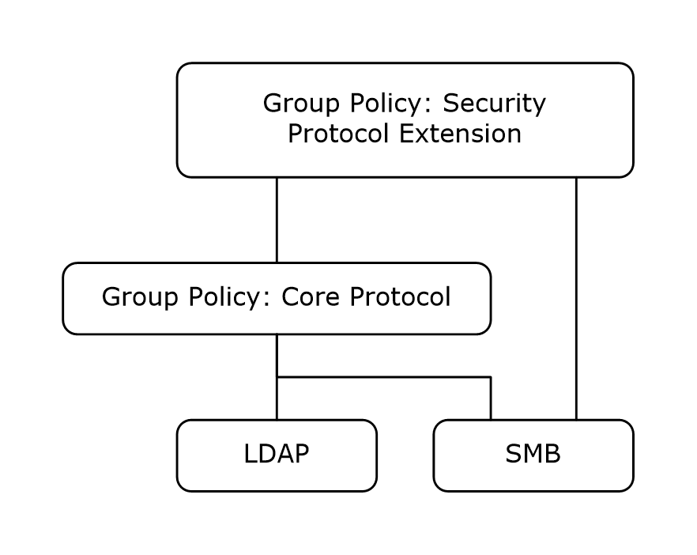

# [MS-GPSB]: Group Policy: Security Protocol Extension

Table of Contents

1 Introduction

- [1 Introduction](#Section_1)
  - [1.1 Glossary](#Section_1.1)
  - [1.2 References](#Section_1.2)
    - [1.2.1 Normative References](#Section_1.2.1)
    - [1.2.2 Informative References](#Section_1.2.2)
  - [1.3 Overview](#Section_1.3)
    - [1.3.1 Background](#Section_1.3.1)
    - [1.3.2 Security Extension Overview](#Section_1.3.2)
  - [1.4 Relationship to Other Protocols](#Section_1.4)
  - [1.5 Prerequisites/Preconditions](#Section_1.5)
  - [1.6 Applicability Statement](#Section_1.6)
  - [1.7 Versioning and Capability Negotiation](#Section_1.7)
  - [1.8 Vendor-Extensible Fields](#Section_1.8)
  - [1.9 Standards Assignments](#Section_1.9)

2 Messages

- [2 Messages](#Section_2)
  - [2.1 Transport](#Section_2.1)
  - [2.2 Message Syntax](#Section_2.2)
    - [2.2.1 System Access](#Section_2.2.1)
      - [2.2.1.1 Password Policies](#Section_2.2.1.1)
      - [2.2.1.2 Account Lockout Policies](#Section_2.2.1.2)
      - [2.2.1.3 Local Account Policies](#Section_2.2.1.3)
    - [2.2.2 Kerberos Policy](#Section_2.2.2)
    - [2.2.3 Event Log Policies](#Section_2.2.3)
    - [2.2.4 Event Audit Policies](#Section_2.2.4)
    - [2.2.5 Registry Values](#Section_2.2.5)
    - [2.2.6 Privilege Rights](#Section_2.2.6)
    - [2.2.7 Registry Keys](#Section_2.2.7)
    - [2.2.8 Service General Setting](#Section_2.2.8)
    - [2.2.9 File Security](#Section_2.2.9)
    - [2.2.10 Group Membership](#Section_2.2.10)
    - [2.2.11 User Account Control](#Section_2.2.11)
      - [2.2.11.1 FilterAdministratorToken](#Section_2.2.11.1)
      - [2.2.11.2 ConsentPromptBehaviorAdmin](#Section_2.2.11.2)
      - [2.2.11.3 ConsentPromptBehaviorUser](#Section_2.2.11.3)
      - [2.2.11.4 EnableInstallerDetection](#Section_2.2.11.4)
      - [2.2.11.5 ValidateAdminCodeSignatures](#Section_2.2.11.5)
      - [2.2.11.6 EnableLUA](#Section_2.2.11.6)
      - [2.2.11.7 PromptOnSecureDesktop](#Section_2.2.11.7)
      - [2.2.11.8 EnableVirtualization](#Section_2.2.11.8)

3 Protocol Details

- [3 Protocol Details](#Section_3)
  - [3.1 Administrative-Side Plug-in Details](#Section_3.1)
    - [3.1.1 Abstract Data Model](#Section_3.1.1)
    - [3.1.2 Timers](#Section_3.1.2)
    - [3.1.3 Initialization](#Section_3.1.3)
    - [3.1.4 Higher-Layer Triggered Events](#Section_3.1.4)
    - [3.1.5 Message Processing Events and Sequencing Rules](#Section_3.1.5)
      - [3.1.5.1 Load Policy](#Section_3.1.5.1)
      - [3.1.5.2 Update Policy](#Section_3.1.5.2)
      - [3.1.5.3 Delete Setting Value](#Section_3.1.5.3)
    - [3.1.6 Timer Events](#Section_3.1.6)
    - [3.1.7 Other Local Events](#Section_3.1.7)
  - [3.2 Client-Side Plug-in Details](#Section_3.2)
    - [3.2.1 Abstract Data Model](#Section_3.2.1)
    - [3.2.2 Timers](#Section_3.2.2)
    - [3.2.3 Initialization](#Section_3.2.3)
    - [3.2.4 Higher-Layer Triggered Events](#Section_3.2.4)
      - [3.2.4.1 Process Group Policy](#Section_3.2.4.1)
    - [3.2.5 Message Processing Events and Sequencing Rules](#Section_3.2.5)
      - [3.2.5.1 Password Policies](#Section_3.2.5.1)
      - [3.2.5.2 Account Lockout Policies](#Section_3.2.5.2)
      - [3.2.5.3 Local Account Policies](#Section_3.2.5.3)
      - [3.2.5.4 Kerberos Policy](#Section_3.2.5.4)
      - [3.2.5.5 Event Log Policies](#Section_3.2.5.5)
      - [3.2.5.6 Event Audit Policies](#Section_3.2.5.6)
      - [3.2.5.7 Registry Values](#Section_3.2.5.7)
      - [3.2.5.8 Privilege Rights](#Section_3.2.5.8)
      - [3.2.5.9 Registry Keys](#Section_3.2.5.9)
      - [3.2.5.10 Service General Setting](#Section_3.2.5.10)
      - [3.2.5.11 File Security](#Section_3.2.5.11)
      - [3.2.5.12 Group Membership](#Section_3.2.5.12)
      - [3.2.5.13 User Account Control](#Section_3.2.5.13)
    - [3.2.6 Timer Events](#Section_3.2.6)
    - [3.2.7 Other Local Events](#Section_3.2.7)

4 Protocol Examples

- [4 Protocol Examples](#Section_4)
  - [4.1 Example Involving Password Policy](#Section_4.1)
  - [4.2 Example Involving Audit Settings](#Section_4.2)
  - [4.3 Example of Configuring Group Membership](#Section_4.3)
  - [4.4 Example of Configuring Multiple Types of Settings](#Section_4.4)

5 Security

- [5 Security](#Section_5)
  - [5.1 Security Considerations for Implementers](#Section_5.1)
  - [5.2 Index of Security Parameters](#Section_5.2)
    - [5.2.1 Security Parameters Affecting Behavior of the Protocol](#Section_5.2.1)
    - [5.2.2 System Security Parameters Carried by the Protocol](#Section_5.2.2)

6 Appendix A: Product Behavior

- [6 Appendix A: Product Behavior](#Section_6)

7 Change Tracking

- [7 Change Tracking](#Section_7)

For the legal notice and IP terms, see [LEGAL.md](../LEGAL.md).
Last updated: 4/23/2024.
See [Revision History](#revision-history) for full version history.

# 1 Introduction

This document specifies the Group Policy: Security Protocol Extension to the Group Policy: Core Protocol, as specified in [MS-GPOL](../MS-GPOL/MS-GPOL.md).

Sections 1.5, 1.8, 1.9, 2, and 3 of this specification are normative. All other sections and examples in this specification are informative.

## 1.1 Glossary

This document uses the following terms:

**Active Directory**: The Windows implementation of a general-purpose directory service, which uses [**LDAP**](#gt_lightweight-directory-access-protocol-ldap) as its primary access protocol. [**Active Directory**](#gt_active-directory) stores information about a variety of objects in the network such as user accounts, computer accounts, groups, and all related credential information used by Kerberos [MS-KILE](../MS-KILE/MS-KILE.md). [**Active Directory**](#gt_active-directory) is either deployed as Active Directory Domain Services (AD DS) or Active Directory Lightweight Directory Services (AD LDS), which are both described in [MS-ADOD](../MS-ADOD/MS-ADOD.md): Active Directory Protocols Overview.

**Active Directory object**: A set of directory objects that are used within [**Active Directory**](#gt_active-directory) as defined in [MS-ADTS](../MS-ADTS/MS-ADTS.md) section 3.1.1. An [**Active Directory object**](#gt_active-directory-object) can be identified by a dsname. See also directory object.

**attribute**: A characteristic of some object or entity, typically encoded as a name/value pair.

**Augmented Backus-Naur Form (ABNF)**: A modified version of Backus-Naur Form (BNF), commonly used by Internet specifications. ABNF notation balances compactness and simplicity with reasonable representational power. ABNF differs from standard BNF in its definitions and uses of naming rules, repetition, alternatives, order-independence, and value ranges. For more information, see [[RFC5234]](https://go.microsoft.com/fwlink/?LinkId=123096).

**class**: User-defined binary data that is associated with a key.

**client**: A client, also called a client computer, is a computer that receives and applies settings of a [**Group Policy Object (GPO)**](#gt_group-policy-object-gpo), as specified in [MS-GPOL](../MS-GPOL/MS-GPOL.md).

**client-side extension GUID (CSE GUID)**: A [**GUID**](#gt_globally-unique-identifier-guid) that enables a specific client-side extension on the Group Policy client to be associated with policy data that is stored in the logical and physical components of a [**Group Policy Object (GPO)**](#gt_group-policy-object-gpo) on the Group Policy server, for that particular extension.

**discretionary access control list (DACL)**: An access control list (ACL) that is controlled by the owner of an object and that specifies the access particular users or groups can have to the object.

**domain**: A set of users and computers sharing a common namespace and management infrastructure. At least one computer member of the set has to act as a [**domain controller (DC)**](#gt_domain-controller-dc) and host a member list that identifies all members of the domain, as well as optionally hosting the [**Active Directory**](#gt_active-directory) service. The domain controller provides authentication of members, creating a unit of trust for its members. Each domain has an identifier that is shared among its members. For more information, see [MS-AUTHSOD](../MS-AUTHSOD/MS-AUTHSOD.md) section 1.1.1.5 and [MS-ADTS].

**domain controller (DC)**: The service, running on a server, that implements [**Active Directory**](#gt_active-directory), or the server hosting this service. The service hosts the data store for objects and interoperates with other [**DCs**](#gt_domain-controller-dc) to ensure that a local change to an object replicates correctly across all [**DCs**](#gt_domain-controller-dc). When [**Active Directory**](#gt_active-directory) is operating as Active Directory Domain Services (AD DS), the [**DC**](#gt_domain-controller-dc) contains full NC replicas of the configuration naming context (config NC), schema naming context (schema NC), and one of the domain NCs in its forest. If the AD DS [**DC**](#gt_domain-controller-dc) is a global catalog server (GC server), it contains partial NC replicas of the remaining domain NCs in its forest. For more information, see [MS-AUTHSOD] section 1.1.1.5.2 and [MS-ADTS]. When [**Active Directory**](#gt_active-directory) is operating as Active Directory Lightweight Directory Services (AD LDS), several AD LDS [**DCs**](#gt_domain-controller-dc) can run on one server. When [**Active Directory**](#gt_active-directory) is operating as AD DS, only one AD DS [**DC**](#gt_domain-controller-dc) can run on one server. However, several AD LDS [**DCs**](#gt_domain-controller-dc) can coexist with one AD DS [**DC**](#gt_domain-controller-dc) on one server. The AD LDS [**DC**](#gt_domain-controller-dc) contains full NC replicas of the config NC and the schema NC in its forest. The domain controller is the server side of Authentication Protocol Domain Support [MS-APDS](../MS-APDS/MS-APDS.md).

**globally unique identifier (GUID)**: A term used interchangeably with universally unique identifier (UUID) in Microsoft protocol technical documents (TDs). Interchanging the usage of these terms does not imply or require a specific algorithm or mechanism to generate the value. Specifically, the use of this term does not imply or require that the algorithms described in [[RFC4122]](https://go.microsoft.com/fwlink/?LinkId=90460) or [[C706]](https://go.microsoft.com/fwlink/?LinkId=89824) must be used for generating the [**GUID**](#gt_globally-unique-identifier-guid). See also universally unique identifier (UUID).

**Group Policy**: A mechanism that allows the implementer to specify managed configurations for users and computers in an [**Active Directory**](#gt_active-directory) service environment.

**Group Policy Object (GPO)**: A collection of administrator-defined specifications of the policy settings that can be applied to groups of computers in a domain. Each GPO includes two elements: an object that resides in the [**Active Directory**](#gt_active-directory) for the domain, and a corresponding file system subdirectory that resides on the sysvol DFS share of the Group Policy server for the domain.

**Lightweight Directory Access Protocol (LDAP)**: The primary access protocol for [**Active Directory**](#gt_active-directory). Lightweight Directory Access Protocol (LDAP) is an industry-standard protocol, established by the Internet Engineering Task Force (IETF), which allows users to query and update information in a directory service (DS), as described in [MS-ADTS]. The Lightweight Directory Access Protocol can be either version 2 [[RFC1777]](https://go.microsoft.com/fwlink/?LinkId=90290) or version 3 [[RFC3377]](https://go.microsoft.com/fwlink/?LinkID=91337).

**relative identifier (RID)**: The last item in the series of SubAuthority values in a [**security identifier (SID)**](#gt_security-identifier-sid) [[SIDD]](https://go.microsoft.com/fwlink/?LinkId=90516). It distinguishes one account or group from all other accounts and groups in the domain. No two accounts or groups in any domain share the same RID.

**security identifier (SID)**: An identifier for security principals that is used to identify an account or a group. Conceptually, the [**SID**](#gt_security-identifier-sid) is composed of an account authority portion (typically a [**domain**](#gt_domain)) and a smaller integer representing an identity relative to the account authority, termed the [**relative identifier (RID)**](#gt_relative-identifier-rid). The [**SID**](#gt_security-identifier-sid) format is specified in [MS-DTYP](../MS-DTYP/MS-DTYP.md) section 2.4.2; a string representation of [**SIDs**](#gt_security-identifier-sid) is specified in [MS-DTYP] section 2.4.2 and [MS-AZOD](../MS-AZOD/MS-AZOD.md) section 1.1.1.2.

**security policy**: In the form of a collection of security policy settings, the policy itself is an expression of administrative intent regarding how computers and resources on their network should be secured.

**security policy settings**: Contained in [**security policies**](#gt_security-policy), the policy settings are the actual expression of how various security-related parameters on the computer are to be configured.

**Server Message Block (SMB)**: A protocol that is used to request file and print services from server systems over a network. The SMB protocol extends the CIFS protocol with additional security, file, and disk management support. For more information, see [[CIFS]](https://go.microsoft.com/fwlink/?linkid=2109334) and [MS-SMB](../MS-SMB/MS-SMB.md).

**share**: A resource offered by a Common Internet File System (CIFS) server for access by CIFS clients over the network. A [**share**](#gt_share) typically represents a directory tree and its included files (referred to commonly as a "disk share" or "file share") or a printer (a "print share"). If the information about the [**share**](#gt_share) is saved in persistent store (for example, Windows registry) and reloaded when a file server is restarted, then the [**share**](#gt_share) is referred to as a "sticky share". Some [**share**](#gt_share) names are reserved for specific functions and are referred to as special [**shares**](#gt_share): IPC$, reserved for interprocess communication, ADMIN$, reserved for remote administration, and A$, B$, C$ (and other local disk names followed by a dollar sign), assigned to local disk devices.

**system access control list (SACL)**: An access control list (ACL) that controls the generation of audit messages for attempts to access a securable object. The ability to get or set an object's [**SACL**](#gt_system-access-control-list-sacl) is controlled by a privilege typically held only by system administrators.

**MAY, SHOULD, MUST, SHOULD NOT, MUST NOT:** These terms (in all caps) are used as defined in [[RFC2119]](https://go.microsoft.com/fwlink/?LinkId=90317). All statements of optional behavior use either MAY, SHOULD, or SHOULD NOT.

## 1.2 References

Links to a document in the Microsoft Open Specifications library point to the correct section in the most recently published version of the referenced document. However, because individual documents in the library are not updated at the same time, the section numbers in the documents may not match. You can confirm the correct section numbering by checking the [Errata](https://go.microsoft.com/fwlink/?linkid=850906).

### 1.2.1 Normative References

We conduct frequent surveys of the normative references to assure their continued availability. If you have any issue with finding a normative reference, please contact [dochelp@microsoft.com](mailto:dochelp@microsoft.com). We will assist you in finding the relevant information.

[MS-ADTS] Microsoft Corporation, "[Active Directory Technical Specification](../MS-ADTS/MS-ADTS.md)".

[MS-DTYP] Microsoft Corporation, "[Windows Data Types](../MS-DTYP/MS-DTYP.md)".

[MS-EVEN] Microsoft Corporation, "[EventLog Remoting Protocol](../MS-EVEN/MS-EVEN.md)".

[MS-GPOL] Microsoft Corporation, "[Group Policy: Core Protocol](../MS-GPOL/MS-GPOL.md)".

[MS-LSAD] Microsoft Corporation, "[Local Security Authority (Domain Policy) Remote Protocol](#Section_5)".

[MS-RRP] Microsoft Corporation, "[Windows Remote Registry Protocol](../MS-RRP/MS-RRP.md)".

[MS-SAMR] Microsoft Corporation, "[Security Account Manager (SAM) Remote Protocol (Client-to-Server)](#Section_5)".

[MS-SCMR] Microsoft Corporation, "[Service Control Manager Remote Protocol](../MS-SCMR/MS-SCMR.md)".

[MS-SMB2] Microsoft Corporation, "[Server Message Block (SMB) Protocol Versions 2 and 3](../MS-SMB2/MS-SMB2.md)".

[MS-SMB] Microsoft Corporation, "[Server Message Block (SMB) Protocol](../MS-SMB/MS-SMB.md)".

[RFC1510] Kohl, J., and Neuman, C., "The Kerberos Network Authentication Service (V5)", RFC 1510, September 1993, [https://www.rfc-editor.org/info/rfc1510](https://go.microsoft.com/fwlink/?LinkId=90279)

[RFC2119] Bradner, S., "Key words for use in RFCs to Indicate Requirement Levels", BCP 14, RFC 2119, March 1997, [https://www.rfc-editor.org/info/rfc2119](https://go.microsoft.com/fwlink/?LinkId=90317)

[RFC2251] Wahl, M., Howes, T., and Kille, S., "Lightweight Directory Access Protocol (v3)", RFC 2251, December 1997, [https://www.rfc-editor.org/info/rfc2251](https://go.microsoft.com/fwlink/?LinkId=90325)

[RFC4234] Crocker, D., Ed., and Overell, P., "Augmented BNF for Syntax Specifications: ABNF", RFC 4234, October 2005, [https://www.rfc-editor.org/info/rfc4234](https://go.microsoft.com/fwlink/?LinkId=90462)

### 1.2.2 Informative References

[MSDN-INF] Microsoft Corporation, "About INF Files", [http://msdn.microsoft.com/en-us/library/aa376858.aspx](https://go.microsoft.com/fwlink/?LinkId=90025)

[MSDN-PRIVS] Microsoft Corporation, "Authorization Constants", [http://msdn.microsoft.com/en-us/library/aa375728.aspx](https://go.microsoft.com/fwlink/?LinkId=90065)

## 1.3 Overview

Group Policy: Security Protocol Extension enables [**security policies**](#gt_security-policy) to be distributed to multiple [**client**](#gt_client) systems so that these systems can enact the policies in accordance with the intentions of the administrator.

### 1.3.1 Background

The Group Policy: Core Protocol, as specified in [MS-GPOL](../MS-GPOL/MS-GPOL.md), enables [**clients**](#gt_client) to discover and retrieve policy settings created by administrators of [**domains**](#gt_domain). These settings are propagated within [**Group Policy Objects (GPOs)**](#gt_group-policy-object-gpo) that are assigned to policy target accounts in [**Active Directory**](#gt_active-directory). Policy target accounts are either computer accounts or user accounts in Active Directory. Each client uses the [**Lightweight Directory Access Protocol (LDAP)**](#gt_lightweight-directory-access-protocol-ldap) to determine what GPOs are applicable to it by consulting the [**Active Directory objects**](#gt_active-directory-object) corresponding to each client's computer account and the user accounts of any users logging on to the client computer.

On each client, each GPO is interpreted and acted on by software components known as client-side plug-ins. The client-side plug-ins responsible for a given GPO are specified by using an [**attribute**](#gt_attribute) on the GPO. This attribute specifies a list of [**globally unique identifier (GUID)**](#gt_globally-unique-identifier-guid) pairs. The first GUID of each pair is referred to as a [**client-side extension GUID (CSE GUID)**](#gt_client-side-extension-guid-cse-guid). The second GUID of each pair is referred to as a tool extension GUID.

For each GPO that is applicable to a client, the client consults the CSE GUIDs listed in the GPO to determine what client-side plug-ins on the client are to handle the GPO. The client then invokes the client-side plug-ins to handle the GPO.

A client-side plug-in uses the contents of the GPO to retrieve settings specific to its [**class**](#gt_class) in a manner specific to its class. After its class-specific settings are retrieved, the client-side plug-in uses these settings to perform class-specific processing.

### 1.3.2 Security Extension Overview

[**Security policies**](#gt_security-policy) contain settings (which the protocol configures) that enable underlying security components to enforce the following:

- Password, account lockout, and Kerberos policies.
- System audit settings.
- Privilege and rights assignments.
- Application security configuration data values and security descriptors.
- Event log settings.
- Security group membership.
- Configuration information of long-running processes and programs, and security descriptors on them.
- File and folder security descriptors.
The following major steps are for security configuration:

- Security policy authoring.
- Security policy assignment.
- Security policy distribution.
Security policy authoring is enabled through an administrative tool for the Group Policy: Core Protocol with an administrative plug-in for behavior specific to this protocol. The plug-in allows an administrator to author security policies within a user interface. The plug-in then saves the security policies into .inf files with a standard format, and stores them on a network location that is accessible by using the Server Message Block (SMB) Protocol, as specified in [MS-SMB](../MS-SMB/MS-SMB.md).

Security policy assignment is performed by the Group Policy: Core Protocol administrative tool, which constructs [**GPOs**](#gt_group-policy-object-gpo), as specified in [MS-GPOL](../MS-GPOL/MS-GPOL.md) section 2.2.8.1. Each GPO contains a reference to the network location containing the security policy files generated by the administrative-tool plug-in.

Security policy distribution involves a corresponding protocol-specific [**Group Policy**](#gt_group-policy) plug-in on the [**client**](#gt_client) machine, which is invoked to process any GPO that refers to [**security policy settings**](#gt_security-policy-settings). The security protocol client-side plug-in extracts the network location specified in the GPO, transfers the security policy files by using the [**SMB**](#gt_server-message-block-smb) protocol, and then uses the security policy files to configure the client's security settings.

## 1.4 Relationship to Other Protocols

This protocol depends on Group Policy: Core Protocol as specified in [MS-GPOL](../MS-GPOL/MS-GPOL.md). It also depends on the SMB Protocol, as specified in [MS-SMB](../MS-SMB/MS-SMB.md), for transmitting Group Policy settings and instructions between the client and the GP server.

Figure 1: Group Policy: Host Security Configuration protocol relationship diagram

## 1.5 Prerequisites/Preconditions

The prerequisites for the Group Policy: Security Protocol Extension are the same as those for the Group Policy: Core Protocol.

## 1.6 Applicability Statement

The Group Policy: Security Protocol Extension is only applicable within the [**Group Policy**](#gt_group-policy) framework.

## 1.7 Versioning and Capability Negotiation

The Group Policy: Security Protocol Extension does not perform any explicit version checking on the received [**security policy**](#gt_security-policy).

## 1.8 Vendor-Extensible Fields

The Group Policy: Security Protocol Extension does not define any vendor-extensible fields.

## 1.9 Standards Assignments

The Group Policy: Security Protocol Extension defines [**CSE GUID**](#gt_client-side-extension-guid-cse-guid) and tool extension [**GUID**](#gt_globally-unique-identifier-guid), as specified in [MS-GPOL](../MS-GPOL/MS-GPOL.md) section 1.8. The following table shows the assignments.

| Parameter | Value |
| --- | --- |
| CSE GUID | {827D319E-6EAC-11D2-A4EA-00C04F79F83A} |
| Tool extension GUID (computer policy settings) | {803E14A0-B4FB-11D0-A0D0-00A0C90F574B} |

# 2 Messages

## 2.1 Transport

The Group Policy: Security Protocol Extension SHOULD<1> transport messages (in the form of files) over the Group Policy Protocol over the Server Message Block (SMB) Versions 2 and 3 Protocol, as specified in [MS-SMB2](../MS-SMB2/MS-SMB2.md). The client-side plug-in MUST use this protocol's [**CSE GUID**](#gt_client-side-extension-guid-cse-guid) (as specified in [MS-DTYP](../MS-DTYP/MS-DTYP.md) section 2.3.4), and the administrative-tool plug-in MUST use the tool extension [**GUID**](#gt_globally-unique-identifier-guid).

The Group Policy: Core Protocol uses this protocol's CSE GUID and tool extension GUID values (see section [1.9](#Section_1.9)) to invoke this protocol only to access [**GPOs**](#gt_group-policy-object-gpo) that require processing by this protocol.

## 2.2 Message Syntax

Messages exchanged in the Group Policy: Security Protocol Extension correspond to [**security policy**](#gt_security-policy) files transferred by using the SMB Protocol. The protocol is driven through the exchange of these messages, as specified in section [3](#Section_3).

All security policy files processed by the Group Policy: Security Protocol Extension MUST be encoded in UTF-16LE with Byte Order Mark (0xFFFE). The .inf file syntax is as follows.

InfFile = UnicodePreamble VersionPreamble Sections

UnicodePreamble = *("[Unicode]" LineBreak "Unicode=yes"

LineBreak)

VersionPreamble = "[Version]" LineBreak "signature="

DQUOTE "$CHICAGO$" DQUOTE LineBreak "Revision=1" LineBreak

Sections = Section / Section Sections

Section = Header Settings

Header = "[" HeaderValue "]" LineBreak

HeaderValue = StringWithSpaces

Settings = Setting / Setting Settings

Setting = Key Wsp "=" Wsp ValueList LineBreak /

Name "," Mode "," AclString LineBreak

Name = String / QuotedString

Mode = [0-9]+

AclString = SDDL / DQUOTE SDDL DQUOTE

ValueList = Value / Value Wsp "," Wsp ValueList

Key = String

Value = String / QuotedString

The preceding syntax is given in the [**Augmented Backus-Naur Form (ABNF)**](#gt_augmented-backus-naur-form-abnf) grammar, as specified in [[RFC4234]](https://go.microsoft.com/fwlink/?LinkId=90462) and as augmented by the following rules.

LineBreak = CRLF

String = *(ALPHANUM / %d47 / %d45 / %d58 / %d59)

StringWithSpaces = String / String Wsp StringWithSpaces

QuotedString = DQUOTE *(%x20-21 / %x23-7E) DQUOTE

Wsp = *WSP

ALPHANUM = ALPHA / DIGIT

For more information about .inf files and their uses, see [[MSDN-INF]](https://go.microsoft.com/fwlink/?LinkId=90025).

The protocol further restricts the values that can be assigned to HeaderValue. HeaderValue MUST be assigned one of the values listed in the following table.

| HeaderValue | Purpose |
| --- | --- |
| [System Access](#Section_2.2.1) | MUST contain settings that pertain to account lockout, password policies, and local security options. |
| [Kerberos Policy](#Section_3.2.5.4) | MUST contain settings that pertain to the Kerberos policy, as specified in [[RFC1510]](https://go.microsoft.com/fwlink/?LinkId=90279). |
| System Log | MUST contain settings that pertain to maximum size, retention policy, and so on for the system log. For more details, see section [2.2.3](#Section_2.2.3). |
| Security Log | MUST contain settings that pertain to maximum size, retention policy, and so on for the security log. For more details, see section 2.2.3. |
| Application Log | MUST contain settings that pertain to maximum size, retention policy, and so on for the application log. For more details, see section 2.2.3. |
| [Event Audit](#Section_3.2.5.6) | MUST contain settings that pertain to audit policy. |
| [Registry Values](#Section_2.2.5) | MUST contain registry values to be configured. |
| [Privilege Rights](#Section_3.2.5.8) | MUST contain a list of privileges to be assigned to specific accounts. |
| [Service General Setting](#Section_3.2.5.10) | MUST contain configuration settings that pertain to services. |
| [Registry Keys](#Section_2.2.7) | MUST contain a list of registry keys and their corresponding security information to be applied. |
| [File Security](#Section_2.2.9) | MUST contain a list of files, folders, and their corresponding security information to be applied. |
| [Group Membership](#Section_3.2.5.12) | MUST contain group membership information, for example, which users are part of what group. |

**Note** The plug-in that implements the client side of the protocol documented here does not understand the semantics of any of the (name, value) pairs it handles. Its operation is to set those named values in client-side stores indicated by the HeaderValue. When that client-side store is the Registry, the plug-in does not need to know the list of possible names for (name, value) pairs. This implies that new security settings stored in registry keys can be created and populated by GP. For other stores, the plug-in maintains a precompiled list of mappings from setting name to the application programming interface (API) used to apply the setting.

### 2.2.1 System Access

The following topics specify various types of system access settings. The [**ABNF**](#gt_augmented-backus-naur-form-abnf) for this section MUST be as follows.

Header = "[" HeaderValue "]" LineBreak

HeaderValue = "System Access"

Settings = Setting / Setting Settings

Setting = Key Wsp "=" Wsp Value LineBreak

Key = String

Value = 1*DIGIT

#### 2.2.1.1 Password Policies

This section defines settings that specify various supported password policies. The [**ABNF**](#gt_augmented-backus-naur-form-abnf) for valid keys that represent such policies MUST be as follows.

Key = "MinimumPasswordAge" / "MaximumPasswordAge" /

"MinimumPasswordLength" / "PasswordComplexity" /

"PasswordHistorySize" / "ClearTextPassword" /

"RequireLogonToChangePassword"

Value = 1*10DIGIT

The following table provides an explanation for each of the valid key values.

**Note** All numerical values are decimal unless explicitly specified otherwise or preceded by 0x.

| Setting key | Explanation |
| --- | --- |
| MaximumPasswordAge | Maximum number of days that a password can be used before the [**client**](#gt_client) requires the user to change it. The value MUST be either equal to "-1" or in the range 1 to 999. The value "-1" indicates that a password never expires. If the maximum password age value is not "-1", the minimum password age MUST be less than the maximum password age. |
| MinimumPasswordAge | Number of days that a password can be used before the client MUST allow the user to change it from the date the password was changed or reset. This value MUST be between 0 and 999. The minimum password age MUST be less than the maximum password age, unless the maximum password age is set to -1. |
| MinimumPasswordLength | Minimum number of characters that a password for a user account MAY contain. This value MUST be between 0 and 2^16. A value of 0 indicates that no password is required. |
| PasswordComplexity | Flag that indicates whether the operating system MUST require that passwords meet complexity requirements. If this flag is set, it indicates that passwords MUST meet a specific minimum requirement. This value MUST be between 0 and 2^16. A value of 0 indicates that no password complexity requirements apply. Any other valid value indicates that password complexity requirements apply. If this policy is enabled, passwords MUST meet the following minimum requirements: MUST NOT contain the user's account name or parts of the user's full name that exceed two consecutive characters. MUST be at least six characters in length. MUST contain characters from three of the following categories: English uppercase characters (A through Z). English lowercase characters (a through z). Base 10 digits (0 through 9). Nonalphanumeric characters (for example, !, $, #, %). Complexity requirements MUST be enforced when passwords are changed or created. |
| ClearTextPassword | Flag that indicates whether passwords MUST be stored by using reversible encryption. This value MUST be between 0 and 2^16. A value of 0 indicates that the password is not stored using reversible encryption. Any other valid value indicates that the password is stored with reversible encryption. Use of this flag is not recommended. This policy provides support for applications that use protocols that require knowledge of the user's password for authentication purposes. Storing passwords by using reversible encryption is essentially the same as storing plain-text versions of the passwords. |
| PasswordHistorySize | The number of unique new passwords that are required before an old password can be reused in association with a user account. This value MUST be between 0 and 2^16. A value of 0 indicates that the password history is disabled. This policy enables administrators to enhance security by ensuring that old passwords are not reused continually. |
| RequireLogonToChangePassword | Setting is ignored.<2> |

#### 2.2.1.2 Account Lockout Policies

This section defines settings that specify the configuration of account lockout duration. The [**ABNF**](#gt_augmented-backus-naur-form-abnf) for valid keys that represent such policies MUST be as follows.

Key = "LockoutBadCount" / "ResetLockoutCount" /

"LockoutDuration" / "ForceLogoffWhenHourExpire"

Value = 1*10DIGIT

The following table provides an explanation for each of the valid key values.

**Note** All numerical values are decimal unless explicitly specified otherwise or preceded by 0x.

| Setting key | Explanation |
| --- | --- |
| ForceLogoffWhenHourExpire | This setting controls whether SMB client sessions with the SMB server will be forcibly disconnected when the client's logon hours expire. If a nonzero value is specified, the policy is enabled. |
| LockoutDuration | The number of minutes that a locked-out account MUST remain locked out before automatically becoming unlocked. The value MUST be either -1 or in the range 1 to 99,999. If the account lockout duration value is set to negative 1, the account MUST be locked out until an administrator explicitly unlocks it. If an account lockout threshold is defined, the account lockout duration MUST be greater than or equal to the reset time, ResetLockoutCount. This setting only has meaning when an account lockout threshold is specified. |
| LockoutBadCount | Number of failed logon attempts after which a user account MUST be locked out. A locked-out account MUST NOT be allowed to log on until it is reset by an administrator or until the lockout duration for the account has expired. The value MUST be between 0 and 2^16. A value of 0 indicates that the account MUST not be locked out. |
| ResetLockoutCount | Number of minutes after a failed logon attempt that the account MUST be locked out. The value MUST be in the range -2^32 to 2^32. If the value is negative or zero, then no reset time is enforced. If a positive account lockout threshold is defined, this reset time MUST be less than or equal to the account lockout duration, LockoutDuration. |

#### 2.2.1.3 Local Account Policies

This section defines settings that specify the configuration of local guest and built-in Administrator accounts. The [**ABNF**](#gt_augmented-backus-naur-form-abnf) for valid keys that represent such policies MUST be as follows.

Key = " LSAAnonymousNameLookup " / " EnableAdminAccount " /

" EnableGuestAccount " / " NewAdministratorName" / " NewGuestName"

Value = 1DIGIT / String

The following table provides an explanation for each of the valid key values.

| Setting key | Explanation |
| --- | --- |
| LSAAnonymousNameLookup | When enabled, this setting allows an anonymous user to query the local LSA policy. If the value element contains a nonzero value, the setting is enabled; otherwise, the setting is disabled. |
| EnableAdminAccount | This setting specifies whether the Administrator account on the local computer is enabled. If the value element contains a nonzero value, the setting is enabled; otherwise, the setting is disabled. |
| EnableGuestAccount | This setting specifies whether the Guest account on the local computer is enabled. If the value element contains a nonzero value, the setting is enabled; otherwise, the setting is disabled. |
| NewAdministratorName | This setting specifies the name of the Administrator account on the local computer. |
| NewGuestName | This setting specifies the name of the Guest account on the local computer. |

### 2.2.2 Kerberos Policy

This section defines settings that enable an administrator to configure user logon restrictions, as specified in [[RFC1510]](https://go.microsoft.com/fwlink/?LinkId=90279).

The [**ABNF**](#gt_augmented-backus-naur-form-abnf) for this section MUST be as follows.

Header = "[" HeaderValue "]" LineBreak

HeaderValue = "Kerberos Policy"

Settings = Setting / Setting Settings

Setting = Key Wsp "=" Wsp Value LineBreak

Key = "MaxTicketAge" / "MaxRenewAge" / "MaxServiceAge" /

"MaxClockSkew" / "TicketValidateClient"

Value = 1*5DIGIT

The following table provides an explanation for each of the valid key values.

**Note** All numerical values are decimal unless explicitly specified otherwise or preceded by 0x. Group Policy: Security Protocol Extension implementations SHOULD use the specified default values.

| Setting key | Explanation |
| --- | --- |
| MaxServiceAge | Maximum amount of time (in minutes) that a granted session ticket MUST be valid to access a service or resource by using Kerberos before it expires. An expired ticket MUST NOT be accepted as a valid ticket for service or resource access. Details about Kerberos ticket authentication are as specified in [RFC1510]. The value MUST be greater than or equal to 10 and less than or equal to the setting for MaxTicketAge. The default is 600 minutes (10 hours). |
| MaxTicketAge | Maximum amount of time (in hours) that a user's ticket-granting ticket (TGT) MAY be used before it expires. An expired TGT MUST NOT be accepted as a valid TGT. The default is 10 hours. The value MUST be between zero and 99,999. |
| MaxRenewAge | Period of time (in days) during which a user's TGT can be renewed. A TGT MUST NOT be renewed if it is more than MaxRenewAge days old. The default is 7 days. The value MUST be between zero and 99,999. |
| MaxClockSkew | MUST be the maximum time difference (in minutes) between the [**client**](#gt_client) clock time and the clock time of the server that provides Kerberos v5 authentication, as specified in [RFC1510]. The default is 5 minutes. The value MUST be between zero and 99,999. |
| TicketValidateClient | A flag that determines whether the Kerberos v5 Key Distribution Center (KDC) MUST validate every request for a session ticket against the user rights policy of the user account. Validation of each request for a session ticket is optional because the extra step takes time and can slow network access to services. The default is enabled. A nonzero value indicates the policy is enabled; otherwise, the policy is disabled. |

### 2.2.3 Event Log Policies

There are three types of event log policies:

- System log
- Security log
- Application log
The [**ABNF**](#gt_augmented-backus-naur-form-abnf) for each of them MUST be as follows.

Header = "[" HeaderValue "]" LineBreak

HeaderValue = "System Log" / "Security Log" / "Application Log"

Settings = Setting / Setting Settings

Setting = Key Wsp "=" Wsp Value LineBreak

Key = "MaximumLogSize" / "AuditLogRetentionPeriod"

/ "RetentionDays" / "RestrictGuestAccess"

Value = 1*8DIGIT

The following table provides an explanation for each of the valid key values.

**Note** All numerical values are decimal unless explicitly specified otherwise, or unless preceded by 0x.

| Setting key | Explanation |
| --- | --- |
| MaximumLogSize | The log size, in kilobytes, MUST be less than or equal to this value. The value MUST be between 64 and 4194240. |
| AuditLogRetentionPeriod | Specifies the type of retention period to be applied to the specific log. The retention method MUST be one of the following: A value of "0" indicates to overwrite events as needed. A value of "1" indicates to overwrite events as specified by the RetentionDays entry. A value of "2" indicates to never overwrite events (clear log manually). Any other value is invalid. |
| RetentionDays | The number of days that System, Security, and Application log events MUST be retained before being overwritten by new events. Only valid if option AuditLogRetentionPeriod = 1. The value MUST be between 1 and 365. |
| RestrictGuestAccess | A flag that indicates whether or not users with Guest privileges can have access to System, Security, and Application logs.<3> A value of "0" indicates that guest access to System, Security, and Application logs is not restricted. A nonzero value indicates that guest access to System, Security, and Application logs is restricted. |

### 2.2.4 Event Audit Policies

This section defines settings that enable an administrator to enforce audit account logon events. The syntax for the entries in this category MUST be as follows.

Header = "[" HeaderValue "]" LineBreak

HeaderValue = "Event Audit"

Settings = Setting / Setting Settings

Setting = Key Wsp "=" Wsp Value Linebreak

Key = "AuditSystemEvents" / "AuditLogonEvents" / "AuditPrivilegeUse" /

"AuditPolicyChange" / "AuditAccountManage" / "AuditProcessTracking" /

"AuditDSAccess" / "AuditObjectAccess" / "AuditAccountLogon"

Value = 1*DIGIT

The following table provides an explanation for the valid keys as specified in [MS-LSAD](#Section_5) section 2.2.4.20.

**Note** All numerical values are decimal unless explicitly specified otherwise, or unless preceded by 0x.

| Setting key | Explanation |
| --- | --- |
| AuditAccountManage | A flag that indicates whether the operating system MUST audit each event of account management on a computer. |
| AuditDSAccess | A security setting that determines whether the operating system MUST audit each instance of user attempts to access an Active Directory object that has its own [**system access control list (SACL)**](#gt_system-access-control-list-sacl) specified, if the type of access request (such as Write, Read, or Modify) and the account making the request, match the settings in the SACL. The administrator can specify to audit only successes, only failures, both successes and failures, or to not audit these events at all (that is, neither successes nor failures). If Success auditing is enabled, an audit entry MUST be logged each time any user successfully accesses an Active Directory object that has a matching SACL specified. If Failure auditing is enabled, an audit entry MUST be logged each time any user unsuccessfully attempts to access an Active Directory object that has a matching SACL specified. |
| AuditAccountLogon | A security setting that determines whether the operating system MUST audit each time this computer validates the credentials of an account. Account logon events are generated whenever a computer validates the credentials of one of its local accounts. The credential validation can be in support of a local logon, or in the case of an Active Directory [**domain**](#gt_domain) account on a [**domain controller (DC)**](#gt_domain-controller-dc), can be in support of a logon to another computer. Audited events for local accounts MUST be logged on the local security log of the computer. Account log off does not generate an event that can be audited. If this policy setting is defined, the administrator can specify to audit only successes, only failures, both successes and failures, or to not audit these events at all (that is, neither successes nor failures). |
| AuditLogonEvents | A security setting that determines whether the operating system MUST audit each instance of a user attempt to log on or log off this computer. Logoff events are generated whenever the logon session of a logged-on user account is terminated. If this policy setting is defined, the administrator can specify to audit only successes, only failures, both successes and failures, or to not audit these events at all (that is, neither successes nor failures). |
| AuditObjectAccess | A security setting that determines whether the operating system MUST audit each instance of user attempts to access a non-Active Directory object that has its own SACL specified, if the type of access request (such as Write, Read, or Modify) and the account making the request, match the settings in the SACL. The administrator can specify to audit only successes, only failures, both successes and failures, or to not audit these events at all (that is, neither successes nor failures). If Success auditing is enabled, an audit entry MUST be logged each time any user successfully accesses a non-Active Directory object that has a matching SACL specified. If Failure auditing is enabled, an audit entry MUST be logged each time any user unsuccessfully attempts to access a non-Active Directory object that has a matching SACL specified. |
| AuditPolicyChange | A security setting that determines whether the operating system MUST audit each instance of user attempts to change user rights assignment policy, audit policy, account policy, or trust policy. The administrator can specify to audit only successes, only failures, both successes and failures, or to not audit these events at all (that is, neither successes nor failures). If Success auditing is enabled, an audit entry MUST be logged when an attempted change to user rights assignment policy, audit policy, or trust policy is successful. If Failure auditing is enabled, an audit entry MAY be logged when a change to user rights assignment policy, audit policy, or trust policy is attempted by an account that is not authorized to make the requested policy change.<4> |
| AuditPrivilegeUse | A security setting that determines whether the operating system MUST audit each instance of user attempts to exercise a user right. If this policy setting is defined, the administrator can specify to audit only successes, only failures, both successes and failures, or to not audit these events at all (that is, neither successes nor failures). If Success auditing is enabled, an audit entry MUST be logged each time the exercise of a user right succeeds. If Failure auditing is enabled, an audit entry MUST be logged each time the exercise of a user right fails because the user account is not assigned to the user right. |
| AuditProcessTracking | A security setting that determines whether the operating system MUST audit process-related events such as process creation, process termination, handle duplication, and indirect object access. If this policy setting is defined, the administrator can specify to audit only successes, only failures, both successes and failures, or to not audit these events at all (that is, neither successes nor failures). If Success auditing is enabled, an audit entry MUST be logged each time the operating system performs one of these process-related activities. If Failure auditing is enabled, an audit entry MAY be logged each time the operating system fails to perform one of these process-related activities.<5> |
| AuditSystemEvents | A security setting that determines whether the operating system MUST audit any of the following events: Attempted system time change. Attempted security system startup or shutdown. Attempt to load extensible authentication components. Loss of audited events due to auditing system failure. Security log size exceeding a configurable warning threshold level. If this policy setting is defined, the administrator can specify to audit only successes, only failures, both successes and failures, or to not audit these events at all (that is, neither successes nor failures). If Success auditing is enabled, an audit entry MUST be logged each time the operating system performs one of these activities successfully. If Failure auditing is enabled, an audit entry MUST be logged each time the operating system attempts and fails to perform one of these activities. |

The following table provides a summary of the valid values. For more details on valid values see [MS-LSAD] section 2.2.4.4.

| Setting value | Explanation |
| --- | --- |
| 0 | Indicates that this setting is set to None. |
| 1 | Indicates that this setting is set to Success Audits Only. |
| 2 | Indicates that this setting is set to Failure Audits Only. |
| 3 | Indicates that this setting is set to Success and Failure Audits. |
| 4 | Indicates that this setting is set to None. |

### 2.2.5 Registry Values

This section defines settings that enable an administrator to set registry entries. The syntax for the entries in this category MUST be as follows.

Header = "[" HeaderValue "]" LineBreak

HeaderValue = "Registry Values"

Settings = Setting / Setting Settings

Setting = RegistryValueName "=" RegistryValueType "," RegistryValue

RegistryValueType = 1*DIGIT

RegistryValueName = KeyName / DQUOTE KeyName DQUOTE

KeyName = Key / KeyName "\" Key

Key = 1*IdCharacter

IdCharacter = %x0020-0021 / %x0023-005B / %x005D-007E

RegistryValue = String / QuotedString

The following table provides an explanation for each of the parameters listed, and specifies the set of valid values.

**Note** All numerical values are decimal unless explicitly specified otherwise or preceded by 0x.

| Setting key | Explanation |
| --- | --- |
| RegistryValueName | MUST be the Fully Qualified Name (as specified in [MS-RRP](../MS-RRP/MS-RRP.md) section 3.1.1.1.1) of the registry value to set. |
| RegistryValueType | The data type of the registry value MUST be one of the following values. (For more details about the value types, see [MS-RRP] section 3.1.1.5.) A value of "1": Indicates that the data type of the registry value is String. A value of "2": Indicates that the data type of the registry value is Expand String. A value of "3": Indicates that the data type of the registry value is Binary. A value of "4": Indicates that the data type of the registry values is DWORD. A value of "7": Indicates that the data type of the registry values is MULTI_SZ. Although other registry types exist, they are not supported by this protocol. |
| RegistryValue | A value to be configured. The data type of this value MUST match the type that is specified in the **RegistryValueType** field. |

### 2.2.6 Privilege Rights

This section defines settings that enable an administrator to control what accounts have what privileges. The syntax for the entries in this category MUST be as follows.

Header = "[" HeaderValue "]" LineBreak

HeaderValue = "Privilege Rights"

Settings = Setting / Setting Settings

Setting = RightName Wsp "=" Wsp SidList LineBreak

SidList = SidEnt / SidEnt Wsp "," Wsp SidList

RightName = "SeNetworkLogonRight" / "SeTcbPrivilege"

/ "SeMachineAccountPrivilege" / "SeIncreaseQuotaPrivilege"

/ "SeRemoteInteractiveLogonRight" / "SeBackupPrivilege"

/ "SeChangeNotifyPrivilege" / "SeCreatePagefilePrivilege"

/ "SeSystemtimePrivilege" / "SeCreateTokenPrivilege"

/ "SeCreateGlobalPrivilege" / "SeCreatePermanentPrivilege"

/ "SeDebugPrivilege" / "SeDenyNetworkLogonRight"

/ "SeDenyBatchLogonRight" / "SeDenyServiceLogonRight"

/ "SeDenyInteractiveLogonRight"

/ "SeDenyRemoteInteractiveLogonRight"

/ "SeEnableDelegationPrivilege"

/ "SeRemoteShutdownPrivilege" / "SeAuditPrivilege"

/ "SeImpersonatePrivilege"

/ "SeIncreaseBasePriorityPrivilege"

/ "SeLoadDriverPrivilege" / "SeLockMemoryPrivilege"

/ "SeBatchLogonRight" / "SeServiceLogonRight"

/ "SeInteractiveLogonRight" / "SeSecurityPrivilege"

/ "SeSystemEnvironmentPrivilege"

/ "SeManageVolumePrivilege"

/ "SeProfileSingleProcessPrivilege"

/ "SeSystemProfilePrivilege" / "SeUndockPrivilege"

/ "SeAssignPrimaryTokenPrivilege" / "SeRestorePrivilege"

/ "SeShutdownPrivilege" / "SeSyncAgentPrivilege"

/ "SeTakeOwnershipPrivilege" / "SeTrustedCredManAccessPrivilege"

/ "SeTimeZonePrivilege" / "SeCreateSymbolicLinkPrivilege"

/ "SeIncreaseWorkingSetPrivilege" / "SeRelabelPrivilege"

SidEnt = %d42 SID / PRINCIPALNAMESTRING

; SID is defined in MS-DTYP section 2.4.2.1

PRINCIPALNAMESTRING = 1*20(ALPHANUM / %d32-33 / %d35-41 / %d45 / %d64 / %d94-96 / %d123 / %d125 / %d126)

For information about each privilege setting, see [[MSDN-PRIVS]](https://go.microsoft.com/fwlink/?LinkId=90065).

The [**SID**](#gt_security-identifier-sid) element in the preceding syntax is a string representation of the security identifiers (SIDs) of accounts or groups and MUST conform to the syntax specified in [MS-DTYP](../MS-DTYP/MS-DTYP.md) section 2.4.2.1.

### 2.2.7 Registry Keys

This section defines settings that enable an administrator to specify how to protect registry keys on the [**client**](#gt_client). The [**ABNF**](#gt_augmented-backus-naur-form-abnf) syntax for the entries in this category MUST be as follows.

Header = "[" HeaderValue "]" LineBreak

HeaderValue = "Registry Keys"

Settings = Setting / Setting Settings

Setting = RegistryKeyName "," PermPropagationMode ","

AclString LineBreak

RegistryKeyName = KeyPath / DQUOTE KeyPath DQUOTE

KeyPath = Key / KeyPath "\" Key

Key = 1*IdCharacter

IdCharacter = %x0020-0021 / %x0023-005B / %x005D-007E

PermPropagationMode = DIGIT

AclString = SDDL/ DQUOTE SDDL DQUOTE

The ABNF specification for the SDDL element above can be found in [MS-DTYP](../MS-DTYP/MS-DTYP.md) section 2.5.1.1.

The following table provides an explanation for each of the parameters listed.

**Note** All numerical values are decimal unless explicitly specified otherwise, or unless preceded by 0x.

| Setting key | Explanation |
| --- | --- |
| RegistryKeyName | The full name of the registry key that MUST be protected. It MUST be the Fully Qualified Name (as specified in [MS-RRP](../MS-RRP/MS-RRP.md) section 3.1.1.1.1) of the registry value to set. |
| PermPropagationMode | Controls whether and how permissions are propagated. It MUST be one of the following values: A value of "0": MUST propagate inheritable permissions to all subkeys. A value of "1": MUST replace existing permissions on all subkeys with inheritable permissions. A value of "2": MUST NOT allow permissions on this key to be replaced. |
| AclString | A security descriptor that MUST be applied to the registry key. The security descriptor MUST conform to the syntax specified in [MS-DTYP] section 2.5.1.1. |

### 2.2.8 Service General Setting

This section defines settings that enable configuration of the startup type and [**discretionary access control lists (DACLs)**](#gt_discretionary-access-control-list-dacl) on services running on the [**client**](#gt_client) machine. The syntax for the entries in this category MUST be as follows.

Header = "[" HeaderValue "]" LineBreak

HeaderValue = "Service General Setting"

Settings = Setting / Setting Settings

Setting = ServiceName "," StartupMode "," AclString LineBreak

ServiceName = 1*256IdCharacter / DQUOTE 1*256IdCharacter DQUOTE

IdCharacter = ALPHANUM/ %d33 / %d35-43 / %d45-46 / %d58-64 / %d91 / %d93-96 / %d123-126

StartupMode = DIGIT

AclString = SDDL / DQUOTE SDDL DQUOTE

The ABNF specification for the SDDL element above can be found in [MS-DTYP](../MS-DTYP/MS-DTYP.md) section 2.5.1.1.

The following table explains the **ServiceName**, **StartupMode**, and **AclString** fields.

**Note** All numerical values are decimal unless explicitly specified otherwise, or unless preceded by 0x.

| Setting key | Explanation |
| --- | --- |
| ServiceName | A string that represents the logical service name of the service that MUST be configured. It MUST be an alphanumeric string of 1 to 256 characters as specified in the ABNF. |
| StartupMode | A startup mode for the process that MUST be one of the following values (the following explanations are a summary; for more details see [MS-SCMR](../MS-SCMR/MS-SCMR.md) section 2.2.15): A value of "2": Indicates that the startup mode is Automatic. A value of "3": Indicates that the startup mode is Manual. A value of "4": Indicates that the startup mode is Disabled. |
| AclString | A security descriptor that, if present, MUST be applied to the service. The security descriptor MUST conform to the syntax specified in [MS-DTYP] section 2.5.1.1. |

### 2.2.9 File Security

This section defines how to enable the administrator to specify how to protect files and directories on the [**client**](#gt_client). The [**ABNF**](#gt_augmented-backus-naur-form-abnf) syntax for the entries in this category MUST be as follows.

Header = "[" HeaderValue "]" LineBreak

HeaderValue = "File Security"

Settings = Setting / Setting Settings

Setting = FileOrDirectoryPath "," PermPropagationMode

"," AclString LineBreak

FileOrDirectoryPath = String / QuotedString

PermPropagationMode = DIGIT

AclString = SDDL / DQUOTE SDDL DQUOTE

The ABNF specification for the SDDL element above can be found in [MS-DTYP](../MS-DTYP/MS-DTYP.md) section 2.5.1.1.

The following table explains each of the settings listed.

**Note** All numerical values are decimal unless explicitly specified otherwise, or unless preceded by 0x.

| Setting key | Explanation |
| --- | --- |
| FileOrDirectoryPath | The path to the file or directory that MUST be protected. It MUST be a string or a string enclosed between double quote characters as specified in the ABNF. |
| PermPropagationMode | Controls whether and how permissions are propagated. It MUST be one of the following values: A value of "0": MUST propagate inheritable permissions to all subfolders and files. A value of "1": MUST replace existing permissions on all subfolders and files with inheritable permissions. A value of "2": MUST NOT allow permissions on this file or folder to be replaced. |
| AclString | A security descriptor that MUST be applied to the file or directory. The security descriptor MUST conform to the syntax specified in [MS-DTYP] section 2.5.1.1. |

### 2.2.10 Group Membership

This section defines settings that enable the administrator to control the membership of various groups. The [**ABNF**](#gt_augmented-backus-naur-form-abnf) syntax for the entries in this category MUST be as follows.

Header = "[" HeaderValue "]" LineBreak

HeaderValue = "Group Membership"

Settings = Setting / Setting Settings

Setting = Key Wsp "=" Wsp ValueList LineBreak

Key = GroupNameMembers / GroupNameMemberof

GroupNameMembers = (GroupName / (%d42 SID)) "__Members"

GroupNameMemberof = (GroupName / (%d42 SID)) "__Memberof"

GroupName = GROUPNAMESTRING

ValueList = Value / Value Wsp "," Wsp ValueList

Value = %d42 SID / GROUPNAMESTRING

GROUPNAMESTRING = 1*256(ALPHANUM / %d32-33 / %d35-41 / %d45 / %d64 / %d94-96 / %d123 / %d125 / %d126)

The [**SID**](#gt_security-identifier-sid) element in the preceding syntax has its ABNF specification in [MS-DTYP](../MS-DTYP/MS-DTYP.md) section 2.4.2.1.

Note that in the actual security policy, the preceding "GroupName" setting MUST be replaced by the actual name of a group whose members or membership in other groups MUST be configured. For more information, see the example in section [4.3](#Section_4.3).

The following table explains each of the settings listed.

| Setting key | Explanation |
| --- | --- |
| GroupNameMembers | A string representing a group name to which the string "__Members" has been appended. The specified group's membership is to be set to the valuelist. The string MUST be an alphanumeric string as defined in the ABNF specified here. |
| GroupNameMemberof | A string representing a group name to which the string "__Memberof" has been appended. The specified group is to be made a member of each group in the valuelist. The string MUST be an alphanumeric string as defined in the ABNF specified here. |
| Value | For GroupNameMembers, the SIDs or names of users and groups which the group MUST contain. For GroupNameMemberof, the SIDs or names of groups which the group MUST be a member of. Each Value MUST conform to the syntax of the SID as specified in [MS-DTYP] section 2.4.2.1 or to the GROUPNAMESTRING ABNF syntax specified here. |

### 2.2.11 User Account Control

This section defines settings that enable the administrator to configure the behavior of the User Account Control feature. For details on how the settings listed in this section SHOULD<6> be defined, see sections [2.2.5](#Section_2.2.5) and [2.2.7](#Section_2.2.7).

#### 2.2.11.1 FilterAdministratorToken

**Key:** SOFTWARE\Microsoft\Windows\CurrentVersion\Policies\System

**Value:** "FilterAdministratorToken"

**Type:** REG_DWORD

**Data:** This MUST be a value in the following table.

| Value | Meaning |
| --- | --- |
| 0x00000000 | Only the built-in administrator account (RID 500) SHOULD be placed into Full Token mode.<7> |
| 0x00000001 | Only the built-in administrator account (RID 500) is placed into Admin Approval Mode. Approval is required when performing administrative tasks. |

#### 2.2.11.2 ConsentPromptBehaviorAdmin

**Key:** SOFTWARE\Microsoft\Windows\CurrentVersion\Policies\System

**Value:** "ConsentPromptBehaviorAdmin"

**Type:** REG_DWORD

**Data:** This MUST be a value in the following table.

| Value | Meaning |
| --- | --- |
| 0x00000000 | This option allows the Consent Admin to perform an operation that requires elevation without consent or credentials. |
| 0x00000001 | This option prompts the Consent Admin to enter his or her user name and password (or another valid admin) when an operation requires elevation of privilege. This operation occurs on the secure desktop. |
| 0x00000002 | This option prompts the administrator in Admin Approval Mode to select either "Permit" or "Deny" an operation that requires elevation of privilege. If the Consent Admin selects Permit, the operation will continue with the highest available privilege. "Prompt for consent" removes the inconvenience of requiring that users enter their name and password to perform a privileged task. This operation occurs on the secure desktop. |
| 0x00000003 | This option prompts the Consent Admin to enter his or her user name and password (or that of another valid admin) when an operation requires elevation of privilege. |
| 0x00000004 | This prompts the administrator in Admin Approval Mode to select either "Permit" or "Deny" an operation that requires elevation of privilege. If the Consent Admin selects Permit, the operation will continue with the highest available privilege. "Prompt for consent" removes the inconvenience of requiring that users enter their name and password to perform a privileged task. |
| 0x00000005 | This option is the default. It is used to prompt the administrator in Admin Approval Mode to select either "Permit" or "Deny" for an operation that requires elevation of privilege for any non-Windows binaries. If the Consent Admin selects Permit, the operation will continue with the highest available privilege. This operation will happen on the secure desktop.<8> |

#### 2.2.11.3 ConsentPromptBehaviorUser

**Key:** SOFTWARE\Microsoft\Windows\CurrentVersion\Policies\System

**Value:** "ConsentPromptBehaviorUser"

**Type:** REG_DWORD

**Data:** This MUST be a value in the following table.

| Value | Meaning |
| --- | --- |
| 0x00000000 | This option SHOULD be set to ensure that any operation that requires elevation of privilege will fail as a standard user. |
| 0x00000001 | This option SHOULD be set to ensure that a standard user that needs to perform an operation that requires elevation of privilege will be prompted for an administrative user name and password. If the user enters valid credentials, the operation will continue with the applicable privilege. |

#### 2.2.11.4 EnableInstallerDetection

**Key:** SOFTWARE\Microsoft\Windows\CurrentVersion\Policies\System

**Value:** "EnableInstallerDetection"

**Type:** REG_DWORD

**Data:** This MUST be a value in the following table.

| Value | Meaning |
| --- | --- |
| 0x00000000 | This option SHOULD be used to disable the automatic detection of installation packages that require elevation to install. |
| 0x00000001 | This option SHOULD be used to heuristically detect applications that require an elevation of privilege to install. |

#### 2.2.11.5 ValidateAdminCodeSignatures

**Key:** SOFTWARE\Microsoft\Windows\CurrentVersion\Policies\System

**Value:** "ValidateAdminCodeSignatures"

**Type:** REG_DWORD

**Data:** This MUST be a value in the following table.

| Value | Meaning |
| --- | --- |
| 0x00000000 | Do not enforce cryptographic signatures on interactive applications that require elevation of privilege. |
| 0x00000001 | Enforce cryptographic signatures on any interactive application that requests elevation of privilege. |

#### 2.2.11.6 EnableLUA

**Key:** SOFTWARE\Microsoft\Windows\CurrentVersion\Policies\System

**Value:** "EnableLUA"

**Type:** REG_DWORD

**Data:** This MUST be a value in the following table.

| Value | Meaning |
| --- | --- |
| 0x00000000 | Disabling this policy disables the "administrator in Admin Approval Mode" user type. |
| 0x00000001 | This policy enables the "administrator in Admin Approval Mode" user type while also enabling all other User Account Control (UAC) policies. |

#### 2.2.11.7 PromptOnSecureDesktop

**Key:** SOFTWARE\Microsoft\Windows\CurrentVersion\Policies\System

**Value:** "PromptOnSecureDesktop"

**Type:** REG_DWORD

**Data:** This MUST be a value in the following table.

| Value | Meaning |
| --- | --- |
| 0x00000000 | Disabling this policy disables secure desktop prompting. All credential or consent prompting will occur on the interactive user's desktop. |
| 0x00000001 | This policy will force all UAC prompts to happen on the user's secure desktop. |

#### 2.2.11.8 EnableVirtualization

**Key:** SOFTWARE\Microsoft\Windows\CurrentVersion\Policies\System

**Value:** "EnableVirtualization"

**Type:** REG_DWORD

**Data:** This MUST be a value in the following table.

| Value | Meaning |
| --- | --- |
| 0x00000000 | Disables data redirection for interactive processes. |
| 0x00000001 | This policy enables the redirection of legacy application File and Registry writes that would normally fail as standard user to a user-writable data location. This setting mitigates problems with applications that historically ran as administrator and wrote run-time application data back to locations writable only by an administrator. |

# 3 Protocol Details

## 3.1 Administrative-Side Plug-in Details

The administrative-side plug-in participates in the [**security policy**](#gt_security-policy) authoring and assignment steps, as specified in section [2](#Section_2). The security policy MUST be stored as a text file by using an .inf format, as specified in section [2.2](#Section_2.2). The security policies MUST be stored in a location accessible over the network (such as a network [**share**](#gt_share)) by using SMB.

### 3.1.1 Abstract Data Model

The administrative-side plug-in maintains no state. It loads all the settings, as specified in section [2.2](#Section_2.2), in a <*name of setting, value of setting*> pair in memory.

When using the administrative UI, the administrative-side plug-in is used to interact with the [**Group Policy**](#gt_group-policy) framework, as specified in [MS-GPOL](../MS-GPOL/MS-GPOL.md). It determines the physical location of the [**security policy**](#gt_security-policy) wanted based on the abstract data model, creates a new policy or opens an existing policy as appropriate, and displays it to the administrator. After the administrator modifies the policy, the changes are propagated back into the policy at the location wanted.

### 3.1.2 Timers

None.

### 3.1.3 Initialization

When the administrative-side plug-in starts, it MUST get a scoped [**GPO**](#gt_group-policy-object-gpo) path from the Group Policy: Core Protocol, as specified in [MS-GPOL](../MS-GPOL/MS-GPOL.md) section 2.2.4, and perform the processing described in section [3.1.5.1](#Section_3.1.5.1), Load Policy.

### 3.1.4 Higher-Layer Triggered Events

Higher-layer triggered events occur in the following situations:

- An administrator loads a Group Policy: Security Protocol Extension GPO .inf file. See section [3.1.5.1](#Section_3.1.5.1), Load Policy.
- An administrator makes a change to any Group Policy: Security Protocol Extension setting value. See section [3.1.5.2](#Section_3.1.5.2), Update Policy.
- An administrator deletes any Group Policy: Security Protocol Extension setting value. See section [3.1.5.3](#Section_3.1.5.3), Delete Setting Value.

### 3.1.5 Message Processing Events and Sequencing Rules

The administrative-side plug-in reads extension-specific data from the remote storage location, as specified in section [3.2.5](#Section_1.3), steps 1-3. The administrative-side plug-in passes that information to an implementation-specific tool that provides a graphical user interface to display the current settings to an administrator.

If the administrator makes any changes to the existing configuration, the administrative-side plug-in writes the extension-specific configuration data to the remote storage location, as specified in section [3.1.5.2](#Section_3.1.5.2), Update Policy.

After every creation, modification, or deletion that affects the GptTmpl.inf file on SYSVOL, the administrative tool MUST invoke the Group Policy Extension Update task ([MS-GPOL](../MS-GPOL/MS-GPOL.md) section 3.3.4.4).

#### 3.1.5.1 Load Policy

A Load Policy event occurs when an administrator initiates the administrative-side plug-in. When the administrative-side plug-in starts, it MUST get a scoped [**GPO**](#gt_group-policy-object-gpo) path from the Group Policy: Core Protocol, as specified in [MS-GPOL](../MS-GPOL/MS-GPOL.md) section 2.2.4. The plug-in MUST attempt to retrieve any existing GptTmpl.inf file from "<gpo path>\Machine\Microsoft\Windows NT\SecEdit\", where "<gpo path>" is the GPO path. File reads MUST be performed, as specified in section [3.2.5](#Section_1.3), steps 1-3. If the attempt to read the file fails, an error MUST be logged and processing stopped.

#### 3.1.5.2 Update Policy

To update the policy settings in a [**GPO**](#gt_group-policy-object-gpo) using administrative tool plug-ins, the state of that GPO on the Group Policy server MUST be updated with an update policy message. This MUST be accomplished with the following message sequence:

- [**SMB**](#gt_server-message-block-smb) file open from client to server:
The plug-in MUST get a GPO path from the Group Policy: Core Protocol, as specified in [MS-GPOL](../MS-GPOL/MS-GPOL.md) section 2.2.4 and attempt to write a GptTmpl.inf file to the following location: "<gpo path>\Machine\Microsoft\Windows NT\SecEdit\", where "<gpo path>" is the GPO path.

The SMB file open MUST request write permission and request that the file be created if it does not exist.

If the open request returns a failure status, the Group Policy: Security Protocol Extension sequence MUST be terminated.

- SMB file write sequences:
The administrative add-in MUST perform a series of SMB file writes to overwrite the contents of the opened file with new settings. These writes MUST continue until the entire file is written or an error is encountered.

If an error is encountered, the protocol sequence MUST be terminated.

- File close:
The tool MUST then issue an SMB file close operation.

- The administrative tool invokes the Group Policy Extension Update task ([MS-GPOL] section 3.3.4.4).
File names and paths SHOULD be regarded as case-insensitive. If the write fails, the administrative-side plug-in MUST display to the user that the operation failed.

#### 3.1.5.3 Delete Setting Value

A Delete Setting Value event occurs when an administrator removes a setting value. When a setting value is deleted, the setting is removed from memory and the processing described in section [3.1.5.2](#Section_3.1.5.2), Update Policy, is performed.

### 3.1.6 Timer Events

None.

### 3.1.7 Other Local Events

None.

## 3.2 Client-Side Plug-in Details

The client-side plug-in interacts with the [**Group Policy**](#gt_group-policy) framework, as specified in [MS-GPOL](../MS-GPOL/MS-GPOL.md) section 3.2. This plug-in MUST receive the [**security policy**](#gt_security-policy) and apply it in accordance with the instructions of the administrator.

### 3.2.1 Abstract Data Model

This section defines a conceptual model of possible data organization that an implementation maintains to participate in this protocol. The described organization is provided to explain how the protocol behaves. This document does not mandate that implementations adhere to this model as long as their external behavior is consistent with what is described in this document.

This protocol sets shared Abstract Data Model variables that are defined in other protocol documents. The normative definition for each shared variable is given in the corresponding document as shown here:

This protocol sets the following abstract data variables shared from [MS-LSAD](#Section_5):

- MaxServiceTicketAge ([MS-LSAD] section 3.1.1.1)
- MaxTicketAge ([MS-LSAD] section 3.1.1.1)
- MaxRenewAge ([MS-LSAD] section 3.1.1.1)
- MaxClockSkew ([MS-LSAD] section 3.1.1.1)
- AuthenticationOptions ([MS-LSAD] section 3.1.1.1)
This protocol sets the following abstract data variables shared from [MS-EVEN](../MS-EVEN/MS-EVEN.md):

- MaxSize ([MS-EVEN] section 3.1.1.2)
- Retention ([MS-EVEN] section 3.1.1.2)
- RestrictGuestAccess ([MS-EVEN] section 3.1.1.2)

### 3.2.2 Timers

None.

### 3.2.3 Initialization

When invoked by the [**Group Policy**](#gt_group-policy) framework with a list of one or more applicable [**GPOs**](#gt_group-policy-object-gpo), the client-side plug-in MUST do the following: locate all the physical [**security policies**](#gt_security-policy) within those GPOs, copy the policies to the local machine, read the policies, and apply them as specified in section [3.2.5](#Section_1.3).

Locating physical security policy files MUST be done by using the Group Policy: Core Protocol, as specified in [MS-GPOL](../MS-GPOL/MS-GPOL.md) section 3.2.5.1, and the [**LDAP**](#gt_lightweight-directory-access-protocol-ldap) search protocol, as specified in [[RFC2251]](https://go.microsoft.com/fwlink/?LinkId=90325) section 4.5. The policy files SHOULD<9> be copied and read by using standard Copy and Read functions in the Server Message Block (SMB) Versions 2 and 3 Protocol as specified in [MS-SMB2](../MS-SMB2/MS-SMB2.md).

### 3.2.4 Higher-Layer Triggered Events

The client-side plug-in implements one higher-layer triggered event: Process Group Policy.

#### 3.2.4.1 Process Group Policy

The client-side plug-in implements the Process Group Policy abstract event interface, as specified in [MS-GPOL](../MS-GPOL/MS-GPOL.md) section 3.2.4.1. The client-side plug-in does not make use of the **Deleted GPO list**, **SessionFlags**, or **UserToken** arguments. When the event is triggered, the client-side plug-in MUST take the actions described in section [3.2.5](#Section_1.3).

### 3.2.5 Message Processing Events and Sequencing Rules

The client-side plug-in GPOs MUST be triggered by the [**Group Policy**](#gt_group-policy) framework whenever applicable [**GPOs**](#gt_group-policy-object-gpo) need to be processed. When such an event occurs, the client-side plug-in takes the appropriate actions.

When triggered, the client-side plug-in expects a list of applicable GPOs. It MUST then go through this list and, for each GPO, locate and retrieve the contained [**security policy**](#gt_security-policy).

After all the security policies are retrieved, each policy MUST be opened and the contained [**security policy settings**](#gt_security-policy-settings) MUST be extracted and applied.

When the policy application step is completed, an appropriate error code MUST be returned to the Group Policy framework, as specified in [MS-GPOL](../MS-GPOL/MS-GPOL.md), to indicate the success or failure of the operation.

The Group Policy: Core Protocol MUST invoke the client-side plug-in for each GPO that it identifies as containing Group Policy: Security Protocol Extension protocol settings. For each of those GPOs, one file with the format (as specified in section [2.2](#Section_2.2)) MUST be copied from the Group Policy: Core Protocol server. If any file cannot be read, the client-side plug-in MUST ignore the failure and continue to copy files for other GPOs.

The Group Policy: Core Protocol [**client**](#gt_client) MUST determine a list of GPOs for which this protocol MUST be executed, as specified in [MS-GPOL] section 3.2.5.1.

For each GPO, the client-side plug-in MUST do the following:

- Perform an [**SMB**](#gt_server-message-block-smb) File Open on the file specified by <*gpo path*>\Machine\Microsoft\Windows NT\SecEdit\GptTmpl.inf (where <*gpo path*> is the GPO path in the GPO). If an error is encountered while opening the file, an error MUST be indicated to the Group Policy system (as specified in [MS-GPOL] section 2.2.7) on the client machine and processing MUST be stopped.
- Perform a series of SMB File Reads to read the entire contents of the opened file until the entire file has been read or an error in reading occurs. If an error is encountered while reading the file, an error MUST be indicated to the Group Policy system (as specified in [MS-GPOL]) on the client machine and processing MUST be aborted.
- Perform an SMB File Close to close the file.
When using SMB to open or read files as described in the preceding steps, the client-side plug-in SHOULD handle error codes returned by the SMB protocol as specified in [MS-SMB](../MS-SMB/MS-SMB.md) section 2.2.2.4 or [MS-SMB2](../MS-SMB2/MS-SMB2.md).

The client-side plug-in MUST parse the file according to the format specified in section 2.2. If the file does not conform to that format, the entire configuration operation MUST be ignored. If the file does conform to that format, the settings MUST be applied to the corresponding security parameters on the system.

In applying security policies, several Group Policy: Security Protocol Extension setting names correspond to Abstract Data Model shared variables for which the normative definition is provided in other documents (see section [3.2.1](#Section_3.1.1).) The setting name and the corresponding Abstract Data Model shared variables are provided in the following tables. For each such setting that is read from a GPO .inf file, the client-side plug-in MUST set the value of the ADM variable in the right-hand column of the table to the value for the setting in the left-hand column.

#### 3.2.5.1 Password Policies

Password policies are set by doing the following:

- If the setting value for the settings key is outside the range of valid values specified in the corresponding Explanation column in the table in section [2.2.1.1](#Section_2.2.1.1), the client SHOULD quit processing Password Policies and log an error.
- Performing the external behavior consistent with locally invoking **SamrQueryInformationDomain** ([MS-SAMR](#Section_5) section 3.1.5.5.2) to obtain the existing domain password information.
- The *DomainHandle* MUST be set to a Domain handle opened by performing external behavior consistent with locally invoking **SamrOpenDomain** ([MS-SAMR] section 3.1.5.1.5) to obtain a handle to the domain of the current machine.
- The *DomainInformationClass* MUST be set to DomainPasswordInformation.
- The PSAMPR_DOMAIN_INFO_BUFFER MUST be a pointer to a PSAMPR_DOMAIN_INFO_BUFFER containing allocated memory sufficient to contain a **DOMAIN_PASSWORD_INFORMATION** structure.
- Calling **SamrSetInformationDomain** ([MS-SAMR] section 3.1.5.6.1).
- The *DomainHandle* MUST be set to a Domain handle opened by performing external behavior consistent with locally invoking **SamrOpenDomain** ([MS-SAMR] section 3.1.5.1.5) to obtain a handle to the domain of the current machine.
- The *DomainInformationClass* MUST be set to DomainPasswordInformation.
- The *DomainInformation* MUST be a PSAMPR_DOMAIN_INFO_BUFFER containing a **DOMAIN_PASSWORD_INFORMATION** structure. The client-side plug-in MUST set each of the password policy values specified in the [**GPO**](#gt_group-policy-object-gpo) inf file to a **DOMAIN_PASSWORD_INFORMATION** structure member according to the mapping in the following rules.
For the **MinimumPasswordLength**, **PasswordComplexity**, **ClearTextPassword**, and **PasswordHistorySize** settings, the client-side snap-in MUST map the setting name in the GPO inf file to one of the values in the left-hand column of the following table, and set the value of the **DOMAIN_PASSWORD_INFORMATION** structure member identified in the corresponding right-hand column to the setting value. For the **PasswordComplexity** and **ClearTextPassword** settings, if the setting in the GPO inf file has a value of "true", then the client-side plug-in MUST set the value of the **DOMAIN_PASSWORD_INFORMATION** structure member identified in the right-hand column to the value provide in the right-hand column.

| Group Policy: Security Protocol Extension | DOMAIN_PASSWORD_INFORMATION member |
| --- | --- |
| MinimumPasswordLength | MinPasswordLength |
| PasswordComplexity | PasswordProperties bit DOMAIN_PASSWORD_COMPLEX (0x00000001) |
| ClearTextPassword | PasswordProperties bit DOMAIN_PASSWORD_STORE_CLEARTEXT (0x00000010) |
| PasswordHistorySize | PasswordHistoryLength |

For the **MaximumPasswordAge** setting, the client-side snap-in MUST map the setting value in the GPO inf file to one of the values in the left-hand column of the following table, and set the **DOMAIN_PASSWORD_INFORMATION** structure **MaxPasswordAge** member to the value resulting from the transformation specified in the corresponding right-hand column in the following table.

| MaximumPasswordAge value | DOMAIN_PASSWORD_INFORMATION MaxPasswordAge member value |
| --- | --- |
| -1 | 0x8000000000000000 |
| X (any value 1 to 999) | -1*X*24*3600 * 10000000 |

For the **MinimumPasswordAge** setting, the client-side snap-in MUST set the **DOMAIN_PASSWORD_INFORMATION** structure **MinPasswordAge** member to the value resulting from the transformation specified in the right-hand column in the following table.

| MinimumPasswordAge value | DOMAIN_PASSWORD_INFORMATION MinPasswordAge member value |
| --- | --- |
| X (any value 0 to 999) | -1*X*24*3600 * 10000000 |

#### 3.2.5.2 Account Lockout Policies

Account Lockout policies are set by doing the following:

If the Key name in the [**GPO**](#gt_group-policy-object-gpo) inf file is "**LockoutBadCount**", "**ResetLockoutCount**", or "**LockoutDuration**":

- Perform external behavior consistent with locally invoking **SamrQueryInformationDomain** ([MS-SAMR](#Section_5) section 3.1.5.5.2) to obtain the existing domain account lockout information.
- The *DomainHandle* MUST be set to a Domain handle opened by performing external behavior consistent with locally invoking **SamrOpenDomain** ([MS-SAMR] section 3.1.5.1.5) to obtain a handle to the domain of the current machine.
- The *DomainInformationClass* MUST be set to DomainLockoutInformation.
- The PSAMPR_DOMAIN_INFO_BUFFER MUST be a pointer to a PSAMPR_DOMAIN_INFO_BUFFER containing allocated memory sufficient to contain a **SAMPR_DOMAIN_LOCKOUT_INFORMATION** structure ([MS-SAMR] section 2.2.3.15).
- Perform external behavior consistent with locally invoking **SamrSetInformationDomain** ([MS-SAMR] section 3.1.5.6.1).
- The *DomainHandle* MUST be set to a Domain handle opened by performing external behavior consistent with locally invoking **SamrOpenDomain** ([MS-SAMR] section 3.1.5.1.5) to obtain a handle to the domain of the current machine.
- The *DomainInformationClass* MUST be set to DomainLockoutInformation.
- The *DomainInformation* MUST be a PSAMPR_DOMAIN_INFO_BUFFER containing a **SAMPR_DOMAIN_LOCKOUT_INFORMATION** structure. The client-side plug-in MUST set each of the account lockout policy values specified in the GPO inf file to a **SAMPR_DOMAIN_LOCKOUT_INFORMATION** structure member according to the mapping in the following rules:
For the **LockoutBadCount** setting the client-side snap-in MUST set the **SAMPR_DOMAIN_LOCKOUT_INFORMATION** structure LockoutThreshold member to the setting value.

For the **ResetLockCount** setting, the client-side snap-in MUST set the **SAMPR_DOMAIN_LOCKOUT_INFORMATION** structure LockoutObservationWindow member to the value resulting from the transformation specified in the right-hand column in the following table.

| ResetLockCount value | DOMAIN_LOCKOUT_INFORMATION LockoutObservationWindow member value |
| --- | --- |
| X (any value) | -1*X*60 * 10000000 |

For the **LockoutDuration** setting, the client-side snap-in MUST map the setting value in the GPO inf file to one of the values in the left-hand column of the following table, and set the **SAMPR_DOMAIN_LOCKOUT_INFORMATION** structure **LockoutDuration** member to the value resulting from the transformation specified in the corresponding right-hand column in the following table.

| LockoutDuration value | DOMAIN_LOCKOUT_INFORMATION LockoutDuration member value |
| --- | --- |
| -1 | 0x8000000000000000 |
| X (any value 1 to 99,999) | -1*X*60 * 10000000 |

If the Key name is "**ForceLogoffWhenHourExpire**":

- Perform external behavior consistent with locally invoking **SamrQueryInformationDomain** ([MS-SAMR] section 3.1.5.5.2) to obtain the existing domain account logoff information.
- The *DomainHandle* MUST be set to a Domain handle opened by performing external behavior consistent with locally invoking **SamrOpenDomain** ([MS-SAMR] section 3.1.5.1.5) to obtain a handle to the domain of the current machine.
- The *DomainInformationClass* MUST be set to DomainLogoffInformation.
- The PSAMPR_DOMAIN_INFO_BUFFER MUST be a pointer to a PSAMPR_DOMAIN_INFO_BUFFER containing allocated memory sufficient to contain a **DOMAIN_LOGOFF_INFORMATION** ([MS-SAMR] section 2.2.3.6) structure.
- Perform external behavior consistent with locally invoking **SamrSetInformationDomain** ([MS-SAMR] section 3.1.5.6.1).
- The *DomainHandle* MUST be set to a Domain handle opened by performing external behavior consistent with locally invoking **SamrOpenDomain** ([MS-SAMR] section 3.1.5.1.5) to obtain a handle to the domain of the current machine.
- The *DomainInformationClass* MUST be set to DomainLogoffInformation.
The *DomainInformation* MUST be a PSAMPR_DOMAIN_INFO_BUFFER containing a **DOMAIN_LOGOFF_INFORMATION** structure. The client-side plug-in MUST match the **ForceLogoffWhenHourExpire** setting value to one of the values in the left-hand column of the following table and set the **DOMAIN_LOGOFF_INFORMATION** structure member to the corresponding value in the right-hand column of the following table.

| ForceLogoffWhenHourExpire value | DOMAIN_LOGOFF_INFORMATION ForceLogoff member value |
| --- | --- |
| 1 | 0 |
| 0 | 0x8000000000000000 |

#### 3.2.5.3 Local Account Policies

Local account policies are set by doing the following:

If the key value is any value other than those listed as valid in the table in section [2.2.1.3](#Section_3.2.5.3), an error SHOULD be logged and the client SHOULD stop processing local account policies and log an error.

If the value of the "value" element is not valid for the corresponding key value as specified in the table in section 2.2.1.3, an error SHOULD be logged and the client MUST stop processing local account policies.

If the Key name is "LSAAnonymousNameLookup":

- Perform external behavior consistent with locally invoking LsarQuerySecurityObject ([MS-LSAD](#Section_5) section 3.1.4.9.1).
- The *PolicyHandle* MUST be set to a policy handle opened by performing external behavior consistent with locally invoking LsarOpenPolicy ([MS-LSAD] section 3.1.4.4.2) with DesiredAccess set to MAXIMUM_ALLOWED ([MS-LSAD] section 2.2.1.1.1).
- The *SecurityInformation* MUST be set to DACL_SECURITY_INFORMATION ([MS-LSAD] section 2.2.1.3).
- The *SecurityDescriptor* MUST be set to an address of a PLSAR_SR_SECURITY_DESCRIPTOR variable.
- Perform external behavior consistent with locally invoking **LsarSetSecurityObject**.
- The *PolicyHandle* MUST be set to a policy handle opened by performing external behavior consistent with locally invoking LsarOpenPolicy ([MS-LSAD] section 3.1.4.4.2) with DesiredAccess set to MAXIMUM_ALLOWED ([MS-LSAD] section 2.2.1.1.1).
- The *SecurityInformation* MUST be set to DACL_SECURITY_INFORMATION ([MS-LSAD] section 2.2.1.3).
- The *SecurityDescriptor* MUST be a pointer to an **LSAR_SR_SECURITY_DESCRIPTOR** structure in which the DACL ([MS-DTYP](../MS-DTYP/MS-DTYP.md) section 2.4.5) MUST be set to the DACL received from the LsarQuerySecurityObject method in step 1, with an added ACCESS_ALLOWED_ACE ([MS-DTYP] section 2.4.4.2) granting the Anonymous SID ([MS-DTYP] section 2.4.2.4) an access mask set to POLICY_LOOKUP_NAMES ([MS-LSAD] section 2.2.1.1.2).
If the Key name is "**EnableAdminAccount**":

- Perform external behavior consistent with locally invoking SamrQueryInformationUser ([MS-SAMR](#Section_5) section 3.1.5.5.6).
- The **UserHandle** MUST be set to a user handle obtained by performing external behavior consistent with locally invoking SamrOpenUser ([MS-SAMR] section 3.1.5.1.9) with the following parameters:
- A *DesiredAccess* parameter of MAXIMUM_ALLOWED.
- A *UserId* parameter of DOMAIN_USER_RID_ADMIN ([MS-SAMR] section 2.2.1.14).
- A *DomainHandle* parameter set to a handle to the domain of the current machine, obtained by performing external behavior consistent with locally invoking SamrOpenDomain ([MS-SAMR] section 3.1.5.1.5).
- The *UserInformationClass* MUST be set to UserControlInformation ([MS-SAMR] section 2.2.6.28).
- The Buffer MUST be set to the address of a memory buffer large enough to contain a **SAMPR_USER_INFO_BUFFER** structure ([MS-SAMR] section 2.2.6.29).
- Perform external behavior consistent with locally invoking SamrSetInformationUser ([MS-SAMR] section 3.1.5.6.5).
- The *UserHandle* MUST be set to a user handle obtained by performing external behavior consistent with locally invoking SamrOpenUser ([MS-SAMR] section 3.1.5.1.9) with the following parameters:
- A *DesiredAccess* parameter of MAXIMUM_ALLOWED.
- A *UserId* parameter of DOMAIN_USER_RID_ADMIN ([MS-SAMR] section 2.2.1.14).
- A *DomainHandle* parameter set to a handle to the domain of the current machine, obtained by performing external behavior consistent with locally invoking SamrOpenDomain ([MS-SAMR] section 3.1.5.1.5).
- The *UserInformationClass* MUST be set to UserControlInformation ([MS-SAMR] section 2.2.6.28).
- The buffer MUST be set to the address of a **SAMPR_USER_INFO_BUFFER** structure whose Control member variable is set according to the following table.
| EnableAdminAccount setting value | SAMPR_USER_INFO_BUFFER Control member value |
| --- | --- |
| 1 (Enable Admin Account) | Bitwise AND of Control value received in step 1 and 0xFFFFFFFE |
| 0 (Disable Admin Account) | Bitwise OR of Control value received in step 1 and USER_ACCOUNT_DISABLED ([MS-SAMR] section 3.1.5.14.2). |

If the Key name is "**EnableGuestAccount**":

- Perform external behavior consistent with locally invoking SamrQueryInformationUser ([MS-SAMR] section 3.1.5.5.6).
- The *UserHandle* MUST be set to a user handle obtained by performing external behavior consistent with locally invoking SamrOpenUser ([MS-SAMR] section 3.1.5.1.9) with the following parameters:
- A *DesiredAccess* parameter of MAXIMUM_ALLOWED.
- A *UserId* parameter of DOMAIN_USER_RID_GUEST ([MS-SAMR]section 2.2.1.14).
- A *DomainHandle* parameter set to a handle to the domain of the current machine, obtained by performing external behavior consistent with locally invoking SamrOpenDomain ([MS-SAMR]section 3.1.5.1.5).
- The *UserInformationClass* MUST be set to UserControlInformation ([MS-SAMR] section 2.2.6.28).
- The buffer MUST be set to the address of a memory buffer large enough to contain a **SAMPR_USER_INFO_BUFFER** structure ([MS-SAMR] section 2.2.6.29).
- Perform external behavior consistent with locally invoking SamrSetInformationUser ([MS-SAMR] section 3.1.5.6.5).
- The *UserHandle* MUST be set to a user handle obtained by performing external behavior consistent with locally invoking SamrOpenUser ([MS-SAMR] section 3.1.5.1.9) with the following parameters:
- A *DesiredAccess* parameter of MAXIMUM_ALLOWED.
- A *UserId* parameter of DOMAIN_USER_RID_GUEST ([MS-SAMR] section 2.2.1.14).
- A *DomainHandle* parameter set to a handle to the domain of the current machine, obtained by performing external behavior consistent with locally invoking SamrOpenDomain ([MS-SAMR] section 3.1.5.1.5).
- The *UserInformationClass* MUST be set to UserControlInformation ([MS-SAMR] section 2.2.6.28).
- The buffer MUST be set to the address of a **SAMPR_USER_INFO_BUFFER** structure whose Control member variable is set according to the following table.
| EnableGuestAccount setting value | SAMPR_USER_INFO_BUFFER Control member value |
| --- | --- |
| 1 (Enable Guest Account) | Bitwise AND of Control value received in step 1 and 0xFFFFFFFE |
| 0 (Disable Guest Account) | Bitwise OR of Control value received in step 1 and USER_ACCOUNT_DISABLED ([MS-SAMR]section 3.1.5.14.2) |

If the Key name is "**NewAdministratorName**":

Perform external behavior consistent with locally invoking SamrSetInformationUser ([MS-SAMR] section 3.1.5.6.5). If SamrSetInformationUser returns an error, the Group Policy: Security Protocol Extension client MUST stop processing Local Account policies and log an error.

- The *UserHandle* MUST be set to a user handle obtained by performing external behavior consistent with locally invoking SamrOpenUser ([MS-SAMR] section 3.1.5.1.9) with the following parameter values:
- A *DesiredAccess* parameter of MAXIMUM_ALLOWED.
- A *UserId* parameter of DOMAIN_USER_RID_ADMIN ([MS-SAMR] section 2.2.1.14).
- A *DomainHandle* parameter set to a handle to the domain of the current machine, obtained by performing external behavior consistent with locally invoking SamrOpenDomain ([MS-SAMR] section 3.1.5.1.5).
- The *UserInformationClass* MUST be set to UserNameInformation ([MS-SAMR] section 2.2.6.28).
- The buffer MUST be set to the address of a **SAMPR_USER_NAME_INFORMATION** structure whose UserName member variable is set to the value of the NewAdministratorName setting.
If the Key name is "**NewGuestName**":

Perform external behavior consistent with locally invoking SamrSetInformationUser ([MS-SAMR] section 3.1.5.6.5). If SamrSetInformationUser returns an error, the GPSB client MUST stop processing Local Account policies and log an error.

- The *UserHandle* MUST be set to a user handle obtained by performing external behavior consistent with locally invoking SamrOpenUser ([MS-SAMR] section 3.1.5.1.9) with the following parameter values:
- A *DesiredAccess* parameter of MAXIMUM_ALLOWED.
- A *UserId* parameter of DOMAIN_USER_RID_GUEST ([MS-SAMR] section 2.2.1.14).
- A *DomainHandle* parameter set to a handle to the domain of the current machine, obtained by performing external behavior consistent with locally invoking SamrOpenDomain ([MS-SAMR] section 3.1.5.1.5).
- The *UserInformationClass* MUST be set to UserNameInformation ([MS-SAMR] section 2.2.6.28).
- The buffer MUST be set to the address of a **SAMPR_USER_NAME_INFORMATION** structure whose UserName member variable is set to the value of the NewGuestName setting.

#### 3.2.5.4 Kerberos Policy

If the Key value is any value other than those listed as valid in the table in section [2.2.2](#Section_3.2.5.4), the client MUST stop processing Kerberos policy settings and log an error.

The existing Kerberos Policy MUST be retrieved by performing the external behavior consistent with locally invoking **LsarQueryDomainInformationPolicy** ([MS-LSAD](#Section_5) section 3.1.4.4.7).

- The *PolicyHandle* MUST be set to a policy handle opened by performing external behavior consistent with locally invoking **LsarOpenPolicy** ([MS-LSAD] section 3.1.4.4.2) with *DesiredAccess* set to MAXIMUM_ALLOWED ([MS-LSAD] section 2.2.1.1.1).
- The *InformationClass* MUST be set to PolicyDomainKerberosTicketInformation ([MS-LSAD] section 2.2.4.15).
Next, the existing Kerberos policy MUST be updated with the settings in Kerberos Policy (section 2.2.2) by performing the external behavior consistent with locally invoking **LsarSetDomainInformationPolicy** ([MS-LSAD] section 3.1.4.4.8).

- The *PolicyHandle* MUST be set to a policy handle opened by performing external behavior consistent with locally invoking **LsarOpenPolicy** ([MS-LSAD] section 3.1.4.4.2) with *DesiredAccess* set to MAXIMUM_ALLOWED ([MS-LSAD] section 2.2.1.1.1).
- The *InformationClass* MUST be set to PolicyDomainKerberosTicketInformation ([MS-LSAD] section 2.2.4.15).
- The *PolicyDomainInformation* MUST be set to a **POLICY_DOMAIN_KERBEROS_TICKET_INFO** structure returned by querying existing Kerberos policy and updated using the following mapping table. Each element of the **POLICY_DOMAIN_KERBEROS_TICKET_INFO** structure in the right column is set, with the settings in Kerberos Policy, to the value assigned to the corresponding key in the left column. If the **TicketValidateClient** setting is set to "true", then the AuthenticationOptions bit POLICY_KERBEROS_VALIDATE_CLIENT MUST be set.
| Group Policy: Security Protocol Extension | LSAD POLICY_DOMAIN_KERBEROS_TICKET_INFO structure |
| --- | --- |
| MaxServiceAge | MaxServiceTicketAge |
| MaxTicketAge | MaxTicketAge |
| MaxRenewAge | MaxRenewAge |
| MaxClockSkew | MaxClockSkew |
| TicketValidateClient | AuthenticationOptions bit POLICY_KERBEROS_VALIDATE_CLIENT |

#### 3.2.5.5 Event Log Policies

If the Key value is any value other than those listed as valid in the table in section [2.2.3](#Section_2.2.3), the client SHOULD stop processing Event Log policy settings and log an error.

Settings in Event Log Policies (section 2.2.3) are mapped to the Abstract Data Model as specified in [MS-EVEN](../MS-EVEN/MS-EVEN.md) section 3.1.1.2, using the log name, which is the same as the header value (section 2.2.3), to determine the registry key whose values are to be updated:

| Log Name | Registry Key |
| --- | --- |
| System Log | HKEY_LOCAL_MACHINE\system\currentcontrolset\services\eventlog\System |
| Security Log | HKEY_LOCAL_MACHINE\system\currentcontrolset\services\eventlog\Security |
| Application Log | HKEY_LOCAL_MACHINE\system\currentcontrolset\services\eventlog\Application |

The registry values in the right column of the following table are set to the value of the key in the left column specified in the Event Log Policies (section 2.2.3) settings.

| Group Policy: Security Protocol Extension | EventLog Remoting Protocol |
| --- | --- |
| MaximumLogSize | MaxSize |
| AuditLogRetentionPeriod RetentionDays | Retention: AuditLogRetentionPeriod is "0": 0 AuditLogRetentionPeriod is "1": RetentionDays value converted to seconds AuditLogRetentionPeriod is "2": 0xFFFFFFFF |
| RestrictGuestAccess | RestrictGuestAccess |

#### 3.2.5.6 Event Audit Policies

If the DWORD registry value MACHINE\System\CurrentControlSet\Control\LSA\SCENoApplyLegacyAuditPolicy is set to 1 using the mechanism described in section [2.2.5](#Section_2.2.5), then the client-side plug-in MUST ignore any settings under the Event Audit Policies section and MUST NOT process them. If this registry value is set to 1, it indicates that the Advanced Audit Policies are present on the client.<10>

The value of the key element MUST be one of the values specified in the table in section [2.2.4](#Section_3.2.5.6); otherwise, the client MUST log an error and stop processing Event Audit Policies. The value element MUST be an integer; otherwise, the client logs an error and stop processing Event Audit Policies.

Settings in Event Audit Policies (section 2.2.4) MUST be set by performing the external behavior consistent with locally invoking LsarSetInformationPolicy (section 3.1.4.4.6) ([MS-LSAD](#Section_5) section 3.1.4.4.6).

- The *PolicyHandle* MUST be set to a policy handle opened by performing external behavior consistent with locally invoking LsarOpenPolicy (section 3.1.4.4.2) ([MS-LSAD] section 3.1.4.4.2).
- The InformationClass MUST be set to PolicyAuditEventsInformation.
- The *Buffers* MUST be set with the settings in Event Audit Policies where the keys are mapped to the enumeration ([MS-LSAD] section 2.2.4.20) according to the following table.
| Group Policy: Security Protocol Extension | Local Security Authority (Domain Policy) Remote Protocol |
| --- | --- |
| AuditAccountManage | AuditCategoryAccountManagement |
| AuditDSAccess | AuditCategoryDirectoryServiceAccess |
| AuditAccountLogon | AuditCategoryAccountLogon |
| AuditLogonEvents | AuditCategoryLogon |
| AuditObjectAccess | AuditCategoryObjectAccess |
| AuditPolicyChange | AuditCategoryPolicyChange |
| AuditPrivilegeUse | AuditCategoryPrivilegeUse |
| AuditProcessTracking | AuditCategoryDetailedTracking |
| AuditSystemEvents | AuditCategorySystem |

In addition, the value of each setting (section 2.2.4) is mapped to the values of the EventAuditingOptions array ([MS-LSAD] section 2.2.4.4) according to the following table. If either of the two low-order bits of the value are set, then the value is mapped according to the value expressed by those bits. Otherwise, the values are mapped to POLICY_AUDIT_EVENT_NONE.

| Group Policy: Security Protocol Extension | Local Security Authority (Domain Policy) Remote Protocol |
| --- | --- |
| 0 | POLICY_AUDIT_EVENT_NONE |
| 1 | POLICY_AUDIT_EVENT_SUCCESS \| POLICY_AUDIT_EVENT_NONE |
| 2 | POLICY_AUDIT_EVENT_FAILURE \| POLICY_AUDIT_EVENT_NONE |
| 3 | POLICY_AUDIT_EVENT_SUCCESS \| POLICY_AUDIT_EVENT_FAILURE \|POLICY_AUDIT_EVENT_NONE |
| 4 | POLICY_AUDIT_EVENT_NONE |

#### 3.2.5.7 Registry Values

Settings in [Registry Values (section 2.2.5)](#Section_2.2.5) MUST be set by adding registry values.

If the Key value is any value other than those listed as valid in the table in section 2.2.5, an error SHOULD be logged and the client MUST stop processing Registry Value settings.

Registry values MUST be added by performing the external behavior consistent with locally invoking BaseRegSetValue (section 3.1.5.22) ([MS-RRP](../MS-RRP/MS-RRP.md) section 3.1.5.22) for each setting.

- The *hKey* MUST be set to a registry key handle opened by performing external behavior consistent with locally invoking BaseRegCreateKey (section 3.1.5.7) ([MS-RRP] section 3.1.5.7) using the portion of the RegistryValueName of the Setting prior to the last '\'.
- The *lpValueName* MUST be set to the final portion of the RegistryValueName of the setting after the last '\'.
- The *dwType* MUST be set to the RegistryValueType of the setting.
- The *lpData* MUST be set to the RegistryValue of the setting.
- The *cbData* MUST be set to the length in bytes of the RegistryValue of the setting.

#### 3.2.5.8 Privilege Rights

Settings in [Privilege Rights (section 2.2.6)](#Section_3.2.5.8) MUST be set by adding privilege rights.

If a setting or value does not conform to the valid corresponding values as specified in section 2.2.6, the client SHOULD stop processing Privilege Rights settings.

Privilege rights are added by performing the external behavior consistent with locally invoking LsarAddAccountRights ([MS-LSAD](#Section_5) section 3.1.4.5.11) for each SidEnt in a RightName setting.

- The *PolicyHandle* MUST be set to a policy handle opened by performing external behavior consistent with locally invoking LsarOpenPolicy ([MS-LSAD] section 3.1.4.4.2).
- The *AccountSid* MUST be set to the value of SidEnt for the setting.
- The *UserRights* MUST be set to the value of the address of a **LSAPR_USER_RIGHT_SET** structure in which the *UserRights* member MUST be set to an array of PRPC_UNICODE_STRING elements containing one element that is set to the value of RightName (as specified in [MS-LSAD] section 2.2.5.3). The **LSAPR_USER_RIGHT_SET Entries** member MUST be set to one. The RightName string MUST correspond to the name of a valid privilege or user right as listed in [MS-LSAD] section 3.1.1.2.1 and 3.1.1.2.2 respectively.

#### 3.2.5.9 Registry Keys

Behavior for writing to registry keys and values is specified in [MS-RRP](../MS-RRP/MS-RRP.md) section 4.2.

If a RegistryKeyName, ACLString, or PermPropagationMode value is not valid as specified in section [2.2.7](#Section_2.2.7), the client SHOULD stop processing Registry Keys settings and log an error.

Settings in Registry Keys (section 2.2.7) MUST be set by applying security descriptors on registry keys for each Setting.

Security descriptors are read from registry keys by performing the external behavior consistent with locally invoking BaseRegGetKeySecurity (section 3.1.5.13) ([MS-RRP] section 3.1.5.13).

- The *hKey* MUST be set to a registry key handle opened by performing external behavior consistent with locally invoking BaseRegOpenKey (section 3.1.5.15) ([MS-RRP] section 3.1.5.15) using the RegistryKeyName of the registry object.
- The *SecurityInformation* MUST be set to OWNER_SECURITY_INFORMATION | GROUP_SECURITY_INFORMATION | DACL_SECURITY_INFORMATION | SACL_SECURITY_INFORMATION ([MS-RRP] section 2.2.9).
Security descriptors are applied to registry keys by performing the external behavior consistent with locally invoking BaseRegSetKeySecurity (section 3.1.5.21) ([MS-RRP] section 3.1.5.21).

- The *hKey* MUST be set to a registry key handle opened by performing external behavior consistent with locally invoking BaseRegOpenKey (section 3.1.5.15) ([MS-RRP] section 3.1.5.15) using the RegistryKeyName of the registry object.
- The *SecurityInformation* MUST be set to OWNER_SECURITY_INFORMATION | GROUP_SECURITY_INFORMATION | DACL_SECURITY_INFORMATION | SACL_SECURITY_INFORMATION ([MS-RRP] section 2.2.9).
- The *pRpcSecurityDescriptor* MUST be set to the security descriptor provided in the "ACLString" setting in the form of a RPC_SECURITY_DESCRIPTOR (section 2.2.8) ([MS-RRP] section 2.2.8).
Security descriptors are applied to registry keys for each registry object corresponding to each Setting.

If PermPropagationMode is "0", the security descriptor of every child registry object is recursively updated to allow propagation of inheritable permissions by calling CreateSecurityDescriptor (section 2.5.3.4.1) ([MS-DTYP](../MS-DTYP/MS-DTYP.md) section 2.5.3.4.1) and applying the resultant security descriptor to the registry object. The following arguments are used when calling CreateSecurityDescriptor:

- *ParentDescriptor* is set to the security descriptor of the registry object's parent.
- *CreatorDescriptor* is set to the current security descriptor of the registry object.
- *IsContainerObject* is set to TRUE.
- *ObjectTypes* is set to NULL.
- *AutoInheritFlags* is set to DACL_AUTO_INHERIT | SACL_AUTO_INHERIT | DEFAULT_OWNER_FROM_PARENT | DEFAULT_GROUP_FROMPARENT.
- *Token* is a token containing S-1-5-18 (Local System well known SID).
- *GenericMapping* is the generic mapping for registry objects.
If PermPropagationMode is "1", the security descriptor of every child registry object is recursively updated to allow propagation of inheritable permissions by calling CreateSecurityDescriptor (section 2.5.3.4.1) ([MS-DTYP] section 2.5.3.4.1) and applying the resultant security descriptor to the registry object. The following arguments are used when calling CreateSecurityDescriptor:

- *ParentDescriptor* is set to the security descriptor of the registry object's parent.
- *CreatorDescriptor* is set to NULL.
- *IsContainerObject* is set to TRUE.
- *ObjectTypes* is set to NULL.
- *AutoInheritFlags* is set to DACL_AUTO_INHERIT | SACL_AUTO_INHERIT | DEFAULT_OWNER_FROM_PARENT | DEFAULT_GROUP_FROMPARENT.
- *Token* is a token containing S-1-5-18 (Local System well known SID).
- *GenericMapping* is the generic mapping for registry objects.
If PermPropagationMode is "2", the security descriptor **Control** field bit PD ([MS-DTYP] section 2.4.6) on the registry object for the Setting is set to 0.

#### 3.2.5.10 Service General Setting

Settings in [Service General Setting (section 2.2.8)](#Section_3.2.5.10) MUST be set by applying start up configuration and security descriptors on services for each setting.

If a ServiceName, StartupMode, or AclString value is not valid as specified in section 2.2.8, the client stops processing Service General Setting and logs an error.

Start up configuration MUST be applied to services by performing external behavior consistent with locally invoking RChangeServiceConfigW ([MS-SCMR](../MS-SCMR/MS-SCMR.md) section 3.1.4.11) for each setting.

- The *hService* MUST be set to service handle opened by performing external behavior consistent with locally invoking ROpenServiceW ([MS-SCMR] section 3.1.4.16) using the ServiceName of the setting.
- The *dwServiceType* MUST be set to the service type retrieved by performing external behavior consistent with locally invoking RQueryServiceConfigW ([MS-SCMR] section 3.1.4.17).
- The *dwStartType* MUST be set to the StartupMode of a setting in Service General Setting where the StartupMode are mapped to the dwStartType ([MS-SCMR] section 2.2.15) according to the following table.
| Group Policy: Security Protocol Extension | Service Control Manager Remote Protocol |
| --- | --- |
| Value of "2" | SERVICE_AUTO_START ([MS-SCMR] section 2.2.15) |
| Value of "3" | SERVICE_DEMAND_START ([MS-SCMR] section 2.2.15) |
| Value of "4" | SERVICE_DISABLED ([MS-SCMR] section 2.2.15) |

- The *dwErrorControl* MUST be set to the error control retrieved by performing external behavior consistent with locally invoking RQueryServiceConfigW ([MS-SCMR] section 3.1.4.17).
- The *lpBinaryPathName* MUST be set to the path name retrieved by performing external behavior consistent with locally invoking RQueryServiceConfigW ([MS-SCMR] section 3.1.4.17).
- The *lpLoadOrderGroup* MUST be set to the service group for load ordering retrieved by performing external behavior consistent with locally invoking RQueryServiceConfigW ([MS-SCMR] section 3.1.4.17).
- The *lpdwTagId* MUST be set to NULL.
- The *lpDependencies* MUST be set to the dependencies retrieved by performing external behavior consistent with locally invoking RQueryServiceConfigW ([MS-SCMR] section 3.1.4.17).
- The *dwDependSize* MUST be set to the number of dependencies retrieved by performing external behavior consistent with locally invoking RQueryServiceConfigW ([MS-SCMR] section 3.1.4.17).
- The *lpServiceStartName* MUST be set to NULL.
- The *lpPassword* MUST be set to NULL.
- The *dwPwSize* MUST be set to 0.
- The *lpDisplayName* MUST be set to the display name retrieved by performing external behavior consistent with locally invoking RQueryServiceConfigW ([MS-SCMR] section 3.1.4.17).
Security descriptors MUST be applied to services by performing the external behavior consistent with locally invoking RSetServiceObjectSecurity ([MS-SCMR] section 3.1.4.6) for each setting.

- The *hService* MUST be set to a service handle opened by performing external behavior consistent with locally invoking ROpenServiceW ([MS-SCMR] section 3.1.4.16) using the ServiceName of the setting.
- The *dwSecurityInformation* MUST be set to DACL_SECURITY_INFORMATION ([MS-SCMR] section 2.2.1.
- The *lpSecurityDescriptor* MUST be set to the security descriptor in the AclString of the setting in the form specified in [MS-DTYP](../MS-DTYP/MS-DTYP.md) section 2.4.6.
- The *cbBufSize* MUST be set to Size, in bytes, of the buffer pointed to by the *lpSecurityDescriptor* parameter.

#### 3.2.5.11 File Security

Each File Security setting MUST be set by applying the security descriptors, propagation mode, and security descriptor (AclString) for each setting.

If a FileOrDirectoryPath, PermPropagationMode, or AclString value is not valid as specified in section [2.2.9](#Section_2.2.9), the client SHOULD stop processing File Security settings and log an error.

The security descriptor on a file or subdirectory SHOULD be applied by performing external behavior consistent with locally invoking the Application Requests Applying File Security" task ([MS-SMB2](../MS-SMB2/MS-SMB2.md) section 3.2.4.13) with the following parameters:

- The Open MUST be set to an open returned by performing external behavior consistent with locally invoking the "Application Requests Opening a File" task ([MS-SMB2] section 3.2.4.3) using the FileOrDirectoryPath of the setting.
- The security information MUST be set to the security descriptor provided in the "ACLString" setting. This security descriptor uses the self-relative form specified in [MS-DTYP](../MS-DTYP/MS-DTYP.md) section 2.4.6.
- The security attributes MUST be set to DACL_SECURITY_INFORMATION ([MS-SMB2] section 2.2.39).
The security descriptor on a file or subdirectory SHOULD be queried by performing external behavior consistent with locally invoking the "Application Requests Querying File Security" task ([MS-SMB2] section 3.2.4.12) with the following parameters:

- The Open MUST be set to an open returned by performing external behavior consistent with locally invoking the "Application Requests Opening a File" task ([MS-SMB2] section 3.2.4.3) using the FileOrDirectoryPath of the setting.
- The security attributes MUST be set to DACL_SECURITY_INFORMATION ([MS-SMB2] section 2.2.39).
If PermPropagationMode is "0", the security descriptor of every child file object SHOULD be recursively updated to allow propagation of inheritable permissions by calling CreateSecurityDescriptor ([MS-DTYP] section 2.5.3.4.1) and applying the resultant security descriptor on each corresponding child file object. The following arguments are used when calling CreateSecurityDescriptor:

- *ParentDescriptor* is set to the security descriptor of the file object's parent.
- *CreatorDescriptor* is set to the current security descriptor of the file object.
- *IsContainerObject* is set to TRUE.
- *ObjectTypes* is set to NULL.
- *AutoInheritFlags* is set to DACL_AUTO_INHERIT | DEFAULT_OWNER_FROM_PARENT | DEFAULT_GROUP_FROMPARENT.
- *Token* is a token containing S-1-5-18 (Local System well known SID).
- *GenericMapping* is the generic mapping for file objects.
If PermPropagationMode is "1", the security descriptor of every child file object SHOULD be recursively updated to allow propagation of inheritable permissions by calling CreateSecurityDescriptor ([MS-DTYP] section 2.5.3.4.1) and applying the resultant security descriptor on each corresponding child file object. The following arguments are used when calling CreateSecurityDescriptor:

- *ParentDescriptor* is set to the security descriptor of the file object's parent.
- *CreatorDescriptor* is set to NULL.
- *IsContainerObject* is set to TRUE.
- *ObjectTypes* is set to NULL.
- *AutoInheritFlags* is set to DACL_AUTO_INHERIT | DEFAULT_OWNER_FROM_PARENT | DEFAULT_GROUP_FROMPARENT.
- *Token* is a token containing S-1-5-18 (Local System well known SID).
- *GenericMapping* is the generic mapping for file objects.
If PermPropagationMode is "2", the security descriptor **Control** field bit PD, on the file object for the Setting is set to zero.

#### 3.2.5.12 Group Membership

Settings in Group Membership MUST be set by applying members and membership on a group for each setting.

If a GroupNameMembers, GroupNameMemberOf, or the Value element value is not valid as specified in section [2.2.10](#Section_3.2.5.12), the client MUST stop processing Group Membership settings and log an error.

If the group specified by the Key (section 2.2.10) of the setting is a domain local, global, or universal group, then:

- For domain local, global and universal groups in the Values (section 2.2.10) of the setting, members and membership MUST be applied by performing external behavior consistent with locally invoking "Perform an LDAP Operation on an ADConnection" task ([MS-ADTS](../MS-ADTS/MS-ADTS.md) section 7.6.1.6) with the following parameters for each of the [**SIDs**](#gt_security-identifier-sid) or Names in the Value (section 2.2.10) in a setting:
- TaskInputADConnection: An ADConnection handle ([MS-DTYP](../MS-DTYP/MS-DTYP.md) section 2.2.2) based on the client's domain name.
- TaskInputRequestMessage: An LDAP ModifyRequest ([[RFC2251]](https://go.microsoft.com/fwlink/?LinkId=90325) section 4.6) as follows:
- **object**: Distinguished name for the group specified by the Key (section 2.2.10) of the setting.
- The modification sequence has one entry, as follows:
- operation: add.
- modification:
- **type**: member or memberOf.
- **vals**: Distinguished name for the object specified by a SID or name in the Value (section 2.2.10) of the setting.
- For local groups in the Values (section 2.2.10) of the setting, membership MUST be applied by performing external behavior consistent with locally invoking SamrAddMemberToGroup ([MS-SAMR](#Section_5) section 3.1.5.8.1) for each of the SIDs or names in the Value (section 2.2.10) in a setting:
- The *GroupHandle* MUST be set to group handle opened by performing external behavior consistent with locally invoking SamrOpenGroup ([MS-SAMR] section 3.1.5.1.7) using the [**relative identifier (RID)**](#gt_relative-identifier-rid) of the group specified by the Value (section 2.2.10) of the setting.
- The *MemberId* MUST be set to the RID of the object specified by the SID or name in the Key (section 2.2.10) of the setting.
- The Attributes MUST be set to zero.
If the group specified by the Key (section 2.2.10) of the setting is a local group, members MUST be applied by performing external behavior consistent with locally invoking SamrAddMemberToGroup ([MS-SAMR] section 3.1.5.8.1) for each of the SIDs or names in the Value (section 2.2.10) in setting:

- The *GroupHandle* MUST be set to group handle opened by performing external behavior consistent with locally invoking SamrOpenGroup ([MS-SAMR] section 3.1.5.1.7) using the RID of the group specified by the Key (section 2.2.10) of the setting.
- The *MemberId* MUST be set to the RID of the object specified by the SID or name in the Value (section 2.2.10) of the setting.
- The *Attributes* MUST be set to zero.

#### 3.2.5.13 User Account Control

Settings in [User Account Control (section 2.2.11)](#Section_2.2.11) MUST be set by adding a registry value for each setting value tuple (Key, Value, Type, Data.). If the Key, Value, Type, and Data values do not together conform to one of the valid User Account Control settings value tuples specified in section 2.2.11, the client SHOULD quit processing User Account Control settings and log an error.

User Account Control settings are processed as specified in section [3.2.5.6](#Section_2.2.4), where:

- The RegistryValueName is the specified Key value with a backslash and the specified Value element value appended to it.
- The RegistryValueType is the Type value.
- The RegistryValue is the Data value.

### 3.2.6 Timer Events

None.

### 3.2.7 Other Local Events

None.

# 4 Protocol Examples

## 4.1 Example Involving Password Policy

In the following example, an administrator specifies that, for computers to which a certain [**GPO**](#gt_group-policy-object-gpo) applies, a specified password policy is enforced:

- Minimum password length is 8 characters.
- Password complexity checks are turned on.
- Password history of 10 passwords is to be remembered and enforced.
[Unicode]

Unicode=yes

[Version]

signature="$CHICAGO$"

Revision=1

[System Access]

MinimumPasswordLength = 8

PasswordComplexity = 1

PasswordHistorySize = 10

## 4.2 Example Involving Audit Settings

In the following example, an administrator specifies that the designated audit settings be applied for computers to which a certain [**GPO**](#gt_group-policy-object-gpo) applies:

- Audit made successful attempts for account logon.
- Audit failed attempts for account management.
- Audit made successful and failed attempts for object access.
- Audit made successful and failed attempts for process tracking.
[Unicode]

Unicode=yes

[Version]

signature="$CHICAGO$"

Revision=1

[Event Audit]

AuditObjectAccess = 3

AuditAccountManage = 2

AuditProcessTracking = 3

AuditAccountLogon = 1

## 4.3 Example of Configuring Group Membership

In the following example, an administrator specifies that, for computers to which a certain [**GPO**](#gt_group-policy-object-gpo) applies, the group memberships are configured as assigned:

- Group1 contains the following members: member1, member2, and member3.
- Group2 contains the following members: member1 and member3.
- Group3 contains the following member: member4.
- Group1 is part of Group3.
- Group2 is part of Group1.
[Unicode]

Unicode=yes

[Version]

signature="$CHICAGO$"

Revision=1

[Group Membership]

Group1__Memberof = Group3

Group1__Members = member3,member2,member1

Group2__Memberof = Group3

Group2__Members = member3,member1

Group3__Memberof =

Group3__Members = member4

## 4.4 Example of Configuring Multiple Types of Settings

In the following example, an administrator specifies that for computers to which a certain [**GPO**](#gt_group-policy-object-gpo) applies, all the settings specified in the previous sections are configured as designated.

[Unicode]

Unicode=yes

[Version]

signature="$CHICAGO$"

Revision=1

[System Access]

MinimumPasswordLength = 8

PasswordComplexity = 1

PasswordHistorySize = 10

[Event Audit]

AuditObjectAccess = 3

AuditAccountManage = 2

AuditProcessTracking = 3

AuditAccountLogon = 1

[Group Membership]

Group1__Memberof = Group3

Group1__Members = member3,member2,member1

Group2__Memberof = Group3

Group2__Members = member3,member1

Group3__Memberof =

Group3__Members = member4

# 5 Security

## 5.1 Security Considerations for Implementers

The ClearTextPassword flag, as specified in section [2.2.1.1](#Section_2.2.1.1), indicates whether passwords are to be stored by using reversible encryption. This policy provides support for applications that use protocols that require knowledge of the user's password for authentication purposes. Storing passwords by using reversible encryption is essentially the same as storing plain-text versions of the passwords. For this reason, this policy is not recommended unless application requirements outweigh the need to protect password information.

## 5.2 Index of Security Parameters

### 5.2.1 Security Parameters Affecting Behavior of the Protocol

| Name of setting | Default value | Explanation of setting |
| --- | --- | --- |
| MaxNoGPOListChangesInterval Details are as specified in [MS-GPOL](../MS-GPOL/MS-GPOL.md). | 960 | Time interval (in minutes) that sets a maximum limit of how long a [**client**](#gt_client) can function without reapplying nonchanged [**GPOs**](#gt_group-policy-object-gpo). |

### 5.2.2 System Security Parameters Carried by the Protocol

| Settings category | Comments |
| --- | --- |
| System Access | Defined in section [2.2.1](#Section_2.2.1). |
| Kerberos Policy | Defined in section [2.2.2](#Section_3.2.5.4). |
| System Log | Defined in section [2.2.3](#Section_2.2.3). |
| Security Log | Defined in section 2.2.3. |
| Application Log | Defined in section 2.2.3. |
| Event Audit | Defined in section [2.2.4](#Section_3.2.5.6). |
| Registry Values | Defined in section [2.2.5](#Section_2.2.5). |
| Privilege Rights | Defined in section [2.2.6](#Section_3.2.5.8). |
| Registry Key | Defined in section [2.2.7](#Section_2.2.7). |
| Service General Setting | Defined in section [2.2.8](#Section_3.2.5.10). |
| File Security | Defined in section [2.2.9](#Section_2.2.9). |
| Group Membership | Defined in section [2.2.10](#Section_3.2.5.12). |

# 6 Appendix A: Product Behavior

The information in this specification is applicable to the following Microsoft products or supplemental software. References to product versions include updates to those products.

- Windows 2000 Server operating system
- Windows XP operating system
- Windows Server 2003 operating system
- Windows Vista operating system
- Windows Server 2008 operating system
- Windows 7 operating system
- Windows Server 2008 R2 operating system
- Windows 8 operating system
- Windows Server 2012 operating system
- Windows 8.1 operating system
- Windows Server 2012 R2 operating system
- Windows 10 operating system
- Windows Server 2016 operating system
- Windows Server operating system
- Windows Server 2019 operating system
- Windows Server 2022 operating system
- Windows 11 operating system
- Windows Server 2025 operating system
Exceptions, if any, are noted in this section. If an update version, service pack or Knowledge Base (KB) number appears with a product name, the behavior changed in that update. The new behavior also applies to subsequent updates unless otherwise specified. If a product edition appears with the product version, behavior is different in that product edition.

Unless otherwise specified, any statement of optional behavior in this specification that is prescribed using the terms "SHOULD" or "SHOULD NOT" implies product behavior in accordance with the SHOULD or SHOULD NOT prescription. Unless otherwise specified, the term "MAY" implies that the product does not follow the prescription.

<1> Section 2.1: Server Message Block (SMB) Versions 2 and 3 Protocol is not supported in Windows 2000 Server, Windows XP, and Windows Server 2003. These versions of Windows use [**SMB**](#gt_server-message-block-smb), as specified in [MS-SMB](../MS-SMB/MS-SMB.md) section 1.3.

<2> Section 2.2.1.1: Windows ignores the RequireLogonToChangepassword setting.

<3> Section 2.2.3: The RestrictGuestAccess setting is ignored in Windows 2000 operating system, Windows XP, Windows Server 2003, Windows Vista, Windows Server 2008, Windows 7, and Windows Server 2008 R2 operating system.

<4> Section 2.2.4: Windows does not generate security audit event records for policy change failures.

<5> Section 2.2.4: Windows does not generate security audit event records for process tracking failures.

<6> Section 2.2.11: The settings are not supported in Windows 2000, Windows XP, and Windows Server 2003.

<7> Section 2.2.11.1: On Windows, this is also known as Windows XP native mode.

<8> Section 2.2.11.2: Windows binaries will be allowed to perform an operation that requires elevation without consent or credentials.

<9> Section 3.2.3: Server Message Block (SMB) Versions 2 and 3 Protocol is not supported in Windows 2000 Server, Windows XP, and Windows Server 2003. These versions of Windows use SMB, as specified in [MS-SMB] section 1.3.

<10> Section 3.2.5.6: Windows 2000 Server, Windows XP, and Windows Server 2003 ignore this registry setting and process and apply the settings under the Event Audit Policies section.

# 7 Change Tracking

This section identifies changes that were made to this document since the last release. Changes are classified as Major, Minor, or None.

The revision class **Major** means that the technical content in the document was significantly revised. Major changes affect protocol interoperability or implementation. Examples of major changes are:

- A document revision that incorporates changes to interoperability requirements.
- A document revision that captures changes to protocol functionality.
The revision class **Minor** means that the meaning of the technical content was clarified. Minor changes do not affect protocol interoperability or implementation. Examples of minor changes are updates to clarify ambiguity at the sentence, paragraph, or table level.

The revision class **None** means that no new technical changes were introduced. Minor editorial and formatting changes may have been made, but the relevant technical content is identical to the last released version.

The changes made to this document are listed in the following table. For more information, please contact [dochelp@microsoft.com](mailto:dochelp@microsoft.com).

| Section | Description | Revision class |
| --- | --- | --- |
| [6](#Section_6) Appendix A: Product Behavior | Added Windows Server 2025 to the list of applicable products. | Major |

## Revision History

| Date | Version | Revision Class | Comments |
| --- | --- | --- | --- |
| 3/2/2007 | 1.0 | Major | Updated and revised the technical content. |
| 4/3/2007 | 1.1 | Minor | Clarified the meaning of the technical content. |
| 5/11/2007 | 2.0 | Major | New format |
| 6/1/2007 | 2.0.1 | Editorial | Changed language and formatting in the technical content. |
| 7/3/2007 | 3.0 | Major | Added normative references; updated technical content. |
| 8/10/2007 | 4.0 | Major | Updated and revised the technical content. |
| 9/28/2007 | 4.0.1 | Editorial | Changed language and formatting in the technical content. |
| 10/23/2007 | 4.0.2 | Editorial | Changed language and formatting in the technical content. |
| 1/25/2008 | 4.0.3 | Editorial | Changed language and formatting in the technical content. |
| 3/14/2008 | 4.0.4 | Editorial | Changed language and formatting in the technical content. |
| 6/20/2008 | 5.0 | Major | Updated and revised the technical content. |
| 7/25/2008 | 5.0.1 | Editorial | Changed language and formatting in the technical content. |
| 8/29/2008 | 5.0.2 | Editorial | Changed language and formatting in the technical content. |
| 10/24/2008 | 5.0.3 | Editorial | Changed language and formatting in the technical content. |
| 12/5/2008 | 5.1 | Minor | Clarified the meaning of the technical content. |
| 1/16/2009 | 5.1.1 | Editorial | Changed language and formatting in the technical content. |
| 2/27/2009 | 5.1.2 | Editorial | Changed language and formatting in the technical content. |
| 4/10/2009 | 5.1.3 | Editorial | Changed language and formatting in the technical content. |
| 5/22/2009 | 6.0 | Major | Updated and revised the technical content. |
| 7/2/2009 | 6.1 | Minor | Clarified the meaning of the technical content. |
| 8/14/2009 | 6.1.1 | Editorial | Changed language and formatting in the technical content. |
| 9/25/2009 | 6.2 | Minor | Clarified the meaning of the technical content. |
| 11/6/2009 | 6.3 | Minor | Clarified the meaning of the technical content. |
| 12/18/2009 | 6.3.1 | Editorial | Changed language and formatting in the technical content. |
| 1/29/2010 | 6.4 | Minor | Clarified the meaning of the technical content. |
| 3/12/2010 | 7.0 | Major | Updated and revised the technical content. |
| 4/23/2010 | 7.0.1 | Editorial | Changed language and formatting in the technical content. |
| 6/4/2010 | 7.0.2 | Editorial | Changed language and formatting in the technical content. |
| 7/16/2010 | 8.0 | Major | Updated and revised the technical content. |
| 8/27/2010 | 9.0 | Major | Updated and revised the technical content. |
| 10/8/2010 | 10.0 | Major | Updated and revised the technical content. |
| 11/19/2010 | 11.0 | Major | Updated and revised the technical content. |
| 1/7/2011 | 11.0 | None | No changes to the meaning, language, or formatting of the technical content. |
| 2/11/2011 | 12.0 | Major | Updated and revised the technical content. |
| 3/25/2011 | 13.0 | Major | Updated and revised the technical content. |
| 5/6/2011 | 14.0 | Major | Updated and revised the technical content. |
| 6/17/2011 | 15.0 | Major | Updated and revised the technical content. |
| 9/23/2011 | 15.0 | None | No changes to the meaning, language, or formatting of the technical content. |
| 12/16/2011 | 16.0 | Major | Updated and revised the technical content. |
| 3/30/2012 | 16.0 | None | No changes to the meaning, language, or formatting of the technical content. |
| 7/12/2012 | 16.0 | None | No changes to the meaning, language, or formatting of the technical content. |
| 10/25/2012 | 16.0 | None | No changes to the meaning, language, or formatting of the technical content. |
| 1/31/2013 | 16.0 | None | No changes to the meaning, language, or formatting of the technical content. |
| 8/8/2013 | 17.0 | Major | Updated and revised the technical content. |
| 11/14/2013 | 18.0 | Major | Updated and revised the technical content. |
| 2/13/2014 | 19.0 | Major | Updated and revised the technical content. |
| 5/15/2014 | 19.0 | None | No changes to the meaning, language, or formatting of the technical content. |
| 6/30/2015 | 20.0 | Major | Significantly changed the technical content. |
| 10/16/2015 | 20.0 | None | No changes to the meaning, language, or formatting of the technical content. |
| 7/14/2016 | 20.0 | None | No changes to the meaning, language, or formatting of the technical content. |
| 6/1/2017 | 20.0 | None | No changes to the meaning, language, or formatting of the technical content. |
| 9/15/2017 | 21.0 | Major | Significantly changed the technical content. |
| 12/1/2017 | 21.0 | None | No changes to the meaning, language, or formatting of the technical content. |
| 9/12/2018 | 22.0 | Major | Significantly changed the technical content. |
| 3/15/2019 | 22.1 | Minor | Clarified the meaning of the technical content. |
| 4/7/2021 | 23.0 | Major | Significantly changed the technical content. |
| 6/25/2021 | 24.0 | Major | Significantly changed the technical content. |
| 4/23/2024 | 25.0 | Major | Significantly changed the technical content. |
