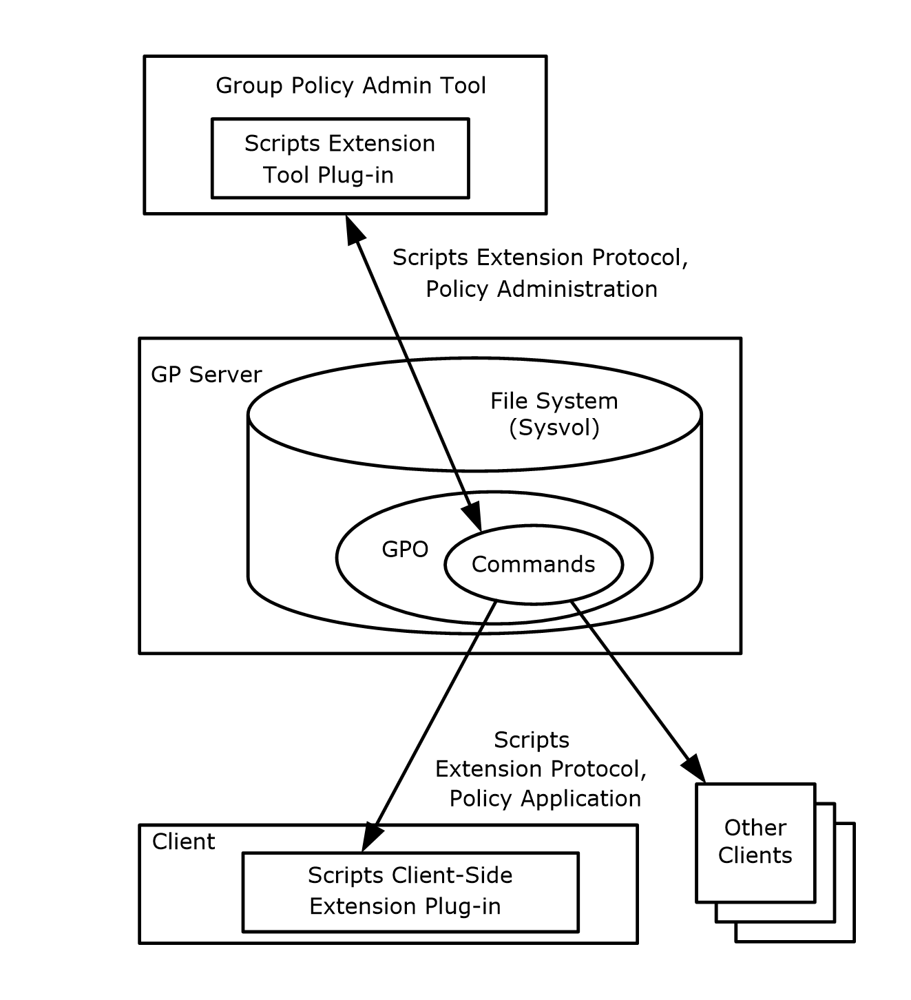
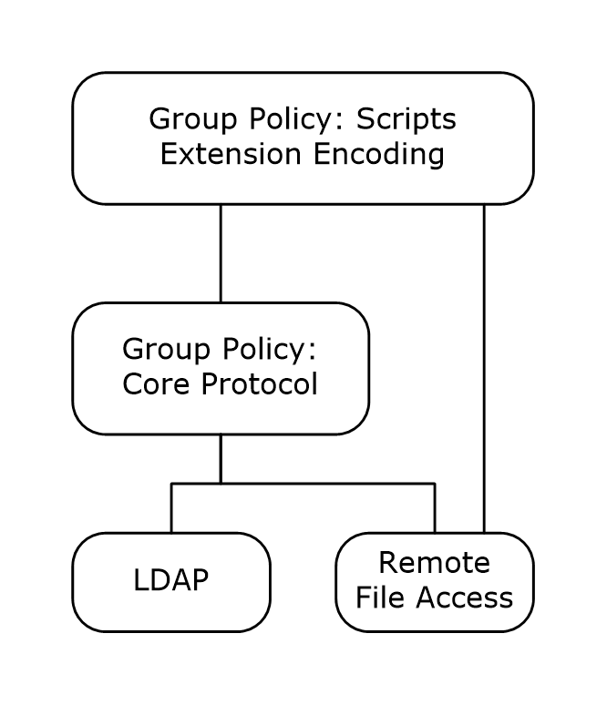

# [MS-GPSCR]: Group Policy: Scripts Extension Encoding

Table of Contents

1 Introduction

- [1 Introduction](#Section_1)
  - [1.1 Glossary](#Section_1.1)
  - [1.2 References](#Section_1.2)
    - [1.2.1 Normative References](#Section_1.2.1)
    - [1.2.2 Informative References](#Section_1.2.2)
  - [1.3 Overview](#Section_1.3)
    - [1.3.1 Background](#Section_1.3.1)
    - [1.3.2 Scripts Extension Encoding Overview](#Section_1.3.2)
  - [1.4 Relationship to Other Protocols](#Section_1.4)
  - [1.5 Prerequisites/Preconditions](#Section_1.5)
  - [1.6 Applicability Statement](#Section_1.6)
  - [1.7 Versioning and Capability Negotiation](#Section_1.7)
  - [1.8 Vendor-Extensible Fields](#Section_1.8)
  - [1.9 Standards Assignments](#Section_1.9)

2 Messages

- [2 Messages](#Section_2)
  - [2.1 Transport](#Section_2.1)
  - [2.2 Message Syntax](#Section_2.2)
    - [2.2.1 Common Message Requirements](#Section_2.2.1)
    - [2.2.2 Scripts.ini Syntax](#Section_2.2.2)
    - [2.2.3 Psscripts.ini Syntax](#Section_2.2.3)

3 Protocol Details

- [3 Protocol Details](#Section_3)
  - [3.1 Administrative Tool Plug-in Details](#Section_3.1)
    - [3.1.1 Abstract Data Model](#Section_3.1.1)
      - [3.1.1.1 Scripts.ini](#Section_3.1.1.1)
      - [3.1.1.2 PSScripts.ini](#Section_3.1.1.2)
    - [3.1.2 Timers](#Section_3.1.2)
    - [3.1.3 Initialization](#Section_3.1.3)
    - [3.1.4 Higher-Layer Triggered Events](#Section_3.1.4)
    - [3.1.5 Message Processing Events and Sequencing Rules](#Section_3.1.5)
    - [3.1.6 Timer Events](#Section_3.1.6)
    - [3.1.7 Other Local Events](#Section_3.1.7)
  - [3.2 Client Plug-in Details](#Section_3.2)
    - [3.2.1 Abstract Data Model](#Section_3.2.1)
      - [3.2.1.1 Command Execution Subsystem](#Section_3.2.1.1)
        - [3.2.1.1.1 Abstract Interface of Command Execution Subsystem](#Section_3.2.1.1.1)
        - [3.2.1.1.2 Abstract Interface of Executable Group](#Section_3.2.1.1.2)
        - [3.2.1.1.3 Abstract Interface of Executable List](#Section_3.2.1.1.3)
    - [3.2.2 Timers](#Section_3.2.2)
    - [3.2.3 Initialization](#Section_3.2.3)
    - [3.2.4 Higher-Layer Triggered Events](#Section_3.2.4)
      - [3.2.4.1 Process Group Policy](#Section_3.2.4.1)
    - [3.2.5 Message Processing Events and Sequencing Rules](#Section_3.2.5)
    - [3.2.6 Timer Events](#Section_3.2.6)
    - [3.2.7 Other Local Events](#Section_3.2.7)

4 Protocol Examples

- [4 Protocol Examples](#Section_4)

5 Security

- [5 Security](#Section_5)
  - [5.1 Security Considerations for Implementers](#Section_5.1)
  - [5.2 Index of Security Parameters](#Section_5.2)

6 Appendix A: Product Behavior

- [6 Appendix A: Product Behavior](#Section_6)

7 Change Tracking

- [7 Change Tracking](#Section_7)

For the legal notice and IP terms, see [LEGAL.md](../LEGAL.md).
Last updated: 4/23/2024.
See [Revision History](#revision-history) for full version history.

# 1 Introduction

This document specifies the Group Policy: Scripts Extension Encoding protocol, which provides a mechanism to communicate script information from a [**Group Policy server**](#gt_group-policy-server) to a Group Policy client. The Group Policy client uses this information to ensure that administrative-defined scripts are available to execute at specific events such as Logon and Logoff.

Sections 1.5, 1.8, 1.9, 2, and 3 of this specification are normative. All other sections and examples in this specification are informative.

## 1.1 Glossary

This document uses the following terms:

**client-side extension GUID (CSE GUID)**: A [**GUID**](#gt_globally-unique-identifier-guid) that enables a specific client-side extension on the Group Policy client to be associated with policy data that is stored in the logical and physical components of a [**Group Policy Object (GPO)**](#gt_group-policy-object-gpo) on the Group Policy server, for that particular extension.

**computer policy mode**: A mode of policy application intended to retrieve settings for the computer account of the client.

**domain**: A set of users and computers sharing a common namespace and management infrastructure. At least one computer member of the set has to act as a domain controller (DC) and host a member list that identifies all members of the domain, as well as optionally hosting the Active Directory service. The domain controller provides authentication of members, creating a unit of trust for its members. Each domain has an identifier that is shared among its members. For more information, see [MS-AUTHSOD](../MS-AUTHSOD/MS-AUTHSOD.md) section 1.1.1.5 and [MS-ADTS](../MS-ADTS/MS-ADTS.md).

**globally unique identifier (GUID)**: A term used interchangeably with universally unique identifier (UUID) in Microsoft protocol technical documents (TDs). Interchanging the usage of these terms does not imply or require a specific algorithm or mechanism to generate the value. Specifically, the use of this term does not imply or require that the algorithms described in [[RFC4122]](https://go.microsoft.com/fwlink/?LinkId=90460) or [[C706]](https://go.microsoft.com/fwlink/?LinkId=89824) must be used for generating the [**GUID**](#gt_globally-unique-identifier-guid). See also universally unique identifier (UUID).

**Group Policy**: A mechanism that allows the implementer to specify managed configurations for users and computers in an Active Directory service environment.

**Group Policy Object (GPO)**: A collection of administrator-defined specifications of the policy settings that can be applied to groups of computers in a domain. Each GPO includes two elements: an object that resides in the Active Directory for the domain, and a corresponding file system subdirectory that resides on the sysvol DFS share of the Group Policy server for the domain.

**Group Policy server**: A server holding a database of [**Group Policy Objects (GPOs)**](#gt_group-policy-object-gpo) that can be retrieved by other machines. The [**Group Policy server**](#gt_group-policy-server) must be a domain controller (DC).

**policy application**: The protocol exchange by which a client obtains all of the [**Group Policy Object (GPO)**](#gt_group-policy-object-gpo) and thus all applicable Group Policy settings for a particular policy target from the server, as specified in [MS-GPOL](../MS-GPOL/MS-GPOL.md). Policy application can operate in two modes, user policy and computer policy.

**policy target**: A user or computer account for which policy settings can be obtained from a server in the same domain, as specified in [MS-GPOL]. For user policy mode, the policy target is a user account. For computer policy mode, the policy target is a computer account.

**tool extension GUID or administrative plug-in GUID**: A GUID defined separately for each of the user policy settings and computer policy settings that associates a specific administrative tool plug-in with a set of policy settings that can be stored in a [**Group Policy Object (GPO)**](#gt_group-policy-object-gpo).

**UncPath**: The location of a file in a network of computers, as specified in Universal Naming Convention (UNC) syntax.

**Unicode**: A character encoding standard developed by the Unicode Consortium that represents almost all of the written languages of the world. The [**Unicode**](#gt_unicode) standard [[UNICODE5.0.0/2007]](https://go.microsoft.com/fwlink/?LinkId=154659) provides three forms (UTF-8, UTF-16, and UTF-32) and seven schemes (UTF-8, UTF-16, UTF-16 BE, UTF-16 LE, UTF-32, UTF-32 LE, and UTF-32 BE).

**user policy mode**: A mode of policy application that is used to retrieve settings for an authenticated domain user account, interactively logged on to a client.

**MAY, SHOULD, MUST, SHOULD NOT, MUST NOT:** These terms (in all caps) are used as defined in [[RFC2119]](https://go.microsoft.com/fwlink/?LinkId=90317). All statements of optional behavior use either MAY, SHOULD, or SHOULD NOT.

## 1.2 References

Links to a document in the Microsoft Open Specifications library point to the correct section in the most recently published version of the referenced document. However, because individual documents in the library are not updated at the same time, the section numbers in the documents may not match. You can confirm the correct section numbering by checking the [Errata](https://go.microsoft.com/fwlink/?linkid=850906).

### 1.2.1 Normative References

We conduct frequent surveys of the normative references to assure their continued availability. If you have any issue with finding a normative reference, please contact [dochelp@microsoft.com](mailto:dochelp@microsoft.com). We will assist you in finding the relevant information.

[MS-DTYP] Microsoft Corporation, "[Windows Data Types](../MS-DTYP/MS-DTYP.md)".

[MS-GPOL] Microsoft Corporation, "[Group Policy: Core Protocol](../MS-GPOL/MS-GPOL.md)".

[RFC2119] Bradner, S., "Key words for use in RFCs to Indicate Requirement Levels", BCP 14, RFC 2119, March 1997, [https://www.rfc-editor.org/info/rfc2119](https://go.microsoft.com/fwlink/?LinkId=90317)

[RFC2251] Wahl, M., Howes, T., and Kille, S., "Lightweight Directory Access Protocol (v3)", RFC 2251, December 1997, [https://www.rfc-editor.org/info/rfc2251](https://go.microsoft.com/fwlink/?LinkId=90325)

[RFC4234] Crocker, D., Ed., and Overell, P., "Augmented BNF for Syntax Specifications: ABNF", RFC 4234, October 2005, [https://www.rfc-editor.org/info/rfc4234](https://go.microsoft.com/fwlink/?LinkId=90462)

### 1.2.2 Informative References

[MS-FASOD] Microsoft Corporation, "[File Access Services Protocols Overview](../MS-FASOD/MS-FASOD.md)".

[MS-GPOD] Microsoft Corporation, "[Group Policy Protocols Overview](../MS-GPOD/MS-GPOD.md)".

[MSFT-PROFSCR] Microsoft Corporation, "Assign a logon script to a user or group", January 21, 2005, [http://technet2.microsoft.com/windowsserver/en/library/e9028566-1be7-45f8-a219-6b09dce34f8d1033.mspx?mfr=true](https://go.microsoft.com/fwlink/?LinkId=100893)

## 1.3 Overview

Group Policy: Scripts Extension Encoding provides a mechanism for an administrator to instruct an arbitrarily large group of clients to execute administrator-specified code at computer start, computer shut-down, user log-on, and user log-off. The code executed by clients is in the form of a command-line tool or batch-processing script that is present either on the client's local file system or at a network file system location.

This mechanism allows administrators to perform various maintenance and management tasks on client computers, including (but not limited to) collecting diagnostic information, invoking security scans, cleaning or resetting system state, and installing tools.

The protocol allows for administration of up to two separate groups of scripts. These two groups correspond to logon/logoff scripts and startup/shutdown scripts. The grouping provides an organization of scripts that will execute during different system events.

User-logon scripts configured using this protocol differ from user-logon scripts configured as part of user-object scripts [[MSFT-PROFSCR]](https://go.microsoft.com/fwlink/?LinkId=100893).

An overview of the timeline when user and computer policies are applied to a client is described in [MS-GPOD](../MS-GPOD/MS-GPOD.md) section 3.1.

### 1.3.1 Background

The Group Policy: Core Protocol (as specified in [MS-GPOL](../MS-GPOL/MS-GPOL.md)) enables clients to discover and retrieve policy settings created by administrators of a [**domain**](#gt_domain). These settings are persisted within [**group policy objects (GPOs)**](#gt_group-policy-object-gpo), which are assigned to [**policy target**](#gt_policy-target) accounts in Active Directory directory service. Policy target accounts are either computer accounts or user accounts in Active Directory. Each client uses the Lightweight Directory Access Protocol (LDAP), as specified in [[RFC2251]](https://go.microsoft.com/fwlink/?LinkId=90325), to determine what GPOs are applicable to it by consulting Active Directory objects corresponding to its computer account and the user accounts of any users logging on to the client computer.

On each client, each GPO is interpreted and acted on by software components known as client plug-ins. The client plug-ins responsible for a given GPO are specified using an attribute of the GPO. This attribute specifies a list of [**GUID**](#gt_globally-unique-identifier-guid) pairs. The first GUID of each pair is referred to as a [**client-side extension GUID (CSE GUID)**](#gt_client-side-extension-guid-cse-guid). The second GUID of each pair is referred to as a [**tool extension GUID**](#gt_88ad7745-bee6-47f7-ae98-6fac7c5ef330).

For each GPO applied to a client, the client consults the CSE GUIDs listed in the GPO to determine what client plug-ins on the client are to handle the GPO. The client then invokes the client plug-ins to handle the GPO.

A client plug-in uses the contents of the GPO to retrieve relevant settings in a manner specific to the plug-in. After its settings are retrieved, the client plug-in uses those settings to perform plug-in-specific processing.

### 1.3.2 Scripts Extension Encoding Overview

The following diagram depicts the entities that participate in Group Policy: Scripts Extension Encoding:

Figure 1: Group Policy: Scripts Extension Encoding entities

Clients can use either or both of the following modes for this protocol because they address different issues:

- [**Computer Policy Mode**](#gt_computer-policy-mode)
In this mode, [**Group Policy Objects (GPOs)**](#gt_group-policy-object-gpo) are applied for the computer on which the client is running.

The following sequence of operations occurs from both policy administration and [**policy application**](#gt_policy-application) modes:

- An administrator invokes the Group Policy Administrative tool to administer a GPO (as specified in [MS-GPOL](../MS-GPOL/MS-GPOL.md)), using the policy administration mode (as specified in [MS-GPOL] section 1.3.4). Through Group Policy: Scripts Extension Encoding, the presence of the [**tool extension GUID**](#gt_88ad7745-bee6-47f7-ae98-6fac7c5ef330) for computer policy settings for Group Policy: Scripts Extension Encoding is retrieved, and it indicates that the GPO contains policy settings that are to be administered through the policy administration portion of Group Policy: Scripts Extension Encoding. The administrative tool invokes a plug-in specific to Group Policy: Scripts Extension Encoding so that the administrator can administer Group Policy: Scripts Extension Encoding settings. This results in the storage and retrieval of metadata inside a GPO on a [**Group Policy server**](#gt_group-policy-server). This metadata describes commands that the administrator wants to execute on a client that is affected by the GPO. The administrator views the data and updates it to add a directive to run a command when the client computer starts. The directive can be any action that can be run locally on the client computer.
- A client computer affected by that GPO is started (or is connected to the network, if this happens after the client starts), and the Group Policy: Core Protocol is invoked by the client to retrieve policy settings from the Group Policy server. As part of the processing of the Group Policy: Core Protocol (as specified in [MS-GPOL] section 3.2.5.1.10), the Group Policy: Scripts Extension Encoding [**CSE GUID**](#gt_client-side-extension-guid-cse-guid) is read from this GPO, and this instructs the client to invoke a Group Policy: Scripts Extension Encoding plug-in component for policy application.
- In processing the policy application portion of Group Policy: Scripts Extension Encoding, the client identifies the directive to run the administrator's command at computer start and configures a command execution subsystem of the underlying operating system on the client computer (logically not a part of Group Policy: Scripts Extension Encoding or the Group Policy: Core Protocol) with this directive. When the computer is in the process of starting, the command execution subsystem invokes the command as required by the administrator. Similarly, when the client later shuts down, the command execution subsystem executes any shutdown commands.
- [**User Policy Mode**](#gt_user-policy-mode)
In this mode, GPOs are applied for the user who is logged on to the computer on which the client is running.

The following sequence of operations is performed from the policy administration and policy application mode:

- Step 1 is the same as the preceding step 1 for computer policy mode, except that a separate tool extension GUID for Group Policy: Scripts Extension Encoding is used, and the administrator can specify commands that are to run at the time a user logs on or off.
- Step 2 is the same as the preceding step 2 for computer policy mode, except that it occurs when a user logs on (or when the computer is connected to the network, if this happens after the user logs on).
- In processing the policy application portion of Group Policy: Scripts Extension Encoding, the client identifies the directive to run the administrator's command at user logon time and configures the command execution subsystem with this directive. Because the user is in the process of logging on while the protocol is executing, the command execution subsystem invokes the command as needed by the administrator. When the user later logs off, any logoff commands are then executed.

## 1.4 Relationship to Other Protocols

This protocol depends on the Group Policy: Core Protocol specified in [MS-GPOL](../MS-GPOL/MS-GPOL.md) to provide a list of applicable [**GPOs**](#gt_group-policy-object-gpo). It also transmits [**Group Policy**](#gt_group-policy) settings and instructions between the client and the [**Group Policy server**](#gt_group-policy-server) by reading and writing files using file access services.

See [MS-FASOD](../MS-FASOD/MS-FASOD.md) for an overview of file access services.

Figure 2: Group Policy: Scripts Extension Encoding protocol relationship diagram

## 1.5 Prerequisites/Preconditions

The prerequisites for this protocol are the same as those for the Group Policy: Core Protocol (as specified in [MS-GPOL](../MS-GPOL/MS-GPOL.md) section 1.5).

In addition, a client is required to have a system/subsystem capable of executing commands at startup and shutdown times if [**computer policy mode**](#gt_computer-policy-mode) is used, and at user logon and logoff times if [**user policy mode**](#gt_user-policy-mode) is used.

## 1.6 Applicability Statement

Group Policy: Scripts Extension Encoding is applicable only within the Group Policy: Core Protocol framework specified in [MS-GPOL](../MS-GPOL/MS-GPOL.md). Group Policy: Scripts Extension Encoding is used to run short-lived administrative automation tasks against groups of client computers in a [**domain**](#gt_domain). It is not to be used to remotely execute interactive applications or long-lived background tasks.

This protocol is appropriate for use only when the same executable commands are relevant to all clients.

## 1.7 Versioning and Capability Negotiation

None.

## 1.8 Vendor-Extensible Fields

None.

## 1.9 Standards Assignments

This protocol defines [**CSE GUID**](#gt_client-side-extension-guid-cse-guid) and [**tool extension GUID**](#gt_88ad7745-bee6-47f7-ae98-6fac7c5ef330) standards assignments, as specified in [MS-GPOL](../MS-GPOL/MS-GPOL.md) section 1.8. The following table shows the assignments.

| Parameter | Value |
| --- | --- |
| CSE GUID | {42B5FAAE-6536-11D2-AE5A-0000F87571E3} |
| Tool extension GUID ([**user policy mode**](#gt_user-policy-mode) settings) | {40B66650-4972-11D1-A7CA-0000F87571E3} |
| Tool extension GUID ([**computer policy mode**](#gt_computer-policy-mode) settings) | {40B6664F-4972-11D1-A7CA-0000F87571E3} |

# 2 Messages

## 2.1 Transport

The Group Policy: Scripts Extension Encoding transports messages by reading and writing remote files.

The Group Policy: Core Protocol uses Group Policy: Scripts Extension Encoding [**client-side extension GUID (CSE GUID)**](#gt_client-side-extension-guid-cse-guid) and [**tool extension GUID**](#gt_88ad7745-bee6-47f7-ae98-6fac7c5ef330) values to invoke Group Policy: Scripts Extension Encoding only to access [**GPOs**](#gt_group-policy-object-gpo) from which messages of this protocol can be generated.

This protocol enables the client to identify scripts and other executable code that it invokes. Therefore, the client must be able to validate that the source of the script's location (that is, the [**Group Policy server**](#gt_group-policy-server)) has not been spoofed by a malicious user. If the source can be spoofed, the malicious user can cause the client to execute arbitrary code using high privileges on the client. This requirement to validate the Group Policy server is the reason mutual authentication is required for this protocol's use of remote file access against the Group Policy server.

## 2.2 Message Syntax

### 2.2.1 Common Message Requirements

Messages exchanged in this protocol allow the client to discover settings in the [**GPOs**](#gt_group-policy-object-gpo) that instruct clients to execute arbitrary commands. After interpreting the settings, the client attempts to execute the scripts according to the settings.

The following definitions aid in understanding this section:

**Computer-scoped GPO path:** A scoped GPO path that ends in "\Machine".

**Scoped GPO path:** A GPO path that is appended with "\User" for the [**user policy mode**](#gt_user-policy-mode) of a [**policy application**](#gt_policy-application) (or "\Machine" for the [**computer policy mode**](#gt_computer-policy-mode)).

**User-scoped GPO path:** A scoped GPO path that ends in "\User".

Messages of the protocol are transferred as files using remote file access. The files MUST be named as "<*gpo path*>\scripts\scripts.ini" or "<*gpo path*>\scripts\psscripts.ini", where <*gpo path*> is a scoped GPO path.

### 2.2.2 Scripts.ini Syntax

Scripts.ini is a text file encoded in UTF-16LE with Byte Order Mark (0xFFFE) that conforms to the following Augmented Backus-Naur Form (ABNF) [[RFC4234]](https://go.microsoft.com/fwlink/?LinkId=90462).

IniFile = WhiteSpace Sections WhiteSpace

Sections = 1*Section

WhiteSpaceClass = CR / LF / WSP

WhiteSpace = *WhiteSpaceClass

SpaceDelimiter = 1*WhiteSpaceClass

Section = SectionHeader Keys

SectionHeader = WhiteSpace "[" SectionName "]" SpaceDelimiter

SectionName = TokLogon / TokLogoff / TokStartup / TokShutdown

Keys = 1*Key

Key = TokKey TokIs TokValue

TokKey = WhiteSpace 1*(ALPHA / DIGIT)

TokIs = WhiteSpace "="

TokValue = WhiteSpace 1*(ALPHA / "_" / DIGIT ) SpaceDelimiter

TokLogon = WhiteSpace "Logon" WhiteSpace

TokLogoff = WhiteSpace "Logoff" WhiteSpace

TokStartup = WhiteSpace "Startup" WhiteSpace

TokShutdown = WhiteSpace "Shutdown" WhiteSpace

The specific format of scripts.ini MUST be as follows:

**Sections:** When used in [**computer policy mode**](#gt_computer-policy-mode) (that is, with a computer-scoped [**GPO**](#gt_group-policy-object-gpo) path), sections Startup and Shutdown are optional. The sections Logon and Logoff MUST NOT exist.

When used in [**user policy mode**](#gt_user-policy-mode) (that is, with a user-scoped GPO path), sections Logon and Logoff are optional. The sections Startup and Shutdown MUST NOT exist.

Any sections not valid for a particular mode MUST be ignored and do not invalidate the file.

**Keys:** Keys in the Startup, Shutdown, Logon, and Logoff sections MUST be named with the syntax "<integer>CmdLine" and "<integer>Parameters", where <integer> is the text representation of an integer value greater than or equal to zero and less than 2^31. If any key in the file begins with <integer>, both keys ("<integer>CmdLine" and "<integer>Parameters") MUST be present and come in pairs, though the order in which they appear can be interchanged. The <integer> value MUST start from 0 and MUST be in ascending order incremented by one.

**TokValue:** The values in the Startup, Shutdown, Logon, and Logoff sections are text strings. The text values of "<integer>CmdLine" keys MUST be file system paths that are specified by using any valid syntax for the client file systems that can reference files on the local computer or on a network location. The lengths of these paths MUST be fewer than 260 ([**Unicode**](#gt_unicode)) characters. Each path MUST be the path of an executable program that can be invoked by clients. The text values of "<integer>Parameters" keys can be any string (this is the string that is passed as command-line parameters to the executable program as part of its invocation by the client).<1>

### 2.2.3 Psscripts.ini Syntax

Psscripts.ini is a text file encoded in UTF-16LE with Byte Order Mark (0xFFFE) that conforms to the following Augmented Backus-Naur Form (ABNF) [[RFC4234]](https://go.microsoft.com/fwlink/?LinkId=90462).

IniFile = WhiteSpace Sections WhiteSpace

Sections = 1*Section

WhiteSpaceClass = CR / LF / WSP

WhiteSpace = *WhiteSpaceClass

SpaceDelimiter = 1*WhiteSpaceClass

Section = SectionHeader Keys

SectionHeader = WhiteSpace "[" SectionName "]" SpaceDelimiter

SectionName = TokLogon / TokLogoff / TokStartup / TokShutdown / TokScriptsConfig

Keys = 1*Key

Key = TokKey TokIs TokValue

TokKey = WhiteSpace 1*(ALPHA / DIGIT)

TokIs = WhiteSpace "="

TokValue = WhiteSpace 1*(ALPHA / "_" / DIGIT ) SpaceDelimiter

TokLogon = WhiteSpace "Logon" WhiteSpace

TokLogoff = WhiteSpace "Logoff" WhiteSpace

TokStartup = WhiteSpace "Startup" WhiteSpace

TokShutdown = WhiteSpace "Shutdown" WhiteSpace

TokScriptsConfig = WhiteSpace "ScriptsConfig" WhiteSpace

The specific format of psscripts.ini MUST be the same as described above for scripts.ini with the following additional Sections, Keys and TokValue elements:

**Sections:** The psscripts.ini file MUST contain the section ScriptsConfig if at least one of its keys is present; otherwise the section SHOULD be omitted.

**Keys:** Keys in the optional ScriptsConfig section MUST be named **StartExecutePSFirst** or **EndExecutePSFirst**.

The **StartExecutePSFirst** key indicates whether the computer startup and user logon scripts listed in psscripts.ini are to be executed before or after the scripts listed in scripts.ini. If unspecified, the order is implementation-dependent.

The **EndExecutePSFirst** key indicates whether the computer shutdown and user logoff scripts listed in psscripts.ini are to be executed before or after the scripts listed in scripts.ini. If unspecified, the order is implementation-dependent.

**TokValue:** The values of the **StartExecutePSFirst** and **EndExecutePSFirst** keys in the optional ScriptsConfig section MUST have the text value of case-insensitive "true" or "false". If "true", scripts listed in psscripts.ini MUST be executed before the scripts listed in scripts.ini. If "false", scripts listed in psscripts.ini MUST be executed after the scripts listed in scripts.ini.

# 3 Protocol Details

## 3.1 Administrative Tool Plug-in Details

### 3.1.1 Abstract Data Model

The administrative tool has a user interface that allows an administrator to author scripts.ini and psscripts.ini files.

#### 3.1.1.1 Scripts.ini

The scripts.ini file (as specified in section [2.2.2](#Section_2.2.2)) contains the settings for the Scripts Executable group defined in the client abstract data model (section [3.2.1](#Section_3.2.1)). These settings are:

- Script Type that identifies when the script is to be executed. Values can be one of the following: Startup, Logon, Shutdown, or Logoff.
- Executable Item is the command line and its parameters.

#### 3.1.1.2 PSScripts.ini

The psscripts.ini file (as specified in section [2.2.3](#Section_2.2.3)) contains the settings for the PSScripts Executable group defined in the client abstract data model (section [3.2.1](#Section_3.2.1)). These settings are:

- Script Type that identifies when the script is to be executed. Values can be one of the following: Startup, Logon, Shutdown, or Logoff.
- Executable Item is the command line and its parameters.
- Script order that indicates whether the scripts in PSScripts.ini run before or after the scripts in Scripts.ini.

### 3.1.2 Timers

None.

### 3.1.3 Initialization

When the administrative-side plug-in starts, it gets a scoped [**GPO**](#gt_group-policy-object-gpo) path from the Group Policy: Core Protocol, as specified in [MS-GPOL](../MS-GPOL/MS-GPOL.md) section 2.2.4. The plug-in then processes the GPO path as specified in Message Processing Events and Sequencing Rules (section [3.1.5](#Section_3.1.5)).

### 3.1.4 Higher-Layer Triggered Events

None.

### 3.1.5 Message Processing Events and Sequencing Rules

The administrative-side plug-in MUST attempt to use remote file access to retrieve any existing scripts.ini file from "<gpo path>\scripts\scripts.ini", where <gpo path> is the scoped [**GPO**](#gt_group-policy-object-gpo) path. The plug-in SHOULD also attempt to use remote file access to retrieve any existing psscripts.ini file from "<gpo path>\scripts\psscripts.ini".<2>

The processing for reading and writing the settings from the GPO for administrative purposes is as follows:

To create the Group Policy: Scripts Extension Encoding settings, the administrative tool plug-in MUST perform these steps for each GPO:

- Perform a remote file open on the file specified by "<gpo path>\scripts\scripts.ini", where <gpo path> is the scoped GPO path in the group policy object. If this operation fails, go to step 3.
- Perform one or more remote file reads to read the entire contents of the opened file until the entire file has been read or an error in reading occurs.
- If the file "<gpo path>\scripts\scripts.ini" is present, display the settings that were read in step 2. If no file was found, display an empty list.
- The administrator configures new Group Policy: Scripts Extension Encoding settings by specifying the CmdLine and Parameters values for the scripts in scripts.ini.
- If scripts are configured for scripts.ini group, use remote file write sequences to create a new scripts.ini file in the "<gpo path>\scripts\" directory if no file existed. Write the administrator-configured Group Policy: Scripts Extension Encoding settings to the scripts.ini file, overwriting the old content with updated content according to the format specified in section [2.2.2](#Section_2.2.2).
- If opened, perform a remote file close to close the scripts.ini file.
- After every creation, modification, or deletion that affects the scripts.ini file, the administrative tool MUST invoke the Group Policy Extension Update task as specified in [MS-GPOL](../MS-GPOL/MS-GPOL.md) section 3.3.4.4.
Additionally, the administrative tool plug-in SHOULD<3> perform these steps for each GPO:

- Perform a remote file open on the file specified by "<gpo path>\scripts\psscripts.ini", where <gpo path> is the scoped GPO path in the group policy object. If this operation fails, go to step 3.
- Perform one or more remote file reads to read the entire contents of the opened file until the entire file has been read or an error in reading occurs.
- If the file, "<gpo path>\scripts\psscripts.ini", is present, display the settings that were read in step 2. If no file was found, display an empty list.
- The administrator configures new Group Policy: Scripts Extension Encoding settings by specifying the CmdLine and Parameters values for the scripts in psscripts.ini.
- The administrator optionally configures whether scripts listed in psscripts.ini are to be executed before or after the scripts listed in scripts.ini by specifying the StartExecutePSFirst (for startup, logon scripts) and EndExecutePSFirst (for shutdown, logoff scripts) values in the ScriptConfig section of the psscript.ini file. A value of case-insensitive "true" means scripts listed in psscripts.ini MUST be executed before the scripts listed in scripts.ini in the GPO. A value of case-insensitive "false" means scripts listed in psscripts.ini MUST be executed after the scripts listed in scripts.ini in the GPO.
- If scripts are configured for psscripts.ini group, use remote file write sequences to create a new psscripts.ini file in the "<gpo path>\scripts\" directory if no file existed. Write the administrator-configured Group Policy: Scripts Extension Encoding settings to the pscripts.ini file, overwriting the old content with updated content according to the format specified in section [2.2.3](#Section_2.2.3).
- If opened, perform a remote file close to close the psscripts.ini file.
- After every creation, modification, or deletion that affects the psscripts.ini file, the administrative tool MUST invoke the Group Policy Extension Update task as specified in [MS-GPOL] section 3.3.4.4.
When an administrator specifies a command to be executed under a given condition using the administrative tool, the Group Policy: Scripts Extension Encoding plug-in MUST put the commands into a scripts.ini or psscripts.ini file, as specified in section [2.2](#Section_2.2), and copy it to "<gpo path>\scripts\scripts.ini" or "<gpo path>\scripts\psscripts.ini", specified as follows, where <gpo path> is the scoped GPO path obtained from the Group Policy: Core Protocol part of the administrative tool. If this fails, the administrator MUST be informed, and the scripts.ini and psscripts.ini files SHOULD be reverted to the state in which it existed prior to the protocol sequence.<4>

To update the scripts.ini or psscripts.ini files in a GPO, the state of that GPO on the [**Group Policy server**](#gt_group-policy-server) MUST be updated with the following message sequence:

- A remote file open from client to server: The file name used MUST be "<gpo path>\scripts\scripts.ini" or "<gpo path>\scripts\psscripts.ini", where <gpo path> is the user-scoped GPO path (if the GPO user settings are being updated) or the computer-scoped GPO path (if the computer settings are being updated). The remote file open MUST request write permission and request that if the file does not exist it will be created. If the open request returns a failure status, the Group Policy: Scripts Extension Encoding sequence MUST be terminated.
- The tool MUST perform one or more remote file writes to overwrite the contents of the opened file with new settings. These writes MUST continue until the entire file is copied or an error is encountered.
- File close: The tool MUST issue a remote file close operation.
The two files, scripts.ini and psscripts.ini, correspond to the two separate groups of scripts supported. Depending on the group of script, the administrative tool updates either scripts.ini or psscripts.ini.

### 3.1.6 Timer Events

None.

### 3.1.7 Other Local Events

None.

## 3.2 Client Plug-in Details

During [**policy application**](#gt_policy-application), the protocol is invoked after the Group Policy: Core Protocol, as specified in [MS-GPOL](../MS-GPOL/MS-GPOL.md) section 3.2.1.4, has computed a list of [**GPOs**](#gt_group-policy-object-gpo) for which Group Policy: Scripts Extension Encoding is to be invoked.

### 3.2.1 Abstract Data Model

This section describes a conceptual model of possible data organization that an implementation maintains to participate in this protocol. The described organization is provided to facilitate the explanation of how the protocol behaves. This document does not mandate that implementations adhere to this model as long as their external behavior is consistent with that described in this document.

The Group Policy: Scripts Extension Encoding plug-in itself maintains no state.

#### 3.2.1.1 Command Execution Subsystem

The command execution subsystem of the client computer maintains the following state:

- Two executable groups. Each group has **Executable Lists**, one per **Execution Context**.
- **Executable Group Order**.
- **Default Executable Group Order**.
The **Executable Groups** and **Executable Group Order** can be updated by the client plug-in.

The command execution subsystem invokes the updated list of executable programs at the appropriate time (logon, logoff, startup, shutdown) in the right order (as specified by **Executable Order**):

**Executable Group:** There are two groups: the Scripts Executable group and the PSScripts Executable group. Each group contains **Executable Lists**, one per **Execution Context**.

**Executable List:** Each list contains **Execution Context** and a list of **Executable Items**.

**Execution Context:** Indicates when the **Executable Items** inside **Executable List** are to be invoked.

| Value | Meaning |
| --- | --- |
| Log on | **Executable List** to be invoked when a user logs on. In [**computer policy mode**](#gt_computer-policy-mode), this list is to be ignored. |
| Log off | **Executable List** to be invoked when a user logs off. In computer policy mode, this list is to be ignored. |
| Start up | **Executable List** to be invoked at computer startup. In [**user policy mode**](#gt_user-policy-mode), this list is to be ignored. |
| Shut down | **Executable List** to be invoked at computer shutdown. In user policy mode, this list is to be ignored. |

**Executable Item:**

**Executable Order:** The order in which an **Executable Item** is to be executed inside an **Executable List**.

**Executable Path:** A file system path to a file that can be accessed and executed.

**Executable Parameters:** A string containing space-separated parameters to be passed to the executable program when it is executed.

**Executable Group Order:** The order in which the scripts in the two groups are to be executed. PSFirst indicates the PSScripts group executes before the Scripts group, PSLast indicates the PSScripts group executes after the Scripts group.

**Default Executable Group Order:** The **Executable Group Order** for scripts when it is not otherwise specified.<5>

There are three abstract interfaces for this component, which are defined in the subsections that follow.

##### 3.2.1.1.1 Abstract Interface of Command Execution Subsystem

The **command execution subsystem** abstract interface provides the following methods and parameters.

**Retrieve Executable Group:** This method is used to retrieve from the command execution subsystem an **Executable Group** given the name of the **Executable Group**.

The Group Policy client extension provides the following:

**Executable Group Name:** Name of the **Executable Group** (Scripts Executable Group or PSScripts Executable Group).

**Executable Group:** Output data structure representing **Executable Group**.

**Retrieve Executable Group Order:** This method is used to retrieve from the command execution subsystem the **Executable Group Order** for the command execution subsystem.

The Group Policy client extension provides the following:

**Executable Group Order:** Output data structure representing **Executable Group Order**.

**Retrieve Default Executable Group Order:** This method is used to retrieve from the command execution subsystem the **Default Executable Group Order** for the command execution subsystem.

The Group Policy client extension provides the following:

**Default Executable Group Order:** Output data structure representing **Default Executable Group Order**.

##### 3.2.1.1.2 Abstract Interface of Executable Group

The **Executable Group** abstract interface provides the following method and parameters that are operations on an **Executable Group**.

**Retrieve Executable List:** The Group Policy client extension provides the following:

**Execution Context:** The context to which this **Executable List** belongs.

**Executable List:** Output data structure representing **Executable List**.

##### 3.2.1.1.3 Abstract Interface of Executable List

The **Executable List** abstract interface provides the following methods and parameters that are operations on an **Executable List**.

**Insert Program Into Executable List:** The Group Policy client extension provides the following:

**order:** Position in the list at which insertion of a new executable program occurs.

**list item:** Input data structure contains the components **Executable Path** and **Executable Parameters**.

**Remove Program From Executable List:** The Group Policy client extension provides the following:

**order:** Position in the list from which removal of an executable program occurs.

**Retrieve Program From Executable List:** The Group Policy client extension provides the following:

**order:** Position in the list from which retrieval of an executable program occurs.

**list item:** Output data structure that is comprised of the components **Executable Path** and **Executable Parameters**.

**Retrieve Next Program From Executable List:** The Group Policy client extension provides the following to store the first item in the list:

**list item:** Output data structure that is comprised of the components **Executable Path** and **Executable Parameters**.

The first item is automatically removed upon return from this function.

**Empty Executable List:** This function empties the entire list.

**Retrieve Size Of Executable List:** This function returns the number of items in the list.

### 3.2.2 Timers

None.

### 3.2.3 Initialization

None.

### 3.2.4 Higher-Layer Triggered Events

#### 3.2.4.1 Process Group Policy

This extension is launched by the Group Policy: Core Protocol, which invokes this Process Group Policy event, whose abstract interface is specified in [MS-GPOL](../MS-GPOL/MS-GPOL.md) section 3.2.4.1, to apply policies handled by this extension.

### 3.2.5 Message Processing Events and Sequencing Rules

For each [**GPO**](#gt_group-policy-object-gpo) in the New or Changed GPO list, one file with the format specified in section [2.2](#Section_2.2) is read from the [**Group Policy server**](#gt_group-policy-server), as specified later in this section. If any file fails to be read, the plug-in MUST ignore the failure and continue to read files for other GPOs.

Using the SecurityToken passed by the Group Policy: Core Protocol, any remote file access in this section SHOULD be done under impersonation of the policy target as described in [MS-DTYP](../MS-DTYP/MS-DTYP.md) section 2.7, Impersonation Abstract Interfaces.

For each GPO in the New or Changed GPO list, the Group Policy: Scripts Extension Encoding client plug-in MUST do the following to process the Scripts Group:

- Perform a remote file open on the file specified by "<gpo path>\scripts\scripts.ini", where <gpo path> is the scoped GPO path derived from the **gPCFileSysPath** attribute of the GPO. If this operation fails due to File Not Found, attempt to process the psscripts.ini in the following sequence. If the operation fails for any other reason, abort processing this GPO and continue with the next GPO.
- Perform one or more remote file reads to read the entire contents of the opened file until the entire file has been read or an error in reading occurs.
- Perform a remote file close to close the file.
- The file is then parsed according to the format in section [2.2.2](#Section_2.2.2) to create the Scripts group. If the file does not conform to that format, parsing of the file MUST resume after the next end-of-line character (%0A or %0D in ABNF notation). If the file does conform to that format, the settings MUST be applied to the corresponding parameters in the abstract data model of the command execution subsystem. If the file does not conform to that format, the file MUST NOT be processed further by the client.
**Note** The <integer> specified under Keys in section 2.2.2 specifies an order; lower integers indicate that executable paths specified in the same section are to be invoked before those with higher values. The value of <integer>Cmdline becomes the executable path of the executable program, with <integer>Parameters becoming the parameters passed to the executable program.

For each GPO in the New or Changed GPO list, the Group Policy: Scripts Extension Encoding client plug-in SHOULD do the following to process the PSScripts Group:<6>

- Perform a remote file open on the file specified by "<gpo path>\scripts\psscripts.ini", where <gpo path> is the scoped GPO path in the GPO.

If this operation fails due to File Not Found,

If Scripts Group processing also failed due to File Not Found,

abort processing.

Else

Proceed to step 7 assuming empty PSScripts Executable

Group, PSLast Computer Executable order and PSLast User

Executable order.

If this operation fails for any other reason,

abort processing.

- Perform one or more remote file reads to read the entire contents of the opened file until the entire file has been read or an error in reading occurs.
- Perform a remote file close to close the file.
- The file is then parsed according to the format in section [2.2.3](#Section_2.2.3) to create the PSScripts group. If the file does not conform to that format, parsing of the file MUST resume after the next end-of-line character (%0A or %0D in ABNF notation). If the file does conform to that format, the settings MUST be applied to the corresponding parameters in the abstract data model of the command execution subsystem.
- If the <gpo path> is a Computer-scoped GPO path, determine the Computer Executable order as follows:
- If the StartExecutePSFirst key is present in the ScriptsConfig section of the file, get its value. If the value is case-insensitive "true", the Computer Executable Group order is PSFirst. If the value is case-insensitive "false", the Computer Executable Group order is PSLast.
- If the StartExecutePSFirst key is not present, the Default Computer Executable Group order is examined. If it equals 1, the Computer Executable Group order is PSFirst.
- Otherwise, the Computer Executable Group order is PSLast.
- If the <gpo path> is a User-scoped GPO path, determine the User Executable order as follows:
- If the StartExecutePSFirst key is present in the ScriptsConfig section of the file, get its value. If the value is case-insensitive "true", the User Executable Group order is PSFirst. If the value is case-insensitive "false", the User Executable Group order is PSLast.
- If the StartExecutePSFirst key is not present, the Default User Executable Group order is examined. If it equals 1, the User Executable Group order is PSFirst.
- Otherwise, the User Executable Group order is PSLast.
- Process scripts in the Scripts and the PSScripts Executable Groups as follows:
- If the <gpo-path> is a Computer-scoped GPO path, process the Start up and Shut down scripts in the Scripts and the PSScripts Executable Groups following the Computer Executable Group order.
- If the <gpo path> is a User-scoped GPO path, process the Log on and Log off scripts in the Scripts and the PSScripts Executable Groups following the User Executable Group order.
Note that the <integer> specified under Keys in section 2.2.2 specifies an order; lower integers indicate that executable paths specified in the same section are to be invoked before those with higher values. The value of <integer>Cmdline becomes the executable path of the executable program with <integer>Parameters becoming the parameters passed to the executable program.

### 3.2.6 Timer Events

None.

### 3.2.7 Other Local Events

None.

# 4 Protocol Examples

In the following example, when specific users log out, the following two commands are run:

\\managementserver\scripts\logtime.exe users \\archiveserver\logshare

\\managementserver\scripts\OnLogoff.ps1 users [\\archiveserver\logshare](file://archiveserver/logshare)

Also, when those users log on, the following command sequence is run:

\\managementserver\scripts\OnLogon.ps1 users -verbose

defrag.exe systemdrive

\\managementserver\scripts\logstart.exe users -verbose

The following sequence of events occurs in this example:

- The administrator invokes the administrative tool and uses the Group Policy: Core Protocol subsystem, which specifies to create settings for a given set of users, using the Group Policy: Scripts Extension Encoding plug-in.
- The Group Policy: Scripts Extension Encoding plug-in to the administrative tool is invoked with a [**GPO**](#gt_group-policy-object-gpo) path that it uses to construct a path to scripts.ini and psscripts.ini files. The plug-in tries to read these files and finds that they do not exist.
- Because the files do not exist, the plug-in allows the administrator to enter commands to be used in new settings. When the administrator is done, the plug-in creates the following scripts.ini file:
[Logoff]

0CmdLine=\\managementserver\scripts\logtime.exe

0Parameters=users \\archiveserver\logshare

[Logon]

0CmdLine=defrag.exe

0Parameters=systemdrive

1CmdLine=\\managementserver\scripts\logstart.exe

1Parameters=users -verbose

The plug-in also creates the following psscripts.ini file:

[ScriptConfig]

StartExecutePSFirst=true

EndExecutePSFirst=false

[Logoff]

0CmdLine=\\managementserver\scripts\OnLogoff.ps1

0Parameters=users \\archiveserver\logshare

[Logon]

0CmdLine=\\managementserver\scripts\OnLogon.ps1

0Parameters=users -verbose

The plug-in then copies the scripts.ini and psscripts.ini files to the remote location.

When the user logs on to a computer, the Group Policy: Core Protocol finds a GPO with the Group Policy: Scripts Extension Encoding [**CSE GUID**](#gt_client-side-extension-guid-cse-guid), invokes the client plug-in, and gives it a GPO path. The client plug-in uses the GPO path to construct the path to the scripts.ini and psscripts.ini files, reads and parses the files, and then configures the command execution subsystem to execute the commands at the specified times.

# 5 Security

## 5.1 Security Considerations for Implementers

The key security issues are as follows:

- Help to ensure that the executable files run under the security context of the [**policy target**](#gt_policy-target).
- Prevent spoofing that might allow a non-administrator of the computer to alter the behavior of the executable file.
- Take into account that the data stored at the file system path of a script is to be secured to be writable only to [**GPO**](#gt_group-policy-object-gpo) administrators. For scripts that are stored inside the GPO's file system path, this is covered by the security measures used to secure the GPO itself. If scripts are stored in user-defined locations outside the GPO, the administrator that configures the Group Policy: Scripts Extension Encoding is responsible for securing the script. Implementers can encourage the user to be mindful of this consideration through the user interface of administrative tools.
- Note that any scripts or executable code configured to be executed by this protocol allow the administrators of the GPO from which the scripts were configured to become administrators on the computer or to invoke code in the context of a user that logs in to the client. The functionality of this protocol is one of the reasons that any administrators of a GPO have the capability of becoming administrators of the client computer.
- When an executable file (as specified by <integer>CmdLine) has no path specified, the implementer searches for the executable file in trusted locations. An example, using Defrag.exe, is presented in section [4](#Section_4).

## 5.2 Index of Security Parameters

None.

# 6 Appendix A: Product Behavior

The information in this specification is applicable to the following Microsoft products or supplemental software. References to product versions include updates to those products.

- Windows 2000 operating system
- Windows XP operating system
- Windows Server 2003 operating system
- Windows Vista operating system
- Windows Server 2008 operating system
- Windows 7 operating system
- Windows Server 2008 R2 operating system
- Windows 8 operating system
- Windows Server 2012 operating system
- Windows 8.1 operating system
- Windows Server 2012 R2 operating system
- Windows 10 operating system
- Windows Server 2016 operating system
- Windows Server operating system
- Windows Server 2019 operating system
- Windows Server 2022 operating system
- Windows 11 operating system
- Windows Server 2025 operating system
Exceptions, if any, are noted in this section. If an update version, service pack or Knowledge Base (KB) number appears with a product name, the behavior changed in that update. The new behavior also applies to subsequent updates unless otherwise specified. If a product edition appears with the product version, behavior is different in that product edition.

Unless otherwise specified, any statement of optional behavior in this specification that is prescribed using the terms "SHOULD" or "SHOULD NOT" implies product behavior in accordance with the SHOULD or SHOULD NOT prescription. Unless otherwise specified, the term "MAY" implies that the product does not follow the prescription.

<1> Section 2.2.2: For the **TokValue** field, Windows supports file system paths in the [**UncPath**](#gt_uncpath) format and in the format of a local Windows file system path. No other syntaxes are supported for Windows.

<2> Section 3.1.5: The following versions of Windows do not support protocols and messages involving the psscripts.ini file (this behavior applies to all references to psscripts.ini throughout this document):

- Windows 2000
- Windows XP
- Windows Server 2003
- Windows Vista
- Windows Server 2008
- Windows 7
<3> Section 3.1.5: These steps are not applicable to the following releases of Windows:

- Windows 2000
- Windows XP
- Windows Server 2003
- Windows Vista
- Windows Server 2008
<4> Section 3.1.5: In Windows, the administrative tool displays an error to the user if any errors in the protocol sequence in this section occur, which indicates that the [**GPO**](#gt_group-policy-object-gpo) cannot be updated with the intentions specified through the protocol. Windows does not update the contents of the scripts.ini or psscripts.ini file if any of the protocol sequences in this section fail.

<5> Section 3.2.1.1: In Windows, the value of the **Default Executable Group Order** for Startup or Shutdown scripts is read from the registry location **HKEY_LOCAL_MACHINE\SOFTWARE\Microsoft\Windows\CurrentVersion\Policies\System\RunComputerPSScriptsFirst** . It is of type REG_DWORD. The value 1 indicates PSFirst.

In Windows, the value of the **Default Executable Group Order** for Logon or Logoff scripts is read from these two registry locations, in order of priority:

- **HKEY_LOCAL_MACHINE**
**\Software\Microsoft\Windows\CurrentVersion\Policies\System\RunUserPSScriptsFirst** . It is of type REG_DWORD, a 32-bit number. The value 1 indicates PSFirst.

- **HKEY_CURRENT_USER**
**\Software\Microsoft\Windows\CurrentVersion\Policies\System\RunUserPSScriptsFirst** . It is of type REG_DWORD, a 32-bit number. The value 1 indicates PSFirst.

<6> Section 3.2.5: Information about the PSScripts group in Windows is not applicable to the following versions of Windows:

- Windows 2000
- Windows XP
- Windows Server 2003
- Windows Vista
- Windows Server 2008

# 7 Change Tracking

This section identifies changes that were made to this document since the last release. Changes are classified as Major, Minor, or None.

The revision class **Major** means that the technical content in the document was significantly revised. Major changes affect protocol interoperability or implementation. Examples of major changes are:

- A document revision that incorporates changes to interoperability requirements.
- A document revision that captures changes to protocol functionality.
The revision class **Minor** means that the meaning of the technical content was clarified. Minor changes do not affect protocol interoperability or implementation. Examples of minor changes are updates to clarify ambiguity at the sentence, paragraph, or table level.

The revision class **None** means that no new technical changes were introduced. Minor editorial and formatting changes may have been made, but the relevant technical content is identical to the last released version.

The changes made to this document are listed in the following table. For more information, please contact [dochelp@microsoft.com](mailto:dochelp@microsoft.com).

| Section | Description | Revision class |
| --- | --- | --- |
| [6](#Section_6) Appendix A: Product Behavior | Added Windows Server 2025 to the list of applicable products. | Major |

## Revision History

| Date | Version | Revision Class | Comments |
| --- | --- | --- | --- |
| 3/2/2007 | 1.0 | Major | Updated and revised the technical content. |
| 4/3/2007 | 1.1 | Minor | Clarified the meaning of the technical content. |
| 5/11/2007 | 2.0 | Major | New format |
| 6/1/2007 | 2.0.1 | Editorial | Changed language and formatting in the technical content. |
| 7/3/2007 | 2.0.2 | Editorial | Changed language and formatting in the technical content. |
| 8/10/2007 | 2.0.3 | Editorial | Changed language and formatting in the technical content. |
| 9/28/2007 | 2.0.4 | Editorial | Changed language and formatting in the technical content. |
| 10/23/2007 | 2.1 | Minor | Updated a reference to MS-PROTO. |
| 1/25/2008 | 2.1.1 | Editorial | Changed language and formatting in the technical content. |
| 3/14/2008 | 2.1.2 | Editorial | Changed language and formatting in the technical content. |
| 6/20/2008 | 2.1.3 | Editorial | Changed language and formatting in the technical content. |
| 7/25/2008 | 2.1.4 | Editorial | Changed language and formatting in the technical content. |
| 8/29/2008 | 2.2 | Minor | Added section references. |
| 10/24/2008 | 3.0 | Major | Updated and revised the technical content. |
| 12/5/2008 | 4.0 | Major | Updated and revised the technical content. |
| 1/16/2009 | 4.0.1 | Editorial | Changed language and formatting in the technical content. |
| 2/27/2009 | 4.0.2 | Editorial | Changed language and formatting in the technical content. |
| 4/10/2009 | 4.0.3 | Editorial | Changed language and formatting in the technical content. |
| 5/22/2009 | 4.1 | Minor | Clarified the meaning of the technical content. |
| 7/2/2009 | 5.0 | Major | Updated and revised the technical content. |
| 8/14/2009 | 5.1 | Minor | Clarified the meaning of the technical content. |
| 9/25/2009 | 5.2 | Minor | Clarified the meaning of the technical content. |
| 11/6/2009 | 5.2.1 | Editorial | Changed language and formatting in the technical content. |
| 12/18/2009 | 5.3 | Minor | Clarified the meaning of the technical content. |
| 1/29/2010 | 5.4 | Minor | Clarified the meaning of the technical content. |
| 3/12/2010 | 5.5 | Minor | Clarified the meaning of the technical content. |
| 4/23/2010 | 6.0 | Major | Updated and revised the technical content. |
| 6/4/2010 | 6.1 | Minor | Clarified the meaning of the technical content. |
| 7/16/2010 | 7.0 | Major | Updated and revised the technical content. |
| 8/27/2010 | 8.0 | Major | Updated and revised the technical content. |
| 10/8/2010 | 9.0 | Major | Updated and revised the technical content. |
| 11/19/2010 | 10.0 | Major | Updated and revised the technical content. |
| 1/7/2011 | 11.0 | Major | Updated and revised the technical content. |
| 2/11/2011 | 12.0 | Major | Updated and revised the technical content. |
| 3/25/2011 | 13.0 | Major | Updated and revised the technical content. |
| 5/6/2011 | 14.0 | Major | Updated and revised the technical content. |
| 6/17/2011 | 15.0 | Major | Updated and revised the technical content. |
| 9/23/2011 | 15.0 | None | No changes to the meaning, language, or formatting of the technical content. |
| 12/16/2011 | 16.0 | Major | Updated and revised the technical content. |
| 3/30/2012 | 16.0 | None | No changes to the meaning, language, or formatting of the technical content. |
| 7/12/2012 | 16.0 | None | No changes to the meaning, language, or formatting of the technical content. |
| 10/25/2012 | 17.0 | Major | Updated and revised the technical content. |
| 1/31/2013 | 18.0 | Major | Updated and revised the technical content. |
| 8/8/2013 | 19.0 | Major | Updated and revised the technical content. |
| 11/14/2013 | 19.0 | None | No changes to the meaning, language, or formatting of the technical content. |
| 2/13/2014 | 19.0 | None | No changes to the meaning, language, or formatting of the technical content. |
| 5/15/2014 | 19.0 | None | No changes to the meaning, language, or formatting of the technical content. |
| 6/30/2015 | 20.0 | Major | Significantly changed the technical content. |
| 10/16/2015 | 20.0 | None | No changes to the meaning, language, or formatting of the technical content. |
| 7/14/2016 | 20.0 | None | No changes to the meaning, language, or formatting of the technical content. |
| 6/1/2017 | 20.0 | None | No changes to the meaning, language, or formatting of the technical content. |
| 9/15/2017 | 21.0 | Major | Significantly changed the technical content. |
| 9/12/2018 | 22.0 | Major | Significantly changed the technical content. |
| 4/7/2021 | 23.0 | Major | Significantly changed the technical content. |
| 6/25/2021 | 24.0 | Major | Significantly changed the technical content. |
| 4/23/2024 | 25.0 | Major | Significantly changed the technical content. |
