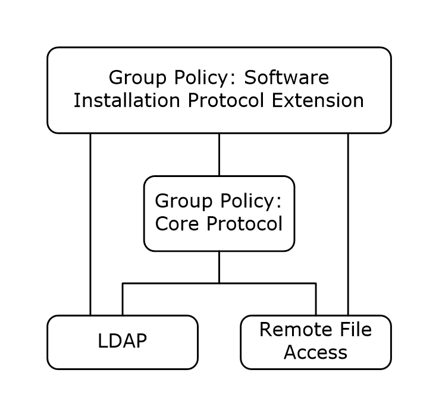
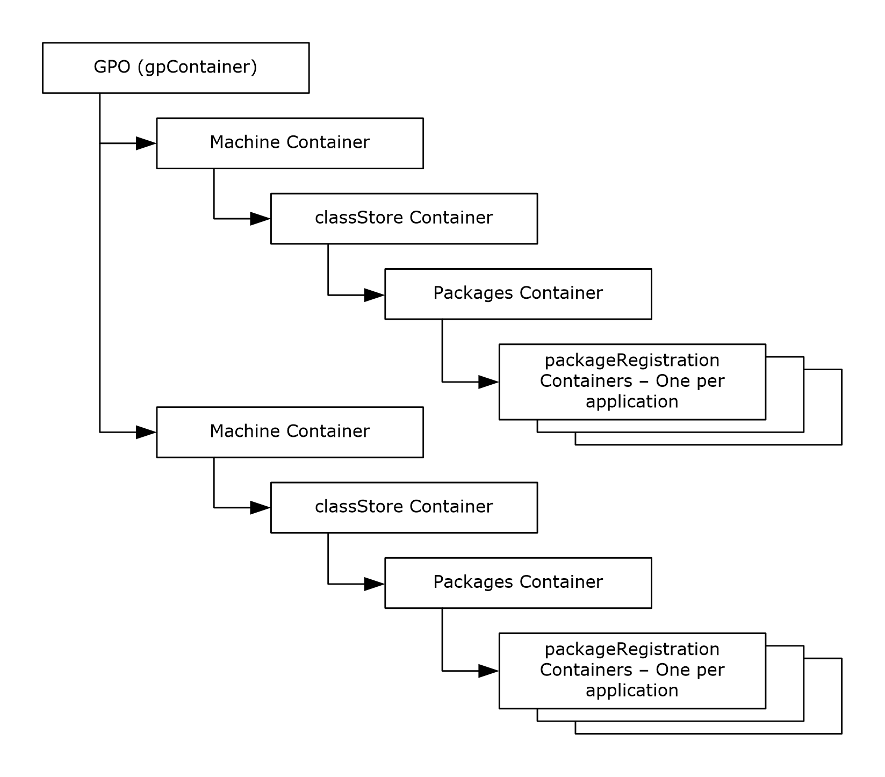
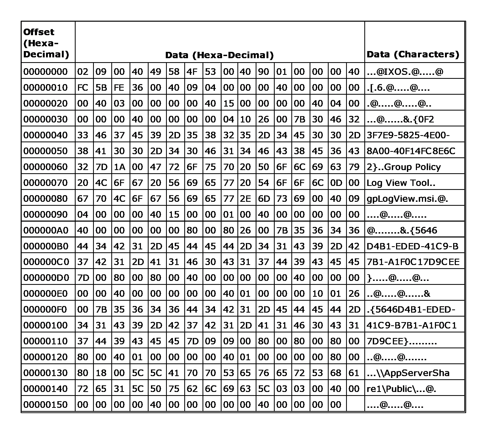

# [MS-GPSI]: Group Policy: Software Installation Protocol Extension

Table of Contents

1 Introduction

- [1 Introduction](#Section_1)
  - [1.1 Glossary](#Section_1.1)
  - [1.2 References](#Section_1.2)
    - [1.2.1 Normative References](#Section_1.2.1)
    - [1.2.2 Informative References](#Section_1.2.2)
  - [1.3 Overview](#Section_1.3)
    - [1.3.1 Background](#Section_1.3.1)
    - [1.3.2 Software Installation Extension Overview](#Section_1.3.2)
  - [1.4 Relationship to Other Protocols](#Section_1.4)
  - [1.5 Prerequisites/Preconditions](#Section_1.5)
  - [1.6 Applicability Statement](#Section_1.6)
  - [1.7 Versioning and Capability Negotiation](#Section_1.7)
  - [1.8 Vendor-Extensible Fields](#Section_1.8)
  - [1.9 Standards Assignments](#Section_1.9)

2 Messages

- [2 Messages](#Section_2)
  - [2.1 Transport](#Section_2.1)
  - [2.2 Message Syntax](#Section_2.2)
    - [2.2.1 Common Messages](#Section_2.2.1)
      - [2.2.1.1 Default Naming Context Search Request](#Section_2.2.1.1)
      - [2.2.1.2 Default Naming Context Search Reply](#Section_2.2.1.2)
    - [2.2.2 Policy Application Messages](#Section_2.2.2)
      - [2.2.2.1 Software Installation Container Search Request](#Section_2.2.2.1)
      - [2.2.2.2 Software Installation Container Search Reply](#Section_2.2.2.2)
      - [2.2.2.3 Software Installation Search Request](#Section_2.2.2.3)
      - [2.2.2.4 Software Installation Search Reply](#Section_2.2.2.4)
        - [2.2.2.4.1 Software Installation Search Reply Attributes](#Section_2.2.2.4.1)
        - [2.2.2.4.2 canUpgradeScript Attribute UpgradeType Values](#Section_2.2.2.4.2)
        - [2.2.2.4.3 packageFlags Attribute Values](#Section_2.2.2.4.3)
        - [2.2.2.4.4 packageType Attribute Values](#Section_2.2.2.4.4)
      - [2.2.2.5 Software Installation Maintenance Message](#Section_2.2.2.5)
    - [2.2.3 Administrative Messages](#Section_2.2.3)
      - [2.2.3.1 Software Installation Read Administration Message](#Section_2.2.3.1)
        - [2.2.3.1.1 Package Search Request](#Section_2.2.3.1.1)
        - [2.2.3.1.2 Package Search Reply](#Section_2.2.3.1.2)
        - [2.2.3.1.3 Software Settings Read Administration Message](#Section_2.2.3.1.3)
        - [2.2.3.1.4 All Categories Search Request](#Section_2.2.3.1.4)
        - [2.2.3.1.5 All Categories Search Reply](#Section_2.2.3.1.5)
        - [2.2.3.1.6 Category Search Request](#Section_2.2.3.1.6)
        - [2.2.3.1.7 Category Search Reply](#Section_2.2.3.1.7)
      - [2.2.3.2 Software Installation Write Administration](#Section_2.2.3.2)
        - [2.2.3.2.1 Class Store Creation Message](#Section_2.2.3.2.1)
        - [2.2.3.2.2 Packages Container Creation Message](#Section_2.2.3.2.2)
        - [2.2.3.2.3 Package Creation Message](#Section_2.2.3.2.3)
        - [2.2.3.2.4 Class Store Confirmation Message](#Section_2.2.3.2.4)
        - [2.2.3.2.5 Package Update Message](#Section_2.2.3.2.5)
        - [2.2.3.2.6 Package Deletion Message](#Section_2.2.3.2.6)
        - [2.2.3.2.7 Category Creation Message](#Section_2.2.3.2.7)
        - [2.2.3.2.8 Category Modification Message](#Section_2.2.3.2.8)
        - [2.2.3.2.9 Category Deletion Message](#Section_2.2.3.2.9)
    - [2.2.4 Application Advertise Script](#Section_2.2.4)
      - [2.2.4.1 Application Advertise Script Record Structure](#Section_2.2.4.1)
      - [2.2.4.2 Opcode List](#Section_2.2.4.2)
        - [2.2.4.2.1 Header (Opcode 2)](#Section_2.2.4.2.1)
        - [2.2.4.2.2 ProductInfo (Opcode 4)](#Section_2.2.4.2.2)
        - [2.2.4.2.3 SourceListPublish (Opcode 9)](#Section_2.2.4.2.3)
        - [2.2.4.2.4 ProductPublish (Opcode 16)](#Section_2.2.4.2.4)
        - [2.2.4.2.5 End (Opcode 3)](#Section_2.2.4.2.5)
        - [2.2.4.2.6 DialogInfo (Opcode 5)](#Section_2.2.4.2.6)
        - [2.2.4.2.7 UserRegister (Opcode 18)](#Section_2.2.4.2.7)
  - [2.3 Directory Service Schema Elements](#Section_2.3)

3 Protocol Details

- [3 Protocol Details](#Section_3)
  - [3.1 Administrative Plug-in Details](#Section_3.1)
    - [3.1.1 Abstract Data Model](#Section_3.1.1)
      - [3.1.1.1 AD Connection Handle](#Section_3.1.1.1)
      - [3.1.1.2 Software Deployment List](#Section_3.1.1.2)
      - [3.1.1.3 Software Deployment](#Section_3.1.1.3)
      - [3.1.1.4 Software Package](#Section_3.1.1.4)
      - [3.1.1.5 Deployment Instruction](#Section_3.1.1.5)
    - [3.1.2 Timers](#Section_3.1.2)
    - [3.1.3 Initialization](#Section_3.1.3)
    - [3.1.4 Higher-Layer Triggered Events](#Section_3.1.4)
    - [3.1.5 Message Processing Events and Sequencing Rules](#Section_3.1.5)
      - [3.1.5.1 Policy Read Administration](#Section_3.1.5.1)
        - [3.1.5.1.1 Package Read](#Section_3.1.5.1.1)
        - [3.1.5.1.2 All Categories Read](#Section_3.1.5.1.2)
      - [3.1.5.2 Policy Write Administration](#Section_3.1.5.2)
        - [3.1.5.2.1 Package Creation](#Section_3.1.5.2.1)
        - [3.1.5.2.2 Package Modification](#Section_3.1.5.2.2)
        - [3.1.5.2.3 Package Updates](#Section_3.1.5.2.3)
        - [3.1.5.2.4 Package Removal](#Section_3.1.5.2.4)
        - [3.1.5.2.5 Package Obsolescence](#Section_3.1.5.2.5)
        - [3.1.5.2.6 All Packages Deletion](#Section_3.1.5.2.6)
        - [3.1.5.2.7 Category Creation](#Section_3.1.5.2.7)
        - [3.1.5.2.8 Category Modification](#Section_3.1.5.2.8)
        - [3.1.5.2.9 Category Deletion](#Section_3.1.5.2.9)
    - [3.1.6 Timer Events](#Section_3.1.6)
    - [3.1.7 Other Local Events](#Section_3.1.7)
  - [3.2 Client Plug-in Details](#Section_3.2)
    - [3.2.1 Abstract Data Model](#Section_3.2.1)
      - [3.2.1.1 Client Environment](#Section_3.2.1.1)
      - [3.2.1.2 AD Connection Handle](#Section_3.2.1.2)
      - [3.2.1.3 Policy Target List](#Section_3.2.1.3)
      - [3.2.1.4 Software Deployment List](#Section_3.2.1.4)
      - [3.2.1.5 Software Deployment](#Section_3.2.1.5)
      - [3.2.1.6 Software Package](#Section_3.2.1.6)
      - [3.2.1.7 Deployment Instruction](#Section_3.2.1.7)
    - [3.2.2 Timers](#Section_3.2.2)
    - [3.2.3 Initialization](#Section_3.2.3)
    - [3.2.4 Higher-Layer Triggered Events](#Section_3.2.4)
      - [3.2.4.1 Process Group Policy](#Section_3.2.4.1)
    - [3.2.5 Message Processing Events and Sequencing Rules](#Section_3.2.5)
      - [3.2.5.1 Software Deployment Retrieval](#Section_3.2.5.1)
      - [3.2.5.2 Software Deployment Applicability](#Section_3.2.5.2)
      - [3.2.5.3 Software Action Determination](#Section_3.2.5.3)
      - [3.2.5.4 Software Configuration](#Section_3.2.5.4)
      - [3.2.5.5 Software Installation Maintenance](#Section_3.2.5.5)
      - [3.2.5.6 Common LDAP Bind](#Section_3.2.5.6)
      - [3.2.5.7 Common LDAP UnBind](#Section_3.2.5.7)
    - [3.2.6 Timer Events](#Section_3.2.6)
    - [3.2.7 Other Local Events](#Section_3.2.7)

4 Protocol Example

- [4 Protocol Example](#Section_4)
  - [4.1 Software Installation Search Result Protocol Example](#Section_4.1)
  - [4.2 Sample Application Advertise Script File](#Section_4.2)

5 Security

- [5 Security](#Section_5)
  - [5.1 Security Considerations for Implementers](#Section_5.1)
  - [5.2 Index of Security Parameters](#Section_5.2)

6 Appendix A: Product Behavior

- [6 Appendix A: Product Behavior](#Section_6)

7 Change Tracking

- [7 Change Tracking](#Section_7)

For the legal notice and IP terms, see [LEGAL.md](../LEGAL.md).
Last updated: 4/23/2024.
See [Revision History](#revision-history) for full version history.

# 1 Introduction

This document specifies the Group Policy: Software Installation Protocol Extension. The transmitted configuration data enables centralized (common) configuration of multiple client systems. The Group Policy: Software Installation Protocol Extension enables an administrator to install and remove software applications at client computers. New software versions can also be pushed out to client computers.

Sections 1.5, 1.8, 1.9, 2, and 3 of this specification are normative. All other sections and examples in this specification are informative.

## 1.1 Glossary

This document uses the following terms:

**Active Directory**: The Windows implementation of a general-purpose [**directory service**](#gt_directory-service-ds), which uses [**LDAP**](#gt_lightweight-directory-access-protocol-ldap) as its primary access protocol. [**Active Directory**](#gt_active-directory) stores information about a variety of objects in the network such as user accounts, computer accounts, groups, and all related credential information used by [**Kerberos**](#gt_kerberos) [MS-KILE](../MS-KILE/MS-KILE.md). [**Active Directory**](#gt_active-directory) is either deployed as Active Directory Domain Services (AD DS) or Active Directory Lightweight Directory Services (AD LDS), which are both described in [MS-ADOD](../MS-ADOD/MS-ADOD.md): Active Directory Protocols Overview.

**advertised**: An installation state of an application on a client computer. An [**advertised**](#gt_advertised) application is one that does not have all of the binaries and files necessary for executing the application present on the computer, but does have metadata on the client that allows it to present the application to the user as if all the files were present and also allows the client to install all of the missing files at a later time.

**application advertise script**: A file that contains a sequence of installation operations and configuration data for installing an application on a client machine. The installer follows the installation operations in the file and configures the metadata of the application to match the state information specified in the script.

**assigned application**: An application that is to be installed at computer startup or user logon.

**Augmented Backus-Naur Form (ABNF)**: A modified version of Backus-Naur Form (BNF), commonly used by Internet specifications. ABNF notation balances compactness and simplicity with reasonable representational power. ABNF differs from standard BNF in its definitions and uses of naming rules, repetition, alternatives, order-independence, and value ranges. For more information, see [[RFC5234]](https://go.microsoft.com/fwlink/?LinkId=123096).

**class store container distinguished name (class store container DN)**: A [**distinguished name (DN)**](#gt_distinguished-name-dn) of the form "CN=Class Store,<scoped gpo dn>" where <scoped gpo dn> is a Scoped [**Group Policy Object (GPO)**](#gt_group-policy-object-gpo) [**DN**](#gt_distinguished-name-dn). The class store container [**DN**](#gt_distinguished-name-dn) refers to an object of objectClass "classStore" in the [**Active Directory**](#gt_active-directory) schema.

**client-side extension GUID (CSE GUID)**: A [**GUID**](#gt_globally-unique-identifier-guid) that enables a specific client-side extension on the Group Policy client to be associated with policy data that is stored in the logical and physical components of a [**Group Policy Object (GPO)**](#gt_group-policy-object-gpo) on the Group Policy server, for that particular extension.

**COM class**: An object class.

**computer policy mode**: A mode of policy application intended to retrieve settings for the computer account of the client.

**Coordinated Universal Time (UTC)**: A high-precision atomic time standard that approximately tracks Universal Time (UT). It is the basis for legal, civil time all over the Earth. Time zones around the world are expressed as positive and negative offsets from UTC. In this role, it is also referred to as Zulu time (Z) and Greenwich Mean Time (GMT). In these specifications, all references to UTC refer to the time at UTC-0 (or GMT).

**curly braced GUID string**: The string representation of a 128-bit globally unique identifier ([**GUID**](#gt_globally-unique-identifier-guid)) using the form {XXXXXXXX-XXXX-XXXX-XXXX-XXXXXXXXXXXX}, where X denotes a hexadecimal digit. The string representation between the enclosing braces is the standard representation of a GUID as described in [[RFC4122]](https://go.microsoft.com/fwlink/?LinkId=90460) section 3. Unlike a GUIDString, a curly braced GUID string includes enclosing braces.

**directory service (DS)**: A service that stores and organizes information about a computer network's users and network shares, and that allows network administrators to manage users' access to the shares. See also [**Active Directory**](#gt_active-directory).

**directory string**: A string encoded in UTF-8 as defined in [[RFC2252]](https://go.microsoft.com/fwlink/?LinkId=90326) section 6.10.

**distinguished name (DN)**: A name that uniquely identifies an object by using the [**relative distinguished name (RDN)**](#gt_relative-distinguished-name-rdn) for the object, and the names of container objects and domains that contain the object. The distinguished name (DN) identifies the object and its location in a tree.

**domain**: A set of users and computers sharing a common namespace and management infrastructure. At least one computer member of the set has to act as a domain controller (DC) and host a member list that identifies all members of the domain, as well as optionally hosting the [**Active Directory**](#gt_active-directory) service. The domain controller provides authentication of members, creating a unit of trust for its members. Each domain has an identifier that is shared among its members. For more information, see [MS-AUTHSOD](../MS-AUTHSOD/MS-AUTHSOD.md) section 1.1.1.5 and [MS-ADTS](../MS-ADTS/MS-ADTS.md).

**domain name**: A domain name used by the Domain Name System (DNS).

**globally unique identifier (GUID)**: A term used interchangeably with universally unique identifier (UUID) in Microsoft protocol technical documents (TDs). Interchanging the usage of these terms does not imply or require a specific algorithm or mechanism to generate the value. Specifically, the use of this term does not imply or require that the algorithms described in [RFC4122] or [[C706]](https://go.microsoft.com/fwlink/?LinkId=89824) must be used for generating the [**GUID**](#gt_globally-unique-identifier-guid). See also universally unique identifier (UUID).

**Group Policy Object (GPO)**: A collection of administrator-defined specifications of the policy settings that can be applied to groups of computers in a domain. Each GPO includes two elements: an object that resides in the [**Active Directory**](#gt_active-directory) for the domain, and a corresponding file system subdirectory that resides on the sysvol DFS share of the Group Policy server for the domain.

**Group Policy Object (GPO) distinguished name (DN)**: An [**LDAP**](#gt_lightweight-directory-access-protocol-ldap) [**distinguished name (DN)**](#gt_distinguished-name-dn) for an [**Active Directory**](#gt_active-directory) object of object class groupPolicyContainer. All such object paths will be paths of the form "LDAP://<gpo guid>,CN=policies,CN=system,<rootdse>", where <rootdse> is the root [**DN**](#gt_distinguished-name-dn) path of the [**Active Directory**](#gt_active-directory) [**domain**](#gt_domain) and <gpo guid> is a [**GPO**](#gt_group-policy-object-gpo) [**GUID**](#gt_globally-unique-identifier-guid).

**Group Policy server**: A server holding a database of [**Group Policy Objects (GPOs)**](#gt_group-policy-object-gpo) that can be retrieved by other machines. The [**Group Policy server**](#gt_group-policy-server) must be a domain controller (DC).

**Kerberos**: An authentication system that enables two parties to exchange private information across an otherwise open network by assigning a unique key (called a ticket) to each user that logs on to the network and then embedding these tickets into messages sent by the users. For more information, see [MS-KILE].

**language code identifier (LCID)**: A 32-bit number that identifies the user interface human language dialect or variation that is supported by an application or a client computer.

**Lightweight Directory Access Protocol (LDAP)**: The primary access protocol for [**Active Directory**](#gt_active-directory). Lightweight Directory Access Protocol (LDAP) is an industry-standard protocol, established by the Internet Engineering Task Force (IETF), which allows users to query and update information in a [**directory service (DS)**](#gt_directory-service-ds), as described in [MS-ADTS]. The Lightweight Directory Access Protocol can be either version 2 [[RFC1777]](https://go.microsoft.com/fwlink/?LinkId=90290) or version 3 [[RFC3377]](https://go.microsoft.com/fwlink/?LinkID=91337).

**little-endian**: Multiple-byte values that are byte-ordered with the least significant byte stored in the memory location with the lowest address.

**naming context (NC)**: An [**NC**](#gt_naming-context-nc) is a set of objects organized as a tree. It is referenced by a DSName. The [**DN**](#gt_distinguished-name-dn) of the DSName is the distinguishedName attribute of the tree root. The [**GUID**](#gt_globally-unique-identifier-guid) of the DSName is the objectGUID attribute of the tree root. The security identifier (SID) of the DSName, if present, is the objectSid attribute of the tree root; for Active Directory Domain Services (AD DS), the SID is present if and only if the [**NC**](#gt_naming-context-nc) is a domain naming context (domain NC). [**Active Directory**](#gt_active-directory) supports organizing several [**NCs**](#gt_naming-context-nc) into a tree structure.

**NULL GUID**: A [**GUID**](#gt_globally-unique-identifier-guid) of all zeros.

**PackageRegistration object**: An [**Active Directory**](#gt_active-directory) directory service container that represents a software installation extension setting. The container is an object of class groupPolicyContainer, as specified in [MS-ADSC](../MS-ADSC/MS-ADSC.md) section 2.56).

**policy application**: The protocol exchange by which a client obtains all of the [**Group Policy Object (GPO)**](#gt_group-policy-object-gpo) and thus all applicable Group Policy settings for a particular policy target from the server, as specified in [MS-GPOL](../MS-GPOL/MS-GPOL.md). Policy application can operate in two modes, user policy and computer policy.

**policy target**: A user or computer account for which policy settings can be obtained from a server in the same domain, as specified in [MS-GPOL]. For user policy mode, the policy target is a user account. For computer policy mode, the policy target is a computer account.

**primary language identifier**: The lower 10 bits of a language identifier. It identifies the user interface human language supported by an application or client computer without regard to variations such as dialect.

**product identifier GUID**: A globally unique identifier ([**GUID**](#gt_globally-unique-identifier-guid)) assigned to a software application by the vendor of the software. Each application has a unique GUID. An updated version of the application maintains the same GUID as the previous versions of the application. This GUID is referenced by the software installation package to identify the application that is installed by the software installation package.

**published application**: An application that should not automatically be installed at computer startup or user logon unless it is a required upgrade of an application that is installed on the computer. However, software maintenance applications on the computer can display information about this software and install or uninstall it, often at the direction of a user.

**redeploy action**: An action that an administrator can take for an application deployed through the software installation extension protocol that will cause all clients that receive the application through the protocol to perform an installation of the application on the client if the application is already installed. This is used by administrators as a mechanism to update the application.

**relative distinguished name (RDN)**: An attribute-value pair used in the distinguished name of an object. For more information, see [[RFC2251]](https://go.microsoft.com/fwlink/?LinkId=90325).

**scoped Group Policy Object (GPO) distinguished name (DN)**: A [**Group Policy Object (GPO) distinguished name (DN)**](#gt_group-policy-object-gpo-distinguished-name-dn) where the set of "CN=<cn>" elements is prepended with "CN=User" for the user policy mode of policy application and with "CN=Machine" for [**computer policy mode**](#gt_computer-policy-mode).

**Simple and Protected GSS-API Negotiation Mechanism (SPNEGO)**: An authentication mechanism that allows Generic Security Services (GSS) peers to determine whether their credentials support a common set of GSS-API security mechanisms, to negotiate different options within a given security mechanism or different options from several security mechanisms, to select a service, and to establish a security context among themselves using that service. [**SPNEGO**](#gt_simple-and-protected-gss-api-negotiation-mechanism-spnego) is specified in [[RFC4178]](https://go.microsoft.com/fwlink/?LinkId=90461).

**software installation package**: A file that describes other files and metadata necessary to describe an application's executable files and state and to install that application. Also referred to as a "package".

**software installation package modification**: A file that allows an administrator to specify configuration for an application that is installed on the client through a software installation package.

**software maintenance utility**: An application that allows users to perform software management activities such as installation, uninstallation, or inventory of applications available through the software installation extension.

**software package distinguished name (DN)**: A [**distinguished name (DN)**](#gt_distinguished-name-dn) of the form "CN=<SoftwarePackageId>,CN=Packages,<ClassStore>", where <ClassStore> is a class store container [**DN**](#gt_distinguished-name-dn) and <SoftwarePackageId> is a [**curly braced GUID string**](#gt_curly-braced-guid-string).

**software scripts path**: A file system path to a directory with a path of the form "<ScopedGPOPath>\Applications", where <ScopedGPOPath> is a scoped GPO path.

**UncPath**: The location of a file in a network of computers, as specified in Universal Naming Convention (UNC) syntax.

**Unicode string**: A Unicode 8-bit string is an ordered sequence of 8-bit units, a Unicode 16-bit string is an ordered sequence of 16-bit code units, and a Unicode 32-bit string is an ordered sequence of 32-bit code units. In some cases, it could be acceptable not to terminate with a terminating null character. Unless otherwise specified, all [**Unicode strings**](#gt_unicode-string) follow the UTF-16LE encoding scheme with no Byte Order Mark (BOM).

**update sequence number (USN)**: A monotonically increasing sequence number used in assigning a stamp to an originating update. For more information, see [MS-ADTS].

**upgrade**: A relationship between software packages in which the upgrading application will replace a particular software installation package (the upgraded application) if it exists on a client and was installed through the software installation protocol extension. Logically, this means that the client application will be uninstalled and the upgrading application will be installed.

**user assistance resource**: A [**Unicode string**](#gt_unicode-string) containing a URL pointing to information that might be helpful to users of the application when viewing information on the application by using a [**software maintenance utility**](#gt_software-maintenance-utility). This is defined by the administrator who deploys the application. The [**Unicode string's**](#gt_unicode-string) Unicode Byte Order Mark (BOM) encoding is [**little-endian**](#gt_little-endian) only; and big-endian Unicode BOM encoding is not supported.

**UTC (Coordinated Universal Time)**: A high-precision atomic time standard that approximately tracks Universal Time (UT). It is the basis for legal, civil time all over the Earth. Time zones around the world are expressed as positive and negative offsets from UTC. In this role, it is also referred to as Zulu time (Z) and Greenwich Mean Time (GMT). In these specifications, all references to UTC refer to the time at UTC–0 (or GMT).

**Windows Event log**: An audit trail created by Windows instrumentation manifest to monitor the health of the operating system and to help troubleshoot issues when they arise. The event logs can be browsed and managed by Windows Event Viewer.

**MAY, SHOULD, MUST, SHOULD NOT, MUST NOT:** These terms (in all caps) are used as defined in [[RFC2119]](https://go.microsoft.com/fwlink/?LinkId=90317). All statements of optional behavior use either MAY, SHOULD, or SHOULD NOT.

## 1.2 References

Links to a document in the Microsoft Open Specifications library point to the correct section in the most recently published version of the referenced document. However, because individual documents in the library are not updated at the same time, the section numbers in the documents may not match. You can confirm the correct section numbering by checking the [Errata](https://go.microsoft.com/fwlink/?linkid=850906).

### 1.2.1 Normative References

We conduct frequent surveys of the normative references to assure their continued availability. If you have any issue with finding a normative reference, please contact [dochelp@microsoft.com](mailto:dochelp@microsoft.com). We will assist you in finding the relevant information.

[C706] The Open Group, "DCE 1.1: Remote Procedure Call", C706, August 1997, [https://publications.opengroup.org/c706](https://go.microsoft.com/fwlink/?LinkId=89824)

**Note** Registration is required to download the document.

[MS-ADA1] Microsoft Corporation, "[Active Directory Schema Attributes A-L](../MS-ADA1/MS-ADA1.md)".

[MS-ADA2] Microsoft Corporation, "[Active Directory Schema Attributes M](../MS-ADA2/MS-ADA2.md)".

[MS-ADA3] Microsoft Corporation, "[Active Directory Schema Attributes N-Z](../MS-ADA3/MS-ADA3.md)".

[MS-ADSC] Microsoft Corporation, "[Active Directory Schema Classes](../MS-ADSC/MS-ADSC.md)".

[MS-ADTS] Microsoft Corporation, "[Active Directory Technical Specification](../MS-ADTS/MS-ADTS.md)".

[MS-DTYP] Microsoft Corporation, "[Windows Data Types](../MS-DTYP/MS-DTYP.md)".

[MS-GPOL] Microsoft Corporation, "[Group Policy: Core Protocol](../MS-GPOL/MS-GPOL.md)".

[MS-LCID] Microsoft Corporation, "[Windows Language Code Identifier (LCID) Reference](../MS-LCID/MS-LCID.md)".

[RFC2119] Bradner, S., "Key words for use in RFCs to Indicate Requirement Levels", BCP 14, RFC 2119, March 1997, [https://www.rfc-editor.org/info/rfc2119](https://go.microsoft.com/fwlink/?LinkId=90317)

[RFC2251] Wahl, M., Howes, T., and Kille, S., "Lightweight Directory Access Protocol (v3)", RFC 2251, December 1997, [https://www.rfc-editor.org/info/rfc2251](https://go.microsoft.com/fwlink/?LinkId=90325)

[RFC2254] Howes, T., "The String Representation of LDAP Search Filters", RFC 2254, December 1997, [https://www.rfc-editor.org/info/rfc2254](https://go.microsoft.com/fwlink/?LinkId=90328)

[RFC4122] Leach, P., Mealling, M., and Salz, R., "A Universally Unique Identifier (UUID) URN Namespace", RFC 4122, July 2005, [https://www.rfc-editor.org/info/rfc4122](https://go.microsoft.com/fwlink/?LinkId=90460)

[RFC4234] Crocker, D., Ed., and Overell, P., "Augmented BNF for Syntax Specifications: ABNF", RFC 4234, October 2005, [https://www.rfc-editor.org/info/rfc4234](https://go.microsoft.com/fwlink/?LinkId=90462)

### 1.2.2 Informative References

[MS-WPO] Microsoft Corporation, "[Windows Protocols Overview](#Section_1.3)".

[MSDN-DiskPrompt] Microsoft Corporation, "DiskPrompt property", [http://msdn.microsoft.com/en-us/library/aa368313.aspx](https://go.microsoft.com/fwlink/?LinkId=102647)

[MSDN-InstType] Microsoft Corporation, "Installing Multiple Instances with Instance Transforms", [http://msdn.microsoft.com/en-us/library/aa369528.aspx](https://go.microsoft.com/fwlink/?LinkId=102643)

[MSDN-LUASetting] Microsoft Corporation, "User Account Control (UAC) Patching", [http://msdn.microsoft.com/en-us/library/Aa372388.aspx](https://go.microsoft.com/fwlink/?LinkId=102645)

[MSDN-Production] Microsoft Corporation, "ARPPRODUCTICON property", [http://msdn.microsoft.com/en-us/library/aa367593.aspx](https://go.microsoft.com/fwlink/?LinkId=102641)

## 1.3 Overview

The Group Policy: Software Installation Protocol Extension to the Group Policy Protocol, as specified in [MS-GPOL](../MS-GPOL/MS-GPOL.md), allows administrators to instruct arbitrarily large groups of clients to install and remove administrator-specified software at computer startup, user logon, or when explicitly instructed by an interactively logged-on user.

### 1.3.1 Background

The Group Policy Protocol, as specified in [MS-GPOL](../MS-GPOL/MS-GPOL.md), allows clients to discover and retrieve policy settings created by administrators of a [**domain**](#gt_domain). These settings are persisted within [**Group Policy Objects (GPOs)**](#gt_group-policy-object-gpo) that are assigned to [**policy target**](#gt_policy-target) accounts in [**Active Directory**](#gt_active-directory). Policy target accounts are either computer accounts or user accounts in Active Directory. Each client uses the Lightweight Directory Access Protocol (LDAP) to determine what GPOs are applicable to it by consulting the Active Directory objects corresponding to its computer account and the user accounts of any users logging on to the client computer.

On each client, each GPO is interpreted and acted on by software components known as client plug-ins. The client plug-ins that are responsible for a given GPO are specified using an attribute of the GPO. This attribute specifies a list of [**globally unique identifier (GUID)**](#gt_globally-unique-identifier-guid) pairs. The first GUID of each pair is referred to as a [**client-side extension GUID (CSE GUID)**](#gt_client-side-extension-guid-cse-guid). The second GUID of each pair is referred to as a tool extension GUID.

For each GPO that is applicable to a client, the client consults the CSE GUIDs listed in the GPO to determine what client plug-ins on the client are to handle the GPO. The client then invokes the client plug-ins to handle the GPO.

A client plug-in uses the content of the GPO to retrieve settings specific to its class in a manner specific to its class. After its class-specific settings are retrieved, the client plug-in uses those settings to perform class-specific processing.

### 1.3.2 Software Installation Extension Overview

This protocol specifies the behavior of two components: an administrative plug-in that extends an administrative tool, as specified in [MS-GPOL](../MS-GPOL/MS-GPOL.md), and a client plug-in that extends a Group Policy Protocol client on client machines.

The software installation administrative plug-in allows administrators to specify applications to be installed on client computers. The administrator can control how the software is installed. For example, the software can be configured to install with a minimal user interface. These options can be changed by the administrator after they are initially specified. The administrative plug-in stores the specified settings on a server by using remote file access and LDAP (as specified in [[RFC2251]](https://go.microsoft.com/fwlink/?LinkId=90325)), and it stores metadata from which the path to those settings can be constructed and saved in a [**GPO**](#gt_group-policy-object-gpo).

The software installation client plug-in consults the GPO to reconstruct the path to the actual settings and retrieves them so that the client can enforce the intention behind them (that is, install this software, remove this software, or update this software).

Software installation settings carried by this protocol can cause the client to do the following:

- Install a given application at computer startup.
- Install a given application when certain users log on.
- Remove an application that was previously installed due to this protocol.
- Update a currently installed application.
- Allow users who are logged on to clients to use a [**software maintenance utility**](#gt_software-maintenance-utility) to view applications deployed to the network and to optionally install or remove them.

## 1.4 Relationship to Other Protocols

This protocol depends on the Group Policy: Core Protocol (as specified in [MS-GPOL](../MS-GPOL/MS-GPOL.md)) to provide a list of applicable [**GPOs**](#gt_group-policy-object-gpo). It also transmits Group Policy settings and instructions between the client and the [**Group Policy server**](#gt_group-policy-server) by reading and writing files using remote file access.

See [MS-WPO](#Section_1.3) section 6.4 for an overview of remote file system concepts.

The administrative tool and client plug-ins for this protocol use [**LDAP**](#gt_lightweight-directory-access-protocol-ldap) version 3 (as specified in [[RFC2251]](https://go.microsoft.com/fwlink/?LinkId=90325)) to read and write protocol-specific data.

Figure 1: Group Policy: Software Installation Protocol Extension relationship diagram

The Group Policy Protocol invokes plug-ins for protocols such as this one. In summary, this extension's [**CSE GUID**](#gt_client-side-extension-guid-cse-guid) and tool extension [**GUIDs**](#gt_globally-unique-identifier-guid) (as specified in section [1.9](#Section_1.9)) are stored within a GPO by the policy administration portion of the Group Policy Protocol whenever the Group Policy: Software Installation Protocol Extension causes a GPO to contain policy settings for the policy targets. During [**policy application**](#gt_policy-application) by a client, the Group Policy Protocol retrieves the CSE GUID from the GPO, signaling to the client to invoke the Group Policy: Software Installation Protocol Extension plug-in to retrieve Group Policy: Software Installation Protocol Extension settings from the GPO. Similarly, the tool extension GUIDs are used by policy administration tools to invoke the policy administration portion of the Group Policy: Software Installation Protocol Extension plug-ins in order to update the Group Policy: Software Installation Protocol Extension settings stored within a GPO.

## 1.5 Prerequisites/Preconditions

The prerequisites for this protocol are the same as those for the Group Policy: Core Protocol, as specified in [MS-GPOL](../MS-GPOL/MS-GPOL.md).

It is assumed that a client computer has an operating system component capable of performing software installation and removal based on the abstract state specified in section [3.2](#Section_1.3).

## 1.6 Applicability Statement

The Group Policy: Software Installation Protocol Extension is applicable only within the Group Policy Protocol framework. The Group Policy: Software Installation Protocol Extension is applicable to the installation, update, and removal of application software on client computers.

This protocol is appropriate for use only when the same settings are relevant to all clients.

## 1.7 Versioning and Capability Negotiation

There is no mechanism in the Group Policy: Software Installation Protocol Extension for versioning or capability negotiation.

## 1.8 Vendor-Extensible Fields

The Group Policy: Software Installation Protocol Extension defines several vendor-extensible fields that are of type GUID. Vendors can acquire [**GUID**](#gt_globally-unique-identifier-guid) values by using the GUID generation method, as specified in [[C706]](https://go.microsoft.com/fwlink/?LinkId=89824).

## 1.9 Standards Assignments

This protocol defines [**CSE GUID**](#gt_client-side-extension-guid-cse-guid) and tool extension [**GUID**](#gt_globally-unique-identifier-guid) standards assignments, as specified in [MS-GPOL](../MS-GPOL/MS-GPOL.md) section 1.8. The assignments are as follows.

| Parameter | Value |
| --- | --- |
| CSE GUID | {C6DC5466-785A-11D2-84D0-00C04FB169F7} |
| Tool extension GUID (user policy settings) | {BACF5C8A-A3C7-11D1-A760-00C04FB9603F} |
| Tool extension GUID (computer policy settings) | {942A8E4F-A261-11D1-A760-00C04FB9603F} |

# 2 Messages

## 2.1 Transport

The Group Policy: Software Installation Protocol Extension requires remote file access and [**LDAP**](#gt_lightweight-directory-access-protocol-ldap) transports as specified for use in the Group Policy: Core Protocol [MS-GPOL](../MS-GPOL/MS-GPOL.md). All messages MUST be exchanged over the LDAP and remote file access protocols between the client and server, as specified in section [2.2](../MS-GPOL/MS-GPOL.md).

## 2.2 Message Syntax

There are two classes of protocol conversations. Each message can be categorized into one of these two classes:

- [**Policy application**](#gt_policy-application) messages: Messages exchanged during policy application. These messages are triggered by the Group Policy Protocol, as specified in the Policy Application section of [MS-GPOL](../MS-GPOL/MS-GPOL.md) (section 3.2.5.1), and they are processed by the Group Policy: Software Installation Protocol Extension client plug-in.
- Administrative messages: Messages that allow an administrator to view and update Group Policy: Software Installation Protocol Extension settings in a [**domain**](#gt_domain). They are used only by the Group Policy: Software Installation Protocol Extension administrative plug-in, never by the client plug-in.
Both message types retrieve settings for applications through LDAP from [**Active Directory**](#gt_active-directory). The layout of these Active Directory objects provides context for understanding the objects and attributes that are retrieved through the messages.

Figure 2: Active Directory GPO structure for software installation

### 2.2.1 Common Messages

The following message is used by both [**policy application**](#gt_policy-application) and administrative tasks to read and write software installation settings.

#### 2.2.1.1 Default Naming Context Search Request

This message requests the [**Group Policy server**](#gt_group-policy-server) to return the default [**naming context (NC)**](#gt_naming-context-nc). This is an LDAP searchRequest message, as specified in [[RFC2251]](https://go.microsoft.com/fwlink/?LinkId=90325), and MUST have the following values.

| Parameter | Value |
| --- | --- |
| *baseObject* | null string |
| *Scope* | MUST be set to 0 (base Object). |
| *derefAliases* | MUST be set to 0 (neverDerefAliases) to dereference in searching. |
| *sizeLimit* | MUST be set to 0 (no limit set). |
| *timeLimit* | MAY be set to 0 (infinite).<1> |
| *typesOnly* | MUST be set to FALSE, according to the LDAP protocol definition of FALSE. |
| *Filter* | (objectClass=*) |
| *attributes* | The following attribute MUST be retrieved: **defaultNamingContext**. |

#### 2.2.1.2 Default Naming Context Search Reply

This is read from the SearchResultEntry in an LDAPMessage, as specified in [[RFC2251]](https://go.microsoft.com/fwlink/?LinkId=90325), section 4.5.2. The message is received by the client from the [**Group Policy server**](#gt_group-policy-server) in response to a default naming context search request message. A successful reply from the search request SHOULD contain one or more LDAPMessages. These messages MUST contain one or more SearchResultEntries that contain the default [**naming context**](#gt_naming-context-nc). The SearchResultEntries MUST contain attributes with the following formats.

| Attribute | Format |
| --- | --- |
| **defaultNamingContext** | A directory string that represents the default naming context. |

### 2.2.2 Policy Application Messages

The following messages are generated by the client and the [**Group Policy server**](#gt_group-policy-server) during [**policy application**](#gt_policy-application).

#### 2.2.2.1 Software Installation Container Search Request

This message requests the [**Group Policy server**](#gt_group-policy-server) to search for the software package container for a [**GPO**](#gt_group-policy-object-gpo). This is an LDAP searchRequest message, as specified in [[RFC2251]](https://go.microsoft.com/fwlink/?LinkId=90325), and MUST have the following values.

| Parameter | Value |
| --- | --- |
| *baseObject* | A class store [**distinguished name (DN)**](#gt_distinguished-name-dn) for the object of [**Active Directory**](#gt_active-directory) class "classStore" in Active Directory. This object referenced by this class store DN is contained in an object of class groupPolicyContainer (as specified in [MS-ADSC](../MS-ADSC/MS-ADSC.md) section 2.58). This MUST be a DN of the form CN=Class Store,<scoped gpo dn>, where <scoped gpo dn> is a [**scoped Group Policy Object (GPO) distinguished name (DN)**](#gt_scoped-group-policy-object-gpo-distinguished-name-dn). |
| *Scope* | MUST be the value 0 for the baseObject scope, as specified in [RFC2251]. |
| *derefAliases* | MUST be set to 0 (neverDerefAliases) to dereference in searching. |
| *sizeLimit* | MUST be set to 0 (no limit set). |
| *timeLimit* | MAY be set to 0 (infinite).<2> |
| *typesOnly* | MUST be set to FALSE, according to the LDAP definition of FALSE. |
| *Filter* | The following LDAP filter (as specified in [[RFC2254]](https://go.microsoft.com/fwlink/?LinkId=90328)) MUST be used: objectClass=* |
| *attributes* | MUST specify the attribute **appSchemaVersion**.<3> |

#### 2.2.2.2 Software Installation Container Search Reply

This is read from the SearchResultEntry in an LDAPMessage, as specified in [[RFC2251]](https://go.microsoft.com/fwlink/?LinkId=90325), section 4.5.2, received by the client from the [**Group Policy server**](#gt_group-policy-server) in response to a software installation container search request message. A successful reply from the search request contains one or more LDAPMessages. These messages contain one or more SearchResultEntries. The SearchResultEntries MUST contain attributes with the following format.

| Attribute | Format |
| --- | --- |
| **appSchemaVersion** | This attribute is of type integer (as specified in [MS-ADA1](../MS-ADA1/MS-ADA1.md) section 2.65). |

The message MUST be considered invalid if the **appSchemaVersion** attribute does not have the value 0x000006CC. Further messages MUST NOT be generated by the client for this cycle of [**policy application**](#gt_policy-application).

#### 2.2.2.3 Software Installation Search Request

This message requests the [**Group Policy server**](#gt_group-policy-server) to return [**PackageRegistration objects**](#gt_packageregistration-object) for the Group Policy: Software Installation Extension settings in a given [**GPO**](#gt_group-policy-object-gpo). This is an LDAP searchRequest message, as specified in [[RFC2251]](https://go.microsoft.com/fwlink/?LinkId=90325), and MUST have the following values.

| Parameter | Value |
| --- | --- |
| *baseObject* | MUST be a [**DN**](#gt_distinguished-name-dn) of the form CN=Packages,CN=Class Store,<scoped gpo dn>, where <scoped gpo dn> is a [**scoped GPO DN**](#gt_5ae3cacc-9e3c-459e-99f8-20a41628e5fe). |
| *Scope* | MUST be set to 1 (singleLevel). |
| *derefAliases* | MUST be set to 0 (neverDerefAliases) to dereference in searching. |
| *sizeLimit* | MUST be set to 0 (no limit set). |
| *timeLimit* | MAY be set to 0 (infinite).<4> |
| *typesOnly* | MUST be set to FALSE, according to the LDAP protocol definition of FALSE. |
| *Filter* | The following LDAP filter (as specified in [[RFC2254]](https://go.microsoft.com/fwlink/?LinkId=90328)) MUST be used to search the Packages container of the GPO (the representation given here is what is specified in [RFC2254]). This representation can be mapped to the LDAP protocol representation: `&(objectClass=packageRegistration)(\|(\|(msiScriptName=*A*)(&(msiScriptName=*P*)(canUpgradeScript=*)))(!(msiScriptName=*)))` |
| *attributes* | The following attributes MUST be retrieved: **canUpgradeScript**, **packageFlags**, **packageType**, **msiScriptPath**, **lastUpdateSequence**, **localeID**, **machineArchitecture**, **packageName**, **versionNumberHi**, **versionNumberLo**, **installUiLevel**, **vendor**, **url**, **revision**, **productCode**, **objectGUID**, **categories**, and **msiFileList**.<5> **nTSecurityDescriptor** MAY be retrieved. |

#### 2.2.2.4 Software Installation Search Reply

This is read from the SearchResultEntry in an LDAPMessage, as specified in [[RFC2251]](https://go.microsoft.com/fwlink/?LinkId=90325), section 4.5.2. The message is received by the client from the [**Group Policy server**](#gt_group-policy-server) in response to a software installation search request message. A successful reply from the search request SHOULD contain one or more LDAPMessages. These messages MUST contain one or more SearchResultEntries that represent the Group Policy: Software Installation Protocol Extension settings stored in the [**GPO**](#gt_group-policy-object-gpo). The SearchResultEntries MUST contain attributes with the formats specified in the following sections.

##### 2.2.2.4.1 Software Installation Search Reply Attributes

The SearchResultEntries MUST contain attributes with the following formats.

| Attribute | Format |
| --- | --- |
| **canUpgradeScript** | A multivalued attribute, as specified in [MS-ADSC](../MS-ADSC/MS-ADSC.md) section 2.219, where each value MUST be a [**directory string**](#gt_directory-string) representing software modeled by another [**PackageRegistration object**](#gt_packageregistration-object) that is to be [**upgraded**](#gt_upgrade). Each value MUST have the following format. <SoftwareDN>\\<ObjectGuidID>:<UpgradeType> where <SoftwareDN> is a software package. This MUST be a [**DN**](#gt_distinguished-name-dn) of the form LDAP://CN=Class Store,<scoped gpo dn>, where <scoped gpo dn> is a [**scoped GPO DN**](#gt_5ae3cacc-9e3c-459e-99f8-20a41628e5fe). <ObjectGuidID> MUST be the string form of the objectId [**GUID**](#gt_globally-unique-identifier-guid) attribute, as specified in [[RFC4122]](https://go.microsoft.com/fwlink/?LinkId=90460) section 3, of the PackageRegistration object referenced by <SoftwareDN>. <UpgradeType> is a two-character string that MUST be interpreted as a flags field. It describes how to apply the upgrade. The <UpgradeType> flags UPGFLG_Uninstall, UPGFLG_NoUninstall, UPGFLG_UpgradedBy, and UPGFLG_Enforced are specified in section [2.2.2.4.2](../MS-ADSC/MS-ADSC.md) canUpgradeScript Attribute UpgradeType Values. Either UPGFLG_Uninstall or UPGFLG_NoUninstall MUST be specified, but not both. UPGFLG_UpgradedBy and UPGFLG_Enforced MAY be added. They are not used by the client plug-in; they are used only by the administrative plug-in, to display the proper user interface. The value MUST be one of these values; if it is any other value, the behavior is undefined. It is valid for the attribute to be empty; in which case, the attribute MUST be ignored by the client. If this attribute does not conform to the format specified here, the client MUST behave as if the value is empty. |
| **packageFlags** | A 32-bit integer that MUST be interpreted as a flags field in which all combinations of flags are valid, unless otherwise noted. The value of the flags of this integer MUST be as specified in section [2.2.2.4.3](#Section_2.2.2.4.3), packageFlags Attribute Values. |
| **packageType** | An integer that MUST be one of the values specified in section [2.2.2.4.4](#Section_2.2.2.4.4), packageType Attribute Values. |
| **msiScriptPath** | MUST be an [**UncPath**](#gt_uncpath) for a file under the [**software scripts path**](#gt_software-scripts-path) directory to an [**application advertise script**](#gt_application-advertise-script) file that is named <[**curly braced GUID string**](#gt_curly-braced-guid-string)>.aas. |
| **lastUpdateSequence** | MUST be an [**update sequence number (USN)**](#gt_update-sequence-number-usn) generated whenever the object is updated by the server. It MUST be ignored by the client except for logging purposes. |
| **localeID** | MUST be a Windows locale identifier (for more information, see [MS-LCID](../MS-LCID/MS-LCID.md) section 2.2) that represents the language of the software. |
| **machineArchitecture** | This integer identifies the hardware architecture requirement for a computer to run the software. This integer MUST be one of the following values: Value of "0" indicates that the software is for Intel x86 architecture. Value of "6" indicates that the software is for Itanium-based architecture. Value of "9" indicates that the software is for x64 architecture. |
| **packageName** | MUST be a friendly human-readable directory string value authored on the server by an administrator to identify the application being represented in this object. |
| **versionNumberHi** | An integer that serves as the major version number of the software. It MUST be used only for logging purposes. |
| **versionNumberLo** | An integer that serves as the minor version number of the software. It MUST be used only for logging purposes. |
| **Vendor** | MUST be a human-readable directory string description for the name of the vendor of the software represented by this object. This field MUST not be validated and is to be used only for logging. |
| **url** | MUST be a directory string representation of a Uniform Resource Locator (URL) for a [**user assistance resource**](#gt_user-assistance-resource) (determined by an administrator) that can be presented to users of the client when browsing for software applications to manage. |
| **Revision** | An integer that MUST be incremented every time a [**redeploy action**](#gt_redeploy-action) is initiated for this application by an administrator of the server. |
| **productCode** | A GUID that MUST uniquely identify the software to be installed. This allows the client to determine whether this software is already installed on the client. |
| **objectGUID** | A GUID that MUST uniquely identify this deployment of the application and does not change after the object is initially created. |
| **Categories** | MUST be a set of GUIDs represented by a multivalued directory string attribute, as specified in [MS-ADSC] section 2.219, that represents application categories to which the software has been determined to belong by an administrator. It MUST be used by the client to enable browsing of software by category. |
| **msiFileList** | A multivalued attribute of type directory string that MUST represent an ordered list of network file system paths to Windows Installer files supplied by application vendors and administrators who customize the application. Each string MUST be of the following format. <OrderIndex>:<filepath> where <OrderIndex> is a zero-based index that indicates the order in which the client and administrative tools are to evaluate the Windows Installer network file <filepath> relative to other such files referenced in this multivalued attribute (when installing the application or modifying its deployment properties). The following constraints MUST be enforced: <OrderIndex> MUST be unique in this multivalued attribute. <OrderIndex> MUST NOT be greater than or equal to the number of values in this attribute. <filepath> MUST be the UncPath of a valid [**software installation package**](#gt_software-installation-package) or [**software installation package modification**](#gt_software-installation-package-modification) file. If the packageType attribute is set to 5 (DrwFilePath), there MUST be a value with <OrderIndex> 0. Otherwise, this object is considered invalid. If this value is invalid, it SHOULD be ignored, as specified in section [3.2.5.4](#Section_3.2.5.4). Value with <OrderIndex> 0 MUST reference a Windows Installer package (.msi) file. Values with <OrderIndex> other than 0 MUST NOT reference a Windows Installer package (.msi) file. If the packageType attribute is set to 6 (SetupNamePath), this attribute MUST be empty. |
| **installUiLevel** | This attribute's integer value is undefined and MAY contain any value. This attribute MUST be ignored. |

The searchResultEntries MAY contain attributes of the following format.

| Attribute | Format |
| --- | --- |
| **nTSecurityDescriptor** | A security descriptor, as specified in [MS-DTYP](../MS-DTYP/MS-DTYP.md) section 2.4.6. It SHOULD be used by the client only for logging purposes to log the security permissions that are associated with the PackageRegistration object that represents an application. |

##### 2.2.2.4.2 canUpgradeScript Attribute UpgradeType Values

The **canUpgradeScript** attribute <UpgradeType> values are as follows.

| Value | Meaning |
| --- | --- |
| 01 UPGFLG_Uninstall | The application referenced by <SoftwareDN> MUST be replaced--uninstalled--prior to installing this application. |
| 02 UPGFLG_NoUninstall | The application referenced by <SoftwareDN> MUST be upgraded. Removal is not required prior to installing this application. |
| 04 UPGFLG_UpgradedBy | The application referenced by <SoftwareDN> is being upgraded by another package in the same [**GPO**](#gt_group-policy-object-gpo). The administrative plug-in SHOULD prevent the user from manipulating this upgrade. |
| 08 UPGFLG_Enforced | This package forces an existing installed instance of the same productCode (objectId of the package) to be upgraded. The administrative plug-in SHOULD prevent the user from removing this enforced upgrade. |

##### 2.2.2.4.3 packageFlags Attribute Values

The **packageFlags** attribute values are as follows.

| Value | Meaning |
| --- | --- |
| 0x00000004 ACTFLG_UninstallUnmanaged | Applications already installed on this machine with the same product identifier as that specified in this package's **productCode** field MUST be removed before this application can be installed. This flag is now obsolete. It SHOULD be ignored and be treated as if it was always set (implicit unmanaged application removal).<6> |
| 0x00000008 ACTFLG_Published | This is a [**published application**](#gt_published-application). This value MUST NOT be set if the ACTFLG_Assigned flag is set. |
| 0x00000010 | This flag SHOULD be set. If it isn't, this object MUST be ignored. |
| 0x00000020 ACTFLG_UserInstall | If a user has invoked the protocol from a user interface with the purpose of allowing the user to browse deployed applications, this flag MUST be set. |
| 0x00000040 ACTFLG_OnDemandInstall | The application is available to be installed without user interaction. This MUST be initiated when an application running on the system requests the presence of software that can provide the implementation of a [**COM class**](#gt_com-class) or open a file with a specific file name extension. |
| 0x00000080 ACTFLG_Orphan | If set, this flag indicates that the administrator has stopped deploying the application and that clients that have already installed this application MUST NOT perform application removals, [**upgrades**](#gt_upgrade), or reinstallations of this instance of the application through the Group Policy: Software Installation Protocol Extension. |
| 0x00000100 ACTFLG_Uninstall | The client MUST remove this application. |
| 0x00000400 ACTFLG_Assigned | This application is an [**assigned application**](#gt_assigned-application). This value MUST NOT be set if the ACTFLG_Published flag is set. |
| 0x00000800 ACTFLG_OrphanOnPolicyRemoval | In the future, if the [**policy application**](#gt_policy-application) mode sequence no longer contains the [**GPO**](#gt_group-policy-object-gpo) from which this [**PackageRegistration object**](#gt_packageregistration-object) originated this application MUST be treated as if the ACTFLG_Orphan flag is set. |
| 0x00001000 ACTFLG_UninstallOnPolicyRemoval | This is similar to ACTFLG_OrphanOnPolicyRemoval, except that an application removal MUST occur in addition to the behavior specified in ACTFLG_OrphanOnPolicyRemoval. |
| 0x00002000 ACTFLG_InstallUserAssign | For assigned applications, the application SHOULD be fully installed by the client and not [**advertised**](#gt_advertised). |
| 0x00004000 ACTFLG_Force Upgrade | If this application is configured as an upgrade for an application on the client, this application MUST be installed. |
| 0x00008000 ACTFLG_Minimal InstallUI | This flag indicates whether installation activity is to provide a user experience that allows customization of software during installation. If the flag is enabled, such a user experience SHOULD NOT be provided. Otherwise, it SHOULD be provided. |
| 0x00010000 ACTFLG_ExcludeX86OnWin64 | This software executes only on Intel x86 platforms and MUST be ignored by any other platform. |
| 0x00020000 ACTFLG_Ignore Language | This [**software installation package**](#gt_software-installation-package) is suitable for any language, and the client MUST ignore language when considering the applicability of this software. |
| 0x00040000 ACTFLG_Has Upgrades | This package has upgrades for other deployed applications. |
| 0x00080000 ACTFLG_FullInstallUI | This flag is applicable when the application was retrieved as part of a query for a software installation maintenance application. When this flag is specified, the client MUST display the installation package's complete user interface if the user initiates an installation of the package. If the flag is not specified, a simpler interface with fewer options MAY be presented by the software installation maintenance application at the time of installation. |

##### 2.2.2.4.4 packageType Attribute Values

The **packageType** attribute values are as follows.

| Value | Meaning |
| --- | --- |
| 5 DrwFilePath | This application MUST be installed through a [**software installation package**](#gt_software-installation-package). |
| 6 SetupNamePath | This application MUST be installed by creating a process from the executable program at the file path specified in the **msiScriptPath** attribute of this object. The file path can be either a local disk path or a [**UncPath**](#gt_uncpath), and MUST be accessible by clients applying the policy. |

#### 2.2.2.5 Software Installation Maintenance Message

This operation allows [**software maintenance utilities**](#gt_software-maintenance-utility) on the client to dynamically retrieve the deployed software packages from the [**Group Policy server**](#gt_group-policy-server) in contexts outside the Group Policy Protocol, as specified in [MS-GPOL](../MS-GPOL/MS-GPOL.md). This message MUST be identical to the software installation read administration message specified in section [2.2.3.1.3](#Section_2.2.3.1.3).

### 2.2.3 Administrative Messages

The following messages are generated by the administrative plug-in and the [**Active Directory**](#gt_active-directory) server during policy administration.

#### 2.2.3.1 Software Installation Read Administration Message

The following messages MUST be used by administrative tools to read software installation settings.

##### 2.2.3.1.1 Package Search Request

This message requests the [**Group Policy server**](#gt_group-policy-server) to return a [**PackageRegistration object**](#gt_packageregistration-object) for the Group Policy: Software Installation Extension settings in a given [**GPO**](#gt_group-policy-object-gpo). This is an LDAP searchRequest message, as specified in [[RFC2251]](https://go.microsoft.com/fwlink/?LinkId=90325), and MUST have the following values.

| Parameter | Value |
| --- | --- |
| *baseObject* | Depends on use. |
| *Scope* | Depends on use. |
| *derefAliases* | MUST be set to 0 (neverDerefAliases) to dereference in searching. |
| *sizeLimit* | MUST be set to 0 (no limit set). |
| *timeLimit* | MAY be set to 0 (infinite).<7> |
| *typesOnly* | MUST be set to FALSE, according to the LDAP protocol definition of FALSE. |
| *Filter* | Depends on use. |
| *attributes* | MAY be any attribute defined in [Software Installation Search Request (section 2.2.2.3)](#Section_2.2.2.3). |

##### 2.2.3.1.2 Package Search Reply

This is read from the SearchResultEntry in an LDAPMessage, as specified in [[RFC2251]](https://go.microsoft.com/fwlink/?LinkId=90325), section 4.5.2. The message is received by the client from the [**Group Policy server**](#gt_group-policy-server) in response to a [Package Search Request](#Section_2.2.3.1.1) message. A successful reply from the search request SHOULD contain one LDAPMessage. This message MUST contain one SearchResultEntry that represents the named software installation package. The SearchResultEntry MUST contain the requested attributes with the same formats as defined in section [2.2.2.4.1](#Section_2.2.2.4.1), Software Installation Search Reply Attributes.

##### 2.2.3.1.3 Software Settings Read Administration Message

In this message, settings from a single [**GPO**](#gt_group-policy-object-gpo) are retrieved by the client for use in [**software maintenance utilities**](#gt_software-maintenance-utility) or in use by Policy Read Administration tools.

The Group Policy: Software Installation Protocol Extension sequence for read administration is similar to that used during [**policy application**](#gt_policy-application) for a single GPO, as defined in section [2.2.2.3](#Section_2.2.2.3) that specifies the Software Installation Search Request message. The difference is in the search filter used. The search filter for read administration MUST be the following.

(objectClass=packageRegistration)

The remainder of the sequence MUST be the same.

##### 2.2.3.1.4 All Categories Search Request

This message requests the [**Group Policy server**](#gt_group-policy-server) to return search results for the Group Policy: Software Installation categories. This is an LDAP searchRequest message, as specified in [[RFC2251]](https://go.microsoft.com/fwlink/?LinkId=90325), and MUST have the following values.

| Parameter | Value |
| --- | --- |
| baseObject | MUST be a [**DN**](#gt_distinguished-name-dn) of the form CN=AppCategories,CN=Default Domain Policy,CN=System,<Domain NC> |
| Scope | MUST be set to 1 (singleLevel). |
| derefAliases | MUST be set to 0 (neverDerefAliases) to dereference in searching. |
| sizeLimit | MUST be set to 0 (no limit set). |
| timeLimit | MAY be set to 0 (infinite).<8> |
| typesOnly | MUST be set to FALSE, according to the LDAP protocol definition of FALSE. |
| Filter | The following LDAP filter (as specified in [[RFC2254]](https://go.microsoft.com/fwlink/?LinkId=90328)) MUST be used to search the AppCategories container (the representation given here is what is specified in [RFC2254]). This representation can be mapped to the LDAP protocol representation: `(objectClass=categoryRegistration)` |
| attributes | The following attributes MUST be retrieved: **categoryId**, and **localizedDescription**. |

##### 2.2.3.1.5 All Categories Search Reply

This is read from the SearchResultEntry in an LDAPMessage, as specified in [[RFC2251]](https://go.microsoft.com/fwlink/?LinkId=90325), section 4.5.2. The message is received by the client from the [**Group Policy server**](#gt_group-policy-server) in response to an all categories search request message. A successful reply from the search request SHOULD contain one or more LDAPMessages. These messages MUST contain one or more SearchResultEntries that represent the Group Policy: Software Installation categories. The SearchResultEntries MUST contain attributes with the following formats.

| Attribute | Format |
| --- | --- |
| categoryId | A [**GUID**](#gt_globally-unique-identifier-guid) uniquely identifying the category. This MUST be the same as the most granular [**relative distinguished name (RDN)**](#gt_relative-distinguished-name-rdn) of the objectName of the current searchResultEntry. |
| localizedDescription | A [**directory string**](#gt_directory-string) representing the name of the category. |

##### 2.2.3.1.6 Category Search Request

This message requests the [**Group Policy server**](#gt_group-policy-server) to return search results for a specific Group Policy: Software Installation category. This is an LDAP searchRequest message, as specified in [[RFC2251]](https://go.microsoft.com/fwlink/?LinkId=90325), and MUST have the following values.

| Parameter | Value |
| --- | --- |
| baseObject | MUST be a DN of the form CN=<CategoryId>,CN=AppCategories,CN=Default Domain Policy,CN=System,<Domain NC>. <CategoryId> is a GUID string as defined in [[RFC4122]](https://go.microsoft.com/fwlink/?LinkId=90460) section 3. |
| Scope | MUST be set to 0 (base Object). |
| derefAliases | MUST be set to 0 (neverDerefAliases) to dereference in searching. |
| sizeLimit | MUST be set to 0 (no limit set). |
| timeLimit | MAY be set to 0 (infinite).<9> |
| typesOnly | MUST be set to FALSE, according to the LDAP protocol definition of FALSE. |
| Filter | The following LDAP filter (as specified in [[RFC2254]](https://go.microsoft.com/fwlink/?LinkId=90328)) MUST be used to search the AppCategories container (the representation given here is what is specified in [RFC2254]). This representation can be mapped to the LDAP protocol representation: `(objectClass=*)` |
| Attributes | The following attributes MUST be retrieved: **localizedDescription**. |

##### 2.2.3.1.7 Category Search Reply

This is read from the SearchResultEntry in an LDAPMessage, as specified in [[RFC2251]](https://go.microsoft.com/fwlink/?LinkId=90325), section 4.5.2. The message is received by the client from the [**Group Policy server**](#gt_group-policy-server) in response to a category search request message. A successful reply from the search request SHOULD contain one or more LDAPMessages. These messages MUST contain one or more SearchResultEntries that represent the Group Policy: Software Installation categories. The SearchResultEntries MUST contain attributes with the following format.

| Attribute | Format |
| --- | --- |
| localizedDescription | A directory string representing the name of the category. |

#### 2.2.3.2 Software Installation Write Administration

The following messages MUST be used by administrative tools to update software installation settings.

##### 2.2.3.2.1 Class Store Creation Message

The [**class store container**](#gt_5098e13f-61d5-4b33-83f2-a02b3fe1ab89) of the gpContainer object in [**Active Directory**](#gt_active-directory) is the container for all [**PackageRegistration objects**](#gt_packageregistration-object) that represent deployed software. This message MUST be an LDAP addRequest message, as specified in [[RFC2251]](https://go.microsoft.com/fwlink/?LinkId=90325). The message MUST have the fields shown in the following table.

| Parameter | Value |
| --- | --- |
| *entry* | MUST be a [**DN**](#gt_distinguished-name-dn) of the form CN=Class Store,<scoped gpo dn>, where <scoped gpo dn> is a [**scoped GPO DN**](#gt_5ae3cacc-9e3c-459e-99f8-20a41628e5fe). |
| *attributes* | MUST specify the attributes **objectClass** and **description** in an attributeList, as specified in [RFC2251]. |

The attributes member is itself a sequence of attribute name and value pairs. The following table specifies these pairs and their meanings.

| Attribute name | Value | Meaning |
| --- | --- | --- |
| **objectClass** | MUST be the [**directory string**](#gt_directory-string) value classStore. | The name of the Active Directory object class type to create through this message. |
| **description** | This field MUST be the directory string value Application Store. | A field whose value indicates a well-formed object. |

##### 2.2.3.2.2 Packages Container Creation Message

The packages container of the classStore object in [**Active Directory**](#gt_active-directory) is the container for all [**PackageRegistration objects**](#gt_packageregistration-object) that represent deployed software. This message MUST be an LDAP addRequest message, as specified in [[RFC2251]](https://go.microsoft.com/fwlink/?LinkId=90325). The message MUST have the fields shown in the following table.

| Parameter | Value |
| --- | --- |
| *entry* | MUST be a [**DN**](#gt_distinguished-name-dn) of the form CN=Packages,CN=Class Store,<scoped gpo dn>, where <scoped gpo dn> is a [**scoped GPO DN**](#gt_5ae3cacc-9e3c-459e-99f8-20a41628e5fe). |
| *attributes* | MUST specify the attributes **objectClass** and **description**. |

The attributes member is itself a sequence of attribute name and value pairs. The following table specifies these pairs and their meanings.

| Attribute name | Value | Meaning |
| --- | --- | --- |
| **objectClass** | MUST be the [**directory string**](#gt_directory-string) value classStore. | The name of the Active Directory object class type to create through this message. |
| **description** | This field MUST be the directory string value Application Packages. | A field whose value indicates a well-formed object. |

##### 2.2.3.2.3 Package Creation Message

This message creates a [**PackageRegistration object**](#gt_packageregistration-object) in [**Active Directory**](#gt_active-directory) and an [**application advertise script**](#gt_application-advertise-script) file in the file system of the [**Group Policy server**](#gt_group-policy-server). The LDAP portion of the message MUST be an LDAP addRequest message, as specified in [[RFC2251]](https://go.microsoft.com/fwlink/?LinkId=90325).

| Parameter | Value |
| --- | --- |
| *entry* | The [**software package DN**](#gt_8177125e-6c40-42f1-88b6-a3c161f92601) that corresponds to the [**GPO DN**](#gt_group-policy-object-gpo-distinguished-name-dn). This MUST be a [**DN**](#gt_distinguished-name-dn) of the form CN=<PackageId>,CN=Packages,CN=Class Store,<scoped gpo dn>, where <scoped gpo dn> is a [**scoped GPO DN**](#gt_5ae3cacc-9e3c-459e-99f8-20a41628e5fe) and <PackageId> is a GUID string, as defined in [[RFC4122]](https://go.microsoft.com/fwlink/?LinkId=90460) section 3. The [**GUID**](#gt_globally-unique-identifier-guid) portion of the DN MUST be generated by using the standard GUID generation algorithm, as specified in [[C706]](https://go.microsoft.com/fwlink/?LinkId=89824) section 3.1.20, uuid_create() function. |
| *attributes* | The attributes defined in section [2.2.2.4.1](#Section_2.2.2.4.1) Software Installation Search Reply Attributes MUST be supplied in the attributeList of this addRequest message along with the values that are wanted by the policy administrator. The semantics of the attributes are the same as those specified for the PackageRegistration object in the [Software Installation Search Reply](#Section_2.2.2.4) message. The exception to the attributes defined in the Software Installation Search Reply message is that the **objectGUID** attribute MUST NOT be specified in the attributes field as part of this message. |

The attributes member is itself a sequence of attribute name and value pairs. The following table specifies these pairs and their meanings.

| Attribute name | Value | Meaning |
| --- | --- | --- |
| **objectClass** | MUST be the [**directory string**](#gt_directory-string) value packageRegistration. | The name of the Active Directory object class type to create through this message. |
| **displayName** | MUST be the directory string name of the package to be created. | The name of the package. |

Note that the msiScriptName attribute MUST always be present and that it MUST be specified with the following semantics.

| Parameter | Value |
| --- | --- |
| *msiScriptName* | A directory string that MUST be one of the following values: Value of "A" indicates [**Assigned application**](#gt_assigned-application). Value of "P" indicates [**Published application**](#gt_published-application). Value of "R" indicates Removed application. |

The remote file access portion of the message is an application advertise script file. Using the algorithm in [C706] Appendix A "Universal Unique Identifier", a unique GUID is generated for the name of the application advertise script file.

##### 2.2.3.2.4 Class Store Confirmation Message

The [**class store container**](#gt_5098e13f-61d5-4b33-83f2-a02b3fe1ab89) of the gpContainer object in [**Active Directory**](#gt_active-directory) is the container for all [**PackageRegistration objects**](#gt_packageregistration-object) that represent deployed software. This message updates that container when a client has created the packages contained within it. In this way, other clients accessing the object for [**policy application**](#gt_policy-application) or administration protocol sequences have an indication that this container is valid. The marking technique is simply to stamp the object with a valid version number. Clients consider this container invalid if it does not have this stamp of approval. The message MUST be an LDAP modifyRequest message, as specified in [[RFC2251]](https://go.microsoft.com/fwlink/?LinkId=90325). The message MUST have the fields shown in the following table.

| Parameter | Value |
| --- | --- |
| *object* | MUST be a [**DN**](#gt_distinguished-name-dn) of the form CN=Class Store,<scoped gpo dn>, where <scoped gpo dn> is a [**scoped GPO DN**](#gt_5ae3cacc-9e3c-459e-99f8-20a41628e5fe). |
| *modification* | MUST specify the attribute **lastUpdateSequence**. MAY specify the attributes **appSchemaVersion** and **displayName**. |

The attributes member is itself a sequence of attribute name and value pairs. The table that follows specifies these pairs and their meanings.

| Attribute | Value | Meaning |
| --- | --- | --- |
| **appSchemaVersion** | MUST be the integer value 0x000006CC. | A version number used to ensure that clients are compatible with the underlying object. |
| **lastUpdateSequence** | MUST be set to the current [**UTC (Coordinated Universal Time)**](#gt_utc-coordinated-universal-time) time. The current [**UTC**](#gt_coordinated-universal-time-utc) is read from the clock on the computer issuing this message. This attribute's value MUST be specified in [**USN**](#gt_update-sequence-number-usn) format. | A "sequence" number indicating when the object was last modified. |
| **displayName** | MUST be the [**directory string**](#gt_directory-string) value Application Store. | The name of the package. |

##### 2.2.3.2.5 Package Update Message

This message updates a [**PackageRegistration object**](#gt_packageregistration-object) in [**Active Directory**](#gt_active-directory). The LDAP portion of the message MUST be an LDAP modifyRequest message, as specified in [[RFC2251]](https://go.microsoft.com/fwlink/?LinkId=90325).

| Parameter | Value |
| --- | --- |
| *object* | [**Software package DN**](#gt_8177125e-6c40-42f1-88b6-a3c161f92601) for the PackageRegistration object. This MUST be a [**DN**](#gt_distinguished-name-dn) of the form CN=<PackageId>,CN=Packages,CN=Class Store,<scoped gpo dn>, where <scoped gpo dn> is a [**scoped GPO DN**](#gt_5ae3cacc-9e3c-459e-99f8-20a41628e5fe) and <PackageId> is a GUID string, as defined in [[RFC4122]](https://go.microsoft.com/fwlink/?LinkId=90460) section 3. |
| *modification* | MUST specify the modifications to be performed as described in the following text. |

The modification member is itself a sequence of operations and attribute name and value pairs.

The operation MUST be one of Add, Delete, or Replace as specified in [RFC2251] section 4.6.

The semantics of the attributes are the same as those specified for the PackageRegistration object in section [2.2.2.4.1](#Section_2.2.2.4.1), Software Installation Search Reply Attributes.

The following additional requirements apply to the attributes in the modification:

- The **lastUpdateSequence** attribute value MUST be present and MUST be set to the current [**UTC (Coordinated Universal Time)**](#gt_utc-coordinated-universal-time) time. The current [**UTC**](#gt_coordinated-universal-time-utc) is read from the clock on the computer issuing the Package Update Message. This attribute's value MUST be specified in [**USN**](#gt_update-sequence-number-usn) format.
- If any package change is made, the **packageFlags** attribute MUST be specified as described in section [2.2.2.4.3](#Section_2.2.2.4.3) packageFlags Attribute Values.
- The **msiScriptName** attribute MUST also be specified for all updates according to the rules in section [2.2.3.2.3](#Section_2.2.3.2.3).
- The **objectGUID** attribute MUST NOT be specified in the attributes field.
- The **msiFileList** attribute MUST NOT be specified in the attributes field. This field is specified only as part of the package creation message. That is, it is an invariant of a given package.
- The **msiScriptPath** attribute MUST NOT be specified in the attributes field.
The remote file access portion of the message MUST be an [**application advertise script**](#gt_application-advertise-script) file. This part of the message is optional if the file already exists in the [**GPO**](#gt_group-policy-object-gpo). The file needs to be updated only in certain circumstances, as specified in section [3.1.5.2.2](#Section_3.1.5.2.2).

##### 2.2.3.2.6 Package Deletion Message

This message deletes a [**PackageRegistration object**](#gt_packageregistration-object) in [**Active Directory**](#gt_active-directory). The LDAP portion of the message MUST be an LDAP delRequest message, as specified in [[RFC2251]](https://go.microsoft.com/fwlink/?LinkId=90325), with the parameter shown in the following table.

| Parameter | Value |
| --- | --- |
| *LDAPDN* | The [**Software package DN**](#gt_8177125e-6c40-42f1-88b6-a3c161f92601) of the PackageRegistration object MUST be a [**DN**](#gt_distinguished-name-dn) of the form CN=<PackageId>,CN=Packages,CN=Class Store,<scoped gpo dn>, where <scoped gpo dn> is a [**scoped GPO DN**](#gt_5ae3cacc-9e3c-459e-99f8-20a41628e5fe) and <PackageId> is a GUID string, as defined in [[RFC4122]](https://go.microsoft.com/fwlink/?LinkId=90460) section 3. |

##### 2.2.3.2.7 Category Creation Message

This message creates a CategoryRegistration object in [**Active Directory**](#gt_active-directory).

The CategoryRegistration objects are contained in the AppCategories container of the Default Domain Policy object in Active Directory.

This message MUST be an [**LDAP**](#gt_lightweight-directory-access-protocol-ldap) AddRequest message, as specified in [[RFC2251]](https://go.microsoft.com/fwlink/?LinkId=90325). The message MUST have the fields shown in the following table.

| Parameter | Value |
| --- | --- |
| *entry* | MUST be a [**DN**](#gt_distinguished-name-dn) of the form CN=<CategoryId>,CN=AppCategories,CN=Default Domain Policy,CN=System, <Domain NC> and <CategoryId> is a GUID string, as defined in [[RFC4122]](https://go.microsoft.com/fwlink/?LinkId=90460) section 3. |
| *attributes* | MUST specify the attributes **objectClass** and **categoryId** in an attributeList, as specified in [RFC2251]. |

The attributes member is itself a sequence of attribute name and value pairs. The following table specifies these pairs and their meanings.

| Attribute name | Value | Meaning |
| --- | --- | --- |
| **objectClass** | MUST be the [**directory string**](#gt_directory-string) value categoryRegistration. | The name of the Active Directory object class type to create through this message. |
| **categoryId** | This field MUST be the [**GUID**](#gt_globally-unique-identifier-guid) representation of the CategoryId specified in the entry. | The category being created. |

##### 2.2.3.2.8 Category Modification Message

This message modifies a CategoryRegistration object in [**Active Directory**](#gt_active-directory).

This message MUST be an [**LDAP**](#gt_lightweight-directory-access-protocol-ldap) ModifyRequest message, as specified in [[RFC2251]](https://go.microsoft.com/fwlink/?LinkId=90325). The message MUST have the fields shown in the following table.

| Parameter | Value |
| --- | --- |
| *object* | MUST be a [**DN**](#gt_distinguished-name-dn) of the form CN=<CategoryId>,CN=AppCategories,CN=Default Domain Policy, CN=System, <Domain NC> and <CategoryId> is a GUID string as defined in [[RFC4122]](https://go.microsoft.com/fwlink/?LinkId=90460) section 3. |
| *modification* | MUST specify the modifications to be performed as described in the following text. |

The modification member is itself a sequence of operations and attribute name and value pairs. The operation MUST be one of Add, Delete, or Replace as specified in [RFC2251] section 4.6. The following table specifies the name and value pair and its meaning.

| Attribute name | Value | Meaning |
| --- | --- | --- |
| **localizedDescription** | MUST be a [**directory string**](#gt_directory-string) value. | The name of the category. |

##### 2.2.3.2.9 Category Deletion Message

This message deletes a CategoryRegistration object in [**Active Directory**](#gt_active-directory).

The CategoryRegistration objects are contained in the AppCategories container of the Default Domain Policy object in Active Directory.

This message MUST be an [**LDAP**](#gt_lightweight-directory-access-protocol-ldap) DelRequest message, as specified in [[RFC2251]](https://go.microsoft.com/fwlink/?LinkId=90325). The message MUST have the field shown in the following table.

| Parameter | Value |
| --- | --- |
| *object* | MUST be a [**DN**](#gt_distinguished-name-dn) of the form CN=<CategoryId>,CN=AppCategories,CN=Default Domain Policy,CN=System, <Domain NC> and <CategoryId> is a GUID string, as defined in [[RFC4122]](https://go.microsoft.com/fwlink/?LinkId=90460) section 3. |

### 2.2.4 Application Advertise Script

The [**application advertise script**](#gt_application-advertise-script) is a file containing a linear sequence of installation operations to be performed, such as file and registry updates, configuration database updates, and UI notifications. The file uses a binary format and is specified using [**Augmented Backus-Naur Form (ABNF)**](#gt_augmented-backus-naur-form-abnf) grammar. ABNF is specified in [[RFC4234]](https://go.microsoft.com/fwlink/?LinkId=90462).

Each record MUST consist of an operation identifier (opcode), an argument count, and an array of arguments, essentially a serialization of the record objects to be used by the installer.

Data types supported include NULL, integer, and variable-length string and binary data. All data MUST be stored in [**little-endian**](#gt_little-endian) byte ordering, with the exception of non-[**Unicode strings**](#gt_unicode-string) and binary stream, which are padded to a 16-bit boundary.

The application advertise script is based on Windows Installer technology and requires the author of the application advertise script file to have detailed knowledge of Windows Installer technology.<10>

The following ABNF grammar specifies the application advertise script file format.

AASFile = Header ProductInfo ProductPublish SourceListPublish End

Header = %x02 %x09 Arguments

ProductInfo = %x04 %x10 Arguments

SourceListPublish = %x09 Arguments

ProductPublish = %x10 %x01 Arguments

End = %x03 %x03 Arguments

Arguments = 1*Argument

Argument = DataType Data

DataType = Type [DataLength]

Type = *2OCTET

DataLength = *2OCTET

Data = *16383OCTET

#### 2.2.4.1 Application Advertise Script Record Structure

The first 16-bit word of a record MUST contain the operation code in the low byte and the argument count in the high byte.

Each argument specified MUST be preceded by a 16-bit word that specifies the data type and length of the following argument data. The exact data representation depends upon the type. The maximum length of an argument is 16,383 characters.

The following table specifies the operation code argument format.

| Bit Range | Field | Description |
| --- | --- | --- |
| Variable | Null string (all types) | 0x0 Absent. |
| 32-bit signed integer | 0x4000 | 32-bit integer value. |
| Variable | Null argument | 0x8000 Absent. |
| 32-bit type and size information followed by data. If the length of the string or stream is greater than 0x3FFF, the data type value MUST be 0xC000 and is followed by a 32-bit value that includes the length of the data plus the type. The type MUST be in the high-order 2 bits. The value written is the value obtained from the following formula: (length + DataType<<16), where DataType is string/stream values defined in this table, such as ASCII char string, binary stream, or [**Unicode string**](#gt_unicode-string). The maximum length of the string can be (230 – 1). | Extended size | 0xC000 |
| Variable | ASCII char string | 0x0 + length of string Character array. The length of the string does not include the terminating NULL character. |
| 0x8000 + byte count | binary stream | Byte array. |
| Variable | Unicode string | 0xC000 + length of Unicode string Unicode character array. The length of the string does not include the terminating NULL character. |

#### 2.2.4.2 Opcode List

Operation codes MUST be specified as part of the [**application advertise script**](#gt_application-advertise-script) file. Each operation code, immediately followed by its arguments, MUST appear in the file in the sequence shown in the following table.

| Operation code | Description | Number of arguments |
| --- | --- | --- |
| 2 | [Header](#Section_2.2.4.2.1) | 9 |
| 4 | [ProductInfo](#Section_2.2.4.2.2) | 16 |
| 9 | [SourceListPublish](#Section_2.2.4.2.3) | 5 + 3*(number_of_disks) + 1 |
| 16 | [ProductPublish](#Section_2.2.4.2.4) | 1 |
| 3 | [End](#Section_2.2.4.2.5) | 3 |
| 5 | [DialogInfo](#Section_2.2.4.2.6) | 1+variable |
| 18 | [UserRegister](#Section_2.2.4.2.7) | 3 |

Arguments for the operation codes are described in the remaining topics in this section.

##### 2.2.4.2.1 Header (Opcode 2)

Opcode 2 is the header of an [**application advertise script**](#gt_application-advertise-script). The header includes the following arguments:

**Signature**: 32-bit signed integer. The value MUST be 1397708873.

**Version**: 32-bit signed integer.

**Timestamp**: 32-bit signed integer. The stamp is local time represented as four octets containing the date and time. Data in the octets is arranged as follows.

| Bit Range | Field | Description |
| --- | --- | --- |
| 0-4 | DOSDate | Day of month: 1–31 |
| 5-8 | - | Month: 1–12 (1 = January, 2 = February, and so on) |
| 9-15 | - | Year: Offset from 1980 |
| 0-4 | DOSTime | Seconds: Value is divided by 2 |
| 5-10 | - | Minutes: 0–59 |
| 11-15 | - | Hour: 0–23, using a 24-hour clock |

Timestamp MUST store the octets as follows: ((DOSDate << 16) | DOSTime).

**LangId:** 32-bit signed integer. The value is a [**language code identifier (LCID)**](#gt_language-code-identifier-lcid)**.**

**Platform**: 32-bit signed integer. The value MUST be either zero or a value obtained using the following formula: (PROCESSOR_ARCHITECTURE_INTEL & 0xffff) | ((wTargetProcessorArchitecture & 0xffff) << 16)

wTargetProcessorArchitecture is one of the values in the following table.

| Name | Value |
| --- | --- |
| PROCESSOR_ARCHITECTURE_INTEL | 0 |
| PROCESSOR_ARCHITECTURE_IA64 | 6 |
| PROCESSOR_ARCHITECTURE_AMD64 | 9 |

**ScriptType**:32-bit signed integer. The value MUST be 3.

**ScriptMajorVersion**: 32-bit signed integer. The value MUST be 21.

**ScriptMinorVersion**: 32-bit signed integer. The value MUST be 4.

**ScriptAttributes**: 32-bit signed integer. The value MUST be 0.

##### 2.2.4.2.2 ProductInfo (Opcode 4)

Operation code 4 provides information about the product. ProductInfo includes the following arguments:

**ProductKey**: ASCII character string. Represented as a [**GUID**](#gt_globally-unique-identifier-guid), ProductKey is a unique identifier for a particular product release. Letters used in this GUID MUST be uppercase. Two different versions of a product MUST NOT have the same ProductKey.

**ProductName**: A string (array) of either ASCII characters or Unicode characters.

**PackageName**: A string (array) of either ASCII characters or Unicode characters.

**Language**: 32-bit signed integer. The value is an [**LCID**](#gt_language-code-identifier-lcid), identical in value to LangId in the header.

**Version**: 32-bit signed integer. Conversion of authored ProductVersion string property in the form major.minor.build, where major and minor max is 255 and build max is 65535.

The algorithm to compute the version is as follows. Given a version A.B.C, the integer representation is ((A << 24) | (B << 16) | C. Note that A and B <= 0xFF and that C <= 0xFFFF).

**Assignment**: 32-bit signed integer. The value MUST be 0 when the product is on a per-user basis or 1 when the product is on a per-machine basis.

**ObsoleteArg**: 32-bit signed integer. MUST be 0.

**ProductIcon**: A string (array) of ASCII characters. This is the ARPPRODUCTICON property as described in the [[MSDN-Production]](https://go.microsoft.com/fwlink/?LinkId=102641) Windows Installer documentation.

**PackageMediaPath**: A string (array) of either ASCII characters or Unicode characters. If the installation package is not at the root of the source media, this value provides the relative path to the application installation package on media.

If "e:" represents a removable media drive and example.msi is located at e:\apps\app1\example.msi, then the value of PackageMediaPath is "\apps\app1\". This value relates to the functionality described in the MEDIAPACKAGEPATH Property reference.

**PackageCode**: ASCII character string. Represented as a GUID, PackageCode specifies a particular Windows Installer package. The package code associates an .msi file with an application or product and can also be used for the verification of sources.

The product and package codes are not interchangeable.

**null argument (1)**

**null argument (2)**

**InstanceType**: 32-bit signed integer. When the installation is accomplished via a multi-instance transform, the value MUST be 1. Otherwise, the value MUST be 0. Installing multiple instances with instance transforms is described further in [[MSDN-InstType]](https://go.microsoft.com/fwlink/?LinkId=102643).

**LUASetting**: 32-bit signed integer. The value MUST be 1 when the product supports UAC updates. Otherwise, the value MUST be 0. The default value is 0.

For details, see User Account Control (UAC) Patching [[MSDN-LUASetting]](https://go.microsoft.com/fwlink/?LinkId=102645).

**RemoteURTInstalls**: 32-bit signed integer. The value MUST be 0.

**ProductDeploymentFlags**: 32-bit signed integer. The value MUST be one of the following values.

| Name | Meaning | Value |
| --- | --- | --- |
| MSIDEPLOYFLAGS_UNKNOWN | Deployment compliance state is unknown. | 0 |
| MSIDEPLOYFLAGS_GPDEPLOY | Group Policy deployed app (in-proc advertisement first). | 1 |
| MSIDEPLOYFLAGS_UAC | MSI performs UAC elevation or package is LUA compliant (true per-user). | 2 |
| MSIDEPLOYFLAGS_INSTALLER_DETECTED | Installer detected or indeterminate. | 3 |
| MSIDEPLOYFLAGS_INSTALLPERUSER | Performing per-user installation for a dual mode package. | 4 |
| MSIDEPLOYFLAGS_INSTALLPERUSER_GPDEPLOY | Group Policy deployed dual-mode package is being installed per-user. | 5 |
| MSIDEPLOYFLAGS_INSTALLPERUSER_INSTALLER_DETECTED | Installer detected dual-mode package is installer detected. | 6 |

##### 2.2.4.2.3 SourceListPublish (Opcode 9)

Operation code 9 provides information about sources for creating the product. SourceListPublish includes the following arguments:

**PatchCode**: ASCII character string. The value MUST be NULL.

**PatchPackageName**: ASCII character string. The value MUST be NULL.

**DiskPromptTemplate**: A string (array) of either ASCII characters or Unicode characters. The value is copied from the DiskPrompt property specified in [[MSDN-DiskPrompt]](https://go.microsoft.com/fwlink/?LinkId=102647).

**PackagePath**: A string (array) of either ASCII characters or Unicode characters, **PackagePath** is the full path to the MSI package of the product being advertised. For example, "\\server\share\apps\app1\example.msi".

**NumberOfDisks**: 32-bit signed integer. The value is copied from the Media Table and is a count of the number of media entries for the package.

**DiskId**: 32-bit signed integer. The value is copied from the Media Table.

**Note**: This argument is repeated for each disk specified in **NumberOfDisks**.

**VolumeName**: A string (array) of either ASCII characters or Unicode characters. The value is copied from the Media Table.

Note: This argument is repeated for each disk specified in **NumberOfDisks**.

**DiskPrompt**: A string (array) of either ASCII characters or Unicode characters. The value is copied from the Media Table.

**Note**: This argument is repeated for each disk specified in **NumberOfDisks**.

**LaunchPath**: A string (array) of either ASCII characters or Unicode characters. LaunchPath is the source location for the .msi package. The value is copied from the Media Table.

When the installation is invoked after advertisement, the .msi package will be accessed at this location. This location MUST exist and MUST include the .msi that this advertise script represents.

For example, if an advertise script for the .msi package at "\\server\share\apps\app1\example.msi" was created, LaunchPath will be set to "\\server\share\apps\app1\".

##### 2.2.4.2.4 ProductPublish (Opcode 16)

Operation code 16 provides information about the installation package. ProductPublish includes the following argument:

**PackageKey**: ASCII character string. Represented as a [**GUID**](#gt_globally-unique-identifier-guid), PackageKey is the package code of the installation package.

##### 2.2.4.2.5 End (Opcode 3)

End (opcode 3) includes the following arguments:

**Checksum**: 32-bit signed integer. The value MUST be 0.

**ProgressTotalHDWord**: 32-bit signed integer. The value MUST be 0. This argument is not used.

**ProgressTotalLDWord**: 32-bit signed integer. The value MUST be 0. This argument is not used.

##### 2.2.4.2.6 DialogInfo (Opcode 5)

DialogInfo (opcode 5) includes the following arguments:

**Type**: 32-bit signed integer. The value defines a dialog to be displayed, such as an in-progress dialog, error messages, and warning messages.

**Arguments**: Dependent on the dialog type.

##### 2.2.4.2.7 UserRegister (Opcode 18)

UserRegister (opcode 18) includes the following arguments:

**Owner**: A string (array) of either ASCII characters or Unicode characters representing the user for whom a product key is registered.

**Company**: A string (array) of either ASCII characters or Unicode characters representing the company that is used to register a product key.

**ProductId**: A string (array) of either ASCII characters or Unicode characters representing the product Id that is used to register a product key.

## 2.3 Directory Service Schema Elements

The Group Policy: Software Installation Protocol Extension accesses the [**directory service**](#gt_directory-service-ds) schema classes and attributes that are listed in the following table. For the syntactic specifications of the following <Class> or <Class> <Attribute> pairs, refer to [MS-ADSC](../MS-ADSC/MS-ADSC.md), [MS-ADA1](../MS-ADA1/MS-ADA1.md), [MS-ADA2](../MS-ADA2/MS-ADA2.md), and [MS-ADA3](../MS-ADA3/MS-ADA3.md).

| Class | Attribute |
| --- | --- |
| classStore | **appSchemaVersion** **description** **displayName** **extensionName** **lastUpdateSequence** |
| categoryRegistration | **categoryId** **localizedDescription** |
| packageRegistration | One or more of the following: **canUpgradeScript** **categories** **displayName** **installUiLevel** **lastUpdateSequence** **localeID** **machineArchitecture** **msiFileList** **msiScriptName** **msiScriptPath** **packageFlags** **packageName** **packageType** **productCode** **upgradeProductCode** **versionNumberHi** **versionNumberLo** **revision** **url** **vendor** |

# 3 Protocol Details

## 3.1 Administrative Plug-in Details

Administrative tools use the policy administration portion of this protocol to present the current set of software deployments stored in a [**GPO**](#gt_group-policy-object-gpo) and to allow administrators to edit those deployments.

### 3.1.1 Abstract Data Model

A [**Group Policy server's**](#gt_group-policy-server) storage of the policy administration data can be defined as follows.

The Group Policy server models a list of deployed applications stored within a [**GPO**](#gt_group-policy-object-gpo). Each deployed software item has a set of attributes that define what the client does with the software (that is, install, remove, or reinstall), and how it performs the operation.

The administrative plug-in simply has a UI that can manipulate corresponding settings and push them to the server. The administrative plug-in can be modeled in the manner specified in the subsections that follow.

#### 3.1.1.1 AD Connection Handle

The **AD Connection Handle** ADM element is an **ADConnection handle** that manages the TCP connections that are used for communication between the client and [**Active Directory**](#gt_active-directory) servers as defined in [MS-ADTS](../MS-ADTS/MS-ADTS.md) section 7.3. This element is used each time a Group Policy client communicates with a [**Group Policy Server**](#gt_group-policy-server) over an Active Directory connection.

#### 3.1.1.2 Software Deployment List

A list of deployed software items.

#### 3.1.1.3 Software Deployment

A software package and a deployment instruction.

#### 3.1.1.4 Software Package

The administrative plug-in **software package** ADM element provides a reference to an executable or installation database that allows an application to be deployed and gives information about how to do this. It MUST consist of the following elements:

- PackageName
User-friendly name of the application.

- Publisher
Name of the application publisher.

- VersionHi
Major version number of the application.

- VersionLo
Minor version number of the application.

- Revision
Version number of the deployment. The version number MUST change each time an application gets updated.

- PackageId
This [**GUID**](#gt_globally-unique-identifier-guid) MUST be unique in the [**domain**](#gt_domain) for this software package. The **objectGUID** attribute of the [**PackageRegistration object**](#gt_packageregistration-object) MUST be used for the PackageID.

- OutofScopeBehavior
Indicates what to do if the client has installed the application in the past but [**policy application**](#gt_policy-application) messages for this [**policy target**](#gt_policy-target) no longer include this software package. This corresponds to the ACTFLG_UninstallOnPolicyRemoval and ACTFLG_OrphanOnPolicyRemoval flags of the **packageFlags** attribute defined in section [2.2.2.4.3](#Section_2.2.2.4.3), packageFlags Attribute Values.

- ProductId
If this application is installed by Windows Installer, this member MUST be the ProductId GUID. If this application is not installed by Windows Installer, this member MUST be a [**NULL GUID**](#gt_null-guid).

- Language
Numerical language identifier that indicates the language version of the application.

- Vendor
Friendly name of the application vendor.

- [**User Assistance Resource**](#gt_user-assistance-resource)
A URL to a resource that allows users of the application to obtain support.

- LastUpdateTime
MUST be the last [**UTC**](#gt_coordinated-universal-time-utc) time at which a write administration operation was performed on this software deployment.

- PackageType
MUST indicate the type of package used to install the application. This corresponds to the **packageType** attribute defined in section [2.2.2.4.4](#Section_2.2.2.4.4) packageType Attribute Values.

#### 3.1.1.5 Deployment Instruction

The **deployment instruction** ADM element MUST be one of the following:

- Install
Install this application.

- Display
In the context of software maintenance utilities, display this software to the user to allow the user to install it.

- Uninstall
Remove this application if it was previously installed on this computer through this protocol.

- [**Upgrade**](#gt_upgrade)
Install this application if it is listed as an upgrade of an application previously installed through this protocol.

### 3.1.2 Timers

None.

### 3.1.3 Initialization

At initialization, the client invokes the task "Initialize an ADConnection", as defined in [MS-ADTS](../MS-ADTS/MS-ADTS.md) section 7.6.1.1, with the following parameters:

- *TaskInputTargetName*: NULL
- *TaskInputPortNumber*: 389
Store the new *TaskReturnADConnection* returned from the task as the **AD Connection Handle** ADM element.

If the task returns failure and it is the first iteration, repeat from the beginning of the initialization. Otherwise, policy application MUST be terminated and an event SHOULD<11> be logged using an implementation-specific mechanism.

The Group Policy: Core Protocol provides a <gpo path> list corresponding to the [**Group Policy Object (GPO)**](#gt_group-policy-object-gpo) applicable to this protocol. The Group Policy: Software Installation Protocol Extension protocol then processes the <gpo path> list as described in [Policy Read Administration (section 3.1.5.1)](#Section_3.1.5.1).

### 3.1.4 Higher-Layer Triggered Events

None.

### 3.1.5 Message Processing Events and Sequencing Rules

#### 3.1.5.1 Policy Read Administration

##### 3.1.5.1.1 Package Read

A policy administration tool on a client can read all of the software settings stored in the user policy settings section of a [**GPO**](#gt_group-policy-object-gpo) or stored in the computer policy settings section. An example of such a tool is a utility on the client that uses the software settings stored in a GPO to display a list of installed applications. The client MUST use the following procedure to read the software settings that are stored in the GPO:

- The Common LDAP Bind sequence (section [3.2.5.6](#Section_3.2.5.6)) MUST be issued.
- A [Software Installation Container Search Request (section 2.2.2.1)](#Section_2.2.2.1) message MUST be generated by the client. The corresponding response for this message is specified in section [2.2.2.2](#Section_2.2.2.2). If the ldapResult status for the response portion of the message is a success status, the sequence MUST continue with the next step below. Otherwise, the sequence MUST proceed to step 4 LDAP UnBindRequest.
- A [Software Settings Read Administration Message (section 2.2.3.1.3)](#Section_2.2.3.1.3) message MUST be generated by the client. The corresponding response for this message is the [Software Installation Search Reply](#Section_2.2.2.4) message (section 2.2.2.4) which contains [**PackageRegistration objects**](#gt_packageregistration-object) that represent deployed software in the GPO. This software MAY then be presented to a user who is browsing the GPO's settings or other GPO management activities.<12>
- The Common LDAP UnBind sequence (section [3.2.5.7](#Section_3.2.5.7)) MUST be issued.
Any failure codes returned from the LDAP operations listed above MUST be treated as a failure, and the protocol sequence above MUST be terminated.

**Note** For read administration, no remote file access sequences are generated.

##### 3.1.5.1.2 All Categories Read

A policy administration tool on a client can read all of the categories used by Group Policy Software Administration. The categories are stored in the AppCategories container in the Default Domain Policy container. The client MUST use the following procedure to read the software categories:

- The Common LDAP Bind sequence (section [3.2.5.6](#Section_3.2.5.6)) MUST be issued.
- A [Default Naming Context Search Request](#Section_2.2.1.1) (section 2.2.1.1) message MUST be generated by the client. The corresponding response for this message is specified in section [2.2.1.2](#Section_2.2.1.2). The success of the request is determined by looking at the ldapResult status for the response portion of the message.
- An All Categories Search Request (section [2.2.3.1.4](#Section_2.2.3.1.4)) message MUST be generated by the client. The corresponding response for this message is specified in section [2.2.3.1.5](#Section_2.2.3.1.5). The success of the request is determined by looking at the ldapResult status for the response portion of the message.
- The Common LDAP UnBind sequence (section [3.2.5.7](#Section_3.2.5.7)) MUST be issued.
Any failure codes returned from the LDAP operations listed above MUST be treated as a failure.

**Note** For read administration, no remote file access sequences are generated.

#### 3.1.5.2 Policy Write Administration

The write administration sequence of the Group Policy: Software Installation Protocol Extension allows administrators to add new deployed software to a [**GPO**](#gt_group-policy-object-gpo) so that it can be installed by clients through the policy application portion of the Group Policy: Software Installation Protocol Extension. It also allows administrators to make changes to the way in which the deployed software behaves on the client or to remove the deployments.

The class of policy write administration sequences consists of the following sequencing behaviors.

##### 3.1.5.2.1 Package Creation

When an administrator deploys new software, a new software package is created. The plug-in MUST accomplish this in the following way, using the messages specified in section [2.2.3.2](#Section_3.1.5.2):

- The Common [**LDAP**](#gt_lightweight-directory-access-protocol-ldap) Bind sequence (section [3.2.5.6](#Section_3.2.5.6)) MUST be issued.
- The client MUST issue a class store creation message, as specified in section [2.2.3.2.1](#Section_2.2.3.2.1). If this succeeds or returns an ldapResult message indicating that the class store instance of the classStore objectClass already exists, the protocol MUST continue to the next step. If the **resultCode** field of the addResponse message is non-zero for any other reason, then this protocol sequence MUST proceed to step 9 (LDAP UnBindRequest).
- The client MUST issue a package container creation message, as specified in section [2.2.3.2.2](#Section_2.2.3.2.2).
- If this succeeds, the client MUST issue a class store confirmation message as specified in [2.2.3.2.4](#Section_2.2.3.2.4). If the resultCode field of the modifyResponse message is non-zero, this protocol sequence MUST proceed to step 9 (LDAP UnBindRequest).
- If the package container creation message failed because the container already exists, the protocol MUST continue to the next step.
- If the **resultCode** field of the addResponse message is non-zero for any other reason, then this protocol sequence MUST proceed to step 9 (LDAP UnBindRequest).
- The client MAY retrieve the **packageName** of the package to be added.<13> To retrieve the **packageName** of the package to be added, a [Package Search Request (section 2.2.3.1.1)](#Section_2.2.3.1.1) MUST be generated by the client with the following parameters:
- *baseObject*: MUST be cn=Packages,cn=Class Store,cn={policy mode},{GPO path}.
- *Scope*: MUST be set to 1 (singleLevel).
- *Filter*: The following LDAP filter (as specified in [[RFC2254]](https://go.microsoft.com/fwlink/?LinkId=90328)) MUST be used to search the package (the representation given here is what is specified in [RFC2254]). This representation can be mapped to the LDAP protocol representation and wrapped with the AND operator (&):
- packageName=<name of package to be added>
- *attributes*: MUST be **packageFlags**.
- The client MUST issue a package creation message, as specified in section [2.2.3.2.3](#Section_2.2.3.2.3), setting the attributes of the message according to the administrator's specifications of the software deployment. If the resultCode field of the addResponse message is non-zero, this protocol sequence MUST proceed to step 9 (LDAP UnBindRequest).
- The client MUST issue a Class Store Confirmation Message (section 2.2.3.2.4) updating the **lastUpdateSequence** timestamp. If the resultCode field of the modifyResponse message is non-zero, the protocol MUST proceed to step 9 (LDAP UnBindRequest).
- The administrative tool MUST issue a Group Policy Extension Update as specified in [MS-GPOL](../MS-GPOL/MS-GPOL.md) section 3.3.4.4. If this message fails, the protocol MUST proceed to step 9 (LDAP UnBindRequest).
- For the new software installation package, the client MUST generate a remote file access sequence to create the application advertise script specified in section [2.2.4](#Section_2.2.4).
This sequence MUST be the following:

- A file open from client to server.
The plug-in MUST attempt to open the new application advertise script identified by the value of the **msiScriptPath** attribute.

- A file write sequence.
One or more file writes MUST be done to write the new application advertise script.

- File close.
A file close operation MUST be issued after the file has been written by the client or an error in writing occurs.

- The Common LDAP UnBind sequence (section [3.2.5.7](#Section_3.2.5.7)) MUST be issued.

##### 3.1.5.2.2 Package Modification

After software has been deployed in a [**GPO**](#gt_group-policy-object-gpo) as a software package, an administrator might want to change properties of the software package, such as its display name in administrative tools, whether it is published or assigned, and so on. If specified by an administrator, this MUST be accomplished with the following protocol sequences:

- The Common [**LDAP**](#gt_lightweight-directory-access-protocol-ldap) Bind sequence (section [3.2.5.6](#Section_3.2.5.6)) MUST be issued.
- Retrieve the [**GUID**](#gt_globally-unique-identifier-guid) string, as defined in [[RFC4122]](https://go.microsoft.com/fwlink/?LinkId=90460) section 3, of the package to be modified. A [Package Search Request (section 2.2.3.1.1)](#Section_2.2.3.1.1) MUST be generated by the client with the following parameters:
- *baseObject*: MUST be a [**DN**](#gt_distinguished-name-dn) of the form CN=Packages,CN=Class Store,<scoped gpo dn>, where <scoped gpo dn> is a scoped [**GPO DN**](#gt_group-policy-object-gpo-distinguished-name-dn).
- *scope*: MUST be set to 1 (singleLevel).
- *Filter*: The following LDAP filter (as specified in [[RFC2254]](https://go.microsoft.com/fwlink/?LinkId=90328)) MUST be used to search the Packages container of the GPO (the representation given here is what is specified in [RFC2254]). This representation can be mapped to the LDAP protocol representation and wrapped with the AND operator (&):
- packageName=<name of package to be modified>
- *attributes*: MUST be **objectclass** and **packageFlags**.
The reply MUST be a [Package Search Reply (section 2.2.3.1.2)](#Section_2.2.3.1.2) containing the ObjectName of the package and the **objectclass** and **packageFlags** attributes.

- Retrieve the **packageFlags** of the package to be modified. A Package Search Request (section 2.2.3.1.1) MUST be generated by the client with the following parameters:
- *baseObject*: MUST be the DN of the package returned as the ObjectName from step 2.
- *scope*: MUST be set to 0 (base Object).
- *Filter*: The following LDAP filter (as specified in [RFC2254]) MUST be used to search the package (the representation given here is what is specified in [RFC2254]). This representation can be mapped to the LDAP protocol representation and wrapped with the AND operator (&):
- objectClass=*
- *attributes*: MUST be **packageFlags**.
The reply MUST be a Package Search Reply (section 2.2.3.1.2) containing the **packageFlags** attribute.

- The client MUST issue a package update message (specifying the attributes of the [**PackageRegistration object**](#gt_packageregistration-object)) as specified in section [2.2.3.2.5](#Section_2.2.3.2.5) that corresponds to properties of the software package that the administrator wants to modify. If the resultCode field of the modifyResponse message is non-zero, this protocol sequence MUST proceed to step 7 (LDAP UnBindRequest).
- The client MUST issue a class store confirmation message as specified in [2.2.3.2.4](#Section_2.2.3.2.4). If the resultCode field of the modifyResponse message is non-zero, this protocol sequence MUST proceed to step 7 (LDAP UnBindRequest).
- Issue the Group Policy Extension Update event ([MS-GPOL](../MS-GPOL/MS-GPOL.md) section 3.3.4.4).
- The Common LDAP UnBind sequence (section [3.2.5.7](#Section_3.2.5.7)) MUST be issued. If the returned resultCode value in step 4 was non-zero, the protocol sequence MUST be terminated. Otherwise, the protocol MUST continue to step 8.
- If the **revision** attribute was successfully modified in step 2, the client MAY generate a remote file access sequence to update the [**application advertise script**](#gt_application-advertise-script) file for this PackageRegistration object.<14> This sequence MUST be the following:
- A file open from client to server.
The plug-in MUST attempt to open the application advertise script file identified by the value of the **msiScriptPath** attribute.

- A file write sequence.
One or more file writes MUST be done to replace the entire contents of the opened file with the new application advertise script file content or until an error is encountered.

- File close.
A file close operation MUST be issued after the file has been replaced by the client or an error in writing occurs.

##### 3.1.5.2.3 Package Updates

As part of routine software maintenance, software updates are done to update software due to defects in functionality or security. Within the context of the Group Policy: Software Installation Protocol Extension, updates MUST be done through the [**package modification**](#gt_868dc492-67c9-40f2-8f80-85f17444c784) protocol sequence to force all clients that have previously installed this software package to install the latest version of the software package, thus updating the clients. This also ensures that clients that have not already installed the software package can install a version that does not have the defects addressed by the update.

The package modification MUST be used for updates in the following manner:

- An administrator might want to update the software package file referenced by the [**PackageRegistration object's**](#gt_packageregistration-object) **msiFileList** attribute to conform to the update. However, the mechanism to do this update is not part of the Group Policy: Software Installation Protocol Extension.
- An administrator might also want to update files referenced by the metadata within the software package file itself to conform to the update. However, the mechanism to do this update is also not part of the Group Policy: Software Installation Protocol Extension.
- The package modification sequence specified in section [3.1.5.2.2](#Section_3.1.5.2.2) MUST be executed.
In step 3 for the package update protocol sequence, one attribute MUST be specified: the **revision** attribute. The value for this attribute MUST be one more than the value obtained from reading it through the read administration mechanism.

The package update protocol sequence above MUST increment the software package's revision count, thus indicating that there are new changes to this software. The effect of this operation on clients is specified in section [3.2.5.3](#Section_3.2.5.3) step 9.

##### 3.1.5.2.4 Package Removal

Administrators might want an application that is deployed in a [**GPO**](#gt_group-policy-object-gpo) to be removed from all clients that previously installed it through this protocol. Package removal MUST accomplish this through the following protocol sequence:

- The Common [**LDAP**](#gt_lightweight-directory-access-protocol-ldap) Bind sequence (section [3.2.5.6](#Section_3.2.5.6)) MUST be issued.
- Retrieve the [**GUID**](#gt_globally-unique-identifier-guid) string, as defined in [[RFC4122]](https://go.microsoft.com/fwlink/?LinkId=90460) section 3, of the package to be removed. A [Package Search Request (section 2.2.3.1.1)](#Section_2.2.3.1.1) MUST be generated by the client with the following parameters:
- *baseObject*: MUST be a [**DN**](#gt_distinguished-name-dn) of the form CN=Packages,CN=Class Store,<scoped gpo dn>, where <scoped gpo dn> is a scoped [**GPO DN**](#gt_group-policy-object-gpo-distinguished-name-dn).
- *scope*: MUST be set to 1 (singleLevel)
- *Filter*: The following LDAP filter (as specified in [[RFC2254]](https://go.microsoft.com/fwlink/?LinkId=90328)) MUST be used to search the Packages container of the GPO (the representation given here is what is specified in [RFC2254]). This representation can be mapped to the LDAP protocol representation and wrapped with the AND operator (&):
- packageName=<name of package to be removed>
- *attributes*: MUST be **objectclass** and **packageFlags**.
The reply MUST be a [Package Search Reply (section 2.2.3.1.2)](#Section_2.2.3.1.2) containing the ObjectName of the package and the **objectclass** and **packageFlags** attributes.

- Retrieve the **packageFlags** of the package to be removed. A Package Search Request (section 2.2.3.1.1) MUST be generated by the client with the following parameters:
- *baseObject*: MUST be the DN of the package returned as the ObjectName from step 2.
- *scope*: MUST be set to 0 (base Object).
- *Filter*: The following LDAP filter (as specified in [RFC2254]) MUST be used to search the package (the representation given here is what is specified in [RFC2254]). This representation can be mapped to the LDAP protocol representation and wrapped with the AND operator (&):
- objectClass=*
- *attributes*: MUST be **packageFlags**.
The reply MUST be a Package Search Reply (section 2.2.3.1.2) containing the **packageFlags** attribute.

- Mark the package for removal. A package update sequence (as specified in section [2.2.3.2.5](#Section_2.2.3.2.5)) MUST be generated by the client with the following attributes:
- **packageFlags** MUST have the ACTFLG_Uninstall flag set.
- **msiScriptName** MUST be "R".
If the resultCode field of the modifyResponse message is non-zero, this protocol sequence MUST proceed to step 7 (LDAP UnBindRequest).

- Update the timestamp of the class store container. A [Class Store Confirmation Message (section 2.2.3.2.4)](#Section_2.2.3.2.4) MUST be generated by the client specifying only the **lastUpdateSequence** attribute. If the resultCode field of the modifyResponse message is non-zero, this protocol sequence MUST proceed to step 7 (LDAP UnBindRequest).
Information on how this causes the client to remove this application when the [**policy application**](#gt_policy-application) mode sequence is invoked is specified in section [3.2.5.3](#Section_3.2.5.3).

- Issue the Group Policy Extension Update event described in [MS-GPOL](../MS-GPOL/MS-GPOL.md) section 3.3.4.4.
- The Common LDAP UnBind sequence (section [3.2.5.7](#Section_3.2.5.7)) MUST be issued.

##### 3.1.5.2.5 Package Obsolescence

Administrators might want to stop a [**GPO**](#gt_group-policy-object-gpo) from deploying an application without uninstalling the application from any client on which the GPO had already deployed the application. If specified by an administrator, package obsolescence MUST be accomplished through the following protocol sequence:

- The Common [**LDAP**](#gt_lightweight-directory-access-protocol-ldap) Bind sequence (section [3.2.5.6](#Section_3.2.5.6)) MUST be issued.
- Mark the package as obsolete. A package update sequence (as specified in section [2.2.3.2.5](#Section_2.2.3.2.5)) MUST be generated by the client with the following attributes:
- **packageFlags** MUST have the ACTFLG_Orphan flag set.
- **msiScriptName** MUST be "R".
Information on how this causes the client to remove this application when the [**policy application**](#gt_policy-application) mode sequence is invoked is specified in section [3.2.5.3](#Section_3.2.5.3).

If the resultCode field of the modifyResponse message is non-zero, this protocol sequence MUST proceed to step 3 (LDAP UnBindRequest).

- The Common LDAP UnBind sequence (section [3.2.5.7](#Section_3.2.5.7)) MUST be issued.

##### 3.1.5.2.6 All Packages Deletion

When a [**GPO**](#gt_group-policy-object-gpo) is deleted, all packages in that GPO are also deleted.

Package Deletion is implemented as a continuation of the recursive deletion process started in [MS-GPOL](../MS-GPOL/MS-GPOL.md) 3.3.5.6 GPO Deletion. This approach is possible if the "[**Class Store**](#gt_5098e13f-61d5-4b33-83f2-a02b3fe1ab89)" hierarchy exists under the {[**scoped GPO DN**](#gt_5ae3cacc-9e3c-459e-99f8-20a41628e5fe)}.

The plug-in MUST attempt to delete the application advertise script file identified by the value of the **msiScriptPath** attribute of the [**PackageRegistration object**](#gt_packageregistration-object) that is designated for deletion. This path MUST be obtained by the client by reading this attribute before the deletion of the object through the read administration protocol sequence specified in section [2.2.3.1.3](#Section_2.2.3.1.3). The deletion MUST be done with remote file access:<15>

##### 3.1.5.2.7 Category Creation

When an administrator adds a new category, a new category registration object is created. The plug-in MUST accomplish this in the following way, using the messages specified in section [2.2.3.2](#Section_3.1.5.2):

- The Common [**LDAP**](#gt_lightweight-directory-access-protocol-ldap) Bind sequence (section [3.2.5.6](#Section_3.2.5.6)) MUST be issued.
- A [Default Naming Context Search Request](#Section_2.2.1.1) (section 2.2.1.1) message MUST be generated by the client. The corresponding response for this message is specified in section [2.2.1.2](#Section_2.2.1.2). The success of the request is determined by looking at the ldapResult status for the response portion of the message.
- The client MUST generate a [**GUID**](#gt_globally-unique-identifier-guid) for the **categoryId** of the new category, then the client MUST issue a category search request message (section [2.2.3.1.6](#Section_2.2.3.1.6)) using the newly generated **categoryId**. The corresponding response for this message is a category search reply message (section [2.2.3.1.7](#Section_2.2.3.1.7)). The success of the request is determined by the resultCode enumeration value in the SearchResultDone response message. If this request returns without error, the category already exists and this protocol sequence MUST proceed to step 6 (LDAP UnBindRequest).
- If the category was not found in step 3, the client MUST issue a category creation message, as specified in section [2.2.3.2.7](#Section_2.2.3.2.7). If the resultCode field of the addResponse message is non-zero, this protocol sequence MUST proceed to step 6 (LDAP UnBindRequest).
- If the categoryRegistration object is not found in step 3, the client MUST issue a category modification message, as specified in section [2.2.3.2.8](#Section_2.2.3.2.8). The category modification message MUST specify Add as the operation and the name of the new category in the **localizedDescription** attribute. If the resultCode field of the modifyResponse message is non-zero, this protocol sequence MUST proceed to step 6 (LDAP UnBindRequest).
- The Common LDAP UnBind sequence (section [3.2.5.7](#Section_3.2.5.7)) MUST be issued.

##### 3.1.5.2.8 Category Modification

When an administrator modifies a category, the corresponding category registration object is modified. The plug-in MUST accomplish this with the following sequence:

- The Common [**LDAP**](#gt_lightweight-directory-access-protocol-ldap) Bind sequence (section [3.2.5.6](#Section_3.2.5.6)) MUST be issued. If the ldapResult status is not success, this protocol sequence MUST terminate.
- A Default Naming Context Search Request (section [2.2.1.1](#Section_2.2.1.1)) message MUST be generated by the client. The corresponding response for this message is specified in section [2.2.1.2](#Section_2.2.1.2). If the resultCode field in the SearchResultDone response is nonzero, this protocol sequence MUST proceed to step 5 (LDAP UnBind sequence).
- The client MUST issue a Category Search Request message (section [2.2.3.1.6](#Section_2.2.3.1.6)). The corresponding response for this message is a Category Search Reply message (section [2.2.3.1.7](#Section_2.2.3.1.7)). If the resultCode field in the SearchResultDone response is nonzero, this protocol sequence MUST proceed to step 5 (LDAP UnBind sequence).
- The client MUST issue a Category Modification message, as specified in section [2.2.3.2.8](#Section_2.2.3.2.8). The modification MUST specify a Delete operation for the value of the **localizedDescription** attribute retrieved in step 3, as well as an Add operation with the new name of category in the **localizedDescription** attribute. If the resultCode field of the modifyResponse message is non-zero, this protocol sequence MUST proceed to step 5 (LDAP UnBindRequest).
- The Common LDAP UnBind sequence (section [3.2.5.7](#Section_3.2.5.7)) MUST be issued by the client to close the connection.

##### 3.1.5.2.9 Category Deletion

When an administrator deletes a category, the corresponding category registration object is deleted. The plug-in MUST accomplish this in the following way, using the messages specified in section [2.2.3.2](#Section_3.1.5.2):

- The Common [**LDAP**](#gt_lightweight-directory-access-protocol-ldap) Bind sequence (section [3.2.5.6](#Section_3.2.5.6)) MUST be issued.
- A [Default Naming Context Search Request](#Section_2.2.1.1) (section 2.2.1.1) message MUST be generated by the client. The corresponding response for this message is specified in section [2.2.1.2](#Section_2.2.1.2). The success of the request is determined by looking at the ldapResult status for the response portion of the message.
- The client MUST issue a category deletion message, as specified in section [2.2.3.2.9](#Section_2.2.3.2.9). If the resultCode field of the delResponse message is non-zero, this protocol sequence MUST be terminated after the next step (LDAP UnBindRequest).
- The Common LDAP UnBind sequence (section [3.2.5.7](#Section_3.2.5.7)) MUST be issued.

### 3.1.6 Timer Events

None.

### 3.1.7 Other Local Events

None.

## 3.2 Client Plug-in Details

The client plug-in is invoked after the Group Policy Protocol [MS-GPOL](../MS-GPOL/MS-GPOL.md) client has computed a list of [**GPOs**](#gt_group-policy-object-gpo) for which the Group Policy: Software Installation Protocol Extension client plug-in is to be invoked.

### 3.2.1 Abstract Data Model

This section describes a conceptual model of possible data organization that an implementation maintains to participate in this protocol. The described organization is provided to facilitate the explanation of how the protocol behaves. This document does not mandate that implementations adhere to this model as long as their external behavior is consistent with what is specified in this document.

The software installation protocol state can be modeled in the manner specified in the subsections that follow. The conceptual data can be implemented using a variety of techniques.

#### 3.2.1.1 Client Environment

The **Client Environment** abstract data model (ADM) element MUST include the following elements:

- Architecture
The architecture of the system (what processor it uses).

- User Language
A [**primary language identifier**](#gt_primary-language-identifier) associated with each user logged on to the system. It MAY be used during user [**policy application**](#gt_policy-application) mode to filter software by language.

- Computer Language
A primary language identifier associated with the system. It is used during [**computer policy application mode**](#gt_computer-policy-mode) to filter software by language.

#### 3.2.1.2 AD Connection Handle

The **AD Connection Handle** ADM element is an **ADConnection handle** that manages the TCP connections that are used for communication between the client and [**Active Directory**](#gt_active-directory) servers as defined in [MS-ADTS](../MS-ADTS/MS-ADTS.md) section 7.3. This element is used each time a Group Policy client communicates with a [**Group Policy Server**](#gt_group-policy-server) over an Active Directory connection.

#### 3.2.1.3 Policy Target List

The **Policy Target List** ADM element is a list of entries, each of which contains a [**policy target**](#gt_policy-target) account and an associated software deployment list.

#### 3.2.1.4 Software Deployment List

The **Software Deployment List** ADM element MUST be a list of software deployment entries, for software that is installed on the computer through the Group Policy: Software Installation Protocol Extension for a particular [**policy target**](#gt_policy-target). This allows the client to keep track of what software has been installed by the protocol, so that when a particular software deployment is no longer returned in the protocol for a given policy target, that software can be removed.

#### 3.2.1.5 Software Deployment

The **Software Deployment** ADM element is a software package and a deployment instruction.

#### 3.2.1.6 Software Package

The client plug-in **software package** ADM element provides a reference to an executable or an installation database that allows an application to be deployed. The reference is a network file system path that MUST resolve to either a Windows Installer package or a Windows executable program that can install the application. It also gives information on how the client can manipulate this application locally; for example, it describes how the application can be installed and removed. Caching this state on the client can be useful for other local operations that are outside the context of this protocol sequence; for example, removing the application when the client is not connected to a network. The state MUST consist of the following elements:

- PackageName
User-friendly name of the application.

- VersionHi
Major version number of the application.

- VersionLo
Minor version number of the application.

- Revision
Version number of the deployment as found in the revision attribute. The version changes each time a [**redeploy action**](#gt_redeploy-action) occurs.

- PackageId
A [**GUID**](#gt_globally-unique-identifier-guid) unique in the [**domain**](#gt_domain) for this software package. The objectGUID attribute of the [**PackageRegistration object**](#gt_packageregistration-object) MUST be used for this.

- ProductId
[**Product identifier GUID**](#gt_product-identifier-guid)

- Language
Numerical [**primary language identifier**](#gt_primary-language-identifier) that indicates the language version of the application retrieved in the localeID attribute.

- OutOfScopeBehavior
Indicates what to do if the client has installed the application in the past but [**policy application**](#gt_policy-application) messages for this [**policy target**](#gt_policy-target) no longer include this software package. This corresponds to the ACTFLG_UninstallOnPolicyRemoval and ACTFLG_OrphanOnPolicyRemoval flags of the **packageFlags** attribute defined in section [2.2.2.4.3](#Section_2.2.2.4.3), packageFlags Attribute Values.

- Vendor
Friendly name of the application vendor.

- [**User Assistance Resource**](#gt_user-assistance-resource)
A URL to a resource that allows users of the application to obtain support.

- PackageType
Indicates the type of package used to install the application. This corresponds to the packageType attribute defined in section [2.2.2.4.4](#Section_2.2.2.4.4), packageType Attribute Values.

#### 3.2.1.7 Deployment Instruction

The **deployment instruction** ADM element MUST be one of the values in the following table.

| Value | Meaning |
| --- | --- |
| Install | Install this application. |
| Uninstall | Remove this application if it was previously installed on this computer through this protocol. |
| Upgrade | Install this application if it is listed as an upgrade of an application previously installed through this protocol. |

### 3.2.2 Timers

None.

### 3.2.3 Initialization

In addition to the initialization required for the Group Policy Protocol, the client invokes the task "Initialize an ADConnection", as defined in [MS-ADTS](../MS-ADTS/MS-ADTS.md) section 7.6.1.1, with the following parameters:

- *TaskInputTargetName*: NULL
- *TaskInputPortNumber*: 389
Store the new *TaskReturnADConnection* returned from the task as the **AD Connection Handle** ADM element.

If the task returns failure and it is the first iteration, repeat from the beginning of the initialization. Otherwise, policy application MUST be terminated and an event SHOULD<16> be logged using an implementation-specific mechanism.

### 3.2.4 Higher-Layer Triggered Events

#### 3.2.4.1 Process Group Policy

This extension is launched by the Group Policy: Core Protocol, which invokes this Process Group Policy event, whose abstract interface is specified in [MS-GPOL](../MS-GPOL/MS-GPOL.md) section 3.2.4.1, to apply policies handled by this extension.

### 3.2.5 Message Processing Events and Sequencing Rules

For each [**Group Policy Object**](#gt_group-policy-object-gpo) in the New or Changed GPO list, one software installation message MUST be read from the server, as specified below. If any of the operations specified below fail, the entire software installation sequence MUST be terminated.

The Group Policy: Software Installation Protocol Extension sequence steps can be separated into the following high-level steps:

- [Software Deployment Retrieval (section 3.2.5.1)](#Section_3.2.5.1)
- [Software Deployment Applicability (section 3.2.5.2)](#Section_3.2.5.2)
- [Software Action Determination (section 3.2.5.3)](#Section_3.2.5.3)
- [Software Configuration (section 3.2.5.4)](#Section_3.2.5.4)
- [Software Installation Maintenance (section 3.2.5.5)](#Section_3.2.5.5)
These steps are specified in detail later in this specification.

#### 3.2.5.1 Software Deployment Retrieval

The procedure described in this section generates the software deployment protocol sequences specified in section [2.2.2](#Section_2.2.2). Each of the retrieved [**PackageRegistration objects**](#gt_packageregistration-object) MUST undergo applicability filtering. If the syntax of a PackageRegistration object is not valid, the entire object MUST be ignored, and no further protocol sequences are to be generated relating to it.

Given a [**GPO DN**](#gt_group-policy-object-gpo-distinguished-name-dn), the following protocol sequences MUST be generated:

- The Common LDAP Bind sequence (section [3.2.5.6](#Section_3.2.5.6)) MUST be issued.
- A software installation container search request message, as defined in section [2.2.2.1](#Section_2.2.2.1), MUST be generated by the client. The corresponding response for this message is as specified in section [2.2.2.2](#Section_2.2.2.2). If the ldapResult status for the response portion of the message is a success status, the sequence MUST continue with step 3. Otherwise, the sequence MUST continue with step 4.
- A software installation search request message, as specified in section [2.2.2.3](#Section_2.2.2.3), MUST be generated by the client. The corresponding response for this message is specified in section [2.2.2.4](#Section_2.2.2.4).
- The Common LDAP UnBind sequence (section [3.2.5.7](#Section_3.2.5.7)) MUST be issued.
For each of the software packages listed in the software deployment list associated with the PolicyTarget for which the [**policy application**](#gt_policy-application) is invoked, an attempt MUST be made to match this software package with one of the PackageRegistration objects returned from the previous step. A software package and PackageRegistration object match if the PackageRegistration's **objectGUID** attribute has the same value as the software package's PackageId state. If no such match can be made for the software package, the client MUST remove the application modeled by the software package if the ACTFLG_Orphan flag is not specified in the **packageFlags** attribute of the software package.

#### 3.2.5.2 Software Deployment Applicability

A [**PackageRegistration object**](#gt_packageregistration-object) MUST be identified as applicable or not applicable to the client.

The software MUST be considered applicable if all of the following criteria are met:

- Platform is applicable if the platform identified by the **machineArchitecture** attribute of the PackageRegistration object matches that of the local machine or if the ACTFLG_AllowX86On64 flag of the flags attribute is set.
- Language is applicable if the [**primary language identifier**](#gt_primary-language-identifier) of the **localeID** attribute matches that of the client computer or if the ACTFLG_IgnoreLanguage flag is set.
- The application is assigned, published, or removed.
Any software that does not meet these criteria is considered inapplicable and MUST NOT be part of the remainder of the protocol sequence.

#### 3.2.5.3 Software Action Determination

For an applicable application, the following rules MUST be used to decide what action to take on the client:

- If the [**PackageRegistration object**](#gt_packageregistration-object) has the ACTFLG_Uninstall flag set in the **packageFlags** field, the client MUST attempt to remove it if it is installed on the client.
- If the local client state for a software package has an OutOfScopeBehavior corresponding to the definition of ACTFLG_UninstallOnPolicyRemoval in section [2.2.2.4.3](#Section_2.2.2.4.3), packageFlags Attribute Values, and the application corresponding to that state's PackageId was not retrieved during [**policy application**](#gt_policy-application), the application MUST be removed.
- If the local client state for a software package has an OutOfScopeBehavior corresponding to the definition of ACTFLG_OrphanOnPolicyRemoval in section 2.2.2.4.3, packageFlags Attribute Values, and the application corresponding to that state's PackageId was not retrieved during policy application, the application's software deployment in the software deployment list of the client's abstract data model MUST be deleted from any state for that model. This causes any such application that has already been installed on the client to no longer be affected by the Group Policy: Software Installation Protocol Extension.
- If the **canUpgradeScript** attribute of another PackageRegistration object retrieved during this protocol sequence references the **objectGUID** attribute of this object, this application MUST be ignored.
- If the **canUpgradeScript** attribute contains a value with an **objectGUID** for an application from a PackageRegistration object that was previously installed by the client, the client MUST attempt to install the application.
- If this object and another PackageRegistration object retrieved during this protocol sequence both reference each other by **objectGUID** in the **canUpgradeScript** attribute, only the PackageRegistration object from the higher precedence [**GPO**](#gt_group-policy-object-gpo) MUST be installed. The others MUST be ignored.
- If this PackageRegistration object has a **packageFlags** field with ACTFLG_Assigned and is not [**upgraded**](#gt_upgrade) by another application, the client MUST attempt to install it.
- If this PackageRegistration object has a **packageFlags** field with ACTFLG_Orphan, the client MUST ignore the application and remove any state on the client associated with it.
- If this PackageRegistration object's **revision** attribute is greater than that seen by the client during a previous protocol sequence, the client MUST attempt to reinstall the application.
- Clients MUST evaluate [**software package modification**](#gt_868dc492-67c9-40f2-8f80-85f17444c784) files with lower <OrderIndex> values in the **msiFileList** attribute before those with higher values when installing the software or modifying the software deployment.
For any application that is ignored, there SHOULD be no further protocol generated for it.<17>

#### 3.2.5.4 Software Configuration

The software MUST be configured according to the action determined in section [3.2.5.3](#Section_3.2.5.3).

- If the PackageType is that of DrwFilePath, then if an installation, reinstallation, or removal is required according to the action determined above, the [**application advertise script**](#gt_application-advertise-script) MUST be retrieved and processed:
- The following remote file access sequences MUST be generated to copy the file locally.
| Sequence | Description |
| --- | --- |
| File Open from Client to Server | The plug-in MUST attempt to open the application advertise script file identified by the value of the **msiScriptPath** attribute. |
| File Read Sequences | One or more file reads MUST be done to read the entire content of the opened file or until an error occurs. |
| File Close | A file close operation MUST be performed. |

The client's local software configuration SHOULD<18> then process the file retrieved above to install the application. Otherwise, it MAY install the application by passing the ordered list of network file paths retrieved from the package's **msiFileList** attribute to the client's local application installation.

- The [**software installation package**](#gt_software-installation-package) at the location specified with OrderIndex 0 in the **msiFileList** attribute MUST be used to supply an installation on the client with the metadata to install or remove the application.
- If the PackageType was SetupNamePath, then if the action was determined to be installation, the client MUST execute the command specified in the [**PackageRegistration object's**](#gt_packageregistration-object) **msiScriptPath** attribute.
- If the action was anything other than installation, the client MUST behave as if the action was to do nothing, because PackageType SetupNamePath supports only the installation action.<19>

#### 3.2.5.5 Software Installation Maintenance

This operation allows [**software maintenance utilities**](#gt_software-maintenance-utility) on the client to dynamically retrieve the deployed software packages from the [**Group Policy server**](#gt_group-policy-server) in contexts outside the Group Policy Protocol, as specified in [MS-GPOL](../MS-GPOL/MS-GPOL.md). The client MUST then install the software packages if a user or tool on the client initiates doing so.

This sequence is not triggered by the Group Policy Protocol, but it is similar to it. It is applicable only to user policy settings.

- Software deployment retrieval. This is invoked by a software maintenance utility.
- The client maintains a [**GPO**](#gt_group-policy-object-gpo) list in its abstract data model for the [**domain**](#gt_domain) account of the user that is executing the software maintenance utility. If no such state exists for that account on the client computer, the protocol MUST terminate the protocol sequence. Otherwise, the client MUST continue to the next step.
- For each GPO in the list, the read administration protocol sequence specified in section [3.1.5.1](#Section_3.1.5.1) MUST be invoked to retrieve the software packages for the [**policy target**](#gt_policy-target). This operation MUST be authenticated using the domain account of the user executing the software maintenance utility.
- If the read administration sequence fails, this sequence MUST terminate. Otherwise, the protocol MUST continue to the next step.
- Software deployment applicability. This step MUST be the same as specified in section [3.2.5.2](#Section_3.2.5.2), using the software deployments retrieved in step 1.
Software maintenance utilities on the client MAY then present the applicable list of applications from the GPOs to a user. The data retrieved from this protocol enable the user to instruct the client to install or remove these applications.<20>

#### 3.2.5.6 Common LDAP Bind

Whenever the Software Installation Protocol Extension issues LDAP commands to the [**Group Policy Server**](#gt_group-policy-server), it first binds to the Group Policy Server. Binding is accomplished by this processing sequence. If any of the operations specified below fail, the entire software installation sequence MUST be terminated.

- The client invokes the task "Initialize an ADConnection", as defined in [MS-ADTS](../MS-ADTS/MS-ADTS.md) section 7.6.1.1, with the following parameters:
- *TaskInputTargetName*: Value of Group Policy Server ADM element.
- *TaskInputPortNumber*: 389.
Store the new *TaskReturnADConnection* returned from the task as the **AD Connection Handle** ADM element.

If the task returns failure and it is the first iteration, repeat from step 1. Otherwise, policy application MUST be terminated and an event SHOULD<21> be logged using an implementation-specific mechanism.

- The client invokes the task "Setting an LDAP Option on an ADConnection", as defined in [MS-ADTS] section 7.6.1.2, with the following parameters:
- *TaskInputADConnection*: Value of the **AD Connection Handle** ADM element.
- *TaskInputOptionName*: LDAP_OPT_PROTOCOL_VERSION.
- *TaskInputOptionValue*: 3.
If the task returns failure and it is the first iteration, repeat from step 1. Otherwise, policy application MUST be terminated and an event SHOULD<22> be logged using an implementation-specific mechanism.

- If this sequence is for [**computer policy mode**](#gt_computer-policy-mode), the client invokes the task "Setting an LDAP Option on an ADConnection", as defined in [MS-ADTS] section 7.6.1.2, with the following parameters:
- *TaskInputADConnection*: Value of the **AD Connection Handle** ADM element.
- *TaskInputOptionName*: LDAP_OPT_AUTH_INFO.
- *TaskInputOptionValue*:
- bindMethod: SASL with Kerberos as the underlying authentication protocol ([MS-ADTS] section 5.1.1.1).
- name: NULL
- password: NULL
If the task returns failure and it is the first iteration, repeat from step 1. Otherwise, policy application MUST be terminated and an event SHOULD<23> be logged using an implementation-specific mechanism.

- The client invokes the task "Establishing an ADConnection", as defined in [MS-ADTS] section 7.6.1.3, with the following parameter:
- *TaskInputADConnection*: Value of the **AD Connection Handle** ADM element.
If the task returns FALSE, policy application MUST be terminated and an event SHOULD<24> be logged using an implementation-specific mechanism.

- After the [**Active Directory**](#gt_active-directory) connection is initialized and the options are set, the client invokes the "Performing an LDAP Bind on an ADConnection" task, as defined in [MS-ADTS] section 7.6.1.4, with the following parameter:
- *TaskInputADConnection*: Value of the Group Policy Client **AD Connection Handle** ADM element.
If the TaskReturnStatus returned is not 0 and it is the first iteration, repeat from step 1. Otherwise, policy application MUST be terminated and an event SHOULD<25> be logged using an implementation-specific mechanism.

#### 3.2.5.7 Common LDAP UnBind

After the Software Installation Protocol Extension has completed issuing LDAP commands, it unbinds from the [**Group Policy Server**](#gt_group-policy-server). UnBinding is accomplished by this processing sequence.

- The client performs the termination of the [**Active Directory**](#gt_active-directory) connection with the Group Policy Server by invoking the "Performing an LDAP UnBind on an ADConnection" task defined in [MS-ADTS](../MS-ADTS/MS-ADTS.md) section 7.6.1.5, with the following parameter:
- *TaskInputADConnection*: Value of the **AD Connection Handle** ADM element.

### 3.2.6 Timer Events

None.

### 3.2.7 Other Local Events

None.

# 4 Protocol Example

This section provides two topics:

- Software Installation Search Result Protocol Example (section [4.1](#Section_4.1)).
- Sample [**Application Advertise Script**](#gt_application-advertise-script) File (section [4.2](#Section_4.2)).

## 4.1 Software Installation Search Result Protocol Example

The following example shows the fields of an LDAP searchResultEntry message as part of a software installation search result, as specified in section [2.2.2.4.1](#Section_2.2.2.4.1), Software Installation Search Reply Attributes. The result has returned an [**assigned application**](#gt_assigned-application) named Sample App by the administrator. The application's [**primary language identifier**](#gt_primary-language-identifier) is English in this case, and it was created by a vendor named Litware, Inc.

The example companies, organizations, products, [**domain names**](#gt_domain-name), email addresses, logos, people, places, and events depicted herein are fictitious. No association with any real company, organization, product, domain name, email address, logo, person, places, or events is intended or can be inferred.

| Bit Range | Field | Description |
| --- | --- | --- |
| Variable | **msiScriptName** | A |
| Variable | **canUpgradeScript** | Not set |
| Variable | **packageFlags** | 0xFA0000110 |
| Variable | **packageType** | 5 |
| \\sampledom.sample.com\SysVol\sampledom.sample.com \Policies\{7D7BFB25-E550-4658-9D3D-068BBA2A672C}\Machine\Applications\{312D25D0-A2B7- 4830-B5E9-810BBBCCE0CD}.aas | **msiScriptPath** | - |
| Variable | **lastUpdateSequence** | 0xFA0000110 |
| Variable | **localeID** | 0x409 |
| Variable | **machineArchitecture** | 0 |
| Variable | **packageName** | Sample App |
| Variable | **versionNumberHi** | 4 |
| Variable | **versionNumberLo** | 2 |
| Variable | **Vendor** | Litware, Inc. |
| Variable | **url** | http://www.litwareinc.com/ |
| Variable | **Revision** | 3 |
| {58221C66-E527-11CF-ADCF-00AA00A80033} | **productCode** | - |
| {8EAD3A12-B2C9-11d0-83AA-00A0C92C9D5D} | **objectGUID** | - |
| Variable | **Categories** | Not set |
| Variable | **msiFileList** | 0:\\appserver\appshare\samples\sampleapp.msi |
| Variable | **installUiLevel** | 0 |

## 4.2 Sample Application Advertise Script File

The following sample shows the content of an [**application advertise script**](#gt_application-advertise-script) file. Two views of the file are presented:

- A friendly representation of the data in the AAS file
- A hexadecimal dump of the AAS file
The first view: **Friendly Representation**

Header(Signature=1397708873,

Version=400,

Timestamp=922639356,

LangId=1033,

Platform=0,

ScriptType=3,

ScriptMajorVersion=21,

ScriptMinorVersion=4,

ScriptAttributes=0)

ProductInfo(ProductKey={0F23F7E9-5825-4E00-8A00-40F14FC8E6C2},

ProductName=Group Policy Log View Tool,

PackageName=gpLogView.msi,

Language=1033,

Version=16777237,

Assignment=0,

ObsoleteArg=0,

,

,

PackageCode={5646D4B1-EDED-41C9-B7B1-A1F0C17D9CEE},

,

,

InstanceType=0,

LUASetting=0,

RemoteURTInstalls=0,

ProductDeploymentFlags=1)

ProductPublish(PackageKey={5646D4B1-EDED-41C9-B7B1-A1F0C17D9CEE})

SourceListPublish(,

,

,

,

NumberOfDisks=1,

1,

,

,

\\AppServerShare1\Public\)

End(Checksum=0,

ProgressTotalHDWord=0,

ProgressTotalLDWord=0)

The second view is as follows.

Figure 3: AAS hexadecimal dump

# 5 Security

## 5.1 Security Considerations for Implementers

Key security issues: Implementers need to be aware that the network paths used to actually install the software are not secured by the Group Policy Core Protocol, as specified in [MS-GPOL](../MS-GPOL/MS-GPOL.md). Implementers can choose to implement a separate security mechanism for this purpose or to warn administrators who deploy applications through this protocol that they need to take steps to ensure the integrity of the software deployed through this protocol.

## 5.2 Index of Security Parameters

| Security parameter | Section |
| --- | --- |
| [**Kerberos**](#gt_kerberos) authentication for computer [**policy application**](#gt_policy-application) | [2.2](#Section_2.2) |
| [**SPNEGO**](#gt_simple-and-protected-gss-api-negotiation-mechanism-spnego) authentication for user policy application | 2.2 |

# 6 Appendix A: Product Behavior

The information in this specification is applicable to the following Microsoft products or supplemental software. References to product versions include updates to those products.

- Windows 2000 operating system
- Windows XP operating system
- Windows Server 2003 operating system
- Windows Vista operating system
- Windows Server 2008 operating system
- Windows 7 operating system
- Windows Server 2008 R2 operating system
- Windows 8 operating system
- Windows Server 2012 operating system
- Windows 8.1 operating system
- Windows Server 2012 R2 operating system
- Windows 10 operating system
- Windows Server 2016 operating system
- Windows Server operating system
- Windows Server 2019 operating system
- Windows Server 2022 operating system
- Windows 11 operating system
- Windows Server 2025 operating system
Exceptions, if any, are noted in this section. If an update version, service pack or Knowledge Base (KB) number appears with a product name, the behavior changed in that update. The new behavior also applies to subsequent updates unless otherwise specified. If a product edition appears with the product version, behavior is different in that product edition.

Unless otherwise specified, any statement of optional behavior in this specification that is prescribed using the terms "SHOULD" or "SHOULD NOT" implies product behavior in accordance with the SHOULD or SHOULD NOT prescription. Unless otherwise specified, the term "MAY" implies that the product does not follow the prescription.

<1> Section 2.2.1.1: Windows always uses a *timeLimit* of 0.

<2> Section 2.2.2.1: Windows always uses a timeLimit of 0.

<3> Section 2.2.2.1: Windows additionally specifies the attribute **displayName** but then ignores it in the reply.

<4> Section 2.2.2.3: Windows always uses a *timeLimit* of 0.

<5> Section 2.2.2.3: Windows additionally specifies the attribute **displayName** but then ignores it in the reply.

<6> Section 2.2.2.4.3: Windows XP operating system Service Pack 1 (SP1), Windows Server 2003, and Windows Vista all ignore the flag and act as if it was always set. Windows 2000, Windows 2000 Server operating system, and Windows XP use the flag as defined.

<7> Section 2.2.3.1.1: Windows always uses a *timeLimit* of 0.

<8> Section 2.2.3.1.4: Windows always uses a *timeLimit* of 0.

<9> Section 2.2.3.1.6: Windows always uses a *timeLimit* of 0.

<10> Section 2.2.4: Windows uses the Microsoft Windows Installer APIs, MsiAdvertiseProductEx function, and MsiAdvertiseScript function to generate and consume the [**application advertise scripts**](#gt_application-advertise-script). MsiAdvertiseProductEx advertises a product, and MsiAdvertiseScript copies an [**advertised**](#gt_advertised) script file into the specified locations.

<11> Section 3.1.3: When policy application is terminated, Windows clients log an event to a [**Windows Event Log**](#gt_windows-event-log).

<12> Section 3.1.5.1.1: Windows clients include a [**software maintenance utility**](#gt_software-maintenance-utility) that uses this protocol to display a list of applications from [**GPOs**](#gt_group-policy-object-gpo) applicable to the user and allows the user to install any of those applications.

<13> Section 3.1.5.2.1: Windows searches for the **packageName** of the package being added to ensure that the **packageName** is unique. If the **packageName** already exists, Windows appends a numeric string to make the **packageName** unique.

<14> Section 3.1.5.2.2: In Windows, the administrative plug-in for the Group Policy: Software Installation Protocol Extension generates a new application advertise script whenever the revision attribute is updated.

<15> Section 3.1.5.2.6: Windows tools use the Group Policy: Software Installation Protocol Extension to check for software that has the equivalent of ACTFLG_Uninstall set or ACTFLG_Orphan set, and they issue a package deletion request for SoftwarePackages that were last updated more than one year before the time the tool is executing (by using the LastUpdateTime property).

<16> Section 3.2.3: When policy application is terminated, Windows clients log an event to a Windows Event Log.

<17> Section 3.2.5.3: The value ACTFLG_UninstallUnmanaged of the **packageFlags** field of the Software Installation Search Reply message defined in section [2.2.2.4.3](#Section_2.2.2.4.3), packageFlags Attribute Values, is ignored except in Windows 2000 and Windows XP prior to Windows XP SP1.

<18> Section 3.2.5.4: Windows processes the file retrieved above to install the application.

<19> Section 3.2.5.4: Windows clients require the [**software installation package**](#gt_software-installation-package) to be a Windows Installer package specific to Windows.

<20> Section 3.2.5.5: Windows clients include a software maintenance utility that uses this protocol to display a list of applications from GPOs applicable to the user and allows the user to install or remove any of those applications.

<21> Section 3.2.5.6: When policy application is terminated, Windows clients log an event to a Windows Event Log.

<22> Section 3.2.5.6: When policy application is terminated, Windows clients log an event to a Windows Event Log.

<23> Section 3.2.5.6: When policy application is terminated, Windows clients log an event to a Windows Event Log.

<24> Section 3.2.5.6: When policy application is terminated, Windows clients log an event to a Windows Event Log.

<25> Section 3.2.5.6: When policy application is terminated, Windows clients log an event to a Windows Event Log.

# 7 Change Tracking

This section identifies changes that were made to this document since the last release. Changes are classified as Major, Minor, or None.

The revision class **Major** means that the technical content in the document was significantly revised. Major changes affect protocol interoperability or implementation. Examples of major changes are:

- A document revision that incorporates changes to interoperability requirements.
- A document revision that captures changes to protocol functionality.
The revision class **Minor** means that the meaning of the technical content was clarified. Minor changes do not affect protocol interoperability or implementation. Examples of minor changes are updates to clarify ambiguity at the sentence, paragraph, or table level.

The revision class **None** means that no new technical changes were introduced. Minor editorial and formatting changes may have been made, but the relevant technical content is identical to the last released version.

The changes made to this document are listed in the following table. For more information, please contact [dochelp@microsoft.com](mailto:dochelp@microsoft.com).

| Section | Description | Revision class |
| --- | --- | --- |
| [6](#Section_6) Appendix A: Product Behavior | Added Windows Server 2025 to the list of applicable products. | Major |

## Revision History

| Date | Version | Revision Class | Comments |
| --- | --- | --- | --- |
| 3/2/2007 | 1.0 | Major | Updated and revised the technical content. |
| 4/3/2007 | 1.1 | Minor | Clarified the meaning of the technical content. |
| 5/11/2007 | 2.0 | Major | New format |
| 6/1/2007 | 2.0.1 | Editorial | Changed language and formatting in the technical content. |
| 7/3/2007 | 3.0 | Major | Updated and revised the technical content. |
| 8/10/2007 | 4.0 | Major | Updated and revised the technical content. |
| 9/28/2007 | 5.0 | Major | Updated and revised the technical content. |
| 10/23/2007 | 5.0.1 | Editorial | Changed language and formatting in the technical content. |
| 1/25/2008 | 5.0.2 | Editorial | Changed language and formatting in the technical content. |
| 3/14/2008 | 5.0.3 | Editorial | Changed language and formatting in the technical content. |
| 6/20/2008 | 5.1 | Minor | Clarified the meaning of the technical content. |
| 7/25/2008 | 5.2 | Minor | Clarified the meaning of the technical content. |
| 8/29/2008 | 6.0 | Major | Added section 2.3. |
| 10/24/2008 | 6.0.1 | Editorial | Changed language and formatting in the technical content. |
| 12/5/2008 | 6.0.2 | Editorial | Changed language and formatting in the technical content. |
| 1/16/2009 | 6.0.3 | Editorial | Changed language and formatting in the technical content. |
| 2/27/2009 | 6.0.4 | Editorial | Changed language and formatting in the technical content. |
| 4/10/2009 | 7.0 | Major | Updated and revised the technical content. |
| 5/22/2009 | 7.1 | Minor | Clarified the meaning of the technical content. |
| 7/2/2009 | 8.0 | Major | Updated and revised the technical content. |
| 8/14/2009 | 8.1 | Minor | Clarified the meaning of the technical content. |
| 9/25/2009 | 8.2 | Minor | Clarified the meaning of the technical content. |
| 11/6/2009 | 8.3 | Minor | Clarified the meaning of the technical content. |
| 12/18/2009 | 8.3.1 | Editorial | Changed language and formatting in the technical content. |
| 1/29/2010 | 8.4 | Minor | Clarified the meaning of the technical content. |
| 3/12/2010 | 9.0 | Major | Updated and revised the technical content. |
| 4/23/2010 | 9.0.1 | Editorial | Changed language and formatting in the technical content. |
| 6/4/2010 | 9.1 | Minor | Clarified the meaning of the technical content. |
| 7/16/2010 | 10.0 | Major | Updated and revised the technical content. |
| 8/27/2010 | 10.1 | Minor | Clarified the meaning of the technical content. |
| 10/8/2010 | 11.0 | Major | Updated and revised the technical content. |
| 11/19/2010 | 12.0 | Major | Updated and revised the technical content. |
| 1/7/2011 | 13.0 | Major | Updated and revised the technical content. |
| 2/11/2011 | 14.0 | Major | Updated and revised the technical content. |
| 3/25/2011 | 15.0 | Major | Updated and revised the technical content. |
| 5/6/2011 | 16.0 | Major | Updated and revised the technical content. |
| 6/17/2011 | 16.1 | Minor | Clarified the meaning of the technical content. |
| 9/23/2011 | 16.1 | None | No changes to the meaning, language, or formatting of the technical content. |
| 12/16/2011 | 17.0 | Major | Updated and revised the technical content. |
| 3/30/2012 | 17.0 | None | No changes to the meaning, language, or formatting of the technical content. |
| 7/12/2012 | 17.0 | None | No changes to the meaning, language, or formatting of the technical content. |
| 10/25/2012 | 18.0 | Major | Updated and revised the technical content. |
| 1/31/2013 | 18.0 | None | No changes to the meaning, language, or formatting of the technical content. |
| 8/8/2013 | 19.0 | Major | Updated and revised the technical content. |
| 11/14/2013 | 19.0 | None | No changes to the meaning, language, or formatting of the technical content. |
| 2/13/2014 | 19.0 | None | No changes to the meaning, language, or formatting of the technical content. |
| 5/15/2014 | 19.0 | None | No changes to the meaning, language, or formatting of the technical content. |
| 6/30/2015 | 20.0 | Major | Significantly changed the technical content. |
| 10/16/2015 | 20.0 | None | No changes to the meaning, language, or formatting of the technical content. |
| 7/14/2016 | 21.0 | Major | Significantly changed the technical content. |
| 6/1/2017 | 21.0 | None | No changes to the meaning, language, or formatting of the technical content. |
| 9/15/2017 | 22.0 | Major | Significantly changed the technical content. |
| 9/12/2018 | 23.0 | Major | Significantly changed the technical content. |
| 4/7/2021 | 24.0 | Major | Significantly changed the technical content. |
| 6/25/2021 | 25.0 | Major | Significantly changed the technical content. |
| 4/23/2024 | 26.0 | Major | Significantly changed the technical content. |
