# [MS-GPWL]: Group Policy: Wireless/Wired Protocol Extension

Table of Contents

1 Introduction

- [1 Introduction](#Section_1)
  - [1.1 Glossary](#Section_1.1)
  - [1.2 References](#Section_1.2)
    - [1.2.1 Normative References](#Section_1.2.1)
    - [1.2.2 Informative References](#Section_1.2.2)
  - [1.3 Overview](#Section_1.3)
    - [1.3.1 Wireless/Wired Group Policy Administrative-Side Plug-in](#Section_1.3.1)
    - [1.3.2 Wireless/Wired Group Policy Client-Side Plug-in](#Section_1.3.2)
  - [1.4 Relationship to Other Protocols](#Section_1.4)
  - [1.5 Prerequisites/Preconditions](#Section_1.5)
  - [1.6 Applicability Statement](#Section_1.6)
  - [1.7 Versioning and Capability Negotiation](#Section_1.7)
    - [1.7.1 Wireless Group Policy Versioning and Capability Negotiation](#Section_1.7.1)
    - [1.7.2 Wired Group Policy Versioning and Capability Negotiation](#Section_1.7.2)
  - [1.8 Vendor-Extensible Fields](#Section_1.8)
  - [1.9 Standards Assignments](#Section_1.9)

2 Messages

- [2 Messages](#Section_2)
  - [2.1 Transport](#Section_2.1)
  - [2.2 Message Syntax](#Section_2.2)
    - [2.2.1 Message Syntax for Wireless Group Policy](#Section_2.2.1)
      - [2.2.1.1 Message Syntax for BLOB-Based Wireless Group Policy](#Section_2.2.1.1)
        - [2.2.1.1.1 Wireless Policy Sub-BLOB](#Section_2.2.1.1.1)
        - [2.2.1.1.2 Wireless Policy Data](#Section_2.2.1.1.2)
        - [2.2.1.1.3 Format of Wireless Profile Settings Data](#Section_2.2.1.1.3)
        - [2.2.1.1.4 Wireless Profile Settings Version A](#Section_2.2.1.1.4)
        - [2.2.1.1.5 Wireless Profile Settings Version B](#Section_2.2.1.1.5)
      - [2.2.1.2 Message Syntax for XML-Based Wireless Group Policy](#Section_2.2.1.2)
        - [2.2.1.2.1 Message Syntax for XML-Based Wireless Profiles](#Section_2.2.1.2.1)
    - [2.2.2 Message Syntax for Wired Group Policy](#Section_2.2.2)
      - [2.2.2.1 Message Syntax for XML-Based Wired Profiles](#Section_2.2.2.1)
    - [2.2.3 Configuration Elements for EAP Methods](#Section_2.2.3)
      - [2.2.3.1 Configuration Element Syntax for BLOB-Based Wireless Profiles](#Section_2.2.3.1)
        - [2.2.3.1.1 EAPTLS_CONN_PROPERTIES](#Section_2.2.3.1.1)
        - [2.2.3.1.2 PEAP_CONN_PROP](#Section_2.2.3.1.2)
          - [2.2.3.1.2.1 PEAP_TLS_PHASE1_CONN_PROPERTIES](#Section_2.2.3.1.2.1)
          - [2.2.3.1.2.2 PEAP_INNER_METHOD_PROPERTY](#Section_2.2.3.1.2.2)
        - [2.2.3.1.3 EAPMSCHAPv2_CONN_PROPERTIES](#Section_2.2.3.1.3)
      - [2.2.3.2 Configuration Element Syntax for XML-Based Wired and Wireless Profiles](#Section_2.2.3.2)
        - [2.2.3.2.1 EapHostConfig Element](#Section_2.2.3.2.1)
        - [2.2.3.2.2 EapMethodType](#Section_2.2.3.2.2)
        - [2.2.3.2.3 BaseEapMethodConfig](#Section_2.2.3.2.3)
        - [2.2.3.2.4 BaseEap](#Section_2.2.3.2.4)
        - [2.2.3.2.5 EapTlsConnectionProperties](#Section_2.2.3.2.5)
        - [2.2.3.2.6 MsPeapConnectionProperties](#Section_2.2.3.2.6)
        - [2.2.3.2.7 MsChapV2ConnectionPropertiesV1](#Section_2.2.3.2.7)
        - [2.2.3.2.8 ServerValidationParameters](#Section_2.2.3.2.8)
        - [2.2.3.2.9 EapSimConnectionPropertiesV1](#Section_2.2.3.2.9)
        - [2.2.3.2.10 EapAkaConnectionPropertiesV1](#Section_2.2.3.2.10)
        - [2.2.3.2.11 EapAkaPrimeConnectionPropertiesV1](#Section_2.2.3.2.11)
        - [2.2.3.2.12 EapTtlsConnectionPropertiesV1](#Section_2.2.3.2.12)
        - [2.2.3.2.13 EapTeapConnectionPropertiesV1](#Section_2.2.3.2.13)
  - [2.3 Directory Service Schema Elements](#Section_2.3)

3 Protocol Details

- [3 Protocol Details](#Section_3)
  - [3.1 Administrative-Side Plug-in Details](#Section_3.1)
    - [3.1.1 Abstract Data Model](#Section_3.1.1)
      - [3.1.1.1 ADConnection Handle](#Section_3.1.1.1)
    - [3.1.2 Timers](#Section_3.1.2)
    - [3.1.3 Initialization](#Section_3.1.3)
    - [3.1.4 Higher-Layer Triggered Events](#Section_3.1.4)
      - [3.1.4.1 Policy Creation](#Section_3.1.4.1)
      - [3.1.4.2 Policy Modification](#Section_3.1.4.2)
      - [3.1.4.3 Policy Deletion](#Section_3.1.4.3)
    - [3.1.5 Message Processing Events and Sequencing Rules](#Section_3.1.5)
      - [3.1.5.1 Reading a Wireless or Wired Policy Object from Active Directory](#Section_3.1.5.1)
      - [3.1.5.2 Creating a Wireless or Wired Policy Object on Active Directory](#Section_3.1.5.2)
      - [3.1.5.3 Modifying a Wireless or Wired Policy Object on Active Directory](#Section_3.1.5.3)
      - [3.1.5.4 Deleting a Wireless or Wired Policy Object on Active Directory](#Section_3.1.5.4)
    - [3.1.6 Timer Events](#Section_3.1.6)
    - [3.1.7 Other Local Events](#Section_3.1.7)
  - [3.2 Client-Side Plug-in Details](#Section_3.2)
    - [3.2.1 Abstract Data Model](#Section_3.2.1)
    - [3.2.2 Timers](#Section_3.2.2)
    - [3.2.3 Initialization](#Section_3.2.3)
    - [3.2.4 Higher-Layer Triggered Events](#Section_3.2.4)
    - [3.2.5 Message Processing Events and Sequencing Rules](#Section_3.2.5)
      - [3.2.5.1 Retrieving BLOB-Based Wireless Group Policy for a GPO](#Section_3.2.5.1)
      - [3.2.5.2 Retrieving XML-Based Wireless Group Policy for a GPO](#Section_3.2.5.2)
      - [3.2.5.3 Retrieving XML-Based Wired Group Policy for a GPO](#Section_3.2.5.3)
    - [3.2.6 Timer Events](#Section_3.2.6)
    - [3.2.7 Other Local Events](#Section_3.2.7)

4 Protocol Examples

- [4 Protocol Examples](#Section_4)
  - [4.1 XML Wireless Group Policy - WPA2-Enterprise with PEAP-MSCHAPv2](#Section_4.1)
  - [4.2 XML Wired Group Policy – EAP-TLS with Local Certificates](#Section_4.2)
  - [4.3 Wireless Group Policy BLOB](#Section_4.3)
    - [4.3.1 Wireless Policy Sub-BLOB Token Streams](#Section_4.3.1)
    - [4.3.2 Wireless Policy Data Token Streams](#Section_4.3.2)
    - [4.3.3 First Wireless Profile Settings Version B Token Streams](#Section_4.3.3)
    - [4.3.4 EAPTLS_CONN_PROPERTIES Token Streams](#Section_4.3.4)
    - [4.3.5 Second Wireless Profile Settings Version B Token Streams](#Section_4.3.5)
    - [4.3.6 PEAP_CONN_PROP Token Streams](#Section_4.3.6)
    - [4.3.7 PEAP_TLS_PHASE1_CONN_PROPERTIES Field Token Streams](#Section_4.3.7)
    - [4.3.8 PEAP_INNER_METHOD_PROPERTY Token Streams](#Section_4.3.8)
    - [4.3.9 EAPMSCHAPv2_CONN_PROPERTIES Token Streams](#Section_4.3.9)
    - [4.3.10 Wireless Profile Settings Version B Token Streams](#Section_4.3.10)
  - [4.4 Updating the SSID](#Section_4.4)

5 Security

- [5 Security](#Section_5)
  - [5.1 Security Considerations for Implementers](#Section_5.1)
  - [5.2 Index of Security Parameters](#Section_5.2)

6 Appendix A: Schemas

- [6 Appendix A: Schemas](#Section_6)
  - [6.1 Wireless Policy Schema](#Section_6.1)
  - [6.2 Wired Policy Schema](#Section_6.2)
  - [6.3 Wireless LAN Profile Schema](#Section_6.3)
    - [6.3.1 Wireless LAN Profile v1 Schema](#Section_6.3.1)
    - [6.3.2 Wireless LAN Profile v2 Schema](#Section_6.3.2)
    - [6.3.3 Wireless LAN Profile v3 Schema](#Section_6.3.3)
    - [6.3.4 Wireless LAN Profile v4 Schema](#Section_6.3.4)
    - [6.3.5 Wireless LAN Profile v5 Schema](#Section_6.3.5)
  - [6.4 Wired LAN Profile Schema](#Section_6.4)
  - [6.5 802.1X Schema](#Section_6.5)
  - [6.6 EAPHostConfig Schema](#Section_6.6)
    - [6.6.1 EapCommon Schema](#Section_6.6.1)
    - [6.6.2 BaseEapMethodConfig Schema](#Section_6.6.2)
    - [6.6.3 BaseEapConnectionPropertiesV1 Schema](#Section_6.6.3)
  - [6.7 Microsoft EAP MsChapV2 Schema](#Section_6.7)
  - [6.8 Microsoft EAP TLS Schema](#Section_6.8)
    - [6.8.1 EapTlsConnectionPropertiesV1 Schema](#Section_6.8.1)
    - [6.8.2 EapTlsConnectionPropertiesV2 Schema](#Section_6.8.2)
    - [6.8.3 EapTlsConnectionPropertiesV3 Schema](#Section_6.8.3)
  - [6.9 Microsoft EAP PEAP Schema](#Section_6.9)
    - [6.9.1 MsPeapConnectionPropertiesV1 Schema](#Section_6.9.1)
    - [6.9.2 MsPeapConnectionPropertiesV2 Schema](#Section_6.9.2)
    - [6.9.3 MsPeapConnectionPropertiesV3 Schema](#Section_6.9.3)
  - [6.10 Microsoft EAP SIM Schema](#Section_6.10)
    - [6.10.1 EapSimConnectionPropertiesV1 Schema](#Section_6.10.1)
  - [6.11 Microsoft EAP AKA Schema](#Section_6.11)
    - [6.11.1 EapAkaConnectionPropertiesV1 Schema](#Section_6.11.1)
  - [6.12 Microsoft EAP AKA' Schema](#Section_6.12)
    - [6.12.1 EapAkaPrimeConnectionPropertiesV1 Schema](#Section_6.12.1)
  - [6.13 Microsoft EAP TTLS Schema](#Section_6.13)
    - [6.13.1 EapTtlsConnectionPropertiesV1 Schema](#Section_6.13.1)
  - [6.14 Microsoft EAP TEAP Schema](#Section_6.14)
    - [6.14.1 EapTeapConnectionPropertiesV1 Schema](#Section_6.14.1)
  - [6.15 Active Directory Schema for Class ms-net-ieee-80211-GroupPolicy](#Section_6.15)
  - [6.16 Active Directory Schema for Class ms-net-ieee-8023-GroupPolicy](#Section_6.16)

7 Appendix B: Product Behavior

- [7 Appendix B: Product Behavior](#Section_7)

8 Change Tracking

- [8 Change Tracking](#Section_8)

For the legal notice and IP terms, see [LEGAL.md](../LEGAL.md).
Last updated: 4/23/2024.
See [Revision History](#revision-history) for full version history.

# 1 Introduction

This document specifies the Group Policy: Wireless/Wired Protocol Extension, hereafter referred to as the Wireless/Wired Group Policy Protocol.

The Wireless/Wired Group Policy Protocol depends on the Microsoft Group Policy: Core Protocol, as specified in [MS-GPOL](../MS-GPOL/MS-GPOL.md).

The Wireless/Wired Group Policy Protocol consists of Wireless/Wired Group Policy administrative-side and client-side plug-ins. The administrative-side plug-in specifies and edits wireless or wired policy settings through a user interface, and uses the [**Lightweight Directory Access Protocol (LDAP)**](#gt_lightweight-directory-access-protocol-ldap) to store the settings to a specific location in a logical structure known as the [**Group Policy Object (GPO)**](#gt_group-policy-object-gpo). The client-side plug-in uses LDAP to retrieve the Wireless/Wired policy settings from the specified location and then applies these settings to the client. This document specifies the behavior of the Wireless/Wired Group Policy administrative-side and client-side plug-ins.

Sections 1.5, 1.8, 1.9, 2, and 3 of this specification are normative. All other sections and examples in this specification are informative.

## 1.1 Glossary

This document uses the following terms:

**802.11 Access Point (AP)**: Any entity that has IEEE 802.11 functionality and provides access to the distribution services, via the wireless medium for associated stations (STAs).

**Active Directory**: The Windows implementation of a general-purpose [**directory service**](#gt_directory-service-ds), which uses [**LDAP**](#gt_lightweight-directory-access-protocol-ldap) as its primary access protocol. [**Active Directory**](#gt_active-directory) stores information about a variety of objects in the network such as user accounts, computer accounts, groups, and all related credential information used by Kerberos [MS-KILE](../MS-KILE/MS-KILE.md). [**Active Directory**](#gt_active-directory) is either deployed as Active Directory Domain Services (AD DS) or Active Directory Lightweight Directory Services (AD LDS), which are both described in [MS-ADOD](../MS-ADOD/MS-ADOD.md): Active Directory Protocols Overview.

**Advanced Encryption Standard (AES)**: A block cipher that supersedes the Data Encryption Standard (DES). AES can be used to protect electronic data. The AES algorithm can be used to encrypt (encipher) and decrypt (decipher) information. Encryption converts data to an unintelligible form called ciphertext; decrypting the ciphertext converts the data back into its original form, called plaintext. AES is used in symmetric-key cryptography, meaning that the same key is used for the encryption and decryption operations. It is also a block cipher, meaning that it operates on fixed-size blocks of plaintext and ciphertext, and requires the size of the plaintext as well as the ciphertext to be an exact multiple of this block size. AES is also known as the Rijndael symmetric encryption algorithm [[FIPS197]](https://go.microsoft.com/fwlink/?LinkId=89870).

**binary large object (BLOB)**: A collection of binary data stored as a single entity in a database.

**certification authority (CA)**: A third party that issues public key certificates. Certificates serve to bind public keys to a user identity. Each user and certification authority (CA) can decide whether to trust another user or CA for a specific purpose, and whether this trust is to be transitive. For more information, see [[RFC3280]](https://go.microsoft.com/fwlink/?LinkId=90414).

**class identifier (CLSID)**: A GUID that identifies a software component; for instance, a DCOM object class or a COM class.

**directory service (DS)**: A service that stores and organizes information about a computer network's users and network shares, and that allows network administrators to manage users' access to the shares. See also [**Active Directory**](#gt_active-directory).

**directory string**: A string encoded in UTF-8 as defined in [[RFC2252]](https://go.microsoft.com/fwlink/?LinkId=90326) section 6.10.

**distinguished name (DN)**: A name that uniquely identifies an object by using the relative distinguished name (RDN) for the object, and the names of container objects and domains that contain the object. The distinguished name (DN) identifies the object and its location in a tree.

**domain controller (DC)**: The service, running on a server, that implements [**Active Directory**](#gt_active-directory), or the server hosting this service. The service hosts the data store for objects and interoperates with other [**DCs**](#gt_domain-controller-dc) to ensure that a local change to an object replicates correctly across all [**DCs**](#gt_domain-controller-dc). When [**Active Directory**](#gt_active-directory) is operating as Active Directory Domain Services (AD DS), the [**DC**](#gt_domain-controller-dc) contains full NC replicas of the configuration naming context (config NC), schema naming context (schema NC), and one of the domain NCs in its forest. If the AD DS [**DC**](#gt_domain-controller-dc) is a global catalog server (GC server), it contains partial NC replicas of the remaining domain NCs in its forest. For more information, see [MS-AUTHSOD](../MS-AUTHSOD/MS-AUTHSOD.md) section 1.1.1.5.2 and [MS-ADTS](../MS-ADTS/MS-ADTS.md). When [**Active Directory**](#gt_active-directory) is operating as Active Directory Lightweight Directory Services (AD LDS), several AD LDS [**DCs**](#gt_domain-controller-dc) can run on one server. When [**Active Directory**](#gt_active-directory) is operating as AD DS, only one AD DS [**DC**](#gt_domain-controller-dc) can run on one server. However, several AD LDS [**DCs**](#gt_domain-controller-dc) can coexist with one AD DS [**DC**](#gt_domain-controller-dc) on one server. The AD LDS [**DC**](#gt_domain-controller-dc) contains full NC replicas of the config NC and the schema NC in its forest. The domain controller is the server side of Authentication Protocol Domain Support [MS-APDS](../MS-APDS/MS-APDS.md).

**EAP**: See [**Extensible Authentication Protocol (EAP)**](#gt_extensible-authentication-protocol-eap).

**EAP identity**: The identity of the [**Extensible Authentication Protocol (EAP)**](#gt_extensible-authentication-protocol-eap) peer as specified in [[RFC3748]](https://go.microsoft.com/fwlink/?LinkId=90444).

**enhanced key usage (EKU)**: An extension that is a collection of [**object identifiers (OIDs)**](#gt_object-identifier-oid) that indicate the applications that use the key.

**Extensible Authentication Protocol (EAP)**: A framework for authentication that is used to provide a pluggable model for adding authentication protocols for use in network access authentication, as specified in [RFC3748].

**Group Policy**: A mechanism that allows the implementer to specify managed configurations for users and computers in an [**Active Directory**](#gt_active-directory) service environment.

**Group Policy Object (GPO)**: A collection of administrator-defined specifications of the policy settings that can be applied to groups of computers in a domain. Each GPO includes two elements: an object that resides in the [**Active Directory**](#gt_active-directory) for the domain, and a corresponding file system subdirectory that resides on the sysvol DFS share of the Group Policy server for the domain.

**Group Policy Object (GPO) distinguished name (DN)**: An [**LDAP**](#gt_lightweight-directory-access-protocol-ldap) [**distinguished name (DN)**](#gt_distinguished-name-dn) for an [**Active Directory**](#gt_active-directory) object of object class groupPolicyContainer. All such object paths will be paths of the form "LDAP://<gpo guid>,CN=policies,CN=system,<rootdse>", where <rootdse> is the root [**DN**](#gt_distinguished-name-dn) path of the [**Active Directory**](#gt_active-directory) domain and <gpo guid> is a [**GPO**](#gt_group-policy-object-gpo) GUID.

**Group Policy server**: A server holding a database of [**Group Policy Objects (GPOs)**](#gt_group-policy-object-gpo) that can be retrieved by other machines. The [**Group Policy server**](#gt_group-policy-server) must be a [**domain controller (DC)**](#gt_domain-controller-dc).

**Lightweight Directory Access Protocol (LDAP)**: The primary access protocol for [**Active Directory**](#gt_active-directory). Lightweight Directory Access Protocol (LDAP) is an industry-standard protocol, established by the Internet Engineering Task Force (IETF), which allows users to query and update information in a [**directory service (DS)**](#gt_directory-service-ds), as described in [MS-ADTS]. The Lightweight Directory Access Protocol can be either version 2 [[RFC1777]](https://go.microsoft.com/fwlink/?LinkId=90290) or version 3 [[RFC3377]](https://go.microsoft.com/fwlink/?LinkID=91337).

**little-endian**: Multiple-byte values that are byte-ordered with the least significant byte stored in the memory location with the lowest address.

**local area network (LAN)**: A group of computers and other devices dispersed over a relatively limited area and connected by a communications link that enables any device to interact with any other device on the network.

**object identifier (OID)**: In the context of a directory service, a number identifying an object class or attribute. Object identifiers are issued by the ITU and form a hierarchy. An OID is represented as a dotted decimal string (for example, "1.2.3.4"). For more information on OIDs, see [[X660]](https://go.microsoft.com/fwlink/?LinkId=90592) and [RFC3280] Appendix A. OIDs are used to uniquely identify certificate templates available to the [**certification authority (CA)**](#gt_certification-authority-ca). Within a certificate, OIDs are used to identify standard extensions, as described in [RFC3280] section 4.2.1.x, as well as non-standard extensions.

**realm**: An administrative boundary that uses one set of authentication servers to manage and deploy a single set of unique identifiers. A realm is a unique logon space.

**scoped Group Policy Object (GPO) distinguished name (DN)**: A [**Group Policy Object (GPO) distinguished name (DN)**](#gt_group-policy-object-gpo-distinguished-name-dn) where the set of "CN=<cn>" elements is prepended with "CN=User" for the user policy mode of policy application and with "CN=Machine" for computer policy mode.

**scoped Group Policy Object (GPO) path**: A [**Group Policy Object (GPO)**](#gt_group-policy-object-gpo) path appended with "\User" for the user policy mode of policy application, and "\Machine" for the computer policy mode.

**service set identifier (SSID)**: A sequence of characters that names a wireless local area network (WLAN).

**SHA-1 hash**: A hashing algorithm as specified in [[FIPS180-2]](https://go.microsoft.com/fwlink/?LinkId=89868) that was developed by the National Institute of Standards and Technology (NIST) and the National Security Agency (NSA).

**station (STA)**: Any device that contains an IEEE 802.11 conformant medium access control and physical layer (PHY) interface to the wireless medium (WM).

**Unicode**: A character encoding standard developed by the Unicode Consortium that represents almost all of the written languages of the world. The [**Unicode**](#gt_unicode) standard [[UNICODE5.0.0/2007]](https://go.microsoft.com/fwlink/?LinkId=154659) provides three forms (UTF-8, UTF-16, and UTF-32) and seven schemes (UTF-8, UTF-16, UTF-16 BE, UTF-16 LE, UTF-32, UTF-32 LE, and UTF-32 BE).

**wireless Local Area Network (WLAN)**: A local area network (LAN) to which mobile users (clients) can connect and communicate by means of high-frequency radio waves rather than wires. WLANs are specified in the IEEE 802.11 standard [[IEEE802.11-2007]](https://go.microsoft.com/fwlink/?LinkID=89905).

**XML**: The Extensible Markup Language, as described in [[XML1.0]](https://go.microsoft.com/fwlink/?LinkId=90599).

**XML schema**: A description of a type of XML document that is typically expressed in terms of constraints on the structure and content of documents of that type, in addition to the basic syntax constraints that are imposed by [**XML**](#gt_xml) itself. An XML schema provides a view of a document type at a relatively high level of abstraction.

**XML Schema (XSD)**: A language that defines the elements, attributes, namespaces, and data types for [**XML**](#gt_xml) documents as defined by [[XMLSCHEMA1/2]](https://go.microsoft.com/fwlink/?LinkId=90607) and [[XMLSCHEMA2/2]](https://go.microsoft.com/fwlink/?LinkId=90609) standards. An XML schema uses [**XML**](#gt_xml) syntax for its language.

**MAY, SHOULD, MUST, SHOULD NOT, MUST NOT:** These terms (in all caps) are used as defined in [[RFC2119]](https://go.microsoft.com/fwlink/?LinkId=90317). All statements of optional behavior use either MAY, SHOULD, or SHOULD NOT.

## 1.2 References

Links to a document in the Microsoft Open Specifications library point to the correct section in the most recently published version of the referenced document. However, because individual documents in the library are not updated at the same time, the section numbers in the documents may not match. You can confirm the correct section numbering by checking the [Errata](https://go.microsoft.com/fwlink/?linkid=850906).

### 1.2.1 Normative References

We conduct frequent surveys of the normative references to assure their continued availability. If you have any issue with finding a normative reference, please contact [dochelp@microsoft.com](mailto:dochelp@microsoft.com). We will assist you in finding the relevant information.

[FIPS140] FIPS PUBS, "Security Requirements for Cryptographic Modules", FIPS PUB 140-2, May 2001, [https://csrc.nist.gov/csrc/media/publications/fips/140/2/final/documents/fips1402.pdf](https://go.microsoft.com/fwlink/?LinkId=89866)

[IANA-ENT] Internet Assigned Numbers Authority, "Private Enterprise Numbers", January 2007, [http://www.iana.org/assignments/enterprise-numbers](https://go.microsoft.com/fwlink/?LinkId=89883)

[IEEE802.11-2007] Institute of Electrical and Electronics Engineers, "Telecommunications and Information Exchange Between Systems - Local and Metropolitan Area Networks - Specific Requirements - Part 11: Wireless LAN Medium Access Control (MAC) and Physical Layer (PHY) Specifications", IEEE 802.11-2007, [https://standards.ieee.org/ieee/802.11/3605/](https://go.microsoft.com/fwlink/?LinkID=89905)

**Note** Subcription Login or purchase to download this document.

[IEEE802.11i] Institute of Electrical and Electronics Engineers, "IEEE Standard for information technology-Telecommunications and information exchange between systems-Local and metropolitan area networks-Specific requirements-Part 11: Wireless LAN Medium Access Control (MAC) and Physical Layer (PHY) specifications: Amendment 6: Medium Access Control (MAC) Security Enhancements", IEEE 802.11i-2004, [https://standards.ieee.org/ieee/802.11i/3127/](https://go.microsoft.com/fwlink/?LinkId=89906)

[IEEE802.1X] Institute of Electrical and Electronics Engineers, "IEEE Standard for Local and Metropolitan Area Networks - Port-Based Network Access Control", IEEE Std 802.1X-2004, [https://ieeexplore.ieee.org/document/1438730](https://go.microsoft.com/fwlink/?LinkId=89910)

**Note** Subscripton login or purchase to download the PDF

[MS-ADA2] Microsoft Corporation, "[Active Directory Schema Attributes M](../MS-ADA2/MS-ADA2.md)".

[MS-ADSC] Microsoft Corporation, "[Active Directory Schema Classes](../MS-ADSC/MS-ADSC.md)".

[MS-ADTS] Microsoft Corporation, "[Active Directory Technical Specification](../MS-ADTS/MS-ADTS.md)".

[MS-CHAP] Microsoft Corporation, "[Extensible Authentication Protocol Method for Microsoft Challenge Handshake Authentication Protocol (CHAP)](../MS-CHAP/MS-CHAP.md)".

[MS-GPOL] Microsoft Corporation, "[Group Policy: Core Protocol](../MS-GPOL/MS-GPOL.md)".

[MS-PEAP] Microsoft Corporation, "[Protected Extensible Authentication Protocol (PEAP)](../MS-PEAP/MS-PEAP.md)".

[RFC2119] Bradner, S., "Key words for use in RFCs to Indicate Requirement Levels", BCP 14, RFC 2119, March 1997, [https://www.rfc-editor.org/info/rfc2119](https://go.microsoft.com/fwlink/?LinkId=90317)

[RFC2251] Wahl, M., Howes, T., and Kille, S., "Lightweight Directory Access Protocol (v3)", RFC 2251, December 1997, [https://www.rfc-editor.org/info/rfc2251](https://go.microsoft.com/fwlink/?LinkId=90325)

[RFC2716] Aboba, B. and Simon, D., "PPP EAP TLS Authentication Protocol", RFC 2716, October 1999, [https://www.rfc-editor.org/info/rfc2716](https://go.microsoft.com/fwlink/?LinkId=90374)

[RFC3748] Aboba, B., Blunk, L., Vollbrecht, J., Carlson, J., and Levkowetz, H., "Extensible Authentication Protocol (EAP)", RFC 3748, June 2004, [https://www.rfc-editor.org/info/rfc3748](https://go.microsoft.com/fwlink/?LinkId=90444)

[RFC4186] Haverinen, H., Ed., Salowey, J., "Extensible Authentication Protocol Method for Global System for Mobile Communications (GSM) Subscriber Identity Modules (EAP-SIM)", RFC 4186, January 2006, [https://www.rfc-editor.org/info/rfc4186](https://go.microsoft.com/fwlink/?LinkId=225918)

[RFC4187] Arkko, J., and Haverinen, H., "Extensible Authentication Protocol Method for 3rd Generation Authentication and Key Agreement (EAP-AKA)", RFC 4187, January 2006, [https://www.rfc-editor.org/info/rfc4187](https://go.microsoft.com/fwlink/?LinkId=225919)

[RFC5281] Funk, P. and Blake-Wilson, S., "Extensible Authentication Protocol Tunneled Transport Layer Security Authenticated Protocol Version 0", RFC 5281, August 2008, [https://www.rfc-editor.org/info/rfc5281](https://go.microsoft.com/fwlink/?LinkId=225924)

[RFC5448] Arkko, J., Lehtovirta, V., and Eronen, P., "Improved Extensible Authentication Protocol Method for 3rd Generation Authentication and Key Agreement (EAP-AKA')", RFC 5448, May 2009, [https://www.rfc-editor.org/info/rfc5448](https://go.microsoft.com/fwlink/?LinkId=225925)

[RFC7170] Zho, H., Cam-Winget, N., Salowey,J., and Hanna, S., "Tunnel Extensible Authentication Protocol (TEAP) Version 1", RFC 7170, May 2014, [https://www.rfc-editor.org/info/rfc7170](https://go.microsoft.com/fwlink/?linkid=2116542)

[SHA256] National Institute of Standards and Technology, "FIPS 180-2, Secure Hash Standard (SHS)", August 2002, [http://csrc.nist.gov/publications/fips/fips180-2/fips180-2withchangenotice.pdf](https://go.microsoft.com/fwlink/?LinkId=90514)

[Wi-FiQoS] Wi-Fi Alliance, "Wi-Fi QoS Management Specification, Version 3.0, December 21, 2023", [https://www.wi-fi.org/file/wi-fi-qos-management-specification](http://go.microsoft.com/fwlink/?LinkID=2263030)

[Wi-FiWPA33] Wi-Fi Alliance, "WPA3 Specification, Version 3.3", February 16, 2024, [https://www.wi-fi.org/system/files/WPA3%20Specification%20v3.3.pdf](http://go.microsoft.com/fwlink/?LinkID=2262953)

[XMLSCHEMA] World Wide Web Consortium, "XML Schema", September 2005, [http://www.w3.org/2001/XMLSchema](https://go.microsoft.com/fwlink/?LinkId=90603)

### 1.2.2 Informative References

[ECMA-262] ECMA, "ECMAScript 2017 Language Specification", ECMA-262, [http://www.ecma-international.org/publications/standards/Ecma-262.htm](https://go.microsoft.com/fwlink/?LinkId=115082)

[EXP-GPOL] Microsoft Corporation, "Summary of New or Expanded Group Policy Settings", [https://learn.microsoft.com/en-us/previous-versions/windows/it-pro/windows-vista/cc749033(v=ws.10)](https://go.microsoft.com/fwlink/?LinkId=89863)

[MSFT-EADWNP] Microsoft Corporation, "Add, Edit, or Remove Active Directory-based Wireless Network Policies", January 2005, [http://technet2.microsoft.com/WindowsServer/en/Library/da6663a2-f4f8-4e85-bfb5-12b8a46adf121033.mspx](https://go.microsoft.com/fwlink/?LinkId=90184)

[MSFT-NFLHWV] Microsoft Corporation, "New Networking Features in Windows Server 2008 and Windows Vista", November 2006, [http://technet.microsoft.com/en-us/library/bb726965.aspx](https://go.microsoft.com/fwlink/?LinkId=90199)

[MSFT-WNPE] Microsoft Corporation, "What Is Wireless Network Policies Extension?", March 2003, [http://technet2.microsoft.com/WindowsServer/en/Library/1f52744d-02d1-421d-bc85-af90cc0ddb261033.mspx](https://go.microsoft.com/fwlink/?LinkId=90213)

[WF-P2P1.2] Wi-Fi Alliance, "Wi-Fi Peer-to-Peer (P2P) Technical Specification v1.2", [https://www.wi-fi.org/wi-fi-peer-to-peer-p2p-technical-specification-v12](https://go.microsoft.com/fwlink/?LinkId=225584)

**Note** There is a charge to download the specification.

## 1.3 Overview

The Wireless/Wired Group Policy Protocol depends on the Group Policy: Core Protocol [MS-GPOL](../MS-GPOL/MS-GPOL.md). Three entities are involved in [**Group Policy**](#gt_group-policy) protocol—the administrative-side plug-in, a generic data store, and a client-side plug-in. The administrative-side plug-in is used to read protocol-specific data to and write protocol-specific data from the [**GPO**](#gt_group-policy-object-gpo). The generic data store holds the GPO. The client-side plug-in reads the protocol-specific data from and writes the protocol-specific data to the GPO.

This document specifies the behavior of the Wireless/Wired Group Policy administrative-side and client-side plug-ins. The administrative-side plug-in is used to specify Wireless/Wired Group Policy settings. The client-side plug-in is used to retrieve configuration data from the generic data store and apply these settings to the client.

### 1.3.1 Wireless/Wired Group Policy Administrative-Side Plug-in

When an administrator uses an administrative tool to create a new wireless or wired Group Policy within a [**GPO**](#gt_group-policy-object-gpo), the administrative-side plug-in generates the data and saves it in the generic data store using LDAP, as specified in [MS-GPOL](../MS-GPOL/MS-GPOL.md) section 3.3.4.

The following illustration shows this process. Logical Client refers to an administrative tool; Server refers to the generic data store.

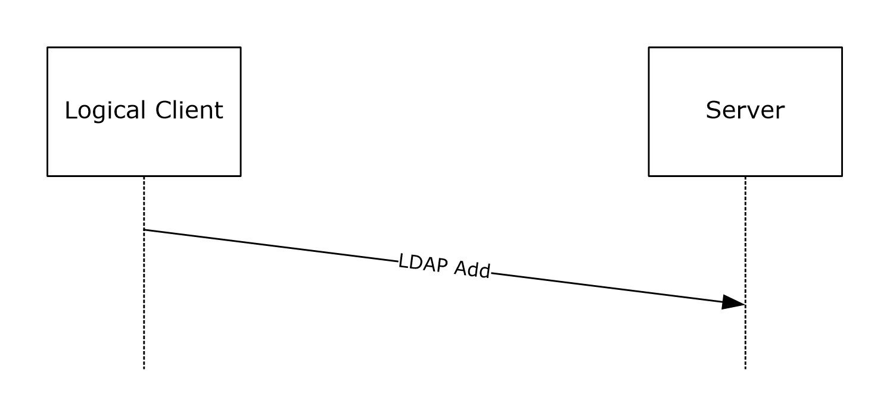

Figure 1: Logical client/server LDAP add communication

When an administrator uses an administrative tool to update an existing wireless or wired Group Policy within a GPO, the administrative-side plug-in uses LDAP modify functionality to update the data in the generic data store.

In the following illustration, Logical Client refers to an administrative tool; Server refers to the generic data store.

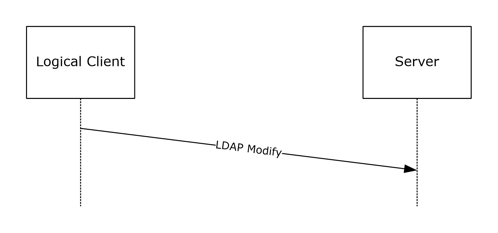

Figure 2: Logical client/server LDAP modify communication

Similarly, when an administrator uses an administrative tool to read or delete a wireless or wired Group Policy within a GPO, the administrative-side plug-in uses appropriate LDAP functionality to read or delete the data in the generic data store. See section [3.1](#Section_802) for more information on these operations.

### 1.3.2 Wireless/Wired Group Policy Client-Side Plug-in

When certain client-side events (for example, client restart) take place, the client-side plug-in fetches the Wireless/Wired Group Policy Protocol data from the generic data store using LDAP search functionality. Details on client-side events relevant to Group Policy are specified in [MS-GPOL](../MS-GPOL/MS-GPOL.md) section 3.2.4.

The following illustration shows the process of obtaining the configuration data. Logical Client refers to the client; Server refers to the generic data store.

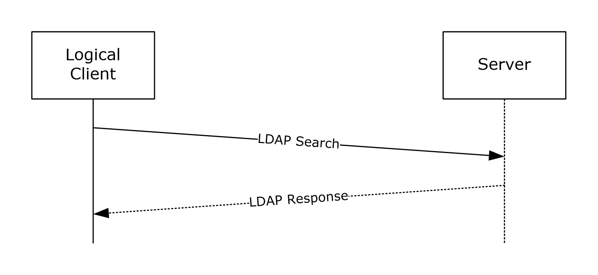

Figure 3: Logical client/server LDAP search communication

## 1.4 Relationship to Other Protocols

The Wireless/Wired Group Policy Protocol depends on the Group Policy: Core Protocol [MS-GPOL](../MS-GPOL/MS-GPOL.md). The Wireless/Wired Group Policy Protocol is initiated only as part of the Group Policy: Core Protocol as specified in [MS-GPOL] section 1.4, which specifies invocation of all Group Policy protocol extensions. The Wireless/Wired Group Policy Protocol also depends on LDAP, and on all of the protocols on which the Group Policy: Core Protocol depends.

The Wireless/Wired Group Policy administrative-side and client-side plug-ins read and write wireless or wired networking configuration data using LDAP.

The following figure shows the relationship between the Wireless/Wired Group Policy Protocol and the Group Policy: Core Protocol. The Group Policy: Core Protocol can use either LDAP or file access services. However, the Wireless/Wired Group Policy protocol always uses LDAP as the transport.

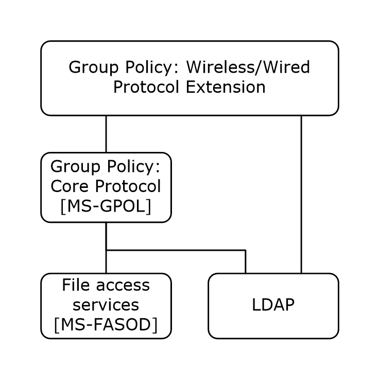

Figure 4: Relationship of the Wireless/Wired Group Policy Protocol to other protocols

## 1.5 Prerequisites/Preconditions

The prerequisites for this protocol are the same as those for the Group Policy: Core Protocol, as specified in [MS-GPOL](../MS-GPOL/MS-GPOL.md) section 1.5.

## 1.6 Applicability Statement

The Wireless/Wired Group Policy Protocol depends on the Group Policy: Core Protocol, as specified in [MS-GPOL](../MS-GPOL/MS-GPOL.md). The Wireless/Wired Group Policy Protocol is applicable only within the [**Group Policy**](#gt_group-policy) framework.

The Wireless/Wired Group Policy Protocol can be used to configure and deploy [**wireless local area network (WLAN)**](#gt_wireless-local-area-network-wlan) (802.11) and wired local area network (LAN) (802.3) settings to Group Policy-managed clients. Configuration settings include, but are not limited to, networking authentication, encryption, and security settings.

The Wireless/Wired Group Policy Protocol is appropriate only for use when the same settings are relevant to many clients. To configure individual clients with custom settings, use the client network configuration UI.<1>

## 1.7 Versioning and Capability Negotiation

### 1.7.1 Wireless Group Policy Versioning and Capability Negotiation

The wireless [**Group Policy**](#gt_group-policy) provides versioning capability using protocol-specific configuration data stored in the generic data store.

The administrative-side plug-in generates versioning data that reflects the wireless Group Policy format type and wireless network security settings. There are two format types: [**binary large object (BLOB)**](#gt_binary-large-object-blob)-based and [**XML**](#gt_xml)-based.

In the BLOB-based format, the wireless connectivity and security settings are saved in a binary format, as described in section [2.2.1.1](#Section_802). The BLOB contains at least one sub-BLOB and can contain multiple sub-BLOBs. Each sub-BLOB contains a version number and version-specific policy settings. Three sub-BLOBs are currently defined:

- Version 1 supports wireless security standards up to Wired Equivalent Privacy (WEP). For more details about WEP, see [[IEEE802.11-2007]](https://go.microsoft.com/fwlink/?LinkID=89905).
- Version 2 supports all the security standards version 1 supports plus Wi-Fi Protected Access (WPA).
- Version 3 supports all the security standards version 2 supports plus Wi-Fi Protected Access 2 (WPA2).
In the XML-based format, the wireless connectivity and security settings are saved in XML. The XML-based format for the wireless Group Policy does not provide versioning or capability negotiations. Currently only one version of the XML format is defined. However, as described in section [6.1](#Section_802), the [**XML schema (XSD)**](#gt_xml-schema-xsd) namespace contains versioning information so that versioning or capability negotiations can be added if necessary. For more information about the XML-based wireless Group Policy, see section [2.2.1.2](#Section_802).

An XML-based wireless Group Policy takes precedence over a BLOB-based one. Within a format type, higher version numbers take precedence. The wireless Group Policy client-side plug-in fetches the version with highest precedence that it can interpret from those available in the generic data store.

### 1.7.2 Wired Group Policy Versioning and Capability Negotiation

The [**XML**](#gt_xml)-based format for the wired [**Group Policy**](#gt_group-policy) does not provide versioning or capability negotiations. Currently, only one version of the XML format is defined. However, as described in section [6.2](#Section_802), the [**XML schema (XSD)**](#gt_xml-schema-xsd) namespace contains versioning information so that versioning or capability negotiations can be added if necessary. For more information about the XML-based wired Group Policy, see section [2.2.2](#Section_802).

## 1.8 Vendor-Extensible Fields

None.

## 1.9 Standards Assignments

The following table shows the Wireless/Wired Group Policy [**class identifiers**](#gt_e433c806-6cb6-46a2-bb95-523df8818c99).

| Parameter | GUID value | Reference |
| --- | --- | --- |
| Wireless administrative-side plug-in | {2DA6AA7F-8C88-4194-A558-0D36E7FD3E64} | [MS-GPOL](../MS-GPOL/MS-GPOL.md) section 1.8 |
| Wireless client-side plug-in | {0ACDD40C-75AC-47ab-BAA0-BF6DE7E7FE63} | [MS-GPOL], section 1.8 |
| Wired administrative-side plug-in | {06993B16-A5C7-47EB-B61C-B1CB7EE600AC} | [MS-GPOL], section 1.8 |
| Wired client-side plug-in | {B587E2B1-4D59-4e7e-AED9-22B9DF11D053} | [MS-GPOL], section 1.8 |

# 2 Messages

## 2.1 Transport

The Wireless/Wired Group Policy Protocol uses the LDAP protocol [[RFC2251]](https://go.microsoft.com/fwlink/?LinkId=90325) to read and write data to the remote [**Active Directory**](#gt_active-directory) data store. The client-side and administrative-side plug-ins MUST use the LDAP bind mechanism in Active Directory to perform authentication (as specified in [MS-ADTS](../MS-ADTS/MS-ADTS.md) section 5.1.1) and SHOULD use the LDAP message security layer to provide message integrity and confidentiality protection services that are negotiated as part of the authentication (as specified in [MS-ADTS] section 5.1.2.1).

## 2.2 Message Syntax

The Wireless/Wired Group Policy MUST be read from and written to the generic data store using LDAP [[RFC2251]](https://go.microsoft.com/fwlink/?LinkId=90325).

The administrative-side plug-in and the client-side plug-in for the Wireless/Wired Group Policy Protocol MUST interact with the generic data store as described in sections [1.3.1](#Section_802) and [1.3.2](#Section_802), respectively.

The following class names are used while constructing various LDAP messages:

- BLOB-based wireless Group Policy is stored as an [**Active Directory**](#gt_active-directory) object that MUST be an instance of class msieee80211-Policy.
- BLOB-based wired Group Policy is not supported.
- XML-based wireless Group Policy is stored as an Active Directory object that MUST be an instance of class ms-net-ieee-80211-GroupPolicy.
- XML-based wired Group Policy is stored as an Active Directory object that MUST be an instance of class ms-net-ieee-8023-GroupPolicy.

### 2.2.1 Message Syntax for Wireless Group Policy

#### 2.2.1.1 Message Syntax for BLOB-Based Wireless Group Policy

For more information about BLOB-based policy, see section [1.7.1](#Section_802). The wireless policy data is specified in section [2.2.1.1.2](#Section_802). The format of the profile data of wireless policy data is specified in section [2.2.1.1.3](#Section_802).

The BLOB-based group policy MUST consist of an array of one or more (up to three) wireless policy sub-BLOBs. There is no ordering requirement for the wireless policy sub-BLOBs.

Multiple-byte fields (16-bit, 32-bit, and 64-bit fields) MUST be transmitted in [**little-endian**](#gt_little-endian) byte order, unless otherwise specified.

##### 2.2.1.1.1 Wireless Policy Sub-BLOB

Each wireless policy sub-BLOB MUST consist of the following 4-tuple:

- **MajorVersion**
- **MinorVersion**
- **WirelessPolicyDataLength**
- **WirelessPolicyData**
This format of the sub-BLOB MUST be as follows.

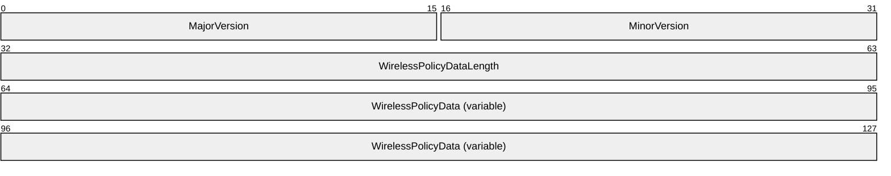

**MajorVersion (2 bytes):** A 2-byte unsigned integer that specifies the version of the Wireless Policy Sub-BLOB.<2>

| Value | Meaning |
| --- | --- |
| 1 | Version 1 |
| 2 | Version 2 |
| 3 | Version 3 |

**MinorVersion (2 bytes):** A 2-byte unsigned integer specifying the minor version of the Wireless Policy Sub-BLOB for a specific major version. If the **MajorVersion** is 1, 2, or 3, the **MinorVersion** MUST be 0.

**WirelessPolicyDataLength (4 bytes):** A 4-byte unsigned integer specifying the total length in bytes of **WirelessPolicyData**.

**WirelessPolicyData (variable):** A [**BLOB**](#gt_binary-large-object-blob) of a length in bytes equal to the value of **WirelessPolicyDataLength**.

##### 2.2.1.1.2 Wireless Policy Data

Wireless policy data contains wireless Group Policy settings as shown here. Among other fields, it contains an array of wireless profile settings. The format of the wireless profile settings depends on the value of the **MajorVersion** field in the wireless policy sub-BLOB, as specified in section [2.2.1.1.1](#Section_802). Currently, the format is defined for three values of the **MajorVersion** field: 1, 2, and 3. These formats are specified in sections [2.2.1.1.4](#Section_802) and [2.2.1.1.5](#Section_802).

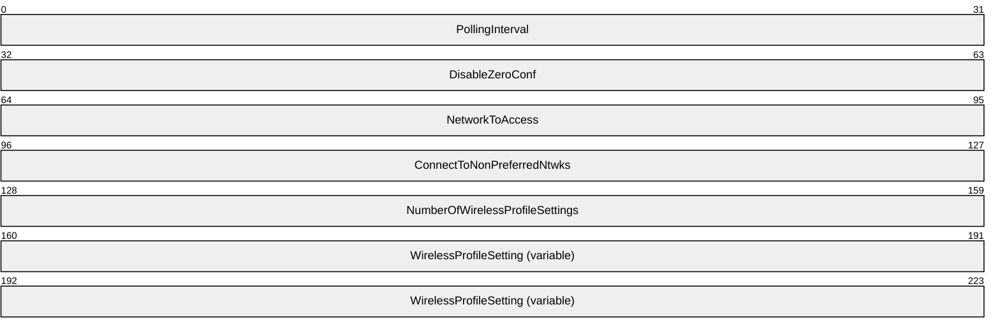

**PollingInterval (4 bytes):** A 4-byte unsigned integer specifying the interval, in minutes, after which domain clients MAY<3> check for changes in the BLOB-based wireless policy. This value MUST be greater than 0.

**DisableZeroConf (4 bytes):** A 4-byte unsigned integer. If this value is zero, the domain clients use the wireless connection component in the operating system for managing wireless connectivity; if nonzero, domain clients do not use the wireless connection component in the operating system for managing wireless connectivity.

**NetworkToAccess (4 bytes):** A 4-byte unsigned integer specifying the types of wireless networks with which the domain client is to associate.

Definitions of these network types are as specified in [[IEEE802.1X]](https://go.microsoft.com/fwlink/?LinkId=89910). This field MUST be one of the following values.

| Value | Meaning |
| --- | --- |
| 1 | Any available network, with access point (infrastructure) networks preferred over computer-to-computer (ad hoc) networks. |
| 2 | Access point (infrastructure) networks only. |
| 3 | Computer-to-computer (ad hoc) networks only. |

**ConnectToNonPreferredNtwks (4 bytes):** A 4-byte unsigned integer. A nonzero value specifies that the wireless connection component in the operating system on the domain client MAY<4> permit automatic connections to wireless networks that are not configured as preferred networks. A 0 value specifies that the implementation's wireless connection component on the domain client does not permit automatic connections to wireless networks that are not configured as preferred networks.

**NumberOfWirelessProfileSettings (4 bytes):** A 4-byte unsigned integer specifying the number of **WirelessProfileSetting** fields that follow.

**WirelessProfileSetting (variable):** A wireless profile setting corresponding to a wireless network. This field is repeated in the Wireless Policy Data packet a number of times equal to the value of **NumberOfWirelessProfileSettings**, and each repetition MUST specify a different wireless network. The order of the wireless profile settings defines the relative preference of these wireless networks. Higher preference networks MUST be listed before lower preference networks.

A wireless profile setting consists of the following fields.

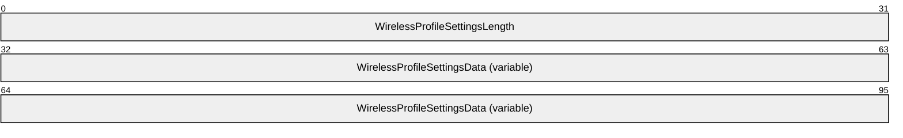

**WirelessProfileSettingsLength (4 bytes):** A 4-byte unsigned integer specifying the length in bytes of the corresponding **WirelessProfileSettingsData** BLOB plus 4.

**WirelessProfileSettingsData (variable):** A BLOB of data specifying settings for a wireless network to which domain clients can attempt to connect.

##### 2.2.1.1.3 Format of Wireless Profile Settings Data

Profile setting data has two possible formats:

- Wireless profile setting version A
- Wireless profile setting version B
Wireless profile setting version A MUST be used in wireless policy sub-BLOB version 1 and version 2. Wireless profile setting version B MUST be used in wireless policy sub-BLOB version 3.

##### 2.2.1.1.4 Wireless Profile Settings Version A

This section specifies the profile settings data format for BLOB version 1 and version 2.

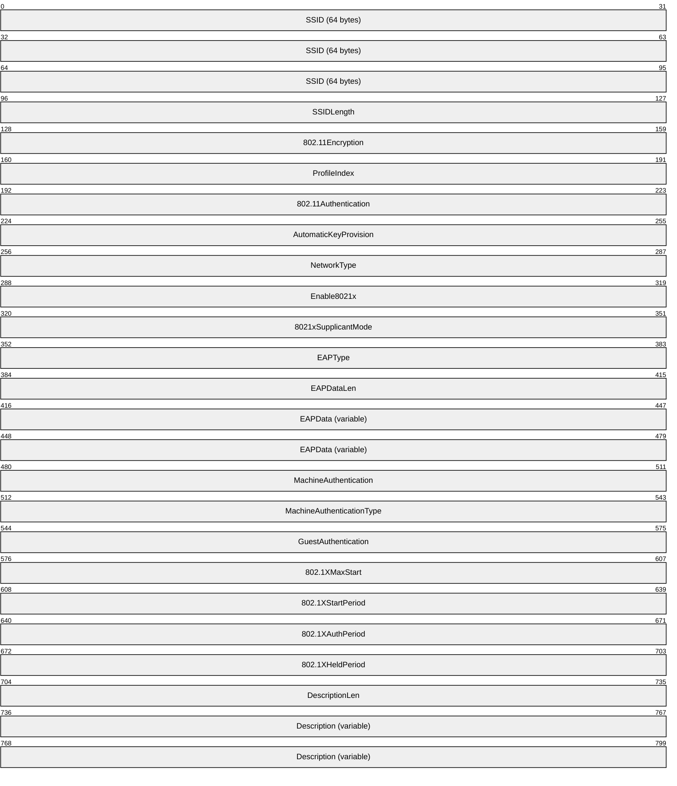

**SSID (64 bytes):** An array of 32 Unicode characters specifying the wireless [**LAN**](#gt_wireless-local-area-network-wlan) network name, also known as the [**service set identifier (SSID)**](#gt_service-set-identifier-ssid) as specified in [[IEEE802.11-2007]](https://go.microsoft.com/fwlink/?LinkID=89905). If the actual SSID length is less than 32 [**Unicode**](#gt_unicode) characters, the remaining bytes MUST be set to 0.

**SSIDLength (4 bytes):** A 4-byte unsigned integer specifying the number of Unicode characters in the SSID. The value MUST be within the range of 0 and 32.

**802.11Encryption (4 bytes):** An unsigned integer specifying the type of 802.11 encryption method to be used by domain clients for connecting to this [**WLAN**](#gt_wireless-local-area-network-wlan).

For wireless policy sub-BLOB version 1, this value MUST be one of the following.

| Value | Meaning |
| --- | --- |
| 0 | Encryption Disabled |
| 1 | WEP |

For wireless policy sub-BLOB version 2, this value MUST be one of the following.

| Value | Meaning |
| --- | --- |
| 0 | Encryption Disabled |
| 1 | WEP |
| 2 | Temporal Key Integrity Protocol (TKIP) |
| 3 | [**Advanced Encryption Standard (AES)**](#gt_advanced-encryption-standard-aes) encryption method is as specified in [[IEEE802.1X]](https://go.microsoft.com/fwlink/?LinkId=89910) and [[IEEE802.11i]](https://go.microsoft.com/fwlink/?LinkId=89906). |

**ProfileIndex (4 bytes):** A 4-byte unsigned integer specifying the index of this wireless profile setting in the array of wireless profiles contained in the **WirelessProfileSettingsData** field of the [Wireless Policy Data](#Section_802) packet. The value MUST be within the range of 0 to (**NumberOfWirelessProfileSettings**-1).

**802.11Authentication (4 bytes):** An unsigned integer indicating the type of 802.11 authentication the domain clients use for connecting to the WLAN.

For wireless policy sub-BLOB version 1, this value MUST be one of the following.

| Value | Meaning |
| --- | --- |
| 0 | Open 802.11 authentication |
| 1 | Shared 802.11 authentication |

For wireless policy sub-BLOB version 2, this value MUST be one of the following.

| Value | Meaning |
| --- | --- |
| 0 | Open 802.11 authentication |
| 1 | Shared 802.11 authentication |
| 3 | WPA-Enterprise 802.11 authentication |
| 4 | WPA-Personal 802.11 authentication |

For more information on WPA-based authentication, see [IEEE802.11-2007] and [IEEE802.1X].

**AutomaticKeyProvision (4 bytes):** A 4-byte unsigned integer. If nonzero, the domain client is provided with a WEP encryption key through some means other than manual configuration, such as a key provided on the network adapter or through IEEE 802.1X authentication. If 0, the domain client is provided with a WEP encryption key through manual configuration.

**NetworkType (4 bytes):** A 4-byte unsigned integer specifying the type of network represented by this wireless profile setting. It MUST be one of the following values.

| Value | Meaning |
| --- | --- |
| 1 | Ad hoc WLAN |
| 2 | Infrastructure (access point-based) WLAN |

**Enable8021x (4 bytes):** A 4-byte unsigned integer; a nonzero value specifies that the domain client uses the IEEE 802.1X authentication protocol [IEEE802.1X] to authenticate with the WLAN. A 0 value specifies that the domain client does not use the IEEE 802.1X authentication protocol.

**8021xSupplicantMode (4 bytes):** A 4-byte unsigned integer; specifies the transmission behavior of the EAPOL-Start message for domain clients when they authenticate to a WLAN using IEEE 802.1X. This value MUST be one of the following.

| Value | Meaning |
| --- | --- |
| 1 | Specifies that EAPOL-Start messages are not sent. |
| 2 | Client determines when to send EAPOL-Start messages based on network capability and, if needed, sends an EAPOL-Start message. |
| 3 | Transmit per IEEE 802.1X. Sends an EAPOL-Start message upon association to initiate the IEEE 802.1X authentication process. |

**EAPType (4 bytes):** A 4-byte unsigned integer; specifies the Extensible Authentication Protocol (EAP) method to be used by the domain clients while using IEEE 802.1X authentication to connect to a WLAN. The value for this field MUST be a legal EAP method type, as specified in [[RFC3748]](https://go.microsoft.com/fwlink/?LinkId=90444) section 6.2.

**EAPDataLen (4 bytes):** A 4-byte unsigned integer specifying the length of the **EAPData** field.

**EAPData (variable):** A BLOB specifying EAP configuration settings to use while performing IEEE 802.1X authentication. The format of the BLOB is implementation-specific; if Microsoft EAP methods are used by the clients, the formats specified in section [2.2.3.1](#Section_802) MUST be used.

**MachineAuthentication (4 bytes):** A 4-byte unsigned integer; a nonzero value specifies that the domain client uses machine credentials to perform IEEE 802.1X authentication.

**MachineAuthenticationType (4 bytes):** A 4-byte unsigned integer. This value specifies the way in which the domain client is to use machine or user credentials while performing IEEE 802.1X authentication. This value MUST be one of the following.

| Value | Meaning |
| --- | --- |
| 0 | With user authentication. When users are not logged on to the domain computer, IEEE 802.1X authentication is performed using the computer credentials. After a user logs on to the computer, authentication is maintained with the computer credentials. If a user failed to connect to the network previously, IEEE 802.1X authentication is performed using the user credentials. |
| 1 | With user re-authentication. When users are not logged on to the domain computer, IEEE 802.1X authentication is performed using the computer credentials. After a user logs on to the computer, authentication is performed using the user credentials. When a user logs off the computer, authentication is performed with the computer credentials. |
| 2 | Computer-only authentication. Authentication is performed using the computer credentials. User authentication is not performed. |

**GuestAuthentication (4 bytes):** A 4-byte unsigned integer; a nonzero value specifies that the domain client performs IEEE 802.1X authentication with guest credentials when either user or computer credentials are not available.

**802.1XMaxStart (4 bytes):** A 4-byte unsigned integer; the value MUST be defined in accordance with the *MaxStart* parameter, as specified in [IEEE802.1X].

**802.1XStartPeriod (4 bytes):** A 4-byte unsigned integer, defined in accordance with the *StartPeriod* parameter, as specified in [IEEE802.1X].

**802.1XAuthPeriod (4 bytes):** A 4-byte unsigned integer; the value MUST be defined in accordance with the *AuthPeriod* parameter, as specified in [IEEE802.1X].

**802.1XHeldPeriod (4 bytes):** A 4-byte unsigned integer; the value MUST be defined in accordance with the *HeldPeriod* parameter, as specified in [IEEE802.1X].

**DescriptionLen (4 bytes):** A 4-byte unsigned integer specifying the length of a Unicode text string describing the wireless network associated with the wireless profile Setting.

**Description (variable):** A Unicode string specifying a human-readable description for the wireless network associated with the wireless profile setting.

##### 2.2.1.1.5 Wireless Profile Settings Version B

This section specifies the profile Settings Data format for BLOB version 3.

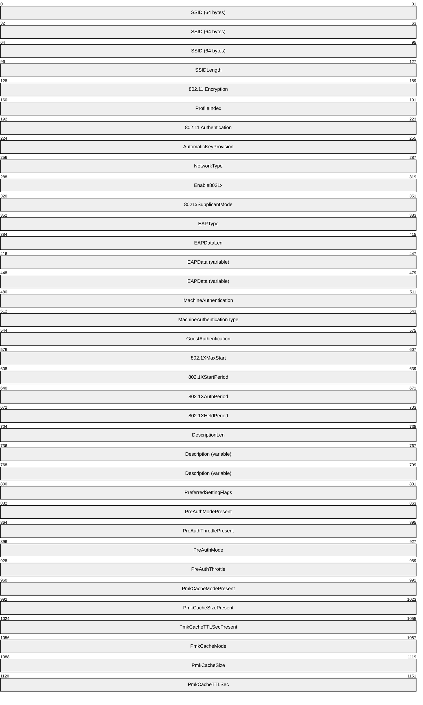

**SSID (64 bytes):** An array of 32 Unicode characters specifying the [**WLAN**](#gt_wireless-local-area-network-wlan) name, also known as the SSID as specified in [[IEEE802.11-2007]](https://go.microsoft.com/fwlink/?LinkID=89905). If the actual SSID length is fewer than 32 [**Unicode**](#gt_unicode) characters, the remaining bytes MUST be set to 0.

**SSIDLength (4 bytes):** A 4-byte unsigned integer specifying the number of Unicode characters in the SSID. The value MUST be within the range of 0 and 32.

**802.11 Encryption (4 bytes):** For wireless policy sub-BLOB version 3, this value MUST be one of the following:

| Value | Meaning |
| --- | --- |
| 0 | Encryption disabled |
| 1 | WEP |
| 2 | TKIP |
| 3 | The AES encryption method is as specified in [[IEEE802.1X]](https://go.microsoft.com/fwlink/?LinkId=89910) and [[IEEE802.11i]](https://go.microsoft.com/fwlink/?LinkId=89906). |

**ProfileIndex (4 bytes):** A 4-byte unsigned integer specifying the index of this wireless profile setting in the array of wireless profiles contained in the **WirelessProfileSettingsData** field of the [Wireless Policy Data](#Section_802) packet. The value MUST be within the range of 0 to (**NumberOfWirelessProfileSettings**-1).

**802.11 Authentication (4 bytes):** An unsigned integer indicating the type of 802.11 authentication the domain clients use for connecting to the WLAN.

For wireless policy sub-BLOB version 3, this value MUST be one of the following:

| Value | Meaning |
| --- | --- |
| 0 | Open 802.11 authentication |
| 1 | Shared 802.11 authentication |
| 3 | WPA-Enterprise 802.11 authentication |
| 4 | WPA-Personal 802.11 authentication |
| 5 | WPA2-Enterprise 802.11 authentication |
| 6 | WPA2-Personal 802.11 authentication |

WPA2 authentication is as specified in [IEEE802.1X] and [IEEE802.11i].

**AutomaticKeyProvision (4 bytes):** A 4-byte unsigned integer. If nonzero, the domain client is provided with a WEP encryption key through some means other than manual configuration, such as a key provided on the network adapter or through IEEE 802.1X authentication; if 0, the domain client is provided with a WEP encryption key through manual configuration.

**NetworkType (4 bytes):** A 4-byte unsigned integer specifying the type of network represented by this wireless profile setting. It MUST be one of the following values.

| Value | Meaning |
| --- | --- |
| 1 | Computer-to-computer (ad hoc) WLAN. |
| 2 | Infrastructure (access point-based) WLAN. |

**Enable8021x (4 bytes):** A 4-byte unsigned integer. A nonzero value specifies that the domain client uses the IEEE 802.1X authentication protocol (as specified in [IEEE802.1X]) to authenticate with the WLAN; a 0 value specifies that the domain client does not use the IEEE 802.1X authentication protocol.

**8021xSupplicantMode (4 bytes):** A 4-byte unsigned integer; specifies the transmission behavior of the EAPOL-Start message for domain clients when they authenticate to a WLAN using IEEE 802.1X (as specified in [IEEE802.1X]). This value MUST be one of the following:

| Value | Meaning |
| --- | --- |
| 1 | Specifies that EAPOL-Start messages are not sent. |
| 2 | Client determines when to send EAPOL-Start messages based on network capability and, if needed, sends an EAPOL-Start message. |
| 3 | Transmit per IEEE 802.1X. Sends an EAPOL-Start message upon association to initiate the IEEE 802.1X authentication process. |

**EAPType (4 bytes):** A 4-byte unsigned integer; specifies the EAP method to be used by the domain clients while using IEEE 802.1X authentication (as specified in [IEEE802.1X]) to connect to a WLAN. The value for this field MUST be a legal EAP method type, as specified in [[RFC3748]](https://go.microsoft.com/fwlink/?LinkId=90444) section 6.2.

**EAPDataLen (4 bytes):** A 4-byte unsigned integer specifying the length of the **EAPData** field.

**EAPData (variable):** A BLOB specifying EAP configuration settings to be used while performing IEEE 802.1X authentication. The format of the BLOB is implementation-specific; if Microsoft EAP methods are used by the clients, the formats specified in section [2.2.3.1](#Section_802) MUST be used.

**MachineAuthentication (4 bytes):** A 4-byte unsigned integer; a nonzero value specifies that the domain client uses computer credentials to perform IEEE 802.1X authentication.

**MachineAuthenticationType (4 bytes):** A 4-byte unsigned integer. This value specifies the way in which the domain client is to use computer or user credentials while performing IEEE 802.1X authentication (as specified in [IEEE802.1X]). This value MUST be one of the following:

| Value | Meaning |
| --- | --- |
| 0 | With user authentication. When users are not logged on to the domain computer, IEEE 802.1X authentication (as specified in [IEEE802.1X]) is performed using the computer credentials. After a user logs on to the computer, authentication is maintained with the computer credentials. If a user failed to connect to the network previously, IEEE 802.1X authentication is performed using the user credentials. |
| 1 | With user re-authentication. When users are not logged on to the domain computer, IEEE 802.1X authentication (as specified in [IEEE802.1X]) is performed using the computer credentials. After a user logs on to the computer, authentication is performed using the user credentials. When a user logs off the computer, authentication is performed with the computer credentials. |
| 2 | Computer-only authentication. To be performed by using the computer credentials. User authentication is not performed. |

**GuestAuthentication (4 bytes):** A 4-byte unsigned integer; a nonzero value specifies that the domain client performs IEEE 802.1X authentication (as specified in [IEEE802.1X]) with guest credentials when either user or computer credentials are not available.

**802.1XMaxStart (4 bytes):** A 4-byte unsigned integer; the value MUST be defined in accordance with the *MaxStart* parameter, as specified in [IEEE802.1X].

**802.1XStartPeriod (4 bytes):** A 4-byte unsigned integer, defined in accordance with the *StartPeriod* parameter, as specified in [IEEE802.1X].

**802.1XAuthPeriod (4 bytes):** A 4-byte unsigned integer; the value MUST be defined in accordance with the *AuthPeriod* parameter, as specified in [IEEE802.1X].

**802.1XHeldPeriod (4 bytes):** A 4-byte unsigned integer; the value MUST be defined in accordance with the *HeldPeriod* parameter, as specified in [IEEE802.1X].

**DescriptionLen (4 bytes):** A 4-byte unsigned integer specifying the length of a Unicode text string describing the wireless network associated with the wireless profile setting.

**Description (variable):** A Unicode string specifying a human-readable description for the wireless network associated with the wireless profile setting.

**PreferredSettingFlags (4 bytes):** A 4-byte unsigned integer specifying whether the domain clients are to treat the wireless network as a nonbroadcast network. This value MUST be one of the following:

| Value | Meaning |
| --- | --- |
| 0 | The wireless network is a broadcast network. |
| 1 | The wireless network is a nonbroadcast network. |

**PreAuthModePresent (4 bytes):** A 4-byte unsigned integer specifying the presence or absence of the field describing the IEEE 802.11i pre-authentication mode. If this field is 0, the **PreAuthMode** field has no defined meaning and is ignored by the domain client, as specified in [IEEE802.11i]. If this field is nonzero, the **PreAuthMode** field is interpreted by the domain client as specified in the **PreAuthMode** field description.

**PreAuthThrottlePresent (4 bytes):** A 4-byte unsigned integer specifying the presence or absence of the field describing the IEEE 802.11i pre-authentication throttle mode. If this field is 0, the **PreAuthThrottle** field has no defined meaning and is ignored by the domain client. If this field is nonzero, the **PreAuthThrottle** field is interpreted by the domain client as specified by the **PreAuthThrottle** field description.

**PreAuthMode (4 bytes):** A 4-byte unsigned integer; this field specifies the IEEE 802.11i pre-authentication mode that the domain client is to use to invoke any IEEE 802.11i pre-authentication capability while connecting to the wireless network. This value MUST be one of the following:

| Value | Meaning |
| --- | --- |
| 1 | IEEE 802.11i pre-authentication is not to be invoked. |
| 2 | IEEE 802.11i pre-authentication is to be invoked. |

**PreAuthThrottle (4 bytes):** A 4-byte unsigned integer; this field specifies the IEEE 802.11i pre-authentication throttle, that is, the maximum number of IEEE 802.11i pre-authentication attempts that a domain client can perform while staying associated with an access point. This value MUST be in the range 1–16.

**PmkCacheModePresent (4 bytes):** A 4-byte unsigned integer specifying the presence or absence of the field describing the IEEE 802.11i PMK caching mode. If this field is 0, the **PmkCacheMode** field has no defined meaning and is ignored by the domain client. If this field is nonzero, the **PmkCacheMode** field MUST be interpreted by the domain client as specified in the **PmkCacheMode** field description.

**PmkCacheSizePresent (4 bytes):** A 4-byte unsigned integer specifying the presence or absence of the field describing the IEEE 802.11i PMK cache size maximum. If this field is 0, the **PmkCacheSize** field has no defined meaning and is ignored by the domain client. If this field is nonzero, the **PmkCacheSize** field is interpreted by the domain client as specified in the **PmkCacheSize** field description.

**PmkCacheTTLSecPresent (4 bytes):** A 4-byte unsigned integer specifying the presence or absence of the field describing the IEEE 802.11i PMK cache time to live. If this field is 0, the **PmkCacheTTLSec** field has no defined meaning and is ignored by the domain client. If this field is nonzero, the **PmkCacheTTLSec** field is interpreted by the domain client as specified in the **PmkCacheTTLSec** field description.

**PmkCacheMode (4 bytes):** A 4-byte unsigned integer; this field specifies the mode that the domain client is to use for IEEE 802.11i PMK caching capability (as specified in [IEEE802.11i]) while connecting to a network. This value MUST be one of the following:

| Value | Meaning |
| --- | --- |
| 1 | IEEE 802.11 PMK caching is not to be invoked. |
| 2 | IEEE 802.11 PMK caching is to be invoked. |

**PmkCacheSize (4 bytes):** A 4-byte unsigned integer; this field specifies the maximum number of entries that a domain client can maintain while performing IEEE 802.11i PMK caching (as specified in [IEEE802.11i]) for a wireless network. This field MUST be in the range 16–255.

**PmkCacheTTLSec (4 bytes):** A 4-byte unsigned integer; this field MUST specify, in seconds, the maximum lifetime of PMK cache entries that a domain client is to maintain while performing IEEE 802.11i PMK caching (as specified in [IEEE802.11i]) for a wireless network. This field MUST be in the range 300–86,400.

#### 2.2.1.2 Message Syntax for XML-Based Wireless Group Policy

The XML-based wireless Group Policy MUST be packed as a single XML string that is constructed according to the wireless policy schema, as specified in [Appendix A](#Section_802) section [6.1](#Section_802). The syntax for fields in the XML string MUST adhere to this schema specification. In accordance with this schema, primitive data types are defined by the World Wide Web Consortium's XML schema. For more details, see [[XMLSCHEMA]](https://go.microsoft.com/fwlink/?LinkId=90603).

The fields in the wireless policy XML string MUST be as follows:

**name:** User-friendly name for the wireless policy.

**description:** User-friendly description string for the wireless policy.

**enableAutoConfig:** This value specifies if the domain clients uses the wireless connection component in the operating system for managing wireless connectivity.

**showDeniedNetwork:** A true/false Boolean value; if true, the wireless connection component on the domain client shows the denied networks to the user.

**allowList:** A list of 0 or more networks to which the wireless connection component of the domain client can establish connections.

**blockList:** A list of 0 or more networks to which the wireless connection component on the domain client is not to establish connections.

**denyAllIBSS:** A true/false Boolean value; if true the domain client connects only to 802.11 infrastructure networks.

**denyAllESS:** A true/false Boolean value; if true, the domain client connects only to 802.11 ad hoc networks.

**profileList:** The list of wireless profiles within the policy, each of which MUST conform to the [**WLAN**](#gt_wireless-local-area-network-wlan) profile schema, as specified in Appendix A section [6.3.1](#Section_802). This element specifies an ordered list of wireless networks with settings that a domain client is to connect to. The elements of the WLAN profile schema are described in section [2.2.1.2.1](#Section_802).

**allowEveryoneToCreateAllUserProfiles:** A Boolean value; if true, all users on the domain client are allowed to create WLAN profile settings that can be used by all other users on the same domain client to connect to WLANs.

**onlyUseGPProfilesForAllowedNetworks:** A Boolean value; if true, the domain clients only use the network settings configured by this protocol for connecting to the WLANs specified in the allowList earlier in this list.

**enbleSoftAP:** A Boolean value; if true, the domain client is allowed to act as an [**IEEE 802.11 access point (AP)**](#gt_65bc73a4-04fe-4ed7-b51a-3480e179ff54) in addition to its wireless connection as a [**station (STA)**](#gt_station-sta). enbleSoftAP is enabled by default.<5>

**enableExplicitCreds:** A Boolean value; if true, explicit user credentials are allowed.

Explicit user credentials are user credentials that a user has made available to a machine. They are used only for the machine's network authentication and connectivity (for example, to run upgrades or administrative scripts), regardless of which user is logged in or whether any user is logged in; they are not used for any other purpose.<6>

**blockPeriod:** The length of time, in minutes, during which the domain client will not try to reconnect to the same network after an authentication failure.<7>

**enableWFD:** An optional Boolean indicating whether Wi-Fi Peer-to-Peer connections, as described in [[WF-P2P1.2]](https://go.microsoft.com/fwlink/?LinkId=225584), are allowed. If true or omitted, Wi-Fi Peer-to-Peer connections are allowed. If false, they are prohibited.<8>

##### 2.2.1.2.1 Message Syntax for XML-Based Wireless Profiles

An XML-based [**WLAN**](#gt_wireless-local-area-network-wlan) profile is packed as a single XML string that MUST be constructed according to the XML schema as specified in [Appendix A](#Section_802) section [6.3.1](#Section_802). In accordance with this schema, primitive data types are defined by the World Wide Web Consortium's XML schema. For more information, see [[XMLSCHEMA]](https://go.microsoft.com/fwlink/?LinkId=90603).

**name:** A user-friendly name of the wireless profile specified by the wireless profile XML string.

**SSID:** The WLAN network name, also known as the SSID, as specified in [[IEEE802.11-2007]](https://go.microsoft.com/fwlink/?LinkID=89905).

**nonBroadcast:** A true/false Boolean field; if true, the domain treats the wireless network as a nonbroadcast network.

**connectionType:** The type of network to connect to while using this wireless profile. This value MUST be one of the following:

- IBSS: The wireless network is an ad hoc network.
- ESS: The wireless network is an infrastructure network.
**connectionMode:** When the domain client is to connect to a wireless network. This value MUST be one of the following:

- auto: Attempt to connect to the network occurs automatically whenever the network is in range.
- manual: Connection to the network occurs only if the user has explicitly requested it.
**autoSwitch:** If the connection to a more preferred network is attempted when already connected to a network. A more preferred network is one that is ordered higher in a list of preferred wireless networks.

**phyType:** The IEEE 802.11 physical type that a domain client uses while connected to this wireless network. This value MUST be one of the following:

- a: refers to LAN protocol IEEE 802.11a-1999
- b: refers to LAN protocol IEEE 802.11b-1999
- g: refers to LAN protocol IEEE 802.11g-2003
- n: refers to LAN protocol IEEE 802.11n-2009
- ac: refers to LAN protocol IEEE 802.11ac-2013
- ax: refers to LAN protocol IEEE 802.11ax
**authentication:** The type of 802.11 authentication the domain clients uses for connecting to the WLAN. This value MUST be one of the following:

- open: Open 802.11 authentication
- shared: Shared 802.11 authentication
- WPA: WPA-Enterprise 802.11 authentication
- WPAPSK: WPA-Personal 802.11 authentication
- WPA2: WPA2-Enterprise 802.11 authentication
- WPA2PSK: WPA2-Personal 802.11 authentication
For information on 802.11 authentication methods, see [[IEEE802.1X]](https://go.microsoft.com/fwlink/?LinkId=89910) and [[IEEE802.11i]](https://go.microsoft.com/fwlink/?LinkId=89906).

**encryption:** The type of 802.11 encryption algorithm used by domain clients for connecting to this WLAN. This field MUST have one of the following values:

- none: Encryption disabled
- WEP: Equivalent privacy
- TKIP: Temporal Key Integrity Protocol
- AES: Advanced Encryption Standard
For more information on encryption methods, see [IEEE802.11-2007], and as specified in [IEEE802.11i].

**PMKCacheMode:** The mode that the domain client uses for IEEE 802.11i PMK caching capability while connecting to a network. This value MUST be one of the following:

- disabled: PMK caching is not to be invoked.
- enabled: PMK caching is to be invoked.
Details on PMK caching are specified in [IEEE802.11i].

**PMKCacheTTL:** The maximum lifetime, in seconds, of PMK cache entries that a domain client is to maintain while performing IEEE 802.11i PMK caching for a wireless network.

**PMKCacheSize:** The maximum number of entries that a domain client is to maintain while performing IEEE 802.11i PMK caching for a wireless network.

**PreAuthMode:** The IEEE 802.11i pre-authentication mode that the domain client uses to invoke any IEEE 802.11i pre-authentication capability while connecting to the wireless network. This value MUST be one of the following:

- disabled: Pre-authentication is disabled.
- enabled: Pre-authentication is enabled.
Details on pre-authentication are as specified in [IEEE802.11i].

**PreAuthThrottle:** The IEEE 802.11i pre-authentication throttle, that is, the maximum number of IEEE 802.11i pre-authentication attempts that a domain client is to perform while staying associated with an access point.

**useOneX:** A Boolean value; if set to TRUE, the domain clients use IEEE 802.1X authentication protocol to authenticate with the WLAN; otherwise, set to FALSE. If set to TRUE, the **security** element MUST contain a child element **OneX**, formed according to the XML schema as specified in Appendix A section [6.5](#Section_802).

**FIPSMode:** A Boolean value; if set to TRUE, the domain clients use cryptographic modules that are compliant with FIPS 140-2 [[FIPS140]](https://go.microsoft.com/fwlink/?LinkId=89866) requirements while performing cryptographic operations to connect to the WLAN.

**heldPeriod:** This value MUST be defined as per the *HeldPeriod* parameter, as specified in [IEEE802.1X].

**authPeriod:** This value MUST be defined as per the *AuthPeriod* parameter, as specified in [IEEE802.1X].

**startPeriod:** This value MUST be defined in accordance with the *StartPeriod* parameter, as specified in [IEEE802.1X].

**maxStart:** This value MUST be defined in accordance with the *MaxStart* parameter, as specified in [IEEE802.1X].

**maxAuthFailures:** The number of times a wireless connection component on the domain client attempts IEEE 802.1X authentication in spite of failures.

**supplicantMode:** The transmission behavior of the EAPOL-Start message for domain clients when they authenticate to a WLAN using IEEE 802.1X [IEEE802.1X]. This value MUST be one of the following:

- inhibitTransmission: EAPOL-Start messages are not sent.
- includeLearning: Client determines when to send EAPOL-Start messages based on network capability: an EAPOL-Start message is sent if needed.
- compliant: Transmit per IEEE 802.1X. An EAPOL-Start message is sent upon association to initiate the IEEE 802.1X authentication process.
**authMode:** The way in which the domain client uses computer or user credentials while performing IEEE 802.1X authentication. This value MUST be one of the following:

- machineOrUser: When users are not logged on to the domain computer, IEEE 802.1X authentication is performed using the computer credentials. After a user logs on to the computer, authentication is performed using the user credentials. When a user logs off the computer, authentication is performed with the computer credentials.
- machine: Authentication is always to be performed by using the computer credentials. User authentication is never performed.
- user: When users are not logged on to the domain computer, IEEE 802.1X authentication is performed using the computer credentials. After a user logs on to the computer, authentication is maintained with the computer credentials. If a user failed to connect to the network previously, IEEE 802.1X authentication is performed using the user credentials.
- guest: Specifies that the domain client performs IEEE 802.1X authentication with guest credentials.
**EAPConfig:** The EAP configuration used by the domain client while performing IEEE 802.1X authentication, as specified in [[RFC3748]](https://go.microsoft.com/fwlink/?LinkId=90444). The content of this element is specified in section [2.2.3.2](#Section_802).<9>

**MacRandomization**: Settings that govern MAC address randomization on this profile.<10>

- enableRandomization: A Boolean value; if set to TRUE, MAC address randomization will be enabled when connecting to this profile. If set to FALSE, MAC address randomization will not be enabled.
- randomizeEveryday: A Boolean value; if TRUE, a different random MAC address will be used each day when connecting to this profile. If FALSE, the same random MAC address will be used for each connection to this profile.
- randomizationSeed: A profile-specific seed used to generate the random MAC address or addresses.
See section [6.3.3](#Section_802) for additional information.

**transitionMode**: Specifies whether or not this is a transition mode profile. In general, transition mode profiles allow for connections between next- and previous-generation Wi-Fi networks. Specific transition mode behavior is defined on a per-feature basis; for example for WPA2/WPA3 transition mode the behavior is defined in the [[Wi-FiWPA33]](http://go.microsoft.com/fwlink/?LinkID=2262953) specification.<11>

See section [6.3.4](#Section_802) for additional information.

**QoSDSCPToUPMappingAllowed**: A Boolean value; if set to TRUE, DSCP To UP Mapping, as specified in [[Wi-FiQoS]](http://go.microsoft.com/fwlink/?LinkID=2263030), will be allowed when connecting to this profile.<12> When FALSE (default), DSCP To UP Mapping will not be allowed.

See section [6.3.5](#Section_802) for additional information.

### 2.2.2 Message Syntax for Wired Group Policy

The wired Group Policy MUST be packed as a single XML string that is constructed according to the wired policy schema, as specified in [Appendix A](#Section_802) section [6.2](#Section_802). The syntax for fields in the XML string MUST adhere to this schema specification.

The fields in the wired policy XML string MUST be as follows:

**name:** User-friendly name for the wired policy.

**description:** User-friendly description string for the wired policy.

**enableAutoConfig:** This value determines if the domain clients use the wired authentication component in the operating system for managing wireless connectivity.

**profileList:** The list of wired authentication profiles within the policy, each of which MUST conform to the wired [**LAN**](#gt_wireless-local-area-network-wlan) profile schema, as specified in Appendix A section [6.4](#Section_802). This list MUST contain at least one profile. The domain clients use these profile settings to perform wired authentication against the wired switches.

**blockPeriod:** The length of time, in minutes, during which the domain client will not try to reconnect to the same network after an authentication failure.<13>

**enableExplicitCreds:** A Boolean value; if true, explicit user credentials are allowed.

Explicit user credentials are user credentials that a user has made available to a machine. They are used only for the machine's network authentication and connectivity (for example, to run upgrades or administrative scripts), regardless of which user is logged on or whether any user is logged on; they are not used for any other purpose.<14>

#### 2.2.2.1 Message Syntax for XML-Based Wired Profiles

An [**XML**](#gt_xml)-based [**WLAN**](#gt_wireless-local-area-network-wlan) profile is packed as a single XML string that is constructed according to the [**XML schema (XSD)**](#gt_xml-schema-xsd) as specified in [Appendix A](#Section_802) section [6.4](#Section_802).<15>

**OneXEnabled:** A Boolean value that specifies whether the network supports the IEEE 802.1X authentication protocol so domain clients can use it. If set to TRUE, the **security** element MUST contain a child element **OneX**, formed according to the XML schema (XSD) as specified in Appendix A section [6.5](#Section_802).

**OneXEnforced:** A Boolean value that specifies whether the domain clients use IEEE 802.1X authentication protocol to authenticate with the network. If it is set to FALSE and IEEE 802.1X authentication fails, clients will fall back to unauthenticated access.

**heldPeriod:** This value MUST be defined in accordance with the *HeldPeriod* parameter, as specified in [[IEEE802.1X]](https://go.microsoft.com/fwlink/?LinkId=89910).

**authPeriod:** This value MUST be defined in accordance with the *AuthPeriod* parameter, as specified in [IEEE802.1X].

**startPeriod:** This value MUST be defined as the *StartPeriod* parameter, as specified in [IEEE802.1X].

**maxStart:** This value MUST be defined in accordance with the *MaxStart* parameter, as specified in [IEEE802.1X].

**maxAuthFailures:** The number of times the wired connection component on the domain client attempts IEEE 802.1X authentication in spite of failures.

**supplicantMode:** Specifies the transmission behavior of the EAPOL-Start message for domain clients when they authenticate to a WLAN using IEEE 802.1X. This value MUST be one of the following:

- inhibitTransmission: EAPOL-Start messages are not sent.
- includeLearning: Client determines when to send EAPOL-Start messages based on network capability; an EAPOL-Start message is sent if needed.
- compliant: Transmit per IEEE 802.1X. An EAPOL-Start message is sent upon association to initiate the IEEE 802.1X authentication process.
**authMode:** The way in which the domain client uses computer or user credentials while performing IEEE 802.1X authentication. This value MUST be one of the following:

- machineOrUser: When users are not logged on to the domain computer, IEEE 802.1X authentication is performed using the computer credentials. After a user logs on to the computer, authentication is performed using the user credentials. When a user logs off the computer, authentication is performed with the computer credentials.
- machine: Authentication is always to be performed by using the computer credentials. User authentication is never performed.
- user: When users are not logged on to the domain computer, IEEE 802.1X authentication is performed using the computer credentials. After a user logs on to the computer, authentication is maintained with the computer credentials. If a user failed to connect to the network previously, IEEE 802.1X authentication is performed using the user credentials.
- guest: The domain client performs IEEE 802.1X authentication with guest credentials.
**EAPConfig:** The EAP configuration used by the domain client while performing IEEE 802.1X authentication, as specified in [[RFC3748]](https://go.microsoft.com/fwlink/?LinkId=90444). The content of this element is specified in section [2.2.3.2](#Section_802).

### 2.2.3 Configuration Elements for EAP Methods

The format of the [**EAP**](#gt_eap) configuration elements is defined by the EAP method vendor. The following sections define the format of the EAP configuration elements only if the 802.1x schema (section [6.5)](#Section_802) is being used and Microsoft is the vendor of the EAP method being used on the clients. If Microsoft is not the vendor of the EAP method being used on the client, then the format of the EAP configuration elements is defined by the EAP method vendor.

#### 2.2.3.1 Configuration Element Syntax for BLOB-Based Wireless Profiles

The BLOB-Based Wireless Profiles as specified in sections [2.2.1.1.4](#Section_802) and [2.2.1.1.5](#Section_802), contain a variable-length **EAPData** field. This field is a BLOB describing the [**Extensible Authentication Protocol (EAP)**](#gt_extensible-authentication-protocol-eap) configuration settings to be used while performing IEEE 802.1X [[IEEE802.1X]](https://go.microsoft.com/fwlink/?LinkId=89910) authentication. The format of this field is specific to the [**EAP**](#gt_eap) method specified in the **EAPType** field of the same element and to the implementation of this EAP method being used by the clients.

Following are the data formats for different values of **EAPType** assuming the Microsoft EAP method implementations. For other implementations of the EAP methods denoted by these **EAPType** values, contact the corresponding vendors for **EAPData** BLOB information.

| EapType | EapData Format |
| --- | --- |
| 13 (EAP-TLS) | [EAPTLS_CONN_PROPERTIES (section 2.2.3.1.1)](#Section_802) |
| 25 (EAP-PEAP) | [PEAP_CONN_PROP (section 2.2.3.1.2)](#Section_802) |
| 26 (EAP-MSChapV2) | [EAPMSCHAPv2_CONN_PROPERTIES (section 2.2.3.1.3)](#Section_802) |
| Other | A BLOB with EAP configuration settings to be used for this **EAPType**. Please contact the corresponding vendor for the EAP method implementation on the client for the format of this data. |

##### 2.2.3.1.1 EAPTLS_CONN_PROPERTIES

This data structure specifies the configuration for the Microsoft implementation of EAP-TLS as specified in [[RFC2716]](https://go.microsoft.com/fwlink/?LinkId=90374), on the client. The fields are as follows.

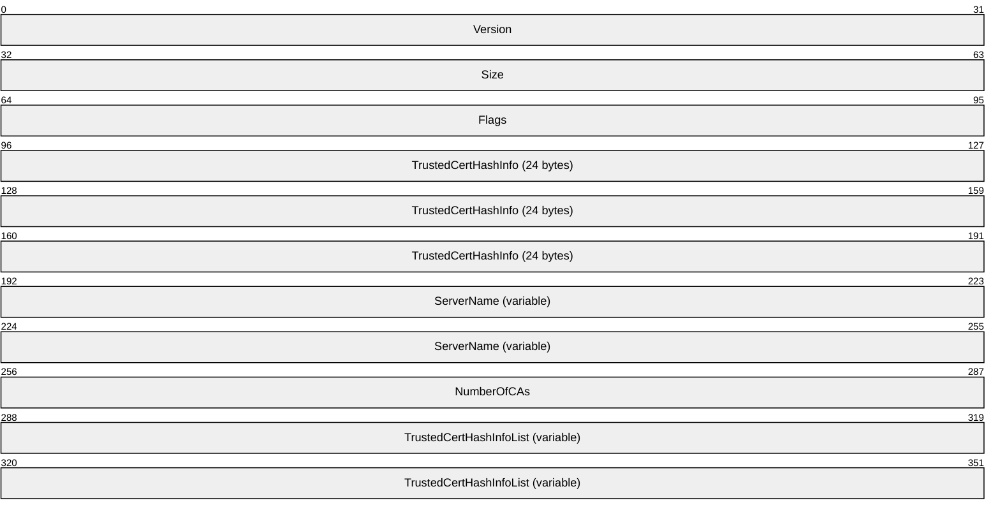

**Version (4 bytes):** A 4-byte unsigned integer set to 2.

**Size (4 bytes):** A 4-byte unsigned integer set to the total size of EAPTLS_CONN_PROPERTIES data structure.

**Flags (4 bytes):** A 4-byte unsigned integer indicating the properties for EAP-TLS configuration by setting the following bit values.

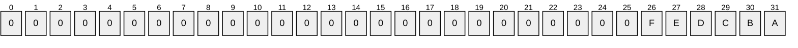

Where the bits are defined as:

| Value | Description |
| --- | --- |
| A | EapTlsRegistry: If set to 1, clients use a certificate present in the Current User or Local Computer certificate store on the target machine. If set to 0, clients use a certificate present on a smart card. |
| B | EapTlsNoValidateServerCert: If set to 1, the client disables validation of the computer certificate of the authenticating server. |
| C | EapTlsNoValidateName: If set to 1, the client disables matching of the name of the authenticating server as indicated in the ServerName field. |
| D | EapTlsDifferentUsername: If not set to 1, the client uses the subject principal name from the certificate used for authentication. |
| E | EapTlsSimpleCertSel: If set to 1, the client simplifies the list of certificates with which the user is prompted for selection. The client groups the certificates that are usable for EAP-TLS authentication based on the entity that was issued the certificate as indicated by the Subject Alternative Name and Subject fields of the certificates. If more than one such group is present, the client selects the most recently issued certificate from each group to create the list that is presented to the user so the user can select a certificate to be used for authentication. This setting is ignored if EapTlsRegistry bit is not set. |
| F | EapTlsDisablePromptValidation: If set to 1, the client does not prompt the user during the process of validating the certificate of the authenticating server.<16> |

**TrustedCertHashInfo (24 bytes):** Contains the certificate information of the trusted root [**certification authority (CA)**](#gt_certification-authority-ca) that the client trusts to accept a certificate of the authenticating server. This field is ignored by the client if **EapTlsNoValidateServerCert** is set. These 24 bytes are set to 0 if no trusted root certification authorities are indicated.

This field format is defined as **CertHashInfo**, and consists of the following sub-fields.

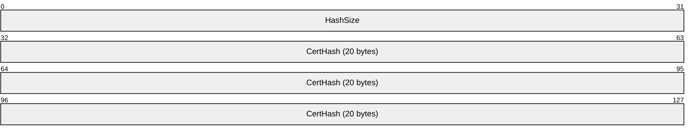

**HashSize (4 bytes):** A 4-byte unsigned integer that is set to the size of the hash of the certificate stored in the **CertHash** field.

**CertHash (20 bytes):** 20 bytes containing the hash of the certificate belonging to the trusted root certification authority that the client trusts to accept a certificate of the authenticating server.

**ServerName (variable):** A null-terminated, semicolon-separated list of server names. Each server name consists of either an array of Unicode characters indicating the name of an authenticating server with which the client can authenticate without additional user consent, or a regular expression as specified in [[ECMA-262]](https://go.microsoft.com/fwlink/?LinkId=115082) section 7.8.5.<17>

**NumberOfCAs (4 bytes):** A 4-byte unsigned integer that is set to the number of trusted root certification authorities being indicated including the preceding one.

**TrustedCertHashInfoList (variable):** An optional field that is present if and only if **NumberOfCAs** field is greater than 1. **TrustedCertHashInfoList** contains a list of (NumberOfCAs-1) **TrustedCertHashInfo** structures for different trusted root certification authorities. The client trusts either the trusted root certification authority indicated in the preceding **TrustedCertHashInfo** field or one from the list of **TrustedCertHashInfo** structures in this field to accept a certificate of the authenticating server.

##### 2.2.3.1.2 PEAP_CONN_PROP

This data structure specifies the configuration for Microsoft implementation of Protected Extensible Authentication Protocol (PEAP) Specification [MS-PEAP](../MS-PEAP/MS-PEAP.md) on the client. The fields are as follows.

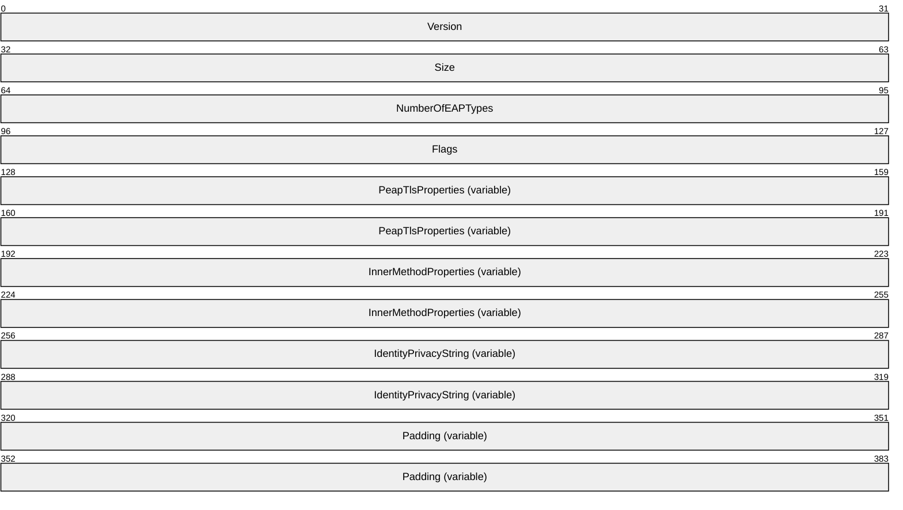

**Version (4 bytes):** A 4-byte unsigned integer that indicates the version of the PEAP_CONN_PROP. It is set to 1.

**Size (4 bytes):** A 4-byte unsigned integer that is set to the total size of the PEAP_CONN_PROP data structure in bytes plus (NumberOfEAPTypes + 1)* 4 plus the size of **IdentityPrivacyString**, including NULL character in bytes.

**NumberOfEAPTypes (4 bytes):** A 4-byte unsigned integer that indicates the number of [**EAP**](#gt_eap) methods configured as the inner EAP method for PEAP. It is set to either 0 or 1.<18>

0x00000000

0x00000001

**Flags (4 bytes):** A 4-byte unsigned integer that indicates the properties for PEAP configuration by setting the following bit values.

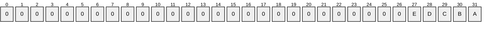

Where the bits are defined as:

| Value | Description |
| --- | --- |
| A | PeapFastRoaming: If set to 1, the clients participate in fast-roaming. |
| B | PeapInnerEAPOptional: If set to 1, the client allows the absence of any inner EAP method for successful authentication.<19> |
| C | PeapEnforceCryptoBinding: If set to 1, the client disconnects and fail PEAP authentication if the authenticating server does not provide a cryptobinding TLV.<20> |
| D | PeapEnableQuarantine: If set to 1, the client enables Network Access Protection feature in the PEAP protocol.<21> |
| E | PeapEnableIdentityPrivacy: If set to 1, the client enables the identity privacy feature in the PEAP protocol.<22> |

**PeapTlsProperties (variable):** A variable size data that follows the format defined by [PEAP_TLS_PHASE1_CONN_PROPERTIES (section 2.2.3.1.2.1)](#Section_802). This field indicates the parameters that the clients use to establish the TLS tunnel in Phase 1 of PEAP as specified in [MS-PEAP] section 3.3.5.2.

**InnerMethodProperties (variable):** Optional variable size data that follows the format defined by [PEAP_INNER_METHOD_PROPERTY (section 2.2.3.1.2.2)](#Section_802) indicating the parameters the client uses for Inner EAP method inside PEAP. This field is present if **NumberOfEAPTypes** field is set to 1.

**IdentityPrivacyString (variable):** Optional variable size null-terminated [**Unicode**](#gt_unicode) string that MAY<23>be used to indicate the identity to be used in EAP-Identity response packet.

**Padding (variable):** Optional variable size field. Extends PEAP_CONN_PROP to the length specified in the **Size** field.

###### 2.2.3.1.2.1 PEAP_TLS_PHASE1_CONN_PROPERTIES

This data structure specifies the configuration for Microsoft implementation of PEAP Specification Phase 1 on the client. The fields are as follows.

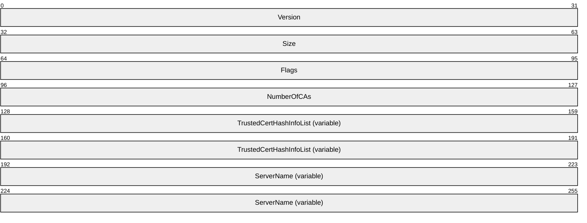

**Version (4 bytes):** A 4-byte unsigned integer set to 1.

**Size (4 bytes):** A 4-byte unsigned integer set to the total size of PEAP_TLS_PHASE1_CONN_PROPERTIES data structure in bytes.

**Flags (4 bytes):** A 4-byte unsigned integer that indicates the properties for PEAP Phase 1 configuration by setting the following bit values.

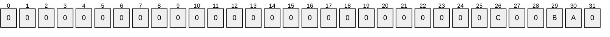

Where the bits are defined as:

| Value | Description |
| --- | --- |
| A | PeapTlsPhase1NoValidateServerCert: If set to 1, the client disables validation of the computer certificate of the authenticating server. |
| B | PeapTlsPhase1NoValidateName: If set to 1, the client disables matching of the name of the authenticating server as described in the ServerNames field. |
| C | PeapTlsPhase1DisablePromptValidation: If set to 1, the client does not prompt the user during the process of validating the certificate of the authenticating server. <24> |

Other bits are not defined and are ignored by the client.

**NumberOfCAs (4 bytes):** A 4-byte unsigned integer that is set to the number of trusted root CAs being indicated.

**TrustedCertHashInfoList (variable):** An optional field that is present if and only if **NumberOfCAs** field is nonzero. **TrustedCertHashInfoList** contains a list of NumberOfCAs **TrustedCertHashInfo** structures for different trusted root [**certification authorities**](#gt_certification-authority-ca). The client trusts any root certification authority indicated in the list of **TrustedCertHashInfo** structures in this field to accept a certificate of the authenticating server.

**ServerName (variable):** A null-terminated string of [**Unicode**](#gt_unicode) characters indicating a name of an authenticating server that the client can authenticate to without additional user-consent. This can be a regular expression (as described in [[ECMA-262]](https://go.microsoft.com/fwlink/?LinkId=115082), section 7.8.5). This field is ignored by the client if **PeapTlsPhase1NoValidateServerCert** or **PeapTlsPhase1NoValidateName** is set to 1.<25>

###### 2.2.3.1.2.2 PEAP_INNER_METHOD_PROPERTY

The PEAP_INNER_METHOD_PROPERTY specifies the parameters for an Inner [**EAP**](#gt_eap) method for Microsoft implementation of Protected Extensible Authentication Protocol (PEAP) [MS-PEAP](../MS-PEAP/MS-PEAP.md) on the client. The fields are as follows.

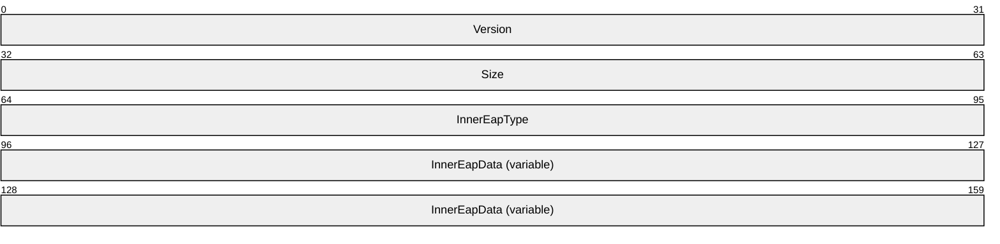

**Version (4 bytes):** A 4-byte unsigned integer that is set to 1.

**Size (4 bytes):** A 4-byte unsigned integer that is set to the total size of this structure including all fields in bytes.

**InnerEapType (4 bytes):** A 4-byte unsigned integer that indicates the EAP type of the PEAP inner EAP method.

| Value | Meaning |
| --- | --- |
| 13 | The format of **InnerEapData** is [EAPTLS_CONN_PROPERTIES](#Section_802). |
| 26 | The format of **InnerEapData** is [EAPMSCHAPv2_CONN_PROPERTIES](#Section_802). |

All other InnerEapType values signify A BLOB indicating EAP configuration settings to be used for this InnerEapType. Contact the corresponding EAP method vendor for the format of this data.

**InnerEapData (variable):** A variable data indicating the parameters that the client uses for inner EAP method as described by **InnerEapType**. The format of this field depends on the value of **InnerEapType**. Contact the corresponding EAP method vendor for the format of this data.

##### 2.2.3.1.3 EAPMSCHAPv2_CONN_PROPERTIES

This data structure specifies the configuration for Microsoft implementation of the EAP-MsChapV2 [MS-CHAP](../MS-CHAP/MS-CHAP.md) method on the client. The fields are as follows.

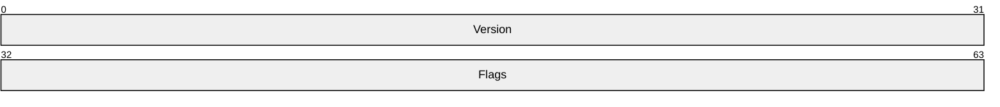

**Version (4 bytes):** A 4-byte unsigned integer set to 1.

**Flags (4 bytes):** A 4-byte unsigned integer that indicates the properties for EAP-MsChapV2 configuration by setting the following bit values.

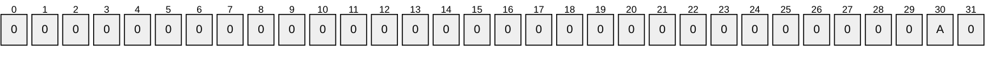

Where the bits are defined as:

| Value | Description |
| --- | --- |
| A | LogonCreds: If set to 1, the client uses the logon username and password associated with the user for whom the authentication is being performed. |

#### 2.2.3.2 Configuration Element Syntax for XML-Based Wired and Wireless Profiles

The [**XML**](#gt_xml)-based wired and wireless profiles, as specified in section [2.2.1.2.1](#Section_802) and section [2.2.2.1](#Section_802), contain an optional element named **EAPConfig**. This element contains implementation-specific [**Extensible Authentication Protocol (EAP)**](#gt_extensible-authentication-protocol-eap) configuration settings to be used while performing IEEE 802.1X authentication, as specified in [[IEEE802.1X]](https://go.microsoft.com/fwlink/?LinkId=89910).

The **EAPConfig** element contains one or more instances of the [EapHostConfig element (section 2.2.3.2.1)](#Section_802).

##### 2.2.3.2.1 EapHostConfig Element

The EapHostConfig element is a string which MUST be formatted according to the [**XML schema**](#gt_xml-schema) in section [6.6](#Section_6.6). EapHostConfig contains the following elements:

**EapMethod:** An element of type [EapMethodType (section 2.2.3.2.2)](#Section_802) as defined in section 2.2.3.2.2.

Exactly one of the following elements:

**Config:** An element of type [BaseEapMethodConfig (section 2.2.3.2.3)](#Section_802), as defined in section 2.2.3.2.3, which contains implementation-specific [**EAP**](#gt_eap) configuration packaged as an [**XML**](#gt_xml) string.<26>

**ConfigBlob:** The hexadecimal representation of a BLOB containing implementation-specific EAP configuration.<27>

Microsoft EAP method implementations can be accompanied by either XML or BLOB-formatted configuration, as shown in the following table.<28>

| EapMethod\Type | Config Format | ConfigBlob Format |
| --- | --- | --- |
| 13 (EAP-TLS) | [BaseEap (section 2.2.3.2.4)](#Section_802) with [EapTlsConnectionProperties (section 2.2.3.2.5)](#Section_802) | [EAPTLS_CONN_PROPERTIES (section 2.2.3.1.1)](#Section_802) |
| 25 (EAP-PEAP) | BaseEap with [MsPeapConnectionProperties (section 2.2.3.2.6)](#Section_802) | [PEAP_CONN_PROP (section 2.2.3.1.2)](#Section_802) |
| 26 (EAP-MSChapV2) | BaseEap with [MsChapV2ConnectionPropertiesV1 (section 2.2.3.2.7)](#Section_802) | [EAPMSCHAPv2_CONN_PROPERTIES (section 2.2.3.1.3)](#Section_802) |
| 21 (EAP-TTLS) | [EapTtlsConnectionPropertiesV1 (section 2.2.3.2.12)](#Section_802) | - |
| 18 (EAP-SIM) | [EapSimConnectionPropertiesV1 (section 2.2.3.2.9)](#Section_802) | - |
| 23 (EAP-AKA) | [EapAkaConnectionPropertiesV1 (section 2.2.3.2.10)](#Section_802) | - |
| 50 (EAP-AKA') | [EapAkaPrimeConnectionPropertiesV1 (section 2.2.3.2.11)](#Section_802) | - |
| 55 (EAP-TEAP) | [EapTeapConnectionPropertiesV1 (section 2.2.3.2.13)](#Section_802) | - |

For other implementations of the EAP methods denoted by these **EAPType** values or for implementations of other EAP methods, please contact the corresponding vendors for the required contents of **Config** or **ConfigBlob**.

##### 2.2.3.2.2 EapMethodType

The EapMethodType complex type defines a string which MUST be formatted according to the [**XML schema**](#gt_xml-schema) in section [6.6.1](#Section_6.6.1). An element of type EapMethodType contains the following elements:

**Type:** An 8-bit unsigned integer which specifies the [**Extensible Authentication Protocol (EAP)**](#gt_extensible-authentication-protocol-eap) method to be used by the domain clients while using IEEE 802.1X authentication as specified in [[IEEE802.1X]](https://go.microsoft.com/fwlink/?LinkId=89910), to connect to a network. The value for this field MUST be a legal [**EAP**](#gt_eap) method type, as specified in [[RFC3748]](https://go.microsoft.com/fwlink/?LinkId=90444) section 6.2. Setting this field to "254", indicates that the EAP method is an expanded EAP method, in which case **VendorId** and **VendorType** MUST be included.

**VendorId:** An optional unsigned 8-bit integer representing the IANA Private Enterprise Number, as specified in [[IANA-ENT]](https://go.microsoft.com/fwlink/?LinkId=89883), of the method vendor; required if **Type** indicates an expanded EAP method (Type = 254).

**VendorType:** An optional unsigned 8-bit integer whose value is defined by the EAP method vendor; required if **Type** indicates an expanded EAP method (Type = 254).

**AuthorId:** An unsigned 8-bit integer representing the IANA Private Enterprise Number, as specified in [IANA-ENT], of the method author. The **AuthorId** and **VendorId** do not need to be the same for a particular method.

##### 2.2.3.2.3 BaseEapMethodConfig

The BaseEapMethodConfig complex type defines a string which MUST be formatted according to the [**XML schema**](#gt_xml-schema) in section [6.6.2](#Section_6.6.2). An element of this type is a placeholder for the vendor-specific method configuration. The Vendor's implementation-specific configuration nodes can be placed within this element where allowed in the schema by the "xs:any" tag.

All Microsoft EAP methods define the contents of the BaseEapMethodConfig to have the following contents:

**Eap:** An element of type [BaseEap (section 2.2.3.2.4)](#Section_802), as specified in section 2.2.3.2.4.

##### 2.2.3.2.4 BaseEap

All Microsoft EAP methods define the contents of the [BaseEapMethodConfig (section 2.2.3.2.3)](#Section_802) to contain one element of type BaseEap. Method-specific configuration is achieved by the elements of the BaseEap schema in a method-specific schema.

The BaseEap complex type defines a string which MUST be formatted according to the [**XML schema**](#gt_xml-schema) in section [6.6.3](#Section_6.6.3). This schema defines the following elements:

**EapType:** An abstract element of type BaseEapTypeParameters which is overridden by the method-specific schema. One or more **EapType** elements can be included.

**Type:** An 8-bit unsigned integer which specifies the [**Extensible Authentication Protocol (EAP)**](#gt_extensible-authentication-protocol-eap) method to be used by the domain clients while using IEEE 802.1X authentication, as specified in [[IEEE802.1X]](https://go.microsoft.com/fwlink/?LinkId=89910), to connect to a network. The value for this field MUST be a legal [**EAP**](#gt_eap) method type, as specified in [[RFC3748]](https://go.microsoft.com/fwlink/?LinkId=90444) section 6.2, and MUST be an EAP method type implemented by Microsoft.

##### 2.2.3.2.5 EapTlsConnectionProperties

The Microsoft implementation of EAP-TLS overrides the abstract type **BaseEapTypeParameters** with type **EapTlsConnectionPropertiesV1**. This type is defined to be a string formatted according to the [**XML schema**](#gt_xml-schema) in section [6.8.1](#Section_6.8.1), and imports **EapTlsConnectionPropertiesV2** from the schema in section [6.8.2](#Section_6.8.2).<29> The **EapTlsConnectionPropertiesV1** type defines the following elements:

**CredentialsSource:** An element of type **CredentialsSourceParameters**, containing one of the following elements:

**SmartCard:** An empty string whose presence indicates that the certificate is to be obtained from a SmartCard available to the operating system.

**CertificateStore:** An element whose presence indicates that the certificate is to be obtained from the operating system certificate store. This element can also contain the following element:

**SimpleCertSelection:** An optional Boolean. If TRUE or absent, then the method will automatically select a certificate for authentication without user interaction, if possible. If FALSE, the method will always prompt the user to select a certificate.

**ServerValidation:** An element of type [ServerValidationParameters (section 2.2.3.2.8)](#Section_802) as specified in section 2.2.3.2.8.

**DifferentUsername:** A Boolean. If TRUE, specifies that a different user name is to be used for [**EAP**](#gt_eap) Identity response than the one present in the certificate. If FALSE, EAP uses the same identity as in the certificate's alternate subject name.

The EapTlsConnectionPropertiesV2 schema (section 6.8.2) in section 6.8.2 defines the following additional elements:

**PerformServerValidation:** An optional Boolean which indicates whether server validation is performed.

**AcceptServerName:** An optional Boolean which indicates whether the server name is validated against the name string specified in the ServerNames (ServerValidationParameters) element.

**TLSExtensions:** An optional container for elements of other namespaces which enables future enhancements to the schema.

The [EapTlsConnectionPropertiesV3 (section 6.8.3)](#Section_6.8.3) schema defines the following elements:<30>

**FilteringInfo:** An element of type **FilterInfoParams** containing the following elements:

**AllPurposeEnabled:** An optional Boolean that indicates whether all-purpose certificates are allowed for authentication on the client. If set to TRUE, all-purpose certificates are allowed. If set to FALSE or absent, all-purpose certificates are not allowed.

**CAHashList:** An element of type **CAHashListParams** containing the following elements:

**IssuerHash:** The thumbprint of a root certification authority that issues certificates that can be allowed on a client for authentication. It is represented as the hexadecimal encoding of the [**SHA-1 hash**](#gt_sha-1-hash) of the certificate. Multiple such elements can be present.

**Enabled:** Defined as an attribute of **CAHashListParams** that indicates whether the certificates on the client are to be filtered based on the CA hash as specified by one or more **IssuerHash** elements. If set to TRUE, certificates are filtered based on specified CAs. If set to FALSE, certificate filtering is not done based on CAs.

**EKUMapping:** An element of type **EKUMapParams** that contains the following element:

**EKUMap:** This element can be present multiple times, indicating multiple EKU Name and [**OID**](#gt_object-identifier-oid) mappings. It is an element of type **EKUMapPair** that contains the following elements:

**EKUName:** An element of type string specifying the name of the [**EKU**](#gt_enhanced-key-usage-eku).

**EKUOID:** An element of type string specifying the EKU OID corresponding to the name specified by the **EKUName** element.

**ClientAuthEKUList:** An optional element of type **EKUListParams**.

**AnyPurposeEKUList:** An optional element of type **EKUListParams**.

**EKUListParams:** Type used by **ClientAuthEKUList** and **AnyPurposeEKUList** for specifying the EKUs to be used for filtering certificates on the client. It contains the following elements:

**Enabled:** Defined as an attribute of **EKUListParams** that indicates whether the certificates on the client are to be filtered based on the EKU list as specified by one or more **EKUMapInList** elements. If set to TRUE, certificates are filtered based on the specified EKU list. If set to FALSE, certificate filtering is not done based on the EKU list.

**EKUMapInList:** This element can be present multiple times, indicating multiple EKUs. Both **EKUName** and **EKUOID** need not be specified if the mapping between EKU Name and OID is already defined in the **EKUMapping** element. The **EKUMapping** element is an element of type **EKUListPair** that contains the following elements:

**EKUName:** An element of type string specifying the name of the EKU.

**EKUOID:** An element of type string specifying the EKU OID.

**Extensions:** An optional container for elements of other namespaces that enables future enhancements to the schema.

##### 2.2.3.2.6 MsPeapConnectionProperties

The Microsoft implementation of PEAP overrides the abstract type **BaseEapTypeParameters** with type **MsPeapConnectionPropertiesV1**. This type is defined to be a string formatted according to the [**XML schema**](#gt_xml-schema) in section [6.9.1](#Section_6.9.1). The **MsPeapConnectionPropertiesV1** type defines the following elements:

**ServerValidation:** An optional element of type [ServerValidationParameters (section 2.2.3.2.8)](#Section_802).

**IdentityPrivacy:** An optional element<31> of type **IdentityPrivacyParameters** which contains information about anonymous identity usage during PEAP authentication. Use of this element is deprecated. If the **PeapExtensions** element exists, this **IdentityPrivacy** element is ignored and the **IdentityPrivacy** tag of **PeapExtensions** MUST be used instead. This element contains the following elements:

**EnableIdentityPrivacy:** An optional Boolean that indicates whether **IdentityPrivacy** is enabled. If TRUE, an anonymous identity is substituted for the user's true identity. If **AnonymousUserName** is not specified, an empty string identity is used.

**AnonymousUserName:** Contains an anonymous identity used in place of a user's true identify. It is sent during Phase 1 of PEAP authentication, as specified in [MS-PEAP](../MS-PEAP/MS-PEAP.md) section 3.1.5.4, when **Identity** is sent as clear text. Anonymous identity usage is determined by the **EnableIdentityPrivacy** element. If **EnableIdentityPrivacy** is FALSE, **AnonymousUserName** is ignored.

**FastReconnect:** An optional Boolean. If TRUE, PEAP attempts to use Fast Reconnect. If FALSE, full authentication is used.

**InnerEapOptional:** An optional Boolean. If TRUE, PEAP does not attempt to perform inner EAP method authentication.

**Eap:** An element of type [BaseEap (section 2.2.3.2.4)](#Section_802) containing parameters for the inner EAP method.

**EnableQuarantineChecks:** An optional Boolean. If TRUE, PEAP performs NAP authorization checks as part of Phase 2 authentication as specified in [MS-PEAP] section 3.1.5.6. If FALSE or absent, it does not.

**RequireCryptoBinding:** An optional Boolean. If TRUE, PEAP performs CrypoBinding validation as part of authentication result negotiation. If FALSE or absent, it does not.

**PeapExtensions:** An extensible field reserved for future extensions to the Microsoft PEAP implementation.

The [MsPeapConnectionPropertiesV2 schema (section 6.9.2)](#Section_6.9.2) defines the following additional elements in PeapExtensions, using a new MsPeapConnectionPropertiesv2 namespace.<32>

**PerformServerValidation:** An optional Boolean that indicates whether server validation is performed.

**AcceptServerName:** An optional Boolean that indicates whether the server name is validated against the name string specified in the ServerNames (ServerValidationParameters) element.

**IdentityPrivacy**: An optional element of type **IdentityPrivacyParameters**, that contains information about anonymous identity usage during PEAP authentication. This element contains the following elements:

**EnableIdentityPrivacy**: An optional Boolean which indicates whether **IdentityPrivacy** is enabled. If TRUE, an anonymous identity is substituted for the user's true identity.

**AnonymousUserName**: Contains an anonymous identity used in place of a user's true identity. It is sent during Phase 1 of PEAP authentication, as specified in [MS-PEAP] section 3.1.5.4, when the **Identity** is sent as clear text. Anonymous identity usage is determined by the **EnableIdentityPrivacy** element. If **EnableIdentityPrivacy** is FALSE, **AnonymousUserName** is ignored.

**PeapExtensionsV2:** An extensible field reserved for future extensions to the Microsoft PEAP implementation.

The MsPeapConnectionPropertiesV3 schema (section [6.9.3](#Section_6.9.3)) defines the following additional optional elements<33> in PeapExtensionsV2:

**AllowPromptingWhenServerCANotFound**: An optional Boolean which specifies method behavior in case the server's certificate does not chain to a trusted root. If TRUE, the user is prompted to manually accept or reject the certificate. If FALSE, certificate errors will cause the connection to be refused.

**PeapExtensionsV3**: An extensible field reserved for future extensions to the Microsoft PEAP implementation.

##### 2.2.3.2.7 MsChapV2ConnectionPropertiesV1

The Microsoft implementation of EAP-MSCHAPv2 overrides the abstract type **BaseEapTypeParameters** with type MsChapV2ConnectionPropertiesV1. This type is defined to be a string formatted according to the [**XML schema**](#gt_xml-schema) in section [6.7](#Section_6.7). The MsChapV2ConnectionPropertiesV1 type defines the following element:

**UseWinLogonCredentials:** An optional Boolean. If TRUE or absent, CHAP attempts to authenticate using the logged-on user's username and password, as specified in [MS-CHAP](../MS-CHAP/MS-CHAP.md) section 3.2.5.2. If FALSE, it does not.

##### 2.2.3.2.8 ServerValidationParameters

This type is referenced within the [EapTlsConnectionPropertiesV1 schema (section 6.8.1)](#Section_6.8.1) and the [MsPeapConnectionPropertiesV1 schema (section 6.9.1)](#Section_6.9.1). This type is defined to be a string formatted according to the type definition in the corresponding [**XML schema**](#gt_xml-schema) in section [6.8](#Section_6.8) or [6.9](#Section_6.9). The **ServerValidationParameters** type defines the following elements:

**DisableUserPromptForServerValidation:** An optional Boolean which specifies method behavior in case the server's certificate does not chain to a trusted root. If TRUE, certificate errors will cause the connection to be refused. If FALSE, the user is prompted to manually accept or reject the certificate.

**ServerNames:** An optional string that specifies the list of servers to which the client can authenticate. This element also contains an optional attribute:

**PerformServerValidation:** A Boolean indicating whether server validation is performed.<34>

**AcceptServerName:** An optional Boolean that indicates whether the server name is validated against the name string specified in the ServerNames (ServerValidationParameters) element.<35>

**TrustedRootCA:** The thumbprint of a root certification authority that is trusted to issue server certificates, represented as the hexadecimal encoding of the certificate hash. Multiple such elements can be present.

##### 2.2.3.2.9 EapSimConnectionPropertiesV1

This type specifies the [**EAP**](#gt_eap) configuration required for EAP-SIM as specified in [[RFC4186]](https://go.microsoft.com/fwlink/?LinkId=225918). It is defined as a complex element containing the following elements:

**UseStrongCipherKeys:** An optional Boolean flag indicating whether the client accepts only three random numbers, or RANDs ([RFC4186] section 10.9). If set to TRUE, the client accepts only three RANDs from the server. If set to FALSE or absent, the client accepts either two or three RANDs from the server.

**DontRevealPermanentID:** An optional Boolean flag indicating whether the client is allowed to reveal permanent identity ([RFC4186] section 4.2) when pseudonym identity ([RFC4186] section 4.2) is available from previous authentications. If set to TRUE or absent, the client does not send permanent identity when pseudonym identity is available, even if the server requests it. If set to FALSE, the client sends permanent identity when the server requests it.

**ProviderName:** An optional string element indicating the provider name that will be used while determining the list of SIMs to be allowed for authentication. Only the SIMs matching the specified provider name will be allowed for authentication.

**Realm:** A string element denoting the [**realm**](#gt_realm) to be used while sending the client identity to the server. It also contains the **Enabled** attribute, which specifies whether the Realm string is to be used. If **Enabled** is set to TRUE and no Realm string is specified, the derived realm ([RFC4186] section 4.2.1.5) is used. If **Enabled** is set to FALSE, any Realm string, if specified, is not used.

##### 2.2.3.2.10 EapAkaConnectionPropertiesV1

This type specifies the [**EAP**](#gt_eap) configuration required for EAP-AKA as specified in [[RFC4187]](https://go.microsoft.com/fwlink/?LinkId=225919). It is defined as a complex element containing the following elements:

**DontRevealPermanentID:** As specified in section [2.2.3.2.9](#Section_802).

**ProviderName:** As specified in section 2.2.3.2.9.

**Realm:** As specified in section 2.2.3.2.9.

##### 2.2.3.2.11 EapAkaPrimeConnectionPropertiesV1

This type specifies the [**EAP**](#gt_eap) configuration required for EAP-AKA' as specified in [[RFC5448]](https://go.microsoft.com/fwlink/?LinkId=225925). It is defined as a complex element containing the following elements:

**IgnoreNetworkNameMismatch:** An optional Boolean flag indicating whether the client is to validate its network name against the network name received from the server ([RFC5448] section 3.1). If set to TRUE or absent, the network name is not validated. If set to FALSE, the network name validation is performed.

**EnableFastReauth:** An optional Boolean flag indicating whether the client can perform fast reauthentication ([[RFC4186]](https://go.microsoft.com/fwlink/?LinkId=225918) section 4.3.2) when possible. If set to TRUE, the fast reauthentication is performed. If set to FALSE or absent, full authentication is performed.

**DontRevealPermanentID:** As specified in section [2.2.3.2.9](#Section_802).

**ProviderName:** As specified in section 2.2.3.2.9.

**Realm:** As specified in section 2.2.3.2.9.

##### 2.2.3.2.12 EapTtlsConnectionPropertiesV1

**TtlsConfig:** This type specifies the [**EAP**](#gt_eap) configuration required for EAP-TTLS as specified in [[RFC5281]](https://go.microsoft.com/fwlink/?LinkId=225924). It is defined as a complex element containing the following elements:

**ServerValidation:** An optional element of type [ServerValidationParameters (section 2.2.3.2.8)](#Section_802). The ServerValidationParameters type is a complex element containing the following elements:

**ServerNames:** An optional string that specifies the list of servers to which the client can authenticate.

**TrustedRootCAHashes:** The thumbprint of a root certification authority that is trusted to issue server certificates, represented as a hexadecimal string of the certificate's [**SHA-1 hash**](#gt_sha-1-hash). Zero or more elements can be present.

**DisablePrompt:** An optional Boolean that specifies method behavior in case the server's certificate is not trusted as per the TTLS connection profile. If TRUE, certificate errors will cause the connection to be refused. If FALSE, the user is prompted to manually accept or reject the certificate.

**Phase2Authentication:** An optional element of the **Phase2AuthenticationParameters** type. The **Phase2AuthenticationParameters** type is a complex element containing one of the following elements:

**Eap:** An element of type [BaseEap (section 2.2.3.2.4)](#Section_802) containing parameters for the inner EAP method.

**PAPAuthentication:** An empty string whose presence indicates that TTLS will attempt PAP authentication protocol after the phase 1 tunnel is established as specified in [RFC5281] section 11.2.5.

**CHAPAuthentication:** An empty string whose presence indicates that TTLS will attempt CHAP authentication protocol after the phase 1 tunnel is established as specified in [RFC5281] section 11.2.2.

**MSCHAPAuthentication:** An empty string whose presence indicates that TTLS will attempt MSCHAP authentication protocol after the phase 1 tunnel is established as specified in [RFC5281] section 11.2.3.

**MSCHAPv2Authentication:** An element of **MSCHAPv2AuthenticationParameters** type whose presence indicates that TTLS will attempt MSCHAPv2 authentication protocol after the phase 1 tunnel is established as specified in [RFC5281] section 11.2.4. The **MSCHAPv2AuthenticationParameters** type is a complex element containing the following element:

**UseWinlogonCredentials:** An optional Boolean element. If TRUE, MSCHAPv2 attempts to authenticate using the logged-on user's username and password. If FALSE or absent, it does not.

**Phase1Identity:** An optional element of **Phase1IdentityParameters** type. The **Phase1IdentityParameters** type is a complex element containing the following elements:

**IdentityPrivacy:** An optional Boolean that indicates whether IdentityPrivacy is enabled. If TRUE, an anonymous identity is substituted for the user's true identity.

**AnonymousIdentity:** Contains a Unicode string specifying an alternate identity used in place of a user's true identity. It is sent in the EAP identity response message during the TTLS authentication. Anonymous identity usage is determined by the IdentityPrivacy element.

##### 2.2.3.2.13 EapTeapConnectionPropertiesV1

**TeapConfig**: This type specifies the [**EAP**](#gt_eap) configuration required for EAP-TEAP, as specified in [[RFC7170]](https://go.microsoft.com/fwlink/?linkid=2116542). It is defined as a complex element containing the following elements:

**ServerValidation**: An optional element of type **ServerValidationParameters**. The **ServerValidationParameters** type is a complex element containing the following elements:

**ServerNames**: An optional string that specifies the list of servers to which the client can authenticate.

**TrustedRootCAHashes**: The thumbprint of a root [**certification authority**](#gt_certification-authority-ca) that is trusted to issue server certificates, represented as a hexadecimal string of the certificate's [[SHA256]](https://go.microsoft.com/fwlink/?LinkId=90514) hash. Zero or more elements can be present.

**DownloadTrustedServerRoot**: An optional Boolean that specifies method behavior in case the server's certificate is not trusted and the user manually accepts the certificate. If TRUE, additional server certificates pushed by the server will be added to the **TrustedRootCAHashes** element after a successful connection. If FALSE, no additional certificates pushed by the server will be added to the **TrustedRootCAHashes** element.

**DisablePrompt**: An optional Boolean that specifies method behavior in case the server's certificate is not trusted as per the TEAP connection profile. If TRUE, certificate errors will cause the connection to be refused. If FALSE, the user is prompted to manually accept or reject the certificate.

**Phase2Authentication**: An optional element of type **Phase2AuthenticationParameters**. The **Phase2AuthenticationParameters** type is a complex element containing the following elements:

**InnerMethodConfig**: An optional element of type **InnerMethodConfigParameters**. The **InnerMethodConfigParameters** type is a complex element containing the following elements:

**Eap**: An element of type [2.2.3.2.1](#Section_802)**BaseEap** (section [2.2.3.2.4](#Section_802)) containing parameters for the inner EAP method.

**Phase1Identity**: An optional element of **Phase1IdentityParameters** type. The **Phase1IdentityParameters** type is a complex element containing the following elements:

**IdentityPrivacy**: An optional Boolean that indicates whether **IdentityPrivacy** is enabled during Phase 1 of TEAP authentication, as specified in [RFC7170] section 7.4.1, when **Identity** is sent as clear text. If TRUE, an anonymous identity is substituted for the user's true identity. The identity used is determined by the **AnonymousIdentity** element. If **AnonymousIdentity** is not specified, an empty string identity will be used.

**AnonymousIdentity**: Contains a [**Unicode**](#gt_unicode) string, as specified in [[RFC3748]](https://go.microsoft.com/fwlink/?LinkId=90444) section 5.1, specifying an alternate identity used in place of a user's true identity. It is sent in the [**EAP identity**](#gt_eap-identity) response message during TEAP authentication. Anonymous identity usage is determined by the **IdentityPrivacy** element. If **IdentityPrivacy** is FALSE, **AnonymousIdentity** is ignored.

## 2.3 Directory Service Schema Elements

The Wireless/Wired Group Policy Protocol accesses the following [**directory service (DS)**](#gt_directory-service-ds) schema classes and attributes listed in the following table.

For the syntactic specifications of the following <Class> or <Class> <Attribute> pairs, refer to: Active Directory Domain Services (AD DS) [MS-ADA2](../MS-ADA2/MS-ADA2.md) and Active Directory Schema Classes [MS-ADSC](../MS-ADSC/MS-ADSC.md).

| Class | Attribute |
| --- | --- |
| msieee80211-Policy | cn description msieee80211-Data msieee80211-ID whenChanged |
| ms-net-ieee-80211-GroupPolicy | cn description ms-net-ieee-80211-GP-PolicyData ms-net-ieee-80211-GP-PolicyGUID whenChanged |
| ms-net-ieee-8023-GroupPolicy | cn description ms-net-ieee-8023-GP-PolicyData ms-net-ieee-8023-GP-PolicyGUID whenChanged |

# 3 Protocol Details

## 3.1 Administrative-Side Plug-in Details

The administrative-side plug-in has a user interface that allows an administrator to author policy objects on the [**Active Directory**](#gt_active-directory) that have the format specified in section [2.2](#Section_802).

### 3.1.1 Abstract Data Model

The abstract data model of the Wireless/Wired Group Policy Protocol for an administrator includes the abstract data model of Group Policy, as specified in [MS-GPOL](../MS-GPOL/MS-GPOL.md) section 3.1.1. For more information about the meanings of the different attributes, see [[MSFT-WNPE]](https://go.microsoft.com/fwlink/?LinkId=90213), [[MSFT-EADWNP]](https://go.microsoft.com/fwlink/?LinkId=90184), [[MSFT-NFLHWV]](https://go.microsoft.com/fwlink/?LinkId=90199), [[EXP-GPOL]](https://go.microsoft.com/fwlink/?LinkId=89863), [MS-ADSC](../MS-ADSC/MS-ADSC.md), and sections [6.15](../MS-GPOL/MS-GPOL.md) and [6.16](../MS-GPOL/MS-GPOL.md).

In addition, the administrator needs to obtain the configuration details of the networks being configured. The abstract data model for these configuration details maps to the data elements specified in section [2.2](#Section_802).

The following table shows different policy types and their corresponding containers and classes.

| Policy type (policyType) | Container path to store the policy object (policyContainerPath) | Class of the policy object (policyClass) |
| --- | --- | --- |
| BLOB-based wireless [**Group Policy**](#gt_group-policy) | <ScopedGPOPath>\Microsoft\Windows\Wireless | msieee80211-Policy |
| XML-based wireless Group Policy | <ScopedGPOPath>\Microsoft\Windows\IEEE80211 | ms-net-ieee-80211-GroupPolicy |
| Wired Group Policy | <ScopedGPOPath>\Microsoft\Windows\IEEE8023 | ms-net-ieee-8023-GroupPolicy |

In the preceding table, the <ScopedGPOPath> is the scoped [**GPO**](#gt_group-policy-object-gpo) path for the computer GPO. Details about the scoped GPO path are as specified in [MS-GPOL] section 2.2.2. The [**Active Directory**](#gt_active-directory) classes (policyClass) listed in the table are found by searching the container path (policyContainerPath), which corresponds to the policy type (policyType). The following sections refer to these entries as policyType, policyContainerPath, and policyClass.

#### 3.1.1.1 ADConnection Handle

The **ADConnection Handle** element is a handle to an **ADConnection** ([MS-ADTS](../MS-ADTS/MS-ADTS.md) section 7.2). It is used to manage communication between the administrative-side plug-in and [**Active Directory**](#gt_active-directory) servers.

### 3.1.2 Timers

None.

### 3.1.3 Initialization

When the Wireless/Wired \Group Policy Protocol administrative-side plug-in starts, it gets a [**scoped Group Policy Object (GPO) path**](#gt_scoped-group-policy-object-gpo-path) from the Group Policy: Core Protocol, as specified in [MS-GPOL](../MS-GPOL/MS-GPOL.md). For each policyClass that it supports, the plug-in SHOULD<36> attempt to use LDAP (as specified in [[RFC2251]](https://go.microsoft.com/fwlink/?LinkId=90325)) to retrieve all existing Wireless/Wired Group Policy Protocol objects by searching for the returned [**Active Directory**](#gt_active-directory) objects that are an instance of the class. This Active Directory class MUST be searched under the policyContainerPath that corresponds to the policyType.

To use LDAP, the administrative-side plug-in invokes the "Initialize an ADConnection" task ([MS-ADTS](../MS-ADTS/MS-ADTS.md) section 7.6.1.1) with the following parameters and stores the new *TaskReturnADConnection* returned from the task as the [ADConnection Handle (section 3.1.1.1)](#Section_802) element:

- *TaskInputTargetName*: MAY be specified by the administrator, or if not specified, the joined domain name
- *TaskInputPortNumber*: 389
The Wireless/Wired Group Policy Protocol administrative-side plug-in then MUST read protocol-specific policy object data with the format specified in sections [2.2.1](#Section_802) and [2.2.2](#Section_802). Any additional entries in the configuration data that do not pertain to the configuration format specified in sections 2.2.1 and 2.2.2 are not defined by this protocol and MUST NOT be processed. It is recommended that the administrative-side plug-in then display the current policy information to the administrator.

It is recommended that the administrator be informed if this step fails.

### 3.1.4 Higher-Layer Triggered Events

The following section specifies the higher-layer triggered events and corresponding processing that the administrative-side plug-in MUST perform when those events take place.

#### 3.1.4.1 Policy Creation

The following section describes the process for a policy creation trigger for a policyType specified according to the table in section [3.1.1](#Section_802).

When an administrator triggers a request to create a policy for a policyType using the administrative-side plug-in, the administrative-side plug-in collects the policy settings from the administrator and formats them as specified in section [2.2](#Section_802).

It MUST then generate a policyContainerPath from the scoped [**GPO**](#gt_group-policy-object-gpo) path, and check whether an [**Active Directory**](#gt_active-directory) object that is an instance of the policyClass already exists under the policyContainerPath. If such an object exists, the administrative-side plug-in MUST modify the existing policy object as specified in section [3.1.4.2](#Section_802); if such an object does not exist, the administrative-side plug-in MUST use the information in [[RFC2251]](https://go.microsoft.com/fwlink/?LinkId=90325) to store the formatted policy data in the store under the policyContainerPath as an instance of the policyClass class. The name of the object MUST be the same as the name of the policy that is assigned by the administrator who created the policy. This step could fail due to a failure returned from the LDAP messages or due to any other local reason. Detection and processing of such failures is implementation-specific, but it is recommended that the administrator be informed.

For example, when an administrator triggers a request to create a BLOB-based wireless Group Policy using the administrative-side plug-in, the administrative-side plug-in will collect the policy settings from the administrator and format them as specified in section 2.2.

It then generates a <ScopedGPOPath>\Microsoft\Windows\Wireless path from the scoped GPO path. It checks whether an Active Directory object that is an instance of msieee80211-Policy already exists under <ScopedGPOPath>\Microsoft\Windows\Wireless. If such an object exists, the administrative-side plug-in modifies the existing policy object according to the steps specified in section 3.1.4.2; if such an object does not exist, the administrative-side plug-in uses LDAP ([RFC2251]) to store the formatted policy data in the store under <ScopedGPOPath>\Microsoft\Windows\Wireless as an instance of class msieee80211-Policy. The name of the object is the same as the name of the policy that is assigned by the administrator who created the policy.

The specification of policyClass enumerations specified in the table in section 3.1.1 is as specified in section [6.15](../MS-ADSC/MS-ADSC.md), [6.16](../MS-ADSC/MS-ADSC.md) and in [MS-ADSC](../MS-ADSC/MS-ADSC.md) section 2.156.

#### 3.1.4.2 Policy Modification

For a given policyType, the administrative-side plug-in MUST already have a reference to an [**Active Directory**](#gt_active-directory) object that is an instance of the corresponding Active Directory class specified in the table in section [3.1.1](#Section_802). This reference MUST be stored under policyContainerPath. When the administrator triggers a request to modify this policy using the administrative-side plug-in, the administrative-side plug-in collects the new set of policy settings that includes the modified settings from the administrator and formats them as specified in section [2.2](#Section_802). The administrative-side plug-in MUST then modify this existing object using LDAP (as specified in [[RFC2251]](https://go.microsoft.com/fwlink/?LinkId=90325)). This step could fail due to a failure returned from the LDAP messages or due to any other local reason. Detection and processing of such failures is implementation-specific, but it is recommended that the administrator be informed.

For example, for an XML-based wireless Group Policy, the administrative-side plug-in will already have a reference to an existing Active Directory object that is an instance of the Active Directory class ms-net-ieee-80211-GroupPolicy and is stored under <ScopedGPOPath>\Microsoft\Windows\IEEE80211. When the administrator triggers a request to modify this policy using the administrative-side plug-in, the administrative-side plug-in collects the new set of policy settings that includes the modified settings from the administrator and formats them as specified in section 2.2. Then the administrative-side plug-in modifies this existing object, as specified in [RFC2251].

#### 3.1.4.3 Policy Deletion

For a given policyType the administrative-side plug-in MUST already have a reference to an [**Active Directory**](#gt_active-directory) object that is an instance of the corresponding Active Directory class specified in the table in section [3.1.1](#Section_802). This reference MUST be stored under policyContainerPath. When the administrator triggers a request to delete this policy using the administrative-side plug-in, the administrative-side plug-in MUST delete this existing object using LDAP, as specified in [[RFC2251]](https://go.microsoft.com/fwlink/?LinkId=90325). This step could fail due to a failure returned from the LDAP messages or due to any other local reason. Detection and processing of such failures is implementation-specific, but it is recommended that the administrator be informed.

For example, for a wired Group Policy, the administrative-side plug-in already has a reference to an existing Active Directory object that is an instance of the Active Directory class ms-net-ieee-8023-GroupPolicy and stored under <ScopedGPOPath>\Microsoft\Windows\IEEE8023. When the administrator triggers a request to delete this policy using the administrative-side plug-in, the administrative-side plug-in deletes the existing policy object, as specified in [RFC2251], using delete.

### 3.1.5 Message Processing Events and Sequencing Rules

#### 3.1.5.1 Reading a Wireless or Wired Policy Object from Active Directory

The following protocol sequences MUST be generated:

- An LDAP BindRequest from the administrative-side plug-in to the [**Group Policy server**](#gt_group-policy-server) is generated. Authentication options MUST be specified in the LDAP BindRequest. In addition, message security can be requested of the underlying LDAP transport, as specified in section [2.1](#Section_802). The parameters MUST include the following.
| Parameter | Value |
| --- | --- |
| DN | A zero-length string |
| Authentication Algorithm | Kerberos with credentials in Unicode (computer policy mode) or SPNEGO (user policy mode) |
| Version | 3 |

- The plug-in MUST wait for a time-out period of at least 2 minutes (120 seconds) to receive an LDAP BindResponse. If the plug-in fails to receive the LDAP BindResponse within this time-out period, it MUST terminate the reading of the wireless or wired policy.<37>
After the successful BindResponse, the plug-in MUST send an LDAP SearchRequest to the Group Policy server with the parameters in the following table.

| Parameter | Value |
| --- | --- |
| baseObject | The LDAP DN for the wireless or wired Group Policy inside the computer section of the [**GPO**](#gt_group-policy-object-gpo). baseObject MUST always be in the following form: For BLOB-based wireless policy: CN=Wireless, CN=Windows, CN=Microsoft, Scoped GPO DN where Scoped GPO DN is as specified in [MS-GPOL](../MS-GPOL/MS-GPOL.md). For XML-based wireless policy: CN=IEEE80211, CN=Windows, CN=Microsoft, Scoped GPO DN For wired Group Policy: CN=IEEE8023, CN=Windows, CN=Microsoft, Scoped GPO DN |
| Scope | This MUST be set to value 1. LDAP Search Request searches all entries in the first level below the base entry, which excludes the base entry. |
| derefAliases | This MUST be set to 0 (neverDerefAliases) to dereference in searching. |
| sizeLimit | This MUST be set to 0 (which specifies no limit). |
| timeLimit | This MUST be set to 0 (which specifies no limit). |
| typesOnly | This MUST be set to FALSE according to the LDAP definition of FALSE. |
| Filter | The query MUST be filtered so that only wireless or wired GPOs are returned. For BLOB-based wireless policy: The LDAP filter (objectClass= msieee80211-Policy) MUST be used. For XML-based wireless policy: The LDAP filter (objectClass= ms-net-ieee-80211-GroupPolicy) MUST be used. For wired Group Policy: The LDAP filter (objectClass= ms-net-ieee-8023-GroupPolicy) MUST be used. |
| Attributes | The following attribute names are passed as inputs to the LDAP search request: For BLOB-based wireless policy: msieee80211-ID: An identifier to uniquely identify a BLOB-based wireless Group Policy. msieee80211-Data: A data BLOB according to a well-defined format that describes the different settings in the policy. For more information about interpreting this data, see section [2.2.1.1](#Section_802). cn: Name of the policy. description: A user-defined description for the policy. whenChanged: Time stamp of the last time the policy was edited. For XML-based wireless policy: ms-net-ieee-80211-GP-PolicyGUID: A unique identifier to identify the policy object. ms-net-ieee-80211-GP-PolicyData: An XML string according to a well-defined schema. For more information, see section [2.2](#Section_802). cn: Name of the policy. description: A description for the policy. whenChanged: Time stamp of the last time the policy was edited. For wired Group Policy: ms-net-ieee-8023-GP-PolicyGUID: A unique identifier to identify the policy object. ms-net-ieee-8023-GP-PolicyData: An XML string according to a well-defined schema. For more information, see section 2.2. cn: Name of the policy. description: A description for the policy. whenChanged: Time stamp of the last time the policy was edited. |

- A successful reply from the LDAP search request MUST contain one or more LDAP search response messages. Those messages MUST contain one or more searchResultEntries. The searchResultEntry MUST also contain an attributes field with the values for the attributes request in the LDAP search message. The format of the attributes is specified in section 2.2.
- An LDAP UnbindRequest is made by the plug-ins to close the connection, unless the plug-in will reuse the [ADConnection Handle (section 3.1.1.1)](#Section_802) for future requests.
For details about creating, modifying, and deleting wired and wireless GPOs, see section [3](#Section_802).

#### 3.1.5.2 Creating a Wireless or Wired Policy Object on Active Directory

When the administrative-side plug-in attempts to create a wireless or wired [**GPO**](#gt_group-policy-object-gpo) for a GPO, the following protocol sequence MUST be generated.

An LDAP BindRequest from the administrative-side plug-in to the [**Group Policy server**](#gt_group-policy-server) and an LDAP BindResponse in reply MUST be generated. The parameters to the BindRequest MUST be identical to those specified in section [3.1.5.1](#Section_802).

- The administrative-side plug-in MUST search under the ScopedGPOPath for the existence of the container object named "Microsoft" by sending an LDAP Search message with the parameters shown in the following table.
| Parameter | Value |
| --- | --- |
| baseObject | It MUST be Scoped GPO DN. |
| Scope | This MUST be set to search all entries in the first level below the base entry, excluding the base entry. |
| derefAliases | This MUST be set to 0 (neverDerefAliases) to dereference in searching. |
| sizeLimit | This MUST be set to 0 (which specifies no limit). |
| timeLimit | This MUST be set to 0 (which specifies no limit). |
| typesOnly | This MUST be set to FALSE according to the LDAP definition of FALSE. |
| Filter | The LDAP filter (objectClass= Container) MUST be used. |
| attributes | This field MUST specify the attribute's "commonName". |

- If the LDAP search returns nothing, or the attributes returned in the LDAP searchResponse do not contain commonName with the value equal to "Microsoft", it MUST create a container [**Active Directory**](#gt_active-directory) object by sending an LDAP Add request message with the parameters shown in the following table.
| Parameter | Value |
| --- | --- |
| Entry | MUST be "CN=Microsoft, LDAP DN". |
| attributes | MUST specify the attribute's "objectClass" in an attributeList, as specified in [[RFC2251]](https://go.microsoft.com/fwlink/?LinkId=90325). |

The attribute's member is a sequence of attribute name and value pairs. The following table specifies these pairs and their meanings.

| Attribute name | Value |
| --- | --- |
| objectClass | This MUST be the [**directory string**](#gt_directory-string) value "container". |

- The administrative-side plug-in MUST search under the ScopedGPOPath\Microsoft for the existence of a container object named "Windows" by sending an LDAP Search message with the parameters shown in the following table.
| Parameter | Value |
| --- | --- |
| baseObject | It MUST be CN=Microsoft, LDAP DN. |
| Scope | This MUST be set to 1. LDAP Search Request searches all entries in the first level below the base entry, excluding the base entry. |
| derefAliases | This MUST be set to 0 (neverDerefAliases) to dereference in searching. |
| sizeLimit | This MUST be set to 0 (which specifies no limit). |
| timeLimit | This MUST be set to 0 (which specifies no limit). |
| typesOnly | This MUST be set to FALSE according to the LDAP protocol's definition of FALSE. |
| Filter | The LDAP filter (objectClass= Container) MUST be used. |
| attributes | This field MUST specify the attribute's "commonName". |

If the **resultCode** field of the **addResponse** message is non-zero, the add operation failed. Regardless of the outcome of this step, this protocol sequence MUST proceed to step 9 (LDAP UnbindRequest).

- If the LDAP Search returns nothing, or the commonName attribute returned in the LDAP searchResponse does not contain Windows, it SHOULD create a container Active Directory object by sending an LDAP Add request message with the parameters shown in the following table.
| Parameter | Value |
| --- | --- |
| Entry | MUST be CN=Windows, CN=Microsoft, Scoped GPO DN. |
| attributes | This field MUST specify the attribute's "objectClass" in an attributeList, as specified in [RFC2251]. |

The attribute's member is itself a sequence of attribute name and value pairs. The following table specifies these pairs and their meanings.

| Attribute name | Value |
| --- | --- |
| objectClass | This MUST be the directory string value "container". |

If the **resultCode** field of the **addResponse** message is non-zero, the add operation failed. In this case, this protocol sequence MUST proceed directly to step 9 (LDAP UnbindRequest).

- The administrative-side plug-in MUST search under the ScopedGPOPath for the existence of a container by sending an LDAP Search message with the parameters shown in the following table.
| Parameter | Value |
| --- | --- |
| baseObject | It MUST be CN=Windows, CN=Microsoft, Scoped GPO DN. |
| Scope | This MUST be set to search all entries in the first level below the base entry, excluding the base entry. |
| derefAliases | This MUST be set to 0 (neverDerefAliases) to dereference in searching. |
| sizeLimit | This MUST be set to 0 (which specifies no limit). |
| timeLimit | This MUST be set to 0 (which specifies no limit). |
| typesOnly | This MUST be set to FALSE according to the LDAP protocol's definition of FALSE. |
| Filter | The LDAP filter (objectClass= Container) MUST be used. |
| attributes | This field MUST specify the attribute's "commonName". |

- If the LDAP Search returns nothing, or the attributes returned in the LDAP searchResponse do not contain the following values for commonName:
- For BLOB-based wireless policy: "Wireless".
- For XML-based wireless policy: "IEEE80211".
- For wired Group Policy: "IEEE8023".
It MUST then create a container Active Directory object by sending an LDAP Add request message with the parameters shown in the following table.

| Parameter | Value |
| --- | --- |
| Entry | BLOB-based wireless policy: MUST be "CN=Wireless, CN=Windows, CN=Microsoft, Scoped GPO DN" XML-based wireless policy: MUST be "CN= IEEE80211, CN=Windows, CN=Microsoft, Scoped GPO DN" Wired Group Policy: MUST be "CN= IEEE8023, CN=Windows, CN=Microsoft, Scoped GPO DN" |
| attributes | This field MUST specify the attribute's "objectClass" in an attributeList, as specified in [RFC2251]. |

The attribute's member is itself a sequence of attribute name and value pairs. The following table specifies these pairs and their meanings.

| Attribute name | Value |
| --- | --- |
| objectClass | This MUST be the directory string value "container". |

If the **resultCode** field of the **addResponse** message is non-zero, the add operation failed. In this case, this protocol sequence MUST proceed directly to step 9 (LDAP UnbindRequest).

- The administrative-side plug-in MUST create an object in the Active Directory that contains the wired or wireless policy settings. It MUST send an LDAP addRequest, as specified in [RFC2251].
| Parameter | Value |
| --- | --- |
| Entry | For BLOB-based wireless policy: It MUST be "CN=Wireless, CN=Windows, CN=Microsoft, Scoped GPO DN". For XML-based wireless policy: It MUST be "CN=IEEE80211, CN=Windows, CN=Microsoft, Scoped GPO DN". For wired policy: It MUST be "CN=IEEE8023, CN=Windows, CN=Microsoft, Scoped GPO DN". |
| attributes | This field MUST specify the following attributes: For BLOB-based wireless policy: msieee80211-ID MUST be a unique identifier to uniquely identify a BLOB-based wireless Group Policy. msieee80211-Data MUST be a data BLOB according to a well-defined format that describes the different settings in the policy. For more information about interpreting this data, see section 3.1.5.1. description MUST be a user-defined description for the policy. whenChanged MUST be time stamp of the policy creation time by the administrative-side plug-in. The final timestamp value is created by the server. For XML-based wireless policy: ms-net-ieee-80211-GP-PolicyGUID MUST be a unique identifier to identify the policy object. ms-net-ieee-80211-GP-PolicyData MUST be an XML string according to a well-defined schema. For more information, see section [2.2](#Section_802). description: A description for the policy. whenChanged MUST be a time stamp of the policy creation time by the administrative-side plug-in. The final timestamp value is created by the server. For wired Group Policy: ms-net-ieee-8023-GP-PolicyGUID MUST be a unique identifier to identify the policy object. ms-net-ieee-8023-GP-PolicyData: MUST be an XML string according to a well-defined schema. For more information, see section 2.2. description: A description for the policy. whenChanged MUST be a time stamp of the policy creation time by the administrative-side plug-in. The final timestamp value is created by the server. |

Additionally, the attributes in the following table MUST also be supplied in the attributeList.

| Attribute Name | Value |
| --- | --- |
| objectClass | For BLOB-based wireless policy: This MUST be the directory string value "msieee80211-Policy". For XML-based wireless policy: This MUST be the directory string value "ms-net-ieee-80211-GroupPolicy". For wired policy: This MUST be the directory string value "ms-net-ieee-8023-GroupPolicy". |
| cn | This field MUST be the expected name of the policy represented as directory string. |

This message creates an Active Directory object of the corresponding policy. If the **resultCode** field of the **addResponse** message is non-zero, the add operation failed. In this case, this protocol sequence MUST proceed to step 9 (LDAP UnbindRequest).

- The administrative tool MUST invoke the Group Policy Extension Update task defined in [MS-GPOL](../MS-GPOL/MS-GPOL.md) section 3.3.4.4.
- An LDAP UnbindRequest is be made by the plug-in that corresponds to the previous LDAP BindRequest to close the connection, unless the plug-in will reuse the [ADConnection Handle (section 3.1.1.1)](#Section_802) for future requests.

#### 3.1.5.3 Modifying a Wireless or Wired Policy Object on Active Directory

When the administrative-side plug-in attempts to modify an existing wireless or wired [**GPO**](#gt_group-policy-object-gpo) for a GPO, the following protocol sequence MUST be generated:

- Identify an existing wireless or wired policy from the [**Active Directory**](#gt_active-directory) that is to be modified. This can be done using the steps mentioned in section [3.1.5.1](#Section_802).
- For this policy, identify the following values.
| Parameter | Value |
| --- | --- |
| policyName | Name of the policy object. |
| policyIdentifier | For BLOB-based wireless policy: msieee80211-ID. For XML-based wireless policy: ms-net-ieee-80211-GP-PolicyGUID: A unique identifier to identify the policy object. For wired Group Policy: ms-net-ieee-8023-GP-PolicyGUID: A unique identifier to identify the policy object. |

- The administrative-side plug-in MUST modify the existing object in the Active Directory that contains the wireless or wired policy settings. It MUST send an LDAP modifyRequest, as specified in [[RFC2251]](https://go.microsoft.com/fwlink/?LinkId=90325), with the following parameters.
| Parameter | Value |
| --- | --- |
| Entry | For BLOB-based wireless policy: It MUST be CN=policyName, CN=Wireless, CN=Windows, CN=Microsoft, Scoped GPO DN. For XML-based wireless policy: It MUST be CN=policyName, CN=IEEE80211, CN=Windows, CN=Microsoft, Scoped GPO DN. For wired policy: It MUST be CN=policyName, CN=IEEE8023, CN=Windows, CN=Microsoft, Scoped GPO DN. Where policyName is the name of the policy identified in step 2. |
| attributes | This field MUST specify the following attributes: For BLOB-based wireless policy: msieee80211-ID MUST be set the same as the one identified in step 2 for policyIdentifier. msieee80211-Data MUST be a data BLOB containing the modified policy settings formatted according to a well-defined format that describes the different settings in the policy. For more information about interpreting this data, see section 3.1.5.1. description MUST be a user-defined description for the policy. whenChanged MUST be a time stamp of the policy modification time by the administrative-side plug-in. For XML-based wireless policy: ms-net-ieee-80211-GP-PolicyGUID MUST be set the same as the one identified in step 2 for policyIdentifier. ms-net-ieee-80211-GP-PolicyData MUST be an XML string containing modified policy settings according to a well-defined schema. For more information, see section [2.2](#Section_802). description is a description for the policy. whenChanged MUST be a time stamp of the policy modification time by the administrative-side plug-in. For wired Group Policy: ms-net-ieee-8023-GP-PolicyGUID MUST be set the same as the one identified in step 2 for policyIdentifier. ms-net-ieee-8023-GP-PolicyData MUST be an XML string containing modified policy settings according to a well-defined schema. For more information, see section 2.2. description: A description for the policy. whenChanged MUST be a time stamp of the policy modification time by the administrative-side plug-in. |

This message modifies the existing Active Directory object of the corresponding policy. If the **resultCode** field of the **modifyResponse** message is nonzero, the modify operation failed. In this case, this protocol sequence MUST proceed to step 5 (LDAP UnbindRequest).

- The administrative tool MUST invoke the Group Policy Extension Update task defined in [MS-GPOL](../MS-GPOL/MS-GPOL.md) section 3.3.4.4.
- An LDAP UnbindRequest is made by the plug-in that corresponds to the previous LDAP BindRequest to close the connection, unless the plug-in will reuse the [ADConnection Handle (section 3.1.1.1)](#Section_802) for future requests.

#### 3.1.5.4 Deleting a Wireless or Wired Policy Object on Active Directory

When the administrative-side plug-in attempts to delete an existing wireless or wired [**GPO**](#gt_group-policy-object-gpo) for a GPO, the following protocol sequence MUST be generated:

- Identify an existing wireless or wired policy from the [**Active Directory**](#gt_active-directory) that is to be deleted. This can be done using the steps mentioned in section [3.1.5.1](#Section_802)
- For this policy, identify the following values.
| Parameter | Value |
| --- | --- |
| policyName | The name of the policy object. |

- The administrative-side plug-in MUST delete the existing object in the Active Directory that contains the wireless or wired policy settings. It MUST send an LDAP delRequest, as specified in [[RFC2251]](https://go.microsoft.com/fwlink/?LinkId=90325), with the following parameters.
| Parameter | Value |
| --- | --- |
| Entry | For BLOB-based wireless policy: It MUST be CN=policyName, CN=Wireless, CN=Windows, CN=Microsoft, Scoped GPO DN. For XML-based wireless policy: It MUST be CN=policyName, CN=IEEE80211, CN=Windows, CN=Microsoft, Scoped GPO DN. For wired policy: It MUST be CN=policyName, CN=IEEE8023, CN=Windows, CN=Microsoft, Scoped GPO DN. Where policyName is the name of the policy identified in step 2. |

This message deletes the existing Active Directory object of the corresponding policy.

If the **resultCode** field of the **delResponse** message is non-zero, the delete operation failed. In this case, this protocol sequence MUST proceed to step 5 (LDAP UnbindRequest).

- The administrative tool MUST invoke the Group Policy Extension Update task defined in [MS-GPOL](../MS-GPOL/MS-GPOL.md) section 3.3.4.4.
- An LDAP UnbindRequest is be made by the plug-in that corresponds to the previous LDAP BindRequest to close the connection, unless the plug-in will reuse the [ADConnection Handle (section 3.1.1.1)](#Section_802) for future requests.

### 3.1.6 Timer Events

None.

### 3.1.7 Other Local Events

None.

## 3.2 Client-Side Plug-in Details

During policy application, the wireless or wired plug-in is invoked after the Group Policy: Core Protocol, as specified in [MS-GPOL](../MS-GPOL/MS-GPOL.md), computes a list of [**GPOs**](#gt_group-policy-object-gpo) for which the Wireless/Wired Group Policy Protocol is to be invoked.

### 3.2.1 Abstract Data Model

This section describes a conceptual model of possible data organization that an implementation maintains to participate in this protocol. The described organization is provided to facilitate the explanation of how the protocol behaves. This document does not mandate that implementations adhere to this model as long as their external behavior is consistent with that described in this document.

The Wireless/Wired Group Policy Protocol plug-ins themselves maintain no state. The underlying wireless connection and wired authentication components in the client operating system maintain a state that MAY be updated by the plug-in. The abstract data model for the state maintained by the wireless connection and wired authentication components maps to the data elements specified in section [2.2](#Section_802).

### 3.2.2 Timers

When a wireless policy client-side plug-in applies a BLOB-based wireless Group Policy, it MAY maintain a timer that controls the time at which to check for updates to the currently applied policy. This timer is configured using the pollingInterval configuration retrieved as part of the BLOB-based wireless policy object specified in section [2.2.1.1](#Section_802).

### 3.2.3 Initialization

Beyond the initialization required for [**Group Policy**](#gt_group-policy) itself, the wireless Group Policy client-side plug-in SHOULD<38> fetch the policy objects available in the generic data store and selects the wireless object with the highest precedence that it can interpret. If an XML-based wireless policyType is not found, an attempt is made to retrieve a BLOB-based wireless policyType. If multiple objects of the same policyType are found, the object with the highest-version number is selected. The wired Group Policy client-side plug-in fetches the first object of the wired Group Policy policyType returned by Active Directory. Retrieval and selection of wired Group Policy occurs independently from wireless Group Policy, and one of each can be selected during initialization.

### 3.2.4 Higher-Layer Triggered Events

The plug-in implements the abstract event interface, as specified in [MS-GPOL](../MS-GPOL/MS-GPOL.md) section 3.2.4. Upon retrieving updated policy, the client of the Group Policy: Core Protocol, as specified in [MS-GPOL], invokes the Wireless/Wired Group Policy Protocol plug-in with a list of [**GPOs**](#gt_group-policy-object-gpo) that it has identified as containing wireless settings. The following logical parameters are accepted:

- **New or changed GPOs**: A list of GPOs that have been added or changed since the policy was last retrieved.
- **Deleted GPOs**: A list of GPOs that no longer apply but that were applied during the previous policy application session.
- **A set of flags defining aspects of this policy application session**: The values of these flags are specified in [MS-GPOL] section 3.2.4.
- **A security token enabling impersonation of the user for user policy application mode**
The plug-in does not make use of the flags or security token arguments.

### 3.2.5 Message Processing Events and Sequencing Rules

When the event described in section [3.2.4](#Section_802) is triggered, the plug-in selects the last [**GPO**](#gt_group-policy-object-gpo) in the list of new or changed GPOs passed by the Group Policy Core Protocol. Using the DN path of this highest-precedence GPO, the wireless or wired client-side plug-in MUST retrieve a corresponding protocol-specific policy as specified in sections [3.2.5.1](#Section_802), [3.2.5.2](#Section_802), and [3.2.5.3](#Section_802). The client-side plug-in MUST use the LDAP bind mechanism for authentication. In addition, message security is requested of the underlying LDAP transport, as specified in section [2.1](#Section_802). The Wireless/Wired Group Policy Protocol plug-in interprets the contents of the wireless or wired policy objects according to the format specified in section [2.2](#Section_802). Additional entries in the contents that are not included in section 2.2 MUST be ignored by the wireless or wired plug-in. The plug-in MUST provide policy settings to the wireless and wired connection components in the client's operating system.

#### 3.2.5.1 Retrieving BLOB-Based Wireless Group Policy for a GPO

The wireless Group Policy Protocol plug-in gets [**scoped GPO path**](#gt_scoped-group-policy-object-gpo-path) ([**scoped GPO distinguished name (DN)**](#gt_5ae3cacc-9e3c-459e-99f8-20a41628e5fe)) from the Group Policy client, as specified in section [3.2.4](#Section_802). The plug-in MUST issue an LDAP SearchRequest with the following parameters:

- baseObject: CN=Wireless, CN=Windows, CN=Microsoft, {scoped GPO DN without LDAP:// prefix}
- scope: 2
- attributes: msieee80211-Data
- filter: (objectClass= msieee80211-Policy)
For the specification of msieee80211-Policy, see [MS-ADSC](../MS-ADSC/MS-ADSC.md) section 2.156.

#### 3.2.5.2 Retrieving XML-Based Wireless Group Policy for a GPO

The wireless Group Policy plug-in gets a scoped [**GPO**](#gt_group-policy-object-gpo) path (Scoped GPO [**DN**](#gt_distinguished-name-dn)) from the Group Policy protocol client (as specified in section [3.2.4](#Section_802)). The plug-in MUST issue an LDAP SearchRequest with the following parameters:

- baseObject: CN=IEEE80211, CN=Windows, CN=Microsoft, {Scoped GPO DN without LDAP:// prefix}
- scope: 2
- attributes: ms-net-ieee-80211-GP-PolicyData
- filter: objectClass= ms-net-ieee-80211-GroupPolicy
For the specification of ms-net-ieee-80211-GP-PolicyData, see section [6.15](../MS-ADSC/MS-ADSC.md) and as specified in [MS-ADSC](../MS-ADSC/MS-ADSC.md). If the specified filter returns multiple policy objects, the first LDAPMessage buffer is used to read the policy data. If the policy contains multiple Unicode strings, the first string is used.

#### 3.2.5.3 Retrieving XML-Based Wired Group Policy for a GPO

The wired Group Policy plug-in gets a [**scoped GPO path**](#gt_scoped-group-policy-object-gpo-path) ([**GPO DN**](#gt_group-policy-object-gpo-distinguished-name-dn)) from the Group Policy client (as specified in section [3.2.4](#Section_802)). The plug-in MUST issue an LDAP SearchRequest with the following parameters:

- baseObject: CN=IEEE8023, CN=Windows, CN=Microsoft, {Scoped GPO DN without LDAP:// prefix}
- scope: 2
- attributes: ms-net-ieee-8023-GP-PolicyData
- filter: objectClass= ms-net-ieee-8023-GroupPolicy
For the specification of ms-net-ieee-8023-GP-PolicyData, see section [6.16](../MS-ADSC/MS-ADSC.md), and as specified in [MS-ADSC](../MS-ADSC/MS-ADSC.md). If the specified filter returns multiple policy objects, the first LDAPMessage buffer is used to read the policy data. If the policy contains multiple Unicode strings, the first string is used.

### 3.2.6 Timer Events

When the timer specified in section [3.2.2](#Section_802) expires, the client MUST recheck for BLOB-based wireless policy updates using the method specified in section [3.2.5.1](#Section_802).

### 3.2.7 Other Local Events

None.

# 4 Protocol Examples

## 4.1 XML Wireless Group Policy - WPA2-Enterprise with PEAP-MSCHAPv2

This sample profile uses Protected Extensible Authentication Protocol [MS-PEAP](../MS-PEAP/MS-PEAP.md) with Microsoft Challenge Handshake Authentication Protocol [MS-CHAP](../MS-CHAP/MS-CHAP.md) to provide password-based authentication to the network.

This sample is configured to use Wi-Fi Protected Access 2 security running in Enterprise mode (WPA2-Enterprise). The WPA2-Enterprise security type uses 802.1X for the authentication exchange with the backend. The Advanced Encryption Standard (AES) cipher type is used for encryption.

<?xml version="1.0" encoding="US-ASCII"?>

<WLANProfile xmlns="http://www.microsoft.com/networking/WLAN/profile/v1">

<name>SampleWPA2EnterprisePEAPMSCHAP</name>

<SSIDConfig>

<SSID>

<name>SampleWPA2EnterprisePEAPMSCHAP</name>

</SSID>

</SSIDConfig>

<connectionType>ESS</connectionType>

<connectionMode>auto</connectionMode>

<MSM>

<security>

<authEncryption>

<authentication>WPA2</authentication>

<encryption>AES</encryption>

<useOneX>true</useOneX>

</authEncryption>

<OneX xmlns="http://www.microsoft.com/networking/OneX/v1">

<EAPConfig>

<EapHostConfig xmlns="http://www.microsoft.com/provisioning/EapHostConfig"

xmlns:eapCommon="http://www.microsoft.com/provisioning/EapCommon"

xmlns:baseEap="http://www.microsoft.com/provisioning/BaseEapMethodConfig">

<EapMethod>

<eapCommon:Type>25</eapCommon:Type>

<eapCommon:AuthorId>0</eapCommon:AuthorId>

</EapMethod>

<Config xmlns:baseEap="http://www.microsoft.com/provisioning/BaseEapConnectionPropertiesV1"

xmlns:msPeap="http://www.microsoft.com/provisioning/MsPeapConnectionPropertiesV1"

xmlns:msChapV2="http://www.microsoft.com/provisioning/MsChapV2ConnectionPropertiesV1">

<baseEap:Eap>

<baseEap:Type>25</baseEap:Type>

<msPeap:EapType>

<msPeap:ServerValidation>

<msPeap:DisableUserPromptForServerValidation>false</msPeap:DisableUserPromptForServerValidation>

<msPeap:TrustedRootCA />

</msPeap:ServerValidation>

<msPeap:FastReconnect>true</msPeap:FastReconnect>

<msPeap:InnerEapOptional>0</msPeap:InnerEapOptional>

<baseEap:Eap>

<baseEap:Type>26</baseEap:Type>

<msChapV2:EapType>

<msChapV2:UseWinLogonCredentials>false</msChapV2:UseWinLogonCredentials>

</msChapV2:EapType>

</baseEap:Eap>

<msPeap:EnableQuarantineChecks>false</msPeap:EnableQuarantineChecks>

<msPeap:RequireCryptoBinding>false</msPeap:RequireCryptoBinding>

<msPeap:PeapExtensions />

</msPeap:EapType>

</baseEap:Eap>

</Config>

</EapHostConfig>

</EAPConfig>

</OneX>

</security>

</MSM>

</WLANProfile>

## 4.2 XML Wired Group Policy – EAP-TLS with Local Certificates

This profile sample shows a wired network profile used to connect to a network that uses Extensible Authentication Protocol Transport Level Security (EAP-TLS) certificates stored on the local machine for 802.1X authentication.

<?xml version="1.0" encoding="US-ASCII"?>

<LANProfile xmlns="http://www.microsoft.com/networking/LAN/profile/v1">

<MSM>

<security>

<OneXEnforced>false</OneXEnforced>

<OneXEnabled>true</OneXEnabled>

<OneX xmlns="http://www.microsoft.com/networking/OneX/v1">

<EAPConfig>

<EapHostConfig xmlns="http://www.microsoft.com/provisioning/EapHostConfig"

xmlns:eapCommon="http://www.microsoft.com/provisioning/EapCommon"

xmlns:baseEap="http://www.microsoft.com/provisioning/BaseEapMethodConfig">

<EapMethod>

<eapCommon:Type>13</eapCommon:Type>

<eapCommon:AuthorId>0</eapCommon:AuthorId>

</EapMethod>

<Config xmlns:baseEap="http://www.microsoft.com/provisioning/BaseEapConnectionPropertiesV1"

xmlns:eapTls="http://www.microsoft.com/provisioning/EapTlsConnectionPropertiesV1">

<baseEap:Eap>

<baseEap:Type>13</baseEap:Type>

<eapTls:EapType>

<eapTls:CredentialsSource>

<eapTls:CertificateStore />

</eapTls:CredentialsSource>

<eapTls:ServerValidation>

<eapTls:DisableUserPromptForServerValidation>false</eapTls:DisableUserPromptForServerValidation>

<eapTls:ServerNames />

</eapTls:ServerValidation>

<eapTls:DifferentUsername>false</eapTls:DifferentUsername>

</eapTls:EapType>

</baseEap:Eap>

</Config>

</EapHostConfig>

</EAPConfig>

</OneX>

</security>

</MSM>

</LANProfile>

## 4.3 Wireless Group Policy BLOB

This policy sample shows a BLOB which contains profiles for three wireless networks. The first network is secured using Wired Equivalent Privacy (WEP), with authentication provided via EAP-TLS. The second network is secured using Wi-Fi Protected Access 2 in Enterprise mode (WPA2-Enterprise), with authentication provided by PEAP, using EAP-MS-CHAPv2 as the inner EAP method. The final network is secured using WPA2 in Personal mode with a user-configured key; no EAP method is used. The subsequent tables show the token streams from the example in an expanded and annotated form.

03 00 00 00 F8 03 00 00 30 2A 00 00 00 00 00 00 01 00 00 00 01 00 00 00 03 00 00 00 74 01 00 00 53 00 61 00 6D 00 70 00 6C 00 65 00 53 00 53 00 49 00 44 00 00 00 00 00 00 00 00 00 00 00 00 00 00 00 00 00 00 00 00 00 00 00 00 00 00 00 00 00 00 00 00 00 00 00 00 00 00 00 00 00 00 00 00 00 0A 00 00 00 01 00 00 00 00 00 00 00 00 00 00 00 01 00 00 00 02 00 00 00 01 00 00 00 03 00 00 00 0D 00 00 00 72 00 00 00 02 00 00 00 72 00 00 00 15 00 00 00 14 00 00 00 74 2C 31 92 E6 07 E4 24 EB 45 49 54 2B E1 BB C5 3E 61 74 E2 00 00 04 00 00 00 14 00 00 00 A4 34 89 15 9A 52 0F 0D 93 D0 32 CC AF 37 E7 FE 20 A8 B4 19 14 00 00 00 CD D4 EE AE 60 00 AC 7F 40 C3 80 2C 17 1E 30 14 80 30 C0 72 14 00 00 00 BE 36 A4 56 2F B2 EE 05 DB B3 D3 23 23 AD F4 45 08 4E D6 56 01 00 00 00 01 00 00 00 00 00 00 00 03 00 00 00 05 00 00 00 12 00 00 00 01 00 00 00 25 00 00 00 54 00 68 00 69 00 73 00 20 00 69 00 73 00 20 00 74 00 68 00 65 00 20 00 64 00 65 00 73 00 63 00 72 00 69 00 70 00 74 00 69 00 6F 00 6E 00 20 00 66 00 6F 00 72 00 20 00 76 00 65 00 72 00 73 00 69 00 6F 00 6E 00 20 00 33 00 00 00 00 00 00 00 00 00 00 00 00 00 01 00 00 00 03 00 00 00 00 00 00 00 00 00 00 00 00 00 00 00 02 00 00 00 64 00 00 00 D0 02 00 00 70 01 00 00 53 00 65 00 63 00 6F 00 6E 00 64 00 50 00 72 00 6F 00 66 00 69 00 6C 00 65 00 53 00 53 00 49 00 44 00 00 00 00 00 00 00 00 00 00 00 00 00 00 00 00 00 00 00 00 00 00 00 00 00 00 00 00 00 00 00 11 00 00 00 03 00 00 00 01 00 00 00 05 00 00 00 01 00 00 00 02 00 00 00 01 00 00 00 02 00 00 00 19 00 00 00 6E 00 00 00 01 00 00 00 6E 00 00 00 01 00 00 00 01 00 00 00 01 00 00 00 45 00 00 00 04 00 00 00 02 00 00 00 14 00 00 00 74 2C 31 92 E6 07 E4 24 EB 45 49 54 2B E1 BB C5 3E 61 74 E2 14 00 00 00 A4 34 89 15 9A 52 0F 0D 93 D0 32 CC AF 37 E7 FE 20 A8 B4 19 00 00 01 00 00 00 17 00 00 00 1A 00 00 00 01 00 00 00 02 00 00 00 00 00 00 00 00 00 00 00 01 00 00 00 01 00 00 00 00 00 00 00 03 00 00 00 05 00 00 00 12 00 00 00 01 00 00 00 25 00 00 00 53 00 61 00 6D 00 70 00 6C 00 65 00 20 00 44 00 65 00 73 00 63 00 72 00 69 00 70 00 74 00 69 00 6F 00 6E 00 20 00 66 00 6F 00 72 00 20 00 53 00 65 00 63 00 6F 00 6E 00 64 00 20 00 50 00 72 00 6F 00 66 00 69 00 6C 00 65 00 00 00 00 00 01 00 00 00 00 00 00 00 01 00 00 00 03 00 00 00 01 00 00 00 01 00 00 00 01 00 00 00 02 00 00 00 80 00 00 00 C0 A8 00 00 00 01 00 00 54 00 68 00 69 00 72 00 64 00 50 00 72 00 6F 00 66 00 69 00 6C 00 65 00 00 00 00 00 00 00 00 00 00 00 00 00 00 00 00 00 00 00 00 00 00 00 00 00 00 00 00 00 00 00 00 00 00 00 00 00 00 00 00 00 0C 00 00 00 03 00 00 00 02 00 00 00 06 00 00 00 00 00 00 00 02 00 00 00 00 00 00 00 01 00 00 00 0D 00 00 00 00 00 00 00 01 00 00 00 02 00 00 00 00 00 00 00 03 00 00 00 05 00 00 00 12 00 00 00 01 00 00 00 24 00 00 00 53 00 61 00 6D 00 70 00 6C 00 65 00 20 00 44 00 65 00 73 00 63 00 72 00 69 00 70 00 74 00 69 00 6F 00 6E 00 20 00 66 00 6F 00 72 00 20 00 54 00 68 00 69 00 72 00 64 00 20 00 50 00 72 00 6F 00 66 00 69 00 6C 00 65 00 00 00 00 00 00 00 00 00 00 00 00 00 01 00 00 00 03 00 00 00 00 00 00 00 00 00 00 00 00 00 00 00 02 00 00 00 80 00 00 00 C0 A8 00 00

### 4.3.1 Wireless Policy Sub-BLOB Token Streams

The following table shows token streams relating to the [Wireless Policy Sub-BLOB (section 2.2.1.1.1)](#Section_802).

| Token Stream | Description |
| --- | --- |
| 03 00 | Major Version: 3 |
| 00 00 | Minor Version: 0 |
| F8 03 00 00 | WirelessPolicyDataLength: 0x3F8 = 1016 bytes |
| 30 2A … 00 00 (1016 bytes) | Wireless Policy Data: see section [4.3.2](#Section_802) |

### 4.3.2 Wireless Policy Data Token Streams

The following table shows token streams relating to the [Wireless Policy Data (section 2.2.1.1.2)](#Section_802).

| Token Stream | Description |
| --- | --- |
| 30 2A 00 00 | PollingInterval: 0x2A30 = 10800 minutes |
| 00 00 00 00 | DisableZeroConf: No |
| 01 00 00 00 | NetworkToAccess: Any |
| 01 00 00 00 | ConnectToNonPreferredNtwks: Yes |
| 03 00 00 00 | NumberOfWirelessProfileSettings: 3 |
| 74 01 00 00 | WirelessProfileSettingsLength: 0x174 = 372 bytes |
| 53 00 … 00 00 (372 bytes) | Wireless Profile Settings Data: See section [4.3.3](#Section_802) |
| 70 01 00 00 | WirelessProfileSettingsLength: 0x170 = 368 bytes |
| 53 00 … 00 00 (368 bytes) | Wireless Profile Settings Data: see section [4.3.5](#Section_802) |
| 00 01 00 00 | WirelessProfileSettingsLength: 0x100 = 256 bytes |
| 54 00 … 00 00 (256 bytes) | Wireless Profile Settings Data: see section [4.3.10](#Section_802) |

### 4.3.3 First Wireless Profile Settings Version B Token Streams

The following table shows token streams relating to the first [Wireless Profile Settings version B (section 2.2.1.1.5)](#Section_802).

| Token Stream | Description |
| --- | --- |
| 53 00 61 00 6D 00 70 00 6C 00 65 00 53 00 53 00 49 00 44 00 00 00 00 00 00 00 00 00 00 00 00 00 00 00 00 00 00 00 00 00 00 00 00 00 00 00 00 00 00 00 00 00 00 00 00 00 00 00 00 00 00 00 00 00 | SSID: "SampleSSID" |
| 0A 00 00 00 | SSIDLength: 0xA = 10 characters |
| 01 00 00 00 | 802.11 Encryption: WEP |
| 00 00 00 00 | ProfileIndex: 0 |
| 00 00 00 00 | 802.11 Authentication: Open |
| 01 00 00 00 | AutomaticKeyProvision: True |
| 02 00 00 00 | NetworkType: Infrastructure |
| 01 00 00 00 | Enable8021x: True |
| 03 00 00 00 | 8021xSupplicantMode: Transmit per IEEE 802.1X |
| 0D 00 00 00 | EAPType: EAP-TLS |
| 72 00 00 00 | EAPDataLen: 0x72 = 114 bytes |
| 02 00 … D6 56 (114 bytes) | EAPData: see section [4.3.4](#Section_802) |
| 01 00 00 00 | Machine Authentication: Computer Credentials |
| 01 00 00 00 | Machine Authentication Type: With User Reauthentication |
| 00 00 00 00 | Guest Authentication: No |
| 03 00 00 00 | 802.1XMaxStart |
| 05 00 00 00 | 802.1XStartPeriod |
| 12 00 00 00 | 802.1XAuthPeriod |
| 01 00 00 00 | 802.1XHeldPeriod |
| 25 00 00 00 | DescriptionLen: 0x25 = 37 characters |
| 54 00 68 00 69 00 73 00 20 00 69 00 73 00 20 00 74 00 68 00 65 00 20 00 64 00 65 00 73 00 63 00 72 00 69 00 70 00 74 00 69 00 6F 00 6E 00 20 00 66 00 6F 00 72 00 20 00 76 00 65 00 72 00 73 00 69 00 6F 00 6E 00 20 00 33 00 | Description: "This is the description for version 3" |
| 00 00 00 00 | PreferredSettingFlags: Broadcast |
| 00 00 00 00 | PreAuthModePresent: False |
| 00 00 00 00 | PreAuthThrottlePresent: False |
| 01 00 00 00 | PreAuthMode: Ignored due to PreAuthModePresent |
| 03 00 00 00 | PreAuthThrottle: Ignored due to PreAuthThrottlePresent |
| 00 00 00 00 | PmkCacheModePresent: False |
| 00 00 00 00 | PmkCacheSizePresent: False |
| 00 00 00 00 | PmkCacheTTLSecPresent: False |
| 02 00 00 00 | PmkCacheMode: Ignored due to PmkCacheModePresent |
| 64 00 00 00 | PmkCacheSize: Ignored due to PmkCacheSizePresent |
| D0 02 00 00 | PmkCacheTTLSec: Ignored due to PmkCacheTTLSecPresent |

### 4.3.4 EAPTLS_CONN_PROPERTIES Token Streams

The following table shows token streams relating to [EAPTLS_CONN_PROPERTIES (section 2.2.3.1.1)](#Section_802), the EAPData field for EAP-TLS.

| Token Stream | Description |
| --- | --- |
| 02 00 00 00 | Version: 2 |
| 72 00 00 00 | Size: 0x72 = 114 bytes |
| 15 00 00 00 | Flags: EapTlsRegistry: Local certificate EapTlsNoValidateServerCert: False EapTlsNoValidateName: True EapTlsDifferentUsername: False EapTlsSimpleCertSel: True EapTlsDisablePromptValidation: False |
| 14 00 00 00 | TrustedCertHashInfo\HashSize: 0x14 = 20 bytes |
| 74 2C 31 92 E6 07 E4 24 EB 45 49 54 2B E1 BB C5 3E 61 74 E2 | TrustedCertHashInfo\CertHash |
| 00 00 | ServerName (null) |
| 04 00 00 00 | NumberOfCAs: 4 (for example, 3 more TrustedCertInfo structures follow) |
| 14 00 00 00 | TrustedCertHashInfo\HashSize: 0x14 = 20 bytes |
| A4 34 89 15 9A 52 0F 0D 93 D0 32 CC AF 37 E7 FE 20 A8 B4 | 19TrustedCertHashInfo\CertHash |
| 14 00 00 00 | TrustedCertHashInfo\HashSize: 0x14 = 20 bytes |
| CD D4 EE AE 60 00 AC 7F 40 C3 80 2C 17 1E 30 14 80 30 C0 | 72TrustedCertHashInfo\CertHash |
| 14 00 00 00 | TrustedCertHashInfo\HashSize: 0x14 = 20 bytes |
| BE 36 A4 56 2F B2 EE 05 DB B3 D3 23 23 AD F4 45 08 4E D6 56 | TrustedCertHashInfo\CertHash |

### 4.3.5 Second Wireless Profile Settings Version B Token Streams

The following table shows token streams relating to the second [Wireless Profile Settings version B (section 2.2.1.1.5)](#Section_802).

| Token | StreamDescription |
| --- | --- |
| 53 00 65 00 63 00 6F 00 6E 00 64 00 50 00 72 00 6F 00 66 00 69 00 6C 00 65 00 53 00 53 00 49 00 44 00 00 00 00 00 00 00 00 00 00 00 00 00 00 00 00 00 00 00 00 00 00 00 00 00 00 00 00 00 00 00 | SSID: "SecondProfileSSID" |
| 11 00 00 00 | SSIDLength: 0x11 = 17 characters |
| 03 00 00 00 | 802.11 Encryption: AES |
| 01 00 00 00 | ProfileIndex: 1 |
| 05 00 00 00 | 802.11 Authentication: WPA2-Enterprise |
| 01 00 00 00 | AutomaticKeyProvision: True |
| 02 00 00 00 | NetworkType: Infrastructure |
| 01 00 00 00 | Enable8021x: True |
| 02 00 00 00 | 8021xSupplicantMode: Send EAPOL-Start if needed |
| 19 00 00 00 | EAPType: PEAP |
| 6E 00 00 00 | EAPDataLen: 0x6E = 110 bytes |
| 01 00 … 00 00 | (110 bytes)EAPData: see section [4.3.6](#Section_802) |
| 01 00 00 00 | Machine Authentication: Computer Credentials |
| 01 00 00 00 | Machine Authentication Type: User Reauthentication |
| 00 00 00 00 | Guest Authentication: No |
| 03 00 00 00 | 802.1XMaxStart |
| 05 00 00 00 | 802.1XStartPeriod |
| 12 00 00 00 | 802.1XAuthPeriod |
| 01 00 00 00 | 802.1XHeldPeriod |
| 25 00 00 00 | DescriptionLen: 0x25 = 37 characters |
| 53 00 61 00 6D 00 70 00 6C 00 65 00 20 00 44 00 65 00 73 00 63 00 72 00 69 00 70 00 74 00 69 00 6F 00 6E 00 20 00 66 00 6F 00 72 00 20 00 53 00 65 00 63 00 6F 00 6E 00 64 00 20 00 50 00 72 00 6F 00 66 00 69 00 6C 00 65 00 | Description: "Sample Description for Second Profile" |
| 00 00 00 00 | PreferredSettingFlags: Broadcast |
| 01 00 00 00 | PreAuthModePresent: True |
| 00 00 00 00 | PreAuthThrottlePresent: False |
| 01 00 00 00 | PreAuthMode: 802.11i pre-authentication invoked |
| 03 00 00 00 | PreAuthThrottle: Ignored due to PreAuthThrottlePresent |
| 01 00 00 00 | PmkCacheModePresent: True |
| 01 00 00 00 | PmkCacheSizePresent: True |
| 01 00 00 00 | PmkCacheTTLSecPresent: True |
| 02 00 00 00 | PmkCacheMode: PMK caching invoked |
| 80 00 00 00 | PmkCacheSize: 0x80 = 128 entries |
| C0 A8 00 00 | PmkCacheTTLSec: 0xA8C0 = 43200 seconds = 12 hours |

### 4.3.6 PEAP_CONN_PROP Token Streams

The following table shows token streams relating to PEAP_CONN_PROP, the EAPData field for PEAP ([2.2.3.1.2](#Section_802)).

| Token Stream | Description |
| --- | --- |
| 01 00 00 00 | Version: 1 |
| 6E 00 00 00 | Size: 0x6E = 110 bytes |
| 01 00 00 00 | NumberOfEAPTypes: 1 |
| 01 00 00 00 | Flags: PeapFastRoaming: True PeapInnerEAPOptional: False PeapEnforceCryptoBinding: False PeapEnableQuarantine: False |
| 01 00 … 00 00 (66 bytes) | PeapTlsProperties: see section [4.3.7](#Section_802) |
| 01 00 … 00 00 (20 bytes) | InnerMethodProperties: see section [4.3.8](#Section_802) |
| 00 00 00 00 00 00 00 00 | Padding |

### 4.3.7 PEAP_TLS_PHASE1_CONN_PROPERTIES Field Token Streams

The following table shows token streams relating to [PEAP_TLS_PHASE1_CONN_PROPERTIES (section 2.2.3.1.2.1)](#Section_802), the PeapTlsProperties field from PEAP_CONN_PROP.

| Token Stream | Description |
| --- | --- |
| 01 00 00 00 | Version: 1 |
| 42 00 00 00 | Size: 0x42 = 66-bytes |
| 04 00 00 00 | Flags: PeapTlsPhase1NoValidateServerCert: False PeapTlsPhase1NoValidateName: True PeapTlsPhase1DisablePromptValidation: False |
| 02 00 00 00 | NumberOfCAs: 2 |
| 14 00 00 00 | TrustedCertHashInfo\HashSize: 0x14 = 20 bytes |
| 74 2C 31 92 E6 07 E4 24 EB 45 49 54 2B E1 BB C5 3E 61 74 E2 | TrustedCertHashInfo\CertHash |
| 14 00 00 00 | TrustedCertHashInfo\HashSize: 0x14 = 20 bytes |
| A4 34 89 15 9A 52 0F 0D 93 D0 32 CC AF 37 E7 FE 20 A8 B4 19 | TrustedCertHashInfo\CertHash |
| 00 00 | ServerName: Null |

### 4.3.8 PEAP_INNER_METHOD_PROPERTY Token Streams

The following table shows token streams relating to [PEAP_INNER_METHOD_PROPERTY (section 2.2.3.1.2.2)](#Section_802), the InnerMethodProperties field from PEAP_CONN_PROP.

| Token Stream | Description |
| --- | --- |
| 01 00 00 00 | Version: 1 |
| 14 00 00 00 | Size: 0x14 = 20 bytes |
| 1A 00 00 00 | InnerEapType: The format of InnerEapData is EAPMSCHAPv2_CONN_PROPERTIES |
| 01 00 … 00 00 (8 bytes) | InnerEapData: see section [4.3.9](#Section_802) |

### 4.3.9 EAPMSCHAPv2_CONN_PROPERTIES Token Streams

The following table shows token streams relating to [EAPMSCHAPv2_CONN_PROPERTIES (section 2.2.3.1.3)](#Section_802), the InnerEapData field from PEAP_INNER_METHOD_PROPERTY.

| Token Stream | Description |
| --- | --- |
| 01 00 00 00 | Version: 1 |
| 02 00 00 00 | Flags: LogonCreds: True |

### 4.3.10 Wireless Profile Settings Version B Token Streams

The following table shows token streams relating to the third [Wireless Profile Settings version B (section 2.2.1.1.5)](#Section_802) data.

| Token Stream | Description |
| --- | --- |
| 54 00 68 00 69 00 72 00 64 00 50 00 72 00 6F 00 66 00 69 00 6C 00 65 00 00 00 00 00 00 00 00 00 00 00 00 00 00 00 00 00 00 00 00 00 00 00 00 00 00 00 00 00 00 00 00 00 00 00 00 00 00 00 00 00 | SSID: "ThirdProfile" |
| 0C 00 00 00 | SSIDLength: 0x0C = 12 characters |
| 03 00 00 00 | 802.11 Encryption - AES |
| 02 00 00 00 | ProfileIndex: 2 |
| 06 00 00 00 | 802.11 Authentication: WPA2-Personal |
| 00 00 00 00 | AutomaticKeyProvision: False |
| 02 00 00 00 | NetworkType - Infrastructure |
| 00 00 00 00 | Enable8021x - False |
| 01 00 00 00 | 8021xSupplicantMode: EAPOL-Start is not sent |
| 0D 00 00 00 | EAPType: EAP-TLS |
| 00 00 00 00 | EAPDataLen: 0 |
| - | No EAPData field |
| 01 00 00 00 | Machine Authentication: Computer Credentials |
| 02 00 00 00 | Machine Authentication Type: Computer-Only Authentication |
| 00 00 00 00 | Guest Authentication: No |
| 03 00 00 00 | 802.1XMaxStart |
| 05 00 00 00 | 802.1XStartPeriod |
| 12 00 00 00 | 802.1XAuthPeriod |
| 01 00 00 00 | 802.1XHeldPeriod |
| 24 00 00 00 | DescriptionLen: 0x24 = 36 characters |
| 53 00 61 00 6D 00 70 00 6C 00 65 00 20 00 44 00 65 00 73 00 63 00 72 00 69 00 70 00 74 00 69 00 6F 00 6E 00 20 00 66 00 6F 00 72 00 20 00 54 00 68 00 69 00 72 00 64 00 20 00 50 00 72 00 6F 00 66 00 69 00 6C 00 65 00 | Description: "Sample Description for Third Profile" |
| 00 00 00 00 | PreferredSettingFlags - Broadcast |
| 00 00 00 00 | PreAuthModePresent: False |
| 00 00 00 00 | PreAuthThrottlePresent: False |
| 01 00 00 00 | PreAuthMode: Ignored due to PreAuthModePresent |
| 03 00 00 00 | PreAuthThrottle - Ignored due to PreAuthThrottlePresent |
| 00 00 00 00 | PmkCacheModePresent: False |
| 00 00 00 00 | PmkCacheSizePresent: False |
| 00 00 00 00 | PmkCacheTTLSecPresent: False |
| 02 00 00 00 | PmkCacheMode: Ignored due to PmkCacheModePresent |
| 80 00 00 00 | PmkCacheSize: Ignored due to PmkCacheSizePresent |
| C0 A8 00 00 | PmkCacheTTLSec: Ignored due to PmkCacheTTLSecPresent |

## 4.4 Updating the SSID

In the following example, a scenario is considered in which the IT administrator has changed the [**service set identifier (SSID)**](#gt_service-set-identifier-ssid) of the corporate wireless network from CORPWLAN to HQWLAN. The administrator requires the client computers in his domain, "testDomain", to use the new SSID HQWLAN as their preferred SSID to connect to the wireless network. Consider that the domain already has an XML-based wireless Group Policy to be applied to domain clients. The name of the policy is "DomainWirelessPolicy".

On the [**domain controller (DC)**](#gt_domain-controller-dc):

- The IT administrator launches an administrative-side tool to modify the wireless Group Policy within the [**GPO**](#gt_group-policy-object-gpo). The administrative-side plug-in is invoked with the path of computer GPO – "testdomain\policies\defaultPolicy\Machine".
- The administrative-side plug-in creates an LDAP distinguished name for this search "CN=IEEE80211, CN=Windows, CN=Microsoft, CN=Machine, CN=defaultPolicy, CN=policies, DC=testDomain, DC=com" and performs a "search" operation by searching for CN= ms-net-ieee-80211-GP-PolicyData with objectClass= ms-net-ieee-80211-GroupPolicy and baseObject scope.
- This search returns the following object: "CN=DomainWirelessPolicy, CN=IEEE80211, CN=Windows, CN=Microsoft, CN=Machine, CN=defaultPolicy, CN=policies, DC=testDomain, DC=com". The administrative-side plug-in enumerates attributes of this [**Active Directory**](#gt_active-directory) object. It interprets the value of ms-net-ieee-80211-GP-PolicyData as the XML policy string according to the syntax indicated in section [2.2.1.2](#Section_802).
- The administrative-side plug-in creates a new policy XML string that contains HQWLAN as the preferred SSID. The new policy XML string conforms to the syntax described in section 2.2.1.2.
- The administrative-side plug-in uses LDAP modify to set the newly created policy XML string as the value for ms-net-ieee-80211-GP-PolicyData for the policy object "CN=DomainWirelessPolicy, CN=IEEE80211, CN=Windows, CN=Microsoft, CN=Machine, CN=defaultPolicy, CN=policies, DC=testDomain, DC=com".
- The administrative-side plug-in is informed, as described in [MS-GPOL](../MS-GPOL/MS-GPOL.md), that the wireless Group Policy has been updated for the GPO with the path indicated by "testdomain\policies\defaultPolicy\Machine".
Later, the following steps happen on a client computer:

- On a domain client computer that is a member of the test domain, the client-side plug-in is informed, as described in [MS-GPOL], that there is a new wireless policy for the computer GPO associated with the domain and indicated by the path "testdomain\policies\defaultPolicy\Machine".
- The client-side plug-in determines that it will apply this new policy. It queries the currently assigned policy by performing an LDAP search. It creates an LDAP distinguished name for this search, "CN=IEEE80211, CN=Windows, CN=Microsoft, CN=Machine, CN=defaultPolicy, CN=policies, DC=testDomain, DC=com", and performs a Search operation by searching for the objectClass= ms-net-ieee-80211-GroupPolicy and baseObject scope.
- This search returns the following object: CN=DomainWirelessPolicy, CN=IEEE80211, CN=Windows, CN=Microsoft, CN=Machine, CN=defaultPolicy, CN=policies, DC=testDomain, DC=com. The client-side plug-in enumerates the attributes of this Active Directory object that include ms-net-ieee-80211-GP-PolicyData, which it interprets as the XML policy string according to the syntax described in section 2.2.1.2.
- The client-side plug-in interprets the fields indicated in the XML policy string that includes the new preferred SSID HQWLAN. The client-side plug-in provides all the wireless settings indicated in the policy XML string to the wireless connection component on the client.
- The wireless connection component gets the wireless settings from the client-side plug-in and updates its configuration to use HQWLAN as a preferred SSID to connect to the wireless network, instead of the previously used CORPWLAN.

# 5 Security

## 5.1 Security Considerations for Implementers

Section [2.1](#Section_802), Transport, recommends that the administrative-side and client-side plug-ins use the LDAP bind mechanism for authentication, and that they use the LDAP message security layer for confidentiality and integrity of the protocol messages (as specified in [MS-ADTS](../MS-ADTS/MS-ADTS.md) section 5.1.1). The Wireless/Wired Group Policy Protocol does not have any security considerations beyond those specified in [MS-GPOL](../MS-GPOL/MS-GPOL.md), section 5.1 for the Group Policy: Core Protocol.

## 5.2 Index of Security Parameters

There are no security parameters for the Wireless/Wired Group Policy Protocol. The following security parameters are accessed by the wireless and wired connection components in the operating system. They do not have any impact on the Wireless/Wired Group Policy Protocol plug-ins.

| Security parameter | Section |
| --- | --- |
| IEEE 802.11i parameters, as specified in [[IEEE802.11i]](https://go.microsoft.com/fwlink/?LinkId=89906). | [2.2.1](#Section_802) |
| IEEE 802.1X parameters, as specified in [[IEEE802.1X]](https://go.microsoft.com/fwlink/?LinkId=89910). | 2.2.1 and [2.2.2](#Section_802) |

# 6 Appendix A: Schemas

## 6.1 Wireless Policy Schema

<?xml version="1.0" encoding="utf-8" ?>

<xs:schema targetNamespace="http://www.microsoft.com/networking/WLAN/policy/v1"

xmlns="http://www.microsoft.com/networking/WLAN/policy/v1"

xmlns:xs="http://www.w3.org/2001/XMLSchema"

elementFormDefault="qualified">

<!--

##################################################################

# type definitions section #

##################################################################

-->

<!-- type definition for policy name and description -->

<xs:simpleType name="nameType">

<xs:restriction base="xs:string">

<xs:minLength value="1" />

<xs:maxLength value="255" />

</xs:restriction>

</xs:simpleType>

<!-- type definition for SSID -->

<xs:simpleType name="networkNameType">

<xs:restriction base="xs:string">

<xs:minLength value="1" />

<xs:maxLength value="32" />

</xs:restriction>

</xs:simpleType>

<!-- type definition for 802.11 network types, adhoc (IBSS) vs infrastructure (ESS) -->

<xs:simpleType name="networkTypeType">

<xs:restriction base="xs:string">

<xs:enumeration value="IBSS" />

<xs:enumeration value="ESS" />

</xs:restriction>

</xs:simpleType>

<!-- type definition for a list item in either allow or block list -->

<xs:complexType name="networkItemType">

<xs:sequence>

<xs:element name="networkName" type="networkNameType" />

<xs:element name="networkType" type="networkTypeType" />

<!-- extension point for other namespaces -->

<xs:any namespace="##other" processContents="lax" minOccurs="0" maxOccurs="unbounded" />

</xs:sequence>

</xs:complexType>

<!--

##################################################################

# element definitions section #

##################################################################

-->

<xs:element name="WLANPolicy">

<xs:complexType>

<xs:sequence>

<!-- this is the name of the policy -->

<xs:element name="name" type="nameType" />

<!-- brief description of the policy, optional -->

<xs:element name="description" type="nameType" minOccurs="0" />

<!-- Wireless LAN global settings -->

<!-- A/C flags -->

<xs:element name="globalFlags">

<xs:complexType>

<xs:sequence>

<!-- flag to indicate whether A/C is used -->

<xs:element name="enableAutoConfig" type="xs:boolean" />

<!-- flag to indicate whether A/C shall show denied network in VAN UI -->

<xs:element name="showDeniedNetwork" type="xs:boolean" />

<!-- flag to indicate whether A/C shall allow everyone to create all user profiles -->

<xs:element name="allowEveryoneToCreateAllUserProfiles" type="xs:boolean" />

<!-- flag to indicate whether to restrict networks configured by GP to use GP profiles only (namespace: http://www.microsoft.com/networking/WLAN/policy/v2) -->

<xs:element name="onlyUseGPProfilesForAllowedNetworks" type="xs:boolean" minOccurs="0" maxOccurs="1"/>

<!-- flag to indicate whether to enable software access point (namespace: http://www.microsoft.com/networking/WLAN/policy/v3) -->

<xs:element name="enbleSoftAP" type="xs:boolean" minOccurs="0" maxOccurs="1"/>

<!-- flag to indicate whether to enable explicit credentials (namespace: http://www.microsoft.com/networking/WLAN/policy/v3) -->

<xs:element name="enableExplicitCreds" type="xs:boolean" minOccurs="0" maxOccurs="1"/>

<!-- value of block time-out period (namespace: http://www.microsoft.com/networking/WLAN/policy/v3) -->

<!-- the default value is 20 minutes when element not present -->

<xs:element name="blockPeriod" minOccurs="0" maxOccurs="1">

<xs:simpleType>

<xs:restriction base="xs:integer">

<xs:minInclusive value="0" />

<xs:maxInclusive value="60" />

</xs:restriction>

</xs:simpleType>

</xs:element>

<!-- flag to indicate whether to enable WFD (namespace: http://www.microsoft.com/networking/WLAN/policy/v4) -->

<xs:element name="enableWFD" type="xs:boolean" minOccurs="0" maxOccurs="1"/>

<!-- extension point for other namespaces -->

<xs:any namespace="##other" processContents="lax" minOccurs="0" maxOccurs="unbounded" />

</xs:sequence>

</xs:complexType>

</xs:element>

<!-- network filter list specification; could be empty -->

<xs:element name="networkFilter" minOccurs="0">

<xs:complexType>

<xs:sequence>

<!-- Allow list of networks; always take precedence over block list or deny all -->

<xs:element name="allowList" minOccurs="0">

<xs:complexType>

<xs:sequence>

<xs:element name="network" type="networkItemType" maxOccurs="unbounded" />

<!-- extension point for future namespaces -->

<xs:any namespace="##other" processContents="lax" minOccurs="0" maxOccurs="unbounded" />

</xs:sequence>

</xs:complexType>

</xs:element>

<!-- Block list of networks, specified one by one -->

<xs:element name="blockList" minOccurs="0">

<xs:complexType>

<xs:sequence>

<xs:element name="network" type="networkItemType" maxOccurs="unbounded" />

<!-- extension point for future namespaces -->

<xs:any namespace="##other" processContents="lax" minOccurs="0" maxOccurs="unbounded" />

</xs:sequence>

</xs:complexType>

</xs:element>

<!-- flag for denying access to any ad hoc network; default is "false" -->

<xs:element name="denyAllIBSS" type="xs:boolean" minOccurs="0" />

<!-- flag for denying access to any infrastructure network; default is "false" -->

<xs:element name="denyAllESS" type="xs:boolean" minOccurs="0" />

<!-- extension point for other namespaces -->

<xs:any namespace="##other" processContents="lax" minOccurs="0" maxOccurs="unbounded" />

</xs:sequence>

</xs:complexType>

</xs:element>

<!--

List of profiles within the policy. It is optional.

When present, it shall contain at least one profile.

-->

<xs:element name="profileList" minOccurs="0">

<xs:complexType>

<xs:sequence>

<!--

Placeholder to hook in profile namespace; code must enforce only the profile

namespace that is imported here. All other namespaces shall be ignored.

-->

<xs:any namespace="##other" processContents="lax" maxOccurs="unbounded" />

</xs:sequence>

</xs:complexType>

</xs:element>

<!-- extension point for other namespaces -->

<xs:any namespace="##other" processContents="lax" minOccurs="0" maxOccurs="unbounded" />

</xs:sequence>

</xs:complexType>

</xs:element>

</xs:schema>

## 6.2 Wired Policy Schema

<?xml version="1.0" encoding="utf-8" ?>

<xs:schema targetNamespace="http://www.microsoft.com/networking/LAN/policy/v1"

xmlns="http://www.microsoft.com/networking/LAN/policy/v1"

xmlns:xs="http://www.w3.org/2001/XMLSchema"

elementFormDefault="qualified">

<!-- type definitions section -->

<!-- type definition for name and description -->

<xs:simpleType name="nameType">

<xs:restriction base="xs:string">

<xs:minLength value="1" />

<xs:maxLength value="255" />

</xs:restriction>

</xs:simpleType>

<!-- element definitions section -->

<xs:element name="LANPolicy">

<xs:complexType>

<xs:sequence>

<!-- this is the name of the policy -->

<xs:element name="name" type="nameType" />

<!-- brief description of the policy, optional -->

<xs:element name="description" type="nameType" minOccurs="0" />

<!-- A/C flags -->

<xs:element name="globalFlags">

<xs:complexType>

<xs:sequence>

<xs:element name="enableAutoConfig" type="xs:boolean" />

<!-- flag to indicate whether to disable explicit credentials (namespace: http://www.microsoft.com/networking/LAN/policy/v2) -->

<xs:element name="enableExplicitCreds" type="xs:boolean" minOccurs="0" maxOccurs="1"/>

<!-- value of block timeout period (namespace: http://www.microsoft.com/networking/LAN/policy/v2) -->

<!-- the default value is 20 minutes when element not present -->

<xs:element name="blockPeriod" minOccurs="0" maxOccurs="1">

<xs:simpleType>

<xs:restriction base="xs:integer">

<xs:minInclusive value="0" />

<xs:maxInclusive value="60" />

</xs:restriction>

</xs:simpleType>

</xs:element>

<!-- extension point for other namespaces -->

<xs:any namespace="##other" processContents="lax" minOccurs="0" maxOccurs="unbounded" />

</xs:sequence>

</xs:complexType>

</xs:element>

<!--

List of profiles within the policy. It is optional.

When enableAutoConfig is set to "false", this element shall be absent.

When present, the list shall contain at least one profile.

-->

<xs:element name="profileList" minOccurs="0">

<xs:complexType>

<xs:sequence>

<!--

Placeholder to hook in profile namespace, the code must enforce only the profile

namespace that is imported here. All other namespaces shall be ignored.

The current implementation only allows one profile in the list. The code must enforce

that only one profile exists in the policy. If more than one profile exists

in the policy, only the first one in the list will be applied.

-->

<xs:any namespace="##other" processContents="lax" maxOccurs="unbounded" />

</xs:sequence>

</xs:complexType>

</xs:element>

<!-- extension placeholder for future LAN policy settings, not used in this version -->

<xs:any namespace="##other" processContents="lax" minOccurs="0" maxOccurs="unbounded" />

</xs:sequence>

</xs:complexType>

</xs:element>

</xs:schema>

## 6.3 Wireless LAN Profile Schema

### 6.3.1 Wireless LAN Profile v1 Schema

<?xml version="1.0" encoding="UTF-8" ?>

<xs:schema targetNamespace="http://www.microsoft.com/networking/WLAN/profile/v1"

xmlns="http://www.microsoft.com/networking/WLAN/profile/v1"

xmlns:xs="http://www.w3.org/2001/XMLSchema"

elementFormDefault="qualified">

<!-- type definition section -->

<xs:simpleType name="nameType">

<xs:restriction base="xs:string">

<xs:minLength value="1" />

<xs:maxLength value="255" />

</xs:restriction>

</xs:simpleType>

<xs:element name="WLANProfile">

<xs:complexType>

<xs:sequence>

<!-- Profile name is required. -->

<xs:element name="name" type="nameType" />

<!-- WLAN network settings -->

<!-- SSID's and connectionType are required. -->

<xs:element name="SSIDConfig" maxOccurs="256">

<xs:complexType>

<xs:sequence>

<xs:annotation>

<xs:documentation>

This element supports up to 256 SSIDs in the v1 namespace and up to 10000 additional SSIDs in the v2 namespace.

The v2 namespace also supports SSID prefixes.

</xs:documentation>

</xs:annotation>

<!-- In this version, only one <SSID> is supported from UI -->

<xs:element name="SSID" maxOccurs="256">

<xs:complexType>

<xs:sequence>

<!-- Either Hex or named SSID must be present. -->

<!-- Hex SSID takes precedence over named SSID. -->

<xs:element name="hex" minOccurs="0">

<xs:simpleType>

<xs:restriction base="xs:hexBinary">

<xs:minLength value="1" />

<xs:maxLength value="32" />

</xs:restriction>

</xs:simpleType>

</xs:element>

<xs:element name="name" minOccurs="0">

<xs:simpleType>

<xs:restriction base="xs:string">

<xs:minLength value="1" />

<xs:maxLength value="32" />

</xs:restriction>

</xs:simpleType>

</xs:element>

<!-- extension point for other namespaces -->

<xs:any namespace="##other" processContents="lax" minOccurs="0" maxOccurs="unbounded" />

</xs:sequence>

</xs:complexType>

</xs:element>

<!--

Flag to indicate whether SSIDs within the same SSIDConfig group will be

broadcasted or not. Default value is "false"

-->

<xs:element name="nonBroadcast" type="xs:boolean" minOccurs="0" />

<!-- SSID and SSIDPrefix elements from v2 namespace can be set here.

<xs:element name="SSID" minOccurance="0" maxOccurance="10000"

namespace="http://www.microsoft.com/networking/WLAN/profile/v2"/>

<xs:element name="SSIDPrefix" minOccurance="0" maxOccurance="32"

namespace="http://www.microsoft.com/networking/WLAN/profile/v2"/>

-->

<!-- extension point for other namespaces -->

<xs:any namespace="##other" processContents="lax" minOccurs="0" maxOccurs="unbounded" />

</xs:sequence>

</xs:complexType>

</xs:element>

<!-- Hotspot2.0 is optional. -->

<xs:element name="Hotspot2" minOccurs="0">

<xs:complexType>

<xs:sequence>

<xs:element name="DomainName" minOccurs="0">

<xs:simpleType>

<xs:restriction base="xs:string">

<xs:minLength value="1" />

<xs:maxLength value="255" />

</xs:restriction>

</xs:simpleType>

</xs:element>

<xs:element name="NAIRealm" minOccurs="0">

<xs:complexType>

<xs:sequence>

<xs:element name="name" minOccurs="0" maxOccurs="256">

<xs:simpleType>

<xs:restriction base="xs:string">

<xs:minLength value="1" />

<xs:maxLength value="255" />

</xs:restriction>

</xs:simpleType>

</xs:element>

</xs:sequence>

</xs:complexType>

</xs:element>

<xs:element name="Network3GPP" minOccurs="0">

<xs:complexType>

<xs:sequence>

<xs:element name="PLMNID" minOccurs="0" maxOccurs="256">

<xs:simpleType>

<xs:restriction base="xs:string">

<xs:minLength value="5" />

<xs:maxLength value="6" />

</xs:restriction>

</xs:simpleType>

</xs:element>

</xs:sequence>

</xs:complexType>

</xs:element>

<xs:element name="RoamingConsortium" minOccurs="0">

<xs:complexType>

<xs:sequence>

<xs:element name="OUI" minOccurs="0" maxOccurs="256">

<xs:simpleType>

<xs:restriction base="xs:hexBinary">

<xs:minLength value="3" />

<xs:maxLength value="5" />

</xs:restriction>

</xs:simpleType>

</xs:element>

</xs:sequence>

</xs:complexType>

</xs:element>

</xs:sequence>

</xs:complexType>

</xs:element>

<xs:element name="connectionType">

<xs:simpleType>

<xs:restriction base="xs:string">

<xs:enumeration value="IBSS" />

<xs:enumeration value="ESS" />

</xs:restriction>

</xs:simpleType>

</xs:element>

<!--

Specify connection mode when a network is in range

Default value = "auto"

-->

<xs:element name="connectionMode" minOccurs="0">

<xs:simpleType>

<xs:restriction base="xs:string">

<xs:enumeration value="auto" />

<xs:enumeration value="manual" />

</xs:restriction>

</xs:simpleType>

</xs:element>

<!--

Flag to determine roaming behavior when a more preferred network is in range

Default value = "true"

-->

<xs:element name="autoSwitch" type="xs:boolean" minOccurs="0" />

<!-- wireless LAN MSM settings -->

<xs:element name="MSM" minOccurs="0">

<xs:complexType>

<xs:sequence>

<xs:element name="connectivity" minOccurs="0">

<xs:complexType>

<xs:sequence>

<xs:element name="phyType" minOccurs="0" maxOccurs="6">

<xs:simpleType>

<xs:restriction base="xs:string">

<xs:enumeration value="a" />

<xs:enumeration value="b" />

<xs:enumeration value="g" />

<!-- this value is reserved for future use -->

<xs:enumeration value="n" />

<xs:enumeration value="ac" />

<xs:enumeration value="ad" />

<xs:enumeration value="ax" />

<xs:enumeration value="be" />

</xs:restriction>

</xs:simpleType>

</xs:element>

<!-- optional flag indicating QoS DSCP To UP Mapping allowed (v5 namespace) (default false)-->

<!--

<xs:element name="QoSDSCPToUPMappingAllowed" type="xs:boolean"

namespace = "http://www.microsoft.com/networking/WLAN/profile/v5"/>

-->

<!-- extension point for other namespaces -->

<xs:any namespace="##other" processContents="lax" minOccurs="0" maxOccurs="unbounded" />

</xs:sequence>

</xs:complexType>

</xs:element>

<!-- security settings -->

<xs:element name="security" minOccurs="0">

<xs:complexType>

<xs:sequence>

<!-- AuthEncryptions is required except for when IHV extensibility uses 1X. -->

<xs:element name="authEncryption" minOccurs="0">

<xs:complexType>

<xs:sequence>

<!-- valid authentication methods -->

<xs:element name="authentication">

<xs:simpleType>

<xs:restriction base="xs:string">

<xs:enumeration value="open" />

<xs:enumeration value="shared" />

<xs:enumeration value="WPA" />

<xs:enumeration value="WPAPSK" />

<xs:enumeration value="WPA2" />

<xs:enumeration value="WPA2PSK" />

<xs:enumeration value="WPA3" /> <!-- WPA3 Enterprise 192 Bits, prefer WPA3ENT192 -->

<xs:enumeration value="WPA3ENT192" />

<xs:enumeration value="WPA3ENT" />

<xs:enumeration value="WPA3SAE" />

<xs:enumeration value="OWE" />

</xs:restriction>

</xs:simpleType>

</xs:element>

<!-- valid encryption methods -->

<xs:element name="encryption">

<xs:simpleType>

<xs:restriction base="xs:string">

<xs:enumeration value="none" />

<xs:enumeration value="WEP" />

<xs:enumeration value="TKIP" />

<xs:enumeration value="AES" />

<xs:enumeration value="GCMP256" />

</xs:restriction>

</xs:simpleType>

</xs:element>

<!-- flag indicating use of 802.1X -->

<xs:element name="useOneX" type="xs:boolean" minOccurs="0" />

<!-- flag indicating FIPS mode (v2 namespace) -->

<!--

<xs:element name="FIPSMode" type="xs:boolean" minOccurs="0"

namespace = "http://www.microsoft.com/networking/WLAN/profile/v2"/>

-->

<!-- extension point for other namespaces -->

<xs:any namespace="##other" processContents="lax" minOccurs="0" maxOccurs="unbounded" />

</xs:sequence>

</xs:complexType>

</xs:element>

<!-- Optional MSM security settings. -->

<!-- there is no default value for shareKey if absent -->

<xs:element name="sharedKey" minOccurs="0">

<xs:complexType>

<xs:sequence>

<xs:element name="keyType">

<xs:simpleType>

<xs:restriction base="xs:string">

<xs:enumeration value="networkKey" />

<xs:enumeration value="passPhrase" />

</xs:restriction>

</xs:simpleType>

</xs:element>

<xs:element name="protected" type="xs:boolean" />

<xs:element name="keyMaterial" type="xs:string" />

<!-- extension point for other namespaces -->

<xs:any namespace="##other" processContents="lax" minOccurs="0" maxOccurs="unbounded" />

</xs:sequence>

</xs:complexType>

</xs:element>

<!-- the default value is 0 when the shared key is present -->

<xs:element name="keyIndex" minOccurs="0">

<xs:simpleType>

<xs:restriction base="xs:integer">

<xs:minInclusive value="0" />

<xs:maxInclusive value="3" />

</xs:restriction>

</xs:simpleType>

</xs:element>

<!--

For WPA2 or WPA3, the default value is "enabled"

for all others, the default value is "disabled"

-->

<xs:element name="PMKCacheMode" minOccurs="0">

<xs:simpleType>

<xs:restriction base="xs:string">

<xs:enumeration value="disabled" />

<xs:enumeration value="enabled" />

</xs:restriction>

</xs:simpleType>

</xs:element>

<!-- the default value is 720 minutes -->

<xs:element name="PMKCacheTTL" minOccurs="0">

<xs:simpleType>

<xs:restriction base="xs:integer">

<xs:minInclusive value="5" />

<xs:maxInclusive value="1440" />

</xs:restriction>

</xs:simpleType>

</xs:element>

<!-- the default value is 128 entries -->

<xs:element name="PMKCacheSize" minOccurs="0">

<xs:simpleType>

<xs:restriction base="xs:integer">

<xs:minInclusive value="1" />

<xs:maxInclusive value="255" />

</xs:restriction>

</xs:simpleType>

</xs:element>

<!-- the default value is "disabled" -->

<xs:element name="preAuthMode" minOccurs="0">

<xs:simpleType>

<xs:restriction base="xs:string">

<xs:enumeration value="disabled" />

<xs:enumeration value="enabled" />

</xs:restriction>

</xs:simpleType>

</xs:element>

<!-- the default value is 3 times -->

<xs:element name="preAuthThrottle" minOccurs="0">

<xs:simpleType>

<xs:restriction base="xs:integer">

<xs:minInclusive value="1" />

<xs:maxInclusive value="16" />

</xs:restriction>

</xs:simpleType>

</xs:element>

<!-- extension point for other namespaces -->

<!-- this is also the insertion point for OneX namespace -->

<xs:any namespace="##other" processContents="lax" minOccurs="0" maxOccurs="unbounded" />

</xs:sequence>

</xs:complexType>

</xs:element>

<!-- extension point for other namespaces -->

<xs:any namespace="##other" processContents="lax" minOccurs="0" maxOccurs="unbounded" />

</xs:sequence>

</xs:complexType>

</xs:element>

<!-- IHV specific settings -->

<xs:element name="IHV" minOccurs="0">

<xs:complexType>

<xs:sequence>

<!--

OUI info of the IHV. Required. First three (3) bytes represented by eight (6)

hex chars (0-9, A-F)indicates the OUI, the 4th byte represented by two (2) hex

chars (0-9, A-F) indicates the type of the OUI.

-->

<xs:element name="OUIHeader">

<xs:complexType>

<xs:sequence>

<xs:element name="OUI">

<xs:simpleType>

<xs:restriction base="xs:hexBinary">

<xs:length value="3" />

</xs:restriction>

</xs:simpleType>

</xs:element>

<xs:element name="type">

<xs:simpleType>

<xs:restriction base="xs:hexBinary">

<xs:length value="1" />

</xs:restriction>

</xs:simpleType>

</xs:element>

<!-- extension point for other namespaces -->

<xs:any namespace="##other" processContents="lax" minOccurs="0" maxOccurs="unbounded" />

</xs:sequence>

</xs:complexType>

</xs:element>

<!-- Either <connectivity> or <security> must be present -->

<!-- IHV specific connectivity settings -->

<xs:element name="connectivity" minOccurs="0">

<xs:complexType>

<xs:sequence>

<!-- Must be a single top-level element -->

<xs:any namespace="##other" processContents="lax" />

</xs:sequence>

</xs:complexType>

</xs:element>

<!-- IHV specific security settings -->

<xs:element name="security" minOccurs="0">

<xs:complexType>

<xs:sequence>

<!-- Must be a single top-level element -->

<xs:any namespace="##other" processContents="lax" />

</xs:sequence>

</xs:complexType>

</xs:element>

<!-- optional flag indicating whether IHV security uses MS 1X settings (default false) -->

<xs:element name="useMSOneX" type="xs:boolean" minOccurs="0" />

<!-- extension point for other namespaces -->

<xs:any namespace="##other" processContents="lax" minOccurs="0" maxOccurs="unbounded" />

</xs:sequence>

</xs:complexType>

</xs:element>

<!-- extension point for other namespaces -->

<xs:any namespace="##other" processContents="lax" minOccurs="0" maxOccurs="unbounded" />

</xs:sequence>

</xs:complexType>

</xs:element>

</xs:schema>

### 6.3.2 Wireless LAN Profile v2 Schema

<?xml version="1.0" encoding="UTF-8" ?>

<xs:schema targetNamespace="http://www.microsoft.com/networking/WLAN/profile/v2"

xmlns="http://www.microsoft.com/networking/WLAN/profile/v2"

xmlns:xs="http://www.w3.org/2001/XMLSchema"

elementFormDefault="qualified">

<xs:element name="FIPSMode" type="xs:boolean"/>

<xs:element name="SSID">

<xs:complexType>

<xs:sequence>

<!-- Either Hex or named SSID must be present. -->

<!-- Hex SSID takes precedence over named SSID. -->

<xs:element name="hex" minOccurs="0">

<xs:simpleType>

<xs:restriction base="xs:hexBinary">

<xs:minLength value="1" />

<xs:maxLength value="32" />

</xs:restriction>

</xs:simpleType>

</xs:element>

<xs:element name="name" minOccurs="0">

<xs:simpleType>

<xs:restriction base="xs:string">

<xs:minLength value="1" />

<xs:maxLength value="32" />

</xs:restriction>

</xs:simpleType>

</xs:element>

<!-- extension point for other namespaces -->

<xs:any namespace="##other" processContents="lax" minOccurs="0" maxOccurs="unbounded" />

</xs:sequence>

</xs:complexType>

</xs:element>

<xs:element name="SSIDPrefix">

<xs:complexType>

<xs:sequence>

<!-- Either Hex or named SSID must be present. -->

<!-- Hex SSID takes precedence over named SSID. -->

<xs:element name="hex" minOccurs="0">

<xs:simpleType>

<xs:restriction base="xs:hexBinary">

<xs:minLength value="4" />

<xs:maxLength value="32" />

</xs:restriction>

</xs:simpleType>

</xs:element>

<xs:element name="name" minOccurs="0">

<xs:simpleType>

<xs:restriction base="xs:string">

<xs:minLength value="4" />

<xs:maxLength value="32" />

</xs:restriction>

</xs:simpleType>

</xs:element>

<!-- extension point for other namespaces -->

<xs:any namespace="##other" processContents="lax" minOccurs="0" maxOccurs="unbounded" />

</xs:sequence>

</xs:complexType>

</xs:element>

</xs:schema>

### 6.3.3 Wireless LAN Profile v3 Schema

<?xml version="1.0" encoding="UTF-8" ?>

The Wireless LAN Profile v3 Schema is available.

<?xml version="1.0" encoding="utf-8"?>

<xs:schema targetNamespace="http://www.microsoft.com/networking/WLAN/profile/v3"

xmlns="http://www.microsoft.com/networking/WLAN/profile/v3"

xmlns:xs="http://www.w3.org/2001/XMLSchema"

elementFormDefault="qualified">

<xs:element name="MacRandomization">

<xs:complexType>

<xs:sequence>

<!-- Flag for specifying Mac Address Randomization on this profile, default set by policy -->

<xs:element name="enableRandomization" type="xs:boolean" minOccurs="0" />

<!-- Flag for specifying whether a new MAC shall be picked every day -->

<xs:element name="randomizeEveryday" type="xs:boolean" minOccurs="0" />

<!-- Randomization seed is a DWORD value that differentiates various versions of the same profile -->

<xs:element name="randomizationSeed" type="xs:integer" minOccurs="0" />

</xs:sequence>

</xs:complexType>

</xs:element>

</xs:schema>

### 6.3.4 Wireless LAN Profile v4 Schema

<?xml version="1.0" encoding="UTF-8" ?>

The Wireless LAN Profile v4 Schema is available.

<?xml version="1.0" encoding="utf-8"?>

<xs:schema targetNamespace="http://www.microsoft.com/networking/WLAN/profile/v4"

xmlns="http://www.microsoft.com/networking/WLAN/profile/v4"

xmlns:xs="http://www.w3.org/2001/XMLSchema"

elementFormDefault="qualified">

<xs:element name="transitionMode" type="xs:boolean"/>

</xs:schema>

### 6.3.5 Wireless LAN Profile v5 Schema

<?xml version="1.0" encoding="UTF-8" ?>

The Wireless LAN Profile v5 Schema is available.

<?xml version="1.0" encoding="utf-8"?>

<xs:schema targetNamespace="http://www.microsoft.com/networking/WLAN/profile/v5"

xmlns="http://www.microsoft.com/networking/WLAN/profile/v5"

xmlns:xs="http://www.w3.org/2001/XMLSchema"

elementFormDefault="qualified">

<!-- Flag for specifying whether QoS DSCP To UP Mapping allowed on this profile, set by policy (Default false) -->

<xs:element name="QoSDSCPToUPMappingAllowed" type="xs:boolean"/>

</xs:schema>

## 6.4 Wired LAN Profile Schema

<?xml version="1.0" encoding="UTF-8" ?>

<xs:schema targetNamespace="http://www.microsoft.com/networking/LAN/profile/v1" xmlns="http://www.microsoft.com/networking/LAN/profile/v1" xmlns:xs="http://www.w3.org/2001/XMLSchema" elementFormDefault="qualified">

<!-- element definitions

-->

<xs:element name="LANProfile">

<xs:complexType>

<xs:sequence>

<!-- LAN network settings

-->

<xs:element name="MSM">

<xs:complexType>

<xs:sequence>

<xs:element name="security">

<xs:complexType>

<xs:sequence>

<!--

Flag to indicate whether 802.1X shall be used for security.

-->

<xs:element name="OneXEnforced" type="xs:boolean" />

<!--

Flag to indicate whether 802.1X shall be tried before

falling back to no security.

-->

<xs:element name="OneXEnabled" type="xs:boolean" />

<!--

Extension point for other namespaces, including the OneX

namespace currently used for optional IEEE802.1X configuration.

The OneX configuration parameters must be present if the

<OneXEnforced> flag is set to "true" or

the <OneXEnabled> flag is set to "true"

-->

<xs:any namespace="##other" processContents="lax" minOccurs="0" maxOccurs="unbounded" />

</xs:sequence>

</xs:complexType>

</xs:element>

<!-- extension point for other namespaces

-->

<xs:any namespace="##other" processContents="lax" minOccurs="0" maxOccurs="unbounded" />

</xs:sequence>

</xs:complexType>

</xs:element>

<!-- extension point for other namespaces -->

<xs:any namespace="##other" processContents="lax" minOccurs="0" maxOccurs="unbounded" />

</xs:sequence>

</xs:complexType>

</xs:element>

</xs:schema>

## 802.1X Schema

<?xml version="1.0" encoding="utf-8" ?>

<xs:schema

targetNamespace="http://www.microsoft.com/networking/OneX/v1"

xmlns="http://www.microsoft.com/networking/OneX/v1"

xmlns:xs="http://www.w3.org/2001/XMLSchema"

elementFormDefault="qualified">

<!-- top-level element

-->

<xs:element name="OneX">

<xs:complexType>

<!-- Optional 802.1X settings

-->

<xs:sequence>

<!-- the default value is "false"

-->

<xs:element name="fallbackGuestAuth" type="xs:boolean" minOccurs="0" />

<!-- the default value is "false"

-->

<xs:element name="clearUserData" type="xs:boolean" minOccurs="0" />

<!-- the default value is 60 seconds

-->

<xs:element name="heldPeriod" minOccurs="0">

<xs:simpleType>

<xs:restriction base="xs:integer">

<xs:minInclusive value="1" />

<xs:maxInclusive value="3600" />

</xs:restriction>

</xs:simpleType>

</xs:element>

<!-- the default value is 30 seconds

-->

<xs:element name="authPeriod" minOccurs="0">

<xs:simpleType>

<xs:restriction base="xs:integer">

<xs:minInclusive value="1" />

<xs:maxInclusive value="3600" />

</xs:restriction>

</xs:simpleType>

</xs:element>

<!-- the default value is 5 seconds

-->

<xs:element name="startPeriod" minOccurs="0">

<xs:simpleType>

<xs:restriction base="xs:integer">

<xs:minInclusive value="1" />

<xs:maxInclusive value="3600" />

</xs:restriction>

</xs:simpleType>

</xs:element>

<!-- the default value is 3 times

-->

<xs:element name="maxStart" minOccurs="0">

<xs:simpleType>

<xs:restriction base="xs:integer">

<xs:minInclusive value="1" />

<xs:maxInclusive value="100" />

</xs:restriction>

</xs:simpleType>

</xs:element>

<!-- the default value is 3 times

-->

<xs:element name="maxAuthFailures" minOccurs="0">

<xs:simpleType>

<xs:restriction base="xs:integer">

<xs:minInclusive value="1" />

<xs:maxInclusive value="100" />

</xs:restriction>

</xs:simpleType>

</xs:element>

<xs:element name="supplicantMode" minOccurs="0">

<xs:simpleType>

<xs:restriction base="xs:string">

<xs:enumeration value="inhibitTransmission" />

<xs:enumeration value="includeLearning" />

<xs:enumeration value="compliant" />

</xs:restriction>

</xs:simpleType>

</xs:element>

<!-- default value is "machineOrUser"

-->

<xs:element name="authMode" minOccurs="0">

<xs:simpleType>

<xs:restriction base="xs:string">

<xs:enumeration value="machineOrUser" />

<xs:enumeration value="machine" />

<xs:enumeration value="user" />

<xs:enumeration value="guest" />

</xs:restriction>

</xs:simpleType>

</xs:element>

<!-- Optional Single Sign On parameters for 802.1X

-->

<xs:element name="singleSignOn" minOccurs="0">

<xs:complexType>

<xs:sequence>

<!-- Prelogon or Post Logon Integration

-->

<xs:element name="type">

<xs:simpleType>

<xs:restriction base="xs:string">

<xs:enumeration value="preLogon" />

<xs:enumeration value="postLogon" />

</xs:restriction>

</xs:simpleType>

</xs:element>

<!-- Maximum duration to wait for connection

-->

<xs:element name="maxDelay" minOccurs="0">

<xs:simpleType>

<xs:restriction base="xs:integer">

<xs:minInclusive value="0" />

<xs:maxInclusive value="120" />

</xs:restriction>

</xs:simpleType>

</xs:element>

<!-- whether the network uses different VLANs for machine and user authentication. The default is false

-->

<xs:element name="userBasedVirtualLan" type="xs:boolean" minOccurs="0" />

</xs:sequence>

</xs:complexType>

</xs:element>

<!-- mandatory parameter for 802.1X

-->

<xs:element name="EAPConfig">

<xs:complexType>

<xs:sequence>

<!-- this is the insertion point for EapHostConfig Namespace (http://www.microsoft.com/provisioning/EapHostConfignamespace) -->

<xs:any namespace="##other" processContents="lax" minOccurs="1" maxOccurs="unbounded" />

</xs:sequence>

</xs:complexType>

</xs:element>

<!-- extension point for other namespaces

-->

<xs:any namespace="##other" processContents="lax" minOccurs="0" maxOccurs="unbounded" />

</xs:sequence>

</xs:complexType>

</xs:element>

</xs:schema>

## 6.6 EAPHostConfig Schema

<?xml version="1.0" ?>

<xs:schema

targetNamespace="http://www.microsoft.com/provisioning/EapHostConfig"

elementFormDefault="qualified"

xmlns="http://www.microsoft.com/provisioning/EapHostConfig"

xmlns:xs="http://www.w3.org/2001/XMLSchema"

xmlns:baseEap="http://www.microsoft.com/provisioning/BaseEapMethodConfig"

xmlns:eapCommon="http://www.microsoft.com/provisioning/EapCommon"

version="1.0">

<xs:import

namespace="http://www.microsoft.com/provisioning/BaseEapMethodConfig"

schemaLocation="BaseEapMethodConfig.xsd"/>

<xs:import

namespace="http://www.microsoft.com/provisioning/EapCommon"

schemaLocation="EapCommon.xsd"/>

<xs:element name="EapHostConfig">

<xs:complexType>

<xs:sequence>

<!-- This element defines the EAP Method being configured -->

<xs:element name="EapMethod" type="eapCommon:EapMethodType"/>

<xs:choice>

<!-- Use Config element when configuration is present in plain text -->

<xs:element name="Config" type="baseEap:BaseEapMethodConfig"/>

<!-- Use ConfigBlob element when configuration is present in blob format. MUST be a BLOB specifying EAP configuration settings to be used while performing IEEE 802.1X authentication. For the EAP method which is being configured via group policy, the EAP configuration settings format is specific to the corresponding EAP method implementation on the client machines. The EAPData blob format for Microsoft's implementation of PEAP, EAP-TLS and Ms-ChapV2 is documented in section 2.2.5.1.6. For non-Microsoft EAP method implementations, please contact the corresponding vendors.-->

<xs:element name="ConfigBlob" type="xs:hexBinary"/>

</xs:choice>

<!-- extension point for other namespaces -->

<xs:any processContents="lax" minOccurs="0" maxOccurs="unbounded" namespace="##other"/>

</xs:sequence>

</xs:complexType>

</xs:element>

</xs:schema>

### 6.6.1 EapCommon Schema

<?xml version="1.0" ?>

<xs:schema

targetNamespace="http://www.microsoft.com/provisioning/EapCommon"

elementFormDefault="qualified"

xmlns="http://www.microsoft.com/provisioning/EapCommon"

xmlns:xs="http://www.w3.org/2001/XMLSchema"

version="1.0">

<xs:complexType name="EapMethodType">

<xs:sequence>

<xs:element name="Type" type="xs:unsignedByte" />

<xs:element name="VendorId" type="xs:unsignedInt" default="0" minOccurs="0" />

<xs:element name="VendorType" type="xs:unsignedInt" default="0" minOccurs="0" />

<xs:element name="AuthorId" type="xs:unsignedInt" />

</xs:sequence>

</xs:complexType>

<xs:complexType name="EapBlob">

</xs:complexType>

</xs:schema>

### 6.6.2 BaseEapMethodConfig Schema

<?xml version="1.0" ?>

<xs:schema

targetNamespace="http://www.microsoft.com/provisioning/BaseEapMethodConfig"

elementFormDefault="qualified"

xmlns="http://www.microsoft.com/provisioning/BaseEapMethodConfig"

xmlns:xs="http://www.w3.org/2001/XMLSchema"

version="1.0">

<xs:complexType name="BaseEapMethodConfig" >

<xs:sequence>

<xs:any processContents="lax"

minOccurs="0"

maxOccurs="unbounded"

namespace="##any" />

<!-- One or more elements of the kind as follows should go in here. -->

<!-- EAP configuration settings in XML format, that the clients MUST use while performing IEEE 802.1X authentication using this EAP method. The schema for EAP configuration settings is specific to the corresponding EAP method implementation on the client machines. The schema for Microsoft's native implementation of PEAP, EAP-TLS and Ms-ChapV2 EAP methods is documented in following sections. For non-Microsoft EAP method implementations, please contact the corresponding vendors. !-->

</xs:sequence>

</xs:complexType>

</xs:schema>

### 6.6.3 BaseEapConnectionPropertiesV1 Schema

<?xml version="1.0" ?>

<xs:schema

targetNamespace="http://www.microsoft.com/provisioning/BaseEapConnectionPropertiesV1"

elementFormDefault="qualified"

xmlns="http://www.microsoft.com/provisioning/BaseEapConnectionPropertiesV1"

xmlns:xs="http://www.w3.org/2001/XMLSchema"

version="1.0"

>

<xs:complexType name="BaseEapTypeParameters" abstract="true"/>

<xs:complexType name="BaseEapParameters">

<xs:sequence>

<xs:element name="Type" type="xs:integer"/>

<xs:any

processContents="lax"

minOccurs="0"

maxOccurs="unbounded"

namespace="##any"

/>

<!-- One or more elements of the kind as follows should go in here. -->

<!--

<xs:element ref="EapType" maxOccurs="unbounded"/>

-->

</xs:sequence>

</xs:complexType>

<!-- <xs:element name="EapType" type="BaseEapTypeParameters" abstract="true"/> -->

<xs:element name="Eap" type="BaseEapParameters"/>

</xs:schema>

## 6.7 Microsoft EAP MsChapV2 Schema

The following defines the [**XML schema**](#gt_xml-schema) for specifying configuration settings for Microsoft implementation of the MS-ChapV2 EAP method.

<?xml version="1.0" ?>

<xs:schema

targetNamespace="http://www.microsoft.com/provisioning/MsChapV2ConnectionPropertiesV1"

elementFormDefault="qualified"

xmlns="http://www.microsoft.com/provisioning/MsChapV2ConnectionPropertiesV1"

xmlns:xs="http://www.w3.org/2001/XMLSchema"

xmlns:baseEap="http://www.microsoft.com/provisioning/BaseEapConnectionPropertiesV1"

version="1.0"

>

<xs:import

namespace="http://www.microsoft.com/provisioning/BaseEapConnectionPropertiesV1"

schemaLocation="BaseEapConnectionPropertiesV1.xsd"

/>

<xs:element name="EapType" substitutionGroup="baseEap:EapType">

<xs:complexType>

<xs:complexContent>

<xs:extension base="baseEap:BaseEapTypeParameters">

<xs:sequence>

<!-- If true, specifies that EAP-MSCHAPv2 should use the logged on user's username and password -->

<xs:element name="UseWinLogonCredentials" type="xs:boolean" minOccurs="0" default="true"/>

<!-- extension point for other namespaces -->

<xs:any processContents="lax" minOccurs="0" maxOccurs="unbounded" namespace="##other"/>

</xs:sequence>

</xs:extension>

</xs:complexContent>

</xs:complexType>

</xs:element>

</xs:schema>

## 6.8 Microsoft EAP TLS Schema

### 6.8.1 EapTlsConnectionPropertiesV1 Schema

The following defines the [**XML schema**](#gt_xml-schema) for specifying configuration settings for the Microsoft EAP implementation of the TLS method.

<?xml version="1.0" ?>

<xs:schema

targetNamespace="http://www.microsoft.com/provisioning/EapTlsConnectionPropertiesV1"

elementFormDefault="qualified"

xmlns="http://www.microsoft.com/provisioning/EapTlsConnectionPropertiesV1"

xmlns:xs="http://www.w3.org/2001/XMLSchema"

xmlns:baseEap="http://www.microsoft.com/provisioning/BaseEapConnectionPropertiesV1"

xmlns:extendedTLS="http://www.microsoft.com/provisioning/EapTlsConnectionPropertiesV2"

version="1.0"

>

<xs:import

namespace="http://www.microsoft.com/provisioning/BaseEapConnectionPropertiesV1"

schemaLocation="BaseEapConnectionPropertiesV1.xsd"

/>

<!--Extended tags are available at EapTlsConnectionPropertiesV2.xsd -->

<xs:import

namespace="http://www.microsoft.com/provisioning/EapTlsConnectionPropertiesV2"

schemaLocation="EapTlsConnectionPropertiesV2.xsd"

/>

<xs:element name="EapType" substitutionGroup="baseEap:EapType">

<xs:complexType>

<xs:complexContent>

<xs:extension base="baseEap:BaseEapTypeParameters">

<xs:sequence>

<xs:element

name="CredentialsSource"

type="CredentialsSourceParameters"

minOccurs="0"

/>

<xs:element

name="ServerValidation"

type="ServerValidationParameters"

minOccurs="0"

/>

<xs:element

name="DifferentUsername"

type="xs:boolean"

minOccurs="0"

/>

<xs:element ref="extendedTLS:PerformServerValidation" minOccurs="0" maxOccurs="1"/>

<xs:element ref="extendedTLS:AcceptServerName" minOccurs="0" maxOccurs="1"/>

<xs:element ref="extendedTLS:TLSExtensions" minOccurs="0" maxOccurs="1"/>

</xs:sequence>

</xs:extension>

</xs:complexContent>

</xs:complexType>

</xs:element>

<xs:complexType name="CredentialsSourceParameters">

<xs:choice>

<xs:element name="SmartCard" type="emptyString"/>

<xs:element name="CertificateStore" type="CertSelection"/>

</xs:choice>

</xs:complexType>

<xs:complexType name="ServerValidationParameters">

<xs:sequence>

<xs:element

name="DisableUserPromptForServerValidation"

type="xs:boolean"

minOccurs="0"

/>

<!-- A set of server names delimited by semicolons -->

<!-- each server name can be represented by regular -->

<!-- expressions -->

<!-- If this tag exist and value inside this tag also exists then AcceptServerName's value is TRUE or else it is FALSE-->

<xs:element name="ServerNames" minOccurs="0">

<xs:complexType>

<xs:simpleContent>

<xs:extension base="xs:string">

<!--This is obsolete, instead use AcceptServerName tag defined in the Eaptype tag.-->

<xs:attribute

name="AcceptServerName"

type="xs:boolean"

use="optional"

/>

</xs:extension>

</xs:simpleContent>

</xs:complexType>

</xs:element>

<!-- The thumbprint of a trusted root CA is -->

<!-- a hexadecimal string that contains -->

<!-- the SHA-1 hash of the certificate. -->

<xs:element

name="TrustedRootCA"

type="xs:hexBinary"

minOccurs="0"

maxOccurs="unbounded"

/>

</xs:sequence>

<!--This is obsolete, instead use PerformServerValidation tag defined in the EapType tag.-->

<xs:attribute

name="PerformServerValidation"

type="xs:boolean"

use="optional"

default="true"

/>

</xs:complexType>

<xs:complexType name="CertSelection">

<xs:sequence>

<xs:element name="SimpleCertSelection" type="xs:boolean" minOccurs="0"/>

</xs:sequence>

</xs:complexType>

<xs:simpleType name="emptyString">

<xs:restriction base="xs:string">

<xs:maxLength value="0"/>

</xs:restriction>

</xs:simpleType>

</xs:schema>

### 6.8.2 EapTlsConnectionPropertiesV2 Schema

The following defines the [**XML schema**](#gt_xml-schema) for specifying configuration settings for the Microsoft EAP implementation of the TLS method.

<?xml version="1.0" ?>

<xs:schema

targetNamespace="http://www.microsoft.com/provisioning/EapTlsConnectionPropertiesV2"

elementFormDefault="qualified"

xmlns="http://www.microsoft.com/provisioning/EapTlsConnectionPropertiesV2"

xmlns:xs="http://www.w3.org/2001/XMLSchema"

version="1.0"

>

<xs:element name="TLSExtensions" type="TLSExtensionsType" />

<xs:element name="PerformServerValidation" type="xs:boolean" />

<xs:element name="AcceptServerName" type="xs:boolean" />

<xs:complexType name="TLSExtensionsType">

<xs:sequence>

<xs:any processContents="lax" minOccurs="0" maxOccurs="unbounded" namespace="##other" />

</xs:sequence>

</xs:complexType>

</xs:schema>

### 6.8.3 EapTlsConnectionPropertiesV3 Schema

The following defines the [**XML schema**](#gt_xml-schema) for specifying configuration settings related to certificate filtering for the Microsoft EAP implementation of the TLS method.

<?xml version="1.0" ?>

<xs:schema

targetNamespace="http://www.microsoft.com/provisioning/EapTlsConnectionPropertiesV3"

elementFormDefault="qualified"

xmlns="http://www.microsoft.com/provisioning/EapTlsConnectionPropertiesV3"

xmlns:xs="http://www.w3.org/2001/XMLSchema"

version="1.0"

>

<xs:element name="FilteringInfo" type="FilterInfoParams"/>

<xs:element name="Extensions" type="ExtensionParams"/>

<xs:complexType name="FilterInfoParams">

<xs:sequence>

<xs:element name="AllPurposeEnabled" type="xs:boolean" minOccurs="0" maxOccurs="1"/>

<xs:element name="CAHashList" type="CAHashListParams" minOccurs="0" maxOccurs="1"/>

<xs:element name="EKUMapping" type="EKUMapParams" minOccurs="0" maxOccurs="1"/>

<xs:element name="ClientAuthEKUList" type="EKUListParams" minOccurs="0" maxOccurs="1"/>

<xs:element name="AnyPurposeEKUList" type="EKUListParams" minOccurs="0" maxOccurs="1"/>

</xs:sequence>

</xs:complexType>

<xs:complexType name="CAHashListParams">

<xs:sequence>

<xs:element name="IssuerHash" type="xs:hexBinary" minOccurs="0" maxOccurs="unbounded"/>

</xs:sequence>

<xs:attribute name="Enabled" type="xs:boolean" use="optional" default="false"/>

</xs:complexType>

<xs:complexType name="EKUMapParams">

<xs:sequence>

<xs:element name="EKUMap" type="EKUMapPair" minOccurs="1" maxOccurs="unbounded"/>

</xs:sequence>

</xs:complexType>

<xs:complexType name="EKUMapPair">

<xs:sequence>

<xs:element name="EKUName" type="xs:string" minOccurs="1" maxOccurs="1"/>

<xs:element name="EKUOID" type="xs:string" minOccurs="1" maxOccurs="1"/>

</xs:sequence>

</xs:complexType>

<xs:complexType name="EKUListParams">

<xs:sequence>

<xs:element name="EKUMapInList" type="EKUListPair" minOccurs="0" maxOccurs="unbounded" />

</xs:sequence>

<xs:attribute name="Enabled" type="xs:boolean" use="optional" default="false"/>

</xs:complexType>

<xs:complexType name="EKUListPair">

<xs:sequence>

<xs:element name="EKUName" type="xs:string" minOccurs="0" maxOccurs="1"/>

<xs:element name="EKUOID" type="xs:string" minOccurs="0" maxOccurs="1"/>

</xs:sequence>

</xs:complexType>

<xs:complexType name="ExtensionParams">

<xs:sequence>

<xs:any processContents="lax" minOccurs="0" maxOccurs="unbounded" namespace="##any"/>

</xs:sequence>

</xs:complexType>

</xs:schema>

## 6.9 Microsoft EAP PEAP Schema

### 6.9.1 MsPeapConnectionPropertiesV1 Schema

The following defines the [**XML schema**](#gt_xml-schema) for specifying configuration settings for the Microsoft EAP implementation of the PEAP method.

<?xml version="1.0"?>

<xs:schema xmlns="http://www.microsoft.com/provisioning/MsPeapConnectionPropertiesV1" xmlns:xs="http://www.w3.org/2001/XMLSchema" xmlns:baseEap="http://www.microsoft.com/provisioning/BaseEapConnectionPropertiesV1" xmlns:extendedPeap="http://www.microsoft.com/provisioning/MsPeapConnectionPropertiesV2" targetNamespace="http://www.microsoft.com/provisioning/MsPeapConnectionPropertiesV1" elementFormDefault="qualified" version="1.0">

<xs:import namespace="http://www.microsoft.com/provisioning/BaseEapConnectionPropertiesV1" schemaLocation="BaseEapConnectionPropertiesV1.xsd"/>

<!--Extended tags are available at EapTlsConnectionPropertiesV2.xsd -->

<xs:import namespace="http://www.microsoft.com/provisioning/MsPeapConnectionPropertiesV2" schemaLocation="MsPeapConnectionPropertiesV2.xsd"/>

<xs:element name="EapType" substitutionGroup="baseEap:EapType">

<xs:complexType>

<xs:complexContent>

<xs:extension base="baseEap:BaseEapTypeParameters">

<xs:sequence>

<xs:element name="ServerValidation" type="ServerValidationParameters" minOccurs="0"/>

<!--This is obsolete, instead use IdentityPrivacy tag defined in the PeapExtensions tag.-->

<xs:element name="IdentityPrivacy" type="IdentityPrivacyParameters" minOccurs="0"/>

<xs:element name="FastReconnect" type="xs:boolean" minOccurs="0"/>

<xs:element name="InnerEapOptional" type="xs:boolean" minOccurs="0"/>

<xs:element ref="baseEap:Eap" minOccurs="0" maxOccurs="unbounded"/>

<xs:element name="EnableQuarantineChecks" type="xs:boolean" default="false" minOccurs="0"/>

<xs:element name="RequireCryptoBinding" type="xs:boolean" default="false" minOccurs="0"/>

<xs:element name="PeapExtensions" type="PeapExtensionsType" minOccurs="0"/>

</xs:sequence>

</xs:extension>

</xs:complexContent>

</xs:complexType>

</xs:element>

<xs:complexType name="ServerValidationParameters">

<xs:sequence>

<xs:element name="DisableUserPromptForServerValidation" type="xs:boolean" minOccurs="0"/>

<!-- A set of server names delimited by semicolons -->

<!-- each server name can be represented by regular -->

<!-- expressions -->

<!-- If this tag exist and value inside this tag also exists then AcceptServerName's value is TRUE or else it is FALSE-->

<xs:element name="ServerNames" minOccurs="0">

<xs:complexType>

<xs:simpleContent>

<xs:extension base="xs:string">

<!--This is obsolete, instead use AcceptServerName tag defined in the PeapExtensions tag.-->

<xs:attribute name="AcceptServerName" type="xs:boolean" use="optional"/>

</xs:extension>

</xs:simpleContent>

</xs:complexType>

</xs:element>

<!-- The thumbprint of a trusted root CA is -->

<!-- a hexadecimal string that contains -->

<!-- the SHA-1 hash of the certificate. -->

<xs:element name="TrustedRootCA" type="xs:hexBinary" minOccurs="0" maxOccurs="unbounded"/>

</xs:sequence>

<!--This is obsolete, instead use PerformServerValidation tag defined in the PeapExtensions tag.-->

<xs:attribute name="PerformServerValidation" type="xs:boolean" use="optional" default="true"/>

</xs:complexType>

<xs:complexType name="IdentityPrivacyParameters">

<xs:sequence>

<xs:element name="EnableIdentityPrivacy" type="xs:boolean" minOccurs="0"/>

<!-- Identity privacy username -->

<xs:element name="AnonymousUserName" type="xs:string" minOccurs="0"/>

</xs:sequence>

</xs:complexType>

<xs:complexType name="PeapExtensionsType">

<xs:sequence>

<xs:element ref="extendedPeap:PerformServerValidation" minOccurs="0"/>

<xs:element ref="extendedPeap:AcceptServerName" minOccurs="0"/>

<xs:element ref="extendedPeap:IdentityPrivacy" minOccurs="0"/>

<xs:element ref="extendedPeap:PeapExtensionsV2" minOccurs="0"/>

</xs:sequence>

</xs:complexType>

</xs:schema>

### 6.9.2 MsPeapConnectionPropertiesV2 Schema

The following defines the [**XML schema**](#gt_xml-schema) for specifying configuration settings for the Microsoft EAP implementation of the PEAP method.

<?xml version="1.0" ?>

<xs:schema

targetNamespace="http://www.microsoft.com/provisioning/MsPeapConnectionPropertiesV2"

elementFormDefault="qualified"

xmlns="http://www.microsoft.com/provisioning/MsPeapConnectionPropertiesV2"

xmlns:xs="http://www.w3.org/2001/XMLSchema"

xmlns:ExtendedPeapV3="http://www.microsoft.com/provisioning/MsPeapConnectionPropertiesV3"

version="1.0"

>

<xs:element name="PeapExtensionsV2" type="PeapExtensionsTypeV2"/>

<xs:element name="PerformServerValidation" type="xs:boolean" />

<xs:element name="AcceptServerName" type="xs:boolean" />

<xs:element

name="IdentityPrivacy"

type="IdentityPrivacyParameters"

/>

<xs:complexType name="IdentityPrivacyParameters">

<xs:sequence>

<xs:element name="EnableIdentityPrivacy" type="xs:boolean" minOccurs="0" />

<!-- Identity privacy username -->

<xs:element name="AnonymousUserName" type="xs:string" minOccurs="0" />

</xs:sequence>

</xs:complexType>

<xs:complexType name="PeapExtensionsTypeV2">

<xs:sequence>

<xs:element ref="ExtendedPeapV3:AllowPromptingWhenServerCANotFound" minOccurs="0" maxOccurs="1"/>

<xs:element ref="ExtendedPeapV3:PeapExtensionsV3" minOccurs="0" maxOccurs="1"/>

</xs:sequence>

</xs:complexType>

</xs:schema>

### 6.9.3 MsPeapConnectionPropertiesV3 Schema

The following defines the [**XML schema**](#gt_xml-schema) for specifying configuration settings for the Microsoft EAP implementation of the PEAP method.

<?xml version="1.0" ?>

<xs:schema

targetNamespace="http://www.microsoft.com/provisioning/MsPeapConnectionPropertiesV3"

elementFormDefault="qualified"

xmlns="http://www.microsoft.com/provisioning/MsPeapConnectionPropertiesV3"

xmlns:xs="http://www.w3.org/2001/XMLSchema"

version="1.0"

>

<xs:element name="AllowPromptingWhenServerCANotFound"/>

<xs:element name="PeapExtensionsV3" type="PeapExtensionsTypeV3"/>

<xs:complexType name="PeapExtensionsTypeV3">

<xs:sequence>

<xs:any processContents="lax" minOccurs="0" maxOccurs="unbounded" namespace="##other"/>

</xs:sequence>

</xs:complexType>

</xs:schema>

## 6.10 Microsoft EAP SIM Schema

### 6.10.1 EapSimConnectionPropertiesV1 Schema

The following defines the [**XML schema**](#gt_xml-schema) for specifying configuration settings for the Microsoft EAP implementation of the SIM method.

<?xml version="1.0" ?>

<xs:schema

targetNamespace="http://www.microsoft.com/provisioning/EapSimConnectionPropertiesV1"

elementFormDefault="qualified"

xmlns="http://www.microsoft.com/provisioning/EapSimConnectionPropertiesV1"

xmlns:xs="http://www.w3.org/2001/XMLSchema"

version="1.0"

>

<xs:element name="EapSim">

<xs:complexType>

<xs:sequence>

<xs:element name="UseStrongCipherKeys" type="xs:boolean" minOccurs="0" maxOccurs="1"/>

<xs:element name="DontRevealPermanentID" type="xs:boolean" minOccurs="0" maxOccurs="1"/>

<xs:element name="ProviderName" type="xs:string" minOccurs="0" maxOccurs="1"/>

<xs:element name="Realm">

<xs:complexType>

<xs:simpleContent>

<xs:extension base="xs:string">

<xs:attribute name="Enabled" type="xs:boolean" use="required"/>

</xs:extension>

</xs:simpleContent>

</xs:complexType>

</xs:element>

<!-- extension point for other namespaces -->

<xs:any processContents="lax" minOccurs="0" maxOccurs="unbounded" namespace="##other"/>

</xs:sequence>

</xs:complexType>

</xs:element>

</xs:schema>

## 6.11 Microsoft EAP AKA Schema

### 6.11.1 EapAkaConnectionPropertiesV1 Schema

The following defines the [**XML schema**](#gt_xml-schema) for specifying configuration settings for the Microsoft EAP implementation of the AKA method.

<?xml version="1.0" ?>

<xs:schema

targetNamespace="http://www.microsoft.com/provisioning/EapAkaConnectionPropertiesV1"

elementFormDefault="qualified"

xmlns="http://www.microsoft.com/provisioning/EapAkaConnectionPropertiesV1"

xmlns:xs="http://www.w3.org/2001/XMLSchema"

version="1.0"

>

<xs:element name="EapAka">

<xs:complexType>

<xs:sequence>

<xs:element name="DontRevealPermanentID" type="xs:boolean" minOccurs="0" maxOccurs="1"/>

<xs:element name="ProviderName" type="xs:string" minOccurs="0" maxOccurs="1"/>

<xs:element name="Realm">

<xs:complexType>

<xs:simpleContent>

<xs:extension base="xs:string">

<xs:attribute name="Enabled" type="xs:boolean" use="required"/>

</xs:extension>

</xs:simpleContent>

</xs:complexType>

</xs:element>

<!-- extension point for other namespaces -->

<xs:any processContents="lax" minOccurs="0" maxOccurs="unbounded" namespace="##other"/>

</xs:sequence>

</xs:complexType>

</xs:element>

</xs:schema>

## 6.12 Microsoft EAP AKA' Schema

### 6.12.1 EapAkaPrimeConnectionPropertiesV1 Schema

The following defines the [**XML schema**](#gt_xml-schema) for specifying configuration settings for the Microsoft EAP implementation of the AKA' method.

<?xml version="1.0" ?>

<xs:schema

targetNamespace="http://www.microsoft.com/provisioning/EapAkaPrimeConnectionPropertiesV1"

elementFormDefault="qualified"

xmlns="http://www.microsoft.com/provisioning/EapAkaPrimeConnectionPropertiesV1"

xmlns:xs="http://www.w3.org/2001/XMLSchema"

version="1.0"

>

<xs:element name="EapAkaPrime">

<xs:complexType>

<xs:sequence>

<xs:element name="IgnoreNetworkNameMismatch" type="xs:boolean" minOccurs="0" maxOccurs="1"/>

<xs:element name="EnableFastReauth" type="xs:boolean" minOccurs="0" maxOccurs="1"/>

<xs:element name="DontRevealPermanentID" type="xs:boolean" minOccurs="0" maxOccurs="1"/>

<xs:element name="ProviderName" type="xs:string" minOccurs="0" maxOccurs="1"/>

<xs:element name="Realm">

<xs:complexType>

<xs:simpleContent>

<xs:extension base="xs:string">

<xs:attribute name="Enabled" type="xs:boolean" use="required"/>

</xs:extension>

</xs:simpleContent>

</xs:complexType>

</xs:element>

<!-- extension point for other namespaces -->

<xs:any processContents="lax" minOccurs="0" maxOccurs="unbounded" namespace="##other"/>

</xs:sequence>

</xs:complexType>

</xs:element>

</xs:schema>

## 6.13 Microsoft EAP TTLS Schema

### 6.13.1 EapTtlsConnectionPropertiesV1 Schema

The following defines the [**XML schema**](#gt_xml-schema) for specifying configuration settings for the Microsoft EAP implementation of the TTLS method.

<?xml version="1.0" encoding="utf-8"?>

<xs:schema

targetNamespace="http://www.microsoft.com/provisioning/EapTtlsConnectionPropertiesV1"

elementFormDefault="qualified"

xmlns="http://www.microsoft.com/provisioning/EapTtlsConnectionPropertiesV1"

xmlns:baseEap="http://www.microsoft.com/provisioning/BaseEapConnectionPropertiesV1"

xmlns:xs="http://www.w3.org/2001/XMLSchema"

>

<xs:import

namespace="http://www.microsoft.com/provisioning/BaseEapConnectionPropertiesV1"

schemaLocation="BaseEapConnectionPropertiesV1.xsd"

/>

<xs:element name="eapTtls" type="EapTtls"/>

<xs:complexType name="EapTtls">

<xs:complexContent>

<xs:extension base="TtlsConfig"/>

</xs:complexContent>

</xs:complexType>

<xs:complexType name="TtlsConfig">

<xs:sequence>

<xs:element name="ServerValidation" type="ServerValidationParameters" minOccurs="0"/>

<xs:element name="Phase2Authentication" type="Phase2AuthenticationParameters" minOccurs="0"/>

<xs:element name="Phase1Identity" type="Phase1IdentityParameters" minOccurs="0"/>

</xs:sequence>

</xs:complexType>

<xs:complexType name="ServerValidationParameters">

<xs:sequence>

<xs:element name="ServerNames" type="xs:string" minOccurs="0"/>

<xs:element name="TrustedRootCAHashes" type="xs:hexBinary" minOccurs="0" maxOccurs="unbounded"/>

<xs:element name="DisablePrompt" type="xs:boolean" default="false" minOccurs="0"/>

</xs:sequence>

</xs:complexType>

<xs:complexType name="Phase2AuthenticationParameters">

<xs:sequence>

<xs:choice>

<xs:element ref="baseEap:Eap" minOccurs="0" maxOccurs="unbounded"/>

<xs:element name="PAPAuthentication" type="emptyString" minOccurs="0"/>

<xs:element name="CHAPAuthentication" type="emptyString" minOccurs="0"/>

<xs:element name="MSCHAPAuthentication" type="emptyString" minOccurs="0"/>

<xs:element name="MSCHAPv2Authentication" type="MSCHAPv2AuthenticationParameters" minOccurs="0"/>

</xs:choice>

</xs:sequence>

</xs:complexType>

<xs:complexType name="Phase1IdentityParameters">

<xs:sequence>

<xs:element name="IdentityPrivacy" type="xs:boolean" default="true" minOccurs="0"/>

<xs:element name="AnonymousIdentity" type="xs:string" minOccurs="0"/>

</xs:sequence>

</xs:complexType>

<xs:complexType name="MSCHAPv2AuthenticationParameters">

<xs:sequence>

<xs:element name="UseWinlogonCredentials" type="xs:boolean" default="false" minOccurs="0"/>

</xs:sequence>

</xs:complexType>

<xs:simpleType name="emptyString">

<xs:restriction base="xs:string">

<xs:maxLength value="0"/>

</xs:restriction>

</xs:simpleType>

</xs:schema>

## 6.14 Microsoft EAP TEAP Schema

### 6.14.1 EapTeapConnectionPropertiesV1 Schema

The following defines the [**XML schema**](#gt_xml-schema) for specifying configuration settings for the Microsoft EAP implementation of the TEAP method.

<?xml version="1.0" encoding="utf-8"?>

<xs:schema

targetNamespace="http://www.microsoft.com/provisioning/EapTeapConnectionPropertiesV1"

elementFormDefault="qualified"

xmlns="http://www.microsoft.com/provisioning/EapTeapConnectionPropertiesV1"

xmlns:baseEap="http://www.microsoft.com/provisioning/BaseEapConnectionPropertiesV1"

xmlns:xs="http://www.w3.org/2001/XMLSchema"

>

<xs:import

namespace="http://www.microsoft.com/provisioning/BaseEapConnectionPropertiesV1"

schemaLocation="BaseEapConnectionPropertiesV1.xsd"

/>

<xs:element name="eapTeap" type="EapTeap"/>

<xs:complexType name="EapTeap">

<xs:complexContent>

<xs:extension base="TeapConfig"/>

</xs:complexContent>

</xs:complexType>

<xs:complexType name="TeapConfig">

<xs:sequence>

<xs:element name="ServerValidation" type="ServerValidationParameters" minOccurs="0"/>

<xs:element name="Phase2Authentication" type="Phase2AuthenticationParameters" minOccurs="0"/>

<xs:element name="Phase1Identity" type="Phase1IdentityParameters" minOccurs="0"/>

<xs:any processContents="lax" minOccurs="0" maxOccurs="unbounded" namespace="##other"/>

</xs:sequence>

</xs:complexType>

<xs:complexType name="ServerValidationParameters">

<xs:sequence>

<xs:element name="ServerNames" type="xs:string" minOccurs="0"/>

<xs:element name="TrustedRootCAHash" type="xs:hexBinary" minOccurs="0" maxOccurs="unbounded"/>

<xs:element name="DownloadTrustedServerRoot" type="xs:boolean" default="false" minOccurs="0"/>

<xs:element name="DisablePrompt" type="xs:boolean" default="false" minOccurs="0" />

<xs:any processContents="lax" minOccurs="0" maxOccurs="unbounded" namespace="##other"/>

</xs:sequence>

</xs:complexType>

<xs:complexType name="Phase2AuthenticationParameters">

<xs:sequence>

<xs:element name="InnerMethodConfig" type="InnerMethodConfigParameters" minOccurs="0" maxOccurs="unbounded"/>

<xs:any processContents="lax" minOccurs="0" maxOccurs="unbounded" namespace="##other"/>

</xs:sequence>

</xs:complexType>

<xs:complexType name="InnerMethodConfigParameters">

<xs:sequence>

<xs:element ref="baseEap:Eap" minOccurs="0" maxOccurs="1"/>

<xs:element name="Parameters" type="InnerMethodParametersType" minOccurs="0" maxOccurs="1" />

</xs:sequence>

</xs:complexType>

<xs:complexType name="InnerMethodParametersType">

<xs:sequence>

<xs:any processContents="lax" minOccurs="0" maxOccurs="unbounded" namespace="##other"/>

</xs:sequence>

</xs:complexType>

<xs:complexType name="Phase1IdentityParameters">

<xs:sequence>

<xs:element name="IdentityPrivacy" type="xs:boolean" default="true" minOccurs="0"/>

<xs:element name="AnonymousIdentity" type="xs:string" minOccurs="0"/>

<xs:any processContents="lax" minOccurs="0" maxOccurs="unbounded" namespace="##other"/>

</xs:sequence>

</xs:complexType>

</xs:schema>

## 6.15 Active Directory Schema for Class ms-net-ieee-80211-GroupPolicy

# -----------------------------------------------------------------------

# define schemas for these attributes:

#ms-net-ieee-80211-GP-PolicyGUID

#ms-net-ieee-80211-GP-PolicyData

#ms-net-ieee-80211-GP-PolicyReserved

# -----------------------------------------------------------------------

dn: CN=ms-net-ieee-80211-GP-PolicyGUID,CN=Schema,CN=Configuration,DC=X

changetype: ntdsSchemaAdd

objectClass: attributeSchema

ldapDisplayName: ms-net-ieee-80211-GP-PolicyGUID

adminDisplayName: ms-net-ieee-80211-GP-PolicyGUID

adminDescription: This attribute contains a GUID which identifies a specific 802.11 group policy object on the domain.

attributeId: 1.2.840.113556.1.4.1951

attributeSyntax: 2.5.5.12

omSyntax: 64

isSingleValued: TRUE

systemOnly: FALSE

searchFlags: 0

rangeUpper: 64

schemaIdGuid:: YnBpNa8ei0SsHjiOC+T97g==

showInAdvancedViewOnly: TRUE

systemFlags: 16

dn: CN=ms-net-ieee-80211-GP-PolicyData,CN=Schema,CN=Configuration,DC=X

changetype: ntdsSchemaAdd

objectClass: attributeSchema

ldapDisplayName: ms-net-ieee-80211-GP-PolicyData

adminDisplayName: ms-net-ieee-80211-GP-PolicyData

adminDescription: This attribute contains all of the settings and data which comprise a group policy configuration for 802.11 wireless networks.

attributeId: 1.2.840.113556.1.4.1952

attributeSyntax: 2.5.5.12

omSyntax: 64

isSingleValued: TRUE

systemOnly: FALSE

searchFlags: 0

rangeUpper: 4194304

schemaIdGuid:: pZUUnHZNjkaZHhQzsKZ4VQ==

showInAdvancedViewOnly: TRUE

systemFlags: 16

dn: CN=ms-net-ieee-80211-GP-PolicyReserved,CN=Schema,CN=Configuration,DC=X

changetype: ntdsSchemaAdd

objectClass: attributeSchema

ldapDisplayName: ms-net-ieee-80211-GP-PolicyReserved

adminDisplayName: ms-net-ieee-80211-GP-PolicyReserved

adminDescription: Reserved for future use

attributeId: 1.2.840.113556.1.4.1953

attributeSyntax: 2.5.5.10

omSyntax: 4

isSingleValued: TRUE

systemOnly: FALSE

searchFlags: 0

rangeUpper: 4194304

schemaIdGuid:: LsZpD44I9U+lOukjzsB8Cg==

showInAdvancedViewOnly: TRUE

systemFlags: 16

# -----------------------------------------------------------------------

# Reload the schema cache to pick up altered classes and attributes

# -----------------------------------------------------------------------

dn:

changetype: ntdsSchemaModify

add: schemaUpdateNow

schemaUpdateNow: 1

-

# -----------------------------------------------------------------------

# define schemas for the parent class:

#ms-net-ieee-80211-GroupPolicy

# -----------------------------------------------------------------------

dn: CN=ms-net-ieee-80211-GroupPolicy,CN=Schema,CN=Configuration,DC=X

changetype: ntdsSchemaAdd

objectClass: classSchema

ldapDisplayName: ms-net-ieee-80211-GroupPolicy

adminDisplayName: ms-net-ieee-80211-GroupPolicy

adminDescription: This class represents an 802.11 wireless network group policy object. This class contains identifiers and configuration data relevant to an 802.11 wireless network.

governsId: 1.2.840.113556.1.5.251

objectClassCategory: 1

rdnAttId: 2.5.4.3

subClassOf: 2.5.6.0

systemMayContain: 1.2.840.113556.1.4.1953

systemMayContain: 1.2.840.113556.1.4.1952

systemMayContain: 1.2.840.113556.1.4.1951

systemPossSuperiors: 1.2.840.113556.1.3.30

systemPossSuperiors: 1.2.840.113556.1.3.23

systemPossSuperiors: 2.5.6.6

schemaIdGuid:: Yxi4HCK4eUOeol/3vcY4bQ==

defaultSecurityDescriptor: D:(A;;RPWPCRCCDCLCLORCWOWDSDDTSW;;;DA)(A;;RPWPCRCCDCLCLORCWOWDSDDTSW;;;SY)(A;;RPLCLORC;;;AU)

showInAdvancedViewOnly: TRUE

defaultHidingValue: TRUE

systemOnly: FALSE

defaultObjectCategory: CN=ms-net-ieee-80211-GroupPolicy,CN=Schema,CN=Configuration,DC=X

systemFlags: 16

# -----------------------------------------------------------------------

# Reload the schema cache to pick up altered classes and attributes

# -----------------------------------------------------------------------

dn:

changetype: ntdsSchemaModify

add: schemaUpdateNow

schemaUpdateNow: 1

## 6.16 Active Directory Schema for Class ms-net-ieee-8023-GroupPolicy

# -----------------------------------------------------------------------

# define schemas for these attributes:

#ms-net-ieee-8023-GP-PolicyGUID

#ms-net-ieee-8023-GP-PolicyData

#ms-net-ieee-8023-GP-PolicyReserved

# -----------------------------------------------------------------------

dn: CN=ms-net-ieee-8023-GP-PolicyGUID,CN=Schema,CN=Configuration,DC=X

changetype: ntdsSchemaAdd

objectClass: attributeSchema

ldapDisplayName: ms-net-ieee-8023-GP-PolicyGUID

adminDisplayName: ms-net-ieee-8023-GP-PolicyGUID

adminDescription: This attribute contains a GUID which identifies a specific 802.3 group policy object on the domain.

attributeId: 1.2.840.113556.1.4.1954

attributeSyntax: 2.5.5.12

omSyntax: 64

isSingleValued: TRUE

systemOnly: FALSE

searchFlags: 0

rangeUpper: 64

schemaIdGuid:: WrCnlLK4WU+cJTnmm6oWhA==

showInAdvancedViewOnly: TRUE

systemFlags: 16

dn: CN=ms-net-ieee-8023-GP-PolicyData,CN=Schema,CN=Configuration,DC=X

changetype: ntdsSchemaAdd

objectClass: attributeSchema

ldapDisplayName: ms-net-ieee-8023-GP-PolicyData

adminDisplayName: ms-net-ieee-8023-GP-PolicyData

adminDescription: This attribute contains all of the settings and data which comprise a group policy configuration for 802.3 wired networks.

attributeId: 1.2.840.113556.1.4.1955

attributeSyntax: 2.5.5.12

omSyntax: 64

isSingleValued: TRUE

systemOnly: FALSE

searchFlags: 0

rangeUpper: 1048576

schemaIdGuid:: i5SYg1d0kU29TY1+1mnJ9w==

showInAdvancedViewOnly: TRUE

systemFlags: 16

dn: CN=ms-net-ieee-8023-GP-PolicyReserved,CN=Schema,CN=Configuration,DC=X

changetype: ntdsSchemaAdd

objectClass: attributeSchema

ldapDisplayName: ms-net-ieee-8023-GP-PolicyReserved

adminDisplayName: ms-net-ieee-8023-GP-PolicyReserved

adminDescription: Reserved for future use

attributeId: 1.2.840.113556.1.4.1956

attributeSyntax: 2.5.5.10

omSyntax: 4

isSingleValued: TRUE

systemOnly: FALSE

searchFlags: 0

rangeUpper: 1048576

schemaIdGuid:: xyfF0wYm602M/RhCb+7Izg==

showInAdvancedViewOnly: TRUE

systemFlags: 16

# -----------------------------------------------------------------------

# Reload the schema cache to pick up altered classes and attributes

# -----------------------------------------------------------------------

dn:

changetype: ntdsSchemaModify

add: schemaUpdateNow

schemaUpdateNow: 1

-

# -----------------------------------------------------------------------

# define schemas for the parent class:

#ms-net-ieee-8023-GroupPolicy

# -----------------------------------------------------------------------

dn: CN=ms-net-ieee-8023-GroupPolicy,CN=Schema,CN=Configuration,DC=X

changetype: ntdsSchemaAdd

objectClass: classSchema

ldapDisplayName: ms-net-ieee-8023-GroupPolicy

adminDisplayName: ms-net-ieee-8023-GroupPolicy

adminDescription: This class represents an 802.3 wired network group policy object. This class contains identifiers and configuration data relevant to an 802.3 wired network.

governsId: 1.2.840.113556.1.5.252

objectClassCategory: 1

rdnAttId: 2.5.4.3

subClassOf: 2.5.6.0

systemMayContain: 1.2.840.113556.1.4.1956

systemMayContain: 1.2.840.113556.1.4.1955

systemMayContain: 1.2.840.113556.1.4.1954

systemPossSuperiors: 1.2.840.113556.1.3.30

systemPossSuperiors: 1.2.840.113556.1.3.23

systemPossSuperiors: 2.5.6.6

schemaIdGuid:: ajqgmRmrRkSTUAy4eO0tmw==

defaultSecurityDescriptor: D:(A;;RPWPCRCCDCLCLORCWOWDSDDTSW;;;DA)(A;;RPWPCRCCDCLCLORCWOWDSDDTSW;;;SY)(A;;RPLCLORC;;;AU)

showInAdvancedViewOnly: TRUE

defaultHidingValue: TRUE

systemOnly: FALSE

defaultObjectCategory: CN=ms-net-ieee-8023-GroupPolicy,CN=Schema,CN=Configuration,DC=X

systemFlags: 16

# -----------------------------------------------------------------------

# Reload the schema cache to pick up altered classes and attributes

# -----------------------------------------------------------------------

dn:

changetype: ntdsSchemaModify

add: schemaUpdateNow

schemaUpdateNow: 1

-

# 7 Appendix B: Product Behavior

The information in this specification is applicable to the following Microsoft products or supplemental software. References to product versions include updates to those products.

The terms "earlier" and "later", when used with a product version, refer to either all preceding versions or all subsequent versions, respectively. The term "through" refers to the inclusive range of versions. Applicable Microsoft products are listed chronologically in this section.

The following table shows the relationships between Microsoft product versions or supplemental software and the roles they perform.

| Windows Client Releases | Server Role | Client Role |
| --- | --- | --- |
| Windows XP operating system Service Pack 1 (SP1) | No | Yes |
| Windows Vista operating system | No | Yes |
| Windows 7 operating system | No | Yes |
| Windows 8.1 operating system | No | Yes |
| Windows 10 operating system | No | Yes |
| Windows 11 operating system | No | Yes |

| Windows Server Releases | Server Role | Client Role |
| --- | --- | --- |
| Windows Server 2003 operating system | Yes | Yes |
| Windows Server 2008 operating system | Yes | Yes |
| Windows Server 2008 R2 operating system | Yes | Yes |
| Windows 8 operating system | Yes | Yes |
| Windows Server 2012 operating system | Yes | Yes |
| Windows Server 2012 R2 operating system | No | Yes |
| Windows Server 2016 operating system | Yes | Yes |
| Windows Server 2019 operating system | Yes | Yes |
| Windows Server 2022 operating system | Yes | Yes |
| Windows Server 2025 operating system | Yes | Yes |

Exceptions, if any, are noted in this section. If an update version, service pack or Knowledge Base (KB) number appears with a product name, the behavior changed in that update. The new behavior also applies to subsequent updates unless otherwise specified. If a product edition appears with the product version, behavior is different in that product edition.

Unless otherwise specified, any statement of optional behavior in this specification that is prescribed using the terms "SHOULD" or "SHOULD NOT" implies product behavior in accordance with the SHOULD or SHOULD NOT prescription. Unless otherwise specified, the term "MAY" implies that the product does not follow the prescription.

<1> Section 1.6: For more information on networking in Windows Vista and Windows Server 2008, see [[MSFT-NFLHWV]](https://go.microsoft.com/fwlink/?LinkId=90199).

<2> Section 2.2.1.1.1: If **MajorVersion** is 1, sub-BLOB is interpretable by the client-side plug-in.

If **MajorVersion** is 2, sub-BLOB is not interpretable by the client-side plug-in only on Windows XP SP1.

If **MajorVersion** is 3, sub-BLOB is not interpretable by the client-side plug-in on Windows XP SP1 and Windows XP operating system Service Pack 2 (SP2).

<3> Section 2.2.1.1.2: The client-side plug-in checks for changes at this interval in addition to the polling mechanism used by the Group Policy framework only on Windows XP SP1, Windows XP SP2, Windows XP operating system Service Pack 3 (SP3), and Windows Server 2003. Otherwise, the client side plug-in ignores this setting.

<4> Section 2.2.1.1.2: Except in Windows XP operating system (prior to Windows XP SP1) and Windows Server 2003, the client-side plug-in ignores this field.

<5> Section 2.2.1.2: The enbleSoftAP flag is not available in Windows XP, Windows Server 2003, Windows Vista, and Windows Server 2008.

<6> Section 2.2.1.2: The enableExplicitCreds flag is not available in Windows XP, Windows Server 2003, Windows Vista, and Windows Server 2008.

<7> Section 2.2.1.2: The blockPeriod flag is not available in Windows XP, Windows Server 2003, Windows Vista, and Windows Server 2008. In the absence of this setting, the operating system can have a default block timeout period.

Most authentication failures (such as failures due to identity issues, UI display issues, or explicit EAP failures) are treated as long-term, and the block timeout period is 20 minutes. If authentication fails due to a lack of response from the IEEE 802.1X authenticator, the block timeout period is 1 minute. Some authentication failures (such as a timeout during an ongoing IEEE 802.1X exchange) result in no blocking period.

<8> Section 2.2.1.2: The enableWFD flag is not available in Windows XP, Windows Server 2003, Windows Vista, Windows Server 2008, Windows 7, and Windows Server 2008 R2 operating system. In the absence of this setting, these applicable operating systems allow Wi-Fi Peer-to-Peer connections.

<9> Section 2.2.1.2.1: The administrative-side plug-in does not support creation/deletion/modification of XML-based wireless Group Policy on the following operating systems: Windows Server 2003, Windows Server 2003 operating system with Service Pack 1 (SP1), and Windows Server 2003 operating system with Service Pack 2 (SP2).

The client-side plug-in does not support XML-based Wireless Group Policy on the following operating systems: Windows XP SP1, Windows XP SP2, Windows XP SP3, Windows Server 2003, Windows Server 2003 with SP1, and Windows Server 2003 SP2.

<10> Section 2.2.1.2.1: MacRandomization is available in Windows 10 v1507 operating system and later.

<11> Section 2.2.1.2.1: TransitionMode is available in Windows Server 2022 and later.

<12> Section 2.2.1.2.1: QoSDSCPToUPMappingAllowed is available in Windows 11, version 24H2 operating system and later, and in Windows Server 2025 and later.

<13> Section 2.2.2: The blockPeriod flag is not available in Windows XP, Windows Server 2003, Windows Vista, and Windows Server 2008. In the absence of this setting, these operating systems can have a default block timeout period.

Most authentication failures (such as failures due to identity issues, UI display issues, or explicit EAP failures) are treated as long-term, and the block timeout period is 20 minutes. If authentication fails due to a lack of response from the IEEE 802.1X authenticator, the block timeout period is 1 minute. Some authentication failures (such as a timeout during an ongoing IEEE 802.1X exchange) result in no blocking period.

<14> Section 2.2.2: The enableExplicitCreds flag is not available in Windows XP, Windows Server 2003, Windows Vista, and Windows Server 2008.

<15> Section 2.2.2.1: The administrative-side plug-in supports creation/deletion/modification of XML-based wired Group Policy on the following operating systems: Windows Server 2008 and Windows Server 2008 R2.

The client-side plug-in does not support [**XML**](#gt_xml)-based wired Group Policy on Windows XP and Windows Server 2003.

<16> Section 2.2.3.1.1: The applicable operating systems for the EapTlsDisablePromptValidation flag are Windows Vista, Windows Vista operating system with Service Pack 1 (SP1), and Windows Server 2008.

<17> Section 2.2.3.1.1: The client-side plug-in does not support regular expressions in serverName on Windows XP SP1.

<18> Section 2.2.3.1.2: The client-side plug-in supports a NumberOfEapTypes value of 0 in following operating systems: Windows XP SP2 and Windows Server 2003 SP2.

The client-side plug-in supports a NumberOfEapTypes value of 1 in the following operating systems: Windows XP SP3, Windows Vista, Windows Vista SP1, and Windows Server 2008.

<19> Section 2.2.3.1.2: The client-side plug-in only supports PeapInnerEAPOptional in the following operating systems: Windows XP SP2 and Windows Server 2003 SP2.

<20> Section 2.2.3.1.2: The client-side plug-in supports PeapEnforceCryptoBinding on the following operating systems: Windows Vista, Windows Vista SP1 and Windows Server 2008.

<21> Section 2.2.3.1.2: The client-side plug-in supports PeapEnableQuarantine on the following operating systems: Windows Vista, Windows Vista SP1, and Windows Server 2008.

<22> Section 2.2.3.1.2: The client-side plug-in does not support PeapEnableIdentityPrivacy on Windows XP, Windows Server 2003, Windows Vista, and Windows Server 2008.

<23> Section 2.2.3.1.2: The client-side plug-in does not support IdentityPrivacyString on Windows XP, Windows Server 2003, Windows Vista, and Windows Server 2008.

<24> Section 2.2.3.1.2.1: The client-side plug-in supports PeapTlsPhase1DisablePromptValidation on Windows XP SP1, Windows XP SP2, Windows XP SP3, Windows Server 2003 with SP1, Windows Vista and Windows Server 2008. Otherwise, it is ignored.

<25> Section 2.2.3.1.2.1: The client-side plug-in does not support regular expressions in Windows XP SP1.

<26> Section 2.2.3.2.1: The Config element is not applicable in Windows XP, Windows Server 2003, Windows Vista, and Windows Server 2008.

<27> Section 2.2.3.2.1: The ConfigBlob element is not applicable in Windows XP and Windows Server 2003.

<28> Section 2.2.3.2.1: EAP-TTLS, EAP-SIM, EAP-AKA, and EAP-AKA' are not supported on Windows XP, Windows Server 2003, Windows Vista, Windows Server 2008, Windows 7, and Windows Server 2008 R2. EAP-TEAP is supported on Windows 10 v2004 operating system and later.

<29> Section 2.2.3.2.5: The client-side plug-in does not support EapTlsConnectionPropertiesV2 on Windows XP, Windows Server 2003, Windows Vista, and Windows Server 2008.

<30> Section 2.2.3.2.5: The client-side plug-in does not support EapTlsConnectionPropertiesV3 on Windows XP, Windows Server 2003, Windows Vista, Windows Server 2008, Windows 7, and Windows Server 2008 R2.

<31> Section 2.2.3.2.6: The client-side plug-in does not support **IdentityPrivacy** as an element of **MsPeapConnectionProperties** on Windows XP, Windows Server 2003, Windows Vista, and Windows Server 2008.

<32> Section 2.2.3.2.6: The client-side plug-in does not support MsPeapConnectionPropertiesV2 on Windows XP SP1, Windows Server 2003, Windows Vista, and Windows Server 2008.

<33> Section 2.2.3.2.6: The client-side plug-in does not support MsPeapConnectionPropertiesV3 on Windows XP SP1, Windows Server 2003, Windows Vista, Windows Server 2008, Windows 7, and Windows Server 2008 R2.

<34> Section 2.2.3.2.8: The client-side plug-in does not support PerformServerValidation on Windows XP SP1, Windows Server 2003, Windows Vista, and Windows Server 2008.

<35> Section 2.2.3.2.8: The client-side plug-in does not support AcceptServerName on Windows XP SP1, Windows Server 2003, Windows Vista, and Windows Server 2008.

<36> Section 3.1.3: The administrative-side plug-in does not support creation, deletion, or modification of XML-based wireless [**Group Policy**](#gt_group-policy) on Windows Server 2003.

<37> Section 3.1.5.1: Time-out period is set to 2 minutes in Windows.

<38> Section 3.2.3: The client-side plug-in does not support processing of XML-based wireless Group Policy on the following operating systems: Windows XP SP1, Windows XP SP2, Windows XP SP3, and Windows Server 2003.

# 8 Change Tracking

This section identifies changes that were made to this document since the last release. Changes are classified as Major, Minor, or None.

The revision class **Major** means that the technical content in the document was significantly revised. Major changes affect protocol interoperability or implementation. Examples of major changes are:

- A document revision that incorporates changes to interoperability requirements.
- A document revision that captures changes to protocol functionality.
The revision class **Minor** means that the meaning of the technical content was clarified. Minor changes do not affect protocol interoperability or implementation. Examples of minor changes are updates to clarify ambiguity at the sentence, paragraph, or table level.

The revision class **None** means that no new technical changes were introduced. Minor editorial and formatting changes may have been made, but the relevant technical content is identical to the last released version.

The changes made to this document are listed in the following table. For more information, please contact [dochelp@microsoft.com](mailto:dochelp@microsoft.com).

| Section | Description | Revision class |
| --- | --- | --- |
| [2.2.1.2.1](#Section_802) Message Syntax for XML-Based Wireless Profiles | 11694 : Added new settings: MacRandomization, transitionMode, and QoSDSCPToUPMappingAllowed. | Major |
| [6.3.1](#Section_802) Wireless LAN Profile v1 Schema | 11694 : Updated v1 schema. | Major |
| [6.3.2](#Section_802) Wireless LAN Profile v2 Schema | 11694 : Updated v2 schema. | Major |
| [6.3.3](#Section_802) Wireless LAN Profile v3 Schema | 11694 : Added new section for the Wireless LAN Profile v3 schema. | Major |
| [6.3.4](#Section_802) Wireless LAN Profile v4 Schema | 11694 : Added new section for the Wireless LAN Profile v4 schema. | Major |
| [6.3.5](#Section_802) Wireless LAN Profile v5 Schema | 11694 : Added new section for the Wireless LAN Profile v5 schema. | Major |
| [7](#Section_7) Appendix B: Product Behavior | Added Windows Server 2025 to the list of applicable products. | Major |

## Revision History

| Date | Version | Revision Class | Comments |
| --- | --- | --- | --- |
| 3/2/2007 | 1.0 | New | Version 1.0 release |
| 4/3/2007 | 1.1 | Minor | Version 1.1 release |
| 5/11/2007 | 1.2 | Minor | Version 1.2 release |
| 6/1/2007 | 1.2.1 | Editorial | Changed language and formatting in the technical content. |
| 8/10/2007 | 1.2.2 | Editorial | Changed language and formatting in the technical content. |
| 9/28/2007 | 2.0 | Major | Converted to unified format. |
| 10/23/2007 | 2.0.1 | Editorial | Changed language and formatting in the technical content. |
| 1/25/2008 | 2.0.2 | Editorial | Changed language and formatting in the technical content. |
| 3/14/2008 | 3.0 | Major | Updated and revised the technical content. |
| 6/20/2008 | 4.0 | Major | Updated and revised the technical content. |
| 7/25/2008 | 4.0.1 | Editorial | Changed language and formatting in the technical content. |
| 8/29/2008 | 5.0 | Major | Added section 2.3. |
| 10/24/2008 | 5.0.1 | Editorial | Changed language and formatting in the technical content. |
| 12/5/2008 | 6.0 | Major | Updated and revised the technical content. |
| 1/16/2009 | 7.0 | Major | Updated and revised the technical content. |
| 2/27/2009 | 7.0.1 | Editorial | Changed language and formatting in the technical content. |
| 4/10/2009 | 7.0.2 | Editorial | Changed language and formatting in the technical content. |
| 5/22/2009 | 8.0 | Major | Updated and revised the technical content. |
| 7/2/2009 | 9.0 | Major | Updated and revised the technical content. |
| 8/14/2009 | 9.0.1 | Editorial | Changed language and formatting in the technical content. |
| 9/25/2009 | 9.1 | Minor | Clarified the meaning of the technical content. |
| 11/6/2009 | 10.0 | Major | Updated and revised the technical content. |
| 12/18/2009 | 10.0.1 | Editorial | Changed language and formatting in the technical content. |
| 1/29/2010 | 11.0 | Major | Updated and revised the technical content. |
| 3/12/2010 | 12.0 | Major | Updated and revised the technical content. |
| 4/23/2010 | 13.0 | Major | Updated and revised the technical content. |
| 6/4/2010 | 13.0.1 | Editorial | Changed language and formatting in the technical content. |
| 7/16/2010 | 14.0 | Major | Updated and revised the technical content. |
| 8/27/2010 | 15.0 | Major | Updated and revised the technical content. |
| 10/8/2010 | 16.0 | Major | Updated and revised the technical content. |
| 11/19/2010 | 16.0 | None | No changes to the meaning, language, or formatting of the technical content. |
| 1/7/2011 | 16.0 | None | No changes to the meaning, language, or formatting of the technical content. |
| 2/11/2011 | 17.0 | Major | Updated and revised the technical content. |
| 3/25/2011 | 18.0 | Major | Updated and revised the technical content. |
| 5/6/2011 | 19.0 | Major | Updated and revised the technical content. |
| 6/17/2011 | 19.1 | Minor | Clarified the meaning of the technical content. |
| 9/23/2011 | 19.1 | None | No changes to the meaning, language, or formatting of the technical content. |
| 12/16/2011 | 20.0 | Major | Updated and revised the technical content. |
| 3/30/2012 | 21.0 | Major | Updated and revised the technical content. |
| 7/12/2012 | 21.0 | None | No changes to the meaning, language, or formatting of the technical content. |
| 10/25/2012 | 21.0 | None | No changes to the meaning, language, or formatting of the technical content. |
| 1/31/2013 | 21.0 | None | No changes to the meaning, language, or formatting of the technical content. |
| 8/8/2013 | 22.0 | Major | Updated and revised the technical content. |
| 11/14/2013 | 23.0 | Major | Updated and revised the technical content. |
| 2/13/2014 | 23.0 | None | No changes to the meaning, language, or formatting of the technical content. |
| 5/15/2014 | 23.0 | None | No changes to the meaning, language, or formatting of the technical content. |
| 6/30/2015 | 24.0 | Major | Significantly changed the technical content. |
| 10/16/2015 | 24.0 | None | No changes to the meaning, language, or formatting of the technical content. |
| 7/14/2016 | 24.0 | None | No changes to the meaning, language, or formatting of the technical content. |
| 6/1/2017 | 24.0 | None | No changes to the meaning, language, or formatting of the technical content. |
| 9/15/2017 | 25.0 | Major | Significantly changed the technical content. |
| 9/12/2018 | 26.0 | Major | Significantly changed the technical content. |
| 3/4/2020 | 27.0 | Major | Significantly changed the technical content. |
| 4/7/2021 | 28.0 | Major | Significantly changed the technical content. |
| 6/25/2021 | 29.0 | Major | Significantly changed the technical content. |
| 4/23/2024 | 30.0 | Major | Significantly changed the technical content. |
