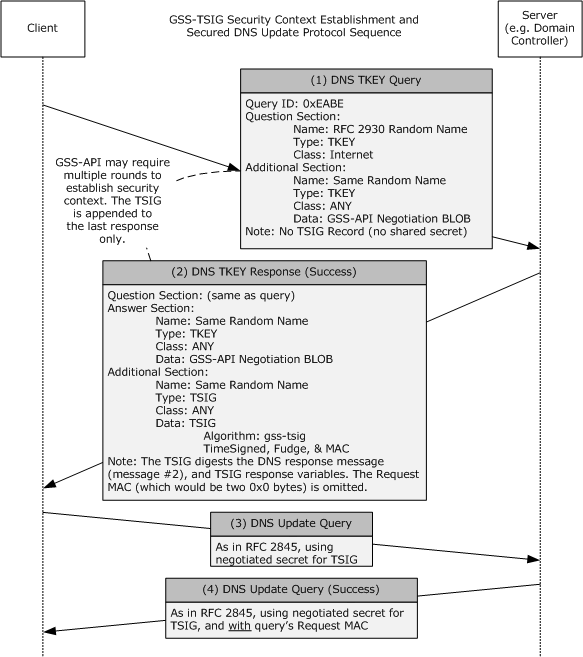
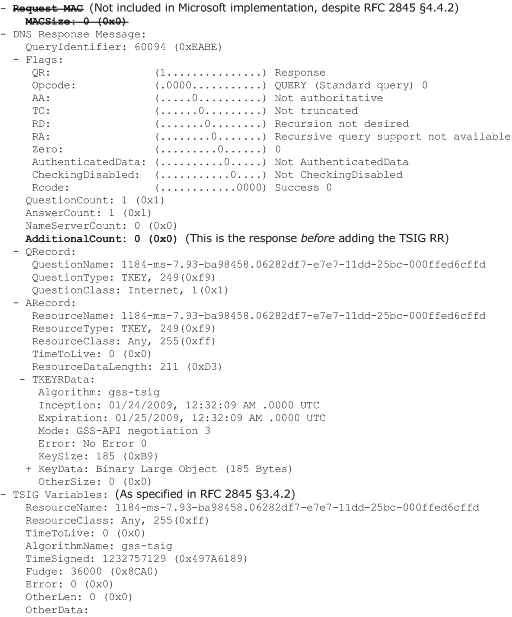
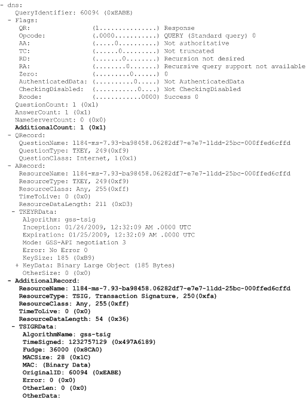

# [MS-GSSA]: Generic Security Service Algorithm for Secret Key Transaction Authentication for DNS (GSS-TSIG) Protocol Extension

Table of Contents

1 Introduction

- [1 Introduction](#Section_1)
  - [1.1 Glossary](#Section_1.1)
  - [1.2 References](#Section_1.2)
    - [1.2.1 Normative References](#Section_1.2.1)
    - [1.2.2 Informative References](#Section_1.2.2)
  - [1.3 Overview](#Section_1.3)
  - [1.4 Relationship to Other Protocols](#Section_1.4)
  - [1.5 Prerequisites/Preconditions](#Section_1.5)
  - [1.6 Applicability Statement](#Section_1.6)
  - [1.7 Versioning and Capability Negotiation](#Section_1.7)
  - [1.8 Vendor-Extensible Fields](#Section_1.8)
  - [1.9 Standards Assignments](#Section_1.9)

2 Messages

- [2 Messages](#Section_2)
  - [2.1 Transport](#Section_2.1)
  - [2.2 Message Syntax](#Section_2.2)

3 Protocol Details

- [3 Protocol Details](#Section_3)
  - [3.1 Common Details](#Section_3.1)
    - [3.1.1 Abstract Data Model](#Section_3.1.1)
    - [3.1.2 Timers](#Section_3.1.2)
    - [3.1.3 Initialization](#Section_3.1.3)
    - [3.1.4 Higher-Layer Triggered Events](#Section_3.1.4)
    - [3.1.5 Message Processing Events and Sequencing Rules](#Section_3.1.5)
      - [3.1.5.1 Handling the MAC Field While Digesting DNS Messages](#Section_3.1.5.1)
      - [3.1.5.2 Support for the HDAC-MD5 Algorithm](#Section_3.1.5.2)
      - [3.1.5.3 Signing DNS Update Response Messages](#Section_3.1.5.3)
      - [3.1.5.4 Domain Name Compression](#Section_3.1.5.4)
    - [3.1.6 Timer Events](#Section_3.1.6)
    - [3.1.7 Other Local Events](#Section_3.1.7)

4 Protocol Examples

- [4 Protocol Examples](#Section_4)

5 Security

- [5 Security](#Section_5)
  - [5.1 Security Considerations for Implementers](#Section_5.1)
  - [5.2 Index of Security Parameters](#Section_5.2)

6 Appendix A: Product Behavior

- [6 Appendix A: Product Behavior](#Section_6)

7 Change Tracking

- [7 Change Tracking](#Section_7)

For the legal notice and IP terms, see [LEGAL.md](../LEGAL.md).
Last updated: 4/23/2024.
See [Revision History](#revision-history) for full version history.

# 1 Introduction

Secret Key Transaction Authentication for DNS (TSIG), as specified in [[RFC2845]](https://go.microsoft.com/fwlink/?LinkId=90388), provides extensible transaction level authentication for DNS. The Generic Security Service Algorithm for Secret Key Transaction Authentication for DNS (GSS-TSIG), as specified in [[RFC3645]](https://go.microsoft.com/fwlink/?LinkId=90440), identifies one possible extension to TSIG based on the Generic Security Service Application Program Interface (GSS-API), as specified in [[RFC2743]](https://go.microsoft.com/fwlink/?LinkId=90378).

This document specifies an extension to GSS-TSIG.

Sections 1.5, 1.8, 1.9, 2, and 3 of this specification are normative. All other sections and examples in this specification are informative.

## 1.1 Glossary

This document uses the following terms:

**Message Authentication Code (MAC)**: A message authenticator computed through the use of a symmetric key. A [**MAC**](#gt_message-authentication-code-mac) algorithm accepts a secret key and a data buffer, and outputs a [**MAC**](#gt_message-authentication-code-mac). The data and [**MAC**](#gt_message-authentication-code-mac) can then be sent to another party, which can verify the integrity and authenticity of the data by using the same secret key and the same [**MAC**](#gt_message-authentication-code-mac) algorithm.

**security support provider (SSP)**: A dynamic-link library (DLL) that implements the Security Support Provider Interface (SSPI) by making one or more security packages available to applications. Each security package provides mappings between an application's SSPI function calls and an actual security model's functions. Security packages support security protocols such as Kerberos authentication and NTLM.

**MAY, SHOULD, MUST, SHOULD NOT, MUST NOT:** These terms (in all caps) are used as defined in [[RFC2119]](https://go.microsoft.com/fwlink/?LinkId=90317). All statements of optional behavior use either MAY, SHOULD, or SHOULD NOT.

## 1.2 References

Links to a document in the Microsoft Open Specifications library point to the correct section in the most recently published version of the referenced document. However, because individual documents in the library are not updated at the same time, the section numbers in the documents may not match. You can confirm the correct section numbering by checking the [Errata](https://go.microsoft.com/fwlink/?linkid=850906).

### 1.2.1 Normative References

We conduct frequent surveys of the normative references to assure their continued availability. If you have any issue with finding a normative reference, please contact [dochelp@microsoft.com](mailto:dochelp@microsoft.com). We will assist you in finding the relevant information.

[RFC1123] Braden, R., "Requirements for Internet Hosts - Application and Support", RFC 1123, October 1989, [https://www.rfc-editor.org/info/rfc1123](https://go.microsoft.com/fwlink/?LinkId=90268)

[RFC2119] Bradner, S., "Key words for use in RFCs to Indicate Requirement Levels", BCP 14, RFC 2119, March 1997, [https://www.rfc-editor.org/info/rfc2119](https://go.microsoft.com/fwlink/?LinkId=90317)

[RFC2136] Thomson, S., Rekhter Y. and Bound, J., "Dynamic Updates in the Domain Name System (DNS UPDATE)", RFC 2136, April 1997, [https://www.rfc-editor.org/info/rfc2136](https://go.microsoft.com/fwlink/?LinkId=107017)

[RFC2743] Linn, J., "Generic Security Service Application Program Interface Version 2, Update 1", RFC 2743, January 2000, [https://www.rfc-editor.org/info/rfc2743](https://go.microsoft.com/fwlink/?LinkId=90378)

[RFC2845] Vixie, P., Gudmundsson, O., Eastlake III, D., and Wellington, B., "Secret Key Transaction Authentication for DNS (TSIG)", RFC 2845, May 2000, [https://www.rfc-editor.org/info/rfc2845](https://go.microsoft.com/fwlink/?LinkId=90388)

[RFC2930] Eastlake III, D., "Secret Key Establishment for DNS (TKEY RR)", RFC 2930, September 2000, [https://www.rfc-editor.org/info/rfc2930](https://go.microsoft.com/fwlink/?LinkId=90397)

[RFC3645] Kwan, S., Garg, P., Gilroy, J., Esibov, L., Westhead, J., and Hall, R., "Generic Security Service Algorithm for Secret Key Transaction Authentication for DNS (GSS-TSIG)", RFC 3645, October 2003, [https://www.rfc-editor.org/info/rfc3645](https://go.microsoft.com/fwlink/?LinkId=90440)

### 1.2.2 Informative References

None.

## 1.3 Overview

Secret Key Transaction Authentication for DNS (TSIG), as specified in [[RFC2845]](https://go.microsoft.com/fwlink/?LinkId=90388), is an extensible protocol by which DNS messages can be authenticated and validated. The Generic Security Service Algorithm for Secret Key Transaction Authentication for DNS (GSS-TSIG), as specified in [[RFC3645]](https://go.microsoft.com/fwlink/?LinkId=90440), defines an algorithm for use with TSIG, which is based on the Generic Security Service Application Program Interface, as specified in [[RFC2743]](https://go.microsoft.com/fwlink/?LinkId=90378).

In [RFC3645] section 2.2, GSS-TSIG specifies that the final transaction key (TKEY) response indicating successful negotiation has to be signed. In [RFC2845] section 3.4, TSIG specifies which data is to be digested when generating or verifying the contents of a TSIG record. This protocol extension defines an alternate method of building the digest that is used to sign the last message in the GSS-TSIG TKEY negotiation.

## 1.4 Relationship to Other Protocols

This specification defines an extension to GSS-TSIG, as specified in [[RFC3645]](https://go.microsoft.com/fwlink/?LinkId=90440). The relationship of GSS-TSIG to other protocols is not changed by this protocol extension.

## 1.5 Prerequisites/Preconditions

All prerequisites and preconditions applicable to GSS-TSIG, as specified in [[RFC3645]](https://go.microsoft.com/fwlink/?LinkId=90440), apply to this protocol extension.

## 1.6 Applicability Statement

This protocol extension does not change the way in which GSS-TSIG, as specified in [[RFC3645]](https://go.microsoft.com/fwlink/?LinkId=90440), is used.

## 1.7 Versioning and Capability Negotiation

None.

## 1.8 Vendor-Extensible Fields

None.

## 1.9 Standards Assignments

None.

# 2 Messages

This protocol extension does not change the format of messages defined by GSS-TSIG, as specified in [[RFC3645]](https://go.microsoft.com/fwlink/?LinkId=90440). The format of messages remains the same, although the contents of the TSIG record attached to the final TKEY response in the negotiation are changed.

## 2.1 Transport

This protocol extension does not change the base transport used by GSS-TSIG, as specified in [[RFC3645]](https://go.microsoft.com/fwlink/?LinkId=90440).

## 2.2 Message Syntax

This document does not specify any new messages.

# 3 Protocol Details

## 3.1 Common Details

### 3.1.1 Abstract Data Model

None.

### 3.1.2 Timers

None.

### 3.1.3 Initialization

This protocol extension does not require any initialization that is not already required by GSS-TSIG, as specified in [[RFC3645]](https://go.microsoft.com/fwlink/?LinkId=90440).

### 3.1.4 Higher-Layer Triggered Events

None.

### 3.1.5 Message Processing Events and Sequencing Rules

This protocol extension does not change message processing events or sequencing rules of messages defined by GSS-TSIG, as specified in [[RFC3645]](https://go.microsoft.com/fwlink/?LinkId=90440), beyond the changes described in the following sections.

#### 3.1.5.1 Handling the MAC Field While Digesting DNS Messages

GSS-TSIG, as specified in [[RFC3645]](https://go.microsoft.com/fwlink/?LinkId=90440), specifies how the client and server exchange tokens obtained from GSS-API calls (as specified in [[RFC2743]](https://go.microsoft.com/fwlink/?LinkId=90378)). The tokens are contained in DNS TKEY records, as specified in [[RFC2930]](https://go.microsoft.com/fwlink/?LinkId=90397). In [RFC3645] section 4.1.3, GSS-TSIG specifies that the server MUST sign the final TKEY response in GSS-TSIG negotiation.

In [[RFC2845]](https://go.microsoft.com/fwlink/?LinkId=90388) section 3.4.3, TSIG specifies that the request [**message authentication code (MAC)**](#gt_message-authentication-code-mac) is to be included in the digest when generating or validating a DNS message. However, because the final TKEY response in the GSS-TSIG is the first DNS message in the exchange that has been signed, there is no request MAC that can be included when performing the digest operation.

When there is no request MAC, the most obvious interpretation of [RFC2845] section 3.4.3 is that the 2-byte MAC length with a value of zero be included in the digest to indicate that no MAC data bytes are being included in the digest. This protocol extension specifies that when building the digest for this message, the request MAC MUST be completely omitted. In other words, the request MAC length and request MAC data fields MUST NOT be included in the digest, so the only components of the digest will be the DNS response message and TSIG response variables.

After GSS-TSIG negotiation is complete, the digesting of further DNS messages MUST include the request MAC, as specified in [RFC2845] section 3.4.

#### 3.1.5.2 Support for the HDAC-MD5 Algorithm

[[RFC2845]](https://go.microsoft.com/fwlink/?LinkId=90388) section 2.2 specifies that TSIG MUST support the "HMAC-MD5" algorithm. GSS-API does not explicitly define the [**MAC**](#gt_message-authentication-code-mac) formats supported. Instead it relies on the [**security support provider (SSP)**](#gt_security-support-provider-ssp) that is exposed by the operating system. Implementations of this protocol extension MUST NOT support the "HMAC-MD5.SIG-ALG.REG.INT" algorithm in [RFC2845] section 7. Implementations of this protocol extension MUST support the "gss-tsig" algorithm, as specified in [[RFC3645]](https://go.microsoft.com/fwlink/?LinkId=90440) section 3.1.2.

#### 3.1.5.3 Signing DNS Update Response Messages

As described in [[RFC2136]](https://go.microsoft.com/fwlink/?LinkId=107017) section 3.8, the DNS server MUST send a DNS update response back to the DNS client after processing a DNS update request. If the DNS update request is signed and includes a TSIG record, as specified in [[RFC3645]](https://go.microsoft.com/fwlink/?LinkId=90440) and [[RFC2845]](https://go.microsoft.com/fwlink/?LinkId=90388) section 4, then the DNS server SHOULD<1> sign the DNS update response and include the resulting TSIG record as described in [RFC3645].

#### 3.1.5.4 Domain Name Compression

As described in [[RFC1123]](https://go.microsoft.com/fwlink/?LinkId=90268) section 6.1.2.4, name servers MUST use compression in responses. For the TSIG resource record in DNS response messages, compression is not supported.

### 3.1.6 Timer Events

None.

### 3.1.7 Other Local Events

None.

# 4 Protocol Examples

Examples that clarify the difference between a strict interpretation of the relevant RFCs and the Microsoft implementation are included in the figures in this section.

Figure 1: Example of a protocol sequence

Figure 2: Example of Message #2 input to the GSS_GetMIC TSIG generation function

Figure 3: Example of Message #2, as it appears on the wire

# 5 Security

## 5.1 Security Considerations for Implementers

None.

## 5.2 Index of Security Parameters

None.

# 6 Appendix A: Product Behavior

The information in this specification is applicable to the following Microsoft products or supplemental software. References to product versions include updates to those products.

- Windows 2000 operating system
- Windows XP operating system
- Windows Server 2003 operating system
- Windows Vista operating system
- Windows Server 2008 operating system
- Windows 7 operating system
- Windows Server 2008 R2 operating system
- Windows 8 operating system
- Windows Server 2012 operating system
- Windows 8.1 operating system
- Windows Server 2012 R2 operating system
- Windows 10 operating system
- Windows Server 2016 operating system
- Windows Server operating system
- Windows Server 2019 operating system
- Windows Server 2022 operating system
- Windows 11 operating system
- Windows Server 2025 operating system
Exceptions, if any, are noted in this section. If an update version, service pack or Knowledge Base (KB) number appears with a product name, the behavior changed in that update. The new behavior also applies to subsequent updates unless otherwise specified. If a product edition appears with the product version, behavior is different in that product edition.

Unless otherwise specified, any statement of optional behavior in this specification that is prescribed using the terms "SHOULD" or "SHOULD NOT" implies product behavior in accordance with the SHOULD or SHOULD NOT prescription. Unless otherwise specified, the term "MAY" implies that the product does not follow the prescription.

<1> Section 3.1.5.3: In the Windows implementation of the DNS server, the DNS client will find that the DNS server signed a DNS update response, as described in [[RFC3645]](https://go.microsoft.com/fwlink/?LinkId=90440), only if the RCODE value in the response message is zero (indicating success).

If the RCODE value in the DNS update response message is not zero (indicating failure), the DNS client will find that the DNS server did not sign the response. Instead, the DNS server copied the DNS update request message, changed the RCODE value to the applicable nonzero error value, and sent that message back to the DNS client as the response. The message was otherwise unmodified; that is, the response message contains the same signature that was in the request message.

# 7 Change Tracking

This section identifies changes that were made to this document since the last release. Changes are classified as Major, Minor, or None.

The revision class **Major** means that the technical content in the document was significantly revised. Major changes affect protocol interoperability or implementation. Examples of major changes are:

- A document revision that incorporates changes to interoperability requirements.
- A document revision that captures changes to protocol functionality.
The revision class **Minor** means that the meaning of the technical content was clarified. Minor changes do not affect protocol interoperability or implementation. Examples of minor changes are updates to clarify ambiguity at the sentence, paragraph, or table level.

The revision class **None** means that no new technical changes were introduced. Minor editorial and formatting changes may have been made, but the relevant technical content is identical to the last released version.

The changes made to this document are listed in the following table. For more information, please contact [dochelp@microsoft.com](mailto:dochelp@microsoft.com).

| Section | Description | Revision class |
| --- | --- | --- |
| [6](#Section_6) Appendix A: Product Behavior | Added Windows Server 2025 to the list of applicable products. | Major |

## Revision History

| Date | Version | Revision Class | Comments |
| --- | --- | --- | --- |
| 4/3/2007 | 1.0 | New | Version 1.0 release |
| 5/11/2007 | 1.2 | Minor | Version 1.2 release |
| 6/1/2007 | 1.2.1 | Editorial | Changed language and formatting in the technical content. |
| 7/3/2007 | 1.3 | Minor | Clarified the meaning of the technical content. |
| 8/10/2007 | 1.3.1 | Editorial | Changed language and formatting in the technical content. |
| 9/28/2007 | 1.3.2 | Editorial | Changed language and formatting in the technical content. |
| 10/23/2007 | 1.3.3 | Editorial | Changed language and formatting in the technical content. |
| 1/25/2008 | 1.3.4 | Editorial | Changed language and formatting in the technical content. |
| 3/14/2008 | 1.3.5 | Editorial | Changed language and formatting in the technical content. |
| 6/20/2008 | 1.3.6 | Editorial | Changed language and formatting in the technical content. |
| 7/25/2008 | 1.3.7 | Editorial | Changed language and formatting in the technical content. |
| 8/29/2008 | 1.3.8 | Editorial | Changed language and formatting in the technical content. |
| 10/24/2008 | 1.3.9 | Editorial | Changed language and formatting in the technical content. |
| 12/5/2008 | 2.0 | Major | Updated and revised the technical content. |
| 1/16/2009 | 3.0 | Major | Updated and revised the technical content. |
| 2/27/2009 | 4.0 | Major | Updated and revised the technical content. |
| 4/10/2009 | 4.0.1 | Editorial | Changed language and formatting in the technical content. |
| 5/22/2009 | 4.0.2 | Editorial | Changed language and formatting in the technical content. |
| 7/2/2009 | 4.0.3 | Editorial | Changed language and formatting in the technical content. |
| 8/14/2009 | 4.0.4 | Editorial | Changed language and formatting in the technical content. |
| 9/25/2009 | 4.0.5 | Editorial | Changed language and formatting in the technical content. |
| 11/6/2009 | 4.0.6 | Editorial | Changed language and formatting in the technical content. |
| 12/18/2009 | 4.0.7 | Editorial | Changed language and formatting in the technical content. |
| 1/29/2010 | 4.0.8 | Editorial | Changed language and formatting in the technical content. |
| 3/12/2010 | 4.0.9 | Editorial | Changed language and formatting in the technical content. |
| 4/23/2010 | 4.0.10 | Editorial | Changed language and formatting in the technical content. |
| 6/4/2010 | 4.0.11 | Editorial | Changed language and formatting in the technical content. |
| 7/16/2010 | 4.0.11 | None | No changes to the meaning, language, or formatting of the technical content. |
| 8/27/2010 | 4.0.11 | None | No changes to the meaning, language, or formatting of the technical content. |
| 10/8/2010 | 4.0.11 | None | No changes to the meaning, language, or formatting of the technical content. |
| 11/19/2010 | 4.0.11 | None | No changes to the meaning, language, or formatting of the technical content. |
| 1/7/2011 | 4.0.11 | None | No changes to the meaning, language, or formatting of the technical content. |
| 2/11/2011 | 4.0.11 | None | No changes to the meaning, language, or formatting of the technical content. |
| 3/25/2011 | 4.0.11 | None | No changes to the meaning, language, or formatting of the technical content. |
| 5/6/2011 | 4.0.11 | None | No changes to the meaning, language, or formatting of the technical content. |
| 6/17/2011 | 4.1 | Minor | Clarified the meaning of the technical content. |
| 9/23/2011 | 4.1 | None | No changes to the meaning, language, or formatting of the technical content. |
| 12/16/2011 | 5.0 | Major | Updated and revised the technical content. |
| 3/30/2012 | 6.0 | Major | Updated and revised the technical content. |
| 7/12/2012 | 6.0 | None | No changes to the meaning, language, or formatting of the technical content. |
| 10/25/2012 | 6.0 | None | No changes to the meaning, language, or formatting of the technical content. |
| 1/31/2013 | 6.0 | None | No changes to the meaning, language, or formatting of the technical content. |
| 8/8/2013 | 7.0 | Major | Updated and revised the technical content. |
| 11/14/2013 | 7.0 | None | No changes to the meaning, language, or formatting of the technical content. |
| 2/13/2014 | 7.0 | None | No changes to the meaning, language, or formatting of the technical content. |
| 5/15/2014 | 7.0 | None | No changes to the meaning, language, or formatting of the technical content. |
| 6/30/2015 | 8.0 | Major | Significantly changed the technical content. |
| 10/16/2015 | 8.0 | None | No changes to the meaning, language, or formatting of the technical content. |
| 7/14/2016 | 8.0 | None | No changes to the meaning, language, or formatting of the technical content. |
| 6/1/2017 | 9.0 | Major | Significantly changed the technical content. |
| 9/15/2017 | 10.0 | Major | Significantly changed the technical content. |
| 12/1/2017 | 10.0 | None | No changes to the meaning, language, or formatting of the technical content. |
| 9/12/2018 | 11.0 | Major | Significantly changed the technical content. |
| 4/7/2021 | 12.0 | Major | Significantly changed the technical content. |
| 6/25/2021 | 13.0 | Major | Significantly changed the technical content. |
| 4/23/2024 | 14.0 | Major | Significantly changed the technical content. |
