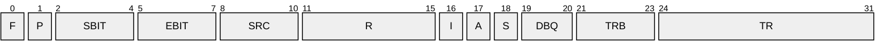
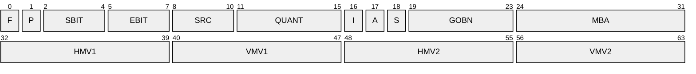

# [MS-H26XPF]: Real-Time Transport Protocol (RTP/RTCP): H.261 and H.263 Video Streams Extensions

Table of Contents

1 Introduction

- [1 Introduction](#Section_1)
  - [1.1 Glossary](#Section_1.1)
  - [1.2 References](#Section_1.2)
    - [1.2.1 Normative References](#Section_1.2.1)
    - [1.2.2 Informative References](#Section_1.2.2)
  - [1.3 Overview](#Section_1.3)
  - [1.4 Relationship to Other Protocols](#Section_1.4)
  - [1.5 Prerequisites/Preconditions](#Section_1.5)
  - [1.6 Applicability Statement](#Section_1.6)
  - [1.7 Versioning and Capability Negotiation](#Section_1.7)
  - [1.8 Vendor-Extensible Fields](#Section_1.8)
  - [1.9 Standards Assignments](#Section_1.9)

2 Messages

- [2 Messages](#Section_2)
  - [2.1 Transport](#Section_2.1)
  - [2.2 Message Syntax](#Section_2.2)
    - [2.2.1 H.261 Payload Header](#Section_2.2.1)
    - [2.2.2 H.263 Payload Header, RFC Mode](#Section_2.2.2)
    - [2.2.3 H.263 Payload Header, Draft Mode](#Section_2.2.3)
      - [2.2.3.1 Mode A](#Section_2.2.3.1)
      - [2.2.3.2 Mode B](#Section_2.2.3.2)

3 Protocol Details

- [3 Protocol Details](#Section_3)
  - [3.1 Client and Server Role Details](#Section_3.1)
    - [3.1.1 Abstract Data Model](#Section_3.1.1)
      - [3.1.1.1 H.261 Payload Format](#Section_3.1.1.1)
      - [3.1.1.2 H.263 Payload Formats](#Section_3.1.1.2)
    - [3.1.2 Timers](#Section_3.1.2)
    - [3.1.3 Initialization](#Section_3.1.3)
    - [3.1.4 Higher-Layer Triggered Events](#Section_3.1.4)
    - [3.1.5 Message Processing Events and Sequencing Rules](#Section_3.1.5)
    - [3.1.6 Timer Events](#Section_3.1.6)
    - [3.1.7 Other Local Events](#Section_3.1.7)

4 Protocol Examples

- [4 Protocol Examples](#Section_4)
  - [4.1 H.261 Payload Header, Intraframe](#Section_4.1)
  - [4.2 H.263 Payload Header in Draft Mode, Mode B, Interframe](#Section_4.2)
  - [4.3 H.261 Payload Header, Interframe](#Section_4.3)
  - [4.4 H.263 Payload Header in RFC Mode, Mode A, Intraframe](#Section_4.4)
  - [4.5 H.263 Payload Header in RFC Mode, Mode A, Interframe](#Section_4.5)
  - [4.6 H.263 Payload Header in RFC Mode, Mode B, Intraframe](#Section_4.6)
  - [4.7 H.263 Payload Header in RFC Mode, Mode B, Interframe](#Section_4.7)
  - [4.8 H.263 Payload Header in Draft Mode, Mode A, Intraframe](#Section_4.8)
  - [4.9 H.263 Payload Header in Draft Mode, Mode A, Interframe](#Section_4.9)
  - [4.10 H.263 Payload Header in Draft Mode, Mode B, Intraframe](#Section_4.10)

5 Security

- [5 Security](#Section_5)
  - [5.1 Security Considerations for Implementers](#Section_5.1)
  - [5.2 Index of Security Parameters](#Section_5.2)

6 Appendix A: Product Behavior

- [6 Appendix A: Product Behavior](#Section_6)

7 Change Tracking

- [7 Change Tracking](#Section_7)

For the legal notice and IP terms, see [LEGAL.md](../LEGAL.md).
Last updated: 6/1/2017.
See [Revision History](#revision-history) for full version history.

# 1 Introduction

This is a specification of the Real-Time Transport Protocol (RTP/RTCP): H.261 and H.263 Video Streams Extensions (H26XPF).

H26XPF is an extension to the RTP payload format for H.261 video streams [[RFC2032]](https://go.microsoft.com/fwlink/?LinkId=114015) and the RTP payload format for H.263 video streams [[RFC2190]](https://go.microsoft.com/fwlink/?LinkId=114016). It is used to transmit and receive H.261 or H.263 video streams in a two-party peer-to-peer call.

Sections 1.5, 1.8, 1.9, 2, and 3 of this specification are normative. All other sections and examples in this specification are informative.

## 1.1 Glossary

This document uses the following terms:

**big-endian**: Multiple-byte values that are byte-ordered with the most significant byte stored in the memory location with the lowest address.

**bitstream**: The transmission of binary digits as a simple, unstructured sequence of bits.

**Common Interface Format (CIF)**: For H.263, a picture consisting of 352x288 pixels for [**luminance**](#gt_luminance) and 176x144 pixels for chrominance.

**Common Intermediate Format (CIF)**: A picture format, described in the H.263 standard, that is used to specify the horizontal and vertical resolutions of pixels in YCbCr sequences in video signals.

**draft mode**: A mode that is specified by H26XPF video streams extensions for encapsulating H.263 video streams. Draft mode is used in conjunction with the H.323 [[H323]](https://go.microsoft.com/fwlink/?LinkId=93033) application layer control protocol, and it supports an H.263 payload header format that is different from the format in RFC mode.

**group of blocks (GOB)**: For H.263, k*16 lines, where k equals 1 for [**QCIF**](#gt_quarter-common-interface-format-qcif), and [**CIF**](#gt_common-intermediate-format-cif).

**group of blocks number (GOBN)**: [**GOB**](#gt_group-of-blocks-gob) number in effect at the start of the packet.

**interframe**: A video frame that is intercoded, also called a P-Frame or P-picture. Refer to [[H261]](https://go.microsoft.com/fwlink/?LinkId=114017) and [[H263]](https://go.microsoft.com/fwlink/?LinkId=114018) for details concerning P-picture.

**intraframe**: A video frame that is intracoded, also called an I-Frame or I-picture. Refer to [H261] and [H263] for details concerning I-picture.

**luminance**: The luminous intensity of a surface in a given direction per unit of projected area.

**macro block (MB)**: A macro block consists of four blocks of [**luminance**](#gt_luminance) and the spatially corresponding two blocks of chrominance. Each block is arranged in an 8x8 pixel configuration.

**mode A**: The H.263 mode A payload header, which consists of four bytes, and is present before the actual compression of the H.263 video bitstream in a packet. It allows for fragmentation at [**GOB**](#gt_group-of-blocks-gob) boundaries.

**mode B**: The H.263 mode B payload header, which consists of eight bytes, and starts at the [**luminance**](#gt_luminance) boundaries without the [**PB-frames**](#gt_pb-frame) option.

**mode C**: The H.263 mode C payload header, which consists of twelve bytes to support fragmentation at [**macro block (MB)**](#gt_macro-block-mb) boundaries for frames that are coded with the [**PB-frames**](#gt_pb-frame) option.

**PB-Frame**: A P frame and a B frame, which are coded into one bitstream with macro blocks from the two frames interleaved. In a packet, an [**MB**](#gt_macro-block-mb) from the P frame and an [**MB**](#gt_macro-block-mb) from the B frame must be treated together, because each [**MB**](#gt_macro-block-mb) for the B frame is coded based on the corresponding [**MB**](#gt_macro-block-mb) for the P frame. A means must be provided to ensure proper rendering of two frames in the right order. Additionally, if any part of this combined bitstream is lost, it will affect both frames, and possibly more.

**quantization**: The process of approximating the continuous set of values in the image data with a finite set of values.

**Quarter Common Interface Format (QCIF)**: For H.263, a picture consisting of 176x144 pixels for [**luminance**](#gt_luminance) and 88x72 pixels for chrominance.

**RFC Mode**: A mode that is specified by H26XPF video streams extensions for encapsulating H.263 video streams. RFC mode is used in conjunction with the Session Initiation Protocol (SIP) [MS-SIP](../MS-SIP/MS-SIP.md) application layer control protocol, and it supports an H.263 payload header format that is different from the format in [**draft mode**](#gt_draft-mode).

**Sub Quarter Common Interface Format (SQCIF)**: For H.263, a picture consisting of 128x96 pixels for [**luminance**](#gt_luminance) and 64x48 pixels for chrominance.

**MAY, SHOULD, MUST, SHOULD NOT, MUST NOT:** These terms (in all caps) are used as defined in [[RFC2119]](https://go.microsoft.com/fwlink/?LinkId=90317). All statements of optional behavior use either MAY, SHOULD, or SHOULD NOT.

## 1.2 References

Links to a document in the Microsoft Open Specifications library point to the correct section in the most recently published version of the referenced document. However, because individual documents in the library are not updated at the same time, the section numbers in the documents may not match. You can confirm the correct section numbering by checking the [Errata](http://msdn.microsoft.com/en-us/library/dn781092.aspx).

### 1.2.1 Normative References

We conduct frequent surveys of the normative references to assure their continued availability. If you have any issue with finding a normative reference, please contact [dochelp@microsoft.com](mailto:dochelp@microsoft.com). We will assist you in finding the relevant information.

[MS-RTPME] Microsoft Corporation, "[Real-Time Transport Protocol (RTP/RTCP): Microsoft Extensions](#Section_2.1)".

[RFC2032] Turletti, T., and Huitema, C., "RTP Payload Format for H.261 Video Streams", RFC 2032, Oct. 1996, [http://www.ietf.org/rfc/rfc2032.txt](https://go.microsoft.com/fwlink/?LinkId=114015)

[RFC2119] Bradner, S., "Key words for use in RFCs to Indicate Requirement Levels", BCP 14, RFC 2119, March 1997, [http://www.rfc-editor.org/rfc/rfc2119.txt](https://go.microsoft.com/fwlink/?LinkId=90317)

[RFC2190] Zhu, C., "RTP Payload Format for H.263 Video Streams", RFC 2190, September 1997, [http://www.rfc-editor.org/rfc/rfc2190.txt](https://go.microsoft.com/fwlink/?LinkId=114016)

### 1.2.2 Informative References

[H245] ITU-T, "Control protocol for multimedia communication", Recommendation H.245, May 2006, [http://www.itu.int/rec/T-REC-H.245/en](https://go.microsoft.com/fwlink/?LinkId=93032)

[H261] ITU-T, "Video codec for audiovisual services at p x 64 kbit/s", Recommendation H.261, March 1993, [http://www.itu.int/rec/T-REC-H.261/en](https://go.microsoft.com/fwlink/?LinkId=114017)

[H263] ITU-T, "Video coding for low bit rate communication", Recommendation H.263, January 2005, [http://www.itu.int/rec/T-REC-H.263/en](https://go.microsoft.com/fwlink/?LinkId=114018)

[H323] ITU-T, "Packet-based multimedia communications systems", Recommendation H.323, June 2006, [http://www.itu.int/rec/T-REC-H.323-200606-S/en](https://go.microsoft.com/fwlink/?LinkId=93033)

[MS-SDP] Microsoft Corporation, "[Session Description Protocol (SDP) Extensions](../MS-SDP/MS-SDP.md)".

[MS-SIP] Microsoft Corporation, "[Session Initiation Protocol Extensions](../MS-SIP/MS-SIP.md)".

## 1.3 Overview

H26XPF specifies the payload format for encapsulating an H.261 [[H261]](https://go.microsoft.com/fwlink/?LinkId=114017) [**bitstream**](#gt_bitstream) and two payload formats for encapsulating an H.263 [[H263]](https://go.microsoft.com/fwlink/?LinkId=114018) bitstream in the Real-Time Transport Protocol (RTP/RTCP): Microsoft Extensions [MS-RTPME](#Section_2.1).

The payload format for H.261 video streams is an extension to the H.261 payload format [[RFC2032]](https://go.microsoft.com/fwlink/?LinkId=114015). RTP is used to carry H.261 payloads. The Session Description Protocol (SDP) [MS-SDP](../MS-SDP/MS-SDP.md) and H.245 [[H245]](https://go.microsoft.com/fwlink/?LinkId=93032) are used to negotiate codec usage.

The payload formats for H.263 video streams are an extension to the H.263 payload format [[RFC2190]](https://go.microsoft.com/fwlink/?LinkId=114016). H26XPF specifies two modes for encapsulating H.263 video streams: [**RFC mode**](#gt_rfc-mode) and [**draft mode**](#gt_draft-mode). RFC mode supports [**mode A**](#gt_mode-a) and [**mode B**](#gt_mode-b) of the H.263 video payload header with some constraints. The payload format for H.263 video streams in draft mode differs from RFC mode in that it supports a different H.263 payload header format. RTP is used to carry H.263 payloads.

RFC mode of the H.263 payload format is used in conjunction with the Session Initiation Protocol (SIP) [MS-SIP](../MS-SIP/MS-SIP.md) application layer control protocol. SDP is used to negotiate codec usage with SIP. Draft mode of the H.263 payload format is used in conjunction with the H.323 [[H323]](https://go.microsoft.com/fwlink/?LinkId=93033) application layer control protocol. H.245 is used to negotiate codec usage with H.323.

## 1.4 Relationship to Other Protocols

H26XPF extends the base protocol for the H.261 payload format [[RFC2032]](https://go.microsoft.com/fwlink/?LinkId=114015) and the base protocol for the H.263 payload format [[RFC2190]](https://go.microsoft.com/fwlink/?LinkId=114016). It carries a payload consisting of an H.261 [**bitstream**](#gt_bitstream) or an H.263 bitstream in the formats specified in [[H261]](https://go.microsoft.com/fwlink/?LinkId=114017) or [[H263]](https://go.microsoft.com/fwlink/?LinkId=114018) and, in turn, it is carried as a payload of the RTP extensions specified in [MS-RTPME](#Section_2.1).

## 1.5 Prerequisites/Preconditions

H26XPF specifies only the payload formats for H.261 or H.263 video streams. It requires the establishment of an RTP stream, a mechanism for obtaining H.261 or H.263 video frames for it to convert to packets, and a mechanism for rendering H.261 or H.263 video frames that are converted to packets.

H26XPF requires an upper layer to select only one of the three payload formats explicitly.

## 1.6 Applicability Statement

H26XPF can only be used to transform H.261 or H.263 video frames into packets.

## 1.7 Versioning and Capability Negotiation

H26XPF has no versioning or capability negotiation constraints beyond those specified in [[RFC2032]](https://go.microsoft.com/fwlink/?LinkId=114015) and [[RFC2190]](https://go.microsoft.com/fwlink/?LinkId=114016).

## 1.8 Vendor-Extensible Fields

None.

## 1.9 Standards Assignments

H26XPF has no standards assignments beyond those specified in [[RFC2032]](https://go.microsoft.com/fwlink/?LinkId=114015) and [[RFC2190]](https://go.microsoft.com/fwlink/?LinkId=114016).

# 2 Messages

## 2.1 Transport

H26XPF is carried as a payload in RTP [MS-RTPME](#Section_2.1) and therefore relies on RTP for providing the means to transport its payload over the network.

## 2.2 Message Syntax

### 2.2.1 H.261 Payload Header

The H.261 payload header is specified in [[RFC2032]](https://go.microsoft.com/fwlink/?LinkId=114015) section 4.1.

### 2.2.2 H.263 Payload Header, RFC Mode

The H.263 payload header that includes [**mode A**](#gt_mode-a), [**mode B**](#gt_mode-b), and [**mode C**](#gt_mode-c) is specified in [[RFC2190]](https://go.microsoft.com/fwlink/?LinkId=114016) section 5. H26XPF imposes the following constraints on values in the H.263 payload header in [**RFC mode**](#gt_rfc-mode):

The **TR** field MUST be ignored.

The **SRC** field MUST be 1 ([**Sub Quarter Common Interface Format (SQCIF)**](#gt_sub-quarter-common-interface-format-sqcif)), 2 ([**Quarter Common Interface Format (QCIF)**](#gt_quarter-common-interface-format-qcif)), or 3 ([**Common Interface Format (CIF)**](#gt_common-interface-format-cif)).

The **U** field MUST be 0.

The **S** field MUST be 0.

The **A** field MUST be 0.

In addition, the **I** field has a different meaning than that specified in [RFC2190]. The value 0 MUST be used for an [**interframe**](#gt_interframe). The value 1 MUST be used for an [**intraframe**](#gt_intraframe).

H26XPF does not support optional [**PB-frames**](#gt_pb-frame) or optional mode C packets. As a result, the value of the **P** field in the payload MUST be 0. The sender MUST NOT send the mode C payload header or the mode A payload header with the **P** field set to 1.

### 2.2.3 H.263 Payload Header, Draft Mode

The fields defined in the H.263 payload header in [**draft mode**](#gt_draft-mode) differ from the payload header in [**RFC mode**](#gt_rfc-mode) in the following ways:

- The orders of the following fields are rearranged: I, A, S, R, HMV1, VMV1, HMV2, and VMV2.
- The sizes of the following fields are different: MBA, HMV1, VMV1, HMV2, VMV2, and R.
- The H.263 payload header in draft mode does not specify a U field.
Details of these differences are specified in the following sections.

#### 2.2.3.1 Mode A

The H.263 [**mode A**](#gt_mode-a) payload header, which consists of 4 bytes, and is present before the actual compression of the H.263 video bitstream in a packet. It allows for fragmentation at [**group of blocks (GOB)**](#gt_group-of-blocks-gob) boundaries.

**F (1 bit):** A flag that indicates the optional [**PB-frames**](#gt_pb-frame) mode, as defined by H.263. For a mode A packet this value MUST be zero.

**P (1 bit):** A flag that indicates the optional PB-frames mode, as defined by H.263. This value MUST be zero.

**SBIT (3 bits):** The start bit position, which specifies the number of bits to be ignored in the first data byte, starting with the most significant.

**EBIT (3 bits):** The end bit position, which specifies the number of bits to be ignored in the last data byte, starting with the least significant.

**SRC (3 bits):** The source format specifies the resolution of the current picture.

| Value | Meaning |
| --- | --- |
| 1 | [**SQCIF**](#gt_sub-quarter-common-interface-format-sqcif) |
| 2 | [**QCIF**](#gt_quarter-common-interface-format-qcif) |
| 3 | [**CIF**](#gt_common-intermediate-format-cif) |

**R (5 bits):** This value MUST be zero.

**I (1 bit):** Picture coding type.

| Value | Meaning |
| --- | --- |
| 0 | Intercoded. |
| 1 | Intracoded. |

**A (1 bit):** This value MUST be zero.

**S (1 bit):** This value MUST be zero.

**DBQ (2 bits):** Differential [**quantization**](#gt_quantization) parameter used to calculate the quantizer for the B frame based on the quantizer for the P frame, when PB-Frames option is used. The PB-Frames option is not supported in H26XPF. This value MUST be zero.

**TRB (3 bits):** Temporal Reference for the B frame as defined by [[H263]](https://go.microsoft.com/fwlink/?LinkId=114018). The PB-Frames option is not supported in H26XPF. This value MUST be zero.

**TR (1 byte):** Temporal Reference for the P frame as defined by [H263]. The PB-Frames option is not supported in H26XPF. This value MUST be ignored.

#### 2.2.3.2 Mode B

The H.263 [**mode B**](#gt_mode-b) payload header, which consists of 8 bytes and starts at the [**luminance**](#gt_luminance) boundaries without the [**PB-frames**](#gt_pb-frame) option.

**F (1 bit):** The mode of the payload header. This value MUST be one.

**P (1 bit):** Optional PB-frames mode as defined by the H.263. This value MUST be zero.

**SBIT (3 bits):** The start bit position, which specifies the number of bits to be ignored in the first data byte, starting with the most significant.

**EBIT (3 bits):** The end bit position, which specifies the number of bits to be ignored in the last data byte, starting with the least significant.

**SRC (3 bits):** The source format specifies the resolution of the current picture.

| Value | Meaning |
| --- | --- |
| 1 | [**SQCIF**](#gt_sub-quarter-common-interface-format-sqcif) |
| 2 | [**QCIF**](#gt_quarter-common-interface-format-qcif) |
| 3 | [**CIF**](#gt_common-intermediate-format-cif) |

**QUANT (5 bits):** [**Quantization**](#gt_quantization) value for the first [**macro block (MB)**](#gt_macro-block-mb) coded at the start of the packet. Set to zero if the packet begins with a [**GOB**](#gt_group-of-blocks-gob) header.

**I (1 bit):** Picture coding type.

| Value | Meaning |
| --- | --- |
| 0 | Intercoded. |
| 1 | Intracoded. |

**A (1 bit):** This value MUST be zero.

**S (1 bit):** This value MUST be zero.

**GOBN (5 bits):** The [**group of blocks number (GOBN)**](#gt_group-of-blocks-number-gobn) value is defined by the inherent resolution.

**MBA (1 byte):** The address within the GOB of the first MB in the packet, counting form zero in scan order.

**HMV1 (1 byte):** Horizontal vector predictor for the first MB in this packet.

**VMV1 (1 byte):** Vertical vector predictor for the first MB in this packet.

**HMV2 (1 byte):** Horizontal motion vector predictors for the third MB in this packet.

**VMV2 (1 byte):** Vertical motion vector predictors for the third MB in this packet.

# 3 Protocol Details

## 3.1 Client and Server Role Details

H26XPF does not have any role-specific behavior. The behavior specified in this section applies to both client and server roles.

### 3.1.1 Abstract Data Model

This section describes a conceptual model of possible data organization that an implementation maintains to participate in this protocol. The described organization is provided to facilitate the explanation of how the protocol behaves. This document does not mandate that implementations adhere to this model as long as their external behavior is consistent with those described.

#### 3.1.1.1 H.261 Payload Format

An H.261 video frame is fragmented and converted to packets using the mechanism specified in [[RFC2032]](https://go.microsoft.com/fwlink/?LinkId=114015) and in this document.

An H.261 video frame is constructed by concatenating H.261 video payload data of all RTP packets for the video frame.

H.261 video packets are considered to be complete if they satisfy the following condition:

- An H.261 I-Frame SHOULD be sent every 15 seconds.
**Note** The above conceptual data can be implemented using a variety of techniques. An implementation is at liberty to implement such data in any way it pleases.

#### 3.1.1.2 H.263 Payload Formats

The description in this section applies to the H.263 payload headers in both [**RFC mode**](#gt_rfc-mode) and [**draft mode**](#gt_draft-mode). An H.263 payload is carried within RTP packets; the Real-Time Transport Protocol (RTP/RTCP): Microsoft Extensions ([MS-RTPME](#Section_2.1) section 2.2.1) specifies how to identify packets containing H.263 payloads.

An H.263 video frame is fragmented and converted to packets using the mechanism specified in [[RFC2190]](https://go.microsoft.com/fwlink/?LinkId=114016) and in this document.

An H.263 video frame is constructed by concatenating all H.263 video payload data of all RTP packets for the video frame.

H.263 video packets are considered to be complete if they satisfy the following condition:

- An H.263 I-Frame SHOULD be sent every 15 seconds.
**Note** The above conceptual data can be implemented using a variety of techniques. An implementation is at liberty to implement such data in any way it pleases.

### 3.1.2 Timers

H26XPF has no additional timers beyond those specified in [[RFC2032]](https://go.microsoft.com/fwlink/?LinkId=114015) and [[RFC2190]](https://go.microsoft.com/fwlink/?LinkId=114016).

### 3.1.3 Initialization

H26XPF has no additional initialization requirements beyond those specified in [[RFC2032]](https://go.microsoft.com/fwlink/?LinkId=114015) and [[RFC2190]](https://go.microsoft.com/fwlink/?LinkId=114016).

### 3.1.4 Higher-Layer Triggered Events

H26XPF has no additional higher-layer triggered events beyond those specified in [[RFC2032]](https://go.microsoft.com/fwlink/?LinkId=114015) and [[RFC2190]](https://go.microsoft.com/fwlink/?LinkId=114016).

### 3.1.5 Message Processing Events and Sequencing Rules

H26XPF has no additional message processing events or sequencing rules beyond those specified in [[RFC2032]](https://go.microsoft.com/fwlink/?LinkId=114015) and [[RFC2190]](https://go.microsoft.com/fwlink/?LinkId=114016).

### 3.1.6 Timer Events

H26XPF has no additional timer events beyond those specified in [[RFC2032]](https://go.microsoft.com/fwlink/?LinkId=114015) and [[RFC2190]](https://go.microsoft.com/fwlink/?LinkId=114016).

### 3.1.7 Other Local Events

H26XPF has no additional local events beyond those specified in [[RFC2032]](https://go.microsoft.com/fwlink/?LinkId=114015) and [[RFC2190]](https://go.microsoft.com/fwlink/?LinkId=114016).

# 4 Protocol Examples

The field names in the payload headers used in this section are defined in [[RFC2032]](https://go.microsoft.com/fwlink/?LinkId=114015), [[RFC2190]](https://go.microsoft.com/fwlink/?LinkId=114016), or in this document.

## 4.1 H.261 Payload Header, Intraframe

Consider the following payload header in [**big-endian**](#gt_big-endian) byte order.

0x9B, 0x00, 0x00, 0x00

This corresponds to payload header fields with the following values.

| Bit Range | Field | Description |
| --- | --- | --- |
| Variable | SBIT | 4 |
| Variable | EBIT | 6 |
| Variable | I | 1 ([**intraframe**](#gt_intraframe)) |
| Variable | V | 1 |
| Variable | GOBN | 0 |
| Variable | MBAP | 0 |
| Variable | QUANT | 0 |
| Variable | HMVD | 0 |
| Variable | VMVD | 0 |

The following code snippet expands the payload header to include the RTP packet that contains the payload:

0x40, 0x41, 0x22, 0x22, 0x00, 0x00, 0xFF, 0xFF, 0x00, 0x00, 0x00, 0x01, 0x9B, 0x00, 0x00, 0x00

In this case, the definition of the RTP header [MS-RTPME](#Section_2.1) is the following:

| Bit Range | Field | Description |
| --- | --- | --- |
| Variable | P | 0 |
| Variable | X | 0 |
| Variable | CC | 0 |
| Variable | M | 0 |
| Variable | PT | 65 |
| Variable | Sequence Number | 8738 |
| Variable | timestamp | 65535 |
| Variable | SSRC | 1 |

## 4.2 H.263 Payload Header in Draft Mode, Mode B, Interframe

Consider the following payload header in [**big-endian**](#gt_big-endian) byte order.

0x9C, 0x66, 0x80, 0x06, 0x00, 0x00, 0x00, 0x00

This corresponds to payload header fields with the following values.

| Bit Range | Field | Description |
| --- | --- | --- |
| Variable | F | 1 |
| Variable | P | 0 |
| Variable | SBIT | 3 |
| Variable | EBIT | 4 |
| Variable | SRC | 3 ([**CIF**](#gt_common-intermediate-format-cif)) |
| Variable | QUANT | 6 |
| 0 ([**interframe**](#gt_interframe)) | I | - |
| Variable | A | 0 |
| Variable | S | 0 |
| Variable | GOBN | 0 |
| Variable | MBA | 6 |
| Variable | HMV1 | 0 |
| Variable | VMV1 | 0 |
| Variable | HMV2 | 0 |
| Variable | VMV2 | 0 |

The following code snippet expands the payload header to include the RTP packet that contains the payload:

0x40, 0x41, 0x22, 0x22, 0x00, 0x00, 0xFF, 0xFF, 0x00, 0x00, 0x00, 0x01, 0x9C, 0x66, 0x80, 0x06, 0x00, 0x00, 0x00, 0x00

In this case, the definition of the RTP header [MS-RTPME](#Section_2.1) is the following:

| Bit Range | Field | Description |
| --- | --- | --- |
| Variable | P | 0 |
| Variable | X | 0 |
| Variable | CC | 0 |
| Variable | M | 0 |
| Variable | PT | 65 |
| Variable | Sequence Number | 8738 |
| Variable | timestamp | 65535 |
| Variable | SSRC | 1 |

The H.263 payload is recognized by the PT (payload type) field, with the value being negotiated in H.245 [[H245]](https://go.microsoft.com/fwlink/?LinkId=93032).

## 4.3 H.261 Payload Header, Interframe

Consider the following payload header in [**big-endian**](#gt_big-endian) byte order.

0xB1, 0x00, 0x00, 0x00

This corresponds to payload header fields with the following values.

| Bit Range | Field | Description |
| --- | --- | --- |
| Variable | SBIT | 5 |
| Variable | EBIT | 4 |
| 0 ([**interframe**](#gt_interframe)) | I | - |
| Variable | V | 1 |
| Variable | GOBN | 0 |
| Variable | MBAP | 0 |
| Variable | QUANT | 0 |
| Variable | HMVD | 0 |
| Variable | VMVD | 0 |

## 4.4 H.263 Payload Header in RFC Mode, Mode A, Intraframe

Consider the following payload header in [**big-endian**](#gt_big-endian) byte order.

0x05, 0x70, 0x00, 0x01

This corresponds to payload header fields with the following values.

| Bit Range | Field | Description |
| --- | --- | --- |
| Variable | F | 0 |
| Variable | P | 0 |
| Variable | SBIT | 0 |
| Variable | EBIT | 5 |
| Variable | SRC | 3 ([**CIF**](#gt_common-intermediate-format-cif)) |
| Variable | I | 1 ([**intraframe**](#gt_intraframe)) |
| Variable | U | 0 |
| Variable | S | 0 |
| Variable | A | 0 |
| Variable | R | 0 |
| Variable | DBQ | 0 |
| Variable | TRB | 0 |
| Variable | TR | 1 |

The following code snippet expands the payload header to include the RTP packet that contains the payload:

0x40, 0x41, 0x22, 0x22, 0x00, 0x00, 0xFF, 0xFF, 0x00, 0x00, 0x00, 0x01, 0x9C, 0x66, 0x80, 0x06, 0x00, 0x00, 0x00, 0x00

In this case, the definition of the RTP header [MS-RTPME](#Section_2.1) is the following:

| Bit Range | Field | Description |
| --- | --- | --- |
| Variable | P | 0 |
| Variable | X | 0 |
| Variable | CC | 0 |
| Variable | M | 0 |
| Variable | PT | 65 |
| Variable | Sequence Number | 8738 |
| Variable | timestamp | 65535 |
| Variable | SSRC | 1 |

The H.263 payload is recognized by the PT (payload type) field, with the value being negotiated in SDP [MS-SDP](../MS-SDP/MS-SDP.md).

## 4.5 H.263 Payload Header in RFC Mode, Mode A, Interframe

Consider the following payload header in [**big-endian**](#gt_big-endian) byte order.

0x02, 0x60, 0x00, 0x02

This corresponds to payload header fields with the following values.

| Bit Range | Field | Description |
| --- | --- | --- |
| Variable | F | 0 |
| Variable | P | 0 |
| Variable | SBIT | 0 |
| Variable | EBIT | 2 |
| Variable | SRC | 3 ([**CIF**](#gt_common-intermediate-format-cif)) |
| 0 ([**interframe**](#gt_interframe)) | I | - |
| Variable | U | 0 |
| Variable | S | 0 |
| Variable | A | 0 |
| Variable | R | 0 |
| Variable | DBQ | 0 |
| Variable | TRB | 0 |
| Variable | TR | 2 |

## 4.6 H.263 Payload Header in RFC Mode, Mode B, Intraframe

Consider the following payload header in [**big-endian**](#gt_big-endian) byte order.

0xBD, 0x67, 0x00, 0x14, 0x80, 0x00, 0x00, 0x00

This corresponds to payload header fields with the following values.

| Bit Range | Field | Description |
| --- | --- | --- |
| Variable | F | 1 |
| Variable | P | 0 |
| Variable | SBIT | 7 |
| Variable | EBIT | 5 |
| Variable | SRC | 3 ([**CIF**](#gt_common-intermediate-format-cif)) |
| Variable | QUANT | 7 |
| Variable | GOBN | 0 |
| Variable | MBA | 5 |
| Variable | R | 0 |
| Variable | I | 1 ([**intraframe**](#gt_intraframe)) |
| Variable | U | 0 |
| Variable | S | 0 |
| Variable | A | 0 |
| Variable | HMV1 | 0 |
| Variable | VMV1 | 0 |
| Variable | HMV2 | 0 |
| Variable | VMV2 | 0 |

## 4.7 H.263 Payload Header in RFC Mode, Mode B, Interframe

Consider the following payload header in [**big-endian**](#gt_big-endian) byte order.

0xA1, 0x67, 0x00, 0x18, 0x0F, 0x00, 0x80, 0x00

This corresponds to payload header fields with the following values.

| Bit Range | Field | Description |
| --- | --- | --- |
| Variable | F | 1 |
| Variable | P | 0 |
| Variable | SBIT | 4 |
| Variable | EBIT | 1 |
| Variable | SRC | 3 ([**CIF**](#gt_common-intermediate-format-cif)) |
| Variable | QUANT | 7 |
| Variable | GOBN | 0 |
| Variable | MBA | 6 |
| Variable | R | 0 |
| 0 ([**interframe**](#gt_interframe)) | I | - |
| Variable | U | 0 |
| Variable | S | 0 |
| Variable | A | 0 |
| Variable | HMV1 | 120 |
| Variable | VMV1 | 2 |
| Variable | HMV2 | 0 |
| Variable | VMV2 | 0 |

## 4.8 H.263 Payload Header in Draft Mode, Mode A, Intraframe

Consider the following payload header in [**big-endian**](#gt_big-endian) byte order.

0x00, 0x40, 0x80, 0x00

This corresponds to payload header fields with the following values.

| Bit Range | Field | Description |
| --- | --- | --- |
| Variable | F | 0 |
| Variable | P | 0 |
| Variable | SBIT | 0 |
| Variable | EBIT | 0 |
| 2 ([**QCIF**](#gt_quarter-common-interface-format-qcif)) | SRC | - |
| Variable | R | 0 |
| Variable | I | 1 ([**intraframe**](#gt_intraframe)) |
| Variable | A | 0 |
| Variable | S | 0 |
| Variable | DBQ | 0 |
| Variable | TRB | 0 |
| Variable | TR | 0 |

## 4.9 H.263 Payload Header in Draft Mode, Mode A, Interframe

Consider the following payload header in [**big-endian**](#gt_big-endian) byte order.

0x00, 0x40, 0x00, 0x05

This corresponds to payload header fields with the following values.

| Bit Range | Field | Description |
| --- | --- | --- |
| Variable | F | 0 |
| Variable | P | 0 |
| Variable | SBIT | 0 |
| Variable | EBIT | 0 |
| 2 ([**QCIF**](#gt_quarter-common-interface-format-qcif)) | SRC | - |
| Variable | R | 0 |
| 0 ([**interframe**](#gt_interframe)) | I | - |
| Variable | A | 0 |
| Variable | S | 0 |
| Variable | DBQ | 0 |
| Variable | TRB | 0 |
| Variable | TR | 5 |

## 4.10 H.263 Payload Header in Draft Mode, Mode B, Intraframe

Consider the following payload header in [**big-endian**](#gt_big-endian) byte order.

0xBD, 0x67, 0x80, 0x05, 0x00, 0x00, 0x00, 0x00

This corresponds to payload header fields with the following values.

| Bit Range | Field | Description |
| --- | --- | --- |
| Variable | F | 1 |
| Variable | P | 0 |
| Variable | SBIT | 7 |
| Variable | EBIT | 5 |
| Variable | SRC | 3 ([**CIF**](#gt_common-intermediate-format-cif)) |
| Variable | QUANT | 7 |
| Variable | I | 1 ([**intraframe**](#gt_intraframe)) |
| Variable | A | 0 |
| Variable | S | 0 |
| Variable | GOBN | 0 |
| Variable | MBA | 5 |
| Variable | HMV1 | 0 |
| Variable | VMV1 | 0 |
| Variable | HMV2 | 0 |
| Variable | VMV2 | 0 |

# 5 Security

## 5.1 Security Considerations for Implementers

H26XPF has no additional security considerations beyond those specified in [[RFC2032]](https://go.microsoft.com/fwlink/?LinkId=114015) and [[RFC2190]](https://go.microsoft.com/fwlink/?LinkId=114016).

## 5.2 Index of Security Parameters

None.

# 6 Appendix A: Product Behavior

The information in this specification is applicable to the following Microsoft products or supplemental software. References to product versions include released service packs.

- Windows 2000 operating system
- Windows XP operating system
- Windows Server 2003 operating system
Exceptions, if any, are noted below. If a service pack or Quick Fix Engineering (QFE) number appears with the product version, behavior changed in that service pack or QFE. The new behavior also applies to subsequent service packs of the product unless otherwise specified. If a product edition appears with the product version, behavior is different in that product edition.

Unless otherwise specified, any statement of optional behavior in this specification that is prescribed using the terms "SHOULD" or "SHOULD NOT" implies product behavior in accordance with the SHOULD or SHOULD NOT prescription. Unless otherwise specified, the term "MAY" implies that the product does not follow the prescription.

# 7 Change Tracking

No table of changes is available. The document is either new or has had no changes since its last release.

## Revision History

| Date | Version | Revision Class | Comments |
| --- | --- | --- | --- |
| 4/8/2008 | 0.1 | New | Version 0.1 release |
| 5/16/2008 | 0.1.1 | Editorial | Changed language and formatting in the technical content. |
| 6/20/2008 | 0.1.2 | Editorial | Changed language and formatting in the technical content. |
| 7/25/2008 | 0.1.3 | Editorial | Changed language and formatting in the technical content. |
| 8/29/2008 | 0.1.4 | Editorial | Changed language and formatting in the technical content. |
| 10/24/2008 | 0.1.5 | Editorial | Changed language and formatting in the technical content. |
| 12/5/2008 | 0.2 | Minor | Clarified the meaning of the technical content. |
| 1/16/2009 | 1.0 | Major | Updated and revised the technical content. |
| 2/27/2009 | 1.0.1 | Editorial | Changed language and formatting in the technical content. |
| 4/10/2009 | 1.0.2 | Editorial | Changed language and formatting in the technical content. |
| 5/22/2009 | 1.0.3 | Editorial | Changed language and formatting in the technical content. |
| 7/2/2009 | 1.0.4 | Editorial | Changed language and formatting in the technical content. |
| 8/14/2009 | 1.0.5 | Editorial | Changed language and formatting in the technical content. |
| 9/25/2009 | 1.1 | Minor | Clarified the meaning of the technical content. |
| 11/6/2009 | 1.1.1 | Editorial | Changed language and formatting in the technical content. |
| 12/18/2009 | 1.1.2 | Editorial | Changed language and formatting in the technical content. |
| 1/29/2010 | 1.1.3 | Editorial | Changed language and formatting in the technical content. |
| 3/12/2010 | 1.1.4 | Editorial | Changed language and formatting in the technical content. |
| 4/23/2010 | 1.1.5 | Editorial | Changed language and formatting in the technical content. |
| 6/4/2010 | 1.1.6 | Editorial | Changed language and formatting in the technical content. |
| 7/16/2010 | 1.1.6 | None | No changes to the meaning, language, or formatting of the technical content. |
| 8/27/2010 | 1.1.6 | None | No changes to the meaning, language, or formatting of the technical content. |
| 10/8/2010 | 1.1.6 | None | No changes to the meaning, language, or formatting of the technical content. |
| 11/19/2010 | 1.1.6 | None | No changes to the meaning, language, or formatting of the technical content. |
| 1/7/2011 | 1.1.6 | None | No changes to the meaning, language, or formatting of the technical content. |
| 2/11/2011 | 1.1.6 | None | No changes to the meaning, language, or formatting of the technical content. |
| 3/25/2011 | 1.1.6 | None | No changes to the meaning, language, or formatting of the technical content. |
| 5/6/2011 | 1.1.6 | None | No changes to the meaning, language, or formatting of the technical content. |
| 6/17/2011 | 1.2 | Minor | Clarified the meaning of the technical content. |
| 9/23/2011 | 1.3 | Minor | Clarified the meaning of the technical content. |
| 12/16/2011 | 1.3 | None | No changes to the meaning, language, or formatting of the technical content. |
| 3/30/2012 | 1.3 | None | No changes to the meaning, language, or formatting of the technical content. |
| 7/12/2012 | 1.3 | None | No changes to the meaning, language, or formatting of the technical content. |
| 10/25/2012 | 1.3 | None | No changes to the meaning, language, or formatting of the technical content. |
| 1/31/2013 | 1.3 | None | No changes to the meaning, language, or formatting of the technical content. |
| 8/8/2013 | 1.3 | None | No changes to the meaning, language, or formatting of the technical content. |
| 11/14/2013 | 1.3 | None | No changes to the meaning, language, or formatting of the technical content. |
| 2/13/2014 | 1.3 | None | No changes to the meaning, language, or formatting of the technical content. |
| 5/15/2014 | 1.3 | None | No changes to the meaning, language, or formatting of the technical content. |
| 6/30/2015 | 1.3 | None | No changes to the meaning, language, or formatting of the technical content. |
| 10/16/2015 | 1.3 | None | No changes to the meaning, language, or formatting of the technical content. |
| 7/14/2016 | 1.3 | None | No changes to the meaning, language, or formatting of the technical content. |
| 6/1/2017 | 1.3 | None | No changes to the meaning, language, or formatting of the technical content. |
