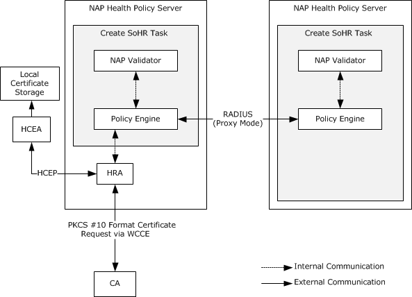
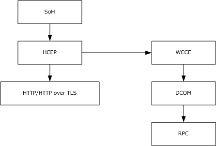
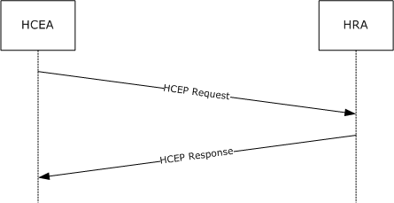

# [MS-HCEP]: Health Certificate Enrollment Protocol

Table of Contents

1 Introduction

- [1 Introduction](#Section_1)
  - [1.1 Glossary](#Section_1.1)
  - [1.2 References](#Section_1.2)
    - [1.2.1 Normative References](#Section_1.2.1)
    - [1.2.2 Informative References](#Section_1.2.2)
  - [1.3 Overview](#Section_1.3)
  - [1.4 Relationship to Other Protocols](#Section_1.4)
  - [1.5 Prerequisites/Preconditions](#Section_1.5)
  - [1.6 Applicability Statement](#Section_1.6)
  - [1.7 Versioning and Capability Negotiation](#Section_1.7)
  - [1.8 Vendor-Extensible Fields](#Section_1.8)
  - [1.9 Standards Assignments](#Section_1.9)

2 Messages

- [2 Messages](#Section_2)
  - [2.1 Transport](#Section_2.1)
  - [2.2 Message Syntax](#Section_2.2)
    - [2.2.1 HCEP Request](#Section_2.2.1)
      - [2.2.1.1 Standard HTTP Message Header Fields](#Section_2.2.1.1)
      - [2.2.1.2 HTTP Message Header Fields Introduced by HCEP](#Section_2.2.1.2)
      - [2.2.1.3 HTTP Message Body Used in an HCEP Request](#Section_2.2.1.3)
      - [2.2.1.4 Health Certificate Request](#Section_2.2.1.4)
    - [2.2.2 HCEP Response](#Section_2.2.2)
      - [2.2.2.1 Standard HTTP Message Header Fields](#Section_2.2.2.1)
      - [2.2.2.2 HTTP Message Header Fields Introduced by HCEP](#Section_2.2.2.2)
      - [2.2.2.3 HTTP Message Body Used in an HCEP Response (HTTP OK Response)](#Section_2.2.2.3)
      - [2.2.2.4 Health Certificate Response](#Section_2.2.2.4)
    - [2.2.3 Certificate Request OIDs](#Section_2.2.3)
      - [2.2.3.1 napPolicyInformationCompliantOid](#Section_2.2.3.1)
      - [2.2.3.2 napPolicyInformationNotCompliantOid](#Section_2.2.3.2)
      - [2.2.3.3 napPolicyInformationIsolationStateOid](#Section_2.2.3.3)
      - [2.2.3.4 napPolicyInformationExtendedStateOid](#Section_2.2.3.4)
      - [2.2.3.5 napHealthyOid](#Section_2.2.3.5)
      - [2.2.3.6 napUnhealthyOid](#Section_2.2.3.6)
      - [2.2.3.7 napSoHOid](#Section_2.2.3.7)

3 Protocol Details

- [3 Protocol Details](#Section_3)
  - [3.1 Client Details](#Section_3.1)
    - [3.1.1 Abstract Data Model](#Section_3.1.1)
    - [3.1.2 Timers](#Section_3.1.2)
    - [3.1.3 Initialization](#Section_3.1.3)
    - [3.1.4 Higher-Layer Triggered Events](#Section_3.1.4)
    - [3.1.5 Message Processing Events and Sequencing Rules](#Section_3.1.5)
      - [3.1.5.1 Sending an HCEP Request](#Section_3.1.5.1)
      - [3.1.5.2 Processing an HCEP Response](#Section_3.1.5.2)
    - [3.1.6 Timer Events](#Section_3.1.6)
    - [3.1.7 Other Local Events](#Section_3.1.7)
    - [3.1.8 Client-Side Error Handling](#Section_3.1.8)
  - [3.2 Server Details](#Section_3.2)
    - [3.2.1 Abstract Data Model](#Section_3.2.1)
    - [3.2.2 Timers](#Section_3.2.2)
    - [3.2.3 Initialization](#Section_3.2.3)
    - [3.2.4 Higher-Layer Triggered Events](#Section_3.2.4)
    - [3.2.5 Message Processing Events and Sequencing Rules](#Section_3.2.5)
      - [3.2.5.1 Validating an HCEP Request](#Section_3.2.5.1)
      - [3.2.5.2 Processing an HCEP Request](#Section_3.2.5.2)
      - [3.2.5.3 Creating and Sending an HCEP Response](#Section_3.2.5.3)
      - [3.2.5.4 Creating Health Certificate Request by HRA](#Section_3.2.5.4)
    - [3.2.6 Timer Events](#Section_3.2.6)
    - [3.2.7 Other Local Events](#Section_3.2.7)
    - [3.2.8 Error Handling](#Section_3.2.8)

4 Protocol Examples

- [4 Protocol Examples](#Section_4)

5 Security

- [5 Security](#Section_5)
  - [5.1 Security Considerations for Implementers](#Section_5.1)
  - [5.2 Index of Security Parameters](#Section_5.2)

6 Appendix A: Product Behavior

- [6 Appendix A: Product Behavior](#Section_6)

7 Change Tracking

- [7 Change Tracking](#Section_7)

For the legal notice and IP terms, see [LEGAL.md](../LEGAL.md).
Last updated: 6/1/2017.
See [Revision History](#revision-history) for full version history.

# 1 Introduction

This document specifies the Health Certificate Enrollment Protocol. The Health Certificate Enrollment Protocol is a remote procedure call (RPC) interface that allows a network endpoint to obtain digital certificates. These certificates are conditionally issued based on the compliance of that endpoint with security policy defined for the network.

Sections 1.5, 1.8, 1.9, 2, and 3 of this specification are normative. All other sections and examples in this specification are informative.

## 1.1 Glossary

This document uses the following terms:

**Active Directory domain**: A domain hosted on Active Directory. For more information, see [MS-ADTS](../MS-ADTS/MS-ADTS.md).

**ASN.1**: Abstract Syntax Notation One. ASN.1 is used to describe Kerberos datagrams as a sequence of components, sent in messages. ASN.1 is described in the following specifications: [[ITUX660]](https://go.microsoft.com/fwlink/?LinkId=89922) for general procedures; [[ITUX680]](https://go.microsoft.com/fwlink/?LinkId=89923) for syntax specification, and [[ITUX690]](https://go.microsoft.com/fwlink/?LinkId=89924) for the Basic Encoding Rules (BER), Canonical Encoding Rules (CER), and [**Distinguished Encoding Rules (DER)**](#gt_distinguished-encoding-rules-der) encoding rules.

**base64 encoding**: A binary-to-text encoding scheme whereby an arbitrary sequence of bytes is converted to a sequence of printable ASCII characters, as described in [[RFC4648]](https://go.microsoft.com/fwlink/?LinkId=90487).

**certificate chain**: A sequence of certificates, where each certificate in the sequence is signed by the subsequent certificate. The last certificate in the chain is normally a self-signed certificate.

**certificate enrollment**: The process of acquiring a digital certificate from a [**certificate authority (CA)**](#gt_certification-authority-ca), which typically requires an end entity to first makes itself known to the CA (either directly, or through a registration authority). This certificate and its associated private key establish a trusted identity for an entity that is using the public key–based services and applications. Also referred to as simply "enrollment".

**certification authority (CA)**: A third party that issues public key certificates. Certificates serve to bind public keys to a user identity. Each user and certification authority (CA) can decide whether to trust another user or CA for a specific purpose, and whether this trust should be transitive. For more information, see [[RFC3280]](https://go.microsoft.com/fwlink/?LinkId=90414).

**Cryptographic Application Programming Interface (CAPI)**: Also known as Windows Cryptographic Application Programming Interface, CryptoAPI, and Microsoft Cryptography API. An application programming interface (API) that allows developers who use the Windows operating system to secure Windows-based applications.

**Cryptographic Application Programming Interface (CAPI) or CryptoAPI**: The Microsoft cryptographic application programming interface (API). An API that enables application developers to add authentication, encoding, and encryption to Windows-based applications.

**cryptographic service provider (CSP)**: A software module that implements cryptographic functions for calling applications that generates digital signatures. Multiple [**CSPs**](#gt_cryptographic-service-provider-csp) may be installed. A [**CSP**](#gt_cryptographic-service-provider-csp) is identified by a name represented by a NULL-terminated Unicode string.

**Distinguished Encoding Rules (DER)**: A method for encoding a data object based on Basic Encoding Rules (BER) encoding but with additional constraints. DER is used to encode X.509 certificates that need to be digitally signed or to have their signatures verified.

**enhanced key usage (EKU)**: An extension that is a collection of [**object identifiers (OIDs)**](#gt_object-identifier-oid) that indicate the applications that use the key.

**enroll**: To request and acquire a digital certificate from a [**certificate authority (CA)**](#gt_certification-authority-ca). This is typically accomplished through a [**certificate enrollment**](#gt_certificate-enrollment) process.

**extended key usage (EKU)**: An X.509 certificate extension that indicates one or more purposes for which the certificate can be used.

**fully qualified domain name (FQDN)**: An unambiguous domain name that gives an absolute location in the Domain Name System's (DNS) hierarchy tree, as defined in [[RFC1035]](https://go.microsoft.com/fwlink/?LinkId=90264) section 3.1 and [[RFC2181]](https://go.microsoft.com/fwlink/?LinkId=127732) section 11.

**health certificate**: A digital certificate that is used to authenticate the health status of a Network Access Protection (NAP) client.

**health certificate enrollment agent (HCEA)**: The client-side component in the Health Certificate Enrollment Protocol. The [**HCEA**](#gt_health-certificate-enrollment-agent-hcea) is responsible for receiving [**health certificates**](#gt_health-certificate) from a [**health registration authority (HRA)**](#gt_health-registration-authority-hra). This term can also be used to refer to the client machine in the Health Certificate Enrollment Protocol.

**health policy server**: An entity in a network that has network policies administered on it and that is capable of validating a [**statement of health (SoH)**](#gt_statement-of-health-soh) against the specified policies.

**health registration authority (HRA)**: The server-side component in the Health Certificate Enrollment Protocol. The [**HRA**](#gt_health-registration-authority-hra) is a registration authority (RA) that requests a [**health certificate**](#gt_health-certificate) from a [**certification authority (CA)**](#gt_certification-authority-ca) upon validation of health.

**health state**: An abstract notion of the state of a machine that is used to indicate its compliance with network policies. Some examples of such state would include the state of the firewall on the machine, the version of the virus signature files for an antivirus application, and so on.

**HTTP Internal Server Error**: An [**HTTP**](#gt_hypertext-transfer-protocol-http) response with status code 500, as specified in [[RFC2616]](https://go.microsoft.com/fwlink/?LinkId=90372) section 6.1.1.

**HTTP OK**: An [**HTTP**](#gt_hypertext-transfer-protocol-http) response with status code 200, as described in [RFC2616] section 6.1.1.

**Hypertext Transfer Protocol (HTTP)**: An application-level protocol for distributed, collaborative, hypermedia information systems (text, graphic images, sound, video, and other multimedia files) on the World Wide Web.

**Hypertext Transfer Protocol Secure (HTTPS)**: An extension of HTTP that securely encrypts and decrypts web page requests. In some older protocols, "Hypertext Transfer Protocol over Secure Sockets Layer" is still used (Secure Sockets Layer has been deprecated). For more information, see [[SSL3]](https://go.microsoft.com/fwlink/?LinkId=90534) and [[RFC5246]](https://go.microsoft.com/fwlink/?LinkId=129803).

**Internet Protocol security (IPsec)**: A framework of open standards for ensuring private, secure communications over Internet Protocol (IP) networks through the use of cryptographic security services. IPsec supports network-level peer authentication, data origin authentication, data integrity, data confidentiality (encryption), and replay protection. The Microsoft implementation of IPsec is based on standards developed by the Internet Engineering Task Force (IETF) IPsec working group.

**NAP EC API**: Provides a set of function calls that allow NAP enforcement clients to register with the NAP agent, to request system health status, and to pass system health remediation information to the NAP agent. The [**NAP EC API**](#gt_nap-ec-api) allows vendors to create and install additional NAP ECs. For more information about this API, see [[MSDN-NAPAPI]](https://go.microsoft.com/fwlink/?LinkId=199018).

**object identifier (OID)**: In the context of an object server, a 64-bit number that uniquely identifies an object.

**Public Key Cryptography Standards (PKCS)**: A group of Public Key Cryptography Standards published by RSA Laboratories.

**Remote Authentication Dial-In User Service (RADIUS)**: A protocol for carrying authentication, authorization, and configuration information between a network access server (NAS) that prefers to authenticate connection requests from endpoints and a shared server that performs authentication, authorization, and accounting.

**Rivest-Shamir-Adleman (RSA)**: A system for public key cryptography. [**RSA**](#gt_rivest-shamir-adleman-rsa) is specified in [[PKCS1]](https://go.microsoft.com/fwlink/?LinkId=90248) and [[RFC3447]](https://go.microsoft.com/fwlink/?LinkId=90422).

**statement of health (SoH)**: A collection of data generated by a [**system health entity**](#gt_system-health-entity), as specified in [[TNC-IF-TNCCSPBSoH]](https://go.microsoft.com/fwlink/?LinkId=240054), which defines the [**health state**](#gt_health-state) of a machine. The data is interpreted by a Health Policy Server, which determines whether the machine is healthy or unhealthy according to the policies defined by an administrator.

**statement of health response (SoHR)**: A collection of data that represents the evaluation of the [**statement of health (SoH)**](#gt_statement-of-health-soh) according to network policies, as specified in [TNC-IF-TNCCSPBSoH].

**system health entity**: See system health agent (SHA).

**Uniform Resource Locator (URL)**: A string of characters in a standardized format that identifies a document or resource on the World Wide Web. The format is as specified in [[RFC1738]](https://go.microsoft.com/fwlink/?LinkId=90287).

**user agent**: An HTTP user agent, as specified in [RFC2616].

**MAY, SHOULD, MUST, SHOULD NOT, MUST NOT:** These terms (in all caps) are used as defined in [[RFC2119]](https://go.microsoft.com/fwlink/?LinkId=90317). All statements of optional behavior use either MAY, SHOULD, or SHOULD NOT.

## 1.2 References

Links to a document in the Microsoft Open Specifications library point to the correct section in the most recently published version of the referenced document. However, because individual documents in the library are not updated at the same time, the section numbers in the documents may not match. You can confirm the correct section numbering by checking the [Errata](http://msdn.microsoft.com/en-us/library/dn781092.aspx).

### 1.2.1 Normative References

We conduct frequent surveys of the normative references to assure their continued availability. If you have any issue with finding a normative reference, please contact [dochelp@microsoft.com](mailto:dochelp@microsoft.com). We will assist you in finding the relevant information.

[ITUX680] ITU-T, "Abstract Syntax Notation One (ASN.1): Specification of Basic Notation", Recommendation X.680, July 2002, [http://www.itu.int/ITU-T/studygroups/com17/languages/X.680-0207.pdf](https://go.microsoft.com/fwlink/?LinkId=89923)

[MS-GPNAP] Microsoft Corporation, "[Group Policy: Network Access Protection (NAP) Extension](../MS-GPNAP/MS-GPNAP.md)".

[MS-WCCE] Microsoft Corporation, "[Windows Client Certificate Enrollment Protocol](../MS-WCCE/MS-WCCE.md)".

[RFC20] Cerf, V., "ASCII Format for Network Interchange", RFC 20, October 1969, [http://www.ietf.org/rfc/rfc20.txt](https://go.microsoft.com/fwlink/?LinkId=90306)

[RFC2119] Bradner, S., "Key words for use in RFCs to Indicate Requirement Levels", BCP 14, RFC 2119, March 1997, [http://www.rfc-editor.org/rfc/rfc2119.txt](https://go.microsoft.com/fwlink/?LinkId=90317)

[RFC2246] Dierks, T., and Allen, C., "The TLS Protocol Version 1.0", RFC 2246, January 1999, [http://www.rfc-editor.org/rfc/rfc2246.txt](https://go.microsoft.com/fwlink/?LinkId=90324)

[RFC2315] Kaliski, B., "PKCS #7: Cryptographic Message Syntax Version 1.5", RFC 2315, March 1998, [http://www.ietf.org/rfc/rfc2315.txt](https://go.microsoft.com/fwlink/?LinkId=90334)

[RFC2396] Berners-Lee, T., Fielding, R., and Masinter, L., "Uniform Resource Identifiers (URI): Generic Syntax", RFC 2396, August 1998, [http://www.rfc-editor.org/rfc/rfc2396.txt](https://go.microsoft.com/fwlink/?LinkId=90339)

[RFC2409] Harkins, D. and Carrel, D., "The Internet Key Exchange (IKE)", RFC 2409, November 1998, [http://www.ietf.org/rfc/rfc2409.txt](https://go.microsoft.com/fwlink/?LinkId=90349)

[RFC2616] Fielding, R., Gettys, J., Mogul, J., et al., "Hypertext Transfer Protocol -- HTTP/1.1", RFC 2616, June 1999, [http://www.rfc-editor.org/rfc/rfc2616.txt](https://go.microsoft.com/fwlink/?LinkId=90372)

[RFC2797] Myers, M., Liu, X., Schaad, J., and Weinstein, J., "Certificate Management Messages Over CMS", RFC 2797, April 2000, [http://www.ietf.org/rfc/rfc2797.txt](https://go.microsoft.com/fwlink/?LinkId=90382)

[RFC2818] Rescorla, E., "HTTP Over TLS", RFC 2818, May 2000, [http://www.rfc-editor.org/rfc/rfc2818.txt](https://go.microsoft.com/fwlink/?LinkId=90383)

[RFC2986] Nystrom, M. and Kaliski, B., "PKCS#10: Certificate Request Syntax Specification", RFC 2986, November 2000, [http://www.ietf.org/rfc/rfc2986.txt](https://go.microsoft.com/fwlink/?LinkId=90401)

[RFC3174] Eastlake III, D., and Jones, P., "US Secure Hash Algorithm 1 (SHA1)", RFC 3174, September 2001, [http://www.ietf.org/rfc/rfc3174.txt](https://go.microsoft.com/fwlink/?LinkId=90408)

[RFC3280] Housley, R., Polk, W., Ford, W., and Solo, D., "Internet X.509 Public Key Infrastructure Certificate and Certificate Revocation List (CRL) Profile", RFC 3280, April 2002, [http://www.ietf.org/rfc/rfc3280.txt](https://go.microsoft.com/fwlink/?LinkId=90414)

[RFC3548] Josefsson, S., Ed., "The Base16, Base32, and Base64 Data Encodings", RFC 3548, July 2003, [http://www.rfc-editor.org/rfc/rfc3548.txt](https://go.microsoft.com/fwlink/?LinkId=90432)

[RFC3852] Housley, R., "Cryptographic Message Syntax (CMS)", RFC 3852, July 2004, [http://www.ietf.org/rfc/rfc3852.txt](https://go.microsoft.com/fwlink/?LinkId=90445)

[RFC4559] Jaganathan, K., Zhu, L., and Brezak, J., "SPNEGO-based Kerberos and NTLM HTTP Authentication in Microsoft Windows", RFC 4559, June 2006, [http://www.rfc-editor.org/rfc/rfc4559.txt](https://go.microsoft.com/fwlink/?LinkId=90483)

[TNC-IF-TNCCSPBSoH] TCG, "TNC IF-TNCCS: Protocol Bindings for SoH", version 1.0, May 2007, [https://trustedcomputinggroup.org/tnc-if-tnccs-protocol-bindings-soh/](https://go.microsoft.com/fwlink/?LinkId=240054)

[X509] ITU-T, "Information Technology - Open Systems Interconnection - The Directory: Public-Key and Attribute Certificate Frameworks", Recommendation X.509, August 2005, [http://www.itu.int/rec/T-REC-X.509/en](https://go.microsoft.com/fwlink/?LinkId=90590)

### 1.2.2 Informative References

[IANA-ENT] Internet Assigned Numbers Authority, "Private Enterprise Numbers", January 2007, [http://www.iana.org/assignments/enterprise-numbers](https://go.microsoft.com/fwlink/?LinkId=89883)

[MS-CERSOD] Microsoft Corporation, "[Certificate Services Protocols Overview](../MS-CERSOD/MS-CERSOD.md)".

[MS-RNAP] Microsoft Corporation, "[Vendor-Specific RADIUS Attributes for Network Access Protection (NAP) Data Structure](../MS-RNAP/MS-RNAP.md)".

[MSDN-CAPI] Microsoft Corporation, "Cryptography", [http://msdn.microsoft.com/en-us/library/aa380255.aspx](https://go.microsoft.com/fwlink/?LinkId=89964)

[MSDN-CERTCERTSTR] Microsoft Corporation, "Certificate and Certificate Store Functions", [https://msdn.microsoft.com/en-us/library/aa380252(VS.85).aspx#certificate_and_certificate_store_functions](https://go.microsoft.com/fwlink/?LinkId=525879)

[MSDN-CSP] Microsoft Corporation, "Cryptographic Provider Names", [http://msdn.microsoft.com/en-us/library/aa380243.aspx](https://go.microsoft.com/fwlink/?LinkId=89985)

[MSFT-HRA] Microsoft Corporation, "Configure HRA Automatic Discovery", [http://technet.microsoft.com/en-us/library/dd296901(WS.10).aspx](https://go.microsoft.com/fwlink/?LinkId=210333)

[MSFT-IPSEC] Microsoft Corporation, "IPsec", [http://technet.microsoft.com/en-us/network/bb531150.aspx](https://go.microsoft.com/fwlink/?LinkId=90187)

[RFC2865] Rigney, C., Willens, S., Rubens, A., and Simpson, W., "Remote Authentication Dial In User Service (RADIUS)", RFC 2865, June 2000, [http://www.ietf.org/rfc/rfc2865.txt](https://go.microsoft.com/fwlink/?LinkId=90392)

[RFC3447] Jonsson, J. and Kaliski, B., "Public-Key Cryptography Standards (PKCS) #1: RSA Cryptography Specifications Version 2.1", RFC 3447, February 2003, [http://www.ietf.org/rfc/rfc3447.txt](https://go.microsoft.com/fwlink/?LinkId=90422)

[TPM] Trusted Computing Group, "TPM Work Group", [https://www.trustedcomputinggroup.org/groups/tpm/](https://go.microsoft.com/fwlink/?LinkId=90547)

## 1.3 Overview

Many network administrators maintaining a secure network require that clients accessing their networks comply with policies established for the network. For example, an administrator might require that every client accessing the network have an active firewall. One of the ways that administrators can ensure compliance of network endpoints is to require that clients [**enroll**](#gt_enroll) for a [**health certificate**](#gt_health-certificate). Health certificates encapsulate client compliance with policy in a way that can be presented to interested parties without requiring those parties to perform the validation themselves.

The Health Certificate Enrollment Protocol is designed to accomplish health certificate [**enrollment**](#gt_certificate-enrollment). The client sends a Health Certificate Enrollment Protocol request to a [**health registration authority (HRA)**](#gt_health-registration-authority-hra). The Health Certificate Enrollment Protocol request includes a certificate request and a report of the client's current [**health state**](#gt_health-state). The HRA communicates with [**health policy servers**](#gt_health-policy-server) and [**certification authorities**](#gt_certification-authority-ca) to form and send a Health Certificate Enrollment Protocol response to the client. If the client is compliant, the response contains an issued certificate and the results of the validation of the client's health state against policy.

The Health Certificate Enrollment Protocol has authenticated and unauthenticated modes. In the authenticated mode, the Health Certificate Enrollment Protocol supports authentication of the server, client, or both. Authentication of the server in the Health Certificate Enrollment Protocol is achieved by using the [**Hypertext Transfer Protocol (HTTP)**](#gt_hypertext-transfer-protocol-http) over Transport Layer Security (TLS), as specified in [[RFC2818]](https://go.microsoft.com/fwlink/?LinkId=90383). During the establishment of the TLS channel, as specified in [[RFC2246]](https://go.microsoft.com/fwlink/?LinkId=90324), the server is authenticated by the client. Authentication of the client in the Health Certificate Enrollment Protocol is achieved by using Simple and Protected GSS-API Negotiation Mechanism (SPNEGO)–based Kerberos and NTLM HTTP authentication, as specified in [[RFC4559]](https://go.microsoft.com/fwlink/?LinkId=90483).

The Health Certificate Enrollment Protocol is typically deployed in an environment such as the one in the following figure. The use of a policy engine as a [**Remote Authentication Dial-In User Service (RADIUS)**](#gt_remote-authentication-dial-in-user-service-radius) proxy is an optional configuration in enterprise environments.

Figure 1: Deployment environment for the Health Certificate Enrollment Protocol

In this example, the flow is as follows:

- The [**health certificate enrollment agent (HCEA)**](#gt_health-certificate-enrollment-agent-hcea) sends a Health Certificate Enrollment Protocol request to the HRA. The HRA is identified by the [**Uniform Resource Locator (URL)**](#gt_uniform-resource-locator-url) with which the HCEA is provisioned. The protocol that is specified by the provisioned URL determines whether the HRA is authenticated by using TLS. (HTTP over TLS is equivalent to [**Hypertext Transfer Protocol over Secure Sockets Layer (HTTPS)**](#gt_hypertext-transfer-protocol-secure-https).)
The payload of a Health Certificate Enrollment Protocol request message, sent by the HCEA, contains a [**Public Key Cryptography Standards (PKCS)**](#gt_public-key-cryptography-standards-pkcs) #10 certificate request (as specified in [[RFC2986]](https://go.microsoft.com/fwlink/?LinkId=90401)). The PKCS #10 request contains a [**Statement of Health (SoH)**](#gt_statement-of-health-soh) message, as specified in [[TNC-IF-TNCCSPBSoH]](https://go.microsoft.com/fwlink/?LinkId=240054) section 3.5.

- The HRA sends the SoH to a health policy server for evaluation as per network policies either on an internal interface or over any standard or implementation specific protocol. In the example depicted in the preceding figure showing the deployment environment for the Health Certificate Enrollment Protocol, Remote Authentication Dial-In User Service (RADIUS) is used (for more information, see [[RFC2865]](https://go.microsoft.com/fwlink/?LinkId=90392)) using Microsoft RADIUS Attributes for Network Access Protection (for more information, see [MS-RNAP](../MS-RNAP/MS-RNAP.md)). The health policy server determines the health state of the client and informs the HRA of this.
- If the health state of the client is compliant, the HRA requests a certificate authority (CA) to issue a certificate. The Microsoft implementation of the HRA uses the Windows Client Certificate Enrollment Protocol, as specified in [MS-WCCE](../MS-WCCE/MS-WCCE.md), to request and receive the certificate. If the client's health state is not compliant, the HRA can still request a certificate from the certificate authority with the certificate containing an indication that the client is unhealthy.
- The HRA sends a Health Certificate Enrollment Protocol response.
If the health state of the client is compliant, the payload of the response contains a [**statement of health response (SoHR)**](#gt_statement-of-health-response-sohr) (as specified in [TNC-IF-TNCCSPBSoH]) and a PKCS #7 message (as specified in [[RFC2315]](https://go.microsoft.com/fwlink/?LinkId=90334)) with an X.509 certificate (for more information, see [[X509]](https://go.microsoft.com/fwlink/?LinkId=90590)), as specified in [[RFC3280]](https://go.microsoft.com/fwlink/?LinkId=90414).

If the health state of the client is not compliant, the payload of the response contains an SoHR and can contain a PKCS #7 message containing the certificate.

- The HCEA receives the HCEP response and, if the certificate was included, deposits the certificate in the **PersistedComputerCertificates** ADM element specified in section [3.1.1](#Section_3.1.1).

## 1.4 Relationship to Other Protocols

The Health Certificate Enrollment Protocol uses [**HTTP**](#gt_hypertext-transfer-protocol-http) (as specified in [[RFC2616]](https://go.microsoft.com/fwlink/?LinkId=90372)) or HTTP over TLS (as specified in [[RFC2818]](https://go.microsoft.com/fwlink/?LinkId=90383)) as the transport for its messages. The payload of an HCEP request message that is sent by the [**HCEA**](#gt_health-certificate-enrollment-agent-hcea), contains a [**PKCS**](#gt_public-key-cryptography-standards-pkcs) #10 certificate request (as specified in [[RFC2986]](https://go.microsoft.com/fwlink/?LinkId=90401)), which contains an [**SoH**](#gt_statement-of-health-soh) message (as specified in [[TNC-IF-TNCCSPBSoH]](https://go.microsoft.com/fwlink/?LinkId=240054) section 3.5).

If the client's [**health state**](#gt_health-state) is compliant, the [**health registration authority (HRA)**](#gt_health-registration-authority-hra) requests a [**certificate authority (CA)**](#gt_certification-authority-ca) to issue a certificate. The Microsoft implementation of the HRA uses the Windows Client Certificate Enrollment Protocol [MS-WCCE](../MS-WCCE/MS-WCCE.md) to request and receive the certificate; other implementations can choose different means of communication between HRA and CA. If the client's health state is not compliant, the HRA can still request a certificate from the certificate authority, with the certificate containing an indication that the client is unhealthy.

The HRA sends an HCEP response, the payload of which contains an [**SoHR**](#gt_statement-of-health-response-sohr), as specified in [TNC-IF-TNCCSPBSoH] section 3.6, and if the client is compliant with health policies, it also includes a PKCS #7 message (as specified in [[RFC2315]](https://go.microsoft.com/fwlink/?LinkId=90334)) with possibly an X.509 certificate, as specified in [[RFC3280]](https://go.microsoft.com/fwlink/?LinkId=90414).

Figure 2: Diagram illustrating the relationship between HCEP and other protocols

## 1.5 Prerequisites/Preconditions

For Health Certificate Enrollment Protocol communication to begin, the prerequisite configuration for [**HCEA**](#gt_health-certificate-enrollment-agent-hcea) is as follows:

- The HCEA has to be configured with the list of the [**URL**](#gt_uniform-resource-locator-url)s of the [**HRA**](#gt_health-registration-authority-hra)s via an implementation-dependent method.<1>The protocol that is specified by the specific provisioned URL determines if the respective HRA is authenticated by using TLS. ([**HTTP**](#gt_hypertext-transfer-protocol-http) over TLS is equivalent to [**HTTPS**](#gt_hypertext-transfer-protocol-secure-https).) For more information, see section [1.3](#Section_1.3).
- The HCEA has to be configured with the required security parameters to construct a certificate request that is sent in the Health Certificate Enrollment Protocol request. These include, but are not limited to:
- The algorithm and key length of the public-private key pair associated with the certificate. The HCEA has to support the [**Rivest-Shamir-Adleman (RSA)**](#gt_rivest-shamir-adleman-rsa) algorithm with a key length of 2,048 bits. Other key lengths can<2> be supported. For more information, see [[RFC3447]](https://go.microsoft.com/fwlink/?LinkId=90422).
- The signature algorithm used to sign the certificate request. The HCEA has to support the Secure Hash Algorithm 1 (SHA1), as specified in [[RFC3174]](https://go.microsoft.com/fwlink/?LinkId=90408).
It is preferable for the HCEA and HRA to agree on the algorithm that the Health Certificate Enrollment Protocol uses.<3>

- The HCEA and HRA implementations are required to agree on the same [**object identifier (OID)**](#gt_object-identifier-oid) values for the fields in section [2.2.1.4](#Section_2.2.1.4).<4>
The prerequisite configuration for the HRA is the following:

- If the HRA is configured to authenticate the client, the settings required, as specified in [[RFC4559]](https://go.microsoft.com/fwlink/?LinkId=90483) section 4.1, have to be configured on the HRA.
If the HRA is configured to authenticate the client, the handling of the authentication by the HTTP layer as specified in [RFC4559] is a precondition for processing the HCEP request. The failure of the authentication has to be processed by HTTP in accordance with [RFC4559].

## 1.6 Applicability Statement

The Health Certificate Enrollment Protocol allows a client machine to obtain an X.509 certificate, as specified in [[RFC3280]](https://go.microsoft.com/fwlink/?LinkId=90414), that represents its compliance to policy. Because the Health Certificate Enrollment Protocol relies on the client to make accurate reports of its current state, the protocol is not applicable by itself in environments where compliance of the client needs to be absolutely guaranteed. However, the Health Certificate Enrollment Protocol can<5> be used in such environments if supplemented by the use of hardware credentials or other suitable security mechanisms (for more information, see [[TPM]](https://go.microsoft.com/fwlink/?LinkId=90547)) that can improve the reliability of the client reports.

Applicable uses of such an X.509 certificate include, but are not limited to, certificate-based [**Internet Protocol security (IPsec)**](#gt_internet-protocol-security-ipsec), as specified in [[RFC2409]](https://go.microsoft.com/fwlink/?LinkId=90349). In an IPsec scenario, network administrators can require clients to comply with the network security policies before accessing resources on the network. For example, administrators can configure IPsec policies to require a client to present a [**health certificate**](#gt_health-certificate) to the resource (as an indication of the client compliance with network security policies) before the client can have access to the resource.

## 1.7 Versioning and Capability Negotiation

The Health Certificate Enrollment Protocol does not perform any version detection or capability negotiation by itself since this is the first version.

Although this version of the Health Certificate Enrollment Protocol does not support the concept of versioning, there is a version number field in Health Certificate Enrollment Protocol messages. This field is intended for future use. In the current version of the Health Certificate Enrollment Protocol, implementations are required to set the version field value to "1.0". The fixed value version field (see sections [2.2.1.2](#Section_2.2.1.2) and [2.2.2.2](#Section_2.2.2.2)) is intended to enable future versions of the protocol to negotiate a version that is commonly supported by both [**HCEA**](#gt_health-certificate-enrollment-agent-hcea) and [**HRA**](#gt_health-registration-authority-hra).

## 1.8 Vendor-Extensible Fields

There are no vendor-extensible fields for this protocol.

## 1.9 Standards Assignments

Microsoft has been assigned the [**object identifier (OID)**](#gt_object-identifier-oid) 1.3.6.1.4.1.311 by the Internet Assigned Numbers Authority (IANA), as the Microsoft private enterprise IANA code. (For more information, see [[IANA-ENT]](https://go.microsoft.com/fwlink/?LinkId=89883).)

The Windows implementation of the Health Certificate Enrollment Protocol uses the extension 1.3.6.1.4.1.311.47.1.1 under this OID for identifying the health extension for certificates and certificate requests, as specified in section [2.2.1.4](#Section_2.2.1.4).

# 2 Messages

## 2.1 Transport

Health Certificate Enrollment Protocol messages MUST be transmitted over [**HTTP**](#gt_hypertext-transfer-protocol-http), as specified in [[RFC2616]](https://go.microsoft.com/fwlink/?LinkId=90372), or HTTP over TLS, as specified in [[RFC2818]](https://go.microsoft.com/fwlink/?LinkId=90383). HCEP MUST be encapsulated within these protocols as a POST method (as specified in [RFC2616] section 9.5) to a specific [**URL**](#gt_uniform-resource-locator-url). (The existence of the URL is a precondition of the protocol, as specified in section [1.5](#Section_1.5)). The POST MUST have specific HTTP headers and an entity body (as specified in [RFC2616]) formatted as specified later in section [2.2.1](#Section_2.2.1).

The Health Certificate Enrollment Protocol is encapsulated within and depends on HTTP or HTTP over TLS for delivery of messages. The Health Certificate Enrollment Protocol does not impose any message retransmissions or other requirements on those transports. The choice of the transport is based entirely on the URL present at the [**HCEA**](#gt_health-certificate-enrollment-agent-hcea). For more information about the configuration of the HCEA, see section 1.5.

## 2.2 Message Syntax

All strings that follow are ASCII strings, as specified in [[RFC20]](https://go.microsoft.com/fwlink/?LinkId=90306), and MUST conform to the general [**HTTP**](#gt_hypertext-transfer-protocol-http) rules on string values in headers, as specified in [[RFC2616]](https://go.microsoft.com/fwlink/?LinkId=90372) section 4.2.

### 2.2.1 HCEP Request

The HCEP request is an [**HTTP**](#gt_hypertext-transfer-protocol-http) POST request that is made to a provisioned [**URL**](#gt_uniform-resource-locator-url).

The HCEP request that is encapsulated in HTTP includes a number of fields in the HTTP message header. Some of them are standard fields (as specified in [[RFC2616]](https://go.microsoft.com/fwlink/?LinkId=90372) sections 4.5, 5.3, and 7.1) that must take on specific values; however, others are new fields that are defined by the Health Certificate Enrollment Protocol. These fields MUST follow the rules as specified in [RFC2616] section 4.2.

#### 2.2.1.1 Standard HTTP Message Header Fields

The [**HTTP**](#gt_hypertext-transfer-protocol-http) message headers in the HCEP request MUST include the following fields with these specified values.

**Tokens**

**Pragma:** MUST be "no-cache". This is an HTTP header, as specified in [[RFC2616]](https://go.microsoft.com/fwlink/?LinkId=90372) section 4.5.

**Content-Type:** MUST be "application/healthcertificate-request". This is an HTTP header field, as specified in [RFC2616] section 7.1.

**Content-Length:** MUST be the size in bytes of HTTP message body (as specified in section [2.2.1.3](#Section_2.2.1.3)). This is an HTTP header field, as specified in [RFC2616] section 7.1.

The HTTP message header MAY<6> contain other fields, as specified in [RFC2616]. These fields MAY<7> be ignored by the [**HRA**](#gt_health-registration-authority-hra) during the processing of the HTTP header. An example of such a field is the **User-Agent** field, as specified in [RFC2616] section 14.43:

- User Agent: "NAP IPSec Enforcement v1.0".

#### 2.2.1.2 HTTP Message Header Fields Introduced by HCEP

The [**HTTP**](#gt_hypertext-transfer-protocol-http) message headers in the HCEP request MUST include the following fields.

**Tokens**

**HCEP-Version:** MUST be a string with value "1.0".

**HCEP-Correlation-Id:** This MUST be a Correlation Id that is [**base64**](#gt_179b9392-9019-45a3-880b-26f6890522b7)-encoded (as specified in [[RFC3548]](https://go.microsoft.com/fwlink/?LinkId=90432) section 3). A Correlation Id (as specified in [[TNC-IF-TNCCSPBSoH]](https://go.microsoft.com/fwlink/?LinkId=240054) section 3.8.6) is a 24-byte value that uniquely identifies a Health Certificate Enrollment Protocol transaction originating from the [**HCEA**](#gt_health-certificate-enrollment-agent-hcea). It SHOULD<8> be the same as the Correlation Id that is present in [**SoH**](#gt_statement-of-health-soh), as specified in [TNC-IF-TNCCSPBSoH] section 3.8.

#### 2.2.1.3 HTTP Message Body Used in an HCEP Request

The HCEP request MUST contain an [**HTTP**](#gt_hypertext-transfer-protocol-http) message body, which follows the rules specified in [[RFC2616]](https://go.microsoft.com/fwlink/?LinkId=90372) section 4.3. The value of this message body MUST be an [**ASN.1**](#gt_asn1) [**DER**](#gt_distinguished-encoding-rules-der)–encoded [**health certificate**](#gt_health-certificate) request. The format of the health certificate request MUST be as specified in section [2.2.1.4](#Section_2.2.1.4).

#### 2.2.1.4 Health Certificate Request

The [**health certificate**](#gt_health-certificate) request MUST be in [**PKCS**](#gt_public-key-cryptography-standards-pkcs) #10 format (as specified in [[RFC2986]](https://go.microsoft.com/fwlink/?LinkId=90401)) and be encoded in [**ASN.1**](#gt_asn1) [**Distinguished Encoding Rules (DER)**](#gt_distinguished-encoding-rules-der), as specified in [[ITUX680]](https://go.microsoft.com/fwlink/?LinkId=89923). This MUST be present in an HCEP request. The [**HRA**](#gt_health-registration-authority-hra) processing of the health certificate request is specified in section [3.2.5](#Section_3.2.5). It MUST contain the following parts, as specified in [RFC2986] section 4.

**Tokens**

**subject:** SHOULD be a zero-length string if the **ClientAuthenticationFlag** ADM element specified in section [3.1.1](#Section_3.1.1) is TRUE; otherwise, it SHOULD be the predefined string "Anonymous System Health Authentication", as specified in [[RFC3280]](https://go.microsoft.com/fwlink/?LinkId=90414) section 4.1.2.6.<9>

**subjectPublicKeyInfo:** MUST be a public key for the X.509 certificate, as specified in [RFC3280] section 4.1.

**PKCS #10 Attributes:** The following X.509 certificate extensions are encapsulated as PKCS #10 attributes in the health certificate request. PKCS #10 attributes are as specified in [RFC2986] section 4.1.

**Extended Key Usage:** A health certificate request MUST contain an [**Extended Key Usage (EKU)**](#gt_extended-key-usage-eku) extension (as specified in [RFC3280] section 4.2.1.1) with the [**OID**](#gt_object-identifier-oid) values specified as follows:

- MUST have an OID to indicate that the certificate request is a health certificate request.<10>
- SHOULD have the OID value that indicates id-kp-clientAuth, as specified in [RFC3280] section 4.2.1.13, if the **ClientAuthenticationFlag** ADM element specified in section 3.1.1 is TRUE.<11>
**Subject Alternative Name:** MUST be the [**fully qualified domain name (FQDN)**](#gt_fully-qualified-domain-name-fqdn) of the client if the **ClientAuthenticationFlag** ADM element specified in section 3.1.1 is TRUE. This extension MUST be as specified in [RFC3280] section 4.2.1.7.

**Statement of Health Certificate Extension:** The certificate request MUST have a certificate extension, as specified in [RFC3280]. This certificate extension MUST contain the ASN.1 DER–encoded [**statement of health**](#gt_statement-of-health-soh) data, as specified in section [2.2.3.7](#Section_2.2.3.7).

**Cryptographic Service Provider Certificate Extension:** The certificate request MUST have a certificate extension to specify the name of the [**cryptographic service provider (CSP)**](#gt_cryptographic-service-provider-csp) used to generate the key pair on the [**HCEA**](#gt_health-certificate-enrollment-agent-hcea). This attribute contains the name of the CSP that is used to generate the key pair on the HCEA. The extension and the OID value MUST be as specified in [MS-WCCE](../MS-WCCE/MS-WCCE.md) section 2.2.2.7 that defines the certificate request attributes.<12>

The certificate request MUST be signed to prevent tampering by using one of the preconfigured signature algorithms specified in section [1.5](#Section_1.5). The signature over the certificate request MUST be included in the PKCS #10 message, as specified in [RFC2986].

### 2.2.2 HCEP Response

The HCEP response MUST be an [**HTTP OK**](#gt_http-ok) response (status-code 200), indicating that there are no errors. Other [**HTTP**](#gt_hypertext-transfer-protocol-http) response status codes, as specified in [[RFC2616]](https://go.microsoft.com/fwlink/?LinkId=90372) section 6.1.1, MUST be returned by the server in case of error events, as specified in section [3.1.8](#Section_3.1.8). The client-side handling of errors is specified in section 3.1.8.

The HCEP response that is encapsulated in HTTP includes a number of fields in the HTTP message header. Some are standard fields (as specified in [RFC2616] sections 4.5, 6.2, and 7.1) that must take on specific values; however, others are new fields that are defined by the Health Certificate Enrollment Protocol. These fields MUST follow the rules as specified in [RFC2616] section 4.2.

#### 2.2.2.1 Standard HTTP Message Header Fields

The [**HTTP**](#gt_hypertext-transfer-protocol-http) message headers in the HCEP response MUST include the following fields.

**Tokens**

**Cache-Control:** MUST be "no-cache, must-revalidate" or "must-revalidate, no-cache". This is an HTTP header, as specified in [[RFC2616]](https://go.microsoft.com/fwlink/?LinkId=90372) section 4.5.

**Content-Type:** MUST be "application/healthcertificate-response". This is an HTTP header field, as specified in [RFC2616] section 7.1.

**Content-Length:** MUST be the size of [**ASN.1**](#gt_asn1) [**DER**](#gt_distinguished-encoding-rules-der)–encoded [**health certificate**](#gt_health-certificate) response.

#### 2.2.2.2 HTTP Message Header Fields Introduced by HCEP

The [**HTTP**](#gt_hypertext-transfer-protocol-http) message headers in the HCEP response MUST include the following Tokens.

**Tokens**

**HCEP-Version:** MUST be a string with value "1.0".

**HCEP-Correlation-Id:** This MUST be a Correlation Id that is [**base64**](#gt_179b9392-9019-45a3-880b-26f6890522b7)-encoded (as specified in [[RFC3548]](https://go.microsoft.com/fwlink/?LinkId=90432) section 3). A Correlation Id (as specified in [[TNC-IF-TNCCSPBSoH]](https://go.microsoft.com/fwlink/?LinkId=240054) section 3.8.6) is a 24-byte value that uniquely identifies a Health Certificate Enrollment Protocol transaction originating from the [**HCEA**](#gt_health-certificate-enrollment-agent-hcea). It SHOULD<13> be the same as the Correlation Id that is present in [**SoH**](#gt_statement-of-health-soh), as specified in [TNC-IF-TNCCSPBSoH] section 3.8.

**HCEP-SoHR:** MUST be the base64-encoded [**statement of health response (SoHR)**](#gt_statement-of-health-response-sohr), as specified in [TNC-IF-TNCCSPBSoH] section 3.6.

The SoHR is the result of the validation of the SoH, as specified in [TNC-IF-TNCCSPBSoH] section 3.5, received by the [**HRA**](#gt_health-registration-authority-hra) from the HCEP request. It is an opaque sequence of bytes that is not interpreted or used directly by the Health Certificate Enrollment Protocol.

**HCEP-AFW-Protection-Level:** MUST be a string that is specified as follows:

This value MUST be sent back from the HRA in an HCEP response. Valid values for this field MUST be:

- "1" to indicate that the certificate payload in the HCEP response can be used for signing data.
- "2" to indicate that the certificate payload in the HCEP response can be used for signing and encrypting data.
**HCEP-AFW-Zone:** MUST be a string specified as follows:

This field MUST be sent back from the HRA in an HCEP response. Valid values for this field MUST be the ASCII (as specified in [[RFC20]](https://go.microsoft.com/fwlink/?LinkId=90306)) representation of the decimal form of integers from zero to 2^32 -1 inclusive. This is used as a hint for dynamic selection of a preconfigured policy by the consumer of the [**health certificate**](#gt_health-certificate) on the client.<14>

The header MAY<15> contain other fields besides those listed here. All other fields SHOULD be ignored by the Health Certificate Enrollment Protocol client.

#### 2.2.2.3 HTTP Message Body Used in an HCEP Response (HTTP OK Response)

The [**health certificate**](#gt_health-certificate) response MUST be present if the client is deemed to be compliant with policy as the [**HTTP**](#gt_hypertext-transfer-protocol-http) message body, which follows the rules as specified in [[RFC2616]](https://go.microsoft.com/fwlink/?LinkId=90372) section 4.3.<16> If the message body is present, the value of this message body MUST be an [**ASN.1**](#gt_asn1) [**DER**](#gt_distinguished-encoding-rules-der)–encoded health certificate response. The format of the health certificate response MUST be as specified in section [2.2.2.4](#Section_2.2.2.4).

#### 2.2.2.4 Health Certificate Response

The [**health certificate**](#gt_health-certificate) response MUST be in [**PKCS**](#gt_public-key-cryptography-standards-pkcs) #7 format (as specified in [[RFC2315]](https://go.microsoft.com/fwlink/?LinkId=90334)) and be encoded in [**ASN.1**](#gt_asn1) [**DER**](#gt_distinguished-encoding-rules-der), and contain the issued X.509 certificate (as specified in [[RFC3280]](https://go.microsoft.com/fwlink/?LinkId=90414)) in a [**certificate chain**](#gt_certificate-chain). The format of this response MUST be as specified in [MS-WCCE](../MS-WCCE/MS-WCCE.md) section 2.2.2.8.

The health certificate response MUST be present if the client is deemed to be compliant with policy.

The health certificate response MAY be present if the client is deemed to be noncompliant with policy.<17>

### 2.2.3 Certificate Request OIDs

This section defines the symbolic names of [**OIDs**](#gt_object-identifier-oid) used in the "Creating Health Certificate Request by HRA" section [3.2.5.4](#Section_3.2.5.4).

#### 2.2.3.1 napPolicyInformationCompliantOid

**OID** = 1.3.6.1.4.1.311.47.1.10

**Description**: Used to indicate that the client is compliant with health policy.

**Format**: Specified in [[RFC3280]](https://go.microsoft.com/fwlink/?LinkId=90414) section 4.2.1.5.

#### 2.2.3.2 napPolicyInformationNotCompliantOid

**OID** = 1.3.6.1.4.1.311.47.1.11

**Description**: Used to indicate that the client is not compliant with health policy.

**Format**: Specified in [[RFC3280]](https://go.microsoft.com/fwlink/?LinkId=90414) section 4.2.1.5.

#### 2.2.3.3 napPolicyInformationIsolationStateOid

**OID** = 1.3.6.1.4.1.311.47.1.12

**Description**: when used as an identifier in a policy structure (either policy information or application policy), this [**OID**](#gt_object-identifier-oid) indicates the structure contains additional information regarding the client's isolation state.

The isolation state is one of the following values:

- Compliant.
- Network connectivity is not being restricted but might be at a later time.
- Noncompliant.
**Format**: Specified in [[RFC3280]](https://go.microsoft.com/fwlink/?LinkId=90414) section 4.2.1.5.

#### 2.2.3.4 napPolicyInformationExtendedStateOid

**OID** = 1.3.6.1.4.1.311.47.1.13

**Description**: When used as identifier in a policy structure (either policy information or application policy), this OID indicates the structure contains additional information on the client state.

The extended state is one of the following values:

- No additional data.
- Transition data.
- Infected data.
- Unknown data.
**Format**: Specified in [[RFC3280]](https://go.microsoft.com/fwlink/?LinkId=90414) section 4.2.1.5.

#### 2.2.3.5 napHealthyOid

**OID** = 1.3.6.1.4.1.311.47.1.1

**Description**: When used as an extended key usage ([[RFC3280]](https://go.microsoft.com/fwlink/?LinkId=90414) section 4.2.1.13) or Application Policy ([MS-WCCE](../MS-WCCE/MS-WCCE.md) section 2.2.2.7.7.3), this [**OID**](#gt_object-identifier-oid) indicates that the client is healthy.

#### 2.2.3.6 napUnhealthyOid

**OID** = 1.3.6.1.4.1.311.47.1.3

**Description**: When used as an extended key usage ([[RFC3280]](https://go.microsoft.com/fwlink/?LinkId=90414) section 4.2.1.13) or Application Policy ([MS-WCCE](../MS-WCCE/MS-WCCE.md) section 2.2.2.7.7.3), this [**OID**](#gt_object-identifier-oid) indicates that the client is unhealthy.

#### 2.2.3.7 napSoHOid

**OID** = 1.3.6.1.4.1.311.47.1.1

**Description**: [**SoH**](#gt_statement-of-health-soh) message (specified in [[TNC-IF-TNCCSPBSoH]](https://go.microsoft.com/fwlink/?LinkId=240054)) sent from the NAP client in the "Statement of Health Certificate Extension" specified in section [2.2.1.4](#Section_2.2.1.4).

**Format**: The following is the ASN.1 format for this attribute:

SoHExtension ::= OCTET STRING

# 3 Protocol Details

The Health Certificate Enrollment Protocol is a simple request-response protocol. The Health Certificate Enrollment Protocol allows a network endpoint to obtain digital certificates. These certificates are conditionally issued based on the compliance of that endpoint with security policy defined for the network.<18>

The [**health certificate enrollment agent (HCEA)**](#gt_health-certificate-enrollment-agent-hcea) sends a Health Certificate Enrollment Protocol request and the [**HRA**](#gt_health-registration-authority-hra) responds with a Health Certificate Enrollment Protocol response. The protocol is used by the HCEA to obtain a [**health certificate**](#gt_health-certificate) based on its compliance with the security policies defined for the network. The protocol is always a single Health Certificate Enrollment Protocol request followed by a single Health Certificate Enrollment Protocol response, as shown in the following diagram.

Figure 3: Health Certificate Enrollment Protocol single request and response

## 3.1 Client Details

### 3.1.1 Abstract Data Model

This section describes a conceptual model of possible data organization that an implementation maintains to participate in this protocol. The described organization is provided to facilitate the explanation of how the protocol behaves. This document does not mandate that implementations adhere to this model as long as their external behavior is consistent with that described in this document.

**CorrelationId:** An HCEP-Correlation-Id, as specified in section [2.2.1.2](#Section_2.2.1.2). The [**HCEA**](#gt_health-certificate-enrollment-agent-hcea) SHOULD use this ADM element to store the HCEP-Correlation-Id that it sent in its [HCEP request](#Section_2.2.1).

**ClientAuthenticationFlag:** A Boolean flag. The HCEA SHOULD<19> maintain this flag to specify if it expects the [**HRA**](#gt_health-registration-authority-hra) to authenticate the client, as specified in [[RFC4559]](https://go.microsoft.com/fwlink/?LinkId=90483). This flag determines the values of the **subject**, **Subject Alternative Name**, and **Extended Key Usage** fields in the [**health certificate**](#gt_health-certificate) request, as specified in section [2.2.1.4](#Section_2.2.1.4).

**PersistedComputerCertificates:** A repository where health certificates reside. The client uses this repository to store health certificates that have been received from the server during an HCEP response (section [2.2.2](#Section_2.2.2)).<20>

### 3.1.2 Timers

None.

### 3.1.3 Initialization

The [**HCEA**](#gt_health-certificate-enrollment-agent-hcea) constructs and sends an [HCEP request](#Section_2.2.1), as specified in section [2.2.1.1](#Section_2.2.1.1). If the transport that the provisioned [**URL**](#gt_uniform-resource-locator-url) specifies is [**HTTP**](#gt_hypertext-transfer-protocol-http) over TLS (as specified in [[RFC2818]](https://go.microsoft.com/fwlink/?LinkId=90383)), before communication begins, the client MUST be set up to trust the [**certificate authority**](#gt_certification-authority-ca) that is issuing the server certificate.

### 3.1.4 Higher-Layer Triggered Events

The following higher-layer events affect a Health Certificate Enrollment Protocol client's operation:

- Any state change that can affect the client compliance to policy SHOULD trigger the [**HCEA**](#gt_health-certificate-enrollment-agent-hcea) to re-enroll for a [**health certificate**](#gt_health-certificate) from the configured [**HRA**](#gt_health-registration-authority-hra).<21>
- Any configuration state change that changes the HRA [**URL**](#gt_uniform-resource-locator-url) configuration SHOULD trigger the HCEA to re-enroll for a health certificate from the configured HRA.<22>
The higher layer SHOULD use the **INapEnforcementClientCallback::NotifySoHChange** call, which is part of the [**NAP EC API**](#gt_nap-ec-api), to trigger the HCEP to start a new enrollment.

### 3.1.5 Message Processing Events and Sequencing Rules

#### 3.1.5.1 Sending an HCEP Request

[**HCEA**](#gt_health-certificate-enrollment-agent-hcea) MUST create an HCEP request as follows:

- Create a [**health certificate**](#gt_health-certificate) request:
- MUST set the subject, subjectPublicKeyInfo, [**EKU**](#gt_extended-key-usage-eku), and Subject Alternative Name in the [**PKCS**](#gt_public-key-cryptography-standards-pkcs) #10 (as specified in [[RFC2986]](https://go.microsoft.com/fwlink/?LinkId=90401)) part of the request, as specified in section [2.2.1.4](#Section_2.2.1.4).
- MUST obtain an [**SoH**](#gt_statement-of-health-soh), as specified in [[TNC-IF-TNCCSPBSoH]](https://go.microsoft.com/fwlink/?LinkId=240054), from the [**system health entity**](#gt_system-health-entity), and set the SoH certificate extension as specified in section 2.2.1.4. Obtaining the SoH SHOULD be done by calling **INapEnforcementClientBinding::GetSoHRequest**, which is part of the [**NAP EC API**](#gt_nap-ec-api), and then calling the **INapEnforcementClientConnection::GetSoHRequest**, which is part of the NAP EC API, to retrieve the SoH as an opaque buffer.
- MUST set the [**HTTP**](#gt_hypertext-transfer-protocol-http) message body to an [**ASN.1**](#gt_asn1) [**DER**](#gt_distinguished-encoding-rules-der) (as specified in [[ITUX680]](https://go.microsoft.com/fwlink/?LinkId=89923)) health certificate request as specified in section [2.2.1](#Section_2.2.1).
- Set the HTTP message headers as follows:
- MUST set the **Pragma**, **Content-Type**, **HCEP-Version** and the **Content-Length** header fields, as specified in section 2.2.1.
- MUST set the HCEP-Correlation-Id, as specified in section [2.2.1.2](#Section_2.2.1.2). It MUST be [**base64**](#gt_179b9392-9019-45a3-880b-26f6890522b7)-encoded, as specified in [[RFC3548]](https://go.microsoft.com/fwlink/?LinkId=90432). The value SHOULD be stored in the **CorrelationId** ADM element as specified in section [3.1.1](#Section_3.1.1).
- The HCEA MUST then select the provisioned [**URL**](#gt_uniform-resource-locator-url) from the list of [**HRA**](#gt_health-registration-authority-hra) URLs specified by section [1.5](#Section_1.5) and send the request over the transport designated by the scheme (see [[RFC2396]](https://go.microsoft.com/fwlink/?LinkId=90339) for the definition of the scheme part and [[RFC2616]](https://go.microsoft.com/fwlink/?LinkId=90372) and [[RFC2818]](https://go.microsoft.com/fwlink/?LinkId=90383) for designation of HTTP and HTTP over TLS schemes, respectively) to the HRA. If the HRA is configured to authenticate clients as specified in section 1.5, the authentication will be handled by the transport as specified by [[RFC4559]](https://go.microsoft.com/fwlink/?LinkId=90483).
- If the transport returns an error in either transmitting or receiving the response, HCEA MUST select the next URL from the provisioned list and repeat step 4.
- If the HRA returned the response, HCEA MUST proceed to "Processing an HCEP Response" as specified in section [3.1.5.2](#Section_3.1.5.2)
- If attempts to work with all provisioned URLs in steps 4 and 5 returned an error, HCEA MUST handle the condition as specified in section [3.1.8](#Section_3.1.8).

#### 3.1.5.2 Processing an HCEP Response

If the [**HCEA**](#gt_health-certificate-enrollment-agent-hcea) receives an [**HTTP**](#gt_hypertext-transfer-protocol-http) response other than [**HTTP OK**](#gt_http-ok), it MUST perform the error handling as specified in section [3.1.8](#Section_3.1.8). On receiving an HTTP OK response, HCEA MUST perform the validation as follows:

- HCEA MUST validate that all the HCEP response header fields are present in the response, as specified in section [2.2.1.2](#Section_2.2.1.2), and MUST discard the response if the validation fails.
- HCEA MAY<23> validate the values of all the HCEP response header fields, as specified in sections [2.2.2.1](#Section_2.2.2.1) and [2.2.2.2](#Section_2.2.2.2) and MUST discard the response if the validation fails.
- HCEA SHOULD <24>compare the value of the HCEP-correlation-Id header to the value stored in the **CorrelationId** ADM element as specified in section [3.1.1](#Section_3.1.1); if the values do not match, HCEA MAY <25> discard the [HCEP response](#Section_2.2.2).
- HCEA MUST validate the format of the [**health certificate**](#gt_health-certificate) response that is present in the HCEP response, as specified in section [2.2.2.4](#Section_2.2.2.4). If the health certificate response is invalid, the HCEA MUST discard the HCEP response.
- When the validation checks are complete, the HCEA processes the HCEP response and MUST extract the base64-encoded [**SoHR**](#gt_statement-of-health-response-sohr) from the HCEP-SoHR HTTP header (which is described in section 2.2.2.2) and decode it. The decoded SoHR MUST be passed to the [**system health entity**](#gt_system-health-entity), which SHOULD be done by calling **INapEnforcementClientConnection::SetSoHResponse**, which is part of the [**NAP EC API**](#gt_nap-ec-api), and passing the SoHR as an opaque buffer; and then calling the **INapEnforcementClientBinding::ProcessSoHResponse**, which is part of the NAP EC API.
- HCEA MUST extract the certificate and place it in the **PersistedComputerCertificates** ADM element specified in section 3.1.1. If the specific implementation of this ADM element supports associating metadata with the certificate, the HCEA SHOULD store values of **HCEP-AFW-Zone** and **HCEP-AFW-Protection-Level** headers of the HCEP Response in the metadata associated with the certificate. The certificate is shared with the intended consumers (see section [1.6](#Section_1.6)) by means of the **PersistedComputerCertificates** ADM element. The intended consumers SHOULD use the specific implementation of ADM in order to retrieve the certificate. <26>

### 3.1.6 Timer Events

None.

### 3.1.7 Other Local Events

If the IP address of the client machine changes, a new network might be reachable. The client MAY<27> choose to send an [HCEP request](#Section_2.2.1) to a server with which a previous request was unsuccessful.

### 3.1.8 Client-Side Error Handling

After creating an [HCEP request](#Section_2.2.1), if the [**HCEA**](#gt_health-certificate-enrollment-agent-hcea) encounters any errors (including [**HTTP**](#gt_hypertext-transfer-protocol-http) errors as specified in [[RFC2616]](https://go.microsoft.com/fwlink/?LinkId=90372) section 10), either during transmission of the HCEP request or while waiting for an [HCEP response](#Section_2.2.2), it MUST discard the HCEP request. The only exception is when an HTTP error is encountered during transmission resulting from a redirect or authentication challenge, thus allowing the retransmission of the original HCEP-Correlation-Id value.

Any subsequent requests by the client MUST have a new HCEP-Correlation-Id value.

## 3.2 Server Details

### 3.2.1 Abstract Data Model

[**HRA**](#gt_health-registration-authority-hra) MUST store the HCEP-Correlation-Id that it receives in an [HCEP request](#Section_2.2.1). It MUST use the same HCEP-Correlation-Id in the [HCEP response](#Section_2.2.2) that it generates.

The following is a list of predefined settings that SHOULD<28> be present on the server and SHOULD be initialized by the server administrator:

- A list of strings that are used to restrict the requests based on the user-agent strings, as specified in section [2.2.2.1](#Section_2.2.2.1), that are present in an HCEP request. If no string in the list is a substring of the user-agent string, the request MUST be discarded. If this list is empty, all [**user agents**](#gt_user-agent) SHOULD<29> be allowed.
- A list of algorithms that are used to restrict the allowed public keys in the certificate request. If the list is empty, all algorithms SHOULD<30> be allowed.
- A list of algorithms that are used to restrict the allowed signatures in the certificate request. If the list is empty, all algorithms SHOULD<31> be allowed.
- A list of [**cryptographic service providers (CSPs)**](#gt_cryptographic-service-provider-csp) that are used to restrict the CSPs that created the certificate requests. If the list is empty, certificate requests from all CSPs SHOULD<32> be allowed.
- A setting that specifies the maximum size, in kilobytes, of the HCEP request, including the [**HTTP**](#gt_hypertext-transfer-protocol-http) headers and the body. If the size of the request is less than the maximum size allowed, the HCEP request SHOULD<33> be allowed.
- **CAToConnect:** The connection information of a [**CA**](#gt_certification-authority-ca). The fields of the **CAToConnect** structure are as follows:
- Name: A null-terminated Unicode string that specifies the Name of the CA.
- EndPoint: A null-terminated Unicode string that specifies the CA server address. The string can be in the form of an [**HTTPS**](#gt_hypertext-transfer-protocol-secure-https) [**URL**](#gt_uniform-resource-locator-url), a [**fully qualified domain name (FQDN)**](#gt_fully-qualified-domain-name-fqdn) of the CA, or an IPv4 address of the CA.
- **remote CA name List:** A list of **CAToConnect** ADM elements (specified in this section 3.2.1) that contains the CAs HRA will attempt to obtain health certificates from. For initialization information about **remote CA name List**, see section [3.2.3](#Section_3.2.3).
- **CAResponseTimeOut:** A DWORD containing the timeout interval in seconds for a CA response. Values range between 0x00000000 and 0x0000012C, including 0x00000000 and 0x0000012C.
- **EvaluationTimeOut:** A DWORD containing the time the HRA server will wait for the evaluation result in milliseconds.<34>

### 3.2.2 Timers

The [**HRA**](#gt_health-registration-authority-hra) server uses the **CAConnectionDuration** timer to ensure the response time from the [**CA**](#gt_certification-authority-ca) does not exceed the duration set in the **CAResponseTimeOut** ADM element defined in section [3.2.1](#Section_3.2.1). The **CAConnectionDuration** timer is specified per HCEP request connection and is used in the processing steps for obtaining a [**health certificate**](#gt_health-certificate) from the CA as specified in section [3.2.5.2](#Section_3.2.5.2) as part of the sequence of steps for creating the HCEP response.

The HRA server uses the **SoHEvaluationDuration** timer to ensure the evaluation time does not exceed the duration set in the **EvaluationTimeOut** ADM element defined in section 3.2.1. The **SoHEvaluationEuration** timer is specified per HCEP request connection and is used in the steps for processing an HCEP request as specified in section 3.2.5.2.

### 3.2.3 Initialization

The **remote CA name List** ADM is initialized during [**HRA**](#gt_health-registration-authority-hra) server startup. The **remote CA name List** contains the [**CAs**](#gt_certification-authority-ca) HRA will attempt to obtain health certificates from. It is configured by the IT admin and stored in persistent storage. Upon HRA server startup the configuration is read from the file and set in the **remote CA name List** in the order it was saved to the file. For example the last CA saved to the file will be the last in the list.

The **CAResponseTimeOut** ADM is initialized during HRA server startup. It is configured by the IT admin and stored in persistent storage. If the value is not set by the IT admin the **CAResponseTimeOut** ADM will be set to 20 seconds.

### 3.2.4 Higher-Layer Triggered Events

**SetSoHR Abstract Interface:** An abstract interface used by the Policy Engine to send the [**SoHR**](#gt_statement-of-health-response-sohr) to the [**HRA**](#gt_health-registration-authority-hra). The interface is implemented by the HRA and is defined as follows:

HRESULT SetSoHR([in] SoHR message, [in] BOOL compliant,

[in] DWORD AFW-Zone, [in] DWORD AFW-Protection-Level);

The SoHR is defined in [[TNC-IF-TNCCSPBSoH]](https://go.microsoft.com/fwlink/?LinkId=240054) section 3.6.

The received SoHR is used for both the Enforce NAP policy task (specified in [MS-HCEP] section [3.2.5.4](#Section_3.2.5.4)) and for Proxy SoHR task (specified in [MS-HCEP] section [3.2.5.2](#Section_3.2.5.2)).

### 3.2.5 Message Processing Events and Sequencing Rules

#### 3.2.5.1 Validating an HCEP Request

When an HCEP request arrives from the client on the [**HRA**](#gt_health-registration-authority-hra), the HRA MUST perform correctness checks on the request.

The HRA MUST perform the following checks:

- All the required fields in an HCEP request MUST be present in the received request, as specified in section [2.2.1](#Section_2.2.1), including the health certificate request with statement of health certificate extension as specified in section [2.2.1.4](#Section_2.2.1.4).
- If the HRA is configured to authenticate the client (as specified in section [1.5](#Section_1.5)), it MUST validate that the Subject Alternative Name (as specified in section 2.2.1.4) is the same as the [**FQDN**](#gt_fully-qualified-domain-name-fqdn) of the authenticated client.
- If the HRA is configured to not authenticate the client (as specified in section 1.5), it MUST validate that the Subject Alternative Name (specified in section 2.2.1.4) is empty.
- The [**health certificate**](#gt_health-certificate) request that is present in the HCEP request MUST conform with the specification in section 2.2.1.4 for the rest of the fields not previously mentioned.
If any of these checks fail, the HRA MUST respond with an [**HTTP Internal Server Error**](#gt_http-internal-server-error), as specified in [[RFC2616]](https://go.microsoft.com/fwlink/?LinkId=90372) section 6.1.1.

The HRA SHOULD<35> perform the following checks:

- The size of the request is less than the maximum size, as specified in section [3.2.1](#Section_3.2.1).
- The [**user agent**](#gt_user-agent) that is present in the HCEP request contains one of the strings from the list of strings specified in section 3.2.1.
- The algorithm that is used for signing the certificate request is present in the list of algorithms specified in section 3.2.1.
- The public key in the certificate request is created by using an algorithm that is present in the list of algorithms specified in section 3.2.1.
- The [**CSP**](#gt_cryptographic-service-provider-csp) that is used to create the health certificate request is acceptable. This is accomplished by checking that the CSP certificate extension of the health certificate request (as specified in section 2.2.1.4) specifies a CSP that is present in the list of CSPs specified in section 3.2.1.
- If the HRA is configured to authenticate the client (as specified in section 1.5), it MAY validate the subject and [**Extended Key Usage**](#gt_extended-key-usage-eku) as specified in section 2.2.1.4.
- If the HRA is configured to not authenticate the client (as specified in section 1.5), it MAY validate the subject as specified in section 2.2.1.4.
If any of the previous checks fail, the HRA MUST respond with an HTTP Internal Server Error, as specified in [RFC2616] section 6.1.1.

#### 3.2.5.2 Processing an HCEP Request

After the validation checks are complete, the [**HRA**](#gt_health-registration-authority-hra) MUST process the HCEP request as follows:

- Extract the HCEP-Correlation-Id from the HCEP request, for use when creating the HCEP response.
- Extract the [**health certificate**](#gt_health-certificate) request (as specified in section [2.2.1.1](#Section_2.2.1.1)) from the HCEP request.
- Extract the SoH specified in section [2.2.1.4](#Section_2.2.1.4) from the health certificate request by reading the [**ASN.1**](#gt_asn1) [**DER**](#gt_distinguished-encoding-rules-der)–encoded SoH from the health certificate request and decoding it.
- Obtain the CA name from server settings as specified in the server abstract data model in section [3.2.1](#Section_3.2.1).
- Send the SoH for evaluation to the policy server (handling of the SoH by the policy server is defined in [[TNC-IF-TNCCSPBSoH]](https://go.microsoft.com/fwlink/?LinkId=240054)) and obtain a SoHR (as specified by [TNC-IF-TNCCSPBSoH]).
**Note** The specific implementation will define the technology and the protocols used to communicate between the HRA and the policy server.

- If there is a failure in communication with the policy server or the policy server fails to process the SoH (as, for example, in a case where SoH is malformed), the HCEP Request processing must be aborted and HRA must respond with an error as specified in section [3.2.4](#Section_3.2.4).
- The specific implementation of the policy server and the HRA must then decide whether the SoH in the HCEP request is compliant with the policy.
- The HCEP response MUST then be created and sent as specified in section [3.2.5.3](#Section_3.2.5.3).

#### 3.2.5.3 Creating and Sending an HCEP Response

- The HCEP response MUST be created as follows. (The logical values of the headers are specified. The values MUST be formatted and encoded as specified in sections [2.2.2.1](#Section_2.2.2.1) and [2.2.2.2](#Section_2.2.2.2).)
- Set the value of the **HCEP-Correlation-Id** header to the value of the **HCEP-Correlation-Id** header in the HCEP request.
- Set the value of the **HCEP-SoHR** header to the *SoHR* parameter of the **SetSoHR** abstract interface.
- Set the value of the **HCEP-AFW-Zone** header to the *Zone* parameter of the **SetSoHR** abstract interface.
- Set the value of the **HCEP-AFW-Protection-Level** header to the *Protection Level* parameter of the **SetSoHR** abstract interface.
- Set the constant value of the **HCEP-Version** header as specified in section 2.2.2.2.
- Set the constant values of the **Content-Type** and **Cache-Control** headers as specified in section 2.2.2.1.
- If the **compliance decision** was positive, the [**HRA**](#gt_health-registration-authority-hra) MUST request a [**health certificate**](#gt_health-certificate) from a [**CA**](#gt_certification-authority-ca). The HRA SHOULD communicate with the CA using the [MS-WCCE](../MS-WCCE/MS-WCCE.md) protocol.<36> The technology and the protocols used for communication between HRA and the CA are implementation specific.
If the **compliance decision** was negative, the HRA can request a health certificate from the CA.<37>

The processing steps for obtaining a health certificate from the CA are:

- HRA reads the **remote CA name List** ADM element specified in section [3.2.1](#Section_3.2.1) from the beginning, and gets the first **CAToConnect** ADM element specified in section 3.2.1.
- HRA constructs the request to the CA (as specified in section [3.2.5.4](#Section_3.2.5.4)).<38>
- HRA initiates the **CAConnectionDuration** timer specified in section [3.2.2](#Section_3.2.2).
- HRA submits a certificate request by invoking the local event, "submitting certificate request", described in [MS-WCCE] section 3.1.1.6.2, with the following parameters:
- *CAName*: The value of the CAToConnect.Name.
- *ServerName*: The value of the CAToConnect.EndPoint.
- *Flags*: The flag value 0x402 indicates that the request is a CMC request in binary format.
- *Request*: The certificate request generated in step 2.
The response is a [**PKCS**](#gt_public-key-cryptography-standards-pkcs) #7 response (as specified in section [2.2.2.4](#Section_2.2.2.4)).

If the CA responds with an error (nonzero value) or the *Disposition* output parameter value (as specified in [MS-WCCE] section 3.1.1.6.2) is not "***Issued***" the HRA gets the next **CAToConnect** ADM element from the **remote CA name List** and performs step 4 again until a CA responds with a PKCS #7 response or all of the CAs in the **remote CA name List** have been tried.

- If all of the CAs in the **remote CA name List** cannot be contacted or return an error (nonzero value), the HCEP Request processing must be aborted and HRA must respond with an error as specified in section [3.2.8](#Section_3.2.8).
- If the health certificate was obtained, then the HRA MUST do the following:
- Set the HTTP message body of the HCEP Response to the [**ASN.1**](#gt_asn1) [**DER**](#gt_distinguished-encoding-rules-der) encoded PKCS #7 response of the CA.
- Set the **Content-Length** header of the HCEP Response message to the size of the ASN.1 DER encoded PKCS #7 response of the CA in bytes.
- If the health certificate was not obtained then the HRA MUST do the following:
- Leave the HTTP message body of the HCEP Response empty.
- Set the **Content-Length** header of the HCEP Response message to 0.
- The HCEP response MUST then be sent to the client.

#### 3.2.5.4 Creating Health Certificate Request by HRA

**Create the Certificate Request using PKCS10 format**

The [**health registration authority (HRA)**](#gt_health-registration-authority-hra) MUST create a certificate request for use as a parameter for the interface **ICertRequestD::Request** as specified in [MS-WCCE](../MS-WCCE/MS-WCCE.md) section 3.1.1.4.3.1.3 "New Certificate Request Using CMS and CMC Formats". This involves creating a certificate request using PKCS#10 syntax and then encapsulating this request into a CMC certificate request message using CMS syntax. (PKCS#10 syntax is specified by [[RFC2986]](https://go.microsoft.com/fwlink/?LinkId=90401), CMC protocol is specified by [[RFC2797]](https://go.microsoft.com/fwlink/?LinkId=90382), and CMS syntax is specified by [[RFC3852]](https://go.microsoft.com/fwlink/?LinkId=90445)). The certificate request in PKCS #10 syntax is created with the following fields:

- If the client is not authenticated, add a subject name field set to "CN=Unauthenticated System Health Authentication".
- Add the 1.3.6.1.4.1.311.2.1.14 (szOID_CERT_EXTENSIONS) attribute specified in [MS-WCCE] section 2.2.2.7.7 containing the following:
- A Subject Alternative Name extension as specified in [[RFC3280]](https://go.microsoft.com/fwlink/?LinkId=90414) section 4.2.1.7, with UPN and DNS names:
- Add a DNS name (input) as Subject Alternative Name, obtained from the client certificate request.
- Add a UPN (input) as Subject Alternative Name.
- Add a SAN extension.
- The HRA MAY add a Certificate Policies extension with these OIDs:<39>
- A Certificate Policies extension as specified in [RFC3280] section 4.2.1.5, containing three instances of the PolicyInformation defined as follows:
- If the client is compliant, set policyIdentifier to "1.3.6.1.4.1.311.47.1.10" (napPolicyInformationCompliantOid) specified in section [2.2.3.1](#Section_2.2.3.1) and no policyQualifiers. If the client is noncompliant, set policyIdentifier to "1.3.6.1.4.1.311.47.1.11" (napPolicyInformationNotCompliantOid) specified in section [2.2.3.2](#Section_2.2.3.2) and no policyQualifiers.
- policyIdentifier set to "1.3.6.1.4.1.311.47.1.12" (napPolicyInformationIsolationStateOid) specified in section [2.2.3.3](#Section_2.2.3.3) and one instance of the PolicyQualifierInfo of type UserNotice, where explicitText is set to one of the following values:
- Compliant.
- Network connectivity is not being restricted but might be at a later time.
- Noncompliant.
- policyIdentifier set to "1.3.6.1.4.1.311.47.1.13" (napPolicyInformationExtendedStateOid) specified in section [2.2.3.4](#Section_2.2.3.4) and one instance of the PolicyQualifierInfo of type UserNotice, where explicitText is set to one of the following values:
- No additional data.
- Transition data.
- Infected data.
- Unknown data.
- A key usage certificate extension as specified in [RFC3280] section 4.2.1.3, with the KeyUsage value set to 0x80 and marked as critical.
- A SKI extension as specified in [RFC3280] section 4.2.1.2.
- The HRA MAY add an EKU extension as specified in [RFC3280] section 4.2.1.13, with the following usages: 1.3.6.1.4.1.311.47.1.1 (napHealthyOid) specified in section [2.2.3.5](#Section_2.2.3.5) and 1.3.6.1.5.5.7.3.2 (szOID_PKIX_KP_CLIENT_AUTH).<40>
- The HRA MAY add Certificate Application Policy according to [MS-WCCE] section 2.2.2.7.7.3.<41>
- When the client is compliant, add "1.3.6.1.4.1.311.47.1.1" (napHealthyOid); else add "1.3.6.1.4.1.311.47.1.3" (napUnhealthyOid) specified in section [2.2.3.6](#Section_2.2.3.6).
- If the client is authenticated, add client auth application policy "1.3.6.1.5.5.7.3.2" (szOID_PKIX_KP_CLIENT_AUTH).
- The HRA MAY add Certificate Template OID Extension as specified in section [MS-WCCE] section 2.2.2.7.7.2.<42>
- The HRA MAY add other attributes for implementation-specific use to the request, as specified by [**PKCS**](#gt_public-key-cryptography-standards-pkcs) #10 [RFC2986].
**Create the CMC request and init from PKCS10**

- Create a CMC request as specified in [MS-WCCE] section 3.1.1.4.3.1.3 and set TaggedRequest to the PKCS10 request created above.
- Add CMC Extensions: Add the addExtensions control attribute specified in [RFC2797] section 5.5 that contains the following certificate extensions:
- Add application policy according to [MS-WCCE] section 2.2.2.7.7.3:
- When the client is compliant, add "1.3.6.1.4.1.311.47.1.1" (napHealthyOid); else add "1.3.6.1.4.1.311.47.1.3" (napUnhealthyOid).
- If the client is authenticated, add the client auth application policy "1.3.6.1.5.5.7.3.2" (szOID_PKIX_KP_CLIENT_AUTH).
- Add the Extended Key Usage extension as specified in [RFC3280] section 4.2.1.13:
- When the client is compliant, add "1.3.6.1.4.1.311.47.1.1" (napPolicyInformationCompliantOid); else add "1.3.6.1.4.1.311.47.1.3" (napPolicyInformationNotCompliantOid).
- If the client is authenticated, add client auth application policy "1.3.6.1.5.5.7.3.2" (szOID_PKIX_KP_CLIENT_AUTH).
- If the HRA uses Enterprise CA, the HRA MAY add cert template extensions as specified in [MS-WCCE] section 2.2.2.7.7.1 and set the **Name** field that was configured by the administrator.<43>
- The HRA MAY add a control attribute 1.3.6.1.4.1.311.10.10.1 (szOID_CMC_ADD_ATTRIBUTES). The structure of the szOID_CMC_ADD_ATTRIBUTES type is identical to the Attributes type specified in [RFC2986] section 4.1. The structure SHOULD contain these attributes:<44>
- The 1.3.6.1.4.1.311.13.2.3 (szOID_OS_VERSION) attribute as specified in [MS-WCCE] section 2.2.2.7.1.<45><46>
- The 1.3.6.1.4.1.311.21.20 (szOID_REQUEST_CLIENT_INFO) attribute as specified in [MS-WCCE] section 2.2.2.7.4.<47>

### 3.2.6 Timer Events

The server uses the following timer events:

- When the **CAConnectionDuration** timer specified in section [3.2.2](#Section_3.2.2) times out, an event is triggered. When this timer event is triggered, the [**HRA**](#gt_health-registration-authority-hra) stops performing the processing steps for obtaining a health certificate from the [**CA**](#gt_certification-authority-ca) specified in section [3.2.5.2](#Section_3.2.5.2) subsection 5, and responds with an error as specified in section [3.2.8](#Section_3.2.8).
- When the **SoHEvaluationDuration** timer specified in section 3.2.2 times out, the HCEP Request processing MUST be aborted and HRA MUST respond with an error as specified in section 3.2.8.

### 3.2.7 Other Local Events

None.

### 3.2.8 Error Handling

Error cases and typical error handling on the server MUST be as follows:

- Malformed HCEP request: If the server finds that the request is malformed according to the rules in section [3.2.5](#Section_3.2.5), it MUST respond with an [**HTTP Internal Server Error**](#gt_http-internal-server-error), as specified in [[RFC2616]](https://go.microsoft.com/fwlink/?LinkId=90372) section 6.1.1.
- Failure to contact [**health policy server**](#gt_health-policy-server) or [**certificate authority**](#gt_certification-authority-ca): If there is any error while trying to contact these servers, the [**HRA**](#gt_health-registration-authority-hra) MUST respond with an HTTP Internal Server Error, as specified in [RFC2616] section 6.1.1.

# 4 Protocol Examples

The client determines through implementation-specific procedures that a [**health certificate**](#gt_health-certificate) is required. In a common scenario, the client is connected to a network, but the client does not have a valid health certificate for communicating on that network. To access the network, the client has to acquire a new health certificate. After the HCEP [**enrollment**](#gt_certificate-enrollment) process is invoked, the following sequence of events occurs.

Compliant Client Example

- The [**HCEA**](#gt_health-certificate-enrollment-agent-hcea) obtains the [**statement of health (SoH)**](#gt_statement-of-health-soh) from the [**system health entity**](#gt_system-health-entity).
- The HCEA then generates a public-private key pair and constructs a health certificate request (see section [2.2.1.4](#Section_2.2.1.4)).
- The client creates the HCEP request (see section [2.2.1](#Section_2.2.1)) and sends it to a preconfigured [**HRA**](#gt_health-registration-authority-hra) [**URL**](#gt_uniform-resource-locator-url).
- The HRA receives the HCEP request, extracts the SoH from the certificate request, and passes the SoH on to a [**health policy server**](#gt_health-policy-server) that evaluates the SoH in the request.
- The health policy server responds with the [**statement of health response (SoHR)**](#gt_statement-of-health-response-sohr), which contains the client's [**health state**](#gt_health-state) compliance to network policies.
- If the client is compliant with network policies, the HRA obtains a health certificate for the certificate request in the HCEP request. This can be done by using the Windows Client Certificate Enrollment Protocol, as specified in [MS-WCCE](../MS-WCCE/MS-WCCE.md).
- The server creates an HCEP response (see section [2.2.2](#Section_2.2.2)) and sends it to the client.
- If a certificate was received in the HCEP response, the HCEA extracts the certificate and deposits it in the **PersistedComputerCertificates** ADM element specified in section [3.1.1](#Section_3.1.1).
Noncompliant Client Example

- The HCEA obtains the SoH from the system health entity.
- The HCEA generates a public-private key pair and constructs a health certificate request (see section 2.2.1.4).
- The client creates the HCEP request (see section 2.2.1) and sends it to a preconfigured HRA URL.
- The HRA receives the HCEP request, extracts the SoH from the certificate request and passes the SoH on to a health policy server that evaluates the SoH.
- The health policy server responds with the SoHR and the noncompliant results of the evaluation of the client's health state compliance with network policies.
- The HRA can obtain a health certificate for the certificate request in the HCEP request. This might be accomplished by using the Windows Client Certificate Enrollment Protocol, as specified in [MS-WCCE].
- The server creates an HCEP response (see section 2.2.2) and sends it to the client.
- If a certificate was received in the HCEP response, the HCEA extracts the certificate and deposits it in the **PersistedComputerCertificates** ADM element specified in section 3.1.1.

# 5 Security

## 5.1 Security Considerations for Implementers

The Health Certificate Enrollment Protocol does not ensure the authenticity of the [**statement of health (SoH)**](#gt_statement-of-health-soh) that is sent to the [**HRA**](#gt_health-registration-authority-hra). The implementation needs to use secure algorithms and methods to ensure the security of the SoH.

The [**health state**](#gt_health-state) of the machine sending the HCEP request can contain sensitive information. Therefore, it is recommended that implementers ensure that the choice of transport for Health Certificate Enrollment Protocol messages is appropriate. For example, using [**HTTP**](#gt_hypertext-transfer-protocol-http) over TLS (as specified in [[RFC2818]](https://go.microsoft.com/fwlink/?LinkId=90383)) to authenticate the server and to provide confidentiality and integrity is better than using HTTP alone for Health Certificate Enrollment Protocol messages.

When the [**HCEA**](#gt_health-certificate-enrollment-agent-hcea) is authenticated by using Kerberos-based HTTP authentication (as specified in [[RFC4559]](https://go.microsoft.com/fwlink/?LinkId=90483)), it allows the HRA to validate data that is present in the certificate request. It is recommended that HRA not impersonate the client and HRA only identify the client using this authentication method. Otherwise, if the HRA is compromised, it can potentially allow attackers to impersonate clients.

## 5.2 Index of Security Parameters

| Security parameter | Section |
| --- | --- |
| Transport protocol | [2.1](#Section_2.1) |
| [**Health certificate**](#gt_health-certificate) request | [2.2.1.4](#Section_2.2.1.4) |
| [**HRA**](#gt_health-registration-authority-hra) authentication | 2.1 |
| [**HCEA**](#gt_health-certificate-enrollment-agent-hcea) authentication | [1.5](#Section_1.5) |

# 6 Appendix A: Product Behavior

The information in this specification is applicable to the following Microsoft products or supplemental software. References to product versions include released service packs.

- Windows Vista operating system
- Windows Server 2008 operating system
- Windows 7 operating system
- Windows Server 2008 R2 operating system
- Windows 8 operating system
- Windows Server 2012 operating system
- Windows 8.1 operating system
- Windows Server 2012 R2 operating system
Exceptions, if any, are noted below. If a service pack or Quick Fix Engineering (QFE) number appears with the product version, behavior changed in that service pack or QFE. The new behavior also applies to subsequent service packs of the product unless otherwise specified. If a product edition appears with the product version, behavior is different in that product edition.

Unless otherwise specified, any statement of optional behavior in this specification that is prescribed using the terms "SHOULD" or "SHOULD NOT" implies product behavior in accordance with the SHOULD or SHOULD NOT prescription. Unless otherwise specified, the term "MAY" implies that the product does not follow the prescription.

<1> Section 1.5: The Windows implementation of the [**HCEA**](#gt_health-certificate-enrollment-agent-hcea) depends on the administrator to configure the [**URL**](#gt_uniform-resource-locator-url)s of the [**HRA**](#gt_health-registration-authority-hra)s. The administrator usually configures this manually or by using Group Policy (as defined in [MS-GPNAP](../MS-GPNAP/MS-GPNAP.md)); in both cases, the HRA URL can be any [**HTTP**](#gt_hypertext-transfer-protocol-http) URL compliant with [[RFC2616]](https://go.microsoft.com/fwlink/?LinkId=90372) section 3.2.2 or HTTPS URL as specified by [[RFC2818]](https://go.microsoft.com/fwlink/?LinkId=90383) section 2.4. As an alternative, the administrator can configure "HRA Automatic Discovery" as specified in [[MSFT-HRA]](https://go.microsoft.com/fwlink/?LinkId=210333).

<2> Section 1.5: The Windows implementation of HCEA supports the [**RSA**](#gt_rivest-shamir-adleman-rsa) algorithm with a minimum key length of 1,024 bits. Key lengths longer than 2,048 bits are supported if the supporting [**cryptographic service providers (CSPs)**](#gt_cryptographic-service-provider-csp) are added to the system. For more information about the default list of CSPs that are present in a Windows-based system, see [[MSDN-CSP]](https://go.microsoft.com/fwlink/?LinkId=89985).

<3> Section 1.5: The Windows implementations of the HCEA and the HRA depend on the [**Cryptographic Application Programming Interface (CAPI)**](#gt_cryptographic-application-programming-interface-capi) (for more information, see [[MSDN-CAPI]](https://go.microsoft.com/fwlink/?LinkId=89964)) for the implementation of the algorithms previously specified. The [**CAPI**](#gt_cryptographic-application-programming-interface-capi) has a pluggable model for cryptographic service providers (CSPs) to be added, removed, or replaced by the administrator. Hence the HCEA and the HRA support all the algorithms that are provided by CAPI through the pluggable CSPs. For more information about the default list of CSPs that are present on a Windows-based system, see [MSDN-CSP].

<4> Section 1.5: Windows implementations of the HCEA and the HRA use the [**OID**](#gt_object-identifier-oid) "1.3.6.1.4.1.311.47.1.1" (napHealthyOid) (as specified in section [1.9](#Section_1.9)) for the **Statement of Health** field (as specified in section [2.2.1.4](#Section_2.2.1.4)), the OID "1.3.6.1.4.1.311.47.1.3" (napUnhealthyOid) (as specified in section [2.2.2.4](#Section_2.2.2.4)), and the OID "1.3.6.1.4.1.311.13.2.2" (szOID_ENROLLMENT_CSP_PROVIDER) (as specified in section 2.2.1.4).

<5> Section 1.6: The Windows HCEA depends on general platform security. Strong security is possible by using a secure execution environment.

<6> Section 2.2.1.1: The Windows implementation of the HCEA specifies the value of the **User-Agent** field as "NAP IPSec Enforcement v1.0".

<7> Section 2.2.1.1: The Windows implementation of the HRA ignores the user-agent field by default, but can be configured to accept HCEP requests containing only one of a predefined set of [**user agents**](#gt_user-agent).

<8> Section 2.2.1.2: The Windows implementation uses the same Correlation Id value as provided in SoH, as specified in [[TNC-IF-TNCCSPBSoH]](https://go.microsoft.com/fwlink/?LinkId=240054) section 3.8.

<9> Section 2.2.1.4: The Windows implementation of HCEA follows the behavior recommended in this section when assigning a value to the subject token.

<10> Section 2.2.1.4: The Windows implementation uses the [**EKU**](#gt_extended-key-usage-eku) OID value of "1.3.6.1.4.1.311.47.1.1" (napHealthyOid).

<11> Section 2.2.1.4: The Windows implementation uses the EKU OID value of "id-kp-clientAuth", as specified in [[RFC3280]](https://go.microsoft.com/fwlink/?LinkId=90414) section 4.2.1.13, if the **ClientAuthenticationFlag** ADM element as specified in section [3.1.1](#Section_3.1.1) is set to TRUE.

<12> Section 2.2.1.4: The Windows implementation uses OID "1.3.6.1.4.1.311.13.2.2" (szOID_ENROLLMENT_CSP_PROVIDER) as a certificate extension in the certificate request.

<13> Section 2.2.2.2: The Windows implementation uses the same Correlation Id value that is provided in SoH, as specified in [TNC-IF-TNCCSPBSoH] section 3.8.

<14> Section 2.2.2.2: The values of the **HCEP-AFW-Protection-Level** and **HCEP-AFW-Zone** fields are set as metadata on the [**health certificates**](#gt_health-certificate) received from the HRA. Windows Vista, Windows 7, Windows 8, and Windows 8.1 have a component that behaves as an [**IPsec**](#gt_internet-protocol-security-ipsec) (for more information, see [[MSFT-IPSEC]](https://go.microsoft.com/fwlink/?LinkId=90187)) policy source. The hint provided by the value of **HCEP-AFW-Zone** is used to select one of the preconfigured IPsec policies on the computer. The value of the **HCEP-AFW-Zone** field is ignored if it is not "1", "2", or "3".

<15> Section 2.2.2.2: The Windows implementation of the HRA does not implement any response header fields other than the fields mentioned in this document.

<16> Section 2.2.2.3: Regarding the HTTP message body in the HCEP response in the Windows implementation: If the HCEP client is compliant with health policies, HRA receives an [**SoHR**](#gt_statement-of-health-response-sohr) from the [**health policy server**](#gt_health-policy-server), and HRA receives a certificate response ([**PKCS**](#gt_public-key-cryptography-standards-pkcs) #7) from [**CA**](#gt_certification-authority-ca), then the HRA returns the certificate response in the HTTP message body. Otherwise, if the Health Certificate Enrollment Protocol client is not compliant with health policies, no message body is present in the HCEP response.

<17> Section 2.2.2.4: For Windows Vista operating system with Service Pack 1 (SP1), Windows Server 2008 operating system, Windows 7, Windows Server 2008 R2, Windows 8, Windows Server 2012, Windows 8.1, and Windows Server 2012 R2:

**Extended key usage:** The health certificate response contains the OID "1.3.6.1.4.1.311.47.1.1" (napHealthyOid) if the client is compliant. If a server is configured to send a health certificate response when a client is noncompliant, the health certificate response contains the OID "1.3.6.1.4.1.311.47.1.3" (napUnhealthyOid).

**MSApplicationPolicies:** If present, this contains the following:

- The OID "1.3.6.1.4.1.311.47.1.10" (napPolicyInformationCompliantOid) if the client is compliant.
- The OID "1.3.6.1.4.1.311.47.1.11" (napPolicyInformationNotCompliantOid) if the client is noncompliant.
- The OID "1.3.6.1.4.1.311.47.1.12" (napPolicyInformationIsolationStateOid) for the compliance state with values:
- 1: Compliant.
- 2: Network connectivity is not being restricted but might be at a later time.
- 3: Noncompliant.
- The OID "1.3.6.1.4.1.311.47.1.13" (napPolicyInformationExtendedStateOid) for the extended state with values:
- 0: No additional data.
- 1: Transition data.
- 2: Infected data.
- 3: Unknown data.
Compliance and extended state are specified in [TNC-IF-TNCCSPBSoH].

<18> Section 3: Windows Server 2008, Windows Server 2008 R2, Windows Server 2012, and Windows Server 2012 R2 can also act as "HCEP clients" to use HCEP to communicate with other servers running Windows Server 2008, Windows Server 2008 R2, Windows Server 2012, and Windows Server 2012 R2.

<19> Section 3.1.1: The Windows implementation of the HCEA determines the value of the **ClientAuthenticationFlag** ADM element to be TRUE if the client computer is a part of an [**Active Directory domain**](#gt_active-directory-domain); otherwise, the value of this element is FALSE.

<20> Section 3.1.1: In the Windows implementation, the **PersistedComputerCertificates** ADM element is part of the persisted local certificate storage of the autoenrollment feature that is described in [MS-CERSOD](../MS-CERSOD/MS-CERSOD.md) section 2.1.2.2.2.

<21> Section 3.1.4: The Windows implementation of the HCEA re-enrolls for a health certificate when it determines a configuration change has occurred with respect to HRA URLs.

<22> Section 3.1.4: The Windows implementation has an empty list by default.

<23> Section 3.1.5.2: The Windows implementation of the HCEA does not validate the values of the HCEP header fields.

<24> Section 3.1.5.2: The Windows implementation of the HCEA does not compare the value of the HCEP-correlation-Id header to the value stored in the **CorrelationId** ADM element.

<25> Section 3.1.5.2: The Windows implementation of the HCEA does not discard the response if the HCEP-Correlation-Id in the [HCEP response](#Section_2.2.2) does not match the one that was sent in the corresponding [HCEP request](#Section_2.2.1) (as stored in the **CorrelationId** ADM element).

<26> Section 3.1.5.2: Windows implementations of HCEA use Certificate Store Functions (see [[MSDN-CERTCERTSTR]](https://go.microsoft.com/fwlink/?LinkId=525879) for details) for storing certificates. Certificate Store Functions support associating metadata with the certificate by means of Certificate Context Properties; values of **AFW-Zone** and **AFW-Protection-Level** are stored in Custom Properties with IDs 0x08000 and 0x8001 respectively.

<27> Section 3.1.7: The Windows implementation of the HCEA sends an HCEP request to the configured servers when an IP address change is detected on any machine interface and when a previously unreachable request is made to the servers.

<28> Section 3.2.1: The Windows implementation allows any of these settings; however, by default, it does not contain any predefined server settings.

<29> Section 3.2.1: By default, the Windows implementation has an empty list. Example value: "NAP IPSec Enforcement v1.0".

<30> Section 3.2.1: By default, the Windows implementation has an empty list. Only OIDs are configured in the list. The name is provided in the following table for ease of readability.

| Name | OID |
| --- | --- |
| RSA | 1.2.840.113549.1.1.1 |
| DSA | 1.2.840.10040.4.1 |
| DH | 1.2.840.10046.2.1 |
| RSASSA-PSS | 1.2.840.113549.1.1.10 |
| DSA | 1.3.14.3.2.12 |
| DH | 1.2.840.113549.1.3.1 |
| RSA_KEYX | 1.3.14.3.2.22 |
| mosaicKMandUpdSig | 2.16.840.1.101.2.1.1.20 |
| ESDH | 1.2.840.113549.1.9.16.3.5 |
| NO_SIGN | 1.3.6.1.5.5.7.6.2 |
| ECC | 1.2.840.10045.2.1 |
| ECDSA_P256 | 1.2.840.10045.3.1.7 |
| ECDSA_P384 | 1.3.132.0.34 |
| ECDSA_P521 | 1.3.132.0.35 |
| RSAES_OAEP | 1.2.840.113549.1.1.7 |
| ECDH_STD_SHA1_KDF | 1.3.133.16.840.63.0.2 |

<31> Section 3.2.1: By default, the Windows implementation has an empty list. Only OIDs are configured in the list. The name is provided in the following table for ease of readability.

| Name | OID |
| --- | --- |
| sha1RSA | 1.2.840.113549.1.1.5 |
| md5RSA | 1.2.840.113549.1.1.4 |
| sha1DSA | 1.2.840.10040.4.3 |
| sha1RSA | 1.3.14.3.2.29 |
| shaRSA | 1.3.14.3.2.15 |
| md5RSA | 1.3.14.3.2.3 |
| md2RSA | 1.2.840.113549.1.1.2 |
| md4RSA | 1.2.840.113549.1.1.3 |
| md4RSA | 1.3.14.3.2.2 |
| md4RSA | 1.3.14.3.2.4 |
| md2RSA | 1.3.14.7.2.3.1 |
| sha1DSA | 1.3.14.3.2.13 |
| dsaSHA1 | 1.3.14.3.2.27 |
| mosaicUpdatedSig | 2.16.840.1.101.2.1.1.19 |
| sha1NoSign | 1.3.14.3.2.26 |
| md5NoSign | 1.2.840.113549.2.5 |
| sha256NoSign | 2.16.840.1.101.3.4.2.1 |
| sha384NoSign | 2.16.840.1.101.3.4.2.2 |
| sha512NoSign | 2.16.840.1.101.3.4.2.3 |
| sha256RSA | 1.2.840.113549.1.1.11 |
| sha384RSA | 1.2.840.113549.1.1.12 |
| sha512RSA | 1.2.840.113549.1.1.13 |
| RSASSA-PSS | 1.2.840.113549.1.1.10 |
| sha1ECDSA | 1.2.840.10045.4.1 |
| sha256ECDSA | 1.2.840.10045.4.3.2 |
| sha384ECDSA | 1.2.840.10045.4.3.3 |
| sha512ECDSA | 1.2.840.10045.4.3.4 |
| specifiedECDSA | 1.2.840.10045.4.3 |

<32> Section 3.2.1: By default, the Windows implementation has an empty list.

Example CSPs are as follows:

- Microsoft Base Cryptographic Provider v1.0
- Microsoft Base DSS and Diffie-Hellman Cryptographic Provider
- Microsoft Base DSS Cryptographic Provider
- Microsoft Base Smart Card Crypto Provider
- Microsoft DH SChannel Cryptographic Provider
- Microsoft Enhanced Cryptographic Provider v1.0
- Microsoft Enhanced DSS and Diffie-Hellman Cryptographic Provider
- Microsoft Enhanced RSA and AES Cryptographic Provider
- Microsoft Exchange Cryptographic Provider v1.0
- Microsoft RSA SChannel Cryptographic Provider
- Microsoft Strong Cryptographic Provider
<33> Section 3.2.1: By default, the Windows implementation restricts the maximum size to 64 KB.

<34> Section 3.2.1: The value set to the **EvaluationTimeOut** ADM in the windows implementation of HRA is 500 milliseconds. This value cannot be changed or configured.

<35> Section 3.2.5.1: The Windows implementation of the HRA has the following behavior for the optional requirements that are listed in this section:

- Maximum size: by default, 64 KB. This can be configured to a different value.
- By default, accept all user agents. This behavior can be restricted to a configured list of user agents by specifying a substring of the user-agent values. Wildcards are not allowed in the list of user agents.
- By default, accept all public key algorithms. This behavior can be restricted to a configured list of public key algorithms.
- By default, accept all signature algorithms. This behavior can be restricted to a configured list of signature algorithms.
- By default, accept all CSPs. This behavior can be restricted to a configured list of CSPs.
<36> Section 3.2.5.3: This behavior is only available on a Server SKU implementation where HRA is installed, and was first released in Windows Server 2008.

<37> Section 3.2.5.3: The decision whether or not to request a health certificate for a presented SoH that is not compliant with the policy in the Windows implementation of the HRA is controlled by a setting in the HRA configuration located in the registry key: "Software\Microsoft\HCS\". The contents of the registry key are as follows:

Value: PolicyExtensionOn.

Type: REG_DWORD.

Data: A 32-bit unsigned integer.

| Value | Meaning |
| --- | --- |
| 0x00000000 | HRA does not request health certificate for non-compliant SoH. |
| 0x00000001 | HRA requests health certificate for non-compliant SoH. |

If the HRA is set to request a health certificate for a non-compliant SoH, the HRA communicates with the CA using the [MS-WCCE](../MS-WCCE/MS-WCCE.md) protocol and the exact processing steps are described in section [2.2.2.3](#Section_2.2.2.3) of the Health Certificate Enrollment Protocol.

<38> Section 3.2.5.3: This behavior is only available on a Server SKU implementation where HRA is installed, and was first released in Windows Server 2008.

<39> Section 3.2.5.4: Certificate Policies are added when a certificate has to be issued for noncompliant clients.

<40> Section 3.2.5.4: Windows Server 2008 behavior only.

<41> Section 3.2.5.4: Windows Server 2008 behavior only.

<42> Section 3.2.5.4: Windows Server 2008 behavior only.

<43> Section 3.2.5.4: This behavior was first released in Windows Server 2008 R2 operating system.

<44> Section 3.2.5.4: The attribute is added to the CMC request in the Server SKU implementation where HRA is installed.

<45> Section 3.2.5.4: This behavior was first released in Windows Server 2008 R2 SKU.

<46> Section 3.2.5.4: The attribute is added to the CMC request in the Server SKU implementation where HRA is installed.

<47> Section 3.2.5.4: The attribute is added to the CMC request in the Server SKU implementation where HRA is installed.

# 7 Change Tracking

No table of changes is available. The document is either new or has had no changes since its last release.

## Revision History

| Date | Version | Revision Class | Comments |
| --- | --- | --- | --- |
| 10/22/2006 | 0.01 | New | Version 0.01 release |
| 1/19/2007 | 1.0 | Major | Version 1.0 release |
| 3/2/2007 | 1.1 | Minor | Version 1.1 release |
| 4/3/2007 | 1.2 | Minor | Version 1.2 release |
| 5/11/2007 | 1.3 | Minor | Version 1.3 release |
| 6/1/2007 | 1.3.1 | Editorial | Changed language and formatting in the technical content. |
| 7/3/2007 | 1.3.2 | Editorial | Changed language and formatting in the technical content. |
| 7/20/2007 | 2.0 | Major | Updated and revised the technical content. |
| 8/10/2007 | 3.0 | Major | Updated and revised the technical content. |
| 9/28/2007 | 4.0 | Major | Updated and revised the technical content. |
| 10/23/2007 | 5.0 | Major | Updated and revised the technical content. |
| 11/30/2007 | 5.0.1 | Editorial | Changed language and formatting in the technical content. |
| 1/25/2008 | 5.0.2 | Editorial | Changed language and formatting in the technical content. |
| 3/14/2008 | 5.0.3 | Editorial | Changed language and formatting in the technical content. |
| 5/16/2008 | 6.0 | Major | Updated and revised the technical content. |
| 6/20/2008 | 6.1 | Minor | Clarified the meaning of the technical content. |
| 7/25/2008 | 6.1.1 | Editorial | Changed language and formatting in the technical content. |
| 8/29/2008 | 6.1.2 | Editorial | Changed language and formatting in the technical content. |
| 10/24/2008 | 6.1.3 | Editorial | Changed language and formatting in the technical content. |
| 12/5/2008 | 6.1.4 | Editorial | Changed language and formatting in the technical content. |
| 1/16/2009 | 6.1.5 | Editorial | Changed language and formatting in the technical content. |
| 2/27/2009 | 6.1.6 | Editorial | Changed language and formatting in the technical content. |
| 4/10/2009 | 6.1.7 | Editorial | Changed language and formatting in the technical content. |
| 5/22/2009 | 6.2 | Minor | Clarified the meaning of the technical content. |
| 7/2/2009 | 6.2.1 | Editorial | Changed language and formatting in the technical content. |
| 8/14/2009 | 6.3 | Minor | Clarified the meaning of the technical content. |
| 9/25/2009 | 6.4 | Minor | Clarified the meaning of the technical content. |
| 11/6/2009 | 6.4.1 | Editorial | Changed language and formatting in the technical content. |
| 12/18/2009 | 6.5 | Minor | Clarified the meaning of the technical content. |
| 1/29/2010 | 6.6 | Minor | Clarified the meaning of the technical content. |
| 3/12/2010 | 7.0 | Major | Updated and revised the technical content. |
| 4/23/2010 | 7.1 | Minor | Clarified the meaning of the technical content. |
| 6/4/2010 | 7.2 | Minor | Clarified the meaning of the technical content. |
| 7/16/2010 | 8.0 | Major | Updated and revised the technical content. |
| 8/27/2010 | 9.0 | Major | Updated and revised the technical content. |
| 10/8/2010 | 10.0 | Major | Updated and revised the technical content. |
| 11/19/2010 | 11.0 | Major | Updated and revised the technical content. |
| 1/7/2011 | 12.0 | Major | Updated and revised the technical content. |
| 2/11/2011 | 13.0 | Major | Updated and revised the technical content. |
| 3/25/2011 | 14.0 | Major | Updated and revised the technical content. |
| 5/6/2011 | 14.0 | None | No changes to the meaning, language, or formatting of the technical content. |
| 6/17/2011 | 15.0 | Major | Updated and revised the technical content. |
| 9/23/2011 | 15.0 | None | No changes to the meaning, language, or formatting of the technical content. |
| 12/16/2011 | 16.0 | Major | Updated and revised the technical content. |
| 3/30/2012 | 16.1 | Minor | Clarified the meaning of the technical content. |
| 7/12/2012 | 16.2 | Minor | Clarified the meaning of the technical content. |
| 10/25/2012 | 17.0 | Major | Updated and revised the technical content. |
| 1/31/2013 | 17.0 | None | No changes to the meaning, language, or formatting of the technical content. |
| 8/8/2013 | 18.0 | Major | Updated and revised the technical content. |
| 11/14/2013 | 18.0 | None | No changes to the meaning, language, or formatting of the technical content. |
| 2/13/2014 | 18.0 | None | No changes to the meaning, language, or formatting of the technical content. |
| 5/15/2014 | 19.0 | Major | Updated and revised the technical content. |
| 6/30/2015 | 19.0 | None | No changes to the meaning, language, or formatting of the technical content. |
| 10/16/2015 | 19.0 | None | No changes to the meaning, language, or formatting of the technical content. |
| 7/14/2016 | 19.0 | None | No changes to the meaning, language, or formatting of the technical content. |
| 6/1/2017 | 19.0 | None | No changes to the meaning, language, or formatting of the technical content. |
