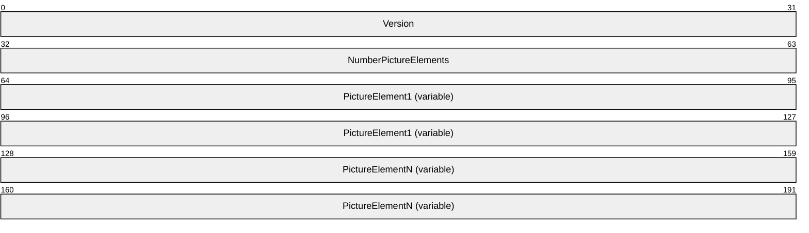
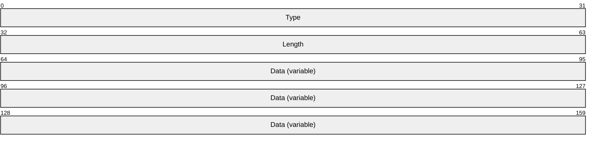
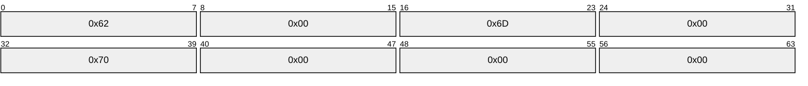
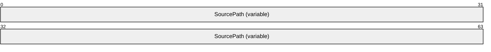
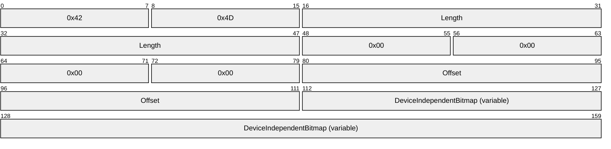
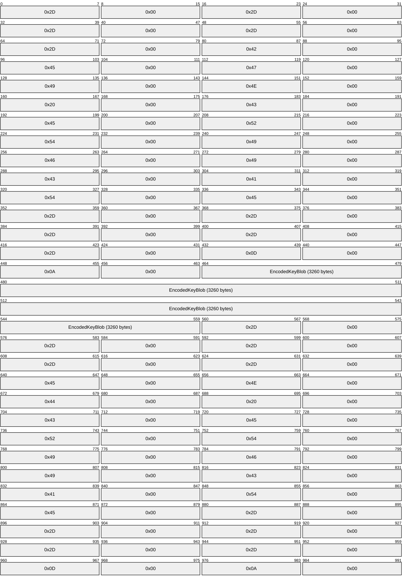
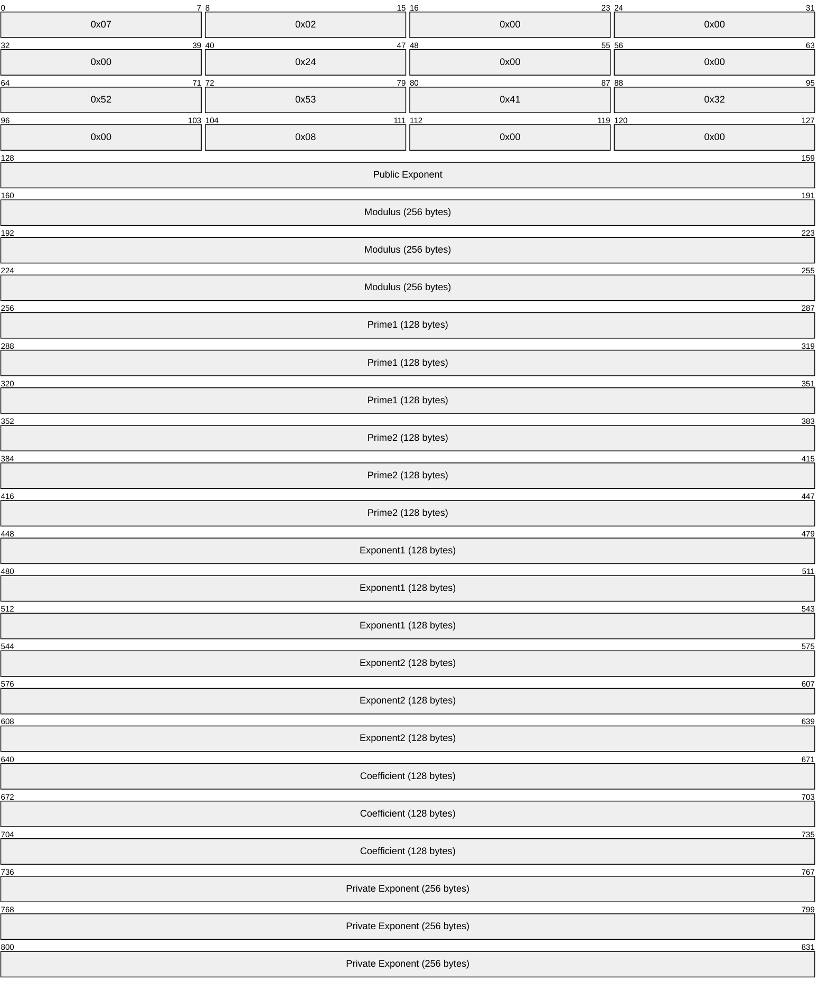

# [MS-HGRP]: HomeGroup Protocol

Table of Contents

1 Introduction

- [1 Introduction](#Section_1)
  - [1.1 Glossary](#Section_1.1)
  - [1.2 References](#Section_1.2)
    - [1.2.1 Normative References](#Section_1.2.1)
    - [1.2.2 Informative References](#Section_1.2.2)
  - [1.3 Overview](#Section_1.3)
    - [1.3.1 Role of Web Services on Devices (WSD)](#Section_1.3.1)
    - [1.3.2 Role of the PeerGroup](#Section_1.3.2)
    - [1.3.3 High Level Homegroup Events](#Section_1.3.3)
      - [1.3.3.1 Creating a Homegroup](#Section_1.3.3.1)
      - [1.3.3.2 Discovering and Joining the Homegroup](#Section_1.3.3.2)
  - [1.4 Relationship to Other Protocols](#Section_1.4)
  - [1.5 Prerequisites/Preconditions](#Section_1.5)
  - [1.6 Applicability Statement](#Section_1.6)
  - [1.7 Versioning and Capability Negotiation](#Section_1.7)
  - [1.8 Vendor-Extensible Fields](#Section_1.8)
  - [1.9 Standards Assignments](#Section_1.9)

2 Messages

- [2 Messages](#Section_2)
  - [2.1 Transport](#Section_2.1)
  - [2.2 Message Syntax](#Section_2.2)
    - [2.2.1 WSD Messages](#Section_2.2.1)
      - [2.2.1.1 HomeGroup Invitation](#Section_2.2.1.1)
      - [2.2.1.2 Shared Printer](#Section_2.2.1.2)
    - [2.2.2 PeerGroup Messages](#Section_2.2.2)
      - [2.2.2.1 HomeGroup Member Info](#Section_2.2.2.1)
      - [2.2.2.2 HomeGroup Record](#Section_2.2.2.2)
        - [2.2.2.2.1 HomeGroup Credentials](#Section_2.2.2.2.1)
        - [2.2.2.2.2 HomeGroup User Info Record](#Section_2.2.2.2.2)
          - [2.2.2.2.2.1 UserTileData Structure](#Section_2.2.2.2.2.1)
          - [2.2.2.2.2.2 PictureElement Structure](#Section_2.2.2.2.2.2)
          - [2.2.2.2.2.3 PictureFormatName Structure](#Section_2.2.2.2.2.3)
          - [2.2.2.2.2.4 PictureFormatSource Structure](#Section_2.2.2.2.2.4)
          - [2.2.2.2.2.5 PictureFormatData Structure](#Section_2.2.2.2.2.5)
        - [2.2.2.2.3 HomeGroup MAC Address](#Section_2.2.2.2.3)
        - [2.2.2.2.4 Data Protection Listener](#Section_2.2.2.2.4)
        - [2.2.2.2.5 HomeGroup Signing Key](#Section_2.2.2.2.5)
          - [2.2.2.2.5.1 RSAKeyBlob Structure](#Section_2.2.2.2.5.1)

3 Protocol Details

- [3 Protocol Details](#Section_3)
  - [3.1 Homegroup Member Details](#Section_3.1)
    - [3.1.1 Abstract Data Model](#Section_3.1.1)
    - [3.1.2 Timers](#Section_3.1.2)
    - [3.1.3 Initialization](#Section_3.1.3)
    - [3.1.4 Higher-Layer Triggered Events](#Section_3.1.4)
      - [3.1.4.1 Creating the Homegroup](#Section_3.1.4.1)
      - [3.1.4.2 Joining the Homegroup](#Section_3.1.4.2)
      - [3.1.4.3 Departing the Homegroup](#Section_3.1.4.3)
      - [3.1.4.4 Changing the Homegroup Password](#Section_3.1.4.4)
      - [3.1.4.5 Message Signing and Encryption](#Section_3.1.4.5)
        - [3.1.4.5.1 Encryption Key](#Section_3.1.4.5.1)
        - [3.1.4.5.2 Public/Private Signing Keys](#Section_3.1.4.5.2)
        - [3.1.4.5.3 WSD Hash](#Section_3.1.4.5.3)
        - [3.1.4.5.4 Printer Messages](#Section_3.1.4.5.4)
        - [3.1.4.5.5 Encrypting HomeGroup Credentials, Signing Key and MAC Address](#Section_3.1.4.5.5)
    - [3.1.5 Processing Events and Sequencing Rules](#Section_3.1.5)
      - [3.1.5.1 HomeGroup Invitation Messages](#Section_3.1.5.1)
      - [3.1.5.2 Printer Messages](#Section_3.1.5.2)
      - [3.1.5.3 HomeGroup Credentials and Signing Key Messages](#Section_3.1.5.3)
    - [3.1.6 Timer Events](#Section_3.1.6)
    - [3.1.7 Other Local Events](#Section_3.1.7)

4 Protocol Examples

- [4 Protocol Examples](#Section_4)
  - [4.1 HomeGroup Invitation](#Section_4.1)
  - [4.2 HomeGroup Member Info](#Section_4.2)
  - [4.3 HomeGroup Credentials](#Section_4.3)
  - [4.4 HomeGroup User Info](#Section_4.4)
  - [4.5 HomeGroup MAC Address](#Section_4.5)
  - [4.6 Data Protection Listener](#Section_4.6)
  - [4.7 HomeGroup Signing Key](#Section_4.7)

5 Security

- [5 Security](#Section_5)
  - [5.1 Security Considerations for Implementers](#Section_5.1)
  - [5.2 Index of Security Parameters](#Section_5.2)

6 Appendix A: Product Behavior

- [6 Appendix A: Product Behavior](#Section_6)

7 Change Tracking

- [7 Change Tracking](#Section_7)

For the legal notice and IP terms, see [LEGAL.md](../LEGAL.md).
Last updated: 9/12/2018.
See [Revision History](#revision-history) for full version history.

# 1 Introduction

This document specifies the HomeGroup Protocol, which is used to create a trust relationship that facilitates the advertising and publishing of content between machines via a peer-to-peer (P2P) infrastructure.

Sections 1.5, 1.8, 1.9, 2, and 3 of this specification are normative. All other sections and examples in this specification are informative.

## 1.1 Glossary

This document uses the following terms:

**Advanced Encryption Standard (AES)**: A block cipher that supersedes the Data Encryption Standard (DES). AES can be used to protect electronic data. The AES algorithm can be used to encrypt (encipher) and decrypt (decipher) information. Encryption converts data to an unintelligible form called ciphertext; decrypting the ciphertext converts the data back into its original form, called plaintext. AES is used in symmetric-key cryptography, meaning that the same key is used for the encryption and decryption operations. It is also a block cipher, meaning that it operates on fixed-size blocks of plaintext and ciphertext, and requires the size of the plaintext as well as the ciphertext to be an exact multiple of this block size. AES is also known as the Rijndael symmetric encryption algorithm [[FIPS197]](https://go.microsoft.com/fwlink/?LinkId=89870).

**device-independent bitmap (DIB)**: A container for bitmapped graphics, which specifies characteristics of the bitmap such that it can be created using one application and loaded and displayed in another application, while retaining an identical appearance.

**FMTID**: A GUID value that identifies a property set format.

**globally unique identifier (GUID)**: A term used interchangeably with universally unique identifier (UUID) in Microsoft protocol technical documents (TDs). Interchanging the usage of these terms does not imply or require a specific algorithm or mechanism to generate the value. Specifically, the use of this term does not imply or require that the algorithms described in [[RFC4122]](https://go.microsoft.com/fwlink/?LinkId=90460) or [[C706]](https://go.microsoft.com/fwlink/?LinkId=89824) must be used for generating the [**GUID**](#gt_globally-unique-identifier-guid). See also universally unique identifier (UUID).

**homegroup**: A group of one or more computers that are [**AES**](#gt_advanced-encryption-standard-aes) joined together by using Advanced Encryption Standard (AES) through the HomeGroup Protocol, which are able to share resources (files, printers, and so on) with each other.

**Internet Protocol version 6 (IPv6)**: A revised version of the Internet Protocol (IP) designed to address growth on the Internet. Improvements include a 128-bit IP address size, expanded routing capabilities, and support for authentication and privacy.

**little-endian**: Multiple-byte values that are byte-ordered with the least significant byte stored in the memory location with the lowest address.

**Media Access Control (MAC) address**: A hardware address provided by the network interface vendor that uniquely identifies each interface on a physical network for communication with other interfaces, as specified in [[IEEE802.3]](https://go.microsoft.com/fwlink/?LinkId=89911). It is used by the media access control sublayer of the data link layer of a network connection.

**PeerGroup**: A group of one or more machines connected through the Peer-to-Peer Grouping Security Protocol [MS-PPSEC](#Section_5).

**peer-to-peer**: A server-less networking technology that allows several participating network devices to share resources and communicate directly with each other.

**Rivest-Shamir-Adleman (RSA)**: A system for public key cryptography. [**RSA**](#gt_rivest-shamir-adleman-rsa) is specified in [[PKCS1]](https://go.microsoft.com/fwlink/?LinkId=90248) and [[RFC3447]](https://go.microsoft.com/fwlink/?LinkId=90422).

**service set identifier (SSID)**: A sequence of characters that names a wireless local area network (WLAN).

**SHA-256**: An algorithm that generates a 256-bit hash value from an arbitrary amount of input data, as described in [[FIPS180-2]](https://go.microsoft.com/fwlink/?LinkId=89868).

**SHA-256 hash**: The value computed from the hashing function described in [[FIPS180-3]](https://go.microsoft.com/fwlink/?LinkId=180409).

**Universal Naming Convention (UNC)**: A string format that specifies the location of a resource. For more information, see [MS-DTYP](../MS-DTYP/MS-DTYP.md) section 2.2.57.

**Web Services on Devices (WSD)**: A function-discovery protocol used to discover and communicate certain data structures in a HomeGroup network environment. Implementation details are specified in [[DPWS]](https://go.microsoft.com/fwlink/?LinkId=127841).

**wireless access point (WAP)**: A wireless network access server (NAS) that implements 802.11.

**MAY, SHOULD, MUST, SHOULD NOT, MUST NOT:** These terms (in all caps) are used as defined in [[RFC2119]](https://go.microsoft.com/fwlink/?LinkId=90317). All statements of optional behavior use either MAY, SHOULD, or SHOULD NOT.

## 1.2 References

Links to a document in the Microsoft Open Specifications library point to the correct section in the most recently published version of the referenced document. However, because individual documents in the library are not updated at the same time, the section numbers in the documents may not match. You can confirm the correct section numbering by checking the [Errata](https://go.microsoft.com/fwlink/?linkid=850906).

### 1.2.1 Normative References

We conduct frequent surveys of the normative references to assure their continued availability. If you have any issue with finding a normative reference, please contact [dochelp@microsoft.com](mailto:dochelp@microsoft.com). We will assist you in finding the relevant information.

[DPWS] Chans, S., Conti, D., Schlimmer, J., et al., "Devices Profile for Web Services", February 2006, [http://specs.xmlsoap.org/ws/2006/02/devprof/devicesprofile.pdf](https://go.microsoft.com/fwlink/?LinkId=127841)

[FIPS180-3] FIPS PUBS, "Secure Hash Standard (SHS)", FIPS PUB 180-3, October 2008, [http://csrc.nist.gov/publications/fips/fips180-3/fips180-3_final.pdf](https://go.microsoft.com/fwlink/?LinkId=180409)

[FIPS186] FIPS PUBS, "Digital Signature Standard (DSS)", FIPS PUB 186-3, June 2009, [http://csrc.nist.gov/publications/fips/fips186-3/fips_186-3.pdf](https://go.microsoft.com/fwlink/?LinkId=89869)

[FIPS197] FIPS PUBS, "Advanced Encryption Standard (AES)", FIPS PUB 197, November 2001, [https://nvlpubs.nist.gov/nistpubs/FIPS/NIST.FIPS.197.pdf](https://go.microsoft.com/fwlink/?LinkId=89870)

[MS-DTYP] Microsoft Corporation, "[Windows Data Types](../MS-DTYP/MS-DTYP.md)".

[MS-FSCC] Microsoft Corporation, "[File System Control Codes](../MS-FSCC/MS-FSCC.md)".

[MS-PPGRH] Microsoft Corporation, "[Peer-to-Peer Graphing Protocol](../MS-PPGRH/MS-PPGRH.md)".

[MS-PPSEC] Microsoft Corporation, "[Peer-to-Peer Grouping Security Protocol](#Section_5)".

[MS-RPRN] Microsoft Corporation, "[Print System Remote Protocol](../MS-RPRN/MS-RPRN.md)".

[MS-WMF] Microsoft Corporation, "[Windows Metafile Format](../MS-WMF/MS-WMF.md)".

[PKCS1] RSA Laboratories, "PKCS #1: RSA Cryptography Standard", PKCS #1, Version 2.1, June 2002, [http://www.emc.com/emc-plus/rsa-labs/standards-initiatives/pkcs-rsa-cryptography-standard.htm](https://go.microsoft.com/fwlink/?LinkId=90248)

[RFC2119] Bradner, S., "Key words for use in RFCs to Indicate Requirement Levels", BCP 14, RFC 2119, March 1997, [http://www.rfc-editor.org/rfc/rfc2119.txt](https://go.microsoft.com/fwlink/?LinkId=90317)

[RFC3447] Jonsson, J. and Kaliski, B., "Public-Key Cryptography Standards (PKCS) #1: RSA Cryptography Specifications Version 2.1", RFC 3447, February 2003, [http://www.ietf.org/rfc/rfc3447.txt](https://go.microsoft.com/fwlink/?LinkId=90422)

[RFC3513] Hinden, R. and Deering, S., "Internet Protocol Version 6 (IPv6) Addressing Architecture", RFC 3513, April 2003, [http://www.ietf.org/rfc/rfc3513.txt](https://go.microsoft.com/fwlink/?LinkId=90427)

[RFC3548] Josefsson, S., Ed., "The Base16, Base32, and Base64 Data Encodings", RFC 3548, July 2003, [http://www.rfc-editor.org/rfc/rfc3548.txt](https://go.microsoft.com/fwlink/?LinkId=90432)

[RFC4648] Josefsson, S., "The Base16, Base32, and Base64 Data Encodings", RFC 4648, October 2006, [http://www.rfc-editor.org/rfc/rfc4648.txt](https://go.microsoft.com/fwlink/?LinkId=90487)

[SP800-38A] National Institute of Standards and Technology., "Special Publication 800-38A, Recommendation for Block Cipher Modes of Operation: Methods and Techniques", December 2001, [https://nvlpubs.nist.gov/nistpubs/Legacy/SP/nistspecialpublication800-38a.pdf](https://go.microsoft.com/fwlink/?LinkId=128809)

### 1.2.2 Informative References

[HomeGroupOvw] Microsoft Corporation, "HomeGroup Overview", October 2009, [http://download.microsoft.com/download/8/4/D/84DDB871-DE0B-44FD-85B2-2F00BCA2F540/HomeGroup%20Overview.docx](https://go.microsoft.com/fwlink/?LinkId=178890)

[MS-OLEPS] Microsoft Corporation, "[Object Linking and Embedding (OLE) Property Set Data Structures](../MS-OLEPS/MS-OLEPS.md)".

## 1.3 Overview

The HomeGroup Protocol is used to create a trust relationship that facilitates the advertising and publishing of content between machines via a [**peer-to-peer**](#gt_peer-to-peer) infrastructure.<1><2> This relationship is achieved with the use of [**Web Services on Devices (WSD)**](#gt_web-services-on-devices-wsd) and a [**PeerGroup**](#gt_peergroup) infrastructure. There is no client-server relationship in this protocol; in order to participate in a [**homegroup**](#gt_homegroup), all machines implement the protocol in the same manner. For more information, see [[HomeGroupOvw]](https://go.microsoft.com/fwlink/?LinkId=178890).

### 1.3.1 Role of Web Services on Devices (WSD)

[**WSD**](#gt_web-services-on-devices-wsd) is used to publish messages that are discoverable to all machines on the subnet. These messages include the HomeGroup Invitation (section [2.2.1.1](#Section_3.1.5.1)) and Shared Printer (section [2.2.1.2](#Section_2.2.1.2)) messages.

### 1.3.2 Role of the PeerGroup

The [**PeerGroup**](#gt_peergroup) is used as a secure line of communication between [**homegroup**](#gt_homegroup) members.

### 1.3.3 High Level Homegroup Events

#### 1.3.3.1 Creating a Homegroup

A machine that attempts to create a [**homegroup**](#gt_homegroup) accomplishes this by first creating a [**PeerGroup**](#gt_peergroup), which is the secure [**peer-to-peer**](#gt_peer-to-peer) connection through which the homegroup is synchronized, as outlined in [MS-PPSEC](#Section_5). This homegroup machine sets the homegroup password, which is used to secure the homegroup. Once the PeerGroup has been created, this first machine publishes an invitation to the homegroup via [**WSD**](#gt_web-services-on-devices-wsd), which allows new machines on the subnet to discover the homegroup.

#### 1.3.3.2 Discovering and Joining the Homegroup

A machine detects that there is a [**homegroup**](#gt_homegroup) on the subnet by receiving a HomeGroup Invitation message (section [2.2.1.1](#Section_3.1.5.1)) over [**WSD**](#gt_web-services-on-devices-wsd). With the invitation and the correct homegroup password, the machine is able to join the [**PeerGroup**](#gt_peergroup), and by extension, the homegroup.

## 1.4 Relationship to Other Protocols

This protocol depends on [[DPWS]](https://go.microsoft.com/fwlink/?LinkId=127841) to enable the discovery of a [**homegroup**](#gt_homegroup) on the subnet, and [MS-PPSEC](#Section_5) to create a [**PeerGroup**](#gt_peergroup) for communication between members of the homegroup. These two protocols are used independently of each other; that is, neither protocol sits above the other in the relationship hierarchy.

This protocol also requires that all machines implement the [**Internet protocol version 6 (IPv6)**](#gt_internet-protocol-version-6-ipv6) protocol.

## 1.5 Prerequisites/Preconditions

The prerequisites for this protocol include those for the WSD, as described in [[DPWS]](https://go.microsoft.com/fwlink/?LinkId=127841), and PeerGroup, as described in [MS-PPSEC](#Section_5).

In addition, this protocol requires the following:

- The underlying [**PeerGroup**](#gt_peergroup) is restricted to machines on the same subnet.
- All members of the [**homegroup**](#gt_homegroup) are required to have an [**IPv6**](#gt_internet-protocol-version-6-ipv6) address and to be able to support the cryptography technology defined in section [3.1.4.5](#Section_3.1.4.5).

## 1.6 Applicability Statement

The HomeGroup Protocol specifies a protocol for the creation of a trust relationship that facilitates the advertisement and publishing of content between machines on the same subnet.

## 1.7 Versioning and Capability Negotiation

This document describes version 1 of this protocol, therefore there are no issues with capability negotiation. This protocol does provide versioning capability within the HomeGroup Record message (section [2.2.2.2](#Section_2.2.2.2)) in both the <SOURCEOS> and <VERSION> elements.

## 1.8 Vendor-Extensible Fields

None.

## 1.9 Standards Assignments

None.

# 2 Messages

## 2.1 Transport

Transport for this protocol is achieved through two channels: the [**PeerGroup**](#gt_peergroup) and [**WSD**](#gt_web-services-on-devices-wsd), both of which are independent of the other. WSD is used to publish messages that are available to all machines on the subnet. The PeerGroup is used for sending secure communication between members of the [**homegroup**](#gt_homegroup).

## 2.2 Message Syntax

All messages are generated in XML format. The following sections use the terminology *sections*, *keys*, and *values* to specify concrete syntax for each message. This specification uses globally unique identifiers ([**GUIDs**](#gt_globally-unique-identifier-guid)), as specified in [MS-DTYP](../MS-DTYP/MS-DTYP.md) section 2.3.4.3.

### 2.2.1 WSD Messages

All messages described in this section MUST be transported using [**WSD**](#gt_web-services-on-devices-wsd) and published to the local subnet. The [**HomeGroup**](#gt_homegroup) Protocol uses WSD messages to advertise the presence of a homegroup, as well as shared resources on the home network.

#### 2.2.1.1 HomeGroup Invitation

The HomeGroup Invitation message is used to advertise the presence of the [**homegroup**](#gt_homegroup) to other machines on the home network and to provide the required details to allow them to join that homegroup. This message has the [**WSD**](#gt_web-services-on-devices-wsd) type of: HomeGroup_Invitation.

The HomeGroup invitation includes the [**PeerGroup**](#gt_peergroup) invitation (which is required to join the PeerGroup) and other relevant information about the homegroup, as described in this section. The invitation is serialized into an XML string and then published on the local subnet using WSD.

<?xml version="1.0" encoding="utf-8"?>

<xs:schema id="NewDataSet" xmlns="" xmlns:xs="http://www.w3.org/2001/XMLSchema" xmlns:msdata="urn:schemas-microsoft-com:xml-msdata">

<xs:element name="HOMEGROUP_RECORD">

<xs:complexType>

<xs:sequence>

<xs:element name="INVITATION" type="xs:string" minOccurs="1" />

<xs:element name="NETWORKNAME" type="xs:string" minOccurs="0" />

<xs:element name="GUIDNAME" type="xs:string" minOccurs="1" />

<xs:element name="OWNER" type="xs:string" minOccurs="0" />

<xs:element name="OWNERID" type="xs:string" minOccurs="0" />

<xs:element name="OWNERMACHINENAME" type="xs:string" minOccurs="0" />

<xs:element name="LASTCHANGED" type="xs:string" minOccurs="1" />

<xs:element name="HOMEGROUPSIZE" type="xs:string" minOccurs="1" />

<xs:element name="ADDRESS" type="xs:string" minOccurs="1" />

<xs:element name="DIGITALHASH" type="xs:string" minOccurs="1" />

</xs:sequence>

</xs:complexType>

</xs:element>

<xs:element name="NewDataSet" msdata:IsDataSet="true" msdata:UseCurrentLocale="true">

<xs:complexType>

<xs:choice minOccurs="0" maxOccurs="unbounded">

<xs:element ref="HOMEGROUP_RECORD" />

</xs:choice>

</xs:complexType>

</xs:element>

</xs:schema>

**INVITATION:** The actual invitation from the PeerGroup. The format for this message and the manner in which it is generated is described in [MS-PPSEC](#Section_5).

**NETWORKNAME:** If any member of the homegroup is connected wirelessly to the network, this value is the [**service set identifier (SSID)**](#gt_service-set-identifier-ssid) of the [**wireless access point (WAP)**](#gt_wireless-access-point-wap). If all machines are wired, then this value is NULL. The value for this element is the same across all of the homegroup members. If a new member of the homegroup is the first to use WAP, then this element is updated to reflect the SSID of the WAP.

**GUIDNAME:** A unique [**GUID**](#gt_globally-unique-identifier-guid) that represents this homegroup. The value is the same for all homegroup members, and is generated when the PeerGroup is created [MS-PPSEC].

**OWNER:** The name of the user who last reset the pin on this homegroup, or if the pin has never been reset, it is the User who created the homegroup. The value is the same for all homegroup members.

**OWNERID:** The Peer Identity of the machine where the owner user resides [MS-PPSEC]. The value is the same for all homegroup members.

**OWNERMACHINENAME:** The machine name of the machine that created the homegroup. The value is the same for all homegroup members.

**LASTCHANGED:** The Int64 text representation of a FILETIME structure that represents the last time the pin was reset, or if never reset, the time that the homegroup was originally created, as described in [MS-FSCC](../MS-FSCC/MS-FSCC.md). The value is the same for all homegroup members.

**HOMEGROUPSIZE:** The number of members in the PeerGroup, and by extension, the homegroup. This is expressed as an integer value.

**ADDRESS:** The [**IPv6**](#gt_internet-protocol-version-6-ipv6) addresses of the network adapter to which the PeerGroup is connected. This list of addresses is semicolon-delimited and can be specified using any valid IPv6 address format, as described in [[RFC3513]](https://go.microsoft.com/fwlink/?LinkId=90427)

**DIGITALHASH:** The values contained in the <NETWORKNAME> (if not empty), <GUIDNAME>, <OWNER> (if not empty), <OWNERID> (if not empty), <OWNERMACHINENAME> (if not empty), <LASTCHANGED>, <HOMEGROUPSIZE>, and <ADDRESS> elements that are hashed together and then signed using the homegroup signing keys. The signing and hashing process is described in section [3.1.4.5.3](#Section_3.1.4.5.3).

#### 2.2.1.2 Shared Printer

The Shared Printer message is used to advertise printers that are installed on the advertising machine. It is serialized into an XML string and then published on the local subnet using [**WSD**](#gt_web-services-on-devices-wsd). This message has the WSD type of: HomeGroup_Printer.

<?xml version="1.0" encoding="utf-8"?>

<xs:schema id="HomeGroup" targetNamespace="http://schemas.microsoft.com/windows/2007/HomeGroup/Printing" xmlns:mstns="http://schemas.microsoft.com/windows/2007/HomeGroup/Printing" xmlns="http://schemas.microsoft.com/windows/2007/HomeGroup/Printing" xmlns:xs="http://www.w3.org/2001/XMLSchema" xmlns:msdata="urn:schemas-microsoft-com:xml-msdata" attributeFormDefault="qualified" elementFormDefault="qualified">

<xs:element name="HomeGroup" msdata:IsDataSet="true" msdata:UseCurrentLocale="true">

<xs:complexType>

<xs:choice minOccurs="0" maxOccurs="unbounded">

<xs:element name="Printer">

<xs:complexType>

<xs:sequence>

<xs:element name="Name" type="xs:string" minOccurs="1" />

</xs:sequence>

</xs:complexType>

</xs:element>

</xs:choice>

</xs:complexType>

</xs:element>

</xs:schema>

**NAME:** The name of the printer being shared. It MUST be a valid printer name, as defined in [MS-RPRN](../MS-RPRN/MS-RPRN.md) section 2.2.4.14.

This message is signed and encoded before being sent, as described in section [3.1.4.5.4](#Section_3.1.4.5.4).

### 2.2.2 PeerGroup Messages

All messages described in this section MUST be transported using [**PeerGroup**](#gt_peergroup). PeerGroup messages are used for secure communication between members of the [**homegroup**](#gt_homegroup). All messages sent via the PeerGroup are converted to binary before being sent.

#### 2.2.2.1 HomeGroup Member Info

HomeGroup Member Info messages are used to broadcast a [**homegroup**](#gt_homegroup) member's machine name and Peer ID.

<?xml version="1.0" encoding="utf-8"?>

<xs:schema id="NewDataSet" xmlns="" xmlns:xs="http://www.w3.org/2001/XMLSchema" xmlns:msdata="urn:schemas-microsoft-com:xml-msdata">

<xs:element name="HOMEGROUP_RECORD">

<xs:complexType>

<xs:sequence>

<xs:element name="COMPUTERNAME" type="xs:string" minOccurs="1" />

<xs:element name="PEERID" type="xs:string" minOccurs="1" />

<xs:element name="RECORDID" type="xs:string" minOccurs="1" />

<xs:element name="property" minOccurs="0" maxOccurs="2">

<xs:complexType>

<xs:attribute name="type" type="xs:string" use="required"/>

<xs:sequence>

<xs:element name="name" type="xs:string" minOccurs="1" maxOccurs="1"/>

<xs:element name="value" type="xs:string" minOccurs="1" maxOccurs="1"/>

</xs:sequence>

</xs:complexType>

</xs:element>

</xs:sequence>

</xs:complexType>

</xs:element>

<xs:element name="NewDataSet" msdata:IsDataSet="true" msdata:UseCurrentLocale="true">

<xs:complexType>

<xs:choice minOccurs="0" maxOccurs="unbounded">

<xs:element ref="HOMEGROUP_RECORD" />

</xs:choice>

</xs:complexType>

</xs:element>

</xs:schema>

**COMPUTERNAME:** The machine name of the machine that is sending the message [MS-DTYP](../MS-DTYP/MS-DTYP.md).

**PEERID:** The Peer Identity of the machine that is sending the message [MS-PPSEC](#Section_5).

**RECORDID:** A [**GUID**](#gt_globally-unique-identifier-guid)-formatted string. This element SHOULD be an all null GUID formatted as: {00000000-0000-0000-0000-000000000000}. This element can be populated with another GUID-formatted string, but it MUST contain a value.

**property:** An optional element that consists of a name/value pair containing information about the homegroup member.<3>

**property.type:** A numeric representation of the data type for the value contained in the <property> element. The specified number corresponds to a **Property Type** value as described in [MS-OLEPS](../MS-OLEPS/MS-OLEPS.md) section 2.14.1.

**property.name:** The name of the property contained in the <property> element.

**property.value:** The value of the property contained in the <property> element, the data type of which is specified in the <property.type> element.<4>

#### 2.2.2.2 HomeGroup Record

The HomeGroup Record format is the base data structure that is used by the [**PeerGroup**](#gt_peergroup) messages described in this section. Each subtype of message uses the HomeGroup Record to contain its relevant data. These records are structured by using the following format:

<?xml version="1.0" encoding="utf-8"?>

<xs:schema id="NewDataSet" xmlns="" xmlns:xs="http://www.w3.org/2001/XMLSchema" xmlns:msdata="urn:schemas-microsoft-com:xml-msdata">

<xs:element name="HOMEGROUP_RECORD">

<xs:complexType>

<xs:sequence>

<xs:element name="VERSION" type="xs:string" minOccurs="1" />

<xs:element name="RECORDSOURCE" type="xs:string" minOccurs="1" />

<xs:element name="RECORDID" type="xs:string" minOccurs="1" />

<xs:element name="EVENTTYPE" type="xs:string" minOccurs="1" />

<xs:element name="FLAGS" type="xs:string" minOccurs="1" />

<xs:element name="SOURCEOS" type="xs:string" minOccurs="1" />

<xs:element name="PERSIST" type="xs:string" minOccurs="1" />

<xs:element name="MACHINE" type="xs:string" minOccurs="1" />

<xs:element name="PEERID" type="xs:string" minOccurs="1" />

<xs:element name="HOMEGROUP_DATA" type="xs:string" minOccurs="1" />

</xs:sequence>

</xs:complexType>

</xs:element>

<xs:element name="NewDataSet" msdata:IsDataSet="true" msdata:UseCurrentLocale="true">

<xs:complexType>

<xs:choice minOccurs="0" maxOccurs="unbounded">

<xs:element ref="HOMEGROUP_RECORD" />

</xs:choice>

</xs:complexType>

</xs:element>

</xs:schema>

**VERSION:** Denotes the version of the HomeGroup Protocol. The current version, as described in this, document is version one. The value of this element SHOULD be set to 1 for all messages.

**RECORDSOURCE:** Identifies the type of record being sent and is unique for each message type. For example, the HomeGroup Credentials message (section [2.2.2.2.1](#Section_2.2.2.2.1)) will populate this element with a string in [**GUID**](#gt_globally-unique-identifier-guid) format.

**RECORDID:** This element SHOULD be an all null GUID formatted as: {00000000-0000-0000-0000-000000000000}. This element can be populated with another GUID-formatted string, but it MUST contain a value.

**EVENTTYPE:** MUST be set to 0 for all messages.

**FLAGS:** MUST be set to 0 for all messages.

**SOURCEOS:** This value identifies the source operating system. In the current version of this protocol, this value SHOULD be set to 100728832 for all messages.

**PERSIST:** Determines if the record will persist on the PeerGroup after the machine that created the record has departed from the PeerGroup. The value SHOULD be set to either 1 (True) or 0 (False).

**MACHINE:** The machine name of the record creator.

**PEERID:** The PeerID of the machine that creates the record [MS-PPSEC](#Section_5).

**HOMEGROUP_DATA:** This element is used to transmit the data of the message subtypes and is populated by individual messages.

##### 2.2.2.2.1 HomeGroup Credentials

HomeGroup Credentials messages are used to synchronize [**homegroup**](#gt_homegroup) credentials that are common to all homegroup members. This message contains the common credential name, its password, and its creation time.<5>

The password is encrypted using the HomeGroup Encryption Key (section [3.1.4.5.1](#Section_3.1.4.5.1)), and the creation time is used to decide conflicts when two different homegroups are created inside the same network.

HomeGroup Credentials messages are sent within the HomeGroup Record format (section [2.2.2.2](#Section_2.2.2.2)), where the following elements are specified:

- The value of the <RECORDSOURCE> element is set to {929CB323-C5EA-48E7-A6D0-193DD432E769}.
- The value of the <PERSIST> element is set to 1.
The <HOMEGROUP_DATA> element is populated with the HomeGroup Credentials message content in the following manner:

<?xml version="1.0" encoding="utf-8"?><xs:schema id="NewDataSet" xmlns="" xmlns:xs="http://www.w3.org/2001/XMLSchema" xmlns:msdata="urn:schemas-microsoft-com:xml-msdata"> <xs:element name="HOMEGROUP_DATA"> <xs:complexType> <xs:sequence> <xs:element name="USERNAME" type="xs:string" minOccurs="1" /> <xs:element name="PASSWORD" type="xs:string" minOccurs="1" /> <xs:element name="ACCOUNTCREATED" type="xs:string" minOccurs="1" /> </xs:sequence> </xs:complexType> </xs:element> <xs:element name="NewDataSet" msdata:IsDataSet="true" msdata:UseCurrentLocale="true"> <xs:complexType> <xs:choice minOccurs="0" maxOccurs="unbounded"> <xs:element ref="HOMEGROUP_DATA" /> </xs:choice> </xs:complexType> </xs:element></xs:schema>

**USERNAME:** MUST be set to HomeGroupUser$.

**PASSWORD:** The binary version of the encrypted password, as described in section [3.1.4.5.5](#Section_3.1.4.5.5).

**ACCOUNTCREATED:** The Int64 representation of a FILETIME structure that represents the creation time of the account described in [MS-FSCC](../MS-FSCC/MS-FSCC.md). The value is the same for all homegroup members.

##### 2.2.2.2.2 HomeGroup User Info Record

HomeGroup User Info records<6> are used to broadcast information about each user on the machine to other machines in the homegroup. Each user account on each homegroup machine has a separate, corresponding HomeGroup User Info record in the PeerGroup.

<?xml version="1.0" encoding="utf-16"?>

<xs:schema id="NewDataSet" xmlns=""

xmlns:xs="http://www.w3.org/2001/XMLSchema" xmlns:msdata="urn:schemas-microsoft-com:xml-msdata">

<xs:element name="propertyStore">

<xs:complexType>

<xs:sequence>

<xs:element name="property" minOccurs="3" maxOccurs="9">

<xs:complexType>

<xs:attribute name="type" type="xs:string" use="required"/>

<xs:sequence>

<xs:element name="value" type="xs:string" minOccurs="1" maxOccurs="1"/>

<xs:element name="key" minOccurs="1" maxOccurs="1">

<xs:complexType>

<xs:sequence>

<xs:element name="guid" type="xs:string" minOccurs="1" maxOccurs="1"/>

<xs:element name="pid" type="xs:string" minOccurs="1" maxOccurs="1"/>

</xs:sequence>

</xs:complexType>

</xs:element>

</xs:sequence>

</xs:complexType>

</xs:element>

</xs:sequence>

</xs:complexType>

</xs:element>

<xs:element name="NewDataSet" msdata:IsDataSet="true" msdata:UseCurrentLocale="true">

<xs:complexType>

<xs:choice minOccurs="1" maxOccurs="1">

<xs:element ref="propertyStore" />

</xs:choice>

</xs:complexType>

</xs:element>

</xs:schema>

**property:** A generic property consisting of a property identifier/value pair as described in [MS-OLEPS](../MS-OLEPS/MS-OLEPS.md) section 1.3.2.

**property.type:** A numeric representation of the data type for the value contained in the <property> element. The specified number corresponds to a **Property Type** value as described in [MS-OLEPS] section 2.14.1.

**property.value:** A string representation of the value of the property specified in the <property> element.

**property.key:** The property key corresponding to the value of the <property.value> element.

**property.guid:** The [**FMTID**](#gt_fmtid) representation of the value of the <property.key> element as described in [MS-OLEPS]. The FMTID is a string formatted as a [**GUID**](#gt_globally-unique-identifier-guid) as defined in [MS-DTYP](../MS-DTYP/MS-DTYP.md) section 2.3.4.3.

**property.pid:** The string representation of a numerical value that specifies the property identifier for this property as described in [MS-OLEPS]. Each HomeGroup User Info record contains the following properties, three of which are required; the remaining properties are optional.

| FMTID | Description | PID | Type | Required |
| --- | --- | --- | --- | --- |
| {705D8364-7547-468C-8C88-84860BCBED4C} | The account name for the user. | 2 | VT_LPWSTR (0x001F) | Yes |
| {28636AA6-953D-11D2-B5D6-00C04FD918D0} | The name of the computer on which this user account resides. | 5 | VT_LPWSTR (0x001F) | Yes |
| {705D8364-7547-468C-8C88-84860BCBED4C} | The security identifier for this user account. | 18 | VT_BLOB (0x0041) | Yes |
| {705D8364-7547-468C-8C88-84860BCBED4C} | The display name for this user account. | 9 | VT_LPWSTR (0x001F) | No |
| {705D8364-7547-468C-8C88-84860BCBED4C} | The UserTileData structure associated with this user account, as specified in section [2.2.2.2.2.1](#Section_2.2.2.2.2.1). | 24 | VT_BLOB (0x0041) | No |
| {7d683fc9-d155-45a8-bb1f-89d19bcb792f} | The display name for the connected identity associated with this user account. | 100 | VT_LPWSTR (0x001F) | No |
| {6d6d5d49-265d-4688-9f4e-1fdd33e7cc83} | The security identifier corresponding to the connected identity associated with this user account. | 100 | VT_LPWSTR (0x001F) | No |
| {74a7de49-fa11-4d3d-a006-db7e08675916} | The ID of the provider that created the connected identity associated with this user account. | 100 | VT_CLSID (0x0048) | No |
| {2b1b801e-c0c1-4987-9ec5-72fa89814787} | The email address corresponding to the connected identity associated with this user account. | 100 | VT_LPWSTR (0x001F) | No |

###### 2.2.2.2.2.1 UserTileData Structure

The **UserTileData** structure contains the image data that represents a user's tile, or picture, in Windows. The structures defined in sections [2.2.2.2.2.1](#Section_2.2.2.2.2.1) through [2.2.2.2.2.5](#Section_2.2.2.2.2.5) specify the image information, and the [**device-independent bitmap (DIB)**](#gt_device-independent-bitmap-dib) data is also provided in section 2.2.2.2.2.5.

When a user joins the [**homegroup**](#gt_homegroup), the **UserTileData** information is added to enable other machines in the homegroup to correctly display the user's tile.

The **UserTileData** structure has the following format.

**Version (4 bytes):** Contains the version number for this homegroup user info message. It MUST contain a value of 0x0001.

**NumberPictureElements (4 bytes):** Specifies the number of PictureElements (section [2.2.2.2.2.2](#Section_2.2.2.2.2.2)) in this message.

**PictureElement1 (variable):** The value MUST contain the first PictureElement.

**PictureElementN (variable):** An ordered list of PictureElements that compose this message. Each PictureElement is of variable size and MUST follow the format specified in section 2.2.2.2.2.2.

###### 2.2.2.2.2.2 PictureElement Structure

The **PictureElement** structure provides information about the image data contained in the UserTileData structure (section [2.2.2.2.2.1](#Section_2.2.2.2.2.1)).

The **PictureElement** structure has the following format.

**Type (4 bytes):** Specifies the type of **PictureElement**. It MUST be one of the following values.

| Name | Value |
| --- | --- |
| PictureFormatName (section [2.2.2.2.2.3](#Section_2.2.2.2.2.3)) | 0x0 |
| PictureFormatData (section [2.2.2.2.2.5](#Section_2.2.2.2.2.5)) | 0x1 |
| PictureFormatSource (section [2.2.2.2.2.4](#Section_2.2.2.2.2.4)) | 0x2 |

**Length (4 bytes):** A 32-bit unsigned integer that MUST indicate the length, in bytes, of the **Data** field.

**Data (variable):** A variable-length field with size equal to the value of the **Length** field. The **Data** field contains the structure information that corresponds to the value of the **Type** field. The size of the **Data** field corresponds to the size of the specified structure as follows:

| Name | Value |
| --- | --- |
| PictureFormatName (section 2.2.2.2.2.3) | 8 bytes |
| PictureFormatData (section 2.2.2.2.2.5) | 14 bytes, plus a device-independent bitmap of variable length |
| PictureFormatSource (section 2.2.2.2.2.4) | Variable length |

###### 2.2.2.2.2.3 PictureFormatName Structure

The **PictureFormatName** structure represents the image type of the UserTileData structure (section [2.2.2.2.2.1](#Section_2.2.2.2.2.1)). This structure SHOULD contain the bytes included in the following diagram exactly as shown. These bytes are the byte representation of the Unicode string "bmp" for bitmap.

**PictureFormatName** is a PictureElement structure (section [2.2.2.2.2.2](#Section_2.2.2.2.2.2)) type that has the following format.

###### 2.2.2.2.2.4 PictureFormatSource Structure

The **PictureFormatSource** structure provides information about the original user tile image described in the UserTileData structure (section [2.2.2.2.2.1](#Section_2.2.2.2.2.1)).

**PictureFormatSource** is a PictureElement structure (section [2.2.2.2.2.2](#Section_2.2.2.2.2.2)) type that has the following format.

**SourcePath (variable):** A Unicode string of variable length that represents an absolute file path to the original user tile image. The string includes the terminating NULL character.

###### 2.2.2.2.2.5 PictureFormatData Structure

The **PictureFormatData** structure provides the [**DIB**](#gt_device-independent-bitmap-dib) data for the user tile image described by the UserTileData structure (section [2.2.2.2.2.1](#Section_2.2.2.2.2.1)).

**PictureFormatData** is a PictureElement structure (section [2.2.2.2.2.2](#Section_2.2.2.2.2.2)) type that has the following format.

**Length (4 bytes):** A 32-bit unsigned integer that MUST indicate the length, in bytes, of this structure.

**Offset (4 bytes):** A 32-bit unsigned integer that MUST indicate the offset, in bytes, from the beginning of this structure to the **DeviceIndependentBitmap** field.

**DeviceIndependentBitmap (variable):** An image stored in DIB format as defined in [MS-WMF](../MS-WMF/MS-WMF.md) section 2.2.2.9.

##### 2.2.2.2.3 HomeGroup MAC Address

HomeGroup MAC Address messages are used to broadcast the [**MAC addresses**](#gt_5f9ccdf4-2607-4855-9a72-2010aa3300bf) of all network adapters present in a [**homegroup**](#gt_homegroup) member machine to all other members of the homegroup.

HomeGroup MAC Address messages are sent in the HomeGroup Record format (section [2.2.2.2](#Section_2.2.2.2)), where the following elements are specified:

- The value of the <RECORDSOURCE> element is set to {A7BC622E-8238-4E38-9C88-34153B7D9AB1}.
- The value of the <PERSIST> element is set to 0.
The <HOMEGROUP_DATA> element is populated with the HomeGroup MAC Address message content in the following manner:

<?xml version="1.0" encoding="utf-8"?>

<xs:schema id="NewDataSet" xmlns="" xmlns:xs="http://www.w3.org/2001/XMLSchema" xmlns:msdata="urn:schemas-microsoft-com:xml-msdata">

<xs:element name="HOMEGROUP_RECORD">

<xs:complexType>

<xs:sequence>

<xs:element name="MACADDRESSES" type="xs:string" minOccurs="1" />

</xs:sequence>

</xs:complexType>

</xs:element>

<xs:element name="NewDataSet" msdata:IsDataSet="true" msdata:UseCurrentLocale="true">

<xs:complexType>

<xs:choice minOccurs="0" maxOccurs="unbounded">

<xs:element ref="HOMEGROUP_RECORD" />

</xs:choice>

</xs:complexType>

</xs:element>

</xs:schema>

**MACADDRESSES:** This element contains the MAC addresses of all of the network cards on the machine. It is a string of binaryized 6-byte MAC addresses, which consists of two terminating NULL characters. Each MAC address is a binary string that contains a terminating NULL character. The last MAC address is followed by a double NULL. The resulting string is Base64 encoded with beginning and ending certificate headers as described in [[RFC3548]](https://go.microsoft.com/fwlink/?LinkId=90432).

##### 2.2.2.2.4 Data Protection Listener

The Data Protection Listener<7> enables a user to back up their data to a different device from the device where it is currently located. This feature allows the user to recover data if the original copy is damaged.

Data protection is intended to be a backup solution for home users. One of the objectives of data protection is to enable multiple users in a single household to share the same external device. To achieve this goal, the HomeGroup infrastructure is used. A user on one PC configures an external device and selects to share that device within the [**homegroup**](#gt_homegroup). The sharing of the device creates a folder on the external device with a [**Universal Naming Convention (UNC)**](#gt_universal-naming-convention-unc) share to the folder, and broadcasts a message containing information about the UNC share in the homegroup. The UNC share is then visible to all users across all PCs within the homegroup. Users can then select the shared device and specify it as the location where all data is to be sent for backup.

The broadcast message contains the GUID {ADBCFEA5-D8FC-4a46-B12B-EB1FFE39BF17}.

<?xml version="1.0" encoding="UTF-8"?>

<xs:element name="DPSharedTargetInfo" >

<xs:complexType>

<xs:sequence>

<xs:element name="SchemaVersion" type="xs:int" minOccurs="1" maxOccurs="1" />

<xs:element name="TargetUNC" type="xs:string" minOccurs="1" maxOccurs="1" />

<xs:element name="FriendlyName" type="xs:string" minOccurs="1" maxOccurs="1" />

<xs:element name="UserName" type="xs:string" minOccurs="1" maxOccurs="1" />

</xs:sequence>

</xs:complexType>

</xs:element>

**SchemaVersion:** The version number of the schema defined for the broadcast message.

**TargetUNC:** The UNC path of the share which is accessible only to users in the homegroup. Users can select this UNC share as the external device to use for data protection, that is, the device where all of the user data is sent for backup.

**FriendlyName:** A name that is used by all users in the homegroup to refer to the shared device.

**UserName:** The name of the user who originally configured and shared the device in the homegroup. This user knows which physical device has the UNC share.

##### 2.2.2.2.5 HomeGroup Signing Key

[**HomeGroup**](#gt_homegroup) Signing Key messages are used to distribute signing keys to the homegroup. The signing keys are used to verify the integrity of signed [**WSD**](#gt_web-services-on-devices-wsd) messages that are sent by homegroup members over WSD.

HomeGroup Signing Key messages are sent within the HomeGroup Record format (section [2.2.2.2](#Section_2.2.2.2)), where the following elements are specified:

- The value of the <RECORDSOURCE> element is set to {CA328F46-E759-4399-82AB-FA92651D1ED2}.
- The value of the <PERSIST> element is set to 1.
The <HOMEGROUP_DATA> element is populated with the HomeGroup Signing Key message content in the following manner:

<?xml version="1.0" encoding="utf-8"?>

<xs:schema id="NewDataSet" xmlns="" xmlns:xs="http://www.w3.org/2001/XMLSchema" xmlns:msdata="urn:schemas-microsoft-com:xml-msdata">

<xs:element name="HOMEGROUP_DATA">

<xs:complexType>

<xs:sequence>

<xs:element name="SIGNINGKEYS" type="xs:string" minOccurs="1" />

</xs:sequence>

</xs:complexType>

</xs:element>

<xs:element name="NewDataSet" msdata:IsDataSet="true" msdata:UseCurrentLocale="true">

<xs:complexType>

<xs:choice minOccurs="0" maxOccurs="unbounded">

<xs:element ref="HOMEGROUP_DATA" />

</xs:choice>

</xs:complexType>

</xs:element>

</xs:schema>

**SIGNINGKEYS**: The binary version of the encrypted signing key, which is encrypted as specified in section [3.1.4.5.5](#Section_3.1.4.5.5).

The binary <SIGNINGKEYS> element is sent in the following data format:

**EncodedKeyBlob (3260 bytes):** This MUST be generated by the following procedure:

- Randomly generate a 2048-bit [**RSA**](#gt_rivest-shamir-adleman-rsa) key pair and encode it as an **RSAKeyBlob** structure as specified in section [2.2.2.2.5.1](#Section_2.2.2.2.5.1). The RSA algorithm is specified in [[RFC3447]](https://go.microsoft.com/fwlink/?LinkId=90422) and recommended methods for generating RSA keys are described in [[FIPS186]](https://go.microsoft.com/fwlink/?LinkId=89869).
- Generate a 256-bit [**AES**](#gt_advanced-encryption-standard-aes) key [[FIPS197]](https://go.microsoft.com/fwlink/?LinkId=89870) by concatenating the homegroup [**GUID**](#gt_globally-unique-identifier-guid) and the homegroup password and hashing the result with the [**SHA-256**](#gt_sha-256) algorithm [[FIPS180-3]](https://go.microsoft.com/fwlink/?LinkId=180409). In this procedure, the homegroup GUID is represented in the Curly-Braced String Representation specified in [MS-DTYP](../MS-DTYP/MS-DTYP.md) section 2.3.4.3 and encoded as a Unicode string in [**little-endian**](#gt_little-endian) UTF-16 encoding with the terminating NULL character and the homegroup password is represented as a Unicode string in little-endian UTF-16 encoding with the terminating NULL character.
- Encrypt the **RSAKeyBlob** generated in Step 1 with the AES key generated in Step 2, using the AES-256 block cipher [FIPS197] in Cipher Block Chaining mode [[SP800-38A]](https://go.microsoft.com/fwlink/?LinkId=128809) with a zero Initialization Vector (IV).
- Encode the result from Step 3 with the Base64 encoding scheme specified in [[RFC4648]](https://go.microsoft.com/fwlink/?LinkId=90487) section 4, with a 64-bit line length and a terminating line feed. Note that line feeds are CR-LF combinations.
- Represent the result from Step 4 as a Unicode string in little-endian UTF-16 encoding.

###### 2.2.2.2.5.1 RSAKeyBlob Structure

This section provides the definition for the **RSAKeyBlob** structure that is used to encode the value of the **EncodedKeyBlob** field of the [**HomeGroup**](#gt_homegroup) Signing Key messages defined in section [2.2.2.2.5](#Section_2.2.2.2.5.1).

**Public Exponent (4 bytes):** This MUST be a 32-bit unsigned number in [**little-endian**](#gt_little-endian) format. It MUST be the public exponent of the key pair, which is referred to as **e** in [[RFC3447]](https://go.microsoft.com/fwlink/?LinkId=90422) section 2.

**Modulus (256 bytes):** This MUST be the [**RSA**](#gt_rivest-shamir-adleman-rsa) modulus, which is referred to as **n** in [RFC3447] section 2. It MUST be equal to **Prime1** * **Prime2**. It MUST be encoded in little-endian format.

**Prime1 (128 bytes):** This MUST be the first prime factor of the RSA modulus, which is referred to as **p** in [RFC3447] section 2. It MUST be encoded in little-endian format.

**Prime2 (128 bytes):** This MUST be the second prime factor of the RSA modulus, which is referred to as **q** in [RFC3447] section 2. It MUST be encoded in little-endian format.

**Exponent1 (128 bytes):** This MUST be the Chinese Remainder Theorem exponent of **Prime1**, which is referred to as **dP** in [RFC3447] section 2. It MUST be encoded in little-endian format.

**Exponent2 (128 bytes):** This MUST be the Chinese Remainder Theorem exponent of **Prime2**, which is referred to as **dQ** in [RFC3447] section 2. It MUST be encoded in little-endian format.

**Coefficient (128 bytes):** This MUST be the Chinese Remainder Coefficient of **Prime1** and **Prime2**, which is referred to as **qInv** in [RFC3447] section 2. It MUST be encoded in little-endian format.

**Private Exponent (256 bytes):** This MUST be the RSA private exponent, which is referred to as **d** in [RFC3447] section 2. It MUST be encoded in little-endian format.

# 3 Protocol Details

## 3.1 Homegroup Member Details

### 3.1.1 Abstract Data Model

This section describes a conceptual model of possible data organization that an implementation maintains to participate in this protocol. The described organization is provided to facilitate the explanation of how the protocol behaves. This document does not mandate that implementations adhere to this model as long as their external behavior is consistent with that described in this document.

To implement the HomeGroup Protocol, an individual [**homegroup**](#gt_homegroup) member stores and updates the data about itself, as well as the data about other members of the homegroup, which is necessary for sending the messages specified in section [2](#Section_2). Whenever the data maintained by the machine changes, the messages in section 2 SHOULD be re-sent. Resending the messages ensures that new information is propagated to all members of the homegroup.

**Note** The homegroup password is required to join a homegroup, but is never transmitted by this protocol.<8>

### 3.1.2 Timers

None.

### 3.1.3 Initialization

This protocol is initialized when a machine creates or joins a [**homegroup**](#gt_homegroup). When this protocol is first initialized, the machine SHOULD check for the HomeGroup Invitation WSD message (section [2.2.1.1](#Section_3.1.5.1)). If a HomeGroup Invitation is detected, then the machine MAY join the homegroup, as described in section [3.1.4.2](#Section_3.1.4.2).

If no invitation is detected, then the machine MAY create a homegroup, as described in section [3.1.4.1](#Section_1.3.3.1).

### 3.1.4 Higher-Layer Triggered Events

#### 3.1.4.1 Creating the Homegroup

To participate in a [**homegroup**](#gt_homegroup), a machine MUST create the homegroup when a HomeGroup Invitation message (section [2.2.1.1](#Section_3.1.5.1)) does not exist. This requires a homegroup password. All other machines will then be able to join the homegroup when the first machine's HomeGroup Invitation is detected.

A new homegroup is created by creating a new [**PeerGroup**](#gt_peergroup) with a secure Peer ID [MS-PPSEC](#Section_5). The Peer ID is a unique identifier that other members in the PeerGroup can use to identify a particular member [MS-PPSEC]. The machine then generates the signing keys, as described in section [3.1.4.5.2](#Section_3.1.4.5.2). The machine MUST then take the following actions:

- Send a HomeGroup Signing Key message (section [2.2.2.2.5](#Section_2.2.2.2.5.1)), a HomeGroup Member Info message (section [2.2.2.1](#Section_2.2.2.1)), a HomeGroup User Info record (section [2.2.2.2.2](#Section_2.2.2.2.2.2)) for each user on the machine, a HomeGroup Credentials message (section [2.2.2.2.1](#Section_2.2.2.2.1)), and a HomeGroup MAC Address message (section [2.2.2.2.3](#Section_2.2.2.2.2.3)) to the PeerGroup. If the data contained in a message changes, the machine MUST create new messages and send them to the PeerGroup.
- Publish a HomeGroup Invitation [**WSD**](#gt_web-services-on-devices-wsd) message (section 2.2.1.1). If the data contained in the HomeGroup Invitation WSD message changes, the machine MUST create a new HomeGroup Invitation WSD message and publish it on the WSD channel.
- When a printer is attached to the machine that is to be shared, the machine SHOULD also publish a HomeGroup Printer WSD message (section [2.2.1.2](#Section_2.2.1.2)) on the WSD channel. If the printer is unshared, the machine SHOULD remove the printer from the HomeGroup Printer WSD message.
- If a new user is created on the machine, a HomeGroup User Info record (section 2.2.2.2.2) MUST be sent to the PeerGroup for that user account. If a user is deleted from the machine, the HomeGroup User Info record corresponding to that user account MUST be removed from the PeerGroup.
There is no required order for sending or publishing these messages.

#### 3.1.4.2 Joining the Homegroup

Joining an existing [**homegroup**](#gt_homegroup) requires the presence of a HomeGroup Invitation message. Multiple HomeGroup Invitation messages can be present on the network.<9> When a HomeGroup Invitation message has been detected, the machine MUST use the [**PeerGroup**](#gt_peergroup) invitation located in the <INVITATION> element of the HomeGroup Invitation message (section [2.2.1.1](#Section_3.1.5.1)), as well as the homegroup password, to join the PeerGroup.

The machine joins the PeerGroup in the manner described in [MS-PPSEC](#Section_5) section 3.1.4.3. Once the machine has joined the PeerGroup, it is considered a member of the homegroup.<10>

After joining the PeerGroup, the machine MUST then take the following actions:

- Send a HomeGroup Signing Key message (section [2.2.2.2.5](#Section_2.2.2.2.5.1)), a HomeGroup Member Info message (section [2.2.2.1](#Section_2.2.2.1)), a HomeGroup User Info record (section [2.2.2.2.2](#Section_2.2.2.2.2.2)) for each user on the machine, and a HomeGroup MAC Address message (section [2.2.2.2.3](#Section_2.2.2.2.2.3)) to the PeerGroup. If the data contained in a message changes, the machine MUST create new messages and send them to the PeerGroup.
- Publish a HomeGroup Invitation [**WSD**](#gt_web-services-on-devices-wsd) message (section 2.2.1.1). If the data contained in the HomeGroup Invitation WSD message changes, the machine MUST create a new HomeGroup Invitation WSD message and publish it on the WSD channel.
- When a printer is attached to the machine that is to be shared, the machine SHOULD also publish a HomeGroup Printer WSD message (section [2.2.1.2](#Section_2.2.1.2)) on the WSD channel. If the printer is unshared, the machine SHOULD remove the printer from the HomeGroup Printer WSD message.
- If a new user is created on the machine, a HomeGroup User Info record (section 2.2.2.2.2) MUST be sent to the PeerGroup for that user account. If a user is deleted from the machine, the HomeGroup User Info record corresponding to that user account MUST be removed from the PeerGroup.

#### 3.1.4.3 Departing the Homegroup

To depart from the [**homegroup**](#gt_homegroup), the machine MUST remove all messages that it sent to the [**PeerGroup**](#gt_peergroup) from the group [MS-PPGRH](../MS-PPGRH/MS-PPGRH.md), except those that are flagged to persist after the machine's departure, as described in sections [2.2.2.2.1](#Section_2.2.2.2.1) and [2.2.2.2.5](#Section_2.2.2.2.5.1) and [MS-PPGRH].

The machine MUST stop publishing the HomeGroup Invitation WSD message and, if applicable, the HomeGroup Printer WSD message.

The machine MAY then close and delete the PeerGroup [MS-PPGRH].<11>

#### 3.1.4.4 Changing the Homegroup Password

Changing the [**homegroup**](#gt_homegroup) password is accomplished by departing the homegroup and creating a new homegroup with the new password.

To change the homegroup password, the machine departs the homegroup, as described in section [3.1.4.3](#Section_3.1.4.3). The machine then creates a new homegroup, as described in section [3.1.4.1](#Section_1.3.3.1). When doing so, both the GUIDNAME name and the signing keys MUST be reused from the departed homegroup. This is done so that when the new homegroup broadcasts its invitation, it will contain the old homegroup name and the digital signature will be signed with the signing keys of the previous homegroup.

The other homegroup machines then detect the new HomeGroup Invitation WSD message and can join the homegroup by supplying the new password, as described in section [3.1.4.2](#Section_3.1.4.2).

#### 3.1.4.5 Message Signing and Encryption

##### 3.1.4.5.1 Encryption Key

An encryption key is generated when a [**homegroup**](#gt_homegroup) is created. The key is formed as specified in the description for the [EncodedKeyBlob](#Section_2.2.2.2.5.1) structure (step 2) in section 2.2.2.2.5.

This encryption key is used to encrypt the HomeGroup Credentials message (section [2.2.2.2.1](#Section_2.2.2.2.1)) account credentials, as well as the public/private signing keys, before sending over the network.

##### 3.1.4.5.2 Public/Private Signing Keys

The creator of the [**homegroup**](#gt_homegroup) generates a 2048-bit [**RSA**](#gt_rivest-shamir-adleman-rsa) key pair, as specified in [[RFC3447]](https://go.microsoft.com/fwlink/?LinkId=90422) and [[PKCS1]](https://go.microsoft.com/fwlink/?LinkId=90248).

These keys are encrypted, as described in section [3.1.4.5.5](#Section_3.1.4.5.5), and sent to the other members of the homegroup over the [**PeerGroup**](#gt_peergroup) channel via a HomeGroup Signing Key message (section [2.2.2.2.5](#Section_2.2.2.2.5.1)).

The keys are used to sign or verify the integrity of signed [**WSD**](#gt_web-services-on-devices-wsd) messages sent over the homegroup.

##### 3.1.4.5.3 WSD Hash

HomeGroup Invitation messages (section [3.1.5.1](#Section_3.1.5.1)) are hashed. This hash is signed with the [**HomeGroup**](#gt_homegroup) signing key and the signed version is included in the message in the <DIGITALHASH> element.

The hash is an [**SHA-256 hash**](#gt_sha-256-hash) of the following values in the order specified:

- <NETWORKNAME> (if it contains a value)
- <GUIDNAME>
- <OWNER> (if it contains a value)
- <OWNERID> (if it contains a value)
- <OWNERMACHINENAME> (if it contains a value)
- <LASTCHANGED>
- <HOMEGROUPSIZE>
- <ADDRESS>
This hash is computed, as specified in [[FIPS180-3]](https://go.microsoft.com/fwlink/?LinkId=180409). The optional fields are ignored when they do not contain a value. The hash is then signed with the public signing key described in section [3.1.4.5.2](#Section_3.1.4.5.2), using the RSASSA-PKCS1-v1_5 signature algorithm specified in [[PKCS1]](https://go.microsoft.com/fwlink/?LinkId=90248) section 8.2.

##### 3.1.4.5.4 Printer Messages

HomeGroup Printer messages are signed with the public signing key, described in section [3.1.4.5.2](#Section_3.1.4.5.2), using the RSASSA-PKCS1-v1_5 signature algorithm specified in [[PKCS1]](https://go.microsoft.com/fwlink/?LinkId=90248) section 8.2.

##### 3.1.4.5.5 Encrypting HomeGroup Credentials, Signing Key and MAC Address

The <PASSWORD> element in the HomeGroup Credentials message and the <SIGNINGKEYS> element in the HomeGroup Signing Key message are encrypted using the Encryption Key (section [3.1.4.5.1](#Section_3.1.4.5.1)) with the [**AES**](#gt_advanced-encryption-standard-aes)-256 algorithm [[FIPS197]](https://go.microsoft.com/fwlink/?LinkId=89870) in Cipher Block Chaining mode [[SP800-38A]](https://go.microsoft.com/fwlink/?LinkId=128809) with a zero Initialization Vector (IV).

### 3.1.5 Processing Events and Sequencing Rules

#### 3.1.5.1 HomeGroup Invitation Messages

When a HomeGroup Invitation message is received by a machine that is not a member of the [**homegroup**](#gt_homegroup), the machine will not be able to verify the HomeGroup Invitation message. Instead, the machine can join the homegroup using the HomeGroup Invitation message as described in section [3.1.4.2](#Section_3.1.4.2).

When a HomeGroup Invitation message is received by a machine that is currently a member of the homegroup, the message hash SHOULD be verified using the RSASSA-PKCS1-v1_5 signature algorithm specified in [[PKCS1]](https://go.microsoft.com/fwlink/?LinkId=90248) section 8.2. Once the HomeGroup Invitation message is verified, if the value of the <GUIDNAME> element for the message matches the <GUIDNAME> value for the current homegroup, and if the value of the <LASTCHANGED> element element for the message is newer than the <LASTCHANGED> value for the current homegroup, then a password reset condition is detected and the machine MUST change the password as defined in section [3.1.4.4](#Section_3.1.4.4).

#### 3.1.5.2 Printer Messages

When a Printer message is received, it MUST be decoded from Base64, as described in [[RFC3548]](https://go.microsoft.com/fwlink/?LinkId=90432), and SHOULD then be verified using the RSASSA-PKCS1-v1_5 signature algorithm, specified in [[PKCS1]](https://go.microsoft.com/fwlink/?LinkId=90248) section 8.2.

Once verified, the machine SHOULD add the printer as described in [MS-RPRN](../MS-RPRN/MS-RPRN.md).

#### 3.1.5.3 HomeGroup Credentials and Signing Key Messages

Whenever a HomeGroup Credentials message or a HomeGroup Signing Key message is received, its encrypted fields MUST be decrypted using the Encryption Key (section [3.1.4.5.1](#Section_3.1.4.5.1)) with the [**AES**](#gt_advanced-encryption-standard-aes)-256 algorithm [[FIPS197]](https://go.microsoft.com/fwlink/?LinkId=89870) in Cipher Block Chaining mode [[SP800-38A]](https://go.microsoft.com/fwlink/?LinkId=128809) with a zero Initialization Vector (IV).

### 3.1.6 Timer Events

None.

### 3.1.7 Other Local Events

For the purposes of participating in this protocol, any messages that are received over [**WSD**](#gt_web-services-on-devices-wsd) or [**PeerGroup**](#gt_peergroup) that do not conform to the message formats described in section [2](#Section_2) SHOULD be ignored.

# 4 Protocol Examples

## 4.1 HomeGroup Invitation

The following is an example of a WSD HomeGroup message that uses the layout of the HomeGroup Invitation message (section [2.2.1.1](#Section_3.1.5.1)).

<HOMEGROUP_RECORD>

<INVITATION>

<PEERINVITATIONVERSION="1.1"><CLOUDNAME>LinkLocal_ff00::%10/8</C

LOUDNAME><SCOPE>LINKLOCAL</SCOPE><CLOUDFLAGS>1</CLOUDFL

AGS><GROUPPEERNAME>2bcba40abd09492eb706b74f8f8932a6efb10979.HomeGroupP

eerGroupClassifier</GROUPPEERNAME><GROUPFRIENDLYNAME>HomeGroup Peer

Group</GROUPFRIENDLYNAME></PEERINVITATION>

</INVITATION>

<NETWORKNAME>

2PC-airlinkN

</NETWORKNAME>

<GUIDNAME>

{A4C99DD2-EF9E-4447-89DC-19BF65323D19}

</GUIDNAME>

<OWNER>

DT1

</OWNER>

<OWNERID>

f8f4182fd7302b07a7d1aeae3cb2b69adaa9d595.HomeGroupClassifier_1

</OWNERID>

<OWNERMACHINENAME>

KYLEDELL32C-PC

</OWNERMACHINENAME>

<LASTCHANGED>

128907808427918671

</LASTCHANGED>

<HOMEGROUPSIZE>

5

</HOMEGROUPSIZE>

<ADDRESS>

[fe80::b424:f131:8bcc:b134%12]:3587

</ADDRESS>

<DIGITALHASH>

-----BEGIN CERTIFICATE-----

ToilYyp9knjZKpNitWjU0pNrFa0qZoQicHSmbalp4ClE4wWOu6JqXyigxUG7se0T

MDojQPDG076ozmT8K4I0dbXdVpcHLPbbhJanM7QXqof/rGSM+Y+UrmR+CDiwCHzH

6qaRN81WWkkFrq8tIhl/as5NM2md4eY7kHhgUNGf+XEm2JKO20dAYjmnh1Lwt+ka

qxauNuqKc2JsujWooe85pbfomHZN5AHX2wuap1zwt2/g9xEXy2X69LruGuj5vihy

fGtv4w1o7QeZETmcPoaTBCyBsCyAC7zdWiZ/Q3qtFrA0wh5NlV1Od1UJDOy7pGZu

CaHtY6vD22wKYYXdU7OjoQ==

-----END CERTIFICATE-----

</DIGITALHASH>

</HOMEGROUP_RECORD>

The following are some points to consider regarding specific elements of this message.

- **NETWORKNAME**: A value of "2PC-airlinkN" indicates that at least one of the machines in the [**HomeGroup**](#gt_homegroup) is connected wirelessly; otherwise, the value would be NULL.
- **HOMEGROUPSIZE**: Indicates the number of homegroup members which in this case is five.
- **INVITATION:** Supplies the invitation to the actual [**PeerGroup**](#gt_peergroup), which has been generated according to the Peer-to-Peer Grouping Security Protocol Specification [MS-PPSEC](#Section_5).
- **DIGITALHASH**: Provides an example of the hashed certificate.

## 4.2 HomeGroup Member Info

The following is an example HomeGroup Member Info message (section [2.2.2.1](#Section_2.2.2.1)).

<?xml version="1.0" encoding="UTF-16"?><HOMEGROUP_RECORD> <COMPUTERNAME>MICHMCK2</COMPUTERNAME> <PEERID> f0eb97049320127acd2a8f4990a389c3725a7a08.HomeGroupClassifier</PEERID> <RECORDID>{00000000-0000-0000-0000-000000000000}</RECORDID>

<property type="19"> <name>OSVersion</name> <value>100794368</value> </property <property type="11"> <name>DomainJoined</name> <value>0</value> </property>

</HOMEGROUP_RECORD>

## 4.3 HomeGroup Credentials

The following is an example of a HomeGroup Credentials Message (section [2.2.2.2.1](#Section_2.2.2.2.1))).

<?xml version="1.0" encoding="UTF-16"?>

<HOMEGROUP_RECORD>

<VERSION>1</VERSION>

<RECORDSOURCE>{929CB323-C5EA-48E7-A6D0-193DD432E769}</RECORDSOURCE>

<RECORDID>{00000000-0000-0000-0000-000000000000}</RECORDID>

<EVENTTYPE>0</EVENTTYPE>

<FLAGS>0</FLAGS>

<SOURCEOS>100728832</SOURCEOS>

<PERSIST>1</PERSIST>

<MACHINE>MICHMCK2</MACHINE>

<PEERID>f0eb97049320127acd2a8f4990a389c3725a7a08.HomeGroupClassifier</PEERID>

<HOMEGROUP_DATA>

<USERNAME>HomeGroupUser$</USERNAME>

<PASSWORD>

-----BEGIN CERTIFICATE-----/XomoIDoi8lbL/26jqr7EbjJ2qV/2/kAACULvW3B9zW4UcScaVzWdJmjgsRNgzk0..U9k1+vkitCius

ybNVAaZWFCdhxCIvx9xnEyfsi+dqSENIqyYTxKKd6IEGaGuPziy..fh0YYu6Z8DFNn+UIDnzNzpdjM7

F1hbES7WM3Cz+2URsfhdMI+cb8NvdXc231a3QC..p3e6pvRBy5AOPcKmX5mEPyeNtoYxtV8ckm23WT3

6mcY=

-----END CERTIFICATE-----</PASSWORD>

<ACCOUNTCREATED>128986520996250000</ACCOUNTCREATED>

</HOMEGROUP_DATA>

</HOMEGROUP_RECORD>

## 4.4 HomeGroup User Info

The following is an example of a HomeGroup User Info record (section [2.2.2.2.2](#Section_2.2.2.2.2.2)).

<?xml version="1.0" encoding="UTF-16"?>

<propertyStore>

<property type="31">

<value>MICHMCKV9</value>

<key>

<guid>{28636AA6-953D-11D2-B5D6-00C04FD918D0}</guid>

<pid>5</pid>

</key>

</property>

<property type="31">

<value>V9</value>

<key>

<guid>{705D8364-7547-468C-8C88-84860BCBED4C}</guid>

<pid>2</pid>

</key>

</property>

<property type="65">

<value>AQUAAAAAAAUVAAAAtVSdnBR4KCHab17x6AMAAA==</value>

<key>

<guid>{705D8364-7547-468C-8C88-84860BCBED4C}</guid>

<pid>18</pid>

</key>

</property>

</propertyStore>

## 4.5 HomeGroup MAC Address

The following is an example HomeGroup MAC Address message (section [2.2.2.2.3](#Section_2.2.2.2.2.3)).

<?xml version="1.0" encoding="UTF-16"?>

<HOMEGROUP_RECORD>

<VERSION>1</VERSION>

<RECORDSOURCE>{A7BC622E-8238-4E38-9C88-34153B7D9AB1}</RECORDSOURCE>

<RECORDID>{00000000-0000-0000-0000-000000000000}</RECORDID>

<EVENTTYPE>0</EVENTTYPE>

<FLAGS>0</FLAGS>

<SOURCEOS>100728832</SOURCEOS>

<PERSIST>0</PERSIST>

<MACHINE>MICHMCK2</MACHINE>

<PEERID>f0eb97049320127acd2a8f4990a389c3725a7a08.HomeGroupClassifier</PEERID>

<HOMEGROUP_DATA>

<?xml version="1.0" encoding="UTF-16"?>

<HOMEGROUP_RECORD>

<MACADDRESSES>

-----BEGIN CERTIFICATE----

MAAwAC0AMAAyAC0AQgAzAC0AOQA2AC0ANgA5AC0ARAA3AAAAMAAwA

C0AMABFAC0A..QQA2AC0AOABFAC0ARgBGAC0AQQA3AAAAAAA

-----END CERTIFICATE-----

</MACADDRESSES>

</HOMEGROUP_RECORD>

</HOMEGROUP_DATA>

</HOMEGROUP_RECORD>

## 4.6 Data Protection Listener

The following is an example of a Data Protection Listener message (section [2.2.2.2.4](#Section_2.2.2.2.4)).

<?xml version="1.0" encoding="UTF-8"?>

<DPSharedTargetInfo>

<SchemaVersion>1</SchemaVersion>

<TargetUrl>\\PC1\WindowsDataProtection1</TargetUrl>

<FriendlyName>WesternDigital500G</FriendlyName>

<UserName>Tom</UserName>

</DPSharedTargetInfo>

## 4.7 HomeGroup Signing Key

The following is an example (in base64-encoded representation) of the HomeGroup Signing Key message (section [2.2.2.2.5](#Section_2.2.2.2.5.1)).

<SIGNINGKEYS>

-----BEGIN CERTIFICATE-----

..ZB+KXUU/I3Dr09SsqlFLgutnti0xR0/q7k1Y1Y/yTRBKBwwnCiKyulH8Eh+fmXb/

..YXZ2AsCx3dT9yrOlrzMx4VHSQuO0fpFqqrIhjaAZu3pw6Hcuga1Pz6CxSy0JlbhS

..At5749kc0igPNgwDBGkaz7W563GbNNoGMUUCxyK1rm+xw2S2ZxwurU/eqeJextpM

..qrjRwO+ynAQI1bol9jZUKIzO+XXk7KJkS4NJFxCXeZCA7tByedOqMKoBj6NNGo72

..BYLawtt7rRcOGtdcr3b5ApcI2S5Zgovd63R/8obhEfepmb5r1WX7aLkpF9UiDHMn

..z1Xtp3p+BaWp0NphVpJM+iIPdMfd87EhUIKDoexh29CHxAOyTdQxaLBIHD5UBGrs

..zKB3DDKbm/J0uKqCdswCE3mq3pyStZZbQ80Zcspcr77S27ELSWDbfIuwT/vWHwmp

..DKx+VOE/F6QxHty63O2e8LQoY7AQNqLtekrx/zmZvyzqIQ1qGZEI72NBmmyMbL5P

..kA+B5tW0pi20mmEXARKcAXSqbes9ITyYcQp2gu0npaXTvMbymZvgdl2TijlRGbDF

..qMnXzummVm+CxZH77wUdftWn8jaGNvytzOKxshnmj1y/jJd5eE6THImOBSXSAdth

..xPXrgBLvuWjxqEN1Fl8ZAvxQBjYv41Fy2xtDVCM5XcW6vg5R1PINnnpwV2Yvgkan

..0td8sjVjxAqukcWIVHsaA9lw6+nxWFy7DR9Cm1I2M+kOjKBj2ayc1mprPvVB6dn+

..8GFuDZ8kYDH4xWZLqtkZPJ+WR5d0keSqkB7dwL4UVU0bBEnmwcwYD6p+VFD9jeWV

..GvkkxBbglU7m3hJ40KFpfz72C2Ahc9ervQkE626sNcFQh0eotOgKAexhOxTnfnrS

..b3hBDDEEoF8FA/oUGf4/jRM8tMHJsgIty3ZUG4d0LfK77IuXnuvB2eEOL/Iuodkn

..nnLNfyJ5r8gWuRJVP2QhVXe17/4AdwBdr3z3zhkAVRqEqMpaRz5CQAmNIWyGURFg

..xCe1XCyCPXOHLiA9GRfSWtDrH0M3LocrH+lbUJ1+dhKqugVE6Nfr2m6kwTCb33iR

..PlUQEQy68tj00GKAUBuAGDH+UIie9G4YzRzRrhHMWNdDCXJGaZFNXRHLTLBdDvTY

..huOgy7GcEE20V6UjkO1osUDek5kuMdE46w57vGDQuRA1JGC3rZvmvVlda0YFltZG

..iDYGe/WU3PspTKkZCsUOXigd/4EPEwjvsmgThIGeUHxn7rieElSwOhwke7RR80nY

..5ShZ2bjiZ0rvkSW/T9k6XnajBslRlSZWgobpxChH72G50smv28ITjBSKhXT621/v

..IBhp8QHhJpgBSbB0k5O+FTY7HM8osKOhY00SVmMkVAke49sPORhX7yt27MycRXUp

..gMhie3EWUV3q6RUk9vaARkGRfa3Wj7LeDM8NIxzXuvs2Fy+rx4DRYg5cbVry6kfp

..ZSw/9NTVOC1llr/tZbmKC8xDjSlvSEhidTw9I91JniT7PiDRon370sxAgwjxLzqp

..OQ7e7vLKpvfkhYTb9/+v1BVlsN+O55asSni20zSrguI=..

-----END CERTIFICATE-----

..</SIGNINGKEYS>

# 5 Security

## 5.1 Security Considerations for Implementers

The HomeGroup Protocol relies partially on the Peer-to-Peer Grouping Security Protocol [MS-PPSEC](#Section_5) to secure the [**PeerGroup**](#gt_peergroup) traffic. Encryption and hashing within the sent messages is achieved through open cryptographic standards.

## 5.2 Index of Security Parameters

| Security parameter | Section |
| --- | --- |
| <DIGITALHASH> | Section [2.2.1.1](#Section_3.1.5.1) |
| <PASSWORD> | Section [2.2.2.2.1](#Section_2.2.2.2.1) |
| <SIGNINGKEYS> | Section [2.2.2.2.5](#Section_2.2.2.2.5.1) |
| Message Signing and Encryption | Section [3.1.4.5](#Section_3.1.4.5) |

# 6 Appendix A: Product Behavior

The information in this specification is applicable to the following Microsoft products or supplemental software. References to product versions include updates to those products.

The terms "earlier" and "later", when used with a product version, refer to either all preceding versions or all subsequent versions, respectively. The term "through" refers to the inclusive range of versions. Applicable Microsoft products are listed chronologically in this section.

- Windows 7 operating system
- Windows Home Server 2011 server software
- Windows 8 operating system
- Windows 8.1 operating system
- Windows 10 operating system
- Windows 10 v1809 operating system
Exceptions, if any, are noted in this section. If an update version, service pack or Knowledge Base (KB) number appears with a product name, the behavior changed in that update. The new behavior also applies to subsequent updates unless otherwise specified. If a product edition appears with the product version, behavior is different in that product edition.

Unless otherwise specified, any statement of optional behavior in this specification that is prescribed using the terms "SHOULD" or "SHOULD NOT" implies product behavior in accordance with the SHOULD or SHOULD NOT prescription. Unless otherwise specified, the term "MAY" implies that the product does not follow the prescription.

<1> Section 1.3: In Windows, the protocol excludes the relationship to machines that exist on the same subnet.

<2> Section 1.3: This protocol is disabled in the Windows 10 v1803 operating system and later.

<3> Section 2.2.2.1: The <property> element is optional. It is not supported in Windows 7 and Windows Home Server 2011.

<4> Section 2.2.2.1: The HomeGroup Member Info record contains the following two properties. To maintain backwards compatibility with the HomeGroup Member Info record available in Windows 7, these two properties are defined as optional. They are not supported in Windows Home Server 2011.

| Property name | Description | Type |
| --- | --- | --- |
| OSVersion | A 32-bit, unsigned integer representing the version number of the operating system. When this property is not set, the value is considered to be the OSVersion number for Windows 7 (0x0601). | VT_UI4 (0x0013) |
| DomainJoined | A Boolean value that indicates whether the machine is joined to the domain. A value of 1 indicates that the machine is joined to the domain; otherwise, the value is set to 0. | VT_BOOL (0x000B) |

<5> Section 2.2.2.2.1: In Windows every [**homegroup**](#gt_homegroup) member has a common user account with the same password, which is used to authenticate between members of the homegroup.

<6> Section 2.2.2.2.2: The HomeGroup User Info record is not supported in Windows 7 and Windows Home Server 2011.

<7> Section 2.2.2.2.4: The Data Protection Listener is not supported in Windows 7 and Windows Home Server 2011.

<8> Section 3.1.1: In Windows, this password can be auto-generated by the machine that is creating the homegroup, or supplied by a user.

<9> Section 3.1.4.2: In Windows, if more than one HomeGroup Invitation message is found, then the protocol will attempt to join the [**PeerGroup**](#gt_peergroup) specified in each HomeGroup Invitation until successful. The order in which the HomeGroup Invitation messages are processed is undefined.

<10> Section 3.1.4.2: In Windows, after the PeerGroup invitation has been issued, the machine then collects and stores the information from the HomeGroup Credentials message and the HomeGroup MAC address message, as well as from the signing keys found in the HomeGroup Signing Key message.

<11> Section 3.1.4.3: In Windows, the machine closes and deletes the Peergroup after departing the homegroup when it is the last member of the homegroup. In the case where the password change has occurred and the machine is not the last member of the homegroup, the homegroup is not closed and deleted.

# 7 Change Tracking

No table of changes is available. The document is either new or has had no changes since its last release.

## Revision History

| Date | Version | Revision Class | Comments |
| --- | --- | --- | --- |
| 1/29/2010 | 0.1 | Major | First Release. |
| 3/12/2010 | 1.0 | Major | Updated and revised the technical content. |
| 4/23/2010 | 1.0.1 | Editorial | Changed language and formatting in the technical content. |
| 6/4/2010 | 2.0 | Major | Updated and revised the technical content. |
| 7/16/2010 | 3.0 | Major | Updated and revised the technical content. |
| 8/27/2010 | 4.0 | Major | Updated and revised the technical content. |
| 10/8/2010 | 4.0 | None | No changes to the meaning, language, or formatting of the technical content. |
| 11/19/2010 | 5.0 | Major | Updated and revised the technical content. |
| 1/7/2011 | 5.0 | None | No changes to the meaning, language, or formatting of the technical content. |
| 2/11/2011 | 5.0 | None | No changes to the meaning, language, or formatting of the technical content. |
| 3/25/2011 | 5.0 | None | No changes to the meaning, language, or formatting of the technical content. |
| 5/6/2011 | 5.0 | None | No changes to the meaning, language, or formatting of the technical content. |
| 6/17/2011 | 6.0 | Major | Updated and revised the technical content. |
| 9/23/2011 | 6.0 | None | No changes to the meaning, language, or formatting of the technical content. |
| 12/16/2011 | 7.0 | Major | Updated and revised the technical content. |
| 3/30/2012 | 7.0 | None | No changes to the meaning, language, or formatting of the technical content. |
| 7/12/2012 | 7.1 | Minor | Clarified the meaning of the technical content. |
| 10/25/2012 | 7.1 | None | No changes to the meaning, language, or formatting of the technical content. |
| 1/31/2013 | 7.1 | None | No changes to the meaning, language, or formatting of the technical content. |
| 8/8/2013 | 8.0 | Major | Updated and revised the technical content. |
| 11/14/2013 | 8.1 | Minor | Clarified the meaning of the technical content. |
| 2/13/2014 | 8.1 | None | No changes to the meaning, language, or formatting of the technical content. |
| 5/15/2014 | 8.1 | None | No changes to the meaning, language, or formatting of the technical content. |
| 6/30/2015 | 9.0 | Major | Significantly changed the technical content. |
| 10/16/2015 | 9.0 | None | No changes to the meaning, language, or formatting of the technical content. |
| 7/14/2016 | 9.0 | None | No changes to the meaning, language, or formatting of the technical content. |
| 6/1/2017 | 9.0 | None | No changes to the meaning, language, or formatting of the technical content. |
| 3/16/2018 | 9.0 | None | No changes to the meaning, language, or formatting of the technical content. |
| 9/12/2018 | 9.0 | None | No changes to the meaning, language, or formatting of the technical content. |
