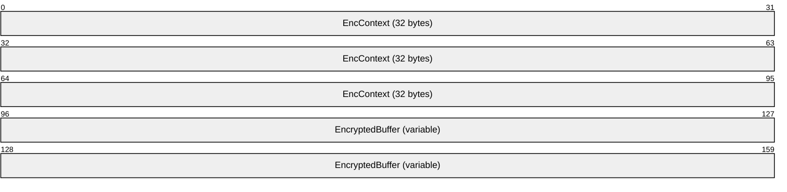
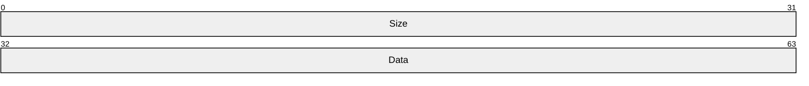
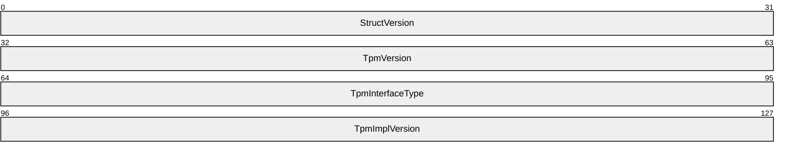

# [MS-HGSA]: Host Guardian Service: Attestation Protocol

Table of Contents

1 Introduction

- [1 Introduction](#Section_1)
  - [1.1 Glossary](#Section_1.1)
  - [1.2 References](#Section_1.2)
    - [1.2.1 Normative References](#Section_1.2.1)
    - [1.2.2 Informative References](#Section_1.2.2)
  - [1.3 Overview](#Section_1.3)
  - [1.4 Relationship to Other Protocols](#Section_1.4)
  - [1.5 Prerequisites/Preconditions](#Section_1.5)
  - [1.6 Applicability Statement](#Section_1.6)
  - [1.7 Versioning and Capability Negotiation](#Section_1.7)
  - [1.8 Vendor-Extensible Fields](#Section_1.8)
  - [1.9 Standards Assignments](#Section_1.9)

2 Messages

- [2 Messages](#Section_2)
  - [2.1 Transport](#Section_2.1)
  - [2.2 Common Data Types](#Section_2.2)
    - [2.2.1 Enumerations](#Section_2.2.1)
      - [2.2.1.1 AttestationOperationMode](#Section_2.2.1.1)
      - [2.2.1.2 AttestationProvidedContentType](#Section_2.2.1.2)
      - [2.2.1.3 AttestationResultType](#Section_2.2.1.3)
      - [2.2.1.4 TPMVersion](#Section_2.2.1.4)
      - [2.2.1.5 TpmInterfaceType](#Section_2.2.1.5)
    - [2.2.2 Common Data Structures](#Section_2.2.2)
      - [2.2.2.1 AttestationRequest](#Section_2.2.2.1)
      - [2.2.2.2 TpmRequest](#Section_2.2.2.2)
      - [2.2.2.3 TpmRequestInitial](#Section_2.2.2.3)
      - [2.2.2.4 TpmRequestContinue](#Section_2.2.2.4)
      - [2.2.2.5 ADRequest](#Section_2.2.2.5)
      - [2.2.2.6 TpmReplyContinue](#Section_2.2.2.6)
      - [2.2.2.7 HealthCertificateReply](#Section_2.2.2.7)
      - [2.2.2.8 TupleOfAttestationProvidedContentTypebase64Binary](#Section_2.2.2.8)
      - [2.2.2.9 TupleOfAttestationResultTypebase64Binary](#Section_2.2.2.9)
      - [2.2.2.10 ServiceInfoReply](#Section_2.2.2.10)
      - [2.2.2.11 ErrorReply](#Section_2.2.2.11)
      - [2.2.2.12 EndorsementKey](#Section_2.2.2.12)
      - [2.2.2.13 EvaluationLog](#Section_2.2.2.13)
      - [2.2.2.14 OperationModeErrorReply](#Section_2.2.2.14)
      - [2.2.2.15 PayloadErrorReply](#Section_2.2.2.15)
      - [2.2.2.16 PolicyEvaluationErrorReply](#Section_2.2.2.16)
      - [2.2.2.17 ProtocolReplyBase](#Section_2.2.2.17)
      - [2.2.2.18 ProtocolRequestBase](#Section_2.2.2.18)
      - [2.2.2.19 RtpmErrorReply](#Section_2.2.2.19)
      - [2.2.2.20 TcgLogValidationErrorReply](#Section_2.2.2.20)
      - [2.2.2.21 UnauthorizedErrorReply](#Section_2.2.2.21)
      - [2.2.2.22 UnavailableErrorReply](#Section_2.2.2.22)
      - [2.2.2.23 VirtualSecureModeErrorReply](#Section_2.2.2.23)
      - [2.2.2.24 VsmReportValidationErrorReply](#Section_2.2.2.24)
      - [2.2.2.25 Context](#Section_2.2.2.25)
      - [2.2.2.26 EncryptedStateObject](#Section_2.2.2.26)
      - [2.2.2.27 Data Blob](#Section_2.2.2.27)
        - [2.2.2.27.1 WBCL_INFO](#Section_2.2.2.27.1)
        - [2.2.2.27.2 TPM_DEVICE_INFO](#Section_2.2.2.27.2)
        - [2.2.2.27.3 TPM_COMMAND](#Section_2.2.2.27.3)

3 Protocol Details

- [3 Protocol Details](#Section_3)
  - [3.1 Server Details](#Section_3.1)
    - [3.1.1 Abstract Data Model](#Section_3.1.1)
      - [3.1.1.1 Global](#Section_3.1.1.1)
      - [3.1.1.2 Per Attestation Request](#Section_3.1.1.2)
    - [3.1.2 Timers](#Section_3.1.2)
    - [3.1.3 Initialization](#Section_3.1.3)
    - [3.1.4 Higher-Layer Triggered Events](#Section_3.1.4)
    - [3.1.5 Message Processing Events and Sequencing Rules](#Section_3.1.5)
      - [3.1.5.1 TPM Based Attestation](#Section_3.1.5.1)
        - [3.1.5.1.1 POST](#Section_3.1.5.1.1)
          - [3.1.5.1.1.1 Request Body](#Section_3.1.5.1.1.1)
          - [3.1.5.1.1.2 Response Body](#Section_3.1.5.1.1.2)
          - [3.1.5.1.1.3 Processing Details](#Section_3.1.5.1.1.3)
      - [3.1.5.2 Active Directory Based Attestation](#Section_3.1.5.2)
        - [3.1.5.2.1 POST](#Section_3.1.5.2.1)
          - [3.1.5.2.1.1 Request Body](#Section_3.1.5.2.1.1)
          - [3.1.5.2.1.2 Response Body](#Section_3.1.5.2.1.2)
          - [3.1.5.2.1.3 Processing Details](#Section_3.1.5.2.1.3)
      - [3.1.5.3 Host Key Based Attestation](#Section_3.1.5.3)
        - [3.1.5.3.1 POST](#Section_3.1.5.3.1)
          - [3.1.5.3.1.1 Request Body](#Section_3.1.5.3.1.1)
          - [3.1.5.3.1.2 Response Body](#Section_3.1.5.3.1.2)
          - [3.1.5.3.1.3 Processing Details](#Section_3.1.5.3.1.3)
      - [3.1.5.4 Receiving GetInfo](#Section_3.1.5.4)
        - [3.1.5.4.1 GET](#Section_3.1.5.4.1)
          - [3.1.5.4.1.1 Request Body](#Section_3.1.5.4.1.1)
          - [3.1.5.4.1.2 Response Body](#Section_3.1.5.4.1.2)
          - [3.1.5.4.1.3 Processing Details](#Section_3.1.5.4.1.3)
      - [3.1.5.5 Receiving SigningCertificates](#Section_3.1.5.5)
        - [3.1.5.5.1 GET](#Section_3.1.5.5.1)
          - [3.1.5.5.1.1 Request Body](#Section_3.1.5.5.1.1)
          - [3.1.5.5.1.2 Response Body](#Section_3.1.5.5.1.2)
          - [3.1.5.5.1.3 Processing Details](#Section_3.1.5.5.1.3)
    - [3.1.6 Timer Events](#Section_3.1.6)
    - [3.1.7 Other Local Events](#Section_3.1.7)
  - [3.2 Client Details](#Section_3.2)
    - [3.2.1 Abstract Data Model](#Section_3.2.1)
      - [3.2.1.1 Global](#Section_3.2.1.1)
      - [3.2.1.2 Per Attestation Request](#Section_3.2.1.2)
    - [3.2.2 Timers](#Section_3.2.2)
    - [3.2.3 Initialization](#Section_3.2.3)
    - [3.2.4 Higher-Layer Triggered Events](#Section_3.2.4)
      - [3.2.4.1 Application Requests Attestation](#Section_3.2.4.1)
      - [3.2.4.2 Application Requests Information](#Section_3.2.4.2)
      - [3.2.4.3 Application Requests SigningCertificates](#Section_3.2.4.3)
    - [3.2.5 Message Processing Events and Sequencing Rules](#Section_3.2.5)
      - [3.2.5.1 TPM Based Attestation](#Section_3.2.5.1)
      - [3.2.5.2 Active Directory Based Attestation](#Section_3.2.5.2)
      - [3.2.5.3 Host Key Based Attestation](#Section_3.2.5.3)
      - [3.2.5.4 Receiving Error Reply](#Section_3.2.5.4)
    - [3.2.6 Timer Events](#Section_3.2.6)
    - [3.2.7 Other Local Events](#Section_3.2.7)

4 Protocol Examples

- [4 Protocol Examples](#Section_4)

5 Security

- [5 Security](#Section_5)
  - [5.1 Security Considerations for Implementers](#Section_5.1)
  - [5.2 Index of Security Parameters](#Section_5.2)

6 Appendix A: Product Behavior

- [6 Appendix A: Product Behavior](#Section_6)

7 Change Tracking

- [7 Change Tracking](#Section_7)

For the legal notice and IP terms, see [LEGAL.md](../LEGAL.md).
Last updated: 4/23/2024.
See [Revision History](#revision-history) for full version history.

# 1 Introduction

This document specifies the Host Guardian Services Attestation (HGSA) Protocol.

Host Guardian Service provides secure services such as Attestation Service and Key Protection Service. Together these two services provide security assurance for shielded VMs by ensuring that shielded VMs can be run only on known and trusted fabric hosts that have a legitimate configuration. Key Protection Service is out of scope of the document.

Sections 1.5, 1.8, 1.9, 2, and 3 of this specification are normative. All other sections and examples in this specification are informative.

## 1.1 Glossary

This document uses the following terms:

**EK public key (EKPub)**: The public key portion of an endorsement key's private/public key pair.

**endorsement key**: A Rivest-Shamir-Adleman (RSA) public and private key pair that is created randomly on the [**trusted platform module (TPM)**](#gt_trusted-platform-module-tpm) at manufacture time and cannot be changed. The private key never leaves the TPM, while the public key is used for attestation and for encryption of sensitive data sent to the TPM. See [[TCG-Cred]](https://go.microsoft.com/fwlink/?LinkId=301945) section 2.4 for more information.

**globally unique identifier (GUID)**: A term used interchangeably with universally unique identifier (UUID) in Microsoft protocol technical documents (TDs). Interchanging the usage of these terms does not imply or require a specific algorithm or mechanism to generate the value. Specifically, the use of this term does not imply or require that the algorithms described in [[RFC4122]](https://go.microsoft.com/fwlink/?LinkId=90460) or [[C706]](https://go.microsoft.com/fwlink/?LinkId=89824) must be used for generating the [**GUID**](#gt_globally-unique-identifier-guid). See also universally unique identifier (UUID).

**Hypertext Transfer Protocol (HTTP)**: An application-level protocol for distributed, collaborative, hypermedia information systems (text, graphic images, sound, video, and other multimedia files) on the World Wide Web.

**PKCS7**: A public key cryptography standard used to sign and/or encrypt messages under a public key infrastructure as defined in [[RFC2315]](https://go.microsoft.com/fwlink/?LinkId=90334). It is also used for certificate dissemination.

**trusted platform module (TPM)**: A component of a trusted computing platform. The TPM stores keys, passwords, and digital certificates. See [[TCG-Architect]](https://go.microsoft.com/fwlink/?LinkId=301944) for more information.

**MAY, SHOULD, MUST, SHOULD NOT, MUST NOT:** These terms (in all caps) are used as defined in [[RFC2119]](https://go.microsoft.com/fwlink/?LinkId=90317). All statements of optional behavior use either MAY, SHOULD, or SHOULD NOT.

## 1.2 References

Links to a document in the Microsoft Open Specifications library point to the correct section in the most recently published version of the referenced document. However, because individual documents in the library are not updated at the same time, the section numbers in the documents may not match. You can confirm the correct section numbering by checking the [Errata](https://go.microsoft.com/fwlink/?linkid=850906).

### 1.2.1 Normative References

We conduct frequent surveys of the normative references to assure their continued availability. If you have any issue with finding a normative reference, please contact [dochelp@microsoft.com](mailto:dochelp@microsoft.com). We will assist you in finding the relevant information.

[MS-DTYP] Microsoft Corporation, "[Windows Data Types](../MS-DTYP/MS-DTYP.md)".

[MS-KPS] Microsoft Corporation, "[Key Protection Service Protocol](../MS-KPS/MS-KPS.md)".

[RFC2119] Bradner, S., "Key words for use in RFCs to Indicate Requirement Levels", BCP 14, RFC 2119, March 1997, [https://www.rfc-editor.org/info/rfc2119](https://go.microsoft.com/fwlink/?LinkId=90317)

[RFC2616] Fielding, R., Gettys, J., Mogul, J., et al., "Hypertext Transfer Protocol -- HTTP/1.1", RFC 2616, June 1999, [https://www.rfc-editor.org/info/rfc2616](https://go.microsoft.com/fwlink/?LinkId=90372)

[RFC2818] Rescorla, E., "HTTP Over TLS", RFC 2818, May 2000, [https://www.rfc-editor.org/info/rfc2818](https://go.microsoft.com/fwlink/?LinkId=90383)

### 1.2.2 Informative References

None.

## 1.3 Overview

The Host Guardian Service Attestation protocol uses REST-based transport protocol.

The Host Guardian Service provides secure services such as the Attestation Service and the Key Protection Service.

For [**TPM**](#gt_trusted-platform-module-tpm)-based attestation:

- A client initiates TPM-based attestation by providing its Remote TPM public [**endorsement key**](#gt_endorsement-key) ("[**EKPub**](#gt_ek-public-key-ekpub)") to the Host Guardian Service.
- The Host Guardian Service uses the EKPub to initiate an underlying Remote TPM ("RTPM") protocol to the client to read TPM measurements from the client. The reply includes the current RTPM protocol context.
- The client reads the context provided by the service and continues the RTPM protocol by sending another request containing a new RTPM protocol context to the server.
- When the service has completed the TPM read, it compares the measurements therein with the configured TPM-based attestation policy. If policy evaluation succeeds, it returns a valid attestation health certificate to the client.
For Active Directory(AD)-based attestation:

- The server checks that the client credentials are a member of a registered authorized host group.
- A client initiates AD-based attestation by initiating an AD-based attestation request to the Host Guardian Service.
- The service uses the Kerberos protocol to authenticate the client request. If the credentials belong to a configured, authorized Active Directory host group, the service returns a valid attestation health certificate to the client.
For Host Key-based attestation:

- A client initiates Host Key attestation by providing the following to the Host Guardian Service:
- The public portion of a key pair owned by the client, defined as the “Host Key”.
- The public portion of a key pair owned by the client for which the client wishes to receive a health certificate signed by the Host Guardian Service.
- A signature over the above two artifacts using private portion of the “Host Key”.
- The service ensures that the Host Key is recognized, uses the Host Key to validate the provided signature, and issues an attestation health certificate to the client.
The client can choose TPM, AD, or Host Key-based attestation depending upon the server configuration.

## 1.4 Relationship to Other Protocols

For key protection service, the Host Guardian Service uses Key Protection services, as specified in [MS-KPS](../MS-KPS/MS-KPS.md).

## 1.5 Prerequisites/Preconditions

The server is configured to either the [**TPM**](#gt_trusted-platform-module-tpm)-based attestation or AD-based attestation mode and can operate on only one mode at a time.

The following is the list of prerequisites/preconditions to perform TPM-based attestation.

- The client is required to be registered in the server configuration with its [**EKPub**](#gt_ek-public-key-ekpub).
Following is the prerequisite/precondition needed to perform AD-based attestation.

- The Security Identifier of the client is required to be registered in the server configuration.
Following is the prerequisite/precondition needed to perform HostKey-based attestation.<1>

- The client is required to be registered in the server configuration with the public portion of its Host Key.

## 1.6 Applicability Statement

The "Host Guardian Service" includes the Attestation Service and the Key Protection Service as critical components that enable secure virtual machines in a cloud-based environment.

## 1.7 Versioning and Capability Negotiation

Some server operations MAY<2> include a versioned URI formatted with either "v1.0" or "v2.0". These can also be referred to “version 1” or “version 2”, respectively.

## 1.8 Vendor-Extensible Fields

There are no vendor-extensible fields for the Host Guardian Service Attestation Protocol.

## 1.9 Standards Assignments

None.

# 2 Messages

## 2.1 Transport

This protocol uses [**HTTP**](#gt_hypertext-transfer-protocol-http) or secure HTTP 1.1 as transport, as specified in [[RFC2616]](https://go.microsoft.com/fwlink/?LinkId=90372) and [[RFC2818]](https://go.microsoft.com/fwlink/?LinkId=90383).

## 2.2 Common Data Types

### 2.2.1 Enumerations

The following sections specify the enumerations defined in this specification.

#### 2.2.1.1 AttestationOperationMode

**AttestationOperationMode** represents the operation mode of the Attestation Service.

| Value | Meaning |
| --- | --- |
| 0x00000000 | Unknown attestation mode |
| 0x00000001 | [**TPM**](#gt_trusted-platform-module-tpm) - Platform TPM–based attestation mode |
| 0x00000002 | AD - Active Directory–based attestation mode |
| 0x00000003 | HostKey – Key-based attestation mode |

#### 2.2.1.2 AttestationProvidedContentType

**AttestationProvidedContentType** represents the type of the content being sent to the Attestation Service.

| Value | ContentType | Meaning |
| --- | --- | --- |
| 0x1 | VirtualSecureModeIdentityKey | The EndorsementKey data type. |
| 0x2 | RtpmContext | The Context data type. |
| 0x3 | HealthCertificate | Binary serialized certificate VSMIDK or VSMIDKS previously requested from the Attestation Service. |
| 0x4 | EndorsementKeyCertificate | Binary serialized Endorsement Key Certificate from a TPM. |
| 0x5 | CaTrustletUserData | Binary hash of the public key used to sign the CaTrustletVsmReport |
| 0x6 | CaTrustletVsmReport | VSM_SK_REPORT provided by the CA trustlet. |
| 0x7 | CaTrustletReportSignature | Binary signature of the VSMIDKS over the CaTrustletVsmReport, used to validate the data. |
| 0x8 | HostKeyPublicKey | The public key associated with a Host Key attestation mode. It is the public portion of the key that creates HostKeySignature. |
| 0x9 | HostKeySignature | The signature generated by the key associated with Host Key attestation. It is a signature over the bytes of the HostKeyPublicKey and VirtualSecureModeIdentityKey, consecutively. |

#### 2.2.1.3 AttestationResultType

**AttestationResultType** represents the type of the content being requested or returned by the Attestation Service.

| Value | Meaning |
| --- | --- |
| VSMIdentityEncryptionKeyCertificate 0x00000001 | A certified Virtual Secure Mode Identity Key for Encryption is being requested in the form of a health certificate. |
| VSMIdentitySigningKeyCertificate 0x00000002 | A certified Virtual Secure Mode Identity Key for Signing is being requested in the form of a health certificate. |
| VSMCAIntermediateCertificate 0x00000003 | A Certificate Authority intermediate certificate is being requested in the form of a health certificate. This type is supported only in TPM-based attestation mode. |

#### 2.2.1.4 TPMVersion

The **TPMVersion** denotes the version of TPM.

| Value | Meaning |
| --- | --- |
| TPM_VERSION_UNKOWN 0x00000000 | Unknown version. |
| TPM_VERSION_12 0x00000001 | TPM 1.2 |
| TPM_VERSION_20 0x00000002 | TPM 2.0 |

#### 2.2.1.5 TpmInterfaceType

The **TpmInterfaceType** denotes the type of TPM interface.

| Value | Meaning |
| --- | --- |
| TPM_IFTYPE_UNKNOWN 0x00000000 | Unknown interface type. |
| TPM_IFTYPE_1 0x00000001 | TPM 1.2 interface type that uses port-mapped or memory-mapped I/O. |
| TPM_IFTYPE_TRUSTZONE 0x00000002 | TPM 2.0 TrustZone interface. |
| TPM_IFTYPE_HW 0x00000003 | TPM 2.0 hardware interface. |
| TPM_IFTYPE_EMULATOR 0x00000004 | TPM 2.0 software emulator interface. |

### 2.2.2 Common Data Structures

The following sections are the set of common data structures defined by this specification. Common data types are specified in [MS-DTYP](../MS-DTYP/MS-DTYP.md).

JSON schema objects represented in this section are assumed to exist in the [MS-HGSA] document root. Order of "__type" object property matters and, when present, must be placed before all other properties. Enumerations from the previous section may also be presented as JSON schema references in the format "[MS-HGSA]#/EnumerationName".

#### 2.2.2.1 AttestationRequest

The **AttestationRequest** structure defines the type used for v2.0 and later TPM or Host Key-based protocol requests.

{

"id": "AttestationRequest",

"allOf": [{

"type": "object",

"properties": {

"RequestedContent": {

"type": "array",

"items": {

"$ref": "[MS-HGSA]#/AttestationResultType"

},

"required": true

},

"ProvidedContent": {

"type": "array",

"items": {

"$ref": "[MS-HGSA]#/TupleOfAttestationProvidedContentTypebase64Binary"

},

"required": true

}

}

},{

"$ref": "[MS-HGSA]#/ProtocolRequestBase"

}]

}

#### 2.2.2.2 TpmRequest

The **TpmRequest** structure defines the base type of all v1.0 TPM-based protocol requests.

{

"id": "TpmRequest",

"allOf": [{

"type": "object",

"properties": {

"RequestedContent": {

"type": "array",

"items": {

"$ref": "[MS-HGSA]#/AttestationResultType"

},

"required": true

},

"RtpmPublicEndorsementKey": {

"type": "string",

"required": true

}

}

},{

"$ref": "[MS-HGSA]#/ProtocolRequestBase"

}]

}

**RequestedContent:** The type of content requested to be returned upon successful attestation. For [**TPM**](#gt_trusted-platform-module-tpm)-based attestation, the value of the content will be determined based on the **RequestedContent** and information from the RTPM exchange.

**RtpmPublicEndorsementKey:** A base64Binary string representing the remote TPM public [**endorsement key**](#gt_endorsement-key) of the client that tried to perform attestation.

#### 2.2.2.3 TpmRequestInitial

The **TpmRequestInitial** structure defines the initial request for triggering [**TPM**](#gt_trusted-platform-module-tpm)-based attestation. This is used only for protocol version v1.0.

{

"id": "TpmRequestInitial",

"allOf": [{

"type": "object",

"properties": {

"__type": {

"enum": ["TpmRequestInitial:#Microsoft.Windows.RemoteAttestation.Core"]

"required": true

},

}

},{

"$ref": "[MS-HGSA]#/TpmRequest"

}]

}

#### 2.2.2.4 TpmRequestContinue

The **TpmRequestContinue** structure defines the subsequent request after receiving new remote [**TPM**](#gt_trusted-platform-module-tpm) context as the response from the server. This is used only for protocol version v1.0.

{

"id": "TpmRequestContinue",

"allOf": [{

"type": "object",

"properties": {

"__type": {

"enum": ["TpmRequestContinue:#Microsoft.Windows.RemoteAttestation.Core"]

"required": true

},

"RtpmNewContext": {

"type": "string",

"required": true

}

}

},{

"$ref": "[MS-HGSA]#/TpmRequest"

}]

}

**RtpmNewContext**: A base64Binary string representing the new remote TPM context received from the server in response to the initial TPM request as defined in section [2.2.2.25](#Section_2.2.2.25).

#### 2.2.2.5 ADRequest

The **ADRequest** structure defines the initial request for performing Active Directory–based attestation.

{

"id": "ADRequest",

"allOf": [{

"type": "object",

"properties": {

"__type": {

"enum": ["ADRequest:#Microsoft.Windows.RemoteAttestation.Core"]

"required": true

},

"RequestedContent": {

"type": "array",

"items": {

"$ref": "[MS-HGSA]#/TupleOfAttestationResultTypebase64Binary"

},

"required": true

}

}

},{

"$ref": "[MS-HGSA]#/ProtocolRequestBase"

}]

}

**RequestedContent:** A tuple of the type of content being attested as well as the content itself.

#### 2.2.2.6 TpmReplyContinue

The **TpmReplyContinue** structure defines the [**TPM**](#gt_trusted-platform-module-tpm)-based attestation replies, preceding the final reply. This is used only for protocol version v1.0.

{

"id": "TpmReplyContinue",

"description": "TPM Based attestation: response from server",

"allOf": [{

"type": "object",

"properties": {

"__type": {

"enum": ["TpmReplyContinue:#Microsoft.Windows.RemoteAttestation.Core"]

"required": true

},

"RtpmActiveContext": {

"type": "string"

},

"required": ["RtpmActiveContext"]

}

},{

"$ref": "[MS-HGSA]#/ProtocolReplyBase"

}]

}

**RtpmActiveContext:** A base64Binary string representing the new Remote TPM context, as defined in section [2.2.2.25](#Section_2.2.2.25), received from the server in response to the initial TPM request.

#### 2.2.2.7 HealthCertificateReply

The **HealthCertificateReply** structure defines the final attestation reply that is received from the server that contains the health certificate.

{

"id": "HealthCertificateReply",

"allOf": [{

"type": "object",

"properties": {

"__type": {

"enum": ["HealthCertificateReply:#Microsoft.Windows.RemoteAttestation.Core"]

"required": true

},

"Content": {

"type": "array",

"items": {

"$ref": "[MS-HGSA]#/TupleOfAttestationResultTypebase64Binary"

},

"required": true

}

}

},{

"$ref": "[MS-HGSA]#/ProtocolReplyBase"

}]

}

**Content:** A **TupleOfAttestationResultTypebase64Binary** containing the requested content type and the attested content itself.

#### 2.2.2.8 TupleOfAttestationProvidedContentTypebase64Binary

**TupleOfAttestationProvidedContentTypebase64Binary** specifies the **AttestationProvidedContentType** as an unsigned integer along with content of the associated type in base-64 binary string representation.

{

"id": "TupleOfAttestationProvidedContentTypebase64Binary",

"type": "object",

"properties": {

"m_Item1": {

"$ref": "[MS-HGSA]#/AttestationProvidedContentType",

"required": true

},

"m_Item2": {

"type": "string",

"required": true

}

}

}

**m_Item1**: The **AttestationProvidedContentType** that identifies to the client or server what the base64Binary string in **m_Item2** represents.

**m_Item2**: The base64Binary string of the content type identified in **m_Item1.**

#### 2.2.2.9 TupleOfAttestationResultTypebase64Binary

**TupleOfAttestationResultTypebase64Binary** specifies the **AttestationResultType** as an unsigned integer along with content of the associated type in base-64 binary string representation.

{

"id": "TupleOfAttestationResultTypebase64Binary",

"type": "object",

"properties": {

"m_Item1": {

"$ref": "[MS-HGSA]#/AttestationResultType",

"required": true

},

"m_Item2": {

"type": "string",

"required": true

}

}

}

**m_Item1:** The **AttestationResultType** that identifies to the client or server what the base64Binary string in **m_Item2** represents.

**m_Item2:** The base64Binary string of the content type identified in **m_Item1**.

#### 2.2.2.10 ServiceInfoReply

**ServiceInfoReply** denotes the information about the **Server** service.

{

"id": "ServiceInfoReply",

"allOf": [{

"type": "object",

"properties": {

"__type": {

"enum": ["ServiceInfoReply:#Microsoft.Windows.RemoteAttestation.Core"]

"required": true

},

"FunctionalLevel": {

"type": "integer",

"minimum": 0,

"maximum": 4294967295,

"required": true

},

"OperationMode": {

"$ref": "[MS-HGSA]#/AttestationOperationMode",

"required": true

},

"SupportedFunctionalLevels": {

"type": "array",

"items": {

"type": "integer",

"minimum": 0,

"maximum": 4294967295

},

"required": true

}

}

},{

"$ref": "[MS-HGSA]#/ProtocolReplyBase"

}]

}

**FunctionalLevel:** An integer representing the current functional level of the server.

**OperationMode:** An attestation operation mode representing the current operating mode of the server as defined in section [2.2.1.1](#Section_2.2.1.1).

**SupportedFunctionalLevels:** An array of integers representing the supported function levels of the server.

#### 2.2.2.11 ErrorReply

The **ErrorReply** structure defines the base type of all protocol replies containing an error and the generic reply used when an error is not associated with other types of errors. Other errors can be any one of the following structures mentioned in sections [2.2.2.14](#Section_2.2.2.14), [2.2.2.15](#Section_2.2.2.15), [2.2.2.16](#Section_2.2.2.16), [2.2.2.17](#Section_2.2.2.17), [2.2.2.18](#Section_2.2.2.18), [2.2.2.19](#Section_2.2.2.19), [2.2.2.20](#Section_2.2.2.20), [2.2.2.21](#Section_2.2.2.21), [2.2.2.22](#Section_2.2.2.22), or [2.2.2.23](#Section_2.2.2.23).

{

"id": "ErrorReply",

"allOf": [{

"type": "object",

"properties": {

"Retryable": {

"type": "boolean",

"required": true

}

}

},{

"$ref": "[MS-HGSA]#/ProtocolReplyBase"

}]

}

**Retryable:** A Boolean representing whether the client can meaningfully retry the request that resulted in an error.

#### 2.2.2.12 EndorsementKey

The **EndorsementKey** structure defines the remote [**TPM**](#gt_trusted-platform-module-tpm) public [**endorsement key**](#gt_endorsement-key) that holds the buffer of the key.

{

"id": "EndorsementKey",

"description": "Unmanaged Remote TPM public key structure",

"type": "object",

"properties": {

"Key": {

"type": "string"

"required": true

}

},

"additionalProperties": false

}

**Key:** A base64Binary string representing the public endorsement key of the Remote TPM.

#### 2.2.2.13 EvaluationLog

The **EvaluationLog** structure defines the policy evaluation log entry indicating whether the attestation has passed or not.

{

"id": "EvaluationLog",

"description": "Verifies the Evaluation Log entry ",

"type": "object",

"properties": {

"Result": {

"type": "boolean"

"required": true

},

"Reason": {

"type": "string"

"required": true

},

"additionalProperties": false

}

}

**Result:** A Boolean indicating whether policy evaluation is successful or not. True if the policy evaluation is successful; otherwise, False.

**Reason:** A base64Binary string representing policy evaluation failure reasons. The list of [**GUIDs**](#gt_globally-unique-identifier-guid) identifying the type of policy evaluation failure are given below.

| GUID | Name/Policy Description |
| --- | --- |
| 6a460ee1-62ea-416f-ae6c-04e29634506d | SecureBootEnabledGuid - Secure Boot is enabled. |
| 756dc455-9528-479a-a86a-c646417316c9 | SecureBootSettingsGuid - Secure Boot measurements match the expected values. |
| 20188fda-d40b-460d-b078-2e7898a42ae9 | DebugModeUefiGuid - UEFI debug mode is disabled. |
| 81f110ba-53c5-4064-9d64-51029fa24f49 | SystemIntegrityCiKnownGoodGuid - Code Integrity measurements match the expected values. |
| 75ad09c9-7254-4d00-96f3-3b09d0aaac54 | FullBootGuid - The last boot was a full boot. |
| 75d595de-12f5-41e9-a61e-469d3205ecca | VsmIdkPresent - The Virtual Secure Mode Identity Key is present. |
| 6c0a6d29-5bcb-4f28-bafb-f71eb60fdae0 | VsmRunning - Virtual Secure Mode is running. |
| da0776e5-6570-44b3-9a17-7e95b4fc7779 | IommuEnabled - IOMMU required for VSM to launch. |
| 347da547-d266-4939-bf3d-9ec73a90bdbc | BitLockerEnabled - BitLocker enabled. |
| 12df0ee9-b38e-4086-90f8-703d9e7cb878 | PagefileEncryptionEnabled - Pagefile encryption enabled. |
| 5408BD30-3250-4AC1-A150-C410AF756699 | HypervisorEnforcedCiPolicy - Policy which ensures that CI is being enforced by the hypervisor. |
| A32022C6-DCCD-4BF5-BE76-3B5CA1542559 | NoHibernation- Policy which ensures that hibernation is disabled. |
| 2A796E36-E918-454F-B610-60F086E8D334 | NoDumps - Policy which ensures that crash dumps are disabled. |
| 6F390A71-753C-43AA-A326-74E30AEDCD9D | DumpEncryption - Policy which ensures that crash dumps are encrypted if they are enabled. |
| 85DAC0A4-8BA9-4A7F-A342-211862CE0BE8 | DumpEncryptionKey - Policy which ensures that the crash dump encryption key is expected if crash dumps are enabled. |

#### 2.2.2.14 OperationModeErrorReply

**OperationModeErrorReply** structure defines the error reply due to incorrect operation mode specified by the client.

{

"id": "OperationModeErrorReply",

"description": "Error reply from server for Operation mode",

"allOf": [{

"type": "object",

"properties": {

"__type": {

"enum": ["OperationModeErrorReply:#Microsoft.Windows.RemoteAttestation.Core"]

"required": true

},

"ExpectedOperationMode": {

"type": {

"$ref": "[MS-HGSA]#/AttestationOperationMode"

"required": true

}

}

}

},{

"$ref": "[MS-HGSA]#/ErrorReply"

}]

}

**ExpectedOperationMode:** Expected mode of operation from the server; possible modes of operation are specified in section [2.2.1.1](#Section_2.2.1.1).

#### 2.2.2.15 PayloadErrorReply

**PayloadErrorReply** structure defines the error in which a request sent by the client is not supported by the server.

{

"id": "PayloadErrorReply",

"description": "Payload Error reply from server",

"allOf": [{

"type": "object",

"properties": {

"__type": {

"enum": ["PayloadErrorReply:#Microsoft.Windows.RemoteAttestation.Core"]

"required": true

}

}

}

},{

"$ref": "[MS-HGSA]#/ErrorReply"

}]

}

#### 2.2.2.16 PolicyEvaluationErrorReply

**PolicyEvaluationErrorReply** structure defines the error due to failure in the policy.

{

"id": "PolicyEvaluationErrorReply",

"description": "Policy Evaluation Error reply from server",

"allOf": [{

"type": "object",

"properties": {

"__type": {

"enum": ["PolicyEvaluationErrorReply:#Microsoft.Windows.RemoteAttestation.Core"]

"required": true

},

"Reasons": {

"type": "array",

"items": {

"$ref": "[MS-HGSA]#/EvaluationLog"

},

"required": true

}

}

},{

"$ref": "[MS-HGSA]#/ErrorReply"

}]

}

**EvaluationLog**: Policy evaluation log specified in section [2.2.2.13](#Section_2.2.2.13).

#### 2.2.2.17 ProtocolReplyBase

**ProtocolReplyBase** structure represents the base type of attestation protocol replies from the server.

{

"id": "ProtocolReplyBase",

"description": "Protocol reply from server",

"type": "object",

"properties": {}

}

#### 2.2.2.18 ProtocolRequestBase

**ProtocolRequestBase** structure represents the base type of attestation protocol requests from the client to the server.

{

"id": "ProtocolRequestBase",

"description": "Protocol Request base",

"type": "object",

"properties": {

"SessionId": {

"type": "string"

},

"required": ["SessionId"]

}

}

**SessionId**: A [**GUID**](#gt_globally-unique-identifier-guid) of type base64Binary string representing the attestation session.

#### 2.2.2.19 RtpmErrorReply

**RtpmErrorReply** structure represents an error received from the underlying remote [**TPM**](#gt_trusted-platform-module-tpm) protocol.

{

"id": "RtpmErrorReply",

"description": "Rtpm Error reply from server",

"allOf": [{"$ref": "#/definitions.ErrorReply"},

{

"type": "object",

"properties": {

"__type": {

"enum": ["RtpmErrorReply:#Microsoft.Windows.RemoteAttestation.Core"]

"required": true

}

}

}]

}

#### 2.2.2.20 TcgLogValidationErrorReply

**TcgLogValidationErrorReply** structure represents that an error is received from the server in WBCL validation.

{

"id": "TcgLogValidationErrorReply",

"description": "TCG log validation Error reply from server",

"allOf": [

{

"type": "object",

"properties": {

"__type": {

"enum": ["TcgLogValidationErrorReply:#Microsoft.Windows.RemoteAttestation.Core"]

"required": true

}

}

},{

"$ref": "#/definitions.ErrorReply"

}]

}

#### 2.2.2.21 UnauthorizedErrorReply

**UnauthorizedErrorReply** structure represents that an error is received from the server due to an unauthorized client.

{

"id": "UnauthorizedErrorReply",

"description": "Unauthorized client Error reply from server",

"allOf": [{

"type": "object",

"properties": {

"__type": {

"enum": ["UnauthorizedErrorReply:#Microsoft.Windows.RemoteAttestation.Core"]

"required": true

}

}

},{

"$ref": "#/definitions.ErrorReply"

}]

}

#### 2.2.2.22 UnavailableErrorReply

**UnavailableErrorReply** structure represents that an error reply is received from the server due to service is unavailable.

{

"id": "UnavailableErrorReply",

"description": "Host Unavailable or Service Unavailable Error reply from server",

"allOf": [{

"type": "object",

"properties": {

"__type": {

"enum": ["UnavailableErrorReply:#Microsoft.Windows.RemoteAttestation.Core"]

"required": true

}

}

},{

"$ref": "#/definitions.ErrorReply"

}]

}

#### 2.2.2.23 VirtualSecureModeErrorReply

**VirtualSecureModeErrorReply** structure represents an error in fetching or parsing the VSMIDK or detecting VSM's presence.

{

"id": "VirtualSecureModeErrorReply",

"description": "Virtual Secure Mode Error reply from server",

"allOf": [{

"type": "object",

"properties": {

"__type": {

"enum": ["VirtualSecureModeErrorReply:#Microsoft.Windows.RemoteAttestation.Core"]

"required": true

}

}

},{

"$ref": "#/definitions.ErrorReply"

},]

}

#### 2.2.2.24 VsmReportValidationErrorReply

The **VsmReportValidationErrorReply** structure represents an error in validating the CaTrustletVsmReport.

{

"id": "VsmReportValidationErrorReply",

"description": "VSM_SK_REPORT error reply from server",

"allOf": [{

"type": "object",

"properties": {

"__type": {

"enum": ["VirtualSecureModeErrorReply:#Microsoft.Windows.RemoteAttestation.Core"]

"required": true

}

}

},{

"$ref": "#/definitions.ErrorReply"

},]

}

#### 2.2.2.25 Context

The main header remote TPM **Context** structure followed by a variable number of **Data Blobs** defined in section [2.2.2.27](#Section_2.2.2.27.3).

**Size (4 bytes):** The size, in bytes of the entire context.

**Version (4 bytes):** The version of the context. This MUST be set to 1.

**DataBlobCount (4 bytes):** The number of data blobs preceding the context.

**Reserved (4 bytes):** This field is used for padding. This field is set to 0 by client and server MUST ignore this field.

**EncStateObject (variable):** Encrypted blob containing the TPM state as defined in section [2.2.2.26](#Section_2.2.2.26)**.**

#### 2.2.2.26 EncryptedStateObject

The **EncryptedStateObject** is an encrypted blob containing the TPM state.

**EncContext (32 bytes):** The encrypted context**.**

**EncryptedBuffer (variable):** The encrypted buffer containing the state information.

#### 2.2.2.27 Data Blob

The **Data Blob** contains the payload and is one of the following.

| Payload | Meaning |
| --- | --- |
| WBCL | WBCL_INFO as defined in section [2.2.2.27.1](#Section_2.2.2.27.1). |
| DeviceInfo | TPM_DEVICE_INFO as defined in section [2.2.2.27.2](#Section_2.2.2.27.2). |
| TPM command | TPM_COMMAND as defined TCG. The list of supported commands is specified in section [2.2.2.27.3](#Section_2.2.2.27.3). |

##### 2.2.2.27.1 WBCL_INFO

The **WBCL_INFO** structure defines the Windows Boot Counter Log (WBCL).

**Size (4 bytes):** The size, in bytes, of the WBCL**.**

**Data (4 bytes):** The actual content of the WBCL.

##### 2.2.2.27.2 TPM_DEVICE_INFO

The **TPM_DEVICE_INFO** provides information about the version of the TPM.

**StructVersion (4 bytes):** Structure version is set to 1.

**TpmVersion (4 bytes):** TPM version as defined in section [2.2.1.4](#Section_2.2.1.4).

**TpmInterfaceType (4 bytes):** TPM interface type as defined in section [2.2.1.5](#Section_2.2.1.5)

**TpmImplVersion (4 bytes):** Implementation-specific revision of the TPM.

##### 2.2.2.27.3 TPM_COMMAND

The list of supported TPM_Commands is as follows.

| Name | Command code |
| --- | --- |
| TPM_CC_CreatePrimary | 0x00000131 |
| TPM_CC_Create | 0x00000153 |
| TPM_CC_ReadPublic | 0x00000173 |
| TPM_CC_StartAuthSession | 0x00000176 |
| TPM_CC_PCR_Read | 0x0000017E |

# 3 Protocol Details

## 3.1 Server Details

### 3.1.1 Abstract Data Model

This section describes a conceptual model of possible data organization that an implementation maintains to participate in this protocol. The described organization is provided to facilitate the explanation of how the protocol behaves. This document does not mandate that implementations adhere to this model as long as their external behavior is consistent with that described in this document.

#### 3.1.1.1 Global

**SecurityGroup**: List of domain-joined hosts that are known to be secure.

**AttestationHealthCertificate**: The health certificate as an X509Certificate2.

**SupportedFunctionalLevels:** An array of integers representing the supported functional levels of the server.

#### 3.1.1.2 Per Attestation Request

**SecurityIdentifier:** A unique value of variable length used to identify a client.

**isauthorized:** A Boolean that determines whether the client is authorized or not.

**RtpmNewContext**: A base64Binary string representing the Remote [**TPM**](#gt_trusted-platform-module-tpm) context, as defined in section [2.2.2.25](#Section_2.2.2.25), received from the server in response to initial TPM request.

**EvaluationLog:** A log containing the result of policy evaluation after performing attestation as specified in section [2.2.2.13](#Section_2.2.2.13).

**AttestationOperationMode:** The mode of operation of the Attestation Service as defined in section [2.2.1.1](#Section_2.2.1.1).

**FunctionalLevel:** An integer representing the functional level of the server.

### 3.1.2 Timers

None.

### 3.1.3 Initialization

The server MUST implement the following:

**Isauthorized**: MUST be set to zero.

**EvaluationLog:** MUST be set to empty.

**AttestationHealthCertificate:** MUST be set to NULL.

**RtpmNewContext:** MUST be set to NULL.

**AttestationOperationMode:** MUST be set to configured operation mode on the server.

**FunctionalLevel:** MUST be set to the current highest functional level.

**SupportedFunctionalLevels:** MUST be set to an array of integers representing all supported functional levels of the server.

### 3.1.4 Higher-Layer Triggered Events

None.

### Message Processing Events and Sequencing Rules

The following sections describe the sequence of operations performed by the server.

#### 3.1.5.1 TPM Based Attestation

The server is configured to operate in [**TPM**](#gt_trusted-platform-module-tpm) mode.

##### 3.1.5.1.1 POST

The operation can be invoked through the following URI.

http://<configuredServiceName>.<configuredDomain>/Attestation/versionMajorMinor/attest

**VersionMajorMinor:** Represents the major and minor version numbers separated by a decimal—for example, v1.0 or v2.0.

The following is an example of a complete URI for this operation.

http://attest.hgs151209.com/Attestation/v1.0/attest

###### 3.1.5.1.1.1 Request Body

The request body for this method contains any one of the following structures:

**AttestationRequest**: Structure representing the initial or subsequent TPM-based attestation protocol requests in v2.0 or later as specified in section [2.2.2.1](#Section_2.2.2.1).

**TpmRequestInitial:** Structure representing the initial [**TPM**](#gt_trusted-platform-module-tpm)-based attestation request as specified in section [2.2.2.3](#Section_2.2.2.3).

**TpmRequestContinue:** Structure representing the subsequent TPM-based attestation protocol requests, following the initial request as specified in section [2.2.2.4](#Section_2.2.2.4).

###### 3.1.5.1.1.2 Response Body

The response body for this method contains any one of the following structures:

**TpmReplyContinue:** Structure representing the reply to the initial [**TPM**](#gt_trusted-platform-module-tpm)-based attestation request, preceding the final reply as specified in section [2.2.2.6](#Section_2.2.2.6).

**HealthCertificateReply:** Structure representing the final reply for attestation that contains the health certificate as specified in section [2.2.2.7](#Section_2.2.2.7).

**ErrorReply:** Structure containing the attestation protocol errors as specified in section [2.2.2.11](#Section_2.2.2.11).

###### 3.1.5.1.1.3 Processing Details

If the **AttestationOperatingMode** on the server is TPM and received URI terminate with "/domainattest” or “/hostkeyattest”, the server MUST return **OperationModeErrorReply** to the client.

If the **AttestationOperatingMode** on the server is TPM, the received URI terminate with "/attest" but the request received is not valid for TPM mode, the server MUST return **PayloadErrorReply** to the client.

If the request received is **TpmRequestInitial**, the server MUST perform the following:

- Check if a matching entry is found between registered [**EKPub**](#gt_ek-public-key-ekpub) modules and the EKPub of the client that initiated the request.
- If a matching entry is not found, set **isauthorized** to FALSE and return an **UnauthorizedErrorReply** message to the client.
If a matching entry is found, set **isauthorized** to TRUE and construct a **TpmReplyContinue** message in an implementation-specific manner to the client’s **RtpmPublicEndorsementKey**.

If the request received is **TpmRequestContinue** or **AttestationRequest** from the client, the server MUST process the following:

- Check if a matching entry is found between registered EKPub modules and the EKPub of the client. Update **isauthorized** to TRUE if a matching entry is found.
- If **isauthorized** is FALSE for **RtpmPublicEndorsementKey** received from client, return **UnauthorizedErrorReply** to the client.
- If **isauthorized** is TRUE and **RtpmNewContext** received from the client is empty, return **TpmReplyContinue** message to the client with the empty context.
Otherwise,

- Perform the policy evaluation against the list of policies the server is configured to, in an implementation-specific manner with the WBCL that is retrieved from the underlying RTPM protocol and the **RtpmPublicEndorsementKey**.
- If the policy evaluation is successful, the server MUST do the following:
- If AttestationResultType in AttestationRequest or TpmRequest is VSMIdentityEncryptionKeyCertificate (as specified in section [2.2.1.3](#Section_2.2.1.3)), return **HealthCertificateReply** in the form of certified Virtual Secure Mode Identity Key for Encryption with **AttestationHealthCertificate** to the client.
- If AttestationResultType in AttestationRequest or TpmRequest is VSMIdentitySigningKeyCertificate (as specified in section 2.2.1.3), return **HealthCertificateReply** in the form of certified Virtual Secure Mode Identity Key for Signing with **AttestationHealthCertificate** to the client.
- If AttestationResultType in AttestationRequest or TpmRequest is VSMCAIntermediateCertificate (as specified in section 2.2.1.3), return a **HealthCertificateReply** in the form of intermediate certificate authority with **AttestationHealthCertificate** to the client.
Otherwise,

return **PolicyEvaluationErrorReply** with **EvaluationLog** to the client.

#### 3.1.5.2 Active Directory Based Attestation

The server is configured to operate in AD-based mode.

##### 3.1.5.2.1 POST

The operation can be invoked through the following URI.

http://<configuredServiceName>.<configuredDomain>/Attestation/VersionMajorMinor/domainattest

VersionMajorMinor: Represents the major and minor version numbers separated by a decimal—for example, v1.0.

The following is an example of a complete URI for this operation.

http://attest.hgs151209.com/Attestation/v1.0/domainattest

###### 3.1.5.2.1.1 Request Body

The request body for this method contains the following structure:

**ADRequest:** Structure representing the initial AD-based attestation request as specified in section [2.2.2.5](#Section_2.2.2.5).

###### 3.1.5.2.1.2 Response Body

The response body for this method contains any one of the following:

**HealthCertificateReply:** Structure representing the final reply for attestation that contains the health certificate as specified in section [2.2.2.7](#Section_2.2.2.7).

**ErrorReply:** Structure containing the attestation protocol errors as specified in section [2.2.2.11](#Section_2.2.2.11).

###### 3.1.5.2.1.3 Processing Details

If the **AttestationOperatingMode** on the server is AD and received URI terminate with "/attest” or “/hostkeyattest”, the server MUST return **OperationModeErrorReply** to the client.

If the **AttestationOperatingMode** on the server is AD, the received URI terminate with "/domainattest" but the request received is not valid for AD mode, the server MUST return **PayloadErrorReply** to the client.

If the request received is **ADRequest**, the server MUST perform the following:

- Validate the client against the **SecurityGroup** in an implementation-specific manner.
- If client is part of **SecurityGroup**, update **AttestationHealthCertificate** and do the following:
- If AttestationResultType in ADRequest is VSMIdentityEncryptionKeyCertificate (as specified in section [2.2.1.3](#Section_2.2.1.3)), return **HealthCertificateReply** in the form of certified Virtual Secure Mode Identity Key for Encryption to the client.
- If AttestationResultType in ADRequest is VSMIdentitySigningKeyCertificate (as specified in section 2.2.1.3), return **HealthCertificateReply** in the form of certified Virtual Secure Mode Identity Key for Signing to the client.
- If the client is not part of **SecurityGroup**, return **UnauthorizedErrorReply** to the client indicating that the host is not authorized.
If the **VSMIKD** received is invalid, the server MUST return **VirtualSecureModeErrorReply** to the client.

#### 3.1.5.3 Host Key Based Attestation

The server is configured to operate in Host Key-based mode.

##### 3.1.5.3.1 POST

The operation can be invoked through the following URI.

http://<configuredServiceName>.<configuredDomain>/Attestation/VersionMajorMinor/hostkeyattest

VersionMajorMinor: Represents the major and minor version numbers separated by a decimal—for example, v2.0. Host Key attestation is available starting with v2.0.

The following is an example of a complete URI for this operation.

http://attest.hgs151209.com/Attestation/v2.0/hostkeyattest

###### 3.1.5.3.1.1 Request Body

The request body for this method contains the following structure:

**AttestationRequest:** Structure representing the initial Host Key-based attestation request as specified in section [2.2.2.1](#Section_2.2.2.1).

###### 3.1.5.3.1.2 Response Body

The response body for this method contains any one of the following:

**HealthCertificateReply**: Structure representing the final reply for attestation that contains the health certificate as specified in section [2.2.2.7](#Section_2.2.2.7).

**ErrorReply:** Structure containing the attestation protocol errors as specified in section [2.2.2.11](#Section_2.2.2.11).

###### 3.1.5.3.1.3 Processing Details

If the **AttestationOperatingMode** on the server is HostKey and received URI terminate with "/attest” or “/domainattest”, the server MUST return **OperationModeErrorReply** to the client.

If the **AttestationOperatingMode** on the server is HostKey, AttestationProvidedContentType in the request do not contain VirtualSecureModeIdentityKey, HostKeyPublicKey, and HostKeySignature, but the URI terminate with “/hostkeyattest”, the server MUST return **PayloadErrorReply** to the client.

If the request received is **AttestationRequest**, the server MUST perform the following:

The server MUST validate the **HostKeyPublicKey** against the list of authorized host keys on the server in an implementation-specific manner. If the key is valid, the **HostKeySignature** is validated against the **HostKeyPublicKey**.

If validation is successful, update **AttestationHealthCertificate** and do the following:

- If AttestationResultType in AttestationRequest is VSMIdentityEncryptionKeyCertificate (as specified in section [2.2.1.3](#Section_2.2.1.3)), return **HealthCertificateReply** in the form of certified Virtual Secure Mode Identity Key for Encryption to the client.
- If AttestationResultType in AttestationRequest is VSMIdentitySigningKeyCertificate (as specified in section 2.2.1.3), return **HealthCertificateReply** in the form of certified Virtual Secure Mode Identity Key for Signing to the client.
Otherwise, return **UnauthorizedErrorReply** to the client indicating that the host is not authorized.

#### 3.1.5.4 Receiving GetInfo

##### 3.1.5.4.1 GET

The operation can be invoked through the following URI and transported by [**HTTP**](#gt_hypertext-transfer-protocol-http) GET.

http://<configuredServiceName>.<configuredDomain>/Attestation/Getinfo

###### 3.1.5.4.1.1 Request Body

There is no request body.

###### 3.1.5.4.1.2 Response Body

The response body for this method contains the following:

**ServiceInfoReply:** Structure representing the information about the server service as specified in section [2.2.2.10](#Section_2.2.2.10).

###### 3.1.5.4.1.3 Processing Details

The server MUST return the **FunctionalLevel, SupportedFunctionalLevels,** and **AttestationOperationMode,** to which it is configured, to the client.

#### 3.1.5.5 Receiving SigningCertificates

##### 3.1.5.5.1 GET

The operation can be invoked through the following URI and transported by [**HTTP**](#gt_hypertext-transfer-protocol-http) GET.

http://<configuredServiceName>.<configuredDomain>/Attestation/VersionMajorMinor/signingCertificates

**VersionMajorMinor**: Represents the major and minor version numbers separated by a decimal—for example, v2.0. This method is available starting with v2.0.

The following is an example of a complete URI for this operation.

http://attest.hgs151209.com/Attestation/v2.0/signingCertificates

###### 3.1.5.5.1.1 Request Body

There is no request body.

###### 3.1.5.5.1.2 Response Body

The response body for this method contains the following:

**SigningCertificates:** A byte array in the format of a [**PKCS7**](#gt_pkcs7)-encoded object representing the public signing certificate(s) used by the service to issue health certificates.

###### 3.1.5.5.1.3 Processing Details

The server MUST return the [**PKCS7**](#gt_pkcs7)-encoded object representing the public signing certificate(s) used by the service to issue health certificates.

### 3.1.6 Timer Events

None.

### 3.1.7 Other Local Events

None.

## 3.2 Client Details

### 3.2.1 Abstract Data Model

This section describes a conceptual model of possible data organization that an implementation maintains to participate in this protocol. The described organization is provided to facilitate the explanation of how the protocol behaves. This document does not mandate that implementations adhere to this model as long as their external behavior is consistent with that described in this document.

#### 3.2.1.1 Global

**SecurityIdentifier**: A Security Identifier (SID) uniquely identifies a security principal. Each security principal has a unique SID that is issued by a security agent.

**SecureClientList**: A list of domain-joined clients that are known to be secure.

#### 3.2.1.2 Per Attestation Request

**SessionId:** Unique session identifier of the client performing attestation.

**ExpectedOperationMode:** The mode of operation supported by the server as specified in section [2.2.1.1](#Section_2.2.1.1)**.**

**AttestationHealthCertificate:** The attestation health certificate that is an x509Certificate2.

**RtpmPublicEndorsementKey**: The public portion of remote [**TPM**](#gt_trusted-platform-module-tpm) Public [**endorsement key**](#gt_endorsement-key) of the client that tried to perform attestation.

**VsmIdk:** String representing the virtual security mode identity key of the host that initiated the AD request

**Retryable:** A Boolean representing whether the client can meaningfully retry the request.

**FunctionalLevel:** An integer representing the current functional level.

### 3.2.2 Timers

None.

### 3.2.3 Initialization

The client MUST implement the following:

**AttemptedOperationMode:** SHOULD<3> be set to an implementation specific value.

**AttestationHealthCertificate:** MUST be set to NULL.

**RtpmPublicEndorsementKey:** MUST be set to NULL.

**VsmIdk:** MUST be set to NULL.

**SessionId:** MUST be set to zero.

**FunctionalLevel:** MUST be set to 0x00000001

**Retryable:** MUST be set to FALSE.

**SecureClientList**: MUST be set to list empty.

### 3.2.4 Higher-Layer Triggered Events

The following sections describe the operations performed by the client to perform attestation initiation and to receive the attested health certificate.

#### 3.2.4.1 Application Requests Attestation

The client performs [**TPM**](#gt_trusted-platform-module-tpm), AD, or Host Key attestation based on the configuration supported on the client and starts any of the attestation modes on the server.

If configuration on the client supports TPM, the client updates its **AttemptedOperationMode** to TPM and constructs a new **TpmRequestIntial** with the following:

- A unique **SessionId** that it generates**.**
- **RtpmPublicEndorsementKey**.
The client MUST perform the steps as specified in section [3.2.5.1](#Section_3.2.5.1) to perform the TPM-based attestation procedures.

If configuration on the client supports AD, the client updates its **AttemptedOperationMode** to AD and constructs a new **ADRequest** with the following parameters:

- A unique **SessionID** that it generates.
- **Vsmidk** of the client.
The client MUST perform the steps as specified in section [3.2.5.2](#Section_3.2.5.2) to perform the AD-based attestation procedures.

If the configuration on the client supports Host Key, the client MUST initiate a request to server as specified in section [3.2.5.3](#Section_3.2.5.3) to perform Host Key-based attestation procedures.

#### 3.2.4.2 Application Requests Information

The client requests **GetInfo** to get information about server configuration details **FunctionalLevel** and **AttestationOperationMode**.

#### 3.2.4.3 Application Requests SigningCertificates

The client requests **SigningCertificates** to get the certificates in the [**PKCS7**](#gt_pkcs7)-encoded object format representing the public signing certificate(s).

### 3.2.5 Message Processing Events and Sequencing Rules

#### 3.2.5.1 TPM Based Attestation

The client MUST send EndorsementKeyCertificate in AttestationProvidedContentType of **TpmInitialRequest** to server.

If the client validation is successful on the server, the client receives the **TpmReplyContinue** message as part of the initial reply from the server.

If the response received is **TpmReplyContinue**, the client MUST invoke the underlying RTPM protocol to read [**TPM**](#gt_trusted-platform-module-tpm) measurements and update the **RtpmActiveContext** in an implementation-specific manner. The client MUST construct a new **TpmRequestContinue** message and send it via an [**HTTP**](#gt_hypertext-transfer-protocol-http) POST message to the server. The **AttestationProvidedContentType** for the **TpmRequestContinue** message MUST contain the following.

- **SessionId**.
- **RtpmPublicEndorsementKey (0x4)**.
- Updated **RtpmActiveContext (0x2)**.
If the type of response is **ErrorReply**, the client MUST process as specified in section [3.2.5.4](#Section_3.2.5.4)

If the type of response is **HealthCertificateReply**, the client MUST send the successful attestation to the calling application.

#### 3.2.5.2 Active Directory Based Attestation

The **SecurityIdentifier** of the client is validated against clients in **SecureClientList** that are known to be secure.

If the **SecurityIdentifier** is not valid, the client is not issued with **AttestationHealthCertificate** by the server.

The client MUST initiate Active Directory–based attestation by sending **ADRequest** to the server upon successful validation of **SecurityIdentifier**.

If the response received is **ErrorReply**, the client MUST process as specified in section [3.2.5.4](#Section_3.2.5.4).

If the response received is **HealthCertificateReply**, the client is successfully authenticated and allowed to use the resources of the server.

#### 3.2.5.3 Host Key Based Attestation

The client MUST provide the following **AttestationProvidedContentType** with the AttestationRequest to the server.

- VirtualSecureModeIndentityKey (0x1)
- HostKeyPublicKey (0x8)
- HostKeySignature (0x9)
If the response received is **ErrorReply**, the client MUST process as specified in section [3.2.5.4](#Section_3.2.5.4).

If the response received is **HealthCertificateReply**, the client is successfully authenticated and allowed to use the resources of the server.

#### 3.2.5.4 Receiving Error Reply

If **ErrorReply** received is and **Retryable** flag is set, the client MAY retry performing attestation.

If **AttemptedOperationMode** in client is not equal to the **ExpectedOperationMode** received in **OperationModeErrorReply,** the client performs the following:

- The client MUST update **AttemptedOperationMode** with the mode of operation received from the server.
- If the **ExpectedOperationMode** received is [**TPM**](#gt_trusted-platform-module-tpm) and client supports TPM 2.0, and the **Retryable** flag is set, client MAY retry performing attestation by sending the subsequent **TpmRequestInitial** or **AttestationRequest** to “/attest” endpoint.
- If the **ExpectedOperationMode** received is AD and the **Retryable** flag is set, client MAY retry performing attestation by sending the subsequent **ADRequest** to “/domainattest” endpoint.
- If the **ExpectedOperationMode** received is HostKey and the **Retryable** flag is set, client MAY retry performing attestation by sending the subsequent **AttestationRequest** to “/hostkeyattest” endpoint.
If the client receives **PolicyEvaluationErrorReply**, the client performs the following:

- The client receives **EvaluationLog** from the server indicating failure in attestation. If the **Retryable** flag is set, the client MAY retry performing attestation based on the **Reason** in **EvaluationLog**.
- If the client received **UnauthorizedErrorReply,** it indicates that the client is not authorized to receive an **AttestationHealthCertificate**.

### 3.2.6 Timer Events

None.

### 3.2.7 Other Local Events

None.

# 4 Protocol Examples

# 5 Security

## 5.1 Security Considerations for Implementers

The client is expected to use an implementation-dependent authentication mechanism to obtain a security token and include that token in the standard [**HTTP**](#gt_hypertext-transfer-protocol-http) Authorization header. The server will validate the token and use it to authorize the request.

## 5.2 Index of Security Parameters

None.

# 6 Appendix A: Product Behavior

The information in this specification is applicable to the following Microsoft products or supplemental software. References to product versions include updates to those products.

The terms "earlier" and "later", when used with a product version, refer to either all preceding versions or all subsequent versions, respectively. The term "through" refers to the inclusive range of versions. Applicable Microsoft products are listed chronologically in this section.

**Windows Client**

- Windows 10 v1703 operating system
- Windows 11 operating system
**Windows Server**

- Windows Server 2016 operating system
- Windows Server operating system
- Windows Server 2019 operating system
- Windows Server 2022 operating system
- Windows Server 2025 operating system
Exceptions, if any, are noted in this section. If an update version, service pack or Knowledge Base (KB) number appears with a product name, the behavior changed in that update. The new behavior also applies to subsequent updates unless otherwise specified. If a product edition appears with the product version, behavior is different in that product edition.

Unless otherwise specified, any statement of optional behavior in this specification that is prescribed using the terms "SHOULD" or "SHOULD NOT" implies product behavior in accordance with the SHOULD or SHOULD NOT prescription. Unless otherwise specified, the term "MAY" implies that the product does not follow the prescription.

<1> Section 1.5: Host Key-based attestation is not supported in Windows client versions earlier than Windows 10 v1809 operating system or Windows server versions earlier than Windows Server v1809 operating system.

<2> Section 1.7: "v2.0" and "version 2" are not supported in client releases earlier than Windows 10 v1803 operating system or server releases earlier than Windows Server v1803 operating system.

<3> Section 3.2.3: For Windows clients with TPM 2.0, **AttemptedOperationMode** is initialized to TPM.

# 7 Change Tracking

This section identifies changes that were made to this document since the last release. Changes are classified as Major, Minor, or None.

The revision class **Major** means that the technical content in the document was significantly revised. Major changes affect protocol interoperability or implementation. Examples of major changes are:

- A document revision that incorporates changes to interoperability requirements.
- A document revision that captures changes to protocol functionality.
The revision class **Minor** means that the meaning of the technical content was clarified. Minor changes do not affect protocol interoperability or implementation. Examples of minor changes are updates to clarify ambiguity at the sentence, paragraph, or table level.

The revision class **None** means that no new technical changes were introduced. Minor editorial and formatting changes may have been made, but the relevant technical content is identical to the last released version.

The changes made to this document are listed in the following table. For more information, please contact [dochelp@microsoft.com](mailto:dochelp@microsoft.com).

| Section | Description | Revision class |
| --- | --- | --- |
| [6](#Section_6) Appendix A: Product Behavior | Added Windows Server 2025 to the list of applicable products. | Major |

## Revision History

| Date | Version | Revision Class | Comments |
| --- | --- | --- | --- |
| 3/16/2017 | 1.0 | New | Released new document. |
| 6/1/2017 | 2.0 | Major | Significantly changed the technical content. |
| 9/15/2017 | 3.0 | Major | Significantly changed the technical content. |
| 12/1/2017 | 3.0 | None | No changes to the meaning, language, or formatting of the technical content. |
| 3/16/2018 | 4.0 | Major | Significantly changed the technical content. |
| 9/12/2018 | 5.0 | Major | Significantly changed the technical content. |
| 5/30/2019 | 6.0 | Major | Significantly changed the technical content. |
| 4/7/2021 | 7.0 | Major | Significantly changed the technical content. |
| 6/25/2021 | 8.0 | Major | Significantly changed the technical content. |
| 4/23/2024 | 9.0 | Major | Significantly changed the technical content. |
