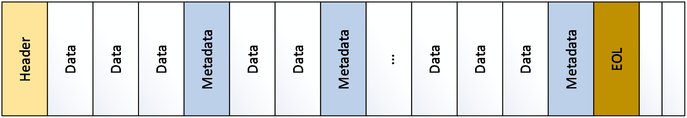
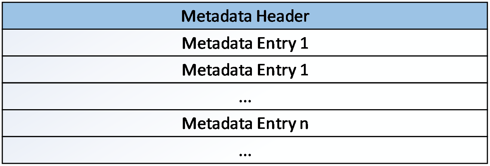
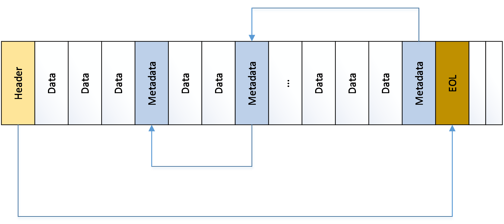

# [MS-HRL]: Hyper-V Replica Log (HRL) File Format

Table of Contents

1 Introduction

- [1 Introduction](#Section_1)
  - [1.1 Glossary](#Section_1.1)
  - [1.2 References](#Section_1.2)
    - [1.2.1 Normative References](#Section_1.2.1)
    - [1.2.2 Informative References](#Section_1.2.2)
  - [1.3 Overview](#Section_1.3)
  - [1.4 Relationship to Protocols and Other Structures](#Section_1.4)
  - [1.5 Applicability Statement](#Section_1.5)
  - [1.6 Versioning and Localization](#Section_1.6)
  - [1.7 Vendor-Extensible Fields](#Section_1.7)

2 Structures

- [2 Structures](#Section_2)
  - [2.1 Log File Format](#Section_2.1)
  - [2.2 Log File Header Format](#Section_2.2)
  - [2.3 Metadata Header Format](#Section_2.3)
  - [2.4 Log Metadata Entry Format](#Section_2.4)
  - [2.5 Log Traversing Algorithm](#Section_2.5)
  - [2.6 Checksum Algorithm](#Section_2.6)

3 Structure Examples

- [3 Structure Examples](#Section_3)

4 Security

- [4 Security](#Section_4)
  - [4.1 Security Considerations for Implementers](#Section_4.1)
  - [4.2 Index of Security Fields](#Section_4.2)

5 Appendix A: Product Behavior

- [5 Appendix A: Product Behavior](#Section_5)

6 Change Tracking

- [6 Change Tracking](#Section_6)

For the legal notice and IP terms, see [LEGAL.md](../LEGAL.md).
Last updated: 4/23/2024.
See [Revision History](#revision-history) for full version history.

# 1 Introduction

This specification defines the Hyper-V Replica Log (HRL) File Format, which provides a persistent backing store for files that track changes that have been made to the primary server. These files, called log files, record each write request; each entry provides information about the address range that is modified and new data in that range. Log files are written sequentially with the newest record appended to the end of the log file.

Sections 1.7 and 2 of this specification are normative. All other sections and examples in this specification are informative.

## 1.1 Glossary

**MAY, SHOULD, MUST, SHOULD NOT, MUST NOT:** These terms (in all caps) are used as defined in [[RFC2119]](https://go.microsoft.com/fwlink/?LinkId=90317). All statements of optional behavior use either MAY, SHOULD, or SHOULD NOT.

## 1.2 References

Links to a document in the Microsoft Open Specifications library point to the correct section in the most recently published version of the referenced document. However, because individual documents in the library are not updated at the same time, the section numbers in the documents may not match. You can confirm the correct section numbering by checking the [Errata](https://go.microsoft.com/fwlink/?linkid=850906).

### 1.2.1 Normative References

We conduct frequent surveys of the normative references to assure their continued availability. If you have any issue with finding a normative reference, please contact [dochelp@microsoft.com](mailto:dochelp@microsoft.com). We will assist you in finding the relevant information.

[RFC2119] Bradner, S., "Key words for use in RFCs to Indicate Requirement Levels", BCP 14, RFC 2119, March 1997, [https://www.rfc-editor.org/info/rfc2119](https://go.microsoft.com/fwlink/?LinkId=90317)

### 1.2.2 Informative References

None.

## 1.3 Overview

This document covers the format of HRL files that a creator application needs to adhere to so that the file can be parsed by Hyper-V. The HRL traversing algorithm is also covered (see section [2.5](#Section_2.5)).

## 1.4 Relationship to Protocols and Other Structures

None.

## 1.5 Applicability Statement

This file format provides a persistent backing store for file changes that need to be tracked and have been made to the primary server.

## 1.6 Versioning and Localization

The version of the HRL File Format is determined by the value of the **LogFormatVersion** field in the header, as defined in section [2.2](#Section_2.2).

| HRL Version | Value |
| --- | --- |
| Log Format Version 1<1> | 0x00010000 |
| Log Format Version 2 | 0x00020000 |

## 1.7 Vendor-Extensible Fields

None.

# 2 Structures

## 2.1 Log File Format

The following figure is a simplified representation of the log file. The log file header contains identification information, stores the size of the metadata field, and stores the location of the last valid metadata to indicate the end of the log.

Figure 1: Log file Structure

Each metadata item consists of a metadata header and metadata entries. The first entry of the metadata header stores the previous metadata location in the log file. This is used in traversing the metadata structures from the bottom of the log.

Figure 2: Metadata structure

The log file is optimized for writing sequentially. Therefore, the metadata describing each log entry is written after each set of data entries.

## 2.2 Log File Header Format

The log file header stores information about the log.

struct _CTLOG_HEADER_PACKED{ UCHAR Cookie [8];

ULONG LogFormatVersion;

ULONG TimeStamp;

UCHAR CreatorApplication[4];

ULONG CreatorVersion;

ULONG64 OriginalSize;

ULONG64 CurrentSize;

ULONG Checksum;

ULONG64 EOLLocation;

LONG ErrorCode;

ULONG MetadataSize;

UCHAR UniqueId[16];

UCHAR PreviousUniqueId[16];

ULONG LastModifiedTimeStamp;

ULONG64 TotalMetadataEntries;

ULONG FileType;

UCHAR Flags[2];

UCHAR Vhd2DataWriteGuid[16]

UCHAR Reserved[3970]; }

**Cookie:** This field is used to uniquely identify the original creator of the log file. The values are case-sensitive.

This field MUST be set to “msctlog” to identify this file as a log file. The cookie is stored as an eight-character ASCII string with the “m” in the first byte, the “s” in the second byte, and so on.

**LogFormatVersion:** This field MUST be initialized to 0x00020000. It is divided into a major/minor version and matches the version of the specification used in creating the file. The most-significant two bytes are for the major version. The least-significant two bytes are the minor version.

**TimeStamp:** This field stores the creation time of the log file. Its value is the number of seconds since January 1, 2000, 12:00:00 AM in UTC/GMT.

**CreatorApplication:** This field is a left-justified text field used to identify which application created the log file. It uses a single-byte character set. If the log file is created by Failover Replication, "ct" is written in this field. This is not verified as part of the file verification.

**CreatorVersion:** This field holds the major/minor version of the application that created the hard disk image. For Failover Replication, this value is set to winver. This is not verified as part of the file verification exercise.

**OriginalSize:** This field stores the size of the log file, in bytes, at the time it was created.

**CurrentSize:** This field stores the current size of the log file, in bytes.

This value is the same as the original size when the log file is created. This value can change depending on whether the log file is expanded.

**Checksum:** This field holds a checksum of the log file header. Its value is a one’s complement of the sum of all the bytes in the header not including the checksum field.

If the checksum verification fails, then the log file is assumed to be corrupt.

**EOLLocation:** This field indicates the offset of the end of the log file. This field is reset to zero upon opening the file and set to the correct value on closing the file. This field can be used to ascertain whether the file was closed properly. For example, an EOL value of zero in the header indicates that the file did not close properly.

**MetadataSize:** This field indicates the size of the metadata used in the log file. Typical metadata sizes are multiples of 512 bytes. The default is 4,096 bytes.

**UniqueId:** This field is a unique ID that identifies the log file. It is a 128-bit universally unique identifier (UUID).

**PreviousUniqueId:** This field indicates the unique ID of the previous log file. It can be used to build a log file chain. This field is a 128-bit universally unique identifier (UUID).

**FileType:** This field identifies the type of the log file. For an HRL file, this field’s value is set to 0.

**Flags**: This field is not used and MUST be set to 0.

**Vhd2DataWriteGuid**: This field stores the Data Write GUID of VHD2. This helps in detecting offline Patch detection, that is, modifying the content of VHD when change tracking is not enabled. This field is not present in Log Format Version 1.

**Reserved**: This field is reserved and MUST be set to 0. It is 3,970 bytes in size to make the total header size equal to 4096.

## 2.3 Metadata Header Format

Each metadata block has a small header to indicate the valid number of log entries in that metadata.

struct _CTLOG_METADATA_HEADER_PACKED{ ULONG64 PreviousMetadataLocation;

ULONG ValidMetadataEntries;

ULONG Checksum

UCHAR Reserved[16]; }

**PreviousMetadataLocation**: This field contains the relative location of the previous metadata in the log file. It is used when reading the metadata blocks quickly while replaying the log on the recovery. It has to be set to 0 for the first metadata.

**ValidMetadataEntries**: This field contains the count of valid metadata entries in the metadata. It is used to indicate the last metadata entry.

**Checksum**: Contains the checksum of the header. The checksum calculation algorithm is specified in section [2.6](#Section_2.6) with the **Checksum** field set to 0 during calculation.

**Reserved**: This field MUST be set to 0. It is 16 bytes in size.

## 2.4 Log Metadata Entry Format

The following is the format of the metadata entry.

struct _CTLOG_METADATA_ENTRY_PACKED{ ULONG64 ByteOffset;

ULONG Checksum

ULONG DataLength;

ULONG TimeStamp;

BYTE MetaOperation

ULONG DataChecksum

UCHAR Location

UCHAR Reserved[6]; }

**ByteOffset**: This field contains the byte offset on the logical disk where the data has to be written.

**Checksum**: This field contains the checksum of the metadata entry. The checksum calculation algorithm is specified in section [2.6](#Section_2.6) with the **Checksum** field set to 0 during calculation.

**DataLength**: This field indicates the length of the data to be written on the disk.

**TimeStamp**: This field stores the time of the writing of this particular log entry. This is the number of seconds since January 1, 2000, 12:00:00 AM in UTC/GMT.

**MetaOperation**: This field contains the meta-operation identifier. Only write operation (value:1) is supported.

**DataChecksum**: This field contains the checksum of the data associated with this metadata entry. The checksum calculation algorithm is specified in section 2.6.

**Location**: This field contains the internal tracing-related information. It needs to be set to 0.

**Reserved**: This field MUST be set to 0. It is 6 bytes in size.

## 2.5 Log Traversing Algorithm

The log file is optimized for writing sequentially. Therefore, the metadata describing each log entry is written after the data entries. For the log file’s data to be read, a two-pass traversal of the log needs to be performed. The first pass retrieves metadata locations. In the second pass, which is more comprehensive, each log entry pointed to by the metadata is read for applying to the recovery. See the figure at the end of this section.

The following steps are used to traverse a log file:

- Initialize a stack for storing metadata location offsets.
- Read and validate the log file header and retrieve the EOL location from the log file header. Also read the metadata size.
- Using the value of the EOL location and the metadata size, calculate the location of the last metadata. This is equal to (EOL location – Metadata size).
- Call it the current metadata and push its value on to the stack.
- Traverse to the location of the current metadata and read the first field of the metadata header from this location. This field points to the relative location of the previous metadata in the log file from the current offset. Previous Metadata Absolute Offset = Current metadata Location – Previous Metadata Location offset
- If this location is nonzero, then go to step 4.
- At the end of the first pass, the stack contains the offsets of all the metadata structures in the log in the correct order.
- Pop the value at the top of the stack. This is the location of the first metadata.
- Traverse to this location and read the metadata structure.
- Each entry of the metadata provides the details of a data field in the log that can be read from the log and applied to the recovery.
- Each metadata entry provides the length of the data written in the log. Since data is written sequentially, the start of the data field will immediately follow the end of the last data field, the end of the log header, or the previous metadata header.
- Read all the data entries pointed to by the metadata structure, and then go to step 8. Repeat steps 8-11 until the stack is empty.

Figure 3: Log traversing algorithm

## 2.6 Checksum Algorithm

Calculates the checksum value of a buffer. Checksum is based on 1's compliment of the buffer content

**buffer**: A pointer to the buffer whose checksum has to be calculated

**length**: The Length of the above buffer

**addressToIgnore**: Range of addresses to be ignored in the buffer

**return**: Checksum value of the buffer

ULONG

CalculateChecksum (

PVOID buffer,

ULONG length,

ULONG* addressToIgnore

)

{

PUCHAR address;

ULONG checksum;

checksum = 0;

address = (PUCHAR)buffer;

while (length != 0) {

if ((address >= (PUCHAR)addressToIgnore) &&

(address < (PUCHAR)(addressToIgnore + 1))) {

} else {

checksum += *address;

}

length -= 1;

address += 1;

}

return ~checksum;

}

# 3 Structure Examples

The following are examples of the log file header and two metadata headers of the HRL file.

(**** Log File Header **** )

Cookie = "msctlog "

LogFormatVersion = 0x20000 (Major:2,Minor:0)

TimeStamp = 539842380, ( 8/ 2/2017 4:13: 0)

CreatorApplication = "ct "

CreatorVersion = 0xA0000

OriginalSize = 0

CurrentSize = 332288

Checksum = 4294959739

EOLLocation = 332288

Errorcode = 0

MetadataSize = 4096

UniqueId = {572fc7ff-1f03-49ab-b3c5-30a665b8e20c}

PreviousUniqueId = {a8ae4b46-f7ad-4402-87aa-5b33e9f89c77}

LastModifiedTimeStamp = 539842384, (08/02/2017 04:13:04)

TotalMetadataEntries = 58

File Type = 0

Flags = 0 Vhd2DataWriteGuid = {b9be5c57-f8be-5503-98bb-6c44faf9ac87}

(**** Metadata Header (#1)(Offset:4096) ****)

PreviousMetadataLocation = 0

ValidMetadataEntries = 0

Checksum = 4294967295

MetaDataId MetaOp Length ByteOffset Timestamp Checksum

0 0 0 0 0 , ( 1/ 1/2000 0: 0: 0) 0

0 0 0 0 0 , ( 1/ 1/2000 0: 0: 0) 0

0 0 0 0 0 , ( 1/ 1/2000 0: 0: 0) 0

0 0 0 0 0 , ( 1/ 1/2000 0: 0: 0) 0

0 0 0 0 0 , ( 1/ 1/2000 0: 0: 0) 0

0 0 0 0 0 , ( 1/ 1/2000 0: 0: 0) 0

0 0 0 0 0 , ( 1/ 1/2000 0: 0: 0) 0

0 0 0 0 0 , ( 1/ 1/2000 0: 0: 0) 0

0 0 0 0 0 , ( 1/ 1/2000 0: 0: 0) 0

0 0 0 0 0 , ( 1/ 1/2000 0: 0: 0) 0

0 0 0 0 0 , ( 1/ 1/2000 0: 0: 0) 0

0 0 0 0 0 , ( 1/ 1/2000 0: 0: 0) 0

0 0 0 0 0 , ( 1/ 1/2000 0: 0: 0) 0

0 0 0 0 0 , ( 1/ 1/2000 0: 0: 0) 0

0 0 0 0 0 , ( 1/ 1/2000 0: 0: 0) 0

0 0 0 0 0 , ( 1/ 1/2000 0: 0: 0) 0

0 0 0 0 0 , ( 1/ 1/2000 0: 0: 0) 0

0 0 0 0 0 , ( 1/ 1/2000 0: 0: 0) 0

0 0 0 0 0 , ( 1/ 1/2000 0: 0: 0) 0

0 0 0 0 0 , ( 1/ 1/2000 0: 0: 0) 0

0 0 0 0 0 , ( 1/ 1/2000 0: 0: 0) 0

0 0 0 0 0 , ( 1/ 1/2000 0: 0: 0) 0

0 0 0 0 0 , ( 1/ 1/2000 0: 0: 0) 0

0 0 0 0 0 , ( 1/ 1/2000 0: 0: 0) 0

0 0 0 0 0 , ( 1/ 1/2000 0: 0: 0) 0

0 0 0 0 0 , ( 1/ 1/2000 0: 0: 0) 0

0 0 0 0 0 , ( 1/ 1/2000 0: 0: 0) 0

0 0 0 0 0 , ( 1/ 1/2000 0: 0: 0) 0

0 0 0 0 0 , ( 1/ 1/2000 0: 0: 0) 0

0 0 0 0 0 , ( 1/ 1/2000 0: 0: 0) 0

0 0 0 0 0 , ( 1/ 1/2000 0: 0: 0) 0

0 0 0 0 0 , ( 1/ 1/2000 0: 0: 0) 0

0 0 0 0 0 , ( 1/ 1/2000 0: 0: 0) 0

0 0 0 0 0 , ( 1/ 1/2000 0: 0: 0) 0

0 0 0 0 0 , ( 1/ 1/2000 0: 0: 0) 0

0 0 0 0 0 , ( 1/ 1/2000 0: 0: 0) 0

0 0 0 0 0 , ( 1/ 1/2000 0: 0: 0) 0

0 0 0 0 0 , ( 1/ 1/2000 0: 0: 0) 0

0 0 0 0 0 , ( 1/ 1/2000 0: 0: 0) 0

0 0 0 0 0 , ( 1/ 1/2000 0: 0: 0) 0

0 0 0 0 0 , ( 1/ 1/2000 0: 0: 0) 0

0 0 0 0 0 , ( 1/ 1/2000 0: 0: 0) 0

0 0 0 0 0 , ( 1/ 1/2000 0: 0: 0) 0

0 0 0 0 0 , ( 1/ 1/2000 0: 0: 0) 0

0 0 0 0 0 , ( 1/ 1/2000 0: 0: 0) 0

0 0 0 0 0 , ( 1/ 1/2000 0: 0: 0) 0

0 0 0 0 0 , ( 1/ 1/2000 0: 0: 0) 0

0 0 0 0 0 , ( 1/ 1/2000 0: 0: 0) 0

0 0 0 0 0 , ( 1/ 1/2000 0: 0: 0) 0

0 0 0 0 0 , ( 1/ 1/2000 0: 0: 0) 0

0 0 0 0 0 , ( 1/ 1/2000 0: 0: 0) 0

0 0 0 0 0 , ( 1/ 1/2000 0: 0: 0) 0

0 0 0 0 0 , ( 1/ 1/2000 0: 0: 0) 0

0 0 0 0 0 , ( 1/ 1/2000 0: 0: 0) 0

0 0 0 0 0 , ( 1/ 1/2000 0: 0: 0) 0

0 0 0 0 0 , ( 1/ 1/2000 0: 0: 0) 0

0 0 0 0 0 , ( 1/ 1/2000 0: 0: 0) 0

0 0 0 0 0 , ( 1/ 1/2000 0: 0: 0) 0

0 0 0 0 0 , ( 1/ 1/2000 0: 0: 0) 0

0 0 0 0 0 , ( 1/ 1/2000 0: 0: 0) 0

0 0 0 0 0 , ( 1/ 1/2000 0: 0: 0) 0

0 0 0 0 0 , ( 1/ 1/2000 0: 0: 0) 0

0 0 0 0 0 , ( 1/ 1/2000 0: 0: 0) 0

0 0 0 0 0 , ( 1/ 1/2000 0: 0: 0) 0

0 0 0 0 0 , ( 1/ 1/2000 0: 0: 0) 0

0 0 0 0 0 , ( 1/ 1/2000 0: 0: 0) 0

0 0 0 0 0 , ( 1/ 1/2000 0: 0: 0) 0

0 0 0 0 0 , ( 1/ 1/2000 0: 0: 0) 0

0 0 0 0 0 , ( 1/ 1/2000 0: 0: 0) 0

0 0 0 0 0 , ( 1/ 1/2000 0: 0: 0) 0

0 0 0 0 0 , ( 1/ 1/2000 0: 0: 0) 0

0 0 0 0 0 , ( 1/ 1/2000 0: 0: 0) 0

0 0 0 0 0 , ( 1/ 1/2000 0: 0: 0) 0

0 0 0 0 0 , ( 1/ 1/2000 0: 0: 0) 0

0 0 0 0 0 , ( 1/ 1/2000 0: 0: 0) 0

0 0 0 0 0 , ( 1/ 1/2000 0: 0: 0) 0

0 0 0 0 0 , ( 1/ 1/2000 0: 0: 0) 0

0 0 0 0 0 , ( 1/ 1/2000 0: 0: 0) 0

0 0 0 0 0 , ( 1/ 1/2000 0: 0: 0) 0

0 0 0 0 0 , ( 1/ 1/2000 0: 0: 0) 0

0 0 0 0 0 , ( 1/ 1/2000 0: 0: 0) 0

0 0 0 0 0 , ( 1/ 1/2000 0: 0: 0) 0

0 0 0 0 0 , ( 1/ 1/2000 0: 0: 0) 0

0 0 0 0 0 , ( 1/ 1/2000 0: 0: 0) 0

0 0 0 0 0 , ( 1/ 1/2000 0: 0: 0) 0

0 0 0 0 0 , ( 1/ 1/2000 0: 0: 0) 0

0 0 0 0 0 , ( 1/ 1/2000 0: 0: 0) 0

0 0 0 0 0 , ( 1/ 1/2000 0: 0: 0) 0

0 0 0 0 0 , ( 1/ 1/2000 0: 0: 0) 0

0 0 0 0 0 , ( 1/ 1/2000 0: 0: 0) 0

0 0 0 0 0 , ( 1/ 1/2000 0: 0: 0) 0

0 0 0 0 0 , ( 1/ 1/2000 0: 0: 0) 0

0 0 0 0 0 , ( 1/ 1/2000 0: 0: 0) 0

0 0 0 0 0 , ( 1/ 1/2000 0: 0: 0) 0

0 0 0 0 0 , ( 1/ 1/2000 0: 0: 0) 0

0 0 0 0 0 , ( 1/ 1/2000 0: 0: 0) 0

0 0 0 0 0 , ( 1/ 1/2000 0: 0: 0) 0

0 0 0 0 0 , ( 1/ 1/2000 0: 0: 0) 0

0 0 0 0 0 , ( 1/ 1/2000 0: 0: 0) 0

0 0 0 0 0 , ( 1/ 1/2000 0: 0: 0) 0

0 0 0 0 0 , ( 1/ 1/2000 0: 0: 0) 0

0 0 0 0 0 , ( 1/ 1/2000 0: 0: 0) 0

0 0 0 0 0 , ( 1/ 1/2000 0: 0: 0) 0

0 0 0 0 0 , ( 1/ 1/2000 0: 0: 0) 0

0 0 0 0 0 , ( 1/ 1/2000 0: 0: 0) 0

0 0 0 0 0 , ( 1/ 1/2000 0: 0: 0) 0

0 0 0 0 0 , ( 1/ 1/2000 0: 0: 0) 0

0 0 0 0 0 , ( 1/ 1/2000 0: 0: 0) 0

0 0 0 0 0 , ( 1/ 1/2000 0: 0: 0) 0

0 0 0 0 0 , ( 1/ 1/2000 0: 0: 0) 0

0 0 0 0 0 , ( 1/ 1/2000 0: 0: 0) 0

0 0 0 0 0 , ( 1/ 1/2000 0: 0: 0) 0

0 0 0 0 0 , ( 1/ 1/2000 0: 0: 0) 0

0 0 0 0 0 , ( 1/ 1/2000 0: 0: 0) 0

0 0 0 0 0 , ( 1/ 1/2000 0: 0: 0) 0

0 0 0 0 0 , ( 1/ 1/2000 0: 0: 0) 0

0 0 0 0 0 , ( 1/ 1/2000 0: 0: 0) 0

0 0 0 0 0 , ( 1/ 1/2000 0: 0: 0) 0

0 0 0 0 0 , ( 1/ 1/2000 0: 0: 0) 0

0 0 0 0 0 , ( 1/ 1/2000 0: 0: 0) 0

0 0 0 0 0 , ( 1/ 1/2000 0: 0: 0) 0

0 0 0 0 0 , ( 1/ 1/2000 0: 0: 0) 0

0 0 0 0 0 , ( 1/ 1/2000 0: 0: 0) 0

0 0 0 0 0 , ( 1/ 1/2000 0: 0: 0) 0

0 0 0 0 0 , ( 1/ 1/2000 0: 0: 0) 0

0 0 0 0 0 , ( 1/ 1/2000 0: 0: 0) 0

0 0 0 0 0 , ( 1/ 1/2000 0: 0: 0) 0

(Data Entry for Metadata #2 should come here)

(**** Metadata Header (#2)(Offset:328192) ****)

PreviousMetadataLocation = 324096

ValidMetadataEntries = 58

Checksum = 4294966991

MetaDataId MetaOp Length ByteOffset Timestamp Checksum

0 0 0 0 0 , ( 1/ 1/2000 0: 0: 0) 0

0 0 0 0 0 , ( 1/ 1/2000 0: 0: 0) 0

0 0 0 0 0 , ( 1/ 1/2000 0: 0: 0) 0

0 0 0 0 0 , ( 1/ 1/2000 0: 0: 0) 0

0 0 0 0 0 , ( 1/ 1/2000 0: 0: 0) 0

0 0 0 0 0 , ( 1/ 1/2000 0: 0: 0) 0

0 0 0 0 0 , ( 1/ 1/2000 0: 0: 0) 0

0 0 0 0 0 , ( 1/ 1/2000 0: 0: 0) 0

0 0 0 0 0 , ( 1/ 1/2000 0: 0: 0) 0

0 0 0 0 0 , ( 1/ 1/2000 0: 0: 0) 0

0 0 0 0 0 , ( 1/ 1/2000 0: 0: 0) 0

0 0 0 0 0 , ( 1/ 1/2000 0: 0: 0) 0

0 0 0 0 0 , ( 1/ 1/2000 0: 0: 0) 0

0 0 0 0 0 , ( 1/ 1/2000 0: 0: 0) 0

0 0 0 0 0 , ( 1/ 1/2000 0: 0: 0) 0

0 0 0 0 0 , ( 1/ 1/2000 0: 0: 0) 0

0 0 0 0 0 , ( 1/ 1/2000 0: 0: 0) 0

0 0 0 0 0 , ( 1/ 1/2000 0: 0: 0) 0

0 0 0 0 0 , ( 1/ 1/2000 0: 0: 0) 0

0 0 0 0 0 , ( 1/ 1/2000 0: 0: 0) 0

0 0 0 0 0 , ( 1/ 1/2000 0: 0: 0) 0

0 0 0 0 0 , ( 1/ 1/2000 0: 0: 0) 0

0 0 0 0 0 , ( 1/ 1/2000 0: 0: 0) 0

0 0 0 0 0 , ( 1/ 1/2000 0: 0: 0) 0

0 0 0 0 0 , ( 1/ 1/2000 0: 0: 0) 0

0 0 0 0 0 , ( 1/ 1/2000 0: 0: 0) 0

0 0 0 0 0 , ( 1/ 1/2000 0: 0: 0) 0

0 0 0 0 0 , ( 1/ 1/2000 0: 0: 0) 0

0 0 0 0 0 , ( 1/ 1/2000 0: 0: 0) 0

0 0 0 0 0 , ( 1/ 1/2000 0: 0: 0) 0

0 0 0 0 0 , ( 1/ 1/2000 0: 0: 0) 0

0 0 0 0 0 , ( 1/ 1/2000 0: 0: 0) 0

0 0 0 0 0 , ( 1/ 1/2000 0: 0: 0) 0

0 0 0 0 0 , ( 1/ 1/2000 0: 0: 0) 0

0 0 0 0 0 , ( 1/ 1/2000 0: 0: 0) 0

0 0 0 0 0 , ( 1/ 1/2000 0: 0: 0) 0

0 0 0 0 0 , ( 1/ 1/2000 0: 0: 0) 0

0 0 0 0 0 , ( 1/ 1/2000 0: 0: 0) 0

0 0 0 0 0 , ( 1/ 1/2000 0: 0: 0) 0

0 0 0 0 0 , ( 1/ 1/2000 0: 0: 0) 0

0 0 0 0 0 , ( 1/ 1/2000 0: 0: 0) 0

0 0 0 0 0 , ( 1/ 1/2000 0: 0: 0) 0

0 0 0 0 0 , ( 1/ 1/2000 0: 0: 0) 0

0 0 0 0 0 , ( 1/ 1/2000 0: 0: 0) 0

0 0 0 0 0 , ( 1/ 1/2000 0: 0: 0) 0

0 0 0 0 0 , ( 1/ 1/2000 0: 0: 0) 0

0 0 0 0 0 , ( 1/ 1/2000 0: 0: 0) 0

0 0 0 0 0 , ( 1/ 1/2000 0: 0: 0) 0

0 0 0 0 0 , ( 1/ 1/2000 0: 0: 0) 0

0 0 0 0 0 , ( 1/ 1/2000 0: 0: 0) 0

0 0 0 0 0 , ( 1/ 1/2000 0: 0: 0) 0

0 0 0 0 0 , ( 1/ 1/2000 0: 0: 0) 0

0 0 0 0 0 , ( 1/ 1/2000 0: 0: 0) 0

0 0 0 0 0 , ( 1/ 1/2000 0: 0: 0) 0

0 0 0 0 0 , ( 1/ 1/2000 0: 0: 0) 0

0 0 0 0 0 , ( 1/ 1/2000 0: 0: 0) 0

0 0 0 0 0 , ( 1/ 1/2000 0: 0: 0) 0

0 0 0 0 0 , ( 1/ 1/2000 0: 0: 0) 0

0 0 0 0 0 , ( 1/ 1/2000 0: 0: 0) 0

0 0 0 0 0 , ( 1/ 1/2000 0: 0: 0) 0

0 0 0 0 0 , ( 1/ 1/2000 0: 0: 0) 0

0 0 0 0 0 , ( 1/ 1/2000 0: 0: 0) 0

0 0 0 0 0 , ( 1/ 1/2000 0: 0: 0) 0

0 0 0 0 0 , ( 1/ 1/2000 0: 0: 0) 0

0 0 0 0 0 , ( 1/ 1/2000 0: 0: 0) 0

0 0 0 0 0 , ( 1/ 1/2000 0: 0: 0) 0

0 0 0 0 0 , ( 1/ 1/2000 0: 0: 0) 0

0 0 0 0 0 , ( 1/ 1/2000 0: 0: 0) 0

0 0 0 0 0 , ( 1/ 1/2000 0: 0: 0) 0

58 1 4096 3626340352 539842382, ( 8/ 2/2017 4:13: 2) 4294966639

57 1 4096 3626344448 539842382, ( 8/ 2/2017 4:13: 2) 4294966623

56 1 8192 3626348544 539842382, ( 8/ 2/2017 4:13: 2) 4294966591

55 1 4096 3628871680 539842382, ( 8/ 2/2017 4:13: 2) 4294966696

54 1 4096 3626340352 539842382, ( 8/ 2/2017 4:13: 2) 4294966639

53 1 4096 3626414080 539842382, ( 8/ 2/2017 4:13: 2) 4294966606

52 1 4096 3628867584 539842382, ( 8/ 2/2017 4:13: 2) 4294966712

51 1 4096 10188185600 539842382, ( 8/ 2/2017 4:13: 2) 4294966776

50 1 4096 3793489920 539842382, ( 8/ 2/2017 4:13: 2) 4294966766

49 1 8192 3737305088 539842382, ( 8/ 2/2017 4:13: 2) 4294966412

48 1 4096 3704586240 539842382, ( 8/ 2/2017 4:13: 2) 4294966481

47 1 4096 3626352640 539842382, ( 8/ 2/2017 4:13: 2) 4294966591

46 1 8192 3700453376 539842382, ( 8/ 2/2017 4:13: 2) 4294966544

45 1 4096 3694907392 539842382, ( 8/ 2/2017 4:13: 2) 4294966549

44 1 4096 3626418176 539842382, ( 8/ 2/2017 4:13: 2) 4294966590

43 1 4096 3626352640 539842382, ( 8/ 2/2017 4:13: 2) 4294966591

42 1 31232 3673764352 539842382, ( 8/ 2/2017 4:13: 2) 4294966413

41 1 4096 3626418176 539842382, ( 8/ 2/2017 4:13: 2) 4294966590

40 1 31232 3673733120 539842382, ( 8/ 2/2017 4:13: 2) 4294966280

39 1 4096 3794485248 539842382, ( 8/ 2/2017 4:13: 2) 4294966703

38 1 4096 3793252352 539842382, ( 8/ 2/2017 4:13: 2) 4294966674

37 1 512 3676929536 539842382, ( 8/ 2/2017 4:13: 2) 4294966664

36 1 4096 3793178624 539842382, ( 8/ 2/2017 4:13: 2) 4294966707

35 1 8192 3793145856 539842382, ( 8/ 2/2017 4:13: 2) 4294966564

34 1 4096 3626352640 539842382, ( 8/ 2/2017 4:13: 2) 4294966591

33 1 8192 3792945152 539842382, ( 8/ 2/2017 4:13: 2) 4294966583

32 1 4096 3777036288 539842382, ( 8/ 2/2017 4:13: 2) 4294966778

31 1 8192 3626414080 539842382, ( 8/ 2/2017 4:13: 2) 4294966590

30 1 4096 3774361600 539842382, ( 8/ 2/2017 4:13: 2) 4294966516

29 1 4096 3774308352 539842382, ( 8/ 2/2017 4:13: 2) 4294966469

28 1 16384 3774267392 539842382, ( 8/ 2/2017 4:13: 2) 4294966326

27 1 512 139058688 539842382, ( 8/ 2/2017 4:13: 2) 4294966747

26 1 512 138656768 539842382, ( 8/ 2/2017 4:13: 2) 4294966787

25 1 4096 3771564032 539842382, ( 8/ 2/2017 4:13: 2) 4294966479

24 1 8192 3771551744 539842382, ( 8/ 2/2017 4:13: 2) 4294966511

23 1 1024 135266304 539842382, ( 8/ 2/2017 4:13: 2) 4294967024

22 1 4096 3760070656 539842381, ( 8/ 2/2017 4:13: 1) 4294966751

21 1 8192 3757490176 539842381, ( 8/ 2/2017 4:13: 1) 4294966360

20 1 512 139058688 539842381, ( 8/ 2/2017 4:13: 1) 4294966748

19 1 512 138656768 539842381, ( 8/ 2/2017 4:13: 1) 4294966788

18 1 4096 3743948800 539842381, ( 8/ 2/2017 4:13: 1) 4294966742

17 1 4096 3737313280 539842381, ( 8/ 2/2017 4:13: 1) 4294966397

16 1 12288 3699957760 539842381, ( 8/ 2/2017 4:13: 1) 4294966425

15 1 4096 3734429696 539842381, ( 8/ 2/2017 4:13: 1) 4294966441

14 1 4096 3699900416 539842381, ( 8/ 2/2017 4:13: 1) 4294966681

13 1 4096 7792652288 539842381, ( 8/ 2/2017 4:13: 1) 4294966594

12 1 4096 3626344448 539842381, ( 8/ 2/2017 4:13: 1) 4294966624

11 1 4096 3722543104 539842381, ( 8/ 2/2017 4:13: 1) 4294966463

10 1 4096 3709980672 539842381, ( 8/ 2/2017 4:13: 1) 4294966575

9 1 4096 3699830784 539842381, ( 8/ 2/2017 4:13: 1) 4294966443

8 1 4096 7792644096 539842381, ( 8/ 2/2017 4:13: 1) 4294966626

7 1 2048 147937280 539842381, ( 8/ 2/2017 4:13: 1) 4294966740

6 1 2048 139466752 539842381, ( 8/ 2/2017 4:13: 1) 4294966933

5 1 4096 4111884288 539842381, ( 8/ 2/2017 4:13: 1) 4294966674

4 1 4096 3700805632 539842381, ( 8/ 2/2017 4:13: 1) 4294966460

3 1 4096 3699798016 539842381, ( 8/ 2/2017 4:13: 1) 4294966571

2 1 4096 8026886144 539842381, ( 8/ 2/2017 4:13: 1) 4294966558

1 1 4096 3626348544 539842381, ( 8/ 2/2017 4:13: 1) 4294966608

# 4 Security

## 4.1 Security Considerations for Implementers

None.

## 4.2 Index of Security Fields

None.

# 5 Appendix A: Product Behavior

The information in this specification is applicable to the following Microsoft products or supplemental software. References to product versions include updates to those products.

- Windows Server 2012 operating system
- Windows Server 2012 R2 operating system
- Windows Server 2016 operating system
- Windows Server operating system
- Windows Server 2019 operating system
- Windows Server 2022 operating system
- Windows Server 2025 operating system
Exceptions, if any, are noted in this section. If an update version, service pack or Knowledge Base (KB) number appears with a product name, the behavior changed in that update. The new behavior also applies to subsequent updates unless otherwise specified. If a product edition appears with the product version, behavior is different in that product edition.

Unless otherwise specified, any statement of optional behavior in this specification that is prescribed using the terms "SHOULD" or "SHOULD NOT" implies product behavior in accordance with the SHOULD or SHOULD NOT prescription. Unless otherwise specified, the term "MAY" implies that the product does not follow the prescription.

<1> Section 1.6: Log Format Version 1 is supported on Windows Server 2012 and Windows Server 2012 R2. Log Format Version 1 is only used locally.

# 6 Change Tracking

This section identifies changes that were made to this document since the last release. Changes are classified as Major, Minor, or None.

The revision class **Major** means that the technical content in the document was significantly revised. Major changes affect protocol interoperability or implementation. Examples of major changes are:

- A document revision that incorporates changes to interoperability requirements.
- A document revision that captures changes to protocol functionality.
The revision class **Minor** means that the meaning of the technical content was clarified. Minor changes do not affect protocol interoperability or implementation. Examples of minor changes are updates to clarify ambiguity at the sentence, paragraph, or table level.

The revision class **None** means that no new technical changes were introduced. Minor editorial and formatting changes may have been made, but the relevant technical content is identical to the last released version.

The changes made to this document are listed in the following table. For more information, please contact [dochelp@microsoft.com](mailto:dochelp@microsoft.com).

| Section | Description | Revision class |
| --- | --- | --- |
| [5](#Section_5) Appendix A: Product Behavior | Added Windows Server 2025 to the list of applicable products. | Major |

## Revision History

| Date | Version | Revision Class | Comments |
| --- | --- | --- | --- |
| 7/14/2016 | 1.0 | New | Released new document. |
| 6/1/2017 | 2.0 | Major | Significantly changed the technical content. |
| 9/15/2017 | 3.0 | Major | Significantly changed the technical content. |
| 9/12/2018 | 4.0 | Major | Significantly changed the technical content. |
| 4/7/2021 | 5.0 | Major | Significantly changed the technical content. |
| 4/23/2024 | 6.0 | Major | Significantly changed the technical content. |
