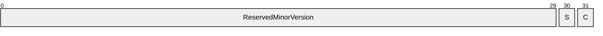

# [MS-HTTP2E]: Hypertext Transfer Protocol Version 2 (HTTP/2) Extension

Table of Contents

1 Introduction

- [1 Introduction](#Section_1)
  - [1.1 Glossary](#Section_1.1)
  - [1.2 References](#Section_1.2)
    - [1.2.1 Normative References](#Section_1.2.1)
    - [1.2.2 Informative References](#Section_1.2.2)
  - [1.3 Overview](#Section_1.3)
  - [1.4 Relationship to Other Protocols](#Section_1.4)
  - [1.5 Prerequisites/Preconditions](#Section_1.5)
  - [1.6 Applicability Statement](#Section_1.6)
  - [1.7 Versioning and Capability Negotiation](#Section_1.7)
  - [1.8 Vendor-Extensible Fields](#Section_1.8)
  - [1.9 Standards Assignments](#Section_1.9)

2 Messages

- [2 Messages](#Section_2)
  - [2.1 Transport](#Section_2.1)
  - [2.2 Message Syntax](#Section_2.2)
    - [2.2.1 The TLS_RENEG_PERMITTED Setting](#Section_2.2.1)

3 Protocol Details

- [3 Protocol Details](#Section_3)
  - [3.1 Client Details](#Section_3.1)
    - [3.1.1 Abstract Data Model](#Section_3.1.1)
    - [3.1.2 Timers](#Section_3.1.2)
    - [3.1.3 Initialization](#Section_3.1.3)
      - [3.1.3.1 Upgrade from HTTP/1.1](#Section_3.1.3.1)
      - [3.1.3.2 Transport Layer Security](#Section_3.1.3.2)
      - [3.1.3.3 Prior Knowledge](#Section_3.1.3.3)
    - [3.1.4 Higher-Layer Triggered Events](#Section_3.1.4)
    - [3.1.5 Message Processing Events and Sequencing Rules](#Section_3.1.5)
    - [3.1.6 Timer Events](#Section_3.1.6)
    - [3.1.7 Other Local Events](#Section_3.1.7)
      - [3.1.7.1 Connection Termination](#Section_3.1.7.1)
  - [3.2 Server Details](#Section_3.2)
    - [3.2.1 Abstract Data Model](#Section_3.2.1)
    - [3.2.2 Timers](#Section_3.2.2)
    - [3.2.3 Initialization](#Section_3.2.3)
      - [3.2.3.1 Upgrade from HTTP/1.1](#Section_3.2.3.1)
      - [3.2.3.2 Transport Layer Security](#Section_3.2.3.2)
      - [3.2.3.3 Prior Knowledge](#Section_3.2.3.3)
    - [3.2.4 Higher-Layer Triggered Events](#Section_3.2.4)
    - [3.2.5 Message Processing Events and Sequencing Rules](#Section_3.2.5)
    - [3.2.6 Timer Events](#Section_3.2.6)
    - [3.2.7 Other Local Events](#Section_3.2.7)
      - [3.2.7.1 Connection Termination](#Section_3.2.7.1)

4 Protocol Examples

- [4 Protocol Examples](#Section_4)

5 Security

- [5 Security](#Section_5)
  - [5.1 Security Considerations for Implementers](#Section_5.1)
  - [5.2 Index of Security Parameters](#Section_5.2)

6 Appendix A: Product Behavior

- [6 Appendix A: Product Behavior](#Section_6)

7 Change Tracking

- [7 Change Tracking](#Section_7)

For the legal notice and IP terms, see [LEGAL.md](../LEGAL.md).
Last updated: 4/23/2024.
See [Revision History](#revision-history) for full version history.

# 1 Introduction

The Hypertext Transfer Protocol Version 2 (HTTP/2) Extension specifies a profile of and an extension to the Hypertext Transfer Protocol (HTTP) version 2.

Sections 1.5, 1.8, 1.9, 2, and 3 of this specification are normative. All other sections and examples in this specification are informative.

## 1.1 Glossary

This document uses the following terms:

**cipher suite**: A set of cryptographic algorithms used to encrypt and decrypt files and messages.

**Hypertext Transfer Protocol (HTTP)**: An application-level protocol for distributed, collaborative, hypermedia information systems (text, graphic images, sound, video, and other multimedia files) on the World Wide Web.

**Transport Layer Security (TLS)**: A security protocol that supports confidentiality and integrity of messages in client and server applications communicating over open networks. TLS supports server and, optionally, client authentication by using X.509 certificates (as specified in [[X509]](https://go.microsoft.com/fwlink/?LinkId=90590)). TLS is standardized in the IETF TLS working group.

**MAY, SHOULD, MUST, SHOULD NOT, MUST NOT:** These terms (in all caps) are used as defined in [[RFC2119]](https://go.microsoft.com/fwlink/?LinkId=90317). All statements of optional behavior use either MAY, SHOULD, or SHOULD NOT.

## 1.2 References

Links to a document in the Microsoft Open Specifications library point to the correct section in the most recently published version of the referenced document. However, because individual documents in the library are not updated at the same time, the section numbers in the documents may not match. You can confirm the correct section numbering by checking the [Errata](https://go.microsoft.com/fwlink/?linkid=850906).

### 1.2.1 Normative References

We conduct frequent surveys of the normative references to assure their continued availability. If you have any issue with finding a normative reference, please contact [dochelp@microsoft.com](mailto:dochelp@microsoft.com). We will assist you in finding the relevant information.

[RFC2119] Bradner, S., "Key words for use in RFCs to Indicate Requirement Levels", BCP 14, RFC 2119, March 1997, [https://www.rfc-editor.org/info/rfc2119](https://go.microsoft.com/fwlink/?LinkId=90317)

[RFC5246] Dierks, T., and Rescorla, E., "The Transport Layer Security (TLS) Protocol Version 1.2", RFC 5246, August 2008, [https://www.rfc-editor.org/info/rfc5246](https://go.microsoft.com/fwlink/?LinkId=129803)

[RFC7230] Fielding, R., and Reschke, J., Eds., "Hypertext Transfer Protocol (HTTP/1.1): Message Syntax and Routing", RFC 7230, June 2014, [https://www.rfc-editor.org/info/rfc7230](https://go.microsoft.com/fwlink/?LinkId=402094)

[RFC7231] Fielding, R., and Reschke, J., Eds., "Hypertext Transfer Protocol -- HTTP/1.1: Semantics and Content", RFC7231, June 2014, [https://www.rfc-editor.org/info/rfc7231](https://go.microsoft.com/fwlink/?LinkId=402095)

[RFC7232] Fielding, R., and Reschke, J., Eds., "Hypertext Transfer Protocol -- HTTP/1.1: Conditional Requests", RFC7232, June 2014, [https://www.rfc-editor.org/info/rfc7232](https://go.microsoft.com/fwlink/?LinkId=402096)

[RFC7233] Fielding, R., Lafon, Y., Reschke, J., Eds., "Hypertext Transfer Protocol -- HTTP/1.1: Range Requests", RFC7233, June 2014, [https://www.rfc-editor.org/info/rfc7233](https://go.microsoft.com/fwlink/?LinkId=402097)

[RFC7234] Fielding, R., Nottingham, M., Reschke, J., Eds., "Hypertext Transfer Protocol -- HTTP/1.1: Caching", RFC 7234, June 2014, [https://www.rfc-editor.org/info/rfc7234](https://go.microsoft.com/fwlink/?LinkId=402098)

[RFC7235] Fielding, R., and Reschke, J., Eds., "Hypertext Transfer Protocol -- HTTP/1.1: Authentication", RFC 7235, June 2014, [https://www.rfc-editor.org/info/rfc7235](https://go.microsoft.com/fwlink/?LinkId=402099)

[RFC7540] Belshe, M., Peon, R., and Thomson, M., Ed., "Hypertext Transfer Protocol Version 2 (HTTP/2)", May 2015, [https://www.rfc-editor.org/info/rfc7540](https://go.microsoft.com/fwlink/?LinkId=615234)

### 1.2.2 Informative References

None.

## 1.3 Overview

This document specifies a profile of and an extension to the [**Hypertext Transfer Protocol (HTTP)**](#gt_hypertext-transfer-protocol-http) version 2, which is defined by [[RFC7540]](https://go.microsoft.com/fwlink/?LinkId=615234).

The profile relaxes certain requirements of the base protocol in the interests of improved interoperability. The accompanying extension permits implementations to negotiate further relaxation when both sides agree.

## 1.4 Relationship to Other Protocols

[[RFC7540]](https://go.microsoft.com/fwlink/?LinkId=615234) defines an optimized expression of the semantics of the Hypertext Transfer Protocol. HTTP/2 enables a more efficient use of network resources and a reduced perception of latency by introducing header field compression and allowing multiple concurrent messages on the same connection. It also introduces unsolicited push of representations from servers to clients.

HTTP/2 is an alternative to, but does not obsolete, the HTTP/1.1 message syntax as specified in [[RFC7230]](https://go.microsoft.com/fwlink/?LinkId=402094). HTTP’s existing semantics as specified in [[RFC7231]](https://go.microsoft.com/fwlink/?LinkId=402095), [[RFC7232]](https://go.microsoft.com/fwlink/?LinkId=402096), [[RFC7233]](https://go.microsoft.com/fwlink/?LinkId=402097), [[RFC7234]](https://go.microsoft.com/fwlink/?LinkId=402098), and [[RFC7235]](https://go.microsoft.com/fwlink/?LinkId=402099) remain unchanged.

This document describes a profile of [RFC7540] intended to provide broader interoperability with existing implementations of [**Transport Layer Security (TLS)**](#gt_transport-layer-security-tls).

## 1.5 Prerequisites/Preconditions

The prerequisites and preconditions are as specified in [[RFC7540]](https://go.microsoft.com/fwlink/?LinkId=615234) section 3.

## 1.6 Applicability Statement

This profile applies when implementing version 2 of the [**Hypertext Transfer Protocol (HTTP)**](#gt_hypertext-transfer-protocol-http). The profile restricts which connection methods are supported. Certain implementations of [**Transport Layer Security (TLS)**](#gt_transport-layer-security-tls) will be limited in their ability to comply with the requirements of [[RFC7540]](https://go.microsoft.com/fwlink/?LinkId=615234) section 9.2; this profile also permits these limited implementations to continue interoperating by relaxing some requirements when connecting over TLS.

The accompanying extension permits mutually-consenting HTTP/2 implementations to perform TLS renegotiation on the existing HTTP connection when the security properties of renegotiation are acceptable for their scenarios and the TLS version in use supports it.

## 1.7 Versioning and Capability Negotiation

Sending the TLS_RENEG_PERMITTED setting (section [2.2.1](#Section_2.2.1)) indicates the sender’s capability and willingness to employ [**TLS**](#gt_transport-layer-security-tls) renegotiation. Only if both peers have indicated that renegotiation is acceptable to them can renegotiation be employed.

## 1.8 Vendor-Extensible Fields

None.

## 1.9 Standards Assignments

A new setting is defined for HTTP/2 in the "HTTP/2 Settings" registry:

- **Name:** TLS_RENEG_PERMITTED
- **Requested Code:** 0x10
- **Initial value:** 0x00
- **Specification:** This document

# 2 Messages

## 2.1 Transport

Messages are transported as specified in [[RFC7540]](https://go.microsoft.com/fwlink/?LinkId=615234) sections including, but not limited to, 3, 4, and 5.

## 2.2 Message Syntax

The syntax is as specified in [[RFC7540]](https://go.microsoft.com/fwlink/?LinkId=615234) sections including, but not limited to, 6 and 7. One additional setting value is defined in this section.

### 2.2.1 The TLS_RENEG_PERMITTED Setting

This document defines a new setting value in HTTP/2, TLS_RENEG_PERMITTED, with code 0x10 and an initial value of 0x00.

The thirty-two bits of the setting value are interpreted as follows:

The defined bits are:

- **C:** If set, client-initiated renegotiation is acceptable to the sender.
- **S:** If set, server-initiated renegotiation is acceptable to the sender.
All other bits are undefined, and MUST be zero when sent and ignored upon receipt.

# 3 Protocol Details

## 3.1 Client Details

Client behavior is as specified in [[RFC7540]](https://go.microsoft.com/fwlink/?LinkId=615234), except as described in this section.

### 3.1.1 Abstract Data Model

The client must track the current value of TLS_RENEG_PERMITTED for both itself and the server.

### 3.1.2 Timers

No additional timers are defined.

### 3.1.3 Initialization

As specified in [[RFC7540]](https://go.microsoft.com/fwlink/?LinkId=615234) section 3, connections are initiated via HTTP/1.1 upgrade, via [**TLS**](#gt_transport-layer-security-tls), or via emission of the connection preface immediately upon TCP connection to a server already known to support HTTP/2. See the following sections.

#### 3.1.3.1 Upgrade from HTTP/1.1

Clients SHOULD NOT attempt to perform an Upgrade to HTTP/2.

#### 3.1.3.2 Transport Layer Security

Connection over [**Transport Layer Security (TLS)**](#gt_transport-layer-security-tls) functions as specified in [[RFC7540]](https://go.microsoft.com/fwlink/?LinkId=615234) section 3.3, with the modifications described in this section.

Clients SHOULD offer TLS version 1.2 ([[RFC5246]](https://go.microsoft.com/fwlink/?LinkId=129803)) or greater for all connections, and MAY<1> generate a connection error of type INADEQUATE_SECURITY (see [RFC7540] section 9.2) if the server selects a TLS version less than 1.2. Clients SHOULD NOT offer HTTP/2 in conjunction with a TLS version of 1.1 or lower.

Clients MUST offer only [**cipher suites**](#gt_cipher-suite) over which they are willing to use HTTP/2. They MUST NOT generate a connection error of type INADEQUATE_SECURITY if the server selects TLS version 1.2 or higher and a cipher suite included in the client’s **ClientHello** message.

Clients SHOULD set the TLS_RENEG_PERMITTED setting to a non-zero value if their TLS library and the negotiated TLS version support renegotiation, and the client is willing<2> to employ it.

#### 3.1.3.3 Prior Knowledge

Clients MUST NOT immediately send the HTTP/2 connection preface on a TCP connection, even to a server known to support HTTP/2.

### 3.1.4 Higher-Layer Triggered Events

Events from the higher layer (for example, the provision of a client certificate) could change the client’s willingness to employ TLS renegotiation. The client SHOULD re-evaluate the currently-set value for TLS_RENEG_PERMITTED and send a new value if its willingness has changed.

Events from the higher layer could also cause the client to desire renegotiation. If the client has previously sent a value for TLS_RENEG_PERMITTED which offers client-initiated renegotiation, and has received a value for TLS_RENEG_PERMITTED from the server which accepts client-initiated renegotiation, the client MAY relay this event to the TLS layer. If the client has not both sent and received a value for TLS_RENEG_PERMITTED which supports client-initiated renegotiation, the client MUST NOT trigger TLS renegotiation.

### 3.1.5 Message Processing Events and Sequencing Rules

Upon receipt of a new value for TLS_RENEG_PERMITTED from the server, the client MUST update its cached value for the server on the current connection.

Upon receipt of a server-initiated TLS renegotiation request, the client SHOULD proceed with renegotiation if it has previously sent a value for TLS_RENEG_PERMITTED which accepts server-initiated renegotiation, and has received a value for TLS_RENEG_PERMITTED from the server which offers server-initiated renegotiation. If the client has not both sent and received a value for TLS_RENEG_PERMITTED which permits server-initiated renegotiation, the client MUST treat the renegotiation attempt as a connection error of type PROTOCOL_ERROR.

### 3.1.6 Timer Events

No additional timer events are defined.

### 3.1.7 Other Local Events

Other events are handled as specified in [[RFC7540]](https://go.microsoft.com/fwlink/?LinkId=615234), except as described in this section.

#### 3.1.7.1 Connection Termination

Before terminating a connection, whether due to an error or a timeout, a client MAY<3> send a GOAWAY frame as specified in [[RFC7540]](https://go.microsoft.com/fwlink/?LinkId=615234) section 6.8.

## 3.2 Server Details

Server behavior is as specified in [[RFC7540]](https://go.microsoft.com/fwlink/?LinkId=615234), except as described in this section.

### 3.2.1 Abstract Data Model

The server must track the current value of TLS_RENEG_PERMITTED for both itself and the client.

### 3.2.2 Timers

No additional timers are defined.

### 3.2.3 Initialization

As specified in [[RFC7540]](https://go.microsoft.com/fwlink/?LinkId=615234) section 3, connections are initiated via HTTP/1.1 upgrade, via [**TLS**](#gt_transport-layer-security-tls), or via emission of the connection preface immediately upon TCP connection to a server already known to support HTTP/2. See the following sections.

#### 3.2.3.1 Upgrade from HTTP/1.1

This profile does not support this connection method. Servers SHOULD NOT accept offers from clients to upgrade to HTTP/2, and SHOULD NOT include HTTP/2 in an Upgrade header on HTTP/1.1 responses.

#### 3.2.3.2 Transport Layer Security

Connection over [**Transport Layer Security (TLS)**](#gt_transport-layer-security-tls) functions as specified in [[RFC7540]](https://go.microsoft.com/fwlink/?LinkId=615234) section 3.3, with the modifications described in this section.

Servers SHOULD select TLS 1.2 ([[RFC5246]](https://go.microsoft.com/fwlink/?LinkId=129803)) or greater for all connections, and MAY<4> generate a connection error of type INADEQUATE_SECURITY (see [RFC7540] section 9.2) if the client’s highest offered TLS version is less than 1.2.

Servers MUST select a [**cipher suite**](#gt_cipher-suite) over which they are willing to use HTTP/2. They MUST NOT generate a connection error of type INADEQUATE_SECURITY after selecting TLS version 1.2 or higher and a cipher suite included in the client’s **ClientHello** message, regardless of whether the selected cipher suite is included in [RFC7540] Appendix A.

Servers SHOULD set the TLS_RENEG_PERMITTED setting to a non-zero value if their TLS library and the negotiated TLS version support renegotiation, and the server is willing<5> to employ it.

#### 3.2.3.3 Prior Knowledge

This profile does not support this connection method. Servers SHOULD refuse to accept such connections.

### 3.2.4 Higher-Layer Triggered Events

Events from the higher layer could change the server’s willingness to employ TLS renegotiation. The server SHOULD re-evaluate the currently-set value for TLS_RENEG_PERMITTED and send a new value if its willingness has changed.

Events from the higher layer (for example, a request to retrieve the client certificate) could also cause the server to desire renegotiation. If the client has previously sent a value for TLS_RENEG_PERMITTED which accepts server-initiated renegotiation, and the server has sent a value for TLS_RENEG_PERMITTED which offers server-initiated renegotiation, the server SHOULD relay this event to the TLS layer. If the server has not both sent and received a value for TLS_RENEG_PERMITTED which permits server-initiated renegotiation, the server MUST NOT trigger TLS renegotiation.

### 3.2.5 Message Processing Events and Sequencing Rules

Upon receipt of a new value for TLS_RENEG_PERMITTED from the client, the server MUST update its cached value for the client on the current connection.

Upon receipt of a client-initiated TLS renegotiation request, the server MAY proceed with renegotiation if it has previously sent a value for TLS_RENEG_PERMITTED which accepts client-initiated renegotiation, and has received a value for TLS_RENEG_PERMITTED from the client which offers client-initiated renegotiation. If the server has not both sent and received a value for TLS_RENEG_PERMITTED which permits client-initiated renegotiation, the server MUST treat the renegotiation attempt as a connection error of type PROTOCOL_ERROR.

### 3.2.6 Timer Events

No additional timer events are defined.

### 3.2.7 Other Local Events

Other events are handled as specified in [[RFC7540]](https://go.microsoft.com/fwlink/?LinkId=615234), except as described in this section.

#### 3.2.7.1 Connection Termination

Before terminating a connection, whether due to an error or a timeout, a server MAY<6> send a GOAWAY frame as specified in [[RFC7540]](https://go.microsoft.com/fwlink/?LinkId=615234) section 6.8.

# 4 Protocol Examples

In this example, the client attempts to access a protected resource. Because it has a client certificate configured, it advertises its willingness to renegotiate immediately.

During the TLS handshake, the client offers only cipher suites which are acceptable to it. From this list, the server selects the most preferred cipher suite. After the handshake concludes, HTTP/2 begins at the application layer.

| **Frame** | **Description** |
| --- | --- |
| **PRI * HTTP/2.0\r\n\r\nSM\r\n\r\n** | Connection preface. |
| **SETTINGS:** Flags: ACK: 0 Values: TLS_RENEG_PERMITTED (0x10): 0x02 | Client SETTINGS frame; leaves initial values unchanged, but sets TLS_RENEG_PERMITTED to support server-initiated renegotiation. |
| **HEADERS:** Flags: END_STREAM: 1 END_HEADERS: 1 Header values: :method = GET :scheme = https :path = /protected_resource host = example.org accept = image/jpeg | HEADERS frame containing request. As this is the only frame needed to convey the request, the END_STREAM and END_HEADERS flags are set. |

Server handles connection.

| **Frame** | **Description** |
| --- | --- |
| SETTINGS: Flags: ACK: 0 Values: TLS_RENEG_PERMITTED (0x10): 0x02 | Server SETTINGS frame; leaves initial values unchanged, but sets TLS_RENEG_PERMITTED to support server-initiated renegotiation. |
| **SETTINGS:** Flags: ACK: 1 Values: None | Server acknowledgment of client SETTINGS frame. Acknowledgments contain no values. |

Because both sides have indicated support for server-initiated renegotiation, when processing the request for a protected resource, the server triggers the TLS layer to renegotiate, this time requesting a client certificate.

After renegotiation completes, the server responds with the protected resource if the client certificate verifies access.

| **Frame** | **Description** |
| --- | --- |
| **HEADERS:** Flags: END_STREAM: 0 END_HEADERS: 1 Header values: :status = 200 content-type = application/octet-stream content-length = <length of file> | HEADERS frame containing response. The END_STREAM flag is not set, as the body follows. |
| **DATA:** Flags: END_STREAM: 1 Payload: <content of file> | Response body. As the final frame of the response, the END_STREAM flag is set. |

The request complete, the client terminates the connection after optionally sending a GOAWAY frame.

| **Frame** | **Description** |
| --- | --- |
| **SETTINGS:** Flags: ACK: 1 Values: None | Client acknowledgment of server SETTINGS frame. Acknowledgments contain no values. |
| **GOAWAY:** Last-Stream-ID: 0 Error Code: NO_ERROR | Optional GOAWAY frame indicating that the client will make no further requests. |

The server notifies the TCP layer to close the connection, after optionally sending a GOAWAY frame itself.

| **Frame** | **Description** |
| --- | --- |
| **GOAWAY:** Last-Stream-ID: 1 Error Code: NO_ERROR | Optional GOAWAY frame indicating that the server expects no further requests. |

# 5 Security

## 5.1 Security Considerations for Implementers

Security considerations of HTTP/2 are discussed in [[RFC7540]](https://go.microsoft.com/fwlink/?LinkId=615234) section 10. In addition to those common to any HTTP/2 implementation, this profile relaxes the cryptographic requirements of the base HTTP/2 protocol. Implementers are advised to consider their use cases and offer only those [**cipher suites**](#gt_cipher-suite) they consider secure for both HTTP/2 and HTTP/1.1. Likewise, implementers have to consider the security properties of TLS renegotiation and employ it only when those properties are acceptable, regardless of the application protocol being transported.

Implementers who want to impose a more stringent security requirement on usage of HTTP/2 than on HTTP/1.1 are advised to initially offer only those cipher suites considered acceptable for use with either. If the [**TLS**](#gt_transport-layer-security-tls) negotiation fails, the implementation can retry with additional cipher suites and without the request for HTTP/2.

## 5.2 Index of Security Parameters

None, other than those specified in [[RFC7540]](https://go.microsoft.com/fwlink/?LinkId=615234) sections 9.2, 11.4, and Appendix A.

# 6 Appendix A: Product Behavior

The information in this specification is applicable to the following Microsoft products or supplemental software. References to product versions include updates to those products.

- Windows 10 operating system
- Windows Server 2016 operating system
- Windows Server operating system
- Windows Server 2019 operating system
- Windows Server 2022 operating system
- Windows 11 operating system
- Windows Server 2025 operating system
Exceptions, if any, are noted in this section. If an update version, service pack or Knowledge Base (KB) number appears with a product name, the behavior changed in that update. The new behavior also applies to subsequent updates unless otherwise specified. If a product edition appears with the product version, behavior is different in that product edition.

Unless otherwise specified, any statement of optional behavior in this specification that is prescribed using the terms "SHOULD" or "SHOULD NOT" implies product behavior in accordance with the SHOULD or SHOULD NOT prescription. Unless otherwise specified, the term "MAY" implies that the product does not follow the prescription.

<1> Section 3.1.3.2: Windows does not generate errors of type INADEQUATE_SECURITY, regardless of the selected TLS version.

<2> Section 3.1.3.2: Windows is willing to accept server-initiated renegotiation if a client certificate has been provided, but does not offer client-initiated renegotiation.

<3> Section 3.1.7.1: Windows does not emit GOAWAY frames before connection closure but will respect them upon receipt.

<4> Section 3.2.3.2: Windows does not generate errors of type INADEQUATE_SECURITY.

<5> Section 3.2.3.2: Windows is willing to accept server-initiated renegotiation, but not willing to accept client-initiated renegotiation.

<6> Section 3.2.7.1: Windows does not send the GOAWAY frame before closing the TCP connection.

# 7 Change Tracking

This section identifies changes that were made to this document since the last release. Changes are classified as Major, Minor, or None.

The revision class **Major** means that the technical content in the document was significantly revised. Major changes affect protocol interoperability or implementation. Examples of major changes are:

- A document revision that incorporates changes to interoperability requirements.
- A document revision that captures changes to protocol functionality.
The revision class **Minor** means that the meaning of the technical content was clarified. Minor changes do not affect protocol interoperability or implementation. Examples of minor changes are updates to clarify ambiguity at the sentence, paragraph, or table level.

The revision class **None** means that no new technical changes were introduced. Minor editorial and formatting changes may have been made, but the relevant technical content is identical to the last released version.

The changes made to this document are listed in the following table. For more information, please contact [dochelp@microsoft.com](mailto:dochelp@microsoft.com).

| Section | Description | Revision class |
| --- | --- | --- |
| [6](#Section_6) Appendix A: Product Behavior | Added Windows Server 2025 to the list of applicable products. | Major |

## Revision History

| Date | Version | Revision Class | Comments |
| --- | --- | --- | --- |
| 6/30/2015 | 1.0 | New | Released new document. |
| 10/16/2015 | 1.0 | None | No changes to the meaning, language, or formatting of the technical content. |
| 7/14/2016 | 1.0 | None | No changes to the meaning, language, or formatting of the technical content. |
| 6/1/2017 | 1.0 | None | No changes to the meaning, language, or formatting of the technical content. |
| 9/15/2017 | 2.0 | Major | Significantly changed the technical content. |
| 9/12/2018 | 3.0 | Major | Significantly changed the technical content. |
| 4/7/2021 | 4.0 | Major | Significantly changed the technical content. |
| 6/25/2021 | 5.0 | Major | Significantly changed the technical content. |
| 4/23/2024 | 6.0 | Major | Significantly changed the technical content. |
