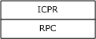

# [MS-ICPR]: ICertPassage Remote Protocol

Table of Contents

1 Introduction

- [1 Introduction](#Section_1)
  - [1.1 Glossary](#Section_1.1)
  - [1.2 References](#Section_1.2)
    - [1.2.1 Normative References](#Section_1.2.1)
    - [1.2.2 Informative References](#Section_1.2.2)
  - [1.3 Overview](#Section_1.3)
  - [1.4 Relationship to Other Protocols](#Section_1.4)
  - [1.5 Prerequisites and Preconditions](#Section_1.5)
  - [1.6 Applicability Statement](#Section_1.6)
  - [1.7 Versioning and Capability Negotiation](#Section_1.7)
  - [1.8 Vendor-Extensible Fields](#Section_1.8)
  - [1.9 Standards Assignments](#Section_1.9)

2 Messages

- [2 Messages](#Section_2)
  - [2.1 Transport](#Section_2.1)
  - [2.2 Common Data Types](#Section_2.2)
    - [2.2.1 Request Format](#Section_2.2.1)
    - [2.2.2 Response Format](#Section_2.2.2)

3 Protocol Details

- [3 Protocol Details](#Section_3)
  - [3.1 ICertPassage Client Details](#Section_3.1)
    - [3.1.1 Abstract Data Model](#Section_3.1.1)
    - [3.1.2 Timers](#Section_3.1.2)
    - [3.1.3 Initialization](#Section_3.1.3)
    - [3.1.4 Message Processing and Sequencing Rules](#Section_3.1.4)
      - [3.1.4.1 Processing ICertPassage:: CertServerRequest](#Section_3.1.4.1)
    - [3.1.5 Timer Events](#Section_3.1.5)
    - [3.1.6 Other Local Events](#Section_3.1.6)
  - [3.2 ICertPassage Server Details](#Section_3.2)
    - [3.2.1 Abstract Data Model](#Section_3.2.1)
    - [3.2.2 Timers](#Section_3.2.2)
    - [3.2.3 Initialization](#Section_3.2.3)
    - [3.2.4 Message Processing and Sequencing Rules](#Section_3.2.4)
      - [3.2.4.1 ICertPassage Interface](#Section_3.2.4.1)
        - [3.2.4.1.1 CertServerRequest (Opnum 0)](#Section_3.2.4.1.1)
    - [3.2.5 Timer Events](#Section_3.2.5)
    - [3.2.6 Other Local Events](#Section_3.2.6)

4 Protocol Examples

- [4 Protocol Examples](#Section_4)

5 Security

- [5 Security](#Section_5)
  - [5.1 Security Considerations for Implementers](#Section_5.1)
  - [5.2 Index of Security Parameters](#Section_5.2)

6 Appendix A: Full IDL

- [6 Appendix A: Full IDL](#Section_6)

7 Appendix B: Product Behavior

- [7 Appendix B: Product Behavior](#Section_7)

8 Change Tracking

- [8 Change Tracking](#Section_8)

For the legal notice and IP terms, see [LEGAL.md](../LEGAL.md).
Last updated: 4/23/2024.
See [Revision History](#revision-history) for full version history.

# 1 Introduction

This document specifies the ICertPassage Remote Protocol. This protocol is a subset of the Windows Client Certificate Enrollment Protocol, as specified in [MS-WCCE](../MS-WCCE/MS-WCCE.md). The difference between this protocol and the Windows Client Certificate Enrollment Protocol is that this protocol only allows the [**client**](#gt_client) to [**enroll**](#gt_enroll) [**certificates**](#gt_certificate), whereas the Windows Client Certificate Enrollment Protocol provides [**enrollment**](#gt_certificate-enrollment) and additional functionality, such as the capability to read [**certification authority (CA)**](#gt_certification-authority-ca) data and configuration information. Reading and understanding the Windows Client Certificate Enrollment Protocol, as specified in [MS-WCCE], is essential to understanding the ICertPassage Remote Protocol.

Sections 1.5, 1.8, 1.9, 2, and 3 of this specification are normative. All other sections and examples in this specification are informative.

## 1.1 Glossary

This document uses the following terms:

**Active Directory**: The Windows implementation of a general-purpose directory service, which uses LDAP as its primary access protocol. [**Active Directory**](#gt_active-directory) stores information about a variety of objects in the network such as user accounts, computer accounts, groups, and all related credential information used by Kerberos [MS-KILE](../MS-KILE/MS-KILE.md). [**Active Directory**](#gt_active-directory) is either deployed as Active Directory Domain Services (AD DS) or Active Directory Lightweight Directory Services (AD LDS), which are both described in [MS-ADOD](../MS-ADOD/MS-ADOD.md): Active Directory Protocols Overview.

**certificate**: A certificate is a collection of attributes and extensions that can be stored persistently. The set of attributes in a certificate can vary depending on the intended usage of the certificate. A certificate securely binds a public key to the entity that holds the corresponding private key. A certificate is commonly used for authentication and secure exchange of information on open networks, such as the Internet, extranets, and intranets. Certificates are digitally signed by the issuing [**certification authority (CA)**](#gt_certification-authority-ca) and can be issued for a user, a computer, or a service. The most widely accepted format for certificates is defined by the ITU-T X.509 version 3 international standards. For more information about attributes and extensions, see [[RFC3280]](https://go.microsoft.com/fwlink/?LinkId=90414) and [[X509]](https://go.microsoft.com/fwlink/?LinkId=90590) sections 7 and 8.

**certificate enrollment**: The process of acquiring a digital certificate from a [**certificate authority (CA)**](#gt_certification-authority-ca), which typically requires an end entity to first makes itself known to the CA (either directly, or through a registration authority). This certificate and its associated [**private key**](#gt_private-key) establish a trusted identity for an entity that is using the [**public key**](#gt_public-key)–based services and applications. Also referred to as simply "enrollment".

**certification authority (CA)**: A third party that issues [**public key**](#gt_public-key) [**certificates**](#gt_certificate). Certificates serve to bind public keys to a user identity. Each user and certification authority (CA) can decide whether to trust another user or CA for a specific purpose, and whether this trust is to be transitive. For more information, see [RFC3280].

**client**: A computer on which the remote procedure call (RPC) client is executing.

**digital signature**: A value that is generated by using a digital signature algorithm, taking as input a private key and an arbitrary-length string, such that a specific verification algorithm is satisfied by the value, the input string, and the public key corresponding to the input private key.

**Distributed Component Object Model (DCOM)**: The Microsoft Component Object Model (COM) specification that defines how components communicate over networks, as specified in [MS-DCOM](../MS-DCOM/MS-DCOM.md).

**dynamic endpoint**: A network-specific server address that is requested and assigned at run time. For more information, see [[C706]](https://go.microsoft.com/fwlink/?LinkId=89824).

**endpoint**: A network-specific address of a remote procedure call (RPC) server process for remote procedure calls. The actual name and type of the endpoint depends on the [**RPC**](#gt_remote-procedure-call-rpc) protocol sequence that is being used. For example, for RPC over TCP (RPC Protocol Sequence ncacn_ip_tcp), an endpoint might be TCP port 1025. For RPC over Server Message Block (RPC Protocol Sequence ncacn_np), an endpoint might be the name of a named pipe. For more information, see [C706].

**endpoint mapper**: A service on a remote procedure call (RPC) server that maintains a database of [**dynamic endpoints**](#gt_dynamic-endpoint) and allows [**clients**](#gt_client) to map an interface/object UUID pair to a local [**dynamic endpoint**](#gt_dynamic-endpoint). For more information, see [C706].

**enroll**: To request and acquire a digital certificate from a [**certificate authority (CA)**](#gt_certification-authority-ca). This is typically accomplished through a [**certificate enrollment**](#gt_certificate-enrollment) process.

**private key**: One of a pair of keys used in public-key cryptography. The private key is kept secret and is used to decrypt data that has been encrypted with the corresponding public key. For an introduction to this concept, see [[CRYPTO]](https://go.microsoft.com/fwlink/?LinkId=89841) section 1.8 and [[IEEE1363]](https://go.microsoft.com/fwlink/?LinkId=89899) section 3.1.

**public key**: One of a pair of keys used in public-key cryptography. The public key is distributed freely and published as part of a digital certificate. For an introduction to this concept, see [CRYPTO] section 1.8 and [IEEE1363] section 3.1.

**public-private key pair**: The association of a public key and its corresponding private key when used in cryptography. Also referred to simply as a "key pair". For an introduction to public-private key pairs, see [IEEE1363] section 3.

**remote procedure call (RPC)**: A communication protocol used primarily between client and server. The term has three definitions that are often used interchangeably: a runtime environment providing for communication facilities between computers (the RPC runtime); a set of request-and-response message exchanges between computers (the RPC exchange); and the single message from an RPC exchange (the RPC message). For more information, see [C706].

**RPC endpoint**: A network-specific address of a server process for remote procedure calls (RPCs). The actual name of the RPC endpoint depends on the RPC protocol sequence being used. For example, for the NCACN_IP_TCP RPC protocol sequence an RPC endpoint might be TCP port 1025. For more information, see [C706].

**server**: A computer on which the [**remote procedure call (RPC)**](#gt_remote-procedure-call-rpc) server is executing.

**universally unique identifier (UUID)**: A 128-bit value. UUIDs can be used for multiple purposes, from tagging objects with an extremely short lifetime, to reliably identifying very persistent objects in cross-process communication such as client and server interfaces, manager entry-point vectors, and [**RPC**](#gt_remote-procedure-call-rpc) objects. UUIDs are highly likely to be unique. UUIDs are also known as globally unique identifiers (GUIDs) and these terms are used interchangeably in the Microsoft protocol technical documents (TDs). Interchanging the usage of these terms does not imply or require a specific algorithm or mechanism to generate the UUID. Specifically, the use of this term does not imply or require that the algorithms described in [[RFC4122]](https://go.microsoft.com/fwlink/?LinkId=90460) or [C706] must be used for generating the UUID.

**well-known endpoint**: A preassigned, network-specific, stable address for a particular client/server instance. For more information, see [C706].

**MAY, SHOULD, MUST, SHOULD NOT, MUST NOT:** These terms (in all caps) are used as defined in [[RFC2119]](https://go.microsoft.com/fwlink/?LinkId=90317). All statements of optional behavior use either MAY, SHOULD, or SHOULD NOT.

## 1.2 References

Links to a document in the Microsoft Open Specifications library point to the correct section in the most recently published version of the referenced document. However, because individual documents in the library are not updated at the same time, the section numbers in the documents may not match. You can confirm the correct section numbering by checking the [Errata](https://go.microsoft.com/fwlink/?linkid=850906).

### 1.2.1 Normative References

We conduct frequent surveys of the normative references to assure their continued availability. If you have any issue with finding a normative reference, please contact [dochelp@microsoft.com](mailto:dochelp@microsoft.com). We will assist you in finding the relevant information.

[C706] The Open Group, "DCE 1.1: Remote Procedure Call", C706, August 1997, [https://publications.opengroup.org/c706](https://go.microsoft.com/fwlink/?LinkId=89824)

**Note** Registration is required to download the document.

[MS-CRTD] Microsoft Corporation, "[Certificate Templates Structure](../MS-CRTD/MS-CRTD.md)".

[MS-CSRA] Microsoft Corporation, "[Certificate Services Remote Administration Protocol](../MS-CSRA/MS-CSRA.md)".

[MS-DCOM] Microsoft Corporation, "[Distributed Component Object Model (DCOM) Remote Protocol](../MS-DCOM/MS-DCOM.md)".

[MS-DTYP] Microsoft Corporation, "[Windows Data Types](../MS-DTYP/MS-DTYP.md)".

[MS-RPCE] Microsoft Corporation, "[Remote Procedure Call Protocol Extensions](../MS-RPCE/MS-RPCE.md)".

[MS-WCCE] Microsoft Corporation, "[Windows Client Certificate Enrollment Protocol](../MS-WCCE/MS-WCCE.md)".

[RFC2119] Bradner, S., "Key words for use in RFCs to Indicate Requirement Levels", BCP 14, RFC 2119, March 1997, [https://www.rfc-editor.org/info/rfc2119](https://go.microsoft.com/fwlink/?LinkId=90317)

[RFC2797] Myers, M., Liu, X., Schaad, J., and Weinstein, J., "Certificate Management Messages Over CMS", RFC 2797, April 2000, [http://www.rfc-editor.org/info/rfc2797](https://go.microsoft.com/fwlink/?LinkId=90382)

[RFC2986] Nystrom, M. and Kaliski, B., "PKCS#10: Certificate Request Syntax Specification", RFC 2986, November 2000, [http://www.rfc-editor.org/info/rfc2986](https://go.microsoft.com/fwlink/?LinkId=90401)

[RFC3280] Housley, R., Polk, W., Ford, W., and Solo, D., "Internet X.509 Public Key Infrastructure Certificate and Certificate Revocation List (CRL) Profile", RFC 3280, April 2002, [http://www.rfc-editor.org/info/rfc3280](https://go.microsoft.com/fwlink/?LinkId=90414)

[RFC3852] Housley, R., "Cryptographic Message Syntax (CMS)", RFC 3852, July 2004, [https://www.rfc-editor.org/info/rfc3852](https://go.microsoft.com/fwlink/?LinkId=90445)

[UNICODE4.0] The Unicode Consortium, "Unicode 4.0.0", [http://www.unicode.org/versions/Unicode4.0.0/](https://go.microsoft.com/fwlink/?LinkId=90552)

[X509] ITU-T, "Information Technology - Open Systems Interconnection - The Directory: Public-Key and Attribute Certificate Frameworks", Recommendation X.509, August 2005, [http://www.itu.int/rec/T-REC-X.509/en](https://go.microsoft.com/fwlink/?LinkId=90590)

[X660] ITU-T, "Information Technology - Open Systems Interconnection - Procedures for the Operation of OSI Registration Authorities: General Procedures and Top Arcs of the ASN.1 Object Identifier Tree", Recommendation X.660, August 2004, [http://www.itu.int/rec/T-REC-X.660/en](https://go.microsoft.com/fwlink/?LinkId=90592)

[X690] ITU-T, "Information Technology - ASN.1 Encoding Rules: Specification of Basic Encoding Rules (BER), Canonical Encoding Rules (CER) and Distinguished Encoding Rules (DER)", Recommendation X.690, July 2002, [http://www.itu.int/rec/T-REC-X.690/en](https://go.microsoft.com/fwlink/?LinkId=90593)

### 1.2.2 Informative References

None.

## 1.3 Overview

The ICertPassage Remote Protocol exposes a [**Remote Procedure Call (RPC)**](#gt_remote-procedure-call-rpc) (as specified in [MS-RPCE](../MS-RPCE/MS-RPCE.md)) interface that allows a [**client**](#gt_client) to interact with a [**certification authority (CA)**](#gt_certification-authority-ca) to request and receive X.509 [**certificates**](#gt_certificate) (as specified in [[X509]](https://go.microsoft.com/fwlink/?LinkId=90590)) from the CA. The ICertPassage Remote Protocol only provides certificate [**enrollment**](#gt_certificate-enrollment) functionality. The Windows Client Certificate Enrollment Protocol (as specified in [MS-WCCE](../MS-WCCE/MS-WCCE.md)) provides a larger set of functionality, including reading CA data and configuration information. The certificate enrollment process and protocol overview are as specified in [MS-WCCE] section 1.3.

The ICertPassage interface defines one method: CertServerRequest (section [3.2.4.1.1](#Section_3.2.4.1.1)).

## 1.4 Relationship to Other Protocols

The ICertPassage Remote Protocol depends on the Remote Procedure Call Protocol Extensions, as specified in [MS-RPCE](../MS-RPCE/MS-RPCE.md). No other Windows protocol depends on the ICertPassage Remote Protocol. The following diagram shows the layering of the protocol stack.

Figure 1: ICRP Protocol Stack

The ICertPassage Remote Protocol shares ADM elements with Windows Client Certificate Enrollment Protocol [MS-WCCE](../MS-WCCE/MS-WCCE.md) as specified in section [3.1.1](#Section_3.2.1) and section [3.2.1](#Section_3.2.1). The ICertPassage Remote Protocol, the Certificate Services Remote Administration Protocol, and the Windows Client Certificate Enrollment Protocol use a common list of configuration data elements, defined in [MS-WCCE] section 3.2.1.1.4.

## 1.5 Prerequisites and Preconditions

The ICertPassage Remote Protocol has the same prerequisites as the Windows Client Certificate Enrollment Protocol, as specified in [MS-WCCE](../MS-WCCE/MS-WCCE.md) section 1.5.

ICertPassage Remote Protocol [**server**](#gt_server) implementations that also implement the Certificate Services Remote Administration Protocol specified in [MS-CSRA](../MS-CSRA/MS-CSRA.md) or the Windows Client Certificate Enrollment Protocol specified in [MS-WCCE] use the same configuration data elements, defined in [MS-WCCE] section 3.2.1.1.4 as "public", for those implementations.

## 1.6 Applicability Statement

This protocol applies to legacy [**clients**](#gt_client) that have to use [**RPC**](#gt_remote-procedure-call-rpc) (as specified in [MS-RPCE](../MS-RPCE/MS-RPCE.md)) to interact with a [**CA**](#gt_certification-authority-ca) for the purpose of [**enrolling**](#gt_enroll) or managing X.509 (as specified in [[X509]](https://go.microsoft.com/fwlink/?LinkId=90590)) [**certificates**](#gt_certificate).

If clients can interact with the CA through [**Distributed Component Object Model (DCOM)**](#gt_distributed-component-object-model-dcom) (as specified in [MS-DCOM](../MS-DCOM/MS-DCOM.md)) interfaces, they are to use the Windows Client Certificate Enrollment Protocol, as specified in [MS-WCCE](../MS-WCCE/MS-WCCE.md).

## 1.7 Versioning and Capability Negotiation

Version and capability negotiation is not provided in this protocol.<1>

## 1.8 Vendor-Extensible Fields

None.

## 1.9 Standards Assignments

None.

# 2 Messages

The following sections specify how ICertPassage Remote Protocol messages are transported and ICertPassage Remote Protocol message syntax.

## 2.1 Transport

This protocol uses the following [**RPC**](#gt_remote-procedure-call-rpc) protocol sequence: RPC over named pipe and RPC over TCP/IP, as specified in [MS-RPCE](../MS-RPCE/MS-RPCE.md).

The [**endpoint**](#gt_endpoint) pipe name for RPC over named pipe, as specified in [MS-RPCE], is `\PIPE\cert`. This endpoint is used for the authenticated RPC interface. The authenticated RPC interface allows RPC to negotiate the use of authentication and the authentication level on behalf of the [**client**](#gt_client) and [**server**](#gt_server), as specified in [MS-RPCE].

In the case of using RPC over TCP, this protocol uses RPC [**dynamic endpoints**](#gt_dynamic-endpoint) as defined in Part 4 of [[C706]](https://go.microsoft.com/fwlink/?LinkId=89824). For more information, see Client Initialization (section [3.1.3](#Section_3.1.3)) and Server Initialization (section [3.2.3](#Section_3.1.3)).

This protocol MUST use the [**universal unique identifier (UUID)**](#gt_universally-unique-identifier-uuid), as specified in section [3.2.4.1](#Section_3.2.4.1).

## 2.2 Common Data Types

The [ICertPassage](#Section_3.2.4.1) interface uses the CERTTRANSBLOB structure, as specified in [MS-WCCE](../MS-WCCE/MS-WCCE.md) section 2.2.2.2.

This protocol specification makes use of the wchar_t and DWORD datatypes defined in [MS-DTYP](../MS-DTYP/MS-DTYP.md) sections 2.1.6 and 2.2.9.

### 2.2.1 Request Format

The ICertPassage Remote Protocol is a simple request-response pattern between the [**client**](#gt_client) and the [**server**](#gt_server). The client MUST send the [**certificate**](#gt_certificate) request using one of the following ASN.1 DER encoded message formats:

- PKCS #10 as specified in [[RFC2986]](https://go.microsoft.com/fwlink/?LinkId=90401).
- Cryptographic Message Syntax (CMS) as specified in [[RFC3852]](https://go.microsoft.com/fwlink/?LinkId=90445).
- Certificate Management Messages over CMS (CMC) as specified in [[RFC2797]](https://go.microsoft.com/fwlink/?LinkId=90382).
Details are as specified in [MS-WCCE](../MS-WCCE/MS-WCCE.md) section 2.2.2.6. Each format contains a set of attributes and extensions describing the request.<2>

### 2.2.2 Response Format

Responses are returned by the ICertPassage Remote Protocol in either CMS format or CMC format. Details are as specified in [MS-WCCE](../MS-WCCE/MS-WCCE.md) section 2.2.2.8. The format of the response is determined by the value passed in the *dwFlags* parameter, as specified in section [3.1.4.1](#Section_3.1.4.1).

# 3 Protocol Details

The ICertPassage Remote Protocol is a simple request-response protocol. The [**client**](#gt_client) sends a [**certificate**](#gt_certificate) request, and the [**server**](#gt_server) responds with a signed certificate or a detailed disposition message. In almost all cases, the protocol is a single message followed by a single reply. Details on the flow and sequencing of the certificate [**enrollment**](#gt_certificate-enrollment) protocol are as specified in [MS-WCCE](../MS-WCCE/MS-WCCE.md) section 3.

## 3.1 ICertPassage Client Details

Details of the [**client**](#gt_client) role are exactly as specified in [MS-WCCE](../MS-WCCE/MS-WCCE.md) section 3.1.

### 3.1.1 Abstract Data Model

The [**client**](#gt_client) abstract data model is as specified in the abstract data model subsections of the [MS-WCCE](../MS-WCCE/MS-WCCE.md) section 3.1.

### 3.1.2 Timers

None.

### 3.1.3 Initialization

The [**client**](#gt_client) creates an [**RPC**](#gt_remote-procedure-call-rpc) association (or binding) to the [**server**](#gt_server) [**RPC endpoint**](#gt_rpc-endpoint) (as specified in section [2.1](#Section_2.1)) when an RPC method is called. The client SHOULD create a separate association for each method invocation, or it MAY reuse an association for multiple invocations.

The client SHOULD create an authenticated RPC association with the highest possible authentication level. RPC authentication levels are as specified in [MS-RPCE](../MS-RPCE/MS-RPCE.md).<3> Because the RPC server [**endpoint**](#gt_endpoint) is dynamic, the client MUST use the RPC [**endpoint mapper**](#gt_endpoint-mapper) services (as specified in [MS-RPCE] section 2.2.1.2) to locate the endpoint at which the server is registered.

### 3.1.4 Message Processing and Sequencing Rules

#### 3.1.4.1 Processing ICertPassage:: CertServerRequest

Details of the [**client**](#gt_client) processing rules are exactly as specified in [MS-WCCE](../MS-WCCE/MS-WCCE.md) section 3.1.1.4.3.

### 3.1.5 Timer Events

None.

### 3.1.6 Other Local Events

The ICertPassage interface [CertServerRequest](#Section_3.2.4.1.1) method is invoked to obtain [**certificates**](#gt_certificate) whenever they are required by the [**client**](#gt_client).

## 3.2 ICertPassage Server Details

Details of the [**server**](#gt_server) processing rules are exactly as specified in [MS-WCCE](../MS-WCCE/MS-WCCE.md) section 3.2.

### 3.2.1 Abstract Data Model

As specified in [MS-WCCE](../MS-WCCE/MS-WCCE.md) section 3.2.1.1.

ICertPassage Remote Protocol [**server**](#gt_server) implementations that also implement the Certificate Services Remote Administration Protocol specified in [MS-CSRA](../MS-CSRA/MS-CSRA.md) or the Windows Client Certificate Enrollment Protocol specified in [MS-WCCE] use the same configuration data elements, defined in [MS-WCCE] section 3.2.1.1.4 as "public", for those implementations. If either Certificate Services Remote Administration Protocol or Windows Client Certificate Enrollment Protocol or both are also implemented, access to the configuration data elements from either or both of these protocols SHOULD be serialized.

### 3.2.2 Timers

None.

### 3.2.3 Initialization

Interface initialization: The [**CA**](#gt_certification-authority-ca) MUST listen on the [**well-known endpoint**](#gt_well-known-endpoint) specified for this [**RPC**](#gt_remote-procedure-call-rpc) interface for the RPC over named pipes binding. The CA also MUST register with the RPC [**endpoint mapper**](#gt_endpoint-mapper) service for the TCP over RPC binding (as specified in [MS-RPCE](../MS-RPCE/MS-RPCE.md) section 2.2.1.2). Details are as specified in section [2.1](#Section_2.1).

Cryptographic initialization: The CA SHOULD obtain the [**certificates**](#gt_certificate), the signing [**private key**](#gt_private-key), and the exchange private key. The CA also MUST validate the CA signing certificates and its chain. The validation is based on chain validation, as specified in [[RFC3280]](https://go.microsoft.com/fwlink/?LinkId=90414) section 6.<4>

### 3.2.4 Message Processing and Sequencing Rules

The ICertPassage Remote Protocol defines the following interface:

ICertPassage (section [3.2.4.1](#Section_3.2.4.1)): A method that enables a [**client**](#gt_client) to request [**certificates**](#gt_certificate) from a [**certification authority**](#gt_certification-authority-ca).

#### 3.2.4.1 ICertPassage Interface

The ICertPassage [**RPC**](#gt_remote-procedure-call-rpc) interface permits the [**client**](#gt_client) to submit a [**certificate**](#gt_certificate) [**enrollment**](#gt_certificate-enrollment) request to the [**CA**](#gt_certification-authority-ca) and receive a signed X.509 certificate (as specified in [[X509]](https://go.microsoft.com/fwlink/?LinkId=90590)) as the response.

The version number for this interface is 0.0. The [**UUID**](#gt_universally-unique-identifier-uuid) for this interface is 91ae6020-9e3c-11cf-8d7c-00aa00c091be, as specified in [MS-RPCE](../MS-RPCE/MS-RPCE.md).<5>

The interface defines a single method.

Methods in RPC Opnum Order

| Method | Description |
| --- | --- |
| [CertServerRequest](#Section_3.2.4.1.1) | Opnum: 0 |

##### 3.2.4.1.1 CertServerRequest (Opnum 0)

The CertServerRequest method processes a [**certificate**](#gt_certificate) [**enrollment**](#gt_certificate-enrollment) request from the [**client**](#gt_client).<6>

DWORD CertServerRequest(

[in] handle_t h,

[in] DWORD dwFlags,

[in, string, unique] const wchar_t* pwszAuthority,

[in, out, ref] DWORD* pdwRequestId,

[out] DWORD* pdwDisposition,

[in, ref] const CERTTRANSBLOB* pctbAttribs,

[in, ref] const CERTTRANSBLOB* pctbRequest,

[out, ref] CERTTRANSBLOB* pctbCert,

[out, ref] CERTTRANSBLOB* pctbEncodedCert,

[out, ref] CERTTRANSBLOB* pctbDispositionMessage

);

**h:** A handle retrieved during the [**RPC**](#gt_remote-procedure-call-rpc) bind operation, as specified in [MS-RPCE](../MS-RPCE/MS-RPCE.md) section 2.2.2.

**dwFlags:** The *dwFlags* parameter has identical syntax and semantics to the *dwFlags* parameter specified in [MS-WCCE](../MS-WCCE/MS-WCCE.md) section 3.2.1.4.2.1.

**pwszAuthority:** The *pwszAuthority* parameter has identical syntax and semantics to the *pwszAuthority* parameter specified in [MS-WCCE] section 3.2.1.4.2.1.

**pdwRequestId:** The *pdwRequestId* parameter has identical syntax and semantics to the *pdwRequestId* parameter specified in [MS-WCCE] section 3.2.1.4.2.1.

**pdwDisposition:** The *pdwDisposition* parameter has identical syntax and semantics to the *pdwDisposition* parameter specified in [MS-WCCE] section 3.2.1.4.2.1.

**pctbAttribs:** A pointer to a CERTTRANSBLOB structure, as specified in [MS-WCCE] section 2.2.2.2, where the *pb* field of this structure points to a Unicode (as specified in [[UNICODE4.0]](https://go.microsoft.com/fwlink/?LinkId=90552)) null-terminated string and the *cb* field contains the length of the string, including the NULL-terminated character (in bytes). If the value of the *cb* field does not match the length, in bytes, of the string (including the terminating null character), the [**CA**](#gt_certification-authority-ca) MUST return the E_INVALIDARG error (0x80070057) to the client. Otherwise, the semantics of the string pointed to by the *pb* field are identical to the *pwszAttributes* parameter specified in [MS-WCCE] section 3.2.1.4.2.1.

**pctbRequest:** The *pctbRequest* parameter has identical syntax and semantics to the *pctbRequest* parameter, as specified in [MS-WCCE] section 3.2.1.4.2.1.

**pctbCert:** The *pctbCert* parameter has identical syntax and semantics to the *pctbCertChain* parameter, as specified in [MS-WCCE] section 3.2.1.4.2.1.

**pctbEncodedCert:** The *pctbEncodedCert* parameter has identical syntax and semantics to the *pctbEncodedCert* parameter, as specified in [MS-WCCE] section 3.2.1.4.2.1.

**pctbDispositionMessage:** The *pctbDispositionMessage* parameter has identical syntax and semantics to the *pctbDispositionMessage* parameter, as specified in [MS-WCCE] section 3.2.1.4.2.1.

**Return Values:** The method MUST return ERROR_SUCCESS (0x00000000) on success. This method's return values MUST have identical syntax and semantics to the return values specified in [MS-WCCE] section 3.2.1.4.2.1.

If the ADM element *Config.CA.Interface.Flags* contains the value IF_NORPCICERTREQUEST, the [**server**](#gt_server) SHOULD return an error.<7>

If the ADM element *Config.CA.Interface.Flags* contains the value IF_ENFORCEENCRYPTICERTREQUEST and the RPC_C_AUTHN_LEVEL_PKT_PRIVACY authentication level ([MS-RPCE] section 2.2.1.1.8) is not specified on the RPC connection from the client, the CA MUST refuse to establish a connection with the client by returning E_ACCESSDENIED (0x80000009).

Otherwise, the processing rules for the ICertRequestD::Request method ([MS-WCCE] section 3.2.2.6.2.1) apply, except that if the ADM element *Config.CA.Interface.Flags* contains the value IF_NOREMOTEICERTREQUEST, these values are ignored and the request is processed as though the values were absent.

### 3.2.5 Timer Events

None.

### 3.2.6 Other Local Events

None.

# 4 Protocol Examples

A [**client**](#gt_client) is typically configured in such a manner that it is able to determine when it requires a [**certificate**](#gt_certificate). A common scenario is that a user has been instructed to [**enroll**](#gt_enroll) for a certificate that will allow use of a security-enhanced wireless network. After the user invokes the [**enrollment**](#gt_certificate-enrollment) process, the following sequence of events occurs:

- The enrollment client queries [**Active Directory**](#gt_active-directory) for the templates (as specified in [MS-CRTD](../MS-CRTD/MS-CRTD.md)) that are available for the specified user. As the resource manager, Active Directory enforces that the user only receives templates that the user has read permissions to access (as specified in [MS-WCCE](../MS-WCCE/MS-WCCE.md) section 2.2.2.11).
- The user selects the template with cn = Client Authentication (as specified in [MS-CRTD] section 2.1). This template includes the client authentication (OID = 1.3.6.1.5.5.7.3.2) as part of its pkiExtendedKeyUsage attribute (as specified in [MS-CRTD] section 2.12).
- The client then generates a [**public-private key pair**](#gt_public-private-key-pair) and constructs the CMS as specified in [[RFC3852]](https://go.microsoft.com/fwlink/?LinkId=90445) request message (as specified in section [2.2.1](#Section_2.2.1)), which:
- Includes a [**public key**](#gt_public-key).
- Includes a template name (that is, Client Authentication) as a request attribute.
- Is signed by the [**private key**](#gt_private-key), as specified in [RFC3852].
- The client creates an [**RPC**](#gt_remote-procedure-call-rpc) connection with the [**CA**](#gt_certification-authority-ca). See section [3.1.3](#Section_3.1.3).
- Using the connection previously mentioned, the client invokes the [ICertPassage::CertServerRequest()](#Section_3.2.4.1.1) method (see section 3.2.4.1.1) and, as a result, submits the CMS certificate request constructed in step 3.
- The CA receives the certificate request from the client.
- The CA validates the CMS message for [**digital signature**](#gt_digital-signature) validity and ASN.1 structure accuracy (as specified in [[X660]](https://go.microsoft.com/fwlink/?LinkId=90592) and [[X690]](https://go.microsoft.com/fwlink/?LinkId=90593)).
- The CA constructs a certificate based on the public key provided, the request attributes and extensions, and the template information.
- The CA signs the certificate with the CA private key and returns the newly created certificate to the caller in the pctbEncodedCert as an out parameter.

# 5 Security

## 5.1 Security Considerations for Implementers

Security considerations for implementation of this protocol are as specified in [MS-WCCE](../MS-WCCE/MS-WCCE.md) section 5.

## 5.2 Index of Security Parameters

| Security parameter | Section |
| --- | --- |
| Authenticated [**RPC**](#gt_remote-procedure-call-rpc) association | [Initialization (section 3.1.3)](#Section_3.1.3) |
| Cryptographic initialization | [Initialization (section 3.2.3)](#Section_3.1.3) |

# 6 Appendix A: Full IDL

For ease of implementation, the full IDL is provided below, where "ms-dtyp.idl" is the IDL found in [MS-DTYP](../MS-DTYP/MS-DTYP.md) Appendix A and "ms-wcce.idl" is the IDL found in [MS-WCCE](../MS-WCCE/MS-WCCE.md) Appendix A.

// Please refer to [MS-WCCE] for the definition of the

// CERTTRANSBLOB

import "ms-wcce.idl";

[

uuid(91ae6020-9e3c-11cf-8d7c-00aa00c091be),

pointer_default(unique)

]

interface ICertPassage

{

DWORD CertServerRequest(

[in] handle_t h,

[in] DWORD dwFlags,

[in, string, unique] const wchar_t *pwszAuthority,

[in, out, ref] DWORD *pdwRequestId,

[out] DWORD *pdwDisposition,

[in, ref] const CERTTRANSBLOB *pctbAttribs,

[in, ref] const CERTTRANSBLOB *pctbRequest,

[out, ref] CERTTRANSBLOB *pctbCert,

[out, ref] CERTTRANSBLOB *pctbEncodedCert,

[out, ref] CERTTRANSBLOB *pctbDispositionMessage);

}

# 7 Appendix B: Product Behavior

The information in this specification is applicable to the following Microsoft products or supplemental software. References to product versions include updates to those products.

The terms "earlier" and "later", when used with a product version, refer to either all preceding versions or all subsequent versions, respectively. The term "through" refers to the inclusive range of versions. Applicable Microsoft products are listed chronologically in this section.

**Windows Client**

- Windows NT 4.0 operating system
- Windows 2000 Professional operating system
- Windows XP operating system
- Windows Vista operating system
- Windows 7 operating system
- Windows 8 operating system
- Windows 8.1 operating system
- Windows 10 operating system
- Windows 11 operating system
**Windows Server**

- Windows NT 4.0
- Windows 2000 Server operating system
- Windows Server 2003 operating system
- Windows Server 2008 operating system
- Windows Server 2008 R2 operating system
- Windows Server 2012 operating system
- Windows Server 2012 R2 operating system
- Windows Server 2016 operating system
- Windows Server operating system
- Windows Server 2019 operating system
- Windows Server 2022 operating system
- Windows Server 2025 operating system
Exceptions, if any, are noted in this section. If an update version, service pack or Knowledge Base (KB) number appears with a product name, the behavior changed in that update. The new behavior also applies to subsequent updates unless otherwise specified. If a product edition appears with the product version, behavior is different in that product edition.

Unless otherwise specified, any statement of optional behavior in this specification that is prescribed using the terms "SHOULD" or "SHOULD NOT" implies product behavior in accordance with the SHOULD or SHOULD NOT prescription. Unless otherwise specified, the term "MAY" implies that the product does not follow the prescription.

<1> Section 1.7: The [ICertPassage Interface](#Section_3.2.4.1) is supported by all applicable Windows releases. However, CMC (Certificate Management Protocol using CMS) request formats and CMC response formats are not supported by Windows 2000 operating system and earlier. CMC is specified in [[RFC2797]](https://go.microsoft.com/fwlink/?LinkId=90382).

<2> Section 2.2.1: Windows 2000 and earlier do not support the CMC request format (as specified in [RFC2797]).

<3> Section 3.1.3: For authenticated [**RPC**](#gt_remote-procedure-call-rpc), the [**client**](#gt_client) in Windows XP and later and the [**server**](#gt_server) in Windows Server 2003 and later, passes RPC_C_AUTHN_GSS_NEGOTIATE and RPC_C_AUTHN_LEVEL_PKT_PRIVACY. The client in Windows 2000 Server passes RPC_C_AUTHN_GSS_NEGOTIATE only to RPC. These values are used to allow RPC to negotiate the authentication level on behalf of the client with the server, as specified in [MS-RPCE](../MS-RPCE/MS-RPCE.md).

<4> Section 3.2.3: The exchange [**private key**](#gt_private-key) was not used in Windows Server 2003 and earlier.

<5> Section 3.2.4.1: ICertPassage clients are supported on Windows 2000 Professional and later and ICertPassage servers are supported on Windows NT Server operating system and later.

<6> Section 3.2.4.1.1: The implementation of this method on Windows Server 2003 and later is identical to the ICertRequestD::Request method, as specified in [MS-WCCE](../MS-WCCE/MS-WCCE.md) section 3.2.1.4.2.1. However, the implementation of this method on Windows 2000 Server has the following differences from the specified ICertRequestD::Request method. In ICertPassage on Windows 2000 Server:

- The format of the [**certificates**](#gt_certificate) request passed in the *pctbRequest* parameter cannot be CMC, as specified in [RFC2797].
- Windows 2000 Server does not return or support issued certificates in the CMC format, as specified in [RFC2797].
<7> Section 3.2.4.1.1: In Windows Server 2003 and later, the error returned is RPC_S_SERVER_UNAVAILABLE (0x800706ba). Windows 2000 does not return an error.

# 8 Change Tracking

This section identifies changes that were made to this document since the last release. Changes are classified as Major, Minor, or None.

The revision class **Major** means that the technical content in the document was significantly revised. Major changes affect protocol interoperability or implementation. Examples of major changes are:

- A document revision that incorporates changes to interoperability requirements.
- A document revision that captures changes to protocol functionality.
The revision class **Minor** means that the meaning of the technical content was clarified. Minor changes do not affect protocol interoperability or implementation. Examples of minor changes are updates to clarify ambiguity at the sentence, paragraph, or table level.

The revision class **None** means that no new technical changes were introduced. Minor editorial and formatting changes may have been made, but the relevant technical content is identical to the last released version.

The changes made to this document are listed in the following table. For more information, please contact [dochelp@microsoft.com](mailto:dochelp@microsoft.com).

| Section | Description | Revision class |
| --- | --- | --- |
| [7](#Section_7) Appendix B: Product Behavior | Added Windows Server 2025 to the list of applicable products. | Major |

## Revision History

| Date | Version | Revision Class | Comments |
| --- | --- | --- | --- |
| 3/2/2007 | 1.0 | New | Version 1.0 release |
| 4/3/2007 | 1.1 | Minor | Version 1.1 release |
| 5/11/2007 | 1.2 | Minor | Version 1.2 release |
| 6/1/2007 | 1.2.1 | Editorial | Changed language and formatting in the technical content. |
| 7/3/2007 | 1.2.2 | Editorial | Changed language and formatting in the technical content. |
| 8/10/2007 | 2.0 | Major | IDL was updated. |
| 9/28/2007 | 2.0.1 | Editorial | Changed language and formatting in the technical content. |
| 10/23/2007 | 3.0 | Major | Converted document to unified format and updated technical content. |
| 1/25/2008 | 3.0.1 | Editorial | Changed language and formatting in the technical content. |
| 3/14/2008 | 3.0.2 | Editorial | Changed language and formatting in the technical content. |
| 6/20/2008 | 4.0 | Major | Updated and revised the technical content. |
| 7/25/2008 | 4.0.1 | Editorial | Changed language and formatting in the technical content. |
| 8/29/2008 | 4.0.2 | Editorial | Fix capitalization issues. |
| 10/24/2008 | 4.0.3 | Editorial | Changed language and formatting in the technical content. |
| 12/5/2008 | 4.0.4 | Editorial | Editorial Update. |
| 1/16/2009 | 4.0.5 | Editorial | Changed language and formatting in the technical content. |
| 2/27/2009 | 4.0.6 | Editorial | Changed language and formatting in the technical content. |
| 4/10/2009 | 5.0 | Major | Updated and revised the technical content. |
| 5/22/2009 | 5.0.1 | Editorial | Changed language and formatting in the technical content. |
| 7/2/2009 | 6.0 | Major | Updated and revised the technical content. |
| 8/14/2009 | 6.0.1 | Editorial | Changed language and formatting in the technical content. |
| 9/25/2009 | 6.1 | Minor | Clarified the meaning of the technical content. |
| 11/6/2009 | 6.1.1 | Editorial | Changed language and formatting in the technical content. |
| 12/18/2009 | 6.1.2 | Editorial | Changed language and formatting in the technical content. |
| 1/29/2010 | 7.0 | Major | Updated and revised the technical content. |
| 3/12/2010 | 8.0 | Major | Updated and revised the technical content. |
| 4/23/2010 | 9.0 | Major | Updated and revised the technical content. |
| 6/4/2010 | 10.0 | Major | Updated and revised the technical content. |
| 7/16/2010 | 11.0 | Major | Updated and revised the technical content. |
| 8/27/2010 | 12.0 | Major | Updated and revised the technical content. |
| 10/8/2010 | 12.1 | Minor | Clarified the meaning of the technical content. |
| 11/19/2010 | 13.0 | Major | Updated and revised the technical content. |
| 1/7/2011 | 13.0 | None | No changes to the meaning, language, or formatting of the technical content. |
| 2/11/2011 | 13.0 | None | No changes to the meaning, language, or formatting of the technical content. |
| 3/25/2011 | 14.0 | Major | Updated and revised the technical content. |
| 5/6/2011 | 14.0 | None | No changes to the meaning, language, or formatting of the technical content. |
| 6/17/2011 | 14.1 | Minor | Clarified the meaning of the technical content. |
| 9/23/2011 | 15.0 | Major | Updated and revised the technical content. |
| 12/16/2011 | 16.0 | Major | Updated and revised the technical content. |
| 3/30/2012 | 16.0 | None | No changes to the meaning, language, or formatting of the technical content. |
| 7/12/2012 | 16.1 | Minor | Clarified the meaning of the technical content. |
| 10/25/2012 | 16.1 | None | No changes to the meaning, language, or formatting of the technical content. |
| 1/31/2013 | 16.1 | None | No changes to the meaning, language, or formatting of the technical content. |
| 8/8/2013 | 17.0 | Major | Updated and revised the technical content. |
| 11/14/2013 | 17.0 | None | No changes to the meaning, language, or formatting of the technical content. |
| 2/13/2014 | 17.0 | None | No changes to the meaning, language, or formatting of the technical content. |
| 5/15/2014 | 17.0 | None | No changes to the meaning, language, or formatting of the technical content. |
| 6/30/2015 | 18.0 | Major | Significantly changed the technical content. |
| 10/16/2015 | 18.0 | None | No changes to the meaning, language, or formatting of the technical content. |
| 7/14/2016 | 19.0 | Major | Significantly changed the technical content. |
| 6/1/2017 | 19.0 | None | No changes to the meaning, language, or formatting of the technical content. |
| 9/15/2017 | 20.0 | Major | Significantly changed the technical content. |
| 12/1/2017 | 20.0 | None | No changes to the meaning, language, or formatting of the technical content. |
| 9/12/2018 | 21.0 | Major | Significantly changed the technical content. |
| 4/7/2021 | 22.0 | Major | Significantly changed the technical content. |
| 6/25/2021 | 23.0 | Major | Significantly changed the technical content. |
| 4/23/2024 | 24.0 | Major | Significantly changed the technical content. |
