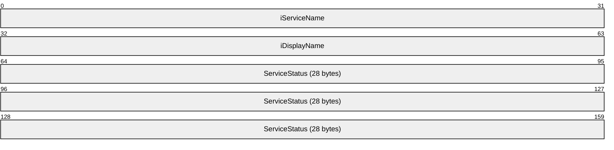
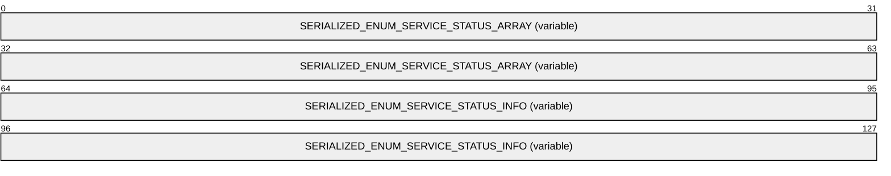

# [MS-IISS]: Internet Information Services (IIS) ServiceControl Protocol

Table of Contents

1 Introduction

- [1 Introduction](#Section_1)
  - [1.1 Glossary](#Section_1.1)
  - [1.2 References](#Section_1.2)
    - [1.2.1 Normative References](#Section_1.2.1)
    - [1.2.2 Informative References](#Section_1.2.2)
  - [1.3 Overview](#Section_1.3)
  - [1.4 Relationship to Other Protocols](#Section_1.4)
  - [1.5 Prerequisites/Preconditions](#Section_1.5)
  - [1.6 Applicability Statement](#Section_1.6)
  - [1.7 Versioning and Capability Negotiation](#Section_1.7)
  - [1.8 Vendor-Extensible Fields](#Section_1.8)
  - [1.9 Standards Assignments](#Section_1.9)

2 Messages

- [2 Messages](#Section_2)
  - [2.1 Transport](#Section_2.1)
  - [2.2 Common Data Types](#Section_2.2)
    - [2.2.1 SERIALIZED_ENUM_SERVICE_STATUS](#Section_2.2.1)
    - [2.2.2 STATUS_BLOB](#Section_2.2.2)

3 Protocol Details

- [3 Protocol Details](#Section_3)
  - [3.1 IIS Service Control Server Details](#Section_3.1)
    - [3.1.1 Abstract Data Model](#Section_3.1.1)
    - [3.1.2 Timers](#Section_3.1.2)
    - [3.1.3 Initialization](#Section_3.1.3)
    - [3.1.4 Message Processing Events and Sequencing Rules](#Section_3.1.4)
      - [3.1.4.1 Stop (Opnum 7)](#Section_3.1.4.1)
      - [3.1.4.2 Start (Opnum 8)](#Section_3.1.4.2)
      - [3.1.4.3 Reboot (Opnum 9)](#Section_3.1.4.3)
      - [3.1.4.4 Status (Opnum 10)](#Section_3.1.4.4)
      - [3.1.4.5 Kill (Opnum 11)](#Section_3.1.4.5)
    - [3.1.5 Timer Events](#Section_3.1.5)
    - [3.1.6 Other Local Events](#Section_3.1.6)

4 Protocol Examples

- [4 Protocol Examples](#Section_4)
  - [4.1 Status Method Call Example](#Section_4.1)

5 Security

- [5 Security](#Section_5)
  - [5.1 Security Considerations for Implementers](#Section_5.1)
  - [5.2 Index of Security Parameters](#Section_5.2)

6 Appendix A: Full IDL

- [6 Appendix A: Full IDL](#Section_6)

7 Appendix B: Product Behavior

- [7 Appendix B: Product Behavior](#Section_7)

8 Change Tracking

- [8 Change Tracking](#Section_8)

For the legal notice and IP terms, see [LEGAL.md](../LEGAL.md).
Last updated: 4/23/2024.
See [Revision History](#revision-history) for full version history.

# 1 Introduction

This specification defines the Internet Information Services (IIS) ServiceControl Protocol. This protocol is a client-to-server protocol which enables remote control of [**Internet services**](#gt_internet-services) as a single unit. The interface can be used to start or stop these services. It also can be used to terminate the service processes or reboot the computer. Lastly, it provides status information about the services.

Sections 1.5, 1.8, 1.9, 2, and 3 of this specification are normative. All other sections and examples in this specification are informative.

## 1.1 Glossary

This document uses the following terms:

**Distributed Component Object Model (DCOM)**: The Microsoft Component Object Model (COM) specification that defines how components communicate over networks, as specified in [MS-DCOM](../MS-DCOM/MS-DCOM.md).

**dynamic endpoint**: A network-specific server address that is requested and assigned at run time. For more information, see [[C706]](https://go.microsoft.com/fwlink/?LinkId=89824).

**endpoint**: A network-specific address of a remote procedure call (RPC) server process for remote procedure calls. The actual name and type of the endpoint depends on the [**RPC**](#gt_remote-procedure-call-rpc) protocol sequence that is being used. For example, for RPC over TCP (RPC Protocol Sequence ncacn_ip_tcp), an endpoint might be TCP port 1025. For RPC over Server Message Block (RPC Protocol Sequence ncacn_np), an endpoint might be the name of a named pipe. For more information, see [C706].

**graceful stop**: Occurs when services are notified to stop and successfully complete that operation, including finishing any outstanding work, within a specified amount of time.

**Interface Definition Language (IDL)**: The International Standards Organization (ISO) standard language for specifying the interface for remote procedure calls. For more information, see [C706] section 4.

**Internet Information Services (IIS)**: The services provided in Windows implementation that support web server functionality. [**IIS**](#gt_internet-information-services-iis) consists of a collection of standard Internet protocol servers such as HTTP and FTP in addition to common infrastructures that are used by other Microsoft Internet protocol servers such as SMTP, NNTP, and so on. [**IIS**](#gt_internet-information-services-iis) has been part of the Windows operating system in some versions and a separate install package in others. [**IIS**](#gt_internet-information-services-iis) version 5.0 shipped as part of Windows 2000 operating system, [**IIS**](#gt_internet-information-services-iis) version 5.1 as part of Windows XP operating system, [**IIS**](#gt_internet-information-services-iis) version 6.0 as part of Windows Server 2003 operating system, and [**IIS**](#gt_internet-information-services-iis) version 7.0 as part of Windows Vista operating system and Windows Server 2008 operating system.

**Internet services**: A generic term used to refer to a server implementation of processes that support Internet functionality. In applicable Windows Server releases, this refers to a set of Windows NT services that handle protocols such as HTTP, FTP, SMTP, and others.

**little-endian**: Multiple-byte values that are byte-ordered with the least significant byte stored in the memory location with the lowest address.

**remote procedure call (RPC)**: A communication protocol used primarily between client and server. The term has three definitions that are often used interchangeably: a runtime environment providing for communication facilities between computers (the RPC runtime); a set of request-and-response message exchanges between computers (the RPC exchange); and the single message from an RPC exchange (the RPC message). For more information, see [C706].

**RPC protocol sequence**: A character string that represents a valid combination of a [**remote procedure call (RPC)**](#gt_remote-procedure-call-rpc) protocol, a network layer protocol, and a transport layer protocol, as described in [C706] and [MS-RPCE](../MS-RPCE/MS-RPCE.md).

**RPC transport**: The underlying network services used by the remote procedure call (RPC) runtime for communications between network nodes. For more information, see [C706] section 2.

**universally unique identifier (UUID)**: A 128-bit value. UUIDs can be used for multiple purposes, from tagging objects with an extremely short lifetime, to reliably identifying very persistent objects in cross-process communication such as client and server interfaces, manager entry-point vectors, and [**RPC**](#gt_remote-procedure-call-rpc) objects. UUIDs are highly likely to be unique. UUIDs are also known as globally unique identifiers (GUIDs) and these terms are used interchangeably in the Microsoft protocol technical documents (TDs). Interchanging the usage of these terms does not imply or require a specific algorithm or mechanism to generate the UUID. Specifically, the use of this term does not imply or require that the algorithms described in [[RFC4122]](https://go.microsoft.com/fwlink/?LinkId=90460) or [C706] must be used for generating the UUID.

**MAY, SHOULD, MUST, SHOULD NOT, MUST NOT:** These terms (in all caps) are used as defined in [[RFC2119]](https://go.microsoft.com/fwlink/?LinkId=90317). All statements of optional behavior use either MAY, SHOULD, or SHOULD NOT.

## 1.2 References

Links to a document in the Microsoft Open Specifications library point to the correct section in the most recently published version of the referenced document. However, because individual documents in the library are not updated at the same time, the section numbers in the documents may not match. You can confirm the correct section numbering by checking the [Errata](https://go.microsoft.com/fwlink/?linkid=850906).

### 1.2.1 Normative References

We conduct frequent surveys of the normative references to assure their continued availability. If you have any issue with finding a normative reference, please contact [dochelp@microsoft.com](mailto:dochelp@microsoft.com). We will assist you in finding the relevant information.

[C706] The Open Group, "DCE 1.1: Remote Procedure Call", C706, August 1997, [https://publications.opengroup.org/c706](https://go.microsoft.com/fwlink/?LinkId=89824)

**Note** Registration is required to download the document.

[MS-DCOM] Microsoft Corporation, "[Distributed Component Object Model (DCOM) Remote Protocol](../MS-DCOM/MS-DCOM.md)".

[MS-DTYP] Microsoft Corporation, "[Windows Data Types](../MS-DTYP/MS-DTYP.md)".

[MS-ERREF] Microsoft Corporation, "[Windows Error Codes](../MS-ERREF/MS-ERREF.md)".

[MS-OAUT] Microsoft Corporation, "[OLE Automation Protocol](../MS-OAUT/MS-OAUT.md)".

[MS-RPCE] Microsoft Corporation, "[Remote Procedure Call Protocol Extensions](../MS-RPCE/MS-RPCE.md)".

[MS-SCMR] Microsoft Corporation, "[Service Control Manager Remote Protocol](../MS-SCMR/MS-SCMR.md)".

[RFC2119] Bradner, S., "Key words for use in RFCs to Indicate Requirement Levels", BCP 14, RFC 2119, March 1997, [https://www.rfc-editor.org/info/rfc2119](https://go.microsoft.com/fwlink/?LinkId=90317)

### 1.2.2 Informative References

None.

## 1.3 Overview

The IIS ServiceControl Protocol provides a mechanism for remote control of [**Internet services**](#gt_internet-services) as a single unit on a server. Through the IIS ServiceControl Protocol, a client can start or stop the services. The client can also terminate processes hosting the Internet services functionality or reboot the computer. Lastly, the client can also retrieve status about the services.

The IIS ServiceControl Protocol is expressed as a set of [**DCOM**](#gt_distributed-component-object-model-dcom) interfaces. The server end of the protocol implements support for the DCOM interface to manage the Internet services. The client end of the protocol invokes method calls on the interface to control the services on the server. The DCOM calls use standard DCOM marshaling.

## 1.4 Relationship to Other Protocols

This protocol depends on the remote protocol described in [MS-DCOM](../MS-DCOM/MS-DCOM.md).

## 1.5 Prerequisites/Preconditions

This protocol requires that the [**DCOM**](#gt_distributed-component-object-model-dcom) protocol is implemented on both the client and server computers.

This protocol is implemented over DCOM and [**RPC**](#gt_remote-procedure-call-rpc) and, as a result, has the prerequisites identified in [MS-DCOM](../MS-DCOM/MS-DCOM.md) and [MS-RPCE](../MS-RPCE/MS-RPCE.md) as being common to DCOM and RPC interfaces.

This protocol specification assumes that any security or authentication associations between the client and server are performed by the DCOM layer.

## 1.6 Applicability Statement

The IIS ServiceControl Protocol is applicable to remote control [**Internet services**](#gt_internet-services) on a server as a single unit.

## 1.7 Versioning and Capability Negotiation

None.

## 1.8 Vendor-Extensible Fields

This protocol uses **HRESULT** values, as specified in [MS-ERREF](../MS-ERREF/MS-ERREF.md). Vendors can define their own **HRESULT** values, provided they set the *C* bit (0x20000000) for each vendor-defined value, indicating that the value is a customer code.

## 1.9 Standards Assignments

| Parameter | Value | Reference |
| --- | --- | --- |
| [**RPC**](#gt_remote-procedure-call-rpc) interface [**UUID**](#gt_universally-unique-identifier-uuid) for IIS ServiceControl Protocol | E8FB8620-588F-11D2-9D61-00C04F79C5FE | None |
| COM class UUID for IIS ServiceControl Protocol | E8FB8621-588F-11D2-9D61-00C04F79C5FE | None |

# 2 Messages

## 2.1 Transport

This protocol uses the [**DCOM**](#gt_distributed-component-object-model-dcom) protocol, as specified in [MS-DCOM](../MS-DCOM/MS-DCOM.md), as its transport. On its behalf, the DCOM protocol uses the following [**RPC protocol sequence**](#gt_rpc-protocol-sequence): [**RPC**](#gt_remote-procedure-call-rpc) over TCP, as specified in [MS-RPCE](../MS-RPCE/MS-RPCE.md).

This protocol uses RPC [**dynamic endpoints**](#gt_dynamic-endpoint) as specified in [[C706]](https://go.microsoft.com/fwlink/?LinkId=89824) part 4.

To access an interface, the client requests a DCOM connection to its object [**UUID**](#gt_universally-unique-identifier-uuid) [**endpoint**](#gt_endpoint) on the server, as specified in the [Standards Assignments](#Section_1.9) section.

The RPC version number for all interfaces is 0.0.

An implementation of the IIS ServiceControl Protocol SHOULD<1> configure its DCOM implementation or underlying [**RPC transport**](#gt_rpc-transport) with the *RPC_C_AUTHN_LEVEL_PKT_PRIVACY* authentication flags to restrict client connections. See [C706] and [MS-RPCE] for more information on the meaning of this flag.

The IIS ServiceControl Protocol uses the underlying DCOM security framework (as specified in [MS-DCOM]) for access control. DCOM differentiates between launch and access. An implementation of the IIS ServiceControl Protocol MAY differentiate between launch and access permission, and impose different authorization requirements.<2>

## 2.2 Common Data Types

This protocol MUST indicate to the [**RPC**](#gt_remote-procedure-call-rpc) runtime that it is to include support for both the NDR20 and NDR64 transfer syntaxes as well as provide the negotiation mechanism for determining which transfer syntax will be used, as specified in [MS-RPCE](../MS-RPCE/MS-RPCE.md) section 3.

In addition to RPC base types and definitions specified in [[C706]](https://go.microsoft.com/fwlink/?LinkId=89824) and [MS-DTYP](../MS-DTYP/MS-DTYP.md), additional data types are defined as follows.

### 2.2.1 SERIALIZED_ENUM_SERVICE_STATUS

This data structure provides information about the state of the [**Internet services**](#gt_internet-services) on a server. It is used by the server to return data to the client in the [Status](#Section_3.1.4.4) method, as specified in section 3.1.4.4.

The values in this structure MUST be present in [**little-endian**](#gt_little-endian) format.

**iServiceName (4 bytes):** The number of unsigned wide characters to use as an offset to the **WCHAR** string that contains the service name for this service. For more information, see section [2.2.2](#Section_2.2.2).

**iDisplayName (4 bytes):** The number of unsigned wide characters to use as an offset to the **WCHAR** string that contains the display name for this service. For more information, see section 2.2.2.

**ServiceStatus (28 bytes):** Provides status for the service, as specified in [MS-SCMR](../MS-SCMR/MS-SCMR.md) section 2.2.47.

### 2.2.2 STATUS_BLOB

The STATUS_BLOB structure is marshaled to the client using the [**Status**](#Section_3.1.4.4) method over [**RPC**](#gt_remote-procedure-call-rpc) using an **unsigned char** array. It is up to the client or user code, and not the RPC proxy, to interpret this data correctly. The following is a description of the data structure that will be found in this array.

This structure contains an array of [SERIALIZED_ENUM_SERVICE_STATUS](#Section_2.2.1) objects, as specified in section 2.2.1, which MUST be followed by a set of null-terminated **WCHAR** strings.

There MUST be exactly one SERIALIZED_ENUM_SERVICE_STATUS and two null-terminated **WCHAR** strings for each service that is being reported.

This structure is used in the **Status** method, as specified in section **3.1.4.4**.

The values in this field MUST be present in [**little-endian**](#gt_little-endian) format.

**SERIALIZED_ENUM_SERVICE_STATUS_ARRAY (variable):** An array of SERIALIZED_ENUM_SERVICE_STATUS structures, as specified in section 2.2.1. This array MUST be of length *pdwNumServices*, as specified in section **3.1.4.4**.

**SERIALIZED_ENUM_SERVICE_STATUS_INFO (variable):** A set of null-terminated character strings. For each SERIALIZED_ENUM_SERVICE_STATUS structure contained in **SERIALIZED_ENUM_SERVICE_STATUS_ARRAY**, there MUST be one string containing the service name and one string containing a display name. These strings MUST be present at the offset indicated in the associated **SERIALIZED_ENUM_SERVICE_STATUS_ARRAY** array.

# 3 Protocol Details

The client side of this protocol is simply a pass-through. That is, there are no additional timers or other state requirements on the client side of this protocol. Calls made by the higher-layer protocol or application are passed directly to the transport, and the results returned by the transport are passed directly back to the higher-layer protocol or application.

## 3.1 IIS Service Control Server Details

### 3.1.1 Abstract Data Model

This section describes a conceptual model of possible data organization that an implementation maintains to participate in this protocol. The described organization is provided to facilitate the explanation of how the protocol behaves. This specification does not mandate that implementations adhere to this model as long as their external behavior is consistent with that described in this document.

### 3.1.2 Timers

No timer events are used outside of specific call time-outs that are discussed within each method description.

### 3.1.3 Initialization

This protocol uses [**DCOM**](#gt_distributed-component-object-model-dcom) initialization.

### 3.1.4 Message Processing Events and Sequencing Rules

This protocol MUST indicate to the [**RPC**](#gt_remote-procedure-call-rpc) runtime that it is to perform a strict NDR data consistency check at target level 5.0, as specified in [MS-RPCE](../MS-RPCE/MS-RPCE.md) section 3.

This protocol MUST indicate to the RPC runtime that it is to reject a NULL unique or full pointer with non-zero conformant value, as specified in [MS-RPCE] section 3.

The **IIisServiceControl** interface allows programmatic control of the [**Internet services**](#gt_internet-services) as one unit. This includes the ability to stop, start, restart, and determine the status of the Internet services, as well as to terminate their processes. The interface inherits opnums 0 to 6 from **IDispatch**, as specified in [MS-OAUT](../MS-OAUT/MS-OAUT.md) section 3.1.4. The version for this interface is 0.0. To receive incoming remote calls for this interface, the server MUST implement a [**DCOM**](#gt_distributed-component-object-model-dcom) Object Class that supports this interface using the UUID {E8FB8620-588F-11D2-9D61-00C04F79C5FE} for this interface.

The interface includes the following methods beyond those in **IDispatch**.

Methods in RPC Opnum Order

| Method | Description |
| --- | --- |
| [**Stop**](#Section_3.1.4.1) | Stops any running Internet services. Opnum: 7 |
| [**Start**](#Section_3.1.4.2) | Starts the Internet services configured to start when computer starts. Opnum: 8 |
| [**Reboot**](#Section_3.1.4.3) | Causes the system to reboot. Opnum: 9 |
| [**Status**](#Section_3.1.4.4) | Returns the status of the Internet services. Opnum: 10 |
| [**Kill**](#Section_3.1.4.5) | Terminates the Internet services. Opnum: 11 |

#### 3.1.4.1 Stop (Opnum 7)

This method stops any running [**Internet services**](#gt_internet-services).<3>

The server can have all functionality through this interface disabled using actions taken local to the server machine. In this case the function MUST return an error when called (E_ERROR_RESOURCE_DISABLED) and MUST NOT perform any other action.

If the interface functionality is not disabled, the following actions SHOULD take place on the server when this method is called:

- The method SHOULD first attempt a [**graceful stop**](#gt_graceful-stop) of the services. If the caller has requested that the services be forced to stop and the code either fails to request the stops or times out (based on the *dwTimeoutMsecs* parameter) while waiting for the services to stop, it SHOULD terminate the processes to ensure that they stop. This procedure SHOULD use the [**Kill**](#Section_3.1.4.5) method, as specified in section **3.1.4.5**, to handle the forced termination.<4>
HRESULT Stop(

DWORD dwTimeoutMsecs,

DWORD dwForce

);

**dwTimeoutMsecs:** Length of time allowed for services to stop. If this time has elapsed, and not all services have stopped, then the conditional behavior that follows SHOULD occur.

**dwForce:** Boolean value that specifies whether the services will be forced to terminate. If the graceful stopping of any service fails, then the conditional behavior that follows SHOULD occur.

| Value | Meaning |
| --- | --- |
| TRUE 0x00000001 | Services MUST be forced to terminate. |
| FALSE 0x00000000 | Services MUST NOT be forced to terminate. |

**Return Values:** A signed, 32-bit value indicating return status. If the method returns a negative value, it has failed. If the 12-bit facility code (bits 16–27) is set to 0x007, the value contains a Win32 error code in the lower 16 bits. 0 or positive values indicate success, with the lower 16 bits in positive nonzero values containing warnings or flags defined in the method implementation. For more information about **HRESULT**, see [MS-ERREF](../MS-ERREF/MS-ERREF.md) section 2.1.

The method MUST return S_OK (0x00000000) upon success.

| Return value/code | Description |
| --- | --- |
| 0x00000000 S_OK | The call was successful. |
| 0x80070008 E_ERROR_NOT_ENOUGH_MEMORY | Not enough memory is available to process this command. |
| 0x8007041D E_ERROR_SERVICE_REQUEST_TIMEOUT | A time-out has occurred while waiting for the Internet services to be stopped. |
| 0x800710D5 E_ERROR_RESOURCE_DISABLED | The [**IIisServiceControl**](#Section_3.1.4) interface is disabled. |

If the length of time specified by *dwTimeoutMsecs* has elapsed and not all services have stopped, and if *dwForce* is set to 0x00000001 (True), then the remaining services SHOULD be forced to terminate.

#### 3.1.4.2 Start (Opnum 8)

This method is used to start the [**Internet services**](#gt_internet-services).

The server can have all functionality through this interface disabled using actions taken local to the server. In this case the function MUST return an error when called (E_ERROR_RESOURCE_DISABLED) and MUST NOT perform any other action.

If the interface functionality is not disabled, the following SHOULD take place on the server when this method is called:

- The method SHOULD<5> start all Internet services that are marked to start automatically when the computer starts up.
HRESULT Start(

DWORD dwTimeoutMsecs

);

**dwTimeoutMsecs:** Length of time, in milliseconds, allowed to start the services. After this time has passed, the server MUST return 0x8000041D (E_ERROR_SERVICE_REQUEST_TIMEOUT).

**Return Values:** A signed, 32-bit value indicating return status. If the method returns a negative value, it has failed. If the 12-bit facility code (bits 16–27) is set to 0x007, the value contains a Win32 error code in the lower 16 bits. 0 or positive values indicate success, with the lower 16 bits in positive nonzero values containing warnings or flags defined in the method implementation. For more information about **HRESULT**, see [MS-ERREF](../MS-ERREF/MS-ERREF.md) section 2.1.

The method MUST return S_OK (0x00000000) upon success.

| Return value/code | Description |
| --- | --- |
| 0x00000000 S_OK | The call was successful. |
| 0x80070008 E_ERROR_NOT_ENOUGH_MEMORY | Not enough memory is available to process this command. |
| 0x8007041D E_ERROR_SERVICE_REQUEST_TIMEOUT | A time-out has occurred while waiting for all Internet services to be started. |
| 0x800710D5 E_ERROR_RESOURCE_DISABLED | The [**IIisServiceControl**](#Section_3.1.4) Interface is disabled. |

#### 3.1.4.3 Reboot (Opnum 9)

This method is used to reboot the computer where the [**IIS**](#gt_internet-information-services-iis) service is running.

The server implementation MAY<6> not implement this function. If it does not, then it MUST return E_NOTIMPL.

HRESULT Reboot(

DWORD dwTimeouMsecs,

DWORD dwForceAppsClosed

);

**dwTimeoutMsecs:** Time, in milliseconds, that the user is to be provided to close applications before the computer restarts. After this time has elapsed, the applications MUST be forced to close if the *dwForceAppsClosed* parameter is set to 0x00000001.

**dwForceAppsClosed:** Boolean value that specifies whether applications will be forced to close.

| Value | Meaning |
| --- | --- |
| TRUE 0x00000001 | Applications MUST be forced to close. |
| FALSE 0x00000000 | Applications MUST NOT be forced to close. |

**Return Values:** A signed, 32-bit value indicating return status. If the method returns a negative value, it has failed. If the 12-bit facility code (bits 16–27) is set to 0x007, the value contains a Win32 error code in the lower 16 bits. 0 or positive values indicate success, with the lower 16 bits in positive nonzero values containing warnings or flags defined in the method implementation. For more information about **HRESULT**, see [MS-ERREF](../MS-ERREF/MS-ERREF.md) section 2.1.

The method MUST return S_OK (0x00000000) upon success.

| Return value/code | Description |
| --- | --- |
| 0x00000000 S_OK | The call was successful. |
| 0x80070008 E_ERROR_NOT_ENOUGH_MEMORY | Not enough memory is available to process this command. |
| 0x800710D5 E_ERROR_RESOURCE_DISABLED | The [**IIisServiceControl**](#Section_3.1.4) interface is disabled. |
| 0x80004001 E_NOTIMPL | This function is not supported for this version of the server. |

#### 3.1.4.4 Status (Opnum 10)

This method returns the status of the [**Internet services**](#gt_internet-services).

The server can have all functionality through this interface disabled using actions taken local to the server machine. In this case the function MUST return an error when called (E_ERROR_RESOURCE_DISABLED) and MUST NOT perform any other action.

If the interface functionality is not disabled, the following SHOULD take place on the server when this method is called:

- The method SHOULD return a buffer of unsigned chars as described in section [2.2.2](#Section_2.2.2). This buffer of unsigned chars MUST contain data about the status of the Internet services.
- If it is not possible to return all the data in the buffer provided, then the following conditional behavior MUST occur.
For more information about the unsigned char buffer returned, see section 2.2.2.

HRESULT Status(

[in] DWORD dwBufferSize,

[out, size_is(dwBufferSize)] unsigned char* pbBuffer,

[out] DWORD* pdwMDRequiredBufferSize,

[out] DWORD* pdwNumServices

);

**dwBufferSize:** Size, in bytes, of the *pbBuffer* parameter. If this parameter is not greater than the amount of data the server wants to return in *pbBuffer*, the conditional behavior that follows MUST occur.

If the *dwBufferSize* parameter value indicates that *pbBuffer* is too small to contain all the status information about the Internet services, the following actions MUST occur:

- The *pdwMDRequiredBufferSize* parameter MUST be set to the number of bytes needed to contain the data that is to be returned.
- The *pbBuffer* parameter MUST be set to zero.
- The method MUST be failed with code 0x8007007A (E_ERROR_INSUFFICIENT_BUFFER).
**pbBuffer:** An array of unsigned chars that will be filled with information about the status of the Internet services. For more information, see section 2.2.2.

*pbBuffer* MAY be set to null. In this case, the size will be calculated by the system for the buffer (regardless of whether a size was passed in for the buffer size) and E_ERROR_INSUFFICIENT_BUFFER will be returned. If *pdwMDRequiredBufferSize* is not null, it will be used to return the calculated size.

**pdwMDRequiredBufferSize:** On return from this method, if this parameter is not null, this parameter points to a **DWORD** containing the number of bytes that *pbBuffer* must be able to contain for the method to return the services status information. This field MAY be used.

**pdwNumServices:** The number of services for which status is returned.

**Return Values:** A signed, 32-bit value indicating return status. If the method returns a negative value, it has failed. If the 12-bit facility code (bits 16–27) is set to 0x007, the value contains a Win32 error code in the lower 16 bits. 0 or positive values indicate success, with the lower 16 bits in positive nonzero values containing warnings or flags defined in the method implementation. For more information about **HRESULT**, see [MS-ERREF](../MS-ERREF/MS-ERREF.md) section 2.1.

The method MUST return S_OK (0x00000000) upon success.

| Return value/code | Description |
| --- | --- |
| 0x00000000 S_OK | The call was successful. |
| 0x8007007A E_ERROR_INSUFFICIENT_BUFFER | The size of the *pbBuffer* is too small to return the status data based on its size being declared in *dwBufferSize* parameter. |
| 0x80070008 E_ERROR_NOT_ENOUGH_MEMORY | Not enough memory is available to process this command. |
| 0x800710D5 E_ERROR_RESOURCE_DISABLED | The [**IIisServiceControl**](#Section_3.1.4) interface is disabled. |

#### 3.1.4.5 Kill (Opnum 11)

This method is used to terminate the [**Internet services**](#gt_internet-services) processes. This erases the [**IIS**](#gt_internet-information-services-iis) processes from memory, and is used to recover from failed instances of IIS processes.

The server can have all functionality through this interface disabled using actions taken local to the server machine. In this case the function MUST return an error when called (E_ERROR_RESOURCE_DISABLED) and MUST NOT perform any other action.

If the interface functionality is not disabled, the following SHOULD take place on the server when this method is called:

- The method SHOULD terminate all processes involved in supporting the Internet services on the server.
How the processes are terminated is implementation-dependent.<7>

HRESULT Kill();

This method has no parameters.

**Return Values:** A signed, 32-bit value indicating return status. If the method returns a negative value, it has failed. If the 12-bit facility code (bits 16–27) is set to 0x007, the value contains a Win32 error code in the lower 16 bits. 0 or positive values indicate success, with the lower 16 bits in positive nonzero values containing warnings or flags defined in the method implementation. For more information about **HRESULT**, see [MS-ERREF](../MS-ERREF/MS-ERREF.md) section 2.1.

Each of the values that follow where the first byte contains 0x8007 is the **HRESULT** derived from the Win32 error code with the specified name.

The method MUST return S_OK (0x00000000) upon success.

| Return value/code | Description |
| --- | --- |
| 0x00000000 S_OK | The call was successful. |
| 0x80070008 E_ERROR_NOT_ENOUGH_MEMORY | Not enough memory is available to process this command. |
| 0x800710D5 E_ERROR_RESOURCE_DISABLED | The [**IIisServiceControl**](#Section_3.1.4) interface is disabled. |

### 3.1.5 Timer Events

No timer events are used outside of specific call time-outs that are discussed within each method description.

### 3.1.6 Other Local Events

No local events are defined.

# 4 Protocol Examples

## 4.1 Status Method Call Example

The client allocates approximately enough memory in a buffer for data that is expected to be returned by the [**Status**](#Section_3.1.4.4) call. This buffer will hold an array of [SERIALIZED_ENUM_SERVICE_STATUS](#Section_2.2.1) structures followed by an array of **WCHAR** strings. For each Internet service, there will be one entry in the SERIALIZED_ENUM_SERVICE_STATUS array and two entries in the **WCHAR** strings array.

The client calls the **Status** method (as specified in section **3.1.4.4**). The client passes in the number of bytes allocated, the pointer to the buffer, a pointer to a **DWORD** that will receive the number of bytes needed if there was not enough memory allocated to the buffer, and a pointer to a **DWORD** that will receive the number of [**Internet services**](#gt_internet-services) being described.

If the call returns with E_ERROR_INSUFFICIENT_BUFFER then the client can resize the buffer to the size requested by the server and try the call again.

After the client succeeds in getting the status buffer filled, it can iterate on the following algorithm for the number of services that have had data returned.

At the start of the buffer, the client casts the data to a SERIALIZED_ENUM_SERVICE_STATUS object and then uses the data provided as specified in section 2.2.1. To get the service name and display name, the client implementation will offset into the buffer by the number of bytes declared in the **iServiceName** and **iDisplayName** fields and then treat each string as an **LPWSTR**. Then, the client is able to display data for each service.

# 5 Security

## 5.1 Security Considerations for Implementers

Implementers need to be careful not to expose functionality through this interface to users who do not have permissions for such functionality. If users cannot reboot the server while logged on locally, do not allow them to reboot it by using this protocol. The exposed state of the services has to be available only to users with permission to see the state when logged on directly to the computer.

Implementations can decide to enforce security (as specified in [[C706]](https://go.microsoft.com/fwlink/?LinkId=89824) section 2.7) as needed on the processes and operations defined in this specification.

Implementers need to review the security considerations as specified in [MS-RPCE](../MS-RPCE/MS-RPCE.md) section 5.1 because these are valid for [**DCOM**](#gt_distributed-component-object-model-dcom)-based protocols.

## 5.2 Index of Security Parameters

None.

# 6 Appendix A: Full IDL

For ease of implementation, the full [**IDL**](#gt_interface-definition-language-idl) is provided below, where "ms-dtyp.idl" is the IDL found in [MS-DTYP](../MS-DTYP/MS-DTYP.md) Appendix A.

import "ms-dtyp.idl";

import "ms-oaut.idl";

[

object,

uuid(E8FB8620-588F-11D2-9D61-00C04F79C5FE),

dual,

pointer_default(unique)

]

interface IIisServiceControl : IDispatch

{

HRESULT Stop(

DWORD dwTimeoutMsecs,

DWORD dwForce

);

HRESULT Start(

DWORD dwTimeoutMsecs

);

HRESULT Reboot(

DWORD dwTimeouMsecs,

DWORD dwForceAppsClosed

);

HRESULT Status(

[in] DWORD dwBufferSize,

[out, size_is(dwBufferSize)] unsigned char *pbBuffer,

[out] DWORD *pdwMDRequiredBufferSize,

[out] DWORD *pdwNumServices

);

HRESULT Kill();

};

# 7 Appendix B: Product Behavior

The information in this specification is applicable to the following Microsoft products or supplemental software. References to product versions include updates to those products.

- Windows 2000 operating system
- Windows XP operating system
- Windows Server 2003 operating system
- Windows Vista operating system
- Windows Server 2008 operating system
- Windows 7 operating system
- Windows Server 2008 R2 operating system
- Windows 8 operating system
- Windows Server 2012 operating system
- Windows 8.1 operating system
- Windows Server 2012 R2 operating system
- Windows 10 operating system
- Windows Server 2016 operating system
- Windows Server operating system
- Windows Server 2019 operating system
- Windows Server 2022 operating system
- Windows 11 operating system
- Windows Server 2025 operating system
Exceptions, if any, are noted in this section. If an update version, service pack or Knowledge Base (KB) number appears with a product name, the behavior changed in that update. The new behavior also applies to subsequent updates unless otherwise specified. If a product edition appears with the product version, behavior is different in that product edition.

Unless otherwise specified, any statement of optional behavior in this specification that is prescribed using the terms "SHOULD" or "SHOULD NOT" implies product behavior in accordance with the SHOULD or SHOULD NOT prescription. Unless otherwise specified, the term "MAY" implies that the product does not follow the prescription.

<1> Section 2.1: Windows implementation configures the underlying [**RPC transport**](#gt_rpc-transport) with the *RPC_C_AUTHN_LEVEL_PKT_PRIVACY* flag.

<2> Section 2.1: In the Windows implementation, the authorization constraints do not vary by operating system (OS) release. All interfaces described in this document require a level of access (both Local Service Launch and Execute) corresponding to any of the of the following Windows security groups:

Administrators

SYSTEM

<3> Section 3.1.4.1: In the Windows implementation, all services that have declared dependencies upon the IIS Admin Service (IISAdmin) will constitute the [**Internet services**](#gt_internet-services). In Windows Server 2008 operating system, this also include all services that have declared dependencies on the Windows Process Activation service (WAS).

<4> Section 3.1.4.1: In the Windows implementation, the system will use the Service Control Manager (SCM) APIs to request that each service is stopped.

<5> Section 3.1.4.2: In the Windows implementation, this function will start only the services that are considered Internet services and are configured with the Service Control Manager (SCM) to start automatically when the computer starts up. The Windows implementation also uses the SCM API to request that the services are started.

<6> Section 3.1.4.3: Only Windows XP, Windows 2000, Windows NT operating system, and Windows Server 2003 implement this function. If the server implements this function, then the following rules apply.

The server can have all functionality through this interface disabled using actions taken locally on the server machine. In this case the function returns an error (E_ERROR_RESOURCE_DISABLED) when called and does not perform any other action.

If the interface functionality is not disabled and the function has been implemented, the server restarts.

<7> Section 3.1.4.5: The Windows implementation contains a hard-coded list of processes that support the Internet services. The Windows implementation also has an extension point where the administrator can provide an extra list of processes to terminate when this method is called.

# 8 Change Tracking

This section identifies changes that were made to this document since the last release. Changes are classified as Major, Minor, or None.

The revision class **Major** means that the technical content in the document was significantly revised. Major changes affect protocol interoperability or implementation. Examples of major changes are:

- A document revision that incorporates changes to interoperability requirements.
- A document revision that captures changes to protocol functionality.
The revision class **Minor** means that the meaning of the technical content was clarified. Minor changes do not affect protocol interoperability or implementation. Examples of minor changes are updates to clarify ambiguity at the sentence, paragraph, or table level.

The revision class **None** means that no new technical changes were introduced. Minor editorial and formatting changes may have been made, but the relevant technical content is identical to the last released version.

The changes made to this document are listed in the following table. For more information, please contact [dochelp@microsoft.com](mailto:dochelp@microsoft.com).

| Section | Description | Revision class |
| --- | --- | --- |
| [7](#Section_7) Appendix B: Product Behavior | Added Windows Server 2025 to the list of applicable products. | Major |

## Revision History

| Date | Version | Revision Class | Comments |
| --- | --- | --- | --- |
| 7/20/2007 | 0.1 | Major | MCPP Milestone 5 Initial Availability |
| 9/28/2007 | 0.2 | Minor | Made a change to the IDL. |
| 10/23/2007 | 0.2.1 | Editorial | Changed language and formatting in the technical content. |
| 11/30/2007 | 0.2.2 | Editorial | Changed language and formatting in the technical content. |
| 1/25/2008 | 0.2.3 | Editorial | Changed language and formatting in the technical content. |
| 3/14/2008 | 0.2.4 | Editorial | Changed language and formatting in the technical content. |
| 5/16/2008 | 0.2.5 | Editorial | Changed language and formatting in the technical content. |
| 6/20/2008 | 1.0 | Major | Updated and revised the technical content. |
| 7/25/2008 | 2.0 | Major | Updated and revised the technical content. |
| 8/29/2008 | 2.0.1 | Editorial | Fix capitalization issues. |
| 10/24/2008 | 2.0.2 | Editorial | Changed language and formatting in the technical content. |
| 12/5/2008 | 3.0 | Major | Updated and revised the technical content. |
| 1/16/2009 | 3.0.1 | Editorial | Changed language and formatting in the technical content. |
| 2/27/2009 | 3.0.2 | Editorial | Changed language and formatting in the technical content. |
| 4/10/2009 | 3.0.3 | Editorial | Changed language and formatting in the technical content. |
| 5/22/2009 | 3.0.4 | Editorial | Changed language and formatting in the technical content. |
| 7/2/2009 | 4.0 | Major | Updated and revised the technical content. |
| 8/14/2009 | 4.0.1 | Editorial | Changed language and formatting in the technical content. |
| 9/25/2009 | 4.1 | Minor | Clarified the meaning of the technical content. |
| 11/6/2009 | 4.1.1 | Editorial | Changed language and formatting in the technical content. |
| 12/18/2009 | 4.1.2 | Editorial | Changed language and formatting in the technical content. |
| 1/29/2010 | 4.1.3 | Editorial | Changed language and formatting in the technical content. |
| 3/12/2010 | 4.1.4 | Editorial | Changed language and formatting in the technical content. |
| 4/23/2010 | 4.1.5 | Editorial | Changed language and formatting in the technical content. |
| 6/4/2010 | 4.1.6 | Editorial | Changed language and formatting in the technical content. |
| 7/16/2010 | 4.1.6 | None | No changes to the meaning, language, or formatting of the technical content. |
| 8/27/2010 | 4.1.6 | None | No changes to the meaning, language, or formatting of the technical content. |
| 10/8/2010 | 4.1.6 | None | No changes to the meaning, language, or formatting of the technical content. |
| 11/19/2010 | 4.1.6 | None | No changes to the meaning, language, or formatting of the technical content. |
| 1/7/2011 | 4.1.6 | None | No changes to the meaning, language, or formatting of the technical content. |
| 2/11/2011 | 4.1.6 | None | No changes to the meaning, language, or formatting of the technical content. |
| 3/25/2011 | 4.1.6 | None | No changes to the meaning, language, or formatting of the technical content. |
| 5/6/2011 | 4.1.6 | None | No changes to the meaning, language, or formatting of the technical content. |
| 6/17/2011 | 4.2 | Minor | Clarified the meaning of the technical content. |
| 9/23/2011 | 4.2 | None | No changes to the meaning, language, or formatting of the technical content. |
| 12/16/2011 | 5.0 | Major | Updated and revised the technical content. |
| 3/30/2012 | 5.0 | None | No changes to the meaning, language, or formatting of the technical content. |
| 7/12/2012 | 5.0 | None | No changes to the meaning, language, or formatting of the technical content. |
| 10/25/2012 | 5.0 | None | No changes to the meaning, language, or formatting of the technical content. |
| 1/31/2013 | 5.0 | None | No changes to the meaning, language, or formatting of the technical content. |
| 8/8/2013 | 6.0 | Major | Updated and revised the technical content. |
| 11/14/2013 | 6.0 | None | No changes to the meaning, language, or formatting of the technical content. |
| 2/13/2014 | 6.0 | None | No changes to the meaning, language, or formatting of the technical content. |
| 5/15/2014 | 6.0 | None | No changes to the meaning, language, or formatting of the technical content. |
| 6/30/2015 | 7.0 | Major | Significantly changed the technical content. |
| 10/16/2015 | 7.0 | None | No changes to the meaning, language, or formatting of the technical content. |
| 7/14/2016 | 7.0 | None | No changes to the meaning, language, or formatting of the technical content. |
| 6/1/2017 | 7.0 | None | No changes to the meaning, language, or formatting of the technical content. |
| 9/15/2017 | 8.0 | Major | Significantly changed the technical content. |
| 9/12/2018 | 9.0 | Major | Significantly changed the technical content. |
| 4/7/2021 | 10.0 | Major | Significantly changed the technical content. |
| 6/25/2021 | 11.0 | Major | Significantly changed the technical content. |
| 4/23/2024 | 12.0 | Major | Significantly changed the technical content. |
