# [MS-IKEE]: Internet Key Exchange Protocol Extensions

Table of Contents

1 Introduction

- [1 Introduction](#Section_1)
  - [1.1 Glossary](#Section_1.1)
  - [1.2 References](#Section_1.2)
    - [1.2.1 Normative References](#Section_1.2.1)
    - [1.2.2 Informative References](#Section_1.2.2)
  - [1.3 Overview](#Section_1.3)
    - [1.3.1 Network Address Translation Traversal (NAT-T)](#Section_1.3.1)
    - [1.3.2 IKE Fragmentation](#Section_1.3.2)
    - [1.3.3 Authentication Using a Cryptographically Generated Address](#Section_1.3.3)
    - [1.3.4 Fast Failover](#Section_1.3.4)
    - [1.3.5 Negotiation Discovery](#Section_1.3.5)
    - [1.3.6 Reliable Delete](#Section_1.3.6)
    - [1.3.7 Denial of Service Protection](#Section_1.3.7)
    - [1.3.8 IKE/AuthIP Co-Existence](#Section_1.3.8)
    - [1.3.9 IKE SA Correlation (IKEv2)](#Section_1.3.9)
    - [1.3.10 IKE Server Internal Addresses Configuration Attributes (IKEv2)](#Section_1.3.10)
    - [1.3.11 Xbox Multiplayer Gaming (IKEv2)](#Section_1.3.11)
    - [1.3.12 IPsec Security Realm (IKEv2 transport mode)](#Section_1.3.12)
    - [1.3.13 IKEv2 Fragmentation](#Section_1.3.13)
    - [1.3.14 Extension to RFC Cross Reference](#Section_1.3.14)
  - [1.4 Relationship to Other Protocols](#Section_1.4)
  - [1.5 Prerequisites/Preconditions](#Section_1.5)
    - [1.5.1 General Prerequisites/Preconditions](#Section_1.5.1)
    - [1.5.2 CGA Authentication Prerequisites/Preconditions](#Section_1.5.2)
  - [1.6 Applicability Statement](#Section_1.6)
  - [1.7 Versioning and Capability Negotiation](#Section_1.7)
  - [1.8 Vendor-Extensible Fields](#Section_1.8)
  - [1.9 Standards Assignments](#Section_1.9)

2 Messages

- [2 Messages](#Section_2)
  - [2.1 Transport](#Section_2.1)
  - [2.2 Message Syntax](#Section_2.2)
    - [2.2.1 NAT-T Payload Types](#Section_2.2.1)
    - [2.2.2 NAT-T UDP Encapsulation Modes](#Section_2.2.2)
    - [2.2.3 IKE Message Fragment](#Section_2.2.3)
      - [2.2.3.1 Fragment Payload Packet](#Section_2.2.3.1)
    - [2.2.4 AUTH_CGA Authentication Method Packet](#Section_2.2.4)
    - [2.2.5 ID_IPV6_CGA Identification Type Packet](#Section_2.2.5)
    - [2.2.6 Notify Payload Packet](#Section_2.2.6)
    - [2.2.7 Notify Payload (IKEv2) Packet](#Section_2.2.7)
    - [2.2.8 Configuration Attribute (IKEv2) Packet](#Section_2.2.8)
    - [2.2.9 Correlation Payload (IKEv2) Packet](#Section_2.2.9)
    - [2.2.10 Security Realm Vendor ID Payload (IKEv2)](#Section_2.2.10)
    - [2.2.11 IKEv2 Fragment Message](#Section_2.2.11)
      - [2.2.11.1 Notify Payload](#Section_2.2.11.1)
      - [2.2.11.2 Encrypted Fragment Payload](#Section_2.2.11.2)

3 Protocol Details

- [3 Protocol Details](#Section_3)
  - [3.1 Common Details](#Section_3.1)
    - [3.1.1 Abstract Data Model](#Section_3.1.1)
    - [3.1.2 Timers](#Section_3.1.2)
    - [3.1.3 Initialization](#Section_3.1.3)
    - [3.1.4 Higher-Layer Triggered Events](#Section_3.1.4)
    - [3.1.5 Message Processing Events and Sequencing Rules](#Section_3.1.5)
    - [3.1.6 Timer Events](#Section_3.1.6)
    - [3.1.7 Other Local Events](#Section_3.1.7)
  - [3.2 NAT Traversal Details](#Section_3.2)
    - [3.2.1 Abstract Data Model](#Section_3.2.1)
    - [3.2.2 Timers](#Section_3.2.2)
    - [3.2.3 Initialization](#Section_3.2.3)
    - [3.2.4 Higher-Layer Triggered Events](#Section_3.2.4)
      - [3.2.4.1 Start of an IKE MM SA Negotiation](#Section_3.2.4.1)
    - [3.2.5 Message Processing Events and Sequencing Rules](#Section_3.2.5)
      - [3.2.5.1 Receiving Message #1](#Section_3.2.5.1)
      - [3.2.5.2 Receiving Message #2](#Section_3.2.5.2)
      - [3.2.5.3 Receiving Other Messages](#Section_3.2.5.3)
    - [3.2.6 Timer Events](#Section_3.2.6)
    - [3.2.7 Other Local Events](#Section_3.2.7)
  - [3.3 IKE Fragmentation Details](#Section_3.3)
    - [3.3.1 Abstract Data Model](#Section_3.3.1)
    - [3.3.2 Timers](#Section_3.3.2)
    - [3.3.3 Initialization](#Section_3.3.3)
    - [3.3.4 Higher-Layer Triggered Events](#Section_3.3.4)
      - [3.3.4.1 Start of an IKE MM SA Negotiation](#Section_3.3.4.1)
    - [3.3.5 Message Processing Events and Sequencing Rules](#Section_3.3.5)
      - [3.3.5.1 Receiving Message #1](#Section_3.3.5.1)
      - [3.3.5.2 Receiving Message #2](#Section_3.3.5.2)
      - [3.3.5.3 Receiving Other IKE Messages](#Section_3.3.5.3)
    - [3.3.6 Timer Events](#Section_3.3.6)
      - [3.3.6.1 Expiration of Fragmentation Timer](#Section_3.3.6.1)
      - [3.3.6.2 Expiration of the Fragment Reassembly Timer](#Section_3.3.6.2)
    - [3.3.7 Other Local Events](#Section_3.3.7)
  - [3.4 CGA Authentication Details](#Section_3.4)
    - [3.4.1 Abstract Data Model](#Section_3.4.1)
    - [3.4.2 Timers](#Section_3.4.2)
    - [3.4.3 Initialization](#Section_3.4.3)
    - [3.4.4 Higher-Layer Triggered Events](#Section_3.4.4)
      - [3.4.4.1 Start of an IKE MM SA Negotiation](#Section_3.4.4.1)
    - [3.4.5 Message Processing Events and Sequencing Rules](#Section_3.4.5)
      - [3.4.5.1 Receiving Message #1](#Section_3.4.5.1)
      - [3.4.5.2 Receiving Message #2](#Section_3.4.5.2)
      - [3.4.5.3 Receiving Message #3](#Section_3.4.5.3)
      - [3.4.5.4 Receiving Message #4](#Section_3.4.5.4)
      - [3.4.5.5 Receiving Message #5](#Section_3.4.5.5)
      - [3.4.5.6 Receiving Message #6](#Section_3.4.5.6)
    - [3.4.6 Timer Events](#Section_3.4.6)
    - [3.4.7 Other Local Events](#Section_3.4.7)
  - [3.5 Fast Failover Client Details](#Section_3.5)
    - [3.5.1 Abstract Data Model](#Section_3.5.1)
    - [3.5.2 Timers](#Section_3.5.2)
    - [3.5.3 Initialization](#Section_3.5.3)
    - [3.5.4 Higher-Layer Triggered Events](#Section_3.5.4)
      - [3.5.4.1 Start of an IKE MM SA Negotiation](#Section_3.5.4.1)
    - [3.5.5 Message Processing Events and Sequencing Rules](#Section_3.5.5)
      - [3.5.5.1 Receiving Message #1](#Section_3.5.5.1)
      - [3.5.5.2 Receiving Message #2](#Section_3.5.5.2)
    - [3.5.6 Timer Events](#Section_3.5.6)
      - [3.5.6.1 Expiration of the QM SA Idle Timer](#Section_3.5.6.1)
    - [3.5.7 Other Local Events](#Section_3.5.7)
      - [3.5.7.1 Successful Negotiation of a QM SA](#Section_3.5.7.1)
  - [3.6 Fast Failover Server Details](#Section_3.6)
    - [3.6.1 Abstract Data Model](#Section_3.6.1)
    - [3.6.2 Timers](#Section_3.6.2)
    - [3.6.3 Initialization](#Section_3.6.3)
    - [3.6.4 Higher-Layer Triggered Events](#Section_3.6.4)
      - [3.6.4.1 Start of an IKE MM SA Negotiation](#Section_3.6.4.1)
    - [3.6.5 Message Processing Events and Sequencing Rules](#Section_3.6.5)
      - [3.6.5.1 Receiving Message #1](#Section_3.6.5.1)
      - [3.6.5.2 Receiving Message #2](#Section_3.6.5.2)
    - [3.6.6 Timer Events](#Section_3.6.6)
    - [3.6.7 Other Local Events](#Section_3.6.7)
  - [3.7 Negotiation Discovery Details](#Section_3.7)
    - [3.7.1 Abstract Data Model](#Section_3.7.1)
    - [3.7.2 Timers](#Section_3.7.2)
    - [3.7.3 Initialization](#Section_3.7.3)
    - [3.7.4 Higher-Layer Triggered Events](#Section_3.7.4)
      - [3.7.4.1 Outbound Packet](#Section_3.7.4.1)
      - [3.7.4.2 Inbound Packet](#Section_3.7.4.2)
    - [3.7.5 Message Processing Events and Sequencing Rules](#Section_3.7.5)
      - [3.7.5.1 Receiving Message #1](#Section_3.7.5.1)
      - [3.7.5.2 Receiving Message #2](#Section_3.7.5.2)
      - [3.7.5.3 Receiving Message #5](#Section_3.7.5.3)
      - [3.7.5.4 Receiving Message #6](#Section_3.7.5.4)
    - [3.7.6 Timer Events](#Section_3.7.6)
    - [3.7.7 Other Local Events](#Section_3.7.7)
  - [3.8 Reliable Delete Details](#Section_3.8)
    - [3.8.1 Abstract Data Model](#Section_3.8.1)
    - [3.8.2 Timers](#Section_3.8.2)
    - [3.8.3 Initialization](#Section_3.8.3)
    - [3.8.4 Higher-Layer Triggered Events](#Section_3.8.4)
      - [3.8.4.1 SA Deletion/Invalidation](#Section_3.8.4.1)
    - [3.8.5 Message Processing Events and Sequencing Rules](#Section_3.8.5)
      - [3.8.5.1 Receiving Message #1](#Section_3.8.5.1)
      - [3.8.5.2 Receiving Message #2](#Section_3.8.5.2)
    - [3.8.6 Timer Events](#Section_3.8.6)
      - [3.8.6.1 Expiration of the Delete Retransmission Timer](#Section_3.8.6.1)
    - [3.8.7 Other Local Events](#Section_3.8.7)
      - [3.8.7.1 Shutdown](#Section_3.8.7.1)
      - [3.8.7.2 MM SA Exhaustion](#Section_3.8.7.2)
  - [3.9 Denial of Service Protection Details](#Section_3.9)
    - [3.9.1 Abstract Data Model](#Section_3.9.1)
    - [3.9.2 Timers](#Section_3.9.2)
    - [3.9.3 Initialization](#Section_3.9.3)
    - [3.9.4 Higher-Layer Triggered Events](#Section_3.9.4)
    - [3.9.5 Message Processing Events and Sequencing Rules](#Section_3.9.5)
      - [3.9.5.1 Receiving Message #1](#Section_3.9.5.1)
      - [3.9.5.2 Receiving Message #2](#Section_3.9.5.2)
      - [3.9.5.3 Receiving Message #3](#Section_3.9.5.3)
    - [3.9.6 Timer Events](#Section_3.9.6)
    - [3.9.7 Other Local Events](#Section_3.9.7)
  - [3.10 IKE SA Correlation (IKEV2) Details](#Section_3.10)
    - [3.10.1 Abstract Data Model](#Section_3.10.1)
    - [3.10.2 Timers](#Section_3.10.2)
    - [3.10.3 Initialization](#Section_3.10.3)
    - [3.10.4 Higher-Layer Triggered Events](#Section_3.10.4)
    - [3.10.5 Message Processing Events and Sequencing Rules](#Section_3.10.5)
      - [3.10.5.1 Receiving Message #1](#Section_3.10.5.1)
      - [3.10.5.2 Receiving Subsequent Messages](#Section_3.10.5.2)
      - [3.10.5.3 Receiving the Error Notify](#Section_3.10.5.3)
    - [3.10.6 Timer Events](#Section_3.10.6)
    - [3.10.7 Other Local Events](#Section_3.10.7)
  - [3.11 IKE Server Internal Addresses Configuration Attributes (IKEv2) Details](#Section_3.11)
    - [3.11.1 Abstract Data Model](#Section_3.11.1)
    - [3.11.2 Timers](#Section_3.11.2)
    - [3.11.3 Initialization](#Section_3.11.3)
    - [3.11.4 Higher-Layer Triggered Events](#Section_3.11.4)
    - [3.11.5 Message Processing Events and Sequencing Rules](#Section_3.11.5)
      - [3.11.5.1 Receiving Message #1](#Section_3.11.5.1)
      - [3.11.5.2 Receiving Message #2](#Section_3.11.5.2)
    - [3.11.6 Timer Events](#Section_3.11.6)
    - [3.11.7 Other Local Events](#Section_3.11.7)
  - [3.12 Dead Peer Detection Details](#Section_3.12)
    - [3.12.1 Abstract Data Model](#Section_3.12.1)
    - [3.12.2 Timers](#Section_3.12.2)
    - [3.12.3 Initialization](#Section_3.12.3)
    - [3.12.4 Higher-Layer Triggered Events](#Section_3.12.4)
      - [3.12.4.1 TCP Dead Peer Detection](#Section_3.12.4.1)
      - [3.12.4.2 UDP Dead Peer Detection](#Section_3.12.4.2)
    - [3.12.5 Message Processing Events and Sequencing Rules](#Section_3.12.5)
      - [3.12.5.1 Receiving a UDP Packet](#Section_3.12.5.1)
    - [3.12.6 Timer Events](#Section_3.12.6)
      - [3.12.6.1 Expiration of the QM SA Idle Timer](#Section_3.12.6.1)
    - [3.12.7 Other Local Events](#Section_3.12.7)
      - [3.12.7.1 Successful Negotiation of a QM SA and MM SA](#Section_3.12.7.1)
  - [3.13 Xbox Multiplayer Gaming (IKEv2) Vendor IDs Details](#Section_3.13)
    - [3.13.1 Abstract Data Model](#Section_3.13.1)
    - [3.13.2 Timers](#Section_3.13.2)
    - [3.13.3 Initialization](#Section_3.13.3)
    - [3.13.4 Higher-Layer Triggered Events](#Section_3.13.4)
    - [3.13.5 Message Processing Events and Sequencing Rules](#Section_3.13.5)
      - [3.13.5.1 Microsoft Xbox One 2013 Vendor ID](#Section_3.13.5.1)
      - [3.13.5.2 Xbox IKEv2 Negotiation Vendor ID](#Section_3.13.5.2)
    - [3.13.6 Timer Events](#Section_3.13.6)
    - [3.13.7 Other Local Events](#Section_3.13.7)
  - [3.14 Security Realm ID (IKEv2) Vendor IDs Details](#Section_3.14)
    - [3.14.1 Abstract Data Model](#Section_3.14.1)
    - [3.14.2 Timers](#Section_3.14.2)
    - [3.14.3 Initialization](#Section_3.14.3)
    - [3.14.4 Higher-Layer Triggered Events](#Section_3.14.4)
    - [3.14.5 Message Processing Events and Sequencing Rules](#Section_3.14.5)
      - [3.14.5.1 IKE_SA_INIT Messages](#Section_3.14.5.1)
      - [3.14.5.2 IKE_SA_AUTH and CREATE_CHILD_SA Messages](#Section_3.14.5.2)
    - [3.14.6 Timer Events](#Section_3.14.6)
    - [3.14.7 Other Local Events](#Section_3.14.7)
  - [3.15 IKEv2 Fragmentation Details](#Section_3.15)
    - [3.15.1 Abstract Data Model](#Section_3.15.1)
    - [3.15.2 Timers](#Section_3.15.2)
    - [3.15.3 Initialization](#Section_3.15.3)
    - [3.15.4 Higher-Layer Triggered Events](#Section_3.15.4)
    - [3.15.5 Message Processing Events and Sequencing Rules](#Section_3.15.5)
      - [3.15.5.1 Receiving Message #1](#Section_3.15.5.1)
      - [3.15.5.2 Receiving Message #2](#Section_3.15.5.2)
      - [3.15.5.3 Other IKE Messages](#Section_3.15.5.3)
    - [3.15.6 Timer Events](#Section_3.15.6)
    - [3.15.7 Other Local Events](#Section_3.15.7)
  - [3.16 IKEv2 Proxy-Call Session Control IP Addresses Configuration Attributes Details](#Section_3.16)
    - [3.16.1 Abstract Data Model](#Section_3.16.1)
    - [3.16.2 Timers](#Section_3.16.2)
    - [3.16.3 Initialization](#Section_3.16.3)
    - [3.16.4 Higher-Layer Triggered Events](#Section_3.16.4)
    - [3.16.5 Message Processing Events and Sequencing Rules](#Section_3.16.5)
    - [3.16.6 Timer Events](#Section_3.16.6)
    - [3.16.7 Other Local Events](#Section_3.16.7)

4 Protocol Examples

- [4 Protocol Examples](#Section_4)
  - [4.1 Negotiation Discovery Examples](#Section_4.1)

5 Security

- [5 Security](#Section_5)
  - [5.1 Security Considerations for Implementers](#Section_5.1)
    - [5.1.1 Negotiation Discovery](#Section_5.1.1)
  - [5.2 Index of Security Parameters](#Section_5.2)

6 Appendix A: Product Behavior

- [6 Appendix A: Product Behavior](#Section_6)

7 Change Tracking

- [7 Change Tracking](#Section_7)

For the legal notice and IP terms, see [LEGAL.md](../LEGAL.md).
Last updated: 9/16/2024.
See [Revision History](#revision-history) for full version history.

# 1 Introduction

Internet Key Exchange (IKE) Protocol Extensions applies to the IKE Protocol version 1 (IKEv1) and version 2 (IKEv2) based on several protocols and RFC specifications. These extensions provide additional capabilities to IKE. IKEE includes interoperation between different revisions of the network address translation traversal (NAT-Traversal or NAT-T) specification, fragmentation of large IKE version 1 messages, authentication by using cryptographically generated addresses (CGAs), fast failover when communicating with a cluster of hosts, easier interoperation with non-Internet Protocol security (IPsec)–capable peers, acknowledgment of security association (SA) deletion messages, denial of service protection, IKE security association correlation (IKEv2), and IKE server internal addresses configuration attributes (IKEv2). See the Overview for more information.

Sections 1.5, 1.8, 1.9, 2, and 3 of this specification are normative. All other sections and examples in this specification are informative.

## 1.1 Glossary

This document uses the following terms:

**Authenticated IP (AuthIP)**: An [**Internet Key Exchange (IKE)**](#gt_internet-key-exchange-ike) protocol extension, as specified in [MS-AIPS](../MS-AIPS/MS-AIPS.md).

**authentication header (AH)**: An [**Internet Protocol Security (IPsec)**](#gt_internet-protocol-security-ipsec) encapsulation mode that provides authentication and message integrity. For more information, see [[RFC4302]](https://go.microsoft.com/fwlink/?LinkId=90466) section 1.

**certificate**: A certificate is a collection of attributes and extensions that can be stored persistently. The set of attributes in a certificate can vary depending on the intended usage of the certificate. A certificate securely binds a public key to the entity that holds the corresponding private key. A certificate is commonly used for authentication and secure exchange of information on open networks, such as the Internet, extranets, and intranets. Certificates are digitally signed by the issuing certification authority (CA) and can be issued for a user, a computer, or a service. The most widely accepted format for certificates is defined by the ITU-T X.509 version 3 international standards. For more information about attributes and extensions, see [[RFC3280]](https://go.microsoft.com/fwlink/?LinkId=90414) and [[X509]](https://go.microsoft.com/fwlink/?LinkId=90590) sections 7 and 8.

**certificate chain**: A sequence of [**certificates**](#gt_certificate), where each certificate in the sequence is signed by the subsequent certificate. The last certificate in the chain is normally a self-signed certificate.

**cluster**: A group of computers that are able to dynamically assign resource tasks among nodes in a group. The group can be accessed as though they are a single host. A cluster is generally accessed by using a virtual IP address. For more information, see [[MSFT-WLBS]](https://go.microsoft.com/fwlink/?LinkId=90211).

**cryptographic hash function**: A function that maps an input of any length to a short output bit string of fixed length, such that finding an input that maps to a particular bit string of the correct output length, or even finding two inputs that map to the same output bit string, is computationally infeasible. For more information, see [[SCHNEIER]](https://go.microsoft.com/fwlink/?LinkId=817338) chapters 2 and 18.

**cryptographically generated address (CGA)**: An IPv6 address for which the interface identifiers (the low-order 64 bits) are generated by computing a [**cryptographic hash function**](#gt_cryptographic-hash-function) on a public key. The corresponding private key can be used to sign messages sent from this IPv6 address. [**CGA**](#gt_cryptographically-generated-address-cga) is specified in [[RFC3972]](https://go.microsoft.com/fwlink/?LinkId=90452).

**domain of interpretation (DOI)**: A domain that defines the manner in which a group of protocols uses the [**ISAKMP**](#gt_internet-security-association-and-key-management-protocol-isakmp) (as specified in[[RFC2408]](https://go.microsoft.com/fwlink/?LinkId=90348)) framework to negotiate [**security associations (SAs)**](#gt_security-association-sa) (for example, identifiers for cryptographic algorithms, interpretation of payload contents, and so on). For example, the Internet Protocol security (IPsec) [**DOI**](#gt_domain-of-interpretation-doi) (as specified in [[RFC2407]](https://go.microsoft.com/fwlink/?LinkId=90347)) defines the use of the [**ISAKMP**](#gt_internet-security-association-and-key-management-protocol-isakmp) framework for protocols that negotiate [**main mode (MM)**](#gt_main-mode-mm) and [**quick mode**](#gt_quick-mode) [**security associations (SAs)**](#gt_security-association-sa). Both [**Internet Key Exchange (IKE)**](#gt_internet-key-exchange-ike) and [**AuthIP**](#gt_authenticated-ip-authip) fall under the IPsec [**DOI**](#gt_domain-of-interpretation-doi).

**Encapsulating Security Payload (ESP)**: An [**Internet Protocol security (IPsec)**](#gt_internet-protocol-security-ipsec) encapsulation mode that provides authentication, data confidentiality, and message integrity. For more information, see [[RFC4303]](https://go.microsoft.com/fwlink/?LinkId=90467) section 1.

**exchange**: A pair of messages, consisting of a request and a response.

**flow**: A TCP session or User Datagram Protocol (UDP) pseudo session, identified by a 5-tuple (source and destination IP and ports, and protocol). By extension, a request/response Internet Control Message Protocol (ICMP) exchange (for example, ICMP echo) is also a [**flow**](#gt_flow).

**Generic Security Services (GSS)**: An Internet standard, as described in [[RFC2743]](https://go.microsoft.com/fwlink/?LinkId=90378), for providing security services to applications. It consists of an application programming interface (GSS-API) set, as well as standards that describe the structure of the security data.

**initiator**: The party that sends the first message of an [**Internet Key Exchange (IKE)**](#gt_internet-key-exchange-ike).

**Internet Key Exchange (IKE)**: The protocol that is used to negotiate and provide authenticated keying material for [**security associations (SAs)**](#gt_security-association-sa) in a protected manner. For more information, see [[RFC2409]](https://go.microsoft.com/fwlink/?LinkId=90349).

**Internet Protocol security (IPsec)**: A framework of open standards for ensuring private, secure communications over Internet Protocol (IP) networks through the use of cryptographic security services. IPsec supports network-level peer authentication, data origin authentication, data integrity, data confidentiality (encryption), and replay protection.

**Internet Security Association and Key Management Protocol (ISAKMP)**: A cryptographic protocol specified in [RFC2408] that defines procedures and packet formats to establish, negotiate, modify and delete [**security associations (SAs)**](#gt_security-association-sa). It forms the basis of the [**Internet Key Exchange (IKE)**](#gt_internet-key-exchange-ike) protocol, as specified in [RFC2409].

**ISAKMP payload**: A modular building block for constructing [**ISAKMP**](#gt_internet-security-association-and-key-management-protocol-isakmp) messages. A payload is used to transfer information such as [**security association (SA)**](#gt_security-association-sa) data, or key generation and authentication data. The presence and order of payloads in a packet is defined by and dependent upon the type of exchange specified in the [**ISAKMP**](#gt_internet-security-association-and-key-management-protocol-isakmp) header of the [**ISAKMP**](#gt_internet-security-association-and-key-management-protocol-isakmp) message. For more information, see [RFC2408] section 4.1.

**main mode (MM)**: The first phase of an [**Internet Key Exchange (IKE)**](#gt_internet-key-exchange-ike) negotiation that performs authentication and negotiates a [**main mode security association (MM SA)**](#gt_main-mode-security-association-mm-sa) between the peers. For more information, see [RFC2409] section 5.

**main mode security association (MM SA)**: A security association that is used to protect [**Internet Key Exchange (IKE)**](#gt_internet-key-exchange-ike) traffic between two peers. For more information, see [RFC2408] section 2.

**main mode security association database (MMSAD)**: A database that contains operational state for each [**main mode (MM)**](#gt_main-mode-mm) [**security association (SA)**](#gt_security-association-sa). For more information, see [MS-AIPS] section 3.1.1 and [MS-IKEE] section 3.1.1.

**maximum transmission unit (MTU)**: The size, in bytes, of the largest packet that a given layer of a communications protocol can pass onward.

**negotiation**: A series of exchanges. The successful outcome of a [**negotiation**](#gt_negotiation) is the establishment of one or more [**security associations (SAs)**](#gt_security-association-sa). For more information, see [RFC2408] section 2.

**negotiation discovery**: An [**Internet Key Exchange (IKE)**](#gt_internet-key-exchange-ike) extension that improves interoperation between [**Internet Protocol security (IPsec)**](#gt_internet-protocol-security-ipsec) and non-IPsec-aware hosts. Detecting that the peer host is not capable of [**IPsec**](#gt_internet-protocol-security-ipsec) usually involves waiting for the [**IKE**](#gt_internet-key-exchange-ike) negotiation to time out, then sending traffic in the clear. With [**negotiation discovery**](#gt_negotiation-discovery), the host starts the [**IKE**](#gt_internet-key-exchange-ike) negotiation and sends clear text traffic in parallel. If the [**IKE**](#gt_internet-key-exchange-ike) negotiation succeeds and [**security associations (SAs)**](#gt_security-association-sa) are established, further traffic is secured.

**network address translation (NAT)**: The process of converting between IP addresses used within an intranet, or other private network, and Internet IP addresses.

**nonce**: A number that is used only once. This is typically implemented as a random number large enough that the probability of number reuse is extremely small. A nonce is used in authentication protocols to prevent replay attacks. For more information, see [[RFC2617]](https://go.microsoft.com/fwlink/?LinkId=90373).

**phase**: A series of exchanges that provide a particular set of security services (for example, authentication or creation of [**security associations (SAs)**](#gt_security-association-sa)).

**quick mode**: The second phase of an [**Internet Key Exchange (IKE)**](#gt_internet-key-exchange-ike) negotiation, during which the peers negotiate [**quick mode security associations (QM SAs)**](#gt_quick-mode-security-association-qm-sa). For more information, see [RFC2409] section 5.5.

**quick mode security association (QM SA)**: A [**security association (SA)**](#gt_security-association-sa) that is used to protect IP packets between peers (the [**Internet Key Exchange (IKE)**](#gt_internet-key-exchange-ike) traffic is protected by the [**main mode security association (MM SA)**](#gt_main-mode-security-association-mm-sa)). For more information, see [RFC2409] section 5.5.

**responder**: (1) The computer that responds to request messages.

(2) The party that responds to the first message of an IKE exchange.

**Rivest-Shamir-Adleman (RSA)**: A system for public key cryptography. [**RSA**](#gt_rivest-shamir-adleman-rsa) is specified in [[RFC8017]](https://go.microsoft.com/fwlink/?linkid=2164409).

**root certificate**: A self-signed [**certificate**](#gt_certificate) that identifies the public key of a root certification authority (CA) and has been trusted to terminate a [**certificate chain**](#gt_certificate-chain).

**security association (SA)**: A simplex "connection" that provides security services to the traffic carried by it. See [[RFC4301]](https://go.microsoft.com/fwlink/?LinkId=90465) for more information.

**security association database (SAD)**: A database that contains parameters that are associated with each established (keyed) [**security association**](#gt_security-association-sa).

**security policy database (SPD)**: A database that specifies the policies that determine the disposition of all IP traffic inbound or outbound from a host or security gateway.

**self-signed certificate**: A [**certificate**](#gt_certificate) that is signed by its creator and verified using the public key contained in it. Such certificates are also termed [**root certificates**](#gt_root-certificate).

**transport mode**: An IP encapsulation mechanism, as specified in [RFC4301], that provides [**Internet Protocol security (IPsec)**](#gt_internet-protocol-security-ipsec) security for host-to-host communication.

**tunnel mode**: An IP encapsulation mechanism, as specified in [RFC4301], that provides Internet Protocol security (IPsec) security to tunneled IP packets. IPsec processing is performed by the tunnel endpoints, which can be (but are typically not) the end hosts.

**vendor ID payload**: A particular type of [**ISAKMP payload**](#gt_isakmp-payload) that contains a vendor-defined constant. The constant is used by vendors to identify and recognize remote instances of their implementations. This mechanism allows a vendor to experiment with new features while maintaining backward compatibility. For more information, see [RFC2408] section 3.16.

**MAY, SHOULD, MUST, SHOULD NOT, MUST NOT:** These terms (in all caps) are used as defined in [[RFC2119]](https://go.microsoft.com/fwlink/?LinkId=90317). All statements of optional behavior use either MAY, SHOULD, or SHOULD NOT.

## 1.2 References

Links to a document in the Microsoft Open Specifications library point to the correct section in the most recently published version of the referenced document. However, because individual documents in the library are not updated at the same time, the section numbers in the documents may not match. You can confirm the correct section numbering by checking the [Errata](https://go.microsoft.com/fwlink/?linkid=850906).

### 1.2.1 Normative References

We conduct frequent surveys of the normative references to assure their continued availability. If you have any issue with finding a normative reference, please contact [dochelp@microsoft.com](mailto:dochelp@microsoft.com). We will assist you in finding the relevant information.

[ECP] Fu, D. and Solinas, J., "ECP Groups For IKE and IKEv2", September 2005, [http://tools.ietf.org/id/draft-ietf-ipsec-ike-ecp-groups-02.txt](https://go.microsoft.com/fwlink/?LinkId=89857)

[GSS] Piper, D., and Swander, B., "A GSS-API Authentication Method for IKE", Internet Draft, July 2001, [http://tools.ietf.org/html/draft-ietf-ipsec-isakmp-gss-auth-07](https://go.microsoft.com/fwlink/?LinkId=89876)

[IANAIPSEC] IANA, "Internet Key Exchange (IKE) Attributes", November 2006, [http://www.iana.org/assignments/ipsec-registry](https://go.microsoft.com/fwlink/?LinkId=89885)

[IANAISAKMP] IANA, "'Magic Numbers' for ISAKMP Protocol", October 2006, [http://www.iana.org/assignments/isakmp-registry](https://go.microsoft.com/fwlink/?LinkId=89886)

[MS-AIPS] Microsoft Corporation, "[Authenticated Internet Protocol](../MS-AIPS/MS-AIPS.md)".

[MS-ERREF] Microsoft Corporation, "[Windows Error Codes](../MS-ERREF/MS-ERREF.md)".

[RFC2119] Bradner, S., "Key words for use in RFCs to Indicate Requirement Levels", BCP 14, RFC 2119, March 1997, [https://www.rfc-editor.org/info/rfc2119](https://go.microsoft.com/fwlink/?LinkId=90317)

[RFC2403] Madson, C. and Glenn, R., "The Use of HMAC-MD5-96 Within ESP and AH", RFC 2403, November 1998, [https://www.rfc-editor.org/info/rfc2403](https://go.microsoft.com/fwlink/?LinkId=90343)

[RFC2407] Piper, D., "The Internet IP Security Domain of Interpretation for ISAKMP", RFC 2407, November 1998, [https://www.rfc-editor.org/info/rfc2407](https://go.microsoft.com/fwlink/?LinkId=90347)

[RFC2408] Maughan, D., Schertler, M., Schneider, M., and Turner, J., "Internet Security Association and Key Management Protocol (ISAKMP)", RFC 2408, November 1998, [https://www.rfc-editor.org/info/rfc2408](https://go.microsoft.com/fwlink/?LinkId=90348)

[RFC2409] Harkins, D. and Carrel, D., "The Internet Key Exchange (IKE)", RFC 2409, November 1998, [https://www.rfc-editor.org/info/rfc2409](https://go.microsoft.com/fwlink/?LinkId=90349)

[RFC2451] Pereira, R. and Adams, R., "The ESP CBC-Mode Cipher Algorithms", RFC 2451, November 1998, [https://www.rfc-editor.org/info/rfc2451](https://go.microsoft.com/fwlink/?LinkId=90355)

[RFC3526] Kivinen, T. and Kojo, M., "More Modular Exponential (MODP) Diffie-Hellman Groups for Internet Key Exchange (IKE)", RFC 3526, May 2003, [https://www.rfc-editor.org/info/rfc3526](https://go.microsoft.com/fwlink/?LinkId=90429)

[RFC3947] Kivinen, T., Swander, B., Huttunen, A., and Volpe, V., "Negotiation of NAT-Traversal in the IKE", RFC 3947, January 2005, [https://www.rfc-editor.org/info/rfc3947](https://go.microsoft.com/fwlink/?LinkId=90448)

[RFC3972] Aura, T., "Cryptographically Generated Addresses (CGA)", RFC 3972, March 2005, [https://www.rfc-editor.org/info/rfc3972](https://go.microsoft.com/fwlink/?LinkId=90452)

[RFC4301] Kent, S. and Seo, K., "Security Architecture for the Internet Protocol", RFC 4301, December 2005, [https://www.rfc-editor.org/info/rfc4301](https://go.microsoft.com/fwlink/?LinkId=90465)

[RFC4306] Kaufman, C., "Internet Key Exchange (IKEv2) Protocol", RFC 4306, December 2005, [https://www.rfc-editor.org/info/rfc4306](https://go.microsoft.com/fwlink/?LinkId=90469)

[RFC4555] P. Eronen, Ed., "IKEv2 Mobility and Multihoming Protocol (MOBIKE)", RFC 4555, June 2006, [https://www.rfc-editor.org/info/rfc4555](https://go.microsoft.com/fwlink/?LinkId=121752)

[RFC5996] Kaufman, C., Hoffman, P., Nir, Y., and Eronen, P., "Internet Key Exchange Protocol Version 2 (IKEv2)", RFC 5996, September 2010, [https://www.rfc-editor.org/info/rfc5996](https://go.microsoft.com/fwlink/?LinkId=613135)

[RFC7296] Kaufman, C., Hoffman, P., Nir, Y., Eronen, P., and Kivinen, T., "Internet Key Exchange Protocol Version 2 (IKEv2)", RFC 7296, October 2014, [https://www.rfc-editor.org/info/rfc7296](https://go.microsoft.com/fwlink/?linkid=868072)

[RFC7383] Smyslov, V., "Internet Key Exchange Protocol Version 2 (IKEv2) Message Fragmentation", RFC 7383, November 2014, [https://www.rfc-editor.org/info/rfc7383](https://go.microsoft.com/fwlink/?linkid=868073)

[RFC7651] Dodd-Noble, A., Gundavelli, S., Korhonen, J., Baboescu, F., and Weis, B., "3GPP IP Multimedia Subsystems (IMS) Option for the Internet Key Exchange Protocol Version 2 (IKEv2)", RFC 7651, September 2015, [https://www.rfc-editor.org/info/rfc7651](https://go.microsoft.com/fwlink/?linkid=868238)

[RFC768] Postel, J., "User Datagram Protocol", STD 6, RFC 768, August 1980, [https://www.rfc-editor.org/info/rfc768](https://go.microsoft.com/fwlink/?LinkId=90490)

[RFC792] Postel, J., "Internet Control Message Protocol", RFC 792, September 1981, [https://www.rfc-editor.org/info/rfc792](https://go.microsoft.com/fwlink/?LinkId=90492)

[RFC8017] Moriarty, K., Ed., Kaliski, B., Jonsson, J., and Rusch, A., "PKCS #1: RSA Cryptography Specifications Version 2.2", November 2016, [https://www.rfc-editor.org/info/rfc8017](https://go.microsoft.com/fwlink/?linkid=2164409)

### 1.2.2 Informative References

[DRAFT-NATT] Kivinen, T., Huttunen, A., Swander, B., and Volpe, V., "Negotiation of NAT-Traversal in the IKE", June 2002, [http://tools.ietf.org/id/draft-ietf-ipsec-nat-t-ike-03.txt](https://go.microsoft.com/fwlink/?LinkId=89854)

[FIPS140] FIPS PUBS, "Security Requirements for Cryptographic Modules", FIPS PUB 140-2, May 2001, [https://csrc.nist.gov/csrc/media/publications/fips/140/2/final/documents/fips1402.pdf](https://go.microsoft.com/fwlink/?LinkId=89866)

[MSFT-WLBS] Microsoft Corporation, "Appendix B: Network Load Balancing Technical Overview", [https://technet.microsoft.com/en-us/library/bb734896.aspx](https://go.microsoft.com/fwlink/?LinkId=90211)

[RFC2404] Madson, C. and Glenn, R., "The Use of HMAC-SHA-1-96 Within ESP and AH", RFC 2404, November 1998, [http://www.ietf.org/rfc/rfc2404.txt](https://go.microsoft.com/fwlink/?LinkId=90344)

[RFC2405] Madson, C. and Doraswamy, N., "The ESP DES-CBC Cipher Algorithm With Explicit IV", RFC 2405, November 1998, [https://www.rfc-editor.org/info/rfc2405](https://go.microsoft.com/fwlink/?LinkId=90345)

[RFC2410] Glenn, R. and Kent, S., "The NULL Encryption Algorithm and Its Use With IPsec", RFC 2410, November 1998, [https://www.rfc-editor.org/info/rfc2409](https://go.microsoft.com/fwlink/?LinkId=90350)

[RFC3602] Frankel, S., Glenn, R., and Kelly, S., "The AES-CBC Cipher Algorithm and Its Use with IPsec", RFC 3602, September 2003, [https://www.rfc-editor.org/info/rfc3602](https://go.microsoft.com/fwlink/?LinkId=90436)

[RFC3715] Aboba, B. and Dixon, W., "IPsec-Network Address Translation (NAT) Compatibility Requirements", RFC 3715, March 2004, [http://www.ietf.org/rfc/rfc3715.txt](https://go.microsoft.com/fwlink/?LinkId=90442)

[RFC3948] Huttunen, A., Swander, B., Volpe, V., DiBurro, L., and Stenberg, M., "UDP Encapsulation of IPsec ESP Packets", RFC 3948, January 2005, [https://www.rfc-editor.org/info/rfc3948](https://go.microsoft.com/fwlink/?LinkId=90449)

[RFC4106] Viega, J. and McGrew, D., "The Use of Galois/Counter Mode (GCM) in IPsec Encapsulating Security Payload (ESP)", RFC 4106, June 2005, [http://www.ietf.org/rfc/rfc4106.txt](https://go.microsoft.com/fwlink/?LinkId=90457)

[RFC4302] Kent, S., "IP Authentication Header", RFC 4302, December 2005, [https://www.rfc-editor.org/info/rfc4302](https://go.microsoft.com/fwlink/?LinkId=90466)

[RFC4303] Kent, S., "IP Encapsulating Security Payload (ESP)", RFC 4303, December 2005, [https://www.rfc-editor.org/info/rfc4303](https://go.microsoft.com/fwlink/?LinkId=90467)

[RFC4543] McGrew, D., and Viega, J., "The Use of Galois Message Authentication Code (GMAC) in IPsec ESP and AH", RFC 4543, May 2006, [https://www.rfc-editor.org/info/rfc4555](https://go.microsoft.com/fwlink/?LinkId=90481)

[RFC4621] Kivinen, T., and Tschofenig, H., "Design of the IKEv2 Mobility and Multihoming (MOBIKE) Protocol", RFC 4621, August 2006, [http://www.ietf.org/rfc/rfc4621.txt](https://go.microsoft.com/fwlink/?LinkId=122184)

[RFC791] Postel, J., Ed., "Internet Protocol: DARPA Internet Program Protocol Specification", RFC 791, September 1981, [https://www.rfc-editor.org/info/rfc791](https://go.microsoft.com/fwlink/?LinkId=392659)

[SCHNEIER] Schneier, B., "Applied Cryptography, Second Edition", John Wiley and Sons, 1996, ISBN: 0471117099, [http://www.wiley.com/WileyCDA/WileyTitle/productCd-0471117099.html](https://go.microsoft.com/fwlink/?LinkId=817338)

[SHA256] National Institute of Standards and Technology, "FIPS 180-2, Secure Hash Standard (SHS)", August 2002, [http://csrc.nist.gov/publications/fips/fips180-2/fips180-2withchangenotice.pdf](https://go.microsoft.com/fwlink/?LinkId=90514)

## 1.3 Overview

Internet Key Exchange (IKE) Protocol Extensions (IKEE) apply to the IKE Protocol versions 1 and 2, as specified in [[RFC2407]](https://go.microsoft.com/fwlink/?LinkId=90347), [[RFC2408]](https://go.microsoft.com/fwlink/?LinkId=90348), [[RFC2409]](https://go.microsoft.com/fwlink/?LinkId=90349), [[RFC3947]](https://go.microsoft.com/fwlink/?LinkId=90448), and [[RFC4306]](https://go.microsoft.com/fwlink/?LinkId=90469). These extensions provide additional capabilities to [**IKE**](#gt_internet-key-exchange-ike), including interoperation between different revisions of the [**network address translation**](#gt_network-address-translation-nat) traversal (NAT-Traversal or NAT-T) specification, fragmentation of large IKE version 1 messages, authentication by using [**cryptographically generated addresses (CGAs)**](#gt_cryptographically-generated-address-cga), fast failover when communicating with a [**cluster**](#gt_cluster) of hosts, easier interoperation with non-[**Internet Protocol security (IPsec)**](#gt_internet-protocol-security-ipsec)–capable peers, acknowledgment of [**security association (SA)**](#gt_security-association-sa) deletion messages, denial of service protection, IKE security association correlation (IKEv2), and IKE server internal addresses configuration attributes (IKEv2).

The IKE protocol version 1 (IKEv1) is specified in [RFC2409] and is closely tied to [RFC2407] and [RFC2408]. IKE is clearly the most commonly implemented protocol that uses these RFCs. IKE version 1 is used to negotiate security associations (SAs), as specified in [RFC2409], for the purpose of keying [**authentication header (AH)**](#gt_authentication-header-ah) and [**Encapsulating Security Payload (ESP)**](#gt_encapsulating-security-payload-esp) packet transformations. For more information, see [[RFC4302]](https://go.microsoft.com/fwlink/?LinkId=90466) and [[RFC4303]](https://go.microsoft.com/fwlink/?LinkId=90467). For the general security architecture of IPsec, see [[RFC4301]](https://go.microsoft.com/fwlink/?LinkId=90465).

IKE protocol version 2 (IKEv2) is specified by [RFC4306]. Industry practice supports use of the term IKE to collectively refer to [RFC2407], [RFC2408], [RFC2409], and more recently, [RFC4306].

In the remainder of this document, the term IKE collectively applies to [RFC2407], [RFC2408], [RFC2409], and [RFC4306]. Where applicable, the appropriate section of each RFC is referenced in the document.<1>

This document specifies the extensions to IKE. Each of these IKE extensions is independent and can be implemented in isolation. There is no sequencing between the individual extensions. An implementation of this protocol can support any combination of these IKE extensions.<2>

### 1.3.1 Network Address Translation Traversal (NAT-T)

In the original [**IPsec**](#gt_internet-protocol-security-ipsec) specifications, the interposition of [**network address translation (NAT)**](#gt_network-address-translation-nat) devices between IPsec peers prevents correct IPsec operation. For more information about the incompatibilities, see [[RFC3715]](https://go.microsoft.com/fwlink/?LinkId=90442) section 2.

Two specifications have been defined to address these incompatibilities. For more information about the User Datagram Protocol (UDP) encapsulation of [**ESP**](#gt_encapsulating-security-payload-esp) packets, see [[RFC3948]](https://go.microsoft.com/fwlink/?LinkId=90449). UDP-encapsulated ESP packets are correctly translated by NAT devices. [[RFC3947]](https://go.microsoft.com/fwlink/?LinkId=90448) specifies an [**IKE**](#gt_internet-key-exchange-ike) extension to detect the presence of NAT devices between two IPsec peers and to negotiate the use of a UDP-encapsulated ESP.

Network address translation traversal (NAT-T) [**negotiation**](#gt_negotiation) for IKE was first published as an Internet draft before becoming [RFC3947]. In [[DRAFT-NATT]](https://go.microsoft.com/fwlink/?LinkId=89854), the IKE parameter numbers for NAT-T negotiation are chosen from the appropriate private use ranges, as specified in [[IANAISAKMP]](https://go.microsoft.com/fwlink/?LinkId=89886). In specification [RFC3947], different IKE parameter numbers were assigned by the Internet Assigned Numbers Authority (IANA). As a result, a [DRAFT-NATT]-compliant implementation is incompatible with an [RFC3947]-compliant implementation.

The NAT-T extension specified in this document enables IKE implementations supporting NAT-T to negotiate the use of either the [DRAFT-NATT] or the [RFC3947] parameters. This specification does not extend the NAT-T protocol itself. It negotiates only the interpretation of the NAT-T IKE parameter numbers. Also, this document specifies the support of NAT-T IKE for IPsec [**transport mode**](#gt_transport-mode) only.

The extension negotiates the use of the [DRAFT-NATT] or [RFC3947] parameters as follows:

- The host signals which revisions of the specification it supports (that is, [DRAFT-NATT], [RFC3947], or both) by sending [**vendor ID payloads**](#gt_vendor-id-payload) ("RFC 3947" or "draft-ietf-ipsec-nat-t-ike-02\n") with its first IKE message. See section [1.7](#Section_1.7), Capability Negotiation.
- On receipt of the first IKE message from the peer, the host looks up the vendor ID payloads to determine which revision of the NAT-T protocol to use. If both revisions are supported by both hosts, preference is given to [RFC3947] over [DRAFT-NATT].
For details, see section [3.2](#Section_3.2).

### 1.3.2 IKE Fragmentation

[**IKE**](#gt_internet-key-exchange-ike) uses UDP as a transport. IKE messages can be sufficiently large; so the underlying IP layer might fragment them, as described in [[RFC791]](https://go.microsoft.com/fwlink/?LinkId=392659) section 2.3. This fragmentation typically happens with IKE messages that contain [**certificate chains**](#gt_certificate-chain). To avoid fragmentation-based attacks, fragmented UDP packets are commonly blocked by firewalls and routers. Blocking the fragmented UDP packets can lead to IKE failures that are especially difficult to diagnose. The IKE fragmentation extension that is specified in this document avoids fragmentation at the IP level by fragmenting IKE packets into smaller UDP packets that the underlying IP layer is guaranteed not to fragment.

Hosts that support IKE fragmentation advertise this capability through a "FRAGMENTATION" [**vendor ID payload**](#gt_vendor-id-payload); for more information, see section [1.7](#Section_1.7). If both peers support fragmentation, a fragmentation timer is started whenever a message is sent. If the timer expires, it is assumed that the message that is associated with the timer did not reach its destination because it was too large to traverse the intervening network. In this case, the message is split into several small fragments, and all these small fragments are sent.

So that the destination host can correctly reassemble the fragmented message, each fragment carries a fragment ID that is unique to the original message and a fragment number that is unique to the particular fragment. Fragment numbers range from 1 to N, where N is the number of fragments for a message.

Upon receipt of a fragment, the receiving host verifies whether it has already received other fragments for that fragment ID. If not, the receiving host starts a reassembly timer. It then verifies whether it has received all N fragments for the message, where the Nth fragment is indicated by a particular bit in the fragment. If the fragment reassembly timer expires before all fragments are correctly received, the receiving host has to discard all fragments.

For details, see section [3.3](#Section_1.3).

### 1.3.3 Authentication Using a Cryptographically Generated Address

This extension specifies a new authentication method for [**IKE**](#gt_internet-key-exchange-ike) based on [**cryptographically generated addresses (CGAs)**](#gt_cryptographically-generated-address-cga), as specified in [[RFC3972]](https://go.microsoft.com/fwlink/?LinkId=90452). A CGA is an IPv6 address for which the interface identifier (that is, the low-order 64 bits) is generated by computing a [**cryptographic hash function**](#gt_cryptographic-hash-function) of a public key (for more information about the cryptographic hash function, see [[SCHNEIER]](https://go.microsoft.com/fwlink/?LinkId=817338) chapters 2 and 18).

Hosts that support CGA authentication advertise their capability through an "IKE CGA version 1" [**vendor ID payload**](#gt_vendor-id-payload). CGA authentication is negotiated as a regular IKE authentication method; see section [1.7](#Section_1.7), Capability Negotiation. The CGA verification that occurs during this authentication ensures that the remote peer has access to the private key that was used to generate the CGA. This CGA verification uses the corresponding public key and a parameters structure that contains information originally used to generate the CGA. The public key and parameters structure is sent to the host that verifies the CGA. The public key is transmitted within an IKE [**certificate**](#gt_certificate) payload, and the parameters structure is transmitted by using a new CGA identification payload as part of the IKE [**main mode (MM)**](#gt_main-mode-mm) [**negotiation**](#gt_negotiation). Successful validation of the CGA completes the IKE main mode negotiation.

For details, see section [3.4](#Section_1.3).

### 1.3.4 Fast Failover

This extension reduces the time required for a client to restore an [**IPsec**](#gt_internet-protocol-security-ipsec) [**security association (SA)**](#gt_security-association-sa) to the virtual IP address for a [**cluster**](#gt_cluster) of hosts after a failure on one of the hosts that is sharing the virtual IP address.

The client uses a "Vid-Initial-Contact" [**vendor ID payload**](#gt_vendor-id-payload) (see section [1.7](#Section_1.7), Capability Negotiation) to signal to the cluster that it does not have any [**main mode security association (MM SA)**](#gt_main-mode-security-association-mm-sa) or [**quick mode security association (QM SA)**](#gt_quick-mode-security-association-qm-sa) established with the cluster so that the [**IKE**](#gt_internet-key-exchange-ike) session can be reallocated to a different node within the cluster. The server uses an "NLBS_PRESENT" vendor ID payload (see section 1.7, Capability Negotiation) to indicate to the client that the client is to use a shorter [**quick mode**](#gt_quick-mode) idle timer. In this way, a new QM SA is renegotiated faster if a failover occurs.

For more information about clusters based on virtual IP addresses, see [[MSFT-WLBS]](https://go.microsoft.com/fwlink/?LinkId=90211). For specifications, see sections [3.5](#Section_1.3) and [3.6](#Section_1.3).

### 1.3.5 Negotiation Discovery

IKE Protocol Extensions enable a client to determine whether a remote peer supports [**IPsec**](#gt_internet-protocol-security-ipsec)-protected communications.

[**Negotiation discovery**](#gt_negotiation-discovery) introduces new IPsec policy options. In the case of outbound traffic, if the traffic matches a negotiation discovery policy, the host sends the packet in Cleartext and starts an [**IKE**](#gt_internet-key-exchange-ike) [**negotiation**](#gt_negotiation) in parallel. If the remote peer is not IPsec-capable, the IKE negotiation eventually times out, and the connection stays in Cleartext. If the peer is IPsec-capable and the IKE negotiation eventually succeeds, the connection starts using the negotiated [**SA**](#gt_security-association-sa). To enforce that a once-secured [**flow**](#gt_flow) can never downgrade back to Cleartext, this extension maintains a per-flow state table that is looked up for every packet.

In the case of inbound traffic, negotiation discovery supports a policy-specified boundary mode in which the host can accept both Cleartext and secured connections to allow inbound traffic from non-IPsec-capable hosts in addition to secure connections from IPsec-capable hosts. The flow state table determines if an incoming Cleartext packet can be accepted.

For details, see section [3.7](#Section_1.3).

### 1.3.6 Reliable Delete

This extension enables a peer to reliably confirm the deletion of a [**security association**](#gt_security-association-sa) that is established with another peer. The original [**IKE**](#gt_internet-key-exchange-ike) specification does not require the acknowledgment of Delete payloads.

This capability is advertised through additional [**ISAKMP payloads**](#gt_isakmp-payload). The standard IKE Delete message is sent with an additional [**ISAKMP**](#gt_internet-security-association-and-key-management-protocol-isakmp) [**Nonce**](#gt_nonce) payload (as specified in [[RFC2408]](https://go.microsoft.com/fwlink/?LinkId=90348) section 3.13) appended. The host starts a retransmission timer when sending the Delete message. On receipt of the Delete message, the host constructs an acknowledgment message that contains an ISAKMP Nonce payload, an ISAKMP Delete payload, and the Message ID from the received Delete message in the ISAKMP header. On receipt of the acknowledgment message, the host verifies that the Message ID matches the Message ID that was sent with the Delete message. On expiration of the retransmission timer, the Delete message is retransmitted.

For details, see section [3.8](#Section_1.3).

### 1.3.7 Denial of Service Protection

A [**responder (1)**](#gt_c37f09fa-24c8-4fd5-8edd-2c5e575bc211) that implements the [**IKE**](#gt_internet-key-exchange-ike) protocol has to create states for all correctly formed initial requests, even if the [**initiator**](#gt_initiator) is flooding the responder (1) with packets from multiple incorrect IP addresses. The vulnerability to denial-of-service (DoS) attacks is mitigated if responders (1) do not create any state until the peer can prove that it exists at a routable address.

This extension enables a responder (1) to delay creating state until it has verified the following:

- That the source of a message is not a spoofed IP address.
- When a threshold of incoming requests has been reached.
For details, see section [3.9](#Section_1.3).

### 1.3.8 IKE/AuthIP Co-Existence

This extension allows two peers that are both IKEv1 and authenticated IP ([**AuthIP**](#gt_authenticated-ip-authip))-capable to negotiate the use of AuthIP over IKEv1. This extension is specified in [MS-AIPS](../MS-AIPS/MS-AIPS.md) section 1.7 and also applies to [**IKE**](#gt_internet-key-exchange-ike).<3>

### 1.3.9 IKE SA Correlation (IKEv2)

This extension allows two different IKEv2 IKE_SA to be correlated together. Assume that an IKE_SA has been established. This is called SAoriginal. At a later time, to ensure that the client credentials are still valid, but without tearing down the existing [**SA**](#gt_security-association-sa), a new IKE_SA (called SAcurrent) can be built to embed a new payload in this [**exchange**](#gt_exchange) that securely correlates this SA with the original SA.

### 1.3.10 IKE Server Internal Addresses Configuration Attributes (IKEv2)

This extension allows the IKEv2 client endpoint of an [**IPsec**](#gt_internet-protocol-security-ipsec) remote access client (IRAC), as specified in [[RFC4306]](https://go.microsoft.com/fwlink/?LinkId=90469) section 2.19, to determine the internal IPv4 and IPv6 addresses of the IPsec remote access server (IRAS), as also specified in [RFC4306] section 2.19.

### 1.3.11 Xbox Multiplayer Gaming (IKEv2)

This extension is used by two IKEv2 peers negotiating SAs for Xbox multiplayer gaming scenarios. There are two vendor ID payloads used for this extension. The first vendor ID payload, "Microsoft Xbox One 2013", is used by an IKEv2 initiator endpoint to show that this SA negotiation is for Xbox multiplayer gaming. The second vendor ID payload, "Xbox IKEv2 Negotiation", and an associated identifier are used by negotiating peers to distinguish between various types of multiplayer gaming secure connections and to do some throttling based on the type. Details of these extensions are specified in section [3.13](#Section_3.13).

### 1.3.12 IPsec Security Realm (IKEv2 transport mode)

An IPsec Security Realm defines per-application IPsec policies and the set of related applications whose network traffic is secured by these policies. The security realm refers to the common set of crypto settings used for IPsec SA negotiation, and the credentials used for authentication. Details of this extension are specified in section [3.14](#Section_3.14).

This extension is used by two IKEv2 peers negotiating transport mode SAs for scenarios involving per-application IPsec policies. This extension uses a vendor ID payload called "MSFT IPsec Security Realm Id". The vendor ID payload is associated with a 16-byte identifier. This identifier is used as an optional selector to choose an appropriate IPsec policy for negotiation.

If the message from the initiator for negotiating the child SA does not have an "MSFT IPsec Security Realm Id" vendor ID, but the parent IKE SA is associated with a security realm policy, then this message will be discarded by the responder and the child SA negotiation will be failed.

### 1.3.13 IKEv2 Fragmentation

Similar to the IKE fragmentation case described in section [1.3.2](#Section_1.3.2), IKEv2 fragmentation is a new solution that improves security by avoiding IP-level fragmentation. For larger IKEv2 messages that exceed the path [**maximum transmission unit (MTU)**](#gt_maximum-transmission-unit-mtu) size, instead of taking the risk of incurring IP-level fragmentation, IKEv2 itself performs fragmentation so that the resulting IP datagrams are small enough to avoid fragmentation taking place at the IP-level.

### 1.3.14 Extension to RFC Cross Reference

The following table summarizes how each [**IKE**](#gt_internet-key-exchange-ike) extension extends each of the applicable RFCs.

| IKE extension | Extends [RFC2407] | Extends [RFC2408] | Extends [RFC2409] | Extends [RFC3947] | Extends [RFC4306] | IKE version |
| --- | --- | --- | --- | --- | --- | --- |
| [**NAT**](#gt_network-address-translation-nat)-T [**transport mode**](#gt_transport-mode) only | (1) | (2) (3) | - | (7) | - | IKEv1 |
| IKE fragmentation | - | (3) | (8) | - | - | IKEv1 |
| [**CGA**](#gt_cryptographically-generated-address-cga) authentication | (4) (5) | (3) | (9) | - | - | IKEv1 |
| Fast failover | - | (3) | (10) | - | - | IKEv1 |
| [**Negotiation discovery**](#gt_negotiation-discovery) | - | (3) (6) | (10) | - | - | IKEv1 |
| Reliable delete | - | - | (11) | - | - | IKEv1 |
| Denial of Service protection | - | (6) | (12) | - | - | IKEv1 |
| IKE [**SA**](#gt_security-association-sa) Correlation | - | - | - | - | (13) | IKEv2 |
| Configuration Attribute | - | - | - | - | (14) | IKEv2 |

- Adjunction of an encapsulation mode in the private range. Encapsulation mode is specified in [[RFC2407]](https://go.microsoft.com/fwlink/?LinkId=90347) section 4.5.
- Adjunction of a vendor ID. Vendor ID is as specified in [[RFC2408]](https://go.microsoft.com/fwlink/?LinkId=90348) section 3.16.
- Adjunction of payload types in the private range. Payload types are specified in [RFC2408] section 3.1.
- Adjunction of an authentication method within an [**ISAKMP**](#gt_internet-security-association-and-key-management-protocol-isakmp) SA payload, as specified in [RFC2407] section 4.6.1.
- Adjunction of an identification type for an ISAKMP Identification payload from the private Identification Type range, as specified in [RFC2407] section 4.6.2.
- Adjunction of a notify message type from the private range. The notify message types are specified in [RFC2408] section 3.14.1.
- [**Negotiation**](#gt_negotiation) of the interpretation of payload types and encapsulation modes.
- Fragmentation and reassembly. Packet construction and decoding for IKE are specified in [[RFC2409]](https://go.microsoft.com/fwlink/?LinkId=90349) section 5.
- Extends the IKE phase 1 [**exchange**](#gt_exchange) using [**certificates**](#gt_certificate). For more information, see [RFC2409] section 5.1.
- Extends the IKE phase 1 exchange. For more information, see [RFC2409] section 5. Extends the [**QM SAs**](#gt_quick-mode-security-association-qm-sa) negotiation. For more information, see [RFC2409] section 5.5.
- Extends the Notify exchange. For more information, see [RFC2409] section 5.7.
- Extends the IKE phase 1 exchange. For more information, see [RFC2409] section 5.1.
- This extension allows two different IKEv2 IKE_SA to be correlated together for the purpose of ensuring that the client credentials are still valid but without tearing down the existing SA. When validation is required, a new IKE_SA (called SAcurrent) can be built to embed a new payload in this exchange that securely correlates this SA with the original SA.
- This extension allows the IKEv2 client endpoint of an [**IPsec**](#gt_internet-protocol-security-ipsec) remote access client (IRAC), as specified in [[RFC4306]](https://go.microsoft.com/fwlink/?LinkId=90469), to determine the internal IPv4 and IPv6 addresses of the IPsec remote access server (IRAS), also as specified in [RFC4306].

## 1.4 Relationship to Other Protocols

[**IKE**](#gt_internet-key-exchange-ike) is used for the authentication and keying of [**IPsec**](#gt_internet-protocol-security-ipsec) [**SAs**](#gt_security-association-sa), as specified in [[RFC4301]](https://go.microsoft.com/fwlink/?LinkId=90465) section 3. IKE relies on UDP as a transport, as specified in [[RFC768]](https://go.microsoft.com/fwlink/?LinkId=90490).

## 1.5 Prerequisites/Preconditions

The following sections describe the prerequisites and preconditions for using [**IKE**](#gt_internet-key-exchange-ike) protocol extensions:

- [General Prerequisites/Preconditions (section 1.5.1)](#Section_1.5.1)
- [CGA Authentication Prerequisites/Preconditions (section 1.5.2)](#Section_1.5.2)

### 1.5.1 General Prerequisites/Preconditions

[**IKE**](#gt_internet-key-exchange-ike) assumes that both the [**initiator**](#gt_initiator) and the [**responder (1)**](#gt_c37f09fa-24c8-4fd5-8edd-2c5e575bc211) have an IP address and have UDP connectivity. IKE also assumes that the initiator knows the responder's (1) IP address (for example, through manual configuration or through a policy lookup in the case of [**tunnel mode**](#gt_tunnel-mode)).

Successful establishment of a [**QM SA**](#gt_quick-mode-security-association-qm-sa) using IKEv1 requires that the initiator and the responder (1) have at least one common authentication method and a common set of cryptographic parameters for the [**MM**](#gt_main-mode-mm) and the QM SAs. For authentication using [**certificates**](#gt_certificate), each peer validates the remote peer [**certificate chain**](#gt_certificate-chain) to a locally trusted [**root certificate**](#gt_root-certificate), as specified in [[RFC2409]](https://go.microsoft.com/fwlink/?LinkId=90349) section 5.1. For pre-shared key authentication, both peers are required to share the same pre-shared secret, as specified in [RFC2409] section 5.4.

### 1.5.2 CGA Authentication Prerequisites/Preconditions

For [**CGA**](#gt_cryptographically-generated-address-cga) authentication, as specified in [[RFC3972]](https://go.microsoft.com/fwlink/?LinkId=90452) section 1, peers need to possess a CGA and the associated [**self-signed certificate**](#gt_self-signed-certificate).

## 1.6 Applicability Statement

- [**NAT**](#gt_network-address-translation-nat)-T applies when NAT devices between the [**IPsec**](#gt_internet-protocol-security-ipsec) peers can otherwise prevent the establishment of IPsec [**SAs**](#gt_security-association-sa).
- [**IKE**](#gt_internet-key-exchange-ike) fragmentation applies when intermediary devices in the path between the IPsec peers can drop fragmented UDP datagrams, that can prevent the establishment of an IPsec security association (SA).
- Authentication using [**CGA**](#gt_cryptographically-generated-address-cga) applies when the IPsec peers do not share a common credential distribution infrastructure. CGA authentication allows such peers to verify that the remote peer has access to the public-private key pair used to generate the CGA. CGA authentication only applies to IPv6 addresses.
- Fast failover applies when IPsec clients connect to a [**cluster**](#gt_cluster) of hosts using IPsec, and it is necessary to minimize the amount of time required for a client to failover from one host in the cluster to another.
- [**Negotiation discovery**](#gt_negotiation-discovery) applies when hosts communicate with both IPsec-aware and non-IPsec-aware devices, and it is necessary to minimize the amount of time required to detect IPsec-awareness on each peer.
- Reliable delete applies when a peer needs to reliably confirm the deletion of an SA established with another peer.
- IKEv2 SA Correlation applies when two different IKEv2 SAs need to be correlated.
- IKEv2 Server Internal Addresses Configuration Attributes apply when the client endpoint of an IPsec remote access client needs to determine the internal IPv4 and IPv6 addresses of the IPsec remote access server.
- IKEv2 fragmentation applies when intermediary network devices do not allow IP fragments to pass through, which can impede IKEv2 communication and prevent peers from establishing an IPsec SA.

## 1.7 Versioning and Capability Negotiation

This section covers versioning issues in the following areas:

- **Protocol Versions:** The protocol version is part of the [**ISAKMP**](#gt_internet-security-association-and-key-management-protocol-isakmp) header. IKEv1 uses protocol version 1.0, as specified in [[RFC2408]](https://go.microsoft.com/fwlink/?LinkId=90348) section 3.1. IKEv2 uses protocol version 2.0, as specified in [[RFC4306]](https://go.microsoft.com/fwlink/?LinkId=90469) section 3.1.
- **Security and Authentication Methods:** [**IKE**](#gt_internet-key-exchange-ike) supports multiple authentication and encryption algorithms for both the [**MM SAs**](#gt_main-mode-security-association-mm-sa) and [**QM SAs**](#gt_quick-mode-security-association-qm-sa), as specified in [RFC2408] section 5.6. IKE supports the [**negotiation**](#gt_negotiation) of the authentication method, the Diffie-Hellman group, and the hashing and authentication algorithm using [[RFC2409]](https://go.microsoft.com/fwlink/?LinkId=90349), [[GSS]](https://go.microsoft.com/fwlink/?LinkId=89876), or [[RFC3972]](https://go.microsoft.com/fwlink/?LinkId=90452).<4>
- **Cryptographic Parameters:** Cryptographic parameters are negotiated in different [**phases**](#gt_phase) of the protocol (that is, initial [**exchange**](#gt_exchange), [**MM**](#gt_main-mode-mm), and [**quick mode**](#gt_quick-mode), as specified in [RFC2409] section 5). Details about algorithm and parameter numbers are specified in [[IANAIPSEC]](https://go.microsoft.com/fwlink/?LinkId=89885) and [[IANAISAKMP]](https://go.microsoft.com/fwlink/?LinkId=89886).<5>
- **Capability Negotiation:** IKE can advertise specific capabilities through [**vendor ID payloads**](#gt_vendor-id-payload), as specified in [RFC2408] section 3.16.<6>

## 1.8 Vendor-Extensible Fields

The [**IKE**](#gt_internet-key-exchange-ike) extensions specified in this document do not introduce any new vendor-extensible fields. These extensions inherit the extensibility features of [**ISAKMP**](#gt_internet-security-association-and-key-management-protocol-isakmp) (as specified in [[RFC2408]](https://go.microsoft.com/fwlink/?LinkId=90348)) and IKE (as specified in [[RFC2409]](https://go.microsoft.com/fwlink/?LinkId=90349)).

## 1.9 Standards Assignments

No standards assignments have been received for the [**IKE**](#gt_internet-key-exchange-ike) extensions described in this document. All values used in these extensions are in private ranges, as specified in [[IANAIPSEC]](https://go.microsoft.com/fwlink/?LinkId=89885) and [[IANAISAKMP]](https://go.microsoft.com/fwlink/?LinkId=89886).

# 2 Messages

## 2.1 Transport

[**IKE**](#gt_internet-key-exchange-ike) messages MUST be transported over [**ISAKMP**](#gt_internet-security-association-and-key-management-protocol-isakmp), as specified in [[RFC2408]](https://go.microsoft.com/fwlink/?LinkId=90348), which uses UDP port 500 by default. IKE MUST run over ports 500 and 4500 if a [**NAT**](#gt_network-address-translation-nat) has been detected, as specified in [[RFC3947]](https://go.microsoft.com/fwlink/?LinkId=90448) section 3.2; otherwise, it MAY be run over a different port.<7>

All fields are sent and encoded in network order unless otherwise specified.

## 2.2 Message Syntax

### 2.2.1 NAT-T Payload Types

Each [**ISAKMP**](#gt_internet-security-association-and-key-management-protocol-isakmp) message consists of a header and a variable number of payloads, each identified by a 1-octet payload type value in its Next Payload field, as specified in [[RFC2408]](https://go.microsoft.com/fwlink/?LinkId=90348) section 3.1. [**NAT**](#gt_network-address-translation-nat)-T adds two new payload types: NAT Discovery (NAT-D) and NAT Original Address (NAT-OA). The payload type values for these payload types are specified in [[RFC3947]](https://go.microsoft.com/fwlink/?LinkId=90448). For more information about an alternative set of payload type values, see [[DRAFT-NATT]](https://go.microsoft.com/fwlink/?LinkId=89854).

The NAT-D payload type values are as follows.

| NAT Discovery (NAT-D) payload type value | Revision |
| --- | --- |
| 0x82 | [DRAFT-NATT] |
| 0x14 | [RFC3947] |

The supported NAT-OA payload types are as follows.

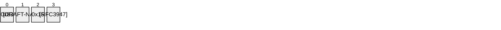
```mermaid
packet-beta
  0-0: "0x83"
  1-1: "[DRAFT-NATT]"
  2-2: "0x15"
  3-3: "[RFC3947]"
```

### 2.2.2 NAT-T UDP Encapsulation Modes

The Encapsulation Mode field is located in the [**SA**](#gt_security-association-sa) payload, as specified in [[RFC2407]](https://go.microsoft.com/fwlink/?LinkId=90347) section 4.5. Specification [[RFC3947]](https://go.microsoft.com/fwlink/?LinkId=90448) introduces new encapsulation mode values for this field. For more information about an alternative set of these values, see section [3.2.4.1](#Section_3.2.4.1) and [[DRAFT-NATT]](https://go.microsoft.com/fwlink/?LinkId=89854).

The following table lists the UDP-Encapsulated-Tunnel values.

| UDP-Encapsulated-Tunnel | Revision |
| --- | --- |
| 0xF003 | [DRAFT-NATT] |
| 0x0003 | [RFC3947] |

The following table lists the UDP-Encapsulated-Transport values.

| UDP-Encapsulated-Transport | Revision |
| --- | --- |
| 0xF004 | [DRAFT-NATT] |
| 0x0004 | [RFC3947] |

### 2.2.3 IKE Message Fragment

An [**IKE**](#gt_internet-key-exchange-ike) message fragment contains:

- An [**ISAKMP**](#gt_internet-security-association-and-key-management-protocol-isakmp) header, as specified in [[RFC2408]](https://go.microsoft.com/fwlink/?LinkId=90348) section 3.1.
- A single, non-encrypted, Fragment payload.

#### 2.2.3.1 Fragment Payload Packet

The Fragment payload is an [**ISAKMP payload**](#gt_isakmp-payload), as specified in [[RFC2408]](https://go.microsoft.com/fwlink/?LinkId=90348) section 3.1. The payload type value for a Fragment payload is 0x84 from the private payload type range, as specified in [RFC2408] section 3.1. A Fragment payload MUST be preceded by an [**ISAKMP**](#gt_internet-security-association-and-key-management-protocol-isakmp) header that has this payload type.

The following illustration describes the Fragment Payload packet.

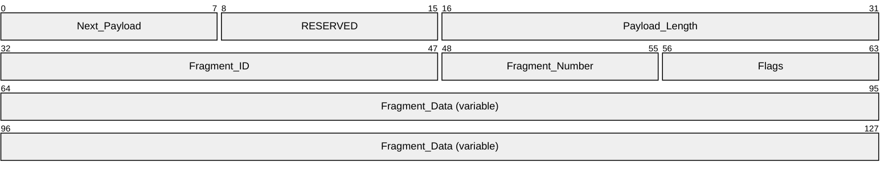
```mermaid
packet-beta
  0-7: "Next_Payload"
  8-15: "RESERVED"
  16-31: "Payload_Length"
  32-47: "Fragment_ID"
  48-55: "Fragment_Number"
  56-63: "Flags"
  64-127: "Fragment_Data (variable)"
```

**Next_Payload (1 byte):** Identifier for the payload type, which MUST specify the next payload in the message. For a Fragment payload, this field MUST be set to 0.

**RESERVED (1 byte):** This field MUST be set to zero. The [**responder (1)**](#gt_c37f09fa-24c8-4fd5-8edd-2c5e575bc211) MUST ignore this field on receipt. This behavior is identical to [**IKE**](#gt_internet-key-exchange-ike).

**Payload_Length (2 bytes):** This field MUST be the length, in bytes, of the payload, including the generic payload header. This is identical to IKE.

**Fragment_ID (2 bytes):** This field is 2 bytes and contains the fragment ID. It MUST specify the same value for every fragment that is generated from a particular IKE message.

**Fragment_Number (1 byte):** This field MUST indicate the order in which the fragments are sent. The first fragment MUST have a fragment number of 1, and each subsequent fragment MUST have a fragment number that is one greater than that of the previous fragment. Because the maximum size of an IKE message is limited to 64 KB by UDP and fragments are aligned on the minimum [**MTU**](#gt_maximum-transmission-unit-mtu) for IPv4 and IPv6, the fragment number cannot wrap.

**Flags (1 byte):** The **Flags** field MUST have the following value.

| Value | Meaning |
| --- | --- |
| LAST_FRAGMENT 0x01 | This flag indicates the last fragment in the message. |

All other bits of the Flags field MUST be set to zero on the [**initiator**](#gt_initiator) and ignored on the responder (1). For more details on flag semantics, see section [3.1](#Section_3.1).

**Fragment_Data (variable):** This field MUST contain the fragment data. The size of the **Fragment_Data** field MUST be computed by subtracting the size of the Fragment payload header (8 bytes) from the value of the **Payload_Length** field.

### 2.2.4 AUTH_CGA Authentication Method Packet

AUTH_CGA is an authentication method within an [**ISAKMP**](#gt_internet-security-association-and-key-management-protocol-isakmp) [**SA**](#gt_security-association-sa) payload, as specified in [[RFC2407]](https://go.microsoft.com/fwlink/?LinkId=90347) section 4.6.1. The format of the SA payload is the following, as specified in [[RFC2408]](https://go.microsoft.com/fwlink/?LinkId=90348) section 3.4.

- A number of Proposal payloads, as specified in [RFC2408] section 3.5.
- Within each Proposal payload, there is a number of Transform payloads, as specified in [RFC2408] section 3.6.
- Within each Proposal payload, there is a number of Data Attributes payloads, as specified in [RFC2408] section 3.3. In a Data Attribute payload, an authentication method is indicated by the value 0x0003 in the Attribute_Type field of the Data Attribute payload, as specified in [[RFC2409]](https://go.microsoft.com/fwlink/?LinkId=90349) Appendix A. The particular authentication method is determined by the value of the Attribute Value field, as specified in [RFC2409] Appendix A.
The Data Attribute payload for the AUTH_CGA Authentication method has the format seen in the following AUTH_CGA packet.

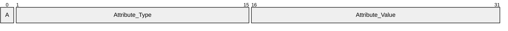
```mermaid
packet-beta
  0-0: "A"
  1-15: "Attribute_Type"
  16-31: "Attribute_Value"
```

**A - One (1 bit):** This field MUST be set to 1.

**Attribute_Type (15 bits):** For the AUTH_CGA authentication method, this field MUST be set to the value 0x0003. This value corresponds to the authentication method, as specified in [RFC2409] Appendix A.

**Attribute_Value (2 bytes):** For the AUTH_CGA authentication method, this field MUST be set to the value 0xFDED in network order. This value is from the private authentication method range, as specified in [RFC2409] Appendix A.

### 2.2.5 ID_IPV6_CGA Identification Type Packet

ID_IPV6_CGA is an identification type for an [**ISAKMP**](#gt_internet-security-association-and-key-management-protocol-isakmp) Identification payload, as specified in [[RFC2407]](https://go.microsoft.com/fwlink/?LinkId=90347) section 4.6.2. The ID_IPV6_CGA Identification Type is 0xFA from the private Identification Type range, as specified in [[IANAISAKMP]](https://go.microsoft.com/fwlink/?LinkId=89886).

The format of the Identification payload for an ID_IPV6_CGA identification type is seen in the following packet.

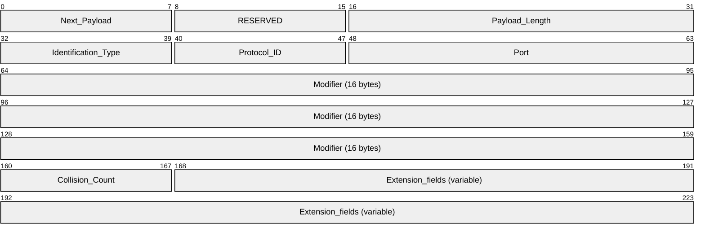
```mermaid
packet-beta
  0-7: "Next_Payload"
  8-15: "RESERVED"
  16-31: "Payload_Length"
  32-39: "Identification_Type"
  40-47: "Protocol_ID"
  48-63: "Port"
  64-159: "Modifier (16 bytes)"
  160-167: "Collision_Count"
  168-223: "Extension_fields (variable)"
```

**Next_Payload (1 byte):** This field is the identifier for the payload type of the next payload in the message. This field MUST be identical to the corresponding [**IKE**](#gt_internet-key-exchange-ike) field.

**RESERVED (1 byte):** This field MUST be set to zero. The [**responder (1)**](#gt_c37f09fa-24c8-4fd5-8edd-2c5e575bc211) MUST ignore this field on receipt. This behavior is identical to IKE.

**Payload_Length (2 bytes):** This field MUST be the length in bytes of the payload, including the Generic Payload header. This is identical to IKE.

**Identification_Type (1 byte):** This field is the value describing how the fields after the Port field are to be interpreted. The ID_IPV6_CGA identification type MUST be 0xFA, from the private Identification Type range, as specified in [IANAISAKMP].

**Protocol_ID (1 byte):** This field MUST be set to zero. The responder (1) MUST ignore this field on receipt. This is identical to IKE.

**Port (2 bytes):** This field MUST be set to zero. The responder (1) MUST ignore this field on receipt. This is identical to IKE.

**Modifier (16 bytes):** This field MUST be as specified in [[RFC3972]](https://go.microsoft.com/fwlink/?LinkId=90452) section 3.

**Collision_Count (1 byte):** This field MUST be as specified in [RFC3972] section 3.

**Extension_fields (variable):** This field MUST be as specified in [RFC3972] section 3.

### 2.2.6 Notify Payload Packet

The Notify Payload packet is specified in [[RFC2408]](https://go.microsoft.com/fwlink/?LinkId=90348) section 3.14. The format is as follows.

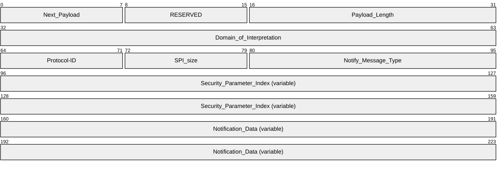
```mermaid
packet-beta
  0-7: "Next_Payload"
  8-15: "RESERVED"
  16-31: "Payload_Length"
  32-63: "Domain_of_Interpretation"
  64-71: "Protocol-ID"
  72-79: "SPI_size"
  80-95: "Notify_Message_Type"
  96-159: "Security_Parameter_Index (variable)"
  160-223: "Notification_Data (variable)"
```

**Next_Payload (1 byte):** This field MUST be as specified in [RFC2408] section 3.14.

**RESERVED (1 byte):** This field MUST be as specified in [RFC2408] section 3.14.

**Payload_Length (2 bytes):** This field MUST be as specified in [RFC2408] section 3.14.

**Domain_of_Interpretation (4 bytes):** The [**domain of interpretation (DOI)**](#gt_domain-of-interpretation-doi) field MUST be set to 1 (IPSEC_DOI) as specified in [RFC2408] section A.2.

**Protocol-ID (1 byte):** This field MUST be as specified in [RFC2408] section 3.14.

**SPI_size (1 byte):** This field MUST be as specified in [RFC2408] section 3.14. The **SPI_size** is updated to a value of 8 when the Message ID is appended to the notification data as described in this section under **Notification_Data**.

**Notify_Message_Type (2 bytes):** This MUST identify the type of notification being sent with this message, in network byte order. The notify message types MUST be one of the following values, which are from the private range, as specified in [RFC2408] section 3.14.1.

| Value | Meaning |
| --- | --- |
| 0x9C43 | NOTIFY_STATUS (check) This notify message type is a status code indicating the failure to establish a [**security association (SA)**](#gt_security-association-sa) with a peer. |
| 0x9C44 | NOTIFY_DOS_COOKIE (check) This notify message type is used by the DoS protection extension. |
| 0x9C45 | EXCHANGE_INFO This notify message type is used by the [**negotiation discovery**](#gt_negotiation-discovery) extension. |

**Security_Parameter_Index (variable):** This is the Security Parameter Index (SPI) of size SPI_size. This field MUST be as specified in [RFC2408] section 3.14.

**Notification_Data (variable):** The content of this field depends on the **Notify_Message_Type** field. The following list describes field content for various notify message types. If the peer has previously sent the Vendor ID "MS NT5 ISAKMPOAKLEY" as specified in the footnote regarding Capability Negotiation in section [1.7](#Section_1.7), and the notify corresponds to the [**quick mode**](#gt_quick-mode) [**exchange**](#gt_exchange), then the Message ID (in network order) of the quick mode is appended as the first 4 bytes of the notification data. In particular, the NOTIFY_DOS_COOKIE will never have the Message ID in the notification data because that is always a [**main mode**](#gt_main-mode-mm) operation. The EXCHANGE_INFO notify will always have the Message ID appended if the peer sends the above vendor ID. The NOTIFY_STATUS will only have the Message ID appended if the failure is a quick mode failure.

Field content MUST correspond to the **Notify_Message_Type** as follows:

- NOTIFY_STATUS (4 Bytes): MUST be a status code indicating failure. The values transmitted as status codes are implementation-specific.<8>
- NOTIFY_DOS_COOKIE (8 Bytes): MUST be the [**responder (1)**](#gt_c37f09fa-24c8-4fd5-8edd-2c5e575bc211) cookie value.
- EXCHANGE_INFO (4 Bytes): The flag values MUST be one of the following values.
| Value | Meaning |
| --- | --- |
| 0x00000001 | IKE_EXCHANGE_INFO_ND_BOUNDARY This flag is used by the negotiation discovery extension. |
| 0x00000002 | IKE_EXCHANGE_INFO_GUARANTEE_ENCRYPTION This flag is used by the negotiation discovery extension. |

### 2.2.7 Notify Payload (IKEv2) Packet

The Notify Payload packet is specified in [[RFC4306]](https://go.microsoft.com/fwlink/?LinkId=90469) section 3.10. The format is as follows.

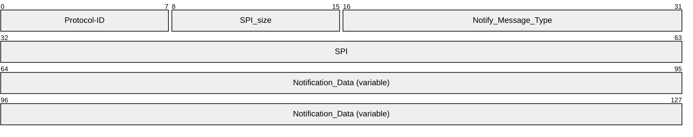
```mermaid
packet-beta
  0-7: "Protocol-ID"
  8-15: "SPI_size"
  16-31: "Notify_Message_Type"
  32-63: "SPI"
  64-127: "Notification_Data (variable)"
```

**Protocol-ID (1 byte):** This field MUST be as specified in [RFC4306] section 3.10.

**SPI_size (1 byte):** This field MUST be as specified in [RFC4306] section 3.10.

**Notify_Message_Type (2 bytes):** This MUST identify the type of notification being sent with this message, in network byte order. The notify message types MUST be one of the following values, which are from the private error range, as specified in [RFC4306] section 3.10.1.

| Value | Meaning |
| --- | --- |
| 0x3039 | Notify status. This notify message type is used to tell the peer of a private failure reason. |

**SPI (4 bytes):** The Security Parameter Index (SPI) field MUST be as specified in [RFC4306] section 3.10.

**Notification_Data (variable):** The content of this field depends on the **Notify_Message_Type** field. The following list describes field content for various notify message types. Field content MUST correspond to the notify message type as follows:

- NOTIFY_STATUS (4 bytes): MUST be a status code indicating failure. The values transmitted as status codes are implementation specific.<9>

### 2.2.8 Configuration Attribute (IKEv2) Packet

The Configuration Attribute packet is specified in [[RFC4306]](https://go.microsoft.com/fwlink/?LinkId=90469) section 3.15.1. The format is as follows.

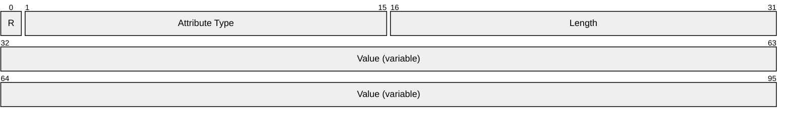
```mermaid
packet-beta
  0-0: "R"
  1-15: "Attribute Type"
  16-31: "Length"
  32-95: "Value (variable)"
```

**R (1 bit):** This reserved field MUST be as specified in [RFC4306] section 3.15.1.

**Attribute Type (15 bits):** This field MUST be as specified in [RFC4306] section 3.15.1.

**Length (2 bytes):** The length of the data in the Value field.

**Value (variable):** The internal IPv4 or IPv6 address of the server.

Two additional **Attribute Types** from the private-use range are defined as follows.

| Bit Range | Field | Description |
| --- | --- | --- |
| Variable | INTERNAL_IP4_SERVER 0x5BA0 | 4 The internal IPv4 address of the server. |
| Variable | INTERNAL_IP6_SERVER 0x5BA1 | 16 The internal IPv6 address of the server. |

### 2.2.9 Correlation Payload (IKEv2) Packet

The Correlation Payload (IKEv2) packet format is as follows. There are two IKE_SAs here, SAcurrent and SAoriginal. This payload is sent under the protection of SACurrent. The payload type value for a Correlation payload is 0xc8 from the private payload type range, as specified in [[RFC4306]](https://go.microsoft.com/fwlink/?LinkId=90469) section 3.2.

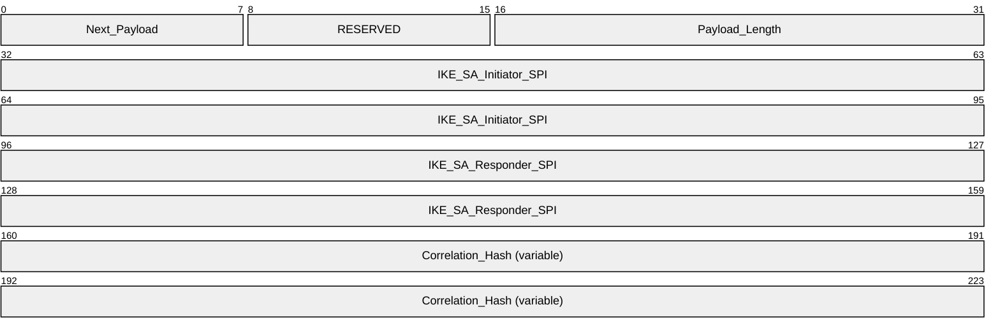
```mermaid
packet-beta
  0-7: "Next_Payload"
  8-15: "RESERVED"
  16-31: "Payload_Length"
  32-95: "IKE_SA_Initiator_SPI"
  96-159: "IKE_SA_Responder_SPI"
  160-223: "Correlation_Hash (variable)"
```

**Next_Payload (1 byte):** This field MUST be as specified in [[RFC2408]](https://go.microsoft.com/fwlink/?LinkId=90348) section 3.2.

**RESERVED (1 byte):** This field MUST be as specified in [RFC2408] section 3.2.

**Payload_Length (2 bytes):** This field MUST be as specified in [RFC2408] section 3.2.

**IKE_SA_Initiator_SPI (8 bytes):** This MUST be set to the [**initiator's**](#gt_initiator) SPI from the IKE_SA being correlated, SAoriginal. This value is taken from the IKEv2 header of the prior IKE_SA, as specified in [RFC4306] section 3.1.

**IKE_SA_Responder_SPI (8 bytes):** This MUST be set to the [**responder's (1)**](#gt_c37f09fa-24c8-4fd5-8edd-2c5e575bc211) SPI from the IKE_SA being correlated, SAoriginal. This value is taken from the IKEv2 header of the prior IKE_SA, as specified in [RFC4306] section 3.1.

**Correlation_Hash (variable):** This computes a keyed hash using the SAcurrent's negotiated PRF function. The key used is the SK_ai on the initiator and the SK_ar for the responder (1) from SAoriginal. See [RFC4306] section 2.14. The correlation hash is as follows.

prf(SK_a(i or r), SAcurrent.InitiatorSpi|SAcurrent.ResponderSpi|SAoriginal.InitiatorSpi|SAoriginal.responderSpi)

### 2.2.10 Security Realm Vendor ID Payload (IKEv2)

The "MSFT IPsec Security Realm Id" vendor ID payload SHOULD<10> be constructed as specified in [[RFC5996]](https://go.microsoft.com/fwlink/?LinkId=613135) section 3.12. The vendor ID payload has a variable length field called Vendor ID or VID. In this extension, the first 16 bytes is an MD5 hash of the string "MSFT IPsec Security Realm Id". The subsequent bytes contain the actual Security Realm ID.<11>

### 2.2.11 IKEv2 Fragment Message

IKEv2 fragmentation is applied only to messages that contain an encrypted payload. The original (unencrypted) content of the encrypted payload is split into chunks that are treated as the original content of the Encrypted Fragment Payload, which are then encrypted and authenticated. The cryptographic processing of the Encrypted Fragment Payload is identical to that described in section 3.14 of [[RFC7296]](https://go.microsoft.com/fwlink/?linkid=868072).

#### 2.2.11.1 Notify Payload

The Initiator role of the IKEv2 protocol can indicate its support of IKEv2 fragmentation and that it allows its use, by including a Notify payload of type IKEV2_FRAGMENTATION_SUPPORTED in the IKE_SA_INIT request message. If the Responder role also supports the fragmentation extension and allows its use, the Responder also includes this notification in its response message. This Initiator/Responder negotiation sequence is specified in section 2.3 of [[RFC7383]](https://go.microsoft.com/fwlink/?linkid=868073).

The following diagram shows the structure of the Notify payload.

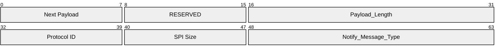
```mermaid
packet-beta
  0-7: "Next Payload"
  8-15: "RESERVED"
  16-31: "Payload_Length"
  32-39: "Protocol ID"
  40-47: "SPI Size"
  48-63: "Notify_Message_Type"
```

**Next_Payload (1 byte):** An identifier for the payload type of the next payload in the message. This field MUST be identical to the corresponding **IKE** field.

**RESERVED (1 byte):** This field MUST be set to zero. The [**responder (2)**](#gt_c37f09fa-24c8-4fd5-8edd-2c5e575bc211) role MUST ignore this field on receipt. This is identical to IKE version 1 behavior.

**Payload_Length (2 bytes):** This field MUST be the length in bytes of the payload, including the Generic Payload header. This is identical in IKE version 1.

**Protocol_ID_(=0) (1 byte):** This field MUST be set to zero. The responder (2) role MUST ignore this field on receipt. This is identical to IKE version 1 behavior.

**SPI_Size_(=0) (1 byte):** This field MUST be set to zero, meaning that no Security Parameter Index (SPI) is present.

**Notify_Message_Type (2 bytes):** This field must be set to 16430, which is the value assigned for the IKEV2_FRAGMENTATION_SUPPORTED notification, per [RFC7383].

#### 2.2.11.2 Encrypted Fragment Payload

The Encrypted Fragment payload is specified in section 2.5 of [[RFC7383]](https://go.microsoft.com/fwlink/?linkid=868073). If the Encrypted Fragment payload is present in a message, it MUST be the last payload in the message and its payload type is 53.

The following diagram shows the format of the Encrypted Fragment Payload packet.

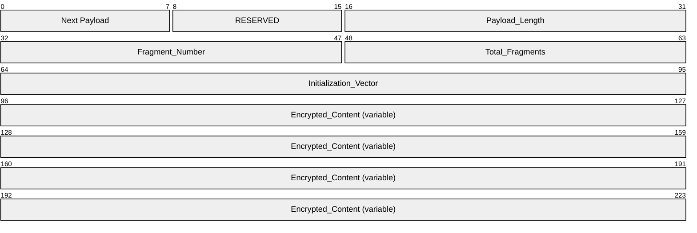
```mermaid
packet-beta
  0-7: "Next Payload"
  8-15: "RESERVED"
  16-31: "Payload_Length"
  32-47: "Fragment_Number"
  48-63: "Total_Fragments"
  64-95: "Initialization_Vector"
  96-223: "Encrypted_Content (variable)"
```

**Next_Payload (1 byte):** In the very first fragment (with Fragment_Number equal to 1), this field MUST be set to the payload type of the first inner payload. In the remainder of the Fragment messages (with Fragment_Number greater than 1), this field MUST be set to zero.

**RESERVED (1 byte):** This field MUST be set to zero. The [**responder (2)**](#gt_c37f09fa-24c8-4fd5-8edd-2c5e575bc211) MUST ignore this field upon receipt. This is identical to IKE version 1 behavior.

**Payload_Length (2 bytes):** This field MUST be the length, in bytes, of the payload, including the Generic Payload Header. This is identical in IKE version 1.

**Fragment_Number (2 bytes):** The current Fragment message number, starting from 1. This field MUST be less than or equal to the next field (Total Fragments). This field MUST NOT be zero.

**Total_Fragments (2 bytes):** The number of Fragment messages into which the original message was divided. This field MUST NOT be zero. With path maximum transmission unit discovery (PMTUD), this field plays an additional role, as described in section 2.5.2 of [RFC7383].

**Initialization_Vector (4 bytes):** As specified in section 3.14 of [[RFC7296]](https://go.microsoft.com/fwlink/?linkid=868072).

**Encrypted_Content (variable):** As specified in section 3.14 of [RFC7296].

# 3 Protocol Details

The following sections specify protocol details, including abstract data models and message processing rules, that are common and that are specific to [**NAT**](#gt_network-address-translation-nat)-T, [**IKE**](#gt_internet-key-exchange-ike) fragmentation, [**CGAs**](#gt_cryptographically-generated-address-cga), the fast-failover client, the fast-failover server, [**negotiation discovery**](#gt_negotiation-discovery), reliable delete, denial of service protection, IKE [**SA**](#gt_security-association-sa) correlation (IKEv2), IKE Server Internal Addresses Configuration Attributes (IKEv2), dead-peer detection, Xbox multiplayer gaming (IKEv2) vendor IDs, and security realm ID (IKEv2) vendor IDs.

## 3.1 Common Details

This section documents deviations from "The Internet IP Security Domain of Interpretation for ISAKMP", as specified in [[RFC2407]](https://go.microsoft.com/fwlink/?LinkId=90347); "Internet Security Association and Key Management Protocol (ISAKMP)", as specified in [[RFC2408]](https://go.microsoft.com/fwlink/?LinkId=90348); "The Internet Key Exchange (IKE)", as specified in [[RFC2409]](https://go.microsoft.com/fwlink/?LinkId=90349); "Internet Key Exchange (IKEv2) Protocol", as specified in [[RFC4306]](https://go.microsoft.com/fwlink/?LinkId=90469); and "Negotiation of [**NAT**](#gt_network-address-translation-nat)-Traversal in the IKE", as specified in [[RFC3947]](https://go.microsoft.com/fwlink/?LinkId=90448). These deviations affect each of these RFC standards as described in the table in section [1.3.14](#Section_1.3.14).

The flags bit semantics used by this document are as follows: for a flag, its "value" signifies a mask which, when its bitwise logical AND with the flags field is computed, yields either a zero value (all zero bits) if the flag is unset (set to FALSE), and a nonzero value otherwise. For example, a flag mask/value of 0x01 signifies that the bitwise logical AND of a single-byte flag field with 0x01 is zero if and only if the flag is set to FALSE. Assuming no other flag masks/values for this field, then, both 0x00 and 0x01 are valid values for this single-byte flag field: the former corresponding to the flag being unset, and the latter to the flag being set.

### 3.1.1 Abstract Data Model

This section describes a conceptual model of possible data organization that an implementation maintains to participate in this protocol in addition to what is specified in [[RFC2407]](https://go.microsoft.com/fwlink/?LinkId=90347), [[RFC2408]](https://go.microsoft.com/fwlink/?LinkId=90348), [[RFC2409]](https://go.microsoft.com/fwlink/?LinkId=90349), [[RFC3947]](https://go.microsoft.com/fwlink/?LinkId=90448), and [[RFC4301]](https://go.microsoft.com/fwlink/?LinkId=90465) for IKEv1, or [[RFC4306]](https://go.microsoft.com/fwlink/?LinkId=90469) for IKEv2. The described organization is provided to explain how the protocol behaves. This document does not mandate that implementations adhere to this model as long as their external behavior is consistent with the behavior described in this document.

The following main data elements are required by any implementation:

- [**Main mode security association database (MMSAD)**](#gt_main-mode-security-association-database-mmsad): A database that contains the operational state for each [**MM SA**](#gt_main-mode-security-association-mm-sa). The entry for each MM SA contains the following data elements.
For each [**IKE**](#gt_internet-key-exchange-ike) MM SA, the following information MUST be maintained:

- All states that are necessary for managing a standard IKE MM SA as defined in [RFC2409] appendix A for IKEv1 and [RFC4306] section 3.3.2 for IKEv2.
- All states that are necessary for management of other IKE extensions for the [**SA**](#gt_security-association-sa), as specified in this section and in sections [3.2.1](#Section_3.2.1), [3.3.1](#Section_3.3.1), [3.4.1](#Section_3.4.1), [3.5.1](#Section_3.12.1), [3.6.1](#Section_3.12.1), [3.7.1](#Section_3.7.1), [3.8.1](#Section_3.8.1) for IKEv1 only, and [3.10.1](#Section_3.10.1) for IKEv2 only.
The MMSAD MUST be indexed by the local and peer IP addresses and the [**initiator**](#gt_initiator) and [**responder (1)**](#gt_c37f09fa-24c8-4fd5-8edd-2c5e575bc211) cookies found in the [**ISAKMP**](#gt_internet-security-association-and-key-management-protocol-isakmp) header, as specified in [RFC2408].

- Peer authorization database (PAD): The PAD and its management operations are specified in [RFC4301] section 4.4.3. This specification does not extend that definition. The PAD that is referred to in this specification contains rules that describe if and how IKE negotiates SAs with a remote peer, as specified in [RFC4301].
All states that are necessary for the management of IKE extensions are described in section 3.4.1 for IKEv1 only.

The PAD MUST be looked up by using tuples that are composed of local and remote IP addresses.

- [**Security policy database (SPD)**](#gt_security-policy-database-spd): The SPD and its management operations are specified in [RFC4301] section 4.4.1. The SPD that is referred to in this specification contains rules that describe if and how [**IPsec**](#gt_internet-protocol-security-ipsec) protection is applied to inbound or outbound IP traffic. The SPD MUST be looked up by using tuples that are composed of [**flow**](#gt_flow) information (that is, source and destination IP addresses, port numbers, and protocol) for the packet.
All states that are necessary for management of IKE extensions are described in section 3.7.1 for IKEv1 only.

- [**Security association database (SAD)**](#gt_security-association-database-sad): The SAD contains the parameters of each [**QM SA**](#gt_quick-mode-security-association-qm-sa). The SAD and its management operations are specified in [RFC4301] section 4.4.2.
All states that are necessary for management of IKE extensions are described in section 3.7.1 for IKEv1 only.

- Connection state table: Stores a set of connection entries. These connection entries correspond to active TCP/UDP/ICMP or protocol-only connections.
The possible connection entries are:

- V4 TCP/UDP state entry: {IPv4 source address {DWORD}, IPv4 destination address {DWORD}, IP protocol {DWORD}, source port {DWORD}, destination port {DWORD}}.
- V6 TCP/UDP state entry: {IPv6 source address {16 bytes}, IPv6 destination address {16 bytes}, IP protocol {DWORD}, source port {DWORD}, destination port {DWORD}}.
- V4 ICMP state entry: {IPv4 source address {DWORD}, IPv4 destination address {DWORD}, IP protocol {DWORD}, ICMP type {DWORD}, ICMP code {DWORD}}, as defined in [[RFC792]](https://go.microsoft.com/fwlink/?LinkId=90492).
- V6 ICMP state entry: {IPv6 source address {16 bytes}, IPv6 destination address {16 bytes}, IP protocol {DWORD}, ICMP type {DWORD}, ICMP code {DWORD}}, as defined in [RFC792].
- V4 protocol-only state entry: {IPv4 source address {DWORD}, IPv4 destination address {DWORD}, IP protocol {DWORD}}.
- V6 protocol-only state entry: {IPv6 source address {16 bytes}, IPv6 destination address {16 bytes}, IP protocol {DWORD}}.
All states that are necessary for management of IKE extensions are described in section 3.7.1 for IKEv1 only.

- Other states: Additional states are defined in section [3.9.1](#Section_3.9) and section [3.11.1](#Section_3.11.1).
**Note** The preceding conceptual data can be implemented by using a variety of techniques. Any data structure that stores the preceding conceptual data can be used in the implementation.

### 3.1.2 Timers

None beyond what is specified in [[RFC2407]](https://go.microsoft.com/fwlink/?LinkId=90347), [[RFC2408]](https://go.microsoft.com/fwlink/?LinkId=90348), [[RFC2409]](https://go.microsoft.com/fwlink/?LinkId=90349), [[RFC3947]](https://go.microsoft.com/fwlink/?LinkId=90448), or [[RFC4306]](https://go.microsoft.com/fwlink/?LinkId=90469).

### 3.1.3 Initialization

None beyond what is specified in [[RFC2407]](https://go.microsoft.com/fwlink/?LinkId=90347), [[RFC2408]](https://go.microsoft.com/fwlink/?LinkId=90348), [[RFC2409]](https://go.microsoft.com/fwlink/?LinkId=90349), [[RFC3947]](https://go.microsoft.com/fwlink/?LinkId=90448), or [[RFC4306]](https://go.microsoft.com/fwlink/?LinkId=90469) .

### 3.1.4 Higher-Layer Triggered Events

None except what is specified in [[RFC2407]](https://go.microsoft.com/fwlink/?LinkId=90347), [[RFC2408]](https://go.microsoft.com/fwlink/?LinkId=90348), [[RFC2409]](https://go.microsoft.com/fwlink/?LinkId=90349), [[RFC3947]](https://go.microsoft.com/fwlink/?LinkId=90448), or [[RFC4306]](https://go.microsoft.com/fwlink/?LinkId=90469).

### 3.1.5 Message Processing Events and Sequencing Rules

[[RFC2407]](https://go.microsoft.com/fwlink/?LinkId=90347): Message processing MUST be as specified in [RFC2407] with the following exceptions:

- [RFC2407] section 4.5.2: "If conflicting attributes are detected, an ATTRIBUTES-NOT-SUPPORTED Notification Payload SHOULD be returned and the [**security association**](#gt_security-association-sa) setup MUST be aborted."
The [**IKE**](#gt_internet-key-exchange-ike) variant specified by this document MUST NOT terminate the SA setup when it encounters an unknown attribute.

- [RFC2407] section 4.5.3: "If an implementation receives a defined IPSEC DOI attribute (or attribute value) that it does not support, an ATTRIBUTES-NOT-SUPPORTED SHOULD be sent and the security association setup MUST be aborted, unless the attribute value is in the reserved range."
The IKE variant specified by this document MUST NOT terminate the SA setup when it encounters an unknown attribute.

- [RFC2407] section 4.5.3: "Notification Status Messages MUST be sent under the protection of an [**ISAKMP**](#gt_internet-security-association-and-key-management-protocol-isakmp) SA, either as a payload in the last [**main mode**](#gt_main-mode-mm) [**exchange**](#gt_exchange); in a separate informational exchange after main mode or aggressive mode processing is complete; or as a payload in any [**quick mode**](#gt_quick-mode) exchange."
The IKE variant specified by this document SHOULD send notifications unprotected by an SA, without the hash payload, as specified in [[RFC2409]](https://go.microsoft.com/fwlink/?LinkId=90349) section 5.7, if the notify occurs during the first two round trips of main mode. If the notify occurs in the last round trip of main mode, then this notify SHOULD be protected by the SA.<12>

[[RFC2408]](https://go.microsoft.com/fwlink/?LinkId=90348): Message processing MUST be as specified in [RFC2408] with the following exceptions:

- [RFC2408] section 3.9: "The certificate payload MUST be accepted at any point during an exchange."
The IKE variant specified by this document MUST NOT accept [**certificate**](#gt_certificate) payloads at any time; a certificate payload MUST be in a message that contains an ID payload.

- [RFC2408] section 5.1: "When transmitting an ISAKMP message, the transmitting entity ([**initiator**](#gt_initiator) or [**responder (1)**](#gt_c37f09fa-24c8-4fd5-8edd-2c5e575bc211)) MUST do the following: 1. Set a timer and initialize a retry counter."
The IKE variant timer specified by this document does not set a retransmission timer in the following cases:

- The responder (1) never sets a retransmission timer.
- A notify message is sent to a peer.
- A delete message is sent to a peer that does not support reliable deletes, that is, a peer that has not sent the Microsoft Implementation Vendor ID.
[RFC2409]: Message processing MUST be as specified in [RFC2409].

[[RFC3947]](https://go.microsoft.com/fwlink/?LinkId=90448): Message processing MUST be as specified in [RFC3947] with the following exceptions:

- [RFC3947] section 5.2: "In the case of [**transport mode**](#gt_transport-mode), both ends MUST send both original initiator and responder (1) addresses to the other end" and "The initiator MUST send the payloads if it proposes any UDP-Encapsulated-Transport mode, and the responder (1) MUST send the payload only if it selected UDP-Encapsulated-Transport mode."
The IKE variant specified by this document MUST send the [**NAT**](#gt_network-address-translation-nat)-OA if the host is behind a NAT.

[[RFC4306]](https://go.microsoft.com/fwlink/?LinkId=90469): Message processing MUST be as specified in [RFC4306] with the following exceptions:

- [RFC4306] section 2.7: "This hierarchical structure was designed to efficiently encode proposals for cryptographic suites when the number of supported suites is large because multiple values are acceptable for multiple transforms. The responder (1) MUST choose a single suite, which MAY be any subset of the SA proposal following the rules below:"
The responder (1) MUST consult its [**SPD**](#gt_security-policy-database-spd) and loop through the SPD entries, comparing each SPD entry in turn with all the proposal suites from the peer. If a match is found from the list of proposal suites, the responder (1) MUST accept that proposal suite. This MUST repeat until a match is found, or policy comparison, and the [**negotiation**](#gt_negotiation) fails.

- [RFC4306] section 3.12: "Writers of Internet-Drafts who wish to extend this protocol MUST define a Vendor ID payload to announce the ability to implement the extension in the Internet-Draft."
The IKE variant specified by this document does not define a Vendor ID to announce the implementation of CFG attributes described in section [3.11](#Section_3.11).

### 3.1.6 Timer Events

None beyond what is specified in [[RFC2407]](https://go.microsoft.com/fwlink/?LinkId=90347), [[RFC2408]](https://go.microsoft.com/fwlink/?LinkId=90348) , [[RFC2409]](https://go.microsoft.com/fwlink/?LinkId=90349), [[RFC3947]](https://go.microsoft.com/fwlink/?LinkId=90448), or [[RFC4306]](https://go.microsoft.com/fwlink/?LinkId=90469).

### 3.1.7 Other Local Events

None beyond what is specified in [[RFC2407]](https://go.microsoft.com/fwlink/?LinkId=90347), [[RFC2408]](https://go.microsoft.com/fwlink/?LinkId=90348), [[RFC2409]](https://go.microsoft.com/fwlink/?LinkId=90349), [[RFC3947]](https://go.microsoft.com/fwlink/?LinkId=90448), or [[RFC4306]](https://go.microsoft.com/fwlink/?LinkId=90469).

## 3.2 NAT Traversal Details

Using the notation specified in [[RFC2409]](https://go.microsoft.com/fwlink/?LinkId=90349) section 3.2, the generalized form of an [**IKE**](#gt_internet-key-exchange-ike) phase 1 [**exchange**](#gt_exchange) that uses [**NAT**](#gt_network-address-translation-nat)-T is as shown in the following figure and as specified in [[RFC3947]](https://go.microsoft.com/fwlink/?LinkId=90448) section 3.2.

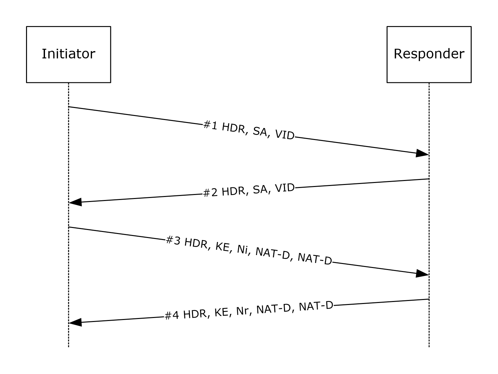

Figure 1: IKE phase 1 exchange using NAT-T

The description in this section uses the message numbers from the protocol sequence diagram.

The IKE NAT Traversal Protocol extension exists in two revisions. The [RFC3947] revision is specified in [RFC3947]. The [[DRAFT-NATT]](https://go.microsoft.com/fwlink/?LinkId=89854) revision is identical to the [RFC3947] revision, except that the values used for the types defined in sections [2.2.1](#Section_2.2.1) and [2.2.2](#Section_2.2.2) are those that are specified in [DRAFT-NATT], instead of those that are specified in [RFC3947]. Both revisions include the [**negotiation**](#gt_negotiation) of a choice of revision supported by both peers.<13> For more information, see [DRAFT-NATT].

### 3.2.1 Abstract Data Model

When this extension is implemented, the following additional state is maintained. This is an extension to IKE Protocol version 1 as specified in [[RFC2409]](https://go.microsoft.com/fwlink/?LinkId=90349).

[**Main mode security association database (MMSAD)**](#gt_main-mode-security-association-database-mmsad): The entry for each [**MM SA**](#gt_main-mode-security-association-mm-sa) contains the following specific data element for [**NAT**](#gt_network-address-translation-nat)-T:

- Selected Revision: A flag that MUST specify what revision of the NAT-T protocol extension (as specified in [[RFC3947]](https://go.microsoft.com/fwlink/?LinkId=90448)) has been selected for this MM SA. For more information, see [[DRAFT-NATT]](https://go.microsoft.com/fwlink/?LinkId=89854).

### 3.2.2 Timers

The [**NAT**](#gt_network-address-translation-nat)-T keep-alive timer (per [**MM SA**](#gt_main-mode-security-association-mm-sa)) is as specified in [[RFC3948]](https://go.microsoft.com/fwlink/?LinkId=90449) section 4.<14>

### 3.2.3 Initialization

None.

### 3.2.4 Higher-Layer Triggered Events

#### 3.2.4.1 Start of an IKE MM SA Negotiation

As part of the construction of message #1 for a new [**MM SA**](#gt_main-mode-security-association-mm-sa) [**negotiation**](#gt_negotiation) (as specified in [[RFC2409]](https://go.microsoft.com/fwlink/?LinkId=90349) section 5), a [**NAT**](#gt_network-address-translation-nat)-T supporting host MUST include with its first [**IKE**](#gt_internet-key-exchange-ike) message extra [**vendor ID payloads**](#gt_vendor-id-payload) (as specified in [[RFC2408]](https://go.microsoft.com/fwlink/?LinkId=90348) section 3.16) to advertise its NAT-T revision support (as specified in [[RFC3947]](https://go.microsoft.com/fwlink/?LinkId=90448) section 3.1). If the host supports only [[DRAFT-NATT]](https://go.microsoft.com/fwlink/?LinkId=89854), it MUST include only the vendor ID "draft-ietf-ipsec-nat-t-ike-02\n" within message #1. If it supports only [RFC3947], it MUST include only the vendor ID "RFC 3947" within message #1. If it supports both [DRAFT-NATT] and [RFC3947], it MUST include both vendor IDs "draft-ietf-ipsec-nat-t-ike-02\n" and "RFC 3947" within message #1.<15>

### 3.2.5 Message Processing Events and Sequencing Rules

#### 3.2.5.1 Receiving Message #1

On receipt of message #1, a [**NAT**](#gt_network-address-translation-nat)-T supporting host MUST check for the presence of the NAT-T [**vendor ID payloads**](#gt_vendor-id-payload) that are specified in section [3.2.4.1](#Section_3.2.4.1). If NAT-T vendor ID payloads are present in the message, the host MUST set the Selected Revision for the corresponding [**MMSAD**](#gt_main-mode-security-association-database-mmsad) entry according to the following rules:

- If both hosts support [[RFC3947]](https://go.microsoft.com/fwlink/?LinkId=90448) and [[DRAFT-NATT]](https://go.microsoft.com/fwlink/?LinkId=89854), the host MUST set the Selected Revision to [RFC3947]. For more information, see [DRAFT-NATT].
- If both hosts share only one common revision, the host MUST set the Selected Revision to the common revision.
- If the hosts do not share a common revision, the host MUST ignore the payload.
Then, the host MUST construct message #2 (as specified in [[RFC2409]](https://go.microsoft.com/fwlink/?LinkId=90349) section 5) and add vendor ID payloads that advertise its NAT-T capabilities, setting the values of those payloads exactly as it would if it were constructing [**IKE**](#gt_internet-key-exchange-ike) message #1. For details, see section [3.2.4](#Section_3.2).

#### 3.2.5.2 Receiving Message #2

On receipt of message #2, the host MUST check for the presence of [**NAT**](#gt_network-address-translation-nat)-T [**vendor ID payloads**](#gt_vendor-id-payload) and set the Selected Revision as specified in section [3.2.5.1](#Section_3.3.5.1).

#### 3.2.5.3 Receiving Other Messages

As specified in [[RFC3947]](https://go.microsoft.com/fwlink/?LinkId=90448) section 5.2, [**NAT**](#gt_network-address-translation-nat)-OA payloads can be sent within the first two [**quick mode**](#gt_quick-mode) messages. On receipt of the first or second quick mode message, the host MUST use the Selected Revision flag of the [**SA's**](#gt_security-association-sa) corresponding entry in the [**MMSAD**](#gt_main-mode-security-association-database-mmsad) to interpret the payload type, as defined in section [2.2.1](#Section_2.2.1).

A UDP Encapsulation type can be negotiated through the SA payload, as specified in [RFC3947] section 5.1. On receipt of an [**IKE**](#gt_internet-key-exchange-ike) message that might contain an SA payload, the host MUST use the Selected Revision flag of the SA's corresponding entry in the MMSAD to interpret the Encapsulation Type, as defined in section [2.2.2](#Section_2.2.2).

### 3.2.6 Timer Events

None.

### 3.2.7 Other Local Events

None.

## 3.3 IKE Fragmentation Details

Using the notation as specified in [[RFC2409]](https://go.microsoft.com/fwlink/?LinkId=90349) section 3.2, the generalized form of an [**IKE**](#gt_internet-key-exchange-ike) phase 1 [**exchange**](#gt_exchange) that is authenticated with signatures is as shown in the following figure, as a fragmentation example. For more information, see [RFC2409] section 5.

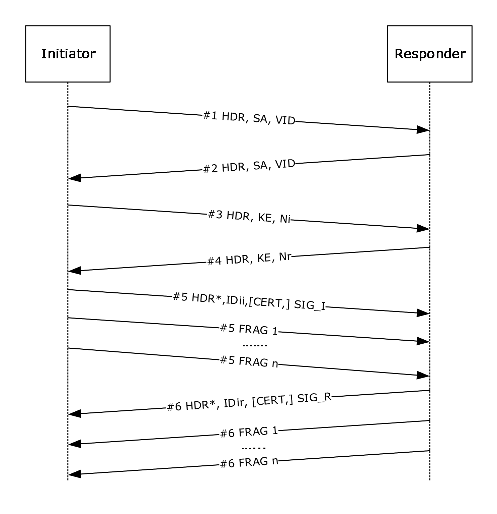

Figure 2: IKE phase 1 exchange

The description in this section uses the message numbers from the protocol sequence diagram.

### 3.3.1 Abstract Data Model

When this extension is implemented, the following additional state is maintained. This is an extension to IKE Protocol version 1 as specified in [[RFC2409]](https://go.microsoft.com/fwlink/?LinkId=90349).

[**Main mode security association database (MMSAD)**](#gt_main-mode-security-association-database-mmsad): The entry for each [**MM SA**](#gt_main-mode-security-association-mm-sa) contains the following [**IKE**](#gt_internet-key-exchange-ike) fragmentation–specific data elements.

- Fragmentation supported: A flag that MUST be set if the peer supports receiving fragmented messages.
- Fragmentation active: A flag that MUST be set if the IKE messages MUST be fragmented.
- Fragmentation determination: The fragmentation need is determined by the firing of the fragmentation timer. See section [3.3.2](#Section_3.7.2) and the associated endnotes for more details. After determining that fragmentation is needed, the chosen [**MTU**](#gt_maximum-transmission-unit-mtu) MUST be the minimum MTU for the protocol, which is 576 bytes for IPv4 and 1280 bytes for IPv6.
- Fragment queue: A queue holding the fragments that correspond to incomplete IKE messages, indexed by the Fragment ID. Each entry in the queue MUST contain:
- The Fragment ID, which is set to the **Fragment_ID** field in section [2.2.3.1](#Section_2.2.3.1).
- The Fragment Number, which is set to the **Fragment_Number** field in section 2.2.3.1.
- A Flag that is set to the **Flags** field in section 2.2.3.1 to indicate whether this fragment is the last one (that is, the LAST_FRAGMENT bit is set in the Fragment payload).
- The Fragment Data, which is set to the **Fragment_Data** field in section 2.2.3.1.
Flow state table: The following information MUST be maintained.

- Fragment ID counter: MUST be maintained and MUST be a 16 bit number. A Fragment ID counter SHOULD be implemented as a global counter.

### 3.3.2 Timers

[**IKE**](#gt_internet-key-exchange-ike) fragmentation uses the following timers:

- Fragmentation timer (for each IKE message): This timer triggers fragmentation. The fragmentation timer MUST be started after sending each IKE message. The expiration of the fragmentation timer indicates that the message will be fragmented the next time it is retransmitted. There MUST be one fragmentation timer per [**MM SA**](#gt_main-mode-security-association-mm-sa). The fragmentation timer must fire within the retransmission duration of the IKE [**negotiation**](#gt_negotiation) and SHOULD<16> be between 1 and 5 seconds.
- Fragment reassembly timer (for each Fragment ID value): This timer MUST trigger the discarding of all the fragments received for this message. The fragment reassembly timer MUST be started when a Fragment payload is received and the timer has not been started for the corresponding Fragment ID value. When the fragment reassembly timer fires, the delay MUST NOT exceed 90 seconds.<17>

### 3.3.3 Initialization

The Fragment ID counter ADM element MUST be set to zero.

### 3.3.4 Higher-Layer Triggered Events

#### 3.3.4.1 Start of an IKE MM SA Negotiation

As part of the construction of message #1 for a new [**MM SA**](#gt_main-mode-security-association-mm-sa) [**negotiation**](#gt_negotiation) (as specified in [[RFC2409]](https://go.microsoft.com/fwlink/?LinkId=90349) section 5), an [**IKE**](#gt_internet-key-exchange-ike) fragmentation-supporting host MUST include a "FRAGMENTATION" [**vendor ID payload**](#gt_vendor-id-payload) (that is, a vendor ID payload that is generated by using the Vendor ID string "FRAGMENTATION", as specified in [[RFC2408]](https://go.microsoft.com/fwlink/?LinkId=90348) section 3.16) to advertise its fragmentation capability.

### 3.3.5 Message Processing Events and Sequencing Rules

#### 3.3.5.1 Receiving Message #1

On receipt of message #1, the host MUST check for the presence of a "FRAGMENTATION" [**vendor ID payload**](#gt_vendor-id-payload). If a "FRAGMENTATION" vendor ID payload is present in the message, the host MUST set the Fragmentation supported flag for the corresponding [**MMSAD**](#gt_main-mode-security-association-database-mmsad) entry.

Then, the host MUST construct message #2 (as specified in [[RFC2409]](https://go.microsoft.com/fwlink/?LinkId=90349) section 5) and add the "FRAGMENTATION" vendor ID payload to advertise its fragmentation capability.

#### 3.3.5.2 Receiving Message #2

On receipt of message #2, the host MUST check for the presence of a "FRAGMENTATION" [**vendor ID payload**](#gt_vendor-id-payload) and set the Fragmentation supported flag, as specified in section [3.3.5.1](#Section_3.3.5.1).

#### 3.3.5.3 Receiving Other IKE Messages

On receipt of an [**IKE**](#gt_internet-key-exchange-ike) message, the host MUST check if the message contains a Fragment payload. If a Fragment payload is present, and the payload is not the only payload in the message, the host MUST silently discard the message.

On receipt of a Fragment payload, the host MUST:

- Retrieve the Fragment ID from the Fragment_ID field in the Fragment payload.
- Start a fragmentation reassembly timer for this Fragment ID if no fragments are currently queued for this Fragment ID.
- If the queue for this Fragment ID already contains a fragment with the same Fragment Number, the host MUST silently discard the message. If not, the host MUST add an entry to the Fragment queue in the corresponding entry of the [**MMSAD**](#gt_main-mode-security-association-database-mmsad), with the queue entry fields initialized based on the associated fields of the Fragment payload.
In addition, the host SHOULD set the Fragmentation active flag in the corresponding MMSAD entry.<18>

The host MUST then check whether all Fragment payloads for this Fragment ID have been received (that is, whether Fragment payloads that have a Fragment Number from 1 to n have been received, and fragment n has the **Flags** field set to LAST_FRAGMENT).

The host MUST silently discard all Fragment payloads for this Fragment ID if any of the following error conditions occur:

- More than one Fragment payload has the **Flags** field set to LAST_FRAGMENT.
- A Fragment payload has been received with a Fragment Number greater than the Fragment Number of an entry in the Fragment queue with the **Flags** field set to LAST_FRAGMENT.
If all Fragment payloads for a Fragment ID have been received, the host MUST construct the reassembled message by concatenating the following:

- The [**ISAKMP**](#gt_internet-security-association-and-key-management-protocol-isakmp) header from the first fragment.
- Fragment payloads (without the Fragment payload header) in the order of their Fragment Number.
The host MUST then stop the fragment reassembly timer and process the reassembled IKE message as a typical message.

If the received message is a response to a previously sent message, the host MUST clear the fragmentation timer for the previously sent message.

If the processing of the IKE message results in the host sending a message, and the Fragmentation active flag is set for the corresponding [**MM SA**](#gt_main-mode-security-association-mm-sa), the host SHOULD fragment this message following the steps specified in section [3.3.6.1](#Section_3.3.6.1). If the Fragmentation active flag is not set, the host MUST start the fragmentation timer for the message it is about to send.<19>

### 3.3.6 Timer Events

#### 3.3.6.1 Expiration of Fragmentation Timer

When the fragmentation timer expires, the host starts fragmenting the message that caused the timer to start. Note that the host does not need to buffer every message for fragmentation purposes because the [**IKE**](#gt_internet-key-exchange-ike) protocol has provisions for regenerating lost messages.

The fragments MUST be constructed as follows:

- The Fragment ID counter ADM element is incremented.
- The IKE message is split into "n" fragments that are numbered 1 to n; the size of each fragment (after adding IP, UDP, and [**ISAKMP**](#gt_internet-security-association-and-key-management-protocol-isakmp) headers) is 576 bytes for IPv4 and 1,280 bytes for IPv6; however, the last fragment, which contains the remainder of the message, can be smaller.
- IKE does not adjust packet size based on router [**MTU**](#gt_maximum-transmission-unit-mtu) advertisement; it continues to send packets for IPv4 (576 bytes) and IPv6 (1,280 byes). Therefore, IP-level fragmentation is possible in this case.
- For each fragment, a message MUST be constructed as follows:
- The ISAKMP header of the original IKE message has the Next Payload field set to the Fragment payload and the Encrypted flag cleared (as specified in [[RFC2408]](https://go.microsoft.com/fwlink/?LinkId=90348) section 3.1).
- The Fragment payload header has the following values set:
- The Fragment ID is set to the current value of the Fragment ID counter ADM element.
- The Fragment number is set to the current Fragment number, which starts at 1 and is incremented for each fragment,
- The **Flags** field is set to LAST_FRAGMENT in Fragment number n.
The fragments MUST be sent back-to-back to the peer.

The only messages that IKE fragments are those that contain the Identification payload, as specified in [RFC2408] section 3.8.

#### 3.3.6.2 Expiration of the Fragment Reassembly Timer

When the fragment reassembly timer expires, the host MUST silently discard all the fragments currently queued under the Fragment ID of the Fragment payload whose receipt caused the timer to start.

### 3.3.7 Other Local Events

None.

## 3.4 CGA Authentication Details

Using the notation as specified in [[RFC2409]](https://go.microsoft.com/fwlink/?LinkId=90349) section 3.2, the generalized form of an [**IKE**](#gt_internet-key-exchange-ike) phase 1 [**exchange**](#gt_exchange) using [**certificates**](#gt_certificate) is as shown in the following figure. For more information, see [RFC2409] section 5.1.

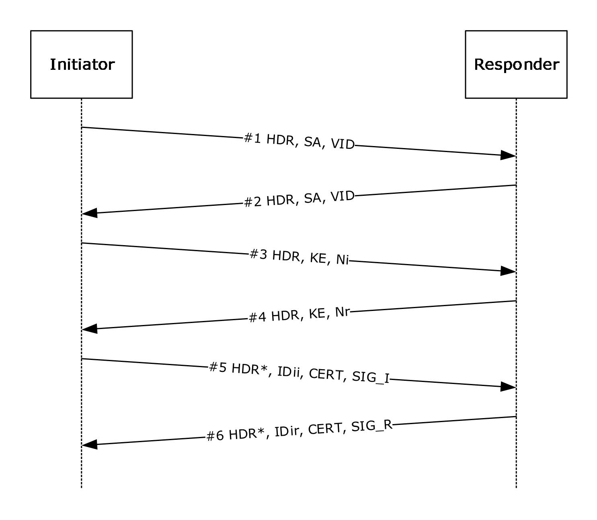

Figure 3: IKE phase 1 exchange using certificates

The [**CGA**](#gt_cryptographically-generated-address-cga) Authentication Protocol extension uses the same exchanges as an IKE phase 1 certificate exchange. The description in this section uses the message numbers from the protocol sequence diagram above.

The ID_IPV6_CGA identification type packet (section [2.2.5](#Section_2.2.5)) does not contain the subnet. The subnet is determined by using the following algorithm.

- Compare the first 4 bytes of the CGA address to a well-known prefix—0x3f, 0xfe, 0x83, 0x1e—to get the prefix length. If the values match, the prefix length is equal to 88 bits; otherwise, the prefix length is 64 bits.
- Using the prefix length, the subnet is determined by taking the leftmost number of bits equal to the prefix length from the CGA address in the packet from the peer.

### 3.4.1 Abstract Data Model

When this extension is implemented, the following additional state is maintained. This is an extension to IKE Protocol version 1 as specified in [[RFC2409]](https://go.microsoft.com/fwlink/?LinkId=90349).

[**Main mode security association database (MMSAD)**](#gt_main-mode-security-association-database-mmsad): The entry for each [**MM SA**](#gt_main-mode-security-association-mm-sa) contains the following [**CGA**](#gt_cryptographically-generated-address-cga) authentication–specific data elements:

- CGA_CAPABLE: A flag that indicates if the authentication type 0xFDED MUST be interpreted as the AUTH_CGA authentication method.
Peer authorization database (PAD): The following information MUST be maintained:

- A new valid value AUTH_CGA that identifies the CGA authentication method, added to the locally-configurable list of acceptable authentication methods.
- A new CGA ID data structure to hold the following parameters:
- Modifier: size: 16 octets, type: unsigned integer. See [[RFC3972]](https://go.microsoft.com/fwlink/?LinkId=90452) section 3.
- Subnet Prefix: size: 8 octets, type: IPv6 subnet. See [RFC3972] section 3.
- Collision Count: size: 1 octet, type: unsigned integer. See [RFC3972] section 3.
- Public Key: size: variable, type: cryptographic key. See [RFC3972] section 3.
- A [**self-signed certificate**](#gt_self-signed-certificate) (type X.509) compatible with the [**IKE**](#gt_internet-key-exchange-ike) [**exchange**](#gt_exchange). See [RFC2409] section 5.1.
This data structure is used during:

- Generation of a CGA and its associated self-signed certificate (see section [3.4.3](#Section_3.11.3)).
- Construction of an identity payload (see section [3.4.5.4](#Section_3.4.5.4)).
- Verification of its association with a public key (see section [3.4.5.5](#Section_3.4.5.5)).

### 3.4.2 Timers

None.

### 3.4.3 Initialization

Each host configured to use [**CGA**](#gt_cryptographically-generated-address-cga) authentication MUST generate an [**Rivest-Shamir-Adleman (RSA)**](#gt_rivest-shamir-adleman-rsa) public/private key pair (see [[RFC8017]](https://go.microsoft.com/fwlink/?linkid=2164409) and 3 and [[RFC3972]](https://go.microsoft.com/fwlink/?LinkId=90452) section 3). The host MUST then generate a X.509 [**self-signed certificate**](#gt_self-signed-certificate) that uses this key pair and is compatible with [**IKE**](#gt_internet-key-exchange-ike) (see [[RFC2409]](https://go.microsoft.com/fwlink/?LinkId=90349) section 5.1).

The CGA itself MUST be created as described in [RFC3972] section 4. This IP address is used to send and receive the IKE packets described in section [3.4.5](#Section_3.12.5).

### 3.4.4 Higher-Layer Triggered Events

#### 3.4.4.1 Start of an IKE MM SA Negotiation

As part of the construction of message #1, a [**CGA**](#gt_cryptographically-generated-address-cga) authentication-supporting host MUST include an "[**IKE**](#gt_internet-key-exchange-ike) CGA version 1" [**vendor ID payload**](#gt_vendor-id-payload) (that is, a vendor ID payload generated by using the vendor ID string "IKE CGA version 1", as specified in [[RFC2408]](https://go.microsoft.com/fwlink/?LinkId=90348) section 3.16) to advertise its CGA authentication capability.

If the PAD requires CGA authentication, the host MUST include the AUTH_CGA Authentication method in its [**SA**](#gt_security-association-sa) payload, as specified in section [2.2.4](#Section_2.2.4).

The host MUST use its CGA to communicate with the peer for this [**negotiation**](#gt_negotiation).

### 3.4.5 Message Processing Events and Sequencing Rules

#### 3.4.5.1 Receiving Message #1

On receipt of message #1, a [**CGA**](#gt_cryptographically-generated-address-cga) authentication-supporting host MUST check for the presence of the "IKE CGA version 1" [**vendor ID payload**](#gt_vendor-id-payload). If an "IKE CGA version 1" vendor ID payload is present in message #1, the host MUST set the CGA_CAPABLE flag for the corresponding [**MMSAD**](#gt_main-mode-security-association-database-mmsad) entry.

The host MUST then look up its PAD to select one of the transforms that the peer proposes, as specified in [[RFC2408]](https://go.microsoft.com/fwlink/?LinkId=90348) section 5.4.

If the host selects the proposed AUTH_CGA authentication method defined in section [3.4.1](#Section_3.4.1), the host MUST construct message #2, as specified in [[RFC2409]](https://go.microsoft.com/fwlink/?LinkId=90349) section 5.1, and add an "IKE CGA version 1" vendor ID payload to advertise its CGA authentication capability.

The host MUST also use its CGA to communicate with the peer for this [**negotiation**](#gt_negotiation).

#### 3.4.5.2 Receiving Message #2

On receipt of message #2, the host MUST check whether the proposal that the peer selected contains the AUTH_CGA authentication method defined in section [3.4.1](#Section_3.4.1). The host then MUST construct message #3, as specified in [[RFC2409]](https://go.microsoft.com/fwlink/?LinkId=90349) section 5.1.

#### 3.4.5.3 Receiving Message #3

Processing MUST be identical to that specified in [[RFC2409]](https://go.microsoft.com/fwlink/?LinkId=90349) section 5.1.

#### 3.4.5.4 Receiving Message #4

Processing MUST be identical to that specified in [[RFC2409]](https://go.microsoft.com/fwlink/?LinkId=90349) section 5.1.

The host MUST then construct message #5, as specified in [RFC2409] section 5.1, with the following differences:

- The Identity payload MUST have the Identification type [ID_IPV6_CGA](#Section_2.2.5) and contain the identification data that corresponds to the host [**CGA**](#gt_cryptographically-generated-address-cga) (for details, see section 2.2.5). The ID IPV6 CGA fields are read from the CGA ID (see section [3.4.1](#Section_3.4.1)).
- The CERT payload MUST contain the [**self-signed certificate**](#gt_self-signed-certificate) that corresponds to the CGA.

#### 3.4.5.5 Receiving Message #5

On receipt of message #5, the host MUST validate the message in the following ways:

- Use the SIG_I payload to verify the signature, as specified in [[RFC2409]](https://go.microsoft.com/fwlink/?LinkId=90349) section 5.1. A successful verification proves that the peer has access to the private key that corresponds to the [**self-signed certificate**](#gt_self-signed-certificate) passed in the CERT payload of message #5.
- Retrieve the [**CGA**](#gt_cryptographically-generated-address-cga) parameter structure (that is, Modifier, Collision Count, and Extension Fields) from the [ID_IPV6_CGA](#Section_2.2.5) Identity payload (for details, see section [2.2.4](#Section_2.2.4)).
- Verify that the public key contained in the self-signed certificate and the parameter structure were used to generate the peer CGA, as specified in [[RFC3972]](https://go.microsoft.com/fwlink/?LinkId=90452) section 5.
If an error is encountered during payload processing, or the CGA cannot be validated, the host MUST fail the [**negotiation**](#gt_negotiation), as specified in [[RFC2408]](https://go.microsoft.com/fwlink/?LinkId=90348) section 5.

Then, the host MUST construct message #6 by using the procedure for constructing message #5, as specified in section [3.4.5.4](#Section_3.4.5.4).

#### 3.4.5.6 Receiving Message #6

On receipt of message #6, the host MUST validate the message using the procedure specified for validating message #5 in section [3.4.5.5](#Section_3.4.5.5).

### 3.4.6 Timer Events

None.

### 3.4.7 Other Local Events

None.

## 3.5 Fast Failover Client Details

Using the notation as specified in [[RFC2409]](https://go.microsoft.com/fwlink/?LinkId=90349) section 3.2, the generalized form of an [**IKE**](#gt_internet-key-exchange-ike) phase 1 [**exchange**](#gt_exchange) is as shown in the following figure. For more information, see [RFC2409] section 5.

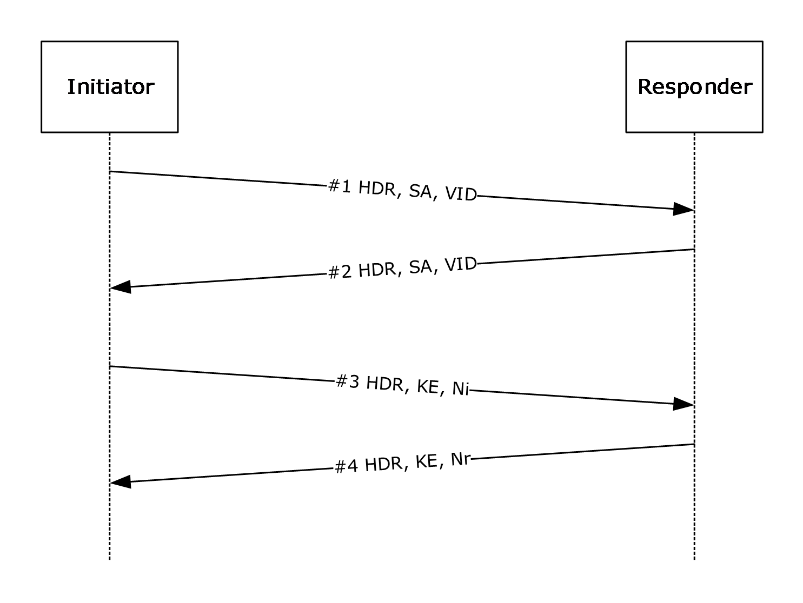

Figure 4: IKE phase 1 exchange

The description in this section uses the message numbers from the protocol sequence diagram.

### 3.5.1 Abstract Data Model

When this extension is implemented, the following additional state is maintained. This is an extension to IKE Protocol version 1 as specified in [[RFC2409]](https://go.microsoft.com/fwlink/?LinkId=90349).

[**Main mode security association database (MMSAD)**](#gt_main-mode-security-association-database-mmsad): The entry for each [**MM SA**](#gt_main-mode-security-association-mm-sa) contains the following fast-failover client-specific data elements:

- **Fast Failover**: A flag that indicates that the "NLBS_PRESENT" vendor ID was received from the peer for this MM SA. For more details, see section [3.6.4.1](#Section_3.6.4.1).

### 3.5.2 Timers

[**QM SA**](#gt_quick-mode-security-association-qm-sa) idle timer (for each QM SA): This timer controls the inactivity time before the QM SA can be deleted (as specified in section [3.5.7.1](#Section_3.5.7.1)). This timer MUST be set when the QM SA has been negotiated. The QM SA idle timer is 1 minute if the peer has sent an "NLBS_PRESENT" [**vendor ID payload**](#gt_vendor-id-payload) during the [**negotiation**](#gt_negotiation) of the [**MM SA**](#gt_main-mode-security-association-mm-sa) under which this QM SA was negotiated (as specified in section [3.6.4.1](#Section_3.6.4.1)). Otherwise, the QM SA idle timer is 5 minutes.

### 3.5.3 Initialization

None.

### 3.5.4 Higher-Layer Triggered Events

#### 3.5.4.1 Start of an IKE MM SA Negotiation

As part of the construction of message #1 for a new [**MM SA**](#gt_main-mode-security-association-mm-sa) [**negotiation**](#gt_negotiation) (as specified in [[RFC2409]](https://go.microsoft.com/fwlink/?LinkId=90349) section 5), a fast failover-supporting host MUST include a "Vid-Initial-Contact" [**vendor ID payload**](#gt_vendor-id-payload) (that is, a vendor ID payload that is generated using the vendor ID string "Vid-Initial-Contact", as specified in [[RFC2408]](https://go.microsoft.com/fwlink/?LinkId=90348) section 3.16) if the host does not have any active MM SAs to the peer. This is determined by looking up the [**MMSAD**](#gt_main-mode-security-association-database-mmsad) using the peer IP address.

In addition, the host MAY also add the "Vid-Initial-Contact" vendor ID payload to message #1 if it has no open TCP connections to the peer and if new connection attempts cause the retransmission of SYN packets.<20>

### 3.5.5 Message Processing Events and Sequencing Rules

#### 3.5.5.1 Receiving Message #1

On receipt of message #1, a fast failover-supporting host MUST check for the presence of the "NLBS_PRESENT" vendor ID (as specified in section [3.6.4.1](#Section_3.6.4.1)). If the "NLBS_PRESENT" [**vendor ID payload**](#gt_vendor-id-payload) is present in the message, the host MUST set the Fast Failover flag for the corresponding [**MMSAD**](#gt_main-mode-security-association-database-mmsad) entry.

If no errors are found, the host MUST construct message #2 in response. The host MUST add the "Vid-Initial-Contact" vendor ID payload to message #2 under the conditions that are specified in section [3.5.4.1](#Section_3.5.4.1). Otherwise, the host MUST silently ignore the packet.

#### 3.5.5.2 Receiving Message #2

On receipt of message #2, the host MUST check for the presence of the "NLBS_PRESENT" vendor ID (for details, see section [3.6.4.1](#Section_3.6.4.1)). If the "NLBS_PRESENT" [**vendor ID payload**](#gt_vendor-id-payload) is present in the message, the host MUST set the Fast Failover flag for the corresponding [**MMSAD**](#gt_main-mode-security-association-database-mmsad) entry.

### 3.5.6 Timer Events

#### 3.5.6.1 Expiration of the QM SA Idle Timer

Upon expiration of the [**QM SA**](#gt_quick-mode-security-association-qm-sa) idle timer, the host MUST delete all states for the corresponding QM SA in the [**SAD**](#gt_security-association-database-sad).

### 3.5.7 Other Local Events

#### 3.5.7.1 Successful Negotiation of a QM SA

[**QM SAs**](#gt_quick-mode-security-association-qm-sa) MUST be negotiated as specified in [[RFC2409]](https://go.microsoft.com/fwlink/?LinkId=90349) section 5.5. Upon successful [**negotiation**](#gt_negotiation) of a QM SA, the host MAY set the QM SA idle timer to a lower value than the default value if the Fast Failover flag is set on the corresponding [**MM SA**](#gt_main-mode-security-association-mm-sa).<21>

## 3.6 Fast Failover Server Details

The description in this section uses the message numbers from the protocol sequence diagram in section [3.5](#Section_1.3).

### 3.6.1 Abstract Data Model

This section describes a conceptual model of possible data organization that an implementation maintains to participate in this protocol. The described organization is provided to explain how the protocol behaves. This document does not mandate that implementations adhere to this model as long as their external behaviors are consistent with what is described in this document. This is an extension to IKE Protocol version 1 as specified in [[RFC2409]](https://go.microsoft.com/fwlink/?LinkId=90349).

The data elements any implementation requires include the following:

- [**Main mode security association database (MMSAD)**](#gt_main-mode-security-association-database-mmsad):
For each [**MM SA**](#gt_main-mode-security-association-mm-sa) (as specified in [RFC2409]), the following information MUST be maintained:

- All [**IKE**](#gt_internet-key-exchange-ike) states necessary for managing an IKE MM SA, without extensions.
- All states necessary for managing other IKE extensions for the [**SA**](#gt_security-association-sa), as specified in sections [3.1.1](#Section_3.1.1) and 3.6.1.
- Initial Contact: A flag indicating if the "Vid-Initial-Contact" [**vendor ID payload**](#gt_vendor-id-payload) (see section [3.5.4.1](#Section_3.5.4.1)) has been received for the MM SA.
The MMSAD MUST be indexed by the local and peer IP addresses and the [**initiator**](#gt_initiator) and [**responder (1)**](#gt_c37f09fa-24c8-4fd5-8edd-2c5e575bc211) cookies found in the [**ISAKMP**](#gt_internet-security-association-and-key-management-protocol-isakmp) header (as specified in [[RFC2408]](https://go.microsoft.com/fwlink/?LinkId=90348)).

**Note** The preceding conceptual data can be implemented by using a variety of techniques. An implementation is at liberty to implement such data in any way it pleases.

### 3.6.2 Timers

None.

### 3.6.3 Initialization

None.

### 3.6.4 Higher-Layer Triggered Events

#### 3.6.4.1 Start of an IKE MM SA Negotiation

As part of the construction of message #1, a fast failover-supporting host MUST include an "NLBS_PRESENT" [**vendor ID payload**](#gt_vendor-id-payload) (that is, a vendor ID payload generated by using the vendor ID string "NLBS_PRESENT", as specified in [[RFC2408]](https://go.microsoft.com/fwlink/?LinkId=90348) section 3.16).

### 3.6.5 Message Processing Events and Sequencing Rules

#### 3.6.5.1 Receiving Message #1

On receipt of message #1, the host MUST check for the presence of the "Vid-Initial-Contact" vendor ID (as specified in section [3.5.4.1](#Section_3.5.4.1)). If the "Vid-Initial-Contact" [**vendor ID payload**](#gt_vendor-id-payload) is present in the message, the host MUST set the Initial Contact flag for the corresponding [**MMSAD**](#gt_main-mode-security-association-database-mmsad) entry.

If the host is part of a [**cluster**](#gt_cluster), it MAY use this information to rebalance the [**MM SA**](#gt_main-mode-security-association-mm-sa) to a different host within the cluster.<22>

#### 3.6.5.2 Receiving Message #2

Message #2 has the same processing as message #1.

### 3.6.6 Timer Events

None.

### 3.6.7 Other Local Events

None.

## 3.7 Negotiation Discovery Details

Using the notation as specified in [[RFC2409]](https://go.microsoft.com/fwlink/?LinkId=90349) section 3.2, the generalized form of an [**IKE**](#gt_internet-key-exchange-ike) phase 1 ([**MM**](#gt_main-mode-mm)) [**exchange**](#gt_exchange) is as shown in the following figure. For more information, see [RFC2409] section 5.

Figure 5: IKE phase 1 (MM) exchange

The description in this section uses the MM message numbers from the protocol sequence diagram.

Using the notation as specified in [RFC2409] section 3.2, the generalized form of an IKE phase 2 ([**quick mode**](#gt_quick-mode)) exchange is as shown in the following figure. For more information, see [RFC2409] section 5.5.

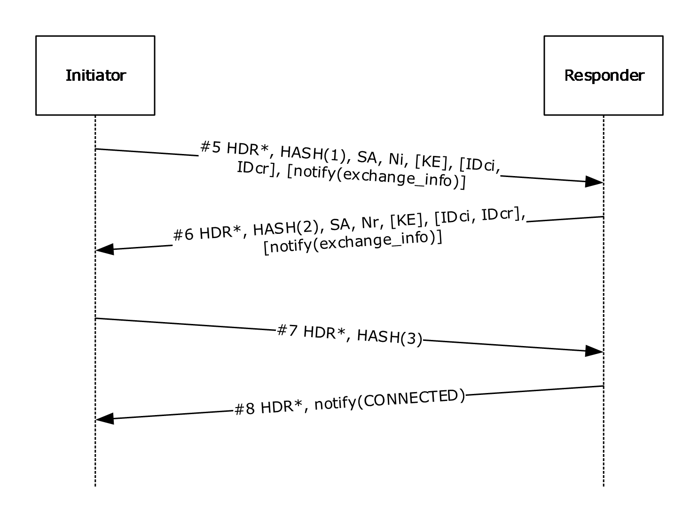

Figure 6: IKE phase 2 (QM) exchange

The description in this section uses the quick mode message numbers from the protocol sequence diagram.

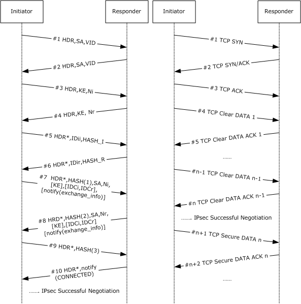

Figure 7: Negotiation discovery of a TCP connection between two IPsec-capable peers

The TCP packet exchanges happen in parallel with the IKE exchanges that are described in the first two figures of this section ("IKE phase 1 (MM) exchange" and "IKE phase 2 (QM) exchange"). The preceding figure illustrates one of many ways in which the packets might interleave. When the IKE exchange completes the successful [**IPsec**](#gt_internet-protocol-security-ipsec) [**negotiation**](#gt_negotiation) (figure "IKE phase 2 (QM) exchange"), the TCP connection is secured.

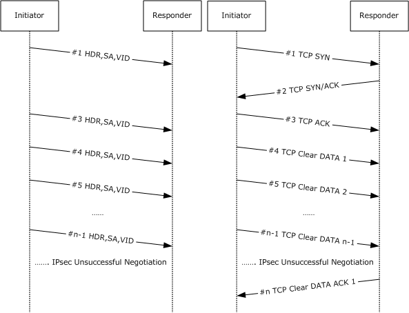

Figure 8: Negotiation discovery of a TCP connection between an IPsec-capable peer and a non-IPsec-capable peer.

The TCP packet exchanges happen in parallel with the IKE exchanges that are described in the first two figures of this section ("IKE phase 1 (MM) exchange" and "IKE phase 2 (QM) exchange"). The preceding figure illustrates one of many ways in which the packets might interleave. The [**responder (1)**](#gt_c37f09fa-24c8-4fd5-8edd-2c5e575bc211) does not respond to the IKE negotiation (an unsuccessful IPsec negotiation), and the TCP connection continues in the clear.

If the responder (1) responds to the IKE negotiation, IKE fails because the responder (1) does not have, by definition, a valid credential (it is non-IPsec-capable). However, the IKE failure does not affect the TCP stream, and the TCP connection continues in the clear.

### 3.7.1 Abstract Data Model

When this extension is implemented, the following additional states are maintained. This is an extension to IKE Protocol version 1 as specified in [[RFC2409]](https://go.microsoft.com/fwlink/?LinkId=90349).

[**Main mode security association database (MMSAD)**](#gt_main-mode-security-association-database-mmsad): The entry for each [**MM SA**](#gt_main-mode-security-association-mm-sa) contains the following specific data element for [**negotiation discovery**](#gt_negotiation-discovery):

- Negotiation Discovery Supported: A flag that MUST be set if the peer supports negotiation discovery.
[**Security policy database (SPD)**](#gt_security-policy-database-spd): The following information MUST be maintained:

- A policy flag indicating that negotiation discovery MUST be applied to inbound and/or outbound traffic.
- A Boundary policy flag for negotiation discovery inbound rules that MUST be set if plaintext is accepted for this rule.
- A policy flag that MUST be set if encryption is guaranteed for this traffic.
[**Security association database (SAD)**](#gt_security-association-database-sad): The following information MUST be maintained:

- Boundary flag: A flag that MUST be set if the [**QM SA**](#gt_quick-mode-security-association-qm-sa) matches an inbound negotiation discovery rule on the remote host.
- Guaranteed Encryption flag: A flag that MUST be set if the QM SA is an encryption [**SA**](#gt_security-association-sa) and can be used for [**flows**](#gt_flow) that have the Guaranteed Encryption flag set.
Flow state table: The following information MUST be maintained:

- Secure flag: A flag that MUST be set if one or more packets for this flow have been sent over a QM SA.
- Guaranteed Encryption flag: A flag that MUST be set if encryption is guaranteed for this flow.
- Acquire flag: A flag that MUST be set if a QM SA [**negotiation**](#gt_negotiation) has already been triggered for this flow. This flag prevents triggering of an Acquire for each packet over a connection that stays in plaintext.

### 3.7.2 Timers

None.

### 3.7.3 Initialization

None.

### 3.7.4 Higher-Layer Triggered Events

#### 3.7.4.1 Outbound Packet

An outbound packet MUST be matched against the [**SPD**](#gt_security-policy-database-spd) to determine if and how it needs to be protected, as specified in [[RFC4301]](https://go.microsoft.com/fwlink/?LinkId=90465) section 5.

- If the packet matches a [**negotiation discovery**](#gt_negotiation-discovery) rule in the SPD, and no [**QM SA**](#gt_quick-mode-security-association-qm-sa) matches the packet, one of the following MUST occur:
- If the Secure flag is not set for the corresponding [**flow**](#gt_flow):
The [**IPsec**](#gt_internet-protocol-security-ipsec) implementation MUST send the packet and MUST trigger [**IKE**](#gt_internet-key-exchange-ike) to negotiate the corresponding QM SA if the Acquire flag is not set on the corresponding flow. Otherwise, the IPsec implementation MUST send the packet and MUST NOT trigger IKE. The first [**quick mode**](#gt_quick-mode) [**negotiation**](#gt_negotiation) message is message #5. Message #5 MUST be constructed as follows:

- The header and payloads MUST be constructed as specified in [[RFC2409]](https://go.microsoft.com/fwlink/?LinkId=90349) section 5.5.
- If the SPD rule matching the traffic has the Boundary flag set, or if the Guarantee Encryption flag is set for the flow, the host MUST include a notification payload with the following fields and values:
Notify Message Type (2 bytes): 0x9C45 (EXCHANGE_INFO) (section [2.2.6](#Section_2.2.6)).

The Notification_Data field is interpreted as a flags field.

- Flag 0x00000001 (IKE_EXCHANGE_INFO_ND_BOUNDARY) MUST be set if the corresponding rule in the SPD has the Boundary flag set.
- Flag 0x00000002 (IKE_EXCHANGE_INFO_GUARANTEE_ENCRYPTION) MUST be set if the Guarantee Encryption flag is set on the corresponding flow.
- This notification payload MUST be constructed as specified in section 2.2.6.
The host MUST then set the Acquire flag on the corresponding flow.

- If the Secure flag is set for the corresponding flow:
The IPsec implementation MUST NOT send the packet (it can queue or silently discard the packet) and MUST trigger IKE to negotiate the corresponding QM SA. Message #5 MUST be constructed as previously specified.

If a QM SA needs to be negotiated, and no corresponding [**MM SA**](#gt_main-mode-security-association-mm-sa) exists (as determined by using the outbound packet destination IP address to look up the [**MMSAD**](#gt_main-mode-security-association-database-mmsad)), an MM SA MUST be negotiated. The host MUST construct and send packet #1 as specified in [RFC2409] section 5. The host MUST include in it an "MS-Negotiation Discovery Capable" [**vendor ID payload**](#gt_vendor-id-payload) (a vendor ID payload generated by using the vendor ID string "MS-Negotiation Discovery Capable", as specified in [[RFC2408]](https://go.microsoft.com/fwlink/?LinkId=90348) section 3.16).

- If the packet matches a negotiation discovery rule in the SPD, and a QM SA matches the packet, the following MUST occur:
If the matching QM SA and the corresponding flow do not have the same value for the Guaranteed Encryption flag, the host MUST trigger IKE to negotiate the corresponding QM SA, as previously described in the case where there is no matching QM SA for the packet.

Otherwise, one of the following MUST occur:

- If the matching QM SA is a UDP-ESP [**SA**](#gt_security-association-sa) ([[RFC3947]](https://go.microsoft.com/fwlink/?LinkId=90448) section 5) with the Boundary flag (defined in section [3.7.1](#Section_3.7.1)) set, the host MUST send the packet in Cleartext.
- Otherwise, the IPsec implementation MUST send the packet encapsulated by using the matching QM SA, and it MUST set the Secure flag for this flow.
- If the packet does not match a negotiation discovery rule, packet processing MUST be performed as specified in [RFC4301] section 5.
If the packet matches a Guaranteed Encryption rule in the SPD, the host MUST set the Guaranteed Encryption flag on the corresponding flow. This rule MUST apply regardless of whether a matching QM SA is found or not.

#### 3.7.4.2 Inbound Packet

An inbound packet is matched against the [**SPD**](#gt_security-policy-database-spd) after [**IPsec**](#gt_internet-protocol-security-ipsec) decapsulation to determine if and how it needs to be treated, as specified in [[RFC4301]](https://go.microsoft.com/fwlink/?LinkId=90465) section 5. The following rules MUST be applied to the packet:

- If the packet is in Cleartext:
- If the packet is the first packet for a new [**flow**](#gt_flow) (for example, an inbound TCP SYN packet):
If the packet matches an inbound [**negotiation discovery**](#gt_negotiation-discovery) rule in the SPD, the host MUST accept the packet. Otherwise, the host MUST silently discard the packet.

- If the packet belongs to an already existing flow:
If the Secure flag is not set on the flow, the host MUST accept the packet. Otherwise, the host MUST silently discard the packet.

- If the packet was encapsulated using [**ESP**](#gt_encapsulating-security-payload-esp) or [**authentication header (AH)**](#gt_authentication-header-ah):
The host MUST set the Secure flag on the flow and process the packet as specified in [RFC4301] section 5.

Regardless of whether the packet is in plaintext, if there is an [**SA**](#gt_security-association-sa) that matches the packet, and its Guaranteed Encryption flag is set, the host MUST set the Guaranteed Encryption flag on the corresponding flow.

### 3.7.5 Message Processing Events and Sequencing Rules

#### 3.7.5.1 Receiving Message #1

On receipt of message #1, the host MUST check for the presence of the "MS-Negotiation Discovery Capable" [**vendor ID payload**](#gt_vendor-id-payload) (as specified in section [3.7.4.1](#Section_3.7.4.1)). If the "MS-Negotiation Discovery Capable" vendor ID payload is present in the message, the host MUST set the Negotiation Discovery Supported flag for the corresponding [**MMSAD**](#gt_main-mode-security-association-database-mmsad) entry.

Then, the host MUST construct message #2, as specified in [[RFC2409]](https://go.microsoft.com/fwlink/?LinkId=90349) section 5, and add the "MS-Negotiation Discovery Capable" vendor ID payload to advertise its [**negotiation discovery**](#gt_negotiation-discovery) capability.

#### 3.7.5.2 Receiving Message #2

On receipt of message #2, the host MUST check for the presence of the "MS-Negotiation Discovery Capable" [**vendor ID payload**](#gt_vendor-id-payload) (for details, see section [3.7.4.1](#Section_3.7.4.1)) and set the Negotiation Discovery Supported flag for the corresponding [**MMSAD**](#gt_main-mode-security-association-database-mmsad) entry.

Messages #3 and #4 MUST be constructed and processed as specified in [[RFC2409]](https://go.microsoft.com/fwlink/?LinkId=90349) section 5.

#### 3.7.5.3 Receiving Message #5

On receipt of message #5, the host MUST check for the presence of flags within a notification payload of type EXCHANGE_INFO.

- IKE_EXCHANGE_INFO_ND_BOUNDARY: If this flag is set, the host MUST set the Boundary flag for the corresponding [**QM SA**](#gt_quick-mode-security-association-qm-sa).
- IKE_EXCHANGE_INFO_GUARANTEE_ENCRYPTION: If this flag is set, the host MUST set the Guaranteed Encryption flag for the corresponding QM SA.
Message #6 MUST be constructed in response as follows:

The [**IPsec**](#gt_internet-protocol-security-ipsec) implementation MUST send the packet and MUST trigger [**IKE**](#gt_internet-key-exchange-ike) to negotiate the corresponding QM SA. The first [**quick mode**](#gt_quick-mode) [**negotiation**](#gt_negotiation) message is message #5. Message #6 MUST be constructed as follows:

- The header and payloads MUST be constructed as specified in [[RFC2409]](https://go.microsoft.com/fwlink/?LinkId=90349) section 5.5.
- If the [**SPD**](#gt_security-policy-database-spd) rule matching the traffic for which the QM SA is negotiated has the Boundary flag set, the host MUST add a notification payload with the following fields:
Notify Message Type (2 bytes): 0x9C45 (EXCHANGE_INFO).

The Notification Data field is interpreted as a flags field.

Flag 0x00000001 (IKE_EXCHANGE_INFO_ND_BOUNDARY) MUST be set if the corresponding rule in the SPD has the Boundary flag set.

This notification payload MUST be constructed as specified in section [2.2.6](#Section_2.2.6).

#### 3.7.5.4 Receiving Message #6

On receipt of message #6, the host MUST check for the presence of flags within a notification payload of type EXCHANGE_INFO:

- IKE_EXCHANGE_INFO_ND_BOUNDARY: If this flag is set, the host MUST set the Boundary flag for the [**QM SA**](#gt_quick-mode-security-association-qm-sa). For more details see section [2.2.6](#Section_2.2.6).
Messages #7 and #8 are constructed and processed as specified in [[RFC2408]](https://go.microsoft.com/fwlink/?LinkId=90348) section 3.1.

### 3.7.6 Timer Events

None.

### 3.7.7 Other Local Events

None.

## 3.8 Reliable Delete Details

Using the notation as specified in [[RFC2408]](https://go.microsoft.com/fwlink/?LinkId=90348) section 4.1.1, the generalized form of an [**IKE**](#gt_internet-key-exchange-ike) Delete [**exchange**](#gt_exchange) using the Reliable Delete extension is as shown in the following figure. For more information, see [[RFC2409]](https://go.microsoft.com/fwlink/?LinkId=90349) section 5.

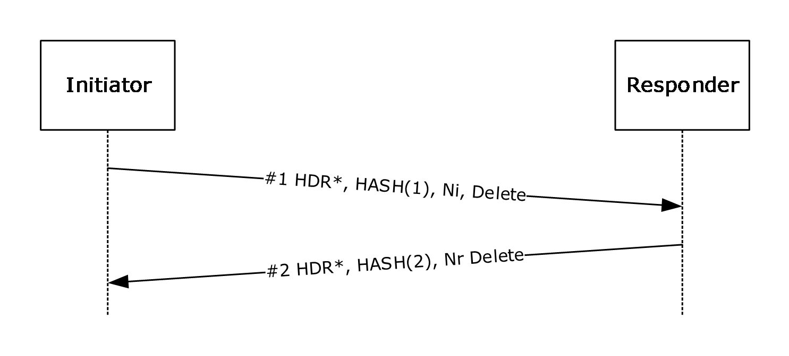

Figure 9: IKE Delete exchange

The description in this section uses the message numbers from the protocol sequence diagram.

### 3.8.1 Abstract Data Model

When this extension is implemented, the following additional state is maintained. This is an extension to IKE Protocol version 1 as specified in [[RFC2409]](https://go.microsoft.com/fwlink/?LinkId=90349).

Flow state table: The following information MUST be maintained:

- Ni payload: The exact Ni payload that is sent with the delete message#1 is preserved as part of the [**IKE**](#gt_internet-key-exchange-ike) [**MM SA**](#gt_main-mode-security-association-mm-sa) state in order to validate the acknowledgment response. The Ni payload is a [**Nonce**](#gt_nonce) payload and MUST be constructed as specified in [[RFC2408]](https://go.microsoft.com/fwlink/?LinkId=90348) section 3.13.

### 3.8.2 Timers

The delete retransmission timer (for each [**MM**](#gt_main-mode-mm) and [**QM SA**](#gt_quick-mode-security-association-qm-sa)): This triggers a Delete payload retransmission. The start and duration of the timer MUST be as specified in sections [3.8.4.1](#Section_3.8.4.1), [3.8.6.1](#Section_3.8.6.1), and [3.8.7.1](#Section_3.8.7.1).

### 3.8.3 Initialization

None.

### 3.8.4 Higher-Layer Triggered Events

#### 3.8.4.1 SA Deletion/Invalidation

The higher layer application can cause [**SAs**](#gt_security-association-sa) to be deleted by changing the underlying security policy, or by triggering a local state cleanup (see section [3.8.7](#Section_1.3.6)). In such cases, the host SHOULD delete the SAs, as specified in [[RFC2408]](https://go.microsoft.com/fwlink/?LinkId=90348) section 5.15.

After a delete has been triggered, a delete notify MUST be sent immediately, but the [**MM SA**](#gt_main-mode-security-association-mm-sa) MUST NOT be deleted until [**quick mode**](#gt_quick-mode) delete processing has been completed. Moreover, the [**QM SAs**](#gt_quick-mode-security-association-qm-sa) associated with the MM SA MUST NOT be deleted until deletion is triggered by other protocol events, as specified in [[RFC2409]](https://go.microsoft.com/fwlink/?LinkId=90349) section 5.5. These protocol events are quick mode lifetime expiry as specified in [RFC2409] Section 5.5, policy changes (see section 3.8.7) or the peer sending a quick mode delete (See section [3.8.5](#Section_1.3.6)). Once all the QM SAs associated with the MM SA have been deleted the MM SA MUST be deleted.

The host MUST then construct message #1 as follows:

- Message #1 MUST consist only of an [**ISAKMP**](#gt_internet-security-association-and-key-management-protocol-isakmp) header, a Hash payload, a [**Nonce**](#gt_nonce) payload, and a Delete payload, as specified in [RFC2408] section 3.15.<23>
- The ISAKMP header MUST be constructed as specified in [RFC2409] section 5.7.
- The Hash payload MUST be constructed in the following manner:
HASH(1) = prf(SKEYID_a, M-ID | Ni | Delete)

as specified in [RFC2409] section 5.7.

- The Ni payload is a Nonce payload and MUST be constructed as specified in [RFC2408] section 3.13.
- The Delete payload MUST be constructed as specified in [RFC2408] section 3.15.
If the "MS NT5 ISAKMPOAKLEY" [**vendor ID payload**](#gt_vendor-id-payload) (see section [1.7](#Section_1.7)) has been received from the peer for the corresponding MM SA, the host MUST then start the delete retransmission timer and set it to expire in 1 second. Otherwise, the host MUST NOT start the delete retransmission timer.

### 3.8.5 Message Processing Events and Sequencing Rules

#### 3.8.5.1 Receiving Message #1

On receipt of message #1, the host MUST validate the message, as specified in [[RFC2408]](https://go.microsoft.com/fwlink/?LinkId=90348) section 5. If message #1 is correctly validated, the host MUST delete the corresponding [**SA**](#gt_security-association-sa) and MUST construct message #2 in response.

- The message MUST consist only of an [**ISAKMP**](#gt_internet-security-association-and-key-management-protocol-isakmp) header as specified in [RFC2408] section 3.1, a Hash payload as specified in [RFC2408] section 3.11, a Delete payload as specified in [RFC2408] section 3.15, and a [**Nonce**](#gt_nonce) payload structured as specified in [RFC2408] section 3.13.
- The ISAKMP header MUST be constructed as specified in as specified in [RFC2408] section 3.1. The Message ID field MUST be copied from message #1.
- The Hash payload MUST be constructed in the following manner:
HASH(2) = prf(SKEYID_a, Ni | M-ID | Nr | Delete)

Once computed as above, this hash value MUST be sent on the wire format specified in section 3.11 of [RFC2408].

- The Ni payload is the Nonce payload without a generic payload header.
- The Delete payload MUST be copied from message #1.
- The Nr payload is a Nonce payload and MUST be constructed as specified in [RFC2408] section 3.13.
Otherwise, the host MUST silently discard message #1.

#### 3.8.5.2 Receiving Message #2

On receipt of message #2, the host MUST validate the message as follows:

- Validate the [**ISAKMP**](#gt_internet-security-association-and-key-management-protocol-isakmp) header, as specified in [[RFC2408]](https://go.microsoft.com/fwlink/?LinkId=90348) section 5.2.
- Verify that the message ID in the [**ISAKMP payload**](#gt_isakmp-payload) is identical to the message ID from message #1.
If this verification succeeds, the host MUST stop the delete retransmission timer. Otherwise, the host MUST silently discard message #2.

### 3.8.6 Timer Events

#### 3.8.6.1 Expiration of the Delete Retransmission Timer

When this timer expires, the [**initiator**](#gt_initiator) MUST retransmit message #1, as specified in section [3.8.4.1](#Section_3.8.4.1), and it SHOULD reset the timer to double the previous duration unless a total of four retransmissions has already occurred. If four retransmissions have occurred, the host MUST remove the corresponding [**MM SA**](#gt_main-mode-security-association-mm-sa) or [**QM SA**](#gt_quick-mode-security-association-qm-sa) from the [**MMSAD**](#gt_main-mode-security-association-database-mmsad) or the [**SAD**](#gt_security-association-database-sad) without retransmitting message #1 or resetting the timer.<24>

When each timer expires, if a message #2 has not been received and verified for that [**SA**](#gt_security-association-sa), as specified in section [3.8.5.2](#Section_3.8.5.2), it SHOULD retransmit the notification message for that SA without resetting the timer.

### 3.8.7 Other Local Events

An administrator can trigger local [**SA**](#gt_security-association-sa) state deletion via a local-only interface to delete all active SAs.

The abstract interface for security policy configuration changes is specified in [[RFC4301]](https://go.microsoft.com/fwlink/?LinkId=90465) section 4.4.1. The administrator MUST be able to specify a new local security policy as defined in [RFC4301] section 4.4.1. Any [**MM SAs**](#gt_main-mode-security-association-mm-sa) established with a policy invalidated by the new policy are deleted as specified in section [3.8.4.1](#Section_3.8.4.1).

#### 3.8.7.1 Shutdown

[**IKE**](#gt_internet-key-exchange-ike) protocol shutdown: IKE MUST send Delete notification messages for all [**SAs**](#gt_security-association-sa), as specified in section [3.8.4.1](#Section_3.8.4.1), and then SHOULD set the delete retransmission timer to 1 second for each SA.<25>

#### 3.8.7.2 MM SA Exhaustion

Establishment of a successful [**QM SA**](#gt_quick-mode-security-association-qm-sa) can exhaust the limits for the number of QM SAs allowed for a given [**MM**](#gt_main-mode-mm). This [**quick mode**](#gt_quick-mode) limit is a local policy setting in the PAD.<26>In this case, the host MUST NOT explicitly delete the [**SA**](#gt_security-association-sa). Instead, the SA MUST be invalidated, and not used for establishing any new QM SAs.

## 3.9 Denial of Service Protection Details

[**IKE**](#gt_internet-key-exchange-ike) goes into DoS protection under the condition described in section [3.9.7](#Section_3.5.7).

Using the notation, as specified in [[RFC2408]](https://go.microsoft.com/fwlink/?LinkId=90348) section 4.1.1, the generalized form of an IKE [**exchange**](#gt_exchange) using the DoS Protection extension is as shown in the following figure. For more information, see [[RFC2409]](https://go.microsoft.com/fwlink/?LinkId=90349) section 5.

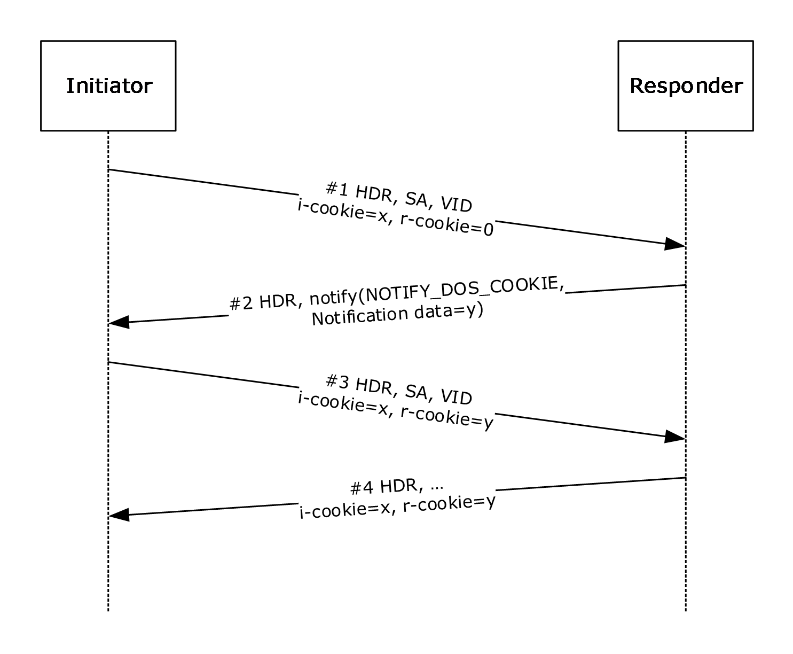

Figure 10: IKE using the DoS Protection extension

The description in this section uses the message numbers from the protocol sequence diagram.

### 3.9.1 Abstract Data Model

When this extension is implemented, the following additional state must be maintained. This is an extension to IKE Protocol version 1 as specified in [[RFC2409]](https://go.microsoft.com/fwlink/?LinkId=90349).

Flow state table: The following information MUST be maintained:

- A flag indicating that DoS protection is active.
DoS Protection mode state: [**responder (1)**](#gt_c37f09fa-24c8-4fd5-8edd-2c5e575bc211) MUST maintain the following state to implement Denial of Service Protection mode.

- A cookie field consisting of random data.
- A cookie timeout period, initialized to 150 secs.
This state is used by the cookie generation algorithm that is described in section [3.9.5.1](#Section_3.3.5.1).

### 3.9.2 Timers

None.

### 3.9.3 Initialization

None.

### 3.9.4 Higher-Layer Triggered Events

None.

### 3.9.5 Message Processing Events and Sequencing Rules

#### 3.9.5.1 Receiving Message #1

On receipt of message #1, the host MUST validate the message, as specified in [[RFC2408]](https://go.microsoft.com/fwlink/?LinkId=90348) section 5. If message #1 is correctly validated, the host MUST construct message #2 in response, as follows:

- The message MUST consist of only an [**ISAKMP**](#gt_internet-security-association-and-key-management-protocol-isakmp) header and a Notify payload structure, as specified in [RFC2408] section 3.14.
- The ISAKMP header MUST be constructed as specified in [[RFC2409]](https://go.microsoft.com/fwlink/?LinkId=90349) section 5.7. The message ID field is unique to this [**exchange**](#gt_exchange).
- The notify message type MUST be set to NOTIFY_DOS_COOKIE, and the notification data MUST contain an 8-byte cookie value. The cookie generation mechanism is implementation-dependent but SHOULD be stateless to provide good DoS protection.<27>
The host MUST then silently discard message #1, even if the message is correctly validated.

#### 3.9.5.2 Receiving Message #2

On receipt of message #2, the host MUST validate the message, as specified in [[RFC2408]](https://go.microsoft.com/fwlink/?LinkId=90348) section 5. In addition, the host MUST:

- Verify that the message contains a single Notify payload, that the notify message type is set to NOTIFY_DOS_COOKIE, and that the notification data contains an 8-byte cookie value. No checks on the actual value are performed at this stage.
If this verification succeeds, the host MUST construct message #3 as follows:

- Message #3 is the same as message #1, except that the **Responder Cookie** field of the [**ISAKMP**](#gt_internet-security-association-and-key-management-protocol-isakmp) header ([RFC2408] section 3.1) is the cookie from the notify NOTIFY_DOS_COOKIE payload in message #2.
Otherwise the host MUST process message #2 as a normal ISAKMP message.

#### 3.9.5.3 Receiving Message #3

On receipt of message #3, the host MUST validate the message, as specified in [[RFC2408]](https://go.microsoft.com/fwlink/?LinkId=90348) section 5. In addition, the host MUST:

- Verify that the **Responder Cookie** field in the [**ISAKMP**](#gt_internet-security-association-and-key-management-protocol-isakmp) header is not zero.
- Verify that the **Responder Cookie** field in the ISAKMP header is the same as the cookie sent in the Notify payload of message #2. The actual verification mechanism is implementation-dependent.<28>
If this verification succeeds, the host MUST process message #3 as a normal ISAKMP message. Otherwise, the host MUST process message #3 in the same way as message #1.

Subsequent messages received for this [**SA**](#gt_security-association-sa) on the host in DoS Protection mode MUST be processed the same as message #3.

Subsequent messages received for SAs for which no state exists in the [**SAD**](#gt_security-association-database-sad) MUST be processed in the same way as message #1.

### 3.9.6 Timer Events

None.

### 3.9.7 Other Local Events

DoS Protection threshold: If the number of [**negotiations**](#gt_negotiation) for which only one message has been received from any [**initiator**](#gt_initiator) is above a predefined threshold, [**IKE**](#gt_internet-key-exchange-ike) MUST go into DoS Protection mode (see section [3.1](#Section_3.1) for details). The threshold can be implemented in a number of ways.<29>

## 3.10 IKE SA Correlation (IKEV2) Details

See [[RFC4306]](https://go.microsoft.com/fwlink/?LinkId=90469) section 1.2. If SA Correlation is used, during the IKE_SA [**exchange**](#gt_exchange) the Correlation payload MUST be inserted immediately prior to the [**SA**](#gt_security-association-sa) payload.

On initiator:

HDR, SK {IDi, [CERT,] [CERTREQ,] [IDr,] NOTIFY, AUTH, CORRELATION, SAi2, TSi, TSr}

This is similar to the behavior for the Extensible Authentication Protocol (EAP) exchange, as defined in [RFC4306] section 2.16.

NOTIFY is related to the Mobility and Multihoming Protocol (MOBIKE). See [[RFC4555]](https://go.microsoft.com/fwlink/?LinkId=121752) section 4 for information about the Notify message type. See [RFC4306] section 3.10 for the general Notify header format.

The correlation exchange MUST use the same authentication as the original exchange. If the original exchange did EAP authentication, then the correlation exchange MUST use EAP authentication. Similarly, if the original exchange used [**certificate**](#gt_certificate) authentication (and not EAP authentication), then the correlation exchange MUST use certificate authentication, and MUST NOT use EAP authentication.

### 3.10.1 Abstract Data Model

When this extension is implemented, the following additional state is maintained. This is an extension to IKE Protocol version 2 as specified in [[RFC4306]](https://go.microsoft.com/fwlink/?LinkId=90469).

[**Main mode security association database (MMSAD)**](#gt_main-mode-security-association-database-mmsad): The entry for each [**MM SA**](#gt_main-mode-security-association-mm-sa) contains the following specific data elements for [**IKE**](#gt_internet-key-exchange-ike) SA Correlation.

For IKE_SA correlation (IKEv2), the following information MUST be maintained:

- The index of the entry in the MMSAD for the other [**SA**](#gt_security-association-sa) to which this SA has been correlated, if it exists (see section [3.10.5.1](#Section_3.10.5.1)).

### 3.10.2 Timers

None.

### 3.10.3 Initialization

None.

### 3.10.4 Higher-Layer Triggered Events

None.

### 3.10.5 Message Processing Events and Sequencing Rules

The following figures show the standard and EAP [**exchange**](#gt_exchange) sequences, as specified in [[RFC4306]](https://go.microsoft.com/fwlink/?LinkId=90469) sections 1.2 and 2.16, respectively.

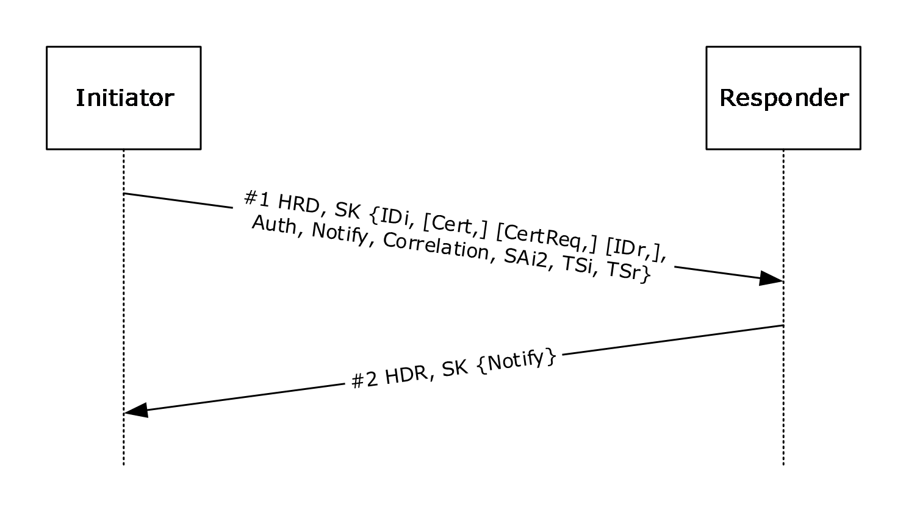

Figure 11: Standard IKEv2 exchange

Figure 12: IKEv2 EAP exchange

#### 3.10.5.1 Receiving Message #1

The [**responder (1)**](#gt_c37f09fa-24c8-4fd5-8edd-2c5e575bc211) processes all payloads prior to the correlation payload as per [[RFC4306]](https://go.microsoft.com/fwlink/?LinkId=90469), [[RFC4555]](https://go.microsoft.com/fwlink/?LinkId=121752), and [[RFC4621]](https://go.microsoft.com/fwlink/?LinkId=122184). Note that message #1 corresponds to the third packet in the IKEv2 [**exchange**](#gt_exchange). See [RFC4306] section 1.2.

When the host receives the correlation payload, it MUST validate its generic header as specified in [RFC4306] section 3.2. Additionally, the host MUST:

- See whether an existing IKE_SA in its SADB table matches the [**initiator**](#gt_initiator) and responder (1) SPIs from the correlation payload.
- If there is an existing [**SA**](#gt_security-association-sa), the host MUST validate the correlation hash by computing its own value given its local SA state, and comparing it with the value of the correlation hash in the payload. If they are equal, the host flags these SAs as correlated.
Any failures in this exchange MUST NOT affect the state of the correlated IKE_SA.

#### 3.10.5.2 Receiving Subsequent Messages

All subsequent messages in the [**exchange**](#gt_exchange)—except the final message—are processed as usual. At the end of the exchange, when the [**responder (1)**](#gt_c37f09fa-24c8-4fd5-8edd-2c5e575bc211) has successfully finished processing the final message, the responder (1) tears down this exchange and sends back an IKEV2 error notify via the notification mechanism in [[RFC4306]](https://go.microsoft.com/fwlink/?LinkId=90469) section 1.4.

For the standard exchange, there are no subsequent messages. For the EAP exchange, the subsequent messages 2–5 are constructed and processed identically to [RFC4306].

#### 3.10.5.3 Receiving the Error Notify

The error notify MUST be processed as specified in [[RFC4306]](https://go.microsoft.com/fwlink/?LinkId=90469) section 1.4 and MUST delete the [**SA**](#gt_security-association-sa) as specified in [RFC4306] section 3.10.1.

The [**initiator**](#gt_initiator), who is receiving the error notify, SHOULD process the extended error information as defined in [2.2.7](#Section_2.2.7).

### 3.10.6 Timer Events

None.

### 3.10.7 Other Local Events

None.

## 3.11 IKE Server Internal Addresses Configuration Attributes (IKEv2) Details

See [[RFC4306]](https://go.microsoft.com/fwlink/?LinkId=90469) section 2.19. During the IKE_AUTH [**exchange**](#gt_exchange), the [**IPsec**](#gt_internet-protocol-security-ipsec) remote access client (IRAC) SHOULD request the IPsec remote access server (IRAS)-controlled address.<30>

On initiator:

HDR, SK {IDi, [CERT,] [CERTREQ,] [IDr,] AUTH, CP(CFG_REQUEST),SAi2, TSi, TSr}

The server (IRAS) replies with:

HDR, SK {IDr, [CERT,] AUTH, CP(CFG_REPLY), SAr2, TSi, TSr}

### 3.11.1 Abstract Data Model

When this extension is implemented, the following additional state is maintained. This is an extension to IKE Protocol version 2 as specified in [[RFC4306]](https://go.microsoft.com/fwlink/?LinkId=90469).

Flow state table: The following information MUST be maintained:

- The internal IPv4 address of the server.
- The internal IPv6 address of the server.
The [**initiator**](#gt_initiator) SHOULD request this attribute for each IP version it supports.

### 3.11.2 Timers

None.

### 3.11.3 Initialization

None.

### 3.11.4 Higher-Layer Triggered Events

None.

### 3.11.5 Message Processing Events and Sequencing Rules

The following figure shows the [**exchange**](#gt_exchange) sequence for IKEv2 Non-EAP embedded [**quick mode**](#gt_quick-mode) [**negotiation**](#gt_negotiation) with Configuration payloads.

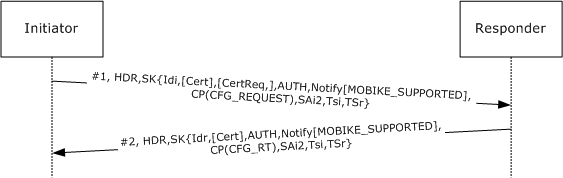

Figure 13: IKEv2 Non-EAP embedded quick mode negotiation with Configuration payload exchange

The following figure shows the Configuration payload exchange sequence with EAP, as specified in [[RFC4306]](https://go.microsoft.com/fwlink/?LinkId=90469) section 3.15.

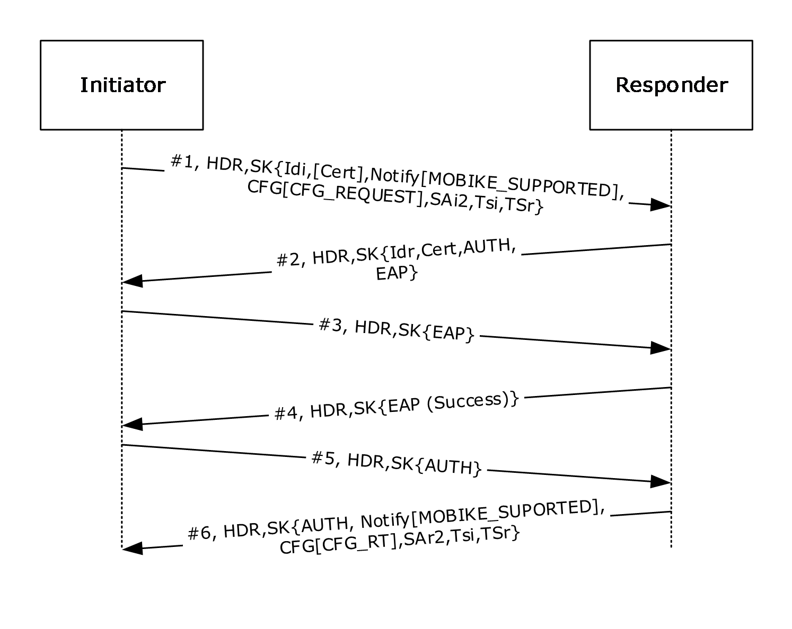

Figure 14: IKEv2 Configuration payload exchange with EAP

#### 3.11.5.1 Receiving Message #1

When the host receives the CFG_REQUEST (as specified in [[RFC4306]](https://go.microsoft.com/fwlink/?LinkId=90469) section 3.15) for the INTERNAL_IP4_SERVER or INTERNAL_IP6_SERVER attribute, it MUST validate the message as also specified in [RFC4306] section 3.15. Additionally, the host SHOULD<31>:

- See whether the server has an internal IPv4 address or an internal IPv6 address.
- If either or both are present, add these attributes in CFG_REPLY.
Any failures in this [**exchange**](#gt_exchange) MUST NOT affect the state of the IKE_SA.

#### 3.11.5.2 Receiving Message #2

When the host receives the CFG_REPLY (as specified in [[RFC4306]](https://go.microsoft.com/fwlink/?LinkId=90469) section 3.15) for the INTERNAL_IP4_SERVER or INTERNAL_IP6_SERVER attribute, it MUST validate the message (as also specified in [RFC4306] section 3). Additionally, the host SHOULD:<32>

- See whether the server has sent an internal IPv4 address or an internal IPv6 address.
- If either or both are present, store these values in its local data structures and use these addresses to send packets to the internal address of IRAS.
Any failures in this [**exchange**](#gt_exchange) MUST NOT affect the state of the IKE_SA.

### 3.11.6 Timer Events

None.

### 3.11.7 Other Local Events

None.

## 3.12 Dead Peer Detection Details

### 3.12.1 Abstract Data Model

When this extension is implemented, the following additional state SHOULD<33> be maintained. This is an extension to IKE Protocol version 1 as specified in [[RFC2409]](https://go.microsoft.com/fwlink/?LinkId=90349).

[**Main mode security association database (MMSAD)**](#gt_main-mode-security-association-database-mmsad): The entry for each [**MM SA**](#gt_main-mode-security-association-mm-sa) contains the following fast-failover client-specific data elements:

- InboundPacketTimeStamp: 1 octet, type: unsigned integer. A time stamp field that is present if the [**SA**](#gt_security-association-sa) has the Fast Failover flag set as described in section [3.5.1](#Section_3.12.1).
- A DeadPeerDetection flag: A flag that indicates whether the current SA is in dead peer detection mode.

### 3.12.2 Timers

[**QM SA**](#gt_quick-mode-security-association-qm-sa) idle timer (for each QM SA): This timer controls the inactivity time before the QM SA can be deleted (as specified in section [3.5.7.1](#Section_3.5.7.1)). This timer MUST be set when the QM SA has been negotiated as described in section [3.5.2](#Section_3.7.2).

### 3.12.3 Initialization

None.

### 3.12.4 Higher-Layer Triggered Events

#### 3.12.4.1 TCP Dead Peer Detection

The stack sends a TCP packet and makes a lookup of the corresponding connection state in the state table defined in section [3.1.1](#Section_3.1.1). It determines whether the packet is a TCP retransmission. If it is a retransmission, the flag DeadPeerDetection defined in section [3.12.1](#Section_3.12.1) is set to TRUE and the dead peer detection is executed as follows:

- The host implementing this feature MUST attempt to rekey the [**QM SA**](#gt_quick-mode-security-association-qm-sa) (as described in [[RFC2409]](https://go.microsoft.com/fwlink/?LinkId=90349) section 5.5) when a new connection is attempted to the peer.
- On failure of a [**quick mode**](#gt_quick-mode) rekey, the host implementing this extension MUST attempt to rekey [**MM SA**](#gt_main-mode-security-association-mm-sa) (as described in [RFC2409] section 5.4) with a maximum of two retransmissions.
- If [**MM**](#gt_main-mode-mm) rekey fails, the peer is deemed dead and a new MM SA [**negotiation**](#gt_negotiation) ([RFC2409] section 5.4) can be attempted.

#### 3.12.4.2 UDP Dead Peer Detection

The stack sends a UDP packet and makes a lookup of the corresponding connection state in the state table defined in section [3.1.1](#Section_3.1.1). It determines whether the corresponding [**SA**](#gt_security-association-sa) has seen a packet in the other direction by checking the InboundPacketTimeStamp field. If the difference is more than 20 seconds, the flag DeadPeerDetection defined in section [3.12.1](#Section_3.12.1) is set to TRUE and the dead peer detection is executed as follows:

- The host implementing this feature MUST attempt to rekey the [**QM SA**](#gt_quick-mode-security-association-qm-sa) (as described in [[RFC2409]](https://go.microsoft.com/fwlink/?LinkId=90349) section 5.5).
- On failure of a [**quick mode**](#gt_quick-mode) rekey, the host implementing this extension MUST attempt to rekey [**MM SA**](#gt_main-mode-security-association-mm-sa) (as described in [RFC2409] section 5.4) with a maximum of two retransmissions.
- If the [**MM**](#gt_main-mode-mm) rekey fails, the peer is deemed dead and a new MM SA [**negotiation**](#gt_negotiation) ([RFC2409] section 5.4) can be attempted.

### 3.12.5 Message Processing Events and Sequencing Rules

#### 3.12.5.1 Receiving a UDP Packet

The stack receives an inbound UDP packet and determines the corresponding connection state in the state table defined in section [3.1.1](#Section_3.1.1), and then it sets the InboundPacketTimeStamp to the current time.

### 3.12.6 Timer Events

#### 3.12.6.1 Expiration of the QM SA Idle Timer

Upon expiration of the [**QM SA**](#gt_quick-mode-security-association-qm-sa) idle timer, the host MUST delete all states for the corresponding QM SA in the [**SAD**](#gt_security-association-database-sad).

### 3.12.7 Other Local Events

#### 3.12.7.1 Successful Negotiation of a QM SA and MM SA

[**QM SAs**](#gt_quick-mode-security-association-qm-sa) MUST be negotiated as specified in [[RFC2409]](https://go.microsoft.com/fwlink/?LinkId=90349) section 5.5. Upon successful [**negotiation**](#gt_negotiation) of a QM SA, the host MUST set the DeadPeerDetection to FALSE, and the host MAY set the QM SA idle timer to a lower value than the default value if the Fast Failover flag is set on the corresponding [**MM SA**](#gt_main-mode-security-association-mm-sa).<34>

MM SAs MUST be negotiated as specified in [RFC2409] section 5.4. Upon successful negotiation of a MM SA, the host MUST set the DeadPeerDetection to FALSE.

## 3.13 Xbox Multiplayer Gaming (IKEv2) Vendor IDs Details

### 3.13.1 Abstract Data Model

When this extension is implemented,<35> the following additional state is maintained. This is an extension to IKE Protocol version 2 as specified in [[RFC4306]](https://go.microsoft.com/fwlink/?LinkId=90469).

[**main mode security association database (MMSAD)**](#gt_main-mode-security-association-database-mmsad): The entry for each MM SA contains the following Xbox multiplayer gaming–specific data element:

- Xbox IKEv2 Negotiation Type: 4 octets, type: unsigned integer. An integer representing the type of Xbox multiplayer identifier associated with the "Xbox IKEv2 Negotiation" vendor ID payload.<36>

### 3.13.2 Timers

None.

### 3.13.3 Initialization

For Xbox multiplayer gaming, secure connections can be of various types. This type information is stored in the XBox IKEv2 Negotiation Type ADM element discussed in section [3.13.1](#Section_3.13.1). The significance of the different types of secure connections for Xbox multiplayer gaming is out of scope for this document. However, a limit can be imposed on the number of simultaneous IKE negotiations that are available for each type of Xbox multiplayer gaming secure connection. Absence of such a configuration would mean that there is no limit to the number of simultaneous ongoing negotiations.

### 3.13.4 Higher-Layer Triggered Events

None.

### 3.13.5 Message Processing Events and Sequencing Rules

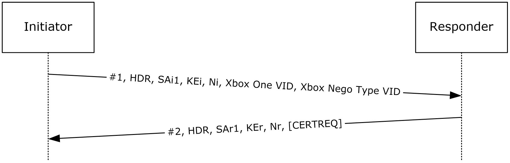

Figure 15: IKE_SA_INIT message exchange for Xbox multiplayer gaming secure-connection establishment

IKE initiators that are participating in Xbox multiplayer gaming scenarios and establishing a secure connection with a remote peer can send the "Microsoft XBox One 2013" vendor ID and the "Xbox IKEv2 Negotiation" vendor ID payloads in the IKE_SA_INIT message.

#### 3.13.5.1 Microsoft Xbox One 2013 Vendor ID

The "Microsoft Xbox One 2013" vendor ID simply indicates that the IKEv2 message exchange is for negotiation of an IKE SA for Xbox multiplayer gaming secure connections.

#### 3.13.5.2 Xbox IKEv2 Negotiation Vendor ID

The "Xbox IKEv2 Negotiation" vendor ID can be looked up by the responder and stored in the XBox IKEv2 Negotiation Type ADM element discussed in section [3.13.1](#Section_3.13.1). For the associated negotiation type, the host MUST increment the number of ongoing IKE negotiations. If the number of such IKE negotiations exceeds the configured limit for the given Xbox secure connection, the negotiation is failed.

### 3.13.6 Timer Events

If an IKE SA is associated with an Xbox negotiation type, then IKE_SA_INIT messages for those SAs are not retransmitted if no response is received from the peer after the first timeout period ([[RFC5996]](https://go.microsoft.com/fwlink/?LinkId=613135) section 2.1).

### 3.13.7 Other Local Events

None.

## 3.14 Security Realm ID (IKEv2) Vendor IDs Details

### 3.14.1 Abstract Data Model

When this extension is implemented, the following additional state SHOULD<37> be maintained. This is an extension to IKE Protocol version 2 as specified in [[RFC5996]](https://go.microsoft.com/fwlink/?LinkId=613135).

Security policy database (SPD): The following information MUST be maintained for a security realm IPsec policy:

- **Security Realm ID**: A variable length array of bytes stored as an HMAC-MD5 hash of the string that identifies the security realm IPsec policy. For more information, see section [1.3.12](#Section_1.3.12).<38>

### 3.14.2 Timers

None.

### 3.14.3 Initialization

None.

### 3.14.4 Higher-Layer Triggered Events

None.

### 3.14.5 Message Processing Events and Sequencing Rules

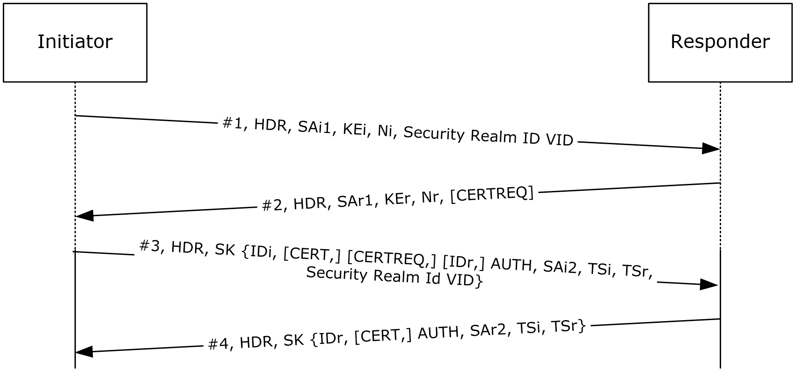

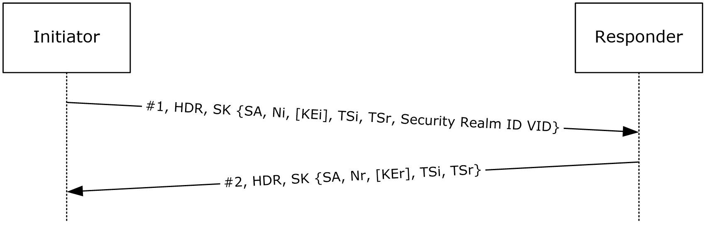

Figure 16: Sending Security Realm ID Vendor ID in IKE_SA_INIT and IKE_SA_AUTH messages

IKE initiators can send the Security Realm ID vendor ID in the IKE_SA_INIT and IKE_SA_AUTH messages if the policy used to negotiate the IKE and IPsec SAs are security realm-based IPsec policies.

Figure 17: Sending Security Realm ID Vendor ID payload in CREATE_CHILD_SA messages

The security realm vendor ID payload (section [2.2.10](#Section_2.2.10)) is sent in CREATE_CHILD_SA messages if the parent SA is associated with a security realm-based policy.

#### 3.14.5.1 IKE_SA_INIT Messages

Initiator: If the initiator chooses a security realm-based IPsec policy to trigger an SA negotiation, it reads the **Security Realm ID** ADM element defined in section [3.14.1](#Section_3.14.1), and includes it in the "MSFT IPsec Security Realm Id" vendor ID payload in the IKE_SA_INIT message.

Responder: If the responder receives an IKE_SA_INIT message that contains an "MSFT IPsec Security Realm Id" vendor ID, it reads the last 16 bytes of the payload, and uses that data to look up a matching IPsec policy. Note that there might be implicit priorities associated with IPsec policies. A higher priority IPsec policy that is not associated with any security realm can be selected over a lower priority IPsec policy that might be associated with the security realm ID. However, if a security realm-based IPsec policy is chosen, the security realm ID associated with the policy MUST exactly match the security realm ID as received in the vendor ID.

If the IKE_SA_INIT message does not have an "MSFT IPsec Security Realm Id" vendor ID, the responder SHOULD<39> skip any security realm-based IPsec policies while selecting an IKE policy.

#### 3.14.5.2 IKE_SA_AUTH and CREATE_CHILD_SA Messages

Initiator: If the initiator chooses a security realm-based IPsec policy to trigger an SA negotiation, it takes the security realm ID in the policy and includes it in the "MSFT IPsec Security Realm Id" vendor ID payload in an IKE_SA_AUTH message (for embedded child IPsec SA negotiation) or a CREATE_CHILD_SA message (for standalone child IPsec SA negotiation). Note that in these messages the vendor ID payload is part of the encrypted payloads. Also, the initiator MUST select the same security realm ID in both the IKE_SA_INIT message and the IKE_SA_AUTH/CREATE_CHILD_SA messages.

Responder: If the responder receives an "MSFT IPsec Security Realm Id" vendor ID in the IKE_SA_AUTH or CREATE_CHILD_SA messages, it looks up an IPsec (QM) policy in the same way as for IKE (MM) policy. However, if a security realm ID-based IPsec policy is chosen, the responder MUST ensure that the corresponding IKE (MM) policy is associated with the same security realm ID. If the message from the initiator for negotiating the child SA does not have an "MSFT IPsec Security Realm Id" vendor ID, but the parent IKE SA is associated to a security realm policy, then this message will be discarded by the responder and the child SA negotiation will fail.

Note that for rekeying IKE and child IPsec SAs, CREATE_CHILD_SA messages are used, and the security realm vendor ID is used in a manner that is similar to that in the preceding paragraphs.

### 3.14.6 Timer Events

None.

### 3.14.7 Other Local Events

None.

## 3.15 IKEv2 Fragmentation Details

The message numbers in the following protocol sequence diagram are used in the descriptions of this section.

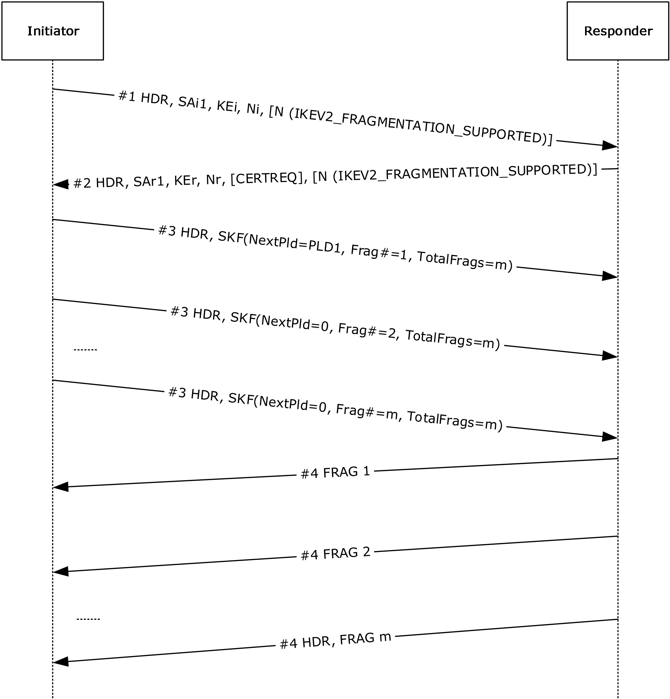

Figure 18: IKEv2 fragmentation sequence

### 3.15.1 Abstract Data Model

When this extension is implemented, the following additional state is maintained. This is an extension to IKE Protocol version 2, as specified in [[RFC7296]](https://go.microsoft.com/fwlink/?linkid=868072).

[**Main mode security association database (MMSAD)**](#gt_main-mode-security-association-database-mmsad): The entry for each MM SA contains the following IKE fragmentation–specific data elements.

- Fragmentation supported: A flag that MUST be set if sending fragmented messages is supported.
- Peer Supports Fragmentation: A flag that is set after the peer indicates fragmentation support through notifications sent via IKE_SA_INIT request and response messages, as described in section [2.2.11.1](#Section_2.2.11.1).
- Fragmentation Determination: Fragmentation is determined by the size of the packet being sent along with the previously specified flags. After determining that fragmentation is supported by both sides, the chosen [**MTU**](#gt_maximum-transmission-unit-mtu) SHOULD be the minimum MTU for the IP protocol, which is 576 bytes for IPv4 and 1280 bytes for IPv6.
- Fragment queue: A queue holding the fragments that correspond to incomplete IKE messages, indexed by the Fragment ID. Each entry in the queue MUST contain the following:
- Fragment ID, which is the Message ID, is set to the **Fragment_ID** field in section [2.2.3.1](#Section_2.2.3.1).
- Fragment Number, which is set to the **Fragment_Number** field in section 2.2.3.1.
- Total Fragments
- Fragment Data, which is set to the **Fragment_Data** field in section 2.2.3.1.
- Flow state table: The following information MUST be maintained.
- Number of fragments received must be accounted for and MUST never exceed the total fragments of MAX limit.
- Total fragment size of the re-assembled packet MUST NOT exceed the MAX limit.

### 3.15.2 Timers

As specified in section [3.3.2](#Section_3.7.2).

### 3.15.3 Initialization

For each fragmented packet, the first Fragment Number starts at 1.

The Next Payload ID for the first fragment is set to the actual Next Payload ID, and the remainder of the fragments have the Next Payload ID set to zero.

### 3.15.4 Higher-Layer Triggered Events

None.

### 3.15.5 Message Processing Events and Sequencing Rules

#### 3.15.5.1 Receiving Message #1

When the Responder receives an IKE_SA_INIT request packet from the Initiator that includes a Notify Payload of type IKEV2_FRAGMENTATION_SUPPORTED (section [2.2.11.1](#Section_2.2.11.1)), it acknowledges that the Initiator supports IKEv2 fragmentation and has allowed its use. However, in order for IKEv2 fragmentation to occur, the Responder MUST also support it and allow its use. See section 2.3 and 2.4 of [[RFC7383]](https://go.microsoft.com/fwlink/?linkid=868073) for further information.

#### 3.15.5.2 Receiving Message #2

After the Initiator receives an IKE_SA_INIT response package from the Responder with a Notify Payload of type IKEV2_FRAGMENTATION_SUPPORTED, the IKEv2 fragmentation negotiation phase is complete and the Initiator can then decide to send fragmented messages at any point thereafter.

#### 3.15.5.3 Other IKE Messages

After the previous negotiation is completed, any message that is larger than 576 bytes and contains an Encrypted payload can be fragmented.

The original content (unencrypted) is treated as a binary blob and is split into chunks regardless of the boundaries of inner payloads. Each of the chunks is then encrypted and authenticated.

The IKE header prepended to the IKE Fragment messages is taken from the original message, except for the Length and Next Payload fields.

### 3.15.6 Timer Events

As specified in section [3.3.6](#Section_3.2.6).

### 3.15.7 Other Local Events

None.

## 3.16 IKEv2 Proxy-Call Session Control IP Addresses Configuration Attributes Details

As defined in [[RFC7651]](https://go.microsoft.com/fwlink/?linkid=868238), the P_CSCF_IP4_ADDRESS and the P_CSCF_IP6_ADDRESS configuration attributes are required for carrying the IPv4 and IPv6 addresses of the Proxy-Call Session Control Function (P-CSCF). A mobile [**Internet Protocol security (IPsec)**](#gt_internet-protocol-security-ipsec) client needs to obtain these addresses from the Evolved Packet Data Gateway (ePDG) in order to securely connect to the P-CSCF server located in the 3GPP network.

Each of the following two attributes are assigned distinct values from the "IKEv2 Configuration Payload Attribute Types" namespace. Configuration attribute types are described in section 3.15.1 of [[RFC7296]](https://go.microsoft.com/fwlink/?linkid=868072).

- P_CSCF_IP4_ADDRESS – value 20
- P_CSCF_IP6_ADDRESS – value 21

### 3.16.1 Abstract Data Model

This is an extension to IKE Protocol version 2, as specified in [[RFC7296]](https://go.microsoft.com/fwlink/?linkid=868072).

Flow state table: The following information MUST be maintained:

- The IPv4 address of the P-CSCF server.
- The IPv6 address of the P-CSCF server.

### 3.16.2 Timers

None.

### 3.16.3 Initialization

None.

### 3.16.4 Higher-Layer Triggered Events

None.

### 3.16.5 Message Processing Events and Sequencing Rules

None.

### 3.16.6 Timer Events

None.

### 3.16.7 Other Local Events

None.

# 4 Protocol Examples

## 4.1 Negotiation Discovery Examples

The following protocol sequence diagram depicts communication between a client with a [**negotiation discovery**](#gt_negotiation-discovery) policy and a server with negotiation discovery in boundary mode.

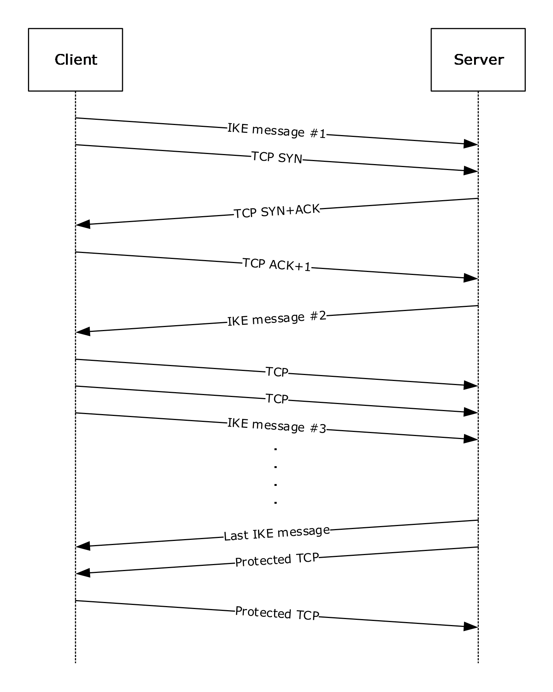

Figure 19: Negotiation discovery between client and server

In this example, the client initiates a TCP connection to the server. At the same time that it sends the TCP SYN packet, the client initiates the [**IKE**](#gt_internet-key-exchange-ike) to the server. TCP traffic [**flows**](#gt_flow) in the clear until the IKE [**negotiation**](#gt_negotiation) completes with IKE message #6. Then, the traffic for this connection is protected.

In the second example, the server requires all inbound traffic to be protected.

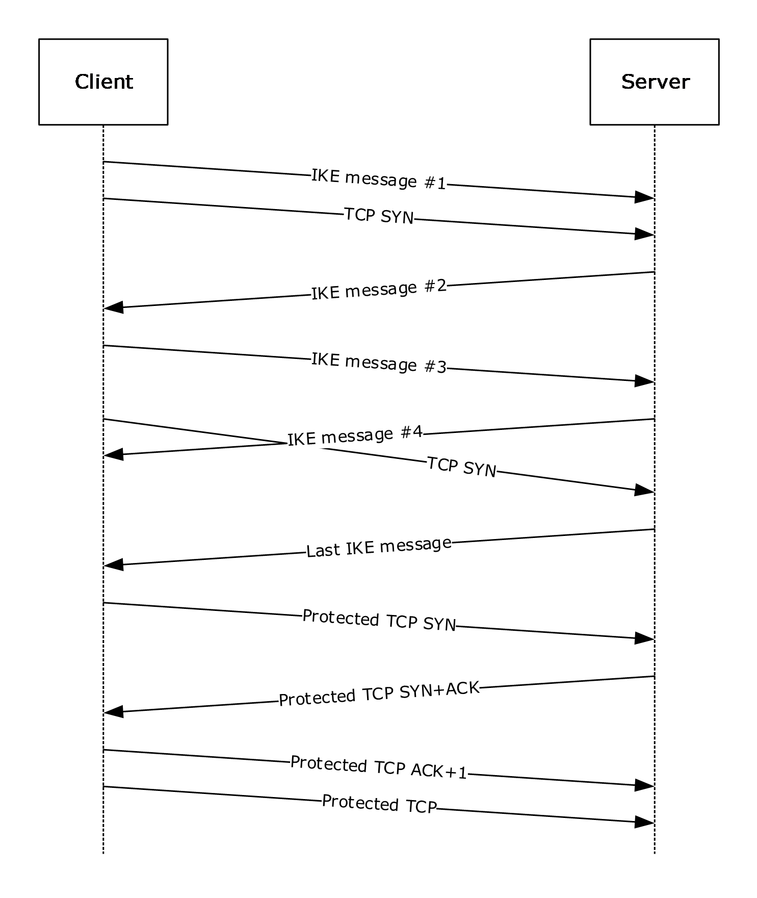

Figure 20: Negotiation discovery between client and server, all inbound traffic protected

In this example, the client initiates a TCP connection to the server. At the same time that it sends the TCP SYN packet, the client initiates the IKE to the server. The Cleartext TCP SYN packets are dropped by the server and retransmitted by the client until the IKE negotiation completes with IKE message #6. The server then accepts the protected traffic.

# 5 Security

## 5.1 Security Considerations for Implementers

### 5.1.1 Negotiation Discovery

[**Negotiation discovery**](#gt_negotiation-discovery) allows Cleartext outbound and inbound connections if the peer is not [**IPsec**](#gt_internet-protocol-security-ipsec)–capable. Connections that are Cleartext should be considered when designing the policy.

## 5.2 Index of Security Parameters

| Security parameter | Section |
| --- | --- |
| Authentication method | [1.7](#Section_1.7) |
| Encryption/authentication algorithms | 1.7 |
| Diffie-Hellman | 1.7 |

# 6 Appendix A: Product Behavior

The information in this specification is applicable to the following Microsoft products or supplemental software. References to product versions include updates to those products.

The terms "earlier" and "later", when used with a product version, refer to either all preceding versions or all subsequent versions, respectively. The term "through" refers to the inclusive range of versions. Applicable Microsoft products are listed chronologically in this section.

The following tables show the relationships between Microsoft product versions or supplemental software and the roles they perform.

| Windows Client Releases | All Initiator Roles | All Responder Roles |
| --- | --- | --- |
| Windows 2000 Professional operating system | Yes | Yes |
| Windows XP operating system | Yes | Yes |
| Windows Vista operating system | Yes | Yes |
| Windows 7 operating system | Yes | Yes |
| Windows 8 operating system | Yes | Yes |
| Windows 8.1 operating system | Yes | Yes |
| Windows 10 operating system | Yes | Yes |
| Windows 11 operating system | Yes | Yes |

| Windows Server Releases | All Initiator Roles | All Responder Roles |
| --- | --- | --- |
| Windows 2000 Server operating system | Yes | Yes |
| Windows Server 2003 operating system | Yes | Yes |
| Windows Server 2008 operating system | Yes | Yes |
| Windows Server 2008 R2 operating system | Yes | Yes |
| Windows Server 2012 operating system | Yes | Yes |
| Windows Server 2012 R2 operating system | Yes | Yes |
| Windows Server 2016 operating system | Yes | Yes |
| Windows Server operating system | Yes | Yes |
| Windows Server 2019 operating system | Yes | Yes |
| Windows Server 2022 operating system | Yes | Yes |
| Windows Server 2025 operating system | Yes | Yes |

Exceptions, if any, are noted in this section. If an update version, service pack or Knowledge Base (KB) number appears with a product name, the behavior changed in that update. The new behavior also applies to subsequent updates unless otherwise specified. If a product edition appears with the product version, behavior is different in that product edition.

Unless otherwise specified, any statement of optional behavior in this specification that is prescribed using the terms "SHOULD" or "SHOULD NOT" implies product behavior in accordance with the SHOULD or SHOULD NOT prescription. Unless otherwise specified, the term "MAY" implies that the product does not follow the prescription.

<1> Section 1.3: **IKEv2 Protocol Implementation Notes**

[[RFC4306]](https://go.microsoft.com/fwlink/?LinkId=90469) IKEv2 MUST / MUST NOT implementation notes

| RFC Requirement | RFC 4306 Section | Compliance statement |
| --- | --- | --- |
| "If a node receives a delete request for [**SAs**](#gt_security-association-sa) for which it has already issued a delete request, it MUST delete the outgoing SAs while processing the request and the incoming SAs while processing the response." | Section 1.4 | Supported in Windows 2000 Professional through Windows Vista and Windows 2000 Server through Windows Server 2008. |
| "Note that Message IDs are cryptographically protected and provide protection against message replays. In the unlikely event that Message IDs grow too large to fit in 32 bits, the IKE_SA MUST be closed." | Section 2.2 | Supported in Windows 2000 Professional through Windows Vista and Windows 2000 Server through Windows Server 2008. |
| "The management interface by which the Shared Secret is provided MUST accept ASCII strings of at least 64 octets and MUST NOT add a null terminator before using them as shared secrets. It MUST also accept a HEX encoding of the Shared Secret." | Section 2.15 | Supported in Windows 2000 Professional through Windows Vista and Windows 2000 Server through Windows Server 2008. |
| "IKEv2 simplifies this situation by requiring that ECN be usable in the outer IP headers of all tunnel-mode [**IPsec**](#gt_internet-protocol-security-ipsec) SAs created by IKEv2. Specifically, tunnel encapsulators and decapsulators for all tunnel-mode SAs created by IKEv2 MUST support the ECN full-functionality option for tunnels specified in [RFC3168] and MUST implement the tunnel encapsulation and decapsulation processing specified in [RFC4301] to prevent discarding of ECN congestion indications." | Section 3.6 | Supported in Windows 2000 Professional through Windows Vista and Windows 2000 Server through Windows Server 2008. |
| "MUST be capable of being configured to send and accept the first two Hash and URL formats (with HTTP URLs)." | Section 3.6 | Supported in Windows 2000 Professional through Windows Vista and Windows 2000 Server through Windows Server 2008. |

[RFC4306] IKEv2 SHOULD / SHOULD NOT implementation notes

| RFC Requirement | RFC 4306 Section | Compliance statement |
| --- | --- | --- |
| "The initiator SHOULD repeat the request, but now with a KEi payload from the group the [**responder (1)**](#gt_c37f09fa-24c8-4fd5-8edd-2c5e575bc211) selected." | Section 1.3 | Supported in Windows 2000 Professional through Windows Vista and Windows 2000 Server through Windows Server 2008. |
| "…regard half-closed connections as anomalous and audit their existence should they persist." | Section 1.4 | Supported in Windows 2000 Professional through Windows Vista and Windows 2000 Server through Windows Server 2008. |
| "IKEv2 implementations SHOULD be aware of the maximum UDP message size supported." | Section 2 | Supported in Windows 2000 Professional through Windows Vista and Windows 2000 Server through Windows Server 2008. |
| "An [**IKE**](#gt_internet-key-exchange-ike) endpoint supporting a window size greater than one SHOULD be capable of processing incoming requests out of order to maximize performance in the event of network failures or packet reordering." | Section 2.4 | Supported in Windows 2000 Professional through Windows Vista and Windows 2000 Server through Windows Server 2008. |
| "An endpoint SHOULD suspect that the other endpoint has failed based on routing information and initiate a request to see whether the other endpoint is alive." | Section 2.4 | Supported in Windows 2000 Professional through Windows Vista and Windows 2000 Server through Windows Server 2008. |
| "…implementations SHOULD reject as invalid a message with those payloads in any other order." | Section 2.5 | Supported in Windows 2000 Professional through Windows Vista and Windows 2000 Server through Windows Server 2008. |
| "Implementations SHOULD support in-place rekeying of SAs." | Section 2.8 | Supported in Windows 2000 Professional through Windows Vista and Windows 2000 Server through Windows Server 2008. |
| "If redundant SAs are created though such a collision, the SA created with the lowest of the four [**nonces**](#gt_nonce) used in the two exchanges SHOULD be closed by the endpoint that created it." | Section 2.8 | Supported in Windows 2000 Professional through Windows Vista and Windows 2000 Server through Windows Server 2008. |
| "If an initiator receives a message on an SA for which it has not received a response to its CREATE_CHILD_SA request, it SHOULD interpret that as a likely packet loss and retransmit the CREATE_CHILD_SA request." | Section 2.8 | Supported in Windows 2000 Professional through Windows Vista and Windows 2000 Server through Windows Server 2008. |
| "If an error occurs outside the context of an IKE request (e.g., the node is getting ESP messages on a nonexistent SPI), the node SHOULD initiate an INFORMATIONAL exchange with a Notify payload describing the problem." | Section 2.21 | Supported in Windows 2000 Professional through Windows Vista and Windows 2000 Server through Windows Server 2008. |
| "A node SHOULD treat such a message (and also a network message like ICMP destination unreachable) as a hint that there might be problems with SAs to that IP address and SHOULD initiate a liveness test for any such IKE_SA. An implementation SHOULD limit the frequency of such tests." | Section 2.21 | Supported in Windows 2000 Professional through Windows Vista and Windows 2000 Server through Windows Server 2008. |
| "There are cases where a [**NAT**](#gt_network-address-translation-nat) box decides to remove mappings that are still alive (for example, the keepalive interval is too long, or the NAT box is rebooted). To recover in these cases, hosts that are not behind a NAT SHOULD send all packets (including retransmission packets) to the IP address and port from the last valid authenticated packet from the other end." | Section 2.23 | Supported in Windows 2000 Professional through Windows Vista and Windows 2000 Server through Windows Server 2008. |
| "To assure maximum interoperability, implementations MUST be configurable to send at least one of ID_IPV4_ADDR, ID_FQDN, ID_RFC822_ADDR, or ID_KEY_ID, and MUST be configurable to accept all of these types. Implementations SHOULD be capable of generating and accepting all of these types." | Section 3.5 | Supported in Windows 2000 Professional through Windows Vista and Windows 2000 Server through Windows Server 2008. |
| "Implementations SHOULD be capable of being configured to send and accept Raw RSA keys." | Section 3.6 | Supported in Windows 2000 Professional through Windows Vista and Windows 2000 Server through Windows Server 2008. |
| "Note that since IKE passes an indication of initiator identity in message 3 of the protocol, the responder SHOULD NOT send EAP Identity requests. The initiator SHOULD, however, respond to such requests if it receives them." | Section 3.16 | Supported in Windows 2000 Professional through Windows Vista and Windows 2000 Server through Windows Server 2008. |

[RFC4306] IKEv2 MAY implementation notes

| RFC Requirement | RFC 4306 Section | Compliance statement |
| --- | --- | --- |
| "The traffic selectors for traffic to be sent on that SA are specified in the TS payloads, which may be a subset of what the initiator of the CHILD_SA proposed." | Section 1.3 | Supported in Windows 2000 Professional through Windows Vista and Windows 2000 Server through Windows Server 2008. |
| "If the receiving node has an active IKE_SA to the IP address from whence the packet came, it MAY send a notification of the wayward packet over that IKE_SA in an INFORMATIONAL exchange." | Section 1.5 | Supported in Windows 2000 Professional through Windows Vista and Windows 2000 Server through Windows Server 2008. |
| "IKEv2 implementations SHOULD be aware of the maximum UDP message size supported and MAY shorten messages by leaving out some certificates or cryptographic suite proposals if that will keep messages below the maximum." | Section 2 | Supported in Windows 2000 Professional through Windows Vista and Windows 2000 Server through Windows Server 2008. |
| "In order to maximize IKE throughput, an IKE endpoint MAY issue multiple requests before getting a response to any of them if the other endpoint has indicated its ability to handle such requests. For simplicity, an IKE implementation MAY choose to process requests strictly in order and/or wait for a response to one request before issuing another." | Section 2.3 | Supported in Windows 2000 Professional through Windows Vista and Windows 2000 Server through Windows Server 2008. |
| "To prevent this, the initiator MAY be willing to accept multiple responses to its first message, treat each as potentially legitimate, respond to it, and then discard all the invalid half-open connections when it receives a valid cryptographically protected response to any one of its requests." | Section 2.4 | Supported in Windows 2000 Professional through Windows Vista and Windows 2000 Server through Windows Server 2008. |
| "The responder in that case MAY reject the message by sending another response with a new cookie or it MAY keep the old value of <secret> around for a short time and accept cookies computed from either one." | Section 2.6 | Supported in Windows 2000 Professional through Windows Vista and Windows 2000 Server through Windows Server 2008. |
| "An implementation MAY refuse all CREATE_CHILD_SA requests within an IKE_SA." | Section 2.8 | Supported in Windows 2000 Professional through Windows Vista and Windows 2000 Server through Windows Server 2008. |
| "An initiator MAY send a dummy message on a newly created SA if it has no messages queued in order to assure the responder that the initiator is ready to receive messages." | Section 2.8 | Supported in Windows 2000 Professional through Windows Vista and Windows 2000 Server through Windows Server 2008. |
| "If more than one subset is acceptable but their union is not, the responder MUST accept some subset and MAY include a Notify payload of type ADDITIONAL_TS_POSSIBLE to indicate that the initiator might want to try again." | Section 2.9 | Supported in Windows 2000 Professional through Windows Vista and Windows 2000 Server through Windows Server 2008. |
| "CP(CFG_REQUEST) MUST contain at least an INTERNAL_ADDRESS attribute (either IPv4 or IPv6) but MAY contain any number of additional attributes the initiator wants returned in the response." | Section 2.19 | Supported in Windows 2000 Professional through Windows Vista and Windows 2000 Server through Windows Server 2008. |
| "An IKE peer wishing to inquire about the other peer's IKE software version information MAY use the method below." | Section 2.20 | Supported in Windows 2000 Professional through Windows Vista and Windows 2000 Server through Windows Server 2008. |
| "A node receiving a suspicious message from an IP address with which it has an IKE_SA MAY send an IKE Notify payload in an IKE INFORMATIONAL exchange over that SA." | Section 2.21 | Supported in Windows 2000 Professional through Windows Vista and Windows 2000 Server through Windows Server 2008. |
| "A node requesting a CHILD_SA MAY advertise its support for one or more compression algorithms through one or more Notify payloads of type IPCOMP_SUPPORTED. The response MAY indicate acceptance of a single compression algorithm with a Notify payload of type IPCOMP_SUPPORTED." | Section 2.22 | Supported in Windows 2000 Professional through Windows Vista and Windows 2000 Server through Windows Server 2008. |
| "IPv6-only implementations MAY be configurable to send only ID_IPV6_ADDR." | Section 3.5 | Supported in Windows 2000 Professional through Windows Vista and Windows 2000 Server through Windows Server 2008. |
| "INVALID_SPI MAY be sent in an IKE INFORMATIONAL exchange when a node receives an ESP or AH packet with an invalid SPI." | Section 3.10.11 | Supported in Windows 2000 Professional through Windows Vista and Windows 2000 Server through Windows Server 2008. |
| "INVALID_SELECTORS MAY be sent in an IKE INFORMATIONAL exchange when a node receives an ESP or AH packet whose selectors do not match those of the SA on which it was delivered (and that caused the packet to be dropped)." | Section 3.10.11 | Supported in Windows 2000 Professional through Windows Vista and Windows 2000 Server through Windows Server 2008. |
| "INITIAL_CONTACT: It MAY be sent when an IKE_SA is established after a crash,…" | Section 3.10.11 | Supported in Windows 2000 Professional through Windows Vista and Windows 2000 Server through Windows Server 2008. |
| "NAT_DETECTION_SOURCE_IP: There MAY be multiple Notify payloads of this type in a message if the sender does not know which of several network attachments will be used to send the packet." | Section 3.10.11 | Supported in Windows 2000 Professional through Windows Vista and Windows 2000 Server through Windows Server 2008. |
| "NAT_DETECTION_DESTINATION_IP: Alternately, it MAY reject the connection attempt if NAT traversal is not supported." | Section 3.10.11 | Supported in Windows 2000 Professional through Windows Vista and Windows 2000 Server through Windows Server 2008. |
| "HTTP_CERT_LOOKUP_SUPPORTED: This notification MAY be included in any message that can include a CERTREQ payload and indicates that the sender is capable of looking up [**certificates**](#gt_certificate) based on an HTTP-based URL." | Section 3.10.11 | Supported in Windows 2000 Professional through Windows Vista and Windows 2000 Server through Windows Server 2008. |
| "The CFG_REPLY Configuration Payload MAY return that value, or a new one. It MAY also add new attributes and not include some requested ones. Requestors MUST ignore returned attributes that they do not recognize. Some attributes MAY be multi-valued, in which case multiple attribute values of the same type are sent and/or returned." | Section 3.15 | Supported in Windows 2000 Professional through Windows Vista and Windows 2000 Server through Windows Server 2008. |
| "INTERNAL_IP4_ADDRESS, INTERNAL_IP6_ADDRESS: With IPv6, a requestor MAY supply the low-order address bytes it wants to use. Multiple internal addresses MAY be requested by requesting multiple internal address attributes." | Section 3.15.1 | Supported in Windows 2000 Professional through Windows Vista and Windows 2000 Server through Windows Server 2008. |

<2> Section 1.3: The following tables list the extensions that each release supports.

Windows releases support the IKE version 1 proposal for [**Encapsulating Security Payload (ESP)**](#gt_encapsulating-security-payload-esp) and [**Authentication Headers (AH)**](#gt_authentication-header-ah).

The IKE proposal for Encapsulating Security Payload (ESP) and Authentication Headers (AH) is not supported in the Windows 7 implementation of IKE version 2.

Windows 2000 operating system does not support IKE extensions only Windows 2000 operating system Service Pack 4 (SP4) post rollup supports some IKE extensions as shown in the following table.

| IKE extension | Windows NT 4.0 operating system (with additional download) | Windows 2000 SP4 post-SP4 rollup |
| --- | --- | --- |
| NAT-T | X | X |
| IKEv1 fragmentation | - | X |
| IKEv2 fragmentation | - | - |
| CGA authentication | - | - |
| Fast failover | - | - |
| Negotiation discovery | - | - |
| Reliable delete | - | X |

| IKE extension | Windows XP | Windows XP operating system Service Pack 2 (SP2), and Windows Server 2003 | Windows Vista and Windows Server 2008 | Windows 7 and Windows Server 2008 R2 | Windows 8, Windows Server 2012, Windows 8.1, and Windows Server 2012 R2 | Windows 10 and later and Windows Server 2016 and later |
| --- | --- | --- | --- | --- | --- | --- |
| NAT-T | - | X | X | X | X | X |
| IKEv1 fragmentation | - | X | X | X | X | X |
| IKEv2 fragmentation | - | - | - | - | - | - |
| CGA authentication | - | - | X | X | X | X |
| Fast failover | - | X | X | X | X | X |
| Negotiation discovery | - | - | X | X | X | X |
| Reliable delete | X | X | X | X | X | X |
| IKEv2 SA Correlation | - | - | - | X | X | X |
| IKEv2 Configuration Attributes | - | - | - | X | X | X |
| Denial of Service protection | X | X | X | X | X | X |
| Dead Peer Detection | - | - | - | - | X | X |
| Xbox Multiplayer Gaming (IKEv2) Vendor IDs | - | - | - | - | - | X |
| Security Realm (IKEv2) Vendor IDs | - | - | - | - | - | X |

<3> Section 1.3.8: The IKE/AuthIP Coexistence extension is not implemented in Windows 2000, Windows XP and Windows Server 2003.

<4> Section 1.7: The following table lists the algorithms that are implemented in each Windows release.

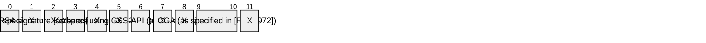
```mermaid
packet-beta
  0-0: "Pre-shared key (as specified in [RFC2409])"
  1-1: "X"
  2-2: "X"
  3-3: "RSA signature (as specified in [RFC2409])"
  4-4: "X"
  5-5: "X"
  6-6: "Kerberos using GSS-API (as specified in [GSS])"
  7-7: "X"
  8-8: "X"
  9-10: "CGA (as specified in [RFC3972])"
  11-11: "X"
```

<5> Section 1.7: The following tables list the cryptographic parameters that are implemented in each Windows release.

| Diffie-Hellman group | Windows 2000 and Windows XP | Windows Server 2003 | Windows Vista and later and Windows Server 2008 and later |
| --- | --- | --- | --- |
| Default 768-bit MODP group [RFC2409] | X | X | X |
| Alternate 1,024-bit MODP group [RFC2409] | X | X | X |
| 2,048-bit MODP group [[RFC3526]](https://go.microsoft.com/fwlink/?LinkId=90429) | - | X | X |
| ECP256 [[ECP]](https://go.microsoft.com/fwlink/?LinkId=89857)) | - | - | X |
| ECP384 (as specified in [ECP] | - | - | X |

| Authentication algorithm | Windows 2000, Windows XP, and Windows Server 2003 | Windows Vista and Windows Server 2008 | Windows 7 and later and Windows Server 2008 R2 and later |
| --- | --- | --- | --- |
| NULL [[RFC2410]](https://go.microsoft.com/fwlink/?LinkId=90350) | X | X | X |
| HMAC-SHA1-96 [[RFC2404]](https://go.microsoft.com/fwlink/?LinkId=90344) | X | X | X |
| HMAC-MD5-96 [[RFC2403]](https://go.microsoft.com/fwlink/?LinkId=90343) | X | X | X |
| AES-MAC [[RFC4543]](https://go.microsoft.com/fwlink/?LinkId=90481) | - | - | X |
| SHA-256 [[SHA256]](https://go.microsoft.com/fwlink/?LinkId=90514) | - | - | X |

| Encryption algorithm | Windows 2000, Windows XP, and Windows Server 2003 | Windows Vista and Windows Server 2008 | Windows 7 and later and Windows Server 2008 R2 and later |
| --- | --- | --- | --- |
| NULL [RFC2410] | X | X | X |
| DES-CBC [[RFC2405]](https://go.microsoft.com/fwlink/?LinkId=90345) | X | X | X |
| 3DES-CBC [[RFC2451]](https://go.microsoft.com/fwlink/?LinkId=90355) | X | X | X |
| AES-CBC with 128, 192, and 256 Bit Keys [[RFC3602]](https://go.microsoft.com/fwlink/?LinkId=90436) | - | X | X |
| AES-GCM with 128, 192, and 256 Bit Keys [[RFC4106]](https://go.microsoft.com/fwlink/?LinkId=90457) | - | - | X |

<6> Section 1.7: The Microsoft implementation of IKE supports the following vendor IDs.

The Microsoft implementation vendor ID (for example, in rows of the second table that follows, where the Common name starts with "Microsoft implementation"), is constructed by appending a 32-bit (4-byte) version number in network byte order to the 128-bit (16-byte) MD5 hash of the "MS NT5 ISAKMPOAKLEY" string. The version number is the additional 4 bytes that denote the Windows release, as detailed in the first table that follows.

| Bit Range | Field | Description |
| --- | --- | --- |
| Variable | Windows 2000 | 00 00 00 02 |
| Variable | Windows XP | 00 00 00 03 |
| Variable | Windows Server 2003 | 00 00 00 04 |
| Variable | Windows Vista | 00 00 00 05 |
| Variable | Windows Server 2008 | 00 00 00 06 |
| Variable | Windows 7 | 00 00 00 07 |
| Variable | Windows Server 2008 R2 | 00 00 00 08 |
| Variable | Windows 8 and later | 00 00 00 09 |
| Variable | Windows Server 2012 and later | 00 00 00 09 |

In other cases, a keying module vendor ID is constructed by appending a 32-bit (4-byte) module value in network byte order to the 128-bit (16-byte) MD5 hash of the “KEY_MODS” string to create its wire representation. Examples of this are shown in the table immediately below in rows where the Common name contains the text “Microsoft supported keying modules”. A similar organization applies to constructing a vendor ID for the “AUTHIP_INIT_KE_DH_GROUP” strings shown in rows of the table that follows which have the Common name “AuthIP Initiator DH type sent in KE”. Other vendor IDs are as stated in the same table.

Additional tables that follow the table immediately below specify key module values and Diffie Hellman (DH) group values that are available for constructing vendor IDs for keying modules and AuthIP Initiator DH groups, respectively.

| Common name | String representation | Wire representation (MD5 hash of string) | Windows release |
| --- | --- | --- | --- |
| Microsoft implementation Windows 2000 | "MS NT5 ISAKMPOAKLEY" + version number 2 | 1E 2B 51 69 05 99 1C 7D 7C 96 FC BF B5 87 E4 61 00 00 00 02 | Windows 2000 |
| Microsoft implementation Windows XP | "MS NT5 ISAKMPOAKLEY" + version number 3 | 1E 2B 51 69 05 99 1C 7D 7C 96 FC BF B5 87 E4 61 00 00 00 03 | Windows XP |
| Microsoft implementation Windows Server 2003 | "MS NT5 ISAKMPOAKLEY" + version number 4 | 1E 2B 51 69 05 99 1C 7D 7C 96 FC BF B5 87 E4 61 00 00 00 04 | Windows Server 2003 |
| Microsoft implementation Windows Vista | "MS NT5 ISAKMPOAKLEY" + version number 5 | 1E 2B 51 69 05 99 1C 7D 7C 96 FC BF B5 87 E4 61 00 00 00 05 | Windows Vista |
| Microsoft implementation Windows Server 2008 | "MS NT5 ISAKMPOAKLEY" + version number 6 | 1E 2B 51 69 05 99 1C 7D 7C 96 FC BF B5 87 E4 61 00 00 00 06 | Windows Server 2008 |
| Microsoft implementation Windows 7 | "MS NT5 ISAKMPOAKLEY" + version number 7 | 1E 2B 51 69 05 99 1C 7D 7C 96 FC BF B5 87 E4 61 00 00 00 07 | Windows 7 |
| Microsoft implementation Windows Server 2008 R2 | "MS NT5 ISAKMPOAKLEY" + version number 8 | 1E 2B 51 69 05 99 1C 7D 7C 96 FC BF B5 87 E4 61 00 00 00 08 | Windows Server 2008 R2 |
| Microsoft implementation Windows 8 and later and Windows Server 2012 and later | "MS NT5 ISAKMPOAKLEY" + version number 9 | 1E 2B 51 69 05 99 1C 7D 7C 96 FC BF B5 87 E4 61 00 00 00 09 | Windows 8 and later and Windows Server 2012 and later |
| Microsoft supported keying modules | “KEY_MODS” + Key Module (IKE) | 01 52 8b bb c0 06 96 12 18 49 ab 9a 1c 5b 2a 51 00 00 00 **00** | Windows 7 and later, and Windows Server 2008 R2 and later |
| Microsoft supported keying modules | “KEY_MODS” + Key Module (AuthIP) | 01 52 8b bb c0 06 96 12 18 49 ab 9a 1c 5b 2a 51 00 00 00 **01** | Windows 7 and later, and Windows Server 2008 R2 and later |
| Microsoft supported keying modules | “KEY_MODS” + Key Module (IKEv2) | 01 52 8b bb c0 06 96 12 18 49 ab 9a 1c 5b 2a 51 00 00 00 **02** | Windows 7 and later, and Windows Server 2008 R2 and later |
| Kerberos authentication supported (as specified in [GSS]) | "GSSAPI" | 62 1B 04 BB 09 88 2A C1 E1 59 35 FE FA 24 AE EE | All versions listed in the Product Behavior Appendix |
| NLB/MSCS fast failover supported | "Vid-Initial-Contact" | 26 24 4D 38 ED DB 61 B3 17 2A 36 E3 D0 CF B8 19 | All versions listed in the Product Behavior Appendix |
| NLB/MSCS fast failover supported | "NLBS_PRESENT" | 72 87 2B 95 FC DA 2E B7 08 EF E3 22 11 9B 49 71 | All versions listed in the Product Behavior Appendix |
| Fragmentation avoidance supported | "FRAGMENTATION" | 40 48 B7 D5 6E BC E8 85 25 E7 DE 7F 00 D6 C2 D3 | All versions listed in the Product Behavior Appendix |
| NAT-T supported | "draft-ietf-ipsec-nat-t-ike-02\n" | 90 CB 80 91 3E BB 69 6E 08 63 81 B5 EC 42 7B 1F | All versions listed in the Product Behavior Appendix |
| NAT-T supported | "RFC 3947" | 4A 13 1C 81 07 03 58 45 5C 57 28 F2 0E 95 45 2F | All versions listed in the Product Behavior Appendix except Windows 2000, Windows XP, and Windows Server 2003 |
| [**AuthIP**](#gt_authenticated-ip-authip) supported | "MS-MamieExists" | 21 4C A4 FA FF A7 F3 2D 67 48 E5 30 33 95 AE 83 | All versions listed in the Product Behavior Appendix except Windows 2000, Windows XP, and Windows Server 2003 |
| CGA supported | "IKE CGA version 1" | E3 A5 96 6A 76 37 9F E7 07 22 82 31 E5 CE 86 52 | All versions listed in the Product Behavior Appendix except Windows 2000, Windows XP, and Windows Server 2003 |
| [**Negotiation discovery**](#gt_negotiation-discovery) supported | "MS-Negotiation Discovery Capable" | FB 1D E3 CD F3 41 B7 EA 16 B7 E5 BE 08 55 F1 20 | All versions listed in the Product Behavior Appendix except Windows 2000, Windows XP, and Windows Server 2003 |
| AuthIP Initiator DH type sent in KE | “AUTHIP_INIT_KE_DH_GROUP” + Diffie Hellman group (IKEEXT_DH_GROUP_NONE) | 7B B9 38 67 D7 6C 8D 80 DF 0F 40 FA E8 FC 3B 19 00 00 00 **00** | Windows 8 and later, and Windows Server 2012 and later |
| AuthIP Initiator DH type sent in KE | “AUTHIP_INIT_KE_DH_GROUP” + Diffie Hellman group (IKEEXT_DH_GROUP_1) | 7B B9 38 67 D7 6C 8D 80 DF 0F 40 FA E8 FC 3B 19 00 00 00 **01** | Windows 8 and later, and Windows Server 2012 and later |
| AuthIP Initiator DH type sent in KE | “AUTHIP_INIT_KE_DH_GROUP” + Diffie Hellman group (IKEEXT_DH_GROUP_2) | 7B B9 38 67 D7 6C 8D 80 DF 0F 40 FA E8 FC 3B 19 00 00 00 **02** | Windows 8 and later, and Windows Server 2012 and later |
| AuthIP Initiator DH type sent in KE | “AUTHIP_INIT_KE_DH_GROUP” + Diffie Hellman group (IKEEXT_DH_GROUP_14 / IKEEXT_DH_GROUP_2048) | 7B B9 38 67 D7 6C 8D 80 DF 0F 40 FA E8 FC 3B 19 00 00 00 **03** | Windows 8 and later, and Windows Server 2012 and later |
| AuthIP Initiator DH type sent in KE | “AUTHIP_INIT_KE_DH_GROUP” + Diffie Hellman group (IKEEXT_DH_ECP_256) | 7B B9 38 67 D7 6C 8D 80 DF 0F 40 FA E8 FC 3B 19 00 00 00 **04** | Windows 8 and later, and Windows Server 2012 and later |
| AuthIP Initiator DH type sent in KE | “AUTHIP_INIT_KE_DH_GROUP” + Diffie Hellman group (IKEEXT_DH_ECP_384) | 7B B9 38 67 D7 6C 8D 80 DF 0F 40 FA E8 FC 3B 19 00 00 00 **05** | Windows 8 and later, and Windows Server 2012 and later |
| AuthIP Initiator DH type sent in KE | “AUTHIP_INIT_KE_DH_GROUP” + Diffie Hellman group (IKEEXT_DH_GROUP_24) | 7B B9 38 67 D7 6C 8D 80 DF 0F 40 FA E8 FC 3B 19 00 00 00 **06** | Windows 8 and later, and Windows Server 2012 and later |
| AuthIP Initiator DH type sent in KE | “AUTHIP_INIT_KE_DH_GROUP” + Diffie Hellman group (IKEEXT_DH_GROUP_MAX) | 7B B9 38 67 D7 6C 8D 80 DF 0F 40 FA E8 FC 3B 19 00 00 00 **07** | Windows 8 and later, and Windows Server 2012 and later |
| Microsoft Xbox One 2013 | "Microsoft Xbox One 2013" | 8A A3 94 CF 8A 55 77 DC 31 10 C1 13 B0 27 A4 F2 | Windows 10, Windows Server 2016, Windows Server operating system, and Windows Server 2019 |
| Xbox IKEv2 Negotiation | "Xbox IKEv2 Negotiation" | 66 08 22 B3 A7 3A 24 41 49 57 8D 62 E0 EB 46 A0 | Windows 10, Windows Server 2016, Windows Server operating system, and Windows Server 2019 |
| Security Realm ID | "MSFT IPsec Security Realm Id" | 68 6A 8C BD FE 63 4B 40 51 46 FB 2B AF 33 E9 E8 | Windows 10, Windows Server 2016, Windows Server operating system, and Windows Server 2019 |

| Bit Range | Field | Description |
| --- | --- | --- |
| Variable | IKEEXT_KEY_MODULE_IKE | 00 00 00 00 |
| Variable | IKEEXT_KEY_MODULE_AUTHIP | 00 00 00 01 |
| Variable | IKEEXT_KEY_MODULE_IKEV2 | 00 00 00 02 |

| Bit Range | Field | Description |
| --- | --- | --- |
| Variable | IKEEXT_DH_GROUP_NONE | 00 00 00 00 |
| Variable | IKEEXT_DH_GROUP_1 | 00 00 00 01 |
| Variable | IKEEXT_DH_GROUP_2 | 00 00 00 02 |
| Variable | IKEEXT_DH_GROUP_14 / IKEEXT_DH_GROUP_2048 | 00 00 00 03 |
| Variable | IKEEXT_DH_ECP_256 | 00 00 00 04 |
| Variable | IKEEXT_DH_ECP_384 | 00 00 00 05 |
| Variable | IKEEXT_DH_GROUP_24 | 00 00 00 06 |
| Variable | IKEEXT_DH_GROUP_MAX | 00 00 00 07 |

<7> Section 2.1: These IKE extensions run on UDP ports 500 and 4500 only.

<8> Section 2.2.6: This field can contain any Windows error code value. For more information about these codes, see [MS-ERREF](../MS-ERREF/MS-ERREF.md).

<9> Section 2.2.7: This field can take on any Windows error code value. For more information about these codes, see [MS-ERREF].

<10> Section 2.2.10: Security Realm Vendor Ids are implemented in Windows 10 and in Windows Server 2016 and later operating systems.

<11> Section 2.2.10: For Windows implementations, the "MSFT IPsec Security Realm Id" payload is 32 bytes long. The first 16 bytes is the MD5 hash of the vendor ID string. The remaining 16 bytes is an HMAC-MD5 encrypted string that identifies a particular security realm (as discussed in section [1.3.12](#Section_1.3.12)). The key that is used for this purpose is the string "SecurityRealmPolicyHmacKey".

<12> Section 3.1.5: Initialization vectors (IV) choice for encrypted notifications sent prior to [**MM SA**](#gt_main-mode-security-association-mm-sa) establishment:

If the peer sent the MS NT5 ISAKMPOAKLEY notify vendor ID and the 4-byte version number is 0x00000002, 0x00000003, 0x0000004, or 0x00000005, (denoting Windows 2000, Windows XP, Windows Server 2003 and Windows Vista, respectively), the IV used in encrypting the notify is the last cipher block of the last sent packet. Otherwise, the IV will be the last cipher block of the last decrypted packet.

<13> Section 3.2: Windows releases implement both [[RFC3947]](https://go.microsoft.com/fwlink/?LinkId=90448) and [[DRAFT-NATT]](https://go.microsoft.com/fwlink/?LinkId=89854), except Windows 2000 SP4, Windows XP SP2, and Windows Server 2003, which implement the [DRAFT-NATT] revision only.

<14> Section 3.2.2: A NAT-T keep-alive message is sent every 20 seconds. Windows Vista prior to Windows Vista operating system with Service Pack 2 (SP2) and Windows Server 2008 prior to Windows Server 2008 operating system with Service Pack 2 (SP2) do not send keep-alive messages.

<15> Section 3.2.4.1: [NAT-T IKE] message construction is not implemented in Windows 2000 prior to Windows 2000 Server operating system Service Pack 4 (SP4) or in Windows XP prior to Windows XP SP2.

| NAT-T revision support | Version |
| --- | --- |
| [DRAFT-NATT] and [RFC3947] | Windows Vista, Windows Server 2008, Windows 7, and Windows Server 2008 R2 |
| [DRAFT-NATT] | Windows 2000 Server SP4, Windows XP SP2, and Windows Server 2003 |

Windows releases do not support NAT-T for IPv6 and therefore, does not send the NAT-T vendor IDs for IPv6 [**negotiations**](#gt_negotiation).

<16> Section 3.3.2: The fragmentation timer is variable. The timer interval is computed as the sum of the first two packet retransmission times.

- In Windows 2000, Windows XP, and Windows Server 2003, the timer is started from the IKE [**exchange**](#gt_exchange) (the second round trip in [**main mode**](#gt_main-mode-mm)). In these versions, both the [**initiator**](#gt_initiator) and the responder (1) implement a fragmentation timer.
- In Windows Vista and later and in Windows Server 2008 and later, the timer is started from the first main mode packet of the exchange. Although 3 seconds is the norm, there is variance in the timer implementation up to ½ second per retransmission. This is an artifact of the underlying timer implementation. Hence the observed timer will be within the range of 2 to 4 seconds. Only the initiator implements a fragmentation timer.
<17> Section 3.3.2: The fragment reassembly timer is set to 70 seconds.

<18> Section 3.3.5.3: The Fragmentation active flag is set on receipt of a Fragment payload.

<19> Section 3.3.5.3: IKE Message Fragmentation active flag behavior. Implemented in Windows 2000 Professional through Windows 7 and Windows 2000 Server through Windows Server 2008 R2. IKE messages are fragmented if the Fragmentation active flag is set, as per the conditions specified in section [3.3.6.1](#Section_3.3.6.1).

<20> Section 3.5.4.1: In Windows Vista and Windows Server 2008 operating system, the host sends the "Vid-Initial-Contact" [**vendor ID payload**](#gt_vendor-id-payload) if it has no open TCP connections to the peer and new connection attempts cause the retransmission of SYN packets.

<21> Section 3.5.7.1: The [**QM SA**](#gt_quick-mode-security-association-qm-sa) idle timer is set to 1 minute if the Fast Failover flag is set on the parent MM SA, and it is set to 5 minutes if the Fast Failover flag is not set.

<22> Section 3.6.5.1: Vendor ID processing is used to evaluate whether the MM SA is allocated to a different host within the [**cluster**](#gt_cluster). For more information, see [[MSFT-WLBS]](https://go.microsoft.com/fwlink/?LinkId=90211). Vendor ID processing is not implemented in Windows 2000.

<23> Section 3.8.4.1: Nonces are 32-byte, random numbers that are generated from a FIPS-140–compliant random-number generator. For more information, see [[FIPS140]](https://go.microsoft.com/fwlink/?LinkId=89866). Nonces are not implemented in Windows 2000.

<24> Section 3.8.6.1: Delete Retransmission timer is not implemented in Windows 2000. The first retransmission occurs after 1 second. The time-out is doubled for each subsequent retransmission up to a maximum of six retransmissions. The maximum retransmission interval is capped at 16 seconds. So, if the doubling of the previous interval exceeds 16 seconds, 16 seconds is used. The timer is started only if the remote host is a Windows peer, as identified by the "MS NT5 ISAKMPOAKLEY" vendor ID payload.

<25> Section 3.8.7.1: On shutdown for Windows 2000, Windows XP, and Windows Server 2003, IKE runs as specified in the footnote regarding the delete transmission timer in section [3.8.6.1](#Section_3.8.6.1). Note that the machine can shut down before the maximum number of retransmissions has actually been sent.

<26> Section 3.8.7.2: After a delete has been triggered, Windows releases immediately send the delete notify, and delays deleting the MM state internally to handle [**quick mode**](#gt_quick-mode) delete processing. Also, Windows releases do not immediately delete the quick modes associated with the MM on receiving the MM delete, but waits for them to be deleted as a result of other protocol events.

<27> Section 3.9.5.1: The Windows implementation uses the following algorithm to generate the cookie. The *prevTimeSlice* is a Boolean input parameter to the algorithm. iCookie is the Initiator Cookie as defined in [[RFC2408]](https://go.microsoft.com/fwlink/?LinkId=90348) section 3.1.

Set Curtime to the 32 bits number of seconds

elapsed since midnight, January 1, 1970

Set LocalIPaddr to the local IP address in

network order

Set Localport to the 16 bits local listening UDP

port (500 or 4500) in network order /* This port is the local port that the packet was received on. */

Set Peerport to the 16 bits remote port in

network order

Set PeerIPaddr to the peer IP address in network order

Set cookieKey to a 50-byte random number

Set COOKIE_KEY_TIME to 150 seconds

If LocalIPaddr and PeerIPaddr are IPv4 addresses then

Compute localAddr as 01 00 02 00 concatenated with LocalPort concatenated with LocalIPAddr

concatenated with 26 bytes of 0

Compute peerAddr as 01 00 02 00 concatenated with peerPort concatenated with peerIPAddr

concatenated with 26 bytes of 0

end if

If LocalIPaddr and PeerIPaddr are IPv6 addresses then

Compute localAddr as 0x01 0x00 0x02 0x00 concatenated with LocalPort

concatenated with LocalIPAddr concatenated with 14 bytes of 0

Compute peerAddr as 0x05 0x00 0x17 0x00 concatenated with peerPort

concatenated with peerIPAddr concatenated with 14 bytes of 0

end if

Compute Curtime as ((Curtime + COOKIE_KEY_TIME) / COOKIE_KEY_TIME) * COOKIE_KEY_TIME

If prevTimeSlice is true then

Compute Curtime as Curtime - COOKIE_KEY_TIME

End if

Compute tempCookie as SHA1(cookieKey concatenated with iCookie concatenated with peerAddr

concatenated with localAddr concatenated with curTime)

Compute cookie as the first 8 bytes of tempCookie

<28> Section 3.9.5.3: The Windows implementation checks the validity of the **Responder Cookie** field by regenerating the cookie using the algorithm specified in section [3.9.5.1](#Section_3.3.5.1). The algorithm is as follows.

Set RCookie to the cookie field from message #2

Set prevTimeslice to FALSE

Compute cookie as described in <ref2>

If RCookie=cookie then

RCookie is valid

Else

Set prevTimeslice to TRUE

Compute cookie as described in <ref2>

If RCookie=cookie then

RCookie is valid

Else

RCookie is invalid

End if

End if

<29> Section 3.9.7: In Windows Vista and Windows Server 2008, Windows goes into DoS Protection mode if the number of negotiations for which only one message has been received from any initiator is more than 500. This is detected when the number of MM SAs in the [**MMSAD**](#gt_main-mode-security-association-database-mmsad) (see section [3.1.1](#Section_3.1.1)) is more than 500, and these SAs have only received one message. For a given IP address, if the number of negotiations for which only one message has been received is above 35, Windows releases drop new incoming negotiations from this IP address. For this reason, incoming messages have to come from multiple IP addresses in order to trigger the Denial of Service Protection mode. In Windows 2000, Windows XP, or Windows Server 2003, Windows goes into DoS protection mode immediately after setting the registry key and restarting the service.

Windows releases go out of DoS Protection mode if the number of MM SAs in the MMSAD for which only one message has been received from any initiator is less than 100.

To enable the DoS Protection mode in Windows Vista through Windows 10 and Windows Server 2008 through Windows Server 2016, set the following Windows registry DWORD to 1.

SYSTEM\\CurrentControlSet\\Services\\IKEEXT\\Parameters\EnableDOSProtect (DWORD)

To enable DoS Protection mode in Windows 2000, Windows XP, or Windows Server 2003, set the following Windows registry DWORD to 1.

SYSTEM\\CurrentControlSet\\Services\\PolicyAgent\\Oakley\EnableDOSProtect (DWORD).

Stop and restart the PolicyAgent service for this setting to take effect.

<30> Section 3.11: This feature is not supported in Windows 2000 Professional through Windows Vista and Windows 2000 Server through Windows Server 2008.

<31> Section 3.11.5.1: Windows 2000 Professional through Windows Vista and Windows 2000 Server through Windows Server 2008 do not add this attribute.

<32> Section 3.11.5.2: Windows 2000 Professional through Windows Vista and Windows 2000 Server through Windows Server 2008 do not process this attribute.

<33> Section 3.12.1: Dead Peer Detection is implemented only for IKEv2-based server-to-server, site-to-site-[**tunnel mode**](#gt_tunnel-mode) IPsec tunnels on Windows Server 2012 and later. Dead Peer Detection is not implemented on Windows 8 and later for IKEv2-based VPN (that is, VPN Reconnect).

<34> Section 3.12.7.1: The QM SA idle timer is set to 1 minute if the Fast Failover flag is set on the parent MM SA, and it is set to 5 minutes if the Fast Failover flag is not set.

<35> Section 3.13.1: Implemented in Windows 10 and Windows Server 2016 for Xbox multiplayer gaming scenarios.

<36> Section 3.13.1: The integer value associated with the "Xbox IKEv2 Negotiation" vendor ID can be 0 or 1. These values denote different types of secure connections for Xbox multiplayer gaming. Their significance is beyond the scope of this document.

<37> Section 3.14.1: Implemented in Windows 10 for Xbox multiplayer gaming scenarios.

<38> Section 3.14.1: This data is used to negotiate various IPsec SA proposals and different authentication methods for securing traffic for different game titles.

<39> Section 3.14.5.1: If the IKE_SA_INIT message does not have an "MSFT IPsec Security Realm Id" vendor ID, Windows releases skip all security realm-based IPsec policies.

If an IKEv2 responder receives an IKE_SA_INIT message with "MSFT IPsec Security Realm Id" vendor payload, the Windows implementation does not send the optional CERTREQ payload ([[RFC5996]](https://go.microsoft.com/fwlink/?LinkId=613135) section 1.2) in the IKE_SA_INIT response message.

# 7 Change Tracking

No table of changes is available. The document is either new or has had no changes since its last release.

## Revision History

| Date | Version | Revision Class | Comments |
| --- | --- | --- | --- |
| 10/22/2006 | 0.01 | New | Version 0.01 release |
| 1/19/2007 | 1.0 | Major | Version 1.0 release |
| 3/2/2007 | 1.1 | Minor | Version 1.1 release |
| 4/3/2007 | 1.2 | Minor | Version 1.2 release |
| 5/11/2007 | 1.3 | Minor | Version 1.3 release |
| 6/1/2007 | 1.3.1 | Editorial | Changed language and formatting in the technical content. |
| 7/3/2007 | 2.0 | Major | Updated and revised the technical content. |
| 7/20/2007 | 2.0.1 | Editorial | Changed language and formatting in the technical content. |
| 8/10/2007 | 3.0 | Major | Updated and revised the technical content. |
| 9/28/2007 | 3.0.1 | Editorial | Changed language and formatting in the technical content. |
| 10/23/2007 | 3.0.2 | Editorial | Changed language and formatting in the technical content. |
| 11/30/2007 | 3.0.3 | Editorial | Changed language and formatting in the technical content. |
| 1/25/2008 | 4.0 | Major | Updated and revised the technical content. |
| 3/14/2008 | 4.0.1 | Editorial | Changed language and formatting in the technical content. |
| 5/16/2008 | 4.0.2 | Editorial | Changed language and formatting in the technical content. |
| 6/20/2008 | 5.0 | Major | Updated and revised the technical content. |
| 7/25/2008 | 6.0 | Major | Updated and revised the technical content. |
| 8/29/2008 | 6.1 | Minor | Clarified the meaning of the technical content. |
| 10/24/2008 | 6.2 | Minor | Clarified the meaning of the technical content. |
| 12/5/2008 | 7.0 | Major | Updated and revised the technical content. |
| 1/16/2009 | 8.0 | Major | Updated and revised the technical content. |
| 2/27/2009 | 9.0 | Major | Updated and revised the technical content. |
| 4/10/2009 | 10.0 | Major | Updated and revised the technical content. |
| 5/22/2009 | 11.0 | Major | Updated and revised the technical content. |
| 7/2/2009 | 12.0 | Major | Updated and revised the technical content. |
| 8/14/2009 | 12.1 | Minor | Clarified the meaning of the technical content. |
| 9/25/2009 | 12.2 | Minor | Clarified the meaning of the technical content. |
| 11/6/2009 | 13.0 | Major | Updated and revised the technical content. |
| 12/18/2009 | 13.1 | Minor | Clarified the meaning of the technical content. |
| 1/29/2010 | 14.0 | Major | Updated and revised the technical content. |
| 3/12/2010 | 15.0 | Major | Updated and revised the technical content. |
| 4/23/2010 | 16.0 | Major | Updated and revised the technical content. |
| 6/4/2010 | 17.0 | Major | Updated and revised the technical content. |
| 7/16/2010 | 18.0 | Major | Updated and revised the technical content. |
| 8/27/2010 | 18.0 | None | No changes to the meaning, language, or formatting of the technical content. |
| 10/8/2010 | 18.0 | None | No changes to the meaning, language, or formatting of the technical content. |
| 11/19/2010 | 18.0 | None | No changes to the meaning, language, or formatting of the technical content. |
| 1/7/2011 | 18.1 | Minor | Clarified the meaning of the technical content. |
| 2/11/2011 | 18.1 | None | No changes to the meaning, language, or formatting of the technical content. |
| 3/25/2011 | 18.1 | None | No changes to the meaning, language, or formatting of the technical content. |
| 5/6/2011 | 18.1 | None | No changes to the meaning, language, or formatting of the technical content. |
| 6/17/2011 | 18.2 | Minor | Clarified the meaning of the technical content. |
| 9/23/2011 | 18.2 | None | No changes to the meaning, language, or formatting of the technical content. |
| 12/16/2011 | 19.0 | Major | Updated and revised the technical content. |
| 3/30/2012 | 19.0 | None | No changes to the meaning, language, or formatting of the technical content. |
| 7/12/2012 | 19.1 | Minor | Clarified the meaning of the technical content. |
| 10/25/2012 | 19.1 | None | No changes to the meaning, language, or formatting of the technical content. |
| 1/31/2013 | 20.0 | Major | Updated and revised the technical content. |
| 8/8/2013 | 21.0 | Major | Updated and revised the technical content. |
| 11/14/2013 | 21.0 | None | No changes to the meaning, language, or formatting of the technical content. |
| 2/13/2014 | 22.0 | Major | Updated and revised the technical content. |
| 5/15/2014 | 22.0 | None | No changes to the meaning, language, or formatting of the technical content. |
| 6/30/2015 | 23.0 | Major | Significantly changed the technical content. |
| 10/16/2015 | 23.0 | None | No changes to the meaning, language, or formatting of the technical content. |
| 7/14/2016 | 24.0 | Major | Significantly changed the technical content. |
| 6/1/2017 | 24.0 | None | No changes to the meaning, language, or formatting of the technical content. |
| 9/15/2017 | 25.0 | Major | Significantly changed the technical content. |
| 12/1/2017 | 25.0 | None | No changes to the meaning, language, or formatting of the technical content. |
| 3/16/2018 | 26.0 | Major | Significantly changed the technical content. |
| 9/12/2018 | 27.0 | Major | Significantly changed the technical content. |
| 4/7/2021 | 28.0 | Major | Significantly changed the technical content. |
| 6/25/2021 | 29.0 | Major | Significantly changed the technical content. |
| 4/23/2024 | 30.0 | Major | Significantly changed the technical content. |
| 9/16/2024 | 30.0 | None | No changes to the meaning, language, or formatting of the technical content. |
