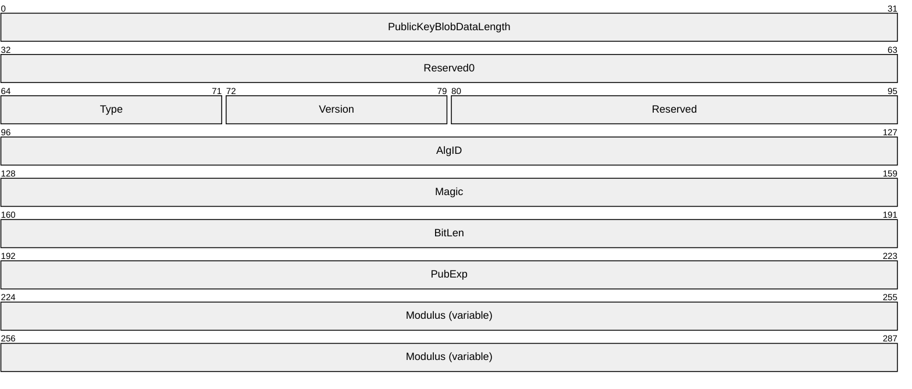
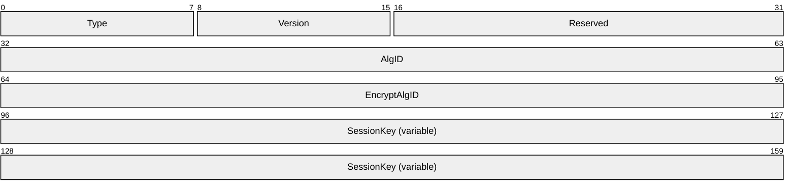
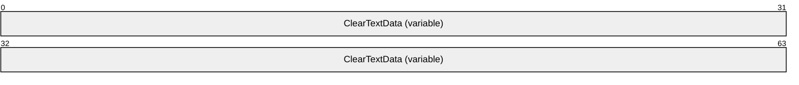
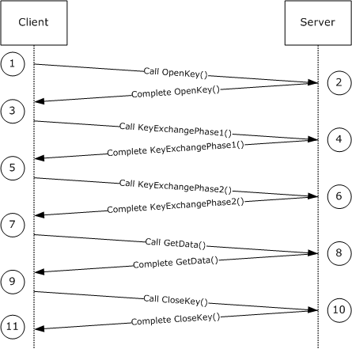

# [MS-IMSA]: Internet Information Services (IIS) IMSAdminBaseW Remote Protocol

Table of Contents

1 Introduction

- [1 Introduction](#Section_1)
  - [1.1 Glossary](#Section_1.1)
  - [1.2 References](#Section_1.2)
    - [1.2.1 Normative References](#Section_1.2.1)
    - [1.2.2 Informative References](#Section_1.2.2)
  - [1.3 Overview](#Section_1.3)
  - [1.4 Relationship to Other Protocols](#Section_1.4)
  - [1.5 Prerequisites/Preconditions](#Section_1.5)
  - [1.6 Applicability Statement](#Section_1.6)
  - [1.7 Versioning and Capability Negotiation](#Section_1.7)
  - [1.8 Vendor-Extensible Fields](#Section_1.8)
  - [1.9 Standards Assignments](#Section_1.9)

2 Messages

- [2 Messages](#Section_2)
  - [2.1 Transport](#Section_2.1)
  - [2.2 Common Data Types](#Section_2.2)
    - [2.2.1 ADMINDATA_MAX_NAME_LEN](#Section_2.2.1)
    - [2.2.2 IIS_CRYPTO_BLOB](#Section_2.2.2)
      - [2.2.2.1 PUBLIC_KEY_BLOB](#Section_2.2.2.1)
      - [2.2.2.2 SESSION_KEY_BLOB](#Section_2.2.2.2)
        - [2.2.2.2.1 ENCRYPTED_SESSION_KEY_ BLOB](#Section_2.2.2.2.1)
      - [2.2.2.3 HASH_BLOB](#Section_2.2.2.3)
      - [2.2.2.4 CLEARTEXT_DATA_BLOB](#Section_2.2.2.4)
      - [2.2.2.5 ENCRYPTED_DATA_BLOB](#Section_2.2.2.5)
        - [2.2.2.5.1 CLEARTEXT_WITH_PREFIX_BLOB](#Section_2.2.2.5.1)
    - [2.2.3 Secure Session Negotiation Constants](#Section_2.2.3)
    - [2.2.4 METADATA_GETALL_RECORD](#Section_2.2.4)
    - [2.2.5 METADATA_HANDLE](#Section_2.2.5)
    - [2.2.6 METADATA_HANDLE_INFO](#Section_2.2.6)
    - [2.2.7 METADATA_RECORD](#Section_2.2.7)
    - [2.2.8 METADATA_MASTER_ROOT_HANDLE](#Section_2.2.8)
    - [2.2.9 MD_APP_ROOT](#Section_2.2.9)
    - [2.2.10 MD_APP_ISOLATED](#Section_2.2.10)
    - [2.2.11 MD_APP_APPPOOL_ID](#Section_2.2.11)
    - [2.2.12 MD_BACKUP_MAX_LEN](#Section_2.2.12)

3 Protocol Details

- [3 Protocol Details](#Section_3)
  - [3.1 IMSAdminBaseW Server Details](#Section_3.1)
    - [3.1.1 Abstract Data Model](#Section_3.1.1)
      - [3.1.1.1 Secure Session Context](#Section_3.1.1.1)
    - [3.1.2 Timers](#Section_3.1.2)
    - [3.1.3 Initialization](#Section_3.1.3)
    - [3.1.4 Message Processing Events and Sequencing Rules](#Section_3.1.4)
      - [3.1.4.1 Transferring Sensitive Data](#Section_3.1.4.1)
        - [3.1.4.1.1 Secure Session Negotiation Server Role](#Section_3.1.4.1.1)
        - [3.1.4.1.2 Encrypting Data](#Section_3.1.4.1.2)
        - [3.1.4.1.3 Decrypting Data](#Section_3.1.4.1.3)
        - [3.1.4.1.4 Signed Hash Calculation](#Section_3.1.4.1.4)
        - [3.1.4.1.5 Signed Hash Validation](#Section_3.1.4.1.5)
      - [3.1.4.2 OpenKey (Opnum 17)](#Section_3.1.4.2)
      - [3.1.4.3 CloseKey (Opnum 18)](#Section_3.1.4.3)
      - [3.1.4.4 AddKey (Opnum 3)](#Section_3.1.4.4)
      - [3.1.4.5 CopyKey (Opnum 7)](#Section_3.1.4.5)
      - [3.1.4.6 DeleteKey (Opnum 4)](#Section_3.1.4.6)
      - [3.1.4.7 DeleteChildKeys (Opnum 5)](#Section_3.1.4.7)
      - [3.1.4.8 DeleteData (Opnum 11)](#Section_3.1.4.8)
      - [3.1.4.9 DeleteAllData (Opnum 14)](#Section_3.1.4.9)
      - [3.1.4.10 CopyData (Opnum 15)](#Section_3.1.4.10)
      - [3.1.4.11 EnumKeys (Opnum 6)](#Section_3.1.4.11)
      - [3.1.4.12 R_EnumData (Opnum 12)](#Section_3.1.4.12)
      - [3.1.4.13 Backup (Opnum 28)](#Section_3.1.4.13)
      - [3.1.4.14 EnumBackups (Opnum 30)](#Section_3.1.4.14)
      - [3.1.4.15 DeleteBackup (Opnum 31)](#Section_3.1.4.15)
      - [3.1.4.16 ChangePermissions (Opnum 19)](#Section_3.1.4.16)
      - [3.1.4.17 GetDataPaths (Opnum 16)](#Section_3.1.4.17)
      - [3.1.4.18 GetDataSetNumber (Opnum 23)](#Section_3.1.4.18)
      - [3.1.4.19 GetHandleInfo (Opnum 21)](#Section_3.1.4.19)
      - [3.1.4.20 GetLastChangeTime (Opnum 25)](#Section_3.1.4.20)
      - [3.1.4.21 GetSystemChangeNumber (Opnum 22)](#Section_3.1.4.21)
      - [3.1.4.22 R_GetAllData (Opnum 13)](#Section_3.1.4.22)
      - [3.1.4.23 R_GetData (Opnum 10)](#Section_3.1.4.23)
      - [3.1.4.24 R_GetServerGuid (Opnum 33)](#Section_3.1.4.24)
      - [3.1.4.25 R_KeyExchangePhase1 (Opnum 26)](#Section_3.1.4.25)
      - [3.1.4.26 R_KeyExchangePhase2 (Opnum 27)](#Section_3.1.4.26)
      - [3.1.4.27 R_SetData (Opnum 9)](#Section_3.1.4.27)
      - [3.1.4.28 RenameKey (Opnum 8)](#Section_3.1.4.28)
      - [3.1.4.29 Restore (Opnum 29)](#Section_3.1.4.29)
      - [3.1.4.30 SaveData (Opnum 20)](#Section_3.1.4.30)
      - [3.1.4.31 SetLastChangeTime (Opnum 24)](#Section_3.1.4.31)
      - [3.1.4.32 UnmarshalInterface (Opnum 32)](#Section_3.1.4.32)
    - [3.1.5 Timer Events](#Section_3.1.5)
    - [3.1.6 Other Local Events](#Section_3.1.6)
  - [3.2 IMSAdminBaseW Client Details](#Section_3.2)
    - [3.2.1 Abstract Data Model](#Section_3.2.1)
      - [3.2.1.1 Secure Session Context](#Section_3.2.1.1)
    - [3.2.2 Timers](#Section_3.2.2)
    - [3.2.3 Initialization](#Section_3.2.3)
    - [3.2.4 Message Processing Events and Sequencing Rules](#Section_3.2.4)
      - [3.2.4.1 Secure Session Negotiation Client Role](#Section_3.2.4.1)
      - [3.2.4.2 R_KeyExchangePhase1 (Opnum 26)](#Section_3.2.4.2)
      - [3.2.4.3 R_KeyExchangePhase2 (Opnum 27)](#Section_3.2.4.3)
      - [3.2.4.4 R_SetData (Opnum 9)](#Section_3.2.4.4)
      - [3.2.4.5 R_GetData (Opnum 10)](#Section_3.2.4.5)
      - [3.2.4.6 R_EnumData (Opnum 12)](#Section_3.2.4.6)
      - [3.2.4.7 R_GetAllData (Opnum 13)](#Section_3.2.4.7)
    - [3.2.5 Timer Events](#Section_3.2.5)
    - [3.2.6 Other Local Events](#Section_3.2.6)
  - [3.3 IMSAdminBase2W Server Details](#Section_3.3)
    - [3.3.1 Abstract Data Model](#Section_3.3.1)
    - [3.3.2 Timers](#Section_3.3.2)
    - [3.3.3 Initialization](#Section_3.3.3)
    - [3.3.4 Message Processing Events and Sequencing Rules](#Section_3.3.4)
      - [3.3.4.1 BackupWithPasswd (Opnum 34)](#Section_3.3.4.1)
      - [3.3.4.2 EnumHistory (Opnum 39)](#Section_3.3.4.2)
      - [3.3.4.3 Export (Opnum 36)](#Section_3.3.4.3)
      - [3.3.4.4 Import (Opnum 37)](#Section_3.3.4.4)
      - [3.3.4.5 RestoreHistory (Opnum 38)](#Section_3.3.4.5)
      - [3.3.4.6 RestoreWithPasswd (Opnum 35)](#Section_3.3.4.6)
    - [3.3.5 Timer Events](#Section_3.3.5)
    - [3.3.6 Other Local Events](#Section_3.3.6)
  - [3.4 IMSAdminBase2W Client Details](#Section_3.4)
    - [3.4.1 Abstract Data Model](#Section_3.4.1)
    - [3.4.2 Timers](#Section_3.4.2)
    - [3.4.3 Initialization](#Section_3.4.3)
    - [3.4.4 Message Processing Events and Sequencing Rules](#Section_3.4.4)
    - [3.4.5 Timer Events](#Section_3.4.5)
    - [3.4.6 Other Local Events](#Section_3.4.6)
  - [3.5 IMSAdminBase3W Server Details](#Section_3.5)
    - [3.5.1 Abstract Data Model](#Section_3.5.1)
    - [3.5.2 Timers](#Section_3.5.2)
    - [3.5.3 Initialization](#Section_3.5.3)
    - [3.5.4 Message Processing Events and Sequencing Rules](#Section_3.5.4)
      - [3.5.4.1 GetChildPaths (Opnum 40)](#Section_3.5.4.1)
    - [3.5.5 Timer Events](#Section_3.5.5)
    - [3.5.6 Other Local Events](#Section_3.5.6)
  - [3.6 IMSAdminBase3W Client Details](#Section_3.6)
    - [3.6.1 Abstract Data Model](#Section_3.6.1)
    - [3.6.2 Timers](#Section_3.6.2)
    - [3.6.3 Initialization](#Section_3.6.3)
    - [3.6.4 Message Processing Events and Sequencing Rules](#Section_3.6.4)
    - [3.6.5 Timer Events](#Section_3.6.5)
    - [3.6.6 Other Local Events](#Section_3.6.6)
  - [3.7 IWamAdmin Server Details](#Section_3.7)
    - [3.7.1 Abstract Data Model](#Section_3.7.1)
    - [3.7.2 Timers](#Section_3.7.2)
    - [3.7.3 Initialization](#Section_3.7.3)
    - [3.7.4 Message Processing Events and Sequencing Rules](#Section_3.7.4)
      - [3.7.4.1 AppCreate (Opnum 3)](#Section_3.7.4.1)
      - [3.7.4.2 AppDelete (Opnum 4)](#Section_3.7.4.2)
      - [3.7.4.3 AppUnLoad (Opnum 5)](#Section_3.7.4.3)
      - [3.7.4.4 AppGetStatus (Opnum 6)](#Section_3.7.4.4)
      - [3.7.4.5 AppDeleteRecoverable (Opnum 7)](#Section_3.7.4.5)
      - [3.7.4.6 AppRecover (Opnum 8)](#Section_3.7.4.6)
    - [3.7.5 Timer Events](#Section_3.7.5)
    - [3.7.6 Other Local Events](#Section_3.7.6)
  - [3.8 IWamAdmin2 Server Details](#Section_3.8)
    - [3.8.1 Abstract Data Model](#Section_3.8.1)
    - [3.8.2 Timers](#Section_3.8.2)
    - [3.8.3 Initialization](#Section_3.8.3)
    - [3.8.4 Message Processing Events and Sequencing Rules](#Section_3.8.4)
      - [3.8.4.1 AppCreate2 (Opnum 9)](#Section_3.8.4.1)
    - [3.8.5 Timer Events](#Section_3.8.5)
    - [3.8.6 Other Local Events](#Section_3.8.6)
  - [3.9 IIISApplicationAdmin Server Details](#Section_3.9)
    - [3.9.1 Abstract Data Model](#Section_3.9.1)
    - [3.9.2 Timers](#Section_3.9.2)
    - [3.9.3 Initialization](#Section_3.9.3)
    - [3.9.4 Message Processing Events and Sequencing Rules](#Section_3.9.4)
      - [3.9.4.1 CreateApplication (Opnum 3)](#Section_3.9.4.1)
      - [3.9.4.2 DeleteApplication (Opnum 4)](#Section_3.9.4.2)
      - [3.9.4.3 CreateApplicationPool (Opnum 5)](#Section_3.9.4.3)
      - [3.9.4.4 DeleteApplicationPool (Opnum 6)](#Section_3.9.4.4)
      - [3.9.4.5 EnumerateApplicationsInPool (Opnum 7)](#Section_3.9.4.5)
      - [3.9.4.6 RecycleApplicationPool (Opnum 8)](#Section_3.9.4.6)
      - [3.9.4.7 GetProcessMode (Opnum 9)](#Section_3.9.4.7)
    - [3.9.5 Timer Events](#Section_3.9.5)
    - [3.9.6 Other Local Events](#Section_3.9.6)
  - [3.10 IIISCertObj Server Details](#Section_3.10)
    - [3.10.1 Abstract Data Model](#Section_3.10.1)
    - [3.10.2 Timers](#Section_3.10.2)
    - [3.10.3 Initialization](#Section_3.10.3)
    - [3.10.4 Message Processing Events and Sequencing Rules](#Section_3.10.4)
      - [3.10.4.1 InstanceName (Set) (Opnum 10)](#Section_3.10.4.1)
      - [3.10.4.2 IsInstalledRemote (Opnum 12)](#Section_3.10.4.2)
      - [3.10.4.3 IsExportableRemote (Opnum 14)](#Section_3.10.4.3)
      - [3.10.4.4 GetCertInfoRemote (Opnum 16)](#Section_3.10.4.4)
      - [3.10.4.5 ImportFromBlob (Opnum 22)](#Section_3.10.4.5)
      - [3.10.4.6 ImportFromBlobGetHash (Opnum 23)](#Section_3.10.4.6)
      - [3.10.4.7 ExportToBlob (Opnum 25)](#Section_3.10.4.7)
    - [3.10.5 Timer Events](#Section_3.10.5)
    - [3.10.6 Other Local Events](#Section_3.10.6)
  - [3.11 IIISCertObj Client Details](#Section_3.11)
    - [3.11.1 Abstract Data Model](#Section_3.11.1)
    - [3.11.2 Timers](#Section_3.11.2)
    - [3.11.3 Initialization](#Section_3.11.3)
    - [3.11.4 Message Processing Events and Sequencing Rules](#Section_3.11.4)
      - [3.11.4.1 InstanceName (Set) (Opnum 10)](#Section_3.11.4.1)
    - [3.11.5 Timer Events](#Section_3.11.5)
    - [3.11.6 Other Local Events](#Section_3.11.6)

4 Protocol Examples

- [4 Protocol Examples](#Section_4)
  - [4.1 General Hookup Example](#Section_4.1)
  - [4.2 BackupWithPasswd Call Example](#Section_4.2)
  - [4.3 EnumHistory Call Example](#Section_4.3)
  - [4.4 Export Call Example](#Section_4.4)
  - [4.5 Import Call Example](#Section_4.5)
  - [4.6 RestoreHistory Call Example](#Section_4.6)
  - [4.7 RestoreWithPasswd Call Example](#Section_4.7)
  - [4.8 GetChildPaths Call Example](#Section_4.8)
  - [4.9 Reading Sensitive Data from the Server](#Section_4.9)

5 Security

- [5 Security](#Section_5)
  - [5.1 Security Considerations for Implementers](#Section_5.1)
  - [5.2 Index of Security Parameters](#Section_5.2)

6 Appendix A: Full IDL

- [6 Appendix A: Full IDL](#Section_6)

7 Appendix B: Product Behavior

- [7 Appendix B: Product Behavior](#Section_7)

8 Change Tracking

- [8 Change Tracking](#Section_8)

For the legal notice and IP terms, see [LEGAL.md](../LEGAL.md).
Last updated: 4/23/2024.
See [Revision History](#revision-history) for full version history.

# 1 Introduction

The Internet Information Services (IIS) IMSAdminBaseW Remote Protocol defines interfaces that provide Unicode-compliant methods for remotely accessing and administering the IIS [**metabase**](#gt_metabase) associated with an application that manages IIS configuration, such as the IIS snap-in for [**Microsoft Management Console (MMC)**](#gt_microsoft-management-console-mmc).

Sections 1.5, 1.8, 1.9, 2, and 3 of this specification are normative. All other sections and examples in this specification are informative.

## 1.1 Glossary

This document uses the following terms:

**application pool**: A collection of one or more processes hosting zero or more [**web applications**](#gt_web-application).

**base64 encoding**: A binary-to-text encoding scheme whereby an arbitrary sequence of bytes is converted to a sequence of printable ASCII characters, as described in [[RFC4648]](https://go.microsoft.com/fwlink/?LinkId=90487).

**certificate**: A certificate is a collection of attributes and extensions that can be stored persistently. The set of attributes in a certificate can vary depending on the intended usage of the certificate. A certificate securely binds a public key to the entity that holds the corresponding private key. A certificate is commonly used for authentication and secure exchange of information on open networks, such as the Internet, extranets, and intranets. Certificates are digitally signed by the issuing certification authority (CA) and can be issued for a user, a computer, or a service. The most widely accepted format for certificates is defined by the ITU-T X.509 version 3 international standards. For more information about attributes and extensions, see [[RFC3280]](https://go.microsoft.com/fwlink/?LinkId=90414) and [[X509]](https://go.microsoft.com/fwlink/?LinkId=90590) sections 7 and 8.

**certificate chain**: A sequence of [**certificates**](#gt_certificate), where each certificate in the sequence is signed by the subsequent certificate. The last certificate in the chain is normally a self-signed certificate.

**certificate store**: A database of [**certificates**](#gt_certificate), or [**certificates**](#gt_certificate) and the accompanying [**private key**](#gt_private-key). Used to store a variety of [**certificates**](#gt_certificate) with different attributes or constraints.

**class identifier (CLSID)**: A [**GUID**](#gt_globally-unique-identifier-guid) that identifies a software component; for instance, a DCOM object class or a COM class.

**cleartext**: In cryptography, [**cleartext**](#gt_cleartext) is the form of a message (or data) that is transferred or stored without cryptographic protection.

**decryption**: In cryptography, the process of transforming encrypted information to its original clear text form.

**Distributed Component Object Model (DCOM)**: The Microsoft Component Object Model (COM) specification that defines how components communicate over networks, as specified in [MS-DCOM](../MS-DCOM/MS-DCOM.md).

**dynamic endpoint**: A network-specific server address that is requested and assigned at run time. For more information, see [[C706]](https://go.microsoft.com/fwlink/?LinkId=89824).

**encryption**: In cryptography, the process of obscuring information to make it unreadable without special knowledge.

**endpoint**: A network-specific address of a remote procedure call (RPC) server process for remote procedure calls. The actual name and type of the endpoint depends on the [**RPC**](#gt_remote-procedure-call-rpc) protocol sequence that is being used. For example, for RPC over TCP (RPC Protocol Sequence ncacn_ip_tcp), an endpoint might be TCP port 1025. For RPC over Server Message Block (RPC Protocol Sequence ncacn_np), an endpoint might be the name of a named pipe. For more information, see [C706].

**globally unique identifier (GUID)**: A term used interchangeably with [**universally unique identifier (UUID)**](#gt_universally-unique-identifier-uuid) in Microsoft protocol technical documents (TDs). Interchanging the usage of these terms does not imply or require a specific algorithm or mechanism to generate the value. Specifically, the use of this term does not imply or require that the algorithms described in [[RFC4122]](https://go.microsoft.com/fwlink/?LinkId=90460) or [C706] must be used for generating the [**GUID**](#gt_globally-unique-identifier-guid). See also [**universally unique identifier (UUID)**](#gt_universally-unique-identifier-uuid).

**Interface Definition Language (IDL)**: The International Standards Organization (ISO) standard language for specifying the interface for remote procedure calls. For more information, see [C706] section 4.

**Internet Information Services (IIS)**: The services provided in Windows implementation that support web server functionality. [**IIS**](#gt_internet-information-services-iis) consists of a collection of standard Internet protocol servers such as HTTP and FTP in addition to common infrastructures that are used by other Microsoft Internet protocol servers such as SMTP, NNTP, and so on. [**IIS**](#gt_internet-information-services-iis) has been part of the Windows operating system in some versions and a separate install package in others. [**IIS**](#gt_internet-information-services-iis) version 5.0 shipped as part of Windows 2000 operating system, [**IIS**](#gt_internet-information-services-iis) version 5.1 as part of Windows XP operating system, [**IIS**](#gt_internet-information-services-iis) version 6.0 as part of Windows Server 2003 operating system, and [**IIS**](#gt_internet-information-services-iis) version 7.0 as part of Windows Vista operating system and Windows Server 2008 operating system.

**Internet protocol server instance (server instance)**: A configuration collection for an Internet protocol server that will establish its own network protocol [**endpoint**](#gt_endpoint). A single Internet protocol server may configure multiple server instances that would each appear to clients as an independent host (also referred to as a site).

**key exchange key pair**: A public/private key pair used to encrypt [**session keys**](#gt_session-key) so that they can be safely stored and exchanged with other users.

**key exchange private key**: The [**private key**](#gt_private-key) of the [**key exchange key pair**](#gt_key-exchange-key-pair).

**key exchange public key**: The [**public key**](#gt_public-key) of a [**key exchange key pair**](#gt_key-exchange-key-pair).

**man in the middle (MITM)**: An attack that deceives a server or client into accepting an unauthorized upstream host as the actual legitimate host. Instead, the upstream host is an attacker's host that is manipulating the network so that the attacker's host appears to be the desired destination. This enables the attacker to decrypt and access all network traffic that would go to the legitimate host. The attacker is able to read, insert, and modify at-will messages between two hosts without either party knowing that the link between them is compromised.

**MD5 hash**: A hashing algorithm, as described in [[RFC1321]](https://go.microsoft.com/fwlink/?LinkId=90275), that was developed by RSA Data Security, Inc. An MD5 hash is used by the File Replication Service (FRS) to verify that a file on each replica member is identical.

**metabase**: The name of the configuration storage implemented by Microsoft [**Internet Information Services (IIS)**](#gt_internet-information-services-iis).

**Microsoft Management Console (MMC)**: Provides a framework that consists of a graphical user interface (GUI) and a programming platform in which snap-ins (collections of administrative tools) can be created, opened, and saved. MMC is a multiple-document interface (MDI) application.

**Network Data Representation (NDR)**: A specification that defines a mapping from [**Interface Definition Language (IDL)**](#gt_interface-definition-language-idl) data types onto octet streams. [**NDR**](#gt_network-data-representation-ndr) also refers to the runtime environment that implements the mapping facilities (for example, data provided to [**NDR**](#gt_network-data-representation-ndr)). For more information, see [MS-RPCE](../MS-RPCE/MS-RPCE.md) and [C706] section 14.

**object**: In the [**DCOM**](#gt_distributed-component-object-model-dcom) protocol, a software entity that implements one or more object remote protocol (ORPC) interfaces and which is uniquely identified, within the scope of an object exporter, by an object identifier (OID). For more information, see [MS-DCOM].

**object identifier (OID)**: In the context of a directory service, a number identifying an object class or attribute. Object identifiers are issued by the ITU and form a hierarchy. An OID is represented as a dotted decimal string (for example, "1.2.3.4"). For more information on OIDs, see [[X660]](https://go.microsoft.com/fwlink/?LinkId=90592) and [RFC3280] Appendix A. OIDs are used to uniquely identify certificate templates available to the certification authority (CA). Within a [**certificate**](#gt_certificate), OIDs are used to identify standard extensions, as described in [RFC3280] section 4.2.1.x, as well as non-standard extensions.

**opnum**: An operation number or numeric identifier that is used to identify a specific [**remote procedure call (RPC)**](#gt_remote-procedure-call-rpc) method or a method in an interface. For more information, see [C706] section 12.5.2.12 or [MS-RPCE].

**private key**: One of a pair of keys used in public-key cryptography. The private key is kept secret and is used to decrypt data that has been encrypted with the corresponding public key. For an introduction to this concept, see [[CRYPTO]](https://go.microsoft.com/fwlink/?LinkId=89841) section 1.8 and [[IEEE1363]](https://go.microsoft.com/fwlink/?LinkId=89899) section 3.1.

**public key**: One of a pair of keys used in public-key cryptography. The public key is distributed freely and published as part of a digital certificate. For an introduction to this concept, see [CRYPTO] section 1.8 and [IEEE1363] section 3.1.

**RC4**: A variable key-length symmetric encryption algorithm. For more information, see [[SCHNEIER]](https://go.microsoft.com/fwlink/?LinkId=817338) section 17.1.

**relative distinguished name (RDN)**: As specified in [[X500]](https://go.microsoft.com/fwlink/?LinkId=90589), the portion of a distinguished name that is unique to an organization unit but might not be unique inside a domain.

**remote procedure call (RPC)**: A communication protocol used primarily between client and server. The term has three definitions that are often used interchangeably: a runtime environment providing for communication facilities between computers (the RPC runtime); a set of request-and-response message exchanges between computers (the RPC exchange); and the single message from an RPC exchange (the RPC message). For more information, see [C706].

**Rivest-Shamir-Adleman (RSA)**: A system for public key cryptography. [**RSA**](#gt_rivest-shamir-adleman-rsa) is specified in [[RFC8017]](https://go.microsoft.com/fwlink/?linkid=2164409).

**RPC protocol sequence**: A character string that represents a valid combination of a [**remote procedure call (RPC)**](#gt_remote-procedure-call-rpc) protocol, a network layer protocol, and a transport layer protocol, as described in [C706] and [MS-RPCE].

**RSA public key algorithm**: A key exchange and signature algorithm based on the popular [**RSA**](#gt_rivest-shamir-adleman-rsa) [**Public Key**](#gt_public-key) cipher.

**secure session**: An active communication channel that has associated cryptographic keys and possibly other state.

**Secure Sockets Layer (SSL)**: A security protocol that supports confidentiality and integrity of messages in client and server applications that communicate over open networks. SSL supports server and, optionally, client authentication using X.509 certificates [X509] and [[RFC5280]](https://go.microsoft.com/fwlink/?LinkId=131034). SSL is superseded by Transport Layer Security (TLS). TLS version 1.0 is based on SSL version 3.0 [[SSL3]](https://go.microsoft.com/fwlink/?LinkId=90534).

**server**: A computer on which the [**remote procedure call (RPC)**](#gt_remote-procedure-call-rpc) server is executing.

**session key**: A relatively short-lived symmetric key (a cryptographic key negotiated by the client and the server based on a shared secret). A [**session key's**](#gt_session-key) lifespan is bounded by the session to which it is associated. A [**session key**](#gt_session-key) has to be strong enough to withstand cryptanalysis for the lifespan of the session.

**signature private key**: The [**private key**](#gt_private-key) of a signature key pair.

**signature public key**: The [**public key**](#gt_public-key) of a signature key pair.

**signed hash**: A hash signed with a [**signature private key**](#gt_signature-private-key).

**Unicode**: A character encoding standard developed by the Unicode Consortium that represents almost all of the written languages of the world. The [**Unicode**](#gt_unicode) standard [[UNICODE5.0.0/2007]](https://go.microsoft.com/fwlink/?LinkId=154659) provides three forms (UTF-8, UTF-16, and UTF-32) and seven schemes (UTF-8, UTF-16, UTF-16 BE, UTF-16 LE, UTF-32, UTF-32 LE, and UTF-32 BE).

**universally unique identifier (UUID)**: A 128-bit value. UUIDs can be used for multiple purposes, from tagging objects with an extremely short lifetime, to reliably identifying very persistent objects in cross-process communication such as client and server interfaces, manager entry-point vectors, and [**RPC**](#gt_remote-procedure-call-rpc) objects. UUIDs are highly likely to be unique. UUIDs are also known as [**globally unique identifiers (GUIDs)**](#gt_globally-unique-identifier-guid) and these terms are used interchangeably in the Microsoft protocol technical documents (TDs). Interchanging the usage of these terms does not imply or require a specific algorithm or mechanism to generate the UUID. Specifically, the use of this term does not imply or require that the algorithms described in [RFC4122] or [C706] must be used for generating the UUID.

**web application**: A collection of URLs that share a server execution environment. This collection is defined relative to a root URL. A [**web application**](#gt_web-application) runs in response to HTTP requests for the URLs in the collection. The process or processes that run in response to such an HTTP request are termed the application host.

**well-known endpoint**: A preassigned, network-specific, stable address for a particular client/server instance. For more information, see [C706].

**MAY, SHOULD, MUST, SHOULD NOT, MUST NOT:** These terms (in all caps) are used as defined in [[RFC2119]](https://go.microsoft.com/fwlink/?LinkId=90317). All statements of optional behavior use either MAY, SHOULD, or SHOULD NOT.

## 1.2 References

Links to a document in the Microsoft Open Specifications library point to the correct section in the most recently published version of the referenced document. However, because individual documents in the library are not updated at the same time, the section numbers in the documents may not match. You can confirm the correct section numbering by checking the [Errata](https://go.microsoft.com/fwlink/?linkid=850906).

### 1.2.1 Normative References

We conduct frequent surveys of the normative references to assure their continued availability. If you have any issue with finding a normative reference, please contact [dochelp@microsoft.com](mailto:dochelp@microsoft.com). We will assist you in finding the relevant information.

[C706] The Open Group, "DCE 1.1: Remote Procedure Call", C706, August 1997, [https://publications.opengroup.org/c706](https://go.microsoft.com/fwlink/?LinkId=89824)

**Note** Registration is required to download the document.

[MS-DCOM] Microsoft Corporation, "[Distributed Component Object Model (DCOM) Remote Protocol](../MS-DCOM/MS-DCOM.md)".

[MS-DTYP] Microsoft Corporation, "[Windows Data Types](../MS-DTYP/MS-DTYP.md)".

[MS-ERREF] Microsoft Corporation, "[Windows Error Codes](../MS-ERREF/MS-ERREF.md)".

[MS-OAUT] Microsoft Corporation, "[OLE Automation Protocol](../MS-OAUT/MS-OAUT.md)".

[MS-RPCE] Microsoft Corporation, "[Remote Procedure Call Protocol Extensions](../MS-RPCE/MS-RPCE.md)".

[RFC2119] Bradner, S., "Key words for use in RFCs to Indicate Requirement Levels", BCP 14, RFC 2119, March 1997, [https://www.rfc-editor.org/info/rfc2119](https://go.microsoft.com/fwlink/?LinkId=90317)

[RFC3280] Housley, R., Polk, W., Ford, W., and Solo, D., "Internet X.509 Public Key Infrastructure Certificate and Certificate Revocation List (CRL) Profile", RFC 3280, April 2002, [http://www.rfc-editor.org/info/rfc3280](https://go.microsoft.com/fwlink/?LinkId=90414)

[RFC8017] Moriarty, K., Ed., Kaliski, B., Jonsson, J., and Rusch, A., "PKCS #1: RSA Cryptography Specifications Version 2.2", November 2016, [https://www.rfc-editor.org/info/rfc8017](https://go.microsoft.com/fwlink/?linkid=2164409)

### 1.2.2 Informative References

[MSDN-CoInitialize] Microsoft Corporation, "CoInitialize function", [http://msdn.microsoft.com/en-us/library/ms678543.aspx](https://go.microsoft.com/fwlink/?LinkId=93395)

[SCHNEIER] Schneier, B., "Applied Cryptography, Second Edition", John Wiley and Sons, 1996, ISBN: 0471117099, [http://www.wiley.com/WileyCDA/WileyTitle/productCd-0471117099.html](https://go.microsoft.com/fwlink/?LinkId=817338)

## 1.3 Overview

The [**Internet Information Services (IIS)**](#gt_internet-information-services-iis) IMSAdminBaseW Remote Protocol is a client/server protocol that is used for remotely managing a hierarchical configuration data store ([**metabase**](#gt_metabase)). The layout and specifics of such a store are specified in section [3.1.1](#Section_3.1.1).

The Internet Information Services (IIS) IMSAdminBaseW Remote Protocol also provides DCOM interfaces to manage server entities, such as [**web applications**](#gt_web-application) and [**public key**](#gt_public-key) certificates, which can be defined or referenced in the metabase data store.

A remote metabase management session begins with the client initiating the connection request to the server. If the server grants the request, the connection is established. The client can then make multiple requests to read or modify the metabase on the server by using the same session until the session is terminated.

A typical remote metabase management session involves the client connecting to the server and requesting to open a metabase node on the server. If the server accepts the request, it responds with an [**RPC**](#gt_remote-procedure-call-rpc) context handle that refers to the node. The client uses this RPC context handle to operate on that node. This involves sending another request to the server specifying the type of operation to perform and any specific parameters that are associated with that operation. If the server accepts this request, it attempts to change the state of the node based on the request and responds to the client with the result of the operation. When the client is finished operating on the server nodes, it terminates the protocol by sending a request to close the RPC context handle.

## 1.4 Relationship to Other Protocols

The IIS IMSAdminBaseW Remote Protocol relies on the remote protocol described in [MS-DCOM](../MS-DCOM/MS-DCOM.md), which uses [**RPC**](#gt_remote-procedure-call-rpc) as a transport.

No other [**IIS**](#gt_internet-information-services-iis) protocols rely on this protocol.

## 1.5 Prerequisites/Preconditions

This protocol is implemented over DCOM and [**RPC**](#gt_remote-procedure-call-rpc) and, as a result, has the prerequisites identified in [MS-DCOM](../MS-DCOM/MS-DCOM.md) and [MS-RPCE](../MS-RPCE/MS-RPCE.md) as being common to DCOM and RPC interfaces.

The IIS IMSAdminBaseW Remote Protocol assumes that a client has obtained the name of a server that supports this protocol suite before the protocol is invoked.

## 1.6 Applicability Statement

This protocol is applicable when an application needs to remotely configure an IIS server.

## 1.7 Versioning and Capability Negotiation

This document covers versioning issues in the following areas:

**Supported Transports:** The IIS IMSAdminBaseW Remote Protocol uses the remote protocol described in [MS-DCOM](../MS-DCOM/MS-DCOM.md) and multiple [**RPC protocol sequences**](#gt_rpc-protocol-sequence), as specified in section [2.1](#Section_2.1).

**Protocol Versions:** This protocol has multiple interfaces, as specified in section [3](#Section_3).

**Security and Authentication Methods:** Authentication and security are provided as specified in [MS-DCOM] and [MS-RPCE](../MS-RPCE/MS-RPCE.md).

**Capability Negotiation:** The IIS IMSAdminBaseW Remote Protocol does not support negotiation of the interface version to use. Instead, this protocol uses only the interface version number specified in the [**IDL**](#gt_interface-definition-language-idl) for versioning and capability negotiation.

## 1.8 Vendor-Extensible Fields

The IIS IMSAdminBaseW Remote Protocol does not have any vendor-extensible fields.

## 1.9 Standards Assignments

The following parameters are private Microsoft assignments.

| Parameter | Value | Reference |
| --- | --- | --- |
| DCOM [**CLSID**](#gt_class-identifier-clsid) for the IIS IMSAdminBaseW Remote Protocol (CLSID_MSAdminBase_W) | A9E69610-B80D-11D0-B9B9-00A0C922E750 | None |
| DCOM CLSID for the IIS IMSAdminBaseW Remote Protocol (CLSID_WamAdmin) | 61738644-F196-11D0-9953-00C04FD919C1 | None |
| DCOM CLSID for the IIS IMSAdminBaseW Remote Protocol (CLSID_IISCertObj) | 62B8CCBE-5A45-4372-8C4A-6A87DD3EDD60 | None |
| [**RPC**](#gt_remote-procedure-call-rpc) Interface [**UUID**](#gt_universally-unique-identifier-uuid) for [IMSAdminBaseW](#Section_3.1) | 70B51430-B6CA-11d0-B9B9-00A0C922E750 | None |
| RPC Interface UUID for [IMSAdminBase2W](#Section_3.3) | 8298d101-f992-43b7-8eca-5052d885b995 | None |
| RPC Interface UUID for [IMSAdminBase3W](#Section_3.5) | f612954d-3b0b-4c56-9563-227b7be624b4 | None |
| RPC Interface UUID for [IWamAdmin](#Section_3.7) | 29822AB7-F302-11D0-9953-00C04FD919C1 | None |
| RPC Interface UUID for [IWamAdmin2](#Section_3.8) | 29822AB8-F302-11D0-9953-00C04FD919C1 | None |
| RPC Interface UUID for [IIISApplicationAdmin](#Section_3.9) | 7C4E1804-E342-483D-A43E-A850CFCC8D18 | None |
| RPC Interface UUID for [IIISCertObj](#Section_3.10) | BD0C73BC-805B-4043-9C30-9A28D64DD7D2 | None |

# 2 Messages

## 2.1 Transport

This protocol MUST use the remote protocol specified in [MS-DCOM](../MS-DCOM/MS-DCOM.md) as its transport. On its behalf, the remote protocol uses the following [**RPC protocol sequence**](#gt_rpc-protocol-sequence): [**RPC**](#gt_remote-procedure-call-rpc) over TCP, as specified in [MS-RPCE](../MS-RPCE/MS-RPCE.md). This protocol uses RPC [**dynamic endpoints**](#gt_dynamic-endpoint), as specified in [[C706]](https://go.microsoft.com/fwlink/?LinkId=89824) section 4.

This protocol MUST use the following [**UUIDs**](#gt_universally-unique-identifier-uuid):

[IMSAdminBaseW](#Section_3.1): 70B51430-B6CA-11D0-B9B9-00A0C922E750

[IMSAdminBase2W](#Section_3.3): 8298D101-F992-43B7-8ECA-5052D885B995

[IMSAdminBase3W](#Section_3.5): F612954D-3B0B-4C56-9563-227B7BE624B4

[IWamAdmin](#Section_3.7):29822AB7-F302-11D0-9953-00C04FD919C1

[IWamAdmin2](#Section_3.8): 29822AB8-F302-11D0-9953-00C04FD919C1

[IIISApplicationAdmin](#Section_3.9): 7C4E1804-E342-483D-A43E-A850CFCC8D18

[IIISCertObj](#Section_3.10): BD0C73BC-805B-4043-9C30-9A28D64DD7D2

To receive incoming remote calls for these interfaces, the server MUST implement a DCOM Object Class with the CLSIDs (specified in section [1.9](#Section_1.9)) CLSID_MSAdminBase_W using the UUID {A9E69610-B80D-11D0-B9B9-00A0C922E750}, CLSID_WamAdmin using the UUID {61738644-F196-11D0-9953-00C04FD919C1}, and CLSID_IISCertObj using the UUID {62B8CCBE-5A45-4372-8C4A-6A87DD3EDD60}.

## 2.2 Common Data Types

In addition to [**RPC**](#gt_remote-procedure-call-rpc) base types and definitions specified in [[C706]](https://go.microsoft.com/fwlink/?LinkId=89824), [MS-DTYP](../MS-DTYP/MS-DTYP.md), and [MS-OAUT](../MS-OAUT/MS-OAUT.md), additional data types are defined as follows.

All multiple-byte integer values in the messages declared in this section are stored using little-endian byte order.

### 2.2.1 ADMINDATA_MAX_NAME_LEN

The ADMINDATA_MAX_NAME_LEN constant is used to define maximum buffer size, such as the buffer that holds [**metabase**](#gt_metabase) subnodes or the buffer that contains the path to history files. The definition of ADMINDATA_MAX_NAME_LEN follows.

#define ADMINDATA_MAX_NAME_LEN 256

### 2.2.2 IIS_CRYPTO_BLOB

The IIS_CRYPTO_BLOB message defines a block of data, possibly encrypted, that is transferred between client and server. It is used to transfer [**public keys**](#gt_public-key), hash information, and encrypted and cleartext data.

typedef struct _IIS_CRYPTO_BLOB{

DWORD BlobSignature;

DWORD BlobDataLength;

[size_is(BlobDataLength)] unsigned char BlobData[*];

} IIS_CRYPTO_BLOB;

**BlobSignature:** The structure signature for this binary large object (BLOB).

| Value | Meaning |
| --- | --- |
| SESSION_KEY_BLOB_SIGNATURE 0x624b6349 | The **BlobData** member contains the [**session key**](#gt_session-key) used to encrypt sensitive data exchanged between client and server. See [SESSION_KEY_BLOB (section 2.2.2.2)](#Section_2.2.2.2) for more information about the **BlobData** layout. |
| PUBLIC_KEY_BLOB_SIGNATURE 0x62506349 | The **BlobData** member contains the public key for a particular IIS [**encryption**](#gt_encryption) behavior. See [PUBLIC_KEY_BLOB (section 2.2.2.1)](#Section_2.2.2.1) for more information about the **BlobData** layout. |
| ENCRYPTED_DATA_BLOB_SIGNATURE 0x62446349 | The **BlobData** member contains encrypted data. See [ENCRYPTED_DATA_BLOB (section 2.2.2.5)](#Section_2.2.2.5) for more information about the **BlobData** layout. |
| HASH_BLOB_SIGNATURE 0x62486349 | The **BlobData** member contains a hash. See [HASH_BLOB (section 2.2.2.3)](#Section_2.2.2.3) for more information about the **BlobData** layout. |
| CLEARTEXT_DATA_BLOB_SIGNATURE 0x62436349 | The **BlobData** member contains cleartext data. See [CLEARTEXT DATA_BLOB (section 2.2.2.4)](#Section_2.2.2.4) for more information about the **BlobData** layout. |

**BlobDataLength:** The size, in bytes, of **BlobData**.

**BlobData:** A block of bytes that can be interpreted based on **BlobSignature**.

#### 2.2.2.1 PUBLIC_KEY_BLOB

The PUBLIC_KEY_BLOB message is used to store information about [**RSA**](#gt_rivest-shamir-adleman-rsa) [**key exchange public keys**](#gt_key-exchange-public-key) and RSA [**signature public keys**](#gt_signature-public-key). It is used during [**secure session**](#gt_secure-session) negotiation.

The syntax of the PUBLIC_KEY_BLOB message is represented by the following diagram.

**PublicKeyBlobDataLength (4 bytes):** A 32-bit unsigned integer. This field contains the total length of the PUBLIC_KEY_BLOB instance excluding the PublicKeyBlobDataLength and Reserved0 fields.

**Reserved0 (4 bytes):** A 32-bit unsigned integer. This field MUST be set to 0x0.

**Type (1 byte):** An 8-bit unsigned integer. This field MUST be set to 0x6. This indicates that the [**public key**](#gt_public-key) is transferred.

**Version (1 byte):** An 8-bit unsigned integer. This field MUST be set to 0x2.

**Reserved (2 bytes):** A 16-bit unsigned integer. This field MUST be set to 0x0.

**AlgID (4 bytes):** A 32-bit unsigned integer. This field is set to the CALG_RSA_KEYX value if the key exchange public key is stored in the BLOB or the CALG_RSA_SIGN value if the signature public key is stored.

| Value | Meaning |
| --- | --- |
| CALG_RSA_KEYX 0x0000A400 | RSA public key exchange algorithm |
| CALG_RSA_SIGN 0x00002400 | RSA public key signature algorithm |

**Magic (4 bytes):** A 32-bit unsigned integer. This field MUST be set to 0x31415352. The value can be interpreted as the ASCII-encoded string "RSA1".

**BitLen (4 bytes):** A 32-bit unsigned integer that specifies the size of the public key in bits. This field MUST be set to 0x200 (512) because the 512 (=0x200) bit RSA key is used.

**PubExp (4 bytes):** A 32-bit unsigned integer that is a public exponent, as specified in [[RFC8017]](https://go.microsoft.com/fwlink/?linkid=2164409).

**Modulus (variable):** A variable-length array of bytes that stores the RSA public key. The size, in bytes, of the **Modulus** field is **BitLen**/8.

#### 2.2.2.2 SESSION_KEY_BLOB

The SESSION_KEY_BLOB is used to store [**session keys**](#gt_session-key) that are transferred during the [**secure session**](#gt_secure-session) negotiation.

**EncryptedSessionKeyLength (4 bytes):** A 32-bit unsigned integer that contains the size, in bytes, of the **EncryptedSessionKey** field.

**SignedHashLength (4 bytes):** A 32-bit unsigned integer that contains the size, in bytes, of the **SignedHash** field.

**EncryptedSessionKey (variable):** A variable-length array of bytes that contains session key information. For more information about the internal organization of data inside this field, see [ENCRYPTED_SESSION_KEY_BLOB (section 2.2.2.2.1)](#Section_2.2.2.2.1).

**Padding (variable):** A variable-length array of bytes that contains zero to seven bytes of padding based on the **SessionKeyDataLength** field. The number of padding bytes is calculated as the difference between an 8-byte aligned **EncryptedSessionKeyLength** field and the actual **EncryptedSessionKeyLength** field.

**SignedHash (variable):** A variable-length array of bytes that contain the [**signed hash**](#gt_signed-hash) of the session key.

##### 2.2.2.2.1 ENCRYPTED_SESSION_KEY_ BLOB

The ENCRYPTED_SESSION_KEY_BLOB message layout is described in the following diagram.

**Type (1 byte):** An 8-bit unsigned integer that specifies that the [**session key**](#gt_session-key) is transferred. This field MUST be set to 0x1.

**Version (1 byte):** An 8-bit unsigned integer value. This field MUST be set to 0x2.

**Reserved (2 bytes):** A 16-bit unsigned integer that MUST be set to 0x0000 and MUST be ignored on receipt.

**AlgID (4 bytes):** A 32-bit unsigned integer. This field MUST be set to the CALG_RC4 value, which MUST be used to indicate that the RC4 stream encryption algorithm will be used for the data [**encryption**](#gt_encryption), as described in [[SCHNEIER]](https://go.microsoft.com/fwlink/?LinkId=817338), section 17.1.

| Value | Meaning |
| --- | --- |
| CALG_RC4 0x00006801 | The RC4 stream encryption algorithm. |

**EncryptAlgID (4 bytes):** An unsigned 32-bit integer that MUST be set to the CALG_RSA_KEYX value, which indicates that the session key was encrypted using the [**RSA public key algorithm**](#gt_rsa-public-key-algorithm).

| Value | Meaning |
| --- | --- |
| CALG_RSA_KEYX 0x0000a400 | The RSA public key algorithm. |

**SessionKey (variable):** A variable-length array of bytes that contains the actual session key of **AlgID** type, which is encrypted by the algorithm specified by **EncryptAlgID**. The size of the **SessionKey** field is always the same as the size of the modulus of the [**public key**](#gt_public-key) used for encryption.

#### 2.2.2.3 HASH_BLOB

The HASH_BLOB message stores the hash that is exchanged during the [**secure session**](#gt_secure-session) negotiation.

**HashDataLength (4 bytes):** A 32-bit unsigned integer that stores the size, in bytes, of the **HashData** field.

**Reserved (4 bytes):** This field MUST be set to 0x00000000 and MUST be ignored on receipt.

**HashData (variable):** A variable-length array that contains the hash.

#### 2.2.2.4 CLEARTEXT_DATA_BLOB

The CLEARTEXT_DATA_BLOB message stores [**cleartext**](#gt_cleartext) data that does not need [**encryption**](#gt_encryption), but uses the [IIS_CRYPTO_BLOB](#Section_2.2.2) message to store the data.

**ClearTextData (variable):** A variable-length array of bytes that contains cleartext data.

#### 2.2.2.5 ENCRYPTED_DATA_BLOB

The ENCRYPTED_DATA_BLOB message stores the encrypted, sensitive data that is transferred between client and server.

**EncryptedDataLength (4 bytes):** A 32-bit unsigned integer that stores the size, in bytes, of the **EncryptedData** field.

**SignedHashLength (4 bytes):** A 32-bit unsigned integer that stores the size, in bytes, of the **SignedHash** field.

**EncryptedData (variable):** A variable-length array of bytes containing encrypted data. The [**cleartext**](#gt_cleartext) data before the [**encryption**](#gt_encryption) is stored in [CLEARTEXT_WITH_PREFIX_BLOB](#Section_2.2.2.5.1) format.

**Padding (variable):** A variable-length array of bytes where the length of the padding is based on the **EncryptedDataLength** field. The number of padding bytes is calculated as the difference between the 8-byte aligned **EncryptedDataLength** field and the actual **EncryptedDataLength** field.

**SignedHash (variable):** A variable-length array of bytes that contains the [**signed hash**](#gt_signed-hash) of the **EncryptedData** field.

##### 2.2.2.5.1 CLEARTEXT_WITH_PREFIX_BLOB

The CLEARTEXT_WITH_PREFIX_BLOB message is used to store [**cleartext**](#gt_cleartext) data before it is encrypted and serialized into the **BlobData** field of the [IIS_CRYPTO_BLOB](#Section_2.2.2) message with the **BlobSignature** field set to ENCRYPTED_DATA_BLOB_SIGNATURE.

**Reserved (4 bytes):** This field MUST be set to zero and MUST be ignored on receipt.

**ClearTextData (variable):** A variable-length array of bytes that contains cleartext data.

### 2.2.3 Secure Session Negotiation Constants

| Constant/value | Description |
| --- | --- |
| HASH_TEXT_STRING_1 "IIS Key Exchange Phase 3" | The constant string used to calculate the hash sent by the client with the [R_KeyExchangePhase2](#Section_3.2.4.3) call. |
| HASH_TEXT_STRING_2 "IIS Key Exchange Phase 4" | The constant string used to calculate the hash sent by the server in response to the [R_KeyExchangePhase2](#Section_3.2.4.3) call. |

### 2.2.4 METADATA_GETALL_RECORD

The METADATA_GETALL_RECORD structure defines an analogous structure to [METADATA_RECORD](#Section_2.2.7) but is used only to return data from a call to the [R_GetAllData](#Section_3.2.4.7) method. Data retrieval specifications are provided in R_GetAllData method parameters, not in this structure (as is the case with METADATA_RECORD). The R_GetAllData method returns the data from multiple entries as an array of METADATA_GETALL_RECORD structures.

typedef struct _METADATA_GETALL_RECORD{

DWORD dwMDIdentifier;

DWORD dwMDAttributes;

DWORD dwMDUserType;

DWORD dwMDDataType;

DWORD dwMDDataLen;

DWORD dwMDDataOffset;

DWORD dwMDDataTag;

} METADATA_GETALL_RECORD, *PMETADATA_GETALL_RECORD;

**dwMDIdentifier:** An unsigned integer value that uniquely identifies the [**metabase**](#gt_metabase) entry.

**dwMDAttributes:** An unsigned integer value containing bit flags that specify how to set or get data from the metabase. This member MUST be set to a valid combination of the following values.

| Value | Meaning |
| --- | --- |
| METADATA_INHERIT 0x00000001 | In Get methods: Return the inheritable data. In Set methods: The data can be inherited. |
| METADATA_INSERT_PATH 0x00000040 | For a string data item. In Get methods: Replace all occurrences of "<%INSERT_PATH%>" with the path of the data item relative to the handle. In Set methods: Indicate that the string contains the Unicode character substring "<%INSERT_PATH%>". |
| METADATA_ISINHERITED 0x00000020 | In Get methods: Mark the data items that were inherited. In Set methods: Not valid. |
| METADATA_NO_ATTRIBUTES 0x00000000 | In Get methods: Not applicable. Data is returned regardless of this flag setting. In Set methods: The data does not have any attributes. |
| METADATA_PARTIAL_PATH 0x00000002 | In Get methods: Return any inherited data even if the entire path is not present. This flag is valid only if METADATA_INHERIT is also set. In Set methods: Not valid. |
| METADATA_SECURE 0x00000004 | In Get methods: Not valid. In Set methods: The server and client transport and store the data in a secure fashion, as specified in [3.1.4.1.1](#Section_3.1.4.1.1). |
| METADATA_VOLATILE 0x00000010 | In Get methods: Not valid. In Set methods: Do not save the data in long-term storage. |

**dwMDUserType:** An unsigned integer value that specifies the user type of the data. The **dwMDUserType** member MUST be set to one of the following values.

| Value | Meaning |
| --- | --- |
| ASP_MD_UT_APP 0x00000065 | The entry contains information specific to ASP application configuration. |
| IIS_MD_UT_FILE 0x00000002 | The entry contains information about a file, such as access permissions or logon methods. |
| IIS_MD_UT_SERVER 0x00000001 | The entry contains information specific to the server, such as ports in use and IP addresses. |
| IIS_MD_UT_WAM 0x00000064 | The entry contains information specific to [**web application**](#gt_web-application) management. |

**dwMDDataType:** An integer value that identifies the type of data in the metabase entry. The **dwMDDataType** member MUST be set to one of the following values.

| Value | Meaning |
| --- | --- |
| ALL_METADATA 0x00000000 | Specifies all data, regardless of type. |
| BINARY_METADATA 0x00000003 | Specifies binary data in any form. |
| DWORD_METADATA 0x00000001 | Specifies all DWORD (unsigned 32-bit integer) data. |
| EXPANDSZ_METADATA 0x00000004 | Specifies all data that consists of a string that includes the terminating null character, and which contains environment variables that are not expanded. |
| MULTISZ_METADATA 0x00000005 | Specifies all data represented as an array of strings, where each string includes the terminating null character, and the array itself is terminated by two terminating null characters. |
| STRING_METADATA 0x00000002 | Specifies all data consisting of an ASCII string that includes the terminating null character. |

**dwMDDataLen:** An unsigned integer value that specifies the length, in bytes, of the data. If the data is a string, this value includes the ending null character. For lists of strings, this includes an additional terminating null character after the final string (double terminating null characters).

For example, the length of a string list containing two strings would be as follows.

(wcslen(stringA) + 1) * sizeof(WCHAR) + (wcslen(stringB) + 1)

* sizeof(WCHAR) + 1 * sizeof(WCHAR)

In-process clients need to specify **dwMDDataLen** only when setting binary data in the metabase. Remote clients MUST specify **dwMDDataLen** for all data types.

**dwMDDataOffset:** If the data was returned by value, this member contains the byte offset of the data in the buffer specified by the *pbMDBuffer* parameter of the R_GetAllData method. All out-of-process executions will return data by value. The array of records, excluding the data, is returned in the first part of the buffer. The data associated with the records is returned in the buffer after the array of records, and **dwMDDataOffset** is the offset to the beginning of the data associated with each record in the array.

**dwMDDataTag:** A reserved member that is currently unused.

### 2.2.5 METADATA_HANDLE

The METADATA_HANDLE represents a node of the configuration storage tree.

This type is declared as follows:

typedef unsigned long METADATA_HANDLE, *PMETADATA_HANDLE;

### 2.2.6 METADATA_HANDLE_INFO

The METADATA_HANDLE_INFO structure defines information about a handle to a [**metabase**](#gt_metabase) entry.

typedef struct {

DWORD dwMDPermissions;

DWORD dwMDSystemChangeNumber;

} METADATA_HANDLE_INFO;

**dwMDPermissions:** An unsigned integer value containing the permissions with which the handle was opened. This member MUST have a valid combination of the following flags set.

| Value | Meaning |
| --- | --- |
| METADATA_PERMISSION_READ 0x00000001 | The handle can read nodes and data. |
| METADATA_PERMISSION_WRITE 0x00000002 | The handle can write nodes and data. |

**dwMDSystemChangeNumber:** An unsigned integer value containing the system change number when the handle was opened. The system change number is a 32-bit unsigned integer value that is incremented when a change is made to the metabase. See [GetSystemChangeNumber (section 3.1.4.21)](#Section_3.1.4.21) for a specification of the system change number.

### 2.2.7 METADATA_RECORD

The METADATA_RECORD structure defines information about a [**metabase**](#gt_metabase) entry.

typedef struct _METADATA_RECORD {

DWORD dwMDIdentifier;

DWORD dwMDAttributes;

DWORD dwMDUserType;

DWORD dwMDDataType;

DWORD dwMDDataLen;

[unique, size_is(dwMDDataLen)] unsigned char *pbMDData;

DWORD dwMDDataTag;

} METADATA_RECORD;

**dwMDIdentifier:** An unsigned integer value that uniquely identifies the metabase entry.

**dwMDAttributes:** An unsigned integer value containing bit flags that specify how to get or set data from the metabase. This member MUST have a valid combination of the following flags set.

| Value | Meaning |
| --- | --- |
| METADATA_INHERIT 0x00000001 | In Get methods: Returns inheritable data. In Set methods: The data can be inherited. |
| METADATA_INSERT_PATH 0x00000040 | For a string data item. In Get methods: Replaces all occurrences of "<%INSERT_PATH%>" with the path of the data item relative to the handle. In Set methods: Indicate that the string contains the Unicode character substring "<%INSERT_PATH%>". |
| METADATA_ISINHERITED 0x00000020 | In Get methods: Marks data items that were inherited. In Set methods: Not valid. |
| METADATA_NO_ATTRIBUTES 0x00000000 | In Get methods: Not applicable. Data is returned regardless of this flag setting. In Set methods: The data does not have any attributes. |
| METADATA_PARTIAL_PATH 0x00000002 | In Get methods: Returns any inherited data even if the entire path is not present. This flag is valid only if METADATA_INHERIT is also set. In Set methods: Not valid. |
| METADATA_SECURE 0x00000004 | In Get methods: Not valid. In Set methods: Stores and transports the data in a secure fashion, as specified in [3.1.4.1](#Section_3.1.4.1). |
| METADATA_VOLATILE 0x00000010 | In Get methods: Not valid. In Set methods: Does not save the data in long-term storage. |

**dwMDUserType:** An integer value that specifies the user type of the data. The **dwMDUserType** member MUST be set to one of the following values.

| Value | Meaning |
| --- | --- |
| ASP_MD_UT_APP 0x00000065 | The entry contains information specific to ASP application configuration. |
| IIS_MD_UT_FILE 0x00000002 | The entry contains information about a file, such as access permissions or logon methods. |
| IIS_MD_UT_SERVER 0x00000001 | The entry contains information specific to the server, such as ports in use and IP addresses. |
| IIS_MD_UT_WAM 0x00000064 | The entry contains information specific to WAM. |

**dwMDDataType:** An unsigned integer value that identifies the type of data in the metabase entry. The **dwMDDataType** member MUST be set to one of the following values.

| Value | Meaning |
| --- | --- |
| ALL_METADATA 0x00000000 | Specifies all data, regardless of type. |
| BINARY_METADATA 0x00000003 | Specifies binary data. |
| DWORD_METADATA 0x00000001 | Specifies all DWORD (unsigned 32-bit integer) data. |
| EXPANDSZ_METADATA 0x00000004 | Specifies all data that consists of a string that includes the terminating null character and which contains environment variables that are not expanded. |
| MULTISZ_METADATA 0x00000005 | Specifies all data represented as an array of strings, where each string includes the terminating null character, and the array itself is terminated by two terminating null characters. |
| STRING_METADATA 0x00000002 | Specifies all data consisting of an ASCII string that includes the terminating null character. |

**dwMDDataLen:** An unsigned integer value that specifies the length of the data in bytes. If the data is a string, this value includes the terminating null character. For lists of strings, this includes an additional terminating null character after the final string (double terminating null characters).

For example, the length of a string list containing two strings would be as follows.

(wcslen(stringA) + 1) * sizeof(WCHAR) + (wcslen(stringB) + 1)

* sizeof(WCHAR) + 1 * sizeof(WCHAR)

In-process clients need to specify **dwMDDataLen** only when setting binary data in the metabase. Remote clients MUST specify **dwMDDataLen** for all data types.

**pbMDData:** When setting data in the metabase, this member contains a pointer to a buffer that holds the data. When getting data from the metabase, this member contains a pointer to a buffer that will receive the data.

**dwMDDataTag:** A reserved member that is currently unused.

### 2.2.8 METADATA_MASTER_ROOT_HANDLE

This predefined handle points to the root of the configuration storage tree. It is treated as a valid handle for operations that require a [METADATA_HANDLE](#Section_2.2.5) opened with the METADATA_PERMISSION_READ bit flag specified in section [3.1.4.2](#Section_3.1.4.2). It is represented by a null handle and declared in the following way.

#define METADATA_MASTER_ROOT_HANDLE 0

### 2.2.9 MD_APP_ROOT

MD_APP_ROOT is a [**metabase**](#gt_metabase) data object defined by a [METADATA_RECORD](#Section_2.2.7) structure. The following METADATA_RECORD fields define MD_APP_ROOT.

| Bit Range | Field | Description |
| --- | --- | --- |
| Variable | **dwMDIdentifier** | MD_APP_ROOT 0x00000838 |
| Variable | **dwMDAttributes** | METADATA_INHERIT 0x00000001 |
| Variable | **dwUserType** | IIS_MD_UT_WAM 0x00000064 |
| Variable | **dwMDDataType** | STRING_METADATA 0x00000002 |

### 2.2.10 MD_APP_ISOLATED

MD_APP_ISOLATED is a [**metabase**](#gt_metabase) data object defined by a [METADATA_RECORD](#Section_2.2.7) structure. The following METADATA_RECORD fields define MD_APP_ISOLATED.

| Bit Range | Field | Description |
| --- | --- | --- |
| Variable | **dwMDIdentifier** | MD_APP_ISOLATED 0x00000838 |
| Variable | **dwMDAttributes** | METADATA_INHERIT 0x00000001 |
| Variable | **dwUserType** | IIS_MD_UT_WAM 0x00000064 |
| Variable | **dwMDDataType** | DWORD_METADATA 0x00000001 |

### 2.2.11 MD_APP_APPPOOL_ID

MD_APP_APPPOOL_ID is a [**metabase**](#gt_metabase) data object defined by a [METADATA_RECORD](#Section_2.2.7) structure. The following METADATA_RECORD fields define MD_APP_APPPOOL_ID.

| Bit Range | Field | Description |
| --- | --- | --- |
| Variable | **dwMDIdentifier** | MD_APP_APPPOOL_ID 0x0000238D |
| Variable | **dwMDAttributes** | METADATA_INHERIT 0x00000001 |
| Variable | **dwUserType** | IIS_MD_UT_SERVER 0x00000001 |
| Variable | **dwMDDataType** | STRING_METADATA 0x00000002 |

### 2.2.12 MD_BACKUP_MAX_LEN

The MD_BACKUP_MAX_LEN constant is used to define the maximum size of a string that specifies a backup location. This constant is defined as follows.

#define MD_BACKUP_MAX_LEN 100

# 3 Protocol Details

The client side of the [IWamAdmin](#Section_3.7), [IWamAdmin2](#Section_3.8), and [IIISApplicationAdmin](#Section_3.9) interfaces are simply a pass-through. That is, no additional timers or other state is required on the client side of this protocol. Calls made by the higher-layer protocol or application are passed directly to the transport, and the results returned by the transport are passed directly back to the higher-layer protocol or application.

## 3.1 IMSAdminBaseW Server Details

### 3.1.1 Abstract Data Model

The following information must be maintained by the server for use in responding to client queries and commands.

Configuration storage, interfaced by [IMSAdminBaseW](#Section_3.1), is to be implemented as a hierarchical tree-like store of data. Configuration data is accessed through the [**metabase**](#gt_metabase) path, where each node of the path represents branch of the tree, similar to the registry key. The node is identified by a name that is unique between siblings and the metabase path is combined from node names separated by predefined separation characters. Each node could contain any number of data value items (data) identified by numerical IDs, and any number of child nodes.

In addition to the registry-like features, the metabase provides data value items inheritance along the metabase path in such a manner, that data value item defined on the node located closer to the root of the tree could be inherited by lower level nodes. Each data value item carries an attribute that could be used to find, if the data on any particular node is defined on that node, or inherited from the parent node.

Each data on the metabase node has attributes describing the type of data that it contains and type of use for this data. For a complete description of the data structure with all the attributes, see section [2.2.7](#Section_2.2.7).

The metabase root is defined by the predefined handle [METADATA_MASTER_ROOT_HANDLE](#Section_2.2.8). When the metabase is initialized, this handle is opened with read access and stays opened during the entire session. When a caller is getting access to the nodes, which are located lower than root, the access type is passed as a parameter. This access type could be read or write; see section [3.1.4.2](#Section_3.1.4.2). When a caller requests write access, the server locks the metabase subtree starting from the node where access is requested, including the parental nodes and all the child nodes. If at the moment of call the requested part of metabase is already locked by another caller, the requesting call returns Win32 error code ERROR_PATH_BUSY (see [MS-ERREF](../MS-ERREF/MS-ERREF.md) section 2.2). The server keeps the state of the locked subtree until the opened node is explicitly closed. When the caller requests read-only access, the server locks the same portion of the tree from being opened for write access. Multiple calls could open locked nodes for read-only access at the same time. If any caller requests write access to the portion of the tree, which is currently locked for read-only access, then this call will return the Win32 error code ERROR_PATH_BUSY (see [MS-ERREF] section 2.2).

The server must keep the counter of changes that were done to the configuration storage.

The server must keep record of last change time for each node.

#### 3.1.1.1 Secure Session Context

When the client expects to exchange sensitive data marked with the METADATA_SECURE secure flag, it will negotiate [**secure session**](#gt_secure-session). As part of the secure session negotiation, both client and server will build the secure session context.

For each client, the server MUST maintain the following information related to the secure session:

- The server's [**key exchange private**](#gt_key-exchange-private-key) and [**public key**](#gt_public-key).
- The server's [**signature private**](#gt_signature-private-key) and public key.
- The client's [**key exchange public key**](#gt_key-exchange-public-key).
- The client's [**signature public key**](#gt_signature-public-key).
- The server's [**session key**](#gt_session-key).
- The client's session key.

### 3.1.2 Timers

No protocol timers are required beyond those used internally by [**RPC**](#gt_remote-procedure-call-rpc) to implement resiliency to network outages, as specified in [MS-RPCE](../MS-RPCE/MS-RPCE.md) section 3.2.3.2.1.

### 3.1.3 Initialization

The IIS IMSAdminBaseW Remote Protocol server MUST be initialized by registering the [**RPC**](#gt_remote-procedure-call-rpc) interface and listening on the RPC [**well-known endpoint**](#gt_well-known-endpoint), as specified in section [2.1](#Section_2.1). The server MUST then wait for IIS IMSAdminBaseW Remote Protocol clients to establish a connection.

### 3.1.4 Message Processing Events and Sequencing Rules

This DCOM interface inherits the IUnknown interface. Method [**opnum**](#gt_opnum) field values start with 3; opnum values 0 through 2 represent the IUnknown_QueryInterface, IUnknown_AddRef, and IUnknown_Release methods, respectively, as specified in [MS-DCOM](../MS-DCOM/MS-DCOM.md).

Methods with opnum field values 34 through 39 are defined in section [3.3.4](#Section_3.3.4), and field value 40 is defined in section [3.5.4](#Section_3.5.4).

This protocol MUST indicate to the [**RPC**](#gt_remote-procedure-call-rpc) runtime that it is to perform a strict [**Network Data Representation (NDR)**](#gt_network-data-representation-ndr) data consistency check at target level 5.0, as specified in [MS-RPCE](../MS-RPCE/MS-RPCE.md) section 3.

Methods in RPC Opnum Order

| Method | Description |
| --- | --- |
| [AddKey](#Section_3.1.4.4) | Creates a node and adds it to the [**metabase**](#gt_metabase) as a subnode of an existing node at the specified path. Opnum: 3 |
| [DeleteKey](#Section_3.1.4.6) | Deletes a node and all its data from the metabase. All of the node's subnodes are recursively deleted. Opnum: 4 |
| [DeleteChildKeys](#Section_3.1.4.7) | Deletes all subnodes of the specified node and any data they contain. It also recursively deletes all nodes below the subnodes. Opnum: 5 |
| [EnumKeys](#Section_3.1.4.11) | Enumerates the subnodes of the specified node. Opnum: 6 |
| [CopyKey](#Section_3.1.4.5) | Copies or moves a node, including its subnodes and data, to a specified destination. The copied or moved node becomes a subnode of the destination node. Opnum: 7 |
| [RenameKey](#Section_3.1.4.28) | Renames a node in the metabase. Opnum: 8 |
| [R_SetData](#Section_3.2.4.4) | Sets a data item for a particular node in the metabase. Opnum: 9 |
| [R_GetData](#Section_3.2.4.5) | Returns a data entry from a particular node in the metabase. Opnum: 10 |
| [DeleteData](#Section_3.1.4.8) | Deletes specific data entries from a node in the metabase. Opnum: 11 |
| [R_EnumData](#Section_3.2.4.6) | Enumerates the data entries of a node in the metabase. Opnum: 12 |
| [R_GetAllData](#Section_3.2.4.7) | Returns all data associated with a node in the metabase, including all values that the node inherits. Opnum: 13 |
| [DeleteAllData](#Section_3.1.4.9) | Deletes all or a subset of local data associated with a particular node. Opnum: 14 |
| [CopyData](#Section_3.1.4.10) | Copies or moves data between nodes. Opnum: 15 |
| [GetDataPaths](#Section_3.1.4.17) | Returns the paths of all nodes in the subtree relative to a specified starting node that contains the supplied identifier. Opnum: 16 |
| [OpenKey](#Section_3.1.4.2) | Opens a node for read access, write access, or both. The returned handle can be used by several of the other methods in IMSAdminBaseW. Opnum: 17 |
| [CloseKey](#Section_3.1.4.3) | Closes a handle to a node. Opnum: 18 |
| [ChangePermissions](#Section_3.1.4.16) | Changes permissions on an open handle. Opnum: 19 |
| [SaveData](#Section_3.1.4.30) | Explicitly saves the metabase data to disk. Opnum: 20 |
| [GetHandleInfo](#Section_3.1.4.19) | Returns information associated with the specified metabase handle. Opnum: 21 |
| [GetSystemChangeNumber](#Section_3.1.4.21) | Returns the number of changes made to data since the metabase was created. Opnum: 22 |
| [GetDataSetNumber](#Section_3.1.4.18) | Returns all the data set numbers associated with a node in the metabase. Opnum: 23 |
| [SetLastChangeTime](#Section_3.1.4.31) | Sets the last change time associated with a node in the metabase. Opnum: 24 |
| [GetLastChangeTime](#Section_3.1.4.20) | Returns the last change time associated with a node in the metabase. Opnum: 25 |
| [R_KeyExchangePhase1](#Section_3.2.4.2) | Receives a pair of encrypted client nodes and returns server [**encryption**](#gt_encryption) and [**session keys**](#gt_session-key). Opnum: 26 |
| [R_KeyExchangePhase2](#Section_3.2.4.3) | Receives the encrypted client session and hash keys in response to R_KeyExchangePhase1 and returns the encrypted server hash keys. Opnum: 27 |
| [Backup](#Section_3.1.4.13) | Backs up the metabase to a specified location. Opnum: 28 |
| [Restore](#Section_3.1.4.29) | Restores the metabase from a backup. Opnum: 29 |
| [EnumBackups](#Section_3.1.4.14) | Enumerates the metabase backups in a specified backup location, or in all backup locations. Opnum: 30 |
| [DeleteBackup](#Section_3.1.4.15) | Deletes a metabase backup from a backup location. Opnum: 31 |
| [UnmarshalInterface](#Section_3.1.4.32) | Unmarshals a reference to the IMSAdminBaseW interface. Opnum: 32 |
| [R_GetServerGuid](#Section_3.1.4.24) | Returns the [**GUID**](#gt_globally-unique-identifier-guid) for the IIS instance that is running. Opnum: 33 |

Structures

The **Message Processing Events and Sequencing Rules** interface defines the following structures.

| Structure | Description |
| --- | --- |
| [METADATA_HANDLE_INFO](#Section_2.2.6) | Defines information about a handle to a metabase entry. |
| [METADATA_RECORD](#Section_2.2.7) | Defines information about a metabase entry. |
| [METADATA_GETALL_RECORD](#Section_2.2.4) | Defines an analogous structure to METADATA_RECORD but is used only to return data from a call to the R_GetAllData method. |
| [IIS_CRYPTO_BLOB](#Section_2.2.2) | Defines a block of opaque data, possibly encrypted, for RPC marshaling between IIS and a client. |

#### 3.1.4.1 Transferring Sensitive Data

Some of the data that is transferred between client and server is of sensitive nature and needs to be protected. An example of sensitive data is a password. The IIS IMSAdminBaseW Remote Protocol defines a way to protect sensitive data transferred in the [METADATA_RECORD](#Section_2.2.7) or [METADATA_GETALL_RECORD](#Section_2.2.4) structures.

When the client expects transfer of sensitive data, it will initiate negotiation of a [**secure session**](#gt_secure-session). The secure session is negotiated by processing [R_KeyExchangePhase1](#Section_3.2.4.2) and [R_KeyExchangePhase2](#Section_3.2.4.3) calls. The 512-bit [**RSA**](#gt_rivest-shamir-adleman-rsa) key exchange keys are used to exchange 40-bit [**RC4**](#gt_rc4) [**session keys**](#gt_session-key). RC4 session keys (one for the client and one for the server) are used to encrypt data over the wire. An [**MD5 hash**](#gt_md5-hash) signed with 512-bit RSA signature keys is used for message integrity checks.<1>

There are four methods that take advantage of this protection:

- [R_GetData](#Section_3.2.4.5)
- [R_EnumData](#Section_3.2.4.6)
- [R_GetAllData](#Section_3.2.4.7)
- [R_SetData](#Section_3.2.4.4)
Sensitive data is marked with the METADATA_SECURE secure flag in the METADATA_RECORD or METADATA_GETALL_RECORD structure.<2>

##### 3.1.4.1.1 Secure Session Negotiation Server Role

The purpose of the [**secure session**](#gt_secure-session) negotiation is to exchange [**session keys**](#gt_session-key) and [**signature public keys**](#gt_signature-public-key) between the server and client. The session keys are used for [**encryption**](#gt_encryption) and [**decryption**](#gt_decryption) of sensitive data, and signature public keys are used to ensure message integrity.

Secure session negotiation is initiated by the client using the [R_KeyExchangePhase1](#Section_3.2.4.2) and [R_KeyExchangePhase2](#Section_3.2.4.3) call sequence; for more information, see [3.2.4.1](#Section_3.2.4.1). The server participates in the secure session negotiation by responding to R_KeyExchangePhase1 and R_KeyExchangePhase2 calls, in that order.

The server MUST participate in the secure session negotiation initiated by the client. As a result of the secure session negotiation, the server will receive the client's session key and signature public key.

##### 3.1.4.1.2 Encrypting Data

Some data transferred between the client and server must be encrypted before it is sent. Encrypted data will be transferred in an [IIS_CRYPTO_BLOB](#Section_2.2.2) message with the **BlobSignature** field set to ENCRYPTED_DATA_BLOB_SIGNATURE.

[**Secure session**](#gt_secure-session) MUST be negotiated before the data [**encryption**](#gt_encryption) takes place (see section [3.1.4.1.1](#Section_3.1.4.1.1)).

Sender MUST perform the following steps to encrypt data and build IIS_CRYPTO_BLOB:

- Create an instance of a [CLEARTEXT_WITH_PREFIX_BLOB](#Section_2.2.2.5.1) message:
- Set the **Reserved** field to zero.
- Place the data to be encrypted into the **ClearTextData** field.
- Calculate the [**signed hash**](#gt_signed-hash) and hash length of the CLEARTEXT_WITH_PREFIX_BLOB message from the previous step, as specified in section [3.1.4.1.4](#Section_3.1.4.1.4).
- Encrypt the CLEARTEXT_WITH_PREFIX_BLOB message data using the [**session key**](#gt_session-key) of the sender. The client will use the session key of the client, and the server will use the session key of the server.
- Create an instance of [ENCRYPTED_DATA_BLOB](#Section_2.2.2.5):
- Set the **EncryptedDataLength** field to the number of encrypted bytes from the previous step.
- Store encrypted data from the earlier step in the **EncryptedData** field.
- Calculate the padding size between zero and seven, so that **EncryptedDataLength** + padding length is a multiple of eight. Set padding bytes to 0x00.
- Set the **SignedHashLength** and **SignedHash** fields calculated in the earlier step.
- Create an instance of an IIS_CRYPTO_BLOB message:
- Set the **BlobSignature** field to ENCRYPTED_DATA_BLOB_SIGNATURE.
- Calculate the **BlobDataLength** field value in the IIS_CRYPTO_BLOB message by adding the **EncryptedDataLength** + padding length + **SignedHashLength**.
- Store the ENCRYPTED_DATA_BLOB instance from the earlier step in the **BlobData** field.

##### 3.1.4.1.3 Decrypting Data

Some data is encrypted before it is transferred between the client and server. The receiver MUST decrypt the data before it can be used. Encrypted data is stored in an [IIS_CRYPTO_BLOB](#Section_2.2.2) message with the **BlobSignature** field set to ENCRYPTED_DATA_BLOB_SIGNATURE.

The data [**decryption**](#gt_decryption) process assumes that [**secure session**](#gt_secure-session) was already negotiated (see section [3.1.4.1.1](#Section_3.1.4.1.1)).

The receiver MUST perform the following steps to decrypt the data:

- Retrieve the **BlobData** field from an IIS_CRYPTO_BLOB message.
- Interpret **BlobData** as an [ENCRYPTED_DATA_BLOB](#Section_2.2.2.5) message.
- Retrieve the **EncryptedData** field or **EncryptedDataLength** bytes from the ENCRYPTED_DATA_BLOB message.
- Decrypt the **EncryptedData** data using the [**session key**](#gt_session-key) of the sender. The server will use the session key of the client and the client will use the session key of the server.
- Follow the instructions in section [3.1.4.1.5](#Section_3.1.4.1.5) to validate the hash. Use the decrypted data from step 4.
If a hash validation fails, the receiver MUST reject the data and the method that is processing the encrypted data MUST fail. Error messages from a failure are implementation-dependent.

- Interpret the decrypted data from step 4 as a [CLEARTEXT_WITH_PREFIX_BLOB](#Section_2.2.2.5.1) message.
- Retrieve the **ClearTextData** field from the CLEARTEXT_WITH_PREFIX_BLOB message. It will contain the final decrypted data.

##### 3.1.4.1.4 Signed Hash Calculation

The [**signed hash**](#gt_signed-hash) is used to provide integrity checking by the receiver.

The sender MUST perform the following steps to calculate the hash:

- Compute an [**MD5 hash**](#gt_md5-hash) of cleartext data.
- Use the sender's [**signature private key**](#gt_signature-private-key) (the server will use the server's signature private key, and the client will use the client's signature private key) to sign the MD5 hash, as specified in [[RFC8017]](https://go.microsoft.com/fwlink/?linkid=2164409).
- The size of the signed hash will match the number of bits in the signature key. The 512-bit [**RSA**](#gt_rivest-shamir-adleman-rsa) signature keys will be used for signing, so the signed hash will always be 0x40 bytes long.

##### 3.1.4.1.5 Signed Hash Validation

Validation is to be performed by the receiver to verify the integrity of the received data.

The following steps MUST be performed by the receiver:

- Compute an [**MD5 hash**](#gt_md5-hash) of decrypted data.
- Use the MD5 hash from previous step and the sender's [**signature public key**](#gt_signature-public-key) to verify against the **SignedHash** field stored in the [IIS_CRYPTO_BLOB](#Section_2.2.2) message. The server will use the client's signature public key, and the client will use the server's signature public key for verification. If the signature does not match, the validation fails, as specified in [[RFC8017]](https://go.microsoft.com/fwlink/?linkid=2164409).

#### 3.1.4.2 OpenKey (Opnum 17)

The OpenKey method opens a node for read access, write access, or both. The returned handle can be used by several of the other methods in the [IMSAdminBaseW](#Section_3.1) interface.

HRESULT OpenKey(

[in] METADATA_HANDLE hMDHandle,

[unique, in, string] LPCWSTR pszMDPath,

[in] DWORD dwMDAccessRequested,

[in] DWORD dwMDTimeOut,

[out] METADATA_HANDLE* phMDNewHandle

);

**hMDHandle:** An unsigned 32-bit integer value containing a handle to a node in the [**metabase**](#gt_metabase) with read permissions as returned by the OpenKey method or the metabase master root handle (0x00000000).

**pszMDPath:** A pointer to a Unicode string that contains the path of the node to be opened, relative to the *hMDHandle* parameter.

**dwMDAccessRequested:** A set of bit flags specifying the requested permissions for the handle. This parameter MUST be set to at least one of the following values.

| Value | Meaning |
| --- | --- |
| METADATA_PERMISSION_READ 0x00000001 | Open the node for reading. |
| METADATA_PERMISSION_WRITE 0x00000002 | Open the node for writing. |

**dwMDTimeOut:** An unsigned 32-bit integer value specifying the time, in milliseconds, for the method to wait on a successful open operation.

**phMDNewHandle:** A pointer to the newly opened metadata handle (see DWORD).

**Return Values:** A signed 32-bit value that indicates return status. If the method returns a negative value, it failed. If the 12-bit facility code (bits 16–27) is set to 0x007, the value contains a Win32 error code in the lower 16 bits. Zero or positive values indicate success, with the lower 16 bits in positive nonzero values containing warnings or flags defined in the method implementation. For more information about Win32 error codes and HRESULT values, see [MS-ERREF](../MS-ERREF/MS-ERREF.md).

| Return value/code | Description |
| --- | --- |
| 0x00000000 S_OK | The call was successful. |
| 0x80070003 ERROR_PATH_NOT_FOUND | The system cannot find the path specified. |
| 0x80070006 ERROR_INVALID_HANDLE | The handle is invalid. |
| 0x80070094 ERROR_PATH_BUSY | The path specified cannot be used at this time. |
| 0x80070057 E_INVALIDARG | One or more arguments are invalid. |

The **opnum** field value for this method is 17.

When processing this call, the [**server**](#gt_server) MUST do the following:

- Check the handle parameter. This handle is valid if it is either the master root handle or a handle returned from a previous OpenKey call. If the handle is invalid, return ERROR_INVALID_HANDLE error.
- Check that the relative path points to a valid node; otherwise, return ERROR_PATH_NOT_FOUND.
- Determine if it is possible to provide the required access type for the destination node with the path combined from the parent handle path and the relative path.
- If the destination node represents the root of the metabase and the requested access is for write, the server returns an error.
- If the destination node falls into part of the metabase that is locked as described in [3.1.1](#Section_3.1.1), the server SHOULD attempt to provide access during the time-out, which is passed as a parameter. If, after this time-out, the node is still locked, the server SHOULD return ERROR_PATH_BUSY.<3>
- If access could be provided, the server calculates the handle of the destination node, increases its lock count, and saves its state.
Return the following information to the client:

- The handle of the opened node.

#### 3.1.4.3 CloseKey (Opnum 18)

The CloseKey method closes a handle to a node.

HRESULT CloseKey(

[in] METADATA_HANDLE hMDHandle

);

**hMDHandle:** An unsigned 32-bit integer value containing the handle to close, as returned by the [OpenKey](#Section_3.1.4.2) method.

**Return Values:** A signed 32-bit value that indicates return status. If the method returns a negative value, it failed. If the 12-bit facility code (bits 16–27) is set to 0x007, the value contains a Win32 error code in the lower 16 bits. Zero or positive values indicate success, with the lower 16 bits in positive nonzero values containing warnings or flags defined in the method implementation. For more information about Win32 error codes and HRESULT values, see [MS-ERREF](../MS-ERREF/MS-ERREF.md).

| Return value/code | Description |
| --- | --- |
| 0x00000000 S_OK | The call was successful. |
| 0x80070006 ERROR_INVALID_HANDLE | The handle is invalid. |

The [**opnum**](#gt_opnum) field value for this method is 18.

When processing this call, the [**server**](#gt_server) MUST do the following:

- Check the handle parameter. This handle is valid if it is either the master root handle or a handle returned from a previous OpenKey (section 3.1.4.2) call. If the handle is invalid, return the ERROR_INVALID_HANDLE error.
- Decrease the internal lock count in the state of the handle and release the lock, if it is possible.

#### 3.1.4.4 AddKey (Opnum 3)

The AddKey method creates a node and adds it to the [**metabase**](#gt_metabase) as a subnode of an existing node at the specified path.

HRESULT AddKey(

[in] METADATA_HANDLE hMDHandle,

[unique, in, string] LPCWSTR pszMDPath

);

**hMDHandle:** An unsigned 32-bit integer value containing an open metabase handle specifying the node in the metabase where the new key is to be added.

**pszMDPath:** A pointer to a Unicode string that contains the new node's path, relative to the path of the *hMDHandle* parameter.

**Return Values:** A signed 32-bit value that indicates return status. If the method returns a negative value, it failed. If the 12-bit facility code (bits 16–27) is set to 0x007, the value contains a Win32 error code in the lower 16 bits. Zero or positive values indicate success, with the lower 16 bits in positive nonzero values containing warnings or flags defined in the method implementation. For more information about Win32 error codes and HRESULT values, see [MS-ERREF](../MS-ERREF/MS-ERREF.md).

| Return value/code | Description |
| --- | --- |
| 0x00000000 S_OK | The call was successful. |
| 0x80070005 E_ACCESSDENIED | General access denied error. |
| 0x80070006 ERROR_INVALID_HANDLE | The handle is invalid. |
| 0x80070057 E_INVALIDARG | One or more arguments are invalid. |
| 0x800700B7 ERROR_ALREADY_EXISTS | Cannot create a file because that file already exists. |

The [**opnum**](#gt_opnum) field value for this method is 3.

When processing this call, the [**server**](#gt_server) MUST do the following:

- Check the handle parameter. This handle is valid if it is either the master root handle or a handle returned from a previous [OpenKey](#Section_3.1.4.2) call. If the handle is invalid, return ERROR_INVALID_HANDLE error.
- The server SHOULD check whether the parent handle, *hMDHandle*, was opened for write access. If not, return E_ACCESSDENIED<4>.
- Check whether the relative path has the right syntax and length. If not, return an error.
- Check whether the relative path refers to an existing node. If so, return ERROR_ALREADY_EXISTS.
- Add a new node to the tree that has the resultant path as a combined path of the parent node specified by the *hMDHandle* parameter and the relative path specified by the *pszMDPath* parameter. If any intermediate nodes are required, the server creates these nodes.

#### 3.1.4.5 CopyKey (Opnum 7)

The CopyKey method copies or moves a node, including its subnodes and data, to a specified destination. The copied or moved node becomes a subnode of the destination node.

HRESULT CopyKey(

[in] METADATA_HANDLE hMDSourceHandle,

[unique, in, string] LPCWSTR pszMDSourcePath,

[in] METADATA_HANDLE hMDDestHandle,

[unique, in, string] LPCWSTR pszMDDestPath,

[in] BOOL bMDOverwriteFlag,

[in] BOOL bMDCopyFlag

);

**hMDSourceHandle:** An unsigned 32-bit integer value containing an open [**metabase**](#gt_metabase) handle specifying the source node to be copied or moved.

**pszMDSourcePath:** A pointer to a Unicode string that contains the path of the node to be copied or moved relative to the path of the *hMDSourceHandle* parameter.

**hMDDestHandle:** An unsigned 32-bit integer value containing an open metabase handle specifying the destination node of the moved or copied metabase key.

**pszMDDestPath:** A pointer to a string that contains the path of the new or moved node, relative to the *hMDDestHandle* parameter.

**bMDOverwriteFlag:** A Boolean value that determine the behavior if a node with the same name as source is already a child of destination node. If TRUE, the existing node and all its data and children are deleted prior to copying or moving the source. If FALSE, the existing node, data, and children remain, and the source is merged with that data. In cases of data conflicts, the source data overwrites the destination data.

**bMDCopyFlag:** A Boolean value that specifies whether to copy or move the specified node. If TRUE, the node is copied. If FALSE, the node is moved, and the source node is deleted from its original location.

**Return Values:** A signed 32-bit value that indicates return status. If the method returns a negative value, it failed. If the 12-bit facility code (bits 16–27) is set to 0x007, the value contains a Win32 error code in the lower 16 bits. Zero or positive values indicate success, with the lower 16 bits in positive nonzero values containing warnings or flags defined in the method implementation. For more information about Win32 error codes and HRESULT values, see [MS-ERREF](../MS-ERREF/MS-ERREF.md).

| Return value/code | Description |
| --- | --- |
| 0x00000000 S_OK | The call was successful. |
| 0x80070003 ERROR_PATH_NOT_FOUND | The system cannot find the path specified. |
| 0x80070005 E_ACCESSDENIED | General access denied error. |
| 0x80070006 ERROR_INVALID_HANDLE | The handle is invalid. |
| 0x80070057 E_INVALIDARG | One or more arguments are invalid. |

The [**opnum**](#gt_opnum) field value for this method is 7.

When processing this call, the [**server**](#gt_server) MUST do the following:

- Check the source handle parameter. This handle is valid if it is either the master root handle or a handle returned from a previous [OpenKey](#Section_3.1.4.2) call. If the handle is invalid, return ERROR_INVALID_HANDLE.
- Check the destination handle parameter. This handle is valid if it is either the master root handle or a handle returned from a previous OpenKey call. If the handle is invalid, return ERROR_INVALID_HANDLE.
- The server SHOULD check whether the source and destination handles are opened with the correct access mask. The destination handle, *hMDDestHandle*, SHOULD be opened with write access. If *bMDCopyFlag* is TRUE the source handle, *hMDSourceHandle*, SHOULD be opened with write access, otherwise it SHOULD be opened with read access. If the handles were not opened with the correct access, return E_ACCESSDENIED.<5>
- Check whether the source relative path points to the existing node. If not, return ERROR_PATH_NOT_FOUND.
- Check whether the destination relative path has the right syntax and length. If not, return an error.
- Check if the destination node exists. If it is true, check whether the overwrite parameter is set to TRUE. If it is FALSE, then merge destination data with source data. When there is a conflict in this merge, take the source data.
- If the destination node does not exist, add a new node to the tree that has the resultant path as a combined path of destination parent node and destination relative path. If any intermediate nodes are required, the server creates these nodes. Copy all data from the source path to the destination path.
- If the copy flag is set to FALSE, delete the source node.

#### 3.1.4.6 DeleteKey (Opnum 4)

The DeleteKey method deletes a node and all its data from the [**metabase**](#gt_metabase). All of the subnodes are recursively deleted.

HRESULT DeleteKey(

[in] METADATA_HANDLE hMDHandle,

[unique, in, string] LPCWSTR pszMDPath

);

**hMDHandle:** An unsigned 32-bit integer value containing an open metabase handle specifying a node in the metabase where the key is to be deleted.

**pszMDPath:** A pointer to a Unicode string that contains the path of the node to be deleted, relative to the path of the *hMDHandle* parameter. This parameter MUST NOT be NULL.

**Return Values:** A signed 32-bit value that indicates return status. If the method returns a negative value, it failed. If the 12-bit facility code (bits 16–27) is set to 0x007, the value contains a Win32 error code in the lower 16 bits. Zero or positive values indicate success, with the lower 16 bits in positive nonzero values containing warnings or flags defined in the method implementation. For more information about Win32 error codes and HRESULT values, see [MS-ERREF](../MS-ERREF/MS-ERREF.md).

| Return value/code | Description |
| --- | --- |
| 0x00000000 S_OK | The call was successful. |
| 0x80070003 ERROR_PATH_NOT_FOUND | The system cannot find the path specified. |
| 0x80070005 E_ACCESSDENIED | General access denied error. |
| 0x80070006 ERROR_INVALID_HANDLE | The handle is invalid. |
| 0x80070057 E_INVALIDARG | One or more arguments are invalid. |

The [**opnum**](#gt_opnum) field value for this method is 4.

When processing this call, the [**server**](#gt_server) MUST do the following:

- Check the handle parameter. This handle is valid if it is a handle returned from a previous [OpenKey](#Section_3.1.4.2) call. If the handle is invalid, return ERROR_INVALID_HANDLE error.
- The server SHOULD check whether the handle was opened for write access. If not, return E_ACCESSDENIED.<6>
- Check whether the relative path points to the existing subnode of parent handle. If not, return ERROR_PATH_NOT_FOUND.
- Delete the node that contains the path which was calculated to be the path of the parent handle combined with the relative path.
- Delete all child nodes of this node.

#### 3.1.4.7 DeleteChildKeys (Opnum 5)

The DeleteChildKeys method deletes all subnodes of the specified node and any data they contain. It also recursively deletes all nodes below the subnodes.

HRESULT DeleteChildKeys(

[in] METADATA_HANDLE hMDHandle,

[unique, in, string] LPCWSTR pszMDPath

);

**hMDHandle:** An unsigned 32-bit integer value containing an open [**metabase**](#gt_metabase) handle specifying the node in the metabase where the child key is to be deleted.

**pszMDPath:** A pointer to a Unicode string that contains the path of the node whose subnodes are to be deleted, relative to the path of the *hMDHandle* parameter.

**Return Values:** A signed 32-bit value that indicates return status. If the method returns a negative value, it failed. If the 12-bit facility code (bits 16–27) is set to 0x007, the value contains a Win32 error code in the lower 16 bits. Zero or positive values indicate success, with the lower 16 bits in positive nonzero values containing warnings or flags defined in the method implementation. For more information about Win32 error codes and HRESULT values, see [MS-ERREF](../MS-ERREF/MS-ERREF.md).

| Return value/code | Description |
| --- | --- |
| 0x00000000 S_OK | The call was successful. |
| 0x80070003 ERROR_PATH_NOT_FOUND | The system cannot find the path specified. |
| 0x80070005 E_ACCESSDENIED | General access denied error. |
| 0x80070006 ERROR_INVALID_HANDLE | The handle is invalid. |

The [**opnum**](#gt_opnum) field value for this method is 5.

When processing this call, the [**server**](#gt_server) MUST do the following:

- Check the handle parameter. This handle is valid if it is either the master root handle or a handle returned from a previous [OpenKey](#Section_3.1.4.2) call. If the handle is invalid, the server SHOULD return ERROR_INVALID_HANDLE.<7>
- Check whether the handle was opened for write access. If not, return E_ACCESSDENIED.
- Check whether the relative path points to the existing subnode of the parent handle. If not, return ERROR_PATH_NOT_FOUND.
- Delete all child nodes of this subnode.

#### 3.1.4.8 DeleteData (Opnum 11)

The DeleteData method deletes specific data entries from a node in the [**metabase**](#gt_metabase).

HRESULT DeleteData(

[in] METADATA_HANDLE hMDHandle,

[unique, in, string] LPCWSTR pszMDPath,

[in] DWORD dwMDIdentifier,

[in] DWORD dwMDDataType

);

**hMDHandle:** An unsigned 32-bit integer value containing an open metabase handle specifying the node in the metabase where the key data is to be deleted.

**pszMDPath:** A pointer to a Unicode string that contains the path of the node whose data is to be deleted, relative to the path of the *hMDHandle* parameter.

**dwMDIdentifier:** An integer value specifying the data identifier.

**dwMDDataType:** An integer value specifying a data type. If this parameter is not set to ALL_METADATA, the data item will be removed only if its data type matches the specified type.

| Value | Meaning |
| --- | --- |
| ALL_METADATA 0x00000000 | Specifies all data, regardless of type. |
| BINARY_METADATA 0x00000003 | Specifies binary data in any form. |
| DWORD_METADATA 0x00000001 | Specifies all DWORD (unsigned 32-bit integer) data. |
| EXPANDSZ_METADATA 0x00000004 | Specifies all data consisting of a string that includes the terminating null character, which contains unexpanded environment variables. |
| MULTISZ_METADATA 0x00000005 | Specifies all data represented as an array of strings, where each string contains two occurrences of the terminating null character. |
| STRING_METADATA 0x00000002 | Specifies all data consisting of an ASCII string that includes the terminating null character. |

**Return Values:** A signed 32-bit value that indicates return status. If the method returns a negative value, it failed. If the 12-bit facility code (bits 16–27) is set to 0x007, the value contains a Win32 error code in the lower 16 bits. Zero or positive values indicate success, with the lower 16 bits in positive nonzero values containing warnings or flags defined in the method implementation. For more information about Win32 error codes and HRESULT values, see [MS-ERREF](../MS-ERREF/MS-ERREF.md).

| Return value/code | Description |
| --- | --- |
| 0x00000000 S_OK | The call was successful. |
| 0x80070003 ERROR_PATH_NOT_FOUND | The system cannot find the path specified. |
| 0x80070005 E_ACCESSDENIED | General access denied error. |
| 0x80070006 ERROR_INVALID_HANDLE | The handle is invalid. |
| 0x800CC801 MD_ERROR_DATA_NOT_FOUND | The specified metadata was not found. |

The [**opnum**](#gt_opnum) field value for this method is 11.

When processing this call, the [**server**](#gt_server) MUST do the following:

- Check the handle parameter. This handle is valid if it is either the master root handle or a handle returned from a previous [OpenKey](#Section_3.1.4.2) call. If the handle is invalid, return ERROR_INVALID_HANDLE.
- The server SHOULD check whether the handle was opened for write access. If not, return E_ACCESSDENIED.<8>
- Check whether the relative path points to the existing subnode of the parent handle. If not, return an error.
- Check whether the node has data with an ID equal to the ID parameter passed from the client. If not, return MD_ERROR_DATA_NOT_FOUND.
- Check the data type parameter. If it is ALL_METADATA or if the data type matches the data specified by the *dwMDIdentifier*, delete this data from the node. Otherwise return MD_ERROR_DATA_NOT_FOUND.

#### 3.1.4.9 DeleteAllData (Opnum 14)

The DeleteAllData method deletes all or a subset of local data associated with a particular node.

HRESULT DeleteAllData(

[in] METADATA_HANDLE hMDHandle,

[unique, in, string] LPCWSTR pszMDPath,

[in] DWORD dwMDUserType,

[in] DWORD dwMDDataType

);

**hMDHandle:** An unsigned 32-bit integer value containing an open [**metabase**](#gt_metabase) handle specifying the node in the metabase where the key data is to be deleted.

**pszMDPath:** A pointer to a Unicode string that contains the path of the node with which the data to be deleted is associated, relative to the path of the *hMDHandle* parameter.

**dwMDUserType:** An integer value specifying the data to delete based on user type.

| Value | Meaning |
| --- | --- |
| ALL_METADATA 0x00000000 | Specifies all data, regardless of type. |
| ASP_MD_UT_APP 0x00000065 | Specifies data specific to ASP application configuration. |
| IIS_MD_UT_FILE 0x00000002 | Specifies data specific to a file, such as access permissions or logon methods. |
| IIS_MD_UT_SERVER 0x00000001 | Specifies data specific to the [**server**](#gt_server), such as ports in use and IP addresses. |
| IIS_MD_UT_WAM 0x00000064 | Specifies data specific to WAM. |

**dwMDDataType:** An integer value specifying a data type. If this parameter is not set to ALL_METADATA, the data item will be removed only if its data type matches the specified type.

| Value | Meaning |
| --- | --- |
| ALL_METADATA 0x00000000 | Specifies all data, regardless of type. |
| BINARY_METADATA 0x00000003 | Specifies binary data in any form. |
| DWORD_METADATA 0x00000001 | Specifies all DWORD (unsigned 32-bit integer) data. |
| EXPANDSZ_METADATA 0x00000004 | Specifies all data consisting of a string that includes the terminating null character, which contains unexpanded environment variables. |
| MULTISZ_METADATA 0x00000005 | Specifies all data represented as an array of strings, where each string contains two occurrences of the terminating null character. |
| STRING_METADATA 0x00000002 | Specifies all data consisting of an ASCII string that includes the terminating null character. |

**Return Values:** A signed 32-bit value that indicates return status. If the method returns a negative value, it failed. If the 12-bit facility code (bits 16–27) is set to 0x007, the value contains a Win32 error code in the lower 16 bits. Zero or positive values indicate success, with the lower 16 bits in positive nonzero values containing warnings or flags defined in the method implementation. For more information about Win32 error codes and HRESULT values, see [MS-ERREF](../MS-ERREF/MS-ERREF.md).

| Return value/code | Description |
| --- | --- |
| 0x00000000 S_OK | The call was successful. |
| 0x80070005 E_ACCESSDENIED | General access denied error. |
| 0x80070006 ERROR_INVALID_HANDLE | The handle is invalid. |

The [**opnum**](#gt_opnum) field value for this method is 14.

When processing this call, the server MUST do the following:

- Check the handle. This handle is valid if it is either the master root handle or a handle returned from a previous [OpenKey](#Section_3.1.4.2) call. If the handle is invalid, return ERROR_INVALID_HANDLE.
- The server SHOULD check whether the handle was opened for write access. If not, return E_ACCESSDENIED.<9>
- Check whether the relative path points to the existing subnode of the parent handle. If not, return an error.
- For each data value that is defined on the destination node and not inherited from the parent node, repeat the following:
- If the *dwMDUserType* and *dwMDDataType* parameters are equal to "ALL_METADATA", delete the data.
- If the user type parameter equals the user type of the data and the data type parameter is equal to the data type of the data or ALL_METADATA, delete this data value.
- If the data type parameter equals the data type of the data and the user type parameter is equal to the user type of the data or ALL_METADATA, the server SHOULD delete this data value.<10>

#### 3.1.4.10 CopyData (Opnum 15)

The CopyData method copies or moves data between nodes.

HRESULT CopyData(

[in] METADATA_HANDLE hMDSourceHandle,

[unique, in, string] LPCWSTR pszMDSourcePath,

[in] METADATA_HANDLE hMDDestHandle,

[unique, in, string] LPCWSTR pszMDDestPath,

[in] DWORD dwMDAttributes,

[in] DWORD dwMDUserType,

[in] DWORD dwMDDataType,

[in] BOOL bMDCopyFlag

);

**hMDSourceHandle:** An unsigned 32-bit integer value containing an open [**metabase**](#gt_metabase) handle specifying the source node from which the data is to be copied or moved.

**pszMDSourcePath:** A pointer to a Unicode string that contains the path of the node with which the source data is associated, relative to the path of the *hMDSourceHandle* parameter.

**hMDDestHandle:** An unsigned 32-bit integer value containing an open metabase handle specifying the destination node to which the data is to be copied or moved.

**pszMDDestPath:** A pointer to a Unicode string that contains the path of the node for data to be copied to or moved to, relative to the path of the *hMDDestHandle* parameter.

**dwMDAttributes:** Flags used to filter the data, as specified in the [METADATA_RECORD](#Section_2.2.7) structure.

**dwMDUserType:** An integer value specifying the data to copy based on the user type.

| Value | Meaning |
| --- | --- |
| ALL_METADATA 0x00000000 | Specifies all data, regardless of user type. |
| ASP_MD_UT_APP 0x00000065 | Specifies data specific to ASP application configuration. |
| IIS_MD_UT_FILE 0x00000002 | Specifies data specific to a file, such as access permissions or logon methods. |
| IIS_MD_UT_SERVER 0x00000001 | Specifies data specific to the [**server**](#gt_server), such as ports in use and IP addresses. |
| IIS_MD_UT_WAM 0x00000064 | Specifies data specific to WAM. |

**dwMDDataType:** An integer value specifying a data type. If this parameter is not set to ALL_METADATA, the data item will be copied only if its data type matches the specified type.

| Value | Meaning |
| --- | --- |
| ALL_METADATA 0x00000000 | Specifies all data, regardless of type. |
| BINARY_METADATA 0x00000003 | Specifies binary data in any form. |
| DWORD_METADATA 0x00000001 | Specifies all DWORD (unsigned 32-bit integer) data. |
| EXPANDSZ_METADATA 0x00000004 | Specifies all data consisting of a string that includes the terminating null character, which contains unexpanded environment variables. |
| MULTISZ_METADATA 0x00000005 | Specifies all data represented as an array of strings, where each string contains two occurrences of the terminating null character. |
| STRING_METADATA 0x00000002 | Specifies all data consisting of an ASCII string that includes the terminating null character. |

**bMDCopyFlag:** A Boolean value that specifies whether to copy or move the data. If this parameter is set to TRUE, the data is copied. If it is FALSE, the data is moved.

**Return Values:** A signed 32-bit value that indicates return status. If the method returns a negative value, it failed. If the 12-bit facility code (bits 16–27) is set to 0x007, the value contains a Win32 error code in the lower 16 bits. Zero or positive values indicate success, with the lower 16 bits in positive nonzero values containing warnings or flags defined in the method implementation. For more information about Win32 error codes and HRESULT values, see [MS-ERREF](../MS-ERREF/MS-ERREF.md).

| Return value/code | Description |
| --- | --- |
| 0x00000000 S_OK | The call was successful. |
| 0x80070003 ERROR_PATH_NOT_FOUND | The system cannot find the path specified. |
| 0x80070005 E_ACCESSDENIED | General access denied error. |
| 0x80070006 ERROR_INVALID_HANDLE | The handle is invalid. |
| 0x80070057 E_INVALIDARG | One or more arguments are invalid. |
| 0x80070008 ERROR_NOT_ENOUGH_MEMORY | There is not enough memory to complete the operation. |

The [**opnum**](#gt_opnum) field value for this method is 15.

When processing this call, the server:

- MUST check the *hMDSourceHandle* parameter. This handle is valid if it is either the master root handle or a handle returned from a previous [OpenKey](#Section_3.1.4.2) call. If the handle is invalid, return ERROR_INVALID_HANDLE error.
- MUST check the *hMDDestHandle* parameter. This handle is valid if it is either the master root handle or a handle returned from a previous OpenKey call. If the handle is invalid, return ERROR_INVALID_HANDLE error.
- MUST check whether the destination handle was opened for write access. If not, return E_ACCESSDENIED.
- MUST check whether the source relative path points to the existing node. If not, return ERROR_PATH_NOT_FOUND.
- SHOULD check whether the destination relative path points to an existing node. If not, return an error.<11>
- MUST, if the *dwMDUserType* and the *dwMDDataType* parameters are not equal to "ALL_METADATA", use these parameters as the data selection filter.
- MUST, if the *dwMDAttributes* parameter is defined, use this parameter to get the data.
- MUST copy the selected data from the source node to the destination node.
- MUST, if the *bMDCopyFlag* parameter is set to false, remove the selected data from the source.

#### 3.1.4.11 EnumKeys (Opnum 6)

The EnumKeys method enumerates the subnodes of the specified node.

HRESULT EnumKeys(

[in] METADATA_HANDLE hMDHandle,

[unique, in, string] LPCWSTR pszMDPath,

[out, size_is(ADMINDATA_MAX_NAME_LEN)]

LPWSTR pszMDName,

[in] DWORD dwMDEnumObjectIndex

);

**hMDHandle:** An unsigned 32-bit integer value containing an open [**metabase**](#gt_metabase) handle specifying the key to be enumerated.

**pszMDPath:** A pointer to a Unicode string that contains the path of the node whose subnodes are to be enumerated, relative to the path of the *hMDHandle* parameter.

**pszMDName:** A pointer to a string buffer that receives the names of the enumerated metabase subnodes.

**dwMDEnumObjectIndex:** An integer value specifying the index of the subnode to be retrieved.

**Return Values:** A signed 32-bit value that indicates return status. If the method returns a negative value, it failed. If the 12-bit facility code (bits 16–27) is set to 0x007, the value contains a Win32 error code in the lower 16 bits. Zero or positive values indicate success, with the lower 16 bits in positive nonzero values containing warnings or flags defined in the method implementation. For more information about Win32 error codes and HRESULT values, see [MS-ERREF](../MS-ERREF/MS-ERREF.md).

| Return value/code | Description |
| --- | --- |
| 0x00000000 S_OK | The call was successful. |
| 0x80070003 ERROR_PATH_NOT_FOUND | The system cannot find the path specified. |
| 0x80070005 E_ACCESSDENIED | General access denied error. |
| 0x80070006 ERROR_INVALID_HANDLE | The handle is invalid. |
| 0x80070057 E_INVALIDARG | One or more arguments are invalid. |
| 0x80070103 ERROR_NO_MORE_ITEMS | No more data is available. |

The [**opnum**](#gt_opnum) field value for this method is 6.

A subnode can be enumerated once per call. Subnodes are numbered from zero to (NumKeys - 1), with NumKeys equal to the number of subnodes below the node.

When processing this call, the [**server**](#gt_server) MUST do the following:

- Check the handle. This handle is valid if it is either the master root handle or a handle returned from a previous [OpenKey](#Section_3.1.4.2) call. If the handle is invalid, return ERROR_INVALID_HANDLE.
- The server SHOULD check whether the handle was opened for read access. If not, return an error.<12>
- Check whether the relative path points to the existing subnode of the parent handle. If not, return ERROR_PATH_NOT_FOUND.
- Find the child node of the destination node that has an index equal to the *dwMDEnumKeyIndex* parameter. If there is no child with that index, return ERROR_NO_MORE_ITEMS.
- Copy the name of this child node to the *pszMDName* buffer.

#### 3.1.4.12 R_EnumData (Opnum 12)

The R_EnumData method enumerates the data entries of a node in the [**metabase**](#gt_metabase).

HRESULT R_EnumData(

[in] METADATA_HANDLE hMDHandle,

[unique, in, string] LPCWSTR pszMDPath,

[in, out] METADATA_RECORD* pmdrMDData,

[in] DWORD dwMDEnumDataIndex,

[out] DWORD* pdwMDRequiredDataLen,

[out] IIS_CRYPTO_BLOB** ppDataBlob

);

**hMDHandle:** An unsigned 32-bit integer value containing an open metabase handle specifying the key to be enumerated.

**pszMDPath:** A pointer to a Unicode string that contains the path of the node to be enumerated, relative to the path of the *hMDHandle* parameter.

**pmdrMDData:** A pointer to a [METADATA_RECORD](#Section_2.2.7) structure that specifies the retrieved data.

**dwMDEnumDataIndex:** An integer value specifying the index of the entry retrieved.

**pdwMDRequiredDataLen:** Pointer to a DWORD that receives the required buffer size if the method returns ERROR_INSUFFICIENT_BUFFER as specified in [MS-ERREF](../MS-ERREF/MS-ERREF.md).

**ppDataBlob:** An [IIS_CRYPTO_BLOB](#Section_2.2.2) structure containing the data value as encrypted opaque data.

**Return Values:** A signed 32-bit value that indicates return status. If the method returns a negative value, it failed. If the 12-bit facility code (bits 16–27) is set to 0x007, the value contains a Win32 error code in the lower 16 bits. Zero or positive values indicate success, with the lower 16 bits in positive nonzero values containing warnings or flags defined in the method implementation. For more information about Win32 error codes and HRESULT values, see [MS-ERREF].

| Return value/code | Description |
| --- | --- |
| 0x00000000 S_OK | The call was successful. |
| 0x80070003 ERROR_PATH_NOT_FOUND | The system cannot find the path specified. |
| 0x80070005 E_ACCESSDENIED | General access denied error. |
| 0x80070006 ERROR_INVALID_HANDLE | The handle is invalid. |
| 0x80070057 E_INVALIDARG | One or more arguments are invalid. |
| 0x8007007A ERROR_INSUFFICIENT_BUFFER | The data area passed to a system call is too small. |
| 0x80070103 ERROR_NO_MORE_ITEMS | No more data is available. |

The [**opnum**](#gt_opnum) field value for this method is 12.

The client indicates how much decrypted data it is ready to receive by passing the number of bytes in the **dwMDDataLen** field of the *pmdrMDData* parameter. If this value is too small to contain the decrypted data value, the server MUST return ERROR_INSUFFICIENT_BUFFER and return the number of bytes required to hold the data in the *pdwMDRequiredDataLen* parameter.

When processing this call, the [**server**](#gt_server) MUST do the following:

- Check the handle. This handle is valid if it is either the master root handle or a handle returned from a previous [OpenKey](#Section_3.1.4.2) call. If the handle is invalid, return ERROR_INVALID_HANDLE.
- The server SHOULD check whether the handle was opened for read access. If not, return E_ACCESSDENIED.<13>
- The server SHOULD check whether the relative path points to the existing subnode of the parent handle. If not, return ERROR_PATH_NOT_FOUND.
- Obtain the requested data using an index parameter. If the index is equal or greater than the number of data items associated with the node, return ERROR_NO_MORE_ITEMS.
- To return the data value to the client, build the IIS_CRYPTO_BLOB structure as specified in the rules of the [R_GetData](#Section_3.2.4.5) method.

#### 3.1.4.13 Backup (Opnum 28)

The Backup method backs up the [**metabase**](#gt_metabase).

HRESULT Backup(

[unique, in, string] LPCWSTR pszMDBackupName,

[in] DWORD dwMDVersion,

[in] DWORD dwMDFlags

);

**pszMDBackupName:** A string of up to 100 Unicode characters that names the backup.

**dwMDVersion:** An integer value specifying the version number to be used for the backup.

| Value | Meaning |
| --- | --- |
| MD_BACKUP_HIGHEST_VERSION 0xFFFFFFFE | Overwrite the highest existing backup version with the specified backup name. |
| MD_BACKUP_NEXT_VERSION 0xFFFFFFFF | Use the next backup version number available with the specified backup name. |

**dwMDFlags:** An integer value containing the bit flags describing the type of backup operation to be performed. The flags can be one or more of the following values.

| Value | Meaning |
| --- | --- |
| MD_BACKUP_FORCE_BACKUP 0x00000004 | Force the backup even if the [SaveData](#Section_3.1.4.30) operation specified by MD_BACKUP_SAVE_FIRST fails. |
| MD_BACKUP_OVERWRITE 0x00000001 | Back up even if a backup of the same name and version exists, overwriting it if necessary. |
| MD_BACKUP_SAVE_FIRST 0x00000002 | Perform a SaveData operation before the backup. |

**Return Values:** A signed 32-bit value that indicates return status. If the method returns a negative value, it failed. If the 12-bit facility code (bits 16–27) is set to 0x007, the value contains a Win32 error code in the lower 16 bits. Zero or positive values indicate success, with the lower 16 bits in positive nonzero values containing warnings or flags defined in the method implementation. For more information about Win32 error codes and HRESULT values, see [MS-ERREF](../MS-ERREF/MS-ERREF.md).

| Return value/code | Description |
| --- | --- |
| 0x00000000 S_OK | The call was successful. |
| 0x80070057 E_INVALIDARG | One or more arguments are invalid. |
| 0x000CC809 MD_WARNING_SAVE FAILED | The metadata save prior to backup failed. The previous version of the data was backed up. |
| 0x80070008 ERROR_NOT_ENOUGH_MEMORY | There is not enough memory to complete the operation. |

The [**opnum**](#gt_opnum) field value for this method is 28.

The location string can be up to 100 Unicode characters in length. Multiple metabase backups can be stored with the same name.

When processing this call, the server MUST do the following:

- Check the *pszMDBackupName* parameter. If the length of the string is 100 characters or more, or if it contains any characters in the following set ('/', '\', '*', '.', '?', '"', '&', '!', '@', '#', '$', '%', '^', '(', ')', '=', '+', '|', '`', '~') return E_INVALIDARG.
- Check the version parameter. If it is greater than the maximum allowed version number and is not either MD_BACKUP_HIGHEST_VERSION or MD_BACKUP_NEXT_VERSION, return E_INVALIDARG.
- If the parameter flags have the bit MD_BACKUP_SAVE_FIRST set, flush the in-memory configuration data first. If this operation fails, check the MD_BACKUP_FORCE_BACKUP bit. If this bit is not set, return an error. Otherwise, continue the operation. If no subsequent error occurs, return MD_WARNING_SAVE_FAILED.
- Check the MD_BACKUP_OVERWRITE bit. If it is not set, check if a backup with the target version exists. If it is TRUE, return an error, otherwise overwrite the existing backup.
- If the value of the *pszMDBackupName* parameter is an empty string, the server uses a default name for the backup.
- The server saves the persisted data using the backup name and the version number as a key so that the data can be restored later.

#### 3.1.4.14 EnumBackups (Opnum 30)

The EnumBackups method enumerates [**metabase**](#gt_metabase) backups with a specified backup name or all backups.

HRESULT EnumBackups(

[in, out, size_is(MD_BACKUP_MAX_LEN)] LPWSTR pszMDBackupName,

[out] DWORD *pdwMDVersion,

[out] PFILETIME pftMDBackupTime,

[in] DWORD dwMDEnumIndex

);

**pszMDBackupName:** A buffer of size MD_BACKUP_MAX_LEN. On input, the buffer can contain either a string of Unicode characters that names the backup set to be enumerated or an empty string.

**pdwMDVersion:** An integer value containing the version number of the backup.

**pftMDBackupTime:** A FILETIME structure containing the Coordinated Universal Time (UTC) date and time when this backup was created.

**dwMDEnumIndex:** An integer value specifying the index number of the backup to be enumerated.

**Return Values:** A signed 32-bit value that indicates return status. If the method returns a negative value, it failed. If the 12-bit facility code (bits 16–27) is set to 0x007, the value contains a Win32 error code in the lower 16 bits. Zero or positive values indicate success, with the lower 16 bits in positive nonzero values containing warnings or flags defined in the method implementation. For more information about Win32 error codes and HRESULT values, see [MS-ERREF](../MS-ERREF/MS-ERREF.md).

| Return value/code | Description |
| --- | --- |
| 0x00000000 S_OK | The call was successful. |
| 0x80070103 ERROR_NO_MORE_ITEMS | No more data is available. |
| 0x80070057 E_INVALIDARG | The *pszMDBackupName* parameter is NULL. |

The [**opnum**](#gt_opnum) field value for this method is 30.

When processing this call, the server MUST do the following:

- If the *pszMDBackupName* parameter is NULL, the server MUST return the error E_INVALIDARG.
- If the *pszMDBackupName* parameter is an empty string, the server MUST enumerate all backups; otherwise, it enumerates only backups that match the requested name.
- For the backups matching the name provided, find the backup with an index equal to the *dwMDEnumIndex* parameter. If such a backup does not exist, return the error ERROR_NO_MORE_ITEMS.
- If the *pszMDBackupName* parameter is an empty string, copy the name of the backup to the *pszMDBackupName* buffer.
- Copy the version of the backup into the *pdwMDVersion* parameter.
- Copy the backup time into the *pftMDBackupTime* parameter.

#### 3.1.4.15 DeleteBackup (Opnum 31)

The DeleteBackup method deletes a [**metabase**](#gt_metabase) backup.

HRESULT DeleteBackup(

[unique, in, string] LPCWSTR pszMDBackupName,

[in] DWORD dwMDVersion

);

**pszMDBackupName:** A string of up to 100 Unicode characters that names the backup.

**dwMDVersion:** Either an integer value specifying the version number of the backup to be deleted or the following constant.

| Value | Meaning |
| --- | --- |
| MD_BACKUP_HIGHEST_VERSION 0xFFFFFFFE | Delete the existing backup with the highest version number. |

**Return Values:** A signed 32-bit value that indicates return status. If the method returns a negative value, it failed. If the 12-bit facility code (bits 16–27) is set to 0x007, the value contains a Win32 error code in the lower 16 bits. Zero or positive values indicate success, with the lower 16 bits in positive nonzero values containing warnings or flags defined in the method implementation. For more information about Win32 error codes and HRESULT values, see [MS-ERREF](../MS-ERREF/MS-ERREF.md).

| Return value/code | Description |
| --- | --- |
| 0x00000000 S_OK | The call was successful. |
| 0x80070057 E_INVALIDARG | One or more arguments are invalid. |
| 0x80070002 ERROR_FILE_NOT_FOUND | The system cannot find the file specified. |
| 0x80070008 ERROR_NOT_ENOUGH_MEMORY | There is not enough memory to complete the operation. |

The [**opnum**](#gt_opnum) field value for this method is 31.

When processing this call, the server MUST do the following:

- If the *pszMDBackupName* parameter is not an empty string and it contains any characters in the following set ('/', '\', '*', '.', '?', '"', '&', '!', '@', '#', '$', '%', '^', '(', ')', '=', '+', '|', '`', '~'), return E_INVALIDARG.
- If the *pszMDBackupName* parameter is empty or is not the name of a backup, return ERROR_FILE_NOT_FOUND.
- Check the *dwMDVersion* parameter. If this parameter is equal to MD_BACKUP_HIGHEST_VERSION, find and delete the very last backup. Otherwise, find and delete the backup with the requested version number. If a backup does not exist, return ERROR_FILE_NOT_FOUND.

#### 3.1.4.16 ChangePermissions (Opnum 19)

The ChangePermissions method changes permissions on an open handle.

HRESULT ChangePermissions(

[in] METADATA_HANDLE hMDHandle,

[in] DWORD dwMDTimeOut,

[in] DWORD dwMDAccessRequested

);

**hMDHandle:** An unsigned 32-bit integer value containing the handle to change the permissions for, as returned by the [OpenKey](#Section_3.1.4.2) method.

**dwMDTimeOut:** An integer value specifying the time, in milliseconds, for the method to wait on a successful permission change operation.

**dwMDAccessRequested:** A set of bit flags specifying the requested permissions for the handle. This parameter MUST be set to at least one of the following values.

| Value | Meaning |
| --- | --- |
| METADATA_PERMISSION_READ 0x00000001 | Open the node for reading. |
| METADATA_PERMISSION_WRITE 0x00000002 | Open the node for writing. |

**Return Values:** A signed 32-bit value that indicates return status. If the method returns a negative value, it failed. If the 12-bit facility code (bits 16–27) is set to 0x007, the value contains a Win32 error code in the lower 16 bits. Zero or positive values indicate success, with the lower 16 bits in positive nonzero values containing warnings or flags defined in the method implementation. For more information about Win32 error codes and HRESULT values, see [MS-ERREF](../MS-ERREF/MS-ERREF.md).

| Return value/code | Description |
| --- | --- |
| 0x00000000 S_OK | The call was successful. |
| 0x80070006 ERROR_INVALID_HANDLE | The handle is invalid. |
| 0x80070057 E_INVALIDARG | One or more arguments are invalid. |
| 0x80070094 ERROR_PATH_BUSY | The path specified cannot be used at this time. |

The [**opnum**](#gt_opnum) field value for this method is 19.

When processing this call, the [**server**](#gt_server) MUST do the following:

- Check the handle parameter. This handle is valid if it is a handle returned from a previous OpenKey call. If the handle is invalid, return ERROR_INVALID_HANDLE.
- Determine if it is possible to provide the requested access type for the specified node.
- If the caller requests write access to the handle and the node falls into part of the [**metabase**](#gt_metabase) for which there are other open read handles, the server will wait for the time period specified by *dwMDTimeOut* for the other read handles to close. If, after this time period expires, there are still open read handles, return ERROR_PATH_BUSY.
- If access could be provided, the server updates the state of the handle.<14>

#### 3.1.4.17 GetDataPaths (Opnum 16)

The GetDataPaths method returns the paths of all nodes in the subtree relative to a specified starting node that contains the supplied identifier.

HRESULT GetDataPaths(

[in] METADATA_HANDLE hMDHandle,

[unique, in, string] LPCWSTR pszMDPath,

[in] DWORD dwMDIdentifier,

[in] DWORD dwMDDataType,

[in] DWORD dwMDBufferSize,

[out, size_is(dwMDBufferSize)] WCHAR* pszBuffer,

[out] DWORD* pdwMDRequiredBufferSize

);

**hMDHandle:** An unsigned 32-bit integer value containing an open [**metabase**](#gt_metabase) handle specifying the key to be queried.

**pszMDPath:** A pointer to a Unicode string that contains the path of the node to be queried, relative to the *hMDHandle* parameter.

**dwMDIdentifier:** An integer value identifying the data to be queried.

**dwMDDataType:** An integer value specifying a data type. If this parameter is not set to ALL_METADATA, the data item will be returned only if its data type matches the specified type.

| Value | Meaning |
| --- | --- |
| ALL_METADATA 0x00000000 | Specifies all data, regardless of type. |
| BINARY_METADATA 0x00000003 | Specifies binary data in any form. |
| DWORD_METADATA 0x00000001 | Specifies all DWORD (unsigned 32-bit integer) data. |
| EXPANDSZ_METADATA 0x00000004 | Specifies all data consisting of a string that includes the terminating null character, which contains unexpanded environment variables. |
| MULTISZ_METADATA 0x00000005 | Specifies all data represented as an array of strings, where each string contains two occurrences of the terminating null character. |
| STRING_METADATA 0x00000002 | Specifies all data consisting of an ASCII string that includes the terminating null character. |

**dwMDBufferSize:** An integer value specifying the size, in WCHARs, of the *pszBuffer* parameter.

**pszBuffer:** A pointer to a buffer that contains the retrieved data. If the method call is successful, the buffer will contain a contiguous sequence of null-terminated strings in "multi-string" format. Each string in the sequence is a metabase path at which data matching the **dwMDIdentifier** and **dwMDDataType** fields were found.

**pdwMDRequiredBufferSize:** A pointer to an integer value that contains the buffer length required, in WCHARs.

**Return Values:** A signed 32-bit value that indicates return status. If the method returns a negative value, it failed. If the 12-bit facility code (bits 16–27) is set to 0x007, the value contains a Win32 error code in the lower 16 bits. Zero or positive values indicate success, with the lower 16 bits in positive nonzero values containing warnings or flags defined in the method implementation. For more information about Win32 error codes and HRESULT values, see [MS-ERREF](../MS-ERREF/MS-ERREF.md).

| Return value/code | Description |
| --- | --- |
| 0x00000000 S_OK | The call was successful. |
| 0x80070003 ERROR_PATH_NOT_FOUND | The system cannot find the path specified. |
| 0x80070006 ERROR_INVALID_HANDLE | The handle is invalid. |
| 0x80070057 E_INVALIDARG | One or more arguments are invalid. |
| 0x8007007A ERROR_INSUFFICIENT_BUFFER | The data area passed to a system call is too small. |

The [**opnum**](#gt_opnum) field value for this method is 16.

When processing this call, the [**server**](#gt_server) MUST do the following:

- Check the handle. This handle is valid if it is either the master root handle or a handle returned from a previous [OpenKey](#Section_3.1.4.2) call. If the handle is invalid, return ERROR_INVALID_HANDLE.
- Check that the relative path points to a valid node. Otherwise, return ERROR_PATH_NOT_FOUND.
- On the destination node, find data based on the data ID and the data type. If the data type is set to anything but ALL_METADATA, check that the found data type is the same as the requested parameter, *dwMDDataType*. If the data type matches or the requested data type is ALL_METADATA, copy the path of the node relative to *hMDHandle* to the buffer *pszBuffer*.
- For all nodes below the destination node, repeat the same procedure. Find the data by data ID and data type. If the data is available, check its inheritance flag. If the data is inherited, skip to the next node. If the data is not inherited, append the node path to the buffer. Each new path is appended to the buffer in "multi-string" format: Each string is separated by the null character, and an extra null character is added at the end of buffer after the last string.
- If the size of the buffer as specified by the *dwMDBufferSize* parameter is insufficient to hold all the path data, set the *pdwMDRequiredBufferSize* parameter to the required buffer size and return ERROR_INSUFFICIENT_BUFFER.

#### 3.1.4.18 GetDataSetNumber (Opnum 23)

The GetDataSetNumber method returns the dataset number associated with a node in the [**metabase**](#gt_metabase). A dataset number is a unique number identifying the data items at that node, including inherited data items. Nodes with the same dataset number have identical data.

HRESULT GetDataSetNumber(

[in] METADATA_HANDLE hMDHandle,

[unique, in, string] LPCWSTR pszMDPath,

[out] DWORD* pdwMDDataSetNumber

);

**hMDHandle:** An unsigned 32-bit integer value containing an open metabase handle specifying the key to be queried.

**pszMDPath:** A pointer to a Unicode string that contains the path of the node to have its dataset number retrieved, relative to the path of the *hMDHandle* parameter.

**pdwMDDataSetNumber:** A pointer to an integer value that returns the number associated with this dataset. This value can be used to identify datasets common to multiple nodes.

**Return Values:** A signed 32-bit value that indicates return status. If the method returns a negative value, it failed. If the 12-bit facility code (bits 16–27) is set to 0x007, the value contains a Win32 error code in the lower 16 bits. Zero or positive values indicate success, with the lower 16 bits in positive nonzero values containing warnings or flags defined in the method implementation. For more information about Win32 error codes and HRESULT values, see [MS-ERREF](../MS-ERREF/MS-ERREF.md).

| Return value/code | Description |
| --- | --- |
| 0x00000000 S_OK | The call was successful. |
| 0x80070057 E_INVALIDARG | One or more arguments are invalid. |

The [**opnum**](#gt_opnum) field value for this method is 23.

When processing this call, the server MUST do the following:

- Determine the metabase node that most closely matches the path specified by *pszMDPath*. If no part of the path specified matches a node in the metabase, the server returns the data set number of the metabase key referenced by the *hMDHandle* parameter. Otherwise, the server returns the data set number of the most closely matching node. The dataset number for the METADATA_MASTER_ROOT_HANDLE is 1.

#### 3.1.4.19 GetHandleInfo (Opnum 21)

The GetHandleInfo method returns information associated with the specified [**metabase**](#gt_metabase) handle.

HRESULT GetHandleInfo(

[in] METADATA_HANDLE hMDHandle,

[out] METADATA_HANDLE_INFO* pmdhiInfo

);

**hMDHandle:** An unsigned 32-bit integer value containing a handle to a node in the metabase as returned by the [OpenKey](#Section_3.1.4.2) method.

**pmdhiInfo:** A pointer to a [METADATA_HANDLE_INFO](#Section_2.2.6) structure containing information about the specified handle.

**Return Values:** A signed 32-bit value that indicates return status. If the method returns a negative value, it failed. If the 12-bit facility code (bits 16–27) is set to 0x007, the value contains a Win32 error code in the lower 16 bits. Zero or positive values indicate success, with the lower 16 bits in positive nonzero values containing warnings or flags defined in the method implementation. For more information about Win32 error codes and HRESULT values, see [MS-ERREF](../MS-ERREF/MS-ERREF.md).

| Return value/code | Description |
| --- | --- |
| 0x00000000 S_OK | The call was successful. |
| 0x80070006 ERROR_INVALID_HANDLE | The handle is invalid. |

The [**opnum**](#gt_opnum) field value for this method is 21.

When processing this call, the server MUST do the following:

- Check the handle parameter. This handle is valid if it is a handle returned from a previous OpenKey call. If the handle is invalid, return ERROR_INVALID_HANDLE.
- Populate the supplied METADATA_HANDLE_INFO structure with the permission level for the handle and the value of the system change number at the time the handle was opened. See [GetSystemChangeNumber (section 3.1.4.21)](#Section_3.1.4.21) for a specification of the system change number.

#### 3.1.4.20 GetLastChangeTime (Opnum 25)

The GetLastChangeTime method returns the last change time associated with a node in the [**metabase**](#gt_metabase).

HRESULT GetLastChangeTime(

[in] METADATA_HANDLE hMDHandle,

[unique, in, string] LPCWSTR pszMDPath,

[out] PFILETIME pftMDLastChangeTime,

[in] BOOL bLocalTime

);

**hMDHandle:** An unsigned 32-bit integer value containing an open metabase handle specifying the key to be queried.

**pszMDPath:** A pointer to a Unicode string containing the path of the node to be queried, relative to the path of the *hMDHandle* parameter.

**pftMDLastChangeTime:** A pointer to a FILETIME structure that returns the last change time for the node.

**bLocalTime:** A Boolean value indicating whether the time value returned in the *pftMDLastChangeTime* parameter is specified as local time (TRUE) or UTC time (FALSE).

**Return Values:** A signed 32-bit value that indicates return status. If the method returns a negative value, it failed. If the 12-bit facility code (bits 16–27) is set to 0x007, the value contains a Win32 error code in the lower 16 bits. Zero or positive values indicate success, with the lower 16 bits in positive nonzero values containing warnings or flags defined in the method implementation. For more information about Win32 error codes and HRESULT values, see [MS-ERREF](../MS-ERREF/MS-ERREF.md).

| Return value/code | Description |
| --- | --- |
| 0x00000000 S_OK | The call was successful. |
| 0x80070003 ERROR_PATH_NOT_FOUND | The system cannot find the path specified. |
| 0x80070057 E_INVALIDARG | One or more arguments are invalid. |

The [**opnum**](#gt_opnum) field value for this method is 25.

When processing this call, the server MUST do the following:

- Check the path of the node indicated by *hMDHandle* and *pszMDPath*. If the path does not exist, return ERROR_PATH_NOT_FOUND.
- If the path exists and is valid, the server SHOULD return the time that the node was modified in the *pftMDLastChangeTime* structure. If *bLocalTime* is 0, the time is returned as UTC time. Otherwise the time is the local server time.<15>

#### 3.1.4.21 GetSystemChangeNumber (Opnum 22)

The GetSystemChangeNumber method returns the number of changes made to data since the [**metabase**](#gt_metabase) was created.

HRESULT GetSystemChangeNumber(

[out] DWORD* pdwSystemChangeNumber

);

**pdwSystemChangeNumber:** A pointer to an unsigned 32-bit integer value containing the system change number. This number is increased each time the metabase is updated.

**Return Values:** A signed 32-bit value that indicates return status. If the method returns a negative value, it failed. If the 12-bit facility code (bits 16–27) is set to 0x007, the value contains a Win32 error code in the lower 16 bits. Zero or positive values indicate success, with the lower 16 bits in positive nonzero values containing warnings or flags defined in the method implementation. For more information about Win32 error codes and HRESULT values, see [MS-ERREF](../MS-ERREF/MS-ERREF.md).

| Return value/code | Description |
| --- | --- |
| 0x00000000 S_OK | The call was successful. |

The [**opnum**](#gt_opnum) field value for this method is 22.

When processing this call, the server MUST do the following:

- Return the current system change number in the *pdwSystemChangeNumber* parameter. The system change number is a 32-bit unsigned integer value that is incremented when a change is made to the metabase. This value SHOULD be persisted between metabase sessions.<16>

#### 3.1.4.22 R_GetAllData (Opnum 13)

The R_GetAllData method returns all data associated with a node in the [**metabase**](#gt_metabase), including all values that the node inherits.

HRESULT R_GetAllData(

[in] METADATA_HANDLE hMDHandle,

[unique, in, string] LPCWSTR pszMDPath,

[in] DWORD dwMDAttributes,

[in] DWORD dwMDUserType,

[in] DWORD dwMDDataType,

[out] DWORD* pdwMDNumDataEntries,

[out] DWORD* pdwMDDataSetNumber,

[in] DWORD dwMDBufferSize,

[out] DWORD* pdwMDRequiredBufferSize,

[out] IIS_CRYPTO_BLOB** ppDataBlob

);

**hMDHandle:** An unsigned 32-bit integer value containing an open metabase handle specifying the key to be queried.

**pszMDPath:** A pointer to a Unicode string that contains the path of the node with which the data to be returned is associated, relative to the path of the *hMDHandle* parameter.

**dwMDAttributes:** Flags used to specify the data, as listed in the [METADATA_RECORD](#Section_2.2.7) structure.

**dwMDUserType:** An integer value specifying the data to return based on user type.

| Value | Meaning |
| --- | --- |
| ALL_METADATA 0x00000000 | Returns all data, regardless of user type. |
| ASP_MD_UT_APP 0x00000065 | Returns data specific to ASP application configuration. |
| IIS_MD_UT_FILE 0x00000002 | Returns data specific to a file, such as access permissions or logon methods. |
| IIS_MD_UT_SERVER 0x00000001 | Returns data specific to the [**server**](#gt_server), such as ports in use and IP addresses. |
| IIS_MD_UT_WAM 0x00000064 | Returns data specific to WAM. |

**dwMDDataType:** An integer value specifying a data type. If this parameter is not set to ALL_METADATA, the data item will be returned only if its data type matches the specified type.

| Value | Meaning |
| --- | --- |
| ALL_METADATA 0x00000000 | Specifies all data, regardless of type. |
| BINARY_METADATA 0x00000003 | Specifies binary data in any form. |
| DWORD_METADATA 0x00000001 | Specifies all DWORD (unsigned 32-bit integer) data. |
| EXPANDSZ_METADATA 0x00000004 | Specifies all data that consists of a null-terminated string containing environment variables that are not expanded. |
| MULTISZ_METADATA 0x00000005 | Specifies all data represented as an array of null-terminated strings, terminated by two null characters. |
| STRING_METADATA 0x00000002 | Specifies all data consisting of a null-terminated ASCII string. |

**pdwMDNumDataEntries:** A pointer to an integer value that contains the number of entries in the array of [METADATA_GETALL_RECORD](#Section_2.2.4) structures returned in the *ppDataBlob* parameter.

**pdwMDDataSetNumber:** A pointer to an integer value used to identify the dataset number for the metabase node whose data is being retrieved. The dataset number is obtained by the [GetDataSetNumber (section 3.1.4.18)](#Section_3.1.4.18) method.

**dwMDBufferSize:** An integer value specifying the size, in bytes, required to hold the decrypted data returned by the *ppDataBlob* parameter.

**pdwMDRequiredBufferSize:** A pointer to an integer value that contains the buffer length required, in bytes, to contain the decrypted data referenced by the *ppDataBlob* parameter.

**ppDataBlob:** An [IIS_CRYPTO_BLOB](#Section_2.2.2) structure containing the requested values as encrypted opaque data. The encrypted data returned in IIS_CRYPTO_BLOB is a contiguous buffer containing an array of METADATA_GETALL_RECORD structures followed by the data referenced by the METADATA_GETALL_RECORD structures.

**Return Values:** A signed 32-bit value that indicates return status. If the method returns a negative value, it failed. If the 12-bit facility code (bits 16–27) is set to 0x007, the value contains a Win32 error code in the lower 16 bits. Zero or positive values indicate success, with the lower 16 bits in positive nonzero values containing warnings or flags defined in the method implementation. For more information about Win32 error codes and HRESULT values, see [MS-ERREF](../MS-ERREF/MS-ERREF.md).

**Note** Invalid *dwMDUserType* or *dwMDDataType* parameters result in a E_INVALIDARG return status.

| Return value/code | Description |
| --- | --- |
| 0x00000000 S_OK | The call was successful. |
| 0x80070003 ERROR_PATH_NOT_FOUND | The system cannot find the path specified. |
| 0x80070005 E_ACCESSDENIED | General access denied error. |
| 0x80070057 E_INVALIDARG | An invalid parameter value was specified. |
| 0x8007007A ERROR_INSUFFICIENT_BUFFER | The data area passed to a system call is too small. |

The [**opnum**](#gt_opnum) field value for this method is 13.

The client indicates how much decrypted data it is ready to receive by passing the number of bytes in the *dwMDBufferSize* parameter.

When processing this call, the server MUST do the following:

- Check the path of the node indicated by *hMDHandle* and *pszMDPath*. If the path does not exist, return ERROR_PATH_NOT_FOUND.
- If the value passed by the client in the *dwMDBufferSize* parameter is too small to contain an array of METADATA_GETALL_RECORD structures for each property value stored at the metabase node and their associated data, return ERROR_INSUFFICIENT_BUFFER and return the number of bytes required to hold the data in the *pdwMDRequiredBufferSize* parameter.
- Check whether at least one of the METADATA_RECORD entries contains sensitive data. The METADATA_SECURE secure flag in the *dwMDAttributes* member of the METADATA_RECORD structure for all entries will be set.
If at least one matching entry with the METADATA_SECURE flag set is found:

- Encrypt the data value based on the procedure described in section [3.1.4.1.2](#Section_3.1.4.1.2). The encrypted data BLOB will be stored in the IIS_CRYPTO_BLOB message format with the **BlobSignature** field set to the **ENCRYPTED_DATA_BLOB_SIGNATURE** signature.
If no METADATA_RECORD entry with the METADATA_SECURE flag is found:

- Build the IIS_CRYPTO_BLOB message with the **BlobSignature** field set to CLEARTEXT_DATA_BLOB_SIGNATURE. Store the cleartext data in the **BlobData** field. Set the **BlobDataLength** field to match the length of the **BlobData** field.

#### 3.1.4.23 R_GetData (Opnum 10)

The R_GetData method returns a data entry from a particular node in the [**metabase**](#gt_metabase).

HRESULT R_GetData(

[in] METADATA_HANDLE hMDHandle,

[unique, in, string] LPCWSTR pszMDPath,

[in, out] METADATA_RECORD* pmdrMDData,

[out] DWORD* pdwMDRequiredDataLen,

[out] IIS_CRYPTO_BLOB** ppDataBlob

);

**hMDHandle:** An unsigned 32-bit integer value containing an open metabase handle specifying the key to be queried.

**pszMDPath:** A pointer to a Unicode string that contains the path of the node containing the data, relative to the path of the *hMDHandle* parameter.

**pmdrMDData:** A pointer to a [METADATA_RECORD](#Section_2.2.7) structure that describes the requested data.

**pdwMDRequiredDataLen:** A pointer to an integer value that contains the buffer length required, in bytes, to contain the decrypted data referenced by the *ppDataBlob* parameter.

**ppDataBlob:** An [IIS_CRYPTO_BLOB](#Section_2.2.2) structure containing the requested data value as encrypted opaque data.

**Return Values:** A signed 32-bit value that indicates return status. If the method returns a negative value, it failed. If the 12-bit facility code (bits 16–27) is set to 0x007, the value contains a Win32 error code in the lower 16 bits. Zero or positive values indicate success, with the lower 16 bits in positive nonzero values containing warnings or flags defined in the method implementation. For more information about Win32 error codes and HRESULT values, see [MS-ERREF](../MS-ERREF/MS-ERREF.md).

| Return value/code | Description |
| --- | --- |
| 0x00000000 S_OK | The call was successful. |
| 0x80070003 ERROR_PATH_NOT_FOUND | The system cannot find the path specified. |
| 0x80070005 E_ACCESSDENIED | General access denied error. |
| 0x80070057 E_INVALIDARG | An invalid parameter value was specified. |
| 0x8007007A ERROR_INSUFFICIENT_BUFFER | The data area passed to a system call is too small. |
| 0x800CC801 MD_ERROR_DATA_NOT_FOUND | The specified metadata was not found. |

The [**opnum**](#gt_opnum) field value for this method is 10.

The client describes the data it is requesting by initializing the METADATA_RECORD passed in the *pmdrMDData* parameter.

The client indicates how much decrypted data it is ready to receive by passing the number of bytes in the **dwMDDataLen** field of the *pmdrMDData* parameter.

The *pbMDData* field of the *pmdrMDData* parameter is not used to transfer the actual data value. The client MUST set the *pbMDData* field of *pmdrMDData* to NULL. The IIS_CRYPTO_BLOB structure is used to transfer the actual data value returned by the [**server**](#gt_server) and can be encrypted when the server sends data marked as secure.

When processing this call, the server MUST do the following:

- Check the path of the node indicated by *hMDHandle* and *pszMDPath*. If the path does not exist, return ERROR_PATH_NOT_FOUND.
- If a data value matching the one described by the *pmdrMDData* parameter is not found at the node indicated by *hMDHandle* and *pszMDPath*, return MD_ERROR_DATA_NOT_FOUND.
- If value passed by the client in the **dwMDDataLen** field of the *pmdrMDData* parameter is less than the size of the unencrypted data value, set the value of *pdwMDRequiredDataLen* to the size of the unencrypted data value and return ERROR_INSUFFICIENT_BUFFER.
The following set of steps MUST be performed by the server to encrypt or encode a data value and build an IIS_CRYPTO_BLOB structure to be sent by the server.

- Check whether the *dwMDAttributes* member of the METADATA_RECORD structure has the METADATA_SECURE secure flag set.
- If the METADATA_SECURE secure flag is set:
- Encrypt the data value based on the procedure described in section [3.1.4.1.2](#Section_3.1.4.1.2). The encrypted data BLOB will be stored in the IIS_CRYPTO_BLOB message format with the **BlobSignature** field set to the ENCRYPTED_DATA_BLOB_SIGNATURE signature.
- If the METADATA_SECURE secure flag is not set:
- Build the IIS_CRYPTO_BLOB message with the **BlobSignature** field set to CLEARTEXT_DATA_BLOB_SIGNATURE. Store the cleartext data in the **BlobData** field. Set the **BlobDataLength** field to match the length of the **BlobData** field.

#### 3.1.4.24 R_GetServerGuid (Opnum 33)

The R_GetServerGuid method returns a [**GUID**](#gt_globally-unique-identifier-guid) for this [**DCOM**](#gt_distributed-component-object-model-dcom) [**object**](#gt_object).

HRESULT R_GetServerGuid(

[out] GUID* pServerGuid

);

**pServerGuid:** A GUID uniquely identifying this DCOM object.

**Return Values:** A signed 32-bit value that indicates return status. If the method returns a negative value, it failed. If the 12-bit facility code (bits 16–27) is set to 0x007, the value contains a Win32 error code in the lower 16 bits. Zero or positive values indicate success, with the lower 16 bits in positive nonzero values containing warnings or flags defined in the method implementation. For more information about Win32 error codes and HRESULT values, see [MS-ERREF](../MS-ERREF/MS-ERREF.md).

| Return value/code | Description |
| --- | --- |
| 0x00000000 S_OK | The call was successful. |

The [**opnum**](#gt_opnum) field value for this method is 33.

When processing this call, the server MUST do the following:

- If this is the first time the method has been called on this DCOM object, generate a GUID and return it to the client in the *pServerGuid* parameter. Subsequent calls to the same DCOM object MUST return the same GUID.

#### 3.1.4.25 R_KeyExchangePhase1 (Opnum 26)

The R_KeyExchangePhase1 method receives a pair of encrypted client keys and returns server [**encryption**](#gt_encryption) and [**session keys**](#gt_session-key).

HRESULT R_KeyExchangePhase1(

[unique, in] IIS_CRYPTO_BLOB* pClientKeyExchangeKeyBlob,

[unique, in] IIS_CRYPTO_BLOB* pClientSignatureKeyBlob,

[out] IIS_CRYPTO_BLOB** ppServerKeyExchangeKeyBlob,

[out] IIS_CRYPTO_BLOB** ppServerSignatureKeyBlob,

[out] IIS_CRYPTO_BLOB** ppServerSessionKeyBlob

);

**pClientKeyExchangeKeyBlob:** A pointer to an [IIS_CRYPTO_BLOB](#Section_2.2.2) structure containing the encrypted client key used to decrypt client data.

**pClientSignatureKeyBlob:** A pointer to an IIS_CRYPTO_BLOB structure containing the encrypted client signature key used for data verification.

**ppServerKeyExchangeKeyBlob:** A pointer to a set of IIS_CRYPTO_BLOB structures containing encrypted server keys used by the client to decrypt server data.

**ppServerSignatureKeyBlob:** A pointer to a set of IIS_CRYPTO_BLOB structures containing encrypted server signature keys used for data verification.

**ppServerSessionKeyBlob:** A pointer to a set of IIS_CRYPTO_BLOB structures containing encrypted server session keys.

**Return Values:** A signed 32-bit value that indicates return status. If the method returns a negative value, it failed. If the 12-bit facility code (bits 16–27) is set to 0x007, the value contains a Win32 error code in the lower 16 bits. Zero or positive values indicate success, with the lower 16 bits in positive nonzero values containing warnings or flags defined in the method implementation. For more information about Win32 error codes and HRESULT values, see [MS-ERREF](../MS-ERREF/MS-ERREF.md).

| Return value/code | Description |
| --- | --- |
| 0x00000000 S_OK | The call was successful. |

The [**opnum**](#gt_opnum) field value for this method is 26.

When the server receives the R_KeyExchangePhase1 method, it SHOULD check the state of the [**secure session**](#gt_secure-session). If the session was already negotiated, the server SHOULD return the E_INVALIDARG error code.

If the session was not negotiated yet, the server MUST perform the following steps:

- Store the client's [**key exchange public key**](#gt_key-exchange-public-key) that was received in the message.
- Store the client's [**signature public key**](#gt_signature-public-key) that was received in the message.
- Generate or locate the server's key exchange private key.
- Generate or locate the server's signature private key.
- Generate the server's session key.
- Encrypt the server's session key using the client's key exchange public key that was just received.
- Calculate the [**signed hash**](#gt_signed-hash) of the encrypted server's session key, as described in section [3.1.4.1.4](#Section_3.1.4.1.4). Use the server's [**signature private key**](#gt_signature-private-key) for signing.
- Build an IIS_CRYPTO_BLOB structure with the **BlobSignature** field set to SESSION_KEY_BLOB_SIGNATURE to store the server's encrypted session key and signed hash as calculated in the previous steps.
- Build an IIS_CRYPTO_BLOB structure with the **BlobSignature** field set to PUBLIC_KEY_BLOB_SIGNATURE to store the server's key exchange public key.
- Build an IIS_CRYPTO_BLOB structure with the **BlobSignature** field set to PUBLIC_KEY_BLOB_SIGNATURE to store the server's signature public key.
- Send an IIS_CRYPTO_BLOB structure that was built in the previous three steps to the client in response to the R_KeyExchangePhase1 method.

#### 3.1.4.26 R_KeyExchangePhase2 (Opnum 27)

The R_KeyExchangePhase2 method receives the encrypted client session and hash keys in response to the [R_KeyExchangePhase1](#Section_3.2.4.2) method and returns the encrypted server hash keys.

HRESULT R_KeyExchangePhase2(

[unique, in] IIS_CRYPTO_BLOB* pClientSessionKeyBlob,

[unique, in] IIS_CRYPTO_BLOB* pClientHashBlob,

[out] IIS_CRYPTO_BLOB** ppServerHashBlob

);

**pClientSessionKeyBlob:** A pointer to an [IIS_CRYPTO_BLOB](#Section_2.2.2) structure containing the encrypted client [**session key**](#gt_session-key).

**pClientHashBlob:** A pointer to an IIS_CRYPTO_BLOB structure containing the encrypted client hash key.

**ppServerHashBlob:** A pointer to a set of IIS_CRYPTO_BLOB structures containing the encrypted session hash keys.

**Return Values:** A signed 32-bit value that indicates return status. If the method returns a negative value, it failed. If the 12-bit facility code (bits 16–27) is set to 0x007, the value contains a Win32 error code in the lower 16 bits. Zero or positive values indicate success, with the lower 16 bits in positive nonzero values containing warnings or flags defined in the method implementation. For more information about Win32 error codes and HRESULT values, see [MS-ERREF](../MS-ERREF/MS-ERREF.md).

| Return value/code | Description |
| --- | --- |
| 0x00000000 S_OK | The call was successful. |

The [**opnum**](#gt_opnum) field value for this method is 27.

When the server receives the R_KeyExchangePhase2 method, it SHOULD check the state of the [**secure session**](#gt_secure-session). If the session negotiation has not started yet by processing the R_KeyExchangePhase1 method, the MD_ERROR_SECURE_CHANNEL_FAILURE error code MUST be returned back to client.

If any of the parameters sent by the client are empty, the server SHOULD return an E_INVALIDARG error code.

Upon successful validation, the server SHOULD perform the following steps:

- Decrypt the encrypted client's session key using the server's [**key exchange private key**](#gt_key-exchange-private-key).
- Store the client's session key.
- Compute the hash of the following 3 values (in this order):
- Client's session key.
- Server's session key.
- Value of HASH_TEXT_STRING_1, as specified in section [2.2.3](#Section_2.2.3).
- Compare the hash computed in the previous step with the hash received from the client. If they match, the client has proved that it owns the client's key exchange private key that matches the client's [**key exchange public key**](#gt_key-exchange-public-key). It proved it by being able to decrypt the server's session key that was needed for the hash calculation.
- Compute hash of the following 2 values (in this order):
- Client's session key.
- Value of HASH_TEXT_STRING_2, as specified in 2.2.3.
- Build an IIS_CRYPTO_BLOB structure with the **BlobSignature** field set to HASH_BLOB_SIGNATURE and store the hash calculated in the previous step.
- Send the IIS_CRYPTO_BLOB structure calculated in the previous step to the client.

#### 3.1.4.27 R_SetData (Opnum 9)

The R_SetData method sets a data item for a particular node in the [**metabase**](#gt_metabase).

HRESULT R_SetData(

[in] METADATA_HANDLE hMDHandle,

[unique, in, string] LPCWSTR pszMDPath,

[in] METADATA_RECORD* pmdrMDData

);

**hMDHandle:** An unsigned 32-bit integer value specifying a handle to a node in the metabase with write permissions as returned by the [OpenKey](#Section_3.1.4.2) method.

**pszMDPath:** A pointer to a Unicode string that contains the path of the node that stores the entry, relative to the path of the *hMDHandle* parameter.

**pmdrMDData:** A pointer to a [METADATA_RECORD](#Section_2.2.7) structure that contains the data to set.

**Return Values:** A signed 32-bit value that indicates return status. If the method returns a negative value, it failed. If the 12-bit facility code (bits 16 27) is set to 0x007, the value contains a Win32 error code in the lower 16 bits. Zero or positive values indicate success, with the lower 16 bits in positive nonzero values containing warnings or flags defined in the method implementation. For more information about Win32 error codes and HRESULT values, see [MS-ERREF](../MS-ERREF/MS-ERREF.md).

| Return value/code | Description |
| --- | --- |
| 0x00000000 S_OK | The call was successful. |
| 0x80070003 ERROR_PATH_NOT_FOUND | The system cannot find the path specified. |
| 0x80070005 E_ACCESSDENIED | General access denied error. |
| 0x80070057 E_INVALIDARG | An invalid parameter value was specified. |
| 0x800CC808 MD_ERROR_CANNOT_REMOVE_SECURE_ATTRIBUTE | The **METADATA_SECURE** attribute cannot be removed from a data item via the [R_GetData](#Section_3.2.4.5) method. Use the [DeleteData](#Section_3.1.4.8) method to remove the secure data. |
| 0x80070008 ERROR_NOT_ENOUGH_MEMORY | There is not enough memory to complete the operation. |

The [**opnum**](#gt_opnum) field value for this method is 9.

When processing this call, the server MUST do the following:

- Check whether the handle, *hMDHandle*, was opened for write access. If not, return E_ACCESSDENIED.
- Check the path of the node indicated by *hMDHandle* and *pszMDPath*. If the path does not exist, return ERROR_PATH_NOT_FOUND.
- If data with the specified identifier does not exist at the specified node, create a new data item as specified by the *pmdrMDData* parameter.
- If data with the specified identifier does exist at the specified node, update the data item with the properties and data value specified by the *pmdrMDData* parameter. Before updating the existing data item, the server SHOULD check whether it has the METADATA_SECURE flag set. If this flag is set on the existing data item but is not set in the **dwMDAttributes** member of the *pmdrMDData* parameter, the server SHOULD NOT update the existing data item and SHOULD return MD_ERROR_CANNOT_REMOVE_SECURE_ATTRIBUTE.<17>
The *pbMDData* and *dwMDDataLen* fields of METADATA_RECORD (referenced by the *pmdrMDData* parameter) MUST be interpreted using the following steps:

- Check whether the *dwMDAttributes* member of the METADATA_RECORD structure has the METADATA_SECURE secure flag set.
- If the METADATA_SECURE secure flag is set, the *pbMDData* member of METADATA_RECORD structure points to the encrypted data BLOB, and the *dwMDDataLen* field is set to the size of the encrypted data. The encrypted data BLOB is stored in the [IIS_CRYPTO_BLOB](#Section_2.2.2) message format with the **BlobSignature** field set to ENCRYPTED_DATA_BLOB_SIGNATURE.
- Decrypt the data pointed to by the *pbMDData* field based on the procedure described in section [3.1.4.1.3](#Section_3.1.4.1.3).
- If the METADATA_SECURE secure flag is not set, the data referenced by the *pbMDData* member of METADATA_RECORD is the cleartext data, and the *dwMDDataLen* field is its length.

#### 3.1.4.28 RenameKey (Opnum 8)

The RenameKey method renames a node in the [**metabase**](#gt_metabase).

HRESULT RenameKey(

[in] METADATA_HANDLE hMDHandle,

[unique, in, string] LPCWSTR pszMDPath,

[unique, in, string] LPCWSTR pszMDNewName

);

**hMDHandle:** An unsigned 32-bit integer value containing an open metabase handle specifying the key to be renamed.

**pszMDPath:** A pointer to a Unicode string that contains the path of the node to be renamed, relative to the path of the *hMDHandle* parameter.

**pszMDNewName:** A pointer to a string that contains the new name for the node.

**Return Values:** A signed 32-bit value that indicates return status. If the method returns a negative value, it failed. If the 12-bit facility code (bits 16–27) is set to 0x007, the value contains a Win32 error code in the lower 16 bits. Zero or positive values indicate success, with the lower 16 bits in positive nonzero values containing warnings or flags defined in the method implementation. For more information about Win32 error codes and HRESULT values, see [MS-ERREF](../MS-ERREF/MS-ERREF.md).

| Return value/code | Description |
| --- | --- |
| 0x00000000 S_OK | The call was successful. |
| 0x80070003 ERROR_PATH_NOT_FOUND | The system cannot find the path specified. |
| 0x80070005 E_ACCESSDENIED | General access denied error. |
| 0x80070006 ERROR_INVALID_HANDLE | The handle is invalid. |
| 0x80070057 E_INVALIDARG | An invalid parameter value was specified. |
| 0x800700B7 ERROR_ALREADY_EXISTS | A key of that name already exists in the database. |

The [**opnum**](#gt_opnum) field value for this method is 8.

When processing this call, the [**server**](#gt_server) MUST do the following:

- Check the handle. This handle is valid if it is either the master root handle or a handle returned from a previous [OpenKey](#Section_3.1.4.2) call. If the handle is invalid, return ERROR_INVALID_HANDLE.
- The server SHOULD check whether the handle was opened for write access. If not, return E_ACCESSDENIED.<18>
- Check the path of the node indicated by *hMDHandle* and *pszMDPath*. If the path does not exist, return ERROR_PATH_NOT_FOUND.
- If the new node name would be the same as an existing node name, return ERROR_ALREADY_EXISTS.
- Rename the node without modifying the data.

#### 3.1.4.29 Restore (Opnum 29)

The Restore method restores the [**metabase**](#gt_metabase) from a backup.

HRESULT Restore(

[unique, in, string] LPCWSTR pszMDBackupName,

[in] DWORD dwMDVersion,

[in] DWORD dwMDFlags

);

**pszMDBackupName:** A string of up to 100 Unicode characters that identifies the backup to be restored.

**dwMDVersion:** An integer value specifying either the version number of the backup to be restored or the following constant.

| Value | Meaning |
| --- | --- |
| MD_BACKUP_HIGHEST_VERSION 0xFFFFFFFE | Restore from the highest existing backup version in the specified backup location. |

**dwMDFlags:** This parameter is reserved and SHOULD always be set to zero.

**Return Values:** A signed 32-bit value that indicates return status. If the method returns a negative value, it failed. If the 12-bit facility code (bits 16–27) is set to 0x007, the value contains a Win32 error code in the lower 16 bits. Zero or positive values indicate success, with the lower 16 bits in positive nonzero values containing warnings or flags defined in the method implementation. For more information about Win32 error codes and HRESULT values, see [MS-ERREF](../MS-ERREF/MS-ERREF.md).

| Return value/code | Description |
| --- | --- |
| 0x00000000 S_OK | The call was successful. |
| 0x80070057 E_INVALIDARG | One or more arguments are invalid. |
| 0x80070013 ERROR_INVALID_DATA | The data is invalid. |
| 0x800CC802 MD_ERROR_INVALID_VERSION | The version specified by *dwMDVersion* is invalid. |
| 0x000CC805L MD_WARNING_INVALID_DATA | Invalid metabase data. |
| 0x80070008 ERROR_NOT_ENOUGH_MEMORY | There is not enough memory to complete the operation. |

The [**opnum**](#gt_opnum) field value for this method is 29.

When processing this call, the server MUST do the following:

- The server restores from a backup that is identified by the *pszMDBackupName* parameter and the version number.
- If the *pszMDBackupName* parameter is an empty string, the server MUST use a default backup name as defined by the server implementation.
- If the backup named by *pszMDBackupName* and *dwMDVersion* does not exist, the server MUST return an error.
- If the value of the *dwMDVersion* parameter is greater than MD_BACKUP_MAX_VERSION (9999) and not equal to MD_BACKUP_HIGHEST_VERSION, the server MUST return the E_INVALIDARG error code.

#### 3.1.4.30 SaveData (Opnum 20)

The SaveData method explicitly flushes the [**metabase**](#gt_metabase) data resident in memory to configuration storage.

HRESULT SaveData();

This method has no parameters.

**Return Values:** A signed 32-bit value that indicates return status. If the method returns a negative value, it failed. If the 12-bit facility code (bits 16–27) is set to 0x007, the value contains a Win32 error code in the lower 16 bits. Zero or positive values indicate success, with the lower 16 bits in positive nonzero values containing warnings or flags defined in the method implementation. For more information about Win32 error codes and HRESULT values, see [MS-ERREF](../MS-ERREF/MS-ERREF.md).

| Return value/code | Description |
| --- | --- |
| 0x00000000 S_OK | The call was successful. |
| 0x80070094 ERROR_PATH_BUSY | The path specified cannot be used at this time. |

The [**opnum**](#gt_opnum) field value for this method is 20.

When processing this call, the server MUST do the following:

- If a handle is open with write permissions, the server SHOULD return ERROR_PATH_BUSY.<19>
Save all data in the metabase that has changed since the last time the metabase was saved.

#### 3.1.4.31 SetLastChangeTime (Opnum 24)

The SetLastChangeTime method sets the last change time associated with a node in the [**metabase**](#gt_metabase).

HRESULT SetLastChangeTime(

[in] METADATA_HANDLE hMDHandle,

[unique, in, string] LPCWSTR pszMDPath,

[in] PFILETIME pftMDLastChangeTime,

[in] BOOL bLocalTime

);

**hMDHandle:** An unsigned 32-bit integer value containing a handle to a node in the metabase as returned by the [OpenKey](#Section_3.1.4.2) method.

**pszMDPath:** A pointer to a Unicode string containing the path of the node to be set, relative to the path of the *hMDHandle* parameter.

**pftMDLastChangeTime:** A pointer to a FILETIME structure that contains the last change time to set for the node.

**bLocalTime:** A Boolean value indicating whether the time value specified in the *pftMDLastChangeTime* parameter is local time (TRUE) or UTC time (FALSE).

**Return Values:** A signed 32-bit value that indicates return status. If the method returns a negative value, it failed. If the 12-bit facility code (bits 16–27) is set to 0x007, the value contains a Win32 error code in the lower 16 bits. Zero or positive values indicate success, with the lower 16 bits in positive nonzero values containing warnings or flags defined in the method implementation. For more information about Win32 error codes and HRESULT values, see [MS-ERREF](../MS-ERREF/MS-ERREF.md).

| Return value/code | Description |
| --- | --- |
| 0x00000000 S_OK | The call was successful. |
| 0x80070003 ERROR_PATH_NOT_FOUND | The system cannot find the path specified. |
| 0x80070005 E_ACCESSDENIED | General access denied error. |
| 0x80070057 E_INVALIDARG | One or more arguments are invalid. |

The [**opnum**](#gt_opnum) field value for this method is 24.

When processing this call, the server MUST do the following:

- The server SHOULD check whether the handle was opened for write access. If not, return E_ACCESSDENIED.<20>
- Check the path of the node indicated by *hMDHandle* and *pszMDPath*. If the path does not exist, return ERROR_PATH_NOT_FOUND.
- If the path exists and is valid, the server SHOULD update the last modified time for the node based on the value of the *pftMDLastChangeTime* structure. If *bLocalTime* is 0, the time is treated as UTC time. Otherwise the time is treated as the local server time.<21>

#### 3.1.4.32 UnmarshalInterface (Opnum 32)

The UnmarshalInterface method returns a pointer to the [IMSAdminBaseW](#Section_3.1) interface.

HRESULT UnmarshalInterface(

[out] IMSAdminBaseW** piadmbwInterface

);

**piadmbwInterface:** The address of the pointer that contains the pointer to IMSAdminBaseW.

**Return Values:** A signed 32-bit value that indicates return status. If the method returns a negative value, it failed. If the 12-bit facility code (bits 16–27) is set to 0x007, the value contains a Win32 error code in the lower 16 bits. Zero or positive values indicate success, with the lower 16 bits in positive nonzero values containing warnings or flags defined in the method implementation. For more information about Win32 error codes and HRESULT values, see [MS-ERREF](../MS-ERREF/MS-ERREF.md).

| Return value/code | Description |
| --- | --- |
| 0x00000000 S_OK | The call was successful. |

The [**opnum**](#gt_opnum) field value for this method is 32.

When processing this call, the server MUST do the following:

- Return a new reference to this [**DCOM**](#gt_distributed-component-object-model-dcom) [**object**](#gt_object) to the client in the *piadmbwInterface* parameter.

### 3.1.5 Timer Events

No protocol timer events are required on the server other than the timers that are required in the underlying [**RPC**](#gt_remote-procedure-call-rpc) protocol.

### 3.1.6 Other Local Events

No local events are maintained on the server other than the events that are maintained in the underlying [**RPC**](#gt_remote-procedure-call-rpc) protocol.

## 3.2 IMSAdminBaseW Client Details

### 3.2.1 Abstract Data Model

The client uses the abstract data model defined by the server; see section [3.1.1](#Section_3.1.1).

#### 3.2.1.1 Secure Session Context

When the client expects to exchange sensitive data marked with the METADATA_SECURE secure flag, it will negotiate a [**secure session**](#gt_secure-session). As part of the secure session negotiation, both client and server will build the secure session context.

Each client MUST maintain the following information related to the secure session:

- The client's [**key exchange private key**](#gt_key-exchange-private-key) and [**key exchange public key**](#gt_key-exchange-public-key).
- The client's [**signature private key**](#gt_signature-private-key) and [**signature public key**](#gt_signature-public-key).
- The server's key exchange public key.
- The server's signature public key.
- The server's [**session key**](#gt_session-key).
- The client's session key.

### 3.2.2 Timers

No protocol timers are required beyond those used internally by [**RPC**](#gt_remote-procedure-call-rpc) to implement resiliency to network outages, as specified in [MS-RPCE](../MS-RPCE/MS-RPCE.md) section 3.2.3.2.1.

### 3.2.3 Initialization

The client MUST perform initialization according to the following rules when calling an [**RPC**](#gt_remote-procedure-call-rpc) method:

- Either create an RPC binding handle to the server or use an RPC context handle. Details concerning binding handles are as specified in [[C706]](https://go.microsoft.com/fwlink/?LinkId=89824) section 2.3.
- Use context handles across multiple calls to server for methods taking [METADATA_HANDLE](#Section_2.2.5) as a parameter.
- A context handle SHOULD be reused in multiple invocations when getting or setting information to remote server configuration.
- When creating the RPC binding handle, the client MUST specify an **ImpersonationLevel** value of 2 (Impersonation), as specified in [MS-DCOM](../MS-DCOM/MS-DCOM.md).

### 3.2.4 Message Processing Events and Sequencing Rules

#### 3.2.4.1 Secure Session Negotiation Client Role

The client MUST negotiate a [**secure session**](#gt_secure-session) when sensitive data is to be transferred; for more information, see [3.1.4.1.1](#Section_3.1.4.1.1).

The client performs the secure session negotiation by processing the [R_KeyExchangePhase1](#Section_3.2.4.2) and [R_KeyExchangePhase2](#Section_3.2.4.3) calls, as described in sections [3.2.4.2](#Section_3.2.4.2) and [3.2.4.3](#Section_3.2.4.3).

As a result of secure session negotiation, the client will receive the server's [**session key**](#gt_session-key) and [**signature public key**](#gt_signature-public-key).

#### 3.2.4.2 R_KeyExchangePhase1 (Opnum 26)

The client MUST perform the following steps to process [R_KeyExchangePhase1](#Section_3.2.4.2):

- Generate or look up the client's key exchange key.
- Generate or look up the client's signature key.
- Build an [IIS_CRYPTO_BLOB](#Section_2.2.2) structure with the **BlobSignature** field set to PUBLIC_KEY_BLOB_SIGNATURE to store the client's [**key exchange public key**](#gt_key-exchange-public-key).
- Build an IIS_CRYPTO_BLOB structure with the **BlobSignature** field set to PUBLIC_KEY_BLOB_SIGNATURE to store the client's [**signature public key**](#gt_signature-public-key).
- Send IIS_CRYPTO_BLOBs built in the previous two steps to the server by using the R_KeyExchangePhase1 method.
- Wait for the response from the server.
- Retrieve the server's key exchange public key from the IIS_CRYPTO_BLOB structure with the **BlobSignature** field set to PUBLIC_KEY_BLOB_SIGNATURE.
- Retrieve the server's signature public key from the IIS_CRYPTO_BLOB structure with the **BlobSignature** field set to PUBLIC_KEY_BLOB_SIGNATURE.
- Retrieve the server's [**session key**](#gt_session-key) from the IIS_CRYPTO_BLOB structure with the **BlobSignature** field set to SESSION_KEY_BLOB_SIGNATURE.
- Decrypt the server's session key by using the client's [**key exchange private key**](#gt_key-exchange-private-key).
- In the case of success, the client MUST proceed with the [R_KeyExchangePhase2](#Section_3.2.4.3) method.

#### 3.2.4.3 R_KeyExchangePhase2 (Opnum 27)

The client MUST call R_KeyExchangePhase2 after successful processing of [R_KeyExchangePhase1](#Section_3.2.4.2) to complete the security session negotiation.

The client MUST perform the following steps:

- Generate and store the client's [**session key**](#gt_session-key).
- Encrypt the client's session key with the server's [**key exchange public key**](#gt_key-exchange-public-key).
- Build an [IIS_CRYPTO_BLOB](#Section_2.2.2) structure with the **BlobSignature** field set to SESSION_KEY_BLOB_SIGNATURE to store the encrypted client's session key.
- Compute the hash of the following three entities in this order:
- The client's session key.
- The server's session key.
- The text value of HASH_TEXT_STRING_1, as specified in section [2.2.3](#Section_2.2.3).
- Build an IIS_CRYPTO_BLOB structure with the **BlobSignature** field set to SESSION_BLOB_SIGNATURE to store the hash computed in the previous step.
- Send IIS_CRYPTO_BLOBs built in the previous steps to the server.
- Wait for the response from the server.
- Retrieve the server's Hash IIS_CRYPTO_BLOB with the **BlobSignature** field set to HASH_BLOB_SIGNATURE sent by the server.
- Build the hash for validation purposes.
- Compute the hash of the client's session key.
- Compute the hash of the text HASH_TEXT_STRING_2, as specified in section 2.2.3.
- Compare hashes from the previous two steps. If they match, the server owns the server's [**key exchange private key**](#gt_key-exchange-private-key) and was able to decrypt the client's session key.
If a hash validation fails, the receiver MUST reject the data and the method that is processing the encrypted data MUST fail. Error messages resulting from a hash validation failure are implementation-dependent.

- [**Secure session**](#gt_secure-session) negotiation is now complete. The client and server can now use secure session to encrypt/decrypt data of a sensitive nature marked by the METADATA_SECURE secure flag with calls to the [R_GetData](#Section_3.2.4.5), [R_EnumData](#Section_3.2.4.6), [R_GetAllData](#Section_3.2.4.7), and [R_SetData](#Section_3.2.4.4) methods.

#### 3.2.4.4 R_SetData (Opnum 9)

The data value referenced by the **pbMDData** field of the [METADATA_RECORD](#Section_2.2.7) MUST be encrypted if the METADATA_SECURE attribute is set.

- Check whether the **dwMDAttributes** member of the METADATA_RECORD structure has a METADATA_SECURE flag set.
- If the METADATA_SECURE secure flag is set:
- Negotiate the [**secure session**](#gt_secure-session) (see section [3.1.4.1.1](#Section_3.1.4.1.1)) if it was not negotiated yet.
- Encrypt the data value based on the procedure described in section [3.1.4.1.2](#Section_3.1.4.1.2). The encrypted data blob will be stored in the [IIS_CRYPTO_BLOB](#Section_2.2.2) message format with the **BlobSignature** field set to ENCRYPTED_DATA_BLOB_SIGNATURE.
- Set the **pbMDData** and **dwMDDataLen** fields in the METADATA_RECORD message (referenced by **pmdrMDData**). The **pbMDData** field MUST be updated to point to the IIS_CRYPTO_BLOB message built in the previous step. The **dwMDDataLen** field MUST be set to the total length in bytes of the IIS_CRYPTO_BLOB message built in the previous step.
- If the METADATA_SECURE flag is not set, the cleartext data value will be referenced by the **pbMDData** field of the METADATA_RECORD message, and the **dwMDDataLen** field will be set to the length of that cleartext data.

#### 3.2.4.5 R_GetData (Opnum 10)

The [**secure session**](#gt_secure-session) MUST be negotiated by the client prior to calling the R_GetData method.

The **pbMDData** field of the [METADATA_RECORD](#Section_2.2.7) structure is not used for the R_GetData call.

The [IIS_CRYPTO_BLOB](#Section_2.2.2) message that is received by the client upon successful completion of the call to the R_GetData method contains encrypted or encoded data.

The following set of steps MUST be performed by the client to decrypt or decode IIS_CRYPTO_BLOB data received from the server:

- If the **BlobSignature** member in the IIS_CRYPTO_BLOB message is set to ENCRYPTED_DATA_BLOB_SIGNATURE, the data inside the message will be decrypted based on the description in section [3.1.4.1.3](#Section_3.1.4.1.3).
- If the **BlobSignature** member in the IIS_CRYPTO_BLOB message is set to CLEARTEXT_DATA_BLOB_SIGNATURE, the **BlobData** member inside the IIS_CRYPTO_BLOB will be interpreted as a [CLEARTEXT_DATA_BLOB](#Section_2.2.2.4) message. The **ClearTextData** field represents the actual cleartext data.

#### 3.2.4.6 R_EnumData (Opnum 12)

The session negotiation requirement, [IIS_CRYPTO_BLOB](#Section_2.2.2) handling, and [METADATA_RECORD](#Section_2.2.7) handling is identical to that used by the [R_GetData](#Section_3.2.4.5) method.

#### 3.2.4.7 R_GetAllData (Opnum 13)

The [**secure session**](#gt_secure-session) MUST be negotiated by the client prior to calling the R_GetAllData method; see section [3.1.4.1.1](#Section_3.1.4.1.1).

The [IIS_CRYPTO_BLOB](#Section_2.2.2) structure received by the client upon successful completion of the R_GetAllData call contains encrypted or encoded data.

The following set of steps MUST be performed by the client to decrypt or decode IIS_CRYPTO_BLOB data received from the server.

- If the **BlobSignature** member in the IIS_CRYPTO_BLOB message is set to ENCRYPTED_DATA_BLOB_SIGNATURE, the data inside the message MUST be decrypted based on the description in section [3.1.4.1.3](#Section_3.1.4.1.3).
- If the **BlobSignature** member in the IIS_CRYPTO_BLOB message is set to CLEARTEXT_DATA_BLOB_SIGNATURE, the **BlobData** inside the IIS_CRYPTO_BLOB structure will be interpreted as a [CLEARTEXT_DATA_BLOB](#Section_2.2.2.4) message. The **ClearTextData** field represents the actual cleartext data.
The cleartext data retrieved in previous steps follows the [METADATA_GETALL_RECORD](#Section_2.2.4) format.

### 3.2.5 Timer Events

No protocol timer events are required on the client beyond the timers required in the underlying [**RPC**](#gt_remote-procedure-call-rpc) protocol.

### 3.2.6 Other Local Events

A client's call of each method is the result of local application activity. The local application on the client computer specifies values for all input parameters. No other higher-layer triggered events are processed. The values specified for input parameters are described in section [2](#Section_2).

No additional local events are used on the client beyond the events maintained in the underlying [**RPC**](#gt_remote-procedure-call-rpc) protocol.

## 3.3 IMSAdminBase2W Server Details

### 3.3.1 Abstract Data Model

This interface uses the same data model as the [IMSAdminBaseW](#Section_3.1) interface.

### 3.3.2 Timers

No protocol timers are required beyond those used internally by [**RPC**](#gt_remote-procedure-call-rpc) to implement resiliency to network outages, as specified in [MS-RPCE](../MS-RPCE/MS-RPCE.md) section 3.2.3.2.1.

### 3.3.3 Initialization

Initialization is specified in section [3.1.3](#Section_3.1.3).

### 3.3.4 Message Processing Events and Sequencing Rules

This DCOM interface inherits the IUnknown interface. The method [**opnum**](#gt_opnum) field values start with 3; opnum values 0 through 2 represent the IUnknown_QueryInterface, IUnknown_AddRef, and IUnknown_Release methods, respectively, as specified in [MS-DCOM](../MS-DCOM/MS-DCOM.md).

Methods with opnum field values 3 through 33 are defined in section [3.1.4](#Section_3.1.4), and field value 40 is defined in section [3.5.4](#Section_3.5.4).

The IMSAdminBase2W [**RPC**](#gt_remote-procedure-call-rpc) interface extends the IMSAdminBaseW interface, adding functionality for [**metabase**](#gt_metabase) importing and exporting, history management, and secure data [**encryption**](#gt_encryption) on backup. The IMSAdminBase2W protocol does not maintain client state information.

An RPC sequence is a client/server session that includes a security context phase and requests to call remote procedures. For connection-oriented RPC, the session also includes a binding phase. The RPC client supplies the necessary security information and for a connection-oriented RPC, it also supplies binding information such as interface name and server [**endpoint**](#gt_endpoint). The sequence of subsequent RPC calls in the session is implementation-specific.

Methods in RPC Opnum Order

| Method | Description |
| --- | --- |
| [BackupWithPasswd](#Section_4.2) | Backs up the metabase to a specified location, using a supplied password to encrypt all secure data. Opnum: 34 |
| [RestoreWithPasswd](#Section_4.7) | Restores the metabase from a backup, using a supplied password to decrypt the secure data. Opnum: 35 |
| [Export](#Section_3.3.4.3) | Exports the metabase from a supplied location to a specific file name. Opnum: 36 |
| [Import](#Section_3.3.4.4) | Imports a previously exported metabase into an existing one. Opnum: 37 |
| [RestoreHistory](#Section_4.6) | Restores a metabase history entry for a specific history version. Opnum: 38 |
| [EnumHistory](#Section_4.3) | Returns an enumerated history entry with a supplied index. Opnum: 39 |

When a remote call is made, the [**UUID**](#gt_universally-unique-identifier-uuid) and version number of the interface are specified in the **abstract_syntax** and **abstract_syntax_vers** fields of the incoming RPC_BIND packet, as specified in [MS-RPCE](../MS-RPCE/MS-RPCE.md).

#### 3.3.4.1 BackupWithPasswd (Opnum 34)

The BackupWithPasswd method backs up the [**metabase**](#gt_metabase) using a supplied password to encrypt all secure data.

HRESULT BackupWithPasswd(

[unique, in, string] LPCWSTR pszMDBackupName,

[in] DWORD dwMDVersion,

[in] DWORD dwMDFlags,

[unique, in, string] LPCWSTR pszPasswd

);

**pszMDBackupName:** The name of the backup that is being created.

**dwMDVersion:** An integer value specifying either the specific version number to be used for the backup or one of the following flag values. If the version number is an explicit version number, it SHOULD be less than MD_BACKUP_MAX_VERSION (9999).

| Value | Meaning |
| --- | --- |
| MD_BACKUP_HIGHEST_VERSION 0xFFFFFFFE | Use the highest existing backup version for the backup name specified. |
| MD_BACKUP_NEXT_VERSION 0xFFFFFFFF | Use the highest existing backup version number plus one for the backup name specified. |

**dwMDFlags:** An integer value containing the bit flags to alter backup functionality. The flags can be zero or one or more of the following values.

| Value | Meaning |
| --- | --- |
| MD_BACKUP_FORCE_BACKUP 0x00000004 | Force the backup even if the [SaveData](#Section_3.1.4.30) operation specified by MD_BACKUP_SAVE_FIRST fails. This flag is only specified if MD_BACKUP_SAVE_FIRST is specified. |
| MD_BACKUP_OVERWRITE 0x00000001 | Back up even if a backup of the same name and version exists in the specified backup location, overwriting it if necessary. |
| MD_BACKUP_SAVE_FIRST 0x00000002 | Perform a SaveData operation before the backup. |

**pszPasswd:** A password string used to encrypt the secure properties in the metabase backup. If a password is not supplied, this method functions exactly the same as the [Backup](#Section_3.1.4.13) method.

**Return Values:** A signed 32-bit value that indicates return status. If the method returns a negative value, it failed. If the 12-bit facility code (bits 16–27) is set to 0x007, the value contains a Win32 error code in the lower 16 bits. Zero or positive values indicate success, with the lower 16 bits in positive nonzero values containing warnings or flags defined in the method implementation. For more information about Win32 error codes and HRESULT values, see [MS-ERREF](../MS-ERREF/MS-ERREF.md).

| Return value/code | Description |
| --- | --- |
| 0x00000000 S_OK | The call was successful. |
| 0x80070057 E_INVALIDARG | One or more arguments are invalid. |

**Exceptions Thrown:** No exceptions are thrown beyond those thrown by the underlying [**RPC**](#gt_remote-procedure-call-rpc) protocol [MS-RPCE](../MS-RPCE/MS-RPCE.md).

The [**opnum**](#gt_opnum) field value for this method is 34.

When processing this call, the server MUST do the following:

- Check the *pszMDBackupName* parameter. If the length of the string is 100 characters or more, or if it contains any characters in the following set ('/', '\', '*', '.', '?', '"', '&', '!', '@', '#', '$', '%', '^', '(', ')', '=', '+', '|', '`', '~'), return E_INVALIDARG.
- Check the version parameter. If it is greater than the maximum allowed version number and is not MD_BACKUP_HIGHEST_VERSION or MD_BACKUP_NEXT_VERSION, return E_INVALIDARG.
- If the parameter flags have the MD_BACKUP_SAVE_FIRST bit set, flush the in-memory configuration data first. If this operation fails, check the MD_BACKUP_FORCE_BACKUP bit. If this bit is reset, return an error, otherwise continue the operation.
- Check the MD_BACKUP_OVERWRITE bit. If it is reset, check whether a backup with the target version exists. If it is true, return an error; otherwise, overwrite the existing backup.
- If the *pszMDBackupName* parameter is an empty string, the server uses a default name for the backup.
- The server saves the persisted data using the backup location and version number as a key so that the data can be restored later.
- Any encrypted data MUST be stored encrypted with the password the client has provided. If no password is provided, the function behaves exactly as the Backup method.

#### 3.3.4.2 EnumHistory (Opnum 39)

The EnumHistory method returns an enumerated history entry with a supplied index.

HRESULT EnumHistory(

[in, out, size_is(MD_BACKUP_MAX_LEN)] LPWSTR pszMDHistoryLocation,

[out] DWORD *pdwMDMajorVersion,

[out] DWORD *pdwMDMinorVersion,

[out] PFILETIME pftMDHistoryTime,

[in] DWORD dwMDEnumIndex);

};

**pszMDHistoryLocation:** A pointer to a Unicode string that on input contains the path to the history files being enumerated. If this is an empty string, the server SHOULD use a default path. If an empty string is passed in, the default history path will be written to the buffer.<22>

**pwdMDMajorVersion:** A pointer to an integer value containing the predecimal version number for the current enumerated history entry.

**pwdMDMinorVersion:** A pointer to an integer value containing the postdecimal version number for the current enumerated history entry.

**pftdMDHistoryTime:** A pointer to a FILETIME structure containing the time stamp for the current enumerated history entry.

**dwMDEnumIndex:** An integer value containing the current index of the history entry to be enumerated. This value SHOULD start at zero on the first call and SHOULD be increased by one on subsequent calls until the last entry in the history is reached. This indexing is controlled by the client, so the client is responsible for selecting the next history file to be enumerated.

**Return Values:** A signed 32-bit value that indicates return status. If the method returns a negative value, it failed. If the 12-bit facility code (bits 16–27) is set to 0x007, the value contains a Win32 error code in the lower 16 bits. Zero or positive values indicate success, with the lower 16 bits in positive nonzero values containing warnings or flags defined in the method implementation. For more information about Win32 error codes and HRESULT values, see [MS-ERREF](../MS-ERREF/MS-ERREF.md).

| Return value/code | Description |
| --- | --- |
| 0x00000000 S_OK | The call was successful. |
| 0x00000002 ERROR_PATH_NOT_FOUND | The system cannot find the file specified. |
| 0x00000008 ERROR_NOT_ENOUGH_MEMORY | Not enough storage is available to process this command. |
| 0x00000012 ERROR_NO_MORE_ITEMS | There are no more history versions. |
| 0x0000007A ERROR_INSUFFICIENT_BUFFER | The data area passed to a system call is too small. In this case the location string does not have enough space to return the path to the history location. |
| 0x80070005 ERROR_ACCESS_DENIED | Access is denied. |
| 0x80070057 E_INVALIDARG | One or more arguments are invalid. |

**Exceptions Thrown:** No exceptions are thrown beyond those thrown by the underlying [**RPC**](#gt_remote-procedure-call-rpc) protocol [MS-RPCE](../MS-RPCE/MS-RPCE.md).

The [**opnum**](#gt_opnum) field value for this method is 39.

When processing this call, the server MUST do the following:

- If the string passed by the client in the *pszMDHistoryLocation* parameter is not null-terminated and less than 100 WCHARs, an E_INVALIDARG error code will be returned.
- If the *pszMDHistoryLocation* parameter is an empty string, the default history directory will be used, and this value will be written to the *pszMDHistoryLocation* buffer. Therefore, the history location buffer needs to be large enough to hold this string. Thus, it is expected that the client pass a buffer of 100 WCHARs, even in the case where an empty string is passed.
- The server will find the history entry that corresponds to the location passed in and the index number. For instance:
If the index is zero based, then:

- If the index passed is 3, then the server looks for the fourth file (file number 4) in the directory.
- If the index passed is 4, then the server looks for the fifth file (file number 5) in the directory.
- Once the history entry is found, the server will return the version number of the history entry in the two version parameters. The server also will return the file time stamp information in the *pftdMDHistoryTime* parameter.
- If the index is past the last file in the history location, the server MUST return an ERROR_NO_MORE_ITEMS error code to indicate that there are no more items to the client.

#### 3.3.4.3 Export (Opnum 36)

The Export method exports a section of the [**metabase**](#gt_metabase) to a file.

HRESULT Export(

[unique, in, string] LPCWSTR pszPasswd,

[unique, in, string] LPCWSTR pszFileName,

[unique, in, string] LPCWSTR pszSourcePath,

[in] DWORD dwMDFlags

);

**pszPasswd:** A pointer to a Unicode string containing the password that will be used to encrypt any secure properties being exported.

**pszFileName:** A pointer to a Unicode string containing the name of the file, including the directory path, to which the data will be exported. The path MUST exist and be local to the server.

**pszSourcePath:** A pointer to a Unicode string containing the path to the metabase node to be exported.

**dwMDFlags:** A set of bit flags specifying the export operation to be performed. It can be zero or one or more of the following values.

| Value | Meaning |
| --- | --- |
| MD_EXPORT_INHERITED 0x00000001 | Settings inherited from the parent nodes will be included in the export. |
| MD_EXPORT_NODE_ONLY 0x00000002 | Child nodes will not be exported. |

**Return Values:** A signed 32-bit value that indicates return status. If the method returns a negative value, it failed. If the 12-bit facility code (bits 16–27) is set to 0x007, the value contains a Win32 error code in the lower 16 bits. Zero or positive values indicate success, with the lower 16 bits in positive nonzero values containing warnings or flags defined in the method implementation. For more information about Win32 error codes and HRESULT values, see [MS-ERREF](../MS-ERREF/MS-ERREF.md).

| Return value/code | Description |
| --- | --- |
| 0x00000000 S_OK | The call was successful. |
| 0x80070003 ERROR_PATH_NOT_FOUND | The system cannot find the path specified. |
| 0x80070032 ERROR_NOT_SUPPORTED | The request is not supported. |

**Exceptions Thrown:** No exceptions are thrown beyond those thrown by the underlying [**RPC**](#gt_remote-procedure-call-rpc) protocol [MS-RPCE](../MS-RPCE/MS-RPCE.md).

The [**opnum**](#gt_opnum) field value for this method is 36.

When processing this call, the server MUST do the following:

- If the path passed in the *pszFileName* parameter does not exist or is not a path local to the server, return ERROR_PATH_NOT_FOUND.
- The server SHOULD validate that the source path provided maps to a node in the data hierarchy. If it does not, return ERROR_PATH_NOT_FOUND.<23>
- If the MD_EXPORT_INHERITED flag is passed, the server MUST include inherited property values in the exported data.
- If the MD_EXPORT_NODE_ONLY flag is passed, the server MUST include only the specified node and its settings. Child nodes MUST NOT be included.
- Any encrypted data MUST be stored as encrypted with the password that was provided by the client.

#### 3.3.4.4 Import (Opnum 37)

The Import method imports [**metabase**](#gt_metabase) data from an exported file into the metabase.

HRESULT Import(

[unique, in, string] LPCWSTR pszPasswd,

[unique, in, string] LPCWSTR pszFileName,

[unique, in, string] LPCWSTR pszSourcePath,

[unique, in, string] LPCWSTR pszDestPath,

[in] DWORD dwMDFlags

);

**pszPasswd:** A pointer to a Unicode string containing the password that will be used to decrypt the secure properties of the metabase data being imported.

**pszFileName:** A pointer to a Unicode string containing the name of the file, including directory path, to import settings from. This file will have been created using the [Export](#Section_3.3.4.3) function.

**pszSourcePath:** A pointer to a Unicode string containing the path to the metabase node being imported from the file specified in *pszFileName*.

**pszDestPath:** A pointer to a Unicode string containing the path to the metabase node into which the file data will be imported.

**dwMDFlags:** A set of bit flags specifying the import operation to be performed. It can be zero or one or more of the following values.

| Value | Meaning |
| --- | --- |
| MD_IMPORT_INHERITED 0x00000001 | Inherited settings that were exported using the MD_EXPORT_INHERITED flag will be imported. |
| MD_IMPORT_NODE_ONLY 0x00000002 | Child nodes will not be imported. |
| MD_IMPORT_MERGE 0x00000004 | Imported settings will be merged with any matching existing node settings. When a value for a setting is present in the data file and also in the current metabase, the data file setting will overwrite the existing metabase setting. If this flag is not set and there is a current node in the metabase that conflicts with the node being imported, the imported node will replace the existing node. All settings from the existing node will be lost regardless of whether the imported node contains the setting or not. |

**Return Values:** A signed 32-bit value that indicates return status. If the method returns a negative value, it failed. If the 12-bit facility code (bits 16–27) is set to 0x007, the value contains a Win32 error code in the lower 16 bits. Zero or positive values indicate success, with the lower 16 bits in positive nonzero values containing warnings or flags defined in the method implementation. For more information about Win32 error codes and HRESULT values, see [MS-ERREF](../MS-ERREF/MS-ERREF.md).

| Return value/code | Description |
| --- | --- |
| 0x00000000 S_OK | The call was successful. |
| 0x80070003 ERROR_PATH_NOT_FOUND | The system cannot find the file specified. |

**Exceptions Thrown:** No exceptions are thrown beyond those thrown by the underlying [**RPC**](#gt_remote-procedure-call-rpc) protocol [MS-RPCE](../MS-RPCE/MS-RPCE.md).

The [**opnum**](#gt_opnum) field value for this method is 37.

When processing this call, the server MUST do the following:

- The file specified by the *pszFileName* parameter MUST exist and be local to the server; otherwise the server MUST return ERROR_FILE_NOT_FOUND.
- The server MUST decrypt data with the password the client has provided.
- The source path MUST exist in the exported data; otherwise the server MUST return ERROR_PATH_NOT_FOUND.
- If the destination path exists on the server, the server SHOULD replace it and all settings on it with the data from the data file unless the client has passed the MD_IMPORT_MERGE flag.<24>
- If the client has passed the MD_IMPORT_MERGE flag and the destination path exists on the server, the server will overwrite any existing settings with data from the data file, but will keep any settings that are not present in the data file.
- If the MD_IMPORT_INHERITED flag is passed, the server MUST include inherited properties from the data file when importing the data to the server.
- If the MD_IMPORT_NODE_ONLY flag is passed, the server MUST import only the specified node and its settings. Child nodes MUST NOT be included.

#### 3.3.4.5 RestoreHistory (Opnum 38)

The RestoreHistory method restores a [**metabase**](#gt_metabase) history entry for a specific history version.

HRESULT RestoreHistory(

[unique, in, string] LPCWSTR pszMDHistoryLocation,

[in] DWORD dwMDMajorVersion,

[in] DWORD dwMDMinorVersion,

[in] DWORD dwMDFlags

);

**pszMDHistoryLocation:** A pointer to a Unicode string containing the absolute path to the location of the history files for the metabase. If an empty string is passed to this function, the server SHOULD use the default history path.<25>

**dwMDMajorVersion:** An integer value containing the predecimal version value of the history entry to restore from. If the *dwMDFlags* parameter contains the MD_HISTORY_LATEST flag, this value MUST be set to zero.

**dwMDMinorVersion:** An integer value containing the postdecimal version value of the history entry to restore from. If the *dwMDFlags* parameter contains the **MD_HISTORY_LATEST** flag, this value MUST be set to zero.

**dwMDFlags:** A set of bit flags specifying the options to be executed during the RestoreHistory call.

| Value | Meaning |
| --- | --- |
| MD_HISTORY_LATEST 0x00000001 | Restore to the most recent history file. If this is set, the *dwMDMajorVersion* and *dwMDMinorVersion* parameters must be set to zero. |

**Return Values:** A signed 32-bit value that indicates return status. If the method returns a negative value, it failed. If the 12-bit facility code (bits 16–27) is set to 0x007, the value contains a Win32 error code in the lower 16 bits. Zero or positive values indicate success, with the lower 16 bits in positive nonzero values containing warnings or flags defined in the method implementation. For more information about Win32 error codes and HRESULT values, see [MS-ERREF](../MS-ERREF/MS-ERREF.md).

| Return value/code | Description |
| --- | --- |
| 0x00000000 S_OK | The call was successful. |
| 0x80070002 ERROR_FILE_NOT_FOUND | The system cannot find the file specified. |
| 0x80070003 ERROR_PATH_NOT_FOUND | The system cannot find the path specified. |
| 0x8007000E E_OUTOFMEMORY | Ran out of memory. |
| 0x80070008 ERROR_NOT_ENOUGH_MEMORY | Not enough storage is available to process this command. |
| 0x80070057 E_INVALIDARG | One or more arguments are invalid. |
| 0x80070013 ERROR_INVALID_DATA | One or more arguments are invalid. |
| 0x800703EC ERROR_INVALID_FLAGS | Invalid flags were passed. |
| 0x80070005 ERROR_ACCESS_DENIED | Access is denied. |
| 0x800CC802 MD_ERROR_INVALID_VERSION | The version specified in metadata storage was not recognized. |

**Exceptions Thrown:** No exceptions are thrown beyond those thrown by the underlying [**RPC**](#gt_remote-procedure-call-rpc) protocol [MS-RPCE](../MS-RPCE/MS-RPCE.md).

The [**opnum**](#gt_opnum) field value for this method is 38.

When processing this call, the server MUST do the following:

- The server MUST restore the history from the location passed in the *pszMDHistoryLocation* value. If this location does not exist the server returns the HRESULT derived from the Win32 error code ERROR_PATH_NOT_FOUND.
- If the *pszMDHistoryLocation* value passed in is an empty string, the server uses the default history location as defined by the server specific implementation.
- If the MD_HISTORY_LATEST flag is passed, the server MUST check that *dwMDMajorVersion* and *dwMDMinorVersion* are 0 and return the HRESULT derived from the Win32 error code E_INVALIDARG.
- If the version requested does not exist, the server MUST return the MD_ERROR_INVALID_VERSION error code.
- If the *dwMDFlags* value contains anything beyond the expected flag values, the server MUST return the ERROR_INVALID_FLAGS error code.
- The server replaces the current metabase data with the data from the history entry specified.

#### 3.3.4.6 RestoreWithPasswd (Opnum 35)

The RestoreWithPasswd method restores the [**metabase**](#gt_metabase) from a backup, using a supplied password to decrypt the secure data.

HRESULT RestoreWithPasswd(

[unique, in, string] LPCWSTR pszMDBackupName,

[in] DWORD dwMDVersion,

[in] DWORD dwMDFlags,

[unique, in, string] LPCWSTR pszPasswd

);

**pszMDBackupName:** A pointer to a Unicode string containing the name of the backup to be restored.

**dwMDVersion:** An integer value specifying the version number of the backup to be restored, which MUST be less than or equal to MD_BACKUP_MAX_VERSION (9999) or the following constant.

| Value | Meaning |
| --- | --- |
| MD_BACKUP_HIGHEST_VERSION 0xFFFFFFFE | Restore from the highest existing backup version in the specified backup name. |

**dwMDFlags:** This parameter is reserved and MUST be set to zero.

**pszPasswd:** A password string used to decrypt the secure properties in the metabase backup. If the password is not correct, an error is returned. If a password is not supplied, this method functions exactly the same as the [Restore](#Section_3.1.4.29) method.

**Return Values:** A signed 32-bit value that indicates return status. If the method returns a negative value, it failed. If the 12-bit facility code (bits 16–27) is set to 0x007, the value contains a Win32 error code in the lower 16 bits. Zero or positive values indicate success, with the lower 16 bits in positive nonzero values containing warnings or flags defined in the method implementation. For more information about Win32 error codes and HRESULT values, see [MS-ERREF](../MS-ERREF/MS-ERREF.md).

| Return value/code | Description |
| --- | --- |
| 0x00000000 S_OK | The call was successful. |
| 0x80070057 E_INVALIDARG | One or more arguments are invalid. |
| 0x8007052B ERROR_WRONG_PASSWORD | Unable to update the password. The value provided as the current password is incorrect. |

**Exceptions Thrown:** No exceptions are thrown beyond those thrown by the underlying [**RPC**](#gt_remote-procedure-call-rpc) protocol [MS-RPCE](../MS-RPCE/MS-RPCE.md).

The [**opnum**](#gt_opnum) field value for this method is 35.

When processing this call, the server MUST do the following:

- The server restores from a backup that is identified by the *pszMDBackupName* parameter and the version number.
- If the *pszMDBackupName* parameter is an empty string, the server MUST use a default backup name as defined by the server implementation.
- If the backup named by *pszMDBackupName* does not exist, the server MUST return the E_INVALIDARG error code.
- If the *dwMDVersion* parameter is greater than MD_BACKUP_MAX_VERSION (9999) and not equal to MD_BACKUP_HIGHEST_VERSION, the server MUST return the error code E_INVALIDARG.
- Any encrypted data MUST be decrypted with the password the client has provided. If no password is provided, the function behaves exactly as the Restore method.
- If the backup cannot be decrypted with the supplied password, the server MUST return the error code ERROR_WRONG_PASSWORD.

### 3.3.5 Timer Events

No protocol timer events are required on the client beyond the timers required in the underlying [**RPC**](#gt_remote-procedure-call-rpc) protocol.

### 3.3.6 Other Local Events

No local events are maintained on the server other than the events that are maintained in the underlying [**RPC**](#gt_remote-procedure-call-rpc) protocol.

## 3.4 IMSAdminBase2W Client Details

### 3.4.1 Abstract Data Model

None.

### 3.4.2 Timers

No protocol timers are required beyond those used internally by [**RPC**](#gt_remote-procedure-call-rpc) to implement resiliency to network outages, as specified in [MS-RPCE](../MS-RPCE/MS-RPCE.md) section 3.2.3.2.1.

### 3.4.3 Initialization

The client MUST perform initialization according to the rules defined in section [3.2.3](#Section_3.2.3).

### 3.4.4 Message Processing Events and Sequencing Rules

The client SHOULD follow the rules defined in section [3.2.4](#Section_3.2.4).

### 3.4.5 Timer Events

No protocol timer events are required on the client beyond the timers required in the underlying [**RPC**](#gt_remote-procedure-call-rpc) protocol.

### 3.4.6 Other Local Events

A client's call of each method is the result of local application activity. The local application on the client computer specifies values for all input parameters. No other higher-layer triggered events are processed. The values specified for input parameters are defined in section [2](#Section_2).

No additional local events are used on the client beyond the events maintained in the underlying [**RPC**](#gt_remote-procedure-call-rpc) protocol.

## 3.5 IMSAdminBase3W Server Details

### 3.5.1 Abstract Data Model

No specific abstract data model is required. This interface uses the same data model as the [IMSAdminBaseW](#Section_3.1) interface.

### 3.5.2 Timers

No protocol timers are required beyond those used internally by [**RPC**](#gt_remote-procedure-call-rpc) to implement resiliency to network outages, as specified in [MS-RPCE](../MS-RPCE/MS-RPCE.md) section 3.2.3.2.1.

### 3.5.3 Initialization

This protocol uses DCOM initialization, as specified in [MS-DCOM](../MS-DCOM/MS-DCOM.md).

### 3.5.4 Message Processing Events and Sequencing Rules

This DCOM interface inherits the IUnknown interface. Method [**opnum**](#gt_opnum) field values start with 3; opnum values 0 through 2 represent the IUnknown_QueryInterface, IUnknown_AddRef, and IUnknown_Release methods, respectively, as specified in [MS-DCOM](../MS-DCOM/MS-DCOM.md).

Methods with opnum field values 3 through 33 are defined in section [3.1.4](#Section_3.1.4), and those with field values 34 through 39 are defined in section [3.3.4](#Section_3.3.4).

The IMSAdminBase3W [**RPC**](#gt_remote-procedure-call-rpc) interface extends the IMSAdminBase2W interface by providing a method to return the nodes of children from a specified [**metabase**](#gt_metabase) path. The IMSAdminBase3W protocol does not maintain client state information; the protocol is stateless.

A RPC sequence is a client/server session that includes a security context phase and requests to call remote procedures. For a connection-oriented RPC, the session also includes a binding phase. The RPC client supplies the necessary security information, and for connection-oriented RPCs it also supplies binding information, such as interface name and server [**endpoint**](#gt_endpoint). The sequence of subsequent RPC calls in the session is implementation-specific.

Methods in RPC Opnum Order

| Method | Description |
| --- | --- |
| [GetChildPaths](#Section_4.8) | Returns all child nodes of a specified path from a supplied metadata handle. Opnum: 40 |

When a remote call is made, the [**UUID**](#gt_universally-unique-identifier-uuid) and version number of the interface are specified in the **abstract_syntax** and **abstract_syntax_vers** fields of the incoming RPC_BIND packet, as specified in [MS-RPCE](../MS-RPCE/MS-RPCE.md).

#### 3.5.4.1 GetChildPaths (Opnum 40)

The GetChildPaths method returns all child nodes of a specified path from a supplied metadata handle.

HRESULT GetChildPaths(

[in] METADATA_HANDLE hMDHandle,

[unique, in, string] LPCWSTR pszMDPath,

[in] DWORD cchMDBufferSize,

[in, out, unique, size_is(cchMDBufferSize)] WCHAR *pszBuffer,

[in, out, unique] DWORD *pcchMDRequiredBufferSize

);

**hMDhandle:** An unsigned 32-bit integer value specifying a handle to a node in the [**metabase**](#gt_metabase) with read permissions as returned by the [OpenKey](#Section_3.1.4.2) method, or the [METADATA_MASTER_ROOT_HANDLE](#Section_2.2.8).

**pszMDPath:** A pointer to a Unicode string that contains the path of the node to be opened, relative to the *hMDHandle* parameter.

**cchMDBufferSize:** The size, in WCHAR, of the *pszBuffer* buffer to hold the paths for all child nodes under the path specified.

**pszBuffer:** A pointer to a Unicode character buffer passed in by the caller to store the retrieved child paths. The return data will be a set of WCHAR strings, where each includes two terminating null characters.

**pcchMDRequiredBufferSize:** An integer value indicating the required size of the buffer if the supplied buffer proves to be insufficient. If the supplied buffer is sufficient, this value will not be adjusted.

**Return Values:** A signed 32-bit value that indicates return status. If the method returns a negative value, it failed. If the 12-bit facility code (bits 16–27) is set to 0x007, the value contains a Win32 error code in the lower 16 bits. Zero or positive values indicate success, with the lower 16 bits in positive nonzero values containing warnings or flags defined in the method implementation. For more information about Win32 error codes and HRESULT values, see [MS-ERREF](../MS-ERREF/MS-ERREF.md).

| Return value/code | Description |
| --- | --- |
| 0x80070000 S_OK | The call was successful. |
| 0x80070003 ERROR_PATH_NOT_FOUND | The system cannot find the path specified. |
| 0x80070057 E_INVALIDARG | One or more arguments are invalid. |
| 0x80070005 ERROR_ACCESS_DENIED | Access is denied. |
| 0x80070008 ERROR_NOT_ENOUGH_MEMORY | Not enough storage is available to process this command. |
| 0x8007000E E_OUTOFMEMORY | There was not enough memory to complete the method call. |
| 0x8007007A ERROR_INSUFFICIENT_BUFFER | The data area passed to a system call is too small. |
| 0x800700A0 ERROR_BAD_ARGUMENTS | One or more arguments are not correct. |
| 0x80004005 E_FAIL | An unspecified error occurred. |
| 0x80070006 E_HANDLE | An invalid handle was passed. |
| 0x800CC800 MD_ERROR_NOT_INITIALIZED | Metadata has not been initialized. |

**Exceptions Thrown:** No exceptions are thrown beyond those thrown by the underlying [**RPC**](#gt_remote-procedure-call-rpc) protocol [MS-RPCE](../MS-RPCE/MS-RPCE.md).

The [**opnum**](#gt_opnum) field value for this method is 40.

When processing this call, the server MUST do the following:

- The server returns all child paths that are relative to the path provided under the node that is represented by the *hMDHandle* parameter. The server MUST return these as a list of WCHAR strings, where each string includes the terminating null character, and the entire list is also followed by a terminating null character.
- The strings returned by the server MUST be compatible with the format used by the OpenKey method to open those nodes for retrieving data.
- If the *hMDHandle* parameter is not a valid open handle to the metadata (retrieved by calling OpenKey), the server MUST return an E_HANDLE error code.
- If the path requested does not exist in the metadata, the server MUST return the HRESULT derived from the ERROR_PATH_NOT_FOUND error code.
- If the *cchMDBufferSize* parameter is not large enough to contain the child path strings that include the terminating null character, the server MUST return the HRESULT derived from the ERROR_INSUFFICIENT_BUFFER error code, and the server MUST set the *pcchMDRequiredBufferSize* value to the size needed.

### 3.5.5 Timer Events

No protocol timer events are required on the client beyond the timers required in the underlying [**RPC**](#gt_remote-procedure-call-rpc) protocol.

### 3.5.6 Other Local Events

No local events are maintained on the server other than the events that are maintained in the underlying [**RPC**](#gt_remote-procedure-call-rpc) protocol.

## 3.6 IMSAdminBase3W Client Details

### 3.6.1 Abstract Data Model

None.

### 3.6.2 Timers

No protocol timers are required beyond those used internally by [**RPC**](#gt_remote-procedure-call-rpc) to implement resiliency to network outages, as specified in [MS-RPCE](../MS-RPCE/MS-RPCE.md) section 3.2.3.2.1.

### 3.6.3 Initialization

The client MUST perform initialization according to the rules defined in section [3.5.3](#Section_3.5.3).

### 3.6.4 Message Processing Events and Sequencing Rules

Client SHOULD follow the rules defined in [3.5.4](#Section_3.5.4).

### 3.6.5 Timer Events

No protocol timer events are required on the client beyond the timers required in the underlying [**RPC**](#gt_remote-procedure-call-rpc) protocol.

### 3.6.6 Other Local Events

A client's call of each method is the result of local application activity. The local application on the client computer specifies values for all input parameters. No other higher-layer triggered events are processed. The values specified for input parameters are defined in section [2](#Section_2).

No additional local events are used on the client beyond the events maintained in the underlying [**RPC**](#gt_remote-procedure-call-rpc) protocol.

## 3.7 IWamAdmin Server Details

### 3.7.1 Abstract Data Model

The [IWamAdmin](#Section_3.7) interface makes use of the configuration storage ([**metabase**](#gt_metabase)) described in section [3.1.1](#Section_3.1.1). Although the data elements stored in the metabase are not strictly part of the protocol, correct client interoperation requires that they be set as specified in the message processing descriptions that follow. The data elements [MD_APP_ISOLATED](#Section_2.2.10) and [MD_APP_ROOT](#Section_2.2.9) are specified in sections 2.2.10 and 2.2.9, respectively.

### 3.7.2 Timers

None.

### 3.7.3 Initialization

The [IWamAdmin](#Section_3.7) server MUST be initialized by registering the [**RPC**](#gt_remote-procedure-call-rpc) interface and listening on the RPC [**well-known endpoint**](#gt_well-known-endpoint), as specified in section [2.1](#Section_2.1). The server MUST then wait for IWamAdmin clients to establish a connection.

### 3.7.4 Message Processing Events and Sequencing Rules

This DCOM interface inherits the IUnknown interface. Method [**opnum**](#gt_opnum) field values start with 3; opnum values 0 through 2 represent the IUnknown_QueryInterface, IUnknown_AddRef, and IUnknown_Release methods, respectively, as specified in [MS-DCOM](../MS-DCOM/MS-DCOM.md).

The IWamAdmin interface includes the following methods.

Methods in RPC Opnum Order

| Method | Description |
| --- | --- |
| [AppCreate](#Section_3.7.4.1) | Create an application. Opnum: 3 |
| [AppDelete](#Section_3.7.4.2) | Delete an application. Opnum: 4 |
| [AppUnLoad](#Section_3.7.4.3) | Stop an application. Opnum: 5 |
| [AppGetStatus](#Section_3.7.4.4) | Get the status of an application. Opnum: 6 |
| [AppDeleteRecoverable](#Section_3.7.4.5) | Delete the application, saving external state. Opnum: 7 |
| [AppRecover](#Section_3.7.4.6) | Recover an application, restoring saved external state. Opnum: 8 |

#### 3.7.4.1 AppCreate (Opnum 3)

The AppCreate method creates a new application at the specified [**metabase**](#gt_metabase) path.

HRESULT AppCreate(

[in, unique, string] LPCWSTR szMDPath,

[in] BOOL fInProc

);

**szMDPath:** A pointer to a Unicode string that contains the metabase path of the application.

**fInProc:** A flag indicating whether the application runs in the parent IIS server process or in its own process.

**Return Values:** A signed 32-bit value that indicates return status. If the method returns a negative value, it failed. If the 12-bit facility code (bits 16–27) is set to 0x007, the value contains a Win32 error code in the lower 16 bits. Zero or positive values indicate success, with the lower 16 bits in positive nonzero values containing warnings or flags defined in the method implementation. For more information about Win32 error codes and HRESULT values, see [MS-ERREF](../MS-ERREF/MS-ERREF.md).

| Return value/code | Description |
| --- | --- |
| 0x00000000 S_OK | The call was successful. |

The [**opnum**](#gt_opnum) field value for this method is 3.

When processing this call, the server MUST do the following:

- The [**server**](#gt_server) SHOULD validate that the metabase path specified in the *szMDPath* parameter is a valid application path.<26>
- Check that the path specified in *szMDPath* exists in the metabase. If it does not, create it (see section [3.1.4.4](#Section_3.1.4.4)).
- If the path exists, check to see whether an application is defined on the path. If an application is already defined at this metabase path and the value of [MD_APP_ISOLATED](#Section_2.2.10) matches that specified by the user in the *fInProc* flag, do nothing. If the value does not match, delete the current application (see section [3.7.4.2](#Section_3.7.4.2)).
- Create the new application.
- Set the MD_APP_ISOLATED property on the specified metabase path to 0 if the *fInProc* parameter is TRUE (nonzero). Set the MD_APP_ISOLATED property on the specified metabase path to 1 if the *fInProc* parameter is FALSE.
- Set the [MD_APP_ROOT](#Section_2.2.9) property on the specified metabase path to the value of *szMDPath* without any trailing '/' if one was specified.

#### 3.7.4.2 AppDelete (Opnum 4)

The AppDelete method deletes the application from the specified [**metabase**](#gt_metabase) path.

HRESULT AppDelete(

[in, unique, string] LPCWSTR szMDPath,

[in] BOOL fRecursive

);

**szMDPath:** A pointer to a Unicode string that contains the metabase path of the application.

**fRecursive:** A flag indicating whether application definitions are also to be deleted from all subkeys (TRUE) or just from the application at this key (FALSE).

**Return Values:** A signed 32-bit value that indicates return status. If the method returns a negative value, it failed. If the 12-bit facility code (bits 16–27) is set to 0x007, the value contains a Win32 error code in the lower 16 bits. Zero or positive values indicate success, with the lower 16 bits in positive nonzero values containing warnings or flags defined in the method implementation. For more information about Win32 error codes and HRESULT values, see [MS-ERREF](../MS-ERREF/MS-ERREF.md).

| Return value/code | Description |
| --- | --- |
| 0x00000000 S_OK | The call was successful. |
| 0x80070057 E_INVALIDARG | One or more arguments are invalid. |
| 0x80070003 ERROR_PATH_NOT_FOUND | The system cannot find the path specified. |

The [**opnum**](#gt_opnum) field value for this method is 4.

When processing this call, the server MUST do the following:

- If the string length of the *szMDPath* parameter is <= 10, return E_INVALIDARG.
- If the metabase path specified by *szMDPath* does not exist, return ERROR_PATH_NOT_FOUND.
- If there is no application defined at the metabase path specified by *szMDPath*, return S_OK.
- Delete the application. If *fRecursive* parameter is TRUE, delete applications at all child paths of *szMDPath*.
- Remove the [MD_APP_ISOLATED](#Section_2.2.10) and [MD_APP_ROOT](#Section_2.2.9) properties from *szMDPath*. If *fRecursive* is TRUE, remove these properties from all child paths of *szMDPath*.

#### 3.7.4.3 AppUnLoad (Opnum 5)

The AppUnLoad method shuts down the specified application.

HRESULT AppUnLoad(

[in, unique, string] LPCWSTR szMDPath,

[in] BOOL fRecursive

);

**szMDPath:** A pointer to a Unicode string that contains the [**metabase**](#gt_metabase) path of the application.

**fRecursive:** A flag indicating whether applications are also unloaded from all subkeys (TRUE) or just from the application at this key (FALSE).

**Return Values:** A signed 32-bit value that indicates return status. If the method returns a negative value, it failed. If the 12-bit facility code (bits 16–27) is set to 0x007, the value contains a Win32 error code in the lower 16 bits. Zero or positive values indicate success, with the lower 16 bits in positive nonzero values containing warnings or flags defined in the method implementation. For more information about Win32 error codes and HRESULT values, see [MS-ERREF](../MS-ERREF/MS-ERREF.md).

| Return value/code | Description |
| --- | --- |
| 0x00000000 S_OK | The call was successful. |

The [**opnum**](#gt_opnum) field value for this method is 5.

When processing this call, the server MUST do the following:

- Attempt to shutdown the application specified in the *szMDPath* parameter. If the value of the *fRecursive* parameter is TRUE, attempt to shutdown applications defined on all child paths of *szMDPath*.

#### 3.7.4.4 AppGetStatus (Opnum 6)

The AppGetStatus method retrieves the status of the application defined at the specified [**metabase**](#gt_metabase) path.

HRESULT AppGetStatus(

[in, unique, string] LPCWSTR szMDPath,

[out] DWORD* pdwAppStatus

);

**szMDPath:** A pointer to a Unicode string that contains the metabase path of the application.

**pdwAppStatus:** A pointer to a 32-bit unsigned integer that receives the value indicating the status of the application. This field MUST be set to one of the following values.

| Value | Meaning |
| --- | --- |
| APPSTATUS_STOPPED 0x00000000 | The application is defined but is not currently running. |
| APPSTATUS_RUNNING 0x00000001 | The application is defined and is currently running. |
| APPSTATUS_NOTDEFINED 0x00000002 | No application is defined at the specified metabase path. |

**Return Values:** A signed 32-bit value that indicates return status. If the method returns a negative value, it failed. If the 12-bit facility code (bits 16–27) is set to 0x007, the value contains a Win32 error code in the lower 16 bits. Zero or positive values indicate success, with the lower 16 bits in positive nonzero values containing warnings or flags defined in the method implementation. For more information about Win32 error codes and HRESULT values, see [MS-ERREF](../MS-ERREF/MS-ERREF.md).

| Return value/code | Description |
| --- | --- |
| 0x00000000 S_OK | The call was successful. |
| 0x80070003 ERROR_PATH_NOT_FOUND | The system cannot find the path specified. |

The [**opnum**](#gt_opnum) field value for this method is 6.

When processing this call, the server MUST do the following:

- Check that the path specified in the *szMDPath* parameter exists in the metabase. If it does not, return ERROR_PATH_NOT_FOUND.
- Check if an application is defined at the path. If it is not, set the *pdwAppStatus* parameter to APPSTATUS_NOTDEFINED. Return S_OK.
- Attempt to determine if the application is running. If unable to determine the status of the application, APPSTATUS_STOPPED MUST be returned. If application is running, APPSTATUS_RUNNING MUST be returned, otherwise APPSTATUS_STOPPED MUST be returned.<27>

#### 3.7.4.5 AppDeleteRecoverable (Opnum 7)

The AppDeleteRecoverable method deletes the application from the specified [**metabase**](#gt_metabase) path and saves external state needed to recreate the application if it is recovered.

HRESULT AppDeleteRecoverable(

[in, unique, string] LPCWSTR szMDPath,

[in] BOOL fRecursive

);

**szMDPath:** A pointer to a Unicode string that contains the metabase path of the application.

**fRecursive:** A flag indicating whether application definitions are also to be deleted from all subkeys (TRUE) or just from the application at this key (FALSE).

**Return Values:** A signed 32-bit value that indicates return status. If the method returns a negative value, it failed. If the 12-bit facility code (bits 16–27) is set to 0x007, the value contains a Win32 error code in the lower 16 bits. Zero or positive values indicate success, with the lower 16 bits in positive nonzero values containing warnings or flags defined in the method implementation. For more information about Win32 error codes and HRESULT values, see [MS-ERREF](../MS-ERREF/MS-ERREF.md).

| Return value/code | Description |
| --- | --- |
| 0x00000000 S_OK | The call was successful. |
| 0x80070057 E_INVALIDARG | One or more arguments are invalid. |
| 0x80070003 ERROR_PATH_NOT_FOUND | The system cannot find the path specified. |

The [**opnum**](#gt_opnum) field value for this method is 7.

When processing this call, the server MUST do the following:

- If the string length of the *szMDPath* parameter is <= 10, return E_INVALIDARG.
- If the metabase path specified by *szMDPath* does not exist, return ERROR_PATH_NOT_FOUND.
- If there is no application defined at the metabase path specified by *szMDPath*, return S_OK.
If the preceding conditions do not apply, the server MAY mark the application in such a way as to prevent it from being run. The server MUST NOT change the value of [MD_APP_ISOLATED](#Section_2.2.10) and [MD_APP_ROOT](#Section_2.2.9) at the metabase key specified by *szMDPath*.

#### 3.7.4.6 AppRecover (Opnum 8)

The AppRecover method recreates an application that was deleted by the [AppDeleteRecoverable](#Section_3.7.4.5) method.

HRESULT AppRecover(

[in, unique, string] LPCWSTR szMDPath,

[in] BOOL fRecursive

);

**szMDPath:** A pointer to a Unicode string that contains the [**metabase**](#gt_metabase) path of the application.

**fRecursive:** A flag indicating whether application definitions are also to be recovered from all subkeys (TRUE) or just from the application at this key (FALSE).

**Return Values:** A signed 32-bit value that indicates return status. If the method returns a negative value, it failed. If the 12-bit facility code (bits 16–27) is set to 0x007, the value contains a Win32 error code in the lower 16 bits. Zero or positive values indicate success, with the lower 16 bits in positive nonzero values containing warnings or flags defined in the method implementation. For more information about Win32 error codes and HRESULT values, see [MS-ERREF](../MS-ERREF/MS-ERREF.md).

| Return value/code | Description |
| --- | --- |
| 0x00000000 S_OK | The call was successful. |
| 0x80070003 ERROR_PATH_NOT_FOUND | The system cannot find the path specified. |

The [**opnum**](#gt_opnum) field value for this method is 8.

When processing this call, the server MUST do the following:

- If the metabase path specified by the *szMDPath* parameter does not exist, return ERROR_PATH_NOT_FOUND.
- If there is no application defined at the metabase path specified by *szMDPath*, return S_OK.
When processing this call, the server MAY mark the application in such a way as to allow it to be run.

### 3.7.5 Timer Events

No protocol timer events are required on the server other than the timers that are required in the underlying [**RPC**](#gt_remote-procedure-call-rpc) protocol.

### 3.7.6 Other Local Events

No local events are maintained on the server other than the events that are maintained in the underlying [**RPC**](#gt_remote-procedure-call-rpc) protocol.

## 3.8 IWamAdmin2 Server Details

### 3.8.1 Abstract Data Model

This interface uses the same data model as the [IWamAdmin](#Section_3.7) interface, section [3.7.1](#Section_3.7.1).

### 3.8.2 Timers

None.

### 3.8.3 Initialization

The [IWamAdmin2](#Section_3.8) server MUST be initialized by registering the [**RPC**](#gt_remote-procedure-call-rpc) interface and listening on the RPC [**well-known endpoint**](#gt_well-known-endpoint), as specified in section [2.1](#Section_2.1). The server MUST then wait for IWamAdmin2 clients to establish a connection.

### 3.8.4 Message Processing Events and Sequencing Rules

This DCOM interface inherits the IUnknown interface. Method [**opnum**](#gt_opnum) field values start with 3; opnum values 0 through 2 represent the IUnknown_QueryInterface, IUnknown_AddRef, and IUnknown_Release methods, respectively, as specified in [MS-DCOM](../MS-DCOM/MS-DCOM.md).

The IWamAdmin2 interface extends the [IWamAdmin](#Section_3.7) interface. Method opnum field values 3 through 8 are defined in section 3.7.4.

This interface includes the following method.

Methods in RPC Opnum Order

| Method | Description |
| --- | --- |
| [AppCreate2](#Section_3.8.4.1) | Create an application. Opnum: 9 |

#### 3.8.4.1 AppCreate2 (Opnum 9)

The AppCreate2 method creates a new application at the specified [**metabase**](#gt_metabase) path.

HRESULT AppCreate2(

[in, unique, string] LPCWSTR szMDPath,

[in] DWORD dwAppMode

);

**szMDPath:** A pointer to a Unicode string that contains the metabase path of the application.

**dwAppMode:** An unsigned 32-bit integer value indicating the process where the application will run. This parameter MUST be set to one of the following values.

| Value | Meaning |
| --- | --- |
| eAppRunInProc 0x00000000 | The application runs in the IIS parent process. |
| eAppRunOutProcIsolated 0x00000001 | The application runs in its own process. |
| eAppRunOutProcInDefaultPool 0x00000002 | The application runs in a shared process with other applications outside of the IIS parent process. |

**Return Values:** A signed 32-bit value that indicates return status. If the method returns a negative value, it failed. If the 12-bit facility code (bits 16–27) is set to 0x007, the value contains a Win32 error code in the lower 16 bits. Zero or positive values indicate success, with the lower 16 bits in positive nonzero values containing warnings or flags defined in the method implementation. For more information about Win32 error codes and HRESULT values, see [MS-ERREF](../MS-ERREF/MS-ERREF.md).

| Return value/code | Description |
| --- | --- |
| 0x00000000 S_OK | The call was successful. |

The [**opnum**](#gt_opnum) field value for this method is 9.

When processing this call, the server MUST do the following:

- The [**server**](#gt_server) SHOULD validate that the metabase path specified in the *szMDPath* parameter is a valid application path. <28>
- Check that the path specified in *szMDPath* exists in the metabase. If it does not, create it.
- If the path exists, check to see whether an application is defined on the path. If an application is already defined at this metabase path and the value of [MD_APP_ISOLATED](#Section_2.2.10) matches that specified by the client in the *dwAppMode* parameter, return S_OK. If the value does not match, delete the current application (see section [3.7.4.2](#Section_3.7.4.2)).
- Create the new application.
- Set the MD_APP_ISOLATED property on the specified metabase path to the value specified in the *dwAppMode* parameter.
- Set the [MD_APP_ROOT](#Section_2.2.9) property on the specified metabase path to the value of *szMDPath* without any trailing '/' if one was specified.

### 3.8.5 Timer Events

No protocol timer events are required on the server other than the timers that are required in the underlying [**RPC**](#gt_remote-procedure-call-rpc) protocol.

### 3.8.6 Other Local Events

No local events are maintained on the server other than the events that are maintained in the underlying [**RPC**](#gt_remote-procedure-call-rpc) protocol.

## 3.9 IIISApplicationAdmin Server Details

### 3.9.1 Abstract Data Model

This interface uses the same data model as the [IWamAdmin](#Section_3.7) interface, section [3.7.1](#Section_3.7.1).

### 3.9.2 Timers

None.

### 3.9.3 Initialization

The [IIISApplicationAdmin](#Section_3.9) server MUST be initialized by registering the [**RPC**](#gt_remote-procedure-call-rpc) interface and listening on the RPC [**well-known endpoint**](#gt_well-known-endpoint), as specified in section [2.1](#Section_2.1). The server MUST then wait for IIISApplicationAdmin clients to establish a connection.

### 3.9.4 Message Processing Events and Sequencing Rules

This DCOM interface inherits the IUnknown interface. Method [**opnum**](#gt_opnum) field values start with 3; opnum values 0 through 2 represent the IUnknown_QueryInterface, IUnknown_AddRef, and IUnknown_Release methods, respectively, as specified in [MS-DCOM](../MS-DCOM/MS-DCOM.md).

The IIISApplicationAdmin interface includes the following methods.

Methods in RPC Opnum Order

| Method | Description |
| --- | --- |
| [CreateApplication](#Section_3.9.4.1) | Create an application. Opnum: 3 |
| [DeleteApplication](#Section_3.9.4.2) | Delete an application. Opnum: 4 |
| [CreateApplicationPool](#Section_3.9.4.3) | Create an application pool. Opnum: 5 |
| [DeleteApplicationPool](#Section_3.9.4.4) | Delete an application pool. Opnum: 6 |
| [EnumerateApplicationsInPool](#Section_3.9.4.5) | Retrieve the names of all the applications associated with an application pool. Opnum: 7 |
| [RecycleApplicationPool](#Section_3.9.4.6) | Restart the application pool. Opnum: 8 |
| [GetProcessMode](#Section_3.9.4.7) | Retrieve the application execution mode for the IIS server. Opnum: 9 |

#### 3.9.4.1 CreateApplication (Opnum 3)

The CreateApplication method creates a new application at the specified [**metabase**](#gt_metabase) path.

HRESULT CreateApplication(

[in, unique, string] LPCWSTR szMDPath,

[in] DWORD dwAppMode,

[in, unique, string] LPCWSTR szAppPoolId,

[in] BOOL fCreatePool

);

**szMDPath:** A pointer to a Unicode string that contains the metabase path of the application.

**dwAppMode:** An unsigned 32-bit integer value indicating the process where the application will run. This parameter MUST be set to one of the following values.

| Value | Meaning |
| --- | --- |
| eAppRunInProc 0x00000000 | The application runs in the IIS parent process. |
| eAppRunOutProcIsolated 0x00000001 | The application runs in its own process. |
| eAppRunOutProcInDefaultPool 0x00000002 | The application runs in a shared process with other applications outside of the IIS parent process. |

**szAppPoolId:** A pointer to a Unicode string that specifies the application pool name with which to associate the new application.

**fCreatePool:** A flag indicating whether to create a new application pool if the pool specified by the *szAppPoolId* parameter does not exist (TRUE) or to use an existing application pool (FALSE).

**Return Values:** A signed 32-bit value that indicates return status. If the method returns a negative value, it failed. If the 12-bit facility code (bits 16–27) is set to 0x007, the value contains a Win32 error code in the lower 16 bits. Zero or positive values indicate success, with the lower 16 bits in positive nonzero values containing warnings or flags defined in the method implementation. For more information about Win32 error codes and HRESULT values, see [MS-ERREF](../MS-ERREF/MS-ERREF.md).

| Return value/code | Description |
| --- | --- |
| 0x00000000 S_OK | The call was successful. |
| 0x80070057 E_INVALIDARG | One or more arguments are invalid. |
| 0x80070490 ERROR_NOT_FOUND | Element not found. |

The [**opnum**](#gt_opnum) field value for this method is 3.

When processing this call, the server MUST do the following:

- The [**server**](#gt_server) SHOULD validate that the metabase path specified in the *szMDPath* parameter is a valid application path.<29>
- If the string length of the *szMDPath* parameter is <= 10, return E_INVALIDARG.
- Check that the path specified in *szMDPath* exists in the metabase. If it does not, create it.
- If the path exists, check to see whether an application is defined on the path. If an application is already defined at this metabase path and the value of [MD_APP_ISOLATED](#Section_2.2.10) does not match the value specified by the *dwAppMode* parameter, delete the current application (see section [3.7.4.2](#Section_3.7.4.2)).
- Create the new application.
- Set the MD_APP_ISOLATED property on the specified metabase path to the value specified in the *dwAppMode* parameter.
- Set the [MD_APP_ROOT](#Section_2.2.9) property on the specified metabase path to the value of *szMDPath* without any trailing '/' if one was specified.
- If *szAppPoolId* is NULL and *fCreatePool* is FALSE, return S_OK.
- If *fCreatePool* is TRUE, create an application pool with name *szAppPoolId* (see section [3.9.4.3](#Section_3.9.4.3)).
- If *fCreatePool* is FALSE and no application pool exists with the name *szAppPoolId*, return ERROR_NOT_FOUND.
- Set the [MD_APP_APPPOOL_ID](#Section_2.2.11) property on the specified metabase path to the value of *szAppPoolId*.

#### 3.9.4.2 DeleteApplication (Opnum 4)

The DeleteApplication method deletes the application from the specified [**metabase**](#gt_metabase) path.

HRESULT DeleteApplication(

[in, unique, string] LPCWSTR szMDPath,

[in] BOOL fRecursive

);

**szMDPath:** A pointer to a Unicode string that contains the metabase path of the application.

**fRecursive:** A flag indicating whether application definitions are also to be deleted from all subkeys (TRUE) or just from the application at this key (FALSE).

**Return Values:** A signed 32-bit value that indicates return status. If the method returns a negative value, it failed. If the 12-bit facility code (bits 16–27) is set to 0x007, the value contains a Win32 error code in the lower 16 bits. Zero or positive values indicate success, with the lower 16 bits in positive nonzero values containing warnings or flags defined in the method implementation. For more information about Win32 error codes and HRESULT values, see [MS-ERREF](../MS-ERREF/MS-ERREF.md).

| Return value/code | Description |
| --- | --- |
| 0x00000000 S_OK | The call was successful. |
| 0x80070057 E_INVALIDARG | One or more arguments are invalid. |
| 0x80070003 ERROR_PATH_NOT_FOUND | The system cannot find the path specified. |

The [**opnum**](#gt_opnum) field value for this method is 4.

When processing this call, the server MUST do the following:

- If the string length of the *szMDPath* parameter is <= 10, return E_INVALIDARG.
- If the metabase path specified by *szMDPath* does not exist, return ERROR_PATH_NOT_FOUND.
- If there is no application defined at the metabase path specified by *szMDPath*, return S_OK.
- Delete the application. If the *fRecursive* parameter is TRUE, delete applications at all child paths of *szMDPath*.
- Remove the [MD_APP_ISOLATED](#Section_2.2.10), [MD_APP_ROOT](#Section_2.2.9), and [MD_APP_APPPOOL_ID](#Section_2.2.11) properties from *szMDPath*. If *fRecursive* is TRUE, remove these properties from all child paths of *szMDPath*.

#### 3.9.4.3 CreateApplicationPool (Opnum 5)

The CreateApplicationPool method creates a new application pool.

HRESULT CreateApplicationPool(

[in, unique, string] LPCWSTR szPool

);

**szPool:** A pointer to a Unicode string that contains the name of the new application pool.

**Return Values:** A signed 32-bit value that indicates return status. If the method returns a negative value, it failed. If the 12-bit facility code (bits 16–27) is set to 0x007, the value contains a Win32 error code in the lower 16 bits. Zero or positive values indicate success, with the lower 16 bits in positive nonzero values containing warnings or flags defined in the method implementation. For more information about Win32 error codes and HRESULT values, see [MS-ERREF](../MS-ERREF/MS-ERREF.md).

| Return value/code | Description |
| --- | --- |
| 0x00000000 S_OK | The call was successful. |

The [**opnum**](#gt_opnum) field value for this method is 5.

When processing this call, the server MUST do the following:

- Create an application pool identified by the *szPool* parameter.

#### 3.9.4.4 DeleteApplicationPool (Opnum 6)

The DeleteApplicationPool method deletes an application pool.

HRESULT DeleteApplicationPool(

[in, unique, string] LPCWSTR szPool

);

**szPool:** A pointer to a Unicode string that contains the name of the application pool to delete.

**Return Values:** A signed 32-bit value that indicates return status. If the method returns a negative value, it failed. If the 12-bit facility code (bits 16–27) is set to 0x007, the value contains a Win32 error code in the lower 16 bits. Zero or positive values indicate success, with the lower 16 bits in positive nonzero values containing warnings or flags defined in the method implementation. For more information about Win32 error codes and HRESULT values, see [MS-ERREF](../MS-ERREF/MS-ERREF.md).

| Return value/code | Description |
| --- | --- |
| 0x00000000 S_OK | The call was successful. |
| 0x80070490 ERROR_NOT_FOUND | Element not found. |
| 0x800710D3 ERROR_NOT_EMPTY | The library, drive, or media pool must be empty to perform this operation. |

The [**opnum**](#gt_opnum) field value for this method is 6.

When processing this call, the server MUST do the following:

- Determine whether the application pool specified by the *szPool* parameter exists. If it does not, return ERROR_NOT_FOUND.
- Enumerate the applications in the application pool specified by *szPool* (see section [3.9.4.5](#Section_3.9.4.5)). If any applications are associated with the pool, return ERROR_NOT_EMPTY.
- Delete the application pool.

#### 3.9.4.5 EnumerateApplicationsInPool (Opnum 7)

The EnumerateApplicationsInPool method returns the metabase paths for the applications associated with the application pool.

HRESULT EnumerateApplicationsInPool(

[in, unique, string] LPCWSTR szPool,

[out] BSTR* bstrBuffer

);

**szPool:** A pointer to a Unicode string that contains the name of the application pool to enumerate.

**bstrBuffer:** A pointer to a BSTR that receives the application [**metabase**](#gt_metabase) paths. The BSTR contains a sequence of contiguous null-terminated strings. The buffer is terminated by another null character. The server allocates storage, and the client is responsible for freeing the storage with SysFreeString; see [MS-OAUT](../MS-OAUT/MS-OAUT.md).

**Return Values:** A signed 32-bit value that indicates return status. If the method returns a negative value, it failed. If the 12-bit facility code (bits 16–27) is set to 0x007, the value contains a Win32 error code in the lower 16 bits. Zero or positive values indicate success, with the lower 16 bits in positive nonzero values containing warnings or flags defined in the method implementation. For more information about Win32 error codes and HRESULT values, see [MS-ERREF](../MS-ERREF/MS-ERREF.md).

| Return value/code | Description |
| --- | --- |
| 0x00000000 S_OK | The call was successful. |

The [**opnum**](#gt_opnum) field value for this method is 7.

When processing this call, the server MUST do the following:

- Determine the metabase paths of all applications associated with the application pool specified by the *szPool* parameter. The paths are returned as contiguous, null-terminated strings in the *bstrBuffer* parameter.

#### 3.9.4.6 RecycleApplicationPool (Opnum 8)

The RecycleApplicationPool method restarts an [**application pool**](#gt_application-pool).

HRESULT RecycleApplicationPool(

[in, unique, string] LPCWSTR szPool

);

**szPool:** A pointer to a Unicode string that contains the name of the application pool to restart.

**Return Values:** A signed 32-bit value that indicates return status. If the method returns a negative value, it failed. If the 12-bit facility code (bits 16–27) is set to 0x007, the value contains a Win32 error code in the lower 16 bits. Zero or positive values indicate success, with the lower 16 bits in positive nonzero values containing warnings or flags defined in the method implementation. For more information about Win32 error codes and HRESULT values, see [MS-ERREF](../MS-ERREF/MS-ERREF.md).

| Return value/code | Description |
| --- | --- |
| 0x00000000 S_OK | The call was successful. |
| 0x80070003 ERROR_PATH_NOT_FOUND | The system cannot find the path specified. |

The [**opnum**](#gt_opnum) field value for this method is 8.

When processing this call, the server MUST do the following:

- If the application pool specified does not exist, return ERROR_PATH_NOT_FOUND.
- Attempt to recycle (shut down and restart) the application pool if it is running.

#### 3.9.4.7 GetProcessMode (Opnum 9)

The GetProcessMode method retrieves the application execution mode for the IIS server.

HRESULT GetProcessMode(

[out] DWORD* pdwMode

);

**pdwMode:** A pointer to an unsigned 32-bit integer that receives the server's application execution mode. This parameter MUST be set to one of the following values.

| Value | Meaning |
| --- | --- |
| 0x00000001 | The server is hosting applications in application pools. |
| 0x00000000 | The server is hosting applications in the IIS server process and child processes. |

**Return Values:** A signed 32-bit value that indicates return status. If the method returns a negative value, it failed. If the 12-bit facility code (bits 16–27) is set to 0x007, the value contains a Win32 error code in the lower 16 bits. Zero or positive values indicate success, with the lower 16 bits in positive nonzero values containing warnings or flags defined in the method implementation. For more information about Win32 error codes and HRESULT values, see [MS-ERREF](../MS-ERREF/MS-ERREF.md).

| Return value/code | Description |
| --- | --- |
| 0x00000000 S_OK | The call was successful. |

The [**opnum**](#gt_opnum) field value for this method is 9.

When processing this call, the server MUST do the following:

- If the call succeeds, return the current hosting mode defined by the server in the *pdwMode* parameter.

### 3.9.5 Timer Events

No protocol timer events are required on the server other than the timers that are required in the underlying [**RPC**](#gt_remote-procedure-call-rpc) protocol.

### 3.9.6 Other Local Events

No local events are maintained on the server other than the events that are maintained in the underlying [**RPC**](#gt_remote-procedure-call-rpc) protocol.

## 3.10 IIISCertObj Server Details

### 3.10.1 Abstract Data Model

The [IIISCertObj](#Section_3.10) interface manages [**IIS**](#gt_internet-information-services-iis) web server [**certificates**](#gt_certificate). Web server certificates are stored in a server [**certificate store**](#gt_certificate-store). They are referenced in the IIS [**metabase**](#gt_metabase) and used by the web server for [**Secure Sockets Layer (SSL)**](#gt_secure-sockets-layer-ssl) communication with HTTP clients.

The IIISCertObj interface makes use of the configuration storage (metabase) described in section [3.1.1](#Section_3.1.1). Although data elements stored in the metabase are not strictly part of the protocol, correct client interoperation requires that they be set as specified in the message processing descriptions that follow.

### 3.10.2 Timers

None.

### 3.10.3 Initialization

The [IIISCertObj](#Section_3.10) server MUST be initialized by registering the [**RPC**](#gt_remote-procedure-call-rpc) interface and listening on the RPC well-known [**endpoint**](#gt_endpoint), as specified in section [2.1](#Section_2.1). The server MUST then wait for IIISCertObj clients to establish a connection.

### 3.10.4 Message Processing Events and Sequencing Rules

This DCOM interface inherits the IDispatch interface. Method [**Opnum**](#gt_opnum) field values start with 7.

Opnum values 0 through 2 represent the IUnknown_QueryInterface, IUnknown_AddRef, and IUnknown_Release methods, respectively, as specified in [MS-DCOM](../MS-DCOM/MS-DCOM.md).

Opnum values 3 through 6 represent the IDispatch_GetTypeInfoCount, IDispatch_GetTypeInfo, IDispatch_GetIDsOfNames, and IDispatch_Invoke methods, respectively, as specified in [MS-OAUT](../MS-OAUT/MS-OAUT.md).

This interface includes the following methods.

Methods in RPC Opnum Order

| Method | Description |
| --- | --- |
| Opnum7NotUsedOnWire | Reserved for local use.<30> Opnum: 7 |
| Opnum8NotUsedOnWire | Reserved for local use.<31> Opnum: 8 |
| Opnum9NotUsedOnWire | Reserved for local use.<32> Opnum: 9 |
| [InstanceName (Set)](#Section_3.10.4.1) | Set the web server instance used by subsequent method calls. Opnum: 10 |
| Opnum11NotUsedOnWire | Reserved for local use. Opnum: 11 |
| [IsInstalledRemote](#Section_3.10.4.2) | Determine whether a [**certificate**](#gt_certificate) is associated with the specified *InstanceName*. Opnum: 12 |
| Opnum13NotUsedOnWire | Reserved for local use. Opnum: 13 |
| [IsExportableRemote](#Section_3.10.4.3) | Determine whether the server certificate associated with *InstanceName* can be exported. Opnum: 14 |
| Opnum15NotUsedOnWire | Reserved for local use. Opnum: 15 |
| [GetCertInfoRemote](#Section_3.10.4.4) | The GetCertInfoRemote method retrieves properties from a certificate associate with the specified *InstanceName*. Opnum: 16 |
| Opnum17NotUsedOnWire | Reserved for local use. Opnum: 17 |
| Opnum18NotUsedOnWire | Reserved for local use. Opnum: 18 |
| Opnum19NotUsedOnWire | Reserved for local use. Opnum: 19 |
| Opnum20NotUsedOnWire | Reserved for local use. Opnum: 20 |
| Opnum21NotUsedOnWire | Reserved for local use. Opnum: 21 |
| [ImportFromBlob](#Section_3.10.4.5) | The ImportFromBlob method imports a previously exported certificate blob on the target machine. Opnum: 22 |
| [ImportFromBlobGetHash](#Section_3.10.4.6) | The ImportFromBlobGetHash method imports a previously exported certificate blob on the target machine. In addition to data returned by method ImportFromBlob, this method returns certificate hash and certificate hash buffer size in the client-provided parameters pcbCertHashSize and pCertHash. Server must allocate memory for the hash buffer and assign this memory block to pCertHash. Size of required buffer is assigned to pcbCertHashSize. If client will pass pCertHash equal to NULL, hash data will not be returned. Opnum: 23 |
| Opnum24NotUsedOnWire | Reserved for local use. Opnum: 24 |
| [ExportToBlob](#Section_3.10.4.7) | The ExportToBlob method exports the certificate referenced at *InstanceName* to a memory buffer. Opnum: 25 |

In the preceding table, "Reserved for local use" means that the client MUST NOT send the opnum, and the server behavior is undefined because it does not affect interoperability.

#### 3.10.4.1 InstanceName (Set) (Opnum 10)

The InstanceName method sets the web [**server instance**](#gt_internet-protocol-server-instance-server-instance) to be used by subsequent method calls.

[propput, id(4)] HRESULT InstanceName(

[in] BSTR newVal

);

**newVal:** A string that specifies the web server instance.<33>

**Return Values:** A signed 32-bit value that indicates return status. If the method returns a negative value, it failed. If the 12-bit facility code (bits 16–27) is set to 0x007, the value contains a Win32 error code in the lower 16 bits. Zero or positive values indicate success, with the lower 16 bits in positive nonzero values containing warnings or flags defined in the method implementation. For more information about Win32 error codes and HRESULT values, see [[MS-ERREF](../MS-ERREF/MS-ERREF.md).

| Return value/code | Description |
| --- | --- |
| 0x00000000 S_OK | The call was successful. |
| 0x80070057 E_INVALIDARG | One or more arguments are invalid. |
| 0x000006cf RPC_S_STRING_TOO_LONG | The string is too long. |

The **opnum** field value for this method is 10.

When processing this call, the server MUST do the following:

- If the *newVal* string is empty, return E_INVALIDARG.
- If the number of characters in *newVal* is more than 260, return RPC_S_STRING_TOO_LONG.
- Save the value of the *newVal* parameter for use in subsequent calls on the interface.

#### 3.10.4.2 IsInstalledRemote (Opnum 12)

The IsInstalledRemote method determines if a [**certificate**](#gt_certificate) is associated with the specified *InstanceName*.

[id(6)] HRESULT IsInstalledRemote(

[out, retval] VARIANT_BOOL* retval

);

**retval:** A pointer to a VARIANT_BOOL.

**Return Values:** A signed 32-bit value that indicates return status. If the method returns a negative value, it failed. If the 12-bit facility code (bits 16–27) is set to 0x007, the value contains a Win32 error code in the lower 16 bits. Zero or positive values indicate success, with the lower 16 bits in positive nonzero values containing warnings or flags defined in the method implementation. For more information about Win32 error codes and HRESULT values, see [MS-ERREF](../MS-ERREF/MS-ERREF.md).

| Return value/code | Description |
| --- | --- |
| 0x00000000 S_OK | The call was successful. |
| 0x80070057 E_INVALIDARG | One or more arguments are invalid. |

The **opnum** field value for this method is 12.

When processing this call, the server MUST do the following:

- If the [InstanceName (Set)](#Section_3.10.4.1) method has not been called to set the web [**server instance**](#gt_internet-protocol-server-instance-server-instance), return E_INVALIDARG.
- Attempt to retrieve the certificate referenced at the specified *InstanceName*. If the certificate can be retrieved on the target system, set *retval* to VARIANT_TRUE. If the certificate cannot be retrieved on the target system or if no certificate is referenced at the specified *InstanceName*, set *retval* to VARIANT_FALSE. Return S_OK.

#### 3.10.4.3 IsExportableRemote (Opnum 14)

The IsExportableRemote method determines whether the server [**certificate**](#gt_certificate) associated with *InstanceName* can be exported.

[id(8)] HRESULT IsExportableRemote(

[out, retval] VARIANT_BOOL* retval

);

**retval:** A pointer to a VARIANT_BOOL.

**Return Values:** A signed 32-bit value that indicates return status. If the method returns a negative value, it failed. If the 12-bit facility code (bits 16–27) is set to 0x007, the value contains a Win32 error code in the lower 16 bits. Zero or positive values indicate success, with the lower 16 bits in positive nonzero values containing warnings or flags defined in the method implementation. For more information about Win32 error codes and HRESULT values, see [MS-ERREF](../MS-ERREF/MS-ERREF.md).

| Return value/code | Description |
| --- | --- |
| 0x00000000 S_OK | The call was successful. |
| 0x80070057 E_INVALIDARG | One or more arguments are invalid. |

The **opnum** field value for this method is 14.

When processing this call, the server MUST do the following:

- If the [InstanceName (Set)](#Section_3.10.4.1) method has not been called to set the web [**server instance**](#gt_internet-protocol-server-instance-server-instance), return E_INVALIDARG.
- Attempt to retrieve the certificate referenced at the specified *InstanceName*. If the certificate cannot be retrieved on the target system or if no certificate is referenced at the specified *InstanceName*, set *retval* to VARIANT_FALSE and return S_OK.
- Attempt to retrieve the [**private key**](#gt_private-key) for the certificate and to determine whether the key can be exported. If the key can be retrieved and is exportable, set *retval* to VARIANT_TRUE, otherwise set *retval* to VARIANT_FALSE. Return S_OK.

#### 3.10.4.4 GetCertInfoRemote (Opnum 16)

The GetCertInfoRemote method retrieves properties from a [**certificate**](#gt_certificate) associated with the specified *InstanceName*.

[id(10)] HRESULT GetCertInfoRemote(

[out, retval] VARIANT* BinaryVariant

);

**BinaryVariant:** A pointer to a VARIANT that will contain the certificate data. If the method returns S_OK, *BinaryVariant* contains a single dimension SAFEARRAY of VT_UI1 elements as defined in [MS-OAUT](../MS-OAUT/MS-OAUT.md). The data contained in the array is a null-terminated [**Unicode**](#gt_unicode) string containing attribute data from the certificate. The format and contents are described further in the method details.

**Return Values:** A signed 32-bit value that indicates return status. If the method returns a negative value, it failed. If the 12-bit facility code (bits 16–27) is set to 0x007, the value contains a Win32 error code in the lower 16 bits. Zero or positive values indicate success, with the lower 16 bits in positive nonzero values containing warnings or flags defined in the method implementation. For more information about Win32 error codes and HRESULT values, see [MS-ERREF](../MS-ERREF/MS-ERREF.md).

| Return value/code | Description |
| --- | --- |
| 0x00000000 S_OK | The call was successful. |
| 0x80070057 E_INVALIDARG | One or more arguments are invalid. |
| 0x00000001 S_FALSE | The call was successful. No data was returned. |

The **opnum** field value for this method is 16.

When processing this call, the server MUST do the following:

- If the [InstanceName (Set)](#Section_3.10.4.1) method has not been called to set the web [**server instance**](#gt_internet-protocol-server-instance-server-instance), return E_INVALIDARG.
- Attempt to retrieve the certificate referenced at the specified *InstanceName*. If the certificate cannot be retrieved on the target system or if no certificate is referenced at the specified *InstanceName*, return S_FALSE.
- Attempt to retrieve the **Subject** field from the certificate ([[RFC3280]](https://go.microsoft.com/fwlink/?LinkId=90414) section 4.1.2.6). For each [**relative distinguished name (RDN)**](#gt_relative-distinguished-name-rdn) contained in the **Subject** field, append the [**object identifier (OID)**](#gt_object-identifier-oid) for the attribute type and the attribute value to a Unicode string separated by the equals character, '=' (0x003D). If there is more than one RDN contained in the **Subject** field, separate the type/value pairs with a newline character, '\n' (0x000A). Append a newline to the string.
- Attempt to retrieve the **Issuer** field from the certificate ([RFC3280] section 4.1.2.4). Retrieve the attribute value for one of the RDNs in the **Issuer** field and append the characters '4' (0x0034), '=' (0x003D), the retrieved attribute value, and '\n' (0x000A) to the Unicode data string.<34>
- Attempt to retrieve the notAfter value from the **Validity** field of the certificate ([RFC3280] section 4.1.2.5). The time portion of this value is discarded and the date is converted to a Unicode string using the server's system locale. The characters '6' (0x0036), '=' (0x003D), the converted date string, and '\n' (0x000A) are then appended to the Unicode data string.<35>
- Attempt to retrieve the Extended Key Usage values for the certificate ([RFC3280] section 4.2.1.13). The Unicode string "2.5.29.37=" is appended to the data string followed by descriptive names for the specific key usage object identifiers. For example the id-kp-serverAuth OID ("1.3.6.1.5.5.7.3.1") SHOULD be represented as the string "Server Authentication".<36> Multiple usages are separated by the comma ',' space ' ' (0x0027, 0x0020) character sequence.
- If there are no errors encountered in accessing the certificate data, the Unicode string is converted into a SAFEARRAY of VT_UI1 and returned to the client in the *BinaryVariant* parameter. Otherwise, S_FALSE is returned.

#### 3.10.4.5 ImportFromBlob (Opnum 22)

The ImportFromBlob method imports a previously exported [**certificate**](#gt_certificate) blob on the target machine.

[id(16)] HRESULT ImportFromBlob(

[in] BSTR InstanceName,

[in] BSTR Password,

[in] VARIANT_BOOL bInstallToMetabase,

[in] VARIANT_BOOL bAllowExport,

[in] VARIANT_BOOL bOverWriteExisting,

[in] DWORD cbSize,

[in, string, size_is(cbSize)] CHAR* pBlobBinary

);

**InstanceName:** A string that specifies a web [**server instance**](#gt_internet-protocol-server-instance-server-instance).

**Password:** A password used to [**decrypt**](#gt_decryption) the imported certificate data.

**bInstallToMetabase:** If set to 1 or VARIANT_TRUE, indicates that the imported certificate is associated with the web server instance specified by *InstanceName*.

**bAllowExport:** If set to 1 or VARIANT_TRUE, indicates that the newly imported certificate is made exportable.

**bOverWriteExisting:** If set to 1 or VARIANT_TRUE, indicates that importing a duplicate certificate will not generate an error.

**cbSize:** Contains the number of bytes in the *pBlobBinary* buffer including the terminating null character.

**pBlobBinary:** A buffer containing an exported, [**base64**](#gt_179b9392-9019-45a3-880b-26f6890522b7)-encoded certificate to be imported on the target machine. This buffer is a null-terminated array of bytes.

**Return Values:** A signed 32-bit value that indicates return status. If the method returns a negative value, it failed. If the 12-bit facility code (bits 16–27) is set to 0x007, the value contains a Win32 error code in the lower 16 bits. Zero or positive values indicate success, with the lower 16 bits in positive nonzero values containing warnings or flags defined in the method implementation. For more information about Win32 error codes and HRESULT values, see [MS-ERREF](../MS-ERREF/MS-ERREF.md).

| Return value/code | Description |
| --- | --- |
| 0x00000000 S_OK | The call was successful. |
| 0x80070057 E_INVALIDARG | One or more arguments are invalid. |
| 0x000006cf RPC_S_STRING_TOO_LONG | The string is too long. |
| 0x80092005 CRYPT_E_EXISTS | The object or property already exists. |

The **opnum** field value for this method is 22.

When processing this call, the server MUST do the following:

- If *InstanceName* or *Password* are empty strings, return E_INVALIDARG.
- If *InstanceName* or *Password* contains more than 260 characters, return RPC_STRING_TOO_LONG.
- Attempt to use base64 to decode the *pBlobBinary* blob.
- Attempt to decrypt and import the decoded data with the password specified by *Password*. If *bAllowExport* is set to 1 or VARIANT_TRUE, attempt to flag the imported certificate as exportable.<37>
- If the import fails because the password does not match the one used to export and [**encrypt**](#gt_encryption) the certificate data, return E_INVALIDARG.<38>
- If *bOverWriteExisting* is not set to 1 or VARIANT_TRUE and the imported certificate already exists in the [**certificate store**](#gt_certificate-store), return CRYPT_E_EXISTS; otherwise, continue processing the import.
- If *bInstallToMetabase* is set to 1 or VARIANT_TRUE, the imported certificate is associated with the web server instance specified by *InstanceName*.

#### 3.10.4.6 ImportFromBlobGetHash (Opnum 23)

The ImportFromBlobGetHash method imports a previously exported [**certificate**](#gt_certificate) blob on the target machine. In addition to data returned by method ImportFromBlob, this method returns certificate hash and certificate hash buffer size in client-provided parameters pcbCertHashSize and pCertHash. The server MUST allocate memory for the hash buffer and assign this memory block to pCertHash. Size of required buffer is assigned to pcbCertHashSize. If client will pass pCertHash equal to NULL, hash data will not be returned.

[id(17)] HRESULT ImportFromBlobGetHash(

[in] BSTR InstanceName,

[in] BSTR Password,

[in] VARIANT_BOOL bInstallToMetabase,

[in] VARIANT_BOOL bAllowExport,

[in] VARIANT_BOOL bOverWriteExisting,

[in] DWORD cbSize,

[in,string,size_is(cbSize)] CHAR *pBlobBinary,

[out] DWORD *pcbCertHashSize,

[out] CHAR **pCertHash

);

**InstanceName:** A string that specifies a web [**server instance**](#gt_internet-protocol-server-instance-server-instance).

**Password:** A password used to [**decrypt**](#gt_decryption) the imported certificate data.

**bInstallToMetabase:** If set to VARIANT_TRUE, indicates that the imported certificate is associated with the web server instance specified by *InstanceName*.

**bAllowExport:** If set to VARIANT_TRUE, indicates that the newly imported certificate is to be made exportable.

**bOverWriteExisting:** If set to VARIANT_TRUE, indicates that importing a duplicate certificate will not generate an error.

**cbSize:** Contains the number of bytes in the *pBlobBinary* buffer including the terminating null character.

**pBlobBinary:** A buffer containing an exported, [**base64**](#gt_179b9392-9019-45a3-880b-26f6890522b7)-encoded certificate to be imported on the target machine. This buffer is a null-terminated array of bytes.

**pcbCertHashSize:** If the method succeeds, returns the number of bytes returned in the *pCertHash* buffer.

**pCertHash:** If the method succeeds, returns a pointer to a memory buffer containing the certificate signature hash. The client MUST free the pointer returned in *pCertHash* using the appropriate memory allocator as specified by the DCOM implementation.<39>

**Return Values:** A signed 32-bit value that indicates return status. If the method returns a negative value, it failed. If the 12-bit facility code (bits 16–27) is set to 0x007, the value contains a Win32 error code in the lower 16 bits. Zero or positive values indicate success, with the lower 16 bits in positive nonzero values containing warnings or flags defined in the method implementation. For more information about Win32 error codes and HRESULT values, see [MS-ERREF](../MS-ERREF/MS-ERREF.md).

| Return value/code | Description |
| --- | --- |
| 0x00000000 S_OK | The call was successful. |
| 0x80070057 E_INVALIDARG | One or more arguments are invalid. |
| 0x000006cf RPC_S_STRING_TOO_LONG | The string is too long. |
| 0x80092005 CRYPT_E_EXISTS | The object or property already exists. |

The **opnum** field value for this method is 23.

When processing this call, the server MUST do the following:

- If *InstanceName* or *Password* are empty strings, return E_INVALIDARG.
- If *InstanceName* or *Password* contains more than 260 characters, return RPC_STRING_TOO_LONG.
- Attempt to use base64 to decode the *pBlobBinary* blob.
- Attempt to decrypt and import the decoded data with the password specified by *Password*. If *bAllowExport* is set to 1 or VARIANT_TRUE, attempt to flag the imported certificate as exportable.<40>
- If the import fails because the password does not match the one used to export and [**encrypt**](#gt_encryption) the certificate data, return E_INVALIDARG.<41>
- If *bOverWriteExisting* is not set to 1 or VARIANT_TRUE and the imported certificate already exists in the [**certificate store**](#gt_certificate-store), return CRYPT_E_EXISTS; otherwise, continue processing the import.
- If *bInstallToMetabase* is set to 1 or VARIANT_TRUE, the imported certificate is associated with the web server instance specified by *InstanceName*.
- If the certificate data was imported successfully, retrieve the certificate signature hash as defined in [[RFC3280]](https://go.microsoft.com/fwlink/?LinkId=90414) section 4.1.2.3 from the imported certificate. Allocate a buffer to contain the hash bytes; copy the hash to the allocated buffer; return the number of bytes in the hash in *pcbCertHashSize*; and set *pCertHash* to the address of the allocated buffer.<42>

#### 3.10.4.7 ExportToBlob (Opnum 25)

The ExportToBlob method exports the [**certificate**](#gt_certificate) referenced at *InstanceName* to a memory buffer.

[id(19)] HRESULT ExportToBlob(

[in] BSTR InstanceName,

[in] BSTR Password,

[in] VARIANT_BOOL bPrivateKey,

[in] VARIANT_BOOL bCertChain,

[in,out] DWORD *pcbSize,

[in,out,string] CHAR **pBlobBinary

);

**InstanceName:** A string that specifies a web [**server instance**](#gt_internet-protocol-server-instance-server-instance).

**Password:** A password used to [**encrypt**](#gt_encryption) the exported certificate data.

**bPrivateKey:** If set to VARIANT_TRUE, indicates that the [**private key**](#gt_private-key) of the certificate is to be exported.

**bCertChain:** If set to VARIANT_TRUE, indicates that the [**certificate chain**](#gt_certificate-chain) of the certificate referenced by *InstanceName* is to be exported.

**pcbSize:** If the method succeeds, returns the number of valid bytes returned in *pBlobBinary*.

**pBlobBinary:** If the method succeeds, returns a pointer to a memory buffer containing the exported certificate data. The buffer contains a null-terminated, [**base64**](#gt_179b9392-9019-45a3-880b-26f6890522b7)-encoded array of bytes. The client MUST free the pointer returned in *pBlobBinary* using the appropriate memory allocator as specified for the DCOM implementation.<43>

**Return Values:** A signed 32-bit value that indicates return status. If the method returns a negative value, it failed. If the 12-bit facility code (bits 16–27) is set to 0x007, the value contains a Win32 error code in the lower 16 bits. Zero or positive values indicate success, with the lower 16 bits in positive nonzero values containing warnings or flags defined in the method implementation. For more information about Win32 error codes and HRESULT values, see [MS-ERREF](../MS-ERREF/MS-ERREF.md).

| Return value/code | Description |
| --- | --- |
| 0x00000000 S_OK | The call was successful. |
| 0x80070057 E_INVALIDARG | One or more arguments are invalid. |
| 0x000006cf RPC_S_STRING_TOO_LONG | The string is too long. |
| 0x800CC801 MD_ERROR_DATA_NOT_FOUND | The specified metadata was not found. |
| 0x80092004 CRYPT_E_NOT_FOUND | Cannot find object or property. |
| 0x80090349 SEC_E_CERT_WRONG_USAGE | The certificate is not valid for the requested usage. |

The **opnum** field value for this method is 25.

When processing this call, the server MUST do the following:

- If *InstanceName* or *Password* are empty strings, return E_INVALIDARG.
- If *InstanceName* or *Password* contains more than 260 characters, return RPC_STRING_TOO_LONG.
- Attempt to retrieve the certificate referenced at the specified *InstanceName*. If the certificate cannot be retrieved on the target system, if no certificate is referenced at the specified *InstanceName*, or if the certificate is not suitable for use by the server for [**SSL**](#gt_secure-sockets-layer-ssl), return an error.
- Attempt to export the certificate using the specified password, *Password*. If *bPrivateKey* is 1 or VARIANT_TRUE, include the private key in the exported data. If *bCertChain* is 1 or VARIANT_TRUE, include the certificate's associated certificate chain in the exported data.<44>
- If the requested data was exported successfully, base64 encode the exported data; allocate a buffer to return to the client in *pBlobBinary*; copy the data to the buffer pointed to by *pBlobBinary*; and return the number of bytes in the exported and encoded blob in *pcbSize*; otherwise, return an error.<45>

### 3.10.5 Timer Events

No protocol timer events are required on the server other than the timers that are required in the underlying [**RPC**](#gt_remote-procedure-call-rpc) protocol.

### 3.10.6 Other Local Events

No local events are maintained on the server other than the events that are maintained in the underlying [**RPC**](#gt_remote-procedure-call-rpc) protocol.

## 3.11 IIISCertObj Client Details

### 3.11.1 Abstract Data Model

The client must use the data model defined by the server in section [3.10.1](#Section_3.10.1).

### 3.11.2 Timers

No protocol timers are required beyond those used internally by [**RPC**](#gt_remote-procedure-call-rpc) to implement resiliency to network outages, as specified in [MS-RPCE](../MS-RPCE/MS-RPCE.md) section 3.2.3.2.1.

### 3.11.3 Initialization

The client creates an [**RPC**](#gt_remote-procedure-call-rpc) association (or binding) to the server RPC before an RPC method is called. The client MAY create a separate association for each method invocation, or it MAY reuse an association for multiple invocations.

### 3.11.4 Message Processing Events and Sequencing Rules

#### 3.11.4.1 InstanceName (Set) (Opnum 10)

The client MUST call this method to set a web [**server instance**](#gt_internet-protocol-server-instance-server-instance) before calling the following interface methods: [IsInstalledRemote](#Section_3.10.4.2), [IsExportableRemote](#Section_3.10.4.3), and [GetCertInfoRemote](#Section_3.10.4.4). For other interface methods, the *ServerInstance* is specified as a parameter, and a preceding call to [InstanceName](#Section_3.10.4.1) has no effect.

### 3.11.5 Timer Events

No protocol timer events are required on the client beyond the timers required in the underlying [**RPC**](#gt_remote-procedure-call-rpc) protocol.

### 3.11.6 Other Local Events

No additional local events are used on the client beyond the events maintained in the underlying [**RPC**](#gt_remote-procedure-call-rpc) protocol.

# 4 Protocol Examples

## 4.1 General Hookup Example

The following example demonstrates how to get a handle that the DCOM Class Object can use to make the rest of the calls.

- The client initializes COM by calling the CoInitializeEx function. For more information, see [[MSDN-CoInitialize]](https://go.microsoft.com/fwlink/?LinkId=93395).
- The client initializes COM security by calling the CoInitializeSecurity function. In this call, the client sets the impersonation level and authentication level that will be used by COM for subsequent calls. The [IMSAdminBaseW](#Section_3.1) interface does not provide any additional security by itself; it relies on COM for this.<46>
- The client creates an instance of the IMSAdminBaseW interface using a CoCreateInstance COM call and passing the remote computer name.
- The client queries the IMSAdminBaseW interface from the pointer returned by CoCreateInstance.
- From this point, the client has a valid pointer to the IMSAdminBaseW interface that can be used to perform additional processing via the other methods defined on the interface.
- After the client has finished processing, it releases the interface pointer and call the CoUninitialize function to clear up the COM context.

## 4.2 BackupWithPasswd Call Example

The client initiates a connection to the server through standard DCOM calls, as specified in [MS-DCOM](../MS-DCOM/MS-DCOM.md).

The client calls the [BackupWithPasswd](#Section_4.2) method and provides the following parameters:

- A Unicode string that includes the terminating null character, which indicates the backup name. For example, an empty string signifies that the default backup name will be used.
- An integer that indicates the backup version. For example, a parameter value equal to the MD_BACKUP_HIGHEST_VERSION flag signifies that the backup version is a replacement to the highest existing backup version.
- An integer for backup flags. For example, combining the MD_BACKUP_SAVE_FIRST | MD_BACKUP_OVERWRITE | MD_BACKUP_FORCE_BACKUP flag bits signifies to the server to save nonpersisted data before the backup is performed, to continue with the backup even if the attempt to save the nonpersisted data fails, and to overwrite existing backups using the same version and name.
- A Unicode string that includes the terminating null character, which is used as a password by the server for encrypting any protected data in the backup.
The client then checks the return code from the function to determine whether the backup succeeded.

## 4.3 EnumHistory Call Example

The client initiates a connection to the server through standard DCOM calls, as specified in [MS-DCOM](../MS-DCOM/MS-DCOM.md).

The client sets an index value to zero, which will be used to move through the history entries starting at the first one.

The client calls the [EnumHistory](#Section_4.3) method and provides the following parameters:

- An empty buffer with room for 100 WCHARs.
- A pointer to a DWORD, which the server can fill in with the Major Version Number of the history file being enumerated.
- A pointer to a DWORD, which the server can fill in with the Minor Version Number of the history file being enumerated.
- A pointer to a FILETIME structure that the server can fill in with the file time of the current history file being enumerated.
- An index value that represents which history file to enumerate.
If the call is successful, the client reads the default location of the history files from the buffer passed in and processes the rest of the information returned in the two DWORDs and the FILETIME parameters.

If the call was successful, the client then increments the Index value and makes another call to the EnumHistory function to get the next entry.

If the call returned the ERROR_NO_MORE_ITEMS error code, then the client concludes that it has processed all the history entries and has successfully finished.

## 4.4 Export Call Example

The client initiates a connection to the server through standard DCOM calls, as specified in [MS-DCOM](../MS-DCOM/MS-DCOM.md).

The client calls the [Export](#Section_3.3.4.3) method and provides the following parameters:

- A Unicode string that includes the terminating null character, which is used as a password by the server to encrypt any protected data.
- A Unicode string that includes the terminating null character and is used by the server as the file into which the data will be exported. The string represents an existing path on the server.
- A Unicode string that includes the terminating null character, which is used by the server as the configuration store path of the data that the client wants to export from within the store.
- Zero, which is used to inform the server that it can export all child nodes and that it does not have to include inherited properties because those flags are not passed.
The client then checks the return code from the function to determine whether the export succeeded.

## 4.5 Import Call Example

The client initiates a connection to the server through standard DCOM calls, as specified in [MS-DCOM](../MS-DCOM/MS-DCOM.md).

The client calls the [Import](#Section_3.3.4.4) method and provides the following parameters:

- A Unicode string that includes the terminating null character, which is used by the server as a password to decrypt any protected data (for example, "MyPassword").
- A Unicode string that includes the terminating null character, which is used by the server as a path to an existing file containing the data to be imported (for example, "d:\\export\\exportedfile.xml").
- A Unicode string that includes the terminating null character, which is used by the server as a configuration path within the file specified in the previous parameter (for example, "/LM/W3SVC/1/"). The server uses this configuration path to select the subtree from the configuration data stored in the file.
- A Unicode string that includes the terminating null character, which is used by the server as a configuration path within the configuration store specified in the file (for example, "/LM/W3SVC/901/"). The server uses this path to locate the point to where the data will be imported.
- A flag parameter used by the server to determine how to import the data (for example, MD_IMPORT_MERGE).
The client then checks the return code from the function to determine whether the import succeeded.

## 4.6 RestoreHistory Call Example

The client initiates a connection to the server through standard DCOM calls, as specified in [MS-DCOM](../MS-DCOM/MS-DCOM.md).

The client calls the [RestoreHistory](#Section_4.6) method and provides the following parameters:

- A Unicode string that includes the terminating null character, which is used by the server to locate history data (for example, an empty string that will signal to the server to restore from the default history location).
- An integer indicating the predecimal part of the history version. For example, if the history version is "1234.5678", this parameter is 1234. It is zero if the flags parameter is set to MD_HISTORY_LATEST.
- An integer indicating the postdecimal part of the history version. For example, if the history version is "1234.5678", this parameter is 5678. It is zero if the flags parameter is set to MD_HISTORY_LATEST.
- An integer indicating to the server how to perform the restore operation. If this parameter is MD_HISTORY_LATEST, the server will restore the latest available version of history and ignore data passed as version parameters.

## 4.7 RestoreWithPasswd Call Example

The client initiates a connection to the server through standard DCOM calls, as specified in [MS-DCOM](../MS-DCOM/MS-DCOM.md).

The client calls the [RestoreWithPasswd](#Section_4.7) method and provides the following parameters:

- A Unicode string that includes the terminating null character, which contains the backup name. For example, an empty string signifies that the default backup name will be used.
- An integer with the backup version. For example, MD_BACKUP_HIGHEST_VERSION signifies that the highest version of backup will be restored.
- A reserved parameter that is equal to zero.
- A Unicode string that includes the terminating null character, which is used by the server as a password for [**decrypting**](#gt_decryption) any protected data in the backup (for example, "MyPassword").
The client then checks the return code from the function to determine whether the restore succeeded.

## 4.8 GetChildPaths Call Example

The client initiates a connection to the server through standard DCOM calls, as specified in [MS-DCOM](../MS-DCOM/MS-DCOM.md).

The client uses the [OpenKey](#Section_3.1.4.2) method and provides the following parameters to get a handle to the [**metabase**](#gt_metabase) data:

- [METADATA_MASTER_ROOT_HANDLE](#Section_2.2.8), which causes the server to open a key relative to the root.
- "/LM/W3SVC", which tells the server to open the lm/w3svc key under the root.
- METADATA_PERMISSION_READ, which asks the server to open the key with read privileges.
- 10, which tells the server to time out after 10 milliseconds if it cannot open the key.
- A pointer to a handle that the server will fill in with the handle to the node that has been opened.
If the OpenKey call is successful, the client calls the [GetChildPaths](#Section_4.8) method, providing the following parameters to determine from the server how much space is required for a successful call to the GetChildPaths method:

- The handle to the key opened by the OpenKey method.
- An empty string, which is used by the server to locate the child paths relative to the handle passed in the first parameter.
- Zero, which indicates the size of the buffer passed in the next parameter. In this first call to the GetChildPaths method, the buffer size is set to zero, because the client is attempting to determine the correct size for the buffer.
- NULL. While this parameter is normally used as the buffer to hold the child paths, on this first call to the GetChildPaths method, the client is only attempting to determine how large the buffer has to be, and therefore this parameter is set to NULL.
- A pointer to a DWORD. The server will fill in the DWORD with the correct number of bytes to be used as the buffer size in the subsequent call to the GetChildPaths method.
The call to the GetChildPaths method is expected to return an ERROR_INSUFFICIENT_BUFFER error code and, in the last parameter, the number of bytes needed by the buffer in order to hold all of the child paths. If the call to the GetChildPaths method fails for any other reason, the client will exit.

Once the client has been informed of the number of bytes needed to hold all of the child paths, it will allocate a buffer of that size.

The client then calls the GetChildPaths method again to provide the following parameters:

- The handle to the key opened by the OpenKey method.
- An empty string, which is used by the server to locate the child paths relative to the handle passed in the first parameter.
- The number of bytes to allocate for the buffer that will hold the child paths. The number of bytes to allocate was returned by the first call to the GetChildPaths method.
- The allocated buffer that will hold the child paths. The size of the buffer is specified in the previous parameter.
- A pointer to a DWORD. If the server determines that the number of bytes specified in the third parameter is not sufficient to allocate a buffer large enough to hold all the child paths, the server will fill in the DWORD with the correct number of bytes to allocate for the buffer.
If the child paths were successfully retrieved, the client parses the buffer to locate each child path string. The client searches for an occurrence of double terminating null characters and, when found, processes the child path. The client continues parsing the buffer until the end of the data is reached.

## 4.9 Reading Sensitive Data from the Server

Figure 1: Message sequence for reading sensitive data from the server

The sequence of messages for reading sensitive data from the server is as follows:

- The client requests that the server open a node. The path location is "/mydata" and METADATA_PERMISSION_READ read access is requested.
- The server checks whether the "/mydata" node exists and whether the connecting user is granted read access, and then returns the handle to the client.
Before the client sends a request to retrieve specific data from the "/mydata" location, the client will have to negotiate a [**secure session**](#gt_secure-session) (that is, one that was not yet negotiated).

- The client performs phase 1 of the handshake. The client's key exchange key and signature key are generated, and [**public keys**](#gt_public-key) for both are sent to the server. [**private keys**](#gt_private-key) for both are stored by the client.
- The server receives the public keys from the client and retrieves, or generates or locates, its own server's key exchange key and signature key.
The server also generates the server's [**session key**](#gt_session-key). It encrypts the session key with the client's [**key exchange public key**](#gt_key-exchange-public-key). The server's key exchange public key, the server's [**signature public key**](#gt_signature-public-key), and the encrypted server's session key are sent back to the client.

- The client receives the server's key exchange public key, the server's signature public key, and the encrypted server's session key. It decrypts the server's session key using the client's [**key exchange private key**](#gt_key-exchange-private-key).
The client's session key gets generated and is encrypted with the server's key exchange public key. In addition, the server's session key hash is generated based on the client's session key, the server's session key, and the HASH_TEXT_STRING_1 (see section [2.2.3](#Section_2.2.3)) string constant. The encrypted client's session key and the server's session key hash are sent to the server.

- The server receives the encrypted client's session key as well as the server's session key hash from the client. It verifies the hash generated by the client to ensure that the client was able to decrypt the server's session key. The server generates the client's session key hash using the client's session key and the HASH_TEXT_STRING_2 (see section 2.2.3) string constant. The server then sends the client's session key hash to the client.
- The client receives the client's session key hash from the server. It verifies that the server owns the private key for the [**key exchange key pair**](#gt_key-exchange-key-pair) and that it was able to decrypt the client's session keys.
By this point in the sequence, the server and the client have exchanged the session keys that will be used to encrypt the sensitive data. Also, the signature keys have been exchanged that will be used for message integrity checks.

The client calls the [R_GetData](#Section_3.2.4.5) method to retrieve the sensitive data.

- The server retrieves the requested data and determines whether the METADATA_SECURE secure flag is set. The server encrypts the data value requested, builds the [IIS_CRYPTO_BLOB](#Section_2.2.2) message, and sends the data to the client.
- The client checks the received data and determines whether the METADATA_SECURE secure flag is set. The client decrypts the data and verifies the signature.
The client calls the [CloseKey](#Section_3.1.4.3) method to close the handle that was opened in step 2.

- The server closes the handle and responds with a success code to the client.

# 5 Security

## 5.1 Security Considerations for Implementers

Authenticated [**RPC**](#gt_remote-procedure-call-rpc) has to be used by this protocol, as specified in [[C706]](https://go.microsoft.com/fwlink/?LinkId=89824) section 13.

The IIS IMSAdminBaseW Remote Protocol uses weak keys and cryptographic algorithms. The 512-bit [**RSA**](#gt_rivest-shamir-adleman-rsa) keys, 40-bit [**RC4**](#gt_rc4), and [**MD5 hash**](#gt_md5-hash) are used to protect sensitive data. For more information, see section [3.1.4.1.1](#Section_3.1.4.1.1).

The IIS IMSAdminBaseW Remote Protocol includes [**secure session**](#gt_secure-session) negotiation but does not provide support for server side authentication or for handling [**man in the middle (MITM)**](#gt_man-in-the-middle-mitm) attacks. For more information, see section 3.1.4.1.1.

The RPC/DCOM packet privacy feature has to be used for more robust protection of the data transferred over the IIS IMSAdminBaseW Remote Protocol.<47>

## 5.2 Index of Security Parameters

| Security parameter | Section |
| --- | --- |
| [**Secure session**](#gt_secure-session) settings (512-bit [**RSA**](#gt_rivest-shamir-adleman-rsa) keys, 40-bit [**RC4**](#gt_rc4) keys, [**MD5 hash**](#gt_md5-hash)) | [3.1.4.1.1](#Section_3.1.4.1.1) |

# 6 Appendix A: Full IDL

For ease of implementation the full [**IDL**](#gt_interface-definition-language-idl) is provided below, where "ms-dtyp.idl" refers to the IDL found in [MS-DTYP](../MS-DTYP/MS-DTYP.md) 5 and where "ms-dcom.idl" refers to the IDL found in [MS-DCOM](../MS-DCOM/MS-DCOM.md) 6.

The syntax uses the IDL syntax extensions defined in [MS-RPCE](../MS-RPCE/MS-RPCE.md) sections 2.2.4 and 3.1.1.5.1. For example, as noted in [MS-RPCE] section 2.2.4.9, a pointer_default declaration is not required and pointer_default(unique) is assumed.

import "ms-dtyp.idl";

import "ms-dcom.idl";

import "ms-oaut.idl";

typedef unsigned long METADATA_HANDLE, *PMETADATA_HANDLE;

typedef struct _IIS_CRYPTO_BLOB{

DWORD BlobSignature;

DWORD BlobDataLength;

[size_is(BlobDataLength)] unsigned char BlobData[*];

} IIS_CRYPTO_BLOB;

typedef struct _METADATA_RECORD{

DWORD dwMDIdentifier;

DWORD dwMDAttributes;

DWORD dwMDUserType;

DWORD dwMDDataType;

DWORD dwMDDataLen;

[unique, size_is(dwMDDataLen)] unsigned char *pbMDData;

DWORD dwMDDataTag;

} METADATA_RECORD;

typedef struct _METADATA_GETALL_RECORD{

DWORD dwMDIdentifier;

DWORD dwMDAttributes;

DWORD dwMDUserType;

DWORD dwMDDataType;

DWORD dwMDDataLen;

DWORD dwMDDataOffset;

DWORD dwMDDataTag;

} METADATA_GETALL_RECORD, *PMETADATA_GETALL_RECORD;

typedef struct {

DWORD dwMDPermissions;

DWORD dwMDSystemChangeNumber;

} METADATA_HANDLE_INFO;

#define METADATA_MASTER_ROOT_HANDLE 0

#define ADMINDATA_MAX_NAME_LEN 256

#define MD_BACKUP_MAX_LEN 100

[

object,

uuid(70B51430-B6CA-11d0-B9B9-00A0C922E750),

pointer_default(unique)

]

interface IMSAdminBaseW : IUnknown

{

HRESULT AddKey(

[in] METADATA_HANDLE hMDHandle,

[unique, in, string] LPCWSTR pszMDPath);

HRESULT DeleteKey(

[in] METADATA_HANDLE hMDHandle,

[unique, in, string] LPCWSTR pszMDPath);

HRESULT DeleteChildKeys(

[in] METADATA_HANDLE hMDHandle,

[unique, in, string] LPCWSTR pszMDPath);

HRESULT EnumKeys(

[in] METADATA_HANDLE hMDHandle,

[unique, in, string] LPCWSTR pszMDPath,

[out, size_is(ADMINDATA_MAX_NAME_LEN)] LPWSTR pszMDName,

[in] DWORD dwMDEnumObjectIndex);

HRESULT CopyKey(

[in] METADATA_HANDLE hMDSourceHandle,

[unique, in, string] LPCWSTR pszMDSourcePath,

[in] METADATA_HANDLE hMDDestHandle,

[unique, in, string] LPCWSTR pszMDDestPath,

[in] BOOL bMDOverwriteFlag,

[in] BOOL bMDCopyFlag);

HRESULT RenameKey(

[in] METADATA_HANDLE hMDHandle,

[unique, in, string] LPCWSTR pszMDPath,

[unique, in, string] LPCWSTR pszMDNewName);

HRESULT R_SetData(

[in] METADATA_HANDLE hMDHandle,

[unique, in, string] LPCWSTR pszMDPath,

[in] METADATA_RECORD * pmdrMDData);

HRESULT R_GetData(

[in] METADATA_HANDLE hMDHandle,

[unique, in, string] LPCWSTR pszMDPath,

[in, out] METADATA_RECORD * pmdrMDData,

[out] DWORD *pdwMDRequiredDataLen,

[out] IIS_CRYPTO_BLOB **ppDataBlob);

HRESULT DeleteData(

[in] METADATA_HANDLE hMDHandle,

[unique, in, string] LPCWSTR pszMDPath,

[in] DWORD dwMDIdentifier,

[in] DWORD dwMDDataType);

HRESULT R_EnumData(

[in] METADATA_HANDLE hMDHandle,

[unique, in, string] LPCWSTR pszMDPath,

[in, out] METADATA_RECORD * pmdrMDData,

[in] DWORD dwMDEnumDataIndex,

[out] DWORD *pdwMDRequiredDataLen,

[out] IIS_CRYPTO_BLOB **ppDataBlob);

HRESULT R_GetAllData(

[in] METADATA_HANDLE hMDHandle,

[unique, in, string] LPCWSTR pszMDPath,

[in] DWORD dwMDAttributes,

[in] DWORD dwMDUserType,

[in] DWORD dwMDDataType,

[out] DWORD *pdwMDNumDataEntries,

[out] DWORD *pdwMDDataSetNumber,

[in] DWORD dwMDBufferSize,

[out] DWORD *pdwMDRequiredBufferSize,

[out] IIS_CRYPTO_BLOB **ppDataBlob);

HRESULT DeleteAllData(

[in] METADATA_HANDLE hMDHandle,

[unique, in, string] LPCWSTR pszMDPath,

[in] DWORD dwMDUserType,

[in] DWORD dwMDDataType);

HRESULT CopyData(

[in] METADATA_HANDLE hMDSourceHandle,

[unique, in, string] LPCWSTR pszMDSourcePath,

[in] METADATA_HANDLE hMDDestHandle,

[unique, in, string] LPCWSTR pszMDDestPath,

[in] DWORD dwMDAttributes,

[in] DWORD dwMDUserType,

[in] DWORD dwMDDataType,

[in] BOOL bMDCopyFlag);

HRESULT GetDataPaths(

[in] METADATA_HANDLE hMDHandle,

[unique, in, string] LPCWSTR pszMDPath,

[in] DWORD dwMDIdentifier,

[in] DWORD dwMDDataType,

[in] DWORD dwMDBufferSize,

[out, size_is(dwMDBufferSize)] WCHAR *pszBuffer,

[out] DWORD *pdwMDRequiredBufferSize);

HRESULT OpenKey([in] METADATA_HANDLE hMDHandle,

[unique, in, string] LPCWSTR pszMDPath,

[in] DWORD dwMDAccessRequested,

[in] DWORD dwMDTimeOut,

[out] METADATA_HANDLE * phMDNewHandle);

HRESULT CloseKey(

[in] METADATA_HANDLE hMDHandle);

HRESULT ChangePermissions([in] METADATA_HANDLE hMDHandle,

[in] DWORD dwMDTimeOut,

[in] DWORD dwMDAccessRequested);

HRESULT SaveData();

HRESULT GetHandleInfo([in] METADATA_HANDLE hMDHandle,

[out] METADATA_HANDLE_INFO * pmdhiInfo);

HRESULT GetSystemChangeNumber(

[out] DWORD *pdwSystemChangeNumber);

HRESULT GetDataSetNumber([in] METADATA_HANDLE hMDHandle,

[unique, in, string] LPCWSTR pszMDPath,

[out] DWORD *pdwMDDataSetNumber);

HRESULT SetLastChangeTime([in] METADATA_HANDLE hMDHandle,

[unique, in, string] LPCWSTR pszMDPath,

[in] PFILETIME pftMDLastChangeTime,

[in] BOOL bLocalTime);

HRESULT GetLastChangeTime([in] METADATA_HANDLE hMDHandle,

[unique, in, string] LPCWSTR pszMDPath,

[out] PFILETIME pftMDLastChangeTime,

[in] BOOL bLocalTime);

HRESULT R_KeyExchangePhase1(

[unique, in] IIS_CRYPTO_BLOB *pClientKeyExchangeKeyBlob,

[unique, in] IIS_CRYPTO_BLOB *pClientSignatureKeyBlob,

[out] IIS_CRYPTO_BLOB **ppServerKeyExchangeKeyBlob,

[out] IIS_CRYPTO_BLOB **ppServerSignatureKeyBlob,

[out] IIS_CRYPTO_BLOB **ppServerSessionKeyBlob);

HRESULT R_KeyExchangePhase2(

[unique, in] IIS_CRYPTO_BLOB *pClientSessionKeyBlob,

[unique, in] IIS_CRYPTO_BLOB *pClientHashBlob,

[out] IIS_CRYPTO_BLOB **ppServerHashBlob);

HRESULT Backup(

[unique, in, string] LPCWSTR pszMDBackupName,

[in] DWORD dwMDVersion,

[in] DWORD dwMDFlags);

HRESULT Restore(

[unique, in, string] LPCWSTR pszMDBackupName,

[in] DWORD dwMDVersion,

[in] DWORD dwMDFlags);

HRESULT EnumBackups(

[in, out, size_is(MD_BACKUP_MAX_LEN)] LPWSTR pszMDBackupName,

[out] DWORD *pdwMDVersion,

[out] PFILETIME pftMDBackupTime,

[in] DWORD dwMDEnumIndex);

HRESULT DeleteBackup(

[unique, in, string] LPCWSTR pszMDBackupName,

[in] DWORD dwMDVersion);

HRESULT UnmarshalInterface(

[out] IMSAdminBaseW **piadmbwInterface);

HRESULT R_GetServerGuid(

[out] GUID *pServerGuid);

};

[

object,

uuid(8298d101-f992-43b7-8eca-5052d885b995),

pointer_default(unique)

]

interface IMSAdminBase2W : IMSAdminBaseW

{

HRESULT BackupWithPasswd(

[unique, in, string] LPCWSTR pszMDBackupName,

[in] DWORD dwMDVersion,

[in] DWORD dwMDFlags,

[unique, in, string] LPCWSTR pszPasswd);

HRESULT RestoreWithPasswd(

[unique, in, string] LPCWSTR pszMDBackupName,

[in] DWORD dwMDVersion,

[in] DWORD dwMDFlags,

[unique, in, string] LPCWSTR pszPasswd);

HRESULT Export(

[unique, in, string] LPCWSTR pszPasswd,

[unique, in, string] LPCWSTR pszFileName,

[unique, in, string] LPCWSTR pszSourcePath,

[in] DWORD dwMDFlags);

HRESULT Import(

[unique, in, string] LPCWSTR pszPasswd,

[unique, in, string] LPCWSTR pszFileName,

[unique, in, string] LPCWSTR pszSourcePath,

[unique, in, string] LPCWSTR pszDestPath,

[in] DWORD dwMDFlags);

HRESULT RestoreHistory(

[unique, in, string] LPCWSTR pszMDHistoryLocation,

[in] DWORD dwMDMajorVersion,

[in] DWORD dwMDMinorVersion,

[in] DWORD dwMDFlags);

HRESULT EnumHistory(

[in, out, size_is(MD_BACKUP_MAX_LEN)]

LPWSTR pszMDHistoryLocation,

[out] DWORD *pdwMDMajorVersion,

[out] DWORD *pdwMDMinorVersion,

[out] PFILETIME pftMDHistoryTime,

[in] DWORD dwMDEnumIndex);

};

[

object,

uuid(f612954d-3b0b-4c56-9563-227b7be624b4),

pointer_default(unique)

]

interface IMSAdminBase3W : IMSAdminBase2W

{

HRESULT GetChildPaths(

[in] METADATA_HANDLE hMDHandle,

[unique, in, string] LPCWSTR pszMDPath,

[in] DWORD cchMDBufferSize,

[in, out, unique, size_is(cchMDBufferSize)] WCHAR * pszBuffer,

[in, out, unique] DWORD * pcchMDRequiredBufferSize);

};

[

uuid(29822AB7-F302-11D0-9953-00C04FD919C1),

pointer_default(unique)

]

interface IWamAdmin : IUnknown

{

HRESULT AppCreate(

[in, unique, string] LPCWSTR szMDPath,

[in] BOOL fInProc

);

HRESULT AppDelete(

[in, unique, string] LPCWSTR szMDPath,

[in] BOOL fRecursive

);

HRESULT AppUnLoad(

[in, unique, string] LPCWSTR szMDPath,

[in] BOOL fRecursive

);

HRESULT AppGetStatus(

[in, unique, string] LPCWSTR szMDPath,

[out] DWORD *pdwAppStatus

);

HRESULT AppDeleteRecoverable(

[in, unique, string] LPCWSTR szMDPath,

[in] BOOL fRecursive

);

HRESULT AppRecover(

[in, unique, string] LPCWSTR szMDPath,

[in] BOOL fRecursive

);

};

[

uuid(29822AB8-F302-11D0-9953-00C04FD919C1),

pointer_default(unique)

]

interface IWamAdmin2 : IWamAdmin

{

HRESULT AppCreate2(

[in, unique, string] LPCWSTR szMDPath,

[in] DWORD dwAppMode

);

};

[

uuid(7C4E1804-E342-483D-A43E-A850CFCC8D18),

pointer_default(unique)

]

interface IIISApplicationAdmin : IUnknown

{

HRESULT CreateApplication(

[in, unique, string] LPCWSTR szMDPath,

[in] DWORD dwAppMode,

[in, unique, string] LPCWSTR szAppPoolId,

[in] BOOL fCreatePool

);

HRESULT DeleteApplication(

[in, unique, string] LPCWSTR szMDPath,

[in] BOOL fRecursive

);

HRESULT CreateApplicationPool(

[in, unique, string] LPCWSTR szPool

);

HRESULT DeleteApplicationPool(

[in, unique, string] LPCWSTR szPool

);

HRESULT EnumerateApplicationsInPool(

[in, unique, string] LPCWSTR szPool,

[out] BSTR* bstrBuffer

);

HRESULT RecycleApplicationPool(

[in, unique, string] LPCWSTR szPool

);

HRESULT GetProcessMode(

[out] DWORD * pdwMode

);

};

[

object,

uuid(BD0C73BC-805B-4043-9C30-9A28D64DD7D2),

dual,

pointer_default(unique)

]

interface IIISCertObj : IDispatch

{

[propput, id(1)]

HRESULT Opnum7NotUsedOnWire(BSTR newVal);

[propput, id(2)]

HRESULT Opnum8NotUsedOnWire(BSTR newVal);

[propput, id(3)]

HRESULT Opnum9NotUsedOnWire(BSTR newVal);

[propput, id(4)]

HRESULT InstanceName(

[in] BSTR newVal

);

[id(5), local]

void Opnum11NotUsedOnWire(void);

[id(6)]

HRESULT IsInstalledRemote(

[out, retval] VARIANT_BOOL * retval

);

[id(7), local]

void Opnum13NotUsedOnWire(void);

[id(8)]

HRESULT IsExportableRemote(

[out, retval] VARIANT_BOOL * retval

);

[id(9), local]

void Opnum15NotUsedOnWire(void);

[id(10)]

HRESULT GetCertInfoRemote(

[out,retval] VARIANT * BinaryVariant

);

[id(11), local]

void Opnum17NotUsedOnWire(void);

[id(12), local]

void Opnum18NotUsedOnWire(void);

[id(13), local]

void Opnum19NotUsedOnWire(void);

[id(14), local]

void Opnum20NotUsedOnWire(void);

[id(15), local]

void Opnum21NotUsedOnWire(void);

[id(16)]

HRESULT ImportFromBlob(

[in] BSTR InstanceName,

[in] BSTR Password,

[in] VARIANT_BOOL bInstallToMetabase,

[in] VARIANT_BOOL bAllowExport,

[in] VARIANT_BOOL bOverWriteExisting,

[in] DWORD cbSize,

[in,string,size_is(cbSize)] CHAR* pBlobBinary

);

[id(17)]

HRESULT ImportFromBlobGetHash(

[in] BSTR InstanceName,

[in] BSTR Password,

[in] VARIANT_BOOL bInstallToMetabase,

[in] VARIANT_BOOL bAllowExport,

[in] VARIANT_BOOL bOverWriteExisting,

[in] DWORD cbSize,

[in,string,size_is(cbSize)] CHAR *pBlobBinary,

[out] DWORD *pcbCertHashSize,

[out] CHAR **pCertHash

);

[id(18), local]

void Opnum24NotUsedOnWire(void);

[id(19)]

HRESULT ExportToBlob(

[in] BSTR InstanceName,

[in] BSTR Password,

[in] VARIANT_BOOL bPrivateKey,

[in] VARIANT_BOOL bCertChain,

[in,out] DWORD *pcbSize,

[in,out,string] CHAR **pBlobBinary

);

};

# 7 Appendix B: Product Behavior

The information in this specification is applicable to the following Microsoft products or supplemental software. References to product versions include updates to those products.

The terms "earlier" and "later", when used with a product version, refer to either all preceding versions or all subsequent versions, respectively. The term "through" refers to the inclusive range of versions. Applicable Microsoft products are listed chronologically in this section.

**Windows Client**

- Windows NT 4.0 operating system
- Windows 2000 Professional operating system
- Windows XP operating system
- Windows Vista operating system
- Windows 7 operating system
- Windows 8 operating system
- Windows 8.1 operating system
- Windows 10 operating system
- Windows 11 operating system
**Windows Server**

- Windows NT 4.0
- Windows 2000 Server operating system
- Windows Server 2003 operating system
- Windows Server 2008 operating system
- Windows Server 2008 R2 operating system
- Windows Server 2012 operating system
- Windows Server 2012 R2 operating system
- Windows Server 2016 operating system
- Windows Server operating system
- Windows Server 2019 operating system
- Windows Server 2022 operating system
- Windows Server 2025 operating system
Exceptions, if any, are noted in this section. If an update version, service pack or Knowledge Base (KB) number appears with a product name, the behavior changed in that update. The new behavior also applies to subsequent updates unless otherwise specified. If a product edition appears with the product version, behavior is different in that product edition.

Unless otherwise specified, any statement of optional behavior in this specification that is prescribed using the terms "SHOULD" or "SHOULD NOT" implies product behavior in accordance with the SHOULD or SHOULD NOT prescription. Unless otherwise specified, the term "MAY" implies that the product does not follow the prescription.

<1> Section 3.1.4.1: Transferring sensitive data without IIS IMSAdminBaseW Remote Protocol-level [**encryption**](#gt_encryption).

Windows NT operating system supports a mode where client and server can exchange sensitive data (see section [3.1.4.1](#Section_3.1.4.1)) over the IIS IMSAdminBaseW Remote Protocol without having a valid [**secure session**](#gt_secure-session) negotiated. That mode applies to only machines with the French locale.

To negotiate cleartext mode of operation, client and server still go through the secure session negotiation. They have to handle [R_KeyExchangePhase1](#Section_3.2.4.2) and [R_KeyExchangePhase2](#Section_3.2.4.3) but with the following changes:

- Any [**key exchange public key**](#gt_key-exchange-public-key) BLOB is replaced with a [IIS_CRYPTO_BLOB](#Section_2.2.2) structure with the **BlobSignature** field set to the CLEARTEXT_BLOB_SIGNATURE signature, and where the **BlobData** field contains the "KeYk" string without the terminating null character.
- Any [**signature public key**](#gt_signature-public-key) BLOB is replaced with a IIS_CRYPTO_BLOB structure with the **BlobSignature** field set to the CLEARTEXT_BLOB_SIGNATURE signature, and where the **BlobData** field contains the "SiGk" string without the terminating null character.
- Any [**session key**](#gt_session-key) BLOB is replaced with a IIS_CRYPTO_BLOB structure with the **BlobSignature** field set to the CLEARTEXT_BLOB_SIGNATURE signature, and where the **BlobData** field contains the "SeSk" string without the terminating null character.
- Any hash exchanged is replaced with a IIS_CRYPTO_BLOB structure with the **BlobSignature** field set to the CLEARTEXT_BLOB_SIGNATURE signature, and where the **BlobData** field contains one byte set to 0x00.
Sensitive data will not be encrypted in this mode of operation. Instead of using a IIS_CRYPTO_BLOB structure with the **BlobSignature** field set to ENCRYPTED_DATA_SIGNATURE, the sensitive data will be placed into a IIS_CRYPTO_BLOB structure with the **BlobSignature** field set to CLEARTEXT_DATA_SIGNATURE in a call to [R_SetData](#Section_3.2.4.4), [R_GetData](#Section_3.2.4.5), [R_EnumData](#Section_3.2.4.6), and [R_GetAllData](#Section_3.2.4.7).

[**Decryption**](#gt_decryption) does not apply in this mode of operation. Instead of decrypting data store in a IIS_CRYPTO_BLOB structure, the data is simply retrieved from the IIS_CRYPTO_BLOB instance with a CLEARTEXT_DATA_SIGNATURE signature.

<2> Section 3.1.4.1: Windows Server 2003, Windows Vista, and Windows Server 2008 take advantage of the RPC/COM packet privacy feature. It provides a protective layer over the weak encryption used to protect data that is part of the IMSAdminBaseW Remote Protocol. Note that RPC/COM packet privacy is not a replacement of the IIS IMSAdminBaseW Remote Protocol security features.

<3> Section 3.1.4.2: On Windows Vista and later, and on Windows Server 2008 and later, the /LM/W3SVC path and all its child paths do not implement the locking behavior described in [3.1.1](#Section_3.1.1). [OpenKey](#Section_3.1.4.2) calls on these paths will succeed and will not return ERROR_PATH_BUSY even if other keys are open to parent or child paths.

<4> Section 3.1.4.4: On Windows Vista and later, and on Windows Server 2008 and later, there is no check of the permission level of the [**metabase**](#gt_metabase) handle used in the [AddKey](#Section_3.1.4.4) method for metabase paths under and including /LM/W3SVC.

<5> Section 3.1.4.5: On Windows Vista and later, and on Windows Server 2008 and later, the implementation of [CopyKey](#Section_3.1.4.5) does not check that the destination handle is opened with write permissions for metabase paths under and including /LM/W3SVC. Instead, the implementation checks the source handle for write access. This will cause valid calls to CopyKey to fail with E_ACCESSDENIED.

<6> Section 3.1.4.6: On Windows Vista and later, and on Windows Server 2008 and later, there is no check of the permission level of the metabase handle used in the [DeleteKey](#Section_3.1.4.6) method for metabase paths under and including /LM/W3SVC.

<7> Section 3.1.4.7: On Windows Vista and later, and on Windows Server 2008 and later, all calls to the [DeleteChildKeys](#Section_3.1.4.7) method return ERROR_INVALID_HANDLE for the "/LM/W3SVC" path and all its child paths.

<8> Section 3.1.4.8: On Windows Vista and later, and on Windows Server 2008 and later, there is no check of the permission level of the metabase handle used in the [DeleteData](#Section_3.1.4.8) method for metabase paths under and including /LM/W3SVC.

<9> Section 3.1.4.9: On Windows Vista and later, and on Windows Server 2008 and later, there is no check of the permission level of the metabase handle used in the [DeleteAllData](#Section_3.1.4.9) method for metabase paths under and including /LM/W3SVC.

<10> Section 3.1.4.9: On Windows Vista and later, and on Windows Server 2008 and later, the server does not treat ALL_METADATA as matching the user type of data in the DeleteAllData method for metabase paths under and including /LM/W3SVC. The *dwMDUserType* parameter has to exactly match the data to be deleted.

<11> Section 3.1.4.10: The [CopyData](#Section_3.1.4.10) method returns ERROR_PATH_NOT_FOUND on Windows NT 4.0 operating system Service Pack 2 (SP2), Windows 2000 Professional, Windows 2000 Server, Windows XP, and Windows Server 2003 when the destination path specified by *pszMDDestPath* does not exist.

For destination paths under and including /LM/W3SVC, the CopyData method does not return an error on Windows Vista and later, and on Windows Server 2008 and later when the destination path specified by *pszMDDestPath* path does not exist.

<12> Section 3.1.4.11: On Windows Vista and later, and on Windows Server 2008 and later, there is no check of the permission level of metabase handle used in the [EnumKeys](#Section_3.1.4.11) method for paths under and including /LM/W3SVC. There is also no permission check performed for EnumKeys when enumerating the path /LM if *dwMDEnumObjectIndex* is 0 or 1.

<13> Section 3.1.4.12: On Windows Vista and later, and on Windows Server 2008 and later, there is no check of the permission level of the metabase handle used in the R_EnumData method for paths under and including /LM/W3SVC.

<14> Section 3.1.4.16: On Windows Vista and later, and on Windows Server 2008 and later, the [ChangePermissions](#Section_3.1.4.16) method returns E_INVALIDARG for the "/LM/W3SVC" path and all its child paths.

<15> Section 3.1.4.20: Windows Vista and later, and Windows Server 2008 and later do not store a separate change time for the metabase path /LM/W3SVC or any child paths. [GetLastChangeTime](#Section_3.1.4.20) returns the same modification time for all paths at or below /LM/W3SVC.

<16> Section 3.1.4.21: On Windows Vista and later, and on Windows Server 2008 and later, two separate system change numbers are kept, one for paths under and including /LM/W3SVC and another for all other paths. The system change number for /LM/W3SVC and child paths is not persisted. Changes made to these paths will increment the system change number as long as the metabase service process, iisadmin, is running. When the service is restarted this record of changes is lost.

When the [GetSystemChangeNumber](#Section_3.1.4.21) method is called, the sum of these two numbers is returned. When the system change number is returned from a [GetHandleInfo](#Section_3.1.4.19) call, only the change number corresponding to the path of the open handle is returned.

<17> Section 3.1.4.27: Windows Vista and later, and Windows Server 2008 and later do not check the state of the METADATA_SECURE flag on existing data items in the R_SetData method for paths under and including /LM/W3SVC.

<18> Section 3.1.4.28: On Windows Vista and later, and on Windows Server 2008 and later, there is no check of the permission level of the metabase handle used in the [RenameKey](#Section_3.1.4.28) method for paths under and including /LM/W3SVC.

<19> Section 3.1.4.30: On Windows Vista and later, and on Windows Server 2008 and later, open write handles to paths under and including /LM/W3SVC do not interfere with the [SaveData](#Section_3.1.4.30) operation.

<20> Section 3.1.4.31: On Windows Vista and later, and on Windows Server 2008 and later, there is no check of the permission level of the metabase handle used in the [SetLastChangeTime](#Section_3.1.4.31) method for paths under and including /LM/W3SVC.

<21> Section 3.1.4.31: Windows Vista and later, and Windows Server 2008 and later do not update the change time on demand for the metabase path /LM/W3SVC or any child paths. SetLastChangeTime succeeds but has no effect for all paths at or below /LM/W3SVC.

<22> Section 3.3.4.2: Default path is %windir%\system32\inetsrv\history.

<23> Section 3.3.4.3: On Windows Vista and later, and on Windows Server 2008 and later, the server returns ERROR_NOT_SUPPORTED for the metabase path /LM/W3SVC or any child paths which map to nodes in the data hierarchy.

<24> Section 3.3.4.4: On Windows Vista and later, and on Windows Server 2008 and later, the [IMSAdminBase2::Import](#Section_3.3.4.4) method is not supported for the destination metabase path /LM/W3SVC or any child paths. The server will return an error when an Import is attempted with one of these paths.

<25> Section 3.3.4.5: The default history path on Windows Server 2003 is "%windir%\system32\inetsrv\history".

<26> Section 3.7.4.1: The metabase path for a web application is valid if it is below the root node of a website. A website metabase path is a numeric key underneath the Web service key, "/LM/W3SVC". For example, "/LM/W3SVC/1" defines a website with site id 1. The root of the website is a key with the name "ROOT". For example, "/LM/W3SVC/2/ROOT" is the root node of the website with site id 2. The **<AppCreate>** method will allow applications to be created on valid web application paths as well as on paths underneath the Web service key that are not under a website. On Windows NT 4.0 SP2, Windows 2000 Professional, Windows 2000 Server, Windows XP, and Windows Server 2003 the **<AppCreate>** method will allow applications to be created on any child path of the Web service key, "/LM/W3SVC". Attempts to create an application on an invalid path will return an error.

<27> Section 3.7.4.4: For Windows Vista and later, and for Windows Server 2008 and later, [IWamAdmin](#Section_3.7) methods are not able to query or modify the running state of an application.

<28> Section 3.8.4.1: The metabase path for a website application is valid if it is below the root node of a website. A website metabase path is a numeric key underneath the Web service key, "/LM/W3SVC". For example, "/LM/W3SVC/1" defines a website with site id 1. The root of the website is a key with the name "ROOT". For example, "/LM/W3SVC/2/ROOT" is the root node of the website with site id 2. The **<AppCreate>** method will allow applications to be created on valid website application paths as well as on paths underneath the Web service key that are not under a website. On Windows NT 4.0 SP2, Windows 2000 Professional, Windows 2000 Server, Windows XP, and Windows Server 2003, the **<AppCreate>** method will allow applications to be created on any child path of the Web service key, "/LM/W3SVC". Attempts to create an application on an invalid path will return an error.

<29> Section 3.9.4.1: The metabase path for a web application is valid if it is below the root node of a website. A website metabase path is a numeric key underneath the Web service key, "/LM/W3SVC". For example, "/LM/W3SVC/1" defines a website with site id 1. The root of the website is a key with the name "ROOT". For example, "/LM/W3SVC/2/ROOT" is the root node of the website with site id 2. The **<AppCreate>** method will allow applications to be created on valid web application paths as well as on paths underneath the Web service key that are not under a website. On Windows NT 4.0 SP2, Windows 2000 Professional, Windows 2000 Server, Windows XP, and Windows Server 2003, the **<AppCreate>** method will allow applications to be created on any child path of the Web service key, "/LM/W3SVC". Attempts to create an application on an invalid path will return an error.

<30> Section 3.10.4: Returns ERROR_NOT_IMPLEMENTED. Opnum 7 is never used.

<31> Section 3.10.4: Returns ERROR_NOT_IMPLEMENTED. Opnum 8 is never used.

<32> Section 3.10.4: Returns ERROR_NOT_IMPLEMENTED. Opnum 9 is never used.

<33> Section 3.10.4.1: The format of the *InstanceName* string in the Windows implementation is "/LM/W3SVC/N" where N is a number which identifies the particular web [**server instance**](#gt_internet-protocol-server-instance-server-instance) and W3SVC represents the web server. For example, "/LM/W3SVC/1" indicates the default web server instance.

<34> Section 3.10.4.4: The **Issuer** field is searched using the Windows API function CertGetNameString using CERT_NAME_SIMPLE_DISPLAY_TYPE and CERT_NAME_ISSUER_FLAG to specify the **Issuer** field. This API will return an attribute value from the **Issuer** field by looking for the first occurrence of the **Common Name**, **Organizational Unit Name**, **Organization Name**, or **RSA Email Address**. If one of these attributes is not found, it uses the Issuer Alternative Name extension. If there is still no match, it uses the first attribute.

<35> Section 3.10.4.4: The Windows implementation performs the date to string conversion using the Windows API function GetDateFormat and passing the flag DATE_AUTOLAYOUT. On Windows 7 and later, and on Windows Server 2008 R2 operating system and later, [**Unicode**](#gt_unicode) bidirectional ordering control characters are inserted into the resulting date string. One of the Unicode characters 0x200E (left-to-right mark) or 0x200F (right-to-left mark), depending on the server’s system locale setting, will appear in the date string immediately before each numeric component of the date.

<36> Section 3.10.4.4: The Windows implementation retrieves a descriptive name for the extended key usage [**OID**](#gt_object-identifier-oid) using the CryptFindOIDInfo Windows API function. A complete example of the string built by the [GetCertInfoRemote](#Section_3.10.4.4) method might be the following:

1.2.840.113549.1.9.1=somebody@microsoft.com

2.5.4.3=testcert

2.5.4.11=IIS

2.5.4.10=Microsoft

2.5.4.7=Redmond

2.5.4.8=WA

2.5.4.6=US

4=RSACERTSRV

6=7/7/2009

2.5.29.37=Server Authentication

<37> Section 3.10.4.5: The Windows implementation uses the PFXImportCertStore API when importing a [**certificate**](#gt_certificate) via [ImportFromBlob](#Section_3.10.4.5) or [ImportFromBlobGetHash](#Section_3.10.4.6). If the *bAllowExport* parameter is set to 1 or VARIANT_TRUE, the CRYPT_EXPORTABLE flag is set in *dwFlags* parameter in the call to PFXImportCertStore.

<38> Section 3.10.4.5: The Windows implementation exports certificates using the PFXExportCertStoreEx API. The encryption method of the exported data is dependent on the implementation of this API. On import via *ImportFromBlob* or *ImportFromBlobGetHash*, the password is validated using PFXVerifyPassword, and the import is performed by PFXImportCertStore.

<39> Section 3.10.4.6: Memory is allocated in the Windows implementation using CoTaskMemAlloc and is released by the client using CoTaskMemFree.

<40> Section 3.10.4.6: The Windows implementation uses the PFXImportCertStore API when importing a certificate via ImportFromBlob or ImportFromBlobGetHash. If the *bAllowExport* parameter is set to 1 or VARIANT_TRUE, the CRYPT_EXPORTABLE flag is set in *dwFlags* parameter in the call to PFXImportCertStore.

<41> Section 3.10.4.6: The Windows implementation exports certificates using the PFXExportCertStoreEx API. The encryption method of the exported data is dependent on the implementation of this API. On import via ImportFromBlob or ImportFromBlobGetHash the password is validated using PFXVerifyPassword and the import is performed by PFXImportCertStore.

<42> Section 3.10.4.6: The [**IDL**](#gt_interface-definition-language-idl) attributes of *pCertHash* will not allow the entire certificate hash buffer to be returned to remote clients. Because no size is indicated in the parameter attributes for *pCertHash*, the [**RPC**](#gt_remote-procedure-call-rpc)/DCOM implementation will return a single byte of data to the client when the method is called remotely. A correct IDL specification for this parameter might have been [out, size_is(*pcbCertHashSize)].

<43> Section 3.10.4.7: Memory is allocated in the Windows implementation using CoTaskMemAlloc and has to be released by the client using CoTaskMemFree.

<44> Section 3.10.4.7: The Windows implementation uses the PFXExportCertStoreEx API to export the certificate and optional chain and [**private key**](#gt_private-key) data. The specific format of the exported data blob does not affect client interoperability as long as a server implementation is capable of passing data blobs between import and export methods.

<45> Section 3.10.4.7: The *pBlobBinary* parameter is specified as a [string] in the IDL. The RPC/DCOM layer will marshal the data buffer created on the server up to the first null (0x00) byte encountered. The Windows implementation does not null-terminate the encoded data buffer, so remote clients might receive a null-terminated buffer with some arbitrary number of additional bytes. The *pcbSize* parameter correctly indicates the number of valid bytes in the returned buffer.

<46> Section 4.1: A Windows implementation of this protocol requires the RPC_C_IMP_LEVEL_IMPERSONATE impersonation level to be set.

<47> Section 5.1: Windows Server 2003, Windows Vista, and Windows Server 2008 take advantage of the RPC/COM packet privacy feature RPC_C_AUTHN_LEVEL_PKT_PRIVACY. This feature provides a protective layer over the weak encryption, as described in section [3.1.4.1.1](#Section_3.1.4.1.1).

# 8 Change Tracking

This section identifies changes that were made to this document since the last release. Changes are classified as Major, Minor, or None.

The revision class **Major** means that the technical content in the document was significantly revised. Major changes affect protocol interoperability or implementation. Examples of major changes are:

- A document revision that incorporates changes to interoperability requirements.
- A document revision that captures changes to protocol functionality.
The revision class **Minor** means that the meaning of the technical content was clarified. Minor changes do not affect protocol interoperability or implementation. Examples of minor changes are updates to clarify ambiguity at the sentence, paragraph, or table level.

The revision class **None** means that no new technical changes were introduced. Minor editorial and formatting changes may have been made, but the relevant technical content is identical to the last released version.

The changes made to this document are listed in the following table. For more information, please contact [dochelp@microsoft.com](mailto:dochelp@microsoft.com).

| Section | Description | Revision class |
| --- | --- | --- |
| [7](#Section_7) Appendix B: Product Behavior | Added Windows Server 2025 to the list of applicable products. | Major |

## Revision History

| Date | Version | Revision Class | Comments |
| --- | --- | --- | --- |
| 7/20/2007 | 0.1 | Major | MCPP Milestone 5 Initial Availability |
| 9/28/2007 | 0.1.1 | Editorial | Changed language and formatting in the technical content. |
| 10/23/2007 | 0.1.2 | Editorial | Changed language and formatting in the technical content. |
| 11/30/2007 | 0.2 | Minor | Clarified the meaning of the technical content. |
| 1/25/2008 | 0.2.1 | Editorial | Changed language and formatting in the technical content. |
| 3/14/2008 | 0.2.2 | Editorial | Changed language and formatting in the technical content. |
| 5/16/2008 | 0.2.3 | Editorial | Changed language and formatting in the technical content. |
| 6/20/2008 | 1.0 | Major | Updated and revised the technical content. |
| 7/25/2008 | 1.0.1 | Editorial | Changed language and formatting in the technical content. |
| 8/29/2008 | 1.0.2 | Editorial | Changed language and formatting in the technical content. |
| 10/24/2008 | 1.0.3 | Editorial | Changed language and formatting in the technical content. |
| 12/5/2008 | 1.1 | Minor | Clarified the meaning of the technical content. |
| 1/16/2009 | 1.2 | Minor | Clarified the meaning of the technical content. |
| 2/27/2009 | 2.0 | Major | Updated and revised the technical content. |
| 4/10/2009 | 3.0 | Major | Updated and revised the technical content. |
| 5/22/2009 | 4.0 | Major | Updated and revised the technical content. |
| 7/2/2009 | 5.0 | Major | Updated and revised the technical content. |
| 8/14/2009 | 5.1 | Minor | Clarified the meaning of the technical content. |
| 9/25/2009 | 5.2 | Minor | Clarified the meaning of the technical content. |
| 11/6/2009 | 6.0 | Major | Updated and revised the technical content. |
| 12/18/2009 | 6.1 | Minor | Clarified the meaning of the technical content. |
| 1/29/2010 | 6.2 | Minor | Clarified the meaning of the technical content. |
| 3/12/2010 | 6.2.1 | Editorial | Changed language and formatting in the technical content. |
| 4/23/2010 | 6.2.2 | Editorial | Changed language and formatting in the technical content. |
| 6/4/2010 | 6.2.3 | Editorial | Changed language and formatting in the technical content. |
| 7/16/2010 | 6.2.3 | None | No changes to the meaning, language, or formatting of the technical content. |
| 8/27/2010 | 7.0 | Major | Updated and revised the technical content. |
| 10/8/2010 | 7.0 | None | No changes to the meaning, language, or formatting of the technical content. |
| 11/19/2010 | 7.0 | None | No changes to the meaning, language, or formatting of the technical content. |
| 1/7/2011 | 8.0 | Major | Updated and revised the technical content. |
| 2/11/2011 | 8.0 | None | No changes to the meaning, language, or formatting of the technical content. |
| 3/25/2011 | 8.0 | None | No changes to the meaning, language, or formatting of the technical content. |
| 5/6/2011 | 8.0 | None | No changes to the meaning, language, or formatting of the technical content. |
| 6/17/2011 | 8.1 | Minor | Clarified the meaning of the technical content. |
| 9/23/2011 | 8.1 | None | No changes to the meaning, language, or formatting of the technical content. |
| 12/16/2011 | 9.0 | Major | Updated and revised the technical content. |
| 3/30/2012 | 9.0 | None | No changes to the meaning, language, or formatting of the technical content. |
| 7/12/2012 | 9.0 | None | No changes to the meaning, language, or formatting of the technical content. |
| 10/25/2012 | 9.0 | None | No changes to the meaning, language, or formatting of the technical content. |
| 1/31/2013 | 9.0 | None | No changes to the meaning, language, or formatting of the technical content. |
| 8/8/2013 | 10.0 | Major | Updated and revised the technical content. |
| 11/14/2013 | 10.0 | None | No changes to the meaning, language, or formatting of the technical content. |
| 2/13/2014 | 10.0 | None | No changes to the meaning, language, or formatting of the technical content. |
| 5/15/2014 | 10.0 | None | No changes to the meaning, language, or formatting of the technical content. |
| 6/30/2015 | 11.0 | Major | Significantly changed the technical content. |
| 10/16/2015 | 11.0 | None | No changes to the meaning, language, or formatting of the technical content. |
| 7/14/2016 | 11.0 | None | No changes to the meaning, language, or formatting of the technical content. |
| 6/1/2017 | 11.0 | None | No changes to the meaning, language, or formatting of the technical content. |
| 9/15/2017 | 12.0 | Major | Significantly changed the technical content. |
| 9/12/2018 | 13.0 | Major | Significantly changed the technical content. |
| 4/7/2021 | 14.0 | Major | Significantly changed the technical content. |
| 6/25/2021 | 15.0 | Major | Significantly changed the technical content. |
| 4/23/2024 | 16.0 | Major | Significantly changed the technical content. |
