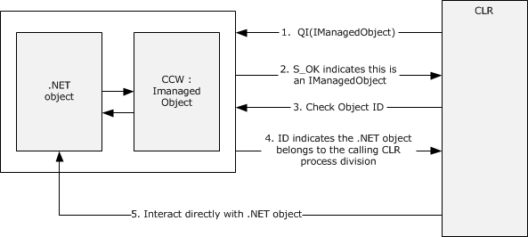
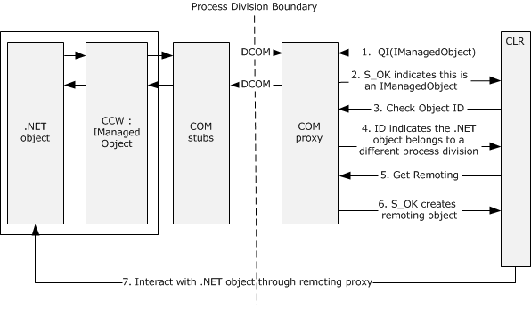
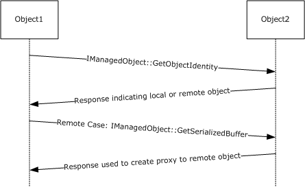
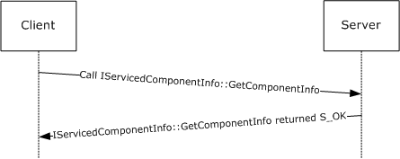
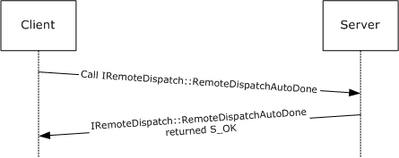
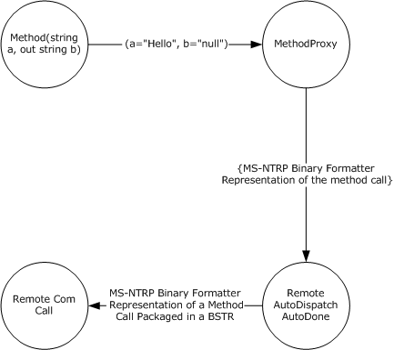
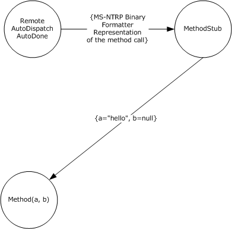
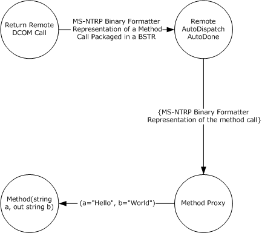

# [MS-IOI]: IManagedObject Interface Protocol

Table of Contents

1 Introduction

- [1 Introduction](#Section_1)
  - [1.1 Glossary](#Section_1.1)
  - [1.2 References](#Section_1.2)
    - [1.2.1 Normative References](#Section_1.2.1)
    - [1.2.2 Informative References](#Section_1.2.2)
  - [1.3 Overview](#Section_1.3)
    - [1.3.1 IRemoteDispatch Interface and IServicedComponentInfo Interface](#Section_1.3.1)
  - [1.4 Relationship to Other Protocols](#Section_1.4)
  - [1.5 Prerequisites/Preconditions](#Section_1.5)
  - [1.6 Applicability Statement](#Section_1.6)
  - [1.7 Versioning and Capability Negotiation](#Section_1.7)
  - [1.8 Vendor-Extensible Fields](#Section_1.8)
  - [1.9 Standards Assignments](#Section_1.9)

2 Messages

- [2 Messages](#Section_2)
  - [2.1 Transport](#Section_2.1)
  - [2.2 Common Data Types](#Section_2.2)
    - [2.2.1 CCW_PTR](#Section_2.2.1)

3 Protocol Details

- [3 Protocol Details](#Section_3)
  - [3.1 IManagedObject Server Details](#Section_3.1)
    - [3.1.1 Abstract Data Model](#Section_3.1.1)
    - [3.1.2 Timers](#Section_3.1.2)
    - [3.1.3 Initialization](#Section_3.1.3)
    - [3.1.4 Message Processing Events and Sequencing Rules](#Section_3.1.4)
      - [3.1.4.1 IManagedObject](#Section_3.1.4.1)
        - [3.1.4.1.1 GetSerializedBuffer (Opnum 3)](#Section_3.1.4.1.1)
        - [3.1.4.1.2 IManagedObject::GetObjectIdentity (Opnum 4)](#Section_3.1.4.1.2)
      - [3.1.4.2 IRemoteDispatch Interface](#Section_3.1.4.2)
        - [3.1.4.2.1 RemoteDispatchAutoDone (Opnum 7)](#Section_3.1.4.2.1)
        - [3.1.4.2.2 RemoteDispatchNotAutoDone (Opnum 8)](#Section_3.1.4.2.2)
      - [3.1.4.3 IServicedComponentInfo Interface](#Section_3.1.4.3)
        - [3.1.4.3.1 GetComponentInfo (Opnum 3)](#Section_3.1.4.3.1)
    - [3.1.5 Timer Events](#Section_3.1.5)
    - [3.1.6 Other Local Events](#Section_3.1.6)
  - [3.2 IManagedObject Client Details](#Section_3.2)
    - [3.2.1 Abstract Data Model](#Section_3.2.1)
    - [3.2.2 Timers](#Section_3.2.2)
    - [3.2.3 Initialization](#Section_3.2.3)
    - [3.2.4 Message Processing Events and Sequencing Rules](#Section_3.2.4)
    - [3.2.5 Timer Events](#Section_3.2.5)
    - [3.2.6 Other Local Events](#Section_3.2.6)

4 Protocol Examples

- [4 Protocol Examples](#Section_4)
  - [4.1 Using the IManagedObject Interface](#Section_4.1)
  - [4.2 Determining Server Object Identity](#Section_4.2)
  - [4.3 Dispatching a Call on the Server Using Deactivate](#Section_4.3)

5 Security

- [5 Security](#Section_5)
  - [5.1 Security Considerations for Implementers](#Section_5.1)
  - [5.2 Index of Security Parameters](#Section_5.2)

6 Appendix A: Full IDL

- [6 Appendix A: Full IDL](#Section_6)

7 Appendix B: Product Behavior

- [7 Appendix B: Product Behavior](#Section_7)

8 Change Tracking

- [8 Change Tracking](#Section_8)

For the legal notice and IP terms, see [LEGAL.md](../LEGAL.md).
Last updated: 3/13/2019.
See [Revision History](#revision-history) for full version history.

# 1 Introduction

The IManagedObject Interface Protocol provides interoperability support for the [**common language runtime (CLR)**](#gt_common-language-runtime-clr). The common language runtime (CLR) is a virtual machine for the execution of software. The IManagedObject interface provides a bridge between existing computer systems and the virtual execution environment.

In particular, the CLR supports interoperability with the Component Object Model (COM).<1> The CLR supports exposing its own [**objects**](#gt_object) to COM for use as native COM objects and supports consuming COM objects.

In order to determine whether a COM object that enters the CLR is actually one of its own managed objects, the [IManagedObject](#Section_3.1.4.1) interface was created to allow for the CLR to identify its own objects. The IManagedObject Interface Protocol mechanism is detailed in this specification.

Sections 1.5, 1.8, 1.9, 2, and 3 of this specification are normative. All other sections and examples in this specification are informative.

## 1.1 Glossary

This document uses the following terms:

**activation**: In COM, a local mechanism by which a client provides the [**CLSID**](#gt_class-identifier-clsid) of an [**object class**](#gt_object-class) and obtains an [**object**](#gt_object), either an [**object**](#gt_object) from that [**object class**](#gt_object-class) or a class factory that is able to create such [**objects**](#gt_object).

**application domain**: A virtual process space within which managed code applications are hosted and executed. It is possible to have multiple managed code applications running inside a single process. Each managed code application runs within its own [**application domain**](#gt_application-domain) and is isolated from other applications that are running in separate [**application domains**](#gt_application-domain). An application domain has a unique identifier used as part of the identifying key on a state server when storing and retrieving session data.

**application domain identifier (ID)**: A number used to uniquely identify an application domain.

**class identifier (CLSID)**: A [**GUID**](#gt_globally-unique-identifier-guid) that identifies a software component; for instance, a DCOM object class or a COM class.

**common language runtime (CLR)**: The core runtime engine in the Microsoft .NET Framework for executing applications. The common language runtime supplies managed code with services such as cross-language integration, code access security, object lifetime management, and debugging and profiling support.

**deactivation**: Resetting the state of the server object instance such that a new server object instance is created when the object instance is called again by the client.

**dynamic endpoint**: A network-specific server address that is requested and assigned at run time. For more information, see [[C706]](https://go.microsoft.com/fwlink/?LinkId=89824).

**endpoint**: A network-specific address of a remote procedure call (RPC) server process for remote procedure calls. The actual name and type of the endpoint depends on the [**RPC**](#gt_remote-procedure-call-rpc) protocol sequence that is being used. For example, for RPC over TCP (RPC Protocol Sequence ncacn_ip_tcp), an endpoint might be TCP port 1025. For RPC over Server Message Block (RPC Protocol Sequence ncacn_np), an endpoint might be the name of a named pipe. For more information, see [C706].

**garbage collection**: The process of identifying logically deleted [**objects**](#gt_object) (also known as tombstones) and link values that have passed their tombstone lifetime, and then permanently removing these [**objects**](#gt_object) from a naming context (NC) replica. [**Garbage collection**](#gt_garbage-collection) does not generate replication traffic.

**globally unique identifier (GUID)**: A term used interchangeably with [**universally unique identifier (UUID)**](#gt_universally-unique-identifier-uuid) in Microsoft protocol technical documents (TDs). Interchanging the usage of these terms does not imply or require a specific algorithm or mechanism to generate the value. Specifically, the use of this term does not imply or require that the algorithms described in [[RFC4122]](https://go.microsoft.com/fwlink/?LinkId=90460) or [C706] must be used for generating the [**GUID**](#gt_globally-unique-identifier-guid). See also [**universally unique identifier (UUID)**](#gt_universally-unique-identifier-uuid).

**Interface Definition Language (IDL)**: The International Standards Organization (ISO) standard language for specifying the interface for remote procedure calls. For more information, see [C706] section 4.

**interface pointer**: A pointer to an interface that is implemented by an [MS-DCOM](../MS-DCOM/MS-DCOM.md) [**object**](#gt_object).

**Network Data Representation (NDR)**: A specification that defines a mapping from [**Interface Definition Language (IDL)**](#gt_interface-definition-language-idl) data types onto octet streams. [**NDR**](#gt_network-data-representation-ndr) also refers to the runtime environment that implements the mapping facilities (for example, data provided to [**NDR**](#gt_network-data-representation-ndr)). For more information, see [MS-RPCE](../MS-RPCE/MS-RPCE.md) and [C706] section 14.

**object**: In COM, a software entity that implements the IUnknown interface and zero or more additional interfaces that may be obtained from each other using the IUnknown interface. A COM [**object**](#gt_object) can be exposed to remote clients via the DCOM protocol, in which case it is also a DCOM object.

**object class**: In COM, a category of [**objects**](#gt_object) identified by a [**CLSID**](#gt_class-identifier-clsid), members of which can be obtained through [**activation**](#gt_activation) of the [**CLSID**](#gt_class-identifier-clsid).

**opnum**: An operation number or numeric identifier that is used to identify a specific [**remote procedure call (RPC)**](#gt_remote-procedure-call-rpc) method or a method in an interface. For more information, see [C706] section 12.5.2.12 or [MS-RPCE].

**process identifier (PID)**: A nonzero integer used by some operating systems (for example, Windows and UNIX) to uniquely identify a process. For more information, see [[PROCESS]](https://go.microsoft.com/fwlink/?LinkId=90251).

**remote procedure call (RPC)**: A communication protocol used primarily between client and server. The term has three definitions that are often used interchangeably: a runtime environment providing for communication facilities between computers (the RPC runtime); a set of request-and-response message exchanges between computers (the RPC exchange); and the single message from an RPC exchange (the RPC message). For more information, see [C706].

**Uniform Resource Identifier (URI)**: A string that identifies a resource. The URI is an addressing mechanism defined in Internet Engineering Task Force (IETF) Uniform Resource Identifier (URI): Generic Syntax [[RFC3986]](https://go.microsoft.com/fwlink/?LinkId=90453).

**universally unique identifier (UUID)**: A 128-bit value. UUIDs can be used for multiple purposes, from tagging objects with an extremely short lifetime, to reliably identifying very persistent objects in cross-process communication such as client and server interfaces, manager entry-point vectors, and [**RPC**](#gt_remote-procedure-call-rpc) objects. UUIDs are highly likely to be unique. UUIDs are also known as [**globally unique identifiers (GUIDs)**](#gt_globally-unique-identifier-guid) and these terms are used interchangeably in the Microsoft protocol technical documents (TDs). Interchanging the usage of these terms does not imply or require a specific algorithm or mechanism to generate the UUID. Specifically, the use of this term does not imply or require that the algorithms described in [RFC4122] or [C706] must be used for generating the UUID.

**MAY, SHOULD, MUST, SHOULD NOT, MUST NOT:** These terms (in all caps) are used as defined in [[RFC2119]](https://go.microsoft.com/fwlink/?LinkId=90317). All statements of optional behavior use either MAY, SHOULD, or SHOULD NOT.

## 1.2 References

Links to a document in the Microsoft Open Specifications library point to the correct section in the most recently published version of the referenced document. However, because individual documents in the library are not updated at the same time, the section numbers in the documents may not match. You can confirm the correct section numbering by checking the [Errata](https://go.microsoft.com/fwlink/?linkid=850906).

### 1.2.1 Normative References

We conduct frequent surveys of the normative references to assure their continued availability. If you have any issue with finding a normative reference, please contact [dochelp@microsoft.com](mailto:dochelp@microsoft.com). We will assist you in finding the relevant information.

[C706] The Open Group, "DCE 1.1: Remote Procedure Call", C706, August 1997, [https://www2.opengroup.org/ogsys/catalog/c706](https://go.microsoft.com/fwlink/?LinkId=89824)

[MS-DCOM] Microsoft Corporation, "[Distributed Component Object Model (DCOM) Remote Protocol](../MS-DCOM/MS-DCOM.md)".

[MS-DTYP] Microsoft Corporation, "[Windows Data Types](../MS-DTYP/MS-DTYP.md)".

[MS-ERREF] Microsoft Corporation, "[Windows Error Codes](../MS-ERREF/MS-ERREF.md)".

[MS-NRBF] Microsoft Corporation, "[.NET Remoting: Binary Format Data Structure](../MS-NRBF/MS-NRBF.md)".

[MS-NRTP] Microsoft Corporation, "[.NET Remoting: Core Protocol](../MS-NRTP/MS-NRTP.md)".

[MS-OAUT] Microsoft Corporation, "[OLE Automation Protocol](../MS-OAUT/MS-OAUT.md)".

[MS-RPCE] Microsoft Corporation, "[Remote Procedure Call Protocol Extensions](../MS-RPCE/MS-RPCE.md)".

[RFC2119] Bradner, S., "Key words for use in RFCs to Indicate Requirement Levels", BCP 14, RFC 2119, March 1997, [http://www.rfc-editor.org/rfc/rfc2119.txt](https://go.microsoft.com/fwlink/?LinkId=90317)

[RFC3986] Berners-Lee, T., Fielding, R., and Masinter, L., "Uniform Resource Identifier (URI): Generic Syntax", STD 66, RFC 3986, January 2005, [http://www.rfc-editor.org/rfc/rfc3986.txt](https://go.microsoft.com/fwlink/?LinkId=90453)

### 1.2.2 Informative References

[MS-NETOD] Microsoft Corporation, "[Microsoft .NET Framework Protocols Overview](../MS-NETOD/MS-NETOD.md)".

[MSDN-.NETFROVW] Microsoft Corporation, ".NET Framework Remoting Overview", [http://msdn.microsoft.com/en-us/library/kwdt6w2k](https://go.microsoft.com/fwlink/?LinkId=264697)

[MSDN-CCW] Microsoft Corporation, "COM Callable Wrapper", [http://msdn.microsoft.com/en-us/library/f07c8z1c.aspx](https://go.microsoft.com/fwlink/?LinkId=264695)

[MSDN-RCW] Microsoft Corporation, "Runtime Callable Wrapper", [http://msdn.microsoft.com/en-us/library/8bwh56xe.aspx](https://go.microsoft.com/fwlink/?LinkId=264694)

[MSFT-DCOMTECHOVW] Microsoft Corporation, "DCOM Technical Overview", [http://technet.microsoft.com/en-us/library/cc722925.aspx](https://go.microsoft.com/fwlink/?LinkId=264696)

## 1.3 Overview

The [IManagedObject](#Section_3.1.4.1) interface is a COM interface used by the [**common language runtime (CLR)**](#gt_common-language-runtime-clr) to identify managed [**objects**](#gt_object) (objects created by the CLR) that are exported for interoperability with the Component Object Model (COM). The IManagedObject interface allows these objects to be identified when they reenter the CLR.

The IManagedObject interface is used specifically for scenarios in which managed code uses COM and interacts with a managed object. This interface is an optimization that allows managed code to avoid going through COM to interact with the managed object. There are two different scenarios in which this can occur: Either the managed object is within the same process division, the same [**application domain**](#gt_application-domain), or the managed object is in a different process division (application domain). In either case, this document discusses what is done instead of using DCOM [MS-DCOM](../MS-DCOM/MS-DCOM.md) to interact between the CLR and managed objects.

When using COM, the COM Callable Wrapper (CCW) is the view of the object to COM, as defined in [[MSDN-CCW]](https://go.microsoft.com/fwlink/?LinkId=264695). When the CLR identifies a COM object that includes a CCW, a Runtime Callable Wrapper (RCW) is required in order to interact with the COM object, as defined in [[MSDN-RCW]](https://go.microsoft.com/fwlink/?LinkId=264694). If an RCW doesn't exist, the CLR attempts to create an RCW. If the object implements IManagedObject, the CLR determines that it is a .NET object. For more information on CCW and RCW, see [MSDN-CCW] and [MSDN-RCW].

In cases in which the .NET object is in the same process division, the CLR interacts directly with the .NET object.

Figure 1: CLR interacts directly with .NET object

The steps describing the CLR and the .NET object interaction are as follows:

- A COM object, which is a CCW wrapping a local CLR object, reenters the CLR through a COM call. The CLR calls the **QueryInterface** method on the CCW for the IManagedObject interface in order to determine whether this COM object is a CCW or not.
- Since the COM object is a CCW, it returns the IManagedObject call with S_OK and a pointer to its IManagedObject interface.
- The CLR calls [IManagedObject::GetObjectIdentity](#Section_3.1.4.1.2) on the IManagedObject interface obtained in step 2 in order to determine if the object is local to the current process and application domain.
- The CCW responds back with its ID, and the CLR notes that this ID is local to the current process and application domain.
- As established in step 4, the wrapped object belongs to this instance of the CLR, and the CLR can interact with the object directly instead of going through an RCW / CCW pair and communicating over a COM channel.
In cases in which the .NET object is in a different process division (different application domain or process), a remoting proxy is used to interact with the .NET object. In such a case, the CCW implementing IManagedObject returns a **Server Object Identity** / *AppDomainID* from IManagedObject::GetObjectIdentity that does not correspond to the current process. The CLR will then ask for the remoting ID for the object ([IManagedObject::GetSerializedBuffer](#Section_3.1.4.1.1)). This can be used to generate a transparent remoting proxy to communicate to the original object. At this point, the communication endpoints are now remoting .NET objects, and CCWs / RCWs are not used:

Figure 2: CLR interacts via remoting proxy

The steps describing the CLR interaction via remoting proxy are as follows:

- A COM object, which is a CCW wrapping a CLR object, from a different application domain or process enters the CLR through a COM call. The CLR calls the **QueryInterface** method on the CCW for the IManagedObject interface in order to determine whether this COM object is a CCW or not.
- Because the COM object is a CCW, it responds to the **QueryInterface** call with S_OK and a pointer to its IManagedObject interface.
- The CLR calls IManagedObject::GetObjectIdentity on the IManagedObject interface obtained in step 2 in order to determine whether the object is local to the current process and application domain.
- The CCW responds back with its ID, and the CLR notes that this ID is not local to the current process and application domain.
- The CLR calls IManagedObject::GetSerializedBuffer to get information to set up a .NET Remoting connection to the remote CLR object.
- The CCW responds back with the remoting information.
- The CLR uses the remoting information obtained in step 6 to create a remoting proxy that communicates with the .NET object via .NET Remoting, rather than using an RCW/CCW pair and communicating over a COM channel.
CLR-managed objects can be exposed to COM clients as COM objects. They can implement any number of COM interfaces, but all such exported objects implement IManagedObject.

The CLR also allows COM objects to be imported and used as managed objects. In this case, IManagedObject is used to determine if an object is truly a COM object or if it is actually originated as a CLR-managed object.

When a COM object enters the CLR, the CLR uses the standard COM interface querying mechanism (**QueryInterface**) to determine if the given object implements IManagedObject. If the object supports IManagedObject, IManagedObject::GetObjectIdentity is called.

At CLR instantiation, the CLR creates a unique [**GUID**](#gt_globally-unique-identifier-guid) to identify a specific CLR instance within a given process. This GUID is formatted as a string ([MS-DTYP](../MS-DTYP/MS-DTYP.md) section 2.3.4.3) and is saved. All CLR-managed objects originating from this specific instance of the CLR will return this unique identifier as the first parameter of the call to IManagedObject::GetObjectIdentity. This GUID is used to recognize that an imported managed object originated in this runtime.

The CLR can support even finer-grained levels of grouping than the process. Objects exported from a given process division are tagged and return the identifier used for process division in their second parameter to IManagedObject::GetObjectIdentity. This identifier is also used to indicate whether or not the given object originated in the correct process division. If the process identifier and process division match, the last parameter of IManagedObject::GetObjectIdentity is a pointer to the implementation-specific representation of the managed object.

If the given object does not match the current CLR instance and process division, IManagedObject::GetSerializedBuffer is called to return a binary representation of a managed object, as specified by the .NET Remoting: Binary Format Data Structure [MS-NRBF](../MS-NRBF/MS-NRBF.md). It is the responsibility of the caller on the client CLR to interpret the deserialized opaque object reference.

Figure 3: IManagedObject request-response

### 1.3.1 IRemoteDispatch Interface and IServicedComponentInfo Interface

A server [**object**](#gt_object) instance can associate a unique identity with itself. This identity can be used by the client to track multiple instances of the server object. The server can use [IServicedComponentInfo](#Section_3.1.4.3) to allow the client to query for its identity.

The [IRemoteDispatch](#Section_3.1.4.2) interface can be used by the server to provide an alternative way to dispatch method calls on its object instance. A client can further use this interface to perform [**deactivation**](#gt_deactivation) of the server object instance.

## 1.4 Relationship to Other Protocols

This protocol uses the OLE Automation Protocol [MS-OAUT](../MS-OAUT/MS-OAUT.md), making use of the BSTR and VARIANT types from the **IDispatch** interface.

The [IManagedObject](#Section_3.1.4.1) interface uses the Distributed Component Object Model (DCOM) Remote Protocol [MS-DCOM](../MS-DCOM/MS-DCOM.md).

The [IRemoteDispatch](#Section_3.1.4.2) and [IServicedComponentInfo](#Section_3.1.4.3) interfaces use DCOM [MS-DCOM] to communicate over the wire and to authenticate all requests issued against the infrastructure.

This protocol allows for encodings defined in [MS-NRTP](../MS-NRTP/MS-NRTP.md) and [MS-NRBF](../MS-NRBF/MS-NRBF.md).

## 1.5 Prerequisites/Preconditions

This protocol requires the Distributed Component Object Model (DCOM) Remote Protocol [MS-DCOM](../MS-DCOM/MS-DCOM.md) and the OLE Automation Protocol [MS-OAUT](../MS-OAUT/MS-OAUT.md). This protocol requires the [**CLR**](#gt_common-language-runtime-clr) to be installed on the client machine.

All interfaces assume that the client is in possession of valid credentials recognized by the server that is accepting the client requests.

This protocol assumes that the client has relied on **QueryInterface** to determine if the server supports the [IManagedObject](#Section_3.1.4.1) interface or the [IRemoteDispatch](#Section_3.1.4.2) interface. The protocol also assumes that the client has the server object Microsoft .NET Framework type information prior to initialization.

## 1.6 Applicability Statement

[IManagedObject](#Section_3.1.4.1) is useful as part of the infrastructure for allowing the [**CLR**](#gt_common-language-runtime-clr) to interoperate with COM.

Interoperability between the CLR and COM offers the following benefits.

- Existing COM [**objects**](#gt_object) can be used from the CLR.
- Managed objects created in the CLR can be used from existing COM applications.
- The managed identity of an object is not lost when it is passed out to COM and then back to the CLR.
The [IRemoteDispatch](#Section_3.1.4.2) interface is used for method call dispatch and deactivation.

The [IServicedComponentInfo](#Section_3.1.4.3) interface is used for determining server object instance identity.

## 1.7 Versioning and Capability Negotiation

Supported Transports: This protocol uses the DCOM Remote Protocol as its transport, as described in [MS-DCOM](../MS-DCOM/MS-DCOM.md).

Protocol Version: The [IManagedObject](#Section_3.1.4.1) protocol consists of one DCOM interface, IManagedObject version 0.0. The interfaces defined in this specification have no versioning or capability negotiation beyond those of the underlying transport.

For both of these interfaces, it is assumed that the client has the .NET Framework information (such as type information of server objects) prior to initialization.

The client relies on **QueryInterface** to determine if the server supports IManagedObject or [IRemoteDispatch](#Section_3.1.4.2).

## 1.8 Vendor-Extensible Fields

This protocol uses [**universally unique identifiers (UUIDs)**](#gt_universally-unique-identifier-uuid). Vendors can create their own UUIDs, as described in [MS-DTYP](../MS-DTYP/MS-DTYP.md) section 2.3.4.

This protocol uses HRESULT values as defined in [MS-DTYP] section 2.2.18. Vendors can define their own HRESULT values, provided that they set the *C* bit (0x20000000) for each vendor-defined value, indicating that the value is a customer code.

This protocol uses Win32 error codes. These values are taken from the Windows error number space, as specified in [MS-ERREF](../MS-ERREF/MS-ERREF.md) section 2.2. It is recommended that vendors reuse those values with their indicated meaning. Choosing any other value runs the risk of a collision in the future.

## 1.9 Standards Assignments

| Constant/value | Description |
| --- | --- |
| IManagedObject {C3FCC19E-A970-11D2-8B5A-00A0C9B7C9C4} | The [**GUID**](#gt_globally-unique-identifier-guid) associated with the [IManagedObject](#Section_3.1.4.1) interface. |
| IRemoteDispatch {6619a740-8154-43be-a186-0319578e02db} | The GUID associated with the [IRemoteDispatch](#Section_3.1.4.2) interface. |
| IServicedComponentInfo {8165B19E-8D3A-4d0b-80C8-97DE310DB583} | The GUID associated with the [IServicedComponentInfo](#Section_3.1.4.3) interface. |

# 2 Messages

## 2.1 Transport

This protocol uses [**RPC**](#gt_remote-procedure-call-rpc) [**dynamic endpoints**](#gt_dynamic-endpoint) as specified in [[C706]](https://go.microsoft.com/fwlink/?LinkId=89824) Part 4 and [MS-DCOM](../MS-DCOM/MS-DCOM.md).

To access an interface, the client MUST request a remote protocol connection to its well-known [**object**](#gt_object) [**UUID**](#gt_universally-unique-identifier-uuid) [**endpoint**](#gt_endpoint) on the server, as specified in section [1.9](#Section_1.9).

The RPC version number for all interfaces MUST be 0.0.

## 2.2 Common Data Types

This protocol MUST indicate to the [**RPC**](#gt_remote-procedure-call-rpc) runtime that it is to support the [**NDR**](#gt_network-data-representation-ndr) transfer syntax only, as specified in [[C706]](https://go.microsoft.com/fwlink/?LinkId=89824) part 4.

In addition to RPC base types and definitions specified in [C706] and [MS-DTYP](../MS-DTYP/MS-DTYP.md), additional data types are defined in the following subsection.

### 2.2.1 CCW_PTR

CCW_PTR is an opaque pointer that is up to the implementation to interpret.

The wire representation will consist of the pointer representation used for the transfer syntax in use (either NDR or NDR64) followed by the wire representation of the content of the **int** or __int64.

The pointer representation used in NDR transfer syntax is 4 octets in length. NDR transfer syntax is specified in [[C706]](https://go.microsoft.com/fwlink/?LinkId=89824) Chapter 14, section 14.3.10. The pointer representation used in NDR64 transfer syntax is specified in [MS-RPCE](../MS-RPCE/MS-RPCE.md) 2.2.5.3.5, and is 8 octets in length.

If _64BIT is defined, the pointer representation will be followed by the wire representation of the __int64. The wire representation of __int64 is specified in [MS-RPCE] 2.2.4.1.3. The __int64 is synonymous to **hyper** in [C706], which is 8 octets in length.

If _64BIT is not defined, the pointer representation will be the same, but followed by the wire representation of **int**. This **int** will be treated as a long, as specified in [C706] section 14.2.5, and is 4 octets in length.

No negotiation occurs to determine whether _64BIT has been defined. The wire syntax for CCW_PTR can be made consistent using any implementation-specific method.

The type definition of CCW_PTR is as follows.

#ifdef _64BIT

typedef __int64* CCW_PTR;

#else

typedef int* CCW_PTR;

#endif

# 3 Protocol Details

The following sections specify details of the IManagedObject Interface Protocol, including abstract data model, interface method syntax, and message processing rules.

The [IRemoteDispatch](#Section_3.1.4.2) and [IServicedComponentInfo](#Section_3.1.4.3) client applications initiate the conversation with the server by performing remote protocol [**activation**](#gt_activation) ([MS-DCOM](../MS-DCOM/MS-DCOM.md) section 3.2.4.1.1) of an application-specific [**CLSID**](#gt_class-identifier-clsid) of an [**object**](#gt_object) that supports these interfaces. After the client application uses activation to get the [**interface pointer**](#gt_interface-pointer) to the remote protocol object, it works with this object by making calls on the remote protocol interface supported by the object. After it has finished making calls, the client application does a release on the interface pointer.

## 3.1 IManagedObject Server Details

A [**CLR**](#gt_common-language-runtime-clr)-managed [**object**](#gt_object) that has been exposed to COM will expose the COM interface [IManagedObject](#Section_3.1.4.1). This interface is used to determine whether COM objects that enter the CLR are actually CLR-managed objects and can be mapped directly to the managed object. This allows CLR-managed objects to roundtrip from managed to COM and back to managed while maintaining their original identity.

### 3.1.1 Abstract Data Model

The [**CLR**](#gt_common-language-runtime-clr) implementation that exposes [**objects**](#gt_object) to COM MUST maintain a unique [**UUID**](#gt_universally-unique-identifier-uuid) to differentiate its objects from those of other CLR instances and implementations. If the CLR supports per-process divisions, it will also need to maintain unique identifiers for each division to map objects back to their originating process division. In addition, the CLR will also need to use an opaque identifier that is used to map back internally from the COM [**interface pointer**](#gt_interface-pointer) to [IManagedObject](#Section_3.1.4.1) to the underlying managed object.

In the case that the CLR-managed object does not belong to the given CLR process instance and process subdivision, the implementation of IManagedObject MUST provide a mechanism that returns a binary-formatted version of the underlying managed object.

**Server Object Identity:** The remote server object instance MUST have a unique Uniform Resource Identifier (URI), as specified in [[RFC3986]](https://go.microsoft.com/fwlink/?LinkId=90453). This URI represents the unique identity of the server object instance. The client uses this identity to track multiple instances of the server object.

### 3.1.2 Timers

None.

### 3.1.3 Initialization

The server MUST create a unique [**UUID**](#gt_universally-unique-identifier-uuid) to identify this [**CLR**](#gt_common-language-runtime-clr) instance upon startup. Upon the startup of each process division, a unique identifier also needs to be generated.

### 3.1.4 Message Processing Events and Sequencing Rules

#### 3.1.4.1 IManagedObject

The IManagedObject interface includes the following methods.

The client MUST be implemented with the type information for the remote object.<2>

Methods in RPC Opnum Order

| Method | Description |
| --- | --- |
| [GetSerializedBuffer](#Section_3.1.4.1.1) | Returns a binary-formatted representation of a managed [**object**](#gt_object), as specified in [MS-NRBF](../MS-NRBF/MS-NRBF.md) section 2.3. Opnum: 3 |
| [GetObjectIdentity](#Section_3.1.4.1.2) | Used to determine if a COM object is a managed object that belongs to this [**CLR**](#gt_common-language-runtime-clr) instance and process subdivision. Opnum: 4 |

##### 3.1.4.1.1 GetSerializedBuffer (Opnum 3)

The GetSerializedBuffer method converts the given managed [**object**](#gt_object) to a binary-formatted string representation that can be used to create a managed object.

HRESULT GetSerializedBuffer(

[out] BSTR *pBSTR

);

**pbSTR:** The value MUST contain a binary-formatted string representation of the class record for the underlying managed object, as specified in [MS-NRBF](../MS-NRBF/MS-NRBF.md) section 2.3. For more information on binary format mapping, see [MS-NRTP](../MS-NRTP/MS-NRTP.md) section 3.1.5.1.

**Return Values:** The method MUST return a positive value or 0 to indicate successful completion or a negative value to indicate failure.

| Return value/code | Description |
| --- | --- |
| 0x00000000 ERROR_SUCCESS | Success. |

**Exceptions Thrown:** No exceptions are thrown from this method beyond those thrown by the underlying [**RPC**](#gt_remote-procedure-call-rpc) protocol.

##### 3.1.4.1.2 IManagedObject::GetObjectIdentity (Opnum 4)

The IManagedObject::GetObjectIdentity method is used by a [**CLR**](#gt_common-language-runtime-clr) instance to determine whether a COM [**object**](#gt_object) entering the system is really a managed object that originated in this CLR instance and within the current process division.

HRESULT GetObjectIdentity(

[out] BSTR* pBSTRGUID,

[out] int* AppDomainID,

[out] CCW_PTR pCCW

);

**pBSTRGUID:** The *pBSTRGUID* parameter is a [**GUID**](#gt_globally-unique-identifier-guid) ([MS-DTYP](../MS-DTYP/MS-DTYP.md) section 2.3.4.3). The *pBSTRGUID* parameter MUST indicate the CLR instance in which this object was created.

**AppDomainID:** Optional parameter that contains implementation-specific, opaque, process-unique identifiers. If present, the *AppDomainID* parameter MUST denote the process subdivision in which this object resides.

**pCCW:** Optional field. Implementation-specific, opaque value that helps identify the managed object. If present, this field MUST map back to the implementation's internal representation of a managed object.

**Return Values:** The method MUST return a positive value or 0 to indicate successful completion or a negative value to indicate failure.

| Return value/code | Description |
| --- | --- |
| 0x00000000 ERROR_SUCCESS | Success |

**Exceptions Thrown:** No exceptions are thrown from this method beyond those thrown by the underlying [**RPC**](#gt_remote-procedure-call-rpc) protocol.

#### 3.1.4.2 IRemoteDispatch Interface

The IRemoteDispatch interface provides methods to dispatch calls on the server [**object**](#gt_object). A client can optionally use this interface to deactivate the server object instance after the method call completes. The interface inherits [**opnums**](#gt_opnum) 0 to 6 from **IDispatch** ([MS-OAUT](../MS-OAUT/MS-OAUT.md) section 3.1.4). The version for this interface is 0.0.

To receive incoming remote calls for this interface, the server MUST implement a DCOM [**object class**](#gt_object-class) that supports this interface by using the [**UUID**](#gt_universally-unique-identifier-uuid) {6619a740-81c4-43be-a186-0319578e02db} for this interface.

The client MUST be implemented with the type information for the remote object.

The interface includes the following methods beyond those in **IDispatch**.<3>

Methods in RPC Opnum Order

| Method | Description |
| --- | --- |
| [RemoteDispatchAutoDone](#Section_3.1.4.2.1) | Invokes a call on the server object and deactivates it when the call completes. Opnum: 7 |
| [RemoteDispatchNotAutoDone](#Section_3.1.4.2.2) | Invokes a call on the server object without deactivating it when the call completes. Opnum: 8 |

##### 3.1.4.2.1 RemoteDispatchAutoDone (Opnum 7)

The RemoteDispatchAutoDone method is called by the client to invoke a method on the server.

[id(0x60020000)] HRESULT RemoteDispatchAutoDone(

[in] BSTR s,

[out, retval] BSTR* pRetVal

);

**s:** The *s* parameter contains binary data representing the input parameters of the method called on the server. The binary data MUST be marshaled as specified in [MS-NRTP](../MS-NRTP/MS-NRTP.md) section 3.1.5.1.1. The data is specified as is in the BSTR, such that the length of the BSTR is the size of the data divided by 2 (rounded up if necessary).

**pRetVal:** The *pRetVal* parameter contains the binary data representing the output parameters of the method called on the server. The binary data MUST be marshaled as specified in [MS-NRTP] section 3.1.5.1.1. The data is specified as is in the BSTR, such that the length of the BSTR is the size of the data divided by 2 (rounded up if necessary).

**Return Values:** An HRESULT that specifies success or failure. All success HRESULT values MUST be treated as success and all failure HRESULT values MUST be treated as failure.

When this method is invoked, the server MUST unmarshal the method input parameters and formulate a method call request. If the payload is a valid method call request for the given server [**object**](#gt_object) instance, the server MUST dispatch the method on the server object instance. Otherwise it MUST fail the call. After the server object instance completes the method call, the server MUST marshal the output parameters as specified in [MS-NRTP] section 3.1.5.1.1, and return the encoded reply through the *pRetVal* argument. It MUST then deactivate the instance of the server object that services the call.

##### 3.1.4.2.2 RemoteDispatchNotAutoDone (Opnum 8)

The RemoteDispatchNotAutoDone method is called by the client to invoke a method on the server.

[id(0x60020001)] HRESULT RemoteDispatchNotAutoDone(

[in] BSTR s,

[out, retval] BSTR* pRetVal

);

**s:** The *s* parameter contains binary data representing the input parameters of the method called on the server. The binary data MUST be marshaled as specified in [MS-NRTP](../MS-NRTP/MS-NRTP.md) section 3.1.5.1.1. The data is specified as is in the BSTR, such that the length of the BSTR is the size of the data divided by 2 (rounded up if necessary).

**pRetVal:** The *pRetVal* parameter contains the binary data representing the output parameters of the method called on the server. The binary data MUST be marshaled as specified in [MS-NRTP] section 3.1.5.1.1. The data is specified as is in the BSTR, such that the length of the BSTR is the size of the data divided by 2 (rounded up if necessary).

**Return Values:** An HRESULT that specifies success or failure. All success HRESULT values MUST be treated as success and all failure HRESULT values MUST be treated as failure.

When this method is invoked, the server MUST unmarshal the method input parameters and formulate a method call request. If the payload is a valid method call request for the given server [**object**](#gt_object) instance, the server MUST dispatch the method on the server object instance. Otherwise it MUST fail the call. After the server object instance completes the method call, the server MUST marshal the output parameters as specified in [MS-NRTP] section 3.1.5.1.1 and return the encoded reply through the *pRetVal* argument.

#### 3.1.4.3 IServicedComponentInfo Interface

This interface is used to get the [**object**](#gt_object) identity of the server object instance that supports this interface. Because this is an [MS-DCOM](../MS-DCOM/MS-DCOM.md) interface, [**opnum**](#gt_opnum) 0 to opnum 2 are **IUnknown** methods, as specified in [MS-DCOM] section 3.1.1.5.8. The version for this interface is 0.0.

To receive incoming remote calls for this interface, the server MUST implement a [MS-DCOM] [**object class**](#gt_object-class) that supports this interface by using the [**UUID**](#gt_universally-unique-identifier-uuid) {8165B19E-8D3A-4d0b-80C8-97DE310DB583} for this interface.

The interface contains the following methods beyond those of IUnknown.

Methods in RPC Opnum Order

| Method | Description |
| --- | --- |
| [GetComponentInfo](#Section_3.1.4.3.1) | Gets the server object identity associated with the server object instance. Opnum: 3 |

##### 3.1.4.3.1 GetComponentInfo (Opnum 3)

The GetComponentInfo method is used to determine the environment of the server [**object**](#gt_object).

HRESULT GetComponentInfo(

[in, out] int* infoMask,

[out] SAFEARRAY(BSTR)* infoArray

);

**infoMask:** A bitwise OR of zero of more of the following values:

| Value | Meaning |
| --- | --- |
| 0x00000001 | The serviced component's [**process identifier (PID)**](#gt_process-identifier-pid). |
| 0x00000002 | The serviced component's [**application domain identifier (ID)**](#gt_application-domain-identifier-id). |
| 0x00000004 | The serviced component's remote [**URI**](#gt_uniform-resource-identifier-uri) [[RFC3986]](https://go.microsoft.com/fwlink/?LinkId=90453), which represents the server object identity. |

On input, the bits set indicate the information the client is requesting that the server return. On output, the bits set indicate the information actually returned in the *infoArray*.

**infoArray:** An array that contains a set of values returned by the server corresponding to the bits set in *infoMask*.

**Return Values:** An HRESULT that specifies success or failure. All success HRESULT values MUST be treated as success and all failure HRESULT values MUST be treated as failure.

When this method is invoked, the server MUST do the following. If any bits not defined above in *infoMask* are set, the server first MUST update *infoMask* to clear those bits.

The server MUST return in *infoArray* a SAFEARRAY ([MS-OAUT](../MS-OAUT/MS-OAUT.md) section 2.2.30.10) of type VT_BSTR. This SAFEARRAY MUST contain, in order, the (possibly empty) subset of the following items, corresponding to the bits set in *infoMask*.

- Process ID
- Application Domain ID
- The serviced component's remote URI [RFC3986]
The type of each element MUST be a BSTR ([MS-OAUT] section 2.2.23.2). The server then MUST return success.

### 3.1.5 Timer Events

None.

### 3.1.6 Other Local Events

There are no protocol-specific local events.

## 3.2 IManagedObject Client Details

### 3.2.1 Abstract Data Model

The client is essentially the same as the server. The [IManagedObject](#Section_3.1.4.1) interface is used to identify [**CLR**](#gt_common-language-runtime-clr)-mapped COM [**objects**](#gt_object) after they are exported to COM and returned as COM objects. Implementation of the IManagedObject class denotes that a given COM object is really a CLR-managed COM object. The methods of IManagedObject are used to determine if the COM object lives in this CLR instance and process subdivision. These methods will otherwise return a CLR-managed object underlying the COM object. The deserialized opaque object reference is returned to the caller on the client CLR for interpretation.

### 3.2.2 Timers

There are no protocol-specific timers.

### 3.2.3 Initialization

The initialization is the same as for server. See section [3.1.3](#Section_3.1.3).

### 3.2.4 Message Processing Events and Sequencing Rules

The client determines if it is the server by matching values returned from the [IManagedObject::GetObjectIdentity](#Section_3.1.4.1.2) method. The client matches the value of **pBSTRGUID** against the GUID of the client [**CLR**](#gt_common-language-runtime-clr) instance and uses the implementation-specific helper values in **AppDomainID** and **pCCW** to help decide if the COM object originated in the client CLR instance. Otherwise, the client fetches a binary-formatted string representation ([MS-NRBF](../MS-NRBF/MS-NRBF.md) section 2.3) to the underlying managed [**object**](#gt_object) by using [GetSerializedBuffer](#Section_3.1.4.1.1), which can be used to create a managed object.

When the IServiceComponentInfo interface is used, the client determines the server instance identity by means of the URI returned from the IServiceComponentInfo::GetComponentInfo method.

Note the following:

- A COM reference to a CCW, as defined in [[MSDN-CCW]](https://go.microsoft.com/fwlink/?LinkId=264695), keeps the managed object rooted for the [**garbage collection**](#gt_garbage-collection) routine.
- Managed object references also keep the object rooted for the garbage collection.
- The garbage collection only collects an object once there are no longer COM object references to it and there are no further managed references to it.
- In the event that the [**application domain**](#gt_application-domain) that hosts the object is torn down, the CCW that implements [IManagedObject](#Section_3.1.4.1) is kept alive by the CLR, but calls to it will return failure HRESULT.

### 3.2.5 Timer Events

There are no protocol-specific timers.

### 3.2.6 Other Local Events

None.

# 4 Protocol Examples

## 4.1 Using the IManagedObject Interface

A [**CLR**](#gt_common-language-runtime-clr) instance uses the [IManagedObject](#Section_3.1.4.1) interface in the following manner.

- A CLR instance starts up and generates a [**UUID**](#gt_universally-unique-identifier-uuid) to uniquely identify itself. It later creates a process subdivision and creates a unique value to identify the process subdivision.
- A COM [**object**](#gt_object) enters the CLR, and the CLR then calls the **IUnknown::QueryInterface** method to determine whether the object implements IManagedObject. The object returns S_OK and returns a pointer to an IManagedObject [**interface pointer**](#gt_interface-pointer).
- The CLR then calls the [IManagedObject::GetObjectIdentity](#Section_3.1.4.1.2) method and matches the *pBSTRGUID* against its UUID and, if they match, compares the *AppDomainID* to the identifier of the current process subdivision. If they match, the CLR converts *pCCW* to the underlying CLR-managed object. If they do not match, it calls the [IManagedObject::GetSerializedBuffer](#Section_3.1.4.1.1) method and uses the binary-formatted version of the object converted to a string to create a copy of the object that resides in another CLR (which could be a completely different implementation). The caller on the client CLR is then able to interpret the deserialized opaque object reference. For more information about how to create the binary-formatted string representation of an object, see [MS-NRBF](../MS-NRBF/MS-NRBF.md) section 2.3.

## 4.2 Determining Server Object Identity

This example assumes that the client already has an [**interface pointer**](#gt_interface-pointer) to an instance of an [**object**](#gt_object) that implements [IServicedComponentInfo](#Section_3.1.4.3). The example also assumes that the server already has a unique identifier encoded into a URI to identify the server object instance. The following diagram helps to illustrate this example.

Figure 4: Call sequence for determining server object identity

- The client calls the IServicedComponentInfo::[GetComponentInfo](#Section_3.1.4.3.1) method.
HRESULT

GetComponentInfo{

[in,out] int* infoMask = 0x00000004,

[out] SAFEARRAY(BSTR)* infoArray = {An uninitialized pointer to

receive the SAFEARRAY}};

- The server receives the call, verifies the parameters, and returns a SAFEARRAY of type **VT_BSTR** into the *infoArray* that contains the URI for the server object instance.
HRESULT = S_OK

GetComponentInfo{

[in,out] int* infoMask = 0x00000004,

[out] SAFEARRAY(BSTR)* infoArray = {VT_BSTR,

"http://56C8D6F0ED8B4d658F42148430C65CEE" }};

- The client records the URI of the server object instance, and uses it to distinguish between two different server object instances.

## 4.3 Dispatching a Call on the Server Using Deactivate

This example assumes that the client already has an [**interface pointer**](#gt_interface-pointer) to an instance of an [**object**](#gt_object) that implements [IRemoteDispatch](#Section_3.1.4.2). The following diagram helps to illustrate this example. The scenario is around a remote server object which has a method named **Method**. This method takes two string parameters. The first parameter *a* is an in only parameter, the second parameter *b* is the out only parameter.

Method(string a, out string b);

The call graph for this on the client side is given below.

Figure 5: Call sequence for dispatching a call with Deactivate from client to server

Figure 6: Call graph on the client side for the given scenario

- The client accepts a call for "**Method**" taking two parameters *a* and *b*.
- The client transforms the method call into a byte representation as specified in [MS-NRTP](../MS-NRTP/MS-NRTP.md) section 3.1.5.1.1.
- The client then takes the byte representation and passes it as a BSTR in the *s* parameter over [RemoteDispatchAutoDone](#Section_3.1.4.2.1).
The representative BSTR for the current example would look like the following.

00000000 00000000 00000100 00000000 ................

00121500 06120000 6874654d 5112646f ........Method.Q

74736554 706d6f43 6574202c 202c7473 TestComp, test,

73726556 3d6e6f69 2e302e30 2c302e30 Version=0.0.0.0,

6c754320 65727574 75656e3d 6c617274 Culture=neutral

7550202c 63696c62 5479654b 6e656b6f , PublicKeyToken

3030313d 66663066 65643064 34336662 =100f0ffd0debf34

00000233 48051200 6f6c6c65 00000b11 3......Hello....

00650073 00000073 78adbf68 00000642 s.e.s...h..xB...

61df552e 800000d1 0000017e 00000006 .U.a....~.......

00000000 00001771 00000002 76726553 ....q.......Serv

20656369 6b636150 202c3120 36322e76 ice Pack 1, v.26

00000037 00000002 0000004c 00000009 7.......L.......

00000002 00000059 00000013 00000004 ....Y...........

0000005d 00000015 00000002 0000006a ]...........j...

0000001f 00000004 0000006e 00000021 ........n...!...

- The server receives the call and transforms the incoming BSTR in parameter *s* into a method call. The server then dispatches the method call on the object.

Figure 7: Call graph on the server side for the given scenario.

- "**Method**" completes. On completion, it populates "**World**" into the out parameter *b*.

Figure 8: Return call graph on the server side for the given scenario.

- The server now takes the return call and packages it again into a byte representation as specified in [MS-NRTP] section 3.1.5.1.1.
RemoteDispatchAutoDone implementation takes the binary representation and makes it a payload for BSTR out parameter *pRetVal*.

The representative BSTR for the current example would look like the following.

00000000 00000000 00000100 00000000 ................

04121600 00020000 12110000 726f5705 .............Wor

000b646c 00000000 0020f490 00000000 ld........ .....

61df71bf 800000d1 0000003a 00000000 .q.a....:.......

00000000 00000000 ff6c5db0 .........]l.

- RemoteDispatchAutoDone implementation deactivates the server object by releasing all references to it such that the particular instance of the server is destroyed.
- As the client call returns the data received on the client side in the *pRetVal* BSTR parameter is converted back to a return call parameters and the control is transferred back to the caller.

Figure 9: Return call graph on the client side for the given scenario.

# 5 Security

## 5.1 Security Considerations for Implementers

None.

## 5.2 Index of Security Parameters

None.

# 6 Appendix A: Full IDL

For convenience, the full [**IDL**](#gt_interface-definition-language-idl) is provided with this specification.

import "ms-oaut.idl";

#ifdef _64BIT

typedef __int64* CCW_PTR;

#else

typedef int* CCW_PTR;

#endif

#define SAFEARRAY(type) SAFEARRAY

[

object,

oleautomation,

uuid(C3FCC19E-A970-11d2-8B5A-00A0C9B7C9C4),

helpstring("Managed Object Interface"),

pointer_default(unique)

]

interface IManagedObject : IUnknown

{

HRESULT GetSerializedBuffer( [out] BSTR *pBSTR);

HRESULT GetObjectIdentity([out] BSTR* pBSTRGUID, [out] int* AppDomainID, [out] CCW_PTR pCCW);

};

[

object,

uuid(6619a740-8154-43be-a186-0319578e02db),

helpstring("RemoteDispatch Interface"),

dual,

pointer_default(unique)

]

interface IRemoteDispatch: IDispatch

{

[id(0x60020000)]

HRESULT RemoteDispatchAutoDone([in] BSTR s, [out, retval] BSTR* pRetVal);

[id(0x60020001)]

HRESULT RemoteDispatchNotAutoDone([in] BSTR s, [out, retval] BSTR* pRetVal);

};

[

object,

uuid(8165B19E-8D3A-4d0b-80C8-97DE310DB583),

helpstring("ServicedComponentInfo Interface"),

pointer_default(unique)

]

interface IServicedComponentInfo : IUnknown{

HRESULT GetComponentInfo([in,out] int* infoMask, [out] SAFEARRAY(BSTR)* infoArray);

};

# 7 Appendix B: Product Behavior

The information in this specification is applicable to the following Microsoft products or supplemental software. References to product versions include updates to those products.

This document specifies version-specific details in the Microsoft .NET Framework. For information about which versions of the .NET Framework are available in each released Windows product or as supplemental software, see [MS-NETOD](../MS-NETOD/MS-NETOD.md) section 4.

- Microsoft .NET Framework 1.0
- Microsoft .NET Framework 2.0
- Microsoft .NET Framework 3.0
- Microsoft .NET Framework 3.5
- Microsoft .NET Framework 4.0
- Microsoft .NET Framework 4.5
- Microsoft .NET Framework 4.6
- Microsoft .NET Framework 4.7
- Microsoft .NET Framework 4.8
Exceptions, if any, are noted in this section. If an update version, service pack or Knowledge Base (KB) number appears with a product name, the behavior changed in that update. The new behavior also applies to subsequent updates unless otherwise specified. If a product edition appears with the product version, behavior is different in that product edition.

Unless otherwise specified, any statement of optional behavior in this specification that is prescribed using the terms "SHOULD" or "SHOULD NOT" implies product behavior in accordance with the SHOULD or SHOULD NOT prescription. Unless otherwise specified, the term "MAY" implies that the product does not follow the prescription.

<1> Section 1: The Microsoft [**common language runtime (CLR)**](#gt_common-language-runtime-clr) and Component Object Model (COM) are capable of interoperating over the [IManagedObject Interface Protocol](#Section_1) mechanism. For more information on DCOM and remoting, see [[MSFT-DCOMTECHOVW]](https://go.microsoft.com/fwlink/?LinkId=264696) and [[MSDN-.NETFROVW]](https://go.microsoft.com/fwlink/?LinkId=264697).

<2> Section 3.1.4.1: On the Windows platform, the [IManagedObject](#Section_3.1.4.1) interface is implemented by all .NET Framework components when they are exposed through the COM-Interop feature of the .NET Framework.

<3> Section 3.1.4.2: On the Windows platform, the [IRemoteDispatch](#Section_3.1.4.2) interface is exposed only by components inheriting from **System.EnterpriseServices.ServicedComponent**.

# 8 Change Tracking

This section identifies changes that were made to this document since the last release. Changes are classified as Major, Minor, or None.

The revision class **Major** means that the technical content in the document was significantly revised. Major changes affect protocol interoperability or implementation. Examples of major changes are:

- A document revision that incorporates changes to interoperability requirements.
- A document revision that captures changes to protocol functionality.
The revision class **Minor** means that the meaning of the technical content was clarified. Minor changes do not affect protocol interoperability or implementation. Examples of minor changes are updates to clarify ambiguity at the sentence, paragraph, or table level.

The revision class **None** means that no new technical changes were introduced. Minor editorial and formatting changes may have been made, but the relevant technical content is identical to the last released version.

The changes made to this document are listed in the following table. For more information, please contact [dochelp@microsoft.com](mailto:dochelp@microsoft.com).

| Section | Description | Revision class |
| --- | --- | --- |
| [7](#Section_7) Appendix B: Product Behavior | Added .NET Framework v4.8 to the applicability list. | Major |

## Revision History

| Date | Version | Revision Class | Comments |
| --- | --- | --- | --- |
| 7/20/2007 | 0.1 | Major | MCPP Milestone 5 Initial Availability |
| 9/28/2007 | 1.0 | Major | Updated and revised the technical content. |
| 10/23/2007 | 1.1 | Minor | Clarified the meaning of the technical content. |
| 11/30/2007 | 2.0 | Major | Clarified the state requirements of .NET object versioning. |
| 1/25/2008 | 2.0.1 | Editorial | Changed language and formatting in the technical content. |
| 3/14/2008 | 3.0 | Major | Updated and revised the technical content. |
| 5/16/2008 | 4.0 | Major | Updated and revised the technical content. |
| 6/20/2008 | 5.0 | Major | Updated and revised the technical content. |
| 7/25/2008 | 6.0 | Major | Updated and revised the technical content. |
| 8/29/2008 | 6.0.1 | Editorial | Fix capitalization issues |
| 10/24/2008 | 7.0 | Major | Updated and revised the technical content. |
| 12/5/2008 | 8.0 | Major | Updated and revised the technical content. |
| 1/16/2009 | 9.0 | Major | Updated and revised the technical content. |
| 2/27/2009 | 9.0.1 | Editorial | Changed language and formatting in the technical content. |
| 4/10/2009 | 9.0.2 | Editorial | Changed language and formatting in the technical content. |
| 5/22/2009 | 10.0 | Major | Updated and revised the technical content. |
| 7/2/2009 | 11.0 | Major | Updated and revised the technical content. |
| 8/14/2009 | 12.0 | Major | Updated and revised the technical content. |
| 9/25/2009 | 12.1 | Minor | Clarified the meaning of the technical content. |
| 11/6/2009 | 12.1.1 | Editorial | Changed language and formatting in the technical content. |
| 12/18/2009 | 12.1.2 | Editorial | Changed language and formatting in the technical content. |
| 1/29/2010 | 13.0 | Major | Updated and revised the technical content. |
| 3/12/2010 | 13.0.1 | Editorial | Changed language and formatting in the technical content. |
| 4/23/2010 | 13.0.2 | Editorial | Changed language and formatting in the technical content. |
| 6/4/2010 | 14.0 | Major | Updated and revised the technical content. |
| 7/16/2010 | 15.0 | Major | Updated and revised the technical content. |
| 8/27/2010 | 15.0 | None | No changes to the meaning, language, or formatting of the technical content. |
| 10/8/2010 | 15.0 | None | No changes to the meaning, language, or formatting of the technical content. |
| 11/19/2010 | 15.0 | None | No changes to the meaning, language, or formatting of the technical content. |
| 1/7/2011 | 15.0 | None | No changes to the meaning, language, or formatting of the technical content. |
| 2/11/2011 | 15.0 | None | No changes to the meaning, language, or formatting of the technical content. |
| 3/25/2011 | 15.0 | None | No changes to the meaning, language, or formatting of the technical content. |
| 5/6/2011 | 15.0 | None | No changes to the meaning, language, or formatting of the technical content. |
| 6/17/2011 | 15.1 | Minor | Clarified the meaning of the technical content. |
| 9/23/2011 | 15.1 | None | No changes to the meaning, language, or formatting of the technical content. |
| 12/16/2011 | 16.0 | Major | Updated and revised the technical content. |
| 3/30/2012 | 16.0 | None | No changes to the meaning, language, or formatting of the technical content. |
| 7/12/2012 | 16.0 | None | No changes to the meaning, language, or formatting of the technical content. |
| 10/25/2012 | 17.0 | Major | Updated and revised the technical content. |
| 1/31/2013 | 17.0 | None | No changes to the meaning, language, or formatting of the technical content. |
| 8/8/2013 | 17.0 | None | No changes to the meaning, language, or formatting of the technical content. |
| 11/14/2013 | 17.0 | None | No changes to the meaning, language, or formatting of the technical content. |
| 2/13/2014 | 17.0 | None | No changes to the meaning, language, or formatting of the technical content. |
| 5/15/2014 | 17.0 | None | No changes to the meaning, language, or formatting of the technical content. |
| 6/30/2015 | 18.0 | Major | Significantly changed the technical content. |
| 10/16/2015 | 18.0 | None | No changes to the meaning, language, or formatting of the technical content. |
| 7/14/2016 | 18.0 | None | No changes to the meaning, language, or formatting of the technical content. |
| 3/16/2017 | 19.0 | Major | Significantly changed the technical content. |
| 6/1/2017 | 19.0 | None | No changes to the meaning, language, or formatting of the technical content. |
| 3/13/2019 | 20.0 | Major | Significantly changed the technical content. |
