# [MS-IPAMM]: IP Address Management (IPAM) Management Protocol

Table of Contents

1 Introduction

- [1 Introduction](#Section_1)
  - [1.1 Glossary](#Section_1.1)
  - [1.2 References](#Section_1.2)
    - [1.2.1 Normative References](#Section_1.2.1)
    - [1.2.2 Informative References](#Section_1.2.2)
  - [1.3 Overview](#Section_1.3)
  - [1.4 Relationship to Other Protocols](#Section_1.4)
  - [1.5 Prerequisites/Preconditions](#Section_1.5)
  - [1.6 Applicability Statement](#Section_1.6)
  - [1.7 Versioning and Capability Negotiation](#Section_1.7)
  - [1.8 Vendor-Extensible Fields](#Section_1.8)
  - [1.9 Standards Assignments](#Section_1.9)

2 Messages

- [2 Messages](#Section_2)
  - [2.1 Transport](#Section_2.1)
  - [2.2 Common Message Syntax](#Section_2.2)
    - [2.2.1 Namespaces](#Section_2.2.1)
    - [2.2.2 Messages](#Section_2.2.2)
      - [2.2.2.1 Common SOAP Fault](#Section_2.2.2.1)
      - [2.2.2.2 Keepalive](#Section_2.2.2.2)
    - [2.2.3 Elements](#Section_2.2.3)
    - [2.2.4 Complex Types](#Section_2.2.4)
      - [2.2.4.1 ActiveServerV4LogicalGroup](#Section_2.2.4.1)
      - [2.2.4.2 ActiveServerV4LogicalGroupNode](#Section_2.2.4.2)
      - [2.2.4.3 ActiveServerV6LogicalGroup](#Section_2.2.4.3)
      - [2.2.4.4 ActiveServerV6LogicalGroupNode](#Section_2.2.4.4)
      - [2.2.4.5 ArrayOfCustomFieldPartialValue](#Section_2.2.4.5)
      - [2.2.4.6 ArrayOfCustomFieldValue](#Section_2.2.4.6)
      - [2.2.4.7 ArrayOfDhcpExclusionRange](#Section_2.2.4.7)
      - [2.2.4.8 ArrayOfDhcpOption](#Section_2.2.4.8)
      - [2.2.4.9 ArrayOfDhcpOptionDefinition](#Section_2.2.4.9)
      - [2.2.4.10 ArrayOfDhcpServer](#Section_2.2.4.10)
      - [2.2.4.11 ArrayOfDhcpServerOperations](#Section_2.2.4.11)
      - [2.2.4.12 ArrayOfDhcpUserClass](#Section_2.2.4.12)
      - [2.2.4.13 ArrayOfDhcpVendorClass](#Section_2.2.4.13)
      - [2.2.4.14 ArrayOfDiscoveryConfig](#Section_2.2.4.14)
      - [2.2.4.15 ArrayOfIpamIPAddress](#Section_2.2.4.15)
      - [2.2.4.16 ArrayOfIpamObject](#Section_2.2.4.16)
      - [2.2.4.17 ArrayOfIPBlock](#Section_2.2.4.17)
      - [2.2.4.18 ArrayOfIPRange](#Section_2.2.4.18)
      - [2.2.4.19 ArrayOfIPUtilization](#Section_2.2.4.19)
      - [2.2.4.20 ArrayOfLogicalGroupField](#Section_2.2.4.20)
      - [2.2.4.21 ArrayOfLogicalGroupNode](#Section_2.2.4.21)
      - [2.2.4.22 ArrayOfScopeOperations](#Section_2.2.4.22)
      - [2.2.4.23 ArrayOfServerInfo](#Section_2.2.4.23)
      - [2.2.4.24 ArrayOfServerRole](#Section_2.2.4.24)
      - [2.2.4.25 ArrayOfTaskInfo](#Section_2.2.4.25)
      - [2.2.4.26 AuditPurgeSettings](#Section_2.2.4.26)
      - [2.2.4.27 BaseDnsServerZone](#Section_2.2.4.27)
      - [2.2.4.28 BaseDnsZone](#Section_2.2.4.28)
      - [2.2.4.29 BaseIpamObject](#Section_2.2.4.29)
      - [2.2.4.30 ConfigurationAuditEnumerationParameters](#Section_2.2.4.30)
      - [2.2.4.31 ConfigurationAuditRecord](#Section_2.2.4.31)
      - [2.2.4.32 ConflictingIPAddressFailureIpamExceptionData](#Section_2.2.4.32)
      - [2.2.4.33 ConflictingIPBlockFailureIpamExceptionData](#Section_2.2.4.33)
      - [2.2.4.34 ConflictingIPRangeFailureIpamExceptionData](#Section_2.2.4.34)
      - [2.2.4.35 CustomField](#Section_2.2.4.35)
      - [2.2.4.36 CustomFieldEnumerationParameters](#Section_2.2.4.36)
      - [2.2.4.37 CustomFieldPartialValue](#Section_2.2.4.37)
      - [2.2.4.38 CustomFieldValue](#Section_2.2.4.38)
      - [2.2.4.39 DhcpExclusionRange](#Section_2.2.4.39)
      - [2.2.4.40 DhcpExclusionRangeCollection](#Section_2.2.4.40)
      - [2.2.4.41 DhcpExclusionRangeV4](#Section_2.2.4.41)
      - [2.2.4.42 DhcpExclusionRangeV6](#Section_2.2.4.42)
      - [2.2.4.43 DhcpOption](#Section_2.2.4.43)
      - [2.2.4.44 DhcpOptionCollection](#Section_2.2.4.44)
      - [2.2.4.45 DhcpOptionDefinition](#Section_2.2.4.45)
      - [2.2.4.46 DhcpOptionDefinitionCollection](#Section_2.2.4.46)
      - [2.2.4.47 DhcpOptionDefinitionV4](#Section_2.2.4.47)
      - [2.2.4.48 DhcpOptionDefinitionV6](#Section_2.2.4.48)
      - [2.2.4.49 DhcpOptionV4](#Section_2.2.4.49)
      - [2.2.4.50 DhcpOptionV6](#Section_2.2.4.50)
      - [2.2.4.51 DhcpScope](#Section_2.2.4.51)
      - [2.2.4.52 DhcpScopeAllEnumerationParameters](#Section_2.2.4.52)
      - [2.2.4.53 DhcpScopeAssociatedWithVendorClassesEnumerationParameters](#Section_2.2.4.53)
      - [2.2.4.54 DhcpScopeForIpBlockEnumerationParameters](#Section_2.2.4.54)
      - [2.2.4.55 DhcpScopesByDhcpServerIdListEnumerationParameters](#Section_2.2.4.55)
      - [2.2.4.56 DhcpScopeUnmappedEnumerationParameters](#Section_2.2.4.56)
      - [2.2.4.57 DhcpScopeV4](#Section_2.2.4.57)
      - [2.2.4.58 DhcpScopeV6](#Section_2.2.4.58)
      - [2.2.4.59 DhcpServer](#Section_2.2.4.59)
      - [2.2.4.60 DhcpServerAllEnumerationParameters](#Section_2.2.4.60)
      - [2.2.4.61 DhcpServerByServerInfoIdsEnumerationParameters](#Section_2.2.4.61)
      - [2.2.4.62 DhcpServerV4](#Section_2.2.4.62)
      - [2.2.4.63 DhcpServerV6](#Section_2.2.4.63)
      - [2.2.4.64 DhcpUserClass](#Section_2.2.4.64)
      - [2.2.4.65 DhcpUserClassCollection](#Section_2.2.4.65)
      - [2.2.4.66 DhcpUserClassV4](#Section_2.2.4.66)
      - [2.2.4.67 DhcpUserClassV6](#Section_2.2.4.67)
      - [2.2.4.68 DhcpVendorClass](#Section_2.2.4.68)
      - [2.2.4.69 DhcpVendorClassCollection](#Section_2.2.4.69)
      - [2.2.4.70 DhcpVendorClassV4](#Section_2.2.4.70)
      - [2.2.4.71 DhcpVendorClassV6](#Section_2.2.4.71)
      - [2.2.4.72 DiscoveryConfig](#Section_2.2.4.72)
      - [2.2.4.73 DiscoverySubnetEnumerationParameters](#Section_2.2.4.73)
      - [2.2.4.74 DnsReverseLookupZone](#Section_2.2.4.74)
      - [2.2.4.75 DnsReverseLookupZoneEnumerationParameters](#Section_2.2.4.75)
      - [2.2.4.76 DnsServer](#Section_2.2.4.76)
      - [2.2.4.77 DnsServerByServerInfoIdsEnumerationParameters](#Section_2.2.4.77)
      - [2.2.4.78 DnsServerEnumerationParameters](#Section_2.2.4.78)
      - [2.2.4.79 DnsServerReverseZone](#Section_2.2.4.79)
      - [2.2.4.80 DnsServerReverseZoneEnumerationParameters](#Section_2.2.4.80)
      - [2.2.4.81 DnsServerZone](#Section_2.2.4.81)
      - [2.2.4.82 DnsServerZoneEnumerationParameters](#Section_2.2.4.82)
      - [2.2.4.83 DnsZone](#Section_2.2.4.83)
      - [2.2.4.84 DnsZoneEnumerationParameters](#Section_2.2.4.84)
      - [2.2.4.85 DnsZoneEvent](#Section_2.2.4.85)
      - [2.2.4.86 DnsZoneEventEnumerationParameters](#Section_2.2.4.86)
      - [2.2.4.87 EnumerationParametersBase](#Section_2.2.4.87)
      - [2.2.4.88 ipam1:IpamException](#Section_2.2.4.88)
      - [2.2.4.89 IpamAddressObject](#Section_2.2.4.89)
      - [2.2.4.90 IpamExceptionData](#Section_2.2.4.90)
      - [2.2.4.91 IpamIPAddress](#Section_2.2.4.91)
      - [2.2.4.92 IpamIPAddressAllForLogicalGroupEnumerationParameters](#Section_2.2.4.92)
      - [2.2.4.93 IpamIPAddressAllForLogicalGroupNodeEnumerationParameters](#Section_2.2.4.93)
      - [2.2.4.94 IpamIPAddressByBlockIdEnumerationParameters](#Section_2.2.4.94)
      - [2.2.4.95 IpamIPAddressByManagedByAndManagedByEntityEnumerationParameters](#Section_2.2.4.95)
      - [2.2.4.96 IpamIPAddressByRangeIdEnumerationParameters](#Section_2.2.4.96)
      - [2.2.4.97 IpamIPAddressForUnmappedRangesEnumerationParameters](#Section_2.2.4.97)
      - [2.2.4.98 IpamIPAddressGetDuplicateIPAddressesEnumerationParameters](#Section_2.2.4.98)
      - [2.2.4.99 IpamIPAddressRootAddressesEnumerationParameters](#Section_2.2.4.99)
      - [2.2.4.100 IpamIPAddressUnmappedAddressEnumerationParameters](#Section_2.2.4.100)
      - [2.2.4.101 IpamIPv4Address](#Section_2.2.4.101)
      - [2.2.4.102 IpamIPv4AddressLogicalGroup](#Section_2.2.4.102)
      - [2.2.4.103 IpamIPv4AddressLogicalGroupNode](#Section_2.2.4.103)
      - [2.2.4.104 IpamIPv6Address](#Section_2.2.4.104)
      - [2.2.4.105 IpamIPv6AddressLogicalGroup](#Section_2.2.4.105)
      - [2.2.4.106 IpamIPv6AddressLogicalGroupNode](#Section_2.2.4.106)
      - [2.2.4.107 IpamNumberOfRowsObject](#Section_2.2.4.107)
      - [2.2.4.108 IpamObject](#Section_2.2.4.108)
      - [2.2.4.109 IPAuditEnumerationParameters](#Section_2.2.4.109)
      - [2.2.4.110 IPAuditRecord](#Section_2.2.4.110)
      - [2.2.4.111 IPBlock](#Section_2.2.4.111)
      - [2.2.4.112 IPBlockChildBlockEnumerationParameters](#Section_2.2.4.112)
      - [2.2.4.113 IPBlockGetAllBlocksEnumerationParameters](#Section_2.2.4.113)
      - [2.2.4.114 IPBlockRootEnumerationParameters](#Section_2.2.4.114)
      - [2.2.4.115 IPCumulativeUtilization](#Section_2.2.4.115)
      - [2.2.4.116 IPRange](#Section_2.2.4.116)
      - [2.2.4.117 IPRangeAllForBlockEnumerationParameter](#Section_2.2.4.117)
      - [2.2.4.118 IPRangeAllForDhcpServerEnumerationParameters](#Section_2.2.4.118)
      - [2.2.4.119 IPRangeByManagedByAndManagedByEntityEnumerationParameters](#Section_2.2.4.119)
      - [2.2.4.120 IPRangeForBlockEnumerationParameters](#Section_2.2.4.120)
      - [2.2.4.121 IPRangeRootEnumerationParameters](#Section_2.2.4.121)
      - [2.2.4.122 IPRangeUnmappedEnumerationParameters](#Section_2.2.4.122)
      - [2.2.4.123 IPUtilization](#Section_2.2.4.123)
      - [2.2.4.124 IPv4Block](#Section_2.2.4.124)
      - [2.2.4.125 IPv4Range](#Section_2.2.4.125)
      - [2.2.4.126 IPv4RangeLogicalGroup](#Section_2.2.4.126)
      - [2.2.4.127 IPv4RangeLogicalGroupNode](#Section_2.2.4.127)
      - [2.2.4.128 IPv4Utilization](#Section_2.2.4.128)
      - [2.2.4.129 IPv6Block](#Section_2.2.4.129)
      - [2.2.4.130 IPv6Range](#Section_2.2.4.130)
      - [2.2.4.131 IPv6RangeLogicalGroup](#Section_2.2.4.131)
      - [2.2.4.132 IPv6RangeLogicalGroupNode](#Section_2.2.4.132)
      - [2.2.4.133 IPv6Utilization](#Section_2.2.4.133)
      - [2.2.4.134 LogicalGroup](#Section_2.2.4.134)
      - [2.2.4.135 LogicalGroupDataForLogicalGroupNodeEnumerationParameters](#Section_2.2.4.135)
      - [2.2.4.136 LogicalGroupDataForRootAlternateItemsEnumerationParameters](#Section_2.2.4.136)
      - [2.2.4.137 LogicalGroupDataUnmappedItemsEnumerationParameters](#Section_2.2.4.137)
      - [2.2.4.138 LogicalGroupField](#Section_2.2.4.138)
      - [2.2.4.139 LogicalGroupNode](#Section_2.2.4.139)
      - [2.2.4.140 LogicalGroupNodeChildrenEnumerationParameters](#Section_2.2.4.140)
      - [2.2.4.141 LogicalGroupNodeRootEnumerationParameters](#Section_2.2.4.141)
      - [2.2.4.142 LogicalGroupsEnumerationParameters](#Section_2.2.4.142)
      - [2.2.4.143 MACAddress](#Section_2.2.4.143)
      - [2.2.4.144 PropertiesCouldNotBeValidatedIpamExceptionData](#Section_2.2.4.144)
      - [2.2.4.145 serarr:ArrayOfanyType](#Section_2.2.4.145)
      - [2.2.4.146 serarr:ArrayOfKeyValueOfDnsReverseLookupZoneFilterCriteriaanyType2zwQHvQz](#Section_2.2.4.146)
      - [2.2.4.147 serarr:ArrayOfKeyValueOfDnsZoneFilterCriteriaanyType2zwQHvQz](#Section_2.2.4.147)
      - [2.2.4.148 serarr:ArrayOfKeyValueOfintanyType](#Section_2.2.4.148)
      - [2.2.4.149 serarr:ArrayOfKeyValueOflongDhcpScopem1ahUJFx](#Section_2.2.4.149)
      - [2.2.4.150 serarr:ArrayOfKeyValueOfServerInfoGetServerFilteranyType2zwQHvQz](#Section_2.2.4.150)
      - [2.2.4.151 serarr:ArrayOflong](#Section_2.2.4.151)
      - [2.2.4.152 serarr:ArrayOfstring](#Section_2.2.4.152)
      - [2.2.4.153 serarr:ArrayOfunsignedByte](#Section_2.2.4.153)
      - [2.2.4.154 serarr:ArrayOfunsignedShort](#Section_2.2.4.154)
      - [2.2.4.155 ServerInfo](#Section_2.2.4.155)
      - [2.2.4.156 ServerInfoEnumerationParameters](#Section_2.2.4.156)
      - [2.2.4.157 ServerRole](#Section_2.2.4.157)
      - [2.2.4.158 ServerRoleDc](#Section_2.2.4.158)
      - [2.2.4.159 ServerRoleDhcp](#Section_2.2.4.159)
      - [2.2.4.160 ServerRoleDhcp.Version](#Section_2.2.4.160)
      - [2.2.4.161 ServerRoleDns](#Section_2.2.4.161)
      - [2.2.4.162 ServerRoleNps](#Section_2.2.4.162)
      - [2.2.4.163 sys:Exception](#Section_2.2.4.163)
      - [2.2.4.164 sys:Version](#Section_2.2.4.164)
      - [2.2.4.165 sysgen:ArrayOfKeyValuePairOfCollectionOperationsDhcpExclusionRangenTEz2bI_S](#Section_2.2.4.165)
      - [2.2.4.166 sysgen:ArrayOfKeyValuePairOfCollectionOperationsDhcpOptionnTEz2bI_S](#Section_2.2.4.166)
      - [2.2.4.167 sysgen:ArrayOfKeyValuePairOfCollectionOperationsDhcpOptionDefinitionnTEz2bI_S](#Section_2.2.4.167)
      - [2.2.4.168 sysgen:ArrayOfKeyValuePairOfCollectionOperationsDhcpUserClassnTEz2bI_S](#Section_2.2.4.168)
      - [2.2.4.169 sysgen:ArrayOfKeyValuePairOfCollectionOperationsDhcpVendorClassnTEz2bI_S](#Section_2.2.4.169)
      - [2.2.4.170 sysgen:ArrayOfKeyValuePairOflongArrayOfIPBlockm1ahUJFx](#Section_2.2.4.170)
      - [2.2.4.171 sysgen:ArrayOfKeyValuePairOflongint](#Section_2.2.4.171)
      - [2.2.4.172 sysgen:ArrayOfKeyValuePairOflongIpamExceptionmhTjmZB3](#Section_2.2.4.172)
      - [2.2.4.173 sysgen:KeyValuePairOfCollectionOperationsDhcpExclusionRangenTEz2bI_S](#Section_2.2.4.173)
      - [2.2.4.174 sysgen:KeyValuePairOfCollectionOperationsDhcpOptionnTEz2bI_S](#Section_2.2.4.174)
      - [2.2.4.175 sysgen:KeyValuePairOfCollectionOperationsDhcpOptionDefinitionnTEz2bI_S](#Section_2.2.4.175)
      - [2.2.4.176 sysgen:KeyValuePairOfCollectionOperationsDhcpUserClassnTEz2bI_S](#Section_2.2.4.176)
      - [2.2.4.177 sysgen:KeyValuePairOfCollectionOperationsDhcpVendorClassnTEz2bI_S](#Section_2.2.4.177)
      - [2.2.4.178 sysgen:KeyValuePairOflongint](#Section_2.2.4.178)
      - [2.2.4.179 sysgen:KeyValuePairOflongIpamExceptionmhTjmZB3](#Section_2.2.4.179)
      - [2.2.4.180 sysnet:ArrayOfIPAddress](#Section_2.2.4.180)
      - [2.2.4.181 sysnet:IPAddress](#Section_2.2.4.181)
      - [2.2.4.182 TaskInfo](#Section_2.2.4.182)
      - [2.2.4.183 UnmappedIpamIPAddressForLogicalGroupEnumerationParameters](#Section_2.2.4.183)
    - [2.2.5 Simple Types](#Section_2.2.5)
      - [2.2.5.1 ADDomainConfigurationStatus](#Section_2.2.5.1)
      - [2.2.5.2 AddressAssignment](#Section_2.2.5.2)
      - [2.2.5.3 AddressCategory](#Section_2.2.5.3)
      - [2.2.5.4 BuiltInCustomField](#Section_2.2.5.4)
      - [2.2.5.5 BuiltInLogicalGroup](#Section_2.2.5.5)
      - [2.2.5.6 CollectionOperations](#Section_2.2.5.6)
      - [2.2.5.7 CommonProperties](#Section_2.2.5.7)
      - [2.2.5.8 CustomFieldOrigin](#Section_2.2.5.8)
      - [2.2.5.9 CustomFieldType](#Section_2.2.5.9)
      - [2.2.5.10 DhcpOptionCollectionType](#Section_2.2.5.10)
      - [2.2.5.11 DhcpLeaseDurationType](#Section_2.2.5.11)
      - [2.2.5.12 DhcpDnsUpdateType](#Section_2.2.5.12)
      - [2.2.5.13 DhcpDnsNotRequestingClientsUpdateType](#Section_2.2.5.13)
      - [2.2.5.14 DhcpDnsNameProtectionStatus](#Section_2.2.5.14)
      - [2.2.5.15 DhcpDiscardDnsRecordOnLeaseDeletionStatus](#Section_2.2.5.15)
      - [2.2.5.16 DhcpAuditLoggingStatus](#Section_2.2.5.16)
      - [2.2.5.17 DhcpOptionOwnerType](#Section_2.2.5.17)
      - [2.2.5.18 DhcpOptionType](#Section_2.2.5.18)
      - [2.2.5.19 DhcpScopeStatus](#Section_2.2.5.19)
      - [2.2.5.20 DhcpReservationSyncStatus](#Section_2.2.5.20)
      - [2.2.5.21 DhcpStatelessClientInventoryStatus](#Section_2.2.5.21)
      - [2.2.5.22 DhcpServingClientsType](#Section_2.2.5.22)
      - [2.2.5.23 DhcpServerOperations](#Section_2.2.5.23)
      - [2.2.5.24 DnsReverseLookupZoneFilterCriteria](#Section_2.2.5.24)
      - [2.2.5.25 DnsSyncStatus](#Section_2.2.5.25)
      - [2.2.5.26 DnsZoneFilterCriteria](#Section_2.2.5.26)
      - [2.2.5.27 EnumerationObjectType](#Section_2.2.5.27)
      - [2.2.5.28 EventLevel](#Section_2.2.5.28)
      - [2.2.5.29 HealthStatus](#Section_2.2.5.29)
      - [2.2.5.30 IPAddressExpiryStatus](#Section_2.2.5.30)
      - [2.2.5.31 ipam1:IpamExceptionId](#Section_2.2.5.31)
      - [2.2.5.32 IpamTaskState](#Section_2.2.5.32)
      - [2.2.5.33 IpamTaskType](#Section_2.2.5.33)
      - [2.2.5.34 IPAuditEventType](#Section_2.2.5.34)
      - [2.2.5.35 IPUtilizationCalculationType](#Section_2.2.5.35)
      - [2.2.5.36 IPUtilizationType](#Section_2.2.5.36)
      - [2.2.5.37 LogicalGroupOrigin](#Section_2.2.5.37)
      - [2.2.5.38 LogicalGroupType](#Section_2.2.5.38)
      - [2.2.5.39 LogicalGroupUsers](#Section_2.2.5.39)
      - [2.2.5.40 ScopeOperations](#Section_2.2.5.40)
      - [2.2.5.41 ManagementStatus](#Section_2.2.5.41)
      - [2.2.5.42 ser:char](#Section_2.2.5.42)
      - [2.2.5.43 ser:duration](#Section_2.2.5.43)
      - [2.2.5.44 ser:guid](#Section_2.2.5.44)
      - [2.2.5.45 ServerAuditType](#Section_2.2.5.45)
      - [2.2.5.46 ServerInfoConfigRetrievalStatus](#Section_2.2.5.46)
      - [2.2.5.47 ServerInfoGetServerFilter](#Section_2.2.5.47)
      - [2.2.5.48 ServerInfoNewFlag](#Section_2.2.5.48)
      - [2.2.5.49 ServerMultipleRole](#Section_2.2.5.49)
      - [2.2.5.50 ServerRoleAuditFileAccess](#Section_2.2.5.50)
      - [2.2.5.51 ServerRoleEventViewerAccess](#Section_2.2.5.51)
      - [2.2.5.52 ServerRoleRpcAccess](#Section_2.2.5.52)
      - [2.2.5.53 ServerRoleType](#Section_2.2.5.53)
      - [2.2.5.54 ServiceRunningStatus](#Section_2.2.5.54)
      - [2.2.5.55 syssock:AddressFamily](#Section_2.2.5.55)
      - [2.2.5.56 UtilizationStatus](#Section_2.2.5.56)
      - [2.2.5.57 ZoneConfiguration](#Section_2.2.5.57)
      - [2.2.5.58 ZoneHostingDnsServerType](#Section_2.2.5.58)
    - [2.2.6 Attributes](#Section_2.2.6)
    - [2.2.7 Groups](#Section_2.2.7)
    - [2.2.8 Attribute Groups](#Section_2.2.8)
    - [2.2.9 Common Data Structures](#Section_2.2.9)

3 Protocol Details

- [3 Protocol Details](#Section_3)
  - [3.1 Common Server Details](#Section_3.1)
    - [3.1.1 Abstract Data Model](#Section_3.1.1)
      - [3.1.1.1 ADM_IPAMDataStore](#Section_3.1.1.1)
        - [3.1.1.1.1 ADM_IPRangeTable](#Section_3.1.1.1.1)
          - [3.1.1.1.1.1 Data Model](#Section_3.1.1.1.1.1)
          - [3.1.1.1.1.2 Procedures](#Section_3.1.1.1.1.2)
            - [3.1.1.1.1.2.1 GetIPRangeFromTable](#Section_3.1.1.1.1.2.1)
            - [3.1.1.1.1.2.2 GetOverlappingRanges](#Section_3.1.1.1.1.2.2)
            - [3.1.1.1.1.2.3 MapIPRangeToBlock](#Section_3.1.1.1.1.2.3)
            - [3.1.1.1.1.2.4 ResetCurrentIPRangeMapping](#Section_3.1.1.1.1.2.4)
            - [3.1.1.1.1.2.5 AdjustChildRangesForBlock](#Section_3.1.1.1.1.2.5)
            - [3.1.1.1.1.2.6 MapUnmappedRangesToBlock](#Section_3.1.1.1.1.2.6)
            - [3.1.1.1.1.2.7 AdjustChildRangesForBlockDelete](#Section_3.1.1.1.1.2.7)
            - [3.1.1.1.1.2.8 GetUtilizationForLogicalGroup](#Section_3.1.1.1.1.2.8)
            - [3.1.1.1.1.2.9 GetUtilizationForLogicalGroupNode](#Section_3.1.1.1.1.2.9)
            - [3.1.1.1.1.2.10 GetUtilizationTrendForLogicalGroupNode](#Section_3.1.1.1.1.2.10)
        - [3.1.1.1.2 ADM_CustomFieldValuesAssociationTable](#Section_3.1.1.1.2)
          - [3.1.1.1.2.1 Data Model](#Section_3.1.1.1.2.1)
          - [3.1.1.1.2.2 Procedures](#Section_3.1.1.1.2.2)
            - [3.1.1.1.2.2.1 GetCustomFieldValues](#Section_3.1.1.1.2.2.1)
            - [3.1.1.1.2.2.2 SetCustomFieldValues](#Section_3.1.1.1.2.2.2)
            - [3.1.1.1.2.2.3 DeleteCustomFieldValuesForObject](#Section_3.1.1.1.2.2.3)
            - [3.1.1.1.2.2.4 GetObjectIdsForLogicalGroupNode](#Section_3.1.1.1.2.2.4)
            - [3.1.1.1.2.2.5 GetObjectIdsForLogicalGroup](#Section_3.1.1.1.2.2.5)
            - [3.1.1.1.2.2.6 GetUnmappedObjectIdsForLogicalGroup](#Section_3.1.1.1.2.2.6)
            - [3.1.1.1.2.2.7 GetObjectForLogicalGroupObjectId](#Section_3.1.1.1.2.2.7)
        - [3.1.1.1.3 ADM_IPAddressTable](#Section_3.1.1.1.3)
          - [3.1.1.1.3.1 Data Model](#Section_3.1.1.1.3.1)
          - [3.1.1.1.3.2 Procedures](#Section_3.1.1.1.3.2)
            - [3.1.1.1.3.2.1 AdjustIPAddressRangeMapping](#Section_3.1.1.1.3.2.1)
            - [3.1.1.1.3.2.2 GetIPAddressFromTable](#Section_3.1.1.1.3.2.2)
        - [3.1.1.1.4 ADM_IPBlocksTable](#Section_3.1.1.1.4)
          - [3.1.1.1.4.1 Data Model](#Section_3.1.1.1.4.1)
          - [3.1.1.1.4.2 Procedures](#Section_3.1.1.1.4.2)
            - [3.1.1.1.4.2.1 GetParentBlockIdForRange](#Section_3.1.1.1.4.2.1)
            - [3.1.1.1.4.2.2 GetIPBlockFromTable](#Section_3.1.1.1.4.2.2)
            - [3.1.1.1.4.2.3 GetIPBlockParentAndChildDepth](#Section_3.1.1.1.4.2.3)
            - [3.1.1.1.4.2.4 GetOverlappingBlocks](#Section_3.1.1.1.4.2.4)
            - [3.1.1.1.4.2.5 CalculateParentForIPBlock](#Section_3.1.1.1.4.2.5)
            - [3.1.1.1.4.2.6 AdjustChildIPBlocks](#Section_3.1.1.1.4.2.6)
            - [3.1.1.1.4.2.7 DeleteBlockTree](#Section_3.1.1.1.4.2.7)
        - [3.1.1.1.5 ADM_DHCPReservationTable](#Section_3.1.1.1.5)
          - [3.1.1.1.5.1 Data Model](#Section_3.1.1.1.5.1)
          - [3.1.1.1.5.2 Procedures](#Section_3.1.1.1.5.2)
            - [3.1.1.1.5.2.1 AddOrUpdateReservation](#Section_3.1.1.1.5.2.1)
        - [3.1.1.1.6 ADM_AddressDNSForwardLookupTable](#Section_3.1.1.1.6)
          - [3.1.1.1.6.1 Data Model](#Section_3.1.1.1.6.1)
          - [3.1.1.1.6.2 Procedures](#Section_3.1.1.1.6.2)
            - [3.1.1.1.6.2.1 AddOrUpdateAddressDNSForwardLookupTable](#Section_3.1.1.1.6.2.1)
        - [3.1.1.1.7 ADM_AddressDNSReverseLookupTable](#Section_3.1.1.1.7)
          - [3.1.1.1.7.1 Data Model](#Section_3.1.1.1.7.1)
          - [3.1.1.1.7.2 Procedures](#Section_3.1.1.1.7.2)
            - [3.1.1.1.7.2.1 AddOrUpdateAddressDNSReverseLookup](#Section_3.1.1.1.7.2.1)
        - [3.1.1.1.8 ADM_DNSForwardLookupTable](#Section_3.1.1.1.8)
          - [3.1.1.1.8.1 Data Model](#Section_3.1.1.1.8.1)
          - [3.1.1.1.8.2 Procedures](#Section_3.1.1.1.8.2)
            - [3.1.1.1.8.2.1 GetDnsZoneFromTable](#Section_3.1.1.1.8.2.1)
        - [3.1.1.1.9 ADM_DNSReverseLookupTable](#Section_3.1.1.1.9)
          - [3.1.1.1.9.1 Data Model](#Section_3.1.1.1.9.1)
          - [3.1.1.1.9.2 Procedures](#Section_3.1.1.1.9.2)
            - [3.1.1.1.9.2.1 GetDnsReverseLookupZoneFromTable](#Section_3.1.1.1.9.2.1)
        - [3.1.1.1.10 ADM_DNSServerForwardLookupZoneTable](#Section_3.1.1.1.10)
          - [3.1.1.1.10.1 Data Model](#Section_3.1.1.1.10.1)
          - [3.1.1.1.10.2 Procedures](#Section_3.1.1.1.10.2)
            - [3.1.1.1.10.2.1 GetDnsServerZoneFromTable](#Section_3.1.1.1.10.2.1)
        - [3.1.1.1.11 ADM_DNSServerReverseLookupZoneTable](#Section_3.1.1.1.11)
          - [3.1.1.1.11.1 Data Model](#Section_3.1.1.1.11.1)
          - [3.1.1.1.11.2 Procedures](#Section_3.1.1.1.11.2)
            - [3.1.1.1.11.2.1 GetDnsServerReverseLookupZoneFromTable](#Section_3.1.1.1.11.2.1)
        - [3.1.1.1.12 ADM_DHCPScopesTable](#Section_3.1.1.1.12)
          - [3.1.1.1.12.1 Data Model](#Section_3.1.1.1.12.1)
          - [3.1.1.1.12.2 Procedures](#Section_3.1.1.1.12.2)
            - [3.1.1.1.12.2.1 GetScopeInformationForRange](#Section_3.1.1.1.12.2.1)
            - [3.1.1.1.12.2.2 GetScopeFromTable](#Section_3.1.1.1.12.2.2)
        - [3.1.1.1.13 ADM_CustomFieldsTable](#Section_3.1.1.1.13)
          - [3.1.1.1.13.1 Data Model](#Section_3.1.1.1.13.1)
          - [3.1.1.1.13.2 Procedures](#Section_3.1.1.1.13.2)
            - [3.1.1.1.13.2.1 GetCustomField](#Section_3.1.1.1.13.2.1)
        - [3.1.1.1.14 ADM_CustomFieldValuesTable](#Section_3.1.1.1.14)
          - [3.1.1.1.14.1 Data Model](#Section_3.1.1.1.14.1)
          - [3.1.1.1.14.2 Procedures](#Section_3.1.1.1.14.2)
            - [3.1.1.1.14.2.1 GetCustomFieldValuesForCustomField](#Section_3.1.1.1.14.2.1)
        - [3.1.1.1.15 ADM_LogicalGroupsTable](#Section_3.1.1.1.15)
          - [3.1.1.1.15.1 Data Model](#Section_3.1.1.1.15.1)
          - [3.1.1.1.15.2 Procedures](#Section_3.1.1.1.15.2)
            - [3.1.1.1.15.2.1 GetLogicalGroupFromTable](#Section_3.1.1.1.15.2.1)
            - [3.1.1.1.15.2.2 GetRootLogicalGroupNodesForLogicalGroup](#Section_3.1.1.1.15.2.2)
            - [3.1.1.1.15.2.3 GetNextLevelLogicalGroupNodes](#Section_3.1.1.1.15.2.3)
        - [3.1.1.1.16 ADM_DHCPServersTable](#Section_3.1.1.1.16)
          - [3.1.1.1.16.1 Data Model](#Section_3.1.1.1.16.1)
          - [3.1.1.1.16.2 Procedures](#Section_3.1.1.1.16.2)
            - [3.1.1.1.16.2.1 GetDHCPServerFromTable](#Section_3.1.1.1.16.2.1)
            - [3.1.1.1.16.2.2 GetUserClassFromServer](#Section_3.1.1.1.16.2.2)
            - [3.1.1.1.16.2.3 GetVendorClassFromServer](#Section_3.1.1.1.16.2.3)
            - [3.1.1.1.16.2.4 GetOptionDefinitionFromServer](#Section_3.1.1.1.16.2.4)
        - [3.1.1.1.17 ADM_DhcpOptionsTable](#Section_3.1.1.1.17)
          - [3.1.1.1.17.1 Data Model](#Section_3.1.1.1.17.1)
          - [3.1.1.1.17.2 Procedures](#Section_3.1.1.1.17.2)
            - [3.1.1.1.17.2.1 GetDhcpOptions](#Section_3.1.1.1.17.2.1)
        - [3.1.1.1.18 ADM_DnsServersTable](#Section_3.1.1.1.18)
          - [3.1.1.1.18.1 Data Model](#Section_3.1.1.1.18.1)
          - [3.1.1.1.18.2 Procedures](#Section_3.1.1.1.18.2)
            - [3.1.1.1.18.2.1 GetDnsServerFromTable](#Section_3.1.1.1.18.2.1)
        - [3.1.1.1.19 ADM_DnsZoneEventsTable](#Section_3.1.1.1.19)
          - [3.1.1.1.19.1 Data Model](#Section_3.1.1.1.19.1)
          - [3.1.1.1.19.2 Procedures](#Section_3.1.1.1.19.2)
            - [3.1.1.1.19.2.1 GetDnsZoneEventFromTable](#Section_3.1.1.1.19.2.1)
        - [3.1.1.1.20 ADM_ServerRolesTable](#Section_3.1.1.1.20)
          - [3.1.1.1.20.1 Data Model](#Section_3.1.1.1.20.1)
          - [3.1.1.1.20.2 Procedures](#Section_3.1.1.1.20.2)
            - [3.1.1.1.20.2.1 GetServerRoleInfoFromTable](#Section_3.1.1.1.20.2.1)
            - [3.1.1.1.20.2.2 GetServerRolesForServer](#Section_3.1.1.1.20.2.2)
        - [3.1.1.1.21 ADM_ServersTable](#Section_3.1.1.1.21)
          - [3.1.1.1.21.1 Data Model](#Section_3.1.1.1.21.1)
          - [3.1.1.1.21.2 Procedures](#Section_3.1.1.1.21.2)
            - [3.1.1.1.21.2.1 GetServerInfoFromTable](#Section_3.1.1.1.21.2.1)
            - [3.1.1.1.21.2.2 GetFilteredServerInfoFromTable](#Section_3.1.1.1.21.2.2)
        - [3.1.1.1.22 ADM_IPv4AddressRangeUtilizationTable](#Section_3.1.1.1.22)
          - [3.1.1.1.22.1 Data Model](#Section_3.1.1.1.22.1)
          - [3.1.1.1.22.2 Procedures](#Section_3.1.1.1.22.2)
            - [3.1.1.1.22.2.1 GetRangeUtilization](#Section_3.1.1.1.22.2.1)
        - [3.1.1.1.23 ADM_IPv4AddressBlockUtilizationTable](#Section_3.1.1.1.23)
          - [3.1.1.1.23.1 Data Model](#Section_3.1.1.1.23.1)
          - [3.1.1.1.23.2 Procedures](#Section_3.1.1.1.23.2)
            - [3.1.1.1.23.2.1 GetAddressBlockUtilization](#Section_3.1.1.1.23.2.1)
        - [3.1.1.1.24 ADM_IPAddressAuditTable](#Section_3.1.1.1.24)
          - [3.1.1.1.24.1 Data Model](#Section_3.1.1.1.24.1)
          - [3.1.1.1.24.2 Procedures](#Section_3.1.1.1.24.2)
            - [3.1.1.1.24.2.1 SearchIPAddressAuditByIPAddress](#Section_3.1.1.1.24.2.1)
            - [3.1.1.1.24.2.2 SearchIPAddressAuditByMacAddress](#Section_3.1.1.1.24.2.2)
            - [3.1.1.1.24.2.3 SearchIPAddressAuditByUserName](#Section_3.1.1.1.24.2.3)
            - [3.1.1.1.24.2.4 SearchIPAddressAuditByHostName](#Section_3.1.1.1.24.2.4)
        - [3.1.1.1.25 ADM_ConfigurationAuditTable](#Section_3.1.1.1.25)
          - [3.1.1.1.25.1 Data Model](#Section_3.1.1.1.25.1)
          - [3.1.1.1.25.2 Procedures](#Section_3.1.1.1.25.2)
            - [3.1.1.1.25.2.1 SearchConfigurationAuditTable](#Section_3.1.1.1.25.2.1)
        - [3.1.1.1.26 ADM_DiscoveryConfigurationTable](#Section_3.1.1.1.26)
        - [3.1.1.1.27 ADM_CommonProperties](#Section_3.1.1.1.27)
        - [3.1.1.1.28 ADM_Tasks](#Section_3.1.1.1.28)
      - [3.1.1.2 ADM_IPAMSecurityGroups](#Section_3.1.1.2)
      - [3.1.1.3 Miscellaneous Global States](#Section_3.1.1.3)
      - [3.1.1.4 Miscellaneous Per-Session States](#Section_3.1.1.4)
    - [3.1.2 Timers](#Section_3.1.2)
    - [3.1.3 Initialization](#Section_3.1.3)
    - [3.1.4 Message Processing Events and Sequencing Rules](#Section_3.1.4)
      - [3.1.4.1 Session Established](#Section_3.1.4.1)
      - [3.1.4.2 Pre-Operation Processing](#Section_3.1.4.2)
      - [3.1.4.3 User Authorization Data Computation](#Section_3.1.4.3)
      - [3.1.4.4 ValidateIPBlock](#Section_3.1.4.4)
      - [3.1.4.5 ValidateIPRange](#Section_3.1.4.5)
      - [3.1.4.6 ValidateCustomFieldValues](#Section_3.1.4.6)
      - [3.1.4.7 SetIPRangeMapping](#Section_3.1.4.7)
      - [3.1.4.8 ValidateIpamIPAddress](#Section_3.1.4.8)
      - [3.1.4.9 ValidateDhcpScope](#Section_3.1.4.9)
      - [3.1.4.10 ValidateDhcpServer](#Section_3.1.4.10)
      - [3.1.4.11 ValidateCustomField](#Section_3.1.4.11)
      - [3.1.4.12 ValidateServerInfo](#Section_3.1.4.12)
      - [3.1.4.13 ValidateLogicalGroup](#Section_3.1.4.13)
    - [3.1.5 Timer Events](#Section_3.1.5)
    - [3.1.6 Other Local Events](#Section_3.1.6)
  - [3.2 Common Client Details](#Section_3.2)
    - [3.2.1 Abstract Data Model](#Section_3.2.1)
    - [3.2.2 Timers](#Section_3.2.2)
    - [3.2.3 Initialization](#Section_3.2.3)
    - [3.2.4 Message Processing Events and Sequencing Rules](#Section_3.2.4)
      - [3.2.4.1 Session Established](#Section_3.2.4.1)
      - [3.2.4.2 Message Sent](#Section_3.2.4.2)
    - [3.2.5 Timer Events](#Section_3.2.5)
    - [3.2.6 Other Local Events](#Section_3.2.6)
  - [3.3 IIpamServer Server Details](#Section_3.3)
    - [3.3.1 Abstract Data Model](#Section_3.3.1)
    - [3.3.2 Timers](#Section_3.3.2)
    - [3.3.3 Initialization](#Section_3.3.3)
    - [3.3.4 Message Processing Events and Sequencing Rules](#Section_3.3.4)
      - [3.3.4.1 BulkUpdateBlocks](#Section_3.3.4.1)
        - [3.3.4.1.1 Messages](#Section_3.3.4.1.1)
          - [3.3.4.1.1.1 IIpamServer_BulkUpdateBlocks_InputMessage](#Section_3.3.4.1.1.1)
          - [3.3.4.1.1.2 IIpamServer_BulkUpdateBlocks_OutputMessage](#Section_3.3.4.1.1.2)
        - [3.3.4.1.2 Elements](#Section_3.3.4.1.2)
          - [3.3.4.1.2.1 BulkUpdateBlocks](#Section_3.3.4.1.2.1)
          - [3.3.4.1.2.2 BulkUpdateBlocksResponse](#Section_3.3.4.1.2.2)
      - [3.3.4.2 BulkUpdateIPAddresses](#Section_3.3.4.2)
        - [3.3.4.2.1 Messages](#Section_3.3.4.2.1)
          - [3.3.4.2.1.1 IIpamServer_BulkUpdateIPAddresses_InputMessage](#Section_3.3.4.2.1.1)
          - [3.3.4.2.1.2 IIpamServer_BulkUpdateIPAddresses_OutputMessage](#Section_3.3.4.2.1.2)
        - [3.3.4.2.2 Elements](#Section_3.3.4.2.2)
          - [3.3.4.2.2.1 BulkUpdateIPAddresses](#Section_3.3.4.2.2.1)
          - [3.3.4.2.2.2 BulkUpdateIPAddressesResponse](#Section_3.3.4.2.2.2)
      - [3.3.4.3 BulkUpdateRanges](#Section_3.3.4.3)
        - [3.3.4.3.1 Messages](#Section_3.3.4.3.1)
          - [3.3.4.3.1.1 IIpamServer_BulkUpdateRanges_InputMessage](#Section_3.3.4.3.1.1)
          - [3.3.4.3.1.2 IIpamServer_BulkUpdateRanges_OutputMessage](#Section_3.3.4.3.1.2)
        - [3.3.4.3.2 Elements](#Section_3.3.4.3.2)
          - [3.3.4.3.2.1 BulkUpdateRanges](#Section_3.3.4.3.2.1)
          - [3.3.4.3.2.2 BulkUpdateRangesResponse](#Section_3.3.4.3.2.2)
      - [3.3.4.4 BulkUpdateServers](#Section_3.3.4.4)
        - [3.3.4.4.1 Messages](#Section_3.3.4.4.1)
          - [3.3.4.4.1.1 IIpamServer_BulkUpdateServers_InputMessage](#Section_3.3.4.4.1.1)
          - [3.3.4.4.1.2 IIpamServer_BulkUpdateServers_OutputMessage](#Section_3.3.4.4.1.2)
        - [3.3.4.4.2 Elements](#Section_3.3.4.4.2)
          - [3.3.4.4.2.1 BulkUpdateServers](#Section_3.3.4.4.2.1)
          - [3.3.4.4.2.2 BulkUpdateServersResponse](#Section_3.3.4.4.2.2)
      - [3.3.4.5 CheckIfDnsServerReverseZoneHostedOnServer](#Section_3.3.4.5)
        - [3.3.4.5.1 Messages](#Section_3.3.4.5.1)
          - [3.3.4.5.1.1 IIpamServer_CheckIfDnsServerReverseZoneHostedOnServer_InputMessage](#Section_3.3.4.5.1.1)
          - [3.3.4.5.1.2 IIpamServer_CheckIfDnsServerReverseZoneHostedOnServer_OutputMessage](#Section_3.3.4.5.1.2)
        - [3.3.4.5.2 Elements](#Section_3.3.4.5.2)
          - [3.3.4.5.2.1 CheckIfDnsServerReverseZoneHostedOnServer](#Section_3.3.4.5.2.1)
          - [3.3.4.5.2.2 CheckIfDnsServerReverseZoneHostedOnServerResponse](#Section_3.3.4.5.2.2)
      - [3.3.4.6 CheckIfDnsServerZoneHostedOnServer](#Section_3.3.4.6)
        - [3.3.4.6.1 Messages](#Section_3.3.4.6.1)
          - [3.3.4.6.1.1 IIpamServer_CheckIfDnsServerZoneHostedOnServer_InputMessage](#Section_3.3.4.6.1.1)
          - [3.3.4.6.1.2 IIpamServer_CheckIfDnsServerZoneHostedOnServer_OutputMessage](#Section_3.3.4.6.1.2)
        - [3.3.4.6.2 Elements](#Section_3.3.4.6.2)
          - [3.3.4.6.2.1 CheckIfDnsServerZoneHostedOnServer](#Section_3.3.4.6.2.1)
          - [3.3.4.6.2.2 CheckIfDnsServerZoneHostedOnServerResponse](#Section_3.3.4.6.2.2)
      - [3.3.4.7 DBCreateOrUpdateScope](#Section_3.3.4.7)
        - [3.3.4.7.1 Messages](#Section_3.3.4.7.1)
          - [3.3.4.7.1.1 IIpamServer_DBCreateOrUpdateScope_InputMessage](#Section_3.3.4.7.1.1)
          - [3.3.4.7.1.2 IIpamServer_DBCreateOrUpdateScope_OutputMessage](#Section_3.3.4.7.1.2)
        - [3.3.4.7.2 Elements](#Section_3.3.4.7.2)
          - [3.3.4.7.2.1 DBCreateOrUpdateScope](#Section_3.3.4.7.2.1)
          - [3.3.4.7.2.2 DBCreateOrUpdateScopeResponse](#Section_3.3.4.7.2.2)
      - [3.3.4.8 DBDeleteScope](#Section_3.3.4.8)
        - [3.3.4.8.1 Messages](#Section_3.3.4.8.1)
          - [3.3.4.8.1.1 IIpamServer_DBDeleteScope_InputMessage](#Section_3.3.4.8.1.1)
          - [3.3.4.8.1.2 IIpamServer_DBDeleteScope_OutputMessage](#Section_3.3.4.8.1.2)
        - [3.3.4.8.2 Elements](#Section_3.3.4.8.2)
          - [3.3.4.8.2.1 DBDeleteScope](#Section_3.3.4.8.2.1)
          - [3.3.4.8.2.2 DBDeleteScopeResponse](#Section_3.3.4.8.2.2)
      - [3.3.4.9 DBGetDhcpServerFromRecordId](#Section_3.3.4.9)
        - [3.3.4.9.1 Messages](#Section_3.3.4.9.1)
          - [3.3.4.9.1.1 IIpamServer_DBGetDhcpServerFromRecordId_InputMessage](#Section_3.3.4.9.1.1)
          - [3.3.4.9.1.2 IIpamServer_DBGetDhcpServerFromRecordId_OutputMessage](#Section_3.3.4.9.1.2)
        - [3.3.4.9.2 Elements](#Section_3.3.4.9.2)
          - [3.3.4.9.2.1 DBGetDhcpServerFromRecordId](#Section_3.3.4.9.2.1)
          - [3.3.4.9.2.2 DBGetDhcpServerFromRecordIdResponse](#Section_3.3.4.9.2.2)
      - [3.3.4.10 DBGetDhcpServerFromServerInfoRecordId](#Section_3.3.4.10)
        - [3.3.4.10.1 Messages](#Section_3.3.4.10.1)
          - [3.3.4.10.1.1 IIpamServer_DBGetDhcpServerFromServerInfoRecordId_InputMessage](#Section_3.3.4.10.1.1)
          - [3.3.4.10.1.2 IIpamServer_DBGetDhcpServerFromServerInfoRecordId_OutputMessage](#Section_3.3.4.10.1.2)
        - [3.3.4.10.2 Elements](#Section_3.3.4.10.2)
          - [3.3.4.10.2.1 DBGetDhcpServerFromServerInfoRecordId](#Section_3.3.4.10.2.1)
          - [3.3.4.10.2.2 DBGetDhcpServerFromServerInfoRecordIdResponse](#Section_3.3.4.10.2.2)
      - [3.3.4.11 DBGetScopeFromNetworkIDAndServer](#Section_3.3.4.11)
        - [3.3.4.11.1 Messages](#Section_3.3.4.11.1)
          - [3.3.4.11.1.1 IIpamServer_DBGetScopeFromNetworkIDAndServer_InputMessage](#Section_3.3.4.11.1.1)
          - [3.3.4.11.1.2 IIpamServer_DBGetScopeFromNetworkIDAndServer_OutputMessage](#Section_3.3.4.11.1.2)
        - [3.3.4.11.2 Elements](#Section_3.3.4.11.2)
          - [3.3.4.11.2.1 DBGetScopeFromNetworkIDAndServer](#Section_3.3.4.11.2.1)
          - [3.3.4.11.2.2 DBGetScopeFromNetworkIDAndServerResponse](#Section_3.3.4.11.2.2)
      - [3.3.4.12 DBGetScopeFromRecordId](#Section_3.3.4.12)
        - [3.3.4.12.1 Messages](#Section_3.3.4.12.1)
          - [3.3.4.12.1.1 IIpamServer_DBGetScopeFromRecordId_InputMessage](#Section_3.3.4.12.1.1)
          - [3.3.4.12.1.2 IIpamServer_DBGetScopeFromRecordId_OutputMessage](#Section_3.3.4.12.1.2)
        - [3.3.4.12.2 Elements](#Section_3.3.4.12.2)
          - [3.3.4.12.2.1 DBGetScopeFromRecordId](#Section_3.3.4.12.2.1)
          - [3.3.4.12.2.2 DBGetScopeFromRecordIdResponse](#Section_3.3.4.12.2.2)
      - [3.3.4.13 DBUpdateDhcpServer](#Section_3.3.4.13)
        - [3.3.4.13.1 Messages](#Section_3.3.4.13.1)
          - [3.3.4.13.1.1 IIpamServer_DBUpdateDhcpServer_InputMessage](#Section_3.3.4.13.1.1)
          - [3.3.4.13.1.2 IIpamServer_DBUpdateDhcpServer_OutputMessage](#Section_3.3.4.13.1.2)
        - [3.3.4.13.2 Elements](#Section_3.3.4.13.2)
          - [3.3.4.13.2.1 DBUpdateDhcpServer](#Section_3.3.4.13.2.1)
          - [3.3.4.13.2.2 DBUpdateDhcpServerResponse](#Section_3.3.4.13.2.2)
      - [3.3.4.14 DeleteBlock](#Section_3.3.4.14)
        - [3.3.4.14.1 Messages](#Section_3.3.4.14.1)
          - [3.3.4.14.1.1 IIpamServer_DeleteBlock_InputMessage](#Section_3.3.4.14.1.1)
          - [3.3.4.14.1.2 IIpamServer_DeleteBlock_OutputMessage](#Section_3.3.4.14.1.2)
        - [3.3.4.14.2 Elements](#Section_3.3.4.14.2)
          - [3.3.4.14.2.1 DeleteBlock](#Section_3.3.4.14.2.1)
          - [3.3.4.14.2.2 DeleteBlockResponse](#Section_3.3.4.14.2.2)
      - [3.3.4.15 DeleteCustomField](#Section_3.3.4.15)
        - [3.3.4.15.1 Messages](#Section_3.3.4.15.1)
          - [3.3.4.15.1.1 IIpamServer_DeleteCustomField_InputMessage](#Section_3.3.4.15.1.1)
          - [3.3.4.15.1.2 IIpamServer_DeleteCustomField_OutputMessage](#Section_3.3.4.15.1.2)
        - [3.3.4.15.2 Elements](#Section_3.3.4.15.2)
          - [3.3.4.15.2.1 DeleteCustomField](#Section_3.3.4.15.2.1)
          - [3.3.4.15.2.2 DeleteCustomFieldResponse](#Section_3.3.4.15.2.2)
      - [3.3.4.16 DeleteDiscoveryConfig](#Section_3.3.4.16)
        - [3.3.4.16.1 Messages](#Section_3.3.4.16.1)
          - [3.3.4.16.1.1 IIpamServer_DeleteDiscoveryConfig_InputMessage](#Section_3.3.4.16.1.1)
          - [3.3.4.16.1.2 IIpamServer_DeleteDiscoveryConfig_OutputMessage](#Section_3.3.4.16.1.2)
        - [3.3.4.16.2 Elements](#Section_3.3.4.16.2)
          - [3.3.4.16.2.1 DeleteDiscoveryConfig](#Section_3.3.4.16.2.1)
          - [3.3.4.16.2.2 DeleteDiscoveryConfigResponse](#Section_3.3.4.16.2.2)
      - [3.3.4.17 DeleteIpamIPAddress](#Section_3.3.4.17)
        - [3.3.4.17.1 Messages](#Section_3.3.4.17.1)
          - [3.3.4.17.1.1 IIpamServer_DeleteIpamIPAddress_InputMessage](#Section_3.3.4.17.1.1)
          - [3.3.4.17.1.2 IIpamServer_DeleteIpamIPAddress_OutputMessage](#Section_3.3.4.17.1.2)
        - [3.3.4.17.2 Elements](#Section_3.3.4.17.2)
          - [3.3.4.17.2.1 DeleteIpamIPAddress](#Section_3.3.4.17.2.1)
          - [3.3.4.17.2.2 DeleteIpamIPAddressResponse](#Section_3.3.4.17.2.2)
      - [3.3.4.18 DeleteLogicalGroup](#Section_3.3.4.18)
        - [3.3.4.18.1 Messages](#Section_3.3.4.18.1)
          - [3.3.4.18.1.1 IIpamServer_DeleteLogicalGroup_InputMessage](#Section_3.3.4.18.1.1)
          - [3.3.4.18.1.2 IIpamServer_DeleteLogicalGroup_OutputMessage](#Section_3.3.4.18.1.2)
        - [3.3.4.18.2 Elements](#Section_3.3.4.18.2)
          - [3.3.4.18.2.1 DeleteLogicalGroup](#Section_3.3.4.18.2.1)
          - [3.3.4.18.2.2 DeleteLogicalGroupResponse](#Section_3.3.4.18.2.2)
      - [3.3.4.19 DeleteRange](#Section_3.3.4.19)
        - [3.3.4.19.1 Messages](#Section_3.3.4.19.1)
          - [3.3.4.19.1.1 IIpamServer_DeleteRange_InputMessage](#Section_3.3.4.19.1.1)
          - [3.3.4.19.1.2 IIpamServer_DeleteRange_OutputMessage](#Section_3.3.4.19.1.2)
        - [3.3.4.19.2 Elements](#Section_3.3.4.19.2)
          - [3.3.4.19.2.1 DeleteRange](#Section_3.3.4.19.2.1)
          - [3.3.4.19.2.2 DeleteRangeResponse](#Section_3.3.4.19.2.2)
      - [3.3.4.20 DeleteServer](#Section_3.3.4.20)
        - [3.3.4.20.1 Messages](#Section_3.3.4.20.1)
          - [3.3.4.20.1.1 IIpamServer_DeleteServer_InputMessage](#Section_3.3.4.20.1.1)
          - [3.3.4.20.1.2 IIpamServer_DeleteServer_OutputMessage](#Section_3.3.4.20.1.2)
        - [3.3.4.20.2 Elements](#Section_3.3.4.20.2)
          - [3.3.4.20.2.1 DeleteServer](#Section_3.3.4.20.2.1)
          - [3.3.4.20.2.2 DeleteServerResponse](#Section_3.3.4.20.2.2)
      - [3.3.4.21 FetchDnsServerReverseZoneById](#Section_3.3.4.21)
        - [3.3.4.21.1 Messages](#Section_3.3.4.21.1)
          - [3.3.4.21.1.1 IIpamServer_FetchDnsServerReverseZoneById_InputMessage](#Section_3.3.4.21.1.1)
          - [3.3.4.21.1.2 IIpamServer_FetchDnsServerReverseZoneById_OutputMessage](#Section_3.3.4.21.1.2)
        - [3.3.4.21.2 Elements](#Section_3.3.4.21.2)
          - [3.3.4.21.2.1 FetchDnsServerReverseZoneById](#Section_3.3.4.21.2.1)
          - [3.3.4.21.2.2 FetchDnsServerReverseZoneByIdResponse](#Section_3.3.4.21.2.2)
      - [3.3.4.22 FetchDnsServerZoneById](#Section_3.3.4.22)
        - [3.3.4.22.1 Messages](#Section_3.3.4.22.1)
          - [3.3.4.22.1.1 IIpamServer_FetchDnsServerZoneById_InputMessage](#Section_3.3.4.22.1.1)
          - [3.3.4.22.1.2 IIpamServer_FetchDnsServerZoneById_OutputMessage](#Section_3.3.4.22.1.2)
        - [3.3.4.22.2 Elements](#Section_3.3.4.22.2)
          - [3.3.4.22.2.1 FetchDnsServerZoneById](#Section_3.3.4.22.2.1)
          - [3.3.4.22.2.2 FetchDnsServerZoneByIdResponse](#Section_3.3.4.22.2.2)
      - [3.3.4.23 FetchIpamIPAddress](#Section_3.3.4.23)
        - [3.3.4.23.1 Messages](#Section_3.3.4.23.1)
          - [3.3.4.23.1.1 IIpamServer_FetchIpamIPAddress_InputMessage](#Section_3.3.4.23.1.1)
          - [3.3.4.23.1.2 IIpamServer_FetchIpamIPAddress_OutputMessage](#Section_3.3.4.23.1.2)
        - [3.3.4.23.2 Elements](#Section_3.3.4.23.2)
          - [3.3.4.23.2.1 FetchIpamIPAddress](#Section_3.3.4.23.2.1)
          - [3.3.4.23.2.2 FetchIpamIPAddressResponse](#Section_3.3.4.23.2.2)
      - [3.3.4.24 FetchIpamIPAddressByManagedByAndManagedByEntity](#Section_3.3.4.24)
        - [3.3.4.24.1 Messages](#Section_3.3.4.24.1)
          - [3.3.4.24.1.1 IIpamServer_FetchIpamIPAddressByManagedByAndManagedByEntity_InputMessage](#Section_3.3.4.24.1.1)
          - [3.3.4.24.1.2 IIpamServer_FetchIpamIPAddressByManagedByAndManagedByEntity_OutputMessage](#Section_3.3.4.24.1.2)
        - [3.3.4.24.2 Elements](#Section_3.3.4.24.2)
          - [3.3.4.24.2.1 FetchIpamIPAddressByManagedByAndManagedByEntity](#Section_3.3.4.24.2.1)
          - [3.3.4.24.2.2 FetchIpamIPAddressByManagedByAndManagedByEntityResponse](#Section_3.3.4.24.2.2)
      - [3.3.4.25 FindAvailableDhcpServersForReservation](#Section_3.3.4.25)
        - [3.3.4.25.1 Messages](#Section_3.3.4.25.1)
          - [3.3.4.25.1.1 IIpamServer_FindAvailableDhcpServersForReservation_InputMessage](#Section_3.3.4.25.1.1)
          - [3.3.4.25.1.2 IIpamServer_FindAvailableDhcpServersForReservation_OutputMessage](#Section_3.3.4.25.1.2)
        - [3.3.4.25.2 Elements](#Section_3.3.4.25.2)
          - [3.3.4.25.2.1 FindAvailableDhcpServersForReservation](#Section_3.3.4.25.2.1)
          - [3.3.4.25.2.2 FindAvailableDhcpServersForReservationResponse](#Section_3.3.4.25.2.2)
      - [3.3.4.26 FindAvailableScopeForReservationInDhcpServer](#Section_3.3.4.26)
        - [3.3.4.26.1 Messages](#Section_3.3.4.26.1)
          - [3.3.4.26.1.1 IIpamServer_FindAvailableScopeForReservationInDhcpServer_InputMessage](#Section_3.3.4.26.1.1)
          - [3.3.4.26.1.2 IIpamServer_FindAvailableScopeForReservationInDhcpServer_OutputMessage](#Section_3.3.4.26.1.2)
        - [3.3.4.26.2 Elements](#Section_3.3.4.26.2)
          - [3.3.4.26.2.1 FindAvailableScopeForReservationInDhcpServer](#Section_3.3.4.26.2.1)
          - [3.3.4.26.2.2 FindAvailableScopeForReservationInDhcpServerResponse](#Section_3.3.4.26.2.2)
      - [3.3.4.27 GetBlockById](#Section_3.3.4.27)
        - [3.3.4.27.1 Messages](#Section_3.3.4.27.1)
          - [3.3.4.27.1.1 IIpamServer_GetBlockById_InputMessage](#Section_3.3.4.27.1.1)
          - [3.3.4.27.1.2 IIpamServer_GetBlockById_OutputMessage](#Section_3.3.4.27.1.2)
        - [3.3.4.27.2 Elements](#Section_3.3.4.27.2)
          - [3.3.4.27.2.1 GetBlockById](#Section_3.3.4.27.2.1)
          - [3.3.4.27.2.2 GetBlockByIdResponse](#Section_3.3.4.27.2.2)
      - [3.3.4.28 GetBlockByIPAddressAndPrefixLength](#Section_3.3.4.28)
        - [3.3.4.28.1 Messages](#Section_3.3.4.28.1)
          - [3.3.4.28.1.1 IIpamServer_GetBlockByIPAddressAndPrefixLength_InputMessage](#Section_3.3.4.28.1.1)
          - [3.3.4.28.1.2 IIpamServer_GetBlockByIPAddressAndPrefixLength_OutputMessage](#Section_3.3.4.28.1.2)
        - [3.3.4.28.2 Elements](#Section_3.3.4.28.2)
          - [3.3.4.28.2.1 GetBlockByIPAddressAndPrefixLength](#Section_3.3.4.28.2.1)
          - [3.3.4.28.2.2 GetBlockByIPAddressAndPrefixLengthResponse](#Section_3.3.4.28.2.2)
      - [3.3.4.29 GetBlockHierarchy](#Section_3.3.4.29)
        - [3.3.4.29.1 Messages](#Section_3.3.4.29.1)
          - [3.3.4.29.1.1 IIpamServer_GetBlockHierarchy_InputMessage](#Section_3.3.4.29.1.1)
          - [3.3.4.29.1.2 IIpamServer_GetBlockHierarchy_OutputMessage](#Section_3.3.4.29.1.2)
        - [3.3.4.29.2 Elements](#Section_3.3.4.29.2)
          - [3.3.4.29.2.1 GetBlockHierarchy](#Section_3.3.4.29.2.1)
          - [3.3.4.29.2.2 GetBlockHierarchyResponse](#Section_3.3.4.29.2.2)
      - [3.3.4.30 GetBlockHierarchyForRangeId](#Section_3.3.4.30)
        - [3.3.4.30.1 Messages](#Section_3.3.4.30.1)
          - [3.3.4.30.1.1 IIpamServer_GetBlockHierarchyForRangeId_InputMessage](#Section_3.3.4.30.1.1)
          - [3.3.4.30.1.2 IIpamServer_GetBlockHierarchyForRangeId_OutputMessage](#Section_3.3.4.30.1.2)
        - [3.3.4.30.2 Elements](#Section_3.3.4.30.2)
          - [3.3.4.30.2.1 GetBlockHierarchyForRangeId](#Section_3.3.4.30.2.1)
          - [3.3.4.30.2.2 GetBlockHierarchyForRangeIdResponse](#Section_3.3.4.30.2.2)
      - [3.3.4.31 GetBlocksByIds](#Section_3.3.4.31)
        - [3.3.4.31.1 Messages](#Section_3.3.4.31.1)
          - [3.3.4.31.1.1 IIpamServer_GetBlocksByIds_InputMessage](#Section_3.3.4.31.1.1)
          - [3.3.4.31.1.2 IIpamServer_GetBlocksByIds_OutputMessage](#Section_3.3.4.31.1.2)
        - [3.3.4.31.2 Elements](#Section_3.3.4.31.2)
          - [3.3.4.31.2.1 GetBlocksByIds](#Section_3.3.4.31.2.1)
          - [3.3.4.31.2.2 GetBlocksByIdsResponse](#Section_3.3.4.31.2.2)
      - [3.3.4.32 GetBlockUtilization](#Section_3.3.4.32)
        - [3.3.4.32.1 Messages](#Section_3.3.4.32.1)
          - [3.3.4.32.1.1 IIpamServer_GetBlockUtilization_InputMessage](#Section_3.3.4.32.1.1)
          - [3.3.4.32.1.2 IIpamServer_GetBlockUtilization_OutputMessage](#Section_3.3.4.32.1.2)
        - [3.3.4.32.2 Elements](#Section_3.3.4.32.2)
          - [3.3.4.32.2.1 GetBlockUtilization](#Section_3.3.4.32.2.1)
          - [3.3.4.32.2.2 GetBlockUtilizationResponse](#Section_3.3.4.32.2.2)
      - [3.3.4.33 GetBuiltInCustomField](#Section_3.3.4.33)
        - [3.3.4.33.1 Messages](#Section_3.3.4.33.1)
          - [3.3.4.33.1.1 IIpamServer_GetBuiltInCustomField_InputMessage](#Section_3.3.4.33.1.1)
          - [3.3.4.33.1.2 IIpamServer_GetBuiltInCustomField_OutputMessage](#Section_3.3.4.33.1.2)
        - [3.3.4.33.2 Elements](#Section_3.3.4.33.2)
          - [3.3.4.33.2.1 GetBuiltInCustomField](#Section_3.3.4.33.2.1)
          - [3.3.4.33.2.2 GetBuiltInCustomFieldResponse](#Section_3.3.4.33.2.2)
      - [3.3.4.34 GetBuiltInLogicalGroup](#Section_3.3.4.34)
        - [3.3.4.34.1 Messages](#Section_3.3.4.34.1)
          - [3.3.4.34.1.1 IIpamServer_GetBuiltInLogicalGroup_InputMessage](#Section_3.3.4.34.1.1)
          - [3.3.4.34.1.2 IIpamServer_GetBuiltInLogicalGroup_OutputMessage](#Section_3.3.4.34.1.2)
        - [3.3.4.34.2 Elements](#Section_3.3.4.34.2)
          - [3.3.4.34.2.1 GetBuiltInLogicalGroup](#Section_3.3.4.34.2.1)
          - [3.3.4.34.2.2 GetBuiltInLogicalGroupResponse](#Section_3.3.4.34.2.2)
      - [3.3.4.35 GetCommonPropertyValue](#Section_3.3.4.35)
        - [3.3.4.35.1 Messages](#Section_3.3.4.35.1)
          - [3.3.4.35.1.1 IIpamServer_GetCommonPropertyValue_InputMessage](#Section_3.3.4.35.1.1)
          - [3.3.4.35.1.2 IIpamServer_GetCommonPropertyValue_OutputMessage](#Section_3.3.4.35.1.2)
        - [3.3.4.35.2 Elements](#Section_3.3.4.35.2)
          - [3.3.4.35.2.1 GetCommonPropertyValue](#Section_3.3.4.35.2.1)
          - [3.3.4.35.2.2 GetCommonPropertyValueResponse](#Section_3.3.4.35.2.2)
      - [3.3.4.36 GetCustomFieldById](#Section_3.3.4.36)
        - [3.3.4.36.1 Messages](#Section_3.3.4.36.1)
          - [3.3.4.36.1.1 IIpamServer_GetCustomFieldById_InputMessage](#Section_3.3.4.36.1.1)
          - [3.3.4.36.1.2 IIpamServer_GetCustomFieldById_OutputMessage](#Section_3.3.4.36.1.2)
        - [3.3.4.36.2 Elements](#Section_3.3.4.36.2)
          - [3.3.4.36.2.1 GetCustomFieldById](#Section_3.3.4.36.2.1)
          - [3.3.4.36.2.2 GetCustomFieldByIdResponse](#Section_3.3.4.36.2.2)
      - [3.3.4.37 GetDiscoveryConfig](#Section_3.3.4.37)
        - [3.3.4.37.1 Messages](#Section_3.3.4.37.1)
          - [3.3.4.37.1.1 IIpamServer_GetDiscoveryConfig_InputMessage](#Section_3.3.4.37.1.1)
          - [3.3.4.37.1.2 IIpamServer_GetDiscoveryConfig_OutputMessage](#Section_3.3.4.37.1.2)
        - [3.3.4.37.2 Elements](#Section_3.3.4.37.2)
          - [3.3.4.37.2.1 GetDiscoveryConfig](#Section_3.3.4.37.2.1)
          - [3.3.4.37.2.2 GetDiscoveryConfigResponse](#Section_3.3.4.37.2.2)
      - [3.3.4.38 GetFreeIPAddresses](#Section_3.3.4.38)
        - [3.3.4.38.1 Messages](#Section_3.3.4.38.1)
          - [3.3.4.38.1.1 IIpamServer_GetFreeIPAddresses_InputMessage](#Section_3.3.4.38.1.1)
          - [3.3.4.38.1.2 IIpamServer_GetFreeIPAddresses_OutputMessage](#Section_3.3.4.38.1.2)
        - [3.3.4.38.2 Elements](#Section_3.3.4.38.2)
          - [3.3.4.38.2.1 GetFreeIPAddresses](#Section_3.3.4.38.2.1)
          - [3.3.4.38.2.2 GetFreeIPAddressesResponse](#Section_3.3.4.38.2.2)
      - [3.3.4.39 GetIPAddressById](#Section_3.3.4.39)
        - [3.3.4.39.1 Messages](#Section_3.3.4.39.1)
          - [3.3.4.39.1.1 IIpamServer_GetIPAddressById_InputMessage](#Section_3.3.4.39.1.1)
          - [3.3.4.39.1.2 IIpamServer_GetIPAddressById_OutputMessage](#Section_3.3.4.39.1.2)
        - [3.3.4.39.2 Elements](#Section_3.3.4.39.2)
          - [3.3.4.39.2.1 GetIPAddressById](#Section_3.3.4.39.2.1)
          - [3.3.4.39.2.2 GetIPAddressByIdResponse](#Section_3.3.4.39.2.2)
      - [3.3.4.40 GetIPAddressesByIds](#Section_3.3.4.40)
        - [3.3.4.40.1 Messages](#Section_3.3.4.40.1)
          - [3.3.4.40.1.1 IIpamServer_GetIPAddressesByIds_InputMessage](#Section_3.3.4.40.1.1)
          - [3.3.4.40.1.2 IIpamServer_GetIPAddressesByIds_OutputMessage](#Section_3.3.4.40.1.2)
        - [3.3.4.40.2 Elements](#Section_3.3.4.40.2)
          - [3.3.4.40.2.1 GetIPAddressesByIds](#Section_3.3.4.40.2.1)
          - [3.3.4.40.2.2 GetIPAddressesByIdsResponse](#Section_3.3.4.40.2.2)
      - [3.3.4.41 GetIpamTasksInfo](#Section_3.3.4.41)
        - [3.3.4.41.1 Messages](#Section_3.3.4.41.1)
          - [3.3.4.41.1.1 IIpamServer_GetIpamTasksInfo_InputMessage](#Section_3.3.4.41.1.1)
          - [3.3.4.41.1.2 IIpamServer_GetIpamTasksInfo_OutputMessage](#Section_3.3.4.41.1.2)
        - [3.3.4.41.2 Elements](#Section_3.3.4.41.2)
          - [3.3.4.41.2.1 GetIpamTasksInfo](#Section_3.3.4.41.2.1)
          - [3.3.4.41.2.2 GetIpamTasksInfoResponse](#Section_3.3.4.41.2.2)
      - [3.3.4.42 GetIpamVersion](#Section_3.3.4.42)
        - [3.3.4.42.1 Messages](#Section_3.3.4.42.1)
          - [3.3.4.42.1.1 IIpamServer_GetIpamVersion_InputMessage](#Section_3.3.4.42.1.1)
          - [3.3.4.42.1.2 IIpamServer_GetIpamVersion_OutputMessage](#Section_3.3.4.42.1.2)
        - [3.3.4.42.2 Elements](#Section_3.3.4.42.2)
          - [3.3.4.42.2.1 GetIpamVersion](#Section_3.3.4.42.2.1)
          - [3.3.4.42.2.2 GetIpamVersionResponse](#Section_3.3.4.42.2.2)
      - [3.3.4.43 GetIPRangeById](#Section_3.3.4.43)
        - [3.3.4.43.1 Messages](#Section_3.3.4.43.1)
          - [3.3.4.43.1.1 IIpamServer_GetIPRangeById_InputMessage](#Section_3.3.4.43.1.1)
          - [3.3.4.43.1.2 IIpamServer_GetIPRangeById_OutputMessage](#Section_3.3.4.43.1.2)
        - [3.3.4.43.2 Elements](#Section_3.3.4.43.2)
          - [3.3.4.43.2.1 GetIPRangeById](#Section_3.3.4.43.2.1)
          - [3.3.4.43.2.2 GetIPRangeByIdResponse](#Section_3.3.4.43.2.2)
      - [3.3.4.44 GetIPRangesByIds](#Section_3.3.4.44)
        - [3.3.4.44.1 Messages](#Section_3.3.4.44.1)
          - [3.3.4.44.1.1 IIpamServer_GetIPRangesByIds_InputMessage](#Section_3.3.4.44.1.1)
          - [3.3.4.44.1.2 IIpamServer_GetIPRangesByIds_OutputMessage](#Section_3.3.4.44.1.2)
        - [3.3.4.44.2 Elements](#Section_3.3.4.44.2)
          - [3.3.4.44.2.1 GetIPRangesByIds](#Section_3.3.4.44.2.1)
          - [3.3.4.44.2.2 GetIPRangesByIdsResponse](#Section_3.3.4.44.2.2)
      - [3.3.4.45 GetLogicalGroupById](#Section_3.3.4.45)
        - [3.3.4.45.1 Messages](#Section_3.3.4.45.1)
          - [3.3.4.45.1.1 IIpamServer_GetLogicalGroupById_InputMessage](#Section_3.3.4.45.1.1)
          - [3.3.4.45.1.2 IIpamServer_GetLogicalGroupById_OutputMessage](#Section_3.3.4.45.1.2)
        - [3.3.4.45.2 Elements](#Section_3.3.4.45.2)
          - [3.3.4.45.2.1 GetLogicalGroupById](#Section_3.3.4.45.2.1)
          - [3.3.4.45.2.2 GetLogicalGroupByIdResponse](#Section_3.3.4.45.2.2)
      - [3.3.4.46 GetLogicalGroupUtilizationByPeriod](#Section_3.3.4.46)
        - [3.3.4.46.1 Messages](#Section_3.3.4.46.1)
          - [3.3.4.46.1.1 IIpamServer_GetLogicalGroupUtilizationByPeriod_InputMessage](#Section_3.3.4.46.1.1)
          - [3.3.4.46.1.2 IIpamServer_GetLogicalGroupUtilizationByPeriod_OutputMessage](#Section_3.3.4.46.1.2)
        - [3.3.4.46.2 Elements](#Section_3.3.4.46.2)
          - [3.3.4.46.2.1 GetLogicalGroupUtilizationByPeriod](#Section_3.3.4.46.2.1)
          - [3.3.4.46.2.2 GetLogicalGroupUtilizationByPeriodResponse](#Section_3.3.4.46.2.2)
      - [3.3.4.47 GetLogicalGroupUtilizationByType](#Section_3.3.4.47)
        - [3.3.4.47.1 Messages](#Section_3.3.4.47.1)
          - [3.3.4.47.1.1 IIpamServer_GetLogicalGroupUtilizationByType_InputMessage](#Section_3.3.4.47.1.1)
          - [3.3.4.47.1.2 IIpamServer_GetLogicalGroupUtilizationByType_OutputMessage](#Section_3.3.4.47.1.2)
        - [3.3.4.47.2 Elements](#Section_3.3.4.47.2)
          - [3.3.4.47.2.1 GetLogicalGroupUtilizationByType](#Section_3.3.4.47.2.1)
          - [3.3.4.47.2.2 GetLogicalGroupUtilizationByTypeResponse](#Section_3.3.4.47.2.2)
      - [3.3.4.48 GetNumberOfForwardLookupZonesForServers](#Section_3.3.4.48)
        - [3.3.4.48.1 Messages](#Section_3.3.4.48.1)
          - [3.3.4.48.1.1 IIpamServer_GetNumberOfForwardLookupZonesForServers_InputMessage](#Section_3.3.4.48.1.1)
          - [3.3.4.48.1.2 IIpamServer_GetNumberOfForwardLookupZonesForServers_OutputMessage](#Section_3.3.4.48.1.2)
        - [3.3.4.48.2 Elements](#Section_3.3.4.48.2)
          - [3.3.4.48.2.1 GetNumberOfForwardLookupZonesForServers](#Section_3.3.4.48.2.1)
          - [3.3.4.48.2.2 GetNumberOfForwardLookupZonesForServersResponse](#Section_3.3.4.48.2.2)
      - [3.3.4.49 GetRangeByIPAddress](#Section_3.3.4.49)
        - [3.3.4.49.1 Messages](#Section_3.3.4.49.1)
          - [3.3.4.49.1.1 IIpamServer_GetRangeByIPAddress_InputMessage](#Section_3.3.4.49.1.1)
          - [3.3.4.49.1.2 IIpamServer_GetRangeByIPAddress_OutputMessage](#Section_3.3.4.49.1.2)
        - [3.3.4.49.2 Elements](#Section_3.3.4.49.2)
          - [3.3.4.49.2.1 GetRangeByIPAddress](#Section_3.3.4.49.2.1)
          - [3.3.4.49.2.2 GetRangeByIPAddressResponse](#Section_3.3.4.49.2.2)
      - [3.3.4.50 GetRangeByIPAddressAndManagedByManagedByEntity](#Section_3.3.4.50)
        - [3.3.4.50.1 Messages](#Section_3.3.4.50.1)
          - [3.3.4.50.1.1 IIpamServer_GetRangeByIPAddressAndManagedByManagedByEntity_InputMessage](#Section_3.3.4.50.1.1)
          - [3.3.4.50.1.2 IIpamServer_GetRangeByIPAddressAndManagedByManagedByEntity_OutputMessage](#Section_3.3.4.50.1.2)
        - [3.3.4.50.2 Elements](#Section_3.3.4.50.2)
          - [3.3.4.50.2.1 GetRangeByIPAddressAndManagedByManagedByEntity](#Section_3.3.4.50.2.1)
          - [3.3.4.50.2.2 GetRangeByIPAddressAndManagedByManagedByEntityResponse](#Section_3.3.4.50.2.2)
      - [3.3.4.51 GetRangeByScopeRecordId](#Section_3.3.4.51)
        - [3.3.4.51.1 Messages](#Section_3.3.4.51.1)
          - [3.3.4.51.1.1 IIpamServer_GetRangeByScopeRecordId_InputMessage](#Section_3.3.4.51.1.1)
          - [3.3.4.51.1.2 IIpamServer_GetRangeByScopeRecordId_OutputMessage](#Section_3.3.4.51.1.2)
        - [3.3.4.51.2 Elements](#Section_3.3.4.51.2)
          - [3.3.4.51.2.1 GetRangeByScopeRecordId](#Section_3.3.4.51.2.1)
          - [3.3.4.51.2.2 GetRangeByScopeRecordIdResponse](#Section_3.3.4.51.2.2)
      - [3.3.4.52 GetRangeUtilization](#Section_3.3.4.52)
        - [3.3.4.52.1 Messages](#Section_3.3.4.52.1)
          - [3.3.4.52.1.1 IIpamServer_GetRangeUtilization_InputMessage](#Section_3.3.4.52.1.1)
          - [3.3.4.52.1.2 IIpamServer_GetRangeUtilization_OutputMessage](#Section_3.3.4.52.1.2)
        - [3.3.4.52.2 Elements](#Section_3.3.4.52.2)
          - [3.3.4.52.2.1 GetRangeUtilization](#Section_3.3.4.52.2.1)
          - [3.3.4.52.2.2 GetRangeUtilizationResponse](#Section_3.3.4.52.2.2)
      - [3.3.4.53 GetScopesByIds](#Section_3.3.4.53)
        - [3.3.4.53.1 Messages](#Section_3.3.4.53.1)
          - [3.3.4.53.1.1 IIpamServer_GetScopesByIds_InputMessage](#Section_3.3.4.53.1.1)
          - [3.3.4.53.1.2 IIpamServer_GetScopesByIds_OutputMessage](#Section_3.3.4.53.1.2)
        - [3.3.4.53.2 Elements](#Section_3.3.4.53.2)
          - [3.3.4.53.2.1 GetScopesByIds](#Section_3.3.4.53.2.1)
          - [3.3.4.53.2.2 GetScopesByIdsResponse](#Section_3.3.4.53.2.2)
      - [3.3.4.54 GetServersForMultipleId](#Section_3.3.4.54)
        - [3.3.4.54.1 Messages](#Section_3.3.4.54.1)
          - [3.3.4.54.1.1 IIpamServer_GetServersForMultipleId_InputMessage](#Section_3.3.4.54.1.1)
          - [3.3.4.54.1.2 IIpamServer_GetServersForMultipleId_OutputMessage](#Section_3.3.4.54.1.2)
        - [3.3.4.54.2 Elements](#Section_3.3.4.54.2)
          - [3.3.4.54.2.1 GetServersForMultipleId](#Section_3.3.4.54.2.1)
          - [3.3.4.54.2.2 GetServersForMultipleIdResponse](#Section_3.3.4.54.2.2)
      - [3.3.4.55 GetTotalUnmappedRanges](#Section_3.3.4.55)
        - [3.3.4.55.1 Messages](#Section_3.3.4.55.1)
          - [3.3.4.55.1.1 IIpamServer_GetTotalUnmappedRanges_InputMessage](#Section_3.3.4.55.1.1)
          - [3.3.4.55.1.2 IIpamServer_GetTotalUnmappedRanges_OutputMessage](#Section_3.3.4.55.1.2)
        - [3.3.4.55.2 Elements](#Section_3.3.4.55.2)
          - [3.3.4.55.2.1 GetTotalUnmappedRanges](#Section_3.3.4.55.2.1)
          - [3.3.4.55.2.2 GetTotalUnmappedRangesResponse](#Section_3.3.4.55.2.2)
      - [3.3.4.56 IsIPAddressMapped](#Section_3.3.4.56)
        - [3.3.4.56.1 Messages](#Section_3.3.4.56.1)
          - [3.3.4.56.1.1 IIpamServer_IsIPAddressMapped_InputMessage](#Section_3.3.4.56.1.1)
          - [3.3.4.56.1.2 IIpamServer_IsIPAddressMapped_OutputMessage](#Section_3.3.4.56.1.2)
        - [3.3.4.56.2 Elements](#Section_3.3.4.56.2)
          - [3.3.4.56.2.1 IsIPAddressMapped](#Section_3.3.4.56.2.1)
          - [3.3.4.56.2.2 IsIPAddressMappedResponse](#Section_3.3.4.56.2.2)
      - [3.3.4.57 IsIpamConfigured](#Section_3.3.4.57)
        - [3.3.4.57.1 Messages](#Section_3.3.4.57.1)
          - [3.3.4.57.1.1 IIpamServer_IsIpamConfigured_InputMessage](#Section_3.3.4.57.1.1)
          - [3.3.4.57.1.2 IIpamServer_IsIpamConfigured_OutputMessage](#Section_3.3.4.57.1.2)
        - [3.3.4.57.2 Elements](#Section_3.3.4.57.2)
          - [3.3.4.57.2.1 IsIpamConfigured](#Section_3.3.4.57.2.1)
          - [3.3.4.57.2.2 IsIpamConfiguredResponse](#Section_3.3.4.57.2.2)
      - [3.3.4.58 IsPurgeTaskRunning](#Section_3.3.4.58)
        - [3.3.4.58.1 Messages](#Section_3.3.4.58.1)
          - [3.3.4.58.1.1 IIpamServer_IsPurgeTaskRunning_InputMessage](#Section_3.3.4.58.1.1)
          - [3.3.4.58.1.2 IIpamServer_IsPurgeTaskRunning_OutputMessage](#Section_3.3.4.58.1.2)
        - [3.3.4.58.2 Elements](#Section_3.3.4.58.2)
          - [3.3.4.58.2.1 IsPurgeTaskRunning](#Section_3.3.4.58.2.1)
          - [3.3.4.58.2.2 IsPurgeTaskRunningResponse](#Section_3.3.4.58.2.2)
      - [3.3.4.59 IsSchemaConversionInProgress](#Section_3.3.4.59)
        - [3.3.4.59.1 Messages](#Section_3.3.4.59.1)
          - [3.3.4.59.1.1 IIpamServer_IsSchemaConversionInProgress_InputMessage](#Section_3.3.4.59.1.1)
          - [3.3.4.59.1.2 IIpamServer_IsSchemaConversionInProgress_OutputMessage](#Section_3.3.4.59.1.2)
        - [3.3.4.59.2 Elements](#Section_3.3.4.59.2)
          - [3.3.4.59.2.1 IsSchemaConversionInProgress](#Section_3.3.4.59.2.1)
          - [3.3.4.59.2.2 IsSchemaConversionInProgressResponse](#Section_3.3.4.59.2.2)
      - [3.3.4.60 IsSchemaConversionRequired](#Section_3.3.4.60)
        - [3.3.4.60.1 Messages](#Section_3.3.4.60.1)
          - [3.3.4.60.1.1 IIpamServer_IsSchemaConversionRequired_InputMessage](#Section_3.3.4.60.1.1)
          - [3.3.4.60.1.2 IIpamServer_IsSchemaConversionRequired_OutputMessage](#Section_3.3.4.60.1.2)
        - [3.3.4.60.2 Elements](#Section_3.3.4.60.2)
          - [3.3.4.60.2.1 IsSchemaConversionRequired](#Section_3.3.4.60.2.1)
          - [3.3.4.60.2.2 IsSchemaConversionRequiredResponse](#Section_3.3.4.60.2.2)
      - [3.3.4.61 IsTaskRunning](#Section_3.3.4.61)
        - [3.3.4.61.1 Messages](#Section_3.3.4.61.1)
          - [3.3.4.61.1.1 IIpamServer_IsTaskRunning_InputMessage](#Section_3.3.4.61.1.1)
          - [3.3.4.61.1.2 IIpamServer_IsTaskRunning_OutputMessage](#Section_3.3.4.61.1.2)
        - [3.3.4.61.2 Elements](#Section_3.3.4.61.2)
          - [3.3.4.61.2.1 IsTaskRunning](#Section_3.3.4.61.2.1)
          - [3.3.4.61.2.2 IsTaskRunningResponse](#Section_3.3.4.61.2.2)
      - [3.3.4.62 ManuallyAddServer](#Section_3.3.4.62)
        - [3.3.4.62.1 Messages](#Section_3.3.4.62.1)
          - [3.3.4.62.1.1 IIpamServer_ManuallyAddServer_InputMessage](#Section_3.3.4.62.1.1)
          - [3.3.4.62.1.2 IIpamServer_ManuallyAddServer_OutputMessage](#Section_3.3.4.62.1.2)
        - [3.3.4.62.2 Elements](#Section_3.3.4.62.2)
          - [3.3.4.62.2.1 ManuallyAddServer](#Section_3.3.4.62.2.1)
          - [3.3.4.62.2.2 ManuallyAddServerResponse](#Section_3.3.4.62.2.2)
      - [3.3.4.63 ManuallyUpdateServer](#Section_3.3.4.63)
        - [3.3.4.63.1 Messages](#Section_3.3.4.63.1)
          - [3.3.4.63.1.1 IIpamServer_ManuallyUpdateServer_InputMessage](#Section_3.3.4.63.1.1)
          - [3.3.4.63.1.2 IIpamServer_ManuallyUpdateServer_OutputMessage](#Section_3.3.4.63.1.2)
        - [3.3.4.63.2 Elements](#Section_3.3.4.63.2)
          - [3.3.4.63.2.1 ManuallyUpdateServer](#Section_3.3.4.63.2.1)
          - [3.3.4.63.2.2 ManuallyUpdateServerResponse](#Section_3.3.4.63.2.2)
      - [3.3.4.64 PurgeAuditData](#Section_3.3.4.64)
        - [3.3.4.64.1 Messages](#Section_3.3.4.64.1)
          - [3.3.4.64.1.1 IIpamServer_PurgeAuditData_InputMessage](#Section_3.3.4.64.1.1)
          - [3.3.4.64.1.2 IIpamServer_PurgeAuditData_OutputMessage](#Section_3.3.4.64.1.2)
        - [3.3.4.64.2 Elements](#Section_3.3.4.64.2)
          - [3.3.4.64.2.1 PurgeAuditData](#Section_3.3.4.64.2.1)
          - [3.3.4.64.2.2 PurgeAuditDataResponse](#Section_3.3.4.64.2.2)
      - [3.3.4.65 RemapRange](#Section_3.3.4.65)
        - [3.3.4.65.1 Messages](#Section_3.3.4.65.1)
          - [3.3.4.65.1.1 IIpamServer_RemapRange_InputMessage](#Section_3.3.4.65.1.1)
          - [3.3.4.65.1.2 IIpamServer_RemapRange_OutputMessage](#Section_3.3.4.65.1.2)
        - [3.3.4.65.2 Elements](#Section_3.3.4.65.2)
          - [3.3.4.65.2.1 RemapRange](#Section_3.3.4.65.2.1)
          - [3.3.4.65.2.2 RemapRangeResponse](#Section_3.3.4.65.2.2)
      - [3.3.4.66 ResetZoneHealth](#Section_3.3.4.66)
        - [3.3.4.66.1 Messages](#Section_3.3.4.66.1)
          - [3.3.4.66.1.1 IIpamServer_ResetZoneHealth_InputMessage](#Section_3.3.4.66.1.1)
          - [3.3.4.66.1.2 IIpamServer_ResetZoneHealth_OutputMessage](#Section_3.3.4.66.1.2)
        - [3.3.4.66.2 Elements](#Section_3.3.4.66.2)
          - [3.3.4.66.2.1 ResetZoneHealth](#Section_3.3.4.66.2.1)
          - [3.3.4.66.2.2 ResetZoneHealthResponse](#Section_3.3.4.66.2.2)
      - [3.3.4.67 SaveBlock](#Section_3.3.4.67)
        - [3.3.4.67.1 Messages](#Section_3.3.4.67.1)
          - [3.3.4.67.1.1 IIpamServer_SaveBlock_InputMessage](#Section_3.3.4.67.1.1)
          - [3.3.4.67.1.2 IIpamServer_SaveBlock_OutputMessage](#Section_3.3.4.67.1.2)
        - [3.3.4.67.2 Elements](#Section_3.3.4.67.2)
          - [3.3.4.67.2.1 SaveBlock](#Section_3.3.4.67.2.1)
          - [3.3.4.67.2.2 SaveBlockResponse](#Section_3.3.4.67.2.2)
      - [3.3.4.68 SaveCustomField](#Section_3.3.4.68)
        - [3.3.4.68.1 Messages](#Section_3.3.4.68.1)
          - [3.3.4.68.1.1 IIpamServer_SaveCustomField_InputMessage](#Section_3.3.4.68.1.1)
          - [3.3.4.68.1.2 IIpamServer_SaveCustomField_OutputMessage](#Section_3.3.4.68.1.2)
        - [3.3.4.68.2 Elements](#Section_3.3.4.68.2)
          - [3.3.4.68.2.1 SaveCustomField](#Section_3.3.4.68.2.1)
          - [3.3.4.68.2.2 SaveCustomFieldResponse](#Section_3.3.4.68.2.2)
      - [3.3.4.69 SaveDiscoveryConfig](#Section_3.3.4.69)
        - [3.3.4.69.1 Messages](#Section_3.3.4.69.1)
          - [3.3.4.69.1.1 IIpamServer_SaveDiscoveryConfig_InputMessage](#Section_3.3.4.69.1.1)
          - [3.3.4.69.1.2 IIpamServer_SaveDiscoveryConfig_OutputMessage](#Section_3.3.4.69.1.2)
        - [3.3.4.69.2 Elements](#Section_3.3.4.69.2)
          - [3.3.4.69.2.1 SaveDiscoveryConfig](#Section_3.3.4.69.2.1)
          - [3.3.4.69.2.2 SaveDiscoveryConfigResponse](#Section_3.3.4.69.2.2)
      - [3.3.4.70 SaveIpamIPAddress](#Section_3.3.4.70)
        - [3.3.4.70.1 Messages](#Section_3.3.4.70.1)
          - [3.3.4.70.1.1 IIpamServer_SaveIpamIPAddress_InputMessage](#Section_3.3.4.70.1.1)
          - [3.3.4.70.1.2 IIpamServer_SaveIpamIPAddress_OutputMessage](#Section_3.3.4.70.1.2)
        - [3.3.4.70.2 Elements](#Section_3.3.4.70.2)
          - [3.3.4.70.2.1 SaveIpamIPAddress](#Section_3.3.4.70.2.1)
          - [3.3.4.70.2.2 SaveIpamIPAddressResponse](#Section_3.3.4.70.2.2)
      - [3.3.4.71 SaveLogicalGroup](#Section_3.3.4.71)
        - [3.3.4.71.1 Messages](#Section_3.3.4.71.1)
          - [3.3.4.71.1.1 IIpamServer_SaveLogicalGroup_InputMessage](#Section_3.3.4.71.1.1)
          - [3.3.4.71.1.2 IIpamServer_SaveLogicalGroup_OutputMessage](#Section_3.3.4.71.1.2)
        - [3.3.4.71.2 Elements](#Section_3.3.4.71.2)
          - [3.3.4.71.2.1 SaveLogicalGroup](#Section_3.3.4.71.2.1)
          - [3.3.4.71.2.2 SaveLogicalGroupResponse](#Section_3.3.4.71.2.2)
      - [3.3.4.72 SaveRange](#Section_3.3.4.72)
        - [3.3.4.72.1 Messages](#Section_3.3.4.72.1)
          - [3.3.4.72.1.1 IIpamServer_SaveRange_InputMessage](#Section_3.3.4.72.1.1)
          - [3.3.4.72.1.2 IIpamServer_SaveRange_OutputMessage](#Section_3.3.4.72.1.2)
        - [3.3.4.72.2 Elements](#Section_3.3.4.72.2)
          - [3.3.4.72.2.1 SaveRange](#Section_3.3.4.72.2.1)
          - [3.3.4.72.2.2 SaveRangeResponse](#Section_3.3.4.72.2.2)
      - [3.3.4.73 SetCommonPropertyValue](#Section_3.3.4.73)
        - [3.3.4.73.1 Messages](#Section_3.3.4.73.1)
          - [3.3.4.73.1.1 IIpamServer_SetCommonPropertyValue_InputMessage](#Section_3.3.4.73.1.1)
          - [3.3.4.73.1.2 IIpamServer_SetCommonPropertyValue_OutputMessage](#Section_3.3.4.73.1.2)
        - [3.3.4.73.2 Elements](#Section_3.3.4.73.2)
          - [3.3.4.73.2.1 SetCommonPropertyValue](#Section_3.3.4.73.2.1)
          - [3.3.4.73.2.2 SetCommonPropertyValueResponse](#Section_3.3.4.73.2.2)
      - [3.3.4.74 StartTask](#Section_3.3.4.74)
        - [3.3.4.74.1 Messages](#Section_3.3.4.74.1)
          - [3.3.4.74.1.1 IIpamServer_StartTask_InputMessage](#Section_3.3.4.74.1.1)
          - [3.3.4.74.1.2 IIpamServer_StartTask_OutputMessage](#Section_3.3.4.74.1.2)
        - [3.3.4.74.2 Elements](#Section_3.3.4.74.2)
          - [3.3.4.74.2.1 StartTask](#Section_3.3.4.74.2.1)
          - [3.3.4.74.2.2 StartTaskResponse](#Section_3.3.4.74.2.2)
      - [3.3.4.75 TaskLastRunResult](#Section_3.3.4.75)
        - [3.3.4.75.1 Messages](#Section_3.3.4.75.1)
          - [3.3.4.75.1.1 IIpamServer_TaskLastRunResult_InputMessage](#Section_3.3.4.75.1.1)
          - [3.3.4.75.1.2 IIpamServer_TaskLastRunResult_OutputMessage](#Section_3.3.4.75.1.2)
        - [3.3.4.75.2 Elements](#Section_3.3.4.75.2)
          - [3.3.4.75.2.1 TaskLastRunResult](#Section_3.3.4.75.2.1)
          - [3.3.4.75.2.2 TaskLastRunResultResponse](#Section_3.3.4.75.2.2)
      - [3.3.4.76 TaskLastRuntime](#Section_3.3.4.76)
        - [3.3.4.76.1 Messages](#Section_3.3.4.76.1)
          - [3.3.4.76.1.1 IIpamServer_TaskLastRuntime_InputMessage](#Section_3.3.4.76.1.1)
          - [3.3.4.76.1.2 IIpamServer_TaskLastRuntime_OutputMessage](#Section_3.3.4.76.1.2)
        - [3.3.4.76.2 Elements](#Section_3.3.4.76.2)
          - [3.3.4.76.2.1 TaskLastRuntime](#Section_3.3.4.76.2.1)
          - [3.3.4.76.2.2 TaskLastRuntimeResponse](#Section_3.3.4.76.2.2)
      - [3.3.4.77 TaskNextRuntime](#Section_3.3.4.77)
        - [3.3.4.77.1 Messages](#Section_3.3.4.77.1)
          - [3.3.4.77.1.1 IIpamServer_TaskNextRuntime_InputMessage](#Section_3.3.4.77.1.1)
          - [3.3.4.77.1.2 IIpamServer_TaskNextRuntime_OutputMessage](#Section_3.3.4.77.1.2)
        - [3.3.4.77.2 Elements](#Section_3.3.4.77.2)
          - [3.3.4.77.2.1 TaskNextRuntime](#Section_3.3.4.77.2.1)
          - [3.3.4.77.2.2 TaskNextRuntimeResponse](#Section_3.3.4.77.2.2)
      - [3.3.4.78 TaskRecurrenceDuration](#Section_3.3.4.78)
        - [3.3.4.78.1 Messages](#Section_3.3.4.78.1)
          - [3.3.4.78.1.1 IIpamServer_TaskRecurrenceDuration_InputMessage](#Section_3.3.4.78.1.1)
          - [3.3.4.78.1.2 IIpamServer_TaskRecurrenceDuration_OutputMessage](#Section_3.3.4.78.1.2)
        - [3.3.4.78.2 Elements](#Section_3.3.4.78.2)
          - [3.3.4.78.2.1 TaskRecurrenceDuration](#Section_3.3.4.78.2.1)
          - [3.3.4.78.2.2 TaskRecurrenceDurationResponse](#Section_3.3.4.78.2.2)
      - [3.3.4.79 UpdateBlock](#Section_3.3.4.79)
        - [3.3.4.79.1 Messages](#Section_3.3.4.79.1)
          - [3.3.4.79.1.1 IIpamServer_UpdateBlock_InputMessage](#Section_3.3.4.79.1.1)
          - [3.3.4.79.1.2 IIpamServer_UpdateBlock_OutputMessage](#Section_3.3.4.79.1.2)
        - [3.3.4.79.2 Elements](#Section_3.3.4.79.2)
          - [3.3.4.79.2.1 UpdateBlock](#Section_3.3.4.79.2.1)
          - [3.3.4.79.2.2 UpdateBlockResponse](#Section_3.3.4.79.2.2)
      - [3.3.4.80 UpdateCustomField](#Section_3.3.4.80)
        - [3.3.4.80.1 Messages](#Section_3.3.4.80.1)
          - [3.3.4.80.1.1 IIpamServer_UpdateCustomField_InputMessage](#Section_3.3.4.80.1.1)
          - [3.3.4.80.1.2 IIpamServer_UpdateCustomField_OutputMessage](#Section_3.3.4.80.1.2)
        - [3.3.4.80.2 Elements](#Section_3.3.4.80.2)
          - [3.3.4.80.2.1 UpdateCustomField](#Section_3.3.4.80.2.1)
          - [3.3.4.80.2.2 UpdateCustomFieldResponse](#Section_3.3.4.80.2.2)
      - [3.3.4.81 UpdateDiscoveryConfig](#Section_3.3.4.81)
        - [3.3.4.81.1 Messages](#Section_3.3.4.81.1)
          - [3.3.4.81.1.1 IIpamServer_UpdateDiscoveryConfig_InputMessage](#Section_3.3.4.81.1.1)
          - [3.3.4.81.1.2 IIpamServer_UpdateDiscoveryConfig_OutputMessage](#Section_3.3.4.81.1.2)
        - [3.3.4.81.2 Elements](#Section_3.3.4.81.2)
          - [3.3.4.81.2.1 UpdateDiscoveryConfig](#Section_3.3.4.81.2.1)
          - [3.3.4.81.2.2 UpdateDiscoveryConfigResponse](#Section_3.3.4.81.2.2)
      - [3.3.4.82 UpdateIpamIPAddress](#Section_3.3.4.82)
        - [3.3.4.82.1 Messages](#Section_3.3.4.82.1)
          - [3.3.4.82.1.1 IIpamServer_UpdateIpamIPAddress_InputMessage](#Section_3.3.4.82.1.1)
          - [3.3.4.82.1.2 IIpamServer_UpdateIpamIPAddress_OutputMessage](#Section_3.3.4.82.1.2)
        - [3.3.4.82.2 Elements](#Section_3.3.4.82.2)
          - [3.3.4.82.2.1 UpdateIpamIPAddress](#Section_3.3.4.82.2.1)
          - [3.3.4.82.2.2 UpdateIpamIPAddressResponse](#Section_3.3.4.82.2.2)
      - [3.3.4.83 UpdateLogicalGroup](#Section_3.3.4.83)
        - [3.3.4.83.1 Messages](#Section_3.3.4.83.1)
          - [3.3.4.83.1.1 IIpamServer_UpdateLogicalGroup_InputMessage](#Section_3.3.4.83.1.1)
          - [3.3.4.83.1.2 IIpamServer_UpdateLogicalGroup_OutputMessage](#Section_3.3.4.83.1.2)
        - [3.3.4.83.2 Elements](#Section_3.3.4.83.2)
          - [3.3.4.83.2.1 UpdateLogicalGroup](#Section_3.3.4.83.2.1)
          - [3.3.4.83.2.2 UpdateLogicalGroupResponse](#Section_3.3.4.83.2.2)
      - [3.3.4.84 UpdateRange](#Section_3.3.4.84)
        - [3.3.4.84.1 Messages](#Section_3.3.4.84.1)
          - [3.3.4.84.1.1 IIpamServer_UpdateRange_InputMessage](#Section_3.3.4.84.1.1)
          - [3.3.4.84.1.2 IIpamServer_UpdateRange_OutputMessage](#Section_3.3.4.84.1.2)
        - [3.3.4.84.2 Elements](#Section_3.3.4.84.2)
          - [3.3.4.84.2.1 UpdateRange](#Section_3.3.4.84.2.1)
          - [3.3.4.84.2.2 UpdateRangeResponse](#Section_3.3.4.84.2.2)
    - [3.3.5 Timer Events](#Section_3.3.5)
    - [3.3.6 Other Local Events](#Section_3.3.6)
      - [3.3.6.1 User Authorization](#Section_3.3.6.1)
  - [3.4 IIpamServer Client Details](#Section_3.4)
    - [3.4.1 Abstract Data Model](#Section_3.4.1)
    - [3.4.2 Timers](#Section_3.4.2)
    - [3.4.3 Initialization](#Section_3.4.3)
    - [3.4.4 Message Processing Events and Sequencing Rules](#Section_3.4.4)
    - [3.4.5 Timer Events](#Section_3.4.5)
    - [3.4.6 Other Local Events](#Section_3.4.6)
  - [3.5 IIpamEnumerator Server Details](#Section_3.5)
    - [3.5.1 Abstract Data Model](#Section_3.5.1)
      - [3.5.1.1 State Machine](#Section_3.5.1.1)
      - [3.5.1.2 Other Miscellaneous States](#Section_3.5.1.2)
    - [3.5.2 Timers](#Section_3.5.2)
    - [3.5.3 Initialization](#Section_3.5.3)
    - [3.5.4 Message Processing Events and Sequencing Rules](#Section_3.5.4)
      - [3.5.4.1 New Session Indication](#Section_3.5.4.1)
      - [3.5.4.2 Session Closed or Faulted](#Section_3.5.4.2)
      - [3.5.4.3 EnumeratedRowsCallback](#Section_3.5.4.3)
        - [3.5.4.3.1 Messages](#Section_3.5.4.3.1)
          - [3.5.4.3.1.1 IIpamEnumerator_EnumeratedRowsCallback_OutputCallbackMessage](#Section_3.5.4.3.1.1)
        - [3.5.4.3.2 Elements](#Section_3.5.4.3.2)
          - [3.5.4.3.2.1 EnumeratedRowsCallback](#Section_3.5.4.3.2.1)
      - [3.5.4.4 InitializeEnumeration](#Section_3.5.4.4)
        - [3.5.4.4.1 Messages](#Section_3.5.4.4.1)
          - [3.5.4.4.1.1 IIpamEnumerator_InitializeEnumeration_InputMessage](#Section_3.5.4.4.1.1)
          - [3.5.4.4.1.2 IIpamEnumerator_InitializeEnumeration_OutputMessage](#Section_3.5.4.4.1.2)
        - [3.5.4.4.2 Elements](#Section_3.5.4.4.2)
          - [3.5.4.4.2.1 InitializeEnumeration](#Section_3.5.4.4.2.1)
          - [3.5.4.4.2.2 InitializeEnumerationResponse](#Section_3.5.4.4.2.2)
      - [3.5.4.5 NotifyEnumerationComplete](#Section_3.5.4.5)
        - [3.5.4.5.1 Messages](#Section_3.5.4.5.1)
          - [3.5.4.5.1.1 IIpamEnumerator_NotifyEnumerationComplete_OutputCallbackMessage](#Section_3.5.4.5.1.1)
        - [3.5.4.5.2 Elements](#Section_3.5.4.5.2)
          - [3.5.4.5.2.1 NotifyEnumerationComplete](#Section_3.5.4.5.2.1)
      - [3.5.4.6 NotifyEnumerationStart](#Section_3.5.4.6)
        - [3.5.4.6.1 Messages](#Section_3.5.4.6.1)
          - [3.5.4.6.1.1 IIpamEnumerator_NotifyEnumerationStart_OutputCallbackMessage](#Section_3.5.4.6.1.1)
        - [3.5.4.6.2 Elements](#Section_3.5.4.6.2)
          - [3.5.4.6.2.1 NotifyEnumerationStart](#Section_3.5.4.6.2.1)
      - [3.5.4.7 StartEnumeration](#Section_3.5.4.7)
        - [3.5.4.7.1 Enumeration Processing Logic](#Section_3.5.4.7.1)
          - [3.5.4.7.1.1 ConfigurationAuditEnumerationParameters](#Section_3.5.4.7.1.1)
          - [3.5.4.7.1.2 CustomFieldEnumerationParameters](#Section_3.5.4.7.1.2)
          - [3.5.4.7.1.3 DhcpScopeAllEnumerationParameters](#Section_3.5.4.7.1.3)
          - [3.5.4.7.1.4 DhcpScopeAssociatedWithVendorClassesEnumerationParameters](#Section_3.5.4.7.1.4)
          - [3.5.4.7.1.5 DhcpScopeForIpBlockEnumerationParameters](#Section_3.5.4.7.1.5)
          - [3.5.4.7.1.6 DhcpScopesByDhcpServerIdListEnumerationParameters](#Section_3.5.4.7.1.6)
          - [3.5.4.7.1.7 DhcpScopeUnmappedEnumerationParameters](#Section_3.5.4.7.1.7)
          - [3.5.4.7.1.8 DhcpServerAllEnumerationParameters](#Section_3.5.4.7.1.8)
          - [3.5.4.7.1.9 DhcpServerByServerInfoIdsEnumerationParameters](#Section_3.5.4.7.1.9)
          - [3.5.4.7.1.10 DiscoverySubnetEnumerationParameters](#Section_3.5.4.7.1.10)
          - [3.5.4.7.1.11 DnsReverseLookupZoneEnumerationParameters](#Section_3.5.4.7.1.11)
          - [3.5.4.7.1.12 DnsServerByServerInfoIdsEnumerationParameters](#Section_3.5.4.7.1.12)
          - [3.5.4.7.1.13 DnsServerEnumerationParameters](#Section_3.5.4.7.1.13)
          - [3.5.4.7.1.14 DnsServerReverseZoneEnumerationParameters](#Section_3.5.4.7.1.14)
          - [3.5.4.7.1.15 DnsServerZoneEnumerationParameters](#Section_3.5.4.7.1.15)
          - [3.5.4.7.1.16 DnsZoneEnumerationParameters](#Section_3.5.4.7.1.16)
          - [3.5.4.7.1.17 DnsZoneEventEnumerationParameters](#Section_3.5.4.7.1.17)
          - [3.5.4.7.1.18 IpamIPAddressAllForLogicalGroupEnumerationParameters](#Section_3.5.4.7.1.18)
          - [3.5.4.7.1.19 IpamIPAddressAllForLogicalGroupNodeEnumerationParameters](#Section_3.5.4.7.1.19)
          - [3.5.4.7.1.20 IpamIPAddressByBlockIdEnumerationParameters](#Section_3.5.4.7.1.20)
          - [3.5.4.7.1.21 IpamIPAddressByManagedByAndManagedByEntityEnumerationParameters](#Section_3.5.4.7.1.21)
          - [3.5.4.7.1.22 IpamIPAddressByRangeIdEnumerationParameters](#Section_3.5.4.7.1.22)
          - [3.5.4.7.1.23 IpamIPAddressForUnmappedRangesEnumerationParameters](#Section_3.5.4.7.1.23)
          - [3.5.4.7.1.24 IpamIPAddressGetDuplicateIPAddressesEnumerationParameters](#Section_3.5.4.7.1.24)
          - [3.5.4.7.1.25 IpamIPAddressRootAddressesEnumerationParameters](#Section_3.5.4.7.1.25)
          - [3.5.4.7.1.26 IpamIPAddressUnmappedAddressEnumerationParameters](#Section_3.5.4.7.1.26)
          - [3.5.4.7.1.27 IPBlockChildBlockEnumerationParameters](#Section_3.5.4.7.1.27)
          - [3.5.4.7.1.28 IPBlockGetAllBlocksEnumerationParameters](#Section_3.5.4.7.1.28)
          - [3.5.4.7.1.29 IPBlockRootEnumerationParameters](#Section_3.5.4.7.1.29)
          - [3.5.4.7.1.30 IPRangeAllForBlockEnumerationParameter](#Section_3.5.4.7.1.30)
          - [3.5.4.7.1.31 IPRangeByManagedByAndManagedByEntityEnumerationParameters](#Section_3.5.4.7.1.31)
          - [3.5.4.7.1.32 IPRangeForBlockEnumerationParameters](#Section_3.5.4.7.1.32)
          - [3.5.4.7.1.33 IPRangeRootEnumerationParameters](#Section_3.5.4.7.1.33)
          - [3.5.4.7.1.34 IPRangeUnmappedEnumerationParameters](#Section_3.5.4.7.1.34)
          - [3.5.4.7.1.35 LogicalGroupDataForLogicalGroupNodeEnumerationParameters](#Section_3.5.4.7.1.35)
          - [3.5.4.7.1.36 LogicalGroupDataForRootAlternateItemsEnumerationParameters](#Section_3.5.4.7.1.36)
          - [3.5.4.7.1.37 LogicalGroupDataUnmappedItemsEnumerationParameters](#Section_3.5.4.7.1.37)
          - [3.5.4.7.1.38 LogicalGroupNodeChildrenEnumerationParameters](#Section_3.5.4.7.1.38)
          - [3.5.4.7.1.39 LogicalGroupNodeRootEnumerationParameters](#Section_3.5.4.7.1.39)
          - [3.5.4.7.1.40 LogicalGroupsEnumerationParameters](#Section_3.5.4.7.1.40)
          - [3.5.4.7.1.41 ServerInfoEnumerationParameters](#Section_3.5.4.7.1.41)
          - [3.5.4.7.1.42 UnmappedIpamIPAddressForLogicalGroupEnumerationParameters](#Section_3.5.4.7.1.42)
        - [3.5.4.7.2 Messages](#Section_3.5.4.7.2)
          - [3.5.4.7.2.1 IIpamEnumerator_StartEnumeration_InputMessage](#Section_3.5.4.7.2.1)
        - [3.5.4.7.3 Elements](#Section_3.5.4.7.3)
          - [3.5.4.7.3.1 StartEnumeration](#Section_3.5.4.7.3.1)
    - [3.5.5 Timer Events](#Section_3.5.5)
    - [3.5.6 Other Local Events](#Section_3.5.6)
      - [3.5.6.1 User Authorization](#Section_3.5.6.1)
  - [3.6 IIpamEnumerator Client Details](#Section_3.6)
    - [3.6.1 Abstract Data Model](#Section_3.6.1)
    - [3.6.2 Timers](#Section_3.6.2)
    - [3.6.3 Initialization](#Section_3.6.3)
    - [3.6.4 Message Processing Events and Sequencing Rules](#Section_3.6.4)
      - [3.6.4.1 Enumeration Completed](#Section_3.6.4.1)
    - [3.6.5 Timer Events](#Section_3.6.5)
    - [3.6.6 Other Local Events](#Section_3.6.6)
  - [3.7 IIpamEnumeratorCallback Server Details](#Section_3.7)
    - [3.7.1 Abstract Data Model](#Section_3.7.1)
      - [3.7.1.1 State Machine](#Section_3.7.1.1)
      - [3.7.1.2 Other Miscellaneous States](#Section_3.7.1.2)
    - [3.7.2 Timers](#Section_3.7.2)
    - [3.7.3 Initialization](#Section_3.7.3)
    - [3.7.4 Message Processing Events and Sequencing Rules](#Section_3.7.4)
      - [3.7.4.1 Session Faulted or Closed](#Section_3.7.4.1)
      - [3.7.4.2 EnumeratedRowsCallback](#Section_3.7.4.2)
        - [3.7.4.2.1 Messages](#Section_3.7.4.2.1)
          - [3.7.4.2.1.1 IIpamEnumeratorCallback_EnumeratedRowsCallback_InputMessage](#Section_3.7.4.2.1.1)
        - [3.7.4.2.2 Elements](#Section_3.7.4.2.2)
          - [3.7.4.2.2.1 EnumeratedRowsCallback](#Section_3.7.4.2.2.1)
      - [3.7.4.3 NotifyEnumerationComplete](#Section_3.7.4.3)
        - [3.7.4.3.1 Messages](#Section_3.7.4.3.1)
          - [3.7.4.3.1.1 IIpamEnumeratorCallback_NotifyEnumerationComplete_InputMessage](#Section_3.7.4.3.1.1)
        - [3.7.4.3.2 Elements](#Section_3.7.4.3.2)
          - [3.7.4.3.2.1 NotifyEnumerationComplete](#Section_3.7.4.3.2.1)
      - [3.7.4.4 NotifyEnumerationStart](#Section_3.7.4.4)
        - [3.7.4.4.1 Messages](#Section_3.7.4.4.1)
          - [3.7.4.4.1.1 IIpamEnumeratorCallback_NotifyEnumerationStart_InputMessage](#Section_3.7.4.4.1.1)
        - [3.7.4.4.2 Elements](#Section_3.7.4.4.2)
          - [3.7.4.4.2.1 NotifyEnumerationStart](#Section_3.7.4.4.2.1)
    - [3.7.5 Timer Events](#Section_3.7.5)
    - [3.7.6 Other Local Events](#Section_3.7.6)
      - [3.7.6.1 User Authorization](#Section_3.7.6.1)
  - [3.8 IIpamEnumeratorCallback Client Details](#Section_3.8)
    - [3.8.1 Abstract Data Model](#Section_3.8.1)
    - [3.8.2 Timers](#Section_3.8.2)
    - [3.8.3 Initialization](#Section_3.8.3)
    - [3.8.4 Message Processing Events and Sequencing Rules](#Section_3.8.4)
    - [3.8.5 Timer Events](#Section_3.8.5)
    - [3.8.6 Other Local Events](#Section_3.8.6)
  - [3.9 IIpamIPAuditEnumerator Server Details](#Section_3.9)
    - [3.9.1 Abstract Data Model](#Section_3.9.1)
    - [3.9.2 Timers](#Section_3.9.2)
    - [3.9.3 Initialization](#Section_3.9.3)
    - [3.9.4 Message Processing Events and Sequencing Rules](#Section_3.9.4)
      - [3.9.4.1 EnumeratedRowsCallback](#Section_3.9.4.1)
        - [3.9.4.1.1 Messages](#Section_3.9.4.1.1)
          - [3.9.4.1.1.1 IIpamIPAuditEnumerator_EnumeratedRowsCallback_OutputCallbackMessage](#Section_3.9.4.1.1.1)
        - [3.9.4.1.2 Elements](#Section_3.9.4.1.2)
          - [3.9.4.1.2.1 EnumeratedRowsCallback](#Section_3.9.4.1.2.1)
      - [3.9.4.2 IPAuditInitializeEnumeration](#Section_3.9.4.2)
        - [3.9.4.2.1 Messages](#Section_3.9.4.2.1)
          - [3.9.4.2.1.1 IIpamIPAuditEnumerator_IPAuditInitializeEnumeration_InputMessage](#Section_3.9.4.2.1.1)
          - [3.9.4.2.1.2 IIpamIPAuditEnumerator_IPAuditInitializeEnumeration_OutputMessage](#Section_3.9.4.2.1.2)
        - [3.9.4.2.2 Elements](#Section_3.9.4.2.2)
          - [3.9.4.2.2.1 IPAuditInitializeEnumeration](#Section_3.9.4.2.2.1)
          - [3.9.4.2.2.2 IPAuditInitializeEnumerationResponse](#Section_3.9.4.2.2.2)
      - [3.9.4.3 IPAuditStartEnumeration](#Section_3.9.4.3)
        - [3.9.4.3.1 Enumeration Processing Logic](#Section_3.9.4.3.1)
          - [3.9.4.3.1.1 IPAuditEnumerationParameters](#Section_3.9.4.3.1.1)
        - [3.9.4.3.2 Messages](#Section_3.9.4.3.2)
          - [3.9.4.3.2.1 IIpamIPAuditEnumerator_IPAuditStartEnumeration_InputMessage](#Section_3.9.4.3.2.1)
        - [3.9.4.3.3 Elements](#Section_3.9.4.3.3)
          - [3.9.4.3.3.1 IPAuditStartEnumeration](#Section_3.9.4.3.3.1)
      - [3.9.4.4 NotifyEnumerationComplete](#Section_3.9.4.4)
        - [3.9.4.4.1 Messages](#Section_3.9.4.4.1)
          - [3.9.4.4.1.1 IIpamIPAuditEnumerator_NotifyEnumerationComplete_OutputCallbackMessage](#Section_3.9.4.4.1.1)
        - [3.9.4.4.2 Elements](#Section_3.9.4.4.2)
          - [3.9.4.4.2.1 NotifyEnumerationComplete](#Section_3.9.4.4.2.1)
      - [3.9.4.5 NotifyEnumerationStart](#Section_3.9.4.5)
        - [3.9.4.5.1 Messages](#Section_3.9.4.5.1)
          - [3.9.4.5.1.1 IIpamIPAuditEnumerator_NotifyEnumerationStart_OutputCallbackMessage](#Section_3.9.4.5.1.1)
        - [3.9.4.5.2 Elements](#Section_3.9.4.5.2)
          - [3.9.4.5.2.1 NotifyEnumerationStart](#Section_3.9.4.5.2.1)
    - [3.9.5 Timer Events](#Section_3.9.5)
    - [3.9.6 Other Local Events](#Section_3.9.6)
      - [3.9.6.1 User Authorization](#Section_3.9.6.1)
  - [3.10 IIpamIPAuditEnumerator Client Details](#Section_3.10)
    - [3.10.1 Abstract Data Model](#Section_3.10.1)
    - [3.10.2 Timers](#Section_3.10.2)
    - [3.10.3 Initialization](#Section_3.10.3)
    - [3.10.4 Message Processing Events and Sequencing Rules](#Section_3.10.4)
    - [3.10.5 Timer Events](#Section_3.10.5)
    - [3.10.6 Other Local Events](#Section_3.10.6)
  - [3.11 IIpamAsyncProvision Server Details](#Section_3.11)
    - [3.11.1 Abstract Data Model](#Section_3.11.1)
      - [3.11.1.1 State Machine](#Section_3.11.1.1)
    - [3.11.2 Timers](#Section_3.11.2)
    - [3.11.3 Initialization](#Section_3.11.3)
    - [3.11.4 Message Processing Events and Sequencing Rules](#Section_3.11.4)
      - [3.11.4.1 New Session Indication](#Section_3.11.4.1)
      - [3.11.4.2 Session Closed or Faulted](#Section_3.11.4.2)
      - [3.11.4.3 InitializeAsyncProvisioning](#Section_3.11.4.3)
        - [3.11.4.3.1 Messages](#Section_3.11.4.3.1)
          - [3.11.4.3.1.1 IIpamAsyncProvision_InitializeAsyncProvisioning_InputMessage](#Section_3.11.4.3.1.1)
          - [3.11.4.3.1.2 IIpamAsyncProvision_InitializeAsyncProvisioning_OutputMessage](#Section_3.11.4.3.1.2)
        - [3.11.4.3.2 Elements](#Section_3.11.4.3.2)
          - [3.11.4.3.2.1 InitializeAsyncProvisioning](#Section_3.11.4.3.2.1)
          - [3.11.4.3.2.2 InitializeAsyncProvisioningResponse](#Section_3.11.4.3.2.2)
      - [3.11.4.4 NotifyAsyncProvisionCheckpoint](#Section_3.11.4.4)
        - [3.11.4.4.1 Messages](#Section_3.11.4.4.1)
          - [3.11.4.4.1.1 IIpamAsyncProvision_NotifyAsyncProvisionCheckpoint_OutputCallbackMessage](#Section_3.11.4.4.1.1)
        - [3.11.4.4.2 Elements](#Section_3.11.4.4.2)
          - [3.11.4.4.2.1 NotifyAsyncProvisionCheckpoint](#Section_3.11.4.4.2.1)
      - [3.11.4.5 NotifyAsyncProvisionComplete](#Section_3.11.4.5)
        - [3.11.4.5.1 Messages](#Section_3.11.4.5.1)
          - [3.11.4.5.1.1 IIpamAsyncProvision_NotifyAsyncProvisionComplete_OutputCallbackMessage](#Section_3.11.4.5.1.1)
        - [3.11.4.5.2 Elements](#Section_3.11.4.5.2)
          - [3.11.4.5.2.1 NotifyAsyncProvisionComplete](#Section_3.11.4.5.2.1)
      - [3.11.4.6 NotifyAsyncProvisionStart](#Section_3.11.4.6)
        - [3.11.4.6.1 Messages](#Section_3.11.4.6.1)
          - [3.11.4.6.1.1 IIpamAsyncProvision_NotifyAsyncProvisionStart_OutputCallbackMessage](#Section_3.11.4.6.1.1)
        - [3.11.4.6.2 Elements](#Section_3.11.4.6.2)
          - [3.11.4.6.2.1 NotifyAsyncProvisionStart](#Section_3.11.4.6.2.1)
      - [3.11.4.7 StartAsyncProvisioning](#Section_3.11.4.7)
        - [3.11.4.7.1 Messages](#Section_3.11.4.7.1)
          - [3.11.4.7.1.1 IIpamAsyncProvision_StartAsyncProvisioning_InputMessage](#Section_3.11.4.7.1.1)
        - [3.11.4.7.2 Elements](#Section_3.11.4.7.2)
          - [3.11.4.7.2.1 StartAsyncProvisioning](#Section_3.11.4.7.2.1)
    - [3.11.5 Timer Events](#Section_3.11.5)
    - [3.11.6 Other Local Events](#Section_3.11.6)
      - [3.11.6.1 User Authorization](#Section_3.11.6.1)
  - [3.12 IIpamAsyncProvision Client Details](#Section_3.12)
    - [3.12.1 Abstract Data Model](#Section_3.12.1)
    - [3.12.2 Timers](#Section_3.12.2)
    - [3.12.3 Initialization](#Section_3.12.3)
    - [3.12.4 Message Processing Events and Sequencing Rules](#Section_3.12.4)
      - [3.12.4.1 Provisioning Completed](#Section_3.12.4.1)
    - [3.12.5 Timer Events](#Section_3.12.5)
    - [3.12.6 Other Local Events](#Section_3.12.6)
  - [3.13 IIpamAsyncProvisionCallback Server Details](#Section_3.13)
    - [3.13.1 Abstract Data Model](#Section_3.13.1)
      - [3.13.1.1 State Machine](#Section_3.13.1.1)
      - [3.13.1.2 Other Miscellaneous States](#Section_3.13.1.2)
    - [3.13.2 Timers](#Section_3.13.2)
    - [3.13.3 Initialization](#Section_3.13.3)
    - [3.13.4 Message Processing Events and Sequencing Rules](#Section_3.13.4)
      - [3.13.4.1 Session Faulted or Closed](#Section_3.13.4.1)
      - [3.13.4.2 NotifyAsyncProvisionCheckpoint](#Section_3.13.4.2)
        - [3.13.4.2.1 Messages](#Section_3.13.4.2.1)
          - [3.13.4.2.1.1 IIpamAsyncProvisionCallback_NotifyAsyncProvisionCheckpoint_InputMessage](#Section_3.13.4.2.1.1)
        - [3.13.4.2.2 Elements](#Section_3.13.4.2.2)
          - [3.13.4.2.2.1 NotifyAsyncProvisionCheckpoint](#Section_3.13.4.2.2.1)
      - [3.13.4.3 NotifyAsyncProvisionComplete](#Section_3.13.4.3)
        - [3.13.4.3.1 Messages](#Section_3.13.4.3.1)
          - [3.13.4.3.1.1 IIpamAsyncProvisionCallback_NotifyAsyncProvisionComplete_InputMessage](#Section_3.13.4.3.1.1)
        - [3.13.4.3.2 Elements](#Section_3.13.4.3.2)
          - [3.13.4.3.2.1 NotifyAsyncProvisionComplete](#Section_3.13.4.3.2.1)
      - [3.13.4.4 NotifyAsyncProvisionStart](#Section_3.13.4.4)
        - [3.13.4.4.1 Messages](#Section_3.13.4.4.1)
          - [3.13.4.4.1.1 IIpamAsyncProvisionCallback_NotifyAsyncProvisionStart_InputMessage](#Section_3.13.4.4.1.1)
        - [3.13.4.4.2 Elements](#Section_3.13.4.4.2)
          - [3.13.4.4.2.1 NotifyAsyncProvisionStart](#Section_3.13.4.4.2.1)
    - [3.13.5 Timer Events](#Section_3.13.5)
    - [3.13.6 Other Local Events](#Section_3.13.6)
      - [3.13.6.1 User Authorization](#Section_3.13.6.1)
  - [3.14 IIpamAsyncProvisionCallback Client Details](#Section_3.14)
    - [3.14.1 Abstract Data Model](#Section_3.14.1)
    - [3.14.2 Timers](#Section_3.14.2)
    - [3.14.3 Initialization](#Section_3.14.3)
    - [3.14.4 Message Processing Events and Sequencing Rules](#Section_3.14.4)
    - [3.14.5 Timer Events](#Section_3.14.5)
    - [3.14.6 Other Local Events](#Section_3.14.6)
  - [3.15 IIpamAsyncSchemaConversion Server Details](#Section_3.15)
    - [3.15.1 Abstract Data Model](#Section_3.15.1)
      - [3.15.1.1 State Machine](#Section_3.15.1.1)
    - [3.15.2 Timers](#Section_3.15.2)
    - [3.15.3 Initialization](#Section_3.15.3)
    - [3.15.4 Message Processing Events and Sequencing Rules](#Section_3.15.4)
      - [3.15.4.1 New Session Indication](#Section_3.15.4.1)
      - [3.15.4.2 Session Closed or Faulted](#Section_3.15.4.2)
      - [3.15.4.3 InitializeAsyncSchemaConversion](#Section_3.15.4.3)
        - [3.15.4.3.1 Messages](#Section_3.15.4.3.1)
          - [3.15.4.3.1.1 IIpamAsyncSchemaConversion_InitializeAsyncSchemaConversion_InputMessage](#Section_3.15.4.3.1.1)
          - [3.15.4.3.1.2 IIpamAsyncSchemaConversion_InitializeAsyncSchemaConversion_OutputMessage](#Section_3.15.4.3.1.2)
        - [3.15.4.3.2 Elements](#Section_3.15.4.3.2)
          - [3.15.4.3.2.1 InitializeAsyncSchemaConversion](#Section_3.15.4.3.2.1)
          - [3.15.4.3.2.2 InitializeAsyncSchemaConversionResponse](#Section_3.15.4.3.2.2)
      - [3.15.4.4 NotifyAsyncSchemaConversionCheckpoint](#Section_3.15.4.4)
        - [3.15.4.4.1 Messages](#Section_3.15.4.4.1)
          - [3.15.4.4.1.1 IIpamAsyncSchemaConversion_NotifyAsyncSchemaConversionCheckpoint_OutputCallbackMessage](#Section_3.15.4.4.1.1)
        - [3.15.4.4.2 Elements](#Section_3.15.4.4.2)
          - [3.15.4.4.2.1 NotifyAsyncSchemaConversionCheckpoint](#Section_3.15.4.4.2.1)
      - [3.15.4.5 NotifyAsyncSchemaConversionComplete](#Section_3.15.4.5)
        - [3.15.4.5.1 Messages](#Section_3.15.4.5.1)
          - [3.15.4.5.1.1 IIpamAsyncSchemaConversion_NotifyAsyncSchemaConversionComplete_OutputCallbackMessage](#Section_3.15.4.5.1.1)
        - [3.15.4.5.2 Elements](#Section_3.15.4.5.2)
          - [3.15.4.5.2.1 NotifyAsyncSchemaConversionComplete](#Section_3.15.4.5.2.1)
      - [3.15.4.6 NotifyAsyncSchemaConversionStart](#Section_3.15.4.6)
        - [3.15.4.6.1 Messages](#Section_3.15.4.6.1)
          - [3.15.4.6.1.1 IIpamAsyncSchemaConversion_NotifyAsyncSchemaConversionStart_OutputCallbackMessage](#Section_3.15.4.6.1.1)
        - [3.15.4.6.2 Elements](#Section_3.15.4.6.2)
          - [3.15.4.6.2.1 NotifyAsyncSchemaConversionStart](#Section_3.15.4.6.2.1)
      - [3.15.4.7 StartAsyncSchemaConversion](#Section_3.15.4.7)
        - [3.15.4.7.1 Messages](#Section_3.15.4.7.1)
          - [3.15.4.7.1.1 IIpamAsyncSchemaConversion_StartAsyncSchemaConversion_InputMessage](#Section_3.15.4.7.1.1)
        - [3.15.4.7.2 Elements](#Section_3.15.4.7.2)
          - [3.15.4.7.2.1 StartAsyncSchemaConversion](#Section_3.15.4.7.2.1)
    - [3.15.5 Timer Events](#Section_3.15.5)
    - [3.15.6 Other Local Events](#Section_3.15.6)
      - [3.15.6.1 User Authorization](#Section_3.15.6.1)
  - [3.16 IIpamAsyncSchemaConversion Client Details](#Section_3.16)
    - [3.16.1 Abstract Data Model](#Section_3.16.1)
    - [3.16.2 Timers](#Section_3.16.2)
    - [3.16.3 Initialization](#Section_3.16.3)
    - [3.16.4 Message Processing Events and Sequencing Rules](#Section_3.16.4)
      - [3.16.4.1 Conversion Completed](#Section_3.16.4.1)
    - [3.16.5 Timer Events](#Section_3.16.5)
    - [3.16.6 Other Local Events](#Section_3.16.6)
  - [3.17 IIpamAsyncSchemaCallback Server Details](#Section_3.17)
    - [3.17.1 Abstract Data Model](#Section_3.17.1)
      - [3.17.1.1 State Machine](#Section_3.17.1.1)
      - [3.17.1.2 Other Miscellaneous States](#Section_3.17.1.2)
    - [3.17.2 Timers](#Section_3.17.2)
    - [3.17.3 Initialization](#Section_3.17.3)
    - [3.17.4 Message Processing Events and Sequencing Rules](#Section_3.17.4)
      - [3.17.4.1 Session Faulted or Closed](#Section_3.17.4.1)
      - [3.17.4.2 NotifyAsyncSchemaConversionCheckpoint](#Section_3.17.4.2)
        - [3.17.4.2.1 Messages](#Section_3.17.4.2.1)
          - [3.17.4.2.1.1 IIpamAsyncSchemaCallback_NotifyAsyncSchemaConversionCheckpoint_InputMessage](#Section_3.17.4.2.1.1)
        - [3.17.4.2.2 Elements](#Section_3.17.4.2.2)
          - [3.17.4.2.2.1 NotifyAsyncSchemaConversionCheckpoint](#Section_3.17.4.2.2.1)
      - [3.17.4.3 NotifyAsyncSchemaConversionComplete](#Section_3.17.4.3)
        - [3.17.4.3.1 Messages](#Section_3.17.4.3.1)
          - [3.17.4.3.1.1 IIpamAsyncSchemaCallback_NotifyAsyncSchemaConversionComplete_InputMessage](#Section_3.17.4.3.1.1)
        - [3.17.4.3.2 Elements](#Section_3.17.4.3.2)
          - [3.17.4.3.2.1 NotifyAsyncSchemaConversionComplete](#Section_3.17.4.3.2.1)
      - [3.17.4.4 NotifyAsyncSchemaConversionStart](#Section_3.17.4.4)
        - [3.17.4.4.1 Messages](#Section_3.17.4.4.1)
          - [3.17.4.4.1.1 IIpamAsyncSchemaCallback_NotifyAsyncSchemaConversionStart_InputMessage](#Section_3.17.4.4.1.1)
        - [3.17.4.4.2 Elements](#Section_3.17.4.4.2)
          - [3.17.4.4.2.1 NotifyAsyncSchemaConversionStart](#Section_3.17.4.4.2.1)
    - [3.17.5 Timer Events](#Section_3.17.5)
    - [3.17.6 Other Local Events](#Section_3.17.6)
      - [3.17.6.1 User Authorization](#Section_3.17.6.1)
  - [3.18 IIpamAsyncSchemaCallback Client Details](#Section_3.18)
    - [3.18.1 Abstract Data Model](#Section_3.18.1)
    - [3.18.2 Timers](#Section_3.18.2)
    - [3.18.3 Initialization](#Section_3.18.3)
    - [3.18.4 Message Processing Events and Sequencing Rules](#Section_3.18.4)
    - [3.18.5 Timer Events](#Section_3.18.5)
    - [3.18.6 Other Local Events](#Section_3.18.6)

4 Protocol Examples

- [4 Protocol Examples](#Section_4)
  - [4.1 Querying the Common Property](#Section_4.1)
  - [4.2 Creating an Address Range](#Section_4.2)
  - [4.3 Enumerating the Address Ranges](#Section_4.3)

5 Security

- [5 Security](#Section_5)
  - [5.1 Security Considerations for Implementers](#Section_5.1)
  - [5.2 Index of Security Parameters](#Section_5.2)

6 Appendix A: Full WSDL

- [6 Appendix A: Full WSDL](#Section_6)

7 Appendix B: Full XML Schema

- [7 Appendix B: Full XML Schema](#Section_7)
  - [7.1 Microsoft.Windows.Ipam.xsd Schema](#Section_7.1)
  - [7.2 Microsoft.Windows.Ipam1.xsd Schema](#Section_7.2)
  - [7.3 schemas.microsoft.com.2003.10.Serialization.Arrays.xsd Schema](#Section_7.3)
  - [7.4 schemas.microsoft.com.2003.10.Serialization.xsd Schema](#Section_7.4)
  - [7.5 System.Collections.Generic.xsd Schema](#Section_7.5)
  - [7.6 System.Net.Sockets.xsd Schema](#Section_7.6)
  - [7.7 System.Net.xsd Schema](#Section_7.7)
  - [7.8 System.xsd Schema](#Section_7.8)

8 Appendix C: Product Behavior

- [8 Appendix C: Product Behavior](#Section_8)

9 Change Tracking

- [9 Change Tracking](#Section_9)

For the legal notice and IP terms, see [LEGAL.md](../LEGAL.md).
Last updated: 6/1/2017.
See [Revision History](#revision-history) for full version history.

# 1 Introduction

This document specifies the IP Address Management (IPAM) Management Protocol. This protocol is used to remotely retrieve and manage the data in the [**IPAM data store**](#gt_ipam-data-store). The IPAM data store consists of the data pertaining to the address space management, which includes the configuration data available with the DHCP and DNS server instances in the network.

Sections 1.5, 1.8, 1.9, 2, and 3 of this specification are normative. All other sections and examples in this specification are informative.

## 1.1 Glossary

This document uses the following terms:

**Active Directory domain**: A domain hosted on Active Directory. For more information, see [MS-ADTS](../MS-ADTS/MS-ADTS.md).

**Active Directory forest**: See forest.

**address category**: The categorization of an IP address or an address space based on the communication that it enables. An address (or an address space) can be public when it is globally unique and can be used for communication over the Internet. [[IANA-IPV4]](https://go.microsoft.com/fwlink/?LinkId=234171) specifies the address ranges that belong to this category. An address (or an address space) can be private, in which case it is unique within an enterprise or an autonomous network and cannot be used to communicate with the public network. [[RFC1918]](https://go.microsoft.com/fwlink/?LinkId=90298) specifies the address ranges that belong to this category. For IPv6, the equivalent term for the public address category is the global unicast address space as specified by [[RFC4291]](https://go.microsoft.com/fwlink/?LinkId=90464).

**address space management**: The activities that manage the IP address space of a network. Management activities include, but are not limited to, reserving and allocating addresses and address ranges to various hosts or portions of the network, or network planning based on current address space utilization.

**audit log**: A record of activities performed by the Dynamic Host Configuration Protocol (DHCP) server. The name of the [**audit log**](#gt_audit-log) file is based on the current day of the week. For example, on Monday the name of the [**audit log**](#gt_audit-log) file is DhcpSrvLog-Mon.

**audit purge**: The maintenance activity of purging the audit data such as DHCP configuration change events, IPAM configuration change events, and IP address tracking events.

**binary large object (BLOB)**: A collection of binary data stored as a single entity in a database.

**built-in custom field**: A custom field that is predefined in the IPAM data store.

**built-in logical group**: A logical group that is predefined in the IPAM data store.

**configuration audit**: The system activity of logging configuration changes initiated by users on an entity in a secure data store to create a record of the configuration change.

**configuration audit event**: A specific event in the configuration change data store containing information about a configuration change.

**custom field**: An extensible name-value property that can be tagged as additional metadata with IP address ranges, IP addresses, and servers in IPAM.

**custom field value**: A value of the custom field.

**DHCP configuration audit**: The configuration audit generated by the DHCP server to track DHCP configuration change events. Conditions can be specified based on a set of fields that are present in the DHCP client request. The settings are the network configuration parameters (IP address, options, lease duration) that are provided to clients in the DHCP server response.

**DHCPv6 stateless client inventory**: An inventory of stateless clients being serviced by the DHCPv6 server, maintained in the persistent store.

**DUID**: A DHCP unique identifier that is used to identify DHCPv6 clients and servers, as specified in [[RFC3315]](https://go.microsoft.com/fwlink/?LinkId=90417) section 9.

**event**: A discrete unit of historical data that an application exposes that may be relevant to other applications. An example of an event would be a particular user logging on to the computer.

**event descriptor**: A structure indicating the kind of [**event**](#gt_event). For example, a user logging on to the computer could be one kind of [**event**](#gt_event), while a user logging off would be another, and these [**events**](#gt_event) could be indicated by using distinct [**event descriptors**](#gt_event-descriptor).

**event log**: A collection of records, each of which corresponds to an event.

**EventID**: An integer indicating the type of [**event**](#gt_event). For example, a user logging on to the computer could be one type of [**event**](#gt_event) while a user logging off would be another type; and these [**events**](#gt_event) could be indicated by using distinct [**EventIDs**](#gt_eventid).

**exclusion range**: The range of IP addresses in a [**scope**](#gt_scope) that are not given out to DHCP clients.

**forward lookup DNS zone**: A zone that consists of pointer (PTR) resource records that provide a mapping of DNS host names to their corresponding IP addresses.

**fully qualified domain name (FQDN)**: An unambiguous domain name that gives an absolute location in the Domain Name System's (DNS) hierarchy tree, as defined in [[RFC1035]](https://go.microsoft.com/fwlink/?LinkId=90264) section 3.1 and [[RFC2181]](https://go.microsoft.com/fwlink/?LinkId=127732) section 11.

**globally unique identifier (GUID)**: A term used interchangeably with universally unique identifier (UUID) in Microsoft protocol technical documents (TDs). Interchanging the usage of these terms does not imply or require a specific algorithm or mechanism to generate the value. Specifically, the use of this term does not imply or require that the algorithms described in [[RFC4122]](https://go.microsoft.com/fwlink/?LinkId=90460) or [[C706]](https://go.microsoft.com/fwlink/?LinkId=89824) must be used for generating the [**GUID**](#gt_globally-unique-identifier-guid). See also universally unique identifier (UUID).

**group object**: A database object that represents a collection of user and group objects and has a security identifier (SID) value.

**initiating operation**: A WSDL operation that is the first operation sent by the client.

**IP address audit**: The information that provides the various activities pertaining to the usage of an IP address on a device or a host.

**IP address block**: A container defined using the network number as defined in [RFC1519], and prefix length that can be used to organize the overall IP address space in any network. An IP address block can have other IP address blocks as child blocks to define smaller containers that can be used to organize a smaller portion of the same address space.

**IP address block utilization**: The utilization information calculated as the aggregate size of the assigned address space and utilized address space belonging to an IP address block.

**IP address range**: A range of contiguous IP address that is part of an IP address space and is assigned for use in various elements of the network in the form of assigned address space. An IP address range is typically configured as a DHCP scope on a DHCP server or as a static address pool for static address assignment to devices and hosts.

**IP address range utilization**: The size of the utilized address space of an IP address range.

**IP address space**: The set of all possible Internet addresses or any contiguous subset of Internet addresses.

**IPAM Administrators**: Users who have the privileges to view all IPAM data and perform all IPAM tasks.

**IPAM ASM Administrators**: Users who are in the IPAM Users IPAM security group and have the privileges to perform the add and modify address space management operations. Such users are Address Space Management (ASM) Administrators.

**IPAM configuration audit**: The configuration audit generated for the IPAM-specific configuration changes performed on the IPAM server.

**IPAM data store**: The database used by the IPAM server to store data relevant for address space management, including information from DHCP and DNS server instances.

**IPAM IP Audit Administrators**: Users who are in the IPAM Users IPAM security group and have the privileges to view IP address audit information.

**IPAM MSM Administrators**: Users who are in the IPAM Users IPAM security group and have the privileges to manage DHCP and DNS server instance-specific information. Such users are Multi Server Management (MSM) Administrators.

**IPAM security groups**: The security principals, as groups of users segregated by role. The IPAM server uses these groups to provide role-based access control over various features of IPAM. The IPAM security groups include IPAM Administrators, IPAM ASM Administrators, IPAM MSM Administrators, IPAM IP Audit Administrators, and IPAM Users.

**IPAM server**: The machine implementing the IPAM management protocol server.

**IPAM task**: Any of a set of tasks on the IPAM server which retrieve data from managed servers and IPAM servers to update IPAM views for tracking, monitoring, and managing those servers. These tasks include server discovery for automatic discovery of domain controllers, DHCP servers, and DNS servers; server configuration for collecting configuration information from DHCP and DNS servers; address utilization for collecting address utilization data from DHCP servers; event collection for collecting configuration audit events from DHCP and IPAM servers, user logon events from domain controllers and Network Policy Server (NPS) servers, and IP address audit information from DHCP servers; server availability for collecting service status information from DHCP and DNS servers; service monitoring for collecting DNS zone status events from DNS servers; and address expiry for calculating the expiration state of the addresses in the IPAM data store and logging expiration events.

**IPAM Users**: Users who have the privileges to view all information in IPAM data store except the IP address audit information.

**lease record**: An entry in the DHCP server database that defines the IP address that is leased out to a client. The record includes details about the IP address bound to the client, and also contains a collection of other configuration parameters.

**logical group**: A user-defined hierarchical classification of objects such as IP addresses, IP address ranges, and active servers in the IPAM data store. It is a collection of multivalued custom fields that form the various levels of the hierarchy. Each level of the hierarchy contains the possible values of the custom field at that level.

**logical group hierarchy**: A hierarchy of custom field values generated from a logical group definition. The logical group defines the custom field used to generate a particular level in the hierarchy. The values of the custom field form the nodes at that particular level.

**logical group node**: A specific node in the logical group hierarchy. The set of custom field values in the logical group hierarchy from the node to the root of the hierarchy form a criteria. The data that have custom fields associated with them, such as addresses, address ranges, and servers, can be queried for a logical group node. The data that contains all of the custom field values that form the hierarchy for the logical group node are considered to meet the criteria for the logical group node.

**management server**: The server endpoint of the IPAM Management Protocol.

**option definition**: Defines an option for a [**vendor class**](#gt_vendor-class). The definition consists of two parts: an [**option ID**](#gt_option-id) and an option name.

**option ID**: A unique integer value used to identify a specific option [[RFC2132]](https://go.microsoft.com/fwlink/?LinkId=90319).

**option type**: The data format type used for the value of a specific DHCP option value, as specified in [MS-DHCPM] section 2.2.1.1.10. The option definition can contain option values in various format types. Options can be of type BYTE, WORD, DWORD, DWORD_DWORD, IP Address, Unicode String, Binary, or Encapsulated binary format.

**provisioning**: The process of initially configuring the IPAM data store, which includes configuring the IPAM database, creating IPAM security groups, and configuring IPAM tasks.

**reservation**: An IP address that is reserved on the DHCP server for assignment to a specific client based on its hardware address. A reservation is used to ensure that a specific DHCP client is always assigned the same IP address.

**reverse lookup DNS zone**: A zone consisting of pointer (PTR) records that provide a mapping of host IP addresses to their corresponding DNS host names.

**schema conversion**: The process of changing or upgrading the IPAM data store schema when the version of the IPAM server or the IPAM data store changes.

**scope**: A range of IP addresses and associated configuration options that are allocated to DHCP clients in a specific subnet.

**security account manager (SAM) built-in database**: Microsoft-specific terminology for the part of the user account database that contains account information (such as account names and passwords) for accounts and groups that are pre-created at the database installation.

**server role**: Any of the services that can be provided by a host, including DHCP server, DNS server, Network Policy Server (NPS), and domain controllers.

**site**: A collection of one or more well-connected (reliable and fast) TCP/IP subnets. By defining [**sites**](#gt_site) (represented by site objects) an administrator can optimize both Active Directory access and Active Directory replication with respect to the physical network. When users log in, Active Directory clients find domain controllers (DCs) that are in the same [**site**](#gt_site) as the user, or near the same [**site**](#gt_site) if there is no DC in the [**site**](#gt_site). See also Knowledge Consistency Checker (KCC). For more information, see [MS-ADTS].

**SOAP action**: The HTTP request header field used to indicate the intent of the SOAP request, using a [**URI**](#gt_uniform-resource-identifier-uri) value. See [[SOAP1.1]](https://go.microsoft.com/fwlink/?LinkId=90520) section 6.1.1 for more information.

**SOAP fault**: A container for error and status information within a [**SOAP message**](#gt_soap-message). See [[SOAP1.2-1/2007]](https://go.microsoft.com/fwlink/?LinkId=94664) section 5.4 for more information.

**SOAP message**: An XML document consisting of a mandatory SOAP envelope, an optional SOAP header, and a mandatory SOAP body. See [SOAP1.2-1/2007] section 5 for more information.

**subnet ID**: An ID generated by the Dynamic Host Configuration Protocol (DHCP) server. The IPv4 [**subnet ID**](#gt_subnet-id) is generated by the DHCP server by performing the binary AND operation on the subnet IPv4 address and the IPv4 subnet mask. The IPv6 prefix ID is generated by the DHCP server by converting the least significant 64 bits of the IPv6 address to 0.

**trigger**: A change of state (for example, reaching a specific time of day) that signals when a task is to run. A task runs when any of its [**triggers**](#gt_triggers) and all of its conditions are satisfied.

**Uniform Resource Identifier (URI)**: A string that identifies a resource. The URI is an addressing mechanism defined in Internet Engineering Task Force (IETF) Uniform Resource Identifier (URI): Generic Syntax [[RFC3986]](https://go.microsoft.com/fwlink/?LinkId=90453).

**Uniform Resource Locator (URL)**: A string of characters in a standardized format that identifies a document or resource on the World Wide Web. The format is as specified in [[RFC1738]](https://go.microsoft.com/fwlink/?LinkId=90287).

**user class**: User defined classes which contain user specific DHCP options. A default [**user class**](#gt_user-class) is implementation dependent.

**vendor class**: User defined classes that contain vendor-specific DHCP options. A default [**vendor class**](#gt_vendor-class) is implementation defined.

**WSDL port type**: A named set of logically-related, abstract Web Services Description Language (WSDL) operations and messages.

**zone**: A domain namespace is divided up into several sections called zones [[RFC1034]](https://go.microsoft.com/fwlink/?LinkId=90263) and [RFC2181]. A [**zone**](#gt_zone) represents authority over a portion of the DNS namespace, excluding any subzones that are below delegations.

**MAY, SHOULD, MUST, SHOULD NOT, MUST NOT:** These terms (in all caps) are used as defined in [[RFC2119]](https://go.microsoft.com/fwlink/?LinkId=90317). All statements of optional behavior use either MAY, SHOULD, or SHOULD NOT.

## 1.2 References

Links to a document in the Microsoft Open Specifications library point to the correct section in the most recently published version of the referenced document. However, because individual documents in the library are not updated at the same time, the section numbers in the documents may not match. You can confirm the correct section numbering by checking the [Errata](http://msdn.microsoft.com/en-us/library/dn781092.aspx).

### 1.2.1 Normative References

We conduct frequent surveys of the normative references to assure their continued availability. If you have any issue with finding a normative reference, please contact [dochelp@microsoft.com](mailto:dochelp@microsoft.com). We will assist you in finding the relevant information.

[ISO-8601] International Organization for Standardization, "Data Elements and Interchange Formats - Information Interchange - Representation of Dates and Times", ISO/IEC 8601:2004, December 2004, [http://www.iso.org/iso/en/CatalogueDetailPage.CatalogueDetail?CSNUMBER=40874&ICS1=1&ICS2=140&ICS3=30](https://go.microsoft.com/fwlink/?LinkId=89920)

**Note** There is a charge to download the specification.

[MS-DTYP] Microsoft Corporation, "[Windows Data Types](../MS-DTYP/MS-DTYP.md)".

[MS-EVEN6] Microsoft Corporation, "[EventLog Remoting Protocol Version 6.0](../MS-EVEN6/MS-EVEN6.md)".

[MS-NMFTB] Microsoft Corporation, "[.NET Message Framing TCP Binding Protocol](../MS-NMFTB/MS-NMFTB.md)".

[MS-NRTP] Microsoft Corporation, "[.NET Remoting: Core Protocol](../MS-NRTP/MS-NRTP.md)".

[MS-WSPOL] Microsoft Corporation, "[Web Services: Policy Assertions and WSDL Extensions](../MS-WSPOL/MS-WSPOL.md)".

[RFC2119] Bradner, S., "Key words for use in RFCs to Indicate Requirement Levels", BCP 14, RFC 2119, March 1997, [http://www.rfc-editor.org/rfc/rfc2119.txt](https://go.microsoft.com/fwlink/?LinkId=90317)

[SOAP1.2-1/2007] Gudgin, M., Hadley, M., Mendelsohn, N., et al., "SOAP Version 1.2 Part 1: Messaging Framework (Second Edition)", W3C Recommendation, April 2007, [http://www.w3.org/TR/2007/REC-soap12-part1-20070427/](https://go.microsoft.com/fwlink/?LinkId=94664)

[SOAP1.2-2/2007] Gudgin, M., Hadley, M., Mendelsohn, N., et al., "SOAP Version 1.2 Part 2: Adjuncts (Second Edition)", W3C Recommendation, April 2007, [http://www.w3.org/TR/2007/REC-soap12-part2-20070427](https://go.microsoft.com/fwlink/?LinkId=119124)

[WSADDCore1.0] Gudgin, M., Hadley, M., and Rogers, T., Eds., "Web Services Addressing 1.0 - Core", W3C Recommendation, May 2006, [http://www.w3.org/TR/2006/REC-ws-addr-core-20060509/ws-addr-core.pdf](https://go.microsoft.com/fwlink/?LinkId=235398)

[WSADDSoapBind1.0] Gudgin, M., Hadley, M., and Rogers, T., Eds., "Web Services Addressing 1.0 - SOAP Binding", W3C Recommendation, May 2006, [http://www.w3.org/TR/2006/REC-ws-addr-soap-20060509/ws-addr-soap.pdf](https://go.microsoft.com/fwlink/?LinkId=235399)

[WSAWSDL] World Wide Web Consortium, "Web Services Addressing 1.0 - WSDL Binding", May 2006, [http://www.w3.org/TR/2006/CR-ws-addr-wsdl-20060529/](https://go.microsoft.com/fwlink/?LinkId=130726)

[WSDL] Christensen, E., Curbera, F., Meredith, G., and Weerawarana, S., "Web Services Description Language (WSDL) 1.1", W3C Note, March 2001, [http://www.w3.org/TR/2001/NOTE-wsdl-20010315](https://go.microsoft.com/fwlink/?LinkId=90577)

[XMLNS-2ED] World Wide Web Consortium, "Namespaces in XML 1.0 (Second Edition)", August 2006, [http://www.w3.org/TR/2006/REC-xml-names-20060816/](https://go.microsoft.com/fwlink/?LinkId=90602)

[XMLSCHEMA1] Thompson, H., Beech, D., Maloney, M., and Mendelsohn, N., Eds., "XML Schema Part 1: Structures", W3C Recommendation, May 2001, [http://www.w3.org/TR/2001/REC-xmlschema-1-20010502/](https://go.microsoft.com/fwlink/?LinkId=90608)

[XMLSCHEMA2] Biron, P.V., Ed. and Malhotra, A., Ed., "XML Schema Part 2: Datatypes", W3C Recommendation, May 2001, [http://www.w3.org/TR/2001/REC-xmlschema-2-20010502/](https://go.microsoft.com/fwlink/?LinkId=90610)

### 1.2.2 Informative References

[IANA-IPV4] IANA, "IANA IPv4 Address Space Registry", February 2011, [http://www.iana.org/assignments/ipv4-address-space/ipv4-address-space.txt](https://go.microsoft.com/fwlink/?LinkId=234171)

[ISO-3166] International Organization for Standardization, "Codes for the representation of names of countries and their subdivisions -- Part1: Country codes", ISO 3166-1:2013, November 2013, [http://www.iso.org/iso/home/store/catalogue_tc/catalogue_detail.htm?csnumber=63545](https://go.microsoft.com/fwlink/?LinkId=89917)

**Note** There is a charge to download the specification.

[MS-IPAMM2] Microsoft Corporation, "[IP Address Management (IPAM) Management Protocol Version 2](../MS-IPAMM2/MS-IPAMM2.md)".

[MSDN-Tables] Microsoft Corporation, "Tables", [http://msdn.microsoft.com/en-us/library/ms737220(VS.85).aspx](https://go.microsoft.com/fwlink/?LinkId=235392)

[RFC1918] Rekhter, Y., Moskowitz, B., Karrenberg, D., et al., "Address Allocation for Private Internets", BCP 5, RFC 1918, February 1996, [http://www.ietf.org/rfc/rfc1918.txt](https://go.microsoft.com/fwlink/?LinkId=90298)

[RFC2131] Droms, R., "Dynamic Host Configuration Protocol", RFC 2131, March 1997, [http://www.ietf.org/rfc/rfc2131.txt](https://go.microsoft.com/fwlink/?LinkId=90318)

[RFC2132] Alexander, S., and Droms, R., "DHCP Options and BOOTP Vendor Extensions", RFC 2132, March 1997, [http://www.ietf.org/rfc/rfc2132.txt](https://go.microsoft.com/fwlink/?LinkId=90319)

[RFC3315] Droms, R., Bound, J., Volz, B., et al., "Dynamic Host Configuration Protocol for IPv6 (DHCPv6)", RFC 3315, July 2003, [http://www.ietf.org/rfc/rfc3315.txt](https://go.microsoft.com/fwlink/?LinkId=90417)

[RFC3330] IANA, "Special-Use IPv4 Addresses", RFC 3330, September 2002, [http://www.rfc-editor.org/rfc/rfc3330.txt](https://go.microsoft.com/fwlink/?LinkId=234172)

[RFC3513] Hinden, R. and Deering, S., "Internet Protocol Version 6 (IPv6) Addressing Architecture", RFC 3513, April 2003, [http://www.ietf.org/rfc/rfc3513.txt](https://go.microsoft.com/fwlink/?LinkId=90427)

[RFC4291] Hinden, R. and Deering, S., "IP Version 6 Addressing Architecture", RFC 4291, February 2006, [http://www.ietf.org/rfc/rfc4291.txt](https://go.microsoft.com/fwlink/?LinkId=90464)

[RFC4701] Stapp, M., Lemon, T., and Gustafsson, A., "A DNS Resource Record (RR) for Encoding Dynamic Host Configuration Protocol (DHCP) Information (DHCID RR)", RFC 4701, October 2006, [http://www.ietf.org/rfc/rfc4701.txt](https://go.microsoft.com/fwlink/?LinkId=125431)

[RFC4862] Thomson, S., Narten, T., and Jinmei, T., "IPv6 Stateless Address Autoconfiguration", RFC 4862, September 2007, [http://www.rfc-editor.org/rfc/rfc4862.txt](https://go.microsoft.com/fwlink/?LinkId=234173)

## 1.3 Overview

This protocol consists of management client and the [**management server**](#gt_management-server) roles. The client and server form the end-points of the protocol. The management client performs remote management of the data in the [**IPAM data store**](#gt_ipam-data-store) by communicating with the management server using this protocol. The management server performs the management operations on the data in the IPAM data store on behalf of the management client. As shown in the following figure, the IPAM tasks entity is not part of this protocol. IPAM tasks interact with the DHCP and DNS servers in the network to gather information from the [**address space management**](#gt_address-space-management) in an implementation specific manner and add them to the IPAM data store.

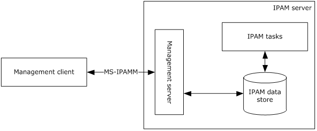

Figure 1: Overview

## 1.4 Relationship to Other Protocols

The IPAM Management Protocol uses [**SOAP message**](#gt_soap-message) for formatting the requests and responses as specified in [[SOAP1.2-1/2007]](https://go.microsoft.com/fwlink/?LinkId=94664) and [[SOAP1.2-2/2007]](https://go.microsoft.com/fwlink/?LinkId=119124). These SOAP messages are sent over the .NET Message Framing TCP Binding Protocol ([MS-NMFTB](../MS-NMFTB/MS-NMFTB.md)) which is built on top of TCP/IP protocol.

The following diagram shows the underlying messaging and transport stack that is being used by this protocol.

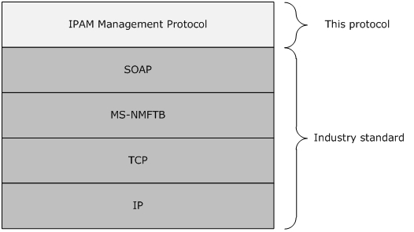

Figure 2: Protocol Stack Diagram

## 1.5 Prerequisites/Preconditions

It is assumed that the protocol client already knows the [**URL**](#gt_uniform-resource-locator-url) of the protocol server for connecting to the various port types exposed by the protocol server.

The protocol also assumes that the authentication has been performed by the underlying protocols.

## 1.6 Applicability Statement

This protocol is only applicable for the operations between the management client and the management server.

The functioning of the IPAM tasks and the [**IPAM data store**](#gt_ipam-data-store) are implementation specific and are outside the scope of this protocol.

The host(s) that form the protocol client or the server have to be part of an [**Active Directory domain**](#gt_active-directory-domain) belonging to the same [**Active Directory forest**](#gt_active-directory-forest).

## 1.7 Versioning and Capability Negotiation

This document covers versioning issues in the following areas:

- **Localization:** This protocol includes text strings in various messages. Localization considerations for such strings are specified in section [2.2](#Section_1.3) and section [3](#Section_3).
- **Protocol Versions:** This protocol is not versioned.
- **Capability Negotiation:** This protocol does not support version negotiation or any other means of negotiating capabilities.
This document specifies IPAM Management Protocol Version 1. It is not interoperable with IPAM Management Protocol Version 2, specified in [MS-IPAMM2](../MS-IPAMM2/MS-IPAMM2.md).<1>

## 1.8 Vendor-Extensible Fields

None

## 1.9 Standards Assignments

None

# 2 Messages

## 2.1 Transport

- Protocol servers MUST support formatting of SOAP over TCP/IP as specified in [MS-NMFTB](../MS-NMFTB/MS-NMFTB.md).
- All protocol messages MUST be transported by using TCP bindings at the transport level.
- All protocol messages MUST be formatted as specified in [[SOAP1.2-1/2007]](https://go.microsoft.com/fwlink/?LinkId=94664) or [[SOAP1.2-2/2007]](https://go.microsoft.com/fwlink/?LinkId=119124).
- Protocol server faults MUST be returned using the [**SOAP fault**](#gt_soap-fault) as specified in [SOAP1.2-1/2007] section 5.4.
- The protocol client MUST know the [**URI**](#gt_uniform-resource-identifier-uri) of the server for the various [**WSDL port type**](#gt_wsdl-port-type)**s** that need to be accessed.
- The protocol MUST use Message Framing Security Provider WindowsTransportSecurity as specified in [MS-WSPOL](../MS-WSPOL/MS-WSPOL.md) section 2.2.3.8 with the ProtectionLevel being EncryptAndSign.

## 2.2 Common Message Syntax

This section contains common definitions used by this protocol. The syntax of the definitions uses XML Schema as defined in [XMLSCHEMA1] and [XMLSCHEMA2], and Web Services Description Language as defined in [WSDL].

In the following sections, the schema definition might be less restrictive than the processing rules imposed by the protocol. The **WSDL** in this specification provides a base description of the schema. The text that introduces the WSDL specifies additional restrictions that reflect protocol behavior. For example, the schema definition might allow for an element to be **empty**, **null**, or **not present** but the behavior of the protocol as specified restricts the same elements to being **non-empty**, **present**, and **not null**.

### 2.2.1 Namespaces

This specification defines and references various XML namespaces using the mechanisms specified in [[XMLNS-2ED]](https://go.microsoft.com/fwlink/?LinkId=90602). Although this specification associates a specific XML namespace prefix for each XML namespace that is used, the choice of any particular XML namespace prefix is implementation-specific and not significant for interoperability.

| Prefix | Namespace URI | Reference |
| --- | --- | --- |
| (none) | http://Microsoft.Windows.Ipam | - |
| msc | http://schemas.microsoft.com/ws/2005/12/wsdl/contract | [MS-WSPOL](../MS-WSPOL/MS-WSPOL.md) |
| xsd | http://www.w3.org/2001/XMLSchema | [[XMLSCHEMA1]](https://go.microsoft.com/fwlink/?LinkId=90608) [[XMLSCHEMA2]](https://go.microsoft.com/fwlink/?LinkId=90610) |
| soap | http://schemas.xmlsoap.org/wsdl/soap/ | [[SOAP1.2-1/2007]](https://go.microsoft.com/fwlink/?LinkId=94664) [[SOAP1.2-2/2007]](https://go.microsoft.com/fwlink/?LinkId=119124) |
| s | http://www.w3.org/2003/05/soap-envelope | [SOAP1.2-1/2007] |
| a | http://www.w3.org/2005/08/addressing | [[WSADDSoapBind1.0]](https://go.microsoft.com/fwlink/?LinkId=235399) [[WSADDCore1.0]](https://go.microsoft.com/fwlink/?LinkId=235398) |
| wsaw | http://www.w3.org/2006/05/addressing/wsdl | [[WSAWSDL]](https://go.microsoft.com/fwlink/?LinkId=130726) |
| wsdl | http://schemas.xmlsoap.org/wsdl/ | [[WSDL]](https://go.microsoft.com/fwlink/?LinkId=90577) |
| sys | http://schemas.datacontract.org/2004/07/System | - |
| ser | http://schemas.microsoft.com/2003/10/Serialization/ | - |
| sysnet | http://schemas.datacontract.org/2004/07/System.Net | - |
| serarr | http://schemas.microsoft.com/2003/10/Serialization/Arrays | - |
| ipam1 | http://schemas.datacontract.org/2004/07/Microsoft.Windows.Ipam | - |
| sysgen | http://schemas.datacontract.org/2004/07/System.Collections.Generic | - |
| syssock | http://schemas.datacontract.org/2004/07/System.Net.Sockets | - |
| sysser | http://schemas.datacontract.org/2004/07/System.ServiceModel | - |

### 2.2.2 Messages

| Message | Description |
| --- | --- |
| [Common Soap Fault](#Section_2.2.2.1) | The structure of the common SOAP fault that is returned by the protocol server to the protocol client when there is an error processing the request. |
| [Keepalive](#Section_2.2.2.2) | The structure of the keepalive message sent by the management client to the management server to detect loss of the underlying transport connection. |

#### 2.2.2.1 Common SOAP Fault

The SOAP fault message is defined in [[SOAP1.2-1/2007]](https://go.microsoft.com/fwlink/?LinkId=94664). The following is the specific format used by this protocol.

<s:Envelope xmlns:s="http://www.w3.org/2003/05/soap-envelope">

<s:Body>

<s:Fault>

<s:Code>

<s:Value>s:Sender</s:Value>

</s:Code>

<s:Reason>

<s:Text xml:lang="en-US">The creator of this fault did not specify a Reason.</s:Text>

</s:Reason>

<s:Detail>

[IpamException]

</s:Detail>

</s:Fault>

</s:Body>

</s:Envelope>

The [IpamException] element is the part of the message which provides more information about the fault itself. This will be of type IpamException (section [2.2.4.88](#Section_2.2.4.88)) or the types that extend the same.

#### 2.2.2.2 Keepalive

The following is the Keepalive message which gets transmitted by the protocol client in a period interval of inactivity and ignored by the server. This helps to detect the drop of TCP session because of inactivity.

`<s:Envelope xmlns:s="http://www.w3.org/2003/05/soap-envelope" xmlns:a="http://www.w3.org/2005/08/addressing">`

`<s:Header>`

`<a:Action s:mustUnderstand="1">Microsoft.WindowsServerSolutions.Common.ProviderFramework.Keepalive</a:Action>`

`</s:Header>`

`<s:Body/>`

`</s:Envelope>`

### 2.2.3 Elements

This specification does not define any common XML schema element definitions.

### 2.2.4 Complex Types

The following table summarizes the set of common XML Schema complex type definitions defined by this specification. XML Schema complex type definitions that are specific to a particular operation are described with the operation.

| Complex type | Description |
| --- | --- |
| [ActiveServerV4LogicalGroup](#Section_2.2.4.1) | Allows extended attributes on an ipam:LogicalGroup type. It specifically contains the definition of the [**logical group**](#gt_logical-group) on server instances with IPv4-specific details, which are enabled for management in the [**IPAM data store**](#gt_ipam-data-store). |
| [ActiveServerV4LogicalGroupNode](#Section_2.2.4.1) | Allows extended attributes on an ipam:LogicalGroupNode type. It specifically defines the [**custom field value**](#gt_custom-field-value) at a specific level in the logical group hierarchy. It will define the criteria for categorizing server instances with IPv4-specific details, which are enabled for management. |
| [ActiveServerV6LogicalGroup](#Section_2.2.4.3) | Allows extended attributes on an ipam:LogicalGroup type. It specifically contains the definition of the logical group on server instances with IPv6-specific details, which are enabled for management in the IPAM data store. |
| [ActiveServerV6LogicalGroupNode](#Section_2.2.4.3) | Allows extended attributes on an ipam:LogicalGroupNode type. It specifically defines the custom field value at a specific level in the logical group hierarchy. It will define the criteria for categorizing server instances with IPv6-specific details, which are enabled for management. |
| [ArrayOfCustomFieldPartialValue](#Section_2.2.4.5) | Defines an array of CustomFieldPartialValue complex type. |
| [ArrayOfCustomFieldValue](#Section_2.2.4.35) | Defines an array of CustomFieldValue complex type. |
| [ArrayOfDhcpExclusionRange](#Section_2.2.4.39) | Defines an array of DhcpExclusionRange complex type. The elements in the array MUST be either DhcpExclusionRangeV4 or DhcpExclusionRangeV6. |
| [ArrayOfDhcpOption](#Section_2.2.4.43) | Defines an array of DhcpOption complex type. The elements in the array MUST be either DhcpOptionV4 or DhcpOptionV6 complex type. |
| [ArrayOfDhcpOptionDefinition](#Section_2.2.4.43) | Defines an array of DhcpOptionDefinition complex type. The elements in the array MUST be either DhcpOptionDefinitionV4 or DhcpOptionDefinitionV6. |
| [ArrayOfDhcpServer](#Section_2.2.4.10) | Defines an array of DhcpServer complex type. The elements in the array MUST be either DhcpServerV4 or DhcpServerV6 complex type. |
| [ArrayOfDhcpServerOperations](#Section_2.2.5.23) | Specifies an array of DhcpServerOperations that specify the type of management operations that need to be performed by the IPAM server as a part of the processing for DBUpdateDhcpServer. |
| [ArrayOfDhcpUserClass](#Section_2.2.4.64) | Defines an array of DhcpUserClass complex type. The elements in the array MUST be either DhcpUserClassV4 or DhcpUserClassV6. |
| [ArrayOfDhcpVendorClass](#Section_2.2.4.13) | Defines an array of DhcpVendorClass complex type. The elements in the array MUST be either DhcpVendorClassV4 or DhcpVendorClassV6. |
| [ArrayOfDiscoveryConfig](#Section_2.2.4.72) | Defines an array of DiscoveryConfig complex type. |
| [ArrayOfIpamIPAddress](#Section_2.2.4.91) | Defines an array of IpamIPAddress complex type. The elements in the array MUST be of either IpamIPv4Address or IpamIPv6Address complex type. |
| [ArrayOfIpamObject](#Section_2.2.4.108) | Defines an array of IpamObject complex type. The elements in the array MUST be of a complex type that either directly or indirectly extends IpamObject. |
| [ArrayOfIPBlock](#Section_2.2.4.17) | Defines an array of IPBlock complex type. The elements in the array MUST be of either IPv4Block or IPv6Block complex type. |
| [ArrayOfIPRange](#Section_2.2.4.18) | Defines an array of IPRange complex type. The elements in the array MUST be of either IPv4Range or IPv6Range complex type. |
| [ArrayOfIPUtilization](#Section_2.2.4.123) | Defines an array of IPUtilization complex type. The elements in the array MUST be of either IPv4Utilization or IPv6Utilization complex type. |
| [ArrayOfLogicalGroupField](#Section_2.2.4.20) | Defines an array of LogicalGroupField complex type. |
| [ArrayOfLogicalGroupNode](#Section_2.2.4.134) | Defines an array of LogicalGroupNode complex type. The elements in the array MUST extend LogicalGroupNode. |
| [ArrayOfScopeOperations](#Section_2.2.4.22) | Specifies an array of DhcpScopeOperations that specify the type of management operations that have to be performed on the DHCP scope. This is used by the management server as a part of DBCreateOrUpdateDhcpScope to identify the changes that have to be committed to the IPAM data store for the specified DhcpScope value. |
| [ArrayOfServerInfo](#Section_2.2.4.155) | Defines an array of ServerInfo complex type. |
| [ArrayOfServerRole](#Section_2.2.4.157) | Defines an array of ServerRole complex type or the complex types that extend ServerRole complex type. |
| [ArrayOfTaskInfo](#Section_2.2.4.182) | Defines an array of TaskInfo complex type or the complex types that extend TaskInfo complex type. |
| [AuditPurgeSettings](#Section_2.2.4.26) | Specifies the configuration to be used for performing the [**audit purge**](#gt_audit-purge) operation. |
| [BaseDnsServerZone](#Section_2.2.4.27) | Specifies the properties of a zone hosted on a DNS server. This consists of the properties common to both DnsServerZone as well as DnsServerReverseZone complex types that extend the BaseDnsServerZone. |
| [BaseDnsZone](#Section_2.2.4.28) | Specifies the properties of a DNS [**zone**](#gt_zone). This consists of the properties common to both DnsZone as well as DnsReverseZone complex types that extend the BaseDnZone. |
| [BaseIpamObject](#Section_2.2.4.108) | Composed of the common properties that are applicable to most of the complex types defined in this protocol. This complex type allows extended attributes on the ipam:IpamObject that it extends. |
| [ConfigurationAuditEnumerationParameters](#Section_2.2.4.30) | Specifies the enumeration criteria for the configuration audit information. |
| [ConfigurationAuditRecord](#Section_2.2.4.31) | Specifies a single [**configuration audit event**](#gt_configuration-audit-event) information. The [**configuration audit**](#gt_configuration-audit) record can be used to represent both [**IPAM configuration audit**](#gt_ipam-configuration-audit) as well as [**DHCP configuration audit**](#gt_dhcp-configuration-audit) event. |
| [ConflictingIPAddressFailureIpamExceptionData](#Section_2.2.4.32) | Specifies the information pertaining to the IP address instance overlap. |
| [ConflictingIPBlockFailureIpamExceptionData](#Section_2.2.4.33) | Specifies the information pertaining to the IP address block instance overlap. |
| [ConflictingIPRangeFailureIpamExceptionData](#Section_2.2.4.34) | Specifies the information pertaining to the [**IP address range**](#gt_ip-address-range) instance overlap. |
| [CustomField](#Section_2.2.4.35) | Specifies a single [**custom field**](#gt_custom-field) information. |
| [CustomFieldEnumerationParameters](#Section_3.5.4.7.1.2) | Specifies the set of parameters to be used for enumerating the custom fields. |
| [CustomFieldPartialValue](#Section_2.2.4.37) | Specifies the custom field value with minimum information when compared to the CustomFieldValue. This management server uses this to return the custom field values during the enumeration operations. The management client MUST NOT use this to specify custom field value. The management client MUST use the CustomFieldValue complex type for specifying custom field values. |
| [CustomFieldValue](#Section_2.2.4.38) | Specifies a custom field value. |
| [DhcpExclusionRange](#Section_2.2.4.39) | Specfies the DHCP [**exclusion range**](#gt_exclusion-range). |
| [DhcpExclusionRangeCollection](#Section_2.2.4.40) | Specifies a collection of DHCP exclusion ranges. |
| [DhcpExclusionRangeV4](#Section_2.2.4.41) | Specifies a DHCP exclusion range for an IPv4-specific DHCP [**scope**](#gt_scope). |
| [DhcpExclusionRangeV6](#Section_2.2.4.42) | Specifies a DHCP exclusion range for an IPv6-specific DHCP scope. |
| [DhcpOption](#Section_2.2.4.43) | Specifies the common information pertaining to a DHCP option which is independent of whether the option is IPv4-specific or IPv6-specific. |
| [DhcpOptionCollection](#Section_2.2.4.44) | Specifies a collection of DHCP options. |
| [DhcpOptionDefinition](#Section_2.2.4.45) | Specifies the various properties of a DHCP [**option definition**](#gt_option-definition). |
| [DhcpOptionDefinitionCollection](#Section_2.2.4.46) | Specifies a collection of DhcpOptionDefinition complex type. |
| [DhcpOptionDefinitionV4](#Section_2.2.4.47) | Allows extension of the DhcpOptionDefinition complex type. This specifies the option definitions associated with the IPv4-specific DHCP server instance. |
| [DhcpOptionDefinitionV6](#Section_2.2.4.48) | Allows extension of the DhcpOptionDefinition complex type. This specifies the option definitions associated with the IPv6-specific DHCP server instance. |
| [DhcpOptionV4](#Section_2.2.4.49) | Allows extension of the DhcpOption complex type. This specifies the DHCP option associated with the IPv4-specific DHCP server or scope instance. |
| [DhcpOptionV6](#Section_2.2.4.50) | Allows extension of the DhcpOption complex type. This specifies the DHCP option associated with the IPv6-specific DHCP server or scope instance. |
| [DhcpScope](#Section_2.2.4.51) | Specifies the details associated with a DHCP scope. |
| [DhcpScopeAllEnumerationParameters](#Section_2.2.4.52) | Specifies the criteria to be used for enumerating the DHCP scopes. |
| [DhcpScopeAssociatedWithVendorClassesEnumerationParameters](#Section_2.2.4.53) | Specifies the criteria to be used for enumerating the scopes that are associated with a given set of vendor classes. |
| [DhcpScopeForIpBlockEnumerationParameters](#Section_2.2.4.54) | Specifies the criteria to be used for enumerating the scopes belonging to a particular address block. |
| [DhcpScopesByDhcpServerIdListEnumerationParameters](#Section_2.2.4.55) | Specifies the criteria for enumerating the scopes that belong to a set of DHCP servers. |
| [DhcpScopeUnmappedEnumerationParameters](#Section_3.5.4.7.1.7) | Specifies the criteria to be used for enumerating the scopes that are not mapped to any address block. |
| [DhcpScopeV4](#Section_2.2.4.57) | Allows the extension of the DhcpScope complex type. This specifies a scope for specifying IPv4 address assignment with DHCP. As this depicts the IPv4 DHCP scope, the StartAddress and EndAddress MUST be valid IPv4 address. The PrefixLength MUST be greater than or equal to 1 and MUST be no greater than 30. |
| [DhcpScopeV6](#Section_2.2.4.58) | Allows the extension of the DhcpScope complex type. This specifies a scope for specifying IPv6 address assignment with DHCP. As this depicts the IPv6 DHCP scope, the StartAddress and EndAddress MUST be valid IPv6 address. The PrefixLength MUST be greater than or equal to 1 and MUST be no greater than 127. |
| [DhcpServer](#Section_2.2.4.59) | Specifies the common details of a DHCP server instance. |
| [DhcpServerAllEnumerationParameters](#Section_3.5.4.7.1.8) | Specifies the parameters used for enumerating the DhcpServer instances. |
| [DhcpServerByServerInfoIdsEnumerationParameters](#Section_3.5.4.7.1.9) | Specifies the record identifiers of ServerInfo instances for which the DhcpServer instances are to be enumerated. |
| [DhcpServerV4](#Section_2.2.4.62) | Extends the DhcpServer complex type to specify the IPv4-specific information of the DHCP server instance. The OptionDefinitions MUST be a collection of DhcpOptionDefinitionV4 elements. The Options MUST be a collection of DhcpOptionV4 elements. The UserClasses MUST be a collection of DhcpUserClassV4. The VendorClasses MUST be a collection of DhcpVendorClassV4 elements. |
| [DhcpServerV6](#Section_2.2.4.63) | Extends the DhcpServer complex type to specify the IPv6-specific information of the DHCP server instance. The OptionDefinitions MUST be a collection of DhcpOptionDefinitionV6 elements. The Options MUST be a collection of DhcpOptionV6 elements. The UserClasses MUST be a collection of DhcpUserClassV6. A collection of DhcpVendorClassV6 elements. |
| [DhcpUserClass](#Section_2.2.4.64) | Specifies the common properties of a [**user class**](#gt_user-class). |
| [DhcpUserClassCollection](#Section_2.2.4.65) | Specifies a collection of DhcpUserClass complex types. |
| [DhcpUserClassV4](#Section_2.2.4.66) | Allows the extension of the DhcpUserClass complex type. This specifies the DhcpUserClass instance associated with the IPv4-specific DhcpServer instance. |
| [DhcpUserClassV6](#Section_2.2.4.67) | Allows the extension of the DhcpUserClass complex type. This specifies the DhcpUserClass instance associated with the IPv6- specific DhcpServer instance. |
| [DhcpVendorClass](#Section_2.2.4.68) | Specifies the common properties of a [**vendor class**](#gt_vendor-class). |
| [DhcpVendorClassCollection](#Section_2.2.4.69) | Specifies a collection of DhcpVendorClass complex types. |
| [DhcpVendorClassV4](#Section_2.2.4.70) | Allows the extension of the DhcpVendorClass complex type. This specifies the DhcpVendorClass instance associated with the IPv4-specific DhcpServer instance. |
| [DhcpVendorClassV6](#Section_2.2.4.71) | Allows the extension of the DhcpVendorClass complex type. This specifies the DhcpVendorClass instance associated with the IPv6-specific DhcpServer instance. |
| [DiscoveryConfig](#Section_2.2.4.72) | Describes the discovery configuration for a specific domain. |
| [DiscoverySubnetEnumerationParameters](#Section_3.5.4.7.1.10) | Specifies the criteria based on which the subnets for grouping the discovered servers are to be enumerated. |
| [DnsReverseLookupZone](#Section_2.2.4.74) | Specifies the information pertaining to a single instance of a [**reverse lookup DNS zone**](#gt_reverse-lookup-dns-zone). The DnsReverseLookupZone complex type allows extending the BaseDnsZone complex type. |
| [DnsReverseLookupZoneEnumerationParameters](#Section_3.5.4.7.1.11) | Specifies the criteria to be used for enumerating the reverse lookup zones. |
| [DnsServer](#Section_2.2.4.76) | Specifies the DNS server instance properties. |
| [DnsServerByServerInfoIdsEnumerationParameters](#Section_2.2.4.77) | Specifies the parameters to enumerate the DnsServer instances based on the record identifiers of the ServerInfo instances. |
| [DnsServerEnumerationParameters](#Section_2.2.4.78) | Specifies the criteria to be used for enumerating the DNS servers. |
| [DnsServerReverseZone](#Section_2.2.4.79) | Specifies the information regarding a specific reverse lookup DNS zone hosted on a particular server. The DnsServerReverseZone complex type allows the extension of attributes for the BaseDnsServerZone complex type. |
| [DnsServerReverseZoneEnumerationParameters](#Section_3.5.4.7.1.14) | Specifies the criteria to be used for enumerating the DNS server hosting of reverse lookup zones. |
| [DnsServerZone](#Section_2.2.4.81) | Specifies the information regarding the [**forward lookup DNS zone**](#gt_forward-lookup-dns-zone) hosting on a DNS server. The DnsServerZone complex type allows extending the attributes of the BaseDnsServerZone complex type. |
| [DnsServerZoneEnumerationParameters](#Section_3.5.4.7.1.15) | Specifies the criteria to enumerate the DNS server hosting of forward lookup zones. |
| [DnsZone](#Section_2.2.4.83) | Specifies the information pertaining to a forward lookup DNS zone. The DnsZone complex type allows extension of attributes of the BaseDnsZone complex type. |
| [DnsZoneEnumerationParameters](#Section_3.5.4.7.1.16) | Specifies the filter criteria to be used for enumerating the forward lookup zones from the IPAM data store. |
| [DnsZoneEvent](#Section_2.2.4.85) | Specifies a specific instance of the DNS zone related [**event**](#gt_event). |
| [DnsZoneEventEnumerationParameters](#Section_2.2.4.86) | Specifies the criteria to be used for enumerating the DnsZoneEvent rows from the IPAM data store. |
| [EnumerationParametersBase](#Section_2.2.4.87) | Forms the base element which all other complex types for specifying enumeration parameters extend. |
| [ipam1:IpamException](#Section_2.2.4.88) | Specifies the base type for providing the fault information from the management server to the management client. |
| [PropertiesCouldNotBeValidatedIpamExceptionData](#Section_2.2.4.144) | Specifies the list of properties which could not be recognized or not validated by IPAM. |
| [IpamAddressObject](#Section_2.2.4.89) | Specifies an IP address object that also extends the IpamObject so that it can be used with port types that allow enumeration of data from the server. |
| [IpamIPAddress](#Section_2.2.4.91) | Specifies the common address object information in the IPAM data store. |
| [IpamIPAddressAllForLogicalGroupEnumerationParameters](#Section_2.2.4.92) | Specifies the parameters for enumerating the IP address instances that map to a specified logical group. |
| [IpamIPAddressAllForLogicalGroupNodeEnumerationParameters](#Section_3.5.4.7.1.19) | Specifies the criteria to be used for enumerating the addresses that map to a [**logical group node**](#gt_logical-group-node). |
| [IpamIPAddressByBlockIdEnumerationParameters](#Section_2.2.4.94) | Specifies the criteria to be used for enumerating the address instances that map to a specified address block. |
| [IpamIPAddressByManagedByAndManagedByEntityEnumerationParameters](#Section_2.2.4.95) | Specifies the criteria to be used for enumerating the address instances that have a specified value for ManagedBy and ManagedByEntity built-in custom field values. |
| [IpamIPAddressByRangeIdEnumerationParameters](#Section_3.5.4.7.1.22) | Specifies the filter criteria to be used for enumerating the address instances that map to a specific address range. |
| [IpamIPAddressForUnmappedRangesEnumerationParameters](#Section_2.2.4.97) | Retrieves the list of addresses in address ranges that are not already mapped to an address block. |
| [IpamIPAddressGetDuplicateIPAddressesEnumerationParameters](#Section_3.5.4.7.1.24) | Specifies the criteria to be used for enumerating the address instances that have duplicates. |
| [IpamIPAddressRootAddressesEnumerationParameters](#Section_3.5.4.7.1.25) | Specifies the filter criteria for enumerating the address instances belonging to a specified address category. |
| [IpamIPAddressUnmappedAddressEnumerationParameters](#Section_2.2.4.100) | Specifies the criteria for enumerating the unmapped address instances. Unmapped address instances are those that are not mapped to any address range instances. |
| [IpamIPv4Address](#Section_2.2.4.101) | Enables extension of attributes of the IpamIPAddress complex type. This is used to specify the details pertaining to the IPv4 address instance. The IPAddress, ParentIPRangeEndIP, ParentIPRangeStartIP, DhcpScopeSubnetId MUST be of address family Internet where they are applicable. |
| [IpamIPv4AddressLogicalGroup](#Section_2.2.4.102) | Allows extensions to the LogicalGroup complex type. This specifies the LogicalGroup which can be used to enumerate IPv4 address instances using the [**logical group hierarchy**](#gt_logical-group-hierarchy). |
| [IpamIPv4AddressLogicalGroupNode](#Section_2.2.4.103) | Allows extension of the LogicalGroupNode complex type. It defines the custom field value at a specific level in the logical group hierarchy. It will define the criteria for categorizing the IPv4 address instances based on the custom field values defined on them in the form of a logical group hierarchy. |
| [IpamIPv6Address](#Section_2.2.4.104) | Enables extension of attributes of the IpamIPAddress complex type. This is used to specify the details pertaining to the IPv6 address instance. The IPAddress, ParentIPRangeEndIP, ParentIPRangeStartIP, DhcpScopeSubnetId MUST be of address family InternetV6 where they are applicable. |
| [IpamIPv6AddressLogicalGroup](#Section_2.2.4.105) | Allows extensions to the LogicalGroup complex type. This specifies the LogicalGroup that can be used to enumerate IPv6 address instances using the logical group hierarchy. |
| [IpamIPv6AddressLogicalGroupNode](#Section_2.2.4.106) | Allows extension of the LogicalGroupNode complex type. It defines the custom field value at a specific level in the logical group hierarchy. It will define the criteria for categorizing the IPv6 address instances based on the custom field values defined on them in the form of a logical group hierarchy. |
| [IpamNumberOfRowsObject](#Section_2.2.4.107) | Defines the type that can be used to return a integer value specifying the number of rows as a result from the IPAM enumeration port types. |
| [IpamObject](#Section_2.2.4.108) | Identifies and provides certain common functionality for types that are IPAM-specific. |
| [IPAuditEnumerationParameters](#Section_2.2.4.109) | Specifies the enumeration parameters for the [**IP address audit**](#gt_ip-address-audit). |
| [IPAuditRecord](#Section_2.2.4.110) | Specifies single IP address audit. |
| [IPBlock](#Section_2.2.4.111) | Specifies the address block information that is common to both IPv4Block and IPv6Block. |
| [IPBlockChildBlockEnumerationParameters](#Section_3.5.4.7.1.27) | Specifies the criteria to be used for enumerating the address blocks that form the child blocks of a specified address block. |
| [IPBlockGetAllBlocksEnumerationParameters](#Section_2.2.4.113) | Specifies the criteria to be used for enumerating all the address blocks in the IPAM data store. |
| [IPBlockRootEnumerationParameters](#Section_2.2.4.114) | Specifies the criteria for enumerating the rows that form the first level of address blocks (for which there are no parent blocks). |
| [IPCumulativeUtilization](#Section_2.2.4.115) | Specifies the address utilization statistics or trend information. |
| [IPRange](#Section_2.2.4.116) | Specifies the common information pertaining to the address range. |
| [IPRangeAllForBlockEnumerationParameter](#Section_2.2.4.117) | Specifies the criteria based on which ranges corresponding to an address block instance can be retrieved. |
| [IPRangeAllForDhcpServerEnumerationParameters](#Section_2.2.4.118) | Specifies the criteria based on which address ranges corresponding to the DHCP scope instances of a particular DHCP server are enumerated. |
| [IPRangeByManagedByAndManagedByEntityEnumerationParameters](#Section_3.5.4.7.1.31) | Specifies the criteria required to enumerate the address ranges for which the built-in custom fields ManagedBy and ManagedByEntity have a specific value. |
| [IPRangeForBlockEnumerationParameters](#Section_2.2.4.120) | Specifies the criteria for enumerating the address ranges that map directly onto an address block and don’t include the address ranges that map to a child block for the specified address block. |
| [IPRangeRootEnumerationParameters](#Section_2.2.4.121) | Specifies the criteria for enumerating all the address ranges that have a specific address category. |
| [IPRangeUnmappedEnumerationParameters](#Section_2.2.4.122) | Specifies the criteria for enumerating the address ranges that are not mapped to any address block and are unmapped. |
| [IPUtilization](#Section_2.2.4.123) | Specifies the address utilization data for a specific time range. |
| [IPv4Block](#Section_2.2.4.124) | Allows extending the attributes IPBlock to specify the IPv4-specific address block. The EndIPAddress, NetworkId, StartIPAddress, and SubnetMask MUST be of address family type being Internet. |
| [IPv4Range](#Section_2.2.4.125) | Allows extending the attributes of IPRange to specify the details of IPv4-specific address range details. The DefaultGateway, EndIPAddress, ExclusionRanges, StartIPAddress, SubnetId, and SubnetMask MUST be of Internet address family type. |
| [IPv4RangeLogicalGroup](#Section_2.2.4.126) | Allows extending the attributes of LogicalGroup complex type to specify a logical group definition that can be used for enumerating the address ranges. |
| [IPv4RangeLogicalGroupNode](#Section_2.2.4.127) | Extends the attributes of LogicalGroupNode complex type to specify the criteria for a specific level in the logical group hierarchy that can be used to enumerate the address ranges for that level. |
| [IPv4Utilization](#Section_2.2.4.128) | Extends the attributes of a IPUtilization complex type to specify the address utilization corresponding to IPv4-specific address space. |
| [IPv6Block](#Section_2.2.4.129) | Extends the attributes of the IPBlock complex type to specify the IPv6-specific address block. EndIPAddress, NetworkId, StartIPAddress, and SubnetMask MUST be of address family type InternetV6. |
| [IPv6Range](#Section_2.2.4.130) | Extend the attributes of IPRange complex type to specify the IPv6-specific address range details. The DefaultGateway, EndIPAddress, ExclusionRanges, StartIPAddress, SubnetId, and SubnetMask MUST be of address family type InternetV6. |
| [IPv6RangeLogicalGroup](#Section_2.2.4.131) | Extends the attributes of LogicalGroup complex type. This specifies a logical group definition that can be used for enumerating the address ranges. |
| [IPv6RangeLogicalGroupNode](#Section_2.2.4.132) | Extends the attributes of LogicalGroupNode complex type. This specifies the criteria for a specific level in the logical group hierarchy that can be used to enumerate the address ranges that meet that level. |
| [IPv6Utilization](#Section_2.2.4.133) | Extends the attributes of a IPUtilization complex type to specify the address utilization corresponding to IPv6-specific address space. |
| [LogicalGroup](#Section_2.2.4.134) | Specifies the definition of a logical group. |
| [LogicalGroupDataForLogicalGroupNodeEnumerationParameters](#Section_2.2.4.135) | Specifies the logical group node information that will form the criteria for enumerating the data. |
| [LogicalGroupDataForRootAlternateItemsEnumerationParameters](#Section_3.5.4.7.1.36) | Specifies the criteria for enumerating the data which will map to the specified logical group. |
| [LogicalGroupDataUnmappedItemsEnumerationParameters](#Section_3.5.4.7.1.37) | Specifies the criteria used to enumerate the data that do not map to a specified logical group. |
| [LogicalGroupField](#Section_2.2.4.138) | Specifies one level of the multivalued custom field that forms the logical group hierarchy. |
| [LogicalGroupNode](#Section_2.2.4.139) | Specifies the actual custom field values that form the criteria for the data to be satisfied to match at a particular level in the logical group hierarchy. |
| [LogicalGroupNodeChildrenEnumerationParameters](#Section_2.2.4.140) | Specifies the criteria to be used for enumerating the logical group nodes that form the next level of logical group nodes in a logical group hierarchy. |
| [LogicalGroupNodeRootEnumerationParameters](#Section_2.2.4.141) | Specifies the criteria for enumerating the LogicalGroupNode that form the first level of LogicalGroupHierarchy. |
| [LogicalGroupsEnumerationParameters](#Section_2.2.4.142) | Specifies the criteria for enumerating the logical groups from the IPAM data store. |
| [MACAddress](#Section_2.2.4.143) | Specifies the MAC address. |
| [serarr:ArrayOfanyType](#Section_2.2.4.145) | Specifies an array whose elements can be of any type. |
| [serarr:ArrayOfKeyValueOfDnsReverseLookupZoneFilterCriteriaanyType2zwQHvQz](#Section_2.2.4.146) | Specifies an array of key value pair where the key of the element has the DnsReverseLookupZoneFilterCriteria and the value of the element can be any value appropriate for the key specified. The keys in the array MUST be unique, i.e. no two elements in the array can have the same key. |
| [serarr:ArrayOfKeyValueOfDnsZoneFilterCriteriaanyType2zwQHvQz](#Section_2.2.4.147) | Specifies an array of key value pair where the key of the element has the DnsZoneFilterCriteria and the value of the element can be any value appropriate for the key specified. The keys in the array MUST be unique, i.e. no two elements in the array can have the same key. |
| [serarr:ArrayOfKeyValueOfintanyType](#Section_2.2.4.148) | Specifies an array of key value pair where the key of the element has an integer and the value of the element can be any value appropriate for the key specified. The keys in the array MUST be unique, i.e. no two elements in the array can have the same key. |
| [serarr:ArrayOfKeyValueOflongDhcpScopem1ahUJFx](#Section_2.2.4.149) | Specifies an array of key value pairs where the key of the element has the DHCP scope instance record identifier and the value is the corresponding DHCP scope instance. |
| [serarr:ArrayOfKeyValueOfServerInfoGetServerFilteranyType2zwQHvQz](#Section_2.2.4.150) | Specifies an array of key value pair where the key of the element has the ServerInfoGetServerFilter type and the value of the element can be any value appropriate for the key specified. The keys in the array MUST be unique, i.e. no two elements in the array can have the same key. |
| [serarr:ArrayOflong](#Section_2.2.4.151) | Specifies an array of elements of type xsd:long. |
| [serarr:ArrayOfstring](#Section_2.2.4.152) | Specifies an array of elements of type xsd:string. |
| [serarr:ArrayOfunsignedByte](#Section_2.2.4.153) | Specifies an array of elements of type xsd:unsignedByte. |
| [serarr:ArrayOfunsignedShort](#Section_2.2.4.154) | Specifies an array of elements of type xsd:unsignedShort. |
| [ServerInfo](#Section_2.2.4.155) | Specifies the information pertaining to the server instances in the IPAM data store. |
| [ServerInfoEnumerationParameters](#Section_2.2.4.156) | Specifies the criteria to be used for enumerating the server instances from the IPAM data store. |
| [ServerRole](#Section_2.2.4.157) | Specifies the common access status information pertaining to an individual [**server role**](#gt_server-role). |
| [ServerRoleDc](#Section_2.2.4.158) | Allows the extension of attributes of the ServerRole complex type. The ServerRoleFlag MUST be set to ServerRoleType.Dc. |
| [ServerRoleDhcp](#Section_2.2.4.159) | Allows the extension of the ServerRole complex type. The ServerRoleFlag MUST be set to ServerRoleType.Dhcp. |
| [ServerRoleDhcp.Version](#Section_2.2.4.160) | Specifies the version of the DHCP server role. |
| [ServerRoleDns](#Section_2.2.4.161) | Allows the extension of attributes of the ServerRole complex type. The ServerRoleFlag MUST be set to ServerRoleType.Dns. |
| [ServerRoleNps](#Section_2.2.4.162) | Allows the extension of attributes of the ServerRole complex type. The ServerRoleFlag MUST be set to ServerRoleType.Nps. |
| [sys:Exception](#Section_2.2.4.163) | Specifies the generic Exception complex type which is extended by the IpamException complex type for specifying the IPAM fault information. |
| [sys:Version](#Section_2.2.4.164) | Specifies the version of a component or server. |
| [sysgen:ArrayOfKeyValuePairOfCollectionOperationsDhcpExclusionRangenTEz2bI_S](#Section_2.2.4.165) | Specifies an array of key value pairs wherein the key specifies a CollectionOperations type specifying the type of operation that has to be performed with the DhcpExclusionRange data specified in the value portion key value pair entry. |
| [sysgen:ArrayOfKeyValuePairOfCollectionOperationsDhcpOptionnTEz2bI_S](#Section_2.2.4.166) | Specifies an array of key value pairs wherein the key specifies a CollectionOperations type specifying the type of operation that has to be performed with the DhcpOption data specified in the value portion key value pair entry. |
| [sysgen:ArrayOfKeyValuePairOfCollectionOperationsDhcpOptionDefinitionnTEz2bI_S](#Section_2.2.4.167) | Specifies an array of key value pairs wherein the key specifies a CollectionOperations type specifying the type of operation that has to be performed with the DhcpOptionDefinition data specified in the value portion key value pair entry. |
| [sysgen:ArrayOfKeyValuePairOfCollectionOperationsDhcpUserClassnTEz2bI_S](#Section_2.2.4.168) | Specifies an array of key value pairs wherein the key specifies a CollectionOperations type specifying the type of operation that has to be performed with the DhcpUserClass data specified in the value portion key value pair entry. |
| [sysgen:ArrayOfKeyValuePairOfCollectionOperationsDhcpVendorClassnTEz2bI_S](#Section_2.2.4.169) | Specifies an array of key value pairs wherein the key specifies a CollectionOperations type specifying the type of operation that has to be performed with the DhcpVendorClass data specified in the value portion key value pair entry. |
| [sysgen:ArrayOfKeyValuePairOflongArrayOfIPBlockm1ahUJFx](#Section_2.2.4.170) | Specifies an array of key value pair wherein the key specifies the record identifier and the value specifies an array of address block instances specifying the hierarchy of the address block corresponding to the record identifier. |
| [sysgen:ArrayOfKeyValuePairOflongint](#Section_2.2.4.171) | Specifies an array of key value pair wherein the key specifies a long integer and the value specifies an integer value. |
| [sysgen:ArrayOfKeyValuePairOflongIpamExceptionmhTjmZB3](#Section_2.2.4.172) | Specifies an array of key value pair wherein the key specifies a long integer and the value specifies an IpamException. |
| [sysgen:KeyValuePairOfCollectionOperationsDhcpExclusionRangenTEz2bI_S](#Section_2.2.4.173) | Specifies a key value pair wherein the key specifies a CollectionOperations type specifying the type of operation that has to be performed on the DhcpExclusionRange data specified in the value portion. |
| [sysgen:KeyValuePairOfCollectionOperationsDhcpOptionnTEz2bI_S](#Section_2.2.4.174) | Specifies a key value pair wherein the key specifies a CollectionOperations type specifying the type of operation that has to be performed on the DhcpOption data specified in the value portion. |
| [sysgen:KeyValuePairOfCollectionOperationsDhcpOptionDefinitionnTEz2bI_S](#Section_2.2.4.175) | Specifies a key value pair wherein the key specifies a CollectionOperations type specifying the type of operation that has to be performed on the DhcpOptionDefinition data specified in the value portion. |
| [sysgen:KeyValuePairOfCollectionOperationsDhcpUserClassnTEz2bI_S](#Section_2.2.4.176) | Specifies a key value pair wherein the key specifies a CollectionOperations type specifying the type of operation that has to be performed on the DhcpUserClass data specified in the value portion. |
| [sysgen:KeyValuePairOfCollectionOperationsDhcpVendorClassnTEz2bI_S](#Section_2.2.4.177) | Specifies a key value pair wherein the key specifies a CollectionOperations type specifying the type of operation that has to be performed on the DhcpVendorClass data specified in the value portion. |
| [sysgen:KeyValuePairOflongint](#Section_2.2.4.178) | Specifies a key value pair wherein the key specifies a long type element and the value specifies an int type element. |
| [sysgen:KeyValuePairOflongIpamExceptionmhTjmZB3](#Section_2.2.4.179) | Specifies a key value pair wherein the key specifies a long type element and the value specifies an IpamException type element. |
| [sysnet:ArrayOfIPAddress](#Section_2.2.4.180) | Specifies an array of IPAddress complex type. |
| [sysnet:IPAddress](#Section_2.2.4.181) | Specifies an IP address independent of the address family. |
| [TaskInfo](#Section_2.2.4.182) | Specifies the set of details that provide more information about IPAM tasks. |
| [UnmappedIpamIPAddressForLogicalGroupEnumerationParameters](#Section_3.5.4.7.1.42) | Specifies the parameters for enumerating the IP address instances that do not map to a specific logical group. |

#### 2.2.4.1 ActiveServerV4LogicalGroup

The ActiveServerV4LogicalGroup allows extended attributes on an ipam:LogicalGroup type. It specifically contains the definition of the [**logical group**](#gt_logical-group) on server instances with IPv4-specific details, which are enabled for management in the [**IPAM data store**](#gt_ipam-data-store).

<xs:complexType name="ActiveServerV4LogicalGroup">

<xs:complexContent mixed="false">

<xs:extension base="ipam:LogicalGroup">

<xs:sequence />

</xs:extension>

</xs:complexContent>

</xs:complexType>

#### 2.2.4.2 ActiveServerV4LogicalGroupNode

The ActiveServerV4LogicalGroupNode allows extended attributes on an ipam:LogicalGroupNode type. It specifically defines the [**custom field value**](#gt_custom-field-value) at a specific level in the logical group hierarchy. It will define the criteria for categorizing server instances with IPv4-specific details, which are enabled for management.

<xs:complexType name="ActiveServerV4LogicalGroupNode">

<xs:complexContent mixed="false">

<xs:extension base="ipam:LogicalGroupNode">

<xs:sequence />

</xs:extension>

</xs:complexContent>

</xs:complexType>

#### 2.2.4.3 ActiveServerV6LogicalGroup

The ActiveServerV6LogicalGroup allows extended attributes on an ipam:LogicalGroup type. It specifically contains the definition of the [**logical group**](#gt_logical-group) on server instances with IPv6-specific details, which are enabled for management in the [**IPAM data store**](#gt_ipam-data-store).

<xs:complexType name="ActiveServerV6LogicalGroup">

<xs:complexContent mixed="false">

<xs:extension base="ipam:LogicalGroup">

<xs:sequence />

</xs:extension>

</xs:complexContent>

</xs:complexType>

#### 2.2.4.4 ActiveServerV6LogicalGroupNode

The ActiveServerV6LogicalGroupNode allows extended attributes on an ipam:LogicalGroupNode type. It specifically defines the [**custom field value**](#gt_custom-field-value) at a specific level in the logical group hierarchy. It will define the criteria for categorizing server instances with IPv6-specific details, which are enabled for management.

<xs:complexType name="ActiveServerV6LogicalGroupNode">

<xs:complexContent mixed="false">

<xs:extension base="ipam:LogicalGroupNode">

<xs:sequence />

</xs:extension>

</xs:complexContent>

</xs:complexType>

#### 2.2.4.5 ArrayOfCustomFieldPartialValue

The ArrayOfCustomFieldPartialValue complex type defines an array of CustomFieldPartialValue complex type.

<xs:complexType name="ArrayOfCustomFieldPartialValue">

<xs:sequence>

<xs:element minOccurs="0" maxOccurs="unbounded" name="CustomFieldPartialValue" nillable="true" type="ipam:CustomFieldPartialValue" />

</xs:sequence>

</xs:complexType>

#### 2.2.4.6 ArrayOfCustomFieldValue

The ArrayOfCustomFieldValue complex type defines an array of CustomFieldValue complex type.

<xs:complexType name="ArrayOfCustomFieldValue">

<xs:sequence>

<xs:element minOccurs="0" maxOccurs="unbounded" name="CustomFieldValue" nillable="true" type="ipam:CustomFieldValue" />

</xs:sequence>

</xs:complexType>

#### 2.2.4.7 ArrayOfDhcpExclusionRange

The ArrayOfDhcpExclusionRange complex type defines an array of DhcpExclusionRange complex type. The elements in the array MUST be either DhcpExclusionRangeV4 complex type or DhcpExclusionRangeV6 complex type.

<xs:complexType name="ArrayOfDhcpExclusionRange">

<xs:sequence>

<xs:element minOccurs="0" maxOccurs="unbounded" name="DhcpExclusionRange" nillable="true" type="ipam:DhcpExclusionRange" />

</xs:sequence>

</xs:complexType>

#### 2.2.4.8 ArrayOfDhcpOption

The ArrayOfDhcpOption complex type defines an array of DhcpOption complex type. The elements in the array MUST be either DhcpOptionV4 or DhcpOptionV6 complex type.

<xs:complexType name="ArrayOfDhcpOption">

<xs:sequence>

<xs:element minOccurs="0" maxOccurs="unbounded" name="DhcpOption" nillable="true" type="ipam:DhcpOption" />

</xs:sequence>

</xs:complexType>

#### 2.2.4.9 ArrayOfDhcpOptionDefinition

The ArrayOfDhcpOptionDefinition complex type defines an array of DhcpOptionDefinition complex type. The elements in the array MUST be either DhcpOptionDefinitionV4 or DhcpOptionDefinitionV6 complex type.

<xs:complexType name="ArrayOfDhcpOptionDefinition">

<xs:sequence>

<xs:element minOccurs="0" maxOccurs="unbounded" name="DhcpOptionDefinition" nillable="true" type="ipam:DhcpOptionDefinition" />

</xs:sequence>

</xs:complexType>

#### 2.2.4.10 ArrayOfDhcpServer

The ArrayOfDhcpServer complex type defines an array of DhcpServer complex type. The elements in the array MUST be either DhcpServerV4 or DhcpServerV6 complex type.

<xs:complexType name="ArrayOfDhcpServer">

<xs:sequence>

<xs:element minOccurs="0" maxOccurs="unbounded" name="DhcpServer" nillable="true" type="ipam:DhcpServer" />

</xs:sequence>

</xs:complexType>

#### 2.2.4.11 ArrayOfDhcpServerOperations

The ArrayOfDhcpServerOperations specifies an array of simple type DhcpServerOperations that specify the type of management operations that need to be performed by the IPAM server as a part of the operation processing for DBUpdateDhcpServer.

<xs:complexType name="ArrayOfDhcpServerOperations">

<xs:sequence>

<xs:element minOccurs="0" maxOccurs="unbounded" name="DhcpServerOperations" type="DhcpServerOperations" />

</xs:sequence>

</xs:complexType>

#### 2.2.4.12 ArrayOfDhcpUserClass

The ArrayOfDhcpUserClass complex type defines an array of DhcpUserClass complex type. The elements in the array MUST be either DhcpUserClassV4 or DhcpUserClassV6.

<xs:complexType name="ArrayOfDhcpUserClass">

<xs:sequence>

<xs:element minOccurs="0" maxOccurs="unbounded" name="DhcpUserClass" nillable="true" type="ipam:DhcpUserClass" />

</xs:sequence>

</xs:complexType>

#### 2.2.4.13 ArrayOfDhcpVendorClass

The ArrayOfDhcpVendorClass complex type defines an array of DhcpVendorClass complex type. The elements in the array MUST be either DhcpVendorClassV4 or DhcpVendorClassV6.

<xs:complexType name="ArrayOfDhcpVendorClass">

<xs:sequence>

<xs:element minOccurs="0" maxOccurs="unbounded" name="DhcpVendorClass" nillable="true" type="ipam:DhcpVendorClass" />

</xs:sequence>

</xs:complexType>

#### 2.2.4.14 ArrayOfDiscoveryConfig

The ArrayOfDiscoveryConfig complex type defines an array of DiscoveryConfig complex type.

<xs:complexType name="ArrayOfDiscoveryConfig">

<xs:sequence>

<xs:element minOccurs="0" maxOccurs="unbounded" name="DiscoveryConfig" nillable="true" type="ipam:DiscoveryConfig" />

</xs:sequence>

</xs:complexType>

#### 2.2.4.15 ArrayOfIpamIPAddress

The ArrayOfIpamIPAddress complex type defines an array of IpamIPAddress complex type. The elements in the array MUST be of either IpamIPv4Address or IpamIPv6Address complex type.

<xs:complexType name="ArrayOfIpamIPAddress">

<xs:sequence>

<xs:element minOccurs="0" maxOccurs="unbounded" name="IpamIPAddress" nillable="true" type="ipam:IpamIPAddress" />

</xs:sequence>

</xs:complexType>

#### 2.2.4.16 ArrayOfIpamObject

The ArrayOfIpamObject complex type defines an array of IpamObject complex type. The elements in the array MUST be of a complex type that either directly or indirectly extends IpamObject.

<xs:complexType name="ArrayOfIpamObject">

<xs:sequence>

<xs:element minOccurs="0" maxOccurs="unbounded" name="IpamObject" nillable="true" type="ipam:IpamObject" />

</xs:sequence>

</xs:complexType>

#### 2.2.4.17 ArrayOfIPBlock

The ArrayOfIPBlock complex type defines an array of IPBlock complex type. The elements in the array MUST be of either IPv4Block or IPv6Block complex type.

<xs:complexType name="ArrayOfIPBlock">

<xs:sequence>

<xs:element minOccurs="0" maxOccurs="unbounded" name="IPBlock" nillable="true" type="ipam:IPBlock" />

</xs:sequence>

</xs:complexType>

#### 2.2.4.18 ArrayOfIPRange

The ArrayOfIPRange complex type defines an array of IPRange complex type. The elements in the array MUST be of either IPv4Range or IPv6Range complex type.

<xs:complexType name="ArrayOfIPRange">

<xs:sequence>

<xs:element minOccurs="0" maxOccurs="unbounded" name="IPRange" nillable="true" type="ipam:IPRange" />

</xs:sequence>

</xs:complexType>

#### 2.2.4.19 ArrayOfIPUtilization

The ArrayOfIPUtilization complex type defines an array of IPUtilization complex type. The elements in the array MUST be of either IPv4Utilization or IPv6Utilization complex type.

<xs:complexType name="ArrayOfIPUtilization">

<xs:sequence>

<xs:element minOccurs="0" maxOccurs="unbounded" name="IPUtilization" nillable="true" type="ipam:IPUtilization" />

</xs:sequence>

</xs:complexType>

#### 2.2.4.20 ArrayOfLogicalGroupField

The ArrayOfLogicalGroupField complex type defines an array of LogicalGroupField complex type.

<xs:complexType name="ArrayOfLogicalGroupField">

<xs:sequence>

<xs:element minOccurs="0" maxOccurs="unbounded" name="LogicalGroupField" nillable="true" type="ipam:LogicalGroupField" />

</xs:sequence>

</xs:complexType>

#### 2.2.4.21 ArrayOfLogicalGroupNode

The ArrayOfLogicalGroupNode complex type defines an array of LogicalGroupNode complex type. The elements in the array MUST be either of the following types that extend LogicalGroupNode.

- ActiveServerV4LogicalGroupNode
- ActiveServerV6LogicalGroupNode
- IpamIPv4AddressLogicalGroupNode
- IpamIPv6AddressLogicalGroupNode
- IPv4RangeLogicalGroupNode
- IPv6RangeLogicalGroupNode.
<xs:complexType name="ArrayOfLogicalGroupNode">

<xs:sequence>

<xs:element minOccurs="0" maxOccurs="unbounded" name="LogicalGroupNode" nillable="true" type="ipam:LogicalGroupNode" />

</xs:sequence>

</xs:complexType>

#### 2.2.4.22 ArrayOfScopeOperations

The ArrayOfScopeOperations specifies an array of simple type DhcpScopeOperations that specify the type of management operations that have to be performed on the DHCP scope. This is used by the management server as a part of DBCreateOrUpdateDhcpScope to identify the kind of changes that have to be committed to the IPAM data store for the specified DhcpScope value.

<xs:complexType name="ArrayOfScopeOperations">

<xs:sequence>

<xs:element minOccurs="0" maxOccurs="unbounded" name="ScopeOperations" type="ScopeOperations" />

</xs:sequence>

</xs:complexType>

#### 2.2.4.23 ArrayOfServerInfo

The ArrayOfServerInfo complex type defines an array of ServerInfo complex type.

<xs:complexType name="ArrayOfServerInfo">

<xs:sequence>

<xs:element minOccurs="0" maxOccurs="unbounded" name="ServerInfo" nillable="true" type="ipam:ServerInfo" />

</xs:sequence>

</xs:complexType>

#### 2.2.4.24 ArrayOfServerRole

The ArrayOfServerRole complex type defines an array of ServerRole complex type or the complex types that extend ServerRole complex type.

<xs:complexType name="ArrayOfServerRole">

<xs:sequence>

<xs:element minOccurs="0" maxOccurs="unbounded" name="ServerRole" nillable="true" type="ipam:ServerRole" />

</xs:sequence>

</xs:complexType>

#### 2.2.4.25 ArrayOfTaskInfo

The ArrayOfTaskInfo complex type defines an array of TaskInfo complex type or the complex types that extend TaskInfo complex type.

<xs:complexType name="ArrayOfTaskInfo">

<xs:sequence>

<xs:element minOccurs="0" maxOccurs="unbounded" name="TaskInfo" nillable="true" type="ipam:TaskInfo" />

</xs:sequence>

</xs:complexType>

#### 2.2.4.26 AuditPurgeSettings

The AuditPurgeSettings complex type specifies the configuration to be used for performing the [**audit purge**](#gt_audit-purge) operation.

<xs:complexType name="AuditPurgeSettings">

<xs:complexContent mixed="false">

<xs:extension base="ipam:BaseIpamObject">

<xs:sequence>

<xs:element minOccurs="0" name="EndDate" nillable="true" type="xsd:dateTime" />

<xs:element minOccurs="0" name="PurgeDhcpConfigurationAudit" type="xsd:boolean" />

<xs:element minOccurs="0" name="PurgeIPAddressAudit" type="xsd:boolean" />

<xs:element minOccurs="0" name="PurgeIpamConfigurationAudit" type="xsd:boolean" />

</xs:sequence>

</xs:extension>

</xs:complexContent>

</xs:complexType>

**EndDate**: This specifies the end date for the audit purge operation. All the rows in the applicable audit tables that have been logged before the specified date will be purged.

**PurgeDhcpConfigurationAudit**: This specifies whether the DHCP configuration audit entries are to be purged or not.

**PurgeIPAddressAudit**: This specifies whether the IP address audit entries are to be purged or not.

**PurgeIpamConfigurationAudit**: This specifies whether the IPAM configuration audit entries are to be purged or not.

#### 2.2.4.27 BaseDnsServerZone

The BaseDnsServerZone complex type specifies the properties of a zone hosted on a DNS server. This consists of the properties common to both DnsServerZone as well as DnsServerReverseZone complex types that extend the BaseDnsServerZone.

<xs:complexType name="BaseDnsServerZone">

<xs:complexContent mixed="false">

<xs:extension base="ipam:BaseIpamObject">

<xs:sequence>

<xs:element minOccurs="0" name="RecordId" type="xsd:long" />

<xs:element minOccurs="0" name="Server" nillable="true" type="ipam:DnsServer" />

<xs:element minOccurs="0" name="ZoneConfiguration" type="ipam:ZoneConfiguration" />

<xs:element minOccurs="0" name="ZoneType" type="ipam:ZoneHostingDnsServerType" />

</xs:sequence>

</xs:extension>

</xs:complexContent>

</xs:complexType>

**RecordId**: This specifies the unique identifier for the data in the IPAM data store.

**Server**: This specifies DnsServer instance for the DNS server on which the zone has been hosted.

**ZoneConfiguration**: This specifies the way in which the zone is hosted on the server.

**ZoneType**: This specifies the mode in which the zone is hosted on the server.

#### 2.2.4.28 BaseDnsZone

The BaseDnsZone complex type specifies the properties of a DNS [**zone**](#gt_zone). This consists of the properties common to both DnsZone as well as DnsReverseZone complex types that extend the BaseDnZone.

<xs:complexType name="BaseDnsZone">

<xs:complexContent mixed="false">

<xs:extension base="ipam:BaseIpamObject">

<xs:sequence>

<xs:element minOccurs="0" name="Name" nillable="true" type="xsd:string" />

<xs:element minOccurs="0" name="RecordId" type="xsd:long" />

</xs:sequence>

</xs:extension>

</xs:complexContent>

</xs:complexType>

**RecordId**: This specifies the unique identifier for the data in the IPAM data store.

**Name**: This specifies the name of the DNS zone. The Name MUST NOT be null and MUST NOT exceed 255 characters in length.

#### 2.2.4.29 BaseIpamObject

The BaseIpamObject complex type consists of the common properties that are applicable to most of the complex types defined in this protocol. This complex type allows extended attributes on the ipam:IpamObject that it extends.

<xs:complexType name="BaseIpamObject">

<xs:complexContent mixed="false">

<xs:extension base="ipam:IpamObject">

<xs:sequence>

<xs:element minOccurs="0" name="ModifiedProperties" nillable="true" type="serarr:ArrayOfstring" />

<xs:element minOccurs="0" name="SetProperties" nillable="true" type="serarr:ArrayOfstring" />

</xs:sequence>

</xs:extension>

</xs:complexContent>

</xs:complexType>

**ModifiedProperties**: This specifies the list of property names that have been modified. This is used by the update operation on various IPAM objects to determine the set of properties the management client has modified. This enables selective update of the properties to the IPAM data store.

**SetProperties**: This specifies the list of property names on which the set operation has been performed on the management client. The set operation on an object might not necessarily lead to the value change. If there is a value change, ModifiedProperties will be updated with those properties.

#### 2.2.4.30 ConfigurationAuditEnumerationParameters

The ConfigurationAuditEnumerationParameters complex type is used to specify the enumeration criteria for the configuration audit information.

<xs:complexType name="ConfigurationAuditEnumerationParameters">

<xs:complexContent mixed="false">

<xs:extension base="ipam:EnumerationParametersBase">

<xs:sequence>

<xs:element minOccurs="0" name="NumberOfRecords" type="xsd:int" />

<xs:element minOccurs="0" name="SearchCriteriaXml" nillable="true" type="xsd:string" />

</xs:sequence>

</xs:extension>

</xs:complexContent>

</xs:complexType>

**NumberOfRecords**: This specifies the maximum number of records to be returned to the management client.

**SearchCriteriaXml**: This specifies the search condition in the form of an XML string. The XML is based on the following schema.

<?xml version="1.0" encoding="utf-8"?>

<xs:schema id="NewDataSet" xmlns="" xmlns:xs="http://www.w3.org/2001/XMLSchema" xmlns:msdata="urn:schemas-microsoft-com:xml-msdata">

<xs:element name="OP_AND">

<xs:complexType>

<xs:sequence>

<xs:element name="OP_OR" minOccurs="0" maxOccurs="unbounded">

<xs:complexType>

<xs:sequence>

<xs:element name="ConfigurationSearchNode" minOccurs="0" maxOccurs="unbounded">

<xs:complexType>

<xs:sequence>

<xs:element name="Name" type="xs:string" minOccurs="0" />

<xs:element name="Value1" type="xs:string" minOccurs="0" />

<xs:element name="Value2" type="xs:string" minOccurs="0" />

<xs:element name="Value" type="xs:string" minOccurs="0" />

<xs:element name="Operator" type="xs:string" minOccurs="0" />

</xs:sequence>

</xs:complexType>

</xs:element>

</xs:sequence>

</xs:complexType>

</xs:element>

<xs:element ref="OP_AND" minOccurs="0" maxOccurs="unbounded" />

</xs:sequence>

</xs:complexType>

</xs:element>

<xs:element name="ConfigurationSearchParameters">

<xs:complexType>

<xs:sequence>

<xs:element ref="OP_AND" minOccurs="0" maxOccurs="unbounded" />

</xs:sequence>

<xs:attribute name="type" type="xs:string" />

</xs:complexType>

</xs:element>

<xs:element name="NewDataSet" msdata:IsDataSet="true" msdata:UseCurrentLocale="true">

<xs:complexType>

<xs:choice minOccurs="0" maxOccurs="unbounded">

<xs:element ref="OP_AND" />

<xs:element ref="ConfigurationSearchParameters" />

</xs:choice>

</xs:complexType>

</xs:element>

</xs:schema>

**type**: This is an attribute of the top-level node ConfigurationSearchParameters. This MUST be one of the following values:

- IPAM – This specifies the configuration audit search is against the configuration change events in the IPAM data store pertaining to IPAM operations.
- DHCP – This specifies the configuration audit search is against the configuration change events in the IPAM data store pertaining to DHCP server management operational events of the various DHCP server instances present in the IPAM data store.
**OP_AND**: This specifies the AND operator that is applied on the child node criteria of this element.

**OP_OR**: This specifies the OR operator that is applied on the child node criteria of this element.

**ConfigurationSearchNode**: This element can be used to specify the filter condition.

**NewDataSet**: This is a data set comprising of search parameters and operators that form the complete search criteria.

**Name**: This is the filter condition field name.

**Operator**: This specifies the filter operator for the filter condition. It can be one of the following values.

- EQUALS – Equality operator
- BETWEEN – Range comparison operator
- CONTAINS – Partial string match operator
**Value1, Value2, Value**: Values for the field specified by Name to be used with the specific operator specified by Operator. Value MUST be used to specify the value for operators EQUALS and CONTAINS. Value1 and Value2 MUST be used to specify the range of values which is required for BETWEEN operator.

The various field names, their supported operators and type of value for DHCP and IPAM configuration audit search MUST be validated to be as specified in the following table. DateTime values MUST be specified as Coordinated Universal Time (UTC) in the string representation as specified by [[ISO-8601]](https://go.microsoft.com/fwlink/?LinkId=89920).

| Type | Name | Type | Operator |
| --- | --- | --- | --- |
| IPAM | EVENT_ID | Integer | EQUALS |
| - | TIME_OF_EVENT | DateTime | BETWEEN |
| - | USER_NAME | String | CONTAINS EQUALS |
| - | USER_DOMAIN_NAME | String | CONTAINS EQUALS |
| - | TASK_CATEGORY | String | CONTAINS EQUALS |
| - | KEYWORDS | String | CONTAINS EQUALS |
| - | OPCODE | String | CONTAINS EQUALS |
| - | DESCRIPTION | String | EQUALS CONTAINS |
| - | IP_BLOCK_ID | String | EQUALS |
| - | IP_ADDRESS_RANGE_ID | String | EQUALS |
| - | IP_ADDRESS | String | EQUALS |
| - | LOGICAL_GROUP_NAME | String | CONTAINS EQUALS |
| - | CUSTOM_FIELD_NAME | String | CONTAINS EQUALS |
| DHCP | EVENT_ID | Integer | EQUALS |
| - | SERVER_NAME | String | CONTAINS EQUALS |
| - | TIME_OF_EVENT | DateTime | BETWEEN |
| - | USER_NAME | String | CONTAINS EQUALS |
| - | USER_DOMAIN_NAME | String | CONTAINS EQUALS |
| - | SCOPE_NAME | String | CONTAINS EQUALS |
| - | SCOPE_ID | String | EQUALS |
| - | OPTION_ID | Integer | EQUALS |
| - | OPTION_NAME | String | CONTAINS EQUALS |
| - | RESERVATION_ADDRESS | String | EQUALS |

#### 2.2.4.31 ConfigurationAuditRecord

The ConfigurationAuditRecord complex type specifies a single configuration audit event information. The [**configuration audit**](#gt_configuration-audit) record can be used to represent both [**IPAM configuration audit**](#gt_ipam-configuration-audit) as well as [**DHCP configuration audit**](#gt_dhcp-configuration-audit) event.

<xs:complexType name="ConfigurationAuditRecord">

<xs:complexContent mixed="false">

<xs:extension base="ipam:IpamObject">

<xs:sequence>

<xs:element minOccurs="0" name="EventID" type="xsd:int" />

<xs:element minOccurs="0" name="EventParameters" nillable="true" type="xsd:string" />

<xs:element minOccurs="0" name="Keywords" nillable="true" type="xsd:base64Binary" />

<xs:element minOccurs="0" name="Opcode" nillable="true" type="xsd:int" />

<xs:element minOccurs="0" name="RecordId" type="xsd:long" />

<xs:element minOccurs="0" name="ServerName" nillable="true" type="xsd:string" />

<xs:element minOccurs="0" name="ServerType" type="ipam:ServerAuditType" />

<xs:element minOccurs="0" name="ServerVersion" type="xsd:decimal" />

<xs:element minOccurs="0" name="TaskCategory" nillable="true" type="xsd:int" />

<xs:element minOccurs="0" name="TimeOfEvent" nillable="true" type="xsd:dateTime" />

<xs:element minOccurs="0" name="UserDomainName" nillable="true" type="xsd:string" />

<xs:element minOccurs="0" name="UserName" nillable="true" type="xsd:string" />

</xs:sequence>

</xs:extension>

</xs:complexContent>

</xs:complexType>

**EventID**: The event identifier for the configuration audit event.

**EventParameters**: The XML representation of the event parameters (see [MS-EVEN6](../MS-EVEN6/MS-EVEN6.md) section 2.2.13 for more details).

**Keywords**: The keywords data associated with the [**configuration audit event**](#gt_configuration-audit-event).

**Opcode**: The operation code data associated with the configuration audit event.

**RecordId**: The unique identifier for the data in the IPAM data store.

**ServerName**: The name of the server instance on which the configuration audit event was generated.

**ServerType**: The type of server which generated the event. This determines whether the audit event is generated from a DHCP or an IPAM server.

**ServerVersion**: The version of the server which generated the audit event.

**TaskCategory**: The task category data associated with the audit event.

**TimeOfEvent**: The time the event occurred.

**UserDomainName**: The domain name of the user account that had the configuration change that triggered the audit event.

**UserName**: The name of the user responsible for the configuration change that triggered the audit event.

#### 2.2.4.32 ConflictingIPAddressFailureIpamExceptionData

The ConflictingIPAddressFailureIpamExceptionData complex type specifies the information pertaining to the IP address instance overlap. This is used as the IpamExceptionData to provide more fault-specific information when an operation fails because of IP address instance overlap.

<xs:complexType name="ConflictingIPAddressFailureIpamExceptionData">

<xs:complexContent mixed="false">

<xs:extension base="ipam:IpamExceptionData">

<xs:sequence>

<xs:element minOccurs="0" name="IPAddress" nillable="true" type="xsd:string" />

<xs:element minOccurs="0" name="ManagedBy" nillable="true" type="xsd:string" />

<xs:element minOccurs="0" name="ManagedByEntity" nillable="true" type="xsd:string" />

</xs:sequence>

</xs:extension>

</xs:complexContent>

</xs:complexType>

**IPAddress**: This specifies the IP address that is causing the conflict.

**ManagedBy**: This specifies the value of the ManagedBy [**built-in custom field**](#gt_built-in-custom-field) value of the IpamIPAddress conflicting with the address that is being added or updated.

**ManagedByEntity**: This specifies the value of the ManagedByEntity built-in custom field value of the IpamIPAddress conflicting with the address that is being added or updated.

#### 2.2.4.33 ConflictingIPBlockFailureIpamExceptionData

The ConflictingIPBlockFailureIpamExceptionData complex type specifies the information pertaining to the [**IP address block**](#gt_ip-address-block) instance overlap. This is used as the IpamExceptionData to provide more fault-specific information when an operation fails because of IP address block instance overlap.

<xs:complexType name="ConflictingIPBlockFailureIpamExceptionData">

<xs:complexContent mixed="false">

<xs:extension base="ipam:IpamExceptionData">

<xs:sequence>

<xs:element minOccurs="0" name="ConflictingIPBlock" nillable="true" type="xsd:string" />

<xs:element minOccurs="0" name="IPBlock" nillable="true" type="xsd:string" />

</xs:sequence>

</xs:extension>

</xs:complexContent>

</xs:complexType>

**IPBlock**: This specifies the IP address block that is causing the fault because of a conflict with existing address blocks in the [**IPAM data store**](#gt_ipam-data-store).

**ConflictingIPBlock**: This specifies the string representation of a sequence of address blocks using [StartIPAddress, EndIPAddress] format for each address block with which the block creation or modification is conflicting.

#### 2.2.4.34 ConflictingIPRangeFailureIpamExceptionData

The ConflictingIPRangeFailureIpamExceptionDAta specifies the information pertaining to the [**IP address range**](#gt_ip-address-range) instance overlap. This is used as the IpamExceptionData to provide more fault-specific information when an operation fails because of an IP address range instance overlap.

<xs:complexType name="ConflictingIPRangeFailureIpamExceptionData">

<xs:complexContent mixed="false">

<xs:extension base="ipam:IpamExceptionData">

<xs:sequence>

<xs:element minOccurs="0" name="ConflictingIPRangesManaged" nillable="true" type="xsd:string" />

<xs:element minOccurs="0" name="IPRangeManaged" nillable="true" type="xsd:string" />

</xs:sequence>

</xs:extension>

</xs:complexContent>

</xs:complexType>

**IPRangeManaged**: This specifies the address range information, in a string format, whose add or update is causing a fault because of conflict.

**ConflictingIPRangesManaged**: This specifies the list of address range information, in a string format, which is causing the conflict to an address range add or update.

#### 2.2.4.35 CustomField

The CustomField complex type specifies a single custom field information.

<xs:complexType name="CustomField">

<xs:complexContent mixed="false">

<xs:extension base="ipam:BaseIpamObject">

<xs:sequence>

<xs:element minOccurs="0" name="BuiltInCustomFieldNumber" type="ipam:BuiltInCustomField" />

<xs:element minOccurs="0" name="Name" nillable="true" type="xsd:string" />

<xs:element minOccurs="0" name="Origin" type="ipam:CustomFieldOrigin" />

<xs:element minOccurs="0" name="RecordId" nillable="true" type="xsd:long" />

<xs:element minOccurs="0" name="Type" type="ipam:CustomFieldType" />

<xs:element minOccurs="0" name="Values" nillable="true" type="ipam:ArrayOfCustomFieldValue" />

</xs:sequence>

</xs:extension>

</xs:complexContent>

</xs:complexType>

**BuiltInCustomFieldNumber**: This specifies a unique and fixed identifier that uniquely identifies a particular [**built-in custom field**](#gt_built-in-custom-field). If the Origin is CustomFieldOrigin.External, the value of this MUST be ignored.

**Name**: This specifies the name of the custom field. This MUST be of length at least 2 characters and MUST NOT exceed 255 characters.

**Origin**: This specifies the origin of the custom field – whether it is Built-in or user-defined. If it is built-in (i.e., CustomFieldOrigin.Builtin), the BuiltInCustomFieldNumber MUST be specified and MUST be a nonzero value.

**RecordId**: This specifies the unique identifier for the data in the IPAM data store.

**Type**: This specifies the type of the custom field – whether it is multivalued or free-form.

**Values**: If the custom field is a multivalued custom field, this specifies the list of possible custom field values.

#### 2.2.4.36 CustomFieldEnumerationParameters

The CustomFieldEnumerationParameters complex type specifies the set of parameters to be used for enumerating the custom fields.

<xs:complexType name="CustomFieldEnumerationParameters">

<xs:complexContent mixed="false">

<xs:extension base="ipam:EnumerationParametersBase">

<xs:sequence>

<xs:element minOccurs="0" name="CustomFieldName" nillable="true" type="xsd:string" />

</xs:sequence>

</xs:extension>

</xs:complexContent>

</xs:complexType>

**CustomFieldName**: This specifies the name of the custom field to be retrieved.

#### 2.2.4.37 CustomFieldPartialValue

The CustomFieldPartialValue complex type specifies the custom field value with minimum information when compared to that of CustomFieldValue. This management server SHOULD use this to return the custom field values during the enumeration operations. The management client MUST NOT use this to specify custom field value. The management client MUST instead always use the CustomFieldValue complex type for specifying custom field values.

<xs:complexType name="CustomFieldPartialValue">

<xs:sequence>

<xs:element minOccurs="0" name="ParentCustomFieldId" nillable="true" type="xsd:long" />

<xs:element minOccurs="0" name="ParentCustomFieldType" nillable="true" type="ipam:CustomFieldType" />

<xs:element minOccurs="0" name="Value" nillable="true" type="xsd:string" />

<xs:element minOccurs="0" name="ValueId" nillable="true" type="xsd:long" />

</xs:sequence>

</xs:complexType>

**ParentCustomFieldId**: This specifies the custom field for which the value is specified.

**ParentCustomFieldType**: This specifies the type of the custom field for which the value is specified.

**Value**: This specifies the value of the custom field if the ParentCustomFieldType specifies CustomFieldType.Freeform.

**ValueId**: This specifies the RecordId of the value for the custom field if the ParentCustomFieldType is CustomFieldType.Multivalued.

#### 2.2.4.38 CustomFieldValue

The CustomFieldValue complex type specifies a custom field value.

<xs:complexType name="CustomFieldValue">

<xs:complexContent mixed="false">

<xs:extension base="ipam:BaseIpamObject">

<xs:sequence>

<xs:element minOccurs="0" name="BuiltInCustomFieldValueId" type="xsd:long" />

<xs:element minOccurs="0" name="ParentCustomFieldName" nillable="true" type="xsd:string" />

<xs:element minOccurs="0" name="ParentCustomFieldNumber" type="xsd:int" />

<xs:element minOccurs="0" name="ParentCustomFieldRecordId" nillable="true" type="xsd:long" />

<xs:element minOccurs="0" name="RecordId" nillable="true" type="xsd:long" />

<xs:element minOccurs="0" name="Value" nillable="true" type="xsd:string" />

</xs:sequence>

</xs:extension>

</xs:complexContent>

</xs:complexType>

**BuiltInCustomFieldValueId**: If the value of the custom field is a built-in value, this specifies the unique identifier for the custom field value. This MUST be ignored if the type of the custom field specified by ParentCustomFieldRecordId is Freeform.

**ParentCustomFieldName**: This specifies the name of the custom field for which the value is being specified.

**ParentCustomFieldNumber**: If the custom field associated with this value is a built-in custom field, this specifies the unique built-in custom field number of the custom field. If this value is specified for a user-specified custom field, the value of this field MUST be ignored.

**ParentCustomFieldRecordId**: This specifies the RecordId of the custom field for which the value is being specified.

**RecordId**: If the custom field denoted by ParentCustomFieldRecordId is a multivalued custom field, this specifies the RecordId of the value. If the custom field is a free-form custom field, this field is not applicable and MUST be ignored.

**Value**: This specifies the value of the custom field. It MUST NOT be null and the length of the value MUST NOT exceed 256 characters.

#### 2.2.4.39 DhcpExclusionRange

The DhcpExclusionRange complex type is used to specify the DHCP [**exclusion range**](#gt_exclusion-range).

<xs:complexType name="DhcpExclusionRange">

<xs:complexContent mixed="false">

<xs:extension base="ipam:BaseIpamObject">

<xs:sequence>

<xs:element minOccurs="0" name="EndAddress" nillable="true" type="sysnet:IPAddress" />

<xs:element minOccurs="0" name="RecordId" type="xsd:long" />

<xs:element minOccurs="0" name="StartAddress" nillable="true" type="sysnet:IPAddress" />

</xs:sequence>

</xs:extension>

</xs:complexContent>

</xs:complexType>

**EndAddress**: The end address of the exclusion range.

**RecordId**: This specifies the unique identifier for the data in the IPAM data store.

**StartAddress**: The start address of the exclusion range.

#### 2.2.4.40 DhcpExclusionRangeCollection

The DhcpExclusionRangeCollection complex type specifies a collection of DHCP exclusion ranges.

<xs:complexType name="DhcpExclusionRangeCollection">

<xs:complexContent mixed="false">

<xs:extension base="ipam:IpamObject">

<xs:sequence>

<xs:element minOccurs="0" name="ExclusionRangesInCollection" nillable="true" type="ipam:ArrayOfDhcpExclusionRange" />

<xs:element minOccurs="0" name="OperationTracker" nillable="true" type="sysgen:ArrayOfKeyValuePairOfCollectionOperationsDhcpExclusionRangenTEz2bI_S" />

</xs:sequence>

</xs:extension>

</xs:complexContent>

</xs:complexType>

**ExclusionRangesInCollection**: This is the collection of DhcpExclusionRange complex types. All the elements in the collection MUST be either of type DhcpExclusionRangeV4 or DhcpExclusionRangeV6.

**OperationTracker**: This specifies an array of key value pairs. The key specifies the operation to be performed. The value specifies the DhcpExclusionRange on which the operation specified by the key is to be performed. This is used by the DBCreateOrUpdateScope operation to perform management operations as requested by the management client.

#### 2.2.4.41 DhcpExclusionRangeV4

The DhcpExclusionRangeV4 complex type specifies a DHCP [**exclusion range**](#gt_exclusion-range) for an IPv4-specific DHCP scope.

<xs:complexType name="DhcpExclusionRangeV4">

<xs:complexContent mixed="false">

<xs:extension base="ipam:DhcpExclusionRange">

<xs:sequence />

</xs:extension>

</xs:complexContent>

</xs:complexType>

#### 2.2.4.42 DhcpExclusionRangeV6

The DhcpExclusionRangeV6 complex type specifies a DHCP exclusion range for an IPv6-specific DHCP scope.

<xs:complexType name="DhcpExclusionRangeV6">

<xs:complexContent mixed="false">

<xs:extension base="ipam:DhcpExclusionRange">

<xs:sequence />

</xs:extension>

</xs:complexContent>

</xs:complexType>

#### 2.2.4.43 DhcpOption

The DhcpOption complex type specifies the common information pertaining to a DHCP option that is independent of whether the option is IPv4-specific or IPv6-specific.

<xs:complexType name="DhcpOption">

<xs:complexContent mixed="false">

<xs:extension base="ipam:BaseIpamObject">

<xs:sequence>

<xs:element minOccurs="0" name="OptionDefinition" nillable="true" type="ipam:DhcpOptionDefinition" />

<xs:element minOccurs="0" name="OptionOwnerType" type="ipam:DhcpOptionOwnerType" />

<xs:element minOccurs="0" name="RecordId" type="xsd:long" />

<xs:element minOccurs="0" name="UserClass" nillable="true" type="ipam:DhcpUserClass" />

<xs:element minOccurs="0" name="Values" nillable="true" type="serarr:ArrayOfanyType" />

</xs:sequence>

</xs:extension>

</xs:complexContent>

</xs:complexType>

**OptionDefinition**: This specifies the DHCP [**option definition**](#gt_option-definition) for which the DhcpOption specifies the value.

**OptionOwnerType**: This specifies whether the option is defined at the server-level or at a particular scope-level.

**RecordId**: This specifies the unique identifier for the data in the IPAM data store.

**UserClass**: This specifies the user class for which the option value is specified.

**Values**: This specifies an array that can hold any type of value. Based on the type of the option as specified in the option definition and also whether the option is a single-valued or multivalued, this can have single or multiple values of the specific type.

#### 2.2.4.44 DhcpOptionCollection

The DhcpOptionCollection complex type specifies a collection of DHCP options.

<xs:complexType name="DhcpOptionCollection">

<xs:sequence>

<xs:element minOccurs="0" name="OperationTracker" nillable="true" type="sysgen:ArrayOfKeyValuePairOfCollectionOperationsDhcpOptionnTEz2bI_S" />

<xs:element minOccurs="0" name="OptionsInCollection" nillable="true" type="ipam:ArrayOfDhcpOption" />

<xs:element minOccurs="0" name="OwnerType" type="ipam:DhcpOptionOwnerType" />

</xs:sequence>

<xs:attribute ref="ser:Id" />

<xs:attribute ref="ser:Ref" />

</xs:complexType>

**OperationTracker**: This specifies an array of key value pairs. The key specifies the operation to be performed and the value specifies the DhcpOption on which the operation has to be performed. This is used by the DBCreateOrUpdateScope and DBUpdateDhcpServer to manage the DHCP options either at the scope-level or server-level.

**OptionsInCollection**: This specifies thee list of options in the collection. The elements in the array MUST be either DhcpOptionV4 or DhcpOptionV6.

**OwnerType**: This specifies whether the option collection is defined at the server-level or at a particular scope-level.

#### 2.2.4.45 DhcpOptionDefinition

The DhcpOptionDefinition complex type specifies the various properties of a DHCP [**option definition**](#gt_option-definition).

<xs:complexType name="DhcpOptionDefinition">

<xs:complexContent mixed="false">

<xs:extension base="ipam:BaseIpamObject">

<xs:sequence>

<xs:element minOccurs="0" name="Description" nillable="true" type="xsd:string" />

<xs:element minOccurs="0" name="Name" nillable="true" type="xsd:string" />

<xs:element minOccurs="0" name="OptionCollectionType" type="ipam:DhcpOptionCollectionType" />

<xs:element minOccurs="0" name="OptionId" type="xsd:int" />

<xs:element minOccurs="0" name="OptionType" type="ipam:DhcpOptionType" />

<xs:element minOccurs="0" name="RecordId" type="xsd:long" />

<xs:element minOccurs="0" name="Values" nillable="true" type="serarr:ArrayOfanyType" />

<xs:element minOccurs="0" name="VendorClass" nillable="true" type="ipam:DhcpVendorClass" />

</xs:sequence>

</xs:extension>

</xs:complexContent>

</xs:complexType>

**Description**: This specifies the description for the DHCP option definition.

**Name**: This specifies the name of the option definition.

**OptionCollectionType**: This specifies whether the option is a single-valued or multi-valued option.

**OptionId**: This specifies the DHCP [**option ID**](#gt_option-id).

**OptionType**: This specifies the DHCP [**option type**](#gt_option-type).

**RecordId**: This specifies the unique identifier for the data in the IPAM data store.

**Values**: This specifies the default value for the option.

**VendorClass**: This specifies the [**vendor class**](#gt_vendor-class) for which the option is defined.

#### 2.2.4.46 DhcpOptionDefinitionCollection

The DhcpOptionDefinitionCollection complex type specifies a collection of DhcpOptionDefinition complex type.

<xs:complexType name="DhcpOptionDefinitionCollection">

<xs:complexContent mixed="false">

<xs:extension base="ipam:IpamObject">

<xs:sequence>

<xs:element minOccurs="0" name="OperationTracker" nillable="true" type="sysgen:ArrayOfKeyValuePairOfCollectionOperationsDhcpOptionDefinitionnTEz2bI_S" />

<xs:element minOccurs="0" name="OptionDefinitionsInCollection" nillable="true" type="ipam:ArrayOfDhcpOptionDefinition" />

</xs:sequence>

</xs:extension>

</xs:complexContent>

</xs:complexType>

**OperationTracker**: This specifies an array of key value pairs. The key specifies the operation to be performed and the value specifies the DhcpOptionDefinition on which the operation has to be performed. This is used by the DBUpdateDhcpServer to manage the DHCP options definitions at the server-level.

**OptionDefinitionsInCollection**: This is the array of DhcpOptionDefinition complex type. All the elements in the collection MUST be either DhcpOptionDefinitionV4 or DhcpOptionDefinitionV6.

#### 2.2.4.47 DhcpOptionDefinitionV4

The DhcpOptionDefinitionV4 complex type allows extension of the DhcpOptionDefinition complex type. This specifies the option definitions associated with the IPv4-specific DHCP server instance.

<xs:complexType name="DhcpOptionDefinitionV4">

<xs:complexContent mixed="false">

<xs:extension base="ipam:DhcpOptionDefinition">

<xs:sequence />

</xs:extension>

</xs:complexContent>

</xs:complexType>

#### 2.2.4.48 DhcpOptionDefinitionV6

The DhcpOptionDefinitionV6 complex type allows extension of the DhcpOptionDefinition complex type. This specifies the option definitions associated with the IPv6-specific DHCP server instance.

<xs:complexType name="DhcpOptionDefinitionV6">

<xs:complexContent mixed="false">

<xs:extension base="ipam:DhcpOptionDefinition">

<xs:sequence />

</xs:extension>

</xs:complexContent>

</xs:complexType>

#### 2.2.4.49 DhcpOptionV4

The DhcpOptionV4 complex type allows extension of the DhcpOption complex type. This specifies the DHCP option associated with the IPv4-specific DHCP server or scope instance.

<xs:complexType name="DhcpOptionV4">

<xs:complexContent mixed="false">

<xs:extension base="ipam:DhcpOption">

<xs:sequence />

</xs:extension>

</xs:complexContent>

</xs:complexType>

#### 2.2.4.50 DhcpOptionV6

The DhcpOptionV6 complex type allows extension of the DhcpOption complex type. This specifies the DHCP option associated with the IPv6-specific DHCP server or scope instance.

<xs:complexType name="DhcpOptionV6">

<xs:complexContent mixed="false">

<xs:extension base="ipam:DhcpOption">

<xs:sequence />

</xs:extension>

</xs:complexContent>

</xs:complexType>

#### 2.2.4.51 DhcpScope

The DhcpScope complex type specifies the details associated with a DHCP scope.

<xs:complexType name="DhcpScope">

<xs:complexContent mixed="false">

<xs:extension base="ipam:BaseIpamObject">

<xs:sequence>

<xs:element minOccurs="0" name="Description" nillable="true" type="xsd:string" />

<xs:element minOccurs="0" name="DiscardDnsRecordOnLeaseDeletionStatus" type="ipam:DhcpDiscardDnsRecordOnLeaseDeletionStatus" />

<xs:element minOccurs="0" name="DnsNameProtectionStatus" type="ipam:DhcpDnsNameProtectionStatus" />

<xs:element minOccurs="0" name="DnsUpdateType" type="ipam:DhcpDnsUpdateType" />

<xs:element minOccurs="0" name="EndAddress" nillable="true" type="sysnet:IPAddress" />

<xs:element minOccurs="0" name="ExclusionRanges" nillable="true" type="ipam:DhcpExclusionRangeCollection" />

<xs:element minOccurs="0" name="NumberOfActiveLeases" type="xsd:double" />

<xs:element minOccurs="0" name="OperationTracker" nillable="true" type="ipam:ArrayOfScopeOperations" />

<xs:element minOccurs="0" name="Options" nillable="true" type="ipam:DhcpOptionCollection" />

<xs:element minOccurs="0" name="ParentDhcpServerRecordId" type="xsd:long" />

<xs:element minOccurs="0" name="PrefixLength" type="xsd:int" />

<xs:element minOccurs="0" name="RecordId" type="xsd:long" />

<xs:element minOccurs="0" name="ScopeId" nillable="true" type="sysnet:IPAddress" />

<xs:element minOccurs="0" name="ScopeName" nillable="true" type="xsd:string" />

<xs:element minOccurs="0" name="StartAddress" nillable="true" type="sysnet:IPAddress" />

<xs:element minOccurs="0" name="Status" type="ipam:DhcpScopeStatus" />

<xs:element minOccurs="0" name="SubnetMask" nillable="true" type="sysnet:IPAddress" />

<xs:element minOccurs="0" name="TotalNumberOfAddressesInScope" type="xsd:double" />

<xs:element minOccurs="0" name="TotalNumberOfExcludedAddressesInScope" type="xsd:double" />

</xs:sequence>

</xs:extension>

</xs:complexContent>

</xs:complexType>

**Description**: The description for the DHCP scope.

**DnsUpdateType**: This specifies the dynamic DNS registration settings associated with the DHCP scope.

**DiscardDnsRecordOnLeaseDeletionStatus**: This specifies the DNS operation to be performed when the address lease expires and the [**lease record**](#gt_lease-record) gets deleted.

**DnsNameProtectionStatus**: This specifies the setting of DNS name protection for the scope. See [[RFC4701]](https://go.microsoft.com/fwlink/?LinkId=125431) for information on the name protection.

**EndAddress**: This specifies the end address of the address range specified by the scope.

**ExclusionRanges**: This specifies the collection of DHCP exclusion ranges associated with the scope.

**NumberOfActiveLeases**: This specifies the number of active leases associated with the scope.

**OperationTracker**: This specifies an array of ScopeOperations simple type on the type of operations to be performed for the scope update. This is used by the DBCreateOrUpdateScope to manage the DHCP scope details.

**Options**: This specifies the collection DHCP options associated with the scope.

**ParentDhcpServerRecordId**: This specifies the RecordId of the DHCP server instance against which the scope instance is defined.

**PrefixLength**: This specifies the prefix length associated with the subnet mask that defines the scope.

**RecordId**: This specifies the unique identifier for the data in the IPAM data store.

**ScopeId**: This specifies the [**subnet ID**](#gt_subnet-id) of the referenced DHCP scope.

**ScopeName**: This specifies the name of the DHCP scope.

**StartAddress**: This specifies the start address of the address range specified by the scope.

**Status**: This specifies whether the scope instance is activated or deactivated.

**SubnetMask**: This specifies the end IP address for the [**IP address range**](#gt_ip-address-range) configured on the referenced DHCP scope.

**TotalNumberOfAddressesInScope**: This specifies the total number of addresses in the scope address range. This value MUST NOT be less than 0.

**TotalNumberOfExcludedAddressesInScope**: This specifies the total number of excluded addresses in the exclusion ranges of the scope. This value MUST NOT be less than 0.

#### 2.2.4.52 DhcpScopeAllEnumerationParameters

The DhcpScopeAllEnumerationParameters complex type specifies the criteria to be used for enumerating the DHCP scopes.

<xs:complexType name="DhcpScopeAllEnumerationParameters">

<xs:complexContent mixed="false">

<xs:extension base="ipam:EnumerationParametersBase">

<xs:sequence>

<xs:element minOccurs="0" name="AddressCategory" nillable="true" type="ipam:AddressCategory" />

<xs:element minOccurs="0" name="AddressFamily" type="syssock:AddressFamily" />

</xs:sequence>

</xs:extension>

</xs:complexContent>

</xs:complexType>

**AddressCategory**: This specifies the [**address category**](#gt_address-category) of the scopes that need to be enumerated.

**AddressFamily**: This specifies the address family of the scopes that need to be enumerated.

#### 2.2.4.53 DhcpScopeAssociatedWithVendorClassesEnumerationParameters

The DhcpScopeAssociatedWithVendorClassesEnumerationParameters complex type specifies the criteria to be used for enumerating the scopes that are associated with a given set of vendor classes.

<xs:complexType name="DhcpScopeAssociatedWithVendorClassesEnumerationParameters">

<xs:complexContent mixed="false">

<xs:extension base="ipam:EnumerationParametersBase">

<xs:sequence>

<xs:element minOccurs="0" name="AddressFamily" type="syssock:AddressFamily" />

<xs:element minOccurs="0" name="ParentServerRecordId" type="xsd:long" />

<xs:element minOccurs="0" name="VendorClassRecordIds" nillable="true" type="serarr:ArrayOflong" />

</xs:sequence>

</xs:extension>

</xs:complexContent>

</xs:complexType>

**AddressFamily**: This specifies the address family of the scopes that need to be enumerated.

**ParentServerRecordId**: The RecordId of the DHCP server instance from which the scopes are to be enumerated.

**VendorClassRecordIds**: This is a collection of RecordId of the vendor classes.

#### 2.2.4.54 DhcpScopeForIpBlockEnumerationParameters

The DhcpScopeForIpBlockEnumerationParameters complex type specifies the criteria to be used for enumerating the scopes belonging to a particular address block.

<xs:complexType name="DhcpScopeForIpBlockEnumerationParameters">

<xs:complexContent mixed="false">

<xs:extension base="ipam:EnumerationParametersBase">

<xs:sequence>

<xs:element minOccurs="0" name="AddressFamily" type="syssock:AddressFamily" />

<xs:element minOccurs="0" name="ParentIPBlockRecordId" type="xsd:long" />

</xs:sequence>

</xs:extension>

</xs:complexContent>

</xs:complexType>

**AddressFamily**: This specifies the address family of the scopes that need to be enumerated.

**ParentIPBlockRecordId**: This specifies the RecordId of the address block for which the mapping DHCP scopes need to be enumerated by the enumeration operation.

#### 2.2.4.55 DhcpScopesByDhcpServerIdListEnumerationParameters

The DhcpScopesByDhcpServerIdListEnumerationParameters complex type specifies the criteria to be used for enumerating the scopes that belong to a set of DHCP servers that are specified by using the RecordId in ADM_DHCPServersTable.

<xs:complexType name="DhcpScopesByDhcpServerIdListEnumerationParameters">

<xs:complexContent mixed="false">

<xs:extension base="ipam:EnumerationParametersBase">

<xs:sequence>

<xs:element minOccurs="0" name="AddressFamily" type="syssock:AddressFamily" />

<xs:element minOccurs="0" name="DhcpServerIds" nillable="true" type="serarr:ArrayOflong" />

</xs:sequence>

</xs:extension>

</xs:complexContent>

</xs:complexType>

**AddressFamily**: This specifies the address family of the scopes that are enumerated.

**DhcpServerIds**: This specifies the collection of record identifiers of the DHCP server instances in ADM_DHCPServersTable for which the scopes are enumerated.

#### 2.2.4.56 DhcpScopeUnmappedEnumerationParameters

The DhcpScopeUnmappedEnumerationParameters complex type specifies the criteria to be used for enumerating the scopes that are not mapped to any address block.

<xs:complexType name="DhcpScopeUnmappedEnumerationParameters">

<xs:complexContent mixed="false">

<xs:extension base="ipam:EnumerationParametersBase">

<xs:sequence>

<xs:element minOccurs="0" name="AddressFamily" type="syssock:AddressFamily" />

</xs:sequence>

</xs:extension>

</xs:complexContent>

</xs:complexType>

**AddressFamily**: This specifies the address family of the scopes that need to be enumerated.

#### 2.2.4.57 DhcpScopeV4

The DhcpScopeV4 complex type allows the extension of the DhcpScope complex type. This specifies a scope for specifying IPv4 address assignment with DHCP. As this depicts the IPv4 DHCP scope, the StartAddress and EndAddress MUST be valid IPv4 address. The PrefixLength MUST be greater than or equal to 1 and MUST be no greater than 30.

<xs:complexType name="DhcpScopeV4">

<xs:complexContent mixed="false">

<xs:extension base="ipam:DhcpScope">

<xs:sequence>

<xs:element minOccurs="0" name="BootpLeaseDuration" type="ser:duration" />

<xs:element minOccurs="0" name="BootpLeaseDurationType" type="ipam:DhcpLeaseDurationType" />

<xs:element minOccurs="0" name="DnsNotRequestingClientsUpdateType" type="ipam:DhcpDnsNotRequestingClientsUpdateType" />

<xs:element minOccurs="0" name="LeaseDuration" type="ser:duration" />

<xs:element minOccurs="0" name="LeaseDurationType" type="ipam:DhcpLeaseDurationType" />

<xs:element minOccurs="0" name="ServingClientsType" type="ipam:DhcpServingClientsType" />

<xs:element minOccurs="0" name="SubnetDelay" type="xsd:long" />

</xs:sequence>

</xs:extension>

</xs:complexContent>

</xs:complexType>

**BootpLeaseDuration**: This specifies the lease duration to be used for BOOTP protocol clients. See [[RFC2132]](https://go.microsoft.com/fwlink/?LinkId=90319) for more information on BOOTP clients.

**BootpLeaseDurationType**: Specifies the lease duration type to be used for the BOOTP protocol clients.

**DnsNotRequestingClientsUpdateType**: This specifies the dynamic DNS registration behavior to be used for the scope. This specifically specifies the setting the DHCP server has to use for DHCP clients that do not provide any dynamic DNS registration requirements.

**LeaseDuration**: This specifies the lease duration of the DHCP scope to be used for DHCP clients.

**LeaseDurationType**: This specifies the type of lease duration specified for the DHCP clients configured on the DHCP scope.

**ServingClientsType**: This specifies the type of clients the DHCP scope on the DHCP server instance is to be used for.

**SubnetDelay**: This specifies the delay the DHCP server has to use before servicing the DHCP protocol clients.

#### 2.2.4.58 DhcpScopeV6

The DhcpScopeV6 complex type allows the extension of the DhcpScope complex type. This specifies a scope for specifying IPv6 address assignment with DHCP. As this depicts the IPv6 DHCP scope, the StartAddress and EndAddress MUST be valid IPv6 address. The PrefixLength MUST be greater than or equal to 1 and MUST be no greater than 127.

<xs:complexType name="DhcpScopeV6">

<xs:complexContent mixed="false">

<xs:extension base="ipam:DhcpScope">

<xs:sequence>

<xs:element minOccurs="0" name="PreferredLeaseTime" type="ser:duration" />

<xs:element minOccurs="0" name="PurgeInterval" type="ser:duration" />

<xs:element minOccurs="0" name="ScopePreference" type="xsd:unsignedByte" />

<xs:element minOccurs="0" name="ScopeType" type="ipam:AddressAssignment" />

<xs:element minOccurs="0" name="StatelessClientInventoryLoggingStatus" type="ipam:DhcpStatelessClientInventoryStatus" />

<xs:element minOccurs="0" name="ValidLeaseTime" type="ser:duration" />

</xs:sequence>

</xs:extension>

</xs:complexContent>

</xs:complexType>

**PreferredLeaseTime**: This specifies the Preferred Lease Time duration of the DHCPv6 scope.

**PurgeInterval**: This specifies the duration at which the [**DHCPv6 stateless client inventory**](#gt_dhcpv6-stateless-client-inventory) records are to be purged for the specified scope on the DHCP server instance.

**ScopePreference**: This specifies the scope preference setting associated with the DHCPv6 scope.

**ScopeType**: This specifies the address assignment type of the scope – whether it is dynamic or stateless address assignment.

**StatelessClientInventoryLoggingStatus**: This specifies the DHCPv6 stateless client inventory logging is to be enabled for the scope or not.

**ValidLeaseTime**: This specifies the Valid Lease Time duration of the DHCPv6 scope.

#### 2.2.4.59 DhcpServer

The DhcpServer complex type specifies the common details of a DHCP server instance.

<xs:complexType name="DhcpServer">

<xs:complexContent mixed="false">

<xs:extension base="ipam:BaseIpamObject">

<xs:sequence>

<xs:element minOccurs="0" name="AuditLoggingStatus" type="ipam:DhcpAuditLoggingStatus" />

<xs:element minOccurs="0" name="DiscardDnsRecordOnLeaseDeletionStatus" type="ipam:DhcpDiscardDnsRecordOnLeaseDeletionStatus" />

<xs:element minOccurs="0" name="DnsNameProtectionStatus" type="ipam:DhcpDnsNameProtectionStatus" />

<xs:element minOccurs="0" name="DnsRegistrationCredentialDomainName" nillable="true" type="xsd:string" />

<xs:element minOccurs="0" name="DnsRegistrationCredentialUserName" nillable="true" type="xsd:string" />

<xs:element minOccurs="0" name="DnsUpdateType" type="ipam:DhcpDnsUpdateType" />

<xs:element minOccurs="0" name="NumberOfActiveLeases" type="xsd:double" />

<xs:element minOccurs="0" name="NumberOfAvailableAddresses" type="xsd:double" />

<xs:element minOccurs="0" name="NumberOfScopes" type="xsd:int" />

<xs:element minOccurs="0" name="OperationTracker" nillable="true" type="ipam:ArrayOfDhcpServerOperations" />

<xs:element minOccurs="0" name="OptionDefinitions" nillable="true" type="ipam:DhcpOptionDefinitionCollection" />

<xs:element minOccurs="0" name="Options" nillable="true" type="ipam:DhcpOptionCollection" />

<xs:element minOccurs="0" name="RecordId" type="xsd:long" />

<xs:element minOccurs="0" name="ServerRoleInfo" nillable="true" type="ipam:ServerRoleDhcp" />

<xs:element minOccurs="0" name="UserClasses" nillable="true" type="ipam:DhcpUserClassCollection" />

<xs:element minOccurs="0" name="VendorClasses" nillable="true" type="ipam:DhcpVendorClassCollection" />

</xs:sequence>

</xs:extension>

</xs:complexContent>

</xs:complexType>

**AuditLoggingStatus**: Specifies whether the [**audit log**](#gt_audit-log) functionality of the DHCP server is enabled.

**DiscardDnsRecordOnLeaseDeletionStatus**: Specifies the DNS operation to be performed when the address lease expires and the [**lease record**](#gt_lease-record) is deleted.

**DnsNameProtectionStatus**: Specifies the setting of DNS name protection at the DHCP server instance level. See [[RFC4701]](https://go.microsoft.com/fwlink/?LinkId=125431) for information on name protection.

**DnsRegistrationCredentialDomainName**: Specifies the domain name of the user credential to be used for DNS registration on the DHCP server.

**DnsRegistrationCredentialUserName**: Specifies the user name of the user credential to be used for DNS registration on the DHCP server.

**DnsUpdateType**: Specifies the dynamic DNS registration settings defined on the DHCP server instance.

**NumberOfActiveLeases**: Specifies the number of active leases on the DHCP server instance.

**NumberOfAvailableAddresses**: Specifies the number of available addresses on the DHCP server instance.

**NumberOfScopes**: Specifies the number of scopes that are available on the DHCP server instance.

**OperationTracker**: Specifies the list of operations that need to be performed on the DHCP server

**OptionDefinitions**: Specifies the list of DHCP [**option definition**](#gt_option-definition) instances defined on the DHCP server instance.

**Options**: Specifies the list of DHCP options defined at the server-level.

**RecordId**: Specifies the unique identifier for the data in the IPAM data store.

**ServerRoleInfo**: Specifies the role-specific information for the DHCP server.

**UserClasses**: Specifies the user classes associated with the DHCP server instance.

**VendorClasses**: Specifies the vendor classes associated with the DHCP server instance.

#### 2.2.4.60 DhcpServerAllEnumerationParameters

The DhcpServerAllEnumerationParameters complex type is used to specify the parameters that are used for enumerating the DhcpServer instances from the ADM_DHCPServersTable.

<xs:complexType name="DhcpServerAllEnumerationParameters">

<xs:complexContent mixed="false">

<xs:extension base="ipam:EnumerationParametersBase">

<xs:sequence>

<xs:element minOccurs="0" name="AddressFamily" type="syssock:AddressFamily" />

<xs:element minOccurs="0" name="Filter" nillable="true" type="serarr:ArrayOfKeyValueOfintanyType" />

</xs:sequence>

</xs:extension>

</xs:complexContent>

</xs:complexType>

**AddressFamily**: This specifies the address family of the DHCP server instances that are enumerated.

**Filter**: This specifies a unique collection of key value pairs that are specifying the criteria to be used for enumerating the DHCP server instances. The value corresponds to the key specified.

#### 2.2.4.61 DhcpServerByServerInfoIdsEnumerationParameters

The DhcpServerByServerInfoIdsEnumerationParameters is used to specify the record identifiers of ServerInfo instances for which the DhcpServer instances are to be enumerated.

<xs:complexType name="DhcpServerByServerInfoIdsEnumerationParameters">

<xs:complexContent mixed="false">

<xs:extension base="ipam:EnumerationParametersBase">

<xs:sequence>

<xs:element minOccurs="0" name="AddressFamily" type="syssock:AddressFamily" />

<xs:element minOccurs="0" name="ServerInfoIds" nillable="true" type="serarr:ArrayOflong" />

</xs:sequence>

</xs:extension>

</xs:complexContent>

</xs:complexType>

**AddressFamily**: This specifies the address family of the DHCP server instances that are enumerated.

**ServerInfoIds**: This specifies the list of record identifiers of ServerInfo instances for which the DhcpServer instances are to be enumerated.

#### 2.2.4.62 DhcpServerV4

The DhcpServerV4 complex type allows specifying extensions to the DhcpServer complex type. This specifies the IPv4-specific information of the DHCP server instance. The OptionDefinitions MUST be a collection of DhcpOptionDefinitionV4 elements. The Options MUST be a collection of DhcpOptionV4 elements. The UserClasses MUST be a collection of DhcpUserClassV4. The VendorClasses MUST be a collection of DhcpVendorClassV4 elements.

<xs:complexType name="DhcpServerV4">

<xs:complexContent mixed="false">

<xs:extension base="ipam:DhcpServer">

<xs:sequence>

<xs:element minOccurs="0" name="DhcpDnsNotRequestingClientsUpdateType" type="ipam:DhcpDnsNotRequestingClientsUpdateType" />

</xs:sequence>

</xs:extension>

</xs:complexContent>

</xs:complexType>

**DhcpDnsNotRequestingClientsUpdateType**: This specifies the dynamic DNS registration behavior at the server-instance level. This specifically specifies the setting the DHCP server has to use for DHCP clients that do not provide any dynamic DNS registration requirements.

#### 2.2.4.63 DhcpServerV6

The DhcpServerV6 complex type allows specifying extensions to the DhcpServer complex type. This specifies the IPv6-specific information of the DHCP server instance. The OptionDefinitions MUST be a collection of DhcpOptionDefinitionV6 elements. The Options MUST be a collection of DhcpOptionV6 elements. The UserClasses MUST be a collection of DhcpUserClassV6. The VendorClasses MUST be a collection of DhcpVendorClassV6 elements.

<xs:complexType name="DhcpServerV6">

<xs:complexContent mixed="false">

<xs:extension base="ipam:DhcpServer">

<xs:sequence>

<xs:element minOccurs="0" name="PurgeInterval" type="ser:duration" />

<xs:element minOccurs="0" name="StatelessStatus" type="ipam:DhcpStatelessClientInventoryStatus" />

</xs:sequence>

</xs:extension>

</xs:complexContent>

</xs:complexType>

**PurgeInterval**: This specifies the interval at which the stateless client audit entries has to be purged at the DHCP server instance.

**StatelessStatus**: This specifies the state of stateless client audit logging on the DHCP server instance.

#### 2.2.4.64 DhcpUserClass

The DhcpUserClass complex type specifies the common properties of a [**user class**](#gt_user-class).

<xs:complexType name="DhcpUserClass">

<xs:complexContent mixed="false">

<xs:extension base="ipam:BaseIpamObject">

<xs:sequence>

<xs:element minOccurs="0" name="Description" nillable="true" type="xsd:string" />

<xs:element minOccurs="0" name="IsDefault" type="xsd:boolean" />

<xs:element minOccurs="0" name="Name" nillable="true" type="xsd:string" />

<xs:element minOccurs="0" name="RecordId" type="xsd:long" />

<xs:element minOccurs="0" name="Value" nillable="true" type="serarr:ArrayOfunsignedByte" />

</xs:sequence>

</xs:extension>

</xs:complexContent>

</xs:complexType>

**Description**: This specifies the description of the user class.

**IsDefault**: This specifies whether the user class instance is a default user class that was pre-created on the DHCP server instance.

**Name**: This specifies the name of the user class.

**RecordId**: This specifies the unique identifier for the data in the IPAM data store.

**Value**: This specifies the identifier for the user class that is used with the DHCP protocol.

#### 2.2.4.65 DhcpUserClassCollection

The DhcpUserClassCollection complex type specifies a collection of DhcpUserClass complex types.

<xs:complexType name="DhcpUserClassCollection">

<xs:sequence>

<xs:element minOccurs="0" name="OperationTracker" nillable="true" type="sysgen:ArrayOfKeyValuePairOfCollectionOperationsDhcpUserClassnTEz2bI_S" />

<xs:element minOccurs="0" name="UserClassesInCollection" nillable="true" type="ipam:ArrayOfDhcpUserClass" />

</xs:sequence>

<xs:attribute ref="ser:Id" />

<xs:attribute ref="ser:Ref" />

</xs:complexType>

**OperationTracker**: This specifies a collection of key value pairs. The key specifies the CollectionOperations to be performed and the value specifies the DhcpUserClass on which the operation specified by Key is to be performed. The DBUpdateDhcpServer uses this to identify and perform the various management operations using the DhcpUserClass complex types.

**UserClassesInCollection**: This specifies the actual collection of DhcpUserClass complex types. All the elements of the collection MUST be either DhcpUserClassV4 or DhcpUserClassV6.

#### 2.2.4.66 DhcpUserClassV4

The DhcpUserClassV4 complex type allows the extension of the DhcpUserClass complex type. This specifies the DhcpUserClass instance associated with the IPv4-specific DhcpServer instance.

<xs:complexType name="DhcpUserClassV4">

<xs:complexContent mixed="false">

<xs:extension base="ipam:DhcpUserClass">

<xs:sequence />

</xs:extension>

</xs:complexContent>

</xs:complexType>

#### 2.2.4.67 DhcpUserClassV6

The DhcpUserClassV6 complex type allows the extension of the DhcpUserClass complex type. This specifies the DhcpUserClass instance associated with the IPv6-specific DhcpServer instance.

<xs:complexType name="DhcpUserClassV6">

<xs:complexContent mixed="false">

<xs:extension base="ipam:DhcpUserClass">

<xs:sequence />

</xs:extension>

</xs:complexContent>

</xs:complexType>

#### 2.2.4.68 DhcpVendorClass

The DhcpVendorClass complex type specifies the common properties of a [**vendor class**](#gt_vendor-class).

<xs:complexType name="DhcpVendorClass">

<xs:complexContent mixed="false">

<xs:extension base="ipam:BaseIpamObject">

<xs:sequence>

<xs:element minOccurs="0" name="Description" nillable="true" type="xsd:string" />

<xs:element minOccurs="0" name="IsDefault" type="xsd:boolean" />

<xs:element minOccurs="0" name="Name" nillable="true" type="xsd:string" />

<xs:element minOccurs="0" name="RecordId" type="xsd:long" />

<xs:element minOccurs="0" name="Value" nillable="true" type="serarr:ArrayOfunsignedByte" />

</xs:sequence>

</xs:extension>

</xs:complexContent>

</xs:complexType>

**Description**: This specifies the description of the vendor class.

**IsDefault:** This specifies whether the vendor class is a default vendor class that is pre-created on a DHCP server instance.

**Name**: This specifies the name of the vendor class.

**RecordId**: This specifies the unique identifier for the data in the IPAM data store.

**Value**: This specifies the identifier for the vendor class that is used with DHCP protocol

#### 2.2.4.69 DhcpVendorClassCollection

The DhcpVendorClassCollection complex type specifies a collection of DhcpVendorClass complex types.

<xs:complexType name="DhcpVendorClassCollection">

<xs:sequence>

<xs:element minOccurs="0" name="OperationTracker" nillable="true" type="sysgen:ArrayOfKeyValuePairOfCollectionOperationsDhcpVendorClassnTEz2bI_S" />

<xs:element minOccurs="0" name="VendorClassesInCollection" nillable="true" type="ipam:ArrayOfDhcpVendorClass" />

</xs:sequence>

<xs:attribute ref="ser:Id" />

<xs:attribute ref="ser:Ref" />

</xs:complexType>

**OperationTracker**: This specifies a collection of key value pairs. The key specifies the CollectionOperations to be performed and the value specifies the DhcpVendorClass on which the operation specified by Key is to be performed. The DBUpdateDhcpServer uses this to identify and perform the various management operations using the DhcpVendorClass complex types.

**VendorClassesInCollection**: This specifies the actual collection of DhcpVendorClass complex types. All the elements of the collection MUST be either DhcpVendorClassV4 or DhcpVendorClassV6.

#### 2.2.4.70 DhcpVendorClassV4

The DhcpVendorClassV4 complex type allows the extension of the DhcpVendorClass complex type. This specifies the DhcpVendorClass instance associated with the IPv4-specific DhcpServer instance.

<xs:complexType name="DhcpVendorClassV4">

<xs:complexContent mixed="false">

<xs:extension base="ipam:DhcpVendorClass">

<xs:sequence />

</xs:extension>

</xs:complexContent>

</xs:complexType>

#### 2.2.4.71 DhcpVendorClassV6

The DhcpVendorClassV6 complex type allows the extension of the DhcpVendorClass complex type. This specifies the DhcpVendorClass instance associated with the IPv6-specific DhcpServer instance.

<xs:complexType name="DhcpVendorClassV6">

<xs:complexContent mixed="false">

<xs:extension base="ipam:DhcpVendorClass">

<xs:sequence>

<xs:element minOccurs="0" name="IanaVendorID" type="xsd:unsignedInt" />

</xs:sequence>

</xs:extension>

</xs:complexContent>

</xs:complexType>

**IanaVendorID**: This specifies the IANA assigned vendor identified for the vendor class, which is specific to the IPv6 version of the DhcpVendorClass.

#### 2.2.4.72 DiscoveryConfig

The DiscoveryConfig complex type describes the discovery configuration for a specific domain.

<xs:complexType name="DiscoveryConfig">

<xs:complexContent mixed="false">

<xs:extension base="ipam:BaseIpamObject">

<xs:sequence>

<xs:element minOccurs="0" name="DiscoverDhcpServers" type="xsd:boolean" />

<xs:element minOccurs="0" name="DiscoverDnsServers" type="xsd:boolean" />

<xs:element minOccurs="0" name="DiscoverDomainControllers" type="xsd:boolean" />

<xs:element minOccurs="0" name="DiscoveryConfigurationStatus" type="ipam:ADDomainConfigurationStatus" />

<xs:element minOccurs="0" name="DiscoveryDomain" nillable="true" type="xsd:string" />

<xs:element minOccurs="0" name="DomainGuid" nillable="true" type="xsd:string" />

<xs:element minOccurs="0" name="RecordId" type="xsd:int" />

</xs:sequence>

</xs:extension>

</xs:complexContent>

</xs:complexType>

**DiscoverDhcpServers**: Specifies whether the DHCP instances in the specific domain (specified by DiscoveryDomain) are enabled for automatic discovery by the IPAM server.

**DiscoverDnsServers**: Specifies whether the DNS instances in the specific domain (specified by DiscoveryDomain) are enabled for automatic discovery by the IPAM server.

**DiscoverDomainControllers**: Specifies whether the domain controllers in the specific domain (specified by DiscoveryDomain) are enabled for automatic discovery by the IPAM server.

**DiscoveryConfigurationStatus:** Specifies whether the domain is configured for automatic discovery of servers.

**DiscoveryDomain**: Specifies the domain for which the DiscoveryConfig specifies the discovery configuration. This MUST NOT be NULL. The string MUST be at least 1 character and less than 256 characters.

**DomainGuid**: Specifies the [**GUID**](#gt_globally-unique-identifier-guid) in the string that uniquely identifies the domain specified by DiscoveryDomain.

**RecordId**: Specifies the unique identifier for the data in the [**IPAM data store**](#gt_ipam-data-store).

#### 2.2.4.73 DiscoverySubnetEnumerationParameters

The DiscoverySubnetEnumerationParameters complex type specifies the criteria based on which the subnets for grouping the discovered servers are to be enumerated.

<xs:complexType name="DiscoverySubnetEnumerationParameters">

<xs:complexContent mixed="false">

<xs:extension base="ipam:EnumerationParametersBase">

<xs:sequence>

<xs:element minOccurs="0" name="InclusionStatus" nillable="true" type="ipam:ManagementStatus" />

<xs:element minOccurs="0" name="MultipleRole" nillable="true" type="ipam:ServerMultipleRole" />

<xs:element minOccurs="0" name="ServerRole" nillable="true" type="ipam:ServerRoleType" />

<xs:element minOccurs="0" name="SubnetType" nillable="true" type="syssock:AddressFamily" />

</xs:sequence>

</xs:extension>

</xs:complexContent>

</xs:complexType>

**InclusionStatus**: Specifies the management status of the servers for which the subnets are to be enumerated.

**MultipleRole**: Specifies whether the subnets need to be enumerated for servers that host either a DHCP or a DNS server role.

**ServerRole**: Specifies the server role that needs to be present on a server for it to be considered for constructing the subnets for enumeration.

**SubnetType**: Specifies whether the subnet enumeration is for IPv4 address or IPv6 address of the servers eligible based on the criteria specified above.

#### 2.2.4.74 DnsReverseLookupZone

The DnsReverseLookupZone complex type is used to specify the information pertaining to a single instance of a [**reverse lookup DNS zone**](#gt_reverse-lookup-dns-zone). The DnsReverseLookupZone complex type allows extending the BaseDnsZone complex type.

<xs:complexType name="DnsReverseLookupZone">

<xs:complexContent mixed="false">

<xs:extension base="ipam:BaseDnsZone">

<xs:sequence>

<xs:element minOccurs="0" name="EndIP" nillable="true" type="sysnet:IPAddress" />

<xs:element minOccurs="0" name="IPType" type="syssock:AddressFamily" />

<xs:element minOccurs="0" name="Prefix" nillable="true" type="xsd:int" />

<xs:element minOccurs="0" name="StartIP" nillable="true" type="sysnet:IPAddress" />

</xs:sequence>

</xs:extension>

</xs:complexContent>

</xs:complexType>

**EndIP**: This specifies the end address of the address range possible that can map into the reverse lookup zone. This value MUST NOT be null and it MUST be of the address family specified by IPType.

**IPType**: This specifies the address family of the address range corresponding to the reverse lookup zone.

**Prefix**: This specifies the prefix length that determines the addresses that map into the reverse lookup zone.

**StartIP**: This specifies the start address of the address range possible that can map into the reverse lookup zone. This value MUST NOT be null and it MUST be of the address family specified by IPType.

#### 2.2.4.75 DnsReverseLookupZoneEnumerationParameters

The DnsReverseLookupZoneEnumerationParameters complex type is used to specify the criteria to be used for enumerating the reverse lookup zones.

<xs:complexType name="DnsReverseLookupZoneEnumerationParameters">

<xs:complexContent mixed="false">

<xs:extension base="ipam:EnumerationParametersBase">

<xs:sequence>

<xs:element minOccurs="0" name="Filter" nillable="true" type="serarr:ArrayOfKeyValueOfDnsReverseLookupZoneFilterCriteriaanyType2zwQHvQz" />

</xs:sequence>

</xs:extension>

</xs:complexContent>

</xs:complexType>

**Filter**: This specifies a key value pair of filter conditions. The key specifies the DnsReverseLookupZoneFilterCriteria and the value specifies the value to be used for filtering for the filter criteria specified in the key.

#### 2.2.4.76 DnsServer

The DnsServer complex type is used to specify the DNS server instance properties.

<xs:complexType name="DnsServer">

<xs:complexContent mixed="false">

<xs:extension base="ipam:BaseIpamObject">

<xs:sequence>

<xs:element minOccurs="0" name="ServerRoleInfo" nillable="true" type="ipam:ServerRoleDns" />

<xs:element minOccurs="0" name="ZoneHealthSummary" type="ipam:HealthStatus" />

<xs:element minOccurs="0" name="ZoneHealthSummaryLastUpdateTime" nillable="true" type="xsd:dateTime" />

</xs:sequence>

</xs:extension>

</xs:complexContent>

</xs:complexType>

**ServerRoleInfo**: This specifies the role-specific information for the DNS server, which includes the various access statuses.

**ZoneHealthSummary**: This specifies the summary health status for the DNS server.

**ZoneHealthSummaryLastUpdateTime**: This specifies the time at which the ZoneHealthSummary was last updated by the IPAM server.

#### 2.2.4.77 DnsServerByServerInfoIdsEnumerationParameters

The DnsServerByServerInfoIdsEnumerationParameters complex type is used to specify the parameters to enumerate the DnsServer instances that are based on the record identifiers of the ServerInfo instances from the ADM_DnsServersTable.

<xs:complexType name="DnsServerByServerInfoIdsEnumerationParameters">

<xs:complexContent mixed="false">

<xs:extension base="ipam:EnumerationParametersBase">

<xs:sequence>

<xs:element minOccurs="0" name="ServerInfoIds" nillable="true" type="serarr:ArrayOflong" />

</xs:sequence>

</xs:extension>

</xs:complexContent>

</xs:complexType>

**ServerInfoIds**: A collection of record identifiers for the ServerInfo instances for which the corresponding DnsServer instances are being requested.

#### 2.2.4.78 DnsServerEnumerationParameters

The DnsServerEnumerationParameters complex type specifies the criteria to be used for enumerating the DNS servers.

<xs:complexType name="DnsServerEnumerationParameters">

<xs:complexContent mixed="false">

<xs:extension base="ipam:EnumerationParametersBase">

<xs:sequence>

<xs:element minOccurs="0" name="Filter" nillable="true" type="serarr:ArrayOfKeyValueOfServerInfoGetServerFilteranyType2zwQHvQz" />

</xs:sequence>

</xs:extension>

</xs:complexContent>

</xs:complexType>

**Filter**: This is an array of key value pairs. The key specifies the filter criteria information and the value specifies the value to be used for applying the filter criteria specified in the key.

#### 2.2.4.79 DnsServerReverseZone

The DnsServerReverseZone complex type is used to specify the information regarding a specific [**reverse lookup DNS zone**](#gt_reverse-lookup-dns-zone) hosted on a particular server. The DnsServerReverseZone complex type allows the extension of attributes for the BaseDnsServerZone complex type.

<xs:complexType name="DnsServerReverseZone">

<xs:complexContent mixed="false">

<xs:extension base="ipam:BaseDnsServerZone">

<xs:sequence>

<xs:element minOccurs="0" name="Zone" nillable="true" type="ipam:DnsReverseLookupZone" />

</xs:sequence>

</xs:extension>

</xs:complexContent>

</xs:complexType>

**Zone**: This specifies the DnsReverseLookupZone instance that is hosted on a specific server.

#### 2.2.4.80 DnsServerReverseZoneEnumerationParameters

The DnsServerReverseZoneEnumerationParameters specifies the criteria to be used for enumerating the DNS server hosting of reverse lookup zones.

<xs:complexType name="DnsServerReverseZoneEnumerationParameters">

<xs:complexContent mixed="false">

<xs:extension base="ipam:EnumerationParametersBase">

<xs:sequence>

<xs:element minOccurs="0" name="DnsReverseLookupZoneId" type="xsd:long" />

<xs:element minOccurs="0" name="DnsServerId" type="xsd:long" />

<xs:element minOccurs="0" name="ZoneType" nillable="true" type="ipam:ZoneHostingDnsServerType" />

</xs:sequence>

</xs:extension>

</xs:complexContent>

</xs:complexType>

**DnsReverseLookupZoneId**: This specifies the RecordId of the reverse lookup DNS zone that has to be enumerated.

**DnsServerId**: This specifies the RecordId of the DNS server that is hosting the reverse lookup zones.

**ZoneType**: This specifies the type of hosting to be used for filtering the reverse lookup zone information.

#### 2.2.4.81 DnsServerZone

The DnsServerZone complex type specifies the information regarding the [**forward lookup DNS zone**](#gt_forward-lookup-dns-zone) hosting on a DNS server. The DnsServerZone complex type allows extending the attributes of the BaseDnsServerZone complex type.

<xs:complexType name="DnsServerZone">

<xs:complexContent mixed="false">

<xs:extension base="ipam:BaseDnsServerZone">

<xs:sequence>

<xs:element minOccurs="0" name="Zone" nillable="true" type="ipam:DnsZone" />

<xs:element minOccurs="0" name="ZoneHealth" type="ipam:HealthStatus" />

<xs:element minOccurs="0" name="ZoneHealthLastUpdateTime" nillable="true" type="xsd:dateTime" />

</xs:sequence>

</xs:extension>

</xs:complexContent>

</xs:complexType>

**Zone**: This specifies the forward lookup DNS zone whose instance on a DNS server is being specified by this type.

**ZoneHealth**: This specifies the health status of the specific DNS zone.

**ZoneHealthLastUpdateTime**: This specifies the time when the ZoneHealth was last updated.

#### 2.2.4.82 DnsServerZoneEnumerationParameters

The DnsServerZoneEnumerationParameters complex type is used to specify the criteria to enumerate the DNS server hosting of forward lookup zones.

<xs:complexType name="DnsServerZoneEnumerationParameters">

<xs:complexContent mixed="false">

<xs:extension base="ipam:EnumerationParametersBase">

<xs:sequence>

<xs:element minOccurs="0" name="DnsServerId" type="xsd:long" />

<xs:element minOccurs="0" name="DnsZoneId" type="xsd:long" />

<xs:element minOccurs="0" name="ZoneType" nillable="true" type="ipam:ZoneHostingDnsServerType" />

</xs:sequence>

</xs:extension>

</xs:complexContent>

</xs:complexType>

**DnsServerId**: This specifies the RecordId of the DNS server hosting a specific forward lookup zone.

**DnsZoneId**: This specifies the RecordId of the forward lookup DNS zone that is being hosted on the DNS Server specified by DnsServerId.

**ZoneType**: This specifies the type of hosting to be used for filtering the forward lookup zone information.

#### 2.2.4.83 DnsZone

The DnsZone complex type specifies the information pertaining to a [**forward lookup DNS zone**](#gt_forward-lookup-dns-zone). The DnsZone complex type allows extension of attributes of the BaseDnsZone complex type.

<xs:complexType name="DnsZone">

<xs:complexContent mixed="false">

<xs:extension base="ipam:BaseDnsZone">

<xs:sequence>

<xs:element minOccurs="0" name="ParentId" type="xsd:long" />

<xs:element minOccurs="0" name="ParentZone" nillable="true" type="ipam:DnsZone" />

<xs:element minOccurs="0" name="ShortName" nillable="true" type="xsd:string" />

<xs:element minOccurs="0" name="ZoneOverallHealth" type="ipam:HealthStatus" />

<xs:element minOccurs="0" name="ZoneOverallHealthLastUpdateTime" nillable="true" type="xsd:dateTime" />

</xs:sequence>

</xs:extension>

</xs:complexContent>

</xs:complexType>

**ParentId**: The RecordId of the forward lookup zone that is hosting the forward lookup DNS zone in a forward lookup DNS zone hierarchy.

**ParentZone**: This specifies the DnsZone corresponding to the parent zone specified by ParentId.

**ShortName**: This specifies the short name of the forward lookup DNS zone. This MUST NOT be null and the length MUST be lesser than 256 characters.

**ZoneOverallHealth**: This specifies the overall health of the zone.

**ZoneOverallHealthLastUpdateTime**: This specifies the time at which the ZoneOverallHealth was last updated.

#### 2.2.4.84 DnsZoneEnumerationParameters

The DnsZoneEnumerationParameters specifies the filter criteria to be used for enumerating the forward lookup zones from the IPAM data store.

<xs:complexType name="DnsZoneEnumerationParameters">

<xs:complexContent mixed="false">

<xs:extension base="ipam:EnumerationParametersBase">

<xs:sequence>

<xs:element minOccurs="0" name="Filter" nillable="true" type="serarr:ArrayOfKeyValueOfDnsZoneFilterCriteriaanyType2zwQHvQz" />

</xs:sequence>

</xs:extension>

</xs:complexContent>

</xs:complexType>

**Filter**: This specifies an array of key value pairs which form the filter conditions. The key specifies the DnsZoneFilterCriteria, which specifies the type of filter condition. The value for the entry specifies the value to be applied for the filter condition specified by the Key.

#### 2.2.4.85 DnsZoneEvent

DnsZoneEvent specifies a specific instance of the DNS zone related event.

<xs:complexType name="DnsZoneEvent">

<xs:complexContent mixed="false">

<xs:extension base="ipam:BaseIpamObject">

<xs:sequence>

<xs:element minOccurs="0" name="EventId" type="xsd:long" />

<xs:element minOccurs="0" name="EventParametersString" nillable="true" type="xsd:string" />

<xs:element minOccurs="0" name="LoggedEventLevel" type="ipam:EventLevel" />

<xs:element minOccurs="0" name="LoggedOn" nillable="true" type="xsd:dateTime" />

<xs:element minOccurs="0" name="RecordId" type="xsd:long" />

<xs:element minOccurs="0" name="ServerZone" nillable="true" type="ipam:DnsServerZone" />

<xs:element minOccurs="0" name="ServerZoneId" type="xsd:long" />

<xs:element minOccurs="0" name="TaskCategory" nillable="true" type="xsd:int" />

</xs:sequence>

</xs:extension>

</xs:complexContent>

</xs:complexType>

**EventId**: The [**EventID**](#gt_eventid) portion of the [**event descriptor**](#gt_event-descriptor) for the DNS zone event.

**EventParametersString**: The EventData portion of the event ([MS-EVEN6](../MS-EVEN6/MS-EVEN6.md) section 2.2.13)

**LoggedEventLevel**: The critical nature of the event – whether it is informational, warning or an error event.

**LoggedOn**: The time at which the event was logged.

**RecordId**: The unique identifier for the data in the IPAM data store.

**ServerZone**: The server zone instance to which the event was logged.

**ServerZoneId**: The RecordId of the server zone whose instance is specified in ServerZone element.

**TaskCategory**: The task category (task portion of the event descriptor).

#### 2.2.4.86 DnsZoneEventEnumerationParameters

The DnsZoneEventEnumerationParameters specifies the criteria to be used for enumerating the DnsZoneEvent rows from the IPAM data store.

<xs:complexType name="DnsZoneEventEnumerationParameters">

<xs:complexContent mixed="false">

<xs:extension base="ipam:EnumerationParametersBase">

<xs:sequence>

<xs:element minOccurs="0" name="DnsServerId" type="xsd:long" />

<xs:element minOccurs="0" name="DnsServerZoneId" type="xsd:long" />

</xs:sequence>

</xs:extension>

</xs:complexContent>

</xs:complexType>

**DnsServerId**: This specifies the DNS server RecordId from which the events for the various zones are to be enumerated.

**DnsServerZoneId**: This specifies the RecordId for a zone hosted on a specific server for which the zone events are to be enumerated.

#### 2.2.4.87 EnumerationParametersBase

The EnumerationParametersBase complex type forms the base element that all other complex types for specifying enumeration parameters extend.

<xs:complexType name="EnumerationParametersBase">

<xs:sequence>

<xs:element name="ObjectType" type="ipam:EnumerationObjectType" />

</xs:sequence>

</xs:complexType>

**ObjectType**: This specifies the type of object that is expected to be enumerated as a result of enumeration having the specific type of EnumerationParametersBase.

#### 2.2.4.88 ipam1:IpamException

The ipam1:IpamException complex type specifies the base type for providing the fault information from the management server to the management client. It takes the following fomat:

<IpamException xmlns:i="http://www.w3.org/2001/XMLSchema-instance" xmlns="http://schemas.datacontract.org/2004/07/Microsoft.Windows.Ipam">

<IpamExceptionData ser:Id="i1" i:type="ipam:IpamExceptionData" xmlns="">

[IpamExceptionData]

</IpamExceptionData>

<InnerIpamException i:type="ipam1:IpamException" xmlns="">

[InnerIpamException]

</InnerIpamException>

</IpamException>

**[IpamExceptionData]**: This is of type IpamExceptionData or of types that derive from IpamExceptionData specifying the ExceptionId and the ExceptionMessage data.

**[InnerIpamException]**: This is of type IpamException, which specifies the inner IpamException details. This allows for nested instances of the IpamException type.

#### 2.2.4.89 IpamAddressObject

The IpamAddressObject complex type specifies an IP address object that also is extending the IpamObject so that it can be used with port types that allow enumeration of data from the server.

<xs:complexType name="IpamAddressObject">

<xs:complexContent mixed="false">

<xs:extension base="ipam:IpamObject">

<xs:sequence>

<xs:element minOccurs="0" name="Address" nillable="true" type="sysnet:IPAddress" />

</xs:sequence>

</xs:extension>

</xs:complexContent>

</xs:complexType>

**Address**: This specifies the IP address information.

#### 2.2.4.90 IpamExceptionData

The IpamExceptionData complex type is used to specify the details pertaining to the fault specified using IpamException instance.

<xs:complexType name="IpamExceptionData">

<xs:complexContent mixed="false"> <xs:extension base="ipam:IpamObject">

<xs:sequence>

<xs:element minOccurs="0" name="ExceptionId" type="ipam1:IpamExceptionId" />

<xs:element minOccurs="0" name="ExceptionMessage" nillable="true" type="xsd:string" />

</xs:sequence>

</xs:extension>

</xs:complexContent>

</xs:complexType>

**ExceptionId**: Specifies the IpamExceptionId that is specifying the identifier and providing more information about the fault.

**ExceptionMessage**: This is the string format of the message generated by using the [**IPAM server**](#gt_ipam-server) language describing the fault.

#### 2.2.4.91 IpamIPAddress

The IpamIPAddress complex type specifies the common address object information in the IPAM data store.

<xs:complexType name="IpamIPAddress">

<xs:complexContent mixed="false">

<xs:extension base="ipam:BaseIpamObject">

<xs:sequence>

<xs:element minOccurs="0" name="Address" nillable="true" type="sysnet:IPAddress" />

<xs:element minOccurs="0" name="AddressAssignment" type="ipam:AddressAssignment" />

<xs:element minOccurs="0" name="AddressCategory" type="ipam:AddressCategory" />

<xs:element minOccurs="0" name="AssetTag" nillable="true" type="xsd:string" />

<xs:element minOccurs="0" name="AssignedDate" nillable="true" type="xsd:dateTime" />

<xs:element minOccurs="0" name="ChangedDate" nillable="true" type="xsd:dateTime" />

<xs:element minOccurs="0" name="CustomFieldValues" nillable="true" type="ipam:ArrayOfCustomFieldValue" />

<xs:element minOccurs="0" name="DeviceName" nillable="true" type="xsd:string" />

<xs:element minOccurs="0" name="DhcpScopeId" nillable="true" type="xsd:long" />

<xs:element minOccurs="0" name="DhcpScopeName" nillable="true" type="xsd:string" />

<xs:element minOccurs="0" name="DhcpScopeSubnetId" nillable="true" type="sysnet:IPAddress" />

<xs:element minOccurs="0" name="DnsForwardLookupZoneDnsServerId" nillable="true" type="xsd:long" />

<xs:element minOccurs="0" name="DnsForwardLookupZoneServerName" nillable="true" type="xsd:string" />

<xs:element minOccurs="0" name="DnsForwardSyncStatus" type="ipam:DnsSyncStatus" />

<xs:element minOccurs="0" name="DnsReverseLookupZoneDnsServerId" nillable="true" type="xsd:long" />

<xs:element minOccurs="0" name="DnsReverseLookupZoneId" nillable="true" type="xsd:long" />

<xs:element minOccurs="0" name="DnsReverseLookupZoneName" nillable="true" type="xsd:string" />

<xs:element minOccurs="0" name="DnsReverseLookupZonePrefix" nillable="true" type="xsd:int" />

<xs:element minOccurs="0" name="DnsReverseLookupZoneServerName" nillable="true" type="xsd:string" />

<xs:element minOccurs="0" name="DnsReverseSyncStatus" type="ipam:DnsSyncStatus" />

<xs:element minOccurs="0" name="DnsZoneId" nillable="true" type="xsd:long" />

<xs:element minOccurs="0" name="DnsZoneName" nillable="true" type="xsd:string" />

<xs:element minOccurs="0" name="ExpiryAndAlertEventLoggingStatus" type="ipam:IPAddressExpiryStatus" />

<xs:element minOccurs="0" name="ExpiryDate" nillable="true" type="xsd:dateTime" />

<xs:element minOccurs="0" name="InWarningPeriod" type="xsd:boolean" />

<xs:element minOccurs="0" name="IsDuplicate" type="xsd:boolean" />

<xs:element minOccurs="0" name="IsExpired" type="xsd:boolean" />

<xs:element minOccurs="0" name="MacAddress" nillable="true" type="ipam:MACAddress" />

<xs:element minOccurs="0" name="Notes" nillable="true" type="xsd:string" />

<xs:element minOccurs="0" name="OSName" nillable="true" type="xsd:string" />

<xs:element minOccurs="0" name="OSVersion" nillable="true" type="xsd:string" />

<xs:element minOccurs="0" name="Owner" nillable="true" type="xsd:string" />

<xs:element minOccurs="0" name="ParentIPRangeEndIP" nillable="true" type="sysnet:IPAddress" />

<xs:element minOccurs="0" name="ParentIPRangeRecordId" nillable="true" type="xsd:long" />

<xs:element minOccurs="0" name="ParentIPRangeStartIP" nillable="true" type="sysnet:IPAddress" />

<xs:element minOccurs="0" name="PartialCustomFieldValues" nillable="true" type="ipam:ArrayOfCustomFieldPartialValue" />

<xs:element minOccurs="0" name="RecordId" nillable="true" type="xsd:long" />

<xs:element minOccurs="0" name="ReservationDescription" nillable="true" type="xsd:string" />

<xs:element minOccurs="0" name="ReservationName" nillable="true" type="xsd:string" />

<xs:element minOccurs="0" name="ReservationServerName" nillable="true" type="xsd:string" />

<xs:element minOccurs="0" name="ReservationSyncStatus" type="ipam:DhcpReservationSyncStatus" />

<xs:element minOccurs="0" name="SerialNumber" nillable="true" type="xsd:string" />

</xs:sequence>

</xs:extension>

</xs:complexContent>

</xs:complexType>

**AddressAssignment:** This specifies the address assignment type specific to the IpamIPAddress.

**AddressCategory:** This specifies the category of the [**IP address space**](#gt_ip-address-space) to which the address belongs to.

**AssetTag:** This specifies the asset tag of the device to which the address is assigned.

**AssignedDate:** This specifies the date on which the address was assigned to a device.

**ChangedDate:** This specifies the date on which the address instance was modified last.

**CustomFieldValues:** This specifies the collection of CustomFieldValue complex types which specify the custom field values associated with the address instance.

**DeviceName:** This specifies the device name to which the address has been assigned to.

**ExpiryAndAlertEventLoggingStatus:** This specifies the current status of the address instance with regard to address expiry.

**ExpiryDate:** This specifies the expiry data of the address.

**InWarningPeriod:** This specifies whether the address is in warning period but has not expired yet.

**Address:** This specifies the IP address of the instance.

**IsDuplicate:** This specifies whether the address instance is a duplicate or not.

**IsExpired:** This specifies whether the address instance has already expired or not.

**MacAddress:** This specifies the MAC address of the device to which the address instance is assigned and associated with. This MUST be specified if a DHCP [**reservation**](#gt_reservation) has to be created for the address. Otherwise the field is optional.

**Notes:** This specifies any additional notes for the address instance.

**OSName:** This specifies the name of the OS that is hosting the specific address instance.

**OSVersion:** This specifies the version of the OS that is hosting the specific address instance.

**Owner:** This specifies the admin specified owner for the address instance.

**ParentIPRangeEndIP:** This specifies the end address of the address range to which the address instance maps to.

**ParentIPRangeRecordId:** This specifies the RecordId of the address range to which the address instance maps to.

**ParentIPRangeStartIP:** This specifies the start address of the address range to which the address instance maps to.

**PartialCustomFieldValues:** This specifies the collection of CustomFieldPartialValue which is used to specify the custom field values to the management client as a part of enumeration operations. The management client MUST NOT use this to specify the custom field values as a part of add or edit operations, but rather use the CustomFieldValues field to specify the same.

**RecordId:** This specifies a unique identifier for the data in the IPAM data store.

**SerialNumber**: This specifies the serial number of the device to which the address is assigned to.

The next set of properties is applicable only when the AddressAssignment is Dynamic i.e. there is a DHCP scope associated with the address range to which the address instance maps to.

**DhcpScopeDescription:** This specifies the subnet ID of the scope to which address instance maps.

**DhcpScopeId:** This specifies the RecordId of the DHCP scope to which the address belongs to. This is applicable only when AddressAssignment is Dynamic and the address maps to an address range specific to a DHCP scope instance.

**DhcpScopeName:** This specifies the name of the DHCP scope to which the address maps to.

**DhcpScopeSubnetId:** This specifies the [**subnet ID**](#gt_subnet-id) of the DHCP scope to which the address maps.

The next set of properties is applicable only when the address has been registered with the DNS server for A/AAA and PTR records.

**DnsForwardLookupZoneDnsServerId:**This specifies the RecordId of the DNS server forward lookup zone hosting information. This is applicable only when the address has been registered with forward lookup DNS zone.

**DnsForwardLookupZoneServerName:** This specifies the name of the server hosting the forward lookup zone to which the address instance has been registered.

**DnsForwardSyncStatus:** This specifies the current status of the DNS registration of the IP address instance.

**DnsReverseLookupZoneDnsServerId**: This specifies the record identifier of the server hosting the reverse lookup zone instance.

**DnsReverseLookupZoneId:** This specifies the RecordId of the reverse lookup zone under which the address instance has been registered.

**DnsReverseLookupZoneName:** This specifies the name of the reverse lookup zone under which the address instance has been registered.

**DnsReverseLookupZonePrefix:** This specifies the prefix of the reverse lookup zone under which the address instance has been registered.

**DnsReverseLookupZoneServerName:** This specifies the name of the server hosting the reverse lookup zone against which the address instance has been registered.

**DnsReverseSyncStatus:** This specifies the current status of the DNS registration of the IP address instance under the reverse lookup zone.

**DnsZoneId:** This specifies the RecordId of the forward lookup zone under which the address has been registered.

**DnsZoneName:** This specifies the name of the forward lookup DNS zone under which the address instance has been registered.

The next set of properties are applicable only when there is a DHCP reservation associated with the address instance.

**ReservationDescription:** If there is a reservation in a DHCP server instance associated with the address instance, this specifies the description of the reservation.

**ReservationName:** If there is a reservation in a DHCP server instance associated with the address instance, this specifies the name of the reservation.

**ReservationServerName:** If there is a reservation in a DHCP server instance associated with the address instance, this specifies the name of the DHCP server instance.

**ReservationSyncStatus:** This specifies the current status of the DHCP reservation status.

#### 2.2.4.92 IpamIPAddressAllForLogicalGroupEnumerationParameters

The IpamIPAddressAllForLogicalGroupEnumerationParameters complex type is used to specify the parameters for enumerating the IP address instances that map to a specified logical group.

<xs:complexType name="IpamIPAddressAllForLogicalGroupEnumerationParameters">

<xs:complexContent mixed="false">

<xs:extension base="ipam:EnumerationParametersBase">

<xs:sequence>

<xs:element minOccurs="0" name="AddressFamily" type="syssock:AddressFamily" />

<xs:element minOccurs="0" name="LogicalGroupRecordId" type="xsd:long" />

<xs:element minOccurs="0" name="LogicalGroupType" type="ipam:LogicalGroupType" />

</xs:sequence>

</xs:extension>

</xs:complexContent>

</xs:complexType>

**AddressFamily**: This specifies the address family of the IP address instances that are enumerated for the specified logical group.

**LogicalGroupRecordId**: This specifies the record identifier of the logical group for which the mapping address instances are to be enumerated.

**LogicalGroupType**: This MUST be LogicalGroupType.Range.

#### 2.2.4.93 IpamIPAddressAllForLogicalGroupNodeEnumerationParameters

The IpamIPAddressAllForLogicalGroupNodeEnumerationParameters complex type specifies the criteria to be used for enumerating the addresses that map to a [**logical group node**](#gt_logical-group-node).

<xs:complexType name="IpamIPAddressAllForLogicalGroupNodeEnumerationParameters">

<xs:complexContent mixed="false">

<xs:extension base="ipam:EnumerationParametersBase">

<xs:sequence>

<xs:element minOccurs="0" name="AddressFamily" type="syssock:AddressFamily" />

<xs:element minOccurs="0" name="LogicalGroupNode" nillable="true" type="ipam:LogicalGroupNode" />

<xs:element minOccurs="0" name="LogicalGroupType" type="ipam:LogicalGroupType" />

</xs:sequence>

</xs:extension>

</xs:complexContent>

</xs:complexType>

**AddressFamily**: This specifies the address family of the address instances which need to be enumerated.

**LogicalGroupNode**: This specifies the logical group node which forms the criteria for identifying and enumerating the address instances. The ranges which satisfy the criteria specified by this logical group node is enumerated first and all the addresses which map to these ranges are enumerated. This MUST be of type either IPv4RangeLogicalGroupNode or IPv6RangeLogicalGroupNode.

**LogicalGroupType**: This MUST be of value LogicalGroupType.Range.

#### 2.2.4.94 IpamIPAddressByBlockIdEnumerationParameters

The IpamIPAddressByBlockIdEnumerationParameters complex type specifies the criteria to be used for enumerating the address instances that map to a specified address block.

<xs:complexType name="IpamIPAddressByBlockIdEnumerationParameters">

<xs:complexContent mixed="false">

<xs:extension base="ipam:EnumerationParametersBase">

<xs:sequence>

<xs:element minOccurs="0" name="AddressFamily" type="syssock:AddressFamily" />

<xs:element minOccurs="0" name="BlockId" nillable="true" type="xsd:long" />

</xs:sequence>

</xs:extension>

</xs:complexContent>

</xs:complexType>

**AddressFamily**: This specifies the address family of the address instances that need to be enumerated.

**BlockId**: This specifies the RecordId of the address block. The address instances that map to this address block have to be enumerated.

#### 2.2.4.95 IpamIPAddressByManagedByAndManagedByEntityEnumerationParameters

The IpamIPAddressByManagedByAndManagedByEntityEnumerationParameters complex type specifies the criteria to be used for enumerating the address instances that have a specified value for ManagedBy and ManagedByEntity built-in custom field values.

<xs:complexType name="IpamIPAddressByManagedByAndManagedByEntityEnumerationParameters">

<xs:complexContent mixed="false">

<xs:extension base="ipam:EnumerationParametersBase">

<xs:sequence>

<xs:element minOccurs="0" name="AddressFamily" type="syssock:AddressFamily" />

<xs:element minOccurs="0" name="ManagedByEntityValue" nillable="true" type="xsd:string" />

<xs:element minOccurs="0" name="ManagedByValue" nillable="true" type="xsd:string" />

</xs:sequence>

</xs:extension>

</xs:complexContent>

</xs:complexType>

**AddressFamily**: This specifies the address family of the address instances that need to be enumerated.

**ManagedByEntityValue**: The value for the built-in custom field ManagedByEntity, which needs to be present for an address instance to meet the required criteria.

**ManagedByValue**: The value for the built-in custom field ManagedBy, which needs to be present for an address instance to meet the required criteria.

#### 2.2.4.96 IpamIPAddressByRangeIdEnumerationParameters

The IpamIPAddressByRangeIdEnumerationParameters complex type specifies the filter criteria to be used for enumerating the address instances that map to a specific address range.

<xs:complexType name="IpamIPAddressByRangeIdEnumerationParameters">

<xs:complexContent mixed="false">

<xs:extension base="ipam:EnumerationParametersBase">

<xs:sequence>

<xs:element minOccurs="0" name="AddressFamily" type="syssock:AddressFamily" />

<xs:element minOccurs="0" name="RangeId" nillable="true" type="xsd:long" />

</xs:sequence>

</xs:extension>

</xs:complexContent>

</xs:complexType>

**AddressFamily**: This specifies the address family of the address instances that need to be enumerated.

**RangeId**: This specifies the RecordId of the address range. The address instances that map to this address range have to be enumerated.

#### 2.2.4.97 IpamIPAddressForUnmappedRangesEnumerationParameters

The IpamIPAddressForUnmappedRangesEnumerationParameters is used to retrieve the list of addresses that belong to address ranges that are not already mapped to an address block.

<xs:complexType name="IpamIPAddressForUnmappedRangesEnumerationParameters">

<xs:complexContent mixed="false">

<xs:extension base="ipam:EnumerationParametersBase">

<xs:sequence>

<xs:element minOccurs="0" name="AddressFamily" type="syssock:AddressFamily" />

</xs:sequence>

</xs:extension>

</xs:complexContent>

</xs:complexType>

**AddressFamily**: This specifies the address family of the address instances that are enumerated.

#### 2.2.4.98 IpamIPAddressGetDuplicateIPAddressesEnumerationParameters

The IpamIPAddressGetDuplicateIPAddressesEnumerationParameters complex type is used to specify the criteria to be used for enumerating the address instances that have duplicates.

<xs:complexType name="IpamIPAddressGetDuplicateIPAddressesEnumerationParameters">

<xs:complexContent mixed="false">

<xs:extension base="ipam:EnumerationParametersBase">

<xs:sequence>

<xs:element minOccurs="0" name="AddressFamily" type="syssock:AddressFamily" />

</xs:sequence>

</xs:extension>

</xs:complexContent>

</xs:complexType>

**AddressFamily**: This specifies the address family of the address instances that need to be enumerated.

#### 2.2.4.99 IpamIPAddressRootAddressesEnumerationParameters

The IpamIPAddressRootAddressesEnumerationParameters complex type specifies the filter criteria to be used for enumerating the address instances belonging to a specified address category.

<xs:complexType name="IpamIPAddressRootAddressesEnumerationParameters">

<xs:complexContent mixed="false">

<xs:extension base="ipam:EnumerationParametersBase">

<xs:sequence>

<xs:element minOccurs="0" name="AddressCategory" nillable="true" type="ipam:AddressCategory" />

<xs:element minOccurs="0" name="AddressFamily" type="syssock:AddressFamily" />

</xs:sequence>

</xs:extension>

</xs:complexContent>

</xs:complexType>

**AddressCategory:** This specifies the address category of the address instances that need to be enumerated.

**AddressFamily**: This specifies the address family of the address instances that need to be enumerated.

#### 2.2.4.100 IpamIPAddressUnmappedAddressEnumerationParameters

The IpamIPAddressUnmappedAddressEnumerationParameters complex type specifies the criteria to be used for enumerating the unmapped address instances. Unmapped address instances are those that are not mapped to any address range instances.

<xs:complexType name="IpamIPAddressUnmappedAddressEnumerationParameters">

<xs:complexContent mixed="false">

<xs:extension base="ipam:EnumerationParametersBase">

<xs:sequence>

<xs:element minOccurs="0" name="AddressFamily" type="syssock:AddressFamily" />

</xs:sequence>

</xs:extension>

</xs:complexContent>

</xs:complexType>

**AddressFamily**: This specifies the address family of the address instances that need to be enumerated.

#### 2.2.4.101 IpamIPv4Address

The IpamIPv4Address complex type enables extension of attributes of the IpamIPAddress complex type. This is used to specify the details pertaining to the IPv4 address instance. The IPAddress, ParentIPRangeEndIP, ParentIPRangeStartIP, DhcpScopeSubnetId MUST be of address family Internet where they are applicable.

<xs:complexType name="IpamIPv4Address">

<xs:complexContent mixed="false">

<xs:extension base="ipam:IpamIPAddress">

<xs:sequence>

<xs:element minOccurs="0" name="ReservationType" type="ipam:DhcpServingClientsType" />

</xs:sequence>

</xs:extension>

</xs:complexContent>

</xs:complexType>

**ReservationType**: This specifies whether the reservation can be used for DHCP or BOOTP clients or both by the DHCP server instance. This is applicable only when the AddressAssignment type is Dynamic or Global and the address is mapped to an address range that is having AddressAssignment type to be either Dynamic or Global.

#### 2.2.4.102 IpamIPv4AddressLogicalGroup

The IpamIPv4AddressLogicalGroup complex type allows extensions to the LogicalGroup complex type. This specifies the LogicalGroup that can be used to enumerate IPv4 address instances using the [**logical group hierarchy**](#gt_logical-group-hierarchy).

<xs:complexType name="IpamIPv4AddressLogicalGroup">

<xs:complexContent mixed="false">

<xs:extension base="ipam:LogicalGroup">

<xs:sequence />

</xs:extension>

</xs:complexContent>

</xs:complexType>

#### 2.2.4.103 IpamIPv4AddressLogicalGroupNode

The IpamIPv4AddressLoigicalGroupNode complex type allows extension of the LogicalGroupNode complex type. It defines the [**custom field value**](#gt_custom-field-value) at a specific level in the logical group hierarchy. It will define the criteria for categorizing the IPv4 address instances based on the custom field values defined on them in the form of a logical group hierarchy.

<xs:complexType name="IpamIPv4AddressLogicalGroupNode">

<xs:complexContent mixed="false">

<xs:extension base="ipam:LogicalGroupNode">

<xs:sequence />

</xs:extension>

</xs:complexContent>

</xs:complexType>

#### 2.2.4.104 IpamIPv6Address

The IpamIPv6Address complex type enables extension of attributes of the IpamIPAddress complex type. This is used to specify the details pertaining to the IPv6 address instance. The IPAddress, ParentIPRangeEndIP, ParentIPRangeStartIP, and DhcpScopeSubnetId MUST be of address family InternetV6 where they are applicable.

<xs:complexType name="IpamIPv6Address">

<xs:complexContent mixed="false">

<xs:extension base="ipam:IpamIPAddress">

<xs:sequence>

<xs:element minOccurs="0" name="Duid" nillable="true" type="xsd:string" />

<xs:element minOccurs="0" name="Iaid" nillable="true" type="xsd:unsignedInt" />

</xs:sequence>

</xs:extension>

</xs:complexContent>

</xs:complexType>

**Duid**: This specifies the [**DUID**](#gt_duid) of the host or device to which the DHCP reservation is associated with.

**Iaid**: This specifies the interface identifier within the host or device identified by Duid to which the DHCP reservation is associated with.

#### 2.2.4.105 IpamIPv6AddressLogicalGroup

The IpamIPv6AddressLogicalGroup complex type allows extensions to the LogicalGroup complex type. This specifies the LogicalGroup that can be used to enumerate IPv6 address instances using the [**logical group hierarchy**](#gt_logical-group-hierarchy).

<xs:complexType name="IpamIPv6AddressLogicalGroup">

<xs:complexContent mixed="false">

<xs:extension base="ipam:LogicalGroup">

<xs:sequence />

</xs:extension>

</xs:complexContent>

</xs:complexType>

#### 2.2.4.106 IpamIPv6AddressLogicalGroupNode

The IpamIPv6AddressLoigicalGroupNode complex type allows extension of the LogicalGroupNode complex type. It defines the [**custom field value**](#gt_custom-field-value) at a specific level in the logical group hierarchy. It will define the criteria for categorizing the IPv6 address instances based on the custom field values defined on them in the form of a logical group hierarchy.

<xs:complexType name="IpamIPv6AddressLogicalGroupNode">

<xs:complexContent mixed="false">

<xs:extension base="ipam:LogicalGroupNode">

<xs:sequence />

</xs:extension>

</xs:complexContent>

</xs:complexType>

#### 2.2.4.107 IpamNumberOfRowsObject

The IpamNumberOfRowsObject complex type defines the type that can be used to return a integer value specifying the number of rows as a result from the IPAM enumeration port types.

<xs:complexType name="IpamNumberOfRowsObject">

<xs:complexContent mixed="false">

<xs:extension base="ipam:IpamObject">

<xs:sequence>

<xs:element minOccurs="0" name="NumberOfRows" type="xsd:int" />

</xs:sequence>

</xs:extension>

</xs:complexContent>

</xs:complexType>

**NumberOfRows**: This specifies an integer specifying the number of rows returned.

#### 2.2.4.108 IpamObject

The IpamObject complex type is used to identify and provide certain common functionality for types that are IPAM-specific.

<xs:complexType name="IpamObject">

<xs:sequence />

<xs:attribute ref="ser:Id" />

<xs:attribute ref="ser:Ref" />

</xs:complexType>

#### 2.2.4.109 IPAuditEnumerationParameters

The IPAuditEnumerationParameters complex type is used to specify the enumeration parameters for the [**IP address audit**](#gt_ip-address-audit).

<xs:complexType name="IPAuditEnumerationParameters">

<xs:complexContent mixed="false">

<xs:extension base="ipam:EnumerationParametersBase">

<xs:sequence>

<xs:element minOccurs="0" name="IncludeUserInformation" type="xsd:boolean" />

<xs:element minOccurs="0" name="NumberOfRecords" type="xsd:int" />

<xs:element minOccurs="0" name="SearchCriteriaXml" nillable="true" type="xsd:string" />

</xs:sequence>

</xs:extension>

</xs:complexContent>

</xs:complexType>

**IncludeUserInformation**: This specifies whether or not the user logon event information will be used to correlate the IP address audit information.

**NumberOfRecords**: This specifies the maximum number of records to be retrieved.

**SearchCriteriaXml**: This specifies the IP Audit filter conditions in the form of an XML. The following is the XML schema associated with the same.

<?xml version="1.0" encoding="utf-8"?>

<xs:schema id="IPSearchParameters" xmlns="" xmlns:xs="http://www.w3.org/2001/XMLSchema" xmlns:msdata="urn:schemas-microsoft-com:xml-msdata">

<xs:element name="IPSearchParameters" msdata:IsDataSet="true" msdata:UseCurrentLocale="true">

<xs:complexType>

<xs:choice minOccurs="0" maxOccurs="unbounded">

<xs:element name="OP_AND">

<xs:complexType>

<xs:sequence>

<xs:element name="IPSearchNode" minOccurs="0" maxOccurs="unbounded">

<xs:complexType>

<xs:sequence>

<xs:element name="Name" type="xs:string" minOccurs="0" />

<xs:element name="Value1" type="xs:string" minOccurs="0" />

<xs:element name="Value2" type="xs:string" minOccurs="0" />

<xs:element name="Value" type="xs:string" minOccurs="0" />

</xs:sequence>

</xs:complexType>

</xs:element>

</xs:sequence>

</xs:complexType>

</xs:element>

</xs:choice>

</xs:complexType>

</xs:element>

</xs:schema>

**Name**: This specifies the name of the field on which the IPSearchNode specifies the filter condition. It can be one of the following values.

- TIME_DURATION
- IP_ADDRESS
- MAC_ADDRESS
- HOST_NAME
- USER_NAME
If the Name is TIME_DURATION, Value1 and Value2 MUST be specified to give the date and time range between which the IP address audit information is to be searched. Value element MUST NOT be present.

**Value1**: This specifies the start date time of the duration when the Name field is TIME_DURATION. This MUST NOT be used in IPSearchNode otherwise. The date time MUST be specified in Coordinated Universal Time (UTC) string representation as specified by [[ISO-8601]](https://go.microsoft.com/fwlink/?LinkId=89920).

**Value2**: This specifies the end date time of the duration when the Name field is TIME_DURATION. This MUST NOT be used in IPSearchNode otherwise. The date time MUST be specified in Coordinated Universal Time (UTC) string representation as specified by [ISO-8601].

**Value**: This specifies a value for the field specified with **Name** when the Name is IP_ADDRESS, MAC_ADDRESS, HOST_NAME, or USER_NAME. If the Name is IP_ADDRESS, the Value MUST be a valid IP address denoted in the textual form.

#### 2.2.4.110 IPAuditRecord

The IPAuditRecord complex type is used to specify single IP address audit.

<xs:complexType name="IPAuditRecord">

<xs:complexContent mixed="false">

<xs:extension base="ipam:IpamObject">

<xs:sequence>

<xs:element minOccurs="0" name="ClientId" nillable="true" type="xsd:base64Binary" />

<xs:element minOccurs="0" name="DomainName" nillable="true" type="xsd:string" />

<xs:element minOccurs="0" name="EventType" type="ipam:IPAuditEventType" />

<xs:element minOccurs="0" name="HostName" nillable="true" type="xsd:string" />

<xs:element minOccurs="0" name="IPAddress" nillable="true" type="sysnet:IPAddress" />

<xs:element minOccurs="0" name="RecordId" type="xsd:long" />

<xs:element minOccurs="0" name="ServerType" type="ipam:ServerAuditType" />

<xs:element minOccurs="0" name="SourceServerName" nillable="true" type="xsd:string" />

<xs:element minOccurs="0" name="TimeOfEvent" nillable="true" type="xsd:dateTime" />

<xs:element minOccurs="0" name="UserName" nillable="true" type="xsd:string" />

</xs:sequence>

</xs:extension>

</xs:complexContent>

</xs:complexType>

**ClientId**: This specifies the client identifier associated with the address audit event row if applicable.

**DomainName**: This specifies the name of the domain associated with the address audit row if applicable.

**EventType**: This specifies the type of the audit event the row represents.

**HostName**: This specifies the name of the host machine associated with the address audit row if applicable.

**IPAddress**: This specifies the IP address associated with the address audit row if applicable.

**RecordId**: This specifies a unique identifier for the data in the IPAM data store.

**ServerType**: This specifies the type of server that generated the address audit event.

**SourceServerName**: This specifies the name of the server that is the source of the address audit event.

**TimeOfEvent**: This specifies the time at which the audit event was generated.

**UserName**: This specifies the name of the user associated with the audit event if applicable.

#### 2.2.4.111 IPBlock

The IPBlock complex type specifies the address block information that is common to both IPv4Block and IPv6Block.

<xs:complexType name="IPBlock">

<xs:complexContent mixed="false">

<xs:extension base="ipam:BaseIpamObject">

<xs:sequence>

<xs:element minOccurs="0" name="AddressCategory" type="ipam:AddressCategory" />

<xs:element minOccurs="0" name="CustomFieldValues" nillable="true" type="ipam:ArrayOfCustomFieldValue" />

<xs:element minOccurs="0" name="Description" nillable="true" type="xsd:string" />

<xs:element minOccurs="0" name="EndIPAddress" nillable="true" type="sysnet:IPAddress" />

<xs:element minOccurs="0" name="LastAssignedDate" nillable="true" type="xsd:dateTime" />

<xs:element minOccurs="0" name="NetworkId" nillable="true" type="sysnet:IPAddress" />

<xs:element minOccurs="0" name="NumberOfChildBlocks" type="xsd:int" />

<xs:element minOccurs="0" name="Owner" nillable="true" type="xsd:string" />

<xs:element minOccurs="0" name="ParentIPBlockRecordId" nillable="true" type="xsd:long" />

<xs:element minOccurs="0" name="PartialCustomFieldValues" nillable="true" type="ipam:ArrayOfCustomFieldPartialValue" />

<xs:element minOccurs="0" name="PrefixLength" type="xsd:int" />

<xs:element minOccurs="0" name="RecordId" nillable="true" type="xsd:long" />

<xs:element minOccurs="0" name="RIRReceivedDate" nillable="true" type="xsd:dateTime" />

<xs:element minOccurs="0" name="StartIPAddress" nillable="true" type="sysnet:IPAddress" />

<xs:element minOccurs="0" name="SubnetMask" nillable="true" type="sysnet:IPAddress" />

<xs:element minOccurs="0" name="UtilizationStatistics" nillable="true" type="ipam:IPUtilization" />

</xs:sequence>

</xs:extension>

</xs:complexContent>

</xs:complexType>

**AddressCategory**: This specifies the address category of the address range represented by the address block.

**CustomFieldValues**: This specifies the list of custom field values associated with the address block. Rir MUST be the only custom field for which the value can be associated with the address block instance. This is mandatory if the address block belongs to AddressCategory of Public or Global.

**Description**: This specifies the description for the address block.

**EndIPAddress**: This specifies the end address of the address block range.

**LastAssignedDate**: This specifies the last time when an address range was created out of the address block.

**NetworkId**: This specifies network portion of the address block when it is represented as a range of address when denoted in the network id/prefix format.

**NumberOfChildBlocks:** This specifies the number of child block under the specified address block.

**Owner**: This specifies the owner for the address block. The length of the string MUST NOT exceed 100 characters.

**ParentIPBlockRecordId**: This specifies the RecordId of the Parent address block if the block itself is a child block of some other block.

**PartialCustomFieldValues**: This specifies the custom field values associated with the address block in the form of a collection of CustomFieldPartialValue. The management client MUST NOT use this for specifying the custom field values but rather use the CustomFieldValues property. The management server SHOULD use this to send across the custom field values as a part of enumeration processing.

**PrefixLength**: This specifies the length of the prefix associated with the address block.

**RecordId**: This specifies a unique identifier for the data in the IPAM data store.

**RIRReceivedDate**: This specifies the last date when the block was allocated and received from the Regional Internet Registries (RIR).

**StartIPAddress**: This specifies the start IP address of the address range corresponding to this address block.

**SubnetMask**: This specifies the subnet mask specific to the prefix length of the address block.

**UtilizationStatistics**: This specifies the current utilization statistics of the address block.

#### 2.2.4.112 IPBlockChildBlockEnumerationParameters

The IPBlockChildBlockEnumerationParameters complex type specifies the criteria to be used for enumerating the address blocks that form the child blocks of a specified address block.

<xs:complexType name="IPBlockChildBlockEnumerationParameters">

<xs:complexContent mixed="false">

<xs:extension base="ipam:EnumerationParametersBase">

<xs:sequence>

<xs:element minOccurs="0" name="AddressFamily" type="syssock:AddressFamily" />

<xs:element minOccurs="0" name="ParentBlockRecordId" type="xsd:long" />

</xs:sequence>

</xs:extension>

</xs:complexContent>

</xs:complexType>

**AddressFamily**: This specifies the address family of the address block instances that need to be enumerated.

**ParentBlockRecordId**: This specifies the record identifier of the address block for which the child blocks need to be enumerated.

#### 2.2.4.113 IPBlockGetAllBlocksEnumerationParameters

The IPBlockGetAllBlocksEnumerationParameters complex type specifies the criteria to be used for enumerating all the address blocks in the IPAM data store.

<xs:complexType name="IPBlockGetAllBlocksEnumerationParameters">

<xs:complexContent mixed="false">

<xs:extension base="ipam:EnumerationParametersBase">

<xs:sequence>

<xs:element minOccurs="0" name="AddressFamily" type="syssock:AddressFamily" />

</xs:sequence>

</xs:extension>

</xs:complexContent>

</xs:complexType>

**AddressFamily**: This specifies the address family of the address block instances that need to be enumerated.

#### 2.2.4.114 IPBlockRootEnumerationParameters

The IPBlockRootEnumerationParameters complex type is used to specify the criteria for enumerating the rows that form the first level of address blocks (for which there are no parent blocks).

<xs:complexType name="IPBlockRootEnumerationParameters">

<xs:complexContent mixed="false">

<xs:extension base="ipam:EnumerationParametersBase">

<xs:sequence>

<xs:element minOccurs="0" name="AddressCategory" nillable="true" type="ipam:AddressCategory" />

<xs:element minOccurs="0" name="AddressFamily" type="syssock:AddressFamily" />

</xs:sequence>

</xs:extension>

</xs:complexContent>

</xs:complexType>

**AddressFamily**: This specifies the address family of the address block instances that need to be enumerated.

**AddressCategory**: This specifies the address category of the address blocks that need to be enumerated.

#### 2.2.4.115 IPCumulativeUtilization

The IPCumulativeUtilization complex type specifies the address utilization statistics or trend information.

<xs:complexType name="IPCumulativeUtilization">

<xs:complexContent mixed="false">

<xs:extension base="ipam:IpamObject">

<xs:sequence>

<xs:element minOccurs="0" name="IpUtilization" nillable="true" type="ipam:ArrayOfIPUtilization" />

<xs:element minOccurs="0" name="IPUtilizationType" type="ipam:IPUtilizationType" />

</xs:sequence>

</xs:extension>

</xs:complexContent>

</xs:complexType>

**IpUtilization**: This specifies an array of IPUtilization complex type that forms the various data points for the enumeration trend, or it has a single element that specifies the current utilization statistics. This is of type either IPv4Utilization or IPv6Utilization.

**IPUtilizationType**: This specifies the type of data that is present in IpUtilization. If it is of length > 1, this will have the address utilization trend information.

#### 2.2.4.116 IPRange

The IPRange complex type specifies the common information pertaining to the address range.

<xs:complexType name="IPRange">

<xs:complexContent mixed="false">

<xs:extension base="ipam:BaseIpamObject">

<xs:sequence>

<xs:element minOccurs="0" name="AddressAssignment" type="ipam:AddressAssignment" />

<xs:element minOccurs="0" name="AddressCategory" type="ipam:AddressCategory" />

<xs:element minOccurs="0" name="CustomFieldValues" nillable="true" type="ipam:ArrayOfCustomFieldValue" />

<xs:element minOccurs="0" name="DefaultGateway" nillable="true" type="sysnet:IPAddress" />

<xs:element minOccurs="0" name="Description" nillable="true" type="xsd:string" />

<xs:element minOccurs="0" name="DhcpScopeName" nillable="true" type="xsd:string" />

<xs:element minOccurs="0" name="DhcpServerGuid" nillable="true" type="xsd:string" />

<xs:element minOccurs="0" name="DhcpServerName" nillable="true" type="xsd:string" />

<xs:element minOccurs="0" name="EndIPAddress" nillable="true" type="sysnet:IPAddress" />

<xs:element minOccurs="0" name="ExclusionRanges" nillable="true" type="ipam:ArrayOfDhcpExclusionRange" />

<xs:element minOccurs="0" name="ParentIPBlockRecordId" nillable="true" type="xsd:long" />

<xs:element minOccurs="0" name="IsOverlapping" type="xsd:boolean" />

<xs:element minOccurs="0" name="LastAssignedDate" nillable="true" type="xsd:dateTime" />

<xs:element minOccurs="0" name="LastChangeDate" nillable="true" type="xsd:dateTime" />

<xs:element minOccurs="0" name="LastReclaimRuntime" nillable="true" type="xsd:dateTime" />

<xs:element minOccurs="0" name="NumberofChildAddresses" type="xsd:int" />

<xs:element minOccurs="0" name="Owner" nillable="true" type="xsd:string" />

<xs:element minOccurs="0" name="PartialCustomFieldValues" nillable="true" type="ipam:ArrayOfCustomFieldPartialValue" />

<xs:element minOccurs="0" name="PrefixLength" type="xsd:int" />

<xs:element minOccurs="0" name="RecordId" nillable="true" type="xsd:long" />

<xs:element minOccurs="0" name="ScopeRecordId" nillable="true" type="xsd:long" />

<xs:element minOccurs="0" name="StartIPAddress" nillable="true" type="sysnet:IPAddress" />

<xs:element minOccurs="0" name="SubnetId" nillable="true" type="sysnet:IPAddress" />

<xs:element minOccurs="0" name="SubnetMask" nillable="true" type="sysnet:IPAddress" />

<xs:element minOccurs="0" name="UtilizationCalculationType" type="ipam:IPUtilizationCalculationType" />

<xs:element minOccurs="0" name="UtilizationEventLogStatus" type="ipam:UtilizationStatus" />

<xs:element minOccurs="0" name="UtilizationStatistics" nillable="true" type="ipam:IPUtilization" />

</xs:sequence>

</xs:extension>

</xs:complexContent>

</xs:complexType>

**AddressAssignment**: This specifies the type of address assignment associated with the address range.

**AddressCategory**: This specifies the address category to which the address range belongs to.

**CustomFieldValues**: This specifies the list of custom field values associated with the address range.

**Description**: This specifies the description for the address range.

**DefaultGateway**: This specifies the address of the default gateway that is mapped to this address range.

**EndIPAddress**: This specifies the end address of the address range.

**ParentIPBlockRecordId**: If the address range is mapped to an address block, this specifies the RecordId of the associated address block. Otherwise this will not be set.

**IsOverlapping**: This specifies whether there are other address ranges that overlap with this address range.

**LastAssignedDate**: This specifies the date when the address range was used last to assign addresses from.

**LastChangeDate**: This specifies the date when the last change was made to the address range.

**LastReclaimRuntime**: This specifies the time at which the addresses mapping to this address range have been reclaimed.

**NumberofChildAddresses**: This specifies the number of child addresses that are mapping to the specific address range.

**Owner**: This specifies the owner of the address range. The length of this field MUST NOT be greater than 100.

**PartialCustomFieldValues**: This specifies the custom field values in the form of a collection of CustomFieldPartialValue. The management server will use this to pass the custom field values during the enumeration operations. This MUST NOT be used by the management client to pass custom field values. The management client MUST instead use CustomFieldValues to perform the required processing.

**PrefixLength**: This specifies the prefix length for the address range.

**RecordId**: This specifies the unique identifier for the data in the IPAM data store.

**StartIPAddress**: This specifies the start IP address of the address range.

**UtilizationCalculationType**: This specifies the type of utilization calculation type to be used.

**UtilizationEventLogStatus:** This specifies the current utilization status of the address range.

**UtilizationStatistics**: This specifies the utilization statistics information associated with the address range.

If the address assignment type is Dynamic or Auto, the address range will have an associated DHCP scope instance. From the DHCP scope information, the following data are computed.

**DhcpScopeName**: This specifies the name of the DHCP scope associated with the address range.

**DhcpServerGuid**: This specifies the GUID of the server having the scope instance associated with the address range.

**DhcpServerName**: This specifies the name of the server having the scope instance associated with the address range.

**ExclusionRanges**: This specifies the list of exclusion ranges that are associated with the scope corresponding to the address range.

**ScopeRecordId**: This specifies the RecordId of the scope associated with the address range.

**SubnetId**: This specifies the [**subnet ID**](#gt_subnet-id) of the DHCP scope associated with the address range.

**SubnetMask**: This specifies the subnet mask corresponding to the prefix length of the address range.

#### 2.2.4.117 IPRangeAllForBlockEnumerationParameter

The IPRangeAllForBlockEnumerationParameter complex type is used to specify the criteria based on which the ranges corresponding to an address block instance can be retrieved.

<xs:complexType name="IPRangeAllForBlockEnumerationParameter">

<xs:complexContent mixed="false">

<xs:extension base="ipam:EnumerationParametersBase">

<xs:sequence>

<xs:element minOccurs="0" name="AddressFamily" type="syssock:AddressFamily" />

<xs:element minOccurs="0" name="ParentBlockRecordId" type="xsd:long" />

</xs:sequence>

</xs:extension>

</xs:complexContent>

</xs:complexType>

**AddressFamily**: This specifies the address family of the address range instances that need to be enumerated.

**ParentBlockRecordId**: This specifies the RecordId of the parent address block for which the mapped address ranges are to be enumerated.

#### 2.2.4.118 IPRangeAllForDhcpServerEnumerationParameters

The IPRangeAllForDhcpServerEnumerationParameters complex type is used to specify the criteria based on which the address ranges corresponding to the DHCP scope instances of a particular DHCP server are enumerated.

<xs:complexType name="IPRangeAllForDhcpServerEnumerationParameters">

<xs:complexContent mixed="false">

<xs:extension base="ipam:EnumerationParametersBase">

<xs:sequence>

<xs:element minOccurs="0" name="AddressFamily" type="syssock:AddressFamily" />

<xs:element minOccurs="0" name="IncludeAutoTypeRanges" type="xsd:boolean" />

<xs:element minOccurs="0" name="ServerGuid" nillable="true" type="xsd:string" />

</xs:sequence>

</xs:extension>

</xs:complexContent>

</xs:complexType>

**AddressFamily**: Specifies the address family of the address range instances to be enumerated.

**IncludeAutoTypeRanges**: Specifies whether the ranges whose address category is Auto also need to be included in the enumeration. These ranges correspond to the scopes configured for stateless IPv6 address assignment.

**ServerGuid**: Specifies the GUID of the DHCP server instance for which the ranges are to be enumerated.

#### 2.2.4.119 IPRangeByManagedByAndManagedByEntityEnumerationParameters

The IPRangeByManagedByAndManagedByEntityEnumerationParameters complex type specifies the criteria required to enumerate the address ranges for which the built-in custom fields ManagedBy and ManagedByEntity are having a specific value.

<xs:complexType name="IPRangeByManagedByAndManagedByEntityEnumerationParameters">

<xs:complexContent mixed="false">

<xs:extension base="ipam:EnumerationParametersBase">

<xs:sequence>

<xs:element minOccurs="0" name="AddressFamily" type="syssock:AddressFamily" />

<xs:element minOccurs="0" name="ManagedByEntityValue" nillable="true" type="xsd:string" />

<xs:element minOccurs="0" name="ManagedByValue" nillable="true" type="xsd:string" />

</xs:sequence>

</xs:extension>

</xs:complexContent>

</xs:complexType>

**AddressFamily**: This specifies the address family of the address range instances that need to be enumerated.

**ManagedByEntityValue**: This specifies the value for the built-in custom field ManagedByEntity, which needs to be present for an address range instance to meet the required criteria.

**ManagedByValue**: This specifies the value for the built-in custom field ManagedBy, which needs to be present for an address range instance to meet the required criteria.

#### 2.2.4.120 IPRangeForBlockEnumerationParameters

The IPRangeForBlockEnumerationParameters complex type is used to specify the criteria for enumerating the address range that maps directly onto an address block and doesn’t include the address ranges that map to a child block for the specified address block.

<xs:complexType name="IPRangeForBlockEnumerationParameters">

<xs:complexContent mixed="false">

<xs:extension base="ipam:EnumerationParametersBase">

<xs:sequence>

<xs:element minOccurs="0" name="AddressAssignment" nillable="true" type="ipam:AddressAssignment" />

<xs:element minOccurs="0" name="AddressFamily" type="syssock:AddressFamily" />

<xs:element minOccurs="0" name="ParentBlockRecordId" type="xsd:long" />

</xs:sequence>

</xs:extension>

</xs:complexContent>

</xs:complexType>

**AddressAssignment:** This specifies the type of address assignment the ranges need to have for them to be enumerated. This is an optional filter condition.

**AddressFamily**: This specifies the address family of the address range instances that need to be enumerated.

**ParentBlockRecordId**: This specifies the RecordId of the parent address block for which the mapped address ranges are to be enumerated.

#### 2.2.4.121 IPRangeRootEnumerationParameters

The IPRangeRootEnumerationParameters complex type is used to specify the criteria for enumerating all the address ranges that have a specific address category.

<xs:complexType name="IPRangeRootEnumerationParameters">

<xs:complexContent mixed="false">

<xs:extension base="ipam:EnumerationParametersBase">

<xs:sequence>

<xs:element minOccurs="0" name="AddressCategory" nillable="true" type="ipam:AddressCategory" />

<xs:element minOccurs="0" name="AddressFamily" type="syssock:AddressFamily" />

</xs:sequence>

</xs:extension>

</xs:complexContent>

</xs:complexType>

**AddressFamily**: This specifies the address family of the address range instances that need to be enumerated.

**AddressCategory**: This specifies the address category of the address range instances that need to be enumerated.

#### 2.2.4.122 IPRangeUnmappedEnumerationParameters

The IPRangeUnmappedEnumerationParameters complex type is used to specify the criteria for enumerating the address ranges that are not mapped to any address block and are unmapped.

<xs:complexType name="IPRangeUnmappedEnumerationParameters">

<xs:complexContent mixed="false">

<xs:extension base="ipam:EnumerationParametersBase">

<xs:sequence>

<xs:element minOccurs="0" name="AddressFamily" type="syssock:AddressFamily" />

</xs:sequence>

</xs:extension>

</xs:complexContent>

</xs:complexType>

**AddressFamily**: This specifies the address family of the address range instances that need to be enumerated.

#### 2.2.4.123 IPUtilization

The IPUtilization complex type is used to specify the address utilization data for a specific time range.

<xs:complexType name="IPUtilization">

<xs:complexContent mixed="false">

<xs:extension base="ipam:IpamObject">

<xs:sequence>

<xs:element minOccurs="0" name="EndTime" nillable="true" type="xsd:dateTime" />

<xs:element minOccurs="0" name="IsValid" type="xsd:boolean" />

<xs:element minOccurs="0" name="StartTime" nillable="true" type="xsd:dateTime" />

<xs:element minOccurs="0" name="TotalAssignedAddresses" type="xsd:double" />

<xs:element minOccurs="0" name="TotalAvailableAddresses" type="xsd:double" />

<xs:element minOccurs="0" name="TotalUtilizedAddresses" type="xsd:double" />

</xs:sequence>

</xs:extension>

</xs:complexContent>

</xs:complexType>

**EndTime**: This specifies the end time of the time period for which the IPUtilization specifies the address utilization.

**IsValid**: This specifies whether the address utilization data is valid or not.

**StartTime**: This specifies the start time of the time period for which the IPUtilization specifies the address utilization.

**TotalAssignedAddresses**: This defines the number of addresses that is assigned from an IP address space. Typically this is based on the start and end address for an IP addresses space. In case of an IP address space being an IP address range, then the available addresses is the same as assigned addresses. In case of an IP address space being an IP address block, then the assigned addresses will be based on the volume of IP address ranges that is mapped under the IP address block.

**TotalAvailableAddresses**: This defines the available number of addresses in an IP address space. Typically this is based on the start and end address for an IP addresses space.

**TotalUtilizedAddresses**: This defines the number of addresses that is utilized from the assigned pool of IP address space. Typically the utilized count of IP address space will be based on the number of addresses that is either reserved in IPAM (in case of address assignment type being AddressAssignment.Static) or allocated to the network (in case of address assignment type being AddressAssignment.Dynamic).

#### 2.2.4.124 IPv4Block

The IPv4Block complex type allows extending the attributes of the IPBlock complex type. This is used to specify the IPv4-specific address block. The EndIPAddress, NetworkId, StartIPAddress, and SubnetMask MUST be of address family type being Internet.

<xs:complexType name="IPv4Block">

<xs:complexContent mixed="false">

<xs:extension base="ipam:IPBlock">

<xs:sequence />

</xs:extension>

</xs:complexContent>

</xs:complexType>

#### 2.2.4.125 IPv4Range

The IPv4Range complex type allows extending the attributes of IPRange complex type. This specifies the details of IPv4-specific address range details. The DefaultGateway, EndIPAddress, ExclusionRanges, StartIPAddress, SubnetId, and SubnetMask MUST be of address family type being Internet.

<xs:complexType name="IPv4Range">

<xs:complexContent mixed="false">

<xs:extension base="ipam:IPRange">

<xs:sequence />

</xs:extension>

</xs:complexContent>

</xs:complexType>

#### 2.2.4.126 IPv4RangeLogicalGroup

The IPv4RangeLogicalGroup complex type allows extending the attributes of LogicalGroup complex type. This specifies a logical group definition that can be used for enumerating the address ranges.

<xs:complexType name="IPv4RangeLogicalGroup">

<xs:complexContent mixed="false">

<xs:extension base="ipam:LogicalGroup">

<xs:sequence>

<xs:element minOccurs="0" name="UtilizationStatistics" nillable="true" type="ipam:IPv4Utilization" />

</xs:sequence>

</xs:extension>

</xs:complexContent>

</xs:complexType>

**UtilizationStatistics**: This specifies the utilization statistics of the address ranges that map to the logical group.

#### 2.2.4.127 IPv4RangeLogicalGroupNode

The IPv4RangeLogicalGroupNode complex type allows extending the attributes of LogicalGroupNode complex type. This specifies the criteria for a specific level in the logical group hierarchy that can be used to enumerate the address ranges that meet that particular level.

<xs:complexType name="IPv4RangeLogicalGroupNode">

<xs:complexContent mixed="false">

<xs:extension base="ipam:LogicalGroupNode">

<xs:sequence>

<xs:element minOccurs="0" name="UtilizationStatistics" nillable="true" type="ipam:IPv4Utilization" />

</xs:sequence>

</xs:extension>

</xs:complexContent>

</xs:complexType>

**UtilizationStatistics**: This specifies the utilization statistics of the address ranges that map to the logical group node.

#### 2.2.4.128 IPv4Utilization

The IPv4Utilization complex type allows extending the attributes of a IPUtilization complex type. This is used to specify the address utilization corresponding to IPv4-specific address space.

<xs:complexType name="IPv4Utilization">

<xs:complexContent mixed="false">

<xs:extension base="ipam:IPUtilization">

<xs:sequence />

</xs:extension>

</xs:complexContent>

</xs:complexType>

#### 2.2.4.129 IPv6Block

The IPv6Block complex type allows extending the attributes of the IPBlock complex type. This is used to specify the IPv6-specific address block. The EndIPAddress, NetworkId, StartIPAddress, and SubnetMask MUST be of address family type being InternetV6.

<xs:complexType name="IPv6Block">

<xs:complexContent mixed="false">

<xs:extension base="ipam:IPBlock">

<xs:sequence />

</xs:extension>

</xs:complexContent>

</xs:complexType>

#### 2.2.4.130 IPv6Range

The IPv6Range complex type allows extending the attributes of IPRange complex type. This specifies the details of IPv6-specific address range details. The DefaultGateway, EndIPAddress, ExclusionRanges, StartIPAddress, SubnetId, and SubnetMask MUST be of address family type being InternetV6.

<xs:complexType name="IPv6Range">

<xs:complexContent mixed="false">

<xs:extension base="ipam:IPRange">

<xs:sequence />

</xs:extension>

</xs:complexContent>

</xs:complexType>

#### 2.2.4.131 IPv6RangeLogicalGroup

The IPv6RangeLogicalGroup complex type allows extending the attributes of LogicalGroup complex type. This specifies a logical group definition that can be used for enumerating the address ranges.

<xs:complexType name="IPv6RangeLogicalGroup">

<xs:complexContent mixed="false">

<xs:extension base="ipam:LogicalGroup">

<xs:sequence>

<xs:element minOccurs="0" name="UtilizationStatistics" nillable="true" type="ipam:IPv6Utilization" />

</xs:sequence>

</xs:extension>

</xs:complexContent>

</xs:complexType>

**UtilizationStatistics**: This specifies the utilization statistics of the address ranges that map to the logical group

#### 2.2.4.132 IPv6RangeLogicalGroupNode

The IPv6RangeLogicalGroupNode complex type allows extending the attributes of LogicalGroupNode complex type. This specifies the criteria for a specific level in the logical group hierarchy, which can be used to enumerate the address ranges that meet that particular level.

<xs:complexType name="IPv6RangeLogicalGroupNode">

<xs:complexContent mixed="false">

<xs:extension base="ipam:LogicalGroupNode">

<xs:sequence>

<xs:element minOccurs="0" name="UtilizationStatistics" nillable="true" type="ipam:IPv6Utilization" />

</xs:sequence>

</xs:extension>

</xs:complexContent>

</xs:complexType>

**UtilizationStatistics**: This specifies the utilization statistics of the address ranges that map to the logical group node

#### 2.2.4.133 IPv6Utilization

The IPv6Utilization complex type allows extending the attributes of a IPUtilization complex type. This is used to specify the address utilization corresponding to IPv6-specific address space.

<xs:complexType name="IPv6Utilization">

<xs:complexContent mixed="false">

<xs:extension base="ipam:IPUtilization">

<xs:sequence>

<xs:element minOccurs="0" name="TotalStatefulAddresses" type="xsd:double" />

<xs:element minOccurs="0" name="TotalStatelessAddresses" type="xsd:double" />

</xs:sequence>

</xs:extension>

</xs:complexContent>

</xs:complexType>

**TotalStatefulAddresses**: This specifies the total number of addresses that are part of the address space having address assignment type being Dynamic and with the address family being InternetV6.

**TotalStatelessAddresses**: This specifies the total number of addresses that are part of the address space having address assignment type being Auto and with the address family being InternetV6.

#### 2.2.4.134 LogicalGroup

The LogicalGroup complex type specifies the definition of a [**logical group**](#gt_logical-group).

<xs:complexType name="LogicalGroup">

<xs:complexContent mixed="false">

<xs:extension base="ipam:BaseIpamObject">

<xs:sequence>

<xs:element minOccurs="0" name="BuiltInLogicalGroupNumber" type="ipam:BuiltInLogicalGroup" />

<xs:element minOccurs="0" name="Fields" nillable="true" type="ipam:ArrayOfLogicalGroupField" />

<xs:element minOccurs="0" name="Name" nillable="true" type="xsd:string" />

<xs:element minOccurs="0" name="Origin" type="ipam:LogicalGroupOrigin" />

<xs:element minOccurs="0" name="RecordId" nillable="true" type="xsd:long" />

<xs:element minOccurs="0" name="Users" type="ipam:LogicalGroupUsers" />

</xs:sequence>

</xs:extension>

</xs:complexContent>

</xs:complexType>

**BuiltInLogicalGroupNumber**: If the logical group is a [**built-in logical group**](#gt_built-in-logical-group), this specifies a unique identifier for the built-in logical group.

**Fields**: This specifies the array of LogicalGroupField specifying the multivalued custom fields whose values form the various levels of the logical group hierarchy.

**Name**: This specifies the name of the logical group. This MUST NOT be null and MUST have a length of at least 2 characters and no more than 50 characters.

**Origin**: This specifies the origin of the logical group – whether it was a built-in logical group or user-defined logical group.

**RecordId**: This specifies a unique identifier for the data in the IPAM data store.

**Users**: This specifies functional areas to which the specific logical group is applicable. It can be used for either [**address space management**](#gt_address-space-management) or active server management.

#### 2.2.4.135 LogicalGroupDataForLogicalGroupNodeEnumerationParameters

The LogicalGroupDataForLogicalGroupNodeEnumerationParameters complex type specifies the logical group node information that will form the criteria for enumerating the data.

<xs:complexType name="LogicalGroupDataForLogicalGroupNodeEnumerationParameters">

<xs:complexContent mixed="false">

<xs:extension base="ipam:EnumerationParametersBase">

<xs:sequence>

<xs:element minOccurs="0" name="Filter" nillable="true" type="serarr:ArrayOfKeyValueOfintanyType" />

<xs:element minOccurs="0" name="LogicalGroupNode" nillable="true" type="ipam:LogicalGroupNode" />

</xs:sequence>

</xs:extension>

</xs:complexContent>

</xs:complexType>

**Filter**: This specifies the filter in the form of a key-value pair that can be used specifying additional criteria for enumeration. This is applicable only when the LogicalGroupNode is of either ActiveServerV4LogicalGroupNode or ActiveServerV6LogicalGroupNode and MUST NOT be specified otherwise.

**LogicalGroupNode**: This specifies the logical group node for which the data meeting the specified criteria has to be enumerated.

#### 2.2.4.136 LogicalGroupDataForRootAlternateItemsEnumerationParameters

The LogicalGroupDataForRootAlternateItemsEnumerationParameters complex type specifies the criteria for enumerating the data that will map to the specified logical group.

<xs:complexType name="LogicalGroupDataForRootAlternateItemsEnumerationParameters">

<xs:complexContent mixed="false">

<xs:extension base="ipam:EnumerationParametersBase">

<xs:sequence>

<xs:element minOccurs="0" name="Filter" nillable="true" type="serarr:ArrayOfKeyValueOfintanyType" />

<xs:element minOccurs="0" name="LogicalGroup" nillable="true" type="ipam:LogicalGroup" />

<xs:element minOccurs="0" name="LogicalGroupType" type="ipam:LogicalGroupType" />

</xs:sequence>

</xs:extension>

</xs:complexContent>

</xs:complexType>

**Filter**: This specifies the filter in the form of a key-value pair that can be used specifying additional criteria for enumeration. This is applicable only when the LogicalGroupNode is of either ActiveServerV4LogicalGroupNode or ActiveServerV6LogicalGroupNode and MUST NOT be specified otherwise.

**LogicalGroup**: This specifies the logical group for which the mapping data is to be enumerated.

**LogicalGroupType**: This MUST be either LogicalGroupType.Range, LogicalGroupType.IPAddress, or LogicalGroupType.ActiveServer.

#### 2.2.4.137 LogicalGroupDataUnmappedItemsEnumerationParameters

The LogicalGroupDataUnmappedItemsEnumerationParameters complex type specifies the criteria used to enumerate the data that do not map to a specified logical group.

<xs:complexType name="LogicalGroupDataUnmappedItemsEnumerationParameters">

<xs:complexContent mixed="false">

<xs:extension base="ipam:EnumerationParametersBase">

<xs:sequence>

<xs:element minOccurs="0" name="Filter" nillable="true" type="serarr:ArrayOfKeyValueOfintanyType" />

<xs:element minOccurs="0" name="LogicalGroup" nillable="true" type="ipam:LogicalGroup" />

<xs:element minOccurs="0" name="LogicalGroupType" type="ipam:LogicalGroupType" />

</xs:sequence>

</xs:extension>

</xs:complexContent>

</xs:complexType>

**Filter**: This specifies the filter in the form of a key-value pair that can be used specifying additional criteria for enumeration. This is applicable only when the LogicalGroupNode is of either ActiveServerV4LogicalGroupNode or ActiveServerV6LogicalGroupNode and MUST NOT be specified otherwise.

**LogicalGroup**: This specifies the logical group for which the data that are not mapping data has to be enumerated.

**LogicalGroupType**: This MUST be either LogicalGroupType.Range, LogicalGroupType.IPAddress, or LogicalGroupType.ActiveServer.

#### 2.2.4.138 LogicalGroupField

The LogicalGroupField complex type specifies one level of the multivalued custom field that forms the logical group hierarchy.

<xs:complexType name="LogicalGroupField">

<xs:sequence>

<xs:element minOccurs="0" name="CustomFieldName" nillable="true" type="xsd:string" />

<xs:element minOccurs="0" name="CustomFieldRecordId" nillable="true" type="xsd:long" />

<xs:element minOccurs="0" name="RecordId" nillable="true" type="xsd:long" />

</xs:sequence>

</xs:complexType>

**CustomFieldName**: This specifies the name of the custom field that forms a particular level in the logical group hierarchy.

**CustomFieldRecordId**: This specifies the RecordId of the custom field that forms a particular level in the logical group hierarchy.

**RecordId**: This specifies a unique identifier for the data in the IPAM data store.

#### 2.2.4.139 LogicalGroupNode

The LogicalGroupNode complex type specifies the actual custom field values that form the criteria for the data to be satisfied to match at a particular level in the [**logical group hierarchy**](#gt_logical-group-hierarchy).

<xs:complexType name="LogicalGroupNode">

<xs:complexContent mixed="false">

<xs:extension base="ipam:BaseIpamObject">

<xs:sequence>

<xs:element minOccurs="0" name="AncestorNodes" nillable="true" type="ipam:ArrayOfLogicalGroupNode" />

<xs:element minOccurs="0" name="CustomFieldRecordId" nillable="true" type="xsd:long" />

<xs:element minOccurs="0" name="LogicalGroupRecordId" nillable="true" type="xsd:long" />

<xs:element minOccurs="0" name="NodeLevel" nillable="true" type="xsd:long" />

<xs:element minOccurs="0" name="NodeValue" nillable="true" type="xsd:string" />

</xs:sequence>

</xs:extension>

</xs:complexContent>

</xs:complexType>

**AncestorNodes**: This is an array of logical group nodes that form the hierarchy of the criteria before the level specified by the LogicalGroupNode.

**CustomFieldRecordId**: This specifies the RecordId of the custom field that forms the current level in the logical group hierarchy.

**LogicalGroupRecordId**: This specifies the RecordId of the logical group to which the LogicalGroupNode belongs to.

**NodeLevel**: This specifies the RecordId of the LogicalGroupField specifying the current level in the LogicalGroup.Fields that forms the logical group hierarchy.

**NodeValue**: The value for the custom field specified by CustomFieldRecordId that forms the criteria for the logical group node along with the criteria specified by the ancestor nodes.

#### 2.2.4.140 LogicalGroupNodeChildrenEnumerationParameters

The LogicalGroupNodeChildrenEnumerationParameters complex type specifies the criteria to be used for enumerating the logical group nodes that form the next level of logical group nodes in a logical group hierarchy.

<xs:complexType name="LogicalGroupNodeChildrenEnumerationParameters">

<xs:complexContent mixed="false">

<xs:extension base="ipam:EnumerationParametersBase">

<xs:sequence>

<xs:element minOccurs="0" name="ParentLogicalGroupNode" nillable="true" type="ipam:LogicalGroupNode" />

</xs:sequence>

</xs:extension>

</xs:complexContent>

</xs:complexType>

**ParentLogicalGroupNode**: This specifies the logical group node for which the next level in the logical group hierarchy needs to be enumerated.

#### 2.2.4.141 LogicalGroupNodeRootEnumerationParameters

The LogicalGroupNodeRootEnumerationParameters complex type specifies the criteria for enumerating the LogicalGroupNode that form the first level of LogicalGroupHierarchy.

<xs:complexType name="LogicalGroupNodeRootEnumerationParameters">

<xs:complexContent mixed="false">

<xs:extension base="ipam:EnumerationParametersBase">

<xs:sequence>

<xs:element minOccurs="0" name="LogicalGroup" nillable="true" type="ipam:LogicalGroup" />

<xs:element minOccurs="0" name="LogicalGroupType" type="ipam:LogicalGroupType" />

</xs:sequence>

</xs:extension>

</xs:complexContent>

</xs:complexType>

**LogicalGroup:** This specifies the logical group for which the logical group nodes that form the first level of hierarchy needs to be enumerated.

**LogicalGroupType:** This MUST be either LogicalGroupType.Range, LogicalGroupType.IPAddress, or LogicalGroupType.ActiveServer.

#### 2.2.4.142 LogicalGroupsEnumerationParameters

The LogicalGroupsEnumerationParameters complex type specifies the criteria for enumerating the logical groups from the IPAM data store.

<xs:complexType name="LogicalGroupsEnumerationParameters">

<xs:complexContent mixed="false">

<xs:extension base="ipam:EnumerationParametersBase">

<xs:sequence>

<xs:element minOccurs="0" name="AddressFamily" type="syssock:AddressFamily" />

<xs:element minOccurs="0" name="LogicalGroupName" nillable="true" type="xsd:string" />

<xs:element minOccurs="0" name="LogicalGroupType" type="ipam:LogicalGroupType" />

</xs:sequence>

</xs:extension>

</xs:complexContent>

</xs:complexType>

**AddressFamily**: This specifies the address family of the data that needs to be enumerated by the logical group. Based on this, the LogicalGroup enumerated for the address family Internet will be ActiveServerV4LogicalGroup, IpamIPv4AddressLogicalGroup, or IPv4RangeLogicalGroup, based on the logical group type. Similarly, the LogicalGroup enumerated for the address family InternetV6 will be ActiveServerV6LogicalGroup, IpamIPv6AddressLogicalGroup, or IPv6RangeLogicalGroup based on the logical group type.

**LogicalGroupName**: This specifies the logical group name if a specific logical group name has to be enumerated.

**LogicalGroupType**: This specifies the type of the logical group that needs to be enumerated.

#### 2.2.4.143 MACAddress

The MACAddress complex type is used to specify the MAC address.

<xs:complexType name="MACAddress">

<xs:sequence>

<xs:element minOccurs="0" name="Address" nillable="true" type="xsd:base64Binary" />

</xs:sequence>

</xs:complexType>

**Address:** This is a binary value specific to the MAC address.

#### 2.2.4.144 PropertiesCouldNotBeValidatedIpamExceptionData

The PropertiesCouldNotBeValidatedIpamExceptionData complex type specifies the list of properties that cannot be recognized or that are not validated by IPAM. This is used to provide the additional information for the IpamException in the form of IpamExceptionData.

<xs:complexType name="PropertiesCouldNotBeValidatedIpamExceptionData">

<xs:complexContent mixed="false">

<xs:extension base="ipam:IpamExceptionData">

<xs:sequence>

<xs:element minOccurs="0" name="PropertiesNotValidated" nillable="true" type="serarr:ArrayOfstring" />

</xs:sequence>

</xs:extension>

</xs:complexContent>

</xs:complexType>

**PropertiesNotValidated**: This specifies the list of property names which are either not recognized or could not be validated.

#### 2.2.4.145 serarr:ArrayOfanyType

The serarr:ArrayOfanyType specifies an array whose elements can be of any type.

<xs:complexType name="ArrayOfanyType">

<xs:sequence>

<xs:element minOccurs="0" maxOccurs="unbounded" name="anyType" nillable="true" type="xsd:anyType" />

</xs:sequence>

</xs:complexType>

#### 2.2.4.146 serarr:ArrayOfKeyValueOfDnsReverseLookupZoneFilterCriteriaanyType2zwQHvQz

The serarr:ArrayOfKeyValueOfDnsReverseLookupZoneFilterCriteriaanyType2zwQHvQz complex type specifies an array of key value pair where the key of the element has the DnsReverseLookupZoneFilterCriteria and the value of the element can be any value appropriate for the key specified. The keys in the array MUST be unique, i.e. no two elements in the array can have the same key.

<xs:complexType name="ArrayOfKeyValueOfDnsReverseLookupZoneFilterCriteriaanyType2zwQHvQz">

<xs:annotation>

<xs:appinfo>

<IsDictionary xmlns="http://schemas.microsoft.com/2003/10/Serialization/">true</IsDictionary>

</xs:appinfo>

</xs:annotation>

<xs:sequence>

<xs:element minOccurs="0" maxOccurs="unbounded" name="KeyValueOfDnsReverseLookupZoneFilterCriteriaanyType2zwQHvQz">

<xs:complexType>

<xs:sequence>

<xs:element name="Key" type="ipam:DnsReverseLookupZoneFilterCriteria" />

<xs:element name="Value" nillable="true" type="xsd:anyType" />

</xs:sequence>

</xs:complexType>

</xs:element>

</xs:sequence>

</xs:complexType>

#### 2.2.4.147 serarr:ArrayOfKeyValueOfDnsZoneFilterCriteriaanyType2zwQHvQz

The serarr:ArrayOfKeyValueOfDnsZoneFilterCriteriaanyType2zwQHvQz complex type specifies an array of key value pair where the key of the element has the DnsZoneFilterCriteria and the value of the element can be any value appropriate for the key specified. The keys in the array MUST be unique i.e. no two elements in the array can have the same key.

<xs:complexType name="ArrayOfKeyValueOfDnsZoneFilterCriteriaanyType2zwQHvQz">

<xs:annotation>

<xs:appinfo>

<IsDictionary xmlns="http://schemas.microsoft.com/2003/10/Serialization/">true</IsDictionary>

</xs:appinfo>

</xs:annotation>

<xs:sequence>

<xs:element minOccurs="0" maxOccurs="unbounded" name="KeyValueOfDnsZoneFilterCriteriaanyType2zwQHvQz">

<xs:complexType>

<xs:sequence>

<xs:element name="Key" type="ipam:DnsZoneFilterCriteria" />

<xs:element name="Value" nillable="true" type="xsd:anyType" />

</xs:sequence>

</xs:complexType>

</xs:element>

</xs:sequence>

</xs:complexType>

#### 2.2.4.148 serarr:ArrayOfKeyValueOfintanyType

The serarr:ArrayOfKeyValueOfintanyType complex type specifies an array of key value pair where the key of the element has an integer and the value of the element can be any value appropriate for the key specified. The keys in the array MUST be unique, i.e. no two elements in the array can have the same key.

<xs:complexType name="ArrayOfKeyValueOfintanyType">

<xs:annotation>

<xs:appinfo>

<IsDictionary xmlns="http://schemas.microsoft.com/2003/10/Serialization/">true</IsDictionary>

</xs:appinfo>

</xs:annotation>

<xs:sequence>

<xs:element minOccurs="0" maxOccurs="unbounded" name="KeyValueOfintanyType">

<xs:complexType>

<xs:sequence>

<xs:element name="Key" type="xsd:int" />

<xs:element name="Value" nillable="true" type="xsd:anyType" />

</xs:sequence>

</xs:complexType>

</xs:element>

</xs:sequence>

</xs:complexType>

#### 2.2.4.149 serarr:ArrayOfKeyValueOflongDhcpScopem1ahUJFx

The serarr:ArrayOfKeyValueOflongDhcpScopem1ahUJFx complex type specifies an array of key value pairs where the key of the element is a record identifier and the value of the element is the DhcpScope instance having the record identifier specified in the key. The keys in the array MUST be unique so that no two elements in the array can have the same key.

<xs:complexType name="ArrayOfKeyValueOflongDhcpScopem1ahUJFx">

<xs:annotation>

<xs:appinfo>

<IsDictionary xmlns="http://schemas.microsoft.com/2003/10/Serialization/">true</IsDictionary>

</xs:appinfo>

</xs:annotation>

<xs:sequence>

<xs:element minOccurs="0" maxOccurs="unbounded" name="KeyValueOflongDhcpScopem1ahUJFx">

<xs:complexType>

<xs:sequence>

<xs:element name="Key" type="xsd:long" />

<xs:element name="Value" nillable="true" type="ipam:DhcpScope" />

</xs:sequence>

</xs:complexType>

</xs:element>

</xs:sequence>

</xs:complexType>

#### 2.2.4.150 serarr:ArrayOfKeyValueOfServerInfoGetServerFilteranyType2zwQHvQz

The serarr:ArrayOfKeyValueOfServerInfoGetServerFilteranyType2zwQHvQz complex type specifies an array of key value pair where the key of the element has the ServerInfoGetServerFilter type and the value of the element can be any value appropriate for the key specified. The keys in the array MUST be unique, i.e. no two elements in the array can have the same key.

<xs:complexType name="ArrayOfKeyValueOfServerInfoGetServerFilteranyType2zwQHvQz">

<xs:annotation>

<xs:appinfo>

<IsDictionary xmlns="http://schemas.microsoft.com/2003/10/Serialization/">true</IsDictionary>

</xs:appinfo>

</xs:annotation>

<xs:sequence>

<xs:element minOccurs="0" maxOccurs="unbounded" name="KeyValueOfServerInfoGetServerFilteranyType2zwQHvQz">

<xs:complexType>

<xs:sequence>

<xs:element name="Key" type="ipam:ServerInfoGetServerFilter" />

<xs:element name="Value" nillable="true" type="xsd:anyType" />

</xs:sequence>

</xs:complexType>

</xs:element>

</xs:sequence>

</xs:complexType>

#### 2.2.4.151 serarr:ArrayOflong

The serarr:ArrayOflong specifies an array of elements of type xsd:long.

<xs:complexType name="ArrayOflong">

<xs:sequence>

<xs:element minOccurs="0" maxOccurs="unbounded" name="long" type="xsd:long" />

</xs:sequence>

</xs:complexType>

#### 2.2.4.152 serarr:ArrayOfstring

The serarr:ArrayOfstring specifies an array of elements of type xsd:string.

<xs:complexType name="ArrayOfstring">

<xs:sequence>

<xs:element minOccurs="0" maxOccurs="unbounded" name="string" nillable="true" type="xsd:string" />

</xs:sequence>

</xs:complexType>

#### 2.2.4.153 serarr:ArrayOfunsignedByte

The serarr:ArrayOfunsignedByte specifies an array of elements of type xsd:unsignedByte.

<xs:complexType name="ArrayOfunsignedByte">

<xs:sequence>

<xs:element minOccurs="0" maxOccurs="unbounded" name="unsignedByte" type="xsd:unsignedByte" />

</xs:sequence>

</xs:complexType>

#### 2.2.4.154 serarr:ArrayOfunsignedShort

The serarr:ArrayOfunsignedShort specifies an array of elements of type xsd:unsignedShort.

<xs:complexType name="ArrayOfunsignedShort">

<xs:sequence>

<xs:element minOccurs="0" maxOccurs="unbounded" name="unsignedShort" type="xsd:unsignedShort" />

</xs:sequence>

</xs:complexType>

#### 2.2.4.155 ServerInfo

The ServerInfo complex type specifies the information pertaining to the server instances in the IPAM data store.

<xs:complexType name="ServerInfo">

<xs:complexContent mixed="false">

<xs:extension base="ipam:BaseIpamObject">

<xs:sequence>

<xs:element minOccurs="0" name="ADDomain" nillable="true" type="xsd:string" />

<xs:element minOccurs="0" name="ADDomainRecordId" type="xsd:int" />

<xs:element minOccurs="0" name="ConfigurationRetrievalFlag" type="ipam:ServerInfoConfigRetrievalStatus" />

<xs:element minOccurs="0" name="Description" nillable="true" type="xsd:string" />

<xs:element minOccurs="0" name="Domain" nillable="true" type="xsd:string" />

<xs:element minOccurs="0" name="IPAddresses" nillable="true" type="sysnet:ArrayOfIPAddress" />

<xs:element minOccurs="0" name="LastModified" type="xsd:dateTime" />

<xs:element minOccurs="0" name="ManagementStatus" type="ipam:ManagementStatus" />

<xs:element minOccurs="0" name="Name" nillable="true" type="xsd:string" />

<xs:element minOccurs="0" name="NewFlag" type="ipam:ServerInfoNewFlag" />

<xs:element minOccurs="0" name="OSName" nillable="true" type="xsd:string" />

<xs:element minOccurs="0" name="OSVersion" type="xsd:decimal" />

<xs:element minOccurs="0" name="Owner" nillable="true" type="xsd:string" />

<xs:element minOccurs="0" name="RecordId" type="xsd:long" />

<xs:element minOccurs="0" name="SamAccountName" nillable="true" type="xsd:string" />

<xs:element minOccurs="0" name="ServerCustomDataCollection" nillable="true" type="ipam:ArrayOfCustomFieldValue" />

<xs:element minOccurs="0" name="ServerGuid" nillable="true" type="xsd:string" />

<xs:element minOccurs="0" name="ServerRoleCollection" nillable="true" type="ipam:ArrayOfServerRole" />

</xs:sequence>

</xs:extension>

</xs:complexContent>

</xs:complexType>

**ADDomain:** This specifies the [**Active Directory domain**](#gt_active-directory-domain) that the server instance belongs to.

**ADDomainRecordId:** This specifies the record identifier of the domain information in the ADM_DiscoveryConfigurationTable.

**ConfigurationRetrievalFlag**: Specifies the status of the data collection from the server by the IPAM task.

**Description**: Specifies the description that is associated with the server instance. This element MUST NOT exceed 1024 characters.

**Domain**: Specifies the name of the domain to which the server instance is joined. This element MUST NOT exceed 255 characters.

**IPAddresses**: Specifies the list of IP addresses that are registered with the DNS for the server instance.

**LastModified**: Specifies the time stamp when the server instance information was last modified.

**ManagementStatus**: Specifies whether the server instance is enabled for management through the IPAM server.

**Name**: Specifies the name of the server instance. This element MUST NOT exceed 63 characters.

**NewFlag**: Specifies the new or modified flag associated with the server instance.

**OSName**: Specifies the name of the operating system running on the server instance. This element MUST NOT exceed 255 characters.

**OSVersion**: Specifies the version of the OS running on the server instance.

**Owner**: Specifies the owner of the server instance. This element MUST NOT exceed 255 characters.

**RecordId**: Specifies the unique identifier for the data in the IPAM data store.

**SamAccountName**: Specifies the account name of the server in the [**security account manager (SAM) built-in database**](#gt_security-account-manager-sam-built-in-database) of the domain.

**ServerCustomDataCollection**: Specifies the list of custom field values associated with the server instance.

**ServerGuid**: Specifies the GUID associated with the server, which uniquely identifies the server in the domain. This element MUST NOT exceed 38 characters.

**ServerRoleCollection**: Specifies the collection of [**server role**](#gt_server-role) instances associated with the server. For example, if DHCP and DNS server roles are installed on the same server instance, this collection will have 2 entries--one corresponding to each role.

#### 2.2.4.156 ServerInfoEnumerationParameters

The ServerInfoEnumerationParameters complex type specifies the criteria to be used for enumerating the server instances from the IPAM data store.

<xs:complexType name="ServerInfoEnumerationParameters">

<xs:complexContent mixed="false">

<xs:extension base="ipam:EnumerationParametersBase">

<xs:sequence>

<xs:element minOccurs="0" name="Filter" nillable="true" type="serarr:ArrayOfKeyValueOfintanyType" />

</xs:sequence>

</xs:extension>

</xs:complexContent>

</xs:complexType>

**Filter**: This specifies the key value pair specifying the filter condition to be applied for enumerating the server instances.

#### 2.2.4.157 ServerRole

The ServerRole complex type specifies the common access status information pertaining to the individual server roles.

<xs:complexType name="ServerRole">

<xs:complexContent mixed="false">

<xs:extension base="ipam:BaseIpamObject">

<xs:sequence>

<xs:element minOccurs="0" name="AuditFileAccessStatus" type="ipam:ServerRoleAuditFileAccess" />

<xs:element minOccurs="0" name="EventViewerAccessStatus" type="ipam:ServerRoleEventViewerAccess" />

<xs:element minOccurs="0" name="LastRefreshTime" type="xsd:dateTime" />

<xs:element minOccurs="0" name="ParentServer" nillable="true" type="ipam:ServerInfo" />

<xs:element minOccurs="0" name="RecordId" type="xsd:long" />

<xs:element minOccurs="0" name="RpcAccessStatus" type="ipam:ServerRoleRpcAccess" />

<xs:element minOccurs="0" name="ServerRoleFlag" type="ipam:ServerRoleType" />

<xs:element minOccurs="0" name="ServerRoleInclusionStatus" type="xsd:boolean" />

<xs:element minOccurs="0" name="ServiceStatus" type="ipam:ServiceRunningStatus" />

<xs:element minOccurs="0" name="ServiceStatusModifiedTime" nillable="true" type="xsd:dateTime" />

</xs:sequence>

</xs:extension>

</xs:complexContent>

</xs:complexType>

**AuditFileAccessStatus**: This is applicable only for ServerRoleType.Dhcp. This specifies the access status of the audit log files from the DHCP server instance by the IPAM server. For instances with other ServerRoleType values, this MUST be set to ServerRoleAuditFileAccessStatus.NotApplicable.

**EventViewerAccessStatus**: This is applicable for all the server roles (DHCP, DNS, NPS, and DC). This specifies the status of the [**event log**](#gt_event-log) access to these server role instances by the IPAM server.

**LastRefreshTime**: This specifies the time at which the access statuses were last updated.

**ParentServer**: This specifies the ServerInfo instance to which the role is associated with.

**RecordId**: This is a unique identifier for the data in the IPAM data store.

**RpcAccessStatus**: This is applicable only for server role instances with ServerRoleType Dhcp or Dns. This specifies the access status of the RPC endpoint specific to the server role.

**ServerRoleFlag**: This identifies the type of server role the instance represents.

**ServerRoleInclusionStatus**: This specifies whether the role instance on the server instance is enabled for management or not.

**ServerStatus**: This is applicable for server role instances with ServerRoleType being Dhcp or Dns. This specifies the status of the services for the roles.

**ServiceStatusModifiedTime**: The time at which the ServiceStatus was last modified.

#### 2.2.4.158 ServerRoleDc

The ServerRoleDc complex type allows the extension of attributes of the ServerRole complex type. The ServerRoleFlag MUST be set to ServerRoleType.Dc.

<xs:complexType name="ServerRoleDc">

<xs:complexContent mixed="false">

<xs:extension base="ipam:ServerRole">

<xs:sequence />

</xs:extension>

</xs:complexContent>

</xs:complexType>

#### 2.2.4.159 ServerRoleDhcp

The ServerRoleDhcp complex type allows the extension of the ServerRole complex type. The ServerRoleFlag MUST be set to ServerRoleType.Dhcp.

<xs:complexType name="ServerRoleDhcp">

<xs:complexContent mixed="false">

<xs:extension base="ipam:ServerRole">

<xs:sequence>

<xs:element minOccurs="0" name="BackupPath" nillable="true" type="xsd:string" />

<xs:element minOccurs="0" name="DatabasePath" nillable="true" type="xsd:string" />

<xs:element minOccurs="0" name="DhcpCommonInfoId" type="xsd:long" />

<xs:element minOccurs="0" name="ServerVersion" nillable="true" type="ipam:ServerRoleDhcp.Version" />

</xs:sequence>

</xs:extension>

</xs:complexContent>

</xs:complexType>

**BackupPath**: This specifies the backup file path for the database configured on the DHCP server instance.

**DatabasePath**: This specifies the database file path configured on the DHCP server instance.

**DhcpCommonInfoId**: This is the unique identifier for the data in the IPAM data store.

**ServerVersion**: This specifies the version information of the DHCP server role.

#### 2.2.4.160 ServerRoleDhcp.Version

The ServerRoleDhcp.Version complex type specifies the version of the DHCP server role.

<xs:complexType name="ServerRoleDhcp.Version">

<xs:sequence>

<xs:element minOccurs="0" name="MajorVersion" type="xsd:unsignedInt" />

<xs:element minOccurs="0" name="MinorVersion" type="xsd:unsignedInt" />

</xs:sequence>

</xs:complexType>

**MajorVersion:** This specifies the major number of the version.

**MinorVersion:** This specifies the minor number of the version.

#### 2.2.4.161 ServerRoleDns

The ServerRoleDns complex type allows the extension of attributes of the ServerRole complex type. The ServerRoleFlag MUST be set to ServerRoleType.Dns.

<xs:complexType name="ServerRoleDns">

<xs:complexContent mixed="false">

<xs:extension base="ipam:ServerRole">

<xs:sequence />

</xs:extension>

</xs:complexContent>

</xs:complexType>

#### 2.2.4.162 ServerRoleNps

The ServerRoleNps complex type allows the extension of attributes of the ServerRole complex type. The ServerRoleFlag MUST be set to ServerRoleType.Nps.

<xs:complexType name="ServerRoleNps">

<xs:complexContent mixed="false">

<xs:extension base="ipam:ServerRole">

<xs:sequence />

</xs:extension>

</xs:complexContent>

</xs:complexType>

#### 2.2.4.163 sys:Exception

The sys:Exception specifies the generic Exception complex type that is extended by the IpamException complex type for specifying the IPAM fault information. This is the serialized form of System.Exception class as described in [MS-NRTP](../MS-NRTP/MS-NRTP.md) section 2.2.2.7.

<xs:complexType name="Exception">

<xs:sequence>

<xs:any minOccurs="0" maxOccurs="unbounded" namespace="##local" processContents="skip" />

</xs:sequence>

<xs:attribute ref="ser:FactoryType" />

</xs:complexType>

#### 2.2.4.164 sys:Version

The sys:Version complex type can be used to specify the version of a component or server.

<xs:complexType name="Version">

<xs:sequence>

<xs:element name="_Build" type="xsd:int" />

<xs:element name="_Major" type="xsd:int" />

<xs:element name="_Minor" type="xsd:int" />

<xs:element name="_Revision" type="xsd:int" />

</xs:sequence>

</xs:complexType>

**_Build**: The build number of the component or server.

**_Major**: The major number of the version of the component or server.

**_Minor**: The minor number of the version of the component or server.

**_Revision**: The revision number of the version of the component or server.

#### 2.2.4.165 sysgen:ArrayOfKeyValuePairOfCollectionOperationsDhcpExclusionRangenTEz2bI_S

The sysgen:ArrayOfKeyValuePairOfCollectionOperationsDhcpExclusionRangenTEz2bI_S complex type specifies an array of key value pairs wherein the key specifies a CollectionOperations type specifying the type of operation that has to be performed with the DhcpExclusionRange data specified in the value portion key value pair entry.

<xs:complexType name="ArrayOfKeyValuePairOfCollectionOperationsDhcpExclusionRangenTEz2bI_S">

<xs:sequence>

<xs:element minOccurs="0" maxOccurs="unbounded" name="KeyValuePairOfCollectionOperationsDhcpExclusionRangenTEz2bI_S" type="sysgen:KeyValuePairOfCollectionOperationsDhcpExclusionRangenTEz2bI_S" />

</xs:sequence>

</xs:complexType>

#### 2.2.4.166 sysgen:ArrayOfKeyValuePairOfCollectionOperationsDhcpOptionnTEz2bI_S

The sysgen:ArrayOfKeyValuePairOfCollectionOperationsDhcpOptionnTEz2bI_S complex type specifies an array of key value pairs wherein the key specifies a CollectionOperations type specifying the type of operation that has to be performed with the DhcpOption data specified in the value portion key value pair entry.

<xs:complexType name="ArrayOfKeyValuePairOfCollectionOperationsDhcpOptionnTEz2bI_S">

<xs:sequence>

<xs:element minOccurs="0" maxOccurs="unbounded" name="KeyValuePairOfCollectionOperationsDhcpOptionnTEz2bI_S" type="sysgen:KeyValuePairOfCollectionOperationsDhcpOptionnTEz2bI_S" />

</xs:sequence>

</xs:complexType>

#### 2.2.4.167 sysgen:ArrayOfKeyValuePairOfCollectionOperationsDhcpOptionDefinitionnTEz2bI_S

The sysgen:ArrayOfKeyValuePairOfCollectionOperationsDhcpOptionDefinitionnTEz2bI_S complex type specifies an array of key value pairs wherein the key specifies a CollectionOperations type specifying the type of operation that has to be performed with the DhcpOptionDefinition data specified in the value portion key value pair entry.

<xs:complexType name="ArrayOfKeyValuePairOfCollectionOperationsDhcpOptionDefinitionnTEz2bI_S">

<xs:sequence>

<xs:element minOccurs="0" maxOccurs="unbounded" name="KeyValuePairOfCollectionOperationsDhcpOptionDefinitionnTEz2bI_S" type="sysgen:KeyValuePairOfCollectionOperationsDhcpOptionDefinitionnTEz2bI_S" />

</xs:sequence>

</xs:complexType>

#### 2.2.4.168 sysgen:ArrayOfKeyValuePairOfCollectionOperationsDhcpUserClassnTEz2bI_S

The sysgen:ArrayOfKeyValuePairOfCollectionOperationsDhcpUserClassnTEz2bI_S complex type specifies an array of key value pairs wherein the key specifies a CollectionOperations type specifying the type of operation that has to be performed with the DhcpUserClass data specified in the value portion key value pair entry.

<xs:complexType name="ArrayOfKeyValuePairOfCollectionOperationsDhcpUserClassnTEz2bI_S">

<xs:sequence>

<xs:element minOccurs="0" maxOccurs="unbounded" name="KeyValuePairOfCollectionOperationsDhcpUserClassnTEz2bI_S" type="sysgen:KeyValuePairOfCollectionOperationsDhcpUserClassnTEz2bI_S" />

</xs:sequence>

</xs:complexType>

#### 2.2.4.169 sysgen:ArrayOfKeyValuePairOfCollectionOperationsDhcpVendorClassnTEz2bI_S

The sysgen:ArrayOfKeyValuePairOfCollectionOperationsDhcpVendorClassnTEz2bI_S complex type specifies an array of key value pairs wherein the key specifies a CollectionOperations type specifying the type of operation that has to be performed with the DhcpVendorClass data specified in the value portion key value pair entry.

<xs:complexType name="ArrayOfKeyValuePairOfCollectionOperationsDhcpVendorClassnTEz2bI_S">

<xs:sequence>

<xs:element minOccurs="0" maxOccurs="unbounded" name="KeyValuePairOfCollectionOperationsDhcpVendorClassnTEz2bI_S" type="sysgen:KeyValuePairOfCollectionOperationsDhcpVendorClassnTEz2bI_S" />

</xs:sequence>

</xs:complexType>

#### 2.2.4.170 sysgen:ArrayOfKeyValuePairOflongArrayOfIPBlockm1ahUJFx

The sysgen:ArrayOfKeyValuePairOflongArrayOfIPBlockm1ahUJFx complex type specifies an array of key value pair wherein the key specifies the record identifier and the value specifies an array of address block instances specifying the hierarchy of the address block corresponding to the record identifier.

<xs:complexType name="ArrayOfKeyValuePairOflongArrayOfIPBlockm1ahUJFx">

<xs:sequence>

<xs:element minOccurs="0" maxOccurs="unbounded" name="KeyValuePairOflongArrayOfIPBlockm1ahUJFx" type="sysgen:KeyValuePairOflongArrayOfIPBlockm1ahUJFx" />

</xs:sequence>

</xs:complexType>

#### 2.2.4.171 sysgen:ArrayOfKeyValuePairOflongint

The sysgen:ArrayOfKeyValuePairOflongint complex type specifies an array of key value pair wherein the key specifies a long integer and the value specifies an integer value.

<xs:complexType name="ArrayOfKeyValuePairOflongint">

<xs:sequence>

<xs:element minOccurs="0" maxOccurs="unbounded" name="KeyValuePairOflongint" type="sysgen:KeyValuePairOflongint" />

</xs:sequence>

</xs:complexType>

#### 2.2.4.172 sysgen:ArrayOfKeyValuePairOflongIpamExceptionmhTjmZB3

The sysgen:ArrayOfKeyValuePairOflongIpamExceptionmhTjmZB3 complex type specifies an array of key value pair wherein the key specifies a long integer and the value specifies an IpamException.

<xs:complexType name="ArrayOfKeyValuePairOflongIpamExceptionmhTjmZB3">

<xs:sequence>

<xs:element minOccurs="0" maxOccurs="unbounded" name="KeyValuePairOflongIpamExceptionmhTjmZB3" type="sysgen:KeyValuePairOflongIpamExceptionmhTjmZB3" />

</xs:sequence>

</xs:complexType>

#### 2.2.4.173 sysgen:KeyValuePairOfCollectionOperationsDhcpExclusionRangenTEz2bI_S

The sysgen:KeyValuePairOfCollectionOperationsDhcpExclusionRangenTEz2bI_S complex type specifies a key value pair wherein the key specifies a CollectionOperations type specifying the type of operation that has to be performed on the DhcpExclusionRange data specified in the value portion.

<xs:complexType name="KeyValuePairOfCollectionOperationsDhcpExclusionRangenTEz2bI_S">

<xs:annotation>

<xs:appinfo>

<GenericType Name="KeyValuePairOf{0}{1}{#}" Namespace="http://schemas.datacontract.org/2004/07/System.Collections.Generic" xmlns="http://schemas.microsoft.com/2003/10/Serialization/">

<GenericParameter Name="CollectionOperations" Namespace="http://Microsoft.Windows.Ipam" />

<GenericParameter Name="DhcpExclusionRange" Namespace="http://Microsoft.Windows.Ipam" />

</GenericType>

<IsValueType xmlns="http://schemas.microsoft.com/2003/10/Serialization/">true</IsValueType>

</xs:appinfo>

</xs:annotation>

<xs:sequence>

<xs:element name="key" type="ipam:CollectionOperations" />

<xs:element name="value" nillable="true" type="ipam:DhcpExclusionRange" />

</xs:sequence>

</xs:complexType>

#### 2.2.4.174 sysgen:KeyValuePairOfCollectionOperationsDhcpOptionnTEz2bI_S

The sysgen:KeyValuePairOfCollectionOperationsDhcpOptionnTEz2bI_S complex type specifies a key value pair wherein the key specifies a CollectionOperations type specifying the type of operation that has to be performed on the DhcpOption data specified in the value portion.

<xs:complexType name="KeyValuePairOfCollectionOperationsDhcpOptionnTEz2bI_S">

<xs:annotation>

<xs:appinfo>

<GenericType Name="KeyValuePairOf{0}{1}{#}" Namespace="http://schemas.datacontract.org/2004/07/System.Collections.Generic" xmlns="http://schemas.microsoft.com/2003/10/Serialization/">

<GenericParameter Name="CollectionOperations" Namespace="http://Microsoft.Windows.Ipam" />

<GenericParameter Name="DhcpOption" Namespace="http://Microsoft.Windows.Ipam" />

</GenericType>

<IsValueType xmlns="http://schemas.microsoft.com/2003/10/Serialization/">true</IsValueType>

</xs:appinfo>

</xs:annotation>

<xs:sequence>

<xs:element name="key" type="ipam:CollectionOperations" />

<xs:element name="value" nillable="true" type="ipam:DhcpOption" />

</xs:sequence>

</xs:complexType>

#### 2.2.4.175 sysgen:KeyValuePairOfCollectionOperationsDhcpOptionDefinitionnTEz2bI_S

The sysgen: KeyValuePairOfCollectionOperationsDhcpOptionDefinitionnTEz2bI_S complex type specifies a key value pair wherein the key specifies a CollectionOperations type specifying the type of operation that has to be performed on the DhcpOptionDefinition data specified in the value portion.

<xs:complexType name="KeyValuePairOfCollectionOperationsDhcpOptionDefinitionnTEz2bI_S">

<xs:annotation>

<xs:appinfo>

<GenericType Name="KeyValuePairOf{0}{1}{#}" Namespace="http://schemas.datacontract.org/2004/07/System.Collections.Generic" xmlns="http://schemas.microsoft.com/2003/10/Serialization/">

<GenericParameter Name="CollectionOperations" Namespace="http://Microsoft.Windows.Ipam" />

<GenericParameter Name="DhcpOptionDefinition" Namespace="http://Microsoft.Windows.Ipam" />

</GenericType>

<IsValueType xmlns="http://schemas.microsoft.com/2003/10/Serialization/">true</IsValueType>

</xs:appinfo>

</xs:annotation>

<xs:sequence>

<xs:element name="key" type="ipam:CollectionOperations" />

<xs:element name="value" nillable="true" type="ipam:DhcpOptionDefinition" />

</xs:sequence>

</xs:complexType>

#### 2.2.4.176 sysgen:KeyValuePairOfCollectionOperationsDhcpUserClassnTEz2bI_S

The sysgen:KeyValuePairOfCollectionOperationsDhcpUserClassnTEz2bI_S complex type specifies a key value pair wherein the key specifies a CollectionOperations type specifying the type of operation that has to be performed on the DhcpUserClass data specified in the value portion.

<xs:complexType name="KeyValuePairOfCollectionOperationsDhcpUserClassnTEz2bI_S">

<xs:annotation>

<xs:appinfo>

<GenericType Name="KeyValuePairOf{0}{1}{#}" Namespace="http://schemas.datacontract.org/2004/07/System.Collections.Generic" xmlns="http://schemas.microsoft.com/2003/10/Serialization/">

<GenericParameter Name="CollectionOperations" Namespace="http://Microsoft.Windows.Ipam" />

<GenericParameter Name="DhcpUserClass" Namespace="http://Microsoft.Windows.Ipam" />

</GenericType>

<IsValueType xmlns="http://schemas.microsoft.com/2003/10/Serialization/">true</IsValueType>

</xs:appinfo>

</xs:annotation>

<xs:sequence>

<xs:element name="key" type="ipam:CollectionOperations" />

<xs:element name="value" nillable="true" type="ipam:DhcpUserClass" />

</xs:sequence>

</xs:complexType>

#### 2.2.4.177 sysgen:KeyValuePairOfCollectionOperationsDhcpVendorClassnTEz2bI_S

The sysgen:KeyValuePairOfCollectionOperationsDhcpVendorClassnTEz2bI_S complex type specifies a key value pair wherein the key specifies a CollectionOperations type specifying the type of operation that has to be performed on the DhcpVendorClass data specified in the value portion.

<xs:complexType name="KeyValuePairOfCollectionOperationsDhcpVendorClassnTEz2bI_S">

<xs:annotation>

<xs:appinfo>

<GenericType Name="KeyValuePairOf{0}{1}{#}" Namespace="http://schemas.datacontract.org/2004/07/System.Collections.Generic" xmlns="http://schemas.microsoft.com/2003/10/Serialization/">

<GenericParameter Name="CollectionOperations" Namespace="http://Microsoft.Windows.Ipam" />

<GenericParameter Name="DhcpVendorClass" Namespace="http://Microsoft.Windows.Ipam" />

</GenericType>

<IsValueType xmlns="http://schemas.microsoft.com/2003/10/Serialization/">true</IsValueType>

</xs:appinfo>

</xs:annotation>

<xs:sequence>

<xs:element name="key" type="ipam:CollectionOperations" />

<xs:element name="value" nillable="true" type="ipam:DhcpVendorClass" />

</xs:sequence>

</xs:complexType>

#### 2.2.4.178 sysgen:KeyValuePairOflongint

The sysgen:KeyValuePairOflongint complex type specifies a key value pair wherein the key specifies a long type element and the value specifies an int type element.

<xs:complexType name="KeyValuePairOflongint">

<xs:annotation>

<xs:appinfo>

<GenericType Name="KeyValuePairOf{0}{1}{#}" Namespace="http://schemas.datacontract.org/2004/07/System.Collections.Generic" xmlns="http://schemas.microsoft.com/2003/10/Serialization/">

<GenericParameter Name="long" Namespace="http://www.w3.org/2001/XMLSchema" />

<GenericParameter Name="int" Namespace="http://www.w3.org/2001/XMLSchema" />

</GenericType>

<IsValueType xmlns="http://schemas.microsoft.com/2003/10/Serialization/">true</IsValueType>

</xs:appinfo>

</xs:annotation>

<xs:sequence>

<xs:element name="key" type="xsd:long" />

<xs:element name="value" type="xsd:int" />

</xs:sequence>

</xs:complexType>

#### 2.2.4.179 sysgen:KeyValuePairOflongIpamExceptionmhTjmZB3

The sysgen:KeyValuePairOflongIpamExceptionmhTjmZB3 complex type specifies a key value pair wherein the key specifies a long type element and the value specifies an IpamException type element.

<xs:complexType name="KeyValuePairOflongIpamExceptionmhTjmZB3">

<xs:annotation>

<xs:appinfo>

<GenericType Name="KeyValuePairOf{0}{1}{#}" Namespace="http://schemas.datacontract.org/2004/07/System.Collections.Generic" xmlns="http://schemas.microsoft.com/2003/10/Serialization/">

<GenericParameter Name="long" Namespace="http://www.w3.org/2001/XMLSchema" />

<GenericParameter Name="IpamException" Namespace="http://schemas.datacontract.org/2004/07/Microsoft.Windows.Ipam" />

</GenericType>

<IsValueType xmlns="http://schemas.microsoft.com/2003/10/Serialization/">true</IsValueType>

</xs:appinfo>

</xs:annotation>

<xs:sequence>

<xs:element name="key" type="xsd:long" />

<xs:element name="value" nillable="true" type="ipam1:IpamException" />

</xs:sequence>

</xs:complexType>

#### 2.2.4.180 sysnet:ArrayOfIPAddress

The sysgen:ArrayOfIPAddress complex type specifies an array of IPAddress complex type.

<xs:complexType name="ArrayOfIPAddress">

<xs:sequence>

<xs:element minOccurs="0" maxOccurs="unbounded" name="IPAddress" nillable="true" type="sysnet:IPAddress" />

</xs:sequence>

</xs:complexType>

#### 2.2.4.181 sysnet:IPAddress

The sysnet:IPAddress specifies an IP address independent of the address family.

<xs:complexType name="IPAddress">

<xs:sequence>

<xs:element name="m_Address" type="xsd:long" />

<xs:element name="m_Family" type="syssock:AddressFamily" />

<xs:element name="m_HashCode" type="xsd:int" />

<xs:element name="m_Numbers" nillable="true" type="serarr:ArrayOfunsignedShort" />

<xs:element name="m_ScopeId" type="xsd:long" />

</xs:sequence>

</xs:complexType>

**m_Address**: This specifies the address as a 4-byte integer. This is used to represent IPv4 address.

**m_Family**: This specifies the address family of the address. The supported values for this are Internet and InternetV6.

**m_HashCode**: This is a reserved element and MUST be ignored.

**m_Numbers**: This specifies the bytes of the IP address represented as an array.

**m_ScopeId**: This specifies the scope identifier of the address (specifically when the address family is InternetV6).

#### 2.2.4.182 TaskInfo

The TaskInfo complex type specifies the set of details that provide more information about IPAM tasks.

<xs:complexType name="TaskInfo">

<xs:sequence>

<xs:element minOccurs="0" name="LastRunTime" nillable="true" type="xsd:dateTime" />

<xs:element minOccurs="0" name="NextRunTime" nillable="true" type="xsd:dateTime" />

<xs:element minOccurs="0" name="State" type="ipam:IpamTaskState" />

<xs:element minOccurs="0" name="Status" nillable="true" type="xsd:string" />

<xs:element minOccurs="0" name="TaskType" type="ipam:IpamTaskType" />

<xs:element minOccurs="0" name="Triggers" nillable="true" type="xsd:string" />

</xs:sequence>

</xs:complexType>

**LastRunTime**: This specifies the time at which the task was last run.

**NextRunTime**: This specifies the next runtime for the task.

**State**: This specifies the localized string representation of the Status.

**Status**: This specifies the status of the Task.

**TaskType**: This specifies the enumeration value to uniquely identify the IPAM task.

**Triggers**: This specifies the [**trigger**](#gt_triggers)s associated with the IPAM task.

#### 2.2.4.183 UnmappedIpamIPAddressForLogicalGroupEnumerationParameters

The UnmappedIpamIPAddressForLogicalGroupEnumerationParameters complex type is used to specify the required parameters for enumerating the address instances which do not map to a specified [**logical group**](#gt_logical-group).

<xs:complexType name="UnmappedIpamIPAddressForLogicalGroupEnumerationParameters">

<xs:complexContent mixed="false">

<xs:extension base="ipam:EnumerationParametersBase">

<xs:sequence>

<xs:element minOccurs="0" name="AddressFamily" type="syssock:AddressFamily" />

<xs:element minOccurs="0" name="LogicalGroupId" type="xsd:long" />

<xs:element minOccurs="0" name="LogicalGroupType" type="ipam:LogicalGroupType" />

</xs:sequence>

</xs:extension>

</xs:complexContent>

</xs:complexType>

**AddressFamily**: This specifies the address family of the address instances that are enumerated.

**LogicalGroupId**: This specifies the record identifier of the logical group for which the unmapped address instances are enumerated.

**LogicalGroupType**: This specifies the logical group type for which the unmapped address instances are enumerated. This MUST be LogicalGroupType.Range.

### 2.2.5 Simple Types

#### 2.2.5.1 ADDomainConfigurationStatus

This simple type is an enumeration used to specify the discovery configuration status of a domain in the [**IPAM data store**](#gt_ipam-data-store).

<xs:simpleType name="ADDomainConfigurationStatus">

<xs:restriction base="xsd:string">

<xs:enumeration value="None" />

<xs:enumeration value="NotConfigured" />

<xs:enumeration value="Configured" />

</xs:restriction>

</xs:simpleType>

The following table describes the various values of this type.

| Value | Description |
| --- | --- |
| None | Unspecified or an invalid value. |
| NotConfigured | The domain instance is not configured for auto discovery. |
| Configured | The domain instance is configured for auto discovery. |

#### 2.2.5.2 AddressAssignment

This simple type is an enumeration used to specify the type of address assignment.

<xs:simpleType name="AddressAssignment">

<xs:restriction base="xsd:string">

<xs:enumeration value="None" />

<xs:enumeration value="Static" />

<xs:enumeration value="Dynamic" />

<xs:enumeration value="Auto" />

<xs:enumeration value="VIP" />

<xs:enumeration value="Reserved" />

</xs:restriction>

</xs:simpleType>

The following table describes the various values of this type.

| Value | Description |
| --- | --- |
| None | Unspecified or an invalid value. |
| Static | The address assignment type is static. |
| Dynamic | The address assignment type is dynamic, i.e. using either DHCPv4 ([[RFC2131]](https://go.microsoft.com/fwlink/?LinkId=90318)) or DHCPv6 ([[RFC3315]](https://go.microsoft.com/fwlink/?LinkId=90417)) protocols. |
| Auto | The address assignment type is using the stateless auto-configuration ([[RFC4862]](https://go.microsoft.com/fwlink/?LinkId=234173)). |
| VIP | The address assignment is being done for virtual IP load balancing. |
| Reserved | The address assignment type specifies a reservation address or an address range. |

#### 2.2.5.3 AddressCategory

This simple type is an enumeration that is used to specify the address space to which an entity (such as IP address, IP address range, and so on) belongs.

<xs:simpleType name="AddressCategory">

<xs:restriction base="xs:string">

<xs:enumeration value="None" />

<xs:enumeration value="Public" />

<xs:enumeration value="Private" />

<xs:enumeration value="GlobalIPv6Unicast" />

</xs:restriction>

</xs:simpleType>

| Value | Description |
| --- | --- |
| None | Unspecified or an invalid value. |
| Public | The address category is public address space ([[IANA-IPV4]](https://go.microsoft.com/fwlink/?LinkId=234171) ). |
| Private | The address category is private address space ([[RFC1918]](https://go.microsoft.com/fwlink/?LinkId=90298)). |
| GlobalIPv6Unicast | The address category is IPv6 global unicast address space ([[RFC4291]](https://go.microsoft.com/fwlink/?LinkId=90464)). |

#### 2.2.5.4 BuiltInCustomField

This simple type is an enumeration that is used to specify the identifier for the predefined custom field.

<xs:simpleType name="BuiltInCustomField">

<xs:restriction base="xs:string">

<xs:enumeration value="None" />

<xs:enumeration value="Rir" />

<xs:enumeration value="Region" />

<xs:enumeration value="CountryOrRegion" />

<xs:enumeration value="TypeOfNetworks" />

<xs:enumeration value="ADSite" />

<xs:enumeration value="MicrosoftServerRole" />

<xs:enumeration value="DeviceType" />

<xs:enumeration value="ManagedBy" />

<xs:enumeration value="ManagedByEntity" />

<xs:enumeration value="IPAddressState" />

<xs:enumeration value="IPAddressPoolName" />

<xs:enumeration value="LogicalNetwork " />

<xs:enumeration value="DnsSuffix " />

</xs:restriction>

</xs:simpleType>

| Value | Description |
| --- | --- |
| None | Unspecified or an invalid value. |
| Rir | The custom field that specifies the Regional Internet Registry (RIR) information. See [[IANA-IPV4]](https://go.microsoft.com/fwlink/?LinkId=234171) for information on RIR. |
| Region | The custom field that specifies the region information. |
| CountryOrRegion | The custom field that specifies the country or region information. |
| TypeOfNetworks | The custom field that specifies the type of network. |
| ADSite | The custom field that specifies the Active Directory [**site**](#gt_site). |
| MicrosoftServerRole | The custom field that specifies the Microsoft server role. |
| DeviceType | The custom field that specifies the device type. |
| ManagedBy | The custom field that is used to specify a management entity. |
| ManagedByEntity | The custom field that is used to specify a specific instance of a management entity. |
| IPAddressState | The custom field that is used to specify the address state (in-use or inactive). |
| IPAddressPoolName | The custom field that is used to specify the IP address pool information. |
| LogicalNetwork | The custom field that is used to specify the logical network information. |
| DnsSuffix | The custom field that is used to specify the DNS suffix. |

#### 2.2.5.5 BuiltInLogicalGroup

This simple type is an enumeration that is used to specify the identifier for the predefined logical group.

<xs:simpleType name="BuiltInLogicalGroup">

<xs:restriction base="xs:string">

<xs:enumeration value="None" />

<xs:enumeration value="NetworkDevices" />

<xs:enumeration value="ManagedBy" />

</xs:restriction>

</xs:simpleType>

| Value | Description |
| --- | --- |
| None | Unspecified or an invalid value. |
| NetworkDevices | The logical group is a built-in logical group that can be used to arrange the IP address instances based on the value of the DeviceType custom field. |
| ManagedBy | The logical group is a built-in logical group that can be used to arrange data by the value of ManagedBy and ManagedByEntity custom fields. |

#### 2.2.5.6 CollectionOperations

This simple type is an enumeration that specifies the expiry status of an IP address.

<xs:simpleType name="CollectionOperations">

<xs:restriction base="xsd:string">

<xs:enumeration value="None" />

<xs:enumeration value="Add" />

<xs:enumeration value="Set" />

<xs:enumeration value="Delete" />

</xs:restriction>

</xs:simpleType>

The following table specifies the valid values for this type.

| Value | Description |
| --- | --- |
| None | Unspecified or an invalid value. |
| Add | The add operation has to be performed on the collection entries. |
| Set | The set operation has to be done on the collection entries. |
| Delete | The delete operation has to be performed on the collection entries. |

#### 2.2.5.7 CommonProperties

This simple type is an enumeration that specifies the identifier for all the common IPAM server properties.

<xs:simpleType name="CommonProperties">

<xs:restriction base="xsd:string">

<xs:enumeration value="None" />

<xs:enumeration value="MaximumUtilizationThreshold" />

<xs:enumeration value="MinimumUtilizationThreshold" />

<xs:enumeration value="LastAddressUtilizationCollectionTaskRuntime" />

<xs:enumeration value="GpoPrefix">

<xs:annotation>

<xs:appinfo>

<EnumerationValue xmlns="http://schemas.microsoft.com/2003/10/Serialization/">5</EnumerationValue>

</xs:appinfo>

</xs:annotation>

</xs:enumeration>

<xs:enumeration value="DeploymentType">

<xs:annotation>

<xs:appinfo>

<EnumerationValue xmlns="http://schemas.microsoft.com/2003/10/Serialization/">6</EnumerationValue>

</xs:appinfo>

</xs:annotation>

</xs:enumeration>

<xs:enumeration value="ExpiryAlertThreshold">

<xs:annotation>

<xs:appinfo>

<EnumerationValue xmlns="http://schemas.microsoft.com/2003/10/Serialization/">8</EnumerationValue>

</xs:appinfo>

</xs:annotation>

</xs:enumeration>

<xs:enumeration value="IpamExpiryLoggingPeriodicity">

<xs:annotation>

<xs:appinfo>

<EnumerationValue xmlns="http://schemas.microsoft.com/2003/10/Serialization/">9</EnumerationValue>

</xs:appinfo>

</xs:annotation>

</xs:enumeration>

<xs:enumeration value="IpamSecurityGroupIpamUsers">

<xs:annotation>

<xs:appinfo>

<EnumerationValue xmlns="http://schemas.microsoft.com/2003/10/Serialization/">10</EnumerationValue>

</xs:appinfo>

</xs:annotation>

</xs:enumeration>

<xs:enumeration value="IpamSecurityGroupIpamAdministrators">

<xs:annotation>

<xs:appinfo>

<EnumerationValue xmlns="http://schemas.microsoft.com/2003/10/Serialization/">11</EnumerationValue>

</xs:appinfo>

</xs:annotation>

</xs:enumeration>

<xs:enumeration value="IpamSecurityGroupIpamAsmAdministrators">

<xs:annotation>

<xs:appinfo>

<EnumerationValue xmlns="http://schemas.microsoft.com/2003/10/Serialization/">12</EnumerationValue>

</xs:appinfo>

</xs:annotation>

</xs:enumeration>

<xs:enumeration value="IpamSecurityGroupIpamMsmAdministrators">

<xs:annotation>

<xs:appinfo>

<EnumerationValue xmlns="http://schemas.microsoft.com/2003/10/Serialization/">13</EnumerationValue>

</xs:appinfo>

</xs:annotation>

</xs:enumeration>

<xs:enumeration value="IpamSecurityGroupIpamIPAuditAdministrators">

<xs:annotation>

<xs:appinfo>

<EnumerationValue xmlns="http://schemas.microsoft.com/2003/10/Serialization/">14</EnumerationValue>

</xs:appinfo>

</xs:annotation>

</xs:enumeration>

<xs:enumeration value="IpamConfiguredDate">

<xs:annotation>

<xs:appinfo>

<EnumerationValue xmlns="http://schemas.microsoft.com/2003/10/Serialization/">25</EnumerationValue>

</xs:appinfo>

</xs:annotation>

</xs:enumeration>

<xs:enumeration value="LastPurgeAuditResult">

<xs:annotation>

<xs:appinfo>

<EnumerationValue xmlns="http://schemas.microsoft.com/2003/10/Serialization/">26</EnumerationValue>

</xs:appinfo>

</xs:annotation>

</xs:enumeration>

The following table specifies the valid values for this type.

| Value | Description |
| --- | --- |
| None | Unspecified or an invalid value. |
| MaximumUtilizationThreshold | The percentage utilization threshold above which a utilization value is deemed to be over-utilized. |
| MinimumUtilizationThreshold | The percentage utilization threshold below which a utilization value is deemed to be under-utilized. |
| LastAddressUtilizationCollectionTaskRuntime | The last runtime of the address utilization [**IPAM task**](#gt_ipam-task). |
| GpoPrefix | The prefix of the group policy object-names that will be used by the **IPAM server** to enable automatic provisioning of the access settings on the managed servers. |
| DeploymentType | This specifies whether the IPAM server is provisioned for Automatic or Manual [**provisioning**](#gt_provisioning) model. |
| ExpiryAlertThreshold | The number of days before expiry during which an IP address state will be marked to be due for address expiry. |
| IpamExpiryLoggingPeriodicity | The frequency at which the address expiry IPAM task has to log the ‘Expiry Due’ and ‘Expired’ events. |
| IpamSecurityGroupIpamUsers | The name of IPAM security group ‘[**IPAM Users**](#gt_ipam-users)’ in the IPAM server system language. |
| IpamSecurityGroupIpamAdministrators | The name of IPAM security group ‘[**IPAM Administrators**](#gt_ipam-administrators)’ in the IPAM server system language. |
| IpamSecurityGroupIpamAsmAdministrators | The name of IPAM security group ‘[**IPAM ASM Administrators**](#gt_ipam-asm-administrators)’ in the IPAM server system language. |
| IpamSecurityGroupIpamMsmAdministrators | The name of IPAM security group ‘[**IPAM MSM Administrators**](#gt_ipam-msm-administrators)’ in the IPAM server system language. |
| IpamSecurityGroupIpamIPAuditAdministrators | The name of IPAM security group ‘[**IPAM IP Audit Administrators**](#gt_ipam-ip-audit-administrators)’ in the IPAM server system language. |
| IpamConfiguredDate | The date on which the IPAM server was provisioned. |
| LastPurgeAuditResult | The result of the last audit log purge operation. |

#### 2.2.5.8 CustomFieldOrigin

This simple type is an enumeration that specifies the origin of the custom field, i.e. whether it is a predefined custom field or user-defined.

<xs:simpleType name="CustomFieldOrigin">

<xs:restriction base="xsd:string">

<xs:enumeration value="None" />

<xs:enumeration value="BuiltIn" />

<xs:enumeration value="External" />

</xs:restriction>

</xs:simpleType>

The following table specifies the valid values for this type.

| Value | Description |
| --- | --- |
| None | Unspecified or an invalid value. |
| BuiltIn | The custom field is a predefined custom field. |
| External | The custom field is a user-defined custom field. |

#### 2.2.5.9 CustomFieldType

This simple type is an enumeration that specifies the type of custom field, i.e. whether the custom field is free-form or multivalued.

<xs:simpleType name="CustomFieldType">

<xs:restriction base="xsd:string">

<xs:enumeration value="None" />

<xs:enumeration value="Freeform" />

<xs:enumeration value="Multivalued" />

</xs:restriction>

</xs:simpleType>

The following table specifies the valid values for this type.

| Value | Description |
| --- | --- |
| None | Unspecified or an invalid value. |
| Freeform | The custom field can hold any value and there are no restrictions on the valid values for the custom field. |
| Multivalued | The custom field consists of a fixed set of valid values and the custom field can take only a particular value that is present in this fixed set. |

#### 2.2.5.10 DhcpOptionCollectionType

This simple type is an enumeration that specifies the type of DHCP option, i.e. whether the option is a single-valued or multivalued.

<xs:simpleType name="DhcpOptionCollectionType">

<xs:restriction base="xsd:string">

<xs:enumeration value="None" />

<xs:enumeration value="SingleValue" />

<xs:enumeration value="MultiValue" />

</xs:restriction>

</xs:simpleType>

The following table specifies the valid values for this type.

| Value | Description |
| --- | --- |
| None | Unspecified or an invalid value. |
| SingleValue | The DHCP option can be assigned a single value. |
| MultiValue | The DHCP option can be assigned a list of values. |

#### 2.2.5.11 DhcpLeaseDurationType

This simple type is an enumeration that specifies the type of DHCP address lease duration.

<xs:simpleType name="DhcpLeaseDurationType">

<xs:restriction base="xsd:string">

<xs:enumeration value="None" />

<xs:enumeration value="Limited" />

<xs:enumeration value="Unlimited" />

</xs:restriction>

</xs:simpleType>

The following table specifies the valid values for this type.

| Value | Description |
| --- | --- |
| None | Unspecified or an invalid value. |
| Limited | The lease duration type for the DHCP client is limited to the specified value of lease duration. |
| Unlimited | The lease duration is unlimited for the DHCP client. |

#### 2.2.5.12 DhcpDnsUpdateType

This simple type is an enumeration that specifies the configuration of a DHCP server instance whether the dynamic DNS registrations are enabled or not.

<xs:simpleType name="DhcpDnsUpdateType">

<xs:restriction base="xsd:string">

<xs:enumeration value="None" />

<xs:enumeration value="Never" />

<xs:enumeration value="DynamicUpdateOnRequestByClient" />

<xs:enumeration value="DynamicUpdateAlways" />

</xs:restriction>

</xs:simpleType>

The following table specifies the valid values for this type.

| Value | Description |
| --- | --- |
| None | Unspecified or an invalid value. |
| Never | Never perform Dynamic DNS registration on behalf of DHCP clients. |
| DynamicUpdateOnRequestByClient | Perform Dynamic DNS registration when requested by client. |
| DynamicUpdateAlways | Always perform Dynamic DNS registration on behalf of DHCP clients. |

#### 2.2.5.13 DhcpDnsNotRequestingClientsUpdateType

This simple type is an enumeration that specifies the configuration of whether the A/AAAA and PTR record are registered (by the DHCP server instance) even when the DHCP client doesn't request the DHCP server to do.

<xs:simpleType name="DhcpDnsNotRequestingClientsUpdateType">

<xs:restriction base="xsd:string">

<xs:enumeration value="None" />

<xs:enumeration value="Enabled" />

<xs:enumeration value="Disabled" />

</xs:restriction>

</xs:simpleType>

The following table specifies the valid values for this type.

| Value | Description |
| --- | --- |
| None | Unspecified or an invalid value. |
| Enabled | Register A/AAAA/PTR DNS records are registered on behalf of clients not requesting the server to perform DNS registration. |
| Disabled | Register A/AAAA/PTR DNS records are not registered on behalf of clients not requesting the server to perform DNS registration. |

#### 2.2.5.14 DhcpDnsNameProtectionStatus

This simple type is an enumeration that specifies the configuration of whether DNS name protection is enabled or not on a DHCP server instance.

<xs:simpleType name="DhcpDnsNameProtectionStatus">

<xs:restriction base="xsd:string">

<xs:enumeration value="None" />

<xs:enumeration value="Enabled" />

<xs:enumeration value="Disabled" />

</xs:restriction>

</xs:simpleType>

The following table specifies the valid values for this type.

| Value | Description |
| --- | --- |
| None | Unspecified or an invalid value. |
| Enabled | DNS name protection is enabled (See [[RFC4701]](https://go.microsoft.com/fwlink/?LinkId=125431) for information on DNS name protection.) |
| Disabled | DNS name protection is not enabled. |

#### 2.2.5.15 DhcpDiscardDnsRecordOnLeaseDeletionStatus

This simple type is an enumeration that specifies the configuration of whether the A/AAAA and PTR record are removed when the address lease expires by the DHCP server instance.

<xs:simpleType name="DhcpDiscardDnsRecordOnLeaseDeletionStatus">

<xs:restriction base="xsd:string">

<xs:enumeration value="None" />

<xs:enumeration value="Enabled" />

<xs:enumeration value="Disabled" />

</xs:restriction>

</xs:simpleType>

The following table specifies the valid values for this type.

| Value | Description |
| --- | --- |
| None | Unspecified or an invalid value. |
| Enabled | Discard A and PTR records when the lease is deleted. |
| Disabled | Do not discard A and PTR records when the lease is deleted. |

#### 2.2.5.16 DhcpAuditLoggingStatus

This simple type is an enumeration that specifies whether the DHCP audit logging is enabled or not.

<xs:simpleType name="DhcpAuditLoggingStatus">

<xs:restriction base="xsd:string">

<xs:enumeration value="None" />

<xs:enumeration value="Enabled" />

<xs:enumeration value="Disabled" />

</xs:restriction>

</xs:simpleType>

The valid values for this type are as follows:

| Value | Description |
| --- | --- |
| None | Unspecified or an invalid value. |
| Enabled | DHCP server audit log functionality is enabled. |
| Disabled | DHCP server audit log functionality is disabled. |

#### 2.2.5.17 DhcpOptionOwnerType

This simple type is an enumeration that specifies the entity to which the DHCP option is associated, i.e. whether the option is a server-level option or scope-level option.

<xs:simpleType name="DhcpOptionOwnerType">

<xs:restriction base="xsd:string">

<xs:enumeration value="None" />

<xs:enumeration value="Scope" />

<xs:enumeration value="Server" />

</xs:restriction>

</xs:simpleType>

The following table specifies the valid values for this type.

| Value | Description |
| --- | --- |
| None | Unspecified or an invalid value. |
| Scope | The option is set at the scope level. |
| Server | The option is set at the server level. |

#### 2.2.5.18 DhcpOptionType

This simple type is an enumeration that specifies the type of the DHCP option.

<xs:simpleType name="DhcpOptionType">

<xs:restriction base="xsd:string">

<xs:enumeration value="None" />

<xs:enumeration value="Byte" />

<xs:enumeration value="Word" />

<xs:enumeration value="DWord" />

<xs:enumeration value="DWordDWord" />

<xs:enumeration value="Encapsulated" />

<xs:enumeration value="String" />

<xs:enumeration value="IPAddress" />

<xs:enumeration value="BinaryData" />

<xs:enumeration value="IPv6Address" />

</xs:restriction>

</xs:simpleType>

The following table specifies the valid values for this type.

| Value | Description |
| --- | --- |
| None | Unspecified or an invalid value. |
| Byte | The option value is a byte (8-bit) unsigned value. |
| Word | The option value is a 2-byte unsigned value. |
| DWord | The option value is a 4-byte unsigned value. |
| DWordDWord | The option value is an 8-byte unsigned value. |
| Encapsulated | The option value is encapsulated and stored as a variable length binary [**BLOB**](#gt_binary-large-object-blob). |
| String | The option value is a null-terminated **Unicode** string. |
| IPAddress | The option value is an IPv4 address represented as a 4-byte value |
| BinaryData | The option value is stored as a variable length binary BLOB. |
| IPv6Address | The option value is an IPv6 address represented as a null-terminated Unicode string. |

#### 2.2.5.19 DhcpScopeStatus

This simple type is an enumeration that specifies the configuration of whether a scope instance is activated or deactivated.

<xs:simpleType name="DhcpScopeStatus">

<xs:restriction base="xsd:string">

<xs:enumeration value="None" />

<xs:enumeration value="Activated" />

<xs:enumeration value="Deactivated" />

</xs:restriction>

</xs:simpleType>

The following table specifies the valid values for this type.

| Value | Description |
| --- | --- |
| None | Unspecified or an invalid value. |
| Activated | The DHCP scope is active on the DHCP server instance. |
| Deactivated | The DHCP scope is disabled on the DHCP server instance. |

#### 2.2.5.20 DhcpReservationSyncStatus

This simple type is an enumeration that specifies the result of the DHCP reservation creation attempted by the IPAM server for an IP address.

<xs:simpleType name="DhcpReservationSyncStatus">

<xs:restriction base="xsd:string">

<xs:enumeration value="None" />

<xs:enumeration value="NotAttempted" />

<xs:enumeration value="CreateSuccess" />

<xs:enumeration value="CreateFailure" />

<xs:enumeration value="DeleteSuccess" />

<xs:enumeration value="DeleteFailure" />

</xs:restriction>

</xs:simpleType>

The following table specifies the valid values for this type.

| Value | Description |
| --- | --- |
| None | Unspecified or an invalid value. |
| NotAttempted | DHCP Reservation has not yet been attempted using the IPAM server. |
| CreateSuccess | The DHCP reservation was successfully created. |
| CreateFailure | The DHCP reservation was not created successfully. |
| DeleteSuccess | The DHCP reservation was deleted successfully. |
| DeleteFailure | The DHCP reservation could not be deleted successfully. |

#### 2.2.5.21 DhcpStatelessClientInventoryStatus

This simple type is an enumeration that specifies whether the DHCPv6 stateless client inventory is enabled for a DHCP server instance or not.

<xs:simpleType name="DhcpStatelessClientInventoryStatus">

<xs:restriction base="xsd:string">

<xs:enumeration value="None" />

<xs:enumeration value="Enabled" />

<xs:enumeration value="Disabled" />

</xs:restriction>

</xs:simpleType>

The following table specifies the valid values for this type.

| Value | Description |
| --- | --- |
| None | Unspecified or an invalid value. |
| Enabled | [**DHCPv6 stateless client inventory**](#gt_dhcpv6-stateless-client-inventory) is enabled for the DHCP server instance. |
| Disabled | DHCPv6 stateless client inventory is disabled for the DHCP server instance. |

#### 2.2.5.22 DhcpServingClientsType

This simple type is an enumeration that specifies the type of clients a scope instance serves, i.e. DHCP clients, BOOTP clients, or both.

<xs:simpleType name="DhcpServingClientsType">

<xs:restriction base="xsd:string">

<xs:enumeration value="None" />

<xs:enumeration value="Dhcp" />

<xs:enumeration value="Bootp" />

<xs:enumeration value="Both" />

</xs:restriction>

</xs:simpleType>

The following table specifies the valid values for this type.

| Value | Description |
| --- | --- |
| None | Unspecified or an invalid value. |
| Dhcp | The scope is configured for serving DHCP clients only. |
| Bootp | The scope is configured for serving BOOTP clients only. |
| Both | The scope is configured for serving both DHCP and BOOTP clients. |

#### 2.2.5.23 DhcpServerOperations

This simple type is an enumeration that specifies the set of operations that can be performed on a DHCP server instance.

<xs:simpleType name="DhcpServerOperations">

<xs:restriction base="xsd:string">

<xs:enumeration value="None" />

<xs:enumeration value="ServerDnsUpdate" />

<xs:enumeration value="ServerAuditLogSettingUpdate" />

<xs:enumeration value="ServerDnsRegistrationCredentialUpdate" />

<xs:enumeration value="ServerStatelessSettingUpdate" />

</xs:restriction>

</xs:simpleType>

The following table specifies the valid values for this type.

| Value | Description |
| --- | --- |
| None | Unspecified or an invalid value. |
| ServerDnsUpdate | The DNS registration settings of the server instance have to be updated. |
| ServerAuditLogSettingUpdate | The audit log functionality status of the server instance has to be updated. |
| ServerDnsRegistrationCredentialUpdate | The DNS credential to be used for dynamic DNS updates has to be updated for the DHCP server instance. |
| ServerStatelessSettingUpdate | The settings for providing configuration to stateless auto-configured client has to be updated on the server instance. |

#### 2.2.5.24 DnsReverseLookupZoneFilterCriteria

This simple type is an enumeration that specifies the filter criteria based on which the reverse lookup zone can be queried.

<xs:simpleType name="DnsReverseLookupZoneFilterCriteria">

<xs:restriction base="xsd:string">

<xs:enumeration value="None" />

<xs:enumeration value="IP" />

<xs:enumeration value="RecordId" />

<xs:enumeration value="Name" />

<xs:enumeration value="IPType" />

</xs:restriction>

</xs:simpleType>

The following table specifies the valid values for this type.

| Value | Description |
| --- | --- |
| None | Unspecified or an invalid value. |
| IP | The filter criteria is on the IP address specified and it has to be within the StartIP and EndIP of the reverse lookup zone. |
| RecordId | The filter criteria is on the RecordId of the reverse lookup zone in the IPAM data store. |
| Name | The filter criteria is on the name of the reverse lookup zone. |
| IPType | The filter criteria is on the address family of the reverse lookup zone. |

#### 2.2.5.25 DnsSyncStatus

This simple type is an enumeration that specifies the result of the DNS record creation attempted by the IPAM server for an IP address.

<xs:simpleType name="DnsSyncStatus">

<xs:restriction base="xsd:string">

<xs:enumeration value="None" />

<xs:enumeration value="NotAttempted" />

<xs:enumeration value="CreateSuccess" />

<xs:enumeration value="CreateFailure" />

<xs:enumeration value="DeleteSuccess" />

<xs:enumeration value="DeleteFailure" />

</xs:restriction>

</xs:simpleType>

The following table specifies the valid values for this type.

| Value | Description |
| --- | --- |
| None | Unspecified or an invalid value. |
| NotAttempted | The DNS registration has not yet been attempted using the IPAM server. |
| CreateSuccess | The DNS registration was successfully created. |
| CreateFailure | The DNS registration was not created successfully. |
| DeleteSuccess | The DNS registration was deleted successfully. |
| DeleteFailure | The DNS registration could not be deleted successfully. |

#### 2.2.5.26 DnsZoneFilterCriteria

This simple type is an enumeration that specifies the filter criteria based on which the DNS zone can be queried.

<xs:simpleType name="DnsZoneFilterCriteria">

<xs:restriction base="xsd:string">

<xs:enumeration value="None" />

<xs:enumeration value="ParentRecordId" />

<xs:enumeration value="RecordId" />

<xs:enumeration value="Name" />

</xs:restriction>

</xs:simpleType>

The following table specifies the valid values for this type.

| Value | Description |
| --- | --- |
| None | Unspecified or an invalid value. |
| ParentRecordId | The filter criteria are on the RecordId of the DNS zone which is hosting the required zone of interest. |
| RecordId | The filter criteria is on the RecordId of the DNS zone which is the required zone of interest. |
| Name | The filter criteria is on the Name of the DNS zone. |

#### 2.2.5.27 EnumerationObjectType

This simple type is an enumeration that specifies the type of object to be enumerated.

<xs:simpleType name="EnumerationObjectType">

<xs:restriction base="xsd:string">

<xs:enumeration value="None" />

<xs:enumeration value="ServerInfo" />

<xs:enumeration value="IPAddress" />

<xs:enumeration value="IPRange" />

<xs:enumeration value="IPBlock" />

<xs:enumeration value="LogicalGroupData" />

<xs:enumeration value="CustomField" />

<xs:enumeration value="LogicalGroup" />

<xs:enumeration value="LogicalGroupNode" />

<xs:enumeration value="DiscoveredSubnets" />

<xs:enumeration value="DhcpServer" />

<xs:enumeration value="DhcpScope" />

<xs:enumeration value="DhcpVendorClass" />

<xs:enumeration value="DhcpUserClass" />

<xs:enumeration value="DhcpOptionDefinition" />

<xs:enumeration value="DhcpOption" />

<xs:enumeration value="DhcpExclusionRange" />

<xs:enumeration value="ConfigurationAudit" />

<xs:enumeration value="IPAudit" />

<xs:enumeration value="DnsServerReverseZone" />

<xs:enumeration value="DnsReverseLookupZone" />

<xs:enumeration value="DnsServerZone" />

<xs:enumeration value="DnsZone" />

<xs:enumeration value="DnsServer" />

<xs:enumeration value="DnsZoneEvent" />

<xs:enumeration value="AsyncProvision" />

<xs:enumeration value="AsyncSchemaConversion" />

</xs:restriction>

</xs:simpleType>

The following table specifies the valid values for this type.

| Value | Description |
| --- | --- |
| None | Unspecified or an invalid value. |
| ServerInfo | The type of object to be enumerated is ServerInfo. |
| IPAddress | The type of object to be enumerated is IpamIPAddress. |
| IPRange | The type of object to be enumerated is IPRange. |
| IPBlock | The type of object to be enumerated is IPBlock. |
| LogicalGroupData | The type of object to be enumerated is the logical group data associated with active servers, range or addresses. |
| CustomField | The type of object to be enumerated is CustomField. |
| LogicalGroup | The type of object to be enumerated is LogicalGroup. |
| LogicalGroupNode | The type of object to be enumerated is LogicalGroupNode. |
| DiscoveredSubnets | The type of object to be enumerated is IPAddress for discovered subnets. |
| DhcpServer | The type of object to be enumerated is DhcpServer. |
| DhcpScope | The type of object to be enumerated is DhcpScope. |
| DhcpVendorClass | The type of object to be enumerated is DhcpVendorClass. |
| DhcpUserClass | The type of object to be enumerated is DhcpUserClass. |
| DhcpOptionDefinition | The type of object to be enumerated is DhcpOptionDefinition. |
| DhcpOption | The type of object to be enumerated is DhcpOption. |
| DhcpExclusionRange | The type of object to be enumerated is DhcpExclusionRange. |
| ConfigurationAudit | The type of object to be enumerated is ConfigurationAuditRecord. |
| IPAudit | The type of object to be enumerated is IPAuditRecord. |
| DnsServerReverseZone | The type of object to be enumerated is DnsServerReverseZone. |
| DnsReverseLookupZone | The type of object to be enumerated is DnsReverseLookupZone. |
| DnsServerZone | The type of object to be enumerated is DnsServerZone. |
| DnsZone | The type of object to be enumerated is DnsZone. |
| DnsServer | The type of object to be enumerated is DnsServer. |
| DnsZoneEvent | The type of object to be enumerated is DnsZoneEvent. |
| AsyncProvision | The enumeration parameter specifies the input parameter for IIpamAsyncProvision port type. |
| AsyncSchemaConversion | The enumeration parameter specifies the input parameter for IIpamAsyncSchemaConversion port type. |

#### 2.2.5.28 EventLevel

EventLevel is an enumeration that specifies the severity of the DNS zone event.

<xs:simpleType name="EventLevel">

<xs:restriction base="xsd:string">

<xs:enumeration value="None" />

<xs:enumeration value="Information" />

<xs:enumeration value="Warning" />

<xs:enumeration value="Error" />

</xs:restriction>

</xs:simpleType>

The following table specifies the valid values for this type.

| Value | Description |
| --- | --- |
| None | Unspecified or an invalid value. |
| Information | The event is an informational event. |
| Warning | The event is a warning event. |
| Error | The event is an error event. |

#### 2.2.5.29 HealthStatus

This simple type is an enumeration that specifies the health of a specific DNS zone or a DNS server.

<xs:simpleType name="HealthStatus">

<xs:restriction base="xsd:string">

<xs:enumeration value="None" />

<xs:enumeration value="Healthy" />

<xs:enumeration value="HealthyWithWarnings" />

<xs:enumeration value="Unhealthy" />

<xs:enumeration value="NotApplicable" />

<xs:enumeration value="Unknown" />

<xs:enumeration value="Unchecked" />

</xs:restriction>

</xs:simpleType>

The following table specifies the valid values for this type.

| Value | Description |
| --- | --- |
| None | Unspecified or an invalid value. |
| Healthy | This specifies the health status when there is no error or warning events. |
| HealthyWithWarnings | This specifies the health status when there are no error events but the warning events are very much present. |
| Unhealthy | This specifies the health status when there are any error events. |
| NotApplicable | The health status is not applicable for the entity. |
| Unknown | This specifies the health status is unknown. |
| Unchecked | This specifies the health status has not yet been checked. |

#### 2.2.5.30 IPAddressExpiryStatus

This simple type is an enumeration that specifies the expiry status of an IP address.

<xs:simpleType name="IPAddressExpiryStatus">

<xs:restriction base="xsd:string">

<xs:enumeration value="None" />

<xs:enumeration value="Active" />

<xs:enumeration value="Alert" />

<xs:enumeration value="Expired" />

</xs:restriction>

</xs:simpleType>

The following table specifies the valid values for this type.

| Value | Description |
| --- | --- |
| None | Unspecified or an invalid value. |
| Active | The assigned address is currently in active state. |
| Alert | The assigned address is currently in alerted state and is about to expire soon. |
| Expired | The assigned address has already expired. |

#### 2.2.5.31 ipam1:IpamExceptionId

This simple type is an enumeration that specifies the list of error identifiers possible from the IPAM.

<xs:simpleType name="IpamExceptionId">

<xs:restriction base="xsd:string">

<xs:enumeration value="None" />

<xs:enumeration value="IpamApiAccessDenied" />

<xs:enumeration value="IpamApiInvalidParameter" />

<xs:enumeration value="IpamApiCustomFieldValueExists" />

<xs:enumeration value="IpamApiInvalidIPAddress" />

<xs:enumeration value="IpamApiMaxChildrenReached" />

<xs:enumeration value="IpamApiFindParentFailed" />

<xs:enumeration value="IpamApiFailedToAdd" />

<xs:enumeration value="IpamApiServerRoleEntryUnavailable" />

<xs:enumeration value="IpamApiDataUpdateErrorInServerAuditBookmark" />

<xs:enumeration value="IpamApiFailedToDelete" />

<xs:enumeration value="IpamApiFailedToUpdate" />

<xs:enumeration value="IpamApiObjectStateIsInvalid" />

<xs:enumeration value="IpamApiGetIPBlockAddressAssignmentFailed" />

<xs:enumeration value="IpamApiAdjustChildBlocksFailed" />

<xs:enumeration value="IpamApiAdjustChildRangesFailed" />

<xs:enumeration value="IpamApiAdjustChildIPAddressesFailed" />

<xs:enumeration value="IpamApiGetIPBlockChildrenFailed" />

<xs:enumeration value="IpamApiGetIPBlockDepthFailed" />

<xs:enumeration value="IpamApiObjectNotFound" />

<xs:enumeration value="IpamApiNonadjustableConflictingRangesFound" />

<xs:enumeration value="IpamApiServerDoesNotExist" />

<xs:enumeration value="IpamApiAddScopeFailed" />

<xs:enumeration value="IpamApiFetchFailed" />

<xs:enumeration value="IpamApiCheckForConflictsFailed" />

<xs:enumeration value="IpamApiDeleteScopeFailed" />

<xs:enumeration value="IpamApiMaxCustomFieldsReached" />

<xs:enumeration value="IpamApiCannotAddBuiltInField" />

<xs:enumeration value="IpamApiCannotDeleteBuiltInField" />

<xs:enumeration value="IpamApiAdjustUnmappedRangesFailed" />

<xs:enumeration value="IpamApiTaskTriggerDoesNotExist" />

<xs:enumeration value="IpamApiTaskActionDoesNotExist" />

<xs:enumeration value="IpamApiTaskDoesNotExist" />

<xs:enumeration value="IpamApiTaskError" />

<xs:enumeration value="IpamApiAddressCategoryCheckFailed" />

<xs:enumeration value="IpamApiInvalidAddressRange" />

<xs:enumeration value="IpamApiIPBlockOverlapCheckFailed" />

<xs:enumeration value="IpamApiConflictingIPBlocksExist" />

<xs:enumeration value="IpamApiNoDhcpLogFilesAvailable" />

<xs:enumeration value="IpamApiErrorObtainingRemoteServerTimeZoneDifference" />

<xs:enumeration value="IpamApiFailedToSaveIPAddress" />

<xs:enumeration value="IpamApiFailedToDeleteIPAddress" />

<xs:enumeration value="IpamApiServerNotFoundInDC" />

<xs:enumeration value="IpamApiOSNotSupported" />

<xs:enumeration value="IpamApiFetchGuidFailed" />

<xs:enumeration value="IpamApiGuidDoesntMatch" />

<xs:enumeration value="IpamApiInvalidServerNameAndDomain" />

<xs:enumeration value="IpamApiAddressResolutionFailed" />

<xs:enumeration value="IpamApiServerNotFoundInDB" />

<xs:enumeration value="IpamApiServerAlreadyInDB" />

<xs:enumeration value="IpamApiGetServersFailed" />

<xs:enumeration value="IpamApiInvalidServerRole" />

<xs:enumeration value="IpamApiDnsServersNotFound" />

<xs:enumeration value="IpamApiGetDomains" />

<xs:enumeration value="IpamApiFailedToAddServerToIpam" />

<xs:enumeration value="IpamApiFailedToProcessDhcpServer" />

<xs:enumeration value="IpamApiFailedToFetchDCServers" />

<xs:enumeration value="IpamApiFailedToFetchDhcpServers" />

<xs:enumeration value="IpamApiDhcpInformNotAcknowledged" />

<xs:enumeration value="IpamApiDnsnsQueryFailed" />

<xs:enumeration value="IpamApiCantGetSelfIP" />

<xs:enumeration value="IpamApiCannotCreateUdpState" />

<xs:enumeration value="IpamApiFailedToValidateDhcpServers" />

<xs:enumeration value="IpamApiFailedToSendToValidateDhcpServers" />

<xs:enumeration value="IpamApiFailedToReceiveToValidateDhcpServers" />

<xs:enumeration value="IpamApiFailedToCloseUdpState" />

<xs:enumeration value="IpamApiFailedToFetchBindingAddress" />

<xs:enumeration value="IpamApiFieldIdNotSpecified" />

<xs:enumeration value="IpamApiInvalidUpdate" />

<xs:enumeration value="IpamApiCustomFieldValueForMultiValueCustomFieldDoesntExist" />

<xs:enumeration value="IpamApiSetCustomFieldsValuesFailed" />

<xs:enumeration value="IpamApiGetCustomFieldsValuesFailed" />

<xs:enumeration value="IpamApiLogicalGroupContainsInvalidFields" />

<xs:enumeration value="IpamApiLogicalGroupCannotContainFreeformCustomFields" />

<xs:enumeration value="IpamApiFailedToSetUtilizationData" />

<xs:enumeration value="IpamApiFailedToGetUtilizationData" />

<xs:enumeration value="IpamApiFailedToClearUtilizationData" />

<xs:enumeration value="IpamApiFailedToRollupUtilizationData" />

<xs:enumeration value="IpamApiFailedToRetrieveProperty" />

<xs:enumeration value="IpamApiFailedToSaveProperty" />

<xs:enumeration value="IpamApiImportAddressFailed" />

<xs:enumeration value="IpamApiInvalidImportColumn" />

<xs:enumeration value="IpamApiInvalidImportColumnType" />

<xs:enumeration value="IpamApiDeviceTypeDoNotExists" />

<xs:enumeration value="IpamApiInvalidDeviceType" />

<xs:enumeration value="IpamApiExportAddressFailed" />

<xs:enumeration value="IpamApiTaskWriteScopesFailed" />

<xs:enumeration value="IpamApiIPAddressExists" />

<xs:enumeration value="IpamApiUnsupportedDhcpServerVersionForConfigurationAudit" />

<xs:enumeration value="IpamApiGetLogicalNodeUtilizationFailed" />

<xs:enumeration value="IpamApiGetLogicalGroupUtilizationFailed" />

<xs:enumeration value="IpamApiAdditionOfIncompatibleIPUtilizations" />

<xs:enumeration value="IpamApiNoStaticAddressToExport" />

<xs:enumeration value="IpamApiImportStaticAddressFailed" />

<xs:enumeration value="IpamApiNoStaticAddressToImport" />

<xs:enumeration value="IpamApiDynamicRangeHasNoAssociatedScope" />

<xs:enumeration value="IpamApiAuditSearchEndTimeLessThanStartTime" />

<xs:enumeration value="IpamApiGenericErrorOccurred" />

<xs:enumeration value="IpamApiCannotUpdateOrDeleteBuiltInValues" />

<xs:enumeration value="IpamApiCannotUpdateAnyValueOfBuiltInCustomField" />

<xs:enumeration value="IpamApiEnumerationAborted" />

<xs:enumeration value="IpamApiDuplicateCustomFieldsSpecified" />

<xs:enumeration value="IpamApiInvalidIPAddressConflict" />

<xs:enumeration value="IpamApiFetchFreeIPAccessDenied" />

<xs:enumeration value="IpamApiCallsAreNotAllowedUntilProvisioningIsDone" />

<xs:enumeration value="IpamApiCallsAreNotAllowedUntilSchemaConversionIsDone" />

<xs:enumeration value="IpamApiUpdateAddressExpiryStatusFailed" />

<xs:enumeration value="IpamApiAdjustingOverlappingRangesFailed" />

<xs:enumeration value="IpamApiGetOverlappingRangesFailed" />

<xs:enumeration value="IpamApiRemapRangeFailedNoParentBlock" />

<xs:enumeration value="IpamApiRemapRangeFailed" />

<xs:enumeration value="IpamApiCannotUpdateManagedByValueForMsDhcpRange" />

<xs:enumeration value="IpamApiImportFailed" />

<xs:enumeration value="IpamApiNameCollidesWithBuiltInImportableColumnName" />

<xs:enumeration value="IpamApiInvalidPrefixLength" />

<xs:enumeration value="IpamApiOwnerStringLengthNotAcceptable" />

<xs:enumeration value="IpamApiMandatoryFieldNotSpecified" />

<xs:enumeration value="IpamApiISubnetIDSubnetMaskMismatch" />

<xs:enumeration value="IpamApiInvalidStartIPAddress" />

<xs:enumeration value="IpamApiIpAddressOutOfRange" />

<xs:enumeration value="IpamApiRIRNotSpecifiedForAPublicIPv4Block" />

<xs:enumeration value="IpamApiRIRSpecifiedForAPrivateIPv4Block" />

<xs:enumeration value="IpamApiRIRReceivedDateSpecifiedForAPrivateIPv4Block" />

<xs:enumeration value="IpamApiInvalidAddressAssignment" />

<xs:enumeration value="IpamApiInvalidUtilizationCalculationType" />

<xs:enumeration value="IpamApiInvalidUtilizationStatistics" />

<xs:enumeration value="IpamApiMandatoryCustomFieldsNotSpecified" />

<xs:enumeration value="IpamApiDhcpDataSpecifiedForStaticRange" />

<xs:enumeration value="IpamApiUtilizationDataNotSpecifiedForStaticRange" />

<xs:enumeration value="IpamApiInvalidExclusionRanges" />

<xs:enumeration value="IpamApiInvalidMacAddress" />

<xs:enumeration value="IpamApiStringLengthNotAcceptable" />

<xs:enumeration value="IpamMsmInvalidReservationSyncStatus" />

<xs:enumeration value="IpamMsmInvalidDnsSyncStatus" />

<xs:enumeration value="IpamApiDnsServerSpecifiedWithNoDnsZone" />

<xs:enumeration value="IpamApiForwardLookUpDnsServerDoesNotBelongToZone" />

<xs:enumeration value="IpamApiInvalidAddressExpiryDate" />

<xs:enumeration value="IpamApiInvalidIPv4ReservationType" />

<xs:enumeration value="IpamApiInvalidIaid" />

<xs:enumeration value="IpamApiInvalidDuidFormat" />

<xs:enumeration value="IpamApiValueSpecifiedForFreeformCustomField" />

<xs:enumeration value="IpamApiCustomFieldValueCannotBeNull" />

<xs:enumeration value="IpamApiInvalidEnumeration" />

<xs:enumeration value="IpamApiCustomFieldValueCollectionHasMultipleParents" />

<xs:enumeration value="IpamApiFailedToAddBlock" />

<xs:enumeration value="IpamApiFailedToDeleteBlock" />

<xs:enumeration value="IpamApiFailedToUpdateBlock" />

<xs:enumeration value="IpamApiFailedToFetchBlocks" />

<xs:enumeration value="IpamApiFailedToAddRange" />

<xs:enumeration value="IpamApiFailedToDeleteRange" />

<xs:enumeration value="IpamApiFailedToUpdateRange" />

<xs:enumeration value="IpamApiFailedToFetchRanges" />

<xs:enumeration value="IpamApiFailedToAddAddress" />

<xs:enumeration value="IpamApiFailedToDeleteAddress" />

<xs:enumeration value="IpamApiFailedToUpdateAddress" />

<xs:enumeration value="IpamApiFailedToFetchAddresses" />

<xs:enumeration value="IpamApiFailedToAddCustomField" />

<xs:enumeration value="IpamApiFailedToDeleteCustomField" />

<xs:enumeration value="IpamApiFailedToUpdateCustomField" />

<xs:enumeration value="IpamApiFailedToFetchCustomFields" />

<xs:enumeration value="IpamApiInvalidDnsServer" />

<xs:enumeration value="IpamApiFailedToFetchRangeCount" />

<xs:enumeration value="IpamApiFailedToUpdateRanges" />

<xs:enumeration value="IpamApiFailedToUpdateBlocks" />

<xs:enumeration value="IpamApiFailedToUpdateAddresses" />

<xs:enumeration value="IpamApiFailedToFetchScopes" />

<xs:enumeration value="IpamApiFailedToFetchLogicalGroups" />

<xs:enumeration value="IpamApiFailedToAddLogicalGroup" />

<xs:enumeration value="IpamApiFailedToUpdateLogicalGroup" />

<xs:enumeration value="IpamApiFailedToDeleteLogicalGroup" />

<xs:enumeration value="IpamApiFailedToFetchLogicalGroupNodes" />

<xs:enumeration value="IpamApiScopeNameAndMbeMismatch" />

<xs:enumeration value="IpamApInvalidUpdateOriginModified" />

<xs:enumeration value="IpamApInvalidUpdateTypeModified" />

<xs:enumeration value="IpamApiCustomFieldInvalidBuiltInUpdate" />

<xs:enumeration value="IpamApiLogicalFieldInvalidBuiltInUpdate" />

<xs:enumeration value="IpamApiFailedToFetchLogicalGroupChildren" />

<xs:enumeration value="IpamApiCannotUpdateDifferentServerManagedByEntityValueForMsDhcpRange" />

<xs:enumeration value="IpamApiErrorImportOfMsDhcpRangesNotAllowed" />

<xs:enumeration value="IpamApiIPAddressOutsideReverseLookupZoneBounds" />

<xs:enumeration value="IpamUnableToEstablishSession" />

<xs:enumeration value="IpamApiInvalidExpiryEventsLoggingPeriodicity" />

<xs:enumeration value="IpamApiDuplicateCustomFieldValuesSpecified" />

<xs:enumeration value="IpamApiImportInvalidManagedByValue" />

<xs:enumeration value="IpamApiImportInvalidServiceInstanceValue" />

<xs:enumeration value="IpamApiReverseLookUpDnsServerDoesNotBelongToZone" />

<xs:enumeration value="IpamApiEndIpAddressOutOfRange" />

<xs:enumeration value="IpamApiInvalidDeviceName" />

<xs:enumeration value="IpamApiInvalidAssetTag" />

<xs:enumeration value="IpamApiInvalidSerialNumber" />

<xs:enumeration value="IpamApiInvalidDescription" />

<xs:enumeration value="IpamApiInvalidReservationDescription" />

<xs:enumeration value="IpamApiInvalidReservationName" />

<xs:enumeration value="IpamApiCustomFieldValueCollidesWithBuiltInImportableCustomFieldValue" />

<xs:enumeration value="IpamApiInvalidStartIPWithAllZeroes" />

<xs:enumeration value="IpamApiInvalidEndIPHostIdAllOnes" />

<xs:enumeration value="IpamApiCustomFieldNameExists" />

<xs:enumeration value="IpamApiInvalidAlertThreshold" />

<xs:enumeration value="IpamApiObjectNotFoundInDatabase" />

<xs:enumeration value="IpamApiInvalidIPv6GlobalAddress" />

<xs:enumeration value="IpamApiInvalidParameterServerInfoIPType" />

<xs:enumeration value="IpamApiInvalidParameterServerRoleEN" />

<xs:enumeration value="IpamApiInvalidParameterServerMultipleRoleEN" />

<xs:enumeration value="IpamApiDiscoveredSubnetsFailedToFetch" />

<xs:enumeration value="IpamApiDiscoveryConfigFailedToUpdate" />

<xs:enumeration value="IpamApiDiscoveryConfigFailedToFetch" />

<xs:enumeration value="IpamApiDiscoveryConfigFailedToAdd" />

<xs:enumeration value="IpamApiDiscoveryConfigFailedToDelete" />

<xs:enumeration value="IpamApiInvalidDiscoveryDomain" />

<xs:enumeration value="IpamApiDiscoveryConfigObjectNotFoundInDatabase" />

<xs:enumeration value="IpamApiServerInfoFailedToAdd" />

<xs:enumeration value="IpamApiServerInfoFailedToDelete" />

<xs:enumeration value="IpamApiServerInfoFailedToUpdate" />

<xs:enumeration value="IpamApiFailedToFetchIpAddressFromNetwork" />

<xs:enumeration value="IpamApiServerInfoFailedToFetch" />

<xs:enumeration value="IpamApiInvalidRpcAccessStatus" />

<xs:enumeration value="IpamApiFailedToGetOverallRpcAccessStatus" />

<xs:enumeration value="IpamApiFailedToGetOverallServerAccessStatus" />

<xs:enumeration value="IpamApiInvalidEventViewerAccessStatus" />

<xs:enumeration value="IpamApiFailedToGetOverallEventViewerAccessStatus" />

<xs:enumeration value="IpamApiFailedToGetOverallAuditFileAccessStatus" />

<xs:enumeration value="IpamApiServerRoleCollectionInvalidParentServer" />

<xs:enumeration value="IpamApiFailedInCheckObjectConsistency" />

<xs:enumeration value="IpamApiInvalidServerGuid" />

<xs:enumeration value="IpamApiInvalidServerDescription" />

<xs:enumeration value="IpamApiInvalidServerOwner" />

<xs:enumeration value="IpamApiInvalidIgnoreStatus" />

<xs:enumeration value="IpamApiInvalidServerNewFlag" />

<xs:enumeration value="IpamApiInvalidServerConfigRetrievalFlag" />

<xs:enumeration value="IpamApiServerRoleCollectionInvalid" />

<xs:enumeration value="IpamApiServerRoleFailedToDelete" />

<xs:enumeration value="IpamApiServerRoleFailedToAdd" />

<xs:enumeration value="IpamApiServerRoleFailedToUpdate" />

<xs:enumeration value="IpamApiInvalidRPCStatus" />

<xs:enumeration value="IpamApiInvalidAuditFileAccessStatus" />

<xs:enumeration value="IpamApiInvalidServiceStatus" />

<xs:enumeration value="IpamApiInvalidLastRefreshTime" />

<xs:enumeration value="IpamApiInvalidServiceStatusModifiedTime" />

<xs:enumeration value="IpamApiInvalidServerAndRoleRelation" />

<xs:enumeration value="IpamApiInvalidDatabasePath" />

<xs:enumeration value="IpamApiInvalidBackupPath" />

<xs:enumeration value="IpamApiDhcpExclusionRangeFailedToFetch" />

<xs:enumeration value="IpamApiFailedToGetAllExclusionRanges" />

<xs:enumeration value="IpamApiInvalidServerADDomain" />

<xs:enumeration value="IpamApiInvalidADDomainGuid" />

<xs:enumeration value="IpamApiInvalidADDomain" />

<xs:enumeration value="IpamApiInvalidADDomainConfigurationStatus" />

<xs:enumeration value="IpamApiInvalidADDomainRecordId" />

<xs:enumeration value="IpamApiInvalidGetDiscoveryConfigFilter" />

<xs:enumeration value="IpamApiFetchNameAndOsFromGuidFailed" />

<xs:enumeration value="IpamApiFetchSamAccountNameFailed" />

<xs:enumeration value="IpamApiInvalidServerSamAccountName" />

<xs:enumeration value="IpamApiInvalidServerDistinguishedName" />

<xs:enumeration value="IpamApiFailedToFetchADDomain" />

<xs:enumeration value="IpamApiServerNotFoundInGlobalCatalog" />

<xs:enumeration value="IpamApiErrorSQLServiceConfigurationFailed" />

<xs:enumeration value="IpamApiErrorDatabaseCreationOrPopulationFailed" />

<xs:enumeration value="IpamApiErrorSecurityGroupCreationFailed" />

<xs:enumeration value="IpamApiErrorDatabasePostProcessingFailed" />

<xs:enumeration value="IpamApiErrorUpdatingIpamTaskPermissionsFailed" />

<xs:enumeration value="IpamApiErrorUpdatingAuditFolderPermissionsFailed" />

<xs:enumeration value="IpamApiErrorUpdatingEventLogReaderGroupFailed" />

<xs:enumeration value="IpamMigrationResolvingUserCredentialsFailed" />

<xs:enumeration value="IpamUpgradeAttachingDatabaseFailed" />

<xs:enumeration value="IpamSchemaConversionAnotherOperationInProgress" />

<xs:enumeration value="IpamSchemaConversionCouldNotBeDoneForThisVersion" />

<xs:enumeration value="IpamApiErrorUpdatingDatabaseFolderPermissionsFailed" />

<xs:enumeration value="IpamSchemaForSomeVersionsNotAvailable" />

<xs:enumeration value="IpamSchemaConversionCouldNotBeDoneForThisMigratedDatabase" />

<xs:enumeration value="IpamSchemaConversionFailed" />

<xs:enumeration value="IpamApiErrorUnabletoGetIpamConfigurationStatus" />

<xs:enumeration value="IpamApiErrorUnabletoGetSchemaOfIpam" />

<xs:enumeration value="IpamApiUnabletoProvisionIpam" />

<xs:enumeration value="IpamApiProvisioningAlreadyInProgress" />

<xs:enumeration value="IpamSchemaConversionNotRequired" />

<xs:enumeration value="IpamTimeoutErrorWhileStartingDatabaseService" />

<xs:enumeration value="IpamApiRegisterPSSessionConfigurationFailed" />

<xs:enumeration value="IpamApiUnregisterPSSessionConfigurationFailed" />

<xs:enumeration value="IpamApiErrorInvalidPortConfiguration" />

<xs:enumeration value="IpamApiPortReconfigurationFailed" />

<xs:enumeration value="IpamApiUnableToStopIpamAppPool" />

<xs:enumeration value="IpamApiGetServerPortAccessDenied" />

<xs:enumeration value="IpamApiFailedToGetServerConfiguration" />

<xs:enumeration value="IpamApiReconfigurePortAccessFailure" />

<xs:enumeration value="IpamApiErrorUnabletoGetSchemaOfIpamDueToDatabaseFailure" />

<xs:enumeration value="IpamLoginErrorWhileMigratingDatabase" />

<xs:enumeration value="IpamLoginErrorAfterUpgrading" />

<xs:enumeration value="IpamUpgradeAnotherOperationInProgress" />

<xs:enumeration value="IpamApiUpdateWinrmPermissionsFailed" />

<xs:enumeration value="IpamApiServiceNotFound" />

<xs:enumeration value="IpamApiInvalidPSObject" />

<xs:enumeration value="IpamApiDhcpServerQueryDnsRegCredentialsFailed" />

<xs:enumeration value="IpamApiGetDhcpServersFailed" />

<xs:enumeration value="IpamApiOptionDoesNotExist" />

<xs:enumeration value="IpamApiRangeDoesNotExistForScope" />

<xs:enumeration value="IpamApiOptionDefinitionAssociatedVendorClassNotFound" />

<xs:enumeration value="IpamApiOptionDefinitionAlreadyExists" />

<xs:enumeration value="IpamApiOptionDefinitionDoesNotExist" />

<xs:enumeration value="IpamApiOptionAssociatedOptionDefinitionNotFound" />

<xs:enumeration value="IpamApiOptionAssociatedUserClassNotFound" />

<xs:enumeration value="IpamApiOptionAlreadyExists" />

<xs:enumeration value="IpamApiUserClassAlreadyExists" />

<xs:enumeration value="IpamApiUserClassDoesNotExist" />

<xs:enumeration value="IpamApiVendorClassAlreadyExists" />

<xs:enumeration value="IpamApiVendorClassDoesNotExist" />

<xs:enumeration value="IpamApiExclusionRangeAlreadyExists" />

<xs:enumeration value="IpamApiExclusionRangeDoesNotExist" />

<xs:enumeration value="IpamMsmLeaseDurationValuesCannotAllZero" />

<xs:enumeration value="IpamMsmPreferredLifeTimeCannotExceedValidLifeTime" />

<xs:enumeration value="IpamMsmCreateReservationFailed" />

<xs:enumeration value="IpamMsmDeleteReservationFailed" />

<xs:enumeration value="IpamMsmGetReservationFailed" />

<xs:enumeration value="IpamMsmSetReservationFailed" />

<xs:enumeration value="IpamMsmCheckReservationParametersFailed" />

<xs:enumeration value="IpamMsmGetFreeIPAddressFailed" />

<xs:enumeration value="IpamMsmDnsRegistrationFailed" />

<xs:enumeration value="IpamMsmDnsDeregistrationFailed" />

<xs:enumeration value="IpamMsmGetDnsResourceRecordFailed" />

<xs:enumeration value="IpamMsmCheckDnsSyncParametersFailed" />

<xs:enumeration value="IpamApiExclusionRangeFailedToDelete" />

<xs:enumeration value="IpamApiDhcpOptionFailedToDeleteInIpamDatabase" />

<xs:enumeration value="IpamApiDhcpScopeFailedToFetchFromIpamDatabase" />

<xs:enumeration value="IpamApiDhcpScopeFailedToDeleteInIpamDatabase" />

<xs:enumeration value="IpamApiInvalidNumberOfActiveLeases" />

<xs:enumeration value="IpamApiInvalidTotalNumberOfAddressesInScope" />

<xs:enumeration value="IpamApiInvalidTotalNumberOfExcludedAddressesInScope" />

<xs:enumeration value="IpamApiInvalidScopeStartAddress" />

<xs:enumeration value="IpamApiInvalidScopeEndAddress" />

<xs:enumeration value="IpamApiDhcpServerCollectionFailedToGetFromDhcpScopeCollectionObject" />

<xs:enumeration value="IpamApiInvalidScopePrefix" />

<xs:enumeration value="IpamApiInvalidSubnetMask" />

<xs:enumeration value="IpamApiInvalidSubnetDelay" />

<xs:enumeration value="IpamApiInvalidEndIPAddress" />

<xs:enumeration value="IpamApiStartIPGreaterThanEndIP" />

<xs:enumeration value="IpamApiDhcpScopeFailedToGetAllScopeIds" />

<xs:enumeration value="IpamApiDhcpScopeFailedToGetAllStatelessScopeIds" />

<xs:enumeration value="IpamApiInvalidDhcpServerRoleInfo" />

<xs:enumeration value="IpamApiInvalidNumberOfAvailableAddresses" />

<xs:enumeration value="IpamApiInvalidDnsRegistrationCredentialUserName" />

<xs:enumeration value="IpamApiInvalidDnsRegistrationCredentialDomainName" />

<xs:enumeration value="IpamApiInvalidDnsRegistrationCredentialPassword" />

<xs:enumeration value="IpamApiInvalidAuditLoggingStatus" />

<xs:enumeration value="IpamApiInvalidDnsNameProtectionStatus" />

<xs:enumeration value="IpamApiInvalidDiscardDnsRecordOnLeaseDeletionStatus" />

<xs:enumeration value="IpamApiInvalidDnsUpdateType" />

<xs:enumeration value="IpamApiDhcpServerFailedToFetchFromIpamDatabase" />

<xs:enumeration value="IpamApiDhcpServerFailedToFetchFromRemoteServer" />

<xs:enumeration value="IpamApiInvalidDhcpDnsNotRequestingClientsUpdateType" />

<xs:enumeration value="IpamApiInvalidDhcpServerRecordId" />

<xs:enumeration value="IpamApiGetVendorClassFromObjectFailed" />

<xs:enumeration value="IpamApiUpdateVendorClassCollectionWithNewVendorClassesFailed" />

<xs:enumeration value="IpamApiFailedToResetDhcpCommonInfo" />

<xs:enumeration value="IpamApiFailedToCollectDhcpConfigurationInfo" />

<xs:enumeration value="IpamApiFailedToRefreshDhcpServiceStatus" />

<xs:enumeration value="IpamApiExclusionRangeFailedToAdd" />

<xs:enumeration value="IpamApiDnsServerFailedToFetchFromIpamDatabase" />

<xs:enumeration value="IpamApiDnsServerReverseZoneFailedToFetch" />

<xs:enumeration value="IpamApiDnsServerZoneFailedToFetch" />

<xs:enumeration value="IpamApiVendorClassFailedToFetchFromIpamDatabase" />

<xs:enumeration value="IpamApiVendorClassFailedToAddInIpamDatabase" />

<xs:enumeration value="IpamApiVendorClassFailedToDeleteInIpamDatabase" />

<xs:enumeration value="IpamApiUserClassFailedToFetchFromIpamDatabase" />

<xs:enumeration value="IpamApiUserClassFailedToAddInIpamDatabase" />

<xs:enumeration value="IpamApiUserClassFailedToDeleteInIpamDatabase" />

<xs:enumeration value="IpamApiUserClassFailedToUpdateInIpamDatabase" />

<xs:enumeration value="IpamApiOptionDefinitionFailedToFetchFromIpamDatabase" />

<xs:enumeration value="IpamApiOptionDefinitionFailedToAddInIpamDatabase" />

<xs:enumeration value="IpamApiOptionDefinitionFailedToDeleteInIpamDatabase" />

<xs:enumeration value="IpamApiOptionDefinitionFailedToUpdateInIpamDatabase" />

<xs:enumeration value="IpamApiDhcpOptionFailedToUpdateInIpamDatabase" />

<xs:enumeration value="IpamApiDhcpScopeFailedToAddInIpamDatabase" />

<xs:enumeration value="IpamApiDnsSettingsFailedToUpdateInIpamDatabase" />

<xs:enumeration value="IpamApiStatelessSettingsFailedToUpdateInIpamDatabase" />

<xs:enumeration value="IpamApiAuditLogFailedToUpdateInIpamDatabase" />

<xs:enumeration value="IpamApiDnsRegCredentialsFailedToUpdateInIpamDatabase" />

<xs:enumeration value="IpamApiUpdateExclusionRangeCollectionWithNewExclusionRangesFailed" />

<xs:enumeration value="IpamApiDhcpOptionFailedToGetFromCollection" />

<xs:enumeration value="IpamApiFailedCheckCollectionContainsDhcpOption" />

<xs:enumeration value="IpamApiDhcpOptionDefinitionFailedToGetFromCollection" />

<xs:enumeration value="IpamApiUpdateDhcpOptionDefinitionWithNewOptionDefinitionsFailed" />

<xs:enumeration value="IpamApiDhcpScopeFailedToUpdateInIpamDatabase" />

<xs:enumeration value="IpamApiDhcpScopeFailedToAddInRemoteServer" />

<xs:enumeration value="IpamApiDhcpScopeFailedToDeleteInRemoteServer" />

<xs:enumeration value="IpamApiDhcpScopeFailedToApplyConfiguration" />

<xs:enumeration value="IpamApiDhcpServerFailedToGetFromCollection" />

<xs:enumeration value="IpamApiFreeIPAddressesFailedToFetchFromRemoteServer" />

<xs:enumeration value="IpamApiIPv4ReservationFailedToDeleteInRemoteServer" />

<xs:enumeration value="IpamApiIPv4ReservationFailedToUpdateInRemoteServer" />

<xs:enumeration value="IpamApiIPv6ReservationFailedToUpdateInRemoteServer" />

<xs:enumeration value="IpamApiIPv6ReservationFailedToDeleteInRemoteServer" />

<xs:enumeration value="IpamApiDhcpServerFailedToUpdateInIpamDatabase" />

<xs:enumeration value="IpamApiDhcpServerFailedToUpdateInRemoteServer" />

<xs:enumeration value="IpamApiDhcpServerFailedToApplyConfiguration" />

<xs:enumeration value="IpamApiAssociatedScopesForVendorClassFailedToGetUnionFromCollection" />

<xs:enumeration value="IpamApiOptionDefinitionsForVendorClassFailedToGetUnionFromCollection" />

<xs:enumeration value="IpamApiUserClassesFailedToGetUnionFromCollection" />

<xs:enumeration value="IpamApiVendorClassesFailedToGetUnionFromCollection" />

<xs:enumeration value="IpamApiUserClassFailedToUpdateInRemoteServer" />

<xs:enumeration value="IpamApiUserClassesFailedToGetFromCollection" />

<xs:enumeration value="IpamApiUpdateUserClassesWithNewUserClassesFailed" />

<xs:enumeration value="IpamApiVendorClassFailedToUpdateInIpamDatabase" />

<xs:enumeration value="IpamApiVendorClassFailedToUpdateInRemoteServer" />

<xs:enumeration value="IpamApiVendorClassesFailedToGetFromCollection" />

<xs:enumeration value="IpamApiUpdateVendorClassesWithNewVendorClassesFailed" />

<xs:enumeration value="IpamApiRefreshScopeFailed" />

<xs:enumeration value="IpamApiOptionDefinitionDataTypeChanged" />

<xs:enumeration value="IpamApiOptionDefinitionArrayTypeChanged" />

<xs:enumeration value="IpamApiInvalidZoneType" />

<xs:enumeration value="IpamApiInvalidZoneConfiguration" />

<xs:enumeration value="IpamApiGetDnsServersFailed" />

<xs:enumeration value="IpamApiFailedToGetIPAddressesFromName" />

<xs:enumeration value="IpamApiCmdletGetDnsServerZoneFailed" />

<xs:enumeration value="IpamApiCmdletGetDnsServerRecursionFailed" />

<xs:enumeration value="IpamApiInvalidDnsZoneName" />

<xs:enumeration value="IpamApiFailedToFindParentZone" />

<xs:enumeration value="IpamApiFailedToFindChildZones" />

<xs:enumeration value="IpamApiReverseLookupZoneAlreadyExists" />

<xs:enumeration value="IpamApiForwardLookupZoneAlreadyExists" />

<xs:enumeration value="IpamApiInvalidZoneEvent" />

<xs:enumeration value="IpamApiEventIdNotSupported" />

<xs:enumeration value="IpamApiMappingZoneNotFoundForEvent" />

<xs:enumeration value="IpamApiInvalidMonitoringEvent" />

<xs:enumeration value="IpamApiDataUpdateErrorInServerBookmark" />

<xs:enumeration value="IpamApiInvalidNewHealth" />

<xs:enumeration value="IpamApiInvalidZoneName" />

<xs:enumeration value="IpamApiDnsReverseLookupZoneFailedToFetch" />

<xs:enumeration value="IpamApiDnsZoneEventFailedToFetch" />

<xs:enumeration value="IpamApiInvalidDnsServerRecordId" />

<xs:enumeration value="IpamApiFailedToGetNoOfForwardLookupZones" />

<xs:enumeration value="IpamApiFailedToRegisterIPAddress" />

<xs:enumeration value="IpamApiFailedToDeRegisterIPAddress" />

<xs:enumeration value="IpamApiDnsZoneFailedToFetch" />

<xs:enumeration value="IpamApiInvalidIPAddressFamily" />

<xs:enumeration value="IpamApiInvalidDnsServerRoleInfo" />

<xs:enumeration value="IpamApiInvalidServerAllZoneHealth" />

<xs:enumeration value="IpamApiInvalidServerAllZoneHealthModified" />

<xs:enumeration value="IpamApiInvalidZone" />

<xs:enumeration value="IpamApiInvalidZoneEventHealth" />

<xs:enumeration value="IpamApiInvalidZoneEventHealthModified" />

<xs:enumeration value="IpamApiInvalidParentZoneId" />

<xs:enumeration value="IpamApiInvalidZoneOverallHealthModified" />

<xs:enumeration value="IpamApiInvalidZoneOverallHealth" />

<xs:enumeration value="IpamApiInvalidZoneShortName" />

<xs:enumeration value="IpamApiMonitoredEventsFailedtoFetch" />

<xs:enumeration value="IpamApiMonitoredEventsFailedtoFetchFromCollection" />

<xs:enumeration value="IpamApiInvalidDnsReverseLookupZoneRecordId" />

<xs:enumeration value="IpamApiDnsReverseLookupZoneFailedToAdd" />

<xs:enumeration value="IpamApiDnsReverseLookupZoneFailedToDelete" />

<xs:enumeration value="IpamApiDnsReverseLookupZoneFailedToUpdate" />

<xs:enumeration value="IpamApiDnsServerFailedToUpdateInIpamDatabase" />

<xs:enumeration value="IpamApiDnsZoneEventFailedToFetchFromRemoteServer" />

<xs:enumeration value="IpamApiFailedToUpdateZonesHealthAndDeleteOldEvents" />

<xs:enumeration value="IpamApiFailedToGetNumberOfForwardLookupZones" />

<xs:enumeration value="IpamApiInvalidDnsZoneEventGroup" />

<xs:enumeration value="IpamApiInvalidDnsZoneEvent" />

<xs:enumeration value="IpamApiInvalidDnsServerReverseZoneRecordId" />

<xs:enumeration value="IpamApiDnsServerReverseZoneFailedToUpdate" />

<xs:enumeration value="IpamApiDnsServerReverseZoneFailedToDelete" />

<xs:enumeration value="IpamApiDnsServerReverseZoneFailedToAdd" />

<xs:enumeration value="IpamApiDnsServerZoneFailedToAdd" />

<xs:enumeration value="IpamApiInvalidDnsServerZoneRecordId" />

<xs:enumeration value="IpamApiDnsServerZoneFailedToDelete" />

<xs:enumeration value="IpamApiDnsServerZoneFailedToUpdate" />

<xs:enumeration value="IpamApiInvalidDnsZoneRecordId" />

<xs:enumeration value="IpamApiFailedToRemoveFromChildAndParentRelation" />

<xs:enumeration value="IpamApiDnsZoneFailedToAdd" />

<xs:enumeration value="IpamApiDnsZoneFailedToDelete" />

<xs:enumeration value="IpamApiDnsZoneFailedToUpdate" />

<xs:enumeration value="IpamApiDnsZoneEventFailedToAdd" />

<xs:enumeration value="IpamApiInvalidDnsZoneEventRecordId" />

<xs:enumeration value="IpamApiDnsZoneEventFailedToDelete" />

<xs:enumeration value="IpamApiFailedToDeleteOldEventsMapping" />

<xs:enumeration value="IpamApiFailedToDeleteEventsNotUsed" />

<xs:enumeration value="IpamApiInvalidGroupHealth" />

<xs:enumeration value="IpamApiInvalidGroup" />

<xs:enumeration value="IpamApiInvalidServerZone" />

<xs:enumeration value="IpamApiDnsZoneEventGroupFailedToAdd" />

<xs:enumeration value="IpamApiInvalidDnsZoneEventGroupRecordId" />

<xs:enumeration value="IpamApiDnsZoneEventGroupFailedToDelete" />

<xs:enumeration value="IpamApiDnsZoneEventGroupFailedToUpdate" />

<xs:enumeration value="IpamApiDnsZoneEventGroupFailedToFetch" />

<xs:enumeration value="IpamApiServerRoleFailedToFetch" />

<xs:enumeration value="IpamApiFailedToRefreshServiceStatus" />

<xs:enumeration value="IpamApiFailedToCollectConfigurationInfo" />

<xs:enumeration value="IpamApiDnsZoneFailedToResetHealth" />

<xs:enumeration value="IpamApiCmdletGetServiceFailed" />

<xs:enumeration value="IpamApiCmdletGetDhcpServerDatabaseConfigurationFailed" />

<xs:enumeration value="IpamApiCmdletSetDhcpServerAuditLogConfigurationFailed" />

<xs:enumeration value="IpamApiCmdletGetDhcpServerAuditLogConfigurationFailed" />

<xs:enumeration value="IpamApiErrorFetchCountryOrRegionListFailed" />

<xs:enumeration value="IpamApiDatabaseConnectionLost" />

<xs:enumeration value="IpamApiGenericDatabaseError" />

<xs:enumeration value="IpamUnableToStartDatabaseService" />

<xs:enumeration value="IpamDeleteFailedDueToReferences" />

<xs:enumeration value="IpamApiInvalidServersCountAllowedForTask" />

<xs:enumeration value="IpamApiInvalidIpRangesCountAllowedForTask" />

<xs:enumeration value="IpamApiInvalidCharactersSpecified" />

<xs:enumeration value="IpamApiValidationFailure" />

<xs:enumeration value="IpamClientInvalidDestinationSpecified" />

<xs:enumeration value="IpamClientNoActiveSession" />

<xs:enumeration value="IpamApiTaskDisabled" />

<xs:enumeration value="IpamClientOperationTimedOut" />

<xs:enumeration value="IpamClientCommunicationFailure" />

<xs:enumeration value="IpamClientMessageSizeExceeded" />

<xs:enumeration value="IpamAuditPurgeInvalidDate" />

<xs:enumeration value="IpamApiSearchIPAuditFailed" />

<xs:enumeration value="IpamApiSearchConfigurationAuditFailed" />

<xs:enumeration value="IpamApiFailedToCollectIpamConfigurationAuditInfo" />

<xs:enumeration value="IpamApiFailedToGetIPAuditBookmarkInformation" />

<xs:enumeration value="IpamApiFailedToGetConfigurationAuditBookmarkInformation" />

<xs:enumeration value="IpamApiFailedToSetIPAuditBookmarkInformation" />

<xs:enumeration value="IpamApiFailedToSetConfigurationAuditBookmarkInformation" />

<xs:enumeration value="IpamApiFailedToCollectDcIPAuditInfo" />

<xs:enumeration value="IpamApiFailedToCollectDhcpIPAuditInfo" />

<xs:enumeration value="IpamApiFailedToCollectNpsIPAuditInfo" />

<xs:enumeration value="IpamApiFailedToCollectDhcpConfigurationAuditInfo" />

<xs:enumeration value="IpamApiFailedToAddConfigurationAuditRecord" />

<xs:enumeration value="IpamApiFailedToCheckAvailabilityConfigurationAuditRecord" />

<xs:enumeration value="IpamApiFailedToDeleteConfigurationAuditRecord" />

<xs:enumeration value="IpamApiFailedToAddIPAuditRecord" />

<xs:enumeration value="IpamApiFailedToCheckAvailabilityIPAuditRecord" />

<xs:enumeration value="IpamApiFailedToDeleteIPAuditRecord" />

<xs:enumeration value="IpamApiFailedToPurgeAuditData" />

<xs:enumeration value="IpamApiAuditPurgeAlreadyInProgress" />

</xs:restriction>

</xs:simpleType>

The following table specifies the description for each of the error identifiers specified above.

| Value | Description |
| --- | --- |
| None | This is an invalid value. |
| IpamApiAccessDenied | The logged in user doesn't have privileges to perform this action. Log in as local administrator or a member of an appropriate IPAM security group before attempting this action. |
| IpamApiAdditionOfIncompatibleIPUtilizations | Addition of incompatible IP utilizations attempted. The start date and/or end date are not the same. |
| IpamApiAddressCategoryCheckFailed | Failed to do the address category check of the current item against existing items. |
| IpamApiAddressResolutionFailed | Could not resolve the IP address. Check inner exception for more details. |
| IpamApiAddScopeFailed | Addition of scope failed. Check inner exception for more details. |
| IpamApiAdjustChildBlocksFailed | Adjust IP address blocks failed. Check inner exception for more details. |
| IpamApiAdjustChildIPAddressesFailed | Adjust IP addresses failed. Check inner exception for more details. |
| IpamApiAdjustChildRangesFailed | Adjust IP address blocks failed. Check inner exception for more details. |
| IpamApiAdjustingOverlappingRangesFailed | Failed to adjust the overlapping ranges on range add, update or delete. |
| IpamApiAdjustUnmappedRangesFailed | Failed to update the unmapped ranges. Check inner exception for more details. |
| IpamApiAssociatedScopesForVendorClassFailedToGetUnionFromCollection | Failed to get union of associated scopes for vendor class from collection object. |
| IpamApiAuditLogFailedToUpdateInIpamDatabase | Failed to update audit log for DHCP in database. Check inner exception for more details. |
| IpamApiAuditPurgeAlreadyInProgress | An active session of purging of event catalog data is in progress. There is no further action required. Please try purge after completion of the active session. |
| IpamApiAuditSearchEndTimeLessThanStartTime | The specified search end time is not greater than the start time. |
| IpamApiCallsAreNotAllowedUntilProvisioningIsDone | IPAM configuration has not been completed. Launch the configuration wizard from the IPAM homepage to complete the configuration, before attempting any IPAM operation. |
| IpamApiCallsAreNotAllowedUntilSchemaConversionIsDone | The [**schema conversion**](#gt_schema-conversion) has not been completed. Convert the schema of the database from the IPAM homepage to complete the configuration, before attempting any IPAM operation. |
| IpamApiCannotAddBuiltInField | Cannot add a built-in field. |
| IpamApiCannotCreateUdpState | Cannot create socket to send or receive DHCP INFORM. |
| IpamApiCannotDeleteBuiltInField | Cannot delete a built-in field. |
| IpamApiCannotUpdateAnyValueOfBuiltInCustomField | The values of built-in custom fields cannot be updated. |
| IpamApiCannotUpdateDifferentServerManagedByEntityValueForMsDhcpRange | Service instance value of an MS DHCP range cannot be updated due to a different DHCP server. |
| IpamApiCannotUpdateManagedByValueForMsDhcpRange | The service value of an MS DHCP range cannot be updated. |
| IpamApiCannotUpdateOrDeleteBuiltInValues | The built-in values of built-in custom fields cannot be updated/deleted. |
| IpamApiCantGetSelfIP | Cannot get the server's network interface to reach DHCP servers. |
| IpamApiCheckForConflictsFailed | Check for IP address range conflicts. See the inner exception for more details. |
| IpamApiCmdletGetDhcpServerAuditLogConfigurationFailed | Could not fetch audit logging status. |
| IpamApiCmdletGetDhcpServerDatabaseConfigurationFailed | Could not fetch database configurations for DHCP server. |
| IpamApiCmdletGetDnsServerRecursionFailed | Could not get recursion setting on DNS server. |
| IpamApiCmdletGetDnsServerZoneFailed | Could not fetch zones for DNS server. |
| IpamApiCmdletGetServiceFailed | Could not get service running status. |
| IpamApiCmdletSetDhcpServerAuditLogConfigurationFailed | Could not set audit logging status. |
| IpamApiConflictingIPBlocksExist | The proposed block conflicts with the following existing blocks. Modify the proposed IP address block so that it does not overlap with the existing blocks, or ensure that it is an absolute super-block or a subblock of the existing block. |
| IpamApiCustomFieldInvalidBuiltInUpdate | The name, type or origin of the built-in fields cannot be modified. |
| IpamApiCustomFieldNameExists | The specified custom field name already exists. Select a different name. |
| IpamApiCustomFieldValueCannotBeNull | The value specified for a custom field value cannot be NULL. |
| IpamApiCustomFieldValueCollectionHasMultipleParents | The custom field value collection contains multiple parent custom fields. |
| IpamApiCustomFieldValueCollidesWithBuiltInImportableCustomFieldValue | Specified custom field value is the same as a built-in fixed value for this custom field. |
| IpamApiCustomFieldValueExists | The specified custom field value already exists. Choose a different value. |
| IpamApiCustomFieldValueForMultiValueCustomFieldDoesntExist | The value specified for the multiple value custom field does not exist. |
| IpamApiDatabaseConnectionLost | Unable to perform the operation as the communication to IPAM database has failed. Confirm whether the Windows Internal Database service is running on the IPAM server and try the operation again. |
| IpamApiDataUpdateErrorInServerBookmark | Error occurred while updating server bookmark. |
| IpamApiDeleteScopeFailed | Failed to delete the scope. Check inner exception for more details. |
| IpamApiDeviceTypeDoNotExists | Device type custom field does not exists. |
| IpamApiDhcpDataSpecifiedForStaticRange | The DHCP server-specific data was specified for a static range. |
| IpamApiDhcpExclusionRangeFailedToFetch | Failed to fetch DHCPExclusionRange from database. Please check inner exception for more details. |
| IpamApiDhcpInformNotAcknowledged | There was no response for DHCP Inform from server. |
| IpamApiDhcpOptionDefinitionFailedToGetFromCollection | Failed to get DHCP Option Definitions from collection object. |
| IpamApiDhcpOptionFailedToDeleteInIpamDatabase | Failed to delete DHCP Option from database. Please check inner exception for more details. |
| IpamApiDhcpOptionFailedToGetFromCollection | Failed to get DHCP Options from DHCP Option collection. |
| IpamApiDhcpOptionFailedToUpdateInIpamDatabase | Failed to update DHCP Option in database. Check inner exception for more details. |
| IpamApiDhcpScopeFailedToAddInIpamDatabase | Failed to add DHCP scope in database. Check inner exception for more details. |
| IpamApiDhcpScopeFailedToAddInRemoteServer | Failed to add DHCP scope in remote DHCP server. Check inner exception for more details. |
| IpamApiDhcpScopeFailedToApplyConfiguration | Failed to apply configuration on DHCP scope on remote dhcp server. |
| IpamApiDhcpScopeFailedToDeleteInIpamDatabase | Failed to delete DHCP scope from database. Check inner exception for more details. |
| IpamApiDhcpScopeFailedToDeleteInRemoteServer | Failed to delete DHCP scope from remote DHCP server. Check inner exception for more details. |
| IpamApiDhcpScopeFailedToFetchFromIpamDatabase | Failed to fetch DHCP Scope from database. Please check inner exception for more details. |
| IpamApiDhcpScopeFailedToGetAllScopeIds | Failed to fetch all DHCP Scope Ids from database. Please check inner exception for more details. |
| IpamApiDhcpScopeFailedToGetAllStatelessScopeIds | Failed to fetch all stateless DHCP Scope Ids from database. Please check inner exception for more details. |
| IpamApiDhcpScopeFailedToUpdateInIpamDatabase | Failed to update DHCP scope in database. Please check inner exception for more details. |
| IpamApiDhcpServerCollectionFailedToGetFromDhcpScopeCollectionObject | Failed to get DHCP servers collection from DHCP Scope collection objects. |
| IpamApiDhcpServerFailedToApplyConfiguration | Failed to apply configuration on DHCP server. |
| IpamApiDhcpServerFailedToFetchFromIpamDatabase | Failed to fetch DHCP server from database. Please check inner exception for more details. |
| IpamApiDhcpServerFailedToFetchFromRemoteServer | Failed to fetch DHCP server data from remote DCHP server. Please check inner exception for more details. |
| IpamApiDhcpServerFailedToGetFromCollection | Failed to get DHCP servers from collection object. |
| IpamApiDhcpServerFailedToUpdateInIpamDatabase | Failed to update DHCP server in ipam database. |
| IpamApiDhcpServerFailedToUpdateInRemoteServer | Failed to update DHCP server on remote server. |
| IpamApiDhcpServerQueryDnsRegCredentialsFailed | Query for dns registration credentials failed. |
| IpamApiDiscoveredSubnetsFailedToFetch | Failed to fetch Discovered Subnets from database. Please check inner exception for more details. |
| IpamApiDiscoveryConfigFailedToAdd | Failed to add discovery configuration in database. Please check inner exception for more details. |
| IpamApiDiscoveryConfigFailedToDelete | Failed to delete discovery configuration in database. Please check inner exception for more details. |
| IpamApiDiscoveryConfigFailedToFetch | Failed to fetch discovery configuration from database. Please check inner exception for more details. |
| IpamApiDiscoveryConfigFailedToUpdate | Failed to update discovery configuration in database. Please check inner exception for more details. |
| IpamApiDiscoveryConfigObjectNotFoundInDatabase | Discovery configuration object not found in database. |
| IpamApiDnsnsQueryFailed | DNS Name Servers Query failed. |
| IpamApiDnsRegCredentialsFailedToUpdateInIpamDatabase | Failed to update DNS Registration Credentials for DHCP in database. Please check inner exception for more details. |
| IpamApiDnsReverseLookupZoneFailedToAdd | Failed to add dns reverse lookup zone into database. |
| IpamApiDnsReverseLookupZoneFailedToDelete | Failed to delete dns reverse lookup zone from database. |
| IpamApiDnsReverseLookupZoneFailedToFetch | Failed to fetch dns reverse lookup zone from database. |
| IpamApiDnsReverseLookupZoneFailedToUpdate | Failed to update dns reverse lookup zone into database. |
| IpamApiDnsServerFailedToFetchFromIpamDatabase | Failed to fetch dns server from database. Please check inner exception for more details. |
| IpamApiDnsServerFailedToUpdateInIpamDatabase | Failed to update dns server into database. |
| IpamApiDnsServerReverseZoneFailedToAdd | Failed to add dns server reverse zone in database. |
| IpamApiDnsServerReverseZoneFailedToDelete | Failed to delete dns server reverse zone from database. |
| IpamApiDnsServerReverseZoneFailedToFetch | Failed to fetch dns server reverse zone from database. Please check inner exception for more details. |
| IpamApiDnsServerReverseZoneFailedToUpdate | Failed to update dns server reverse zone in database. |
| IpamApiDnsServersNotFound | Dns servers for specified domain could not be found on network. |
| IpamApiDnsServerSpecifiedWithNoDnsZone | Dns server value is specified without a valid dns zone. |
| IpamApiDnsServerZoneFailedToAdd | Failed to add dns server zone in database. |
| IpamApiDnsServerZoneFailedToDelete | Failed to delete dns server zone from database. |
| IpamApiDnsZoneFailedToResetHealth | Failed to reset zone status. |
| IpamApiDnsServerZoneFailedToFetch | Failed to fetch dns server zone from database. Please check inner exception for more details. |
| IpamApiVendorClassFailedToFetchFromIpamDatabase | Failed to fetch Vendor Class from database. |
| IpamApiVendorClassFailedToAddInIpamDatabase | Failed to add Vendor Class in database. |
| IpamApiVendorClassFailedToDeleteInIpamDatabase | Failed to delete Vendor Class from database. |
| IpamApiDnsServerZoneFailedToUpdate | Failed to update dns server zone in database. |
| IpamApiDnsSettingsFailedToUpdateInIpamDatabase | Failed to update DNS Settings for DHCP in database. Please check inner exception for more details. |
| IpamApiDnsZoneEventFailedToAdd | Failed to add dns zone event in database. |
| IpamApiDnsZoneEventFailedToDelete | Failed to delete dns zone event from database. |
| IpamApiDnsZoneEventFailedToFetch | Failed to fetch dns zone events from database. |
| IpamApiDnsZoneEventFailedToFetchFromRemoteServer | Failed to fetch dns zone event from remote server. |
| IpamApiDnsZoneEventGroupFailedToAdd | Failed to add dns zone event group in database. |
| IpamApiDnsZoneEventGroupFailedToDelete | Failed to delete dns zone event group from database. |
| IpamApiDnsZoneEventGroupFailedToFetch | Failed to fetch dns zone event group from database. |
| IpamApiDnsZoneEventGroupFailedToUpdate | Failed to update dns zone event group in database. |
| IpamApiDnsZoneFailedToAdd | Failed to add dns forward lookup zone in database. |
| IpamApiDnsZoneFailedToDelete | Failed to delete dns forward lookup zone from database. |
| IpamApiDnsZoneFailedToFetch | Failed to fetch dns forward lookup zone from database. |
| IpamApiDnsZoneFailedToUpdate | Failed to update dns forward lookup zone in database. |
| IpamApiDuplicateCustomFieldsSpecified | The item cannot contain values for duplicate custom fields. |
| IpamApiDuplicateCustomFieldValuesSpecified | Duplicate custom field values specified. |
| IpamApiDynamicRangeHasNoAssociatedScope | Dynamic range has no associated scope. |
| IpamApiEndIpAddressOutOfRange | Invalid value of end IP address specified. End IP address is required to exist within the specified Network ID. |
| IpamApiEnumerationAborted | Unable to retrieve the data. The communication to the server has failed. |
| IpamApiErrorDatabaseCreationOrPopulationFailed | Creation and pre-fill with default values of IPAM database failed. |
| IpamApiErrorDatabasePostProcessingFailed | Provisioning IPAM database permissions for IPAM Security groups failed. |
| IpamApiErrorFetchCountryOrRegionListFailed | Failed to retrieve the Country/Region list. See the event log for more information. |
| IpamApiErrorImportOfMsDhcpRangesNotAllowed | Range inventory for service instance cannot be imported since the managed by service value is specified as MS DHCP. MS DHCP is used by IPAM to signify IP address ranges automatically discovered from the managed DHCP servers. If intended, specify another value of the managed by service field to import this range inventory. |
| IpamApiErrorInvalidPortConfiguration | Unable to query the server port due to invalid port configuration. Use PowerShell commandlet Set-IpamConfiguration to set the IPAM server port. |
| IpamApiErrorObtainingRemoteServerTimeZoneDifference | The time zone difference of the DHCP server could not be obtained. |
| IpamApiErrorSecurityGroupCreationFailed | Creation of IPAM Security groups failed. |
| IpamApiErrorSQLServiceConfigurationFailed | Database service startup failed. |
| IpamApiErrorUnabletoGetIpamConfigurationStatus | Failed to get IPAM configuration status. Check inner exception for more details. |
| IpamApiErrorUnabletoGetSchemaOfIpam | Failed to get schema version of database. Check inner exception for more details. |
| IpamApiErrorUnabletoGetSchemaOfIpamDueToDatabaseFailure | Failed to get schema version of database. Confirm whether the Windows Internal Database service is running on the IPAM server and try the operation again. |
| IpamLoginErrorWhileMigratingDatabase | Unable to connect to database. Database has been migrated from another machine. To resolve this issue, log in with administrator credentials. |
| IpamLoginErrorAfterUpgrading | Unable to connect to database. Machine has been upgraded. To resolve the issue, log in with administrator credentials. |
| IpamUpgradeAnotherOperationInProgress | Another Upgrade Operation is in progress. Refresh the UI after some time. |
| IpamApiErrorUpdatingAuditFolderPermissionsFailed | Provisioning IPAM Audit folder permissions for IPAM Security groups failed. |
| IpamApiErrorUpdatingDatabaseFolderPermissionsFailed | Provisioning IPAM Database folder permissions for WID Service failed. |
| IpamSchemaForSomeVersionsNotAvailable | IPAM schema for some of the versions are not available. |
| IpamSchemaConversionCouldNotBeDoneForThisMigratedDatabase | Could not convert schema. You have migrated database from latest version of IPAM. |
| IpamSchemaConversionFailed | Failed to convert schema.. |
| IpamApiErrorUpdatingEventLogReaderGroupFailed | Provisioning IPAM Audit task for access to Event Log Reader group failed. |
| IpamMigrationResolvingUserCredentialsFailed | Resolving the mismatch between the logins in the database has failed. |
| IpamUpgradeAttachingDatabaseFailed | Unable to attach IPAM database. |
| IpamSchemaConversionAnotherOperationInProgress | Another schema conversion operation is in progress. |
| IpamSchemaConversionCouldNotBeDoneForThisVersion | IPAM schema conversion for this version of IPAM is not supported. |
| IpamApiErrorUpdatingIpamTaskPermissionsFailed | Updating IPAM tasks permissions for IPAM security groups failed. |
| IpamApiEventIdNotSupported | Event ID is not supported for monitoring in IPAM. |
| IpamApiExclusionRangeAlreadyExists | The specified exclusion range already exists. |
| IpamApiExclusionRangeDoesNotExist | The specified exclusion range does not exist. |
| IpamMsmLeaseDurationValuesCannotAllZero | You must provide a lease duration. |
| IpamMsmPreferredLifeTimeCannotExceedValidLifeTime | Preferred Lifetime cannot be greater than Valid Lifetime. |
| IpamMsmCreateReservationFailed | Failed to create reservation on the DHCP server. |
| IpamMsmDeleteReservationFailed | Failed to delete reservation on the DHCP server. |
| IpamMsmGetReservationFailed | Failed to get reservation from the DHCP server. |
| IpamMsmSetReservationFailed | Failed to update reservation on the DHCP server. |
| IpamMsmCheckReservationParametersFailed | All mandatory reservation parameters are not specified. |
| IpamMsmGetFreeIPAddressFailed | Failed to fetch the free IP addresses from the server. |
| IpamMsmDnsRegistrationFailed | Failed to register on the DNS server. |
| IpamMsmDnsDeregistrationFailed | Failed to de-register on the DNS server. |
| IpamMsmGetDnsResourceRecordFailed | Unable to fetch DNS resource records or no records exist. |
| IpamMsmCheckDnsSyncParametersFailed | All mandatory DNS synchronization parameters are not specified. |
| IpamApiExclusionRangeFailedToAdd | Failed to Add exclusion range in database. Please check inner exception for more details. |
| IpamApiExclusionRangeFailedToDelete | Failed to delete Exclusion range from database. Check inner exception for more details. |
| IpamApiExportAddressFailed | Export of static IP addresses failed. |
| IpamApiFailedCheckCollectionContainsDhcpOption | Failed to check whether DHCP option collection contains given DHCP option. |
| IpamApiFailedInCheckObjectConsistency | Error occurred while checking object consistency. |
| IpamApiFailedToAdd | Addition failed. Check inner exception for more details. |
| IpamApiFailedToAddAddress | Failure occurred when trying to add IP address. |
| IpamApiFailedToAddBlock | Failure occurred when trying to add IP address block. |
| IpamApiFailedToAddConfigurationAuditRecord | Failed to add configuration audit record. |
| IpamApiFailedToAddCustomField | Failure occurred when trying to add Custom Field. |
| IpamApiFailedToAddIPAuditRecord | Failed to add IP audit record. |
| IpamApiFailedToAddLogicalGroup | Failure occurred when trying to add logical group. |
| IpamApiFailedToAddRange | Failure occurred when trying to add IP Range. |
| IpamApiFailedToCheckAvailabilityConfigurationAuditRecord | Failed to check availability of configuration audit record. |
| IpamApiFailedToCheckAvailabilityIPAuditRecord | Failed to check availability of IP audit record. |
| IpamApiFailedToClearUtilizationData | Failed to clear utilization data. |
| IpamApiFailedToCloseUdpState | Error while closing socket connection. |
| IpamApiFailedToCollectConfigurationInfo | Failed to collect configuration information from remote server. |
| IpamApiFailedToCollectDcIPAuditInfo | Failed to collect DC IP-Audit data. |
| IpamApiFailedToCollectDhcpConfigurationAuditInfo | Failed to collect DHCP Configuration-Audit data. |
| IpamApiFailedToCollectDhcpConfigurationInfo | Failed to collect DHCP data from remote server. |
| IpamApiFailedToCollectDhcpIPAuditInfo | Failed to collect DHCP IP-Audit data. |
| IpamApiFailedToCollectIpamConfigurationAuditInfo | Failed to collect IPAM Configuration-Audit data. |
| IpamApiFailedToCollectNpsIPAuditInfo | Failed to collect NPS IP-Audit data. |
| IpamApiFailedToDelete | Deletion failed. Check inner exception for more details. |
| IpamApiFailedToDeleteAddress | Failure occurred when trying to delete IP address. |
| IpamApiFailedToDeleteBlock | Failure occurred when trying to delete IP address block. |
| IpamApiFailedToDeleteConfigurationAuditRecord | Failed to delete configuration audit records. |
| IpamApiFailedToDeleteCustomField | Failure occurred when trying to delete Custom Field. |
| IpamApiFailedToDeleteEventsNotUsed | Failed to delete events not being used anymore. |
| IpamApiFailedToDeleteIPAddress | Failed to delete IP addresses of server. |
| IpamApiFailedToDeleteIPAuditRecord | Failed to delete IP Audit records. |
| IpamApiFailedToDeleteLogicalGroup | Failure occurred when trying to delete logical group. |
| IpamApiFailedToDeleteOldEventsMapping | Failed to delete old events mapping. |
| IpamApiFailedToDeleteRange | Failure occurred when trying to delete IP Range. |
| IpamApiFailedToDeRegisterIPAddress | Failed to de register IP address from DNS server. |
| IpamApiFailedToFetchADDomain | Failed to get [**Active Directory domain**](#gt_active-directory-domain) name for this server. |
| IpamApiFailedToFetchAddresses | Failure occurred when trying to fetch IP Addresses. |
| IpamApiFailedToFetchBindingAddress | Could not fetch DHCP Binding addresses. |
| IpamApiFailedToFetchBlocks | Failure occurred when trying to fetch IP address blocks. |
| IpamApiFailedToFetchCustomFields | Failure occurred when trying to fetch Custom Fields. |
| IpamApiFailedToFetchDCServers | Could not fetch DC servers for given domain . |
| IpamApiFailedToFetchDhcpServers | Could not fetch list of DHCP servers. |
| IpamApiFailedToFetchIpAddressFromNetwork | Failed to fetch IP address from network. |
| IpamApiFailedToFetchLogicalGroupChildren | Failure occurred when trying to fetch logical group children. |
| IpamApiFailedToFetchLogicalGroupNodes | Failure occurred when trying to fetch logical group nodes. |
| IpamApiFailedToFetchRangeCount | Failed to get the total range count. |
| IpamApiFailedToFetchRanges | Failure occurred when trying to fetch IP Ranges. |
| IpamApiFailedToFetchScopes | Failed to fetch scopes. |
| IpamApiFailedToFetchLogicalGroups | Failure occurred when trying to fetch logical groups. |
| IpamApiFailedToFindChildZones | Could not find child zones for this zone. Check inner exception for more details. |
| IpamApiReverseLookupZoneAlreadyExists | Reverse lookup zone already exists in database. |
| IpamApiFailedToFindParentZone | Could not find parent zone for this zone. Check inner exception for more details. |
| IpamApiFailedToGetAllExclusionRanges | Failed to get all Exclusion Ranges. |
| IpamApiFailedToGetConfigurationAuditBookmarkInformation | Failed to get Configuration Audit Bookmark. |
| IpamApiFailedToGetIPAddressesFromName | Failed to get IP addresses from reverse lookup zone name. |
| IpamApiFailedToGetIPAuditBookmarkInformation | Failed to get IP Audit Bookmark. |
| IpamApiFailedToGetNoOfForwardLookupZones | Failed to get number of forward lookup zones. |
| IpamApiFailedToGetNumberOfForwardLookupZones | Failed to get number of forward lookup zones for dns server. |
| IpamApiFailedToGetOverallAuditFileAccessStatus | Failed to get overall DHCP audit file access status. |
| IpamApiFailedToGetOverallEventViewerAccessStatus | Failed to get overall event viewer access status. |
| IpamApiFailedToGetOverallRpcAccessStatus | Failed to get overall RPC access status. |
| IpamApiFailedToGetOverallServerAccessStatus | Failed to get overall server access status. |
| IpamApiFailedToGetServerConfiguration | Failed to get the IPAM configuration. |
| IpamApiFailedToGetUtilizationData | Utilization data cannot be retrieved. |
| IpamApiFailedToProcessDhcpServer | Failed while trying to process DHCP server and add it to DB. |
| IpamApiFailedToPurgeAuditData | Failed to purge audit data. Check inner exception for details. |
| IpamApiFailedToReceiveToValidateDhcpServers | Error while validating DHCP servers by sending INFORM packets. Could not receive packets. |
| IpamApiFailedToRefreshDhcpServiceStatus | Failed to get DHCP service running status from remote server. |
| IpamApiFailedToRefreshServiceStatus | Failed to refresh service status from remote server. |
| IpamApiFailedToRegisterIPAddress | Failed to register IP address on DNS server. |
| IpamApiFailedToRemoveFromChildAndParentRelation | Failed to remove given zone from parent and child relationship. |
| IpamApiFailedToResetDhcpCommonInfo | Failed to delete all DHCP data and reset it to default data. |
| IpamApiFailedToRetrieveProperty | Failed to retrieve the property. |
| IpamApiFailedToRollupUtilizationData | The utilization data cannot be rolled up. Check inner exception for details. |
| IpamApiFailedToSaveIPAddress | Failed to save IP addresses of server. |
| IpamApiFailedToSaveProperty | Failed to save the property. |
| IpamApiFailedToSendToValidateDhcpServers | Error while validating DHCP servers by sending INFORM packets. Could not send packets |
| IpamApiFailedToSetConfigurationAuditBookmarkInformation | Failed to set Configuration Audit Bookmark. |
| IpamApiFailedToSetIPAuditBookmarkInformation | Failed to set IP Audit Bookmark. |
| IpamApiFailedToSetUtilizationData | Failed to set the utilization data. Check inner exception for details. |
| IpamApiFailedToUpdate | Update failed. Check inner exception for more details. |
| IpamApiFailedToUpdateAddress | Failure occurred when trying to update IP Address |
| IpamApiFailedToUpdateAddresses | Failure occurred when trying to update addresses. |
| IpamApiFailedToUpdateBlock | Failure occurred when trying to update IP address block. |
| IpamApiFailedToUpdateBlocks | Failure occurred when trying to update IP address blocks. |
| IpamApiFailedToUpdateCustomField | Failure occurred when trying to update Custom Field. |
| IpamApiFailedToUpdateLogicalGroup | Failure occurred when trying to update logical group. |
| IpamApiFailedToUpdateRange | Failure occurred when trying to update IP range. |
| IpamApiFailedToUpdateRanges | Failure occurred when trying to update ranges. |
| IpamApiFailedToUpdateZonesHealthAndDeleteOldEvents | Failed to update zone health and delete old events. |
| IpamApiFailedToValidateDhcpServers | Error while validating DHCP servers by sending INFORM packets. |
| IpamApiFailedWithUniqueKeyViolation | This operation has failed for the record, as it conflicts with an existing record in the IPAM database. Retry by providing an appropriate value for its uniquely identifiable properties. |
| IpamApiFetchFailed | Failed to retrieve the data. Check inner exception for more details. |
| IpamApiFetchFreeIPAccessDenied | Find Available IP Address: Unable to find an available IP address due to insufficient privileges. DHCP Users privileges are required to complete this operation. |
| IpamApiFetchGuidFailed | Could not fetch GUID from DC for server. |
| IpamApiFetchNameAndOsFromGuidFailed | Failed to fetch new name, DNS suffix, and OS information regarding a server using its GUID and Active Directory domain. |
| IpamApiFetchSamAccountNameFailed | Failed to fetch SamAccountName of server from Global Catalog. |
| IpamApiFieldIdNotSpecified | The database id was not specified. |
| IpamApiFindParentFailed | Parent cannot be found. Check inner exception for more details. |
| IpamApiForwardLookUpDnsServerDoesNotBelongToZone | Invalid value of forward lookup primary server specified. The specified server is not a primary server for the specified forward lookup zone. |
| IpamApiForwardLookupZoneAlreadyExists | Forward lookup zone already exists in database. |
| IpamApiFreeIPAddressesFailedToFetchFromRemoteServer | Failed to fetch free IP address from remote server. |
| IpamApiGenericDatabaseError | Unable to perform the operation. Database exception occurred. |
| IpamUnableToStartDatabaseService | The service Windows Internal Database cannot be started on the server, either because it is disabled or because it has no enabled devices associated with it. |
| IpamDeleteFailedDueToReferences | This operation has failed for the record because it has dependencies on other records or the record no longer exists in the system. |
| IpamApiGenericErrorOccurred | The operation failed because of the following error. |
| IpamApiGetCustomFieldsValuesFailed | Failed to retrieve the custom field data. Check inner exception for more details. |
| IpamApiGetDhcpServersFailed | Get list of DHCP servers failed. |
| IpamApiGetDnsServersFailed | Failed to get DNS servers. Check inner exception for more details. |
| IpamApiGetDomains | Failed to fetch domains in the enterprise. Check inner exception for more details. |
| IpamApiFailedToAddServerToIpam | Failed to add server in database. |
| IpamApiGetIPBlockAddressAssignmentFailed | Retrieval of IP address block address assignment failed. Check inner exception for more details. |
| IpamApiGetIPBlockChildrenFailed | Cannot retrieve the IP address block children. Check inner exception for more details. |
| IpamApiGetIPBlockDepthFailed | Failed to retrieve IP address block depth. Check inner exception for more details. |
| IpamApiGetLogicalGroupUtilizationFailed | Failed to get logical group utilization. Check inner exception for details. |
| IpamApiGetLogicalNodeUtilizationFailed | Failed to get logical node utilization. Check inner exception for details. |
| IpamApiGetOverlappingRangesFailed | Failed to retrieve overlapping IP address ranges. |
| IpamApiGetServerPortAccessDenied | The user access is denied for querying the IPAM server configuration. Retry the operation as a local administrator, or ensure the IPAM is provisioned and the user is part of the appropriate IPAM security group on the server. |
| IpamApiGetServersFailed | Failed to get list of servers from database. |
| IpamApiGetVendorClassFromObjectFailed | Failed to get Vendor class from collection object. |
| IpamApiGuidDoesntMatch | Specified name or domain is not correct for specified server. |
| IpamApiImportAddressFailed | Import of static IP addresses failed. |
| IpamApiImportFailed | Import failed. |
| IpamApiImportInvalidManagedByValue | Invalid value of managed by service specified. If intended, add the new value using the custom field mapper or else use one of the existing supported values. |
| IpamApiImportInvalidServiceInstanceValue | Invalid value of service instance specified. If intended, add the new value using the custom field mapper or else use one of the existing supported values. |
| IpamApiImportStaticAddressFailed | Unable to import the static IP addresses from the specified file. This could be either because the file format is incorrect or the file itself is corrupted. Correct the problem and try again. |
| IpamApiInvalidADDomain | Active Directory domain is invalid. |
| IpamApiInvalidADDomainConfigurationStatus | Configuration status of Active Directory domain is invalid. |
| IpamApiInvalidADDomainGuid | Guid of Active Directory domain is invalid. |
| IpamApiInvalidADDomainRecordId | Database record id of Active Directory domain is invalid. |
| IpamApiInvalidAddressAssignment | Invalid value of assignment type specified. Supported values are Auto, VIP, Static, or Dynamic. |
| IpamApiInvalidAddressExpiryDate | Invalid value of expiry date specified. Expiry date is required to be more than the value of assignment date, if assignment date is specified. |
| IpamApiInvalidAddressRange | The specified IP address range or block contains both public and private IP addresses. Modify the start and end IP addresses so that it contains only public or private IP addresses. |
| IpamApiInvalidAlertThreshold | Invalid value specified for expiry alert threshold. Enter a value between 0 days to 3500 days. |
| IpamApiInvalidAssetTag | Invalid value of asset tag specified. Maximum length of asset tag string can be 255. |
| IpamApiInvalidAuditFileAccessStatus | Server Audit File Access status is not valid. |
| IpamApiInvalidAuditLoggingStatus | Audit logging status is invalid. |
| IpamApiInvalidBackupPath | Backup database path for DHCP server is invalid. |
| IpamApiInvalidCharactersSpecified | Invalid characters are specified in the input. |
| IpamApiInvalidDatabasePath | Database path for DHCP server is invalid. |
| IpamApiInvalidDescription | Invalid value of description specified. Maximum length of description string can be 4000. |
| IpamApiInvalidDeviceName | Invalid value of device name specified. Maximum length of device name string can be 255. |
| IpamApiInvalidDeviceType | Device type is invalid. |
| IpamApiInvalidDhcpDnsNotRequestingClientsUpdateType | DHCP DNS not requesting clients update type is invalid. |
| IpamApiInvalidDhcpServerRecordId | Invalid DHCP server record ID. |
| IpamApiInvalidDhcpServerRoleInfo | DHCP server role info in DHCP server is invalid. |
| IpamApiInvalidDiscardDnsRecordOnLeaseDeletionStatus | Status flag, whether to discard dns record when lease deleted or not, is invalid. |
| IpamApiInvalidDiscoveryDomain | Discovery domain is invalid. |
| IpamApiInvalidDnsNameProtectionStatus | DNS name protection status is invalid. |
| IpamApiInvalidDnsRegistrationCredentialDomainName | Domain name used for DNS credentials is not valid. |
| IpamApiInvalidDnsRegistrationCredentialPassword | Password used for dns credentials is not valid. |
| IpamApiInvalidDnsRegistrationCredentialUserName | User name used for DNS credentials is not valid. |
| IpamApiInvalidDnsReverseLookupZoneRecordId | Invalid DNS reverse lookup zone record ID. |
| IpamApiInvalidDnsServer | DNS server object is invalid. |
| IpamApiInvalidDnsServerRecordId | DNS server record ID is invalid. |
| IpamApiInvalidDnsServerReverseZoneRecordId | Invalid DNS server reverse zone record ID. |
| IpamApiInvalidDnsServerRoleInfo | Server role object is invalid. |
| IpamApiInvalidDnsServerZoneRecordId | Invalid DNS server zone record ID. |
| IpamApiInvalidDnsUpdateType | DNS update type is invalid. |
| IpamApiInvalidDnsZoneEvent | Invalid DNS zone event. |
| IpamApiInvalidDnsZoneEventGroup | Invalid DNS zone event group. |
| IpamApiInvalidDnsZoneEventGroupRecordId | Invalid DNS zone event group ID. |
| IpamApiInvalidDnsZoneEventRecordId | Invalid dns zone event record ID. |
| IpamApiInvalidDnsZoneName | DNS zone name is invalid. |
| IpamApiInvalidDnsZoneRecordId | Invalid DNS zone record ID. |
| IpamApiInvalidDuidFormat | DUID – Invalid value of DUID specified. Supported format is a hex value, maximum 65 bytes in length. |
| IpamApiInvalidEndIPAddress | The end IP address is invalid. |
| IpamApiInvalidEndIPHostIdAllOnes | Specified End IP address has the Host ID as all ones. This is not allowed for IPv4 ranges. |
| IpamApiInvalidEnumeration | Invalid value is specified for the enumeration. |
| IpamApiInvalidEventViewerAccessStatus | Server Event Viewer Access status is not valid. |
| IpamApiInvalidExclusionRanges | Invalid exclusion ranges specified. |
| IpamApiInvalidExpiryEventsLoggingPeriodicity | Invalid value of expiry events logging periodicity. |
| IpamApiInvalidGetDiscoveryConfigFilter | Invalid filter key provided to fetch discovery config Active Directory domains. |
| IpamApiInvalidGroup | Monitoring group is invalid. |
| IpamApiInvalidGroupHealth | Health status of monitoring group is invalid. |
| IpamApiInvalidIaid | Invalid value of IAID specified. Supported format is an integer value, maximum 4 bytes in length. |
| IpamApiInvalidIgnoreStatus | Server ignore status is not valid. |
| IpamApiInvalidImportColumn | The column name is invalid. |
| IpamApiInvalidImportColumnType | The column data type is invalid. |
| IpamApiInvalidIPAddress | Invalid value of IP address specified. |
| IpamApiInvalidIPAddressConflict | An invalid conflict for IPAM is detected for the proposed address: {0}, {1},{2}. Modify the proposed IP address so that it is not a duplicate of the existing address, or ensure that it is uniquely identified by the managed by service and service instance value pair. |
| IpamApiInvalidIPAddressFamily | IP address family is invalid. |
| IpamApiInvalidIpRangesCountAllowedForTask | On-demand retrieval of data exceeds the maximum limit of 10 servers. Select ranges that belong to no more than 10 DHCP servers at a time to perform this operation. |
| IpamApiInvalidIPv4ReservationType | Invalid value of reservation type specified. Supported values are BOOTP, DHCP, or both. |
| IpamApiInvalidIPv6GlobalAddress | Invalid IPv6 address specified. Enter a value other than ::0. |
| IpamApiInvalidLastRefreshTime | Last server configuration data refresh time is invalid. |
| IpamApiInvalidMacAddress | Invalid value of MAC address specified. Supported format is a hex value, 6 bytes in length in the format <xxxxxxxxxxxx>, <xx-xx-xx-xx-xx-xx>, or <xx:xx:xx:xx:xx:xx>. |
| IpamApiInvalidMonitoringEvent | Monitoring event data is invalid. Check inner exception for more details. |
| IpamApiInvalidNewHealth | New health status is invalid. Check inner exception for more details. |
| IpamApiInvalidNumberOfActiveLeases | Number of active leases on DNCP server is invalid. |
| IpamApiInvalidNumberOfAvailableAddresses | Number of available addresses on DNCP server is invalid. |
| IpamApiInvalidParameter | An invalid parameter has been passed. |
| IpamApiInvalidParameterServerInfoIPType | ServerInfo IP Type is invalid. |
| IpamApiInvalidParameterServerMultipleRoleEN | Multiple server roles selected are invalid. |
| IpamApiInvalidParameterServerRoleEN | Server role flag is invalid. |
| IpamApiInvalidParentZoneId | Parent zone ID of this zone is invalid. |
| IpamApiInvalidPrefixLength | Invalid prefix length specified. For IPv4, subnet mask can be between 1-30; and for IPv6, prefix length can be between 1-127. |
| IpamApiInvalidPSObject | PowerShell return object is invalid. |
| IpamApiInvalidReservationDescription | Invalid value of reservation description specified. Maximum length of reservation description string can be 4000. |
| IpamApiInvalidReservationName | Invalid value of reservation name specified. Maximum length of reservation name string can be 255. |
| IpamApiInvalidRpcAccessStatus | RPC access status is invalid. |
| IpamApiInvalidRPCStatus | Server RPC access status is not valid. |
| IpamApiInvalidScopeEndAddress | The specified end address of the scope is invalid. |
| IpamApiInvalidScopePrefix | The specified scope prefix is invalid. |
| IpamApiInvalidScopeStartAddress | The specified start address of the scope is invalid. |
| IpamApiInvalidSerialNumber | Invalid value of serial number specified. Maximum length of serial number string can be 255. |
| IpamApiInvalidServerADDomain | Active Directory domain is invalid. |
| IpamApiInvalidServerAllZoneHealth | DNS server all zone health is invalid. |
| IpamApiInvalidServerAllZoneHealthModified | Time when server all zone health was modified is invalid. |
| IpamApiInvalidServerAndRoleRelation | Server and Server Role are not properly linked. |
| IpamApiInvalidServerConfigRetrievalFlag | Server Config retrieval flag is invalid. |
| IpamApiInvalidServerDescription | Server Description is not valid. |
| IpamApiInvalidServerDistinguishedName | Distinguished name fetched for server from Global catalog is invalid. |
| IpamApiInvalidServerGuid | Server GUID is invalid. |
| IpamApiInvalidServerNameAndDomain | Server name and domain is not valid. |
| IpamApiInvalidServerNewFlag | Server New Flag is invalid. |
| IpamApiInvalidServerOwner | Server owner is not valid. |
| IpamApiInvalidServerRole | Server role is not supported. |
| IpamApiInvalidServerSamAccountName | SamAccountName of server is invalid. |
| IpamApiInvalidServersCountAllowedForTask | On-demand retrieval of data exceeds the maximum limit of 10 servers. Select no more than 10 servers at a time to perform this operation. |
| IpamApiInvalidServerZone | Server zone object is invalid. |
| IpamApiInvalidServiceStatus | Service role running status on server is invalid. |
| IpamApiInvalidServiceStatusModifiedTime | Service status modified time is invalid. |
| IpamApiInvalidStartIPAddress | Invalid value of start IP address specified. Start IP address can be within the specified Network ID and can be less than the end IP address. |
| IpamApiInvalidStartIPWithAllZeroes | Specified Start IP address has the Host ID as all zeros. This is not allowed for IPv4 ranges. |
| IpamApiInvalidSubnetDelay | The specified subnet delay is invalid. |
| IpamApiInvalidSubnetMask | The specified subnet mask is invalid. |
| IpamApiInvalidTotalNumberOfAddressesInScope | The specified total number of addresses in scope is invalid. |
| IpamApiInvalidTotalNumberOfExcludedAddressesInScope | The specified total number of excluded addresses in scope is invalid. |
| IpamApiInvalidUpdate | The update operation is invalid. |
| IpamApiInvalidUtilizationCalculationType | Invalid value of utilization calculation specified. Supported values are Automatic or User specified. |
| IpamApiInvalidUtilizationStatistics | Invalid value of utilized addresses specified. Utilized addresses is required to be less than or equal to assigned addresses for the range. |
| IpamApiInvalidZone | Zone object is invalid. |
| IpamApiInvalidZoneConfiguration | Configuration of zone hosted on DNS server is invalid. |
| IpamApiInvalidZoneEvent | Zone Event is invalid. Check inner exception for more details. |
| IpamApiInvalidZoneEventHealth | Zone event health is invalid. |
| IpamApiInvalidZoneEventHealthModified | Time when zone event health was modified is invalid. |
| IpamApiInvalidZoneName | Zone name is invalid. |
| IpamApiInvalidZoneOverallHealth | Over all health of this zone is invalid. |
| IpamApiInvalidZoneOverallHealthModified | Time when Zone overall health was modified is invalid. |
| IpamApiInvalidZoneShortName | Short name for this zone is invalid. |
| IpamApiInvalidZoneType | Zone type (primary/secondary/stub) hosted on DNS server is invalid. |
| IpamApiIPAddressExists | IP address already exists. |
| IpamApiIpAddressOutOfRange | Invalid value of IP address {0} specified for inventory import. The value of IP address is required to fall within the range {1}. |
| IpamApiIPAddressOutsideReverseLookupZoneBounds | Invalid value of reverse lookup zone specified. The specified zone is not the right zone to map the IP address. |
| IpamUnableToEstablishSession | Unable to perform the operation. Please confirm the availability of the server and connectivity to the same and try the operation again. Verify the server firewall rules; see the server application event log for more details. |
| IpamApiIPBlockOverlapCheckFailed | Failed to do the IP address block overlap check of the current item against existing items. |
| IpamApiIPv4ReservationFailedToDeleteInRemoteServer | Failed to delete IP v4 reservation on remote server. |
| IpamApiIPv4ReservationFailedToUpdateInRemoteServer | Failed to update IP v4 reservations on remote server. |
| IpamApiIPv6ReservationFailedToDeleteInRemoteServer | Failed to delete IP v6 reservations on remote server. |
| IpamApiIPv6ReservationFailedToUpdateInRemoteServer | Failed to update IP v6 reservations on remote server. |
| IpamApiISubnetIDSubnetMaskMismatch | Invalid prefix length specified. Prefix length mismatch with specified subnet ID. |
| IpamApiLogicalFieldInvalidBuiltInUpdate | The name or origin of the built-in logical fields cannot be modified. |
| IpamApiLogicalGroupCannotContainFreeformCustomFields | A logical group cannot contain free-form custom fields. |
| IpamApiLogicalGroupContainsInvalidFields | Invalid values are specified in the logical group fields contained by this logical group. |
| IpamApiMandatoryCustomFieldsNotSpecified | Mandatory custom fields are not specified. |
| IpamApiMandatoryFieldNotSpecified | The mandatory fields are not specified. |
| IpamApiMappingZoneNotFoundForEvent | Could not find any mapping zone for given event. Check inner exception for more details. |
| IpamApiMaxChildrenReached | Maximum number of children have already been added to the tree. |
| IpamApiMaxCustomFieldsReached | Maximum number of custom fields have already been added. |
| IpamApiMonitoredEventsFailedtoFetch | Failed to fetch monitored events from database. |
| IpamApiMonitoredEventsFailedtoFetchFromCollection | Failed to fetch monitored events from collection object. |
| IpamApiNameCollidesWithBuiltInImportableColumnName | The specified custom field name is a reserved, built-in field. Choose a different name. |
| IpamApiNoDhcpLogFilesAvailable | No DHCP audit log files are available in the DHCP server. |
| IpamApiNonadjustableConflictingRangesFound | The proposed range {0} conflicts with the following existing ranges {1}. Modify the proposed IP address range so that it does not overlap with the existing range, or ensure that it is uniquely identified by the managed by service and service instance value pair. |
| IpamApiNoStaticAddressToExport | There are no static IP addresses available to export. |
| IpamApiNoStaticAddressToImport | There is no static IP address information to import from the specified file. |
| IpamApInvalidUpdateOriginModified | The field origin cannot be updated. |
| IpamApInvalidUpdateTypeModified | The field type cannot be modified. |
| IpamApiObjectNotFound | The object is not found. |
| IpamApiObjectNotFoundInDatabase | Could not find the object specified for editing in the IPAM database. |
| IpamApiObjectStateIsInvalid | The object is in an invalid state. |
| IpamApiOptionAlreadyExists | The specified option already exists. |
| IpamApiOptionAssociatedOptionDefinitionNotFound | The option definition associated with the specified option is not found. |
| IpamApiOptionAssociatedUserClassNotFound | The user class associated with the specified option is not found. |
| IpamApiOptionDefinitionAlreadyExists | The specified option definition already exists. |
| IpamApiOptionDefinitionArrayTypeChanged | The array specification of the option definition cannot be changed. |
| IpamApiOptionDefinitionAssociatedVendorClassNotFound | The vendor class associated with the specified option definition is not found. |
| IpamApiOptionDefinitionDataTypeChanged | The data type of the option definition cannot be changed. |
| IpamApiOptionDefinitionDoesNotExist | The specified option definition does not exist. |
| IpamApiOptionDefinitionFailedToAddInIpamDatabase | Failed to add Option Definition in database. Check inner exception for more details. |
| IpamApiOptionDefinitionFailedToDeleteInIpamDatabase | Failed to delete Option Definition from database. Check inner exception for more details. |
| IpamApiOptionDefinitionFailedToFetchFromIpamDatabase | Failed to fetch Option Definition from database. Check inner exception for more details. |
| IpamApiOptionDefinitionFailedToUpdateInIpamDatabase | Failed to update Option Definition in database. Check inner exception for more details. |
| IpamApiOptionDefinitionsForVendorClassFailedToGetUnionFromCollection | Failed to get union of Option definitions for vendor class from collection object. |
| IpamApiOptionDoesNotExist | The specified option does not exist. |
| IpamApiOSNotSupported | Operating system on server is not supported. |
| IpamApiOwnerStringLengthNotAcceptable | Invalid value of owner specified. Maximum length of owner string can be 255. |
| IpamApiPortReconfigurationFailed | Failed to change the IPAM service port. Fix the reported issue and invoke this command again to restore the expected system state. |
| IpamApiProvisioningAlreadyInProgress | The provisioning of the IPAM server is already in progress. Reconnect after a few minutes for the provisioning to complete and to be able to manage the server. |
| IpamSchemaConversionNotRequired | Schema conversion is not required. |
| IpamTimeoutErrorWhileStartingDatabaseService | Unable to perform the operation. Confirm the availability of the Windows Internal Database service and try the operation again. |
| IpamApiRangeDoesNotExistForScope | The scope has no associated range. |
| IpamApiReconfigurePortAccessFailure | The user access is denied for configuring the IPAM server configuration. Retry the operation as local administrator on the IPAM server. |
| IpamApiRefreshScopeFailed | Failed to refresh scope from the database. |
| IpamApiRegisterPSSessionConfigurationFailed | Register PS session failed. |
| IpamApiRemapRangeFailed | Failed to remap the IP address range to a parent IP address block. |
| IpamApiRemapRangeFailedNoParentBlock | Appropriate IP address block to map this IP address range does not exist. Add an IP address block containing this IP address range, to have the IP address range automatically map to the IP address block. |
| IpamApiReverseLookUpDnsServerDoesNotBelongToZone | Invalid value of reverse lookup primary server specified. The specified server is not a primary server for the specified reverse lookup zone. |
| IpamApiRIRNotSpecifiedForAPublicIPv4Block | RIR is not specified for a public IPv4 address block. |
| IpamApiRIRReceivedDateSpecifiedForAPrivateIPv4Block | RIR received date is specified for a private IPv4 address block. |
| IpamApiRIRSpecifiedForAPrivateIPv4Block | RIR is specified for a private IPv4 address block. |
| IpamApiScopeNameAndMbeMismatch | The scope name and the Service instance values for the DHCP server range does not match. |
| IpamApiSearchConfigurationAuditFailed | Failed to search the Configuration-Audit data. |
| IpamApiSearchIPAuditFailed | Failed to search the IP-Audit data. |
| IpamApiServerAlreadyInDB | Server already exists in database. |
| IpamApiServerDoesNotExist | Either the specified server does not exist or it does not support the specified role. |
| IpamApiServerInfoFailedToAdd | Failed to add server in database. Check inner exception for more details. |
| IpamApiServerInfoFailedToDelete | Failed to delete server from database. Check inner exception for more details. |
| IpamApiServerInfoFailedToFetch | Failed to fetch servers from database. Check inner exception for more details. |
| IpamApiServerInfoFailedToUpdate | Failed to update server in database. Check inner exception for more details. |
| IpamApiServerNotFoundInDB | Server was not found in database. |
| IpamApiServerNotFoundInDC | Server is not registered with DC. |
| IpamApiServerNotFoundInGlobalCatalog | Server not found in global catalog. |
| IpamApiServerRoleCollectionInvalid | Server Role Collection is invalid. |
| IpamApiServerRoleCollectionInvalidParentServer | Server role collection for server has reference to different server as parent server. |
| IpamApiServerRoleEntryUnavailable | No entry found on Server Role Table. |
| IpamApiDataUpdateErrorInServerAuditBookmark | Data update error occurred in Server Audit Bookmark Table. |
| IpamApiServerRoleFailedToAdd | Failed to add server role in database. Check inner exception for more details. |
| IpamApiServerRoleFailedToDelete | Failed to delete server role from database. Check inner exception for more details. |
| IpamApiServerRoleFailedToFetch | Failed to fetch server role from database. |
| IpamApiServerRoleFailedToUpdate | Failed to update server role in database. Check inner exception for more details. |
| IpamApiServiceNotFound | Service is not installed on server. |
| IpamApiSetCustomFieldsValuesFailed | Failed to set the custom field data. Check inner exception for more details. |
| IpamApiStartIPGreaterThanEndIP | The start IP address is required to be less than the end IP address. |
| IpamApiStatelessSettingsFailedToUpdateInIpamDatabase | Failed to update stateless settings for DHCP in database. Please check inner exception for more details. |
| IpamApiStringLengthNotAcceptable | The length of the input string is not acceptable. |
| IpamMsmInvalidReservationSyncStatus | Invalid reservation sync status specified. |
| IpamMsmInvalidDnsSyncStatus | Invalid DNS sync status specified. |
| IpamApiTaskActionDoesNotExist | Task action does not exist. |
| IpamApiTaskDisabled | The task is disabled. |
| IpamClientOperationTimedOut | The requested operation took beyond the configured time. This could be because of firewall or network connectivity issues. The operation will continue on the server, in case of any pending updates. See the server event log for status on completion of the operation. |
| IpamClientCommunicationFailure | Communication failed. Please confirm connectivity to the server; verify the server firewall rules and retry the operation or reconnect to the IPAM server. |
| IpamApiTaskDoesNotExist | Task does not exist. |
| IpamApiTaskError | An error has occurred. The IPAM task might not work properly. |
| IpamApiTaskTriggerDoesNotExist | Task trigger does not exist. |
| IpamApiTaskWriteScopesFailed | Address utilization collection task failed to write the scopes in database. |
| IpamApiUnabletoProvisionIpam | Provisioning IPAM has failed. Check inner exception for more details. |
| IpamApiUnableToStopIpamAppPool | The IPAM application pool could not be stopped. Close any active management client sessions and try again. |
| IpamApiUnregisterPSSessionConfigurationFailed | Unregister PS session failed. |
| IpamApiUnsupportedDhcpServerVersionForConfigurationAudit | Configuration Audit is not supported in this version of DHCP server. |
| IpamApiUpdateAddressExpiryStatusFailed | Failed to update address expiry status. |
| IpamApiUpdateDhcpOptionDefinitionWithNewOptionDefinitionsFailed | Failed to update DHCP Option Definition Collection with new list of DHCP Option Definitions. |
| IpamApiUpdateExclusionRangeCollectionWithNewExclusionRangesFailed | Failed to update Exclusion Range Collection with new list of Exclusion ranges. |
| IpamApiUpdateUserClassesWithNewUserClassesFailed | Failed to update User Classes collection with new User Classes. |
| IpamApiVendorClassFailedToUpdateInIpamDatabase | Failed to update Vendor classes in IPAM database. |
| IpamApiVendorClassFailedToUpdateInRemoteServer | Failed to update Vendor classes on remote server. |
| IpamApiVendorClassesFailedToGetFromCollection | Failed to get Vendor classes from collection object. |
| IpamApiUpdateVendorClassCollectionWithNewVendorClassesFailed | Failed to update vendor class collection with new Vendor classes. |
| IpamApiUpdateVendorClassesWithNewVendorClassesFailed | Failed to update Vendor Classes collection with new Vendor classes. |
| IpamApiUpdateWinrmPermissionsFailed | Failed to enable remote access for IPAM security group members. |
| IpamApiUserClassAlreadyExists | The specified user class already exists. |
| IpamApiUserClassDoesNotExist | The specified user class does not exist. |
| IpamApiUserClassesFailedToGetFromCollection | Failed to get User Classes from collection object. |
| IpamApiUserClassesFailedToGetUnionFromCollection | Failed to get union of User Classes from collection object. |
| IpamApiVendorClassesFailedToGetUnionFromCollection | Failed to get union of Vendor classes from collection object. |
| IpamApiUserClassFailedToAddInIpamDatabase | Failed to add User Class in database. Check inner exception for more details. |
| IpamApiUserClassFailedToDeleteInIpamDatabase | Failed to delete User Class from database. Check inner exception for more details. |
| IpamApiUserClassFailedToFetchFromIpamDatabase | Failed to fetch User Class from database. Check inner exception for more details. |
| IpamApiUserClassFailedToUpdateInIpamDatabase | Failed to update User Class in database. Check inner exception for more details. |
| IpamApiUserClassFailedToUpdateInRemoteServer | Failed to Update User classes on remote server. |
| IpamApiUtilizationDataNotSpecifiedForStaticRange | Utilization data not specified for a static range. |
| IpamApiValidationFailure | The following properties are not recognized by the IPAM server: {0}. |
| IpamClientInvalidDestinationSpecified | The specified server name or IP address is invalid. |
| IpamClientNoActiveSession | There is no active session established to the IPAM server. Establish the session and retry the operation. |
| IpamApiValueSpecifiedForFreeformCustomField | Values are not specified for free-form custom fields. |
| IpamApiVendorClassAlreadyExists | The specified vendor class already exists. |
| IpamApiVendorClassDoesNotExist | The specified vendor class does not exist. |
| IpamClientMessageSizeExceeded | The operation was unsuccessful because the data set specified exceeds the maximum supported size. Retry the operation with a smaller data set. |
| IpamAuditPurgeInvalidDate | Selected date is required to be smaller than the date of the server. |

#### 2.2.5.32 IpamTaskState

This simple type is an enumeration used to indicate the state of the IPAM tasks.

<xs:simpleType name="IpamTaskState">

<xs:restriction base="xsd:string">

<xs:enumeration value="None" />

<xs:enumeration value="Disabled" />

<xs:enumeration value="Queued" />

<xs:enumeration value="Ready" />

<xs:enumeration value="Running" />

<xs:enumeration value="Unknown" />

</xs:restriction>

</xs:simpleType>

The following table describes the various values of this type.

| Value | Description |
| --- | --- |
| None | Unspecified or an invalid value. |
| Disabled | The task is registered but is disabled and no instances of the task are queued or running. The task cannot be run until it is enabled. |
| Queued | Instances of the task are queued. |
| Ready | The task is ready to be executed, but no instances are queued or running. |
| Running | One or more instance of the task is running. |
| Unknown | The state of the task is unknown. |

#### 2.2.5.33 IpamTaskType

This simple type is an enumeration which uniquely identifies a specific IPAM task.

<xs:simpleType name="IpamTaskType">

<xs:restriction base="xsd:string">

<xs:enumeration value="None" />

<xs:enumeration value="Discovery" />

<xs:enumeration value="Utilization" />

<xs:enumeration value="Audit" />

<xs:enumeration value="Configuration" />

<xs:enumeration value="ServerAvailability" />

<xs:enumeration value="Monitoring" />

<xs:enumeration value="Expiry" />

</xs:restriction>

</xs:simpleType>

The following table describes the various values of this type.

| Value | Description |
| --- | --- |
| None | Unspecified or an invalid value. |
| Discovery | IPAM server discovery task. |
| Utilization | IPAM utilization collection task. |
| Audit | IPAM event data collection task. |
| Configuration | IPAM server configuration collection task. |
| ServerAvailability | IPAM server availability collection task. |
| Monitoring | IPAM monitoring information collection task. |
| Expiry | IPAM address expiry calculation task. |

#### 2.2.5.34 IPAuditEventType

This simple type is an enumeration specifying the type of IP address audit events.

<xs:simpleType name="IPAuditEventType">

<xs:restriction base="xsd:string">

<xs:enumeration value="None" />

<xs:enumeration value="DHCPNewLease" />

<xs:enumeration value="DHCPRenewLease" />

<xs:enumeration value="DHCPReleaseLease" />

<xs:enumeration value="DHCPLeaseExpired" />

<xs:enumeration value="DHCPDeleteLease" />

<xs:enumeration value="DHCPBootpLease" />

<xs:enumeration value="DHCPBootpDynamicLease" />

<xs:enumeration value="DHCPStatelessInfoReq" />

<xs:enumeration value="DHCPStatelessClientPurged" />

<xs:enumeration value="DCAuthentication" />

<xs:enumeration value="NPSAuthentication" />

</xs:restriction>

</xs:simpleType>

The following are the description of the values of this type.

| Value | Description |
| --- | --- |
| None | Unspecified or invalid value. |
| DHCPNewLease | A new IP address was leased to a client. |
| DHCPRenewLease | A lease was renewed by a client. |
| DHCPReleaseLease | A lease was released by a client. |
| DHCPLeaseExpired | A lease was expired. |
| DHCPDeleteLease | A lease was deleted. |
| DHCPBootpLease | A Bootstrap Protocol (BOOTP) address was leased to a client. |
| DHCPBootpDynamicLease | A dynamic BOOTP address was leased to a client. |
| DHCPStatelessInfoReq | A IPv6 stateless inventory record was added on servicing an option request for a stateless client. |
| DHCPStatelessClientPurged | A IPv6 stateless inventory record was purged after the configured purge interval timeout for a stateless client. |
| DCAuthentication | Kerberos authentication request to DC is successful for a machine or a user. |
| NPSAuthentication | Authentication request to NPS is successful for a user. |

#### 2.2.5.35 IPUtilizationCalculationType

This simple type is an enumeration that specifies the address utilization calculation mechanisms available for an IP address range.

<xs:simpleType name="IPUtilizationCalculationType">

<xs:restriction base="xsd:string">

<xs:enumeration value="None" />

<xs:enumeration value="Auto" />

<xs:enumeration value="Manual" />

</xs:restriction>

</xs:simpleType>

The following table describes the various values of this type.

| Value | Description |
| --- | --- |
| None | Unspecified or an invalid value. |
| Auto | Utilization for the IP address range is calculated automatically by IPAM. |
| Manual | Utilization for the IP address range is specified by the user. |

#### 2.2.5.36 IPUtilizationType

This simple type is an enumeration which specifies the time period for which the utilization data is being requested.

<xs:simpleType name="IPUtilizationType">

<xs:restriction base="xsd:string">

<xs:enumeration value="None" />

<xs:enumeration value="Current" />

<xs:enumeration value="OneDay" />

<xs:enumeration value="Week" />

<xs:enumeration value="OneMonth" />

<xs:enumeration value="ThreeMonth" />

<xs:enumeration value="SixMonth" />

<xs:enumeration value="OneYear" />

<xs:enumeration value="TwoYear" />

<xs:enumeration value="FiveYear" />

</xs:restriction>

</xs:simpleType>

The following table describes the various values of this type.

| Value | Description |
| --- | --- |
| None | Unspecified or an invalid value. |
| Current | This specifies the current utilization statistics. |
| OneDay | This specifies the utilization trend for the last one day. |
| Week | This specifies the utilization trend for the last one week. |
| OneMonth | This specifies the utilization trend for the last one month. |
| ThreeMonth | This specifies the utilization trend for the last three months. |
| SixMonth | This specifies the utilization trend for the last six months. |
| OneYear | This specifies the utilization trend for the last one year. |
| TwoYear | This specifies the utilization trend for the last two years. |
| FiveYear | This specifies the utilization trend for the last five years. |

#### 2.2.5.37 LogicalGroupOrigin

This simple type is an enumeration which specifies the origin of the logical group.

<xs:simpleType name="LogicalGroupOrigin">

<xs:restriction base="xsd:string">

<xs:enumeration value="None" />

<xs:enumeration value="BuiltIn" />

<xs:enumeration value="External" />

</xs:restriction>

</xs:simpleType>

The following table describes the various values of this type.

| Value | Description |
| --- | --- |
| None | Unspecified or an invalid value. |
| BuiltIn | The logical group is a built-in logical group predefined by IPAM. |
| External | The logical group is a user-created logical group. |

#### 2.2.5.38 LogicalGroupType

This simple type is an enumeration which specifies the type of entity which gets enumerated using the logical group.

<xs:simpleType name="LogicalGroupType">

<xs:restriction base="xsd:string">

<xs:enumeration value="None" />

<xs:enumeration value="Range" />

<xs:enumeration value="IPAddress" />

<xs:enumeration value="ManagedServer" />

</xs:restriction>

</xs:simpleType>

The following table describes the various values of this type.

| Value | Description |
| --- | --- |
| None | Unspecified or an invalid value. |
| Range | The logical group can be used to categorize and enumerate the address ranges. |
| IPAddress | The logical group can be used to categorize and enumerate the addresses. |
| ManagedServer | The logical group can be used to categorize and enumerate the managed servers. |

#### 2.2.5.39 LogicalGroupUsers

This simple type is an enumeration which specifies the functional area under which the logical group is created.

<xs:simpleType name="LogicalGroupUsers">

<xs:list>

<xs:simpleType>

<xs:restriction base="xsd:string">

<xs:enumeration value="None">

<xs:annotation>

<xs:appinfo>

<EnumerationValue xmlns="http://schemas.microsoft.com/2003/10/Serialization/">0</EnumerationValue>

</xs:appinfo>

</xs:annotation>

</xs:enumeration>

<xs:enumeration value="IPAddressSpaceManagement">

<xs:annotation>

<xs:appinfo>

<EnumerationValue xmlns="http://schemas.microsoft.com/2003/10/Serialization/">1</EnumerationValue>

</xs:appinfo>

</xs:annotation>

</xs:enumeration>

<xs:enumeration value="ServerManagement">

<xs:annotation>

<xs:appinfo>

<EnumerationValue xmlns="http://schemas.microsoft.com/2003/10/Serialization/">2</EnumerationValue>

</xs:appinfo>

</xs:annotation>

</xs:enumeration>

</xs:restriction>

</xs:simpleType>

</xs:list>

</xs:simpleType>

The following table describes the various values of this type.

| Value | Description |
| --- | --- |
| None | Unspecified or an invalid value. |
| IPAddressSpaceManagement | The logical group is created under the [**address space management**](#gt_address-space-management) functional area. |
| ServerManagement | The logical group is created under the server management functional area. |

#### 2.2.5.40 ScopeOperations

This simple type is an enumeration specifies the set of operations that can be performed on a DHCP scope instance.

<xs:simpleType name="ScopeOperations">

<xs:restriction base="xsd:string">

<xs:enumeration value="None" />

<xs:enumeration value="ScopeCoreCreate" />

<xs:enumeration value="ScopeCoreUpdate" />

<xs:enumeration value="ScopeDnsUpdate" />

<xs:enumeration value="ScopeStatelessSettingUpdate" />

</xs:restriction>

</xs:simpleType>

The following table specifies the valid values for this type.

| Value | Description |
| --- | --- |
| None | Unspecified or an invalid value. |
| ScopeCoreCreate | The core properties of the scope need to be created. |
| ScopeCoreUpdate | The core properties of the scope need to be updated. |
| ScopeDnsUpdate | The dynamic DNS registration settings of the scope need to be updated. |
| ScopeStatelessSettingUpdate | The scope properties relevant for the DHCPv6 stateless client inventory has to be updated. |

#### 2.2.5.41 ManagementStatus

This simple type is an enumeration that specifies the management status of a specific server instance in IPAM.

<xs:simpleType name="ManagementStatus">

<xs:restriction base="xsd:string">

<xs:enumeration value="None" />

<xs:enumeration value="Unspecified" />

<xs:enumeration value="Unmanaged" />

<xs:enumeration value="Managed" />

</xs:restriction>

</xs:simpleType>

The following table specifies the valid values for this type.

| Value | Description |
| --- | --- |
| None | Uninitialized or invalid value. |
| Unspecified | The value has not been specified. |
| Unmanaged | The server instance is not enabled for management by the IPAM server. |
| Managed | The server instance is enabled for management by the IPAM server. |

#### 2.2.5.42 ser:char

This simple type represents a single Unicode character value.

<xs:simpleType name="char">

<xs:restriction base="xsd:int" />

</xs:simpleType>

#### 2.2.5.43 ser:duration

The duration simple type represents an interval of time that is specified as a positive or negative number of days, hours, minutes, seconds and fractions of a second.

<xs:simpleType name="duration">

<xs:restriction base="xsd:duration">

<xs:pattern value="\-?P(\d*D)?(T(\d*H)?(\d*M)?(\d*(\.\d*)?S)?)?" />

<xs:minInclusive value="-P10675199DT2H48M5.4775808S" />

<xs:maxInclusive value="P10675199DT2H48M5.4775807S" />

</xs:restriction>

</xs:simpleType>

#### 2.2.5.44 ser:guid

The guid simple type represents a [**GUID**](#gt_globally-unique-identifier-guid).

<xs:simpleType name="guid">

<xs:restriction base="xsd:string">

<xs:pattern value="[\da-fA-F]{8}-[\da-fA-F]{4}-[\da-fA-F]{4}-[\da-fA-F]{4}-[\da-fA-F]{12}" />

</xs:restriction>

</xs:simpleType>

#### 2.2.5.45 ServerAuditType

This simple type is an enumeration which specifies the source of an audit information.

<xs:simpleType name="ServerAuditType">

<xs:restriction base="xsd:string">

<xs:enumeration value="None" />

<xs:enumeration value="Ipam" />

<xs:enumeration value="Dhcp" />

<xs:enumeration value="Nps" />

<xs:enumeration value="Dc" />

</xs:restriction>

</xs:simpleType>

The following table describes the various values of this type.

| Value | Description |
| --- | --- |
| None | Unspecified or an invalid value. |
| Ipam | The audit information is from an IPAM server. |
| Dhcp | The audit information is from a DHCP server. |
| Nps | The audit information is from an NPS server. |
| Dc | The audit information is from a domain controller. |

#### 2.2.5.46 ServerInfoConfigRetrievalStatus

This simple type is an enumeration which specifies the status of the configuration data retrieval from the managed server.

<xs:simpleType name="ServerInfoConfigRetrievalStatus">

<xs:restriction base="xsd:string">

<xs:enumeration value="None" />

<xs:enumeration value="NotStarted" />

<xs:enumeration value="InProgress" />

<xs:enumeration value="Completed" />

</xs:restriction>

</xs:simpleType>

The following table describes the various values of this type.

| Value | Description |
| --- | --- |
| None | Unspecified or invalid value. |
| NotStarted | Configuration data retrieval has not yet started. |
| InProgress | Configuration data retrieval is in progress. |
| Completed | Configuration data retrieval has completed. |

#### 2.2.5.47 ServerInfoGetServerFilter

This simple type is an enumeration which specifies the various types of filter criteria that can be applied while enumerating the ServerInfo data from the IPAM data store.

<xs:simpleType name="ServerInfoGetServerFilter">

<xs:restriction base="xsd:string">

<xs:enumeration value="IPSubnet" />

<xs:enumeration value="RecordId" />

<xs:enumeration value="Guid" />

<xs:enumeration value="Role" />

<xs:enumeration value="ManagementStatus" />

<xs:enumeration value="Name" />

<xs:enumeration value="IpType" />

<xs:enumeration value="MultipleRole" />

</xs:restriction>

</xs:simpleType>

The following table describes the various values of this type.

| Value | Description |
| --- | --- |
| IPSubnet | Filter server information based on the specified IP subnet of the network interface addresses of the server. |
| RecordId | Filter server information based on the RecordId. |
| Guid | Filter server information based on the server GUID. |
| Role | Filter server information based on the server role type. |
| ManagementStatus | Filter server information based on the specified server manageability status. |
| Name | Filter server information based on the name of the server. |
| IpType | Filter server information based on the IpType of the network interface address of the server. |
| MultipleRole | Filter server information based on if the server has a single server role or multiple server roles running on it. |

#### 2.2.5.48 ServerInfoNewFlag

This simple type is an enumeration that summarizes the change of ServerInfo server instance data between two consecutive discovery IPAM task executions.

<xs:simpleType name="ServerInfoNewFlag">

<xs:restriction base="xsd:string">

<xs:enumeration value="Old" />

<xs:enumeration value="New" />

<xs:enumeration value="Modified" />

</xs:restriction>

</xs:simpleType>

The following table describes the various values of this type.

| Value | Description |
| --- | --- |
| None | Uninitialized or invalid value. |
| Old | There has been no change to the ServerInfo details. |
| New | The ServerInfo is a new instance since the last execution of the discovery task. |
| Modified | There has been some change to an existing instance of the ServerInfo. |

#### 2.2.5.49 ServerMultipleRole

This simple type is an enumeration that is used to refer to multiple server roles in a single criteria. For example, the DhcpOrDns can be used to specify the condition of the ServerRoleType being either Dhcp or Dns.

<xs:simpleType name="ServerMultipleRole">

<xs:restriction base="xsd:string">

<xs:enumeration value="None" />

<xs:enumeration value="DhcpOrDns" />

</xs:restriction>

</xs:simpleType>

#### 2.2.5.50 ServerRoleAuditFileAccess

This simple type is an enumeration that is used to specify the access status the IPAM server has on the DHCP audit log file.

<xs:simpleType name="ServerRoleAuditFileAccess">

<xs:restriction base="xsd:string">

<xs:enumeration value="NotChecked" />

<xs:enumeration value="NotApplicable" />

<xs:enumeration value="Denied" />

<xs:enumeration value="Success" />

</xs:restriction>

</xs:simpleType>

The following table describes the various values of this type.

| Value | Description |
| --- | --- |
| NotChecked | The DHCP audit log file read access status is yet to be checked. |
| NotApplicable | The DHCP audit log file access status is not applicable for the server role type. |
| Denied | The DHCP audit log file access is denied permission. |
| Success | The DHCP audit log file access is successful. |

#### 2.2.5.51 ServerRoleEventViewerAccess

This simple type is an enumeration that is used to specify the event viewer access status for the IPAM server on the managed machines.

<xs:simpleType name="ServerRoleEventViewerAccess">

<xs:restriction base="xsd:string">

<xs:enumeration value="NotChecked" />

<xs:enumeration value="NotApplicable" />

<xs:enumeration value="Denied" />

<xs:enumeration value="Success" />

</xs:restriction>

</xs:simpleType>

The following table describes the various values of this type.

| Value | Description |
| --- | --- |
| NotChecked | The event viewer read access status is yet to be checked. |
| NotApplicable | The event viewer read access status is not applicable for the server role type. |
| Denied | The event viewer read access is denied permission. |
| Success | The event viewer read access is successful. |

#### 2.2.5.52 ServerRoleRpcAccess

This simple type is an enumeration that specifies the RPC access status for performing RPC calls for DHCP or DNS server roles.

<xs:simpleType name="ServerRoleRpcAccess">

<xs:restriction base="xsd:string">

<xs:enumeration value="NotChecked" />

<xs:enumeration value="NotApplicable" />

<xs:enumeration value="NotFound" />

<xs:enumeration value="Denied" />

<xs:enumeration value="Success" />

</xs:restriction>

</xs:simpleType>

The following table describes the various values of this type.

| Value | Description |
| --- | --- |
| NotChecked | The RPC server access status is yet to be checked. |
| NotApplicable | The RPC server access status is not applicable for the server role type. |
| NotFound | The RPC server access status could not be determined. |
| Denied | The RPC server access is denied permission. |
| Success | The RPC server access is successful. |

#### 2.2.5.53 ServerRoleType

This simple type is an enumeration that specifies the various server roles that can be enabled on a specific server.

<xs:simpleType name="ServerRoleType">

<xs:restriction base="xsd:string">

<xs:enumeration value="Dc" />

<xs:enumeration value="Dns" />

<xs:enumeration value="Dhcp" />

<xs:enumeration value="Nps" />

</xs:restriction>

</xs:simpleType>

The following table describes the various values of this type.

| Value | Description |
| --- | --- |
| Dc | The server is a domain controller. |
| Dns | The server is a domain name server. |
| Dhcp | The server is a DHCP server. |
| Nps | The server is a NPS server. |

#### 2.2.5.54 ServiceRunningStatus

This simple type is an enumeration specifying the service status.

<xs:simpleType name="ServiceRunningStatus">

<xs:restriction base="xsd:string">

<xs:enumeration value="NotChecked" />

<xs:enumeration value="Stopped" />

<xs:enumeration value="StartPending" />

<xs:enumeration value="StopPending" />

<xs:enumeration value="Running" />

<xs:enumeration value="ContinuePending" />

<xs:enumeration value="PausePending" />

<xs:enumeration value="Paused" />

<xs:enumeration value="NotApplicable" />

<xs:enumeration value="NotReachable" />

<xs:enumeration value="Unknown" />

<xs:enumeration value="AccessDenied" />

</xs:restriction>

</xs:simpleType>

The following table describes the various values of this type.

| Value | Description |
| --- | --- |
| AccessDenied | The caller does not have access to fetch the service status. |
| NotChecked | The service status is not checked. |
| Stopped | The service is not running. |
| StartPending | The service is starting. |
| StopPending | The service is stopping. |
| Running | The service is running. |
| ContinuePending | The service continue is in progress (after a paused state). |
| PausePending | The service is being paused. |
| Paused | The service is in paused state. |
| NotApplicable | The service status is not applicable. |
| NotReachable | The server is unreachable or the service status could not be accessed due to insufficient privileges. |
| Unknown | The service status is unknown. |

#### 2.2.5.55 syssock:AddressFamily

This is a simple type that is an enumeration defining the various address family types. This protocol supports only Internet and InternetV6. The other values MUST NOT be used. Internet address family specifies IPv4 address family and InternetV6 specifies IPv6 address family.

<xs:simpleType name="AddressFamily">

<xs:restriction base="xsd:string">

<xs:enumeration value="Unknown">

<xs:annotation>

<xs:appinfo>

<EnumerationValue xmlns="http://schemas.microsoft.com/2003/10/Serialization/">-1</EnumerationValue>

</xs:appinfo>

</xs:annotation>

</xs:enumeration>

<xs:enumeration value="Unspecified">

<xs:annotation>

<xs:appinfo>

<EnumerationValue xmlns="http://schemas.microsoft.com/2003/10/Serialization/">0</EnumerationValue>

</xs:appinfo>

</xs:annotation>

</xs:enumeration>

<xs:enumeration value="Unix">

<xs:annotation>

<xs:appinfo>

<EnumerationValue xmlns="http://schemas.microsoft.com/2003/10/Serialization/">1</EnumerationValue>

</xs:appinfo>

</xs:annotation>

</xs:enumeration>

<xs:enumeration value="InterNetwork">

<xs:annotation>

<xs:appinfo>

<EnumerationValue xmlns="http://schemas.microsoft.com/2003/10/Serialization/">2</EnumerationValue>

</xs:appinfo>

</xs:annotation>

</xs:enumeration>

<xs:enumeration value="ImpLink">

<xs:annotation>

<xs:appinfo>

<EnumerationValue xmlns="http://schemas.microsoft.com/2003/10/Serialization/">3</EnumerationValue>

</xs:appinfo>

</xs:annotation>

</xs:enumeration>

<xs:enumeration value="Pup">

<xs:annotation>

<xs:appinfo>

<EnumerationValue xmlns="http://schemas.microsoft.com/2003/10/Serialization/">4</EnumerationValue>

</xs:appinfo>

</xs:annotation>

</xs:enumeration>

<xs:enumeration value="Chaos">

<xs:annotation>

<xs:appinfo>

<EnumerationValue xmlns="http://schemas.microsoft.com/2003/10/Serialization/">5</EnumerationValue>

</xs:appinfo>

</xs:annotation>

</xs:enumeration>

<xs:enumeration value="NS">

<xs:annotation>

<xs:appinfo>

<EnumerationValue xmlns="http://schemas.microsoft.com/2003/10/Serialization/">6</EnumerationValue>

</xs:appinfo>

</xs:annotation>

</xs:enumeration>

<xs:enumeration value="Ipx">

<xs:annotation>

<xs:appinfo>

<EnumerationValue xmlns="http://schemas.microsoft.com/2003/10/Serialization/">6</EnumerationValue>

</xs:appinfo>

</xs:annotation>

</xs:enumeration>

<xs:enumeration value="Iso">

<xs:annotation>

<xs:appinfo>

<EnumerationValue xmlns="http://schemas.microsoft.com/2003/10/Serialization/">7</EnumerationValue>

</xs:appinfo>

</xs:annotation>

</xs:enumeration>

<xs:enumeration value="Osi">

<xs:annotation>

<xs:appinfo>

<EnumerationValue xmlns="http://schemas.microsoft.com/2003/10/Serialization/">7</EnumerationValue>

</xs:appinfo>

</xs:annotation>

</xs:enumeration>

<xs:enumeration value="Ecma">

<xs:annotation>

<xs:appinfo>

<EnumerationValue xmlns="http://schemas.microsoft.com/2003/10/Serialization/">8</EnumerationValue>

</xs:appinfo>

</xs:annotation>

</xs:enumeration>

<xs:enumeration value="DataKit">

<xs:annotation>

<xs:appinfo>

<EnumerationValue xmlns="http://schemas.microsoft.com/2003/10/Serialization/">9</EnumerationValue>

</xs:appinfo>

</xs:annotation>

</xs:enumeration>

<xs:enumeration value="Ccitt">

<xs:annotation>

<xs:appinfo>

<EnumerationValue xmlns="http://schemas.microsoft.com/2003/10/Serialization/">10</EnumerationValue>

</xs:appinfo>

</xs:annotation>

</xs:enumeration>

<xs:enumeration value="Sna">

<xs:annotation>

<xs:appinfo>

<EnumerationValue xmlns="http://schemas.microsoft.com/2003/10/Serialization/">11</EnumerationValue>

</xs:appinfo>

</xs:annotation>

</xs:enumeration>

<xs:enumeration value="DecNet">

<xs:annotation>

<xs:appinfo>

<EnumerationValue xmlns="http://schemas.microsoft.com/2003/10/Serialization/">12</EnumerationValue>

</xs:appinfo>

</xs:annotation>

</xs:enumeration>

<xs:enumeration value="DataLink">

<xs:annotation>

<xs:appinfo>

<EnumerationValue xmlns="http://schemas.microsoft.com/2003/10/Serialization/">13</EnumerationValue>

</xs:appinfo>

</xs:annotation>

</xs:enumeration>

<xs:enumeration value="Lat">

<xs:annotation>

<xs:appinfo>

<EnumerationValue xmlns="http://schemas.microsoft.com/2003/10/Serialization/">14</EnumerationValue>

</xs:appinfo>

</xs:annotation>

</xs:enumeration>

<xs:enumeration value="HyperChannel">

<xs:annotation>

<xs:appinfo>

<EnumerationValue xmlns="http://schemas.microsoft.com/2003/10/Serialization/">15</EnumerationValue>

</xs:appinfo>

</xs:annotation>

</xs:enumeration>

<xs:enumeration value="AppleTalk">

<xs:annotation>

<xs:appinfo>

<EnumerationValue xmlns="http://schemas.microsoft.com/2003/10/Serialization/">16</EnumerationValue>

</xs:appinfo>

</xs:annotation>

</xs:enumeration>

<xs:enumeration value="NetBios">

<xs:annotation>

<xs:appinfo>

<EnumerationValue xmlns="http://schemas.microsoft.com/2003/10/Serialization/">17</EnumerationValue>

</xs:appinfo>

</xs:annotation>

</xs:enumeration>

<xs:enumeration value="VoiceView">

<xs:annotation>

<xs:appinfo>

<EnumerationValue xmlns="http://schemas.microsoft.com/2003/10/Serialization/">18</EnumerationValue>

</xs:appinfo>

</xs:annotation>

</xs:enumeration>

<xs:enumeration value="FireFox">

<xs:annotation>

<xs:appinfo>

<EnumerationValue xmlns="http://schemas.microsoft.com/2003/10/Serialization/">19</EnumerationValue>

</xs:appinfo>

</xs:annotation>

</xs:enumeration>

<xs:enumeration value="Banyan">

<xs:annotation>

<xs:appinfo>

<EnumerationValue xmlns="http://schemas.microsoft.com/2003/10/Serialization/">21</EnumerationValue>

</xs:appinfo>

</xs:annotation>

</xs:enumeration>

<xs:enumeration value="Atm">

<xs:annotation>

<xs:appinfo>

<EnumerationValue xmlns="http://schemas.microsoft.com/2003/10/Serialization/">22</EnumerationValue>

</xs:appinfo>

</xs:annotation>

</xs:enumeration>

<xs:enumeration value="InterNetworkV6">

<xs:annotation>

<xs:appinfo>

<EnumerationValue xmlns="http://schemas.microsoft.com/2003/10/Serialization/">23</EnumerationValue>

</xs:appinfo>

</xs:annotation>

</xs:enumeration>

<xs:enumeration value="Cluster">

<xs:annotation>

<xs:appinfo>

<EnumerationValue xmlns="http://schemas.microsoft.com/2003/10/Serialization/">24</EnumerationValue>

</xs:appinfo>

</xs:annotation>

</xs:enumeration>

<xs:enumeration value="Ieee12844">

<xs:annotation>

<xs:appinfo>

<EnumerationValue xmlns="http://schemas.microsoft.com/2003/10/Serialization/">25</EnumerationValue>

</xs:appinfo>

</xs:annotation>

</xs:enumeration>

<xs:enumeration value="Irda">

<xs:annotation>

<xs:appinfo>

<EnumerationValue xmlns="http://schemas.microsoft.com/2003/10/Serialization/">26</EnumerationValue>

</xs:appinfo>

</xs:annotation>

</xs:enumeration>

<xs:enumeration value="NetworkDesigners">

<xs:annotation>

<xs:appinfo>

<EnumerationValue xmlns="http://schemas.microsoft.com/2003/10/Serialization/">28</EnumerationValue>

</xs:appinfo>

</xs:annotation>

</xs:enumeration>

<xs:enumeration value="Max">

<xs:annotation>

<xs:appinfo>

<EnumerationValue xmlns="http://schemas.microsoft.com/2003/10/Serialization/">29</EnumerationValue>

</xs:appinfo>

</xs:annotation>

</xs:enumeration>

</xs:restriction>

</xs:simpleType>

| Value | Description |
| --- | --- |
| Internet | This specifies the IPv4 address family. |
| InternetV6 | This specifies the IPv6 address family. |

#### 2.2.5.56 UtilizationStatus

This simple type is an enumeration that specifies the utilization status for an entity such as address range or address block.

<xs:simpleType name="UtilizationStatus">

<xs:restriction base="xsd:string">

<xs:enumeration value="None" />

<xs:enumeration value="Under" />

<xs:enumeration value="Optimal" />

<xs:enumeration value="Over" />

<xs:enumeration value="Max" />

</xs:restriction>

</xs:simpleType>

The following table describes the various values of this type.

| Value | Description |
| --- | --- |
| None | Unspecified or an invalid value. |
| Under | The address utilization is below the minimum utilization threshold. |
| Optimal | The address utilization is optimal and is between the minimum and maximum address utilization threshold. |
| Over | The address utilization is above the maximum address utilization threshold. |
| Max | An unspecified or invalid value. |

#### 2.2.5.57 ZoneConfiguration

This simple type is an enumeration that specifies the way the zone data is stored.

<xs:simpleType name="ZoneConfiguration">

<xs:restriction base="xsd:string">

<xs:enumeration value="None" />

<xs:enumeration value="ADIntegrated" />

<xs:enumeration value="FileBacked" />

<xs:enumeration value="NotApplicable" />

</xs:restriction>

</xs:simpleType>

The following table describes the various values of this type.

| Value | Description |
| --- | --- |
| None | Unspecified or an invalid value. |
| ADIntegrated | DNS zone data is stored in Active Directory. |
| FileBacked | DNS zone data is stored in a flat-file. |
| NotApplicable | The ZoneConfiguration value is not applicable. |

#### 2.2.5.58 ZoneHostingDnsServerType

This simple type is an enumeration that specifies the way in which a zone is hosted.

<xs:simpleType name="ZoneHostingDnsServerType">

<xs:restriction base="xsd:string">

<xs:enumeration value="None" />

<xs:enumeration value="Primary" />

<xs:enumeration value="Secondary" />

<xs:enumeration value="Stub" />

</xs:restriction>

</xs:simpleType>

The following table describes the various values of this type.

| Value | Description |
| --- | --- |
| None | Unspecified or an invalid value. |
| Primary | A zone for which a master authoritative copy of data is held in persistent local storage or in a locally accessible directory server. A zone stored in a directory server is a primary zone for any DNS server that can retrieve a copy of it from its local directory server. |
| Secondary | A zone for which an authoritative read-only copy of data is hosted by a particular DNS server. The data for a secondary zone is periodically copied from another DNS server that is authoritative for the zone. |
| Stub | A specialized version of a secondary zone. A stub zone contains only those resource records that are necessary to identify the authoritative DNS server for that zone. |

### 2.2.6 Attributes

This specification does not define any common XML schema attribute definitions.

### 2.2.7 Groups

This specification does not define any common XML schema group definitions.

### 2.2.8 Attribute Groups

This specification does not define any common XML schema attribute group definitions.

### 2.2.9 Common Data Structures

This specification does not define any common XML schema data structures.

# 3 Protocol Details

## 3.1 Common Server Details

This section describes protocol details that are common between various [**WSDL port type**](#gt_wsdl-port-type) implementations on the management server end.

### 3.1.1 Abstract Data Model

This section describes a conceptual model of possible data organization that an implementation maintains to participate in this protocol. The described organization is provided to facilitate the explanation of how the protocol behaves. This document does not mandate that implementations adhere to this model as long as their external behavior is consistent with that described in this document.

#### 3.1.1.1 ADM_IPAMDataStore

The IPAM management protocol is centered on the IPAM data store. The IPAM data store, which consists of the data pertaining to the address management, DHCP/DNS servers, their configuration, and so on, can be remotely managed using this protocol.

The data model for the IPAM data store consists of a number of tables that hold the information provided by the management protocol in a persistent store. There are also other miscellaneous states, some of which are persistent and others that are not. Each of them will be described in the sections following.

The data model here uses the terms tables, columns, rows, primary key, and foreign key conceptually similar to those defined in [[MSDN-Tables]](https://go.microsoft.com/fwlink/?LinkId=235392).

The tables used to model the IPAM data store will be either simple tables or a collection of two simple tables (referred to here as compound tables). The compound table is used to conceptualize the tables in the data store wherein there are distinct tables to store IPv4-specific information and IPv6-specific information. For example, the IP address range information can be either pertaining to IPv4 address range or IPv6 address range. They will be modeled as a single compound table ADM_IPRangeTable, which will have two tables further -- one for IPv4 address range and another for IPv6 address range. By considering the model to have the compound tables, it makes it easier to have the processing rules on the tables defined irrespective of whether it is for IPv4 or IPv6.

The simple table itself can be modeled around the database tables. In summary, a simple table will have a set of columns that defines the various properties of the entity that it stores. The rows of the table form the various entities the table has information about.

Some columns will be special columns, referred to as a primary key or a foreign key.

A primary key column is a column in the table that uniquely identifies a row in the table, and therefore no two rows in the table will have the same value for the primary key column. A column will be marked as a primary key in the data model below using the term "**<primary key column name>**: **primary key**"

A foreign key column is a column in the table that specifies a relation to a row in another table, along with certain constraints. The following details together form the definition of a foreign key that specifies the relation of the data in the source table to the data in the target table:

- The column in the source table.
- The target table to which the foreign key specifies the relation.
- The column in the target table to which the foreign key refers; this has to be a primary key in the target table.
- The constraint on what will happen when the row with the primary key value is deleted in the target table. This can result in one of the following:
- The column in the source table is reset to mean there is no more relation between the row in the source table to any other row in the target table ("**set null**" constraint).
- The row in the source table is deleted so that every row in the source table (if it exists) always refers to a valid row in the target table ("**cascade**" constraint).
- The deletion of the row in the target table is not allowed as long as there are any foreign key associations to that row ("**no action**" constraint).
Note that whenever a column that is a primary key (in a target table) is changed, the reference value of all the foreign keys to this target table from the other source tables of the relation will get updated. This way the relation is still maintained if the primary key column value is changed.

In the data model definitions below, the foreign key definition will be provided as a tuple as given below:

**<foreign key column name>**: **foreign key** (**<target table>**, **<target column>**) **on delete <deletion constraint>**

where **<deletion constraint>** can be "**set null**", or "**cascade**", or "**no action**".

Beside these, each table will define a set of procedures that will help to consolidate the interaction with the data model, thereby making the Message Processing and Sequencing Rules sections simple enough to capture the steps involved in arriving at the data.

In the case of compound tables, there are two other aspects which complete the data model.

- There will be a common set of columns which are present in both the tables
- There will be a set of columns which are specific to the individual tables defined for each simple table in the common table.
These will be explicitly called out in the sections below.

In addition, consider the case of a foreign key relation from the compound table A to another compound table B. The relation will be between the simple tables of the same kind – for example, a foreign key relation in IPv4-specific simple table in A to compound table B, will be a relation to the IPv4-specific simple table in B. A relation from a compound table A to a simple table B will be like any other relation between two simple tables; the IPv4-specific table of A will have a relation to the simple table B and similarly IPv6-specific table of A will have a relation to the simple table B.

##### 3.1.1.1.1 ADM_IPRangeTable

This is a compound table that has IPv4-specific and IPv6-specific simple tables within it. This models the IP address ranges in the IPAM data store.

###### 3.1.1.1.1.1 Data Model

The following are the columns that are common to both the tables (IPv4-specific and IPv6-specific).

**RecordId:primary key**: A 64-bit unique signed integer that is unique for each entry in the table. The store assigns a unique value when a new row is inserted into the table. This forms the **RecordId** of the **IPRange** data structure.

**ParentIPBlockRecordId: foreign key (ADM_IPBlocksTable, RecordId) on delete set null**

If there is an IP address block (in the **ADM_IPBlocksTable**) on which the address range can map, this specifies the record identifier of the IP address block. An address range will map to the most specific address block whose subnet identifier, subnet mask, start IP address, and end IP address includes the range of addresses specified by the address range.

**RangeDetails**: This consists of the various columns common to both IPv4-specific and IPv6-specific tables. These columns are modeled on the following properties of IPRange (which is the base type that both IPv4Range and IPv6Range extends).

- AddressAssignment
- AddressCategory
- EndIPAddress
- IsOverlapping
- LastAssignedDate
- LastChangeDate
- LastReclaimRuntime
- NumberOfChildAddresses
- Owner
- PrefixLength
- StartIPAddress
- UtilizationCalculationType
- UtilizationEventLogStatus
- UtilizationStatistics
**ScopeRecordId: foreign key (ADM_DHCPScopesTable, RecordId) on delete cascade**

If the IP address range is a dynamic address range (**AddressAssignment** is **Dynamic**), this specifies the **RecordId** in the ADM_DHCPScopesTable for the scope corresponding to this IP address range. This forms the **ScopeRecordId** of the IPRange.

**ManagedByValue**: This is a computed value for each row of this table. This is computed by looking up the **ADM_CustomFieldValuesAssociationTable** for the row with the **UserById** to be the **RecordId** value of the address range, **ObjectType** to be **EnumerationObjectType.IPRange**, **Af** is Internet for an IPv4Range, InternetV6 for an IPv6Range, and the **CustomFieldId** to be of value **ADM_ManagedByCustomFieldId.**

**ManagedByEntityValue**: This is a computed value for each row of this table. This is computed by looking up the **ADM_CustomFieldValuesAssociationTable** for the row with the **UserById** to be the **RecordId** value of the address range, **ObjectType** to be **EnumerationObjectType.IPRange**, **Af** is Internet for an IPv4Range, InternetV6 for an IPv6Range and the **CustomFieldId** to be the value of **ADM_ManagedByEntityCustomFieldId**.

There are no columns that are exclusive to either IPv4-specific or IPv6-specific tables.

###### 3.1.1.1.1.2 Procedures

GetIPRangeFromTable

This procedure can be used to retrieve the address range information in the form of either IPv4Range or the IPv6Range, based on whether it is being invoked against the IPv4-specific table or IPv6-specific table respectively.

This procedure takes the following as input parameters:

**Param_id**: A 64-bit unsigned integer specifying the record identifier of the IP address range for which the IPRange is being requested.

**Param_addressfamily**: This is of type AddressFamily and it can be either Internet or InternetV6. The value Internet is used to specify the processing to be done on the IPv4-specific simple tables for any compound table involved during the processing. The value InternetV6 is used to specify the processing to be done on IPv6-specific simple tables for any compound table involved during the processing.

This procedure returns the following value as output parameter.

**result**: This is of type IPRange. If the **Param_addressfamily** is Internet, this will be IPv4Range, and if the addressfamily is InternetV6, this will be IPv6Range.

The following steps are the processing done by this procedure against the data store.

- Look-up the row in the ADM_IPRangeTable with RecordId equal to Param_id. If the row is not present, set result to null and return.
- If the addressfamily is Internet, initialize result to IPv4Range. The rest of the processing rules will be performed on IPv4-specific tables of any compound table referenced. If the addressfamily is InternetV6, initialize result to IPv6Range. The rest of the processing rules will be performed on IPv6-specific tables of any compound table referenced.
- Set the Param_id to IPRange.RecordId of the result.
- Copy the RangeDetails of the row into result.
- If IPRange.ScopeRecordId is not 0,
- Call GetScopeInformationForRange of ADM_DHCPScopesTable with the following parameters.
- Param_range is initialized with result.
- Call GetCustomFieldValues procedure of ADM_CustomFieldValuesAssociationTable, passing the following parameters:
- Param_ObjectType is set to EnumerationObjectType.IPRange.
- Param_addressfamily is passed as-is.
- Param_ObjectRecordId is set to Param_id.
- Assign Result_CustomFieldValueList to result.CustomFieldValues.
- Assign Result_CustomFieldPartialValueList to result.PartialCustomFieldValues.
- Return result as output of the procedure.

GetOverlappingRanges

This procedure can be used to query the list of existing ranges in the table that overlap with the specified start IP address and end IP address.

The following are the input parameters for this procedure.

**Param_StartIPAddress**: This is of type IPAddress wherein the IP address is represented as an array of bytes specifying the starting IP address of the range for which the potential overlapping ranges have to be listed.

**Param_EndIPAddress**: This is of type IPAddress wherein the IP address is represented as an array of bytes specifying the ending IP address of the range for which the potential overlapping ranges have to be listed.

**Param_ExclusionRanges**: This is a list of DhcpExclusionRange specifying the StartAddress and EndAddress of the subset of addresses that have to be excluded from the address range specified by **Param_StartIPAddress** and **Param_EndIPAddress**.

**Param_RecordIdToExclude**: This is a 64-bit unsigned integer that specifies the **RecordId** of the row that has to be excluded while calculating the overlapping ranges. This is useful when the overlapping ranges for an existing range is computed and the range (for which the overlap is being computed) itself has to be excluded from the list of address ranges.

The following are the output parameters for this procedure.

**Result_OverlappingRows**: This is the set of rows that are potential overlapping ranges with the input address range specified using the **start IP address** and **end IP address**.

The following are the processing steps involved with this procedure:

- The address family of the **Param_StartIPAddress** and **Param_EndIPAddress** determines the simple table against which the processing steps are done.
- Enumerate the list of rows that have either their StartIPAddress or EndIPAddress lying between the specified **Param_StartIPAddress** and **Param_EndIPAddress**. If the **Param_RecordIdToExclude** is specified, exclude the row if it is present.
- Compute the ApplicableAddressRangesForGivenRange to be a collection of address ranges (having a start IP address and an end IP address) that have the valid address ranges obtained by removing the **Param_ExclusionRanges** from the address range specified by **Param_StartIPAddress** and **Param_EndIPAddress**. For example, if the Param_StartIPAddress is 10.1.1.0 and Param_EndIPAddress is 10.1.1.255 and the exclusion ranges are 10.1.1.10-10.1.1.20 and 10.1.1.30-10.1.1.40, the ApplicableAddressRangesForGivenRange will be (10.1.1.0-10.1.1.9, 10.1.1.21-10.1.1.29, 10.1.1.41-10.1.1.255).
- For each row of possible overlapping ranges that was computed above, perform the following steps to determine whether a range forms a valid overlap or not.
- For the address range specified by StartIPAddress and EndIPAddress of the range and having the exclusion ranges for the range specified using ExclusionRanges field, compute the ApplicableAddressRanges for the row as it was computed for the given range above in step 3.
- If the entries in the ApplicableAddressRanges and ApplicableAddressRangesForGivenRange have overlapping ranges (i.e. start IP address and end IP address of the two pairs of entries overlap), then the address range is a valid overlap. Call the GetIPRangeFromTable with the Record Identifier of the address range row as **Param_id** parameter and the **Param_addressfamily** being the address family specific to the simple table being currently processed (of the compound table) and add the returned **result** to the **Result_OverlappingRows** collection.
- Return the **Result_OverlappingRows** collection.

MapIPRangeToBlock

This procedure can be used to identify the specific address block that an IPRange can map to.

The input parameters of this procedure are as follows.

**Param_range**: The range which needs to be mapped to a block.

There are no output parameters but on completion of the procedure, the range.IPBlockId will be set to the record identifier of the block that a range maps to. If the range does not map to a block, the range.IPBlockId will be set to 0.

- Get the address block mapping for the range by the following steps.
- Call the **GetParentBlockIdForRange** with the following parameters
- **Param_StartIPAddress** is assigned the value of the SaveRange.range.StartIPAddress
- **Param_EndIPAddress** is assigned the value of the SaveRange.range.EndIPAddress
- **Param_PrefixLength** is assigned the value of the SaveRange.range.PrefixLength
- **Param_RecordIdToExclude** to be excluded is set to 0.
- Assign the resulting **Result_MappingBlockRecordId** to **Param_range.IPBlockId**.

ResetCurrentIPRangeMapping

This procedure performs two activities. First, it recalculates the IsOverlapping of the ranges that are already overlapping with the specified range. IsOverlapping is set to false for those ranges if the specified range is the only range they overlap with or they are set to true if there are other ranges outside of the specified range with which they overlap. Second, it resets the **ParentIPRangeRecordId** to 0 of the IP address instances in the **ADM_IPAddressTable** that currently have the value to be the **RecordId** of the specified range.

The following are the input parameters of this procedure:

**Param_range**: The range whose address mapping and associated overlapping ranges have to be updated.

There are no output parameters for this procedure. The steps involved are as follows:

- The address family of Param_range determines the simple table within the ADM_IPRangeTable compound table against which the processing steps have to be done.
- Calculate the list of ranges that are already overlapping with the Param_range as given below and recompute their IsOverlapping if they are overlapping with at least one other range other than Param_range. For this, the following sequence of steps is to be followed.
- The set of overlapping ranges which overlap with Param_range is calculated as specified below and this is stored in a temporary collection CurrentOverlappingRanges
- Get the list of overlapping address ranges with the specified range.StartIPAddress, range.EndIPAddress, and range.ExclusionRanges by invoking the procedure GetOverlappingRanges of the ADM_IPRangeTable. This is done by setting the following input parameters:
- Param_StartIPAddress is assigned the value range.StartIPAddress.
- Param_EndIPAddress is assigned the value range.EndIPAddress.
- Param_ExclusionRanges is set to the range.ExclusionRanges.
- Param_RecordIdToExclude is set to range.RecordId.
- Assign the Result_OverlappingRows returned to CurrentOverlappingRanges.
- For each row in the CurrentOverlappingRanges, calculate the overlapping ranges similar to the above. If there is another range whose record identifier is not the same as range.RecordId in the overlapping set of ranges, their IsOverlapping will be set to true. Otherwise update their IsOverlapping to false as Param_range is the only overlapping range and it is getting changed and the mapping has to be recomputed.
- Reset the addresses in ADM_IPAddressTable that are already mapped to the range to 0. This is done by invoking the AdjustIPAddressRangeMapping procedure of ADM_IPAddressTable by passing the following input parameters.
- Assign null to Param_rangeId.
- Assign range.StartIPAddress to Param_StartIPAddress.
- Assign range.EndIPAddress to Param_EndIPAddress.
- Assign the ManagedByValue of the range to Param_ManagedByValue.
- Assign the ManagedByEntityValue of the range to Param_ManagedByEntityValue.

AdjustChildRangesForBlock

This procedure can be used to identify the ranges appropriate for the specified block and change their ParentIPBlockRecordId to the RecordId of the block for which the mapping is being calculated. The block information for which the range mapping is to be calculated is specified using the following input parameters.

**Param_BlockRecordId**: The RecordId of the block for which the children ranges are to be calculated.

**Param_ParentBlockRecordId**: The ParentIPBlockRecordId of the block for which the children ranges are to be calculated.

**Param_StartIPAddress**: The StartIPAddress of the block for which the children ranges are to be calculated.

**Param_EndIPAddress**: The EndIPAddress of the block for which the children ranges are to be calculated.

**Param_PrefixLength**: The PrefixLength of the block for which the children ranges are to be calculated.

**Param_AddressCategory**: The AddressCategory of the block for which the children ranges are to be calculated.

There is no output value for this procedure. It updates the eligible child ranges for the specified block and updates their ParentIPBlockRecordId to the specified Param_BlockRecordId value.

The following are the steps involved. If the address family of the Param_StartIPAddress and Param_EndIPAddress is Internet, the rest of the processing has to be done against the IPv4-specific table. Otherwise the rest of the processing has to be done against the IPv6-specific table.

If Param_ParentBlockRecordId is not specified, call the procedure **MapUnmappedRangesToBlock** in ADM_IPRangeTable passing Param_BlockRecordId, Param_StartIPAddress, Param_EndIPAddress, Param_PrefixLength, and Param_AddressCategory as parameters.

If the Param_ParentBlockRecordId is specified, update the ParentIPBlockRecordId of the rows in ADM_IPRangeTable that meet the following conditions:

IPBlockId of the row is equal to Param_ParentBlockRecordId.

StartIPAddress of the row is greater than or equal to Param_StartIPAddress.

EndIPAddress of the row is greater than or equal to the Param_EndIPAddress.

PrefixLength of the row is greater than or equal to the Param_PrefixLength.

AddressCategory of the row is greater than or equal to the Param_AddressCategory.

MapUnmappedRangesToBlock

This procedure is used to map the appropriate ranges that are not mapped to any address block to the specified block by calculating the overlapping ranges and having only one range out of the overlapping ranges to be mapped. The block to which the ranges have to be mapped are specified by using the following input parameters.

**Param_BlockRecordId**: The RecordId of the block for which the children ranges are to be calculated.

**Param_StartIPAddress**: The StartIPAddress of the block for which the children ranges are to be calculated.

**Param_EndIPAddress**: The EndIPAddress of the block for which the children ranges are to be calculated.

**Param_PrefixLength**: The PrefixLength of the block for which the children ranges are to be calculated.

**Param_AddressCategory**: The AddressCategory of the block for which the children ranges are to be calculated.

There is no output value for this procedure. It updates the eligible child ranges for the specified block and updates their ParentIPBlockRecordId to the specified Param_BlockRecordId value.

The following are the steps involved. If the address family of the Param_StartIPAddress and Param_EndIPAddress is Internet, the rest of the processing has to be done against the IPv4-specific table. Otherwise the rest of the processing has to be done against the IPv6-specific table.

- For all the address ranges that do not have overlapping range and that are not mapped to a block, set the ParentIPBlockRecordId to Param_BlockRecordId. The rows that meet this requirement are calculated as those that meet the following criteria:
- StartIPAddress of the row >= Param_StartIPAddress.
- EndIPAddress of the row >= Param_EndIPAddress.
- PrefixLength of the row >= Param_PrefixLength.
- AddressCategory of the row >= Param_AddressCategory.
- Assuming the row being evaluated is CurrentRow, Count of the rows that meet the following condition is 0 (indicating they have no overlapping ranges)
- CurrentRow.EndIPAddress >= StartIPAddress and CurrentRow.StartIPAddress < EndIPAddress
- CurrentRow.RecordId != RecordId
- The following are the processing steps involved in determining the address range to be mapped to the block when there are overlapping ranges.
- Enumerate the rows in ADM_IPRangeTable that meet the following criteria and store them in a collection PotentialOverlapRanges. This gives the list of rows that can potentially map to the address block but are having overlap.
- StartIPAddress of the row >= Param_StartIPAddress.
- EndIPAddress of the row >= Param_EndIPAddress.
- PrefixLength of the row >= Param_PrefixLength.
- AddressCategory of the row >= Param_AddressCategory.
- Assuming the row being evaluated is CurrentRow, Count of the rows that meet the following condition is not 0 (indicating they have no overlapping ranges)
- CurrentRow.EndIPAddress >= StartIPAddress and CurrentRow.StartIPAddress < EndIPAddress
- CurrentRow.RecordId != RecordId
- Enumerate the rows in ADM_IPRangeTable which meet the following criteria and store them in a collection BlockOverlapRanges. This gives the list of rows which overlap with the given address block itself.
- EndIPAddress >= Param_StartIPAddress and Param_EndIPAddress >= StartIPAddress
- For each row in the PotentialOverlapRanges and BlockOverlapRanges, if the ScopeRecordId is set, get the ExclusionRanges from ADM_DHCPScopesTable and associate with the corresponding range entry in the PotentialOverlapRanges list.
- For each PotentialOverlapRow in PotentialOverlapRanges
- For each BlockOverlapRow in BlockOverlapRanges
- If BlockOverlapRow.RecordId != PotentialOverlapRow.RecordId, perform the following checks
- Check if the following conditions are being met to see if the PotentialOverlapRow and BlockOverlapRow form potential overlap.
- PotentialOverlapRow.EndIPAddress < BlockOverlapRow.StartIPAddress or BlockOverlapRow.EndIPAddress < PotentialOverlapRow.StartIPAddress
- If the BlockOverlapRow and PotentialOverlapRow have the exclusion ranges associated, remove the exclusion ranges from the address ranges and recompute if the ranges overlap. If they do not overlap, the two ranges do not form an overlap. If they do overlap or if one of them doesn’t have exclusion ranges associated with them, they do form a valid overlap.
- If the ranges form a valid overlap as computed above, if BlockOverlapRow. IPBlockId is set, that means another range is already mapped and PotentialOverlapRow cannot be mapped to the block. Otherwise update the IPBlockId of the PotentialOverlapRow to the Param_BlockRecordId.

AdjustChildRangesForBlockDelete

This procedure describes the processing to the rows in the ADM_IPRangeTable when a block is deleted. The block that is being deleted is specified using the following input parameters:

**Param_BlockRecordId**: The RecordId of the IPBlock being deleted.

**Param_ParentBlockRecordId**: The RecordId of the parent block of the block being deleted.

**Param_StartIPAddress**: The StartIPAddress of the block being deleted.

**Param_EndIPAddress**: The EndIPAddress of the block being deleted.

**Param_PrefixLength**: The PrefixLength of the block being deleted.

**Param_AddressCategory**: The AddressCategory of the block being deleted.

There is no output value for this procedure. When a block is deleted and if there had been a parent block for the same, the ranges that were mapping to the block being deleted will map to its parent block. However, if there is no parent for the block being deleted, the ranges that were mapping to the block will become unmapped. Since a set of mapped ranges is now becoming unmapped, it is now possible there is another set of ranges which were overlap with the newly unmapped ranges but were earlier unmapped because the ranges in the unmapped ranges were already mapped. Those ranges have to be evaluated if they can be mapped to any block or not.

The following are the steps involved. If the address family of the Param_StartIPAddress and Param_EndIPAddress is Internet, the remainder of the processing has to be done against the IPv4-specific table. Otherwise the remainder of the processing has to be done against the IPv6-specific table.

- If Param_ParentBlockRecordId is specified, enumerate the rows in ADM_IPRangeTable whose ParentIPBlockRecordId is Param_BlockRecordId and change the ParentIPBlockRecordId of those rows to Param_ParentBlockRecordId.
- If Param_ParentBlockRecordId is not specified, the following steps are to be followed:
- Enumerate the rows ADM_IPRangeTable that meet the following condition and store them as OrphanedRanges.
- ParentIPBlockRecordId = Param_BlockRecordId
- Enumerate the rows from ADM_IPBlocksTable that form child blocks of the block being deleted. These are the rows in ADM_IPBlocksTable that meet the following criteria and store them as ChildBlocksOfDeletedBlock.
- StartIPAddress >= Param_StartIPAddress
- EndIPAddress <= Param_EndIPAddress
- PrefixLength >= Param_PrefixLength
- RecordId != Param_BlockRecordId
- Enumerate the rows in ChildBlocksOfDeletedBlock that overlap with the OrphanedRanges. These are the rows that meet the following condition. Store this list as DeletedBlockOverlappingChildBlocks.
- StartIPAddress does not lie after the EndIPAddress of the Block or EndIPAddress does not lie before the StartIPAddress of the Block.
- Order the DeletedBlockOverlappingChildBlocks in descending order of StartIPAddress, EndIPAddress, and PrefixLength.
- Get the list of ranges that are not mapped to any block but overlap with the block being deleted and store them as AllBlockOverlaps. These are the set of rows that meet the following criteria:
- PrefixLength >= Param_PrefixLength
- StartIPAddress does not lie after the Param_EndIPAddress or EndIPAddress does not lie before the Param_StartIPAddress.
- Order the rows in the ascending order of RecordId, StartIPAddress, EndIPAddress.
- For the list of ranges in OrphanedRanges and AllBlockOverlaps, if there is ScopeRecordId set, retrieve the corresponding ExclusionRanges from ADM_DHCPScopesTable by looking up based on ScopeRecordId.
- For each OrphanedRange in OrphanedRanges
- For each BlockOverlapRange in AllBlockOverlaps
- If BlockOverlapRange.RecordId != OrphanedRange.RecordId, perform the following checks
- Check if the following conditions are being met to see if the BlockOverlapRange and OrphanedRange form potential overlap.
- OrphanedRange.EndIPAddress < BlockOverlapRange.StartIPAddress or BlockOverlapRange.EndIPAddress < OrphanedRange.StartIPAddress
- If the BlockOverlapRange and OrphanedRange have the exclusion ranges associated, remove the exclusion ranges from the address ranges and recompute if the ranges overlap. If they do not overlap, the two ranges do not form an overlap. If they do overlap or if one of them doesn’t have exclusion ranges associated with them, they do form a valid overlap.
- If the ranges form a valid overlap as computed in b. above, if BlockOverlapRange. IPBlockId is set, that means another range is already mapped and PotentialOverlapRow cannot be mapped to the block. Otherwise update the IPBlockId of the BlockOverlapRange to the appropriate value by calling the Procedure MapIPRangeToBlock passing BlockOverlapRange as Param_range parameter.

GetUtilizationForLogicalGroup

This procedure can be used to retrieve the address range utilization for the logical group specified. The following are the input parameters to this procedure.

**Param_logicalGroup**: The LogicalGroup for which the address range utilization is being requested.

**Param_addressfamily**: The AddressFamily of the address range for which the utilization information for the logical group is being requested.

The following is the output parameter of this procedure.

**Result_utilization**: This will be of type IPv4Utilization if the Param_addressfamily is Internet and IPv6Utilization if the Param_addressfamily is InternetV6.

The following are the processing steps involved.

- Call the procedure GetObjectIdsForLogicalGroup, passing the following parameters:
- Param_logicalGroup.
- Param_objectType is assigned the value of EnumerationObjectType.IPRange.
- Param_addressfamily.
- If Param_addressfamily is Internet, initialize Result_utilization to IPv4Utilization, otherwise initialize Result_utilization to IPv6Utilization.
- For each id in Result_ObjectIds:
- Call the procedure GetIPRangeFromTable passing id as Param_Id and Param_addressfamily.
- Add result.UtilizationStatistics to Result_utilization.
- Return Result_utilization as the output parameter of this procedure.

GetUtilizationForLogicalGroupNode

This procedure can be used to retrieve the address range utilization for the logical group node specified. The following are the input parameters to this procedure:

**Param_logicalGroupNode**: The LogicalGroupNode for which the address range utilization is being requested.

**Param_addressfamily**: The AddressFamily of the address range for which the utilization information for the logical group node is being requested.

The following is the output parameter of this procedure.

**Result_utilization**: This will be of type IPv4Utilization if the Param_addressfamily is Internet and IPv6Utilization if the Param_addressfamily is InternetV6.

The following are the processing steps involved.

- Call the procedure GetObjectIdsForLogicalGroupNode passing the following parameters:
- Param_logicalGroupNode
- Param_objectType is assigned the value of EnumerationObjectType.IPRange.
- Param_addressfamily.
- If Param_addressfamily is Internet, initialize Result_utilization to IPv4Utilization, otherwise initialize Result_utilization to IPv6Utilization.
- For each id in Result_ObjectIds:
- Call the procedure GetIPRangeFromTable passing id as Param_Id and Param_addressfamily.
- Add result.UtilizationStatistics to Result_utilization.
- Return Result_utilization as the output parameter of this procedure.

GetUtilizationTrendForLogicalGroupNode

This procedure can be used to retrieve the address range utilization trend for the logical group node specified. The following are the input parameters to this procedure:

**Param_logicalGroupNode**: The LogicalGroupNode for which the address range utilization is being requested.

**Param_addressfamily**: The AddressFamily of the address range for which the utilization information for the logical group node is being requested.

**Param_utilizationType**: This is of type IPUtilizationType, specifying the type of utilization data that is being requested.

**Param_startDate**: This is the start date of the duration for which the utilization trend is being requested.

**Param_endDate**: This is the end date of the duration for which the utilization trend is being requested.

The following is the output parameter of this procedure.

**Result_utilization**: This will be of type IPCumulativeUtilization having IpUtilization to be a collection of IPUtilization. If the Param_addressfamily is Internet, the IPv4Utilization is returned and IPv6Utilization if the Param_addressfamily is InternetV6.

The following are the processing steps involved.

- Call the procedure GetObjectIdsForLogicalGroupNode passing the following parameters:
- Param_logicalGroupNode
- Param_objectType is assigned the value of EnumerationObjectType.IPRange.
- Param_addressfamily.
- If Param_addressfamily is Internet, initialize Result_utilization to IPv4Utilization, otherwise initialize Result_utilization to IPv6Utilization.
- For each id in Result_ObjectIds:
- Call the procedure GetIPRangeFromTable passing id as Param_Id and Param_addressfamily.
- If Param_utilizationType is Current:
- Add result.UtilizationStatistics to Result_utilization.
- Otherwise, if Param_addressFamily is InternetV6 or Param_utilizationType is not Current,
- Call the procedure GetRangeUtilization passing the following parameters:
- Param_id is set to id.
- Param_addressfamily
- Param_utilizationType
- Param_startDate
- Param_endDate
- Add the corresponding members of IPCumulativeUtilization with Result_utilization.
Return Result_utilization as the output parameter of this procedure.

##### 3.1.1.1.2 ADM_CustomFieldValuesAssociationTable

This is a sample table that consists of the custom field values associated with various objects in the IPAM data store.

###### 3.1.1.1.2.1 Data Model

**RecordId : primary key**: A 64-bit unique signed integer that is unique for each entry in the table. The store assigns a new value when a new row is being inserted into the table. This forms the RecordId of CustomFieldValue.

**ObjectType**: This is of type EnumerationObjectType specifying the type of object to which the row in the table specifies a single custom field value. The supported values are ServerInfo, IPAddress, IPRange, and IPBlock.

**Af**: This is of type AddressFamily specifying the address family of the object of type ObjectType and having the RecordId value specified by UsedById for which the row specifies a custom field value. If the ObjectType properties are not dependent on address family (ServerInfo for example), the Af for the row will be Unspecified. Otherwise it will be either Internet or InternetV6 based on the address family of the object type for which the row specifies a custom field value.

**UsedById**: This is the record identifier of the object of type ObjectType with which the custom field value row is associated.

**CustomFieldId: foreign key (ADM_CustomFieldsTable, RecordId) on delete cascade**

This specifies the RecordId of the custom field for which the row is specifying the value for.

**CustomFieldValueId: foreign key (ADM_CustomFieldValuesTable, RecordId) on delete cascade**

This specifies the RecordId of the custom field value for a Multivalued custom field that is present in the ADM_CustomFieldValuesTable.

**Value**: This is a string type value used to specify the value when the custom field represented by CustomFieldId is a freeform custom field.

###### 3.1.1.1.2.2 Procedures

GetCustomFieldValues

This procedure can be used to retrieve the custom field values for an object of specified type identified by its record identifier. The following are the input parameters for the procedure:

**Param_ObjectRecordId:** This is a 64-bit signed integer specifying the RecordId of the object of type Param_ObjectType for which the custom field values are being retrieved.

**Param_ObjectType**: This is of type EnumerationObjectType specifying the type of the object for which the custom field values are being requested for.

**Param_addressFamily**: This is of type AddressFamily specifying the address family of the object for which the custom field values are being requested.

The procedure returns two collections:

- A collection of CustomFieldValue objects,
- A collection of CustomFieldPartialValue
Both are two different ways of representing the custom field values.

**Param_CustomFieldValueList**: This consists of the of CustomFieldValue collection and specifies the custom field values associated with the object.

**Param_CustomFieldPartialValueList**: This consists of the collection of CustomFieldPartialValue to specify the custom field values associated with the object.

The following are the steps involved.

- Initialize the collections Param_CustomFieldValueList and Param_CustomFieldPartialValueList.
- Enumerate the rows that have ObjectType equal to Param_ObjectType, UsedById equal to Param_ObjectRecordId, and Af equal to Param_addressFamily.
- For each row enumerated, perform the following steps:
- Create a new instance of CustomFieldValue and CustomFieldPartialValue to be added to their respective collections.
- Lookup the custom field row in ADM_CustomFieldsTable using the CustomFieldId field value.
- If the type of the custom field that is retrieved above is Multivalued, the following steps need to be performed:
- Lookup the custom field value row in ADM_CustomFieldValuesTable having the RecordId value being CustomFieldValueId.
- Assign the BuiltInCustomFieldValueId to CustomFieldValue. BuiltInCustomFieldValueId.
- Assign RecordId to CustomFieldValue.RecordId field.
- Assign Value to CustomFieldValue.Value field.
- Assign RecordId to CustomFieldPartialValue.ValueId.
- If the type of the custom field that is retrieved above is Freeform, the following steps need to be performed.
- Assign Value to CustomFieldValue.Value field.
- Assign Value to CustomFieldPartialValue.Value field.
- Assign the custom field details as given below:
- Assign RecordId of the entry in ADM_CustomFieldsTable to CustomFieldValue.ParentCustomFieldRecordId.
- Assign RecordId of the entry in ADM_CustomFieldsTable to CustomFieldPartialValue.ParentCustomFieldId.
- Assign Type of the entry in ADM_CustomFieldsTable to CustomFieldPartialValue.ParentCustomFieldType.
- Assign CustomFieldDetails.BuiltinCustomFieldNumber to CustomFieldValue.ParentCustomFieldNumber.

SetCustomFieldValues

This procedure is used to add the custom field values associated with an object into the IPAM data store. The following are the input parameters for this procedure.

**Param_ObjectType**: This is of type EnumerationObjectType, specifying the type of the object for which the custom field values are being added.

**Param_addressFamily**: This is of type AddressFamily, specifying the address family of the object for which the custom field values are being added.

**Param_ObjectRecordId**: This is a 64-bit signed integer specifying the RecordId of the object of type Param_ObjectType for which the custom field values are being added.

**Param_CustomFieldValuesCollection**: This is a collection of CustomFieldValue providing the custom field values to be added to the IPAM data store.

There is no output associated with the parameter other than updating the IPAM data store with the values specified.

The following are the steps involved:

- Delete the existing custom field values in the table for the specified Param_ObjectType, Param_addressFamily and Param_ObjectRecordId.
- For each row in the Param_CustomFieldValuesCollection, add an entry in the ADM_CustomFieldValuesTable:
- Assign Param_ObjectType to ObjectType.
- Assign Param_addressFamily to Af.
- Assign Param_ObjectRecordId to UsedById.
- Assign CustomFieldValue.ParentCustomFieldRecordId to CustomFieldId.
- Assign CustomFieldValue.RecordId to CustomFieldValueId.
- Assign CustomFieldValue.Value to Value.

DeleteCustomFieldValuesForObject

This procedure can be used to delete custom field values associated with an object from the ADM_CustomFieldValuesTable. The following are the input parameters to the procedure.

**Param_ObjectType**: This is of type EnumerationObjectType, specifying the type of the object for which the custom field values are being deleted.

**Param_addressFamily**: This is of type AddressFamily, specifying the address family of the object for which the custom field values are being deleted.

**Param_ObjectRecordId**: This is a 64-bit signed integer, specifying the RecordId of the object of type Param_ObjectType for which the custom field values are being deleted.

There are no output values for this procedure. The values associated with the specified object are removed from the IPAM data store.

- Delete the rows in the ADM_CustomFieldValuesAssociationTable which meet the following conditions:
- ObjectType is equal to Param_ObjectType.
- Af is equal to Param_addressFamily.
- UsedById is equal to Param_ObjectRecordId.

GetObjectIdsForLogicalGroupNode

This procedure can be used to retrieve the set of object record identifiers that meet the condition represented by the LogicalGroupNode.

The following is the input parameter to this procedure.

**Param_logicalGroupNode**: The LogicalGroupNode for which the matching record identifiers of the specified object type is being requested.

**Param_objectType**: This is the EnumerationObjectType specifying the object type for which the logical group node membership is being requested.

**Param_addressFamily**: This specifies the address family of the object type for which the logical group node membership is being requested.

The following is the output parameter of this procedure.

**Result_objectIds**: This is a collection of object record identifiers that meet the criteria of a specified logical group.

The following are the processing steps involved with this.

- Get the CustomFieldValueId of Param_logicalGroupNode.NodeValue by performing the following lookup and store it in logicalGroupCustomFieldValueId.
- Enumerate the row in ADM_CustomFieldValuesAssociationTable that meets the following criteria:
- CustomFieldRecordId is equal to Param_logicalGroupNode.CustomFieldRecordId.
- CustomFieldValueDetails.Value is equal to Param_logicalGroupNode.NodeValue.
- Store the RecordId in logicalGroupCustomFieldValueId.
- Initialize Result_objectIds with the list of UsedById that meet the following condition:
- ObjectType is equal to Param_objectType.
- Af is equal to Param_addressFamily.
- CustomFieldId is equal to Param_logicalGroupNode.CustomFieldRecordId.
- CustomFieldValueId is equal to logicalGroupCustomFieldValueId.
- If Param_logicalGroupNode.AncestorNodes contains a list of LogicalGroupNode data, for each ancestorNode in Param_logicalGroupNode.AncestorNodes, perform the following steps:
- Get the CustomFieldValueId of ancestorNode.NodeValue by following the steps in 1. Let this value be stored in logicalGroupCustomFieldValueId.
- Enumerate the rows in ADM_CustomFieldValuesAssociationTable where RecordId is present in Result_objectIds and meets the following conditions:
- ObjectType is equal to Param_objectType.
- Af is equal to Param_addressFamily.
- CustomFieldId is equal to ancestorNode.CustomFieldRecordId.
- CustomFieldValueId is equal to logicalGroupCustomFieldValueId.
- Assign the list of RecordIds to Result_objectIds to be used for processing with the next level of ancestors.
- The Result_objectIds which are left at the end of processing all the ancestors will be the final output parameter of this procedure.

GetObjectIdsForLogicalGroup

This procedure can be used to retrieve the list of object record identifiers that map to the specified logical group. The objects will be mapping to the logical group if they have the custom field value that forms the first level of the logical group hierarchy.

The following is the input parameter to this procedure.

**Param_logicalGroup**: The LogicalGroup for which the mapping object identifiers is being requested.

**Param_objectType**: The EnumerationObjectType used to specify the object for which the logical group membership is being requested.

**Param_addressFamily**: This specifies the address family of the object type for which the logical group mapping is being requested.

The following is the output parameter of this procedure.

**Result_ObjectIds**: The list of object record identifiers that are mapped to the specified logical group.

The following are the processing steps involved.

- Enumerate the rows in ADM_CustomFieldValuesAssociationTable that meet the following criteria:
- ObjectType is equal to Param_objectType.
- Af is equal to Param_addressFamily.
- CustomFieldId is equal to Param_logicalGroup.Fields[0].CustomFieldRecordId.
- For each of the row enumerated, add the UsedById to Result_ObjectIds.
- Return Result_ObjectIds as the output parameter of this procedure.

GetUnmappedObjectIdsForLogicalGroup

This procedure can be used to retrieve the list of object record identifiers that do not map to the specified logical group. The objects will not map to the logical group if they do not have the custom field value that forms the first level of the logical group hierarchy.

The following is the input parameter to this procedure.

- **Param_logicalGroup**: The LogicalGroup for which the object identifiers that do not map is being requested.
- **Param_objectType**: The EnumerationObjectType used to specify the object for which the logical group non-membership is being requested.
- **Param_addressFamily**: This specifies the address family of the object type for which the logical group non-mapping is being requested.
The following is the output parameter of this procedure.

- **Result_ObjectIds**: The list of object record identifiers that do not map to the specified logical group.
The following are the processing steps involved.

- Enumerate the rows in ADM_CustomFieldValuesAssociationTable that meet the following criteria:
- ObjectType is equal to Param_objectType.
- Af is equal to Param_addressFamily.
- The count of the number of rows which meet the following condition is 0.
- CustomFieldId is equal to Param_logicalGroup.Fields[0].CustomFieldRecordId.
- UsedById is equal to the UsedById of the row enumerated.
- Af is equal to the Param_addressFamily.
- ObjectType is equal to the Param_objectType.
- For each of the row enumerated, add the UsedById to Result_ObjectIds.
- Return Result_ObjectIds as the output parameter of this procedure.

GetObjectForLogicalGroupObjectId

This procedure can be used to retrieve an object that is being enumerated for a logical group or logical group node. The following are the input parameters to this procedure.

**Param_objectType**: This specifies the type of object for which the object record identifier has been specified.

**Param_addressFamily**: This specifies the AddressFamily for the object type that is being requested.

**Param_Id**: This specifies the record identifier of the object being requested.

**Param_filter**: This specifies any additional filter to be applied for getting the object. This is applicable only for Param_objectType being ServerInfo.

The following is the output parameter of this procedure.

**Result_object**: This specifies the object that has been requested based on the specified input parameters for logical group mapping. The following table summarizes the various input parameters and the kind of output parameter generated.

| Param_addressFamily | Param_objectType (EnumerationObjectType) | Param_filter | Result_object Type |
| --- | --- | --- | --- |
| Internet | IPRange | N/A | IPv4Range |
| InternetV6 | IPRange | N/A | IPv6Range |
| Internet | IPAddress | N/A | IpamIPv4Address |
| InternetV6 | IPAddress | N/A | IpamIPv6Address |
| Internet | ServerInfo | No Filter | ServerInfo |
| - | - | ServerInfoGetServerFilter.Role == ServerRoleType.Dhcp | DhcpServerV4 |
| - | - | ServerInfoGetServerFilter.Role == ServerRoleType.Dns | DnsServer |
| - | - | ServerInfoGetServerFilter.MultipleRole == ServerMultipleRole.DhcpOrDns | ServerInfo |
| InternetV6 | ServerInfo | No Filter | ServerInfo |
| - | - | ServerInfoGetServerFilter.Role == ServerRoleType.Dhcp | DhcpServerV6 |
| - | - | ServerInfoGetServerFilter.Role == ServerRoleType.Dns | DnsServer |
| - | - | ServerInfoGetServerFilter.MultipleRole == ServerMultipleRole.DhcpOrDns | ServerInfo |

The following are the steps involved.

- If Param_objectType is EnumerationObjectType.IPRange, call the procedure GetIPRangeFromTable by passing Param_Id and Param_addressFamily. Set the returned **result** to Result_object.
- If Param_objectType is EnumerationObjectType.IPAddress, call the procedure GetIPAddressFromTable by passing Param_Id and Param_addressfamily. Add the returned **result** to Result_object.
- If Param_objectType is EnumerationObjectType.ServerInfo, the following additional processing is required to get the objects for the logical group node.
- If Param_filter is null or no filter condition is specified or a filter with key value pair (ServerInfoGetServerFilter.MultipleRole,ServerMultipleRole.DhcpOrDns) is specified, call the procedure GetServerInfoFromTable by passing Param_id and storing the **Result_serverInfo** into Result_object.
- If Param_filter contains the key value pair (ServerInfoGetServerFilter.Role, ServerRoleType.Dhcp), the following steps are performed:
- Enumerate the row in ADM_ServerRolesTable that has ServerRecordID to be of value Param_Id and ServerRoleDetails.ServerRoleType being ServerRoleType.Dhcp.
- Let the RecordId of the row be serverRoleRecordId.
- Lookup the ADM_DHCPServersTable whose ServerRoleRecordId is having the value serverRoleRecordId. Call the procedure GetDHCPServerFromTable passing the Param_addressfamily and Param_Id set to RecordId of the row selected in ADM_DHCPServersTable. Set Result_server to Result_object.
- If LogicalGroupDataForLogicalGroupNodeEnumerationParameters.Filter contains the key value pair (ServerInfoGetServerFilter.Role, ServerRoleType.Dns), the following steps are performed:
- Enumerate the row in ADM_ServerRolesTable that has ServerRecordID to be of value Param_Id and ServerRoleDetails.ServerRoleType being ServerRoleType.Dns.
- Let the RecordId of the row be serverRoleRecordId.
- Lookup the ADM_DnsServersTable whose RecordId is having the value serverRoleRecordId. Call the procedure GetDnsServerFromTable passing the Param_Id set to serverRoleRecordId. Set Result_DnsServer to Result_object.
Return Result_object as the output parameter of this procedure.

##### 3.1.1.1.3 ADM_IPAddressTable

This is a compound table having IPv4-specific and IPv6-specific simple tables within it. This table models the IP address entries in the IPAM data store.

###### 3.1.1.1.3.1 Data Model

**RecordId**: A 64-bit unsigned integer which is unique for each row in the table. The store assigns a unique value when a new row is inserted into the table. This forms the RecordId of IpamIPAddress.

**RangeRecordId: foreign key (ADM_DHCPScopesTable, RecordId) on delete cascade**

If the IP address is associated with an address range, this specifies the RecordId in the ADM_IPRangeTable for the range corresponding to this IP address. This forms the **ParentIPRangeRecordId** of the IpamIPAddress.

**AddressDetails**: This forms the common set of properties associated with the address.

- AddressAssignment
- AddressCategory
- AssignedDate
- ChangedDate
- ExpiryDate
- ExpiryAlertStatus
- AssetTag
- IpAddress
- IsDuplicate
- MacAddress
- Notes
- OSName
- OSVersion
- Owner
- SerialNumber
- DeviceName
For the IPv4-specific table, the following additional properties of IpamIPv4Address are associated with the address.

ReservationType

For the IPv6-specific table, the following additional properties of IpamIPv6Address are associated with the address.

- Duid
- Iaid

###### 3.1.1.1.3.2 Procedures

AdjustIPAddressRangeMapping

This procedure can be used to adjust the IP address to IP address range mapping.

The following are the input parameters to this procedure.

**Param_rangeId**: A 64-bit unsigned value specifying the record identifier of the address range to which the IP address rows have to be mapped onto. This can be 0 to specify the addresses have to be unmapped from existing association.

**Param_StartIPAddress**: This is of type IPAddress specifying the starting address of the range to which the addresses have to be remapped.

**Param_EndIPAddress**: This is of type IPAddress specifying the ending address of the range to which the addresses have to be remapped.

**Param_ManagedByValue**: This is the string value of the predefined custom field of the address range having the **CustomFieldRecordId** to be **ManagedByCustomFieldRecordId**.

**Param_ManagedByEntityValue**: This is the string value of the predefined custom field of the address range having the **CustomFieldRecordId** to be **ManagedByEntityCustomFieldRecordId**.

This procedure has no return value.

The steps involved in this procedure are as follows.

- The address family of the Param_StartIPAddress and Param_EndIPAddress passed as parameter to the procedure determines the simple table of the ADM_IPAddressTable compound table to be used for performing the processing steps.
- Enumerate the rows in the ADM_IPAddressTable having their address within the specified Param_StartIPAddress and Param_EndIPAddress.
- For each row enumerated from the step above, compute the **ManagedByValue** and **ManagedByEntityValue** fields. If these field values are the same as the **Param_ManagedByValue** and **Param_ManagedByEntityValue** passed in as parameters, set their **ParentIPRangeRecordId** to the specified **Param_rangeId** value and update the table.

GetIPAddressFromTable

This procedure is used to retrieve the IP address information in the form of IpamIPv4Address or IpamIPv6Address. The type of the data returned being IpamIPv4Address or IpamIPv6Address is based on the simple table within the ADM_IPAddressTable compound table against which the processing steps are performed.

The following are the input parameters to this procedure.

**Param_Id**: This is a 64-bit signed integer that identifies the address for which the information is being retrieved.

**Param_addressfamily**: This is of type AddressFamily and it can be either Internet or InternetV6. The value Internet is used to specify the processing to be done on the IPv4-specific simple tables for any compound table involved during the processing. The value InternetV6 is used to specify the processing to be done on IPv6-specific simple tables for any compound table involved during the processing.

The following is the output parameter from this procedure.

**result**: This is the address information in the form of IpamIPv4Address or IpamIPv6Address, corresponding to the Param_Id specified in the input parameter. If the Param_addressfamily is Internet, the procedure returns IpamIPv4Address, and if it is InternetV6, the procedure returns IpamIPv6Address.

The following are the processing steps involved.

- Fetch the row with RecordId equal to Param_Id from the ADM_IPAddressTable.
- If no valid row is present, assign null to **result** and return the same.
- Initialize **result** with IpamIPv4Address if Param_addressfamily is Internet or with IpamIPv6Address if Param_addressfamily is InternetV6.
- Assign RecordId to result.RecordId.
- Assign RangeRecordId to result.ParentIPRangeRecordId.
- Copy AddressDetails to result.
- If RangeRecordId is not 0, the address is mapped to an address range. Perform the following additional processing:
- Retrieve the range row from ADM_IPRangeTable having RecordId being RangeRecordId.
- Copy the StartIPAddress and EndIPAddress of the range row into result.ParentIPRangeStartIP and result.ParentIPRangeEndIP respectively.
- If the AddressAssignment is Dynamic for the range row, the details pertaining to the DHCP configuration related to the address are retrieved as given below.
- The scope related details are retrieved as given below.
- Lookup the ADM_DHCPScopesTable for the row having RecordId value being the ScopeRecordId in the range row.
- Copy the ScopeRecordId into result.DhcpScopeId.
- Copy Description into result.DhcpScopeDescription.
- Copy the ScopeName into result.DhcpScopeName.
- Copy the ScopeId into result.DhcpScopeId.
- If there is an associated reservation, the reservation details are retrieved as given below.
- Lookup ADM_DHCPReservationTable having ScopeRecordId being result.DhcpScopeId and IPAddressRecordId being result.RecordId.
- If an entry is found, retrieve the following values:
- Copy ReservationDescription to result.ReservationDescription.
- Copy RecordId to result.ReservationId.
- Copy ReservationName to result.ReservationName.
- Copy ReservationSyncStatus to result.ReservationSyncStatus.
- Retrieve the DHCP server information by invoking the GetDHCPServerFromTable by passing the DhcpServerRecordId as Param_Id and Param_addressfamily. Let the result returned be Result_DhcpServer. Copy Result_DhcpServer.ServerRoleInfo.ServerInfo.Name to result.ReservationServerName.
- If there is an associated forward lookup DNS zone registration, the registration details are retrieved as follows:
- Lookup ADM_AddressDNSForwardLookupTable for a row with AddressRecordId being result.RecordId.
- If an entry is found, retrieve the following values:
- Copy RecordId as result.DnsForwardLookupZoneRecordId.
- Copy DNSZoneRecordId as result.DnsZoneId.
- Copy DNSForwardLookupRegistrationDetails to result.
- Lookup the DNS zone information from ADM_DNSForwardLookupTable having RecordId equal to result.DnsZoneId and copy Name to result.DnsZoneName.
- Copy DNSServerRecordId to result.DnsForwardLookupZoneDnsServerId.
- Retrieve DNS server information by invoking the GetDNSServerFromTable by passing the result.DnsForwardLookupZoneDnsServerId as Param_Id and Param_addressfamily. Let the result returned be Result_DnsServer. Copy Result_DnsServer.ServerRoleInfo.ServerInfo.Name to result.DnsForwardLookupZoneServerName.
- If there is an associated reverse lookup DNS zone registration, the registration details are retrieved as follows:
- Lookup ADM_AddressDNSReverseLookupTable for a row with AddressRecordId being result.RecordId.
- If an entry is found retrieve the following values:
- Copy RecordId to result.DnsReverseLookupZoneRecordId.
- Copy DNSZoneRecordId to result.DnsReverseLookupZoneId.
- Copy DNSServerRecordId to result.DnsReverseLookupZoneServerId.
- Copy DNSReverseLookupRegistrationDetails to result.
- Lookup the DNS zone information from ADM_DNSReverseLookupTable having RecordId equal to result.DnsReverseLookupZoneId and copy the following values:
- Copy Name to result.DnsReverseLookupZoneName
- Copy ZoneDetails.Prefix to result.DnsReverseLookupZonePrefix.
- Retrieve the DNS server information by invoking the GetDNSServerFromTable by passing the result.DnsReverseLookupZoneDnsServerId as Param_Id and Param_addressfamily. Let the result returned be Result_DnsServer. Copy Result_DnsServer.ServerRoleInfo.Name to result.DnsReverseLookupZoneServerName.
- If result.ExpiryDate is set and is already past when compared to the current date, set result.IsExpired to TRUE. Otherwise set result.IsExpired to FALSE.
- If result.ExpiryDate is set result.IsExpired is FALSE and the difference between current date and result.ExpiryDate is < ADM_CommonProperties.ExpiryAlertThreshold, set result.InWarningPeriod to TRUE. Otherwise set result.InWarningPeriod to FALSE.
- Retrieve the custom field values for the address object by calling the GetCustomFieldValues procedure of ADM_CustomFieldValuesAssociationTable passing the following parameters:
- Param_ObjectType is set to EnumerationObjectTypes.IPAddress.
- Param_addressFamily is passed as is.
- Result.RecordId is passed as Param_ObjectRecordId.
- Assign the Result_CustomFieldValueList to result.CustomFieldValues.
- Assign the Result_CustomFieldPartialList to result.PartialCustomFieldValues.
- Return **result** as the output of the procedure.

##### 3.1.1.1.4 ADM_IPBlocksTable

This is a compound table having IPv4-specific and IPv6-specific simple tables within it. This table models the IP address blocks in the IPAM data store.

###### 3.1.1.1.4.1 Data Model

**RecordId: primary key**: A 64-bit unique signed integer which is unique for each entry in the table. The store assigns a unique value when a new row is inserted into the table. This forms the **RecordId** of the **IPBlock** data structure.

**BlockDetails**: This consists of the columns common to both IPv4-specific and IPv6-specific tables. These columns are modeled on the following properties of IPBlock (which is the base type that both IPv4Block and IPv6Block extend).

- AddressCategory
- Description
- EndIPAddress
- LastAssignedDate
- NetworkId
- NumberOfChildBlocks
- Owner
- PrefixLength
- RIRReceivedDate
- StartIPAddress
- SubnetMask
- UtilizationStatistics
**ParentBlockRecordId: foreign key (ADM_IPBlocksTable, RecordId) on delete no action**: This specifies the **RecordId** of the IP address block that forms the parent IP address block. This forms the ParentIPBlockRecordId of the IPBlock data structure.

There are no additional columns specific to the IPv4-specific or IPv6-specific tables.

###### 3.1.1.1.4.2 Procedures

GetParentBlockIdForRange

This procedure is used to compute the appropriate IP address block that can be used to compute the IP address block that an address range specified by start IP address, end IP address, and prefix length can map onto. It takes the following input parameters.

**Param_StartIPAddress**: The start IP address of the address range for which the block mapping is to be computed.

**Param_EndIPAddress**: The end IP address of the address range for which the block mapping is to be computed.

**Param_PrefixLength**: The prefix length of the address range for which the block mapping is to be computed.

**Param_RecordIdToExclude**: This is the block record identifier to exclude from the possible list of blocks that can be used to map the address range. This is useful to get the new address block for a range when the existing address block that maps the range is to be deleted.

This procedure returns the following as output.

**Result_MappingBlockRecordId**: The record identifier of the block that will be a more appropriate mapping for the range information specified.

The following are the steps involved in computing this:

- The address family of the Param_StartIPAddress and Param_EndIPAddress, specified as parameters, determines the simple table within the ADM_IPBlocksTable compound table on which further processing steps are applied.
- Enumerate the list of blocks whose StartIPAddress and EndIPAddress encompasses the given Param_StartIPAddress and Param_EndIPAddress completely and which have the prefix length lesser than or equal to the given **Param_PrefixLength.**
- If the **Param_RecordIdToExclude** is specified and in the resulting set of rows has an entry with **RecordId** being the given value, exclude the same.
- Arrange the resulting set of address block rows in descending order of StartIPAddress, EndIPAddress and PrefixLength of the address block rows.
- The first row in the above resulting list will be the most appropriate block to match. Set the **Result_MappingBlockRecordId** to the record identifier of the appropriate block selected.
- If there are no rows which meet the specified conditions available, **Result_MappingBlockRecordId** will be set to 0.
- Return the **Result_MappingBlockRecordId**.

GetIPBlockFromTable

This procedure is used to retrieve the IP address block information in the form of IPv4Block or IPv6Block. The type of the data returned being IPv4Block or IPv6Block is based on the simple table within the ADM_IPBlocksTable compound table against which the processing steps are performed.

The following are the input parameters to this procedure.

**Param_blockId**: This is a 64-bit signed integer that identifies the block for which the information is being retrieved.

**Param_addressfamily**: This is of type AddressFamily and it can be either Internet or InternetV6. The value Internet is used to specify the processing to be done on the IPv4-specific simple tables for any compound table involved during the processing. The value InternetV6 is used to specify the processing to be done on IPv6-specific simple tables for any compound table involved during the processing.

The following is the output parameter from this procedure.

**result**: This is the address block information in the form of IPv4Block or IPv6Block corresponding to the Param_blockId specified in the input parameter. If the Param_addressfamily is Internet, the procedure returns IPv4Block and if it is InternetV6, the procedure returns IPv6Block.

The following are the processing steps involved.

- Lookup the **ADM_IPBlocksTable** for the row with the **RecordId** value being **Param_blockId**.
- If the row is not found, return null. Otherwise initialize result to IPv4Block if the Param_addressfamily is Internet and IPv6Block if the Param_addressfamily is InternetV6.
- Copy the **BlockDetails** to result.
- Retrieve the custom field values for the address block object by calling the GetCustomFieldValues procedure of ADM_CustomFieldValuesAssociationTable passing the following parameters:
- Param_ObjectType is set to EnumerationObjectTypes.IPBlock.
- Param_addressFamily is passed as is.
- Result.RecordId is passed as Param_ObjectRecordId.
- Assign the Result_CustomFieldValueList to result.CustomFieldValues.
- Assign the Result_CustomFieldPartialList to result.PartialCustomFieldValues.
- Return **result** as the output of the procedure.

GetIPBlockParentAndChildDepth

This procedure can be used to calculate the length of the address block hierarchy given the StartIPAddress and EndIPAddress of the address block. The following are the input parameters.

**Param_StartIPAddress**: This is of type IPAddress specifying the StartIPAddress of the block for which the length of the parent and child hierarchy length is to be calculated.

**Param_EndIPAddress**: This is of type IPAddress specifying the EndIPAddress of the block for which the length of the parent and child hierarchy length is to be calculated.

**Param_RecordIdToExclude**: This specifies the RecordId of the address block that has to be excluded while calculating the length of the parent-child hierarchy.

The output parameter is the length of the parent-child hierarchy of the block whose start address and end address are given. This will be returned in variable **result**.

The following are the steps involved. If the address family of the Param_StartIPAddress and Param_EndIPAddress is Internet, the remainder of the processing has to be done against the IPv4-specific table. Otherwise the remainder of the processing has to be done against the IPv6-specific table.

- Enumerate the rows in the ADM_IPBlocksTable that have either of the conditions true:
- StartIPAddress <= Param_StartIPAddress and EndIPAddress >= Param_EndIPAddress
- StartIPAddress >= Param_StartIPAddress and EndIPAddress <= Param_EndIPAddress
- If Param_RecordIdToExclude is specified, exclude the row from the enumerated rows.
- Set **result** to 0.
- Set RecordIdToSearch to 0.
- In the enumerated rows, lookup the row that has RecordId to be RecordIdToSearch.
- If the row is found
- Increment result by 1.
- Set RecordIdToSearch to the ParentIPBlockRecordId of the row.
- Go to step 5.
- If the row is not found, the chain has been found.
- Return **result** as the length of the hierarchy.

GetOverlappingBlocks

This procedure can be used to determine the list of blocks that overlap with a given block information. The block information for which the overlap is computed is specified using the following information passed as input parameter.

**Param_StartIPAddress**: This is of type IPAddress specifying the StartIPAddress of the address block for which the overlap is to be calculated.

**Param_EndIPAddress**: This is of type IPAddress specifying the EndIPAddress of the address block for which the overlap is to be calculated.

**Param_PrefixLength**: This is an integer specifying the PrefixLength of the address block for which the overlap is to be calculated.

**Param_RecordIdToExclude**: This specifies the RecordId of the block for which the overlapping blocks are being calculated so that it is filtered from the resulting set.

The result is a collection of IPBlock, which are overlapping with the specified block information. This output parameter will be named **Result_OverlappingBlocks**.

The following are the steps involved. If the address family of the Param_StartIPAddress and Param_EndIPAddress is Internet, the remainder of the processing has to be done against the IPv4-specific table. Otherwise the remainder of the processing has to be done against the IPv6-specific table.

The set of overlapping address blocks are those entries that do not fall into either of the following categories:

- Lying completely outside the specified block
- Both StartIPAddress and EndIPAddress of the block lesser than Param_StartIPAddress
- Both StartIPAddress and EndIPAddress of the block are greater than Param_EndIPAddress
- Potential parent/child blocks of the incoming block
- Child Blocks will meet the following condition:
- Param_StartIPAddress is less than or equal to StartIPAddress of the block entry in the table
- Param_EndIPAddress is greater than or equal to StartIPAddress of the block entry in the table
- Param_PrefixLength is less than or equal to PrefixLength of the entry
- Parent Blocks will meet the following condition:
- Param_StartIPAddress is greater than or equal to StartIPAddress of the entry
- Param_EndIPAddress is less than or equal to StartIPAddress of the entry
- Param_PrefixLength is greater than or equal to PrefixLength of the entry
- If Param_RecordIdToExclude is specified, exclude the row with RecordId equal to Param_RecordIdToExclude and return the final collection as Result_OverlappingBlocks.

CalculateParentForIPBlock

This procedure can be used to calculate the parent IP Block for a given address block. The address block for which the parent has to be calculated is specified using the following input parameters.

**Param_StartIPAddress**: This is of type IPAddress specifying the StartIPAddress of the address block for which the parent block is to be determined.

**Param_EndIPAddress**: This is of type IPAddress specifying the EndIPAddress of the address block for which the parent block is to be determined.

**Param_PrefixLength**: This is an integer specifying the PrefixLength of the address block for which the parent block is to be determined.

**Param_RecordIdToExclude**: This specifies the RecordId of the block for which the parent block is being calculated so that it is filtered from the resulting set.

**Param_AddressCategory**: This specifies the AddressCategory of the block for which the parent block is being calculated.

The result of the procedure is the RecordId of the parent block determined. If there is no applicable parent block, a value of 0 is returned. This is returned as **result** variable.

The following are the steps involved. If the address family of the Param_StartIPAddress and Param_EndIPAddress is Internet, the remainder of the processing has to be done against the IPv4-specific table. Otherwise the remainder of the processing has to be done against the IPv6-specific table.

- Initialize **result** to 0.
- Enumerate the rows from the ADM_IPBlocksTable which meet the following condition:
- Param_StartIPAddress greater than or equal to StartIPAddress of the row
- Param_EndIPAddress lesser than or equal to the EndIPAddress of the row
- Param_PrefixLength is greater than or equal to the PrefixLength of the row
- RecordId of the row is not equal to Param_RecordIdToExclude.
- Order the enumerated set of rows in the descending order of StartIPAddress, EndIPAddress, and PrefixLength. The first row of the ordered set will be the appropriate parent.
- If the AddressCategory of the first row of the ordered set is the same as Param_AddressCategory, assign RecordId of the row as **result**.
- Return **result** as the output of the procedure.

AdjustChildIPBlocks

This procedure can be used to update the children blocks for a given IP address block. The address block for which the children blocks are to be calculated and updated are specified using the following input parameters.

**Param_BlockRecordId**: The RecordId of the block for which the children blocks are to be calculated.

**Param_ParentBlockRecordId**: The ParentIPBlockRecordId of the block for which the children blocks are to be calculated.

**Param_StartIPAddress**: The StartIPAddress of the block for which the children blocks are to be calculated.

**Param_EndIPAddress**: The EndIPAddress of the block for which the children blocks are to be calculated.

**Param_PrefixLength**: The PrefixLength of the block for which the children blocks are to be calculated.

**Param_AddressCategory**: The AddressCategory of the block for which the children blocks are to be calculated.

This procedure updates the ParentIPBlockRecordId for the children blocks for the specified block. There is no output from this procedure.

The following are the steps involved. If the address family of the Param_StartIPAddress and Param_EndIPAddress is Internet, the rest of the processing has to be done against the IPv4-specific table. Otherwise the rest of the processing has to be done against the IPv6-specific table.

- Enumerate the rows that meet the following conditions and set their ParentIPBlockRecordId to Param_BlockRecordId.
- If Param_BlockRecordId is specified, the RecordId of the row is not equal to Param_BlockRecordId.
- ParentIPBlockRecordId of the row is equal to the Param_ParentBlockRecordId.
- StartIPAddress of the row is greater than or equal to the Param_StartIPAddress.
- EndIPAddress of the row is greater than or equal to the Param_EndIPAddress.
- PrefixLength of the row is greater than or equal to the Param_PrefixLength.
- AddressCategory of the row is equal to Param_AddressCategory.

DeleteBlockTree

This procedure can be used to delete a hierarchy of address blocks starting with the block with a particular record identifier. The input parameters for this are as follows:

**Param_BlockId**: The RecordId of the block whose entire chain of the hierarchy has to be deleted.

**Param_addressfamily**: The address family to specify the table against which the block deletion has to be performed.

There are no output parameters for this procedure. The rows belonging to the entire child block hierarchy is removed.

The following are the steps involved. If the Param_addressfamily is Internet, the following processing is done against the IPv4-specific table. Otherwise the following processing is done against the IPv6-specific table.

- Delete the rows in ADM_IPBlocksTable whose ParentBlockRecordId is the same as Param_BlockId by calling the DeleteBlockTree and passing the row.RecordId and Param_addressfamily as parameters.
- Delete the block with the RecordId being Param_BlockId.

##### 3.1.1.1.5 ADM_DHCPReservationTable

This is a compound table containing IPv4-specific and IPv6-specific simple tables. This table models the details of the reservation of the addresses in the DHCP server instances for IP address entries in the IPAM data store.

###### 3.1.1.1.5.1 Data Model

**RecordId: primary key**: A 64-bit unique signed integer which is unique for each entry in the table. The store assigns a unique value when a new row is inserted into the table. This forms the **ReservationId** of the **IpamIPAddress** data structure.

**ScopeRecordId : foreign key (ADM_DHCPScopesTable, RecordId) on delete cascade:** The scope under which the reservation is present.

**IPAddressRecordId: foreign key (ADM_IPAddressTable, RecordId) on delete no action:** The IP address entry corresponding to this reservation.

**ReservationDetails**: The other miscellaneous details corresponding to the reservation that are modeled on the following properties of IpamIPAddress:

- ReservationDescription
- ReservationName
- ReservationSyncStatus

###### 3.1.1.1.5.2 Procedures

AddOrUpdateReservation

This procedure can be used to add or update a reservation entry in the ADM_DHCPReservationTable. The following are the input parameters to this procedure.

**Param_addressfamily**: The address family to specify the table against which the reservation processing has to be performed.

**Param_reservationId**: This is the RecordId of the DHCP reservation to be modified. If this is not specified, a new reservation row will be created.

**Param_scopeId**: This is the RecordId of the DHCP scope instance in ADM_DHCPScopesTable to which the reservation has to be added.

**Param_addressId**: This is the RecordId of the IPAM IP address in ADM_IPAddressTable to which the reservation is associated with.

**Param_reservationDetails**: This specifies ReservationDetails for the reservation being added or updated.

The procedure returns the following as the output parameter.

**Result_reservationId**: The RecordId of the DHCP reservation row if the row has been added.

The following are the processing steps involved:

- Use the Param_addressfamily to determine the simple table within the ADM_DHCPReservationTable compound table to perform the rest of the processing.
- If Param_reservationId is not specified, a new row has to be added. Otherwise lookup the row with Param_reservationId as RecordId.
- Set ScopeRecordId of the row to Param_scopeId.
- Set IPAddressRecordId of the row to Param_addressId.
- Copy Param_reservationDetails to ReservationDetails of the row.
- Update/insert the row into the table.
- If the new row has been added, assign RecordId to Result_reservationId. Otherwise assign Param_reservationId to Result_reservationId.

##### 3.1.1.1.6 ADM_AddressDNSForwardLookupTable

This is a compound table containing IPv4-specific and IPv6-specific simple tables. This table is used to track the forward lookup DNS zone registration details for the IP addresses in ADM_IPAddressTable.

###### 3.1.1.1.6.1 Data Model

**RecordId : primary key** : A 64-bit unique signed integer that is unique for each entry in the table. The store assigns a unique value when a new row is inserted into the table. This forms the **DnsForwardLookupZoneRecordId** of the **IPBlock** data structure.

**AddressRecordId**: **foreign key (ADM_IPAddressTable, RecordId)**: **on delete no action:** The RecordId in ADM_IPAddressTable for which the entry specifies the DNS registration details.

**DNSZoneRecordId: foreign key (ADM_DNSForwardLookupTable, RecordId) on delete cascade**: The RecordId of the forward look-up zone entry under which the address is registered. This forms the **DnsZoneId** of IpamIPAddress.

**DNSServerRecordId: foreign key (ADM_DNSServerForwardLookupZoneTable, RecordId) on delete set null**: The RecordId of the DNS server hosting the forward lookup zone specified by DNSZoneRecordId. This forms the **DnsForwardLookupZoneDnsServerId** of IpamIPAddress.

**DNSForwardLookupRegistrationDetails**: This forms the other miscellaneous properties of the DNS forward lookup registration details of the address. This is modeled on the following properties of IpamIPAddress.

- DnsForwardSyncStatus

###### 3.1.1.1.6.2 Procedures

AddOrUpdateAddressDNSForwardLookupTable

This procedure can be used to update the forward lookup DNS zone mapping for an IP address. The following are the input parameters for this procedure.

**Param_addressfamily**: This specifies the simple table within the ADM_AddressDNSForwardLookupTable against which the processing steps of the procedure have to be performed.

**Param_addressId**: This is the RecordId of the address object for which the row specifies the forward lookup registration information.

**Param_dnsZoneId**: The RecordId of the zone under which the forward-lookup registration of the address is done. This is the record identifier of the zone in ADM_DNSForwardLookupTable.

**Param_serverDnsZoneId**: This is the RecordId of the entry in the ADM_DNSServerForwardLookupZoneTable specifying the server on which the zone with zone record identifier Param_dnsZoneId is present, against which the address is registered.

**Param_recordId**: This is the RecordId of the row in ADM_AddressDNSForwardLookupTable that has to be updated. This will not be specified if the row is to be newly added.

The output of this procedure is the Result_recordId specifying the RecordId of the newly added row or the RecordId of the row updated.

The following are the steps involved:

- Select the simple table based on Param_addressfamily for the ADM_AddressDnsForwardLookupTable on which the processing has to be done.
- If Param_recordId is present, the existing row in the table is to be modified. Otherwise a new row has to be inserted. The following are the data assignments to be performed in either case.
- Assign Param_addressId to AddressRecordId.
- Assign Param_dnsZoneId to DNSZoneRecordID.
- Assign Param_serverDnsZoneId to DNSServerRecordID.
- If the row has been newly added assign Result_recordId with the RecordId of the newly added row.

##### 3.1.1.1.7 ADM_AddressDNSReverseLookupTable

This is a compound table containing IPv4-specific and IPv6-specific simple tables This table is used to track the reverse lookup DNS zone registration details for the IP addresses in ADM_IPAddressTable.

###### 3.1.1.1.7.1 Data Model

**RecordId : primary key** : A 64-bit unique signed integer that is unique for each entry in the table. The store assigns a unique value when a new row is inserted into the table. This forms the **DnsReverseLookupZoneRecordId** of the **IPBlock** data structure.

**AddressRecordId**: **foreign key (ADM_IPAddressTable, RecordId)**: **on delete no action**: The RecordId in ADM_IPAddressTable for which the entry specifies the DNS registration details.

**DNSZoneRecordId: foreign key (ADM_DNSReverseLookupTable, RecordId) on delete cascade**: The RecordId of the reverse lookup zone entry under which the address is registered. This forms the **DnsReverseLookupZoneId** of IpamIPAddress.

**DNSServerRecordId: foreign key (ADM_DNSServerForwardLookupZoneTable, RecordId) on delete set null**: The RecordId of the DNS server hosting the reverse lookup zone specified by DNSZoneRecordId. This forms the **DnsReverseLookupZoneServerId** of IpamIPAddress.

**DNSReverseLookupRegistrationDetails**: This forms the other miscellaneous properties of the DNS forward lookup registration details of the address. This is modeled on the following properties of IpamIPAddress.

- DnsReverseSyncStatus

###### 3.1.1.1.7.2 Procedures

AddOrUpdateAddressDNSReverseLookup

This procedure can be used to update the forward lookup DNS zone mapping for an IP address. The following are the input parameters for this procedure.

**Param_addressfamily**: This specifies the simple table within the ADM_AddressDNSReverseLookupTable against which the processing steps of the procedure are to be performed.

**Param_addressId**: This is the RecordId of the address object for which the row specifies the reverse lookup registration information.

**Param_dnsZoneId**: The RecordId of the zone under which the reverse-lookup registration of the address is done. This is the record identifier of the zone in ADM_DNSReverseLookupTable.

**Param_serverDnsZoneId**: This is the RecordId of the entry in the ADM_DNSServerReverseLookupZoneTable specifying the server on which the zone with zone record identifier Param_dnsZoneId is present, against which the address is registered.

**Param_recordId**: This is the RecordId of the row in ADM_AddressDNSReverseLookupTable that has to be updated. This will not be specified if the row is to be newly added.

The output of this procedure is the Result_recordId specifying the RecordId of the newly added row or the RecordId of the row updated.

The following are the steps involved.

- Select the simple table based on Param_addressfamily for the ADM_AddressDnsReverseLookupTable on which the processing has to be done.
- If Param_recordId is present, the existing row in the table is to be modified. Otherwise a new row has to be inserted. The following are the data assignments to be performed in either case.
- Assign Param_addressId to AddressRecordId.
- Assign Param_dnsZoneId to DNSZoneRecordID.
- Assign Param_serverDnsZoneId to DNSServerRecordID.
- If the row has been newly added assign Result_recordId with the RecordId of the newly added row.

##### 3.1.1.1.8 ADM_DNSForwardLookupTable

This simple table contains the configuration of the various DNS zones in the IPAM data store.

###### 3.1.1.1.8.1 Data Model

**RecordId: primary key**: A 64-bit unique signed integer that is unique for each entry in the table. The store assigns a unique value when a new row is inserted into the table. This forms the **RecordId** of the **BaseDnsZone** data structure.

**Name**: This forms the Name of the BaseDnsZone data structure.

**ParentId: foreign key (ADM_DNSForwardLookupTable, RecordId) on delete no action**: If the zone is a child zone of another zone, this will be the RecordId of the parent zone hosting it.

**ForwardLookupZoneDetails**: These are modeled around the following members of the DnsZone.

- ShortName
- ZoneOverallHealth
- ZoneOverallHealthLastUpdateTime

###### 3.1.1.1.8.2 Procedures

GetDnsZoneFromTable

This procedure can be used to retrieve the DnsZone for the specified record identifier. The following is the input parameter to this procedure.

Param_Id: The RecordId of the DNS zone for which the DnsZone data is being requested.

The following is the output parameter of this procedure:

Result_zone: This is the DnsZone corresponding to the record identifier specified.

The following are the processing steps involved.

- Lookup the ADM_DNSForwardLookupTable for the row with RecordId value equal to Param_Id.
- Initialize Result_zone to DnsZone and assign the following values.
- Assign ParentId to Result_zone.ParentId.
- Assign Name to Result_zone.Name
- Assign RecordId to Result_zone.RecordId.
- Copy the ForwardLookupZoneDetails to Result_zone.
- Return Result_zone as the output parameter of this procedure.

##### 3.1.1.1.9 ADM_DNSReverseLookupTable

This is a simple table containing the details of the reverse lookup zones in the IPAM data store.

###### 3.1.1.1.9.1 Data Model

**RecordId: primary key**: A 64-bit unique signed integer that is unique for each entry in the table. The store assigns a unique value when a new row is inserted into the table. This forms the **RecordId** of the **BaseDnsZone** data structure.

**Name**: This forms the **Name** of the **BaseDnsZone** data structure.

**ZoneDetails**: This forms the zone information modeled on the following properties of DnsReverseLookupZone:

- StartIP
- EndIP
- Prefix
- IPType

###### 3.1.1.1.9.2 Procedures

GetDnsReverseLookupZoneFromTable

This procedure can be used to retrieve the DnsReverseLookupZone with the specified RecordId. The following is the input parameter to this procedure.

**Param_recordId**: The record identifier for which the DnsReverseLookupZone data is required.

The following is the output parameter of this procedure:

**Result_reverseLookupZone**: This is of type DnsReverseLookupZone containing the data for the requested reverse lookup zone from the IPAM data store.

The following are the steps involved.

- Lookup ADM_DNSReverseLookupTable for the row with RecordId being Param_recordId.
- If the row is not found, set Result_reverseLookupZone to null and return.
- Set the following values from the row entry to Result_reverseLookupZone.
- Result_reverseLookupZone.RecordId is assigned RecordId
- Result_reverseLookupZone.Name is assigned Name
- Copy ZoneDetails from the row to Result_reverseLookupZone.

##### 3.1.1.1.10 ADM_DNSServerForwardLookupZoneTable

This simple table contains the information of the mapping between the DNS servers and the forward lookup zones they host.

###### 3.1.1.1.10.1 Data Model

**RecordId: Primary key**: A 64-bit unique signed integer that is unique for each entry in the table. The store assigns a unique value when a new row is inserted into the table. This forms the **RecordId** of the **BaseDnsServerZone** data structure.

**ServerRecordId: foreign key (ADM_DNSServerRoleInfo, RecordId) on delete cascade**: The RecordId of the DNS server role in ADM_DNSServerRoleInfo table for which the row specifies a zone mapping. This is used to retrieve the DnsServer data for the **Server** member of **BaseDnsServerZone**.

**DnsZoneId:foreign key (ADM_DNSForwardLookupTable, RecordId) on delete no action**: The DNS zone to DNS server mapping specified by the row. This is used to retrieve the **Zone** member of the **DnsServerZone**.

**ForwardLookupZoneDetails**: This contains the other miscellaneous details of the zone. They are modeled around the following members of the DnsServerZone.

- ZoneType
- ZoneConfiguration
- ZoneHealth
- ZoneHealthLastUpdateTime

###### 3.1.1.1.10.2 Procedures

GetDnsServerZoneFromTable

This procedure can be used to retrieve the DnsServerZone information for the specified record identifier. The following is the input parameter to this procedure.

**Param_Id**: This specifies the RecordId of the DnsServerZone which needs to be retrieved.

The following is the output parameter of this procedure.

**Result_zone**: This specifies the DnsServerZone information for the specified RecordId value.

The following are the steps involved.

- Lookup the ADM_DNSServerForwardLookupZoneTable for the row with RecordId value equal to Param_Id.
- If the row is found, set Result_zone to DnsServerZone and initialize it with the following values.
- RecordId is assigned to Result_zone.RecordId.
- ForwardLookupZoneDetails are copied to Result_zone.
- Call the procedure GetDnsServerFromTable in ADM_DnsServersTable passing the ServerRecordId as the Param_Id input parameter. Assign the Result_DnsServer to Result_data.Server.
- Call the procedure GetDnsZoneFromTable in ADM_DNSForwardLookupTable passing the DnsZoneId as Param_Id parameter and assigning the Result_zone to Result_zone.Zone.
- Return the Result_zone as the output parameter of this procedure.

##### 3.1.1.1.11 ADM_DNSServerReverseLookupZoneTable

This simple table contains the information of the mapping between the DNS servers and the reverse lookup zones they host.

###### 3.1.1.1.11.1 Data Model

**RecordId: Primary key**: A 64-bit unique signed integer that is unique for each entry in the table. The store assigns a unique value when a new row is inserted into the table. This forms the **RecordId** of the **BaseDnsServerZone** data structure.

**ServerRecordId: foreign key (ADM_DNSServerRoleInfo, RecordId) on delete cascade**: The RecordId of the DNS server role in ADM_DNSServerRoleInfo table for which the row specifies a zone mapping. This is used to retrieve the DnsServer data for the **Server** member of **BaseDnsServerZone**.

**DnsReverseZoneId : foreign key (ADM_DNSReverseLookupTable, RecordId) on delete no action**: The RecordId of the reverse lookup DNS zone which is available on the server. This is used to retrieve the **Zone** information of the DnsServerReverseZone.

**ReverseLookupZoneDetails:** This contains the other miscellaneous information pertaining to the reverse lookup zone hosted on a server which are modeled around the following properties of the DnsServerReverseZone.

ZoneConfiguration

ZoneType

###### 3.1.1.1.11.2 Procedures

GetDnsServerReverseLookupZoneFromTable

This procedure can be used to retrieve the DnsServerReverseZone data for the specified row entry in the ADM_DNSServerReverseLookupZoneTable.

The following is the input parameter to this procedure.

**Param_Id**: The RecordId of the row for which the DnsServerReverseZone object is required.

The following is the output parameter of this procedure.

**Result_data**: This is of type DnsServerReverseZone, providing the reverse lookup DNS zone hosted on a specific server referenced using Param_Id.

The following are the steps involved.

- Lookup the row in AMD_DNSServerReverseLookupZoneTable having the RecordId to be the value specified by Param_Id.
- Initialize the Result_data with the instance of DnsServerReverseZone and assign the following values to the same.
- RecordId is assigned to Result_data.RecordId.
- ReverseLookupZoneDetails are copied into Result_data.
- Call the procedure GetDnsServerFromTable in ADM_DnsServersTable passing the ServerRecordId as the Param_Id input parameter. Assign the Result_DnsServer to Result_data.Server.
- Call the procedure GetDnsReverseLookupZoneFromTable in ADM_DNSReverseLookupTable with DnsReverseZoneId passed as Param_recordId. Assign the Result_reverseLookupZone to Result_data.Zone.
- Return Result_data as the output parameter of this procedure.

##### 3.1.1.1.12 ADM_DHCPScopesTable

This is a compound table having both IPv4-specific and IPv6-specific tables. This table models the scope data that are part of various DHCP server instances that are present in the IPAM data store.

###### 3.1.1.1.12.1 Data Model

**RecordId : primary key**: A 64-bit unique signed integer that is unique for each entry in the table. The store assigns a unique value when a new row is inserted into the table. This forms the **RecordId** for the **DhcpScope** data structure.

**DHCPServerRecordId: foreign key (ADM_DHCPServersTable, RecordId) on delete cascade**: This is the record identifier for the server instance on which the particular DHCP scope entry is present. This forms the **ParentDhcpServerRecordId** of the **DhcpScope** data structure.

**ScopeDetails**: This consists of the columns common to both IPv4-specific and IPv6-specific tables. These columns are modeled on the following properties of DhcpScope (which is the base type that both DhcpScopeV4 and DhcpScopeV6 extends).

- Description
- DnsUpdateType
- DiscardDnsRecordOnLeaseDeletionStatus
- DnsNameProtectionStatus
- EndAddress
- NumberOfActiveLeases
- PrefixLength
- ScopeId
- ScopeName
- StartAddress
- Status
- SubnetMask
- TotalNumberOfAddressesInScope
- TotalNumberOfExcludedAddressesInScope
- ExclusionRanges
**ScopeDetails (IPv4-specific)**: For the IPv4-specific table, the following additional columns are defined apart from the common columns listed above. They are modeled on the following properties of the DhcpScopeV4.

- BootpLeaseDuration
- BootpLeaseDurationType
- DnsNotRequestingClientsUpdateType
- LeaseDuration
- LeaseDurationType
- ServingClientsType
- SubnetDelay
**ScopeDetails (IPv6-specific)**: For the IPv6-specific table, the following additional columns are defined apart from the common columns listed above. They are modeled on the following properties of DhcpScopeV6.

- PreferredLeaseTime
- ValidLeaseTime
- PurgeInterval
- ScopePreference
- ScopeType
- StatelessClientInventoryLoggingStatus

###### 3.1.1.1.12.2 Procedures

GetScopeInformationForRange

This procedure takes the following input parameters.

**Param_range**: The IPRange having the **IPRange.ScopeRecordId** for which additional scope and DHCP server-specific details are to be retrieved.

When the procedure completes, the scope-specific details are filled in **Param_range** passed as input parameter.

The following are the steps performed by this procedure.

- The address family of the address range for which the scope information is requested is used to determine the simple table within the ADM_DHCPScopesTable on which further processing steps are performed.
- Lookup the ADM_DHCPScopesTable for the row with **RecordId** equal to **IPRange.ScopeRecordId**.
- If it is found, perform the following processing.
- Assign the ScopeName of the scope row entry to **IPRange.DhcpScopeName** of **Param_range**.
- Assign the SubnetId of the scope row entry to the **IPRange.SubnetId** of **Param_range**.
- Assign the SubnetMask of the scope row entry to the **IPRange.SubnetMask** of **Param_range**.
- Assign the Description of the scope row entry to the **IPRange.Description** of **Param_range**.
- Assign ExclusionRanges of the scope row entry to the **IPRange.ExclusionRanges** of **Param_range**.
- Lookup the row in the **ADM_ServersTable** that has the server instance information that is hosting the scope row entry. This is done by performing the following sequence of look-ups.
- Lookup **ADM_DHCPServersTable** on **RecordId** using scope row entry's **DHCPServerRecordId**.
- Lookup the **ADM_ServerRolesTable** on **RecordId** by using the **ServerRoleRecordId** in the row in the ADM_DHCPServersTable.
- Lookup the **ADM_ServersTable** on **record identifier** by using the **ServerRecordId** in the row in the **ADM_ServerRolesTable**.
- From the row in the **ADM_ServersTable**, make the following assignments:
- Assign **ServerGuid** from the row in the **ADM_ServersTable** to **IPRange.DhcpServerGuid** of **Param_range**.
- Assign **Name** from the row in the **ADM_ServersTable** to **IPRange.DhcpServerName** of **Param_range**.

GetScopeFromTable

This procedure can be used to retrieve the scope information in the form of DhcpScopeV4 or DhcpScopeV6, based on whether it is being invoked against the IPv4-specific table or IPv6-specific table. The procedure takes the following input parameters.

**Param_Id**: A 64-bit signed integer specifying the record identifier of the DHCP scope instance for which the DhcpScope data is being requested.

**Param_addressfamily**: This is of type AddressFamily and it can be either Internet or InternetV6. The value Internet is used to specify the processing to be done on the IPv4-specific simple tables for any compound table involved during the processing. The value InternetV6 is used to specify the processing to be done on IPv6-specific simple tables for any compound table involved during the processing.

This procedure returns the following value as output parameter.

**Result_scope**: This is of DhcpScope. If the Param_addressfamily is Internet, this will be DhcpScopeV4, and if the Param_addressfamily is InternetV6, this will be DhcpScopeV6 type.

The following are the steps performed against the IPAM data store.

- Lookup the row in the ADM_DHCPScopesTable with RecordId equal Param_Id. If the row is not present, set Result_scope to null and return.
- If the Param_addressfamily is Internet, initialize Result_scope to DhcpScopeV4. If the Param_addressfamily is InternetV6, initialize Result_scope to DhcpScopeV6.
- Set Result_scope.RecordId to RecordId.
- Set Result_scope.ParentDhcpServerRecordId to DHCPServerRecordId.
- Copy ScopeDetails of the row to Result_scope.
- Call the procedure GetDhcpOptions of ADM_DhcpOptionsTable with the following parameters:
- Param_OptionOwnerType is set to DhcpOptionOwnerType.Scope.
- Param_scopeId is set to Result_scope.RecordId.
- Param_serverId is set to Result_scope.ParentDhcpServerRecordId.
- Assign the Result_optionCollection to Result_scope.Options.

##### 3.1.1.1.13 ADM_CustomFieldsTable

This simple table is modeled on the custom fields that are present in the IPAM data store.

###### 3.1.1.1.13.1 Data Model

**RecordId: primary key**: A 64-bit unique signed integer that is unique for each entry in the table. The store assigns a unique value when a new row is inserted into the table. This forms the **RecordId** field of the **CustomField** data structure.

**CustomFieldDetails**: This specifies the set of properties pertaining to the custom field. This is modeled around the following properties of the **CustomField** data structure.

- BuiltinCustomFieldNumber
- Name
- Origin
- Type
The **Name** property has to be unique in the table.

When the IPAM data store is being provisioned, this table is initialized with the following. The Name field is composed of string values created in the IPAM server language at the time of provisioning.

| Bit Range | Field | Description |
| --- | --- | --- |
| Variable | RIR | Builtin Multivalued 1 |
| Variable | Region | Builtin Multivalued 2 |
| Variable | Country/Region | Builtin Multivalued 3 |
| Variable | Type of networks | Builtin Multivalued 4 |
| Variable | AD site | Builtin Multivalued 5 |
| Variable | Microsoft server role | Builtin Multivalued 6 |
| Variable | Device type | Builtin Multivalued 7 |
| Variable | Managed by | Builtin Multivalued 8 |
| Variable | Managed by entity | Builtin Multivalued 9 |
| Variable | IP Address State | Builtin Multivalued 10 |
| Variable | IP Pool Name | Builtin Multivalued 11 |
| Variable | Logical Network | Builtin Multivalued 12 |
| Variable | DNS Suffix | Builtin Multivalued 13 |

###### 3.1.1.1.13.2 Procedures

GetCustomField

This procedure can be used to retrieve the custom field in the form of CustomField for the given record identifier. It takes the following input parameter.

**Param_Id**: The RecordId of the custom field requested.

The following is the output parameter of this procedure.

**Result_customField**: This is of type CustomField specifying the custom field instance.

The following are the processing steps involved.

- Locate the row in the ADM_CustomFieldsTable that has the RecordId to be Param_Id.
- If the row is found,
- Set Result_customField.RecordId to be the RecordId of the row.
- Copy CustomFieldDetails of the row to Result_customField.
- If Result_customField.Type is Multivalued, call the procedure GetCustomFieldValuesForCustomField passing Param_Id. Store Result_customFieldValues to Result_customField.Values.
- Return Result_customField as the output value.

##### 3.1.1.1.14 ADM_CustomFieldValuesTable

This simple table is modeled on the custom field values defined to be the valid value set for the multivalued custom fields.

###### 3.1.1.1.14.1 Data Model

**RecordId** : **primary key**: A 64-bit, unique signed integer that is unique for each entry in the table. The store assigns a unique value when a new row is inserted into the table. This forms the **RecordId** for the **CustomFieldValue** data structure.

**CustomFieldRecordId**: **foreign key (ADM_CustomFieldsTable, RecordId) on delete cascade**: This specifies the custom field to which the specific custom field value belongs to in the possible value set. This forms the **ParentCustomFieldRecordId** of the CustomFieldValue data structure.

**CustomFieldValueDetails**: This specifies the set of properties pertaining to the custom field value. This is modeled on the following properties of the **CustomFieldValue** data structure.

- Value
- BuiltInCustomFieldValueId
When the IPAM data store is initialized, this table is initialized with the following default values. For convenience, the custom field for which the values are added to the table is represented by its name.

| Bit Range | Field | Description |
| --- | --- | --- |
| Variable | RIR | AFRINIC 1 |
| Variable | - | APNIC 2 |
| Variable | - | ARIN 3 |
| Variable | - | LACNIC 4 |
| Variable | - | RIPE 5 |
| Variable | Region | Asia 1 |
| Variable | - | Caribbean 2 |
| Variable | - | Central America 3 |
| Variable | - | Eastern Europe 4 |
| Variable | - | European Union 5 |
| Variable | - | Middle East 6 |
| Variable | - | North America 7 |
| Variable | - | Oceania 8 |
| Variable | - | South America 9 |
| Variable | Device type | Firewall 1 |
| Variable | - | Host 2 |
| Variable | - | Load balancer 3 |
| Variable | - | Microsoft Servers 4 |
| Variable | - | Non-Microsoft servers 5 |
| Variable | - | Printer 6 |
| Variable | - | Routers 7 |
| Variable | - | Switch 8 |
| Variable | - | Terminal server 9 |
| Variable | - | VM 10 |
| Variable | - | VM Manager 11 |
| Variable | - | VOIP Gateway 12 |
| Variable | - | WAN optimizer 13 |
| Variable | - | Wireless AP 14 |
| Variable | - | Wireless controller 15 |
| Variable | Managed by | IPAM 1 |
| Variable | - | MS DHCP 2 |
| Variable | - | Non-MS DHCP 3 |
| Variable | - | VM Manager 4 |
| Variable | - | Others 5 |
| Variable | Managed by entity | Localhost 1 |
| Variable | IP Address State | In-Use 1 |
| Variable | - | Reserved 2 |
| Variable | - | Inactive 3 |

Apart from these, the Country/Region custom field is added the list of country names as listed in [[ISO-3166]](https://go.microsoft.com/fwlink/?LinkId=89917).

###### 3.1.1.1.14.2 Procedures

GetCustomFieldValuesForCustomField

This procedure can be used to retrieve the CustomFieldValue instances for the custom field values associated with a multivalued custom field. The following are the input parameters for this procedure.

**Param_customField**: The custom field whose custom field values are being requested.

The following is the output parameter for this procedure.

**Result_customFieldValues**: This is a collection of instances of type CustomFieldValue specifying the custom field values associated with the specified custom field.

The following are the processing steps involved.

- Enumerate the rows in ADM_CustomFieldValuesTable whose CustomFieldRecordId values are equal to the value Param_Id.RecordId.
- For each of the rows enumerated, perform the following steps.
- Create a new instance of CustomFieldValue with the following values.
- CustomFieldValue.RecordId is set to RecordId of the row.
- Copy the CustomFieldValueDetails of the row to CustomFieldValue instance.
- Set CustomFieldValue.ParentCustomFieldName to Param_Id.Name.
- Set CustomFieldValue.ParentCustomFieldNumber to Param_Id.BuiltInCustomFieldNumber.
- Set CustomFieldValue.ParentCustomFieldRecordId to Param_Id.RecordId.
- Add the new instance to Result_customFieldValues.
- Return Result_customFieldValues as output parameter.

##### 3.1.1.1.15 ADM_LogicalGroupsTable

###### 3.1.1.1.15.1 Data Model

**RecordId**: **primary key**: A 64-bit signed integer that is unique for each entry in the table. The store assigns a unique value when a new row is inserted into the table. This forms the **RecordId** of **LogicalGroup** information.

**LogicalGroupDetails**: This consists of the various columns of the logical group that are modeled on the following properties of LogicalGroup.

- Name
- Users
- BuiltinLogicalGroupNumber
- Origin
**Fields**: This is a collection of custom fields that form the logical group. Each row in the collection is composed of the RecordId to uniquely identify each field in the collection, the CustomFieldRecordId (which is a foreign key into the ADM_CustomFieldsTable), and the CustomFieldName associated with the CustomFieldRecordId. The order of the custom fields in this collection specifies the hierarchy of the custom field values that will determine the various levels of the logical groups.

When the IPAM data store is being provisioned, this table is initialized with the following default logical groups.

| Bit Range | Field | Description |
| --- | --- | --- |
| Variable | Network devices | IPAddressSpaceManagement 1 Builtin Device type |
| Variable | Managed by | IPAddressSpaceManagement 1 Builtin Managed by Managed by entity |

###### 3.1.1.1.15.2 Procedures

GetLogicalGroupFromTable

This procedure can be used to retrieve an instance of LogicalGroup for the specified RecordId. The following is the input parameter to this procedure.

**Param_Id**: The RecordId of the logical group for which the LogicalGroup data is being requested.

**Param_groupType**: This is the LogicalGroupType that is required to be created.

**Param_addressFamily**: This is of type AddressFamily and it can be either Internet or InternetV6. The value Internet is used to specify the processing to be done on the IPv4-specific simple tables for any compound table involved during the processing. The value InternetV6 is used to specify the processing to be done on IPv6-specific simple tables for any compound table involved during the processing.

The following is the output parameter of this procedure.

**Result_logicalGroup**: This is of type LogicalGroup specifying the data for the logical group with the requested RecordId.

The following are the steps involved.

- Lookup the ADM_LogicalGroupsTable for the row with the RecordId equal to Param_Id.
- If Param_groupType is LogicalGroupType.Range,
- If Param_addressFamily is Internet, initialize Result_logicalGroup to IPv4RangeLogicalGroup.
- If Param_addressFamily is InternetV6, initialize Result_logicalGroup to IPv6RangeLogicalGroup.
- If Param_groupType is LogicalGroupType.IPAddress,
- If Param_addressFamily is Internet, initialize Result_logicalGroup to IpamIPv4AddressLogicalGroup.
- If Param_addressFamily is InternetV6, initialize Result_logicalGroup to IpamIPv6AddressLogicalGroup.
- If Param_groupType is LogicalGroupType.ActiveServer,
- If Param_addressFamily is Internet, initialize Result_logicalGroup to ActiveServerV4LogicalGroup.
- If Param_addressFamily is InternetV6, initialize Result_logicalGroup to ActiveServerV6LogicalGroup.
- If the row is found, initialize Result_logicalGroup with the following values:
- Assign RecordId to Result_logicalGroup.RecordId.
- Copy LogicalGroupDetails to Result_logicalGroup.
- Assign Fields to Result_logicalGroup.Fields.
- Return the Result_logicalGroup as the output parameter for this procedure.

GetRootLogicalGroupNodesForLogicalGroup

This procedure can be used to create the LogicalGroupNode instances for the root-level of the specified logical group. The following are the input parameters to this procedure:

**Param_logicalGroup**: This is the RecordId of the logical group for which the root-level logical group nodes are being requested.

The following is the output parameter of this procedure.

**Result_logicalGroupNodes**: This is the collection of LogicalGroupNode instances that form the root-level hierarchy for the logical group.

The following table specifies the logical group type, the object type associated, the type of the logical group nodes, and the address family associated with the logical group type.

| LogicalGroup Type | AddressFamily | ObjectType EnumerationObjectType | LogicalGroupNode Type |
| --- | --- | --- | --- |
| IPv4RangeLogicalGroup | Internet | IPRange | IPv4RangeLogicalGroupNode |
| IPv6RangeLogicalGroup | InternetV6 | IPRange | IPv6RangeLogicalGroupNode |
| IpamIPv4AddressLogicalGroup | Internet | IPAddress | IpamIPv4AddressLogicalGroupNode |
| IpamIPv6AddressLogicalGroup | InternetV6 | IPAddress | IpamIPv6AddressLogicalGroupNode |
| ActiveServerV4LogicalGroup | Not Specified | ServerInfo | ActiveServerV4LogicalGroupNode |
| ActiveServerV6LogicalGroup | Not Specified | ServerInfo | ActiveServerV6LogicalGroupNode |

The following are the processing steps involved.

- Enumerate the rows in ADM_CustomFieldValuesAssociationTable that meet the following criteria.
- CustomFieldId is equal to Param_logicalGroup.Fields[0].CustomFieldRecordId.
- ObjectType is equal to the ObjectType for the Param_logicalGroup based on the table above.
- AddressFamily is equal to the AddressFamily for the Param_logicalGroup based on the table above.
- From the set of rows above, create a unique list of CustomFieldValueId that will form the basis for creating the LogicalGroupNode.
- For each unique CustomFieldValueId enumerated from the above step, perform the following steps.
- Create a new instance of logical group node based on the type for the logical group as specified in the table above. Let this be referred to as logicalGroupNode.
- Set logicalGroupNode.AncestorNodes to null.
- Set logicalGroupNode.CustomFieldRecordId to Param_logicalGroup.Fields[0].CustomFieldRecordId.
- Set logicalGroupNode.NodeLevel to Param_logicalGroup.Fields[0].RecordId.
- Lookup the ADM_CustomFieldValuesTable with the RecordId equal to CustomFieldValueId being iterated. Assign the CustomFieldValueDetails.Value to logicalGroupNode.NodeValue.
- If the logicalGroupNode is either IPv4RangeLogicalGroupNode is IPv6RangeLogicalGroupNode, the logicalGroupNode.UtilizationStatistics will be set with the utilization statistics for the ranges which form the part of the logical group. Call the procedure GetUtilizationForLogicalGroupNode passing logicalGroupNode as Param_logicalGroupNode, AddressFamily as Param_addressfamily. Assign Result_utilization to logicalGroupNode.UtilizationStatistics.
- Add logicalGroupNode to Result_logicalGroupNodes.
- Return Result_logicalGroupNodes as the output parameter for this procedure.

GetNextLevelLogicalGroupNodes

This procedure can be used to determine the collection of LogicalGroupNode instances that will form the next level of logical group nodes for the specified logical group node. The following are the input parameters for this procedure.

**Param_logicalGroupNode**: The logical group node for which the child nodes are to be enumerated.

The following is the output parameter of this procedure.

**Result_logicalGroupNodes**: The collection of LogicalGroupNode instances that form the child nodes of in a logical group hierarchy for the specified Param_logicalGroupNode.

The following table specifies the mapping between the LogicalGroupNode type of Param_logicalGroupNode and the LogicalGroupType and AddressFamily for the same.

| LogicalGroupNode Type | AddressFamily | LogicalGroupType |
| --- | --- | --- |
| IPv4RangeLogicalGroupNode | Internet | Range |
| IPv6RangeLogicalGroupNode | InternetV6 | Range |
| ActiveServerV4LogicalGroupNode | Internet | ManagedServer |
| ActiveServerV6LogicalGroupNode | InternetV6 | ManagedServer |
| IpamIPv4AddressLogicalGroupNode | Internet | IPAddress |
| IpamIPv6AddressLogicalGroupNode | InternetV6 | IPAddress |

The following are the processing steps involved.

- Call the procedure GetLogicalGroupFromTable passing the following parameters.
- Param_logicalGroupNode.LogicalGroupRecordId as Param_Id.
- Param_groupType is assigned the LogicalGroupType as per the mapping to the LogicalGroupNode type in the table above.
- Param_addressFamily is assigned the AddressFamily as per the mapping to the LogicalGroupNode type in the table above.
- Store Result_logicalGroup in logicalGroup.
- Lookup the logicalGroup.Fields for the entry with LogicalGroupField.CustomFieldRecordId having the value Param_logicalGroupNode.CustomFieldRecordId. If this is the last entry in logicalGroup.Fields, there are no further levels. Set Result_logicalGroupNodes to an empty list and return it as output parameter.
- Let logicalGroupField be initialized with the entry in logicalGroup.Fields, which will form the next level.
- Enumerate the rows in ADM_CustomFieldValuesAssociationTable that meet the following criteria.
- CustomFieldId is equal to logicalGroupField.CustomFieldRecordId.
- ObjectType is equal to the ObjectType for the logicalGroup based on the table present in section [3.1.1.1.15.2.2](#Section_3.1.1.1.15.2.2).
- AddressFamily is equal to the AddressFamily for the Param_logicalGroup based on the table present in section 3.1.1.1.15.2.2.
- From the set of rows above, create a unique list of CustomFieldValueId, which will form the basis for creating the LogicalGroupNode.
- For each unique CustomFieldValueId enumerated from the above step, perform the following steps.
- Create a new instance of logical group node based on the type for the logical group as specified in the table in section 3.1.1.1.15.2.2. Let this be referred to as logicalGroupNode.
- Set logicalGroupNode.AncestorNodes to null.
- Set logicalGroupNode.CustomFieldRecordId to logicalGroupField.CustomFieldRecordId.
- Set logicalGroupNode.NodeLevel to logicalGroupField.RecordId.
- Lookup the ADM_CustomFieldValuesTable with the RecordId equal to CustomFieldValueId being iterated. Assign the CustomFieldValueDetails.Value to logicalGroupNode.NodeValue.
- If the logicalGroupNode is either IPv4RangeLogicalGroupNode is IPv6RangeLogicalGroupNode, the logicalGroupNode.UtilizationStatistics will be set with the utilization statistics for the ranges which form the part of the logical group. Call the procedure GetUtilizationForLogicalGroupNode passing logicalGroupNode as Param_logicalGroupNode, AddressFamily as Param_addressfamily. Assign Result_utilization to logicalGroupNode.UtilizationStatistics.
- Add logicalGroupNode to Result_logicalGroupNodes.
- Return Result_logicalGroupNodes as the output parameter for this procedure.

##### 3.1.1.1.16 ADM_DHCPServersTable

This is a compound table composed of IPv4-specific and IPv6-specific tables. This table models the server-level information for the DHCP server instances in the data store.

###### 3.1.1.1.16.1 Data Model

**RecordId – primary key**: A 64-bit, unique signed integer that is unique for each entry in the table. The store assigns a unique value when a new row is inserted into the table. This forms the **RecordId** of **DhcpServer** information.

**ServerRoleRecordId**: **foreign key (ADM_ServerRolesTable, RecordId) on delete cascade**: This specifies the DHCP server role row entry in the ADM_ServerRolesTable corresponding to the specific DHCP server role instance.

**DHCPServerDetails**: This consists of the various columns common to both IPv4-specific and IPv6-specific tables. These columns are modeled on the following properties of DhcpServer, which is the base type that both DhcpServerV4 and DhcpServerV6 extends.

- AuditLogginStatus
- BackupPath
- DatabasePath
- DiscardDnsRecordOnLeaseDeletionStatus
- DnsNameProtectionStatus
- DnsRegistrationCredentialDomainName
- DnsRegistrationCredentialUserName
- DnsUpdateType
- NumberOfActiveLeases
- NumberOfAvailableAddresses
- NumberOfScopes
- ServerVersion
**DHCPServerDetails (IPv4-specific)**: For the IPv4 specific table, the following additional columns are present apart from the above mentioned common columns. These are modeled on the following properties of DhcpServerV4.

- DhcpDnsNotRequestingClientsUpdateType
**DHCPServerDetails (IPv6-specific)**: For the IPv6 specific table, the following additional columns are present apart from the above mentioned common columns. These are modeled on the following properties of DhcpServerV6.

- PurgeInterval
- StatelessStatus
**OptionDefinitions**: This is the list of option definitions that are associated with the specific row of the DHCP server information. It is modeled on the DhcpOptionDefinition, with each entry in the list having the following values:

- Description
- Name
- OptionCollectionType
- OptionId
- RecordId
- OptionType
- Values
It also consists of VendorClassRecordId, which is an index into the VendorClasses associated with the server specifying the vendor class associated with the option definition. If the VendorClassRecordId is not set, it specifies the option definition for the default vendor class.

**VendorClasses**: This is a list of vendor classes that are defined on a server. It is modeled around the DhcpVendorClass (DhcpVendorClassV4 for IPv4-specific table and DhcpVendorClassV6 for IPv6-specific table).

**UserClasses**: This is a list of user classes that are defined on the server. It is modeled around the DhcpUserClass (DhcpUserClassV4 for IPv4-specific table and DhcpUserClassV6 for IPv6-specific table).

###### 3.1.1.1.16.2 Procedures

GetDHCPServerFromTable

This procedure can be used to retrieve the DHCP server information in the form of DhcpServerV4 or DhcpServerV6, based on whether it is being invoked against the IPv4-specific table or IPv6-specific table. The procedure takes the following input parameters.

**Param_Id**: A 64-bit signed integer specifying the record identifier of the DHCP server instance for which the DhcpServer data is being requested for.

**Param_addressfamily**: This is of type AddressFamily and it can be either Internet or InternetV6. The value Internet is used to specify the processing to be done on the IPv4-specific simple tables for any compound table involved during the processing. The value InternetV6 is used to specify the processing to be done on IPv6-specific simple tables for any compound table involved during the processing.

This procedure returns the following value as output parameter.

**Result_server**: This is of type DhcpServer. If the Param_addressfamily is Internet, this will be DhcpServerV4 and if the Param_addressfamily is InternetV6, this will be DhcpServerV6 type.

The following are the steps performed against the IPAM data store.

- Lookup the row in the ADM_DHCPServersTable with RecordId equal Param_Id. If the row is not present, set Result_server to null and return.
- If the Param_addressfamily is Internet, initialize Result_server to DhcpServerV4. If the Param_addressfamily is InternetV6, initialize Result_server to DhcpServerV6.
- Assign RecordId to Result_server.RecordId.
- Copy DHCPServerDetails to Result_server.
- Copy the OptionDefinitions to Result_server.OptionDefinitions.
- Copy the UserClasses to Result_server.UserClasses.
- Copy the VendorClasses to Result_server.VendorClasses.
- Call the procedure GetDhcpOptions of ADM_DhcpOptionsTable with the following parameters:
- Param_OptionOwnerType is set to DhcpOptionOwnerType.Server
- Param_scopeId is set to null.
- Param_serverId is set to Param_Id.
- Assign the Result_optionCollection to Result_server.Options.
- Initialize Result_server.ServerRoleInfo to ServerRoleDhcp and copy the following properties to it:
- DHCPServerDetails:AuditLoggingStatus to Result_server.ServerRoleInfo.AuditLoggingStatus.
- DHCPServerDetails.BackupPath to Result_server.ServerRoleInfo.BackupPath.
- DHCPServerDetails.DatabasePath to Result_server.ServerRoleInfo.DatabasePath.
- Call the procedure GetServerRoleInfoFromTable of ADM_ServerRolesTable by passing the following parameters:
- Param_Id is set to ServerRoleRecordId
- Copy the Result_serverRole to Result_server.ServerRoleInfo.

GetUserClassFromServer

This procedure can be used to retrieve a specific DhcpUserClass in the form of either DhcpUserClassV4 or DhcpUserClassV6, based on whether the procedure is invoked against the IPv4-specific or IPv6-specific table, respectively.

It takes the following as input parameters.

**Param_addressfamily**: This is of type AddressFamily and it can be either Internet or InternetV6. The value Internet is used to specify the processing to be done on the IPv4-specific simple tables for any compound table involved during the processing. The value InternetV6 is used to specify the processing to be done on IPv6-specific simple tables for any compound table involved during the processing.

**Param_serverRecordId**: The record identifier of the DHCP Server instance from which the user class information is to be retrieved.

**Param_userClassRecordId**: The record identifier of the user class instance that is being requested.

The following is the output of this procedure.

**Result_userClass**: This will be of type DhcpUserClassV4 if the Param_addressfamily is Internet. Otherwise, if the Param_addressfamily is InternetV6, this will be of type DhcpUserClassV6.

The following are the processing steps involved.

- Lookup the server entry in ADM_DHCPServersTable having RecordId equal to Param_serverRecordId.
- If the entry is not found, set Result_userClass to null and return.
- Lookup the UserClasses of the server row for the user class with RecordId value being Param_userClassRecordId.
- If the entry is not found, set Result_userClass to null and return.
- If Param_addressfamily is Internet, initialize Result_userClass to DhcpUserClassV4. If Param_addressfamily is InternetV6, initialize Result_userClass to DhcpUserClassV6.
- Copy the user class details to Result_userClass.
- Return Result_userClass as the output parameter of the procedure.

GetVendorClassFromServer

This procedure can be used to retrieve a specific DhcpVendorClass in the form of either DhcpVendorClassV4 or DhcpVendorClassV6, based on whether the procedure is invoked against the IPv4-specific or IPv6-specific table, respectively.

It takes the following as input parameters.

**Param_addressfamily**: This is of type AddressFamily and it can be either Internet or InternetV6. The value Internet is used to specify the processing to be done on the IPv4-specific simple tables for any compound table involved during the processing. The value InternetV6 is used to specify the processing to be done on IPv6-specific simple tables for any compound table involved during the processing.

**Param_serverRecordId**: The record identifier of the DHCP Server instance from which the vendor class information is to be retrieved.

**Param_vendorClassRecordId**: The record identifier of the vendor class instance that is being requested.

The following is the output of this procedure.

**Result_vendorClass**: This will be of type DhcpVendorClassV4 if the Param_addressfamily is Internet. Otherwise, if the Param_addressfamily is InternetV6, this will be of type DhcpVendorClassV6.

The following are the processing steps involved.

- Lookup the server entry in ADM_DHCPServersTable having RecordId equal to Param_serverRecordId.
- If the entry is not found, set Result_vendorClass to null and return.
- Lookup the VendorClasses of the server row for the user class with RecordId value being Param_vendorClassRecordId.
- If the entry is not found, set Result_vendorClass to null and return.
- If Param_addressfamily is Internet, initialize Result_vendorClass to DhcpVendorClassV4. If Param_addressfamily is InternetV6, initialize Result_vendorClass to DhcpVendorClassV6.
- Copy the vendor class details to Result_vendorClass.
- Return Result_vendorClass as the output parameter of the procedure.

GetOptionDefinitionFromServer

This procedure can be used to retrieve a specific DhcpOptionDefinition in the form of either DhcpOptionDefinitionV4 or DhcpOptionDefinitionV6, based on whether the procedure is invoked against the IPv4-specific or IPv6-specific table, respectively.

It takes the following as input parameters.

**Param_addressfamily**: This is of type AddressFamily and it can be either Internet or InternetV6. The value Internet is used to specify the processing to be done on the IPv4-specific simple tables for any compound table involved during the processing. The value InternetV6 is used to specify the processing to be done on IPv6-specific simple tables for any compound table involved during the processing.

**Param_serverRecordId**: The record identifier of the DHCP Server instance from which the vendor class information is to be retrieved.

**Param_optionDefinitionId**: The record identifier of the option definition instance that is being requested.

The following is the output of this procedure.

**Result_optionDefinition**: This will be of type DhcpOptionDefinitionV4 if the Param_addressfamily is Internet. Otherwise, if the Param_addressfamily is InternetV6, this will be of type DhcpOptionDefinitionV6.

The following are the processing steps involved.

- Lookup the server entry in ADM_DHCPServersTable having RecordId equal to Param_serverRecordId.
- If the entry is not found, set Result_optionDefinition to null and return.
- Lookup the OptionDefinitions of the server row for the user class with RecordId value being Param_optionDefinitionId.
- If the entry is not found, set Result_optionDefinition to null and return.
- If Param_addressfamily is Internet, initialize Result_optionDefinition to DhcpOptionDefinitionV4. If Param_addressfamily is InternetV6, initialize Result_optionDefinition to DhcpOptionDefinitionV6.
- Copy the option definition details to Result_optionDefinition.
- If VendorClassRecordId is also set, call the procedure GetVendorClassFromServer passing the following parameters:
- Param_addressfamily
- VendorClassRecordId as Param_vendorClassRecordId
- Param_serverRecordId
- Set Result_vendorClass received to Result_optionDefinition.VendorClass.
- Return Result_optionDefinition as the output parameter of the procedure.

##### 3.1.1.1.17 ADM_DhcpOptionsTable

This is a compound table that has IPv4-specific and IPv6-specific simple tables within it. This table models the DHCP scope-level/server-level options in the IPAM data store.

###### 3.1.1.1.17.1 Data Model

**RecordId**: **primary key**: A 64-bit unique signed integer that is unique for each entry in the table. The store assigns a unique value when a new row is inserted into the table. This forms the **RecordId** of the **DhcpOption** data structure.

**ServerRecordId: foreign key (ADM_DHCPServersTable, RecordId) on delete cascade**: This is the record identifier of the DHCP server in which the option is defined.

**ScopeRecordId: foreign key (ADM_DHCPScopesTable, RecordId) on delete cascade**: This is the record identifier of the DHCP scope in which the option is defined. This will not be set if the row represents a server-level option.

**OptionDefinitionRecordId : foreign key (ADM_DHCPServersTable.OptionDefinitions, RecordId) on delete no action**: This is the record identifier of the option definition corresponding to the DHCP option information.

**UserClassRecordId: foreign key (ADM_DHCPServersTable.UserClasses, RecordId) on delete no action**: This is the record identifier of the user class for which the row specifies the option value.

**OptionReferenceType:** This is of type DhcpOptionOwnerType, specifying whether the option is defined at the DHCP server level or at the DHCP scope level.

**Values**: This is a binary BLOB specifying the value for the option.

###### 3.1.1.1.17.2 Procedures

GetDhcpOptions

This procedure is used to retrieve the DHCP options defined at either the server level or at the scope-level. The following are the input parameters for this procedure.

**Param_addressfamily**: This is of type AddressFamily and it can be either Internet or InternetV6. The value Internet is used to specify the processing to be done on the IPv4-specific simple tables for any compound table involved during the processing. The value InternetV6 is used to specify the processing to be done on IPv6-specific simple tables for any compound table involved during the processing.

**Param_ServerRecordId**: This specifies the record identifier of the server for which the options are being requested.

**Param_ScopeRecordId**: This specifies the record identifier of the scope for which the options are being requested. If this is specified, the scope-level options for the scope defined on server specified by Param_ServerRecordId are returned. Otherwise the server-level options are returned.

The following is the output of this procedure.

**Result_options**: This is a collection of DhcpOption. Based on the Param_addressfamily, this will be composed of a collection of either DhcpOptionV4 or DhcpOptionV6.

The following are the processing steps involved.

- Initialize Result_options with a collection of DhcpOption.
- Enumerate the rows in ADM_DhcpOptionsTable meeting the following criteria:
- ServerRecordId is equal to Param_ServerRecordId.
- If Param_ScopeRecordId is specified, ScopeRecordId is equal to Param_ScopeRecordId.
- For each of the rows, perform the following steps:
- If the Param_addressfamily is Internet, create an instance of DhcpOptionV4. Otherwise if the Param_addressfamily is InternetV6, create an instance of DhcpOptionV6. Add it to Result_options. Fill the values as given below:
- Assign OptionReferenceType to DhcpOption.OptionOwnerType.
- Assign RecordId to DhcpOption.RecordId.
- Call the procedure GetUserClassFromServer in ADM_DHCPServersTable passing the following parameters:
- Param_addressfamily.
- Param_serverRecordId is set to ServerRecordId.
- Param_userClassRecordId is set to UserClassRecordId.
- Assign the Result_userClass to DhcpOption.UserClass.
- Call the procedure GetOptionDefinitionFromServer in ADM_DHCPServersTable passing the following parameters:
- Param_addressfamily
- Param_serverRecordId is set to ServerRecordId.
- Param_optionDefinitionId is set to OptionDefinitionRecordId.
- Assign the Result_optionDefinition to DhcpOption.OptionDefinition.
- Based on DhcpOption.OptionDefinition.OptionType and DhcpOption.OptionDefinition.OptionCollectionType, assign Values to DhcpOption.Values by converting the binary data into the type specified by OptionType.
- Return Result_options as the output of the procedure.

##### 3.1.1.1.18 ADM_DnsServersTable

This is a simple table that consists of the DNS server health information.

###### 3.1.1.1.18.1 Data Model

**RecordId**: A 64-bit unique signed integer that is unique for each entry in the table. The store assigns a unique value when a new row is inserted into the table. This forms the RecordId of the ServerRoleDns.

**ServerRoleRecordId**: **foreign key (ADM_ServerRolesTable, RecordId) on delete cascade**: This specifies the DNS server role row entry in the ADM_ServerRolesTable which is corresponding to the specific DNS server role instance.

**DNSServerHealthDetails**: These are the set of properties that are modeled on the following properties of DnsServer.

- ZoneHealthSummary
- ZoneHealthSummaryLastUpdateTime

###### 3.1.1.1.18.2 Procedures

GetDnsServerFromTable

This procedure can be used to retrieve the DnsServer instance from the ADM_DnsServersTable. It takes the following input parameter:

**Param_Id**: The RecordId of the DNS server in ADM_DnsServersTable for which the information is being requested.

The procedure returns the following output parameter:

**Result_DnsServer**: This is of type DnsServer specifying the DNS server information.

The following are the steps involved:

- Lookup ADM_DnsServersTable for the row with RecordId being Param_Id.
- If the row doesn't exist, initialize Result_DnsServer to null and return.
- Copy the DNSServerHealthDetails to Result_DnsServer.
- Call the procedure GetServerRoleInfoFromTable in ADM_ServerRolesTable by passing RecordId as Param_Id. Assign the Result_serverRole to Result_DnsServer.ServerRoleInfo.
- Return Result_serverRole as the output of the procedure.

##### 3.1.1.1.19 ADM_DnsZoneEventsTable

This simple table contains the DNS zone-related events pertaining to various DNS forward zone and server instances.

###### 3.1.1.1.19.1 Data Model

**RecordId:primary key**: A 64-bit signed integer that is unique to each entry in the table. The store assigns a unique value when a new row is inserted into the table. This forms the RecordId of the DnsZoneEvent.

**ServerZoneId:foreign key (ADM_DnsServerForwardLookupZoneTable, RecordId) on delete cascade**: This is the entry in the ADM_DnsServerForwardLookupZoneTable that specifies the DNS server and DNS zone mapping, against which the DNS zone-specific event is logged.

**EventDetails**: This is composed of the various properties of the zone event that are modeled on the following members of the DnsZoneEvent.

- EventId
- EventParametersString
- LoggedEventLevel
- LoggedOn
- TaskCategory

###### 3.1.1.1.19.2 Procedures

GetDnsZoneEventFromTable

This procedure provides the DnsZoneEvent data for the row with the specified RecordId parameter. The following are the input parameters to this procedure.

**Param_Id**: This specifies the RecordId of the row for which the DnsZoneEvent is requested.

The following is the output parameter of this procedure.

**Result_event**: This is the DnsZoneEvent for the record identifier specified as input parameter.

The following are the steps involved.

- Lookup the row in ADM_DnsZoneEventsTable with RecordId equal to Param_Id.
- Initialize Result_event with an instance of DnsZoneEvent.
- Copy EventDetails from the row to Result_event.
- Assign RecordId to Result_event.RecordId.
- Assign ServerZoneId to Result_event.ServerZoneId.
- Call the procedure GetDnsServerZoneFromTable in ADM_DNSServerForwardLookupZoneTable passing ServerZoneId as parameter and assign Result_zone to Result_event.ServerZone.
- Return Result_event as the output parameter.

##### 3.1.1.1.20 ADM_ServerRolesTable

This simple table models the various components (such as DHCP, DNS, NPS, DC, and so on) that are available on the various server instances in the IPAM data store.

###### 3.1.1.1.20.1 Data Model

**RecordId**: **primary key:** A 64-bit unique signed integer that is unique for each entry in the table. The store assigns a unique value when a new row is inserted into the table. This forms the **RecordId** field of the **ServerRole** data structure.

**ServerRecordID**: **foreign key (ADM_ServersTable, RecordId) on delete cascade**: This specifies the record identifier of the row in the ADM_ServersTable that specifies the server on which the server role is present.

**ServerRoleDetails:** This specifies the properties pertaining to the specific server role instance. These details are modeled on the following properties of the ServerRole data structure.

- AuditFileAccessStatus
- EventViewerAccessStatus
- LastRefreshTime
- RpcAccessStatus
- ServerRoleFlag
- ServerRoleInclusionStatus
- ServerStatus
- ServiceStatusModifiedTime
The ServerRoleFlag has to be unique for any given **ServerRecordID**, which means that the given combination of Server Record Identifier and the ServerRoleFlag has to be unique in the table.

###### 3.1.1.1.20.2 Procedures

GetServerRoleInfoFromTable

This procedure can be used to retrieve the ServerRole information. The following is the input parameter to the procedure.

**Param_Id**: This is a 64-bit signed integer specifying the record identifier of the ServerRole information to be retrieved.

The following is the output of this procedure.

**Result_serverRole**: This is of type ServerRole containing the ServerRole of the row with RecordId value being the Param_Id specified.

The following are the steps involved:

- Lookup the row in the ADM_ServerRolesTable with RecordId value being Param_Id.
- Initialize Result_serverRole with ServerRoleInfo.
- Assign Result_serverRole.RecordId with RecordId of the row.
- Copy the ServerRoleDetails into Result_serverRole.
- Call the procedure GetServerInfoFromTable in ADM_ServersTable by passing ServerRecordID as Param_Id. Assign the Result_serverInfo to Result_serverRole.ParentServer.

GetServerRolesForServer

This procedure can be used to get the list of server roles that are present on a server. It takes the following input parameter.

**Param_serverInfo**: The ServerInfo instance for which the ServerRoles are being queried.

There are no output parameters for this procedure. The Param_serverInfo.ServerRoleCollection is filled with the various server roles for the server instance provided.

The following are the steps involved:

- Enumerate the rows in ADM_ServerRolesTable having ServerRecordId being Param_serverInfo.RecordId.
- Initialize Param_serverInfo.ServerRoleCollection.
- For each row meeting the criteria, perform the following steps.
- Create an instance of ServerRoleInfo with the following assignments:
- Assign RecordId to ServerRoleInfo.RecordId.
- Copy ServerRoleDetails into ServerRoleInfo.
- Set ServerRoleInfo.ServerInfo to Param_serverInfo.

##### 3.1.1.1.21 ADM_ServersTable

This simple table models the various server instances that are present in the IPAM data store.

###### 3.1.1.1.21.1 Data Model

**RecordId**: **primary key**: A 64-bit unique signed integer that is unique for each entry in the table. The store assigns a unique value when a new row is inserted into the table. This forms the **RecordId** member of the **ServerInfo** data structure.

**ADDomainRecordId** : **foreign key(ADM_DiscoveryConfigurationTable, RecordId) on delete cascade**: This specifies the record identifier of the row in the ADM_DiscoveryConfigurationTable which is specifying the domain information for the server.

**ServerInfoDetails**: A number of server-specific properties that are modeled as the following set of fields in the ServerInfo data structure.

- ADDomain
- ConfigurationRetrievalFlag
- Description
- Domain
- IPAddresses
- LastModified
- ManagementStatus
- Name
- NewFlag
- OSName
- OSVersion
- Owner
- SamAccountName
- ServerGuid
The ServerGuid for each row has to be unique, which means that for each entry specific to a server instance, the ServerGuid has to be a unique value.

###### 3.1.1.1.21.2 Procedures

GetServerInfoFromTable

This procedure can be used to retrieve common details of the server instances in the IPAM data store. It takes the following input parameter.

**Param_id**: The record identifier of the server information to be retrieved.

The procedure returns the following as the output parameter:

**Result_serverInfo**: The ServerInfo instance for the server information requested.

The following are the processing steps:

- Lookup the ADM_ServersTable for the row with RecordId equal to Param_id.
- If it is no found, set Result_serverInfo to null and return.
- Initialize Result_serverInfo to ServerInfo.
- Set Result_serverInfo.RecordId to Param_id.
- Copy the ServerInfoDetails into Result_serverInfo.
- Retrieve the custom field values for the server instance by calling the GetCustomFieldValues procedure of ADM_CustomFieldValuesAssociationTable passing the following parameters:
- Param_ObjectType is set to EnumerationObjectTypes.ServerInfo
- Param_addressFamily is not specified, as ServerInfo is address family agnostic.
- Param_ObjectRecordId is set to Param_id.
- Assign Result_customFieldValueList to ServerInfo.ServerCustomDataCollection.
- Call the procedure GetServerRolesForServer in ADM_ServerRolesTable to update the server role list in the ServerInfo.

GetFilteredServerInfoFromTable

This procedure can be used to retrieve a filtered set of ServerInfo data from the ADM_ServersTable.

**Param_filters**: This is a list of key value pairs specifying the various unique filter conditions. The key is one of the ServerInfoGetServerFilter value and the value specifies the corresponding filter value to be applied.

The following table lists the filter condition and the criteria corresponding to the same.

| Key | Value Type | Criteria |
| --- | --- | --- |
| IPSubnet | IP Address in String Format | The specified subnet is matched against the ServerInfoDetails.IPAddresses for /16 prefix match for IPv4 address and /48 for IPv6 address. |
| RecordId | 64-bit signed integer | RecordId |
| Guid | Guid | ServerInfoDetails.ServerGuid |
| Role | ServerRoleType | Record exists in ADM_ServerRolesTable wherein ServerRecordID is equal to RecordId of the row in ADM_ServersTable and ServerRoleDetails.ServerRoleFlag is equal to the specified Role value. |
| InclusionStatus | Boolean | ServerInfoDetails.ManagementStatus |
| Name | String | ServerInfoDetails.Name |
| IPType | AddressFamily | ServerInfoDetails.IPAddresses contains addresses of the specified address family. |
| MultipleRole | ServerMultipleRole | ADM_ServerRolesTable wherein ServerRecordID is equal to RecordId of the row in ADM_ServersTable and ServerRoleDetails.ServerRoleFlag is equal to either ServerRoleType.Dhcp or ServerRoleType.Dns. |

The following is the output parameter of this procedure:

**Result_filteredServerInfoRows**: This is a collection of ServerInfo objects that have met the given filter conditions.

The following are the steps involved.

- Enumerate the rows in the ADM_ServersTable which meet the criteria specified in Param_filters.
- For each row that meets the specified conditions:
- Call the procedure GetServerInfoFromTable of ADM_ServersTable passing the RecordId of the row as Param_Id input parameter. Add the returned ServerInfo data to Result_filteredServerInfoRows.
- Return Result_filteredServerInfoRows as the output parameter of this procedure.

##### 3.1.1.1.22 ADM_IPv4AddressRangeUtilizationTable

This simple table contains the address utilization data for the various address ranges at various times. Each row in the table specifies the address utilization at a particular point in time. This is used to gather the address utilization trend over a period of time. This table contains the data for the [**IP address range utilization**](#gt_ip-address-range-utilization) specific to IPv4 only.

###### 3.1.1.1.22.1 Data Model

**RangeRecordId**: **foreign key (ADM_IPRangeTable, RecordId) on delete set null**

This is the RecordId for the address range for which the row specifies the utilization data at a particular point in time.

**StartIPAddress**: This is the start address of the address range for which the row specifies the utilization data. This is modeled on the IPRange.StartIPAddress.

**EndIPAddress**: This is the end address of the address range for which the row specifies the utilization data. This is modeled on the IPRange.EndIPAddress.

**PrefixLength**: This is the prefix length of the address range for which the row specifies the utilization data. This is modeled on the IPRange.PrefixLength.

**ManagedBy**: The value of the built-in custom field "Managed By" of the address range. This is of string type.

**ManagedByEntity**: The value of the built-in custom field "Managed By Entity" of the address range. This is of string type.

**Timestamp**: This is a datetime value specifying the timestamp at which the utilization data was calculated.

**AddressUtilizationData**: This specifies the address utilization information. This contains properties that are modeled on the following members of IPUtilization:

- TotalAssignedAddresses
- TotalAvailableAddresses
- TotalUtilizedAddresses

###### 3.1.1.1.22.2 Procedures

GetRangeUtilization

This procedure is used to retrieve the address utilization trend information. The following are the input parameters to this procedure.

**Param_id**: This is a 64-bit unsigned integer specifying the record identifier of the range for which the utilization needs to be computed.

**Param_addressfamily**: The address family of the range for which the utilization is being requested.

**Param_utilizationType**: This is of type IPUtilizationType specifying the type of utilization data that is being requested.

**Param_startDate**: The start date of the period for which the utilization trend is being requested.

**Param_endDate**: The end date of the period for which the utilization trend is being requested.

The following is the output result of the procedure.

**result**: This is modeled on the IPCumulativeUtilization to provide a series of data points that specify the utilization data at various points in time.

The steps involved are as follows.

- Get the IPRange corresponding to the Param_id specified by invoking the GetIPRangeFromTable procedure of ADM_IPRangeTable by passing the Param_id and Param_addressfamily as input parameters.
- Based on the Param_utilizationType, adjust the Param_startDate and Param_endDate so that it reflects the duration requested appropriately, so that if the Param_utilizationType is IPUtilizationType.OneDay, choose the Param_startDate and Param_endDate to be that of the last 24 hours. Similarly, if the Param_utilizationType is IPUtilizationType.OneYear, choose the Param_startDate and Param_endDate to be that of the last one-year period. If the Param_utilizationType is IPUtilizationType.Current, the specified Param_startDate and Param_endDate are used appropriately.
- Enumerate the rows in the ADM_IPv4AddressUtilizationTable that are between the Param_startDate and Param_endDate and have the specified StartIPAddress, EndIPAddress, and PrefixLength.
- Divide the time between Param_startDate and Param_endDate into 12 time periods and compute the utilization of the address ranges within those time period in an implementation-specific manner. These 12 time periods will be used to form 12 rows of IPUtilization type and the average utilization is specified in the form of IPUtilization.TotalAvailableAddresses, IPUtilization.TotalAssignedAddresses, and IPUtilization.TotalUtilizedAddresses. Assign the 12 IPUtilization instances to IPCumulativeUtilization.IpUtilization.
- Return the IPCumulativeUtilization instance created above.

##### 3.1.1.1.23 ADM_IPv4AddressBlockUtilizationTable

This simple table contains the address utilization data for the various address blocks at various times. Each row in the table specifies the [**IP address block utilization**](#gt_ip-address-block-utilization) at a particular point in time. This is used to gather the IP address block utilization trend over a period of time. This table contains the data for the IP address block utilization specific to IPv4 only.

###### 3.1.1.1.23.1 Data Model

**BlockRecordId**: **foreign key (ADM_IPBlocksTable, RecordId) on delete set null**

This is the RecordId for the address block for which the row specifies the utilization data at a particular point in time.

**StartIPAddress**: This is the start address of the address block for which the row specifies the utilization data. This is modeled on the IPBlock.StartIPAddress.

**EndIPAddress**: This is the end address of the address block for which the row specifies the utilization data. This is modeled on the IPBlock.EndIPAddress.

**PrefixLength**: This is the prefix length of the address block for which the row specifies the utilization data. This is modeled on the IPBlock.PrefixLength.

**Timestamp**: This is a datetime value specifying the timestamp at which the utilization data was calculated.

**AddressUtilizationData**: This specifies the address utilization information. This contains properties that are modeled on the following members of IPUtilization:

- TotalAssignedAddresses
- TotalAvailableAddresses
- TotalUtilizedAddresses

###### 3.1.1.1.23.2 Procedures

GetAddressBlockUtilization

This procedure is used to retrieve the address utilization trend information. The following are the input parameters to this procedure.

**Param_id**: This is a 64-bit unsigned integer specifying the record identifier of the address block for which the utilization needs to be computed.

**Param_addressfamily**: The address family of the block for which the utilization is being requested.

**Param_utilizationType**: This is of type IPUtilizationType specifying the type of utilization data that is being requested.

**Param_startDate**: The start date of the period for which the utilization trend is being requested.

**Param_endDate**: The end date of the period for which the utilization trend is being requested.

The following is the output result of the procedure.

**result**: This is modeled on the IPCumulativeUtilization to provide a series of data points that specify the utilization data at various points in time.

The steps involved are as follows.

- Get the IPBlock corresponding to the Param_id specified by invoking the GetIPBlockFromTable procedure of ADM_IPBlocksTable by passing the Param_id and Param_addressfamily as input parameters.
- Based on the Param_utilizationType, adjust the Param_startDate and Param_endDate so that it reflects the duration requested appropriately i.e. if the Param_utilizationType is IPUtilizationType.OneDay, choose the Param_startDate and Param_endDate to be that of the last 24 hours. Similarly if the Param_utilizationType is IPUtilizationType.OneYear, choose the Param_startDate and Param_endDate to be that of the last one year period. If the Param_utilizationType is IPUtilizationType.Current, the specified Param_startDate and Param_endDate are used appropriately.
- Enumerate the rows in the ADM_IPv4AddressBlockUtilizationTable that are between the Param_startDate and Param_endDate and that have the specified StartIPAddress, EndIPAddress, and PrefixLength.
- Divide the time between Param_startDate and Param_endDate into 12 time periods and compute the utilization of the address ranges within those time period in an implementation specific manner. These 12 time periods will be used to form 12 rows of IPUtilization type and the average utilization is specified in the form of IPUtilization.TotalAvailableAddresses, IPUtilization.TotalAssignedAddresses, and IPUtilization.TotalUtilizedAddresses. Assign the 12 IPUtilization instances to IPCumulativeUtilization.IpUtilization.
- Return the IPCumulativeUtilization instance created above.

##### 3.1.1.1.24 ADM_IPAddressAuditTable

This simple table contains the information pertaining to the various address assignment events provided by the DHCP server [**audit log**](#gt_audit-log), [**event log**](#gt_event-log) information for the user logon/logoff [**events**](#gt_event) provided by the domain controllers and the NPS servers.

###### 3.1.1.1.24.1 Data Model

**RecordId (primary key)**: This is a 64-bit signed integer that is unique for every row in the ADM_IPAddressAuditTable. This forms the **IPAuditRow.RecordId**.

**AuditEventDetails:** This consists of the various data pertaining to the IP address audit information. They are modeled on the following properties of IPAuditRow.

- TimeOfEvent
- EventType
- UserName
- ClientId
- IPAddress
- HostName
- DomainName
- SourceServerName
- ServerType

###### 3.1.1.1.24.2 Procedures

SearchIPAddressAuditByIPAddress

This procedure can be used to search the ADM_IPAddressAuditTable based on the specified search condition. The following are the input parameters to this procedure.

**Param_IPAddress**: The IP address for which the audit information is being requested.

**Param_StartDate**: The Start date from when the events pertaining to the specified IP address is being requested.

**Param_EndDate**: The End date till when the events pertaining to the specified IP address is being requested.

**Param_correlateUserLogon**: A Boolean flag indicating whether the IP Address specified has to be correlated to possible user logon/logoff event information that might be in the table.

The following is the output parameter for this procedure.

**Result_searchResult**: This is a collection of IPAuditRecord having the result for the specified search criteria.

The following are the steps involved.

- Enumerate the rows in the table which meet the following criteria:
- TimeOfEvent >= Param_StartDate
- TimeOfEvent <= Param_EndDate
- IPAddress = Param_IPAddress
- For each matching row,
- Create an instance of IPAuditRecord, copy the row details to it and add it to Result_searchResult.
- If Param_correlateUserLogon flag is set, perform any additional correlation to the map the IP address to the user logon/logoff event that might have occurred during the time period in an implementation-specific manner.
- For each of the rows that have been obtained based on correlation, create the IPAuditRecord, copy the row details to it and add it to Result_searchResult.
- Return Result_searchResult as the output parameter.

SearchIPAddressAuditByMacAddress

This procedure can be used to search the ADM_IPAddressAuditTable based on the specified search condition. The following are the input parameters to this procedure.

**Param_MacAddress**: The MAC address of the device for which the audit information is being requested.

**Param_StartDate**: The Start date from when the events pertaining to the specified MAC address is being requested.

**Param_EndDate**: The End date till when the events pertaining to the specified MAC address is being requested.

**Param_correlateUserLogon**: A Boolean flag indicating whether the MAC address specified has to be correlated to possible user logon/logoff event information that might be in the table.

The following is the output parameter for this procedure.

**Result_searchResult**: This is a collection of IPAuditRecord having the result for the specified search criteria.

The following are the steps involved:

- Enumerate the rows in the table that meet the following criteria:
- TimeOfEvent >= Param_StartDate
- TimeOfEvent <= Param_EndDate
- ClientId = Param_MacAddress
- For each of the row enumerated above,
- Create an instance of IPAuditRecord, copy the row details to it and add it to Result_searchResult.
- If Param_correlateUserLogon flag is set, perform any additional correlation to the map the MAC address to the IP addresses and from IP addresses to the user logon/logoff event which might have occurred during the time period in an implementation specific manner.
- For each of the rows which have been obtained based on correlation, create the IPAuditRecord, copy the row details to it and add it to Result_searchResult.
- Return Result_searchResult as the output parameter.

SearchIPAddressAuditByUserName

This procedure can be used to search the ADM_IPAddressAuditTable based on the specified search condition. The following are the input parameters to this procedure.

**Param_UserName**: The user name information for which the audit information is being requested.

**Param_StartDate**: The Start date from when the events pertaining to the specified user name is being requested.

**Param_EndDate**: The End date till when the events pertaining to the specified user name is being requested.

**Param_correlateUserLogon**: A Boolean flag indicating whether the user name specified has to be correlated to possible IP address and device-related event information that might be in the table.

The following is the output parameter for this procedure.

**Result_searchResult**: This is a collection of IPAuditRecord having the result for the specified search criteria.

The following are the steps involved.

- Enumerate the rows in the table which meet the following criteria:
- TimeOfEvent >= Param_StartDate
- TimeOfEvent <= Param_EndDate
- UserName = Param_UserName
- For each of the rows enumerated above,
- Create an instance of IPAuditRecord, copy the row details to it, and add it to Result_searchResult.
- If Param_correlateUserLogon flag is set, perform any additional correlation to the map the user’s logon/logoff event information to IP address and MAC address information in an implementation-specific manner.
- For each of the rows that have been obtained based on correlation, create the IPAuditRecord, copy the row details to it, and add it to Result_searchResult.
- Return Result_searchResult as the output parameter.

SearchIPAddressAuditByHostName

This procedure can be used to search the ADM_IPAddressAuditTable based on the specified search condition. The following are the input parameters to this procedure.

**Param_HostName**: The host name information for which the audit information is being requested.

**Param_StartDate**: The Start date from when the events pertaining to the specified host name is being requested.

**Param_EndDate**: The End date till when the events pertaining to the specified host name is being requested.

**Param_correlateUserLogon**: A Boolean flag indicating whether the host name specified has to be correlated to possible user, IP address, and device-related event information that might be in the table.

The following is the output parameter for this procedure.

**Result_searchResult**: This is a collection of IPAuditRecord having the result for the specified search criteria.

The following are the steps involved.

- Enumerate the rows in the table that meet the following criteria:
- TimeOfEvent >= Param_StartDate
- TimeOfEvent <= Param_EndDate
- HostName = Param_HostName
- For each of the row enumerated above,
- Create an instance of IPAuditRecord, copy the row details to it, and add it to Result_searchResult.
- If the Param_correlateUserLogon flag is set, perform any additional correlation to the map the host name to IP address, MAC address and from there correlate to user’s logon/logoff event information.
- For each of the rows that have been obtained based on correlation, create the IPAuditRecord, copy the row details to it, and add it to Result_searchResult.
- Return Result_searchResult as the output parameter.

##### 3.1.1.1.25 ADM_ConfigurationAuditTable

This simple table is used to model the configuration audit table in the IPAM data store that has the various configuration change events of DHCP server instances and those generated by IPAM server.

###### 3.1.1.1.25.1 Data Model

**RecordId: primary key**: A 64-bit signed integer that uniquely identifies a row in the table. When a new row is added into the table, a unique identifier is automatically generated for this field. This forms the RecordId field of ConfigurationAuditRecord.

**EventDetails**: This contains the various properties of the events that are modeled on the following members of ConfigurationAuditRecord.

- TimeOfEvent
- EventID
- UserName
- UserDomainName
- ServerName
- ServerVersion
- ServerType
- Keywords
- TaskCategory
- Opcode
- EventParameters
**EventDescription**: This is the description corresponding to the event with the specified EventID.

###### 3.1.1.1.25.2 Procedures

SearchConfigurationAuditTable

This procedure can be used to search the ADM_ConfigurationAuditTable based on certain criteria. It takes the following input parameters.

**Param_searchCriteriaXml**: This is the filter condition in the form of XML as specified in section [2.2.4.30](#Section_2.2.4.30).

**Param_numberOfRows**: This specifies the maximum number of rows to be returned as a part of Result_events.

The following is the output parameter of this procedure.

**Result_events**: This is a collection of configuration change events that meet the specified filter condition.

The following are the processing steps involved.

- Convert the Param_searchCriteriaXml into an implementation-specific filter condition that can be used to query the table above. The EventParameters being an XML string that is composed of the event data, the search will also need to be performed within the XML. The following table specifies the mapping between the fields specified in ConfigurationAuditEnumerationParameters (section 2.2.4.30) and the fields in ConfigurationAuditRecord.
| Name | EventDetails Mapping |
| --- | --- |
| IP_ADDRESS | EventParameters |
| IP_ADDRESS_RANGE_ID | EventParameters |
| IP_BLOCK_ID | EventParameters |
| CUSTOM_FIELD_NAME | EventParameters |
| LOGICAL_GROUP_NAME | EventParameters |
| SCOPE_NAME | EventParameters |
| SCOPE_ID | EventParameters |
| OPTION_ID | EventParameters |
| OPTION_NAME | EventParameters |
| RESERVATION_ADDRESS | EventParameters |
| EVENT_ID | EventID |
| SERVER_NAME | ServerName |
| KEYWORDS | Keywords |
| OPCODE | Opcode |
| TIME_OF_EVENT | TimeOfEvent |
| USER_NAME | UserName |
| USER_DOMAIN_NAME | UserDomainName |
| TASK_CATEGORY | TaskCategory |
| DESCRIPTION | EventDescription |

- The **Type** specified in the ConfigurationAuditEnumerationParameters.SearchFilterCriteria specifies the ServerType on whether it is for DHCP or IPAM-specific event.
- Enumerate rows based on the filter criteria constructed above with no more than **Param_numberOfRows** being processed. For each row meeting the specified filter condition,
- Create an instance of ConfigurationAuditRecord.
- Copy the RecordId and EventDetails.
- Add the instance to **Result_events**.
- Return Result_events as the output parameter of this procedure.

##### 3.1.1.1.26 ADM_DiscoveryConfigurationTable

This simple table is used to store the discovery configuration status for the various domains in the forest the IPAM server is configured for.

**RecordId**: **primary key**: A 32-bit signed integer that is unique for each entry in the table. The store assigns a unique value when a new row is inserted into the table. This forms the **RecordId** member of the **DiscoveryConfig** data structure.

**DiscoveryConfigDetails**: This specifies the various details that specify the automatic discovery settings for various domains in the forest. They are modeled around the following members of **DiscoveryConfig**.

- DiscoveryConfigurationStatus
- DiscoveryDomain
- DiscoverDhcpServers
- DiscoverDnsServers
- DiscoverDomainControllers
- DomainGuid

##### 3.1.1.1.27 ADM_CommonProperties

This simple table is a collection of a number of name value pairs having some global configuration states in the IPAM data store.

The following are the properties that can be get/set out of this. For a description of each of these, see the CommonProperties simple type.

- MaximumUtilizationThreshold
- MinimumUtilizatioThreshold
- LastAddressUtilizationCollectionTaskRuntime
- LastDiscoveryTaskRuntime
- ExpiryAlertThreshold
- GpoPrefix
- ProvisioningMode
- IpamExpiryLoggingPeriodicity
- IpamSecurityGroupIpamUsers
- IpamSecurityGroupIpamAdministrators
- IpamSecurityGroupIpamAsmAdministrators
- IpamSecurityGroupIpamMsmAdministrators
- IpamSecurityGroupIpamIPAuditAdministrators
- IpamConfiguredDate
- LastPurgeAuditResult
When the IPAM is provisioned, the following values are initialized in the table.

| Name | Value |
| --- | --- |
| MaximumUtilizationThreshold | 80 |
| MinimumUtilizationThreshold | 20 |
| ProvisioningMode | Manual |
| ExpiryAlertThreshold | 10 |
| IpamExpiryLoggingPeriodicity | Once |
| IpamSecurityGroupIpamUsers | IPAM Users |
| IpamSecurityGroupIpamAdministrators | IPAM Administrators |
| IpamSecurityGroupIpamAsmAdministrators | IPAM ASM Administrators |
| IpamSecurityGroupIpamMsmAdministrators | IPAM MSM Administrators |
| IpamSecurityGroupIpamIPAuditAdministrators | IPAM IP Audit Administrators |

ProvisioningMode is a non-localized string.

The [**IPAM security groups**](#gt_ipam-security-groups) in the above table (starting with IpamSecurityGroup) are created with strings of the [**group object**](#gt_group-object) in the IPAM server language at the time of the provisioning.

##### 3.1.1.1.28 ADM_Tasks

This simple table models the persisted information related to the IPAM tasks. The IpamTaskType specifies an identifier for each task supported by the IPAM server. The way the tasks are implemented and controlled is an implementation-specific detail. However, the following information pertaining to the tasks is being tracked. They are modeled on the same properties of TaskInfo.

- LastRunTime
- NextRunTime
- State
- Status
- TaskType
- Triggers
Also, for each task, the RecurrenceDuration is maintained, which specifies the recurrence at which the task executes.

#### 3.1.1.2 ADM_IPAMSecurityGroups

The following are the group object entries that are used for role-based user authorization for the various operations. Each of the entries below has a SID ([MS-DTYP](../MS-DTYP/MS-DTYP.md) section 2.4.2) associated with it, which is used for computing the user authorization data as specified in section [3.1.4.3](#Section_3.1.4.3).

- IPAM Users
- IPAM Administrators
- IPAM ASM Administrators
- IPAM MSM Administrators
- IPAM IP Audit Administrators

#### 3.1.1.3 Miscellaneous Global States

**ADM_IsIPAMConfigured**: This is a Boolean type state that stores the current configuration state of the management server. If the value is TRUE, that means **ADM_IPAMDataStore** and **ADM_IPAMSecurityGroups** are already configured. Otherwise the IPAM server is yet to be provisioned for management purpose.

**ADM_IsIPAMProvisioningInProgress**: This is a Boolean type state that stores the information on whether the IPAM data store provisioning is currently underway or not. There can be only one session active at any given time that is performing schema conversion. This will be initialized to FALSE.

**ADM_IsSchemaConversionRequired**: This is a Boolean type state that stores the information on whether the [**IPAM data store**](#gt_ipam-data-store) requires a [**schema conversion**](#gt_schema-conversion) or not. If the value is TRUE, it means the schema conversion is required before the management operations can be performed. If the value is FALSE and the **ADM_IsIPAMConfigured** is TRUE, the management server is ready to service the management operation requests from the management client.

**ADM_IsSchemaConversionInProgress**: This is a Boolean type state that stores the information on whether the schema conversion activity is currently underway or not. There can be only one session active at any given time that is performing the schema conversion. This will be initialized to FALSE.

**ADM_IsAuditPurgeInProgress**: This is a Boolean type state that stores the information on whether the [**audit purge**](#gt_audit-purge) operation is currently in progress or not. This will be initialized to FALSE.

**ADM_KeepaliveGraceCountInitialValue**: This is an integer value specifying the initial value of the **ADM_KeepaliveGraceCount**. This will also be the value the ADM_KeepaliveGraceCount will be reset to when there is a message received during the duration between two consecutive expiry of the **InactivityTimer**. The default value of this is 3<2>.

**ADM_ManagedByCustomFieldId**: This is a 64-bit record identifier of the built-in custom field **BuiltinCustomField.ManagedBy**. This is initialized during the management server initialization. This is not a persisted value but is computed from the **ADM_CustomFieldsTable** during initialization.

**ADM_ManagedByEntityCustomFieldId**: This is a 64-bit record identifier of the built-in custom field **BuiltinCustomField.ManagedByEntity**. This is initialized during the management server initialization. This is not a persisted value but is computed from the **ADM_CustomFieldsTable** during initialization.

#### 3.1.1.4 Miscellaneous Per-Session States

**ADM_UserAuthorizationData**: This is a collection of Boolean values, listed below, specifying the authorization states of the user establishing the protocol session. If a particular value is TRUE, that means the user is authorized with the permissions bestowed on the corresponding role. Otherwise the user is not authorized to plan the corresponding role.

- **IsAdministrator**: If the value is TRUE, the user has the administrator permissions on the [**IPAM server**](#gt_ipam-server).
- **IsIpamUser**: If the value is TRUE, the user has the permissions of an ‘[**IPAM Users**](#gt_ipam-users)’ role.
- **IsIpamAdministrator**: If the value is TRUE, the user has the permissions of the ‘[**IPAM Administrators**](#gt_ipam-administrators)’ role.
- **IsIpamAsmAdministrator**: If the value is TRUE, the user has permissions as an ‘[**IPAM ASM Administrators**](#gt_ipam-asm-administrators)’ role.
- **IsIpamMsmAdministrator**: If the value is TRUE, the user has permissions as an ‘[**IPAM MSM Administrators**](#gt_ipam-msm-administrators)’ role.
- IsIpamIPAuditAdministrator: If the value is TRUE, the user has permissions as an ‘[**IPAM IP Audit Administrators**](#gt_ipam-ip-audit-administrators)’ role.
**ADM_MessageReceivedSinceLastTimerTick**: This is a Boolean type used to track whether any message has been received since the last time the **InactivityTimer** expired. The default value is FALSE.

**ADM_KeepaliveGraceCount**: This is a signed integer value. This keeps track of the pending number of consecutive **InactivityTimer** expiry with the **ADM_MessageReceivedSinceLastTimerTick** being FALSE after which the session will be closed. This is initialized with the value of ADM_KeepaliveGraceCountInitialValue.

### 3.1.2 Timers

**InactivityTimer**: This is a periodic timer used to detect the inactivity of the session. The timer needs to [**trigger**](#gt_triggers) every 15 seconds. This timer is created for each session of this protocol. The timer is stopped when the session is closed or aborted.

### 3.1.3 Initialization

The lower layer of the protocol initializes the management server when there is a request received over the URI of interest. As a part of the initialization, the following steps are used to initialize the states.

- Check if the **ADM_IPAMDataStore** and **ADM_IPAMSecurityGroups** are initialized and provisioned. The mechanism to perform this check will be implementation-dependent. If the ADM_IPAMDataStore and ADM_IPAMSecurityGroups are initialized, set **ADM_IsIPAMConfigured** to TRUE. Otherwise set ADM_IsIPAMConfigured to FALSE.
- If **ADM_IsIPAMConfigured** is TRUE, check whether the [**IPAM data store**](#gt_ipam-data-store) requires a [**schema conversion**](#gt_schema-conversion). This check will be implementation dependent. If the schema conversion is required, set **ADM_IsSchemaConversionRequired** to TRUE. Otherwise set **ADM_IsSchemaConversionRequired** to FALSE.

### 3.1.4 Message Processing Events and Sequencing Rules

This section lists certain message processing events, and is applicable to multiple operations and across different [**WSDL port type**](#gt_wsdl-port-type) implementations of this protocol.

#### 3.1.4.1 Session Established

This event will be triggered by the lower layer when a new session is received from a client and the client user has been authenticated. The following are the processing steps involved when this event is triggered:

- The **ADM_UserAuthorizationData** is computed as specified in section [3.1.4.3](#Section_3.1.4.3).
- Start the **InactivityTimer** timer.

#### 3.1.4.2 Pre-Operation Processing

This is the set of sequencing rules on the management server that need to be processed before the commencement of the actual processing rules for any operation of the protocol event. The OperationName and PortType are available to perform additional processing.

- Check if the user is authorized to perform the operation. The authorization requirements for the various operations are specified under the "User Authorization" sections under the specific port type implemented by the management server (section [3.3.6.1](#Section_3.3.6.1), section [3.5.6.1](#Section_3.5.6.1), section [3.7.6.1](#Section_3.7.6.1), section [3.9.6.1](#Section_3.9.6.1), section [3.11.6.1](#Section_3.11.6.1), section [3.13.6.1](#Section_3.13.6.1), section [3.15.6.1](#Section_3.15.6.1), section [3.17.6.1](#Section_3.17.6.1)). If the user is not authorized an appropriate SOAP fault MUST be sent to the client as specified in section [2.2.2.1](#Section_2.2.2.1).
- Set **ADM_MessageReceivedSinceLastTimerTick** to TRUE.
- If **ADM_IsIPAMConfigured** is FALSE, at least one of the following conditions MUST be TRUE for the operation to be executed. Otherwise an appropriate SOAP fault as specified in section 2.2.2.1 is sent as the response message.
- The PortType of the operation being requested is IIpamAsyncProvision.
- The PortType of the operation being requested is IIpamServer and the OperationName is IsIpamConfigured.
- If ADM_IsIPAMConfigured is TRUE and **ADM_IsSchemaConversionRequired** is TRUE, at least one of the following conditions MUST be TRUE for the operation to be executed. Otherwise an appropriate SOAP fault as specified in section 2.2.2.1 is sent as the response message.
- The PortType of the operation being requested is IIpamAsyncSchemaConversion.
- The OperationName is IsSchemaConversionInProgress.
- The OperationName is IsSchemaConversionRequired.
- The OperationName is IsIpamConfigured.
- Proceed to perform the processing steps for the operation requested by the management client.

#### 3.1.4.3 User Authorization Data Computation

When the session is established for the protocol, the user authentication occurs. After the authentication, the **Token/Authorization Context (**[MS-DTYP](../MS-DTYP/MS-DTYP.md) section 2.5.2) is available, which is used to compute the authorization data for the user for the specific session. The user authorization data is computed as follows:

- **ADM_UserAuthorizationData.IsAdministrator**: This is set to TRUE only if the BUILTIN_ADMINISTRATORS SID ([MS-DTYP] section 2.4.2.4) is present in the **Token/Authorization Context**.
- **ADM_UserAuthorizationData.IsIpamUser**: This is set to TRUE only if the SID of the **IPAM Users** group object is present in the **Token/Authorization Context.**
- **ADM_UserAuthorizationData.IsIpamAdministrator**: This is set to TRUE only if the SID of the **IPAM Administrators** group object is present in the **Token/Authorization Context.** If this is computed to be TRUE, the IsIPAMAsmAdministrator, IsIPAMMsmAdministrator, IsIPAMIPAuditAdministrator and IsIPAMUser members of **ADM_UserAuthorizationData** are set to TRUE without the need for further computation.
- **ADM_UserAuthorizationData.IsIPAMAsmAdministrator**: This is set to TRUE if the SID of the **IPAM ASM Administrators** group object is present in the **Token/Authorization Context.** If this is TRUE, the ADM_UserAuthorizationData.IsIpamUser is computed to be TRUE as well.
- **ADM_UserAuthorizationData.IsIPAMMsmAdministrator**: This is set to TRUE if the SID of the **IPAM MSM Administrators** group object is present in the **Token/Authorization Context.** If this is TRUE, the ADM_UserAuthorizationData.IsIpamUser is computed to be TRUE as well.
- **ADM_UserAuthorizationData.IsIPAMIPAuditdministrator**: This is set to TRUE if the SID of the **IPAM IP Audit Administrators** group object is present in the **Token/Authorization Context.** If this is TRUE, the ADM_UserAuthorizationData.IsIpamUser is computed to be TRUE as well.
In all the above computation checks, the SID of a particular group object is checked for its presence against the Token/Authorization Context. This is done by calling **SidInToken** ([MS-DTYP] section 2.5.3.1.1) by passing the Token/Authorization Context as the Token parameter and SID to check as the SidToTestParameter and having PrincipalSelfSubstitute as null.

#### 3.1.4.4 ValidateIPBlock

This section describes the common validation rules for a IPBlock, which can be either IPv4Block or IPv6Block. This will be used in IPBlock operations such as UpdateBlock, SaveBlock to validate the client specified IPBlock data. In the following descriptions, Param_IPBlock indicates the IPBlock to validate.

- If the Param_IPBlock is IPv4Block, Param_IPBlock.PrefixLength MUST be at least 1 and no more than 30. If the Param_IPBlock is IPv6Block, Param_IPBlock.PrefixLength MUST be at least 1 and no more than 127.
- The following mandatory fields MUST be specified.
- NetworkId
- StartIPAddress
- EndIPAddress
- Performing bitwise AND operation between NetworkId and SubnetMask MUST yield the NetworkId itself.
- StartIPAddress MUST be lesser than or equal to EndIPAddress.
- Compute MinimumPossibleIPAddress to be the NetworkId itself.
- Compute MaximumPossibleIPAddress by performing bitwise OR operation of NetworkId and SubnetMask.
- StartIPAddress and EndIPAddress MUST be within the range of MinimumPossibleIPAddress and MaximumPossibleIPAddress.
- Initialize ComputedAddressCategory to be AddressCategory.None.
- If the Param_IPBlock is IPv4Block, calculate ComputedAddressCategory as given below.
- If the StartIPAddress and EndIPAddress completely lies within the public address space as described in [[IANA-IPV4]](https://go.microsoft.com/fwlink/?LinkId=234171), ComputedAddressCategory is set to AddressCategory.Public.
- If the StartIPAddress and EndIPAddress completely lies within the private address space as described in [[RFC1918]](https://go.microsoft.com/fwlink/?LinkId=90298), ComputedAddressCategory is set to AddressCategory.Private.
- If the Param_IPBlock is IPv6Block, calculate ComputedAddressCategory to be AddressCategory.GlobalIPv6Unicast if the range falls within the global unicast range as described in [[RFC4291]](https://go.microsoft.com/fwlink/?LinkId=90464).
- The ComputedAddressCategory MUST NOT be AddressCategory.None and the ComputedAddressCategory MUST be the same as the AddressCategory in **range**.

#### 3.1.4.5 ValidateIPRange

This section captures the common validation rules for the IPRange data. The rest of the section assumes the IPRange to be validated is passed as a parameter with the name **Param_range**.

The following validations MUST pass for **Param_range** to be valid.

- The **Param_range** MUST a valid IPv4Range or IPv6Range data.
- The following fields are mandatory and MUST be specified and valid.
- PrefixLength MUST NOT be 0.
- StartIPAddress, EndIPAddress, SubnetId MUST NOT be null.
- AddressAssignment MUST NOT be None.
- CustomFieldValues MUST have the mandatory custom field values having the following ParentCustomFieldRecordId.
- ManagedByCustomFieldRecordId
- ManagedByEntityCustomFieldRecordId
- Store the CustomFieldValue having ParentCustomFieldRecordId as **ManagedByCustomFieldRecordId** to ManagedByCustomFieldValue.
- Store the CustomFieldValue having ParentCustomFieldRecordId as ManagedByEntityCustomFieldRecordId to ManagedByEntityCustomFieldValue.
- If ManagedByCustomFieldValue.BuiltInCustomFieldValueId is BuiltInManagedByValues.MSDHCP, the following checks MUST succeed.
- ScopeRecordId MUST be specified and it MUST be nonzero.
- DhcpServerName MUST be the same value as ManagedByEntityCustomFieldValue.Value.
- UtilizationType MUST be IPUtilizationCalculationType.Auto.
- If ManagedByCustomFieldValue.BuiltInCustomFieldValueId is not BuiltInManagedByValues.MSDHCP, the following checks MUST succeed.
- DhcpScopeName, DhcpServerGuid and ScopeRecordId MUST NOT be specified.
- Performing bitwise AND operation between SubnetId and SubnetMask MUST yield the SubnetId itself.
- StartIPAddress MUST NOT be greater than EndIPAddress.
- Compute MinimumPossibleIPAddress to be the SubnetId itself.
- Compute MaximumPossibleIPAddress by performing bitwise OR operation of SubnetId and SubnetMask.
- StartIPAddress and EndIPAddress MUST be within the range of MinimumPossibleIPAddress and MaximumPossibleIPAddress.
- If the UtilizationCalculationType is IPUtilizationCalculationType.Static, the UtilizationStatistics MUST be specified.
- Initialize ComputedAddressCategory to be AddressCategory.None.
- If the **Param_range** is IPv4Range, calculate ComputedAddressCategory as given below:
- If the StartIPAddress and EndIPAddress fall within the public address space as described in [[IANA-IPV4]](https://go.microsoft.com/fwlink/?LinkId=234171) , ComputedAddressCategory is set to AddressCategory.Public.
- If the StartIPAddress and EndIPAddress fall within the private address space as described in [[RFC1918]](https://go.microsoft.com/fwlink/?LinkId=90298), ComputedAddressCategory is set to AddressCategory.Private.
- If the **Param_range** is IPv6Range, calculate ComputedAddressCategory to be AddressCategory.GlobalIPv6Unicast if the range falls within the global unicast range as described in [[RFC4291]](https://go.microsoft.com/fwlink/?LinkId=90464).
- The ComputedAddressCategory MUST NOT be AddressCategory.None and the ComputedAddressCategory MUST be the same as the AddressCategory in **Param_range**.

#### 3.1.4.6 ValidateCustomFieldValues

This section captures the common validation rules for a collection of CustomFieldValue data. The rest of the section assumes the custom field values to be validated are passed in as a parameter **values**, which is a collection of data in the form of CustomFieldValue.

For each CustomFieldValue in the values collection, the following requirements have to be satisfied for the data to be valid.

- CustomFieldValue.ParentCustomFieldId MUST NOT be 0.
- Lookup the **ADM_CustomFieldsTable** to validate that a row exists with record identifier value equal to **CustomFieldValue.ParentCustomFieldId**. A row MUST exist.
- If the **Type** of the custom field entry retrieved above is Multivalued, lookup the **ADM_CustomFieldValuesTable** for an entry with the specified custom field record identifier having **CustomFieldValue.ParentCustomFieldId** and **Value** of **CustomFieldValueDetails** having the **CustomFieldValue.Value**. A matching row MUST exist.

#### 3.1.4.7 SetIPRangeMapping

This section captures the common processing rules for performing the following common activities for an address range.

- Recalculate the IsOverlapping setting for the specified range and the ranges that overlap with the specified range.
- Identify the block that has to be mapped to the range.
- Mapp the appropriate set of rows in the ADM_IPAddressTable to the specified range.
In the following processing steps, currentRange indicates the address range for which the above activities are to be performed.

- Get the list of overlapping address ranges with the StartIPAddress, EndIPAddress, ExclusionRanges by invoking the procedure GetOverlappingRanges of the ADM_IPRangeTable. This is done by setting the following input parameters:
- Param_StartIPAddress is assigned the value currentRange.range.StartIPAddress.
- Param_EndIPAddress is assigned the value currentRange.range.EndIPAddress.
- Param_ExclusionRanges is set to the currentRange.range.ExclusionRanges.
- Param_RecordIdToExclude is set to currentRange.RecordId.
- Assign the Result_OverlappingRows returned to PossibleOverlappingRanges.
- Initialize a computed field CanIPRangeMapToBlock to true.
- For each IPRange row in the PossibleOverlappingRanges, perform the possible checks.
- If the ManagedByValue and ManagedByEntityValue of the IPRange row being processed is the same as the ManagedByValue and ManagedByEntityValue computed for the currentRange and the ManagedByValue is not BuiltInManagedByValues.MSDHCP, the overlap is not allowed for the range. The server MUST return an appropriate SOAP fault to the client.
- If the ManagedByValue is BuiltInManagedByValues.MSDHCP, the overlapping range is from the same DHCP server instance. So delete the specific overlapping range from the ADM_IPRangeTable.
- If neither of the above is the case, if the IPRange row has a valid IPBlockId that is nonzero, an existing overlapping range is already mapped to a block. So no new ranges can map onto a block. Set the CanIPRangeMapToBlock to false.
- If CanIPRangeMapToBlock is true, get the address block mapping for the range by the following steps.
- Call the MapIPRangeToBlock procedure of the IP address range able with the following parameters.
- Param_range is assigned the value of currentRange
- If the currentRange.RecordId is 0, add the currentRange to the ADM_IPRangeTable and set the currentRange.RecordId to the value of record identifier.
- If the currentRange.RecordId is not 0, update the existing row in the ADM_IPAddressTable specified with the values from the currentRange.ModifiedProperties.
- If the PossibleOverlappingRanges is a nonempty set of rows, update the IsOverlapping flag of those rows in ADM_IPRangeTable to true.
- Call the AdjustIPAddressRangeMapping procedure of ADM_IPAddressTable with the following values to map the addresses as applicable to the new address range added.
- Assign the value of currentRange.RecordId to Param_rangeId.
- Assign the value of currentRange.StartIPAddress to Param_StartIPAddress.
- Assign the value of currentRange.EndIPAddress to Param_EndIPAddress.
- Assign the value of ManagedByValue of the currentRange to the Param_ManagedByValue parameter.
- Assign the value of the ManagedByEntityValue of the currentRange to the Param_ManagedByEntityValue parameter.

#### 3.1.4.8 ValidateIpamIPAddress

This section captures the common processing rules involved in validating an IpamIPAddress specified in the form of IpamIPv4Address or IpamIPv6Address. The address data that needs to be validated is assumed to be present as a variable **Param_address**.

- The following are the mandatory properties of IpamIPAddress and MUST be specified with valid values.
- IPAddress
- MacAddress
- CustomFieldValues
- The Param_address MUST contain the following mandatory custom fields.
- DeviceType
- ManagedBy
- ManagedByEntity
- IPAddressState
This is checked by ensuring that the Param_address contains the CustomFieldValue entries in CustomFieldValues, which contain the ParentCustomFieldNumber to be the values of the following enumeration respectively:

- BuiltinCustomField.DeviceType
- BuiltinCustomField.ManagedBy
- BuiltinCustomField.ManagedByEntity
- BuiltinCustomField.IPAddressState
- If Param_address.DnsForwardLookupZoneDnsServerId is specified, Param_address.DnsZoneId MUST NOT be null.
- If Param_address.DnsReverseLookupZoneDnsServerId != null, Param_address.DnsReverseLookupZoneId MUST NOT be null.
- If both DnsZoneId and DnsForwardLookupZoneDnsServerId are specified in Param_address, a row MUST exist in ADM_DNSServerForwardLookupZoneTable which meets the following conditions.
- ServerRecordId equals Param_address.DnsForwardLookupZoneDnsServerId.
- DnsZoneId equals Param_address.DnsZoneId.
- If both DnsReverseLookupZoneId and DnsReverseLookupZoneDnsServerId are specified in Param_address, a row MUST exist in ADM_DNSServerReverseLookupZoneTable that meets the following conditions:
- ServerRecordId equals Param_address.DnsReverseLookupZoneDnsServerId.
- DnsReverseZoneId equals Param_address.DnsReverseLookupZoneId.
- If Param_address.DnsReverseLookupZoneId is specified, validate if the specified zone can host the reverse lookup zone for the address by performing the following checks. The following MUST be met for the reverse lookup zone information to be valid.
- Call the procedure GetDnsReverseLookupZoneFromTable in ADM_DNSReverseLookupTable passing Param_address.DnsReverseLookupZoneId as Param_recordId.
- Result_reverseLookupZone.IPType MUST be equal to address family of Param_address.
- Param_address.IPAddress MUST lie between Result_reverseLookupZone.StartIP and Result_reverseLookupZone.EndIP.
- If Param_address.AssignedDate is specified as well as the Param_address.ExpiryDate, Param_address.AssignedDate MUST be lesser than or equal to Param_address.ExpiryDate.

#### 3.1.4.9 ValidateDhcpScope

This section captures the common validation rules for the DhcpScope data. The rest of the section assumes the DhcpScope to be validated is passed as a parameter with the name Param_dhcpScope.

- Param_dhcpScope MUST be a valid DhcpScopeV4 or DhcpScopeV6 object as specified in section [2.2.4.57](#Section_2.2.4.57) or section [2.2.4.58](#Section_2.2.4.58) respectively.
- Bit-wise AND operation between Param_dhcpScope.StartAddress and Param_dhcpScope.SubnetMask MUST yield Param_dhcpScope.ScopeId.
- Similarly, Bit-wise AND operation between Param_dhcpScope.EndAddress and Param_dhcpScope.SubnetMask MUST yield Param_dhcpScope.ScopeId.
- Param_dhcpScope.StartAddress MUST be less than Param_dhcpScope.EndAddress.

#### 3.1.4.10 ValidateDhcpServer

This section captures the common validation rules for the DhcpServer instance. The rest of the section assumes the DhcpServer instance to be validated is passed as a parameter with the name Param_dhcpServer.

The following validations MUST pass for the DhcpServer instance to be valid.

- Param_dhcpServer MUST be an instance of either DhcpServerV4 or DhcpServerV6.
- Param_dhcpServer.ServerName MUST NOT be null.

#### 3.1.4.11 ValidateCustomField

This section captures the common validation rules for the CustomField data. The rest of the section assumes the CustomField to be validated is passed as a parameter with the name customField.

The following validations MUST pass for customField to be valid:

- The customField.customFieldName MUST NOT be NULL.
- The values of customField.customFieldOrigin and customField.customFieldType MUST NOT be 0
- If the value of customField.customFieldType field is equal to CustomFieldType.Freeform, then the number of entries in the collection customField.CustomFieldValues MUST be 0.
- If the record identifier of the customField object, meaning thatcustomField.customFieldId is not NULL, then:
- For each entry customFieldValue in the collection customField.CustomFieldValues, the customFieldValue.ParentCustomFieldId MUST either be NULL or its value MUST be equal to customField.customFieldId.

#### 3.1.4.12 ValidateServerInfo

This section captures the common validation requirements for a ServerInfo data. For the rest of the section, the ServerInfo data to be validated is assumed to be present as a parameter with the name Param_serverInfo.

- If Param_serverInfo.Name is specified as a [**fully qualified domain name (FQDN)**](#gt_fully-qualified-domain-name-fqdn), split it into server name and domain name. Store the server name portion into Param_serverInfo.Name and store the domain name portion into Param_serverInfo.Domain.
- Param_serverInfo.Name MUST NOT be null or empty.
- Param_serverInfo.Name MUST NOT be of length greater than 63.
- Param_serverInfo.Domain MUST NOT be null and it MUST NOT be of length greater than 255.
- If Param_serverInfo.Description is specified, it MUST NOT be of size greater than 1024.
- If Param_serverInfo.Owner is specified, it’s length MUST NOT exceed 255.
- Param_serverInfo.ServerRoleCollection MUST NOT be null and MUST contain at least one ServerRole instance in it.
- If Param_serverInfo.ServerRoleCollection contains an array of ServerRole at least one of the ServerRole instance MUST have ServerRoleInclusionStatus set to TRUE.
- For each ServerRole instance in Param_serverInfo.ServerRoleCollection, ServerRole.ParentServer MUST be the same as Param_serverInfo.
- ServerGuid MUST NOT be null or empty and it MUST NOT exceed length of 38.
- Param_serverInfo.OSVersion MUST be at least the minimum operating system version<3> supported by the implementation.
- Param_serverInfo.IPAddresses MUST NOT be empty.
- The IP addresses in Param_serverInfo MUST meet the following conditions:
- The IPv4 address MUST NOT fall within the following subnets. This is ascertained by checking the individual address octets of the IPv4 IP address:
- 0/8 – First octet of the address MUST not be 0.
- 127/8 – First octet of the address MUST not be 127.
- 169.254/16 – First and second octet of the address MUST not be 169 and 254 respectively.
- 255.255.255.255 – All octets of the address MUST not be 255.
- The IPv6 address MUST NOT be one of the following:
- ::0
- ::1
- IPv6 Link local address
- IPv6 Site local address
- IPv6 Multicast address

#### 3.1.4.13 ValidateLogicalGroup

This section specifies the common validation logic for the LogicalGroup data. The rest of this section assumes the logical group to be validated is available as an input parameter Param_logicalGroup.

The following conditions MUST be met for the logical group to be valid.

- Param_logicalGroup.Name MUST NOT be null.
- Param_logicalGroup.Users MUST NOT be LogicalGroupUsers.None.
- Param_logicalGroup.Origin MUST NOT be LogicalGroupOrigin.None.
- For each LogicalGroupField in Fields, the following conditions MUST be met.
- CustomFieldId MUST NOT be null and MUST be a value > 0.

### 3.1.5 Timer Events

**InactivityTimer**: When the timer expires, the following processing steps are performed:

- If ADM_MessageReceivedSinceLastTimerTick is TRUE,
- Set ADM_KeepaliveGraceCount to ADM_KeepaliveGraceCountInitialValue.
- Set ADM_MessageReceivedSinceLastTimerTick to FALSE.
- If ADM_MessageReceivedSinceLastTimerTick is FALSE,
- Decrement ADM_KeepaliveGraceCount by 1.
- If ADM_KeepaliveGraceCount becomes lesser than 0, notify the lower layer to abort the session.

### 3.1.6 Other Local Events

None.

## 3.2 Common Client Details

This section describes protocol details that are common between multiple port types on the management client.

### 3.2.1 Abstract Data Model

This section describes a conceptual model of possible data organization that an implementation maintains to participate in this protocol. The described organization is provided to facilitate the explanation of how the protocol behaves. This document does not mandate that implementations adhere to this model as long as their external behavior is consistent with that described in this document.

**ADM_MessageSentSinceLastTimerTick:** This is a per-session state of type Boolean value. This will be set to TRUE if there are any message sent from the management client between two consecutive expiry of the **InactivityTimer**.

### 3.2.2 Timers

**InactivityTimer**: This is a period timer used to detect the inactivity of the session. The timer needs to trigger every 15 seconds. This timer is created for each session of this protocol. The timer is stopped when the session is closed or aborted.

### 3.2.3 Initialization

None.

### 3.2.4 Message Processing Events and Sequencing Rules

#### 3.2.4.1 Session Established

This is a notification from the lower layer when the management client has successfully established a session to the management server. The following steps have to be performed:

- Set **ADM_MessageSentSinceLastTimerTick** to FALSE.
- Start the **InactivityTimer**.

#### 3.2.4.2 Message Sent

This is an event triggered whenever a request message is sent by the management client to the management server. When this event is received, set **ADM_MessageSentSinceLastTimerTick** to TRUE.

### 3.2.5 Timer Events

**InactivityTimer**: When this timer expires, the following processing steps are performed:

- If **ADM**_**MessageSentSinceLastTick** is FALSE, send the Keepalive message (section [2.2.2.2](#Section_2.2.2.2)).
- Otherwise, reset **ADM_MessageSentSinceLastTick** to FALSE.

### 3.2.6 Other Local Events

None.

## 3.3 IIpamServer Server Details

This port type provides the common management operations for retrieve, add, modify, and delete of various IPAM objects. This also provides the operations for querying the configuration status of the IPAM data store, specifically concerning the version, provisioning status, and schema conversion requirement status.

### 3.3.1 Abstract Data Model

See section [3.1.1](#Section_3.1.1).

### 3.3.2 Timers

See section [3.1.2](#Section_3.1.2).

### 3.3.3 Initialization

See section [3.1.3](#Section_3.1.3).

### 3.3.4 Message Processing Events and Sequencing Rules

#### 3.3.4.1 BulkUpdateBlocks

This operation is used to update multiple address blocks.

<wsdl:operation name="BulkUpdateBlocks">

<wsdl:input wsaw:Action="http://Microsoft.Windows.Ipam/IIpamServer/BulkUpdateBlocks" message="ipam:IIpamServer_BulkUpdateBlocks_InputMessage" />

<wsdl:output wsaw:Action="http://Microsoft.Windows.Ipam/IIpamServer/BulkUpdateBlocksResponse" message="ipam:IIpamServer_BulkUpdateBlocks_OutputMessage" />

</wsdl:operation>

Upon receiving the IIpamServer_BulkUpdateBlocks_InputMessage request message, the server performs the following processing steps. Upon successful completion of the steps specified below, the server MUST respond with the IIpamServer_BulkUpdateBlocks_OutputMessage message.In the event of a failure, an appropriate [**SOAP fault**](#gt_soap-fault) MUST be sent to the client as specified in section [2.2.2.1](#Section_2.2.2.1).

- If BulkUpdateBlocks.blocksToUpdate is either null or empty, set BulkUpdateBlocksResponse.BulkUpdateBlocksResult to null and send the response message.
- Initialize the BulkUpdateBlocksResponse.BulkUpdateBlocksResult to a collection of *ArrayOfKeyValuePairOflongIpamExceptionmhTjmZB3.*
- For each of the IPBlock specified as a part of BulkUpdateBlocks.blocksToUpdate perform the following steps:
- Call the processing steps in UpdateBlock by passing the IPBlock data.
- If the processing steps in UpdateBlock result in a fault, add an entry into BulkUpdateBlocksResponse.BulkUpdateBlocksResult having the IPBlock.RecordId as key and the value being IpamException detailing the reason for the fault.

##### 3.3.4.1.1 Messages

###### 3.3.4.1.1.1 IIpamServer_BulkUpdateBlocks_InputMessage

This is the request for the BulkUpdateBlocks operation.

<wsdl:message name="IIpamServer_BulkUpdateBlocks_InputMessage">

<wsdl:part name="parameters" element="ipam:BulkUpdateBlocks" />

</wsdl:message>

This message MUST be sent with the following [**SOAP action**](#gt_soap-action).

http://Microsoft.Windows.Ipam/IIpamServer/BulkUpdateBlocks

The body of the SOAP message MUST contain the BulkUpdateBlocks element.

###### 3.3.4.1.1.2 IIpamServer_BulkUpdateBlocks_OutputMessage

This is the response for the BulkUpdateBlocks operation.

<wsdl:message name="IIpamServer_BulkUpdateBlocks_OutputMessage">

<wsdl:part name="parameters" element="ipam:BulkUpdateBlocksResponse" />

</wsdl:message>

This message MUST be sent with the following [**SOAP action**](#gt_soap-action).

http://Microsoft.Windows.Ipam/IIpamServer/BulkUpdateBlocksResponse

The body of the SOAP message MUST contain the BulkUpdateBlocksResponse element.

##### 3.3.4.1.2 Elements

###### 3.3.4.1.2.1 BulkUpdateBlocks

This element specifies the input values for the BulkUpdateBlocks operation.

<xs:element name="BulkUpdateBlocks">

<xs:complexType>

<xs:sequence>

<xs:element minOccurs="0" name="blocksToUpdate" nillable="true" type="ipam:ArrayOfIPBlock" />

<xs:element minOccurs="0" name="addressFamily" type="syssock:AddressFamily" />

</xs:sequence>

</xs:complexType>

</xs:element>

**blocksToUpdate**: An array of IPBlock instances that can be either IPv4Block or IPv6Block, based on the addressFamily being either Internet or InternetV6 respectively.

**addressFamily**: The address family of the block data in blocksToUpdate.

###### 3.3.4.1.2.2 BulkUpdateBlocksResponse

This element specifies the output values for the BulkUpdateBlocks operation.

<xs:element name="BulkUpdateBlocksResponse">

<xs:complexType>

<xs:sequence>

<xs:element minOccurs="0" name="BulkUpdateBlocksResult" nillable="true" type="sysgen:ArrayOfKeyValuePairOflongIpamExceptionmhTjmZB3" />

</xs:sequence>

</xs:complexType>

</xs:element>

**BulkUpdateBlocksResult**: An array of KeyValuePair with the key of type long and the value being the IpamException. Each entry in this specifies the fault (in the form of IpamException) generated when the update to the block with the RecordId specified in key is updated.

#### 3.3.4.2 BulkUpdateIPAddresses

This operation provides the ability to modify multiple IP addresses with a single operation in the IPAM data store.

<wsdl:operation name="BulkUpdateIPAddresses">

<wsdl:input wsaw:Action="http://Microsoft.Windows.Ipam/IIpamServer/BulkUpdateIPAddresses" message="ipam:IIpamServer_BulkUpdateIPAddresses_InputMessage" />

<wsdl:output wsaw:Action="http://Microsoft.Windows.Ipam/IIpamServer/BulkUpdateIPAddressesResponse" message="ipam:IIpamServer_BulkUpdateIPAddresses_OutputMessage" />

</wsdl:operation>

Upon receiving the IIpamServer_BulkUpdateIPAddresses_InputMessage request message, the server performs the following processing steps. Upon successful completion of the steps specified below, the server MUST respond with the IIpamServer_BulkUpdateIPAddresses_OutputMessage message.In the event of a failure, an appropriate [**SOAP fault**](#gt_soap-fault) MUST be sent to the client as specified in section [2.2.2.1](#Section_2.2.2.1).

- If the **BulkUpdateIPAddresses.addressfamily** is Internet, the rest of the processing is done with the IPv4-specific tables. Otherwise IPv6-specific tables are used for further processing.
- If the **BulkUpdateIPAddresses.addressesToUpdate** is null or there are no elements in the collection, set the BulkUpdateIPAddressesResponse. BulkUpdateIPAddressesResult to null and return.
- Initialize **BulkUpdateIPAddressesResponse. BulkUpdateIPAddressesResult** to a collection of key value pairs.
- For each IpamIPAddress in the BulkUpdateIPAddresses.addressesToUpdate:
- Set the **updateIpAddress** to the **ipamIpAddress** entry.
- Perform the address update as specified under operation UpdateIpamIPAddress
- If the above step generates any SOAP fault, add the failure information of the SOAP fault to the BulkUpdateIPAddressesResponse. BulkUpdateIPAddressesResult with the key having the **updateIpAddress.RecordId** and the value having the IpamException having the fault information.

##### 3.3.4.2.1 Messages

###### 3.3.4.2.1.1 IIpamServer_BulkUpdateIPAddresses_InputMessage

This is the request for the BulkUpdateIPAddresses operation.

<wsdl:message name="IIpamServer_BulkUpdateIPAddresses_InputMessage">

<wsdl:part name="parameters" element="ipam:BulkUpdateIPAddresses" />

</wsdl:message>

This message MUST be sent with the following [**SOAP action**](#gt_soap-action).

http://Microsoft.Windows.Ipam/IIpamServer/BulkUpdateIPAddresses

The body of the SOAP message MUST contain the BulkUpdateIPAddresses element.

###### 3.3.4.2.1.2 IIpamServer_BulkUpdateIPAddresses_OutputMessage

This is the response for the BulkUpdateIPAddresses operation.

<wsdl:message name="IIpamServer_BulkUpdateIPAddresses_OutputMessage">

<wsdl:part name="parameters" element="ipam:BulkUpdateIPAddressesResponse" />

</wsdl:message>

This message MUST be sent with the following [**SOAP action**](#gt_soap-action).

http://Microsoft.Windows.Ipam/IIpamServer/BulkUpdateIPAddressesResponse

The body of the SOAP message MUST contain the BulkUpdateIPAddressesResponse element.

##### 3.3.4.2.2 Elements

###### 3.3.4.2.2.1 BulkUpdateIPAddresses

This element specifies the input values for the BulkUpdateIPAddresses operation.

<xs:element name="BulkUpdateIPAddresses">

<xs:complexType>

<xs:sequence>

<xs:element minOccurs="0" name="addressesToUpdate" nillable="true" type="ipam:ArrayOfIpamIPAddress" />

<xs:element minOccurs="0" name="addressFamily" type="syssock:AddressFamily" />

</xs:sequence>

</xs:complexType>

</xs:element>

###### 3.3.4.2.2.2 BulkUpdateIPAddressesResponse

This element specifies the output values for the BulkUpdateIPAddresses operation.

<xs:element name="BulkUpdateIPAddressesResponse">

<xs:complexType>

<xs:sequence>

<xs:element minOccurs="0" name="BulkUpdateIPAddressesResult" nillable="true" type="sysgen:ArrayOfKeyValuePairOflongIpamExceptionmhTjmZB3" />

</xs:sequence>

</xs:complexType>

</xs:element>

#### 3.3.4.3 BulkUpdateRanges

This operation provides the ability to modify multiple ranges with a single operation.

<wsdl:operation name="BulkUpdateRanges">

<wsdl:input wsaw:Action="http://Microsoft.Windows.Ipam/IIpamServer/BulkUpdateRanges" message="ipam:IIpamServer_BulkUpdateRanges_InputMessage" />

<wsdl:output wsaw:Action="http://Microsoft.Windows.Ipam/IIpamServer/BulkUpdateRangesResponse" message="ipam:IIpamServer_BulkUpdateRanges_OutputMessage" />

</wsdl:operation>

Upon receiving the IIpamServer_BulkUpdateRanges_InputMessage request message, the server performs the following processing steps. Upon successful completion of the steps specified below, the server MUST respond with the IIpamServer_BulkUpdateRanges_OutputMessage message.In the event of a failure, an appropriate [**SOAP fault**](#gt_soap-fault) MUST be sent to the client as specified in section [2.2.2.1](#Section_2.2.2.1).

- If the BulkUpdateRanges.rangesToUpdate is null or there are no elements in the collection, set the BulkUpdateRangesResponse.BulkUpdateRangesResult to null and return.
- Initialize BulkUpdateRangesResponse.BulkUpdateRangesResult to a collection of key value pairs.
- For each IPRange in the BulkUpdateRanges.rangesToUpdate:
- Set the **updatedRange** to the range entry.
- Perform the range update as specified in section [3.2.4.2](#Section_3.2.4.2).
- If the above step generates any SOAP fault, add the failure information of the SOAP fault to the **BulkUpdateRangesResponse.BulkUpdateRangesResult** with the key having the **updatedRange.RecordId** and the value having the IpamException having the fault information.

##### 3.3.4.3.1 Messages

###### 3.3.4.3.1.1 IIpamServer_BulkUpdateRanges_InputMessage

This is the request for the BulkUpdateRanges operation.

<wsdl:message name="IIpamServer_BulkUpdateRanges_InputMessage">

<wsdl:part name="parameters" element="ipam:BulkUpdateRanges" />

</wsdl:message>

This message MUST be sent with the following [**SOAP action**](#gt_soap-action).

http://Microsoft.Windows.Ipam/IIpamServer/BulkUpdateRanges

The body of the SOAP message MUST contain the BulkUpdateRanges element.

###### 3.3.4.3.1.2 IIpamServer_BulkUpdateRanges_OutputMessage

This is the response for the BulkUpdateRanges operation.

<wsdl:message name="IIpamServer_BulkUpdateRanges_OutputMessage">

<wsdl:part name="parameters" element="ipam:BulkUpdateRangesResponse" />

</wsdl:message>

This message MUST be sent with the following [**SOAP action**](#gt_soap-action).

http://Microsoft.Windows.Ipam/IIpamServer/BulkUpdateRangesResponse

The body of the SOAP message MUST contain the BulkUpdateRangesResponse element.

##### 3.3.4.3.2 Elements

###### 3.3.4.3.2.1 BulkUpdateRanges

This element specifies the input values for the BulkUpdateRanges operation.

<xs:element name="BulkUpdateRanges">

<xs:complexType>

<xs:sequence>

<xs:element minOccurs="0" name="rangesToUpdate" nillable="true" type="ipam:ArrayOfIPRange" />

<xs:element minOccurs="0" name="addressFamily" type="syssock:AddressFamily" />

</xs:sequence>

</xs:complexType>

</xs:element>

###### 3.3.4.3.2.2 BulkUpdateRangesResponse

This element specifies the output values for the BulkUpdateRanges operation.

<xs:element name="BulkUpdateRangesResponse">

<xs:complexType>

<xs:sequence>

<xs:element minOccurs="0" name="BulkUpdateRangesResult" nillable="true" type="sysgen:ArrayOfKeyValuePairOflongIpamExceptionmhTjmZB3" />

</xs:sequence>

</xs:complexType>

</xs:element>

#### 3.3.4.4 BulkUpdateServers

This operation provides the ability to modify multiple servers with a single operation, in IPAM data store.

<wsdl:operation name="BulkUpdateServers">

<wsdl:input wsaw:Action="http://Microsoft.Windows.Ipam/IIpamServer/BulkUpdateServers" message="ipam:IIpamServer_BulkUpdateServers_InputMessage" />

<wsdl:output wsaw:Action="http://Microsoft.Windows.Ipam/IIpamServer/BulkUpdateServersResponse" message="ipam:IIpamServer_BulkUpdateServers_OutputMessage" />

</wsdl:operation>

Upon receiving the IIpamServer_BulkUpdateServers_InputMessage request message, the server performs the following processing steps. Upon successful completion of the steps specified below, the server MUST respond with the IIpamServer_BulkUpdateServers_OutputMessage message.In the event of a failure, an appropriate [**SOAP fault**](#gt_soap-fault) MUST be sent to the client as specified in section [2.2.2.1](#Section_2.2.2.1).

- If the **BulkUpdateServers.serversToUpdate** is NULL, an appropriate SOAP fault MUST be generated.
- If there are no elements in the collection, set the **BulkUpdateServersResponse.BulkUpdateServersResult** to NULL and return.
- Initialize BulkUpdateServersResponse.BulkUpdateServersResult to a collection of key value pairs.
- For each ServerInfo data in the collection of BulkUpdateServers.serversToUpdate:
- Set the **updatedServer** to the server entry.
- Perform the server update as specified in section [3.3.4.63](#Section_3.3.4.63.1.1).
- If the above step generates any SOAP fault, add the failure information of the SOAP fault to the **BulkUpdateServersResponse.BulkUpdateServersResult** with the key having the **updatedServer.RecordId** and the value having the IpamException having the fault information.

##### 3.3.4.4.1 Messages

###### 3.3.4.4.1.1 IIpamServer_BulkUpdateServers_InputMessage

This is the request for the BulkUpdateServers operation.

<wsdl:message name="IIpamServer_BulkUpdateServers_InputMessage">

<wsdl:part name="parameters" element="ipam:BulkUpdateServers" />

</wsdl:message>

This message MUST be sent with the following [**SOAP action**](#gt_soap-action).

http://Microsoft.Windows.Ipam/IIpamServer/BulkUpdateServers

The body of the SOAP message MUST contain the BulkUpdateServers element.

###### 3.3.4.4.1.2 IIpamServer_BulkUpdateServers_OutputMessage

This is the response for the BulkUpdateServers operation.

<wsdl:message name="IIpamServer_BulkUpdateServers_OutputMessage">

<wsdl:part name="parameters" element="ipam:BulkUpdateServersResponse" />

</wsdl:message>

This message MUST be sent with the following [**SOAP action**](#gt_soap-action).

http://Microsoft.Windows.Ipam/IIpamServer/BulkUpdateServersResponse

The body of the SOAP message MUST contain the BulkUpdateServersResponse element.

##### 3.3.4.4.2 Elements

###### 3.3.4.4.2.1 BulkUpdateServers

This element specifies the input values for the BulkUpdateServers operation.

<xs:element name="BulkUpdateServers">

<xs:complexType>

<xs:sequence>

<xs:element minOccurs="0" name="serversToUpdate" nillable="true" type="ipam:ArrayOfServerInfo" />

</xs:sequence>

</xs:complexType>

</xs:element>

###### 3.3.4.4.2.2 BulkUpdateServersResponse

This element specifies the output values for the BulkUpdateServers operation.

<xs:element name="BulkUpdateServersResponse">

<xs:complexType>

<xs:sequence>

<xs:element minOccurs="0" name="BulkUpdateServersResult" nillable="true" type="sysgen:ArrayOfKeyValuePairOflongIpamExceptionmhTjmZB3" />

</xs:sequence>

</xs:complexType>

</xs:element>

#### 3.3.4.5 CheckIfDnsServerReverseZoneHostedOnServer

This operation is used to check whether a reverse lookup DNS zone is hosted on a server.

<wsdl:operation name="CheckIfDnsServerReverseZoneHostedOnServer">

<wsdl:input wsaw:Action="http://Microsoft.Windows.Ipam/IIpamServer/CheckIfDnsServerReverseZoneHostedOnServer" message="ipam:IIpamServer_CheckIfDnsServerReverseZoneHostedOnServer_InputMessage" />

<wsdl:output wsaw:Action="http://Microsoft.Windows.Ipam/IIpamServer/CheckIfDnsServerReverseZoneHostedOnServerResponse" message="ipam:IIpamServer_CheckIfDnsServerReverseZoneHostedOnServer_OutputMessage" />

</wsdl:operation>

Upon receiving the IIpamServer_CheckIfDnsServerReverseZoneHostedOnServer_InputMessage request message, the server performs the following processing steps. Upon successful completion of the steps specified below, the server MUST respond with the IIpamServer_CheckIfDnsServerReverseZoneHostedOnServer_OutputMessage message.In the event of a failure, an appropriate [**SOAP fault**](#gt_soap-fault) MUST be sent to the client as specified in section [2.2.2.1](#Section_2.2.2.1).

- If either of the following conditions are not satisfied, an appropriate SOAP fault MUST be generated.
- CheckIfDnsServerReverseZoneHostedOnServer.reverseZoneId > 0
- CheckIfDnsServerReverseZoneHostedOnServer.dnsServerId > 0
- Lookup the ADM_DNSServerReverseLookupZoneTable for the row that has ServerRecordId equal to CheckIfDnsServerReverseZoneHostedOnServer.dnsServerId and DnsReverseZoneId equal to CheckIfDnsServerReverseZoneHostedOnServer.reverseZoneId.
- If a row exists set the value of CheckIfDnsServerReverseZoneHostedOnServerResponse. CheckIfDnsServerReverseZoneHostedOnServerResult to TRUE. Otherwise set it to FALSE.

##### 3.3.4.5.1 Messages

###### 3.3.4.5.1.1 IIpamServer_CheckIfDnsServerReverseZoneHostedOnServer_InputMessage

This is the request for the CheckIfDnsServerReverseZoneHostedOnServer operation.

<wsdl:message name="IIpamServer_CheckIfDnsServerReverseZoneHostedOnServer_InputMessage">

<wsdl:part name="parameters" element="ipam:CheckIfDnsServerReverseZoneHostedOnServer" />

</wsdl:message>

This message MUST be sent with the following [**SOAP action**](#gt_soap-action).

http://Microsoft.Windows.Ipam/IIpamServer/CheckIfDnsServerReverseZoneHostedOnServer

The body of the SOAP message MUST contain the CheckIfDnsServerReverseZoneHostedOnServer element.

###### 3.3.4.5.1.2 IIpamServer_CheckIfDnsServerReverseZoneHostedOnServer_OutputMessage

This is the response for the CheckIfDnsServerReverseZoneHostedOnServer operation.

<wsdl:message name="IIpamServer_CheckIfDnsServerReverseZoneHostedOnServer_OutputMessage">

<wsdl:part name="parameters" element="ipam:CheckIfDnsServerReverseZoneHostedOnServerResponse" />

</wsdl:message>

This message MUST be sent with the following [**SOAP action**](#gt_soap-action).

http://Microsoft.Windows.Ipam/IIpamServer/CheckIfDnsServerReverseZoneHostedOnServerResponse

The body of the SOAP message MUST contain the CheckIfDnsServerReverseZoneHostedOnServerResponse element.

##### 3.3.4.5.2 Elements

###### 3.3.4.5.2.1 CheckIfDnsServerReverseZoneHostedOnServer

This element specifies the input values for the CheckIfDnsServerReverseZoneHostedOnServer operation.

<xs:element name="CheckIfDnsServerReverseZoneHostedOnServer">

<xs:complexType>

<xs:sequence>

<xs:element minOccurs="0" name="reverseZoneId" type="xsd:long" />

<xs:element minOccurs="0" name="dnsServerId" type="xsd:long" />

</xs:sequence>

</xs:complexType>

</xs:element>

###### 3.3.4.5.2.2 CheckIfDnsServerReverseZoneHostedOnServerResponse

This element specifies the output values for the CheckIfDnsServerReverseZoneHostedOnServer operation.

<xs:element name="CheckIfDnsServerReverseZoneHostedOnServerResponse">

<xs:complexType>

<xs:sequence>

<xs:element minOccurs="0" name="CheckIfDnsServerReverseZoneHostedOnServerResult" type="xsd:boolean" />

</xs:sequence>

</xs:complexType>

</xs:element>

#### 3.3.4.6 CheckIfDnsServerZoneHostedOnServer

This operation is used to check whether a DNS Zone is hosted on a specified DNS server.

<wsdl:operation name="CheckIfDnsServerZoneHostedOnServer">

<wsdl:input wsaw:Action="http://Microsoft.Windows.Ipam/IIpamServer/CheckIfDnsServerZoneHostedOnServer" message="ipam:IIpamServer_CheckIfDnsServerZoneHostedOnServer_InputMessage" />

<wsdl:output wsaw:Action="http://Microsoft.Windows.Ipam/IIpamServer/CheckIfDnsServerZoneHostedOnServerResponse" message="ipam:IIpamServer_CheckIfDnsServerZoneHostedOnServer_OutputMessage" />

</wsdl:operation>

Upon receiving the IIpamServer_CheckIfDnsServerZoneHostedOnServer_InputMessage request message, the server performs the following processing steps. Upon successful completion of the steps specified below, the server MUST respond with the IIpamServer_CheckIfDnsServerZoneHostedOnServer_OutputMessage message.In the event of a failure, an appropriate [**SOAP fault**](#gt_soap-fault) MUST be sent to the client as specified in section [2.2.2.1](#Section_2.2.2.1).

- If either of the following conditions are not satisfied, an appropriate SOAP fault MUST be generated.
- CheckIfDnsServerZoneHostedOnServer.zoneId > 0
- CheckIfDnsServerZoneHostedOnServer.dnsServerId > 0
- Lookup the ADM_DNSServerForwardLookupZoneTable for the row which has ServerRecordId equal to CheckIfDnsServerZoneHostedOnServer.dnsServerId and DnsZoneId equal to CheckIfDnsServerZoneHostedOnServer.zoneId.
- If a row exists set the value of CheckIfDnsServerZoneHostedOnServerResponse. CheckIfDnsServerZoneHostedOnServerResult to TRUE. Otherwise set it to FALSE.

##### 3.3.4.6.1 Messages

###### 3.3.4.6.1.1 IIpamServer_CheckIfDnsServerZoneHostedOnServer_InputMessage

This is the request for the CheckIfDnsServerZoneHostedOnServer operation.

<wsdl:message name="IIpamServer_CheckIfDnsServerZoneHostedOnServer_InputMessage">

<wsdl:part name="parameters" element="ipam:CheckIfDnsServerZoneHostedOnServer" />

</wsdl:message>

This message MUST be sent with the following [**SOAP action**](#gt_soap-action).

http://Microsoft.Windows.Ipam/IIpamServer/CheckIfDnsServerZoneHostedOnServer

The body of the SOAP message MUST contain the CheckIfDnsServerZoneHostedOnServer element.

###### 3.3.4.6.1.2 IIpamServer_CheckIfDnsServerZoneHostedOnServer_OutputMessage

This is the response for the CheckIfDnsServerZoneHostedOnServer operation.

<wsdl:message name="IIpamServer_CheckIfDnsServerZoneHostedOnServer_OutputMessage">

<wsdl:part name="parameters" element="ipam:CheckIfDnsServerZoneHostedOnServerResponse" />

</wsdl:message>

This message MUST be sent with the following [**SOAP action**](#gt_soap-action).

http://Microsoft.Windows.Ipam/IIpamServer/CheckIfDnsServerZoneHostedOnServerResponse

The body of the SOAP message MUST contain the CheckIfDnsServerZoneHostedOnServerResponse element.

##### 3.3.4.6.2 Elements

###### 3.3.4.6.2.1 CheckIfDnsServerZoneHostedOnServer

This element specifies the input values for the CheckIfDnsServerZoneHostedOnServer operation.

<xs:element name="CheckIfDnsServerZoneHostedOnServer">

<xs:complexType>

<xs:sequence>

<xs:element minOccurs="0" name="zoneId" type="xsd:long" />

<xs:element minOccurs="0" name="dnsServerId" type="xsd:long" />

</xs:sequence>

</xs:complexType>

</xs:element>

###### 3.3.4.6.2.2 CheckIfDnsServerZoneHostedOnServerResponse

This element specifies the output values for the CheckIfDnsServerZoneHostedOnServer operation.

<xs:element name="CheckIfDnsServerZoneHostedOnServerResponse">

<xs:complexType>

<xs:sequence>

<xs:element minOccurs="0" name="CheckIfDnsServerZoneHostedOnServerResult" type="xsd:boolean" />

</xs:sequence>

</xs:complexType>

</xs:element>

#### 3.3.4.7 DBCreateOrUpdateScope

This operation can be used to create or update a DHCP scope instance against a specified DHCP server instance in the IPAM data store.

<wsdl:operation name="DBCreateOrUpdateScope">

<wsdl:input wsaw:Action="http://Microsoft.Windows.Ipam/IIpamServer/DBCreateOrUpdateScope" message="ipam:IIpamServer_DBCreateOrUpdateScope_InputMessage" />

<wsdl:output wsaw:Action="http://Microsoft.Windows.Ipam/IIpamServer/DBCreateOrUpdateScopeResponse" message="ipam:IIpamServer_DBCreateOrUpdateScope_OutputMessage" />

</wsdl:operation>

Upon receiving the IIpamServer_DBCreateOrUpdateScope_InputMessage request message, the server performs the following processing steps. Upon successful completion of the steps specified below, the server MUST respond with the IIpamServer_DBCreateOrUpdateScope_OutputMessage message.In the event of a failure, an appropriate [**SOAP fault**](#gt_soap-fault) MUST be sent to the client as specified in section [2.2.2.1](#Section_2.2.2.1).

- If DBCreateOrUpdateScope.scope is null, generate an appropriate SOAP fault.
- Store DBCreateOrUpdateScope.scope as scopeToStore variable.
- If scopeToStore is an instance of DhcpScopeV4, the addressfamily is set to Internet. Otherwise the addressfamily is set to InternetV6.
- If scopeToStore.ParentDhcpServerRecordId has been specified, fetch the DhcpServer instance by calling the procedure GetDHCPServerFromTable and passing scopeToStore.ParentDhcpServerRecordId as Param_Id parameter and addressfamily as Param_addressfamily.
- If Result_server is null, generate an appropriate SOAP fault. Otherwise assign Result_server to dhcpServer variable.
- Check if the scope already exists. Store the result in scopeExists flag. This is done based on following conditions:
- If scopeToStore.RecordId is specified, lookup the row in ADM_DHCPScopesTable for the row with RecordId equal to scopeToStore.RecordId.
- If scopeToStore.RecordId is not specified but ScopeId is specified, lookup the row in ADM_DHCPScopesTable wherein ScopeDetails.ScopeId is equal to scopeToStore.ScopeId.
- Validate the scopeToStore data by invoking ValidateDhcpScope with scopeToStore as Param_dhcpScope parameter. If the validation fails, an appropriate SOAP fault MUST be generated.
- If scopeToStore.OperationTracker contains ScopeOperations.ScopeCoreCreate or ScopeOperations.ScopeCoreUpdate, based on whether scopeExists is TRUE, either insert a new row in ADM_DHCPScopesTable or update the existing row with RecordId being scopeToStore.RecordId for the following values:
- ScopeId
- ScopeName
- Status
- SubnetDelay
- LeaseDurationType
- LeaseDuration
- ServingClientsType
- If a new row was created, assign the RecordId of the newly created row to DBCreateOrUpdateScopeResponse.DBCreateOrUpdateScopeResult.
- If scopeExists is TRUE, get the address range corresponding to the scope and store it in scopeRange.
- Lookup the ADM_IPRangeTable for the row whose ScopeRecordId is equal to scopeToStore.RecordId.
- Call the procedure GetIPRangeFromTable passing the RecordId of the row found as Param_id and addressfamily as Param_addressfamily. Store **result** into scopeRange.
- If scopeExists is FALSE, create a new instance of IPRange based on addressfamily and assign it to scopeRange.
- Update the scopeRange with the following values and update the same to the ADM_IPRangeTable.
- StartIPAddress
- EndIPAddress
- PrefixLength
- SubnetId
- ScopeId
- Description
- Set or update scopeRange.CustomFieldValues to include built-in custom fields – BuiltinCustomField.ManagedBy and BuiltinCustomField.ManagedByEntity and assign them to MSDHCP and the dhcpServer.ServerName respectively.
- Add or update the scopeRange which was created/modified in to ASM_IPRangeTable.
- If OperationTracker contains an entry with ScopeOperations.ScopeDnsUpdate, the DNS settings for the scopes have to be updated as follows.
- For DhcpScopeV4, the following properties are updated:
- DnsNameProtectionStatus
- DiscardDnsRecordOnLeaseDeletionStatus
- DnsUpdateType
- DnsNotRequestingClientsUpdateType
- For DhcpScopeV6, the following properties are updated:
- DnsNameProtectionStatus
- DiscardDnsRecordOnLeaseDeletionStatus
- DnsUpdateType
- For each Key Value pair in scopeToStore.Options.OperationTracker, perform the following operations.
- If the Key is CollectionOperations.Add or CollectionOperations.Set,
- Add or update the DhcpOption in Value portion of Key Value pair into ADM_DhcpOptionsTable as follows:
- Delete the row from ADM_DhcpOptionsTable which meets the following criteria (if it already exists):
- ServerRecordId is dhcpServer.RecordId
- ScopeRecordId is scopeToStore.RecordId
- OptionDefinitionRecordId is DhcpOption.OptionDefinition.RecordID
- UserClassRecordId is DhcpOption.UserClass.RecordId
- Insert a new row into ADM_DhcpOptionstable with the following values:
- ServerRecordId is dhcpServer.RecordId
- ScopeRecordId is scopeToStore.RecordId
- OptionDefinitionRecordId is set to DhcpOption.OptionDefinition.RecordId
- UserClassRecordId is set to the value of DhcpOption.UserClass.RecordId
- Values is assigned the value of DhcpOption.Values
- OptionOwnerType is assigned the value of DhcpOption.OptionOwnerType.
- If the Key is CollectionOperations.Delete
- Delete the DhcpOption form ADM_DhcpOptionsTable by looking up based on the following values.
- ServerRecordId is dhcpServer.RecordId
- ScopeRecordId is scopeToStore.RecordId
- OptionDefinitionRecordId is DhcpOption.OptionDefinition.RecordID
- UserClassRecordId is DhcpOption.UserClass.RecordId
- For each Key Value Pair in scopeToStore.ExclusionRanges, perform the following operations:
- If Key is CollectionOperations.Add, add the DhcpExclusionRange specified in Value to scopeToStore.ScopeDetails.ExclusionRanges.
- If Key is CollectionOperations.Delete, delete the DhcpExclusionRange specified in Value to scopeToStore.ScopeDetails.ExclusionRanges.
- If the scopeToStore.ExclusionRanges is modified, the scopeRange’s IsOverlapping and address mapping will need to be updated as well. For this perform the following steps:
- The IsOverlapping field and the IP address mapping to the range will need to be reset. This is done by invoking the **ResetCurrentIPRangeMapping** procedure of the ADM_IPRangeTable with the **Param_range** parameter set to **scopeRange**.
- The IsOverlapping field has to be recalculated for the address ranges based on the updated address range. Also the addresses in ADM_IPAddressTable have to be recalculated based on the new range. This is done by performing the steps listed under SetIPRangeMapping by passing the **scopeRange** as the **currentRange** parameter.
- Fetch the scope instance corresponding to the record identifier in DBCreateOrUpdateScopeResponse.DBCreateOrUpdateScopeResult by invoking the procedure GetScopeFromTable in ADM_DHCPScopesTable by passing DBCreateOrUpdateScopeResponse.DBCreateOrUpdateScopeResult as Param_id and addressfamily as Param_addressfamily. Store the resulting Result_scope in DBCreateOrUpdateScopeResponse.scope.

##### 3.3.4.7.1 Messages

###### 3.3.4.7.1.1 IIpamServer_DBCreateOrUpdateScope_InputMessage

This is the request for the DBCreateOrUpdateScope operation.

<wsdl:message name="IIpamServer_DBCreateOrUpdateScope_InputMessage">

<wsdl:part name="parameters" element="ipam:DBCreateOrUpdateScope" />

</wsdl:message>

This message MUST be sent with the following [**SOAP action**](#gt_soap-action).

http://Microsoft.Windows.Ipam/IIpamServer/DBCreateOrUpdateScope

The body of the SOAP message MUST contain the DBCreateOrUpdateScope element.

###### 3.3.4.7.1.2 IIpamServer_DBCreateOrUpdateScope_OutputMessage

This is the response for the DBCreateOrUpdateScope operation.

<wsdl:message name="IIpamServer_DBCreateOrUpdateScope_OutputMessage">

<wsdl:part name="parameters" element="ipam:DBCreateOrUpdateScopeResponse" />

</wsdl:message>

This message MUST be sent with the following [**SOAP action**](#gt_soap-action).

http://Microsoft.Windows.Ipam/IIpamServer/DBCreateOrUpdateScopeResponse

The body of the SOAP message MUST contain the DBCreateOrUpdateScopeResponse element.

##### 3.3.4.7.2 Elements

###### 3.3.4.7.2.1 DBCreateOrUpdateScope

This element specifies the input values for the DBCreateOrUpdateScope operation.

<xs:element name="DBCreateOrUpdateScope">

<xs:complexType>

<xs:sequence>

<xs:element minOccurs="0" name="scope" nillable="true" type="ipam:DhcpScope" />

<xs:element minOccurs="0" name="parentServerRecordId" type="xsd:long" />

<xs:element minOccurs="0" name="create" type="xsd:boolean" />

</xs:sequence>

</xs:complexType>

</xs:element>

###### 3.3.4.7.2.2 DBCreateOrUpdateScopeResponse

This element specifies the output values for the DBCreateOrUpdateScope operation.

<xs:element name="DBCreateOrUpdateScopeResponse">

<xs:complexType>

<xs:sequence>

<xs:element minOccurs="0" name="DBCreateOrUpdateScopeResult" type="xsd:long" />

<xs:element minOccurs="0" name="scope" nillable="true" type="ipam:DhcpScope" />

</xs:sequence>

</xs:complexType>

</xs:element>

#### 3.3.4.8 DBDeleteScope

This operation is used to delete a DHCP scope and corresponding IPRange from the data store.

<wsdl:operation name="DBDeleteScope">

<wsdl:input wsaw:Action="http://Microsoft.Windows.Ipam/IIpamServer/DBDeleteScope" message="ipam:IIpamServer_DBDeleteScope_InputMessage" />

<wsdl:output wsaw:Action="http://Microsoft.Windows.Ipam/IIpamServer/DBDeleteScopeResponse" message="ipam:IIpamServer_DBDeleteScope_OutputMessage" />

</wsdl:operation>

Upon receiving the IIpamServer_DBDeleteScope_InputMessage request message, the server performs the following processing steps. Upon successful completion of the steps specified below, the server MUST respond with the IIpamServer_DBDeleteScope_OutputMessage message.In the event of a failure, an appropriate [**SOAP fault**](#gt_soap-fault) MUST be sent to the client as specified in section [2.2.2.1](#Section_2.2.2.1).

- Validate that the DBDeleteScope.addressFamily is either Internet or InternetV6.
- Lookup the ADM_IPRangeTable for the row with the ScopeRecordId being DBDeleteScope.scopeRecordId value using the DBDeleteScope.addressFamily to select the simple table within the ADM_IPRangeTable compound table.
- Using the RecordId of the row, delete the IPRange by following the steps as described in DeleteRange by passing DeleteRange.rangeRecordId with the RecordId and DBDeleteScope.addressFamily is passed as DeleteRange.addressFamily.

##### 3.3.4.8.1 Messages

###### 3.3.4.8.1.1 IIpamServer_DBDeleteScope_InputMessage

This is the request for the DBDeleteScope operation.

<wsdl:message name="IIpamServer_DBDeleteScope_InputMessage">

<wsdl:part name="parameters" element="ipam:DBDeleteScope" />

</wsdl:message>

This message MUST be sent with the following [**SOAP action**](#gt_soap-action).

http://Microsoft.Windows.Ipam/IIpamServer/DBDeleteScope

The body of the SOAP message MUST contain the DBDeleteScope element.

###### 3.3.4.8.1.2 IIpamServer_DBDeleteScope_OutputMessage

This is the response for the DBDeleteScope operation.

<wsdl:message name="IIpamServer_DBDeleteScope_OutputMessage">

<wsdl:part name="parameters" element="ipam:DBDeleteScopeResponse" />

</wsdl:message>

This message MUST be sent with the following [**SOAP action**](#gt_soap-action).

http://Microsoft.Windows.Ipam/IIpamServer/DBDeleteScopeResponse

The body of the SOAP message MUST contain the DBDeleteScopeResponse element.

##### 3.3.4.8.2 Elements

###### 3.3.4.8.2.1 DBDeleteScope

This element specifies the input values for the DBDeleteScope operation.

<xs:element name="DBDeleteScope">

<xs:complexType>

<xs:sequence>

<xs:element minOccurs="0" name="scopeRecordId" type="xsd:long" />

<xs:element minOccurs="0" name="addressFamily" type="syssock:AddressFamily" />

</xs:sequence>

</xs:complexType>

</xs:element>

###### 3.3.4.8.2.2 DBDeleteScopeResponse

This element specifies the output values for the DBDeleteScope operation.

<xs:element name="DBDeleteScopeResponse">

<xs:complexType>

<xs:sequence />

</xs:complexType>

</xs:element>

#### 3.3.4.9 DBGetDhcpServerFromRecordId

This operation can be used to retrieve the DhcpServer instance for the specified RecordId value.

<wsdl:operation name="DBGetDhcpServerFromRecordId">

<wsdl:input wsaw:Action="http://Microsoft.Windows.Ipam/IIpamServer/DBGetDhcpServerFromRecordId" message="ipam:IIpamServer_DBGetDhcpServerFromRecordId_InputMessage" />

<wsdl:output wsaw:Action="http://Microsoft.Windows.Ipam/IIpamServer/DBGetDhcpServerFromRecordIdResponse" message="ipam:IIpamServer_DBGetDhcpServerFromRecordId_OutputMessage" />

</wsdl:operation>

Upon receiving the IIpamServer_DBGetDhcpServerFromRecordId_InputMessage request message, the server performs the following processing steps. Upon successful completion of the steps specified below, the server MUST respond with the IIpamServer_DBGetDhcpServerFromRecordId_OutputMessage message.In the event of a failure, an appropriate [**SOAP fault**](#gt_soap-fault) MUST be sent to the client as specified in section [2.2.2.1](#Section_2.2.2.1).

- Validate DBGetDhcpServerFromRecordId.recordId is greater than 0 and DBGetDhcpServerFromRecordId.addressFamily is either Internet or InternetV6. If these conditions are not satisfied, generate an appropriate SOAP fault.
- Call the procedure GetDhcpServerFromTable passing DBGetDhcpServerFromRecordId.recordId as Param_Id and DBGetDhcpServerFromRecordId.addressFamily as Param_addressfamily.
- Set DBGetDhcpServerFromRecordIdResponse.DBGetDhcpServerFromRecordIdResult to Result_server.

##### 3.3.4.9.1 Messages

###### 3.3.4.9.1.1 IIpamServer_DBGetDhcpServerFromRecordId_InputMessage

This is the request for the DBGetDhcpServerFromRecordId operation.

<wsdl:message name="IIpamServer_DBGetDhcpServerFromRecordId_InputMessage">

<wsdl:part name="parameters" element="ipam:DBGetDhcpServerFromRecordId" />

</wsdl:message>

This message MUST be sent with the following [**SOAP action**](#gt_soap-action).

http://Microsoft.Windows.Ipam/IIpamServer/DBGetDhcpServerFromRecordId

The body of the SOAP message MUST contain the DBGetDhcpServerFromRecordId element.

###### 3.3.4.9.1.2 IIpamServer_DBGetDhcpServerFromRecordId_OutputMessage

This is the response for the DBGetDhcpServerFromRecordId operation.

<wsdl:message name="IIpamServer_DBGetDhcpServerFromRecordId_OutputMessage">

<wsdl:part name="parameters" element="ipam:DBGetDhcpServerFromRecordIdResponse" />

</wsdl:message>

This message MUST be sent with the following [**SOAP action**](#gt_soap-action).

http://Microsoft.Windows.Ipam/IIpamServer/DBGetDhcpServerFromRecordIdResponse

The body of the SOAP message MUST contain the DBGetDhcpServerFromRecordIdResponse element.

##### 3.3.4.9.2 Elements

###### 3.3.4.9.2.1 DBGetDhcpServerFromRecordId

This element specifies the input values for the DBGetDhcpServerFromRecordId operation.

<xs:element name="DBGetDhcpServerFromRecordId">

<xs:complexType>

<xs:sequence>

<xs:element minOccurs="0" name="recordId" type="xsd:long" />

<xs:element minOccurs="0" name="addressFamily" type="syssock:AddressFamily" />

</xs:sequence>

</xs:complexType>

</xs:element>

###### 3.3.4.9.2.2 DBGetDhcpServerFromRecordIdResponse

This element specifies the output values for the DBGetDhcpServerFromRecordId operation.

<xs:element name="DBGetDhcpServerFromRecordIdResponse">

<xs:complexType>

<xs:sequence>

<xs:element minOccurs="0" name="DBGetDhcpServerFromRecordIdResult" nillable="true" type="ipam:DhcpServer" />

</xs:sequence>

</xs:complexType>

</xs:element>

#### 3.3.4.10 DBGetDhcpServerFromServerInfoRecordId

This operation can be used to retrieve the DhcpServer instance for the specified ServerInfo RecordId.

<wsdl:operation name="DBGetDhcpServerFromServerInfoRecordId">

<wsdl:input wsaw:Action="http://Microsoft.Windows.Ipam/IIpamServer/DBGetDhcpServerFromServerInfoRecordId" message="ipam:IIpamServer_DBGetDhcpServerFromServerInfoRecordId_InputMessage" />

<wsdl:output wsaw:Action="http://Microsoft.Windows.Ipam/IIpamServer/DBGetDhcpServerFromServerInfoRecordIdResponse" message="ipam:IIpamServer_DBGetDhcpServerFromServerInfoRecordId_OutputMessage" />

</wsdl:operation>

Upon receiving the IIpamServer_DBGetDhcpServerFromServerInfoRecordId_InputMessage request message, the server performs the following processing steps. Upon successful completion of the steps specified below, the server MUST respond with the IIpamServer_DBGetDhcpServerFromServerInfoRecordId_OutputMessage message. In the event of a failure, an appropriate [**SOAP fault**](#gt_soap-fault) MUST be sent to the client as specified in section [2.2.2.1](#Section_2.2.2.1).

- Validate DBGetDhcpServerFromServerInfoRecordId.serverInfoRecordId is not 0 and DBGetDhcpServerFromServerInfoRecordId.addressFamily is either Internet or InternetV6. If either of the conditions are not met, an appropriate SOAP fault MUST be returned.
- Lookup the ADM_ServerRolesTable for the row with ServerRecordID being DBGetDhcpServerFromServerInfoRecordId.serverInfoRecordId and ServerRoleDetails.ServerRoleFlag being ServerRoleType.Dhcp.
- If the row is found, lookup ADM_DHCPServersTable for the row that has the ServerRoleRecordId to be the RecordId of the row found in ADM_ServerRolesTable. The DBGetDhcpServerFromServerInfoRecordId.addressFamily is used to select the simple table within the ADM_DHCPServersTable against which the lookup is being done.
- Use the RecordId of the row as Param_Id and DBGetDhcpServerFromServerInfoRecordId.addressFamily as Param_addressfamily and call the procedure GetDHCPServerFromTable in ADM_DHCPServersTable. Assign the Result_server to DBGetDhcpServerFromServerInfoRecordIdResponse.DBGetDhcpServerFromServerInfoRecordIdResult.

##### 3.3.4.10.1 Messages

###### 3.3.4.10.1.1 IIpamServer_DBGetDhcpServerFromServerInfoRecordId_InputMessage

This is the request for the DBGetDhcpServerFromServerInfoRecordId operation.

<wsdl:message name="IIpamServer_DBGetDhcpServerFromServerInfoRecordId_InputMessage">

<wsdl:part name="parameters" element="ipam:DBGetDhcpServerFromServerInfoRecordId" />

</wsdl:message>

This message MUST be sent with the following [**SOAP action**](#gt_soap-action).

http://Microsoft.Windows.Ipam/IIpamServer/DBGetDhcpServerFromServerInfoRecordId

The body of the SOAP message MUST contain the DBGetDhcpServerFromServerInfoRecordId element.

###### 3.3.4.10.1.2 IIpamServer_DBGetDhcpServerFromServerInfoRecordId_OutputMessage

This is the response for the DBGetDhcpServerFromServerInfoRecordId operation.

<wsdl:message name="IIpamServer_DBGetDhcpServerFromServerInfoRecordId_OutputMessage">

<wsdl:part name="parameters" element="ipam:DBGetDhcpServerFromServerInfoRecordIdResponse" />

</wsdl:message>

This message MUST be sent with the following [**SOAP action**](#gt_soap-action).

http://Microsoft.Windows.Ipam/IIpamServer/DBGetDhcpServerFromServerInfoRecordIdResponse

The body of the SOAP message MUST contain the DBGetDhcpServerFromServerInfoRecordIdResponse element.

##### 3.3.4.10.2 Elements

###### 3.3.4.10.2.1 DBGetDhcpServerFromServerInfoRecordId

This element specifies the input values for the DBGetDhcpServerFromServerInfoRecordId operation.

<xs:element name="DBGetDhcpServerFromServerInfoRecordId">

<xs:complexType>

<xs:sequence>

<xs:element minOccurs="0" name="serverInfoRecordId" type="xsd:long" />

<xs:element minOccurs="0" name="addressFamily" type="syssock:AddressFamily" />

</xs:sequence>

</xs:complexType>

</xs:element>

###### 3.3.4.10.2.2 DBGetDhcpServerFromServerInfoRecordIdResponse

This element specifies the output values for the DBGetDhcpServerFromServerInfoRecordId operation.

<xs:element name="DBGetDhcpServerFromServerInfoRecordIdResponse">

<xs:complexType>

<xs:sequence>

<xs:element minOccurs="0" name="DBGetDhcpServerFromServerInfoRecordIdResult" nillable="true" type="ipam:DhcpServer" />

</xs:sequence>

</xs:complexType>

</xs:element>

#### 3.3.4.11 DBGetScopeFromNetworkIDAndServer

This operation can be used to retrieve the DHCP scope instance with the specified scope and on the specified server.

<wsdl:operation name="DBGetScopeFromNetworkIDAndServer">

<wsdl:input wsaw:Action="http://Microsoft.Windows.Ipam/IIpamServer/DBGetScopeFromNetworkIDAndServer" message="ipam:IIpamServer_DBGetScopeFromNetworkIDAndServer_InputMessage" />

<wsdl:output wsaw:Action="http://Microsoft.Windows.Ipam/IIpamServer/DBGetScopeFromNetworkIDAndServerResponse" message="ipam:IIpamServer_DBGetScopeFromNetworkIDAndServer_OutputMessage" />

</wsdl:operation>

Upon receiving the IIpamServer_DBGetScopeFromNetworkIDAndServer_InputMessage request message, the server performs the following processing steps. Upon successful completion of the steps specified below, the server MUST respond with the IIpamServer_DBGetScopeFromNetworkIDAndServer_OutputMessage message.In the event of a failure, an appropriate [**SOAP fault**](#gt_soap-fault) MUST be sent to the client as specified in section [2.2.2.1](#Section_2.2.2.1).

- Validate the following are TRUE. If any of the conditions are FALSE, an appropriate SOAP fault MUST be generated.
- DBGetScopeFromNetworkIDAndServer.dhcpServerRecordId MUST NOT be 0.
- DBGetScopeFromNetworkIDAndServer.addressFamily MUST be either Internet or InternetV6.
- Lookup the ADM_DHCPScopesTable for the row which meets the following condition. The DBGetScopeFromNetworkIDAndServer.addressFamily is used to determine the simple table within ADM_DHCPScopesTable on which the processing has to be done.
- DHCPServerRecordId is equal to DBGetScopeFromNetworkIDAndServer.dhcpServerRecordId.
- ScopeDetails.ScopeId equals DBGetScopeFromNetworkIDAndServer.scopeId.
- If a row is found, call the procedure GetScopeFromTable passing RecordId of the row as Param_Id and DBGetScopeFromNetworkIDAndServer.addressFamily as Param_addressfamily.
- Assign Result_scope to DBGetScopeFromNetworkIDAndServerResponse.DBGetScopeFromNetworkIDAndServerResult.

##### 3.3.4.11.1 Messages

###### 3.3.4.11.1.1 IIpamServer_DBGetScopeFromNetworkIDAndServer_InputMessage

This is the request for the DBGetScopeFromNetworkIDAndServer operation.

<wsdl:message name="IIpamServer_DBGetScopeFromNetworkIDAndServer_InputMessage">

<wsdl:part name="parameters" element="ipam:DBGetScopeFromNetworkIDAndServer" />

</wsdl:message>

This message MUST be sent with the following [**SOAP action**](#gt_soap-action).

http://Microsoft.Windows.Ipam/IIpamServer/DBGetScopeFromNetworkIDAndServer

The body of the SOAP message MUST contain the DBGetScopeFromNetworkIDAndServer element.

###### 3.3.4.11.1.2 IIpamServer_DBGetScopeFromNetworkIDAndServer_OutputMessage

This is the response for the DBGetScopeFromNetworkIDAndServer operation.

<wsdl:message name="IIpamServer_DBGetScopeFromNetworkIDAndServer_OutputMessage">

<wsdl:part name="parameters" element="ipam:DBGetScopeFromNetworkIDAndServerResponse" />

</wsdl:message>

This message MUST be sent with the following [**SOAP action**](#gt_soap-action).

http://Microsoft.Windows.Ipam/IIpamServer/DBGetScopeFromNetworkIDAndServerResponse

The body of the SOAP message MUST contain the DBGetScopeFromNetworkIDAndServerResponse element.

##### 3.3.4.11.2 Elements

###### 3.3.4.11.2.1 DBGetScopeFromNetworkIDAndServer

This element specifies the input values for the DBGetScopeFromNetworkIDAndServer operation.

<xs:element name="DBGetScopeFromNetworkIDAndServer">

<xs:complexType>

<xs:sequence>

<xs:element minOccurs="0" name="scopeId" nillable="true" type="sysnet:IPAddress" />

<xs:element minOccurs="0" name="dhcpServerRecordId" type="xsd:long" />

<xs:element minOccurs="0" name="addressFamily" type="syssock:AddressFamily" />

</xs:sequence>

</xs:complexType>

</xs:element>

###### 3.3.4.11.2.2 DBGetScopeFromNetworkIDAndServerResponse

This element specifies the output values for the DBGetScopeFromNetworkIDAndServer operation.

<xs:element name="DBGetScopeFromNetworkIDAndServerResponse">

<xs:complexType>

<xs:sequence>

<xs:element minOccurs="0" name="DBGetScopeFromNetworkIDAndServerResult" nillable="true" type="ipam:DhcpScope" />

</xs:sequence>

</xs:complexType>

</xs:element>

#### 3.3.4.12 DBGetScopeFromRecordId

This operation can be used to retrieve the DhcpScope instance for the specified record identifier.

<wsdl:operation name="DBGetScopeFromRecordId">

<wsdl:input wsaw:Action="http://Microsoft.Windows.Ipam/IIpamServer/DBGetScopeFromRecordId" message="ipam:IIpamServer_DBGetScopeFromRecordId_InputMessage" />

<wsdl:output wsaw:Action="http://Microsoft.Windows.Ipam/IIpamServer/DBGetScopeFromRecordIdResponse" message="ipam:IIpamServer_DBGetScopeFromRecordId_OutputMessage" />

</wsdl:operation>

Upon receiving the IIpamServer_DBGetScopeFromRecordId_InputMessage request message, the server performs the following processing steps. Upon successful completion of the steps specified below, the server MUST respond with the IIpamServer_DBGetScopeFromRecordId_OutputMessage message.In the event of a failure, an appropriate [**SOAP fault**](#gt_soap-fault) MUST be sent to the client as specified in section [2.2.2.1](#Section_2.2.2.1).

- Validate the following are TRUE. If any of the conditions are FALSE, an appropriate SOAP fault MUST be generated.
- DBGetScopeFromRecordId.recordId MUST NOT be 0.
- DBGetScopeFromRecordId.addressFamily MUST be either Internet or InternetV6.
- Call the procedure GetScopeFromTable of ADM_DHCPScopesTable passing DBGetScopeFromRecordId.recordId as Param_Id and DBGetScopeFromRecordId.addressFamily as Param_addressfamily.
- Assign Result_scope to DBGetScopeFromRecordIdResponse.DBGetScopeFromRecordIdResult.

##### 3.3.4.12.1 Messages

###### 3.3.4.12.1.1 IIpamServer_DBGetScopeFromRecordId_InputMessage

This is the request for the DBGetScopeFromRecordId operation.

<wsdl:message name="IIpamServer_DBGetScopeFromRecordId_InputMessage">

<wsdl:part name="parameters" element="ipam:DBGetScopeFromRecordId" />

</wsdl:message>

This message MUST be sent with the following [**SOAP action**](#gt_soap-action).

http://Microsoft.Windows.Ipam/IIpamServer/DBGetScopeFromRecordId

The body of the SOAP message MUST contain the DBGetScopeFromRecordId element.

###### 3.3.4.12.1.2 IIpamServer_DBGetScopeFromRecordId_OutputMessage

This is the response for the DBGetScopeFromRecordId operation.

<wsdl:message name="IIpamServer_DBGetScopeFromRecordId_OutputMessage">

<wsdl:part name="parameters" element="ipam:DBGetScopeFromRecordIdResponse" />

</wsdl:message>

This message MUST be sent with the following [**SOAP action**](#gt_soap-action).

http://Microsoft.Windows.Ipam/IIpamServer/DBGetScopeFromRecordIdResponse

The body of the SOAP message MUST contain the DBGetScopeFromRecordIdResponse element.

##### 3.3.4.12.2 Elements

###### 3.3.4.12.2.1 DBGetScopeFromRecordId

This element specifies the input values for the DBGetScopeFromRecordId operation.

<xs:element name="DBGetScopeFromRecordId">

<xs:complexType>

<xs:sequence>

<xs:element minOccurs="0" name="recordId" type="xsd:long" />

<xs:element minOccurs="0" name="addressFamily" type="syssock:AddressFamily" />

</xs:sequence>

</xs:complexType>

</xs:element>

###### 3.3.4.12.2.2 DBGetScopeFromRecordIdResponse

This element specifies the output values for the DBGetScopeFromRecordId operation.

<xs:element name="DBGetScopeFromRecordIdResponse">

<xs:complexType>

<xs:sequence>

<xs:element minOccurs="0" name="DBGetScopeFromRecordIdResult" nillable="true" type="ipam:DhcpScope" />

</xs:sequence>

</xs:complexType>

</xs:element>

#### 3.3.4.13 DBUpdateDhcpServer

This operation can be used to modify the server-level properties of a DHCP server instance.

<wsdl:operation name="DBUpdateDhcpServer">

<wsdl:input wsaw:Action="http://Microsoft.Windows.Ipam/IIpamServer/DBUpdateDhcpServer" message="ipam:IIpamServer_DBUpdateDhcpServer_InputMessage" />

<wsdl:output wsaw:Action="http://Microsoft.Windows.Ipam/IIpamServer/DBUpdateDhcpServerResponse" message="ipam:IIpamServer_DBUpdateDhcpServer_OutputMessage" />

</wsdl:operation>

Upon receiving the IIpamServer_DBUpdateDhcpServer_InputMessage request message, the server performs the following processing steps. Upon successful completion of the steps specified below, the server MUST respond with the IIpamServer_DBUpdateDhcpServer_OutputMessage message.In the event of a failure, an appropriate [**SOAP fault**](#gt_soap-fault) MUST be sent to the client as specified in section [2.2.2.1](#Section_2.2.2.1).

- Validate DBUpdateDhcpServer.dhcpServer is not null. If it is null, an appropriate SOAP fault MUST be generated.
- The DBUpdateDhcpServer.dhcpServer MUST be validated as per the processing rules listed under ValidateDhcpServer. If the validation doesn’t succeed, an appropriate SOAP fault MUST be generated.
- If DBUpdateDhcpServer.dhcpServer is DhcpServerV4 instance, addressfamily is initialized to Internet. Otherwise the addressfamily is initialized to InternetV6.
- If DBUpdateDhcpServer.dhcpServer.ModifiedProperties is empty, there are no properties to update. No further processing is required.
- Compute dhcpServerExists to be a flag that indicates whether the DhcpServer information is present in the ADM_DHCPServersTable by performing a lookup in the table based on DBUpdateDhcpServer.dhcpServer.RecordId. If the row is present, dhcpServerExists is set to TRUE. Otherwise dhcpServerExists is set to FALSE.
- If DBUpdateDhcpServer.dhcpServer.OperationTracker contains DhcpServerOperations.ServerDnsUpdate, perform the following updates to the ADM_DhcpServersTable.
- If dhcpServerExists, update the row in ADM_DhcpServersTable for the following fields. If dhcpServerExists is FALSE, insert a new row in ADM_DhcpServersTable with the following fields:
- Set ServerRoleRecordId to DBUpdateDhcpServer.dhcpServer.ServerRoleInfo.RecordId
- Set the following values from DBUpdateDhcpServer.dhcpServer to the row. Based on whether the addressfamily is Internet or InternetV6, the appropriate fields are selected for database update.
- DnsUpdateType
- DiscardDnsRecordOnLeaseDeletionStatus
- DnsUpdateForNonRequestingClients
- DnsNameProtectionStatus
- Assign the record identifier of the newly inserted row to dhcpServer.RecordId for use with subsequent processing.
- If OperationTracker contains DhcpServerOperations.ServerAuditLogSettingUpdate, the audit log settings has to be updated to the table.
- Update the AuditLoggingStatus of the DBUpdateDhcpServer.dhcpServer into the table.
- If OperationTracker contains DhcpServerOperations.ServerDnsRegistrationCredentialUpdate, the DNS credential user name has to be updated to the table. This consists of the values for fields DnsRegistrationCredentialDomainName and DnsRegistrationCredentialUserName.
- For each entry in the UsersClasses.OperationTracker, the key specifies the operation to be performed and value specifies the DhcpUserClass on which the operation is to be performed.
- If Key is CollectionOperations.Add, then add the DhcpUserClass to the DhcpServer.UserClasses row in ADM_DHCPServersTable.
- If Key is CollectionOperations.Set, then update the DhcpUserClass to the value already present in DhcpServer.UserClasses row in ADM_DHCPServersTable.
- If the Key is CollectionOperations.Delete, then delete the DhcpUserClass specified from the DhcpServer.UserClasses row.
- For each entry in the VendorClasses.OperationTracker, the key specifies the operation to be performed and value specifies the DhcpVendorClass on which the operation is to be performed.
- If Key is CollectionOperations.Add, then add the DhcpVendorClass to the DhcpServer.VendorClasses row in ADM_DHCPServersTable.
- If Key is CollectionOperations.Set, then update the DhcpVendorClass to the value already present in DhcpServer.VendorClasses row in ADM_DHCPServersTable.
- If the Key is CollectionOperations.Delete, then delete the DhcpVendorClass specified from the DhcpServer.VendorClasses row.
- For each entry in the OptionDefinitions.OperationTracker, the key specifies the operation to be performed and value specifies the DhcpOptionDefinition on which the operation is to be performed.
- If Key is CollectionOperations.Add, then add the DhcpOptionDefinition to the DhcpServer.OptionDefinitions row in ADM_DHCPServersTable.
- If Key is CollectionOperations.Update, then update the DhcpOptionDefinition to the value already present in DhcpServer.OptionDefinitions row in ADM_DHCPServersTable.
- If the Key is CollectionOperations.Delete, then delete the DhcpOptionDefinition specified from the DhcpServer.OptionDefinitions row.
- For each Key Value pair in DBUpdateDhcpServer.dhcpServer.Options.OperationTracker, perform the following operations:
- If the Key is CollectionOperations.Add or CollectionOperations.Set,
- Add or update the DhcpOption in Value portion of Key Value pair into ADM_DhcpOptionsTable as follows:
- Delete the row from ADM_DhcpOptionsTable which meets the following criteria (if it already exists):
- ServerRecordId is dhcpServer.RecordId
- ScopeRecordId is null
- OptionDefinitionRecordId is DhcpOption.OptionDefinition.RecordID
- UserClassRecordId is DhcpOption.UserClass.RecordId
- Insert a new row into ADM_DhcpOptionstable with the following values:
- ServerRecordId is dhcpServer.RecordId
- ScopeRecordId is null
- OptionDefinitionRecordId is set to DhcpOption.OptionDefinition.RecordId
- UserClassRecordId is set to the value of DhcpOption.UserClass.RecordId
- Values is assigned the value of DhcpOption.Values
- OptionOwnerType is assigned the value of DhcpOption.OptionOwnerType
- If the Key is CollectionOperations.Delete
- Delete the DhcpOption form ADM_DhcpOptionsTable by looking up based on the following values.
- ServerRecordId is dhcpServer.RecordId
- ScopeRecordId is null
- OptionDefinitionRecordId is DhcpOption.OptionDefinition.RecordID
- UserClassRecordId is DhcpOption.UserClass.RecordId
- Call the procedure GetDHCPServerFromTable in ADM_DHCPServersTable by passing dhcpServer.RecordId as Param_Id and addressfamily as Param_addressfamily. Assign the Result_server to DBUpdateDhcpServerResponse.dhcpServer to be returned as a part of the response message.

##### 3.3.4.13.1 Messages

###### 3.3.4.13.1.1 IIpamServer_DBUpdateDhcpServer_InputMessage

This is the request for the DBUpdateDhcpServer operation.

<wsdl:message name="IIpamServer_DBUpdateDhcpServer_InputMessage">

<wsdl:part name="parameters" element="ipam:DBUpdateDhcpServer" />

</wsdl:message>

This message MUST be sent with the following [**SOAP action**](#gt_soap-action).

http://Microsoft.Windows.Ipam/IIpamServer/DBUpdateDhcpServer

The body of the SOAP message MUST contain the DBUpdateDhcpServer element.

###### 3.3.4.13.1.2 IIpamServer_DBUpdateDhcpServer_OutputMessage

This is the response for the DBUpdateDhcpServer operation.

<wsdl:message name="IIpamServer_DBUpdateDhcpServer_OutputMessage">

<wsdl:part name="parameters" element="ipam:DBUpdateDhcpServerResponse" />

</wsdl:message>

This message MUST be sent with the following [**SOAP action**](#gt_soap-action).

http://Microsoft.Windows.Ipam/IIpamServer/DBUpdateDhcpServerResponse

The body of the SOAP message MUST contain the DBUpdateDhcpServerResponse element.

##### 3.3.4.13.2 Elements

###### 3.3.4.13.2.1 DBUpdateDhcpServer

This element specifies the input values for the DBUpdateDhcpServer operation.

<xs:element name="DBUpdateDhcpServer">

<xs:complexType>

<xs:sequence>

<xs:element minOccurs="0" name="dhcpServer" nillable="true" type="ipam:DhcpServer" />

</xs:sequence>

</xs:complexType>

</xs:element>

###### 3.3.4.13.2.2 DBUpdateDhcpServerResponse

This element specifies the output values for the DBUpdateDhcpServer operation.

<xs:element name="DBUpdateDhcpServerResponse">

<xs:complexType>

<xs:sequence>

<xs:element minOccurs="0" name="dhcpServer" nillable="true" type="ipam:DhcpServer" />

<xs:sequence />

</xs:complexType>

</xs:element>

#### 3.3.4.14 DeleteBlock

This operation is used to delete a specified address block from the IPAM data store.

<wsdl:operation name="DeleteBlock">

<wsdl:input wsaw:Action="http://Microsoft.Windows.Ipam/IIpamServer/DeleteBlock" message="ipam:IIpamServer_DeleteBlock_InputMessage" />

<wsdl:output wsaw:Action="http://Microsoft.Windows.Ipam/IIpamServer/DeleteBlockResponse" message="ipam:IIpamServer_DeleteBlock_OutputMessage" />

</wsdl:operation>

Upon receiving the IIpamServer_DeleteBlock_InputMessage request message, the server performs the following processing steps. Upon successful completion of the steps specified below, the server MUST respond with the IIpamServer_DeleteBlock_OutputMessage message.In the event of a failure, an appropriate [**SOAP fault**](#gt_soap-fault) MUST be sent to the client as specified in section [2.2.2.1](#Section_2.2.2.1).

- Get the IPBlock corresponding to DeleteBlock.blockRecordId by calling the procedure GetIPBlockFromTable in ADM_IPBlocksTable. Let the **result** be stored as **BlockToDelete** variable.
- If DeleteBlock.deleteChildBlocks is TRUE, perform the following steps:
- Call the DeleteBlockTree procedure with DeleteBlock.blockRecordId as Param_blockId and DeleteBlock.addressFamily as Param_addressfamily.
- If the BlockToDelete.ParentIPBlockRecordId was set, call the procedure MapUnmappedRangesToBlock passing BlockToDelete.RecordId as Param_BlockRecordId, BlockToDelete.StartIPAddress as Param_StartIPAddress, BlockToDelete.EndIPAddress as Param_EndIPAddress, BlockToDelete.PrefixLength as Param_PrefixLength and BlockToDelete.AddressCategory as Param_AddressCategory. This is because as a part of cascading delete, the ParentIPBlockRecordId of the already mapped ranges would be been set to 0 which means the ranges are not mapped to any address block.
- If DeleteBlock.deleteChildBlocks is FALSE, perform the following steps:
- Call the procedure AdjustChildRangesForBlockDelete in ADM_IPRangeTable BlockToDelete.RecordId as Param_BlockRecordId, BlockToDelete.ParentIPBlockRecordId as Param_ParentBlockRecordId, BlockToDelete.StartIPAddress as Param_StartIPAddress, BlockToDelete.EndIPAddress as Param_EndIPAddress, BlockToDelete.PrefixLength as Param_PrefixLength and BlockToDelete.AddressCategory as Param_AddressCategory.
- Update the ParentBlockRecordId of rows in ADM_IPBlocksTable whose ParentBlockRecordId is DeleteBlock.blockRecordId to the value of BlockToDelete.ParentBlockRecordId.
- Delete the address block BlockToDelete from ADM_IPBlocksTable.

##### 3.3.4.14.1 Messages

###### 3.3.4.14.1.1 IIpamServer_DeleteBlock_InputMessage

This is the request for the DeleteBlock operation.

<wsdl:message name="IIpamServer_DeleteBlock_InputMessage">

<wsdl:part name="parameters" element="ipam:DeleteBlock" />

</wsdl:message>

This message MUST be sent with the following [**SOAP action**](#gt_soap-action).

http://Microsoft.Windows.Ipam/IIpamServer/DeleteBlock

The body of the SOAP message MUST contain the DeleteBlock element.

###### 3.3.4.14.1.2 IIpamServer_DeleteBlock_OutputMessage

This is the response for the DeleteBlock operation.

<wsdl:message name="IIpamServer_DeleteBlock_OutputMessage">

<wsdl:part name="parameters" element="ipam:DeleteBlockResponse" />

</wsdl:message>

This message MUST be sent with the following [**SOAP action**](#gt_soap-action).

http://Microsoft.Windows.Ipam/IIpamServer/DeleteBlockResponse

The body of the SOAP message MUST contain the DeleteBlockResponse element.

##### 3.3.4.14.2 Elements

###### 3.3.4.14.2.1 DeleteBlock

This element specifies the input values for the DeleteBlock operation.

<xs:element name="DeleteBlock">

<xs:complexType>

<xs:sequence>

<xs:element minOccurs="0" name="blockRecordId" type="xsd:long" />

<xs:element minOccurs="0" name="addressFamily" type="syssock:AddressFamily" />

<xs:element minOccurs="0" name="deleteChildBlocks" type="xsd:boolean" />

</xs:sequence>

</xs:complexType>

</xs:element>

**blockRecordId**: The RecordId of the block to be deleted.

**addressFamily**: The addressFamily of the block to be deleted.

###### 3.3.4.14.2.2 DeleteBlockResponse

This element specifies the output values for the DeleteBlock operation.

<xs:element name="DeleteBlockResponse">

<xs:complexType>

<xs:sequence />

</xs:complexType>

</xs:element>

#### 3.3.4.15 DeleteCustomField

This operation is used to delete a **CustomField** object from the IPAM data store.

<wsdl:operation name="DeleteCustomField">

<wsdl:input wsaw:Action="http://Microsoft.Windows.Ipam/IIpamServer/DeleteCustomField" message="ipam:IIpamServer_DeleteCustomField_InputMessage" />

<wsdl:output wsaw:Action="http://Microsoft.Windows.Ipam/IIpamServer/DeleteCustomFieldResponse" message="ipam:IIpamServer_DeleteCustomField_OutputMessage" />

</wsdl:operation>

Upon receiving the IIpamServer_DeleteCustomField_InputMessage request message, the server performs the following processing steps. Upon successful completion of the steps specified below, the server MUST respond with the IIpamServer_DeleteCustomField_OutputMessage message. In the event of a failure, an appropriate [**SOAP fault**](#gt_soap-fault) MUST be sent to the client as specified in section [2.2.2.1](#Section_2.2.2.1).

- Set the **deleteCustomField** to **DeleteCustomField.customField**.
- If **deleteCustomField** is NULL, an appropriate SOAP fault MUST be returned.
- Validate the **deleteCustomField** by performing the processing rules as specified in the procedure **ValidateCustomField**.
- If **deleteCustomField.customFieldorigin** is equal to enum value **CustomFieldOrigin.BuiltIn**, an appropriate SOAP fault MUST be returned as it is not allowed to delete a built-in custom field.
- Delete the row from **ADM_CustomFieldsTable** whose RecordId is same as **deleteCustomField.customFieldId**.

##### 3.3.4.15.1 Messages

###### 3.3.4.15.1.1 IIpamServer_DeleteCustomField_InputMessage

This is the request for the DeleteCustomField operation.

<wsdl:message name="IIpamServer_DeleteCustomField_InputMessage">

<wsdl:part name="parameters" element="ipam:DeleteCustomField" />

</wsdl:message>

This message MUST be sent with the following [**SOAP action**](#gt_soap-action).

http://Microsoft.Windows.Ipam/IIpamServer/DeleteCustomField

The body of the SOAP message MUST contain the DeleteCustomField element.

###### 3.3.4.15.1.2 IIpamServer_DeleteCustomField_OutputMessage

This is the response for the DeleteCustomField operation.

<wsdl:message name="IIpamServer_DeleteCustomField_OutputMessage">

<wsdl:part name="parameters" element="ipam:DeleteCustomFieldResponse" />

</wsdl:message>

This message MUST be sent with the following [**SOAP action**](#gt_soap-action).

http://Microsoft.Windows.Ipam/IIpamServer/DeleteCustomFieldResponse

The body of the SOAP message MUST contain the DeleteCustomFieldResponse element.

##### 3.3.4.15.2 Elements

###### 3.3.4.15.2.1 DeleteCustomField

This element specifies the input values for the DeleteCustomField operation.

<xs:element name="DeleteCustomField">

<xs:complexType>

<xs:sequence>

<xs:element minOccurs="0" name="customField" nillable="true" type="ipam:CustomField" />

</xs:sequence>

</xs:complexType>

</xs:element>

###### 3.3.4.15.2.2 DeleteCustomFieldResponse

This element specifies the output values for the DeleteCustomField operation.

<xs:element name="DeleteCustomFieldResponse">

<xs:complexType>

<xs:sequence />

</xs:complexType>

</xs:element>

#### 3.3.4.16 DeleteDiscoveryConfig

This operation can be used to delete the discovery configuration for a particular domain in the IPAM data store.

<wsdl:operation name="DeleteDiscoveryConfig">

<wsdl:input wsaw:Action="http://Microsoft.Windows.Ipam/IIpamServer/DeleteDiscoveryConfig" message="ipam:IIpamServer_DeleteDiscoveryConfig_InputMessage" />

<wsdl:output wsaw:Action="http://Microsoft.Windows.Ipam/IIpamServer/DeleteDiscoveryConfigResponse" message="ipam:IIpamServer_DeleteDiscoveryConfig_OutputMessage" />

</wsdl:operation>

Upon receiving the IIpamServer_DeleteDiscoveryConfig_InputMessage request message, the server performs the following processing steps. Upon successful completion of the steps specified below, the server MUST respond with the IIpamServer_DeleteDiscoveryConfig_OutputMessage message.In the event of a failure, an appropriate [**SOAP fault**](#gt_soap-fault) MUST be sent to the client as specified in section [2.2.2.1](#Section_2.2.2.1).

- Validate the DeleteDiscoveryConfig.discConfig.DiscoveryDomain to meet the following conditions. If any of the condition is not satisfied, an appropriate SOAP fault MUST be generated.
- MUST NOT be null.
- Length MUST be greater than 0.
- Length MUST NOT be greater than 255.
- Delete the row from ADM_DiscoveryConfigurationTable whose DiscoveryDomain is equal to DeleteDiscoveryConfig.discConfig.DiscoveryDomain.

##### 3.3.4.16.1 Messages

###### 3.3.4.16.1.1 IIpamServer_DeleteDiscoveryConfig_InputMessage

This is the request for the DeleteDiscoveryConfig operation.

<wsdl:message name="IIpamServer_DeleteDiscoveryConfig_InputMessage">

<wsdl:part name="parameters" element="ipam:DeleteDiscoveryConfig" />

</wsdl:message>

This message MUST be sent with the following [**SOAP action**](#gt_soap-action).

http://Microsoft.Windows.Ipam/IIpamServer/DeleteDiscoveryConfig

The body of the SOAP message MUST contain the DeleteDiscoveryConfig element.

###### 3.3.4.16.1.2 IIpamServer_DeleteDiscoveryConfig_OutputMessage

This is the response for the DeleteDiscoveryConfig operation.

<wsdl:message name="IIpamServer_DeleteDiscoveryConfig_OutputMessage">

<wsdl:part name="parameters" element="ipam:DeleteDiscoveryConfigResponse" />

</wsdl:message>

This message MUST be sent with the following [**SOAP action**](#gt_soap-action).

http://Microsoft.Windows.Ipam/IIpamServer/DeleteDiscoveryConfigResponse

The body of the SOAP message MUST contain the DeleteDiscoveryConfigResponse element.

##### 3.3.4.16.2 Elements

###### 3.3.4.16.2.1 DeleteDiscoveryConfig

This element specifies the input values for the DeleteDiscoveryConfig operation.

<xs:element name="DeleteDiscoveryConfig">

<xs:complexType>

<xs:sequence>

<xs:element minOccurs="0" name="discConfig" nillable="true" type="ipam:DiscoveryConfig" />

</xs:sequence>

</xs:complexType>

</xs:element>

###### 3.3.4.16.2.2 DeleteDiscoveryConfigResponse

This element specifies the output values for the DeleteDiscoveryConfig operation.

<xs:element name="DeleteDiscoveryConfigResponse">

<xs:complexType>

<xs:sequence />

</xs:complexType>

</xs:element>

#### 3.3.4.17 DeleteIpamIPAddress

This operation is used to delete the specified IP addresses from the IPAM data store.

<wsdl:operation name="DeleteIpamIPAddress">

<wsdl:input wsaw:Action="http://Microsoft.Windows.Ipam/IIpamServer/DeleteIpamIPAddress" message="ipam:IIpamServer_DeleteIpamIPAddress_InputMessage" />

<wsdl:output wsaw:Action="http://Microsoft.Windows.Ipam/IIpamServer/DeleteIpamIPAddressResponse" message="ipam:IIpamServer_DeleteIpamIPAddress_OutputMessage" />

</wsdl:operation>

Upon receiving the IIpamServer_DeleteIpamIPAddress_InputMessage request message, the server performs the following processing steps. Upon successful completion of the steps specified below, the server MUST respond with the IIpamServer_DeleteIpamIPAddress_OutputMessage message. In the event of a failure, an appropriate [**SOAP fault**](#gt_soap-fault) MUST be sent to the client as specified in section [2.2.2.1](#Section_2.2.2.1).

- If the DeleteIpamIPAddress.addressFamily is Internet, the rest of the processing is done with the IPv4-specific tables. Otherwise IPv6-specific tables are used for further processing.
- Get the IpamIPAddress corresponding to the **DeleteIpamIPAddress.ipAddressRecordId** by calling the GetIPAddressFromTable procedure of the ADM_IPAddressTable passing the DeleteIpamIPAddress.ipAddressRecordId as **Param_id** input parameter and DeleteIpamIPAddress.addressFamily as the **Param_addressfamily** input parameter. Assign the address retrieved in **result** to **addressToBeDeleted**.
- If **addressToBeDeleted** is null, return as appropriate SOAP fault to the client.
- If addressToBeDeleted.ReservationId is set, remove the row having RecordId value to be addressToBeDeleted.ReservationId from ADM_DHCPReservationTable.
- If addressToBeDeleted.DnsForwardLookupZoneRecordId is set, remove the row in ADM_AddressDnsForwardLookupTable having RecordId equal to addressToBeDeleted.DnsForwardLookupZoneRecordId.
- If addressToBeDeleted.DnsReverseLookupZoneRecordId is set, remove the row in ADM_AddressDnsReverseLookupTable having RecordId equal to addressToBeDeleted.DnsReverseLookupZoneRecordId.
- Call the procedure DeleteCustomFieldValuesForObject in ADM_CustomFieldValuesAssociationTable by passing the following parameters:
- Param_ObjectType is set to EnumerationObjectType.IPAddress.
- Param_addressFamily is set to DeleteIpamIPAddress.addressFamily.
- Param_ObjectRecordId is set to DeleteIpamIPAddress.ipAddressRecordId.
- Delete the row with record identifier as **DeleteIpamIPAddress.ipAddressRecordId** from IP address table.
- Enumerate all rows in ADM_IPAddressTable, where value of IPAddress is same as **addressToBeDeleted.IPAddress**, to find the duplicate addresses of the address that was deleted. If the number of rows found is 1, then there is only one duplicate address, and hence its duplicate status is to be reset. Update the IsDuplicate field of the only IpamIPAddress found thus as 0.

##### 3.3.4.17.1 Messages

###### 3.3.4.17.1.1 IIpamServer_DeleteIpamIPAddress_InputMessage

This is the request for the DeleteIpamIPAddress operation.

<wsdl:message name="IIpamServer_DeleteIpamIPAddress_InputMessage">

<wsdl:part name="parameters" element="ipam:DeleteIpamIPAddress" />

</wsdl:message>

This message MUST be sent with the following [**SOAP action**](#gt_soap-action).

http://Microsoft.Windows.Ipam/IIpamServer/DeleteIpamIPAddress

The body of the SOAP message MUST contain the DeleteIpamIPAddress element.

###### 3.3.4.17.1.2 IIpamServer_DeleteIpamIPAddress_OutputMessage

This is the response for the DeleteIpamIPAddress operation.

<wsdl:message name="IIpamServer_DeleteIpamIPAddress_OutputMessage">

<wsdl:part name="parameters" element="ipam:DeleteIpamIPAddressResponse" />

</wsdl:message>

This message MUST be sent with the following [**SOAP action**](#gt_soap-action).

http://Microsoft.Windows.Ipam/IIpamServer/DeleteIpamIPAddressResponse

The body of the SOAP message MUST contain the DeleteIpamIPAddressResponse element.

##### 3.3.4.17.2 Elements

###### 3.3.4.17.2.1 DeleteIpamIPAddress

This element specifies the input values for the DeleteIpamIPAddress operation.

<xs:element name="DeleteIpamIPAddress">

<xs:complexType>

<xs:sequence>

<xs:element minOccurs="0" name="ipAddressRecordId" type="xsd:long" />

<xs:element minOccurs="0" name="addressFamily" type="syssock:AddressFamily" />

</xs:sequence>

</xs:complexType>

</xs:element>

###### 3.3.4.17.2.2 DeleteIpamIPAddressResponse

This element specifies the output values for the DeleteIpamIPAddress operation.

<xs:element name="DeleteIpamIPAddressResponse">

<xs:complexType>

<xs:sequence />

</xs:complexType>

</xs:element>

#### 3.3.4.18 DeleteLogicalGroup

This procedure can be used to delete a specific logical group.

<wsdl:operation name="DeleteLogicalGroup">

<wsdl:input wsaw:Action="http://Microsoft.Windows.Ipam/IIpamServer/DeleteLogicalGroup" message="ipam:IIpamServer_DeleteLogicalGroup_InputMessage" />

<wsdl:output wsaw:Action="http://Microsoft.Windows.Ipam/IIpamServer/DeleteLogicalGroupResponse" message="ipam:IIpamServer_DeleteLogicalGroup_OutputMessage" />

</wsdl:operation>

Upon receiving the IIpamServer_DeleteLogicalGroup_InputMessage request message, the server performs the following processing steps. Upon successful completion of the steps specified below, the server MUST respond with the IIpamServer_DeleteLogicalGroup_OutputMessage message. In the event of a failure, an appropriate [**SOAP fault**](#gt_soap-fault) MUST be sent to the client as specified in section [2.2.2.1](#Section_2.2.2.1).

- Validate that DeleteLogicalGroup.logicalGroup is not null. If it is null, an appropriate SOAP fault MUST be generated.
- Delete the row from ADM_LogicalGroupsTable whose RecordId value is equal to DeleteLogicalGroup.logicalGroup.RecordId.

##### 3.3.4.18.1 Messages

###### 3.3.4.18.1.1 IIpamServer_DeleteLogicalGroup_InputMessage

This is the request for the DeleteLogicalGroup operation.

<wsdl:message name="IIpamServer_DeleteLogicalGroup_InputMessage">

<wsdl:part name="parameters" element="ipam:DeleteLogicalGroup" />

</wsdl:message>

This message MUST be sent with the following [**SOAP action**](#gt_soap-action).

http://Microsoft.Windows.Ipam/IIpamServer/DeleteLogicalGroup

The body of the SOAP message MUST contain the DeleteLogicalGroup element.

###### 3.3.4.18.1.2 IIpamServer_DeleteLogicalGroup_OutputMessage

This is the response for the DeleteLogicalGroup operation.

<wsdl:message name="IIpamServer_DeleteLogicalGroup_OutputMessage">

<wsdl:part name="parameters" element="ipam:DeleteLogicalGroupResponse" />

</wsdl:message>

This message MUST be sent with the following [**SOAP action**](#gt_soap-action).

http://Microsoft.Windows.Ipam/IIpamServer/DeleteLogicalGroupResponse

The body of the SOAP message MUST contain the DeleteLogicalGroupResponse element.

##### 3.3.4.18.2 Elements

###### 3.3.4.18.2.1 DeleteLogicalGroup

This element specifies the input values for the DeleteLogicalGroup operation.

<xs:element name="DeleteLogicalGroup">

<xs:complexType>

<xs:sequence>

<xs:element minOccurs="0" name="logicalgroup" nillable="true" type="ipam:LogicalGroup" />

</xs:sequence>

</xs:complexType>

</xs:element>

###### 3.3.4.18.2.2 DeleteLogicalGroupResponse

This element specifies the output values for the DeleteLogicalGroup operation.

<xs:element name="DeleteLogicalGroupResponse">

<xs:complexType>

<xs:sequence />

</xs:complexType>

</xs:element>

#### 3.3.4.19 DeleteRange

This operation is used to delete the specified address range from the IPAM data store.

<wsdl:operation name="DeleteRange">

<wsdl:input wsaw:Action="http://Microsoft.Windows.Ipam/IIpamServer/DeleteRange" message="ipam:IIpamServer_DeleteRange_InputMessage" />

<wsdl:output wsaw:Action="http://Microsoft.Windows.Ipam/IIpamServer/DeleteRangeResponse" message="ipam:IIpamServer_DeleteRange_OutputMessage" />

</wsdl:operation>

Upon receiving the IIpamServer_DeleteRange_InputMessage request message, the server performs the following processing steps. Upon successful completion of the steps specified below, the server MUST respond with the IIpamServer_DeleteRange_OutputMessage message. In the event of a failure, an appropriate [**SOAP fault**](#gt_soap-fault) MUST be sent to the client as specified in section [2.2.2.1](#Section_2.2.2.1).

- Get the range information corresponding to the specified DeleteRange.rangeRecordId by calling the **GetIPRangeFromTable** of the **ADM_IPRangeTable** by passing the **Param_id** parameter with **DeleteRange.rangeRecordId** and the **Param_addressfamily** parameter with **DeleteRange.addressFamily**. Assign the range retrieved in result to **rangeToBeDeleted**.
- If **rangeToBeDeleted** is null, return as appropriate SOAP fault to the client as specified in section <SOAPFault>.
- Get the list of ranges overlapping with the **rangeToBeDeleted** and store them to PossibleOverlappingRanges. This is done by following the following steps:
- Call the **GetOverlappingRanges** procedure in ADM_IPRangeTable with the following input parameters.
- **Param_StartIPAddress** is assigned the value of rangeToBeDeleted.StartIPAddress.
- **Param_EndIPAddress** is assigned the value of rangeToBeDeleted.EndIPAddress.
- **Param_ExclusionRanges** is assigned the value of rangeToBeDeleted.ExclusionRanges.
- **Param_RecordIdToExclude** is assigned the value of the rangeToBeDeleted.RecordId.
- The **Result_OverlappingRows** having the overlapping ranges are assigned to PossibleOverlappingRanges.
- If **DeleteRange.deleteMappedAddresses** is set to true, delete the rows from **ADM_IPAddressTable** which have the **ParentIPRangeRecordId** to be the **rangeToBeDeleted.RecordId**.
- Compute the ManagedByValue for the address range as the value of the custom field in rangeToBeDeleted.CustomFieldValues which have the record identifier to be **ADM_ManagedByCustomFieldId**.
- If the ManagedByValue of the address range is MSDHCP, delete the corresponding scope in the ADM_DHCPScopesTable. To perform this, lookup the row in the ADM_DHCPScopesTable which has the record identifier to be the **rangeToBeDeleted.ScopeRecordId** and delete the same.
- If the ManagedByValue of the address range is not MSDHCP, delete the address range from the **ADM_IPRangeTable**.
- The deletion of the range will result in change to the IsOverlapping flag of the set of ranges which were earlier overlapping with the rangeToBeDeleted. If the rangeToBeDeleted is already mapped to a IP address block i.e. rangeToBeDeleted.IPBlockId is set to non-zero value, a new range from the overlapping set of ranges have to be chosen to be mapped to the corresponding IP address block. For this, the following steps are performed.
- For each range named **overlappingRange** in PossibleOverlappingRanges,
- Get the list of overlapping ranges for overlappingRange by calling the **GetOverlappingRanges** procedure of ADM_IPRangeTable.
- If there are overlapping ranges still present, leave the IsOverlapping flag of **overlappingRange** to true.
- If there are no overlapping ranges present, set the IsOverlapping flag of **overlappingRange** to false and update the ADM_IPRangeTable.
- If for the **overlappingRange** being processed, there are no overlapping ranges or none of the overlapping ranges are mapped to a block i.e. the IPBlockId for all overlapping ranges are set to 0, calculate the IPBlockId for **overlappingRange** so it can be mapped to a block if possible. This is done by the following steps.
- Call the **GetParentBlockIdForAddressRange** procedure of ADM_IPBlocksTable by passing the following input parameters.
- **Param_StartIPAddress** is assigned the value of overlappingRange.StartIPAddress.
- **Param_EndIPAddress** is assigned the value of overlappingRange.EndIPAddress.
- **Param_RecordIdToExclude** is set to 0.
- **Param_PrefixLength** is assigned the value of overlappingRange.PrefixLength.
- Assign the **Result_MappingBlockRecordId** to overlappingRange.IPBlockId and update the row in the table.

##### 3.3.4.19.1 Messages

###### 3.3.4.19.1.1 IIpamServer_DeleteRange_InputMessage

This is the request for the DeleteRange operation.

<wsdl:message name="IIpamServer_DeleteRange_InputMessage">

<wsdl:part name="parameters" element="ipam:DeleteRange" />

</wsdl:message>

This message MUST be sent with the following [**SOAP action**](#gt_soap-action).

http://Microsoft.Windows.Ipam/IIpamServer/DeleteRange

The body of the SOAP message MUST contain the DeleteRange element.

###### 3.3.4.19.1.2 IIpamServer_DeleteRange_OutputMessage

This is the response for the DeleteRange operation.

<wsdl:message name="IIpamServer_DeleteRange_OutputMessage">

<wsdl:part name="parameters" element="ipam:DeleteRangeResponse" />

</wsdl:message>

This message MUST be sent with the following [**SOAP action**](#gt_soap-action).

http://Microsoft.Windows.Ipam/IIpamServer/DeleteRangeResponse

The body of the SOAP message MUST contain the DeleteRangeResponse element.

##### 3.3.4.19.2 Elements

###### 3.3.4.19.2.1 DeleteRange

This element specifies the input values for the DeleteRange operation.

<xs:element name="DeleteRange">

<xs:complexType>

<xs:sequence>

<xs:element minOccurs="0" name="rangeRecordId" type="xsd:long" />

<xs:element minOccurs="0" name="addressFamily" type="syssock:AddressFamily" />

<xs:element minOccurs="0" name="deleteMappedAddresses" type="xsd:boolean" />

</xs:sequence>

</xs:complexType>

</xs:element>

###### 3.3.4.19.2.2 DeleteRangeResponse

This element specifies the output values for the DeleteRange operation.

<xs:element name="DeleteRangeResponse">

<xs:complexType>

<xs:sequence />

</xs:complexType>

</xs:element>

#### 3.3.4.20 DeleteServer

This operation can be used to delete a specific server instance from the IPAM data store.

<wsdl:operation name="DeleteServer">

<wsdl:input wsaw:Action="http://Microsoft.Windows.Ipam/IIpamServer/DeleteServer" message="ipam:IIpamServer_DeleteServer_InputMessage" />

<wsdl:output wsaw:Action="http://Microsoft.Windows.Ipam/IIpamServer/DeleteServerResponse" message="ipam:IIpamServer_DeleteServer_OutputMessage" />

</wsdl:operation>

Upon receiving the IIpamServer_DeleteServer_InputMessage request message, the server performs the following processing steps. Upon successful completion of the steps specified below, the server MUST respond with the IIpamServer_DeleteServer_OutputMessage message. In the event of a failure, an appropriate [**SOAP fault**](#gt_soap-fault) MUST be sent to the client as specified in section [2.2.2.1](#Section_2.2.2.1).

- Enumerate the row in ADM_ServersTable whose RecordId is the same as DeleteServer.serverInfoRecordId.
- If there is no such row that meets the specified criteria, an appropriate SOAP fault MUST be generated.
- Delete the row in ADM_ServersTable whose RecordId is the same as the DeleteServer.serverInfoRecordId.
- Call the procedure DeleteCustomFieldValuesForObject with the following parameters to delete the custom field values associated with the server instance deleted.
- Param_ObjectType is set to EnumerationObjectType.ServerInfo.
- Param_addressFamily is set to null.
- Param_ObjectRecordId is set to DeleteServer.serverInfoRecordId.

##### 3.3.4.20.1 Messages

###### 3.3.4.20.1.1 IIpamServer_DeleteServer_InputMessage

This is the request for the DeleteServer operation.

<wsdl:message name="IIpamServer_DeleteServer_InputMessage">

<wsdl:part name="parameters" element="ipam:DeleteServer" />

</wsdl:message>

This message MUST be sent with the following [**SOAP action**](#gt_soap-action).

http://Microsoft.Windows.Ipam/IIpamServer/DeleteServer

The body of the SOAP message MUST contain the DeleteServer element.

###### 3.3.4.20.1.2 IIpamServer_DeleteServer_OutputMessage

This is the response for the DeleteServer operation.

<wsdl:message name="IIpamServer_DeleteServer_OutputMessage">

<wsdl:part name="parameters" element="ipam:DeleteServerResponse" />

</wsdl:message>

This message MUST be sent with the following [**SOAP action**](#gt_soap-action).

http://Microsoft.Windows.Ipam/IIpamServer/DeleteServerResponse

The body of the SOAP message MUST contain the DeleteServerResponse element.

##### 3.3.4.20.2 Elements

###### 3.3.4.20.2.1 DeleteServer

This element specifies the input values for the DeleteServer operation.

<xs:element name="DeleteServer">

<xs:complexType>

<xs:sequence>

<xs:element minOccurs="0" name="serverInfoRecordId" type="xsd:long" />

</xs:sequence>

</xs:complexType>

</xs:element>

###### 3.3.4.20.2.2 DeleteServerResponse

This element specifies the output values for the DeleteServer operation.

<xs:element name="DeleteServerResponse">

<xs:complexType>

<xs:sequence />

</xs:complexType>

</xs:element>

#### 3.3.4.21 FetchDnsServerReverseZoneById

This operation can be used to retrieve the DnsServerReverseZone information for a specified record identifier.

<wsdl:operation name="FetchDnsServerReverseZoneById">

<wsdl:input wsaw:Action="http://Microsoft.Windows.Ipam/IIpamServer/FetchDnsServerReverseZoneById" message="ipam:IIpamServer_FetchDnsServerReverseZoneById_InputMessage" />

<wsdl:output wsaw:Action="http://Microsoft.Windows.Ipam/IIpamServer/FetchDnsServerReverseZoneByIdResponse" message="ipam:IIpamServer_FetchDnsServerReverseZoneById_OutputMessage" />

</wsdl:operation>

Upon receiving the IIpamServer_FetchDnsServerReverseZoneById_InputMessage request message, the server performs the following processing steps. Upon successful completion of the steps specified below, the server MUST respond with the IIpamServer_FetchDnsServerReverseZoneById_OutputMessage message. In the event of a failure, an appropriate [**SOAP fault**](#gt_soap-fault) MUST be sent to the client as specified in section [2.2.2.1](#Section_2.2.2.1).

- If FetchDnsServerReverseZoneById.id is lesser than or equal to 0, an appropriate SOAP fault MUST be generated.
- Call the procedure GetDnsServerReverseLookupZoneFromTable in ADM_DNSServerReverseLookupZoneTable with Param_Id set to FetchDnsServerReverseZoneById.id. Set the Result_data to FetchDnsServerReverseZoneByIdResponse.FetchDnsServerReverseZoneByIdResult.

##### 3.3.4.21.1 Messages

###### 3.3.4.21.1.1 IIpamServer_FetchDnsServerReverseZoneById_InputMessage

This is the request for the FetchDnsServerReverseZoneById operation.

<wsdl:message name="IIpamServer_FetchDnsServerReverseZoneById_InputMessage">

<wsdl:part name="parameters" element="ipam:FetchDnsServerReverseZoneById" />

</wsdl:message>

This message MUST be sent with the following [**SOAP action**](#gt_soap-action).

http://Microsoft.Windows.Ipam/IIpamServer/FetchDnsServerReverseZoneById

The body of the SOAP message MUST contain the FetchDnsServerReverseZoneById element.

###### 3.3.4.21.1.2 IIpamServer_FetchDnsServerReverseZoneById_OutputMessage

This is the response for the FetchDnsServerReverseZoneById operation.

<wsdl:message name="IIpamServer_FetchDnsServerReverseZoneById_OutputMessage">

<wsdl:part name="parameters" element="ipam:FetchDnsServerReverseZoneByIdResponse" />

</wsdl:message>

This message MUST be sent with the following [**SOAP action**](#gt_soap-action).

http://Microsoft.Windows.Ipam/IIpamServer/FetchDnsServerReverseZoneByIdResponse

The body of the SOAP message MUST contain the FetchDnsServerReverseZoneByIdResponse element.

##### 3.3.4.21.2 Elements

###### 3.3.4.21.2.1 FetchDnsServerReverseZoneById

This element specifies the input values for the FetchDnsServerReverseZoneById operation.

<xs:element name="FetchDnsServerReverseZoneById">

<xs:complexType>

<xs:sequence>

<xs:element minOccurs="0" name="id" type="xsd:long" />

</xs:sequence>

</xs:complexType>

</xs:element>

###### 3.3.4.21.2.2 FetchDnsServerReverseZoneByIdResponse

This element specifies the output values for the FetchDnsServerReverseZoneById operation.

<xs:element name="FetchDnsServerReverseZoneByIdResponse">

<xs:complexType>

<xs:sequence>

<xs:element minOccurs="0" name="FetchDnsServerReverseZoneByIdResult" nillable="true" type="ipam:DnsServerReverseZone" />

</xs:sequence>

</xs:complexType>

</xs:element>

#### 3.3.4.22 FetchDnsServerZoneById

This operation can be used to retrieve the DnsServerZone for the specified RecordId value.

<wsdl:operation name="FetchDnsServerZoneById">

<wsdl:input wsaw:Action="http://Microsoft.Windows.Ipam/IIpamServer/FetchDnsServerZoneById" message="ipam:IIpamServer_FetchDnsServerZoneById_InputMessage" />

<wsdl:output wsaw:Action="http://Microsoft.Windows.Ipam/IIpamServer/FetchDnsServerZoneByIdResponse" message="ipam:IIpamServer_FetchDnsServerZoneById_OutputMessage" />

</wsdl:operation>

Upon receiving the IIpamServer_FetchDnsServerZoneById_InputMessage request message, the server performs the following processing steps. Upon successful completion of the steps specified below, the server MUST respond with the IIpamServer_FetchDnsServerZoneById_OutputMessage message. In the event of a failure, an appropriate [**SOAP fault**](#gt_soap-fault) MUST be sent to the client as specified in section [2.2.2.1](#Section_2.2.2.1).

- If FetchDnsServerZoneById.id is lesser than or equal to 0, an appropriate SOAP fault MUST be generated.
- Call the procedure GetDnsServerZoneFromTable in ADM_DNSServerForwardLookupZoneTable with Param_Id set to FetchDnsServerZoneById.id. Set the Result_data to FetchDnsServerZoneByIdResponse.FetchDnsServerZoneByIdResult

##### 3.3.4.22.1 Messages

###### 3.3.4.22.1.1 IIpamServer_FetchDnsServerZoneById_InputMessage

This is the request for the FetchDnsServerZoneById operation.

<wsdl:message name="IIpamServer_FetchDnsServerZoneById_InputMessage">

<wsdl:part name="parameters" element="ipam:FetchDnsServerZoneById" />

</wsdl:message>

This message MUST be sent with the following [**SOAP action**](#gt_soap-action).

http://Microsoft.Windows.Ipam/IIpamServer/FetchDnsServerZoneById

The body of the SOAP message MUST contain the FetchDnsServerZoneById element.

###### 3.3.4.22.1.2 IIpamServer_FetchDnsServerZoneById_OutputMessage

This is the response for the FetchDnsServerZoneById operation.

<wsdl:message name="IIpamServer_FetchDnsServerZoneById_OutputMessage">

<wsdl:part name="parameters" element="ipam:FetchDnsServerZoneByIdResponse" />

</wsdl:message>

This message MUST be sent with the following [**SOAP action**](#gt_soap-action).

http://Microsoft.Windows.Ipam/IIpamServer/FetchDnsServerZoneByIdResponse

The body of the SOAP message MUST contain the FetchDnsServerZoneByIdResponse element.

##### 3.3.4.22.2 Elements

###### 3.3.4.22.2.1 FetchDnsServerZoneById

This element specifies the input values for the FetchDnsServerZoneById operation.

<xs:element name="FetchDnsServerZoneById">

<xs:complexType>

<xs:sequence>

<xs:element minOccurs="0" name="id" type="xsd:long" />

</xs:sequence>

</xs:complexType>

</xs:element>

###### 3.3.4.22.2.2 FetchDnsServerZoneByIdResponse

This element specifies the output values for the FetchDnsServerZoneById operation.

<xs:element name="FetchDnsServerZoneByIdResponse">

<xs:complexType>

<xs:sequence>

<xs:element minOccurs="0" name="FetchDnsServerZoneByIdResult" nillable="true" type="ipam:DnsServerZone" />

</xs:sequence>

</xs:complexType>

</xs:element>

#### 3.3.4.23 FetchIpamIPAddress

This operation is used to get the IpamIPAddress data having the specified record identifier from IPAM data store.

<wsdl:operation name="FetchIpamIPAddress">

<wsdl:input wsaw:Action="http://Microsoft.Windows.Ipam/IIpamServer/FetchIpamIPAddress" message="ipam:IIpamServer_FetchIpamIPAddress_InputMessage" />

<wsdl:output wsaw:Action="http://Microsoft.Windows.Ipam/IIpamServer/FetchIpamIPAddressResponse" message="ipam:IIpamServer_FetchIpamIPAddress_OutputMessage" />

</wsdl:operation>

Upon receiving the IIpamServer_FetchIpamIPAddress_InputMessage request message, the server performs the following processing steps. Upon successful completion of the steps specified below, the server MUST respond with the IIpamServer_FetchIpamIPAddress_OutputMessage message. In the event of a failure, an appropriate [**SOAP fault**](#gt_soap-fault) MUST be sent to the client as specified in section [2.2.2.1](#Section_2.2.2.1).

- If the FetchIpamIPAddress.addressFamily is Internet, the rest of the processing is done with the IPv4-specific tables. The FetchIpamIPAddressResponse. FetchIpamIPAddressResult will be composed of a collection of IpamIPv4Address. Otherwise IPv6-specific tables are used for further processing. The FetchIpamIPAddressResponse.FetchIpamIPAddressResult will be composed of a collection of IpamIPv6Address.
- Initialize the FetchIpamIPAddressResponse.FetchIpamIPAddressResult to an empty collection.
- Validate that the input **FetchIpamIPAddress.address** is usable, as follows. Otherwise an appropriate SOAP fault MUST be returned.
- The **FetchIpamIPAddress.address** MUST a valid IPv4 or IPv6 address
- The IPv4 address MUST NOT fall within the following subnets. This is ascertained by checking the individual address octets of the IPv4 IP address:
- 0/8 – First octet of the address MUST NOT be 0
- 127/8 – First octet of the address MUST NOT be 127
- 169.254/16 – First and second octet of the address MUST not be 169 and 254 respectively
- 255.255.255.255 – All octext of the address MUST not be 255
- The IPv6 address MUST NOT be one of the following:
- ::0
- ::1
- IPv6 Link local address
- IPv6 Site local address
- IPv6 Multicast address
- If the addressfamily of **FetchIpamIPAddress.address** is not equal to **FetchIpamIPAddress.addressFamily**, an appropriate SOAP fault MUST be returned.
- Enumerate the rows in ADM_IPAddressTable where IPAddress is same as **FetchIpamIPAddress.address**.
- For each row found above:
- Call the **GetIPAddressFromTable** procedure of **ADM_IPAddressTable** passing the recordId value as **Param_id** input parameter and **FetchIpamIPAddress.addressFamily** as the **Param_addressfamily** input parameter.
- If the **result** addresses is obtained, add it to the FetchIpamIPAddressResponse.FetchIpamIPAddressResult.

##### 3.3.4.23.1 Messages

###### 3.3.4.23.1.1 IIpamServer_FetchIpamIPAddress_InputMessage

This is the request for the FetchIpamIPAddress operation.

<wsdl:message name="IIpamServer_FetchIpamIPAddress_InputMessage">

<wsdl:part name="parameters" element="ipam:FetchIpamIPAddress" />

</wsdl:message>

This message MUST be sent with the following [**SOAP action**](#gt_soap-action).

http://Microsoft.Windows.Ipam/IIpamServer/FetchIpamIPAddress

The body of the SOAP message MUST contain the FetchIpamIPAddress element.

###### 3.3.4.23.1.2 IIpamServer_FetchIpamIPAddress_OutputMessage

This is the response for the FetchIpamIPAddress operation.

<wsdl:message name="IIpamServer_FetchIpamIPAddress_OutputMessage">

<wsdl:part name="parameters" element="ipam:FetchIpamIPAddressResponse" />

</wsdl:message>

This message MUST be sent with the following [**SOAP action**](#gt_soap-action).

http://Microsoft.Windows.Ipam/IIpamServer/FetchIpamIPAddressResponse

The body of the SOAP message MUST contain the FetchIpamIPAddressResponse element.

##### 3.3.4.23.2 Elements

###### 3.3.4.23.2.1 FetchIpamIPAddress

This element specifies the input values for the FetchIpamIPAddress operation.

<xs:element name="FetchIpamIPAddress">

<xs:complexType>

<xs:sequence>

<xs:element minOccurs="0" name="addressFamily" type="syssock:AddressFamily" />

<xs:element minOccurs="0" name="address" nillable="true" type="sysnet:IPAddress" />

</xs:sequence>

</xs:complexType>

</xs:element>

###### 3.3.4.23.2.2 FetchIpamIPAddressResponse

This element specifies the output values for the FetchIpamIPAddress operation.

<xs:element name="FetchIpamIPAddressResponse">

<xs:complexType>

<xs:sequence>

<xs:element minOccurs="0" name="FetchIpamIPAddressResult" nillable="true" type="ipam:ArrayOfIpamIPAddress" />

</xs:sequence>

</xs:complexType>

</xs:element>

#### 3.3.4.24 FetchIpamIPAddressByManagedByAndManagedByEntity

This operation is used to retrieve the IpamIPAddress given the specified IP address and the values for the ManagedBy and ManagedByEntity built-in custom field values.

<wsdl:operation name="FetchIpamIPAddressByManagedByAndManagedByEntity">

<wsdl:input wsaw:Action="http://Microsoft.Windows.Ipam/IIpamServer/FetchIpamIPAddressByManagedByAndManagedByEntity" message="ipam:IIpamServer_FetchIpamIPAddressByManagedByAndManagedByEntity_InputMessage" />

<wsdl:output wsaw:Action="http://Microsoft.Windows.Ipam/IIpamServer/FetchIpamIPAddressByManagedByAndManagedByEntityResponse" message="ipam:IIpamServer_FetchIpamIPAddressByManagedByAndManagedByEntity_OutputMessage" />

</wsdl:operation>

Upon receiving the IIpamServer_FetchIpamIPAddressByManagedByAndManagedByEntity_InputMessage request message, the server performs the following processing steps. Upon successful completion of the steps specified below, the server MUST respond with the IIpamServer_FetchIpamIPAddressByManagedByAndManagedByEntity_OutputMessage message. In the event of a failure, an appropriate [**SOAP fault**](#gt_soap-fault) MUST be sent to the client as specified in section [2.2.2.1](#Section_2.2.2.1).

- If the FetchIpamIPAddressByManagedByAndManagedByEntity.addressFamily is Internet, the rest of the processing is done with the IPv4-specific tables. The FetchIpamIPAddressByManagedByAndManagedByEntityResponse.FetchIpamIPAddressByManagedByAndManagedByEntityResult will consist of an IpamIPv4Address. Otherwise IPv6-specific tables are used for further processing. The FetchIpamIPAddressByManagedByAndManagedByEntityResponse.FetchIpamIPAddressByManagedByAndManagedByEntityResult will consist of an IpamIPv6Address.
- If the addressfamily of FetchIpamIPAddressByManagedByAndManagedByEntity.address is NULL, or FetchIpamIPAddressByManagedByAndManagedByEntity.managedBy is NULL, or FetchIpamIPAddressByManagedByAndManagedByEntity.managedByEntity is NULL, an appropriate SOAP fault MUST be returned.
- Validate the input FetchIpamIPAddressByManagedByAndManagedByEntity.address is usable, as follows. Else, an appropriate SOAP fault MUST be sent as specified in <SOAPFault> section.
- The address MUST a valid IPv4 or Ipv6 address.
- The Ipv4 address MUST NOT fall within the following subnets. This is ascertained by checking the individual address octets of the Ipv4 IP address. These are specialized address blocks – see [[RFC3330]](https://go.microsoft.com/fwlink/?LinkId=234172) for details about the same.
- 0/8 – First octet of the address MUST not be 0
- 127/8 – First octet of the address MUST not be 127
- 169.254/16 – First and second octet of the address MUST not be 169 and 254 respectively
- 255.255.255.255 – All octet of the address MUST not be 255
- The Ipv6 address MUST NOT be one of the following. For details on these special address types, see [[RFC3513]](https://go.microsoft.com/fwlink/?LinkId=90427).
- ::0
- ::1
- Ipv6 Link local address
- Ipv6 Site local address
- Ipv6 Multicast address
- Enumerate the rows in IP address table where IPAddress is same as FetchIpamIPAddressByManagedByAndManagedByEntity.address
- For each row,
- Calculate the ManagedBy value to be the custom field value whose custom field identifier is the same value as **ADM_ManagedByCustomFieldId**.
- Calculate the ManagedByEntity value to be the custom field value whose custom field identifier is the same as the **ADM_ManagedByEntityCustomFieldId**.
- If the FetchIpamIPAddressByManagedByAndManagedByEntity.managedBy is the same as the ManagedBy computed above and FetchIpamIPAddressByManagedByAndManagedByEntity.managedByEntity is the same as the ManagedByValue computed above, the row has to be added to FetchIpamIPAddressByManagedByAndManagedByEntityResponse.FetchIpamIPAddressByManagedByAndManagedByEntityResult. This is done by calling the procedure GetIPAddressFromTable passing RecordId of the row as Param_id input parameter and FetchIpamIPAddressByManagedByAndManagedByEntity.addressFamily as **Param_addressfamily** parameters. The **result** returned is added to FetchIpamIPAddressByManagedByAndManagedByEntityResponse.FetchIpamIPAddressByManagedByAndManagedByEntityResult.

##### 3.3.4.24.1 Messages

###### 3.3.4.24.1.1 IIpamServer_FetchIpamIPAddressByManagedByAndManagedByEntity_InputMessage

This is the request for the FetchIpamIPAddressByManagedByAndManagedByEntity operation.

<wsdl:message name="IIpamServer_FetchIpamIPAddressByManagedByAndManagedByEntity_InputMessage">

<wsdl:part name="parameters" element="ipam:FetchIpamIPAddressByManagedByAndManagedByEntity" />

</wsdl:message>

This message MUST be sent with the following [**SOAP action**](#gt_soap-action).

http://Microsoft.Windows.Ipam/IIpamServer/FetchIpamIPAddressByManagedByAndManagedByEntity

The body of the SOAP message MUST contain the FetchIpamIPAddressByManagedByAndManagedByEntity element.

###### 3.3.4.24.1.2 IIpamServer_FetchIpamIPAddressByManagedByAndManagedByEntity_OutputMessage

This is the response for the FetchIpamIPAddressByManagedByAndManagedByEntity operation.

<wsdl:message name="IIpamServer_FetchIpamIPAddressByManagedByAndManagedByEntity_OutputMessage">

<wsdl:part name="parameters" element="ipam:FetchIpamIPAddressByManagedByAndManagedByEntityResponse" />

</wsdl:message>

This message MUST be sent with the following [**SOAP action**](#gt_soap-action).

http://Microsoft.Windows.Ipam/IIpamServer/FetchIpamIPAddressByManagedByAndManagedByEntityResponse

The body of the SOAP message MUST contain the FetchIpamIPAddressByManagedByAndManagedByEntityResponse element.

##### 3.3.4.24.2 Elements

###### 3.3.4.24.2.1 FetchIpamIPAddressByManagedByAndManagedByEntity

This element specifies the input values for the FetchIpamIPAddressByManagedByAndManagedByEntity operation.

<xs:element name="FetchIpamIPAddressByManagedByAndManagedByEntity">

<xs:complexType>

<xs:sequence>

<xs:element minOccurs="0" name="addressFamily" type="syssock:AddressFamily" />

<xs:element minOccurs="0" name="address" nillable="true" type="sysnet:IPAddress" />

<xs:element minOccurs="0" name="managedBy" nillable="true" type="xsd:string" />

<xs:element minOccurs="0" name="managedByEntity" nillable="true" type="xsd:string" />

</xs:sequence>

</xs:complexType>

</xs:element>

###### 3.3.4.24.2.2 FetchIpamIPAddressByManagedByAndManagedByEntityResponse

This element specifies the output values for the FetchIpamIPAddressByManagedByAndManagedByEntity operation.

<xs:element name="FetchIpamIPAddressByManagedByAndManagedByEntityResponse">

<xs:complexType>

<xs:sequence>

<xs:element minOccurs="0" name="FetchIpamIPAddressByManagedByAndManagedByEntityResult" nillable="true" type="ipam:IpamIPAddress" />

</xs:sequence>

</xs:complexType>

</xs:element>

#### 3.3.4.25 FindAvailableDhcpServersForReservation

This operation can be used to retrieve the list of DHCP server instances where an address reservation can be created.

<wsdl:operation name="FindAvailableDhcpServersForReservation">

<wsdl:input wsaw:Action="http://Microsoft.Windows.Ipam/IIpamServer/FindAvailableDhcpServersForReservation" message="ipam:IipamServer_FindAvailableDhcpServersForReservation_InputMessage" />

<wsdl:output wsaw:Action="http://Microsoft.Windows.Ipam/IIpamServer/FindAvailableDhcpServersForReservationResponse" message="ipam:IipamServer_FindAvailableDhcpServersForReservation_OutputMessage" />

</wsdl:operation>

Upon receiving the IipamServer_FindAvailableDhcpServersForReservation_InputMessage request message, the server performs the following processing steps. Upon successful completion of the steps specified below, the server MUST respond with the IipamServer_FindAvailableDhcpServersForReservation_OutputMessage message. In the event of a failure, an appropriate [**SOAP fault**](#gt_soap-fault) MUST be sent to the client as specified in section [2.2.2.1](#Section_2.2.2.1).

- If the FindAvailableDhcpServersForReservation.addressFamily is Internet, the rest of the processing is done with the Ipv4-specific tables. The FindAvailableDhcpServersForReservationResponse.FindAvailableDhcpServersForReservationResult will consist of a collection of DhcpServerV4. Otherwise IPv6-specific tables are used for further processing. The FindAvailableDhcpServersForReservationResponse.FindAvailableDhcpServersForReservationResult will consist of a collection of DhcpServerV6.
- Initialize the FindAvailableDhcpServersForReservationResponse.FindAvailableDhcpServersForReservationResult to an empty collection.
- Enumerate the rows in ADM_DHCPScopesTable which meet the following conditions:
- StartAddress is lesser than or equal to FindAvailableDhcpServersForReservation.address
- EndAddress is greater than or equal to FindAvailableDhcpServersForReservation.address.
- For each row enumerated above,
- Get the DHCPServerRecordId. If the server instance corresponding to DHCPServerRecordId is not already found in FindAvailableDhcpServersForReservationResponse. FindAvailableDhcpServersForReservationResult,
- Call the procedure GetDHCPServerFromTable passing DHCPServerRecordId as Param_Id and FindAvailableDhcpServersForReservation.addressFamily as Param_addressFamily.
- Add Result_server to FindAvailableDhcpServersForReservationResponse. FindAvailableDhcpServersForReservationResult.

##### 3.3.4.25.1 Messages

###### 3.3.4.25.1.1 IIpamServer_FindAvailableDhcpServersForReservation_InputMessage

This is the request for the FindAvailableDhcpServersForReservation operation.

<wsdl:message name="IIpamServer_FindAvailableDhcpServersForReservation_InputMessage">

<wsdl:part name="parameters" element="ipam:FindAvailableDhcpServersForReservation" />

</wsdl:message>

This message MUST be sent with the following [**SOAP action**](#gt_soap-action).

http://Microsoft.Windows.Ipam/IIpamServer/FindAvailableDhcpServersForReservation

The body of the SOAP message MUST contain the FindAvailableDhcpServersForReservation element.

###### 3.3.4.25.1.2 IIpamServer_FindAvailableDhcpServersForReservation_OutputMessage

This is the response for the FindAvailableDhcpServersForReservation operation.

<wsdl:message name="IIpamServer_FindAvailableDhcpServersForReservation_OutputMessage">

<wsdl:part name="parameters" element="ipam:FindAvailableDhcpServersForReservationResponse" />

</wsdl:message>

This message MUST be sent with the following [**SOAP action**](#gt_soap-action).

http://Microsoft.Windows.Ipam/IIpamServer/FindAvailableDhcpServersForReservationResponse

The body of the SOAP message MUST contain the FindAvailableDhcpServersForReservationResponse element.

##### 3.3.4.25.2 Elements

###### 3.3.4.25.2.1 FindAvailableDhcpServersForReservation

This element specifies the input values for the FindAvailableDhcpServersForReservation operation.

<xs:element name="FindAvailableDhcpServersForReservation">

<xs:complexType>

<xs:sequence>

<xs:element minOccurs="0" name="addressFamily" type="syssock:AddressFamily" />

<xs:element minOccurs="0" name="ipAddress" nillable="true" type="sysnet:IPAddress" />

</xs:sequence>

</xs:complexType>

</xs:element>

###### 3.3.4.25.2.2 FindAvailableDhcpServersForReservationResponse

This element specifies the output values for the FindAvailableDhcpServersForReservation operation.

<xs:element name="FindAvailableDhcpServersForReservationResponse">

<xs:complexType>

<xs:sequence>

<xs:element minOccurs="0" name="FindAvailableDhcpServersForReservationResult" nillable="true" type="ipam:ArrayOfDhcpServer" />

</xs:sequence>

</xs:complexType>

</xs:element>

#### 3.3.4.26 FindAvailableScopeForReservationInDhcpServer

This operation can be used to query the scope instance associated with a particular DHCP server instance on which a reservation can be created for a specified IP address.

<wsdl:operation name="FindAvailableScopeForReservationInDhcpServer">

<wsdl:input wsaw:Action="http://Microsoft.Windows.Ipam/IIpamServer/FindAvailableScopeForReservationInDhcpServer" message="ipam:IIpamServer_FindAvailableScopeForReservationInDhcpServer_InputMessage" />

<wsdl:output wsaw:Action="http://Microsoft.Windows.Ipam/IIpamServer/FindAvailableScopeForReservationInDhcpServerResponse" message="ipam:IIpamServer_FindAvailableScopeForReservationInDhcpServer_OutputMessage" />

</wsdl:operation>

Upon receiving the IIpamServer_FindAvailableScopeForReservationInDhcpServer_InputMessage request message, the server performs the following processing steps. Upon successful completion of the steps specified below, the server MUST respond with the IIpamServer_FindAvailableScopeForReservationInDhcpServer_OutputMessage message.In the event of a failure, an appropriate [**SOAP fault**](#gt_soap-fault) MUST be sent to the client as specified in section [2.2.2.1](#Section_2.2.2.1).

- If the FindAvailableScopeForReservationInDhcpServer.addressFamily is Internet, the rest of the processing is done with the IPv4-specific tables. The FindAvailableScopeForReservationInDhcpServerResponse.FindAvailableScopeForReservationInDhcpServerResult will consist of DhcpScopeV4 data. Otherwise IPv6-specific tables are used for further processing. The FindAvailableScopeForReservationInDhcpServerResponse.FindAvailableScopeForReservationInDhcpServerResult will consist of DhcpScopeV6 data.
- Enumerate the rows in ADM_DHCPScopesTable which meet the following conditions:
- DHCPServerRecordId of the row is equal to FindAvailableScopeForReservationInDhcpServer.dhcpServerRecordId.
- StartAddress is lesser than or equal to FindAvailableScopeForReservationInDhcpServer.address
- EndAddress is greater than or equal to FindAvailableScopeForReservationInDhcpServer.address.
- If a row is found meeting the conditions above, call the procedure GetScopeFromTable in ADM_DHCPScopesTable passing the RecordId of the row as Param_Id and the FindAvailableScopeForReservationInDhcpServer.addressFamily as Param_addressfamily.
- Assign the Result_scope to FindAvailableScopeForReservationInDhcpServerResponse. FindAvailableScopeForReservationInDhcpServerResult.

##### 3.3.4.26.1 Messages

###### 3.3.4.26.1.1 IIpamServer_FindAvailableScopeForReservationInDhcpServer_InputMessage

This is the request for the FindAvailableScopeForReservationInDhcpServer operation.

<wsdl:message name="IIpamServer_FindAvailableScopeForReservationInDhcpServer_InputMessage">

<wsdl:part name="parameters" element="ipam:FindAvailableScopeForReservationInDhcpServer" />

</wsdl:message>

This message MUST be sent with the following [**SOAP action**](#gt_soap-action).

http://Microsoft.Windows.Ipam/IIpamServer/FindAvailableScopeForReservationInDhcpServer

The body of the SOAP message MUST contain the FindAvailableScopeForReservationInDhcpServer element.

###### 3.3.4.26.1.2 IIpamServer_FindAvailableScopeForReservationInDhcpServer_OutputMessage

This is the response for the FindAvailableScopeForReservationInDhcpServer operation.

<wsdl:message name="IIpamServer_FindAvailableScopeForReservationInDhcpServer_OutputMessage">

<wsdl:part name="parameters" element="ipam:FindAvailableScopeForReservationInDhcpServerResponse" />

</wsdl:message>

This message MUST be sent with the following [**SOAP action**](#gt_soap-action).

http://Microsoft.Windows.Ipam/IIpamServer/FindAvailableScopeForReservationInDhcpServerResponse

The body of the SOAP message MUST contain the FindAvailableScopeForReservationInDhcpServerResponse element.

##### 3.3.4.26.2 Elements

###### 3.3.4.26.2.1 FindAvailableScopeForReservationInDhcpServer

This element specifies the input values for the FindAvailableScopeForReservationInDhcpServer operation.

<xs:element name="FindAvailableScopeForReservationInDhcpServer">

<xs:complexType>

<xs:sequence>

<xs:element minOccurs="0" name="addressFamily" type="syssock:AddressFamily" />

<xs:element minOccurs="0" name="dhcpServerRecordId" type="xsd:long" />

<xs:element minOccurs="0" name="ipAddress" nillable="true" type="sysnet:IPAddress" />

</xs:sequence>

</xs:complexType>

</xs:element>

###### 3.3.4.26.2.2 FindAvailableScopeForReservationInDhcpServerResponse

This element specifies the output values for the FindAvailableScopeForReservationInDhcpServer operation.

<xs:element name="FindAvailableScopeForReservationInDhcpServerResponse">

<xs:complexType>

<xs:sequence>

<xs:element minOccurs="0" name="FindAvailableScopeForReservationInDhcpServerResult" nillable="true" type="ipam:DhcpScope" />

</xs:sequence>

</xs:complexType>

</xs:element>

#### 3.3.4.27 GetBlockById

This operation is used to retrieve the address block with the specified RecordId from the IPAM data store.

<wsdl:operation name="GetBlockById">

<wsdl:input wsaw:Action="http://Microsoft.Windows.Ipam/IIpamServer/GetBlockById" message="ipam:IIpamServer_GetBlockById_InputMessage" />

<wsdl:output wsaw:Action="http://Microsoft.Windows.Ipam/IIpamServer/GetBlockByIdResponse" message="ipam:IIpamServer_GetBlockById_OutputMessage" />

</wsdl:operation>

Upon receiving the IIpamServer_GetBlockById_InputMessage request message, the server performs the following processing steps. Upon successful completion of the steps specified below, the server MUST respond with the IIpamServer_GetBlockById_OutputMessage message. In the event of a failure, an appropriate [**SOAP fault**](#gt_soap-fault) MUST be sent to the client as specified in section [2.2.2.1](#Section_2.2.2.1).

- Fetch the IPBlock for the specified RecordId by invoking the procedure GetIPBlockFromTable of ADM_IPBlocksTable by passing GetBlockById.id as Param_blockId and GetBlockById.addressFamily as Param_addressfamily.
- Assign the returned result to GetBlockByIdResponse.GetBlockByIdResult.

##### 3.3.4.27.1 Messages

###### 3.3.4.27.1.1 IIpamServer_GetBlockById_InputMessage

This is the request for the GetBlockById operation.

<wsdl:message name="IIpamServer_GetBlockById_InputMessage">

<wsdl:part name="parameters" element="ipam:GetBlockById" />

</wsdl:message>

This message MUST be sent with the following [**SOAP action**](#gt_soap-action).

http://Microsoft.Windows.Ipam/IIpamServer/GetBlockById

The body of the SOAP message MUST contain the GetBlockById element.

###### 3.3.4.27.1.2 IIpamServer_GetBlockById_OutputMessage

This is the response for the GetBlockById operation.

<wsdl:message name="IIpamServer_GetBlockById_OutputMessage">

<wsdl:part name="parameters" element="ipam:GetBlockByIdResponse" />

</wsdl:message>

This message MUST be sent with the following [**SOAP action**](#gt_soap-action).

http://Microsoft.Windows.Ipam/IIpamServer/GetBlockByIdResponse

The body of the SOAP message MUST contain the GetBlockByIdResponse element.

##### 3.3.4.27.2 Elements

###### 3.3.4.27.2.1 GetBlockById

This element specifies the input values for the GetBlockById operation.

<xs:element name="GetBlockById">

<xs:complexType>

<xs:sequence>

<xs:element minOccurs="0" name="id" type="xsd:long" />

<xs:element minOccurs="0" name="addressFamily" type="syssock:AddressFamily" />

</xs:sequence>

</xs:complexType>

</xs:element>

**id**: The RecordId of the address block to retrieve.

**addressFamily**: The address family of the address block being requested.

###### 3.3.4.27.2.2 GetBlockByIdResponse

This element specifies the output values for the GetBlockById operation.

<xs:element name="GetBlockByIdResponse">

<xs:complexType>

<xs:sequence>

<xs:element minOccurs="0" name="GetBlockByIdResult" nillable="true" type="ipam:IPBlock" />

</xs:sequence>

</xs:complexType>

</xs:element>

**GetBlockByIdResult**: The address block corresponding to the RecordId specified in GetBlockById.id belonging to the address family specified in GetBlockById.addressFamily.

#### 3.3.4.28 GetBlockByIPAddressAndPrefixLength

This operation can be used to retrieve the address block given its StartIPAddress, EndIPAddress, and PrefixLength.

<wsdl:operation name="GetBlockByIPAddressAndPrefixLength">

<wsdl:input wsaw:Action="http://Microsoft.Windows.Ipam/IIpamServer/GetBlockByIPAddressAndPrefixLength" message="ipam:IIpamServer_GetBlockByIPAddressAndPrefixLength_InputMessage" />

<wsdl:output wsaw:Action="http://Microsoft.Windows.Ipam/IIpamServer/GetBlockByIPAddressAndPrefixLengthResponse" message="ipam:IIpamServer_GetBlockByIPAddressAndPrefixLength_OutputMessage" />

</wsdl:operation>

Upon receiving the IIpamServer_GetBlockByIPAddressAndPrefixLength_InputMessage request message, the server performs the following processing steps. Upon successful completion of the steps specified below, the server MUST respond with the IIpamServer_GetBlockByIPAddressAndPrefixLength_OutputMessage message. In the event of a failure, an appropriate [**SOAP fault**](#gt_soap-fault) MUST be sent to the client as specified in section [2.2.2.1](#Section_2.2.2.1).

- GetBlockByIPAddressAndPrefixLength.addressFamily specifies the simple table within the ADM_IPBlocksTable compound table on which the processing has to be done.
- Enumerate the rows in ADM_IPBlocksTable which meet the following conditions:
- StartIPAddress equals GetBlockByIPAddressAndPrefixLength.startIPAddress.
- EndIPAddress equals GetBlockByIPAddressAndPrefixLength.endIPAddress.
- PrefixLength equals GetBlockByIPAddressAndPrefixLength.prefixLength.
- If such a row is found, call the procedure GetIPBlockFromTable passing the following parameters:
- GetBlockByIPAddressAndPrefixLength.addressFamily is passed to Param_addressfamily.
- RecordId is passed to Param_blockId.
- Set the output parameter **result** to GetBlockByIPAddressAndPrefixLengthResponse. GetBlockByIPAddressAndPrefixLengthResult.

##### 3.3.4.28.1 Messages

###### 3.3.4.28.1.1 IIpamServer_GetBlockByIPAddressAndPrefixLength_InputMessage

This is the request for the GetBlockByIPAddressAndPrefixLength operation.

<wsdl:message name="IIpamServer_GetBlockByIPAddressAndPrefixLength_InputMessage">

<wsdl:part name="parameters" element="ipam:GetBlockByIPAddressAndPrefixLength" />

</wsdl:message>

This message MUST be sent with the following [**SOAP action**](#gt_soap-action).

http://Microsoft.Windows.Ipam/IIpamServer/GetBlockByIPAddressAndPrefixLength

The body of the SOAP message MUST contain the GetBlockByIPAddressAndPrefixLength element.

###### 3.3.4.28.1.2 IIpamServer_GetBlockByIPAddressAndPrefixLength_OutputMessage

This is the response for the GetBlockByIPAddressAndPrefixLength operation.

<wsdl:message name="IIpamServer_GetBlockByIPAddressAndPrefixLength_OutputMessage">

<wsdl:part name="parameters" element="ipam:GetBlockByIPAddressAndPrefixLengthResponse" />

</wsdl:message>

This message MUST be sent with the following [**SOAP action**](#gt_soap-action).

http://Microsoft.Windows.Ipam/IIpamServer/GetBlockByIPAddressAndPrefixLengthResponse

The body of the SOAP message MUST contain the GetBlockByIPAddressAndPrefixLengthResponse element.

##### 3.3.4.28.2 Elements

###### 3.3.4.28.2.1 GetBlockByIPAddressAndPrefixLength

This element specifies the input values for the GetBlockByIPAddressAndPrefixLength operation.

<xs:element name="GetBlockByIPAddressAndPrefixLength">

<xs:complexType>

<xs:sequence>

<xs:element minOccurs="0" name="startIPAddress" nillable="true" type="sysnet:IPAddress" />

<xs:element minOccurs="0" name="endIPAddress" nillable="true" type="sysnet:IPAddress" />

<xs:element minOccurs="0" name="prefixLength" type="xsd:int" />

<xs:element minOccurs="0" name="addressFamily" type="syssock:AddressFamily" />

</xs:sequence>

</xs:complexType>

</xs:element>

###### 3.3.4.28.2.2 GetBlockByIPAddressAndPrefixLengthResponse

This element specifies the output values for the GetBlockByIPAddressAndPrefixLength operation.

<xs:element name="GetBlockByIPAddressAndPrefixLengthResponse">

<xs:complexType>

<xs:sequence>

<xs:element minOccurs="0" name="GetBlockByIPAddressAndPrefixLengthResult" nillable="true" type="ipam:IPBlock" />

</xs:sequence>

</xs:complexType>

</xs:element>

#### 3.3.4.29 GetBlockHierarchy

This operation can be used to retrieve the address block hierarchy for a specified address block.

<wsdl:operation name="GetBlockHierarchy">

<wsdl:input wsaw:Action="http://Microsoft.Windows.Ipam/IIpamServer/GetBlockHierarchy" message="ipam:IIpamServer_GetBlockHierarchy_InputMessage" />

<wsdl:output wsaw:Action="http://Microsoft.Windows.Ipam/IIpamServer/GetBlockHierarchyResponse" message="ipam:IIpamServer_GetBlockHierarchy_OutputMessage" />

</wsdl:operation>

Upon receiving the IIpamServer_GetBlockHierarchy_InputMessage request message, the server performs the following processing steps. Upon successful completion of the steps specified below, the server MUST respond with the IIpamServer_GetBlockHierarchy_OutputMessage message. In the event of a failure, an appropriate [**SOAP fault**](#gt_soap-fault) MUST be sent to the client as specified in section [2.2.2.1](#Section_2.2.2.1).

- Initialize GetBlockHierarchyResponse.GetBlockHierarchyResult to a collection of IPBlock data specifying the hierarchy of the requested address block.
- The GetBlockHierarchy.addressFamily is used to determine the simple table within the ADM_IPBlocksTable compound table against which further processing is to be done.
- Call the procedure GetIPBlockFromTable in ADM_IPBlocksTable passing the following parameters:
- Param_blockId is set the value of GetBlockHierarchy.blockId.
- Param_addressfamily is set the value of GetBlockHierarchy.addressFamily.
- If **result** is not null, perform the following steps:
- Enumerate the rows in ADM_IPBlocksTable which meet all the following conditions:
- StartIPAddress <= result.StartIPAddress
- EndIPAddress >= result.EndIPAddress
- PrefixLength <= result.PrefixLength
- Arrange the resulting rows in ascending order of StartIPAddress, EndIPAddress and PrefixLength.
- Retrieve the IPBlock data for all the rows using their RecordId and using the GetIPBlockFromTable procedure of ADM_IPBlocksTable.
- The collection of IPBlock data hence obtained will become the block hierarchy for the address block represented by result.RecordId. Add the collection to GetBlockHierarchyResponse.GetBlockHierarchyResult.

##### 3.3.4.29.1 Messages

###### 3.3.4.29.1.1 IIpamServer_GetBlockHierarchy_InputMessage

This is the request for the GetBlockHierarchy operation.

<wsdl:message name="IIpamServer_GetBlockHierarchy_InputMessage">

<wsdl:part name="parameters" element="ipam:GetBlockHierarchy" />

</wsdl:message>

This message MUST be sent with the following [**SOAP action**](#gt_soap-action).

http://Microsoft.Windows.Ipam/IIpamServer/GetBlockHierarchy

The body of the SOAP message MUST contain the GetBlockHierarchy element.

###### 3.3.4.29.1.2 IIpamServer_GetBlockHierarchy_OutputMessage

This is the response for the GetBlockHierarchy operation.

<wsdl:message name="IIpamServer_GetBlockHierarchy_OutputMessage">

<wsdl:part name="parameters" element="ipam:GetBlockHierarchyResponse" />

</wsdl:message>

This message MUST be sent with the following [**SOAP action**](#gt_soap-action).

http://Microsoft.Windows.Ipam/IIpamServer/GetBlockHierarchyResponse

The body of the SOAP message MUST contain the GetBlockHierarchyResponse element.

##### 3.3.4.29.2 Elements

###### 3.3.4.29.2.1 GetBlockHierarchy

This element specifies the input values for the GetBlockHierarchy operation.

<xs:element name="GetBlockHierarchy">

<xs:complexType>

<xs:sequence>

<xs:element minOccurs="0" name="ipBlockRecordIds" nillable="true" type="serarr:ArrayOflong" />

<xs:element minOccurs="0" name="addressFamily" type="syssock:AddressFamily" />

</xs:sequence>

</xs:complexType>

</xs:element>

###### 3.3.4.29.2.2 GetBlockHierarchyResponse

This element specifies the output values for the GetBlockHierarchy operation.

<xs:element name="GetBlockHierarchyResponse">

<xs:complexType>

<xs:sequence>

<xs:element minOccurs="0" name="GetBlockHierarchyResult" nillable="true" type="sysgen:ArrayOfKeyValuePairOflongArrayOfIPBlockm1ahUJFx" />

</xs:sequence>

</xs:complexType>

</xs:element>

#### 3.3.4.30 GetBlockHierarchyForRangeId

This operation can be used to retrieve the address block hierarchy for an address block to which a specified range maps to.

<wsdl:operation name="GetBlockHierarchyForRangeId">

<wsdl:input wsaw:Action="http://Microsoft.Windows.Ipam/IIpamServer/GetBlockHierarchyForRangeId" message="ipam:IIpamServer_GetBlockHierarchyForRangeId_InputMessage" />

<wsdl:output wsaw:Action="http://Microsoft.Windows.Ipam/IIpamServer/GetBlockHierarchyForRangeIdResponse" message="ipam:IIpamServer_GetBlockHierarchyForRangeId_OutputMessage" />

</wsdl:operation>

Upon receiving the IIpamServer_GetBlockHierarchyForRangeId_InputMessage request message, the server performs the following processing steps. Upon successful completion of the steps specified below, the server MUST respond with the IIpamServer_GetBlockHierarchyForRangeId_OutputMessage message. In the event of a failure, an appropriate [**SOAP fault**](#gt_soap-fault) MUST be sent to the client as specified in section [2.2.2.1](#Section_2.2.2.1).

- Get the address range corresponding to the GetBlockHierarchyForRangeId.rangeId by calling the procedure GetIPRangeFromTable passing the following parameters:
- Set Param_id to GetBlockHierarchyForRangeId.rangeId.
- Set Param_addressfamily to GetBlockHierarchyForRangeId.addressFamily.
- Initialize GetBlockHierarchyForRangeIdResponse.GetBlockHierarchyForRangeIdResult to null.
- If result.ParentIPBlockId is not 0, call the procedure GetIPBlockFromTable by passing the following values as input parameters:
- Param_blockId is set to result.ParentIPBlockId.
- Param_addressfamily is set to GetBlockHierarchyForRangeId.addressFamily.
- If **result** is not null, perform the following steps:
- Enumerate the rows in ADM_IPBlocksTable which meet all the following condition:
- StartIPAddress <= result.StartIPAddress
- EndIPAddress >= result.EndIPAddress
- PrefixLength <= result.PrefixLength
- Arrange the resulting rows in ascending order of StartIPAddress, EndIPAddress and PrefixLength.
- Retrieve the IPBlock data for all the rows using their RecordId and using the GetIPBlockFromTable procedure of ADM_IPBlocksTable.
- The collection of IPBlock data hence obtained will become the block hierarchy for the address block to which the specified address range maps to. Assign this collection of IPBlock data to GetBlockHierarchyForRangeIdResponse.GetBlockHierarchyForRangeIdResult.

##### 3.3.4.30.1 Messages

###### 3.3.4.30.1.1 IIpamServer_GetBlockHierarchyForRangeId_InputMessage

This is the request for the GetBlockHierarchyForRangeId operation.

<wsdl:message name="IIpamServer_GetBlockHierarchyForRangeId_InputMessage">

<wsdl:part name="parameters" element="ipam:GetBlockHierarchyForRangeId" />

</wsdl:message>

This message MUST be sent with the following [**SOAP action**](#gt_soap-action).

http://Microsoft.Windows.Ipam/IIpamServer/GetBlockHierarchyForRangeId

The body of the SOAP message MUST contain the GetBlockHierarchyForRangeId element.

###### 3.3.4.30.1.2 IIpamServer_GetBlockHierarchyForRangeId_OutputMessage

This is the response for the GetBlockHierarchyForRangeId operation.

<wsdl:message name="IIpamServer_GetBlockHierarchyForRangeId_OutputMessage">

<wsdl:part name="parameters" element="ipam:GetBlockHierarchyForRangeIdResponse" />

</wsdl:message>

This message MUST be sent with the following [**SOAP action**](#gt_soap-action).

http://Microsoft.Windows.Ipam/IIpamServer/GetBlockHierarchyForRangeIdResponse

The body of the SOAP message MUST contain the GetBlockHierarchyForRangeIdResponse element.

##### 3.3.4.30.2 Elements

###### 3.3.4.30.2.1 GetBlockHierarchyForRangeId

This element specifies the input values for the GetBlockHierarchyForRangeId operation.

<xs:element name="GetBlockHierarchyForRangeId">

<xs:complexType>

<xs:sequence>

<xs:element minOccurs="0" name="rangeId" type="xsd:long" />

<xs:element minOccurs="0" name="addressFamily" type="syssock:AddressFamily" />

</xs:sequence>

</xs:complexType>

</xs:element>

###### 3.3.4.30.2.2 GetBlockHierarchyForRangeIdResponse

This element specifies the output values for the GetBlockHierarchyForRangeId operation.

<xs:element name="GetBlockHierarchyForRangeIdResponse">

<xs:complexType>

<xs:sequence>

<xs:element minOccurs="0" name="GetBlockHierarchyForRangeIdResult" nillable="true" type="ipam:ArrayOfIPBlock" />

</xs:sequence>

</xs:complexType>

</xs:element>

#### 3.3.4.31 GetBlocksByIds

This operation can be used to retrieve the address block data for a specified set of record identifiers.

<wsdl:operation name="GetBlocksByIds">

<wsdl:input wsaw:Action="http://Microsoft.Windows.Ipam/IIpamServer/GetBlocksByIds" message="ipam:IIpamServer_GetBlocksByIds_InputMessage" />

<wsdl:output wsaw:Action="http://Microsoft.Windows.Ipam/IIpamServer/GetBlocksByIdsResponse" message="ipam:IIpamServer_GetBlocksByIds_OutputMessage" />

</wsdl:operation>

Upon receiving the IIpamServer_GetBlocksByIds_InputMessage request message, the server performs the following processing steps. Upon successful completion of the steps specified below, the server MUST respond with the IIpamServer_GetBlocksByIds_OutputMessage message. In the event of a failure, an appropriate [**SOAP fault**](#gt_soap-fault) MUST be sent to the client as specified in section [2.2.2.1](#Section_2.2.2.1).

- Initialize GetBlocksByIdsResponse.GetBlocksByIdsResult.
- For each of the recordId specified in GetBlocksByIds.ids, perform the following:
- Call the procedure GetIPBlockFromTable of ADM_IPBlocksTable by passing the following parameters:
- Param_blockId is set to recordId
- Param_addressfamily is set to GetBlocksByIds.addressFamily
- If the **result** is not null, add it to GetBlocksByIdsResponse.GetBlocksByIdsResult.

##### 3.3.4.31.1 Messages

###### 3.3.4.31.1.1 IIpamServer_GetBlocksByIds_InputMessage

This is the request for the GetBlocksByIds operation.

<wsdl:message name="IIpamServer_GetBlocksByIds_InputMessage">

<wsdl:part name="parameters" element="ipam:GetBlocksByIds" />

</wsdl:message>

This message MUST be sent with the following [**SOAP action**](#gt_soap-action).

http://Microsoft.Windows.Ipam/IIpamServer/GetBlocksByIds

The body of the SOAP message MUST contain the GetBlocksByIds element.

###### 3.3.4.31.1.2 IIpamServer_GetBlocksByIds_OutputMessage

This is the response for the GetBlocksByIds operation.

<wsdl:message name="IIpamServer_GetBlocksByIds_OutputMessage">

<wsdl:part name="parameters" element="ipam:GetBlocksByIdsResponse" />

</wsdl:message>

This message MUST be sent with the following [**SOAP action**](#gt_soap-action).

http://Microsoft.Windows.Ipam/IIpamServer/GetBlocksByIdsResponse

The body of the SOAP message MUST contain the GetBlocksByIdsResponse element.

##### 3.3.4.31.2 Elements

###### 3.3.4.31.2.1 GetBlocksByIds

This element specifies the input values for the GetBlocksByIds operation.

<xs:element name="GetBlocksByIds">

<xs:complexType>

<xs:sequence>

<xs:element minOccurs="0" name="ids" nillable="true" type="serarr:ArrayOflong" />

<xs:element minOccurs="0" name="addressFamily" type="syssock:AddressFamily" />

</xs:sequence>

</xs:complexType>

</xs:element>

###### 3.3.4.31.2.2 GetBlocksByIdsResponse

This element specifies the output values for the GetBlocksByIds operation.

<xs:element name="GetBlocksByIdsResponse">

<xs:complexType>

<xs:sequence>

<xs:element minOccurs="0" name="GetBlocksByIdsResult" nillable="true" type="ipam:ArrayOfIPBlock" />

</xs:sequence>

</xs:complexType>

</xs:element>

#### 3.3.4.32 GetBlockUtilization

This operation can be used to retrieve the address block utilization.

<wsdl:operation name="GetBlockUtilization">

<wsdl:input wsaw:Action="http://Microsoft.Windows.Ipam/IIpamServer/GetBlockUtilization" message="ipam:IIpamServer_GetBlockUtilization_InputMessage" />

<wsdl:output wsaw:Action="http://Microsoft.Windows.Ipam/IIpamServer/GetBlockUtilizationResponse" message="ipam:IIpamServer_GetBlockUtilization_OutputMessage" />

</wsdl:operation>

Upon receiving the IIpamServer_GetBlockUtilization_InputMessage request message, the server performs the following processing steps. Upon successful completion of the steps specified below, the server MUST respond with the IIpamServer_GetBlockUtilization_OutputMessage message. In the event of a failure, an appropriate [**SOAP fault**](#gt_soap-fault) MUST be sent to the client as specified in section [2.2.2.1](#Section_2.2.2.1).

- If GetBlockUtilization.addressFamily is InternetV6, GetBlockUtilization.requestedIPUtilizationType MUST be IPUtilizationType.Current. Otherwise return an appropriate SOAP fault.
- Call GetIPBlockFromTable procedure in ADM_IPBlocksTable passing the following parameters:
- GetBlockUtilization.blockRecordId is passed as Param_blockId
- GetBlockUtilization.addressFamily is passed as Param_addressfamily.
- Initialize GetBlockUtilizationResponse.GetBlockUtilizationResult with IPCumulativeUtilization.
- If GetBlockUtilization.requestedIPUtilizationType is IPUtilizationType.Current, copy result.UtilizationStatistics to GetBlockUtilizationResponse.GetBlockUtilizationResult.IPUtilization.
- Call the procedure GetBlockUtilization in ADM_IPv4AddressBlockUtilizationTable by passing the following parameters:
- Param_id is set to GetBlockUtilization.blockRecordId.
- Param_addressfamily is set to GetBlockUtilization.addressFamily.
- Param_utilizationType is set to the value of GetBlockUtilization.requestedIPUtilizationType.
- Param_startDate is set to the value of GetBlockUtilization.startDate.
- Param_endDate is set to the value of GetBlockUtilization.endDate.
- Assign result.IPUtilization to GetBlockUtilizationResponse.GetBlockUtilizationResult.IPUtilization.

##### 3.3.4.32.1 Messages

###### 3.3.4.32.1.1 IIpamServer_GetBlockUtilization_InputMessage

This is the request for the GetBlockUtilization operation.

<wsdl:message name="IIpamServer_GetBlockUtilization_InputMessage">

<wsdl:part name="parameters" element="ipam:GetBlockUtilization" />

</wsdl:message>

This message MUST be sent with the following [**SOAP action**](#gt_soap-action).

http://Microsoft.Windows.Ipam/IIpamServer/GetBlockUtilization

The body of the SOAP message MUST contain the GetBlockUtilization element.

###### 3.3.4.32.1.2 IIpamServer_GetBlockUtilization_OutputMessage

This is the response for the GetBlockUtilization operation.

<wsdl:message name="IIpamServer_GetBlockUtilization_OutputMessage">

<wsdl:part name="parameters" element="ipam:GetBlockUtilizationResponse" />

</wsdl:message>

This message MUST be sent with the following [**SOAP action**](#gt_soap-action).

http://Microsoft.Windows.Ipam/IIpamServer/GetBlockUtilizationResponse

The body of the SOAP message MUST contain the GetBlockUtilizationResponse element.

##### 3.3.4.32.2 Elements

###### 3.3.4.32.2.1 GetBlockUtilization

This element specifies the input values for the GetBlockUtilization operation.

<xs:element name="GetBlockUtilization">

<xs:complexType>

<xs:sequence>

<xs:element minOccurs="0" name="blockRecordId" type="xsd:long" />

<xs:element minOccurs="0" name="addressFamily" type="syssock:AddressFamily" />

<xs:element minOccurs="0" name="requestedIPUtilizationType" type="ipam:IPUtilizationType" />

<xs:element minOccurs="0" name="startDate" nillable="true" type="xsd:dateTime" />

<xs:element minOccurs="0" name="endDate" nillable="true" type="xsd:dateTime" />

</xs:sequence>

</xs:complexType>

</xs:element>

###### 3.3.4.32.2.2 GetBlockUtilizationResponse

This element specifies the output values for the GetBlockUtilization operation.

<xs:element name="GetBlockUtilizationResponse">

<xs:complexType>

<xs:sequence>

<xs:element minOccurs="0" name="GetBlockUtilizationResult" nillable="true" type="ipam:IPCumulativeUtilization" />

</xs:sequence>

</xs:complexType>

</xs:element>

#### 3.3.4.33 GetBuiltInCustomField

This operation is used to get the **CustomField** data corresponding to the specified enum value of the **BuiltInCustomField** from the IPAM data store.

<wsdl:operation name="GetBuiltInCustomField">

<wsdl:input wsaw:Action="http://Microsoft.Windows.Ipam/IIpamServer/GetBuiltInCustomField" message="ipam:IIpamServer_GetBuiltInCustomField_InputMessage" />

<wsdl:output wsaw:Action="http://Microsoft.Windows.Ipam/IIpamServer/GetBuiltInCustomFieldResponse" message="ipam:IIpamServer_GetBuiltInCustomField_OutputMessage" />

</wsdl:operation>

Upon receiving the IIpamServer_GetBuiltInCustomField_InputMessage request message, the server performs the following processing steps. Upon successful completion of the steps specified below, the server MUST respond with the IIpamServer_GetBuiltInCustomField_OutputMessage message. In the event of a failure, an appropriate [**SOAP fault**](#gt_soap-fault) MUST be sent to the client as specified in section [2.2.2.1](#Section_2.2.2.1).

- Validate that the value of GetBuiltInCustomField.builtInCustomField is within the valid values for this enumeration **BuiltInCustomField**, else an appropriate SOAP fault MUST be returned.
- Enumerate the row in the ADM_CustomFieldsTable to whose **CustomFieldDetails.BuiltinCustomFieldNumber** is same as the value of GetBuiltInCustomField.builtInCustomField enum specified in the input parameter.
- Call the GetCustomField procedure of ADM_CustomFieldsTable by passing the RecordId of the row as parameter Param_Id. Assign Result_customField to GetBuiltInCustomFieldResponse.GetBuiltInCustomFieldResult.

##### 3.3.4.33.1 Messages

###### 3.3.4.33.1.1 IIpamServer_GetBuiltInCustomField_InputMessage

This is the request for the GetBuiltInCustomField operation.

<wsdl:message name="IIpamServer_GetBuiltInCustomField_InputMessage">

<wsdl:part name="parameters" element="ipam:GetBuiltInCustomField" />

</wsdl:message>

This message MUST be sent with the following [**SOAP action**](#gt_soap-action).

http://Microsoft.Windows.Ipam/IIpamServer/GetBuiltInCustomField

The body of the SOAP message MUST contain the GetBuiltInCustomField element.

###### 3.3.4.33.1.2 IIpamServer_GetBuiltInCustomField_OutputMessage

This is the response for the GetBuiltInCustomField operation.

<wsdl:message name="IIpamServer_GetBuiltInCustomField_OutputMessage">

<wsdl:part name="parameters" element="ipam:GetBuiltInCustomFieldResponse" />

</wsdl:message>

This message MUST be sent with the following [**SOAP action**](#gt_soap-action).

http://Microsoft.Windows.Ipam/IIpamServer/GetBuiltInCustomFieldResponse

The body of the SOAP message MUST contain the GetBuiltInCustomFieldResponse element.

##### 3.3.4.33.2 Elements

###### 3.3.4.33.2.1 GetBuiltInCustomField

This element specifies the input values for the GetBuiltInCustomField operation.

<xs:element name="GetBuiltInCustomField">

<xs:complexType>

<xs:sequence>

<xs:element minOccurs="0" name="builtInCustomField" type="ipam:BuiltInCustomField" />

</xs:sequence>

</xs:complexType>

</xs:element>

###### 3.3.4.33.2.2 GetBuiltInCustomFieldResponse

This element specifies the output values for the GetBuiltInCustomField operation.

<xs:element name="GetBuiltInCustomFieldResponse">

<xs:complexType>

<xs:sequence>

<xs:element minOccurs="0" name="GetBuiltInCustomFieldResult" nillable="true" type="ipam:CustomField" />

</xs:sequence>

</xs:complexType>

</xs:element>

#### 3.3.4.34 GetBuiltInLogicalGroup

This operation can be used to retrieve a built-in logical group.

<wsdl:operation name="GetBuiltInLogicalGroup">

<wsdl:input wsaw:Action="http://Microsoft.Windows.Ipam/IIpamServer/GetBuiltInLogicalGroup" message="ipam:IIpamServer_GetBuiltInLogicalGroup_InputMessage" />

<wsdl:output wsaw:Action="http://Microsoft.Windows.Ipam/IIpamServer/GetBuiltInLogicalGroupResponse" message="ipam:IIpamServer_GetBuiltInLogicalGroup_OutputMessage" />

</wsdl:operation>

Upon receiving the IIpamServer_GetBuiltInLogicalGroup_InputMessage request message, the server performs the following processing steps. Upon successful completion of the steps specified below, the server MUST respond with the IIpamServer_GetBuiltInLogicalGroup_OutputMessage message. In the event of a failure, an appropriate [**SOAP fault**](#gt_soap-fault) MUST be sent to the client as specified in section [2.2.2.1](#Section_2.2.2.1).

- Enumerate the row in ADM_LogicalGroupsTable that meets the following criteria:
- LogicalGroupDetails.BuiltinLogicalGroupNumber is equal to GetBuiltInLogicalGroup.builtInLogicalGroup.
- Call the procedure GetLogicalGroupFromTable with the following parameters:
- Param_Id is assigned the value of RecordId of the enumerated row.
- Param_groupType is assigned the value of GetBuiltInLogicalGroup.groupType.
- Param_addressFamily is assigned the value of GetBuiltInLogicalGroup.addressFamily.
- Copy the LogicalGroup present in Result_logicalGroup to GetBuiltInLogicalGroupResponse.GetBuiltInLogicalGroupResult.
- If the GetBuiltinLogicalGroup.groupType is LogicalGroupType.Range, call the procedure GetUtilizationForLogicalGroup passing GetBuiltInLogicalGroupResponse.GetBuiltInLogicalGroupResult as Param_logicalGroup and GetBuiltInLogicalGroup.addressFamily as Param_addressfamily. Assign Result_utilization to GetBuiltInLogicalGroupResponse.GetBuiltInLogicalGroupResult.UtilizationStatistics.

##### 3.3.4.34.1 Messages

###### 3.3.4.34.1.1 IIpamServer_GetBuiltInLogicalGroup_InputMessage

This is the request for the GetBuiltInLogicalGroup operation.

<wsdl:message name="IIpamServer_GetBuiltInLogicalGroup_InputMessage">

<wsdl:part name="parameters" element="ipam:GetBuiltInLogicalGroup" />

</wsdl:message>

This message MUST be sent with the following [**SOAP action**](#gt_soap-action).

http://Microsoft.Windows.Ipam/IIpamServer/GetBuiltInLogicalGroup

The body of the SOAP message MUST contain the GetBuiltInLogicalGroup element.

###### 3.3.4.34.1.2 IIpamServer_GetBuiltInLogicalGroup_OutputMessage

This is the response for the GetBuiltInLogicalGroup operation.

<wsdl:message name="IIpamServer_GetBuiltInLogicalGroup_OutputMessage">

<wsdl:part name="parameters" element="ipam:GetBuiltInLogicalGroupResponse" />

</wsdl:message>

This message MUST be sent with the following [**SOAP action**](#gt_soap-action).

http://Microsoft.Windows.Ipam/IIpamServer/GetBuiltInLogicalGroupResponse

The body of the SOAP message MUST contain the GetBuiltInLogicalGroupResponse element.

##### 3.3.4.34.2 Elements

###### 3.3.4.34.2.1 GetBuiltInLogicalGroup

This element specifies the input values for the GetBuiltInLogicalGroup operation.

<xs:element name="GetBuiltInLogicalGroup">

<xs:complexType>

<xs:sequence>

<xs:element minOccurs="0" name="builtInLogicalGroup" type="ipam:BuiltInLogicalGroup" />

<xs:element minOccurs="0" name="addressFamily" type="syssock:AddressFamily" />

<xs:element minOccurs="0" name="groupType" type="ipam:LogicalGroupType" />

</xs:sequence>

</xs:complexType>

</xs:element>

###### 3.3.4.34.2.2 GetBuiltInLogicalGroupResponse

This element specifies the output values for the GetBuiltInLogicalGroup operation.

<xs:element name="GetBuiltInLogicalGroupResponse">

<xs:complexType>

<xs:sequence>

<xs:element minOccurs="0" name="GetBuiltInLogicalGroupResult" nillable="true" type="ipam:LogicalGroup" />

</xs:sequence>

</xs:complexType>

</xs:element>

#### 3.3.4.35 GetCommonPropertyValue

This operation can be used to retrieve the global property being requested.

<wsdl:operation name="GetCommonPropertyValue">

<wsdl:input wsaw:Action="http://Microsoft.Windows.Ipam/IIpamServer/GetCommonPropertyValue" message="ipam:IIpamServer_GetCommonPropertyValue_InputMessage" />

<wsdl:output wsaw:Action="http://Microsoft.Windows.Ipam/IIpamServer/GetCommonPropertyValueResponse" message="ipam:IIpamServer_GetCommonPropertyValue_OutputMessage" />

</wsdl:operation>

Upon receiving the IIpamServer_GetCommonPropertyValue_InputMessage request message, the server performs the following processing steps. Upon successful completion of the steps specified below, the server MUST respond with the IIpamServer_GetCommonPropertyValue_OutputMessage message. In the event of a failure, an appropriate [**SOAP fault**](#gt_soap-fault) MUST be sent to the client as specified in section [2.2.2.1](#Section_2.2.2.1).

- Retrieve the value corresponding to the property specified as GetCommonPropertyValue.property from ADM_CommonProperties and assign it to GetCommonPropertyValueResponse.GetCommonPropertyValueResult.

##### 3.3.4.35.1 Messages

###### 3.3.4.35.1.1 IIpamServer_GetCommonPropertyValue_InputMessage

This is the request for the GetCommonPropertyValue operation.

<wsdl:message name="IIpamServer_GetCommonPropertyValue_InputMessage">

<wsdl:part name="parameters" element="ipam:GetCommonPropertyValue" />

</wsdl:message>

This message MUST be sent with the following [**SOAP action**](#gt_soap-action).

http://Microsoft.Windows.Ipam/IIpamServer/GetCommonPropertyValue

The body of the SOAP message MUST contain the GetCommonPropertyValue element.

###### 3.3.4.35.1.2 IIpamServer_GetCommonPropertyValue_OutputMessage

This is the response for the GetCommonPropertyValue operation.

<wsdl:message name="IIpamServer_GetCommonPropertyValue_OutputMessage">

<wsdl:part name="parameters" element="ipam:GetCommonPropertyValueResponse" />

</wsdl:message>

This message MUST be sent with the following [**SOAP action**](#gt_soap-action).

http://Microsoft.Windows.Ipam/IIpamServer/GetCommonPropertyValueResponse

The body of the SOAP message MUST contain the GetCommonPropertyValueResponse element.

##### 3.3.4.35.2 Elements

###### 3.3.4.35.2.1 GetCommonPropertyValue

This element specifies the input values for the GetCommonPropertyValue operation.

<xs:element name="GetCommonPropertyValue">

<xs:complexType>

<xs:sequence>

<xs:element minOccurs="0" name="commonProperty" type="ipam:CommonProperties" />

</xs:sequence>

</xs:complexType>

</xs:element>

###### 3.3.4.35.2.2 GetCommonPropertyValueResponse

This element specifies the output values for the GetCommonPropertyValue operation.

<xs:element name="GetCommonPropertyValueResponse">

<xs:complexType>

<xs:sequence>

<xs:element minOccurs="0" name="GetCommonPropertyValueResult" nillable="true" type="xsd:string" />

</xs:sequence>

</xs:complexType>

</xs:element>

#### 3.3.4.36 GetCustomFieldById

This operation is used to get the **CustomField** object corresponding to the specified **Record Identifier**.

<wsdl:operation name="GetCustomFieldById">

<wsdl:input wsaw:Action="http://Microsoft.Windows.Ipam/IIpamServer/GetCustomFieldById" message="ipam:IIpamServer_GetCustomFieldById_InputMessage" />

<wsdl:output wsaw:Action="http://Microsoft.Windows.Ipam/IIpamServer/GetCustomFieldByIdResponse" message="ipam:IIpamServer_GetCustomFieldById_OutputMessage" />

</wsdl:operation>

Upon receiving the IIpamServer_GetCustomFieldById_InputMessage request message, the server performs the following processing steps. Upon successful completion of the steps specified below, the server MUST respond with the IIpamServer_GetCustomFieldById_OutputMessage message. In the event of a failure, an appropriate [**SOAP fault**](#gt_soap-fault) MUST be sent to the client as specified in section [2.2.2.1](#Section_2.2.2.1).

- Validate that the value of **GetCustomFieldById.id** is not equal to 0, else an appropriate SOAP fault MUST be returned.
- Call the GetCustomField procedure of ADM_CustomFieldsTable where the input parameter **Param_id** is assigned the value of GetCustomFieldById.id.
- Assign the **Result_customField** returned by the above procedure call to **GetCustomFieldByIdResponse.GetCustomFieldByIdResult**.

##### 3.3.4.36.1 Messages

###### 3.3.4.36.1.1 IIpamServer_GetCustomFieldById_InputMessage

This is the request for the GetCustomFieldById operation.

<wsdl:message name="IIpamServer_GetCustomFieldById_InputMessage">

<wsdl:part name="parameters" element="ipam:GetCustomFieldById" />

</wsdl:message>

This message MUST be sent with the following [**SOAP action**](#gt_soap-action).

http://Microsoft.Windows.Ipam/IIpamServer/GetCustomFieldById

The body of the SOAP message MUST contain the GetCustomFieldById element.

###### 3.3.4.36.1.2 IIpamServer_GetCustomFieldById_OutputMessage

This is the response for the GetCustomFieldById operation.

<wsdl:message name="IIpamServer_GetCustomFieldById_OutputMessage">

<wsdl:part name="parameters" element="ipam:GetCustomFieldByIdResponse" />

</wsdl:message>

This message MUST be sent with the following [**SOAP action**](#gt_soap-action).

http://Microsoft.Windows.Ipam/IIpamServer/GetCustomFieldByIdResponse

The body of the SOAP message MUST contain the GetCustomFieldByIdResponse element.

##### 3.3.4.36.2 Elements

###### 3.3.4.36.2.1 GetCustomFieldById

This element specifies the input values for the GetCustomFieldById operation.

<xs:element name="GetCustomFieldById">

<xs:complexType>

<xs:sequence>

<xs:element minOccurs="0" name="id" type="xsd:long" />

</xs:sequence>

</xs:complexType>

</xs:element>

###### 3.3.4.36.2.2 GetCustomFieldByIdResponse

This element specifies the output values for the GetCustomFieldById operation.

<xs:element name="GetCustomFieldByIdResponse">

<xs:complexType>

<xs:sequence>

<xs:element minOccurs="0" name="GetCustomFieldByIdResult" nillable="true" type="ipam:CustomField" />

</xs:sequence>

</xs:complexType>

</xs:element>

#### 3.3.4.37 GetDiscoveryConfig

This operation can be used to retrieve the discovery configuration information from the IPAM data store.

<wsdl:operation name="GetDiscoveryConfig">

<wsdl:input wsaw:Action="http://Microsoft.Windows.Ipam/IIpamServer/GetDiscoveryConfig" message="ipam:IIpamServer_GetDiscoveryConfig_InputMessage" />

<wsdl:output wsaw:Action="http://Microsoft.Windows.Ipam/IIpamServer/GetDiscoveryConfigResponse" message="ipam:IIpamServer_GetDiscoveryConfig_OutputMessage" />

</wsdl:operation>

Upon receiving the IIpamServer_GetDiscoveryConfig_InputMessage request message, the server performs the following processing steps. Upon successful completion of the steps specified below, the server MUST respond with the IIpamServer_GetDiscoveryConfig_OutputMessage message. In the event of a failure, an appropriate [**SOAP fault**](#gt_soap-fault) MUST be sent to the client as specified in section [2.2.2.1](#Section_2.2.2.1).

- The GetDiscoveryConfig.filter specifies a collection of unique filter conditions that is used to retrieve the DiscoveryConfig rows. If GetDiscoveryConfig.filter is NULL, all the rows are returned. The key specifies the field on which the condition is applied and the value specifies the value to look for, while enumerating the rows in the table.
- If key is GetDiscoveryConfigFilter.ConfigurationStatus, the value MUST specify the ADDomainConfigurationStatus enumeration. The supported values of ADDomainConfigurationStatus for filtering are Configured and NotConfigured. The filter condition specifies the value of the ADDomainConfigurationStatus that is used to filter the rows in ADM_DiscoveryConfigurationTable.
- If key is GetDiscoveryConfigFilter.ADDomainName, the value MUST specify a string specifying the domain name for which the DiscoveryConfig data is requested. The filter condition specifies the value of DiscoveryDomain that is used to filter the rows in ADM_DiscoveryConfigurationTable.
- If key is GetDiscoveryConfigFilter.ADDomainGuid, the value MUST specify the domain GUID in the form of string for which the DiscoveryConfig data is requested. The filter condition specifies the value of DomainGuid that is used to filter the rows in the ADM_DiscoveryConfigurationTable.
- Enumerate the rows in ADM_DiscoveryConfigurationTable which meet the filter condition as specified in GetDiscoveryConfig.filter. For each row in the table, perform the following steps.
- Create a new instance of DiscoveryConfig and assign the following values from the row.
- RecordId
- DomainGuid
- ADDomainConfigurationStatus
- DiscoveryDomain
- DiscoverDhcpServers
- DiscoverDnsServers
- DiscoverDomainControllers.
- Add the DiscoveryConfig instance to GetDiscoveryConfigResponse.GetDiscoveryConfigResult.

##### 3.3.4.37.1 Messages

###### 3.3.4.37.1.1 IIpamServer_GetDiscoveryConfig_InputMessage

This is the request for the GetDiscoveryConfig operation.

<wsdl:message name="IIpamServer_GetDiscoveryConfig_InputMessage">

<wsdl:part name="parameters" element="ipam:GetDiscoveryConfig" />

</wsdl:message>

This message MUST be sent with the following [**SOAP action**](#gt_soap-action).

http://Microsoft.Windows.Ipam/IIpamServer/GetDiscoveryConfig

The body of the SOAP message MUST contain the GetDiscoveryConfig element.

###### 3.3.4.37.1.2 IIpamServer_GetDiscoveryConfig_OutputMessage

This is the response for the GetDiscoveryConfig operation.

<wsdl:message name="IIpamServer_GetDiscoveryConfig_OutputMessage">

<wsdl:part name="parameters" element="ipam:GetDiscoveryConfigResponse" />

</wsdl:message>

This message MUST be sent with the following [**SOAP action**](#gt_soap-action).

http://Microsoft.Windows.Ipam/IIpamServer/GetDiscoveryConfigResponse

The body of the SOAP message MUST contain the GetDiscoveryConfigResponse element.

##### 3.3.4.37.2 Elements

###### 3.3.4.37.2.1 GetDiscoveryConfig

This element specifies the input values for the GetDiscoveryConfig operation.

<xs:element name="GetDiscoveryConfig">

<xs:complexType>

<xs:element minOccurs="0" name="filter" nillable="true" type="serarr:ArrayOfKeyValueOfintanyType" />

</xs:complexType>

</xs:element>

###### 3.3.4.37.2.2 GetDiscoveryConfigResponse

This element specifies the output values for the GetDiscoveryConfig operation.

<xs:element name="GetDiscoveryConfigResponse">

<xs:complexType>

<xs:sequence>

<xs:element minOccurs="0" name="GetDiscoveryConfigResult" nillable="true" type="ipam:ArrayOfDiscoveryConfig" />

</xs:sequence>

</xs:complexType>

</xs:element>

#### 3.3.4.38 GetFreeIPAddresses

This operation can be used to retrieve the IP addresses that are not present in the IPAM data store and that can potentially map to the specified IP range.

<wsdl:operation name="GetFreeIPAddresses">

<wsdl:input wsaw:Action="http://Microsoft.Windows.Ipam/IIpamServer/GetFreeIPAddresses" message="ipam:IIpamServer_GetFreeIPAddresses_InputMessage" />

<wsdl:output wsaw:Action="http://Microsoft.Windows.Ipam/IIpamServer/GetFreeIPAddressesResponse" message="ipam:IIpamServer_GetFreeIPAddresses_OutputMessage" />

</wsdl:operation>

Upon receiving the IIpamServer_GetFreeIPAddresses_InputMessage request message, the server performs the following processing steps. Upon successful completion of the following steps, the server MUST respond with the IIpamServer_GetFreeIPAddresses_OutputMessage message. In the event of a failure, an appropriate SOAP fault MUST be sent to the client as specified in section [2.2.2.1](#Section_2.2.2.1).

- If the GetFreeIPAddresses.addressFamily is Internet, the rest of the processing is done with the IPv4-specific tables. Otherwise IPv6-specific tables are used for further processing.
- Lookup the ADM_IPRangeTable for the row whose RecordId is equal to GetFreeIPAddresses.rangeRecordId.
- Call the procedure GetIPRangeFromTable passing the RecordId of the row found as Param_id and addressfamily as Param_addressfamily. Store the result into parentRange.
- If parentRange.ManagedByValue is MS DHCP, return NULL.
- Lookup the ADM_IPAddressTable for the rows whose RangeRecordId is the same as GetFreeIPAddresses. rangeRecordId. Store these results in mappedIPAddresses.
- If mappedIPAddresses exist, then iterate from GetFreeIPAddresses.startIPAddress to GetFreeIPAddresses.endIPAddress and check whether the IP Address is not in mappedIPAddresses. If it is not, add it to the GetFreeIPAddressesResponse.GetFreeIPAddressesResult. Continue the iteration until the number of IP Addresses in the result set is equal to GetFreeIPAddresses.numFreeIPAddresses or GetFreeIPAddresses.endIPAddress is reached.
- If mappedIPAddresses do not exist, iterate from GetFreeIPAddresses.startIPAddress to GetFreeIPAddresses.endIPAddress and add the IP Address to the GetFreeIPAddressesResponse.GetFreeIPAddressesResult until the number of IP Addresses in the result set is equal to GetFreeIPAddresses.numFreeIPAddresses or until GetFreeIPAddresses.endIPAddress is reached.

##### 3.3.4.38.1 Messages

###### 3.3.4.38.1.1 IIpamServer_GetFreeIPAddresses_InputMessage

This is the request for the GetFreeIPAddresses operation.

<wsdl:message name="IIpamServer_GetFreeIPAddresses_InputMessage">

<wsdl:part name="parameters" element="ipam:GetFreeIPAddresses" />

</wsdl:message>

This message MUST be sent with the following SOAP action.

http://Microsoft.Windows.Ipam/IIpamServer/GetFreeIPAddresses

The body of the SOAP message MUST contain the GetFreeIpAddresses element.

###### 3.3.4.38.1.2 IIpamServer_GetFreeIPAddresses_OutputMessage

This is the response for the GetFreeIPAddresses operation.

<wsdl:message name="IIpamServer_GetFreeIPAddresses_OutputMessage">

<wsdl:part name="parameters" element="ipam:GetFreeIPAddressesResponse" />

</wsdl:message>

This message MUST be sent with the following SOAP action.

http://Microsoft.Windows.Ipam/IIpamServer/GetFreeIPAddressesResponse

The body of the SOAP message MUST contain the GetFreeIPAddressesResponse element.

##### 3.3.4.38.2 Elements

###### 3.3.4.38.2.1 GetFreeIPAddresses

This element specifies the input values for the GetFreeIPAddresses operation.

<xs:element name="GetFreeIPAddresses">

<xs:complexType>

<xs:sequence>

<xs:element minOccurs="0" name="rangeRecordId" type="xsd:long" />

<xs:element minOccurs="0" name="addressFamily" type="syssock:AddressFamily" />

<xs:element minOccurs="0" name="startIPAddress" nillable="true" type="sysnet:IPAddress" />

<xs:element minOccurs="0" name="endIPAddress" nillable="true" type="sysnet:IPAddress" />

<xs:element minOccurs="0" name="numFreeIPAddresses" type="xsd:int" />

</xs:sequence>

</xs:complexType>

</xs:element>

###### 3.3.4.38.2.2 GetFreeIPAddressesResponse

This element specifies the output values for the GetFreeIPAddresses operation.

<xs:element name="GetFreeIPAddressesResponse">

<xs:complexType>

<xs:sequence>

<xs:element minOccurs="0" name="GetFreeIPAddressesResult" nillable="true" type="sysnet:ArrayOfIPAddress" />

</xs:sequence>

</xs:complexType>

</xs:element>

#### 3.3.4.39 GetIPAddressById

This operation is get theIP address, having the specified record identifier from the IPAM data store.

<wsdl:operation name="GetIPAddressById">

<wsdl:input wsaw:Action="http://Microsoft.Windows.Ipam/IIpamServer/GetIPAddressById" message="ipam:IIpamServer_GetIPAddressById_InputMessage" />

<wsdl:output wsaw:Action="http://Microsoft.Windows.Ipam/IIpamServer/GetIPAddressByIdResponse" message="ipam:IIpamServer_GetIPAddressById_OutputMessage" />

</wsdl:operation>

Upon receiving the IIpamServer_GetIPAddressById_InputMessage request message, the server performs the following processing steps. Upon successful completion of the steps specified below, the server MUST respond with the IIpamServer_GetIPAddressById_OutputMessage message. In the event of a failure, an appropriate [**SOAP fault**](#gt_soap-fault) MUST be sent to the client as specified in section [2.2.2.1](#Section_2.2.2.1).

- If the GetIPAddressById.addressFamily is Internet, the rest of the processing is done with the IPv4-specific tables. The GetIPAddressByIdResponse.GetIPAddressByIdResult will consist of an IpamIPv4Address. Otherwise IPv6-specific tables are used for further processing. The GetIPAddressByIdResponse. GetIPAddressByIdResult will consist of an IpamIPv6Address.
- If the GetIPAddressById.Id is not NULL and GetIPAddressById.Id is 0, return NULL.
- Get the IpamIPAddress corresponding to the GetIPAddressById.id by calling the GetIPAddressFromTable procedure of the ADM_IPAddressTable passing the **GetIPAddressById.id** as **Param_id** input parameter and **GetIPAddressById.addressFamily** as the **Param_addressfamily** input parameter.
- Add the returned address information in **result** to GetIPAddressByIdResponse. GetIPAddressByIdResult.

##### 3.3.4.39.1 Messages

###### 3.3.4.39.1.1 IIpamServer_GetIPAddressById_InputMessage

This is the request for the GetIPAddressById operation.

<wsdl:message name="IIpamServer_GetIPAddressById_InputMessage">

<wsdl:part name="parameters" element="ipam:GetIPAddressById" />

</wsdl:message>

This message MUST be sent with the following [**SOAP action**](#gt_soap-action).

http://Microsoft.Windows.Ipam/IIpamServer/GetIPAddressById

The body of the SOAP message MUST contain the GetIPAddressById element.

###### 3.3.4.39.1.2 IIpamServer_GetIPAddressById_OutputMessage

This is the response for the GetIPAddressById operation.

<wsdl:message name="IIpamServer_GetIPAddressById_OutputMessage">

<wsdl:part name="parameters" element="ipam:GetIPAddressByIdResponse" />

</wsdl:message>

This message MUST be sent with the following [**SOAP action**](#gt_soap-action).

http://Microsoft.Windows.Ipam/IIpamServer/GetIPAddressByIdResponse

The body of the SOAP message MUST contain the GetIPAddressByIdResponse element.

##### 3.3.4.39.2 Elements

###### 3.3.4.39.2.1 GetIPAddressById

This element specifies the input values for the GetIPAddressById operation.

<xs:element name="GetIPAddressById">

<xs:complexType>

<xs:sequence>

<xs:element minOccurs="0" name="addressFamily" type="syssock:AddressFamily" />

<xs:element minOccurs="0" name="id" type="xsd:long" />

</xs:sequence>

</xs:complexType>

</xs:element>

###### 3.3.4.39.2.2 GetIPAddressByIdResponse

This element specifies the output values for the GetIPAddressById operation.

<xs:element name="GetIPAddressByIdResponse">

<xs:complexType>

<xs:sequence>

<xs:element minOccurs="0" name="GetIPAddressByIdResult" nillable="true" type="ipam:IpamIPAddress" />

</xs:sequence>

</xs:complexType>

</xs:element>

#### 3.3.4.40 GetIPAddressesByIds

This operation is used to retrieve the specified collection of IP address objects from the IPAM data store.

<wsdl:operation name="GetIPAddressesByIds">

<wsdl:input wsaw:Action="http://Microsoft.Windows.Ipam/IIpamServer/GetIPAddressesByIds" message="ipam:IIpamServer_GetIPAddressesByIds_InputMessage" />

<wsdl:output wsaw:Action="http://Microsoft.Windows.Ipam/IIpamServer/GetIPAddressesByIdsResponse" message="ipam:IIpamServer_GetIPAddressesByIds_OutputMessage" />

</wsdl:operation>

Upon receiving the IIpamServer_GetIPAddressesByIds_InputMessage request message, the server performs the following processing steps. Upon successful completion of the steps specified below, the server MUST respond with the IIpamServer_GetIPAddressesByIds_OutputMessage message. In the event of a failure, an appropriate [**SOAP fault**](#gt_soap-fault) MUST be sent to the client as specified in section [2.2.2.1](#Section_2.2.2.1).

If the GetIPAddressesByIds.addressFamily is Internet, the rest of the processing is done with the IPv4-specific tables. The GetIPAddressesByIdsResponse. GetIPAddressesByIdsResult will consist of a collection of IpamIPv4Address. Otherwise IPv6-specific tables are used for further processing. The GetIPAddressesByIdsResponse.GetIPAddressesByIdsResult will consist of a collection of IpamIPv6Address.

If GetIPAddressesByIds.Ids is NULL, an appropriate SOAP fault MUST be returned.

If number of entries in GetIPAddressesByIds.Ids is 0, then return NULL.

Initialize the GetIPAddressesByIdsResponse.GetIPAddressesByIdsResult to an empty collection.

For each record identifier recordId in the GetIPAddressesByIds.ids,

Get the IpamIPAddress corresponding to the recordId by calling the GetIPAddressFromTable procedure of the ADM_IPAddressTable passing the recordId as Param_id input parameter and GetIPAddressesByIds.addressFamily as the Param_addressfamily input parameter

If the result address is obtained, add it to the GetIPAddressesByIdsResponse.GetIPAddressesByIdsResult collection.

##### 3.3.4.40.1 Messages

###### 3.3.4.40.1.1 IIpamServer_GetIPAddressesByIds_InputMessage

This is the request for the GetIPAddressesByIds operation.

<wsdl:message name="IIpamServer_GetIPAddressesByIds_InputMessage">

<wsdl:part name="parameters" element="ipam:GetIPAddressesByIds" />

</wsdl:message>

This message MUST be sent with the following [**SOAP action**](#gt_soap-action).

http://Microsoft.Windows.Ipam/IIpamServer/GetIPAddressesByIds

The body of the SOAP message MUST contain the GetIPAddressesByIds element.

###### 3.3.4.40.1.2 IIpamServer_GetIPAddressesByIds_OutputMessage

This is the response for the GetIPAddressesByIds operation.

<wsdl:message name="IIpamServer_GetIPAddressesByIds_OutputMessage">

<wsdl:part name="parameters" element="ipam:GetIPAddressesByIdsResponse" />

</wsdl:message>

This message MUST be sent with the following [**SOAP action**](#gt_soap-action).

http://Microsoft.Windows.Ipam/IIpamServer/GetIPAddressesByIdsResponse

The body of the SOAP message MUST contain the GetIPAddressesByIdsResponse element.

##### 3.3.4.40.2 Elements

###### 3.3.4.40.2.1 GetIPAddressesByIds

This element specifies the input values for the GetIPAddressesByIds operation.

<xs:element name="GetIPAddressesByIds">

<xs:complexType>

<xs:sequence>

<xs:element minOccurs="0" name="ids" nillable="true" type="serarr:ArrayOflong" />

<xs:element minOccurs="0" name="addressFamily" type="syssock:AddressFamily" />

</xs:sequence>

</xs:complexType>

</xs:element>

###### 3.3.4.40.2.2 GetIPAddressesByIdsResponse

This element specifies the output values for the GetIPAddressesByIds operation.

<xs:element name="GetIPAddressesByIdsResponse">

<xs:complexType>

<xs:sequence>

<xs:element minOccurs="0" name="GetIPAddressesByIdsResult" nillable="true" type="ipam:ArrayOfIpamIPAddress" />

</xs:sequence>

</xs:complexType>

</xs:element>

#### 3.3.4.41 GetIpamTasksInfo

This operation can be used to enumerate the various IPAM tasks and their status.

<wsdl:operation name="GetIpamTasksInfo">

<wsdl:input wsaw:Action="http://Microsoft.Windows.Ipam/IIpamServer/GetIpamTasksInfo" message="ipam:IIpamServer_GetIpamTasksInfo_InputMessage" />

<wsdl:output wsaw:Action="http://Microsoft.Windows.Ipam/IIpamServer/GetIpamTasksInfoResponse" message="ipam:IIpamServer_GetIpamTasksInfo_OutputMessage" />

</wsdl:operation>

Upon receiving the IIpamServer_GetIpamTasksInfo_InputMessage request message, the server performs the following processing steps. Upon successful completion of the steps specified below, the server MUST respond with the IIpamServer_GetIpamTasksInfo_OutputMessage message. In the event of a failure, an appropriate [**SOAP fault**](#gt_soap-fault) MUST be sent to the client as specified in section [2.2.2.1](#Section_2.2.2.1).

- For each type of IPAM task specified by the IpamTaskType, create an instance of TaskInfo and copy the details of the specific task from ADM_Tasks.
- Add the created instance to GetIpamTasksInfoResponse.GetIpamTasksInfoResult.

##### 3.3.4.41.1 Messages

###### 3.3.4.41.1.1 IIpamServer_GetIpamTasksInfo_InputMessage

This is the request for the GetIpamTasksInfo operation.

<wsdl:message name="IIpamServer_GetIpamTasksInfo_InputMessage">

<wsdl:part name="parameters" element="ipam:GetIpamTasksInfo" />

</wsdl:message>

This message MUST be sent with the following [**SOAP action**](#gt_soap-action).

http://Microsoft.Windows.Ipam/IIpamServer/GetIpamTasksInfo

The body of the SOAP message MUST contain the GetIpamTasksInfo element.

###### 3.3.4.41.1.2 IIpamServer_GetIpamTasksInfo_OutputMessage

This is the response for the GetIpamTasksInfo operation.

<wsdl:message name="IIpamServer_GetIpamTasksInfo_OutputMessage">

<wsdl:part name="parameters" element="ipam:GetIpamTasksInfoResponse" />

</wsdl:message>

This message MUST be sent with the following [**SOAP action**](#gt_soap-action).

http://Microsoft.Windows.Ipam/IIpamServer/GetIpamTasksInfoResponse

The body of the SOAP message MUST contain the GetIpamTasksInfoResponse element.

##### 3.3.4.41.2 Elements

###### 3.3.4.41.2.1 GetIpamTasksInfo

This element specifies the input values for the GetIpamTasksInfo operation.

<xs:element name="GetIpamTasksInfo">

<xs:complexType>

<xs:sequence />

</xs:complexType>

</xs:element>

###### 3.3.4.41.2.2 GetIpamTasksInfoResponse

This element specifies the output values for the GetIpamTasksInfo operation.

<xs:element name="GetIpamTasksInfoResponse">

<xs:complexType>

<xs:sequence>

<xs:element minOccurs="0" name="GetIpamTasksInfoResult" nillable="true" type="ipam:ArrayOfTaskInfo" />

</xs:sequence>

</xs:complexType>

</xs:element>

#### 3.3.4.42 GetIpamVersion

This operation can be used to retrieve the IPAM server version.

<wsdl:operation name="GetIpamVersion">

<wsdl:input wsaw:Action="http://Microsoft.Windows.Ipam/IIpamServer/GetIpamVersion" message="ipam:IIpamServer_GetIpamVersion_InputMessage" />

<wsdl:output wsaw:Action="http://Microsoft.Windows.Ipam/IIpamServer/GetIpamVersionResponse" message="ipam:IIpamServer_GetIpamVersion_OutputMessage" />

</wsdl:operation>

Upon receiving the IIpamServer_GetIpamVersion_InputMessage request message, the server performs the following processing steps. Upon successful completion of the steps specified below, the server MUST respond with the IIpamServer_GetIpamVersion_OutputMessage message. In the event of a failure, an appropriate [**SOAP fault**](#gt_soap-fault) MUST be sent to the client as specified in section [2.2.2.1](#Section_2.2.2.1).

Set GetIpamVersionResponse.GetIpamVersionResult to the version of the IPAM server<4>

##### 3.3.4.42.1 Messages

###### 3.3.4.42.1.1 IIpamServer_GetIpamVersion_InputMessage

This is the request for the GetIpamVersion operation.

<wsdl:message name="IIpamServer_GetIpamVersion_InputMessage">

<wsdl:part name="parameters" element="ipam:GetIpamVersion" />

</wsdl:message>

This message MUST be sent with the following [**SOAP action**](#gt_soap-action).

http://Microsoft.Windows.Ipam/IIpamServer/GetIpamVersion

The body of the SOAP message MUST contain the GetIpamVersion element.

###### 3.3.4.42.1.2 IIpamServer_GetIpamVersion_OutputMessage

This is the response for the GetIpamVersion operation.

<wsdl:message name="IIpamServer_GetIpamVersion_OutputMessage">

<wsdl:part name="parameters" element="ipam:GetIpamVersionResponse" />

</wsdl:message>

This message MUST be sent with the following [**SOAP action**](#gt_soap-action).

http://Microsoft.Windows.Ipam/IIpamServer/GetIpamVersionResponse

The body of the SOAP message MUST contain the GetIpamVersionResponse element.

##### 3.3.4.42.2 Elements

###### 3.3.4.42.2.1 GetIpamVersion

This element specifies the input values for the GetIpamVersion operation.

<xs:element name="GetIpamVersion">

<xs:complexType>

<xs:sequence />

</xs:complexType>

</xs:element>

###### 3.3.4.42.2.2 GetIpamVersionResponse

This element specifies the output values for the GetIpamVersion operation.

<xs:element name="GetIpamVersionResponse">

<xs:complexType>

<xs:sequence>

<xs:element minOccurs="0" name="GetIpamVersionResult" nillable="true" type="sys:Version" />

</xs:sequence>

</xs:complexType>

</xs:element>

#### 3.3.4.43 GetIPRangeById

This operation is used to retrieve the IPRange data having the specified record identifier.

<wsdl:operation name="GetIPRangeById">

<wsdl:input wsaw:Action="http://Microsoft.Windows.Ipam/IIpamServer/GetIPRangeById" message="ipam:IIpamServer_GetIPRangeById_InputMessage" />

<wsdl:output wsaw:Action="http://Microsoft.Windows.Ipam/IIpamServer/GetIPRangeByIdResponse" message="ipam:IIpamServer_GetIPRangeById_OutputMessage" />

</wsdl:operation>

Upon receiving the IIpamServer_GetIPRangeById_InputMessage request message, the server performs the following processing steps. Upon successful completion of the steps specified below, the server MUST respond with the IIpamServer_GetIPRangeById_OutputMessage message. In the event of a failure, an appropriate [**SOAP fault**](#gt_soap-fault) MUST be sent to the client as specified in section [2.2.2.1](#Section_2.2.2.1).

- Get the IPRange corresponding to the GetIPRangeById.id by calling the **GetIPRangeFromTable** procedure of the **ADM_IPRangeTable** passing the **GetIPRangeById.id** as **Param_id** input parameter and **GetIPRangeById.addressFamily** as the **Param_addressfamily** input parameter.
- Assign the **result** returned by the above procedure call to **GetIPRangeByIdResponse.GetIPRangeByIdResult**.

##### 3.3.4.43.1 Messages

###### 3.3.4.43.1.1 IIpamServer_GetIPRangeById_InputMessage

This is the request for the GetIPRangeById operation.

<wsdl:message name="IIpamServer_GetIPRangeById_InputMessage">

<wsdl:part name="parameters" element="ipam:GetIPRangeById" />

</wsdl:message>

This message MUST be sent with the following [**SOAP action**](#gt_soap-action).

http://Microsoft.Windows.Ipam/IIpamServer/GetIPRangeById

The body of the SOAP message MUST contain the GetIPRangeById element.

###### 3.3.4.43.1.2 IIpamServer_GetIPRangeById_OutputMessage

This is the response for the GetIPRangeById operation.

<wsdl:message name="IIpamServer_GetIPRangeById_OutputMessage">

<wsdl:part name="parameters" element="ipam:GetIPRangeByIdResponse" />

</wsdl:message>

This message MUST be sent with the following [**SOAP action**](#gt_soap-action).

http://Microsoft.Windows.Ipam/IIpamServer/GetIPRangeByIdResponse

The body of the SOAP message MUST contain the GetIPRangeByIdResponse element.

##### 3.3.4.43.2 Elements

###### 3.3.4.43.2.1 GetIPRangeById

This element specifies the input values for the GetIPRangeById operation.

<xs:element name="GetIPRangeById">

<xs:complexType>

<xs:sequence>

<xs:element minOccurs="0" name="id" type="xsd:long" />

<xs:element minOccurs="0" name="addressFamily" type="syssock:AddressFamily" />

</xs:sequence>

</xs:complexType>

</xs:element>

###### 3.3.4.43.2.2 GetIPRangeByIdResponse

This element specifies the output values for the GetIPRangeById operation.

<xs:element name="GetIPRangeByIdResponse">

<xs:complexType>

<xs:sequence>

<xs:element minOccurs="0" name="GetIPRangeByIdResult" nillable="true" type="ipam:IPRange" />

</xs:sequence>

</xs:complexType>

</xs:element>

#### 3.3.4.44 GetIPRangesByIds

This operation is used to retrieve a set of range data specified by the collection of range record identifiers passed as input data for the message.

<wsdl:operation name="GetIPRangesByIds">

<wsdl:input wsaw:Action="http://Microsoft.Windows.Ipam/IIpamServer/GetIPRangesByIds" message="ipam:IIpamServer_GetIPRangesByIds_InputMessage" />

<wsdl:output wsaw:Action="http://Microsoft.Windows.Ipam/IIpamServer/GetIPRangesByIdsResponse" message="ipam:IIpamServer_GetIPRangesByIds_OutputMessage" />

</wsdl:operation>

Upon receiving the IIpamServer_GetIPRangesByIds_InputMessage request message, the server performs the following processing steps. Upon successful completion of the steps specified below, the server MUST respond with the IIpamServer_GetIPRangesByIds_OutputMessage message. In the event of a failure, an appropriate [**SOAP fault**](#gt_soap-fault) MUST be sent to the client as specified in section [2.2.2.1](#Section_2.2.2.1).

- Initialize the GetIPRangesByIdsResponse.GetIPRangesByIdsResult to an empty collection of key-value pairs.
- For each record identifier recordId in the GetIPRangesByIds.ids,
- Call the **GetIPRangeFromTable** procedure of **ADM_IPRangeTable** passing the recordId value as Param_id input parameter and GetIPRangesByIds.addressFamily as the **Param_addressfamily** input parameter.
- If the **result** address range is obtained, add it to the GetIPRangesByIdsResponse.GetIPRangesByIdsResult with the key being the result.RecordId and the value being the result itself.

##### 3.3.4.44.1 Messages

###### 3.3.4.44.1.1 IIpamServer_GetIPRangesByIds_InputMessage

This is the request for the GetIPRangesByIds operation.

<wsdl:message name="IIpamServer_GetIPRangesByIds_InputMessage">

<wsdl:part name="parameters" element="ipam:GetIPRangesByIds" />

</wsdl:message>

This message MUST be sent with the following [**SOAP action**](#gt_soap-action).

http://Microsoft.Windows.Ipam/IIpamServer/GetIPRangesByIds

The body of the SOAP message MUST contain the GetIPRangesByIds element.

###### 3.3.4.44.1.2 IIpamServer_GetIPRangesByIds_OutputMessage

This is the response for the GetIPRangesByIds operation.

<wsdl:message name="IIpamServer_GetIPRangesByIds_OutputMessage">

<wsdl:part name="parameters" element="ipam:GetIPRangesByIdsResponse" />

</wsdl:message>

This message MUST be sent with the following [**SOAP action**](#gt_soap-action).

http://Microsoft.Windows.Ipam/IIpamServer/GetIPRangesByIdsResponse

The body of the SOAP message MUST contain the GetIPRangesByIdsResponse element.

##### 3.3.4.44.2 Elements

###### 3.3.4.44.2.1 GetIPRangesByIds

This element specifies the input values for the GetIPRangesByIds operation.

<xs:element name="GetIPRangesByIds">

<xs:complexType>

<xs:sequence>

<xs:element minOccurs="0" name="ids" nillable="true" type="serarr:ArrayOflong" />

<xs:element minOccurs="0" name="addressFamily" type="syssock:AddressFamily" />

</xs:sequence>

</xs:complexType>

</xs:element>

###### 3.3.4.44.2.2 GetIPRangesByIdsResponse

This element specifies the output values for the GetIPRangesByIds operation.

<xs:element name="GetIPRangesByIdsResponse">

<xs:complexType>

<xs:sequence>

<xs:element minOccurs="0" name="GetIPRangesByIdsResult" nillable="true" type="ipam:ArrayOfIPRange" />

</xs:sequence>

</xs:complexType>

</xs:element>

#### 3.3.4.45 GetLogicalGroupById

This operation can be used to query a logical group based on its RecordId.

<wsdl:operation name="GetLogicalGroupById">

<wsdl:input wsaw:Action="http://Microsoft.Windows.Ipam/IIpamServer/GetLogicalGroupById" message="ipam:IIpamServer_GetLogicalGroupById_InputMessage" />

<wsdl:output wsaw:Action="http://Microsoft.Windows.Ipam/IIpamServer/GetLogicalGroupByIdResponse" message="ipam:IIpamServer_GetLogicalGroupById_OutputMessage" />

</wsdl:operation>

Upon receiving the IIpamServer_GetLogicalGroupById_InputMessage request message, the server performs the following processing steps. Upon successful completion of the steps specified below, the server MUST respond with the IIpamServer_GetLogicalGroupById_OutputMessage message. In the event of a failure, an appropriate [**SOAP fault**](#gt_soap-fault) MUST be sent to the client as specified in section [2.2.2.1](#Section_2.2.2.1).

- If GetLogicalGroupById.groupType is LogicalGroupType.Range,
- If GetLogicalGroupById.addressFamily is Internet, initialize GetLogicalGroupByIdResponse.GetLogicalGroupByIdResult to IPv4RangeLogicalGroup.
- If GetLogicalGroupById.addressFamily is InternetV6, initialize GetLogicalGroupByIdResponse.GetLogicalGroupByIdResult to IPv6RangeLogicalGroup.
- If GetLogicalGroupById.groupType is LogicalGroupType.IPAddress,
- If GetLogicalGroupById.addressFamily is Internet, initialize GetLogicalGroupByIdResponse.GetLogicalGroupByIdResult to IpamIPv4AddressLogicalGroup.
- If GetLogicalGroupById.addressFamily is InternetV6, initialize GetLogicalGroupByIdResponse.GetLogicalGroupByIdResult to IpamIPv6AddressLogicalGroup.
- If GetLogicalGroupById.groupType is LogicalGroupType.ActiveServer,
- If GetLogicalGroupById.addressFamily is Internet, initialize GetLogicalGroupByIdResponse.GetLogicalGroupByIdResult to ActiveServerV4LogicalGroup.
- If GetLogicalGroupById.addressFamily is InternetV6, initialize GetLogicalGroupByIdResponse.GetLogicalGroupByIdResult to ActiveServerV6LogicalGroup.
- Call the procedure GetLogicalGroupFromTable with the following input parameters:
- Param_Id is assigned the value of GetLogicalGroupById.id.
- Param_addressFamily is assigned the value of GetLogicalGroupById.addressFamily.
- Param_groupType is assigned the value of GetLogicalGroupById.addressFamily.
- Copy the Result_logicalGroup into GetLogicalGroupByIdResponse.GetLogicalGroupByIdResult.

##### 3.3.4.45.1 Messages

###### 3.3.4.45.1.1 IIpamServer_GetLogicalGroupById_InputMessage

This is the request for the GetLogicalGroupById operation.

<wsdl:message name="IIpamServer_GetLogicalGroupById_InputMessage">

<wsdl:part name="parameters" element="ipam:GetLogicalGroupById" />

</wsdl:message>

This message MUST be sent with the following [**SOAP action**](#gt_soap-action).

http://Microsoft.Windows.Ipam/IIpamServer/GetLogicalGroupById

The body of the SOAP message MUST contain the GetLogicalGroupById element.

###### 3.3.4.45.1.2 IIpamServer_GetLogicalGroupById_OutputMessage

This is the response for the GetLogicalGroupById operation.

<wsdl:message name="IIpamServer_GetLogicalGroupById_OutputMessage">

<wsdl:part name="parameters" element="ipam:GetLogicalGroupByIdResponse" />

</wsdl:message>

This message MUST be sent with the following [**SOAP action**](#gt_soap-action).

http://Microsoft.Windows.Ipam/IIpamServer/GetLogicalGroupByIdResponse

The body of the SOAP message MUST contain the GetLogicalGroupByIdResponse element.

##### 3.3.4.45.2 Elements

###### 3.3.4.45.2.1 GetLogicalGroupById

This element specifies the input values for the GetLogicalGroupById operation.

<xs:element name="GetLogicalGroupById">

<xs:complexType>

<xs:sequence>

<xs:element minOccurs="0" name="id" type="xsd:long" />

<xs:element minOccurs="0" name="addressFamily" type="syssock:AddressFamily" />

<xs:element minOccurs="0" name="groupType" type="ipam:LogicalGroupType" />

</xs:sequence>

</xs:complexType>

</xs:element>

###### 3.3.4.45.2.2 GetLogicalGroupByIdResponse

This element specifies the output values for the GetLogicalGroupById operation.

<xs:element name="GetLogicalGroupByIdResponse">

<xs:complexType>

<xs:sequence>

<xs:element minOccurs="0" name="GetLogicalGroupByIdResult" nillable="true" type="ipam:LogicalGroup" />

</xs:sequence>

</xs:complexType>

</xs:element>

#### 3.3.4.46 GetLogicalGroupUtilizationByPeriod

This operation can be used to get the utilization for a specified logical group node and during the given time period.

<wsdl:operation name="GetLogicalGroupUtilizationByPeriod">

<wsdl:input wsaw:Action="http://Microsoft.Windows.Ipam/IIpamServer/GetLogicalGroupUtilizationByPeriod" message="ipam:IIpamServer_GetLogicalGroupUtilizationByPeriod_InputMessage" />

<wsdl:output wsaw:Action="http://Microsoft.Windows.Ipam/IIpamServer/GetLogicalGroupUtilizationByPeriodResponse" message="ipam:IIpamServer_GetLogicalGroupUtilizationByPeriod_OutputMessage" />

</wsdl:operation>

Upon receiving the IIpamServer_GetLogicalGroupUtilizationByPeriod_InputMessage request message, the server performs the following processing steps. Upon successful completion of the steps specified below, the server MUST respond with the IIpamServer_GetLogicalGroupUtilizationByPeriod_OutputMessage message. In the event of a failure, an appropriate [**SOAP fault**](#gt_soap-fault) MUST be sent to the client as specified in section [2.2.2.1](#Section_2.2.2.1).

- If GetLogicalGroupUtilizationByPeriod.groupNode is null or GetLogicalGroupUtilizationByPeriod.groupType is not LogicalGroupType.Range, an appropriate SOAP fault MUST be generated.
- Call the procedure GetUtilizationTrendForLogicalGroupNode in ADM_IPRangeTable passing the following parameters:
- Param_logicalGroupNode is assigned the value of GetLogicalGroupUtilizationByPeriod.groupNode.
- Param_addressfamily is assigned the value of GetLogicalGroupUtilizationByPeriod.addressFamily.
- Param_utilizationType is set to IPUtilizationType.None.
- Param_startDate is assigned the value of GetLogicalGroupUtilizationByPeriod.startDate.
- Param_endDate is assigned the value of GetLogicalGroupUtilizationByPeriod.endDate.
- Assign Result_utilization to GetLogicalGroupUtilizationByPeriodResponse.GetLogicalGroupUtilizationByPeriodResult.

##### 3.3.4.46.1 Messages

###### 3.3.4.46.1.1 IIpamServer_GetLogicalGroupUtilizationByPeriod_InputMessage

This is the request for the GetLogicalGroupUtilizationByPeriod operation.

<wsdl:message name="IIpamServer_GetLogicalGroupUtilizationByPeriod_InputMessage">

<wsdl:part name="parameters" element="ipam:GetLogicalGroupUtilizationByPeriod" />

</wsdl:message>

This message MUST be sent with the following [**SOAP action**](#gt_soap-action).

http://Microsoft.Windows.Ipam/IIpamServer/GetLogicalGroupUtilizationByPeriod

The body of the SOAP message MUST contain the GetLogicalGroupUtilizationByPeriod element.

###### 3.3.4.46.1.2 IIpamServer_GetLogicalGroupUtilizationByPeriod_OutputMessage

This is the response for the GetLogicalGroupUtilizationByPeriod operation.

<wsdl:message name="IIpamServer_GetLogicalGroupUtilizationByPeriod_OutputMessage">

<wsdl:part name="parameters" element="ipam:GetLogicalGroupUtilizationByPeriodResponse" />

</wsdl:message>

This message MUST be sent with the following [**SOAP action**](#gt_soap-action).

http://Microsoft.Windows.Ipam/IIpamServer/GetLogicalGroupUtilizationByPeriodResponse

The body of the SOAP message MUST contain the GetLogicalGroupUtilizationByPeriodResponse element.

##### 3.3.4.46.2 Elements

###### 3.3.4.46.2.1 GetLogicalGroupUtilizationByPeriod

This element specifies the input values for the GetLogicalGroupUtilizationByPeriod operation.

<xs:element name="GetLogicalGroupUtilizationByPeriod">

<xs:complexType>

<xs:sequence>

<xs:element minOccurs="0" name="startDate" nillable="true" type="xsd:dateTime" />

<xs:element minOccurs="0" name="endDate" nillable="true" type="xsd:dateTime" />

<xs:element minOccurs="0" name="groupNode" nillable="true" type="ipam:LogicalGroupNode" />

<xs:element minOccurs="0" name="addressFamily" type="syssock:AddressFamily" />

<xs:element minOccurs="0" name="groupType" type="ipam:LogicalGroupType" />

</xs:sequence>

</xs:complexType>

</xs:element>

###### 3.3.4.46.2.2 GetLogicalGroupUtilizationByPeriodResponse

This element specifies the output values for the GetLogicalGroupUtilizationByPeriod operation.

<xs:element name="GetLogicalGroupUtilizationByPeriodResponse">

<xs:complexType>

<xs:sequence>

<xs:element minOccurs="0" name="GetLogicalGroupUtilizationByPeriodResult" nillable="true" type="ipam:IPCumulativeUtilization" />

</xs:sequence>

</xs:complexType>

</xs:element>

#### 3.3.4.47 GetLogicalGroupUtilizationByType

This operation can be used to retrieve the logical group utilization based on the trend type requested.

<wsdl:operation name="GetLogicalGroupUtilizationByType">

<wsdl:input wsaw:Action="http://Microsoft.Windows.Ipam/IIpamServer/GetLogicalGroupUtilizationByType" message="ipam:IIpamServer_GetLogicalGroupUtilizationByType_InputMessage" />

<wsdl:output wsaw:Action="http://Microsoft.Windows.Ipam/IIpamServer/GetLogicalGroupUtilizationByTypeResponse" message="ipam:IIpamServer_GetLogicalGroupUtilizationByType_OutputMessage" />

</wsdl:operation>

Upon receiving the IIpamServer_GetLogicalGroupUtilizationByType_InputMessage request message, the server performs the following processing steps. Upon successful completion of the steps specified below, the server MUST respond with the IIpamServer_GetLogicalGroupUtilizationByType_OutputMessage message. In the event of a failure, an appropriate [**SOAP fault**](#gt_soap-fault) MUST be sent to the client as specified in section [2.2.2.1](#Section_2.2.2.1).

- If GetLogicalGroupUtilizationByType.groupNode is null or GetLogicalGroupUtilizationByType.groupType is not LogicalGroupType.Range, an appropriate SOAP fault MUST be generated.
- Call the procedure GetUtilizationTrendForLogicalGroupNode in ADM_IPRangeTable passing the following parameters:
- Param_logicalGroupNode is assigned the value of GetLogicalGroupUtilizationByType.groupNode.
- Param_addressfamily is assigned the value of GetLogicalGroupUtilizationByType.addressFamily.
- Param_utilizationType is set to GetLogicalGroupUtilizationByType.ipUtilizationType.
- Param_startDate is assigned the value of null.
- Param_endDate is assigned the value of null.
- Assign Result_utilization to GetLogicalGroupUtilizationByPeriodResponse.GetLogicalGroupUtilizationByPeriodResult.

##### 3.3.4.47.1 Messages

###### 3.3.4.47.1.1 IIpamServer_GetLogicalGroupUtilizationByType_InputMessage

This is the request for the GetLogicalGroupUtilizationByType operation.

<wsdl:message name="IIpamServer_GetLogicalGroupUtilizationByType_InputMessage">

<wsdl:part name="parameters" element="ipam:GetLogicalGroupUtilizationByType" />

</wsdl:message>

This message MUST be sent with the following [**SOAP action**](#gt_soap-action).

http://Microsoft.Windows.Ipam/IIpamServer/GetLogicalGroupUtilizationByType

The body of the SOAP message MUST contain the GetLogicalGroupUtilizationByType element.

###### 3.3.4.47.1.2 IIpamServer_GetLogicalGroupUtilizationByType_OutputMessage

This is the response for the GetLogicalGroupUtilizationByType operation.

<wsdl:message name="IIpamServer_GetLogicalGroupUtilizationByType_OutputMessage">

<wsdl:part name="parameters" element="ipam:GetLogicalGroupUtilizationByTypeResponse" />

</wsdl:message>

This message MUST be sent with the following [**SOAP action**](#gt_soap-action).

http://Microsoft.Windows.Ipam/IIpamServer/GetLogicalGroupUtilizationByTypeResponse

The body of the SOAP message MUST contain the GetLogicalGroupUtilizationByTypeResponse element.

##### 3.3.4.47.2 Elements

###### 3.3.4.47.2.1 GetLogicalGroupUtilizationByType

This element specifies the input values for the GetLogicalGroupUtilizationByType operation.

<xs:element name="GetLogicalGroupUtilizationByType">

<xs:complexType>

<xs:sequence>

<xs:element minOccurs="0" name="ipUtilizationType" type="ipam:IPUtilizationType" />

<xs:element minOccurs="0" name="groupNode" nillable="true" type="ipam:LogicalGroupNode" />

<xs:element minOccurs="0" name="addressFamily" type="syssock:AddressFamily" />

<xs:element minOccurs="0" name="groupType" type="ipam:LogicalGroupType" />

</xs:sequence>

</xs:complexType>

</xs:element>

###### 3.3.4.47.2.2 GetLogicalGroupUtilizationByTypeResponse

This element specifies the output values for the GetLogicalGroupUtilizationByType operation.

<xs:element name="GetLogicalGroupUtilizationByTypeResponse">

<xs:complexType>

<xs:sequence>

<xs:element minOccurs="0" name="GetLogicalGroupUtilizationByTypeResult" nillable="true" type="ipam:IPCumulativeUtilization" />

</xs:sequence>

</xs:complexType>

</xs:element>

#### 3.3.4.48 GetNumberOfForwardLookupZonesForServers

This operation can be used to determine the number of configured forward lookup zones hosted on the list of specified servers.

<wsdl:operation name="GetNumberOfForwardLookupZonesForServers">

<wsdl:input wsaw:Action="http://Microsoft.Windows.Ipam/IIpamServer/GetNumberOfForwardLookupZonesForServers" message="ipam:IIpamServer_GetNumberOfForwardLookupZonesForServers_InputMessage" />

<wsdl:output wsaw:Action="http://Microsoft.Windows.Ipam/IIpamServer/GetNumberOfForwardLookupZonesForServersResponse" message="ipam:IIpamServer_GetNumberOfForwardLookupZonesForServers_OutputMessage" />

</wsdl:operation>

Upon receiving the IIpamServer_GetNumberOfForwardLookupZonesForServers_InputMessage request message, the server performs the following processing steps. Upon successful completion of the steps specified below, the server MUST respond with the IIpamServer_GetNumberOfForwardLookupZonesForServers_OutputMessage message. In the event of a failure, an appropriate [**SOAP fault**](#gt_soap-fault) MUST be sent to the client as specified in section [2.2.2.1](#Section_2.2.2.1).

- Initialize GetNumberOfForwardLookupZonesForServersResponse.GetNumberOfForwardLookupZonesForServersResult to an empty collection of key-value pair where key specifies the RecordId of the DNS server and the value specifies the number of DNS zones hosted on the specified server.
- If the GetNumberOfForwardLookupZonesForServers.dnsServers is null or the number of elements in it is 0, return the GetNumberOfForwardLookupZonesForServersResponse.GetNumberOfForwardLookupZonesForServersResult.
- Enumerate the unique ServerRecordId in ADM_DnsServerForwardLookupZoneTable. For each ServerRecordId, count the number of rows specifying the server to zone mapping.
- Add the ServerRecordId as the key and the count of the number of zone mappings as the value to GetNumberOfForwardLookupZonesForServersResponse.GetNumberOfForwardLookupZonesForServersResult.

##### 3.3.4.48.1 Messages

###### 3.3.4.48.1.1 IIpamServer_GetNumberOfForwardLookupZonesForServers_InputMessage

This is the request for the GetNumberOfForwardLookupZonesForServers operation.

<wsdl:message name="IIpamServer_GetNumberOfForwardLookupZonesForServers_InputMessage">

<wsdl:part name="parameters" element="ipam:GetNumberOfForwardLookupZonesForServers" />

</wsdl:message>

This message MUST be sent with the following [**SOAP action**](#gt_soap-action).

http://Microsoft.Windows.Ipam/IIpamServer/GetNumberOfForwardLookupZonesForServers

The body of the SOAP message MUST contain the GetNumberOfForwardLookupZonesForServers element.

###### 3.3.4.48.1.2 IIpamServer_GetNumberOfForwardLookupZonesForServers_OutputMessage

This is the response for the GetNumberOfForwardLookupZonesForServers operation.

<wsdl:message name="IIpamServer_GetNumberOfForwardLookupZonesForServers_OutputMessage">

<wsdl:part name="parameters" element="ipam:GetNumberOfForwardLookupZonesForServersResponse" />

</wsdl:message>

This message MUST be sent with the following [**SOAP action**](#gt_soap-action).

http://Microsoft.Windows.Ipam/IIpamServer/GetNumberOfForwardLookupZonesForServersResponse

The body of the SOAP message MUST contain the GetNumberOfForwardLookupZonesForServersResponse element.

##### 3.3.4.48.2 Elements

###### 3.3.4.48.2.1 GetNumberOfForwardLookupZonesForServers

This element specifies the input values for the GetNumberOfForwardLookupZonesForServers operation.

<xs:element name="GetNumberOfForwardLookupZonesForServers">

<xs:complexType>

<xs:sequence>

<xs:element minOccurs="0" name="dnsServers" nillable="true" type="serarr:ArrayOflong" />

</xs:sequence>

</xs:complexType>

</xs:element>

###### 3.3.4.48.2.2 GetNumberOfForwardLookupZonesForServersResponse

This element specifies the output values for the GetNumberOfForwardLookupZonesForServers operation.

<xs:element name="GetNumberOfForwardLookupZonesForServersResponse">

<xs:complexType>

<xs:sequence>

<xs:element minOccurs="0" name="GetNumberOfForwardLookupZonesForServersResult" nillable="true" type="sysgen:ArrayOfKeyValuePairOflongint" />

</xs:sequence>

</xs:complexType>

</xs:element>

#### 3.3.4.49 GetRangeByIPAddress

This operation is used to retrieve the address ranges whose start address and end address within the specified address range.

<wsdl:operation name="GetRangeByIPAddress">

<wsdl:input wsaw:Action="http://Microsoft.Windows.Ipam/IIpamServer/GetRangeByIPAddress" message="ipam:IIpamServer_GetRangeByIPAddress_InputMessage" />

<wsdl:output wsaw:Action="http://Microsoft.Windows.Ipam/IIpamServer/GetRangeByIPAddressResponse" message="ipam:IIpamServer_GetRangeByIPAddress_OutputMessage" />

</wsdl:operation>

Upon receiving the IIpamServer_GetRangeByIPAddress_InputMessage request message, the server performs the following processing steps. Upon successful completion of the steps specified below, the server MUST respond with the IIpamServer_GetRangeByIPAddress_OutputMessage message. In the event of a failure, an appropriate [**SOAP fault**](#gt_soap-fault) MUST be sent to the client as specified in section [2.2.2.1](#Section_2.2.2.1).

- If the GetRangeByIPAddress.addressFamily is Internet, the rest of the processing is done with the IPv4-specific tables. The GetRangeByIPAddressResponse.GetRangeByIPAddressResult will consist of IPv4Range. Otherwise IPv6-specific tables are used for further processing. The GetRangeByIPAddressResponse.GetRangeByIPAddressResult will consist of IPv6Range.
- Enumerate the rows in the ADM_IPRangeTable which have the StartIPAddress and EndIPAddress between the GetRangeByIPAddress.startIP and GetRangeByIPAddress.endIP address range and also having PrefixLength greater than or equal to GetRangeByIPAddress.prefixLength.
- For each row, call the procedure GetIPRangeFromTable by passing the record identifier of the row as **Param_id** input parameter and GetRangeByIPAddress.addressFamily as **Param_addressfamily** input parameter. Add the returned range information in **result** to GetRangeByIPAddressResponse.GetRangeByIPAddressResult.

##### 3.3.4.49.1 Messages

###### 3.3.4.49.1.1 IIpamServer_GetRangeByIPAddress_InputMessage

This is the request for the GetRangeByIPAddress operation.

<wsdl:message name="IIpamServer_GetRangeByIPAddress_InputMessage">

<wsdl:part name="parameters" element="ipam:GetRangeByIPAddress" />

</wsdl:message>

This message MUST be sent with the following [**SOAP action**](#gt_soap-action).

http://Microsoft.Windows.Ipam/IIpamServer/GetRangeByIPAddress

The body of the SOAP message MUST contain the GetRangeByIPAddress element.

###### 3.3.4.49.1.2 IIpamServer_GetRangeByIPAddress_OutputMessage

This is the response for the GetRangeByIPAddress operation.

<wsdl:message name="IIpamServer_GetRangeByIPAddress_OutputMessage">

<wsdl:part name="parameters" element="ipam:GetRangeByIPAddressResponse" />

</wsdl:message>

This message MUST be sent with the following [**SOAP action**](#gt_soap-action).

http://Microsoft.Windows.Ipam/IIpamServer/GetRangeByIPAddressResponse

The body of the SOAP message MUST contain the GetRangeByIPAddressResponse element.

##### 3.3.4.49.2 Elements

###### 3.3.4.49.2.1 GetRangeByIPAddress

This element specifies the input values for the GetRangeByIPAddress operation.

<xs:element name="GetRangeByIPAddress">

<xs:complexType>

<xs:sequence>

<xs:element minOccurs="0" name="startIP" nillable="true" type="sysnet:IPAddress" />

<xs:element minOccurs="0" name="endIP" nillable="true" type="sysnet:IPAddress" />

<xs:element minOccurs="0" name="prefixLength" type="xsd:int" />

<xs:element minOccurs="0" name="addressFamily" type="syssock:AddressFamily" />

</xs:sequence>

</xs:complexType>

</xs:element>

###### 3.3.4.49.2.2 GetRangeByIPAddressResponse

This element specifies the output values for the GetRangeByIPAddress operation.

<xs:element name="GetRangeByIPAddressResponse">

<xs:complexType>

<xs:sequence>

<xs:element minOccurs="0" name="GetRangeByIPAddressResult" nillable="true" type="ipam:ArrayOfIPRange" />

</xs:sequence>

</xs:complexType>

</xs:element>

#### 3.3.4.50 GetRangeByIPAddressAndManagedByManagedByEntity

This operation is used to retrieve the address ranges whose start address and end address lie within the specified address range and also having the specified values for ManagedBy and ManagementByEntity custom field values.

<wsdl:operation name="GetRangeByIPAddressAndManagedByManagedByEntity">

<wsdl:input wsaw:Action="http://Microsoft.Windows.Ipam/IIpamServer/GetRangeByIPAddressAndManagedByManagedByEntity" message="ipam:IIpamServer_GetRangeByIPAddressAndManagedByManagedByEntity_InputMessage" />

<wsdl:output wsaw:Action="http://Microsoft.Windows.Ipam/IIpamServer/GetRangeByIPAddressAndManagedByManagedByEntityResponse" message="ipam:IIpamServer_GetRangeByIPAddressAndManagedByManagedByEntity_OutputMessage" />

</wsdl:operation>

Upon receiving the IIpamServer_GetRangeByIPAddressAndManagedByManagedByEntity_InputMessage request message, the server performs the following processing steps. Upon successful completion of the steps specified below, the server MUST respond with the IIpamServer_GetRangeByIPAddressAndManagedByManagedByEntity_OutputMessage message. In the event of a failure, an appropriate [**SOAP fault**](#gt_soap-fault) MUST be sent to the client as specified in section [2.2.2.1](#Section_2.2.2.1).

- If the GetRangeByIPAddress.addressFamily is Internet, the rest of the processing is done with the IPv4-specific tables. The GetRangeByIPAddressResponse.GetRangeByIPAddressResult will consist of IPv4Range. Otherwise IPv6-specific tables are used for further processing. The GetRangeByIPAddressResponse.GetRangeByIPAddressResult will consist of IPv6Range.
- Enumerate the rows in the ADM_IPRangeTable that have the StartIPAddress and EndIPAddress between the GetRangeByIPAddress.startIP and GetRangeByIPAddress.endIP address range.
- For each row,
- Calculate the ManagedBy value to be the custom field value whose custom field identifier is the same value as **ADM_ManagedByCustomFieldId**.
- Calculate the ManagedByEntity value to be the custom field value whose custom field identifier is the same as the **ADM_ManagedByEntityCustomFieldId**.
- If the GetRangeByIPAddressAndManagedByManagedByEntity.managedBy is the same as the ManagedBy computed above and GetRangeByIPAddressAndManagedByManagedByEntity.managedByEntity is the same as the ManagedByValue computed above, the row has to be added to the result data. For this, call the procedure GetIPRangeFromTable by passing the record identifier of the row as **Param_id** input parameter and GetRangeByIPAddress.addressFamily as **Param_addressfamily** input parameter. Add the returned range information in **result** to GetRangeByIPAddressAndManagedByManagedByEntityResponse.GetRangeByIPAddressAndManagedByManagedByEntityResult.

##### 3.3.4.50.1 Messages

###### 3.3.4.50.1.1 IIpamServer_GetRangeByIPAddressAndManagedByManagedByEntity_InputMessage

This is the request for the GetRangeByIPAddressAndManagedByManagedByEntity operation.

<wsdl:message name="IIpamServer_GetRangeByIPAddressAndManagedByManagedByEntity_InputMessage">

<wsdl:part name="parameters" element="ipam:GetRangeByIPAddressAndManagedByManagedByEntity" />

</wsdl:message>

This message MUST be sent with the following [**SOAP action**](#gt_soap-action).

http://Microsoft.Windows.Ipam/IIpamServer/GetRangeByIPAddressAndManagedByManagedByEntity

The body of the SOAP message MUST contain the GetRangeByIPAddressAndManagedByManagedByEntity element.

###### 3.3.4.50.1.2 IIpamServer_GetRangeByIPAddressAndManagedByManagedByEntity_OutputMessage

This is the response for the GetRangeByIPAddressAndManagedByManagedByEntity operation.

<wsdl:message name="IIpamServer_GetRangeByIPAddressAndManagedByManagedByEntity_OutputMessage">

<wsdl:part name="parameters" element="ipam:GetRangeByIPAddressAndManagedByManagedByEntityResponse" />

</wsdl:message>

This message MUST be sent with the following [**SOAP action**](#gt_soap-action).

http://Microsoft.Windows.Ipam/IIpamServer/GetRangeByIPAddressAndManagedByManagedByEntityResponse

The body of the SOAP message MUST contain the GetRangeByIPAddressAndManagedByManagedByEntityResponse element.

##### 3.3.4.50.2 Elements

###### 3.3.4.50.2.1 GetRangeByIPAddressAndManagedByManagedByEntity

This element specifies the input values for the GetRangeByIPAddressAndManagedByManagedByEntity operation.

<xs:element name="GetRangeByIPAddressAndManagedByManagedByEntity">

<xs:complexType>

<xs:sequence>

<xs:element minOccurs="0" name="startIP" nillable="true" type="sysnet:IPAddress" />

<xs:element minOccurs="0" name="endIP" nillable="true" type="sysnet:IPAddress" />

<xs:element minOccurs="0" name="managedBy" nillable="true" type="xsd:string" />

<xs:element minOccurs="0" name="managedByEntity" nillable="true" type="xsd:string" />

<xs:element minOccurs="0" name="addressFamily" type="syssock:AddressFamily" />

</xs:sequence>

</xs:complexType>

</xs:element>

###### 3.3.4.50.2.2 GetRangeByIPAddressAndManagedByManagedByEntityResponse

This element specifies the output values for the GetRangeByIPAddressAndManagedByManagedByEntity operation.

<xs:element name="GetRangeByIPAddressAndManagedByManagedByEntityResponse">

<xs:complexType>

<xs:sequence>

<xs:element minOccurs="0" name="GetRangeByIPAddressAndManagedByManagedByEntityResult" nillable="true" type="ipam:IPRange" />

</xs:sequence>

</xs:complexType>

</xs:element>

#### 3.3.4.51 GetRangeByScopeRecordId

This operation is used to retrieve the address range, which is mapped to a DHCP scope having the specified record identifier.

<wsdl:operation name="GetRangeByScopeRecordId">

<wsdl:input wsaw:Action="http://Microsoft.Windows.Ipam/IIpamServer/GetRangeByScopeRecordId" message="ipam:IIpamServer_GetRangeByScopeRecordId_InputMessage" />

<wsdl:output wsaw:Action="http://Microsoft.Windows.Ipam/IIpamServer/GetRangeByScopeRecordIdResponse" message="ipam:IIpamServer_GetRangeByScopeRecordId_OutputMessage" />

</wsdl:operation>

Upon receiving the IIpamServer_GetRangeByScopeRecordId_InputMessage request message, the server performs the following processing steps. Upon successful completion of the steps specified below, the server MUST respond with the IIpamServer_GetRangeByScopeRecordId_OutputMessage message. In the event of a failure, an appropriate [**SOAP fault**](#gt_soap-fault) MUST be sent to the client as specified in section [2.2.2.1](#Section_2.2.2.1).

- Lookup the ADM_IPRangeTable for the row which has **ScopeRecordId** value to be **GetRangeByScopeRecordId.scopeId**.
- If the row is found, get the record identifier of the row and get the address range by calling the GetIPRangeFromTable procedure of ADM_IPRangeTable by passing the RecordId of the row as **Param_id** input parameter and **GetRangeByScopeRecordId.addressFamily** as the **Param_addressfamily** input parameter.
- Assign the address range present in the **result** to **GetRangeByScopeRecordIdResponse.GetRangeByScopeRecordIdResult**.

##### 3.3.4.51.1 Messages

###### 3.3.4.51.1.1 IIpamServer_GetRangeByScopeRecordId_InputMessage

This is the request for the GetRangeByScopeRecordId operation.

<wsdl:message name="IIpamServer_GetRangeByScopeRecordId_InputMessage">

<wsdl:part name="parameters" element="ipam:GetRangeByScopeRecordId" />

</wsdl:message>

This message MUST be sent with the following [**SOAP action**](#gt_soap-action).

http://Microsoft.Windows.Ipam/IIpamServer/GetRangeByScopeRecordId

The body of the SOAP message MUST contain the GetRangeByScopeRecordId element.

###### 3.3.4.51.1.2 IIpamServer_GetRangeByScopeRecordId_OutputMessage

This is the response for the GetRangeByScopeRecordId operation.

<wsdl:message name="IIpamServer_GetRangeByScopeRecordId_OutputMessage">

<wsdl:part name="parameters" element="ipam:GetRangeByScopeRecordIdResponse" />

</wsdl:message>

This message MUST be sent with the following [**SOAP action**](#gt_soap-action).

http://Microsoft.Windows.Ipam/IIpamServer/GetRangeByScopeRecordIdResponse

The body of the SOAP message MUST contain the GetRangeByScopeRecordIdResponse element.

##### 3.3.4.51.2 Elements

###### 3.3.4.51.2.1 GetRangeByScopeRecordId

This element specifies the input values for the GetRangeByScopeRecordId operation.

<xs:element name="GetRangeByScopeRecordId">

<xs:complexType>

<xs:sequence>

<xs:element minOccurs="0" name="scopeId" type="xsd:long" />

<xs:element minOccurs="0" name="addressFamily" type="syssock:AddressFamily" />

</xs:sequence>

</xs:complexType>

</xs:element>

###### 3.3.4.51.2.2 GetRangeByScopeRecordIdResponse

This element specifies the output values for the GetRangeByScopeRecordId operation.

<xs:element name="GetRangeByScopeRecordIdResponse">

<xs:complexType>

<xs:sequence>

<xs:element minOccurs="0" name="GetRangeByScopeRecordIdResult" nillable="true" type="ipam:IPRange" />

</xs:sequence>

</xs:complexType>

</xs:element>

#### 3.3.4.52 GetRangeUtilization

This operation is used to retrieve the utilization data for a specified address range.

<wsdl:operation name="GetRangeUtilization">

<wsdl:input wsaw:Action="http://Microsoft.Windows.Ipam/IIpamServer/GetRangeUtilization" message="ipam:IIpamServer_GetRangeUtilization_InputMessage" />

<wsdl:output wsaw:Action="http://Microsoft.Windows.Ipam/IIpamServer/GetRangeUtilizationResponse" message="ipam:IIpamServer_GetRangeUtilization_OutputMessage" />

</wsdl:operation>

Upon receiving the IIpamServer_GetRangeUtilization_InputMessage request message, the server performs the following processing steps. Upon successful completion of the steps specified below, the server MUST respond with the IIpamServer_GetRangeUtilization_OutputMessage message. In the event of a failure, an appropriate [**SOAP fault**](#gt_soap-fault) MUST be sent to the client as specified in section [2.2.2.1](#Section_2.2.2.1).

- Get the address range for which the address utilization is requested by calling the **GetIPRangeFromTable** procedure of **ADM_IPRangeTable** with **Param_id** input parameter set to **GetRangeUtilization.ipRangeRecordId** and **Param_addressfamily** input parameter set to **GetRangeUtilization.addressFamily**. Store the **result** to requestedRange.
- If the requestedRange is null, an appropriate SOAP fault MUST be returned.
- Initialize **GetRangeUtilizationResponse.GetRangeUtilizationResult** to IPCumulativeUtilization.
- If the **GetRangeUtilization.addressFamily** is InternetV6, the **GetRangeUtilization. requestedIPUtilizationType** MUST be IPUtilizationType.Current. Otherwise an appropriate SOAP fault MUST be returned.
- If **GetRangeUtilization.requestedIPUtilizationType** is **IPUtilizationType.Current**
- Set **GetRangeUtilizationResponse.GetRangeUtilizationResult. IPUtilizationType** to **IPUtilizationType.Current**.
- Add **requestedRange.UtilizationStatistics** to **GetRangeUtilizationResponse.GetRangeUtilizationResult.IPUtilization**.
- Return the **GetRangeUtilizationResponse** element as a part of the output message.
- The **GetRangeUtilization.startDate** and **GetRangeUtilization.endDate** MUST be specified according to the IPUtilizationType requested. For example, if **GetRangeUtilization.requestedIPUtilizationType** is IPUtilizationTyp.OneMonth, the **GetRangeUtilization.startDate** and **GetRangeUtilization.endDate** MUST be one month apart.
- Compute the ManagedBy of the requestedRange to be the custom field value whose custom field record identifier is **ADM_ManagedByCustomFieldId**.
- Compute the ManagedByEntity of the requestedRange to be the custom field value whose custom field record identifier is **ADM_ManagedByEntityCustomFieldId**.
- Enumerate the rows in the ADM_IPv4AddressUtilizationTable having the following condition ordered by Timestamp in ascending order.
- **StartIPAddress** is equal to requestedRange.StartIPAddress.
- **EndIPAddress** is equal to requestedRange.EndIPAddress.
- **PrefixLength** is equal to requestedRange.PrefixLength.
- **ManagedBy** is ManagedBy value of requestedRange.
- **ManagedByValue** is ManagedByEntity value of requestedRange.
- **Timestamp** is greater than or equal to GetRangeUtilization.startDate and TimeStamp is lesser than or equal to GetRangeUtilization.endDate.
- If there are no rows meeting the above criteria, return the current utilization as the **GetRangeUtilizationResponse.GetRangeUtilizationResult** by following the step 5 above.
- Divide the duration between **GetRangeUtilization.startDate** and **GetRangeUtilization.endDate** into 12 durations. For each duration, sum the AddressUtilizationData of the rows and add the IPUtilization to **GetRangeUtilizationResponse.GetRangeUtilizationResult.IpUtilization**. There can be multiple rows that match the conditions listed in step 9. This could mean the range is configured on multiple servers for dynamic address assignment and they are configured with exclusion ranges so that the addresses assigned by either of the servers do not overlap though they might belong to the same range. The other possibility is that for the given duration, the utilization data for the range was collected multiple times. The utilization data under this circumstance can be averaged in an implementation-specific manner to give the utilization for an address range, representative of a time period.
- Set the **GetRangeUtilizationResponse.GetRangeUtilizationResult.IPUtilizationType** to **GetRangeUtilization.requestedIPUtilizationType**.

##### 3.3.4.52.1 Messages

###### 3.3.4.52.1.1 IIpamServer_GetRangeUtilization_InputMessage

This is the request for the GetRangeUtilization operation.

<wsdl:message name="IIpamServer_GetRangeUtilization_InputMessage">

<wsdl:part name="parameters" element="ipam:GetRangeUtilization" />

</wsdl:message>

This message MUST be sent with the following [**SOAP action**](#gt_soap-action).

http://Microsoft.Windows.Ipam/IIpamServer/GetRangeUtilization

The body of the SOAP message MUST contain the GetRangeUtilization element.

###### 3.3.4.52.1.2 IIpamServer_GetRangeUtilization_OutputMessage

This is the response for the GetRangeUtilization operation.

<wsdl:message name="IIpamServer_GetRangeUtilization_OutputMessage">

<wsdl:part name="parameters" element="ipam:GetRangeUtilizationResponse" />

</wsdl:message>

This message MUST be sent with the following [**SOAP action**](#gt_soap-action).

http://Microsoft.Windows.Ipam/IIpamServer/GetRangeUtilizationResponse

The body of the SOAP message MUST contain the GetRangeUtilizationResponse element.

##### 3.3.4.52.2 Elements

###### 3.3.4.52.2.1 GetRangeUtilization

This element specifies the input values for the GetRangeUtilization operation.

<xs:element name="GetRangeUtilization">

<xs:complexType>

<xs:sequence>

<xs:element minOccurs="0" name="ipRangeRecordId" type="xsd:long" />

<xs:element minOccurs="0" name="addressFamily" type="syssock:AddressFamily" />

<xs:element minOccurs="0" name="requestedIPUtilizationType" type="ipam:IPUtilizationType" />

<xs:element minOccurs="0" name="startDate" nillable="true" type="xsd:dateTime" />

<xs:element minOccurs="0" name="endDate" nillable="true" type="xsd:dateTime" />

</xs:sequence>

</xs:complexType>

</xs:element>

###### 3.3.4.52.2.2 GetRangeUtilizationResponse

This element specifies the output values for the GetRangeUtilization operation.

<xs:element name="GetRangeUtilizationResponse">

<xs:complexType>

<xs:sequence>

<xs:element minOccurs="0" name="GetRangeUtilizationResult" nillable="true" type="ipam:IPCumulativeUtilization" />

</xs:sequence>

</xs:complexType>

</xs:element>

#### 3.3.4.53 GetScopesByIds

This operation can be used to retrieve the DhcpScope data for the multiple record identifiers specified in the [**IPAM data store**](#gt_ipam-data-store).

<wsdl:operation name="GetScopesByIds">

<wsdl:input wsaw:Action="http://Microsoft.Windows.Ipam/IIpamServer/GetScopesByIds" message="ipam:IIpamServer_GetScopesByIds_InputMessage" />

<wsdl:output wsaw:Action="http://Microsoft.Windows.Ipam/IIpamServer/GetScopesByIdsResponse" message="ipam:IIpamServer_GetScopesByIds_OutputMessage" />

</wsdl:operation>

Upon receiving the IIpamServer_GetScopesByIds_InputMessage request message, the server performs the following processing steps.

- For each id in GetScopesByIds.ids:
- Call the procedure GetScopeFromTable in ADM_DHCPScopesTable passing id as Param_id and GetScopesByIds.addressFamily as Param_addressfamily. If the Result_scope is returned, add it to GetScopesByIdsResponse.GetScopesByIdsResult with the key being the id and the Result_scope being the value.
Upon successful completion of the steps specified above, the server MUST respond with the IIpamServer_GetScopesByIds_OutputMessage message. In the event of a failure, an appropriate SOAP fault MUST be sent to the client as specified in section [2.2.2.1](#Section_2.2.2.1).

##### 3.3.4.53.1 Messages

###### 3.3.4.53.1.1 IIpamServer_GetScopesByIds_InputMessage

This is the request for the GetScopesByIds operation.

<wsdl:message name="IIpamServer_GetScopesByIds_InputMessage">

<wsdl:part name="parameters" element="ipam:GetScopesByIds" />

</wsdl:message>

The message MUST be sent with the following [**SOAP action**](#gt_soap-action).

http://Microsoft.Windows.Ipam/IIpamServer/GetScopesByIds

The body of the [**SOAP message**](#gt_soap-message) MUST contain the GetScopesByIds element.

###### 3.3.4.53.1.2 IIpamServer_GetScopesByIds_OutputMessage

This is the response for the GetScopesByIds operation.

<wsdl:message name="IIpamServer_GetScopesByIds_OutputMessage">

<wsdl:part name="parameters" element="ipam:GetScopesByIdsResponse" />

</wsdl:message>

The message MUST be sent with the following [**SOAP action**](#gt_soap-action).

http://Microsoft.Windows.Ipam/IIpamServer/GetScopesByIdsResponse

The body of the [**SOAP message**](#gt_soap-message) MUST contain the GetScopesByIdsResponse element.

##### 3.3.4.53.2 Elements

###### 3.3.4.53.2.1 GetScopesByIds

This element specifies the input values for the GetScopesByIds operation.

<xs:element name="GetScopesByIds">

<xs:complexType>

<xs:sequence>

<xs:element minOccurs="0" name="ids" nillable="true" type="serarr:ArrayOflong" />

<xs:element minOccurs="0" name="addressFamily" type="syssock:AddressFamily" />

</xs:sequence>

</xs:complexType>

</xs:element>

###### 3.3.4.53.2.2 GetScopesByIdsResponse

This element specifies the output values for the GetScopesByIds operation.

<xs:element name="GetScopesByIdsResponse">

<xs:complexType>

<xs:sequence>

<xs:element minOccurs="0" name="GetScopesByIdsResult" nillable="true" type="serarr:ArrayOfKeyValueOflongDhcpScopem1ahUJFx" />

</xs:sequence>

</xs:complexType>

</xs:element>

#### 3.3.4.54 GetServersForMultipleId

This operation can be used to retrieve ServerInfo data for the multiple record identifiers specified, from the IPAM data store.

<wsdl:operation name="GetServersForMultipleId">

<wsdl:input wsaw:Action="http://Microsoft.Windows.Ipam/IIpamServer/GetServersForMultipleId" message="ipam:IIpamServer_GetServersForMultipleId_InputMessage" />

<wsdl:output wsaw:Action="http://Microsoft.Windows.Ipam/IIpamServer/GetServersForMultipleIdResponse" message="ipam:IIpamServer_GetServersForMultipleId_OutputMessage" />

</wsdl:operation>

Upon receiving the IIpamServer_GetServersForMultipleId_InputMessage request message, the server performs the following processing steps. Upon successful completion of the steps specified below, the server MUST respond with the IIpamServer_GetServersForMultipleId_OutputMessage message. In the event of a failure, an appropriate [**SOAP fault**](#gt_soap-fault) MUST be sent to the client as specified in section [2.2.2.1](#Section_2.2.2.1).

- For each id in GetServersForMultipleId.serverIds:
- Call the procedure GetServerInfoFromTable passing id as Param_id. If the Result_serverInfo is returned, add it to GetServersForMultipleIdResponse.GetServersForMultipleIdResult.

##### 3.3.4.54.1 Messages

###### 3.3.4.54.1.1 IIpamServer_GetServersForMultipleId_InputMessage

This is the request for the GetServersForMultipleId operation.

<wsdl:message name="IIpamServer_GetServersForMultipleId_InputMessage">

<wsdl:part name="parameters" element="ipam:GetServersForMultipleId" />

</wsdl:message>

This message MUST be sent with the following [**SOAP action**](#gt_soap-action).

http://Microsoft.Windows.Ipam/IIpamServer/GetServersForMultipleId

The body of the SOAP message MUST contain the GetServersForMultipleId element.

###### 3.3.4.54.1.2 IIpamServer_GetServersForMultipleId_OutputMessage

This is the response for the GetServersForMultipleId operation.

<wsdl:message name="IIpamServer_GetServersForMultipleId_OutputMessage">

<wsdl:part name="parameters" element="ipam:GetServersForMultipleIdResponse" />

</wsdl:message>

This message MUST be sent with the following [**SOAP action**](#gt_soap-action).

http://Microsoft.Windows.Ipam/IIpamServer/GetServersForMultipleIdResponse

The body of the SOAP message MUST contain the GetServersForMultipleIdResponse element.

##### 3.3.4.54.2 Elements

###### 3.3.4.54.2.1 GetServersForMultipleId

This element specifies the input values for the GetServersForMultipleId operation.

<xs:element name="GetServersForMultipleId">

<xs:complexType>

<xs:sequence>

<xs:element minOccurs="0" name="serverIds" nillable="true" type="serarr:ArrayOflong" />

</xs:sequence>

</xs:complexType>

</xs:element>

###### 3.3.4.54.2.2 GetServersForMultipleIdResponse

This element specifies the output values for the GetServersForMultipleId operation.

<xs:element name="GetServersForMultipleIdResponse">

<xs:complexType>

<xs:sequence>

<xs:element minOccurs="0" name="GetServersForMultipleIdResult" nillable="true" type="ipam:ArrayOfServerInfo" />

</xs:sequence>

</xs:complexType>

</xs:element>

#### 3.3.4.55 GetTotalUnmappedRanges

This operation can be used to get the number of address ranges that are not mapped to any address block.

<wsdl:operation name="GetTotalUnmappedRanges">

<wsdl:input wsaw:Action="http://Microsoft.Windows.Ipam/IIpamServer/GetTotalUnmappedRanges" message="ipam:IIpamServer_GetTotalUnmappedRanges_InputMessage" />

<wsdl:output wsaw:Action="http://Microsoft.Windows.Ipam/IIpamServer/GetTotalUnmappedRangesResponse" message="ipam:IIpamServer_GetTotalUnmappedRanges_OutputMessage" />

</wsdl:operation>

Upon receiving the IIpamServer_GetTotalUnmappedRanges_InputMessage request message, the server performs the following processing steps. Upon successful completion of the steps specified below, the server MUST respond with the IIpamServer_GetTotalUnmappedRanges_OutputMessage message. In the event of a failure, an appropriate [**SOAP fault**](#gt_soap-fault) MUST be sent to the client as specified in section [2.2.2.1](#Section_2.2.2.1).

- Get the count of the rows in the **ADM_IPRangeTable** which has 0 for the **ParentIPBlockRecordId.**
- Set the count computed above to GetTotalUnmappedRangesResponse.GetTotalUnmappedRangesResult.

##### 3.3.4.55.1 Messages

###### 3.3.4.55.1.1 IIpamServer_GetTotalUnmappedRanges_InputMessage

This is the request for the GetTotalUnmappedRanges operation.

<wsdl:message name="IIpamServer_GetTotalUnmappedRanges_InputMessage">

<wsdl:part name="parameters" element="ipam:GetTotalUnmappedRanges" />

</wsdl:message>

This message MUST be sent with the following [**SOAP action**](#gt_soap-action).

http://Microsoft.Windows.Ipam/IIpamServer/GetTotalUnmappedRanges

The body of the SOAP message MUST contain the GetTotalUnmappedRanges element.

###### 3.3.4.55.1.2 IIpamServer_GetTotalUnmappedRanges_OutputMessage

This is the response for the GetTotalUnmappedRanges operation.

<wsdl:message name="IIpamServer_GetTotalUnmappedRanges_OutputMessage">

<wsdl:part name="parameters" element="ipam:GetTotalUnmappedRangesResponse" />

</wsdl:message>

This message MUST be sent with the following [**SOAP action**](#gt_soap-action).

http://Microsoft.Windows.Ipam/IIpamServer/GetTotalUnmappedRangesResponse

The body of the SOAP message MUST contain the GetTotalUnmappedRangesResponse element.

##### 3.3.4.55.2 Elements

###### 3.3.4.55.2.1 GetTotalUnmappedRanges

This element specifies the input values for the GetTotalUnmappedRanges operation.

<xs:element name="GetTotalUnmappedRanges">

<xs:complexType>

<xs:sequence>

<xs:element minOccurs="0" name="addressFamily" type="syssock:AddressFamily" />

</xs:sequence>

</xs:complexType>

</xs:element>

###### 3.3.4.55.2.2 GetTotalUnmappedRangesResponse

This element specifies the output values for the GetTotalUnmappedRanges operation.

<xs:element name="GetTotalUnmappedRangesResponse">

<xs:complexType>

<xs:sequence>

<xs:element minOccurs="0" name="GetTotalUnmappedRangesResult" type="xsd:int" />

</xs:sequence>

</xs:complexType>

</xs:element>

#### 3.3.4.56 IsIPAddressMapped

This operation can be used to query whether an IP address is mapped to an IP range in the IPAM data store.

<wsdl:operation name="IsIPAddressMapped">

<wsdl:input wsaw:Action="http://Microsoft.Windows.Ipam/IIpamServer/IsIPAddressMapped" message="ipam:IIpamServer_IsIPAddressMapped_InputMessage" />

<wsdl:output wsaw:Action="http://Microsoft.Windows.Ipam/IIpamServer/IsIPAddressMappedResponse" message="ipam:IIpamServer_IsIPAddressMapped_OutputMessage" />

</wsdl:operation>

Upon receiving the IIpamServer_IsIPAddressMapped_InputMessage request message, the server performs the following processing steps. Upon successful completion of the steps specified below, the server MUST respond with the IIpamServer_IsIPAddressMapped_OutputMessage message. In the event of a failure, an appropriate SOAP fault MUST be sent to the client as specified in section [2.2.2.1](#Section_2.2.2.1).

- If the IsIPAddressMapped.addressFamily is Internet, the rest of the processing is done with the IPv4-specific tables. Otherwise, IPv6-specific tables are used for further processing.
- Look up the ADM_IPAddressTable for the rows whose RangeRecordId is equal to IsIPAddressMapped.rangeRecordId and AddressDetails.IpAddress is equal to IsIPAddressMapped.ipaddress. If any such rows exist, set IsIPAddressMappedResponse.IsIPAddressMappedResult to TRUE. Otherwise, set IsIPAddressMappedResponse.IsIPAddressMappedResult to FALSE.

##### 3.3.4.56.1 Messages

###### 3.3.4.56.1.1 IIpamServer_IsIPAddressMapped_InputMessage

This is the request for the IsIPAddressMapped operation.

<wsdl:message name="IIpamServer_IsIPAddressMapped_InputMessage">

<wsdl:part name="parameters" element="ipam:IsIPAddressMapped" />

</wsdl:message>

This message MUST be sent with the following SOAP action.

http://Microsoft.Windows.Ipam/IIpamServer/IsIPAddressMapped

The body of the SOAP message MUST contain the IsIPAddressMapped element.

###### 3.3.4.56.1.2 IIpamServer_IsIPAddressMapped_OutputMessage

This is the response for the IsIPAddressMapped operation.

<wsdl:message name="IIpamServer_IsIPAddressMapped_OutputMessage">

<wsdl:part name="parameters" element="ipam:IsIPAddressMappedResponse" />

</wsdl:message>

This message MUST be sent with the following SOAP action.

http://Microsoft.Windows.Ipam/IIpamServer/IsIPAddressMappedResponse

The body of the SOAP message MUST contain the IsIPAddressMappedResponse element.

##### 3.3.4.56.2 Elements

###### 3.3.4.56.2.1 IsIPAddressMapped

This element specifies the input values for the IsIPAddressMapped operation.

<xs:element name="IsIPAddressMapped">

<xs:complexType>

<xs:sequence>

<xs:element minOccurs="0" name="rangeRecordId" type="xsd:long" />

<xs:element minOccurs="0" name="addressFamily" type="syssock:AddressFamily" />

<xs:element minOccurs="0" name="ipaddress" nillable="true" type="sysnet:IPAddress" />

</xs:sequence>

</xs:complexType>

</xs:element>

###### 3.3.4.56.2.2 IsIPAddressMappedResponse

This element specifies the output values for the IsIPAddressMapped operation.

<xs:element name="IsIPAddressMappedResponse">

<xs:complexType>

<xs:sequence>

<xs:element minOccurs="0" name="IsIPAddressMappedResult" type="xsd:boolean" />

</xs:sequence>

</xs:complexType>

</xs:element>

#### 3.3.4.57 IsIpamConfigured

This operation can be used to query whether the IPAM data store is in provisioned state or not.

<wsdl:operation name="IsIpamConfigured">

<wsdl:input wsaw:Action="http://Microsoft.Windows.Ipam/IIpamServer/IsIpamConfigured" message="ipam: IIpamServer_IsIpamConfigured_InputMessage" />

<wsdl:output wsaw:Action="http://Microsoft.Windows.Ipam/IIpamServer/IsIpamConfiguredResponse" message="ipam: IIpamServer_IsIpamConfigured_OutputMessage" />

</wsdl:operation>

Upon receiving the IIpamServer_IsIpamConfigured_InputMessage request message, the server performs the following processing steps. Upon successful completion of the steps specified below, the server MUST respond with the IIpamServer_IsIpamConfigured_OutputMessage message. In the event of a failure, an appropriate [**SOAP fault**](#gt_soap-fault) MUST be sent to the client as specified in section [2.2.2.1](#Section_2.2.2.1)

- Set the value of IsIpamConfiguredResponse.IsIpamConfiguredResult to ADM_IsIPAMConfigured.

##### 3.3.4.57.1 Messages

###### 3.3.4.57.1.1 IIpamServer_IsIpamConfigured_InputMessage

This is the request for the IsIpamConfigured operation.

<wsdl:message name="IIpamServer_IsIpamConfigured_InputMessage">

<wsdl:part name="parameters" element="ipam:IsIpamConfigured" />

</wsdl:message>

This message MUST be sent with the following [**SOAP action**](#gt_soap-action).

http://Microsoft.Windows.Ipam/IIpamServer/IsIpamConfigured

The body of the SOAP message MUST contain the IsIpamConfigured element.

###### 3.3.4.57.1.2 IIpamServer_IsIpamConfigured_OutputMessage

This is the response for the IsIpamConfigured operation.

<wsdl:message name="IIpamServer_IsIpamConfigured_OutputMessage">

<wsdl:part name="parameters" element="ipam:IsIpamConfiguredResponse" />

</wsdl:message>

This message MUST be sent with the following [**SOAP action**](#gt_soap-action).

http://Microsoft.Windows.Ipam/IIpamServer/IsIpamConfiguredResponse

##### 3.3.4.57.2 Elements

###### 3.3.4.57.2.1 IsIpamConfigured

This element specifies the input values for the IsIpamConfigured operation.

<xs:element name="IsIpamConfigured">

<xs:complexType>

<xs:sequence />

</xs:complexType>

</xs:element>

###### 3.3.4.57.2.2 IsIpamConfiguredResponse

This element specifies the output values for the IsIpamConfigured operation.

<xs:element name="IsIpamConfiguredResponse">

<xs:complexType>

<xs:sequence>

<xs:element minOccurs="0" name="IsIpamConfiguredResult" type="xsd:boolean" />

</xs:sequence>

</xs:complexType>

</xs:element>

#### 3.3.4.58 IsPurgeTaskRunning

This operation can be used to query whether the audit purge activity is currently in progress on the management server or not.

<wsdl:operation name="IsPurgeTaskRunning">

<wsdl:input wsaw:Action="http://Microsoft.Windows.Ipam/IIpamServer/IsPurgeTaskRunning" message="ipam:IIpamServer_IsPurgeTaskRunning_InputMessage" />

<wsdl:output wsaw:Action="http://Microsoft.Windows.Ipam/IIpamServer/IsPurgeTaskRunningResponse" message="ipam:IIpamServer_IsPurgeTaskRunning_OutputMessage" />

</wsdl:operation>

Upon receiving the IIpamServer_IsPurgeTaskRunning_InputMessage request message, the server performs the following processing steps. Upon successful completion of the steps specified below, the server MUST respond with the IIpamServer_IsPurgeTaskRunning_OutputMessage message. In the event of a failure, an appropriate [**SOAP fault**](#gt_soap-fault) MUST be sent to the client as specified in section [2.2.2.1](#Section_2.2.2.1).

- Assign the value of ADM_IsAuditPurgeInProgress to IsPurgeTaskRunningResponse.IsPurgeTaskRunningResult.

##### 3.3.4.58.1 Messages

###### 3.3.4.58.1.1 IIpamServer_IsPurgeTaskRunning_InputMessage

This is the request for the IsPurgeTaskRunning operation.

<wsdl:message name="IIpamServer_IsPurgeTaskRunning_InputMessage">

<wsdl:part name="parameters" element="ipam:IsPurgeTaskRunning" />

</wsdl:message>

This message MUST be sent with the following [**SOAP action**](#gt_soap-action).

http://Microsoft.Windows.Ipam/IIpamServer/IsPurgeTaskRunning

The body of the SOAP message MUST contain the IsPurgeTaskRunning element.

###### 3.3.4.58.1.2 IIpamServer_IsPurgeTaskRunning_OutputMessage

This is the response for the IsPurgeTaskRunning operation.

<wsdl:message name="IIpamServer_IsPurgeTaskRunning_OutputMessage">

<wsdl:part name="parameters" element="ipam:IsPurgeTaskRunningResponse" />

</wsdl:message>

This message MUST be sent with the following [**SOAP action**](#gt_soap-action).

http://Microsoft.Windows.Ipam/IIpamServer/IsPurgeTaskRunningResponse

The body of the SOAP message MUST contain the IsPurgeTaskRunningResponse element.

##### 3.3.4.58.2 Elements

###### 3.3.4.58.2.1 IsPurgeTaskRunning

This element specifies the input values for the IsPurgeTaskRunning operation.

<xs:element name="IsPurgeTaskRunning">

<xs:complexType>

<xs:sequence />

</xs:complexType>

</xs:element>

###### 3.3.4.58.2.2 IsPurgeTaskRunningResponse

This element specifies the output values for the IsPurgeTaskRunning operation.

<xs:element name="IsPurgeTaskRunningResponse">

<xs:complexType>

<xs:sequence>

<xs:element minOccurs="0" name="IsPurgeTaskRunningResult" type="xsd:boolean" />

</xs:sequence>

</xs:complexType>

</xs:element>

#### 3.3.4.59 IsSchemaConversionInProgress

This operation can be used to query whether or not the schema conversion of the IPAM data store is currently in progress.

<wsdl:operation name="IsSchemaConversionInProgress">

<wsdl:input wsaw:Action="http://Microsoft.Windows.Ipam/IIpamServer/IsSchemaConversionInProgress" message="ipam: IIpamServer_IsSchemaConversionInProgress_InputMessage" />

<wsdl:output wsaw:Action="http://Microsoft.Windows.Ipam/IIpamServer/IsSchemaConversionInProgressResponse" message="ipam: IIpamServer_IsSchemaConversionInProgress_OutputMessage" />

</wsdl:operation>

Upon receiving the IIpamServer_IsSchemaConversionInProgress_InputMessage request message, the server performs the following processing steps. Upon successful completion of the steps specified below, the server MUST respond with the IIpamServer_IsSchemaConversionInProgress_OutputMessage message. In the event of a failure, an appropriate [**SOAP fault**](#gt_soap-fault) MUST be sent to the client as specified in section [2.2.2.1](#Section_2.2.2.1).

Set the value of IsSchemaConversionInProgressResponse.IsSchemaConversionInProgressResult to the value of ADM_IsSchemaConversionInProgress.

##### 3.3.4.59.1 Messages

###### 3.3.4.59.1.1 IIpamServer_IsSchemaConversionInProgress_InputMessage

This is the request for the IsSchemaConversionInProgress operation.

<wsdl:message name="IIpamServer_IsSchemaConversionInProgress_InputMessage">

<wsdl:part name="parameters" element="ipam:IsSchemaConversionInProgress" />

</wsdl:message>

This message MUST be sent with the following [**SOAP action**](#gt_soap-action).

http://Microsoft.Windows.Ipam/IIpamServer/IsSchemaConversionInProgress

The body of the SOAP message MUST contain the IsSchemaConversionInProgress element.

###### 3.3.4.59.1.2 IIpamServer_IsSchemaConversionInProgress_OutputMessage

This is the response for the IsSchemaConversionInProgress operation.

<wsdl:message name="IIpamServer_IsSchemaConversionInProgress_OutputMessage">

<wsdl:part name="parameters" element="ipam:IsSchemaConversionInProgressResponse" />

</wsdl:message>

This message MUST be sent with the following [**SOAP action**](#gt_soap-action).

http://Microsoft.Windows.Ipam/IIpamServer/IsSchemaConversionInProgressResponse

The body of the SOAP message MUST contain the IsSchemaConversionInProgressResponse element.

##### 3.3.4.59.2 Elements

###### 3.3.4.59.2.1 IsSchemaConversionInProgress

This element specifies the input values for the IsSchemaConversionInProgress operation.

<xs:element name="IsSchemaConversionInProgress">

<xs:complexType>

<xs:sequence />

</xs:complexType>

</xs:element>

###### 3.3.4.59.2.2 IsSchemaConversionInProgressResponse

This element specifies the output values for the IsSchemaConversionInProgress operation.

<xs:element name="IsSchemaConversionInProgressResponse">

<xs:complexType>

<xs:sequence>

<xs:element minOccurs="0" name="IsSchemaConversionInProgressResult" type="xsd:boolean" />

</xs:sequence>

</xs:complexType>

</xs:element>

#### 3.3.4.60 IsSchemaConversionRequired

This operation can be used to query whether the schema conversion is required for the IPAM data store or not.

<wsdl:operation name="IsSchemaConversionRequired">

<wsdl:input wsaw:Action="http://Microsoft.Windows.Ipam/IIpamServer/IsSchemaConversionRequired" message="ipam: IIpamServer_IsSchemaConversionRequired_InputMessage" />

<wsdl:output wsaw:Action="http://Microsoft.Windows.Ipam/IIpamServer/IsSchemaConversionRequiredResponse" message="ipam: IIpamServer_IsSchemaConversionRequired_OutputMessage" />

</wsdl:operation>

Upon receiving the IIpamServer_IsSchemaConversionRequired_InputMessage request message, the server performs the following processing steps. Upon successful completion of the steps specified below, the server MUST respond with the IIpamServer_IsSchemaConversionRequired_OutputMessage message. In the event of a failure, an appropriate [**SOAP fault**](#gt_soap-fault) MUST be sent to the client as specified in section [2.2.2.1](#Section_2.2.2.1).

- Set the value of IsSchemaConversionRequiredResponse.IsSchemaConversionRequiredResult to ADM_IsSchemaConversionRequired.

##### 3.3.4.60.1 Messages

###### 3.3.4.60.1.1 IIpamServer_IsSchemaConversionRequired_InputMessage

This is the request for the IsSchemaConversionRequired operation.

<wsdl:message name="IIpamServer_IsSchemaConversionRequired_InputMessage">

<wsdl:part name="parameters" element="ipam:IsSchemaConversionRequired" />

</wsdl:message>

This message MUST be sent with the following [**SOAP action**](#gt_soap-action).

http://Microsoft.Windows.Ipam/ IIpamServer /IsSchemaConversionRequired

The body of the SOAP message MUST contain the IsSchemaConversionRequired element.

###### 3.3.4.60.1.2 IIpamServer_IsSchemaConversionRequired_OutputMessage

This is the response for the IsSchemaConversionRequired operation.

<wsdl:message name="IIpamServer_IsSchemaConversionRequired_OutputMessage">

<wsdl:part name="parameters" element="ipam:IsSchemaConversionRequiredResponse" />

</wsdl:message>

This message MUST be sent with the following [**SOAP action**](#gt_soap-action).

http://Microsoft.Windows.Ipam/ IIpamServer /IsSchemaConversionRequiredResponse

The body of the SOAP message MUST contain the IsSchemaConversionRequiredResponse element.

##### 3.3.4.60.2 Elements

###### 3.3.4.60.2.1 IsSchemaConversionRequired

This element specifies the input values for the IsSchemaConversionRequired operation.

<xs:element name="IsSchemaConversionRequired">

<xs:complexType>

<xs:sequence />

</xs:complexType>

</xs:element>

###### 3.3.4.60.2.2 IsSchemaConversionRequiredResponse

This element specifies the output values for the IsSchemaConversionRequired operation.

<xs:element name="IsSchemaConversionRequiredResponse">

<xs:complexType>

<xs:sequence>

<xs:element minOccurs="0" name="IsSchemaConversionRequiredResult" type="xsd:boolean" />

</xs:sequence>

</xs:complexType>

</xs:element>

#### 3.3.4.61 IsTaskRunning

This operation can be used to query whether a particular IPAM task is running or not.

<wsdl:operation name="IsTaskRunning">

<wsdl:input wsaw:Action="http://Microsoft.Windows.Ipam/IIpamServer/IsTaskRunning" message="ipam:IIpamServer_IsTaskRunning_InputMessage" />

<wsdl:output wsaw:Action="http://Microsoft.Windows.Ipam/IIpamServer/IsTaskRunningResponse" message="ipam:IIpamServer_IsTaskRunning_OutputMessage" />

</wsdl:operation>

Upon receiving the IIpamServer_IsTaskRunning_InputMessage request message, the server performs the following processing steps. Upon successful completion of the steps specified below, the server MUST respond with the IIpamServer_IsTaskRunning_OutputMessage message. In the event of a failure, an appropriate [**SOAP fault**](#gt_soap-fault) MUST be sent to the client as specified in section [2.2.2.1](#Section_2.2.2.1).

- Validate that IsTaskRunning.task is not null. Otherwise an appropriate SOAP fault MUST be generated.
- Enumerate the row in ADM_Tasks whose TaskType is specified in IsTaskRunning.taskType.
- If Status of the task is Running, set IsTaskRunningResponse.IsTaskRunningResult to TRUE. Otherwise set it to FALSE.

##### 3.3.4.61.1 Messages

###### 3.3.4.61.1.1 IIpamServer_IsTaskRunning_InputMessage

This is the request for the IsTaskRunning operation.

<wsdl:message name="IIpamServer_IsTaskRunning_InputMessage">

<wsdl:part name="parameters" element="ipam:IsTaskRunning" />

</wsdl:message>

This message MUST be sent with the following [**SOAP action**](#gt_soap-action).

http://Microsoft.Windows.Ipam/IIpamServer/IsTaskRunning

The body of the SOAP message MUST contain the IsTaskRunning element.

###### 3.3.4.61.1.2 IIpamServer_IsTaskRunning_OutputMessage

This is the response for the IsTaskRunning operation.

<wsdl:message name="IIpamServer_IsTaskRunning_OutputMessage">

<wsdl:part name="parameters" element="ipam:IsTaskRunningResponse" />

</wsdl:message>

This message MUST be sent with the following [**SOAP action**](#gt_soap-action).

http://Microsoft.Windows.Ipam/IIpamServer/IsTaskRunningResponse

The body of the SOAP message MUST contain the IsTaskRunningResponse element.

##### 3.3.4.61.2 Elements

###### 3.3.4.61.2.1 IsTaskRunning

This element specifies the input values for the IsTaskRunning operation.

<xs:element name="IsTaskRunning">

<xs:complexType>

<xs:sequence>

<xs:element minOccurs="0" name="taskType" type="ipam:IpamTaskType" />

</xs:sequence>

</xs:complexType>

</xs:element>

###### 3.3.4.61.2.2 IsTaskRunningResponse

This element specifies the output values for the IsTaskRunning operation.

<xs:element name="IsTaskRunningResponse">

<xs:complexType>

<xs:sequence>

<xs:element minOccurs="0" name="IsTaskRunningResult" type="xsd:boolean" />

</xs:sequence>

</xs:complexType>

</xs:element>

#### 3.3.4.62 ManuallyAddServer

This operation can be used to manually add a server instance information into the IPAM data store.

<wsdl:operation name="ManuallyAddServer">

<wsdl:input wsaw:Action="http://Microsoft.Windows.Ipam/IIpamServer/ManuallyAddServer" message="ipam:IIpamServer_ManuallyAddServer_InputMessage" />

<wsdl:output wsaw:Action="http://Microsoft.Windows.Ipam/IIpamServer/ManuallyAddServerResponse" message="ipam:IIpamServer_ManuallyAddServer_OutputMessage" />

</wsdl:operation>

Upon receiving the IIpamServer_ManuallyAddServer_InputMessage request message, the server performs the following processing steps. Upon successful completion of the steps specified below, the server MUST respond with the IIpamServer_ManuallyAddServer_OutputMessage message. In the event of a failure, an appropriate [**SOAP fault**](#gt_soap-fault) MUST be sent to the client as specified in section [2.2.2.1](#Section_2.2.2.1).

- If ManuallyAddServer.serverInfo is null, an appropriate SOAP fault MUST be generated.
- Validate the ManuallyAddServer.serverInfo using the steps listed under ValidateServerInfo section passing ManuallyAddServer.serverInfo as Param_serverInfo. If one or more validations fail, an appropriate SOAP fault MUST be generated.
- If ManuallyAddServer.serverInfo.ServerGuid is not specified or empty, an appropriate SOAP fault MUST be generated.
- Lookup the row in ADM_ServersTable whose ServerGuid is same as ManualllyAddServer.serverInfo.ServerGuid. If they are the same, since an attempt is being done to add a server which is already existing, an appropriate SOAP fault MUST be generated.
- Insert a new row into ADM_ServersTable using the ManuallyAddServer.serverInfo data. Assign the RecordId generated to ManuallyAddServerResponse.ManuallyAddServerResult.
- For each ServerRole in ManuallyAddServer.serverInfo.ServerRoleCollection, add an entry into the ADM_ServerRolesTable.
- If ManuallyAddServer.serverInfo.ServerCustomDataCollection is specified, validate them by performing the processing rules listed under the section ValidateCustomFieldValues by passing ManuallyAddServer.serverInfo.ServerCustomDataCollection. If it is valid, call the procedure SetCustomFieldValues in ADM_CustomFieldValuesAssociationTable by passing the following parameters:
- Param_ObjectType is set to EnumerationObjectType.ServerInfo.
- Param_addressFamily is not set to any value as ServerInfo is address family agnostic information.
- Param_ObjectRecordId is set to ManuallyAddServerResponse.ManuallyAddServerResult.
- Param_CustomFieldValuesCollection is assigned the value of ManuallyAddServer.serverInfo.ServerCustomDataCollection.

##### 3.3.4.62.1 Messages

###### 3.3.4.62.1.1 IIpamServer_ManuallyAddServer_InputMessage

This is the request for the ManuallyAddServer operation.

<wsdl:message name="IIpamServer_ManuallyAddServer_InputMessage">

<wsdl:part name="parameters" element="ipam:ManuallyAddServer" />

</wsdl:message>

This message MUST be sent with the following [**SOAP action**](#gt_soap-action).

http://Microsoft.Windows.Ipam/IIpamServer/ManuallyAddServer

The body of the SOAP message MUST contain the ManuallyAddServer element.

###### 3.3.4.62.1.2 IIpamServer_ManuallyAddServer_OutputMessage

This is the response for the ManuallyAddServer operation.

<wsdl:message name="IIpamServer_ManuallyAddServer_OutputMessage">

<wsdl:part name="parameters" element="ipam:ManuallyAddServerResponse" />

</wsdl:message>

This message MUST be sent with the following [**SOAP action**](#gt_soap-action).

http://Microsoft.Windows.Ipam/IIpamServer/ManuallyAddServerResponse

The body of the SOAP message MUST contain the ManuallyAddServerResponse element.

##### 3.3.4.62.2 Elements

###### 3.3.4.62.2.1 ManuallyAddServer

This element specifies the input values for the ManuallyAddServer operation.

<xs:element name="ManuallyAddServer">

<xs:complexType>

<xs:sequence>

<xs:element minOccurs="0" name="serverInfo" nillable="true" type="ipam:ServerInfo" />

</xs:sequence>

</xs:complexType>

</xs:element>

###### 3.3.4.62.2.2 ManuallyAddServerResponse

This element specifies the output values for the ManuallyAddServer operation.

<xs:element name="ManuallyAddServerResponse">

<xs:complexType>

<xs:sequence>

<xs:element minOccurs="0" name="ManuallyAddServerResult" type="xsd:long" />

</xs:sequence>

</xs:complexType>

</xs:element>

#### 3.3.4.63 ManuallyUpdateServer

This operation can be used to manually update a specified ServerInfo data.

<wsdl:operation name="ManuallyUpdateServer">

<wsdl:input wsaw:Action="http://Microsoft.Windows.Ipam/IIpamServer/ManuallyUpdateServer" message="ipam:IIpamServer_ManuallyUpdateServer_InputMessage" />

<wsdl:output wsaw:Action="http://Microsoft.Windows.Ipam/IIpamServer/ManuallyUpdateServerResponse" message="ipam:IIpamServer_ManuallyUpdateServer_OutputMessage" />

</wsdl:operation>

Upon receiving the IIpamServer_ManuallyUpdateServer_InputMessage request message, the server performs the following processing steps. Upon successful completion of the steps specified below, the server MUST respond with the IIpamServer_ManuallyUpdateServer_OutputMessage message. In the event of a failure, an appropriate [**SOAP fault**](#gt_soap-fault) MUST be sent to the client as specified in section [2.2.2.1](#Section_2.2.2.1).

- If ManuallyUpdateServer.serverInfo is null, an appropriate SOAP fault MUST be generated.
- Validate the ManuallyUpdateServer.serverInfo using the steps listed under ValidateServerInfo section passing ManuallyUpdateServer.serverInfo as Param_serverInfo. If one or more validations fail, an appropriate SOAP fault MUST be generated.
- If ManuallyUpdateServer.serverInfo.ModifiedProperties contains the ServerRoleCollection, set ManuallyUpdateServer.serverInfo.NewFlag to ServerInfoNewFlag.Modified.
- Update the list of properties in ManuallyUpdateServer.serverInfo.ModifiedProperties to the existing row of the ServerInfo data in ADM_ServersTable.
- Remove the list of ServerRole for the ServerInfo from ADM_ServerRolesTable by looking up the rows with ServerRecordId being ServerInfo.RecordId.
- For each ServerRole in ManuallyAddServer.serverInfo.ServerRoleCollection, add an entry into the ADM_ServerRolesTable.
- If ManuallyUpdateServer.serverInfo.ServerCustomDataCollection is specified, validate them by performing the processing rules listed under the section ValidateCustomFieldValues by passing ManuallyUpdateServer.serverInfo.ServerCustomDataCollection. If it is valid, call the procedure SetCustomFieldValues in ADM_CustomFieldValuesAssociationTable by passing the following parameters:
- Param_ObjectType is set to EnumerationObjectType.ServerInfo.
- Param_addressFamily is not set to any value as ServerInfo is address family agnostic information.
- Param_ObjectRecordId is set to ManuallyUpdateServerResponse.ManuallyUpdateServerResult.
- Param_CustomFieldValuesCollection is assigned the value of ManuallyAddServer.serverInfo.ServerCustomDataCollection.

##### 3.3.4.63.1 Messages

###### 3.3.4.63.1.1 IIpamServer_ManuallyUpdateServer_InputMessage

This is the request for the ManuallyUpdateServer operation.

<wsdl:message name="IIpamServer_ManuallyUpdateServer_InputMessage">

<wsdl:part name="parameters" element="ipam:ManuallyUpdateServer" />

</wsdl:message>

This message MUST be sent with the following [**SOAP action**](#gt_soap-action).

http://Microsoft.Windows.Ipam/IIpamServer/ManuallyUpdateServer

The body of the SOAP message MUST contain the ManuallyUpdateServer element.

###### 3.3.4.63.1.2 IIpamServer_ManuallyUpdateServer_OutputMessage

This is the response for the ManuallyUpdateServer operation.

<wsdl:message name="IIpamServer_ManuallyUpdateServer_OutputMessage">

<wsdl:part name="parameters" element="ipam:ManuallyUpdateServerResponse" />

</wsdl:message>

This message MUST be sent with the following [**SOAP action**](#gt_soap-action).

http://Microsoft.Windows.Ipam/IIpamServer/ManuallyUpdateServerResponse

The body of the SOAP message MUST contain the ManuallyUpdateServerResponse element.

##### 3.3.4.63.2 Elements

###### 3.3.4.63.2.1 ManuallyUpdateServer

This element specifies the input values for the ManuallyUpdateServer operation.

<xs:element name="ManuallyUpdateServer">

<xs:complexType>

<xs:sequence>

<xs:element minOccurs="0" name="serverInfo" nillable="true" type="ipam:ServerInfo" />

</xs:sequence>

</xs:complexType>

</xs:element>

###### 3.3.4.63.2.2 ManuallyUpdateServerResponse

This element specifies the output values for the ManuallyUpdateServer operation.

<xs:element name="ManuallyUpdateServerResponse">

<xs:complexType>

<xs:sequence />

</xs:complexType>

</xs:element>

#### 3.3.4.64 PurgeAuditData

This operation can be used to initiate the purge of the rows in the various audit tables in the IPAM data store.

<wsdl:operation name="PurgeAuditData">

<wsdl:input wsaw:Action="http://Microsoft.Windows.Ipam/IIpamServer/PurgeAuditData" message="ipam:IIpamServer_PurgeAuditData_InputMessage" />

<wsdl:output wsaw:Action="http://Microsoft.Windows.Ipam/IIpamServer/PurgeAuditDataResponse" message="ipam:IIpamServer_PurgeAuditData_OutputMessage" />

</wsdl:operation>

Upon receiving the IIpamServer_PurgeAuditData_InputMessage request message, the server performs the following processing steps. Upon successful completion of the steps specified below, the server MUST respond with the IIpamServer_PurgeAuditData_OutputMessage message. In the event of a failure, an appropriate [**SOAP fault**](#gt_soap-fault) MUST be sent to the client as specified in section [2.2.2.1](#Section_2.2.2.1).

If PurgeAuditData.auditPurge is not null, and EndDate is specified and is greater than the current date and time, and at least one of the following settings is set to TRUE, perform the following steps:

- PurgeDhcpConfigurationAudit
- PurgeIPAddressAudit
- PurgeIpamConfigurationAudit
- EndDate MUST be specified and MUST NOT be greater than current date and time.
- The following steps are performed in an asynchronous manner once the response message is also sent out.
- Set ADM_IsAuditPurgeInProgress to TRUE.
- Set ADM_CommonProperties.LastPurgeAuditResult to "".
- If PurgeAuditData.auditPurge.PurgeDhcpConfigurationAudit is TRUE,
- Delete rows from ADM_ConfigurationAuditTable whose TimeOfEvent is lesser than or equal to EndDate specified and ServerType is DHCP.
- If PurgeAuditData.auditPurge.PurgeIPAddressAudit is TRUE,
- Delete rows from ADM_IPAddressAuditTable whose TimeOfEvent is lesser than or equal to EndDate specified.
- If PurgeAuditData.auditPurge.PurgeIpamConfigurationAudit is TRUE,
- Delete rows from ADM_ConfigurationAuditTable whose TimeOfEvent is lesser than or equal to EndDate specified and ServerType is IPAM.
- Set ADM_IsAuditPurgeInProgress to FALSE.
- If during the processing of the audit purge, any SOAP fault was generated, set ADM_CommonProperties.LastPurgeAuditResult to the fault information.

##### 3.3.4.64.1 Messages

###### 3.3.4.64.1.1 IIpamServer_PurgeAuditData_InputMessage

This is the request for the PurgeAuditData operation.

<wsdl:message name="IIpamServer_PurgeAuditData_InputMessage">

<wsdl:part name="parameters" element="ipam:PurgeAuditData" />

</wsdl:message>

This message MUST be sent with the following [**SOAP action**](#gt_soap-action).

http://Microsoft.Windows.Ipam/IIpamServer/PurgeAuditData

The body of the SOAP message MUST contain the PurgeAuditData element.

###### 3.3.4.64.1.2 IIpamServer_PurgeAuditData_OutputMessage

This is the response for the PurgeAuditData operation.

<wsdl:message name="IIpamServer_PurgeAuditData_OutputMessage">

<wsdl:part name="parameters" element="ipam:PurgeAuditDataResponse" />

</wsdl:message>

This message MUST be sent with the following [**SOAP action**](#gt_soap-action).

http://Microsoft.Windows.Ipam/IIpamServer/PurgeAuditDataResponse

The body of the SOAP message MUST contain the PurgeAuditDataResponse element.

##### 3.3.4.64.2 Elements

###### 3.3.4.64.2.1 PurgeAuditData

This element specifies the input values for the PurgeAuditData operation.

<xs:element name="PurgeAuditData">

<xs:complexType>

<xs:sequence>

<xs:element minOccurs="0" name="auditPurgeObject" nillable="true" type="ipam:AuditPurgeSettings" />

</xs:sequence>

</xs:complexType>

</xs:element>

###### 3.3.4.64.2.2 PurgeAuditDataResponse

This element specifies the output values for the PurgeAuditData operation.

<xs:element name="PurgeAuditDataResponse">

<xs:complexType>

<xs:sequence />

</xs:complexType>

</xs:element>

#### 3.3.4.65 RemapRange

This operation is used to specifically map a particular range from a list of possible overlapping ranges to an address block.

<wsdl:operation name="RemapRange">

<wsdl:input wsaw:Action="http://Microsoft.Windows.Ipam/IIpamServer/RemapRange" message="ipam:IIpamServer_RemapRange_InputMessage" />

<wsdl:output wsaw:Action="http://Microsoft.Windows.Ipam/IIpamServer/RemapRangeResponse" message="ipam:IIpamServer_RemapRange_OutputMessage" />

</wsdl:operation>

Upon receiving the IIpamServer_RemapRange_InputMessage request message, the server performs the following processing steps. Upon successful completion of the steps specified below, the server MUST respond with the IIpamServer_RemapRange_OutputMessage message. In the event of a failure, an appropriate [**SOAP fault**](#gt_soap-fault) MUST be sent to the client as specified in section [2.2.2.1](#Section_2.2.2.1).

- Get the IPRange corresponding to the **RemapRange.rangeRecordId** by calling the **GetIPRangeFromTable** procedure of the **ADM_IPRangeTable** passing the **RemapRange.rangeRecordId** as **Param_id** input parameter and **RemapRange.addressFamily** as the **Param_addressfamily** input parameter. Store the result output parameter as **rangeToRemap**.
- If the **rangeToRemap** is null, return an appropriate SOAP fault to the client.
- If the **rangeToRemap.IPBlockId** is already set, the **rangeToRemap** is already mapped to an address block and no further processing is required.
- Get the IP address block which can map this range by calling the **GetParentBlockIdForAddressRange** with the following input parameters.
- **Param_StartIPAddress** is assigned the value of **rangeToRemap.StartIPAddress**.
- **Param_EndIPAddress** is assigned the value of **rangeToRemap.EndIPAddress**.
- **Param_PrefixLength** is assigned the value of **rangeToRemap.PrefixLengt**h
- **Param_RecordIdToExclude** is set to 0.
- The **Result_MappingBlockRecordId** returned by the above procedure is stored as ParentIPBlockId.
- If ParentIPBlockId is 0, there are no valid blocks to remap the range to. Return an appropriate SOAP fault to the client.
- Get the list of overlapping ranges for the **rangeToRemap** by calling the **GetOverlappingRanges** procedure of the **ADM_IPRangeTable** with the following input parameters.
- **Param_StartIPAddress** input parameter is assigned the value of **rangeToRemap.StartIPAddress**.
- **Param_EndIPAddress** input parameter is assigned the value of **rangeToRemap.EndIPAddress**.
- **Param_ExclusionRanges** input parameter is assigned the value of **rangeToRemap.ExclusionRanges**.
- **Param_RecordIdToExclude** is assigned the value of **rangeToRemap.RecordId**.
- The **Result_OverlappingRows** returned by the above procedure is stored in PossibleOverlappingRanges.
- For each of the rows in the PossibleOverlappingRanges, set the IPBlockId to 0 and update the rows in the **ADM_IPRangeTable**.
- Set the **rangeToRemap.IPBlockId** to ParentIPBlockId and update the row in the **ADM_IPRangeTable**.

##### 3.3.4.65.1 Messages

###### 3.3.4.65.1.1 IIpamServer_RemapRange_InputMessage

This is the request for the RemapRange operation.

<wsdl:message name="IIpamServer_RemapRange_InputMessage">

<wsdl:part name="parameters" element="ipam:RemapRange" />

</wsdl:message>

This message MUST be sent with the following [**SOAP action**](#gt_soap-action).

http://Microsoft.Windows.Ipam/IIpamServer/RemapRange

The body of the SOAP message MUST contain the RemapRange element.

###### 3.3.4.65.1.2 IIpamServer_RemapRange_OutputMessage

This is the response for the RemapRange operation.

<wsdl:message name="IIpamServer_RemapRange_OutputMessage">

<wsdl:part name="parameters" element="ipam:RemapRangeResponse" />

</wsdl:message>

This message MUST be sent with the following [**SOAP action**](#gt_soap-action).

http://Microsoft.Windows.Ipam/IIpamServer/RemapRangeResponse

The body of the SOAP message MUST contain the RemapRangeResponse element.

##### 3.3.4.65.2 Elements

###### 3.3.4.65.2.1 RemapRange

This element specifies the input values for the RemapRange operation.

<xs:element name="RemapRange">

<xs:complexType>

<xs:sequence>

<xs:element minOccurs="0" name="rangeRecordId" type="xsd:long" />

<xs:element minOccurs="0" name="addressFamily" type="syssock:AddressFamily" />

</xs:sequence>

</xs:complexType>

</xs:element>

###### 3.3.4.65.2.2 RemapRangeResponse

This element specifies the output values for the RemapRange operation.

<xs:element name="RemapRangeResponse">

<xs:complexType>

<xs:sequence />

</xs:complexType>

</xs:element>

#### 3.3.4.66 ResetZoneHealth

This operation can be used to insert the zone health status reset event for zones hosted on dns servers.

<wsdl:operation name="ResetZoneHealth">

<wsdl:input wsaw:Action="http://Microsoft.Windows.Ipam/IIpamServer/ResetZoneHealth" message="ipam:IIpamServer_ResetZoneHealth_InputMessage" />

<wsdl:output wsaw:Action="http://Microsoft.Windows.Ipam/IIpamServer/ResetZoneHealthResponse" message="ipam:IIpamServer_ResetZoneHealth_OutputMessage" />

</wsdl:operation>

Upon receiving the IIpamServer_ResetZoneHealth_InputMessage request message, the server performs the following processing steps. Upon successful completion of the following steps, the server MUST respond with the IIpamServer_ResetZoneHealth_OutputMessage message. In the event of a failure, an appropriate SOAP fault MUST be sent to the client as specified in section [2.2.2.1](#Section_2.2.2.1).

- If neither ResetZoneHealth.zoneId nor ResetZoneHealth.dnsServerId is greater than 0, an appropriate SOAP fault MUST be generated.
- Initialize serverZoneRecordIds to be a list of 64-bit signed integers to hold the RecordId of rows in ADM_DNSServerForwardLookupZoneTable for which the zone health reset event has to be added.
- If the ResetZoneHealth.zoneId value is greater than 0 and the ResetZoneHealth.dnsServerId value is lesser than or equal to 0,
- Enumerate the rows in ADM_DNSServerForwardLookupZoneTable whose DnsZoneId is equal to ResetZoneHealth.zoneId.
- For each row enumerated in the above step, add the RecordId to serverZoneRecordIds.
- If ResetZoneHealth.dnsServerId value is greater than 0 and ResetZoneHealth.zoneId is lesser than or equal to 0,
- Enumerate the rows in ADM_DNSServerForwardLookupZoneTable whose ServerRecordId is equal to ResetZoneHealth.dnsServerId.
- For each row enumerated in the above step, add the RecordId to serverZoneRecordIds.
- If both ResetZoneHealth.dnsServerId value and ResetZoneHealth.zoneId are greater than 0,
- Lookup the ADM_DNSServerForwardLookupZoneTable for the row whose ServerRecordId is equal to ResetZoneHealth.dnsServerId and DnsZoneId is equal to ResetZoneHealth.zoneId.
- Add the RecordId of the row meeting the criteria above to serverZoneRecordIds.
- For each record identifier recordId present in serverZoneRecordIds,
- Insert a row in the ADM_DnsZoneEventsTable with the following values.
- ServerZoneId is set to the recordId for which the zone health reset event is to be inserted.
- EventId is set to 0.
- LoggedEventLevel is set to Informational.
- TaskCategory is set to 0.
- LoggedOn is set to the current time in UTC.

##### 3.3.4.66.1 Messages

###### 3.3.4.66.1.1 IIpamServer_ResetZoneHealth_InputMessage

This is the request for the ResetZoneHealth operation.

<wsdl:message name="IIpamServer_ResetZoneHealth_InputMessage">

<wsdl:part name="parameters" element="ipam:ResetZoneHealth" />

</wsdl:message>

This message MUST be sent with the following SOAP action.

http://Microsoft.Windows.Ipam/IIpamServer/ResetZoneHealth

The body of the SOAP message MUST contain the ResetZoneHealth element.

###### 3.3.4.66.1.2 IIpamServer_ResetZoneHealth_OutputMessage

This is the response for the ResetZoneHealth operation.

<wsdl:message name="IIpamServer_ResetZoneHealth_OutputMessage">

<wsdl:part name="parameters" element="ipam:ResetZoneHealthResponse" />

</wsdl:message>

This message MUST be sent with the following SOAP action.

http://Microsoft.Windows.Ipam/IIpamServer/ResetZoneHealthResponse

The body of the SOAP message MUST contain the ResetZoneHealthResponse element.

##### 3.3.4.66.2 Elements

###### 3.3.4.66.2.1 ResetZoneHealth

This element specifies the input values for the ResetZoneHealth operation.

<xs:element name="ResetZoneHealth">

<xs:complexType>

<xs:sequence>

<xs:element minOccurs="0" name="zoneId" type="xsd:long" />

<xs:element minOccurs="0" name="dnsServerId" type="xsd:long" />

</xs:sequence>

</xs:complexType>

</xs:element>

###### 3.3.4.66.2.2 ResetZoneHealthResponse

This element specifies the output values for the ResetZoneHealth operation.

<xs:element name="ResetZoneHealthResponse">

<xs:complexType>

<xs:sequence />

</xs:complexType>

</xs:element>

#### 3.3.4.67 SaveBlock

This operation can be used to create a new address block in the IPAM data store.

<wsdl:operation name="SaveBlock">

<wsdl:input wsaw:Action="http://Microsoft.Windows.Ipam/IIpamServer/SaveBlock" message="ipam:IIpamServer_SaveBlock_InputMessage" />

<wsdl:output wsaw:Action="http://Microsoft.Windows.Ipam/IIpamServer/SaveBlockResponse" message="ipam:IIpamServer_SaveBlock_OutputMessage" />

</wsdl:operation>

Upon receiving the IIpamServer_SaveBlock_InputMessage request message, the server performs the following processing steps. Upon successful completion of the steps specified below, the server MUST respond with the IIpamServer_SaveBlock_OutputMessage message. In the event of a failure, an appropriate [**SOAP fault**](#gt_soap-fault) MUST be sent to the client as specified in section [2.2.2.1](#Section_2.2.2.1).

- If the SaveBlock.ipBlock is IPv4Block, the address family for the simple table selection within the ADM_IPBlocksTable compound table is Internet. If it is IPv6Block, the address family InternetV6 is used for the table selection.
- Validate the IPBlock in SaveBlock.ipBlock by invoking the ValidateIPBlock passing the SaveBlock.ipBlock as Param_IPBlock.
- If not all the validation requirements are met, an appropriate SOAP fault MUST be generated.
- Call GetIPBlockParentAndChildDepth procedure of ADM_IPBlocksTable by passing the StartIPAddress as Param_StartIPAddress, EndIPAddress as Param_EndIPAddress and RecordId as Param_RecordIdToExclude. If the **result** is greater than or equal to 9, an appropriate SOAP fault MUST be generated.
- Call GetOverlappingBlocks procedure of ADM_IPBlocksTable by passing the StartIPAddress as Param_StartIPAddress, EndIPAddress as Param_EndIPAddress, RecordId as Param_RecordIdToExclude and PrefixLength as Param_PrefixLength. If the Result_OverlappingBlocks is a non-empty list, an appropriate SOAP fault MUST be generated.
- Add the new row into the ADM_IPBlocksTable by using the values from SaveBlock.ipBlock. Assign the RecordId of the new row added to SaveBlockResponse.SaveBlockResult.
- Call the procedure CalculateParentForIPBlock in ADM_IPBlocksTable by passing the StartIPAddress as Param_StartIPAddress, EndIPAddress as Param_EndIPAddress, RecordId as Param_RecordIdToExclude, AddressCategory as Param_AddressCategory and PrefixLength as Param_PrefixLength. Assign the **result** to IPBlock.ParentIPBlockRecordId and update the row in ADM_IPBlocksTable.
- Call the procedure AdjustChildIPBlocks by passing the StartIPAddress as Param_StartIPAddress, EndIPAddress as Param_EndIPAddress, RecordId as Param_RecordIdToExclude, AddressCategory as Param_AddressCategory and PrefixLength as Param_PrefixLength to calculate the existing blocks which might get mapped into the block being modified.
- Call the procedure AdjustChildRangesForBlock in ADM_IPRangeTable by passing the StartIPAddress as Param_StartIPAddress, EndIPAddress as Param_EndIPAddress, RecordId as Param_RecordIdToExclude, AddressCategory as Param_AddressCategory and PrefixLength as Param_PrefixLength.
- Validate the SaveBlock.block.CustomFieldValues by performing the processing rules listed in ValidateCustomFieldValues.If the CustomFieldValues are valid, call the procedure SetCustomFieldValues in ADM_CustomFieldValuesAssociationTable by passing the following parameters:
- Param_ObjectType is set to EnumerationObjectType.IPBlock.
- Param_addressFamily is set to Internet if the SaveBlock.ipBlock is IPv4Block. It is set to InternetV6 if the SaveBlock.ipBlock is IPv6Block.
- Param_ObjectRecordId is assigned the value of SaveBlockResponse.SaveBlockResult.
- Param_CustomFieldValuesCollection is assigned the value of SaveBlock.ipBlock.CustomFieldValues.

##### 3.3.4.67.1 Messages

###### 3.3.4.67.1.1 IIpamServer_SaveBlock_InputMessage

This is the request for the SaveBlock operation.

<wsdl:message name="IIpamServer_SaveBlock_InputMessage">

<wsdl:part name="parameters" element="ipam:SaveBlock" />

</wsdl:message>

This message MUST be sent with the following [**SOAP action**](#gt_soap-action).

http://Microsoft.Windows.Ipam/IIpamServer/SaveBlock

The body of the SOAP message MUST contain the SaveBlock element.

###### 3.3.4.67.1.2 IIpamServer_SaveBlock_OutputMessage

This is the response for the SaveBlock operation.

<wsdl:message name="IIpamServer_SaveBlock_OutputMessage">

<wsdl:part name="parameters" element="ipam:SaveBlockResponse" />

</wsdl:message>

This message MUST be sent with the following [**SOAP action**](#gt_soap-action).

http://Microsoft.Windows.Ipam/IIpamServer/SaveBlockResponse

The body of the SOAP message MUST contain the SaveBlockResponse element.

##### 3.3.4.67.2 Elements

###### 3.3.4.67.2.1 SaveBlock

This element specifies the input values for the SaveBlock operation.

<xs:element name="SaveBlock">

<xs:complexType>

<xs:sequence>

<xs:element minOccurs="0" name="block" nillable="true" type="ipam:IPBlock" />

</xs:sequence>

</xs:complexType>

</xs:element>

###### 3.3.4.67.2.2 SaveBlockResponse

This element specifies the output values for the SaveBlock operation.

<xs:element name="SaveBlockResponse">

<xs:complexType>

<xs:sequence>

<xs:element minOccurs="0" name="SaveBlockResult" type="xsd:long" />

</xs:sequence>

</xs:complexType>

</xs:element>

#### 3.3.4.68 SaveCustomField

This operation is used to create a new object or update an existing **CustomField** object in the IPAM data store.

<wsdl:operation name="SaveCustomField">

<wsdl:input wsaw:Action="http://Microsoft.Windows.Ipam/IIpamServer/SaveCustomField" message="ipam:IIpamServer_SaveCustomField_InputMessage" />

<wsdl:output wsaw:Action="http://Microsoft.Windows.Ipam/IIpamServer/SaveCustomFieldResponse" message="ipam:IIpamServer_SaveCustomField_OutputMessage" />

</wsdl:operation>

Upon receiving the IIpamServer_SaveCustomField_InputMessage request message, the server performs the following processing steps. Upon successful completion of the steps specified below, the server MUST respond with the IIpamServer_SaveCustomField_OutputMessage message. In the event of a failure, an appropriate [**SOAP fault**](#gt_soap-fault) MUST be sent to the client as specified in section [2.2.2.1](#Section_2.2.2.1).

- Set the **saveCustomField** to **SaveCustomField.customField**.
- If **saveCustomField** is NULL, an appropriate SOAP fault MUST be returned.
- Validate the **saveCustomField** by performing the processing rules listed under the procedure **ValidateCustomField**.
- If the record identifier of the custom field object indicated by **saveCustomField.customFieldId** is NULL then add the object **saveCustomField** to Custom fields as follows:
- If **saveCustomField.customFieldorigin** is equal to enum value **CustomFieldOrigin.BuiltIn**, an appropriate SOAP fault MUST be returned.
- Find the number of existing rows in the **ADM_CustomFieldsTable** where **CustomFieldDetails.Origin** field is not equal to **CustomFieldOrigin.BuiltIn**.
- If the number of non-built-in custom fields in the table is greater than or equal to 128, an appropriate SOAP fault MUST be returned.
- Add **saveCustomField** to the **ADM_CustomFieldsTable** by setting the corresponding values of **CustomFieldDetails**. While adding set the Origin property of the row as **CustomFieldOrigin.External** and clear the value of **BuiltinCustomFieldNumber** property of the row.
- Set the **saveCustomField.customFieldId** to the value of **RecordId** of the newly added row.
- If **saveCustomField.Type** object is equal to **CustomFieldType.Multivalued** then for each **customFieldValue** object in the collection of custom field values **saveCustomField.CustomFieldValues**:
- Add **customFieldValue** to the **ADM_CustomFieldValuesTable**. While adding set the **CustomFieldRecordId** of the row as **saveCustomField.customFieldId** and set the Value field of **CustomFieldValueDetails** as **customFieldValue.Value**.
- Return the **RecordId** of the newly created **CustomField** entry i.e. **saveCustomField.customFieldId** as **SaveCustomFieldResponse.SaveCustomFieldResult**.
- Else, if the record identifier of the custom field object indicated by **saveCustomField.customFieldId** is not NULL then:
- Perform the steps listed in the operation **UpdateCustomField** below to update the entry in IPAM data store, with **udpateCustomField** data set as **saveCustomField**.
- Return 0 as **SaveCustomFieldResponse.SaveCustomFieldResult**.

##### 3.3.4.68.1 Messages

###### 3.3.4.68.1.1 IIpamServer_SaveCustomField_InputMessage

This is the request for the SaveCustomField operation.

<wsdl:message name="IIpamServer_SaveCustomField_InputMessage">

<wsdl:part name="parameters" element="ipam:SaveCustomField" />

</wsdl:message>

This message MUST be sent with the following [**SOAP action**](#gt_soap-action).

http://Microsoft.Windows.Ipam/IIpamServer/SaveCustomField

The body of the SOAP message MUST contain the SaveCustomField element.

###### 3.3.4.68.1.2 IIpamServer_SaveCustomField_OutputMessage

This is the response for the SaveCustomField operation.

<wsdl:message name="IIpamServer_SaveCustomField_OutputMessage">

<wsdl:part name="parameters" element="ipam:SaveCustomFieldResponse" />

</wsdl:message>

This message MUST be sent with the following [**SOAP action**](#gt_soap-action).

http://Microsoft.Windows.Ipam/IIpamServer/SaveCustomFieldResponse

The body of the SOAP message MUST contain the SaveCustomFieldResponse element.

##### 3.3.4.68.2 Elements

###### 3.3.4.68.2.1 SaveCustomField

This element specifies the input values for the SaveCustomField operation.

<xs:element name="SaveCustomField">

<xs:complexType>

<xs:sequence>

<xs:element minOccurs="0" name="customField" nillable="true" type="ipam:CustomField" />

</xs:sequence>

</xs:complexType>

</xs:element>

###### 3.3.4.68.2.2 SaveCustomFieldResponse

This element specifies the output values for the SaveCustomField operation.

<xs:element name="SaveCustomFieldResponse">

<xs:complexType>

<xs:sequence>

<xs:element minOccurs="0" name="SaveCustomFieldResult" type="xsd:long" />

</xs:sequence>

</xs:complexType>

</xs:element>

#### 3.3.4.69 SaveDiscoveryConfig

This operation can be used to store the discovery configuration setting for a given domain into the IPAM data store.

<wsdl:operation name="SaveDiscoveryConfig">

<wsdl:input wsaw:Action="http://Microsoft.Windows.Ipam/IIpamServer/SaveDiscoveryConfig" message="ipam:IIpamServer_SaveDiscoveryConfig_InputMessage" />

<wsdl:output wsaw:Action="http://Microsoft.Windows.Ipam/IIpamServer/SaveDiscoveryConfigResponse" message="ipam:IIpamServer_SaveDiscoveryConfig_OutputMessage" />

</wsdl:operation>

Upon receiving the IIpamServer_SaveDiscoveryConfig_InputMessage request message, the server performs the following processing steps. Upon successful completion of the steps specified below, the server MUST respond with the IIpamServer_SaveDiscoveryConfig_OutputMessage message. In the event of a failure, an appropriate [**SOAP fault**](#gt_soap-fault) MUST be sent to the client as specified in section [2.2.2.1](#Section_2.2.2.1).

- If SaveDiscoveryConfig.discConfig is null, an appropriate SOAP fault MUST be generated.
- SaveDiscoveryConfig.discConfig.DiscoveryDomain MUST meet the following validation requirements. Otherwise an appropriate SOAP fault MUST be generated.
- MUST NOT be null.
- Length MUST be greater than 0
- Length MUST NOT be greater than 255.
- Insert a row into the ADM_DiscoveryConfigurationTable for the row specified in SaveDiscoveryConfig.discConfig. Assign the RecordId of the newly generated row to SaveDiscoveryConfigResponse.SaveDiscoveryConfigResult to be returned in the output message of the operation.

##### 3.3.4.69.1 Messages

###### 3.3.4.69.1.1 IIpamServer_SaveDiscoveryConfig_InputMessage

This is the request for the SaveDiscoveryConfig operation.

<wsdl:message name="IIpamServer_SaveDiscoveryConfig_InputMessage">

<wsdl:part name="parameters" element="ipam:SaveDiscoveryConfig" />

</wsdl:message>

This message MUST be sent with the following [**SOAP action**](#gt_soap-action).

http://Microsoft.Windows.Ipam/IIpamServer/SaveDiscoveryConfig

The body of the SOAP message MUST contain the SaveDiscoveryConfig element.

###### 3.3.4.69.1.2 IIpamServer_SaveDiscoveryConfig_OutputMessage

This is the response for the SaveDiscoveryConfig operation.

<wsdl:message name="IIpamServer_SaveDiscoveryConfig_OutputMessage">

<wsdl:part name="parameters" element="ipam:SaveDiscoveryConfigResponse" />

</wsdl:message>

This message MUST be sent with the following [**SOAP action**](#gt_soap-action).

http://Microsoft.Windows.Ipam/IIpamServer/SaveDiscoveryConfigResponse

The body of the SOAP message MUST contain the SaveDiscoveryConfigResponse element.

##### 3.3.4.69.2 Elements

###### 3.3.4.69.2.1 SaveDiscoveryConfig

This element specifies the input values for the SaveDiscoveryConfig operation.

<xs:element name="SaveDiscoveryConfig">

<xs:complexType>

<xs:sequence>

<xs:element minOccurs="0" name="discConfig" nillable="true" type="ipam:DiscoveryConfig" />

</xs:sequence>

</xs:complexType>

</xs:element>

###### 3.3.4.69.2.2 SaveDiscoveryConfigResponse

This element specifies the output values for the SaveDiscoveryConfig operation.

<xs:element name="SaveDiscoveryConfigResponse">

<xs:complexType>

<xs:sequence>

<xs:element minOccurs="0" name="SaveDiscoveryConfigResult" type="xsd:int" />

</xs:sequence>

</xs:complexType>

</xs:element>

#### 3.3.4.70 SaveIpamIPAddress

This operation is used to create a new address object in the IPAM data store.

<wsdl:operation name="SaveIpamIPAddress">

<wsdl:input wsaw:Action="http://Microsoft.Windows.Ipam/IIpamServer/SaveIpamIPAddress" message="ipam:IIpamServer_SaveIpamIPAddress_InputMessage" />

<wsdl:output wsaw:Action="http://Microsoft.Windows.Ipam/IIpamServer/SaveIpamIPAddressResponse" message="ipam:IIpamServer_SaveIpamIPAddress_OutputMessage" />

</wsdl:operation>

Upon receiving the IIpamServer_SaveIpamIPAddress_InputMessage request message, the server performs the following processing steps. Upon successful completion of the steps specified below, the server MUST respond with the IIpamServer_SaveIpamIPAddress_OutputMessage message.In the event of a failure, an appropriate [**SOAP fault**](#gt_soap-fault) MUST be sent to the client as specified in section [2.2.2.1](#Section_2.2.2.1).

- Set **currentIpamIPAddress** variable as **SaveIpamIPAddress.ipamIpAddress**.
- If **currentIpamIPAddress** is null, an appropriate SOAP fault MUST be returned.
- The **addressfamily** is set to the Internet if the **currentIpamIPAddress** is IpamIPv4Address and InternetV6 if the **currentIpamIPAddress** is IpamIPv6Address. If the **addressfamily** is Internet, the rest of the processing is done with the IPv4-specific tables. Otherwise IPv6-specific tables are used for further processing.
- Validate the **currentIpamIPAddress** using the processing rules listed under ValidateIpamIPAddress passing **currentIpamIPAddress** as **Param_address**. If any of the processing rules are not met, an appropriate SOAP fault MUST be returned.
- If adding **currentIpamIPAddress** leads to any invalid duplicate addresses in IPAM data store, an appropriate SOAP fault MUST be returned. Validation of invalid duplicate address is done as follows:
- Enumerate all rows in **ADM_IPAddressTable** where IPAddress value is same as **currentIpamIPAddress.IPAddress**.
- For each row,
- Calculate the **ManagedBy** value to be the custom field value whose custom field identifier is the same value as **ADM_ManagedByCustomFieldId**.
- Calculate the **ManagedByEntity** value to be the custom field value whose custom field identifier is the same as the **ADM_ManagedByEntityCustomFieldId**.
- If the **ManagedBy** and **ManagedByEntity** values of the row is same as **currentIpamIPAddress.ManagedByValue** and **currentIpamIPAddress.ManagedByEntityValue** respectively, the newly added address is an invalid duplicate address.
- Find out whether **currentIpamIPAddress** maps to any existing range, by checking the following conditions against the **IPRange** objects in the **ADM_IPRangeTable**. If all the conditions below are met for an **IPRange**, set the **ParentIPRangeRecordId** of **currentIpamIPAddress** to record identifier of the **IPRange**, else set it to NULL.
- **currentIpamIPAddress.IPAddress** is greater than or equal to **StartIPAddress** of **IPRange**, and
- **currentIpamIPAddress.IPAddress** is less than or equal to **EndIPAddress** of **IPRange**, and
- **currentIpamIPAddress.ManagedByValue** is equal to **ManagedByValue** of **IPRange**, and
- **currentIpamIPAddress.ManagedByEntityValue** is equal to **ManagedByEntityValue** of **IPRange**.
- Find out whether **currentIpamIPAddress** has any duplicate addresses in the existing IpamIPAddress objects in the **ADM_IPAddressTable**. Enumerate all rows in the table whose IPAddress value is the same as **currentIpamIPAddress.IPAddress**. If one or more rows are enumerated, update the IsDuplicate field of all these rows as TRUE. Also set the IsDuplicate value of **currentIpamIPAddress** to 1.
- Add **currentIpamIPAddress** to **ADM_IPAddressTable** and set the **currentIpamIPAddress.RecordId** to the value of **RecordId**.
- If **currentIpamIPAddress.DhcpScopeId** is specified.
- Call the procedure **AddOrUpdateReservation** in **ADM_DHCPReservationTable** with the following parameters:
- **Param_addressfamily** is set to **addressfamily**.
- If **currentIpamIPAddress.ReservationId** is specified, set **Param_reservationId** to the value.
- **Param_scopeId** is set to **currentIpamIPAddress.DhcpScopeId**.
- **Param_addressId** is set to **currentIpamIPAddress.RecordId**.
- Copy ReservationDetails from **currentIpamIPAddress** to **Param_reservationDetails**.
- If the reservation detail is being added newly, assign Result_reservationId to **currentipamIPAddress.ReservationId** and store it in **ADM_IPAddressTable**.
- Call the procedure **AddOrUpdateAddressDNSForwardLookupTable** in **ADM_AddressDNSForwardLookupTable** with the following parameters:
- **Param_addressfamily** is set to **addressfamily**.
- **Param_addressId** is set to **currentIpamIPAddress.RecordId**.
- **Param_dnsZoneId** is set to the value of **currentIpamIPAddress.DnsZoneId**.
- **Param_serverDnsZoneId** is set to the value of **currentIpamIPAddress.DnsForwardLookupZoneDnsServerId**.
- If **currentIpamIPAddress.DnsForwardLookupZoneRecordId** is specified assign it to **Param_recordId**.
- On return, assign Result_recordId to **currentIpamIPAddress.DnsForwardLookupZoneRecordId**.
- Call the procedure **AddOrUpdateAddressDNSReverseLookup** in **ADM_AddressDNSReverseLookupTable** with the following parameters:
- **Param_addressfamily** is set to **addressfamily**.
- **Param_addressId** is set to **currentIpamIPAddress.RecordId**.
- **Param_dnsZoneId** is set to the value of **currentIpamIPAddress.DnsReverseLookupZoneId**.
- **Param_serverDnsZoneId** is set to the value of **currentIpamIPAddress.DnsReverseLookupZoneDnsServerId**.
- If **currentIpamIPAddress.DnsReverseLookupZoneRecordId** is specified assign it to **Param_recordId**.
- On return, assign Result_recordId to **currentIpamIPAddress.DnsReverseLookupZoneRecordId**.
- Validate the **SaveIpamIPAddress.ipamIpAddress.CustomFieldValues** by performing the processing rules listed under the section ValidateCustomFields. If the custom field values are valid, call the **SetCustomFieldValues** procedure of **ADM_CustomFieldValuesAssociationTable** table with the following parameters.
- **Param_ObjectRecordId** is assigned the value of **currentIpamIPAddress.RecordId**.
- **Param_ObjectType** is set to **EnumerationObjectType.IPAddress**.
- **Param_addressFamily** is set to the value of **addressfamily**.
- **Param_CustomFieldValuesCollection** is set to the value of **SaveIpamIPAddress.ipamIpAddress.CustomFieldValues**.
- If the **ADM_CommonProperties.ExpiryAlertThreshold** is not 0, and if **currentIpamIPAddress.ExpiryDate** is set, then set **currentIpamIPAddress.InWarningPeriod** to TRUE if the following conditions are satisfied. Otherwise InWarningPeriod is set to FALSE.
- Current date and time is less than **currentIpamIPAddress.ExpiryDate**.
- Current date and time plus **ADM_CommonProperties.ExpiryAlertThreshold** is greater than **currentIpamIPAddress.ExpiryDate**.
- If current date and time is greater than **currentIpamIPAddress.ExpiryDate**, set **currentIpamIPAddress.IsExpired** to TRUE. Otherwise **currentIpamIPAddress.IsExpired** is set to FALSE.
- Assign the **currentIpamIPAddress.RecordId** to **SaveIpamIPAddressResponse.SaveIpamIPAddressResult**.

##### 3.3.4.70.1 Messages

###### 3.3.4.70.1.1 IIpamServer_SaveIpamIPAddress_InputMessage

This is the request for the SaveIpamIPAddress operation.

<wsdl:message name="IIpamServer_SaveIpamIPAddress_InputMessage">

<wsdl:part name="parameters" element="ipam:SaveIpamIPAddress" />

</wsdl:message>

This message MUST be sent with the following [**SOAP action**](#gt_soap-action).

http://Microsoft.Windows.Ipam/IIpamServer/SaveIpamIPAddress

The body of the SOAP message MUST contain the SaveIpamIPAddress element.

###### 3.3.4.70.1.2 IIpamServer_SaveIpamIPAddress_OutputMessage

This is the response for the SaveIpamIPAddress operation.

<wsdl:message name="IIpamServer_SaveIpamIPAddress_OutputMessage">

<wsdl:part name="parameters" element="ipam:SaveIpamIPAddressResponse" />

</wsdl:message>

This message MUST be sent with the following [**SOAP action**](#gt_soap-action).

http://Microsoft.Windows.Ipam/IIpamServer/SaveIpamIPAddressResponse

The body of the SOAP message MUST contain the SaveIpamIPAddressResponse element.

##### 3.3.4.70.2 Elements

###### 3.3.4.70.2.1 SaveIpamIPAddress

This element specifies the input values for the SaveIpamIPAddress operation.

<xs:element name="SaveIpamIPAddress">

<xs:complexType>

<xs:sequence>

<xs:element minOccurs="0" name="ipamIpAddress" nillable="true" type="ipam:IpamIPAddress" />

</xs:sequence>

</xs:complexType>

</xs:element>

###### 3.3.4.70.2.2 SaveIpamIPAddressResponse

This element specifies the output values for the SaveIpamIPAddress operation.

<xs:element name="SaveIpamIPAddressResponse">

<xs:complexType>

<xs:sequence>

<xs:element minOccurs="0" name="SaveIpamIPAddressResult" nillable="true" type="xsd:long" />

</xs:sequence>

</xs:complexType>

</xs:element>

#### 3.3.4.71 SaveLogicalGroup

This operation can be used to create new logical group in the IPAM data store.

<wsdl:operation name="SaveLogicalGroup">

<wsdl:input wsaw:Action="http://Microsoft.Windows.Ipam/IIpamServer/SaveLogicalGroup" message="ipam:IIpamServer_SaveLogicalGroup_InputMessage" />

<wsdl:output wsaw:Action="http://Microsoft.Windows.Ipam/IIpamServer/SaveLogicalGroupResponse" message="ipam:IIpamServer_SaveLogicalGroup_OutputMessage" />

</wsdl:operation>

Upon receiving the IIpamServer_SaveLogicalGroup_InputMessage request message, the server performs the following processing steps. Upon successful completion of the steps specified below, the server MUST respond with the IIpamServer_SaveLogicalGroup_OutputMessage message. In the event of a failure, an appropriate [**SOAP fault**](#gt_soap-fault) MUST be sent to the client as specified in section [2.2.2.1](#Section_2.2.2.1).

- If SaveLogicalGroup.logicalGroup is null, an appropriate SOAP fault MUST be generated.
- Perform the validation steps listed under ValidateLogicalGroup passing SaveLogicalGroup.logicalGroup as Param_logicalGroup. If any of the validation steps are not being met an appropriate SOAP fault MUST be generated.
- If SaveLogicalGroup.logicalGroup.Origin is LogicalGroupOrigin.BuiltIn, an appropriate SOAP fault MUST be generated as the built-in logical groups cannot be added.
- Add a row into ADM_LogicalGroupsTable with the information from SaveLogicalGroup.logicalGroup. Assign the RecordId value for the newly added row to SaveLogicalGroupResponse.SaveLogicalGroupResult.

##### 3.3.4.71.1 Messages

###### 3.3.4.71.1.1 IIpamServer_SaveLogicalGroup_InputMessage

This is the request for the SaveLogicalGroup operation.

<wsdl:message name="IIpamServer_SaveLogicalGroup_InputMessage">

<wsdl:part name="parameters" element="ipam:SaveLogicalGroup" />

</wsdl:message>

This message MUST be sent with the following [**SOAP action**](#gt_soap-action).

http://Microsoft.Windows.Ipam/IIpamServer/SaveLogicalGroup

The body of the SOAP message MUST contain the SaveLogicalGroup element.

###### 3.3.4.71.1.2 IIpamServer_SaveLogicalGroup_OutputMessage

This is the response for the SaveLogicalGroup operation.

<wsdl:message name="IIpamServer_SaveLogicalGroup_OutputMessage">

<wsdl:part name="parameters" element="ipam:SaveLogicalGroupResponse" />

</wsdl:message>

This message MUST be sent with the following [**SOAP action**](#gt_soap-action).

http://Microsoft.Windows.Ipam/IIpamServer/SaveLogicalGroupResponse

The body of the SOAP message MUST contain the SaveLogicalGroupResponse element.

##### 3.3.4.71.2 Elements

###### 3.3.4.71.2.1 SaveLogicalGroup

This element specifies the input values for the SaveLogicalGroup operation.

<xs:element name="SaveLogicalGroup">

<xs:complexType>

<xs:sequence>

<xs:element minOccurs="0" name="logicalgroup" nillable="true" type="ipam:LogicalGroup" />

</xs:sequence>

</xs:complexType>

</xs:element>

###### 3.3.4.71.2.2 SaveLogicalGroupResponse

This element specifies the output values for the SaveLogicalGroup operation.

<xs:element name="SaveLogicalGroupResponse">

<xs:complexType>

<xs:sequence>

<xs:element minOccurs="0" name="SaveLogicalGroupResult" nillable="true" type="xsd:long" />

</xs:sequence>

</xs:complexType>

</xs:element>

#### 3.3.4.72 SaveRange

This operation is used to create a new range object in the IPAM data store.

<wsdl:operation name="SaveRange">

<wsdl:input wsaw:Action="http://Microsoft.Windows.Ipam/IIpamServer/SaveRange" message="ipam:IIpamServer_SaveRange_InputMessage" />

<wsdl:output wsaw:Action="http://Microsoft.Windows.Ipam/IIpamServer/SaveRangeResponse" message="ipam:IIpamServer_SaveRange_OutputMessage" />

</wsdl:operation>

Upon receiving the IIpamServer_SaveRange_InputMessage request message, the server performs the following processing steps. Upon successful completion of the steps specified below, the server MUST respond with the IIpamServer_SaveRange_OutputMessage message. In the event of a failure, an appropriate [**SOAP fault**](#gt_soap-fault) MUST be sent to the client as specified in section [2.2.2.1](#Section_2.2.2.1).

- Validate the SaveRange.range by calling ValidateIPRange by passing SaveRange.range as Param_range.
- Perform the processing rules listed SetIPRangeMapping, to calculate the IsOverlapping field of the ranges and mapping the addresses by passing the SaveRange.range as the **currentRange** parameter. Assign the currentRange.RecordId to **SaveRangeResponse.SaveRangeResult**.
- Validate the SaveRange.range.CustomFieldValues by performing the processing rules listed in ValidateCustomFieldValues. If the custom field values are valid, store the custom field values by calling the SetCustomFieldValues procedure of ADM_CustomFieldValuesAssociationTable with the following parameters:
- Param_ObjectType is set to EnumeratedObjectType.IPRange.
- Param_ObjectRecordId is set to currentRange.RecordId.
- Param_addressFamily is set to Internet if the SaveRange.range is IPv4Range. If SaveRange.range is IPv6Range, Param_addressFamily is set to InternetV6.
- Param_CustomFieldValuesCollection is assigned SaveRange.range.CustomFieldValues.

##### 3.3.4.72.1 Messages

###### 3.3.4.72.1.1 IIpamServer_SaveRange_InputMessage

This is the request for the SaveRange operation.

<wsdl:message name="IIpamServer_SaveRange_InputMessage">

<wsdl:part name="parameters" element="ipam:SaveRange" />

</wsdl:message>

This message MUST be sent with the following [**SOAP action**](#gt_soap-action).

http://Microsoft.Windows.Ipam/IIpamServer/SaveRange

The body of the SOAP message MUST contain the SaveRange element.

###### 3.3.4.72.1.2 IIpamServer_SaveRange_OutputMessage

This is the response for the SaveRange operation.

<wsdl:message name="IIpamServer_SaveRange_OutputMessage">

<wsdl:part name="parameters" element="ipam:SaveRangeResponse" />

</wsdl:message>

This message MUST be sent with the following [**SOAP action**](#gt_soap-action).

http://Microsoft.Windows.Ipam/IIpamServer/SaveRangeResponse

The body of the SOAP message MUST contain the SaveRangeResponse element.

##### 3.3.4.72.2 Elements

###### 3.3.4.72.2.1 SaveRange

This element specifies the input values for the SaveRange operation.

<xs:element name="SaveRange">

<xs:complexType>

<xs:sequence>

<xs:element minOccurs="0" name="range" nillable="true" type="ipam:IPRange" />

</xs:sequence>

</xs:complexType>

</xs:element>

###### 3.3.4.72.2.2 SaveRangeResponse

This element specifies the output values for the SaveRange operation.

<xs:element name="SaveRangeResponse">

<xs:complexType>

<xs:sequence>

<xs:element minOccurs="0" name="SaveRangeResult" type="xsd:long" />

</xs:sequence>

</xs:complexType>

</xs:element>

#### 3.3.4.73 SetCommonPropertyValue

This operation can be used to set value into the ADM_CommonProperties table in the IPAM data store.

<wsdl:operation name="SetCommonPropertyValue">

<wsdl:input wsaw:Action="http://Microsoft.Windows.Ipam/IIpamServer/SetCommonPropertyValue" message="ipam:IIpamServer_SetCommonPropertyValue_InputMessage" />

<wsdl:output wsaw:Action="http://Microsoft.Windows.Ipam/IIpamServer/SetCommonPropertyValueResponse" message="ipam:IIpamServer_SetCommonPropertyValue_OutputMessage" />

</wsdl:operation>

Upon receiving the IIpamServer_SetCommonPropertyValue_InputMessage request message, the server performs the following processing steps. Upon successful completion of the steps specified below, the server MUST respond with the IIpamServer_SetCommonPropertyValue_OutputMessage message. In the event of a failure, an appropriate [**SOAP fault**](#gt_soap-fault) MUST be sent to the client as specified in section [2.2.2.1](#Section_2.2.2.1).

- Update the ADM_CommonProperties table for the row with the key specified in SetCommonPropertyValue.property and assign it with the SetCommonPropertyValue.value.

##### 3.3.4.73.1 Messages

###### 3.3.4.73.1.1 IIpamServer_SetCommonPropertyValue_InputMessage

This is the request for the SetCommonPropertyValue operation.

<wsdl:message name="IIpamServer_SetCommonPropertyValue_InputMessage">

<wsdl:part name="parameters" element="ipam:SetCommonPropertyValue" />

</wsdl:message>

This message MUST be sent with the following [**SOAP action**](#gt_soap-action).

http://Microsoft.Windows.Ipam/IIpamServer/SetCommonPropertyValue

The body of the SOAP message MUST contain the SetCommonPropertyValue element.

###### 3.3.4.73.1.2 IIpamServer_SetCommonPropertyValue_OutputMessage

This is the response for the SetCommonPropertyValue operation.

<wsdl:message name="IIpamServer_SetCommonPropertyValue_OutputMessage">

<wsdl:part name="parameters" element="ipam:SetCommonPropertyValueResponse" />

</wsdl:message>

This message MUST be sent with the following [**SOAP action**](#gt_soap-action).

http://Microsoft.Windows.Ipam/IIpamServer/SetCommonPropertyValueResponse

The body of the SOAP message MUST contain the SetCommonPropertyValueResponse element.

##### 3.3.4.73.2 Elements

###### 3.3.4.73.2.1 SetCommonPropertyValue

This element specifies the input values for the SetCommonPropertyValue operation.

<xs:element name="SetCommonPropertyValue">

<xs:complexType>

<xs:sequence>

<xs:element minOccurs="0" name="commonProperty" type="ipam:CommonProperties" />

<xs:element minOccurs="0" name="value" nillable="true" type="xsd:string" />

</xs:sequence>

</xs:complexType>

</xs:element>

###### 3.3.4.73.2.2 SetCommonPropertyValueResponse

This element specifies the output values for the SetCommonPropertyValue operation.

<xs:element name="SetCommonPropertyValueResponse">

<xs:complexType>

<xs:sequence />

</xs:complexType>

</xs:element>

#### 3.3.4.74 StartTask

This operation can be used to signal the interest of the management client to trigger the specified IPAM task on the IPAM server.

<wsdl:operation name="StartTask">

<wsdl:input wsaw:Action="http://Microsoft.Windows.Ipam/IIpamServer/StartTask" message="ipam:IIpamServer_StartTask_InputMessage" />

<wsdl:output wsaw:Action="http://Microsoft.Windows.Ipam/IIpamServer/StartTaskResponse" message="ipam:IIpamServer_StartTask_OutputMessage" />

</wsdl:operation>

Upon receiving the IIpamServer_StartTask_InputMessage request message, the server performs the following processing steps. Upon successful completion of the steps specified below, the server MUST respond with the IIpamServer_StartTask_OutputMessage message. In the event of a failure, an appropriate [**SOAP fault**](#gt_soap-fault) MUST be sent to the client as specified in section [2.2.2.1](#Section_2.2.2.1).

- If StartTask.taskType is either IpamTaskType.None or specifies an invalid enumeration value, an appropriate SOAP fault MUST be generated.
- Retrieve the task corresponding to StartTask.taskType from ADM_Tasks table.
- If StartTask.server is passed as parameter, trigger the starting of the task with the StartTask.server as parameter. Otherwise trigger the starting of the task without the initial parameter.

##### 3.3.4.74.1 Messages

###### 3.3.4.74.1.1 IIpamServer_StartTask_InputMessage

This is the request for the StartTask operation.

<wsdl:message name="IIpamServer_StartTask_InputMessage">

<wsdl:part name="parameters" element="ipam:StartTask" />

</wsdl:message>

This message MUST be sent with the following [**SOAP action**](#gt_soap-action).

http://Microsoft.Windows.Ipam/IIpamServer/StartTask

The body of the SOAP message MUST contain the StartTask element.

###### 3.3.4.74.1.2 IIpamServer_StartTask_OutputMessage

This is the response for the StartTask operation.

<wsdl:message name="IIpamServer_StartTask_OutputMessage">

<wsdl:part name="parameters" element="ipam:StartTaskResponse" />

</wsdl:message>

This message MUST be sent with the following [**SOAP action**](#gt_soap-action).

http://Microsoft.Windows.Ipam/IIpamServer/StartTaskResponse

The body of the SOAP message MUST contain the StartTaskResponse element.

##### 3.3.4.74.2 Elements

###### 3.3.4.74.2.1 StartTask

This element specifies the input values for the StartTask operation.

<xs:element name="StartTask">

<xs:complexType>

<xs:sequence>

<xs:element minOccurs="0" name="taskType" type="ipam:IpamTaskType" />

<xs:element minOccurs="0" name="server" nillable="true" type="xsd:string" />

</xs:sequence>

</xs:complexType>

</xs:element>

###### 3.3.4.74.2.2 StartTaskResponse

This element specifies the output values for the StartTask operation.

<xs:element name="StartTaskResponse">

<xs:complexType>

<xs:sequence />

</xs:complexType>

</xs:element>

#### 3.3.4.75 TaskLastRunResult

This operation can be used to query the last completion status of a specific task.

<wsdl:operation name="TaskLastRunResult">

<wsdl:input wsaw:Action="http://Microsoft.Windows.Ipam/IIpamServer/TaskLastRunResult" message="ipam:IIpamServer_TaskLastRunResult_InputMessage" />

<wsdl:output wsaw:Action="http://Microsoft.Windows.Ipam/IIpamServer/TaskLastRunResultResponse" message="ipam:IIpamServer_TaskLastRunResult_OutputMessage" />

</wsdl:operation>

Upon receiving the IIpamServer_TaskLastRunResult_InputMessage request message, the server performs the following processing steps. Upon successful completion of the steps specified below, the server MUST respond with the IIpamServer_TaskLastRunResult_OutputMessage message. In the event of a failure, an appropriate [**SOAP fault**](#gt_soap-fault) MUST be sent to the client as specified in section [2.2.2.1](#Section_2.2.2.1).

- Validate TaskLastRunResult.taskType is valid and not IpamTaskType.None. Otherwise an appropriate SOAP fault MUST be generated.
- Enumerate the row in ADM_Tasks whose TaskType value is specified as TaskLastRunResult.taskType.
- If an entry is not found, an appropriate SOAP fault MUST be returned.
- If an entry is found, assign Status of the task entry to TaskLastRunResultResponse.TaskLastRunResultResult.

##### 3.3.4.75.1 Messages

###### 3.3.4.75.1.1 IIpamServer_TaskLastRunResult_InputMessage

This is the request for the TaskLastRunResult operation.

<wsdl:message name="IIpamServer_TaskLastRunResult_InputMessage">

<wsdl:part name="parameters" element="ipam:TaskLastRunResult" />

</wsdl:message>

This message MUST be sent with the following [**SOAP action**](#gt_soap-action).

http://Microsoft.Windows.Ipam/IIpamServer/TaskLastRunResult

The body of the SOAP message MUST contain the TaskLastRunResult element.

###### 3.3.4.75.1.2 IIpamServer_TaskLastRunResult_OutputMessage

This is the response for the TaskLastRunResult operation.

<wsdl:message name="IIpamServer_TaskLastRunResult_OutputMessage">

<wsdl:part name="parameters" element="ipam:TaskLastRunResultResponse" />

</wsdl:message>

This message MUST be sent with the following [**SOAP action**](#gt_soap-action).

http://Microsoft.Windows.Ipam/IIpamServer/TaskLastRunResultResponse

The body of the SOAP message MUST contain the TaskLastRunResultResponse element.

##### 3.3.4.75.2 Elements

###### 3.3.4.75.2.1 TaskLastRunResult

This element specifies the input values for the TaskLastRunResult operation.

<xs:element name="TaskLastRunResult">

<xs:complexType>

<xs:sequence>

<xs:element minOccurs="0" name="taskType" type="ipam:IpamTaskType" />

</xs:sequence>

</xs:complexType>

</xs:element>

###### 3.3.4.75.2.2 TaskLastRunResultResponse

This element specifies the output values for the TaskLastRunResult operation.

<xs:element name="TaskLastRunResultResponse">

<xs:complexType>

<xs:sequence>

<xs:element minOccurs="0" name="TaskLastRunResultResult" type="xsd:int" />

</xs:sequence>

</xs:complexType>

</xs:element>

#### 3.3.4.76 TaskLastRuntime

This operation can be used to retrieve the last run completion time of the specified task.

<wsdl:operation name="TaskLastRuntime">

<wsdl:input wsaw:Action="http://Microsoft.Windows.Ipam/IIpamServer/TaskLastRuntime" message="ipam:IIpamServer_TaskLastRuntime_InputMessage" />

<wsdl:output wsaw:Action="http://Microsoft.Windows.Ipam/IIpamServer/TaskLastRuntimeResponse" message="ipam:IIpamServer_TaskLastRuntime_OutputMessage" />

</wsdl:operation>

Upon receiving the IIpamServer_TaskLastRuntime_InputMessage request message, the server performs the following processing steps. Upon successful completion of the steps specified below, the server MUST respond with the IIpamServer_TaskLastRuntime_OutputMessage message. In the event of a failure, an appropriate [**SOAP fault**](#gt_soap-fault) MUST be sent to the client as specified in section [2.2.2.1](#Section_2.2.2.1).

- Validate TaskLastRuntime.taskType is not IpamTaskType.None. Otherwise an appropriate SOAP fault MUST be generated.
- Enumerate the row in ADM_Tasks whose TaskType value is specified as TaskLastRuntime.taskType.
- If an entry is not found, an appropriate SOAP fault MUST be returned.
- If an entry is found, assign LastRunTime of the task entry to TaskLastRuntimeResponse.TaskLastRuntimeResult.

##### 3.3.4.76.1 Messages

###### 3.3.4.76.1.1 IIpamServer_TaskLastRuntime_InputMessage

This is the request for the TaskLastRuntime operation.

<wsdl:message name="IIpamServer_TaskLastRuntime_InputMessage">

<wsdl:part name="parameters" element="ipam:TaskLastRuntime" />

</wsdl:message>

This message MUST be sent with the following [**SOAP action**](#gt_soap-action).

http://Microsoft.Windows.Ipam/IIpamServer/TaskLastRuntime

The body of the SOAP message MUST contain the TaskLastRuntime element.

###### 3.3.4.76.1.2 IIpamServer_TaskLastRuntime_OutputMessage

This is the response for the TaskLastRuntime operation.

<wsdl:message name="IIpamServer_TaskLastRuntime_OutputMessage">

<wsdl:part name="parameters" element="ipam:TaskLastRuntimeResponse" />

</wsdl:message>

This message MUST be sent with the following [**SOAP action**](#gt_soap-action).

http://Microsoft.Windows.Ipam/IIpamServer/TaskLastRuntimeResponse

The body of the SOAP message MUST contain the TaskLastRuntimeResponse element.

##### 3.3.4.76.2 Elements

###### 3.3.4.76.2.1 TaskLastRuntime

This element specifies the input values for the TaskLastRuntime operation.

<xs:element name="TaskLastRuntime">

<xs:complexType>

<xs:sequence>

<xs:element minOccurs="0" name="taskType" type="ipam:IpamTaskType" />

</xs:sequence>

</xs:complexType>

</xs:element>

###### 3.3.4.76.2.2 TaskLastRuntimeResponse

This element specifies the output values for the TaskLastRuntime operation.

<xs:element name="TaskLastRuntimeResponse">

<xs:complexType>

<xs:sequence>

<xs:element minOccurs="0" name="TaskLastRuntimeResult" type="xsd:dateTime" />

</xs:sequence>

</xs:complexType>

</xs:element>

#### 3.3.4.77 TaskNextRuntime

This operation can be used to retrieve the next runtime of the specific task.

<wsdl:operation name="TaskNextRuntime">

<wsdl:input wsaw:Action="http://Microsoft.Windows.Ipam/IIpamServer/TaskNextRuntime" message="ipam:IIpamServer_TaskNextRuntime_InputMessage" />

<wsdl:output wsaw:Action="http://Microsoft.Windows.Ipam/IIpamServer/TaskNextRuntimeResponse" message="ipam:IIpamServer_TaskNextRuntime_OutputMessage" />

</wsdl:operation>

Upon receiving the IIpamServer_TaskNextRuntime_InputMessage request message, the server performs the following processing steps. Upon successful completion of the steps specified below, the server MUST respond with the IIpamServer_TaskNextRuntime_OutputMessage message. In the event of a failure, an appropriate [**SOAP fault**](#gt_soap-fault) MUST be sent to the client as specified in section [2.2.2.1](#Section_2.2.2.1).

- Validate TaskNextRuntime.taskType is not IpamTaskType.None. Otherwise an appropriate SOAP fault MUST be generated.
- Enumerate the row in ADM_Tasks whose TaskType value is specified as TaskNextRuntime.taskType.
- If an entry is not found, an appropriate SOAP fault MUST be returned.
- If an entry is found, assign NextRuntime of the task entry to TaskNextRuntimeResponse. TaskNextRuntimeResult.

##### 3.3.4.77.1 Messages

###### 3.3.4.77.1.1 IIpamServer_TaskNextRuntime_InputMessage

This is the request for the TaskNextRuntime operation.

<wsdl:message name="IIpamServer_TaskNextRuntime_InputMessage">

<wsdl:part name="parameters" element="ipam:TaskNextRuntime" />

</wsdl:message>

This message MUST be sent with the following [**SOAP action**](#gt_soap-action).

http://Microsoft.Windows.Ipam/IIpamServer/TaskNextRuntime

The body of the SOAP message MUST contain the TaskNextRuntime element.

###### 3.3.4.77.1.2 IIpamServer_TaskNextRuntime_OutputMessage

This is the response for the TaskNextRuntime operation.

<wsdl:message name="IIpamServer_TaskNextRuntime_OutputMessage">

<wsdl:part name="parameters" element="ipam:TaskNextRuntimeResponse" />

</wsdl:message>

This message MUST be sent with the following [**SOAP action**](#gt_soap-action).

http://Microsoft.Windows.Ipam/IIpamServer/TaskNextRuntimeResponse

The body of the SOAP message MUST contain the TaskNextRuntimeResponse element.

##### 3.3.4.77.2 Elements

###### 3.3.4.77.2.1 TaskNextRuntime

This element specifies the input values for the TaskNextRuntime operation.

<xs:element name="TaskNextRuntime">

<xs:complexType>

<xs:sequence>

<xs:element minOccurs="0" name="taskType" type="ipam:IpamTaskType" />

</xs:sequence>

</xs:complexType>

</xs:element>

###### 3.3.4.77.2.2 TaskNextRuntimeResponse

This element specifies the output values for the TaskNextRuntime operation.

<xs:element name="TaskNextRuntimeResponse">

<xs:complexType>

<xs:sequence>

<xs:element minOccurs="0" name="TaskNextRuntimeResult" type="xsd:dateTime" />

</xs:sequence>

</xs:complexType>

</xs:element>

#### 3.3.4.78 TaskRecurrenceDuration

This operation can be used to determine the recurrence duration of the specific IPAM task.

<wsdl:operation name="TaskRecurrenceDuration">

<wsdl:input wsaw:Action="http://Microsoft.Windows.Ipam/IIpamServer/TaskRecurrenceDuration" message="ipam:IIpamServer_TaskRecurrenceDuration_InputMessage" />

<wsdl:output wsaw:Action="http://Microsoft.Windows.Ipam/IIpamServer/TaskRecurrenceDurationResponse" message="ipam:IIpamServer_TaskRecurrenceDuration_OutputMessage" />

</wsdl:operation>

Upon receiving the IIpamServer_TaskRecurrenceDuration_InputMessage request message, the server performs the following processing steps. Upon successful completion of the steps specified below, the server MUST respond with the IIpamServer_TaskRecurrenceDuration_OutputMessage message. In the event of a failure, an appropriate [**SOAP fault**](#gt_soap-fault) MUST be sent to the client as specified in section [2.2.2.1](#Section_2.2.2.1).

- Validate TaskRecurrenceDuration.taskType is not IpamTaskType.None. Otherwise an appropriate SOAP fault MUST be generated.
- Enumerate the row in ADM_Tasks whose TaskType value is specified as TaskRecurrenceDuration.taskType.
- If an entry is not found, an appropriate SOAP fault MUST be returned.
- If an entry is found, assign TaskRecurrence of the task entry to TaskRecurrenceDurationResponse.TaskRecurrenceDuration Result.

##### 3.3.4.78.1 Messages

###### 3.3.4.78.1.1 IIpamServer_TaskRecurrenceDuration_InputMessage

This is the request for the TaskRecurrenceDuration operation.

<wsdl:message name="IIpamServer_TaskRecurrenceDuration_InputMessage">

<wsdl:part name="parameters" element="ipam:TaskRecurrenceDuration" />

</wsdl:message>

This message MUST be sent with the following [**SOAP action**](#gt_soap-action).

http://Microsoft.Windows.Ipam/IIpamServer/TaskRecurrenceDuration

The body of the SOAP message MUST contain the TaskRecurrenceDuration element.

###### 3.3.4.78.1.2 IIpamServer_TaskRecurrenceDuration_OutputMessage

This is the response for the TaskRecurrenceDuration operation.

<wsdl:message name="IIpamServer_TaskRecurrenceDuration_OutputMessage">

<wsdl:part name="parameters" element="ipam:TaskRecurrenceDurationResponse" />

</wsdl:message>

This message MUST be sent with the following [**SOAP action**](#gt_soap-action).

http://Microsoft.Windows.Ipam/IIpamServer/TaskRecurrenceDurationResponse

The body of the SOAP message MUST contain the TaskRecurrenceDurationResponse element.

##### 3.3.4.78.2 Elements

###### 3.3.4.78.2.1 TaskRecurrenceDuration

This element specifies the input values for the TaskRecurrenceDuration operation.

<xs:element name="TaskRecurrenceDuration">

<xs:complexType>

<xs:sequence>

<xs:element minOccurs="0" name="taskType" type="ipam:IpamTaskType" />

</xs:sequence>

</xs:complexType>

</xs:element>

###### 3.3.4.78.2.2 TaskRecurrenceDurationResponse

This element specifies the output values for the TaskRecurrenceDuration operation.

<xs:element name="TaskRecurrenceDurationResponse">

<xs:complexType>

<xs:sequence>

<xs:element minOccurs="0" name="TaskRecurrenceDurationResult" type="ser:duration" />

</xs:sequence>

</xs:complexType>

</xs:element>

#### 3.3.4.79 UpdateBlock

This operation can be used to edit the settings of an existing address block in the IPAM data store.

<wsdl:operation name="UpdateBlock">

<wsdl:input wsaw:Action="http://Microsoft.Windows.Ipam/IIpamServer/UpdateBlock" message="ipam:IIpamServer_UpdateBlock_InputMessage" />

<wsdl:output wsaw:Action="http://Microsoft.Windows.Ipam/IIpamServer/UpdateBlockResponse" message="ipam:IIpamServer_UpdateBlock_OutputMessage" />

</wsdl:operation>

Upon receiving the IIpamServer_UpdateBlock_InputMessage request message, the server performs the following processing steps. Upon successful completion of the steps specified below, the server MUST respond with the IIpamServer_UpdateBlock_OutputMessage message. In the event of a failure, an appropriate [**SOAP fault**](#gt_soap-fault) MUST be sent to the client as specified in section [2.2.2.1](#Section_2.2.2.1).

- Validate the IPBlock.RecordId is a valid entry by invoking the GetIPBlockFromTable procedure of ADM_IPBlocksTable by passing the IPBlock.RecordId as the Param_blockId and UpdateBlock.addressFamily as Param_addressfamily.
- If the result is null, the block specified is not present and is not processed further. Otherwise store result as the OldIPBlockData variable.
- If IPBlock.ModifiedProperties is empty, there are no updates to be performed and the block is not processed further.
- Validate the IPBlock by invoking the ValidateIPBlock passing the IPBlock as Param_IPBlock.
- If not all the validation requirements are met, an appropriate SOAP fault MUST be generated.
- If either of the following fields are modified, the block hierarchy can potentially change.
- NetworkId
- PrefixLength
- StartIPAddress
- EndIPAddress
- If the block hierarchy can change as computed in f. the following processing has to be done.
- Call GetIPBlockParentAndChildDepth procedure of ADM_IPBlocksTable by passing the StartIPAddress as Param_StartIPAddress, EndIPAddress as Param_EndIPAddress and RecordId as Param_RecordIdToExclude. If the result is greater than or equal to 9, an appropriate SOAP fault MUST be generated.
- Call GetOverlappingBlocks procedure of ADM_IPBlocksTable by passing the StartIPAddress as Param_StartIPAddress, EndIPAddress as Param_EndIPAddress, RecordId as Param_RecordIdToExclude and PrefixLength as Param_PrefixLength. If the Result_OverlappingBlocks is a non-empty list, an appropriate SOAP fault MUST be generated.
- Update the ParentIPBlockRecordId of IPBlock entries in the ADM_IPBlocksTable which are the children blocks of OldIPBlockData to the value of OldIPBlockData.ParentIPBlockRecordId.
- Update the ParentIPBlockRecordId of address ranges that have ParentIPBlockRecordId to be the RecordId of the address block to be updated in ADM_IPRangeTable to the OldIPBlockData.ParentIPBlockRecordId.
- Update the row in the ADM_IPBlocksTable with the values for the modified properties.
- If the block hierarchy can change as computed in f. the following processing has to be done.
- Call the procedure CalculateParentForIPBlock in ADM_IPBlocksTable by passing the StartIPAddress as Param_StartIPAddress, EndIPAddress as Param_EndIPAddress, RecordId as Param_RecordIdToExclude, AddressCategory as Param_AddressCategory and PrefixLength as Param_PrefixLength. Assign the result to IPBlock.ParentIPBlockRecordId and update the row in ADM_IPBlocksTable.
- Call the procedure AdjustChildIPBlocks by passing the StartIPAddress as Param_StartIPAddress, EndIPAddress as Param_EndIPAddress, RecordId as Param_RecordIdToExclude, AddressCategory as Param_AddressCategory and PrefixLength as Param_PrefixLength to calculate the existing blocks which might get mapped into the block being modified.
- Call the procedure AdjustChildRangesForBlock in ADM_IPRangeTable by passing the StartIPAddress as Param_StartIPAddress, EndIPAddress as Param_EndIPAddress, RecordId as Param_RecordIdToExclude, AddressCategory as Param_AddressCategory and PrefixLength as Param_PrefixLength.
- If the CustomFieldValues is also part of the ModifiedProperties of the IPBlock, call the procedure SetCustomFieldValues in ADM_CustomFieldValuesAssociationTable by passing the following parameters:
- Param_ObjectType is set to EnumerationObjectType.IPBlock.
- Param_addressFamily is set to Internet if the UpdateBlock.ipBlock is IPv4Block. It is set to InternetV6 if the UpdateBlock.ipBlock is IPv6Block.
- Param_ObjectRecordId is assigned the value of UpdateBlock.ipBlock.RecordId.
- Param_CustomFieldValuesCollection is assigned the value of UpdateBlock.ipBlock.CustomFieldValues.

##### 3.3.4.79.1 Messages

###### 3.3.4.79.1.1 IIpamServer_UpdateBlock_InputMessage

This is the request for the UpdateBlock operation.

<wsdl:message name="IIpamServer_UpdateBlock_InputMessage">

<wsdl:part name="parameters" element="ipam:UpdateBlock" />

</wsdl:message>

This message MUST be sent with the following [**SOAP action**](#gt_soap-action).

http://Microsoft.Windows.Ipam/IIpamServer/UpdateBlock

The body of the SOAP message MUST contain the UpdateBlock element.

###### 3.3.4.79.1.2 IIpamServer_UpdateBlock_OutputMessage

This is the response for the UpdateBlock operation.

<wsdl:message name="IIpamServer_UpdateBlock_OutputMessage">

<wsdl:part name="parameters" element="ipam:UpdateBlockResponse" />

</wsdl:message>

This message MUST be sent with the following [**SOAP action**](#gt_soap-action).

http://Microsoft.Windows.Ipam/IIpamServer/UpdateBlockResponse

The body of the SOAP message MUST contain the UpdateBlockResponse element.

##### 3.3.4.79.2 Elements

###### 3.3.4.79.2.1 UpdateBlock

This element specifies the input values for the UpdateBlock operation.

<xs:element name="UpdateBlock">

<xs:complexType>

<xs:sequence>

<xs:element minOccurs="0" name="block" nillable="true" type="ipam:IPBlock" />

</xs:sequence>

</xs:complexType>

</xs:element>

###### 3.3.4.79.2.2 UpdateBlockResponse

This element specifies the output values for the UpdateBlock operation.

<xs:element name="UpdateBlockResponse">

<xs:complexType>

<xs:sequence />

</xs:complexType>

</xs:element>

#### 3.3.4.80 UpdateCustomField

This operation is used to update an existing **CustomField** object in the IPAM data store.

<wsdl:operation name="UpdateCustomField">

<wsdl:input wsaw:Action="http://Microsoft.Windows.Ipam/IIpamServer/UpdateCustomField" message="ipam:IIpamServer_UpdateCustomField_InputMessage" />

<wsdl:output wsaw:Action="http://Microsoft.Windows.Ipam/IIpamServer/UpdateCustomFieldResponse" message="ipam:IIpamServer_UpdateCustomField_OutputMessage" />

</wsdl:operation>

Upon receiving the IIpamServer_UpdateCustomField_InputMessage request message, the server performs the following processing steps. Upon successful completion of the steps specified below, the server MUST respond with the IIpamServer_UpdateCustomField_OutputMessage message. In the event of a failure, an appropriate [**SOAP fault**](#gt_soap-fault) MUST be sent to the client as specified in section [2.2.2.1](#Section_2.2.2.1).

- Set **updatedCustomField** variable as **UpdateCustomField.customField**.
- If **updatedCustomField** is null, an appropriate SOAP fault MUST be returned.
- Validate the **updatedCustomField** by performing the processing rules as listed in the procedure **ValidateCustomField**.
- Identify the list of modified properties in the **updatedCustomField** by seeing the number of properties modified in **updatedCustomField.ModifiedProperties**. If there are no property modifications, no further processing is required and return success.
- If the list of modified properties of object **updatedCustomField** also includes **CustomFieldOrigin** and/or **CustomFieldType** field, an appropriate SOAP fault MUST be returned.
- If the value of **CustomFieldOrigin** field is equal to **CustomFieldOrigin.BuiltIn** and the list of modified properties of object **updatedCustomField** includes one or more of the **CustomFieldName**, **CustomFieldOrigin** or **CustomFieldType** fields, an appropriate SOAP fault MUST be returned.
- Fetch the existing CustomField data by invoking **GetCustomField** procedure of ADM_CustomFieldsTable by passing the **updatedCustomField.RecordId** as the **Param_id** input parameter.
- Store the **Result_customField** in **currentCustomField** which is a temporary store.
- For each of the modified properties of object updatedCustomField, if the **property** is not **CustomFieldOrigin**, **CustomFieldType** or **CustomFieldValues** fields then:
- Get the **oldValue** of the property from **currentCustomField**.
- Get the **newValue** of the property from **updatedCustomField**.
- If **oldValue** is equal to NULL, or if **newValu**e is equal to NULL, or if **oldValue** is not equal to **newValue** then:
- Update the value of the **property** to **newValue** in the appropriate row in the **ADM_CustomFieldValuesTable**, where record identifier of the row is equal to **updatedCustomField.customFieldId**.
- If the list of modified properties of object **updatedCustomField** includes **CustomFieldValues** field the following processing steps are performed:
- For each CustomFieldValue currentValue in currentCustomField.CustomFieldValues
- If there is an entry newValue in updatedCustomField.CustomFieldValues having Id equal to currentValue.Id,
- If currentValue.Value is not equal to newValue.Value
- If updatedCustomField.Origin = CustomFieldOrigin.Builtin this is a value of a built-in custom field and it MUST NOT be modified. Generate and return an appropriate SOAP fault.
- Update the newValue.Value in ADM_CustomFieldValuesTable.
- Remove the newValue entry from the updatedCustomField.CustomFieldValues collection.
- If there is no entry in updatedCustomFields.CustomFieldValues having Id equal to currentValue.Id.
- If currentValue.BuiltInCustomFieldValueId is not set, remove the entry.
- If currentValue.BuiltInCustomFieldValueId is set, generate and return an appropriate SOAP fault as the build-in custom field values MUST NOT be removed.
- For each CustomFieldValue newValue in updatedCustomField.CustomFieldValues,
- If newValue.RecordId is not set,
- Add a new row into ADM_CustomFieldValuesTable having CustomFieldRecordId to be updatedCustomField.RecordId and the Value being newValue.Value.

##### 3.3.4.80.1 Messages

###### 3.3.4.80.1.1 IIpamServer_UpdateCustomField_InputMessage

This is the request for the UpdateCustomField operation.

<wsdl:message name="IIpamServer_UpdateCustomField_InputMessage">

<wsdl:part name="parameters" element="ipam:UpdateCustomField" />

</wsdl:message>

This message MUST be sent with the following [**SOAP action**](#gt_soap-action).

http://Microsoft.Windows.Ipam/IIpamServer/UpdateCustomField

The body of the SOAP message MUST contain the UpdateCustomField element.

###### 3.3.4.80.1.2 IIpamServer_UpdateCustomField_OutputMessage

This is the response for the UpdateCustomField operation.

<wsdl:message name="IIpamServer_UpdateCustomField_OutputMessage">

<wsdl:part name="parameters" element="ipam:UpdateCustomFieldResponse" />

</wsdl:message>

This message MUST be sent with the following [**SOAP action**](#gt_soap-action).

http://Microsoft.Windows.Ipam/IIpamServer/UpdateCustomFieldResponse

The body of the SOAP message MUST contain the UpdateCustomFieldResponse element.

##### 3.3.4.80.2 Elements

###### 3.3.4.80.2.1 UpdateCustomField

This element specifies the input values for the UpdateCustomField operation.

<xs:element name="UpdateCustomField">

<xs:complexType>

<xs:sequence>

<xs:element minOccurs="0" name="customField" nillable="true" type="ipam:CustomField" />

</xs:sequence>

</xs:complexType>

</xs:element>

###### 3.3.4.80.2.2 UpdateCustomFieldResponse

This element specifies the output values for the UpdateCustomField operation.

<xs:element name="UpdateCustomFieldResponse">

<xs:complexType>

<xs:sequence />

</xs:complexType>

</xs:element>

#### 3.3.4.81 UpdateDiscoveryConfig

This operation can be used to modify the discovery configuration for a specified domain.

<wsdl:operation name="UpdateDiscoveryConfig">

<wsdl:input wsaw:Action="http://Microsoft.Windows.Ipam/IIpamServer/UpdateDiscoveryConfig" message="ipam:IIpamServer_UpdateDiscoveryConfig_InputMessage" />

<wsdl:output wsaw:Action="http://Microsoft.Windows.Ipam/IIpamServer/UpdateDiscoveryConfigResponse" message="ipam:IIpamServer_UpdateDiscoveryConfig_OutputMessage" />

</wsdl:operation>

Upon receiving the IIpamServer_UpdateDiscoveryConfig_InputMessage request message, the server performs the following processing steps. Upon successful completion of the steps specified below, the server MUST respond with the IIpamServer_UpdateDiscoveryConfig_OutputMessage message. In the event of a failure, an appropriate [**SOAP fault**](#gt_soap-fault) MUST be sent to the client as specified in section [2.2.2.1](#Section_2.2.2.1).

- If UpdateDiscoveryConfig.discConfig is null, an appropriate SOAP fault MUST be generated.
- UpdateDiscoveryConfig.discConfig.DiscoveryDomain MUST meet the following validation requirements. Otherwise an appropriate SOAP fault MUST be generated.
- MUST NOT be null.
- Length MUST be greater than 0
- Length MUST NOT be greater than 255.
- Update the row in the ADM_DiscoveryConfigurationTable for the DiscoveryDomain specified in UpdateDiscoveryConfig.discConfig.
- Set the RecordId of the row updated to UpdateDiscoveryConfigResponse.UpdateDiscoveryConfigResult, which is sent as a part of the output message.

##### 3.3.4.81.1 Messages

###### 3.3.4.81.1.1 IIpamServer_UpdateDiscoveryConfig_InputMessage

This is the request for the UpdateDiscoveryConfig operation.

<wsdl:message name="IIpamServer_UpdateDiscoveryConfig_InputMessage">

<wsdl:part name="parameters" element="ipam:UpdateDiscoveryConfig" />

</wsdl:message>

This message MUST be sent with the following [**SOAP action**](#gt_soap-action).

http://Microsoft.Windows.Ipam/IIpamServer/UpdateDiscoveryConfig

The body of the SOAP message MUST contain the UpdateDiscoveryConfig element.

###### 3.3.4.81.1.2 IIpamServer_UpdateDiscoveryConfig_OutputMessage

This is the response for the UpdateDiscoveryConfig operation.

<wsdl:message name="IIpamServer_UpdateDiscoveryConfig_OutputMessage">

<wsdl:part name="parameters" element="ipam:UpdateDiscoveryConfigResponse" />

</wsdl:message>

This message MUST be sent with the following [**SOAP action**](#gt_soap-action).

http://Microsoft.Windows.Ipam/IIpamServer/UpdateDiscoveryConfigResponse

The body of the SOAP message MUST contain the UpdateDiscoveryConfigResponse element.

##### 3.3.4.81.2 Elements

###### 3.3.4.81.2.1 UpdateDiscoveryConfig

This element specifies the input values for the UpdateDiscoveryConfig operation.

<xs:element name="UpdateDiscoveryConfig">

<xs:complexType>

<xs:sequence>

<xs:element minOccurs="0" name="discConfig" nillable="true" type="ipam:DiscoveryConfig" />

</xs:sequence>

</xs:complexType>

</xs:element>

###### 3.3.4.81.2.2 UpdateDiscoveryConfigResponse

This element specifies the output values for the UpdateDiscoveryConfig operation.

<xs:element name="UpdateDiscoveryConfigResponse">

<xs:complexType>

<xs:sequence>

<xs:element minOccurs="0" name="UpdateDiscoveryConfigResult" type="xsd:int" />

</xs:sequence>

</xs:complexType>

</xs:element>

#### 3.3.4.82 UpdateIpamIPAddress

This operation is used to modify an existing IP address in the IPAM data store.

<wsdl:operation name="UpdateIpamIPAddress">

<wsdl:input wsaw:Action="http://Microsoft.Windows.Ipam/IIpamServer/UpdateIpamIPAddress" message="ipam:IIpamServer_UpdateIpamIPAddress_InputMessage" />

<wsdl:output wsaw:Action="http://Microsoft.Windows.Ipam/IIpamServer/UpdateIpamIPAddressResponse" message="ipam:IIpamServer_UpdateIpamIPAddress_OutputMessage" />

</wsdl:operation>

Upon receiving the IIpamServer_UpdateIpamIPAddress_InputMessage request message, the server performs the following processing steps. Upon successful completion of the steps specified below, the server MUST respond with the IIpamServer_UpdateIpamIPAddress_OutputMessage message. In the event of a failure, an appropriate [**SOAP fault**](#gt_soap-fault) MUST be sent to the client as specified in section [2.2.2.1](#Section_2.2.2.1).

- Set the **updateIpAddress** to **UpdateIpamIPAddress.ipamIpAddress**.
- If **updateIpAddress** is NULL, an appropriate SOAP fault MUST be returned.
- Validate the **updateIpAddress** using the processing rules listed under ValidateIpamIPAddress passing **updateIpAddress** as **Param_address**. If any of the processing rules are not met, an appropriate SOAP fault MUST be returned.
- Identify the list of modified properties in the **updateIpAddress** by seeing the number of properties modified in **updateIpAddress.ModifiedProperties**. If there are none, no further processing is required and return successfully.
- The **addressfamily** is set to the Internet if the **updateIpAddress** is IpamIPv4Address and InternetV6 if the **updateIpAddress** is IpamIPv6Address. If the **addressFamily** is Internet, the rest of the processing is done with the IPv4-specific tables. Otherwise IPv6-specific tables are used for further processing.
- Fetch the existing IpamIPAddress data by invoking **GetIPAddressFromTable** procedure of **ADM_IPAddressTable** by passing the **updateIpAddress.RecordId** as the **Param_id** parameter and **addressfamily** as **Param_addressfamily**.
- Store the result in **currentIpAddress** which is a temporary store.
- Compare the values of the properties listed in **updateIpAddress.ModifiedProperties** to their corresponding values in **currentIpAddress**. Only those values which have changed will be used to update the values in the data store.
- Identify if any of the following properties part of **updateIPAddress.ModifiedProperties** and there is a difference in value between the one present in **currentIPAddress** and **updateIPaddress**.
- IPAddress
- ManagedByValue – This is a computed field of the **updateIpAddress**. This is the value of the custom field whose record identifier is **ADM_ManagedByCustomFieldId** retrieved from **updateIpAddress.CustomFieldValues**.
- ManagedByEntityValue – This is a computed field of the **updateIpAddress**. This is the value of the custom field whose record identifier is ManagedByEntityCustomFieldId retrieved from **updateIpAddress.CustomFieldValues**.
- If any of the above fields have changed and are different from the values in **currentIpAddress**, the following additional processing has to be done.
- Validate whether adding **updateIpAddress** can result in any invalid duplicate addresses in IPAM data store as follows:
- Enumerate all rows in **ADM_IPAddressTable** where IPAddress value is the same as **updateIpAddress.IPAddress**.
- For each row,
- Calculate the ManagedBy value to be the custom field value whose custom field identifier is the same value as **ADM_ManagedByCustomFieldId**.
- Calculate the ManagedByEntity value to be the custom field value whose custom field identifier is the same as the **ADM_ManagedByEntityCustomFieldId**.
- If the ManagedBy and ManagedByEntity values of the row is same as **updateIpAddress.ManagedByValue** and **updateIpAddress.ManagedByEntityValue** respectively, then an appropriate SOAP fault MUST be returned.
- The IsDuplicate field of the existing IP address will need to be reset for old **currentIpamIPAddress**. Enumerate all rows in IP address table, where value of IPAddress is same as **currentIpamIPAddress.IPAddress** and the RecordId is not the same as **currentIpamIPAddress.RecordId** to find the duplicate addresses of the address that got modified. If the number of rows found is 1, then there is only one duplicate address, and hence its duplicate status is to be reset. Update the IsDuplicate field of the only IpamIPAddress found thus as 0.
- The IsDuplicate field of the recalculated for the addresses based on the new address **updateIpAddress**. Enumerate all rows in the table whose IPAddress value is same as **updateIpAddress.IPAddress**. If one or more rows are enumerated update the IsDuplicate field of all these rows as 1. Also update the IsDuplicate value of **updateIpAddress** to 1.
- Update the modified fields of the address in the IP address table by looking up the row with the RecordId being **updateIpAddress.RecordId**.
- If **currentIpamIPAddress.DhcpScopeId** is specified
- Call the procedure AddOrUpdateReservation in **ADM_DHCPReservationTable** with the following parameters:
- **Param_addressfamily** is set to **addressfamily**.
- If **currentIpamIPAddress.ReservationId** is specified, set **Param_reservationId** to the value.
- **Param_scopeId** is set to **currentIpamIPAddress.DhcpScopeId**.
- **Param_addressId** is set to **currentIpamIPAddress.RecordId**.
- Copy ReservationDetails from **currentIpamIPAddress** to **Param_reservationDetails**.
- If the reservation detail is being added newly, assign Result_reservationId to **currentipamIPAddress.ReservationId** and store it in **ADM_IPAddressTable**.
- Call the procedure **AddOrUpdateAddressDNSForwardLookupTable ADM_AddressDNSForwardLookupTable** with the following parameters:
- **Param_addressfamily** is set to **addressfamily**.
- **Param_addressId** is set to **currentIpamIPAddress.RecordId**.
- **Param_dnsZoneId** is set to the value of **currentIpamIPAddress.DnsZoneId**.
- **Param_serverDnsZoneId** is set to the value of **currentIpamIPAddress.DnsForwardLookupZoneDnsServerId**.
- If **currentIpamIPAddress.DnsForwardLookupZoneRecordId** is specified assign it to **Param_recordId.**
- On return, assign Result_recordId to **currentIpamIPAddress.DnsForwardLookupZoneRecordId**.
- Call the procedure **AddOrUpdateAddressDNSReverseLookup** in **ADM_AddressDNSReverseLookupTable** with the following parameters:
- **Param_addressfamily** is set to **addressfamily**.
- **Param_addressId** is set to **currentIpamIPAddress.RecordId**.
- **Param_dnsZoneId** is set to the value of **currentIpamIPAddress.DnsReverseLookupZoneId**.
- **Param_serverDnsZoneId** is set to the value of **currentIpamIPAddress.DnsReverseLookupZoneDnsServerId.**
- If **currentIpamIPAddress.DnsReverseLookupZoneRecordId** is specified assign it to **Param_recordId**.
- On return, assign Result_recordId to **currentIpamIPAddress.DnsReverseLookupZoneRecordId**.
- Validate the **updateIpAddress.CustomFieldValues** by performing the processing rules listed under ValidateCustomFieldValues section. If the custom field values are valid, call the SetCustomFieldValues procedure of **ADM_CustomFieldValuesAssociationTable** table with the following parameters.
- **Param_ObjectRecordId** is assigned the value of **updateIpAddress.RecordId**.
- **Param_ObjectType** is set to **EnumerationObjectType.IPAddress**
- **Param_addressFamily** is set to the value of **addressfamily**.
- **Param_CustomFieldValuesCollection** is set to the value of **updateIpAddress.CustomFieldValues**.
- If the **ADM_CommonProperties.ExpiryAlertThreshold** is not 0, and if **currentIpamIPAddress.ExpiryDate** is modified, then set **currentIpamIPAddress.InWarningPeriod** to TRUE if the following conditions are satisfied. Otherwise InWarningPeriod is set to FALSE.
- Current date and time is less than **currentIpamIPAddress.ExpiryDate**.
- Current date and time + **ADM_CommonProperties.ExpiryAlertThreshold** is greater than **currentIpamIPAddress.ExpiryDate**.
- If current date and time is greater than **currentIpamIPAddress.ExpiryDate**, set **currentIpamIPAddress.IsExpired** to TRUE. Otherwise **currentIpamIPAddress.IsExpired** is set to FALSE.

##### 3.3.4.82.1 Messages

###### 3.3.4.82.1.1 IIpamServer_UpdateIpamIPAddress_InputMessage

This is the request for the UpdateIpamIPAddress operation.

<wsdl:message name="IIpamServer_UpdateIpamIPAddress_InputMessage">

<wsdl:part name="parameters" element="ipam:UpdateIpamIPAddress" />

</wsdl:message>

This message MUST be sent with the following [**SOAP action**](#gt_soap-action).

http://Microsoft.Windows.Ipam/IIpamServer/UpdateIpamIPAddress

The body of the SOAP message MUST contain the UpdateIpamIPAddress element.

###### 3.3.4.82.1.2 IIpamServer_UpdateIpamIPAddress_OutputMessage

This is the response for the UpdateIpamIPAddress operation.

<wsdl:message name="IIpamServer_UpdateIpamIPAddress_OutputMessage">

<wsdl:part name="parameters" element="ipam:UpdateIpamIPAddressResponse" />

</wsdl:message>

This message MUST be sent with the following [**SOAP action**](#gt_soap-action).

http://Microsoft.Windows.Ipam/IIpamServer/UpdateIpamIPAddressResponse

The body of the SOAP message MUST contain the UpdateIpamIPAddressResponse element.

##### 3.3.4.82.2 Elements

###### 3.3.4.82.2.1 UpdateIpamIPAddress

This element specifies the input values for the UpdateIpamIPAddress operation.

<xs:element name="UpdateIpamIPAddress">

<xs:complexType>

<xs:sequence>

<xs:element minOccurs="0" name="ipamIpAddress" nillable="true" type="ipam:IpamIPAddress" />

</xs:sequence>

</xs:complexType>

</xs:element>

###### 3.3.4.82.2.2 UpdateIpamIPAddressResponse

This element specifies the output values for the UpdateIpamIPAddress operation.

<xs:element name="UpdateIpamIPAddressResponse">

<xs:complexType>

<xs:sequence />

</xs:complexType>

</xs:element>

#### 3.3.4.83 UpdateLogicalGroup

This operation can be used to modify an existing logical group.

<wsdl:operation name="UpdateLogicalGroup">

<wsdl:input wsaw:Action="http://Microsoft.Windows.Ipam/IIpamServer/UpdateLogicalGroup" message="ipam:IIpamServer_UpdateLogicalGroup_InputMessage" />

<wsdl:output wsaw:Action="http://Microsoft.Windows.Ipam/IIpamServer/UpdateLogicalGroupResponse" message="ipam:IIpamServer_UpdateLogicalGroup_OutputMessage" />

</wsdl:operation>

Upon receiving the IIpamServer_UpdateLogicalGroup_InputMessage request message, the server performs the following processing steps. Upon successful completion of the steps specified below, the server MUST respond with the IIpamServer_UpdateLogicalGroup_OutputMessage message. In the event of a failure, an appropriate [**SOAP fault**](#gt_soap-fault) MUST be sent to the client as specified in section [2.2.2.1](#Section_2.2.2.1).

- If UpdateLogicalGroup.logicalgroup is null, an appropriate SOAP fault MUST be generated.
- Validate the UpdateLogicalGroup.logicalgroup as specified under the section ValidateLogicalGroup. If any of the validation steps fail, an appropriate SOAP fault MUST be generated.
- If UpdateLogicalGroup.logicalgroup.ModifiedProperties is an empty list, there are no properties to modify and the operation is completed successfully.
- The LogicalGroupOrigin cannot be modified after the logical group has been created. If LogicalGroupOrigin is part of UpdateLogicalGroup.logicalgroup.ModifiedProperties, an appropriate SOAP fault MUST be generated.
- If the UpdateLogicalGroup.logicalgroup.Origin is LogicalGroupOrigin, the UpdateLogicalGroup.logicalgroup.ModifiedProperties MUST NOT contain LogicalGroupName, LogicalGroupOrigin.
- Update the logical group information in ADM_LogicalGroupsTable with the values for the logical group specified in UpdateLogicalGroup.logicalgroup.

##### 3.3.4.83.1 Messages

###### 3.3.4.83.1.1 IIpamServer_UpdateLogicalGroup_InputMessage

This is the request for the UpdateLogicalGroup operation.

<wsdl:message name="IIpamServer_UpdateLogicalGroup_InputMessage">

<wsdl:part name="parameters" element="ipam:UpdateLogicalGroup" />

</wsdl:message>

This message MUST be sent with the following [**SOAP action**](#gt_soap-action).

http://Microsoft.Windows.Ipam/IIpamServer/UpdateLogicalGroup

The body of the SOAP message MUST contain the UpdateLogicalGroup element.

###### 3.3.4.83.1.2 IIpamServer_UpdateLogicalGroup_OutputMessage

This is the response for the UpdateLogicalGroup operation.

<wsdl:message name="IIpamServer_UpdateLogicalGroup_OutputMessage">

<wsdl:part name="parameters" element="ipam:UpdateLogicalGroupResponse" />

</wsdl:message>

This message MUST be sent with the following [**SOAP action**](#gt_soap-action).

http://Microsoft.Windows.Ipam/IIpamServer/UpdateLogicalGroupResponse

The body of the SOAP message MUST contain the UpdateLogicalGroupResponse element.

##### 3.3.4.83.2 Elements

###### 3.3.4.83.2.1 UpdateLogicalGroup

This element specifies the input values for the UpdateLogicalGroup operation.

<xs:element name="UpdateLogicalGroup">

<xs:complexType>

<xs:sequence>

<xs:element minOccurs="0" name="logicalgroup" nillable="true" type="ipam:LogicalGroup" />

</xs:sequence>

</xs:complexType>

</xs:element>

###### 3.3.4.83.2.2 UpdateLogicalGroupResponse

This element specifies the output values for the UpdateLogicalGroup operation.

<xs:element name="UpdateLogicalGroupResponse">

<xs:complexType>

<xs:sequence />

</xs:complexType>

</xs:element>

#### 3.3.4.84 UpdateRange

This operation is used to modify an existing IP address range in the IPAM data store.

<wsdl:operation name="UpdateRange">

<wsdl:input wsaw:Action="http://Microsoft.Windows.Ipam/IIpamServer/UpdateRange" message="ipam:IIpamServer_UpdateRange_InputMessage" />

<wsdl:output wsaw:Action="http://Microsoft.Windows.Ipam/IIpamServer/UpdateRangeResponse" message="ipam:IIpamServer_UpdateRange_OutputMessage" />

</wsdl:operation>

Upon receiving the IIpamServer_UpdateRange_InputMessage request message, the server performs the following processing steps. Upon successful completion of the steps specified below, the server MUST respond with the IIpamServer_UpdateRange_OutputMessage message. In the event of a failure, an appropriate [**SOAP fault**](#gt_soap-fault) MUST be sent to the client as specified in section [2.2.2.1](#Section_2.2.2.1).

- Set the **updatedRange** to **UpdateRange.range**.
- Identify the list of modified properties in the **updatedRange** by seeing the number of properties modified in **updatedRange.ModifiedProperties**. If there are no property modification, no further processing is required and return successfully.
- Validate the **updatedRange** by performing the processing rules listed under the section ValidateIPRange.
- Fetch the existing range data by invoking GetIPRangeFromTable procedure of **ADM_IPRangeTable** by passing the **updatedRange.RecordId** as the **Param_id** field. The **Param_addressfamily** is set to the Internet if the **updatedRange** is IPv4Range and InternetV6 if the **updatedRange** is IPv6Range.
- Store the result in currentRange which is a temporary store.
- Compare the values of the properties listed in **updatedRange.ModifiedProperties** to their corresponding values in currentRange. Only those values which have changed will be used to update the values in the data store.
- Identify if any of the following properties are modified.
- SubnetId
- PrefixLength
- StartIPAddress
- EndIPAddress
- ManagedByValue – This is a computed field of the **updatedRange**. This is the value of the custom field whose record identifier is **ADM_ManagedByCustomFieldId** retrieved from **updatedRange.CustomFieldValues**.
- ManagedByEntityValue – This is a computed field of the **updatedRange**. This is the value of the custom field whose record identifier is **ADM_ManagedByEntityCustomFieldId** retrieved from **updatedRange.CustomFieldValues**.
- If any of the above fields have changed and are different from the values in currentRange, the following additional processing has to be done.
- The IsOverlapping field and the IP address mapping to the range will need to be reset. This is done by invoking the ResetCurrentIPRangeMapping procedure of the **ADM_IPRangeTable** with the **Param_range** parameter set to currentRange.
- The IsOverlapping field has to be recalculated for the address ranges based on the new address range. Also the addresses in **ADM_IPAddressTable** have to be recalculated based on the new range. This is done by performing the steps listed under SetIPRangeMapping by passing the **updatedRange** as the currentRange parameter.
- If the address range is not getting modified from what is there in currentRange, update the modified fields of the address range to the **ADM_IPRangeTable** by looking up the row with the record identifier being **updatedRange.RecordId**.
- Validate the **updatedRange.CustomFieldValues** as specified in the section ValidateCustomFieldValues. If the custom field values are valid, call the SetCustomFieldValues procedure of **ADM_CustomFieldValuesAssociationTable** with the following parameters:
- **Param_ObjectRecordId** is assigned the value of **updatedRange.RecordId**.
- **Param_CustomFieldValuesCollection** is assigned the **updatedRange.CustomFieldValues**.
- **Param_ObjectType** is assigned the value of **EnumeratedObjectType.IPRange**.
- **Param_addressFamily** is assigned Internet if **UpdateRange.range** is IPv4Range. Otherwise it is assigned the value of InternetV6.

##### 3.3.4.84.1 Messages

###### 3.3.4.84.1.1 IIpamServer_UpdateRange_InputMessage

This is the request for the UpdateRange operation.

<wsdl:message name="IIpamServer_UpdateRange_InputMessage">

<wsdl:part name="parameters" element="ipam:UpdateRange" />

</wsdl:message>

This message MUST be sent with the following [**SOAP action**](#gt_soap-action).

http://Microsoft.Windows.Ipam/IIpamServer/UpdateRange

The body of the SOAP message MUST contain the UpdateRange element.

###### 3.3.4.84.1.2 IIpamServer_UpdateRange_OutputMessage

This is the response for the UpdateRange operation.

<wsdl:message name="IIpamServer_UpdateRange_OutputMessage">

<wsdl:part name="parameters" element="ipam:UpdateRangeResponse" />

</wsdl:message>

This message MUST be sent with the following [**SOAP action**](#gt_soap-action).

http://Microsoft.Windows.Ipam/IIpamServer/UpdateRangeResponse

The body of the SOAP message MUST contain the UpdateRangeResponse element.

##### 3.3.4.84.2 Elements

###### 3.3.4.84.2.1 UpdateRange

This element specifies the input values for the UpdateRange operation.

<xs:element name="UpdateRange">

<xs:complexType>

<xs:sequence>

<xs:element minOccurs="0" name="range" nillable="true" type="ipam:IPRange" />

</xs:sequence>

</xs:complexType>

</xs:element>

###### 3.3.4.84.2.2 UpdateRangeResponse

This element specifies the output values for the UpdateRange operation.

<xs:element name="UpdateRangeResponse">

<xs:complexType>

<xs:sequence />

</xs:complexType>

</xs:element>

### 3.3.5 Timer Events

See section [3.1.5](#Section_3.1.5).

### 3.3.6 Other Local Events

#### 3.3.6.1 User Authorization

This section lists the user authorization requirements for the various operations defined in this port type. After the user authentication is complete, the user MUST be authorized for the operation that is being requested. If the required authorization is not present, the user MUST be denied access to perform the operation by returning an appropriate SOAP fault as specified in section [2.2.2.1](#Section_2.2.2.1).

The following table specifies the operations and the authorization requirements. At least one of the states listed under the column "ADM States to be checked" MUST be TRUE for the user to be authorized to perform the specified operation. Any further granular authorization requirements for an operation will be captured under the section specific to the operation itself. This check is done after the steps listed in section [3.1.4.3](#Section_3.1.4.3) are complete.

| Operation | ADM States to be checked |
| --- | --- |
| [BulkUpdateBlocks](#Section_3.3.4.1) | IsIpamAsmAdministrator |
| [BulkUpdateIPAddresses](#Section_3.3.4.2) | IsIpamAsmAdministrator IsIpamMsmAdministrator |
| [BulkUpdateRanges](#Section_3.3.4.3.2.1) | IsIpamAsmAdministrator IsIpamMsmAdministrator |
| [BulkUpdateServers](#Section_3.3.4.4) | IsIpamAsmAdministrator IsIpamMsmAdministrator IsIpamIPAuditAdministrator IsIpamAdministrator |
| [CheckIfDnsServerReverseZoneHostedOnServer](#Section_3.3.4.5.2.1) | IsIpamUser |
| [CheckIfDnsServerZoneHostedOnServer](#Section_3.3.4.6) | IsIpamUser |
| [DBCreateOrUpdateScope](#Section_3.3.4.7.2.1) | IsIpamMsmAdministrator |
| [DBDeleteScope](#Section_3.3.4.8) | IsIpamMsmAdministrator IsIpamAsmAdministrator |
| [DBGetDhcpServerFromRecordId](#Section_3.3.4.9) | IsIpamUser |
| [DBGetDhcpServerFromServerInfoRecordId](#Section_3.3.4.10) | IsIpamUser |
| [DBGetScopeFromNetworkIDAndServer](#Section_3.3.4.11.2.1) | IsIpamUser |
| [DBGetScopeFromRecordId](#Section_3.3.4.12.2.1) | IsIpamUser |
| [DBUpdateDhcpServer](#Section_3.3.4.13.2.1) | IsIpamMsmAdministrator |
| [DeleteBlock](#Section_3.3.4.14.2.1) | IsIpamAsmAdministrator |
| [DeleteCustomField](#Section_3.3.4.15.2.1) | IsIpamAsmAdministrator IsIpamMsmAdministrator IsIpamIPAuditAdministrator IsIpamAdministrator |
| [DeleteDiscoveryConfig](#Section_3.3.4.16) | IsIpamAsmAdministrator IsIpamMsmAdministrator IsIpamIPAuditAdministrator IsIpamAdministrator |
| [DeleteIpamIPAddress](#Section_3.3.4.17) | IsIpamAsmAdministrator IsIpamMsmAdministrator |
| [DeleteLogicalGroup](#Section_3.3.4.18.2.1) | IsIpamAsmAdministrator IsIpamMsmAdministrator IsIpamIPAuditAdministrator IsIpamAdministrator |
| [DeleteRange](#Section_3.3.4.19) | IsIpamAsmAdministrator IsIpamMsmAdministrator |
| [DeleteServer](#Section_3.3.4.20) | IsIpamAsmAdministrator IsIpamMsmAdministrator IsIpamIPAuditAdministrator IsIpamAdministrator |
| [FetchDnsServerReverseZoneById](#Section_3.3.4.21) | IsIpamUser |
| [FetchDnsServerZoneById](#Section_3.3.4.22.2.1) | IsIpamUser |
| [FetchIpamIPAddress](#Section_3.3.4.23) | IsIpamUser |
| [FetchIpamIPAddressByManagedByAndManagedByEntity](#Section_3.3.4.24) | IsIpamUser |
| [FindAvailableDhcpServersForReservation](#Section_3.3.4.25.2.1) | IsIpamUser |
| [FindAvailableScopeForReservationInDhcpServer](#Section_3.3.4.26.2.1) | IsIpamUser |
| [GetBlockById](#Section_3.3.4.27.2.1) | IsIpamUser |
| [GetBlockByIPAddressAndPrefixLength](#Section_3.3.4.28) | IsIpamUser |
| [GetBlockHierarchy](#Section_3.3.4.29) | IsIpamUser |
| [GetBlockHierarchyForRangeId](#Section_3.3.4.30) | IsIpamUser |
| [GetBlocksByIds](#Section_3.3.4.31.2.1) | IsIpamUser |
| [GetBlockUtilization](#Section_3.3.4.32.2.1) | IsIpamUser |
| [GetBuiltInCustomField](#Section_3.3.4.33) | IsIpamUser |
| [GetBuiltInLogicalGroup](#Section_3.3.4.34.2.1) | IsIpamUser |
| [GetCommonPropertyValue](#Section_3.3.4.35) | IsIpamUser |
| [GetCustomFieldById](#Section_3.3.4.36) | IsIpamUser |
| [GetDiscoveryConfig](#Section_3.3.4.37) | IsIpamUser |
| [GetFreeIPAddresses](#Section_3.3.4.38) | IsIpamUser |
| [GetIPAddressById](#Section_3.3.4.39.2.1) | IsIpamUser |
| [GetIPAddressesByIds](#Section_3.3.4.40.2.1) | IsIpamUser |
| [GetIpamTasksInfo](#Section_3.3.4.41.2.1) | IsIpamUser |
| [GetIpamVersion](#Section_3.3.4.42.2.1) | IsIpamUser |
| [GetIPRangeById](#Section_3.3.4.43.2.1) | IsIpamUser |
| [GetIPRangesByIds](#Section_3.3.4.44.2.1) | IsIpamUser |
| [GetLogicalGroupById](#Section_3.3.4.45.2.1) | IsIpamUser |
| [GetLogicalGroupUtilizationByPeriod](#Section_3.3.4.46.2.1) | IsIpamUser |
| [GetLogicalGroupUtilizationByType](#Section_3.3.4.47) | IsIpamUser |
| [GetNumberOfForwardLookupZonesForServers](#Section_3.3.4.48) | IsIpamUser |
| [GetRangeByIPAddress](#Section_3.3.4.49) | IsIpamUser |
| [GetRangeByIPAddressAndManagedByManagedByEntity](#Section_3.3.4.50.2.1) | IsIpamUser |
| [GetRangeByScopeRecordId](#Section_3.3.4.51) | IsIpamUser |
| [GetRangeUtilization](#Section_3.3.4.52) | IsIpamUser |
| [GetServersForMultipleId](#Section_3.3.4.54) | IsIpamUser |
| [GetTotalUnmappedRanges](#Section_3.3.4.55.2.1) | IsIpamUser |
| [IsIPAddressMapped](#Section_3.3.4.56.2.1) | IsIpamUser |
| [IsIpamConfigured](#Section_3.3.4.57.2.1) | IsIpamUser |
| [IsPurgeTaskRunning](#Section_3.3.4.58) | IsIpamUser |
| [IsSchemaConversionInProgress](#Section_3.3.4.59.2.1) | IsIpamUser |
| [IsSchemaConversionRequired](#Section_3.3.4.60) | IsIpamUser |
| [IsTaskRunning](#Section_3.3.4.61.2.1) | IsIpamUser |
| [ManuallyAddServer](#Section_3.3.4.62.2.1) | IsIpamAsmAdministrator IsIpamMsmAdministrator IsIpamIPAuditAdministrator IsIpamAdministrator |
| [ManuallyUpdateServer](#Section_3.3.4.63.1.1) | IsIpamAsmAdministrator IsIpamMsmAdministrator IsIpamIPAuditAdministrator IsIpamAdministrator |
| [PurgeAuditData](#Section_3.3.4.64.2.1) | IsIpamAdministrator |
| [RemapRange](#Section_3.3.4.65) | IsIpamAsmAdministrator IsIpamMsmAdministrator |
| [ResetZoneHealth](#Section_3.3.4.66.2.1) | IsIpamAdministrator IsIpamMsmAdministrator |
| [SaveBlock](#Section_3.3.4.67.2.1) | IsIpamAsmAdministrator |
| [SaveCustomField](#Section_3.3.4.68) | IsIpamAsmAdministrator IsIpamMsmAdministrator IsIpamIPAuditAdministrator IsIpamAdministrator |
| [SaveDiscoveryConfig](#Section_3.3.4.69) | IsIpamAsmAdministrator IsIpamMsmAdministrator IsIpamIPAuditAdministrator IsIpamAdministrator |
| [SaveIpamIPAddress](#Section_3.3.4.70.2.1) | IsIpamAsmAdministrator IsIpamMsmAdministrator |
| [SaveLogicalGroup](#Section_3.3.4.71.2.1) | IsIpamAsmAdministrator IsIpamMsmAdministrator IsIpamIPAuditAdministrator IsIpamAdministrator |
| [SaveRange](#Section_3.3.4.72.2.1) | IsIpamAsmAdministrator IsIpamMsmAdministrator |
| [SetCommonPropertyValue](#Section_3.3.4.73) | IsIpamAsmAdministrator IsIpamMsmAdministrator IsIpamIPAuditAdministrator IsIpamAdministrator |
| [StartTask](#Section_3.3.4.74.2.1) | IsIpamAsmAdministrator IsIpamMsmAdministrator IsIpamIPAuditAdministrator IsIpamAdministrator |
| [TaskLastRunResult](#Section_3.3.4.75) | IsIpamUser |
| [TaskLastRuntime](#Section_3.3.4.76) | IsIpamUser |
| [TaskNextRuntime](#Section_3.3.4.77.2.1) | IsIpamUser |
| [TaskRecurrenceDuration](#Section_3.3.4.78) | IsIpamUser |
| [UpdateBlock](#Section_3.3.4.79) | IsIpamAsmAdministrator |
| [UpdateCustomField](#Section_3.3.4.80.2.1) | IsIpamAsmAdministrator IsIpamMsmAdministrator IsIpamIPAuditAdministrator IsIpamAdministrator |
| [UpdateDiscoveryConfig](#Section_3.3.4.81) | IsIpamAsmAdministrator IsIpamMsmAdministrator IsIpamIPAuditAdministrator IsIpamAdministrator |
| [UpdateIpamIPAddress](#Section_3.3.4.82) | IsIpamAsmAdministrator IsIpamMsmAdministrator |
| [UpdateLogicalGroup](#Section_3.3.4.83) | IsIpamAsmAdministrator IsIpamMsmAdministrator IsIpamIPAuditAdministrator IsIpamAdministrator |
| [UpdateRange](#Section_3.3.4.84.2.1) | IsIpamAsmAdministrator IsIpamMsmAdministrator |

## 3.4 IIpamServer Client Details

The client details of this port type are captured in section [3.2](#Section_3.2). There are no additional processing required for this port type.

### 3.4.1 Abstract Data Model

See section [3.2.1](#Section_3.2.1).

### 3.4.2 Timers

See section [3.2.2](#Section_3.2.2).

### 3.4.3 Initialization

See section [3.2.3](#Section_3.2.3).

### 3.4.4 Message Processing Events and Sequencing Rules

See section [3.2.4](#Section_3.2.4).

### 3.4.5 Timer Events

See section [3.2.5](#Section_3.2.5).

### 3.4.6 Other Local Events

See section [3.2.6](#Section_3.2.6).

## 3.5 IIpamEnumerator Server Details

This port type is used for enumerating larger number of rows from the management server. The management client establishes a session to the management server, invokes operations on the management server port to initialize the enumeration parameters and trigger the enumeration. On the same session, the client initializes the IIpamEnumeratorCallback port type server. This port type provides a callback the management server can call into to provide the enumeration rows. The interaction is captured in the figure below.

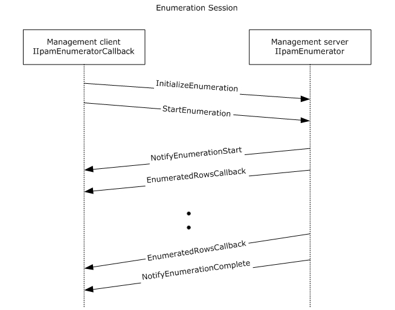

Figure 3: Enumeration Callback Interaction

### 3.5.1 Abstract Data Model

This section describes a conceptual model of possible data organization that an implementation maintains to participate in this protocol. The described organization is provided to facilitate the explanation of how the protocol behaves. This document does not mandate that implementations adhere to this model as long as their external behavior is consistent with that described in this document.

#### 3.5.1.1 State Machine

The following figure shows the state machine of the IIpamEnumerator server port type.

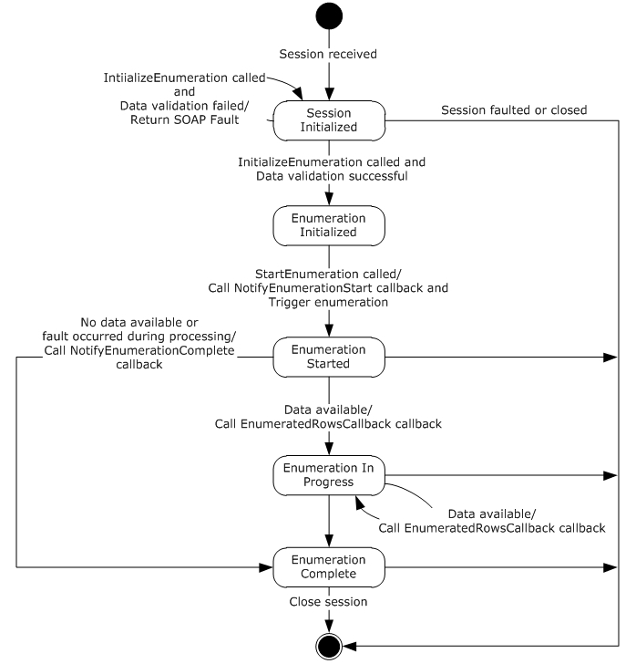

Figure 4: IIpamEnumerator - server state machine

The IIpamEnumerator server is session-based and stateful in nature. The **session state** variable will be used to keep track of the current state for each session and it can have the following states as possible values. At any point of the session, if the session is known to be faulted or closed by the lower layer, the state machine ends.

| State | Description |
| --- | --- |
| **Session Initialized** | This would be the initial state of the session when it has been indicated from the lower layer of the protocol. When in this state, when the InitializeEnumeration operation is invoked (by the client), the data received as a part of the InitializeEnumeration is validated. If the data validation succeeds, the state is changed to **Enumeration Initialized**. If the data validation fails, the server returns an appropriate SOAP fault and remains in the **Session Initialized** state itself. |
| **Enumeration Initialized** | This would be the state when the enumerator is initialized and ready to start the processing to return the data back to the client. When in this state, the StartEnumeration operation is invoked (by the client), the server invokes the NotifyEnumerationStart and triggers the enumeration processing. The state is changed to **Enumeration Started**. |
| **Enumeration Started** | This state denotes the enumeration has been initialized successfully and the enumeration processing is currently in progress. If there is data available to be sent across from the enumeration processing, the EnumeratedRowsCallback operation is invoked with the data available and the state is changed to **Enumeration In Progress**. If there is no data available but the enumeration processing completes successfully, the NotifyEnumerationComplete operation is invoked and the state is changed to **Enumeration Completed**. If there is no data available but the enumeration processing has failed with some error, the NotifyEnumerationComplete is called to provide the fault information to the client and the state is changed to **Enumeration Completed**. |
| **Enumeration In Progress** | This state denotes the enumeration is in progress and more data is available to be sent across to the client. If there is data available to be sent across from the enumeration processing, the EnumeratedRowsCallback operation is invoked with the data available and the state remains at **Enumeration In Progress.** If there is no data available but the enumeration processing completes successfully, the NotifyEnumerationComplete operation is invoked and the state is changed to **Enumeration Completed**. If there is no data available but the enumeration processing has failed with some error, the NotifyEnumerationComplete is called to provide the fault information to the client and the state is changed to **Enumeration Completed**. |
| **Enumeration Completed** | This state indicates there is no further processing required in the session and proceeds to close the session itself. |

#### 3.5.1.2 Other Miscellaneous States

**EnumInputParameters**: This is of type EnumerationParametersBase and can be any of the extending enumeration parameters type. This is initialized with the parameters received as a part of the InitializeEnumeration method.

**EnumOutputData**: This is of type ArrayOfIpamObject – a collect of data which have IpamObject as the base type. This will be assigned the data to be sent across to the client in EnumeratedRowsCallback operation.

**EnumOutputResult**: This is of type IpamObject to hold any additional data to be sent to the client at the end of the enumeration.

### 3.5.2 Timers

There are no additional timers other than those which are described in section [3.1.2](#Section_3.1.2).

### 3.5.3 Initialization

None.

### 3.5.4 Message Processing Events and Sequencing Rules

#### 3.5.4.1 New Session Indication

This event will be indicated by the lower transport layer of the protocol ([MS-NMFTB](../MS-NMFTB/MS-NMFTB.md)) when a new session is available from the client. The **session state** is initialized to **Session Initialized**.

#### 3.5.4.2 Session Closed or Faulted

This event will be indicated by the lower transport layer of the protocol ([MS-NMFTB](../MS-NMFTB/MS-NMFTB.md)) when an existing session is either closed by the client or an irrecoverable error has occurred. This event will result in termination of the state machine as the session itself is no longer valid.

#### 3.5.4.3 EnumeratedRowsCallback

This operation MUST NOT be invoked by the management client and MUST be ignored by the server.

<wsdl:operation msc:isInitiating="true" msc:isTerminating="false" name="EnumeratedRowsCallback">

<wsdl:output wsaw:Action="http://Microsoft.Windows.Ipam/IIpamEnumerator/EnumeratedRowsCallback" message="ipam:IIpamEnumerator_EnumeratedRowsCallback_OutputCallbackMessage" />

</wsdl:operation>

##### 3.5.4.3.1 Messages

###### 3.5.4.3.1.1 IIpamEnumerator_EnumeratedRowsCallback_OutputCallbackMessage

This is the request for the EnumeratedRowsCallback operation.

<wsdl:message name="IIpamEnumerator_EnumeratedRowsCallback_OutputCallbackMessage">

<wsdl:part name="parameters" element="ipam:EnumeratedRowsCallback" />

</wsdl:message>

This message MUST be sent with the following [**SOAP action**](#gt_soap-action).

http://Microsoft.Windows.Ipam/IIpamEnumerator/EnumeratedRowsCallback

The body of the SOAP message MUST contain the EnumeratedRowsCallback element.

##### 3.5.4.3.2 Elements

###### 3.5.4.3.2.1 EnumeratedRowsCallback

This element specifies the input values for the EnumeratedRowsCallback operation.

<xs:element name="EnumeratedRowsCallback">

<xs:complexType>

<xs:sequence>

<xs:element minOccurs="0" name="data" nillable="true" type="ipam:ArrayOfIpamObject" />

</xs:sequence>

</xs:complexType>

</xs:element>

#### 3.5.4.4 InitializeEnumeration

This is an [**initiating operation**](#gt_initiating-operation). This operation is used to specify the type of object that is to be enumerated using the enumeration session and the enumeration parameters itself.

<wsdl:operation msc:isInitiating="true" msc:isTerminating="false" name="InitializeEnumeration">

<wsdl:input wsaw:Action="http://Microsoft.Windows.Ipam/IIpamEnumerator/InitializeEnumeration" message="ipam:IIpamEnumerator_InitializeEnumeration_InputMessage" />

<wsdl:output wsaw:Action="http://Microsoft.Windows.Ipam/IIpamEnumerator/InitializeEnumerationResponse" message="ipam:IIpamEnumerator_InitializeEnumeration_OutputMessage" />

</wsdl:operation>

Upon receiving the IIpamEnumerator_InitializeEnumeration_InputMessage request message, the server performs the following processing steps. Upon successful completion of the steps specified below, the server MUST respond with the IIpamEnumerator_InitializeEnumeration_OutputMessage message. In the event of a failure, an appropriate [**SOAP fault**](#gt_soap-fault) MUST be sent to the client as specified in section [2.2.2.1](#Section_2.2.2.1).

- The session state is set to Enumeration Initialized.
- The InitializeEnumeration.parameters.objectType MUST be a valid value of EnumerationObjectType and MUST NOT be None.
- The InitializeEnumeration.parameters MUST be valid as per their definitions given in section [2.2.4](#Section_2.2.4). If the data is valid assign InitializeEnumeration.parameters to EnumInputParameters.
- If the validation of the InitializeEnumeration.parameters done fails, an appropriate SOAP fault MUST be sent to the client as specified in section 2.2.2.1.

##### 3.5.4.4.1 Messages

###### 3.5.4.4.1.1 IIpamEnumerator_InitializeEnumeration_InputMessage

This is the request for the InitializeEnumeration operation.

<wsdl:message name="IIpamEnumerator_InitializeEnumeration_InputMessage">

<wsdl:part name="parameters" element="ipam:InitializeEnumeration" />

</wsdl:message>

This message MUST be sent with the following [**SOAP action**](#gt_soap-action).

http://Microsoft.Windows.Ipam/IIpamEnumerator/InitializeEnumeration

The body of the SOAP message MUST contain the InitializeEnumeration element.

###### 3.5.4.4.1.2 IIpamEnumerator_InitializeEnumeration_OutputMessage

This is the response for the InitializeEnumeration operation.

<wsdl:message name="IIpamEnumerator_InitializeEnumeration_OutputMessage">

<wsdl:part name="parameters" element="ipam:InitializeEnumerationResponse" />

</wsdl:message>

This message MUST be sent with the following [**SOAP action**](#gt_soap-action).

http://Microsoft.Windows.Ipam/IIpamEnumerator/InitializeEnumerationResponse

The body of the SOAP message MUST contain the InitializeEnumerationResponse element.

##### 3.5.4.4.2 Elements

###### 3.5.4.4.2.1 InitializeEnumeration

This element specifies the input values for the InitializeEnumeration operation.

<xs:element name="InitializeEnumeration">

<xs:complexType>

<xs:sequence>

<xs:element minOccurs="0" name="parameters" nillable="true" type="ipam:EnumerationParametersBase" />

</xs:sequence>

</xs:complexType>

</xs:element>

###### 3.5.4.4.2.2 InitializeEnumerationResponse

This element specifies the output values for the InitializeEnumeration operation.

<xs:element name="InitializeEnumerationResponse">

<xs:complexType>

<xs:sequence />

</xs:complexType>

</xs:element>

#### 3.5.4.5 NotifyEnumerationComplete

This operation MUST NOT be invoked by the management client and MUST be ignored by the server.

<wsdl:operation msc:isInitiating="true" msc:isTerminating="false" name="NotifyEnumerationComplete">

<wsdl:output wsaw:Action="http://Microsoft.Windows.Ipam/IIpamEnumerator/NotifyEnumerationComplete" message="ipam:IIpamEnumerator_NotifyEnumerationComplete_OutputCallbackMessage" />

</wsdl:operation>

##### 3.5.4.5.1 Messages

###### 3.5.4.5.1.1 IIpamEnumerator_NotifyEnumerationComplete_OutputCallbackMessage

This is the request for the NotifyEnumerationComplete operation.

<wsdl:message name="IIpamEnumerator_NotifyEnumerationComplete_OutputCallbackMessage">

<wsdl:part name="parameters" element="ipam:NotifyEnumerationComplete" />

</wsdl:message>

This message MUST be sent with the following [**SOAP action**](#gt_soap-action).

http://Microsoft.Windows.Ipam/IIpamEnumerator/NotifyEnumerationComplete

The body of the SOAP message MUST contain the NotifyEnumerationComplete element.

##### 3.5.4.5.2 Elements

###### 3.5.4.5.2.1 NotifyEnumerationComplete

This element specifies the input values for the NotifyEnumerationComplete operation.

<xs:element name="NotifyEnumerationComplete">

<xs:complexType>

<xs:sequence>

<xs:element minOccurs="0" name="result" nillable="true" type="ipam:IpamObject" />

<xs:element minOccurs="0" name="exception" nillable="true" type="ipam1:IpamException" />

</xs:sequence>

</xs:complexType>

</xs:element>

#### 3.5.4.6 NotifyEnumerationStart

This operation MUST NOT be invoked by the management client and MUST be ignored by the server.

<wsdl:operation msc:isInitiating="true" msc:isTerminating="false" name="NotifyEnumerationStart">

<wsdl:output wsaw:Action="http://Microsoft.Windows.Ipam/IIpamEnumerator/NotifyEnumerationStart" message="ipam:IIpamEnumerator_NotifyEnumerationStart_OutputCallbackMessage" />

</wsdl:operation>

##### 3.5.4.6.1 Messages

###### 3.5.4.6.1.1 IIpamEnumerator_NotifyEnumerationStart_OutputCallbackMessage

This is the request for the NotifyEnumerationStart operation.

<wsdl:message name="IIpamEnumerator_NotifyEnumerationStart_OutputCallbackMessage">

<wsdl:part name="parameters" element="ipam:NotifyEnumerationStart" />

</wsdl:message>

This message MUST be sent with the following [**SOAP action**](#gt_soap-action).

http://Microsoft.Windows.Ipam/IIpamEnumerator/NotifyEnumerationStart

The body of the SOAP message MUST contain the NotifyEnumerationStart element.

##### 3.5.4.6.2 Elements

###### 3.5.4.6.2.1 NotifyEnumerationStart

This element specifies the input values for the NotifyEnumerationStart operation.

<xs:element name="NotifyEnumerationStart">

<xs:complexType>

<xs:sequence />

</xs:complexType>

</xs:element>

#### 3.5.4.7 StartEnumeration

This operation is used to trigger the processing of the enumeration. This causes the session state to be set to **Enumeration Started**.

<wsdl:operation msc:isInitiating="true" msc:isTerminating="false" name="StartEnumeration">

<wsdl:input wsaw:Action="http://Microsoft.Windows.Ipam/IIpamEnumerator/StartEnumeration" message="ipam:IIpamEnumerator_StartEnumeration_InputMessage" />

</wsdl:operation>

Upon receiving the IIpamEnumerator_StartEnumeration_InputMessage, the server MUST invoke NotifyEnumerationStart operation. The enumeration processing logic as described in section [3.5.4.7.1](#Section_3.5.4.7.1.31) has to be triggered as well.

##### 3.5.4.7.1 Enumeration Processing Logic

This section captures the enumeration processing steps for the various types of **EnumInputParameters**. The following table captures the type, which extends the EnumerationParametersBase and the corresponding ObjectType.

| Enumeration Parameter Type | Object Type |
| --- | --- |
| ConfigurationAuditEnumerationParameters | ConfigurationAudit |
| CustomFieldEnumerationParameters | CustomField |
| DhcpScopeAllEnumerationParameters | DhcpScope |
| DhcpScopeAssociatedWithVendorClassesEnumerationParameters | DhcpScope |
| DhcpScopeForIpBlockEnumerationParameters | DhcpScope |
| DhcpScopesByDhcpServerIdListEnumerationParameters | DhcpScope |
| DhcpScopeUnmappedEnumerationParameters | DhcpScope |
| DhcpServerAllEnumerationParameters | DhcpServer |
| DhcpServerByServerInfoIdsEnumerationParameters | DhcpServer |
| DiscoverySubnetEnumerationParameters | DiscoveredSubnets |
| DnsReverseLookupZoneEnumerationParameters | DnsReverseLookupZone |
| DnsServerByServerInfoIdsEnumerationParameters | DnsServer |
| DnsServerEnumerationParameters | DnsServer |
| DnsServerReverseZoneEnumerationParameters | DnsServerReverseZone |
| DnsServerZoneEnumerationParameters | DnsServerZone |
| DnsZoneEnumerationParameters | DnsZone |
| DnsZoneEventEnumerationParameters | DnsZoneEvent |
| IpamIPAddressAllForLogicalGroupNodeEnumerationParameters | IPAddress |
| IpamIPAddressByBlockIdEnumerationParameters | IPAddress |
| IpamIPAddressByManagedByAndManagedByEntityEnumerationParameters | IPAddress |
| IpamIPAddressByRangeIdEnumerationParameters | IPAddress |
| IpamIPAddressForUnmappedRangesEnumerationParameters | IPAddress |
| IpamIPAddressGetDuplicateIPAddressesEnumerationParameters | IPAddress |
| IpamIPAddressRootAddressesEnumerationParameters | IPAddress |
| IpamIPAddressUnmappedAddressEnumerationParameters | IPAddress |
| IPAuditEnumerationParameters | IPAudit |
| IPBlockChildBlockEnumerationParameters | IPBlock |
| IPBlockGetAllBlocksEnumerationParameters | IPBlock |
| IPBlockRootEnumerationParameters | IPBlock |
| IPRangeAllForBlockEnumerationParameter | IPRange |
| IPRangeAllForDhcpServerEnumerationParameters | IPRange |
| IPRangeByManagedByAndManagedByEntityEnumerationParameters | IPRange |
| IPRangeForBlockEnumerationParameters | IPRange |
| IPRangeRootEnumerationParameters | IPRange |
| IPRangeUnmappedEnumerationParameters | IPRange |
| LogicalGroupDataForLogicalGroupNodeEnumerationParameters | LogicalGroupData |
| LogicalGroupDataForRootAlternateItemsEnumerationParameters | LogicalGroupData |
| LogicalGroupDataUnmappedItemsEnumerationParameters | LogicalGroupData |
| LogicalGroupNodeChildrenEnumerationParameters | LogicalGroupNode |
| LogicalGroupNodeRootEnumerationParameters | LogicalGroupNode |
| LogicalGroupsEnumerationParameters | LogicalGroup |
| ServerInfoEnumerationParameters | ServerInfo |

The sections below describe the processing rules involved in generating the enumerated data. The **EnumInputParameters** will contain the input parameters and on completion the **EnumOutputData** will have the collection of data to be sent to the client. When the data is available in **EnumOutputData** and the **session state** is **Enumeration Started** or **Enumeration In Progress**, the EnumeratedRowsCallback operation is invoked multiple times as necessary to send the enumerated data to the client.

When there are no more data to be sent across and the enumeration processing has completed successfully without any faults, the EnumOutputResult is set with any additional data to be sent across to the client as a part of enumeration completion. The NotifyEnumerationComplete operation MUST be called with **NotifyEnumerationComplete.result** being set to **EnumOutputResult** and the **NotifyEnumerationComplete.exception** being set to null.

When the enumeration processing results in a fault getting generated, the NotifyEnumerationComplete operation MUST be called with NotifyEnumerationComplete.result not being set and **NotifyEnumerationComplete.exception** is set to the fault information.

###### 3.5.4.7.1.1 ConfigurationAuditEnumerationParameters

This is the processing done when the EnumInputParameters contains data of type ConfigurationAuditEnumerationParameters. The ObjectType MUST be EnumerationObjectType.ConfigurationAudit.

The following are the steps involved in identifying the rows to be returned as a part of the enumeration.

- Validate the ConfigurationAuditEnumerationParameters as specified in section [2.2.4.30](#Section_2.2.4.30). If the validation conditions are not being met, return an appropriate SOAP fault as specified in section [2.2.2.1](#Section_2.2.2.1).
- Call the procedure SearchConfigurationAuditTable in ADM_ConfigurationAuditTable, specifying the ConfigurationAuditEnumerationParameters.SearchXml as Param_searchCriteriaXml and ConfigurationAuditEnumerationParameters.NumberOfRecords as Param_numberOfRows.
- The Result_events will form the set of events which have to be returned as **EnumOutputData**.

###### 3.5.4.7.1.2 CustomFieldEnumerationParameters

This is the processing done when the EnumInputParameters contains the data of type CustomFieldEnumerationParameters. The ObjectType MUST be EnumerationObjectType.CustomField.

The following are the steps involved in identifying the rows to be returned as a part of the enumeration.

- If CustomFieldEnumerationParameters.CustomFieldName is specified, enumerate the row in ADM_CustomFieldsTable that have **CustomFieldDetails.Name** to be CustomFieldEnumerationParameters.CustomFieldName.
- If CustomFieldEnumerationParameters.CustomFieldName is not specified, enumerate all the rows in ADM_CustomFieldsTable.
- For each enumerated row, perform the following steps.
- Call the procedure GetCustomField in ADM_CustomFieldsTable passing the following parameters:
- Param_Id is set the value of RecordId of the enumerated row.
- Add Result_customField to **EnumOutputData**.

###### 3.5.4.7.1.3 DhcpScopeAllEnumerationParameters

This is the processing done when the EnumInputParameters contains data of type DhcpScopeAllEnumerationParameters. The ObjectType MUST be EnumerationObjectType.DhcpScope. This is used to enumerate all the DHCP scopes that are present in the IPAM data store. The DhcpScopeAllEnumerationParameters.AddressFamily is used to determine the simple table within the ADM_DHCPScopesTable compound table on which the processing has to be done. The following are the steps involved in identifying the rows to be returned as a part of the enumeration.

- Enumerate all the rows in the ADM_DHCPScopesTable.
- For each row enumerated, perform the following steps:
- Call the procedure GetScopeFromTable of the ADM_DHCPScopesTable passing the following parameters:
- Param_Id is assigned the value of the RecordId of the row being enumerated.
- Param_addressfamily is assigned the value of DhcpScopeAllEnumerationParameters.AddressFamily.
- Add the returned result Result_scope to EnumOutputData.

###### 3.5.4.7.1.4 DhcpScopeAssociatedWithVendorClassesEnumerationParameters

This is the processing done when the EnumInputParameters contains data of type DhcpScopeAssociatedWithVendorClassesEnumerationParameters. The ObjectType MUST be EnumerationObjectType.DhcpScope. This is used to enumerate all the DHCP scopes that are present on a specified DHCP server and having an option specified for a particular vendor class. The DhcpScopeAssociatedWithVendorClassesEnumerationParameters.AddressFamily is used to determine the simple table within the ADM_DHCPScopesTable compound table on which the processing has to be done. The following are the steps involved in identifying the rows to be returned as a part of the enumeration.

- If DhcpScopeAssociatedWithVendorClassesEnumerationParameters.VendorClassRecordIds is not specified or is an empty collection, EnumOutputData is assigned an empty collection.
- Fetch the DHCP Server against which the scopes having options of the specified vendor classes are required. This is done by calling the procedure GetDHCPServerFromTable and passing the following parameters:
- Param_Id is set to DhcpScopeAssociatedWithVendorClassesEnumerationParameters.ParentServerRecordId.
- Param_addressfamily is assigned the value of DhcpScopeAssociatedWithVendorClassesEnumerationParameters.AddressFamily.
- If any of the entry in the DhcpScopeAssociatedWithVendorClassesEnumerationParameters.VendorClassRecordIds is 0, it means the scopes associated with default vendor class option is being requested. Perform the following steps to enumerate the rows:
- In this case, enumerate all the scopes in ADM_DHCPScopesTable whose DHCPServerRecordId is the same as DhcpScopeAssociatedWithVendorClassesEnumerationParameters.ParentServerRecordId.
- Otherwise perform the following steps to enumerate the rows of interest.
- Enumerate the option definitions from Result_server.OptionDefinitions whose VendorClassRecordId is one of the values in the list DhcpScopeAssociatedWithVendorClassesEnumerationParameters.VendorClassRecordIds.
- For each of the enumerated option definitions, enumerate the rows in the ADM_DhcpOptionsTable whose ScopeRecordId is not null and OptionDefinitionRecordId is the same as the RecordId of the option definition that is getting enumerated. This will provide the list of scopes in the form of RecordId in ADM_DHCPScopesTable which are associated with the specified vendor class.
- Enumerate the scopes with the RecordId in the list generated above.
- For each row enumerated in the ADM_DHCPScopesTable, perform the following steps to generate the enumerated data.
- Call the procedure GetScopeFromTable of ADM_DHCPScopesTable passing the following input parameters:
- Param_Id is set to the RecordId of the row being enumerated.
- Param_addressFamily is set to DhcpScopeAssociatedWithVendorClassesEnumerationParameters.AddressFamily.
- Add the Result_scope returned by the procedure to **EnumOutputData**.

###### 3.5.4.7.1.5 DhcpScopeForIpBlockEnumerationParameters

This is the processing done when the EnumInputParameters contains data of type DhcpScopeForIpBlockEnumerationParameters. The ObjectType MUST be EnumerationObjectType.DhcpScope. This is used to enumerate all the DHCP scopes that are mapped to a particular IP address block specified as parameter using DhcpScopeForIpBlockEnumerationParameters. ParentIPBlockRecordId. The DhcpScopeForIpBlockEnumerationParameters.AddressFamily is used to determine the simple table within the ADM_DHCPScopesTable compound table on which the processing has to be done. The following are the steps involved in identifying the rows to be returned as a part of the enumeration.

- Get the IP address block for which the scopes are being requested by calling the procedure GetIPBlockFromTable of ADM_IPBlocksTable passing the following as input parameters:
- Param_blockId is set to DhcpScopeForIpBlockEnumerationParameters. ParentIPBlockRecordId.
- Param_addressFamily is set to DhcpScopeForIpBlockEnumerationParameters.AddressFamily.
- Enumerate the ranges in the ADM_IPRangeTable which meet the following criteria:
- StartIPAddress >= **result**.StartIPAddress
- EndIPAddress <= **result**.EndIPAddress
- PrefixLength >= **result**.PrefixLength
- ParentIPBlockRecordId is not null.
- AddressAssignment is Dynamic
- For each of the row enumerated above, perform the following steps to get the associated scopes:
- Call the procedure GetScopeFromTable in ADM_DHCPScopesTable with the following parameters:
- Param_Id is set to the value of ScopeRecordId of the row enumerated.
- Param_addressfamily is assigned the value of DhcpScopeForIpBlockEnumerationParameters.AddressFamily
- Add the returned Result_scope to **EnumOutputData**.

###### 3.5.4.7.1.6 DhcpScopesByDhcpServerIdListEnumerationParameters

This is the processing done when the EnumInputParameters contains data of type DhcpScopesByDhcpServerIdListEnumerationParameters. The ObjectType MUST be EnumerationObjectType.DhcpScope. This is used to enumerate all the DHCP scopes that have DHCP server instances with a record identifier equals to any of the values specified in the DhcpScopesByDhcpServerIdListEnumerationParameters.DhcpServerIds. The DhcpScopesByDhcpServerIdListEnumerationParameters.AddressFamily value is used to determine the simple table within the ADM_DHCPScopesTable compound table on which the processing has to be done.

The following are the steps involved in identifying the rows that are returned as a part of the enumeration.

- Enumerate the rows in the ADM_DHCPScopesTable which have a DHCPServerRecordId value equals to any of the value specified by DhcpScopesByDhcpServerIdListEnumerationParameters.DhcpServerIds.
- For each of the rows enumerated above, perform the following steps to get the associated scopes:
- Call the procedure GetScopeFromTable in ADM_DHCPScopesTable with the following parameters:
- Param_Id is set to the value of ScopeRecordId of the row enumerated.
- Param_addressfamily is assigned the value of DhcpScopesByDhcpServerIdListEnumerationParameters.AddressFamily.
- Add the returned Result_scope to EnumOutputData.

###### 3.5.4.7.1.7 DhcpScopeUnmappedEnumerationParameters

This is the processing done when the EnumInputParameters contains data of type DhcpScopeUnmappedEnumerationParameters. The ObjectType MUST be EnumerationObjectType.DhcpScope. This is used to enumerate all the DHCP scopes which are not mapped to any of the address blocks. The DhcpScopeUnmappedEnumerationParameters.AddressFamily is used to determine the simple table within the ADM_DHCPScopesTable compound table on which the processing has to be done. The following are the steps involved in identifying the rows to be returned as a part of the enumeration.

- Enumerate the ranges in the ADM_IPRangeTable which meet the following criteria:
- ParentIPBlockRecordId is null.
- AddressAssignment is Dynamic.
- For each of the row enumerated above, perform the following steps to get the associated scopes:
- Call the procedure GetScopeFromTable in ADM_DHCPScopesTable with the following parameters:
- Param_Id is set to the value of ScopeRecordId of the row enumerated.
- Param_addressfamily is assigned the value of DhcpScopeForIpBlockEnumerationParameters.AddressFamily.
- Add the returned Result_scope to EnumOutputData.

###### 3.5.4.7.1.8 DhcpServerAllEnumerationParameters

This is the processing done when the EnumInputParameters contains data of type DhcpServerAllEnumerationParameters. The ObjectType MUST be EnumerationObjectType.DhcpServer. This is used to enumerate the DhcpServer instances that meet a specified set of filter conditions. If no filter conditions are specified, all the DhcpServer instances will be returned. The DhcpServerAllEnumerationParameters.AddressFamily value is used to determine the simple table within the ADM_DHCPServersTable compound table on which the processing has to be done.

The following are the processing steps involved in identifying the rows to be returned as a part of the enumeration.

- The keys in the DhcpServerAllEnumerationParameters.Filter MUST be unique and MUST be a valid ServerInfoGetServerFilter. Set the Filter to have ServerInfoGetServerFilter.IPType to be DhcpServerAllEnumerationParameters.AddressFamily. Set the Filter to have ServerInfoGetServerFilter.Role to ServerRoleType.Dhcp.
- Call the procedure GetFilteredServerInfoFromTable passing DhcpServerAllEnumerationParameters.Filter as Param_filters to get the ServerInfo instances that have a DHCP server role that meets the specified filter condition.
- Enumerate the rows in ADM_ServerRolesTable whose ServerRecordID is the part of the Result_filteredServerInfoRows returned in the steps above.
- Enumerate the rows in ADM_DHCPServersTable whose ServerRoleRecordId is a value listed from step 3. For each of the rows, call the procedure GetDhcpServerFromTable passing the record identifier of the row as Param_Id and DhcpServerAllEnumerationParameters.AddressFamily as Param_addressfamily. Add the returned Result_server to EnumOutputData.

###### 3.5.4.7.1.9 DhcpServerByServerInfoIdsEnumerationParameters

This is the processing done when the EnumInputParameters contains data of type DhcpServerByServerInfoIdsEnumerationParameters. The ObjectType MUST be EnumerationObjectType.DhcpServer. This is used to return the DhcpServer instances that are configured on the server instances specified by the list of record identifiers of the ServerInfo instances in ADM_ServersTable. The DhcpServerByServerInfoIdsEnumerationParameters.AddressFamily value is used to determine the simple table within the ADM_DHCPServersTable compound table on which the processing has to be done.

The following are the processing steps involved in identifying the rows to be returned as a part of the enumeration.

- Enumerate the rows in ADM_ServerRolesTable whose ServerRecordID is the part of the DhcpServerByServerInfoIdsEnumerationParameters.ServerInfoIds.
- Enumerate the rows in ADM_DHCPServersTable whose ServerRoleRecordId is a value listed in the step above. For each of the rows, call the procedure GetDhcpServerFromTable passing the record identifier of the row as Param_Id and DhcpServerByServerInfoIdsEnumerationParameters.AddressFamily as Param_addressfamily. Add the returned Result_server to EnumOutputData.

###### 3.5.4.7.1.10 DiscoverySubnetEnumerationParameters

This is the processing done when the EnumInputParameters contains data of type DiscoverySubnetEnumerationParameters. The ObjectType MUST be EnumerationObjectType. DiscoveredSubnets. The following are the processing steps involved to identify the rows to be returned as a part of the enumeration.

- Enumerate the rows in ADM_ServersTable which meet the following conditions:
- If DiscoverySubnetEnumerationParameters.InclusionStatus is specified, ServerInfoDetails.ManagementStatus MUST be equal to DiscoverySubnetEnumerationParameters.InclusionStatus.
- If DiscoverySubnetEnumerationParameters.MultipleRole is specified and has the value of ServerMultipleRole.DhcpOrDns, for the row in the ADM_ServersTable being enumerated, there MUST be a row in ADM_ServerRolesTable whose ServerRecordId is the RecordId of the row in ADM_ServersTable and ServerRoleFlag is either ServerRoleType.Dhcp or ServerRoleFlag.Dns.
- If DiscoverySubnetEnumerationParameters.ServerRole is specified, for the row in the ADM_ServersTable being enumerated, there MUST be a row in ADM_ServerRolesTable whose ServerRecordId is the RecordId of the row in ADM_ServersTable and the ServerRoleFlag is DiscoverySubnetEnumerationParameters.ServerRole.
- For each of the rows enumerated which meet the above mentioned condition, get the addresses specified by ServerInfoDetails.IPAddresses. For each of the addresses, perform the following processing:
- If DiscoverySubnetEnumerationParameters.SubnetType is specified, filter the addresses based on the address family.
- If it is of value ServerInfoIPType.IPv4,
- Filter addresses which are of address family of Internet.
- Get the subnet with a /16 prefix.
- Ensure it was not already added to EnumOutputData and if not, add it to EnumOutputData.
- Similarly if it is of value ServerInfoIPType.IPv6,
- Filter addresses that are of address family InternetV6.
- Get the subnet with a /16 prefix.
- Ensure it was not already added to EnumOutputData and if not, add it to EnumOutputData.

###### 3.5.4.7.1.11 DnsReverseLookupZoneEnumerationParameters

This is the processing done when the EnumInputParameters is of type DnsReverseLookupZoneEnumerationParameters. The ObjectType MUST be EnumerationObjectType.DnsReverseLookupZone. This is used to enumerate the reverse lookup zones based on certain conditions specified as a part of the DnsReverseLookupZoneEnumerationParameters. The following are the processing steps involved in identifying the rows that have to be returned for the enumeration:

- Enumerate the rows in ADM_DNSReverseLookupTable that meet the following criteria.
- If DnsReverseLookupZoneEnumerationParameters.Filter contains a Key-value pair with the key being DnsReverseLookupZoneFilterCriteria.IP, the value MUST be a valid IP address in string format. The row MUST have the value of DnsReverseLookupZoneFilterCriteria.IP between StartIP and EndIP.
- If DnsReverseLookupZoneEnumerationParameters.Filter contains a Key-value pair with the key being DnsReverseLookupZoneFilterCriteria.IPType, the value MUST be a valid AddressFamily and the row MUST have the IPType to be the same as the value specified.
- If DnsReverseLookupZoneEnumerationParameters.Filter contains a Key-value pair with the key being DnsReverseLookupZoneFilterCriteria.RecordId, the value MUST be a valid RecordId and the row MUST have the RecordId to be the same as the value specified.
- If DnsReverseLookupZoneEnumerationParameters.Filter contains a Key-value pair with the key being DnsReverseLookupZoneFilterCriteria.Name, the value MUST be a valid reverse lookup DNS zone name and the row MUST have Name field to be the same as the specified value.
- For each row enumerated above that meets the conditions specified in DnsReverseLookupZoneEnumerationParameters.Filter:
- Call the procedure GetDnsReverseLookupZoneFromTable in ADM_DNSReverseLookupTable passing the following parameters.
- Param_recordId is set to the RecordId of the row.
- Add the Result_reverseLookupZone to **EnumOutputData**.

###### 3.5.4.7.1.12 DnsServerByServerInfoIdsEnumerationParameters

This is the processing done when the EnumInputParameters is of type DnsServerByServerInfoIdsEnumerationParameters. The ObjectType MUST be EnumerationObjectType.DnsServer. This is used to enumerate the DNS server instances corresponding to the ServerInfo instances specified in the form of DnsServerByServerInfoIdsEnumerationParameters.ServerInfoIds.

The following are the processing steps involved in identifying the rows that have to be returned for the enumeration:

- Enumerate the rows in ADM_ServerRolesTable whose RecordId is part of the DnsServerByServerInfoIdsEnumerationParameters.ServerInfoIds and that have ServerRoleDetails.ServerRoleFlag equal to ServerRoleType.Dns.
- Enumerate the rows in ADM_DnsServersTable whose ServerRoleRecordId is present in the rows returned by the above query.
- For each of the rows enumerated above, call the procedure GetDnsServerFromTable passing the record identifier of the row as Param_Id. Add the returned Result_DnsServer to EnumOutputData.

###### 3.5.4.7.1.13 DnsServerEnumerationParameters

This is the processing done when the EnumInputParameters is of type DnsServerEnumerationParameters. The ObjectType MUST be EnumerationObjectType.DnsServer. This is used to enumerate the DNS server instances based on certain conditions specified as a part of the DnsServerEnumerationParameters. The following are the processing steps involved in identifying the rows that have to be returned for the enumeration:

- If the DnsServerEnumerationParameters.Filter contains the key ServerInfoGetServerFilter.Role, replace the filter condition with ServerRoleType.Dns. If the filter condition is not specified, add the filter condition for ServerRoleType.Dns.
- If the DnsServerEnumerationParameters.Filter contains the key ServerInfoGetServersFilter.RecordId, the RecordId specified will be the RecordId of the DNS Server Role and it has to be converted to the ServerInfo RecordId. For this, enumerate the row in ADM_ServerRolesTable whose RecordId is the value of RecordId filter specified. Get the ServerRecordID out of the row. If the row is not found having the RecordId to be the RecordId of the filter, an appropriate SOAP fault MUST be returned. Replace the ServerInfoGetServersFilter.RecordId with the ServerRecordId fetch.
- Call the procedure GetFilteredServerInfoFromTable procedure in ADM_ServersTable passing the DnsServerEnumerationParameters.Filter as Param_filters.
- For each row ServerInfoRow in the Result_filteredServerInfoRows, perform the following processing steps.
- Lookup the ADM_ServerRolesTable for the row with ServerRecordId being ServerInfoRow.RecordId and ServerRoleDetails.ServerRoleFlag is ServerRoleType.Dns.
- Call the procedure GetDnsServerFromTable by passing the RecordId of the row in ADM_ServerRolesTable as Param_Id.
- Add the Result_DnsServer to **EnumOutputData**.

###### 3.5.4.7.1.14 DnsServerReverseZoneEnumerationParameters

This is the processing done when the EnumInputParameters is of type DnsServerReverseZoneEnumerationParameters. The ObjectType MUST be EnumerationObjectType.DnsServerReverseZone. This is used to enumerate the reverse lookup DNS zone hosting information on DNS server instances based on certain conditions specified as a part of the DnsServerReverseZoneEnumerationParameters. The following are the processing steps involved in identifying the rows that have to be returned for the enumeration.

- Enumerate the rows in ADM_DNSServerReverseLookupZoneTable that meet the following conditions.
- DnsReverseZoneId is DnsServerReverseZoneEnumerationParameters.DnsReverseLookupZoneId.
- ServerRecordId is DnsServerReverseZoneEnumerationParameters.DnsServerId.
- If DnsServerReverseZoneEnumerationParameters.ZoneType is specified, the ReverseLookupZoneDetails.ZoneType MUST match the specified value.
- Call the procedure GetDnsServerReverseLookupZoneFromTable procedure in ADM_DNSServerReverseLookupZoneTable and add the Result_data into **EnumOutputData**.

###### 3.5.4.7.1.15 DnsServerZoneEnumerationParameters

This is the processing done when the EnumInputParameters is of type DnsServerZoneEnumerationParameters. The ObjectType MUST be EnumerationObjectType.DnsServerZone. This is used to enumerate the forward lookup DNS zone hosting information on DNS server instances based on certain conditions specified as a part of the DnsServerZoneEnumerationParameters. The following are the processing steps involved in identifying the rows that have to be returned for the enumeration:

- Enumerate the rows in ADM_DNSServerForwardLookupZoneTable which meet the following conditions.
- DnsZoneId is DnsServerZoneEnumerationParameters.DnsZoneId.
- ServerRecordId is DnsServerZoneEnumerationParameters.DnsServerId.
- If DnsServerZoneEnumerationParameters.ZoneType is specified, the ForwardLookupZoneDetails.ZoneType MUST match the specified value.
- Call the procedure GetDnsServerZoneFromTable procedure in ADM_DNSServerForwardLookupZoneTable and add the Result_data into **EnumOutputData**.

###### 3.5.4.7.1.16 DnsZoneEnumerationParameters

This is the processing done when the EnumInputParameters is of type DnsZoneEnumerationParameters. The ObjectType MUST be EnumerationObjectType.DnsZone. This is used to enumerate the forward lookup DNS zones based on certain conditions specified as a part of the DnsZoneEnumerationParameters. The following are the processing steps involved in identifying the rows that have to be returned for the enumeration.

- Enumerate the rows in ADM_DNSForwardLookupTable which meet the filter conditions listed in the form of key value pair in DnsZoneEnumerationParameters.Filter. The following are the keys that can be in the Filter and their corresponding value types and filter conditions.
| Filter.Key | Filter.ValueType | Filter Criteria |
| --- | --- | --- |
| ParentRecordId | Integer | ParentId is equal to the specified value. |
| RecordId | Integer | RecordId is equal to the specified value. |
| Name | String | Name is equal to the specified value. |

- For each of the rows enumerated above, call the procedure GetDnsZoneFromTable in ADM_DNSForwardLookupTable, passing the RecordId of the row as Param_Id. Add the returned Result_zone to **EnumOutputData**.

###### 3.5.4.7.1.17 DnsZoneEventEnumerationParameters

This processing is done when EnumInputParameters is of type DnsZoneEventEnumerationParameters. The ObjectType MUST be EnumerationObjectType.DnsZoneEvent. This is used to enumerate the DNS zone specific events either for the specified zone or for the specified DNS server. The following processing steps identify the rows that have to be returned for the enumeration.

- Validate the DnsZoneEventEnumerationParameters to ensure it is not NULL and either DnsServerId is specified to be a nonzero value or DnsServerZoneId is specified as a nonzero value but not both. If the condition is not being met, generate an appropriate SOAP fault.
- If DnsZoneEventEnumerationParameters.DnsServerZoneId is specified, enumerate the rows in **ADM_DNSZoneEventsTable** where DnsServerZoneId is equal to DnsZoneEventEnumerationParameters.DnsServerZoneId.
- If DnsZoneEventEnumerationParameters.DnsServerId is specified, enumerate the rows in **ADM_DNSServerForwardLookupTable** whose DnsServerId is equal to DnsZoneEventEnumerationParameters.DnsServerId. For each of the rows enumerated, enumerate the rows in **ADM_DNSZoneEventsTable** where DnsServerZoneId is equal to the RecordId of the row in **ADM_DNSServerForwardLookupTable**.
- For the rows enumerated above, call the procedure GetDnsZoneEventFromTable in **ADM_DNSZoneEventsTable** with the parameter *Param_Id* passed as the value of RecordId of the row and add the Result_event to EnumOutputData.

###### 3.5.4.7.1.18 IpamIPAddressAllForLogicalGroupEnumerationParameters

This processing is done when EnumInputParameters contains data of type IpamIPAddressAllForLogicalGroupEnumerationParameters. The ObjectType MUST be EnumerationObjectType.IPAddress. This enumerates the addresses mapped to a logical group specified by IpamIPAddressAllForLogicalGroupEnumerationParameters.LogicalGroupRecordId. The IpamIPAddressAllForLogicalGroupEnumerationParameters.AddressFamily determines the simple table within **ADM_IPAddressTable** on which the processing is done. If the AddressFamily is Internet, the EnumOutputData is a collection of IpamIPv4Address; if it is InternetV6, the EnumOutputData is a collection of IpamIPv6Address.

The following steps identify the rows to be returned as a part of the enumeration.

- Call the procedure GetObjectIdsForLogicalGroup in **ADM_CustomFieldValuesAssociationTable** passing the following parameters:
- *Param_logicalGroup* is set to the LogicalGroup instance corresponding to the IpamIPAddressAllForLogicalGroupEnumerationParameters.LogicalGroupRecordId that is retrieved by calling the procedure GetLogicalGroupFromTable in **ADM_LogicalGroupsTable**. This is done by passing *Param_Id* as IpamIPAddressAllForLogicalGroupEnumerationParameters.LogicalGroupRecordId. Param_groupType is set to LogicalGroupType.Range and *Param_addressFamily* is set to IpamIPAddressAllForLogicalGroupEnumerationParameters.AddressFamily.
- *Param_objectType* is set to LogicalGroupType.Range.
- *Param_addressFamily* is set to IpamIPAddressAllForLogicalGroupEnumerationParameters.AddressFamily.
- The returned Result_ObjectIds comprises a list of address range instances. Get the list of addresses that map to these address ranges by enumerating the rows whose RangeRecordId is the value of the range record identifier returned in Result_ObjectIds. For each address instance, call the procedure GetIPAddressFromTable in **ADM_IPAddressTable** passing the address instance's record identifier as *Param_Id* and IpamIPAddressAllForLogicalGroupEnumerationParameters.AddressFamily as *Param_addressFamily*. Add the returned result to EnumOutputData.

###### 3.5.4.7.1.19 IpamIPAddressAllForLogicalGroupNodeEnumerationParameters

This is the processing done when the EnumInputParameters contains data of type IpamIPAddressAllForLogicalGroupNodeEnumerationParameters. The ObjectType MUST be EnumerationObjectType.IPAddress. This is used to enumerate addresses mapped to a certain logical group node given by **IpamIPAddressAllForLogicalGroupNodeEnumerationParameters. LogicalGroupNode**. The IpamIPAddressAllForLogicalGroupNodeEnumerationParameters.addressfamily is used to determine the simple table within the ADM_IPAddressTable on which the processing has to be done. If the AddressFamily is Internet, the EnumOutputData will be a collection of IpamIPv4Address and if it is InternetV6, the EnumOutputData will be a collection of IpamIPv6Address.

The following are the steps involved in identifying the rows to be returned as a part of the enumeration.

- If the **IpamIPAddressAllForLogicalGroupNodeEnumerationParameters.LogicalGroupType** is not equal to LogicalGroupType.Range, generate an appropriate SOAP fault.
- Store the logical group node **IpamIPAddressAllForLogicalGroupNodeEnumerationParameters.LogicalGroupNode** as **specifiedNode**.
- Call the procedure GetObjectIdsForLogicalGroupNode ADM_CustomFieldValuesAssociationTable passing the following parameters:
- Param_logicalGroupNode is assigned the value of specifiedNode.
- Param_objectType is assigned the value of EnumerationObjectType.IPRange
- Param_addressfamily is assigned the value of IpamIPAddressAllForLogicalGroupNodeEnumerationParameters.addressfamily.
- For each objectId in the list Result_objectIds returned from the above procedure call,
- Enumerate the rows in ADM_IPAddressTable wherein RangeRecordId is equal to objectId.
- For each of the rows enumerated above, call the procedure GetIPAddressFromTable in ADM_IPAddressTable passing the RecordId of the row as Param_Id and Param_addressfamily as parameters.
- Add the returned result to EnumOutputData.

###### 3.5.4.7.1.20 IpamIPAddressByBlockIdEnumerationParameters

This is the processing done when the EnumInputParameters contains data of type IpamIPAddressByBlockIdEnumerationParameters. The ObjectType MUST be EnumerationObjectType.IPAddress. This is used to enumerate addresses mapped to the specified address block given by**IpamIPAddressByBlockIdEnumerationParameters.BlockId**. The IpamIPAddressByBlockIdEnumerationParameters.AddressFamily is used to determine the simple table within the ADM_IPAddressTable on which the processing has to be done. If the AddressFamily is Internet, the EnumOutputData will be a collection of IpamIPv4Address and if it is InternetV6, the EnumOutputData will be a collection of IpamIPv6Address.

The following are the steps involved in identifying the rows to be returned as a part of the enumeration:

- Enumerate the rows in ADM_IPRangeTable whose ParentIPBlockRecordId is equal to **IpamIPAddressByBlockIdEnumerationParameters.BlockId**.
- For each of the address range row enumerated from the above query,
- Enumerate the rows in ADM_IPAddressTable wherein RangeRecordId is equal to RecordId of the rows enumerated in 1.
- For each of the rows enumerated above, call the procedure GetIPAddressFromTable in ADM_IPAddressTable passing the RecordId of the row as Param_Id and Param_addressfamily as parameters.
- Add the returned **result** to **EnumOutputData**.

###### 3.5.4.7.1.21 IpamIPAddressByManagedByAndManagedByEntityEnumerationParameters

This is the processing done when the EnumInputParameters contains data of type IpamIPAddressByManagedByAndManagedByEntityEnumerationParameters. The ObjectType MUST be EnumerationObjectType.IPAddress. This is used to enumerate addresses mapped to the specified address block given by **IpamIPAddressByBlockIdEnumerationParameters.BlockId**. The IpamIPAddressByBlockIdEnumerationParameters.AddressFamily is used to determine the simple table within the ADM_IPAddressTable on which the processing has to be done. If the AddressFamily is Internet, the EnumOutputData will be a collection of IpamIPv4Address and if it is InternetV6, the EnumOutputData will be a collection of IpamIPv6Address.

The following are the steps involved in identifying the rows to be returned as a part of the enumeration:

- Enumerate the row in ADM_CustomFieldValuesTable where CustomFieldValueDetails.Value is equal to IpamIPAddressByManagedByAndManagedByEntityEnumerationParameters.ManagedByValue. Store the RecordId of the row in requiredManagedByCustomFieldValueId.
- Enumerate the row in ADM_CustomFieldValuesTable where CustomFieldValueDetails.Value is equal to IpamIPAddressByManagedByAndManagedByEntityEnumerationParameters.ManagedByEntityValue. Store the RecordId of the row in requiredManagedByEntityCustomFieldValueId.
- Enumerate the rows in ADM_CustomFieldValuesAssociationTable which meet the following criteria.
- ObjectType is EnumerationObjectType.IPAddress
- Af is IpamIPAddressByManagedByAndManagedByEntityEnumerationParameters.AddressFamily
- CustomFieldId is equal to ADM_ManagedByCustomFieldId.
- CustomFieldValueId is equal to requiredManagedByCustomFieldValueId.
- The rows enumerated in 3 will provide the list of IP addresses which have the specified value for ManagedBy custom field. For each of these rows, perform the following steps to filter out the rows which have the specified custom field value as well.
- Enumerate the row in ADM_CustomFieldValuesAssociationTable which meet the following criteria.
- Param_ObjectType is EnumerationObjectType.IPAddress
- Af is IpamIPAddressByManagedByAndManagedByEntityEnumerationParameters.AddressFamily
- CustomFieldId is equal to ADM_ManagedByEntityCustomFieldId
- CustomFieldValueId is equal to requiredManagedByEntityCustomFieldValueId.
- UsedById is equal to row.RecordId.
- If there is a row which is meeting the above mentioned criteria, the address with RecordId equal to row.RecordId meets the required condition. Call the procedure GetIPAddressFromTable passing row.RecordId as Param_Id and IpamIPAddressByManagedByAndManagedByEntityEnumerationParameters.AddressFamily as Param_addressfamily. Add result to EnumOutputData.

###### 3.5.4.7.1.22 IpamIPAddressByRangeIdEnumerationParameters

This is the processing done when the EnumInputParameters contains data of type IpamIPAddressByRangeIdEnumerationParameters. The ObjectType MUST be EnumerationObjectType.IPAddress. This is used to enumerate addresses mapped to the specified address range given by **IpamIPAddressByRangeIdEnumerationParameters.RangeId**. The IpamIPAddressByRangeIdEnumerationParameters.AddressFamily is used to determine the simple table within the ADM_IPAddressTable on which the processing has to be done. If the AddressFamily is Internet, the EnumOutputData will be a collection of IpamIPv4Address and if it is InternetV6, the EnumOutputData will be a collection of IpamIPv6Address.

The following are the steps involved in identifying the rows to be returned as a part of the enumeration:

- If IpamIPAddressByRangeIdEnumerationParameters.RangeId is not specified or null or 0, an appropriate SOAP fault MUST be generated.
- Enumerate the rows in ADM_IPAddressTable which have RangeRecordId equal to IpamIPAddressByRangeIdEnumerationParameters.RangeId.
- For each of the rows that meets the above condition, call the procedure GetIPAddressFromTable passing the RecordId as Param_Id and IpamIPAddressByRangeIdEnumerationParameters.AddressFamily as Param_addressfamily. Add result to **EnumOutputData**.

###### 3.5.4.7.1.23 IpamIPAddressForUnmappedRangesEnumerationParameters

This is the processing done when the EnumInputParameters contains data of type IpamIPAddressForUnmappedRangesEnumerationParameters. The ObjectType MUST be EnumerationObjectType.IPAddress. This is used to enumerate addresses that are mapped to address ranges that are not mapped to an address block. The IpamIPAddressForUnmappedRangesEnumerationParameters.AddressFamily is used to determine the processed simple table within ADM_IPAddressTable on which the processing has to be done. If the AddressFamily is Internet, the EnumOutputData is a collection of IpamIPv4Address. If it is InternetV6, the EnumOutputData is a collection of IpamIPv6Address.

The following are the processing steps involved in identifying the rows to be returned as a part of the enumeration:

- Enumerate the rows in the ADM_IPRangeTable where the ParentIPBlockRecordId value is set to zero. This will be the address ranges that are not mapped to the address blocks.
- For each of the rows enumerated above, enumerate the rows in the ADM_IPAddressTable whose RangeRecordId is equal to the record identifier of the address range enumerated above.
- Call the procedure GetIPAddressFromTable passing the RecordId of the rows enumerated above as Param_Id and IpamIPAddressForUnmappedRangesEnumerationParameters.AddressFamily as Param_addressfamily. Add result to EnumOutputData.

###### 3.5.4.7.1.24 IpamIPAddressGetDuplicateIPAddressesEnumerationParameters

This is the processing done when the EnumInputParameters contains data of type IpamIPAddressGetDuplicateIPAddressesEnumerationParameters. The ObjectType MUST be EnumerationObjectType.IPAddress. This is used to enumerate addresses which have duplicate entries in the IPAM data store. The IpamIPAddressGetDuplicateIPAddressesEnumerationParameters.AddressFamily is used to determine the simple table within the ADM_IPAddressTable on which the processing has to be done. If the AddressFamily is Internet, the EnumOutputData will be a collection of IpamIPv4Address and if it is InternetV6, the EnumOutputData will be a collection of IpamIPv6Address.

The following are the steps involved in identifying the rows to be returned as a part of the enumeration:

- Enumerate the rows in ADM_IPAddressTable which have AddressDetails.IsDuplicate set to TRUE.
- For each of the row which meet the above condition, call the procedure GetIPAddressFromTable passing the RecordId as Param_Id and IpamIPAddressByRangeIdEnumerationParameters.AddressFamily as Param_addressfamily. Add result to EnumOutputData.

###### 3.5.4.7.1.25 IpamIPAddressRootAddressesEnumerationParameters

This is the processing done when the EnumInputParameters contains data of type IpamIPAddressRootAddressesEnumerationParameters. The ObjectType MUST be EnumerationObjectType.IPAddress. This is used to enumerate all the addresses specific to the address family and also optionally belonging to a specific AddressCategory in the IPAM data store. The IpamIPAddressRootAddressesEnumerationParameters.AddressFamily is used to determine the simple table within the ADM_IPAddressTable on which the processing has to be done. If the AddressFamily is Internet, the EnumOutputData will be a collection of IpamIPv4Address and if it is InternetV6, the EnumOutputData will be a collection of IpamIPv6Address.

The following are the steps involved in identifying the rows to be returned as a part of the enumeration:

- Enumerate the rows in ADM_IPAddressTable. If IpamIPAddressRootAddressesEnumerationParameters.AddressCategory is specified enumerate only those addresses for which AddressDetails.AddressCategory is equal to IpamIPAddressRootAddressesEnumerationParameters.AddressCategory.
- For each of the rows that meets the above condition, call the procedure GetIPAddressFromTable passing the RecordId as Param_Id and IpamIPAddressByRangeIdEnumerationParameters.AddressFamily as Param_addressfamily. Add result to **EnumOutputData**.

###### 3.5.4.7.1.26 IpamIPAddressUnmappedAddressEnumerationParameters

This is the processing done when the EnumInputParameters contains data of type IpamIPAddressUnmappedAddressEnumerationParameters. The ObjectType MUST be EnumerationObjectType.IPAddress. This is used to enumerate all the addresses specific to the address family and also not mapped to an address range in the IPAM data store. The IpamIPAddressUnmappedAddressEnumerationParameters.AddressFamily is used to determine the simple table within the ADM_IPAddressTable on which the processing has to be done. If the AddressFamily is Internet, the EnumOutputData will be a collection of IpamIPv4Address and if it is InternetV6, the EnumOutputData will be a collection of IpamIPv6Address.

The following are the steps involved in identifying the rows to be returned as a part of the enumeration:

- Enumerate the rows in ADM_IPAddressTable for which RangeRecordId is not set.
- For each of the rows that meets the above condition, call the procedure GetIPAddressFromTable passing the RecordId as Param_Id and IpamIPAddressByRangeIdEnumerationParameters.AddressFamily as Param_addressfamily. Add result to **EnumOutputData**.

###### 3.5.4.7.1.27 IPBlockChildBlockEnumerationParameters

This is the processing done when the EnumInputParameters contains data of type IPBlockChildBlockEnumerationParameters. The ObjectType MUST be EnumerationObjectType.IPBlock. This is used to enumerate all the address blocks specific to the address family and are child blocks of a specific IP address block. The IPBlockChildBlockEnumerationParameters.AddressFamily is used to determine the simple table within the ADM_IPBlocksTable on which the processing has to be done. If the AddressFamily is Internet, the EnumOutputData will be a collection of IPv4Block and if it is InternetV6, the EnumOutputData will be a collection of IPv6Block.

The following are the steps involved in identifying the rows to be returned as a part of the enumeration:

- Enumerate the rows in ADM_IPBlocksTable wherein ParentBlockRecordId is equal to IPBlockChildBlockEnumerationParameters.ParentBlockRecordId.
- For each of the rows enumerated above, call the procedure GetIPBlockFromTable passing RecordId of the row as Param_blockId and IPBlockChildBlockEnumerationParameters.AddressFamily as Param_addressfamily. Add the **result** to **EnumOutputData**.

###### 3.5.4.7.1.28 IPBlockGetAllBlocksEnumerationParameters

This is the processing done when the EnumInputParameters contains data of type IPBlockGetAllBlocksEnumerationParameters. The ObjectType MUST be EnumerationObjectType.IPBlock. This is used to enumerate all the address blocks specific to the address family. The IPBlockGetAllBlocksEnumerationParameters.AddressFamily is used to determine the simple table within the ADM_IPBlocksTable on which the processing has to be done. If the AddressFamily is Internet, the EnumOutputData will be a collection of IPv4Block and if it is InternetV6, the EnumOutputData will be a collection of IPv6Block.

The following are the steps involved in identifying the rows to be returned as a part of the enumeration.

- Enumerate all the rows in ADM_IPBlocksTable.
- For each of the rows enumerated above, call the procedure GetIPBlockFromTable passing RecordId of the row as Param_blockId and IPBlockChildBlockEnumerationParameters.AddressFamily as Param_addressfamily. Add the **result** to **EnumOutputData**.

###### 3.5.4.7.1.29 IPBlockRootEnumerationParameters

This is the processing done when the EnumInputParameters contains data of type IPBlockRootEnumerationParameters. The ObjectType MUST be EnumerationObjectType.IPBlock. This is used to enumerate all the address blocks which are at the root-level i.e. the ones for which ParentBlockRecordId is null and specific to the address family specified. The IPBlockRootEnumerationParameters.AddressFamily is used to determine the simple table within the ADM_IPBlocksTable on which the processing has to be done. If the AddressFamily is Internet, the EnumOutputData will be a collection of IPv4Block and if it is InternetV6, the EnumOutputData will be a collection of IPv6Block.

The following are the steps involved in identifying the rows to be returned as a part of the enumeration.

- Enumerate the rows in ADM_IPBlocksTable wherein ParentBlockRecordId is not set. If IPBlockRootEnumerationParameters.AddressCategory is specified, enumerate the rows for which ParentBlockRecordId is not set as well as BlockDetails.AddressCategory is equal to the IPBlockRootEnumerationParameters.AddressCategory.
- For each of the rows enumerated above, call the procedure GetIPBlockFromTable passing RecordId of the row as Param_blockId and IPBlockChildBlockEnumerationParameters.AddressFamily as Param_addressfamily. Add the **result** to **EnumOutputData**.

###### 3.5.4.7.1.30 IPRangeAllForBlockEnumerationParameter

This is the processing done when the EnumInputParameters contains data of type IPRangeAllForBlockEnumerationParameter. The ObjectType MUST be EnumerationObjectType.IPRange. This is used to enumerate address ranges mapped to a certain block given by **IPRangeAllForBlockEnumerationParameter.ParentBlockRecordId**. The IPRangeAllForBlockEnumerationParameter.AddressFamily is used to determine the simple table within the IP address range compound table on which the processing has to be done. The following are the steps involved in identifying the rows to be returned as a part of the enumeration.

- Get IPBlock corresponding to **IPRangeAllForBlockEnumerationParameter.ParentBlockRecordId** is an identifier for a valid block in the ADM_IPBlocksTable. This is done by calling the **GetIPBlockFromTable** procedure of the ADM_IPBlocksTable passing the IPRangeAllForBlockEnumerationParameter.ParentBlockRecordId as Param_blockId and IPRangeAllForBlockEnumerationParameter.AddressFamily as Param_addressfamily. Store the result in **specifiedBlock**.
- If the **specifiedBlock** is null, the ParentBlockRecordId is an invalid block and return an appropriate SOAP fault as specified in section [2.2.2.1](#Section_2.2.2.1).
- The range enumeration for a block is composed of the ranges that map at a particular block as well as all the blocks that are under the specified block. In order to enumerate all the ranges that belong to the block specified as well as the blocks that are below the specified block, get all the rows in the **ADM_IPRangeTable** that meet the following criteria:
- StartIPAddress is greater than or equal to the specifiedBlock.StartIPAddress.
- EndIPAddress is lesser than or equal to the specifiedBlock.EndIPAddress.
- PrefixLength is greater than or equal to the specifiedBlock.PrefixLength.
- ParentIPBlockRecordId is not 0.
- For each of the rows enumerated above, get the IPRange by calling the procedure GetIPRangeFromTable passing the record identifier of the row as **Param_id** input parameter and the IPRangeAllForBlockEnumerationParameter.AddressFamily as the **Param_addressfamily** input parameter. Add the range information returned as result to **EnumOutputData** collection.

###### 3.5.4.7.1.31 IPRangeByManagedByAndManagedByEntityEnumerationParameters

This is the processing done when the EnumInputParameters contains data of type IPRangeByManagedByAndManagedByEntityEnumerationParameters. The ObjectType MUST be EnumerationObjectType.IPRange. This will return IPRange data which have the specified values for the ManagedBy and ManagedByEntity built-in custom fields. The IPRangeByManagedByAndManagedByEntityEnumerationParameters.AddressFamily is used to determine the simple table within the IP address range compound table on which the processing has to be done. If the AddressFamily is Internet, the EnumOutputData will be a collection of IPv4Range and if it is InternetV6, the EnumOutputData will be a collection of IPv6Range.

The following are the steps involved in identifying the rows to be returned as a part of the enumeration.

- Get all the rows in the ADM_IPRangeTable.
- For each row,
- Get IPRange for the row by calling the procedure GetIPRangeFromTable passing the record identifier of the row as Param_id input field and the IPRangeByManagedByAndManagedByEntityEnumerationParameters.AddressFamily as Param_addressfamily input field.
- If the value of the custom field of the range returned above (as result) with record identifier being ADM_ManagedByCustomFieldId is IPRangeByManagedByAndManagedByEntityEnumerationParameters.ManagedByValue and the value of the custom field of the range with record identifier ManagedByEntityCustomFieldId is IPRangeByManagedByAndManagedByEntityEnumerationParameters.ManagedByEntityValue, add the result to EnumOutputData.

###### 3.5.4.7.1.32 IPRangeForBlockEnumerationParameters

This is the processing done when the EnumInputParameters contains data of type IPRangeForBlockEnumerationParameters. The ObjectType MUST be EnumerationObjectType.IPRange. This will return IPRange data for the address ranges that are mapped to a specified address block. IPRangeForBlockEnumerationParameters.AddressFamily specifies the address family used to identify the simple table against which the query processing is to be done. If the address family specified is Internet, the EnumOutputData will be a collection of IPv4Range. Otherwise it will consist of a collection of IPv6Range. The following are the processing steps involved.

- Get the IPBlock for which the ranges are requested by calling the procedure GetIPBlockFromTable in ADM_IPBlocksTable by passing IPRangeForBlockEnumerationParameters.ParentBlockRecordId as the **Param_id** input parameter and IPRangeForBlockEnumerationParameters.AddressFamily as the **Param_addressfamily** input parameter.
- If the **result** is null i.e. the specified ParentBlockRecordId value is not found in the table, an appropriate SOAP fault MUST be returned.
- Enumerate the rows in the ADM_IPRangeTable that have the **IPBlockRecordI** to be the ParentBlockRecordId passed as input parameter. If the IPRangeForBlockEnumerationParameters.AddressAssignment is also specified, enumerate rows that have the specific AddressAssignment type as well.
- For each row retrieved, get IPRange data by calling the procedure GetIPRangeFromTable by passing the RecordId as **Param_id** input parameter and IPRangeForBlockEnumerationParameters.AddressFamily as the **Param_addressfamily** input parameter. Add the data in **result** to **EnumOutputData**.

###### 3.5.4.7.1.33 IPRangeRootEnumerationParameters

This is the processing done when the EnumInputParameters contains data of type IPRangeRootEnumerationParameters. The ObjectType MUST be EnumerationObjectType.IPRange. This will return IPRange data for the address ranges which are mapped to a specified address block. IPRangeRootEnumerationParameters.AddressFamily specifies the address family used to identify the simple table against which the query processing is to be done. If the address family specified is Internet, the EnumOutputData will be a collection of IPv4Range. Otherwise it will consist of a collection of IPv6Range. The following are the processing steps involved.

- If IPRangeRootEnumerationParameters.AddressCategory is not null, enumerate the rows in the **ADM_IPRangeTable** having the specified AddressCategory. If AddressCategory is null, enumerate all the rows in the ADM_IPRangeTable.
- For each row retrieved, get IPRange data by calling the procedure GetIPRangeFromTable by passing the RecordId as **Param_id** input parameter and IPRangeForBlockEnumerationParameters.AddressFamily as the **Param_addressfamily** input parameter. Add the data in **result** to **EnumOutputData**.

###### 3.5.4.7.1.34 IPRangeUnmappedEnumerationParameters

This is the processing done when the EnumInputParameters contains data of type IPRangeUnmappedEnumerationParameters. The ObjectType MUST be EnumerationObjectType.IPRange. This will return IPRange data for the address ranges which are not mapped an address block. IPRangeUnmappedEnumerationParameters.AddressFamily specifies the address family used to identify the simple table against which the query processing is to be done. If the address family specified is Internet, the EnumOutputData will be a collection of IPv4Range. Otherwise it will consist of a collection of IPv6Range. The following are the processing steps involved.

- Enumerate the rows in the **ADM_IPRangeTable** which have ParentIPBlockRecordId set to 0.
- For each row retrieved, get IPRange data by calling the procedure GetIPRangeFromTable by passing the RecordId as **Param_id** input parameter and IPRangeForBlockEnumerationParameters.AddressFamily as the **Param_addressfamily** input parameter. Add the data in **result** to **EnumOutputData**.

###### 3.5.4.7.1.35 LogicalGroupDataForLogicalGroupNodeEnumerationParameters

This is the processing done when the EnumInputParameters contains data of type LogicalGroupDataForLogicalGroupNodeEnumerationParameters. The ObjectType MUST be EnumerationObjectType.LogicalGroupData. This is used to enumerate objects that map to the LogicalGroupNode specified. The specific type of LogicalGroupNode is used to determine the object type and the address family that is of interest.

The following table specifies the type of LogicalGroupNode, the corresponding address family, and the object type that gets enumerated.

| LogicalGroupNode Type | AddressFamily | ObjectType (EnumerationObjectType) |
| --- | --- | --- |
| IPv4RangeLogicalGroupNode | Internet | IPRange |
| IPv6RangeLogicalGroupNode | InternetV6 | IPRange |
| IpamIPv4AddressLogicalGroupNode | Internet | IPAddress |
| IpamIPv6AddressLogicalGroupNode | InternetV6 | IPAddress |
| ActiveServerV4LogicalGroupNode | Internet | ServerInfo |
| ActiveServerV6LogicalGroupNode | InternetV6 | ServerInfo |

The following are the steps involved in identifying the rows to be returned as a part of the enumeration.

- Call the procedure GetObjectIdsForLogicalGroupNode in ADM_CustomFieldValuesAssociationTable with the following parameters:
- Param_logicalGroupNode is assigned the value of LogicalGroupDataForLogicalGroupNodeEnumerationParameters.LogicalGroupNode.
- Param_objectType is assigned the value of ObjectType from the table above based on the type of Param_logicalGroupNode.
- Param_addressFamily is assigned the value of AddressFamily from the above table based on the type of Param_logicalGroupNode. If Param_objectType is EnumerationObjectType.ServerInfo, Param_addressFamily is not specified a value.
- For each objectId in Result_ObjectIds, perform the following steps:
- Call the procedure GetObjectForLogicalGroupObjectId passing the following parameters:
- Param_objectType is set the value of ObjectType as computed based on the table above.
- Param_addressFamily is set to the value of AddressFamily as computed based on the table above.
- Param_Id is assigned the value of objectId.
- Param_filter is assigned the value of LogicalGroupDataForLogicalGroupNodeEnumerationParameters.Filter.
- Add Result_object to EnumOutputData.

###### 3.5.4.7.1.36 LogicalGroupDataForRootAlternateItemsEnumerationParameters

This is the processing done when the EnumInputParameters contains data of type LogicalGroupDataForRootAlternateItemsEnumerationParameters. The ObjectType MUST be EnumerationObjectType.LogicalGroupData. This is used to enumerate objects that map to the LogicalGroup specified. The specific type of LogicalGroup is used to determine the object type and the address family that is of interest.

The following table specifies the type of LogicalGroup, the corresponding address family, and the object type that gets enumerated.

| LogicalGroup Type | AddressFamily | ObjectType (EnumerationObjectType) |
| --- | --- | --- |
| IPv4RangeLogicalGroup | Internet | IPRange |
| IPv6RangeLogicalGroup | InternetV6 | IPRange |
| IpamIPv4AddressLogicalGroup | Internet | IPAddress |
| IpamIPv6AddressLogicalGroup | InternetV6 | IPAddress |
| ActiveServerV4LogicalGroup | Internet | ServerInfo |
| ActiveServerV6LogicalGroup | InternetV6 | ServerInfo |

The following are the steps involved in identifying the rows to be returned as a part of the enumeration.

- Call the procedure GetObjectIdsForLogicalGroup in ADM_CustomFieldValuesAssociationTable with the following parameters:
- Param_logicalGroup is assigned the value of LogicalGroupDataForRootAlternateItemsEnumerationParameters.LogicalGroup.
- Param_objectType is assigned the value of ObjectType from the table above based on the type of Param_logicalGroupNode.
- Param_addressFamily is assigned the value of AddressFamily from the above table based on the type of Param_logicalGroupNode. If Param_objectType is EnumerationObjectType.ServerInfo, Param_addressFamily is not specified a value.
- For each objectId in Result_ObjectIds, perform the following steps:
- Call the procedure GetObjectForLogicalGroupObjectId passing the following parameters:
- Param_objectType is set the value of ObjectType as computed based on the table above.
- Param_addressFamily is set to the value of AddressFamily as computed based on the table above.
- Param_Id is assigned the value of objectId.
- Param_filter is assigned the value of LogicalGroupDataForLogicalGroupNodeEnumerationParameters.Filter.
- Add Result_object to EnumOutputData.

###### 3.5.4.7.1.37 LogicalGroupDataUnmappedItemsEnumerationParameters

This is the processing done when the EnumInputParameters contains data of type LogicalGroupDataUnmappedItemsEnumerationParameters. The ObjectType MUST be EnumerationObjectType.LogicalGroupData. This is used to enumerate objects that map to the LogicalGroup specified. The specific type of LogicalGroup is used to determine the object type and the address family that is of interest.

The following table specifies the type of LogicalGroup, the corresponding address family, and the object type that gets enumerated.

| LogicalGroup Type | AddressFamily | ObjectType (EnumerationObjectType) |
| --- | --- | --- |
| IPv4RangeLogicalGroup | Internet | IPRange |
| IPv6RangeLogicalGroup | InternetV6 | IPRange |
| IpamIPv4AddressLogicalGroup | Internet | IPAddress |
| IpamIPv6AddressLogicalGroup | InternetV6 | IPAddress |
| ActiveServerV4LogicalGroup | Internet | ServerInfo |
| ActiveServerV6LogicalGroup | InternetV6 | ServerInfo |

The following are the steps involved in identifying the rows to be returned as a part of the enumeration.

- Call the procedure GetUnmappedObjectIdsForLogicalGroup in ADM_CustomFieldValuesAssociationTable with the following parameters:
- Param_logicalGroup is assigned the value of LogicalGroupDataForRootAlternateItemsEnumerationParameters.LogicalGroup.
- Param_objectType is assigned the value of ObjectType from the table above based on the type of Param_logicalGroupNode.
- Param_addressFamily is assigned the value of AddressFamily from the above table based on the type of Param_logicalGroupNode. If Param_objectType is EnumerationObjectType.ServerInfo, Param_addressFamily is not specified a value.
- For each objectId in Result_ObjectIds, perform the following steps:
- Call the procedure GetObjectForLogicalGroupObjectId passing the following parameters:
- Param_objectType is set the value of ObjectType as computed based on the table above.
- Param_addressFamily is set to the value of AddressFamily as computed based on the table above.
- Param_Id is assigned the value of objectId.
- Param_filter is assigned the value of LogicalGroupDataForLogicalGroupNodeEnumerationParameters.Filter.
- Add Result_object to EnumOutputData.

###### 3.5.4.7.1.38 LogicalGroupNodeChildrenEnumerationParameters

This is the processing done when the EnumInputParameters contains data of type LogicalGroupNodeChildrenEnumerationParameters. The ObjectType MUST be EnumerationObjectType.LogicalGroupNode. This is used to enumerate the logical group nodes that will form the children of a specified logical group node. The specific type of LogicalGroupNode is used to determine the object type and the address family that is of interest.

The following are the steps involved in identifying the rows to be returned as a part of the enumeration.

- Call the procedure GetNextLevelLogicalGroupNodes in ADM_LogicalGroupsTable with the following parameters:
- Param_logicalGroupNode is assigned the value of LogicalGroupNodeChildrenEnumerationParameters.ParentLogicalGroupNode.
- Copy the Result_logicalGroupNodes to EnumOutputData.

###### 3.5.4.7.1.39 LogicalGroupNodeRootEnumerationParameters

This is the processing done when the EnumInputParameters contains data of type LogicalGroupNodeRootEnumerationParameters. The ObjectType MUST be EnumerationObjectType.LogicalGroupNode. This is used to enumerate the logical group nodes that will form the top-level children of a specified logical group.

The following are the steps involved in identifying the rows to be returned as a part of the enumeration.

- Call the procedure GetRootLogicalGroupNodesForLogicalGroup in ADM_LogicalGroupsTable with the following parameters:
- Param_logicalGroup is assigned the value of LogicalGroupNodeRootEnumerationParameters.LogicalGroup.
- Copy the Result_logicalGroupNodes to EnumOutputData.

###### 3.5.4.7.1.40 LogicalGroupsEnumerationParameters

This is the processing done when the EnumInputParameters contains data of type LogicalGroupsEnumerationParameters. The ObjectType MUST be EnumerationObjectType.LogicalGroup. This is used to enumerate the logical groups of the specified address family and logical group type.

The following are the steps involved in identifying the rows to be returned as a part of the enumeration.

- Enumerate the rows in ADM_LogicalGroupsTable which meet the following conditions.
- If LogicalGroupsEnumerationParameters.LogicalGroupType is either Range or IPAddress, LogicalGroupDetails.Users is IPAddressSpaceManagement. Otherwise LogicalGroupDetails.Users is ServerManagement.
- If LogicalGroupsEnumerationParameters.LogicalGroupName is specified, LogicalGroupDetails.Name is LogicalGroupsEnumerationParameters.LogicalGroupName.
- For each of the row enumerated above, perform the following steps:
- Call the procedure GetLogicalGroupFromTable passing the following parameters:
- Param_Id is assigned the RecordId of the row.
- Param_groupType is assigned the value of LogicalGroupsEnumerationParameters.LogicalGroupType.
- Param_addressFamily is assigned the value of LogicalGroupsEnumerationParameters.AddressFamily.
- Add Result_logicalGroup to EnumOutputData.

###### 3.5.4.7.1.41 ServerInfoEnumerationParameters

This is the processing done when the EnumInputParameters contains data of type ServerInfoEnumerationParameters. The ObjectType MUST be EnumerationObjectType.ServerInfo. This is used to enumerate the server instances that meet the specified filter condition in the form of ServerInfoEnumerationParameters.Filter.

The following are the steps involved in identifying the rows to be returned as a part of the enumeration.

- Call the procedure GetFilteredServerInfoFromTable passing ServerInfoEnumerationParameters.Filter as Param_filters.
- Add the entries in Result_filteredServerInfoRows to EnumOutputData.

###### 3.5.4.7.1.42 UnmappedIpamIPAddressForLogicalGroupEnumerationParameters

This is the processing done when the EnumInputParameters contains data of type UnmappedIpamIPAddressForLogicalGroupEnumerationParameters. The ObjectType MUST be EnumerationObjectType.IPAddress. This is used to enumerate the address instances belonging to address ranges that do not map to the specified logical group. The UnmappedIpamIPAddressForLogicalGroupEnumerationParameters.AddressFamily value is used to determine the simple table within the ADM_IPAddressTable on which the processing has to be done. If the AddressFamily is Internet, the EnumOutputData is a collection of IpamIPv4Address. If it is InternetV6, the EnumOutputData is a collection of IpamIPv6Address.

The following are the steps involved in identifying the rows to be returned as a part of the enumeration.

- Call the procedure GetUnmappedObjectIdsForLogicalGroup in ADM_CustomFieldValuesAssociationTable passing the following parameters.
- Param_logicalGroup is set to LogicalGroup instance corresponding to the UnmappedIpamIPAddressForLogicalGroupEnumerationParameters.LogicalGroupRecordId retrieved by calling the procedure GetLogicalGroupFromTable in ADM_LogicalGroupsTable. This is done by passing the Param_Id to UnmappedIpamIPAddressForLogicalGroupEnumerationParameters.LogicalGroupRecordId. Param_groupType is set to LogicalGroupType.Range and Param_addressFamily is set to UnmappedIpamIPAddressForLogicalGroupEnumerationParameters.AddressFamily.
- Param_objectType is set to LogicalGroupType.Range.
- Param_addressFamily is set to UnmappedIpamIPAddressForLogicalGroupEnumerationParameters.AddressFamily.
- The above returned Result_ObjectIds comprises a list of address range instances. Get the list of addresses mapping to these address ranges by enumerating the rows whose RangeRecordId is the value of the range record identifier that is returned in Result_ObjectIds. For each of the address instances, call the procedure GetIPAddressFromTable in ADM_IPAddressTable passing the address instance’s record identifier as Param_Id and UnmappedIpamIPAddressForLogicalGroupEnumerationParameters.AddressFamily as Param_addressFamily. Add the returned result to EnumOutputData.

##### 3.5.4.7.2 Messages

###### 3.5.4.7.2.1 IIpamEnumerator_StartEnumeration_InputMessage

This is the request for the StartEnumeration operation.

<wsdl:message name="IIpamEnumerator_StartEnumeration_InputMessage">

<wsdl:part name="parameters" element="ipam:StartEnumeration" />

</wsdl:message>

This message MUST be sent with the following [**SOAP action**](#gt_soap-action).

http://Microsoft.Windows.Ipam/IIpamEnumerator/StartEnumeration

The body of the SOAP message MUST contain the StartEnumeration element.

##### 3.5.4.7.3 Elements

###### 3.5.4.7.3.1 StartEnumeration

This element specifies the input values for the StartEnumeration operation.

<xs:element name="StartEnumeration">

<xs:complexType>

<xs:sequence />

</xs:complexType>

</xs:element>

### 3.5.5 Timer Events

None.

### 3.5.6 Other Local Events

None.

#### 3.5.6.1 User Authorization

This section lists the user authorization requirements for the various operations defined in this port type. After the user authentication is complete, the user MUST be authorized for the operation that is being requested. If the required authorization is not present, the user MUST be denied access to perform the operation by returning an appropriate SOAP fault as specified in section [2.2.2.1](#Section_2.2.2.1).

The following table specifies the operations and the authorization requirements. At least one of the states listed under the column "ADM States to be checked" MUST be TRUE for the user to be authorized to perform the specified operation. Any further granular authorization requirements for an operation will be captured under the section specific to the operation itself. This check is done after the steps listed in section [3.1.4.3](#Section_3.1.4.3) are complete.

| Operation | ADM States to be checked |
| --- | --- |
| InitializeEnumeration | IsIpamUser |
| StartEnumeration | IsIpamUser |

## 3.6 IIpamEnumerator Client Details

The client side of the IIpamEnumerator MUST provide the IIpamEnumeratorCallback server interface. The IIpamEnumerator server will callback into the IIpamEnumeratorCallback of the client for notifying the start of enumeration, providing the data and to notify the completion of the enumeration along with status.

In summary, on a single session, the management client implements the IIpamEnumeratorCallback port type and the management server implements the IIpamEnumerator port type.

### 3.6.1 Abstract Data Model

This section describes a conceptual model of possible data organization that an implementation maintains to participate in this protocol. The described organization is provided to facilitate the explanation of how the protocol behaves. This document does not mandate that implementations adhere to this model as long as their external behavior is consistent with that described in this document.

The following state is available on a per-session basis.

**EnumerationInfo**: This is a compound data consisting of the following three portions. This will have the complete information regarding the enumeration – the data if it has completed successfully or not, and the failure information if it has failed.

**EnumeratedData**: This is a collection of IpamObject type (or any type extending the IpamObjectType). At the end of the successful enumeration completion, this will have the data enumerated.

**EnumerationResult**: This is of type IpamObject (or any type extending the IpamObjectType). At the end of the successful enumeration completion, this will have any additional data pertaining to the enumeration.

**EnumerationFault**: This contains the IpamException having the fault that the server has sent across to the client or any session establishment failure fault that the lower transport layer might have indicated. If this value is set, the enumeration is considered unsuccessful. If this value is not set, the enumeration is considered successful. In this case, EnumeratedData and EnumeratedResult are considered valid.

### 3.6.2 Timers

There are no additional timers beyond those specified in section [3.2.2](#Section_3.2.2).

### 3.6.3 Initialization

The IIpamEnumerator client on initialization will establish the session to the management server. On successfully setting up the session, the IIpamEnumerator client MUST initialize the IIpamEnumeratorCallback session on the same session so the IIpamEnumerator server can callback with the enumerated data. In order to obtain the enumeration data from the IIpamEnumeratorCallback port type, the EnumerationInfo is passed as a part of the initialization routine. The IIpamEnumeratorCallback port type’s server fills the data pertaining to the enumeration in the EnumerationInfo for the IIpamEnumerator client to provide to the application layer.

### 3.6.4 Message Processing Events and Sequencing Rules

#### 3.6.4.1 Enumeration Completed

This is an event that is triggered by the IIpamEnumerationCallback server on the session to indicate that the enumeration processing is completed and the **EnumerationInfo** has the data.

### 3.6.5 Timer Events

None.

### 3.6.6 Other Local Events

None.

## 3.7 IIpamEnumeratorCallback Server Details

This port type is implemented by the management client and initialized on the same session used to perform operations against the IIpamEnumerator server on the management server. This provides the callback interface, which the IIpamEnumerator server invokes to provide the enumeration data.

### 3.7.1 Abstract Data Model

This section describes a conceptual model of possible data organization that an implementation maintains to participate in this protocol. The described organization is provided to facilitate the explanation of how the protocol behaves. This document does not mandate that implementations adhere to this model as long as their external behavior is consistent with that described in this document.

#### 3.7.1.1 State Machine

The following figure shows the state machine of the IIpamEnumeratorCallback server port type.

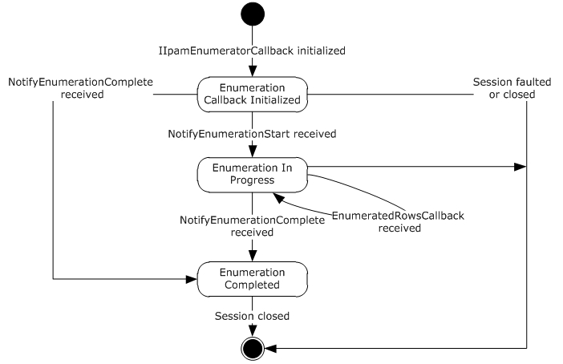

Figure 5: IIpamEnumeratorCallback state machine

The IIpamEnumeratorCallback server is session-based, sharing the same session the management client has with the management server using the IIpamEnumerator port type. It is also stateful in nature. The **session state** variable is used to keep track of the current state for each session and it can have the following states as possible values. At any point of the session, if the session is known to be faulted or closed by the lower layer, the state machine ends.

| State | Description |
| --- | --- |
| Enumeration Callback Initialized | This is the initial state of the IIpamEnumeratorCallback when it has been initialized by the IIpamEnumerator client. When the NotifyEnumerationStart is received in this state from the IIpamEnumerator server port on the management server-end of the session, the transition to the **Enumeration In Progress** state will happen. |
| Enumeration In Progress | This state indicates the IIpamEnumeratorCallback is ready to receive the data. When the EnumeratedRowsCallback is received in this state from the IIpamEnumerator server port on the management server-end of the session, the state will continue to be in **Enumeration In Progress**. When the NotifyEnumerationComplete is received in this state from the IIpamEnumerator server port on the management server-end of the session, the state will transition to **Enumeration Completed**. |
| Enumeration Completed | This is the state to notify the enumeration interaction between the IIpamEnumerator server port on the management server-end and the IIpamEnumeratorCallback server port on the management client-end is complete and the full data or result is available. |

#### 3.7.1.2 Other Miscellaneous States

**EnumerationInfo**: This is used to store the EnumerationInfo instance provided by the IIpamEnumerator client as a part of the initialization to hold the enumeration data and result. See section [3.1.1](#Section_3.1.1) for the details.

### 3.7.2 Timers

There are no additional timers beyond the ones defined by the lower layer of the protocols.

### 3.7.3 Initialization

The IIpamEnumeratorCallback interface is initialized by the IIpamEnumerator client on the management client-end. The IIpamEnumerator client passes the EnumerationInfo instance during initialization, which will be updated by the IIpamEnumeratorCallback server with the enumeration data received from the server. This instance is stored in EnumerationInfo. The session state is set to Enumeration Callback Initialized.

### 3.7.4 Message Processing Events and Sequencing Rules

#### 3.7.4.1 Session Faulted or Closed

This is an event triggered by the lower transport layer when the session has received a SOAP fault or a forceful session close has occurred. If the **session state** is **Enumeration Callback Initialized** or **Enumeration In Progress**, the **EnumerationInfo.EnumerationFault** has to be set to an appropriate reason associated with the session closure and the EnumerationInfo.EnumerationData is discarded.

#### 3.7.4.2 EnumeratedRowsCallback

This operation is used to provide the enumeration data.

<wsdl:operation name="EnumeratedRowsCallback">

<wsdl:input wsaw:Action="http://Microsoft.Windows.Ipam/IIpamEnumeratorCallback/EnumeratedRowsCallback" message="ipam:IIpamEnumeratorCallback_EnumeratedRowsCallback_InputMessage" />

</wsdl:operation>

This operation has only the input message and there is no output message associated with it. Upon receiving the message, the **EnumeratedRowsCallback.data** received is added to the **EnumerationInfo.EnumerationData** collection. This operation will be called a number of times during an enumeration with different set of data with each invocation. The data received across all the calls will form the full enumeration data.

##### 3.7.4.2.1 Messages

###### 3.7.4.2.1.1 IIpamEnumeratorCallback_EnumeratedRowsCallback_InputMessage

This is the request for the EnumeratedRowsCallback operation.

<wsdl:message name="IIpamEnumeratorCallback_EnumeratedRowsCallback_InputMessage">

<wsdl:part name="parameters" element="ipam:EnumeratedRowsCallback" />

</wsdl:message>

This message MUST be sent with the following [**SOAP action**](#gt_soap-action).

http://Microsoft.Windows.Ipam/IIpamEnumeratorCallback/EnumeratedRowsCallback

The body of the SOAP message MUST contain the EnumeratedRowsCallback element.

##### 3.7.4.2.2 Elements

###### 3.7.4.2.2.1 EnumeratedRowsCallback

This element specifies the input values for the EnumeratedRowsCallback operation.

<xs:element name="EnumeratedRowsCallback">

<xs:complexType>

<xs:sequence>

<xs:element minOccurs="0" name="data" nillable="true" type="ipam:ArrayOfIpamObject" />

</xs:sequence>

</xs:complexType>

</xs:element>

#### 3.7.4.3 NotifyEnumerationComplete

This operation is used to indicate the completion of the enumeration.

<wsdl:operation name="NotifyEnumerationComplete">

<wsdl:input wsaw:Action="http://Microsoft.Windows.Ipam/IIpamEnumeratorCallback/NotifyEnumerationComplete" message="ipam:IIpamEnumeratorCallback_NotifyEnumerationComplete_InputMessage" />

</wsdl:operation>

This operation has only the request message. This signifies the completion of the enumeration and the Enumeration Completed event of the IIpamEnumerator client is invoked. The session state is set to Enumeration Completed.

If NotifyEnumerationComplete.exception is set, the enumeration has faulted. The EnumerationInfo.EnumerationData has to be discarded. The EnumerationInfo.EnumerationFault is set to NotifyEnumerationComplete.exception.

If NotifyEnumerationComplete.exception is null, the enumeration has completed successfully. The EnumerationInfo.EnumerationResult is set to NotifyEnumerationComplete.result.

##### 3.7.4.3.1 Messages

###### 3.7.4.3.1.1 IIpamEnumeratorCallback_NotifyEnumerationComplete_InputMessage

This is the request for the NotifyEnumerationComplete operation.

<wsdl:message name="IIpamEnumeratorCallback_NotifyEnumerationComplete_InputMessage">

<wsdl:part name="parameters" element="ipam:NotifyEnumerationComplete" />

</wsdl:message>

This message MUST be sent with the following [**SOAP action**](#gt_soap-action).

http://Microsoft.Windows.Ipam/IIpamEnumeratorCallback/NotifyEnumerationComplete

The body of the SOAP message MUST contain the NotifyEnumerationComplete element.

##### 3.7.4.3.2 Elements

###### 3.7.4.3.2.1 NotifyEnumerationComplete

This element specifies the input values for the NotifyEnumerationComplete operation.

<xs:element name="NotifyEnumerationComplete">

<xs:complexType>

<xs:sequence>

<xs:element minOccurs="0" name="result" nillable="true" type="ipam:IpamObject" />

<xs:element minOccurs="0" name="exception" nillable="true" type="ipam1:IpamException" />

</xs:sequence>

</xs:complexType>

</xs:element>

#### 3.7.4.4 NotifyEnumerationStart

This operation is used to indicate the start of the enumeration.

<wsdl:operation name="NotifyEnumerationStart">

<wsdl:input wsaw:Action="http://Microsoft.Windows.Ipam/IIpamEnumeratorCallback/NotifyEnumerationStart" message="ipam:IIpamEnumeratorCallback_NotifyEnumerationStart_InputMessage" />

</wsdl:operation>

This operation only has the request message to provide the notification. On receiving the message, the session state is set to **Enumeration In Progress**.

##### 3.7.4.4.1 Messages

###### 3.7.4.4.1.1 IIpamEnumeratorCallback_NotifyEnumerationStart_InputMessage

This is the request for the NotifyEnumerationStart operation.

<wsdl:message name="IIpamEnumeratorCallback_NotifyEnumerationStart_InputMessage">

<wsdl:part name="parameters" element="ipam:NotifyEnumerationStart" />

</wsdl:message>

This message MUST be sent with the following [**SOAP action**](#gt_soap-action).

http://Microsoft.Windows.Ipam/IIpamEnumeratorCallback/NotifyEnumerationStart

The body of the SOAP message MUST contain the NotifyEnumerationStart element.

##### 3.7.4.4.2 Elements

###### 3.7.4.4.2.1 NotifyEnumerationStart

This element specifies the input values for the NotifyEnumerationStart operation.

<xs:element name="NotifyEnumerationStart">

<xs:complexType>

<xs:sequence />

</xs:complexType>

</xs:element>

### 3.7.5 Timer Events

None.

### 3.7.6 Other Local Events

None.

#### 3.7.6.1 User Authorization

Since the IIpamEnumeratorCallback server is initialized on the same session as the IIpamEnumeration session, no additional user authentication and authorization is performed beyond what was done for the operations in the IIpamEnumerator session.

## 3.8 IIpamEnumeratorCallback Client Details

The IIpamEnumerator server is the endpoint that will also be the IIpamEnumeratorCallback client. The same session has the IIpamEnumerator and the IIpamEnumeratorCallback implemented on either ends. The management server will provide the IIpamEnumerator server and the IIpamEnumeratorCallback client implementations and the management client will provide the IIpamEnumeratorCallback server and the IIpamEnumerator client implementations. The IIpamEnumeratorCallback is only a request interface, which means that there is no data obtained from the IIpamEnumeratorCallback server.

### 3.8.1 Abstract Data Model

None.

### 3.8.2 Timers

None.

### 3.8.3 Initialization

None.

### 3.8.4 Message Processing Events and Sequencing Rules

None, other than those captured as a part of the IIpamEnumerator server section [3.5](#Section_3.5).

### 3.8.5 Timer Events

None.

### 3.8.6 Other Local Events

None.

## 3.9 IIpamIPAuditEnumerator Server Details

This port type is used for enumerating the IP address audit rows from the management server. The management client establishes a session to the management server, and invokes operations on the management server port to initialize the enumeration parameters and trigger the enumeration. On the same session, the client initializes the server-side of the IIpamEnumeratorCallback port type. This port type provides a callback the management server can call into to provide the enumeration rows. The interaction is captured in the figure below.

Except for the operation name, the state machine and the interaction with the IIpamEnumeratorCallback of this port type remains the same as that of IIpamEnumerator server (section [3.5](#Section_3.5)).

### 3.9.1 Abstract Data Model

See section [3.5.1](#Section_3.5.1) for the state machine and the states associated with this port type. The states and interaction remains the same except for the name of the operations.

### 3.9.2 Timers

See section [3.5.2](#Section_3.5.2).

### 3.9.3 Initialization

See section [3.5.3](#Section_3.5.3).

### 3.9.4 Message Processing Events and Sequencing Rules

The message processing events and sequencing rules for this port type remain the same as those specified in section [3.5.4](#Section_3.5.4). The difference in processing rules with the operations in this port type alone will be captured here in detail.

#### 3.9.4.1 EnumeratedRowsCallback

This operation MUST NOT be invoked by the management client and MUST be ignored by the server.

<wsdl:operation msc:isInitiating="true" msc:isTerminating="false" name="EnumeratedRowsCallback">

<wsdl:output wsaw:Action="http://Microsoft.Windows.Ipam/IIpamIPAuditEnumerator/EnumeratedRowsCallback" message="ipam:IIpamIPAuditEnumerator_EnumeratedRowsCallback_OutputCallbackMessage" />

</wsdl:operation>

##### 3.9.4.1.1 Messages

###### 3.9.4.1.1.1 IIpamIPAuditEnumerator_EnumeratedRowsCallback_OutputCallbackMessage

This is the request for the EnumeratedRowsCallback operation.

<wsdl:message name="IIpamIPAuditEnumerator_EnumeratedRowsCallback_OutputCallbackMessage">

<wsdl:part name="parameters" element="ipam:EnumeratedRowsCallback" />

</wsdl:message>

This message MUST be sent with the following [**SOAP action**](#gt_soap-action).

http://Microsoft.Windows.Ipam/IIpamIPAuditEnumerator/EnumeratedRowsCallback

The body of the SOAP message MUST contain the EnumeratedRowsCallback element.

##### 3.9.4.1.2 Elements

###### 3.9.4.1.2.1 EnumeratedRowsCallback

This element specifies the input values for the EnumeratedRowsCallback operation.

<xs:element name="EnumeratedRowsCallback">

<xs:complexType>

<xs:sequence>

<xs:element minOccurs="0" name="data" nillable="true" type="ipam:ArrayOfIpamObject" />

</xs:sequence>

</xs:complexType>

</xs:element>

#### 3.9.4.2 IPAuditInitializeEnumeration

This operation is the equivalent to InitializeEnumeration operation in IIpamEnumerator port type (section [3.5](#Section_3.5)). See section [3.5.4.4](#Section_3.5.4.4.2.1) for the processing steps involved when this operation is received.

<wsdl:operation msc:isInitiating="true" msc:isTerminating="false" name="IPAuditInitializeEnumeration">

<wsdl:input wsaw:Action="http://Microsoft.Windows.Ipam/IIpamIPAuditEnumerator/IPAuditInitializeEnumeration" message="ipam:IIpamIPAuditEnumerator_IPAuditInitializeEnumeration_InputMessage" />

<wsdl:output wsaw:Action="http://Microsoft.Windows.Ipam/IIpamIPAuditEnumerator/IPAuditInitializeEnumerationResponse" message="ipam:IIpamIPAuditEnumerator_IPAuditInitializeEnumeration_OutputMessage" />

</wsdl:operation>

##### 3.9.4.2.1 Messages

###### 3.9.4.2.1.1 IIpamIPAuditEnumerator_IPAuditInitializeEnumeration_InputMessage

This is the request for the IPAuditInitializeEnumeration operation.

<wsdl:message name="IIpamIPAuditEnumerator_IPAuditInitializeEnumeration_InputMessage">

<wsdl:part name="parameters" element="ipam:IPAuditInitializeEnumeration" />

</wsdl:message>

This message MUST be sent with the following [**SOAP action**](#gt_soap-action).

http://Microsoft.Windows.Ipam/IIpamIPAuditEnumerator/IPAuditInitializeEnumeration

The body of the SOAP message MUST contain the IPAuditInitializeEnumeration element.

###### 3.9.4.2.1.2 IIpamIPAuditEnumerator_IPAuditInitializeEnumeration_OutputMessage

This is the response for the IPAuditInitializeEnumeration operation.

<wsdl:message name="IIpamIPAuditEnumerator_IPAuditInitializeEnumeration_OutputMessage">

<wsdl:part name="parameters" element="ipam:IPAuditInitializeEnumerationResponse" />

</wsdl:message>

This message MUST be sent with the following [**SOAP action**](#gt_soap-action).

http://Microsoft.Windows.Ipam/IIpamIPAuditEnumerator/IPAuditInitializeEnumerationResponse

The body of the SOAP message MUST contain the IPAuditInitializeEnumerationResponse element.

##### 3.9.4.2.2 Elements

###### 3.9.4.2.2.1 IPAuditInitializeEnumeration

This element specifies the input values for the IPAuditInitializeEnumeration operation.

<xs:element name="IPAuditInitializeEnumeration">

<xs:complexType>

<xs:sequence>

<xs:element minOccurs="0" name="parameters" nillable="true" type="ipam:EnumerationParametersBase" />

</xs:sequence>

</xs:complexType>

</xs:element>

###### 3.9.4.2.2.2 IPAuditInitializeEnumerationResponse

This element specifies the output values for the IPAuditInitializeEnumeration operation.

<xs:element name="IPAuditInitializeEnumerationResponse">

<xs:complexType>

<xs:sequence />

</xs:complexType>

</xs:element>

#### 3.9.4.3 IPAuditStartEnumeration

This is similar to the StartEnumeration operation of the IIpamEnumerator port type (section [3.5.4.7](#Section_3.5.4.7)). This causes the session state to be set to **Enumeration Started**.

<wsdl:operation msc:isInitiating="true" msc:isTerminating="false" name="IPAuditStartEnumeration">

<wsdl:input wsaw:Action="http://Microsoft.Windows.Ipam/IIpamIPAuditEnumerator/IPAuditStartEnumeration" message="ipam:IIpamIPAuditEnumerator_IPAuditStartEnumeration_InputMessage" />

</wsdl:operation>

Upon receiving the IIpamEnumerator_StartEnumeration_InputMessage, the server MUST invoke NotifyEnumerationStart operation. The enumeration processing logic as described in section [3.5.4.7.1](#Section_3.5.4.7.1.31) has to be triggered as well.

##### 3.9.4.3.1 Enumeration Processing Logic

The only supported EnumInputParameter type is IPAuditEnumerationParameters having the ObjectType to be EnumerationObjectType.IPAudit. Any other type is not expected and MUST result in an appropriate SOAP fault being returned to the client.

The difference between IIpamIPAuditEnumerator and IIpamEnumerator is only in terms of the data generation logic and the user authorization. The rest of the processing remains the same including the way the generated data is returned back to the management client remains the same. See section [3.5.4.7.1](#Section_3.5.4.7.1.31) for further details.

###### 3.9.4.3.1.1 IPAuditEnumerationParameters

The following are the processing steps for generating the data for this enumeration.

- Validate the specified input parameters based on the conditions given below. If any of the validations fail, an appropriate SOAP fault MUST be generated.
- The IPAuditEnumerationParameters.SearchXml MUST be a valid Search XML as specified in section [2.2.4.109](#Section_2.2.4.109).
- An IPSearchNode with Name being TIME_DURATION MUST be present.
- An IPSearchNode with Name being one of the following MUST be present.
- IP_ADDRESS
- MAC_ADDRESS
- HOST_NAME
- USER_NAME
- Validate the start duration specified using Value1 of TIME_DURATION IPSearchNode is lesser than end duration specified using Value2 of TIME_DURATION IPSearchNode.
- If Name is IP_ADDRESS, call the procedure SearchIPAddressAuditByIPAddress with the following parameters:
- Param_IPAddress is assigned the IPSearchNode.Value of the node having Name as IP_ADDRESS.
- Param_StartDate is assigned the start duration.
- Param_EndDate is assigned the end duration.
- IPAuditEnumerationParameters.IncludeUserInformation is assigned to Param_correlateUserLogon.
- If Name is MAC_ADDRESS, call the procedure SearchIPAddressAuditByMacAddress with the following parameters:
- Param_MacAddress is assigned the IPSearchNode.Value of the node having Name as MAC_ADDRESS.
- Param_StartDate is assigned the start duration.
- Param_EndDate is assigned the end duration.
- IPAuditEnumerationParameters.IncludeUserInformation is assigned to Param_correlateUserLogon.
- If Name is USER_ADDRESS, call the procedure SearchIPAddressAuditByUserName with the following parameters:
- Param_UserName is assigned the IPSearchNode.Value of the node having Name as USER_NAME.
- Param_StartDate is assigned the start duration.
- Param_EndDate is assigned the end duration.
- IPAuditEnumerationParameters.IncludeUserInformation is assigned to Param_correlateUserLogon.
- If Name is HOST_NAME, call the procedure SearchIPAddressAuditByHostName with the following parameters:
- Param_HostName is assigned the IPSearchNode.Value of the node having Name as HOST_NAME.
- Param_StartDate is assigned the start duration.
- Param_EndDate is assigned the end duration.
- IPAuditEnumerationParameters.IncludeUserInformation is assigned to Param_correlateUserLogon.
- If IPAuditEnumerationParameters.NumberOfRecords is specified, restrict the output of Result_searchResult to have no more than the specified number of records.
- Set Result_searchResult to EnumOutputData collection.

##### 3.9.4.3.2 Messages

###### 3.9.4.3.2.1 IIpamIPAuditEnumerator_IPAuditStartEnumeration_InputMessage

This is the request for the IPAuditStartEnumeration operation.

<wsdl:message name="IIpamIPAuditEnumerator_IPAuditStartEnumeration_InputMessage">

<wsdl:part name="parameters" element="ipam:IPAuditStartEnumeration" />

</wsdl:message>

This message MUST be sent with the following [**SOAP action**](#gt_soap-action).

http://Microsoft.Windows.Ipam/IIpamIPAuditEnumerator/IPAuditStartEnumeration

The body of the SOAP message MUST contain the IPAuditStartEnumeration element.

##### 3.9.4.3.3 Elements

###### 3.9.4.3.3.1 IPAuditStartEnumeration

This element specifies the input values for the IPAuditStartEnumeration operation.

<xs:element name="IPAuditStartEnumeration">

<xs:complexType>

<xs:sequence />

</xs:complexType>

</xs:element>

#### 3.9.4.4 NotifyEnumerationComplete

This operation MUST NOT be invoked by the management client and MUST be ignored by the server.

<wsdl:operation msc:isInitiating="true" msc:isTerminating="false" name="NotifyEnumerationComplete">

<wsdl:output wsaw:Action="http://Microsoft.Windows.Ipam/IIpamIPAuditEnumerator/NotifyEnumerationComplete" message="ipam:IIpamIPAuditEnumerator_NotifyEnumerationComplete_OutputCallbackMessage" />

</wsdl:operation>

Upon receiving the IIpamIPAuditEnumerator_NotifyEnumerationComplete_OutputCallbackMessage request message, the server performs the following processing steps. In the event of a failure, an appropriate [**SOAP fault**](#gt_soap-fault) MUST be sent to the client as specified in section [2.2.2.1](#Section_2.2.2.1).

##### 3.9.4.4.1 Messages

###### 3.9.4.4.1.1 IIpamIPAuditEnumerator_NotifyEnumerationComplete_OutputCallbackMessage

This is the request for the NotifyEnumerationComplete operation.

<wsdl:message name="IIpamIPAuditEnumerator_NotifyEnumerationComplete_OutputCallbackMessage">

<wsdl:part name="parameters" element="ipam:NotifyEnumerationComplete" />

</wsdl:message>

This message MUST be sent with the following [**SOAP action**](#gt_soap-action).

http://Microsoft.Windows.Ipam/IIpamIPAuditEnumerator/NotifyEnumerationComplete

The body of the SOAP message MUST contain the NotifyEnumerationComplete element.

##### 3.9.4.4.2 Elements

###### 3.9.4.4.2.1 NotifyEnumerationComplete

This element specifies the input values for the NotifyEnumerationComplete operation.

<xs:element name="NotifyEnumerationComplete">

<xs:complexType>

<xs:sequence>

<xs:element minOccurs="0" name="result" nillable="true" type="ipam:IpamObject" />

<xs:element minOccurs="0" name="exception" nillable="true" type="ipam1:IpamException" />

</xs:sequence>

</xs:complexType>

</xs:element>

#### 3.9.4.5 NotifyEnumerationStart

This operation MUST NOT be invoked by the management client and MUST be ignored by the server.

<wsdl:operation msc:isInitiating="true" msc:isTerminating="false" name="NotifyEnumerationStart">

<wsdl:output wsaw:Action="http://Microsoft.Windows.Ipam/IIpamIPAuditEnumerator/NotifyEnumerationStart" message="ipam:IIpamIPAuditEnumerator_NotifyEnumerationStart_OutputCallbackMessage" />

</wsdl:operation>

Upon receiving the IIpamIPAuditEnumerator_NotifyEnumerationStart_OutputCallbackMessage request message, the server performs the following processing steps. In the event of a failure, an appropriate [**SOAP fault**](#gt_soap-fault) MUST be sent to the client as specified in section [2.2.2.1](#Section_2.2.2.1).

##### 3.9.4.5.1 Messages

###### 3.9.4.5.1.1 IIpamIPAuditEnumerator_NotifyEnumerationStart_OutputCallbackMessage

This is the request for the NotifyEnumerationStart operation.

<wsdl:message name="IIpamIPAuditEnumerator_NotifyEnumerationStart_OutputCallbackMessage">

<wsdl:part name="parameters" element="ipam:NotifyEnumerationStart" />

</wsdl:message>

This message MUST be sent with the following [**SOAP action**](#gt_soap-action).

http://Microsoft.Windows.Ipam/IIpamIPAuditEnumerator/NotifyEnumerationStart

The body of the SOAP message MUST contain the NotifyEnumerationStart element.

##### 3.9.4.5.2 Elements

###### 3.9.4.5.2.1 NotifyEnumerationStart

This element specifies the input values for the NotifyEnumerationStart operation.

<xs:element name="NotifyEnumerationStart">

<xs:complexType>

<xs:sequence />

</xs:complexType>

</xs:element>

### 3.9.5 Timer Events

None.

### 3.9.6 Other Local Events

None.

#### 3.9.6.1 User Authorization

This section lists the user authorization requirements for the various operations defined in this port type. After the user authentication is complete, the user MUST be authorized for the operation that is being requested. If the required authorization is not present, the user MUST be denied access to perform the operation by returning an appropriate SOAP fault as specified in section [2.2.2.1](#Section_2.2.2.1).

The following table specifies the operations and the authorization requirements. At least one of the states listed under the column "ADM States to be checked" MUST be TRUE for the user to be authorized to perform the specified operation. Any further granular authorization requirements for an operation will be captured under the section specific to the operation itself. This check is done after the steps listed in section [3.1.4.3](#Section_3.1.4.3) are complete.

| Operation | ADM States to be checked |
| --- | --- |
| InitializeEnumeration | IsIpamIPAuditAdministrator |
| StartEnumeration | IsIpamIPAuditAdministrator |

## 3.10 IIpamIPAuditEnumerator Client Details

The client side of the IIpamIPAuditEnumerator MUST provide the IIpamEnumeratorCallback server interface. The IIpamIPAuditEnumerator server will callback into the IIpamEnumeratorCallback of the client for notifying the start of enumeration, providing the data and to notify the completion of the enumeration along with status.

In summary, on a single session, the management client implements the IIpamEnumeratorCallback port type and the management server implements the IIpamIPAuditEnumerator port type.

The processing rules and states remain the same as that of the IIpamEnumerator client details specified in section [3.6](#Section_3.6).

### 3.10.1 Abstract Data Model

See section [3.6.1](#Section_3.6.1).

### 3.10.2 Timers

See section [3.6.2](#Section_3.6.2).

### 3.10.3 Initialization

The IIpamIPAuditEnumerator client on initialization will establish the session to the management server. On successfully setting up the session, the IIpamIPAuditEnumerator client MUST initialize IIpamEnumeratorCallback session on the same session so the IIpamIPAuditEnumerator server can callback with the enumerated data. In order to obtain the enumeration data from the IIpamEnumeratorCallback port type, the EnumerationInfo is passed as a part of the initialization routine. The IIpamEnumeratorCallback port type’s server fills the data pertaining to the enumeration in the EnumerationInfo for the IIpamEnumerator client to provide to the application layer.

### 3.10.4 Message Processing Events and Sequencing Rules

See section [3.6.4](#Section_3.6.4).

### 3.10.5 Timer Events

See section [3.6.5](#Section_3.6.5).

### 3.10.6 Other Local Events

See section [3.6.6](#Section_3.6.6).

## 3.11 IIpamAsyncProvision Server Details

This port type enables the provisioning of the IPAM data store, which is required before performing any other management activity. The provisioning activity can be a time-consuming activity. By taking the callback approach, it is possible to perform and complete the activity without running into operation timeouts that are managed by the lower layers. The following diagram shows the interaction between the management client and the management server to enable the provisioning scenario.

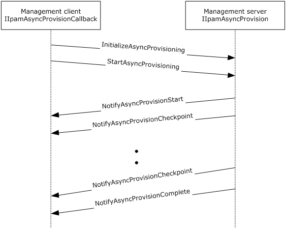

Figure 6: Provisioning – protocol interaction

### 3.11.1 Abstract Data Model

This section describes a conceptual model of possible data organization that an implementation maintains to participate in this protocol. The described organization is provided to facilitate the explanation of how the protocol behaves. This document does not mandate that implementations adhere to this model as long as their external behavior is consistent with that described in this document.

#### 3.11.1.1 State Machine

The following figure shows the state machine of the IIpamEnumerator server port type.

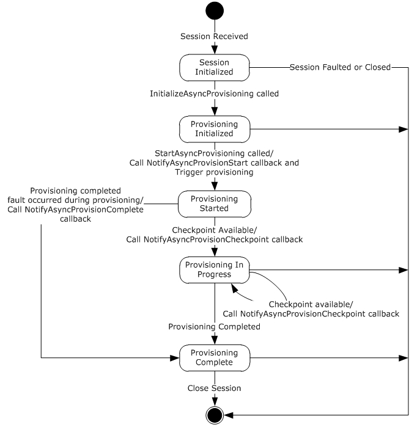

Figure 7: IIpamAsyncProvision server state machine

The IIpamAsyncProvision server is session-based and stateful in nature. The **session state** variable will be used to keep track of the current state for each session and it can have the following states as possible values. At any point of the session, if the session is known to be faulted or closed by the lower layer, the state machine ends.

| State | Description |
| --- | --- |
| Session Initialized | This would be the initial state of the session when it has been indicated from the lower layer of the protocol. When in this state, when the InitializeAsyncProvisioning operation is invoked (by the client), the state is changed to **Provisioning Initialized**. |
| Provisioning Initialized | This would be the state when the provisioning is initialized and ready to start the processing. When in this state, the StartAsyncProvisioning operation request is received from the management client, the server invokes the NotifyAsyncProvisionStart callback operation and triggers the provisioning. The state is changed to **Provisioning Started**. |
| Provisioning Started | This state denotes the provisioning has been initialized successfully and the provisioning is currently in progress. If there is a checkpoint available to be sent across from the enumeration processing, the NotifyAsyncProvisionCheckpoint operation is invoked and the state is changed to **Provisioning In Progress**. When the provisioning has completed successfully, the NotifyAsyncProvisionComplete operation is invoked and the state is changed to **Provisioning Completed**. When the provisioning has failed to complete with some error, the NotifyAsyncProvisionComplete is called to provide the fault information to the client and the state is changed to **Provisioning Completed**. |
| Provisioning In Progress | This state denotes the provisioning is in progress. If there is a checkpoint available to be sent across from the enumeration processing, the NotifyAsyncProvisionCheckpoint operation is invoked and the state is changed to **Provisioning In Progress**. When the provisioning has completed successfully, the NotifyAsyncProvisionComplete operation is invoked and the state is changed to **Provisioning Completed**. When the provisioning has failed to complete with some error, the NotifyAsyncProvisionComplete is called to provide the fault information to the client and the state is changed to **Provisioning Completed**. |
| Provisioning Completed | This state indicates there is no further processing required in the session and proceeds to close the session itself. |

### 3.11.2 Timers

There are no additional timers other than those which are described in section [3.1.2](#Section_3.1.2).

### 3.11.3 Initialization

None.

### 3.11.4 Message Processing Events and Sequencing Rules

#### 3.11.4.1 New Session Indication

This event will be indicated by the lower transport layer of the protocol ([MS-NMFTB](../MS-NMFTB/MS-NMFTB.md)) when a new session is available from the client. The **session state** is initialized to **Session Initialized**.

#### 3.11.4.2 Session Closed or Faulted

This event will be indicated by the lower transport layer of the protocol ([MS-NMFTB](../MS-NMFTB/MS-NMFTB.md)) when an existing session is either closed by the client or an irrecoverable error has occurred. This event will result in termination of the state machine as the session itself is no longer valid.

#### 3.11.4.3 InitializeAsyncProvisioning

This is an [**initiating operation**](#gt_initiating-operation). This operation is used to signify the interest of the management client to provision the IPAM data store.

<wsdl:operation msc:isInitiating="true" msc:isTerminating="false" name="InitializeAsyncProvisioning">

<wsdl:input wsaw:Action="http://Microsoft.Windows.Ipam/IIpamAsyncProvision/InitializeAsyncProvisioning" message="ipam:IIpamAsyncProvision_InitializeAsyncProvisioning_InputMessage" />

<wsdl:output wsaw:Action="http://Microsoft.Windows.Ipam/IIpamAsyncProvision/InitializeAsyncProvisioningResponse" message="ipam:IIpamAsyncProvision_InitializeAsyncProvisioning_OutputMessage" />

</wsdl:operation>

Upon receiving the IIpamAsyncProvision_InitializeAsyncProvisioning_InputMessage request message, the server performs the following processing steps. Upon successful completion of the steps specified below, the server MUST respond with the IIpamAsyncProvision_InitializeAsyncProvisioning_OutputMessage message.In the event of a failure, an appropriate [**SOAP fault**](#gt_soap-fault) MUST be sent to the client as specified in section [2.2.2.1](#Section_2.2.2.1).

The session state is set to **Provisioning Initialized**.

##### 3.11.4.3.1 Messages

###### 3.11.4.3.1.1 IIpamAsyncProvision_InitializeAsyncProvisioning_InputMessage

This is the request for the InitializeAsyncProvisioning operation.

<wsdl:message name="IIpamAsyncProvision_InitializeAsyncProvisioning_InputMessage">

<wsdl:part name="parameters" element="ipam:InitializeAsyncProvisioning" />

</wsdl:message>

This message MUST be sent with the following [**SOAP action**](#gt_soap-action).

http://Microsoft.Windows.Ipam/IIpamAsyncProvision/InitializeAsyncProvisioning

The body of the SOAP message MUST contain the InitializeAsyncProvisioning element.

###### 3.11.4.3.1.2 IIpamAsyncProvision_InitializeAsyncProvisioning_OutputMessage

This is the response for the InitializeAsyncProvisioning operation.

<wsdl:message name="IIpamAsyncProvision_InitializeAsyncProvisioning_OutputMessage">

<wsdl:part name="parameters" element="ipam:InitializeAsyncProvisioningResponse" />

</wsdl:message>

This message MUST be sent with the following [**SOAP action**](#gt_soap-action).

http://Microsoft.Windows.Ipam/IIpamAsyncProvision/InitializeAsyncProvisioningResponse

The body of the SOAP message MUST contain the InitializeAsyncProvisioningResponse element.

##### 3.11.4.3.2 Elements

###### 3.11.4.3.2.1 InitializeAsyncProvisioning

This element specifies the input values for the InitializeAsyncProvisioning operation.

<xs:element name="InitializeAsyncProvisioning">

<xs:complexType>

<xs:sequence>

<xs:element minOccurs="0" name="parameters" nillable="true" type="ipam:EnumerationParametersBase" />

</xs:sequence>

</xs:complexType>

</xs:element>

###### 3.11.4.3.2.2 InitializeAsyncProvisioningResponse

This element specifies the output values for the InitializeAsyncProvisioning operation.

<xs:element name="InitializeAsyncProvisioningResponse">

<xs:complexType>

<xs:sequence />

</xs:complexType>

</xs:element>

#### 3.11.4.4 NotifyAsyncProvisionCheckpoint

This operation MUST NOT be invoked by the management client and MUST be ignored by the server.

<wsdl:operation msc:isInitiating="true" msc:isTerminating="false" name="NotifyAsyncProvisionCheckpoint">

<wsdl:output wsaw:Action="http://Microsoft.Windows.Ipam/IIpamAsyncProvision/NotifyAsyncProvisionCheckpoint" message="ipam:IIpamAsyncProvision_NotifyAsyncProvisionCheckpoint_OutputCallbackMessage" />

</wsdl:operation>

##### 3.11.4.4.1 Messages

###### 3.11.4.4.1.1 IIpamAsyncProvision_NotifyAsyncProvisionCheckpoint_OutputCallbackMessage

This is the request for the NotifyAsyncProvisionCheckpoint operation.

<wsdl:message name="IIpamAsyncProvision_NotifyAsyncProvisionCheckpoint_OutputCallbackMessage">

<wsdl:part name="parameters" element="ipam:NotifyAsyncProvisionCheckpoint" />

</wsdl:message>

This message MUST be sent with the following [**SOAP action**](#gt_soap-action).

http://Microsoft.Windows.Ipam/IIpamAsyncProvision/NotifyAsyncProvisionCheckpoint

The body of the SOAP message MUST contain the NotifyAsyncProvisionCheckpoint element.

##### 3.11.4.4.2 Elements

###### 3.11.4.4.2.1 NotifyAsyncProvisionCheckpoint

This element specifies the input values for the NotifyAsyncProvisionCheckpoint operation.

<xs:element name="NotifyAsyncProvisionCheckpoint">

<xs:complexType>

<xs:sequence>

<xs:element minOccurs="0" name="data" nillable="true" type="ipam:ArrayOfIpamObject" />

</xs:sequence>

</xs:complexType>

</xs:element>

#### 3.11.4.5 NotifyAsyncProvisionComplete

This operation MUST NOT be invoked by the management client and MUST be ignored by the server.

<wsdl:operation msc:isInitiating="true" msc:isTerminating="false" name="NotifyAsyncProvisionComplete">

<wsdl:output wsaw:Action="http://Microsoft.Windows.Ipam/IIpamAsyncProvision/NotifyAsyncProvisionComplete" message="ipam:IIpamAsyncProvision_NotifyAsyncProvisionComplete_OutputCallbackMessage" />

</wsdl:operation>

##### 3.11.4.5.1 Messages

###### 3.11.4.5.1.1 IIpamAsyncProvision_NotifyAsyncProvisionComplete_OutputCallbackMessage

This is the request for the NotifyAsyncProvisionComplete operation.

<wsdl:message name="IIpamAsyncProvision_NotifyAsyncProvisionComplete_OutputCallbackMessage">

<wsdl:part name="parameters" element="ipam:NotifyAsyncProvisionComplete" />

</wsdl:message>

This message MUST be sent with the following [**SOAP action**](#gt_soap-action).

http://Microsoft.Windows.Ipam/IIpamAsyncProvision/NotifyAsyncProvisionComplete

The body of the SOAP message MUST contain the NotifyAsyncProvisionComplete element.

##### 3.11.4.5.2 Elements

###### 3.11.4.5.2.1 NotifyAsyncProvisionComplete

This element specifies the input values for the NotifyAsyncProvisionComplete operation.

<xs:element name="NotifyAsyncProvisionComplete">

<xs:complexType>

<xs:sequence>

<xs:element minOccurs="0" name="result" nillable="true" type="ipam:IpamObject" />

<xs:element minOccurs="0" name="exception" nillable="true" type="ipam1:IpamException" />

</xs:sequence>

</xs:complexType>

</xs:element>

#### 3.11.4.6 NotifyAsyncProvisionStart

This operation MUST NOT be invoked by the management client and MUST be ignored by the server.

<wsdl:operation msc:isInitiating="true" msc:isTerminating="false" name="NotifyAsyncProvisionStart">

<wsdl:output wsaw:Action="http://Microsoft.Windows.Ipam/IIpamAsyncProvision/NotifyAsyncProvisionStart" message="ipam:IIpamAsyncProvision_NotifyAsyncProvisionStart_OutputCallbackMessage" />

</wsdl:operation>

##### 3.11.4.6.1 Messages

###### 3.11.4.6.1.1 IIpamAsyncProvision_NotifyAsyncProvisionStart_OutputCallbackMessage

This is the request for the NotifyAsyncProvisionStart operation.

<wsdl:message name="IIpamAsyncProvision_NotifyAsyncProvisionStart_OutputCallbackMessage">

<wsdl:part name="parameters" element="ipam:NotifyAsyncProvisionStart" />

</wsdl:message>

This message MUST be sent with the following [**SOAP action**](#gt_soap-action).

http://Microsoft.Windows.Ipam/IIpamAsyncProvision/NotifyAsyncProvisionStart

The body of the SOAP message MUST contain the NotifyAsyncProvisionStart element.

##### 3.11.4.6.2 Elements

###### 3.11.4.6.2.1 NotifyAsyncProvisionStart

This element specifies the input values for the NotifyAsyncProvisionStart operation.

<xs:element name="NotifyAsyncProvisionStart">

<xs:complexType>

<xs:sequence />

</xs:complexType>

</xs:element>

#### 3.11.4.7 StartAsyncProvisioning

This operation is invoked by the client to trigger the start of the provisioning. This causes the session state to be set to **Enumeration Started**.

<wsdl:operation msc:isInitiating="true" msc:isTerminating="false" name="StartAsyncProvisioning">

<wsdl:input wsaw:Action="http://Microsoft.Windows.Ipam/IIpamAsyncProvision/StartAsyncProvisioning" message="ipam:IIpamAsyncProvision_StartAsyncProvisioning_InputMessage" />

</wsdl:operation>

Upon receiving the IIpamAsyncProvision_StartAsyncProvisioning_InputMessage request message, the server MUST invoke the NotifyAsyncProvisionStart operation. The following processing steps are then invoked to provision the IPAM data store. If the processing steps take longer than the lower layer session timeout values, the implementation MUST send checkpoint updates to the management client by invoking the NotifyAsyncProvisionCheckpoint callback operation.

Also if a fault is generated in any of the steps below, the NotifyAsyncProvisionComplete callback operation MUST be called specifying NotifyAsyncProvisionComplete.exception set to the fault information. The **session state** will be set to **Provisioning Completed** when a fault is encountered.

- If **ADM_IsIPAMProvisioningInProgress** is set to TRUE, return an appropriate SOAP fault as there is already a session which has triggered the provisioning.
- If **ADM_IsIPAMConfigured** is FALSE, perform the following steps.
- Setup the IPAM data store ADM_IPAMDataStore in an implementation specific manner. Where applicable as described in the ADM section, initialize the tables with the default values as well.
- Setup the ADM_IPAMSecurityGroups in an implementation specific manner.
- If the provisioning has been completed successfully,
- Set ADM_IsIPAMConfigured to TRUE.
- If any fault was encountered as a part of the provisioning steps,
- Set NotifyAsyncProvisionComplete.exception to the fault information.
- Set **session state** to **Provisioning Completed**.
- Set the current date and time to **ADM_CommonProperties.IpamConfiguredDate**.
- Set ADM_IsIPAMProvisioningInProgress to FALSE.

##### 3.11.4.7.1 Messages

###### 3.11.4.7.1.1 IIpamAsyncProvision_StartAsyncProvisioning_InputMessage

This is the request for the StartAsyncProvisioning operation.

<wsdl:message name="IIpamAsyncProvision_StartAsyncProvisioning_InputMessage">

<wsdl:part name="parameters" element="ipam:StartAsyncProvisioning" />

</wsdl:message>

This message MUST be sent with the following [**SOAP action**](#gt_soap-action).

http://Microsoft.Windows.Ipam/IIpamAsyncProvision/StartAsyncProvisioning

The body of the SOAP message MUST contain the StartAsyncProvisioning element.

##### 3.11.4.7.2 Elements

###### 3.11.4.7.2.1 StartAsyncProvisioning

This element specifies the input values for the StartAsyncProvisioning operation.

<xs:element name="StartAsyncProvisioning">

<xs:complexType>

<xs:sequence />

</xs:complexType>

</xs:element>

### 3.11.5 Timer Events

None.

### 3.11.6 Other Local Events

None.

#### 3.11.6.1 User Authorization

This section lists the user authorization requirements for the various operations defined in this port type. After the user authentication is complete, the user MUST be authorized for the operation that is being requested. If the required authorization is not present, the user MUST be denied access to perform the operation by returning an appropriate SOAP fault as specified in section [2.2.2.1](#Section_2.2.2.1).

The following table specifies the operations and the authorization requirements. At least one of the states listed under the column "ADM States to be checked" MUST be TRUE for the user to be authorized to perform the specified operation. Any further granular authorization requirements for an operation will be captured under the section specific to the operation itself. This check is done after the steps listed in section [3.1.4.3](#Section_3.1.4.3) are complete.

| Operation | ADM States to be checked |
| --- | --- |
| InitializeAsyncProvisioning | IsAdministrator |
| StartAsyncProvisioning | IsAdministrator |

## 3.12 IIpamAsyncProvision Client Details

The client side of the IIpamAsyncProvision MUST provide the IIpamAsyncProvisionCallback server interface. The IIpamAsyncProvision server will callback into the IIpamAsyncProvisionCallback of the client for notifying the start of provisioning, providing the provisioning checkpoints and to notify the completion of the provisioning along with status.

In summary, on a single session, the management client implements the IIpamAsyncProvisionCallback port type and the management server implements the IIpamAsyncProvision port type.

### 3.12.1 Abstract Data Model

This section describes a conceptual model of possible data organization that an implementation maintains to participate in this protocol. The described organization is provided to facilitate the explanation of how the protocol behaves. This document does not mandate that implementations adhere to this model as long as their external behavior is consistent with that described in this document.

The following state is available on a per-session basis:

**ProvisioningFault**: This contains the IpamException having the fault that the server has sent across to the client or any session establishment failure fault that the lower transport layer might have indicated. If this value is set, the provisioning is considered unsuccessful. If this value is not set, the provisioning is considered successful.

### 3.12.2 Timers

There are no additional timers beyond those specified in section [3.2.2](#Section_3.2.2).

### 3.12.3 Initialization

The IIpamAsyncProvision client on initialization will establish the session to the management server. On successfully setting up the session, the IIpamAsyncProvision client MUST initialize the IIpamAsyncProvisionCallback session on the same session so the IIpamAsyncProvision server can callback with the provisioning status. In order to obtain the provisioning status from the IIpamAsyncProvisionCallback port type, the ProvisioningFault is passed as a part of the initialization routine. The IIpamAsyncProvisionCallback port type’s server sets the provisioning status into ProvisioningFault to provide to the application layer.

### 3.12.4 Message Processing Events and Sequencing Rules

#### 3.12.4.1 Provisioning Completed

This is an event which is triggered by the IIpamAsyncProvisionCallback server on the session to indicate that the provisioning is completed and the **ProvisionFault** has the status of the completion.

### 3.12.5 Timer Events

None.

### 3.12.6 Other Local Events

None.

## 3.13 IIpamAsyncProvisionCallback Server Details

This port type is implemented by the management client and initialized on the same session used to perform operations against the IIpamAsyncProvision server on the management server. This provides the callback interface which the IIpamAsyncProvision server invokes to provide the provisioning checkpoint and completion status.

### 3.13.1 Abstract Data Model

This section describes a conceptual model of possible data organization that an implementation maintains to participate in this protocol. The described organization is provided to facilitate the explanation of how the protocol behaves. This document does not mandate that implementations adhere to this model as long as their external behavior is consistent with that described in this document.

#### 3.13.1.1 State Machine

The following figure shows the state machine of the IIpamAsyncProvisionCallback server port type.

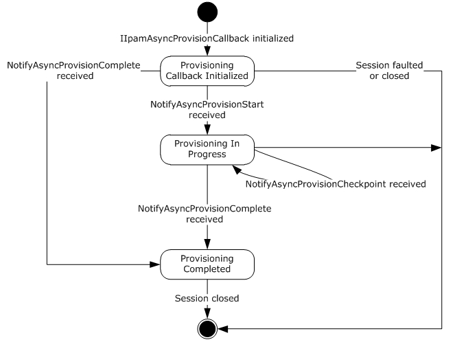

Figure 8: IIpamAsyncProvisionCallback state machine

The IIpamAsyncProvisionCallback server is session-based sharing the same session the management client has with the management server using the IIpamAsyncProvision port type. It is also stateful in nature. The **session state** variable will be used to keep track of the current state for each session and it can have the following states as possible values. At any point of the session, if the session is known to be faulted or closed by the lower layer, the state machine ends.

| State | Description |
| --- | --- |
| Provisioning Callback Initialized | This is the initial state of the IIpamAsyncProvisionCallback will be when it has been initialized by the IIpamAsyncProvision client. When the NotifyAsyncProvisionStart is received in this state from the IIpamAsyncProvision server port on the management server-end of the session, the transition to the **Provisioning In Progress** state will happen. |
| Provisioning In Progress | This state indicates the IIpamAsyncProvisionCallback is ready to receive the provisioning checkpoint and completion status. When the NotifyAsyncProvisionCheckpoint is received in this state from the IIpamAsyncProvision server port on the management server-end of the session, the state will continue to be in **Provisioning In Progress**. When the NotifyAsyncProvisionComplete is received in this state from the IIpamAsyncProvision server port on the management server-end of the session, the state will transition to **Provisioning Completed**. |
| Provisioning Completed | This is the state to notify the Provisioning interaction between the IIpamAsyncProvision server port on the management server-end and the IIpamAsyncProvisionCallback server port on the management client-end is complete and the result is available. |

#### 3.13.1.2 Other Miscellaneous States

**ProvisioningFault**: This is used to store the ProvisioningFault instance provided by IIpamAsyncProvision client as a part of the initialization to hold the provisioning result. See section [3.12.1](#Section_3.12.1) for more details.

### 3.13.2 Timers

There are no additional timers beyond the ones defined by the lower layer of the protocols.

### 3.13.3 Initialization

The IIpamAsyncProvisionCallback interface is initialized by the IIpamAsyncProvision client on the management client-end. The IIpamAsyncProvision client passes the ProvisionFault instance during initialization which will be updated by the IIpamAsyncProvisionCallback server with the result of the provisioning. The session state is set to **Provisioning Callback Initialized**.

### 3.13.4 Message Processing Events and Sequencing Rules

#### 3.13.4.1 Session Faulted or Closed

This is an event triggered by the lower transport layer when the session has received a SOAP fault or a forceful session close has occurred. If the **session state** is **Provisioning Callback Initialized** or **Provisioning In Progress**, the **ProvisioningFault** has to be set to an appropriate reason associated with the session closure.

#### 3.13.4.2 NotifyAsyncProvisionCheckpoint

This operation is used to provide the checkpoint when the provisioning is in progress.

<wsdl:operation name="NotifyAsyncProvisionCheckpoint">

<wsdl:input wsaw:Action="http://Microsoft.Windows.Ipam/IIpamAsyncProvisionCallback/NotifyAsyncProvisionCheckpoint" message="ipam:IIpamAsyncProvisionCallback_NotifyAsyncProvisionCheckpoint_InputMessage" />

</wsdl:operation>

This operation has only the input message and there is no output message associated with it. This operation will be called a number of times during the provisioning.

##### 3.13.4.2.1 Messages

###### 3.13.4.2.1.1 IIpamAsyncProvisionCallback_NotifyAsyncProvisionCheckpoint_InputMessage

This is the request for the NotifyAsyncProvisionCheckpoint operation.

<wsdl:message name="IIpamAsyncProvisionCallback_NotifyAsyncProvisionCheckpoint_InputMessage">

<wsdl:part name="parameters" element="ipam:NotifyAsyncProvisionCheckpoint" />

</wsdl:message>

This message MUST be sent with the following [**SOAP action**](#gt_soap-action).

http://Microsoft.Windows.Ipam/IIpamAsyncProvisionCallback/NotifyAsyncProvisionCheckpoint

The body of the SOAP message MUST contain the NotifyAsyncProvisionCheckpoint element.

##### 3.13.4.2.2 Elements

###### 3.13.4.2.2.1 NotifyAsyncProvisionCheckpoint

This element specifies the input values for the NotifyAsyncProvisionCheckpoint operation.

<xs:element name="NotifyAsyncProvisionCheckpoint">

<xs:complexType>

<xs:sequence>

<xs:element minOccurs="0" name="data" nillable="true" type="ipam:ArrayOfIpamObject" />

</xs:sequence>

</xs:complexType>

</xs:element>

#### 3.13.4.3 NotifyAsyncProvisionComplete

This operation is used to indicate the completion of provisioning.

<wsdl:operation name="NotifyAsyncProvisionComplete">

<wsdl:input wsaw:Action="http://Microsoft.Windows.Ipam/IIpamAsyncProvisionCallback/NotifyAsyncProvisionComplete" message="ipam:IIpamAsyncProvisionCallback_NotifyAsyncProvisionComplete_InputMessage" />

</wsdl:operation>

This operation has only the request message. This signifies the completion of the provisioning and the Provisioning Completed event of the IIpamAsyncProvision client is invoked. The session state is set to **Provisioning Completed**.

If NotifyAsyncProvisionComplete.exception is set, the provisioning has faulted. The ProvisioningFault is set to NotifyAsyncProvisionComplete.exception.

If NotifyAsyncProvisionComplete.exception is null, the provisioning has completed successfully.

##### 3.13.4.3.1 Messages

###### 3.13.4.3.1.1 IIpamAsyncProvisionCallback_NotifyAsyncProvisionComplete_InputMessage

This is the request for the NotifyAsyncProvisionComplete operation.

<wsdl:message name="IIpamAsyncProvisionCallback_NotifyAsyncProvisionComplete_InputMessage">

<wsdl:part name="parameters" element="ipam:NotifyAsyncProvisionComplete" />

</wsdl:message>

This message MUST be sent with the following [**SOAP action**](#gt_soap-action).

http://Microsoft.Windows.Ipam/IIpamAsyncProvisionCallback/NotifyAsyncProvisionComplete

The body of the SOAP message MUST contain the NotifyAsyncProvisionComplete element.

##### 3.13.4.3.2 Elements

###### 3.13.4.3.2.1 NotifyAsyncProvisionComplete

This element specifies the input values for the NotifyAsyncProvisionComplete operation.

<xs:element name="NotifyAsyncProvisionComplete">

<xs:complexType>

<xs:sequence>

<xs:element minOccurs="0" name="result" nillable="true" type="ipam:IpamObject" />

<xs:element minOccurs="0" name="exception" nillable="true" type="ipam1:IpamException" />

</xs:sequence>

</xs:complexType>

</xs:element>

#### 3.13.4.4 NotifyAsyncProvisionStart

This operation is used to indicate the start of the provisioning of the IPAM data store.

<wsdl:operation name="NotifyAsyncProvisionStart">

<wsdl:input wsaw:Action="http://Microsoft.Windows.Ipam/IIpamAsyncProvisionCallback/NotifyAsyncProvisionStart" message="ipam:IIpamAsyncProvisionCallback_NotifyAsyncProvisionStart_InputMessage" />

</wsdl:operation>

This operation only has the request message to provide the notification. On receiving the message, the session state is set to **Provisioning In Progress**.

##### 3.13.4.4.1 Messages

###### 3.13.4.4.1.1 IIpamAsyncProvisionCallback_NotifyAsyncProvisionStart_InputMessage

This is the request for the NotifyAsyncProvisionStart operation.

<wsdl:message name="IIpamAsyncProvisionCallback_NotifyAsyncProvisionStart_InputMessage">

<wsdl:part name="parameters" element="ipam:NotifyAsyncProvisionStart" />

</wsdl:message>

This message MUST be sent with the following [**SOAP action**](#gt_soap-action).

http://Microsoft.Windows.Ipam/IIpamAsyncProvisionCallback/NotifyAsyncProvisionStart

The body of the SOAP message MUST contain the NotifyAsyncProvisionStart element.

##### 3.13.4.4.2 Elements

###### 3.13.4.4.2.1 NotifyAsyncProvisionStart

This element specifies the input values for the NotifyAsyncProvisionStart operation.

<xs:element name="NotifyAsyncProvisionStart">

<xs:complexType>

<xs:sequence />

</xs:complexType>

</xs:element>

### 3.13.5 Timer Events

None.

### 3.13.6 Other Local Events

#### 3.13.6.1 User Authorization

Since the IIpamAsyncProvisionCallback server is initialized on the same session as the IIpamAsyncProvision session, no additional user authentication and authorization is performed beyond what was done for the operations in the IIpamAsyncProvision session.

## 3.14 IIpamAsyncProvisionCallback Client Details

The IIpamAsyncProvision server is the endpoint which will also be the IIpamAsyncProvisionCallback client. The same session has the IIpamAsyncProvision and the IIpamAsyncProvisionCallback implemented on either ends. The management server will provide the IIpamAsyncProvision server and the IIpamAsyncProvisionCallback client implementations and the management client will provide the IIpamAsyncProvisionCallback server and the IIpamAsyncProvision client implementations. The IIpamAsyncProvisionCallback is only a request interface i.e. there is no data obtained from the IIpamAsyncProvisionCallback server.

### 3.14.1 Abstract Data Model

None.

### 3.14.2 Timers

None.

### 3.14.3 Initialization

None.

### 3.14.4 Message Processing Events and Sequencing Rules

None other than those captured as a part of the IIpamAsyncProvision server section [3.11](#Section_3.11).

### 3.14.5 Timer Events

None..

### 3.14.6 Other Local Events

None.

## 3.15 IIpamAsyncSchemaConversion Server Details

This port type enables the [**schema conversion**](#gt_schema-conversion) of the IPAM data store. When the management server determines the need for schema conversion, no other management activity can be performed till the schema conversion is completed. The schema conversion activity can be a time consuming activity. By taking the callback approach, it is possible to perform and complete the activity without running into operation timeouts that are managed by the lower layers. The following diagram shows the interaction between the management client and the management server to enable the provisioning scenario.

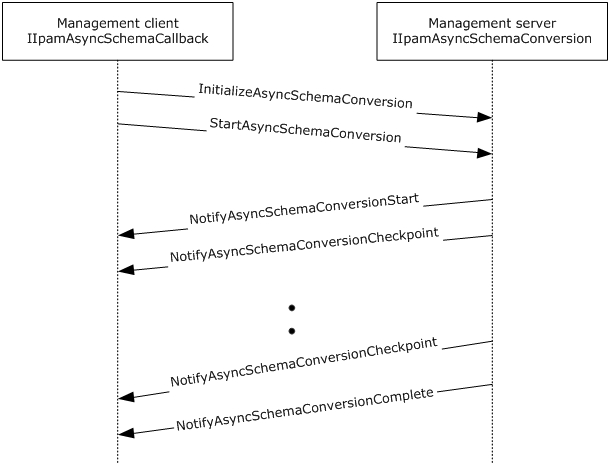

Figure 9: Schema Conversion - Protocol Interaction

### 3.15.1 Abstract Data Model

This section describes a conceptual model of possible data organization that an implementation maintains to participate in this protocol. The described organization is provided to facilitate the explanation of how the protocol behaves. This document does not mandate that implementations adhere to this model as long as their external behavior is consistent with that described in this document.

#### 3.15.1.1 State Machine

The following figure shows the state machine of the IIpamEnumerator server port type.

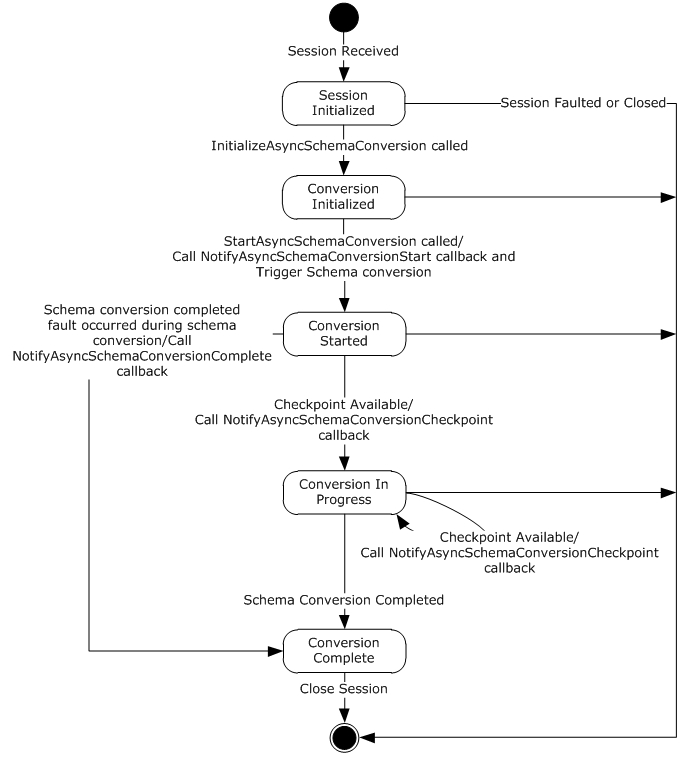

Figure 10: IIpamAsyncSchemaConversion server state machine

The IIpamAsyncSchemaConversion server is session-based and stateful in nature. The **session state** variable will be used to keep track of the current state for each session and it can have the following states as possible values. At any point of the session, if the session is known to be faulted or closed by the lower layer, the state machine ends.

| State | Description |
| --- | --- |
| Session Initialized | This would be the initial state of the session when it has been indicated from the lower layer of the protocol. In this state, when the InitializeAsyncSchemaConversion operation request is received from the management client, the state is changed to **Provisioning Initialized**. |
| Conversion Initialized | This would be the state when the schema conversion is initialized and ready to start the processing. In this state, when the StartAsyncSchemaConversion operation request is received from the management client, the server invokes the NotifyAsyncSchemaConversionStart and triggers the schema conversion. The state is changed to **Conversion Started**. |
| Conversion Started | This state denotes the schema conversion has been initialized successfully and is currently in progress. If there is a checkpoint available to be sent across to the management client, the NotifyAsyncSchemaConversionCheckpoint operation is invoked and the state is changed to **Conversion In Progress**. When the schema conversion has completed successfully, the NotifyAsyncSchemaConversionComplete operation is invoked and the state is changed to **Conversion Completed**. When the scheme conversion has failed to complete with some error, the NotifyAsyncSchemaConversionComplete is called to provide the fault information to the client and the state is changed to **Conversion Completed**. |
| Conversion In Progress | This state denotes the schema conversion is in progress. If there is a checkpoint available to be sent across to the management client, the NotifyAsyncSchemaConversionCheckpoint operation is invoked and the state is changed to **Conversion In Progress**. When the schema conversion has completed successfully, the NotifyAsyncSchemaConversionComplete operation is invoked and the state is changed to **Conversion Completed**. When the scheme conversion has failed to complete with some error, the NotifyAsyncSchemaConversionComplete is called to provide the fault information to the client and the state is changed to **Conversion Completed**. |
| Conversion Completed | This state indicates there is no further processing required in the session and proceeds to close the session itself. |

### 3.15.2 Timers

There are no additional timers other than those which are described in section [3.1.2](#Section_3.1.2).

### 3.15.3 Initialization

None.

### 3.15.4 Message Processing Events and Sequencing Rules

#### 3.15.4.1 New Session Indication

This event will be indicated by the lower transport layer of the protocol ([MS-NMFTB]) when a new session is available from the client. The **session state** is initialized to **Session Initialized**.

#### 3.15.4.2 Session Closed or Faulted

This event will be indicated by the lower transport layer of the protocol ([MS-NMFTB]) when an existing session is either closed by the client or an irrecoverable error has occurred. This event will result in termination of the state machine as the session itself is no longer valid.

#### 3.15.4.3 InitializeAsyncSchemaConversion

This is an [**initiating operation**](#gt_initiating-operation). This operation is used signify the interest of the management client to provision the IPAM data store.

<wsdl:operation msc:isInitiating="true" msc:isTerminating="false" name="InitializeAsyncSchemaConversion">

<wsdl:input wsaw:Action="http://Microsoft.Windows.Ipam/IIpamAsyncSchemaConversion/InitializeAsyncSchemaConversion" message="ipam:IIpamAsyncSchemaConversion_InitializeAsyncSchemaConversion_InputMessage" />

<wsdl:output wsaw:Action="http://Microsoft.Windows.Ipam/IIpamAsyncSchemaConversion/InitializeAsyncSchemaConversionResponse" message="ipam:IIpamAsyncSchemaConversion_InitializeAsyncSchemaConversion_OutputMessage" />

</wsdl:operation>

Upon receiving the IIpamAsyncSchemaConversion_InitializeAsyncSchemaConversion_InputMessage request message, the server performs the following processing steps. Upon successful completion of the steps specified below, the server MUST respond with the IIpamAsyncSchemaConversion_InitializeAsyncSchemaConversion_OutputMessage message.In the event of a failure, an appropriate [**SOAP fault**](#gt_soap-fault) MUST be sent to the client as specified in section [2.2.2.1](#Section_2.2.2.1).

The session state is set to **Conversion Initialized**.

##### 3.15.4.3.1 Messages

###### 3.15.4.3.1.1 IIpamAsyncSchemaConversion_InitializeAsyncSchemaConversion_InputMessage

This is the request for the InitializeAsyncSchemaConversion operation.

<wsdl:message name="IIpamAsyncSchemaConversion_InitializeAsyncSchemaConversion_InputMessage">

<wsdl:part name="parameters" element="ipam:InitializeAsyncSchemaConversion" />

</wsdl:message>

This message MUST be sent with the following [**SOAP action**](#gt_soap-action).

http://Microsoft.Windows.Ipam/IIpamAsyncSchemaConversion/InitializeAsyncSchemaConversion

The body of the SOAP message MUST contain the InitializeAsyncSchemaConversion element.

###### 3.15.4.3.1.2 IIpamAsyncSchemaConversion_InitializeAsyncSchemaConversion_OutputMessage

This is the response for the InitializeAsyncSchemaConversion operation.

<wsdl:message name="IIpamAsyncSchemaConversion_InitializeAsyncSchemaConversion_OutputMessage">

<wsdl:part name="parameters" element="ipam:InitializeAsyncSchemaConversionResponse" />

</wsdl:message>

This message MUST be sent with the following [**SOAP action**](#gt_soap-action).

http://Microsoft.Windows.Ipam/IIpamAsyncSchemaConversion/InitializeAsyncSchemaConversionResponse

The body of the SOAP message MUST contain the InitializeAsyncSchemaConversionResponse element.

##### 3.15.4.3.2 Elements

###### 3.15.4.3.2.1 InitializeAsyncSchemaConversion

This element specifies the input values for the InitializeAsyncSchemaConversion operation.

<xs:element name="InitializeAsyncSchemaConversion">

<xs:complexType>

<xs:sequence>

<xs:element minOccurs="0" name="parameters" nillable="true" type="ipam:EnumerationParametersBase" />

</xs:sequence>

</xs:complexType>

</xs:element>

###### 3.15.4.3.2.2 InitializeAsyncSchemaConversionResponse

This element specifies the output values for the InitializeAsyncSchemaConversion operation.

<xs:element name="InitializeAsyncSchemaConversionResponse">

<xs:complexType>

<xs:sequence />

</xs:complexType>

</xs:element>

#### 3.15.4.4 NotifyAsyncSchemaConversionCheckpoint

This operation MUST NOT be invoked by the management client and MUST be ignored by the server.

<wsdl:operation msc:isInitiating="true" msc:isTerminating="false" name="NotifyAsyncSchemaConversionCheckpoint">

<wsdl:output wsaw:Action="http://Microsoft.Windows.Ipam/IIpamAsyncSchemaConversion/NotifyAsyncSchemaConversionCheckpoint" message="ipam:IIpamAsyncSchemaConversion_NotifyAsyncSchemaConversionCheckpoint_OutputCallbackMessage" />

</wsdl:operation>

##### 3.15.4.4.1 Messages

###### 3.15.4.4.1.1 IIpamAsyncSchemaConversion_NotifyAsyncSchemaConversionCheckpoint_OutputCallbackMessage

This is the request for the NotifyAsyncSchemaConversionCheckpoint operation.

<wsdl:message name="IIpamAsyncSchemaConversion_NotifyAsyncSchemaConversionCheckpoint_OutputCallbackMessage">

<wsdl:part name="parameters" element="ipam:NotifyAsyncSchemaConversionCheckpoint" />

</wsdl:message>

This message MUST be sent with the following [**SOAP action**](#gt_soap-action).

http://Microsoft.Windows.Ipam/IIpamAsyncSchemaConversion/NotifyAsyncSchemaConversionCheckpoint

The body of the SOAP message MUST contain the NotifyAsyncSchemaConversionCheckpoint element.

##### 3.15.4.4.2 Elements

###### 3.15.4.4.2.1 NotifyAsyncSchemaConversionCheckpoint

This element specifies the input values for the NotifyAsyncSchemaConversionCheckpoint operation.

<xs:element name="NotifyAsyncSchemaConversionCheckpoint">

<xs:complexType>

<xs:sequence>

<xs:element minOccurs="0" name="data" nillable="true" type="ipam:ArrayOfIpamObject" />

</xs:sequence>

</xs:complexType>

</xs:element>

#### 3.15.4.5 NotifyAsyncSchemaConversionComplete

This operation MUST NOT be invoked by the management client and MUST be ignored by the server.

<wsdl:operation msc:isInitiating="true" msc:isTerminating="false" name="NotifyAsyncSchemaConversionComplete">

<wsdl:output wsaw:Action="http://Microsoft.Windows.Ipam/IIpamAsyncSchemaConversion/NotifyAsyncSchemaConversionComplete" message="ipam:IIpamAsyncSchemaConversion_NotifyAsyncSchemaConversionComplete_OutputCallbackMessage" />

</wsdl:operation>

##### 3.15.4.5.1 Messages

###### 3.15.4.5.1.1 IIpamAsyncSchemaConversion_NotifyAsyncSchemaConversionComplete_OutputCallbackMessage

This is the request for the NotifyAsyncSchemaConversionComplete operation.

<wsdl:message name="IIpamAsyncSchemaConversion_NotifyAsyncSchemaConversionComplete_OutputCallbackMessage">

<wsdl:part name="parameters" element="ipam:NotifyAsyncSchemaConversionComplete" />

</wsdl:message>

This message MUST be sent with the following [**SOAP action**](#gt_soap-action).

http://Microsoft.Windows.Ipam/IIpamAsyncSchemaConversion/NotifyAsyncSchemaConversionComplete

The body of the SOAP message MUST contain the NotifyAsyncSchemaConversionComplete element.

##### 3.15.4.5.2 Elements

###### 3.15.4.5.2.1 NotifyAsyncSchemaConversionComplete

This element specifies the input values for the NotifyAsyncSchemaConversionComplete operation.

<xs:element name="NotifyAsyncSchemaConversionComplete">

<xs:complexType>

<xs:sequence>

<xs:element minOccurs="0" name="result" nillable="true" type="ipam:IpamObject" />

<xs:element minOccurs="0" name="exception" nillable="true" type="ipam1:IpamException" />

</xs:sequence>

</xs:complexType>

</xs:element>

#### 3.15.4.6 NotifyAsyncSchemaConversionStart

This operation MUST NOT be invoked by the management client and MUST be ignored by the server.

<wsdl:operation msc:isInitiating="true" msc:isTerminating="false" name="NotifyAsyncSchemaConversionStart">

<wsdl:output wsaw:Action="http://Microsoft.Windows.Ipam/IIpamAsyncSchemaConversion/NotifyAsyncSchemaConversionStart" message="ipam:IIpamAsyncSchemaConversion_NotifyAsyncSchemaConversionStart_OutputCallbackMessage" />

</wsdl:operation>

##### 3.15.4.6.1 Messages

###### 3.15.4.6.1.1 IIpamAsyncSchemaConversion_NotifyAsyncSchemaConversionStart_OutputCallbackMessage

This is the request for the NotifyAsyncSchemaConversionStart operation.

<wsdl:message name="IIpamAsyncSchemaConversion_NotifyAsyncSchemaConversionStart_OutputCallbackMessage">

<wsdl:part name="parameters" element="ipam:NotifyAsyncSchemaConversionStart" />

</wsdl:message>

This message MUST be sent with the following [**SOAP action**](#gt_soap-action).

http://Microsoft.Windows.Ipam/IIpamAsyncSchemaConversion/NotifyAsyncSchemaConversionStart

The body of the SOAP message MUST contain the NotifyAsyncSchemaConversionStart element.

##### 3.15.4.6.2 Elements

###### 3.15.4.6.2.1 NotifyAsyncSchemaConversionStart

This element specifies the input values for the NotifyAsyncSchemaConversionStart operation.

<xs:element name="NotifyAsyncSchemaConversionStart">

<xs:complexType>

<xs:sequence />

</xs:complexType>

</xs:element>

#### 3.15.4.7 StartAsyncSchemaConversion

This operation is invoked by the client to trigger the start of the schema conversion. This causes the session state to be set to **Conversion Started**.

<wsdl:operation msc:isInitiating="true" msc:isTerminating="false" name="StartAsyncSchemaConversion">

<wsdl:input wsaw:Action="http://Microsoft.Windows.Ipam/IIpamAsyncSchemaConversion/StartAsyncSchemaConversion" message="ipam:IIpamAsyncSchemaConversion_StartAsyncSchemaConversion_InputMessage" />

</wsdl:operation>

Upon receiving the IIpamAsyncSchemaConversion_StartAsyncSchemaConversion_InputMessage request message, the server MUST invoke the NotifyAsyncProvisionStart operation. The **session state** is set to **Conversion Started**.

The following are the processing steps involved. If a fault needs to be returned back to the client, the NotifyAsyncSchemaConversionComplete operation MUST be called with the fault specified in NotifyAsyncSchemaConversionComplete.exception.

- If ADM_IsSchemaConversionInProgress is set to TRUE, there is already a schema conversion session currently in progress. The current request cannot be processed. An appropriate SOAP fault MUST be returned to the client.
- Set ADM_IsSchemaConversionInProgress to TRUE so that no other schema conversion sessions become active.
- Check if schema conversion is required by checking ADM_IsSchemaConversionRequired. If it is FALSE, the schema conversion has been triggered when it is not required. An appropriate SOAP fault MUST be returned to the client.
- Initiate the database conversion schema in an implementation specific manner asynchronously. Provide adequate checkpoint status to the client by invoking NotifyAsyncSchemaConversionCheckpoint callback operation and set the **session state** to **Conversion In Progress**.
- If the schema conversion completes successfully,
- Return the success status by invoking NotifyAsyncSchemaConversionComplete with NotifyAsyncSchemaConversionComplete.exception set to null.
- Set **session state** to **Conversion Completed**.
- Set ADM_IsSchemaConversionRequired to FALSE.
- Set ADM_IsSchmeConversionInProgress to FALSE.
- If the schema conversion has failed,
- Specify the fault with which the schema conversion completed by invoking NotifyAsyncSchemaConversionComplete with NotifyAsyncSchemaConversionComplete.exception set to the fault that occurred.
- Set **session state** to **Conversion Completed**.
- Set ADM_IsSchmeConversionInProgress to FALSE.

##### 3.15.4.7.1 Messages

###### 3.15.4.7.1.1 IIpamAsyncSchemaConversion_StartAsyncSchemaConversion_InputMessage

This is the request for the StartAsyncSchemaConversion operation.

<wsdl:message name="IIpamAsyncSchemaConversion_StartAsyncSchemaConversion_InputMessage">

<wsdl:part name="parameters" element="ipam:StartAsyncSchemaConversion" />

</wsdl:message>

This message MUST be sent with the following [**SOAP action**](#gt_soap-action).

http://Microsoft.Windows.Ipam/IIpamAsyncSchemaConversion/StartAsyncSchemaConversion

The body of the SOAP message MUST contain the StartAsyncSchemaConversion element.

##### 3.15.4.7.2 Elements

###### 3.15.4.7.2.1 StartAsyncSchemaConversion

This element specifies the input values for the StartAsyncSchemaConversion operation.

<xs:element name="StartAsyncSchemaConversion">

<xs:complexType>

<xs:sequence />

</xs:complexType>

</xs:element>

### 3.15.5 Timer Events

None.

### 3.15.6 Other Local Events

None.

#### 3.15.6.1 User Authorization

This section lists the user authorization requirements for the various operations defined in this port type. After the user authentication is complete, the user MUST be authorized for the operation that is being requested. If the required authorization is not present, the user MUST be denied access to perform the operation by returning an appropriate SOAP fault as specified in section [2.2.2.1](#Section_2.2.2.1).

The following table specifies the operations and the authorization requirements. At least one of the states listed under the column "ADM States to be checked" MUST be TRUE for the user to be authorized to perform the specified operation. Any further granular authorization requirements for an operation will be captured under the section specific to the operation itself. This check is done after the steps listed in section [3.1.4.3](#Section_3.1.4.3) are complete.

| Operation | ADM States to be checked |
| --- | --- |
| InitializeAsyncSchemaConversion | IsAdministrator |
| StartAsyncSchemaConversion | IsAdministrator |

## 3.16 IIpamAsyncSchemaConversion Client Details

The client side of the IIpamAsyncSchemaConversion MUST provide the IIpamAsyncSchemaCallback server interface. The IIpamAsyncSchemaConversion server will callback into the IIpamAsyncSchemaCallback of the client for notifying the start of schema conversion, providing the status checkpoints and to notify the completion of the schema conversion along with status.

In summary, on a single session, the management client implements the IIpamAsyncSchemaCallback port type and the management server implements the IIpamAsyncSchemaConversion port type.

### 3.16.1 Abstract Data Model

This section describes a conceptual model of possible data organization that an implementation maintains to participate in this protocol. The described organization is provided to facilitate the explanation of how the protocol behaves. This document does not mandate that implementations adhere to this model as long as their external behavior is consistent with that described in this document.

The following state is available on a per-session basis:

**ConversionFault**: This contains the IpamException having the fault that the server has sent across to the client or any session establishment failure fault that the lower transport layer might have indicated. If this value is set, the schema conversion is considered unsuccessful. If this value is not set, the schema conversion is considered successful.

### 3.16.2 Timers

There are no additional timers beyond those specified in section [3.2.2](#Section_3.2.2).

### 3.16.3 Initialization

The IIpamAsyncSchemaConversion client on initialization will establish the session to the management server. On successfully setting up the session, the IIpamAsyncSchemaConversion client MUST initialize the IIpamAsyncSchemaCallback session on the same session so the IIpamAsyncSchemaConversion server can callback with the schema conversion status. In order to obtain the schema conversion status from the IIpamAsyncSchemaCallback port type, the ConversionFault is passed as a part of the initialization routine. The IIpamAsyncSchemaCallback port type’s server sets the schema conversion status into ConversionFault to provide to the application layer.

### 3.16.4 Message Processing Events and Sequencing Rules

#### 3.16.4.1 Conversion Completed

This is an event which is triggered by the IIpamAsyncSchemaCallback server on the session to indicate that the schema conversion is completed and the **ConversionFault** has the status of the completion.

### 3.16.5 Timer Events

None.

### 3.16.6 Other Local Events

None.

## 3.17 IIpamAsyncSchemaCallback Server Details

This port type is implemented by the management client and initialized on the same session used to perform operations against the IIpamAsyncSchemaConversion server on the management server. This provides the callback interface which the IIpamAsyncSchemaConversion server invokes to provide the schema conversion checkpoint and completion status.

### 3.17.1 Abstract Data Model

This section describes a conceptual model of possible data organization that an implementation maintains to participate in this protocol. The described organization is provided to facilitate the explanation of how the protocol behaves. This document does not mandate that implementations adhere to this model as long as their external behavior is consistent with that described in this document.

#### 3.17.1.1 State Machine

The following figure shows the state machine of the IIpamAsyncSchemaCallback server port type.

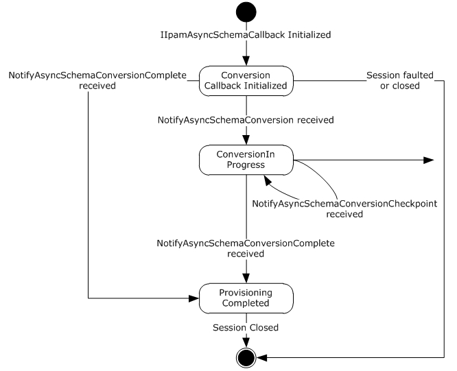

Figure 11: IIpamAsyncSchemaCallback state machine

The IIpamAsyncSchemaCallback server is session-based sharing the same session the management client has with the management server using the IIpamAsyncSchemaConversion port type. It is also stateful in nature. The **session state** variable will be used to keep track of the current state for each session and it can have the following states as possible values. At any point of the session, if the session is known to be faulted or closed by the lower layer, the state machine ends.

| State | Description |
| --- | --- |
| Conversion Callback Initialized | This is the initial state of the IIpamAsyncSchemaCallback will be when it has been initialized by the IIpamAsyncSchemaConversion client. When the NotifyAsyncSchemaConversionStart is received in this state from the IIpamAsyncSchemaConversion server port on the management server-end of the session, the transition to the **Conversion In Progress** state will happen. |
| Conversion In Progress | This state indicates the IIpamAsyncSchemaCallback is ready to receive the schema conversion checkpoint and completion status. When the NotifyAsyncSchemaConversionCheckpoint is received in this state from the IIpamAsyncSchemaConversion server port on the management server-end of the session, the state will continue to be in **Conversion In Progress**. When the NotifyAsyncSchemaConversionComplete is received in this state from the IIpamAsyncSchemaConversion server port on the management server-end of the session, the state will transition to **Conversion Completed**. |
| Conversion Completed | This is the state to notify the schema conversion status interaction between the IIpamAsyncSchemaConversion server port on the management server-end and the IIpamAsyncSchemaCallback server port on the management client-end is complete and the result is available. |

#### 3.17.1.2 Other Miscellaneous States

**ConversionFault**: This is used to store the ConversionFault instance provided by IIpamAsyncSchemaConversion client as a part of the initialization to hold the schema conversion result. See section [3.16.1](#Section_3.16.1) for more details.

### 3.17.2 Timers

There are no additional timers beyond the ones defined by the lower layer of the protocols.

### 3.17.3 Initialization

The IIpamAsyncSchemaCallback interface is initialized by the IIpamAsyncSchemaConversion client on the management client-end. The IIpamAsyncSchemaConversion client passes the ProvisionFault instance during initialization which will be updated by the IIpamAsyncSchemaCallback server with the result of the schema conversion. The session state is set to **Conversion Callback Initialized**.

### 3.17.4 Message Processing Events and Sequencing Rules

#### 3.17.4.1 Session Faulted or Closed

This is an event triggered by the lower transport layer when the session has received a SOAP fault or a forceful session close has occurred. If the **session state** is **Conversion Callback Initialized** or **Conversion In Progress**, the **ProvisioningFault** has to be set to an appropriate reason associated with the session closure.

#### 3.17.4.2 NotifyAsyncSchemaConversionCheckpoint

This operation is used to provide the checkpoint when the schema conversion is in progress.

<wsdl:operation name="NotifyAsyncSchemaConversionCheckpoint">

<wsdl:input wsaw:Action="http://Microsoft.Windows.Ipam/IIpamAsyncSchemaCallback/NotifyAsyncSchemaConversionCheckpoint" message="ipam:IIpamAsyncSchemaCallback_NotifyAsyncSchemaConversionCheckpoint_InputMessage" />

</wsdl:operation>

This operation has only the input message and there is no output message associated with it. This operation will be called a number of times during the schema conversion.

##### 3.17.4.2.1 Messages

###### 3.17.4.2.1.1 IIpamAsyncSchemaCallback_NotifyAsyncSchemaConversionCheckpoint_InputMessage

This is the request for the NotifyAsyncSchemaConversionCheckpoint operation.

<wsdl:message name="IIpamAsyncSchemaCallback_NotifyAsyncSchemaConversionCheckpoint_InputMessage">

<wsdl:part name="parameters" element="ipam:NotifyAsyncSchemaConversionCheckpoint" />

</wsdl:message>

This message MUST be sent with the following [**SOAP action**](#gt_soap-action).

http://Microsoft.Windows.Ipam/IIpamAsyncSchemaCallback/NotifyAsyncSchemaConversionCheckpoint

The body of the SOAP message MUST contain the NotifyAsyncSchemaConversionCheckpoint element.

##### 3.17.4.2.2 Elements

###### 3.17.4.2.2.1 NotifyAsyncSchemaConversionCheckpoint

This element specifies the input values for the NotifyAsyncSchemaConversionCheckpoint operation.

<xs:element name="NotifyAsyncSchemaConversionCheckpoint">

<xs:complexType>

<xs:sequence>

<xs:element minOccurs="0" name="data" nillable="true" type="ipam:ArrayOfIpamObject" />

</xs:sequence>

</xs:complexType>

</xs:element>

#### 3.17.4.3 NotifyAsyncSchemaConversionComplete

This operation is used to indicate the completion of schema conversion.

<wsdl:operation name="NotifyAsyncSchemaConversionComplete">

<wsdl:input wsaw:Action="http://Microsoft.Windows.Ipam/IIpamAsyncSchemaCallback/NotifyAsyncSchemaConversionComplete" message="ipam:IIpamAsyncSchemaCallback_NotifyAsyncSchemaConversionComplete_InputMessage" />

</wsdl:operation>

This operation has only the request message. This signifies the completion of the schema conversion and the Conversion Completed event of the IIpamAsyncSchemaConversion client is invoked. The session state is set to **Conversion Completed**.

If NotifyAsyncSchemaConversionComplete.exception is set, the schema conversion has faulted. The ConversionFault is set to NotifyAsyncSchemaConversionComplete.exception.

If NotifyAsyncSchemaConversionComplete.exception is null, the schema conversion has completed successfully.

##### 3.17.4.3.1 Messages

###### 3.17.4.3.1.1 IIpamAsyncSchemaCallback_NotifyAsyncSchemaConversionComplete_InputMessage

This is the request for the NotifyAsyncSchemaConversionComplete operation.

<wsdl:message name="IIpamAsyncSchemaCallback_NotifyAsyncSchemaConversionComplete_InputMessage">

<wsdl:part name="parameters" element="ipam:NotifyAsyncSchemaConversionComplete" />

</wsdl:message>

This message MUST be sent with the following [**SOAP action**](#gt_soap-action).

http://Microsoft.Windows.Ipam/IIpamAsyncSchemaCallback/NotifyAsyncSchemaConversionComplete

The body of the SOAP message MUST contain the NotifyAsyncSchemaConversionComplete element.

##### 3.17.4.3.2 Elements

###### 3.17.4.3.2.1 NotifyAsyncSchemaConversionComplete

This element specifies the input values for the NotifyAsyncSchemaConversionComplete operation.

<xs:element name="NotifyAsyncSchemaConversionComplete">

<xs:complexType>

<xs:sequence>

<xs:element minOccurs="0" name="result" nillable="true" type="ipam:IpamObject" />

<xs:element minOccurs="0" name="exception" nillable="true" type="ipam1:IpamException" />

</xs:sequence>

</xs:complexType>

</xs:element>

#### 3.17.4.4 NotifyAsyncSchemaConversionStart

This operation is used to indicate the start of the schema conversion of the IPAM data store.

<wsdl:operation name="NotifyAsyncSchemaConversionStart">

<wsdl:input wsaw:Action="http://Microsoft.Windows.Ipam/IIpamAsyncSchemaCallback/NotifyAsyncSchemaConversionStart" message="ipam:IIpamAsyncSchemaCallback_NotifyAsyncSchemaConversionStart_InputMessage" />

</wsdl:operation>

This operation only has the request message to provide the notification. On receiving the message, the session state is set to **Conversion In Progress**.

##### 3.17.4.4.1 Messages

###### 3.17.4.4.1.1 IIpamAsyncSchemaCallback_NotifyAsyncSchemaConversionStart_InputMessage

This is the request for the NotifyAsyncSchemaConversionStart operation.

<wsdl:message name="IIpamAsyncSchemaCallback_NotifyAsyncSchemaConversionStart_InputMessage">

<wsdl:part name="parameters" element="ipam:NotifyAsyncSchemaConversionStart" />

</wsdl:message>

This message MUST be sent with the following [**SOAP action**](#gt_soap-action).

http://Microsoft.Windows.Ipam/IIpamAsyncSchemaCallback/NotifyAsyncSchemaConversionStart

The body of the SOAP message MUST contain the NotifyAsyncSchemaConversionStart element.

##### 3.17.4.4.2 Elements

###### 3.17.4.4.2.1 NotifyAsyncSchemaConversionStart

This element specifies the input values for the NotifyAsyncSchemaConversionStart operation.

<xs:element name="NotifyAsyncSchemaConversionStart">

<xs:complexType>

<xs:sequence />

</xs:complexType>

</xs:element>

### 3.17.5 Timer Events

None.

### 3.17.6 Other Local Events

#### 3.17.6.1 User Authorization

Since the IIpamAsyncSchemaCallback server is initialized on the same session as the IIpamAsyncSchemaConversion session, no additional user authentication and authorization is performed beyond what was done for the operations in the IIpamAsyncSchemaConversion session.

## 3.18 IIpamAsyncSchemaCallback Client Details

The IIpamAsyncSchemaConversion server is the endpoint, which will also be the IIpamAsyncSchemaCallback client. The same session has the IIpamAsyncSchemaConversion and the IIpamAsyncSchemaCallback implemented on either end. The management server will provide the IIpamAsyncSchemaConversion server and the IIpamAsyncSchemaCallback client implementations and the management client will provide the IIpamAsyncSchemaCallback server and the IIpamAsyncSchemaConversion client implementations. The IIpamAsyncSchemaCallback is only a request interface, i.e., there is no data obtained from the IIpamAsyncSchemaCallback server.

### 3.18.1 Abstract Data Model

None.

### 3.18.2 Timers

None.

### 3.18.3 Initialization

None.

### 3.18.4 Message Processing Events and Sequencing Rules

None other than those captured as a part of the IIpamAsyncProvision server in section [3.11](#Section_3.11).

### 3.18.5 Timer Events

None.

### 3.18.6 Other Local Events

None.

# 4 Protocol Examples

## 4.1 Querying the Common Property

The following is the SOAP request message that can be sent to query the MinimumUtilizationThreshold property.

<s:Envelope xmlns:a="http://www.w3.org/2005/08/addressing" xmlns:s="http://www.w3.org/2003/05/soap-envelope"> <s:Header> <a:Action s:mustUnderstand="1">http://Microsoft.Windows.Ipam/IIpamServer/GetCommonPropertyValue</a:Action> <a:MessageID>urn:uuid:39ba826a-40c7-4081-b481-ac82f476c236</a:MessageID> <a:ReplyTo> <a:Address>http://www.w3.org/2005/08/addressing/anonymous</a:Address> </a:ReplyTo> </s:Header> <s:Body> <GetCommonPropertyValue xmlns="http://Microsoft.Windows.Ipam"> <commonProperty>MinimumUtilizationThreshold</commonProperty> </GetCommonPropertyValue> </s:Body></s:Envelope>

The following is the SOAP response message for the above request.

<s:Envelope xmlns:a="http://www.w3.org/2005/08/addressing" xmlns:s="http://www.w3.org/2003/05/soap-envelope"> <s:Header> <a:Action s:mustUnderstand="1">http://Microsoft.Windows.Ipam/IIpamServer/GetCommonPropertyValueResponse</a:Action> <a:RelatesTo>urn:uuid:39ba826a-40c7-4081-b481-ac82f476c236</a:RelatesTo> <a:To s:mustUnderstand="1">http://www.w3.org/2005/08/addressing/anonymous</a:To> </s:Header> <s:Body> <GetCommonPropertyValueResponse xmlns="http://Microsoft.Windows.Ipam"> <GetCommonPropertyValueResult>20</GetCommonPropertyValueResult> </GetCommonPropertyValueResponse> </s:Body></s:Envelope>

## 4.2 Creating an Address Range

The following request and response messages specify an example exchange for creating a static address range 192.168.1.0/24.

<s:Envelope xmlns:a="http://www.w3.org/2005/08/addressing" xmlns:s="http://www.w3.org/2003/05/soap-envelope"> <s:Header> <a:Action s:mustUnderstand="1">http://Microsoft.Windows.Ipam/IIpamServer/SaveRange</a:Action> <a:MessageID>urn:uuid:d1b717e7-2527-4c6a-a802-c3c9fc6b786e</a:MessageID> <a:ReplyTo> <a:Address>http://www.w3.org/2005/08/addressing/anonymous</a:Address> </a:ReplyTo> </s:Header> <s:Body> <SaveRange xmlns="http://Microsoft.Windows.Ipam"> <range xmlns:i="http://www.w3.org/2001/XMLSchema-instance" z:Id="i1" i:type="IPv4Range" xmlns:z="http://schemas.microsoft.com/2003/10/Serialization/"> <ModifiedProperties xmlns:d5p1="http://schemas.microsoft.com/2003/10/Serialization/Arrays"> <d5p1:string>SubnetId</d5p1:string> <d5p1:string>StartIPAddress</d5p1:string> <d5p1:string>EndIPAddress</d5p1:string> <d5p1:string>PrefixLength</d5p1:string> <d5p1:string>CustomFieldValues</d5p1:string> <d5p1:string>UtilizationStatistics</d5p1:string> </ModifiedProperties> <SetProperties xmlns:d5p1="http://schemas.microsoft.com/2003/10/Serialization/Arrays"> <d5p1:string>AddressAssignment</d5p1:string> <d5p1:string>UtilizationCalculationType</d5p1:string> <d5p1:string>SubnetId</d5p1:string> <d5p1:string>StartIPAddress</d5p1:string> <d5p1:string>EndIPAddress</d5p1:string> <d5p1:string>PrefixLength</d5p1:string> <d5p1:string>CustomFieldValues</d5p1:string> <d5p1:string>UtilizationStatistics</d5p1:string> </SetProperties> <AddressAssignment>Static</AddressAssignment> <AddressCategory>Private</AddressCategory> <CustomFieldValues> <CustomFieldValue z:Id="i2"> <ModifiedProperties xmlns:d7p1="http://schemas.microsoft.com/2003/10/Serialization/Arrays" i:nil="true" /> <SetProperties xmlns:d7p1="http://schemas.microsoft.com/2003/10/Serialization/Arrays" i:nil="true" /> <BuiltInCustomFieldValueId>0</BuiltInCustomFieldValueId> <ParentCustomFieldName>Region</ParentCustomFieldName> <ParentCustomFieldNumber>2</ParentCustomFieldNumber> <ParentCustomFieldRecordId>2</ParentCustomFieldRecordId> <RecordId i:nil="true" /> <Value>Asia</Value> </CustomFieldValue> <CustomFieldValue z:Id="i3"> <ModifiedProperties xmlns:d7p1="http://schemas.microsoft.com/2003/10/Serialization/Arrays"> <d7p1:string>ParentCustomFieldRecordId</d7p1:string> <d7p1:string>ParentCustomFieldName</d7p1:string> <d7p1:string>ParentCustomFieldNumber</d7p1:string> <d7p1:string>Value</d7p1:string> </ModifiedProperties> <SetProperties xmlns:d7p1="http://schemas.microsoft.com/2003/10/Serialization/Arrays"> <d7p1:string>ParentCustomFieldRecordId</d7p1:string> <d7p1:string>ParentCustomFieldName</d7p1:string> <d7p1:string>ParentCustomFieldNumber</d7p1:string> <d7p1:string>Value</d7p1:string> </SetProperties> <BuiltInCustomFieldValueId>1</BuiltInCustomFieldValueId> <ParentCustomFieldName>Managed by Service</ParentCustomFieldName> <ParentCustomFieldNumber>8</ParentCustomFieldNumber> <ParentCustomFieldRecordId>8</ParentCustomFieldRecordId> <RecordId>298</RecordId> <Value>IPAM</Value> </CustomFieldValue> <CustomFieldValue z:Id="i4"> <ModifiedProperties xmlns:d7p1="http://schemas.microsoft.com/2003/10/Serialization/Arrays"> <d7p1:string>ParentCustomFieldRecordId</d7p1:string> <d7p1:string>ParentCustomFieldName</d7p1:string> <d7p1:string>ParentCustomFieldNumber</d7p1:string> <d7p1:string>Value</d7p1:string> </ModifiedProperties> <SetProperties xmlns:d7p1="http://schemas.microsoft.com/2003/10/Serialization/Arrays"> <d7p1:string>ParentCustomFieldRecordId</d7p1:string> <d7p1:string>ParentCustomFieldName</d7p1:string> <d7p1:string>ParentCustomFieldNumber</d7p1:string> <d7p1:string>Value</d7p1:string> </SetProperties> <BuiltInCustomFieldValueId>1</BuiltInCustomFieldValueId> <ParentCustomFieldName>Service Instance</ParentCustomFieldName> <ParentCustomFieldNumber>9</ParentCustomFieldNumber> <ParentCustomFieldRecordId>9</ParentCustomFieldRecordId> <RecordId>303</RecordId> <Value>Localhost</Value> </CustomFieldValue> </CustomFieldValues> <DefaultGateway xmlns:d5p1="http://schemas.datacontract.org/2004/07/System.Net" i:nil="true" /> <Description i:nil="true" /> <DhcpScopeName i:nil="true" /> <DhcpServerGuid i:nil="true" /> <DhcpServerName i:nil="true" /> <EndIPAddress xmlns:d5p1="http://schemas.datacontract.org/2004/07/System.Net"> <d5p1:m_Address>4261521600</d5p1:m_Address> <d5p1:m_Family>InterNetwork</d5p1:m_Family> <d5p1:m_HashCode>0</d5p1:m_HashCode> <d5p1:m_Numbers xmlns:d6p1="http://schemas.microsoft.com/2003/10/Serialization/Arrays"> <d6p1:unsignedShort>0</d6p1:unsignedShort> <d6p1:unsignedShort>0</d6p1:unsignedShort> <d6p1:unsignedShort>0</d6p1:unsignedShort> <d6p1:unsignedShort>0</d6p1:unsignedShort> <d6p1:unsignedShort>0</d6p1:unsignedShort> <d6p1:unsignedShort>0</d6p1:unsignedShort> <d6p1:unsignedShort>0</d6p1:unsignedShort> <d6p1:unsignedShort>0</d6p1:unsignedShort> </d5p1:m_Numbers> <d5p1:m_ScopeId>0</d5p1:m_ScopeId> </EndIPAddress> <ExclusionRanges /> <IsOverlapping>false</IsOverlapping> <LastAssignedDate i:nil="true" /> <LastChangeDate i:nil="true" /> <LastReclaimRuntime i:nil="true" /> <NumberOfChildAddresses>0</NumberOfChildAddresses> <Owner i:nil="true" /> <ParentIPBlockRecordId i:nil="true" /> <PartialCustomFieldValues /> <PrefixLength>24</PrefixLength> <RecordId i:nil="true" /> <ScopeRecordId i:nil="true" /> <StartIPAddress xmlns:d5p1="http://schemas.datacontract.org/2004/07/System.Net"> <d5p1:m_Address>16885952</d5p1:m_Address> <d5p1:m_Family>InterNetwork</d5p1:m_Family> <d5p1:m_HashCode>0</d5p1:m_HashCode> <d5p1:m_Numbers xmlns:d6p1="http://schemas.microsoft.com/2003/10/Serialization/Arrays"> <d6p1:unsignedShort>0</d6p1:unsignedShort> <d6p1:unsignedShort>0</d6p1:unsignedShort> <d6p1:unsignedShort>0</d6p1:unsignedShort> <d6p1:unsignedShort>0</d6p1:unsignedShort> <d6p1:unsignedShort>0</d6p1:unsignedShort> <d6p1:unsignedShort>0</d6p1:unsignedShort> <d6p1:unsignedShort>0</d6p1:unsignedShort> <d6p1:unsignedShort>0</d6p1:unsignedShort> </d5p1:m_Numbers> <d5p1:m_ScopeId>0</d5p1:m_ScopeId> </StartIPAddress> <SubnetId xmlns:d5p1="http://schemas.datacontract.org/2004/07/System.Net"> <d5p1:m_Address>108736</d5p1:m_Address> <d5p1:m_Family>InterNetwork</d5p1:m_Family> <d5p1:m_HashCode>0</d5p1:m_HashCode> <d5p1:m_Numbers xmlns:d6p1="http://schemas.microsoft.com/2003/10/Serialization/Arrays"> <d6p1:unsignedShort>0</d6p1:unsignedShort> <d6p1:unsignedShort>0</d6p1:unsignedShort> <d6p1:unsignedShort>0</d6p1:unsignedShort> <d6p1:unsignedShort>0</d6p1:unsignedShort> <d6p1:unsignedShort>0</d6p1:unsignedShort> <d6p1:unsignedShort>0</d6p1:unsignedShort> <d6p1:unsignedShort>0</d6p1:unsignedShort> <d6p1:unsignedShort>0</d6p1:unsignedShort> </d5p1:m_Numbers> <d5p1:m_ScopeId>0</d5p1:m_ScopeId> </SubnetId> <SubnetMask xmlns:d5p1="http://schemas.datacontract.org/2004/07/System.Net"> <d5p1:m_Address>16777215</d5p1:m_Address> <d5p1:m_Family>InterNetwork</d5p1:m_Family> <d5p1:m_HashCode>0</d5p1:m_HashCode> <d5p1:m_Numbers xmlns:d6p1="http://schemas.microsoft.com/2003/10/Serialization/Arrays"> <d6p1:unsignedShort>0</d6p1:unsignedShort> <d6p1:unsignedShort>0</d6p1:unsignedShort> <d6p1:unsignedShort>0</d6p1:unsignedShort> <d6p1:unsignedShort>0</d6p1:unsignedShort> <d6p1:unsignedShort>0</d6p1:unsignedShort> <d6p1:unsignedShort>0</d6p1:unsignedShort> <d6p1:unsignedShort>0</d6p1:unsignedShort> <d6p1:unsignedShort>0</d6p1:unsignedShort> </d5p1:m_Numbers> <d5p1:m_ScopeId>0</d5p1:m_ScopeId> </SubnetMask> <UtilizationCalculationType>Auto</UtilizationCalculationType> <UtilizationEventLogStatus>None</UtilizationEventLogStatus> <UtilizationStatistics i:nil="true" /> </range> </SaveRange> </s:Body></s:Envelope>

The following is a sample response message for the above request returning the record identifier of the newly created range instance.

<s:Envelope xmlns:a="http://www.w3.org/2005/08/addressing" xmlns:s="http://www.w3.org/2003/05/soap-envelope"> <s:Header> <a:Action s:mustUnderstand="1">http://Microsoft.Windows.Ipam/IIpamServer/SaveRangeResponse</a:Action> <a:RelatesTo>urn:uuid:d1b717e7-2527-4c6a-a802-c3c9fc6b786e</a:RelatesTo> <a:To s:mustUnderstand="1">http://www.w3.org/2005/08/addressing/anonymous</a:To> </s:Header> <s:Body> <SaveRangeResponse xmlns="http://Microsoft.Windows.Ipam"> <SaveRangeResult>451</SaveRangeResult> </SaveRangeResponse> </s:Body></s:Envelope>

## 4.3 Enumerating the Address Ranges

This section captures the enumeration sequence between the client and server for enumerating the address ranges.

The following is the SOAP message request for enumerating all the address ranges.

<s:Envelope xmlns:a="http://www.w3.org/2005/08/addressing" xmlns:s="http://www.w3.org/2003/05/soap-envelope">

<s:Header>

<a:Action s:mustUnderstand="1">http://Microsoft.Windows.Ipam/IIpamEnumerator/InitializeEnumeration</a:Action>

<a:MessageID>urn:uuid:33923ed6-9a09-4c54-bd39-4e7b13f370e8</a:MessageID>

<a:ReplyTo>

<a:Address>http://www.w3.org/2005/08/addressing/anonymous</a:Address>

</a:ReplyTo>

</s:Header>

<s:Body>

<InitializeEnumeration xmlns="http://Microsoft.Windows.Ipam">

<parameters xmlns:i="http://www.w3.org/2001/XMLSchema-instance" i:type="IPRangeRootEnumerationParameters">

<ObjectType>IPRange</ObjectType>

<AddressCategory i:nil="true" />

<AddressFamily>InterNetwork</AddressFamily>

</parameters>

</InitializeEnumeration>

</s:Body>

</s:Envelope>

The following is the SOAP response to the above request denoting the successful processing of the request.

<s:Envelope xmlns:a="http://www.w3.org/2005/08/addressing" xmlns:s="http://www.w3.org/2003/05/soap-envelope">

<s:Header>

<a:Action s:mustUnderstand="1">http://Microsoft.Windows.Ipam/IIpamEnumerator/InitializeEnumerationResponse</a:Action>

<a:RelatesTo>urn:uuid:33923ed6-9a09-4c54-bd39-4e7b13f370e8</a:RelatesTo>

<a:To s:mustUnderstand="1">http://www.w3.org/2005/08/addressing/anonymous</a:To>

</s:Header>

<s:Body>

<InitializeEnumerationResponse xmlns="http://Microsoft.Windows.Ipam"></InitializeEnumerationResponse>

</s:Body>

</s:Envelope>

The client sends the following message to start the enumeration.

<s:Envelope xmlns:a="http://www.w3.org/2005/08/addressing" xmlns:s="http://www.w3.org/2003/05/soap-envelope">

<s:Header>

<a:Action s:mustUnderstand="1">http://Microsoft.Windows.Ipam/IIpamEnumerator/StartEnumeration</a:Action>

</s:Header>

<s:Body>

<StartEnumeration xmlns="http://Microsoft.Windows.Ipam" />

</s:Body>

</s:Envelope>

The server sends the following message to denote the start of the enumeration.

<s:Envelope xmlns:s="http://www.w3.org/2003/05/soap-envelope" xmlns:a="http://www.w3.org/2005/08/addressing">

<s:Header>

<a:Action s:mustUnderstand="1">http://Microsoft.Windows.Ipam/IIpamEnumerator/NotifyEnumerationStart</a:Action>

<a:To s:mustUnderstand="1">http://www.w3.org/2005/08/addressing/anonymous</a:To>

</s:Header>

<s:Body>

<NotifyEnumerationStart xmlns="http://Microsoft.Windows.Ipam"></NotifyEnumerationStart>

</s:Body>

</s:Envelope>

The following is the EnumeratedRowsCallback message generated by the server to pass the requested data to the client.

<s:Envelope xmlns:s="http://www.w3.org/2003/05/soap-envelope" xmlns:a="http://www.w3.org/2005/08/addressing">

<s:Header>

<a:Action s:mustUnderstand="1">http://Microsoft.Windows.Ipam/IIpamEnumerator/EnumeratedRowsCallback</a:Action>

<a:To s:mustUnderstand="1">http://www.w3.org/2005/08/addressing/anonymous</a:To>

</s:Header>

<s:Body>

<EnumeratedRowsCallback xmlns="http://Microsoft.Windows.Ipam">

<data xmlns:i="http://www.w3.org/2001/XMLSchema-instance">

<IpamObject z:Id="i1" i:type="IPv4Range" xmlns:z="http://schemas.microsoft.com/2003/10/Serialization/">

<ModifiedProperties i:nil="true" xmlns:b="http://schemas.microsoft.com/2003/10/Serialization/Arrays"></ModifiedProperties>

<SetProperties i:nil="true" xmlns:b="http://schemas.microsoft.com/2003/10/Serialization/Arrays"></SetProperties>

<AddressAssignment>Static</AddressAssignment>

<AddressCategory>Private</AddressCategory>

<CustomFieldValues>

<CustomFieldValue z:Id="i2">

<ModifiedProperties xmlns:b="http://schemas.microsoft.com/2003/10/Serialization/Arrays">

<b:string>ParentCustomFieldRecordId</b:string>

<b:string>ParentCustomFieldName</b:string>

<b:string>ParentCustomFieldNumber</b:string>

<b:string>Value</b:string>

</ModifiedProperties>

<SetProperties xmlns:b="http://schemas.microsoft.com/2003/10/Serialization/Arrays">

<b:string>ParentCustomFieldRecordId</b:string>

<b:string>ParentCustomFieldName</b:string>

<b:string>ParentCustomFieldNumber</b:string>

<b:string>Value</b:string>

</SetProperties>

<BuiltInCustomFieldValueId>1</BuiltInCustomFieldValueId>

<ParentCustomFieldName>Region</ParentCustomFieldName>

<ParentCustomFieldNumber>2</ParentCustomFieldNumber>

<ParentCustomFieldRecordId>2</ParentCustomFieldRecordId>

<RecordId>6</RecordId>

<Value>Asia</Value>

</CustomFieldValue>

<CustomFieldValue z:Id="i3">

<ModifiedProperties xmlns:b="http://schemas.microsoft.com/2003/10/Serialization/Arrays">

<b:string>ParentCustomFieldRecordId</b:string>

<b:string>ParentCustomFieldName</b:string>

<b:string>ParentCustomFieldNumber</b:string>

<b:string>Value</b:string>

</ModifiedProperties>

<SetProperties xmlns:b="http://schemas.microsoft.com/2003/10/Serialization/Arrays">

<b:string>ParentCustomFieldRecordId</b:string>

<b:string>ParentCustomFieldName</b:string>

<b:string>ParentCustomFieldNumber</b:string>

<b:string>Value</b:string>

</SetProperties>

<BuiltInCustomFieldValueId>1</BuiltInCustomFieldValueId>

<ParentCustomFieldName>Managed by Service</ParentCustomFieldName>

<ParentCustomFieldNumber>8</ParentCustomFieldNumber>

<ParentCustomFieldRecordId>8</ParentCustomFieldRecordId>

<RecordId>298</RecordId>

<Value>IPAM</Value>

</CustomFieldValue>

<CustomFieldValue z:Id="i4">

<ModifiedProperties xmlns:b="http://schemas.microsoft.com/2003/10/Serialization/Arrays">

<b:string>ParentCustomFieldRecordId</b:string>

<b:string>ParentCustomFieldName</b:string>

<b:string>ParentCustomFieldNumber</b:string>

<b:string>Value</b:string>

</ModifiedProperties>

<SetProperties xmlns:b="http://schemas.microsoft.com/2003/10/Serialization/Arrays">

<b:string>ParentCustomFieldRecordId</b:string>

<b:string>ParentCustomFieldName</b:string>

<b:string>ParentCustomFieldNumber</b:string>

<b:string>Value</b:string>

</SetProperties>

<BuiltInCustomFieldValueId>1</BuiltInCustomFieldValueId>

<ParentCustomFieldName>Service Instance</ParentCustomFieldName>

<ParentCustomFieldNumber>9</ParentCustomFieldNumber>

<ParentCustomFieldRecordId>9</ParentCustomFieldRecordId>

<RecordId>303</RecordId>

<Value>Localhost</Value>

</CustomFieldValue>

</CustomFieldValues>

<DefaultGateway i:nil="true" xmlns:b="http://schemas.datacontract.org/2004/07/System.Net"></DefaultGateway>

<Description i:nil="true"></Description>

<DhcpScopeName i:nil="true"></DhcpScopeName>

<DhcpServerGuid i:nil="true"></DhcpServerGuid>

<DhcpServerName i:nil="true"></DhcpServerName>

<EndIPAddress xmlns:b="http://schemas.datacontract.org/2004/07/System.Net">

<b:m_Address>4261521600</b:m_Address>

<b:m_Family>InterNetwork</b:m_Family>

<b:m_HashCode>0</b:m_HashCode>

<b:m_Numbers xmlns:c="http://schemas.microsoft.com/2003/10/Serialization/Arrays">

<c:unsignedShort>0</c:unsignedShort>

<c:unsignedShort>0</c:unsignedShort>

<c:unsignedShort>0</c:unsignedShort>

<c:unsignedShort>0</c:unsignedShort>

<c:unsignedShort>0</c:unsignedShort>

<c:unsignedShort>0</c:unsignedShort>

<c:unsignedShort>0</c:unsignedShort>

<c:unsignedShort>0</c:unsignedShort>

</b:m_Numbers>

<b:m_ScopeId>0</b:m_ScopeId>

</EndIPAddress>

<ExclusionRanges></ExclusionRanges>

<IsOverlapping>false</IsOverlapping>

<LastAssignedDate i:nil="true"></LastAssignedDate>

<LastChangeDate>2012-01-10T02:05:54.8438966</LastChangeDate>

<LastReclaimRuntime i:nil="true"></LastReclaimRuntime>

<NumberOfChildAddresses>0</NumberOfChildAddresses>

<Owner i:nil="true"></Owner>

<ParentIPBlockRecordId i:nil="true"></ParentIPBlockRecordId>

<PartialCustomFieldValues>

<CustomFieldPartialValue>

<ParentCustomFieldId>2</ParentCustomFieldId>

<ParentCustomFieldType>Multivalued</ParentCustomFieldType>

<Value>Asia</Value>

<ValueId>6</ValueId>

</CustomFieldPartialValue>

<CustomFieldPartialValue>

<ParentCustomFieldId>8</ParentCustomFieldId>

<ParentCustomFieldType>Multivalued</ParentCustomFieldType>

<Value>IPAM</Value>

<ValueId>298</ValueId>

</CustomFieldPartialValue>

<CustomFieldPartialValue>

<ParentCustomFieldId>9</ParentCustomFieldId>

<ParentCustomFieldType>Multivalued</ParentCustomFieldType>

<Value>Localhost</Value>

<ValueId>303</ValueId>

</CustomFieldPartialValue>

</PartialCustomFieldValues>

<PrefixLength>24</PrefixLength>

<RecordId>451</RecordId>

<ScopeRecordId i:nil="true"></ScopeRecordId>

<StartIPAddress xmlns:b="http://schemas.datacontract.org/2004/07/System.Net">

<b:m_Address>16885952</b:m_Address>

<b:m_Family>InterNetwork</b:m_Family>

<b:m_HashCode>0</b:m_HashCode>

<b:m_Numbers xmlns:c="http://schemas.microsoft.com/2003/10/Serialization/Arrays">

<c:unsignedShort>0</c:unsignedShort>

<c:unsignedShort>0</c:unsignedShort>

<c:unsignedShort>0</c:unsignedShort>

<c:unsignedShort>0</c:unsignedShort>

<c:unsignedShort>0</c:unsignedShort>

<c:unsignedShort>0</c:unsignedShort>

<c:unsignedShort>0</c:unsignedShort>

<c:unsignedShort>0</c:unsignedShort>

</b:m_Numbers>

<b:m_ScopeId>0</b:m_ScopeId>

</StartIPAddress>

<SubnetId xmlns:b="http://schemas.datacontract.org/2004/07/System.Net">

<b:m_Address>108736</b:m_Address>

<b:m_Family>InterNetwork</b:m_Family>

<b:m_HashCode>0</b:m_HashCode>

<b:m_Numbers xmlns:c="http://schemas.microsoft.com/2003/10/Serialization/Arrays">

<c:unsignedShort>0</c:unsignedShort>

<c:unsignedShort>0</c:unsignedShort>

<c:unsignedShort>0</c:unsignedShort>

<c:unsignedShort>0</c:unsignedShort>

<c:unsignedShort>0</c:unsignedShort>

<c:unsignedShort>0</c:unsignedShort>

<c:unsignedShort>0</c:unsignedShort>

<c:unsignedShort>0</c:unsignedShort>

</b:m_Numbers>

<b:m_ScopeId>0</b:m_ScopeId>

</SubnetId>

<SubnetMask xmlns:b="http://schemas.datacontract.org/2004/07/System.Net">

<b:m_Address>16777215</b:m_Address>

<b:m_Family>InterNetwork</b:m_Family>

<b:m_HashCode>0</b:m_HashCode>

<b:m_Numbers xmlns:c="http://schemas.microsoft.com/2003/10/Serialization/Arrays">

<c:unsignedShort>0</c:unsignedShort>

<c:unsignedShort>0</c:unsignedShort>

<c:unsignedShort>0</c:unsignedShort>

<c:unsignedShort>0</c:unsignedShort>

<c:unsignedShort>0</c:unsignedShort>

<c:unsignedShort>0</c:unsignedShort>

<c:unsignedShort>0</c:unsignedShort>

<c:unsignedShort>0</c:unsignedShort>

</b:m_Numbers>

<b:m_ScopeId>0</b:m_ScopeId>

</SubnetMask>

<UtilizationCalculationType>Auto</UtilizationCalculationType>

<UtilizationEventLogStatus>None</UtilizationEventLogStatus>

<UtilizationStatistics z:Id="i5" i:type="IPv4Utilization">

<EndTime i:nil="true"></EndTime>

<IsValid>true</IsValid>

<StartTime i:nil="true"></StartTime>

<TotalAssignedAddresses>0</TotalAssignedAddresses>

<TotalAvailableAddresses>0</TotalAvailableAddresses>

<TotalUtilizedAddresses>0</TotalUtilizedAddresses>

</UtilizationStatistics>

</IpamObject>

</data>

</EnumeratedRowsCallback>

</s:Body>

</s:Envelope>

The following is the enumeration completion notification by the server to the client.

<s:Envelope xmlns:s="http://www.w3.org/2003/05/soap-envelope" xmlns:a="http://www.w3.org/2005/08/addressing">

<s:Header>

<a:Action s:mustUnderstand="1">http://Microsoft.Windows.Ipam/IIpamEnumerator/NotifyEnumerationComplete</a:Action>

<a:To s:mustUnderstand="1">http://www.w3.org/2005/08/addressing/anonymous</a:To>

</s:Header>

<s:Body>

<NotifyEnumerationComplete xmlns="http://Microsoft.Windows.Ipam">

<result i:nil="true" xmlns:i="http://www.w3.org/2001/XMLSchema-instance"></result>

<exception i:nil="true" xmlns:i="http://www.w3.org/2001/XMLSchema-instance"></exception>

</NotifyEnumerationComplete>

</s:Body>

</s:Envelope>

# 5 Security

## 5.1 Security Considerations for Implementers

This security protocol does not introduce any additional security considerations beyond those that apply to its underlying protocol.

## 5.2 Index of Security Parameters

| Security parameter | Section |
| --- | --- |
| Authentication and Encryption Mechanism | section [2.1](#Section_2.1) |

# 6 Appendix A: Full WSDL

For ease of implementation, the full WSDL and schema are provided in this appendix.

<?xml version="1.0" encoding="utf-8"?>

<wsdl:definitions targetNamespace="http://Microsoft.Windows.Ipam" xmlns:msc="http://schemas.microsoft.com/ws/2005/12/wsdl/contract" xmlns:xsd="http://www.w3.org/2001/XMLSchema" xmlns:ipam="http://Microsoft.Windows.Ipam" xmlns:soap="http://schemas.xmlsoap.org/wsdl/soap/" xmlns:wsaw="http://www.w3.org/2006/05/addressing/wsdl" xmlns:wsdl="http://schemas.xmlsoap.org/wsdl/">

<wsdl:types>

<xsd:schema targetNamespace="http://Microsoft.Windows.Ipam/Imports">

<xsd:import namespace="http://Microsoft.Windows.Ipam" />

<xsd:import namespace="http://schemas.microsoft.com/2003/10/Serialization/" />

<xsd:import namespace="http://schemas.datacontract.org/2004/07/System.Net" />

<xsd:import namespace="http://schemas.datacontract.org/2004/07/System.Net.Sockets" />

<xsd:import namespace="http://schemas.microsoft.com/2003/10/Serialization/Arrays" />

<xsd:import namespace="http://schemas.datacontract.org/2004/07/System.Collections.Generic" />

<xsd:import namespace="http://schemas.datacontract.org/2004/07/Microsoft.Windows.Ipam" />

<xsd:import namespace="http://schemas.datacontract.org/2004/07/System" />

</xsd:schema>

</wsdl:types>

<wsdl:message name="IIpamEnumeratorCallback_NotifyEnumerationStart_InputMessage">

<wsdl:part name="parameters" element="ipam:NotifyEnumerationStart" />

</wsdl:message>

<wsdl:message name="IIpamEnumeratorCallback_EnumeratedRowsCallback_InputMessage">

<wsdl:part name="parameters" element="ipam:EnumeratedRowsCallback" />

</wsdl:message>

<wsdl:message name="IIpamEnumeratorCallback_NotifyEnumerationComplete_InputMessage">

<wsdl:part name="parameters" element="ipam:NotifyEnumerationComplete" />

</wsdl:message>

<wsdl:message name="IIpamEnumerator_InitializeEnumeration_InputMessage">

<wsdl:part name="parameters" element="ipam:InitializeEnumeration" />

</wsdl:message>

<wsdl:message name="IIpamEnumerator_InitializeEnumeration_OutputMessage">

<wsdl:part name="parameters" element="ipam:InitializeEnumerationResponse" />

</wsdl:message>

<wsdl:message name="IIpamEnumerator_StartEnumeration_InputMessage">

<wsdl:part name="parameters" element="ipam:StartEnumeration" />

</wsdl:message>

<wsdl:message name="IIpamEnumerator_NotifyEnumerationStart_OutputCallbackMessage">

<wsdl:part name="parameters" element="ipam:NotifyEnumerationStart" />

</wsdl:message>

<wsdl:message name="IIpamEnumerator_EnumeratedRowsCallback_OutputCallbackMessage">

<wsdl:part name="parameters" element="ipam:EnumeratedRowsCallback" />

</wsdl:message>

<wsdl:message name="IIpamEnumerator_NotifyEnumerationComplete_OutputCallbackMessage">

<wsdl:part name="parameters" element="ipam:NotifyEnumerationComplete" />

</wsdl:message>

<wsdl:message name="IIpamAsyncProvision_InitializeAsyncProvisioning_InputMessage">

<wsdl:part name="parameters" element="ipam:InitializeAsyncProvisioning" />

</wsdl:message>

<wsdl:message name="IIpamAsyncProvision_InitializeAsyncProvisioning_OutputMessage">

<wsdl:part name="parameters" element="ipam:InitializeAsyncProvisioningResponse" />

</wsdl:message>

<wsdl:message name="IIpamAsyncProvision_StartAsyncProvisioning_InputMessage">

<wsdl:part name="parameters" element="ipam:StartAsyncProvisioning" />

</wsdl:message>

<wsdl:message name="IIpamAsyncProvision_NotifyAsyncProvisionStart_OutputCallbackMessage">

<wsdl:part name="parameters" element="ipam:NotifyAsyncProvisionStart" />

</wsdl:message>

<wsdl:message name="IIpamAsyncProvision_NotifyAsyncProvisionCheckpoint_OutputCallbackMessage">

<wsdl:part name="parameters" element="ipam:NotifyAsyncProvisionCheckpoint" />

</wsdl:message>

<wsdl:message name="IIpamAsyncProvision_NotifyAsyncProvisionComplete_OutputCallbackMessage">

<wsdl:part name="parameters" element="ipam:NotifyAsyncProvisionComplete" />

</wsdl:message>

<wsdl:message name="IIpamIPAuditEnumerator_IPAuditInitializeEnumeration_InputMessage">

<wsdl:part name="parameters" element="ipam:IPAuditInitializeEnumeration" />

</wsdl:message>

<wsdl:message name="IIpamIPAuditEnumerator_IPAuditInitializeEnumeration_OutputMessage">

<wsdl:part name="parameters" element="ipam:IPAuditInitializeEnumerationResponse" />

</wsdl:message>

<wsdl:message name="IIpamIPAuditEnumerator_IPAuditStartEnumeration_InputMessage">

<wsdl:part name="parameters" element="ipam:IPAuditStartEnumeration" />

</wsdl:message>

<wsdl:message name="IIpamIPAuditEnumerator_NotifyEnumerationStart_OutputCallbackMessage">

<wsdl:part name="parameters" element="ipam:NotifyEnumerationStart" />

</wsdl:message>

<wsdl:message name="IIpamIPAuditEnumerator_EnumeratedRowsCallback_OutputCallbackMessage">

<wsdl:part name="parameters" element="ipam:EnumeratedRowsCallback" />

</wsdl:message>

<wsdl:message name="IIpamIPAuditEnumerator_NotifyEnumerationComplete_OutputCallbackMessage">

<wsdl:part name="parameters" element="ipam:NotifyEnumerationComplete" />

</wsdl:message>

<wsdl:message name="IIpamAsyncSchemaConversion_InitializeAsyncSchemaConversion_InputMessage">

<wsdl:part name="parameters" element="ipam:InitializeAsyncSchemaConversion" />

</wsdl:message>

<wsdl:message name="IIpamAsyncSchemaConversion_InitializeAsyncSchemaConversion_OutputMessage">

<wsdl:part name="parameters" element="ipam:InitializeAsyncSchemaConversionResponse" />

</wsdl:message>

<wsdl:message name="IIpamAsyncSchemaConversion_StartAsyncSchemaConversion_InputMessage">

<wsdl:part name="parameters" element="ipam:StartAsyncSchemaConversion" />

</wsdl:message>

<wsdl:message name="IIpamAsyncSchemaConversion_NotifyAsyncSchemaConversionStart_OutputCallbackMessage">

<wsdl:part name="parameters" element="ipam:NotifyAsyncSchemaConversionStart" />

</wsdl:message>

<wsdl:message name="IIpamAsyncSchemaConversion_NotifyAsyncSchemaConversionCheckpoint_OutputCallbackMessage">

<wsdl:part name="parameters" element="ipam:NotifyAsyncSchemaConversionCheckpoint" />

</wsdl:message>

<wsdl:message name="IIpamAsyncSchemaConversion_NotifyAsyncSchemaConversionComplete_OutputCallbackMessage">

<wsdl:part name="parameters" element="ipam:NotifyAsyncSchemaConversionComplete" />

</wsdl:message>

<wsdl:message name="IIpamAsyncProvisionCallback_NotifyAsyncProvisionStart_InputMessage">

<wsdl:part name="parameters" element="ipam:NotifyAsyncProvisionStart" />

</wsdl:message>

<wsdl:message name="IIpamAsyncProvisionCallback_NotifyAsyncProvisionCheckpoint_InputMessage">

<wsdl:part name="parameters" element="ipam:NotifyAsyncProvisionCheckpoint" />

</wsdl:message>

<wsdl:message name="IIpamAsyncProvisionCallback_NotifyAsyncProvisionComplete_InputMessage">

<wsdl:part name="parameters" element="ipam:NotifyAsyncProvisionComplete" />

</wsdl:message>

<wsdl:message name="IIpamAsyncSchemaCallback_NotifyAsyncSchemaConversionStart_InputMessage">

<wsdl:part name="parameters" element="ipam:NotifyAsyncSchemaConversionStart" />

</wsdl:message>

<wsdl:message name="IIpamAsyncSchemaCallback_NotifyAsyncSchemaConversionCheckpoint_InputMessage">

<wsdl:part name="parameters" element="ipam:NotifyAsyncSchemaConversionCheckpoint" />

</wsdl:message>

<wsdl:message name="IIpamAsyncSchemaCallback_NotifyAsyncSchemaConversionComplete_InputMessage">

<wsdl:part name="parameters" element="ipam:NotifyAsyncSchemaConversionComplete" />

</wsdl:message>

<wsdl:message name="IIpamServer_GetBlockUtilization_InputMessage">

<wsdl:part name="parameters" element="ipam:GetBlockUtilization" />

</wsdl:message>

<wsdl:message name="IIpamServer_GetBlockUtilization_OutputMessage">

<wsdl:part name="parameters" element="ipam:GetBlockUtilizationResponse" />

</wsdl:message>

<wsdl:message name="IIpamServer_SaveBlock_InputMessage">

<wsdl:part name="parameters" element="ipam:SaveBlock" />

</wsdl:message>

<wsdl:message name="IIpamServer_SaveBlock_OutputMessage">

<wsdl:part name="parameters" element="ipam:SaveBlockResponse" />

</wsdl:message>

<wsdl:message name="IIpamServer_UpdateBlock_InputMessage">

<wsdl:part name="parameters" element="ipam:UpdateBlock" />

</wsdl:message>

<wsdl:message name="IIpamServer_UpdateBlock_OutputMessage">

<wsdl:part name="parameters" element="ipam:UpdateBlockResponse" />

</wsdl:message>

<wsdl:message name="IIpamServer_DeleteBlock_InputMessage">

<wsdl:part name="parameters" element="ipam:DeleteBlock" />

</wsdl:message>

<wsdl:message name="IIpamServer_DeleteBlock_OutputMessage">

<wsdl:part name="parameters" element="ipam:DeleteBlockResponse" />

</wsdl:message>

<wsdl:message name="IIpamServer_GetBlockById_InputMessage">

<wsdl:part name="parameters" element="ipam:GetBlockById" />

</wsdl:message>

<wsdl:message name="IIpamServer_GetBlockById_OutputMessage">

<wsdl:part name="parameters" element="ipam:GetBlockByIdResponse" />

</wsdl:message>

<wsdl:message name="IIpamServer_GetBlocksByIds_InputMessage">

<wsdl:part name="parameters" element="ipam:GetBlocksByIds" />

</wsdl:message>

<wsdl:message name="IIpamServer_GetBlocksByIds_OutputMessage">

<wsdl:part name="parameters" element="ipam:GetBlocksByIdsResponse" />

</wsdl:message>

<wsdl:message name="IIpamServer_GetBlockByIPAddressAndPrefixLength_InputMessage">

<wsdl:part name="parameters" element="ipam:GetBlockByIPAddressAndPrefixLength" />

</wsdl:message>

<wsdl:message name="IIpamServer_GetBlockByIPAddressAndPrefixLength_OutputMessage">

<wsdl:part name="parameters" element="ipam:GetBlockByIPAddressAndPrefixLengthResponse" />

</wsdl:message>

<wsdl:message name="IIpamServer_GetBlockHierarchy_InputMessage">

<wsdl:part name="parameters" element="ipam:GetBlockHierarchy" />

</wsdl:message>

<wsdl:message name="IIpamServer_GetBlockHierarchy_OutputMessage">

<wsdl:part name="parameters" element="ipam:GetBlockHierarchyResponse" />

</wsdl:message>

<wsdl:message name="IIpamServer_BulkUpdateBlocks_InputMessage">

<wsdl:part name="parameters" element="ipam:BulkUpdateBlocks" />

</wsdl:message>

<wsdl:message name="IIpamServer_BulkUpdateBlocks_OutputMessage">

<wsdl:part name="parameters" element="ipam:BulkUpdateBlocksResponse" />

</wsdl:message>

<wsdl:message name="IIpamServer_GetBlockHierarchyForRangeId_InputMessage">

<wsdl:part name="parameters" element="ipam:GetBlockHierarchyForRangeId" />

</wsdl:message>

<wsdl:message name="IIpamServer_GetBlockHierarchyForRangeId_OutputMessage">

<wsdl:part name="parameters" element="ipam:GetBlockHierarchyForRangeIdResponse" />

</wsdl:message>

<wsdl:message name="IIpamServer_GetBuiltInCustomField_InputMessage">

<wsdl:part name="parameters" element="ipam:GetBuiltInCustomField" />

</wsdl:message>

<wsdl:message name="IIpamServer_GetBuiltInCustomField_OutputMessage">

<wsdl:part name="parameters" element="ipam:GetBuiltInCustomFieldResponse" />

</wsdl:message>

<wsdl:message name="IIpamServer_GetCustomFieldById_InputMessage">

<wsdl:part name="parameters" element="ipam:GetCustomFieldById" />

</wsdl:message>

<wsdl:message name="IIpamServer_GetCustomFieldById_OutputMessage">

<wsdl:part name="parameters" element="ipam:GetCustomFieldByIdResponse" />

</wsdl:message>

<wsdl:message name="IIpamServer_SaveCustomField_InputMessage">

<wsdl:part name="parameters" element="ipam:SaveCustomField" />

</wsdl:message>

<wsdl:message name="IIpamServer_SaveCustomField_OutputMessage">

<wsdl:part name="parameters" element="ipam:SaveCustomFieldResponse" />

</wsdl:message>

<wsdl:message name="IIpamServer_UpdateCustomField_InputMessage">

<wsdl:part name="parameters" element="ipam:UpdateCustomField" />

</wsdl:message>

<wsdl:message name="IIpamServer_UpdateCustomField_OutputMessage">

<wsdl:part name="parameters" element="ipam:UpdateCustomFieldResponse" />

</wsdl:message>

<wsdl:message name="IIpamServer_DeleteCustomField_InputMessage">

<wsdl:part name="parameters" element="ipam:DeleteCustomField" />

</wsdl:message>

<wsdl:message name="IIpamServer_DeleteCustomField_OutputMessage">

<wsdl:part name="parameters" element="ipam:DeleteCustomFieldResponse" />

</wsdl:message>

<wsdl:message name="IIpamServer_SaveRange_InputMessage">

<wsdl:part name="parameters" element="ipam:SaveRange" />

</wsdl:message>

<wsdl:message name="IIpamServer_SaveRange_OutputMessage">

<wsdl:part name="parameters" element="ipam:SaveRangeResponse" />

</wsdl:message>

<wsdl:message name="IIpamServer_UpdateRange_InputMessage">

<wsdl:part name="parameters" element="ipam:UpdateRange" />

</wsdl:message>

<wsdl:message name="IIpamServer_UpdateRange_OutputMessage">

<wsdl:part name="parameters" element="ipam:UpdateRangeResponse" />

</wsdl:message>

<wsdl:message name="IIpamServer_BulkUpdateRanges_InputMessage">

<wsdl:part name="parameters" element="ipam:BulkUpdateRanges" />

</wsdl:message>

<wsdl:message name="IIpamServer_BulkUpdateRanges_OutputMessage">

<wsdl:part name="parameters" element="ipam:BulkUpdateRangesResponse" />

</wsdl:message>

<wsdl:message name="IIpamServer_DeleteRange_InputMessage">

<wsdl:part name="parameters" element="ipam:DeleteRange" />

</wsdl:message>

<wsdl:message name="IIpamServer_DeleteRange_OutputMessage">

<wsdl:part name="parameters" element="ipam:DeleteRangeResponse" />

</wsdl:message>

<wsdl:message name="IIpamServer_RemapRange_InputMessage">

<wsdl:part name="parameters" element="ipam:RemapRange" />

</wsdl:message>

<wsdl:message name="IIpamServer_RemapRange_OutputMessage">

<wsdl:part name="parameters" element="ipam:RemapRangeResponse" />

</wsdl:message>

<wsdl:message name="IIpamServer_GetRangeUtilization_InputMessage">

<wsdl:part name="parameters" element="ipam:GetRangeUtilization" />

</wsdl:message>

<wsdl:message name="IIpamServer_GetRangeUtilization_OutputMessage">

<wsdl:part name="parameters" element="ipam:GetRangeUtilizationResponse" />

</wsdl:message>

<wsdl:message name="IIpamServer_GetIPRangeById_InputMessage">

<wsdl:part name="parameters" element="ipam:GetIPRangeById" />

</wsdl:message>

<wsdl:message name="IIpamServer_GetIPRangeById_OutputMessage">

<wsdl:part name="parameters" element="ipam:GetIPRangeByIdResponse" />

</wsdl:message>

<wsdl:message name="IIpamServer_GetIPRangesByIds_InputMessage">

<wsdl:part name="parameters" element="ipam:GetIPRangesByIds" />

</wsdl:message>

<wsdl:message name="IIpamServer_GetIPRangesByIds_OutputMessage">

<wsdl:part name="parameters" element="ipam:GetIPRangesByIdsResponse" />

</wsdl:message>

<wsdl:message name="IIpamServer_GetTotalUnmappedRanges_InputMessage">

<wsdl:part name="parameters" element="ipam:GetTotalUnmappedRanges" />

</wsdl:message>

<wsdl:message name="IIpamServer_GetTotalUnmappedRanges_OutputMessage">

<wsdl:part name="parameters" element="ipam:GetTotalUnmappedRangesResponse" />

</wsdl:message>

<wsdl:message name="IIpamServer_GetRangeByScopeRecordId_InputMessage">

<wsdl:part name="parameters" element="ipam:GetRangeByScopeRecordId" />

</wsdl:message>

<wsdl:message name="IIpamServer_GetRangeByScopeRecordId_OutputMessage">

<wsdl:part name="parameters" element="ipam:GetRangeByScopeRecordIdResponse" />

</wsdl:message>

<wsdl:message name="IIpamServer_GetRangeByIPAddress_InputMessage">

<wsdl:part name="parameters" element="ipam:GetRangeByIPAddress" />

</wsdl:message>

<wsdl:message name="IIpamServer_GetRangeByIPAddress_OutputMessage">

<wsdl:part name="parameters" element="ipam:GetRangeByIPAddressResponse" />

</wsdl:message>

<wsdl:message name="IIpamServer_GetRangeByIPAddressAndManagedByManagedByEntity_InputMessage">

<wsdl:part name="parameters" element="ipam:GetRangeByIPAddressAndManagedByManagedByEntity" />

</wsdl:message>

<wsdl:message name="IIpamServer_GetRangeByIPAddressAndManagedByManagedByEntity_OutputMessage">

<wsdl:part name="parameters" element="ipam:GetRangeByIPAddressAndManagedByManagedByEntityResponse" />

</wsdl:message>

<wsdl:message name="IIpamServer_SaveIpamIPAddress_InputMessage">

<wsdl:part name="parameters" element="ipam:SaveIpamIPAddress" />

</wsdl:message>

<wsdl:message name="IIpamServer_SaveIpamIPAddress_OutputMessage">

<wsdl:part name="parameters" element="ipam:SaveIpamIPAddressResponse" />

</wsdl:message>

<wsdl:message name="IIpamServer_UpdateIpamIPAddress_InputMessage">

<wsdl:part name="parameters" element="ipam:UpdateIpamIPAddress" />

</wsdl:message>

<wsdl:message name="IIpamServer_UpdateIpamIPAddress_OutputMessage">

<wsdl:part name="parameters" element="ipam:UpdateIpamIPAddressResponse" />

</wsdl:message>

<wsdl:message name="IIpamServer_BulkUpdateIPAddresses_InputMessage">

<wsdl:part name="parameters" element="ipam:BulkUpdateIPAddresses" />

</wsdl:message>

<wsdl:message name="IIpamServer_BulkUpdateIPAddresses_OutputMessage">

<wsdl:part name="parameters" element="ipam:BulkUpdateIPAddressesResponse" />

</wsdl:message>

<wsdl:message name="IIpamServer_DeleteIpamIPAddress_InputMessage">

<wsdl:part name="parameters" element="ipam:DeleteIpamIPAddress" />

</wsdl:message>

<wsdl:message name="IIpamServer_DeleteIpamIPAddress_OutputMessage">

<wsdl:part name="parameters" element="ipam:DeleteIpamIPAddressResponse" />

</wsdl:message>

<wsdl:message name="IIpamServer_FetchIpamIPAddress_InputMessage">

<wsdl:part name="parameters" element="ipam:FetchIpamIPAddress" />

</wsdl:message>

<wsdl:message name="IIpamServer_FetchIpamIPAddress_OutputMessage">

<wsdl:part name="parameters" element="ipam:FetchIpamIPAddressResponse" />

</wsdl:message>

<wsdl:message name="IIpamServer_FetchIpamIPAddressByManagedByAndManagedByEntity_InputMessage">

<wsdl:part name="parameters" element="ipam:FetchIpamIPAddressByManagedByAndManagedByEntity" />

</wsdl:message>

<wsdl:message name="IIpamServer_FetchIpamIPAddressByManagedByAndManagedByEntity_OutputMessage">

<wsdl:part name="parameters" element="ipam:FetchIpamIPAddressByManagedByAndManagedByEntityResponse" />

</wsdl:message>

<wsdl:message name="IIpamServer_GetIPAddressById_InputMessage">

<wsdl:part name="parameters" element="ipam:GetIPAddressById" />

</wsdl:message>

<wsdl:message name="IIpamServer_GetIPAddressById_OutputMessage">

<wsdl:part name="parameters" element="ipam:GetIPAddressByIdResponse" />

</wsdl:message>

<wsdl:message name="IIpamServer_GetIPAddressesByIds_InputMessage">

<wsdl:part name="parameters" element="ipam:GetIPAddressesByIds" />

</wsdl:message>

<wsdl:message name="IIpamServer_GetIPAddressesByIds_OutputMessage">

<wsdl:part name="parameters" element="ipam:GetIPAddressesByIdsResponse" />

</wsdl:message>

<wsdl:message name="IIpamServer_FindAvailableDhcpServersForReservation_InputMessage">

<wsdl:part name="parameters" element="ipam:FindAvailableDhcpServersForReservation" />

</wsdl:message>

<wsdl:message name="IIpamServer_FindAvailableDhcpServersForReservation_OutputMessage">

<wsdl:part name="parameters" element="ipam:FindAvailableDhcpServersForReservationResponse" />

</wsdl:message>

<wsdl:message name="IIpamServer_FindAvailableScopeForReservationInDhcpServer_InputMessage">

<wsdl:part name="parameters" element="ipam:FindAvailableScopeForReservationInDhcpServer" />

</wsdl:message>

<wsdl:message name="IIpamServer_FindAvailableScopeForReservationInDhcpServer_OutputMessage">

<wsdl:part name="parameters" element="ipam:FindAvailableScopeForReservationInDhcpServerResponse" />

</wsdl:message>

<wsdl:message name="IIpamServer_SaveLogicalGroup_InputMessage">

<wsdl:part name="parameters" element="ipam:SaveLogicalGroup" />

</wsdl:message>

<wsdl:message name="IIpamServer_SaveLogicalGroup_OutputMessage">

<wsdl:part name="parameters" element="ipam:SaveLogicalGroupResponse" />

</wsdl:message>

<wsdl:message name="IIpamServer_UpdateLogicalGroup_InputMessage">

<wsdl:part name="parameters" element="ipam:UpdateLogicalGroup" />

</wsdl:message>

<wsdl:message name="IIpamServer_UpdateLogicalGroup_OutputMessage">

<wsdl:part name="parameters" element="ipam:UpdateLogicalGroupResponse" />

</wsdl:message>

<wsdl:message name="IIpamServer_DeleteLogicalGroup_InputMessage">

<wsdl:part name="parameters" element="ipam:DeleteLogicalGroup" />

</wsdl:message>

<wsdl:message name="IIpamServer_DeleteLogicalGroup_OutputMessage">

<wsdl:part name="parameters" element="ipam:DeleteLogicalGroupResponse" />

</wsdl:message>

<wsdl:message name="IIpamServer_GetBuiltInLogicalGroup_InputMessage">

<wsdl:part name="parameters" element="ipam:GetBuiltInLogicalGroup" />

</wsdl:message>

<wsdl:message name="IIpamServer_GetBuiltInLogicalGroup_OutputMessage">

<wsdl:part name="parameters" element="ipam:GetBuiltInLogicalGroupResponse" />

</wsdl:message>

<wsdl:message name="IIpamServer_GetLogicalGroupById_InputMessage">

<wsdl:part name="parameters" element="ipam:GetLogicalGroupById" />

</wsdl:message>

<wsdl:message name="IIpamServer_GetLogicalGroupById_OutputMessage">

<wsdl:part name="parameters" element="ipam:GetLogicalGroupByIdResponse" />

</wsdl:message>

<wsdl:message name="IIpamServer_GetLogicalGroupUtilizationByPeriod_InputMessage">

<wsdl:part name="parameters" element="ipam:GetLogicalGroupUtilizationByPeriod" />

</wsdl:message>

<wsdl:message name="IIpamServer_GetLogicalGroupUtilizationByPeriod_OutputMessage">

<wsdl:part name="parameters" element="ipam:GetLogicalGroupUtilizationByPeriodResponse" />

</wsdl:message>

<wsdl:message name="IIpamServer_GetLogicalGroupUtilizationByType_InputMessage">

<wsdl:part name="parameters" element="ipam:GetLogicalGroupUtilizationByType" />

</wsdl:message>

<wsdl:message name="IIpamServer_GetLogicalGroupUtilizationByType_OutputMessage">

<wsdl:part name="parameters" element="ipam:GetLogicalGroupUtilizationByTypeResponse" />

</wsdl:message>

<wsdl:message name="IIpamServer_DeleteServer_InputMessage">

<wsdl:part name="parameters" element="ipam:DeleteServer" />

</wsdl:message>

<wsdl:message name="IIpamServer_DeleteServer_OutputMessage">

<wsdl:part name="parameters" element="ipam:DeleteServerResponse" />

</wsdl:message>

<wsdl:message name="IIpamServer_ManuallyUpdateServer_InputMessage">

<wsdl:part name="parameters" element="ipam:ManuallyUpdateServer" />

</wsdl:message>

<wsdl:message name="IIpamServer_ManuallyUpdateServer_OutputMessage">

<wsdl:part name="parameters" element="ipam:ManuallyUpdateServerResponse" />

</wsdl:message>

<wsdl:message name="IIpamServer_ManuallyAddServer_InputMessage">

<wsdl:part name="parameters" element="ipam:ManuallyAddServer" />

</wsdl:message>

<wsdl:message name="IIpamServer_ManuallyAddServer_OutputMessage">

<wsdl:part name="parameters" element="ipam:ManuallyAddServerResponse" />

</wsdl:message>

<wsdl:message name="IIpamServer_GetFreeIPAddresses_InputMessage">

<wsdl:part name="parameters" element="ipam:GetFreeIPAddresses" />

</wsdl:message>

<wsdl:message name="IIpamServer_GetFreeIPAddresses_OutputMessage">

<wsdl:part name="parameters" element="ipam:GetFreeIPAddressesResponse" />

</wsdl:message>

<wsdl:message name="IIpamServer_IsIPAddressMapped_InputMessage">

<wsdl:part name="parameters" element="ipam:IsIPAddressMapped" />

</wsdl:message>

<wsdl:message name="IIpamServer_IsIPAddressMapped_OutputMessage">

<wsdl:part name="parameters" element="ipam:IsIPAddressMappedResponse" />

</wsdl:message>

<wsdl:message name="IIpamServer_GetServersForMultipleId_InputMessage">

<wsdl:part name="parameters" element="ipam:GetServersForMultipleId" />

</wsdl:message>

<wsdl:message name="IIpamServer_GetServersForMultipleId_OutputMessage">

<wsdl:part name="parameters" element="ipam:GetServersForMultipleIdResponse" />

</wsdl:message>

<wsdl:message name="IIpamServer_BulkUpdateServers_InputMessage">

<wsdl:part name="parameters" element="ipam:BulkUpdateServers" />

</wsdl:message>

<wsdl:message name="IIpamServer_BulkUpdateServers_OutputMessage">

<wsdl:part name="parameters" element="ipam:BulkUpdateServersResponse" />

</wsdl:message>

<wsdl:message name="IIpamServer_GetDiscoveryConfig_InputMessage">

<wsdl:part name="parameters" element="ipam:GetDiscoveryConfig" />

</wsdl:message>

<wsdl:message name="IIpamServer_GetDiscoveryConfig_OutputMessage">

<wsdl:part name="parameters" element="ipam:GetDiscoveryConfigResponse" />

</wsdl:message>

<wsdl:message name="IIpamServer_SaveDiscoveryConfig_InputMessage">

<wsdl:part name="parameters" element="ipam:SaveDiscoveryConfig" />

</wsdl:message>

<wsdl:message name="IIpamServer_SaveDiscoveryConfig_OutputMessage">

<wsdl:part name="parameters" element="ipam:SaveDiscoveryConfigResponse" />

</wsdl:message>

<wsdl:message name="IIpamServer_UpdateDiscoveryConfig_InputMessage">

<wsdl:part name="parameters" element="ipam:UpdateDiscoveryConfig" />

</wsdl:message>

<wsdl:message name="IIpamServer_UpdateDiscoveryConfig_OutputMessage">

<wsdl:part name="parameters" element="ipam:UpdateDiscoveryConfigResponse" />

</wsdl:message>

<wsdl:message name="IIpamServer_DeleteDiscoveryConfig_InputMessage">

<wsdl:part name="parameters" element="ipam:DeleteDiscoveryConfig" />

</wsdl:message>

<wsdl:message name="IIpamServer_DeleteDiscoveryConfig_OutputMessage">

<wsdl:part name="parameters" element="ipam:DeleteDiscoveryConfigResponse" />

</wsdl:message>

<wsdl:message name="IIpamServer_IsTaskRunning_InputMessage">

<wsdl:part name="parameters" element="ipam:IsTaskRunning" />

</wsdl:message>

<wsdl:message name="IIpamServer_IsTaskRunning_OutputMessage">

<wsdl:part name="parameters" element="ipam:IsTaskRunningResponse" />

</wsdl:message>

<wsdl:message name="IIpamServer_TaskLastRuntime_InputMessage">

<wsdl:part name="parameters" element="ipam:TaskLastRuntime" />

</wsdl:message>

<wsdl:message name="IIpamServer_TaskLastRuntime_OutputMessage">

<wsdl:part name="parameters" element="ipam:TaskLastRuntimeResponse" />

</wsdl:message>

<wsdl:message name="IIpamServer_TaskLastRunResult_InputMessage">

<wsdl:part name="parameters" element="ipam:TaskLastRunResult" />

</wsdl:message>

<wsdl:message name="IIpamServer_TaskLastRunResult_OutputMessage">

<wsdl:part name="parameters" element="ipam:TaskLastRunResultResponse" />

</wsdl:message>

<wsdl:message name="IIpamServer_TaskNextRuntime_InputMessage">

<wsdl:part name="parameters" element="ipam:TaskNextRuntime" />

</wsdl:message>

<wsdl:message name="IIpamServer_TaskNextRuntime_OutputMessage">

<wsdl:part name="parameters" element="ipam:TaskNextRuntimeResponse" />

</wsdl:message>

<wsdl:message name="IIpamServer_TaskRecurrenceDuration_InputMessage">

<wsdl:part name="parameters" element="ipam:TaskRecurrenceDuration" />

</wsdl:message>

<wsdl:message name="IIpamServer_TaskRecurrenceDuration_OutputMessage">

<wsdl:part name="parameters" element="ipam:TaskRecurrenceDurationResponse" />

</wsdl:message>

<wsdl:message name="IIpamServer_StartTask_InputMessage">

<wsdl:part name="parameters" element="ipam:StartTask" />

</wsdl:message>

<wsdl:message name="IIpamServer_StartTask_OutputMessage">

<wsdl:part name="parameters" element="ipam:StartTaskResponse" />

</wsdl:message>

<wsdl:message name="IIpamServer_GetIpamTasksInfo_InputMessage">

<wsdl:part name="parameters" element="ipam:GetIpamTasksInfo" />

</wsdl:message>

<wsdl:message name="IIpamServer_GetIpamTasksInfo_OutputMessage">

<wsdl:part name="parameters" element="ipam:GetIpamTasksInfoResponse" />

</wsdl:message>

<wsdl:message name="IIpamServer_GetCommonPropertyValue_InputMessage">

<wsdl:part name="parameters" element="ipam:GetCommonPropertyValue" />

</wsdl:message>

<wsdl:message name="IIpamServer_GetCommonPropertyValue_OutputMessage">

<wsdl:part name="parameters" element="ipam:GetCommonPropertyValueResponse" />

</wsdl:message>

<wsdl:message name="IIpamServer_SetCommonPropertyValue_InputMessage">

<wsdl:part name="parameters" element="ipam:SetCommonPropertyValue" />

</wsdl:message>

<wsdl:message name="IIpamServer_SetCommonPropertyValue_OutputMessage">

<wsdl:part name="parameters" element="ipam:SetCommonPropertyValueResponse" />

</wsdl:message>

<wsdl:message name="IIpamServer_GetNumberOfForwardLookupZonesForServers_InputMessage">

<wsdl:part name="parameters" element="ipam:GetNumberOfForwardLookupZonesForServers" />

</wsdl:message>

<wsdl:message name="IIpamServer_GetNumberOfForwardLookupZonesForServers_OutputMessage">

<wsdl:part name="parameters" element="ipam:GetNumberOfForwardLookupZonesForServersResponse" />

</wsdl:message>

<wsdl:message name="IIpamServer_FetchDnsServerReverseZoneById_InputMessage">

<wsdl:part name="parameters" element="ipam:FetchDnsServerReverseZoneById" />

</wsdl:message>

<wsdl:message name="IIpamServer_FetchDnsServerReverseZoneById_OutputMessage">

<wsdl:part name="parameters" element="ipam:FetchDnsServerReverseZoneByIdResponse" />

</wsdl:message>

<wsdl:message name="IIpamServer_FetchDnsServerZoneById_InputMessage">

<wsdl:part name="parameters" element="ipam:FetchDnsServerZoneById" />

</wsdl:message>

<wsdl:message name="IIpamServer_FetchDnsServerZoneById_OutputMessage">

<wsdl:part name="parameters" element="ipam:FetchDnsServerZoneByIdResponse" />

</wsdl:message>

<wsdl:message name="IIpamServer_CheckIfDnsServerReverseZoneHostedOnServer_InputMessage">

<wsdl:part name="parameters" element="ipam:CheckIfDnsServerReverseZoneHostedOnServer" />

</wsdl:message>

<wsdl:message name="IIpamServer_CheckIfDnsServerReverseZoneHostedOnServer_OutputMessage">

<wsdl:part name="parameters" element="ipam:CheckIfDnsServerReverseZoneHostedOnServerResponse" />

</wsdl:message>

<wsdl:message name="IIpamServer_CheckIfDnsServerZoneHostedOnServer_InputMessage">

<wsdl:part name="parameters" element="ipam:CheckIfDnsServerZoneHostedOnServer" />

</wsdl:message>

<wsdl:message name="IIpamServer_CheckIfDnsServerZoneHostedOnServer_OutputMessage">

<wsdl:part name="parameters" element="ipam:CheckIfDnsServerZoneHostedOnServerResponse" />

</wsdl:message>

<wsdl:message name="IIpamServer_ResetZoneHealth_InputMessage">

<wsdl:part name="parameters" element="ipam:ResetZoneHealth" />

</wsdl:message>

<wsdl:message name="IIpamServer_ResetZoneHealth_OutputMessage">

<wsdl:part name="parameters" element="ipam:ResetZoneHealthResponse" />

</wsdl:message>

<wsdl:message name="IIpamServer_DBCreateOrUpdateScope_InputMessage">

<wsdl:part name="parameters" element="ipam:DBCreateOrUpdateScope" />

</wsdl:message>

<wsdl:message name="IIpamServer_DBCreateOrUpdateScope_OutputMessage">

<wsdl:part name="parameters" element="ipam:DBCreateOrUpdateScopeResponse" />

</wsdl:message>

<wsdl:message name="IIpamServer_DBUpdateDhcpServer_InputMessage">

<wsdl:part name="parameters" element="ipam:DBUpdateDhcpServer" />

</wsdl:message>

<wsdl:message name="IIpamServer_DBUpdateDhcpServer_OutputMessage">

<wsdl:part name="parameters" element="ipam:DBUpdateDhcpServerResponse" />

</wsdl:message>

<wsdl:message name="IIpamServer_DBGetScopeFromRecordId_InputMessage">

<wsdl:part name="parameters" element="ipam:DBGetScopeFromRecordId" />

</wsdl:message>

<wsdl:message name="IIpamServer_DBGetScopeFromRecordId_OutputMessage">

<wsdl:part name="parameters" element="ipam:DBGetScopeFromRecordIdResponse" />

</wsdl:message>

<wsdl:message name="IIpamServer_DBGetScopeFromNetworkIDAndServer_InputMessage">

<wsdl:part name="parameters" element="ipam:DBGetScopeFromNetworkIDAndServer" />

</wsdl:message>

<wsdl:message name="IIpamServer_DBGetScopeFromNetworkIDAndServer_OutputMessage">

<wsdl:part name="parameters" element="ipam:DBGetScopeFromNetworkIDAndServerResponse" />

</wsdl:message>

<wsdl:message name="IIpamServer_DBGetDhcpServerFromServerInfoRecordId_InputMessage">

<wsdl:part name="parameters" element="ipam:DBGetDhcpServerFromServerInfoRecordId" />

</wsdl:message>

<wsdl:message name="IIpamServer_DBGetDhcpServerFromServerInfoRecordId_OutputMessage">

<wsdl:part name="parameters" element="ipam:DBGetDhcpServerFromServerInfoRecordIdResponse" />

</wsdl:message>

<wsdl:message name="IIpamServer_DBGetDhcpServerFromRecordId_InputMessage">

<wsdl:part name="parameters" element="ipam:DBGetDhcpServerFromRecordId" />

</wsdl:message>

<wsdl:message name="IIpamServer_DBGetDhcpServerFromRecordId_OutputMessage">

<wsdl:part name="parameters" element="ipam:DBGetDhcpServerFromRecordIdResponse" />

</wsdl:message>

<wsdl:message name="IIpamServer_DBDeleteScope_InputMessage">

<wsdl:part name="parameters" element="ipam:DBDeleteScope" />

</wsdl:message>

<wsdl:message name="IIpamServer_DBDeleteScope_OutputMessage">

<wsdl:part name="parameters" element="ipam:DBDeleteScopeResponse" />

</wsdl:message>

<wsdl:message name="IIpamServer_GetScopesByIds_InputMessage">

<wsdl:part name="parameters" element="ipam:GetScopesByIds" />

</wsdl:message>

<wsdl:message name="IIpamServer_GetScopesByIds_OutputMessage">

<wsdl:part name="parameters" element="ipam:GetScopesByIdsResponse" />

</wsdl:message>

<wsdl:message name="IIpamServer_PurgeAuditData_InputMessage">

<wsdl:part name="parameters" element="ipam:PurgeAuditData" />

</wsdl:message>

<wsdl:message name="IIpamServer_PurgeAuditData_OutputMessage">

<wsdl:part name="parameters" element="ipam:PurgeAuditDataResponse" />

</wsdl:message>

<wsdl:message name="IIpamServer_IsPurgeTaskRunning_InputMessage">

<wsdl:part name="parameters" element="ipam:IsPurgeTaskRunning" />

</wsdl:message>

<wsdl:message name="IIpamServer_IsPurgeTaskRunning_OutputMessage">

<wsdl:part name="parameters" element="ipam:IsPurgeTaskRunningResponse" />

</wsdl:message>

<wsdl:message name="IIpamServer_IsIpamConfigured_InputMessage">

<wsdl:part name="parameters" element="ipam:IsIpamConfigured" />

</wsdl:message>

<wsdl:message name="IIpamServer_IsIpamConfigured_OutputMessage">

<wsdl:part name="parameters" element="ipam:IsIpamConfiguredResponse" />

</wsdl:message>

<wsdl:message name="IIpamServer_GetIpamVersion_InputMessage">

<wsdl:part name="parameters" element="ipam:GetIpamVersion" />

</wsdl:message>

<wsdl:message name="IIpamServer_GetIpamVersion_OutputMessage">

<wsdl:part name="parameters" element="ipam:GetIpamVersionResponse" />

</wsdl:message>

<wsdl:message name="IIpamServer_IsSchemaConversionRequired_InputMessage">

<wsdl:part name="parameters" element="ipam:IsSchemaConversionRequired" />

</wsdl:message>

<wsdl:message name="IIpamServer_IsSchemaConversionRequired_OutputMessage">

<wsdl:part name="parameters" element="ipam:IsSchemaConversionRequiredResponse" />

</wsdl:message>

<wsdl:message name="IIpamServer_IsSchemaConversionInProgress_InputMessage">

<wsdl:part name="parameters" element="ipam:IsSchemaConversionInProgress" />

</wsdl:message>

<wsdl:message name="IIpamServer_IsSchemaConversionInProgress_OutputMessage">

<wsdl:part name="parameters" element="ipam:IsSchemaConversionInProgressResponse" />

</wsdl:message>

<wsdl:portType name="IIpamEnumeratorCallback">

<wsdl:operation name="NotifyEnumerationStart">

<wsdl:input wsaw:Action="http://Microsoft.Windows.Ipam/IIpamEnumeratorCallback/NotifyEnumerationStart" message="ipam:IIpamEnumeratorCallback_NotifyEnumerationStart_InputMessage" />

</wsdl:operation>

<wsdl:operation name="EnumeratedRowsCallback">

<wsdl:input wsaw:Action="http://Microsoft.Windows.Ipam/IIpamEnumeratorCallback/EnumeratedRowsCallback" message="ipam:IIpamEnumeratorCallback_EnumeratedRowsCallback_InputMessage" />

</wsdl:operation>

<wsdl:operation name="NotifyEnumerationComplete">

<wsdl:input wsaw:Action="http://Microsoft.Windows.Ipam/IIpamEnumeratorCallback/NotifyEnumerationComplete" message="ipam:IIpamEnumeratorCallback_NotifyEnumerationComplete_InputMessage" />

</wsdl:operation>

</wsdl:portType>

<wsdl:portType msc:usingSession="true" name="IIpamEnumerator">

<wsdl:operation msc:isInitiating="true" msc:isTerminating="false" name="InitializeEnumeration">

<wsdl:input wsaw:Action="http://Microsoft.Windows.Ipam/IIpamEnumerator/InitializeEnumeration" message="ipam:IIpamEnumerator_InitializeEnumeration_InputMessage" />

<wsdl:output wsaw:Action="http://Microsoft.Windows.Ipam/IIpamEnumerator/InitializeEnumerationResponse" message="ipam:IIpamEnumerator_InitializeEnumeration_OutputMessage" />

</wsdl:operation>

<wsdl:operation msc:isInitiating="true" msc:isTerminating="false" name="StartEnumeration">

<wsdl:input wsaw:Action="http://Microsoft.Windows.Ipam/IIpamEnumerator/StartEnumeration" message="ipam:IIpamEnumerator_StartEnumeration_InputMessage" />

</wsdl:operation>

<wsdl:operation msc:isInitiating="true" msc:isTerminating="false" name="NotifyEnumerationStart">

<wsdl:output wsaw:Action="http://Microsoft.Windows.Ipam/IIpamEnumerator/NotifyEnumerationStart" message="ipam:IIpamEnumerator_NotifyEnumerationStart_OutputCallbackMessage" />

</wsdl:operation>

<wsdl:operation msc:isInitiating="true" msc:isTerminating="false" name="EnumeratedRowsCallback">

<wsdl:output wsaw:Action="http://Microsoft.Windows.Ipam/IIpamEnumerator/EnumeratedRowsCallback" message="ipam:IIpamEnumerator_EnumeratedRowsCallback_OutputCallbackMessage" />

</wsdl:operation>

<wsdl:operation msc:isInitiating="true" msc:isTerminating="false" name="NotifyEnumerationComplete">

<wsdl:output wsaw:Action="http://Microsoft.Windows.Ipam/IIpamEnumerator/NotifyEnumerationComplete" message="ipam:IIpamEnumerator_NotifyEnumerationComplete_OutputCallbackMessage" />

</wsdl:operation>

</wsdl:portType>

<wsdl:portType msc:usingSession="true" name="IIpamAsyncProvision">

<wsdl:operation msc:isInitiating="true" msc:isTerminating="false" name="InitializeAsyncProvisioning">

<wsdl:input wsaw:Action="http://Microsoft.Windows.Ipam/IIpamAsyncProvision/InitializeAsyncProvisioning" message="ipam:IIpamAsyncProvision_InitializeAsyncProvisioning_InputMessage" />

<wsdl:output wsaw:Action="http://Microsoft.Windows.Ipam/IIpamAsyncProvision/InitializeAsyncProvisioningResponse" message="ipam:IIpamAsyncProvision_InitializeAsyncProvisioning_OutputMessage" />

</wsdl:operation>

<wsdl:operation msc:isInitiating="true" msc:isTerminating="false" name="StartAsyncProvisioning">

<wsdl:input wsaw:Action="http://Microsoft.Windows.Ipam/IIpamAsyncProvision/StartAsyncProvisioning" message="ipam:IIpamAsyncProvision_StartAsyncProvisioning_InputMessage" />

</wsdl:operation>

<wsdl:operation msc:isInitiating="true" msc:isTerminating="false" name="NotifyAsyncProvisionStart">

<wsdl:output wsaw:Action="http://Microsoft.Windows.Ipam/IIpamAsyncProvision/NotifyAsyncProvisionStart" message="ipam:IIpamAsyncProvision_NotifyAsyncProvisionStart_OutputCallbackMessage" />

</wsdl:operation>

<wsdl:operation msc:isInitiating="true" msc:isTerminating="false" name="NotifyAsyncProvisionCheckpoint">

<wsdl:output wsaw:Action="http://Microsoft.Windows.Ipam/IIpamAsyncProvision/NotifyAsyncProvisionCheckpoint" message="ipam:IIpamAsyncProvision_NotifyAsyncProvisionCheckpoint_OutputCallbackMessage" />

</wsdl:operation>

<wsdl:operation msc:isInitiating="true" msc:isTerminating="false" name="NotifyAsyncProvisionComplete">

<wsdl:output wsaw:Action="http://Microsoft.Windows.Ipam/IIpamAsyncProvision/NotifyAsyncProvisionComplete" message="ipam:IIpamAsyncProvision_NotifyAsyncProvisionComplete_OutputCallbackMessage" />

</wsdl:operation>

</wsdl:portType>

<wsdl:portType msc:usingSession="true" name="IIpamIPAuditEnumerator">

<wsdl:operation msc:isInitiating="true" msc:isTerminating="false" name="IPAuditInitializeEnumeration">

<wsdl:input wsaw:Action="http://Microsoft.Windows.Ipam/IIpamIPAuditEnumerator/IPAuditInitializeEnumeration" message="ipam:IIpamIPAuditEnumerator_IPAuditInitializeEnumeration_InputMessage" />

<wsdl:output wsaw:Action="http://Microsoft.Windows.Ipam/IIpamIPAuditEnumerator/IPAuditInitializeEnumerationResponse" message="ipam:IIpamIPAuditEnumerator_IPAuditInitializeEnumeration_OutputMessage" />

</wsdl:operation>

<wsdl:operation msc:isInitiating="true" msc:isTerminating="false" name="IPAuditStartEnumeration">

<wsdl:input wsaw:Action="http://Microsoft.Windows.Ipam/IIpamIPAuditEnumerator/IPAuditStartEnumeration" message="ipam:IIpamIPAuditEnumerator_IPAuditStartEnumeration_InputMessage" />

</wsdl:operation>

<wsdl:operation msc:isInitiating="true" msc:isTerminating="false" name="NotifyEnumerationStart">

<wsdl:output wsaw:Action="http://Microsoft.Windows.Ipam/IIpamIPAuditEnumerator/NotifyEnumerationStart" message="ipam:IIpamIPAuditEnumerator_NotifyEnumerationStart_OutputCallbackMessage" />

</wsdl:operation>

<wsdl:operation msc:isInitiating="true" msc:isTerminating="false" name="EnumeratedRowsCallback">

<wsdl:output wsaw:Action="http://Microsoft.Windows.Ipam/IIpamIPAuditEnumerator/EnumeratedRowsCallback" message="ipam:IIpamIPAuditEnumerator_EnumeratedRowsCallback_OutputCallbackMessage" />

</wsdl:operation>

<wsdl:operation msc:isInitiating="true" msc:isTerminating="false" name="NotifyEnumerationComplete">

<wsdl:output wsaw:Action="http://Microsoft.Windows.Ipam/IIpamIPAuditEnumerator/NotifyEnumerationComplete" message="ipam:IIpamIPAuditEnumerator_NotifyEnumerationComplete_OutputCallbackMessage" />

</wsdl:operation>

</wsdl:portType>

<wsdl:portType msc:usingSession="true" name="IIpamAsyncSchemaConversion">

<wsdl:operation msc:isInitiating="true" msc:isTerminating="false" name="InitializeAsyncSchemaConversion">

<wsdl:input wsaw:Action="http://Microsoft.Windows.Ipam/IIpamAsyncSchemaConversion/InitializeAsyncSchemaConversion" message="ipam:IIpamAsyncSchemaConversion_InitializeAsyncSchemaConversion_InputMessage" />

<wsdl:output wsaw:Action="http://Microsoft.Windows.Ipam/IIpamAsyncSchemaConversion/InitializeAsyncSchemaConversionResponse" message="ipam:IIpamAsyncSchemaConversion_InitializeAsyncSchemaConversion_OutputMessage" />

</wsdl:operation>

<wsdl:operation msc:isInitiating="true" msc:isTerminating="false" name="StartAsyncSchemaConversion">

<wsdl:input wsaw:Action="http://Microsoft.Windows.Ipam/IIpamAsyncSchemaConversion/StartAsyncSchemaConversion" message="ipam:IIpamAsyncSchemaConversion_StartAsyncSchemaConversion_InputMessage" />

</wsdl:operation>

<wsdl:operation msc:isInitiating="true" msc:isTerminating="false" name="NotifyAsyncSchemaConversionStart">

<wsdl:output wsaw:Action="http://Microsoft.Windows.Ipam/IIpamAsyncSchemaConversion/NotifyAsyncSchemaConversionStart" message="ipam:IIpamAsyncSchemaConversion_NotifyAsyncSchemaConversionStart_OutputCallbackMessage" />

</wsdl:operation>

<wsdl:operation msc:isInitiating="true" msc:isTerminating="false" name="NotifyAsyncSchemaConversionCheckpoint">

<wsdl:output wsaw:Action="http://Microsoft.Windows.Ipam/IIpamAsyncSchemaConversion/NotifyAsyncSchemaConversionCheckpoint" message="ipam:IIpamAsyncSchemaConversion_NotifyAsyncSchemaConversionCheckpoint_OutputCallbackMessage" />

</wsdl:operation>

<wsdl:operation msc:isInitiating="true" msc:isTerminating="false" name="NotifyAsyncSchemaConversionComplete">

<wsdl:output wsaw:Action="http://Microsoft.Windows.Ipam/IIpamAsyncSchemaConversion/NotifyAsyncSchemaConversionComplete" message="ipam:IIpamAsyncSchemaConversion_NotifyAsyncSchemaConversionComplete_OutputCallbackMessage" />

</wsdl:operation>

</wsdl:portType>

<wsdl:portType name="IIpamAsyncProvisionCallback">

<wsdl:operation name="NotifyAsyncProvisionStart">

<wsdl:input wsaw:Action="http://Microsoft.Windows.Ipam/IIpamAsyncProvisionCallback/NotifyAsyncProvisionStart" message="ipam:IIpamAsyncProvisionCallback_NotifyAsyncProvisionStart_InputMessage" />

</wsdl:operation>

<wsdl:operation name="NotifyAsyncProvisionCheckpoint">

<wsdl:input wsaw:Action="http://Microsoft.Windows.Ipam/IIpamAsyncProvisionCallback/NotifyAsyncProvisionCheckpoint" message="ipam:IIpamAsyncProvisionCallback_NotifyAsyncProvisionCheckpoint_InputMessage" />

</wsdl:operation>

<wsdl:operation name="NotifyAsyncProvisionComplete">

<wsdl:input wsaw:Action="http://Microsoft.Windows.Ipam/IIpamAsyncProvisionCallback/NotifyAsyncProvisionComplete" message="ipam:IIpamAsyncProvisionCallback_NotifyAsyncProvisionComplete_InputMessage" />

</wsdl:operation>

</wsdl:portType>

<wsdl:portType name="IIpamAsyncSchemaCallback">

<wsdl:operation name="NotifyAsyncSchemaConversionStart">

<wsdl:input wsaw:Action="http://Microsoft.Windows.Ipam/IIpamAsyncSchemaCallback/NotifyAsyncSchemaConversionStart" message="ipam:IIpamAsyncSchemaCallback_NotifyAsyncSchemaConversionStart_InputMessage" />

</wsdl:operation>

<wsdl:operation name="NotifyAsyncSchemaConversionCheckpoint">

<wsdl:input wsaw:Action="http://Microsoft.Windows.Ipam/IIpamAsyncSchemaCallback/NotifyAsyncSchemaConversionCheckpoint" message="ipam:IIpamAsyncSchemaCallback_NotifyAsyncSchemaConversionCheckpoint_InputMessage" />

</wsdl:operation>

<wsdl:operation name="NotifyAsyncSchemaConversionComplete">

<wsdl:input wsaw:Action="http://Microsoft.Windows.Ipam/IIpamAsyncSchemaCallback/NotifyAsyncSchemaConversionComplete" message="ipam:IIpamAsyncSchemaCallback_NotifyAsyncSchemaConversionComplete_InputMessage" />

</wsdl:operation>

</wsdl:portType>

<wsdl:portType name="IIpamServer">

<wsdl:operation name="GetBlockUtilization">

<wsdl:input wsaw:Action="http://Microsoft.Windows.Ipam/IIpamServer/GetBlockUtilization" message="ipam:IIpamServer_GetBlockUtilization_InputMessage" />

<wsdl:output wsaw:Action="http://Microsoft.Windows.Ipam/IIpamServer/GetBlockUtilizationResponse" message="ipam:IIpamServer_GetBlockUtilization_OutputMessage" />

</wsdl:operation>

<wsdl:operation name="SaveBlock">

<wsdl:input wsaw:Action="http://Microsoft.Windows.Ipam/IIpamServer/SaveBlock" message="ipam:IIpamServer_SaveBlock_InputMessage" />

<wsdl:output wsaw:Action="http://Microsoft.Windows.Ipam/IIpamServer/SaveBlockResponse" message="ipam:IIpamServer_SaveBlock_OutputMessage" />

</wsdl:operation>

<wsdl:operation name="UpdateBlock">

<wsdl:input wsaw:Action="http://Microsoft.Windows.Ipam/IIpamServer/UpdateBlock" message="ipam:IIpamServer_UpdateBlock_InputMessage" />

<wsdl:output wsaw:Action="http://Microsoft.Windows.Ipam/IIpamServer/UpdateBlockResponse" message="ipam:IIpamServer_UpdateBlock_OutputMessage" />

</wsdl:operation>

<wsdl:operation name="DeleteBlock">

<wsdl:input wsaw:Action="http://Microsoft.Windows.Ipam/IIpamServer/DeleteBlock" message="ipam:IIpamServer_DeleteBlock_InputMessage" />

<wsdl:output wsaw:Action="http://Microsoft.Windows.Ipam/IIpamServer/DeleteBlockResponse" message="ipam:IIpamServer_DeleteBlock_OutputMessage" />

</wsdl:operation>

<wsdl:operation name="GetBlockById">

<wsdl:input wsaw:Action="http://Microsoft.Windows.Ipam/IIpamServer/GetBlockById" message="ipam:IIpamServer_GetBlockById_InputMessage" />

<wsdl:output wsaw:Action="http://Microsoft.Windows.Ipam/IIpamServer/GetBlockByIdResponse" message="ipam:IIpamServer_GetBlockById_OutputMessage" />

</wsdl:operation>

<wsdl:operation name="GetBlocksByIds">

<wsdl:input wsaw:Action="http://Microsoft.Windows.Ipam/IIpamServer/GetBlocksByIds" message="ipam:IIpamServer_GetBlocksByIds_InputMessage" />

<wsdl:output wsaw:Action="http://Microsoft.Windows.Ipam/IIpamServer/GetBlocksByIdsResponse" message="ipam:IIpamServer_GetBlocksByIds_OutputMessage" />

</wsdl:operation>

<wsdl:operation name="GetBlockByIPAddressAndPrefixLength">

<wsdl:input wsaw:Action="http://Microsoft.Windows.Ipam/IIpamServer/GetBlockByIPAddressAndPrefixLength" message="ipam:IIpamServer_GetBlockByIPAddressAndPrefixLength_InputMessage" />

<wsdl:output wsaw:Action="http://Microsoft.Windows.Ipam/IIpamServer/GetBlockByIPAddressAndPrefixLengthResponse" message="ipam:IIpamServer_GetBlockByIPAddressAndPrefixLength_OutputMessage" />

</wsdl:operation>

<wsdl:operation name="GetBlockHierarchy">

<wsdl:input wsaw:Action="http://Microsoft.Windows.Ipam/IIpamServer/GetBlockHierarchy" message="ipam:IIpamServer_GetBlockHierarchy_InputMessage" />

<wsdl:output wsaw:Action="http://Microsoft.Windows.Ipam/IIpamServer/GetBlockHierarchyResponse" message="ipam:IIpamServer_GetBlockHierarchy_OutputMessage" />

</wsdl:operation>

<wsdl:operation name="BulkUpdateBlocks">

<wsdl:input wsaw:Action="http://Microsoft.Windows.Ipam/IIpamServer/BulkUpdateBlocks" message="ipam:IIpamServer_BulkUpdateBlocks_InputMessage" />

<wsdl:output wsaw:Action="http://Microsoft.Windows.Ipam/IIpamServer/BulkUpdateBlocksResponse" message="ipam:IIpamServer_BulkUpdateBlocks_OutputMessage" />

</wsdl:operation>

<wsdl:operation name="GetBlockHierarchyForRangeId">

<wsdl:input wsaw:Action="http://Microsoft.Windows.Ipam/IIpamServer/GetBlockHierarchyForRangeId" message="ipam:IIpamServer_GetBlockHierarchyForRangeId_InputMessage" />

<wsdl:output wsaw:Action="http://Microsoft.Windows.Ipam/IIpamServer/GetBlockHierarchyForRangeIdResponse" message="ipam:IIpamServer_GetBlockHierarchyForRangeId_OutputMessage" />

</wsdl:operation>

<wsdl:operation name="GetBuiltInCustomField">

<wsdl:input wsaw:Action="http://Microsoft.Windows.Ipam/IIpamServer/GetBuiltInCustomField" message="ipam:IIpamServer_GetBuiltInCustomField_InputMessage" />

<wsdl:output wsaw:Action="http://Microsoft.Windows.Ipam/IIpamServer/GetBuiltInCustomFieldResponse" message="ipam:IIpamServer_GetBuiltInCustomField_OutputMessage" />

</wsdl:operation>

<wsdl:operation name="GetCustomFieldById">

<wsdl:input wsaw:Action="http://Microsoft.Windows.Ipam/IIpamServer/GetCustomFieldById" message="ipam:IIpamServer_GetCustomFieldById_InputMessage" />

<wsdl:output wsaw:Action="http://Microsoft.Windows.Ipam/IIpamServer/GetCustomFieldByIdResponse" message="ipam:IIpamServer_GetCustomFieldById_OutputMessage" />

</wsdl:operation>

<wsdl:operation name="SaveCustomField">

<wsdl:input wsaw:Action="http://Microsoft.Windows.Ipam/IIpamServer/SaveCustomField" message="ipam:IIpamServer_SaveCustomField_InputMessage" />

<wsdl:output wsaw:Action="http://Microsoft.Windows.Ipam/IIpamServer/SaveCustomFieldResponse" message="ipam:IIpamServer_SaveCustomField_OutputMessage" />

</wsdl:operation>

<wsdl:operation name="UpdateCustomField">

<wsdl:input wsaw:Action="http://Microsoft.Windows.Ipam/IIpamServer/UpdateCustomField" message="ipam:IIpamServer_UpdateCustomField_InputMessage" />

<wsdl:output wsaw:Action="http://Microsoft.Windows.Ipam/IIpamServer/UpdateCustomFieldResponse" message="ipam:IIpamServer_UpdateCustomField_OutputMessage" />

</wsdl:operation>

<wsdl:operation name="DeleteCustomField">

<wsdl:input wsaw:Action="http://Microsoft.Windows.Ipam/IIpamServer/DeleteCustomField" message="ipam:IIpamServer_DeleteCustomField_InputMessage" />

<wsdl:output wsaw:Action="http://Microsoft.Windows.Ipam/IIpamServer/DeleteCustomFieldResponse" message="ipam:IIpamServer_DeleteCustomField_OutputMessage" />

</wsdl:operation>

<wsdl:operation name="SaveRange">

<wsdl:input wsaw:Action="http://Microsoft.Windows.Ipam/IIpamServer/SaveRange" message="ipam:IIpamServer_SaveRange_InputMessage" />

<wsdl:output wsaw:Action="http://Microsoft.Windows.Ipam/IIpamServer/SaveRangeResponse" message="ipam:IIpamServer_SaveRange_OutputMessage" />

</wsdl:operation>

<wsdl:operation name="UpdateRange">

<wsdl:input wsaw:Action="http://Microsoft.Windows.Ipam/IIpamServer/UpdateRange" message="ipam:IIpamServer_UpdateRange_InputMessage" />

<wsdl:output wsaw:Action="http://Microsoft.Windows.Ipam/IIpamServer/UpdateRangeResponse" message="ipam:IIpamServer_UpdateRange_OutputMessage" />

</wsdl:operation>

<wsdl:operation name="BulkUpdateRanges">

<wsdl:input wsaw:Action="http://Microsoft.Windows.Ipam/IIpamServer/BulkUpdateRanges" message="ipam:IIpamServer_BulkUpdateRanges_InputMessage" />

<wsdl:output wsaw:Action="http://Microsoft.Windows.Ipam/IIpamServer/BulkUpdateRangesResponse" message="ipam:IIpamServer_BulkUpdateRanges_OutputMessage" />

</wsdl:operation>

<wsdl:operation name="DeleteRange">

<wsdl:input wsaw:Action="http://Microsoft.Windows.Ipam/IIpamServer/DeleteRange" message="ipam:IIpamServer_DeleteRange_InputMessage" />

<wsdl:output wsaw:Action="http://Microsoft.Windows.Ipam/IIpamServer/DeleteRangeResponse" message="ipam:IIpamServer_DeleteRange_OutputMessage" />

</wsdl:operation>

<wsdl:operation name="RemapRange">

<wsdl:input wsaw:Action="http://Microsoft.Windows.Ipam/IIpamServer/RemapRange" message="ipam:IIpamServer_RemapRange_InputMessage" />

<wsdl:output wsaw:Action="http://Microsoft.Windows.Ipam/IIpamServer/RemapRangeResponse" message="ipam:IIpamServer_RemapRange_OutputMessage" />

</wsdl:operation>

<wsdl:operation name="GetRangeUtilization">

<wsdl:input wsaw:Action="http://Microsoft.Windows.Ipam/IIpamServer/GetRangeUtilization" message="ipam:IIpamServer_GetRangeUtilization_InputMessage" />

<wsdl:output wsaw:Action="http://Microsoft.Windows.Ipam/IIpamServer/GetRangeUtilizationResponse" message="ipam:IIpamServer_GetRangeUtilization_OutputMessage" />

</wsdl:operation>

<wsdl:operation name="GetIPRangeById">

<wsdl:input wsaw:Action="http://Microsoft.Windows.Ipam/IIpamServer/GetIPRangeById" message="ipam:IIpamServer_GetIPRangeById_InputMessage" />

<wsdl:output wsaw:Action="http://Microsoft.Windows.Ipam/IIpamServer/GetIPRangeByIdResponse" message="ipam:IIpamServer_GetIPRangeById_OutputMessage" />

</wsdl:operation>

<wsdl:operation name="GetIPRangesByIds">

<wsdl:input wsaw:Action="http://Microsoft.Windows.Ipam/IIpamServer/GetIPRangesByIds" message="ipam:IIpamServer_GetIPRangesByIds_InputMessage" />

<wsdl:output wsaw:Action="http://Microsoft.Windows.Ipam/IIpamServer/GetIPRangesByIdsResponse" message="ipam:IIpamServer_GetIPRangesByIds_OutputMessage" />

</wsdl:operation>

<wsdl:operation name="GetTotalUnmappedRanges">

<wsdl:input wsaw:Action="http://Microsoft.Windows.Ipam/IIpamServer/GetTotalUnmappedRanges" message="ipam:IIpamServer_GetTotalUnmappedRanges_InputMessage" />

<wsdl:output wsaw:Action="http://Microsoft.Windows.Ipam/IIpamServer/GetTotalUnmappedRangesResponse" message="ipam:IIpamServer_GetTotalUnmappedRanges_OutputMessage" />

</wsdl:operation>

<wsdl:operation name="GetRangeByScopeRecordId">

<wsdl:input wsaw:Action="http://Microsoft.Windows.Ipam/IIpamServer/GetRangeByScopeRecordId" message="ipam:IIpamServer_GetRangeByScopeRecordId_InputMessage" />

<wsdl:output wsaw:Action="http://Microsoft.Windows.Ipam/IIpamServer/GetRangeByScopeRecordIdResponse" message="ipam:IIpamServer_GetRangeByScopeRecordId_OutputMessage" />

</wsdl:operation>

<wsdl:operation name="GetRangeByIPAddress">

<wsdl:input wsaw:Action="http://Microsoft.Windows.Ipam/IIpamServer/GetRangeByIPAddress" message="ipam:IIpamServer_GetRangeByIPAddress_InputMessage" />

<wsdl:output wsaw:Action="http://Microsoft.Windows.Ipam/IIpamServer/GetRangeByIPAddressResponse" message="ipam:IIpamServer_GetRangeByIPAddress_OutputMessage" />

</wsdl:operation>

<wsdl:operation name="GetRangeByIPAddressAndManagedByManagedByEntity">

<wsdl:input wsaw:Action="http://Microsoft.Windows.Ipam/IIpamServer/GetRangeByIPAddressAndManagedByManagedByEntity" message="ipam:IIpamServer_GetRangeByIPAddressAndManagedByManagedByEntity_InputMessage" />

<wsdl:output wsaw:Action="http://Microsoft.Windows.Ipam/IIpamServer/GetRangeByIPAddressAndManagedByManagedByEntityResponse" message="ipam:IIpamServer_GetRangeByIPAddressAndManagedByManagedByEntity_OutputMessage" />

</wsdl:operation>

<wsdl:operation name="SaveIpamIPAddress">

<wsdl:input wsaw:Action="http://Microsoft.Windows.Ipam/IIpamServer/SaveIpamIPAddress" message="ipam:IIpamServer_SaveIpamIPAddress_InputMessage" />

<wsdl:output wsaw:Action="http://Microsoft.Windows.Ipam/IIpamServer/SaveIpamIPAddressResponse" message="ipam:IIpamServer_SaveIpamIPAddress_OutputMessage" />

</wsdl:operation>

<wsdl:operation name="UpdateIpamIPAddress">

<wsdl:input wsaw:Action="http://Microsoft.Windows.Ipam/IIpamServer/UpdateIpamIPAddress" message="ipam:IIpamServer_UpdateIpamIPAddress_InputMessage" />

<wsdl:output wsaw:Action="http://Microsoft.Windows.Ipam/IIpamServer/UpdateIpamIPAddressResponse" message="ipam:IIpamServer_UpdateIpamIPAddress_OutputMessage" />

</wsdl:operation>

<wsdl:operation name="BulkUpdateIPAddresses">

<wsdl:input wsaw:Action="http://Microsoft.Windows.Ipam/IIpamServer/BulkUpdateIPAddresses" message="ipam:IIpamServer_BulkUpdateIPAddresses_InputMessage" />

<wsdl:output wsaw:Action="http://Microsoft.Windows.Ipam/IIpamServer/BulkUpdateIPAddressesResponse" message="ipam:IIpamServer_BulkUpdateIPAddresses_OutputMessage" />

</wsdl:operation>

<wsdl:operation name="DeleteIpamIPAddress">

<wsdl:input wsaw:Action="http://Microsoft.Windows.Ipam/IIpamServer/DeleteIpamIPAddress" message="ipam:IIpamServer_DeleteIpamIPAddress_InputMessage" />

<wsdl:output wsaw:Action="http://Microsoft.Windows.Ipam/IIpamServer/DeleteIpamIPAddressResponse" message="ipam:IIpamServer_DeleteIpamIPAddress_OutputMessage" />

</wsdl:operation>

<wsdl:operation name="FetchIpamIPAddress">

<wsdl:input wsaw:Action="http://Microsoft.Windows.Ipam/IIpamServer/FetchIpamIPAddress" message="ipam:IIpamServer_FetchIpamIPAddress_InputMessage" />

<wsdl:output wsaw:Action="http://Microsoft.Windows.Ipam/IIpamServer/FetchIpamIPAddressResponse" message="ipam:IIpamServer_FetchIpamIPAddress_OutputMessage" />

</wsdl:operation>

<wsdl:operation name="FetchIpamIPAddressByManagedByAndManagedByEntity">

<wsdl:input wsaw:Action="http://Microsoft.Windows.Ipam/IIpamServer/FetchIpamIPAddressByManagedByAndManagedByEntity" message="ipam:IIpamServer_FetchIpamIPAddressByManagedByAndManagedByEntity_InputMessage" />

<wsdl:output wsaw:Action="http://Microsoft.Windows.Ipam/IIpamServer/FetchIpamIPAddressByManagedByAndManagedByEntityResponse" message="ipam:IIpamServer_FetchIpamIPAddressByManagedByAndManagedByEntity_OutputMessage" />

</wsdl:operation>

<wsdl:operation name="GetIPAddressById">

<wsdl:input wsaw:Action="http://Microsoft.Windows.Ipam/IIpamServer/GetIPAddressById" message="ipam:IIpamServer_GetIPAddressById_InputMessage" />

<wsdl:output wsaw:Action="http://Microsoft.Windows.Ipam/IIpamServer/GetIPAddressByIdResponse" message="ipam:IIpamServer_GetIPAddressById_OutputMessage" />

</wsdl:operation>

<wsdl:operation name="GetIPAddressesByIds">

<wsdl:input wsaw:Action="http://Microsoft.Windows.Ipam/IIpamServer/GetIPAddressesByIds" message="ipam:IIpamServer_GetIPAddressesByIds_InputMessage" />

<wsdl:output wsaw:Action="http://Microsoft.Windows.Ipam/IIpamServer/GetIPAddressesByIdsResponse" message="ipam:IIpamServer_GetIPAddressesByIds_OutputMessage" />

</wsdl:operation>

<wsdl:operation name="FindAvailableDhcpServersForReservation">

<wsdl:input wsaw:Action="http://Microsoft.Windows.Ipam/IIpamServer/FindAvailableDhcpServersForReservation" message="ipam:IIpamServer_FindAvailableDhcpServersForReservation_InputMessage" />

<wsdl:output wsaw:Action="http://Microsoft.Windows.Ipam/IIpamServer/FindAvailableDhcpServersForReservationResponse" message="ipam:IIpamServer_FindAvailableDhcpServersForReservation_OutputMessage" />

</wsdl:operation>

<wsdl:operation name="FindAvailableScopeForReservationInDhcpServer">

<wsdl:input wsaw:Action="http://Microsoft.Windows.Ipam/IIpamServer/FindAvailableScopeForReservationInDhcpServer" message="ipam:IIpamServer_FindAvailableScopeForReservationInDhcpServer_InputMessage" />

<wsdl:output wsaw:Action="http://Microsoft.Windows.Ipam/IIpamServer/FindAvailableScopeForReservationInDhcpServerResponse" message="ipam:IIpamServer_FindAvailableScopeForReservationInDhcpServer_OutputMessage" />

</wsdl:operation>

<wsdl:operation name="SaveLogicalGroup">

<wsdl:input wsaw:Action="http://Microsoft.Windows.Ipam/IIpamServer/SaveLogicalGroup" message="ipam:IIpamServer_SaveLogicalGroup_InputMessage" />

<wsdl:output wsaw:Action="http://Microsoft.Windows.Ipam/IIpamServer/SaveLogicalGroupResponse" message="ipam:IIpamServer_SaveLogicalGroup_OutputMessage" />

</wsdl:operation>

<wsdl:operation name="UpdateLogicalGroup">

<wsdl:input wsaw:Action="http://Microsoft.Windows.Ipam/IIpamServer/UpdateLogicalGroup" message="ipam:IIpamServer_UpdateLogicalGroup_InputMessage" />

<wsdl:output wsaw:Action="http://Microsoft.Windows.Ipam/IIpamServer/UpdateLogicalGroupResponse" message="ipam:IIpamServer_UpdateLogicalGroup_OutputMessage" />

</wsdl:operation>

<wsdl:operation name="DeleteLogicalGroup">

<wsdl:input wsaw:Action="http://Microsoft.Windows.Ipam/IIpamServer/DeleteLogicalGroup" message="ipam:IIpamServer_DeleteLogicalGroup_InputMessage" />

<wsdl:output wsaw:Action="http://Microsoft.Windows.Ipam/IIpamServer/DeleteLogicalGroupResponse" message="ipam:IIpamServer_DeleteLogicalGroup_OutputMessage" />

</wsdl:operation>

<wsdl:operation name="GetBuiltInLogicalGroup">

<wsdl:input wsaw:Action="http://Microsoft.Windows.Ipam/IIpamServer/GetBuiltInLogicalGroup" message="ipam:IIpamServer_GetBuiltInLogicalGroup_InputMessage" />

<wsdl:output wsaw:Action="http://Microsoft.Windows.Ipam/IIpamServer/GetBuiltInLogicalGroupResponse" message="ipam:IIpamServer_GetBuiltInLogicalGroup_OutputMessage" />

</wsdl:operation>

<wsdl:operation name="GetLogicalGroupById">

<wsdl:input wsaw:Action="http://Microsoft.Windows.Ipam/IIpamServer/GetLogicalGroupById" message="ipam:IIpamServer_GetLogicalGroupById_InputMessage" />

<wsdl:output wsaw:Action="http://Microsoft.Windows.Ipam/IIpamServer/GetLogicalGroupByIdResponse" message="ipam:IIpamServer_GetLogicalGroupById_OutputMessage" />

</wsdl:operation>

<wsdl:operation name="GetLogicalGroupUtilizationByPeriod">

<wsdl:input wsaw:Action="http://Microsoft.Windows.Ipam/IIpamServer/GetLogicalGroupUtilizationByPeriod" message="ipam:IIpamServer_GetLogicalGroupUtilizationByPeriod_InputMessage" />

<wsdl:output wsaw:Action="http://Microsoft.Windows.Ipam/IIpamServer/GetLogicalGroupUtilizationByPeriodResponse" message="ipam:IIpamServer_GetLogicalGroupUtilizationByPeriod_OutputMessage" />

</wsdl:operation>

<wsdl:operation name="GetLogicalGroupUtilizationByType">

<wsdl:input wsaw:Action="http://Microsoft.Windows.Ipam/IIpamServer/GetLogicalGroupUtilizationByType" message="ipam:IIpamServer_GetLogicalGroupUtilizationByType_InputMessage" />

<wsdl:output wsaw:Action="http://Microsoft.Windows.Ipam/IIpamServer/GetLogicalGroupUtilizationByTypeResponse" message="ipam:IIpamServer_GetLogicalGroupUtilizationByType_OutputMessage" />

</wsdl:operation>

<wsdl:operation name="DeleteServer">

<wsdl:input wsaw:Action="http://Microsoft.Windows.Ipam/IIpamServer/DeleteServer" message="ipam:IIpamServer_DeleteServer_InputMessage" />

<wsdl:output wsaw:Action="http://Microsoft.Windows.Ipam/IIpamServer/DeleteServerResponse" message="ipam:IIpamServer_DeleteServer_OutputMessage" />

</wsdl:operation>

<wsdl:operation name="ManuallyUpdateServer">

<wsdl:input wsaw:Action="http://Microsoft.Windows.Ipam/IIpamServer/ManuallyUpdateServer" message="ipam:IIpamServer_ManuallyUpdateServer_InputMessage" />

<wsdl:output wsaw:Action="http://Microsoft.Windows.Ipam/IIpamServer/ManuallyUpdateServerResponse" message="ipam:IIpamServer_ManuallyUpdateServer_OutputMessage" />

</wsdl:operation>

<wsdl:operation name="ManuallyAddServer">

<wsdl:input wsaw:Action="http://Microsoft.Windows.Ipam/IIpamServer/ManuallyAddServer" message="ipam:IIpamServer_ManuallyAddServer_InputMessage" />

<wsdl:output wsaw:Action="http://Microsoft.Windows.Ipam/IIpamServer/ManuallyAddServerResponse" message="ipam:IIpamServer_ManuallyAddServer_OutputMessage" />

</wsdl:operation>

<wsdl:operation name="GetFreeIPAddresses">

<wsdl:input wsaw:Action="http://Microsoft.Windows.Ipam/IIpamServer/GetFreeIPAddresses" message="ipam:IIpamServer_GetFreeIPAddresses_InputMessage" />

<wsdl:output wsaw:Action="http://Microsoft.Windows.Ipam/IIpamServer/GetFreeIPAddressesResponse" message="ipam:IIpamServer_GetFreeIPAddresses_OutputMessage" />

</wsdl:operation>

<wsdl:operation name="IsIPAddressMapped">

<wsdl:input wsaw:Action="http://Microsoft.Windows.Ipam/IIpamServer/IsIPAddressMapped" message="ipam:IIpamServer_IsIPAddressMapped_InputMessage" />

<wsdl:output wsaw:Action="http://Microsoft.Windows.Ipam/IIpamServer/IsIPAddressMappedResponse" message="ipam:IIpamServer_IsIPAddressMapped_OutputMessage" />

</wsdl:operation>

<wsdl:operation name="GetServersForMultipleId">

<wsdl:input wsaw:Action="http://Microsoft.Windows.Ipam/IIpamServer/GetServersForMultipleId" message="ipam:IIpamServer_GetServersForMultipleId_InputMessage" />

<wsdl:output wsaw:Action="http://Microsoft.Windows.Ipam/IIpamServer/GetServersForMultipleIdResponse" message="ipam:IIpamServer_GetServersForMultipleId_OutputMessage" />

</wsdl:operation>

<wsdl:operation name="BulkUpdateServers">

<wsdl:input wsaw:Action="http://Microsoft.Windows.Ipam/IIpamServer/BulkUpdateServers" message="ipam:IIpamServer_BulkUpdateServers_InputMessage" />

<wsdl:output wsaw:Action="http://Microsoft.Windows.Ipam/IIpamServer/BulkUpdateServersResponse" message="ipam:IIpamServer_BulkUpdateServers_OutputMessage" />

</wsdl:operation>

<wsdl:operation name="GetDiscoveryConfig">

<wsdl:input wsaw:Action="http://Microsoft.Windows.Ipam/IIpamServer/GetDiscoveryConfig" message="ipam:IIpamServer_GetDiscoveryConfig_InputMessage" />

<wsdl:output wsaw:Action="http://Microsoft.Windows.Ipam/IIpamServer/GetDiscoveryConfigResponse" message="ipam:IIpamServer_GetDiscoveryConfig_OutputMessage" />

</wsdl:operation>

<wsdl:operation name="SaveDiscoveryConfig">

<wsdl:input wsaw:Action="http://Microsoft.Windows.Ipam/IIpamServer/SaveDiscoveryConfig" message="ipam:IIpamServer_SaveDiscoveryConfig_InputMessage" />

<wsdl:output wsaw:Action="http://Microsoft.Windows.Ipam/IIpamServer/SaveDiscoveryConfigResponse" message="ipam:IIpamServer_SaveDiscoveryConfig_OutputMessage" />

</wsdl:operation>

<wsdl:operation name="UpdateDiscoveryConfig">

<wsdl:input wsaw:Action="http://Microsoft.Windows.Ipam/IIpamServer/UpdateDiscoveryConfig" message="ipam:IIpamServer_UpdateDiscoveryConfig_InputMessage" />

<wsdl:output wsaw:Action="http://Microsoft.Windows.Ipam/IIpamServer/UpdateDiscoveryConfigResponse" message="ipam:IIpamServer_UpdateDiscoveryConfig_OutputMessage" />

</wsdl:operation>

<wsdl:operation name="DeleteDiscoveryConfig">

<wsdl:input wsaw:Action="http://Microsoft.Windows.Ipam/IIpamServer/DeleteDiscoveryConfig" message="ipam:IIpamServer_DeleteDiscoveryConfig_InputMessage" />

<wsdl:output wsaw:Action="http://Microsoft.Windows.Ipam/IIpamServer/DeleteDiscoveryConfigResponse" message="ipam:IIpamServer_DeleteDiscoveryConfig_OutputMessage" />

</wsdl:operation>

<wsdl:operation name="IsTaskRunning">

<wsdl:input wsaw:Action="http://Microsoft.Windows.Ipam/IIpamServer/IsTaskRunning" message="ipam:IIpamServer_IsTaskRunning_InputMessage" />

<wsdl:output wsaw:Action="http://Microsoft.Windows.Ipam/IIpamServer/IsTaskRunningResponse" message="ipam:IIpamServer_IsTaskRunning_OutputMessage" />

</wsdl:operation>

<wsdl:operation name="TaskLastRuntime">

<wsdl:input wsaw:Action="http://Microsoft.Windows.Ipam/IIpamServer/TaskLastRuntime" message="ipam:IIpamServer_TaskLastRuntime_InputMessage" />

<wsdl:output wsaw:Action="http://Microsoft.Windows.Ipam/IIpamServer/TaskLastRuntimeResponse" message="ipam:IIpamServer_TaskLastRuntime_OutputMessage" />

</wsdl:operation>

<wsdl:operation name="TaskLastRunResult">

<wsdl:input wsaw:Action="http://Microsoft.Windows.Ipam/IIpamServer/TaskLastRunResult" message="ipam:IIpamServer_TaskLastRunResult_InputMessage" />

<wsdl:output wsaw:Action="http://Microsoft.Windows.Ipam/IIpamServer/TaskLastRunResultResponse" message="ipam:IIpamServer_TaskLastRunResult_OutputMessage" />

</wsdl:operation>

<wsdl:operation name="TaskNextRuntime">

<wsdl:input wsaw:Action="http://Microsoft.Windows.Ipam/IIpamServer/TaskNextRuntime" message="ipam:IIpamServer_TaskNextRuntime_InputMessage" />

<wsdl:output wsaw:Action="http://Microsoft.Windows.Ipam/IIpamServer/TaskNextRuntimeResponse" message="ipam:IIpamServer_TaskNextRuntime_OutputMessage" />

</wsdl:operation>

<wsdl:operation name="TaskRecurrenceDuration">

<wsdl:input wsaw:Action="http://Microsoft.Windows.Ipam/IIpamServer/TaskRecurrenceDuration" message="ipam:IIpamServer_TaskRecurrenceDuration_InputMessage" />

<wsdl:output wsaw:Action="http://Microsoft.Windows.Ipam/IIpamServer/TaskRecurrenceDurationResponse" message="ipam:IIpamServer_TaskRecurrenceDuration_OutputMessage" />

</wsdl:operation>

<wsdl:operation name="StartTask">

<wsdl:input wsaw:Action="http://Microsoft.Windows.Ipam/IIpamServer/StartTask" message="ipam:IIpamServer_StartTask_InputMessage" />

<wsdl:output wsaw:Action="http://Microsoft.Windows.Ipam/IIpamServer/StartTaskResponse" message="ipam:IIpamServer_StartTask_OutputMessage" />

</wsdl:operation>

<wsdl:operation name="GetIpamTasksInfo">

<wsdl:input wsaw:Action="http://Microsoft.Windows.Ipam/IIpamServer/GetIpamTasksInfo" message="ipam:IIpamServer_GetIpamTasksInfo_InputMessage" />

<wsdl:output wsaw:Action="http://Microsoft.Windows.Ipam/IIpamServer/GetIpamTasksInfoResponse" message="ipam:IIpamServer_GetIpamTasksInfo_OutputMessage" />

</wsdl:operation>

<wsdl:operation name="GetCommonPropertyValue">

<wsdl:input wsaw:Action="http://Microsoft.Windows.Ipam/IIpamServer/GetCommonPropertyValue" message="ipam:IIpamServer_GetCommonPropertyValue_InputMessage" />

<wsdl:output wsaw:Action="http://Microsoft.Windows.Ipam/IIpamServer/GetCommonPropertyValueResponse" message="ipam:IIpamServer_GetCommonPropertyValue_OutputMessage" />

</wsdl:operation>

<wsdl:operation name="SetCommonPropertyValue">

<wsdl:input wsaw:Action="http://Microsoft.Windows.Ipam/IIpamServer/SetCommonPropertyValue" message="ipam:IIpamServer_SetCommonPropertyValue_InputMessage" />

<wsdl:output wsaw:Action="http://Microsoft.Windows.Ipam/IIpamServer/SetCommonPropertyValueResponse" message="ipam:IIpamServer_SetCommonPropertyValue_OutputMessage" />

</wsdl:operation>

<wsdl:operation name="GetNumberOfForwardLookupZonesForServers">

<wsdl:input wsaw:Action="http://Microsoft.Windows.Ipam/IIpamServer/GetNumberOfForwardLookupZonesForServers" message="ipam:IIpamServer_GetNumberOfForwardLookupZonesForServers_InputMessage" />

<wsdl:output wsaw:Action="http://Microsoft.Windows.Ipam/IIpamServer/GetNumberOfForwardLookupZonesForServersResponse" message="ipam:IIpamServer_GetNumberOfForwardLookupZonesForServers_OutputMessage" />

</wsdl:operation>

<wsdl:operation name="FetchDnsServerReverseZoneById">

<wsdl:input wsaw:Action="http://Microsoft.Windows.Ipam/IIpamServer/FetchDnsServerReverseZoneById" message="ipam:IIpamServer_FetchDnsServerReverseZoneById_InputMessage" />

<wsdl:output wsaw:Action="http://Microsoft.Windows.Ipam/IIpamServer/FetchDnsServerReverseZoneByIdResponse" message="ipam:IIpamServer_FetchDnsServerReverseZoneById_OutputMessage" />

</wsdl:operation>

<wsdl:operation name="FetchDnsServerZoneById">

<wsdl:input wsaw:Action="http://Microsoft.Windows.Ipam/IIpamServer/FetchDnsServerZoneById" message="ipam:IIpamServer_FetchDnsServerZoneById_InputMessage" />

<wsdl:output wsaw:Action="http://Microsoft.Windows.Ipam/IIpamServer/FetchDnsServerZoneByIdResponse" message="ipam:IIpamServer_FetchDnsServerZoneById_OutputMessage" />

</wsdl:operation>

<wsdl:operation name="CheckIfDnsServerReverseZoneHostedOnServer">

<wsdl:input wsaw:Action="http://Microsoft.Windows.Ipam/IIpamServer/CheckIfDnsServerReverseZoneHostedOnServer" message="ipam:IIpamServer_CheckIfDnsServerReverseZoneHostedOnServer_InputMessage" />

<wsdl:output wsaw:Action="http://Microsoft.Windows.Ipam/IIpamServer/CheckIfDnsServerReverseZoneHostedOnServerResponse" message="ipam:IIpamServer_CheckIfDnsServerReverseZoneHostedOnServer_OutputMessage" />

</wsdl:operation>

<wsdl:operation name="CheckIfDnsServerZoneHostedOnServer">

<wsdl:input wsaw:Action="http://Microsoft.Windows.Ipam/IIpamServer/CheckIfDnsServerZoneHostedOnServer" message="ipam:IIpamServer_CheckIfDnsServerZoneHostedOnServer_InputMessage" />

<wsdl:output wsaw:Action="http://Microsoft.Windows.Ipam/IIpamServer/CheckIfDnsServerZoneHostedOnServerResponse" message="ipam:IIpamServer_CheckIfDnsServerZoneHostedOnServer_OutputMessage" />

</wsdl:operation>

<wsdl:operation name="ResetZoneHealth">

<wsdl:input wsaw:Action="http://Microsoft.Windows.Ipam/IIpamServer/ResetZoneHealth" message="ipam:IIpamServer_ResetZoneHealth_InputMessage" />

<wsdl:output wsaw:Action="http://Microsoft.Windows.Ipam/IIpamServer/ResetZoneHealthResponse" message="ipam:IIpamServer_ResetZoneHealth_OutputMessage" />

</wsdl:operation>

<wsdl:operation name="DBCreateOrUpdateScope">

<wsdl:input wsaw:Action="http://Microsoft.Windows.Ipam/IIpamServer/DBCreateOrUpdateScope" message="ipam:IIpamServer_DBCreateOrUpdateScope_InputMessage" />

<wsdl:output wsaw:Action="http://Microsoft.Windows.Ipam/IIpamServer/DBCreateOrUpdateScopeResponse" message="ipam:IIpamServer_DBCreateOrUpdateScope_OutputMessage" />

</wsdl:operation>

<wsdl:operation name="DBUpdateDhcpServer">

<wsdl:input wsaw:Action="http://Microsoft.Windows.Ipam/IIpamServer/DBUpdateDhcpServer" message="ipam:IIpamServer_DBUpdateDhcpServer_InputMessage" />

<wsdl:output wsaw:Action="http://Microsoft.Windows.Ipam/IIpamServer/DBUpdateDhcpServerResponse" message="ipam:IIpamServer_DBUpdateDhcpServer_OutputMessage" />

</wsdl:operation>

<wsdl:operation name="DBGetScopeFromRecordId">

<wsdl:input wsaw:Action="http://Microsoft.Windows.Ipam/IIpamServer/DBGetScopeFromRecordId" message="ipam:IIpamServer_DBGetScopeFromRecordId_InputMessage" />

<wsdl:output wsaw:Action="http://Microsoft.Windows.Ipam/IIpamServer/DBGetScopeFromRecordIdResponse" message="ipam:IIpamServer_DBGetScopeFromRecordId_OutputMessage" />

</wsdl:operation>

<wsdl:operation name="DBGetScopeFromNetworkIDAndServer">

<wsdl:input wsaw:Action="http://Microsoft.Windows.Ipam/IIpamServer/DBGetScopeFromNetworkIDAndServer" message="ipam:IIpamServer_DBGetScopeFromNetworkIDAndServer_InputMessage" />

<wsdl:output wsaw:Action="http://Microsoft.Windows.Ipam/IIpamServer/DBGetScopeFromNetworkIDAndServerResponse" message="ipam:IIpamServer_DBGetScopeFromNetworkIDAndServer_OutputMessage" />

</wsdl:operation>

<wsdl:operation name="DBGetDhcpServerFromServerInfoRecordId">

<wsdl:input wsaw:Action="http://Microsoft.Windows.Ipam/IIpamServer/DBGetDhcpServerFromServerInfoRecordId" message="ipam:IIpamServer_DBGetDhcpServerFromServerInfoRecordId_InputMessage" />

<wsdl:output wsaw:Action="http://Microsoft.Windows.Ipam/IIpamServer/DBGetDhcpServerFromServerInfoRecordIdResponse" message="ipam:IIpamServer_DBGetDhcpServerFromServerInfoRecordId_OutputMessage" />

</wsdl:operation>

<wsdl:operation name="DBGetDhcpServerFromRecordId">

<wsdl:input wsaw:Action="http://Microsoft.Windows.Ipam/IIpamServer/DBGetDhcpServerFromRecordId" message="ipam:IIpamServer_DBGetDhcpServerFromRecordId_InputMessage" />

<wsdl:output wsaw:Action="http://Microsoft.Windows.Ipam/IIpamServer/DBGetDhcpServerFromRecordIdResponse" message="ipam:IIpamServer_DBGetDhcpServerFromRecordId_OutputMessage" />

</wsdl:operation>

<wsdl:operation name="DBDeleteScope">

<wsdl:input wsaw:Action="http://Microsoft.Windows.Ipam/IIpamServer/DBDeleteScope" message="ipam:IIpamServer_DBDeleteScope_InputMessage" />

<wsdl:output wsaw:Action="http://Microsoft.Windows.Ipam/IIpamServer/DBDeleteScopeResponse" message="ipam:IIpamServer_DBDeleteScope_OutputMessage" />

</wsdl:operation>

<wsdl:operation name="GetScopesByIds">

<wsdl:input wsaw:Action="http://Microsoft.Windows.Ipam/IIpamServer/GetScopesByIds" message="ipam:IIpamServer_GetScopesByIds_InputMessage" />

<wsdl:output wsaw:Action="http://Microsoft.Windows.Ipam/IIpamServer/GetScopesByIdsResponse" message="ipam:IIpamServer_GetScopesByIds_OutputMessage" />

</wsdl:operation>

<wsdl:operation name="PurgeAuditData">

<wsdl:input wsaw:Action="http://Microsoft.Windows.Ipam/IIpamServer/PurgeAuditData" message="ipam:IIpamServer_PurgeAuditData_InputMessage" />

<wsdl:output wsaw:Action="http://Microsoft.Windows.Ipam/IIpamServer/PurgeAuditDataResponse" message="ipam:IIpamServer_PurgeAuditData_OutputMessage" />

</wsdl:operation>

<wsdl:operation name="IsPurgeTaskRunning">

<wsdl:input wsaw:Action="http://Microsoft.Windows.Ipam/IIpamServer/IsPurgeTaskRunning" message="ipam:IIpamServer_IsPurgeTaskRunning_InputMessage" />

<wsdl:output wsaw:Action="http://Microsoft.Windows.Ipam/IIpamServer/IsPurgeTaskRunningResponse" message="ipam:IIpamServer_IsPurgeTaskRunning_OutputMessage" />

</wsdl:operation>

<wsdl:operation name="IsIpamConfigured">

<wsdl:input wsaw:Action="http://Microsoft.Windows.Ipam/IIpamServer/IsIpamConfigured" message="ipam:IIpamServer_IsIpamConfigured_InputMessage" />

<wsdl:output wsaw:Action="http://Microsoft.Windows.Ipam/IIpamServer/IsIpamConfiguredResponse" message="ipam:IIpamServer_IsIpamConfigured_OutputMessage" />

</wsdl:operation>

<wsdl:operation name="GetIpamVersion">

<wsdl:input wsaw:Action="http://Microsoft.Windows.Ipam/IIpamServer/GetIpamVersion" message="ipam:IIpamServer_GetIpamVersion_InputMessage" />

<wsdl:output wsaw:Action="http://Microsoft.Windows.Ipam/IIpamServer/GetIpamVersionResponse" message="ipam:IIpamServer_GetIpamVersion_OutputMessage" />

</wsdl:operation>

<wsdl:operation name="IsSchemaConversionRequired">

<wsdl:input wsaw:Action="http://Microsoft.Windows.Ipam/IIpamServer/IsSchemaConversionRequired" message="ipam:IIpamServer_IsSchemaConversionRequired_InputMessage" />

<wsdl:output wsaw:Action="http://Microsoft.Windows.Ipam/IIpamServer/IsSchemaConversionRequiredResponse" message="ipam:IIpamServer_IsSchemaConversionRequired_OutputMessage" />

</wsdl:operation>

<wsdl:operation name="IsSchemaConversionInProgress">

<wsdl:input wsaw:Action="http://Microsoft.Windows.Ipam/IIpamServer/IsSchemaConversionInProgress" message="ipam:IIpamServer_IsSchemaConversionInProgress_InputMessage" />

<wsdl:output wsaw:Action="http://Microsoft.Windows.Ipam/IIpamServer/IsSchemaConversionInProgressResponse" message="ipam:IIpamServer_IsSchemaConversionInProgress_OutputMessage" />

</wsdl:operation>

</wsdl:portType>

<wsdl:binding name="DefaultBinding_IIpamEnumeratorCallback" type="ipam:IIpamEnumeratorCallback">

<soap:binding transport="http://schemas.xmlsoap.org/soap/http" />

<wsdl:operation name="NotifyEnumerationStart">

<soap:operation soapAction="http://Microsoft.Windows.Ipam/IIpamEnumeratorCallback/NotifyEnumerationStart" style="document" />

<wsdl:input>

<soap:body use="literal" />

</wsdl:input>

</wsdl:operation>

<wsdl:operation name="EnumeratedRowsCallback">

<soap:operation soapAction="http://Microsoft.Windows.Ipam/IIpamEnumeratorCallback/EnumeratedRowsCallback" style="document" />

<wsdl:input>

<soap:body use="literal" />

</wsdl:input>

</wsdl:operation>

<wsdl:operation name="NotifyEnumerationComplete">

<soap:operation soapAction="http://Microsoft.Windows.Ipam/IIpamEnumeratorCallback/NotifyEnumerationComplete" style="document" />

<wsdl:input>

<soap:body use="literal" />

</wsdl:input>

</wsdl:operation>

</wsdl:binding>

<wsdl:binding name="DefaultBinding_IIpamEnumerator" type="ipam:IIpamEnumerator">

<soap:binding transport="http://schemas.xmlsoap.org/soap/http" />

<wsdl:operation name="InitializeEnumeration">

<soap:operation soapAction="http://Microsoft.Windows.Ipam/IIpamEnumerator/InitializeEnumeration" style="document" />

<wsdl:input>

<soap:body use="literal" />

</wsdl:input>

<wsdl:output>

<soap:body use="literal" />

</wsdl:output>

</wsdl:operation>

<wsdl:operation name="StartEnumeration">

<soap:operation soapAction="http://Microsoft.Windows.Ipam/IIpamEnumerator/StartEnumeration" style="document" />

<wsdl:input>

<soap:body use="literal" />

</wsdl:input>

</wsdl:operation>

<wsdl:operation name="NotifyEnumerationStart">

<soap:operation soapAction="http://Microsoft.Windows.Ipam/IIpamEnumerator/NotifyEnumerationStart" style="document" />

<wsdl:output>

<soap:body use="literal" />

</wsdl:output>

</wsdl:operation>

<wsdl:operation name="EnumeratedRowsCallback">

<soap:operation soapAction="http://Microsoft.Windows.Ipam/IIpamEnumerator/EnumeratedRowsCallback" style="document" />

<wsdl:output>

<soap:body use="literal" />

</wsdl:output>

</wsdl:operation>

<wsdl:operation name="NotifyEnumerationComplete">

<soap:operation soapAction="http://Microsoft.Windows.Ipam/IIpamEnumerator/NotifyEnumerationComplete" style="document" />

<wsdl:output>

<soap:body use="literal" />

</wsdl:output>

</wsdl:operation>

</wsdl:binding>

<wsdl:binding name="DefaultBinding_IIpamAsyncProvision" type="ipam:IIpamAsyncProvision">

<soap:binding transport="http://schemas.xmlsoap.org/soap/http" />

<wsdl:operation name="InitializeAsyncProvisioning">

<soap:operation soapAction="http://Microsoft.Windows.Ipam/IIpamAsyncProvision/InitializeAsyncProvisioning" style="document" />

<wsdl:input>

<soap:body use="literal" />

</wsdl:input>

<wsdl:output>

<soap:body use="literal" />

</wsdl:output>

</wsdl:operation>

<wsdl:operation name="StartAsyncProvisioning">

<soap:operation soapAction="http://Microsoft.Windows.Ipam/IIpamAsyncProvision/StartAsyncProvisioning" style="document" />

<wsdl:input>

<soap:body use="literal" />

</wsdl:input>

</wsdl:operation>

<wsdl:operation name="NotifyAsyncProvisionStart">

<soap:operation soapAction="http://Microsoft.Windows.Ipam/IIpamAsyncProvision/NotifyAsyncProvisionStart" style="document" />

<wsdl:output>

<soap:body use="literal" />

</wsdl:output>

</wsdl:operation>

<wsdl:operation name="NotifyAsyncProvisionCheckpoint">

<soap:operation soapAction="http://Microsoft.Windows.Ipam/IIpamAsyncProvision/NotifyAsyncProvisionCheckpoint" style="document" />

<wsdl:output>

<soap:body use="literal" />

</wsdl:output>

</wsdl:operation>

<wsdl:operation name="NotifyAsyncProvisionComplete">

<soap:operation soapAction="http://Microsoft.Windows.Ipam/IIpamAsyncProvision/NotifyAsyncProvisionComplete" style="document" />

<wsdl:output>

<soap:body use="literal" />

</wsdl:output>

</wsdl:operation>

</wsdl:binding>

<wsdl:binding name="DefaultBinding_IIpamIPAuditEnumerator" type="ipam:IIpamIPAuditEnumerator">

<soap:binding transport="http://schemas.xmlsoap.org/soap/http" />

<wsdl:operation name="IPAuditInitializeEnumeration">

<soap:operation soapAction="http://Microsoft.Windows.Ipam/IIpamIPAuditEnumerator/IPAuditInitializeEnumeration" style="document" />

<wsdl:input>

<soap:body use="literal" />

</wsdl:input>

<wsdl:output>

<soap:body use="literal" />

</wsdl:output>

</wsdl:operation>

<wsdl:operation name="IPAuditStartEnumeration">

<soap:operation soapAction="http://Microsoft.Windows.Ipam/IIpamIPAuditEnumerator/IPAuditStartEnumeration" style="document" />

<wsdl:input>

<soap:body use="literal" />

</wsdl:input>

</wsdl:operation>

<wsdl:operation name="NotifyEnumerationStart">

<soap:operation soapAction="http://Microsoft.Windows.Ipam/IIpamIPAuditEnumerator/NotifyEnumerationStart" style="document" />

<wsdl:output>

<soap:body use="literal" />

</wsdl:output>

</wsdl:operation>

<wsdl:operation name="EnumeratedRowsCallback">

<soap:operation soapAction="http://Microsoft.Windows.Ipam/IIpamIPAuditEnumerator/EnumeratedRowsCallback" style="document" />

<wsdl:output>

<soap:body use="literal" />

</wsdl:output>

</wsdl:operation>

<wsdl:operation name="NotifyEnumerationComplete">

<soap:operation soapAction="http://Microsoft.Windows.Ipam/IIpamIPAuditEnumerator/NotifyEnumerationComplete" style="document" />

<wsdl:output>

<soap:body use="literal" />

</wsdl:output>

</wsdl:operation>

</wsdl:binding>

<wsdl:binding name="DefaultBinding_IIpamAsyncSchemaConversion" type="ipam:IIpamAsyncSchemaConversion">

<soap:binding transport="http://schemas.xmlsoap.org/soap/http" />

<wsdl:operation name="InitializeAsyncSchemaConversion">

<soap:operation soapAction="http://Microsoft.Windows.Ipam/IIpamAsyncSchemaConversion/InitializeAsyncSchemaConversion" style="document" />

<wsdl:input>

<soap:body use="literal" />

</wsdl:input>

<wsdl:output>

<soap:body use="literal" />

</wsdl:output>

</wsdl:operation>

<wsdl:operation name="StartAsyncSchemaConversion">

<soap:operation soapAction="http://Microsoft.Windows.Ipam/IIpamAsyncSchemaConversion/StartAsyncSchemaConversion" style="document" />

<wsdl:input>

<soap:body use="literal" />

</wsdl:input>

</wsdl:operation>

<wsdl:operation name="NotifyAsyncSchemaConversionStart">

<soap:operation soapAction="http://Microsoft.Windows.Ipam/IIpamAsyncSchemaConversion/NotifyAsyncSchemaConversionStart" style="document" />

<wsdl:output>

<soap:body use="literal" />

</wsdl:output>

</wsdl:operation>

<wsdl:operation name="NotifyAsyncSchemaConversionCheckpoint">

<soap:operation soapAction="http://Microsoft.Windows.Ipam/IIpamAsyncSchemaConversion/NotifyAsyncSchemaConversionCheckpoint" style="document" />

<wsdl:output>

<soap:body use="literal" />

</wsdl:output>

</wsdl:operation>

<wsdl:operation name="NotifyAsyncSchemaConversionComplete">

<soap:operation soapAction="http://Microsoft.Windows.Ipam/IIpamAsyncSchemaConversion/NotifyAsyncSchemaConversionComplete" style="document" />

<wsdl:output>

<soap:body use="literal" />

</wsdl:output>

</wsdl:operation>

</wsdl:binding>

<wsdl:binding name="DefaultBinding_IIpamAsyncProvisionCallback" type="ipam:IIpamAsyncProvisionCallback">

<soap:binding transport="http://schemas.xmlsoap.org/soap/http" />

<wsdl:operation name="NotifyAsyncProvisionStart">

<soap:operation soapAction="http://Microsoft.Windows.Ipam/IIpamAsyncProvisionCallback/NotifyAsyncProvisionStart" style="document" />

<wsdl:input>

<soap:body use="literal" />

</wsdl:input>

</wsdl:operation>

<wsdl:operation name="NotifyAsyncProvisionCheckpoint">

<soap:operation soapAction="http://Microsoft.Windows.Ipam/IIpamAsyncProvisionCallback/NotifyAsyncProvisionCheckpoint" style="document" />

<wsdl:input>

<soap:body use="literal" />

</wsdl:input>

</wsdl:operation>

<wsdl:operation name="NotifyAsyncProvisionComplete">

<soap:operation soapAction="http://Microsoft.Windows.Ipam/IIpamAsyncProvisionCallback/NotifyAsyncProvisionComplete" style="document" />

<wsdl:input>

<soap:body use="literal" />

</wsdl:input>

</wsdl:operation>

</wsdl:binding>

<wsdl:binding name="DefaultBinding_IIpamAsyncSchemaCallback" type="ipam:IIpamAsyncSchemaCallback">

<soap:binding transport="http://schemas.xmlsoap.org/soap/http" />

<wsdl:operation name="NotifyAsyncSchemaConversionStart">

<soap:operation soapAction="http://Microsoft.Windows.Ipam/IIpamAsyncSchemaCallback/NotifyAsyncSchemaConversionStart" style="document" />

<wsdl:input>

<soap:body use="literal" />

</wsdl:input>

</wsdl:operation>

<wsdl:operation name="NotifyAsyncSchemaConversionCheckpoint">

<soap:operation soapAction="http://Microsoft.Windows.Ipam/IIpamAsyncSchemaCallback/NotifyAsyncSchemaConversionCheckpoint" style="document" />

<wsdl:input>

<soap:body use="literal" />

</wsdl:input>

</wsdl:operation>

<wsdl:operation name="NotifyAsyncSchemaConversionComplete">

<soap:operation soapAction="http://Microsoft.Windows.Ipam/IIpamAsyncSchemaCallback/NotifyAsyncSchemaConversionComplete" style="document" />

<wsdl:input>

<soap:body use="literal" />

</wsdl:input>

</wsdl:operation>

</wsdl:binding>

<wsdl:binding name="DefaultBinding_IIpamServer" type="ipam:IIpamServer">

<soap:binding transport="http://schemas.xmlsoap.org/soap/http" />

<wsdl:operation name="GetBlockUtilization">

<soap:operation soapAction="http://Microsoft.Windows.Ipam/IIpamServer/GetBlockUtilization" style="document" />

<wsdl:input>

<soap:body use="literal" />

</wsdl:input>

<wsdl:output>

<soap:body use="literal" />

</wsdl:output>

</wsdl:operation>

<wsdl:operation name="SaveBlock">

<soap:operation soapAction="http://Microsoft.Windows.Ipam/IIpamServer/SaveBlock" style="document" />

<wsdl:input>

<soap:body use="literal" />

</wsdl:input>

<wsdl:output>

<soap:body use="literal" />

</wsdl:output>

</wsdl:operation>

<wsdl:operation name="UpdateBlock">

<soap:operation soapAction="http://Microsoft.Windows.Ipam/IIpamServer/UpdateBlock" style="document" />

<wsdl:input>

<soap:body use="literal" />

</wsdl:input>

<wsdl:output>

<soap:body use="literal" />

</wsdl:output>

</wsdl:operation>

<wsdl:operation name="DeleteBlock">

<soap:operation soapAction="http://Microsoft.Windows.Ipam/IIpamServer/DeleteBlock" style="document" />

<wsdl:input>

<soap:body use="literal" />

</wsdl:input>

<wsdl:output>

<soap:body use="literal" />

</wsdl:output>

</wsdl:operation>

<wsdl:operation name="GetBlockById">

<soap:operation soapAction="http://Microsoft.Windows.Ipam/IIpamServer/GetBlockById" style="document" />

<wsdl:input>

<soap:body use="literal" />

</wsdl:input>

<wsdl:output>

<soap:body use="literal" />

</wsdl:output>

</wsdl:operation>

<wsdl:operation name="GetBlocksByIds">

<soap:operation soapAction="http://Microsoft.Windows.Ipam/IIpamServer/GetBlocksByIds" style="document" />

<wsdl:input>

<soap:body use="literal" />

</wsdl:input>

<wsdl:output>

<soap:body use="literal" />

</wsdl:output>

</wsdl:operation>

<wsdl:operation name="GetBlockByIPAddressAndPrefixLength">

<soap:operation soapAction="http://Microsoft.Windows.Ipam/IIpamServer/GetBlockByIPAddressAndPrefixLength" style="document" />

<wsdl:input>

<soap:body use="literal" />

</wsdl:input>

<wsdl:output>

<soap:body use="literal" />

</wsdl:output>

</wsdl:operation>

<wsdl:operation name="GetBlockHierarchy">

<soap:operation soapAction="http://Microsoft.Windows.Ipam/IIpamServer/GetBlockHierarchy" style="document" />

<wsdl:input>

<soap:body use="literal" />

</wsdl:input>

<wsdl:output>

<soap:body use="literal" />

</wsdl:output>

</wsdl:operation>

<wsdl:operation name="BulkUpdateBlocks">

<soap:operation soapAction="http://Microsoft.Windows.Ipam/IIpamServer/BulkUpdateBlocks" style="document" />

<wsdl:input>

<soap:body use="literal" />

</wsdl:input>

<wsdl:output>

<soap:body use="literal" />

</wsdl:output>

</wsdl:operation>

<wsdl:operation name="GetBlockHierarchyForRangeId">

<soap:operation soapAction="http://Microsoft.Windows.Ipam/IIpamServer/GetBlockHierarchyForRangeId" style="document" />

<wsdl:input>

<soap:body use="literal" />

</wsdl:input>

<wsdl:output>

<soap:body use="literal" />

</wsdl:output>

</wsdl:operation>

<wsdl:operation name="GetBuiltInCustomField">

<soap:operation soapAction="http://Microsoft.Windows.Ipam/IIpamServer/GetBuiltInCustomField" style="document" />

<wsdl:input>

<soap:body use="literal" />

</wsdl:input>

<wsdl:output>

<soap:body use="literal" />

</wsdl:output>

</wsdl:operation>

<wsdl:operation name="GetCustomFieldById">

<soap:operation soapAction="http://Microsoft.Windows.Ipam/IIpamServer/GetCustomFieldById" style="document" />

<wsdl:input>

<soap:body use="literal" />

</wsdl:input>

<wsdl:output>

<soap:body use="literal" />

</wsdl:output>

</wsdl:operation>

<wsdl:operation name="SaveCustomField">

<soap:operation soapAction="http://Microsoft.Windows.Ipam/IIpamServer/SaveCustomField" style="document" />

<wsdl:input>

<soap:body use="literal" />

</wsdl:input>

<wsdl:output>

<soap:body use="literal" />

</wsdl:output>

</wsdl:operation>

<wsdl:operation name="UpdateCustomField">

<soap:operation soapAction="http://Microsoft.Windows.Ipam/IIpamServer/UpdateCustomField" style="document" />

<wsdl:input>

<soap:body use="literal" />

</wsdl:input>

<wsdl:output>

<soap:body use="literal" />

</wsdl:output>

</wsdl:operation>

<wsdl:operation name="DeleteCustomField">

<soap:operation soapAction="http://Microsoft.Windows.Ipam/IIpamServer/DeleteCustomField" style="document" />

<wsdl:input>

<soap:body use="literal" />

</wsdl:input>

<wsdl:output>

<soap:body use="literal" />

</wsdl:output>

</wsdl:operation>

<wsdl:operation name="SaveRange">

<soap:operation soapAction="http://Microsoft.Windows.Ipam/IIpamServer/SaveRange" style="document" />

<wsdl:input>

<soap:body use="literal" />

</wsdl:input>

<wsdl:output>

<soap:body use="literal" />

</wsdl:output>

</wsdl:operation>

<wsdl:operation name="UpdateRange">

<soap:operation soapAction="http://Microsoft.Windows.Ipam/IIpamServer/UpdateRange" style="document" />

<wsdl:input>

<soap:body use="literal" />

</wsdl:input>

<wsdl:output>

<soap:body use="literal" />

</wsdl:output>

</wsdl:operation>

<wsdl:operation name="BulkUpdateRanges">

<soap:operation soapAction="http://Microsoft.Windows.Ipam/IIpamServer/BulkUpdateRanges" style="document" />

<wsdl:input>

<soap:body use="literal" />

</wsdl:input>

<wsdl:output>

<soap:body use="literal" />

</wsdl:output>

</wsdl:operation>

<wsdl:operation name="DeleteRange">

<soap:operation soapAction="http://Microsoft.Windows.Ipam/IIpamServer/DeleteRange" style="document" />

<wsdl:input>

<soap:body use="literal" />

</wsdl:input>

<wsdl:output>

<soap:body use="literal" />

</wsdl:output>

</wsdl:operation>

<wsdl:operation name="RemapRange">

<soap:operation soapAction="http://Microsoft.Windows.Ipam/IIpamServer/RemapRange" style="document" />

<wsdl:input>

<soap:body use="literal" />

</wsdl:input>

<wsdl:output>

<soap:body use="literal" />

</wsdl:output>

</wsdl:operation>

<wsdl:operation name="GetRangeUtilization">

<soap:operation soapAction="http://Microsoft.Windows.Ipam/IIpamServer/GetRangeUtilization" style="document" />

<wsdl:input>

<soap:body use="literal" />

</wsdl:input>

<wsdl:output>

<soap:body use="literal" />

</wsdl:output>

</wsdl:operation>

<wsdl:operation name="GetIPRangeById">

<soap:operation soapAction="http://Microsoft.Windows.Ipam/IIpamServer/GetIPRangeById" style="document" />

<wsdl:input>

<soap:body use="literal" />

</wsdl:input>

<wsdl:output>

<soap:body use="literal" />

</wsdl:output>

</wsdl:operation>

<wsdl:operation name="GetIPRangesByIds">

<soap:operation soapAction="http://Microsoft.Windows.Ipam/IIpamServer/GetIPRangesByIds" style="document" />

<wsdl:input>

<soap:body use="literal" />

</wsdl:input>

<wsdl:output>

<soap:body use="literal" />

</wsdl:output>

</wsdl:operation>

<wsdl:operation name="GetTotalUnmappedRanges">

<soap:operation soapAction="http://Microsoft.Windows.Ipam/IIpamServer/GetTotalUnmappedRanges" style="document" />

<wsdl:input>

<soap:body use="literal" />

</wsdl:input>

<wsdl:output>

<soap:body use="literal" />

</wsdl:output>

</wsdl:operation>

<wsdl:operation name="GetFreeIPAddresses">

<soap:operation soapAction="http://Microsoft.Windows.Ipam/IIpamServer/GetFreeIPAddresses" style="document" />

<wsdl:input>

<soap:body use="literal" />

</wsdl:input>

<wsdl:output>

<soap:body use="literal" />

</wsdl:output>

</wsdl:operation>

<wsdl:operation name="IsIPAddressMapped">

<soap:operation soapAction="http://Microsoft.Windows.Ipam/IIpamServer/IsIPAddressMapped" style="document" />

<wsdl:input>

<soap:body use="literal" />

</wsdl:input>

<wsdl:output>

<soap:body use="literal" />

</wsdl:output>

</wsdl:operation>

<wsdl:operation name="GetRangeByScopeRecordId">

<soap:operation soapAction="http://Microsoft.Windows.Ipam/IIpamServer/GetRangeByScopeRecordId" style="document" />

<wsdl:input>

<soap:body use="literal" />

</wsdl:input>

<wsdl:output>

<soap:body use="literal" />

</wsdl:output>

</wsdl:operation>

<wsdl:operation name="GetRangeByIPAddress">

<soap:operation soapAction="http://Microsoft.Windows.Ipam/IIpamServer/GetRangeByIPAddress" style="document" />

<wsdl:input>

<soap:body use="literal" />

</wsdl:input>

<wsdl:output>

<soap:body use="literal" />

</wsdl:output>

</wsdl:operation>

<wsdl:operation name="GetRangeByIPAddressAndManagedByManagedByEntity">

<soap:operation soapAction="http://Microsoft.Windows.Ipam/IIpamServer/GetRangeByIPAddressAndManagedByManagedByEntity" style="document" />

<wsdl:input>

<soap:body use="literal" />

</wsdl:input>

<wsdl:output>

<soap:body use="literal" />

</wsdl:output>

</wsdl:operation>

<wsdl:operation name="SaveIpamIPAddress">

<soap:operation soapAction="http://Microsoft.Windows.Ipam/IIpamServer/SaveIpamIPAddress" style="document" />

<wsdl:input>

<soap:body use="literal" />

</wsdl:input>

<wsdl:output>

<soap:body use="literal" />

</wsdl:output>

</wsdl:operation>

<wsdl:operation name="UpdateIpamIPAddress">

<soap:operation soapAction="http://Microsoft.Windows.Ipam/IIpamServer/UpdateIpamIPAddress" style="document" />

<wsdl:input>

<soap:body use="literal" />

</wsdl:input>

<wsdl:output>

<soap:body use="literal" />

</wsdl:output>

</wsdl:operation>

<wsdl:operation name="BulkUpdateIPAddresses">

<soap:operation soapAction="http://Microsoft.Windows.Ipam/IIpamServer/BulkUpdateIPAddresses" style="document" />

<wsdl:input>

<soap:body use="literal" />

</wsdl:input>

<wsdl:output>

<soap:body use="literal" />

</wsdl:output>

</wsdl:operation>

<wsdl:operation name="DeleteIpamIPAddress">

<soap:operation soapAction="http://Microsoft.Windows.Ipam/IIpamServer/DeleteIpamIPAddress" style="document" />

<wsdl:input>

<soap:body use="literal" />

</wsdl:input>

<wsdl:output>

<soap:body use="literal" />

</wsdl:output>

</wsdl:operation>

<wsdl:operation name="FetchIpamIPAddress">

<soap:operation soapAction="http://Microsoft.Windows.Ipam/IIpamServer/FetchIpamIPAddress" style="document" />

<wsdl:input>

<soap:body use="literal" />

</wsdl:input>

<wsdl:output>

<soap:body use="literal" />

</wsdl:output>

</wsdl:operation>

<wsdl:operation name="FetchIpamIPAddressByManagedByAndManagedByEntity">

<soap:operation soapAction="http://Microsoft.Windows.Ipam/IIpamServer/FetchIpamIPAddressByManagedByAndManagedByEntity" style="document" />

<wsdl:input>

<soap:body use="literal" />

</wsdl:input>

<wsdl:output>

<soap:body use="literal" />

</wsdl:output>

</wsdl:operation>

<wsdl:operation name="GetIPAddressById">

<soap:operation soapAction="http://Microsoft.Windows.Ipam/IIpamServer/GetIPAddressById" style="document" />

<wsdl:input>

<soap:body use="literal" />

</wsdl:input>

<wsdl:output>

<soap:body use="literal" />

</wsdl:output>

</wsdl:operation>

<wsdl:operation name="GetIPAddressesByIds">

<soap:operation soapAction="http://Microsoft.Windows.Ipam/IIpamServer/GetIPAddressesByIds" style="document" />

<wsdl:input>

<soap:body use="literal" />

</wsdl:input>

<wsdl:output>

<soap:body use="literal" />

</wsdl:output>

</wsdl:operation>

<wsdl:operation name="FindAvailableDhcpServersForReservation">

<soap:operation soapAction="http://Microsoft.Windows.Ipam/IIpamServer/FindAvailableDhcpServersForReservation" style="document" />

<wsdl:input>

<soap:body use="literal" />

</wsdl:input>

<wsdl:output>

<soap:body use="literal" />

</wsdl:output>

</wsdl:operation>

<wsdl:operation name="FindAvailableScopeForReservationInDhcpServer">

<soap:operation soapAction="http://Microsoft.Windows.Ipam/IIpamServer/FindAvailableScopeForReservationInDhcpServer" style="document" />

<wsdl:input>

<soap:body use="literal" />

</wsdl:input>

<wsdl:output>

<soap:body use="literal" />

</wsdl:output>

</wsdl:operation>

<wsdl:operation name="SaveLogicalGroup">

<soap:operation soapAction="http://Microsoft.Windows.Ipam/IIpamServer/SaveLogicalGroup" style="document" />

<wsdl:input>

<soap:body use="literal" />

</wsdl:input>

<wsdl:output>

<soap:body use="literal" />

</wsdl:output>

</wsdl:operation>

<wsdl:operation name="UpdateLogicalGroup">

<soap:operation soapAction="http://Microsoft.Windows.Ipam/IIpamServer/UpdateLogicalGroup" style="document" />

<wsdl:input>

<soap:body use="literal" />

</wsdl:input>

<wsdl:output>

<soap:body use="literal" />

</wsdl:output>

</wsdl:operation>

<wsdl:operation name="DeleteLogicalGroup">

<soap:operation soapAction="http://Microsoft.Windows.Ipam/IIpamServer/DeleteLogicalGroup" style="document" />

<wsdl:input>

<soap:body use="literal" />

</wsdl:input>

<wsdl:output>

<soap:body use="literal" />

</wsdl:output>

</wsdl:operation>

<wsdl:operation name="GetBuiltInLogicalGroup">

<soap:operation soapAction="http://Microsoft.Windows.Ipam/IIpamServer/GetBuiltInLogicalGroup" style="document" />

<wsdl:input>

<soap:body use="literal" />

</wsdl:input>

<wsdl:output>

<soap:body use="literal" />

</wsdl:output>

</wsdl:operation>

<wsdl:operation name="GetLogicalGroupById">

<soap:operation soapAction="http://Microsoft.Windows.Ipam/IIpamServer/GetLogicalGroupById" style="document" />

<wsdl:input>

<soap:body use="literal" />

</wsdl:input>

<wsdl:output>

<soap:body use="literal" />

</wsdl:output>

</wsdl:operation>

<wsdl:operation name="GetLogicalGroupUtilizationByPeriod">

<soap:operation soapAction="http://Microsoft.Windows.Ipam/IIpamServer/GetLogicalGroupUtilizationByPeriod" style="document" />

<wsdl:input>

<soap:body use="literal" />

</wsdl:input>

<wsdl:output>

<soap:body use="literal" />

</wsdl:output>

</wsdl:operation>

<wsdl:operation name="GetLogicalGroupUtilizationByType">

<soap:operation soapAction="http://Microsoft.Windows.Ipam/IIpamServer/GetLogicalGroupUtilizationByType" style="document" />

<wsdl:input>

<soap:body use="literal" />

</wsdl:input>

<wsdl:output>

<soap:body use="literal" />

</wsdl:output>

</wsdl:operation>

<wsdl:operation name="DeleteServer">

<soap:operation soapAction="http://Microsoft.Windows.Ipam/IIpamServer/DeleteServer" style="document" />

<wsdl:input>

<soap:body use="literal" />

</wsdl:input>

<wsdl:output>

<soap:body use="literal" />

</wsdl:output>

</wsdl:operation>

<wsdl:operation name="ManuallyUpdateServer">

<soap:operation soapAction="http://Microsoft.Windows.Ipam/IIpamServer/ManuallyUpdateServer" style="document" />

<wsdl:input>

<soap:body use="literal" />

</wsdl:input>

<wsdl:output>

<soap:body use="literal" />

</wsdl:output>

</wsdl:operation>

<wsdl:operation name="ManuallyAddServer">

<soap:operation soapAction="http://Microsoft.Windows.Ipam/IIpamServer/ManuallyAddServer" style="document" />

<wsdl:input>

<soap:body use="literal" />

</wsdl:input>

<wsdl:output>

<soap:body use="literal" />

</wsdl:output>

</wsdl:operation>

<wsdl:operation name="GetServersForMultipleId">

<soap:operation soapAction="http://Microsoft.Windows.Ipam/IIpamServer/GetServersForMultipleId" style="document" />

<wsdl:input>

<soap:body use="literal" />

</wsdl:input>

<wsdl:output>

<soap:body use="literal" />

</wsdl:output>

</wsdl:operation>

<wsdl:operation name="BulkUpdateServers">

<soap:operation soapAction="http://Microsoft.Windows.Ipam/IIpamServer/BulkUpdateServers" style="document" />

<wsdl:input>

<soap:body use="literal" />

</wsdl:input>

<wsdl:output>

<soap:body use="literal" />

</wsdl:output>

</wsdl:operation>

<wsdl:operation name="GetDiscoveryConfig">

<soap:operation soapAction="http://Microsoft.Windows.Ipam/IIpamServer/GetDiscoveryConfig" style="document" />

<wsdl:input>

<soap:body use="literal" />

</wsdl:input>

<wsdl:output>

<soap:body use="literal" />

</wsdl:output>

</wsdl:operation>

<wsdl:operation name="SaveDiscoveryConfig">

<soap:operation soapAction="http://Microsoft.Windows.Ipam/IIpamServer/SaveDiscoveryConfig" style="document" />

<wsdl:input>

<soap:body use="literal" />

</wsdl:input>

<wsdl:output>

<soap:body use="literal" />

</wsdl:output>

</wsdl:operation>

<wsdl:operation name="UpdateDiscoveryConfig">

<soap:operation soapAction="http://Microsoft.Windows.Ipam/IIpamServer/UpdateDiscoveryConfig" style="document" />

<wsdl:input>

<soap:body use="literal" />

</wsdl:input>

<wsdl:output>

<soap:body use="literal" />

</wsdl:output>

</wsdl:operation>

<wsdl:operation name="DeleteDiscoveryConfig">

<soap:operation soapAction="http://Microsoft.Windows.Ipam/IIpamServer/DeleteDiscoveryConfig" style="document" />

<wsdl:input>

<soap:body use="literal" />

</wsdl:input>

<wsdl:output>

<soap:body use="literal" />

</wsdl:output>

</wsdl:operation>

<wsdl:operation name="IsTaskRunning">

<soap:operation soapAction="http://Microsoft.Windows.Ipam/IIpamServer/IsTaskRunning" style="document" />

<wsdl:input>

<soap:body use="literal" />

</wsdl:input>

<wsdl:output>

<soap:body use="literal" />

</wsdl:output>

</wsdl:operation>

<wsdl:operation name="TaskLastRuntime">

<soap:operation soapAction="http://Microsoft.Windows.Ipam/IIpamServer/TaskLastRuntime" style="document" />

<wsdl:input>

<soap:body use="literal" />

</wsdl:input>

<wsdl:output>

<soap:body use="literal" />

</wsdl:output>

</wsdl:operation>

<wsdl:operation name="TaskLastRunResult">

<soap:operation soapAction="http://Microsoft.Windows.Ipam/IIpamServer/TaskLastRunResult" style="document" />

<wsdl:input>

<soap:body use="literal" />

</wsdl:input>

<wsdl:output>

<soap:body use="literal" />

</wsdl:output>

</wsdl:operation>

<wsdl:operation name="TaskNextRuntime">

<soap:operation soapAction="http://Microsoft.Windows.Ipam/IIpamServer/TaskNextRuntime" style="document" />

<wsdl:input>

<soap:body use="literal" />

</wsdl:input>

<wsdl:output>

<soap:body use="literal" />

</wsdl:output>

</wsdl:operation>

<wsdl:operation name="TaskRecurrenceDuration">

<soap:operation soapAction="http://Microsoft.Windows.Ipam/IIpamServer/TaskRecurrenceDuration" style="document" />

<wsdl:input>

<soap:body use="literal" />

</wsdl:input>

<wsdl:output>

<soap:body use="literal" />

</wsdl:output>

</wsdl:operation>

<wsdl:operation name="StartTask">

<soap:operation soapAction="http://Microsoft.Windows.Ipam/IIpamServer/StartTask" style="document" />

<wsdl:input>

<soap:body use="literal" />

</wsdl:input>

<wsdl:output>

<soap:body use="literal" />

</wsdl:output>

</wsdl:operation>

<wsdl:operation name="GetIpamTasksInfo">

<soap:operation soapAction="http://Microsoft.Windows.Ipam/IIpamServer/GetIpamTasksInfo" style="document" />

<wsdl:input>

<soap:body use="literal" />

</wsdl:input>

<wsdl:output>

<soap:body use="literal" />

</wsdl:output>

</wsdl:operation>

<wsdl:operation name="GetCommonPropertyValue">

<soap:operation soapAction="http://Microsoft.Windows.Ipam/IIpamServer/GetCommonPropertyValue" style="document" />

<wsdl:input>

<soap:body use="literal" />

</wsdl:input>

<wsdl:output>

<soap:body use="literal" />

</wsdl:output>

</wsdl:operation>

<wsdl:operation name="SetCommonPropertyValue">

<soap:operation soapAction="http://Microsoft.Windows.Ipam/IIpamServer/SetCommonPropertyValue" style="document" />

<wsdl:input>

<soap:body use="literal" />

</wsdl:input>

<wsdl:output>

<soap:body use="literal" />

</wsdl:output>

</wsdl:operation>

<wsdl:operation name="GetNumberOfForwardLookupZonesForServers">

<soap:operation soapAction="http://Microsoft.Windows.Ipam/IIpamServer/GetNumberOfForwardLookupZonesForServers" style="document" />

<wsdl:input>

<soap:body use="literal" />

</wsdl:input>

<wsdl:output>

<soap:body use="literal" />

</wsdl:output>

</wsdl:operation>

<wsdl:operation name="FetchDnsServerReverseZoneById">

<soap:operation soapAction="http://Microsoft.Windows.Ipam/IIpamServer/FetchDnsServerReverseZoneById" style="document" />

<wsdl:input>

<soap:body use="literal" />

</wsdl:input>

<wsdl:output>

<soap:body use="literal" />

</wsdl:output>

</wsdl:operation>

<wsdl:operation name="FetchDnsServerZoneById">

<soap:operation soapAction="http://Microsoft.Windows.Ipam/IIpamServer/FetchDnsServerZoneById" style="document" />

<wsdl:input>

<soap:body use="literal" />

</wsdl:input>

<wsdl:output>

<soap:body use="literal" />

</wsdl:output>

</wsdl:operation>

<wsdl:operation name="CheckIfDnsServerReverseZoneHostedOnServer">

<soap:operation soapAction="http://Microsoft.Windows.Ipam/IIpamServer/CheckIfDnsServerReverseZoneHostedOnServer" style="document" />

<wsdl:input>

<soap:body use="literal" />

</wsdl:input>

<wsdl:output>

<soap:body use="literal" />

</wsdl:output>

</wsdl:operation>

<wsdl:operation name="CheckIfDnsServerZoneHostedOnServer">

<soap:operation soapAction="http://Microsoft.Windows.Ipam/IIpamServer/CheckIfDnsServerZoneHostedOnServer" style="document" />

<wsdl:input>

<soap:body use="literal" />

</wsdl:input>

<wsdl:output>

<soap:body use="literal" />

</wsdl:output>

</wsdl:operation>

<wsdl:operation name="ResetZoneHealth">

<soap:operation soapAction="http://Microsoft.Windows.Ipam/IIpamServer/ResetZoneHealth" style="document" />

<wsdl:input>

<soap:body use="literal" />

</wsdl:input>

<wsdl:output>

<soap:body use="literal" />

</wsdl:output>

</wsdl:operation>

<wsdl:operation name="DBCreateOrUpdateScope">

<soap:operation soapAction="http://Microsoft.Windows.Ipam/IIpamServer/DBCreateOrUpdateScope" style="document" />

<wsdl:input>

<soap:body use="literal" />

</wsdl:input>

<wsdl:output>

<soap:body use="literal" />

</wsdl:output>

</wsdl:operation>

<wsdl:operation name="DBUpdateDhcpServer">

<soap:operation soapAction="http://Microsoft.Windows.Ipam/IIpamServer/DBUpdateDhcpServer" style="document" />

<wsdl:input>

<soap:body use="literal" />

</wsdl:input>

<wsdl:output>

<soap:body use="literal" />

</wsdl:output>

</wsdl:operation>

<wsdl:operation name="DBGetScopeFromRecordId">

<soap:operation soapAction="http://Microsoft.Windows.Ipam/IIpamServer/DBGetScopeFromRecordId" style="document" />

<wsdl:input>

<soap:body use="literal" />

</wsdl:input>

<wsdl:output>

<soap:body use="literal" />

</wsdl:output>

</wsdl:operation>

<wsdl:operation name="DBGetScopeFromNetworkIDAndServer">

<soap:operation soapAction="http://Microsoft.Windows.Ipam/IIpamServer/DBGetScopeFromNetworkIDAndServer" style="document" />

<wsdl:input>

<soap:body use="literal" />

</wsdl:input>

<wsdl:output>

<soap:body use="literal" />

</wsdl:output>

</wsdl:operation>

<wsdl:operation name="DBGetDhcpServerFromServerInfoRecordId">

<soap:operation soapAction="http://Microsoft.Windows.Ipam/IIpamServer/DBGetDhcpServerFromServerInfoRecordId" style="document" />

<wsdl:input>

<soap:body use="literal" />

</wsdl:input>

<wsdl:output>

<soap:body use="literal" />

</wsdl:output>

</wsdl:operation>

<wsdl:operation name="DBGetDhcpServerFromRecordId">

<soap:operation soapAction="http://Microsoft.Windows.Ipam/IIpamServer/DBGetDhcpServerFromRecordId" style="document" />

<wsdl:input>

<soap:body use="literal" />

</wsdl:input>

<wsdl:output>

<soap:body use="literal" />

</wsdl:output>

</wsdl:operation>

<wsdl:operation name="DBDeleteScope">

<soap:operation soapAction="http://Microsoft.Windows.Ipam/IIpamServer/DBDeleteScope" style="document" />

<wsdl:input>

<soap:body use="literal" />

</wsdl:input>

<wsdl:output>

<soap:body use="literal" />

</wsdl:output>

</wsdl:operation>

<wsdl:operation name="GetScopesByIds">

<soap:operation soapAction="http://Microsoft.Windows.Ipam/IIpamServer/GetScopesByIds" style="document" />

<wsdl:input>

<soap:body use="literal" />

</wsdl:input>

<wsdl:output>

<soap:body use="literal" />

</wsdl:output>

</wsdl:operation>

<wsdl:operation name="PurgeAuditData">

<soap:operation soapAction="http://Microsoft.Windows.Ipam/IIpamServer/PurgeAuditData" style="document" />

<wsdl:input>

<soap:body use="literal" />

</wsdl:input>

<wsdl:output>

<soap:body use="literal" />

</wsdl:output>

</wsdl:operation>

<wsdl:operation name="IsPurgeTaskRunning">

<soap:operation soapAction="http://Microsoft.Windows.Ipam/IIpamServer/IsPurgeTaskRunning" style="document" />

<wsdl:input>

<soap:body use="literal" />

</wsdl:input>

<wsdl:output>

<soap:body use="literal" />

</wsdl:output>

</wsdl:operation>

<wsdl:operation name="IsIpamConfigured">

<soap:operation soapAction="http://Microsoft.Windows.Ipam/IIpamServer/IsIpamConfigured" style="document" />

<wsdl:input>

<soap:body use="literal" />

</wsdl:input>

<wsdl:output>

<soap:body use="literal" />

</wsdl:output>

</wsdl:operation>

<wsdl:operation name="GetIpamVersion">

<soap:operation soapAction="http://Microsoft.Windows.Ipam/IIpamServer/GetIpamVersion" style="document" />

<wsdl:input>

<soap:body use="literal" />

</wsdl:input>

<wsdl:output>

<soap:body use="literal" />

</wsdl:output>

</wsdl:operation>

<wsdl:operation name="IsSchemaConversionRequired">

<soap:operation soapAction="http://Microsoft.Windows.Ipam/IIpamServer/IsSchemaConversionRequired" style="document" />

<wsdl:input>

<soap:body use="literal" />

</wsdl:input>

<wsdl:output>

<soap:body use="literal" />

</wsdl:output>

</wsdl:operation>

<wsdl:operation name="IsSchemaConversionInProgress">

<soap:operation soapAction="http://Microsoft.Windows.Ipam/IIpamServer/IsSchemaConversionInProgress" style="document" />

<wsdl:input>

<soap:body use="literal" />

</wsdl:input>

<wsdl:output>

<soap:body use="literal" />

</wsdl:output>

</wsdl:operation>

</wsdl:binding>

</wsdl:definitions>

# 7 Appendix B: Full XML Schema

For ease of implementation, the following sections provide the full XML schemas for this protocol.

| Schema name | Prefix | Section |
| --- | --- | --- |
| Microsoft.Windows.Ipam.xsd | ipam | section [7.1](#Section_7.1) |
| Microsoft.Windows.Ipam1.xsd | ipam1 | section [7.2](#Section_7.2) |
| schemas.microsoft.com.2003.10.Serialization.Arrays.xsd | serarr | section [7.3](#Section_7.3) |
| schemas.microsoft.com.2003.10.Serialization.xsd | ser | section [7.4](#Section_7.4) |
| System.Collections.Generic.xsd | sysgen | section [7.5](#Section_7.5) |
| System.Net.Sockets.xsd | syssock | section [7.6](#Section_7.6) |
| System.Net.xsd | sysnet | section [7.7](#Section_7.7) |
| System.xsd | sys | section [7.8](#Section_7.8) |

## 7.1 Microsoft.Windows.Ipam.xsd Schema

<?xml version="1.0" encoding="utf-8"?>

<xs:schema elementFormDefault="qualified" targetNamespace="http://Microsoft.Windows.Ipam" xmlns:ipam="http://Microsoft.Windows.Ipam" xmlns:ser="http://schemas.microsoft.com/2003/10/Serialization/" xmlns:xsd="http://www.w3.org/2001/XMLSchema" xmlns:ipam1="http://schemas.datacontract.org/2004/07/Microsoft.Windows.Ipam" xmlns:sysnet="http://schemas.datacontract.org/2004/07/System.Net" xmlns:serarr="http://schemas.microsoft.com/2003/10/Serialization/Arrays" xmlns:syssock="http://schemas.datacontract.org/2004/07/System.Net.Sockets" xmlns:sysgen="http://schemas.datacontract.org/2004/07/System.Collections.Generic" xmlns:sys="http://schemas.datacontract.org/2004/07/System" xmlns:xs="http://www.w3.org/2001/XMLSchema">

<xs:import namespace="http://schemas.datacontract.org/2004/07/Microsoft.Windows.Ipam" />

<xs:import namespace="http://schemas.microsoft.com/2003/10/Serialization/" />

<xs:import namespace="http://schemas.datacontract.org/2004/07/System.Net" />

<xs:import namespace="http://schemas.microsoft.com/2003/10/Serialization/Arrays" />

<xs:import namespace="http://schemas.datacontract.org/2004/07/System.Net.Sockets" />

<xs:import namespace="http://schemas.datacontract.org/2004/07/System.Collections.Generic" />

<xs:import namespace="http://schemas.datacontract.org/2004/07/System" />

<xs:element name="NotifyEnumerationStart">

<xs:complexType>

<xs:sequence />

</xs:complexType>

</xs:element>

<xs:element name="EnumeratedRowsCallback">

<xs:complexType>

<xs:sequence>

<xs:element minOccurs="0" name="data" nillable="true" type="ipam:ArrayOfIpamObject" />

</xs:sequence>

</xs:complexType>

</xs:element>

<xs:complexType name="ArrayOfIpamObject">

<xs:sequence>

<xs:element minOccurs="0" maxOccurs="unbounded" name="IpamObject" nillable="true" type="ipam:IpamObject" />

</xs:sequence>

</xs:complexType>

<xs:complexType name="IpamObject">

<xs:sequence />

<xs:attribute ref="ser:Id" />

<xs:attribute ref="ser:Ref" />

</xs:complexType>

<xs:complexType name="IpamAddressObject">

<xs:complexContent mixed="false">

<xs:extension base="ipam:IpamObject">

<xs:sequence>

<xs:element minOccurs="0" name="Address" nillable="true" type="sysnet:IPAddress" />

</xs:sequence>

</xs:extension>

</xs:complexContent>

</xs:complexType>

<xs:complexType name="IpamNumberOfRowsObject">

<xs:complexContent mixed="false">

<xs:extension base="ipam:IpamObject">

<xs:sequence>

<xs:element minOccurs="0" name="NumberOfRows" type="xsd:int" />

</xs:sequence>

</xs:extension>

</xs:complexContent>

</xs:complexType>

<xs:complexType name="ConfigurationAuditRecord">

<xs:complexContent mixed="false">

<xs:extension base="ipam:IpamObject">

<xs:sequence>

<xs:element minOccurs="0" name="EventID" type="xsd:int" />

<xs:element minOccurs="0" name="EventParameters" nillable="true" type="xsd:string" />

<xs:element minOccurs="0" name="Keywords" nillable="true" type="xsd:base64Binary" />

<xs:element minOccurs="0" name="Opcode" nillable="true" type="xsd:int" />

<xs:element minOccurs="0" name="RecordId" type="xsd:long" />

<xs:element minOccurs="0" name="ServerName" nillable="true" type="xsd:string" />

<xs:element minOccurs="0" name="ServerType" type="ipam:ServerAuditType" />

<xs:element minOccurs="0" name="ServerVersion" type="xsd:decimal" />

<xs:element minOccurs="0" name="TaskCategory" nillable="true" type="xsd:int" />

<xs:element minOccurs="0" name="TimeOfEvent" nillable="true" type="xsd:dateTime" />

<xs:element minOccurs="0" name="UserDomainName" nillable="true" type="xsd:string" />

<xs:element minOccurs="0" name="UserName" nillable="true" type="xsd:string" />

</xs:sequence>

</xs:extension>

</xs:complexContent>

</xs:complexType>

<xs:simpleType name="ServerAuditType">

<xs:restriction base="xsd:string">

<xs:enumeration value="None" />

<xs:enumeration value="Ipam" />

<xs:enumeration value="Dhcp" />

<xs:enumeration value="Nps" />

<xs:enumeration value="Dc" />

</xs:restriction>

</xs:simpleType>

<xs:complexType name="IPAuditRecord">

<xs:complexContent mixed="false">

<xs:extension base="ipam:IpamObject">

<xs:sequence>

<xs:element minOccurs="0" name="ClientId" nillable="true" type="xsd:base64Binary" />

<xs:element minOccurs="0" name="DomainName" nillable="true" type="xsd:string" />

<xs:element minOccurs="0" name="EventType" type="ipam:IPAuditEventType" />

<xs:element minOccurs="0" name="HostName" nillable="true" type="xsd:string" />

<xs:element minOccurs="0" name="IPAddress" nillable="true" type="sysnet:IPAddress" />

<xs:element minOccurs="0" name="RecordId" type="xsd:long" />

<xs:element minOccurs="0" name="ServerType" type="ipam:ServerAuditType" />

<xs:element minOccurs="0" name="SourceServerName" nillable="true" type="xsd:string" />

<xs:element minOccurs="0" name="TimeOfEvent" nillable="true" type="xsd:dateTime" />

<xs:element minOccurs="0" name="UserName" nillable="true" type="xsd:string" />

</xs:sequence>

</xs:extension>

</xs:complexContent>

</xs:complexType>

<xs:simpleType name="IPAuditEventType">

<xs:restriction base="xsd:string">

<xs:enumeration value="None" />

<xs:enumeration value="DHCPNewLease" />

<xs:enumeration value="DHCPRenewLease" />

<xs:enumeration value="DHCPReleaseLease" />

<xs:enumeration value="DHCPLeaseExpired" />

<xs:enumeration value="DHCPDeleteLease" />

<xs:enumeration value="DHCPBootpLease" />

<xs:enumeration value="DHCPBootpDynamicLease" />

<xs:enumeration value="DHCPStatelessInfoReq" />

<xs:enumeration value="DHCPStatelessClientPurged" />

<xs:enumeration value="DCAuthentication" />

<xs:enumeration value="NPSAuthentication" />

</xs:restriction>

</xs:simpleType>

<xs:complexType name="BaseIpamObject">

<xs:complexContent mixed="false">

<xs:extension base="ipam:IpamObject">

<xs:sequence>

<xs:element minOccurs="0" name="ModifiedProperties" nillable="true" type="serarr:ArrayOfstring" />

<xs:element minOccurs="0" name="SetProperties" nillable="true" type="serarr:ArrayOfstring" />

</xs:sequence>

</xs:extension>

</xs:complexContent>

</xs:complexType>

<xs:complexType name="IPv4Range">

<xs:complexContent mixed="false">

<xs:extension base="ipam:IPRange">

<xs:sequence />

</xs:extension>

</xs:complexContent>

</xs:complexType>

<xs:complexType name="IPRange">

<xs:complexContent mixed="false">

<xs:extension base="ipam:BaseIpamObject">

<xs:sequence>

<xs:element minOccurs="0" name="AddressAssignment" type="ipam:AddressAssignment" />

<xs:element minOccurs="0" name="AddressCategory" type="ipam:AddressCategory" />

<xs:element minOccurs="0" name="CustomFieldValues" nillable="true" type="ipam:ArrayOfCustomFieldValue" />

<xs:element minOccurs="0" name="DefaultGateway" nillable="true" type="sysnet:IPAddress" />

<xs:element minOccurs="0" name="Description" nillable="true" type="xsd:string" />

<xs:element minOccurs="0" name="DhcpScopeName" nillable="true" type="xsd:string" />

<xs:element minOccurs="0" name="DhcpServerGuid" nillable="true" type="xsd:string" />

<xs:element minOccurs="0" name="DhcpServerName" nillable="true" type="xsd:string" />

<xs:element minOccurs="0" name="EndIPAddress" nillable="true" type="sysnet:IPAddress" />

<xs:element minOccurs="0" name="ExclusionRanges" nillable="true" type="ipam:ArrayOfDhcpExclusionRange" />

<xs:element minOccurs="0" name="IsOverlapping" type="xsd:boolean" />

<xs:element minOccurs="0" name="LastAssignedDate" nillable="true" type="xsd:dateTime" />

<xs:element minOccurs="0" name="LastChangeDate" nillable="true" type="xsd:dateTime" />

<xs:element minOccurs="0" name="LastReclaimRuntime" nillable="true" type="xsd:dateTime" />

<xs:element minOccurs="0" name="NumberOfChildAddresses" type="xsd:int" />

<xs:element minOccurs="0" name="Owner" nillable="true" type="xsd:string" />

<xs:element minOccurs="0" name="ParentIPBlockRecordId" nillable="true" type="xsd:long" />

<xs:element minOccurs="0" name="PartialCustomFieldValues" nillable="true" type="ipam:ArrayOfCustomFieldPartialValue" />

<xs:element minOccurs="0" name="PrefixLength" type="xsd:int" />

<xs:element minOccurs="0" name="RecordId" nillable="true" type="xsd:long" />

<xs:element minOccurs="0" name="ScopeRecordId" nillable="true" type="xsd:long" />

<xs:element minOccurs="0" name="StartIPAddress" nillable="true" type="sysnet:IPAddress" />

<xs:element minOccurs="0" name="SubnetId" nillable="true" type="sysnet:IPAddress" />

<xs:element minOccurs="0" name="SubnetMask" nillable="true" type="sysnet:IPAddress" />

<xs:element minOccurs="0" name="UtilizationCalculationType" type="ipam:IPUtilizationCalculationType" />

<xs:element minOccurs="0" name="UtilizationEventLogStatus" type="ipam:UtilizationStatus" />

<xs:element minOccurs="0" name="UtilizationStatistics" nillable="true" type="ipam:IPUtilization" />

</xs:sequence>

</xs:extension>

</xs:complexContent>

</xs:complexType>

<xs:simpleType name="AddressAssignment">

<xs:restriction base="xsd:string">

<xs:enumeration value="None" />

<xs:enumeration value="Static" />

<xs:enumeration value="Dynamic" />

<xs:enumeration value="Auto" />

<xs:enumeration value="VIP" />

<xs:enumeration value="Reserved" />

</xs:restriction>

</xs:simpleType>

<xs:simpleType name="AddressCategory">

<xs:restriction base="xsd:string">

<xs:enumeration value="None" />

<xs:enumeration value="Public" />

<xs:enumeration value="Private" />

<xs:enumeration value="GlobalIPv6Unicast" />

</xs:restriction>

</xs:simpleType>

<xs:complexType name="ArrayOfCustomFieldValue">

<xs:sequence>

<xs:element minOccurs="0" maxOccurs="unbounded" name="CustomFieldValue" nillable="true" type="ipam:CustomFieldValue" />

</xs:sequence>

</xs:complexType>

<xs:complexType name="CustomFieldValue">

<xs:complexContent mixed="false">

<xs:extension base="ipam:BaseIpamObject">

<xs:sequence>

<xs:element minOccurs="0" name="BuiltInCustomFieldValueId" type="xsd:long" />

<xs:element minOccurs="0" name="ParentCustomFieldName" nillable="true" type="xsd:string" />

<xs:element minOccurs="0" name="ParentCustomFieldNumber" type="xsd:int" />

<xs:element minOccurs="0" name="ParentCustomFieldRecordId" nillable="true" type="xsd:long" />

<xs:element minOccurs="0" name="RecordId" nillable="true" type="xsd:long" />

<xs:element minOccurs="0" name="Value" nillable="true" type="xsd:string" />

</xs:sequence>

</xs:extension>

</xs:complexContent>

</xs:complexType>

<xs:complexType name="IPv6Range">

<xs:complexContent mixed="false">

<xs:extension base="ipam:IPRange">

<xs:sequence />

</xs:extension>

</xs:complexContent>

</xs:complexType>

<xs:complexType name="IpamIPv4Address">

<xs:complexContent mixed="false">

<xs:extension base="ipam:IpamIPAddress">

<xs:sequence>

<xs:element minOccurs="0" name="ReservationType" type="ipam:DhcpServingClientsType" />

</xs:sequence>

</xs:extension>

</xs:complexContent>

</xs:complexType>

<xs:complexType name="IpamIPAddress">

<xs:complexContent mixed="false">

<xs:extension base="ipam:BaseIpamObject">

<xs:sequence>

<xs:element minOccurs="0" name="Address" nillable="true" type="sysnet:IPAddress" />

<xs:element minOccurs="0" name="AddressAssignment" type="ipam:AddressAssignment" />

<xs:element minOccurs="0" name="AddressCategory" type="ipam:AddressCategory" />

<xs:element minOccurs="0" name="AssetTag" nillable="true" type="xsd:string" />

<xs:element minOccurs="0" name="AssignedDate" nillable="true" type="xsd:dateTime" />

<xs:element minOccurs="0" name="ChangedDate" nillable="true" type="xsd:dateTime" />

<xs:element minOccurs="0" name="CustomFieldValues" nillable="true" type="ipam:ArrayOfCustomFieldValue" />

<xs:element minOccurs="0" name="DeviceName" nillable="true" type="xsd:string" />

<xs:element minOccurs="0" name="DhcpScopeDescription" nillable="true" type="sysnet:IPAddress" />

<xs:element minOccurs="0" name="DhcpScopeId" nillable="true" type="xsd:long" />

<xs:element minOccurs="0" name="DhcpScopeName" nillable="true" type="xsd:string" />

<xs:element minOccurs="0" name="DhcpScopeSubnetId" nillable="true" type="sysnet:IPAddress" />

<xs:element minOccurs="0" name="DnsForwardLookupZoneDnsServerId" nillable="true" type="xsd:long" />

<xs:element minOccurs="0" name="DnsForwardLookupZoneServerName" nillable="true" type="xsd:string" />

<xs:element minOccurs="0" name="DnsForwardSyncStatus" type="ipam:DnsSyncStatus" />

<xs:element minOccurs="0" name="DnsReverseLookupZoneDnsServerId" nillable="true" type="xsd:long" />

<xs:element minOccurs="0" name="DnsReverseLookupZoneId" nillable="true" type="xsd:long" />

<xs:element minOccurs="0" name="DnsReverseLookupZoneName" nillable="true" type="xsd:string" />

<xs:element minOccurs="0" name="DnsReverseLookupZonePrefix" nillable="true" type="xsd:int" />

<xs:element minOccurs="0" name="DnsReverseLookupZoneServerName" nillable="true" type="xsd:string" />

<xs:element minOccurs="0" name="DnsReverseSyncStatus" type="ipam:DnsSyncStatus" />

<xs:element minOccurs="0" name="DnsZoneId" nillable="true" type="xsd:long" />

<xs:element minOccurs="0" name="DnsZoneName" nillable="true" type="xsd:string" />

<xs:element minOccurs="0" name="ExpiryAndAlertEventLoggingStatus" type="ipam:IPAddressExpiryStatus" />

<xs:element minOccurs="0" name="ExpiryDate" nillable="true" type="xsd:dateTime" />

<xs:element minOccurs="0" name="InWarningPeriod" type="xsd:boolean" />

<xs:element minOccurs="0" name="IsDuplicate" type="xsd:boolean" />

<xs:element minOccurs="0" name="IsExpired" type="xsd:boolean" />

<xs:element minOccurs="0" name="MacAddress" nillable="true" type="ipam:MACAddress" />

<xs:element minOccurs="0" name="Notes" nillable="true" type="xsd:string" />

<xs:element minOccurs="0" name="OSName" nillable="true" type="xsd:string" />

<xs:element minOccurs="0" name="OSVersion" nillable="true" type="xsd:string" />

<xs:element minOccurs="0" name="Owner" nillable="true" type="xsd:string" />

<xs:element minOccurs="0" name="ParentIPRangeEndIP" nillable="true" type="sysnet:IPAddress" />

<xs:element minOccurs="0" name="ParentIPRangeRecordId" nillable="true" type="xsd:long" />

<xs:element minOccurs="0" name="ParentIPRangeStartIP" nillable="true" type="sysnet:IPAddress" />

<xs:element minOccurs="0" name="PartialCustomFieldValues" nillable="true" type="ipam:ArrayOfCustomFieldPartialValue" />

<xs:element minOccurs="0" name="RecordId" nillable="true" type="xsd:long" />

<xs:element minOccurs="0" name="ReservationDescription" nillable="true" type="xsd:string" />

<xs:element minOccurs="0" name="ReservationName" nillable="true" type="xsd:string" />

<xs:element minOccurs="0" name="ReservationServerName" nillable="true" type="xsd:string" />

<xs:element minOccurs="0" name="ReservationSyncStatus" type="ipam:DhcpReservationSyncStatus" />

<xs:element minOccurs="0" name="SerialNumber" nillable="true" type="xsd:string" />

</xs:sequence>

</xs:extension>

</xs:complexContent>

</xs:complexType>

<xs:simpleType name="DnsSyncStatus">

<xs:restriction base="xsd:string">

<xs:enumeration value="None" />

<xs:enumeration value="NotAttempted" />

<xs:enumeration value="CreateSuccess" />

<xs:enumeration value="CreateFailure" />

<xs:enumeration value="DeleteSuccess" />

<xs:enumeration value="DeleteFailure" />

</xs:restriction>

</xs:simpleType>

<xs:simpleType name="IPAddressExpiryStatus">

<xs:restriction base="xsd:string">

<xs:enumeration value="None" />

<xs:enumeration value="Active" />

<xs:enumeration value="Alert" />

<xs:enumeration value="Expired" />

</xs:restriction>

</xs:simpleType>

<xs:complexType name="MACAddress">

<xs:sequence>

<xs:element minOccurs="0" name="Address" nillable="true" type="xsd:base64Binary" />

</xs:sequence>

</xs:complexType>

<xs:complexType name="ArrayOfCustomFieldPartialValue">

<xs:sequence>

<xs:element minOccurs="0" maxOccurs="unbounded" name="CustomFieldPartialValue" nillable="true" type="ipam:CustomFieldPartialValue" />

</xs:sequence>

</xs:complexType>

<xs:complexType name="CustomFieldPartialValue">

<xs:sequence>

<xs:element minOccurs="0" name="ParentCustomFieldId" nillable="true" type="xsd:long" />

<xs:element minOccurs="0" name="ParentCustomFieldType" nillable="true" type="ipam:CustomFieldType" />

<xs:element minOccurs="0" name="Value" nillable="true" type="xsd:string" />

<xs:element minOccurs="0" name="ValueId" nillable="true" type="xsd:long" />

</xs:sequence>

</xs:complexType>

<xs:simpleType name="CustomFieldType">

<xs:restriction base="xsd:string">

<xs:enumeration value="None" />

<xs:enumeration value="Freeform" />

<xs:enumeration value="Multivalued" />

</xs:restriction>

</xs:simpleType>

<xs:simpleType name="DhcpReservationSyncStatus">

<xs:restriction base="xsd:string">

<xs:enumeration value="None" />

<xs:enumeration value="NotAttempted" />

<xs:enumeration value="CreateSuccess" />

<xs:enumeration value="CreateFailure" />

<xs:enumeration value="DeleteSuccess" />

<xs:enumeration value="DeleteFailure" />

</xs:restriction>

</xs:simpleType>

<xs:complexType name="IpamIPv6Address">

<xs:complexContent mixed="false">

<xs:extension base="ipam:IpamIPAddress">

<xs:sequence>

<xs:element minOccurs="0" name="Duid" nillable="true" type="xsd:string" />

<xs:element minOccurs="0" name="Iaid" nillable="true" type="xsd:unsignedInt" />

</xs:sequence>

</xs:extension>

</xs:complexContent>

</xs:complexType>

<xs:complexType name="DhcpServerV4">

<xs:complexContent mixed="false">

<xs:extension base="ipam:DhcpServer">

<xs:sequence>

<xs:element minOccurs="0" name="DhcpDnsNotRequestingClientsUpdateType" type="ipam:DhcpDnsNotRequestingClientsUpdateType" />

</xs:sequence>

</xs:extension>

</xs:complexContent>

</xs:complexType>

<xs:complexType name="DhcpServer">

<xs:complexContent mixed="false">

<xs:extension base="ipam:BaseIpamObject">

<xs:sequence>

<xs:element minOccurs="0" name="AuditLoggingStatus" type="ipam:DhcpAuditLoggingStatus" />

<xs:element minOccurs="0" name="DiscardDnsRecordOnLeaseDeletionStatus" type="ipam:DhcpDiscardDnsRecordOnLeaseDeletionStatus" />

<xs:element minOccurs="0" name="DnsNameProtectionStatus" type="ipam:DhcpDnsNameProtectionStatus" />

<xs:element minOccurs="0" name="DnsRegistrationCredentialDomainName" nillable="true" type="xsd:string" />

<xs:element minOccurs="0" name="DnsRegistrationCredentialUserName" nillable="true" type="xsd:string" />

<xs:element minOccurs="0" name="DnsUpdateType" type="ipam:DhcpDnsUpdateType" />

<xs:element minOccurs="0" name="NumberOfActiveLeases" type="xsd:double" />

<xs:element minOccurs="0" name="NumberOfAvailableAddresses" type="xsd:double" />

<xs:element minOccurs="0" name="NumberOfScopes" type="xsd:int" />

<xs:element minOccurs="0" name="OperationTracker" nillable="true" type="ipam:ArrayOfDhcpServerOperations" />

<xs:element minOccurs="0" name="OptionDefinitions" nillable="true" type="ipam:DhcpOptionDefinitionCollection" />

<xs:element minOccurs="0" name="Options" nillable="true" type="ipam:DhcpOptionCollection" />

<xs:element minOccurs="0" name="RecordId" type="xsd:long" />

<xs:element minOccurs="0" name="ServerRoleInfo" nillable="true" type="ipam:ServerRoleDhcp" />

<xs:element minOccurs="0" name="UserClasses" nillable="true" type="ipam:DhcpUserClassCollection" />

<xs:element minOccurs="0" name="VendorClasses" nillable="true" type="ipam:DhcpVendorClassCollection" />

</xs:sequence>

</xs:extension>

</xs:complexContent>

</xs:complexType>

<xs:simpleType name="DhcpAuditLoggingStatus">

<xs:restriction base="xsd:string">

<xs:enumeration value="None" />

<xs:enumeration value="Enabled" />

<xs:enumeration value="Disabled" />

</xs:restriction>

</xs:simpleType>

<xs:simpleType name="DhcpDiscardDnsRecordOnLeaseDeletionStatus">

<xs:restriction base="xsd:string">

<xs:enumeration value="None" />

<xs:enumeration value="Enabled" />

<xs:enumeration value="Disabled" />

</xs:restriction>

</xs:simpleType>

<xs:simpleType name="DhcpDnsNameProtectionStatus">

<xs:restriction base="xsd:string">

<xs:enumeration value="None" />

<xs:enumeration value="Enabled" />

<xs:enumeration value="Disabled" />

</xs:restriction>

</xs:simpleType>

<xs:simpleType name="DhcpDnsUpdateType">

<xs:restriction base="xsd:string">

<xs:enumeration value="None" />

<xs:enumeration value="Never" />

<xs:enumeration value="DynamicUpdateOnRequestByClient" />

<xs:enumeration value="DynamicUpdateAlways" />

</xs:restriction>

</xs:simpleType>

<xs:complexType name="ArrayOfDhcpServerOperations">

<xs:sequence>

<xs:element minOccurs="0" maxOccurs="unbounded" name="DhcpServerOperations" type="ipam:DhcpServerOperations" />

</xs:sequence>

</xs:complexType>

<xs:simpleType name="DhcpServerOperations">

<xs:restriction base="xsd:string">

<xs:enumeration value="None" />

<xs:enumeration value="ServerDnsUpdate" />

<xs:enumeration value="ServerAuditLogSettingUpdate" />

<xs:enumeration value="ServerDnsRegistrationCredentialUpdate" />

<xs:enumeration value="ServerStatelessSettingUpdate" />

</xs:restriction>

</xs:simpleType>

<xs:complexType name="DhcpOptionDefinitionCollection">

<xs:complexContent mixed="false">

<xs:extension base="ipam:IpamObject">

<xs:sequence>

<xs:element minOccurs="0" name="OperationTracker" nillable="true" type="sysgen:ArrayOfKeyValuePairOfCollectionOperationsDhcpOptionDefinitionnTEz2bI_S" />

<xs:element minOccurs="0" name="OptionDefinitionsInCollection" nillable="true" type="ipam:ArrayOfDhcpOptionDefinition" />

</xs:sequence>

</xs:extension>

</xs:complexContent>

</xs:complexType>

<xs:simpleType name="CollectionOperations">

<xs:restriction base="xsd:string">

<xs:enumeration value="None" />

<xs:enumeration value="Add" />

<xs:enumeration value="Set" />

<xs:enumeration value="Delete" />

</xs:restriction>

</xs:simpleType>

<xs:complexType name="DhcpOptionDefinition">

<xs:complexContent mixed="false">

<xs:extension base="ipam:BaseIpamObject">

<xs:sequence>

<xs:element minOccurs="0" name="Description" nillable="true" type="xsd:string" />

<xs:element minOccurs="0" name="Name" nillable="true" type="xsd:string" />

<xs:element minOccurs="0" name="OptionCollectionType" type="ipam:DhcpOptionCollectionType" />

<xs:element minOccurs="0" name="OptionId" type="xsd:int" />

<xs:element minOccurs="0" name="OptionType" type="ipam:DhcpOptionType" />

<xs:element minOccurs="0" name="RecordId" type="xsd:long" />

<xs:element minOccurs="0" name="Values" nillable="true" type="serarr:ArrayOfanyType" />

<xs:element minOccurs="0" name="VendorClass" nillable="true" type="ipam:DhcpVendorClass" />

</xs:sequence>

</xs:extension>

</xs:complexContent>

</xs:complexType>

<xs:simpleType name="DhcpOptionCollectionType">

<xs:restriction base="xsd:string">

<xs:enumeration value="None" />

<xs:enumeration value="SingleValue" />

<xs:enumeration value="MultiValue" />

</xs:restriction>

</xs:simpleType>

<xs:simpleType name="DhcpOptionType">

<xs:restriction base="xsd:string">

<xs:enumeration value="None" />

<xs:enumeration value="Byte" />

<xs:enumeration value="Word" />

<xs:enumeration value="DWord" />

<xs:enumeration value="DWordDWord" />

<xs:enumeration value="Encapsulated" />

<xs:enumeration value="String" />

<xs:enumeration value="IPAddress" />

<xs:enumeration value="BinaryData" />

<xs:enumeration value="IPv6Address" />

</xs:restriction>

</xs:simpleType>

<xs:complexType name="DhcpVendorClass">

<xs:complexContent mixed="false">

<xs:extension base="ipam:BaseIpamObject">

<xs:sequence>

<xs:element minOccurs="0" name="Description" nillable="true" type="xsd:string" />

<xs:element minOccurs="0" name="IsDefault" type="xsd:boolean" />

<xs:element minOccurs="0" name="Name" nillable="true" type="xsd:string" />

<xs:element minOccurs="0" name="RecordId" type="xsd:long" />

<xs:element minOccurs="0" name="Value" nillable="true" type="serarr:ArrayOfunsignedByte" />

</xs:sequence>

</xs:extension>

</xs:complexContent>

</xs:complexType>

<xs:complexType name="DhcpVendorClassV4">

<xs:complexContent mixed="false">

<xs:extension base="ipam:DhcpVendorClass">

<xs:sequence />

</xs:extension>

</xs:complexContent>

</xs:complexType>

<xs:complexType name="DhcpVendorClassV6">

<xs:complexContent mixed="false">

<xs:extension base="ipam:DhcpVendorClass">

<xs:sequence>

<xs:element minOccurs="0" name="IanaVendorID" type="xsd:unsignedInt" />

</xs:sequence>

</xs:extension>

</xs:complexContent>

</xs:complexType>

<xs:complexType name="DhcpServerV6">

<xs:complexContent mixed="false">

<xs:extension base="ipam:DhcpServer">

<xs:sequence>

<xs:element minOccurs="0" name="PurgeInterval" type="ser:duration" />

<xs:element minOccurs="0" name="StatelessClientInventoryStatus" type="ipam:DhcpStatelessClientInventoryStatus" />

</xs:sequence>

</xs:extension>

</xs:complexContent>

</xs:complexType>

<xs:simpleType name="DhcpStatelessClientInventoryStatus">

<xs:restriction base="xsd:string">

<xs:enumeration value="None" />

<xs:enumeration value="Enabled" />

<xs:enumeration value="Disabled" />

</xs:restriction>

</xs:simpleType>

<xs:complexType name="ServerInfo">

<xs:complexContent mixed="false">

<xs:extension base="ipam:BaseIpamObject">

<xs:sequence>

<xs:element minOccurs="0" name="ADDomain" nillable="true" type="xsd:string" />

<xs:element minOccurs="0" name="ADDomainRecordId" type="xsd:int" />

<xs:element minOccurs="0" name="ConfigurationRetrievalFlag" type="ipam:ServerInfoConfigRetrievalStatus" />

<xs:element minOccurs="0" name="Description" nillable="true" type="xsd:string" />

<xs:element minOccurs="0" name="Domain" nillable="true" type="xsd:string" />

<xs:element minOccurs="0" name="IPAddresses" nillable="true" type="sysnet:ArrayOfIPAddress" />

<xs:element minOccurs="0" name="LastModified" type="xsd:dateTime" />

<xs:element minOccurs="0" name="ManagementStatus" type="ipam:ManagementStatus" />

<xs:element minOccurs="0" name="Name" nillable="true" type="xsd:string" />

<xs:element minOccurs="0" name="NewFlag" type="ipam:ServerInfoNewFlag" />

<xs:element minOccurs="0" name="OSName" nillable="true" type="xsd:string" />

<xs:element minOccurs="0" name="OSVersion" type="xsd:decimal" />

<xs:element minOccurs="0" name="Owner" nillable="true" type="xsd:string" />

<xs:element minOccurs="0" name="RecordId" type="xsd:long" />

<xs:element minOccurs="0" name="SamAccountName" nillable="true" type="xsd:string" />

<xs:element minOccurs="0" name="ServerCustomDataCollection" nillable="true" type="ipam:ArrayOfCustomFieldValue" />

<xs:element minOccurs="0" name="ServerGuid" nillable="true" type="xsd:string" />

<xs:element minOccurs="0" name="ServerRoleCollection" nillable="true" type="ipam:ArrayOfServerRole" />

</xs:sequence>

</xs:extension>

</xs:complexContent>

</xs:complexType>

<xs:simpleType name="ServerInfoConfigRetrievalStatus">

<xs:restriction base="xsd:string">

<xs:enumeration value="None" />

<xs:enumeration value="NotStarted" />

<xs:enumeration value="InProgress" />

<xs:enumeration value="Completed" />

</xs:restriction>

</xs:simpleType>

<xs:simpleType name="ManagementStatus">

<xs:restriction base="xsd:string">

<xs:enumeration value="None" />

<xs:enumeration value="Unspecified" />

<xs:enumeration value="Unmanaged" />

<xs:enumeration value="Managed" />

</xs:restriction>

</xs:simpleType>

<xs:simpleType name="ServerInfoNewFlag">

<xs:restriction base="xsd:string">

<xs:enumeration value="None" />

<xs:enumeration value="Old" />

<xs:enumeration value="New" />

<xs:enumeration value="Modified" />

</xs:restriction>

</xs:simpleType>

<xs:complexType name="ArrayOfServerRole">

<xs:sequence>

<xs:element minOccurs="0" maxOccurs="unbounded" name="ServerRole" nillable="true" type="ipam:ServerRole" />

</xs:sequence>

</xs:complexType>

<xs:complexType name="ServerRole">

<xs:complexContent mixed="false">

<xs:extension base="ipam:BaseIpamObject">

<xs:sequence>

<xs:element minOccurs="0" name="AuditFileAccessStatus" type="ipam:ServerRoleAuditFileAccess" />

<xs:element minOccurs="0" name="EventViewerAccessStatus" type="ipam:ServerRoleEventViewerAccess" />

<xs:element minOccurs="0" name="LastRefreshTime" type="xsd:dateTime" />

<xs:element minOccurs="0" name="ParentServer" nillable="true" type="ipam:ServerInfo" />

<xs:element minOccurs="0" name="RecordId" type="xsd:long" />

<xs:element minOccurs="0" name="RpcAccessStatus" type="ipam:ServerRoleRpcAccess" />

<xs:element minOccurs="0" name="ServerRoleFlag" type="ipam:ServerRoleType" />

<xs:element minOccurs="0" name="ServerRoleInclusionStatus" type="xsd:boolean" />

<xs:element minOccurs="0" name="ServiceStatus" type="ipam:ServiceRunningStatus" />

<xs:element minOccurs="0" name="ServiceStatusModifiedTime" nillable="true" type="xsd:dateTime" />

</xs:sequence>

</xs:extension>

</xs:complexContent>

</xs:complexType>

<xs:simpleType name="ServerRoleAuditFileAccess">

<xs:restriction base="xsd:string">

<xs:enumeration value="NotChecked" />

<xs:enumeration value="NotApplicable" />

<xs:enumeration value="Denied" />

<xs:enumeration value="Success" />

</xs:restriction>

</xs:simpleType>

<xs:simpleType name="ServerRoleEventViewerAccess">

<xs:restriction base="xsd:string">

<xs:enumeration value="NotChecked" />

<xs:enumeration value="NotApplicable" />

<xs:enumeration value="Denied" />

<xs:enumeration value="Success" />

</xs:restriction>

</xs:simpleType>

<xs:simpleType name="ServerRoleRpcAccess">

<xs:restriction base="xsd:string">

<xs:enumeration value="NotChecked" />

<xs:enumeration value="NotApplicable" />

<xs:enumeration value="NotFound" />

<xs:enumeration value="Denied" />

<xs:enumeration value="Success" />

</xs:restriction>

</xs:simpleType>

<xs:simpleType name="ServerRoleType">

<xs:restriction base="xsd:string">

<xs:enumeration value="None" />

<xs:enumeration value="Dc" />

<xs:enumeration value="Dns" />

<xs:enumeration value="Dhcp" />

<xs:enumeration value="Nps" />

</xs:restriction>

</xs:simpleType>

<xs:simpleType name="ServiceRunningStatus">

<xs:restriction base="xsd:string">

<xs:enumeration value="NotChecked" />

<xs:enumeration value="Stopped" />

<xs:enumeration value="StartPending" />

<xs:enumeration value="StopPending" />

<xs:enumeration value="Running" />

<xs:enumeration value="ContinuePending" />

<xs:enumeration value="PausePending" />

<xs:enumeration value="Paused" />

<xs:enumeration value="NotApplicable" />

<xs:enumeration value="NotReachable" />

<xs:enumeration value="Unknown" />

<xs:enumeration value="AccessDenied" />

</xs:restriction>

</xs:simpleType>

<xs:complexType name="ServerRoleDc">

<xs:complexContent mixed="false">

<xs:extension base="ipam:ServerRole">

<xs:sequence />

</xs:extension>

</xs:complexContent>

</xs:complexType>

<xs:complexType name="ServerRoleDhcp">

<xs:complexContent mixed="false">

<xs:extension base="ipam:ServerRole">

<xs:sequence>

<xs:element minOccurs="0" name="BackupPath" nillable="true" type="xsd:string" />

<xs:element minOccurs="0" name="DatabasePath" nillable="true" type="xsd:string" />

<xs:element minOccurs="0" name="DhcpCommonInfoId" type="xsd:long" />

<xs:element minOccurs="0" name="ServerVersion" nillable="true" type="ipam:ServerRoleDhcp.Version" />

</xs:sequence>

</xs:extension>

</xs:complexContent>

</xs:complexType>

<xs:complexType name="ServerRoleDhcp.Version">

<xs:sequence>

<xs:element minOccurs="0" name="MajorVersion" type="xsd:unsignedInt" />

<xs:element minOccurs="0" name="MinorVersion" type="xsd:unsignedInt" />

</xs:sequence>

</xs:complexType>

<xs:complexType name="ServerRoleDns">

<xs:complexContent mixed="false">

<xs:extension base="ipam:ServerRole">

<xs:sequence />

</xs:extension>

</xs:complexContent>

</xs:complexType>

<xs:complexType name="ServerRoleNps">

<xs:complexContent mixed="false">

<xs:extension base="ipam:ServerRole">

<xs:sequence />

</xs:extension>

</xs:complexContent>

</xs:complexType>

<xs:complexType name="IPv4Block">

<xs:complexContent mixed="false">

<xs:extension base="ipam:IPBlock">

<xs:sequence />

</xs:extension>

</xs:complexContent>

</xs:complexType>

<xs:complexType name="IPBlock">

<xs:complexContent mixed="false">

<xs:extension base="ipam:BaseIpamObject">

<xs:sequence>

<xs:element minOccurs="0" name="AddressCategory" type="ipam:AddressCategory" />

<xs:element minOccurs="0" name="CustomFieldValues" nillable="true" type="ipam:ArrayOfCustomFieldValue" />

<xs:element minOccurs="0" name="Description" nillable="true" type="xsd:string" />

<xs:element minOccurs="0" name="EndIPAddress" nillable="true" type="sysnet:IPAddress" />

<xs:element minOccurs="0" name="LastAssignedDate" nillable="true" type="xsd:dateTime" />

<xs:element minOccurs="0" name="NetworkId" nillable="true" type="sysnet:IPAddress" />

<xs:element minOccurs="0" name="NumberOfChildBlocks" type="xsd:int" />

<xs:element minOccurs="0" name="Owner" nillable="true" type="xsd:string" />

<xs:element minOccurs="0" name="ParentIPBlockRecordId" nillable="true" type="xsd:long" />

<xs:element minOccurs="0" name="PartialCustomFieldValues" nillable="true" type="ipam:ArrayOfCustomFieldPartialValue" />

<xs:element minOccurs="0" name="PrefixLength" type="xsd:int" />

<xs:element minOccurs="0" name="RIRReceivedDate" nillable="true" type="xsd:dateTime" />

<xs:element minOccurs="0" name="RecordId" nillable="true" type="xsd:long" />

<xs:element minOccurs="0" name="StartIPAddress" nillable="true" type="sysnet:IPAddress" />

<xs:element minOccurs="0" name="SubnetMask" nillable="true" type="sysnet:IPAddress" />

<xs:element minOccurs="0" name="UtilizationStatistics" nillable="true" type="ipam:IPUtilization" />

</xs:sequence>

</xs:extension>

</xs:complexContent>

</xs:complexType>

<xs:complexType name="IPUtilization">

<xs:complexContent mixed="false">

<xs:extension base="ipam:IpamObject">

<xs:sequence>

<xs:element minOccurs="0" name="EndTime" nillable="true" type="xsd:dateTime" />

<xs:element minOccurs="0" name="IsValid" type="xsd:boolean" />

<xs:element minOccurs="0" name="StartTime" nillable="true" type="xsd:dateTime" />

<xs:element minOccurs="0" name="TotalAssignedAddresses" type="xsd:double" />

<xs:element minOccurs="0" name="TotalAvailableAddresses" type="xsd:double" />

<xs:element minOccurs="0" name="TotalUtilizedAddresses" type="xsd:double" />

</xs:sequence>

</xs:extension>

</xs:complexContent>

</xs:complexType>

<xs:complexType name="IPv4Utilization">

<xs:complexContent mixed="false">

<xs:extension base="ipam:IPUtilization">

<xs:sequence />

</xs:extension>

</xs:complexContent>

</xs:complexType>

<xs:complexType name="IPv6Utilization">

<xs:complexContent mixed="false">

<xs:extension base="ipam:IPUtilization">

<xs:sequence>

<xs:element minOccurs="0" name="TotalStatefulAddresses" type="xsd:double" />

<xs:element minOccurs="0" name="TotalStatelessAddresses" type="xsd:double" />

</xs:sequence>

</xs:extension>

</xs:complexContent>

</xs:complexType>

<xs:complexType name="IPv6Block">

<xs:complexContent mixed="false">

<xs:extension base="ipam:IPBlock">

<xs:sequence />

</xs:extension>

</xs:complexContent>

</xs:complexType>

<xs:complexType name="CustomField">

<xs:complexContent mixed="false">

<xs:extension base="ipam:BaseIpamObject">

<xs:sequence>

<xs:element minOccurs="0" name="BuiltInCustomFieldNumber" type="ipam:BuiltInCustomField" />

<xs:element minOccurs="0" name="Name" nillable="true" type="xsd:string" />

<xs:element minOccurs="0" name="Origin" type="ipam:CustomFieldOrigin" />

<xs:element minOccurs="0" name="RecordId" nillable="true" type="xsd:long" />

<xs:element minOccurs="0" name="Type" type="ipam:CustomFieldType" />

<xs:element minOccurs="0" name="Values" nillable="true" type="ipam:ArrayOfCustomFieldValue" />

</xs:sequence>

</xs:extension>

</xs:complexContent>

</xs:complexType>

<xs:simpleType name="BuiltInCustomField">

<xs:restriction base="xsd:string">

<xs:enumeration value="None" />

<xs:enumeration value="Rir" />

<xs:enumeration value="Region" />

<xs:enumeration value="CountryOrRegion" />

<xs:enumeration value="TypeOfNetworks" />

<xs:enumeration value="ADSite" />

<xs:enumeration value="MicrosoftServerRole" />

<xs:enumeration value="DeviceType" />

<xs:enumeration value="ManagedBy" />

<xs:enumeration value="ManagedByEntity" />

<xs:enumeration value="IPAddressState" />

<xs:enumeration value="IPAddressPoolName" />

<xs:enumeration value="LogicalNetwork " />

<xs:enumeration value="DnsSuffix " />

</xs:restriction>

</xs:simpleType>

<xs:simpleType name="CustomFieldOrigin">

<xs:restriction base="xsd:string">

<xs:enumeration value="None" />

<xs:enumeration value="BuiltIn" />

<xs:enumeration value="External" />

</xs:restriction>

</xs:simpleType>

<xs:complexType name="LogicalGroup">

<xs:complexContent mixed="false">

<xs:extension base="ipam:BaseIpamObject">

<xs:sequence>

<xs:element minOccurs="0" name="BuiltInLogicalGroupNumber" type="ipam:BuiltInLogicalGroup" />

<xs:element minOccurs="0" name="Fields" nillable="true" type="ipam:ArrayOfLogicalGroupField" />

<xs:element minOccurs="0" name="Name" nillable="true" type="xsd:string" />

<xs:element minOccurs="0" name="Origin" type="ipam:LogicalGroupOrigin" />

<xs:element minOccurs="0" name="RecordId" nillable="true" type="xsd:long" />

<xs:element minOccurs="0" name="Users" type="ipam:LogicalGroupUsers" />

</xs:sequence>

</xs:extension>

</xs:complexContent>

</xs:complexType>

<xs:simpleType name="BuiltInLogicalGroup">

<xs:restriction base="xsd:string">

<xs:enumeration value="None" />

<xs:enumeration value="NetworkDevices" />

<xs:enumeration value="ManagedBy" />

</xs:restriction>

</xs:simpleType>

<xs:complexType name="ArrayOfLogicalGroupField">

<xs:sequence>

<xs:element minOccurs="0" maxOccurs="unbounded" name="LogicalGroupField" nillable="true" type="ipam:LogicalGroupField" />

</xs:sequence>

</xs:complexType>

<xs:complexType name="LogicalGroupField">

<xs:sequence>

<xs:element minOccurs="0" name="CustomFieldName" nillable="true" type="xsd:string" />

<xs:element minOccurs="0" name="CustomFieldRecordId" nillable="true" type="xsd:long" />

<xs:element minOccurs="0" name="RecordId" nillable="true" type="xsd:long" />

</xs:sequence>

</xs:complexType>

<xs:simpleType name="LogicalGroupOrigin">

<xs:restriction base="xsd:string">

<xs:enumeration value="None" />

<xs:enumeration value="BuiltIn" />

<xs:enumeration value="External" />

</xs:restriction>

</xs:simpleType>

<xs:simpleType name="LogicalGroupUsers">

<xs:list>

<xs:simpleType>

<xs:restriction base="xsd:string">

<xs:enumeration value="None">

<xs:annotation>

<xs:appinfo>

<EnumerationValue xmlns="http://schemas.microsoft.com/2003/10/Serialization/">0</EnumerationValue>

</xs:appinfo>

</xs:annotation>

</xs:enumeration>

<xs:enumeration value="IPAddressSpaceManagement">

<xs:annotation>

<xs:appinfo>

<EnumerationValue xmlns="http://schemas.microsoft.com/2003/10/Serialization/">1</EnumerationValue>

</xs:appinfo>

</xs:annotation>

</xs:enumeration>

<xs:enumeration value="ServerManagement">

<xs:annotation>

<xs:appinfo>

<EnumerationValue xmlns="http://schemas.microsoft.com/2003/10/Serialization/">2</EnumerationValue>

</xs:appinfo>

</xs:annotation>

</xs:enumeration>

</xs:restriction>

</xs:simpleType>

</xs:list>

</xs:simpleType>

<xs:complexType name="IPv4RangeLogicalGroup">

<xs:complexContent mixed="false">

<xs:extension base="ipam:LogicalGroup">

<xs:sequence>

<xs:element minOccurs="0" name="UtilizationStatistics" nillable="true" type="ipam:IPv4Utilization" />

</xs:sequence>

</xs:extension>

</xs:complexContent>

</xs:complexType>

<xs:complexType name="IPv6RangeLogicalGroup">

<xs:complexContent mixed="false">

<xs:extension base="ipam:LogicalGroup">

<xs:sequence>

<xs:element minOccurs="0" name="UtilizationStatistics" nillable="true" type="ipam:IPv6Utilization" />

</xs:sequence>

</xs:extension>

</xs:complexContent>

</xs:complexType>

<xs:complexType name="IpamIPv4AddressLogicalGroup">

<xs:complexContent mixed="false">

<xs:extension base="ipam:LogicalGroup">

<xs:sequence />

</xs:extension>

</xs:complexContent>

</xs:complexType>

<xs:complexType name="IpamIPv6AddressLogicalGroup">

<xs:complexContent mixed="false">

<xs:extension base="ipam:LogicalGroup">

<xs:sequence />

</xs:extension>

</xs:complexContent>

</xs:complexType>

<xs:complexType name="ActiveServerV4LogicalGroup">

<xs:complexContent mixed="false">

<xs:extension base="ipam:LogicalGroup">

<xs:sequence />

</xs:extension>

</xs:complexContent>

</xs:complexType>

<xs:complexType name="ActiveServerV6LogicalGroup">

<xs:complexContent mixed="false">

<xs:extension base="ipam:LogicalGroup">

<xs:sequence />

</xs:extension>

</xs:complexContent>

</xs:complexType>

<xs:complexType name="LogicalGroupNode">

<xs:complexContent mixed="false">

<xs:extension base="ipam:BaseIpamObject">

<xs:sequence>

<xs:element minOccurs="0" name="AncestorNodes" nillable="true" type="ipam:ArrayOfLogicalGroupNode" />

<xs:element minOccurs="0" name="CustomFieldRecordId" nillable="true" type="xsd:long" />

<xs:element minOccurs="0" name="LogicalGroupRecordId" nillable="true" type="xsd:long" />

<xs:element minOccurs="0" name="NodeLevel" nillable="true" type="xsd:long" />

<xs:element minOccurs="0" name="NodeValue" nillable="true" type="xsd:string" />

</xs:sequence>

</xs:extension>

</xs:complexContent>

</xs:complexType>

<xs:complexType name="ArrayOfLogicalGroupNode">

<xs:sequence>

<xs:element minOccurs="0" maxOccurs="unbounded" name="LogicalGroupNode" nillable="true" type="ipam:LogicalGroupNode" />

</xs:sequence>

</xs:complexType>

<xs:complexType name="ActiveServerV6LogicalGroupNode">

<xs:complexContent mixed="false">

<xs:extension base="ipam:LogicalGroupNode">

<xs:sequence />

</xs:extension>

</xs:complexContent>

</xs:complexType>

<xs:complexType name="IPv4RangeLogicalGroupNode">

<xs:complexContent mixed="false">

<xs:extension base="ipam:LogicalGroupNode">

<xs:sequence>

<xs:element minOccurs="0" name="UtilizationStatistics" nillable="true" type="ipam:IPv4Utilization" />

</xs:sequence>

</xs:extension>

</xs:complexContent>

</xs:complexType>

<xs:complexType name="IPv6RangeLogicalGroupNode">

<xs:complexContent mixed="false">

<xs:extension base="ipam:LogicalGroupNode">

<xs:sequence>

<xs:element minOccurs="0" name="UtilizationStatistics" nillable="true" type="ipam:IPv6Utilization" />

</xs:sequence>

</xs:extension>

</xs:complexContent>

</xs:complexType>

<xs:complexType name="IpamIPv4AddressLogicalGroupNode">

<xs:complexContent mixed="false">

<xs:extension base="ipam:LogicalGroupNode">

<xs:sequence />

</xs:extension>

</xs:complexContent>

</xs:complexType>

<xs:complexType name="IpamIPv6AddressLogicalGroupNode">

<xs:complexContent mixed="false">

<xs:extension base="ipam:LogicalGroupNode">

<xs:sequence />

</xs:extension>

</xs:complexContent>

</xs:complexType>

<xs:complexType name="ActiveServerV4LogicalGroupNode">

<xs:complexContent mixed="false">

<xs:extension base="ipam:LogicalGroupNode">

<xs:sequence />

</xs:extension>

</xs:complexContent>

</xs:complexType>

<xs:complexType name="DhcpScopeV4">

<xs:complexContent mixed="false">

<xs:extension base="ipam:DhcpScope">

<xs:sequence>

<xs:element minOccurs="0" name="BootpLeaseDuration" type="ser:duration" />

<xs:element minOccurs="0" name="BootpLeaseDurationType" type="ipam:DhcpLeaseDurationType" />

<xs:element minOccurs="0" name="DnsNotRequestingClientsUpdateType" type="ipam:DhcpDnsNotRequestingClientsUpdateType" />

<xs:element minOccurs="0" name="LeaseDuration" type="ser:duration" />

<xs:element minOccurs="0" name="LeaseDurationType" type="ipam:DhcpLeaseDurationType" />

<xs:element minOccurs="0" name="ServingClientsType" type="ipam:DhcpServingClientsType" />

<xs:element minOccurs="0" name="SubnetDelay" type="xsd:long" />

</xs:sequence>

</xs:extension>

</xs:complexContent>

</xs:complexType>

<xs:complexType name="DhcpScope">

<xs:complexContent mixed="false">

<xs:extension base="ipam:BaseIpamObject">

<xs:sequence>

<xs:element minOccurs="0" name="Description" nillable="true" type="xsd:string" />

<xs:element minOccurs="0" name="DiscardDnsRecordOnLeaseDeletionStatus" type="ipam:DhcpDiscardDnsRecordOnLeaseDeletionStatus" />

<xs:element minOccurs="0" name="DnsNameProtectionStatus" type="ipam:DhcpDnsNameProtectionStatus" />

<xs:element minOccurs="0" name="DnsUpdateType" type="ipam:DhcpDnsUpdateType" />

<xs:element minOccurs="0" name="EndAddress" nillable="true" type="sysnet:IPAddress" />

<xs:element minOccurs="0" name="ExclusionRanges" nillable="true" type="ipam:DhcpExclusionRangeCollection" />

<xs:element minOccurs="0" name="NumberOfActiveLeases" type="xsd:double" />

<xs:element minOccurs="0" name="OperationTracker" nillable="true" type="ipam:ArrayOfScopeOperations" />

<xs:element minOccurs="0" name="Options" nillable="true" type="ipam:DhcpOptionCollection" />

<xs:element minOccurs="0" name="ParentDhcpServerRecordId" type="xsd:long" />

<xs:element minOccurs="0" name="PrefixLength" type="xsd:int" />

<xs:element minOccurs="0" name="RecordId" type="xsd:long" />

<xs:element minOccurs="0" name="ScopeId" nillable="true" type="sysnet:IPAddress" />

<xs:element minOccurs="0" name="ScopeName" nillable="true" type="xsd:string" />

<xs:element minOccurs="0" name="StartAddress" nillable="true" type="sysnet:IPAddress" />

<xs:element minOccurs="0" name="Status" type="ipam:DhcpScopeStatus" />

<xs:element minOccurs="0" name="SubnetMask" nillable="true" type="sysnet:IPAddress" />

<xs:element minOccurs="0" name="TotalNumberOfAddressesInScope" type="xsd:double" />

<xs:element minOccurs="0" name="TotalNumberOfExcludedAddressesInScope" type="xsd:double" />

</xs:sequence>

</xs:extension>

</xs:complexContent>

</xs:complexType>

<xs:complexType name="DhcpExclusionRangeCollection">

<xs:complexContent mixed="false">

<xs:extension base="ipam:IpamObject">

<xs:sequence>

<xs:element minOccurs="0" name="ExclusionRangesInCollection" nillable="true" type="ipam:ArrayOfDhcpExclusionRange" />

<xs:element minOccurs="0" name="OperationTracker" nillable="true" type="sysgen:ArrayOfKeyValuePairOfCollectionOperationsDhcpExclusionRangenTEz2bI_S" />

</xs:sequence>

</xs:extension>

</xs:complexContent>

</xs:complexType>

<xs:complexType name="ArrayOfDhcpExclusionRange">

<xs:sequence>

<xs:element minOccurs="0" maxOccurs="unbounded" name="DhcpExclusionRange" nillable="true" type="ipam:DhcpExclusionRange" />

</xs:sequence>

</xs:complexType>

<xs:complexType name="DhcpExclusionRange">

<xs:complexContent mixed="false">

<xs:extension base="ipam:BaseIpamObject">

<xs:sequence>

<xs:element minOccurs="0" name="EndAddress" nillable="true" type="sysnet:IPAddress" />

<xs:element minOccurs="0" name="RecordId" type="xsd:long" />

<xs:element minOccurs="0" name="StartAddress" nillable="true" type="sysnet:IPAddress" />

</xs:sequence>

</xs:extension>

</xs:complexContent>

</xs:complexType>

<xs:complexType name="DhcpExclusionRangeV6">

<xs:complexContent mixed="false">

<xs:extension base="ipam:DhcpExclusionRange">

<xs:sequence />

</xs:extension>

</xs:complexContent>

</xs:complexType>

<xs:complexType name="DhcpExclusionRangeV4">

<xs:complexContent mixed="false">

<xs:extension base="ipam:DhcpExclusionRange">

<xs:sequence />

</xs:extension>

</xs:complexContent>

</xs:complexType>

<xs:complexType name="DhcpScopeV6">

<xs:complexContent mixed="false">

<xs:extension base="ipam:DhcpScope">

<xs:sequence>

<xs:element minOccurs="0" name="PreferredLeaseTime" type="ser:duration" />

<xs:element minOccurs="0" name="PurgeInterval" type="ser:duration" />

<xs:element minOccurs="0" name="ScopePreference" type="xsd:unsignedByte" />

<xs:element minOccurs="0" name="ScopeType" type="ipam:AddressAssignment" />

<xs:element minOccurs="0" name="StatelessClientInventoryStatus" type="ipam:DhcpStatelessClientInventoryStatus" />

<xs:element minOccurs="0" name="ValidLeaseTime" type="ser:duration" />

</xs:sequence>

</xs:extension>

</xs:complexContent>

</xs:complexType>

<xs:complexType name="DhcpUserClassV4">

<xs:complexContent mixed="false">

<xs:extension base="ipam:DhcpUserClass">

<xs:sequence />

</xs:extension>

</xs:complexContent>

</xs:complexType>

<xs:complexType name="DhcpUserClass">

<xs:complexContent mixed="false">

<xs:extension base="ipam:BaseIpamObject">

<xs:sequence>

<xs:element minOccurs="0" name="Description" nillable="true" type="xsd:string" />

<xs:element minOccurs="0" name="IsDefault" type="xsd:boolean" />

<xs:element minOccurs="0" name="Name" nillable="true" type="xsd:string" />

<xs:element minOccurs="0" name="RecordId" type="xsd:long" />

<xs:element minOccurs="0" name="Value" nillable="true" type="serarr:ArrayOfunsignedByte" />

</xs:sequence>

</xs:extension>

</xs:complexContent>

</xs:complexType>

<xs:complexType name="DhcpUserClassV6">

<xs:complexContent mixed="false">

<xs:extension base="ipam:DhcpUserClass">

<xs:sequence />

</xs:extension>

</xs:complexContent>

</xs:complexType>

<xs:complexType name="DhcpOptionDefinitionV4">

<xs:complexContent mixed="false">

<xs:extension base="ipam:DhcpOptionDefinition">

<xs:sequence />

</xs:extension>

</xs:complexContent>

</xs:complexType>

<xs:complexType name="DhcpOptionDefinitionV6">

<xs:complexContent mixed="false">

<xs:extension base="ipam:DhcpOptionDefinition">

<xs:sequence />

</xs:extension>

</xs:complexContent>

</xs:complexType>

<xs:complexType name="DhcpOptionV4">

<xs:complexContent mixed="false">

<xs:extension base="ipam:DhcpOption">

<xs:sequence />

</xs:extension>

</xs:complexContent>

</xs:complexType>

<xs:complexType name="DhcpOption">

<xs:complexContent mixed="false">

<xs:extension base="ipam:BaseIpamObject">

<xs:sequence>

<xs:element minOccurs="0" name="OptionDefinition" nillable="true" type="ipam:DhcpOptionDefinition" />

<xs:element minOccurs="0" name="OptionOwnerType" type="ipam:DhcpOptionOwnerType" />

<xs:element minOccurs="0" name="RecordId" type="xsd:long" />

<xs:element minOccurs="0" name="UserClass" nillable="true" type="ipam:DhcpUserClass" />

<xs:element minOccurs="0" name="Values" nillable="true" type="serarr:ArrayOfanyType" />

</xs:sequence>

</xs:extension>

</xs:complexContent>

</xs:complexType>

<xs:simpleType name="DhcpOptionOwnerType">

<xs:restriction base="xsd:string">

<xs:enumeration value="None" />

<xs:enumeration value="Scope" />

<xs:enumeration value="Server" />

</xs:restriction>

</xs:simpleType>

<xs:complexType name="DhcpOptionV6">

<xs:complexContent mixed="false">

<xs:extension base="ipam:DhcpOption">

<xs:sequence />

</xs:extension>

</xs:complexContent>

</xs:complexType>

<xs:complexType name="DnsReverseLookupZone">

<xs:complexContent mixed="false">

<xs:extension base="ipam:BaseDnsZone">

<xs:sequence>

<xs:element minOccurs="0" name="EndIP" nillable="true" type="sysnet:IPAddress" />

<xs:element minOccurs="0" name="IPType" type="syssock:AddressFamily" />

<xs:element minOccurs="0" name="Prefix" nillable="true" type="xsd:int" />

<xs:element minOccurs="0" name="StartIP" nillable="true" type="sysnet:IPAddress" />

</xs:sequence>

</xs:extension>

</xs:complexContent>

</xs:complexType>

<xs:complexType name="BaseDnsZone">

<xs:complexContent mixed="false">

<xs:extension base="ipam:BaseIpamObject">

<xs:sequence>

<xs:element minOccurs="0" name="Name" nillable="true" type="xsd:string" />

<xs:element minOccurs="0" name="RecordId" type="xsd:long" />

</xs:sequence>

</xs:extension>

</xs:complexContent>

</xs:complexType>

<xs:complexType name="DnsZone">

<xs:complexContent mixed="false">

<xs:extension base="ipam:BaseDnsZone">

<xs:sequence>

<xs:element minOccurs="0" name="ParentId" type="xsd:long" />

<xs:element minOccurs="0" name="ParentZone" nillable="true" type="ipam:DnsZone" />

<xs:element minOccurs="0" name="ShortName" nillable="true" type="xsd:string" />

<xs:element minOccurs="0" name="ZoneOverallHealth" type="ipam:HealthStatus" />

<xs:element minOccurs="0" name="ZoneOverallHealthLastUpdateTime" nillable="true" type="xsd:dateTime" />

</xs:sequence>

</xs:extension>

</xs:complexContent>

</xs:complexType>

<xs:simpleType name="HealthStatus">

<xs:restriction base="xsd:string">

<xs:enumeration value="None" />

<xs:enumeration value="Healthy" />

<xs:enumeration value="HealthyWithWarnings" />

<xs:enumeration value="Unhealthy" />

<xs:enumeration value="NotApplicable" />

<xs:enumeration value="Unknown" />

<xs:enumeration value="Unchecked" />

</xs:restriction>

</xs:simpleType>

<xs:complexType name="DnsServer">

<xs:complexContent mixed="false">

<xs:extension base="ipam:BaseIpamObject">

<xs:sequence>

<xs:element minOccurs="0" name="ServerRoleInfo" nillable="true" type="ipam:ServerRoleDns" />

<xs:element minOccurs="0" name="ZoneHealthSummary" type="ipam:HealthStatus" />

<xs:element minOccurs="0" name="ZoneHealthSummaryLastUpdateTime" nillable="true" type="xsd:dateTime" />

</xs:sequence>

</xs:extension>

</xs:complexContent>

</xs:complexType>

<xs:complexType name="DnsServerReverseZone">

<xs:complexContent mixed="false">

<xs:extension base="ipam:BaseDnsServerZone">

<xs:sequence>

<xs:element minOccurs="0" name="Zone" nillable="true" type="ipam:DnsReverseLookupZone" />

</xs:sequence>

</xs:extension>

</xs:complexContent>

</xs:complexType>

<xs:complexType name="BaseDnsServerZone">

<xs:complexContent mixed="false">

<xs:extension base="ipam:BaseIpamObject">

<xs:sequence>

<xs:element minOccurs="0" name="RecordId" type="xsd:long" />

<xs:element minOccurs="0" name="Server" nillable="true" type="ipam:DnsServer" />

<xs:element minOccurs="0" name="ZoneConfiguration" type="ipam:ZoneConfiguration" />

<xs:element minOccurs="0" name="ZoneType" type="ipam:ZoneHostingDnsServerType" />

</xs:sequence>

</xs:extension>

</xs:complexContent>

</xs:complexType>

<xs:simpleType name="ZoneConfiguration">

<xs:restriction base="xsd:string">

<xs:enumeration value="None" />

<xs:enumeration value="ADIntegrated" />

<xs:enumeration value="FileBacked" />

<xs:enumeration value="NotApplicable" />

</xs:restriction>

</xs:simpleType>

<xs:simpleType name="ZoneHostingDnsServerType">

<xs:restriction base="xsd:string">

<xs:enumeration value="None" />

<xs:enumeration value="Primary" />

<xs:enumeration value="Secondary" />

<xs:enumeration value="Stub" />

</xs:restriction>

</xs:simpleType>

<xs:complexType name="DnsServerZone">

<xs:complexContent mixed="false">

<xs:extension base="ipam:BaseDnsServerZone">

<xs:sequence>

<xs:element minOccurs="0" name="Zone" nillable="true" type="ipam:DnsZone" />

<xs:element minOccurs="0" name="ZoneHealth" type="ipam:HealthStatus" />

<xs:element minOccurs="0" name="ZoneHealthLastUpdateTime" nillable="true" type="xsd:dateTime" />

</xs:sequence>

</xs:extension>

</xs:complexContent>

</xs:complexType>

<xs:complexType name="DnsZoneEvent">

<xs:complexContent mixed="false">

<xs:extension base="ipam:BaseIpamObject">

<xs:sequence>

<xs:element minOccurs="0" name="EventId" type="xsd:long" />

<xs:element minOccurs="0" name="EventParametersString" nillable="true" type="xsd:string" />

<xs:element minOccurs="0" name="LoggedEventLevel" type="ipam:EventLevel" />

<xs:element minOccurs="0" name="LoggedOn" nillable="true" type="xsd:dateTime" />

<xs:element minOccurs="0" name="RecordId" type="xsd:long" />

<xs:element minOccurs="0" name="ServerZone" nillable="true" type="ipam:DnsServerZone" />

<xs:element minOccurs="0" name="ServerZoneId" type="xsd:long" />

<xs:element minOccurs="0" name="TaskCategory" nillable="true" type="xsd:int" />

</xs:sequence>

</xs:extension>

</xs:complexContent>

</xs:complexType>

<xs:simpleType name="EventLevel">

<xs:restriction base="xsd:string">

<xs:enumeration value="None" />

<xs:enumeration value="Information" />

<xs:enumeration value="Warning" />

<xs:enumeration value="Error" />

</xs:restriction>

</xs:simpleType>

<xs:complexType name="DiscoveryConfig">

<xs:complexContent mixed="false">

<xs:extension base="ipam:BaseIpamObject">

<xs:sequence>

<xs:element minOccurs="0" name="DiscoverDhcpServers" type="xsd:boolean" />

<xs:element minOccurs="0" name="DiscoverDnsServers" type="xsd:boolean" />

<xs:element minOccurs="0" name="DiscoverDomainControllers" type="xsd:boolean" />

<xs:element minOccurs="0" name="DiscoveryConfigurationStatus" type="ipam:ADDomainConfigurationStatus" />

<xs:element minOccurs="0" name="DiscoveryDomain" nillable="true" type="xsd:string" />

<xs:element minOccurs="0" name="DomainGuid" nillable="true" type="xsd:string" />

<xs:element minOccurs="0" name="RecordId" type="xsd:int" />

</xs:sequence>

</xs:extension>

</xs:complexContent>

</xs:complexType>

<xs:simpleType name="ADDomainConfigurationStatus">

<xs:restriction base="xsd:string">

<xs:enumeration value="None" />

<xs:enumeration value="NotConfigured" />

<xs:enumeration value="Configured" />

</xs:restriction>

</xs:simpleType>

<xs:complexType name="IpamExceptionData">

<xs:complexContent mixed="false">

<xs:extension base="ipam:IpamObject">

<xs:sequence>

<xs:element minOccurs="0" name="ExceptionId" type="ipam1:IpamExceptionId" />

<xs:element minOccurs="0" name="ExceptionMessage" nillable="true" type="xsd:string" />

</xs:sequence>

</xs:extension>

</xs:complexContent>

</xs:complexType>

<xs:complexType name="ConflictingIPBlockFailureIpamExceptionData">

<xs:complexContent mixed="false">

<xs:extension base="ipam:IpamExceptionData">

<xs:sequence>

<xs:element minOccurs="0" name="ConflictingIPBlock" nillable="true" type="xsd:string" />

<xs:element minOccurs="0" name="IPBlock" nillable="true" type="xsd:string" />

</xs:sequence>

</xs:extension>

</xs:complexContent>

</xs:complexType>

<xs:complexType name="ConflictingIPAddressFailureIpamExceptionData">

<xs:complexContent mixed="false">

<xs:extension base="ipam:IpamExceptionData">

<xs:sequence>

<xs:element minOccurs="0" name="IPAddress" nillable="true" type="xsd:string" />

<xs:element minOccurs="0" name="ManagedBy" nillable="true" type="xsd:string" />

<xs:element minOccurs="0" name="ManagedByEntity" nillable="true" type="xsd:string" />

</xs:sequence>

</xs:extension>

</xs:complexContent>

</xs:complexType>

<xs:complexType name="ConflictingIPRangeFailureIpamExceptionData">

<xs:complexContent mixed="false">

<xs:extension base="ipam:IpamExceptionData">

<xs:sequence>

<xs:element minOccurs="0" name="ConflictingIPRangesManaged" nillable="true" type="xsd:string" />

<xs:element minOccurs="0" name="IPRangeManaged" nillable="true" type="xsd:string" />

</xs:sequence>

</xs:extension>

</xs:complexContent>

</xs:complexType>

<xs:complexType name="PropertiesCouldNotBeValidatedIpamExceptionData">

<xs:complexContent mixed="false">

<xs:extension base="ipam:IpamExceptionData">

<xs:sequence>

<xs:element minOccurs="0" name="PropertiesNotValidated" nillable="true" type="serarr:ArrayOfstring" />

</xs:sequence>

</xs:extension>

</xs:complexContent>

</xs:complexType>

<xs:complexType name="ArrayOfScopeOperations">

<xs:sequence>

<xs:element minOccurs="0" maxOccurs="unbounded" name="ScopeOperations" type="ipam:ScopeOperations" />

</xs:sequence>

</xs:complexType>

<xs:simpleType name="ScopeOperations">

<xs:restriction base="xsd:string">

<xs:enumeration value="None" />

<xs:enumeration value="ScopeCoreCreate" />

<xs:enumeration value="ScopeCoreUpdate" />

<xs:enumeration value="ScopeDnsUpdate" />

<xs:enumeration value="ScopeStatelessSettingUpdate" />

</xs:restriction>

</xs:simpleType>

<xs:complexType name="DhcpOptionCollection">

<xs:sequence>

<xs:element minOccurs="0" name="OperationTracker" nillable="true" type="sysgen:ArrayOfKeyValuePairOfCollectionOperationsDhcpOptionnTEz2bI_S" />

<xs:element minOccurs="0" name="OptionsInCollection" nillable="true" type="ipam:ArrayOfDhcpOption" />

<xs:element minOccurs="0" name="OwnerType" type="ipam:DhcpOptionOwnerType" />

</xs:sequence>

<xs:attribute ref="ser:Id" />

<xs:attribute ref="ser:Ref" />

</xs:complexType>

<xs:complexType name="ArrayOfDhcpOption">

<xs:sequence>

<xs:element minOccurs="0" maxOccurs="unbounded" name="DhcpOption" nillable="true" type="ipam:DhcpOption" />

</xs:sequence>

</xs:complexType>

<xs:simpleType name="DhcpScopeStatus">

<xs:restriction base="xsd:string">

<xs:enumeration value="None" />

<xs:enumeration value="Activated" />

<xs:enumeration value="Deactivated" />

</xs:restriction>

</xs:simpleType>

<xs:simpleType name="DhcpLeaseDurationType">

<xs:restriction base="xsd:string">

<xs:enumeration value="None" />

<xs:enumeration value="Limited" />

<xs:enumeration value="Unlimited" />

</xs:restriction>

</xs:simpleType>

<xs:simpleType name="DhcpDnsNotRequestingClientsUpdateType">

<xs:restriction base="xsd:string">

<xs:enumeration value="None" />

<xs:enumeration value="Enabled" />

<xs:enumeration value="Disabled" />

</xs:restriction>

</xs:simpleType>

<xs:simpleType name="DhcpServingClientsType">

<xs:restriction base="xsd:string">

<xs:enumeration value="None" />

<xs:enumeration value="Dhcp" />

<xs:enumeration value="Bootp" />

<xs:enumeration value="Both" />

</xs:restriction>

</xs:simpleType>

<xs:complexType name="ArrayOfDhcpOptionDefinition">

<xs:sequence>

<xs:element minOccurs="0" maxOccurs="unbounded" name="DhcpOptionDefinition" nillable="true" type="ipam:DhcpOptionDefinition" />

</xs:sequence>

</xs:complexType>

<xs:complexType name="DhcpUserClassCollection">

<xs:sequence>

<xs:element minOccurs="0" name="OperationTracker" nillable="true" type="sysgen:ArrayOfKeyValuePairOfCollectionOperationsDhcpUserClassnTEz2bI_S" />

<xs:element minOccurs="0" name="UserClassesInCollection" nillable="true" type="ipam:ArrayOfDhcpUserClass" />

</xs:sequence>

<xs:attribute ref="ser:Id" />

<xs:attribute ref="ser:Ref" />

</xs:complexType>

<xs:complexType name="ArrayOfDhcpUserClass">

<xs:sequence>

<xs:element minOccurs="0" maxOccurs="unbounded" name="DhcpUserClass" nillable="true" type="ipam:DhcpUserClass" />

</xs:sequence>

</xs:complexType>

<xs:complexType name="DhcpVendorClassCollection">

<xs:sequence>

<xs:element minOccurs="0" name="OperationTracker" nillable="true" type="sysgen:ArrayOfKeyValuePairOfCollectionOperationsDhcpVendorClassnTEz2bI_S" />

<xs:element minOccurs="0" name="VendorClassesInCollection" nillable="true" type="ipam:ArrayOfDhcpVendorClass" />

</xs:sequence>

<xs:attribute ref="ser:Id" />

<xs:attribute ref="ser:Ref" />

</xs:complexType>

<xs:complexType name="ArrayOfDhcpVendorClass">

<xs:sequence>

<xs:element minOccurs="0" maxOccurs="unbounded" name="DhcpVendorClass" nillable="true" type="ipam:DhcpVendorClass" />

</xs:sequence>

</xs:complexType>

<xs:simpleType name="IPUtilizationCalculationType">

<xs:restriction base="xsd:string">

<xs:enumeration value="None" />

<xs:enumeration value="Auto" />

<xs:enumeration value="Manual" />

</xs:restriction>

</xs:simpleType>

<xs:simpleType name="UtilizationStatus">

<xs:restriction base="xsd:string">

<xs:enumeration value="None" />

<xs:enumeration value="Under" />

<xs:enumeration value="Optimal" />

<xs:enumeration value="Over" />

</xs:restriction>

</xs:simpleType>

<xs:element name="NotifyEnumerationComplete">

<xs:complexType>

<xs:sequence>

<xs:element minOccurs="0" name="result" nillable="true" type="ipam:IpamObject" />

<xs:element minOccurs="0" name="exception" nillable="true" type="ipam1:IpamException" />

</xs:sequence>

</xs:complexType>

</xs:element>

<xs:element name="InitializeEnumeration">

<xs:complexType>

<xs:sequence>

<xs:element minOccurs="0" name="parameters" nillable="true" type="ipam:EnumerationParametersBase" />

</xs:sequence>

</xs:complexType>

</xs:element>

<xs:complexType name="EnumerationParametersBase">

<xs:sequence>

<xs:element name="ObjectType" type="ipam:EnumerationObjectType" />

</xs:sequence>

</xs:complexType>

<xs:simpleType name="EnumerationObjectType">

<xs:restriction base="xsd:string">

<xs:enumeration value="None" />

<xs:enumeration value="ServerInfo" />

<xs:enumeration value="IPAddress" />

<xs:enumeration value="IPRange" />

<xs:enumeration value="IPBlock" />

<xs:enumeration value="LogicalGroupData" />

<xs:enumeration value="CustomField" />

<xs:enumeration value="LogicalGroup" />

<xs:enumeration value="LogicalGroupNode" />

<xs:enumeration value="DiscoveredSubnets" />

<xs:enumeration value="DhcpServer" />

<xs:enumeration value="DhcpScope" />

<xs:enumeration value="DhcpVendorClass" />

<xs:enumeration value="DhcpUserClass" />

<xs:enumeration value="DhcpOptionDefinition" />

<xs:enumeration value="DhcpOption" />

<xs:enumeration value="DhcpExclusionRange" />

<xs:enumeration value="ConfigurationAudit" />

<xs:enumeration value="IPAudit" />

<xs:enumeration value="DnsServerReverseZone" />

<xs:enumeration value="DnsReverseLookupZone" />

<xs:enumeration value="DnsServerZone" />

<xs:enumeration value="DnsZone" />

<xs:enumeration value="DnsServer" />

<xs:enumeration value="DnsZoneEvent" />

<xs:enumeration value="AsyncProvision" />

<xs:enumeration value="AsyncSchemaConversion" />

</xs:restriction>

</xs:simpleType>

<xs:complexType name="UnmappedIpamIPAddressForLogicalGroupEnumerationParameters">

<xs:complexContent mixed="false">

<xs:extension base="ipam:EnumerationParametersBase">

<xs:sequence>

<xs:element minOccurs="0" name="AddressFamily" type="syssock:AddressFamily" />

<xs:element minOccurs="0" name="LogicalGroupId" type="xsd:long" />

<xs:element minOccurs="0" name="LogicalGroupType" type="ipam:LogicalGroupType" />

</xs:sequence>

</xs:extension>

</xs:complexContent>

</xs:complexType>

<xs:simpleType name="LogicalGroupType">

<xs:restriction base="xsd:string">

<xs:enumeration value="None" />

<xs:enumeration value="Range" />

<xs:enumeration value="IPAddress" />

<xs:enumeration value="ManagedServer" />

</xs:restriction>

</xs:simpleType>

<xs:complexType name="ServerInfoEnumerationParameters">

<xs:complexContent mixed="false">

<xs:extension base="ipam:EnumerationParametersBase">

<xs:sequence>

<xs:element minOccurs="0" name="Filter" nillable="true" type="serarr:ArrayOfKeyValueOfintanyType" />

</xs:sequence>

</xs:extension>

</xs:complexContent>

</xs:complexType>

<xs:complexType name="IpamIPAddressByBlockIdEnumerationParameters">

<xs:complexContent mixed="false">

<xs:extension base="ipam:EnumerationParametersBase">

<xs:sequence>

<xs:element minOccurs="0" name="AddressFamily" type="syssock:AddressFamily" />

<xs:element minOccurs="0" name="BlockId" nillable="true" type="xsd:long" />

</xs:sequence>

</xs:extension>

</xs:complexContent>

</xs:complexType>

<xs:complexType name="IpamIPAddressByRangeIdEnumerationParameters">

<xs:complexContent mixed="false">

<xs:extension base="ipam:EnumerationParametersBase">

<xs:sequence>

<xs:element minOccurs="0" name="AddressFamily" type="syssock:AddressFamily" />

<xs:element minOccurs="0" name="RangeId" nillable="true" type="xsd:long" />

</xs:sequence>

</xs:extension>

</xs:complexContent>

</xs:complexType>

<xs:complexType name="IpamIPAddressRootAddressesEnumerationParameters">

<xs:complexContent mixed="false">

<xs:extension base="ipam:EnumerationParametersBase">

<xs:sequence>

<xs:element minOccurs="0" name="AddressCategory" nillable="true" type="ipam:AddressCategory" />

<xs:element minOccurs="0" name="AddressFamily" type="syssock:AddressFamily" />

</xs:sequence>

</xs:extension>

</xs:complexContent>

</xs:complexType>

<xs:complexType name="IpamIPAddressUnmappedAddressEnumerationParameters">

<xs:complexContent mixed="false">

<xs:extension base="ipam:EnumerationParametersBase">

<xs:sequence>

<xs:element minOccurs="0" name="AddressFamily" type="syssock:AddressFamily" />

</xs:sequence>

</xs:extension>

</xs:complexContent>

</xs:complexType>

<xs:complexType name="IpamIPAddressGetDuplicateIPAddressesEnumerationParameters">

<xs:complexContent mixed="false">

<xs:extension base="ipam:EnumerationParametersBase">

<xs:sequence>

<xs:element minOccurs="0" name="AddressFamily" type="syssock:AddressFamily" />

</xs:sequence>

</xs:extension>

</xs:complexContent>

</xs:complexType>

<xs:complexType name="IpamIPAddressAllForLogicalGroupEnumerationParameters">

<xs:complexContent mixed="false">

<xs:extension base="ipam:EnumerationParametersBase">

<xs:sequence>

<xs:element minOccurs="0" name="AddressFamily" type="syssock:AddressFamily" />

<xs:element minOccurs="0" name="LogicalGroupRecordId" type="xsd:long" />

<xs:element minOccurs="0" name="LogicalGroupType" type="ipam:LogicalGroupType" />

</xs:sequence>

</xs:extension>

</xs:complexContent>

</xs:complexType>

<xs:complexType name="IpamIPAddressAllForLogicalGroupNodeEnumerationParameters">

<xs:complexContent mixed="false">

<xs:extension base="ipam:EnumerationParametersBase">

<xs:sequence>

<xs:element minOccurs="0" name="AddressFamily" type="syssock:AddressFamily" />

<xs:element minOccurs="0" name="LogicalGroupNode" nillable="true" type="ipam:LogicalGroupNode" />

<xs:element minOccurs="0" name="LogicalGroupType" type="ipam:LogicalGroupType" />

</xs:sequence>

</xs:extension>

</xs:complexContent>

</xs:complexType>

<xs:complexType name="IpamIPAddressByManagedByAndManagedByEntityEnumerationParameters">

<xs:complexContent mixed="false">

<xs:extension base="ipam:EnumerationParametersBase">

<xs:sequence>

<xs:element minOccurs="0" name="AddressFamily" type="syssock:AddressFamily" />

<xs:element minOccurs="0" name="ManagedByEntityValue" nillable="true" type="xsd:string" />

<xs:element minOccurs="0" name="ManagedByValue" nillable="true" type="xsd:string" />

</xs:sequence>

</xs:extension>

</xs:complexContent>

</xs:complexType>

<xs:complexType name="IPBlockChildBlockEnumerationParameters">

<xs:complexContent mixed="false">

<xs:extension base="ipam:EnumerationParametersBase">

<xs:sequence>

<xs:element minOccurs="0" name="AddressFamily" type="syssock:AddressFamily" />

<xs:element minOccurs="0" name="ParentBlockRecordId" type="xsd:long" />

</xs:sequence>

</xs:extension>

</xs:complexContent>

</xs:complexType>

<xs:complexType name="IPBlockRootEnumerationParameters">

<xs:complexContent mixed="false">

<xs:extension base="ipam:EnumerationParametersBase">

<xs:sequence>

<xs:element minOccurs="0" name="AddressCategory" nillable="true" type="ipam:AddressCategory" />

<xs:element minOccurs="0" name="AddressFamily" type="syssock:AddressFamily" />

</xs:sequence>

</xs:extension>

</xs:complexContent>

</xs:complexType>

<xs:complexType name="IPBlockGetAllBlocksEnumerationParameters">

<xs:complexContent mixed="false">

<xs:extension base="ipam:EnumerationParametersBase">

<xs:sequence>

<xs:element minOccurs="0" name="AddressFamily" type="syssock:AddressFamily" />

</xs:sequence>

</xs:extension>

</xs:complexContent>

</xs:complexType>

<xs:complexType name="IPRangeForBlockEnumerationParameters">

<xs:complexContent mixed="false">

<xs:extension base="ipam:EnumerationParametersBase">

<xs:sequence>

<xs:element minOccurs="0" name="AddressAssignment" nillable="true" type="ipam:AddressAssignment" />

<xs:element minOccurs="0" name="AddressFamily" type="syssock:AddressFamily" />

<xs:element minOccurs="0" name="ParentBlockRecordId" type="xsd:long" />

</xs:sequence>

</xs:extension>

</xs:complexContent>

</xs:complexType>

<xs:complexType name="IPRangeAllForBlockEnumerationParameter">

<xs:complexContent mixed="false">

<xs:extension base="ipam:EnumerationParametersBase">

<xs:sequence>

<xs:element minOccurs="0" name="AddressFamily" type="syssock:AddressFamily" />

<xs:element minOccurs="0" name="ParentBlockRecordId" type="xsd:long" />

</xs:sequence>

</xs:extension>

</xs:complexContent>

</xs:complexType>

<xs:complexType name="IPRangeRootEnumerationParameters">

<xs:complexContent mixed="false">

<xs:extension base="ipam:EnumerationParametersBase">

<xs:sequence>

<xs:element minOccurs="0" name="AddressCategory" nillable="true" type="ipam:AddressCategory" />

<xs:element minOccurs="0" name="AddressFamily" type="syssock:AddressFamily" />

</xs:sequence>

</xs:extension>

</xs:complexContent>

</xs:complexType>

<xs:complexType name="IPRangeAllForDhcpServerEnumerationParameters">

<xs:complexContent mixed="false">

<xs:extension base="ipam:EnumerationParametersBase">

<xs:sequence>

<xs:element minOccurs="0" name="AddressFamily" type="syssock:AddressFamily" />

<xs:element minOccurs="0" name="IncludeAutoTypeRanges" type="xsd:boolean" />

<xs:element minOccurs="0" name="ServerGuid" nillable="true" type="xsd:string" />

</xs:sequence>

</xs:extension>

</xs:complexContent>

</xs:complexType>

<xs:complexType name="IPRangeUnmappedEnumerationParameters">

<xs:complexContent mixed="false">

<xs:extension base="ipam:EnumerationParametersBase">

<xs:sequence>

<xs:element minOccurs="0" name="AddressFamily" type="syssock:AddressFamily" />

</xs:sequence>

</xs:extension>

</xs:complexContent>

</xs:complexType>

<xs:complexType name="IPRangeByManagedByAndManagedByEntityEnumerationParameters">

<xs:complexContent mixed="false">

<xs:extension base="ipam:EnumerationParametersBase">

<xs:sequence>

<xs:element minOccurs="0" name="AddressFamily" type="syssock:AddressFamily" />

<xs:element minOccurs="0" name="ManagedByEntityValue" nillable="true" type="xsd:string" />

<xs:element minOccurs="0" name="ManagedByValue" nillable="true" type="xsd:string" />

</xs:sequence>

</xs:extension>

</xs:complexContent>

</xs:complexType>

<xs:complexType name="LogicalGroupDataForRootAlternateItemsEnumerationParameters">

<xs:complexContent mixed="false">

<xs:extension base="ipam:EnumerationParametersBase">

<xs:sequence>

<xs:element minOccurs="0" name="Filter" nillable="true" type="serarr:ArrayOfKeyValueOfintanyType" />

<xs:element minOccurs="0" name="LogicalGroup" nillable="true" type="ipam:LogicalGroup" />

<xs:element minOccurs="0" name="LogicalGroupType" type="ipam:LogicalGroupType" />

</xs:sequence>

</xs:extension>

</xs:complexContent>

</xs:complexType>

<xs:complexType name="LogicalGroupDataUnmappedItemsEnumerationParameters">

<xs:complexContent mixed="false">

<xs:extension base="ipam:EnumerationParametersBase">

<xs:sequence>

<xs:element minOccurs="0" name="Filter" nillable="true" type="serarr:ArrayOfKeyValueOfintanyType" />

<xs:element minOccurs="0" name="LogicalGroup" nillable="true" type="ipam:LogicalGroup" />

<xs:element minOccurs="0" name="LogicalGroupType" type="ipam:LogicalGroupType" />

</xs:sequence>

</xs:extension>

</xs:complexContent>

</xs:complexType>

<xs:complexType name="LogicalGroupDataForLogicalGroupNodeEnumerationParameters">

<xs:complexContent mixed="false">

<xs:extension base="ipam:EnumerationParametersBase">

<xs:sequence>

<xs:element minOccurs="0" name="Filter" nillable="true" type="serarr:ArrayOfKeyValueOfintanyType" />

<xs:element minOccurs="0" name="LogicalGroupNode" nillable="true" type="ipam:LogicalGroupNode" />

</xs:sequence>

</xs:extension>

</xs:complexContent>

</xs:complexType>

<xs:complexType name="CustomFieldEnumerationParameters">

<xs:complexContent mixed="false">

<xs:extension base="ipam:EnumerationParametersBase">

<xs:sequence>

<xs:element minOccurs="0" name="CustomFieldName" nillable="true" type="xsd:string" />

</xs:sequence>

</xs:extension>

</xs:complexContent>

</xs:complexType>

<xs:complexType name="LogicalGroupsEnumerationParameters">

<xs:complexContent mixed="false">

<xs:extension base="ipam:EnumerationParametersBase">

<xs:sequence>

<xs:element minOccurs="0" name="AddressFamily" type="syssock:AddressFamily" />

<xs:element minOccurs="0" name="LogicalGroupName" nillable="true" type="xsd:string" />

<xs:element minOccurs="0" name="LogicalGroupType" type="ipam:LogicalGroupType" />

</xs:sequence>

</xs:extension>

</xs:complexContent>

</xs:complexType>

<xs:complexType name="LogicalGroupNodeRootEnumerationParameters">

<xs:complexContent mixed="false">

<xs:extension base="ipam:EnumerationParametersBase">

<xs:sequence>

<xs:element minOccurs="0" name="LogicalGroup" nillable="true" type="ipam:LogicalGroup" />

<xs:element minOccurs="0" name="LogicalGroupType" type="ipam:LogicalGroupType" />

</xs:sequence>

</xs:extension>

</xs:complexContent>

</xs:complexType>

<xs:complexType name="LogicalGroupNodeChildrenEnumerationParameters">

<xs:complexContent mixed="false">

<xs:extension base="ipam:EnumerationParametersBase">

<xs:sequence>

<xs:element minOccurs="0" name="ParentLogicalGroupNode" nillable="true" type="ipam:LogicalGroupNode" />

</xs:sequence>

</xs:extension>

</xs:complexContent>

</xs:complexType>

<xs:complexType name="DiscoverySubnetEnumerationParameters">

<xs:complexContent mixed="false">

<xs:extension base="ipam:EnumerationParametersBase">

<xs:sequence>

<xs:element minOccurs="0" name="InclusionStatus" nillable="true" type="ipam:ManagementStatus" />

<xs:element minOccurs="0" name="MultipleRole" nillable="true" type="ipam:ServerMultipleRole" />

<xs:element minOccurs="0" name="ServerRole" nillable="true" type="ipam:ServerRoleType" />

<xs:element minOccurs="0" name="SubnetType" nillable="true" type="syssock:AddressFamily" />

</xs:sequence>

</xs:extension>

</xs:complexContent>

</xs:complexType>

<xs:simpleType name="ServerMultipleRole">

<xs:restriction base="xsd:string">

<xs:enumeration value="None" />

<xs:enumeration value="DhcpOrDns" />

</xs:restriction>

</xs:simpleType>

<xs:complexType name="DhcpScopeForIpBlockEnumerationParameters">

<xs:complexContent mixed="false">

<xs:extension base="ipam:EnumerationParametersBase">

<xs:sequence>

<xs:element minOccurs="0" name="AddressFamily" type="syssock:AddressFamily" />

<xs:element minOccurs="0" name="ParentIPBlockRecordId" type="xsd:long" />

</xs:sequence>

</xs:extension>

</xs:complexContent>

</xs:complexType>

<xs:complexType name="DhcpScopeAllEnumerationParameters">

<xs:complexContent mixed="false">

<xs:extension base="ipam:EnumerationParametersBase">

<xs:sequence>

<xs:element minOccurs="0" name="AddressCategory" nillable="true" type="ipam:AddressCategory" />

<xs:element minOccurs="0" name="AddressFamily" type="syssock:AddressFamily" />

</xs:sequence>

</xs:extension>

</xs:complexContent>

</xs:complexType>

<xs:complexType name="DhcpScopeUnmappedEnumerationParameters">

<xs:complexContent mixed="false">

<xs:extension base="ipam:EnumerationParametersBase">

<xs:sequence>

<xs:element minOccurs="0" name="AddressFamily" type="syssock:AddressFamily" />

</xs:sequence>

</xs:extension>

</xs:complexContent>

</xs:complexType>

<xs:complexType name="DhcpScopeAssociatedWithVendorClassesEnumerationParameters">

<xs:complexContent mixed="false">

<xs:extension base="ipam:EnumerationParametersBase">

<xs:sequence>

<xs:element minOccurs="0" name="AddressFamily" type="syssock:AddressFamily" />

<xs:element minOccurs="0" name="ParentServerRecordId" type="xsd:long" />

<xs:element minOccurs="0" name="VendorClassRecordIds" nillable="true" type="serarr:ArrayOflong" />

</xs:sequence>

</xs:extension>

</xs:complexContent>

</xs:complexType>

<xs:complexType name="ConfigurationAuditEnumerationParameters">

<xs:complexContent mixed="false">

<xs:extension base="ipam:EnumerationParametersBase">

<xs:sequence>

<xs:element minOccurs="0" name="NumberOfRecords" type="xsd:int" />

<xs:element minOccurs="0" name="SearchCriteriaXml" nillable="true" type="xsd:string" />

</xs:sequence>

</xs:extension>

</xs:complexContent>

</xs:complexType>

<xs:complexType name="IPAuditEnumerationParameters">

<xs:complexContent mixed="false">

<xs:extension base="ipam:EnumerationParametersBase">

<xs:sequence>

<xs:element minOccurs="0" name="IncludeUserInformation" type="xsd:boolean" />

<xs:element minOccurs="0" name="NumberOfRecords" type="xsd:int" />

<xs:element minOccurs="0" name="SearchCriteriaXml" nillable="true" type="xsd:string" />

</xs:sequence>

</xs:extension>

</xs:complexContent>

</xs:complexType>

<xs:complexType name="DnsServerReverseZoneEnumerationParameters">

<xs:complexContent mixed="false">

<xs:extension base="ipam:EnumerationParametersBase">

<xs:sequence>

<xs:element minOccurs="0" name="DnsReverseLookupZoneId" type="xsd:long" />

<xs:element minOccurs="0" name="DnsServerId" type="xsd:long" />

<xs:element minOccurs="0" name="ZoneType" nillable="true" type="ipam:ZoneHostingDnsServerType" />

</xs:sequence>

</xs:extension>

</xs:complexContent>

</xs:complexType>

<xs:complexType name="DnsReverseLookupZoneEnumerationParameters">

<xs:complexContent mixed="false">

<xs:extension base="ipam:EnumerationParametersBase">

<xs:sequence>

<xs:element minOccurs="0" name="Filter" nillable="true" type="serarr:ArrayOfKeyValueOfDnsReverseLookupZoneFilterCriteriaanyType2zwQHvQz" />

</xs:sequence>

</xs:extension>

</xs:complexContent>

</xs:complexType>

<xs:simpleType name="DnsReverseLookupZoneFilterCriteria">

<xs:restriction base="xsd:string">

<xs:enumeration value="None" />

<xs:enumeration value="IP" />

<xs:enumeration value="RecordId" />

<xs:enumeration value="Name" />

<xs:enumeration value="IPType" />

</xs:restriction>

</xs:simpleType>

<xs:complexType name="DnsServerZoneEnumerationParameters">

<xs:complexContent mixed="false">

<xs:extension base="ipam:EnumerationParametersBase">

<xs:sequence>

<xs:element minOccurs="0" name="DnsServerId" type="xsd:long" />

<xs:element minOccurs="0" name="DnsZoneId" type="xsd:long" />

<xs:element minOccurs="0" name="ZoneType" nillable="true" type="ipam:ZoneHostingDnsServerType" />

</xs:sequence>

</xs:extension>

</xs:complexContent>

</xs:complexType>

<xs:complexType name="DnsZoneEnumerationParameters">

<xs:complexContent mixed="false">

<xs:extension base="ipam:EnumerationParametersBase">

<xs:sequence>

<xs:element minOccurs="0" name="Filter" nillable="true" type="serarr:ArrayOfKeyValueOfDnsZoneFilterCriteriaanyType2zwQHvQz" />

</xs:sequence>

</xs:extension>

</xs:complexContent>

</xs:complexType>

<xs:simpleType name="DnsZoneFilterCriteria">

<xs:restriction base="xsd:string">

<xs:enumeration value="None" />

<xs:enumeration value="ParentRecordId" />

<xs:enumeration value="RecordId" />

<xs:enumeration value="Name" />

</xs:restriction>

</xs:simpleType>

<xs:complexType name="DnsServerEnumerationParameters">

<xs:complexContent mixed="false">

<xs:extension base="ipam:EnumerationParametersBase">

<xs:sequence>

<xs:element minOccurs="0" name="Filter" nillable="true" type="serarr:ArrayOfKeyValueOfServerInfoGetServerFilteranyType2zwQHvQz" />

</xs:sequence>

</xs:extension>

</xs:complexContent>

</xs:complexType>

<xs:simpleType name="ServerInfoGetServerFilter">

<xs:restriction base="xsd:string">

<xs:enumeration value="IPSubnet" />

<xs:enumeration value="RecordId" />

<xs:enumeration value="Guid" />

<xs:enumeration value="Role" />

<xs:enumeration value="ManagementStatus" />

<xs:enumeration value="Name" />

<xs:enumeration value="IpType" />

<xs:enumeration value="MultipleRole" />

</xs:restriction>

</xs:simpleType>

<xs:complexType name="DnsZoneEventEnumerationParameters">

<xs:complexContent mixed="false">

<xs:extension base="ipam:EnumerationParametersBase">

<xs:sequence>

<xs:element minOccurs="0" name="DnsServerId" type="xsd:long" />

<xs:element minOccurs="0" name="DnsServerZoneId" type="xsd:long" />

</xs:sequence>

</xs:extension>

</xs:complexContent>

</xs:complexType>

<xs:complexType name="DhcpServerAllEnumerationParameters">

<xs:complexContent mixed="false">

<xs:extension base="ipam:EnumerationParametersBase">

<xs:sequence>

<xs:element minOccurs="0" name="AddressFamily" type="syssock:AddressFamily" />

<xs:element minOccurs="0" name="Filter" nillable="true" type="serarr:ArrayOfKeyValueOfintanyType" />

</xs:sequence>

</xs:extension>

</xs:complexContent>

</xs:complexType>

<xs:complexType name="DnsServerByServerInfoIdsEnumerationParameters">

<xs:complexContent mixed="false">

<xs:extension base="ipam:EnumerationParametersBase">

<xs:sequence>

<xs:element minOccurs="0" name="ServerInfoIds" nillable="true" type="serarr:ArrayOflong" />

</xs:sequence>

</xs:extension>

</xs:complexContent>

</xs:complexType>

<xs:complexType name="DhcpServerByServerInfoIdsEnumerationParameters">

<xs:complexContent mixed="false">

<xs:extension base="ipam:EnumerationParametersBase">

<xs:sequence>

<xs:element minOccurs="0" name="AddressFamily" type="syssock:AddressFamily" />

<xs:element minOccurs="0" name="ServerInfoIds" nillable="true" type="serarr:ArrayOflong" />

</xs:sequence>

</xs:extension>

</xs:complexContent>

</xs:complexType>

<xs:complexType name="DhcpScopesByDhcpServerIdListEnumerationParameters">

<xs:complexContent mixed="false">

<xs:extension base="ipam:EnumerationParametersBase">

<xs:sequence>

<xs:element minOccurs="0" name="AddressFamily" type="syssock:AddressFamily" />

<xs:element minOccurs="0" name="DhcpServerIds" nillable="true" type="serarr:ArrayOflong" />

</xs:sequence>

</xs:extension>

</xs:complexContent>

</xs:complexType>

<xs:complexType name="IpamIPAddressForUnmappedRangesEnumerationParameters">

<xs:complexContent mixed="false">

<xs:extension base="ipam:EnumerationParametersBase">

<xs:sequence>

<xs:element minOccurs="0" name="AddressFamily" type="syssock:AddressFamily" />

</xs:sequence>

</xs:extension>

</xs:complexContent>

</xs:complexType>

<xs:element name="InitializeEnumerationResponse">

<xs:complexType>

<xs:sequence />

</xs:complexType>

</xs:element>

<xs:element name="StartEnumeration">

<xs:complexType>

<xs:sequence />

</xs:complexType>

</xs:element>

<xs:element name="InitializeAsyncProvisioning">

<xs:complexType>

<xs:sequence>

<xs:element minOccurs="0" name="parameters" nillable="true" type="ipam:EnumerationParametersBase" />

</xs:sequence>

</xs:complexType>

</xs:element>

<xs:element name="InitializeAsyncProvisioningResponse">

<xs:complexType>

<xs:sequence />

</xs:complexType>

</xs:element>

<xs:element name="StartAsyncProvisioning">

<xs:complexType>

<xs:sequence />

</xs:complexType>

</xs:element>

<xs:element name="NotifyAsyncProvisionStart">

<xs:complexType>

<xs:sequence />

</xs:complexType>

</xs:element>

<xs:element name="NotifyAsyncProvisionCheckpoint">

<xs:complexType>

<xs:sequence>

<xs:element minOccurs="0" name="data" nillable="true" type="ipam:ArrayOfIpamObject" />

</xs:sequence>

</xs:complexType>

</xs:element>

<xs:element name="NotifyAsyncProvisionComplete">

<xs:complexType>

<xs:sequence>

<xs:element minOccurs="0" name="result" nillable="true" type="ipam:IpamObject" />

<xs:element minOccurs="0" name="exception" nillable="true" type="ipam1:IpamException" />

</xs:sequence>

</xs:complexType>

</xs:element>

<xs:element name="IPAuditInitializeEnumeration">

<xs:complexType>

<xs:sequence>

<xs:element minOccurs="0" name="parameters" nillable="true" type="ipam:EnumerationParametersBase" />

</xs:sequence>

</xs:complexType>

</xs:element>

<xs:element name="IPAuditInitializeEnumerationResponse">

<xs:complexType>

<xs:sequence />

</xs:complexType>

</xs:element>

<xs:element name="IPAuditStartEnumeration">

<xs:complexType>

<xs:sequence />

</xs:complexType>

</xs:element>

<xs:element name="InitializeAsyncSchemaConversion">

<xs:complexType>

<xs:sequence>

<xs:element minOccurs="0" name="parameters" nillable="true" type="ipam:EnumerationParametersBase" />

</xs:sequence>

</xs:complexType>

</xs:element>

<xs:element name="InitializeAsyncSchemaConversionResponse">

<xs:complexType>

<xs:sequence />

</xs:complexType>

</xs:element>

<xs:element name="StartAsyncSchemaConversion">

<xs:complexType>

<xs:sequence />

</xs:complexType>

</xs:element>

<xs:element name="NotifyAsyncSchemaConversionStart">

<xs:complexType>

<xs:sequence />

</xs:complexType>

</xs:element>

<xs:element name="NotifyAsyncSchemaConversionCheckpoint">

<xs:complexType>

<xs:sequence>

<xs:element minOccurs="0" name="data" nillable="true" type="ipam:ArrayOfIpamObject" />

</xs:sequence>

</xs:complexType>

</xs:element>

<xs:element name="NotifyAsyncSchemaConversionComplete">

<xs:complexType>

<xs:sequence>

<xs:element minOccurs="0" name="result" nillable="true" type="ipam:IpamObject" />

<xs:element minOccurs="0" name="exception" nillable="true" type="ipam1:IpamException" />

</xs:sequence>

</xs:complexType>

</xs:element>

<xs:element name="GetBlockUtilization">

<xs:complexType>

<xs:sequence>

<xs:element minOccurs="0" name="blockRecordId" type="xsd:long" />

<xs:element minOccurs="0" name="addressFamily" type="syssock:AddressFamily" />

<xs:element minOccurs="0" name="requestedIPUtilizationType" type="ipam:IPUtilizationType" />

<xs:element minOccurs="0" name="startDate" nillable="true" type="xsd:dateTime" />

<xs:element minOccurs="0" name="endDate" nillable="true" type="xsd:dateTime" />

</xs:sequence>

</xs:complexType>

</xs:element>

<xs:simpleType name="IPUtilizationType">

<xs:restriction base="xsd:string">

<xs:enumeration value="None" />

<xs:enumeration value="Current" />

<xs:enumeration value="OneDay" />

<xs:enumeration value="Week" />

<xs:enumeration value="OneMonth" />

<xs:enumeration value="ThreeMonth" />

<xs:enumeration value="SixMonth" />

<xs:enumeration value="OneYear" />

<xs:enumeration value="TwoYear" />

<xs:enumeration value="FiveYear" />

</xs:restriction>

</xs:simpleType>

<xs:element name="GetBlockUtilizationResponse">

<xs:complexType>

<xs:sequence>

<xs:element minOccurs="0" name="GetBlockUtilizationResult" nillable="true" type="ipam:IPCumulativeUtilization" />

</xs:sequence>

</xs:complexType>

</xs:element>

<xs:complexType name="IPCumulativeUtilization">

<xs:complexContent mixed="false">

<xs:extension base="ipam:IpamObject">

<xs:sequence>

<xs:element minOccurs="0" name="IPUtilizationType" type="ipam:IPUtilizationType" />

<xs:element minOccurs="0" name="IpUtilization" nillable="true" type="ipam:ArrayOfIPUtilization" />

</xs:sequence>

</xs:extension>

</xs:complexContent>

</xs:complexType>

<xs:complexType name="ArrayOfIPUtilization">

<xs:sequence>

<xs:element minOccurs="0" maxOccurs="unbounded" name="IPUtilization" nillable="true" type="ipam:IPUtilization" />

</xs:sequence>

</xs:complexType>

<xs:element name="SaveBlock">

<xs:complexType>

<xs:sequence>

<xs:element minOccurs="0" name="block" nillable="true" type="ipam:IPBlock" />

</xs:sequence>

</xs:complexType>

</xs:element>

<xs:element name="SaveBlockResponse">

<xs:complexType>

<xs:sequence>

<xs:element minOccurs="0" name="SaveBlockResult" type="xsd:long" />

</xs:sequence>

</xs:complexType>

</xs:element>

<xs:element name="UpdateBlock">

<xs:complexType>

<xs:sequence>

<xs:element minOccurs="0" name="block" nillable="true" type="ipam:IPBlock" />

</xs:sequence>

</xs:complexType>

</xs:element>

<xs:element name="UpdateBlockResponse">

<xs:complexType>

<xs:sequence />

</xs:complexType>

</xs:element>

<xs:element name="DeleteBlock">

<xs:complexType>

<xs:sequence>

<xs:element minOccurs="0" name="blockRecordId" type="xsd:long" />

<xs:element minOccurs="0" name="addressFamily" type="syssock:AddressFamily" />

<xs:element minOccurs="0" name="deleteChildBlocks" type="xsd:boolean" />

</xs:sequence>

</xs:complexType>

</xs:element>

<xs:element name="DeleteBlockResponse">

<xs:complexType>

<xs:sequence />

</xs:complexType>

</xs:element>

<xs:element name="GetBlockById">

<xs:complexType>

<xs:sequence>

<xs:element minOccurs="0" name="id" type="xsd:long" />

<xs:element minOccurs="0" name="addressFamily" type="syssock:AddressFamily" />

</xs:sequence>

</xs:complexType>

</xs:element>

<xs:element name="GetBlockByIdResponse">

<xs:complexType>

<xs:sequence>

<xs:element minOccurs="0" name="GetBlockByIdResult" nillable="true" type="ipam:IPBlock" />

</xs:sequence>

</xs:complexType>

</xs:element>

<xs:element name="GetBlocksByIds">

<xs:complexType>

<xs:sequence>

<xs:element minOccurs="0" name="ids" nillable="true" type="serarr:ArrayOflong" />

<xs:element minOccurs="0" name="addressFamily" type="syssock:AddressFamily" />

</xs:sequence>

</xs:complexType>

</xs:element>

<xs:element name="GetBlocksByIdsResponse">

<xs:complexType>

<xs:sequence>

<xs:element minOccurs="0" name="GetBlocksByIdsResult" nillable="true" type="ipam:ArrayOfIPBlock" />

</xs:sequence>

</xs:complexType>

</xs:element>

<xs:complexType name="ArrayOfIPBlock">

<xs:sequence>

<xs:element minOccurs="0" maxOccurs="unbounded" name="IPBlock" nillable="true" type="ipam:IPBlock" />

</xs:sequence>

</xs:complexType>

<xs:element name="GetBlockByIPAddressAndPrefixLength">

<xs:complexType>

<xs:sequence>

<xs:element minOccurs="0" name="startIPAddress" nillable="true" type="sysnet:IPAddress" />

<xs:element minOccurs="0" name="endIPAddress" nillable="true" type="sysnet:IPAddress" />

<xs:element minOccurs="0" name="prefixLength" type="xsd:int" />

<xs:element minOccurs="0" name="addressFamily" type="syssock:AddressFamily" />

</xs:sequence>

</xs:complexType>

</xs:element>

<xs:element name="GetBlockByIPAddressAndPrefixLengthResponse">

<xs:complexType>

<xs:sequence>

<xs:element minOccurs="0" name="GetBlockByIPAddressAndPrefixLengthResult" nillable="true" type="ipam:IPBlock" />

</xs:sequence>

</xs:complexType>

</xs:element>

<xs:element name="GetBlockHierarchy">

<xs:complexType>

<xs:sequence>

<xs:element minOccurs="0" name="blockId" type="xsd:long" />

<xs:element minOccurs="0" name="addressFamily" type="syssock:AddressFamily" />

</xs:sequence>

</xs:complexType>

</xs:element>

<xs:element name="GetBlockHierarchyResponse">

<xs:complexType>

<xs:sequence>

<xs:element minOccurs="0" name="GetBlockHierarchyResult" nillable="true" type="ipam:ArrayOfIPBlock" />

</xs:sequence>

</xs:complexType>

</xs:element>

<xs:element name="BulkUpdateBlocks">

<xs:complexType>

<xs:sequence>

<xs:element minOccurs="0" name="blocksToUpdate" nillable="true" type="ipam:ArrayOfIPBlock" />

<xs:element minOccurs="0" name="addressFamily" type="syssock:AddressFamily" />

</xs:sequence>

</xs:complexType>

</xs:element>

<xs:element name="BulkUpdateBlocksResponse">

<xs:complexType>

<xs:sequence>

<xs:element minOccurs="0" name="BulkUpdateBlocksResult" nillable="true" type="sysgen:ArrayOfKeyValuePairOflongIpamExceptionmhTjmZB3" />

</xs:sequence>

</xs:complexType>

</xs:element>

<xs:element name="GetBlockHierarchyForRangeId">

<xs:complexType>

<xs:sequence>

<xs:element minOccurs="0" name="rangeId" type="xsd:long" />

<xs:element minOccurs="0" name="addressFamily" type="syssock:AddressFamily" />

</xs:sequence>

</xs:complexType>

</xs:element>

<xs:element name="GetBlockHierarchyForRangeIdResponse">

<xs:complexType>

<xs:sequence>

<xs:element minOccurs="0" name="GetBlockHierarchyForRangeIdResult" nillable="true" type="ipam:ArrayOfIPBlock" />

</xs:sequence>

</xs:complexType>

</xs:element>

<xs:element name="GetBuiltInCustomField">

<xs:complexType>

<xs:sequence>

<xs:element minOccurs="0" name="builtInCustomField" type="ipam:BuiltInCustomField" />

</xs:sequence>

</xs:complexType>

</xs:element>

<xs:element name="GetBuiltInCustomFieldResponse">

<xs:complexType>

<xs:sequence>

<xs:element minOccurs="0" name="GetBuiltInCustomFieldResult" nillable="true" type="ipam:CustomField" />

</xs:sequence>

</xs:complexType>

</xs:element>

<xs:element name="GetCustomFieldById">

<xs:complexType>

<xs:sequence>

<xs:element minOccurs="0" name="id" type="xsd:long" />

</xs:sequence>

</xs:complexType>

</xs:element>

<xs:element name="GetCustomFieldByIdResponse">

<xs:complexType>

<xs:sequence>

<xs:element minOccurs="0" name="GetCustomFieldByIdResult" nillable="true" type="ipam:CustomField" />

</xs:sequence>

</xs:complexType>

</xs:element>

<xs:element name="SaveCustomField">

<xs:complexType>

<xs:sequence>

<xs:element minOccurs="0" name="customField" nillable="true" type="ipam:CustomField" />

</xs:sequence>

</xs:complexType>

</xs:element>

<xs:element name="SaveCustomFieldResponse">

<xs:complexType>

<xs:sequence>

<xs:element minOccurs="0" name="SaveCustomFieldResult" type="xsd:long" />

</xs:sequence>

</xs:complexType>

</xs:element>

<xs:element name="UpdateCustomField">

<xs:complexType>

<xs:sequence>

<xs:element minOccurs="0" name="customField" nillable="true" type="ipam:CustomField" />

</xs:sequence>

</xs:complexType>

</xs:element>

<xs:element name="UpdateCustomFieldResponse">

<xs:complexType>

<xs:sequence />

</xs:complexType>

</xs:element>

<xs:element name="DeleteCustomField">

<xs:complexType>

<xs:sequence>

<xs:element minOccurs="0" name="customField" nillable="true" type="ipam:CustomField" />

</xs:sequence>

</xs:complexType>

</xs:element>

<xs:element name="DeleteCustomFieldResponse">

<xs:complexType>

<xs:sequence />

</xs:complexType>

</xs:element>

<xs:element name="SaveRange">

<xs:complexType>

<xs:sequence>

<xs:element minOccurs="0" name="range" nillable="true" type="ipam:IPRange" />

</xs:sequence>

</xs:complexType>

</xs:element>

<xs:element name="SaveRangeResponse">

<xs:complexType>

<xs:sequence>

<xs:element minOccurs="0" name="SaveRangeResult" type="xsd:long" />

</xs:sequence>

</xs:complexType>

</xs:element>

<xs:element name="UpdateRange">

<xs:complexType>

<xs:sequence>

<xs:element minOccurs="0" name="range" nillable="true" type="ipam:IPRange" />

</xs:sequence>

</xs:complexType>

</xs:element>

<xs:element name="UpdateRangeResponse">

<xs:complexType>

<xs:sequence />

</xs:complexType>

</xs:element>

<xs:element name="BulkUpdateRanges">

<xs:complexType>

<xs:sequence>

<xs:element minOccurs="0" name="rangesToUpdate" nillable="true" type="ipam:ArrayOfIPRange" />

<xs:element minOccurs="0" name="addressFamily" type="syssock:AddressFamily" />

</xs:sequence>

</xs:complexType>

</xs:element>

<xs:complexType name="ArrayOfIPRange">

<xs:sequence>

<xs:element minOccurs="0" maxOccurs="unbounded" name="IPRange" nillable="true" type="ipam:IPRange" />

</xs:sequence>

</xs:complexType>

<xs:element name="BulkUpdateRangesResponse">

<xs:complexType>

<xs:sequence>

<xs:element minOccurs="0" name="BulkUpdateRangesResult" nillable="true" type="sysgen:ArrayOfKeyValuePairOflongIpamExceptionmhTjmZB3" />

</xs:sequence>

</xs:complexType>

</xs:element>

<xs:element name="DeleteRange">

<xs:complexType>

<xs:sequence>

<xs:element minOccurs="0" name="rangeRecordId" type="xsd:long" />

<xs:element minOccurs="0" name="addressFamily" type="syssock:AddressFamily" />

<xs:element minOccurs="0" name="deleteMappedAddresses" type="xsd:boolean" />

</xs:sequence>

</xs:complexType>

</xs:element>

<xs:element name="DeleteRangeResponse">

<xs:complexType>

<xs:sequence />

</xs:complexType>

</xs:element>

<xs:element name="RemapRange">

<xs:complexType>

<xs:sequence>

<xs:element minOccurs="0" name="rangeRecordId" type="xsd:long" />

<xs:element minOccurs="0" name="addressFamily" type="syssock:AddressFamily" />

</xs:sequence>

</xs:complexType>

</xs:element>

<xs:element name="RemapRangeResponse">

<xs:complexType>

<xs:sequence />

</xs:complexType>

</xs:element>

<xs:element name="GetRangeUtilization">

<xs:complexType>

<xs:sequence>

<xs:element minOccurs="0" name="ipRangeRecordId" type="xsd:long" />

<xs:element minOccurs="0" name="addressFamily" type="syssock:AddressFamily" />

<xs:element minOccurs="0" name="requestedIPUtilizationType" type="ipam:IPUtilizationType" />

<xs:element minOccurs="0" name="startDate" nillable="true" type="xsd:dateTime" />

<xs:element minOccurs="0" name="endDate" nillable="true" type="xsd:dateTime" />

</xs:sequence>

</xs:complexType>

</xs:element>

<xs:element name="GetRangeUtilizationResponse">

<xs:complexType>

<xs:sequence>

<xs:element minOccurs="0" name="GetRangeUtilizationResult" nillable="true" type="ipam:IPCumulativeUtilization" />

</xs:sequence>

</xs:complexType>

</xs:element>

<xs:element name="GetIPRangeById">

<xs:complexType>

<xs:sequence>

<xs:element minOccurs="0" name="id" type="xsd:long" />

<xs:element minOccurs="0" name="addressFamily" type="syssock:AddressFamily" />

</xs:sequence>

</xs:complexType>

</xs:element>

<xs:element name="GetIPRangeByIdResponse">

<xs:complexType>

<xs:sequence>

<xs:element minOccurs="0" name="GetIPRangeByIdResult" nillable="true" type="ipam:IPRange" />

</xs:sequence>

</xs:complexType>

</xs:element>

<xs:element name="GetIPRangesByIds">

<xs:complexType>

<xs:sequence>

<xs:element minOccurs="0" name="ids" nillable="true" type="serarr:ArrayOflong" />

<xs:element minOccurs="0" name="addressFamily" type="syssock:AddressFamily" />

</xs:sequence>

</xs:complexType>

</xs:element>

<xs:element name="GetIPRangesByIdsResponse">

<xs:complexType>

<xs:sequence>

<xs:element minOccurs="0" name="GetIPRangesByIdsResult" nillable="true" type="ipam:ArrayOfIPRange" />

</xs:sequence>

</xs:complexType>

</xs:element>

<xs:element name="GetTotalUnmappedRanges">

<xs:complexType>

<xs:sequence>

<xs:element minOccurs="0" name="addressFamily" type="syssock:AddressFamily" />

</xs:sequence>

</xs:complexType>

</xs:element>

<xs:element name="GetTotalUnmappedRangesResponse">

<xs:complexType>

<xs:sequence>

<xs:element minOccurs="0" name="GetTotalUnmappedRangesResult" type="xsd:int" />

</xs:sequence>

</xs:complexType>

</xs:element>

<xs:element name="GetRangeByScopeRecordId">

<xs:complexType>

<xs:sequence>

<xs:element minOccurs="0" name="scopeId" type="xsd:long" />

<xs:element minOccurs="0" name="addressFamily" type="syssock:AddressFamily" />

</xs:sequence>

</xs:complexType>

</xs:element>

<xs:element name="GetRangeByScopeRecordIdResponse">

<xs:complexType>

<xs:sequence>

<xs:element minOccurs="0" name="GetRangeByScopeRecordIdResult" nillable="true" type="ipam:IPRange" />

</xs:sequence>

</xs:complexType>

</xs:element>

<xs:element name="GetRangeByIPAddress">

<xs:complexType>

<xs:sequence>

<xs:element minOccurs="0" name="startIP" nillable="true" type="sysnet:IPAddress" />

<xs:element minOccurs="0" name="endIP" nillable="true" type="sysnet:IPAddress" />

<xs:element minOccurs="0" name="prefixLength" type="xsd:int" />

<xs:element minOccurs="0" name="addressFamily" type="syssock:AddressFamily" />

</xs:sequence>

</xs:complexType>

</xs:element>

<xs:element name="GetRangeByIPAddressResponse">

<xs:complexType>

<xs:sequence>

<xs:element minOccurs="0" name="GetRangeByIPAddressResult" nillable="true" type="ipam:ArrayOfIPRange" />

</xs:sequence>

</xs:complexType>

</xs:element>

<xs:element name="GetRangeByIPAddressAndManagedByManagedByEntity">

<xs:complexType>

<xs:sequence>

<xs:element minOccurs="0" name="startIP" nillable="true" type="sysnet:IPAddress" />

<xs:element minOccurs="0" name="endIP" nillable="true" type="sysnet:IPAddress" />

<xs:element minOccurs="0" name="managedBy" nillable="true" type="xsd:string" />

<xs:element minOccurs="0" name="managedByEntity" nillable="true" type="xsd:string" />

<xs:element minOccurs="0" name="addressFamily" type="syssock:AddressFamily" />

</xs:sequence>

</xs:complexType>

</xs:element>

<xs:element name="GetRangeByIPAddressAndManagedByManagedByEntityResponse">

<xs:complexType>

<xs:sequence>

<xs:element minOccurs="0" name="GetRangeByIPAddressAndManagedByManagedByEntityResult" nillable="true" type="ipam:IPRange" />

</xs:sequence>

</xs:complexType>

</xs:element>

<xs:element name="SaveIpamIPAddress">

<xs:complexType>

<xs:sequence>

<xs:element minOccurs="0" name="ipamIpAddress" nillable="true" type="ipam:IpamIPAddress" />

</xs:sequence>

</xs:complexType>

</xs:element>

<xs:element name="SaveIpamIPAddressResponse">

<xs:complexType>

<xs:sequence>

<xs:element minOccurs="0" name="SaveIpamIPAddressResult" nillable="true" type="xsd:long" />

</xs:sequence>

</xs:complexType>

</xs:element>

<xs:element name="UpdateIpamIPAddress">

<xs:complexType>

<xs:sequence>

<xs:element minOccurs="0" name="ipamIpAddress" nillable="true" type="ipam:IpamIPAddress" />

</xs:sequence>

</xs:complexType>

</xs:element>

<xs:element name="UpdateIpamIPAddressResponse">

<xs:complexType>

<xs:sequence />

</xs:complexType>

</xs:element>

<xs:element name="BulkUpdateIPAddresses">

<xs:complexType>

<xs:sequence>

<xs:element minOccurs="0" name="addressesToUpdate" nillable="true" type="ipam:ArrayOfIpamIPAddress" />

<xs:element minOccurs="0" name="addressFamily" type="syssock:AddressFamily" />

</xs:sequence>

</xs:complexType>

</xs:element>

<xs:complexType name="ArrayOfIpamIPAddress">

<xs:sequence>

<xs:element minOccurs="0" maxOccurs="unbounded" name="IpamIPAddress" nillable="true" type="ipam:IpamIPAddress" />

</xs:sequence>

</xs:complexType>

<xs:element name="BulkUpdateIPAddressesResponse">

<xs:complexType>

<xs:sequence>

<xs:element minOccurs="0" name="BulkUpdateIPAddressesResult" nillable="true" type="sysgen:ArrayOfKeyValuePairOflongIpamExceptionmhTjmZB3" />

</xs:sequence>

</xs:complexType>

</xs:element>

<xs:element name="DeleteIpamIPAddress">

<xs:complexType>

<xs:sequence>

<xs:element minOccurs="0" name="ipAddressRecordId" type="xsd:long" />

<xs:element minOccurs="0" name="addressFamily" type="syssock:AddressFamily" />

</xs:sequence>

</xs:complexType>

</xs:element>

<xs:element name="DeleteIpamIPAddressResponse">

<xs:complexType>

<xs:sequence />

</xs:complexType>

</xs:element>

<xs:element name="FetchIpamIPAddress">

<xs:complexType>

<xs:sequence>

<xs:element minOccurs="0" name="addressFamily" type="syssock:AddressFamily" />

<xs:element minOccurs="0" name="address" nillable="true" type="sysnet:IPAddress" />

</xs:sequence>

</xs:complexType>

</xs:element>

<xs:element name="FetchIpamIPAddressResponse">

<xs:complexType>

<xs:sequence>

<xs:element minOccurs="0" name="FetchIpamIPAddressResult" nillable="true" type="ipam:ArrayOfIpamIPAddress" />

</xs:sequence>

</xs:complexType>

</xs:element>

<xs:element name="FetchIpamIPAddressByManagedByAndManagedByEntity">

<xs:complexType>

<xs:sequence>

<xs:element minOccurs="0" name="addressFamily" type="syssock:AddressFamily" />

<xs:element minOccurs="0" name="address" nillable="true" type="sysnet:IPAddress" />

<xs:element minOccurs="0" name="managedBy" nillable="true" type="xsd:string" />

<xs:element minOccurs="0" name="managedByEntity" nillable="true" type="xsd:string" />

</xs:sequence>

</xs:complexType>

</xs:element>

<xs:element name="FetchIpamIPAddressByManagedByAndManagedByEntityResponse">

<xs:complexType>

<xs:sequence>

<xs:element minOccurs="0" name="FetchIpamIPAddressByManagedByAndManagedByEntityResult" nillable="true" type="ipam:IpamIPAddress" />

</xs:sequence>

</xs:complexType>

</xs:element>

<xs:element name="GetIPAddressById">

<xs:complexType>

<xs:sequence>

<xs:element minOccurs="0" name="addressFamily" type="syssock:AddressFamily" />

<xs:element minOccurs="0" name="id" type="xsd:long" />

</xs:sequence>

</xs:complexType>

</xs:element>

<xs:element name="GetIPAddressByIdResponse">

<xs:complexType>

<xs:sequence>

<xs:element minOccurs="0" name="GetIPAddressByIdResult" nillable="true" type="ipam:IpamIPAddress" />

</xs:sequence>

</xs:complexType>

</xs:element>

<xs:element name="GetIPAddressesByIds">

<xs:complexType>

<xs:sequence>

<xs:element minOccurs="0" name="ids" nillable="true" type="serarr:ArrayOflong" />

<xs:element minOccurs="0" name="addressFamily" type="syssock:AddressFamily" />

</xs:sequence>

</xs:complexType>

</xs:element>

<xs:element name="GetIPAddressesByIdsResponse">

<xs:complexType>

<xs:sequence>

<xs:element minOccurs="0" name="GetIPAddressesByIdsResult" nillable="true" type="ipam:ArrayOfIpamIPAddress" />

</xs:sequence>

</xs:complexType>

</xs:element>

<xs:element name="FindAvailableDhcpServersForReservation">

<xs:complexType>

<xs:sequence>

<xs:element minOccurs="0" name="addressFamily" type="syssock:AddressFamily" />

<xs:element minOccurs="0" name="ipAddress" nillable="true" type="sysnet:IPAddress" />

</xs:sequence>

</xs:complexType>

</xs:element>

<xs:element name="FindAvailableDhcpServersForReservationResponse">

<xs:complexType>

<xs:sequence>

<xs:element minOccurs="0" name="FindAvailableDhcpServersForReservationResult" nillable="true" type="ipam:ArrayOfDhcpServer" />

</xs:sequence>

</xs:complexType>

</xs:element>

<xs:complexType name="ArrayOfDhcpServer">

<xs:sequence>

<xs:element minOccurs="0" maxOccurs="unbounded" name="DhcpServer" nillable="true" type="ipam:DhcpServer" />

</xs:sequence>

</xs:complexType>

<xs:element name="FindAvailableScopeForReservationInDhcpServer">

<xs:complexType>

<xs:sequence>

<xs:element minOccurs="0" name="addressFamily" type="syssock:AddressFamily" />

<xs:element minOccurs="0" name="dhcpServerRecordId" type="xsd:long" />

<xs:element minOccurs="0" name="ipAddress" nillable="true" type="sysnet:IPAddress" />

</xs:sequence>

</xs:complexType>

</xs:element>

<xs:element name="FindAvailableScopeForReservationInDhcpServerResponse">

<xs:complexType>

<xs:sequence>

<xs:element minOccurs="0" name="FindAvailableScopeForReservationInDhcpServerResult" nillable="true" type="ipam:DhcpScope" />

</xs:sequence>

</xs:complexType>

</xs:element>

<xs:element name="SaveLogicalGroup">

<xs:complexType>

<xs:sequence>

<xs:element minOccurs="0" name="logicalgroup" nillable="true" type="ipam:LogicalGroup" />

</xs:sequence>

</xs:complexType>

</xs:element>

<xs:element name="SaveLogicalGroupResponse">

<xs:complexType>

<xs:sequence>

<xs:element minOccurs="0" name="SaveLogicalGroupResult" nillable="true" type="xsd:long" />

</xs:sequence>

</xs:complexType>

</xs:element>

<xs:element name="UpdateLogicalGroup">

<xs:complexType>

<xs:sequence>

<xs:element minOccurs="0" name="logicalgroup" nillable="true" type="ipam:LogicalGroup" />

</xs:sequence>

</xs:complexType>

</xs:element>

<xs:element name="UpdateLogicalGroupResponse">

<xs:complexType>

<xs:sequence />

</xs:complexType>

</xs:element>

<xs:element name="DeleteLogicalGroup">

<xs:complexType>

<xs:sequence>

<xs:element minOccurs="0" name="logicalgroup" nillable="true" type="ipam:LogicalGroup" />

</xs:sequence>

</xs:complexType>

</xs:element>

<xs:element name="DeleteLogicalGroupResponse">

<xs:complexType>

<xs:sequence />

</xs:complexType>

</xs:element>

<xs:element name="GetBuiltInLogicalGroup">

<xs:complexType>

<xs:sequence>

<xs:element minOccurs="0" name="builtInLogicalGroup" type="ipam:BuiltInLogicalGroup" />

<xs:element minOccurs="0" name="addressFamily" type="syssock:AddressFamily" />

<xs:element minOccurs="0" name="groupType" type="ipam:LogicalGroupType" />

</xs:sequence>

</xs:complexType>

</xs:element>

<xs:element name="GetBuiltInLogicalGroupResponse">

<xs:complexType>

<xs:sequence>

<xs:element minOccurs="0" name="GetBuiltInLogicalGroupResult" nillable="true" type="ipam:LogicalGroup" />

</xs:sequence>

</xs:complexType>

</xs:element>

<xs:element name="GetLogicalGroupById">

<xs:complexType>

<xs:sequence>

<xs:element minOccurs="0" name="id" type="xsd:long" />

<xs:element minOccurs="0" name="addressFamily" type="syssock:AddressFamily" />

<xs:element minOccurs="0" name="groupType" type="ipam:LogicalGroupType" />

</xs:sequence>

</xs:complexType>

</xs:element>

<xs:element name="GetLogicalGroupByIdResponse">

<xs:complexType>

<xs:sequence>

<xs:element minOccurs="0" name="GetLogicalGroupByIdResult" nillable="true" type="ipam:LogicalGroup" />

</xs:sequence>

</xs:complexType>

</xs:element>

<xs:element name="GetLogicalGroupUtilizationByPeriod">

<xs:complexType>

<xs:sequence>

<xs:element minOccurs="0" name="startDate" nillable="true" type="xsd:dateTime" />

<xs:element minOccurs="0" name="endDate" nillable="true" type="xsd:dateTime" />

<xs:element minOccurs="0" name="groupNode" nillable="true" type="ipam:LogicalGroupNode" />

<xs:element minOccurs="0" name="addressFamily" type="syssock:AddressFamily" />

<xs:element minOccurs="0" name="groupType" type="ipam:LogicalGroupType" />

</xs:sequence>

</xs:complexType>

</xs:element>

<xs:element name="GetLogicalGroupUtilizationByPeriodResponse">

<xs:complexType>

<xs:sequence>

<xs:element minOccurs="0" name="GetLogicalGroupUtilizationByPeriodResult" nillable="true" type="ipam:IPCumulativeUtilization" />

</xs:sequence>

</xs:complexType>

</xs:element>

<xs:element name="GetLogicalGroupUtilizationByType">

<xs:complexType>

<xs:sequence>

<xs:element minOccurs="0" name="ipUtilizationType" type="ipam:IPUtilizationType" />

<xs:element minOccurs="0" name="groupNode" nillable="true" type="ipam:LogicalGroupNode" />

<xs:element minOccurs="0" name="addressFamily" type="syssock:AddressFamily" />

<xs:element minOccurs="0" name="groupType" type="ipam:LogicalGroupType" />

</xs:sequence>

</xs:complexType>

</xs:element>

<xs:element name="GetLogicalGroupUtilizationByTypeResponse">

<xs:complexType>

<xs:sequence>

<xs:element minOccurs="0" name="GetLogicalGroupUtilizationByTypeResult" nillable="true" type="ipam:IPCumulativeUtilization" />

</xs:sequence>

</xs:complexType>

</xs:element>

<xs:element name="DeleteServer">

<xs:complexType>

<xs:sequence>

<xs:element minOccurs="0" name="serverInfoRecordId" type="xsd:long" />

</xs:sequence>

</xs:complexType>

</xs:element>

<xs:element name="DeleteServerResponse">

<xs:complexType>

<xs:sequence />

</xs:complexType>

</xs:element>

<xs:element name="ManuallyUpdateServer">

<xs:complexType>

<xs:sequence>

<xs:element minOccurs="0" name="serverInfo" nillable="true" type="ipam:ServerInfo" />

</xs:sequence>

</xs:complexType>

</xs:element>

<xs:element name="ManuallyUpdateServerResponse">

<xs:complexType>

<xs:sequence />

</xs:complexType>

</xs:element>

<xs:element name="ManuallyAddServer">

<xs:complexType>

<xs:sequence>

<xs:element minOccurs="0" name="serverInfo" nillable="true" type="ipam:ServerInfo" />

</xs:sequence>

</xs:complexType>

</xs:element>

<xs:element name="ManuallyAddServerResponse">

<xs:complexType>

<xs:sequence>

<xs:element minOccurs="0" name="ManuallyAddServerResult" type="xsd:long" />

</xs:sequence>

</xs:complexType>

</xs:element>

<xs:element name="GetServersForMultipleId">

<xs:complexType>

<xs:sequence>

<xs:element minOccurs="0" name="serverIds" nillable="true" type="serarr:ArrayOflong" />

</xs:sequence>

</xs:complexType>

</xs:element>

<xs:element name="GetServersForMultipleIdResponse">

<xs:complexType>

<xs:sequence>

<xs:element minOccurs="0" name="GetServersForMultipleIdResult" nillable="true" type="ipam:ArrayOfServerInfo" />

</xs:sequence>

</xs:complexType>

</xs:element>

<xs:complexType name="ArrayOfServerInfo">

<xs:sequence>

<xs:element minOccurs="0" maxOccurs="unbounded" name="ServerInfo" nillable="true" type="ipam:ServerInfo" />

</xs:sequence>

</xs:complexType>

<xs:element name="BulkUpdateServers">

<xs:complexType>

<xs:sequence>

<xs:element minOccurs="0" name="serversToUpdate" nillable="true" type="ipam:ArrayOfServerInfo" />

</xs:sequence>

</xs:complexType>

</xs:element>

<xs:element name="BulkUpdateServersResponse">

<xs:complexType>

<xs:sequence>

<xs:element minOccurs="0" name="BulkUpdateServersResult" nillable="true" type="sysgen:ArrayOfKeyValuePairOflongIpamExceptionmhTjmZB3" />

</xs:sequence>

</xs:complexType>

</xs:element>

<xs:element name="GetFreeIPAddresses">

<xs:complexType>

<xs:sequence>

<xs:element minOccurs="0" name="rangeRecordId" type="xsd:long" />

<xs:element minOccurs="0" name="addressFamily" type="syssock:AddressFamily" />

<xs:element minOccurs="0" name="startIPAddress" nillable="true" type="sysnet:IPAddress" />

<xs:element minOccurs="0" name="endIPAddress" nillable="true" type="sysnet:IPAddress" />

<xs:element minOccurs="0" name="numFreeIPAddresses" type="xsd:int" />

</xs:sequence>

</xs:complexType>

</xs:element>

<xs:element name="GetFreeIPAddressesResponse">

<xs:complexType>

<xs:sequence>

<xs:element minOccurs="0" name="GetFreeIPAddressesResult" nillable="true" type="sysnet:ArrayOfIPAddress" />

</xs:sequence>

</xs:complexType>

</xs:element>

<xs:element name="IsIPAddressMapped">

<xs:complexType>

<xs:sequence>

<xs:element minOccurs="0" name="rangeRecordId" type="xsd:long" />

<xs:element minOccurs="0" name="addressFamily" type="syssock:AddressFamily" />

<xs:element minOccurs="0" name="ipaddress" nillable="true" type="sysnet:IPAddress" />

</xs:sequence>

</xs:complexType>

</xs:element>

<xs:element name="IsIPAddressMappedResponse">

<xs:complexType>

<xs:sequence>

<xs:element minOccurs="0" name="IsIPAddressMappedResult" type="xsd:boolean" />

</xs:sequence>

</xs:complexType>

</xs:element>

<xs:element name="GetDiscoveryConfig">

<xs:complexType>

<xs:sequence>

<xs:element minOccurs="0" name="filter" nillable="true" type="serarr:ArrayOfKeyValueOfintanyType" />

</xs:sequence>

</xs:complexType>

</xs:element>

<xs:element name="GetDiscoveryConfigResponse">

<xs:complexType>

<xs:sequence>

<xs:element minOccurs="0" name="GetDiscoveryConfigResult" nillable="true" type="ipam:ArrayOfDiscoveryConfig" />

</xs:sequence>

</xs:complexType>

</xs:element>

<xs:complexType name="ArrayOfDiscoveryConfig">

<xs:sequence>

<xs:element minOccurs="0" maxOccurs="unbounded" name="DiscoveryConfig" nillable="true" type="ipam:DiscoveryConfig" />

</xs:sequence>

</xs:complexType>

<xs:element name="SaveDiscoveryConfig">

<xs:complexType>

<xs:sequence>

<xs:element minOccurs="0" name="discConfig" nillable="true" type="ipam:DiscoveryConfig" />

</xs:sequence>

</xs:complexType>

</xs:element>

<xs:element name="SaveDiscoveryConfigResponse">

<xs:complexType>

<xs:sequence>

<xs:element minOccurs="0" name="SaveDiscoveryConfigResult" type="xsd:int" />

</xs:sequence>

</xs:complexType>

</xs:element>

<xs:element name="UpdateDiscoveryConfig">

<xs:complexType>

<xs:sequence>

<xs:element minOccurs="0" name="discConfig" nillable="true" type="ipam:DiscoveryConfig" />

</xs:sequence>

</xs:complexType>

</xs:element>

<xs:element name="UpdateDiscoveryConfigResponse">

<xs:complexType>

<xs:sequence>

<xs:element minOccurs="0" name="UpdateDiscoveryConfigResult" type="xsd:int" />

</xs:sequence>

</xs:complexType>

</xs:element>

<xs:element name="DeleteDiscoveryConfig">

<xs:complexType>

<xs:sequence>

<xs:element minOccurs="0" name="discConfig" nillable="true" type="ipam:DiscoveryConfig" />

</xs:sequence>

</xs:complexType>

</xs:element>

<xs:element name="DeleteDiscoveryConfigResponse">

<xs:complexType>

<xs:sequence />

</xs:complexType>

</xs:element>

<xs:element name="IsTaskRunning">

<xs:complexType>

<xs:sequence>

<xs:element minOccurs="0" name="taskType" type="ipam:IpamTaskType" />

</xs:sequence>

</xs:complexType>

</xs:element>

<xs:simpleType name="IpamTaskType">

<xs:restriction base="xsd:string">

<xs:enumeration value="None" />

<xs:enumeration value="Discovery" />

<xs:enumeration value="Utilization" />

<xs:enumeration value="Audit" />

<xs:enumeration value="Configuration" />

<xs:enumeration value="ServerAvailability" />

<xs:enumeration value="Monitoring" />

<xs:enumeration value="Expiry" />

</xs:restriction>

</xs:simpleType>

<xs:element name="IsTaskRunningResponse">

<xs:complexType>

<xs:sequence>

<xs:element minOccurs="0" name="IsTaskRunningResult" type="xsd:boolean" />

</xs:sequence>

</xs:complexType>

</xs:element>

<xs:element name="TaskLastRuntime">

<xs:complexType>

<xs:sequence>

<xs:element minOccurs="0" name="taskType" type="ipam:IpamTaskType" />

</xs:sequence>

</xs:complexType>

</xs:element>

<xs:element name="TaskLastRuntimeResponse">

<xs:complexType>

<xs:sequence>

<xs:element minOccurs="0" name="TaskLastRuntimeResult" type="xsd:dateTime" />

</xs:sequence>

</xs:complexType>

</xs:element>

<xs:element name="TaskLastRunResult">

<xs:complexType>

<xs:sequence>

<xs:element minOccurs="0" name="taskType" type="ipam:IpamTaskType" />

</xs:sequence>

</xs:complexType>

</xs:element>

<xs:element name="TaskLastRunResultResponse">

<xs:complexType>

<xs:sequence>

<xs:element minOccurs="0" name="TaskLastRunResultResult" type="xsd:int" />

</xs:sequence>

</xs:complexType>

</xs:element>

<xs:element name="TaskNextRuntime">

<xs:complexType>

<xs:sequence>

<xs:element minOccurs="0" name="taskType" type="ipam:IpamTaskType" />

</xs:sequence>

</xs:complexType>

</xs:element>

<xs:element name="TaskNextRuntimeResponse">

<xs:complexType>

<xs:sequence>

<xs:element minOccurs="0" name="TaskNextRuntimeResult" type="xsd:dateTime" />

</xs:sequence>

</xs:complexType>

</xs:element>

<xs:element name="TaskRecurrenceDuration">

<xs:complexType>

<xs:sequence>

<xs:element minOccurs="0" name="taskType" type="ipam:IpamTaskType" />

</xs:sequence>

</xs:complexType>

</xs:element>

<xs:element name="TaskRecurrenceDurationResponse">

<xs:complexType>

<xs:sequence>

<xs:element minOccurs="0" name="TaskRecurrenceDurationResult" type="ser:duration" />

</xs:sequence>

</xs:complexType>

</xs:element>

<xs:element name="StartTask">

<xs:complexType>

<xs:sequence>

<xs:element minOccurs="0" name="taskType" type="ipam:IpamTaskType" />

<xs:element minOccurs="0" name="server" nillable="true" type="xsd:string" />

</xs:sequence>

</xs:complexType>

</xs:element>

<xs:element name="StartTaskResponse">

<xs:complexType>

<xs:sequence />

</xs:complexType>

</xs:element>

<xs:element name="GetIpamTasksInfo">

<xs:complexType>

<xs:sequence />

</xs:complexType>

</xs:element>

<xs:element name="GetIpamTasksInfoResponse">

<xs:complexType>

<xs:sequence>

<xs:element minOccurs="0" name="GetIpamTasksInfoResult" nillable="true" type="ipam:ArrayOfTaskInfo" />

</xs:sequence>

</xs:complexType>

</xs:element>

<xs:complexType name="ArrayOfTaskInfo">

<xs:sequence>

<xs:element minOccurs="0" maxOccurs="unbounded" name="TaskInfo" nillable="true" type="ipam:TaskInfo" />

</xs:sequence>

</xs:complexType>

<xs:complexType name="TaskInfo">

<xs:sequence>

<xs:element minOccurs="0" name="LastRunTime" nillable="true" type="xsd:dateTime" />

<xs:element minOccurs="0" name="NextRunTime" nillable="true" type="xsd:dateTime" />

<xs:element minOccurs="0" name="State" type="ipam:IpamTaskState" />

<xs:element minOccurs="0" name="TaskType" type="ipam:IpamTaskType" />

<xs:element minOccurs="0" name="Triggers" nillable="true" type="xsd:string" />

</xs:sequence>

</xs:complexType>

<xs:simpleType name="IpamTaskState">

<xs:restriction base="xsd:string">

<xs:enumeration value="None" />

<xs:enumeration value="Disabled" />

<xs:enumeration value="Queued" />

<xs:enumeration value="Ready" />

<xs:enumeration value="Running" />

<xs:enumeration value="Unknown" />

</xs:restriction>

</xs:simpleType>

<xs:element name="GetCommonPropertyValue">

<xs:complexType>

<xs:sequence>

<xs:element minOccurs="0" name="commonProperty" type="ipam:CommonProperties" />

</xs:sequence>

</xs:complexType>

</xs:element>

<xs:simpleType name="CommonProperties">

<xs:restriction base="xsd:string">

<xs:enumeration value="None" />

<xs:enumeration value="MaximumUtilizationThreshold" />

<xs:enumeration value="MinimumUtilizationThreshold" />

<xs:enumeration value="LastAddressUtilizationCollectionTaskRuntime" />

<xs:enumeration value="GpoPrefix">

<xs:annotation>

<xs:appinfo>

<EnumerationValue xmlns="http://schemas.microsoft.com/2003/10/Serialization/">5</EnumerationValue>

</xs:appinfo>

</xs:annotation>

</xs:enumeration>

<xs:enumeration value="DeploymentType">

<xs:annotation>

<xs:appinfo>

<EnumerationValue xmlns="http://schemas.microsoft.com/2003/10/Serialization/">6</EnumerationValue>

</xs:appinfo>

</xs:annotation>

</xs:enumeration>

<xs:enumeration value="ExpiryAlertThreshold">

<xs:annotation>

<xs:appinfo>

<EnumerationValue xmlns="http://schemas.microsoft.com/2003/10/Serialization/">8</EnumerationValue>

</xs:appinfo>

</xs:annotation>

</xs:enumeration>

<xs:enumeration value="IpamExpiryLoggingPeriodicity">

<xs:annotation>

<xs:appinfo>

<EnumerationValue xmlns="http://schemas.microsoft.com/2003/10/Serialization/">9</EnumerationValue>

</xs:appinfo>

</xs:annotation>

</xs:enumeration>

<xs:enumeration value="IpamSecurityGroupIpamUsers">

<xs:annotation>

<xs:appinfo>

<EnumerationValue xmlns="http://schemas.microsoft.com/2003/10/Serialization/">10</EnumerationValue>

</xs:appinfo>

</xs:annotation>

</xs:enumeration>

<xs:enumeration value="IpamSecurityGroupIpamAdministrators">

<xs:annotation>

<xs:appinfo>

<EnumerationValue xmlns="http://schemas.microsoft.com/2003/10/Serialization/">11</EnumerationValue>

</xs:appinfo>

</xs:annotation>

</xs:enumeration>

<xs:enumeration value="IpamSecurityGroupIpamAsmAdministrators">

<xs:annotation>

<xs:appinfo>

<EnumerationValue xmlns="http://schemas.microsoft.com/2003/10/Serialization/">12</EnumerationValue>

</xs:appinfo>

</xs:annotation>

</xs:enumeration>

<xs:enumeration value="IpamSecurityGroupIpamMsmAdministrators">

<xs:annotation>

<xs:appinfo>

<EnumerationValue xmlns="http://schemas.microsoft.com/2003/10/Serialization/">13</EnumerationValue>

</xs:appinfo>

</xs:annotation>

</xs:enumeration>

<xs:enumeration value="IpamSecurityGroupIpamIPAuditAdministrators">

<xs:annotation>

<xs:appinfo>

<EnumerationValue xmlns="http://schemas.microsoft.com/2003/10/Serialization/">14</EnumerationValue>

</xs:appinfo>

</xs:annotation>

</xs:enumeration>

<xs:enumeration value="IpamConfiguredDate">

<xs:annotation>

<xs:appinfo>

<EnumerationValue xmlns="http://schemas.microsoft.com/2003/10/Serialization/">25</EnumerationValue>

</xs:appinfo>

</xs:annotation>

</xs:enumeration>

<xs:enumeration value="LastPurgeAuditResult">

<xs:annotation>

<xs:appinfo>

<EnumerationValue xmlns="http://schemas.microsoft.com/2003/10/Serialization/">26</EnumerationValue>

</xs:appinfo>

</xs:annotation>

</xs:enumeration>

</xs:restriction>

</xs:simpleType>

<xs:element name="GetCommonPropertyValueResponse">

<xs:complexType>

<xs:sequence>

<xs:element minOccurs="0" name="GetCommonPropertyValueResult" nillable="true" type="xsd:string" />

</xs:sequence>

</xs:complexType>

</xs:element>

<xs:element name="SetCommonPropertyValue">

<xs:complexType>

<xs:sequence>

<xs:element minOccurs="0" name="commonProperty" type="ipam:CommonProperties" />

<xs:element minOccurs="0" name="value" nillable="true" type="xsd:string" />

</xs:sequence>

</xs:complexType>

</xs:element>

<xs:element name="SetCommonPropertyValueResponse">

<xs:complexType>

<xs:sequence />

</xs:complexType>

</xs:element>

<xs:element name="GetNumberOfForwardLookupZonesForServers">

<xs:complexType>

<xs:sequence>

<xs:element minOccurs="0" name="dnsServers" nillable="true" type="serarr:ArrayOflong" />

</xs:sequence>

</xs:complexType>

</xs:element>

<xs:element name="GetNumberOfForwardLookupZonesForServersResponse">

<xs:complexType>

<xs:sequence>

<xs:element minOccurs="0" name="GetNumberOfForwardLookupZonesForServersResult" nillable="true" type="sysgen:ArrayOfKeyValuePairOflongint" />

</xs:sequence>

</xs:complexType>

</xs:element>

<xs:element name="FetchDnsServerReverseZoneById">

<xs:complexType>

<xs:sequence>

<xs:element minOccurs="0" name="id" type="xsd:long" />

</xs:sequence>

</xs:complexType>

</xs:element>

<xs:element name="FetchDnsServerReverseZoneByIdResponse">

<xs:complexType>

<xs:sequence>

<xs:element minOccurs="0" name="FetchDnsServerReverseZoneByIdResult" nillable="true" type="ipam:DnsServerReverseZone" />

</xs:sequence>

</xs:complexType>

</xs:element>

<xs:element name="FetchDnsServerZoneById">

<xs:complexType>

<xs:sequence>

<xs:element minOccurs="0" name="id" type="xsd:long" />

</xs:sequence>

</xs:complexType>

</xs:element>

<xs:element name="FetchDnsServerZoneByIdResponse">

<xs:complexType>

<xs:sequence>

<xs:element minOccurs="0" name="FetchDnsServerZoneByIdResult" nillable="true" type="ipam:DnsServerZone" />

</xs:sequence>

</xs:complexType>

</xs:element>

<xs:element name="CheckIfDnsServerReverseZoneHostedOnServer">

<xs:complexType>

<xs:sequence>

<xs:element minOccurs="0" name="reverseZoneId" type="xsd:long" />

<xs:element minOccurs="0" name="dnsServerId" type="xsd:long" />

</xs:sequence>

</xs:complexType>

</xs:element>

<xs:element name="CheckIfDnsServerReverseZoneHostedOnServerResponse">

<xs:complexType>

<xs:sequence>

<xs:element minOccurs="0" name="CheckIfDnsServerReverseZoneHostedOnServerResult" type="xsd:boolean" />

</xs:sequence>

</xs:complexType>

</xs:element>

<xs:element name="CheckIfDnsServerZoneHostedOnServer">

<xs:complexType>

<xs:sequence>

<xs:element minOccurs="0" name="zoneId" type="xsd:long" />

<xs:element minOccurs="0" name="dnsServerId" type="xsd:long" />

</xs:sequence>

</xs:complexType>

</xs:element>

<xs:element name="CheckIfDnsServerZoneHostedOnServerResponse">

<xs:complexType>

<xs:sequence>

<xs:element minOccurs="0" name="CheckIfDnsServerZoneHostedOnServerResult" type="xsd:boolean" />

</xs:sequence>

</xs:complexType>

</xs:element>

<xs:element name="ResetZoneHealth">

<xs:complexType>

<xs:sequence>

<xs:element minOccurs="0" name="zoneId" type="xsd:long" />

<xs:element minOccurs="0" name="dnsServerId" type="xsd:long" />

</xs:sequence>

</xs:complexType>

</xs:element>

<xs:element name="ResetZoneHealthResponse">

<xs:complexType>

<xs:sequence />

</xs:complexType>

</xs:element>

<xs:element name="DBCreateOrUpdateScope">

<xs:complexType>

<xs:sequence>

<xs:element minOccurs="0" name="scope" nillable="true" type="ipam:DhcpScope" />

<xs:element minOccurs="0" name="parentServerRecordId" type="xsd:long" />

<xs:element minOccurs="0" name="create" type="xsd:boolean" />

</xs:sequence>

</xs:complexType>

</xs:element>

<xs:element name="DBCreateOrUpdateScopeResponse">

<xs:complexType>

<xs:sequence>

<xs:element minOccurs="0" name="DBCreateOrUpdateScopeResult" type="xsd:long" />

<xs:element minOccurs="0" name="scope" nillable="true" type="ipam:DhcpScope" />

</xs:sequence>

</xs:complexType>

</xs:element>

<xs:element name="DBUpdateDhcpServer">

<xs:complexType>

<xs:sequence>

<xs:element minOccurs="0" name="dhcpServer" nillable="true" type="ipam:DhcpServer" />

</xs:sequence>

</xs:complexType>

</xs:element>

<xs:element name="DBUpdateDhcpServerResponse">

<xs:complexType>

<xs:sequence>

<xs:element minOccurs="0" name="dhcpServer" nillable="true" type="ipam:DhcpServer" />

</xs:sequence>

</xs:complexType>

</xs:element>

<xs:element name="DBGetScopeFromRecordId">

<xs:complexType>

<xs:sequence>

<xs:element minOccurs="0" name="recordId" type="xsd:long" />

<xs:element minOccurs="0" name="addressFamily" type="syssock:AddressFamily" />

</xs:sequence>

</xs:complexType>

</xs:element>

<xs:element name="DBGetScopeFromRecordIdResponse">

<xs:complexType>

<xs:sequence>

<xs:element minOccurs="0" name="DBGetScopeFromRecordIdResult" nillable="true" type="ipam:DhcpScope" />

</xs:sequence>

</xs:complexType>

</xs:element>

<xs:element name="DBGetScopeFromNetworkIDAndServer">

<xs:complexType>

<xs:sequence>

<xs:element minOccurs="0" name="scopeId" nillable="true" type="sysnet:IPAddress" />

<xs:element minOccurs="0" name="dhcpServerRecordId" type="xsd:long" />

<xs:element minOccurs="0" name="addressFamily" type="syssock:AddressFamily" />

</xs:sequence>

</xs:complexType>

</xs:element>

<xs:element name="DBGetScopeFromNetworkIDAndServerResponse">

<xs:complexType>

<xs:sequence>

<xs:element minOccurs="0" name="DBGetScopeFromNetworkIDAndServerResult" nillable="true" type="ipam:DhcpScope" />

</xs:sequence>

</xs:complexType>

</xs:element>

<xs:element name="DBGetDhcpServerFromServerInfoRecordId">

<xs:complexType>

<xs:sequence>

<xs:element minOccurs="0" name="serverInfoRecordId" type="xsd:long" />

<xs:element minOccurs="0" name="addressFamily" type="syssock:AddressFamily" />

</xs:sequence>

</xs:complexType>

</xs:element>

<xs:element name="DBGetDhcpServerFromServerInfoRecordIdResponse">

<xs:complexType>

<xs:sequence>

<xs:element minOccurs="0" name="DBGetDhcpServerFromServerInfoRecordIdResult" nillable="true" type="ipam:DhcpServer" />

</xs:sequence>

</xs:complexType>

</xs:element>

<xs:element name="DBGetDhcpServerFromRecordId">

<xs:complexType>

<xs:sequence>

<xs:element minOccurs="0" name="recordId" type="xsd:long" />

<xs:element minOccurs="0" name="addressFamily" type="syssock:AddressFamily" />

</xs:sequence>

</xs:complexType>

</xs:element>

<xs:element name="DBGetDhcpServerFromRecordIdResponse">

<xs:complexType>

<xs:sequence>

<xs:element minOccurs="0" name="DBGetDhcpServerFromRecordIdResult" nillable="true" type="ipam:DhcpServer" />

</xs:sequence>

</xs:complexType>

</xs:element>

<xs:element name="DBDeleteScope">

<xs:complexType>

<xs:sequence>

<xs:element minOccurs="0" name="scopeRecordId" type="xsd:long" />

<xs:element minOccurs="0" name="addressFamily" type="syssock:AddressFamily" />

</xs:sequence>

</xs:complexType>

</xs:element>

<xs:element name="DBDeleteScopeResponse">

<xs:complexType>

<xs:sequence />

</xs:complexType>

</xs:element>

<xs:element name="GetScopesByIds">

<xs:complexType>

<xs:sequence>

<xs:element minOccurs="0" name="ids" nillable="true" type="serarr:ArrayOflong" />

<xs:element minOccurs="0" name="addressFamily" type="syssock:AddressFamily" />

</xs:sequence>

</xs:complexType>

</xs:element>

<xs:element name="GetScopesByIdsResponse">

<xs:complexType>

<xs:sequence>

<xs:element minOccurs="0" name="GetScopesByIdsResult" nillable="true" type="serarr:ArrayOfKeyValueOflongDhcpScopem1ahUJFx" />

</xs:sequence>

</xs:complexType>

</xs:element>

<xs:element name="PurgeAuditData">

<xs:complexType>

<xs:sequence>

<xs:element minOccurs="0" name="auditPurgeObject" nillable="true" type="ipam:AuditPurgeSettings" />

</xs:sequence>

</xs:complexType>

</xs:element>

<xs:complexType name="AuditPurgeSettings">

<xs:complexContent mixed="false">

<xs:extension base="ipam:BaseIpamObject">

<xs:sequence>

<xs:element minOccurs="0" name="EndDate" nillable="true" type="xsd:dateTime" />

<xs:element minOccurs="0" name="PurgeDhcpConfigurationAudit" type="xsd:boolean" />

<xs:element minOccurs="0" name="PurgeIPAddressAudit" type="xsd:boolean" />

<xs:element minOccurs="0" name="PurgeIpamConfigurationAudit" type="xsd:boolean" />

</xs:sequence>

</xs:extension>

</xs:complexContent>

</xs:complexType>

<xs:element name="PurgeAuditDataResponse">

<xs:complexType>

<xs:sequence />

</xs:complexType>

</xs:element>

<xs:element name="IsPurgeTaskRunning">

<xs:complexType>

<xs:sequence />

</xs:complexType>

</xs:element>

<xs:element name="IsPurgeTaskRunningResponse">

<xs:complexType>

<xs:sequence>

<xs:element minOccurs="0" name="IsPurgeTaskRunningResult" type="xsd:boolean" />

</xs:sequence>

</xs:complexType>

</xs:element>

<xs:element name="IsIpamConfigured">

<xs:complexType>

<xs:sequence />

</xs:complexType>

</xs:element>

<xs:element name="IsIpamConfiguredResponse">

<xs:complexType>

<xs:sequence>

<xs:element minOccurs="0" name="IsIpamConfiguredResult" type="xsd:boolean" />

</xs:sequence>

</xs:complexType>

</xs:element>

<xs:element name="GetIpamVersion">

<xs:complexType>

<xs:sequence />

</xs:complexType>

</xs:element>

<xs:element name="GetIpamVersionResponse">

<xs:complexType>

<xs:sequence>

<xs:element minOccurs="0" name="GetIpamVersionResult" nillable="true" type="sys:Version" />

</xs:sequence>

</xs:complexType>

</xs:element>

<xs:element name="IsSchemaConversionRequired">

<xs:complexType>

<xs:sequence />

</xs:complexType>

</xs:element>

<xs:element name="IsSchemaConversionRequiredResponse">

<xs:complexType>

<xs:sequence>

<xs:element minOccurs="0" name="IsSchemaConversionRequiredResult" type="xsd:boolean" />

</xs:sequence>

</xs:complexType>

</xs:element>

<xs:element name="IsSchemaConversionInProgress">

<xs:complexType>

<xs:sequence />

</xs:complexType>

</xs:element>

<xs:element name="IsSchemaConversionInProgressResponse">

<xs:complexType>

<xs:sequence>

<xs:element minOccurs="0" name="IsSchemaConversionInProgressResult" type="xsd:boolean" />

</xs:sequence>

</xs:complexType>

</xs:element>

</xs:schema>

## 7.2 Microsoft.Windows.Ipam1.xsd Schema

<?xml version="1.0" encoding="utf-8"?>

<xs:schema elementFormDefault="qualified" targetNamespace="http://schemas.datacontract.org/2004/07/Microsoft.Windows.Ipam" xmlns:ipam1="http://schemas.datacontract.org/2004/07/Microsoft.Windows.Ipam" xmlns:xsd="http://www.w3.org/2001/XMLSchema" xmlns:sys="http://schemas.datacontract.org/2004/07/System" xmlns:xs="http://www.w3.org/2001/XMLSchema">

<xs:import namespace="http://schemas.datacontract.org/2004/07/System" />

<xs:simpleType name="IpamExceptionId">

<xs:restriction base="xsd:string">

<xs:enumeration value="None" />

<xs:enumeration value="IpamApiAccessDenied" />

<xs:enumeration value="IpamApiInvalidParameter" />

<xs:enumeration value="IpamApiCustomFieldValueExists" />

<xs:enumeration value="IpamApiInvalidIPAddress" />

<xs:enumeration value="IpamApiMaxChildrenReached" />

<xs:enumeration value="IpamApiFindParentFailed" />

<xs:enumeration value="IpamApiFailedToAdd" />

<xs:enumeration value="IpamApiServerRoleEntryUnavailable" />

<xs:enumeration value="IpamApiDataUpdateErrorInServerAuditBookmark" />

<xs:enumeration value="IpamApiFailedToDelete" />

<xs:enumeration value="IpamApiFailedToUpdate" />

<xs:enumeration value="IpamApiObjectStateIsInvalid" />

<xs:enumeration value="IpamApiGetIPBlockAddressAssignmentFailed" />

<xs:enumeration value="IpamApiAdjustChildBlocksFailed" />

<xs:enumeration value="IpamApiAdjustChildRangesFailed" />

<xs:enumeration value="IpamApiAdjustChildIPAddressesFailed" />

<xs:enumeration value="IpamApiGetIPBlockChildrenFailed" />

<xs:enumeration value="IpamApiGetIPBlockDepthFailed" />

<xs:enumeration value="IpamApiObjectNotFound" />

<xs:enumeration value="IpamApiNonadjustableConflictingRangesFound" />

<xs:enumeration value="IpamApiServerDoesNotExist" />

<xs:enumeration value="IpamApiAddScopeFailed" />

<xs:enumeration value="IpamApiFetchFailed" />

<xs:enumeration value="IpamApiCheckForConflictsFailed" />

<xs:enumeration value="IpamApiDeleteScopeFailed" />

<xs:enumeration value="IpamApiMaxCustomFieldsReached" />

<xs:enumeration value="IpamApiCannotAddBuiltInField" />

<xs:enumeration value="IpamApiCannotDeleteBuiltInField" />

<xs:enumeration value="IpamApiAdjustUnmappedRangesFailed" />

<xs:enumeration value="IpamApiTaskTriggerDoesNotExist" />

<xs:enumeration value="IpamApiTaskActionDoesNotExist" />

<xs:enumeration value="IpamApiTaskDoesNotExist" />

<xs:enumeration value="IpamApiTaskError" />

<xs:enumeration value="IpamApiAddressCategoryCheckFailed" />

<xs:enumeration value="IpamApiInvalidAddressRange" />

<xs:enumeration value="IpamApiIPBlockOverlapCheckFailed" />

<xs:enumeration value="IpamApiConflictingIPBlocksExist" />

<xs:enumeration value="IpamApiNoDhcpLogFilesAvailable" />

<xs:enumeration value="IpamApiErrorObtainingRemoteServerTimeZoneDifference" />

<xs:enumeration value="IpamApiFailedToSaveIPAddress" />

<xs:enumeration value="IpamApiFailedToDeleteIPAddress" />

<xs:enumeration value="IpamApiServerNotFoundInDC" />

<xs:enumeration value="IpamApiOSNotSupported" />

<xs:enumeration value="IpamApiFetchGuidFailed" />

<xs:enumeration value="IpamApiGuidDoesntMatch" />

<xs:enumeration value="IpamApiInvalidServerNameAndDomain" />

<xs:enumeration value="IpamApiAddressResolutionFailed" />

<xs:enumeration value="IpamApiServerNotFoundInDB" />

<xs:enumeration value="IpamApiServerAlreadyInDB" />

<xs:enumeration value="IpamApiGetServersFailed" />

<xs:enumeration value="IpamApiInvalidServerRole" />

<xs:enumeration value="IpamApiDnsServersNotFound" />

<xs:enumeration value="IpamApiGetDomains" />

<xs:enumeration value="IpamApiFailedToAddServerToIpam" />

<xs:enumeration value="IpamApiFailedToProcessDhcpServer" />

<xs:enumeration value="IpamApiFailedToFetchDCServers" />

<xs:enumeration value="IpamApiFailedToFetchDhcpServers" />

<xs:enumeration value="IpamApiDhcpInformNotAcknowledged" />

<xs:enumeration value="IpamApiDnsnsQueryFailed" />

<xs:enumeration value="IpamApiCantGetSelfIP" />

<xs:enumeration value="IpamApiCannotCreateUdpState" />

<xs:enumeration value="IpamApiFailedToValidateDhcpServers" />

<xs:enumeration value="IpamApiFailedToSendToValidateDhcpServers" />

<xs:enumeration value="IpamApiFailedToReceiveToValidateDhcpServers" />

<xs:enumeration value="IpamApiFailedToCloseUdpState" />

<xs:enumeration value="IpamApiFailedToFetchBindingAddress" />

<xs:enumeration value="IpamApiFieldIdNotSpecified" />

<xs:enumeration value="IpamApiInvalidUpdate" />

<xs:enumeration value="IpamApiCustomFieldValueForMultiValueCustomFieldDoesntExist" />

<xs:enumeration value="IpamApiSetCustomFieldsValuesFailed" />

<xs:enumeration value="IpamApiGetCustomFieldsValuesFailed" />

<xs:enumeration value="IpamApiLogicalGroupContainsInvalidFields" />

<xs:enumeration value="IpamApiLogicalGroupCannotContainFreeformCustomFields" />

<xs:enumeration value="IpamApiFailedToSetUtilizationData" />

<xs:enumeration value="IpamApiFailedToGetUtilizationData" />

<xs:enumeration value="IpamApiFailedToClearUtilizationData" />

<xs:enumeration value="IpamApiFailedToRollupUtilizationData" />

<xs:enumeration value="IpamApiFailedToRetrieveProperty" />

<xs:enumeration value="IpamApiFailedToSaveProperty" />

<xs:enumeration value="IpamApiImportAddressFailed" />

<xs:enumeration value="IpamApiInvalidImportColumn" />

<xs:enumeration value="IpamApiInvalidImportColumnType" />

<xs:enumeration value="IpamApiDeviceTypeDoNotExists" />

<xs:enumeration value="IpamApiInvalidDeviceType" />

<xs:enumeration value="IpamApiExportAddressFailed" />

<xs:enumeration value="IpamApiTaskWriteScopesFailed" />

<xs:enumeration value="IpamApiIPAddressExists" />

<xs:enumeration value="IpamApiUnsupportedDhcpServerVersionForConfigurationAudit" />

<xs:enumeration value="IpamApiGetLogicalNodeUtilizationFailed" />

<xs:enumeration value="IpamApiGetLogicalGroupUtilizationFailed" />

<xs:enumeration value="IpamApiAdditionOfIncompatibleIPUtilizations" />

<xs:enumeration value="IpamApiNoStaticAddressToExport" />

<xs:enumeration value="IpamApiImportStaticAddressFailed" />

<xs:enumeration value="IpamApiNoStaticAddressToImport" />

<xs:enumeration value="IpamApiDynamicRangeHasNoAssociatedScope" />

<xs:enumeration value="IpamApiAuditSearchEndTimeLessThanStartTime" />

<xs:enumeration value="IpamApiGenericErrorOccurred" />

<xs:enumeration value="IpamApiCannotUpdateOrDeleteBuiltInValues" />

<xs:enumeration value="IpamApiCannotUpdateAnyValueOfBuiltInCustomField" />

<xs:enumeration value="IpamApiEnumerationAborted" />

<xs:enumeration value="IpamApiDuplicateCustomFieldsSpecified" />

<xs:enumeration value="IpamApiInvalidIPAddressConflict" />

<xs:enumeration value="IpamApiFetchFreeIPAccessDenied" />

<xs:enumeration value="IpamApiCallsAreNotAllowedUntilProvisioningIsDone" />

<xs:enumeration value="IpamApiCallsAreNotAllowedUntilSchemaConversionIsDone" />

<xs:enumeration value="IpamApiUpdateAddressExpiryStatusFailed" />

<xs:enumeration value="IpamApiAdjustingOverlappingRangesFailed" />

<xs:enumeration value="IpamApiGetOverlappingRangesFailed" />

<xs:enumeration value="IpamApiRemapRangeFailedNoParentBlock" />

<xs:enumeration value="IpamApiRemapRangeFailed" />

<xs:enumeration value="IpamApiCannotUpdateManagedByValueForMsDhcpRange" />

<xs:enumeration value="IpamApiImportFailed" />

<xs:enumeration value="IpamApiNameCollidesWithBuiltInImportableColumnName" />

<xs:enumeration value="IpamApiInvalidPrefixLength" />

<xs:enumeration value="IpamApiOwnerStringLengthNotAcceptable" />

<xs:enumeration value="IpamApiMandatoryFieldNotSpecified" />

<xs:enumeration value="IpamApiISubnetIDSubnetMaskMismatch" />

<xs:enumeration value="IpamApiInvalidStartIPAddress" />

<xs:enumeration value="IpamApiIpAddressOutOfRange" />

<xs:enumeration value="IpamApiRIRNotSpecifiedForAPublicIPv4Block" />

<xs:enumeration value="IpamApiRIRSpecifiedForAPrivateIPv4Block" />

<xs:enumeration value="IpamApiRIRReceivedDateSpecifiedForAPrivateIPv4Block" />

<xs:enumeration value="IpamApiFailedWithUniqueKeyViolation" />

<xs:enumeration value="IpamApiInvalidAddressAssignment" />

<xs:enumeration value="IpamApiInvalidUtilizationCalculationType" />

<xs:enumeration value="IpamApiInvalidUtilizationStatistics" />

<xs:enumeration value="IpamApiMandatoryCustomFieldsNotSpecified" />

<xs:enumeration value="IpamApiDhcpDataSpecifiedForStaticRange" />

<xs:enumeration value="IpamApiUtilizationDataNotSpecifiedForStaticRange" />

<xs:enumeration value="IpamApiInvalidExclusionRanges" />

<xs:enumeration value="IpamApiInvalidMacAddress" />

<xs:enumeration value="IpamApiStringLengthNotAcceptable" />

<xs:enumeration value="IpamMsmInvalidReservationSyncStatus" />

<xs:enumeration value="IpamMsmInvalidDnsSyncStatus" />

<xs:enumeration value="IpamApiDnsServerSpecifiedWithNoDnsZone" />

<xs:enumeration value="IpamApiForwardLookUpDnsServerDoesNotBelongToZone" />

<xs:enumeration value="IpamApiInvalidAddressExpiryDate" />

<xs:enumeration value="IpamApiInvalidIPv4ReservationType" />

<xs:enumeration value="IpamApiInvalidIaid" />

<xs:enumeration value="IpamApiInvalidDuidFormat" />

<xs:enumeration value="IpamApiValueSpecifiedForFreeformCustomField" />

<xs:enumeration value="IpamApiCustomFieldValueCannotBeNull" />

<xs:enumeration value="IpamApiInvalidEnumeration" />

<xs:enumeration value="IpamApiCustomFieldValueCollectionHasMultipleParents" />

<xs:enumeration value="IpamApiFailedToAddBlock" />

<xs:enumeration value="IpamApiFailedToDeleteBlock" />

<xs:enumeration value="IpamApiFailedToUpdateBlock" />

<xs:enumeration value="IpamApiFailedToFetchBlocks" />

<xs:enumeration value="IpamApiFailedToAddRange" />

<xs:enumeration value="IpamApiFailedToDeleteRange" />

<xs:enumeration value="IpamApiFailedToUpdateRange" />

<xs:enumeration value="IpamApiFailedToFetchRanges" />

<xs:enumeration value="IpamApiFailedToAddAddress" />

<xs:enumeration value="IpamApiFailedToDeleteAddress" />

<xs:enumeration value="IpamApiFailedToUpdateAddress" />

<xs:enumeration value="IpamApiFailedToFetchAddresses" />

<xs:enumeration value="IpamApiFailedToAddCustomField" />

<xs:enumeration value="IpamApiFailedToDeleteCustomField" />

<xs:enumeration value="IpamApiFailedToUpdateCustomField" />

<xs:enumeration value="IpamApiFailedToFetchCustomFields" />

<xs:enumeration value="IpamApiInvalidDnsServer" />

<xs:enumeration value="IpamApiFailedToFetchRangeCount" />

<xs:enumeration value="IpamApiFailedToUpdateRanges" />

<xs:enumeration value="IpamApiFailedToUpdateBlocks" />

<xs:enumeration value="IpamApiFailedToUpdateAddresses" />

<xs:enumeration value="IpamApiFailedToFetchScopes" />

<xs:enumeration value="IpamApiFailedToFetchLogicalGroups" />

<xs:enumeration value="IpamApiFailedToAddLogicalGroup" />

<xs:enumeration value="IpamApiFailedToUpdateLogicalGroup" />

<xs:enumeration value="IpamApiFailedToDeleteLogicalGroup" />

<xs:enumeration value="IpamApiFailedToFetchLogicalGroupNodes" />

<xs:enumeration value="IpamApiScopeNameAndMbeMismatch" />

<xs:enumeration value="IpamApInvalidUpdateOriginModified" />

<xs:enumeration value="IpamApInvalidUpdateTypeModified" />

<xs:enumeration value="IpamApiCustomFieldInvalidBuiltInUpdate" />

<xs:enumeration value="IpamApiLogicalFieldInvalidBuiltInUpdate" />

<xs:enumeration value="IpamApiFailedToFetchLogicalGroupChildren" />

<xs:enumeration value="IpamApiCannotUpdateDifferentServerManagedByEntityValueForMsDhcpRange" />

<xs:enumeration value="IpamApiErrorImportOfMsDhcpRangesNotAllowed" />

<xs:enumeration value="IpamApiIPAddressOutsideReverseLookupZoneBounds" />

<xs:enumeration value="IpamUnableToEstablishSession" />

<xs:enumeration value="IpamApiInvalidExpiryEventsLoggingPeriodicity" />

<xs:enumeration value="IpamApiDuplicateCustomFieldValuesSpecified" />

<xs:enumeration value="IpamApiImportInvalidManagedByValue" />

<xs:enumeration value="IpamApiImportInvalidServiceInstanceValue" />

<xs:enumeration value="IpamApiReverseLookUpDnsServerDoesNotBelongToZone" />

<xs:enumeration value="IpamApiEndIpAddressOutOfRange" />

<xs:enumeration value="IpamApiInvalidDeviceName" />

<xs:enumeration value="IpamApiInvalidAssetTag" />

<xs:enumeration value="IpamApiInvalidSerialNumber" />

<xs:enumeration value="IpamApiInvalidDescription" />

<xs:enumeration value="IpamApiInvalidReservationDescription" />

<xs:enumeration value="IpamApiInvalidReservationName" />

<xs:enumeration value="IpamApiCustomFieldValueCollidesWithBuiltInImportableCustomFieldValue" />

<xs:enumeration value="IpamApiInvalidStartIPWithAllZeroes" />

<xs:enumeration value="IpamApiInvalidEndIPHostIdAllOnes" />

<xs:enumeration value="IpamApiCustomFieldNameExists" />

<xs:enumeration value="IpamApiInvalidAlertThreshold" />

<xs:enumeration value="IpamApiObjectNotFoundInDatabase" />

<xs:enumeration value="IpamApiInvalidIPv6GlobalAddress" />

<xs:enumeration value="IpamApiInvalidParameterServerInfoIPType" />

<xs:enumeration value="IpamApiInvalidParameterServerRoleEN" />

<xs:enumeration value="IpamApiInvalidParameterServerMultipleRoleEN" />

<xs:enumeration value="IpamApiDiscoveredSubnetsFailedToFetch" />

<xs:enumeration value="IpamApiDiscoveryConfigFailedToUpdate" />

<xs:enumeration value="IpamApiDiscoveryConfigFailedToFetch" />

<xs:enumeration value="IpamApiDiscoveryConfigFailedToAdd" />

<xs:enumeration value="IpamApiDiscoveryConfigFailedToDelete" />

<xs:enumeration value="IpamApiInvalidDiscoveryDomain" />

<xs:enumeration value="IpamApiDiscoveryConfigObjectNotFoundInDatabase" />

<xs:enumeration value="IpamApiServerInfoFailedToAdd" />

<xs:enumeration value="IpamApiServerInfoFailedToDelete" />

<xs:enumeration value="IpamApiServerInfoFailedToUpdate" />

<xs:enumeration value="IpamApiFailedToFetchIpAddressFromNetwork" />

<xs:enumeration value="IpamApiServerInfoFailedToFetch" />

<xs:enumeration value="IpamApiInvalidRpcAccessStatus" />

<xs:enumeration value="IpamApiFailedToGetOverallRpcAccessStatus" />

<xs:enumeration value="IpamApiFailedToGetOverallServerAccessStatus" />

<xs:enumeration value="IpamApiInvalidEventViewerAccessStatus" />

<xs:enumeration value="IpamApiFailedToGetOverallEventViewerAccessStatus" />

<xs:enumeration value="IpamApiFailedToGetOverallAuditFileAccessStatus" />

<xs:enumeration value="IpamApiServerRoleCollectionInvalidParentServer" />

<xs:enumeration value="IpamApiFailedInCheckObjectConsistency" />

<xs:enumeration value="IpamApiInvalidServerGuid" />

<xs:enumeration value="IpamApiInvalidServerDescription" />

<xs:enumeration value="IpamApiInvalidServerOwner" />

<xs:enumeration value="IpamApiInvalidIgnoreStatus" />

<xs:enumeration value="IpamApiInvalidServerNewFlag" />

<xs:enumeration value="IpamApiInvalidServerConfigRetrievalFlag" />

<xs:enumeration value="IpamApiServerRoleCollectionInvalid" />

<xs:enumeration value="IpamApiServerRoleFailedToDelete" />

<xs:enumeration value="IpamApiServerRoleFailedToAdd" />

<xs:enumeration value="IpamApiServerRoleFailedToUpdate" />

<xs:enumeration value="IpamApiInvalidRPCStatus" />

<xs:enumeration value="IpamApiInvalidAuditFileAccessStatus" />

<xs:enumeration value="IpamApiInvalidServiceStatus" />

<xs:enumeration value="IpamApiInvalidLastRefreshTime" />

<xs:enumeration value="IpamApiInvalidServiceStatusModifiedTime" />

<xs:enumeration value="IpamApiInvalidServerAndRoleRelation" />

<xs:enumeration value="IpamApiInvalidDatabasePath" />

<xs:enumeration value="IpamApiInvalidBackupPath" />

<xs:enumeration value="IpamApiDhcpExclusionRangeFailedToFetch" />

<xs:enumeration value="IpamApiFailedToGetAllExclusionRanges" />

<xs:enumeration value="IpamApiInvalidServerADDomain" />

<xs:enumeration value="IpamApiInvalidADDomainGuid" />

<xs:enumeration value="IpamApiInvalidADDomain" />

<xs:enumeration value="IpamApiInvalidADDomainConfigurationStatus" />

<xs:enumeration value="IpamApiInvalidADDomainRecordId" />

<xs:enumeration value="IpamApiInvalidGetDiscoveryConfigFilter" />

<xs:enumeration value="IpamApiFetchNameAndOsFromGuidFailed" />

<xs:enumeration value="IpamApiFetchSamAccountNameFailed" />

<xs:enumeration value="IpamApiInvalidServerSamAccountName" />

<xs:enumeration value="IpamApiInvalidServerDistinguishedName" />

<xs:enumeration value="IpamApiFailedToFetchADDomain" />

<xs:enumeration value="IpamApiServerNotFoundInGlobalCatalog" />

<xs:enumeration value="IpamApiErrorSQLServiceConfigurationFailed" />

<xs:enumeration value="IpamApiErrorDatabaseCreationOrPopulationFailed" />

<xs:enumeration value="IpamApiErrorSecurityGroupCreationFailed" />

<xs:enumeration value="IpamApiErrorDatabasePostProcessingFailed" />

<xs:enumeration value="IpamApiErrorUpdatingIpamTaskPermissionsFailed" />

<xs:enumeration value="IpamApiErrorUpdatingAuditFolderPermissionsFailed" />

<xs:enumeration value="IpamApiErrorUpdatingEventLogReaderGroupFailed" />

<xs:enumeration value="IpamMigrationResolvingUserCredentialsFailed" />

<xs:enumeration value="IpamUpgradeAttachingDatabaseFailed" />

<xs:enumeration value="IpamSchemaConversionAnotherOperationInProgress" />

<xs:enumeration value="IpamSchemaConversionCouldNotBeDoneForThisVersion" />

<xs:enumeration value="IpamApiErrorUpdatingDatabaseFolderPermissionsFailed" />

<xs:enumeration value="IpamSchemaForSomeVersionsNotAvailable" />

<xs:enumeration value="IpamSchemaConversionCouldNotBeDoneForThisMigratedDatabase" />

<xs:enumeration value="IpamSchemaConversionFailed" />

<xs:enumeration value="IpamApiErrorUnabletoGetIpamConfigurationStatus" />

<xs:enumeration value="IpamApiErrorUnabletoGetSchemaOfIpam" />

<xs:enumeration value="IpamApiUnabletoProvisionIpam" />

<xs:enumeration value="IpamApiProvisioningAlreadyInProgress" />

<xs:enumeration value="IpamSchemaConversionNotRequired" />

<xs:enumeration value="IpamTimeoutErrorWhileStartingDatabaseService" />

<xs:enumeration value="IpamApiRegisterPSSessionConfigurationFailed" />

<xs:enumeration value="IpamApiUnregisterPSSessionConfigurationFailed" />

<xs:enumeration value="IpamApiErrorInvalidPortConfiguration" />

<xs:enumeration value="IpamApiPortReconfigurationFailed" />

<xs:enumeration value="IpamApiUnableToStopIpamAppPool" />

<xs:enumeration value="IpamApiGetServerPortAccessDenied" />

<xs:enumeration value="IpamApiFailedToGetServerConfiguration" />

<xs:enumeration value="IpamApiReconfigurePortAccessFailure" />

<xs:enumeration value="IpamApiErrorUnabletoGetSchemaOfIpamDueToDatabaseFailure" />

<xs:enumeration value="IpamLoginErrorWhileMigratingDatabase" />

<xs:enumeration value="IpamLoginErrorAfterUpgrading" />

<xs:enumeration value="IpamUpgradeAnotherOperationInProgress" />

<xs:enumeration value="IpamApiUpdateWinrmPermissionsFailed" />

<xs:enumeration value="IpamApiServiceNotFound" />

<xs:enumeration value="IpamApiInvalidPSObject" />

<xs:enumeration value="IpamApiDhcpServerQueryDnsRegCredentialsFailed" />

<xs:enumeration value="IpamApiGetDhcpServersFailed" />

<xs:enumeration value="IpamApiOptionDoesNotExist" />

<xs:enumeration value="IpamApiRangeDoesNotExistForScope" />

<xs:enumeration value="IpamApiOptionDefinitionAssociatedVendorClassNotFound" />

<xs:enumeration value="IpamApiOptionDefinitionAlreadyExists" />

<xs:enumeration value="IpamApiOptionDefinitionDoesNotExist" />

<xs:enumeration value="IpamApiOptionAssociatedOptionDefinitionNotFound" />

<xs:enumeration value="IpamApiOptionAssociatedUserClassNotFound" />

<xs:enumeration value="IpamApiOptionAlreadyExists" />

<xs:enumeration value="IpamApiUserClassAlreadyExists" />

<xs:enumeration value="IpamApiUserClassDoesNotExist" />

<xs:enumeration value="IpamApiVendorClassAlreadyExists" />

<xs:enumeration value="IpamApiVendorClassDoesNotExist" />

<xs:enumeration value="IpamApiExclusionRangeAlreadyExists" />

<xs:enumeration value="IpamApiExclusionRangeDoesNotExist" />

<xs:enumeration value="IpamMsmLeaseDurationValuesCannotAllZero" />

<xs:enumeration value="IpamMsmPreferredLifeTimeCannotExceedValidLifeTime" />

<xs:enumeration value="IpamMsmCreateReservationFailed" />

<xs:enumeration value="IpamMsmDeleteReservationFailed" />

<xs:enumeration value="IpamMsmGetReservationFailed" />

<xs:enumeration value="IpamMsmSetReservationFailed" />

<xs:enumeration value="IpamMsmCheckReservationParametersFailed" />

<xs:enumeration value="IpamMsmGetFreeIPAddressFailed" />

<xs:enumeration value="IpamMsmDnsRegistrationFailed" />

<xs:enumeration value="IpamMsmDnsDeregistrationFailed" />

<xs:enumeration value="IpamMsmGetDnsResourceRecordFailed" />

<xs:enumeration value="IpamMsmCheckDnsSyncParametersFailed" />

<xs:enumeration value="IpamApiExclusionRangeFailedToDelete" />

<xs:enumeration value="IpamApiDhcpOptionFailedToDeleteInIpamDatabase" />

<xs:enumeration value="IpamApiDhcpScopeFailedToFetchFromIpamDatabase" />

<xs:enumeration value="IpamApiDhcpScopeFailedToDeleteInIpamDatabase" />

<xs:enumeration value="IpamApiInvalidNumberOfActiveLeases" />

<xs:enumeration value="IpamApiInvalidTotalNumberOfAddressesInScope" />

<xs:enumeration value="IpamApiInvalidTotalNumberOfExcludedAddressesInScope" />

<xs:enumeration value="IpamApiInvalidScopeStartAddress" />

<xs:enumeration value="IpamApiInvalidScopeEndAddress" />

<xs:enumeration value="IpamApiDhcpServerCollectionFailedToGetFromDhcpScopeCollectionObject" />

<xs:enumeration value="IpamApiInvalidScopePrefix" />

<xs:enumeration value="IpamApiInvalidSubnetMask" />

<xs:enumeration value="IpamApiInvalidSubnetDelay" />

<xs:enumeration value="IpamApiInvalidEndIPAddress" />

<xs:enumeration value="IpamApiStartIPGreaterThanEndIP" />

<xs:enumeration value="IpamApiDhcpScopeFailedToGetAllScopeIds" />

<xs:enumeration value="IpamApiDhcpScopeFailedToGetAllStatelessScopeIds" />

<xs:enumeration value="IpamApiInvalidDhcpServerRoleInfo" />

<xs:enumeration value="IpamApiInvalidNumberOfAvailableAddresses" />

<xs:enumeration value="IpamApiInvalidDnsRegistrationCredentialUserName" />

<xs:enumeration value="IpamApiInvalidDnsRegistrationCredentialDomainName" />

<xs:enumeration value="IpamApiInvalidDnsRegistrationCredentialPassword" />

<xs:enumeration value="IpamApiInvalidAuditLoggingStatus" />

<xs:enumeration value="IpamApiInvalidDnsNameProtectionStatus" />

<xs:enumeration value="IpamApiInvalidDiscardDnsRecordOnLeaseDeletionStatus" />

<xs:enumeration value="IpamApiInvalidDnsUpdateType" />

<xs:enumeration value="IpamApiDhcpServerFailedToFetchFromIpamDatabase" />

<xs:enumeration value="IpamApiDhcpServerFailedToFetchFromRemoteServer" />

<xs:enumeration value="IpamApiInvalidDhcpDnsNotRequestingClientsUpdateType" />

<xs:enumeration value="IpamApiInvalidDhcpServerRecordId" />

<xs:enumeration value="IpamApiGetVendorClassFromObjectFailed" />

<xs:enumeration value="IpamApiUpdateVendorClassCollectionWithNewVendorClassesFailed" />

<xs:enumeration value="IpamApiFailedToResetDhcpCommonInfo" />

<xs:enumeration value="IpamApiFailedToCollectDhcpConfigurationInfo" />

<xs:enumeration value="IpamApiFailedToRefreshDhcpServiceStatus" />

<xs:enumeration value="IpamApiExclusionRangeFailedToAdd" />

<xs:enumeration value="IpamApiDnsServerFailedToFetchFromIpamDatabase" />

<xs:enumeration value="IpamApiDnsServerReverseZoneFailedToFetch" />

<xs:enumeration value="IpamApiDnsServerZoneFailedToFetch" />

<xs:enumeration value="IpamApiVendorClassFailedToFetchFromIpamDatabase" />

<xs:enumeration value="IpamApiVendorClassFailedToAddInIpamDatabase" />

<xs:enumeration value="IpamApiVendorClassFailedToDeleteInIpamDatabase" />

<xs:enumeration value="IpamApiUserClassFailedToFetchFromIpamDatabase" />

<xs:enumeration value="IpamApiUserClassFailedToAddInIpamDatabase" />

<xs:enumeration value="IpamApiUserClassFailedToDeleteInIpamDatabase" />

<xs:enumeration value="IpamApiUserClassFailedToUpdateInIpamDatabase" />

<xs:enumeration value="IpamApiOptionDefinitionFailedToFetchFromIpamDatabase" />

<xs:enumeration value="IpamApiOptionDefinitionFailedToAddInIpamDatabase" />

<xs:enumeration value="IpamApiOptionDefinitionFailedToDeleteInIpamDatabase" />

<xs:enumeration value="IpamApiOptionDefinitionFailedToUpdateInIpamDatabase" />

<xs:enumeration value="IpamApiDhcpOptionFailedToUpdateInIpamDatabase" />

<xs:enumeration value="IpamApiDhcpScopeFailedToAddInIpamDatabase" />

<xs:enumeration value="IpamApiDnsSettingsFailedToUpdateInIpamDatabase" />

<xs:enumeration value="IpamApiStatelessSettingsFailedToUpdateInIpamDatabase" />

<xs:enumeration value="IpamApiAuditLogFailedToUpdateInIpamDatabase" />

<xs:enumeration value="IpamApiDnsRegCredentialsFailedToUpdateInIpamDatabase" />

<xs:enumeration value="IpamApiUpdateExclusionRangeCollectionWithNewExclusionRangesFailed" />

<xs:enumeration value="IpamApiDhcpOptionFailedToGetFromCollection" />

<xs:enumeration value="IpamApiFailedCheckCollectionContainsDhcpOption" />

<xs:enumeration value="IpamApiDhcpOptionDefinitionFailedToGetFromCollection" />

<xs:enumeration value="IpamApiUpdateDhcpOptionDefinitionWithNewOptionDefinitionsFailed" />

<xs:enumeration value="IpamApiDhcpScopeFailedToUpdateInIpamDatabase" />

<xs:enumeration value="IpamApiDhcpScopeFailedToAddInRemoteServer" />

<xs:enumeration value="IpamApiDhcpScopeFailedToDeleteInRemoteServer" />

<xs:enumeration value="IpamApiDhcpScopeFailedToApplyConfiguration" />

<xs:enumeration value="IpamApiDhcpServerFailedToGetFromCollection" />

<xs:enumeration value="IpamApiFreeIPAddressesFailedToFetchFromRemoteServer" />

<xs:enumeration value="IpamApiIPv4ReservationFailedToDeleteInRemoteServer" />

<xs:enumeration value="IpamApiIPv4ReservationFailedToUpdateInRemoteServer" />

<xs:enumeration value="IpamApiIPv6ReservationFailedToUpdateInRemoteServer" />

<xs:enumeration value="IpamApiIPv6ReservationFailedToDeleteInRemoteServer" />

<xs:enumeration value="IpamApiDhcpServerFailedToUpdateInIpamDatabase" />

<xs:enumeration value="IpamApiDhcpServerFailedToUpdateInRemoteServer" />

<xs:enumeration value="IpamApiDhcpServerFailedToApplyConfiguration" />

<xs:enumeration value="IpamApiAssociatedScopesForVendorClassFailedToGetUnionFromCollection" />

<xs:enumeration value="IpamApiOptionDefinitionsForVendorClassFailedToGetUnionFromCollection" />

<xs:enumeration value="IpamApiUserClassesFailedToGetUnionFromCollection" />

<xs:enumeration value="IpamApiVendorClassesFailedToGetUnionFromCollection" />

<xs:enumeration value="IpamApiUserClassFailedToUpdateInRemoteServer" />

<xs:enumeration value="IpamApiUserClassesFailedToGetFromCollection" />

<xs:enumeration value="IpamApiUpdateUserClassesWithNewUserClassesFailed" />

<xs:enumeration value="IpamApiVendorClassFailedToUpdateInIpamDatabase" />

<xs:enumeration value="IpamApiVendorClassFailedToUpdateInRemoteServer" />

<xs:enumeration value="IpamApiVendorClassesFailedToGetFromCollection" />

<xs:enumeration value="IpamApiUpdateVendorClassesWithNewVendorClassesFailed" />

<xs:enumeration value="IpamApiRefreshScopeFailed" />

<xs:enumeration value="IpamApiOptionDefinitionDataTypeChanged" />

<xs:enumeration value="IpamApiOptionDefinitionArrayTypeChanged" />

<xs:enumeration value="IpamApiInvalidZoneType" />

<xs:enumeration value="IpamApiInvalidZoneConfiguration" />

<xs:enumeration value="IpamApiGetDnsServersFailed" />

<xs:enumeration value="IpamApiFailedToGetIPAddressesFromName" />

<xs:enumeration value="IpamApiCmdletGetDnsServerZoneFailed" />

<xs:enumeration value="IpamApiCmdletGetDnsServerRecursionFailed" />

<xs:enumeration value="IpamApiInvalidDnsZoneName" />

<xs:enumeration value="IpamApiFailedToFindParentZone" />

<xs:enumeration value="IpamApiFailedToFindChildZones" />

<xs:enumeration value="IpamApiReverseLookupZoneAlreadyExists" />

<xs:enumeration value="IpamApiForwardLookupZoneAlreadyExists" />

<xs:enumeration value="IpamApiInvalidZoneEvent" />

<xs:enumeration value="IpamApiEventIdNotSupported" />

<xs:enumeration value="IpamApiMappingZoneNotFoundForEvent" />

<xs:enumeration value="IpamApiInvalidMonitoringEvent" />

<xs:enumeration value="IpamApiDataUpdateErrorInServerBookmark" />

<xs:enumeration value="IpamApiInvalidNewHealth" />

<xs:enumeration value="IpamApiInvalidZoneName" />

<xs:enumeration value="IpamApiDnsReverseLookupZoneFailedToFetch" />

<xs:enumeration value="IpamApiDnsZoneEventFailedToFetch" />

<xs:enumeration value="IpamApiInvalidDnsServerRecordId" />

<xs:enumeration value="IpamApiFailedToGetNoOfForwardLookupZones" />

<xs:enumeration value="IpamApiFailedToRegisterIPAddress" />

<xs:enumeration value="IpamApiFailedToDeRegisterIPAddress" />

<xs:enumeration value="IpamApiDnsZoneFailedToFetch" />

<xs:enumeration value="IpamApiInvalidIPAddressFamily" />

<xs:enumeration value="IpamApiInvalidDnsServerRoleInfo" />

<xs:enumeration value="IpamApiInvalidServerAllZoneHealth" />

<xs:enumeration value="IpamApiInvalidServerAllZoneHealthModified" />

<xs:enumeration value="IpamApiInvalidZone" />

<xs:enumeration value="IpamApiInvalidZoneEventHealth" />

<xs:enumeration value="IpamApiInvalidZoneEventHealthModified" />

<xs:enumeration value="IpamApiInvalidParentZoneId" />

<xs:enumeration value="IpamApiInvalidZoneOverallHealthModified" />

<xs:enumeration value="IpamApiInvalidZoneOverallHealth" />

<xs:enumeration value="IpamApiInvalidZoneShortName" />

<xs:enumeration value="IpamApiMonitoredEventsFailedtoFetch" />

<xs:enumeration value="IpamApiMonitoredEventsFailedtoFetchFromCollection" />

<xs:enumeration value="IpamApiInvalidDnsReverseLookupZoneRecordId" />

<xs:enumeration value="IpamApiDnsReverseLookupZoneFailedToAdd" />

<xs:enumeration value="IpamApiDnsReverseLookupZoneFailedToDelete" />

<xs:enumeration value="IpamApiDnsReverseLookupZoneFailedToUpdate" />

<xs:enumeration value="IpamApiDnsServerFailedToUpdateInIpamDatabase" />

<xs:enumeration value="IpamApiDnsZoneEventFailedToFetchFromRemoteServer" />

<xs:enumeration value="IpamApiFailedToUpdateZonesHealthAndDeleteOldEvents" />

<xs:enumeration value="IpamApiFailedToGetNumberOfForwardLookupZones" />

<xs:enumeration value="IpamApiInvalidDnsZoneEventGroup" />

<xs:enumeration value="IpamApiInvalidDnsZoneEvent" />

<xs:enumeration value="IpamApiInvalidDnsServerReverseZoneRecordId" />

<xs:enumeration value="IpamApiDnsServerReverseZoneFailedToUpdate" />

<xs:enumeration value="IpamApiDnsServerReverseZoneFailedToDelete" />

<xs:enumeration value="IpamApiDnsServerReverseZoneFailedToAdd" />

<xs:enumeration value="IpamApiDnsServerZoneFailedToAdd" />

<xs:enumeration value="IpamApiInvalidDnsServerZoneRecordId" />

<xs:enumeration value="IpamApiDnsServerZoneFailedToDelete" />

<xs:enumeration value="IpamApiDnsServerZoneFailedToUpdate" />

<xs:enumeration value="IpamApiInvalidDnsZoneRecordId" />

<xs:enumeration value="IpamApiFailedToRemoveFromChildAndParentRelation" />

<xs:enumeration value="IpamApiDnsZoneFailedToAdd" />

<xs:enumeration value="IpamApiDnsZoneFailedToDelete" />

<xs:enumeration value="IpamApiDnsZoneFailedToUpdate" />

<xs:enumeration value="IpamApiDnsZoneEventFailedToAdd" />

<xs:enumeration value="IpamApiInvalidDnsZoneEventRecordId" />

<xs:enumeration value="IpamApiDnsZoneEventFailedToDelete" />

<xs:enumeration value="IpamApiFailedToDeleteOldEventsMapping" />

<xs:enumeration value="IpamApiFailedToDeleteEventsNotUsed" />

<xs:enumeration value="IpamApiInvalidGroupHealth" />

<xs:enumeration value="IpamApiInvalidGroup" />

<xs:enumeration value="IpamApiInvalidServerZone" />

<xs:enumeration value="IpamApiDnsZoneEventGroupFailedToAdd" />

<xs:enumeration value="IpamApiInvalidDnsZoneEventGroupRecordId" />

<xs:enumeration value="IpamApiDnsZoneEventGroupFailedToDelete" />

<xs:enumeration value="IpamApiDnsZoneEventGroupFailedToUpdate" />

<xs:enumeration value="IpamApiDnsZoneEventGroupFailedToFetch" />

<xs:enumeration value="IpamApiServerRoleFailedToFetch" />

<xs:enumeration value="IpamApiFailedToRefreshServiceStatus" />

<xs:enumeration value="IpamApiFailedToCollectConfigurationInfo" />

<xs:enumeration value="IpamApiDnsZoneFailedToResetHealth" />

<xs:enumeration value="IpamApiCmdletGetServiceFailed" />

<xs:enumeration value="IpamApiCmdletGetDhcpServerDatabaseConfigurationFailed" />

<xs:enumeration value="IpamApiCmdletSetDhcpServerAuditLogConfigurationFailed" />

<xs:enumeration value="IpamApiCmdletGetDhcpServerAuditLogConfigurationFailed" />

<xs:enumeration value="IpamApiErrorFetchCountryOrRegionListFailed" />

<xs:enumeration value="IpamApiDatabaseConnectionLost" />

<xs:enumeration value="IpamApiGenericDatabaseError" />

<xs:enumeration value="IpamUnableToStartDatabaseService" />

<xs:enumeration value="IpamDeleteFailedDueToReferences" />

<xs:enumeration value="IpamApiInvalidServersCountAllowedForTask" />

<xs:enumeration value="IpamApiInvalidIpRangesCountAllowedForTask" />

<xs:enumeration value="IpamApiInvalidCharactersSpecified" />

<xs:enumeration value="IpamApiValidationFailure" />

<xs:enumeration value="IpamClientInvalidDestinationSpecified" />

<xs:enumeration value="IpamClientNoActiveSession" />

<xs:enumeration value="IpamApiTaskDisabled" />

<xs:enumeration value="IpamClientOperationTimedOut" />

<xs:enumeration value="IpamClientCommunicationFailure" />

<xs:enumeration value="IpamClientMessageSizeExceeded" />

<xs:enumeration value="IpamAuditPurgeInvalidDate" />

<xs:enumeration value="IpamApiSearchIPAuditFailed" />

<xs:enumeration value="IpamApiSearchConfigurationAuditFailed" />

<xs:enumeration value="IpamApiFailedToCollectIpamConfigurationAuditInfo" />

<xs:enumeration value="IpamApiFailedToGetIPAuditBookmarkInformation" />

<xs:enumeration value="IpamApiFailedToGetConfigurationAuditBookmarkInformation" />

<xs:enumeration value="IpamApiFailedToSetIPAuditBookmarkInformation" />

<xs:enumeration value="IpamApiFailedToSetConfigurationAuditBookmarkInformation" />

<xs:enumeration value="IpamApiFailedToCollectDcIPAuditInfo" />

<xs:enumeration value="IpamApiFailedToCollectDhcpIPAuditInfo" />

<xs:enumeration value="IpamApiFailedToCollectNpsIPAuditInfo" />

<xs:enumeration value="IpamApiFailedToCollectDhcpConfigurationAuditInfo" />

<xs:enumeration value="IpamApiFailedToAddConfigurationAuditRecord" />

<xs:enumeration value="IpamApiFailedToCheckAvailabilityConfigurationAuditRecord" />

<xs:enumeration value="IpamApiFailedToDeleteConfigurationAuditRecord" />

<xs:enumeration value="IpamApiFailedToAddIPAuditRecord" />

<xs:enumeration value="IpamApiFailedToCheckAvailabilityIPAuditRecord" />

<xs:enumeration value="IpamApiFailedToDeleteIPAuditRecord" />

<xs:enumeration value="IpamApiFailedToPurgeAuditData" />

<xs:enumeration value="IpamApiAuditPurgeAlreadyInProgress" />

</xs:restriction>

</xs:simpleType>

<xs:complexType name="IpamException">

<xs:complexContent mixed="false">

<xs:extension base="sys:Exception" />

</xs:complexContent>

</xs:complexType>

</xs:schema>

## 7.3 schemas.microsoft.com.2003.10.Serialization.Arrays.xsd Schema

<?xml version="1.0" encoding="utf-8"?>

<xs:schema elementFormDefault="qualified" targetNamespace="http://schemas.microsoft.com/2003/10/Serialization/Arrays" xmlns:serarr="http://schemas.microsoft.com/2003/10/Serialization/Arrays" xmlns:xsd="http://www.w3.org/2001/XMLSchema" xmlns:ser="http://schemas.microsoft.com/2003/10/Serialization/" xmlns:ipam="http://Microsoft.Windows.Ipam" xmlns:xs="http://www.w3.org/2001/XMLSchema">

<xs:import namespace="http://Microsoft.Windows.Ipam" />

<xs:complexType name="ArrayOfunsignedShort">

<xs:sequence>

<xs:element minOccurs="0" maxOccurs="unbounded" name="unsignedShort" type="xsd:unsignedShort" />

</xs:sequence>

</xs:complexType>

<xs:complexType name="ArrayOfstring">

<xs:sequence>

<xs:element minOccurs="0" maxOccurs="unbounded" name="string" nillable="true" type="xsd:string" />

</xs:sequence>

</xs:complexType>

<xs:complexType name="ArrayOfanyType">

<xs:sequence>

<xs:element minOccurs="0" maxOccurs="unbounded" name="anyType" nillable="true" type="xsd:anyType" />

</xs:sequence>

</xs:complexType>

<xs:complexType name="ArrayOfunsignedByte">

<xs:sequence>

<xs:element minOccurs="0" maxOccurs="unbounded" name="unsignedByte" type="xsd:unsignedByte" />

</xs:sequence>

</xs:complexType>

<xs:complexType name="ArrayOfKeyValueOfintanyType">

<xs:annotation>

<xs:appinfo>

<IsDictionary xmlns="http://schemas.microsoft.com/2003/10/Serialization/">true</IsDictionary>

</xs:appinfo>

</xs:annotation>

<xs:sequence>

<xs:element minOccurs="0" maxOccurs="unbounded" name="KeyValueOfintanyType">

<xs:complexType>

<xs:sequence>

<xs:element name="Key" type="xsd:int" />

<xs:element name="Value" nillable="true" type="xsd:anyType" />

</xs:sequence>

</xs:complexType>

</xs:element>

</xs:sequence>

</xs:complexType>

<xs:complexType name="ArrayOflong">

<xs:sequence>

<xs:element minOccurs="0" maxOccurs="unbounded" name="long" type="xsd:long" />

</xs:sequence>

</xs:complexType>

<xs:complexType name="ArrayOfKeyValueOfDnsReverseLookupZoneFilterCriteriaanyType2zwQHvQz">

<xs:annotation>

<xs:appinfo>

<IsDictionary xmlns="http://schemas.microsoft.com/2003/10/Serialization/">true</IsDictionary>

</xs:appinfo>

</xs:annotation>

<xs:sequence>

<xs:element minOccurs="0" maxOccurs="unbounded" name="KeyValueOfDnsReverseLookupZoneFilterCriteriaanyType2zwQHvQz">

<xs:complexType>

<xs:sequence>

<xs:element name="Key" type="ipam:DnsReverseLookupZoneFilterCriteria" />

<xs:element name="Value" nillable="true" type="xsd:anyType" />

</xs:sequence>

</xs:complexType>

</xs:element>

</xs:sequence>

</xs:complexType>

<xs:complexType name="ArrayOfKeyValueOfDnsZoneFilterCriteriaanyType2zwQHvQz">

<xs:annotation>

<xs:appinfo>

<IsDictionary xmlns="http://schemas.microsoft.com/2003/10/Serialization/">true</IsDictionary>

</xs:appinfo>

</xs:annotation>

<xs:sequence>

<xs:element minOccurs="0" maxOccurs="unbounded" name="KeyValueOfDnsZoneFilterCriteriaanyType2zwQHvQz">

<xs:complexType>

<xs:sequence>

<xs:element name="Key" type="ipam:DnsZoneFilterCriteria" />

<xs:element name="Value" nillable="true" type="xsd:anyType" />

</xs:sequence>

</xs:complexType>

</xs:element>

</xs:sequence>

</xs:complexType>

<xs:complexType name="ArrayOfKeyValueOfServerInfoGetServerFilteranyType2zwQHvQz">

<xs:annotation>

<xs:appinfo>

<IsDictionary xmlns="http://schemas.microsoft.com/2003/10/Serialization/">true</IsDictionary>

</xs:appinfo>

</xs:annotation>

<xs:sequence>

<xs:element minOccurs="0" maxOccurs="unbounded" name="KeyValueOfServerInfoGetServerFilteranyType2zwQHvQz">

<xs:complexType>

<xs:sequence>

<xs:element name="Key" type="ipam:ServerInfoGetServerFilter" />

<xs:element name="Value" nillable="true" type="xsd:anyType" />

</xs:sequence>

</xs:complexType>

</xs:element>

</xs:sequence>

</xs:complexType>

<xs:complexType name="ArrayOfKeyValueOflongDhcpScopem1ahUJFx">

<xs:annotation>

<xs:appinfo>

<IsDictionary xmlns="http://schemas.microsoft.com/2003/10/Serialization/">true</IsDictionary>

</xs:appinfo>

</xs:annotation>

<xs:sequence>

<xs:element minOccurs="0" maxOccurs="unbounded" name="KeyValueOflongDhcpScopem1ahUJFx">

<xs:complexType>

<xs:sequence>

<xs:element name="Key" type="xsd:long" />

<xs:element name="Value" nillable="true" type="ipam:DhcpScope" />

</xs:sequence>

</xs:complexType>

</xs:element>

</xs:sequence>

</xs:complexType>

</xs:schema>

## 7.4 schemas.microsoft.com.2003.10.Serialization.xsd Schema

<?xml version="1.0" encoding="utf-8"?>

<xs:schema xmlns:tns="http://schemas.microsoft.com/2003/10/Serialization/" attributeFormDefault="qualified" elementFormDefault="qualified" targetNamespace="http://schemas.microsoft.com/2003/10/Serialization/" xmlns:xs="http://www.w3.org/2001/XMLSchema">

<xs:element name="anyType" nillable="true" type="xs:anyType" />

<xs:element name="anyURI" nillable="true" type="xs:anyURI" />

<xs:element name="base64Binary" nillable="true" type="xs:base64Binary" />

<xs:element name="boolean" nillable="true" type="xs:boolean" />

<xs:element name="byte" nillable="true" type="xs:byte" />

<xs:element name="dateTime" nillable="true" type="xs:dateTime" />

<xs:element name="decimal" nillable="true" type="xs:decimal" />

<xs:element name="double" nillable="true" type="xs:double" />

<xs:element name="float" nillable="true" type="xs:float" />

<xs:element name="int" nillable="true" type="xs:int" />

<xs:element name="long" nillable="true" type="xs:long" />

<xs:element name="QName" nillable="true" type="xs:QName" />

<xs:element name="short" nillable="true" type="xs:short" />

<xs:element name="string" nillable="true" type="xs:string" />

<xs:element name="unsignedByte" nillable="true" type="xs:unsignedByte" />

<xs:element name="unsignedInt" nillable="true" type="xs:unsignedInt" />

<xs:element name="unsignedLong" nillable="true" type="xs:unsignedLong" />

<xs:element name="unsignedShort" nillable="true" type="xs:unsignedShort" />

<xs:element name="char" nillable="true" type="tns:char" />

<xs:simpleType name="char">

<xs:restriction base="xs:int" />

</xs:simpleType>

<xs:element name="duration" nillable="true" type="tns:duration" />

<xs:simpleType name="duration">

<xs:restriction base="xs:duration">

<xs:pattern value="\-?P(\d*D)?(T(\d*H)?(\d*M)?(\d*(\.\d*)?S)?)?" />

<xs:minInclusive value="-P10675199DT2H48M5.4775808S" />

<xs:maxInclusive value="P10675199DT2H48M5.4775807S" />

</xs:restriction>

</xs:simpleType>

<xs:element name="guid" nillable="true" type="tns:guid" />

<xs:simpleType name="guid">

<xs:restriction base="xs:string">

<xs:pattern value="[\da-fA-F]{8}-[\da-fA-F]{4}-[\da-fA-F]{4}-[\da-fA-F]{4}-[\da-fA-F]{12}" />

</xs:restriction>

</xs:simpleType>

<xs:attribute name="FactoryType" type="xs:QName" />

<xs:attribute name="Id" type="xs:ID" />

<xs:attribute name="Ref" type="xs:IDREF" />

</xs:schema>

## 7.5 System.Collections.Generic.xsd Schema

<?xml version="1.0" encoding="utf-8"?>

<xs:schema elementFormDefault="qualified" targetNamespace="http://schemas.datacontract.org/2004/07/System.Collections.Generic" xmlns:sysgen="http://schemas.datacontract.org/2004/07/System.Collections.Generic" xmlns:xsd="http://www.w3.org/2001/XMLSchema" xmlns:ser="http://schemas.microsoft.com/2003/10/Serialization/" xmlns:ipam="http://Microsoft.Windows.Ipam" xmlns:ipam1="http://schemas.datacontract.org/2004/07/Microsoft.Windows.Ipam" xmlns:xs="http://www.w3.org/2001/XMLSchema">

<xs:import namespace="http://Microsoft.Windows.Ipam" />

<xs:import namespace="http://schemas.microsoft.com/2003/10/Serialization/" />

<xs:import namespace="http://schemas.datacontract.org/2004/07/Microsoft.Windows.Ipam" />

<xs:complexType name="ArrayOfKeyValuePairOfCollectionOperationsDhcpOptionDefinitionnTEz2bI_S">

<xs:sequence>

<xs:element minOccurs="0" maxOccurs="unbounded" name="KeyValuePairOfCollectionOperationsDhcpOptionDefinitionnTEz2bI_S" type="sysgen:KeyValuePairOfCollectionOperationsDhcpOptionDefinitionnTEz2bI_S" />

</xs:sequence>

</xs:complexType>

<xs:complexType name="KeyValuePairOfCollectionOperationsDhcpOptionDefinitionnTEz2bI_S">

<xs:annotation>

<xs:appinfo>

<GenericType Name="KeyValuePairOf{0}{1}{#}" Namespace="http://schemas.datacontract.org/2004/07/System.Collections.Generic" xmlns="http://schemas.microsoft.com/2003/10/Serialization/">

<GenericParameter Name="CollectionOperations" Namespace="http://Microsoft.Windows.Ipam" />

<GenericParameter Name="DhcpOptionDefinition" Namespace="http://Microsoft.Windows.Ipam" />

</GenericType>

<IsValueType xmlns="http://schemas.microsoft.com/2003/10/Serialization/">true</IsValueType>

</xs:appinfo>

</xs:annotation>

<xs:sequence>

<xs:element name="key" type="ipam:CollectionOperations" />

<xs:element name="value" nillable="true" type="ipam:DhcpOptionDefinition" />

</xs:sequence>

</xs:complexType>

<xs:complexType name="ArrayOfKeyValuePairOfCollectionOperationsDhcpExclusionRangenTEz2bI_S">

<xs:sequence>

<xs:element minOccurs="0" maxOccurs="unbounded" name="KeyValuePairOfCollectionOperationsDhcpExclusionRangenTEz2bI_S" type="sysgen:KeyValuePairOfCollectionOperationsDhcpExclusionRangenTEz2bI_S" />

</xs:sequence>

</xs:complexType>

<xs:complexType name="KeyValuePairOfCollectionOperationsDhcpExclusionRangenTEz2bI_S">

<xs:annotation>

<xs:appinfo>

<GenericType Name="KeyValuePairOf{0}{1}{#}" Namespace="http://schemas.datacontract.org/2004/07/System.Collections.Generic" xmlns="http://schemas.microsoft.com/2003/10/Serialization/">

<GenericParameter Name="CollectionOperations" Namespace="http://Microsoft.Windows.Ipam" />

<GenericParameter Name="DhcpExclusionRange" Namespace="http://Microsoft.Windows.Ipam" />

</GenericType>

<IsValueType xmlns="http://schemas.microsoft.com/2003/10/Serialization/">true</IsValueType>

</xs:appinfo>

</xs:annotation>

<xs:sequence>

<xs:element name="key" type="ipam:CollectionOperations" />

<xs:element name="value" nillable="true" type="ipam:DhcpExclusionRange" />

</xs:sequence>

</xs:complexType>

<xs:complexType name="ArrayOfKeyValuePairOfCollectionOperationsDhcpOptionnTEz2bI_S">

<xs:sequence>

<xs:element minOccurs="0" maxOccurs="unbounded" name="KeyValuePairOfCollectionOperationsDhcpOptionnTEz2bI_S" type="sysgen:KeyValuePairOfCollectionOperationsDhcpOptionnTEz2bI_S" />

</xs:sequence>

</xs:complexType>

<xs:complexType name="KeyValuePairOfCollectionOperationsDhcpOptionnTEz2bI_S">

<xs:annotation>

<xs:appinfo>

<GenericType Name="KeyValuePairOf{0}{1}{#}" Namespace="http://schemas.datacontract.org/2004/07/System.Collections.Generic" xmlns="http://schemas.microsoft.com/2003/10/Serialization/">

<GenericParameter Name="CollectionOperations" Namespace="http://Microsoft.Windows.Ipam" />

<GenericParameter Name="DhcpOption" Namespace="http://Microsoft.Windows.Ipam" />

</GenericType>

<IsValueType xmlns="http://schemas.microsoft.com/2003/10/Serialization/">true</IsValueType>

</xs:appinfo>

</xs:annotation>

<xs:sequence>

<xs:element name="key" type="ipam:CollectionOperations" />

<xs:element name="value" nillable="true" type="ipam:DhcpOption" />

</xs:sequence>

</xs:complexType>

<xs:complexType name="ArrayOfKeyValuePairOfCollectionOperationsDhcpUserClassnTEz2bI_S">

<xs:sequence>

<xs:element minOccurs="0" maxOccurs="unbounded" name="KeyValuePairOfCollectionOperationsDhcpUserClassnTEz2bI_S" type="sysgen:KeyValuePairOfCollectionOperationsDhcpUserClassnTEz2bI_S" />

</xs:sequence>

</xs:complexType>

<xs:complexType name="KeyValuePairOfCollectionOperationsDhcpUserClassnTEz2bI_S">

<xs:annotation>

<xs:appinfo>

<GenericType Name="KeyValuePairOf{0}{1}{#}" Namespace="http://schemas.datacontract.org/2004/07/System.Collections.Generic" xmlns="http://schemas.microsoft.com/2003/10/Serialization/">

<GenericParameter Name="CollectionOperations" Namespace="http://Microsoft.Windows.Ipam" />

<GenericParameter Name="DhcpUserClass" Namespace="http://Microsoft.Windows.Ipam" />

</GenericType>

<IsValueType xmlns="http://schemas.microsoft.com/2003/10/Serialization/">true</IsValueType>

</xs:appinfo>

</xs:annotation>

<xs:sequence>

<xs:element name="key" type="ipam:CollectionOperations" />

<xs:element name="value" nillable="true" type="ipam:DhcpUserClass" />

</xs:sequence>

</xs:complexType>

<xs:complexType name="ArrayOfKeyValuePairOfCollectionOperationsDhcpVendorClassnTEz2bI_S">

<xs:sequence>

<xs:element minOccurs="0" maxOccurs="unbounded" name="KeyValuePairOfCollectionOperationsDhcpVendorClassnTEz2bI_S" type="sysgen:KeyValuePairOfCollectionOperationsDhcpVendorClassnTEz2bI_S" />

</xs:sequence>

</xs:complexType>

<xs:complexType name="KeyValuePairOfCollectionOperationsDhcpVendorClassnTEz2bI_S">

<xs:annotation>

<xs:appinfo>

<GenericType Name="KeyValuePairOf{0}{1}{#}" Namespace="http://schemas.datacontract.org/2004/07/System.Collections.Generic" xmlns="http://schemas.microsoft.com/2003/10/Serialization/">

<GenericParameter Name="CollectionOperations" Namespace="http://Microsoft.Windows.Ipam" />

<GenericParameter Name="DhcpVendorClass" Namespace="http://Microsoft.Windows.Ipam" />

</GenericType>

<IsValueType xmlns="http://schemas.microsoft.com/2003/10/Serialization/">true</IsValueType>

</xs:appinfo>

</xs:annotation>

<xs:sequence>

<xs:element name="key" type="ipam:CollectionOperations" />

<xs:element name="value" nillable="true" type="ipam:DhcpVendorClass" />

</xs:sequence>

</xs:complexType>

<xs:complexType name="ArrayOfKeyValuePairOflongIpamExceptionmhTjmZB3">

<xs:sequence>

<xs:element minOccurs="0" maxOccurs="unbounded" name="KeyValuePairOflongIpamExceptionmhTjmZB3" type="sysgen:KeyValuePairOflongIpamExceptionmhTjmZB3" />

</xs:sequence>

</xs:complexType>

<xs:complexType name="KeyValuePairOflongIpamExceptionmhTjmZB3">

<xs:annotation>

<xs:appinfo>

<GenericType Name="KeyValuePairOf{0}{1}{#}" Namespace="http://schemas.datacontract.org/2004/07/System.Collections.Generic" xmlns="http://schemas.microsoft.com/2003/10/Serialization/">

<GenericParameter Name="long" Namespace="http://www.w3.org/2001/XMLSchema" />

<GenericParameter Name="IpamException" Namespace="http://schemas.datacontract.org/2004/07/Microsoft.Windows.Ipam" />

</GenericType>

<IsValueType xmlns="http://schemas.microsoft.com/2003/10/Serialization/">true</IsValueType>

</xs:appinfo>

</xs:annotation>

<xs:sequence>

<xs:element name="key" type="xsd:long" />

<xs:element name="value" nillable="true" type="ipam1:IpamException" />

</xs:sequence>

</xs:complexType>

<xs:complexType name="ArrayOfKeyValuePairOflongint">

<xs:sequence>

<xs:element minOccurs="0" maxOccurs="unbounded" name="KeyValuePairOflongint" type="sysgen:KeyValuePairOflongint" />

</xs:sequence>

</xs:complexType>

<xs:complexType name="KeyValuePairOflongint">

<xs:annotation>

<xs:appinfo>

<GenericType Name="KeyValuePairOf{0}{1}{#}" Namespace="http://schemas.datacontract.org/2004/07/System.Collections.Generic" xmlns="http://schemas.microsoft.com/2003/10/Serialization/">

<GenericParameter Name="long" Namespace="http://www.w3.org/2001/XMLSchema" />

<GenericParameter Name="int" Namespace="http://www.w3.org/2001/XMLSchema" />

</GenericType>

<IsValueType xmlns="http://schemas.microsoft.com/2003/10/Serialization/">true</IsValueType>

</xs:appinfo>

</xs:annotation>

<xs:sequence>

<xs:element name="key" type="xsd:long" />

<xs:element name="value" type="xsd:int" />

</xs:sequence>

</xs:complexType>

</xs:schema>

## 7.6 System.Net.Sockets.xsd Schema

<?xml version="1.0" encoding="utf-8"?>

<xs:schema xmlns:tns="http://schemas.datacontract.org/2004/07/System.Net.Sockets" elementFormDefault="qualified" targetNamespace="http://schemas.datacontract.org/2004/07/System.Net.Sockets" xmlns:xs="http://www.w3.org/2001/XMLSchema">

<xs:import namespace="http://schemas.microsoft.com/2003/10/Serialization/" />

<xs:simpleType name="AddressFamily">

<xs:restriction base="xs:string">

<xs:enumeration value="Unknown">

<xs:annotation>

<xs:appinfo>

<EnumerationValue xmlns="http://schemas.microsoft.com/2003/10/Serialization/">-1</EnumerationValue>

</xs:appinfo>

</xs:annotation>

</xs:enumeration>

<xs:enumeration value="Unspecified">

<xs:annotation>

<xs:appinfo>

<EnumerationValue xmlns="http://schemas.microsoft.com/2003/10/Serialization/">0</EnumerationValue>

</xs:appinfo>

</xs:annotation>

</xs:enumeration>

<xs:enumeration value="Unix">

<xs:annotation>

<xs:appinfo>

<EnumerationValue xmlns="http://schemas.microsoft.com/2003/10/Serialization/">1</EnumerationValue>

</xs:appinfo>

</xs:annotation>

</xs:enumeration>

<xs:enumeration value="InterNetwork">

<xs:annotation>

<xs:appinfo>

<EnumerationValue xmlns="http://schemas.microsoft.com/2003/10/Serialization/">2</EnumerationValue>

</xs:appinfo>

</xs:annotation>

</xs:enumeration>

<xs:enumeration value="ImpLink">

<xs:annotation>

<xs:appinfo>

<EnumerationValue xmlns="http://schemas.microsoft.com/2003/10/Serialization/">3</EnumerationValue>

</xs:appinfo>

</xs:annotation>

</xs:enumeration>

<xs:enumeration value="Pup">

<xs:annotation>

<xs:appinfo>

<EnumerationValue xmlns="http://schemas.microsoft.com/2003/10/Serialization/">4</EnumerationValue>

</xs:appinfo>

</xs:annotation>

</xs:enumeration>

<xs:enumeration value="Chaos">

<xs:annotation>

<xs:appinfo>

<EnumerationValue xmlns="http://schemas.microsoft.com/2003/10/Serialization/">5</EnumerationValue>

</xs:appinfo>

</xs:annotation>

</xs:enumeration>

<xs:enumeration value="NS">

<xs:annotation>

<xs:appinfo>

<EnumerationValue xmlns="http://schemas.microsoft.com/2003/10/Serialization/">6</EnumerationValue>

</xs:appinfo>

</xs:annotation>

</xs:enumeration>

<xs:enumeration value="Ipx">

<xs:annotation>

<xs:appinfo>

<EnumerationValue xmlns="http://schemas.microsoft.com/2003/10/Serialization/">6</EnumerationValue>

</xs:appinfo>

</xs:annotation>

</xs:enumeration>

<xs:enumeration value="Iso">

<xs:annotation>

<xs:appinfo>

<EnumerationValue xmlns="http://schemas.microsoft.com/2003/10/Serialization/">7</EnumerationValue>

</xs:appinfo>

</xs:annotation>

</xs:enumeration>

<xs:enumeration value="Osi">

<xs:annotation>

<xs:appinfo>

<EnumerationValue xmlns="http://schemas.microsoft.com/2003/10/Serialization/">7</EnumerationValue>

</xs:appinfo>

</xs:annotation>

</xs:enumeration>

<xs:enumeration value="Ecma">

<xs:annotation>

<xs:appinfo>

<EnumerationValue xmlns="http://schemas.microsoft.com/2003/10/Serialization/">8</EnumerationValue>

</xs:appinfo>

</xs:annotation>

</xs:enumeration>

<xs:enumeration value="DataKit">

<xs:annotation>

<xs:appinfo>

<EnumerationValue xmlns="http://schemas.microsoft.com/2003/10/Serialization/">9</EnumerationValue>

</xs:appinfo>

</xs:annotation>

</xs:enumeration>

<xs:enumeration value="Ccitt">

<xs:annotation>

<xs:appinfo>

<EnumerationValue xmlns="http://schemas.microsoft.com/2003/10/Serialization/">10</EnumerationValue>

</xs:appinfo>

</xs:annotation>

</xs:enumeration>

<xs:enumeration value="Sna">

<xs:annotation>

<xs:appinfo>

<EnumerationValue xmlns="http://schemas.microsoft.com/2003/10/Serialization/">11</EnumerationValue>

</xs:appinfo>

</xs:annotation>

</xs:enumeration>

<xs:enumeration value="DecNet">

<xs:annotation>

<xs:appinfo>

<EnumerationValue xmlns="http://schemas.microsoft.com/2003/10/Serialization/">12</EnumerationValue>

</xs:appinfo>

</xs:annotation>

</xs:enumeration>

<xs:enumeration value="DataLink">

<xs:annotation>

<xs:appinfo>

<EnumerationValue xmlns="http://schemas.microsoft.com/2003/10/Serialization/">13</EnumerationValue>

</xs:appinfo>

</xs:annotation>

</xs:enumeration>

<xs:enumeration value="Lat">

<xs:annotation>

<xs:appinfo>

<EnumerationValue xmlns="http://schemas.microsoft.com/2003/10/Serialization/">14</EnumerationValue>

</xs:appinfo>

</xs:annotation>

</xs:enumeration>

<xs:enumeration value="HyperChannel">

<xs:annotation>

<xs:appinfo>

<EnumerationValue xmlns="http://schemas.microsoft.com/2003/10/Serialization/">15</EnumerationValue>

</xs:appinfo>

</xs:annotation>

</xs:enumeration>

<xs:enumeration value="AppleTalk">

<xs:annotation>

<xs:appinfo>

<EnumerationValue xmlns="http://schemas.microsoft.com/2003/10/Serialization/">16</EnumerationValue>

</xs:appinfo>

</xs:annotation>

</xs:enumeration>

<xs:enumeration value="NetBios">

<xs:annotation>

<xs:appinfo>

<EnumerationValue xmlns="http://schemas.microsoft.com/2003/10/Serialization/">17</EnumerationValue>

</xs:appinfo>

</xs:annotation>

</xs:enumeration>

<xs:enumeration value="VoiceView">

<xs:annotation>

<xs:appinfo>

<EnumerationValue xmlns="http://schemas.microsoft.com/2003/10/Serialization/">18</EnumerationValue>

</xs:appinfo>

</xs:annotation>

</xs:enumeration>

<xs:enumeration value="FireFox">

<xs:annotation>

<xs:appinfo>

<EnumerationValue xmlns="http://schemas.microsoft.com/2003/10/Serialization/">19</EnumerationValue>

</xs:appinfo>

</xs:annotation>

</xs:enumeration>

<xs:enumeration value="Banyan">

<xs:annotation>

<xs:appinfo>

<EnumerationValue xmlns="http://schemas.microsoft.com/2003/10/Serialization/">21</EnumerationValue>

</xs:appinfo>

</xs:annotation>

</xs:enumeration>

<xs:enumeration value="Atm">

<xs:annotation>

<xs:appinfo>

<EnumerationValue xmlns="http://schemas.microsoft.com/2003/10/Serialization/">22</EnumerationValue>

</xs:appinfo>

</xs:annotation>

</xs:enumeration>

<xs:enumeration value="InterNetworkV6">

<xs:annotation>

<xs:appinfo>

<EnumerationValue xmlns="http://schemas.microsoft.com/2003/10/Serialization/">23</EnumerationValue>

</xs:appinfo>

</xs:annotation>

</xs:enumeration>

<xs:enumeration value="Cluster">

<xs:annotation>

<xs:appinfo>

<EnumerationValue xmlns="http://schemas.microsoft.com/2003/10/Serialization/">24</EnumerationValue>

</xs:appinfo>

</xs:annotation>

</xs:enumeration>

<xs:enumeration value="Ieee12844">

<xs:annotation>

<xs:appinfo>

<EnumerationValue xmlns="http://schemas.microsoft.com/2003/10/Serialization/">25</EnumerationValue>

</xs:appinfo>

</xs:annotation>

</xs:enumeration>

<xs:enumeration value="Irda">

<xs:annotation>

<xs:appinfo>

<EnumerationValue xmlns="http://schemas.microsoft.com/2003/10/Serialization/">26</EnumerationValue>

</xs:appinfo>

</xs:annotation>

</xs:enumeration>

<xs:enumeration value="NetworkDesigners">

<xs:annotation>

<xs:appinfo>

<EnumerationValue xmlns="http://schemas.microsoft.com/2003/10/Serialization/">28</EnumerationValue>

</xs:appinfo>

</xs:annotation>

</xs:enumeration>

<xs:enumeration value="Max">

<xs:annotation>

<xs:appinfo>

<EnumerationValue xmlns="http://schemas.microsoft.com/2003/10/Serialization/">29</EnumerationValue>

</xs:appinfo>

</xs:annotation>

</xs:enumeration>

</xs:restriction>

</xs:simpleType>

<xs:element name="AddressFamily" nillable="true" type="tns:AddressFamily" />

</xs:schema>

## 7.7 System.Net.xsd Schema

<?xml version="1.0" encoding="utf-8"?>

<xs:schema xmlns:tns="http://schemas.datacontract.org/2004/07/System.Net" elementFormDefault="qualified" targetNamespace="http://schemas.datacontract.org/2004/07/System.Net" xmlns:xs="http://www.w3.org/2001/XMLSchema">

<xs:import namespace="http://schemas.datacontract.org/2004/07/System.Net.Sockets" />

<xs:import namespace="http://schemas.microsoft.com/2003/10/Serialization/Arrays" />

<xs:complexType name="IPAddress">

<xs:sequence>

<xs:element name="m_Address" type="xs:long" />

<xs:element name="m_Family" xmlns:q1="http://schemas.datacontract.org/2004/07/System.Net.Sockets" type="q1:AddressFamily" />

<xs:element name="m_HashCode" type="xs:int" />

<xs:element name="m_Numbers" nillable="true" xmlns:q2="http://schemas.microsoft.com/2003/10/Serialization/Arrays" type="q2:ArrayOfunsignedShort" />

<xs:element name="m_ScopeId" type="xs:long" />

</xs:sequence>

</xs:complexType>

<xs:element name="IPAddress" nillable="true" type="tns:IPAddress" />

<xs:complexType name="ArrayOfIPAddress">

<xs:sequence>

<xs:element minOccurs="0" maxOccurs="unbounded" name="IPAddress" nillable="true" type="tns:IPAddress" />

</xs:sequence>

</xs:complexType>

<xs:element name="ArrayOfIPAddress" nillable="true" type="tns:ArrayOfIPAddress" />

</xs:schema>

## 7.8 System.xsd Schema

<?xml version="1.0" encoding="utf-8"?>

<xs:schema elementFormDefault="qualified" targetNamespace="http://schemas.datacontract.org/2004/07/System" xmlns:sys="http://schemas.datacontract.org/2004/07/System" xmlns:ser="http://schemas.microsoft.com/2003/10/Serialization/" xmlns:xsd="http://www.w3.org/2001/XMLSchema" xmlns:xs="http://www.w3.org/2001/XMLSchema">

<xs:import namespace="http://schemas.microsoft.com/2003/10/Serialization/" />

<xs:complexType name="Exception">

<xs:sequence>

<xs:any minOccurs="0" maxOccurs="unbounded" namespace="##local" processContents="skip" />

</xs:sequence>

<xs:attribute ref="ser:FactoryType" />

</xs:complexType>

<xs:complexType name="Version">

<xs:sequence>

<xs:element name="_Build" type="xs:int" />

<xs:element name="_Major" type="xs:int" />

<xs:element name="_Minor" type="xs:int" />

<xs:element name="_Revision" type="xs:int" />

</xs:sequence>

</xs:complexType>

</xs:schema>

# 8 Appendix C: Product Behavior

The information in this specification is applicable to the following Microsoft products or supplemental software. References to product versions include released service packs.

- Windows 8 operating system
- Windows Server 2012 operating system
Exceptions, if any, are noted below. If a service pack or Quick Fix Engineering (QFE) number appears with the product version, behavior changed in that service pack or QFE. The new behavior also applies to subsequent service packs of the product unless otherwise specified. If a product edition appears with the product version, behavior is different in that product edition.

Unless otherwise specified, any statement of optional behavior in this specification that is prescribed using the terms "SHOULD" or "SHOULD NOT" implies product behavior in accordance with the SHOULD or SHOULD NOT prescription. Unless otherwise specified, the term "MAY" implies that the product does not follow the prescription.

<1> Section 1.7: IPAM Management Protocol Version 1 is implemented in Windows 8 and Windows Server 2012 only.

<2> Section 3.1.1.3: Windows implementation calculates this value using the maximum operation timeout value that can be configured in the registry. The registry value is under the key HKLM\SOFTWARE\Microsoft\IPAM and with the name OperationTimeoutMins. This is of type REG_DWORD. The value retrieved is used to compute the KeepaliveGraceCount as KeepaliveGraceCount = (OperationTimeoutMins * 60000)/15000.

<3> Section 3.1.4.12: The minimum operating system version supported by the Windows implementation of this protocol

<4> Section 3.3.4.42: Windows IPAM server returns a version with MajorVersion 6 and MinorVersion 2.

# 9 Change Tracking

No table of changes is available. The document is either new or has had no changes since its last release.

## Revision History

| Date | Version | Revision Class | Comments |
| --- | --- | --- | --- |
| 3/30/2012 | 1.0 | New | Released new document. |
| 7/12/2012 | 2.0 | Major | Significantly changed the technical content. |
| 10/25/2012 | 2.0 | None | No changes to the meaning, language, or formatting of the technical content. |
| 1/31/2013 | 2.0 | None | No changes to the meaning, language, or formatting of the technical content. |
| 8/8/2013 | 3.0 | Major | Significantly changed the technical content. |
| 11/14/2013 | 3.0 | None | No changes to the meaning, language, or formatting of the technical content. |
| 2/13/2014 | 3.0 | None | No changes to the meaning, language, or formatting of the technical content. |
| 5/15/2014 | 3.0 | None | No changes to the meaning, language, or formatting of the technical content. |
| 6/30/2015 | 4.0 | Major | Significantly changed the technical content. |
| 10/16/2015 | 4.0 | None | No changes to the meaning, language, or formatting of the technical content. |
| 7/14/2016 | 4.0 | None | No changes to the meaning, language, or formatting of the technical content. |
| 6/1/2017 | 4.0 | None | No changes to the meaning, language, or formatting of the technical content. |
